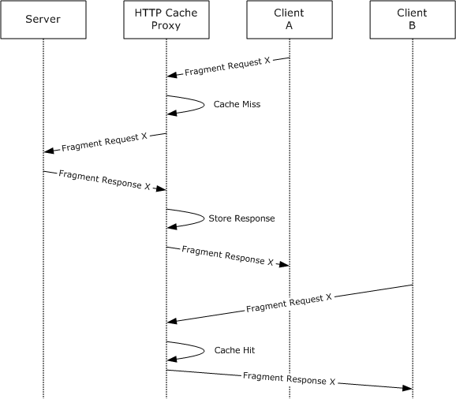
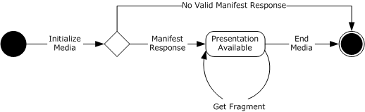
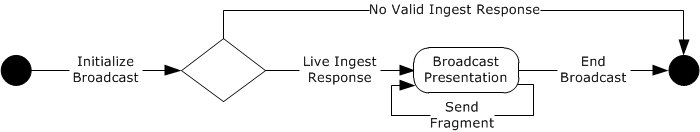

# [MS-SSTR]: Smooth Streaming Protocol

Table of Contents

1 Introduction

- [1 Introduction](#Section_1)
  - [1.1 Glossary](#Section_1.1)
  - [1.2 References](#Section_1.2)
    - [1.2.1 Normative References](#Section_1.2.1)
    - [1.2.2 Informative References](#Section_1.2.2)
  - [1.3 Overview](#Section_1.3)
  - [1.4 Relationship to Other Protocols](#Section_1.4)
  - [1.5 Prerequisites/Preconditions](#Section_1.5)
  - [1.6 Applicability Statement](#Section_1.6)
  - [1.7 Versioning and Capability Negotiation](#Section_1.7)
  - [1.8 Vendor-Extensible Fields](#Section_1.8)
  - [1.9 Standards Assignments](#Section_1.9)

2 Messages

- [2 Messages](#Section_2)
  - [2.1 Transport](#Section_2.1)
  - [2.2 Message Syntax](#Section_2.2)
    - [2.2.1 Manifest Request](#Section_2.2.1)
    - [2.2.2 Manifest Response](#Section_2.2.2)
      - [2.2.2.1 SmoothStreamingMedia](#Section_2.2.2.1)
      - [2.2.2.2 ProtectionElement](#Section_2.2.2.2)
      - [2.2.2.3 StreamElement](#Section_2.2.2.3)
      - [2.2.2.4 UrlPattern](#Section_2.2.2.4)
      - [2.2.2.5 TrackElement](#Section_2.2.2.5)
        - [2.2.2.5.1 CustomAttributesElement](#Section_2.2.2.5.1)
      - [2.2.2.6 StreamFragmentElement](#Section_2.2.2.6)
        - [2.2.2.6.1 TrackFragmentElement](#Section_2.2.2.6.1)
    - [2.2.3 Fragment Request](#Section_2.2.3)
    - [2.2.4 Fragment Response](#Section_2.2.4)
      - [2.2.4.1 MoofBox](#Section_2.2.4.1)
      - [2.2.4.2 MfhdBox](#Section_2.2.4.2)
      - [2.2.4.3 TrafBox](#Section_2.2.4.3)
      - [2.2.4.4 TfxdBox](#Section_2.2.4.4)
      - [2.2.4.5 TfrfBox](#Section_2.2.4.5)
      - [2.2.4.6 TfhdBox](#Section_2.2.4.6)
      - [2.2.4.7 TrunBox](#Section_2.2.4.7)
      - [2.2.4.8 MdatBox](#Section_2.2.4.8)
      - [2.2.4.9 Fragment Response Common Fields](#Section_2.2.4.9)
    - [2.2.5 Sparse Stream Pointer](#Section_2.2.5)
    - [2.2.6 Fragment Not Yet Available](#Section_2.2.6)
    - [2.2.7 Live Ingest](#Section_2.2.7)
      - [2.2.7.1 FileType](#Section_2.2.7.1)
      - [2.2.7.2 StreamManifestBox](#Section_2.2.7.2)
        - [2.2.7.2.1 StreamSMIL](#Section_2.2.7.2.1)
      - [2.2.7.3 LiveServerManifestBox](#Section_2.2.7.3)
        - [2.2.7.3.1 LiveSMIL](#Section_2.2.7.3.1)
      - [2.2.7.4 MoovBox](#Section_2.2.7.4)
      - [2.2.7.5 Fragment](#Section_2.2.7.5)
        - [2.2.7.5.1 Track Fragment Extended Header](#Section_2.2.7.5.1)
    - [2.2.8 Server-to-Server Ingest](#Section_2.2.8)

3 Protocol Details

- [3 Protocol Details](#Section_3)
  - [3.1 Client Details](#Section_3.1)
    - [3.1.1 Abstract Data Model](#Section_3.1.1)
      - [3.1.1.1 Presentation Description](#Section_3.1.1.1)
        - [3.1.1.1.1 Protection System Metadata Description](#Section_3.1.1.1.1)
        - [3.1.1.1.2 Stream Description](#Section_3.1.1.1.2)
          - [3.1.1.1.2.1 Track Description](#Section_3.1.1.1.2.1)
            - [3.1.1.1.2.1.1 Custom Attribute Description](#Section_3.1.1.1.2.1.1)
        - [3.1.1.1.3 Fragment Reference Description](#Section_3.1.1.1.3)
          - [3.1.1.1.3.1 Track-Specific Fragment Reference Description](#Section_3.1.1.1.3.1)
      - [3.1.1.2 Fragment Description](#Section_3.1.1.2)
        - [3.1.1.2.1 Sample Description](#Section_3.1.1.2.1)
    - [3.1.2 Timers](#Section_3.1.2)
    - [3.1.3 Initialization](#Section_3.1.3)
    - [3.1.4 Higher-Layer Triggered Events](#Section_3.1.4)
      - [3.1.4.1 Open Presentation](#Section_3.1.4.1)
      - [3.1.4.2 Get Fragment](#Section_3.1.4.2)
      - [3.1.4.3 Close Presentation](#Section_3.1.4.3)
    - [3.1.5 Processing Events and Sequencing Rules](#Section_3.1.5)
      - [3.1.5.1 Manifest Request and Manifest Response](#Section_3.1.5.1)
      - [3.1.5.2 Fragment Request and Fragment Response](#Section_3.1.5.2)
    - [3.1.6 Timer Events](#Section_3.1.6)
    - [3.1.7 Other Local Events](#Section_3.1.7)
  - [3.2 Server Details](#Section_3.2)
    - [3.2.1 Abstract Data Model](#Section_3.2.1)
    - [3.2.2 Timers](#Section_3.2.2)
    - [3.2.3 Initialization](#Section_3.2.3)
    - [3.2.4 Higher-Layer Triggered Events](#Section_3.2.4)
    - [3.2.5 Processing Events and Sequencing Rules](#Section_3.2.5)
    - [3.2.6 Timer Events](#Section_3.2.6)
    - [3.2.7 Other Local Events](#Section_3.2.7)
  - [3.3 Live Encoder Details](#Section_3.3)
    - [3.3.1 Abstract Data Model](#Section_3.3.1)
    - [3.3.2 Timers](#Section_3.3.2)
    - [3.3.3 Initialization](#Section_3.3.3)
    - [3.3.4 Higher-Layer Triggered Events](#Section_3.3.4)
      - [3.3.4.1 Start Stream](#Section_3.3.4.1)
      - [3.3.4.2 Stop Stream](#Section_3.3.4.2)
    - [3.3.5 Processing Events and Sequencing Rules](#Section_3.3.5)
    - [3.3.6 Timer Events](#Section_3.3.6)
    - [3.3.7 Other Local Events](#Section_3.3.7)

4 Protocol Examples

- [4 Protocol Examples](#Section_4)
  - [4.1 Manifest Response](#Section_4.1)
  - [4.2 Fragment Request](#Section_4.2)
  - [4.3 Live Ingest Request](#Section_4.3)
  - [4.4 Stream Manifest](#Section_4.4)
  - [4.5 Live Server Manifest](#Section_4.5)
  - [4.6 Server Ingest Request](#Section_4.6)

5 Security

- [5 Security](#Section_5)
  - [5.1 Security Considerations for Implementers](#Section_5.1)
  - [5.2 Index of Security Parameters](#Section_5.2)

6 Appendix A: Product Behavior

- [6 Appendix A: Product Behavior](#Section_6)

7 Change Tracking

- [7 Change Tracking](#Section_7)

For the legal notice and IP terms, see [LEGAL.md](../LEGAL.md).
Last updated: 11/19/2024.
See [Revision History](#revision-history) for full version history.

# 1 Introduction

The Smooth Streaming Protocol describes the wire format that is used to deliver (via HTTP) live and on-demand digital [**media**](#gt_media), such as audio and video, in the following manners: from an encoder to a web server, from a server to another server, and from a server to an HTTP client. The use of an MPEG-4 ([[MPEG4-RA]](https://go.microsoft.com/fwlink/?LinkId=327787))-based data structure delivery over HTTP allows seamless switching in near-real-time between different quality levels of compressed media content. The result is a constant playback experience for the HTTP client end user, even if network and video rendering conditions change for the client computer or device.

Sections 1.5, 1.8, 1.9, 2, and 3 of this specification are normative. All other sections and examples in this specification are informative.

## 1.1 Glossary

This document uses the following terms:

**bit rate**: A measure of the average bandwidth that is required to deliver a [**track**](#gt_track), in bits per second (bps).

**composition time**: The time that a sample needs to be presented to the client, as defined in [[ISO/IEC-14496-12]](https://go.microsoft.com/fwlink/?LinkId=183695).

**decoding**: The reversal of the [**encoding**](#gt_encoding) process, used by a client or server to correctly interpret a received object.

**document type definition (DTD)**: A language that can be used to define the rules of an XML document, as specified in [[XML]](https://go.microsoft.com/fwlink/?LinkId=90598) section 2.8.

**DVR window**: The length of time that content is available as DVR content.

**encoding**: A process that specifies a Content-Transfer-Encoding for transforming character data from one form to another.

**fragment**: An independently downloadable unit of [**media**](#gt_media) that comprises one or more [**samples**](#gt_sample).

**HTTP cache proxy**: A proxy that can deliver a stored copy of a response to clients.

**live**: Content that is streamed while it is still being encoded by an encoder.

**manifest**: Metadata about the [**presentation**](#gt_presentation) that allows a client to make requests for [**media**](#gt_media).

**media**: Compressed audio, video, and text data that is used by the client to play a [**presentation**](#gt_presentation).

**media format**: A well-defined format for representing audio or video as a compressed [**sample**](#gt_sample).

**on-demand**: A [**presentation**](#gt_presentation) that is available in its entirety when playback begins.

**packet**: A unit of audio [**media**](#gt_media) that defines natural boundaries for optimizing audio [**decoding**](#gt_decoding).

**parent track**: A [**track**](#gt_track) with which one or more [**sparse tracks**](#gt_sparse-track) is associated, and that is used to transmit timing information for the sparse track. Parent stream fragments always contain the time stamp for the last sparse fragment.

**presentation**: A set of audio and video data [**streams**](#gt_stream) and related metadata that are synchronized for playback on a client.

**request**: An HTTP message sent from the client to the server, as defined in [[RFC2616]](https://go.microsoft.com/fwlink/?LinkId=90372).

**response**: An HTTP message sent from the server to the client, as defined in [RFC2616].

**sample**: The smallest fundamental unit (such as a frame) in which [**media**](#gt_media) is stored and processed.

**sparse stream**: A stream that contains one or more [**sparse tracks**](#gt_sparse-track).

**sparse track**: A [**track**](#gt_track) that is characterized by [**fragments**](#gt_fragment) that occur at irregular time intervals. It can be used to send metadata to clients to support scenarios such as ad signaling. This contrasts with non-sparse streams (for example, audio, video) in which fragments are sent at regular time intervals. A sparse track is always associated with a non-sparse [**parent track**](#gt_parent-track) that is used to transmit timing information for the sparse track. Each sparse fragment includes a reference to any sparse track fragments that are created immediately before it.

**stream**: A set of [**tracks**](#gt_track) interchangeable at the client when playing [**media**](#gt_media).

**track**: A time-ordered collection of samples of a particular type (such as audio or video).

**MAY, SHOULD, MUST, SHOULD NOT, MUST NOT:** These terms (in all caps) are used as defined in [[RFC2119]](https://go.microsoft.com/fwlink/?LinkId=90317). All statements of optional behavior use either MAY, SHOULD, or SHOULD NOT.

## 1.2 References

Links to a document in the Microsoft Open Specifications library point to the correct section in the most recently published version of the referenced document. However, because individual documents in the library are not updated at the same time, the section numbers in the documents may not match. You can confirm the correct section numbering by checking the [Errata](https://go.microsoft.com/fwlink/?linkid=850906).

### 1.2.1 Normative References

We conduct frequent surveys of the normative references to assure their continued availability. If you have any issue with finding a normative reference, please contact [dochelp@microsoft.com](mailto:dochelp@microsoft.com). We will assist you in finding the relevant information.

[IETFDRAFT-HLS] Pantos, R., Ed., and May, W., "HTTP Live Streaming", draft-pantos-http-live-streaming-06, March 2011, [http://tools.ietf.org/html/draft-pantos-http-live-streaming-06](https://go.microsoft.com/fwlink/?LinkId=386439)

[ISO/IEC-14496-12] International Organization for Standardization, "Information technology -- Coding of audio-visual objects -- Part 12: ISO base media file format", ISO/IEC 14496-12:2008, [http://www.iso.org/iso/iso_catalogue/catalogue_tc/catalogue_detail.htm?csnumber=51533](https://go.microsoft.com/fwlink/?LinkId=183695)

[ISO/IEC-14496-3] International Organization for Standardization, "Information technology -- Coding of audio-visual objects -- Part 3: Audio", ISO/IEC 14496-3:2009, [http://www.iso.org/iso/iso_catalogue/catalogue_tc/catalogue_detail.htm?csnumber=53943](https://go.microsoft.com/fwlink/?LinkId=183694)

[MPEG4-RA] The MP4 Registration Authority, "MP4REG", [http://www.mp4ra.org](https://go.microsoft.com/fwlink/?LinkId=327787)

[MS-DTYP] Microsoft Corporation, "[Windows Data Types](../MS-DTYP/MS-DTYP.md)".

[RFC2119] Bradner, S., "Key words for use in RFCs to Indicate Requirement Levels", BCP 14, RFC 2119, March 1997, [https://www.rfc-editor.org/info/rfc2119](https://go.microsoft.com/fwlink/?LinkId=90317)

[RFC2396] Berners-Lee, T., Fielding, R., and Masinter, L., "Uniform Resource Identifiers (URI): Generic Syntax", RFC 2396, August 1998, [https://www.rfc-editor.org/info/rfc2396](https://go.microsoft.com/fwlink/?LinkId=90339)

[RFC2616] Fielding, R., Gettys, J., Mogul, J., et al., "Hypertext Transfer Protocol -- HTTP/1.1", RFC 2616, June 1999, [https://www.rfc-editor.org/info/rfc2616](https://go.microsoft.com/fwlink/?LinkId=90372)

[SMIL2.1] Bulterman, D., Grassel, G., Jansen, J., Koivisto, A., Layaida, N., et al., Eds., "Synchronized Multimedia Integration Language (SMIL 2.1)", W3C Recommendation, December, 2005, [http://www.w3.org/TR/SMIL2/](https://go.microsoft.com/fwlink/?LinkId=325594)

[XML] World Wide Web Consortium, "Extensible Markup Language (XML) 1.0 (Fourth Edition)", W3C Recommendation 16 August 2006, edited in place 29 September 2006, [http://www.w3.org/TR/2006/REC-xml-20060816/](https://go.microsoft.com/fwlink/?LinkId=90598)

### 1.2.2 Informative References

[ISO/IEC-14496-15] International Organization for Standardization, "Information technology -- Coding of audio-visual objects -- Part 15: Advanced Video Coding (AVC) file format", ISO 14496-15, [http://www.iso.org/iso/iso_catalogue/catalogue_tc/catalogue_detail.htm?csnumber=38573](https://go.microsoft.com/fwlink/?LinkId=184538)

[MSDN-VIH] Microsoft Corporation, "VIDEOINFOHEADER structure", [http://msdn.microsoft.com/en-us/library/dd407325(VS.85).aspx](https://go.microsoft.com/fwlink/?LinkId=184568)

[MSDOCS-SSTR-HEVC] Microsoft Corporation, "Smooth Streaming Protocol (MS-SSTR) Amendment for HEVC", [https://learn.microsoft.com/en-us/azure/media-services/previous/media-services-specifications-ms-sstr-amendment-hevc](https://go.microsoft.com/fwlink/?linkid=2132403)

[RFC2326] Schulzrinne, H., Rao, A., and Lanphier, R., "Real Time Streaming Protocol (RTSP)", RFC 2326, April 1998, [https://www.rfc-editor.org/info/rfc2326](https://go.microsoft.com/fwlink/?LinkId=90335)

[RFC3548] Josefsson, S., Ed., "The Base16, Base32, and Base64 Data Encodings", RFC 3548, July 2003, [https://www.rfc-editor.org/info/rfc3548](https://go.microsoft.com/fwlink/?LinkId=90432)

[RFC5234] Crocker, D., Ed., and Overell, P., "Augmented BNF for Syntax Specifications: ABNF", STD 68, RFC 5234, January 2008, [https://www.rfc-editor.org/info/rfc5234](https://go.microsoft.com/fwlink/?LinkId=123096)

[VC-1] Society of Motion Picture and Television Engineers, "VC-1 Compressed Video Bitstream Format and Decoding Process", SMPTE 421M-2006, April 2006, [http://standards.smpte.org/content/978-1-61482-555-5/st-421-2006/SEC1.body.pdf+html?sid=dc1cd243-8c31-45a2-87c6-1695c5bc63e5](https://go.microsoft.com/fwlink/?LinkId=184566)

**Note** There is a charge to download the specification.

[WFEX] Microsoft Corporation, "Multiple channel audio data and WAVE files", March 2007, [https://learn.microsoft.com/en-us/previous-versions/windows/hardware/design/dn653308(v=vs.85)](https://go.microsoft.com/fwlink/?LinkId=184570)

## 1.3 Overview

The Smooth Streaming Transport Protocol provides a means of delivering [**media**](#gt_media) from encoders to servers (in the case of live streaming) and from servers to clients in a way that can be cached by standard HTTP cache proxies in the communication chain. Allowing standard [**HTTP cache proxies**](#gt_8ce4a962-1e75-4698-9f24-bc67a63cc650) to respond to requests on behalf of the server increases the number of clients that can be served by a single server.

The following figure depicts a typical communication pattern for the protocol.

Figure 1: Typical communication sequence for the Smooth Streaming Transport Protocol

The first message in the communication pattern is a Manifest Request, to which the server replies with a Manifest Response. The client then makes one or more Fragment Requests, and the server replies to each with a Fragment Response. Correlation between [**requests**](#gt_request) and [**responses**](#gt_response) is handled by the underlying Hypertext Transport Protocol (HTTP) [[RFC2616]](https://go.microsoft.com/fwlink/?LinkId=90372) layer.

The server role in the protocol is stateless, allowing each request from the client to be potentially handled by a different instance of the server, or by one or more HTTP cache proxies. The following figure depicts the communication pattern for requests for the same [**fragment**](#gt_fragment), indicated as "Fragment Request X", when an HTTP cache proxy is used.

Figure 2: Typical communication pattern of requests for the same fragment

## 1.4 Relationship to Other Protocols

The Smooth Streaming Transport Protocol uses HTTP [[RFC2616]](https://go.microsoft.com/fwlink/?LinkId=90372) as its underlying transport.

The Smooth Streaming Transport Protocol fulfills a similar function to established stateful [**media**](#gt_media) protocols, such as Real Time Streaming Protocol (RTSP) [[RFC2326]](https://go.microsoft.com/fwlink/?LinkId=90335). However, it provides significantly greater scalability in Internet scenarios due to effective use of [**HTTP cache proxies**](#gt_8ce4a962-1e75-4698-9f24-bc67a63cc650).

## 1.5 Prerequisites/Preconditions

This protocol assumes HTTP [[RFC2616]](https://go.microsoft.com/fwlink/?LinkId=90372) connectivity from the client to the server.

It is also assumed that the client is integrated with a higher-layer implementation that supports any [**media formats**](#gt_media-format) that are used and can otherwise play the [**media**](#gt_media) that is transmitted by the server.<1><2>

## 1.6 Applicability Statement

This protocol is most appropriate for delivering [**media**](#gt_media) over the Internet or in environments where [**HTTP cache proxies**](#gt_8ce4a962-1e75-4698-9f24-bc67a63cc650) can be used to maximize scalability. It can be used on any network where HTTP [[RFC2616]](https://go.microsoft.com/fwlink/?LinkId=90372) connectivity to the server is available.

## 1.7 Versioning and Capability Negotiation

This document covers versioning issues in the following areas:

- **Protocol Versions:** The Smooth Streaming Transport Protocol is explicitly versioned through the **MajorVersion** and **MinorVersion** fields that are specified in section [2.2.2.1](#Section_2.2.2.1).
- **Security and Authentication Methods:** Security and authentication for the Smooth Streaming Transport Protocol is performed at the underlying transport layer (HTTP) and does not restrict which of the HTTP supported mechanisms can be used.

## 1.8 Vendor-Extensible Fields

The following fields in this protocol can be extended by vendors:

- **Custom Attributes in the Manifest Response:** This capability is provided by the **VendorExtensionAttributes** field, as specified in section [2.2.2](#Section_4.1). Implementers can ensure that extensions do not conflict by assigning extensions an XML namespace that is unique to their implementation.
- **Custom Data Elements in the Manifest Response:** This capability is provided by the **VendorExtensionDataElement** field, as specified in section [2.2.2.6.1](#Section_2.2.2.6.1). Implementers can ensure that extensions do not conflict by assigning extensions an XML namespace that is unique to their implementation.
- **Custom Boxes in the Fragment Response:** This capability is provided by the **VendorExtensionUUID** field, as specified in section [2.2.4](#Section_2.2.4).
- **Custom Media Formats for Audio:** This capability is provided by the **AudioTag** and **CodecPrivateData** fields, as specified in section [2.2.2.5](#Section_2.2.2.5). Implementers can ensure that extensions do not conflict by assigning extensions a GUID (as specified in [MS-DTYP](../MS-DTYP/MS-DTYP.md) section 2.3.4.1) that is embedded in the **CodecPrivateData** field, as specified in [[WFEX]](https://go.microsoft.com/fwlink/?LinkId=184570).
- **Custom Descriptive Codes for Media Formats:** This capability is provided by the **FourCC** field, as specified in section 2.2.2.5. Implementers can ensure that extensions do not conflict by registering extension codes with the MPEG4-RA, as specified in [ISO/IEC-14496-12].
- **Custom HTTP Headers in the Manifest Response:** This capability is provided by the underlying transport layer (HTTP), as specified in [[RFC2616]](https://go.microsoft.com/fwlink/?LinkId=90372) section 6.
- **Custom HTTP Headers in the Fragment Response:** This capability is provided by the underlying transport layer (HTTP), as specified in [RFC2616] section 6.
- **Custom HTTP Headers in the Fragment Request:** This capability is provided by the underlying transport layer (HTTP), as specified in [RFC2616] section 5.
- **Custom HTTP Headers in the Manifest Request:** This capability is provided by the underlying transport layer (HTTP), as specified in [RFC2616] section 5.

## 1.9 Standards Assignments

None.

# 2 Messages

## 2.1 Transport

The Manifest Request and Fragment Request messages MUST be represented as HTTP request messages, as specified by the Request rule of [[RFC2616]](https://go.microsoft.com/fwlink/?LinkId=90372), subject to the following constraints:

- The method MUST be "GET".
- For the Manifest Request message, the RequestURI MUST adhere to the syntax of the **ManifestRequest** field, specified in section [2.2.1](#Section_2.2.1).
- For the Fragment Request message, the RequestURI MUST adhere to the syntax of the **FragmentRequest** field, specified in section [2.2.3](#Section_2.2.3).
- The HTTP-Version SHOULD be HTTP/1.1.
The Manifest Response and Fragment Response messages MUST be represented as HTTP response messages, as specified by the Response rule of [RFC2616], subject to the following constraints:

- The Status-Code SHOULD be 200.
- For the Manifest Response message, the message body MUST adhere to the syntax of the **ManifestResponse** field, specified in section [2.2.2](#Section_4.1).
- For the Fragment Response message, the message body MUST adhere to the syntax to the **FragmentResponse** field, specified in section [2.2.4](#Section_2.2.4).
- The HTTP-Version SHOULD be HTTP/1.1.
The Live Ingest Request MUST be represented as an HTTP request message, as specified by the Request rule of [RFC2616], subject to the following constraints:

- The Method MUST be "POST".
- The "Transfer-Encoding: Chunked" header SHOULD replace the "Content-Length" header.
- The RequestURI MUST adhere to the syntax of the **LiveIngestRequest** field, specified in section [2.2.7](#Section_2.2.7).
- The HTTP-Version SHOULD be HTTP/1.1.

## 2.2 Message Syntax

The Smooth Streaming Transport Protocol defines five types of messages:

- **Manifest Request** (section [2.2.1](#Section_2.2.1))
- **Manifest Response** (section [2.2.2](#Section_4.1))
- **Fragment Request** (section [2.2.3](#Section_2.2.3))
- **Fragment Response** (section [2.2.4](#Section_2.2.4))
- **Live Ingest Request** (section [2.2.7](#Section_2.2.7))
The following fields are commonly used across the message set. The syntax of each field is specified in Augmented Backus–Naur Form (ABNF) [[RFC5234]](https://go.microsoft.com/fwlink/?LinkId=123096).

**TRUE:** A case-insensitive string value for true, for use in XML attributes.

TRUE = "true"

**FALSE:** A case-insensitive string value for false, for use in XML attributes.

FALSE = "false"

**STRING-UINT64:** An unsigned decimal integer that is less than 2^64, written as a string.

STRING-UINT64 = 1*DIGIT

**STRING-UINT32:** An unsigned decimal integer that is less than 2^32, written as a string.

STRING-UINT32 = 1*DIGIT

**STRING-UINT16:** An unsigned decimal integer that is less than 2^16, written as a string.

STRING-UINT16 = 1*DIGIT

**STRING-UINT8:** An unsigned decimal integer that is less than 2^8, written as a string.

STRING-UINT8 = 1*DIGIT

**S:** Whitespace legal inside an XML document, as defined in [[XML]](https://go.microsoft.com/fwlink/?LinkId=90598).

S = 1*( %x20 / %x09 / %x0D / %x0A )

**Eq:** An equality expression that is used for attributes, as defined in [XML].

Eq = S "=" S

**SQ:** A single-quote character that contains attributes, as defined in [XML].

SQ = %x27

**DQ:** A double-quote character that contains attributes, as defined in [XML].

DQ = %x22

**URL-SAFE-CHAR:** A character that can safely appear in a Uniform Resource Identifier (URI), as specified in [[RFC2396]](https://go.microsoft.com/fwlink/?LinkId=90339).

URL-SAFE-CHAR = <URL-safe character as defined in [RFC2616]>

**URL-ENCODED-CHAR:** A character that is encoded to safely appear in a URI, as specified in [RFC2396].

URL-ENCODED-CHAR = "%" HEXDIG HEXDIG

**HEXCODED-BYTE:** A hexadecimal coding of a byte, with the first character for the four high bits and the second character for the four low bits.

HEXCODED-BYTE = HEXDIG HEXDIG

**XML-CHARDATA:** XML data without elements, as specified by the "CharData" field in [XML].

XML-CHARDATA = <XML character data as defined by CharData in [XML]>

**IDENTIFIER:** An identifier that is safe for use in data fields.

IDENTIFIER = *URL-SAFE-CHAR

**IDENTIFIER-NONNUMERIC:** A nonnumeric identifier that is safe for use in data fields.

IDENTIFIER = ALPHA / UNDERSCORE *URL-SAFE-CHAR

UNDERSCORE = "_"

**URISAFE-IDENTIFIER:** An identifier that is safe for use in data fields that are part of a URI [RFC2396].

IDENTIFIER = *(URL-SAFE-CHAR / URL-ENCODED-CHAR)

**URISAFE-IDENTIFIER-NONNUMERIC:** A nonnumeric identifier that is safe for use in data fields that are part of a URI [RFC2396].

IDENTIFIER = ALPHA / UNDERSCORE *(URL-SAFE-CHAR / URL-ENCODED-CHAR)

UNDERSCORE = "_"

### 2.2.1 Manifest Request

The **ManifestRequest** field and related fields contain data that is required to request a [**manifest**](#gt_manifest) from the server.

**ManifestRequest (variable):** The URI [[RFC2396]](https://go.microsoft.com/fwlink/?LinkId=90339) of the manifest resource.

**FileExtension (variable):** The extension of the manifest file. It MUST be set to "isml" for live streaming.

**HLSExtension (variable):** An optional field to specify HTTP Live Streaming ([[IETFDRAFT-HLS]](https://go.microsoft.com/fwlink/?LinkId=386439) section 6.2.2). It MUST be used for playback on iOS devices.

The syntax of the fields that are defined in this section, specified in ABNF [[RFC5234]](https://go.microsoft.com/fwlink/?LinkId=123096), is as follows.

VirtualPath = URISAFE-IDENTIFIER

PublishingPointName = URISAFE-IDENTIFIER

PresentationURI = [ "/" VirtualPath ] "/" PublishingPointName "." FileExtension

ManifestRequest = PresentationURI "/" "Manifest"

HLSExtension = "(format=m3u8-aapl)"

VendorExtensionFileExtension = ALPHA *( ALPHA / DIGIT )

FileExtension = "ism" / "isml" [HLSExtension / VendorExtensionFileExtension]

### 2.2.2 Manifest Response

The **ManifestResponse** field and related fields contain metadata that is required by the client to construct subsequent **FragmentRequest** messages and play back the received data.

**ManifestResponse (variable):** Metadata that is required by the client to play back the [**presentation**](#gt_presentation). This field MUST be a well-formed XML document [[XML]](https://go.microsoft.com/fwlink/?LinkId=90598) that is subject to the following constraints:

- The document's root element is a **SmoothStreamingMedia** field.
- The document's XML declaration's major version is 1.
- The document's XML declaration's minor version is 0.
- The document does not use a [**document type definition (DTD)**](#gt_document-type-definition-dtd).
- The document uses encoding that is supported by the client implementation.
- The XML elements that are specified in this document do not use XML namespaces.
**Prolog (variable):** The **Prolog** field, as specified in [XML].

**Misc (variable):** The **Misc** field, as specified in [XML].

**SmoothStreamingMedia (variable):** The SmoothStreamingMedia field, as specified in section [2.2.2.1](#Section_2.2.2.1).

**HTTPLiveStreamingMedia (variable):** The HTTPLiveStreamingMedia field, as specified in [[IETFDRAFT-HLS]](https://go.microsoft.com/fwlink/?LinkId=386439) section 6.2.2.

The syntax of the fields that are defined in this section, specified in ABNF [[RFC5234]](https://go.microsoft.com/fwlink/?LinkId=123096), is as follows.

ManifestResponse = prolog [SmoothStreamingMedia / HTTPLiveStreamingMedia] Misc

#### 2.2.2.1 SmoothStreamingMedia

The **SmoothStreamingMedia** field and related fields encapsulate metadata that is required to play the [**presentation**](#gt_presentation).

**SmoothStreamingMedia (variable):** An XML element that encapsulates all metadata that is required by the client to play back the presentation.

**SmoothStreamingMediaAttributes (variable):** The collection of XML attributes for the **SmoothStreamingMedia** element. Attributes can appear in any order. However, the following fields are required and MUST be present in **SmoothStreamingMediaAttributes**: **MajorVersionAttribute**, **MinorVersionAttribute**, and **DurationAttribute**.

**MajorVersion (variable):** The major version of the Manifest Response message. MUST be set to 2.

**MinorVersion (variable):** The minor version of the Manifest Response message. MUST be set to 0 or 2.

**TimeScale (variable):** The timescale of the Duration attribute, specified as the number of increments in 1 second. The default value is 10000000.

**Duration (variable):** The duration of the presentation, specified as the number of time increments indicated by the value of the **TimeScale** field.

**IsLive (variable):** Specifies the presentation type. If this field contains a TRUE value, it specifies that the presentation is a [**live**](#gt_live) presentation. Otherwise, the presentation is an [**on-demand**](#gt_on-demand) presentation.

**LookaheadCount (variable):** Specifies the size of the server buffer, as an integer number of fragments. This field MUST be omitted for on-demand presentations.

**DVRWindowLength (variable):** The length of the [**DVR window**](#gt_dvr-window), specified as the number of time increments indicated by the value of the **TimeScale** field. If this field is omitted for a live presentation or set to 0, the DVR window is effectively infinite. This field MUST be omitted for on-demand presentations.

The syntax of the fields that are defined in this section, specified in ABNF [[RFC5234]](https://go.microsoft.com/fwlink/?LinkId=123096), is as follows.

SmoothStreamingMedia = "<" SmoothStreamingMediaElementName S

SmoothStreamingMediaAttributes S ">"

S SmoothStreamingMediaContent *1S

"</" SmoothStreamingMediaElementName ">"

SmoothStreamingMediaElementName = "SmoothStreamingMedia"

SmoothStreamingMediaAttributes = *(

MajorVersionAttribute

/ MinorVersionAttribute

/ TimeScaleAttribute

/ DurationAttribute

/ IsLiveAttribute

/ LookaheadCountAttribute

/ DVRWindowLengthAttribute

/ VendorExtensionAttribute

)

MajorVersionAttribute = S MajorVersionAttributeName S Eq S

(DQ MajorVersion DQ) / (SQ MajorVersion SQ) *1S

MajorVersionAttributeName = "MajorVersion"

MajorVersion = "2"

MinorVersionAttribute = S MinorVersionAttributeName S Eq S

(DQ MinorVersion DQ) / (SQ MinorVersion SQ) *1S

MinorVersionAttributeName = "MinorVersion"

MinorVersion = "0" / "2"

TimeScaleAttribute = S TimeScaleAttributeName S Eq S

(DQ TimeScale DQ) / (SQ TimeScale SQ) *1S

TimeScaleAttributeName = "TimeScale"

TimeScale = STRING-UINT64

DurationAttribute = S DurationAttributeName S Eq S

(DQ Duration DQ) / (SQ Duration SQ) *1S

DurationAttributeName = "Duration"

Duration = STRING-UINT64

IsLiveAttribute = S IsLiveAttributeName S Eq S

(DQ IsLive DQ) / (SQ IsLive SQ) *1S

IsLiveAttributeName = "IsLive"

IsLive = TRUE / FALSE

LookaheadCountAttribute = S LookaheadCountAttributeName S Eq S

(DQ LookaheadCount DQ) / (SQ LookaheadCount SQ) *1S

LookaheadCountAttributeName = "LookaheadCount"

LookaheadCount = STRING-UINT32

DVRWindowLengthAttribute = S DVRWindowLengthAttributeName S Eq S

(DQ DVRWindowLength DQ) / (SQ DVRWindowLength SQ) *1S

DVRWindowLengthAttributeName = "DVRWindowLength"

DVRWindowLength= STRING-UINT64

SmoothStreamingMediaContent = [ ProtectionElement *1S] 1*StreamElement

#### 2.2.2.2 ProtectionElement

The **ProtectionElement** field and related fields encapsulate metadata that is required to play back protected content.

**ProtectionElement (variable):** An XML element that encapsulates metadata that is required by the client to play back protected content.

**ProtectionHeaderElement (variable):** An XML element that encapsulates content-protection metadata for a specific content-protection system.

**SystemID (variable):** A UUID that uniquely identifies the Content Protection System to which this **ProtectionElement** field pertains.

**ProtectionHeaderContent (variable):** Opaque data that the Content Protection System that is identified in the **SystemID** field can use to enable playback for authorized users, [**encoded**](#gt_encoding) using base64 encoding [[RFC3548]](https://go.microsoft.com/fwlink/?LinkId=90432).

The syntax of the fields that are defined in this section, specified in ABNF [[RFC5234]](https://go.microsoft.com/fwlink/?LinkId=123096), is as follows.

ProtectionElement = "<" ProtectionElementName S ">"

S 1*( ProtectionHeaderElement *1S)

"</" ProtectionElementName ">"

ProtectionElementName = "Protection"

ProtectionHeaderElement = "<" ProtectionHeaderElementName S

ProtectionHeaderAttributes S ">"

S ProtectionHeaderContent *1S

"</" ProtectionHeaderElementName ">"

ProtectionHeaderAttributes = SystemIDAttribute

SystemIDAttribute = S SystemIDAttributeName S Eq S

(DQ SystemID DQ) / (SQ SystemID SQ) *1S

SystemIDAttributeName = "SystemID"

SystemID = "{"

4*4 HEXCODED-BYTE "-"

2*2 HEXCODED-BYTE "-"

2*2 HEXCODED-BYTE "-"

2*2 HEXCODED-BYTE "-"

6*6 HEXCODED-BYTE "-"

"}"

ProtectionHeaderContent = STRING-BASE64

#### 2.2.2.3 StreamElement

The **StreamElement** field and related fields encapsulate metadata that is required to play a specific [**stream**](#gt_stream) in the presentation.

**StreamElement (variable):** An XML element that encapsulates all metadata that is required by the client to play back a stream.

**StreamAttributes (variable):** The collection of XML attributes for the **SmoothStreamingMedia** element. Attributes can appear in any order. However, the following field is required and MUST be present in **StreamAttributes**: **TypeAttribute**. The following additional fields are required and MUST be present in **StreamAttributes** unless an Embedded Track is used in the **StreamContent** field: **NumberOfFragmentsAttribute**, **NumberOfTracksAttribute**, and **UrlAttribute**.

**StreamContent (variable):** Metadata describing available [**tracks**](#gt_track) and [**fragments**](#gt_fragment).

**Type (variable):** The type of the stream: video, audio, or text. If the specified type is text, the following field is required and MUST appear in **StreamAttributes**: **SubtypeAttribute**. Unless the specified type is video, the following fields MUST NOT appear in **StreamAttributes**: **StreamMaxWidthAttribute**, **StreamMaxHeightAttribute**, **DisplayWidthAttribute**, and **DisplayHeightAttribute**.

**StreamTimeScale (variable):** The timescale for duration and time values in this stream, specified as the number of increments in 1 second.

**Name (variable):** The name of the stream.

**NumberOfFragments (variable):** The number of fragments that are available for this stream.

**NumberOfTracks (variable):** The number of tracks that are available for this stream.

**Subtype (variable):** A four-character code that identifies the intended use category for each [**sample**](#gt_sample) in a text track. However, the **FourCC** field, specified in section [2.2.2.5](#Section_2.2.2.5), is used to identify the [**media format**](#gt_media-format) for each sample. The following range of values is reserved, with the following semantic meanings:

- "SCMD": Triggers for actions by the higher-layer implementation on the client.
- "CHAP": Chapter markers.
- "SUBT": Subtitles that are used for foreign-language audio.
- "CAPT": Closed captions for people who are deaf.
- "DESC": Media descriptions for people who are deaf.
- "CTRL": Events that control the application business logic.
- "DATA": Application data that does not fall into any of the previous categories.
**Url (variable):** A pattern that is used by the client to generate Fragment Request messages.

**SubtypeControlEvents (variable):** Control events for applications on the client.

**StreamMaxWidth (variable):** The maximum width of a video sample, in pixels.

**StreamMaxHeight (variable):** The maximum height of a video sample, in pixels.

**DisplayWidth (variable):** The suggested display width of a video sample, in pixels.

**DisplayHeight (variable):** The suggested display height of a video sample, in pixels.

**ParentStream (variable):** Specifies the [**non-sparse stream**](#gt_sparse-stream) that is used to transmit timing information for this stream. If the **ParentStream** field is present, it indicates that the stream that is described by the containing **StreamElement** field is a sparse stream. If present, the value of this field MUST match the value of the **Name** field for a non-sparse stream in the presentation.

**ManifestOutput (variable):** Specifies whether sample data for this stream appears directly in the [**manifest**](#gt_manifest) as part of the **ManifestOutputSample** field, specified in section [2.2.2.6.1](#Section_2.2.2.6.1), if this field contains a TRUE value. Otherwise, the **ManifestOutputSample** field for fragments that are part of this stream MUST be omitted.

The syntax of the fields that are defined in this section, specified in ABNF [[RFC5234]](https://go.microsoft.com/fwlink/?LinkId=123096), is as follows.

StreamElement = "<" StreamElementName S

StreamAttributes S ">"

S StreamContent *1S

"</" StreamElementName ">"

Name = "StreamIndex"

StreamAttributes = *(

TypeAttribute

/ SubtypeAttribute

/ StreamTimeScaleAttribute

/ NameAttribute

/ NumberOfFragmentsAttribute

/ NumberOfTracksAttribute

/ UrlAttribute

/ StreamMaxWidthAttribute

/ StreamMaxHeightAttribute

/ DisplayWidthAttribute

/ DisplayHeightAttribute

/ ParentStreamAttribute

/ ManifestOutputAttribute

/ VendorExtensionAttribute

)

TypeAttribute = S TypeAttributeName S Eq S

(DQ Type DQ) / (SQ Type SQ) *1S

TypeAttributeName = "Type"

Type = "video" / "audio" / "text"

SubtypeAttribute = S SubtypeAttributeName S Eq S

(DQ Subtype DQ) / (SQ Subtype SQ) *1S

SubtypeAttributeName = "Subtype"

Subtype = 4*4 ALPHA

StreamTimeScaleAttribute = S StreamTimeScaleAttributeName S Eq S

(DQ StreamTimeScale DQ) / (SQ StreamTimeScale SQ) *1S

StreamTimeScaleAttributeName = "TimeScale"

StreamTimeScale = STRING-UINT64

NameAttribute = S NameAttributeName S Eq S

(DQ Name DQ) / (SQ Name SQ) *1S

NameAttributeName = "Name"

Name = ALPHA *( ALPHA / DIGIT / UNDERSCORE / DASH )

NumberOfFragmentsAttribute = S NumberOfFragmentsAttributeName S Eq S

(DQ NumberOfFragments DQ) / (SQ NumberOfFragments SQ)

*1S

NumberOfFragmentsAttributeName = "Chunks"

NumberOfFragments = STRING-UINT32

NumberOfTracksAttribute = S NumberOfTracksAttributeName S Eq S

(DQ NumberOfTracks DQ) / (SQ NumberOfTracks SQ) *1S

NumberOfTracksAttributeName = "QualityLevels"

NumberOfTracks = STRING-UINT32

UrlAttribute = S UrlAttributeName S Eq S

(DQ Url DQ) / (SQ Url SQ) *1S

UrlAttributeName = "Url"

Url = UrlPattern

StreamMaxWidthAttribute = S StreamMaxWidthAttributeName S Eq S

(DQ StreamMaxWidth DQ) / (SQ StreamMaxWidth SQ) *1S

StreamMaxWidthAttributeName = "MaxWidth"

StreamMaxWidth = STRING-UINT32

StreamMaxHeightAttribute = S StreamMaxHeightAttributeName S Eq S

(DQ StreamMaxHeight DQ) / (SQ StreamMaxHeight SQ) *1S

StreamMaxHeightAttributeName = "MaxHeight"

StreamMaxHeight = STRING-UINT32

DisplayWidthAttribute = S DisplayWidthAttributeName S Eq S

(DQ DisplayWidth DQ) / (SQ DisplayWidth SQ) *1S

DisplayWidthAttributeName = "DisplayWidth"

DisplayWidth = STRING-UINT32

DisplayHeightAttribute = S DisplayHeightAttributeName S Eq S

(DQ DisplayHeight DQ) / (SQ DisplayHeight SQ) *1S

DisplayHeightAttributeName = "DisplayHeight"

DisplayHeight = STRING-UINT32

ParentStreamAttribute = S ParentStreamAttributeName S Eq S

(DQ ParentStream DQ) / (SQ ParentStream SQ) *1S

ParentStreamAttributeName = "ParentStreamIndex"

ParentStream = ALPHA *( ALPHA / DIGIT / UNDERSCORE / DASH )

ManifestOutputAttribute = S ManifestOutputAttributeName S Eq S

(DQ ManifestOutput DQ) / (SQ ManifestOutput SQ) *1S

ManifestOutputAttributeName = "ManifestOutput"

ManifestOutput = TRUE / FALSE

StreamContent = 1*(TrackElement *1S) *(StreamFragment *1S)

#### 2.2.2.4 UrlPattern

The **UrlPattern** field and related fields define a pattern that can be used by the client to make semantically valid Fragment Requests for the presentation.

**UrlPattern (variable):** This field Encapsulates a pattern for constructing Fragment Requests.

**BitrateSubstitution (variable):** A placeholder expression for the [**bit rate**](#gt_bit-rate) of a [**track**](#gt_track).

**CustomAttributesSubstitution (variable):** A placeholder expression for the attributes that are used to disambiguate a track from other tracks in the stream.

**TrackName (variable):** A unique identifier that applies to all tracks in a stream.

**StartTimeSubstitution (variable):** A placeholder expression for the time of a [**fragment**](#gt_fragment).

The syntax of the fields that are defined in this section, specified in ABNF [[RFC5234]](https://go.microsoft.com/fwlink/?LinkId=123096), is as follows.

UrlPattern = QualityLevelsPattern "/" FragmentsPattern

QualityLevelsPattern = QualityLevelsNoun "(" QualityLevelsPredicatePattern ")"

QualityLevelsNoun = "QualityLevels"

QualityLevelsPredicate = BitrateSubstitution ["," CustomAttributesSubstitution ]

Bitrate = "{bitrate}" / "{Bitrate}"

CustomAttributesSubstitution = "{CustomAttributes}"

FragmentsPattern = FragmentsNoun "(" FragmentsPatternPredicate ")";

FragmentsNoun = "Fragments"

FragmentsPatternPredicate = TrackName "=" StartTimeSubstitution;

TrackName = URISAFE-IDENTIFIER-NONNUMERIC

StartTimeSubstitution = "{start time}" / "{start_time}"

#### 2.2.2.5 TrackElement

The **TrackElement** field and related fields encapsulate metadata that is required to play a specific [**track**](#gt_track) in the stream.

**TrackElement (variable):** An XML element that encapsulates all metadata that is required by the client to play a track.

**TrackAttributes (variable):** The collection of XML attributes for **TrackElement**. Attributes can appear in any order. However, the following fields are required and MUST be present in **TrackAttributes**: **IndexAttribute** and **BitrateAttribute**. If the track is contained in a stream whose Type is video, the following additional fields are also required and MUST be present in **TrackAttributes**: **MaxWidthAttribute**, **MaxHeightAttribute**, and **CodecPrivateDataAttribute**. If the track is contained in a stream whose Type is audio, the following additional fields are also required and MUST be present in **TrackAttributes**: **MaxWidthAttribute**, **MaxHeightAttribute**, **CodecPrivateDataAttribute**, **SamplingRateAttribute**, **ChannelsAttribute**, **BitsPerSampleAttribute**, **PacketSizeAttribute**, **AudioTagAttribute**, and **FourCCAttribute**.

**Index (variable):** An ordinal that identifies the track and MUST be unique for each track in the stream. Index SHOULD start at 0 and increment by 1 for each subsequent track in the stream.

**Bitrate (variable):** The average bandwidth that is consumed by the track, in bits per second (bps). The value 0 MAY be used for tracks whose [**bit rate**](#gt_bit-rate) is negligible relative to other tracks in the presentation.

**MaxWidth (variable):** The maximum width of a video sample, in pixels.

**MaxHeight (variable):** The maximum height of a video sample, in pixels.

**SamplingRate (variable):** The Sampling Rate of an audio track, as defined in [[ISO/IEC-14496-12]](https://go.microsoft.com/fwlink/?LinkId=183695).

**Channels (variable):** The Channel Count of an audio track, as defined in [ISO/IEC-14496-12].

**AudioTag (variable):** A numeric code that identifies which [**media format**](#gt_media-format) and variant of the media format is used for each sample in an audio track. The following range of values is reserved with the following semantic meanings:

- "1": The sample media format is Linear 8 or 16-bit pulse code modulation.
- "353": Microsoft Windows Media Audio v7, v8 and v9.*x* Standard (WMA Standard)
- "353": Microsoft Windows Media Audio v9.*x* and v10 Professional (WMA Professional).
- "85": International Organization for Standardization (ISO) MPEG-1 Layer III (MP3).
- "255": ISO Advanced Audio Coding (AAC).
- "65534": Vendor-extensible format. If specified, the **CodecPrivateData** field SHOULD contain a hexadecimal-encoded version of the WAVE_FORMAT_EXTENSIBLE structure [[WFEX]](https://go.microsoft.com/fwlink/?LinkId=184570).
**BitsPerSample (variable):** The sample size of an audio track, as defined in [ISO/IEC-14496-12].

**PacketSize (variable):** The size of each audio [**packet**](#gt_packet), in bytes.

**FourCC (variable):** A four-character code that identifies which media format is used for each sample. The following range of values is reserved with the following semantic meanings:

- "H264": Video [**samples**](#gt_sample) for this track use Advanced Video Coding, as described in [[ISO/IEC-14496-15]](https://go.microsoft.com/fwlink/?LinkId=184538).
- "WVC1": Video samples for this track use VC-1, as described in [[VC-1]](https://go.microsoft.com/fwlink/?LinkId=184566).
- "AACL": Audio samples for this track use AAC (Low Complexity), as specified in [[ISO/IEC-14496-3]](https://go.microsoft.com/fwlink/?LinkId=183694).
- "WMAP": Audio samples for this track use WMA Professional.
- A vendor extension value containing a registered with MPEG4-RA, as specified in [ISO/IEC-14496-12].
**CodecPrivateData (variable):** Data that specifies parameters that are specific to the media format and common to all samples in the track, represented as a string of hexadecimal-coded bytes. The format and semantic meaning of byte sequence varies with the value of the **FourCC** field as follows:

- The **FourCC** field equals "H264": The **CodecPrivateData** field contains a hexadecimal-coded string representation of the following byte sequence, specified in ABNF [[RFC5234]](https://go.microsoft.com/fwlink/?LinkId=123096):
%x00 %x00 %x00 %x01 SPSField %x00 %x00 %x00 %x01 PPSField

- SPSField contains the Sequence Parameter Set (SPS).
- PPSField contains the Picture Parameter Set (PPS).
- The **FourCC** field equals "WVC1": The **CodecPrivateData** field contains a hexadecimal-coded string representation of the VIDEOINFOHEADER structure, specified in [[MSDN-VIH]](https://go.microsoft.com/fwlink/?LinkId=184568).
- The **FourCC** field equals "AACL": The **CodecPrivateData** field SHOULD be empty.
- The **FourCC** field equals "WMAP": The **CodecPrivateData** field contains the WAVEFORMATEX structure, specified in [WFEX], if the **AudioTag** field equals "65534". Otherwise, it SHOULD be empty.
- The **FourCC** field is a vendor extension value: The format of the **CodecPrivateData** field is also vendor-extensible. Registration of the **FourCC** field value with MPEG4-RA, as specified in [ISO/IEC-14496-12], can be used to avoid collision between extensions.
**NALUnitLengthField (variable):** The number of bytes that specifies the length of each Network Abstraction Layer (NAL) unit. This field SHOULD be omitted unless the value of the **FourCC** field is "H264". The default value is 4.

The syntax of the fields that are defined in this section, specified in ABNF [RFC5234], is as follows.

Track = TrackWithoutContent / TrackWithContent

TrackWithoutContent = "<" TrackElementName S TrackAttributes S "/>"

TrackWithContent = "<" TrackElementName S TrackAttributes S ">"

S TrackContent S "</" TrackElementName ">"

TrackElementName = "QualityLevel"

TrackAttributes = *(

IndexAttribute

/ BitrateAttribute

/ CodecPrivateDataAttribute

/ MaxWidthAttribute

/ MaxHeightAttribute

/ SamplingRateAttribute

/ ChannelsAttribute

/ BitsPerSampleAttribute

/ PacketSizeAttribute

/ AudioTagAttribute

/ FourCCAttribute

/ NALUnitLengthFieldAttribute

/ VendorExtensionAttribute

)

IndexAttribute = S IndexAttributeName S Eq S

(DQ Index DQ) / (SQ Index SQ) S

IndexAttributeName = "Index"

Index = STRING-UINT32

BitrateAttribute = S BitrateAttributeName S Eq S

(DQ Bitrate DQ) / (SQ Bitrate SQ) S

BitrateAttributeName = "Bitrate"

Index = STRING-UINT32

MaxWidthAttribute = S MaxWidthAttributeName S Eq S

(DQ MaxWidth DQ) / (SQ MaxWidth SQ) S

MaxWidthAttributeName = "MaxWidth"

MaxWidth = STRING-UINT32

MaxHeightAttribute = S MaxHeightAttributeName S Eq S

(DQ MaxHeight DQ) / (SQ MaxHeight SQ) S

MaxHeightAttributeName = "MaxHeight"

MaxHeight = STRING-UINT32

CodecPrivateDataAttribute = S CodecPrivateDataAttributeName S Eq S

(DQ CodecPrivateData DQ) / (SQ CodecPrivateData SQ) S

CodecPrivateDatatAttributeName = "CodecPrivateData"

CodecPrivateData = *HEXCODED-BYTE

SamplingRateAttribute = S SamplingRateAttributeName S Eq S

(DQ SamplingRate DQ) / (SQ SamplingRate SQ) S

SamplingRateAttributeName = "SamplingRate"

SamplingRate = STRING-UINT32

ChannelsAttribute = S ChannelsAttributeName S Eq S

(DQ Channels DQ) / (SQ Channels SQ) S

ChannelsAttributeName = "Channels"

Channels = STRING-UINT16

BitsPerSampleAttribute = S BitsPerSampleAttributeName S Eq S

(DQ BitsPerSample DQ) / (SQ BitsPerSample SQ) S

BitsPerSampleAttributeName = "BitsPerSample"

BitsPerSample = STRING-UINT16

PacketSizeAttribute = S PacketSizeAttributeName S Eq S

(DQ PacketSize DQ) / (SQ PacketSize SQ) S

PacketSizeAttributeName = "PacketSize"

PacketSize = STRING-UINT32

AudioTagAttribute = S AudioTagAttributeName S Eq S

(DQ AudioTag DQ) / (SQ AudioTag SQ) S

PacketSizeAttributeName = "AudioTag"

AudioTag = STRING-UINT32

FourCCAttribute = S FourCCAttributeName S Eq S

(DQ FourCC DQ) / (SQ FourCC SQ) S

FourCCAttributeName = "AudioTag"

FourCC = 4*4 ALPHA

NALUnitLengthFieldAttribute = S NALUnitLengthFieldAttributeName S Eq S

(DQ NALUnitLengthField DQ)

/ (SQ NALUnitLengthField SQ) S

NALUnitLengthFieldAttributeName = "NALUnitLengthField"

NALUnitLengthField = STRING-UINT16

TrackContent = *1CustomAttributes

##### 2.2.2.5.1 CustomAttributesElement

The **CustomAttributesElement** field and related fields are used to specify metadata that disambiguates tracks in a stream.

**CustomAttributes (variable):** Metadata that is expressed as key/value pairs that disambiguate tracks.

**CustomAttributeName (variable):** The name of a custom attribute for a [**track**](#gt_track).

**CustomAttributeValue (variable):** The value of a custom attribute for a track.

The syntax of the fields that are defined in this section, specified in ABNF [[RFC5234]](https://go.microsoft.com/fwlink/?LinkId=123096), is as follows.

CustomAttributesElement = S "<" CustomAttributesElementName S ">"

S 1*(AttributeElement *1S)

"</" CustomAttributesElementName ">"

AttributeElement = "<" AttributeElementName S AttributeAttributes S "/>"

AttributeAttributes = (AttributeNameAttribute S AttributeValueAttribute)

/ (AttributeValueAttribute S AttributeNameAttribute)

AttributeNameAttribute = S AttributeNameAttributeName S Eq S

(DQ CustomAttributeName DQ) / (SQ CustomAttributeName SQ) *1S

AttributeNameAttributeName = "Name"

CustomAttributeName = IDENTIFIER

AttributeValueAttribute = S AttributeValueAttributeName S Eq S

(DQ CustomAttributeValue DQ) / (SQ CustomAttributeValue SQ) *1S

AttributeValueAttributeName = "Value"

CustomAttributeValue = IDENTIFIER

#### 2.2.2.6 StreamFragmentElement

The **StreamFragmentElement** field and related fields are used to specify metadata for one set of related [**fragments**](#gt_fragment) in a stream. The order of repeated **StreamFragmentElement** fields in a containing **StreamElement** field is significant for the correct function of the Smooth Streaming Transport Protocol. To this end, the following elements make use of the terms "preceding" and "subsequent" **StreamFragmentElement** in reference to the order of these fields.

**StreamFragmentElement (variable):** An XML element that encapsulates metadata for a set of related fragments. Attributes can appear in any order. However, either one or both of the following fields are required and MUST be present in **StreamFragmentAttributes**: **FragmentDuration** and **FragmentTime**. Additionally, a contiguous sequence of fragments MUST be represented using one of the following schemes. A sequence of fragments is termed contiguous if, with the exception of the first fragment, the **StreamFragmentElement's FragmentTime** field of any fragment in the sequence is equal to the sum of the **StreamFragmentElement's FragmentTime** field and the **FragmentDuration** field of the preceding fragment.

- Start-time coding – Each fragment in the sequence has an explicit value for the **StreamFragmentElement's FragmentTime** field and an implicit value for the **StreamFragmentElement's FragmentDuration** field, except the last fragment, for which the value of the **StreamFragmentElement's FragmentDuration** field is explicit.
- Duration coding – Each fragment in the sequence has an explicit value for the **StreamFragmentElement's FragmentDuration** field and an implicit value for the **StreamFragmentElement's FragmentTime** field, except the first fragment, whose start-time is explicit unless the implicit value of zero is desired.
**FragmentNumber (variable):** The ordinal of the **StreamFragmentElement** field in the stream. If **FragmentNumber** is specified, its value MUST monotonically increase with the value of the **FragmentTime** field.

**FragmentDuration (variable):** The duration of the fragment, specified as a number of increments defined by the implicit or explicit value of the containing **StreamElement's StreamTimeScale** field. If the **FragmentDuration** field is omitted, its implicit value MUST be computed by the client by subtracting the value of the preceding **StreamFragmentElement's FragmentTime** field from the value of this **StreamFragmentElement's FragmentTime** field. If no preceding **StreamFragmentElement** exists, the implicit value of the **FragmentDuration** field MUST be computed by the client by subtracting the value of this **StreamFragmentElement FragmentTime** field from the subsequent **StreamFragmentElement's FragmentTime** field.

If no preceding or subsequent **StreamFragmentElement** field exists, the implicit value of the **FragmentDuration** field is the value of the **SmoothStreamingMedia's Duration** field.

**FragmentTime (variable):** The time of the fragment, specified as a number of increments defined by the implicit or explicit value of the containing **StreamElement's StreamTimeScale** field. If the **FragmentTime** field is omitted, its implicit value MUST be computed by the client by adding the value of the preceding **StreamFragmentElement's FragmentTime** field to the value of the preceding **StreamFragmentElement's FragmentDuration** field. If no preceding **StreamFragmentElement** exists, the implicit value of the **FragmentTime** field is 0.

**FragmentRepeat (variable):** The repeat count of the fragment, specified as the number of contiguous fragments with the same duration defined by the **StreamFragmentElement's FragmentTime** field. This value is one-based. (A value of 2 means two fragments in the contiguous series). The **SmoothStreamingMedia's MajorVersion** and **MinorVersion** fields MUST both be set to 2.

The syntax of the fields that are defined in this section, specified in ABNF [[RFC5234]](https://go.microsoft.com/fwlink/?LinkId=123096), is as follows.

StreamFragmentElement = "<" StreamFragmentElementName S

StreamFragmentAttributes S ">"

S StreamFragmentContent *1S

"</" StreamFragmentElementName ">"

StreamFragmentElementName = "c"

StreamFragmentAttributes = *(

FragmentNumberAttribute

/ FragmentDurationAttribute

/ FragmentTimeAttribute

)

FragmentNumberAttribute = S FragmentNumberAttributeName S Eq S

(DQ FragmentNumber DQ) / (SQ FragmentNumber SQ) *1S

FragmentNumberAttributeName = "n"

FragmentNumber = STRING-UINT32

FragmentDurationAttribute = S FragmentDurationAttributeName S Eq S

(DQ FragmentDuration DQ) / (SQ FragmentDuration SQ) *1S

FragmentDurationAttributeName = "d"

FragmentDuration = STRING-UINT64

FragmentTimeAttribute = S FragmentTimeAttributeName S Eq S

(DQ FragmentTime DQ) / (SQ FragmentTime SQ) *1S

FragmentTimeAttributeName = "t"

FragmentTime = STRING-UINT64

FragmentRepeatAttribute = S FragmentRepeatAttributeName S Eq *1S

(DQ FragmentRepeat DQ) / (SQ FragmentRepeat SQ) *1S

FragmentRepeatAttributeName = "r"

FragmentRepeat = STRING-UINT64

StreamFragmentContent = *( TrackFragment S )

TrackFragment = "<" TrackFragmentElementName S

TrackFragmentAttributes S ">"

S 1*(TrackFragmentContent *1S)

"</" TrackFragmentElementName ">"

TrackFragmentAttributes = *(

TrackFragmentIndexAttribute

/ VendorExtensionAttribute

)

TrackFragmentIndexAttribute = S TrackFragmentIndexAttributeName S Eq S

(DQ TrackFragmentIndex DQ)

/ (SQ TrackFragmentIndex SQ) *1S

TrackFragmentIndexAttributeName = "i"

TrackFragmentIndex = STRING-UINT32

TrackFragmentContent = VendorExtensionTrackData

VendorExtensionTrackData = XML-CHARDATA

##### 2.2.2.6.1 TrackFragmentElement

The **TrackFragmentElement** field and related fields are used to specify metadata pertaining to a [**fragment**](#gt_fragment) for a specific track, rather than all versions of a fragment for a stream.

**TrackFragmentElement (variable):** An XML element that encapsulates informative track-specific metadata for a specific fragment. Attributes can appear in any order. However, the following field is required and MUST be present in **TrackFragmentAttributes**: **TrackFragmentIndexAttribute**.

**TrackFragmentIndex (variable):** An ordinal that MUST match the value of the **Index** field for the track to which this **TrackFragment** field pertains.

**ManifestOutputSample (variable):** A string that contains the base64-encoded representation of the raw bytes of the sample data for this fragment. This field MUST be omitted unless the **ManifestOutput** field for the corresponding stream contains a TRUE value.

The syntax of the fields that are defined in this section, specified in ABNF [[RFC5234]](https://go.microsoft.com/fwlink/?LinkId=123096), is as follows.

TrackFragmentElement = "<" TrackFragmentElementName S

TrackFragmentAttributes S ">"

S TrackFragmentContent S

"</" TrackFragmentElementName ">"

TrackFragmentElementName = "f"

TrackFragmentAttributes = *(

TrackFragmentIndexAttribute

/ VendorExtensionAttribute

)

TrackFragmentIndexAttribute = S TrackFragmentIndexAttributeName S Eq S

(DQ TrackFragmentIndex DQ)

/ (SQ TrackFragmentIndex SQ) *1S

TrackFragmentIndexAttributeName = "i"

TrackFragmentIndex = STRING-UINT32

TrackFragmentContent = ManifestOutputSample

ManifestOutputSample = BASE64-STRING

### 2.2.3 Fragment Request

The **FragmentRequest** field and related fields contain data that is required to request a [**fragment**](#gt_fragment) from the server.

**FragmentRequest (variable):** The URI [[RFC2616]](https://go.microsoft.com/fwlink/?LinkId=90372) of the fragment resource.

**BitratePredicate (variable):** The [**bit rate**](#gt_bit-rate) of the requested fragment.

**CustomAttributesPredicate (variable):** An attribute of the requested fragment that is used to disambiguate tracks.

**CustomAttributesKey (variable):** The name of the attribute that is specified in the **CustomAttributesPredicate** field.

**CustomAttributesValue (variable):** The value of the attribute that is specified in the **CustomAttributesPredicate** field.

**FragmentsNoun (variable):** The type of response that is expected by the client.

**StreamName (variable):** The name of the stream that contains the requested fragment.

**Time (variable):** The time of the requested fragment.

**HLSPredicate (variable):** An optional variable to request a fragment that is delivered with the HTTP Live Streaming protocol as specified in [[IETFDRAFT-HLS]](https://go.microsoft.com/fwlink/?LinkId=386439) section 6.2.2.

The syntax of the fields that are defined in this section, specified in ABNF [[RFC5234]](https://go.microsoft.com/fwlink/?LinkId=123096), is as follows.

FragmentRequest = PresentationURI "/" QualityLevelsSegment "/" FragmentsSegment

; PresentationURI is specified in section 2.2.1

QualityLevelsSegment = QualityLevelsNoun "(" QualityLevelsPredicate ")"

QualityLevelsNoun = "QualityLevels"

QualityLevelsPredicate = BitratePredicate *( "," CustomAttributesPredicate )

BitratePredicate = STRING-UINT32

CustomAttributesPredicate = CustomAttributesKey "=" CustomAttributesValue

CustomAttributesKey = URISAFE-IDENTIFIER-NONNUMERIC

CustomAttributesValue = URISAFE-IDENTIFIER

FragmentsSegment = FragmentsNoun "(" FragmentsPredicate ")"

FragmentsNoun = FragmentsNounFullResponse

/ FragmentsNounMetadataOnly

/ FragmentsNounDataOnly

/ FragmentsNounIndependentOnly

FragmentsNounFullResponse = "Fragments"

FragmentsNounMetadataOnly = "FragmentInfo"

FragmentsNounDataOnly = "RawFragments"

FragmentsNounIndependentOnly = "KeyFrames"

FragmentsPredicate = StreamName "=" Time [ HLSPredicate ]

StreamName = URISAFE-IDENTIFIER-NONNUMERIC

Time = STRING-UINT64

HLSPredicate = ", " "format=m3u8-aapl"

### 2.2.4 Fragment Response

The **FragmentResponse** field and/or related fields encapsulate [**media**](#gt_media) and metadata that are specific to the requested fragment.

**FragmentResponse (variable):** The media and/or related metadata for a fragment.

**FragmentFullResponse (variable):** A Fragment Response that contains data and metadata.

**FragmentMetadataResponse (variable):** A Fragment Response that contains only metadata.

**FragmentDataResponse (variable):** A Fragment Response that contains only data.

**FragmentMetadata (variable):** Metadata for the fragment.

**FragmentData (variable):** Media data for the fragment.

The syntax of the fields that are defined in this section, specified in ABNF [[RFC5234]](https://go.microsoft.com/fwlink/?LinkId=123096), is as follows.

FragmentResponse = FragmentFullResponse

/ FragmentMetadataResponse

/ FragmentDataResponse

FragmentFullResponse = FragmentMetadata FragmentData

FragmentMetadataResponse = FragmentMetadata

FragmentDataResponse = SampleData

FragmentMetadata = MoofBox

FragmentData = MdatBox

The **SampleData** field, in the preceding ABNF syntax, is specified in section [2.2.4.8](#Section_2.2.4.8).

#### 2.2.4.1 MoofBox

The **MoofBox** field and related fields encapsulate metadata that is specific to the requested fragment. The syntax of **MoofBox** is a strict subset of the syntax of the Movie Fragment Box that is specified in [[ISO/IEC-14496-12]](https://go.microsoft.com/fwlink/?LinkId=183695).

**MoofBox (variable):** The top-level metadata container for the requested fragment. The following fields are required and MUST be present in **MoofBoxChildren**: **MfhdBox** and **TrafBox**.

**MoofBoxLength (4 bytes):** The length of the **MoofBox** field, in bytes, including the **MoofBoxLength** field. If the value of the **MoofBoxLength** field is %00.00.00.01, the **MoofBoxLongLength** field MUST be present.

**MoofBoxLongLength (8 bytes):** The length of the **MoofBox** field, in bytes, including the **MoofBoxLongLength** field.

The syntax of the fields that are defined in this section, specified in ABNF [[RFC5234]](https://go.microsoft.com/fwlink/?LinkId=123096), is as follows.

MoofBox = MoofBoxLength MoofBoxType [MoofBoxLongLength]

MoofBoxChildren

MoofBoxType = %d109 %d111 %d111 %d102

MoofBoxLength = BoxLength

MoofBoxLongLength = BoxLongLength

MoofBoxChildren = 2*( MfhdBox / TrafBox / VendorExtensionUUIDBox )

#### 2.2.4.2 MfhdBox

The **MfhdBox** field and related fields specify the fragment's position in the sequence for the track. The syntax of the **MfhdBox** field is a strict subset of the syntax of the Movie Fragment Header Box that is defined in [[ISO/IEC-14496-12]](https://go.microsoft.com/fwlink/?LinkId=183695).

**MfhdBox (variable):** The metadata container for the sequence information for the track.

**MfhdBoxLength (4 bytes):** The length of the **MfhdBox** field, in bytes, including the **MfhdBoxLength** field. If the value of the **MfhdBoxLength** field is %00.00.00.01, the **MfhdBoxLongLength** field MUST be present.

**MfhdBoxLongLength (8 bytes):** The length of the **MfhdBox** field, in bytes, including the **MfhdBoxLongLength** field.

**SequenceNumber (4 bytes):** An ordinal for the fragment in the track timeline. The **SequenceNumber** value for a fragment that appears later in the timeline MUST be greater than the value for a fragment that appears earlier in the timeline, but **SequenceNumber** values for consecutive fragments are not required to be consecutive.

The syntax of the fields that are defined in this section, specified in ABNF [[RFC5234]](https://go.microsoft.com/fwlink/?LinkId=123096), is as follows.

MfhdBox = MfhdBoxLength MfhdBoxType [MfhdBoxLongLength] MfhdBoxFields

MfhdBoxChildren

MfhdBoxType = %d109 %d102 %d104 %d100

MfhdBoxLength = BoxLength

MfhdBoxLongLength = LongBoxLength

MfhdBoxFields = SequenceNumber

SequenceNumber = UNSIGNED-INT32

MfhdBoxChildren = *( VendorExtensionUUIDBox )

#### 2.2.4.3 TrafBox

The **TrafBox** field and related fields encapsulate metadata that is specific to the requested fragment and track. The syntax of the **TrafBox** field is a strict subset of the syntax of the Track Fragment Box that is defined in [[ISO/IEC-14496-12]](https://go.microsoft.com/fwlink/?LinkId=183695).

**TrafBox (variable):** The top-level metadata container for track-specific metadata for the fragment. The following fields are required and MUST be present in **TrafBoxChildren**: **TfhdBox** and **TrunBox**.

**TrafBoxLength (4 bytes):** The length of the **TrafBox** field, in bytes, including the **TrafBoxLength** field. If the value of the **TrafBoxLength** field is %00.00.00.01, the **TrafBoxLongLength** field MUST be present.

**TrafBoxLongLength (8 bytes):** The length of the **TrafBox** field, in bytes, including the **TrafBoxLongLength** field.

The syntax of the fields that are defined in this section, specified in ABNF [[RFC5234]](https://go.microsoft.com/fwlink/?LinkId=123096), is as follows.

TrafBox = TrafBoxLength TrafBoxType [TrafBoxLongLength]

TrafBoxChildren

TrafBoxType = %d116 %d114 %d97 %d102

TrafBoxLength = BoxLength

TrafBoxLongLength = LongBoxLength

TrafBoxChildren = 2*( TfhdBox / TrunBox

/ VendorExtensionUUIDBox )

#### 2.2.4.4 TfxdBox

The **TfxdBox** field and related fields encapsulate the absolute timestamp and duration of a fragment in a [**live**](#gt_live) [**presentation**](#gt_presentation). This field SHOULD be ignored if it appears in an [**on-demand**](#gt_on-demand) presentation.

**TfxdBox (variable):** The metadata container for per-sample defaults.

**TfxdBoxLength (4 bytes):** The length of the **TfxdBox** field, in bytes, including the **TfxdBoxLength** field. If the value of the **TfxdBoxLength** field is %00.00.00.01, the **TfxdBoxLongLength** field MUST be present.

**TfxdBoxLongLength (8 bytes):** The length of the **TfxdBox** field, in bytes, including the **TfxdBoxLongLength** field.

**TfxdBoxVersion (1 byte):** The box version. If this field contains the value %x01, the **TfxdBoxDataFields64** field MUST be present inside the **TfxdBoxFields** field. Otherwise, the **TfxdBoxDataFields32** field MUST be present inside the **TfxdBoxFields** field.

**FragmentAbsoluteTime32 (4 bytes):** The absolute timestamp of the first sample of the fragment, in timescale increments for the track.

**FragmentDuration32 (4 bytes):** The total duration of all samples in the fragment, in timescale increments for the track.

**FragmentAbsoluteTime64 (8 bytes):** The absolute timestamp of the first sample of the fragment, in timescale increments for the track.

**FragmentDuration64 (8 bytes):** The total duration of all samples in the fragment, in timescale increments for the track.

The syntax of the fields that are defined in this section, specified in ABNF [[RFC5234]](https://go.microsoft.com/fwlink/?LinkId=123096), is as follows.

TfxdBox = TfxdBoxLength TfxdBoxType [TfxdBoxLongLength] TfxdBoxUUID TfxdBoxFields

TfxdBoxChildren

TfxdBoxType = %d117 %d117 %d105 %d100

TfxdBoxLength = BoxLength

TfxdBoxLongLength = LongBoxLength

TfxdBoxUUID = %x6D %x1D %x9B %x05 %x42 %xD5 %x44 %xE6

%x80 %xE2 %x14 %x1D %xAF %xF7 %x57 %xB2

TfxdBoxFields = TfxdBoxVersion

TfxdBoxFlags

TfxdBoxDataFields32 / TfxdBoxDataFields64

TfxdBoxVersion = %x00-01

TfxdBoxFlags = 24*24RESERVED-BIT

TfxdBoxDataFields32 = FragmentAbsoluteTime32

FragmentDuration32

TfxdBoxDataFields64 = FragmentAbsoluteTime64

FragmentDuration64

FragmentAbsoluteTime32 = UNSIGNED-INT32

FragmentDuration32 = UNSIGNED-INT32

FragmentAbsoluteTime64 = UNSIGNED-INT64

FragmentDuration64 = UNSIGNED-INT64

TfxdBoxChildren = *( VendorExtensionUUIDBox )

#### 2.2.4.5 TfrfBox

The **TfrfBox** field and related fields encapsulate the absolute timestamp and duration for one or more subsequent [**fragments**](#gt_fragment) of the same track in a [**live**](#gt_live) [**presentation**](#gt_presentation). This field SHOULD be ignored if it appears in an [**on-demand**](#gt_on-demand) presentation. For a live presentation, this field MUST be present unless one of the following conditions is true:

- The containing track for this fragment is a [**sparse track**](#gt_sparse-track).
- The number of subsequent fragments in the track is less than the value of the **LookaheadCount** field, specified in section [2.2.2.1](#Section_2.2.2.1), for the presentation.
- The **LookaheadCount** field is set to 0.
**TfrfBox (variable):** The metadata container for per-sample defaults.

**TfrfBoxLength (4 bytes):** The length of the **TfrfBox** field, in bytes, including the **TfrfBoxLength** field. If the value of the **TfrfBoxLength** field is %x00.00.00.01, the **TfrfBoxLongLength** field MUST be present.

**TfrfBoxLongLength (8 bytes):** The length of the **TfrfBox** field, in bytes, including the **TfrfBoxLongLength** field.

**TfrfBoxVersion (1 byte):** The box version. If this field contains the value %x01, the **TfrfBoxDataFields64** field MUST be present inside the **TfrfBoxFields** field. Otherwise, the **TfrfBoxDataFields32** field MUST be present inside the **TfrfBoxFields** field.

**FragmentCount (4 byte):** The number of fragments for which the **TfrfBox** field contains information.

**TfrfBoxDataFields32 (variable):** The absolute timestamps and durations for a set of subsequent fragments, represented as 32-bit values. If the value of the **TfrfBoxVersion** field is %x00, the number of instances of this field MUST be exactly the value of **FragmentCount**.

**TfrfBoxDataFields64 (variable):** The absolute timestamps and durations for a set of subsequent fragments, represented as 64-bit values. If the value of the **TfrfBoxVersion** field is %x00, the number of instances of this field MUST be exactly the value of **FragmentCount**.

**FragmentAbsoluteTime32 (4 bytes):** The absolute timestamp of the first sample of a subsequent fragment, in timescale increments for the track.

**FragmentDuration32 (4 bytes):** The total duration of all samples in a subsequent fragment, in timescale increments for the track.

**FragmentAbsoluteTime64 (8 bytes):** The absolute timestamp of the first sample of a subsequent fragment, in timescale increments for the track.

**FragmentDuration64 (8 bytes):** The total duration of all samples in a subsequent fragment, in timescale increments for the track.

The syntax of the fields that are defined in this section, specified in ABNF [[RFC5234]](https://go.microsoft.com/fwlink/?LinkId=123096), is as follows.

TfrfBox = TfrfBoxLength TfrfBoxType [TfrfBoxLongLength] TfrfBoxUUID TfrfBoxFields

TfrfBoxChildren

TfrfBoxType = %d117 %d117 %d105 %d100

TfrfBoxLength = BoxLength

TfrfBoxLongLength = LongBoxLength

TfrfBoxUUID = %xD4 %x80 %x7E %xF2 %xCA %x39 %x46 %x95

%x8E %x54 %x26 %xCB %x9E %x46 %xA7 %x9F

TfrfBoxFields = TfrfBoxVersion

TfrfBoxFlags

FragmentCount

(1*TfrfBoxDataFields32) / (1*TfrfBoxDataFields64)

TfrfBoxVersion = %x00-01

TfrfBoxFlags = 24*24RESERVED-BIT

FragmentCount = UINT8

TfrfBoxDataFields32 = FragmentAbsoluteTime32

FragmentDuration32

TfrfBoxDataFields64 = FragmentAbsoluteTime64

FragmentDuration64

FragmentAbsoluteTime32 = UNSIGNED-INT32

FragmentDuration32 = UNSIGNED-INT32

FragmentAbsoluteTime64 = UNSIGNED-INT64

FragmentDuration64 = UNSIGNED-INT64

TfrfBoxChildren = *( VendorExtensionUUIDBox )

#### 2.2.4.6 TfhdBox

The **TfhdBox** field and related fields encapsulate defaults for per-sample metadata in the fragment. The syntax of the **TfhdBox** field is a strict subset of the syntax of the Track Fragment Header Box that is defined in [[ISO/IEC-14496-12]](https://go.microsoft.com/fwlink/?LinkId=183695).

**TfhdBox (variable):** The metadata container for per-sample defaults.

**TfhdBoxLength (4 bytes):** The length of the **TfhdBox** field, in bytes, including the **TfhdBoxLength** field. If the value of the **TfhdBoxLength** field is %00.00.00.01, the **TfhdBoxLongLength** field MUST be present.

**TfhdBoxLongLength (8 bytes):** The length of the **TfhdBox** field, in bytes, including the **TfhdBoxLongLength** field.

**BaseDataOffset (8 bytes):** The offset, in bytes, from the beginning of the **MdatBox** field to the sample field in the **MdatBox** field.

**SampleDescriptionIndex (4 bytes):** The ordinal of the sample description for the track that is applicable to this fragment. This field SHOULD be omitted.

**DefaultSampleDuration (4 bytes):** The default duration of each sample, in increments that are defined by the **TimeScale** field for the track.

**DefaultSampleSize (4 bytes):** The default size of each sample, in bytes.

**DefaultSampleFlags (4 bytes):** The default value of the **SampleFlags** field for each sample.

The syntax of the fields that are defined in this section, specified in ABNF [[RFC5234]](https://go.microsoft.com/fwlink/?LinkId=123096), is as follows.

TfhdBox = TfhdBoxLength TfhdBoxType [TfhdBoxLongLength] TfhdBoxFields

TfhdBoxChildren

TfhdBoxType = %d116 %d102 %d104 %d100

TfhdBoxLength = BoxLength

TfhdBoxLongLength = LongBoxLength

TfhdBoxFields = TfhdBoxVersion

TfhdBoxFlags

[ BaseDataOffset ]

[ SampleDescriptionIndex ]

[ DefaultSampleDuration ]

[ DefaultSampleSize ]

[ DefaultSampleFlags ]

TfhdBoxVersion = %x00

TfhdBoxFlags = 18*18RESERVED-BIT

DefaultSampleFlagsPresent

DefaultSampleSizePresent

DefaultSampleDurationPresent

RESERVED-BIT

SampleDescriptionIndexPresent

BaseDataOffsetPresent

BaseDataOffset = UNSIGNED-INT64

SampleDescriptionIndex = UNSIGNED-INT32

DefaultSampleDuration = UNSIGNED-INT32

DefaultSampleSize = UNSIGNED-INT32

DefaultSampleFlags = SampleFlags

TfhdBoxChildren = *( VendorExtensionUUIDBox )

#### 2.2.4.7 TrunBox

The **TrunBox** field and related fields encapsulate per-sample metadata for the requested fragment. The syntax of **TrunBox** is a strict subset of the syntax of the Track Fragment Run Box that is defined in [[ISO/IEC-14496-12]](https://go.microsoft.com/fwlink/?LinkId=183695).

**TrunBox (variable):** The container for per-sample metadata.

**TrunBoxLength (4 bytes):** The length of the **TrunBox** field, in bytes, including the **TrunBoxLength** field. If the value of the **TrunBoxLength** field is %00.00.00.01, the **TrunBoxLongLength** field MUST be present.

**TrunBoxLongLength (8 bytes):** The length of the **TrunBox** field, in bytes, including the **TrunBoxLongLength** field.

**SampleCount (4 bytes):** The number of [**samples**](#gt_sample) in the fragment.

**DataOffset (4 bytes):** This field MUST be set. It specifies the offset from the beginning of the **MoofBox** field (section [2.2.4.1](#Section_2.2.4.1)). If only one **TrunBox** is specified, then the **DataOffset** field MUST be the sum of the lengths of the **MoofBox** and all the fields in the **MdatBox** field (section [2.2.4.8](#Section_2.2.4.8)).

**FirstSampleFlagsPresent (1 bit):** Indicates that the default flags for the first sample are replaced if this field takes the value %b1.

**SampleSizePresent (1 bit):** Indicates that each sample has its own size if this field takes the value %b1. If this field is not present, the default value that is specified by the **DefaultSampleSize** field is used.

**SampleDurationPresent (1 bit):** Indicates that each sample has its own duration if this field takes the value %b1. If this field is not present, the default value that is specified by the **DefaultSampleDuration** field is used.

**SampleFlagsPresent (1 bit):** Indicates that each sample has its own flags if this field takes the value %b1. If this field is not present, the default value that is specified by the **DefaultSampleFlags** field is used.

**SampleCompositionTimeOffsetPresent (1 bit):** Indicates that each sample has a [**composition time**](#gt_composition-time) offset if this field takes the value %b1.

**FirstSampleFlags (4 bytes):** The value of the **SampleFlags** field for the first sample. This field MUST be present if and only if the **FirstSampleFlagsPresent** field takes the value %b1.

**SampleSize (4 bytes):** The size of each sample, in bytes. This field MUST be present if and only if the **SampleSizePresent** field takes the value %b1. If this field is not present, its implicit value is the value of the **DefaultSampleSize** field.

**SampleDuration (4 bytes):** The duration of each sample, in increments that are defined by the **TimeScale** for the track. This field MUST be present if and only if the **SampleDurationPresent** field takes the value %b1. If this field is not present, its implicit value is the value of the **DefaultSampleDuration** field.

**TrunBoxSampleFlags (4 bytes):** The sample flags of each sample. This field MUST be present if and only if the **SampleFlagsPresent** field takes the value %b1. If this field is not present, its implicit value is the value of the **DefaultSampleFlags** field. If the **FirstSampleFlags** field is present and this field is omitted, this field's implicit value for the first sample in the fragment MUST be the value of the **FirstSampleFlags** field.

**DataOffsetPresent (1 bit):** Specifies whether the **DataOffset** field is present. This field MUST be set.

**SampleCompositionTimeOffset (4 bytes):** The Sample Composition Time offset of each sample, as defined in [ISO/IEC-14496-12]. This field MUST be present if and only if the **SampleCompositionTimeOffsetPresent** field takes the value %b1.

The syntax of the fields that are defined in this section, specified in ABNF [[RFC5234]](https://go.microsoft.com/fwlink/?LinkId=123096), is as follows.

TrunBox = TrunBoxLength TrunBoxType [TrunBoxLongLength] TrunBoxFields

TrunBoxChildren

TrunBoxType = %d116 %d114 %d117 %d110

TrunBoxLength = BoxLength

TrunBoxLongLength = LongBoxLength

TrunBoxFields = TrunBoxVersion

TrunBoxFlags

SampleCount

DataOffset

[ FirstSampleFlags ]

*( TrunBoxPerSampleFields )

; TrunBoxPerSampleFields MUST be repeated exactly SampleCount times

TrunBoxFlags = 12*12RESERVED-BIT

SampleCompositionTimeOffsetPresent

SampleFlagsPresent

SampleSizePresent

SampleDurationPresent

RESERVED-BIT

RESERVED-BIT

RESERVED-BIT

RESERVED-BIT

RESERVED-BIT

FirstSampleFlagsPresent

RESERVED-BIT

RESERVED-BIT

DataOffsetPresent

SampleCompositionTimeOffsetPresent = BIT

SampleFlagsPresent = BIT

SampleSizePresent = BIT

SampleDurationPresent = BIT

FirstSampleFlagsPresent = BIT

FirstSampleFlags = SampleFlags

TrunBoxPerSampleFields = [ SampleDuration ]

[ SampleSize ]

[ TrunBoxSampleFlags ]

[ SampleCompositionTimeOffset ]

SampleDuration = UNSIGNED-INT32

SampleSize = UNSIGNED-INT32

TrunBoxSampleFlags = SampleFlags

SampleCompositionTimeOffset = UNSIGNED-INT32

TrunBoxChildren = *( VendorExtensionUUIDBox )

#### 2.2.4.8 MdatBox

The **MdatBox** field and related fields encapsulate [**media**](#gt_media) data for the requested fragment. The syntax of the **MdatBox** field is a strict subset of the syntax of the Media Data Container Box that is defined in [[ISO/IEC-14496-12]](https://go.microsoft.com/fwlink/?LinkId=183695).

**MdatBox (variable):** The media data container.

**MdatBoxLength (4 bytes):** The length of the **MdatBox** field, in bytes, including the **MdatBoxLength** field. If the value of the **MdatBoxLength** field is %00.00.00.01, the **MdatBoxLongLength** field MUST be present.

**MdatBoxLongLength (8 bytes):** The length of the **MdatBox** field, in bytes, including the **MdatBoxLongLength** field.

**SampleData (variable):** A single sample of media. Sample boundaries in the **MdatBox** field are defined by the values of the **DefaultSampleSize** and **SampleSize** fields in the **TrunBox** field.

The syntax of the fields that are defined in this section, specified in ABNF [[RFC5234]](https://go.microsoft.com/fwlink/?LinkId=123096), is as follows.

MdatBox = MdatBoxLength MdatBoxType [MdatBoxLongLength]

MdatBoxFields

MoofBoxType = %d109 %d100 %d97 %d116

MoofBoxLength = BoxLength

MoofBoxLongLength = LongBoxLength

MdatBoxFields = *( SampleData )

SampleData = *BYTE

#### 2.2.4.9 Fragment Response Common Fields

This section defines the common fields that are used in the Fragment Response message for the following fields: **MoofBox**, **MfhdBox**, **TrafBox**, **TfxdBox**, **TfxfBox**, **TfhdBox**, and **TrunBox**.

**SampleFlags (4 bytes):** A comprehensive sample flags field.

**SampleDependsOn (2 bits):** Specifies whether this sample depends on another sample.

**SampleDependsOnUnknown (2 bits):** Unknown whether this sample depends on other [**samples**](#gt_sample).

**SampleDependsOnOthers (2 bits):** This sample depends on other samples.

**SampleDoesNotDependOnOthers (2 bits):** This sample does not depend on other samples.

**SampleIsDependedOn (2 bits):** Specifies whether other samples depend on this sample.

**SampleIsDependedOnUnknown (2 bits):** Unknown whether other samples depend on this sample.

**SampleIsNotDisposable (2 bits):** Other samples depend on this sample.

**SampleIsDisposable (2 bits):** No other samples depend on this sample.

**SampleHasRedundancy (2 bits):** Specifies whether this sample uses redundant coding.

**RedundantCodingUnknown (2 bits):** Unknown whether this sample uses redundant coding.

**RedundantCoding (2 bits):** This sample uses redundant coding.

**NoRedundantCoding (2 bits):** This sample does not use redundant coding.

**SampleIsDifferenceValue (1 bit):** A value of %b1 specifies that the sample is not a random access point in the stream.

**SamplePaddingValue (3 bits):** The sample padding value, as specified in [[ISO/IEC-14496-12]](https://go.microsoft.com/fwlink/?LinkId=183695).

**SampleDegradationPriority (2 bytes):** The sample degradation priority, as specified in [ISO/IEC-14496-12].

**VendorExtensionUUIDBox (Variable):** A user extension box, as specified in [ISO/IEC-14496-12].

The syntax of the fields that are defined in this section, specified in ABNF [[RFC5234]](https://go.microsoft.com/fwlink/?LinkId=123096), is as follows.

SampleFlags = 6*6RESERVED-BIT

SampleDependsOn

SampleIsDependedOn

SampleHasRedundancy

SamplePaddingValue

SampleIsDifferenceValue

SampleDegradationPriority

SampleDependsOn = SampleDependsOnUnknown

/ SampleDependsOnOthers

/ SampleDoesNotDependsOnOthers

SampleDependsOnUnknown = %b0 %b0

SampleDependsOnOthers = %b0 %b1

SampleDoesNotDependOnOthers = %b1 %b0

SampleIsDependedOn = SampleIsDependedOnUnknown

/ SampleIsNotDisposable

/ SampleIsDisposable

SampleIsDependedOnUnknown = %b0 %b0

SampleIsNotDisposable = %b0 %b1

SampleIsDisposable = %b1 %b0

SampleHasRedundancy = RedundantCodingUnknown

/ RedundantCoding

/ NoRedundantCoding

RedundantCodingUnknown = %b0 %b0

RedundantCoding = %b0 %b1

NoRedundantCoding = %b1 %b0

SamplePaddingValue = 3*3BIT

SampleIsDifferenceValue = BIT

SampleDegradationPriority = UNSIGNED-INT16

VendorExtensionUUIDBox = UUIDBoxLength UUIDBoxType [UUIDBoxLongLength] UUIDBoxUUID

UUIDBoxData

UUIDBoxType = %d117 %d117 %d105 %d100

UUIDBoxLength = BoxLength

UUIDBoxLongLength = LongBoxLength

UUIDBoxUUID = UUID

UUIDBoxData = *BYTE

BoxLength = UNSIGNED-INT32

LongBoxLength = UNSIGNED-INT64

UNSIGNED-INT64 = 2UNSIGNED-INT32

UNSIGNED-INT32 = 2UNSIGNED-INT16

UNSIGNED-INT16 = 2BYTE

BYTE = 8BIT

BIT = %b0-1

RESERVED-UNSIGNED-INT64 = 2RESERVED-UNSIGNED-INT32

RESERVED-UNSIGNED-INT32 = 2RESERVED-UNSIGNED-INT16

RESERVED-UNSIGNED-INT16 = 2RESERVED-BYTE

- RESERVED-BYTE = 8RESERVED-BIT
- RESERVED-BIT = %b0-0 ; RESERVED-BIT defined as a bit 0, but not used

### 2.2.5 Sparse Stream Pointer

The **SparseStreamPointer** field and related fields contain data that is required to locate the latest fragment of a [**sparse stream**](#gt_sparse-stream). This message is used in conjunction with a Fragment Response message.

**SparseStreamPointer (variable):** A set of data that indicates the latest fragment for all related sparse streams.

**SparseStreamSet (variable):** The set of latest fragment pointers for all sparse streams that are related to a single requested fragment.

**SparseStreamFragment (variable):** The latest fragment pointer for a single related sparse stream.

**SparseStreamName (variable):** The stream name of the related sparse name. The value of this field MUST match the **Name** field of the **StreamElement** field that describes the stream, specified in section [2.2.2.3](#Section_2.2.2.3), in the Manifest Response.

**SparseStreamTimeStamp (variable):** The timestamp of the latest timestamp for a fragment for the sparse stream that occurs at the same time or earlier than the presentation than the requested fragment.

The syntax of the fields that are defined in this section, specified in ABNF [[RFC5234]](https://go.microsoft.com/fwlink/?LinkId=123096), is as follows.

SparseStreamPointer = *1(HeaderData DELIMETER) "ChildTrack" "="

DQ SparseStreamSet *( DELIMETER SparseStreamSet ) DQ

HeaderData = 1*CHAR

DELIMETER = ";"

SparseStreamSet = SparseStreamFragment *( "," SparseStreamFragment )

SparseStreamFragment = SparseStreamName "=" SparseStreamTimeStamp

SparseStreamTimeStamp = STRING-UINT64

### 2.2.6 Fragment Not Yet Available

The Fragment Not Yet Available message is an HTTP response that has an empty message body field and the HTTP status code 412 Precondition Failed, as specified in [[RFC2616]](https://go.microsoft.com/fwlink/?LinkId=90372).

### 2.2.7 Live Ingest

The **LiveIngest** field and related fields contain data that is required to request the start of a [**live**](#gt_live) broadcast.

**LiveIngestRequest (variable):** The URI [[RFC2396]](https://go.microsoft.com/fwlink/?LinkId=90339) to which the **LiveIngestRequest** field is sent.

**Identifier (variable):** A unique URISAFE-IDENTIFIER that enables the server to differentiate between different [**streams**](#gt_stream). Each identifier can have at most one active connection.

**EventID (variable):** An optional identifier that enables the reuse of URLs without collision due to downstream cache pollution. Publishing streams that have different event names to the same published URL simultaneously is an error. All encoders MUST use the same **EventID** identifier, either blank or a string. The default value is the empty string.

**StreamID (variable):** A unique identifier that is used to collate fragments in the case of encoder failover. It allows separate encoder nodes to POST to separate URLs, but multiple active connection URLs that have the same **StreamID** identifier can be used for redundancy. In that case, the server will filter out duplicated or out-of-order fragments. This identifier is commonly used to distinguish between video quality (for example, "Streams(1080p)", "Streams(720p)", "Streams(480p)").

The syntax of the fields that are defined in this section, specified in ABNF [[RFC5234]](https://go.microsoft.com/fwlink/?LinkId=123096), is as follows.

LiveIngestRequest = Protocol "://" BroadcastURL Identifier

Protocol = "http" / "https"

BroadcastURL = ServerAddress "/" PresentationPath

ServerAddress = URISAFE-IDENTIFIER

PresentationPath = URISAFE-IDENTIFIER ".isml"

Identifier = [EventID ] StreamID

EventID = "/Events(" URISAFE-IDENTIFIER ")"

StreamID = "/Streams(" URISAFE-IDENTIFIER ")"

**LiveIngestMessage (variable):** The structure of the long-running POST operation requests that are sent from the encoder to the **LiveIngestRequest** field.

The syntax of the fields that are defined in this section, specified in ABNF [RFC5234], is as follows.

LiveIngestMessage = FileType [StreamManifest] LiveServerManifest MoovBox *1Fragment

#### 2.2.7.1 FileType

**FileType (variable):** Specifies the subtype and intended use of the MPEG-4 ([[MPEG4-RA]](https://go.microsoft.com/fwlink/?LinkId=327787)) file, and high-level attributes.

**MajorBrand (variable):** Specified the major brand of the [**media**](#gt_media) file. MUST be set to "isml".

**MinorVersion (variable):** Specifies the minor version of the media file. MUST be set to 1.

**CompatibleBrands (variable):** Specifies the supported brands of MPEG-4. MUST include "piff" and "iso2".

The syntax of the fields that are defined in this section, specified in ABNF [[RFC5234]](https://go.microsoft.com/fwlink/?LinkId=123096), is as follows.

FileType = MajorBrand MinorVersion CompatibleBrands

MajorBrand = STRING-UINT32

MinorVersion = STRING-UINT32

CompatibleBrands = "piff" "iso2" 0*(STRING-UINT32)

#### 2.2.7.2 StreamManifestBox

The **StreamManifestBox** field and related fields contain metadata that is required to inform the client of all comprising [**streams**](#gt_stream) in a broadcast. If **StreamManifestBox** is present in a POST request, the server sends a response, but it does not initialize the broadcast until all of the streams that are enumerated in the **StreamManifest** have sent an initial POST request. If the desired functionality is for the server broadcast to begin as soon as the first encoder connects, **StreamManifestBox** MUST be omitted.

**StreamManifestBox (variable):** Contains the StreamManifest and associated metadata.

The syntax of the fields that are defined in this section, specified in ABNF [[RFC5234]](https://go.microsoft.com/fwlink/?LinkId=123096), is as follows.

StreamManifestBox = SMBoxType SMBoxLength SMBoxUUID SMVersion SMFlagsStreamManifest

SMBoxType = %d117 %d117 %d105 %d100

SMBoxLength = BoxLength

SMBoxUUID = %x3C %x2F %xE5 %x1B %xEF %xEE %x40 %xA3

%xAE %x81 %x53 %x00 %x19 %x9D %xC3 %x48

SMVersion = STRING-UINT8

SMFlags = 24*24RESERVED-BIT

**StreamManifest (variable):** Specifies a Synchronized Multimedia Integration Language (SMIL) 2.0-compliant document [[SMIL2.1]](https://go.microsoft.com/fwlink/?LinkId=325594) that informs the server of all streams to allow broadcast delay until all are acquired. This field MUST be a well-formed XML document [[XML]](https://go.microsoft.com/fwlink/?LinkId=90598) that is subject to the following constraints:

- The document's root element is a SMIL element.
- The document's XML declaration's major version is 1.
- The document's XML declaration's minor version is 0.
- The document does not use a document type definition (DTD).
- The document uses an encoding that is supported by the client implementation.
- The XML elements that are specified in this document MUST use "http://www.w3.org/2001/SMIL20/Language" for a namespace. Instead of the default namespace, a named namespace MAY be used. In that case, all the following tags MUST have the namespace prefix that maps to this XML namespace.
**Prolog (variable):** The **Prolog** field, as specified in [XML].

**StreamSMIL (variable):** The body of the document field, as specified in section [2.2.7.2.1](#Section_2.2.7.2.1).

**Misc (variable):** The **Misc** field, as specified in [XML].

The syntax of the fields that are defined in this section, specified in ABNF [RFC5234], is as follows.

StreamManifest = prolog StreamSMIL Misc

##### 2.2.7.2.1 StreamSMIL

The **StreamSMIL** field and related fields encapsulate the data that is required for the client to identify all the [**streams**](#gt_stream) in a [**presentation**](#gt_presentation).

**SMIL (variable):** Encapsulates all the metadata that is required for the client to identify all the streams in a presentation.

**SMILReference (variable):** Specifies a single stream. The server MUST wait for this stream before starting the broadcast. The **src** attribute is required and specifies the stream's relative URL.

The syntax of the fields that are defined in this section, specified in ABNF [[RFC5234]](https://go.microsoft.com/fwlink/?LinkId=123096), is as follows.

SMIL = "<" SMILMediaElementName SMILMediaNamespace ">" *1S

SMILStreamBody *1S

"</" SMILMediaElementName ">"

SMILMediaElementName = "smil"

SMILMediaNamespace = "xmlns" Eq DQ "http://www.w3.org/2001/SMIL20/Language" DQ

SMILStreamBody = "<body>" S "<par>" S *1(SMILReference) S "</par>" S "</body>"

SMILReference = "<ref" S "src" Eq DQ "Streams(" IDENTIFIER ")" DQ S "/>"

#### 2.2.7.3 LiveServerManifestBox

The **LiveServerManifestBox** field and related fields comprise the data that is provided to the server by the encoder. The data enables the server to interpret the incoming [**live**](#gt_live) [**stream**](#gt_stream) and assign semantic meaning to the stream's tracks.

**LiveServerManifestBox (variable):** Contains the **LiveServerManifestBox** and associated metadata.

The syntax of the fields that are defined in this section, specified in ABNF [[RFC5234]](https://go.microsoft.com/fwlink/?LinkId=123096), is as follows.

LiveServerManifestBox = LSBoxType LSBoxLength LSBoxUUID LSVersion LSFlags LSManifest

LSBoxType = %d117 %d117 %d105 %d100

LSBoxLength = BoxLength

LSUUID = %xA5 %xD4 %x0B %x30 %xE8 %x14 %x11 %xDD

%xBA %x2F %x08 %x00 %x20 %x0C %x9A %x66

LSVersion= IDENTIFIER

LSFlags= 24*24RESERVED-BIT

**LiveServerManifest (variable):** A SMIL 2.0-compliant document [[SMIL2.1]](https://go.microsoft.com/fwlink/?LinkId=325594) that specifies the metadata for all the tracks that appear in a live presentation. This field MUST be a well-formed XML document [[XML]](https://go.microsoft.com/fwlink/?LinkId=90598) that is subject to the following constraints:

- The document's root element is a SMIL field.
- The document's XML declaration's major version is 1.
- The document's XML declaration's minor version is 0.
- The document does not use a document type definition (DTD).
- The document uses an encoding that is supported by the client implementation.
- The XML elements that are specified in this document MUST use "http://www.w3.org/2001/SMIL20/Language" for a namespace. Instead of the default namespace, a named namespace MAY be used. In that case, all the following tags MUST have the namespace prefix that maps to this XML namespace.
- The XML elements that are specified in this document do not use XML namespaces.
**Prolog (variable):** The **Prolog** field, as specified in [XML].

**LiveSMIL (variable):** The body of the document field, as specified in section [2.2.7.3.1](#Section_2.2.7.3.1).

**Misc (variable):** The **Misc** field, as specified in [XML].

The syntax of the fields that are defined in this section, specified in ABNF [RFC5234], is as follows.

LiveServerManifest = prolog LiveSMIL Misc

##### 2.2.7.3.1 LiveSMIL

The **LiveSMIL** field and related fields comprise the data that is required for the client to identify all the [**streams**](#gt_stream) in a [**presentation**](#gt_presentation).

**SMIL (variable):** The root container that is used by SMIL 2.0 [[SMIL2.1]](https://go.microsoft.com/fwlink/?LinkId=325594). The **xmlns** field MUST be set to http://www.w3.org/2001/SMIL20/Language.

**SMILLiveHead (variable):** The head element that contains the presentation-level metadata.

**SMILLiveMeta (variable):** The metadata of the presentation. The following attributes are supported:

**name**: Specifies the semantic meaning of metadata. This attribute MUST be present.

**content**: Specifies the value of metadata. This attribute MUST be present.

**SMILLiveBody (variable):** The body element that contains track information and references to other [**media**](#gt_media).

**SMILTrack (variable):** One of the comprising tracks in the presentation. Can be video, audio, or text. The following attributes are supported:

- **src**: Specifies the file in which the track resides. This attribute is optional. For all Live Smooth Streaming manifests, the **src** attribute SHOULD be set to "Streams".
- **systemBitrate**: Specifies the [**bit rate**](#gt_bit-rate) of the track. This attribute MUST be present.
**SMILParam (variable):** Specifies a single parameter for a particular **SMILTrack**. The following attributes are supported:

- **name**: Specifies the name of the parameter. This attribute MUST be present.
- **value**: Specifies the parameter’s value. This attribute MUST be present.
- **valuetype**: Specifies "type" of value attribute. This attribute MUST be present and MUST be set to "data".
The valid range and semantic meaning of the name and value attributes vary as described in the following table, depending on the value of the name attribute.

| Name | Value |
| --- | --- |
| trackID (required) | A required attribute that MUST be present. It specifies the ID of the track containing the described video, audio, or textstream element. This value correlates to the **track_ID** field in the tfhd and trak boxes for the track. |
| trackName | An optional parameter that specifies the client-facing name of the track and appears in the Fragments() noun as part of the URL. All the tracks that have the same value for systemBitrate and attributes MUST have distinct track names. If this parameter is omitted, the following default track names are assigned by IIS: video tracks: value="video" audio tracks: value="audio" textstream tracks: value="textstream" |
| manifestOutput | An optional parameter that specifies whether sample data for the particular track is accumulated into the manifest and therefore made immediately available to the client. Valid values for this parameter are TRUE or FALSE. If omitted, the default value is FALSE and sample data is not accumulated in the manifest. |
| parentTrackName | An optional parameter that identifies the track as being a [**sparse track**](#gt_sparse-track) and also specifies the name of its [**parent track**](#gt_parent-track). If this track is a control track, its data is downloaded transparently with the data from the parent track. Valid values for this parameter are **trackName** parameters for other tracks in the presentation. The tracks that are referenced by **parentTrackName** MUST NOT be control tracks and MUST NOT be sparse tracks. |
| {namepace}_{custom attribute} | An optional parameter allowing the definition of additional extended attributes for a track. The namespace and custom attribute are defined on a per-use basis with the brackets omitted. This parameter can be used to discriminate between tracks having the same track name and bit rate. |
| timescale | An optional parameter that specifies the timescale for this track, as the number of units that pass in 1 second. If this parameter is not present, the default value that is used is 10,000,000, which maps to increments of 100 nanoseconds. |
| Subtype | An optional parameter that specifies information that can be used by the client to identify characteristics of the track. |

The syntax of the fields that are defined in this section, specified in ABNF [[RFC5234]](https://go.microsoft.com/fwlink/?LinkId=123096), is as follows.

SMIL = "<" SMILMediaElementName SMILMediaNamespace ">" *1S

SMILLiveHead S SMILLiveBody *1S

"</" SMILMediaElementName ">"

SMILMediaElementName = "smil"

SMILMediaNamespace = "xmlns" Eq DQ "http://www.w3.org/2001/SMIL20/Language" DQ

SMILLiveHead = "<head>" S SMILLiveMeta S "</head>"

SMILLiveMeta = "<meta " S "name" Eq DQ IDENTIFIER DQ S "content" Eq DQ IDENTIFIER DQ *1S

"/>"

SMILLiveBody = "<body>" S "<switch>" S SMILTracks S "</switch>" S "</body>"

SMILTracks = 1*(SMILVideoTrack / SMILAudioTrack / SMILTexttrack)

SMILVideoTrack = ="<video S SMILTrackAttributes S ">" S 1*SMILParam S "</video>"

SMILAudioTrack ="<audio S SMILTrackAttributes S ">" S 1*SMILParam S "</audio>"

SMILTextTrack = ="<textstream S SMILTrackAttributes S ">" S 1*SMILParam S "</textstream>"

SMILTrackAttributes = "src" S Eq S DQ "Streams" DQ S "systemBitrate" S Eq S DQ

1*DIGIT DQ S ">"

SMILParam = "<param" S "name" Eq DQ IDENTIFIER DQ S "value" Eq DQ IDENTIFIER DQ *1S

"valuetype" Eq DQ "data" DQ S "/>"

#### 2.2.7.4 MoovBox

The **MoovBox** field is as described in [[ISO/IEC-14496-12]](https://go.microsoft.com/fwlink/?LinkId=183695).

#### 2.2.7.5 Fragment

The fragment consists of the [MoofBox (section 2.2.4.1)](#Section_2.2.4.1) field and the [MdatBox (section 2.2.4.8)](#Section_2.2.4.8) field.

To handle live [**streams**](#gt_stream), the server requires a **TrackFragmentExtendedHeader** field inside the [TrafBox (section 2.2.4.3)](#Section_2.2.4.3) field.

##### 2.2.7.5.1 Track Fragment Extended Header

The **TrackFragmentExtendedHeader** field and related fields specify the fragment's duration and absolute starting offset in timescale increments for the track. These fields MUST be present for every fragment in a [**live**](#gt_live) stream originating from an encoder and SHOULD be omitted otherwise.

**Version (variable):** Specified a value that is limited to 1 or 0 signifying 64-bit or 32-bit times, respectively.

**FragTime (variable):** Specifies the absolute time of the fragment's first sample in timescale increments. MUST be a 32-bit integer if **Version** = 0 and a 64-bit integer otherwise.

**FragDuration (variable):** Specifies the duration of the entire fragment in timescale increments. MUST be a 32-bit integer if **Version** = 0 and a 64-bit integer otherwise.

The syntax of the fields that are defined in this section, specified in ABNF [[RFC5234]](https://go.microsoft.com/fwlink/?LinkId=123096), is as follows.

TrackFragmentExtendedHeader = Version FragTime FragDuration TFEHFlags

Version = STRING-UINT8

FragTime = STRING-UINT32 / STRING-UINT64

FragDuration = STRING-UINT32 / STRING-UINT64

TFEHFlags = 24*24RESERVED-BIT

### 2.2.8 Server-to-Server Ingest

The **ServerIngest** field and related fields contain data that is required when a server is requesting a broadcast and its related streams from another server.

**ServerIngestRequest (variable):** The URI [[RFC2396]](https://go.microsoft.com/fwlink/?LinkId=90339) to which the ServerIngest request is sent.

**EventID (variable):** An optional identifier that enables the reuse of URLs, as specified in section [2.2.7](#Section_2.2.7).

The syntax of the fields that are defined in this section, specified in ABNF [[RFC5234]](https://go.microsoft.com/fwlink/?LinkId=123096), is as follows.

ServerToServerRequest= Protocol "://" BroadcastURL Identifier

Protocol = "http" / "https"

BroadcastURL = ServerAddress "/" PresentationPath "/streammanifest"

ServerAddress = URISAFE-IDENTIFIER

PresentationPath = URISAFE-IDENTIFIER ".isml"

The response that is sent by a server that is receiving a **ServerIngestRequest** resembles a **LiveIngestMessage**, as specified in sections [2.2.7.1](#Section_2.2.7.1) through [2.2.7.5](#Section_2.2.7.5).

# 3 Protocol Details

## 3.1 Client Details

### 3.1.1 Abstract Data Model

This section describes a conceptual model of possible data organization that an implementation maintains to participate in this protocol. The described organization is provided to facilitate the explanation of how the protocol behaves. This document does not mandate that implementations adhere to this model as long as their external behavior is consistent with that described in this document.

The client acts in accordance with the following model.

Figure 3: Client state machine diagram

The main data elements that are required by any implementation are:

- Presentation Description: A hierarchical data element that encapsulates metadata from the [**presentation**](#gt_presentation), as specified in section [3.1.1.1](#Section_3.1.1.1).
- Fragment Description: Metadata and [**samples**](#gt_sample) for a single fragment, as specified in section [3.1.1.2](#Section_3.1.1.2).
- Active Presentation: An instance of the Presentation Description data element. This data element is maintained as state by the client.
- Presentation Available: A flag that indicates whether the Active Presentation has been successfully initialized. This data element is maintained as state by the client.
- Sparse Stream Pointer Header: A string that contains the name of the HTTP header that is used to carry the Sparse Stream Pointer message, specified in section [2.2.5](#Section_2.2.5).

#### 3.1.1.1 Presentation Description

The Presentation Description data element encapsulates all metadata for the [**presentation**](#gt_presentation).

Presentation Metadata: A set of metadata that is common to all streams in the presentation. Presentation Metadata comprises the following fields, specified in section [2.2.2.1](#Section_2.2.2.1):

- **MajorVersion**
- **MinorVersion**
- **TimeScale**
- **Duration**
- **IsLive**
- **LookaheadCount**
- **DVRWindowLength**
Stream Collection: A collection of Stream Description data elements, as specified in section [3.1.1.1.2](#Section_3.1.1.1.2.1).

Protection Description: A collection of Protection System Metadata Description data elements, as specified in section [3.1.1.1.1](#Section_3.1.1.1.1).

##### 3.1.1.1.1 Protection System Metadata Description

The Protection System Metadata Description data element encapsulates metadata that is specific to a single Content Protection System.

Protection Header Description: Content protection metadata that pertains to a single Content Protection System. Protection Header Description comprises the following fields, specified in section [2.2.2.2](#Section_2.2.2.2):

- **SystemID**
- **ProtectionHeaderContent**

##### 3.1.1.1.2 Stream Description

The Stream Description data element encapsulates all metadata that is specific to a single [**stream**](#gt_stream).

Stream Metadata: A set of metadata that is common to all [**tracks**](#gt_track) for the stream. Stream Metadata comprises the following fields, specified in section [2.2.2.3](#Section_2.2.2.3):

- **StreamTimeScale**
- **Type**
- **Name**
- **NumberOfFragments**
- **NumberOfTracks**
- **Subtype**
- **Url**
- **StreamMaxWidth**
- **StreamMaxHeight**
- **DisplayWidth**
- **DisplayHeight**
Track Collection: A collection of Track Description data elements, as specified in section [3.1.1.1.2.1](#Section_3.1.1.1.2.1).

Fragment Reference Collection: An ordered collection of Fragment Reference Description data elements, as specified in section [3.1.1.1.3](#Section_3.1.1.1.3.1).

Sparse Stream Flag: A Boolean flag that specifies whether the stream is a [**sparse stream**](#gt_sparse-stream).

Parent Stream: A reference to the Stream Description data element for this stream's Parent Stream. This data element SHOULD NOT be set unless the stream is a sparse stream.

Last Downloaded Fragment: A 64-bit, unsigned integer that holds a reference to the Last Known Fragment for a sparse stream. This data element SHOULD NOT be set unless the stream is a sparse stream.

###### 3.1.1.1.2.1 Track Description

The Track Description data element encapsulates all metadata that is specific to a single track.

Track Metadata: A set of metadata that is common to all fragments for the track. Track Metadata contains the following fields, specified in section [2.2.2.5](#Section_2.2.2.5):

- **Index**
- **Bitrate**
- **MaxWidth**
- **MaxHeight**
- **SamplingRate**
- **AudioTag**
- **BitsPerSample**
- **PacketSize**
- **CodecPrivateData**
- **NALUnitLengthField**
Custom Attributes Collection: A collection of Custom Attribute Description data elements, as specified in section [3.1.1.1.2.1.1](#Section_3.1.1.1.2.1.1).

Custom Attribute Description

The Custom Attribute Description data element encapsulates a key/value pair that disambiguates [**tracks**](#gt_track).

Key Value Pair: A single key/value pair. Key Value Pair contains the following fields, specified in section [2.2.2.5.1](#Section_2.2.2.5.1):

- **CustomAttributeName**
- **CustomAttributeValue**

##### 3.1.1.1.3 Fragment Reference Description

The Fragment Reference Description data element encapsulates metadata that is needed to identify a fragment in the stream and to create a corresponding Fragment Request message.

Fragment Reference Metadata: A set of metadata that describes a set of related fragments in all tracks for the stream. Fragment Reference Metadata contains a collection of Track-Specific Fragment Reference Description data elements, specified in section [3.1.1.1.3.1](#Section_3.1.1.1.3.1), and the following fields, specified in section [2.2.2.6](#Section_2.2.2.6):

- **FragmentNumber**
- **FragmentDuration**
- **FragmentTime**
Track-Specific Fragment Reference Collection: A collection of Track-Specific Fragment Reference Description data elements, as specified in section 3.1.1.1.3.1.

###### 3.1.1.1.3.1 Track-Specific Fragment Reference Description

The Fragment Reference Description data element encapsulates metadata that is needed to identify a [**fragment**](#gt_fragment) in the stream and to create a corresponding Fragment Request message.

Track-Specific Fragment Reference Metadata: A set of metadata that describes a set of related fragments in all tracks for the stream. Fragment Reference Metadata contains the following fields, specified in section [2.2.2.6](#Section_2.2.2.6):

- **TrackFragmentIndexAttribute**
- **ManifestOutputSample**

#### 3.1.1.2 Fragment Description

The Fragment Description data element encapsulates metadata and sample data for a single [**fragment**](#gt_fragment).

Fragment Metadata: A set of metadata that is common to all [**samples**](#gt_sample) in the fragment. Fragment Metadata contains the following fields:

- **SequenceNumber**, specified in section [2.2.4.2](#Section_2.2.4.2)
- **DefaultSampleDuration**, specified in section [2.2.4.4](#Section_2.2.4.4)
- **DefaultSampleSize**, specified in section 2.2.4.4
- **DefaultSampleFlags**, specified in section 2.2.4.4
- **FirstSampleFlags**, specified in section [2.2.4.5](#Section_2.2.4.5)
- **VendorExtensionUUIDBox**, specified in section [2.2.4.9](#Section_2.2.4.9)
Sample Collection: A collection of Sample Description data elements, as specified in section [3.1.1.2.1](#Section_3.1.1.2.1).

##### 3.1.1.2.1 Sample Description

The Sample Description data element encapsulates the metadata and data for a single [**sample**](#gt_sample).

Sample Metadata: A set of attributes that pertain to the sample. Sample Metadata contains the following fields:

- **SampleDuration**, specified in section [2.2.4.5](#Section_2.2.4.5)
- **TrunBoxSampleFlags**, specified in section 2.2.4.5
- **SampleSize**, specified in section 2.2.4.5
- **SampleCompositionTimeOffset**, specified in section 2.2.4.5
- **SampleData**, specified in section [2.2.4.6](#Section_2.2.4.6)

### 3.1.2 Timers

None.

### 3.1.3 Initialization

Initialization of the client is triggered by an Open Presentation event, specified in section [3.1.4.1](#Section_3.1.4.1). At Initialization, the Presentation Available flag is set to false.

The Sparse Stream Pointer Header is initialized from configuration above the Smooth Streaming Transport Protocol layer. The configured value on the client MUST match the configured value on the server for interoperability. <3>

### 3.1.4 Higher-Layer Triggered Events

The client is initiated by a higher-layer implementation that [**decodes**](#gt_decoding) [**samples**](#gt_sample) for playback to the end user and uses the state of playback and end-user interaction to initiate Fragment Requests by the client. The following events trigger specific behavior on the client:

- Open Presentation, specified in section [3.1.4.1](#Section_3.1.4.1)
- Get Fragment, specified in section [3.1.4.2](#Section_3.1.4.2)
- Close Presentation, specified in section [3.1.4.3](#Section_3.1.4.3)

#### 3.1.4.1 Open Presentation

The Open Presentation event is used at the start of a viewing session. This event has no effect if the value of the Presentation Available flag is TRUE.

The higher-layer implementation provides the following data element:

- Presentation URI: A string whose syntax matches the syntax of the **PresentationURI** field, specified in section [2.2.1](#Section_2.2.1).
When the Open Presentation event is triggered, the client sends a Manifest Request message to the server. Creation of the Manifest Request message is subject to the following rule:

- The value of the **PresentationURI** field in the Fragment Request is set to the value of the [**presentation**](#gt_presentation) URI data element.
If the processing of the Manifest Request, as specified in section [3.1.5.1](#Section_2.2.1), yields a Presentation Description data element, the client MUST perform the following operations:

- Set the Presentation Available flag to TRUE.
- Return the Presentation Description data element to the higher-layer implementation.

#### 3.1.4.2 Get Fragment

The Get Fragment event is used during the course of the viewing session. This event has no effect when the value of the Presentation Available flag is false.

The higher-layer implementation provides the following data elements:

- Presentation URI: A string whose syntax matches the syntax of the **PresentationURI** field, specified in section [2.2.1](#Section_2.2.1).
- Request Stream: A Stream Description data element for the [**fragment**](#gt_fragment) to Request.
- Request Track: A Track Description data element for the fragment to Request.
- Request Fragment: A Fragment Reference Description data element for the fragment to Request.
When the Get Fragment event is triggered, the client sends a Fragment Request message to the server. Creation of the Fragment Request message is subject to the following rules:

- The value of the **PresentationURI** field in the Fragment Request is set to the value of the Presentation URI data element.
- The value of the **BitratePredicate** field in the Fragment Request is set to the value of the **Bitrate** field in the Request Track data element.
- One instance of the **CustomAttributesPredicate** field is created per instance of the Custom Attribute Description data element in the Request Track data element.
- The value of the **CustomAttributeKey** field of each **CustomAttributesPredicate** field is set to the value of the **CustomAttributeName** field in the corresponding **CustomAttributesElement** field.
- The value of the **CustomAttributeValue** field of each **CustomAttributesPredicate** field is set to the value of the **CustomAttributeValue** field in the corresponding **CustomAttributesElement** field.
- The value of the **StreamName** field in the Fragment Request is set to the value of the **Name** field in the Stream Description data element.
- The value of the **Time** field in the Fragment Request is set to the value of the **FragmentTime** field in the Request Fragment data element.
If the processing of the Fragment Response, as specified in section [3.1.5.2](#Section_2.2.3), yields a Fragment Description data element, the client MUST return the data element to the higher-layer implementation.

No state change is effected when the Get Fragment event is triggered.

#### 3.1.4.3 Close Presentation

The Close Presentation event is used at the end of a viewing session. This event has no effect if the value of the Presentation Available flag is false.

When the Close Presentation event is triggered, the client sets the Presentation Available flag to false and enters the Final state.

### 3.1.5 Processing Events and Sequencing Rules

The following event processing and sequencing rules apply:

- Manifest Request and Manifest Response, as specified in section [3.1.5.1](#Section_2.2.1)
- Fragment Request and Fragment Response, as specified in section [3.1.5.2](#Section_2.2.3)
- The expected Response from the server to a Fragment Request message is a Fragment Response message. If the Response to a received Fragment Request message contains a message body [[RFC2616]](https://go.microsoft.com/fwlink/?LinkId=90372) but is not a valid Fragment Response, the client SHOULD return the error to the higher layer.
- The expected Response from the server to a Manifest Request Message is a Manifest Response message. If the Response that is received is not a valid Manifest Response message, the client MUST enter the Final state.

#### 3.1.5.1 Manifest Request and Manifest Response

When a Manifest Request is sent to the server, the client MUST wait for a Manifest Response message to arrive. If the underlying transport returns an error, the client MUST enter the Final state.

If the underlying transport returns a Response that adheres to the syntax of the Fragment Response message, the message is processed to yield a Presentation Description, subject to the following processing rules:

- The Presentation Metadata data element is populated by using data in the **SmoothStreamingMedia** field, as specified in section [2.2.2.1](#Section_2.2.2.1), subject to the field mapping rules that are specified in section [3.1.1.1](#Section_3.1.1.1).
- The Protection Description data element is populated by using data in the **ProtectionElement** field, as specified in section [2.2.2.2](#Section_2.2.2.2), subject to the field mapping rules that are specified in section [3.1.1.1.1](#Section_3.1.1.1.1).
- The Stream Collection data element is populated by creating one Stream Description data element per instance of the **StreamElement** field, specified in section [2.2.2.3](#Section_2.2.2.3).
- Each Stream Description data element is populated by using data in the corresponding **StreamElement** field, subject to the field mapping rules that are specified in section [3.1.1.1.2](#Section_3.1.1.1.2.1).
- If the Stream Description data element's [**Parent Track**](#gt_parent-track) field is set, its Sparse Stream Flag is set to true. Otherwise, the Sparse Stream Flag is set to false.
- The Track Collection data element of each Stream Description data element is populated by creating one Track Description data element per instance of the **TrackElement** field, specified in section [2.2.2.5](#Section_2.2.2.5), in the corresponding **StreamElement** field.
- Each Track Description data element is populated by using data in the corresponding **TrackElement** field, subject to the field mapping rules that are specified in section [3.1.1.1.2.1](#Section_3.1.1.1.2.1).
- The Custom Attributes Collection data element of each Track Description data element is populated by creating one Custom Attribute Description data element per instance of the **CustomAttributesElement** field, specified in section [2.2.2.5.1](#Section_2.2.2.5.1), in the corresponding **TrackElement** field.
- Each Custom Attribute Description data element is populated by using data in the corresponding **CustomAttributesElement** field, subject to the field mapping rules that are specified in section 2.2.2.5.1.
- The Fragment Reference Collection data element of each Stream Description data element is populated by creating one Fragment Reference Description data element per instance of the **StreamFragmentElement** field, specified in section [2.2.2.6](#Section_2.2.2.6), in the corresponding **StreamElement** field.
- Each Fragment Reference Description data element is populated by using data in the corresponding **StreamFragmentElement** field, subject to the field mapping rules that are specified in section [3.1.1.1.3](#Section_3.1.1.1.3.1).
- The Fragment Reference Collection data element of each Stream Description data element is populated by creating one Fragment Reference Description data element per instance of the **StreamFragmentElement** field, specified in section 2.2.2.6, in the corresponding **StreamElement** field.
- Each Fragment Reference Description data element is populated by using data in the corresponding **StreamFragmentElement** field, subject to the field mapping rules that are specified in section 3.1.1.1.3.
- The Track-Specific Fragment Reference Collection data element of each Fragment Reference Description data element is populated by creating one Track-Specific Fragment Reference Description data element per instance of the **TrackFragmentElement** field, specified in section [2.2.2.6.1](#Section_2.2.2.6.1), in the corresponding **StreamFragmentElement** field.
- Each Track-Specific Fragment Reference Description data element is populated by using data in the corresponding **StreamFragmentElement** field, subject to the field mapping rules that are specified in section 3.1.1.1.3.
After the population of the Presentation Description, the following rules MUST be applied:

- If the **StreamTimeScale** field for any Stream Description data element is not set, the **StreamTimeScale** field for that Stream Description data element is set to the value of the **Duration** field of the Presentation Description data element.
- If the Duration field of the Presentation Metadata data element is equal to 0, the Duration field is set to the result of the following computation:
- For each Stream Description data element, compute a Stream Duration value by summing the Fragment Duration fields of each Fragment Reference Description data element, and dividing by the value of the **StreamTimeScale** field for that Stream Description data element.
- Set the Duration field by multiplying the maximum of the set of computed Stream Duration values by the value of the **TimeScale** field in the Presentation Metadata data element.
- If the **Name** field of the Stream Description data element is not set, the Name element is set to the value of the **Type** field. If, after this operation, the Name fields of all Stream Description data elements are not unique with respect to each other, the data is considered invalid, and the client SHOULD enter the Final state without yielding a Presentation Description data element.
- If, for any Stream Description data element, the **StreamMaxWidth** field is not set, and the **Type** field is "video", the **StreamMaxWidth** field is set to the maximum of all **MaxWidth** fields in all Track Description data elements that are contained in the Stream Description data element.
- If, for any Stream Description data element, the **StreamMaxHight** field is not set, and the **Type** field is "video", the **StreamMaxHeight** field is set to the maximum of all **MaxHeight** fields in all Track Description data elements that are contained in the Stream Description data element.
- In each Stream Description data element, the client MUST iterate through the Fragment Reference Collection in order and apply the following rules for each Fragment Reference Description data element:
- If the current Fragment Reference Description data element is the last in the collection and the value of the **FragmentDuration** field is not set, the data is considered invalid, and the client MUST enter the Final state without yielding a Presentation Description data element.
- If neither of the values of the **FragmentTime** and **FragmentDuration** fields for a single Fragment Reference Description is set, the data is considered invalid, and the client MUST enter the Final state without yielding a Presentation Description data element.
- If the current Fragment Reference Description data element is the first in the collection and the value of the **FragmentTime** field in the collection is not set, the value of the **FragmentTime** field is set to 0.
- If the value of the **FragmentTime** field in the current Fragment Reference Description data element is not set, the value of the **FragmentTime** field is set to the sum of the values of the **FragmentTime** and **FragmentDuration** fields of the preceding Fragment Reference Description data element.
- If the value of the **FragmentDuration** field in the current Fragment Reference Description data element is not set, the value of the **FragmentDuration** field is set to the value that is obtained by subtracting the value of the **FragmentTime** field from the value of the **FragmentTime** field in the following Fragment Reference Description data element in the collection.
- If the value of the **FragmentTime** field is greater than the value of the **FragmentTime** field in the following Fragment Reference Description data element in the collection, the client MUST enter the Final state without yielding a Presentation Description data element.
If the underlying transport returns a Response that does not adhere to the syntax of the Manifest Response message, the client MUST enter the Final state without yielding a Presentation Description data element.

#### 3.1.5.2 Fragment Request and Fragment Response

When a Fragment Request is sent to the server, the client MUST wait for a Fragment Response message to arrive. If the underlying transport returns an error, the client MUST enter the Final state. Processing makes use of the following variables:

Current Sample Start: The offset of the beginning of the current sample, in bytes. This value of Current Sample Start is initialized to 0.

Sparse Stream Notifications: A collection in which each entry contains two data points:

- Stream Description Reference: A reference to the Stream Description data element for which a new [**fragment**](#gt_fragment) is available.
- Timestamp: A 64-bit, unsigned integer that represents the timestamp of the new fragment.
If the underlying transport returns a Response that adheres to the syntax of the Fragment Response message, the message is processed to yield a Presentation Description, subject to the following processing rules:

- The Fragment Description data element is using data in the **FragmentMetadata** field, as specified in section [2.2.4](#Section_2.2.4), subject to the field mapping rules that are specified in section [3.1.1.2](#Section_3.1.1.2).
- The Sample Collection data element is populated by creating a Sample Description data element per instance of the TrunBoxPerSampleFields field, specified in section [2.2.4.5](#Section_2.2.4.5).
- Each Sample Description data element is populated by using data in the **FragmentMetadata** field, as specified in section 2.2.4.5, subject to the field mapping rules that are specified in section [3.1.1.1.2](#Section_3.1.1.1.2.1).
After the population of the Fragment Description, the following rules MUST be applied:

- If the **FirstSampleFlags** field of the Fragment Description is not set, the value of this field is set to the value of the **DefaultSampleFlags** field.
- In each Fragment Description data element, the client MUST iterate through the Fragment Collection in order and apply the following rules for each Fragment Description data element:
- If the current Sample Description data element is the first in the collection and the value of the **SampleFlags** field is not set, the value of the **SampleFlags** field is set to the value of the **FirstSampleFlags** field in the Fragment Description data element.
- If the value of the **SampleDuration** field of the current Sample Description data element is not set, the value is set to the value of the **DefaultSampleDuration** field in the Fragment Description data element.
- If the value of the **SampleSize** field of the current Sample Description data element is not set, the value is set to the value of the **DefaultSampleSize** field in the Fragment Description data element.
If the underlying transport returns a Response that does not adhere to the syntax of the Fragment Response message, the client MUST enter the Final state without yielding a Fragment Description data element and stop further processing of these rules.

If the Sparse Track Flag in the Stream Description data element that is used to generate the Fragment Request is true, the client MUST update the Last Downloaded Fragment field of the Stream Description by setting the Last Downloaded Timestamp value to match the timestamp of the Fragment Request.

The client MUST attempt to match the HTTP header [[RFC2616]](https://go.microsoft.com/fwlink/?LinkId=90372) whose name matches the value of the Sparse Stream Pointer Header field, specified in section [3.1.1](#Section_3.1.1), to the syntax of the Sparse Stream Pointer message, specified in section [2.2.5](#Section_2.2.5). If a match is found, the following additional processing is performed:

- For each **SparseStreamFragment** field in the Sparse Stream Pointer message, the client MUST perform the following operations:
- Search the Stream Collection data element in the Active Presentation data element to locate the Stream Description whose **Name** field matches the **SparseStreamName** field.
- If no match can be found or if the Sparse Stream Flag of the matching Stream Description data element is false, the client MUST enter the Final state without yielding a Fragment Description data element.
- Compare the value of the **SparseStreamTimeStamp** field to the Last Downloaded Timestamp field of the Stream Description data element.
- If the Last Downloaded Timestamp field is not set, or if the value of the **SparseStreamTimeStamp** field is greater than the Last Downloaded Timestamp field, add an entry to the Sparse Stream Notifications collection for which the Stream Description Reference field is set to the matching Stream Description, and the Timestamp field is set to the value of the **SparseStreamTimeStamp** field.
If the Sparse Stream Notifications collection is not empty, the client yields this collection to the higher layer in addition to the Fragment Description.

### 3.1.6 Timer Events

None.

### 3.1.7 Other Local Events

None.

## 3.2 Server Details

The server does not maintain state and treats all arriving messages independently.

### 3.2.1 Abstract Data Model

This section describes a conceptual model of possible data organization that an implementation maintains to participate in this protocol. The described organization is provided to facilitate the explanation of how the protocol behaves. This document does not mandate that implementations adhere to this model as long as their external behavior is consistent with that described in this document.

The server uses the same conceptual model as the client, specified in section [3.1.1](#Section_3.1.1).

### 3.2.2 Timers

None.

### 3.2.3 Initialization

There is no initialization required for the Smooth Streaming Transport Protocol layer. Successful initialization of the underlying transport (HTTP) is a prerequisite for successful operation of the server.

The Sparse Stream Pointer Header is initialized from configuration above the Smooth Streaming Transport Protocol layer. The configured value on the client MUST match the configured value on the server for interoperability. <4>

### 3.2.4 Higher-Layer Triggered Events

None.

### 3.2.5 Processing Events and Sequencing Rules

The following event processing and sequencing rules apply:

- When a valid Manifest Request message arrives, the server MUST respond with a Manifest Response message.
- When a valid Fragment Request message arrives, the server MUST respond with a Fragment Response message. Depending on the value of the **FragmentsNoun** field in the Fragment Request (section [2.2.3](#Section_2.2.3)), the form of the **FragmentResponse** field, specified in section [2.2.4](#Section_2.2.4), varies according to the following rules:
- If the **FragmentsNoun** field is a **FragmentsNounFullResponse**, the **FragmentResponse** field MUST be a **FragmentFullResponse**.
- If the **FragmentsNoun** field is a **FragmentsNounMetadataOnly**, the **FragmentResponse** field MUST be a **FragmentMetadataResponse**.
- If the **FragmentsNoun** field is a **FragmentsNounDataOnly**, the **FragmentResponse** field MUST be a **FragmentDataResponse**.
- If the **FragmentsNoun** field is a **FragmentsNounIndependentOnly**, the **FragmentResponse** field MUST be a **FragmentFullResponse**, and all samples in the **FragmentResponse** field MUST be independently decodable, as defined in [[ISO/IEC-14496-12]](https://go.microsoft.com/fwlink/?LinkId=183695).
The following special processing rules apply when a Fragment Response is generated in a [**live**](#gt_live) [**presentation**](#gt_presentation):

- Requested Streams Collection: The server computes the set of all Stream Descriptions that pertain to the fragments that are referenced in the incoming Fragment Request message.
- For each entry in the Requested Streams Collection, perform the following processing:
- If the selected item is not a child [**stream**](#gt_stream) of another stream, do the following:
- Child Streams Collection: The server computes the set of all Stream Descriptions for which the Parent Streams field references the selected item in the Requested Streams Collection.
- From each item in the Child Streams Collection, generate a **SparseStreamFragment** field, specified in section [2.2.5](#Section_2.2.5), by setting the **SparseStreamName** field to the **Name** field of the Stream Description data element, and setting the **SparseStreamTimestamp** field to the greatest timestamp of any [**fragment**](#gt_fragment) for the corresponding stream that is available from the server, but that is not later than the timestamp of the corresponding requested fragment.
- Generate a **SparseStreamSet** field from the **SparseStreamFragment** fields that were generated in the previous step.
- If the selected item is a child stream of another stream, and the requested fragment is not the first fragment in the [**track**](#gt_track), do the following:
- Generate a **SparseStreamFragment** field, specified in section 2.2.5, by setting the **SparseStreamName** field to the **Name** field of the selected item. Set the **SparseStreamTimestamp** field to the timestamp of the preceding fragment in the track.
- Generate a **SparseStreamSet** field containing a single **SparseStreamFragment** field, as specified in the preceding step.
- If any **SparseStreamSet** fields are generated as a result of the preceding steps, generate a **SparseStreamPointer** field according to the following rules:
- If the processing rules that are specified by HTTP [[RFC2616]](https://go.microsoft.com/fwlink/?LinkId=90372) result in an HTTP header whose name matches the value of the Sparse Stream Pointer Header field, the data becomes the **HeaderData** field. Otherwise, the **HeaderData** and DELIMITER fields are omitted.
- The remainder of the **SparseStreamPointer** field is generated from the **SparseStreamSet** fields.

### 3.2.6 Timer Events

None.

### 3.2.7 Other Local Events

None.

## 3.3 Live Encoder Details

### 3.3.1 Abstract Data Model

This section describes a conceptual model of possible data organization that a [**live**](#gt_live) encoding implementation maintains in order to participate in this protocol. The described organization is provided to facilitate the explanation of how the protocol behaves. This document does not mandate that implementations adhere to this model as long as their external behavior is consistent with that described in this document.

The live encoder acts in accordance with the following model.

Figure 4: Live Encoder state machine diagram

The main data elements that are required by any implementation are:

**Live Server Manifest Box:** Includes a live server manifest that describes tracks and metadata in an MPEG-4 ([[MPEG4-RA]](https://go.microsoft.com/fwlink/?LinkId=327787)) container, as specified in [[ISO/IEC-14496-12]](https://go.microsoft.com/fwlink/?LinkId=183695).

**Stream Manifest Box (optional):** Responsible for enumerating all streams, ensuring that clients wait for all the streams before beginning a broadcast, as specified in section [2.2.7.2](#Section_2.2.7.2).

**File Type Box:** Specifies the subtype and intended use of the MPEG-4 file, along with high-level attributes as specified in section [2.2.7.1](#Section_2.2.7.1).

**Movie:** This is the [**media**](#gt_media) file in fragmented-MPEG-4 format, as specified in [ISO/IEC-14496-12].

**Fragment:** This is the media fragment, as specified in section [2.2.7.5](#Section_2.2.7.5).

### 3.3.2 Timers

None.

### 3.3.3 Initialization

An HTTP POST request from an encoder with an empty body (zero content length) using the URL as specified in the **LiveIngestRequest** field ([2.2.7](#Section_2.2.7)).

The server does not send back a response until the entire POST is received. This allows for error detection before all the data is ready, which is necessary in long [**live**](#gt_live) streams.

### 3.3.4 Higher-Layer Triggered Events

The **LiveIngest** point (section [2.2.7](#Section_2.2.7)) is driven by a higher-layer implementation that ingests streams for broadcast to the end user. The following events trigger specific behavior on the **LiveIngest** point:

- Open Presentation, specified by section [3.3.4.1](#Section_3.3.4.1).
- End Ingest, specified by section [3.3.4.2](#Section_3.3.4.2).

#### 3.3.4.1 Start Stream

After a 200 HTTP response is received from the server following initialization, the encoder SHOULD initiate a new, long-running HTTP POST request. The payload of the request MUST be the fragment MPEG-4 ([[MPEG4-RA]](https://go.microsoft.com/fwlink/?LinkId=327787)) stream, starting from the header boxes and followed by the fragments. The request MUST follow the specifications in [Transport (section 2.1)](#Section_2.1).

If a **StreamManifest** (section [2.2.7.2](#Section_2.2.7.2)) is provided by the encoder, the server waits until all the enumerated streams are received before starting the broadcast. If all the streams are not received within the defined duration time, some of the earlier streams' data MAY be discarded and lost before initialization.

#### 3.3.4.2 Stop Stream

A started stream can be stopped only by an End-Of-Stream (EOS) signal from the encoder, a manual shutdown command, or an internal error. To properly signify the end of a live broadcast, the encoder SHOULD send an empty MfraBox as specified by [[ISO/IEC-14496-12]](https://go.microsoft.com/fwlink/?LinkId=183695) with no embedded sample entries in the Tfra box and no MfroBox following, as specified by [ISO/IEC-14496-12].

The long-running POST request SHOULD be properly terminated by closing the HTTP connection as specified in the HTTP protocol [[RFC2616]](https://go.microsoft.com/fwlink/?LinkId=90372).

### 3.3.5 Processing Events and Sequencing Rules

None.

### 3.3.6 Timer Events

None.

### 3.3.7 Other Local Events

None.

# 4 Protocol Examples

## 4.1 Manifest Response

The following is an example of a [Manifest Response (section 2.2.2)](#Section_4.1) message.

<?xml version="1.0" encoding="UTF-8"?>

<SmoothStreamingMedia MajorVersion="2" MinorVersion="0"

Duration="2300000000" TimeScale="10000000">

<Protection>

<ProtectionHeader SystemID="{9A04F079-9840-4286-AB92E65BE0885F95}">

<!-- Base 64-Encoded data omitted for clarity -->

</ProtectionHeader>

</Protection>

<StreamIndex

Type = "video"

Chunks = "115"

QualityLevels = "2"

MaxWidth = "720"

MaxHeight = "480"

TimeScale="10000000"

Url =

"QualityLevels({bitrate},{CustomAttributes})/Fragments(video={start_time})"

Name = "video"

>

<QualityLevel Index="0" Bitrate="1536000" FourCC="WVC1"

MaxWidth="720" MaxHeight="480"

CodecPrivateData = "270000010FCBEE1670EF8A16783BF180C9089CC4AFA11C0000010E1207F840"

>

<CustomAttributes>

<Attribute Name = "Compatibility" Value = "Desktop" />

</CustomAttributes>

</QualityLevel>

<QualityLevel Index="5" Bitrate="307200" FourCC="WVC1"

MaxWidth="720" MaxHeight="480"

CodecPrivateData = "270000010FCBEE1670EF8A16783BF180C9089CC4AFA11C0000010E1207F840">

<CustomAttributes>

<Attribute Name = "Compatibility" Value = "Handheld" />

</CustomAttributes>

</QualityLevel>

<c t = "0" d = "19680000" />

<c n = "1" t = "19680000" d="8980000" />

</StreamIndex>

</SmoothStreamingMedia>

## 4.2 Fragment Request

The following is an example of a [Fragment Request (section 2.2.3)](#Section_2.2.3) message. It follows the [Manifest Response (section 4.1)](#Section_4.1) message example, in compliance with the sequencing rules that are specified in section [3.1.5](#Section_1.3).

/PubPoint.ism/QualityLevels(307200,Compatibility=Handheld)/Fragments(video=1968000)

## 4.3 Live Ingest Request

The following is an example of a **LiveIngestRequest** as specified in section [2.2.7](#Section_2.2.7).

http://Server/mybroadcast.isml/streams(720p)

## 4.4 Stream Manifest

The following is an example of a **StreamManifest** as specified in section [2.2.7.2.1](#Section_2.2.7.2.1).

<?xml version="1.0" encoding="utf-16"?>

<smil xmlns="http://www.w3.org/2001/SMIL20/Language">

<body>

<par>

<ref src = "Events(exampleEvent)/Streams(1080p)" />

<ref src = "Events(exampleEvent)/Streams(720p)" />

<ref src = "Events(exampleEvent)/Streams(480p)" />

</par>

</body>

</smil>

## 4.5 Live Server Manifest

The following is an example of a **LiveServerManifest** as specified in section [2.2.7.3](#Section_2.2.7.3).

<?xml version="1.0" encoding="utf-16"?>

<smil xmlns="http://www.w3.org/2001/SMIL20/Language">

<head>

<meta name="Meta Data" content="Common meta data" />

</head>

<body>

<switch>

<video src = "Stream" systemBitrate="1450000">

<param name="trackID" value="2" valuetype="data" />

<param name="FourCC" value="WVC1" valuetype="data" />

<param name="MaxWidth" value="640" valuetype="data" />

<param name="MaxHeight" value="480" valuetype="data" />

<param name="CodecPrivateData"

value="250000010FD37E27F1678A27F (no line break here)

859E80490824C4ADF5DC00000010E5A67F840"

valuetype="data" />

</video>

<video src = "Stream" systemBitrate="1050000">

<param name="FourCC" value="WVC1" valuetype="data" />

<param name="trackID" value="2" valuetype="data" />

<param name="MaxWidth" value="640" valuetype="data" />

<param name="MaxHeight" value="480" valuetype="data" />

<param name="CodecPrivateData"

value="250000010FD37E27F1678A27F (no line break here)

859E80490824C4ADF5DC00000010E5A67F840"

valuetype="data" />

</video>

<audio src = "Stream" systemBitrate="94208">

<param name="trackID" value="1" valuetype="data" />

<param name="Subtype" value="WMAPRO" valuetype="data" />

<param name="CodecPrivateData"

value="6101020044AC0000853E00009 (no line break here)

D0B10000A00008800000F0000000000"

valuetype="data" />

<param name="SamplingRate" value = "48000" valuetype="data" />

<param name="BitsPerSample" value = "16" valuetype="data" />

<param name="PacketSize" value = "1115" valuetype="data" />

</audio>

</switch>

</body>

</smil>

## 4.6 Server Ingest Request

The following is an example of a **ServerIngestRequest** field as specified in section [2.2.8](#Section_2.2.8).

**Note** In this case, it is assumed that the original broadcast included the **EventID** parameter.

http://Server/mybroadcast.isml/Events(myEvent)/streams(720p)

# 5 Security

## 5.1 Security Considerations for Implementers

If the content that is transported by using this protocol has high commercial value, a Content Protection System can be used to prevent unauthorized use of the content. The **ProtectionElement** field can be used to carry metadata that is related to the use of a Content Protection System.

## 5.2 Index of Security Parameters

| Security parameter | Section |
| --- | --- |
| ProtectionElement | [2.2.2.2](#Section_2.2.2.2) |

# 6 Appendix A: Product Behavior

The information in this specification is applicable to the following Microsoft products or supplemental software. References to product versions include updates to those products.

- Windows Server 2008 operating system
- Windows Server 2008 R2 operating system
- Windows Server 2012 operating system
- Windows Server 2012 R2 operating system
Exceptions, if any, are noted in this section. If an update version, service pack or Knowledge Base (KB) number appears with a product name, the behavior changed in that update. The new behavior also applies to subsequent updates unless otherwise specified. If a product edition appears with the product version, behavior is different in that product edition.

Unless otherwise specified, any statement of optional behavior in this specification that is prescribed using the terms "SHOULD" or "SHOULD NOT" implies product behavior in accordance with the SHOULD or SHOULD NOT prescription. Unless otherwise specified, the term "MAY" implies that the product does not follow the prescription.

<1> Section 1.5: For requirements to enable cloud-based Smooth Streaming of High Efficiency Video Coding (HEVC) encoded video see the amendment for HEVC [[MSDOCS-SSTR-HEVC]](https://go.microsoft.com/fwlink/?linkid=2132403).

<2> Section 1.5: The Smooth Streaming Protocol is supported in the following IIS Media Services Windows implementations.

| IIS Media Services Version | Applicable Windows Server Releases |
| --- | --- |
| IIS Media Services 3.0 | Windows Server 2008, Windows Server 2008 R2 |
| IIS Media Services 4.0 | Windows Server 2008, Windows Server 2008 R2 |
| IIS Media Services 4.1 | Windows Server 2008, Windows Server 2008 R2, Windows Server 2012 |

<3> Section 3.1.3: The Windows implementation, "IIS Media Services 3.0", uses "Content-Type" as the default value of this field to maximize compatibility with existing web browser-based HTTP APIs.

<4> Section 3.2.3: The Windows implementation, "IIS Media Services 3.0", uses "Content-Type" as the default value of this field to maximize compatibility with existing web browser-based HTTP APIs.

# 7 Change Tracking

This section identifies changes that were made to this document since the last release. Changes are classified as Major, Minor, or None.

The revision class **Major** means that the technical content in the document was significantly revised. Major changes affect protocol interoperability or implementation. Examples of major changes are:

- A document revision that incorporates changes to interoperability requirements.
- A document revision that captures changes to protocol functionality.
The revision class **Minor** means that the meaning of the technical content was clarified. Minor changes do not affect protocol interoperability or implementation. Examples of minor changes are updates to clarify ambiguity at the sentence, paragraph, or table level.

The revision class **None** means that no new technical changes were introduced. Minor editorial and formatting changes may have been made, but the relevant technical content is identical to the last released version.

The changes made to this document are listed in the following table. For more information, please contact [dochelp@microsoft.com](mailto:dochelp@microsoft.com).

| Section | Description | Revision class |
| --- | --- | --- |
| [1.5](#Section_1.5) Prerequisites/Preconditions | 10839 : Added reference to the amendment for cloud-based Smooth Streaming of High Efficiency Video Coding (HEVC) encoded video. | Major |

## Revision History

| Date | Version | Revision Class | Comments |
| --- | --- | --- | --- |
| 6/4/2010 | 0.1 | Major | First Release. |
| 7/16/2010 | 0.1 | None | No changes to the meaning, language, or formatting of the technical content. |
| 8/27/2010 | 0.1 | None | No changes to the meaning, language, or formatting of the technical content. |
| 10/8/2010 | 0.2 | Minor | Clarified the meaning of the technical content. |
| 11/19/2010 | 0.2 | None | No changes to the meaning, language, or formatting of the technical content. |
| 1/7/2011 | 0.2 | None | No changes to the meaning, language, or formatting of the technical content. |
| 2/11/2011 | 0.2 | None | No changes to the meaning, language, or formatting of the technical content. |
| 3/25/2011 | 0.2 | None | No changes to the meaning, language, or formatting of the technical content. |
| 5/6/2011 | 0.2.1 | Editorial | Changed language and formatting in the technical content. |
| 6/17/2011 | 0.3 | Minor | Clarified the meaning of the technical content. |
| 9/23/2011 | 0.3 | None | No changes to the meaning, language, or formatting of the technical content. |
| 12/16/2011 | 1.0 | Major | Updated and revised the technical content. |
| 3/30/2012 | 2.0 | Major | Updated and revised the technical content. |
| 7/12/2012 | 2.1 | Minor | Clarified the meaning of the technical content. |
| 10/25/2012 | 3.0 | Major | Updated and revised the technical content. |
| 1/31/2013 | 3.0 | None | No changes to the meaning, language, or formatting of the technical content. |
| 8/8/2013 | 4.0 | Major | Updated and revised the technical content. |
| 11/14/2013 | 5.0 | Major | Updated and revised the technical content. |
| 2/13/2014 | 6.0 | Major | Updated and revised the technical content. |
| 5/15/2014 | 6.0 | None | No changes to the meaning, language, or formatting of the technical content. |
| 6/30/2015 | 6.0 | None | No changes to the meaning, language, or formatting of the technical content. |
| 7/14/2016 | 7.0 | Major | Significantly changed the technical content. |
| 6/1/2017 | 7.0 | None | No changes to the meaning, language, or formatting of the technical content. |
| 9/15/2017 | 8.0 | Major | Significantly changed the technical content. |
| 3/16/2018 | 9.0 | Major | Significantly changed the technical content. |
| 9/12/2018 | 10.0 | Major | Significantly changed the technical content. |
| 11/19/2024 | 11.0 | Major | Significantly changed the technical content. |
