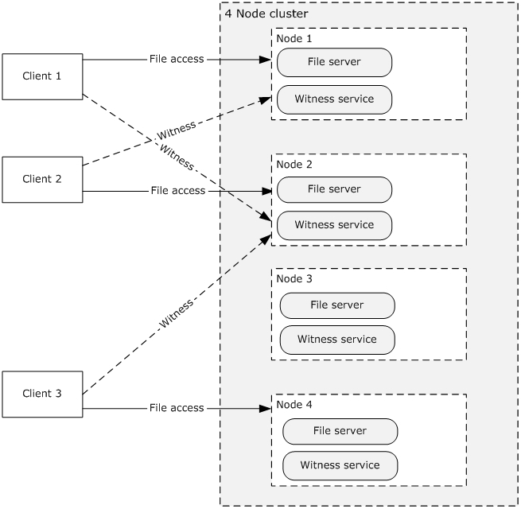
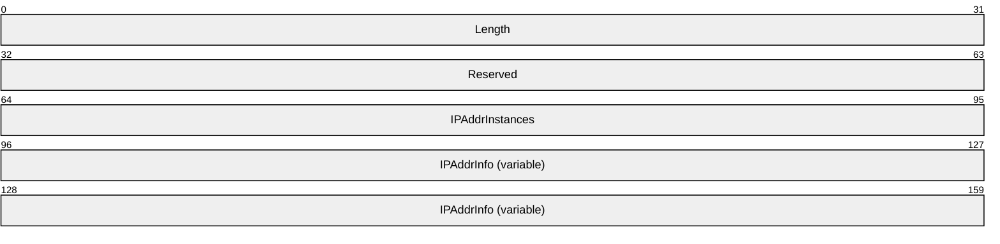
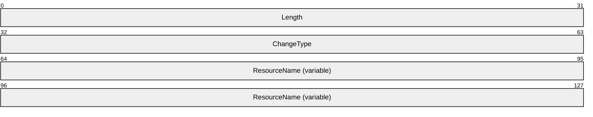
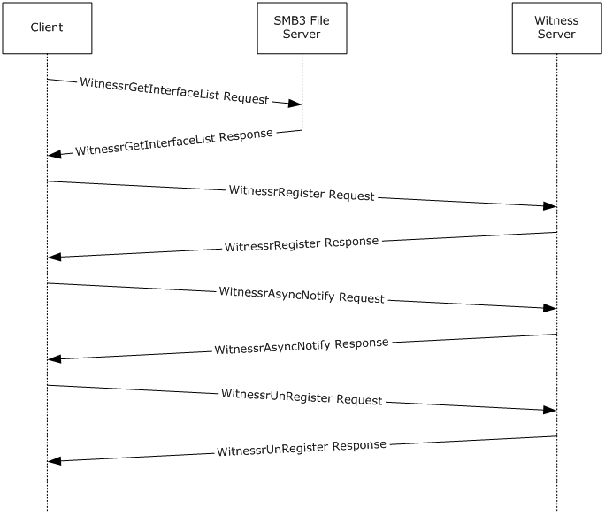

# [MS-SWN]: Service Witness Protocol

Table of Contents

1 Introduction

- [1 Introduction](#Section_1)
  - [1.1 Glossary](#Section_1.1)
  - [1.2 References](#Section_1.2)
    - [1.2.1 Normative References](#Section_1.2.1)
    - [1.2.2 Informative References](#Section_1.2.2)
  - [1.3 Overview](#Section_1.3)
  - [1.4 Relationship to Other Protocols](#Section_1.4)
  - [1.5 Prerequisites/Preconditions](#Section_1.5)
  - [1.6 Applicability Statement](#Section_1.6)
  - [1.7 Versioning and Capability Negotiation](#Section_1.7)
  - [1.8 Vendor Extensible Fields](#Section_1.8)
  - [1.9 Standards Assignments](#Section_1.9)

2 Messages

- [2 Messages](#Section_2)
  - [2.1 Transport](#Section_2.1)
  - [2.2 Common Data Types](#Section_2.2)
    - [2.2.1 Data Types](#Section_2.2.1)
      - [2.2.1.1 PCONTEXT_HANDLE](#Section_2.2.1.1)
      - [2.2.1.2 PPCONTEXT_HANDLE](#Section_2.2.1.2)
      - [2.2.1.3 PCONTEXT_HANDLE_SHARED](#Section_2.2.1.3)
    - [2.2.2 Structures](#Section_2.2.2)
      - [2.2.2.1 IPADDR_INFO](#Section_2.2.2.1)
      - [2.2.2.2 IPADDR_INFO_LIST](#Section_2.2.2.2)
      - [2.2.2.3 RESOURCE_CHANGE](#Section_2.2.2.3)
      - [2.2.2.4 RESP_ASYNC_NOTIFY](#Section_2.2.2.4)
      - [2.2.2.5 WITNESS_INTERFACE_INFO](#Section_2.2.2.5)
      - [2.2.2.6 WITNESS_INTERFACE_LIST](#Section_2.2.2.6)

3 Protocol Details

- [3 Protocol Details](#Section_3)
  - [3.1 Witness Server Details](#Section_3.1)
    - [3.1.1 Abstract Data Model](#Section_3.1.1)
      - [3.1.1.1 Global](#Section_3.1.1.1)
      - [3.1.1.2 Per Interface in InterfaceList](#Section_3.1.1.2)
      - [3.1.1.3 Per WitnessRegistration in WitnessRegistrationList](#Section_3.1.1.3)
      - [3.1.1.4 Per Notification in PendingChangeNotifications](#Section_3.1.1.4)
      - [3.1.1.5 PendingMoveNotification](#Section_3.1.1.5)
      - [3.1.1.6 PendingShareMoveNotification](#Section_3.1.1.6)
      - [3.1.1.7 PendingIPNotification](#Section_3.1.1.7)
    - [3.1.2 Timers](#Section_3.1.2)
      - [3.1.2.1 Unused Registration Timer](#Section_3.1.2.1)
      - [3.1.2.2 AsyncNotify Pending Timer](#Section_3.1.2.2)
    - [3.1.3 Initialization](#Section_3.1.3)
    - [3.1.4 Message Processing Events and Sequencing Rules](#Section_3.1.4)
      - [3.1.4.1 WitnessrGetInterfaceList (Opnum 0)](#Section_3.1.4.1)
      - [3.1.4.2 WitnessrRegister (Opnum 1)](#Section_3.1.4.2)
      - [3.1.4.3 WitnessrUnRegister (Opnum 2)](#Section_3.1.4.3)
      - [3.1.4.4 WitnessrAsyncNotify (Opnum 3)](#Section_3.1.4.4)
      - [3.1.4.5 WitnessrRegisterEx (Opnum 4)](#Section_3.1.4.5)
      - [3.1.4.6 WitnessrUnRegisterEx (Opnum 5)](#Section_3.1.4.6)
    - [3.1.5 Timer Events](#Section_3.1.5)
      - [3.1.5.1 Unused Registration Timer Event](#Section_3.1.5.1)
      - [3.1.5.2 AsyncNotify Pending Timer Event](#Section_3.1.5.2)
    - [3.1.6 Other Local Events](#Section_3.1.6)
      - [3.1.6.1 Server Application Notifies of an Interface Being Enabled or Disabled](#Section_3.1.6.1)
      - [3.1.6.2 Server Application Notifies of a Request to Move to a New Resource](#Section_3.1.6.2)
      - [3.1.6.3 Server Application Notifies of a Change in the Resource that Owns a Share](#Section_3.1.6.3)
      - [3.1.6.4 Server Application Notifies of an IP Address Being Added, Removed, Enabled or Disabled](#Section_3.1.6.4)
      - [3.1.6.5 Transport Connection Shutdown](#Section_3.1.6.5)
  - [3.2 Witness Client Details](#Section_3.2)
    - [3.2.1 Abstract Data Model](#Section_3.2.1)
      - [3.2.1.1 Global](#Section_3.2.1.1)
      - [3.2.1.2 Per WitnessRegistration](#Section_3.2.1.2)
    - [3.2.2 Timers](#Section_3.2.2)
    - [3.2.3 Initialization](#Section_3.2.3)
    - [3.2.4 Message Processing Events and Sequencing Rules](#Section_3.2.4)
      - [3.2.4.1 Application Requests Witness Register](#Section_3.2.4.1)
      - [3.2.4.2 Application Requests Witness Event Notification](#Section_3.2.4.2)
      - [3.2.4.3 Application Requests Witness UnRegister](#Section_3.2.4.3)
    - [3.2.5 Timer Events](#Section_3.2.5)
    - [3.2.6 Other Local Events](#Section_3.2.6)

4 Protocol Examples

- [4 Protocol Examples](#Section_4)
  - [4.1 Registering Notification Changes from the Witness Server](#Section_4.1)

5 Security

- [5 Security](#Section_5)
  - [5.1 Security Considerations for Implementers](#Section_5.1)
  - [5.2 Index of Security Parameters](#Section_5.2)

6 Appendix A: Full IDL

- [6 Appendix A: Full IDL](#Section_6)

7 Appendix B: Product Behavior

- [7 Appendix B: Product Behavior](#Section_7)

8 Change Tracking

- [8 Change Tracking](#Section_8)

For the legal notice and IP terms, see [LEGAL.md](../LEGAL.md).
Last updated: 11/19/2024.
See [Revision History](#revision-history) for full version history.

# 1 Introduction

The Service Witness Protocol is a remote procedure call (RPC)-based protocol that is used to promptly notify a client of resource changes that have occurred on a highly available server.

Sections 1.5, 1.8, 1.9, 2, and 3 of this specification are normative. All other sections and examples in this specification are informative.

## 1.1 Glossary

This document uses the following terms:

**fully qualified domain name (FQDN)**: An unambiguous domain name that gives an absolute location in the Domain Name System's (DNS) hierarchy tree, as defined in [[RFC1035]](https://go.microsoft.com/fwlink/?LinkId=90264) section 3.1 and [[RFC2181]](https://go.microsoft.com/fwlink/?LinkId=127732) section 11.

**Internet Protocol version 4 (IPv4)**: An Internet protocol that has 32-bit source and destination addresses. IPv4 is the predecessor of IPv6.

**Internet Protocol version 6 (IPv6)**: A revised version of the Internet Protocol (IP) designed to address growth on the Internet. Improvements include a 128-bit IP address size, expanded routing capabilities, and support for authentication and privacy.

**Microsoft Interface Definition Language (MIDL)**: The Microsoft implementation and extension of the OSF-DCE Interface Definition Language (IDL). [**MIDL**](#gt_microsoft-interface-definition-language-midl) can also mean the Interface Definition Language (IDL) compiler provided by Microsoft. For more information, see [MS-RPCE](../MS-RPCE/MS-RPCE.md).

**NetBIOS name**: A 16-byte address that is used to identify a NetBIOS resource on the network. For more information, see [[RFC1001]](https://go.microsoft.com/fwlink/?LinkId=90260) and [[RFC1002]](https://go.microsoft.com/fwlink/?LinkId=90261).

**remote procedure call (RPC)**: A communication protocol used primarily between client and server. The term has three definitions that are often used interchangeably: a runtime environment providing for communication facilities between computers (the RPC runtime); a set of request-and-response message exchanges between computers (the RPC exchange); and the single message from an RPC exchange (the RPC message). For more information, see [[C706]](https://go.microsoft.com/fwlink/?LinkId=89824).

**RPC context handle**: A representation of state maintained between a remote procedure call (RPC) client and server. The state is maintained on the server on behalf of the client. An RPC context handle is created by the server and given to the client. The client passes the RPC context handle back to the server in method calls to assist in identifying the state. For more information, see [C706].

**RPC server**: A computer on the network that waits for messages, processes them when they arrive, and sends responses using RPC as its transport acts as the responder during a remote procedure call (RPC) exchange.

**RPC transport**: The underlying network services used by the remote procedure call (RPC) runtime for communications between network nodes. For more information, see [C706] section 2.

**Transmission Control Protocol (TCP)**: A protocol used with the Internet Protocol (IP) to send data in the form of message units between computers over the Internet. TCP handles keeping track of the individual units of data (called packets) that a message is divided into for efficient routing through the Internet.

**universally unique identifier (UUID)**: A 128-bit value. UUIDs can be used for multiple purposes, from tagging objects with an extremely short lifetime, to reliably identifying very persistent objects in cross-process communication such as client and server interfaces, manager entry-point vectors, and [**RPC**](#gt_remote-procedure-call-rpc) objects. UUIDs are highly likely to be unique. UUIDs are also known as globally unique identifiers (GUIDs) and these terms are used interchangeably in the Microsoft protocol technical documents (TDs). Interchanging the usage of these terms does not imply or require a specific algorithm or mechanism to generate the UUID. Specifically, the use of this term does not imply or require that the algorithms described in [[RFC4122]](https://go.microsoft.com/fwlink/?LinkId=90460) or [C706] has to be used for generating the UUID.

**MAY, SHOULD, MUST, SHOULD NOT, MUST NOT:** These terms (in all caps) are used as defined in [[RFC2119]](https://go.microsoft.com/fwlink/?LinkId=90317). All statements of optional behavior use either MAY, SHOULD, or SHOULD NOT.

## 1.2 References

Links to a document in the Microsoft Open Specifications library point to the correct section in the most recently published version of the referenced document. However, because individual documents in the library are not updated at the same time, the section numbers in the documents may not match. You can confirm the correct section numbering by checking the [Errata](https://go.microsoft.com/fwlink/?linkid=850906).

### 1.2.1 Normative References

We conduct frequent surveys of the normative references to assure their continued availability. If you have any issue with finding a normative reference, please contact [dochelp@microsoft.com](mailto:dochelp@microsoft.com). We will assist you in finding the relevant information.

[C706] The Open Group, "DCE 1.1: Remote Procedure Call", C706, August 1997, [https://publications.opengroup.org/c706](https://go.microsoft.com/fwlink/?LinkId=89824)

**Note** Registration is required to download the document.

[MS-DTYP] Microsoft Corporation, "[Windows Data Types](#Section_2.2.1)".

[MS-ERREF] Microsoft Corporation, "[Windows Error Codes](../MS-ERREF/MS-ERREF.md)".

[MS-RPCE] Microsoft Corporation, "[Remote Procedure Call Protocol Extensions](../MS-RPCE/MS-RPCE.md)".

[MS-SRVS] Microsoft Corporation, "[Server Service Remote Protocol](../MS-SRVS/MS-SRVS.md)".

[RFC2119] Bradner, S., "Key words for use in RFCs to Indicate Requirement Levels", BCP 14, RFC 2119, March 1997, [https://www.rfc-editor.org/info/rfc2119](https://go.microsoft.com/fwlink/?LinkId=90317)

### 1.2.2 Informative References

[MS-SMB2] Microsoft Corporation, "[Server Message Block (SMB) Protocol Versions 2 and 3](../MS-SMB2/MS-SMB2.md)".

[SPNNAMES] Microsoft Corporation, "Name Formats for Unique SPNs", [http://msdn.microsoft.com/en-us/library/ms677601.aspx](https://go.microsoft.com/fwlink/?LinkId=90532)

## 1.3 Overview

In highly available systems, there can be many instances of a service (for instance an SMB3 file service [MS-SMB2](../MS-SMB2/MS-SMB2.md)) that runs on a server or group of servers. These service instances are accessed by clients through network DNS names and associated IP addresses.

The Service Witness Protocol enables a client application (for instance, an SMB3 client) to receive prompt and explicit notifications about the failure or recovery of a network name and associated services, rather than relying on slower detection mechanisms such as time-outs and keep-alives.

The Service Witness Protocol is an independent protocol which is used alongside other protocols, as illustrated by the following figure.

Figure 1: Witness clients communicating with Witness servers

## 1.4 Relationship to Other Protocols

This protocol depends on the [**RPC transport**](#gt_rpc-transport) and uses [**RPC**](#gt_remote-procedure-call-rpc) over [**TCP**](#gt_transmission-control-protocol-tcp), as specified in section [2.1](#Section_2.1).

## 1.5 Prerequisites/Preconditions

The Service Witness Protocol is an RPC interface and, as a result, has the prerequisites that are described in [MS-RPCE](../MS-RPCE/MS-RPCE.md) section 1.5 as common to RPC interfaces.

## 1.6 Applicability Statement

This protocol applies in the following environments, where it is important that:

- The client promptly detects when a resource has failed, and is now available for reconnection.
- The administrator controls the client use of server resources, for instance, to achieve load- balancing or during server maintenance periods.

## 1.7 Versioning and Capability Negotiation

The protocol supports versioning negotiation. The current protocol supports two versions.

| Version | Value |
| --- | --- |
| Witness protocol version 1 | 0x00010001 |
| Witness protocol version 2 | 0x00020000 |

## 1.8 Vendor Extensible Fields

This protocol does not define any vendor-extensible fields.

This protocol uses Win32 error codes as defined in [MS-ERREF](../MS-ERREF/MS-ERREF.md) section 2.2. Vendors SHOULD reuse those values with their indicated meaning. Choosing any other value runs the risk of a collision in the future.

## 1.9 Standards Assignments

| Parameter | Value | Reference |
| --- | --- | --- |
| UUID for Witness | ccd8c074-d0e5-4a40-92b4-d074faa6ba28 | [[C706]](https://go.microsoft.com/fwlink/?LinkId=89824) |

# 2 Messages

## 2.1 Transport

This protocol MUST use the [**UUID**](#gt_universally-unique-identifier-uuid) as specified in section [1.9](#Section_1.9). The RPC version number is 1.0.

This protocol allows any user to establish a connection to the [**RPC server**](#gt_rpc-server). The protocol uses the underlying RPC protocol to retrieve the identity of the caller that made the method call, as specified in [MS-RPCE](../MS-RPCE/MS-RPCE.md) section 3.3.3.4.3. The server SHOULD use this identity to perform method-specific access checks as specified in section [3.1.4](#Section_3.2.4).

## 2.2 Common Data Types

In addition to RPC base types defined in [[C706]](https://go.microsoft.com/fwlink/?LinkId=89824) and [MS-RPCE](../MS-RPCE/MS-RPCE.md), the data types that follow are defined in the [**Microsoft Interface Definition Language (MIDL)**](#gt_microsoft-interface-definition-language-midl) specification for this RPC interface.

The following data types are specified in [MS-DTYP](#Section_2.2.1):

| DataType name | Section |
| --- | --- |
| BOOLEAN | section 2.2.4 |
| DWORD | section 2.2.9 |
| LPWSTR | section 2.2.36 |
| PBYTE | section 2.2.6 |
| UINT | section 2.2.46 |
| UINT32 | section 2.2.49 |
| ULONG | section 2.2.51 |
| USHORT | section 2.2.58 |
| WCHAR | section 2.2.60 |

### 2.2.1 Data Types

| DataType name | Section | Description |
| --- | --- | --- |
| PCONTEXT_HANDLE | [2.2.1.1](#Section_2.2.1.1) | An [**RPC context handle**](#gt_rpc-context-handle) returned by the WitnessrRegister or WitnessrRegisterEx method, to be provided as an input parameter to the WitnessrUnRegister or WitnessrUnRegisterEx method. |
| PCONTEXT_HANDLE_SHARED | [2.2.1.3](#Section_2.2.1.3) | An RPC context handle returned by the WitnessrRegister or WitnessrRegisterEx method, to be provided as an input parameter to the WitnessrAsyncNotify method. |
| PPCONTEXT_HANDLE | [2.2.1.2](#Section_2.2.1.2) | A reference to PCONTEXT_HANDLE. |

#### 2.2.1.1 PCONTEXT_HANDLE

PCONTEXT_HANDLE: An RPC context handle, as specified in [[C706]](https://go.microsoft.com/fwlink/?LinkId=89824) Chapter 6, returned by the WitnessrRegister or WitnessrRegisterEx method, to be provided as an input parameter to the WitnessrUnRegister or WitnessrUnRegisterEx method.

typedef [context_handle] void* PCONTEXT_HANDLE;

#### 2.2.1.2 PPCONTEXT_HANDLE

PPCONTEXT_HANDLE: A reference to PCONTEXT_HANDLE, as specified in section [2.2.1.1](#Section_2.2.1.1).

typedef [ref] PCONTEXT_HANDLE *PPCONTEXT_HANDLE;

#### 2.2.1.3 PCONTEXT_HANDLE_SHARED

PCONTEXT_HANDLE_SHARED: An [**RPC context handle**](#gt_rpc-context-handle), as specified in [[C706]](https://go.microsoft.com/fwlink/?LinkId=89824) Chapter 6, returned by the WitnessrRegister or WitnessrRegisterEx method, to be provided as a parameter to the WitnessrAsyncNotify method.

typedef [context_handle] PCONTEXT_HANDLE PCONTEXT_HANDLE_SHARED;

### 2.2.2 Structures

Unless otherwise specified, multiple-byte fields (16-bit, 32-bit, and 64-bit fields) MUST be transmitted in little-endian order (least-significant byte first) for the structures specified in section [2.2.2.1](#Section_2.2.2.1) (IPADDR_INFO), [2.2.2.2](#Section_2.2.2.2) (IPADDR_INFO_LIST), and [2.2.2.3](#Section_2.2.2.3) (RESOURCE_CHANGE). Other structures defined in this section use RPC encoding.

| Structure name | Section | Description |
| --- | --- | --- |
| IPADDR_INFO | 2.2.2.1 | The IPADDR_INFO structure specifies the IP addresses of the interface. |
| IPADDR_INFO_LIST | 2.2.2.2 | The IPADDR_INFO_LIST structure contains the list of available IP addresses on the destination Interface group. |
| RESOURCE_CHANGE | 2.2.2.3 | The server notifies the registered client of resource state changes through the RESOURCE_CHANGE structure. |
| RESP_ASYNC_NOTIFY | [2.2.2.4](#Section_2.2.2.4) | The RESP_ASYNC_NOTIFY structure contains the resource change type. |
| WITNESS_INTERFACE_INFO | [2.2.2.5](#Section_2.2.2.5) | The WITNESS_INTERFACE_INFO structure specifies the IP addresses of the interface. |
| WITNESS_INTERFACE_LIST | [2.2.2.6](#Section_2.2.2.6) | The WITNESS_INTERFACE_LIST structure specifies the list of interfaces available for witness registration. |

#### 2.2.2.1 IPADDR_INFO

The IPADDR_INFO structure specifies the IP addresses of the interface.

**Flags (4 bytes):** The Flags field SHOULD<1> be set to a combination of one or more of the following values.

| Value | Description |
| --- | --- |
| 0x00000001 IPADDR_V4 | If set, the **IPV4** field contains a valid address. When this bit is set, the IPADDR_IPV6 bit MUST NOT be set. |
| 0x00000002 IPADDR_V6 | If set, the **IPV6** field contains a valid address. When this bit is set, the IPADDR_IPV4 bit MUST NOT be set. |
| 0x00000008 IPADDR_ONLINE | If set, the IPV4 or IPV6 address is available. This flag is applicable only for the servers that implement version 2. |
| 0x00000010 IPADDR_OFFLINE | If set, the IPV4 or IPV6 address is not available. This flag is applicable only for the server that implement version 2. |

**IPV4 (4 bytes):** The [**IPv4**](#gt_internet-protocol-version-4-ipv4) address of the interface, if the IPADDR_V4 flag is set in the Flags field.

**IPV6 (16 bytes):** The [**IPv6**](#gt_internet-protocol-version-6-ipv6) address of the interface, if the IPADDR_V6 flag is set in the Flags field.

#### 2.2.2.2 IPADDR_INFO_LIST

The IPADDR_INFO_LIST structure contains a list of available IP addresses on the destination Interface group.

**Length (4 bytes):** The size of the IPADDR_INFO_LIST structure, in bytes.

**Reserved (4 bytes):** This field MUST NOT be used and MUST be reserved. The server MUST set this field to 0, and the client MUST ignore it on receipt.

**IPAddrInstances (4 bytes):** The number of IPADDR_INFO structures in the **IPAddrInfo** member.

**IPAddrInfo (variable):** An array of one or more IPADDR_INFO structures, as specified in section [2.2.2.1](#Section_2.2.2.1), that indicates the IP addresses of the destination Interface group.

#### 2.2.2.3 RESOURCE_CHANGE

The server notifies the registered client of resource state changes through the use of the RESOURCE_CHANGE structure.

**Length (4 bytes):** The size of the resource change notification, in bytes.

**ChangeType (4 bytes):** Specifies state change of the resource. The following values are used to specify the change type.

| Value | Meaning |
| --- | --- |
| 0x00000000 | RESOURCE_STATE_UNKNOWN |
| 0x00000001 | RESOURCE_STATE_AVAILABLE |
| 0x000000FF | RESOURCE_STATE_UNAVAILABLE |

**ResourceName (variable):** The null terminated resource name on which the change has been detected. This MUST be either the NetName or IP address provided in a WitnessrRegister call, or an InterfaceGroupName returned to the client in a WitnessrGetInterfaceList response.

#### 2.2.2.4 RESP_ASYNC_NOTIFY

The RESP_ASYNC_NOTIFY structure contains the resource change type.

typedef struct _RESP_ASYNC_NOTIFY {

UINT MessageType;

UINT Length;

UINT NumberOfMessages;

[size_is(Length)] [unique] PBYTE MessageBuffer;

} RESP_ASYNC_NOTIFY, *PRESP_ASYNC_NOTIFY;

**MessageType:** Specifies the notification type. This field MUST contain one of the following values.

| Value | Meaning |
| --- | --- |
| 1 | RESOURCE_CHANGE_NOTIFICATION |
| 2 | CLIENT_MOVE_NOTIFICATION |
| 3 | SHARE_MOVE_NOTIFICATION This value is applicable only for the server that implements version 2. |
| 4 | IP_CHANGE_NOTIFICATION This value is applicable only for the server that implements version 2. |

**Length:** Specifies the size of the **MessageBuffer** field, in bytes.

**NumberOfMessages:** Total number of notifications in the **MessageBuffer** field.

**MessageBuffer:** Contains an array of notification information structures whose type is determined by the **MessageType** field.

#### 2.2.2.5 WITNESS_INTERFACE_INFO

The WITNESS_INTERFACE_INFO structure specifies the IP addresses of the interface.

typedef struct _WITNESS_INTERFACE_INFO {

WCHAR InterfaceGroupName[260];

ULONG Version;

USHORT State;

ULONG IPV4;

USHORT IPV6[8];

UINT Flags;

} WITNESS_INTERFACE_INFO, *PWITNESS_INTERFACE_INFO;

**InterfaceGroupName:** The null-terminated string that specifies a name of the interface group.

**Version:** The current version of the Witness Service that runs on the server.

**State:** The current state of the interface. This field MUST contain one of the following values:

| Value | Meaning |
| --- | --- |
| UNKNOWN 0x0000 | The state of the interface is unknown. |
| AVAILABLE 0x0001 | The interface is available. |
| UNAVAILABLE 0x00FF | The interface is unavailable. |

**IPV4:** The [**IPv4**](#gt_internet-protocol-version-4-ipv4) address of the interface, if the IPv4 flag is set in **Flags** field.

**IPV6:** The [**IPv6**](#gt_internet-protocol-version-6-ipv6) address of the interface, if the IPv6 flag is set in **Flags** field.

**Flags:** The **Flags** field specifies information about the interface. This field MUST be set to combination of zero or more of the following values:

| Value | Meaning |
| --- | --- |
| IPv4 0x00000001 | If set, the **IPV4** field contains a valid address. |
| IPv6 0x00000002 | If set, the **IPV6** field contains a valid address. |
| INTERFACE_WITNESS 0x00000004 | If set, the interface is available for witness registration. If not set, the interface MUST NOT be used for witness registration. |

#### 2.2.2.6 WITNESS_INTERFACE_LIST

The WITNESS_INTERFACE_LIST structure specifies the list of interfaces available for witness registration.

typedef struct _WITNESS_INTERFACE_LIST {

UINT NumberOfInterfaces;

[size_is(NumberOfInterfaces)] [unique] PWITNESS_INTERFACE_INFO InterfaceInfo;

} WITNESS_INTERFACE_LIST, *PWITNESS_INTERFACE_LIST;

**NumberOfInterfaces:** The number of WITNESS_INTERFACE_INFO structures in **InterfaceInfo**.

**InterfaceInfo:** Contains an array of WITNESS_INTERFACE_INFO structures, as specified in section [2.2.2.5](#Section_2.2.2.5).

# 3 Protocol Details

## 3.1 Witness Server Details

The server responds to messages it receives from the client and also produces notifications as requested by the client. The server performs additional actions in response to administrative, configuration, and status changes on the machine, as driven by applications local to the server.

### 3.1.1 Abstract Data Model

This section describes a conceptual model of possible data organization that an implementation maintains to participate in this protocol. The organization is provided to facilitate the explanation of how the protocol behaves. This specification does not mandate that implementations adhere to this model as long as their external behaviors are consistent with that described in this specification.

#### 3.1.1.1 Global

The server implements the following properties:

- **InterfaceList**: A list of available Interfaces as specified in section [3.1.1.2](#Section_3.1.1.2).
- **WitnessRegistrationList**: A list of witness registrations on the server, as specified in section [3.1.1.3](#Section_3.1.1.3).
- **WitnessServiceVersion**: The highest Witness protocol version supported by the Witness Service. The value MUST be one of those listed in section [1.7](#Section_1.7).
- **ServerGlobalName**: A hostname by which clients access the server being witnessed.

#### 3.1.1.2 Per Interface in InterfaceList

- **InterfaceGroupName**: The name of the interface group, in the form of a [**NetBIOS name**](#gt_netbios-name).
- **State**: The state of the interface. This MUST be set to one of the values specified in section [2.2.2.5](#Section_2.2.2.5).
- **IPv4Address**: An [**IPv4**](#gt_internet-protocol-version-4-ipv4) address of the interface, if any.
- **IPv6Address**: An [**IPv6**](#gt_internet-protocol-version-6-ipv6) address of the interface, if any.

#### 3.1.1.3 Per WitnessRegistration in WitnessRegistrationList

The server implements the following properties per witness registration.

- **WitnessClientName**: A null-terminated string that contains the name of the client.
- **NetworkName**: The NetName specified in the client registration call.
- **IPAddress**: An IP address specified in the client registration call.
- **RegistrationKey**: A unique value assigned by the server for this registration, in the form of context_handle, as specified in section [2.2.1.1](#Section_2.2.1.1).
- **PendingChangeNotifications:** A list of change notifications pending for this registration.
- **PendingMoveNotification:** The most recent move notification, if any, pending for this registration.
If the server implements version 2 of the protocol, the server also implements the following properties:

- **WitnessClientVersion**: The Witness protocol version implemented by the client.
- **ShareName**: The *ShareName* specified in the client registration call.
- **ShareNameNotificationRequired**: A Boolean when set; indicates that this registration requires notifications based on the *ShareName*.
- **IPNotificationRequired**: A Boolean when set; indicates that this registration requires notifications based on the IP addresses changes on the server associated with *NetName*.
- **PendingShareMoveNotification**: The most recent share move notification, if any, pending for this registration.
- **PendingIPNotification**: The most recent IP change notification, if any, pending for this registration.
- **KeepAliveTime**: The maximum amount of the time, in seconds, the server can hold the pending asynchronous notification.
- **LastUseTime**: The time at which the server received a registration request, an asynchronous notify request, or at which time the server sent a response to an asynchronous notification.
- **IsAsyncNotifyRegistered**: A Boolean flag that indicates whether asynchronous notification is registered or not.

#### 3.1.1.4 Per Notification in PendingChangeNotifications

- **ResourceName**: The name of the resource whose state has changed.
- **NewState**: The new resource state.

#### 3.1.1.5 PendingMoveNotification

- **Destination**: A null-terminated string that describes the resource to move to.

#### 3.1.1.6 PendingShareMoveNotification

If the server implements version 2 of the protocol, the server also implements the following:

- **Destination**: A null-terminated string that describes the resource the share has been moved to.

#### 3.1.1.7 PendingIPNotification

If the server implements version 2 of the protocol, the server also implements the following:

- **ChangeIndication**: A null-terminated string that describes the IP changes on the server.

### 3.1.2 Timers

#### 3.1.2.1 Unused Registration Timer

If the server implements version 2 of the protocol, it MUST implement this timer.

This timer controls the amount of time that a registration can stay unused, in other words, the time for which the registration is permitted to remain without registering for any asynchronous notifications. The server MUST schedule this timer periodically with an implementation-specific interval and remove unused registrations.

#### 3.1.2.2 AsyncNotify Pending Timer

If the server implements version 2 of the protocol, it MUST implement this timer.

This timer controls the scheduling of periodic searches for pending asynchronous notifications that have passed their expiration time. This value is based on the **KeepAliveTimeout** value provided by the client as specified in section [3.1.4.5](#Section_3.1.4.5).

### 3.1.3 Initialization

The server MUST initialize **WitnessRegistrationList** to empty.

The server MUST initialize **InterfaceList** in an implementation-specific manner from the configuration store.

The server MUST initialize **WitnessServiceVersion** to the highest Witness protocol version supported by the server.<2>

The server MUST initialize **ServerGlobalName** with an administrator-defined string.

### 3.1.4 Message Processing Events and Sequencing Rules

The Witness interface defines the following methods:

| Method | Description |
| --- | --- |
| [WitnessrGetInterfaceList](#Section_3.1.4.1) | The WitnessrGetInterfaceList method returns information about the interfaces to which witness client connections can be made. Opnum: 0 |
| [WitnessrRegister](#Section_3.1.4.2) | The WitnessrRegister method allows the witness client to register for notifications from the server. Opnum: 1 |
| [WitnessrUnRegister](#Section_3.1.4.3) | The WitnessrUnRegister method allows the client to unregister for notifications from the server. Opnum: 2 |
| [WitnessrAsyncNotify](#Section_3.1.4.4) | The WitnessrAsyncNotify method is used by the client to request notification of resource changes from the server. Opnum: 3 |
| [WitnessrRegisterEx](#Section_3.1.4.5) | The WitnessrRegisterEx method allows the witness client to register for notifications from the server for a specific share and with optional flags. This opnum is only applicable for Witness protocol version 2. Opnum: 4 |
| [WitnessrUnRegisterEx](#Section_3.1.4.6) | The **WitnessrUnRegisterEx** method allows the client to unregister for notifications from the server.<3> The Witness Service removes its internal state of the registration and no longer notifies the client in the event of any resource state changes. This opnum is only applicable for Witness protocol version 2. Opnum: 5 |

For all methods, the server SHOULD<4> enforce security measures to verify that the caller has the required permissions to execute any method. If the server enforces security measures, and the caller does not have the required credentials, then the server MUST fail the call and return ERROR_ACCESS_DENIED. For more details about how to determine the identity of the caller for the purpose of performing an access check, see [MS-RPCE](../MS-RPCE/MS-RPCE.md) section 3.3.3.1.3.

#### 3.1.4.1 WitnessrGetInterfaceList (Opnum 0)

The WitnessrGetInterfaceList method returns information about the interfaces to which witness client connections can be made.

DWORD WitnessrGetInterfaceList(

[in] handle_t Handle,

[out] PWITNESS_INTERFACE_LIST* InterfaceList);

**Handle:** An RPC binding handle [[C706]](https://go.microsoft.com/fwlink/?LinkId=89824).

**InterfaceList:** A pointer to a PWITNESS_INTERFACE_LIST, as specified in section [2.2.2.6](#Section_2.2.2.6).

**Return Values:** Returns 0x00000000 (ERROR_SUCCESS) on success or a nonzero error code, as specified in [MS-ERREF](../MS-ERREF/MS-ERREF.md) section 2.2. The most common error codes are listed in the following table.

| Return value/code | Description |
| --- | --- |
| 0x00000000 ERROR_SUCCESS | The operation completed successfully. |
| 0x00000005 ERROR_ACCESS_DENIED | Access is denied. |
| 0x00000057 ERROR_INVALID_PARAMETER | The parameter is incorrect. |
| 0x00000103 ERROR_NO_MORE_ITEMS | No more data is available. |
| 0x0000000E ERROR_OUTOFMEMORY | There is not enough storage space to complete the operation. |

If there are no entries in the **InterfaceList**, the server MUST fail the request and return the error code ERROR_NO_MORE_ITEMS.

If no entry in the InterfaceList has a State of AVAILABLE, the server MUST wait until at least one entry enters that State, as specified in section [3.1.6.1](#Section_3.1.6.1).

For each **Interface** in the **InterfaceList**, the server MUST construct a WITNESS_INTERFACE_INFO structure as follows:

- The **InterfaceGroupName** field of the WITNESS_INTERFACE_INFO structure MUST be set to **Interface.InterfaceGroupName**.
- The **State** field MUST be set to **Interface.State**.
- The **Version** field MUST be set to **WitnessServiceVersion**.
- If **Interface.IPv4Address** is not empty, the **IPV4** field MUST be set to **Interface.IPv4Address**, and IPv4 flag MUST be set in the **Flags** field.
- If **Interface.IPv6Address** is not empty, the **IPV6** field MUST be set to **Interface.IPv6Address**, and IPv6 flag MUST be set in the **Flags** field.
- In an implementation-dependent manner, the server MUST determine if the **IPv4Address** or **IPv6Address** match any interface which is hosted on the server and if the server is also running this Witness Service instance. If the address is not hosted on the local server, the INTERFACE_WITNESS flag MUST be set in the **Flags** field. Otherwise, the flag MUST NOT be set.
The server MUST construct the WITNESS_INTERFACE_LIST structure as follows:

- All WITNESS_INTERFACE_INFO structures MUST be copied into the **InterfaceInfo** field of the WITNESS_INTERFACE_LIST structure.
- The **NumberOfInterfaces** field of the WITNESS_INTERFACE_LIST structure MUST be set to the number of interfaces provided by **InterfaceInfo**.
The WITNESS_INTERFACE_LIST structures MUST be copied into the *InterfaceList* parameter.

The server MUST return ERROR_SUCCESS and the *InterfaceList* parameter to the caller.

#### 3.1.4.2 WitnessrRegister (Opnum 1)

The WitnessrRegister method allows the witness client to register for resource state change notifications of a NetName and IPAddress. The client can subsequently call the WitnessrAsyncNotify method to receive notifications when there is a state change on any of these resources.

DWORD WitnessrRegister(

[in] handle_t Handle,

[out] PPCONTEXT_HANDLE ppContext,

[in] ULONG Version,

[in] [string] [unique] LPWSTR NetName,

[in] [string] [unique] LPWSTR IpAddress,

[in] [string] [unique] LPWSTR ClientComputerName);

**Handle:** An RPC binding handle [[C706]](https://go.microsoft.com/fwlink/?LinkId=89824).

**ppContext:** A context handle of type PPCONTEXT_HANDLE, as specified in section [2.2.1.2](#Section_2.2.1.2), that identifies the client on the server.

**Version:** The version of the Witness protocol currently in use by the client.

**NetName:** A pointer to a null-terminated string that specifies the name of the resource for which the client requires notifications.

**IpAddress:** A pointer to a null-terminated string that specifies the IP address to which the client application connection is established.

**ClientComputerName:** A pointer to a null-terminated string that is used to identify the Witness client.

**Return Values:** Returns 0x00000000 (ERROR_SUCCESS) on success or a nonzero error code, as specified in [MS-ERREF](../MS-ERREF/MS-ERREF.md) section 2.2. The most common error codes are listed in the following table.

| Return value/code | Description |
| --- | --- |
| 0x00000000 ERROR_SUCCESS | The operation completed successfully. |
| 0x00000005 ERROR_ACCESS_DENIED | Access is denied. |
| 0x000005AA ERROR_NO_SYSTEM_RESOURCES | Insufficient system resources exist to complete the requested service. |
| 0x00000057 ERROR_INVALID_PARAMETER | The parameter is incorrect. |
| 0x0000139F ERROR_INVALID_STATE | The specified resource state is invalid. |
| 0x0000051A ERROR_REVISION_MISMATCH | The client request contains an invalid Witness protocol version. |

If the **Version** field of the request is not 0x00010001, the server MUST stop processing the request and return the error code ERROR_REVISION_MISMATCH.

If *NetName*, *IpAddress* or *ClientComputerName* is NULL, the server MUST fail the request and return the error code ERROR_INVALID_PARAMETER.

If the *NetName* parameter is not equal to **ServerGlobalName**, the server MUST fail the request and return the error code ERROR_INVALID_PARAMETER.

The server MUST enumerate the shares by calling **NetrShareEnum** as specified in [MS-SRVS](../MS-SRVS/MS-SRVS.md) section 3.1.4.8. In the enumerated list, if any of the shares has shi*_type set to STYPE_CLUSTER_SOFS, as specified in [MS-SRVS] section 2.2.2.4, the server MUST search for an **Interface** in **InterfaceList**, where **Interface.IPv4Address** or **Interface.IPv6Address** matches the *IpAddress* parameter based on its format. If no matching entry is found, the server MUST fail the request and return the error code ERROR_INVALID_STATE.

The server MUST create a **WitnessRegistration** entry as follows and insert it into the **WitnessRegistrationList**.

- **WitnessRegistration.WitnessClientName** MUST be set to the *ClientComputerName* parameter.
- **WitnessRegistration.NetworkName** MUST be set to the *NetName* parameter.
- **WitnessRegistration.IPAddress** MUST be set to the *IPAddress* parameter.
- **WitnessRegistration.RegistrationKey** MUST be set to a [**UUID**](#gt_universally-unique-identifier-uuid) generated by the server.
- **WitnessRegistration.PendingChangeNotifications** and **WitnessRegistration.PendingMoveNotification** MUST be set to empty.
If **WitnessServiceVersion** is 0x00020000, the server MUST set the following values in **WitnessRegistration** entry:

- **WitnessRegistration.WitnessClientVersion** MUST be set to the value of the *Version* parameter value in the request.
- **WitnessRegistration.ShareName** MUST be set to empty.
- **WitnessRegistration.ShareNameNotificationRequired** MUST be set to FALSE.
- **WitnessRegistration.IPNotificationRequired** MUST be set to FALSE.
- **WitnessRegistration.PendingShareMoveNotification** MUST be set to empty
- **WitnessRegistration.PendingIPNotification** MUST be set to empty.
The server MUST copy the **WitnessRegistration.RegistrationKey** into the *ppContext* parameter.

The server MUST return ERROR_SUCCESS and the *ppContext* parameter to the caller.

#### 3.1.4.3 WitnessrUnRegister (Opnum 2)

The WitnessrUnRegister method allows the client to unregister for notifications from the server. The Witness Service removes its internal state of the registration and no longer notifies the client in the event of any resource state changes.

DWORD WitnessrUnRegister(

[in] handle_t Handle,

[in] PCONTEXT_HANDLE pContext);

**Handle:** An RPC binding handle [[C706]](https://go.microsoft.com/fwlink/?LinkId=89824).

**pContext:** A context handle of type PCONTEXT_HANDLE, specified in section [2.2.1.1](#Section_2.2.1.1), that identifies the client on the server.

**Return Values:** Returns 0x00000000 (ERROR_SUCCESS) on success or a nonzero error code, as specified in [MS-ERREF](../MS-ERREF/MS-ERREF.md) section 2.2. The most common error codes are listed in the following table.

| Return value/code | Description |
| --- | --- |
| 0x00000000 ERROR_SUCCESS | The operation completed successfully. |
| 0x00000005 ERROR_ACCESS_DENIED | Access is denied. |
| 0x00000490 ERROR_NOT_FOUND | The specified CONTEXT_HANDLE is not found. |

The server MUST search for the **WitnessRegistration** in **WitnessRegistrationList**, where **WitnessRegistration.RegistrationKey** matches the *pContext* parameter.

If no matching entry is found, the server SHOULD<5> stop processing the request and return the error code ERROR_INVALID_PARAMETER.

If the matching entry is found, the server MUST remove the **WitnessRegistration** entry from the **WitnessRegistrationList** and return ERROR_SUCCESS to the caller.

#### 3.1.4.4 WitnessrAsyncNotify (Opnum 3)

The WitnessrAsyncNotify method is used by the client to request notification of registered resource changes from the server.

DWORD WitnessrAsyncNotify(

[in] handle_t Handle,

[in] PCONTEXT_HANDLE_SHARED pContext,

[out] PRESP_ASYNC_NOTIFY* pResp);

**Handle:** An RPC binding handle [[C706]](https://go.microsoft.com/fwlink/?LinkId=89824).

**pContext:** A context handle of type PCONTEXT_HANDLE_SHARED, as specified in section [2.2.1.3](#Section_2.2.1.3), that identifies the client on the server.

**pResp:** A pointer to a PRESP_ASYNC_NOTIFY structure, as specified in section [2.2.2.4](#Section_2.2.2.4).

**Return Values:** Returns 0x00000000 (ERROR_SUCCESS) on success or a nonzero error code, as specified in [MS-ERREF](../MS-ERREF/MS-ERREF.md) section 2.2. The most common error codes are listed in the following table.

| Return value/code | Description |
| --- | --- |
| 0x00000000 ERROR_SUCCESS | The operation completed successfully. |
| 0x00000005 ERROR_ACCESS_DENIED | Access is denied. |
| 0x000005AA ERROR_NO_SYSTEM_RESOURCES | Insufficient system resources exist to complete the requested service. |
| 0x00000490 ERROR_NOT_FOUND | The specified resource name is not found. |

The server MUST search for the **WitnessRegistration** in **WitnessRegistrationList**, where **WitnessRegistration.RegistrationKey** matches the *pContext* parameter.

If no matching entry is found, the server MUST fail the request and return the error code ERROR_NOT_FOUND.

If the matching entry is found, and **WitnessServiceVersion** is 0x00020000, the server MUST update **WitnessRegistration.LastUseTime** to the current time, and **WitnessRegistration.IsAsyncNotifyRegistered** to TRUE.

The server MUST wait until either **WitnessRegistration.PendingChangeNotifications** or **WitnessRegistration.PendingMoveNotification** are not empty.

If **WitnessRegistration.PendingChangeNotifications** is not empty, the server MUST construct a RESP_ASYNC_NOTIFY structure as follows:

- *pResp.MessageType*: MUST be set to RESOURCE_CHANGE_NOTIFICATION.
- *pResp.MessageBuffer*: MUST be set to a RESOURCE_CHANGE structure with the following values:
- The **Length** field MUST be set to the size of the RESOURCE_CHANGE structure.
- If the **NewState** of the **Notification** is UNAVAILABLE, the **ChangeType** field MUST be set to RESOURCE_STATE_UNAVAILABLE, else **ChangeType** MUST be set to RESOURCE_STATE_AVAILABLE.
- The **ResourceName** field MUST be set to the **ResourceName** of the **Notification**.
- If additional entries are present in **WitnessRegistration.PendingChangeNotifications**, the server MUST continue to add RESOURCE_CHANGE structures to the *pResp.MessageBuffer*, until no entries remain in the list.
- *pResp.NumberOfMessages*: MUST be set to the number of resources changed.
- *pResp.Length*: MUST be set to the length of the **MessageBuffer** field.
If the **WitnessRegistration.PendingMoveNotification** is not empty, the server MUST construct the structure as follows:

- *pResp.MessageType*: MUST be set to CLIENT_MOVE_NOTIFICATION.
- *pResp.MessageBuffer*: MUST be set to an IPADDR_INFO_LIST structure with the following values:
- The **Reserved** field MUST be set to 0.
- The **IPAddrInstances** field MUST be set to the number of available interfaces in **InterfaceList** for which **Interface.InterfaceGroupName** matches the **Notification.ChangeIndication**.
- For each **Interface** matched, the server MUST construct an IPADDR_INFO structure as follows:
- If **Interface.State** is AVAILABLE, then the IPADDR_ONLINE flag in the **Flags** field MUST be set. If **Interface.State** is UNAVAILABLE, then the IPADDR_OFFLINE flag in the **Flags** field MUST be set.
- If **Interface.IPv4Address** is not empty, the **IPV4** field MUST be set to **Interface.IPv4Address**, and IPADDR_V4 MUST be set in the **Flags** field.
- If **Interface.IPv6Address** is not empty, the **IPV6** field MUST be set to **Interface.IPv6Address**, and IPADDR_V6 MUST be set in the **Flags** field.
- The IPADDR_INFO structure MUST be copied into the **IPAddrInfo** field.
- The **Length** field MUST be set to the size of the IPADDR_INFO_LIST structure.
- *pResp.NumberOfMessages*: MUST be set to 1.
- *pResp.Length*: MUST be set to the length of the **MessageBuffer** field.
If **WitnessServiceVersion** is 0x00020000, **WitnessRegistration.WitnessClientVersion** is 0x00020000, and **WitnessRegistration.PendingShareMoveNotification** is not empty, the server MUST construct the structure as follows:

- *pResp.MessageType*: MUST be set to SHARE_MOVE_NOTIFICATION.
- *pResp.MessageBuffer*: MUST be set to an IPADDR_INFO_LIST structure with the following values:
- The **Reserved** field MUST be set to 0.
- The **IPAddrInstances** field MUST be set to the number of available interfaces in **InterfaceList** for which **Interface.InterfaceGroupName** matches the **Notification.Destination**.
- For each **Interface** matched, the server MUST construct an IPADDR_INFO structure as follows:
- If **Interface.IPv4Address** is not empty, the **IPV4** field MUST be set to **Interface.IPv4Address**, and IPADDR_V4 MUST be set in the **Flags** field.
- If **Interface.IPv6Address** is not empty, the **IPV6** field MUST be set to **Interface.IPv6Address**, and IPADDR_V6 MUST be set in the **Flags** field.
- The IPADDR_INFO structure MUST be copied into the **IPAddrInfo** field.
- The **Length** field MUST be set to the size of the IPADDR_INFO_LIST structure.
- *pResp.NumberOfMessages*: MUST be set to 1.
- *pResp.Length*: MUST be set to the length of the **MessageBuffer** field.
If **WitnessServiceVersion** is 0x00020000, **WitnessRegistration.WitnessClientVersion** is 0x00020000, and **WitnessRegistration.PendingIPNotification** is not empty, the server MUST construct the structure as follows:

- *pResp.MessageType*: MUST be set to IP_CHANGE_NOTIFICATION.
- *pResp.MessageBuffer*: MUST be set to an IPADDR_INFO_LIST structure with the following values:
- The **Reserved** field MUST be set to 0.
- The **IPAddrInstances** field MUST be set to the number of available interfaces in **InterfaceList** for which **Interface.InterfaceGroupName** matches the **Notification.Destination**.
- For each **Interface** matched, the server MUST construct an IPADDR_INFO structure as follows:
- If **Interface.IPv4Address** is not empty, the **IPV4** field MUST be set to **Interface.IPv4Address**, and IPADDR_V4 MUST be set in the **Flags** field.
- If **Interface.IPv6Address** is not empty, the **IPV6** field MUST be set to **Interface.IPv6Address**, and IPADDR_V6 MUST be set in the **Flags** field.
- The IPADDR_INFO structure MUST be copied into the **IPAddrInfo** field.
- The **Length** field MUST be set to the size of the IPADDR_INFO_LIST structure.
- *pResp.NumberOfMessages*: MUST be set to 1.
- *pResp.Length*: MUST be set to the length of the MessageBuffer field.
The server MUST remove all entries that were processed from **WitnessRegistration.PendingChangeNotifications, WitnessRegistration.PendingMoveNotification, WitnessRegistration.PendingShareMoveNotification**, and **WitnessRegistration.PendingIPNotification**.

If **WitnessServiceVersion** is 0x00020000, the server MUST set **WitnessRegistration.LastUseTime** to the current time and **WitnessRegistration.IsAsyncNotifyRegistered** to FALSE.

The server MUST return ERROR_SUCCESS and the *pResp* parameter to the client.

#### 3.1.4.5 WitnessrRegisterEx (Opnum 4)

The WitnessrRegisterEx method allows the witness client to register for resource state change notifications of a NetName, ShareName and multiple IPAddresses. The client can subsequently call the WitnessrAsyncNotify method to receive notifications when there is a state change on any of these resources.

DWORD WitnessrRegisterEx(

[in] handle_t Handle,

[out] PPCONTEXT_HANDLE ppContext,

[in] ULONG Version,

[in] [string] [unique] LPWSTR NetName,

[in] [string] [unique] LPWSTR ShareName,

[in] [string] [unique] LPWSTR IpAddress,

[in] [string] [unique] LPWSTR ClientComputerName,

[in] ULONG Flags,

[in] ULONG KeepAliveTimeout);

**Handle:** An RPC binding handle [[C706]](https://go.microsoft.com/fwlink/?LinkId=89824).

**ppContext:** A context handle of type PPCONTEXT_HANDLE, as specified in section [2.2.1.2](#Section_2.2.1.2), that identifies the client on the server.

**Version:** The version of the Witness protocol currently in use by the client.

**NetName:** A pointer to a null-terminated string that specifies the name of the resource for which the client requires notifications.

**ShareName:** A pointer to a null-terminated string that specifies the name of the share resource for which the client requires notifications.

**IpAddress:** A pointer to a null-terminated string that specifies the IP address to which the client application connection is established.

**ClientComputerName:** A pointer to a null-terminated string that is used to identify the Witness client.

**Flags:** The type of Witness registration. This field MUST be set to one of the following values:

| Value | Meaning |
| --- | --- |
| WITNESS_REGISTER_NONE 0x00000000 | If set, the client requests notifications only for the registered IP address. |
| WITNESS_REGISTER_IP_NOTIFICATION 0x00000001 | If set, the client requests notifications of any eligible server IP addresses. |

**KeepAliveTimeout:** The maximum number of seconds for any notification response from the server.

**Return Values:** Returns 0x00000000 (ERROR_SUCCESS) on success or a nonzero error code, as specified in [MS-ERREF](../MS-ERREF/MS-ERREF.md) section 2.2. The most common error codes are listed in the following table.

| Return value/code | Description |
| --- | --- |
| 0x00000000 ERROR_SUCCESS | The operation completed successfully. |
| 0x00000005 ERROR_ACCESS_DENIED | Access is denied. |
| 0x000005AA ERROR_NO_SYSTEM_RESOURCES | Insufficient system resources exist to complete the requested service. |
| 0x00000057 ERROR_INVALID_PARAMETER | The parameter is incorrect. |
| 0x0000139F ERROR_INVALID_STATE | The specified resource state is invalid. |
| 0x0000051A ERROR_REVISION_MISMATCH | The client request contains an invalid Witness protocol version. |

This opnum is applicable only to servers that implement Witness protocol version 2.

If the **Version** field of the request is not 0x00020000, the server MUST stop processing the request and return the error code ERROR_REVISION_MISMATCH.

If *NetName*, *IpAddress*, or *ClientComputerName* is NULL, the server MUST fail the request and return the error code ERROR_INVALID_PARAMETER.

If the *NetName* parameter is not equal to **ServerGlobalName**, the server MUST fail the request and return the error code ERROR_INVALID_PARAMETER.

If *ShareName* is not NULL, the server MUST enumerate the shares by calling *NetrShareEnum* as specified in [MS-SRVS](../MS-SRVS/MS-SRVS.md) section 3.1.4.8. If the enumeration fails or if no shares are returned, the server MUST return the error code ERROR_INVALID_STATE.

If none of the shares in the list has shi*_type set to STYPE_CLUSTER_SOFS as specified in [MS-SRVS] section 3.1.4.8, the server MUST ignore **ShareName**.

Otherwise, the server MUST fail the request with the error code ERROR_INVALID_STATE for the following:

- **ShareName** does not exist in the enumerated list.
- The server MUST search for an **Interface** in **InterfaceList**, where **Interface.IPv4Address** or **Interface.IPv6Address** matches the *IpAddress* parameter based on its format. If no matching entry is found and **ShareName** has shi*_type set to STYPE_CLUSTER_SOFS, as specified in [MS-SRVS] section 2.2.2.4, the server MUST fail the request with ERROR_INVALID_STATE.
The server MUST create a **WitnessRegistration** entry as follows and insert it into the **WitnessRegistrationList**.

- **WitnessRegistration.WitnessClientVersion** MUST be set to the value of the *Version* parameter.
- **WitnessRegistration.WitnessClientName** MUST be set to the *ClientComputerName* parameter.
- **WitnessRegistration.LastUseTime** MUST be set to the current time.
- **WitnessRegistration.KeepAliveTime** MUST be set to **KeepAliveTimeout**.
- **WitnessRegistration.IsAsyncNotifyRegistered** MUST be set to FALSE.
- **WitnessRegistration.NetworkName** MUST be set to the *NetName* parameter.
- **WitnessRegistration.ShareName** MUST be set to the *ShareName* parameter.
- If **ShareName** is not NULL, **WitnessRegistration.ShareNameNotificationRequired** MUST be set to TRUE; otherwise set to FALSE.
- If **Flags** field has WITNESS_REGISTER_IP_NOTIFICATION set, **WitnessRegistration.IPNotificationRequired** MUST be set to TRUE; otherwise set to FALSE.
- **WitnessRegistration.IPAddress** MUST be set to the *IPAddress* parameter.
- **WitnessRegistration.RegistrationKey** MUST be set to a newly generated [**UUID**](#gt_universally-unique-identifier-uuid).
- **WitnessRegistration.PendingChangeNotifications**, **WitnessRegistration.PendingMoveNotification**, **WitnessRegistration.PendingShareMoveNotification**, **WitnessRegistration.PendingIPNotification** MUST be set to empty.
The server MUST copy the **WitnessRegistration.RegistrationKey** into the *ppContext* parameter.

The server MUST return ERROR_SUCCESS and the *ppContext* parameter to the caller.

#### 3.1.4.6 WitnessrUnRegisterEx (Opnum 5)

The **WitnessrUnRegisterEx** method allows the client to unregister for notifications from the server.<6> The Witness Service removes its internal state of the registration and no longer notifies the client in the event of any resource state changes.

DWORD WitnessrUnRegisterEx(

[in] handle_t Handle,

[in, out] PPCONTEXT_HANDLE ppContext);

**Handle:** An RPC binding handle [[C706]](https://go.microsoft.com/fwlink/?LinkId=89824).

**ppContext:** A context handle of type PPCONTEXT_HANDLE, specified in section [2.2.1.2](#Section_2.2.1.2), that identifies the client on the server.

**Return Values:** Returns 0x00000000 (ERROR_SUCCESS) on success or a nonzero error code, as specified in [MS-ERREF](../MS-ERREF/MS-ERREF.md) section 2.2. The most common error codes are listed in the following table.

| Return value/code | Description |
| --- | --- |
| 0x00000000 ERROR_SUCCESS | The operation completed successfully. |
| 0x00000005 ERROR_ACCESS_DENIED | Access is denied. |
| 0x00000490 ERROR_NOT_FOUND | The specified CONTEXT_HANDLE is not found. |

The server MUST search for **WitnessRegistration** in **WitnessRegistrationList**, where **WitnessRegistration.RegistrationKey** matches the p*pContext* parameter.

If no matching entry is found, the server MUST stop processing the request and return the error code ERROR_INVALID_PARAMETER.

If the matching entry is found, the server MUST remove the **WitnessRegistration** entry from **WitnessRegistrationList.** The server MUST set *ppContext* to NULL and return ERROR_SUCCESS to the caller.

### 3.1.5 Timer Events

#### 3.1.5.1 Unused Registration Timer Event

If the server implements version 2 of the protocol, it MUST implement this timer event.

When the Unused Registration Timer (section [3.1.2.1](#Section_3.1.2.1)) expires, the server MUST search for the **WitnessRegistration** entry in **WitnessRegistrationList**. If **WitnessRegistration.IsAsyncNotifyRegistered** is FALSE and **WitnessRegistration.LastUseTime** plus an implementation-specific time-out<7> is earlier than the current time, the server MUST remove the **WitnessRegistration** entry from the **WitnessRegistrationList**.

#### 3.1.5.2 AsyncNotify Pending Timer Event

If the server implements version 2 of the protocol, it MUST implement this timer event.

When the Notification Pending Timer (section [3.1.2.2](#Section_3.1.2.2)) expires, the server MUST search for the **WitnessRegistration** entry in **WitnessRegistrationList**. If **WitnessRegistration.IsAsyncNotifyRegistered** is TRUE and **WitnessRegistration.LastUseTime** plus **WitnessRegistration.KeepAliveTime** is earlier than the current time, the server MUST fail the request with ERROR_TIMEOUT.

### 3.1.6 Other Local Events

The Service Witness Protocol is driven by a series of higher-layer triggered events in the following categories:

- A resource being enabled or disabled.
- A request for a client to move to another resource.
- The ownership of a share moving between resources.
- An IP address being added, removed, enabled, or disabled.

#### 3.1.6.1 Server Application Notifies of an Interface Being Enabled or Disabled

The calling application provides the interface group name, [**IPv4**](#gt_internet-protocol-version-4-ipv4) and/or [**IPv6**](#gt_internet-protocol-version-6-ipv6) addresses, and state.

The server MUST search for the **Interface** in the **InterfaceList** where **Interface.InterfaceGroupName** matches the application-provided interface group name, and **Interface.IPv4Address** or **Interface.IPv6Address** matches one or both of the application-provided IP addresses.

If a matching entry is found, the server MUST set **Interface.State** to the application-provided state. Then for each entry in the **WitnessRegistrationList** where **WitnessRegistration.NetworkName** matches the application-provided network name and **WitnessRegistration.IPAddress** matches the application-provided IP address, the server SHOULD<8> add a change entry to **WitnessRegistration.PendingChangeNotifications,** with a **ResourceName** of the **Interface**.**InterfaceGroupName** and a **NewState** of the application-provided state.

Else if no matching entry is found, the server MUST create a new **Interface** as follows, and add it to the **InterfaceList**:

- **Interface.InterfaceGroupName**: MUST be set to the application-provided interface group name.
- **Interface.State**: MUST be set to the application-supplied state.
- If the application supplied an IPv4 address, then **Interface.IPv4Address** MUST be set to it, else **Interface.IPv4Address** MUST be set to empty.
- If the application supplied an IPv6 address, then **Interface.IPv6Address** MUST be set to it, else **Interface.IPv6Address** MUST be set to empty.
The server MUST awaken any pending client requests awaiting notification in sections [3.1.4.1](#Section_3.1.4.1) and [3.1.4.4](#Section_3.1.4.4).

#### 3.1.6.2 Server Application Notifies of a Request to Move to a New Resource

The calling application provides the Witness client name and resource name. The resource name can be an interface group name, an IP address, or a host name.

The server MUST search for all **WitnessRegistrations** in the **WitnessRegistrationList** where **WitnessRegistration.WitnessClientName** matches the application-provided witness client name.

For each **WitnessRegistration** matched, the server MUST create or overwrite the move entry in **WitnessRegistration.PendingMoveNotification,** setting the **Notification.Destination** to the application-provided resource name.

The server MUST awaken any client requests awaiting notification in section [3.1.4.4](#Section_3.1.4.4).

#### 3.1.6.3 Server Application Notifies of a Change in the Resource that Owns a Share

This notification is applicable only to servers that implement version 2 (0x00020000). The calling application provides the Witness client name, share name, and resource name. The resource name can be an interface group name, an IP address, or a host name.

The server MUST search for all **WitnessRegistrations** in the **WitnessRegistrationList** where **WitnessRegistration.WitnessClientName** matches the application-provided witness client name, **WitnessRegistration.ShareName** matches the application-provided share name, and **WitnessRegistration.ShareNameNotificationRequired** is TRUE.

For each **WitnessRegistration** matched, the server MUST create or overwrite the share move entry in **WitnessRegistration.PendingShareMoveNotification**, setting the **Notification.Destination** to the application-provided resource name.

The server MUST awaken any client requests awaiting notification in section [3.1.4.4](#Section_3.1.4.4).

#### 3.1.6.4 Server Application Notifies of an IP Address Being Added, Removed, Enabled or Disabled

This notification is applicable only to servers that implement version 2 (0x00020000).The calling application provides the Witness client name and resource name. The resource name can be an interface group name, an IP address, or a host name.

The server MUST search for all **WitnessRegistrations** in the **WitnessRegistrationList** where WitnessRegistration.WitnessClientName matches the application-provided witness client name and **WitnessRegistration.IPNotificationRequired** is TRUE.

For each WitnessRegistration matched, the server MUST create or overwrite the move entry in **WitnessRegistration.PendingIPNotification**, setting the **Notification.ChangeIndication** to the application-provided resource name.

The server MUST awaken any client requests awaiting notification in section [3.1.4.4](#Section_3.1.4.4).

#### 3.1.6.5 Transport Connection Shutdown

When the RPC transport indicates that an RPC connection with a client has timed out, as specified in [MS-RPCE](../MS-RPCE/MS-RPCE.md) section 3.3.3.2.1, the server MUST delete the **WitnessRegistration** entry for that client from the **WitnessRegistrationList**.

## 3.2 Witness Client Details

The client performs requests made to it by the application.

### 3.2.1 Abstract Data Model

This section describes a conceptual model of possible data organization that an implementation maintains to participate in this protocol. The organization is provided to facilitate the explanation of how the protocol behaves. This specification does not mandate that implementations adhere to this model as long as their external behaviors are consistent with that described in this specification.

#### 3.2.1.1 Global

The client implements the following properties:

- **WitnessRegistrationList**: A list of **WitnessRegistration** initiated by the client to the witness servers. The structure of registration is as specified in section [3.2.1.2](#Section_3.2.1.2).
- **WitnessClientVersion**: The highest Witness protocol version supported by the Witness client. The value MUST be one of those listed in section [1.7](#Section_1.7).

#### 3.2.1.2 Per WitnessRegistration

The client implements the following properties per witness registration.

- **WitnessServerName**: A null-terminated string that contains the name of the server.
- **IPAddress**: An IP address of a connection target.
- **RegistrationKey**: A unique value assigned by the server for this registration, in the form of context_handle, as specified in section [2.2.1.1](#Section_2.2.1.1).
- **RPCHandle**: An RPC handle used to make requests of the Witness server.
- **WitnessNotifyRequest**: A Boolean that indicates whether a WitnessrAsyncNotify request is outstanding.
If the client implements version 2 (0x00020000) of the Witness protocol, the client implements the following properties:

- **ShareName**: A null-terminated string that contains the share name.
- **NetNameNotificationRequired**: A Boolean when set; indicates that this registration requires notifications based on the *NetName*.
- **ShareNameNotificationRequired**: A Boolean when set; indicates that this registration requires notifications based on the *ShareName*.
- **IPNotificationRequired**: A Boolean when set; indicates that this registration requires notifications based on the IP address changes on the server associated with *NetName*.
- **WitnessServerVersion**: The Witness protocol version supported by the Witness server for this registration.

### 3.2.2 Timers

The client uses non-default behavior for the RPC Call Timeout timer defined in [MS-RPCE](../MS-RPCE/MS-RPCE.md) section 3.3.2.2.2. The timer value that the client uses is implementation-specific.<9>

### 3.2.3 Initialization

The client MUST initialize WitnessRegistrationList to empty.

The client MUST initialize **WitnessClientVersion** in an implementation-specific manner<10>.

### 3.2.4 Message Processing Events and Sequencing Rules

After the client is initialized, it is subsequently driven by the higher-layer events triggered by the applications. The following sections describe events triggered by the higher layer.

#### 3.2.4.1 Application Requests Witness Register

The caller provides the following:

- **NetName**: The name of the application that requests notifications, typically the name to which it has connected.
- **IpAddress**: The IP address of the application that requires to receive asynchronous notification.
- **ShareName**: A string that contains the share name on which the application had requested for notifications, typically the share name to which it has connected. This parameter is only applicable for clients that implement Witness protocol version 2.
- **IsNetNameNotificationRequired**: A Boolean when set; indicates that the application is requesting witness registration to receive notifications based on the **NetName**. This parameter is only applicable for clients that implement Witness protocol version 2.
- **IsShareNameNotificationRequired**: A Boolean when set; indicates that the application requests witness registration to receive notifications based on the **ShareName**. This parameter is only applicable for clients that implement Witness protocol version 2.
- **IsIPNotificationRequired**: A Boolean when set; indicates that the application requests witness registration to receive notifications based on the IP addresses changes on the server associated with **NetName**. This parameter is only applicable for clients that implement Witness protocol version 2.
If the **NetName** parameter is an [**IPv4**](#gt_internet-protocol-version-4-ipv4) address as dotted-decimal with four parts or an [**IPv6**](#gt_internet-protocol-version-6-ipv6) address as 8 hexadecimal numbers separated by colons, the client MUST return an implementation-specific error to the calling application.

The client MUST establish an RPC connection to the Witness Service that runs on the **IPAddress**, as specified in section [2.1](#Section_2.1) and use implementation-specific<11> values for authentication level and authentication service. If the connection is not established, the error result MUST be returned to the caller.

The client MUST call the **WitnessrGetInterfaceList** method, provide the RPC handle returned from the previous step as the *Handle* input parameter, and subsequently close the RPC handle. If the server returns an error, the client MUST return the same error code to the caller.

If the server returns STATUS_SUCCESS, the client MUST select an Interface returned in the WITNESS_INTERFACE_LIST where the INTERFACE_WITNESS flag is set in the **Flags** field and **State** is AVAILABLE.

If **WitnessClientVersion** is 0x00020000, the client MUST create a new **WitnessRegistration** entry in **WitnessRegistrationList** and set **WitnessRegistration**.**WitnessServerVersion** to the **Version** value returned in the **WitnessrGetInterfaceList** response and set **WitnessRegistration.IpAddress** to the *IpAddress*.

The client MUST establish an RPC Connection to the Witness Service that runs on the selected Interface, as specified in section 2.1 and use implementation-specific<12> values for authentication level and authentication service. If the **IPv4** flag is set, the address in **Interface.IPv4** SHOULD be used for the connection. If the **IPv6** flag is set, the address in **Interface.IPv6** SHOULD be used for the connection. If the connection is not established, the error result MUST be returned to the caller.

If **WitnessClientVersion** is 0x00020000, and if **IsShareNameNotificationRequired** or **IsIPNotificationRequired** provided by the application is TRUE, the client MUST call the RPC **WitnessrRegisterEx** method on the resulting RPC handle, and provide the following values:

- **WitnessClientVersion** for the *Version* parameter
- **NetName** for the *NetName* parameter
- **ShareName** for the *ShareName* parameter
- **IpAddress** for the *IpAddress* parameter
- A name to be used to identify the client<13> for **ClientComputerName**
- If **IsIPNotificationRequired** is TRUE, 0x00000001 for **Flags**; otherwise 0x00000000 for **Flags**.
- An implementation-specific time out value for the **KeepAliveTimeout** parameter.<14>
If the server returns an error, the client MUST retry the registration and use other entries returned by the server for the **WitnessrGetInterfaceList** response. If all the entries are exhausted, the client MUST again call the **WitnessrGetInterfaceList** method as specified earlier. The client SHOULD<15> retry this registration sequence until it gets STATUS_SUCCESS from the server. If the server returns STATUS_SUCCESS, the client MUST update **WitnessRegistration** entry with the following values:

- **WitnessServerName**: This value MUST be set to the *NetName* parameter.
- **ShareName**: This value MUST be set to *ShareName* parameter.
- **RegistrationKey**: This value MUST be set to the value in the *ppContext* parameter.
- **RPCHandle**: This value MUST be set to the RPC handle used in the previous step.
- **WitnessNotifyRequest**: This value MUST be set to FALSE.
- **NetNameNotificationRequired**: This value MUST be set to TRUE.
- **ShareNameNotificationRequired**: This value MUST be set to TRUE if **IsShareNameNotificationRequired** is TRUE; otherwise set to FALSE.
- **IPNotificationRequired**: This value MUST be set to TRUE if **IsIPNotificationRequired** is TRUE; otherwise set to FALSE.
Otherwise, the client MUST call the RPC **WitnessrRegister** method on the resulting RPC handle, provid 0x00010001 for **Version**, **NetName**, **IpAddress**, and a name to be used to identify the client<16>, as input parameters. If the server returns an error, the client MUST retry the registration and use other entries returned by the server for the **WitnessrGetInterfaceList** response. If all the entries are exhausted, the client MUST again call the **WitnessrGetInterfaceList** method as specified earlier. The client SHOULD<17> retry this registration sequence until it gets STATUS_SUCCESS from the server. If the server returns STATUS_SUCCESS, the client MUST create a new **WitnessRegistration** entry with the following values, insert the entry in **WitnessRegistrationList**, and return success to the caller:

- **WitnessServerName:** This value MUST be set to the *NetName* parameter.
- **IPAddress:** This value MUST be set to the *IpAddress* parameter.
- **RegistrationKey:** This value MUST be set to the value in the *ppContext* parameter.
- **WitnessNotifyRequest:** This value MUST be set to FALSE.
- **RPCHandle:** This value MUST be set to the RPC handle used in the previous step.
- If **WitnessClientVersion** is 0x00020000, **ShareName** MUST be set to NULL, **NetNameNotificationRequired** MUST be set to TRUE, **ShareNameNotificationRequired** MUST be set to FALSE, and **IPNotificationRequiredRequired** MUST be set to FALSE.
The client MUST return success to the caller.

#### 3.2.4.2 Application Requests Witness Event Notification

The caller provides the following:

- **NetName**: The name of the application that requests notifications, typically the name to which it has connected.
- **IpAddress**: The IP address of the application that requires to receive asynchronous notification.
- **ShareName**: A string that contains the share name of the application that requests notifications, typically the share name to which it has connected. This parameter is only applicable for clients that implement Witness protocol version 2.
- **IsNetNameNotificationRequired**: A Boolean when set; indicates that the application had requested witness registration to receive notifications based on the **NetName**. This parameter is only applicable for clients that implement Witness protocol version 2.
- **IsShareNameNotificationRequired**: A Boolean when set; indicates that the application had requested witness registration to receive notifications based on the **ShareName**. This parameter is only applicable for clients that implement Witness protocol version 2.
- **IsIPNotificationRequired**: A Boolean when set; indicates that the application had requested witness registration to receive notifications based on the IP addresses changes on the server associated with **NetName**. This parameter is only applicable for clients that implement Witness protocol version 2.
If **WitnessClientVersion** is 0x00020000, the client MUST locate the **WitnessRegistration** entry in the **WitnessRegistrationList** where **WitnessRegistration.WitnessServerName** matches **NetName**, **WitnessRegistration.WitnessShareName** matches **ShareName**, **WitnessRegistration.IPAddress** matches **IPAddress**, **WitnessRegistration.NetNameNotificationRequired** matches **IsNetNameNotificationRequired**, **WitnessRegistration.ShareNameNotificationRequired** matches **IsShareNameNotificationRequired**, and **WitnessRegistration.IPNotificationRequired** matches **IsIPNotificationRequired**.

If **WitnessClientVersion** is 0x00010001, the client MUST locate a **WitnessRegistration** entry in the **WitnessRegistrationList** where **WitnessRegistration.WitnessServerName** matches the application-provided **NetName** and **WitnessRegistration.IPAddress** matches the application-provided **IPAddress**.

If no matching entry is found, or if the **WitnessRegistration.WitnessNotifyRequest** is TRUE, the client MUST stop processing and return an implementation-defined local error to the caller.

The client MUST set **WitnessRegistration.WitnessNotifyRequest** to TRUE.

The client MUST call the **WitnessrAsyncNotify** method, on **WitnessRegistration.RPCHandle,** and pass **WitnessRegistration.RegistrationKey** as *pContext*.

When the server replies, if **WitnessClientVersion** is 0x00020000 and the status indicates ERROR_TIMEOUT, the client MUST call the **WitnessrAsyncNotify** method as specified earlier.

Otherwise, the client MUST set **WitnessRegistration.WitnessNotifyRequest** to FALSE.

The status and any received RESP_ASYNC_NOTIFY result obtained from the server in the previous step MUST be returned to the caller.

#### 3.2.4.3 Application Requests Witness UnRegister

The caller provides the following:

- **NetName**: The name of the application that requests to be unregistered, typically the name to which it has previously registered.
- **IpAddress**: The IP address on which the application previously registered to receive asynchronous notification.
- **ShareName**: A string that contains the share name of the application that requests notifications, typically the share name to which it has connected. This parameter is only applicable for clients that implement Witness protocol version 2.
- **IsNetNameNotificationRequired**: A Boolean when set; indicates that the application had requested witness registration to receive notifications based on the **NetName**. This parameter is only applicable for clients that implement Witness protocol version 2.
- **IsShareNameNotificationRequired**: A Boolean when set; indicates that the application had requested witness registration to receive notifications based on the **ShareName**. This parameter is only applicable for clients that implement Witness protocol version 2.
- **IsIPNotificationRequired**: A Boolean when set; indicates that the application had requested witness registration to receive notifications based on the IP addresses changes on the server associated with **NetName**. This parameter is only applicable for clients that implement Witness protocol version 2.
If **WitnessClientVersion** is 0x00020000, the client MUST locate the **WitnessRegistration** entry in the **WitnessRegistrationList** where **WitnessRegistration.WitnessServerName** matches **NetName**, **WitnessRegistration.WitnessShareName** matches **ShareName**, **WitnessRegistration.IPAddress** matches **IPAddress**, **WitnessRegistration.NetNameNotificationRequired** matches **IsNetNameNotificationRequired**, **WitnessRegistration.ShareNameNotificationRequired** matches **IsShareNameNotificationRequired**, and **WitnessRegistration.IPNotificationRequired** matches **IsIPNotificationRequired**.

If **WitnessClientVersion** is 0x00010001, the client MUST locate a **WitnessRegistration** entry in the **WitnessRegistrationList** where **WitnessRegistration.WitnessServerName** matches the application-provided NetName and **WitnessRegistration.IPAddress** matches the application-provided **IPAddress**.

If no matching entry is found, or if the **WitnessRegistration.WitnessNotifyRequest** is TRUE, the client MUST stop processing and return an implementation-defined local error to the caller.

If **WitnessClientVersion** is 0x00020000, the client SHOULD<18> call the WitnessrUnRegisterEx method, on the **WitnessRegistration.RPCHandle**, and pass the **WitnessRegistration.RegistrationKey** as the context.

If **WitnessClientVersion** is 0x00010001, the client MUST call the WitnessrUnRegister method, on the **WitnessRegistration.RPCHandle**, and pass the **WitnessRegistration.RegistrationKey** as the context.

If the server returns an error, the client MUST return the same error code to the caller. If the server returns STATUS_SUCCESS, the client MUST close **WitnessRegistration.RPCHandle**, remove the **WitnessRegistration** from **WitnessRegistrationList**, and return STATUS_SUCCESS to the caller.

### 3.2.5 Timer Events

Upon the expiration of RPC Call Timeout Timer, as specified in section [3.2.2](#Section_3.2.2), the client MUST close the RPC connection to the server and release the binding handle.

### 3.2.6 Other Local Events

None.

# 4 Protocol Examples

The following section describes common scenarios that indicate normal traffic flow in order to illustrate the function of the Service Witness Protocol.

## 4.1 Registering Notification Changes from the Witness Server

The following diagram demonstrates the steps taken to register and unregister the client to receive notification changes from the server.

Figure 2: Message sequence used to register and unregister for notifications

- The client sends a **WitnessrGetInterfaceList** request to the SMB3 Fileserver.
- The SMB3 Fileserver returns information about the witness interfaces to which client connections can be made.
SWN: WitnessrGetInterfaceList Response, ReturnValue=0

InterfaceList:

WitnessInterfaceListPtr: Pointer To 0x00020000

ReferentID: 0x00020000

WitnessInterfaceList:

NumberOfInterfaces: 2 (0x2)

WitnessInterfaceInfoPtr: Pointer To 0x00020004

ReferentID: 0x00020004

InterfaceInfo:

Size: 2 Elements

MaxCount: 2

Element:

InterfaceGroupName: NODE02

padding: 0 Bytes

Version: 4294967295 (0xFFFFFFFF)

State: 1 (0x1)

padding1: 2 Bytes

Padding: Binary Large Object (2 Bytes)

IPV4: 192.168.1.22

IPV6: 0:0:0:0:0:0:0:0

padding2: 0 Bytes

Flags: 5 (0x5)

Element:

InterfaceGroupName: NODE01

padding: 0 Bytes

Version: 4294967295 (0xFFFFFFFF)

State: 1 (0x1)

padding1: 2 Bytes

Padding: Binary Large Object (2 Bytes)

IPV4: 192.168.1.12

IPV6: 0:0:0:0:0:0:0:0

padding2: 0 Bytes

Flags: 1 (0x1)

ReturnValue: 0 (0x0)

- The client selects any one interface from the interface list and sends a **WitnessrRegister** request to register for resource state change notifications of NetName and IPAddress.
SWN: WitnessrRegister Request, Version=65537, NetName=generalfs, IpAddress=192.168.1.200, ClientComputerName=CLIENT01.contoso.com

Version: 65537 (0x10001)

NetName: generalfs

Pointer: Pointer To 0x00020000

ReferentID: 0x00020000

stringValue: generalfs

Length: 10 Elements

MaxCount: 10

Offset: 0

ActualCount: 10

Array: generalfs

ArrayData: generalfs

IpAddress: 192.168.1.200

Pointer: Pointer To 0x00020004

ReferentID: 0x00020004

stringValue: 192.168.1.200

Length: 14 Elements

MaxCount: 14

Offset: 0

ActualCount: 14

Array: 192.168.1.200

ArrayData: 192.168.1.200

ClientComputerName: CLIENT01.contoso.com

Pointer: Pointer To 0x00020008

ReferentID: 0x00020008

stringValue: CLIENT01.contoso.com

Length: 21 Elements

MaxCount: 21

Offset: 0

ActualCount: 21

Array: CLIENT01.contoso.com

ArrayData: CLIENT01.contoso.com

- The Witness server processes the request and returns a context handle that identifies the client on the server.
SWN: WitnessrRegister Response, Context=0x1, ReturnValue=0

Context: 0x1

ContextType: 0 (0x0)

ContextUuid: {8FC957B7-6C9B-9790-496A-F8A0F2193318}

ReturnValue: 0 (0x0)

- The client sends a **WitnessrAsyncNotify** request to receive asynchronous notifications of registered resource changes from the server.
SWN: WitnessrAsyncNotify Request, Context=0x1

Context: 0x1

ContextType: 0 (0x0)

ContextUuid: {8FC957B7-6C9B-9790-496A-F8A0F2193318}

- Whenever there is a state change on the registered resource, the Witness server responds to the client with a **WitnessrAsyncNotify** response.
SWN: WitnessrAsyncNotify Response, Resource Change Notification, ReturnValue=0

Resp:

RespAsyncNotifyPtr: Pointer To 0x00020000

ReferentID: 0x00020000

RespAsyncNotify:

MessageType: 1 (0x1)

Length: 28 (0x1C)

NumberOfMessages: 1 (0x1)

NotificationPtr: Pointer To 0x00020004, 28 Elements

ReferentID: 0x00020004

MaxCount: 28

Notification:

ResourceChange:

Length: 28 (0x1C)

ChangeType: 255 (0xFF)

ResourceName: GENERALFS

pad: 0 Bytes

ReturnValue: 0 (0x0)

- The client sends a context handle in a **WitnessrUnRegister** request to unregister for notifications from the Witness server.
SWN: WitnessrUnRegister Request, Context=0x1

Context: 0x1

ContextType: 0 (0x0)

ContextUuid: {8FC957B7-6C9B-9790-496A-F8A0F2193318}

- The Witness server processes the requests by removing the entry and no longer notifies the client of resource state changes.
SWN: WitnessrUnRegister Response, ReturnValue=0

ReturnValue: 0 (0x0)

# 5 Security

## 5.1 Security Considerations for Implementers

This protocol allows any user to connect to the server; therefore, any security weakness in the server implementation could be exploitable. The server implementation ought to enforce security on each method.

## 5.2 Index of Security Parameters

This protocol allows any user to establish a connection to the RPC server as specified in section [2.1](#Section_2.1).

# 6 Appendix A: Full IDL

For ease of implementation the full IDL is provided below, where "ms-dtyp.idl" refers to the IDL found in [MS-DTYP](#Section_2.2.1) Appendix A. The syntax uses the IDL syntax extensions defined in [MS-RPCE](../MS-RPCE/MS-RPCE.md) section 2.2.4 and 3.1.1.5.1. For example, as noted in [MS-RPCE] section 2.2.4.9, a pointer_default declaration is not required and pointer_default(unique) is assumed.

The **MessageBuffer** field in the RESP_ASYNC_NOTIFY structure contains either a RESOURCE_CHANGE or an IPADDR_INFO_LIST structure. See sections [2.2.2.3](#Section_2.2.2.3) and [2.2.2.2](#Section_2.2.2.2) for details.

import "ms-dtyp.idl";

typedef [context_handle] void * PCONTEXT_HANDLE;

typedef [context_handle] PCONTEXT_HANDLE PCONTEXT_HANDLE_SHARED;

typedef [ref] PCONTEXT_HANDLE * PPCONTEXT_HANDLE;

typedef struct _RESP_ASYNC_NOTIFY {

UINT MessageType;

UINT Length;

UINT NumberOfMessages;

[size_is(Length)] [unique] PBYTE MessageBuffer;

} RESP_ASYNC_NOTIFY, *PRESP_ASYNC_NOTIFY;

typedef struct _WITNESS_INTERFACE_INFO {

WCHAR InterfaceGroupName[260];

ULONG Version;

USHORT State;

ULONG IPV4;

USHORT IPV6[8];

UINT Flags;

} WITNESS_INTERFACE_INFO, *PWITNESS_INTERFACE_INFO;

typedef struct _WITNESS_INTERFACE_LIST {

UINT NumberOfInterfaces;

[size_is(NumberOfInterfaces)] [unique] PWITNESS_INTERFACE_INFO InterfaceInfo;

} WITNESS_INTERFACE_LIST, *PWITNESS_INTERFACE_LIST;

[uuid(ccd8c074-d0e5-4a40-92b4-d074faa6ba28)]

[version(1.1)]

[pointer_default(unique)]

interface Witness {

DWORD WitnessrGetInterfaceList(

[in] handle_t Handle,

[out] PWITNESS_INTERFACE_LIST * InterfaceList);

DWORD WitnessrRegister(

[in] handle_t Handle,

[out] PPCONTEXT_HANDLE ppContext,

[in] ULONG Version,

[in] [string] [unique] LPWSTR NetName,

[in] [string] [unique] LPWSTR IpAddress,

[in] [string] [unique] LPWSTR ClientComputerName);

DWORD WitnessrUnRegister(

[in] handle_t Handle,

[in] PCONTEXT_HANDLE pContext);

DWORD WitnessrAsyncNotify(

[in] handle_t Handle,

[in] PCONTEXT_HANDLE_SHARED pContext,

[out] PRESP_ASYNC_NOTIFY * pResp);

DWORD WitnessrRegisterEx(

[in] handle_t Handle,

[out] PPCONTEXT_HANDLE ppContext,

[in] ULONG Version,

[in] [string] [unique] LPWSTR NetName,

[in] [string] [unique] LPWSTR ShareName,

[in] [string] [unique] LPWSTR IpAddress,

[in] [string] [unique] LPWSTR ClientComputerName,

[in] ULONG Flags,

[in] ULONG KeepAliveTimeout);

DWORD WitnessrUnRegisterEx(

[in] handle_t Handle,

[in, out] PPCONTEXT_HANDLE ppContext);

};

# 7 Appendix B: Product Behavior

The information in this specification is applicable to the following Microsoft products or supplemental software. References to product versions include updates to those products.

- Windows 8 operating system
- Windows Server 2012 operating system
- Windows 8.1 operating system
- Windows Server 2012 R2 operating system
- Windows 10 operating system
- Windows Server 2016 operating system
- Windows Server 2019 operating system
- Windows Server 2022 operating system
- Windows 11 operating system
- Windows Server 2025 operating system
Exceptions, if any, are noted in this section. If an update version, service pack or Knowledge Base (KB) number appears with a product name, the behavior changed in that update. The new behavior also applies to subsequent updates unless otherwise specified. If a product edition appears with the product version, behavior is different in that product edition.

Unless otherwise specified, any statement of optional behavior in this specification that is prescribed using the terms "SHOULD" or "SHOULD NOT" implies product behavior in accordance with the SHOULD or SHOULD NOT prescription. Unless otherwise specified, the term "MAY" implies that the product does not follow the prescription.

<1> Section 2.2.2.1: Windows Server 2012 operating system and later set the undefined **Flags** field bits to arbitrary values.

<2> Section 3.1.3: Windows Server 2012 sets this value to 0x00010001. Windows Server 2012 R2 operating system and later set this value to 0x00020000.

<3> Section 3.1.4: Windows Server 2022 and earlier do not support this opnum and return RPC_S_PROCNUM_OUT_OF_RANGE when called.

<4> Section 3.1.4: If the authentication level is not RPC_C_AUTHN_LEVEL_PKT_PRIVACY or RPC_C_AUTHN_LEVEL_PKT_INTEGRITY, Windows Server 2012 operating system and later will fail the call with ERROR_ACCESS_DENIED.

Windows Server 2012 operating system and later will fail the call with ERROR_NOT_AUTHENTICATED if the authentication service is not equal to one of the following values:

- RPC_C_AUTHN_GSS_KERBEROS
- RPC_C_AUTHN_GSS_NEGOTIATE
- RPC_C_AUTHN_WINNT
<5> Section 3.1.4.3: Windows Server 2012 operating system operating system fail the request with ERROR_NOT_FOUND.

<6> Section 3.1.4.6: Windows Server 2022 and earlier do not support this opnum and return RPC_S_PROCNUM_OUT_OF_RANGE when called.

<7> Section 3.1.5.1: Windows Server 2012 R2 operating system and later server use a 30-second time-out.

<8> Section 3.1.6.1: Windows-based servers will send a single notification for NetNames that are aliases of each other.

<9> Section 3.2.2: Windows 8.1 operating system and later and Windows Server 2012 R2 operating system and later use a default of 180 seconds.

<10> Section 3.2.3: Windows 8 and Windows Server 2012 clients set **WitnessClientVersion** to 0x00010001; Windows 8.1 operating system and later and Windows Server 2012 R2 operating system and later clients set **WitnessClientVersion** to 0x00020000.

<11> Section 3.2.4.1: By default, Windows 8 operating system and later and Windows Server 2012 operating system and later set the authentication level tospecify RPC_C_AUTHN_LEVEL_PKT_INTEGRITY and the authentication service to RPC_C_AUTHN_GSS_NEGOTIATE.

Windows 10 v1607 operating system and later and Windows Server 2016 and later compose Service Principal Name (SPN) in the format, e.g., “CIFS/<ClusterNetworkName>”, as specified in [[SPNNAMES]](https://go.microsoft.com/fwlink/?LinkId=90532) to be passed to the authentication layer. Windows 10 v1511 operating system and earlier and Windows Server 2012 R2 and earlier, obtain the SPN in the format, e.g., “node@contoso.com”, as specified in [MS-RPCE](../MS-RPCE/MS-RPCE.md) section 2.2.1.3.4.

<12> Section 3.2.4.1: By default, Windows 8 operating system and later and Windows Server 2012 operating system and later set the authentication level to RPC_C_AUTHN_LEVEL_PKT_INTEGRITY and the authentication service to RPC_C_AUTHN_GSS_NEGOTIATE.

<13> Section 3.2.4.1: Windows uses the [**fully qualified domain name (FQDN)**](#gt_fully-qualified-domain-name-fqdn) of the local computer to identify the client.

<14> Section 3.2.4.1: Windows 8.1 operating system and later and Windows Server 2012 R2 operating system and later use a default **KeepAliveTime** value of 120 seconds.

<15> Section 3.2.4.1: Windows clients retry the registration every 60 seconds.

<16> Section 3.2.4.1: Windows uses the fully qualified domain name (FQDN) of the local computer to identify the client.

<17> Section 3.2.4.1: Windows clients return the registration every 60 seconds.

<18> Section 3.2.4.3: Windows Server 2025 and Windows 11, version 24H2 operating system clients call WitnessrUnRegisterEx method. If the method fails with RPC_S_PROCNUM_OUT_OF_RANGE, the client will call WitnessrUnRegister method.

# 8 Change Tracking

No table of changes is available. The document is either new or has had no changes since its last release.

## Revision History

| Date | Version | Revision Class | Comments |
| --- | --- | --- | --- |
| 12/16/2011 | 1.0 | New | Released new document. |
| 3/30/2012 | 2.0 | Major | Significantly changed the technical content. |
| 7/12/2012 | 3.0 | Major | Significantly changed the technical content. |
| 10/25/2012 | 4.0 | Major | Significantly changed the technical content. |
| 1/31/2013 | 4.0 | None | No changes to the meaning, language, or formatting of the technical content. |
| 8/8/2013 | 5.0 | Major | Significantly changed the technical content. |
| 11/14/2013 | 6.0 | Major | Significantly changed the technical content. |
| 2/13/2014 | 7.0 | Major | Significantly changed the technical content. |
| 5/15/2014 | 7.0 | None | No changes to the meaning, language, or formatting of the technical content. |
| 6/30/2015 | 8.0 | Major | Significantly changed the technical content. |
| 10/16/2015 | 8.0 | None | No changes to the meaning, language, or formatting of the technical content. |
| 7/14/2016 | 9.0 | Major | Significantly changed the technical content. |
| 6/1/2017 | 9.0 | None | No changes to the meaning, language, or formatting of the technical content. |
| 9/15/2017 | 10.0 | Major | Significantly changed the technical content. |
| 12/1/2017 | 10.0 | None | No changes to the meaning, language, or formatting of the technical content. |
| 9/12/2018 | 11.0 | Major | Significantly changed the technical content. |
| 4/7/2021 | 12.0 | Major | Significantly changed the technical content. |
| 6/25/2021 | 13.0 | Major | Significantly changed the technical content. |
| 4/23/2024 | 14.0 | Major | Significantly changed the technical content. |
| 11/19/2024 | 14.0 | None | No changes to the meaning, language, or formatting of the technical content. |
