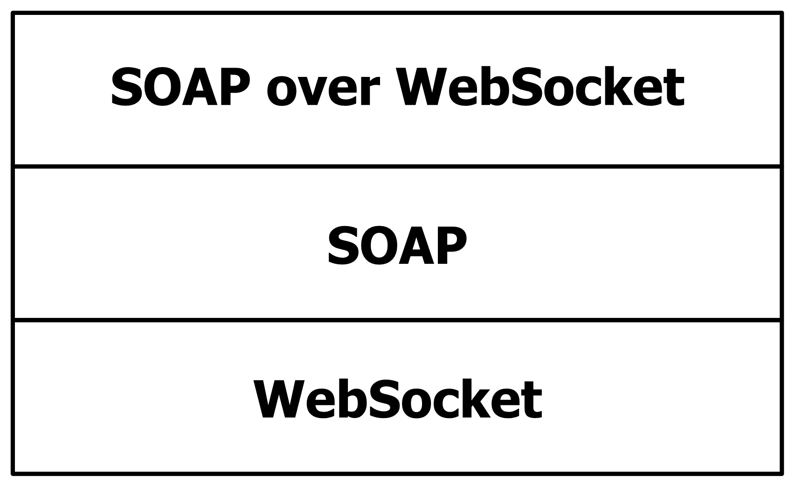

# [MS-SWSB]: SOAP Over WebSocket Protocol Binding

Table of Contents

1 Introduction

- [1 Introduction](#Section_1)
  - [1.1 Glossary](#Section_1.1)
  - [1.2 References](#Section_1.2)
    - [1.2.1 Normative References](#Section_1.2.1)
    - [1.2.2 Informative References](#Section_1.2.2)
  - [1.3 Overview](#Section_1.3)
  - [1.4 Relationship to Other Protocols](#Section_1.4)
  - [1.5 Prerequisites/Preconditions](#Section_1.5)
  - [1.6 Applicability Statement](#Section_1.6)
  - [1.7 Versioning and Capability Negotiation](#Section_1.7)
  - [1.8 Vendor-Extensible Fields](#Section_1.8)
  - [1.9 Standards Assignments](#Section_1.9)

2 Messages

- [2 Messages](#Section_2)
  - [2.1 Transport](#Section_2.1)
  - [2.2 Common Message Syntax](#Section_2.2)
    - [2.2.1 Namespaces](#Section_2.2.1)
    - [2.2.2 Messages](#Section_2.2.2)
    - [2.2.3 Elements](#Section_2.2.3)
    - [2.2.4 Complex Types](#Section_2.2.4)
    - [2.2.5 Simple Types](#Section_2.2.5)
    - [2.2.6 Attributes](#Section_2.2.6)
    - [2.2.7 Groups](#Section_2.2.7)
    - [2.2.8 Attribute Groups](#Section_2.2.8)
    - [2.2.9 Common Data Structures](#Section_2.2.9)
  - [2.3 Directory Service Schema Elements](#Section_2.3)

3 Protocol Details

- [3 Protocol Details](#Section_3)
  - [3.1 Server Details](#Section_3.1)
    - [3.1.1 Abstract Data Model](#Section_3.1.1)
    - [3.1.2 Timers](#Section_3.1.2)
    - [3.1.3 Initialization](#Section_3.1.3)
    - [3.1.4 Message Processing Events and Sequencing Rules](#Section_3.1.4)
    - [3.1.5 Timer Events](#Section_3.1.5)
    - [3.1.6 Other Local Events](#Section_3.1.6)
  - [3.2 Client Details](#Section_3.2)
    - [3.2.1 Abstract Data Model](#Section_3.2.1)
    - [3.2.2 Timers](#Section_3.2.2)
    - [3.2.3 Initialization](#Section_3.2.3)
    - [3.2.4 Message Processing Events and Sequencing Rules](#Section_3.2.4)
    - [3.2.5 Timer Events](#Section_3.2.5)
    - [3.2.6 Other Local Events](#Section_3.2.6)

4 Protocol Examples

- [4 Protocol Examples](#Section_4)

5 Security

- [5 Security](#Section_5)
  - [5.1 Security Considerations for Implementers](#Section_5.1)
  - [5.2 Index of Security Parameters](#Section_5.2)

6 Appendix A: Full WSDL

- [6 Appendix A: Full WSDL](#Section_6)

7 Appendix B: Product Behavior

- [7 Appendix B: Product Behavior](#Section_7)

8 Change Tracking

- [8 Change Tracking](#Section_8)

For the legal notice and IP terms, see [LEGAL.md](../LEGAL.md).
Last updated: 6/25/2021.
See [Revision History](#revision-history) for full version history.

# 1 Introduction

The SOAP over WebSocket Protocol Binding Specification defines a binding of [**SOAP**](#gt_soap) to the WebSocket protocol (as defined in [[RFC6455]](https://go.microsoft.com/fwlink/?LinkId=252388)), including a WSDL transport [**URI**](#gt_uniform-resource-identifier-uri) and supported message exchange patterns (MEPs). This specification also defines a WebSocket subprotocol.

**Note** This specification does not define any SOAP messages. Rather, it specifies how messages defined by a higher-layer protocol are formed and framed for transport over [RFC6455].

Sections 1.5, 1.8, 1.9, 2, and 3 of this specification are normative. All other sections and examples in this specification are informative.

## 1.1 Glossary

This document uses the following terms:

**endpoint**: A client that is on a network and is requesting access to a network access server (NAS).

**SOAP**: A lightweight protocol for exchanging structured information in a decentralized, distributed environment. [**SOAP**](#gt_soap) uses XML technologies to define an extensible messaging framework, which provides a message construct that can be exchanged over a variety of underlying protocols. The framework has been designed to be independent of any particular programming model and other implementation-specific semantics. SOAP 1.2 supersedes SOAP 1.1. See [[SOAP1.2-1/2003]](https://go.microsoft.com/fwlink/?LinkId=90521).

**SOAP message**: An XML document consisting of a mandatory SOAP envelope, an optional SOAP header, and a mandatory SOAP body. See [[SOAP1.2-1/2007]](https://go.microsoft.com/fwlink/?LinkId=94664) section 5 for more information.

**Uniform Resource Identifier (URI)**: A string that identifies a resource. The URI is an addressing mechanism defined in Internet Engineering Task Force (IETF) Uniform Resource Identifier (URI): Generic Syntax [[RFC3986]](https://go.microsoft.com/fwlink/?LinkId=90453).

**Web Services Description Language (WSDL)**: An XML format for describing network services as a set of endpoints that operate on messages that contain either document-oriented or procedure-oriented information. The operations and messages are described abstractly and are bound to a concrete network protocol and message format in order to define an endpoint. Related concrete endpoints are combined into abstract endpoints, which describe a network service. WSDL is extensible, which allows the description of endpoints and their messages regardless of the message formats or network protocols that are used.

**MAY, SHOULD, MUST, SHOULD NOT, MUST NOT:** These terms (in all caps) are used as defined in [[RFC2119]](https://go.microsoft.com/fwlink/?LinkId=90317). All statements of optional behavior use either MAY, SHOULD, or SHOULD NOT.

## 1.2 References

Links to a document in the Microsoft Open Specifications library point to the correct section in the most recently published version of the referenced document. However, because individual documents in the library are not updated at the same time, the section numbers in the documents may not match. You can confirm the correct section numbering by checking the [Errata](https://go.microsoft.com/fwlink/?linkid=850906).

### 1.2.1 Normative References

We conduct frequent surveys of the normative references to assure their continued availability. If you have any issue with finding a normative reference, please contact [dochelp@microsoft.com](mailto:dochelp@microsoft.com). We will assist you in finding the relevant information.

[MC-NBFSE] Microsoft Corporation, "[.NET Binary Format: SOAP Extension](../MC-NBFSE/MC-NBFSE.md)".

[MC-NBFS] Microsoft Corporation, "[.NET Binary Format: SOAP Data Structure](../MC-NBFS/MC-NBFS.md)".

[RFC2119] Bradner, S., "Key words for use in RFCs to Indicate Requirement Levels", BCP 14, RFC 2119, March 1997, [http://www.rfc-editor.org/rfc/rfc2119.txt](https://go.microsoft.com/fwlink/?LinkId=90317)

[RFC3902] Baker, M., and Nottingham, M., "The 'application/soap+xml' media type", RFC 3902, September 2004, [http://www.rfc-editor.org/rfc/rfc3902.txt](https://go.microsoft.com/fwlink/?LinkId=231335)

[RFC6455] Fette, I., and Melnikov, A., "The WebSocket Protocol", RFC 6455, December 2011, [http://www.ietf.org/rfc/rfc6455.txt](https://go.microsoft.com/fwlink/?LinkId=252388)

[SOAP1.2-1/2007] Gudgin, M., Hadley, M., Mendelsohn, N., et al., "SOAP Version 1.2 Part 1: Messaging Framework (Second Edition)", W3C Recommendation, April 2007, [http://www.w3.org/TR/2007/REC-soap12-part1-20070427/](https://go.microsoft.com/fwlink/?LinkId=94664)

[SOAP1.2-2/2007] Gudgin, M., Hadley, M., Mendelsohn, N., et al., "SOAP Version 1.2 Part 2: Adjuncts (Second Edition)", W3C Recommendation, April 2007, [http://www.w3.org/TR/2007/REC-soap12-part2-20070427](https://go.microsoft.com/fwlink/?LinkId=119124)

[SOAP1.2-3/2007] W3C, "SOAP 1.2 Part 3: One-Way MEP", W3C Working Group Note 2, July 2007, [http://www.w3.org/TR/2007/NOTE-soap12-part3-20070702](https://go.microsoft.com/fwlink/?LinkId=231337)

[WSDLSOAP] Angelov, D., Ballinger, K., Butek, R., et al., "WSDL 1.1 Binding Extension for SOAP 1.2", W3C Member Submission, April 2006, [http://www.w3.org/Submission/2006/SUBM-wsdl11soap12-20060405/](https://go.microsoft.com/fwlink/?LinkId=131790)

[WSDL] Christensen, E., Curbera, F., Meredith, G., and Weerawarana, S., "Web Services Description Language (WSDL) 1.1", W3C Note, March 2001, [http://www.w3.org/TR/2001/NOTE-wsdl-20010315](https://go.microsoft.com/fwlink/?LinkId=90577)

[XMLNS-2ED] Bray, T., Hollander, D., Layman, A., and Tobin, R., Eds., "Namespaces in XML 1.0 (Second Edition)", W3C Recommendation, August 2006, [http://www.w3.org/TR/2006/REC-xml-names-20060816/](https://go.microsoft.com/fwlink/?LinkId=90602)

[XMLSCHEMA1] Thompson, H., Beech, D., Maloney, M., and Mendelsohn, N., Eds., "XML Schema Part 1: Structures", W3C Recommendation, May 2001, [http://www.w3.org/TR/2001/REC-xmlschema-1-20010502/](https://go.microsoft.com/fwlink/?LinkId=90608)

[XMLSCHEMA2] Biron, P.V., Ed. and Malhotra, A., Ed., "XML Schema Part 2: Datatypes", W3C Recommendation, May 2001, [http://www.w3.org/TR/2001/REC-xmlschema-2-20010502/](https://go.microsoft.com/fwlink/?LinkId=90610)

### 1.2.2 Informative References

[MS-NETOD] Microsoft Corporation, "[Microsoft .NET Framework Protocols Overview](#Section_1.3)".

## 1.3 Overview

The SOAP over WebSocket Protocol Binding:

- Specifies a WSDL Transport [**URI**](#gt_uniform-resource-identifier-uri) (http://schemas.microsoft.com/soap/websocket) for identifying this protocol as the transport for sending [**SOAP**](#gt_soap) 1.2 messages [[SOAP1.2-2/2007]](https://go.microsoft.com/fwlink/?LinkId=119124).
- Defines a new WebSocket subprotocol (soap), as described in [[RFC6455]](https://go.microsoft.com/fwlink/?LinkId=252388), which is used by the client to indicate to the service that it intends to use the SOAP-over-WebSockets protocol for message exchange.
- Defines two new HTTP headers ('soap-content-type' and 'microsoft-binary-transfer-mode') that are used by the client during the initial WebSocket handshake to indicate the SOAP content-type and the transfer-mode of the subsequent messages.

## 1.4 Relationship to Other Protocols

The SOAP over WebSocket Protocol Binding uses the WebSocket protocol, as described in [[RFC6455]](https://go.microsoft.com/fwlink/?LinkId=252388), as the transport. The SOAP over WebSocket Protocol Binding uses WebSocket framing as defined in section 5 of [RFC6455] to send [**SOAP**](#gt_soap) 1.2 messages [[SOAP1.2-2/2007]](https://go.microsoft.com/fwlink/?LinkId=119124).

The following figure shows the protocol stack.

Figure 1: Protocol stack

## 1.5 Prerequisites/Preconditions

The SOAP over WebSocket Protocol Binding requires that a client can connect to the service over the WebSocket protocol, as described in [[RFC6455]](https://go.microsoft.com/fwlink/?LinkId=252388).

## 1.6 Applicability Statement

The SOAP over WebSocket Protocol Binding is applicable in scenarios where a client and a service require a communication mechanism to send and receive [**SOAP messages**](#gt_soap-message) over WebSocket ([[RFC6455]](https://go.microsoft.com/fwlink/?LinkId=252388)).

## 1.7 Versioning and Capability Negotiation

This document covers versioning issues in the following areas:

- **Supported transports:** This protocol requires WebSocket ([[RFC6455]](https://go.microsoft.com/fwlink/?LinkId=252388)) as the transport.
- **Protocol versions:** The use of [**SOAP**](#gt_soap) version 1.2 [[SOAP1.2-1/2007]](https://go.microsoft.com/fwlink/?LinkId=94664) is required.
- **Capability negotiation**: This protocol does not support negotiation of the version or the capabilities to use.

## 1.8 Vendor-Extensible Fields

This protocol has no vendor-extensible fields.

## 1.9 Standards Assignments

There are no standards assignments for this protocol.

# 2 Messages

## 2.1 Transport

The SOAP over WebSocket Protocol Binding requires the WebSocket transport protocol (as specified in [[RFC6455]](https://go.microsoft.com/fwlink/?LinkId=252388))<1>.

A service [**endpoint**](#gt_endpoint) that uses the SOAP over WebSocket Protocol Binding with [**SOAP**](#gt_soap) 1.2 [[SOAP1.2-1/2007]](https://go.microsoft.com/fwlink/?LinkId=94664) MUST set the value of the transport attribute of the `wsoap12:binding` element [[WSDLSOAP]](https://go.microsoft.com/fwlink/?LinkId=131790) to http://schemas.microsoft.com/soap/websocket.

## 2.2 Common Message Syntax

This section contains common definitions used by this protocol. The syntax of the definitions uses XML schema as defined in [[XMLSCHEMA1]](https://go.microsoft.com/fwlink/?LinkId=90608) and [[XMLSCHEMA2]](https://go.microsoft.com/fwlink/?LinkId=90610), and [**Web Services Description Language (WSDL)**](#gt_web-services-description-language-wsdl) as defined in [[WSDL]](https://go.microsoft.com/fwlink/?LinkId=90577).

### 2.2.1 Namespaces

This specification defines and references various XML namespaces using the mechanisms specified in [[XMLNS-2ED]](https://go.microsoft.com/fwlink/?LinkId=90602). Although this specification associates a specific XML namespace prefix for each XML namespace that is used, the choice of any particular XML namespace prefix is implementation-specific and not significant for interoperability.

| Prefix | Namespace URI | Reference |
| --- | --- | --- |
| soap12 | http://schemas.xmlsoap.org/wsdl/soap12/ | [WSDLSOAP] |
| wsdl | http://schemas.xmlsoap.org/wsdl/ | [WSDL] |

### 2.2.2 Messages

This specification does not define any common XML schema message definitions.

### 2.2.3 Elements

This specification does not define any common XML schema element definitions.

### 2.2.4 Complex Types

This specification does not define any common XML schema complex type definitions.

### 2.2.5 Simple Types

This specification does not define any common XML schema simple type definitions.

### 2.2.6 Attributes

This specification does not define any common XML schema attribute definitions.

### 2.2.7 Groups

This specification does not define any common XML schema group definitions.

### 2.2.8 Attribute Groups

This specification does not define any common XML schema attribute group definitions.

### 2.2.9 Common Data Structures

This specification does not define any common XML schema data structures.

## 2.3 Directory Service Schema Elements

None.

# 3 Protocol Details

## 3.1 Server Details

A service [**endpoint**](#gt_endpoint) MUST support the following message exchange patterns:

- http://www.w3.org/2003/05/soap/mep/request-response/ (defined in [[SOAP1.2-2/2007]](https://go.microsoft.com/fwlink/?LinkId=119124))
- http://www.w3.org/2006/08/soap/mep/one-way/ (defined in [[SOAP1.2-3/2007]](https://go.microsoft.com/fwlink/?LinkId=231337))

### 3.1.1 Abstract Data Model

None.

### 3.1.2 Timers

None.

### 3.1.3 Initialization

None.

### 3.1.4 Message Processing Events and Sequencing Rules

None.

### 3.1.5 Timer Events

None.

### 3.1.6 Other Local Events

None.

## 3.2 Client Details

A client initiates the process by establishing a WebSocket connection, as specified in [[RFC6455]](https://go.microsoft.com/fwlink/?LinkId=252388), to a service. A client MUST specify that it intends to communicate with the service using this SOAP-over-Websocket subprotocol by providing a "soap" value in the "Sec-WebSocket-Protocol" HTTP header during the initialization while performing a WebSocket handshake as specified in [RFC6455] section 1.3. A client MUST also specify a soap-content-type header to indicate the content-type of the subsequent [**SOAP**](#gt_soap) messages once the WebSocket handshake is successfully completed. A client SHOULD also specify a 'microsoft-binary-transfer-mode' with the transfer-mode while using the binary encoding as specified in [MC-NBFS](../MC-NBFS/MC-NBFS.md) or [MC-NBFSE](../MC-NBFSE/MC-NBFSE.md). Valid values for the transfer-mode are:

- 'Streamed', which indicates that messages sent and received from the web service [**endpoint**](#gt_endpoint) are transferred as a stream of bytes.
- 'StreamedRequest', which indicates that only the messages sent to a web service endpoint are transferred as a stream of bytes.
- 'StreamedResponse', which indicates that the messages received from the web service endpoint are interpreted as a stream of bytes.
Once a WebSocket connection has been successfully established between the client and the server, all subsequent message exchanges MUST conform to the SOAP 1.2 [[SOAP1.2-1/2007]](https://go.microsoft.com/fwlink/?LinkId=94664) specification with the encoding as specified in [[RFC3902]](https://go.microsoft.com/fwlink/?LinkId=231335) while sending the messages using the framing as defined in [RFC6455].

### 3.2.1 Abstract Data Model

None.

### 3.2.2 Timers

None.

### 3.2.3 Initialization

None.

### 3.2.4 Message Processing Events and Sequencing Rules

None.

### 3.2.5 Timer Events

None.

### 3.2.6 Other Local Events

None.

# 4 Protocol Examples

[Section 6, Appendix A: Full WSDL](#Section_6), specifies the SOAP over WebSocket Binding Transport URI defined in this document.

The following HTTP headers section is an example of the WebSocket subprotocol defined by this specification:

GET http://myHost/myService HTTP/1.1

Connection: Upgrade,Keep-Alive

Upgrade: websocket

Sec-WebSocket-Key: ROOw9dYOJkStW2nx5r1k9w==

Sec-WebSocket-Version: 13

Sec-WebSocket-Protocol: soap

soap-content-type: application/soap+msbinsession1

microsoft-binary-transfer-mode: Buffered

Accept-Encoding: gzip, deflate

HTTP/1.1 101 Switching Protocols

Upgrade: websocket

Connection: Upgrade

Sec-WebSocket-Accept: s3pPLMBiTxaQ9kYGzzhZRbK+xOo=

Sec-WebSocket-Protocol: soap

# 5 Security

## 5.1 Security Considerations for Implementers

Security considerations are discussed in detail under the security considerations section (section 10) in [[RFC6455]](https://go.microsoft.com/fwlink/?LinkId=252388).

There are no special security considerations for this protocol.

## 5.2 Index of Security Parameters

None.

# 6 Appendix A: Full WSDL

The following WSDL specifies the WSDL 1.1 binding extension transport URI with SOAP1.2:

**WSDL 1.1 binding extension transport URI with SOAP 1.2 [SOAP1.2-2/2007]**

<?xml version="1.0" encoding="utf-8"?>

<wsdl:definitions

xmlns:wsdl="http://schemas.xmlsoap.org/wsdl/"

xmlns:soap12="http://schemas.xmlsoap.org/wsdl/soap12/">

<!-- omitted elements -->

<wsdl:binding name="MyBinding" type="MyPortType">

<!-- omitted elements -->

<soap12:binding transport="http://schemas.microsoft.com/soap/websocket"/>

<wsdl:operation name="MyOperation">

<!-- ommitted elements -->

</wsdl:operation>

</wsdl:binding>

<wsdl:service name="MyService">

<wsdl:port name="MyPort" binding="MyBinding">

<soap12:address location=" ws://myHost/myService/" />

</wsdl:port>

</wsdl:service>

</wsdl:definitions>

# 7 Appendix B: Product Behavior

The information in this specification is applicable to the following Microsoft products or supplemental software. References to product versions include updates to those products.

The terms "earlier" and "later", when used with a product version, refer to either all preceding versions or all subsequent versions, respectively. The term "through" refers to the inclusive range of versions. Applicable Microsoft products are listed chronologically in this section.

This document specifies version-specific details in the Microsoft .NET Framework. For information about which versions of the .NET Framework are available in each released Windows product or as supplemental software, see [MS-NETOD](#Section_1.3) section 4.

**Framework Releases**

- Microsoft .NET Framework 4.5
- Microsoft .NET Framework 4.6
- Microsoft .NET Framework 4.7
- Microsoft .NET Framework 4.8
**Windows Client Releases**

- Windows 8 operating system
- Windows 8.1 operating system
- Windows 10 operating system
- Windows 11 operating system
**Windows Server Releases**

- Windows Server 2012 operating system
- Windows Server 2012 R2 operating system
- Windows Server 2016 operating system
- Windows Server operating system
- Windows Server 2019 operating system
- Windows Server 2022 operating system
Exceptions, if any, are noted in this section. If an update version, service pack or Knowledge Base (KB) number appears with a product name, the behavior changed in that update. The new behavior also applies to subsequent updates unless otherwise specified. If a product edition appears with the product version, behavior is different in that product edition.

Unless otherwise specified, any statement of optional behavior in this specification that is prescribed using the terms "SHOULD" or "SHOULD NOT" implies product behavior in accordance with the SHOULD or SHOULD NOT prescription. Unless otherwise specified, the term "MAY" implies that the product does not follow the prescription.

<1> Section 2.1: The Websocket protocol is supported only on Windows 8 and later and on Windows Server 2012 and later.

# 8 Change Tracking

This section identifies changes that were made to this document since the last release. Changes are classified as Major, Minor, or None.

The revision class **Major** means that the technical content in the document was significantly revised. Major changes affect protocol interoperability or implementation. Examples of major changes are:

- A document revision that incorporates changes to interoperability requirements.
- A document revision that captures changes to protocol functionality.
The revision class **Minor** means that the meaning of the technical content was clarified. Minor changes do not affect protocol interoperability or implementation. Examples of minor changes are updates to clarify ambiguity at the sentence, paragraph, or table level.

The revision class **None** means that no new technical changes were introduced. Minor editorial and formatting changes may have been made, but the relevant technical content is identical to the last released version.

The changes made to this document are listed in the following table. For more information, please contact [dochelp@microsoft.com](mailto:dochelp@microsoft.com).

| Section | Description | Revision class |
| --- | --- | --- |
| [7](#Section_7) Appendix B: Product Behavior | Updated for this version of Windows Client. | Major |

## Revision History

| Date | Version | Revision Class | Comments |
| --- | --- | --- | --- |
| 12/16/2011 | 1.0 | New | Released new document. |
| 3/30/2012 | 1.0 | None | No changes to the meaning, language, or formatting of the technical content. |
| 7/12/2012 | 2.0 | Major | Significantly changed the technical content. |
| 10/25/2012 | 2.0 | None | No changes to the meaning, language, or formatting of the technical content. |
| 1/31/2013 | 2.0 | None | No changes to the meaning, language, or formatting of the technical content. |
| 8/8/2013 | 2.1 | Minor | Clarified the meaning of the technical content. |
| 11/14/2013 | 2.1 | None | No changes to the meaning, language, or formatting of the technical content. |
| 2/13/2014 | 2.1 | None | No changes to the meaning, language, or formatting of the technical content. |
| 5/15/2014 | 2.1 | None | No changes to the meaning, language, or formatting of the technical content. |
| 6/30/2015 | 3.0 | Major | Significantly changed the technical content. |
| 10/16/2015 | 3.0 | None | No changes to the meaning, language, or formatting of the technical content. |
| 7/14/2016 | 3.0 | None | No changes to the meaning, language, or formatting of the technical content. |
| 3/16/2017 | 4.0 | Major | Significantly changed the technical content. |
| 6/1/2017 | 4.0 | None | No changes to the meaning, language, or formatting of the technical content. |
| 9/15/2017 | 5.0 | Major | Significantly changed the technical content. |
| 9/12/2018 | 6.0 | Major | Significantly changed the technical content. |
| 3/13/2019 | 7.0 | Major | Significantly changed the technical content. |
| 6/25/2021 | 8.0 | Major | Significantly changed the technical content. |
