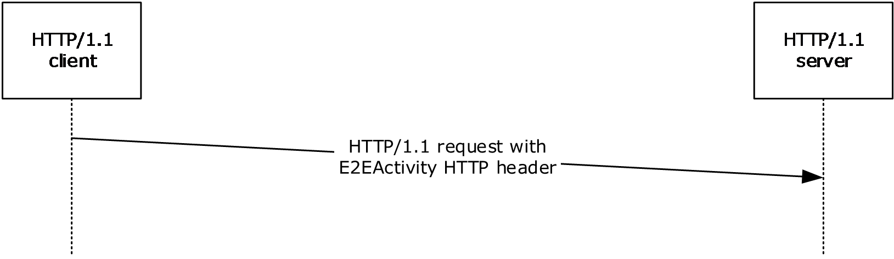

**[MS-THCH]:**

**Tracing HTTP Correlation Header Protocol**

Table of Contents

1 Introduction

- [1 Introduction](#Section_1)
  - [1.1 Glossary](#Section_1.1)
  - [1.2 References](#Section_1.2)
    - [1.2.1 Normative References](#Section_1.2.1)
    - [1.2.2 Informative References](#Section_1.2.2)
  - [1.3 Overview](#Section_1.3)
  - [1.4 Relationship to Other Protocols](#Section_1.4)
  - [1.5 Prerequisites/Preconditions](#Section_1.5)
  - [1.6 Applicability Statement](#Section_1.6)
  - [1.7 Versioning and Capability Negotiation](#Section_1.7)
  - [1.8 Vendor-Extensible Fields](#Section_1.8)
  - [1.9 Standards Assignments](#Section_1.9)

2 Messages

- [2 Messages](#Section_2)
  - [2.1 Transport](#Section_2.1)
  - [2.2 Message Syntax](#Section_2.2)

3 Protocol Details

- [3 Protocol Details](#Section_3)
  - [3.1 HTTP/1.1 Client Details](#Section_3.1)
    - [3.1.1 Abstract Data Model](#Section_3.1.1)
    - [3.1.2 Timers](#Section_3.1.2)
    - [3.1.3 Initialization](#Section_3.1.3)
    - [3.1.4 Higher-Layer Triggered Events](#Section_3.1.4)
    - [3.1.5 Message Processing Events and Sequencing Rules](#Section_3.1.5)
    - [3.1.6 Timer Events](#Section_3.1.6)
    - [3.1.7 Other Local Events](#Section_3.1.7)

4 Protocol Examples

- [4 Protocol Examples](#Section_4)

5 Security

- [5 Security](#Section_5)
  - [5.1 Security Considerations for Implementers](#Section_5.1)
  - [5.2 Index of Security Parameters](#Section_5.2)

6 Appendix A: Product Behavior

- [6 Appendix A: Product Behavior](#Section_6)

7 Change Tracking

- [7 Change Tracking](#Section_7)

For the legal notice and IP terms, see [LEGAL.md](../LEGAL.md).
Last updated: 3/13/2019.
See [Revision History](#revision-history) for full version history.

# 1 Introduction

The Tracing HTTP Correlation Header Protocol specifies the E2EActivity HTTP header which can be used by an HTTP/1.1 client to communicate a unique identifier for an HTTP message to an HTTP server. The identifier is used in turn by the server to correlate traces generated by the server to messages received from the client.

Sections 1.5, 1.8, 1.9, 2, and 3 of this specification are normative. All other sections and examples in this specification are informative.

## 1.1 Glossary

This document uses the following terms:

**base64 encoding**: A binary-to-text encoding scheme whereby an arbitrary sequence of bytes is converted to a sequence of printable ASCII characters, as described in [[RFC4648]](https://go.microsoft.com/fwlink/?LinkId=90487).

**client**: A computer on which the remote procedure call (RPC) client is executing.

**ETW**: Event Tracing for Windows. For more information, see [MSDN-ETW].

**globally unique identifier (GUID)**: A term used interchangeably with universally unique identifier (UUID) in Microsoft protocol technical documents (TDs). Interchanging the usage of these terms does not imply or require a specific algorithm or mechanism to generate the value. Specifically, the use of this term does not imply or require that the algorithms described in [[RFC4122]](https://go.microsoft.com/fwlink/?LinkId=90460) or [[C706]](https://go.microsoft.com/fwlink/?LinkId=89824) must be used for generating the [**GUID**](#gt_globally-unique-identifier-guid). See also universally unique identifier (UUID).

**HTTP client**: A program that establishes connections for the purpose of sending requests, as specified in [[RFC2616]](https://go.microsoft.com/fwlink/?LinkId=90372).

**HTTP server**: An application that accepts connections in order to service requests by sending back responses. For more information, see [RFC2616].

**Representational State Transfer (REST)**: A class of web services that is used to transfer domain-specific data by using HTTP, without additional messaging layers or session tracking, and returns textual data, such as XML.

**tracing**: A mechanism used to write out diagnostic information.

**WCF service**: Windows Communication Foundation (WCF) service. A program that exposes a collection of endpoints for communicating with client applications or other service applications.

**MAY, SHOULD, MUST, SHOULD NOT, MUST NOT:** These terms (in all caps) are used as defined in [[RFC2119]](https://go.microsoft.com/fwlink/?LinkId=90317). All statements of optional behavior use either MAY, SHOULD, or SHOULD NOT.

## 1.2 References

Links to a document in the Microsoft Open Specifications library point to the correct section in the most recently published version of the referenced document. However, because individual documents in the library are not updated at the same time, the section numbers in the documents may not match. You can confirm the correct section numbering by checking the [Errata](https://go.microsoft.com/fwlink/?linkid=850906).

### 1.2.1 Normative References

We conduct frequent surveys of the normative references to assure their continued availability. If you have any issue with finding a normative reference, please contact [dochelp@microsoft.com](mailto:dochelp@microsoft.com). We will assist you in finding the relevant information.

[RFC2119] Bradner, S., "Key words for use in RFCs to Indicate Requirement Levels", BCP 14, RFC 2119, March 1997, [http://www.rfc-editor.org/rfc/rfc2119.txt](https://go.microsoft.com/fwlink/?LinkId=90317)

[RFC2616] Fielding, R., Gettys, J., Mogul, J., et al., "Hypertext Transfer Protocol -- HTTP/1.1", RFC 2616, June 1999, [http://www.rfc-editor.org/rfc/rfc2616.txt](https://go.microsoft.com/fwlink/?LinkId=90372)

### 1.2.2 Informative References

[MS-NETOD] Microsoft Corporation, "[Microsoft .NET Framework Protocols Overview](#Section_1.3)".

[MSDN-ETW] Microsoft Corporation, "Improving Debugging and Performance Tuning with ETW", April 2007, [http://msdn.microsoft.com/en-us/magazine/cc163437.aspx](https://go.microsoft.com/fwlink/?LinkId=225023)

[MSDN-WCFETW] Microsoft Corporation, "WCF Services and Event Tracing for Windows", [https://msdn.microsoft.com/en-us/library/dd764466(v=vs.110).aspx](https://go.microsoft.com/fwlink/?linkid=842930)

[MSDN-WCFREST] Microsoft Corporation, "A Guide to Designing and Building RESTful Web Services with WCF 3.5", [https://msdn.microsoft.com/en-us/library/dd203052.asp](https://go.microsoft.com/fwlink/?LinkId=225024)

[MSDN-WCF] Microsoft Corporation, "Windows Communication Foundation", [http://msdn.microsoft.com/en-us/library/ms735119.aspx](https://go.microsoft.com/fwlink/?LinkId=100290)

[SOAP1.1] Box, D., Ehnebuske, D., Kakivaya, G., et al., "Simple Object Access Protocol (SOAP) 1.1", W3C Note, May 2000, [http://www.w3.org/TR/2000/NOTE-SOAP-20000508/](https://go.microsoft.com/fwlink/?LinkId=90520)

## 1.3 Overview

The Tracing HTTP Correlation Header Protocol specifies the E2EActivity HTTP header.

In HTTP/1.1, an [**HTTP client**](#gt_http-client) can specify a unique identifier for an HTTP message by including the E2EActivity HTTP header in the HTTP message. When the message is received by the [**HTTP server**](#gt_http-server), the identifier can be used when emitting [**traces**](#gt_tracing) to provide a correlation between generated traces and incoming messages from the client.<1>

There are no changes to the HTTP messages sent from the server to the client based on receipt of the E2EActivity HTTP header.

Figure 1: Sequence diagram showing communication of the E2EActivity HTTP header between the HTTP client and HTTP server

## 1.4 Relationship to Other Protocols

None.

## 1.5 Prerequisites/Preconditions

None.

## 1.6 Applicability Statement

When no other mechanism exists for an [**HTTP server**](#gt_http-server) to uniquely identify an HTTP message received from an [**HTTP client**](#gt_http-client), the client can use the E2EActivity HTTP header to correlate the [**traces**](#gt_tracing) generated by the server in response to messages received from the client.

## 1.7 Versioning and Capability Negotiation

None.

## 1.8 Vendor-Extensible Fields

None.

## 1.9 Standards Assignments

None.

# 2 Messages

## 2.1 Transport

HTTP/1.1 is the only transport supported by this protocol for use of the E2EActivity HTTP header.

## 2.2 Message Syntax

The E2EActivity HTTP header defined by this protocol can be used by HTTP clients when sending HTTP/1.1 messages. The syntax for HTTP/1.1 messages is defined in [[RFC2616]](https://go.microsoft.com/fwlink/?LinkId=90372).

To provide the unique identifier, the HTTP client SHOULD [**base64**](#gt_179b9392-9019-45a3-880b-26f6890522b7)-encode the identifier as a [**GUID**](#gt_globally-unique-identifier-guid) and include it as the value for the E2EActivity HTTP header in the HTTP header collection in the HTTP message. The client SHOULD specify a unique identifier value for each HTTP message it sends. The following example shows a typical E2EActivity header with a base64-encoded value:

E2EActivity: GWABtfYCDEu4hxOZR7sWGQ==

Upon receipt of the HTTP message from the client, the [**HTTP server**](#gt_http-server) SHOULD base64-decode the GUID value of the E2EActivity HTTP header in the HTTP message. The server MUST then include this identifier value when emitting [**traces**](#gt_tracing) for the corresponding HTTP message. By doing so, the server traces can be correlated to the received HTTP message which caused the trace to be generated.

# 3 Protocol Details

## 3.1 HTTP/1.1 Client Details

### 3.1.1 Abstract Data Model

None.

### 3.1.2 Timers

None.

### 3.1.3 Initialization

None.

### 3.1.4 Higher-Layer Triggered Events

An HTTP/1.1 client can include the E2EActivity HTTP header (section [2.2](#Section_2.2)) in the HTTP messages it sends to the [**HTTP server**](#gt_http-server).

### 3.1.5 Message Processing Events and Sequencing Rules

When an HTTP/1.1 [**client**](#gt_client) includes the E2EActivity HTTP header in the HTTP messages it sends to the [**HTTP server**](#gt_http-server), the response message from the server is not affected. Therefore, the client processing rules for response messages received from the server MUST NOT change.

### 3.1.6 Timer Events

None.

### 3.1.7 Other Local Events

None.

# 4 Protocol Examples

The following example shows how an HTTP/1.1 client specifies a [**base64**](#gt_179b9392-9019-45a3-880b-26f6890522b7)-encoded unique identifier as the value for the E2EActivity HTTP header in the HTTP message. In this example, the [**GUID**](#gt_globally-unique-identifier-guid) value "100f44d4-c7ac-45dc-98f7-974c064d61dd" is base64-encoded as "1EQPEKzH3EWY95dMBk1h3Q==" in the E2EActivity HTTP header in the HTTP message. When a value is specified for the E2EActivity HTTP header, the [**HTTP server**](#gt_http-server) includes the value when generating tracing data related to the received message.

POST http://server/Service/Service1.svc HTTP/1.1

Content-Type: text/xml; charset=utf-8

E2EActivity: 1EQPEKzH3EWY95dMBk1h3Q==

Content-Length: 157

# 5 Security

## 5.1 Security Considerations for Implementers

None.

## 5.2 Index of Security Parameters

None.

# 6 Appendix A: Product Behavior

The information in this specification is applicable to the following Microsoft products or supplemental software. References to product versions include updates to those products.

This document specifies version-specific details in the Microsoft .NET Framework. For information about which versions of .NET Framework are available in each released Windows product or as supplemental software, see [MS-NETOD](#Section_1.3) section 4.

- Microsoft .NET Framework 4.5
- Microsoft .NET Framework 4.6
- Microsoft .NET Framework 4.7
- Microsoft .NET Framework 4.8
Exceptions, if any, are noted in this section. If an update version, service pack or Knowledge Base (KB) number appears with a product name, the behavior changed in that update. The new behavior also applies to subsequent updates unless otherwise specified. If a product edition appears with the product version, behavior is different in that product edition.

Unless otherwise specified, any statement of optional behavior in this specification that is prescribed using the terms "SHOULD" or "SHOULD NOT" implies product behavior in accordance with the SHOULD or SHOULD NOT prescription. Unless otherwise specified, the term "MAY" implies that the product does not follow the prescription.

<1> Section 1.3: The Windows implementation of this protocol is exercised in Windows Communication Foundation [[MSDN-WCF]](https://go.microsoft.com/fwlink/?LinkId=100290) when [**ETW**](#gt_etw) [**tracing**](#gt_tracing) [[MSDN-ETW]](https://go.microsoft.com/fwlink/?LinkId=225023) is enabled on the client and the client is communicating with a [**WCF service**](#gt_wcf-service) over the HTTP transport. In this scenario, common message exchange patterns can include [**REST**](#gt_representational-state-transfer-rest) [[MSDN-WCFREST]](https://go.microsoft.com/fwlink/?LinkId=225024) and SOAP [[SOAP1.1]](https://go.microsoft.com/fwlink/?LinkId=90520). For a sample demonstration on how to use the analytic tracing in WCF to emit events in ETW, see [[MSDN-WCFETW]](https://go.microsoft.com/fwlink/?linkid=842930).

# 7 Change Tracking

This section identifies changes that were made to this document since the last release. Changes are classified as Major, Minor, or None.

The revision class **Major** means that the technical content in the document was significantly revised. Major changes affect protocol interoperability or implementation. Examples of major changes are:

- A document revision that incorporates changes to interoperability requirements.
- A document revision that captures changes to protocol functionality.
The revision class **Minor** means that the meaning of the technical content was clarified. Minor changes do not affect protocol interoperability or implementation. Examples of minor changes are updates to clarify ambiguity at the sentence, paragraph, or table level.

The revision class **None** means that no new technical changes were introduced. Minor editorial and formatting changes may have been made, but the relevant technical content is identical to the last released version.

The changes made to this document are listed in the following table. For more information, please contact [dochelp@microsoft.com](mailto:dochelp@microsoft.com).

| Section | Description | Revision class |
| --- | --- | --- |
| [6](#Section_6) Appendix A: Product Behavior | Added .NET 4.8 to the list of applicable products. | Major |

## Revision History

| Date | Version | Revision Class | Comments |
| --- | --- | --- | --- |
| 12/16/2011 | 1.0 | New | Released new document. |
| 3/30/2012 | 1.0 | None | No changes to the meaning, language, or formatting of the technical content. |
| 7/12/2012 | 1.0 | None | No changes to the meaning, language, or formatting of the technical content. |
| 10/25/2012 | 1.0 | None | No changes to the meaning, language, or formatting of the technical content. |
| 1/31/2013 | 1.0 | None | No changes to the meaning, language, or formatting of the technical content. |
| 8/8/2013 | 1.0 | None | No changes to the meaning, language, or formatting of the technical content. |
| 11/14/2013 | 1.0 | None | No changes to the meaning, language, or formatting of the technical content. |
| 2/13/2014 | 1.0 | None | No changes to the meaning, language, or formatting of the technical content. |
| 5/15/2014 | 1.0 | None | No changes to the meaning, language, or formatting of the technical content. |
| 6/30/2015 | 2.0 | Major | Significantly changed the technical content. |
| 10/16/2015 | 2.0 | None | No changes to the meaning, language, or formatting of the technical content. |
| 7/14/2016 | 2.0 | None | No changes to the meaning, language, or formatting of the technical content. |
| 3/16/2017 | 3.0 | Major | Significantly changed the technical content. |
| 6/1/2017 | 3.0 | None | No changes to the meaning, language, or formatting of the technical content. |
| 3/13/2019 | 4.0 | Major | Significantly changed the technical content. |
