# [MS-TCC]: Tethering Control Channel Protocol

Table of Contents

1 Introduction

- [1 Introduction](#Section_1)
  - [1.1 Glossary](#Section_1.1)
  - [1.2 References](#Section_1.2)
    - [1.2.1 Normative References](#Section_1.2.1)
    - [1.2.2 Informative References](#Section_1.2.2)
  - [1.3 Overview](#Section_1.3)
  - [1.4 Relationship to Other Protocols](#Section_1.4)
  - [1.5 Prerequisites/Preconditions](#Section_1.5)
  - [1.6 Applicability Statement](#Section_1.6)
  - [1.7 Versioning and Capability Negotiation](#Section_1.7)
  - [1.8 Vendor-Extensible Fields](#Section_1.8)
  - [1.9 Standards Assignments](#Section_1.9)

2 Messages

- [2 Messages](#Section_2)
  - [2.1 Transport](#Section_2.1)
  - [2.2 Message Syntax](#Section_2.2)
    - [2.2.1 Enumerations](#Section_2.2.1)
      - [2.2.1.1 MessageId Enumeration](#Section_2.2.1.1)
      - [2.2.1.2 StatusCodeEnum Enumeration](#Section_2.2.1.2)
      - [2.2.1.3 TypeId Enumeration](#Section_2.2.1.3)
    - [2.2.2 Structures](#Section_2.2.2)
      - [2.2.2.1 Bssid Structure](#Section_2.2.2.1)
      - [2.2.2.2 CommonHeader Structure](#Section_2.2.2.2)
      - [2.2.2.3 DisplayName Structure](#Section_2.2.2.3)
      - [2.2.2.4 EncryptedBringUpSuccessResponse Structure](#Section_2.2.2.4)
      - [2.2.2.5 ErrorString Structure](#Section_2.2.2.5)
      - [2.2.2.6 HMAC Structure](#Section_2.2.2.6)
      - [2.2.2.7 InitializationVector Structure](#Section_2.2.2.7)
      - [2.2.2.8 MessageType Structure](#Section_2.2.2.8)
      - [2.2.2.9 Passphrase Structure](#Section_2.2.2.9)
      - [2.2.2.10 Ssid Structure](#Section_2.2.2.10)
      - [2.2.2.11 StatusCode Structure](#Section_2.2.2.11)
      - [2.2.2.12 Timestamp Structure](#Section_2.2.2.12)
    - [2.2.3 Messages](#Section_2.2.3)
      - [2.2.3.1 BringUpStartRequest Message](#Section_2.2.3.1)
      - [2.2.3.2 BringUpSuccessResponse Message](#Section_2.2.3.2)
      - [2.2.3.3 BringUpSuccessResponseUnpaired Message](#Section_2.2.3.3)
      - [2.2.3.4 BringUpFailureResponse Message](#Section_2.2.3.4)
      - [2.2.3.5 ProtocolErrorResponse Message](#Section_2.2.3.5)

3 Protocol Details

- [3 Protocol Details](#Section_3)
  - [3.1 Client Details](#Section_3.1)
    - [3.1.1 Abstract Data Model](#Section_3.1.1)
    - [3.1.2 Timers](#Section_3.1.2)
    - [3.1.3 Initialization](#Section_3.1.3)
    - [3.1.4 Higher-Layer Triggered Events](#Section_3.1.4)
      - [3.1.4.1 Cancellation](#Section_3.1.4.1)
    - [3.1.5 Message Processing Events and Sequencing Rules](#Section_3.1.5)
      - [3.1.5.1 BringUpSuccessResponse](#Section_3.1.5.1)
      - [3.1.5.2 BringUpSuccessResponseUnpaired](#Section_3.1.5.2)
      - [3.1.5.3 BringUpFailureResponse](#Section_3.1.5.3)
      - [3.1.5.4 Failure Messages](#Section_3.1.5.4)
      - [3.1.5.5 Other Messages](#Section_3.1.5.5)
    - [3.1.6 Timer Events](#Section_3.1.6)
    - [3.1.7 Other Local Events](#Section_3.1.7)
      - [3.1.7.1 Disconnect Event of Transport Channel](#Section_3.1.7.1)
  - [3.2 Server Details](#Section_3.2)
    - [3.2.1 Abstract Data Model](#Section_3.2.1)
    - [3.2.2 Timers](#Section_3.2.2)
    - [3.2.3 Initialization](#Section_3.2.3)
    - [3.2.4 Higher-Layer Triggered Events](#Section_3.2.4)
      - [3.2.4.1 Shutdown](#Section_3.2.4.1)
      - [3.2.4.2 Tethering Started or Failed to Start](#Section_3.2.4.2)
    - [3.2.5 Message Processing Events and Sequencing Rules](#Section_3.2.5)
      - [3.2.5.1 BringUpStartRequest](#Section_3.2.5.1)
      - [3.2.5.2 Failure Messages](#Section_3.2.5.2)
      - [3.2.5.3 Other Messages](#Section_3.2.5.3)
    - [3.2.6 Timer Events](#Section_3.2.6)
    - [3.2.7 Other Local Events](#Section_3.2.7)
      - [3.2.7.1 Disconnect Event of Transport Channel](#Section_3.2.7.1)

4 Protocol Examples

- [4 Protocol Examples](#Section_4)
  - [4.1 Successful Startup](#Section_4.1)
    - [4.1.1 BringUpStartRequest Example (Successful)](#Section_4.1.1)
    - [4.1.2 BringUpSuccessResponse Example (Successful)](#Section_4.1.2)
  - [4.2 Unsuccessful Startup](#Section_4.2)
    - [4.2.1 BringUpStartRequest Example (Unsuccessful)](#Section_4.2.1)
    - [4.2.2 BringUpFailureResponse Example (Unsuccessful)](#Section_4.2.2)

5 Security

- [5 Security](#Section_5)
  - [5.1 Security Considerations for Implementers](#Section_5.1)
  - [5.2 Index of Security Parameters](#Section_5.2)

6 Appendix A: Product Behavior

- [6 Appendix A: Product Behavior](#Section_6)

7 Change Tracking

- [7 Change Tracking](#Section_7)

For the legal notice and IP terms, see [LEGAL.md](../LEGAL.md).
Last updated: 4/23/2024.
See [Revision History](#revision-history) for full version history.

# 1 Introduction

The Tethering Control Channel Protocol (TCC) facilitates the sharing of a server’s network connection with one or more clients over Bluetooth transport. This Protocol allows a client to send control messages to a sharing-capable server to request to share a server's Internet connection. The control message informs the server that a client is interested in tethering, and the server can then bring up a Wi-Fi access point for the client to connect to. At the point that the access point has been set up or is not able to be set up, the server responds to the client with the appropriate Wi-Fi connection credentials (SSID and Password) and specifies the tethering configuration settings or an error code denoting the reason that the connection failed.

Sections 1.5, 1.8, 1.9, 2, and 3 of this specification are normative. All other sections and examples in this specification are informative.

## 1.1 Glossary

This document uses the following terms:

**ASCII**: The American Standard Code for Information Interchange (ASCII) is an 8-bit character-encoding scheme based on the English alphabet. ASCII codes represent text in computers, communications equipment, and other devices that work with text. ASCII refers to a single 8-bit ASCII character or an array of 8-bit ASCII characters with the high bit of each character set to zero.

**basic service set identifier (BSSID)**: A 48-bit structure that is used to identify an entity such as the access point in a wireless network. This is typically a MAC address.

**display name**: A text string that is used to identify a principal or other object in the user interface. Also referred to as title.

**encryption**: In cryptography, the process of obscuring information to make it unreadable without special knowledge.

**encryption key**: One of the input parameters to an [**encryption**](#gt_encryption) algorithm. Generally speaking, an encryption algorithm takes as input a clear-text message and a key, and results in a cipher-text message. The corresponding decryption algorithm takes a cipher-text message, and the key, and results in the original clear-text message.

**globally unique identifier (GUID)**: A term used interchangeably with universally unique identifier (UUID) in Microsoft protocol technical documents (TDs). Interchanging the usage of these terms does not imply or require a specific algorithm or mechanism to generate the value. Specifically, the use of this term does not imply or require that the algorithms described in [[RFC4122]](https://go.microsoft.com/fwlink/?LinkId=90460) or [[C706]](https://go.microsoft.com/fwlink/?LinkId=89824) must be used for generating the [**GUID**](#gt_globally-unique-identifier-guid). See also universally unique identifier (UUID).

**Hash-based Message Authentication Code (HMAC)**: A mechanism for message authentication using cryptographic hash functions. HMAC can be used with any iterative cryptographic hash function (for example, MD5 and SHA-1) in combination with a secret shared key. The cryptographic strength of HMAC depends on the properties of the underlying hash function.

**network byte order**: The order in which the bytes of a multiple-byte number are transmitted on a network, most significant byte first (in big-endian storage). This may or may not match the order in which numbers are normally stored in memory for a particular processor.

**paired relationship**: In a Bluetooth communication scenario, two devices that have established a relationship through the creation of a shared secret known as a link key. The link key enables confirmation of device identity and is used to maintain security across devices.

**passphrase**: One or more words entered as a security setting to enable device or identity authentication.

**radio frequency communications (RFCOMM)**: A protocol that provides serial port emulation of EIA-232 (formerly RS-232) control signals over the Bluetooth baseband layer. RFCOMM is used to create a virtual serial data stream to enable binary data transport.

**Service Discovery Protocol (SDP)**: This protocol allows a device to discover services (and their associated configuration settings) offered by other devices. A service is identified by a universally unique identifier (UUID) where recognized services, such as Bluetooth profiles, are assigned a short form UUID (16 bits rather than 128).

**service set identifier (SSID)**: A sequence of characters that names a wireless local area network (WLAN).

**tether**: Enables a device to gain access to the Internet by establishing a connection with another device that is connected to the Internet.

**timestamp**: A condition of a digital signature that indicates whether the signature was created with a valid certificate that has expired or was created with a certificate that had expired already. If the certificate expired after the signature was created, the signature can be trusted. If it expired before the signature was created, it cannot be trusted.

**trust**: To accept another authority's statements for the purposes of authentication and authorization, especially in the case of a relationship between two domains. If domain A trusts domain B, domain A accepts domain B's authentication and authorization statements for principals represented by security principal objects in domain B; for example, the list of groups to which a particular user belongs. As a noun, a [**trust**](#gt_trust) is the relationship between two domains described in the previous sentence.

**type-length-value (TLV)**: A method of organizing data that involves a Type code (16-bit), a specified length of a Value field (16-bit), and the data in the Value field (variable).

**MAY, SHOULD, MUST, SHOULD NOT, MUST NOT:** These terms (in all caps) are used as defined in [[RFC2119]](https://go.microsoft.com/fwlink/?LinkId=90317). All statements of optional behavior use either MAY, SHOULD, or SHOULD NOT.

## 1.2 References

Links to a document in the Microsoft Open Specifications library point to the correct section in the most recently published version of the referenced document. However, because individual documents in the library are not updated at the same time, the section numbers in the documents may not match. You can confirm the correct section numbering by checking the [Errata](https://go.microsoft.com/fwlink/?linkid=850906).

### 1.2.1 Normative References

We conduct frequent surveys of the normative references to assure their continued availability. If you have any issue with finding a normative reference, please contact [dochelp@microsoft.com](mailto:dochelp@microsoft.com). We will assist you in finding the relevant information.

[BT-RFCOMM] Bluetooth Special Interest Group, "Bluetooth Specification version 1.1, Part F:1, RFCOMM with TS 07.10, Serial Port Emulation", June 2003, [https://www.bluetooth.com/specifications/archived-specifications/](https://go.microsoft.com/fwlink/?LinkId=294277)

[BT-SDP] Bluetooth Special Interest Group, "Bluetooth Specification Version 4.0, Volume 3 - Core System Package [Host Volume], Part B - Service Discovery Protocol (SDP) Specification", June 2010, [https://www.bluetooth.com/specifications/archived-specifications/](https://go.microsoft.com/fwlink/?LinkId=294278)

[IEEE802.11-2012] IEEE, "Telecommunications and information exchange between systems Local and metropolitan area networks--Specific requirements Part 11: Wireless LAN Medium Access Control (MAC) and Physical Layer (PHY) Specifications", IEEE 802.11-2012, [https://standards.ieee.org/ieee/802.11/4523/](https://go.microsoft.com/fwlink/?LinkID=306038)

**Note** There is a charge to download this document.

[RFC2119] Bradner, S., "Key words for use in RFCs to Indicate Requirement Levels", BCP 14, RFC 2119, March 1997, [https://www.rfc-editor.org/info/rfc2119](https://go.microsoft.com/fwlink/?LinkId=90317)

[RFC4086] Eastlake III, D., Schiller, J., and Crokcer, S., "Randomness Requirements for Security", BCP 106, RFC 4086, June 2005, [https://www.rfc-editor.org/info/rfc4086](https://go.microsoft.com/fwlink/?LinkId=90456)

[WF-Security] Wi-Fi Alliance, "Security", [https://www.wi-fi.org/discover-wi-fi/security](https://go.microsoft.com/fwlink/?LinkId=390211)

### 1.2.2 Informative References

[NIST-SP800-90C] NIST, "Recommendation for Random Bit Generator (RBG) Constructions- Second Draft", SP800-90C, April 2016, [https://csrc.nist.gov/CSRC/media/Publications/sp/800-90c/draft/documents/sp800_90c_second_draft.pdf](https://go.microsoft.com/fwlink/?linkid=856909)

## 1.3 Overview

The Tethering Control Channel Protocol facilitates the sharing of a server's Internet connection with one or more clients that are using Wi-Fi over Bluetooth transport. To initiate the connection, a client sends a request to a server to indicate that it is seeking to share the server's Internet connection. When the connection is successful, the server responds to the client with the appropriate Wi-Fi information. In the event that connection sharing is unsuccessful, the server returns an error message.

To use this protocol, the client is required to establish a secure, authenticated connection with the server that is capable of [**tethering**](#gt_aec98994-fbb4-43fb-ac7d-0ef37b747c9b). The client sends a request to the server to initiate tethering and to obtain the tethering configuration settings. In response, the server enables tethering, if it is not already enabled, and replies to the client with the tethering configuration settings, including the Wi-Fi [**service set identifier (SSID)**](#gt_service-set-identifier-ssid), [**basic service set identifier (BSSID)**](#gt_basic-service-set-identifier-bssid), [**passphrase**](#gt_passphrase), and [**display name**](#gt_display-name). The client uses these settings to connect to the tethering network. In the event that the server is unable to successfully enable tethering, the server sends the appropriate error message to the client.

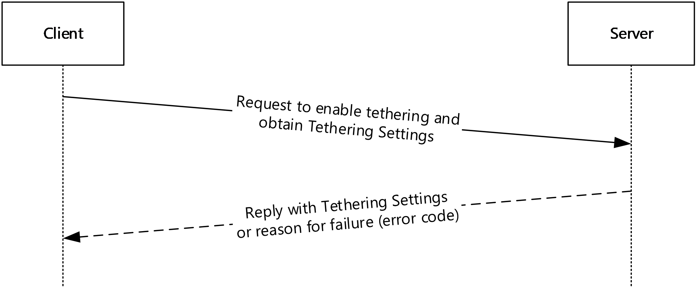

Figure 1: Tethering Control Channel Protocol request-reply sequence

## 1.4 Relationship to Other Protocols

None.

## 1.5 Prerequisites/Preconditions

The Tethering Control Channel Protocol depends on a secure and authenticated communication channel between the client and server. If the client and server do not have a Bluetooth pairing relationship, three 256-bit keys (K1, K2, and K3) MUST be generated and be known to the client and server to be used in establishing the communication channel. The keys MUST be constructed following the recommendations for random number generation as described in [[NIST-SP800-90C]](https://go.microsoft.com/fwlink/?linkid=856909) and specified in [[RFC4086]](https://go.microsoft.com/fwlink/?LinkId=90456).

## 1.6 Applicability Statement

This protocol is only applicable when the client initiates the [**tethering**](#gt_aec98994-fbb4-43fb-ac7d-0ef37b747c9b) request. The client is required to support connecting to Wi-Fi networks and the server is required to support Internet connection sharing.

## 1.7 Versioning and Capability Negotiation

This protocol covers versioning issues in the following areas:

**Protocol Versions:** The Tethering Control Channel protocol supports future enhancements as defined in sections [3.1.5.5](#Section_3.1.5.5) and [3.2.5.3](#Section_3.2.5.3). See also Messages (section [2.2.3](#Section_2.2.3)).

## 1.8 Vendor-Extensible Fields

None.

## 1.9 Standards Assignments

None.

# 2 Messages

## 2.1 Transport

To use the Tethering Control Channel Protocol, a byte stream connection MUST be established by using [**radio frequency communications (RFCOMM)**](#gt_radio-frequency-communications-rfcomm) [[BT-RFCOMM]](https://go.microsoft.com/fwlink/?LinkId=294277) between the client and server. To identify a [**tethering**](#gt_aec98994-fbb4-43fb-ac7d-0ef37b747c9b)-capable server using RFCOMM, the client MUST use the Bluetooth [**Service Discovery Protocol (SDP)**](#gt_service-discovery-protocol-sdp) [[BT-SDP]](https://go.microsoft.com/fwlink/?LinkId=294278).

Tethering-capable servers MUST be identified through SDP by using the [**globally unique identifier (GUID)**](#gt_globally-unique-identifier-guid) {232E51D8-91FF-4c24-AC0F-9EE055DA30A5}. To ensure that the RFCOMM communication is authenticated, the client MUST have either a Bluetooth [**pairing relationship**](#gt_d1d16361-392f-44e2-b3bc-5a747f0b1d7c) with the server, or in the **BringUpStartRequest** message (section [2.2.3.1](#Section_2.2.3.1)) an [**HMAC**](#gt_hash-based-message-authentication-code-hmac) structure (section [2.2.2.6](#Section_2.2.2.6)) and a **Timestamp** structure (section [2.2.2.12](#Section_2.2.2.12)) SHOULD<1> be included.

## 2.2 Message Syntax

The protocol uses a common [**type-length-value (TLV)**](#gt_type-length-value-tlv) encoding schema for all messages. All strings are in Unicode UTF-8 format unless otherwise specified.

### 2.2.1 Enumerations

#### 2.2.1.1 MessageId Enumeration

The **MessageId** enumeration indicates the type of message being sent within the header of each message. For details about the message header, see section [2.2.2.2](#Section_2.2.2.2). The following values SHOULD<2> be supported.

| Bit Range | Field | Description |
| --- | --- | --- |
| Variable | BringUpStartRequest 1 | Indicates the **BringUpStartRequest** message (section [2.2.3.1](#Section_2.2.3.1)). |
| Variable | BringUpSuccessResponse 2 | Indicates the **BringUpSuccessResponse** message (section [2.2.3.2](#Section_2.2.3.2)). |
| Variable | BringUpFailureResponse 3 | Indicates the **BringUpFailureResponse** message (section [2.2.3.4](#Section_2.2.3.4)). |
| Variable | ProtocolErrorResponse 4 | Indicates the **ProtocolErrorResponse** message (section [2.2.3.5](#Section_2.2.3.5)). |
| Variable | BringUpSuccessResponseUnpaired 5 | Indicates the **BringUpSuccessResponseUnpaired** message (section [2.2.3.3](#Section_2.2.3.3)). |

#### 2.2.1.2 StatusCodeEnum Enumeration

The **StatusCodeEnum** enumeration specifies possible outcomes for the attempt to start [**tethering**](#gt_aec98994-fbb4-43fb-ac7d-0ef37b747c9b) on the server. The following values SHOULD<3> be supported.

| Bit Range | Field | Description |
| --- | --- | --- |
| Variable | Success 0 | The operation succeeded; tethering is enabled on the server. |
| Variable | UnspecifiedError 1 | The operation failed, and the server is unable to provide a specific status code. |
| Variable | OperationCancel 2 | The operation failed because it was canceled by the user. |
| Variable | EntitlementCheckFail 3 | The operation failed because the mobile operator has not authorized the subscriber to use tethering on the server. |
| Variable | NoCellularSignal 4 | The operation failed because there is no cellular signal on the server. |
| Variable | CellularDataTurnedOff 5 | The operation failed because cellular data is turned off on the server. |
| Variable | CannotConnectToCellularNetwork 6 | The operation failed because the server is unable to connect to the cellular network. |
| Variable | ConnectToCellularNetworkTimedOut 7 | The operation failed because the connection attempt to the cellular network timed out. |
| Variable | RoamingNotAllowed 8 | The operation failed because the server is not allowed to connect to the cellular network when the latter is in the roaming state. |
| The operation failed because the [**timestamp**](#gt_timestamp) sent to the server is outside of the server’s allowable skew. | TimestampOutOfSync 9 | - |
| Variable | SecurityFailure 10 | The operation failed because there was an error on the server while authenticating or encrypting a protocol message. |

#### 2.2.1.3 TypeId Enumeration

The **TypeId** enumeration identifies the type of structure contained within the message payload. The structure is encoded by using the **CommonHeader** (section [2.2.2.2](#Section_2.2.2.2)). The following values SHOULD<4> be supported.

| Bit Range | Field | Description |
| --- | --- | --- |
| Variable | StatusCode 1 | The message contains a **StatusCode** structure (section [2.2.2.11](#Section_2.2.2.11)). |
| Variable | Ssid 2 | The message contains an **Ssid** structure (section [2.2.2.10](#Section_2.2.2.10)). |
| Variable | Bssid 3 | The message contains a **Bssid** structure (section [2.2.2.1](#Section_2.2.2.1)). |
| Variable | Passphrase 4 | The message contains a **Passphrase** structure (section [2.2.2.9](#Section_2.2.2.9)). |
| Variable | DisplayName 5 | The message contains a **DisplayName** structure (section [2.2.2.3](#Section_2.2.2.3)). |
| Variable | ErrorString 6 | The message contains an **ErrorString** structure (section [2.2.2.5](#Section_2.2.2.5)). |
| Variable | MessageType 7 | The message contains a **MessageType** structure (section [2.2.2.8](#Section_2.2.2.8)). |
| Variable | Timestamp 8 | The message contains a **Timestamp** structure (section [2.2.2.12](#Section_2.2.2.12)). |
| Variable | HMAC 9 | The message contains an **HMAC** structure (section [2.2.2.6](#Section_2.2.2.6)). |
| Variable | InitializationVector 10 | The message contains an **InitializationVector** structure (section [2.2.2.7](#Section_2.2.2.7)). |
| Variable | EncryptedBringUpSuccessResponse 11 | The message contains an **EncryptedBringUpSuccessResponse** structure (section [2.2.2.4](#Section_2.2.2.4)). |

### 2.2.2 Structures

The following sections define the structures that are used to encode the message payload. Each structure is formatted with a [**TLV**](#gt_type-length-value-tlv) encoding schema by using a common header.

#### 2.2.2.1 Bssid Structure

The **Bssid** structure specifies the [**basic service set identifier (BSSID)**](#gt_basic-service-set-identifier-bssid) of the Wi-Fi network used by the server in the Internet connection, as specified in [[IEEE802.11-2012]](https://go.microsoft.com/fwlink/?LinkID=306038).

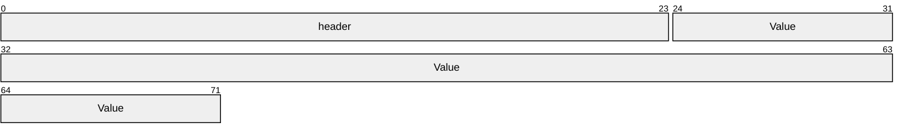

**header (3 bytes):** The **header** field contains the **CommonHeader** structure (section [2.2.2.2](#Section_2.2.2.2)), where the value of the **Id** field is set to 3 (Bssid), as specified in **TypeId** enumeration (section [2.2.1.3](#Section_2.2.1.3)), and the value of the **Length** field is set to 6 bytes.

**Value (6 bytes):** The **Value** field contains the value of the BSSID.

#### 2.2.2.2 CommonHeader Structure

The **CommonHeader** structure is used by all structures to identify the type and length of the structure encoded in the message payload.

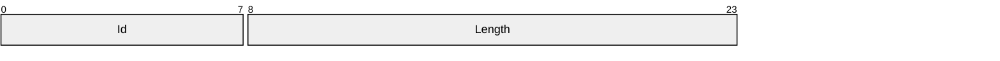

**Id (1 byte):** The **Id** field specifies the type of the structure encoded in the message, as specified in **TypeId** enumeration (section [2.2.1.3](#Section_2.2.1.3)).

**Length (2 bytes):** The **Length** field specifies the number of bytes that follow the **CommonHeader** which correspond to the length of the encoded structure. Note that the structure is encoded in [**network byte order**](#gt_network-byte-order).

#### 2.2.2.3 DisplayName Structure

The **DisplayName** structure specifies the [**display name**](#gt_display-name) for the server.

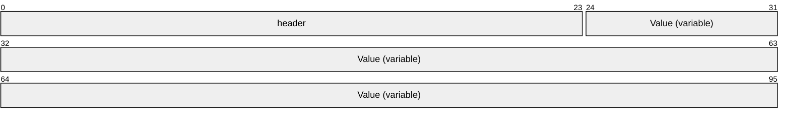

**header (3 bytes):** The **header** field contains the **CommonHeader** structure (section [2.2.2.2](#Section_2.2.2.2)), where the value of the **Id** field is set to 5 (DisplayName), as specified in **TypeId** enumeration (section [2.2.1.3](#Section_2.2.1.3)), and the value of the **Length** field is variable.

**Value (variable):** The **Value** field contains the display name string. Because the length of the **Length** field within the **CommonHeader** structure is 2 bytes, the length of the display name string is limited to a maximum of 65,535 bytes.

#### 2.2.2.4 EncryptedBringUpSuccessResponse Structure

The **EncryptedBringUpSuccessResponse** structure is used to contain an encrypted **BringUpSuccessResponse** message (section [2.2.3.2](#Section_2.2.3.2)).

**header (3 bytes):** The **header** field contains the **CommonHeader** structure (section [2.2.2.2](#Section_2.2.2.2)), where the value of the **Id** field is set to 11 (EncryptedBringUpSuccessResponse), as specified in **TypeId** enumeration (section [2.2.1.3](#Section_2.2.1.3)), and the value of the **Length** field is variable.

**Value (variable):** The **Value** field contains an encrypted **BringUpSuccessResponse** message (section 2.2.3.2). The message is encrypted using AES-256 in cipher block chaining (CBC) mode, with PKCS#7 padding used to encrypt the message. The [**encryption key**](#gt_encryption-key) is a 256-bit key (K2) already known by both the server and the client. A randomly generated initialization vector is used. This initialization vector is communicated to the client through the **InitializationVector** structure. Because the length of the **Length** field within the **CommonHeader** structure is 2 bytes, the length of the encrypted message is limited to a maximum of 65,535 bytes.

#### 2.2.2.5 ErrorString Structure

The **ErrorString** structure specifies the error message corresponding to the result of the [**tethering**](#gt_aec98994-fbb4-43fb-ac7d-0ef37b747c9b) attempt to the server.

**header (3 bytes):** The **header** field contains the **CommonHeader** structure (section [2.2.2.2](#Section_2.2.2.2)), where the value of the **Id** field is set to 6 (ErrorString), as specified in **TypeId** enumeration (section [2.2.1.3](#Section_2.2.1.3)), and the value of the **Length** field is variable.

**Value (variable):** The **Value** field contains the error message string. Because the length of the **Length** field within the **CommonHeader** structure is 2 bytes, the length of the error message string is limited to a maximum of 65,535 bytes.

#### 2.2.2.6 HMAC Structure

The **HMAC** structure is used to contain a SHA-256 HMAC.

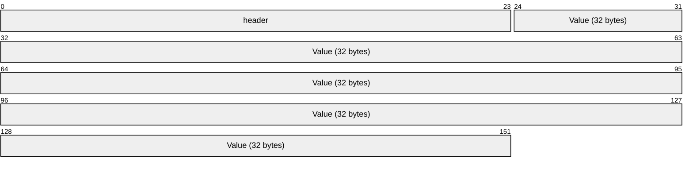

**header (3 bytes):** The **header** field contains the **CommonHeader** structure (section [2.2.2.2](#Section_2.2.2.2)), where the value of the **Id** field is set to 9 (HMAC), as specified in **TypeId** enumeration (section [2.2.1.3](#Section_2.2.1.3)), and the value of the **Length** field set to 32 bytes.

**Value (32 bytes):** The **Value** field contains the 32 bytes making up the SHA-256 HMAC.

#### 2.2.2.7 InitializationVector Structure

The **InitializationVector** structure is used to contain the initialization vector used to encrypt the **EncryptedBringUpSuccessResponse** structure (section [2.2.2.4](#Section_2.2.2.4)) in the **BringUpSuccessResponseUnpaired** message (section [2.2.3.3](#Section_2.2.3.3)).

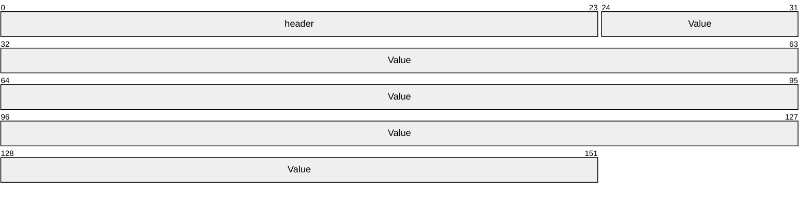

**header (3 bytes):** The **header** field contains the **CommonHeader** structure (section [2.2.2.2](#Section_2.2.2.2)), where the value of the **Id** field is set to 10 (InitializationVector), as specified in **TypeId** enumeration (section [2.2.1.3](#Section_2.2.1.3)), and the value of the **Length** field set to 16 bytes.

**Value (16 bytes):** The **Value** field contains the 16 bytes making up the initialization vector.

#### 2.2.2.8 MessageType Structure

The **MessageType** structure identifies the type of structure contained within the message payload.

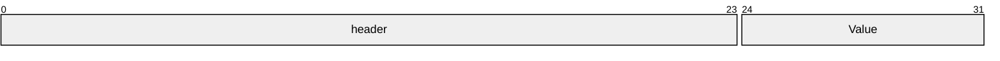

**header (3 bytes):** The **header** field contains the **CommonHeader** structure (section [2.2.2.2](#Section_2.2.2.2)), where the value of the **Id** field is set to 7 (MessageType), as specified in **TypeId** enumeration (section [2.2.1.3](#Section_2.2.1.3)), and the value of the **Length** field is set to 1.

**Value (1 byte):** The **Value** field identifies the type of structure contained within the message payload, as defined in **MessageId** enumeration (section [2.2.1.1](#Section_2.2.1.1)).

#### 2.2.2.9 Passphrase Structure

The **Passphrase** structure specifies the Wi-Fi Protected Access 2 (WPA2) [**passphrase**](#gt_passphrase), as defined in [[WF-Security]](https://go.microsoft.com/fwlink/?LinkId=390211), that is used in the [**tethering**](#gt_aec98994-fbb4-43fb-ac7d-0ef37b747c9b) connection. The passphrase contains 8 to 64 characters.

**header (3 bytes):** The **header** field contains the **CommonHeader** structure (section [2.2.2.2](#Section_2.2.2.2)), where the value of the **Id** field is set to 4 (Passphrase), as specified in **TypeId** enumeration (section [2.2.1.3](#Section_2.2.1.3)), and the value of the **Length** field MUST be 8 to 64 characters.

**Value (variable):** The **Value** field specifies the WPA2 passphrase encoded as [**ASCII**](#gt_ascii). If the length of the passphrase is 64 characters, all the characters MUST be hexadecimal characters. If the length is 8 to 63 characters, all the characters MUST be ASCII characters in the range of 32 to 126.

#### 2.2.2.10 Ssid Structure

The **Ssid** structure specifies the Wi-Fi [**service set identifier (SSID)**](#gt_service-set-identifier-ssid) for the [**tethering**](#gt_aec98994-fbb4-43fb-ac7d-0ef37b747c9b) connection. The Wi-Fi SSID is a byte BLOB of 0 to 32 bytes as defined in [[IEEE802.11-2012]](https://go.microsoft.com/fwlink/?LinkID=306038).

**header (3 bytes):** The **header** field contains the **CommonHeader** structure (section [2.2.2.2](#Section_2.2.2.2)), where the value of the **Id** field is set to 2 (Ssid), as specified in **TypeId** enumeration (section [2.2.1.3](#Section_2.2.1.3)), and the value of the **Length** field is in the range of 0 to 32 bytes.

**Value (variable):** The **Value** field specifies the SSID.

#### 2.2.2.11 StatusCode Structure

The **StatusCode** structure specifies the status code representing the outcome of the attempt by the client to enable [**tethering**](#gt_aec98994-fbb4-43fb-ac7d-0ef37b747c9b) on the server.

**header (3 bytes):** The **header** field contains the **CommonHeader** structure (section [2.2.2.2](#Section_2.2.2.2)), where the value of the **Id** field is set to 1 (StatusCode), as specified in **TypeId** enumeration (section [2.2.1.3](#Section_2.2.1.3)), and the value of the **Length** field is set to 1.

**Value (1 byte):** The **Value** field specifies the status code representing the outcome of the attempt to start tethering on the server, as defined in **StatusCodeEnum** enumeration (section [2.2.1.2](#Section_2.2.1.2)).

#### 2.2.2.12 Timestamp Structure

The **Timestamp** structure is used to contain the current system time of the client.

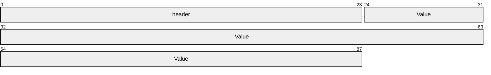

**header (3 bytes):** The **header** field contains the **CommonHeader** structure (section [2.2.2.2](#Section_2.2.2.2)), where the value of the **Id** field is set to 8 (Timestamp), as specified in **TypeId** enumeration (section [2.2.1.3](#Section_2.2.1.3)), and the value of the **Length** field is set to 8 bytes.

**Value (8 bytes):** The **Value** field is a 64-bit value representing the number of 100-nanosecond intervals since January 1, 1601 (UTC).

### 2.2.3 Messages

The messages described in the following sections each contain the **CommonHeader** structure (section [2.2.2.2](#Section_2.2.2.2)) that specifies the message type and length, and zero or more other structures as defined in section [2.2.2](#Section_2.2.2). In an implementation, the messages MUST contain all defined fields unless a field is marked as (optional). Optional fields MAY be included as required by the implementation.

When a message contains more than one structure, the location of the structures within the message MUST be in increasing numeric order as indicated by the value of the **TypeId** enumeration (section [2.2.1.3](#Section_2.2.1.3)). Unless otherwise specified, a message MUST NOT contain multiple structures with the same **TypeId** (section 2.2.1.3) value.

Messages MAY contain structures that are not defined in this protocol. However, implementations of this protocol MUST ignore all message structures that are not specified in this specification [MS-TCC] to enable compatibility with future protocol versions.

#### 2.2.3.1 BringUpStartRequest Message

The **BringUpStartRequest** message is sent from the client to the server to request to share the server's Internet connection. The payload is optional if the client and server have a [**pairing relationship**](#gt_d1d16361-392f-44e2-b3bc-5a747f0b1d7c). If not, then **HMAC** structure and **Timestamp** structure SHOULD<5> be included.

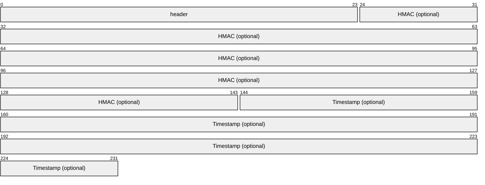

**header (3 bytes):** The **header** field contains the **CommonHeader** structure (section [2.2.2.2](#Section_2.2.2.2)), where the value of the **Id** field is set to 1 (BringUpStartRequest), as specified in **MessageId** enumeration (section [2.2.1.1](#Section_2.2.1.1)), the length of the **Length** field is variable, and the value MUST be set to the combined size of all structures contained within the message.

**HMAC (35 bytes):** (optional) The **HMAC** field contains the **HMAC** structure (section [2.2.2.6](#Section_2.2.2.6)), which consists of the header (3 bytes), and 32 bytes containing a SHA-256 hash of an 8-byte [**timestamp**](#gt_timestamp) contained in the **Timestamp** structure (section [2.2.2.12](#Section_2.2.2.12)). The hashing key is a 256-bit key (K1) already known by both the server and the client.

**Timestamp (11 bytes):** (optional) The **Timestamp** field contains the **Timestamp** structure (section 2.2.2.12), which consists of the header (3 bytes), and the current client system time (8 bytes).

#### 2.2.3.2 BringUpSuccessResponse Message

The **BringUpSuccessResponse** message is sent by the server to the client in response to a **BringUpStartRequest** message (section [2.2.3.1](#Section_2.2.3.1)) when the request for [**tethering**](#gt_aec98994-fbb4-43fb-ac7d-0ef37b747c9b) is successful.

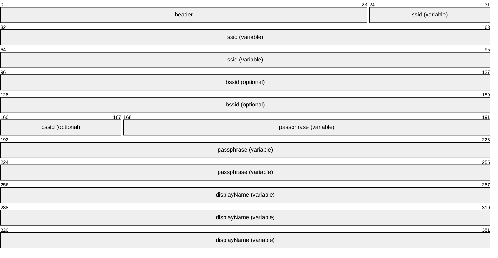

**header (3 bytes):** The **header** field contains the **CommonHeader** structure (section [2.2.2.2](#Section_2.2.2.2)), where the value of the **Id** field is set to 2 (BringUpSuccessResponse), as specified in **MessageId** (section [2.2.1.1](#Section_2.2.1.1)), the length of the **Length** field is variable, and the value MUST be set to the combined size of all structures contained within the message.

**ssid (variable):** The **ssid** field has a variable length and specifies the Wi-Fi [**SSID**](#gt_service-set-identifier-ssid) for the tethering connection, as defined in the **Ssid** structure (section [2.2.2.10](#Section_2.2.2.10)). The Wi-Fi SSID is a byte BLOB of 0 to 32 bytes as defined in [[IEEE802.11-2012]](https://go.microsoft.com/fwlink/?LinkID=306038).

**bssid (9 bytes):** (optional) The **bssid** field contains the **Bssid** structure (section [2.2.2.1](#Section_2.2.2.1)), which consists of the header (3 bytes) and the [**BSSID**](#gt_basic-service-set-identifier-bssid) value (6 bytes) of the Wi-Fi network used by the server in the Internet connection, as specified in [IEEE802.11-2012].

**passphrase (variable):** The **passphrase** field has a variable length and specifies the Wi-Fi WPA2 [**passphrase**](#gt_passphrase), as defined in the **Passphrase** structure (section [2.2.2.9](#Section_2.2.2.9)), used in the tethering connection, as defined by the Wi-Fi Alliance Security Certification [[WF-Security]](https://go.microsoft.com/fwlink/?LinkId=390211). The passphrase contains 8 to 64 characters. If the length of the passphrase is 64 characters, all the characters MUST be hexadecimal characters. If the length is 8 to 63 characters, all the characters MUST be [**ASCII**](#gt_ascii) characters in the range of 32 to 126.

**displayName (variable):** The **displayName** field has a variable length and specifies the display name for the server, as defined in the **DisplayName** structure (section [2.2.2.3](#Section_2.2.2.3)).

#### 2.2.3.3 BringUpSuccessResponseUnpaired Message

The **BringUpSuccessResponseUnpaired** message is sent by the server to the client in response to a **BringUpStartRequest** message (section [2.2.3.1](#Section_2.2.3.1)) when the request for [**tethering**](#gt_aec98994-fbb4-43fb-ac7d-0ef37b747c9b) is successful, but there is no [**pairing relationship**](#gt_d1d16361-392f-44e2-b3bc-5a747f0b1d7c) between the server and client. Thus, the sensitive content is [**encrypted**](#gt_encryption).

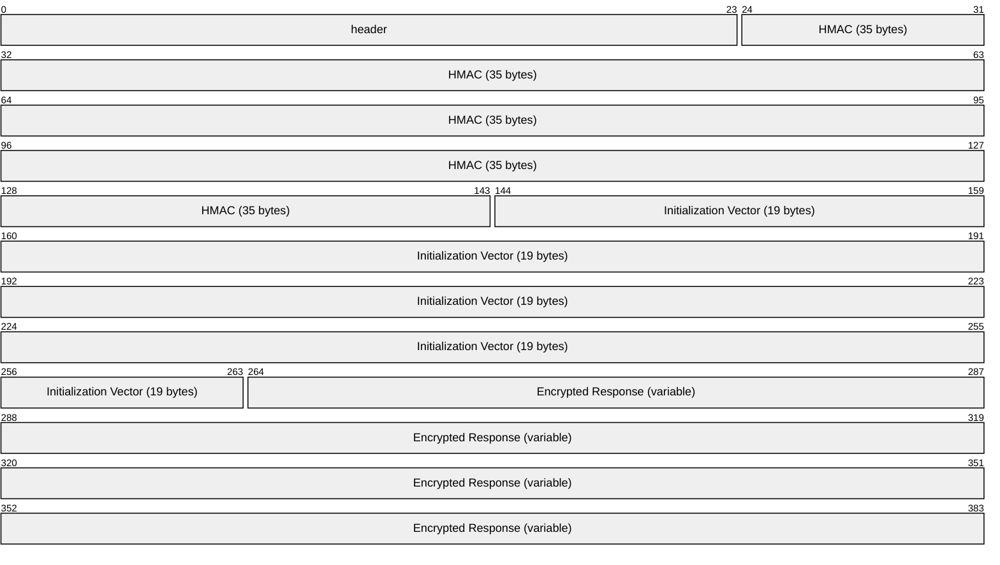

**header (3 bytes):** The **header** field contains the **CommonHeader** structure (section [2.2.2.2](#Section_2.2.2.2)), where the value of the **Id** field is set to 5 (BringUpSuccessResponseUnpaired), as specified in **MessageId** (section [2.2.1.1](#Section_2.2.1.1)), the length of the **Length** field is variable, and the value MUST be set to the combined size of all structures contained within the message.

**HMAC (35 bytes):** The **HMAC** field contains the **HMAC** structure (section [2.2.2.6](#Section_2.2.2.6)), which consists of the header (3 bytes), and 32 bytes containing a SHA-256 hash of the 16-byte initialization vector contained in the **Initialization Vector** field, the **EncryptedBringUpSuccessResponse** contained in the **Encrypted Response** field, and the 8-byte [**timestamp**](#gt_timestamp) contained in the **Timestamp** structure (section [2.2.2.12](#Section_2.2.2.12)) sent by the client in the **BringUpStartRequest** (section 2.2.3.1) message. The hashing key is a 256-bit key (K3) already known by both the server and the client.

**Initialization Vector (19 bytes):** The **Initialization Vector** field contains the **InitializationVector** structure (section [2.2.2.7](#Section_2.2.2.7)), which consists of the header (3 bytes) and the 16 randomly generated bytes used by the server to encrypt the **EncryptedBringUpSuccessResponse** (**Encrypted Response**) that is also contained in the message.

**Encrypted Response (variable):** The **Encrypted Response** field contains the encrypted BringUpSuccessResponse, as defined in the **EncryptedBringUpSuccessResponse** structure (section [2.2.2.4](#Section_2.2.2.4)). The **BringUpSuccessResponse** is encrypted using AES-256 in CBC mode, with PKCS#7 padding used to encrypt the message. The [**encryption key**](#gt_encryption-key) is a 256-bit key (K2) already known by both the server and the client. A randomly generated initialization vector is used, and is included in the message as the **Initialization Vector** field.

#### 2.2.3.4 BringUpFailureResponse Message

The **BringUpFailureResponse** message is sent by the server to the client in response to a **BringUpStartRequest** message (section [2.2.3.1](#Section_2.2.3.1)) when the request for [**tethering**](#gt_aec98994-fbb4-43fb-ac7d-0ef37b747c9b) fails. If the reason for the failure cannot be adequately described in the **statusCode** field, the message SHOULD only contain an error string.

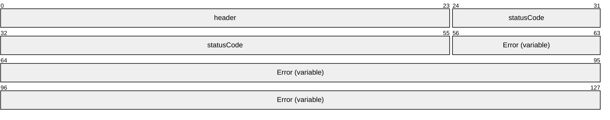

**header (3 bytes):** The **header** field contains the **CommonHeader** structure (section [2.2.2.2](#Section_2.2.2.2)), where the value of the **Id** field is set to 3 (BringUpFailureResponse), as specified in **MessageId** (section [2.2.1.1](#Section_2.2.1.1)), the length of the **Length** field is variable, and the value MUST be set to the combined size of all structures contained within the message.

**statusCode (4 bytes):** The **statusCode** field specifies the status code, as defined in the **StatusCodeEnum** enumeration (section [2.2.1.2](#Section_2.2.1.2)), that represents the outcome of the attempt to start tethering on the server. For the **BringUpFailureResponse** message, the value of the **statusCode** field MUST NOT be set to 0 (Success).

**Error (variable):** (optional) When the **Error** field is present in the message, it contains an error message, as defined in the **ErrorString** structure (section [2.2.2.5](#Section_2.2.2.5)), that corresponds to the result of the tethering attempt to the server. If the error message is an empty string, this field SHOULD NOT be included in the message.

#### 2.2.3.5 ProtocolErrorResponse Message

The **ProtocolErrorResponse** message is sent in response to the receipt of a message from the client that is not specified as expected according to the structures defined in this specification [MS-TCC]. The **ProtocolErrorResponse** message enables compatibility with future protocol versions that MAY contain messages, structures, or values not defined in this protocol version. In this protocol version, an implementation sends this message in response to the receipt of a message where the **MessageId** value is not within the expected range as defined in section [2.2.1.1](#Section_2.2.1.1).

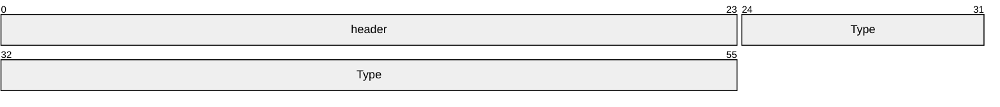

**header (3 bytes):** The **header** field contains the **CommonHeader** structure (section [2.2.2.2](#Section_2.2.2.2)), where the value of the **Id** field is set to 4 (ProtocolErrorResponse), as specified in **MessageId** enumeration (section 2.2.1.1), the length of the **Length** field is variable, and the value MUST be set to the combined size of all structures contained within the message.

**Type (4 bytes):** The **Type** field specifies the type of the received message, as defined in the **MessageType** structure (section [2.2.2.8](#Section_2.2.2.8)). The **Value** field is set to the **MessageId** value of the received message which is the unrecognized message type that is not within the expected range as defined in section 2.2.1.1.

# 3 Protocol Details

## 3.1 Client Details

In the Tethering Control Channel Protocol, the client role performs one primary operation and that is to send a **BringUpStartRequest** message (section [2.2.3.1](#Section_2.2.3.1)) to the server and to wait for the server’s response. When the client receives a **BringUpSuccessResponse** message (section [2.2.3.2](#Section_2.2.3.2)) or **BringUpFailureResponse** message (section [2.2.3.4](#Section_2.2.3.4)) from the server, the client sends the contents of the message to the higher layer, disconnects the transport, notifies the higher layer that it has completed the operation, and terminates the connection.

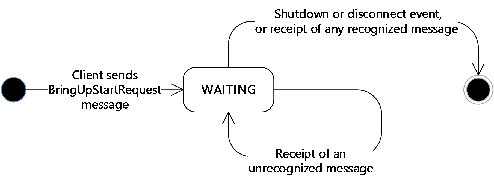

Figure 2: Client message processing

### 3.1.1 Abstract Data Model

None.

### 3.1.2 Timers

**MessageTimer:** Specifies the time-out interval for the request operation. The interval is set to one minute.

### 3.1.3 Initialization

The Tethering Control Channel Protocol is initialized after the transport protocol has created a communication channel with the server. After the communication channel is initialized, the client sends a **BringUpStartRequest** message (section [2.2.3.1](#Section_2.2.3.1)) to the server. If the client is not paired to the server, the **BringUpStartRequest** MUST contain the optional **HMAC** and **Timestamp** fields. The client SHOULD<6> include the **HMAC** and **Timestamp** fields regardless of [**pairing relationship**](#gt_d1d16361-392f-44e2-b3bc-5a747f0b1d7c). Providing the **HMAC** and **Timestamp** field regardless of pairing state provides resiliency when the server has broken the pairing relationship without the client’s knowledge.

### 3.1.4 Higher-Layer Triggered Events

#### 3.1.4.1 Cancellation

The higher layer can terminate the client’s connection while the client is waiting for a response from the server.

### 3.1.5 Message Processing Events and Sequencing Rules

Messages in the Tethering Control Channel Protocol are identified by the values specified in the **CommonHeader** structure (section [2.2.2.2](#Section_2.2.2.2)) contained in each message. A message is only processed after the entire contents of the message have been received as indicated by the value of the **Length** field specified within the **CommonHeader**.

When the client receives a message, the **MessageTimer** (see section [3.1.2](#Section_3.2.2)) is started or restarted.

#### 3.1.5.1 BringUpSuccessResponse

When the client receives a **BringUpSuccessResponse** message (section [2.2.3.2](#Section_2.2.3.2)), the client sends the contents of the message to the higher layer and terminates the connection.

#### 3.1.5.2 BringUpSuccessResponseUnpaired

When a client receives a **BringUpSuccessResponseUnpaired** message (section [2.2.3.3](#Section_2.2.3.3)), the client first validates that the [**HMAC**](#gt_hash-based-message-authentication-code-hmac) is correct. After verifying the **HMAC** is correct, the encrypted payload is decrypted and reprocessed as a **BringUpSuccessResponse**.<7>

#### 3.1.5.3 BringUpFailureResponse

When the client receives a **BringUpFailureResponse** message (section [2.2.3.4](#Section_2.2.3.4)), the client sends the contents of the message to the higher layer and terminates the connection.

#### 3.1.5.4 Failure Messages

When the client receives a **BringUpStartRequest** message (section [2.2.3.1](#Section_2.2.3.1)) or **ProtocolErrorResponse** message (section [2.2.3.5](#Section_2.2.3.5)), the client indicates to the higher layer that a protocol failure event has occurred and terminates the connection.

#### 3.1.5.5 Other Messages

When the client receives a message with an unrecognized message type, that is, a **MessageId** value that is not within the expected range defined in section [2.2.1.1](#Section_2.2.1.1), the client sends a **ProtocolErrorResponse** message (section [2.2.3.5](#Section_2.2.3.5)) with the **Value** field of the **MessageType** structure (section [2.2.2.8](#Section_2.2.2.8)) set to the unrecognized value.

When the client receives a message that cannot be parsed according to the message syntax specified in section [2.2](#Section_2.2), the client indicates to the higher layer that a protocol error has occurred and terminates the connection.

### 3.1.6 Timer Events

After the **MessageTimer** (section [3.1.2](#Section_3.2.2)) expires, the client sends the time-out to the higher layer then disconnects and terminates the connection.

### 3.1.7 Other Local Events

#### 3.1.7.1 Disconnect Event of Transport Channel

If the transport channel becomes disconnected, the client indicates to the higher layer that a transport failure has occurred and terminates the connection.

## 3.2 Server Details

In the Tethering Control Channel Protocol, initialization occurs when a client makes a connection to the server and the server creates an instance of the server role for each connection with a client. The server MAY handle multiple clients simultaneously by having an instance of the server role for each client.

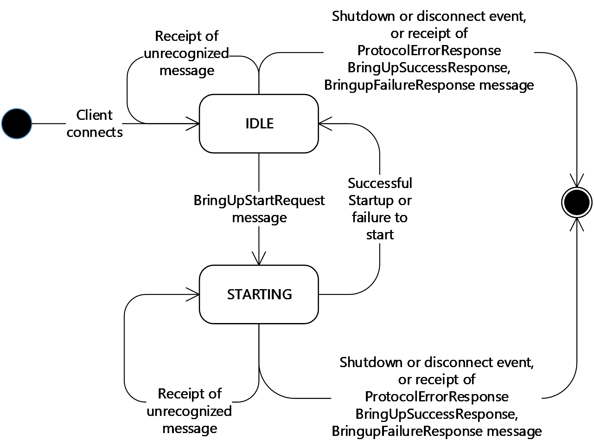

Figure 3: Server message processing

**Note** When the server is in the STARTING state, the server MUST NOT process messages.

### 3.2.1 Abstract Data Model

This section describes a conceptual model of possible data organization that an implementation maintains to participate in this protocol. The described organization is provided to facilitate the explanation of how the protocol behaves. This document does not mandate that implementations adhere to this model as long as their external behavior is consistent with that described in this document.

The following elements are specific to this protocol:

**State:** Indicates the server state, either IDLE or STARTING.

**Tethering Settings:** A data set that contains the following items:

- **SSID:** A Wi-Fi [**SSID**](#gt_service-set-identifier-ssid) which is a byte blob of 0 to 32 bytes as defined in [[IEEE802.11-2012]](https://go.microsoft.com/fwlink/?LinkID=306038).
- **BSSID:** A Wi-Fi [**BSSID**](#gt_basic-service-set-identifier-bssid) as specified in [IEEE802.11-2012].
- **Passphrase:** A Wi-Fi WPA2 [**passphrase**](#gt_passphrase). The passphrase contains 8 to 64 characters. If the length of the passphrase is 64 characters, all the characters MUST be hexadecimal characters. If the length is 8 to 63 characters, all the characters MUST be [**ASCII**](#gt_ascii) characters in the range of 32 to 126.
- **DisplayName:** A Unicode string.
**Failure Description:** A data set that contains the following items:

- **Status Code:** A status code as defined in the **StatusCodeEnum** enumeration (section [2.2.1.2](#Section_2.2.1.2)).
- **ErrorString:** A Unicode string. Note that the string can be empty.

### 3.2.2 Timers

**ServerTimer:** Specifies the time-out interval for the response to the client. The interval is set to one minute.

### 3.2.3 Initialization

The server is initialized when the transport protocol indicates that a client has connected. The initial state for the server is set to IDLE.

### 3.2.4 Higher-Layer Triggered Events

#### 3.2.4.1 Shutdown

The higher-layer can shut down the server at any time. The server disconnects the transport protocol at shutdown.

#### 3.2.4.2 Tethering Started or Failed to Start

When the server indicates to the higher layer that [**tethering**](#gt_aec98994-fbb4-43fb-ac7d-0ef37b747c9b) has to be started, the higher layer responds either by confirming that tethering has been started, or that tethering failed to start.

When the higher layer confirms that tethering has been started, the higher layer provides the current **Tethering Settings**. If the server does not have a [**pairing relationship**](#gt_d1d16361-392f-44e2-b3bc-5a747f0b1d7c) with the client, then the server MUST send a **BringUpSuccessResponseUnpaired** message (section [2.2.3.3](#Section_2.2.3.3)). If the client previously included the [**HMAC**](#gt_hash-based-message-authentication-code-hmac) and **Timestamp** in the **BringUpStartRequest** message (section [2.2.3.1](#Section_2.2.3.1)), the server SHOULD<8> send a **BringUpSuccessResponseUnpaired** message regardless of pairing state. If the server does not send a **BringUpSuccessResponseUnpaired** message, the server sends a **BringUpSuccessResponse** message (section [2.2.3.2](#Section_2.2.3.2)) that contains the **Tethering Settings** and returns to the IDLE state.

If the higher layer failed to start tethering, the higher layer provides a reason for the failure. The server sends a **BringUpFailureResponse** message (section [2.2.3.4](#Section_2.2.3.4)) that contains the reason for the failure and returns to the IDLE state.

### 3.2.5 Message Processing Events and Sequencing Rules

Messages in the Tethering Control Channel Protocol are identified by the values specified in the **CommonHeader** structure (section [2.2.2.2](#Section_2.2.2.2)) contained in each message. A message is only processed after the entire contents of the message have been received as indicated by the value of the **Length** field specified within the **CommonHeader**.

When the server receives a message, the **ServerTimer** (see section [3.2.2](#Section_3.2.2)) is started or restarted.

#### 3.2.5.1 BringUpStartRequest

When the server is in the IDLE state and receives a **BringUpStartRequest** message (section [2.2.3.1](#Section_2.2.3.1)), the server MUST check that the client is [**trusted**](#gt_trust).

If there is no [**pairing relationship**](#gt_d1d16361-392f-44e2-b3bc-5a747f0b1d7c) between the client and the server, the **BringUpStartRequest** sent by the client MUST include the [**HMAC**](#gt_hash-based-message-authentication-code-hmac) and **Timestamp**. The server MUST validate that the [**timestamp**](#gt_timestamp) is within some allowable skew (recommended 5 minutes). If it is not, the server MUST reply with a **BringupFailureResponse** with TimestampOutOfSync (9) error (section [2.2.1.2](#Section_2.2.1.2)). It MUST also validate that the **HMAC** is as expected. The **HMAC** MUST be computed using SHA-256 and a 32-byte pre-shared key (K1). If the **HMAC** is not as expected, the server should reply with a **BringupFailureResponse** with the SecurityFailure (10) error (section 2.2.1.2).

If the **HMAC** and **Timestamp** match the expected values, or there is a pairing relationship between the client and server, then the server enters the STARTING state and indicates to the higher layer that [**tethering**](#gt_aec98994-fbb4-43fb-ac7d-0ef37b747c9b) has to be started.

When the server is in the STARTING state, it MUST NOT process messages.

#### 3.2.5.2 Failure Messages

When the server receives a **BringupFailureResponse**, **BringUpSuccessResponse** or **ProtocolErrorResponse** message (section [2.2.3](#Section_2.2.3)), the server indicates to the higher layer that a protocol failure event has occurred and terminates the connection.

#### 3.2.5.3 Other Messages

When the server receives a message with an unrecognized message type, that is, a **MessageId** value that is not within the expected range defined in section [2.2.1.1](#Section_2.2.1.1), the server sends a **ProtocolErrorResponse** message (section [2.2.3.5](#Section_2.2.3.5)) with the **Value** field of the **MessageType** structure (section [2.2.2.8](#Section_2.2.2.8)) set to the unrecognized value.

When the server receives a message that cannot be parsed according to the message syntax specified in section [2.2](#Section_2.2), the server indicates to the higher layer that a protocol error has occurred and terminates the connection.

### 3.2.6 Timer Events

After the **ServerTimer** (section [3.2.2](#Section_3.2.2)) expires, the server disconnects from the client and terminates the connection.

### 3.2.7 Other Local Events

#### 3.2.7.1 Disconnect Event of Transport Channel

If the transport channel becomes disconnected, the server indicates to the higher layer that a transport failure has occurred and terminates the connection.

# 4 Protocol Examples

## 4.1 Successful Startup

In the following example, the server successfully completes the client request and sends a **BringUpSuccessResponse** message (section [2.2.3.2](#Section_2.2.3.2)). For more information, see the figure in section [1.3](#Section_1.3).

### 4.1.1 BringUpStartRequest Example (Successful)

Message Header: 0x01 0x00 0x00 (Type == BringUpStartRequest, Length == 0)

### 4.1.2 BringUpSuccessResponse Example (Successful)

Message Header: 0x02 00 31 (Type == BringUpSuccessResponse, Length == 49)

Common Header: 0x02 00 0B (Type == SSID, Length == 11)

SSID payload: 0x53 0x61 0x6D 0x70 0x6C 0x65 0x20 0x53 0x53 0x49 0x44 ("Sample SSID")

Common Header: 0x03 00 06 (Type == BSSID, Length == 6)

BSSID payload: 0x01 0x02 0x03 0x04 0x05 0x06 (BSSID: 01:02:03:04:05:06)

Common Header: 0x04 00 09 (Type == Passphrase, Length == 9)

Passphrase payload: 0x73 0x65 0x63 0x72 0x65 0x74 ("secret123")

Common Header: 0x05 00 0B (Type == DisplayName, Length == 11)

DisplayName payload: 0x42 0x6F 0x62 0x27 0x73 0x20 0x70 0x68 0x6F 0x6E 0x65 ("Bob’s phone")

## 4.2 Unsuccessful Startup

In the following example, the server does not successfully complete the client request and sends a **BringUpFailureResponse** message (section [2.2.3.4](#Section_2.2.3.4)). For more information, see the figure in section [1.3](#Section_1.3).

### 4.2.1 BringUpStartRequest Example (Unsuccessful)

Message Header: 0x01 0x00 0x00 (Type == BringUpStartRequest, Length == 0)

### 4.2.2 BringUpFailureResponse Example (Unsuccessful)

Message Header: 0x03 00 (Type == BringUpFailureResponse, Length == 4)

Common Header: 0x01 00 01 (Type == StatusCode, Length == 1)

Status code payload: 0x04 (StatusCode.NoCellularSignal)

# 5 Security

## 5.1 Security Considerations for Implementers

The Tethering Control Channel Protocol requires an authenticated and encrypted communication channel.

## 5.2 Index of Security Parameters

None.

# 6 Appendix A: Product Behavior

The information in this specification is applicable to the following Microsoft products or supplemental software. References to product versions include updates to those products.

The terms "earlier" and "later", when used with a product version, refer to either all preceding versions or all subsequent versions, respectively. The term "through" refers to the inclusive range of versions. Applicable Microsoft products are listed chronologically in this section.

**Windows Client**

- Windows 8.1 operating system
- Windows 10 operating system
- Windows 11 operating system
**Windows Server**

- Windows Server 2012 R2 operating system
- Windows Server 2016 operating system
- Windows Server 2019 operating system
- Windows Server 2022 operating system
- Windows Server 2025 operating system
Exceptions, if any, are noted in this section. If an update version, service pack or Knowledge Base (KB) number appears with a product name, the behavior changed in that update. The new behavior also applies to subsequent updates unless otherwise specified. If a product edition appears with the product version, behavior is different in that product edition.

Unless otherwise specified, any statement of optional behavior in this specification that is prescribed using the terms "SHOULD" or "SHOULD NOT" implies product behavior in accordance with the SHOULD or SHOULD NOT prescription. Unless otherwise specified, the term "MAY" implies that the product does not follow the prescription.

<1> Section 2.1: The **HMAC** and **Timestamp** structures are not available in the Windows 10 v1703 operating system and earlier.

<2> Section 2.2.1.1: The BringUpSuccessResponseUnpaired (5) **MessageId** enumeration value and the associated message is not available in Windows 10 v1703 and earlier.

<3> Section 2.2.1.2: The TimestampOutOfSync (9) and SecurityFailure (10) **StatusCodeEnum** enumeration values are not available in Windows 10 v1703 and earlier.

<4> Section 2.2.1.3: The Timestamp (8), HMAC (9), InitializationVector (10) and EncryptedBringUpSuccessResponse (11) **TypeId** enumeration values and their associated structures are not available in Windows 10 v1703 and earlier.

<5> Section 2.2.3.1: The **HMAC** and **Timestamp** structures are not available in Windows 10 v1703 and earlier.

<6> Section 3.1.3: The **HMAC** and **Timestamp** fields are not available in Windows 10 v1703 and earlier.

<7> Section 3.1.5.2: The **BringUpSuccessResponseUnpaired** message is not available Windows 10 v1703 and earlier.

<8> Section 3.2.4.2: The **BringUpSuccessResponseUnpaired** message is not available in Windows 10 v1703 and earlier.

# 7 Change Tracking

This section identifies changes that were made to this document since the last release. Changes are classified as Major, Minor, or None.

The revision class **Major** means that the technical content in the document was significantly revised. Major changes affect protocol interoperability or implementation. Examples of major changes are:

- A document revision that incorporates changes to interoperability requirements.
- A document revision that captures changes to protocol functionality.
The revision class **Minor** means that the meaning of the technical content was clarified. Minor changes do not affect protocol interoperability or implementation. Examples of minor changes are updates to clarify ambiguity at the sentence, paragraph, or table level.

The revision class **None** means that no new technical changes were introduced. Minor editorial and formatting changes may have been made, but the relevant technical content is identical to the last released version.

The changes made to this document are listed in the following table. For more information, please contact [dochelp@microsoft.com](mailto:dochelp@microsoft.com).

| Section | Description | Revision class |
| --- | --- | --- |
| [6](#Section_6) Appendix A: Product Behavior | Added Windows Server 2025 to the list of applicable products. | Major |

## Revision History

| Date | Version | Revision Class | Comments |
| --- | --- | --- | --- |
| 8/8/2013 | 1.0 | New | Released new document. |
| 11/14/2013 | 1.1 | Minor | Clarified the meaning of the technical content. |
| 2/13/2014 | 2.0 | Major | Significantly changed the technical content. |
| 5/15/2014 | 2.0 | None | No change to the meaning, language, or formatting of the technical content. |
| 6/30/2015 | 3.0 | Major | Significantly changed the technical content. |
| 10/16/2015 | 4.0 | Major | Significantly changed the technical content. |
| 7/14/2016 | 5.0 | Major | Significantly changed the technical content. |
| 6/1/2017 | 5.0 | None | No changes to the meaning, language, or formatting of the technical content. |
| 9/15/2017 | 6.0 | Major | Significantly changed the technical content. |
| 9/12/2018 | 7.0 | Major | Significantly changed the technical content. |
| 4/7/2021 | 8.0 | Major | Significantly changed the technical content. |
| 6/25/2021 | 9.0 | Major | Significantly changed the technical content. |
| 4/23/2024 | 10.0 | Major | Significantly changed the technical content. |
