# [MS-TDS]: Tabular Data Stream Protocol

Table of Contents

1 Introduction

- [1 Introduction](#Section_1)
  - [1.1 Glossary](#Section_1.1)
  - [1.2 References](#Section_1.2)
    - [1.2.1 Normative References](#Section_1.2.1)
    - [1.2.2 Informative References](#Section_1.2.2)
  - [1.3 Overview](#Section_1.3)
  - [1.4 Relationship to Other Protocols](#Section_1.4)
  - [1.5 Prerequisites/Preconditions](#Section_1.5)
  - [1.6 Applicability Statement](#Section_1.6)
  - [1.7 Versioning and Capability Negotiation](#Section_1.7)
  - [1.8 Vendor-Extensible Fields](#Section_1.8)
  - [1.9 Standards Assignments](#Section_1.9)

2 Messages

- [2 Messages](#Section_2)
  - [2.1 Transport](#Section_2.1)
  - [2.2 Message Syntax](#Section_2.2)
    - [2.2.1 Client Messages](#Section_2.2.1)
      - [2.2.1.1 Pre-Login](#Section_2.2.1.1)
      - [2.2.1.2 Login](#Section_2.2.1.2)
      - [2.2.1.3 Federated Authentication Token](#Section_2.2.1.3)
      - [2.2.1.4 SQL Batch](#Section_2.2.1.4)
      - [2.2.1.5 Bulk Load](#Section_2.2.1.5)
      - [2.2.1.6 Remote Procedure Call](#Section_2.2.1.6)
      - [2.2.1.7 Attention](#Section_2.2.1.7)
      - [2.2.1.8 Transaction Manager Request](#Section_2.2.1.8)
    - [2.2.2 Server Messages](#Section_2.2.2)
      - [2.2.2.1 Pre-Login Response](#Section_2.2.2.1)
      - [2.2.2.2 Login Response](#Section_2.2.2.2)
      - [2.2.2.3 Federated Authentication Information](#Section_2.2.2.3)
      - [2.2.2.4 Row Data](#Section_2.2.2.4)
      - [2.2.2.5 Return Status](#Section_2.2.2.5)
      - [2.2.2.6 Return Parameters](#Section_2.2.2.6)
      - [2.2.2.7 Response Completion](#Section_2.2.2.7)
      - [2.2.2.8 Error and Info](#Section_2.2.2.8)
      - [2.2.2.9 Attention Acknowledgment](#Section_2.2.2.9)
    - [2.2.3 Packets](#Section_2.2.3)
      - [2.2.3.1 Packet Header](#Section_2.2.3.1)
        - [2.2.3.1.1 Type](#Section_2.2.3.1.1)
        - [2.2.3.1.2 Status](#Section_2.2.3.1.2)
        - [2.2.3.1.3 Length](#Section_2.2.3.1.3)
        - [2.2.3.1.4 SPID](#Section_2.2.3.1.4)
        - [2.2.3.1.5 PacketID](#Section_2.2.3.1.5)
        - [2.2.3.1.6 Window](#Section_2.2.3.1.6)
      - [2.2.3.2 Packet Data](#Section_2.2.3.2)
    - [2.2.4 Packet Data Token and Tokenless Data Streams](#Section_2.2.4)
      - [2.2.4.1 Tokenless Stream](#Section_2.2.4.1)
      - [2.2.4.2 Token Stream](#Section_2.2.4.2)
        - [2.2.4.2.1 Token Definition](#Section_2.2.4.2.1)
          - [2.2.4.2.1.1 Zero Length Token(xx01xxxx)](#Section_2.2.4.2.1.1)
          - [2.2.4.2.1.2 Fixed Length Token(xx11xxxx)](#Section_2.2.4.2.1.2)
          - [2.2.4.2.1.3 Variable Length Tokens(xx10xxxx)](#Section_2.2.4.2.1.3)
          - [2.2.4.2.1.4 Variable Count Tokens(xx00xxxx)](#Section_2.2.4.2.1.4)
      - [2.2.4.3 Done and Attention Tokens](#Section_2.2.4.3)
    - [2.2.5 Grammar Definition for Token Description](#Section_2.2.5)
      - [2.2.5.1 General Rules](#Section_2.2.5.1)
        - [2.2.5.1.1 Least Significant Bit Order](#Section_2.2.5.1.1)
        - [2.2.5.1.2 Collation Rule Definition](#Section_2.2.5.1.2)
      - [2.2.5.2 Data Stream Types](#Section_2.2.5.2)
        - [2.2.5.2.1 Unknown Length Data Streams](#Section_2.2.5.2.1)
        - [2.2.5.2.2 Variable-Length Data Streams](#Section_2.2.5.2.2)
        - [2.2.5.2.3 Data Type Dependent Data Streams](#Section_2.2.5.2.3)
      - [2.2.5.3 Packet Data Stream Headers - ALL_HEADERS Rule Definition](#Section_2.2.5.3)
        - [2.2.5.3.1 Query Notifications Header](#Section_2.2.5.3.1)
        - [2.2.5.3.2 Transaction Descriptor Header](#Section_2.2.5.3.2)
        - [2.2.5.3.3 Trace Activity Header](#Section_2.2.5.3.3)
      - [2.2.5.4 Data Type Definitions](#Section_2.2.5.4)
        - [2.2.5.4.1 Zero-Length Data Types](#Section_2.2.5.4.1)
        - [2.2.5.4.2 Fixed-Length Data Types](#Section_2.2.5.4.2)
        - [2.2.5.4.3 Variable-Length Data Types](#Section_2.2.5.4.3)
        - [2.2.5.4.4 Partially Length-Prefixed Data Types](#Section_2.2.5.4.4)
      - [2.2.5.5 Data Type Details](#Section_2.2.5.5)
        - [2.2.5.5.1 System Data Type Values](#Section_2.2.5.5.1)
          - [2.2.5.5.1.1 Integers](#Section_2.2.5.5.1.1)
          - [2.2.5.5.1.2 Time Stamps](#Section_2.2.5.5.1.2)
          - [2.2.5.5.1.3 Character and Binary Strings](#Section_2.2.5.5.1.3)
          - [2.2.5.5.1.4 Fixed-Point Numbers](#Section_2.2.5.5.1.4)
          - [2.2.5.5.1.5 Floating-Point Numbers](#Section_2.2.5.5.1.5)
          - [2.2.5.5.1.6 Decimals and Numerics](#Section_2.2.5.5.1.6)
          - [2.2.5.5.1.7 GUIDs](#Section_2.2.5.5.1.7)
          - [2.2.5.5.1.8 Dates and Times](#Section_2.2.5.5.1.8)
        - [2.2.5.5.2 Common Language Runtime (CLR) Instances](#Section_2.2.5.5.2)
        - [2.2.5.5.3 XML Values](#Section_2.2.5.5.3)
        - [2.2.5.5.4 sql_variant Values](#Section_2.2.5.5.4)
        - [2.2.5.5.5 Table Valued Parameter (TVP) Values](#Section_2.2.5.5.5)
          - [2.2.5.5.5.1 Metadata](#Section_2.2.5.5.5.1)
          - [2.2.5.5.5.2 Optional Metadata Tokens](#Section_2.2.5.5.5.2)
          - [2.2.5.5.5.3 TDS Type Restrictions](#Section_2.2.5.5.5.3)
        - [2.2.5.5.6 JSON Values](#Section_2.2.5.5.6)
        - [2.2.5.5.7 Vector Values](#Section_2.2.5.5.7)
          - [2.2.5.5.7.1 Layout Format](#Section_2.2.5.5.7.1)
          - [2.2.5.5.7.2 Layout Version](#Section_2.2.5.5.7.2)
          - [2.2.5.5.7.3 Number of Dimensions](#Section_2.2.5.5.7.3)
            - [2.2.5.5.7.3.1 Implementation Note](#Section_2.2.5.5.7.3.1)
          - [2.2.5.5.7.4 Dimension Type](#Section_2.2.5.5.7.4)
          - [2.2.5.5.7.5 Reserved](#Section_2.2.5.5.7.5)
          - [2.2.5.5.7.6 Stream of Values](#Section_2.2.5.5.7.6)
      - [2.2.5.6 Type Info Rule Definition](#Section_2.2.5.6)
      - [2.2.5.7 Encryption Key Rule Definition](#Section_2.2.5.7)
      - [2.2.5.8 Data Packet Stream Tokens](#Section_2.2.5.8)
    - [2.2.6 Packet Header Message Type Stream Definition](#Section_2.2.6)
      - [2.2.6.1 Bulk Load BCP](#Section_2.2.6.1)
      - [2.2.6.2 Bulk Load Update Text/Write Text](#Section_2.2.6.2)
      - [2.2.6.3 Federated Authentication Token](#Section_2.2.6.3)
      - [2.2.6.4 LOGIN7](#Section_2.2.6.4)
      - [2.2.6.5 PRELOGIN](#Section_2.2.6.5)
      - [2.2.6.6 RPC Request](#Section_2.2.6.6)
      - [2.2.6.7 SQLBatch](#Section_2.2.6.7)
      - [2.2.6.8 SSPI Message](#Section_2.2.6.8)
      - [2.2.6.9 Transaction Manager Request](#Section_2.2.6.9)
    - [2.2.7 Packet Data Token Stream Definition](#Section_2.2.7)
      - [2.2.7.1 ALTMETADATA](#Section_2.2.7.1)
      - [2.2.7.2 ALTROW](#Section_2.2.7.2)
      - [2.2.7.3 COLINFO](#Section_2.2.7.3)
      - [2.2.7.4 COLMETADATA](#Section_2.2.7.4)
      - [2.2.7.5 DATACLASSIFICATION](#Section_2.2.7.5)
      - [2.2.7.6 DONE](#Section_2.2.7.6)
      - [2.2.7.7 DONEINPROC](#Section_2.2.7.7)
      - [2.2.7.8 DONEPROC](#Section_2.2.7.8)
      - [2.2.7.9 ENVCHANGE](#Section_2.2.7.9)
      - [2.2.7.10 ERROR](#Section_2.2.7.10)
      - [2.2.7.11 FEATUREEXTACK](#Section_2.2.7.11)
      - [2.2.7.12 FEDAUTHINFO](#Section_2.2.7.12)
      - [2.2.7.13 INFO](#Section_2.2.7.13)
      - [2.2.7.14 LOGINACK](#Section_2.2.7.14)
      - [2.2.7.15 NBCROW](#Section_2.2.7.15)
      - [2.2.7.16 OFFSET](#Section_2.2.7.16)
      - [2.2.7.17 ORDER](#Section_2.2.7.17)
      - [2.2.7.18 RETURNSTATUS](#Section_2.2.7.18)
      - [2.2.7.19 RETURNVALUE](#Section_2.2.7.19)
      - [2.2.7.20 ROW](#Section_2.2.7.20)
      - [2.2.7.21 SESSIONSTATE](#Section_2.2.7.21)
      - [2.2.7.22 SSPI](#Section_2.2.7.22)
      - [2.2.7.23 TABNAME](#Section_2.2.7.23)
      - [2.2.7.24 TVP_ROW](#Section_2.2.7.24)

3 Protocol Details

- [3 Protocol Details](#Section_3)
  - [3.1 Common Details](#Section_3.1)
    - [3.1.1 Abstract Data Model](#Section_3.1.1)
    - [3.1.2 Timers](#Section_3.1.2)
    - [3.1.3 Initialization](#Section_3.1.3)
    - [3.1.4 Higher-Layer Triggered Events](#Section_3.1.4)
    - [3.1.5 Message Processing Events and Sequencing Rules](#Section_3.1.5)
    - [3.1.6 Timer Events](#Section_3.1.6)
    - [3.1.7 Other Local Events](#Section_3.1.7)
  - [3.2 Client Details](#Section_3.2)
    - [3.2.1 Abstract Data Model](#Section_3.2.1)
    - [3.2.2 Timers](#Section_3.2.2)
    - [3.2.3 Initialization](#Section_3.2.3)
    - [3.2.4 Higher-Layer Triggered Events](#Section_3.2.4)
    - [3.2.5 Message Processing Events and Sequencing Rules](#Section_3.2.5)
      - [3.2.5.1 Sent Initial TLS Negotiation Packet State](#Section_3.2.5.1)
      - [3.2.5.2 Sent Initial PRELOGIN Packet State](#Section_3.2.5.2)
      - [3.2.5.3 Sent TLS/SSL Negotiation Packet State](#Section_3.2.5.3)
      - [3.2.5.4 Sent LOGIN7 Record with Complete Authentication Token State](#Section_3.2.5.4)
      - [3.2.5.5 Sent LOGIN7 Record with SPNEGO Packet State](#Section_3.2.5.5)
      - [3.2.5.6 Sent LOGIN7 Record with Federated Authentication Information Request State](#Section_3.2.5.6)
      - [3.2.5.7 Logged In State](#Section_3.2.5.7)
      - [3.2.5.8 Sent Client Request State](#Section_3.2.5.8)
      - [3.2.5.9 Sent Attention State](#Section_3.2.5.9)
      - [3.2.5.10 Routing Completed State](#Section_3.2.5.10)
      - [3.2.5.11 Final State](#Section_3.2.5.11)
    - [3.2.6 Timer Events](#Section_3.2.6)
    - [3.2.7 Other Local Events](#Section_3.2.7)
  - [3.3 Server Details](#Section_3.3)
    - [3.3.1 Abstract Data Model](#Section_3.3.1)
    - [3.3.2 Timers](#Section_3.3.2)
    - [3.3.3 Initialization](#Section_3.3.3)
    - [3.3.4 Higher-Layer Triggered Events](#Section_3.3.4)
    - [3.3.5 Message Processing Events and Sequencing Rules](#Section_3.3.5)
      - [3.3.5.1 Initial State](#Section_3.3.5.1)
      - [3.3.5.2 TLS/SSL Negotiation State](#Section_3.3.5.2)
      - [3.3.5.3 TLS Negotiation State](#Section_3.3.5.3)
      - [3.3.5.4 PRELOGIN Ready State](#Section_3.3.5.4)
      - [3.3.5.5 Login Ready State](#Section_3.3.5.5)
      - [3.3.5.6 SPNEGO Negotiation State](#Section_3.3.5.6)
      - [3.3.5.7 Federated Authentication Ready State](#Section_3.3.5.7)
      - [3.3.5.8 Logged In State](#Section_3.3.5.8)
      - [3.3.5.9 Client Request Execution State](#Section_3.3.5.9)
      - [3.3.5.10 Routing Completed State](#Section_3.3.5.10)
      - [3.3.5.11 Final State](#Section_3.3.5.11)
    - [3.3.6 Timer Events](#Section_3.3.6)
    - [3.3.7 Other Local Events](#Section_3.3.7)

4 Protocol Examples

- [4 Protocol Examples](#Section_4)
  - [4.1 Pre-Login Request](#Section_4.1)
  - [4.2 Login Request](#Section_4.2)
  - [4.3 Login Request with Federated Authentication](#Section_4.3)
  - [4.4 Login Response](#Section_4.4)
  - [4.5 Login Response with Federated Authentication Feature Extension Acknowledgement](#Section_4.5)
  - [4.6 SQL Batch Client Request](#Section_4.6)
  - [4.7 SQL Batch Server Response](#Section_4.7)
  - [4.8 RPC Client Request](#Section_4.8)
  - [4.9 RPC Server Response](#Section_4.9)
  - [4.10 Attention Request](#Section_4.10)
  - [4.11 SSPI Message](#Section_4.11)
  - [4.12 Bulk Load](#Section_4.12)
  - [4.13 Transaction Manager Request](#Section_4.13)
  - [4.14 TVP Insert Statement](#Section_4.14)
  - [4.15 SparseColumn Select Statement](#Section_4.15)
  - [4.16 FeatureExt with SESSIONRECOVERY Feature Data](#Section_4.16)
  - [4.17 FeatureExtAck with SESSIONRECOVERY Feature Data](#Section_4.17)
  - [4.18 Table Response with SESSIONSTATE Token Data](#Section_4.18)
  - [4.19 Token Stream Communication](#Section_4.19)
    - [4.19.1 Sending a SQL Batch](#Section_4.19.1)
    - [4.19.2 Out-of-Band Attention Signal](#Section_4.19.2)
  - [4.20 FeatureExt with AZURESQLSUPPORT Feature Data](#Section_4.20)
  - [4.21 FeatureExtAck with AZURESQLSUPPORT Feature Data](#Section_4.21)

5 Security

- [5 Security](#Section_5)
  - [5.1 Security Considerations for Implementers](#Section_5.1)
  - [5.2 Index of Security Parameters](#Section_5.2)

6 Appendix A: Product Behavior

- [6 Appendix A: Product Behavior](#Section_6)

7 Change Tracking

- [7 Change Tracking](#Section_7)

For the legal notice and IP terms, see [LEGAL.md](../LEGAL.md).
Last updated: 10/31/2025.
See [Revision History](#revision-history) for full version history.

# 1 Introduction

The Tabular Data Stream (TDS) protocol versions 7 and 8 is an application layer request/response protocol that facilitates interaction with a database server and provides for the following:

- Authentication and channel encryption.
- Specification of requests in SQL (including Bulk Insert).
- Invocation of a [**stored procedure**](#gt_stored-procedure) or user-defined function, also known as a [**remote procedure call (RPC)**](#gt_remote-procedure-call-rpc).
- The return of data.
- [**Transaction manager**](#gt_transaction-manager) requests.
Sections 1.5, 1.8, 1.9, 2, and 3 of this specification are normative. All other sections and examples in this specification are informative.

## 1.1 Glossary

This document uses the following terms:

**Azure Active Directory Authentication Library (ADAL)**: A tool in Microsoft .NET Framework that allows application developers to authenticate users either to the cloud or to a deployed on-premises Active Directory and to then obtain tokens for secure access to API calls.

**big-endian**: Multiple-byte values that are byte-ordered with the most significant byte stored in the memory location with the lowest address.

**bulk insert**: A method for efficiently populating the rows of a table from the client to the server.

**common language runtime user-defined type (CLR UDT)**: A data type that is created and defined by the user on a database server that supports SQL by using a Microsoft .NET Framework common language runtime assembly.

**data classification**: An information protection framework that includes sensitivity information about the data that is being returned from a query. The sensitivity information includes labels and information types and their identifiers.

**data stream**: A stream of data that corresponds to specific Tabular Data Stream (TDS) semantics. A single data stream can represent an entire TDS message or only a specific, well-defined portion of a TDS message. A TDS data stream can span multiple network data packets.

**Distributed Transaction Coordinator (DTC)**: A Windows service that coordinates transactions across multiple resource managers, including databases. For more information, see [[MSDN-DTC]](https://go.microsoft.com/fwlink/?LinkId=89994).

**enclave**: A protected region of memory that is used only on the server side. This region is within the address space of SQL Server, and it acts as a trusted execution environment. Only code that runs within the enclave can access data within that enclave. Neither the data nor the code inside the enclave can be viewed from the outside, even with a debugger.

**enclave computations**: Locally enabled cryptographic operations and other operations in Transact-SQL queries on encrypted columns that are performed inside an enclave.

**federated authentication**: An authentication mechanism that allows a security token service (STS) in one trust domain to delegate user authentication to an identity provider in another trust domain, while generating a security token for the user, when there is a trust relationship between the two domains.

**Global Transactions**: A feature that allows users to execute transactions across multiple databases that are hosted in a shared service, such as Microsoft Azure SQL Database.

**interface**: A group of related function prototypes in a specific order, analogous to a C++ virtual interface. Multiple objects, of different object classes, can implement the same interface. A derived interface can be created by adding methods after the end of an existing interface. In the Distributed Component Object Model (DCOM), all interfaces initially derive from IUnknown.

**little-endian**: Multiple-byte values that are byte-ordered with the least significant byte stored in the memory location with the lowest address.

**Microsoft/Windows Data Access Components (MDAC/WDAC)**: With Microsoft/Windows Data Access Components (MDAC/WDAC), developers can connect to and use data from a wide variety of relational and nonrelational data sources. You can connect to many different data sources using Open Database Connectivity (ODBC), ActiveX Data Objects (ADO), or OLE DB. You can do this through providers and drivers that are built and shipped by Microsoft, or that are developed by various third parties. For more information, see [[MSDN-MDAC]](https://go.microsoft.com/fwlink/?LinkId=213737).

**Multiple Active Result Sets (MARS)**: A feature in Microsoft SQL Server that allows applications to have more than one pending request per connection. For more information, see [[MSDN-MARS]](https://go.microsoft.com/fwlink/?LinkId=98459).

**nullable column**: A database table column that is allowed to contain no value for a given row.

**out-of-band**: A type of event that happens outside of the standard sequence of events. For example, an out-of-band signal or message can be sent during an unexpected time and will not cause any protocol parsing issues.

**query notification**: A feature in SQL Server that allows the client to register for notification on changes to a given query result. For more information, see [[MSDN-QUERYNOTE]](https://go.microsoft.com/fwlink/?LinkId=119984).

**remote procedure call (RPC)**: A communication protocol used primarily between client and server. The term has three definitions that are often used interchangeably: a runtime environment providing for communication facilities between computers (the RPC runtime); a set of request-and-response message exchanges between computers (the RPC exchange); and the single message from an RPC exchange (the RPC message). For more information, see [[C706]](https://go.microsoft.com/fwlink/?LinkId=89824).

**result set**: A list of records that results from running a stored procedure or query, or applying a filter. The structure and content of the data in a result set varies according to the implementation.

**Security Support Provider Interface (SSPI)**: An API that allows connected applications to call one of several security providers to establish authenticated connections and to exchange data securely over those connections. It is equivalent to Generic Security Services (GSS)-API, and the two are on-the-wire compatible.

**Session Multiplex Protocol (SMP)**: A multiplexing protocol that enables multiple logical client connections to share a single transport connection to a server. Used by [**Multiple Active Result Sets (MARS)**](#gt_multiple-active-result-sets-mars). For more information, see [MC-SMP](../MC-SMP/MC-SMP.md).

**Simple and Protected GSS-API Negotiation Mechanism (SPNEGO)**: An authentication mechanism that allows Generic Security Services (GSS) peers to determine whether their credentials support a common set of GSS-API security mechanisms, to negotiate different options within a given security mechanism or different options from several security mechanisms, to select a service, and to establish a security context among themselves using that service. [**SPNEGO**](#gt_simple-and-protected-gss-api-negotiation-mechanism-spnego) is specified in [[RFC4178]](https://go.microsoft.com/fwlink/?LinkId=90461).

**SQL batch**: A set of [**SQL statements**](#gt_sql-statement).

**SQL Server Native Client (SNAC)**: SNAC contains the SQL Server ODBC driver and the SQL Server OLE DB provider in one native dynamic link library (DLL) supporting applications using native-code APIs (ODBC, OLE DB, and ADO) to Microsoft SQL Server. For more information, see [[MSDN-SNAC]](https://go.microsoft.com/fwlink/?LinkId=213738).

**SQL Server User Authentication (SQLAUTH)**: An authentication mechanism that is used to support user accounts on a database server that supports SQL. The username and password of the user account are transmitted as part of the login message that the client sends to the server.

**SQL statement**: A character string expression in a language that the server understands.

**stored procedure**: A precompiled collection of SQL statements and, optionally, control-of-flow statements that are stored under a name and processed as a unit. They are stored in a SQL database and can be run with one call from an application. Stored procedures return an integer return code and can additionally return one or more result sets. Also referred to as sproc.

**table response**: A collection of data, all formatted in a specific manner, that is sent by the server to the client for the purpose of communicating the result of a client request. The server returns the result in a table response format for many types of client requests such as LOGIN7, SQL, and remote procedure call (RPC) requests.

**TDS session**: A successfully established communication over a period of time between a client and a server on which the Tabular Data Stream (TDS) protocol is used for message exchange.

**transaction manager**: The party that is responsible for managing and distributing the outcome of atomic transactions. A transaction manager is either a root transaction manager or a subordinate transaction manager for a specified transaction.

**Unicode**: A character encoding standard developed by the Unicode Consortium that represents almost all of the written languages of the world. The [**Unicode**](#gt_unicode) standard [[UNICODE5.0.0/2007]](https://go.microsoft.com/fwlink/?LinkId=154659) provides three forms (UTF-8, UTF-16, and UTF-32) and seven schemes (UTF-8, UTF-16, UTF-16 BE, UTF-16 LE, UTF-32, UTF-32 LE, and UTF-32 BE).

**Virtual Interface Architecture (VIA)**: A high-speed interconnect that requires special hardware and drivers that are provided by third parties.

**MAY, SHOULD, MUST, SHOULD NOT, MUST NOT:** These terms (in all caps) are used as defined in [[RFC2119]](https://go.microsoft.com/fwlink/?LinkId=90317). All statements of optional behavior use either MAY, SHOULD, or SHOULD NOT.

## 1.2 References

Links to a document in the Microsoft Open Specifications library point to the correct section in the most recently published version of the referenced document. However, because individual documents in the library are not updated at the same time, the section numbers in the documents may not match. You can confirm the correct section numbering by checking the [Errata](https://go.microsoft.com/fwlink/?linkid=850906).

### 1.2.1 Normative References

We conduct frequent surveys of the normative references to assure their continued availability. If you have any issue with finding a normative reference, please contact [dochelp@microsoft.com](mailto:dochelp@microsoft.com). We will assist you in finding the relevant information.

[IANAPORT] IANA, "Service Name and Transport Protocol Port Number Registry", [https://www.iana.org/assignments/service-names-port-numbers/service-names-port-numbers.xhtml](https://go.microsoft.com/fwlink/?LinkId=89888)

[IEEE754] IEEE, "IEEE Standard for Binary Floating-Point Arithmetic", IEEE 754-1985, October 1985, [http://ieeexplore.ieee.org/servlet/opac?punumber=2355](https://go.microsoft.com/fwlink/?LinkId=89903)

[IETF-AuthEncr] McGrew, D., Foley, J., and Paterson, K., "Authenticated Encryption with AES-CBC and HMAC-SHA", Network Working Group Internet-Draft, July 2014, [http://tools.ietf.org/html/draft-mcgrew-aead-aes-cbc-hmac-sha2-05](https://go.microsoft.com/fwlink/?LinkId=524322)

[MS-BINXML] Microsoft Corporation, "[SQL Server Binary XML Structure](../MS-BINXML/MS-BINXML.md)".

[MS-LCID] Microsoft Corporation, "[Windows Language Code Identifier (LCID) Reference](../MS-LCID/MS-LCID.md)".

[RFC1122] Braden, R., Ed., "Requirements for Internet Hosts -- Communication Layers", STD 3, RFC 1122, October 1989, [https://www.rfc-editor.org/rfc/rfc1122](https://go.microsoft.com/fwlink/?LinkId=112180)

[RFC2119] Bradner, S., "Key words for use in RFCs to Indicate Requirement Levels", BCP 14, RFC 2119, March 1997, [https://www.rfc-editor.org/info/rfc2119](https://go.microsoft.com/fwlink/?LinkId=90317)

[RFC2246] Dierks, T., and Allen, C., "The TLS Protocol Version 1.0", RFC 2246, January 1999, [https://www.rfc-editor.org/info/rfc2246](https://go.microsoft.com/fwlink/?LinkId=90324)

[RFC4234] Crocker, D., Ed., and Overell, P., "Augmented BNF for Syntax Specifications: ABNF", RFC 4234, October 2005, [https://www.rfc-editor.org/info/rfc4234](https://go.microsoft.com/fwlink/?LinkId=90462)

[RFC5246] Dierks, T., and Rescorla, E., "The Transport Layer Security (TLS) Protocol Version 1.2", RFC 5246, August 2008, [https://www.rfc-editor.org/info/rfc5246](https://go.microsoft.com/fwlink/?LinkId=129803)

[RFC6101] Freier, A., Karlton, P., and Kocher, P., "The Secure Sockets Layer (SSL) Protocol Version 3.0", RFC 6101, August 2011, [http://www.rfc-editor.org/rfc/rfc6101.txt](https://go.microsoft.com/fwlink/?LinkId=509953)

[RFC6234] Eastlake III, D., and Hansen, T., "US Secure Hash Algorithms (SHA and SHA-based HMAC and HKDF)", RFC 6234, May 2011, [http://www.rfc-editor.org/rfc/rfc6234.txt](https://go.microsoft.com/fwlink/?LinkId=328921)

[RFC7301] Friedl, S., Popov, A., Langley, A., and Stephan, E., "Transport Layer Security (TLS) Application-Layer Protocol Negotiation Extension", RFC 7301, July 2014, [https://www.rfc-editor.org/info/rfc7301](https://go.microsoft.com/fwlink/?LinkId=513846)

[RFC793] Postel, J., Ed., "Transmission Control Protocol: DARPA Internet Program Protocol Specification", RFC 793, September 1981, [https://www.rfc-editor.org/info/rfc793](https://go.microsoft.com/fwlink/?LinkId=150872)

[RFC8259] Bray, T., Ed., "The JavaScript Object Notation (JSON) Data Interchange Format", RFC 8259, December 2017, [https://www.rfc-editor.org/info/rfc8259](https://go.microsoft.com/fwlink/?linkid=867803)

[RFC8446] Rescorla, E., "The Transport Layer Security (TLS) Protocol Version 1.3", RFC 8446, August 2018, [https://www.rfc-editor.org/info/rfc8446](https://go.microsoft.com/fwlink/?linkid=2147431)

[UNICODE] The Unicode Consortium, "The Unicode Consortium Home Page", [http://www.unicode.org/](https://go.microsoft.com/fwlink/?LinkId=90550)

[VIA2002] Cameron, D., and Regnier, G., "The Virtual Interface Architecture", Intel Press, 2002, ISBN:0971288704.

### 1.2.2 Informative References

[MC-SMP] Microsoft Corporation, "[Session Multiplex Protocol](../MC-SMP/MC-SMP.md)".

[MS-NETOD] Microsoft Corporation, "[Microsoft .NET Framework Protocols Overview](#Section_1.3)".

[MS-SSCLRT] Microsoft Corporation, "[Microsoft SQL Server CLR Types Serialization Formats](../MS-SSCLRT/MS-SSCLRT.md)".

[MSDN-Autocommit] Microsoft Corporation, "Autocommit Transactions", [https://learn.microsoft.com/en-us/previous-versions/sql/sql-server-2008-r2/ms187878(v=sql.105)](https://go.microsoft.com/fwlink/?LinkId=145156)

[MSDN-BEGIN] Microsoft Corporation, "BEGIN TRANSACTION (Transact SQL)", [https://learn.microsoft.com/en-us/sql/t-sql/language-elements/begin-transaction-transact-sql](https://go.microsoft.com/fwlink/?LinkId=144544)

[MSDN-BOUND] Microsoft Corporation, "Using Bound Sessions", [https://learn.microsoft.com/en-us/previous-versions/sql/sql-server-2008-r2/ms177480(v=sql.105)](https://go.microsoft.com/fwlink/?LinkId=144543)

[MSDN-BROWSE] Microsoft Corporation, "Browse Mode", in SQL Server 2000 Retired Technical documentation, p. 12261, [https://www.microsoft.com/en-us/download/confirmation.aspx?id=51958](https://go.microsoft.com/fwlink/?LinkId=140931)

[MSDN-Collation] Microsoft Corporation, "Collation and Unicode Support", [https://learn.microsoft.com/en-us/sql/relational-databases/collations/collation-and-unicode-support](https://go.microsoft.com/fwlink/?LinkId=233327)

[MSDN-ColSets] Microsoft Corporation, "Use Column Sets", [https://learn.microsoft.com/en-us/sql/relational-databases/tables/use-column-sets](https://go.microsoft.com/fwlink/?LinkId=128616)

[MSDN-ColSortSty] Microsoft Corporation, "Windows Collation Sorting Styles", [https://learn.microsoft.com/en-us/previous-versions/sql/sql-server-2008-r2/ms143515(v=sql.105)](https://go.microsoft.com/fwlink/?LinkId=233328)

[MSDN-COMMIT] Microsoft Corporation, "COMMIT TRANSACTION (Transact-SQL)", [https://learn.microsoft.com/en-us/sql/t-sql/language-elements/commit-transaction-transact-sql](https://go.microsoft.com/fwlink/?LinkId=144542)

[MSDN-DTC] Microsoft Corporation, "Distributed Transaction Coordinator", [https://learn.microsoft.com/en-us/previous-versions/windows/desktop/ms684146(v=vs.85)](https://go.microsoft.com/fwlink/?LinkId=89994)

[MSDN-INSERT] Microsoft Corporation, "INSERT (Transact-SQL)", [https://learn.microsoft.com/en-us/sql/t-sql/statements/insert-transact-sql](https://go.microsoft.com/fwlink/?LinkId=154273)

[MSDN-ITrans] Microsoft Corporation, "ITransactionExport::GetTransactionCookie", [https://learn.microsoft.com/en-us/previous-versions/windows/desktop/ms679869(v=vs.85)](https://go.microsoft.com/fwlink/?LinkId=146594)

[MSDN-MARS] Microsoft Corporation, "Using Multiple Active Result Sets (MARS)", [https://learn.microsoft.com/en-us/sql/relational-databases/native-client/features/using-multiple-active-result-sets-mars](https://go.microsoft.com/fwlink/?LinkId=98459)

[MSDN-MDAC] Wilkes, R., Bunch, A., and Dove, D., "Microsoft Data Access Components (MDAC) Installation", May 2005, [https://learn.microsoft.com/en-us/previous-versions/ms810805(v=msdn.10)](https://go.microsoft.com/fwlink/?LinkId=213737)

[MSDN-NamedPipes] Microsoft Corporation, "Creating a Valid Connection String Using Named Pipes", [https://learn.microsoft.com/en-us/previous-versions/sql/sql-server-2008-r2/ms189307(v=sql.105)](https://go.microsoft.com/fwlink/?LinkId=127839)

[MSDN-NP] Microsoft Corporation, "Named Pipes", [https://learn.microsoft.com/en-us/windows/desktop/ipc/named-pipes](https://go.microsoft.com/fwlink/?LinkId=90247)

[MSDN-NTLM] Microsoft Corporation, "Microsoft NTLM", [https://learn.microsoft.com/en-us/windows/desktop/SecAuthN/microsoft-ntlm](https://go.microsoft.com/fwlink/?LinkId=145227)

[MSDN-QUERYNOTE] Microsoft Corporation, "Using Query Notifications", [https://learn.microsoft.com/en-us/previous-versions/sql/sql-server-2008-r2/ms175110(v=sql.105)](https://go.microsoft.com/fwlink/?LinkId=119984)

[MSDN-SNAC] Microsoft Corporation, "Microsoft SQL Server Native Client and Microsoft SQL Server 2008 Native Client", [https://learn.microsoft.com/en-us/archive/blogs/sqlnativeclient/microsoft-sql-server-native-client-and-microsoft-sql-server-2008-native-client](https://go.microsoft.com/fwlink/?LinkId=213738)

[MSDN-SQLCollation] Microsoft Corporation, "Selecting a SQL Server Collation", [https://learn.microsoft.com/en-us/previous-versions/sql/sql-server-2008-r2/ms144250(v=sql.105)](https://go.microsoft.com/fwlink/?LinkId=119987)

[MSDN-TDSENDPT] Microsoft Corporation, "Network Protocols and TDS Endpoints", [https://learn.microsoft.com/en-us/previous-versions/sql/sql-server-2008-r2/ms191220(v=sql.105)](https://go.microsoft.com/fwlink/?linkid=865399)

[MSDN-UPDATETEXT] Microsoft Corporation, "UPDATETEXT (Transact-SQL)", [https://learn.microsoft.com/en-us/sql/t-sql/queries/updatetext-transact-sql](https://go.microsoft.com/fwlink/?LinkId=154272)

[MSDN-WRITETEXT] Microsoft Corporation, "WRITETEXT (Transact-SQL)", [https://learn.microsoft.com/en-us/sql/t-sql/queries/writetext-transact-sql](https://go.microsoft.com/fwlink/?LinkId=154269)

[MSDOCS-DBMirror] Microsoft Corporation, "Database Mirroring in SQL Server", [https://learn.microsoft.com/en-us/dotnet/framework/data/adonet/sql/database-mirroring-in-sql-server](https://go.microsoft.com/fwlink/?linkid=874052)

[RFC4120] Neuman, C., Yu, T., Hartman, S., and Raeburn, K., "The Kerberos Network Authentication Service (V5)", RFC 4120, July 2005, [https://www.rfc-editor.org/rfc/rfc4120](https://go.microsoft.com/fwlink/?LinkId=90458)

[RFC4178] Zhu, L., Leach, P., Jaganathan, K., and Ingersoll, W., "The Simple and Protected Generic Security Service Application Program Interface (GSS-API) Negotiation Mechanism", RFC 4178, October 2005, [https://www.rfc-editor.org/info/rfc4178](https://go.microsoft.com/fwlink/?LinkId=90461)

[SSPI] Microsoft Corporation, "SSPI", [https://learn.microsoft.com/en-us/windows/desktop/SecAuthN/sspi](https://go.microsoft.com/fwlink/?LinkId=90536)

## 1.3 Overview

The Tabular Data Stream (TDS) protocol versions 7 and 8, hereinafter referred to as "TDS", is an application-level protocol used for the transfer of requests and responses between clients and database server systems. In such systems, the client establishes a long-lived connection with the server. Once the connection is established using a transport-level protocol, TDS messages are used to communicate between the client and the server. A database server can also act as the client if needed, in which case a separate TDS connection has to be established. Note that the [**TDS session**](#gt_tds-session) is directly tied to the transport-level session, meaning that a TDS session is established when the transport-level connection is established and the server receives a request to establish a TDS connection. It persists until the transport-level connection is terminated (for example, when a TCP socket is closed). In addition, TDS does not make any assumption about the transport protocol used, but it does assume the transport protocol supports reliable, in-order delivery of the data.

TDS includes facilities for authentication and identification, channel encryption negotiation, issuing of [**SQL batches**](#gt_sql-batch), [**stored procedure**](#gt_stored-procedure) calls, returning data, and [**transaction manager**](#gt_transaction-manager) requests. Returned data is self-describing and record-oriented. The [**data streams**](#gt_data-stream) describe the names, types, and optional descriptions of the rows being returned.

The difference between the TDS 7.x version family and the TDS 8.0 version centers on where and how network channel encryption is initiated:

- In the TDS 7.x version family, encryption is optional and is negotiated and handled in the TDS layer.
- The TDS 8.0 version introduces mandatory encryption that is handled in the lower layer before TDS begins functioning.
The following diagram depicts a (simplified) typical flow of communication in the TDS protocol.

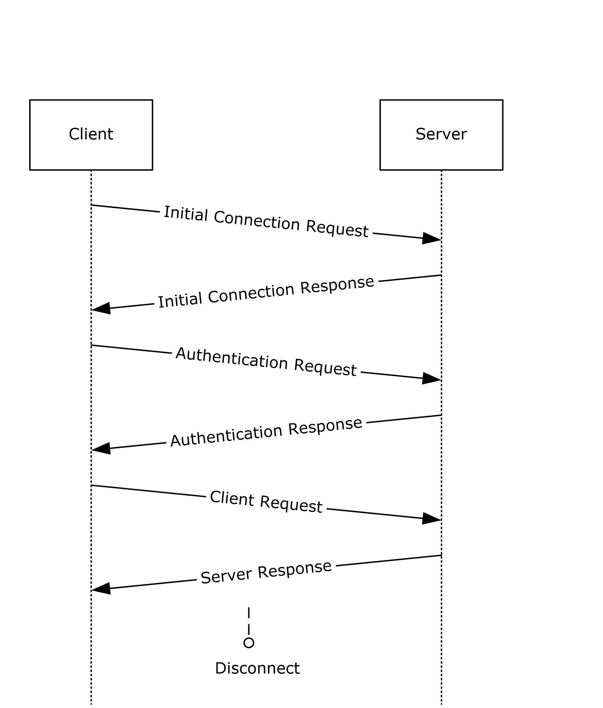

Figure 1: Communication flow in the TDS protocol

The following example is a high-level description of the messages exchanged between the client and the server to execute a simple client request such as the execution of a [**SQL statement**](#gt_sql-statement). It is assumed that the client and the server have already established a connection and authentication has succeeded.

Client:SQL statement

The server executes the SQL statement and then sends back the results to the client. The data columns being returned are first described by the server (represented as column metadata or COLMETADATA (section [2.2.7.4](#Section_2.2.7.4)) and then the rows follow. A completion message is sent after all the row data has been transferred.

Server:COLMETADATAdata stream

ROWdata stream

.

.

ROWdata stream

DONEdata stream

For more information about the correlation between data stream and TDS packet, see section [2.2.4](#Section_2.2.4).<1>

Additional details about which SQL Server version corresponds to which TDS version number are defined in LOGINACK (section [2.2.7.14](#Section_2.2.7.14)).

## 1.4 Relationship to Other Protocols

The Tabular Data Stream (TDS) protocol depends upon a network transport connection being established prior to a TDS conversation occurring (the choice of transport protocol is not important to TDS).

TDS depends on Transport Layer Security (TLS)/Secure Socket Layer (SSL) for network channel encryption. In the TDS 7.x version family, TLS/SSL is optional and the negotiation of the encryption setting between the client and server and the initial TLS/SSL handshake are handled in the TDS layer.

Introduced in the TDS 8.0 version, TLS is mandatory and is established in the lower layer before TDS begins functioning.

If the [**Multiple Active Result Sets (MARS)**](#gt_multiple-active-result-sets-mars) feature [[MSDN-MARS]](https://go.microsoft.com/fwlink/?LinkId=98459) is enabled, the [**Session Multiplex Protocol (SMP)**](#gt_session-multiplex-protocol-smp) [MC-SMP](../MC-SMP/MC-SMP.md) is required.

This relationship is illustrated in the following figure.

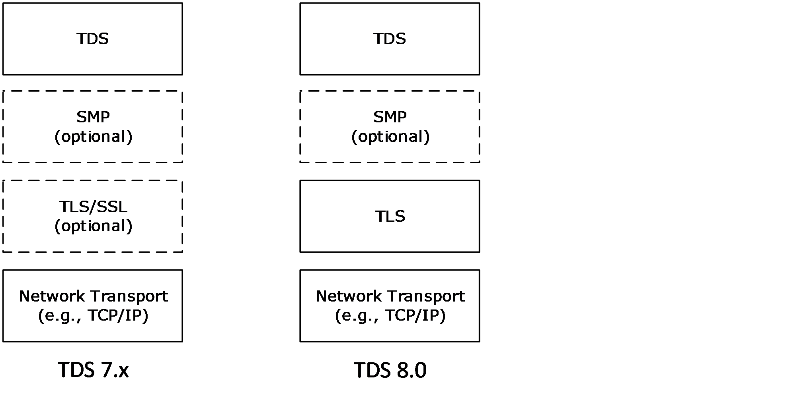

Figure 2: Protocol relationship

## 1.5 Prerequisites/Preconditions

This protocol can be used after the client has discovered the server and established a network transport connection for use with TDS.

In the TDS 7.x version family, no security association is assumed to have been established at the lower layer before TDS begins functioning. In the TDS 8.0 version, such a security association is assumed.

For [**Security Support Provider Interface (SSPI)**](#gt_security-support-provider-interface-sspi) [[SSPI]](https://go.microsoft.com/fwlink/?LinkId=90536) authentication to be used, SSPI support needs to be available on both the client and server machines. For channel encryption to be used, TLS/SSL support needs to be present on both client and server machines, and a certificate suitable for encryption has to be deployed on the server machine.

For [**federated authentication**](#gt_federated-authentication) to be used, a library that provides federated authentication support or an equivalent needs to be present on the server, and the client needs to be able to generate a token for federated authentication.

## 1.6 Applicability Statement

The TDS protocol is appropriate for use to facilitate request/response communications between an application and a database server in all scenarios where network or local connectivity is available.

## 1.7 Versioning and Capability Negotiation

This protocol includes versioning issues in the following areas.

- **Supported Transports:** This protocol can be implemented on top of any network transport protocol as discussed in section [2.1](#Section_2.1).
- **Protocol Versions:** The TDS protocol supports the TDS 7.x version family (which is composed of explicit versions TDS 7.0, TDS 7.1, TDS 7.2, TDS 7.3, and TDS 7.4) and the TDS 8.0 explicit version.
In TDS 7.x, the explicit version is negotiated as part of the LOGIN7 message [**data stream**](#gt_data-stream), as described in section [2.2.6.4](#Section_2.2.6.4).

In TDS 8.0, the explicit version has to be identified from the TLS handshake by using an Application-Layer Protocol Negotiation (ALPN) TLS extension [[RFC7301]](https://go.microsoft.com/fwlink/?LinkId=513846). If ALPN is not present, the server has to assume the TDS 8.0 version has been sent. Version information sent in the LOGIN7 message data that is later in the flow does not have to be specified and ought to be ignored by both the client and server.

Aspects of later versions of the TDS protocol that do not apply to earlier versions are identified in the text.

**Note** After a protocol feature is introduced, subsequent versions of the TDS protocol support that feature until that feature is removed.

- **Security and Authentication Methods:** The TDS protocol supports [**SQL Server User Authentication (SQLAUTH)**](#gt_sql-server-user-authentication-sqlauth). The TDS protocol also supports SSPI authentication and indirectly supports any authentication mechanism that SSPI supports. The use of SSPI in TDS is defined in sections 2.2.6.4 and [3.2.5.2](#Section_3.2.5.2). The TDS protocol also supports [**federated authentication**](#gt_federated-authentication). The use of federated authentication in TDS is defined in sections 2.2.6.4 and [3.2.5](#Section_3.2.5).
- **Localization:** Localization-dependent protocol behavior is specified in sections [2.2.5.1.2](#Section_2.2.5.1.2) and [2.2.5.6](#Section_2.2.5.6).
- **Capability Negotiation:** This protocol does explicit capability negotiation as specified in this section.
In general, the TDS protocol does not provide facilities for capability negotiation because the complete set of supported features is fixed for each version of the protocol. Certain features such as authentication type are not usually negotiated but rather are requested by the client. However, the protocol supports negotiation for the following two features:

- **Channel encryption:** In TDS 7.x, the encryption behavior that is used for the [**TDS session**](#gt_tds-session) is negotiated in the initial messages exchanged by the client and the server. In TDS 8.0, encryption is mandatory and is established prior to initial messaging by the client and the server.
- **Authentication mechanism for integrated authentication identities:** The authentication mechanism that is used for the TDS session is negotiated in the initial messages exchanged by the client and the server.
For more details about encryption behavior in TDS 7.x and about how the client and server negotiate between SSPI authentication and federated authentication, see the PRELOGIN description in section [2.2.6.5](#Section_2.2.6.5).

Note that the cipher suite for TLS/SSL [[RFC2246]](https://go.microsoft.com/fwlink/?LinkId=90324) [[RFC5246]](https://go.microsoft.com/fwlink/?LinkId=129803) [[RFC8446]](https://go.microsoft.com/fwlink/?linkid=2147431) [[RFC6101]](https://go.microsoft.com/fwlink/?LinkId=509953), the authentication mechanism for SSPI [[SSPI]](https://go.microsoft.com/fwlink/?LinkId=90536), and federated authentication are negotiated outside the influence of TDS.

## 1.8 Vendor-Extensible Fields

None.

## 1.9 Standards Assignments

The TDS 7.x and TDS 8.0 protocols use the following assignment.

| Parameter | TCP port value | Reference |
| --- | --- | --- |
| Default SQL Server instance TCP port | 1433 | [[IANAPORT]](https://go.microsoft.com/fwlink/?LinkId=89888) |

TDS 8.0 also uses the following ALPN identification sequence to identify the TDS protocol.

| Parameter | Identification Sequence | Reference |
| --- | --- | --- |
| tds/8.0 | 0x74 0x64 0x73 0x2f 0x38 0x2e 0x30 | [MS-TDS] |

**Note** This identification sequence has been requested and is in the process of being registered with the Internet Assigned Numbers Authority (IANA). This note will be removed when registration is completed.

# 2 Messages

The formal syntax of all messages is provided in Augmented Backus-Naur Form (ABNF) [[RFC4234]](https://go.microsoft.com/fwlink/?LinkId=90462), with the addition of the following:

- underscore ("_") – a valid character within an identifier.
- "%x00" – a valid value.
- "%b0" – a valid value.

## 2.1 Transport

The TDS protocol does not prescribe a specific underlying transport protocol to use on the Internet or on other networks. TDS only presumes a reliable transport that guarantees in-sequence delivery of data.

The chosen transport can be either stream-oriented or message-oriented. If a message-oriented transport is used, any TDS packet sent from a TDS client to a TDS server MUST be contained within a single transport data unit. Any additional mapping of TDS data onto the transport data units of the protocol in question is outside the scope of this specification.

The current version of the TDS protocol has implementations over the following transports, except as indicated:<2>

- TCP [[RFC793]](https://go.microsoft.com/fwlink/?LinkId=150872).
- A reliable transport over the [**Virtual Interface Architecture (VIA)**](#gt_virtual-interface-architecture-via) [**interface**](#gt_interface) [VIA2002] can be used in only TDS 7.0, TDS 7.1, TDS 7.2, and TDS 7.3.<3>
- Named Pipes [[MSDN-NP]](https://go.microsoft.com/fwlink/?LinkId=90247).
- Shared memory [[MSDN-TDSENDPT]](https://go.microsoft.com/fwlink/?linkid=865399).
- Optionally, the TDS protocol has implementations for the following protocols on top of the preceding transports:
- Transport Layer Security (TLS)/Secure Socket Layer (SSL) [[RFC2246]](https://go.microsoft.com/fwlink/?LinkId=90324) [[RFC5246]](https://go.microsoft.com/fwlink/?LinkId=129803) [[RFC6101]](https://go.microsoft.com/fwlink/?LinkId=509953), in case TLS/SSL encryption is negotiated in TDS 7.x.
- TLS [[RFC8446]](https://go.microsoft.com/fwlink/?linkid=2147431), in case TLS encryption is established in TDS 8.0.
- [**Session Multiplex Protocol (SMP)**](#gt_session-multiplex-protocol-smp) [MC-SMP](../MC-SMP/MC-SMP.md), in case the [**Multiple Active Result Sets (MARS)**](#gt_multiple-active-result-sets-mars) feature [[MSDN-MARS]](https://go.microsoft.com/fwlink/?LinkId=98459) is requested.

## 2.2 Message Syntax

Character data, such as [**SQL statements**](#gt_sql-statement), within a TDS message is in [**Unicode**](#gt_unicode), unless the character data represents the data value of an ASCII data type, such as a non-Unicode data column. A character count within TDS is a count of characters, rather than of bytes, except when that character count is explicitly specified as a byte count.

### 2.2.1 Client Messages

Messages sent from the client to the server are as follows:

- [Pre-Login](#Section_2.2.1.1)
- [Login](#Section_2.2.1.2)
- [Federated Authentication Token](#Section_2.2.6.3)
- [SQL Batch](#Section_2.2.1.4)
- [Bulk Load](#Section_4.12)
- [Remote Procedure Call](#Section_2.2.1.6)
- [Attention](#Section_2.2.1.7)
- [Transaction Manager Request](#Section_2.2.6.9)
These messages are briefly described in the sections that follow. Detailed descriptions of message contents are in section [2.2.6](#Section_2.2.3.1).

#### 2.2.1.1 Pre-Login

Before a login occurs, a Pre-Login handshake occurs between client and server, setting up contexts such as encryption and [**MARS**](#gt_multiple-active-result-sets-mars)-enabled. For more details, see section [2.2.6.5](#Section_2.2.6.5).

#### 2.2.1.2 Login

When the client makes the determination to establish a TDS protocol connection with the server side, the client sends a Login message [**data stream**](#gt_data-stream) to the server. The client can have more than one connection to the server, but each connection is established separately in the same way. For more details, see section [2.2.6.4](#Section_2.2.6.4).

After the server receives the login record from the client and, if necessary, performs subsequent authentication handshakes (such as when SSPI [[SSPI]](https://go.microsoft.com/fwlink/?LinkId=90536) or [**federated authentication**](#gt_federated-authentication) is used), the server notifies the client that it has either accepted or rejected the connection request. For more details, see section [3.3.5.1](#Section_3.3.5.1).

#### 2.2.1.3 Federated Authentication Token

When the client indicates in the Login record that [**federated authentication**](#gt_federated-authentication)<4> is to be used but that the intended client library needs additional information from the server to generate a federated authentication token, if the server supports federated authentication that uses that client library, the server responds with a token that the client uses to perform federated authentication. The client then generates and sends a tokenless Federated Authentication Token message that contains binary authentication data that is generated by the federated authentication library. For more details, see section [2.2.6.3](#Section_2.2.6.3).

After the server receives the Federated Authentication Token message from the client, the server notifies the client that it has either accepted or rejected the connection request. For more details, see section 3.3.5.

#### 2.2.1.4 SQL Batch

To send a [**SQL statement**](#gt_sql-statement) or a batch of SQL statements, the [**SQL batch**](#gt_sql-batch), represented by a [**Unicode**](#gt_unicode) string, is copied into the data section of a TDS packet and is then sent to the database server that supports SQL. A SQL batch can span more than one TDS packet. For more details, see section [2.2.6.7](#Section_2.2.6.7).

#### 2.2.1.5 Bulk Load

In a [**bulk insert**](#gt_bulk-insert)/bulk load operation, a [**SQL statement**](#gt_sql-statement) consists of a [**Unicode**](#gt_unicode) string that is followed by binary data. The client sends the **INSERT BULK** SQL statement and then sends a COLMETADATA token (section [2.2.7.4](#Section_2.2.7.4)) that describes the raw data. Multiple rows of binary data are then sent to the server. The data is not formatted in storage row format but in the format described by the COLMETADATA token. The stream is the same as if the data were being selected from the server rather than being sent to the server. For more details, see section [2.2.6.1](#Section_2.2.6.1).

A bulk load operation is also used for inserting data with a previously issued **UPDATETEXT BULK** or **WRITETEXT BULK** SQL statement. For more details, see section [2.2.6.2](#Section_2.2.6.2).

#### 2.2.1.6 Remote Procedure Call

To execute a [**remote procedure call (RPC)**](#gt_remote-procedure-call-rpc) on the server, the client sends an RPC message [**data stream**](#gt_data-stream) to the server. This is a binary stream that contains the RPC name or numeric identifier, options, and parameters. RPCs MUST be in a separate TDS message and not intermixed with [**SQL statements**](#gt_sql-statement). There can be several RPCs in one message. For more details, see section [2.2.6.6](#Section_2.2.6.6).

#### 2.2.1.7 Attention

The client can interrupt and cancel the current request by sending an **Attention** message. This is also known as [**out-of-band**](#gt_out-of-band) data, but any TDS packet that is being sent MUST be finished before sending the **Attention** message. After the client sends an **Attention** message, the client MUST read until it receives an **Attention** acknowledgment.

If a complete request has been sent to the server, sending a cancel requires sending an **Attention** packet. An example of this behavior is if the client has already sent a request, which has the last packet with EOM bit (0x01) set in status. The **Attention** packet is the only way to interrupt a complete request that has already been sent to the server. For more information, see section [4.19.2](#Section_2.2.1.7).

If a complete request has not been sent to the server, the client MUST send the next packet with both the ignore bit (0x02) and EOM bit (0x01) set in the status to cancel the request. An example of this behavior is if one or more packets have been sent but the last packet with EOM bit (0x01) set in status has not been sent. Setting the ignore and EOM bits terminates the current request, and the server MUST ignore the current request. When the ignore and EOM bits are set, the server does not send an attention acknowledgment, but instead returns a [**table response**](#gt_table-response) with a single DONE token (section [2.2.7.6](#Section_2.2.7.6)) that has a status of DONE_ERROR to indicate that the incoming request was ignored. For more details about the packet header status code, see section [2.2.3.1.2](#Section_2.2.3.1.2).

#### 2.2.1.8 Transaction Manager Request

The client can request that the connection enlist in a transaction as described in [[MSDN-DTC]](https://go.microsoft.com/fwlink/?LinkId=89994).

### 2.2.2 Server Messages

Messages sent from the server to the client are the following:

- [Pre-Login Response](#Section_2.2.2.1)
- [Login Response](#Section_2.2.2.2)
- [Federated Authentication Information](#Section_2.2.2.3)
- [Row Data](#Section_2.2.2.4)
- [Return Status](#Section_2.2.2.5)
- [Return Parameters](#Section_2.2.2.6)
- [Response Completion](#Section_2.2.2.7)
- [Error and Info](#Section_2.2.2.8)
- [Attention Acknowledgement](#Section_2.2.1.7)
These messages are briefly described in the sections that follow. Detailed descriptions of message contents are in section [2.2.6](#Section_2.2.3.1) and section [2.2.7](#Section_2.2.7).

#### 2.2.2.1 Pre-Login Response

The Pre-Login Response message is a tokenless packet [**data stream**](#gt_data-stream). The data stream consists of the response to the information requested by the client's Pre-Login message. For more details, see section [2.2.6.5](#Section_2.2.6.5).

#### 2.2.2.2 Login Response

The Login Response message is a token stream that consists of information about the server's characteristics, optional information and error messages, and finally, a completion message.

The LOGINACK token [**data stream**](#gt_data-stream) includes information about the server [**interface**](#gt_interface) and the server's product code and name. For more details, see section [2.2.7.14](#Section_2.2.7.14).

If there are any messages in the login response, an ERROR or INFO token data stream is returned from the server to the client. For more details, see sections [2.2.7.10](#Section_2.2.7.10) and [2.2.7.13](#Section_2.2.7.13), respectively.

The server can send, as part of the login response, one or more ENVCHANGE token data streams if the login changed the environment and the associated notification flag was set. An example of an environment change includes the current database context and language setting. For more details, see section [2.2.7.9](#Section_2.2.7.9).

A done packet MUST be present as the final part of the login response, and a DONE token data stream is the last thing sent in response to a server login request. For more details, see section [2.2.7.6](#Section_2.2.7.6).

#### 2.2.2.3 Federated Authentication Information

After the server receives a Login message that states that the client intends to use a [**federated authentication**](#gt_federated-authentication) token from a specific client library that needs additional information from the server to generate that token, if the server supports federated authentication that uses that client library, the server responds to the client with a message. This message contains a Federated Authentication Information Token that provides the information necessary for the client to generate a federated authentication token. If the server determines that no information is required for this particular client library, the server does not send the information token. For more details, see section [2.2.7.12](#Section_2.2.7.12).

#### 2.2.2.4 Row Data

If the server request results in data being returned, the data precedes any other data streams returned from the server except warnings. Row data MUST be preceded by a description of the column names and data types. For more information about how the column names and data types are described, see section [2.2.7.4](#Section_2.2.7.4).

#### 2.2.2.5 Return Status

When a [**stored procedure**](#gt_stored-procedure) is executed by the server, the server MUST return a status value. This is a 4-byte integer and is sent via the RETURNSTATUS token. A stored procedure execution is requested through either an RPC Batch or a SQL Batch (section [2.2.1.4](#Section_2.2.1.4)) message. For more details about RETURNSTATUS, see section [2.2.7.18](#Section_2.2.7.18).

#### 2.2.2.6 Return Parameters

The response format for execution of a [**stored procedure**](#gt_stored-procedure) is identical regardless of whether the request was sent as SQL Batch (section [2.2.1.4](#Section_2.2.1.4)) or RPC Batch. It is always a tabular result-type message.

If the procedure explicitly sends any data, then the message starts with a single token stream of rows, informational messages, and error messages. This data is sent in the usual way.

When the RPC is invoked, some or all of its parameters are designated as output parameters. All output parameters have values returned from the server. For each output parameter, there is a corresponding return value, sent via the RETURNVALUE token. The RETURNVALUE token [**data stream**](#gt_data-stream) is also used for sending back the value returned by a user-defined function (UDF), if it is called as an RPC. For more details about the RETURNVALUE token, see section [2.2.7.19](#Section_2.2.7.19).

#### 2.2.2.7 Response Completion

The client reads results in logical units and can tell when all results have been received by examining the [DONE](#Section_2.2.7.6) token [**data stream**](#gt_data-stream).

When executing a batch of [**SQL statements**](#gt_sql-statement), the server MUST return a DONE token data stream for each set of results. All but the last DONE will have the DONE_MORE bit set in the **Status** field of the DONE token data stream. Therefore, the client can always tell after reading a DONE whether or not there are more results. For more details, see section 2.2.7.6.

For [**stored procedures**](#gt_stored-procedure), completion of SQL statements in the stored procedure is indicated by a [DONEINPROC](#Section_2.2.7.7) token data stream for each SQL statement and a [DONEPROC](#Section_2.2.7.8) token data stream for each completed stored procedure. For more details about DONEINPROC and DONEPROC tokens, see section 2.2.7.7 and 2.2.7.8, respectively.

#### 2.2.2.8 Error and Info

Besides returning descriptions of Row data and the data itself, TDS provides a token [**data stream**](#gt_data-stream) type for the server to send error and informational messages to the client. These are the ERROR token data stream and the INFO token data stream. For more details, see sections [2.2.7.10](#Section_2.2.7.10) and [2.2.7.13](#Section_2.2.7.13), respectively.

#### 2.2.2.9 Attention Acknowledgment

After a client has sent an interrupt signal to the server, the client MUST read returning data until the interrupt has been acknowledged. Attention messages are acknowledged in the DONE token [**data stream**](#gt_data-stream). For more details, see section [2.2.7.6](#Section_2.2.7.6).

### 2.2.3 Packets

A packet is the unit written or read at one time. A message can consist of one or more packets. A packet always includes a packet header and is usually followed by packet data that contains the message. Each new message starts in a new packet.

In practice, both the client and server try to read a packet full of data. They pick out the header to see how much more (or less) data there is in the communication.

At login time, clients MAY specify a requested "packet" size as part of the LOGIN7 (section [2.2.6.4](#Section_2.2.6.4)) message stream. This identifies the size used to break large messages into different "packets". Server acknowledgment of changes in the negotiated packet size is transmitted back to the client via ENVCHANGE (section [2.2.7.9](#Section_2.2.7.9)) token stream. The negotiated packet size is the maximum value that can be specified in the **Length** packet header field described in section [2.2.3.1.3](#Section_2.2.3.1.3).

Starting with TDS 7.3, the following behavior MUST also be enforced. For requests sent to the server larger than the current negotiated "packet" size, the client MUST send all but the last packet with a total number of bytes equal to the negotiated size. Only the last packet in the request can contain an actual number of bytes smaller than the negotiated packet size. If any of the preceding packets are sent with a length less than the negotiated packet size, the server SHOULD disconnect the client when the next network payload arrives.

#### 2.2.3.1 Packet Header

To implement messages on top of existing, arbitrary transport layers, a packet header is included as part of the packet. The packet header precedes all data within the packet. It is always 8 bytes in length. Most importantly, the packet header states the **Type** (section [2.2.3.1.1](#Section_2.2.3.1.1)) and **Length** (section [2.2.3.1.3](#Section_2.2.3.1.3)) of the entire packet.

The following sections provide a detailed description of each item within the packet header.

##### 2.2.3.1.1 Type

**Type** defines the type of message. **Type** is a 1-byte unsigned char. The following table describes the types that are available.

| Value | Description | Packet contains data? |
| --- | --- | --- |
| 1 | SQL batch | Yes |
| 2 | Pre-TDS7 Login<5> | Yes |
| 3 | RPC | Yes |
| 4 | Tabular result | Yes |
| 5 | Unused | - |
| 6 | Attention signal | No |
| 7 | Bulk load data | Yes |
| 8 | Federated Authentication Token | Yes |
| 9-13 | Unused | - |
| 14 | Transaction manager request | Yes |
| 15 | Unused | - |
| 16 | TDS7 Login<6> | Yes |
| 17 | SSPI | Yes |
| 18 | Pre-Login | Yes |

If an unknown **Type** is specified, the message receiver SHOULD disconnect the connection. If a valid **Type** is specified, but is unexpected (per section [3](#Section_1.3)), the message receiver SHOULD disconnect the connection. This applies to both the client and the server. For example, the server could disconnect the connection if the server receives a message with **Type** equal 16 when the connection is already logged in.

The following table highlights which messages, as described previously in sections [2.2.1](#Section_1.3) and [2.2.2](#Section_2.2.2), correspond to which packet header type.

| Message type | Client or server message | Packet header type |
| --- | --- | --- |
| [Pre-Login](#Section_2.2.1.1) | Client | 18 |
| [Login](#Section_2.2.1.2) | Client | 16 + 17 (if Integrated authentication) |
| [Federated Authentication Token](#Section_2.2.6.3) | Client | 8 |
| [SQL Batch](#Section_2.2.1.4) | Client | 1 |
| [Bulk Load](#Section_4.12) | Client | 7 |
| [RPC](#Section_2.2.1.6) | Client | 3 |
| [Attention](#Section_2.2.1.7) | Client | 6 |
| [Transaction Manager Request](#Section_2.2.6.9) | Client | 14 |
| [FeatureExtAck](#Section_2.2.7.11) | Server | 4 |
| [Pre-Login Response](#Section_2.2.2.1) | Server | 4 |
| [Login Response](#Section_2.2.2.2) | Server | 4 |
| [Federated Authentication Information](#Section_2.2.7.12) | Server | 4 |
| [Row Data](#Section_2.2.2.4) | Server | 4 |
| [Return Status](#Section_2.2.2.5) | Server | 4 |
| [Return Parameters](#Section_2.2.2.6) | Server | 4 |
| [Response Completion](#Section_2.2.2.7) | Server | 4 |
| [Session State](#Section_2.2.7.21) | Server | 4 |
| [Error and Info](#Section_2.2.2.8) | Server | 4 |
| [Attention Acknowledgement](#Section_2.2.1.7) | Server | 4 |

##### 2.2.3.1.2 Status

**Status** is a bit field used to indicate the message state. **Status** is a 1-byte unsigned char. The following **Status** bit flags are defined.

| Value | Description |
| --- | --- |
| 0x00 | "Normal" message. |
| 0x01 | End of message (EOM). The packet is the last packet in the whole request. |
| 0x02 | (From client to server) Ignore this event (0x01 MUST also be set). |
| 0x08 | RESETCONNECTION (Introduced in TDS 7.1) (From client to server) Reset this connection before processing event. Only set for event types Batch, RPC, or Transaction Manager request. If clients want to set this bit, it MUST be part of the first packet of the message. This signals the server to clean up the environment state of the connection back to the default environment setting, effectively simulating a logout and a subsequent login, and provides server support for connection pooling. This bit SHOULD be ignored if it is set in a packet that is not the first packet of the message. This status bit MUST NOT be set in conjunction with the RESETCONNECTIONSKIPTRAN bit. Distributed transactions and isolation levels are not reset. |
| 0x10 | RESETCONNECTIONSKIPTRAN (Introduced in TDS 7.3) (From client to server) Reset the connection before processing event but do not modify the transaction state (the state remains the same before and after the reset). The transaction in the session can be a local transaction that is started from the session or it can be a distributed transaction in which the session is enlisted. This status bit MUST NOT be set in conjunction with the RESETCONNECTION bit. Otherwise identical to RESETCONNECTION. |

All other bits are not used and MUST be ignored.

##### 2.2.3.1.3 Length

**Length** is the size of the packet including the 8 bytes in the packet header. It is the number of bytes from the start of this header to the start of the next packet header. **Length** is a 2-byte, unsigned short and is represented in network byte order ([**big-endian**](#gt_big-endian)).

The **Length** value MUST be greater than or equal to 512 bytes and smaller than or equal to 32,767 bytes. The packet size MUST be smaller than or equal to 4,096 bytes until **Length** is successfully negotiated. The default value is 4,096 bytes.

Starting with TDS 7.3, **Length** MUST be the negotiated packet size when sending a packet from client to server, unless it is the last packet of a request (that is, the EOM bit in **Status** is ON) or the client has not logged in.

##### 2.2.3.1.4 SPID

**SPID** is the process ID on the server, corresponding to the current connection. This information is sent by the server to the client and is useful for identifying which thread on the server sent the TDS packet. It is provided for debugging purposes. The client MAY send the **SPID** value to the server. If the client does not, then a value of 0x0000 SHOULD be sent to the server. This is a 2-byte value and is represented in network byte order ([**big-endian**](#gt_big-endian)).

##### 2.2.3.1.5 PacketID

**PacketID** is used for numbering message packets that contain data in addition to the packet header. PacketID is a 1-byte, unsigned char. Each time packet data is sent, the value of **PacketID** is incremented by 1, modulo 256.<7> This allows the receiver to track the sequence of TDS packets for a given message. This value is ignored.

##### 2.2.3.1.6 Window

This 1 byte is not used. This byte SHOULD be set to 0x00 and SHOULD be ignored by the receiver.

#### 2.2.3.2 Packet Data

Packet data for a given message follows the packet header (see **Type** in section [2.2.3.1.1](#Section_2.2.3.1.1) for messages that contain packet data). As stated in section [2.2.3](#Section_2.2.3), a message can span more than one packet. Because each new message MUST always begin within a new packet, a message that spans more than one packet only occurs if the data to be sent exceeds the maximum packet data size, which is computed as (negotiated packet size - 8 bytes), where the 8 bytes represents the size of the packet header.

If a stream spans more than one packet, then the EOM bit of the packet header **Status** (section [2.2.3.1.2](#Section_2.2.3.1.2)) code MUST be set to 0 for every packet header. The EOM bit MUST be set to 1 in the last packet to signal that the stream ends. In addition, the **PacketID** field of subsequent packets MUST be incremented as defined in section [2.2.3.1.5](#Section_2.2.3.1.5).

### 2.2.4 Packet Data Token and Tokenless Data Streams

The messages contained in packet data that pass between the client and the server can be one of two types: a "token stream" or a "tokenless stream". A token stream consists of one or more "tokens" each followed by some token-specific data. A "token" is a single byte identifier that is used to describe the data that follows it and contains information such as token data type, token data length, and so on. Tokenless streams are used for simple messages. Messages that might require a more detailed description of the data within it are sent as a token stream. The following table highlights which messages, as described previously in sections [2.2.1](#Section_1.3) and [2.2.2](#Section_2.2.2), use token streams and which do not.

| Message type | Client or server message | Token stream? |
| --- | --- | --- |
| Pre-Login | Client | No |
| Login | Client | No |
| Federated Authentication Token | Client | No |
| SQL Command | Client | No |
| Bulk Load | Client | Yes |
| Remote Procedure Call (RPC) | Client | Yes |
| Attention | Client | No |
| Transaction Manager Request | Client | No |
| Pre-Login Response | Server | No |
| Federated Authentication Information | Server | Yes |
| FeatureExtAck | Server | Yes |
| Login Response | Server | Yes |
| Row Data | Server | Yes |
| Return Status | Server | Yes |
| Return Parameters | Server | Yes |
| Response Completion | Server | Yes |
| Session State | Server | Yes |
| Error and Info | Server | Yes |
| Attention Acknowledgement | Server | No |

#### 2.2.4.1 Tokenless Stream

As shown in section [2.2.4](#Section_2.2.4), some messages do not use tokens to describe the data portion of the [**data stream**](#gt_data-stream). In these cases, all the information required to describe the packet data is contained in the packet header. This is referred to as a tokenless stream and is essentially just a collection of packets and data.

#### 2.2.4.2 Token Stream

More complex messages (for example, column metadata, row data, and data type data) are constructed by using tokens. As described in section [2.2.4](#Section_2.2.4), a token stream consists of a single byte identifier, followed by token-specific data. The definitions of the different token streams can be found in section [2.2.7](#Section_2.2.7).

##### 2.2.4.2.1 Token Definition

There are four classes of token definitions:

- [Zero Length Token(xx01xxxx)](#Section_2.2.4.2.1.1)
- [Fixed Length Token(xx11xxxx)](#Section_2.2.4.2.1.2)
- [Variable Length Tokens(xx10xxxx)](#Section_2.2.4.2.1.3)
- [Variable Count Tokens(xx00xxxx)](#Section_2.2.4.2.1.4)
The following sections specify the bit pattern of each token class, various extensions to this bit pattern for a given token class, and a description of its function(s).

###### 2.2.4.2.1.1 Zero Length Token(xx01xxxx)

This class of token is not followed by a length specification. There is no data associated with the token. A zero length token always has the following bit sequence:

| 0 | 1 | 2 | 3 | 4 | 5 | 6 | 7 |
| --- | --- | --- | --- | --- | --- | --- | --- |
| 0 or 1 | 0 or 1 | 0 | 1 | 0 or 1 | 0 or 1 | 0 or 1 | 0 or 1 |

A value of “0 or 1” denotes a bit position that can contain the bit value “0” or “1”.

###### 2.2.4.2.1.2 Fixed Length Token(xx11xxxx)

This class of token is followed by 1, 2, 4, or 8 bytes of data. No length specification follows this token because the length of its associated data is encoded in the token itself. The different fixed data-length token definitions take the form of one of the following bit sequences, depending on whether the token is followed by 1, 2, 4, or 8 bytes of data. Also in the table, a value of “0 or 1” denotes a bit position that can contain the bit value “0” or “1”.

| 0 | 1 | 2 | 3 | 4 | 5 | 6 | 7 | Description |
| --- | --- | --- | --- | --- | --- | --- | --- | --- |
| 0 or 1 | 0 or 1 | 1 | 1 | 0 | 0 | 0 or 1 | 0 or 1 | Token is followed by 1 byte of data. |
| 0 or 1 | 0 or 1 | 1 | 1 | 0 | 1 | 0 or 1 | 0 or 1 | Token is followed by 2 bytes of data. |
| 0 or 1 | 0 or 1 | 1 | 1 | 1 | 0 | 0 or 1 | 0 or 1 | Token is followed by 4 bytes of data. |
| 0 or 1 | 0 or 1 | 1 | 1 | 1 | 1 | 0 or 1 | 0 or 1 | Token is followed by 8 bytes of data. |

Fixed-length tokens are used by the following data types: *bigint, int*, *smallint*, *tinyint, float, real, money, smallmoney, datetime, smalldatetime,* and *bit*. The type definition is always represented in COLMETADATA (section [2.2.7.4](#Section_2.2.7.4)) and ALTMETADATA (section [2.2.7.1](#Section_2.2.7.1)) data streams as a single byte **Type**. Additional details are specified in section [2.2.5.4.2](#Section_2.2.5.4.2).

###### 2.2.4.2.1.3 Variable Length Tokens(xx10xxxx)

Except as noted later in this section, this class of token definition is followed by a length specification. The length, in bytes, of this length is included in the token itself as a Length value (see section [2.2.7.3](#Section_2.2.7.3)).

The following are the two data types that are of variable length.

- Real variable length data types like char and binary and nullable data types, which are either their normal fixed length corresponding to their TYPE_INFO (section [2.2.5.6](#Section_2.2.5.6)), or a special length if null.
Char and binary data types have values that are either null or 0 to 65534 (0x0000 to 0xFFFE) bytes in length. Null is represented by a length of 65535 (0xFFFF). A char or binary, which cannot be null, can still have a length of zero (for example an empty value). A program that MUST pad a value to a fixed length adds blanks to the end of a char and binary zeros to the end of a binary.

- Text and image data types have values that are either null, or 0 to 2 gigabytes (0x00000000 to 0x7FFFFFFF bytes) in length. Null is represented by a length of -1 (0xFFFFFFFF). No other length specification is supported.
Other nullable data types have a length of 0 if they are null.

**Note** The DATACLASSIFICATION variable length token does not start with a length specification (see section [2.2.7.5](#Section_2.2.7.5)).

###### 2.2.4.2.1.4 Variable Count Tokens(xx00xxxx)

This class of token definition is followed by a count of the number of fields that follow the token. Each field length is dependent on the token type. The total length of the token can be determined only by walking the fields. As shown in the following table, a variable count token always has its third and fourth bits set to “0”, and a value of “0 or 1” in the remaining bit positions denotes a bit position that can contain the bit value “0” or “1”.

| 0 | 1 | 2 | 3 | 4 | 5 | 6 | 7 |
| --- | --- | --- | --- | --- | --- | --- | --- |
| 0 or 1 | 0 or 1 | 0 | 0 | 0 or 1 | 0 or 1 | 0 or 1 | 0 or 1 |

There are two variable count tokens. COLMETADATA (section [2.2.7.4](#Section_2.2.7.4)) and ALTMETADATA (section [2.2.7.1](#Section_2.2.7.1)) both use a 2-byte count.

#### 2.2.4.3 Done and Attention Tokens

The DONE token (section [2.2.7.6](#Section_2.2.7.6)) marks the end of the response for each executed [**SQL statement**](#gt_sql-statement). Based on the SQL statement and the context in which it is executed, the server MAY generate a DONEPROC (section [2.2.7.8](#Section_2.2.7.8)) or DONEINPROC (section [2.2.7.7](#Section_2.2.7.7)) token instead.

The attention signal is sent by using the [**out-of-band**](#gt_out-of-band) write provided by the network library. An out-of-band write is the ability to send the attention signal no matter if the sender is in the middle of sending or processing a message or simply sitting idle. If that function is not supported, the client MUST simply read and discard all of the data, except SESSIONSTATE data (section [2.2.7.21](#Section_2.2.7.21)), from the server until the final DONE token, which acknowledges that the attention signal is read.<8>

### 2.2.5 Grammar Definition for Token Description

The Tabular Data Stream consists of a variety of messages. Each message consists of a set of bytes transmitted in a predefined order. This predefined order or grammar can be specified by using Augmented Backus-Naur Form (ABNF) [[RFC4234]](https://go.microsoft.com/fwlink/?LinkId=90462). Details can be found in the following subsections.

#### 2.2.5.1 General Rules

Data structure encodings in TDS are defined in terms of the following fundamental definitions.

**BIT**: A single bit value of either 0 or 1.

BIT = %b0 / %b1

**BYTE**: An unsigned single byte (8-bit) value. The range is 0 to 255.

BYTE = 8BIT

**BYTELEN**: An unsigned single byte (8-bit) value representing the length of the associated data. The range is 0 to 255.

BYTELEN = BYTE

**USHORT**: An unsigned 2-byte (16-bit) value. The range is 0 to 65535.

USHORT = 2BYTE

**USHORT_MAX**: An unsigned 2-byte (16-bit) value representing the maximum value of the associated data. The range is 65535 or greater.

USHORT_MAX = 2BYTE

**LONG**: A signed 4-byte (32-bit) value. The range is -(2^31) to (2^31)-1.

LONG = 4BYTE

**ULONG**: An unsigned 4-byte (32-bit) value. The range is 0 to (2^32)-1.

ULONG = 4BYTE

**DWORD**: An unsigned 4-byte (32-bit) value. The range when used as a numeric value is 0 to (2^32)-1.

DWORD = 32BIT

**LONGLONG**: A signed 8-byte (64-bit) value. The range is -(2^63) to (2^63)-1.

LONGLONG = 8BYTE

**ULONGLONG**: An unsigned 8-byte (64-bit) value. The range is 0 to (2^64)-1.

ULONGLONG = 8BYTE

**UCHAR**: An unsigned single byte (8-bit) value representing a character. The range is 0 to 255.

UCHAR = BYTE

**USHORTLEN**: An unsigned 2-byte (16-bit) value representing the length of the associated data. The range is 0 to 65535.

USHORTLEN = 2BYTE

**USHORTCHARBINLEN**: An unsigned 2-byte (16-bit) value representing the length of the associated character or binary data. The range is 0 to 8000.

USHORTCHARBINLEN = 2BYTE

**LONGLEN**: A signed 4-byte (32-bit) value representing the length of the associated data. The range is -(2^31) to (2^31)-1.

LONGLEN = 4BYTE

**ULONGLEN**: An unsigned 4-byte (32-bit) value representing the length of the associated data. The range is 0 to (2^32)-1.

ULONGLEN = 4BYTE

**ULONGLONGLEN**: An unsigned 8-byte (64-bit) value representing the length of the associated data. The range is 0 to (2^64)-1.

ULONGLONGLEN = 8BYTE

**PRECISION**: An unsigned single byte (8-bit) value representing the precision of a numeric number.

PRECISION = 8BIT

**SCALE**: An unsigned single byte (8-bit) value representing the scale of a numeric number.

SCALE = 8BIT

**GEN_NULL**: A single byte (8-bit) value representing a NULL value.

GEN_NULL = %x00

**CHARBIN_NULL**: A 2-byte (16-bit) or 4-byte (32-bit) value representing a T-SQL NULL value for a character or binary data type. Please refer to TYPE_VARBYTE (see section [2.2.5.2.3](#Section_2.2.5.2.3)) for additional details.

CHARBIN_NULL = (%xFF %xFF) / (%xFF %xFF %xFF %xFF)

**FRESERVEDBIT**: A FRESERVEDBIT is a BIT value used for padding that does not transmit information. FRESERVEDBIT fields SHOULD be set to %b0 and MUST be ignored on receipt.

FRESERVEDBIT = %b0

**FRESERVEDBYTE**: A FRESERVEDBYTE is a BYTE value used for padding that does not transmit information. FRESERVEDBYTE fields SHOULD be set to %x00 and MUST be ignored on receipt.

FRESERVEDBYTE = %x00

**UNICODECHAR**: A single [**Unicode**](#gt_unicode) character in UCS-2 encoding, as specified in Unicode [[UNICODE]](https://go.microsoft.com/fwlink/?LinkId=90550).

UNICODECHAR = 2BYTE

**Notes**

- All integer types are represented in reverse byte order ([**little-endian**](#gt_little-endian)) unless otherwise specified.
- FRESERVEDBIT and FRESERVEDBYTE are often used to pad unused parts of a byte or bytes. The value of these reserved bits SHOULD be ignored. These elements are generally set to 0.

##### 2.2.5.1.1 Least Significant Bit Order

Certain tokens possess rules that comprise an array of independent bits. These are "flag" rules in which each bit is a flag indicating that a specific feature or option is enabled/requested. Normally, the bit array is arranged in least significant bit order (or typical array index order) meaning that the first listed flag is placed in the least significant bit position (identifying the least significant bit as one would in an integer variable). For example, if *Fn* is the *nth* flag, then the following rule definition:

FLAGRULE = F0 F1 F2 F3 F4 F5 F6 F7

would be observed on the wire in the natural value order F7F6F5F4F3F2F1F0.

If the rule contains 16 bits, then the order of the bits observed on the wire follows the [**little-endian**](#gt_little-endian) byte ordering. For example, the following rule definition:

FLAGRULE = F0 F1 F2 F3 F4 F5 F6 F7 F8 F9 F10 F11 F12 F13 F14 F15

has the following order on the wire: F7F6F5F4F3F2F1F0 F15F14F13F12F11F10F9F8.

##### 2.2.5.1.2 Collation Rule Definition

The collation rule is used to specify collation information for character data or metadata describing character data.<9> This is specified as part of the LOGIN7 (section [2.2.6.4](#Section_2.2.6.4)) message or part of a column definition in server results containing character data. For more information about column definition, see COLMETADATA (section [2.2.7.4](#Section_2.2.7.4)).

LCID = 20BIT

fIgnoreCase = BIT

fIgnoreAccent = BIT

fIgnoreWidth = BIT

fIgnoreKana = BIT

fBinary = BIT

fBinary2 = BIT

fUTF8 = BIT

ColFlags = fIgnoreCase fIgnoreAccent fIgnoreKana

fIgnoreWidth fBinary fBinary2 fUTF8

FRESERVEDBIT

Version = 4BIT

SortId = BYTE

COLLATION = LCID ColFlags Version SortId

A SQL collation is one of a predefined set of sort orders. The sort orders are identified with non-zero SortId values described by [[MSDN-SQLCollation]](https://go.microsoft.com/fwlink/?LinkId=119987).

For a SortId==0 collation, the LCID bits correspond to a LocaleId as defined by the National Language Support (NLS) functions. For more details, see [MS-LCID](../MS-LCID/MS-LCID.md).

**Notes**

- ColFlags is represented in [least significant bit order](#Section_2.2.5.1.1).
- A COLLATION<10> value of 0x00 00 00 00 00 specifies a request for the use of raw collation.

#### 2.2.5.2 Data Stream Types

##### 2.2.5.2.1 Unknown Length Data Streams

Unknown length data streams can be used by tokenless data streams. It is a stream of bytes. The number of bytes within the data stream is defined in the packet header as specified in section [2.2.3.1](#Section_1.3).

BYTESTREAM = *BYTE

UNICODESTREAM = *(2BYTE)

##### 2.2.5.2.2 Variable-Length Data Streams

Variable-length data streams consist of a stream of characters or a stream of bytes. The two types are similar, in that they both have a length rule and a data rule.

**Characters**

Variable-length character streams are defined by a length field followed by the data itself. There are two types of variable-length character streams, each dependent on the size of the length field (for example, a BYTE or USHORT). If the length field is zero, then no data follows the length field.

B_VARCHAR = BYTELEN *CHAR

US_VARCHAR = USHORTLEN *CHAR

Note that the lengths of B_VARCHAR and US_VARCHAR are given in [**Unicode**](#gt_unicode) characters.

**Generic Bytes**

Similar to the variable-length character stream, variable-length byte streams are defined by a length field followed by the data itself. There are three types of variable-length byte streams, each dependent on the size of the length field (for example, a BYTE, USHORT, or LONG). If the value of the length field is zero, then no data follows the length field.

B_VARBYTE = BYTELEN *BYTE

US_VARBYTE = USHORTLEN *BYTE

L_VARBYTE = LONGLEN *BYTE

##### 2.2.5.2.3 Data Type Dependent Data Streams

Some messages contain variable data types. The actual type of a given variable data type is dependent on the type of the data being sent within the message as defined in the TYPE_INFO rule (section [2.2.5.6](#Section_2.2.5.6)).

For example, the RPCRequest message contains the TYPE_INFO and TYPE_VARBYTE rules. These two rules contain data of a type that is dependent on the actual type used in the value of the FIXEDLENTYPE or VARLENTYPE rules of the TYPE_INFO rule.

Data type-dependent data streams occur in three forms: integers, fixed and variable bytes, and partially length-prefixed bytes.

**Integers**

Data type-dependent integers can be either a BYTELEN, USHORTCHARBINLEN, or LONGLEN in length. This length is dependent on the TYPE_INFO associated with the message. If the data type (for example, FIXEDLENTYPE or VARLENTYPE rule of the TYPE_INFO rule) is of type SSVARIANTTYPE, TEXTTYPE, NTEXTTYPE, or IMAGETYPE, the integer length is LONGLEN. If the data type is BIGCHARTYPE, BIGVARCHARTYPE, NCHARTYPE, NVARCHARTYPE, BIGBINARYTYPE, or BIGVARBINARYTYPE, the integer length is USHORTCHARBINLEN. For all other data types, the integer length is BYTELEN.

TYPE_VARLEN = BYTELEN

/

USHORTCHARBINLEN

/

LONGLEN

**Fixed and Variable Bytes**

The data type to be used in a data type-dependent byte stream is defined by the TYPE_INFO rule associated with the message.

For variable-length types, with the exception of PLP (see Partially Length-prefixed Bytes below), the TYPE_VARLEN value defines the length of the data to follow. As described above, the TYPE_INFO rule defines the type of TYPE_VARLEN (for example BYTELEN, USHORTCHARBINLEN, or LONGLEN).

For fixed-length types, the TYPE_VARLEN rule is not present. In these cases, the number of bytes to be read is determined by the TYPE_INFO rule. For example, if "INT2TYPE" is specified as the value for the FIXEDLENTYPE rule of the TYPE_INFO rule, 2 bytes are read because "INT2TYPE" is always 2 bytes in length. For more details, see [Data Types Definitions](#Section_1.3).

The data following this can be a stream of bytes or a NULL value. The 2-byte CHARBIN_NULL rule is used for BIGCHARTYPE, BIGVARCHARTYPE, NCHARTYPE, NVARCHARTYPE, BIGBINARYTYPE, and BIGVARBINARYTYPE types, and the 4-byte CHARBIN_NULL rule is used for TEXTTYPE, NTEXTTYPE, and IMAGETYPE. The GEN_NULL rule applies to all other types aside from PLP:

TYPE_VARBYTE = GEN_NULL / CHARBIN_NULL / PLP_BODY

/ ([TYPE_VARLEN] *BYTE)

**Partially Length-prefixed Bytes**

Unlike fixed or variable byte stream formats, Partially length-prefixed bytes (PARTLENTYPE), introduced in TDS 7.2, do not require the full data length to be specified before the actual data is streamed out. Thus, it is ideal for those applications where the data length is not known upfront (that is, xml serialization). A value sent as PLP can be either NULL, a length followed by chunks (as defined by PLP_CHUNK), or an unknown length token followed by chunks, which MUST end with a PLP_TERMINATOR. The rule below describes the stream format (for example, the format of a singleton PLP value):

PLP_BODY= PLP_NULL

/

((ULONGLONGLEN / UNKNOWN_PLP_LEN)

*PLP_CHUNK PLP_TERMINATOR)

PLP_NULL = %xFFFFFFFFFFFFFFFF

UNKNOWN_PLP_LEN = %xFFFFFFFFFFFFFFFE

PLP_CHUNK = ULONGLEN 1*BYTE

PLP_TERMINATOR = %x00000000

**Notes**

- TYPE_INFO rule specifies a Partially Length-prefixed Data type (PARTLENTYPE, see [2.2.5.4.4](#Section_2.2.5.4.4)).
- In the UNKNOWN_PLP_LEN case, the data is represented as a series of zero or more chunks, each consisting of the length field followed by length bytes of data (see the PLP_CHUNK rule). The data is terminated by PLP_TERMINATOR (which is essentially a zero-length chunk).
- In the actual data length case, the ULONGLONGLEN specifies the length of the data and is followed by any number of PLP_CHUNKs containing the data. The length of the data specified by ULONGLONGLEN is used as a hint for the receiver. The receiver SHOULD validate that the length value specified by ULONGLONGLEN matches the actual data length.

#### 2.2.5.3 Packet Data Stream Headers - ALL_HEADERS Rule Definition

Message streams can be preceded by a variable number of headers as specified by the ALL_HEADERS rule. The ALL_HEADERS rule, Query Notifications (section [2.2.5.3.1](#Section_2.2.5.3.1)), and Transaction Descriptor (section [2.2.5.3.2](#Section_2.2.5.3.2)) were introduced in TDS 7.2. Trace Activity (section [2.2.5.3.3](#Section_2.2.5.3.3)) was introduced in TDS 7.4.

The list of headers that are applicable to the different types of messages are described in the following table.

Stream headers MUST be present only in the first packet of requests that span more than one packet. The ALL_HEADERS rule applies only to the three client request types defined in the table below and MUST NOT be included for other request types. For the applicable request types, each header MUST appear at most once in the stream or packet's ALL_HEADERS field.

| Header | Value | SQLBatch | RPCRequest | TransactionManagerRequest |
| --- | --- | --- | --- | --- |
| Query Notifications | 0x00 01 | Optional | Optional | Disallowed |
| Transaction Descriptor | 0x00 02 | Required | Required | Required |
| Trace Activity | 0x00 03 | Optional | Optional | Optional |

**Stream-Specific Rules:**

TotalLength = DWORD ;including itself

HeaderLength = DWORD ;including itself

HeaderType = USHORT;

HeaderData = *BYTE

Header = HeaderLength HeaderType HeaderData

**Stream Definition:**

ALL_HEADERS = TotalLength 1*Header

| Parameter | Description |
| --- | --- |
| TotalLength | Total length of ALL_HEADERS stream. |
| HeaderLength | Total length of an individual header. |
| HeaderType | The type of header, as defined by the value field in the preceding table. |
| HeaderData | The data stream for the header. See header definitions in the following subsections. |
| Header | A structure containing a single header. |

##### 2.2.5.3.1 Query Notifications Header

This packet data stream header allows the client to specify that a notification is to be supplied on the results of the request. The contents of the header specify the information necessary for delivery of the notification. For more information about [**query notifications**](#gt_query-notification)<11> functionality for a database server that supports SQL, see [[MSDN-QUERYNOTE]](https://go.microsoft.com/fwlink/?LinkId=119984).

**Stream Specific Rules:**

NotifyId = USHORT UNICODESTREAM ; user specified value

; when subscribing to

; query notifications

SSBDeployment = USHORT UNICODESTREAM

NotifyTimeout = ULONG ; duration in which the query

; notification subscription

; is valid

The USHORT field defined within the NotifyId and SSBDeployment rules specifies the length, in bytes, of the actual data value, defined by the UNICODESTREAM, that follows it.<12> The time unit of NotifyTimeout is milliseconds.

**Stream Definition:**

HeaderData = NotifyId

SSBDeployment

[NotifyTimeout]

##### 2.2.5.3.2 Transaction Descriptor Header

This packet data stream contains information regarding transaction descriptor and number of outstanding requests as they apply to [**Multiple Active Result Sets (MARS)**](#gt_multiple-active-result-sets-mars) [[MSDN-MARS]](https://go.microsoft.com/fwlink/?LinkId=98459).

The TransactionDescriptor MUST be 0, and OutstandingRequestCount MUST be 1 if the connection is operating in AutoCommit mode. For more information about autocommit transactions, see [[MSDN-Autocommit]](https://go.microsoft.com/fwlink/?LinkId=145156).

**Stream-Specific Rules:**

OutstandingRequestCount = DWORD ; number of requests currently active on

; the connection

TransactionDescriptor = ULONGLONG ; for each connection, a number that uniquely

; identifies the transaction with which the

; request is associated; initially generated

; by the server when a new transaction is

; created and returned to the client as part

; of the ENVCHANGE token stream

For more information about processing the Transaction Descriptor header, see section [2.2.6.9](#Section_2.2.6.9).

**Stream Definition:**

HeaderData = TransactionDescriptor

OutstandingRequestCount

##### 2.2.5.3.3 Trace Activity Header

This packet data stream contains a client trace activity ID intended to be used by the server for debugging purposes, to allow correlating the server's processing of the request with the client request.

A client MUST NOT send a Trace Activity header when the negotiated TDS major version is less than 7.4. If the negotiated TDS major version is less than TDS 7.4 and the server receives a Trace Activity header token, the server MUST reject the request with a TDS protocol error.

**Stream-Specific Rules:**

GUID_ActivityID = 16BYTE ; client application activity id

; used for debugging purposes

ActivitySequence = ULONG ; client application activity sequence

; used for debugging purposes

ActivityId = GUID_ActivityID

ActivitySequence

**Stream Definition:**

HeaderData = ActivityId

#### 2.2.5.4 Data Type Definitions

The subsections within this section describe the different sets of data types and how they are categorized. Specifically, data values are interpreted and represented in association with their data type. Details about each data type categorization are described in the following sections.

##### 2.2.5.4.1 Zero-Length Data Types

The zero-length data types include the following type.

NULLTYPE = 0x1F ; Null

There is no data associated with NULLTYPE.<13> For more details, see section [2.2.4.2.1.1](#Section_2.2.4.2.1.1).

##### 2.2.5.4.2 Fixed-Length Data Types

The fixed-length data types include the following types.

INT1TYPE = %x30 ; TinyInt

BITTYPE = %x32 ; Bit

INT2TYPE = %x34 ; SmallInt

INT4TYPE = %x38 ; Int

DATETIM4TYPE = %x3A ; SmallDateTime

FLT4TYPE = %x3B ; Real

MONEYTYPE = %x3C ; Money

DATETIMETYPE = %x3D ; DateTime

FLT8TYPE = %x3E ; Float

MONEY4TYPE = %x7A ; SmallMoney

INT8TYPE = %x7F ; BigInt

DECIMALTYPE = %x37 ; Decimal (legacy support)

NUMERICTYPE = %x3F ; Numeric (legacy support)

FIXEDLENTYPE = INT1TYPE

/

BITTYPE

/

INT2TYPE

/

INT4TYPE

/

DATETIM4TYPE

/

FLT4TYPE

/

MONEYTYPE

/

DATETIMETYPE

/

FLT8TYPE

/

MONEY4TYPE

/

INT8TYPE

Non-nullable values are returned using these fixed-length data types. For the fixed-length data types, the length of data is predefined by the type. There is no TYPE_VARLEN field in the TYPE_INFO rule for these types. In the TYPE_VARBYTE rule for these types, the TYPE_VARLEN field is BYTELEN, and the value is 1 for INT1TYPE/BITTYPE, 2 for INT2TYPE, 4 for INT4TYPE/DATETIM4TYPE/FLT4TYPE/MONEY4TYPE, and 8 for MONEYTYPE/DATETIMETYPE/FLT8TYPE/INT8TYPE. The value represents the number of bytes of data to be followed. The SQL data types of the corresponding fixed-length data types are in the comment part of each data type.

##### 2.2.5.4.3 Variable-Length Data Types

The data type token values defined in this section have a length value associated with the data type because the data values corresponding to these data types are represented by a variable number of bytes.

GUIDTYPE = %x24 ; UniqueIdentifier

INTNTYPE = %x26 ; (see below)

BITNTYPE = %x68 ; (see below)

DECIMALNTYPE = %x6A ; Decimal

NUMERICNTYPE = %x6C ; Numeric

FLTNTYPE = %x6D ; (see below)

MONEYNTYPE = %x6E ; (see below)

DATETIMNTYPE = %x6F ; (see below)

DATENTYPE = %x28 ; (introduced in TDS 7.3)

TIMENTYPE = %x29 ; (introduced in TDS 7.3)

DATETIME2NTYPE = %x2A ; (introduced in TDS 7.3)

DATETIMEOFFSETNTYPE = %x2B ; (introduced in TDS 7.3)

CHARTYPE = %x2F ; Char (legacy support)

VARCHARTYPE = %x27 ; VarChar (legacy support)

BINARYTYPE = %x2D ; Binary (legacy support)

VARBINARYTYPE = %x25 ; VarBinary (legacy support)

BIGVARBINARYTYPE = %xA5 ; VarBinary

BIGVARCHARTYPE = %xA7 ; VarChar

BIGBINARYTYPE = %xAD ; Binary

BIGCHARTYPE = %xAF ; Char

NVARCHARTYPE = %xE7 ; NVarChar

NCHARTYPE = %xEF ; NChar

XMLTYPE = %xF1 ; XML (introduced in TDS 7.2)

UDTTYPE = %xF0 ; CLR UDT (introduced in TDS 7.2)

TEXTTYPE = %x23 ; Text

IMAGETYPE = %x22 ; Image

NTEXTTYPE = %x63 ; NText

SSVARIANTTYPE = %x62 ; sql_variant (introduced in TDS 7.2)

JSONTYPE = %xF4

VECTORTYPE = %XF5

BYTELEN_TYPE = GUIDTYPE

/

INTNTYPE

/

DECIMALTYPE

/

NUMERICTYPE

/

BITNTYPE

/

DECIMALNTYPE

/

NUMERICNTYPE

/

FLTNTYPE

/

MONEYNTYPE

/

DATETIMNTYPE

/

DATENTYPE

/

TIMENTYPE

/

DATETIME2NTYPE

/

DATETIMEOFFSETNTYPE

/

CHARTYPE

/

VARCHARTYPE

/

BINARYTYPE

/

VARBINARYTYPE ; the length value associated

; with these data types is

; specified within a BYTE

For DECIMALNTYPE and NUMERICNTYPE, the only valid lengths are 0x05, 0x09, 0x0D, and 0x11 for non-NULL instances.

For MONEYNTYPE, the only valid lengths are 0x04 and 0x08, which map to smallmoney and money SQL data types respectively.

For DATETIMNTYPE, the only valid lengths are 0x04 and 0x08, which map to smalldatetime and datetime SQL data types respectively.

For INTNTYPE, the only valid lengths are 0x01, 0x02, 0x04, and 0x08, which map to tinyint, smallint, int, and bigint SQL data types respectively.

For FLTNTYPE, the only valid lengths are 0x04 and 0x08, which map to 7-digit precision float and 15-digit precision float SQL data types respectively.

For GUIDTYPE, the only valid lengths are 0x10 for non-null instances and 0x00 for NULL instances.

For BITNTYPE, the only valid lengths are 0x01 for non-null instances and 0x00 for NULL instances.

For DATENTYPE, the only valid lengths are 0x03 for non-NULL instances and 0x00 for NULL instances.

For TIMENTYPE, the only valid lengths (along with the associated scale value) are:

| SCALE | 1 | 2 | 3 | 4 | 5 | 6 | 7 |
| --- | --- | --- | --- | --- | --- | --- | --- |
| LENGTH | 0x03 | 0x03 | 0x04 | 0x04 | 0x05 | 0x05 | 0x05 |

For DATETIME2NTYPE, the only valid lengths (along with the associated scale value) are:

| SCALE | 1 | 2 | 3 | 4 | 5 | 6 | 7 |
| --- | --- | --- | --- | --- | --- | --- | --- |
| LENGTH | 0x06 | 0x06 | 0x07 | 0x07 | 0x08 | 0x08 | 0x08 |

For DATETIMEOFFSETNTYPE, the only valid lengths (along with the associated scale value) are:

| SCALE | 1 | 2 | 3 | 4 | 5 | 6 | 7 |
| --- | --- | --- | --- | --- | --- | --- | --- |
| LENGTH | 0x08 | 0x08 | 0x09 | 0x09 | 0x0A | 0x0A | 0x0A |

Exceptions are thrown when invalid lengths are presented to the server during BulkLoadBCP and RPC requests.

For all variable length data types, the value is 0x00 for NULL instances.

For VECTORTYPE, the valid scale values are defined by the Vector Dimension Type Identifier values (see section [2.2.5.5.7.4](#Section_2.2.5.5.7.4)).

USHORTLEN_TYPE = BIGVARBINARYTYPE

/

BIGVARCHARTYPE

/

BIGBINARYTYPE

/

BIGCHARTYPE

/

NVARCHARTYPE

/

NCHARTYPE

/

VECTORTYPE ; the length value associated with

; these data types is specified

; within a USHORT

LONGLEN_TYPE = IMAGETYPE

/

NTEXTTYPE

/

SSVARIANTTYPE

/

TEXTTYPE

/

XMLTYPE

/

JSONTYPE ; the length value associated with

; these data types is specified

; within a LONG

**Notes**

- MaxLength for an SSVARIANTTYPE is 8009 (8000 for strings). For more details, see section [2.2.5.5.4](#Section_2.2.5.5.4).
- XMLTYPE is only a valid LONGLEN_TYPE for BulkLoadBCP.
MaxLength for an SSVARIANTTYPE is 8009 (string of 8000 bytes).

VARLENTYPE = BYTELEN_TYPE

/

USHORTLEN_TYPE

/

LONGLEN_TYPE

Nullable values are returned by using the INTNTYPE, BITNTYPE, FLTNTYPE, GUIDTYPE, MONEYNTYPE, and DATETIMNTYPE tokens that use the length byte to specify the length of the value or GEN_NULL as appropriate.

There are two types of variable-length data types. These are real variable-length data types, like char and binary, and nullable data types, which have either a normal fixed length that corresponds to their type or to a special length if null.

Char and binary data types have values that either are null or are 0 to 65534 (0x0000 to 0xFFFE) bytes of data. Null is represented by a length of 65535 (0xFFFF). A non-nullable char or binary can still have a length of zero (for example, an empty value). A program that MUST pad a value to a fixed length adds blanks to the end of a char and adds binary zeros to the end of a binary.

Text and image data types have values that either are null or are 0 to 2 gigabytes (0x00000000 to 0x7FFFFFFF bytes) of data. Null is represented by a length of -1 (0xFFFFFFFF). No other length specification is supported.

Other nullable data types have a length of 0 when they are null.

##### 2.2.5.4.4 Partially Length-Prefixed Data Types

The data value corresponding to the set of data types defined in this section follows the rule defined in the partially length-prefixed stream definition (section [2.2.5.2.3](#Section_2.2.5.2.3)).

PARTLENTYPE = XMLTYPE

/

BIGVARCHARTYPE

/

BIGVARBINARYTYPE

/

NVARCHARTYPE

/

UDTTYPE

/

JSONTYPE

BIGVARCHARTYPE, BIGVARBINARYTYPE, and NVARCHARTYPE can represent two types each:

- The regular type with a known maximum size range defined by USHORTLEN_TYPE. For BIGVARCHARTYPE and BIGVARBINARYTYPE, the range is 0 to 8000. For NVARCHARTYPE, the range is 0 to 4000.
- A type with unlimited max size, known as varchar(max), varbinary(max) and nvarchar(max), which has a max size of 0xFFFF, defined by PARTLENTYPE. This class of types was introduced in TDS 7.2.

#### 2.2.5.5 Data Type Details

The subsections within this section specify the formats in which values of system data types are serialized in TDS.

##### 2.2.5.5.1 System Data Type Values

The subsections within this section specify the formats in which values of various common system data types are serialized in TDS.

###### 2.2.5.5.1.1 Integers

All integer types are represented in reverse byte order ([**little-endian**](#gt_little-endian)) unless otherwise specified. Each integer takes a whole number of bytes as follows:

**bit:** 1 byte

**tinyint:** 1 byte

**smallint:** 2 bytes

**int:** 4 bytes

**bigint:** 8 bytes

###### 2.2.5.5.1.2 Time Stamps

**timestamp/rowversion** is represented as an 8-byte binary sequence with no particular interpretation.

###### 2.2.5.5.1.3 Character and Binary Strings

See Variable-Length Data Types (section [2.2.5.4.3)](#Section_2.2.5.4.3) and Partially Length-Prefixed Data Types (section [2.2.5.4.4)](#Section_2.2.5.4.4).

###### 2.2.5.5.1.4 Fixed-Point Numbers

**smallmoney** is represented as a 4-byte signed integer. The TDS value is the **smallmoney** value multiplied by 104.

**money** is represented as an 8-byte signed integer. The TDS value is the **money** value multiplied by 104. The 8-byte signed integer itself is represented in the following sequence:

- One 4-byte integer that represents the more significant half.
- One 4-byte integer that represents the less significant half.

###### 2.2.5.5.1.5 Floating-Point Numbers

**float**(*n*) follows the 32-bit [[IEEE754]](https://go.microsoft.com/fwlink/?LinkId=89903) binary specification when *n* <= 24 and the 64-bit [IEEE754] binary specification when 25 <= *n* <= 53.

###### 2.2.5.5.1.6 Decimals and Numerics

Decimal or Numeric is defined as **decimal**(*p*, *s*) or **numeric**(*p*, *s*), where *p* is the precision and *s* is the scale. The value is represented in the following sequence:

- One 1-byte unsigned integer that represents the sign of the decimal value as follows:
- 0 means negative.
- 1 means nonnegative.
- One 4-, 8-, 12-, or 16-byte signed integer that represents the decimal value multiplied by 10s. The maximum size of this integer is determined based on *p* as follows:
- 4 bytes if 1 <= *p* <= 9.
- 8 bytes if 10 <= *p* <= 19.
- 12 bytes if 20 <= *p* <= 28.
- 16 bytes if 29 <= *p* <= 38.
The actual size of this integer could be less than the maximum size, depending on the value. In all cases, the integer part MUST be 4, 8, 12, or 16 bytes.

###### 2.2.5.5.1.7 GUIDs

**uniqueidentifier** is represented as a 16-byte binary sequence with no specific interpretation.

###### 2.2.5.5.1.8 Dates and Times

**smalldatetime** is represented in the following sequence:

- One 2-byte unsigned integer that represents the number of days since January 1, 1900.
- One 2-byte unsigned integer that represents the number of minutes elapsed since 12 AM that day.
**datetime** is represented in the following sequence:

- One 4-byte signed integer that represents the number of days since January 1, 1900. Negative numbers are allowed to represent dates since January 1, 1753.
- One 4-byte unsigned integer that represents the number of one three-hundredths of a second (300 counts per second) elapsed since 12 AM that day.
**date** is represented as one 3-byte unsigned integer that represents the number of days since January 1, year 1.

**time**(*n*) is represented as one unsigned integer that represents the number of 10-n second increments since 12 AM within a day. The length, in bytes, of that integer depends on the scale *n* as follows:

- 3 bytes if 0 <= *n* < = 2.
- 4 bytes if 3 <= *n* < = 4.
- 5 bytes if 5 <= *n* < = 7.
**datetime2**(*n*) is represented as a concatenation of **time**(*n*) followed by **date** as specified above.

**datetimeoffset**(*n*) is represented as a concatenation of **datetime2**(*n*) followed by one 2-byte signed integer that represents the time zone offset as the number of minutes from UTC. The time zone offset MUST be between -840 and 840.

##### 2.2.5.5.2 Common Language Runtime (CLR) Instances

The following data type definition stream is used for UDT_INFO in TYPE_INFO. This data type was introduced in TDS 7.2.

DB_NAME = B_VARCHAR ; database name of the UDT

SCHEMA_NAME = B_VARCHAR ; schema name of the UDT

TYPE_NAME = B_VARCHAR ; type name of the UDT

MAX_BYTE_SIZE = USHORT ; max length in bytes

ASSEMBLY_QUALIFIED_NAME = US_VARCHAR ; name of the CLR assembly

UDT_METADATA = ASSEMBLY_QUALIFIED_NAME

UDT_INFO_IN_COLMETADATA = MAX_BYTE_SIZE

DB_NAME

SCHEMA_NAME

TYPE_NAME

UDT_METADATA

UDT_INFO_IN_RPC = DB_NAME ; database name of the UDT

SCHEMA_NAME ; schema name of the UDT

TYPE_NAME ; type name of the UDT

UDT_INFO = UDT_INFO_IN_COLMETADATA ;when sent as part of COLMETADATA

/

UDT_INFO_IN_RPC ;when sent as part of RPC call

MAX_BYTE_SIZE is only sent from the server to the client in COLMETADATA (section [2.2.7.4](#Section_2.2.7.4)) and is an unsigned short with a value within the range 1 to 8000 or 0xFFFF. The value 0xFFFF signifies the maximum LOB size indicating a UDT with a maximum size greater than 8000 bytes (also referred to as a Large UDT; introduced in TDS 7.3). MAX_BYTE_SIZE is not sent to the server as part of RPC calls.

**Note** UserType in the COLMETADATA stream is either 0x0000 or 0x00000000 for UDTs, depending on the TDS version that is used. The actual data value format associated with a UDT data type definition stream is specified in [MS-SSCLRT](../MS-SSCLRT/MS-SSCLRT.md).

##### 2.2.5.5.3 XML Values

This section defines the XML data type definition stream, which was introduced in TDS 7.2.

SCHEMA_PRESENT= BYTE;

DbName = B_VARCHAR

OWNING_SCHEMA = B_VARCHAR

XML_SCHEMA_COLLECTION = US_VARCHAR

XML_INFO = SCHEMA_PRESENT

[DbName OWNING_SCHEMA

XML_SCHEMA_COLLECTION]

SCHEMA_PRESENT specifies "0x01" if the type has an associated schema collection and DbName, OWNING_SCHEMA and XML_SCHEMA_COLLECTION MUST be included in the stream, or '0x00' otherwise.

DbName specifies the name of the database where the schema collection is defined.

OWNING_SCHEMA specifies the name of the relational schema containing the schema collection.

XML_SCHEMA_COLLECTION specifies the name of the XML schema collection to which the type is bound.

**Note** The actual data value format that is associated with an XML data type definition stream uses the binary XML structure format, as specified in [MS-BINXML](../MS-BINXML/MS-BINXML.md).<14>

##### 2.2.5.5.4 sql_variant Values

The SSVARIANTTYPE is a special data type that acts as a place holder for other data types. When a SSVARIANTTYPE is filled with a data value, it takes on properties of the base data type that represents the data value. To support this dynamic change, for those that are not NULL (GEN_NULL) the SSVARIANTTYPE instance has an SSVARIANT_INSTANCE internal structure according to the following definition.

VARIANT_BASETYPE = BYTE ; data type definition

VARIANT_PROPBYTES = BYTE ; see below

VARIANT_PROPERTIES = *BYTE ; see below

VARIANT_DATAVAL = 1*BYTE ; actual data value

SSVARIANT_INSTANCE = VARIANT_BASETYPE

VARIANT_PROPBYTES

VARIANT_PROPERTIES

VARIANT_DATAVAL

VARIANT_BASETYPE is the TDS token of the base type.

| Bit Range | Field | Description |
| --- | --- | --- |
| Variable | GUIDTYPE, BITTYPE, INT1TYPE, INT2TYPE, INT4TYPE, INT8TYPE, DATETIMETYPE, DATETIM4TYPE, FLT4TYPE, FLT8TYPE, MONEYTYPE, MONEY4TYPE, DATENTYPE | 0 <not specified> |
| 1 byte specifying scale | TIMENTYPE, DATETIME2NTYPE, DATETIMEOFFSETNTYPE | 1 |
| Variable | BIGVARBINARYTYPE, BIGBINARYTYPE | 2 2 bytes specifying max length |
| 1 byte for precision followed by 1 byte for scale | NUMERICNTYPE, DECIMALNTYPE | 2 |
| 5-byte COLLATION, followed by a 2-byte max length | BIGVARCHARTYPE, BIGCHARTYPE, NVARCHARTYPE, NCHARTYPE | 7 |

**Note** Data types cannot be NULL when inside a sql_variant. If the value is NULL, the sql_variant itself has to be NULL, but it is not allowed to specify a non-null sql_variant instance and have a NULL value wrapped inside it. A raw collation SHOULD NOT be specified within a sql_variant.<15>

##### 2.2.5.5.5 Table Valued Parameter (TVP) Values

Table Valued Parameters (or User Defined Table Type, as this type is known on the server) encapsulate an entire table of data with 1 to 1024 columns and an arbitrary number of rows. At the present time, TVPs are permitted to be used only as input parameters and do not appear as output parameters or in [**result set**](#gt_result-set) columns.

TVPs MUST be sent only by a TDS client that reports itself as a TDS major version 7.3 or later. If a client reporting itself as older than TDS 7.3 attempts to send a TVP, the server MUST reject the request with a TDS protocol error.

###### 2.2.5.5.5.1 Metadata

TVPTYPE = %xF3

TVP_TYPE_INFO = TVPTYPE

TVP_TYPENAME

TVP_COLMETADATA

[TVP_ORDER_UNIQUE]

[TVP_COLUMN_ORDERING]

TVP_END_TOKEN

*TVP_ROW

TVP_END_TOKEN

| Parameter | Description |
| --- | --- |
| TVPTYPE | %xF3 |
| TVP_TYPENAME | Type name of the TVP |
| TVP_COLMETADATA | Column-specific metadata |
| [TVP_ORDER_UNIQUE] | Optional metadata token |
| [TVP_COLUMN_ORDERING] | Optional metadata token |
| TVP_END_TOKEN | End optional metadata |
| *TVP_ROW | 0..N TVP_ROW tokens |
| TVP_END_TOKEN | End of rows |

**TVP_TYPENAME definition**

DbName = B_VARCHAR ; Database where TVP type resides

OwningSchema = B_VARCHAR ; Schema where TVP type resides

TypeName = B_VARCHAR ; TVP type name

TVP_TYPENAME = DbName

OwningSchema

TypeName

**TVP_COLMETADATA definition**

fNullable = BIT ; Column is nullable - %x01

fCaseSen = BIT ; Column is case-sensitive - %x02

usUpdateable = 2BIT ; 2-bit value, one of:

; 0 = ReadOnly - %x00

; 1 = ReadWrite - %x04

; 2 = Unknown - %x08

fIdentity = BIT ; Column is identity column - %x10

fComputed = BIT ; Column is computed - %x20

usReservedODBC = 2BIT ; Reserved bits for ODBC - %x40+80

fFixedLenCLRType = BIT ; Fixed length CLR type - %x100

fDefault = BIT ; Column is default value - %x200

usReserved = 6BIT ; Six leftover reserved bits

Flags = fNullable

fCaseSen

usUpdateable

fIdentity

fComputed

usReservedODBC

fFixedLenCLRType

fDefault

usReserved

Count = USHORT ; Column count up to 1024 max

ColName = B_VARCHAR ; Name of column

UserType = ULONG ; UserType of column

TvpColumnMetaData = UserType

Flags

TYPE_INFO

ColName ; Column metadata instance

TVP_NULL_TOKEN = %xFFFF

TVP_COLMETADATA = TVP_NULL_TOKEN / ( Count (<Count> TvpColumnMetaData) )

DbName, OwningSchema, and TypeName are limited to 128 [**Unicode**](#gt_unicode) characters max identifier length.

DbName MUST be zero-length; only OwningSchema and TypeName can be specified. DbName, OwningSchema, and TypeName are all optional fields and might ALL contain zero length strings. Client SHOULD follow these two rules:

- If the TVP is a parameter to a [**stored procedure**](#gt_stored-procedure) or function where parameter metadata is available on the server side, the client can send all zero-length strings for TVP_TYPENAME.
- If the TVP is a parameter to an ad-hoc [**SQL statement**](#gt_sql-statement), parameter metadata information is not available on a stored procedure or function on the server. In this case, the client is responsible to send sufficient type information with the TVP to allow the server to resolve the TVP type from sys.types. Failure to send needed type information in this case results in complete failure of RPC call prior to execution.
Only one new flag, fDefault, is added here from existing COLMETADATA (section [2.2.7.4](#Section_2.2.7.4)). ColName MUST be a zero-length string in the TVP.

**Additional details about input TVPs and usage of flags**

- For an input TVP, if the fDefault flag is set on a column, then the client MUST NOT emit the corresponding TvpColumnData data for the associated column when sending each TVP_ROW.
- For an input TVP, the fCaseSen, usUpdateable, and fFixedLenCLRType flags are ignored.
- usUpdateable is ignored by server on input, it is "calculated" metadata.
- The fFixedLenCLRType flag is not used by the server.
- Output TVPs are not supported.
**TVP Flags Usage Chart**

| Flag | Input behavior |
| --- | --- |
| fNullable | Allowed |
| fCaseSen | Ignored |
| usUpdateable | Ignored |
| fIdentity | Allowed |
| fComputed | Allowed |
| usReservedODBC | Ignored |
| fFixedLenCLRType | Ignored |
| fDefault | Allowed (if set, data not sent in TvpColumnData) |
| usReserved | Ignored |

###### 2.2.5.5.5.2 Optional Metadata Tokens

**TVP_ORDER_UNIQUE definition**

TVP_ORDER_UNIQUE_TOKEN = %x10

Count = USHORT ; Count of ColNums to follow

ColNum = USHORT ; A single-column ordinal

fOrderAsc = BIT ; Column-ordered ascending – %x01

fOrderDesc = BIT ; Column-ordered descending – %x02

fUnique = BIT ; Column is in unique set – %x04

Reserved1 = 5BIT ; Five reserved bits

OrderUniqueFlags = fOrderAsc

fOrderDesc

fUnique

Reserved1

TVP_ORDER_UNIQUE = TVP_ORDER_UNIQUE_TOKEN

( Count (<Count> (ColNum OrderUniqueFlags) ) )

TVP_ORDER_UNIQUE is similar to the ORDER token that is used in TDS responses from the server.

TVP_ORDER_UNIQUE is optional.

ColNum ordinals are 1..N, where 1 is the first column in TVP_COLMETADATA. That is, ordinals start with 1.

Each TVP_ORDER_UNIQUE token can describe a set of columns for ordering and/or a set of columns for uniqueness.

The first column ordinal with an ordering bit set is the primary sort column, the second column ordinal with an ordering bit set is the secondary sort column, and so on.

The client can send 0 or 1 TVP_ORDER_UNIQUE tokens in a single TVP.

The TVP_ORDER_UNIQUE token MUST always be sent after TVP_COLMETADATA and before the first TVP_ROW token.

When a TVP is sent to the server, each ColNum ordinal inside a TVP_ORDER_UNIQUE token MUST refer to a client generated column. Ordinals that refer to columns with fDefault set are rejected by the server.

**OrderUniqueFlags Possible Combinations And Meaning**

| fOrderAsc | fOrderDesc | fUnique | Meaning |
| --- | --- | --- | --- |
| FALSE | FALSE | FALSE | Invalid flag state, rejected by server |
| FALSE | FALSE | TRUE | Column is in unique set |
| FALSE | TRUE | FALSE | Column is ordered descending |
| FALSE | TRUE | TRUE | Column is ordered descending and in unique set |
| TRUE | FALSE | FALSE | Column is ordered ascending |
| TRUE | FALSE | TRUE | Column is ordered ascending and in unique set |
| TRUE | TRUE | FALSE | Invalid flag state, rejected by server |
| TRUE | TRUE | TRUE | Invalid flag state, rejected by server |

**TVP_COLUMN_ORDERING**

TVP_COLUMN_ORDERING is an optional TVP metadata token that is used to allow the TDS client to send a different ordering of the columns in a TVP from the default ordering.

ColNum ordinals are 1..N, where 1 is first column in the TVP (ordinals start with 1, in other words). These are the same ordinals used with the TDS ORDER token, for example, to refer to column ordinal as the columns appear in left to right order.

TVP_COLUMN_ORDERING_TOKEN = %x11

Count = USHORT ; Count of ColNums to follow

ColNum = USHORT ; A single-column ordinal

TVP_COLUMN_ORDERING = TVP_COLUMN_ORDERING_TOKEN

( Count (<Count> ColNum) )

The client can send 0 or 1 TVP_COLUMN_ORDERING tokens in a single TVP.

The TVP_COLUMN_ORDERING token MUST always be sent after TVP_COLMETADATA and before the first TVP_ROW token.

**Additional details about TVP_COLUMN_ORDERING**

TVP_COLUMN_ORDERING is used to re-order the columns in a TVP. For example, say, a TVP is defined as the following:

TVP_COLUMN_ORDERING = create type myTvpe as table (f1 int / f2 varchar (max) / f3 datetime)

Then, the TDS client might want to send the f2 field last inside the TVP as an optimization (streaming the large value last). So the client can send TVP_COLUMN_ORDERING with order 1,3,2 to indicate that inside the TVP_ROW section the column f1 is sent first, f3 is sent second, and f2 is sent third.

In this case, the TVP_COLUMN_ORDERING token on the wire for this example would be:

11 ; TVP_COLUMN_ORDERING_TOKEN

03 00 ; Count - Number of ColNums to follow.

01 00 ; ColNum - TVP column ordinal 1 is sent first in TVP_COLMETADATA.

03 00 ; ColNum - TVP column ordinal 3 is sent second in TVP_COLMETADATA.

02 00 ; ColNum - TVP column ordinal 2 is sent third in TVP_COLMETADATA.

Duplicate ColNum values are considered an error condition. The ordinal values of the columns in the actual TVP type are ordered starting with 1 for the first column and adding one for each column from left to right. The client MUST send one ColNum for each column described in the TVP_COLMETADATA (so Count MUST match number of columns in TVP_COLMETADATA).

**TVP_ROW definition**

TVP_ROW_TOKEN = %x01 ; A row as defined by TVP_COLMETADATA follows

TvpColumnData = TYPE_VARBYTE ; Actual value must match metadata for the column

AllColumnData = *TvpColumnData ; Chunks of data, one per non-default column defined

; in TVP_COLMETADATA

TVP_ROW = TVP_ROW_TOKEN

AllColumnData

TVP_END_TOKEN = %x00 ; Terminator tag for TVP type, meaning

; no more TVP_ROWs to follow and end of

; successful transmission of a single TVP

TvpColumnData is repeated once for each non-default column of data defined in TVP_COLMETADATA.

Each row contains one data "cell" per column specified in TVP_COLMETADATA. On input, columns with the fDefault flag set in TVP_COLMETADATA are skipped to avoid sending redundant data.

Column data is ordered in same order as the order of items defined in TVP_COLMETADATA unless a TVP_COLUMN_ORDERING token has been sent to indicate a change in the ordering of the row values.

###### 2.2.5.5.5.3 TDS Type Restrictions

Within a TVP, the following legacy TDS types are not supported:

| TDS type | Replacement type |
| --- | --- |
| Binary | BigBinary |
| VarBinary | BigVarBinary |
| Char | BigChar |
| VarChar | BigVarChar |
| Bit | BitN |
| Int1 | IntN |
| Int2 | IntN |
| Int4 | IntN |
| Int8 | IntN |
| Float4 | FloatN |
| Float8 | FloatN |
| Money | MoneyN |
| Decimal | DecimalN |
| Numeric | NumericN |
| DateTime | DatetimeN |
| DateTime4 | DatetimeN |
| Money4 | MoneyN |

Additional types not allowed in TVP:

- Null type (NULLTYPE:='0x1f') is not allowed in a TVP.
- TVP type is not allowed in a TVP (no nesting of TVP in a TVP).
- TDS types are not to be confused with data types for a database server that supports SQL.

##### 2.2.5.5.6 JSON Values

JSON values are sent as Partially Length-Prefixed Data types (section [2.2.5.4.4](#Section_2.2.5.4.4)). The character encoding of the data follows the character encoding specification described in [[RFC8259]](https://go.microsoft.com/fwlink/?linkid=867803).

##### 2.2.5.5.7 Vector Values

The TDS vector payload is a binary token with an 8-byte header followed by a stream of bytes. The total length of the binary stream is calculated as:

8-byte header + (NN * sizeof(T))

Where:

- NN is the number of dimensions in the vector.
- sizeof(T) is the number of bytes that each dimension value consumes.
The header is formed as follows:

| Layout Format | Layout Version | Number of Dimensions | Dimension Type | Reserved | Stream of Values of Type T |
| --- | --- | --- | --- | --- | --- |
| 1 byte | 1 byte | 2 bytes | 1 byte | 3 bytes | NN * sizeof(T) bytes |
| 0xA9 | 0x01 | NN | T | 0x00 0x00 0x00 | - |

###### 2.2.5.5.7.1 Layout Format

The Layout Format MUST be the value 0xA9. It identifies the format of the byte layout. Future versions of the vector Feature Extension MAY include different layouts, for example, to support sparse vectors. This byte MUST always be present, both when sending data to the server and when receiving data from the server. Both parties (client and server) SHOULD reject the vector data if the Layout Format is an undocumented value.

###### 2.2.5.5.7.2 Layout Version

The Layout Version MUST be 0x01. Future versions of the byte layout assign new Version values. There is no explicit relationship between the byte Layout Version and the Feature Extension version. Either MAY be assigned new values independently. Clients and servers MUST NOT assume that a Feature Extension version implies a Layout Version, and vice versa.

When writing vector data, the writer MUST always choose the lowest Layout Version that supports the Dimension Type. For example, the single-precision float Dimension Type is defined for Layout Version 0x01. If a writer supports Layout Version 0x02 and is writing a vector of single-precision floats, the Layout Version of that vector MUST be set to 0x01. This ensures backwards compatibility with readers that only support Layout Version 0x01.

###### 2.2.5.5.7.3 Number of Dimensions

The Number of Dimensions specifies how many elements the vector comprises. For example, with Layout Version 0x01, a vector(6) is a single-precision float vector with 6 elements. This multi-byte integer is represented as little-endian, with the least significant byte appearing at the earlier offset within the header.

Implementation Note

The server implementation restricts vectors to a total of 8000 bytes. Subtracting the 8-byte header leaves 7992 bytes for data. Assuming that the only data type currently defined is a 32-bit single precision float, the server supports a maximum vector Number of Dimensions of 1998:

(1998 * 4) + 8 == 8000

###### 2.2.5.5.7.4 Dimension Type

The supported Dimension Types are:

| Bit Range | Field | Description |
| --- | --- | --- |
| Float values follows the 32-bit [[IEEE754]](https://go.microsoft.com/fwlink/?LinkId=89903) binary specification when *n* <= 24. | 0x00 | Single-precision float 4 bytes |

###### 2.2.5.5.7.5 Reserved

All Reserved bytes MUST be set to 0x00. Both server and clients SHOULD ignore these bytes when reading the header.

###### 2.2.5.5.7.6 Stream of Values

The remainder of the binary stream contains the vector values themselves. Each value consumes the number of bytes implied by the Dimension Type. All values are represented as little-endian, with the least significant byte appearing at the earlier offset within that value’s chunk of bytes.

#### 2.2.5.6 Type Info Rule Definition

The TYPE_INFO rule applies to several messages used to describe column information. For columns of fixed data length, the type is all that is required to determine the data length. For columns of a variable-length type, TYPE_VARLEN defines the length of the data contained within the column, with the following exceptions introduced in TDS 7.3:

DATE MUST NOT have a TYPE_VARLEN. The value is either 3 bytes or 0 bytes (null).

TIMENTYPE, DATETIME2NTYPE, and DATETIMEOFFSETNTYPE MUST NOT have a TYPE_VARLEN. The lengths are determined by the SCALE as indicated in section [2.2.5.4.3](#Section_2.2.5.4.3).

PRECISION and SCALE MUST occur if the type is NUMERICTYPE, NUMERICNTYPE, DECIMALTYPE, or DECIMALNTYPE.

SCALE (without PRECISION) MUST occur if the type is TIMENTYPE, DATETIME2NTYPE, or DATETIMEOFFSETNTYPE (introduced in TDS 7.3). PRECISION MUST be less than or equal to decimal 38 and SCALE MUST be less than or equal to the precision value.

SCALE (without PRECISION) MUST occur if the type is VECTORTYPE. See section [2.2.5.5.7.4](#Section_2.2.5.5.7.4) for valid scale values.

COLLATION occurs only if the type is BIGCHARTYPE, BIGVARCHARTYPE, TEXTTYPE, NTEXTTYPE, NCHARTYPE, or NVARCHARTYPE.

UDT_INFO always occurs if the type is UDTTYPE.

XML_INFO always occurs if the type is XMLTYPE.

USHORTMAXLEN does not occur if PARTLENTYPE is XMLTYPE, UDTTYPE, or JSONTYPE.

USHORTMAXLEN = %xFFFF

TYPE_INFO = FIXEDLENTYPE

/

(VARLENTYPE TYPE_VARLEN [COLLATION])

/

(VARLENTYPE TYPE_VARLEN [PRECISION SCALE])

/

(VARLENTYPE SCALE) ; (introduced in TDS 7.3)

/

VARLENTYPE ; (introduced in TDS 7.3)

/

(PARTLENTYPE

[USHORTMAXLEN]

[COLLATION]

[XML_INFO]

[UDT_INFO])

#### 2.2.5.7 Encryption Key Rule Definition

The EK_INFO rule applies to messages that have encrypted values and describes the encryption key information. The encryption key information includes the various encryption key values that are obtained by securing an encryption key by using different master keys. This rule applies only if the column encryption feature is negotiated by the client and the server and is turned ON.

Count = BYTE

EncryptedKey = US_VARBYTE

KeyStoreName = B_VARCHAR

KeyPath = US_VARCHAR

AsymmetricAlgo = B_VARCHAR

EncryptionKeyValue = EncryptedKey

KeyStoreName

KeyPath

AsymmetricAlgo

DatabaseId = ULONG

CekId = ULONG

CekVersion = ULONG

CekMDVersion = ULONGLONG

EK_INFO = DatabaseId

CekId

CekVersion

CekMDVersion

Count

*EncryptionKeyValue

| Parameter | Description |
| --- | --- |
| Count | The count of EncryptionKeyValue elements that are present in the message. |
| EncryptedKey | The ciphertext containing the encryption key that is secured with the master. |
| KeyStoreName | The key store name component of the location where the master key is saved. |
| KeyPath | The key path component of the location where the master key is saved. |
| AsymmetricAlgo | The name of the algorithm that is used for encrypting the encryption key. |
| EncryptionKeyValue | The metadata and encrypted value that describe an encryption key. This is enough information to allow retrieval of plaintext encryption keys. |
| DatabaseId | A 4-byte integer value that represents the database ID where the column encryption key is stored. |
| CekId | An identifier for the column encryption key. |
| CekVersion | The key version of the column encryption key. |
| CekMDVersion | The metadata version for the column encryption key. |

#### 2.2.5.8 Data Packet Stream Tokens

The tokens defined as follows are used as part of the token-based data stream. Details about how each token is used inside the data stream are in section [2.2.6](#Section_2.2.3.1).

ALTMETADATA_TOKEN = %x88

ALTROW_TOKEN = %xD3

COLMETADATA_TOKEN = %x81

COLINFO_TOKEN = %xA5

DATACLASSIFICATION_TOKEN = %xA3 ; (introduced in TDS 7.4)

DONE_TOKEN = %xFD

DONEPROC_TOKEN = %xFE

DONEINPROC_TOKEN = %xFF

ENVCHANGE_TOKEN = %xE3

ERROR_TOKEN = %xAA

FEATUREEXTACK_TOKEN = %xAE ; (introduced in TDS 7.4)

FEDAUTHINFO_TOKEN = %xEE ; (introduced in TDS 7.4)

INFO_TOKEN = %xAB

LOGINACK_TOKEN = %xAD

NBCROW_TOKEN = %xD2 ; (introduced in TDS 7.3)

OFFSET_TOKEN = %x78

ORDER_TOKEN = %xA9

RETURNSTATUS_TOKEN = %x79

RETURNVALUE_TOKEN = %xAC

ROW_TOKEN = %xD1

SESSIONSTATE_TOKEN = %xE4 ; (introduced in TDS 7.4)

SSPI_TOKEN = %xED

TABNAME_TOKEN = %xA4

TVP_ROW_TOKEN = %x01

### 2.2.6 Packet Header Message Type Stream Definition

#### 2.2.6.1 Bulk Load BCP

**Stream Name:**

BulkLoadBCP

**Stream Function:**

Describes the format of bulk-loaded data through the **"INSERT BULK"** T-SQL statement. The format is a COLMETADATA token (section [2.2.7.4](#Section_2.2.7.4)) describing the data being sent, followed by multiple ROW tokens (section [2.2.7.20](#Section_2.2.7.20)), ending with a DONE token (section [2.2.7.6](#Section_2.2.7.6)). The stream is equivalent to that produced by the server if it were sending the same rowset on output.

**Stream Comments:**

- Packet header type is 0x07.
- This message sent to the server contains bulk data to be inserted. The client MUST have previously notified the server where this data is to be inserted. For more information about the INSERT BULK syntax, see [[MSDN-INSERT]](https://go.microsoft.com/fwlink/?LinkId=154273).
- A sample BulkLoadBCP message is in section [4.12](#Section_4.12).
**Stream-Specific Rules:**

BulkLoad_METADATA = COLMETADATA

BulkLoad_ROW = ROW

BulkLoad_DONE = DONE

**Submessage Definition:**

BulkLoadBCP = BulkLoad_METADATA

*BulkLoad_ROW

BulkLoad_DONE

Note that for INSERT BULK operations, XMLTYPE is to be sent as NVARCHAR(N) or NVARCHAR(MAX) data type. An error is produced if XMLTYPE is specified.

INSERT BULK operations for data type UDTTYPE is not supported. Use VARBINARYTYPE to insert instances of User Defined Types.

INSERT BULK operations do not support type specifications of DECIMALTYPE and NUMERICTYPE. To insert these data types, use DECIMALNTYPE and NUMERICNTYPE.

#### 2.2.6.2 Bulk Load Update Text/Write Text

**Stream Name:**

BulkLoadUTWT

**Stream Function:**

Describes the format of bulk-loaded data with UpdateText or WriteText. The format is the length of the data followed by the data itself.

**Stream Comments:**

- Packet header type 0x07.
- This message sent to the server contains bulk data to be inserted. The client MUST have previously issued an **"UPDATETEXT BULK"** or **"WRITETEXT BULK"** T-SQL statement to the server. For information about the UPDATETEXT BULK and WRITETEXT BULK syntax, see [[MSDN-UPDATETEXT]](https://go.microsoft.com/fwlink/?LinkId=154272) and [[MSDN-WRITETEXT]](https://go.microsoft.com/fwlink/?LinkId=154269), respectively.
- The server returns a RETURNVALUE token (section [2.2.7.19](#Section_2.2.7.19)) containing the new time stamp for this column.
**Stream-Specific Rules:**

BulkData = L_VARBYTE

**Sub Message Definition:**

BulkLoadUTWT = BulkData

**Stream Parameter Details**

| Parameter | Description |
| --- | --- |
| BulkData | Contains the BulkData length and BulkData data within the L_VARBYTE. |

#### 2.2.6.3 Federated Authentication Token

**Stream Name:**

FEDAUTH

**Stream Function:**

An authentication token for [**federated authentication**](#gt_federated-authentication).<16>

**Stream Comments:**

- Packet header type 0x08.
- This stream contains the client’s federated authentication token, generated by a client library that is supported by the server, and any other information, as laid out in the rules for the particular bFedAuthLibrary that is indicated in the FEDAUTH FeatureExt in the Login message.
- The server MUST respond with a Login Response message or an error.
**Stream-Specific Rules:**

DataLen = DWORD

FedAuthToken = L_VARBYTE

Nonce = 32BYTE

**Stream Definition:**

Stream is defined based on the bFedAuthLibrary that is used in Login message FEDAUTH FeatureExt. This message MUST not be sent for any values of bFedAuthLibrary that are not listed in this section.

When bFedAuthLibrary is [**Azure Active Directory Authentication Library (ADAL)**](#gt_azure-active-directory-authentication-library-adal) [that is, 0x02]:

FEDAUTH = DataLen

FedAuthToken

[Nonce]

**Stream Parameter Details**

| Parameter | Description |
| --- | --- |
| DataLen | The total length of the data in the Federated Authentication Token message that follows this field. DataLen does not include the size that is used for the DataLen field itself. |
| FedAuthToken | Contains the federated authentication token data that is generated by the federated authentication library. The federated authentication library that is used to generate the token MUST be the same library that is specified as bFedAuthLibrary in the client’s Login FEDAUTH FeatureExt message. |
| Nonce | The nonce, if provided by the server during the pre-login exchange, that is echoed back to the server by the client. If the server provided a nonce in the pre-login exchange, the client MUST echo the nonce back to the server in this field. If the server did not provide a nonce to the client in the pre-login exchange, this field MUST NOT be included in the stream. |

#### 2.2.6.4 LOGIN7

**Stream Name:**

LOGIN7

**Stream Function:**

Defines the authentication rules for use between client and server.

**Stream Comments:**

- Packet header type 0x10.
- The length of a LOGIN7 stream MUST NOT be longer than 128K-1(byte) bytes.
- The OffsetLength and Data rules define the variable-length portions of this data stream. The OffsetLength rule lists the offset from the start of the structure, and the length for each parameter. If the parameter is not used, the parameter length field MUST be 0. The data itself (for example, the Data rule) follows these parameters.
- The first parameter of the OffsetLength rule (ibHostName) indicates the start of the variable length portion of this data stream. As such it MUST NOT be 0. This is required for forward compatibility (for example, later versions of TDS, with additional parameters, can be successfully skipped by down-level servers).
- A sample LOGIN7 message is in section [4.2](#Section_4.2).
**Stream-Specific Rules:**

Length = DWORD

TDSVersion = DWORD

PacketSize = DWORD

ClientProgVer = DWORD

ClientPID = DWORD

ConnectionID = DWORD

fByteOrder = BIT

fChar = BIT

fFloat = 2BIT

fDumpLoad = BIT

fUseDB = BIT

fDatabase = BIT

fSetLang = BIT

OptionFlags1 = fByteOrder

fChar

fFloat

fDumpLoad

fUseDB

fDatabase

fSetLang

fLanguage = BIT

fODBC = BIT

fTranBoundary = BIT ; (removed in TDS 7.2)

fCacheConnect = BIT ; (removed in TDS 7.2)

fUserType = 3BIT

fIntSecurity = BIT

OptionFlags2 = fLanguage

fODBC

(fTranBoundary / FRESERVEDBIT)

(fCacheConnect / FRESERVEDBIT)

fUserType

fIntSecurity

fSQLType = 4BIT

fOLEDB = BIT ; (introduced in TDS 7.2)

fReadOnlyIntent = BIT ; (introduced in TDS 7.4)

TypeFlags = fSQLType

(FRESERVEDBIT / fOLEDB)

(FRESERVEDBIT / fReadOnlyIntent)

2FRESERVEDBIT

fChangePassword = BIT ; (introduced in TDS 7.2)

fUserInstance = BIT ; (introduced in TDS 7.2)

fSendYukonBinaryXML = BIT ; (introduced in TDS 7.2)

fUnknownCollationHandling = BIT ; (introduced in TDS 7.3)

fExtension = BIT ; (introduced in TDS 7.4)

OptionFlags3 = (FRESERVEDBIT / fChangePassword)

(FRESERVEDBIT / fSendYukonBinaryXML)

(FRESERVEDBIT / fUserInstance)

(FRESERVEDBIT / fUnknownCollationHandling)

(FRESERVEDBIT / fExtension)

3FRESERVEDBIT

ClientTimeZone = LONG;

ClientLCID = LCID

ColFlags

Version

ibHostName = USHORT

cchHostName = USHORT

ibUserName = USHORT

cchUserName = USHORT

ibPassword = USHORT

cchPassword = USHORT

ibAppName = USHORT

cchAppName = USHORT

ibServerName = USHORT

cchServerName = USHORT

ibUnused = USHORT

cbUnused = USHORT

ibExtension = USHORT ; (introduced in TDS 7.4)

cbExtension = USHORT ; (introduced in TDS 7.4)

ibCltIntName = USHORT

cchCltIntName = USHORT

ibLanguage = USHORT

cchLanguage = USHORT

ibDatabase = USHORT

cchDatabase = USHORT

ClientID = 6BYTE

ibSSPI = USHORT

cbSSPI = USHORT

ibAtchDBFile = USHORT

cchAtchDBFile = USHORT

ibChangePassword = USHORT ; (introduced in TDS 7.2)

cchChangePassword = USHORT ; (introduced in TDS 7.2)

cbSSPILong = DWORD ; (introduced in TDS 7.2)

OffsetLength = ibHostName

cchHostName

ibUserName

cchUserName

ibPassword

cchPassword

ibAppName

cchAppName

ibServerName

cchServerName

(ibUnused / ibExtension)

(cchUnused / cbExtension)

ibCltIntName

cchCltIntName

ibLanguage

cchLanguage

ibDatabase

cchDatabase

ClientID

ibSSPI

cbSSPI

ibAtchDBFile

cchAtchDBFile

ibChangePassword

cchChangePassword

cbSSPILong

**Note** The ClientLCID value is no longer used to set language parameters and is ignored.

All variable-length fields in the login record are optional. This means that the length of the field can be specified as 0. If the length is specified as 0, then the offset MUST be ignored. The only exception is ibHostName, which MUST always point to the beginning of the variable-length data in the login record even in the case where no variable-length data is included.

Data = *BYTE

FeatureId = BYTE ; (introduced in TDS 7.4)

FeatureDataLen = DWORD ; (introduced in TDS 7.4)

FeatureData = *BYTE ; (introduced in TDS 7.4)

TERMINATOR = %xFF ; signal of end of feature option

FeatureOpt = (FeatureId

FeatureDataLen

FeatureData)

/

TERMINATOR

FeatureExt = 1*FeatureOpt ; (introduced in TDS 7.4)

**Stream Definition:**

LOGIN7 = Length

TDSVersion

PacketSize

ClientProgVer

ClientPID

ConnectionID

OptionFlags1

OptionFlags2

TypeFlags

(FRESERVEDBYTE / OptionFlags3)

ClientTimeZone

ClientLCID

OffsetLength

Data

[FeatureExt]

**Stream Parameter Details**

| Parameter | Description |
| --- | --- |
| Length | The total length of the LOGIN7 structure. |
| TDSVersion | The highest TDS version being used by the client (for example, 0x00000071 for TDS 7.1). If the TDSVersion value sent by the client is greater than the value that the server recognizes, the server MUST use the highest TDS version that it can use. This provides a mechanism for clients to discover the server TDS by sending a standard LOGIN7 message. If the TDSVersion value sent by the client is lower than the highest TDS version the server recognizes, the server MUST use the TDS version sent by the client.<17> For information about what the server sends to the client, see the LOGINACK token (section [2.2.7.14](#Section_2.2.7.14)). |
| PacketSize | The packet size being requested by the client. |
| ClientProgVer | The version of the [**interface**](#gt_interface) library (for example, ODBC or OLEDB) being used by the client. |
| ClientPID | The process ID of the client application. |
| ConnectionID | The connection ID of the primary Server. Used when connecting to an "Always Up" backup server. |
| OptionFlags1 | Represented in [least significant bit order](#Section_2.2.5.1.1). fByteOrder: The byte order used by client for numeric and datetime data types. 0 = ORDER_X86 1 = ORDER_68000<18> fChar: The character set used on the client. 0 = CHARSET_ASCII 1 = CHARSET_EBCDIC fFloat: The type of floating point representation used by the client.<19> 0 = FLOAT_IEEE_754 1 = FLOAT_VAX 2 = ND5000 fDumpLoad: Set is dump/load or BCP capabilities are needed by the client. 0 = DUMPLOAD_ON 1 = DUMPLOAD_OFF fUseDB: Set if the client requires warning messages on execution of the USE SQL statement. If this flag is not set, the server MUST NOT inform the client when the database changes, and therefore the client is unaware of any accompanying collation changes. 0 = USE_DB_OFF 1 = USE_DB_ON fDatabase: Set if the change to initial database needs to succeed if the connection is to succeed. 0 = INIT_DB_WARN 1 = INIT_DB_FATAL fSetLang: Set if the client requires warning messages on execution of a language change statement. 0 = SET_LANG_OFF 1 = SET_LANG_ON |
| OptionFlags2 | Represented in least significant bit order. fLanguage: Set if the change to initial language needs to succeed if the connect is to succeed. 0 = INIT_LANG_WARN 1 = INIT_LANG_FATAL fODBC: Set if the client is the ODBC driver. This causes the server to set ANSI_DEFAULTS to ON, CURSOR_CLOSE_ON_COMMIT and IMPLICIT_TRANSACTIONS to OFF, TEXTSIZE to 0x7FFFFFFF (2GB) (TDS 7.2 and earlier), TEXTSIZE to infinite (introduced in TDS 7.3), and ROWCOUNT to infinite.<20> 0 = ODBC_OFF 1 = ODBC_ON fTranBoundary fCacheConnect fUserType: The type of user connecting to the server. 0 = USER_NORMAL—regular logins 1 = USER_SERVER—reserved 2 = USER_REMUSER—Distributed Query login 3 = USER_SQLREPL—replication login fIntSecurity: The type of security required by the client. 0 = INTEGRATED_SECURTY_OFF 1 = INTEGRATED_SECURITY_ON |
| TypeFlags | Represented in least significant bit order. fSQLType: The type of SQL the client sends to the server. 0 = SQL_DFLT 1 = SQL_TSQL fOLEDB: Set if the client is the OLEDB driver. This causes the server to set ANSI_DEFAULTS to ON, CURSOR_CLOSE_ON_COMMIT and IMPLICIT_TRANSACTIONS to OFF, TEXTSIZE to 0x7FFFFFFF (2GB) (TDS 7.2 and earlier), TEXTSIZE to infinite (introduced in TDS 7.3), and ROWCOUNT to infinite.<21> 0 = OLEDB_OFF 1 = OLEDB_ON fReadOnlyIntent: This bit was introduced in TDS 7.4; however, TDS 7.1, 7.2, and 7.3 clients can also use this bit in LOGIN7 to specify that the application intent of the connection is read-only. The server SHOULD ignore this bit if the highest TDS version supported by the server is lower than TDS 7.4. |
| OptionFlags3 | Represented in least significant bit order. fChangePassword: Specifies whether the login request SHOULD change password. 0 = No change request. ibChangePassword MUST be 0. 1 = Request to change login's password. fSendYukonBinaryXML: 1 if XML data type instances are returned as binary XML.<22> fUserInstance: 1 if client is requesting separate process to be spawned as user instance. fUnknownCollationHandling: This bit is used by the server to determine if a client is able to properly handle collations introduced after TDS 7.2. TDS 7.2 and earlier clients are encouraged to use this login packet bit. Servers MUST ignore this bit when it is sent by TDS 7.3 and later clients. See [[MSDN-SQLCollation]](https://go.microsoft.com/fwlink/?LinkId=119987) and [MS-LCID](../MS-LCID/MS-LCID.md) for the complete list of collations for a database server that supports SQL and LCIDs. 0 = The server MUST restrict the collations sent to a specific set of collations. It MAY disconnect or send an error if some other value is outside the specific collation set. The client MUST properly support all collations within the collation set. 1 = The server MAY send any collation that fits in the storage space. The client MUST be able to both properly support collations and gracefully fail for those it does not support. fExtension: Specifies whether ibExtension/cbExtension fields are used. 0 = ibExtension/cbExtension fields are not used. The fields are treated the same as ibUnused/cchUnused. 1 = ibExtension/cbExtension fields are used. |
| ClientTimeZone | This field is not used and can be set to zero. |
| ClientLCID | The language code identifier (LCID) value for the client collation. If ClientLCID is specified, the specified collation is set as the session collation. Note that the total ClientLCID is 4 bytes, which implies that there is no support for SQL Sort orders. |
| OffsetLength | The variable portion of this message. A stream of bytes in the order shown, indicates the offset (from the start of the message) and length of various parameters: ibHostname & cchHostName: The client machine name. ibUserName & cchUserName: The client user ID. ibPassword & cchPassword: The password supplied by the client. ibAppName & cchAppName: The client application name. ibServerName & cchServerName: The server name. ibUnused & cbUnused: These parameters were reserved until TDS 7.4. ibExtension & cbExtension: This points to an extension block. Introduced in TDS 7.4 when fExtension is 1. The content pointed by ibExtension is defined as follows: ibFeatureExtLong = DWORD Extension = ibFeatureExtLong ibFeatureExtLong provides the offset (from the start of the message) of FeatureExt block. ibFeatureExtLong MUST be 0 if FeatureExt block does not exist. Extension block can be extended in future. The client MUST NOT send more data than needed. The server SHOULD ignore any appended data that is unknown to the server. ibCltIntName & cchCltIntName: The interface library name (ODBC or OLEDB). ibLanguage & cchLanguage: The initial language (overrides the user ID's default language). ibDatabase & cchDatabase: The initial database (overrides the user ID's default database). ClientID: The unique client ID (created by using the NIC address). ClientID is the MAC address of the physical network layer. It is used to identify the client that is connecting to the server. This value is mainly informational, and no processing steps on the server side use it. ibSSPI & cbSSPI: SSPI data. If cbSSPI < USHORT_MAX, then this length MUST be used for SSPI and cbSSPILong MUST be ignored. If cbSSPI == USHORT_MAX, then cbSSPILong MUST be checked. If cbSSPILong > 0, then that value MUST be used. If cbSSPILong ==0, then cbSSPI (USHORT_MAX) MUST be used. ibAtchDBFile & cchAtchDBFile: The file name for a database that is to be attached during the connection process. ibChangePassword & cchChangePassword: New password for the specified login. Introduced in TDS 7.2. cbSSPILong: Used for large SSPI data when cbSSPI==USHORT_MAX. Introduced in TDS 7.2. |
| Data | The actual variable-length data portion referred to by OffsetLength. |
| FeatureId | The unique identifier number of a feature. The available features are described in the following table. Introduced in TDS 7.4. |
| FeatureDataLen | The length, in bytes, of FeatureData for the corresponding FeatureId. Introduced in TDS 7.4. |
| FeatureData | Data of the feature. Each feature defines its own data format. The data for existing features are defined in the following table. Introduced in TDS 7.4. |
| FeatureExt | The data block that can be used to inform and/or negotiate features between client and server. It contains data for one or more optional features. Each feature is assigned an identifier, followed by data length and data. The data for each feature is defined by the feature’s own logic. If the server does not support the specific feature, it MUST skip the feature data and jump to next feature. If needed, each feature SHOULD have its own logic to detect whether the server accepts the feature option. Optionally, a feature can use a FEATUREEXTACK token (section [2.2.7.11](#Section_2.2.7.11)) to acknowledge the feature along with LOGINACK. The detailed acknowledge data SHOULD be defined by the feature itself. Introduced in TDS 7.4. |

The following table defines the options that are available in FeatureExt.

| FeatureId | FeatureData Description |
| --- | --- |
| %0x01 (SESSIONRECOVERY) (introduced in TDS 7.4) | Session Recovery feature. This feature is used to recover the session state of a previous connection. Content is defined as follows: Length = DWORD RecoveryDatabase = B_VARCHAR RecoveryCollation = BYTELEN [COLLATION] RecoveryLanguage = B_VARCHAR SessionRecoveryData = Length RecoveryDatabase RecoveryCollation RecoveryLanguage SessionStateDataSet InitSessionRecoveryData = SessionRecoveryData SessionRecoveryDataToBe = SessionRecoveryData FeatureData = [InitSessionRecoveryData SessionRecoveryDataToBe] The Length field is the length, in bytes, of SessionRecoveryData excluding the Length field itself. SessionStateDataSet is described in section [2.2.7.21](#Section_2.2.7.21). The length of SessionStateDataSet can be derived from the Length field and the length of RecoveryDatabase, RecoveryCollation, and RecoveryLanguage. The maximum length for RecoveryDatabase and RecoveryLanguage is 128 [**Unicode**](#gt_unicode) characters. There are two sets of SessionRecoveryData. The data for the first set, InitSessionRecoveryData, SHOULD come from the initial login response data of the initial connection to be recovered, specifically, the Database/Collation/Language ENVCHANGE data and SessionStateDataSet in FeatureExtAck. Data for the second set, SessionRecoveryDataToBe, SHOULD come from the latest ENVCHANGE for Database/Collation/Language from the connection to be recovered and the latest data for each StateId in SessionStateData from the connection to be recovered. If login succeeded on this recovery connection, the session state of the connection MUST be set to SessionRecoveryDataToBe. To save space, if data for RecoveryDatabase/RecoveryCollation/RecoveryLanguage in SessionRecoveryDataToBe is the same as data in InitSessionRecoveryData, the length value of each field SHOULD be 0. If data for any session StateId is unchanged from InitSessionRecoveryData, the corresponding StateId data SHOULD be skipped in SessionRecoveryDataToBe. When this feature option is received and the server supports connection recovery, a FEATUREEXTACK token that contains data for SESSIONRECOVERY feature MUST be returned along with LOGINACK in the login response to indicate that the server supports the feature. If SESSIONRECOVERY is not acknowledged in the login response, the server does not support the feature and the client MUST disable the feature for this connection. The client can request this feature option with zero FeatureDataLen. This is used during login for the initial connection to indicate that the client prefers this feature. When the client sends this feature option with non-zero FeatureDataLen during login, the option data SHOULD come from a previous connection. The TDS version in the login request MUST be the same as the TDS version negotiated for the connection to be recovered. The server MUST return the same TDS version in the login response, and if not, the client MUST disconnect the connection and raise an error to the upper layer. If a login record with non-zero FeatureDataLen of this feature is received and the server supports this feature, the server MUST: Force TDS version negotiation to use the TDS version requested by the client, and fail the login if the requested TDS version is not known to the server, for example, a TDS version that is later than the highest one on the server. Validate the content in SessionRecoveryData, and fail the login if any data is invalid or any unknown session state exists. After the feature is negotiated to be enabled, the server SHOULD send session state updates to the client via a SESSIONSTATE token during the lifetime of the connection. The client MUST track the initial session state data and the latest session state data. Session state data is updated via a SESSIONSTATE token incrementally. When a client requests RESETCONNECTION/RESETCONNECTIONSKIPTRAN and the server acknowledges the request, both client and server MUST update the baseline of the session state data to be the same as the initial state as defined by InitSessionRecoveryData, and any further state update SHOULD be on top of the initial state. Session state data can be used to recover a dead connection as defined by SessionRecoveryData. The client SHOULD try to recover a dead connection if the latest fRecovery bit is TRUE for all StateId that were received from the server. The client MUST NOT try to recover a dead connection if the any latest fRecovery bit is FALSE. |
| %0x02 (FEDAUTH)<23> (introduced in TDS 7.4) | The presence of the FEDAUTH FeatureExt indicates that the client is authenticating by [**federated authentication**](#gt_federated-authentication). If the FEDAUTH FeatureId is present, the value of fIntSecurity MUST be 0. The format of the data is as described below based on the bFedAuthLibrary that is used. bFedAuthLibrary = 0x7F is a reserved value. When the bFedAuthLibrary is Live ID Compact Token, the format is as follows: bFedAuthLibrary = 7BIT fFedAuthEcho = BIT Options = bFedAuthLibrary fFedAuthEcho FedAuthToken = L_VARBYTE Nonce = 32BYTE ChannelBindingToken = BYTESTREAM Signature = 32BYTE SignedData = Nonce [ChannelBindingToken] Signature FeatureData = Options FedAuthToken SignedData bFedAuthLibrary: 7 bits, collectively treated as a 7-bit unsigned integer, indicating the library that is used by the client for federated authentication. 0x00 = Live ID Compact Token. The format of the Live ID Compact Token and the way in which the Live ID Compact Token is obtained are out of the scope of this document. fFedAuthEcho: The intention of this flag is for the client to echo the server’s FEDAUTHREQUIRED prelogin option, so that the server can validate that the response was not tampered with. The client MUST assign this flag to 1 if and only if the server’s PRELOGIN response contained a FEDAUTHREQUIRED option with a B_FEDAUTHREQUIRED value of 0x01. FedAuthToken: The binary authentication token generated by the specified federated authentication library. The length of FedAuthToken MUST NOT be 0. Nonce: The nonce provided by the server during the pre-login exchange, echoed back to the server by the client. ChannelBindingToken: This optional field MAY be omitted, but if encryption is being used for the lifetime of the TDS connection and the client is able to generate a channel binding token, the field SHOULD be included in the payload. When present, ChannelBindingToken contains the channel binding token associated with the underlying SSL stream. Signature: The HMAC-SHA-256 [[RFC6234]](https://go.microsoft.com/fwlink/?LinkId=328921) hash of the server-specified nonce and, if it is present in the FeatureData, the ChannelBindingToken, is generated by using the session key retrieved from the federated authentication context as the shared secret. The length of the ChannelBindingToken field is not explicitly conveyed in the protocol but can be determined by comparing the FeatureDataLen against the length of the remainder of the feature data, which is explicitly transmitted in the protocol. When bFedAuthLibrary is Security Token, the format is as follows: bFedAuthLibrary = 7BIT fFedAuthEcho = BIT Options = bFedAuthLibrary fFedAuthEcho FedAuthToken = L_VARBYTE Nonce = 32BYTE OtherData = Nonce FeatureData = Options FedAuthToken [OtherData] bFedAuthLibrary: 7 bits, collectively treated as a 7-bit unsigned integer, indicating the library that is used by the client for federated authentication. 0x01 = Security Token. The format of the token and the way in which this token is obtained are out of the scope of this document. fFedAuthEcho: The intention of this flag is for the client to echo the server’s FEDAUTHREQUIRED prelogin option, so that the server can validate that the response was not tampered with. The client MUST assign this flag to 1 if and only if the server’s PRELOGIN response contained a FEDAUTHREQUIRED option with a B_FEDAUTHREQUIRED value of 0x01. FedAuthToken: The binary authentication token generated by the specified federated authentication library. The length of FedAuthToken MUST NOT be 0. Nonce: The nonce provided by the server during the Prelogin exchange and echoed back to the server by the client. This field MUST be present if the server’s PRELOGIN message included a NONCE field. Otherwise, this field MUST NOT be present. When bFedAuthLibrary is [**Azure Active Directory Authentication Library (ADAL)**](#gt_azure-active-directory-authentication-library-adal) [that is, 0x02], the format is as follows: bFedAuthLibrary = 7BIT fFedAuthEcho = BIT Workflow = BYTE Options = bFedAuthLibrary fFedAuthEcho Workflow bFedAuthLibrary: 7 bits, collectively treated as a 7-bit unsigned integer that indicates the library that is used by the client for federated authentication. 0x02 = ADAL. After the client establishes the intent to use ADAL, for which additional information is required by the client to generate a token, the server MUST respond with the Federated Authentication Information token to the client with "FedAuthInfoIDs: STSURL, SPN". fFedAuthEcho: The intention of this flag is for the client to echo the server’s FEDAUTHREQUIRED pre-login option so that the server can validate that the response was not tampered with. The client MUST assign this flag to 1 if and only if the server’s PRELOGIN Response contains a FEDAUTHREQUIRED option with a B_FEDAUTHREQUIRED value of 0x01. Workflow: Indicates the ADAL (that is, 0x02) workflow that is being used. 0x01 = Username/password. A username and password are passed to ADAL to retrieve a token. 0x02 = Integrated. A Windows identity is passed to ADAL to retrieve a token. All other values of bFedAuthLibrary are reserved. |
| %0x04 (COLUMNENCRYPTION) (introduced in TDS 7.4) | The presence of the COLUMNENCRYPTION FeatureExt indicates that the client SHOULD<24> be capable of performing cryptographic operations on data. The feature data are described as follows: COLUMNENCRYPTION_VERSION = BYTE FeatureData = COLUMNENCRYPTION_VERSION COLUMNENCRYPTION_VERSION: This field describes the cryptographic protocol version that the client understands. The values of this field are as follows: 1 = The client supports column encryption without [**enclave computations**](#gt_enclave-computations). 2 = The client SHOULD<25> support column encryption when encrypted data require enclave computations. 3 = The client SHOULD<26> support column encryption when encrypted data require enclave computations with the additional ability to cache column encryption keys that are to be sent to the enclave and the ability to retry queries when the keys sent by the client do not match what is needed for the query to run. |
| %0x05 (GLOBALTRANSACTIONS)<27> (introduced in TDS 7.4) | The presence of the GLOBALTRANSACTIONS FeatureExt indicates that the client is capable of performing [**Global Transactions**](#gt_global-transactions). The feature data is described as follows: FeatureData = NO DATA NO DATA: No feature data is sent with the GLOBALTRANSACTIONS FeatureExt. |
| %0x08 (AZURESQLSUPPORT) (introduced in TDS 7.4) | The presence of the AZURESQLSUPPORT FeatureExt indicates whether the client MAY<28> support failover partner login with read-only intent in Azure SQL Database. For information about failover partner, see [[MSDOCS-DBMirror]](https://go.microsoft.com/fwlink/?linkid=874052). The feature data is described as follows: FeatureData = BYTE BYTE: The Bit 0 flag specifies whether failover partner login with read-only intent is supported. The values of this BYTE are as follows: 0 = The server does not support the AZURESQLSUPPORT feature extension. 1 = The server supports the AZURESQLSUPPORT feature extension. |
| %0x09 (DATACLASSIFICATION) (introduced in TDS 7.4) | The DATACLASSIFICATION FeatureExt SHOULD<29> indicate that the client is capable of accepting [**data classification**](#gt_data-classification) information about a query [**result set**](#gt_result-set). The feature data is described as follows: DATACLASSIFICATION_VERSION = BYTE FeatureData = DATACLASSIFICATION_VERSION VersionSpecificData DATACLASSIFICATION_VERSION: This field specifies the maximum version number of the DATACLASSIFICATION token that the client can support. This value MUST be one of the following: 1 = The server does not send sensitivity-rank data as part of the DATACLASSIFICATION token. 2 = The server sends sensitivity-rank data as part of the DATACLASSIFICATION token. VersionSpecificData: This field specifies the version-specific data that is required for the DATACLASSIFICATION feature extension request. The values of this field are as follows. When the value of the DATACLASSIFICATION_VERSION field is 1 or 2, there is no version-specific data. |
| %0x0A (UTF8_SUPPORT) (introduced in TDS 7.4) | The presence of the UTF8_SUPPORT FeatureExt indicates whether the client’s ability to send and receive UTF-8 encoded data SHOULD<30> be supported. The feature data is described as follows: FeatureData = BYTE BYTE: The Bit 0 flag specifies whether the client supports UTF-8 data. The values of this BYTE are as follows: 0 = The client does not support UTF-8 encoded data. 1 = The client supports UTF-8 encoded data. Failure of the client to receive an acknowledgement of UTF-8 feature extension support from the server indicates that the server cannot send or receive UTF-8 encoded data. |
| %0x0B (AZURESQLDNSCACHING)<31> (introduced in TDS 7.4) | The presence of the AZURESQLDNSCACHING FeatureExt indicates whether the client has the ability to store the mapping between the TDS server endpoint’s application domain, identified by its fully qualified domain name (FQDN), and the equivalent IP address in the client’s application cache. The feature data is described as follows: FeatureData = NO DATA NO DATA: No feature data is sent with the AZURESQLDNSCACHING FeatureExt. The presence of this FeatureExt token indicates to the server that the client can support the feature. |
| %0x0D (JSONSUPPORT) (introduced in TDS 7.4) | The presence of JSONSUPPORT FeatureExt indicates whether the capability of the client to send and receive JSON datatype SHOULD<32> be supported. The feature data is described as follows: JSONSUPPORT_VERSION = BYTE FeatureData = JSONSUPPORT_VERSION JSONSUPPORT_VERSION: This field specifies the version number of the json datatype that is to be used for this connection. This value is 1. |
| %0x0E (VECTORSUPPORT) (introduced in TDS 7.4) | The presence of the VECTORSUPPORT FeatureExt indicates whether the capability of the client to send and receive the VECTOR datatype SHOULD<33> be supported. The feature data is described as follows: VECTORSUPPORT_VERSION = BYTE FeatureData = VECTORSUPPORT_VERSION VECTORSUPPORT_VERSION: This field specifies the version number of the vector datatype that is to be used for this connection. This value is 1. |
| %0x0F (ENHANCEDROUTINGSUPPORT)<34> (introduced in TDS 7.4) | The presence of ENHANCEDROUTINGSUPPORT indicates whether the client has the capability to receive and act on the Enhanced Routing ENVCHANGE token. The feature data is described as follows: FeatureData = NO DATA NO DATA: No feature data is sent with the ENHANCEDROUTINGSUPPORT FeatureExt. The presence of this FeatureExt token indicates to the server that the client can support the feature. |
| %xFF (TERMINATOR) | This option signals the end of the FeatureExt feature and MUST be the feature’s last option. |

**Login Data Validation Rules**

cchHostName MUST specify at most 128 Unicode characters.

cchUserName MUST specify at most 128 Unicode characters.

cchPassword MUST specify at most 128 Unicode characters.

cchAppName MUST specify at most 128 Unicode characters.

cchServerName MUST specify at most 128 Unicode characters.

cbExtension MUST NOT exceed 255 bytes.

cchCltIntName MUST specify at most 128 Unicode characters.

cchLanguage MUST specify at most 128 Unicode characters.

cchDatabase MUST specify at most 128 Unicode characters.

cchAtchDBFile MUST specify at most 260 Unicode characters.

cchChangePassword MUST specify at most 128 Unicode characters.

The value at ibUserName—if specified—is semantically enclosed in brackets ([]) and MUST conform to the rules for valid delimited object identifiers. Login MUST fail otherwise.

The value at ibDatabase—if specified—is semantically enclosed in brackets ([]) and MUST conform to the rules for valid delimited object identifiers. Login MUST fail otherwise.

Before submitting a password from the client to the server, for every byte in the password buffer starting with the position pointed to by ibPassword or ibChangePassword, the client SHOULD first swap the four high bits with the four low bits and then do a bit-XOR with 0xA5 (10100101). After reading a submitted password, for every byte in the password buffer starting with the position pointed to by ibPassword or ibChangePassword, the server SHOULD first do a bit-XOR with 0xA5 (10100101) and then swap the four high bits with the four low bits.

#### 2.2.6.5 PRELOGIN

**Stream Name:**

PRELOGIN

**Stream Function:**

A message sent by the client to set up context for login. The server responds to a client PRELOGIN message with a message of packet header type 0x04 and the packet data containing a PRELOGIN structure.

In TDS 7.x, this message stream is also used to wrap the SSL handshake payload, if encryption is needed. In this scenario, where the PRELOGIN message is transporting the SSL handshake payload, the packet data is simply the raw bytes of the SSL handshake payload.

**Stream Comments:**

- Packet header type 0x12.
- A sample PRELOGIN message is in section [4.1](#Section_4.1).
**Stream-Specific Rules:**

UL_VERSION = ULONG ; version of the sender

US_SUBBUILD = USHORT ; sub-build number of the sender

B_FENCRYPTION = BYTE

B_INSTVALIDITY = *BYTE %x00 ; name of the instance

; of the database server that supports SQL

; or just %x00

UL_THREADID = ULONG ; client application thread id

; used for debugging purposes

B_MARS = BYTE ; sender requests MARS support

GUID_CONNID = 16BYTE ; client application trace id

; used for debugging purposes

; introduced in TDS 7.4

GUID_ActivityID = 16BYTE ; client application activity id

; used for debugging purposes

; introduced in TDS 7.4

ActivitySequence = ULONG ; client application activity sequence

; used for debugging purposes

; introduced in TDS 7.4

ACTIVITYID = GUID_ActivityID ; client application activity id token

ActivitySequence ; used for debugging purposes

; introduced in TDS 7.4

B_FEDAUTHREQUIRED = BYTE ; authentication library requirement of the sender

; when using Integrated Authentication identity

; introduced in TDS 7.4

NONCE = 32BYTE ; nonce to be encrypted by using session key from

; federated authentication handshake

TERMINATOR = %xFF ; signals end of PRELOGIN message

PL_OPTION_DATA = *BYTE ; actual data for the option

PL_OFFSET = USHORT ; big endian

PL_OPTION_LENGTH = USHORT ; big endian

PL_OPTION_TOKEN = BYTE ; token value representing the option

PRELOGIN_OPTION = (PL_OPTION_TOKEN

PL_OFFSET

PL_OPTION_LENGTH)

/

TERMINATOR

SSL_PAYLOAD = *BYTE ; SSL handshake raw payload

**Stream Definition:**

PRELOGIN = (*PRELOGIN_OPTION

*PL_OPTION_DATA)

/

SSL_PAYLOAD

PL_OPTION_TOKEN is described in the following table.

| PL_OPTION_TOKEN | Value | Description |
| --- | --- | --- |
| VERSION | 0x00 | PL_OPTION_DATA = UL_VERSION US_SUBBUILD UL_VERSION is composed of major version (1 byte), minor version (1 byte), and build number (2 bytes). It is represented in network byte order ([**big-endian**](#gt_big-endian)). On x86 platforms, UL_VERSION is prepared as follows: VER_SQL_BUILD = USHORT US_BUILD = SwapBytes (VER_SQL_BUILD); VER_SQL_MINOR = USHORT VER_SQL_MAJOR = USHORT UL_VERSION = US_BUILD / VER_SQL_MINOR / VER_SQL_MAJOR SwapBytes is used to swap bytes. For example, SwapBytes(0x106A)= 0x6A10. |
| ENCRYPTION | 0x01 | PL_OPTION_DATA = B_FENCRYPTION |
| INSTOPT | 0x02 | PL_OPTION_DATA = B_INSTVALIDITY |
| THREADID | 0x03 | PL_OPTION_DATA = UL_THREADID This value SHOULD be empty when being sent from the server to the client. |
| MARS | 0x04 | PL_OPTION_DATA = B_MARS 0x00 = Off 0x01 = On |
| TRACEID | 0x05 | PL_OPTION_DATA = GUID_CONNID ACTIVITYID Introduced in TDS 7.4. |
| FEDAUTHREQUIRED<35> | 0x06 | PL_OPTION_DATA = B_FEDAUTHREQUIRED Introduced in TDS 7.4. |
| NONCEOPT | 0x07 | PL_OPTION_DATA = NONCE The client MUST send this option if it expects to be able to use federated authentication with Live ID Compact Token to authenticate to the server on this connection. If the server understands the NONCEOPT option and the client sends the option, the server MUST respond with its own NONCEOPT. |
| TERMINATOR | 0xFF | Termination token. |

**Notes**

- PL_OPTION_TOKEN VERSION is a required token, and it MUST be the first token sent as part of PRELOGIN. If this is not the case, the connection is closed by the server.
- TERMINATOR is a required token, and it MUST be the last token of PRELOGIN_OPTION. TERMINATOR does not include length and bits specifying offset.
- In TDS 7.x, if encryption is agreed upon during pre-login, SSL negotiation between client and server happens immediately after the PRELOGIN packet. Then login proceeds. For more information, see section [3.3.5.1](#Section_3.3.5.1).
- In TDS 7.x, a PRELOGIN message wrapping the SSL_PAYLOAD occurs only after the initial PRELOGIN message containing the PRELOGIN_OPTION and PL_OPTION_DATA information is sent.
**Encryption**

***Applies to only TDS 7.x***

In TDS 8.0, because the TLS session is already established, the encryption value that is sent by the client is ignored.

During the Pre-Login handshake, the client and the server negotiate the wire encryption to be used. The encryption option values are as follows.

| Setting | Value | Description |
| --- | --- | --- |
| ENCRYPT_OFF | 0x00 | Encryption is available but off. |
| ENCRYPT_ON | 0x01 | Encryption is available and on. |
| ENCRYPT_NOT_SUP | 0x02 | Encryption is not available. |
| ENCRYPT_REQ | 0x03 | Encryption is required. |
| ENCRYPT_EXT | 0x20 | This bit is reserved.<36> |
| ENCRYPT_CLIENT_CERT | 0X80 (ENCRYPT_OFF) or 0X81 (ENCRYPT_ON) or 0x83 (ENCRYPT_REQ) | Certificate-based authentication is requested by the client. The client certificate SHOULD<37> be used to authenticate the user in place of username and password only in specific extensibility scenarios where a loopback connection from an external script is requested. |

The client sends the server the value ENCRYPT_OFF, ENCRYPT_NOT_SUP, or ENCRYPT_ON. The client can also request certificate-based authentication by sending the value ENCRYPT_CLIENT_CERT with ENCRYPT_OFF, ENCRYPT_ON, or ENCRYPT_REQ. The connection is terminated if the client sends ENCRYPT_CLIENT_CERT with ENCRYPT_NOT_SUP.

Depending upon whether the server has encryption available and enabled, the server responds with an ENCRYPTION value in the response according to the following table.

| Value sent by client | Value returned by server when server is set to ENCRYPT_OFF | Value returned by server when server is set to ENCRYPT_ON | Value returned by server when server is set to ENCRYPT_NOT_SUP |
| --- | --- | --- | --- |
| ENCRYPT_OFF | ENCRYPT_OFF | ENCRYPT_REQ | ENCRYPT_NOT_SUP |
| ENCRYPT_ON | ENCRYPT_ON | ENCRYPT_ON | ENCRYPT_NOT_SUP (connection terminated) |
| ENCRYPT_NOT_SUP | ENCRYPT_NOT_SUP | ENCRYPT_REQ (connection terminated) | ENCRYPT_NOT_SUP |
| ENCRYPT_REQ | ENCRYPT_ON | ENCRYPT_ON | ENCRYPT_NOT_SUP (connection terminated) |
| ENCRYPT_CLIENT_CERT \| ENCRYPT_OFF | ENCRYPT_OFF | ENCRYPT_REQ | ENCRYPT_NOT_SUP (connection terminated) |
| ENCRYPT_CLIENT_CERT \| ENCRYPT_ON | ENCRYPT_ON | ENCRYPT_ON | ENCRYPT_NOT_SUP (connection terminated) |
| ENCRYPT_CLIENT_CERT \| ENCRYPT_NOT_SUP | ENCRYPT_REQ (connection terminated) | ENCRYPT_REQ (connection terminated) | ENCRYPT_REQ (connection terminated) |
| ENCRYPT_CLIENT_CERT \| ENCRYPT_REQ | ENCRYPT_ON | ENCRYPT_ON | ENCRYPT_NOT_SUP (connection terminated) |

Assuming that the client is capable of encryption, the server requires the client to behave in the following manner.

| Client | Value returned from server is ENCRYPT_OFF | Value returned from server is ENCRYPT_ON | Value returned from server is ENCRYPT_REQ | Value returned from server is ENCRYPT_NOT_SUP |
| --- | --- | --- | --- | --- |
| ENCRYPT_OFF | Encrypt login packet only | Encrypt entire connection | Encrypt entire connection | No encryption |
| ENCRYPT_ON | Error (connection terminated) | Encrypt entire connection | Encrypt entire connection | Error (connection terminated) |

If client and server negotiate to enable encryption or if the client has requested certificate-based authentication, an SSL handshake takes place immediately after the initial PRELOGIN/table response message exchange. If ENCRYPT_CLIENT_CERT is specified, the certificate is exchanged in this handshake. The SSL payloads MUST be transported as data in TDS packets with the message type set to 0x12 in the packet header. For example:

0x 12 01 00 4e 00 00 00 00// Packet Header

0x 16 03 01 00 &// SSL payload

This applies to SSL traffic. The client sends the SSL handshake payloads as data in a PRELOGIN message. For TDS versions earlier than TDS 7.2, the server SHOULD send the SSL handshake payloads as data in a [**table response**](#gt_table-response) message (0x04). For TDS 7.2, TDS 7.3, and TDS 7.4, the server SHOULD send the SSL handshake payloads as data in a PRELOGIN message. Upon successful completion of the SSL handshake, the client proceeds to send the LOGIN7 stream to the server to initiate authentication.

**Instance Name**

If available, the client SHOULD send the server the name of the instance to which it is connecting as a NULL-terminated multi-byte character set (MBCS) string in the INSTOPT option. If the string is empty or is case-insensitively equal, by using the server's locale for comparison to either the server's instance name or "MSSQLServer", the server SHOULD<38> return an INSTOPT containing a byte with the value 0 to indicate that the client's INSTOPT matches the server's instance. Otherwise, the server SHOULD return an INSTOPT containing a byte with the value of 1. The client SHOULD use the INSTOPT value from the server's PRELOGIN response for verification purposes and SHOULD terminate the connection if the INSTOPT option has the value 1.

**Authentication Requirement**

When the client wants to use either SSPI or federated authentication to determine the authentication mechanism but does not necessarily have a requirement as to which library to use, the client can use the FEDAUTHREQUIRED option to negotiate whether the server has a requirement for a given authentication mechanism. If the client's PRELOGIN request message contains the FEDAUTHREQUIRED option, the client MUST specify 0x01 as the B_FEDAUTHREQUIRED value. If the server supports the FEDAUTHREQUIRED option, the server MUST respond with a FEDAUTHREQUIRED option that has either 0x00 or 0x01 as the B_FEDAUTHREQUIRED value. For the choice between SSPI and federated authentication, a value of 0x00 indicates that the server does not require federated authentication as the authentication mechanism, and a value of 0x01 indicates that the server requires federated authentication as the authentication mechanism. However, this mechanism is used only for capability negotiation when choosing between SSPI and federated authentication and does not necessarily bind the actual authentication mechanism that is used.

#### 2.2.6.6 RPC Request

**Stream Name:**

RPCRequest

**Stream Function:**

Request to execute an RPC.

**Stream Comments:**

- Packet header type 0x03.
- To execute an RPC on the server, the client sends an RPCRequest data stream to the server. This is a binary stream that contains the RPC Name (or ProcID), Options, and Parameters. Each RPC MUST be contained within a separate message and not mixed with other [**SQL statements**](#gt_sql-statement).
- A sample RPCRequest message is in section [4.8](#Section_4.8).
**Stream-Specific Rules:**

ProcID = USHORT

ProcIDSwitch = %xFF %xFF

ProcName = US_VARCHAR

NameLenProcID = ProcName

/

(ProcIDSwitch ProcID)

fWithRecomp = BIT

fNoMetaData = BIT

fReuseMetaData = BIT

OptionFlags = fWithRecomp

fNoMetaData

fReuseMetaData

13FRESERVEDBIT

fByRefValue = BIT

fDefaultValue = BIT

fEncrypted = BIT

StatusFlags = fByRefValue

fDefaultValue

1FRESERVEDBIT

fEncrypted

4FRESERVEDBIT

ParamMetaData = B_VARCHAR

StatusFlags

(TYPE_INFO / TVP_TYPE_INFO) ; (TVP_TYPE_INFO introduced in TDS 7.3)

ParamLenData = TYPE_VARBYTE

EncryptionAlgo = BYTE ; (introduced in TDS 7.4)

AlgoName = B_VARCHAR ; (introduced in TDS 7.4)

EncryptionType = BYTE ; (introduced in TDS 7.4)

NormVersion = BYTE ; (introduced in TDS 7.4)

DatabaseId = ULONG ; (introduced in TDS 7.4)

CekId = ULONG ; (introduced in TDS 7.4)

CekVersion = ULONG ; (introduced in TDS 7.4)

CekMDVersion = ULONGLONG ; (introduced in TDS 7.4)

ParamCipherInfo = TYPE_INFO

EncryptionAlgo

[AlgoName]

EncryptionType

DatabaseId

CekId

CekVersion

CekMDVersion

NormVersion

ParameterData = ParamMetaData

ParamLenData

[ParamCipherInfo]

EnclavePackage = L_VARBYTE ; (introduced in TDS 7.4)

BatchFlag = %x80 / %xFF ; (changed to %xFF in TDS 7.2)

NoExecFlag = %xFE ; (introduced in TDS 7.2)

RPCReqBatch = NameLenProcID

OptionFlags

*EnclavePackage

*ParameterData

The length for the instance value of UDTs is specified as a ULONGLONG. Also, ParameterData is repeated once for each parameter in the request.

A StatusFlags of fDefaultValue bit MUST be zero for TVP_TYPE_INFO.

The fByRefValue MUST be zero for TVP_TYPE_INFO.

**Stream Definition:**

RPCRequest = ALL_HEADERS

RPCReqBatch

*((BatchFlag / NoExecFlag) RPCReqBatch)

[BatchFlag / NoExecFlag]

Note that RPCReqBatch is repeated once for each RPC in the batch.

**Stream Parameter Details:**

| Parameter | Description |
| --- | --- |
| ProcID | The number identifying the special [**stored procedure**](#gt_stored-procedure) to be executed. The valid numbers with associated special stored procedure are as follows: Sp_Cursor = 1 Sp_CursorOpen = 2 Sp_CursorPrepare = 3 Sp_CursorExecute = 4 Sp_CursorPrepExec = 5 Sp_CursorUnprepare = 6 Sp_CursorFetch = 7 Sp_CursorOption = 8 Sp_CursorClose = 9 Sp_ExecuteSql = 10 Sp_Prepare = 11 Sp_Execute = 12 Sp_PrepExec = 13 Sp_PrepExecRpc = 14 Sp_Unprepare = 15 |
| ProcIDSwitch | ProcIDSwitch can occur as part of NameLenProcID (see below). |
| ProcName | The procedure name length (within US_VARCHAR), which MUST be no more than 1046 bytes. |
| NameLenProcID | If the first USHORT contains 0xFFFF the following USHORT contains the PROCID. Otherwise, NameLenProcID contains the parameter name length and parameter name. |
| OptionFlags | Bit flags in [least significant bit order](#Section_2.2.5.1.1): fWithRecomp: 1 if RPC is sent with the "with recompile" option. fNoMetaData: The server sends NoMetaData only if fNoMetaData is set to 1 in the request (see COLMETADATA, section [2.2.7.4](#Section_2.2.7.4)).<39> fReuseMetaData: 1 if the metadata has not changed from the previous call and the server SHOULD reuse its cached metadata (the metadata MUST still be sent). |
| StatusFlags | Bit flags in least significant bit order: fByRefValue: 1 if the parameter is passed by reference (OUTPUT parameter) or 0 if parameter is passed by value. fDefaultValue: 1 if the parameter being passed is to be the default value. fEncrypted: 1 if the parameter that is being passed is encrypted. This flag is valid only when the column encryption feature is negotiated by client and server and is turned on. |
| ParameterData | The parameter name length and parameter name (within B_VARCHAR), the TYPE_INFO of the RPC data, and the type-dependent data for the RPC (within TYPE_VARBYTE). |
| EncryptionAlgo | This byte describes the encryption algorithm that is used. For a custom encryption algorithm, the EncryptionAlgo value MUST be set to 0 and the actual encryption algorithm MUST be inferred from the AlgoName. For all other values, AlgoName MUST NOT be sent. If the value is set to 1, the encryption algorithm that is used is AEAD_AES_256_CBC_HMAC_SHA512, as described in [[IETF-AuthEncr]](https://go.microsoft.com/fwlink/?LinkId=524322) section 5.4. |
| AlgoName | Algorithm name literal that is used for encrypting the plaintext value. This is an optional field and MUST be sent when EncryptionAlgo = 0. For all other values of EncryptionAlgo, this field MUST NOT be sent. |
| EncryptionType | This byte describes the flavor of encryption algorithm that is used. The values of this field are as follows: 1 = deterministic encryption. 2 = randomized encryption. |
| NormVersion | Reserved for future use. The value MUST be set to 1. |
| DatabaseId | A 4-byte integer value that represents the database ID where the column encryption key is stored. |
| CekId | An identifier for the column encryption key. |
| CekVersion | The key version of the column encryption key. |
| CekMDVersion | The metadata version for the column encryption key. |
| ParamCipherInfo | The description of the parameter encryption information when the parameter is transparently encrypted. It defines the original TYPE_INFO of the data that is encrypted, the encryption algorithm that is used, the normalization version, the id of the database containing the column encryption key used for encryption, the id of the column encryption key, the version of the column encryption key, and the version of the column encryption key metadata. These fields MUST be sent only when fEncrypted is set to 1. |
| EnclavePackage | An encrypted byte package that SHOULD<40> be generated by the client. This package contains information that is required by the server-side [**enclave**](#gt_enclave) to perform computations on encrypted columns. The package has an internal structure that is irrelevant to the TDS protocol between client and server. The server forwards the byte array to the enclave without interpreting it, and the enclave decodes the byte array. Introduced in TDS 7.4. |
| BatchFlag | Distinguishes the start of the next RPC from another parameter within the current RPC. If the version of TDS in use supports these flags, either the **BatchFlag** element or the **NoExecFlag** element MUST be present when another RPC request is in the current batch. BatchFlag SHOULD NOT be sent after the last RPCReqBatch. If BatchFlag is received after the last RPCReqBatch is received, the server MUST ignore it. |
| NoExecFlag | Indicates that the preceding RPC is not executed. If this separator is found, the previous RPC is not executed. Instead, an error message is returned, followed by the DONEPROC marking that the RPC in the batch has finished, and then execution proceeds to the next RPC in the batch. The tabular data set returned is very similar to what happens if the RPC does not exist—never execute the RPC, just return an error message, followed by DONEPROC, and then execute the next RPC. |

#### 2.2.6.7 SQLBatch

**Stream Name:**

SQLBatch

**Stream Function:**

Describes the format of the SQL Batch message.

**Stream Comments:**

- Packet header type 0x01.
- A sample SQLBatch message is in section [4.6](#Section_4.6).
**Stream-Specific Rules:**

SQLText = UNICODESTREAM

**Stream Definition:**

SQLBatch = ALL_HEADERS

*EnclavePackage ; (described in section 2.2.6.6)

SQLText

The [**Unicode**](#gt_unicode) stream contains the text of the batch. The following is an example of a valid value for SQLText.

Select author_id from Authors

#### 2.2.6.8 SSPI Message

**Stream Name:**

SSPI

**Stream Function:**

A request to supply data for [**Security Support Provider Interface (SSPI)**](#gt_security-support-provider-interface-sspi) security. Note that SSPI uses the [**Simple and Protected GSS-API Negotiation Mechanism (SPNEGO)**](#gt_simple-and-protected-gss-api-negotiation-mechanism-spnego) [[RFC4178]](https://go.microsoft.com/fwlink/?LinkId=90461) negotiation.

**Stream Comments:**

- Packet header type 0x11.
- The initial SSPI data block (the initial SPNEGO security token) is sent from the client to the server in the LOGIN7 message. The server MUST respond with an SSPI token that is the SPNEGO security token response from the server. The client MUST respond with another SSPI message, after calling the SPNEGO [**interface**](#gt_interface) with the server's response.
- This continues until completion or an error.
- The server completes the SSPI validation and returns the last SPNEGO security token as an SSPI token within a LOGINACK token.
- A sample SSPI message is in section [4.11](#Section_4.11).
**Stream-Specific Rules:**

SSPIData = BYTESTREAM

**Stream Definition:**

SSPI = SSPIData

**Stream Parameter Details**

| Parameter | Description |
| --- | --- |
| SSPIData | The SSPIData length and SSPIData data using US_VARCHAR format. |

#### 2.2.6.9 Transaction Manager Request

**Stream Name:**

TransMgrReq

**Stream Function:**

Query and control operations pertaining to the lifecycle and state of local and distributed transaction objects. Note that distributed transaction operations are coordinated through a [**Distributed Transaction Coordinator (DTC)**](#gt_distributed-transaction-coordinator-dtc) implemented to the DTC Interface Specification. For more information about DTC, see [[MSDN-DTC]](https://go.microsoft.com/fwlink/?LinkId=89994).

**Stream Comments:**

- Packet header type 0x0E.
- A sample Transaction Manager Request message is given in section [4.13](#Section_2.2.6.9).
**Stream-Specific Rules:**

RequestType = USHORT

**Stream Definition:**

TransMgrReq = ALL_Headers

RequestType

[RequestPayload]

RequestPayload details are as specified in the following table.

**Stream Parameter Details**

| Parameter | Description |
| --- | --- |
| RequestType | The types of [**transaction manager**](#gt_transaction-manager) operations that are requested by the client are specified as follows. If an unknown Type is specified, the message receiver SHOULD disconnect the connection. 0 = TM_GET_DTC_ADDRESS. Returns DTC network address as a [**result set**](#gt_result-set) with a single-column, single-row binary value. 1 = TM_PROPAGATE_XACT. Imports DTC transaction into the server and returns a local transaction descriptor as a varbinary result set. 5 = TM_BEGIN_XACT. Begins a transaction and returns the descriptor in an ENVCHANGE type 8. 6 = TM_PROMOTE_XACT. Converts an active local transaction into a distributed transaction and returns an opaque buffer in an ENVCHANGE type 15. 7 = TM_COMMIT_XACT. Commits a transaction. Depending on the payload of the request, it can additionally request that another local transaction be started. 8 = TM_ROLLBACK_XACT. Rolls back a transaction. Depending on the payload of the request, it can indicate that after the rollback, a local transaction is to be started. 9 = TM_SAVE_XACT. Sets a savepoint within the active transaction. This request MUST specify a nonempty name for the savepoint. Request types 5 through 9 were introduced in TDS 7.2. |
| RequestPayload | For RequestType TM_GET_DTC_ADDRESS: The RequestPayload SHOULD be a zero-length US_VARBYTE. RequestPayload = US_VARBYTE For RequestType TM_PROPAGATE_XACT: Data contains an opaque buffer used by the server to enlist in a DTC transaction (for more information, see [[MSDN-ITrans]](https://go.microsoft.com/fwlink/?LinkId=146594)). RequestPayload = US_VARBYTE For RequestType TM_BEGIN_XACT: ISOLATION_LEVEL = BYTE BEGIN_XACT_NAME = B_VARBYTE RequestPayload = ISOLATION_LEVEL BEGIN_XACT_NAME This request begins a new transaction, or increments trancount if already in a transaction. If BEGIN_XACT_NAME is nonempty, a transaction is started with the specified name. See the definition for isolation level at the end of this table. For RequestType TM_PROMOTE_XACT – No payload. This message promotes the transaction of the current request (specified in the Transaction Descriptor header, section [2.2.5.3.2](#Section_2.2.5.3.2)). The current transaction MUST be part of the specified header. Note that TM_PROMOTE_XACT is supported only for transactions initiated via TM_BEGIN_XACT, or via piggy back operation on TM_COMMIT/TM_ROLLBACK. An error is returned if TM_PROMOTE_XACT is invoked for a TSQL initiated transaction. For RequestType TM_COMMIT_XACT: fBeginXact = BIT XACT_FLAGS = fBeginXact 7FRESERVEDBIT ISOLATION_LEVEL = BYTE XACT_NAME = B_VARBYTE BEGIN_XACT_NAME = B_VARBYTE RequestPayload = XACT_NAME XACT_FLAGS [ISOLATION_LEVEL BEGIN_XACT_NAME] Without additional flags specified, this command is semantically equivalent to issuing a TSQL COMMIT statement. The flags in XACT_FLAGS are represented in [least significant bit order](#Section_2.2.5.1.1). If fBeginXact is 1, then a new local transaction is started after the commit operation is done. If fBeginXact is 1, then ISOLATION_LEVEL can specify the isolation level to use to start the new transaction, according to the definition at the end of this table. If fBeginXact is 0, then ISOLATION_LEVEL SHOULD NOT be present. Specifying ISOLATION_LEVEL allows the isolation level to remain in effect for the session, once the transaction ends. If fBeginXact is 0, BEGIN_XACT_NAME SHOULD NOT be present. If fBeginXact is 1, BEGIN_XACT_NAME can be nonempty. If fBeginXact is 1, a new transaction MUST be started. If BEGIN_XACT_NAME is nonempty, the new transaction MUST be given the specified name. See the definition for isolation level at the end of this table. For RequestType TM_ROLLBACK_XACT: fBeginXact = BIT XACT_FLAGS = fBeginXact 7FRESERVEDBIT ISOLATION_LEVEL = BYTE XACT_NAME = B_VARBYTE BEGIN_XACT_NAME = B_VARBYTE RequestPayload = XACT_NAME XACT_FLAGS [ISOLATION_LEVEL BEGIN_XACT_NAME] The flags in XACT_FLAGS are represented in least significant bit order. If XACT_NAME is nonempty, this request rolls back the named transaction. This implies that if XACT_NAME specifies a savepoint name, the rollback only goes back until the specified savepoint. Without additional flags specified, this command is semantically equivalent to issuing a TSQL ROLLBACK statement under the current transaction. If fBeginXact is 1, then a new local transaction is started after the commit operation is done. If fBeginXact is 1, then ISOLATION_LEVEL can specify the isolation level to use to start the new transaction, according to the definition at the end of this table. If fBeginXact is 0, then ISOLATION_LEVEL SHOULD NOT be present. Specifying ISOLATION_LEVEL allows the isolation level to remain in effect for the session, once the transaction ends. If fBeginXact is 0, BEGIN_XACT_NAME SHOULD NOT be present. If fBeginXact is 1, BEGIN_XACT_NAME can be nonempty. If fBeginXact is 1, a new transaction MUST be started. If BEGIN_XACT_NAME is nonempty, the new transaction MUST be given the specified name. If fBeginXact is 1, and the ROLLBACK only rolled back to a savepoint, the Begin_Xact operation is ignored and trancount remains unchanged. See the definition for isolation level at the end of this table. For RequestType TM_SAVE_XACT: XACT_SAVEPOINT_NAME = B_VARBYTE RequestPayload = XACT_SAVEPOINT_NAME A nonempty name MUST be specified as part of this request. Otherwise, an error is raised. |

ISOLATION_LEVEL MUST have one of the following values.

| Value | Description |
| --- | --- |
| 0x00 | No isolation level change requested. Use current. |
| 0x01 | Read Uncommitted. |
| 0x02 | Read Committed. |
| 0x03 | Repeatable Read. |
| 0x04 | Serializable. |
| 0x05 | Snapshot. |

### 2.2.7 Packet Data Token Stream Definition

This section describes the various tokens supported in a token-based packet data stream, as described in section [2.2.4.2](#Section_2.2.4.2). The corresponding message types that use token-based packet data streams are identified in the table in section [2.2.4](#Section_2.2.4).

#### 2.2.7.1 ALTMETADATA

**Token Stream Name:**

ALTMETADATA

**Token Stream Function:**

Describes the data type, length, and name of column data that result from a [**SQL statement**](#gt_sql-statement) that generates totals.

**Token Stream Comments:**

The token value is 0x88.

This token is used to tell the client the data type and length of the column data. It describes the format of the data found in an ALTROW [**data stream**](#gt_data-stream). ALTMETADATA and the corresponding ALTROW MUST be in the same [**result set**](#gt_result-set).

All ALTMETADATA data streams are grouped.

A preceding COLMETADATA (section [2.2.7.4](#Section_2.2.7.4)) MUST exist before an ALTMETADATA token. There might be COLINFO and TABNAME streams between COLMETADATA and ALTMETADATA.

**Note** ALTMETADATA was deprecated in TDS 7.4.

**Token Stream-Specific Rules:**

TokenType = BYTE

Count = USHORT

Id = USHORT

ByCols = UCHAR

Op = BYTE

Operand = USHORT

UserType = USHORT/ULONG; (changed to ULONG in TDS 7.2)

fNullable = BIT

fCaseSen = BIT

usUpdateable = 2BIT ; 0 = ReadOnly

; 1 = Read/Write

; 2 = Unused

fIdentity = BIT

fComputed = BIT ; (introduced in TDS 7.2)

usReservedODBC = 2BIT

fFixedLenCLRType = BIT ; (introduced in TDS 7.2)

usReserved = 7BIT

Flags = fNullable

fCaseSen

usUpdateable

fIdentity

(FRESERVEDBIT / fComputed)

usReservedODBC

(FRESERVEDBIT / fFixedLenCLRType)

usReserved

NumParts = BYTE ; (introduced in TDS 7.2)

PartName = US_VARCHAR ; (introduced in TDS 7.2)

TableName = US_VARCHAR ; (removed in TDS 7.2)

/

(NumParts

1*PartName) ; (introduced in TDS 7.2)

ColName = B_VARCHAR

ColNum = USHORT

ComputeData = Op

Operand

UserType

Flags

TYPE_INFO

[TableName]

ColName

The **TableName** field is specified only if a text, ntext, or image column is included in the result set.

**Token Stream Definition:**

ALTMETADATA = TokenType

Count

Id

ByCols

*(<ByCols> ColNum)

1*ComputeData

**Token Stream Parameter Details:**

| Parameter | Description |
| --- | --- |
| TokenType | ALTMETADATA_TOKEN<41> |
| Count | The count of columns (number of aggregate operators) in the token stream. |
| Id | The Id of the SQL statement to which the total column formats apply. Each ALTMETADATA token MUST have its own unique Id in the same result set. This Id lets the client correctly interpret later ALTROW data streams. |
| ByCols | The number of grouping columns in the SQL statement that generates totals. For example, the SQL clause *compute count(sales) by year, month, division, department* has four grouping columns. |
| Op | The type of aggregate operator. AOPSTDEV = %x30 ; Standard deviation (STDEV) AOPSTDEVP = %x31 ; Standard deviation of the population (STDEVP) AOPVAR = %x32 ; Variance (VAR) AOPVARP = %x33 ; Variance of population (VARP) AOPCNT = %x4B ; Count of rows (COUNT) AOPSUM = %x4D ; Sum of the values in the rows (SUM) AOPAVG = %x4F ; Average of the values in the rows (AVG) AOPMIN = %x51 ; Minimum value of the rows (MIN) AOPMAX = %x52 ; Maximum value of the rows (MAX) |
| Operand | The column number, starting from 1, in the result set that is the operand to the aggregate operator. |
| UserType | The user type ID of the data type of the column. Depending on the TDS version that is used, valid values are 0x0000 or 0x00000000, with the exceptions of data type timestamp (0x0050 or 0x00000050) and alias types (greater than 0x00FF or 0x000000FF). |
| Flags | These bit flags are described in [least significant bit order](#Section_2.2.5.1.1). With the exception of **fNullable**, all of these bit flags SHOULD be set to zero. For a description of each bit flag, see section 2.2.7.4: fNullable is a bit flag, 1 if the column is nullable. fCaseSen usUpdateable fIdentity fComputed usReservedODBC fFixedLenCLRType |
| TableName | See section 2.2.7.4 for a description of TableName. This field SHOULD never be sent because SQL statements that generate totals exclude NTEXT/TEXT/IMAGE. |
| ColName | The column name. Contains the column name length and column name. |
| ColNum | USHORT specifying the column number as it appears in the COMPUTE clause. ColNum appears ByCols times. |

#### 2.2.7.2 ALTROW

**Token Stream Name:**

ALTROW

**Token Stream Function:**

Used to send a complete row of total data, where the data format is provided by the ALTMETADATA token.

**Token Stream Comments:**

- The token value is 0xD3.
- The ALTROW token is similar to the ROW_TOKEN, but also contains an Id field. This Id matches an Id given in ALTMETADATA (one Id for each [**SQL statement**](#gt_sql-statement)). This provides the mechanism for matching row data with correct SQL statements. ALTROW and the corresponding ALTMETADATA MUST be in the same [**result set**](#gt_result-set).
- **Note** ALTROW was deprecated in TDS 7.4.
**Token Stream-Specific Rules:**

TokenType = BYTE

Id = USHORT

Data = TYPE_VARBYTE

ComputeData = Data

**Token Stream Definition:**

ALTMETADATA = TokenType

Id

1*ComputeData

The **ComputeData** element is repeated Count times, where Count is specified in ALTMETADATA_TOKEN.

**Token Stream Parameter Details:**

| Parameter | Description |
| --- | --- |
| TokenType | ALTROW_TOKEN<42> |
| Id | The Id of the SQL statement that generates totals to which the total column formats apply. This Id lets the client correctly interpret later ALTROW [**data streams**](#gt_data-stream). |
| Data | The actual data for the column. The TYPE_INFO information describing the data type of this data is given in the preceding COLMETADATA_TOKEN, ALTMETADATA_TOKEN, or OFFSET_TOKEN. |

#### 2.2.7.3 COLINFO

**Token Stream Name:**

COLINFO

**Token Stream Function:**

Describes the column information in browse mode [[MSDN-BROWSE]](https://go.microsoft.com/fwlink/?LinkId=140931), sp_cursoropen, and sp_cursorfetch.

**Token Stream Comments**

- The token value is 0xA5.
- The TABNAME token contains the actual table name associated with COLINFO.
**Token Stream Specific Rules:**

TokenType = BYTE

Length = USHORT

ColNum = BYTE

TableNum = BYTE

Status = BYTE

ColName = B_VARCHAR

ColProperty = ColNum

TableNum

Status

[ColName]

The **ColProperty** element is repeated for each column in the [**result set**](#gt_result-set).

**Token Stream Definition:**

COLINFO = TokenType

Length

1*ColProperty

**Token Stream Parameter Details:**

| Parameter | Description |
| --- | --- |
| TokenType | COLINFO_TOKEN |
| Length | The actual data length, in bytes, of the ColProperty stream. The length does not include token type and length field. |
| ColNum | The column number in the result set. |
| TableNum | The number of the base table that the column was derived from. The value is 0 if the value of Status is EXPRESSION. |
| Status | 0x4: EXPRESSION (the column was the result of an expression). 0x8: KEY (the column is part of a key for the associated table). 0x10: HIDDEN (the column was not requested, but was added because it was part of a key for the associated table). 0x20: DIFFERENT_NAME (the column name is different than the requested column name in the case of a column alias). |
| ColName | The base column name. This only occurs if DIFFERENT_NAME is set in Status. |

#### 2.2.7.4 COLMETADATA

**Token Stream Name:**

COLMETADATA

**Token Stream Function:**

Describes the [**result set**](#gt_result-set) for interpretation of following ROW [**data streams**](#gt_data-stream).

**Token Stream Comments:**

- The token value is 0x81.
- This token is used to tell the client the data type and length of the column data. It describes the format of the data found in a ROW data stream.
- All COLMETADATA data streams are grouped together.
**Token Stream-Specific Rules:**

TokenType = BYTE

Count = USHORT

UserType = USHORT/ULONG; (Changed to ULONG in TDS 7.2)

fNullable = BIT

fCaseSen = BIT

usUpdateable = 2BIT ; 0 = ReadOnly

; 1 = Read/Write

; 2 = Unused

fIdentity = BIT

fComputed = BIT ; (introduced in TDS 7.2)

usReservedODBC = 2BIT ; (only exists in TDS 7.3.A and below)

fSparseColumnSet = BIT ; (introduced in TDS 7.3.B)

fEncrypted = BIT ; (introduced in TDS 7.4)

usReserved3 = BIT ; (introduced in TDS 7.4)

fFixedLenCLRType = BIT ; (introduced in TDS 7.2)

usReserved = 4BIT

fHidden = BIT ; (introduced in TDS 7.2)

fKey = BIT ; (introduced in TDS 7.2)

fNullableUnknown = BIT ; (introduced in TDS 7.2)

Flags = fNullable

fCaseSen

usUpdateable

fIdentity

(FRESERVEDBIT / fComputed)

usReservedODBC

(FRESERVEDBIT / fFixedLenCLRType)

(usReserved / (FRESERVEDBIT fSparseColumnSet fEncrypted usReserved3))

; (introduced in TDS 7.4)

(FRESERVEDBIT / fHidden)

(FRESERVEDBIT / fKey)

(FRESERVEDBIT / fNullableUnknown)

NumParts = BYTE ; (introduced in TDS 7.2)

PartName = US_VARCHAR ; (introduced in TDS 7.2)

TableName = NumParts

1*PartName

ColName = B_VARCHAR

BaseTypeInfo = TYPE_INFO ; (BaseTypeInfo introduced in TDS 7.4)

EncryptionAlgo = BYTE ; (EncryptionAlgo introduced in TDS 7.4)

AlgoName = B_VARCHAR ; (introduced in TDS 7.4)

EncryptionAlgoType = BYTE ; (introduced in TDS 7.4)

NormVersion = BYTE ; (introduced in TDS 7.4)

Ordinal = USHORT ; (introduced in TDS 7.4)

CryptoMetaData = Ordinal ; (CryptoMetaData introduced in TDS 7.4)

UserType

BaseTypeInfo

EncryptionAlgo

[AlgoName]

EncryptionAlgoType

NormVersion

EkValueCount = USHORT ; (introduced in TDS 7.4)

CekTable = EkValueCount ; (introduced in TDS 7.4)

*EK_INFO ; (introduced in TDS 7.4)

ColumnData = UserType

Flags

TYPE_INFO

[TableName]

[CryptoMetaData]

ColName

NoMetaData = %xFF %xFF

The **TableName** element is specified only if a text, ntext, or image column is included in the result set.

**Token Stream Definition:**

COLMETADATA = TokenType

Count

[CekTable]

NoMetaData / (1*ColumnData)

**Token Stream Parameter Details:**

| Parameter | Description |
| --- | --- |
| TokenType | COLMETADATA_TOKEN |
| Count | The count of columns (number of aggregate operators) in the token stream. In the event that the client requested no metadata to be returned (see section [2.2.6.6](#Section_2.2.6.6) for information about the OptionFlags parameter in the RPCRequest token), the value of Count is 0xFFFF. This has the same effect on Count as a zero value (for example, no ColumnData is sent). |
| UserType | The user type ID of the data type of the column. Depending on the TDS version that is used, valid values are 0x0000 or 0x00000000, with the exceptions of data type timestamp (0x0050 or 0x00000050) and alias types (greater than 0x00FF or 0x000000FF). |
| Flags | The size of the Flags parameter is always fixed at 16 bits regardless of the TDS version. Each of the 16 bits of the Flags parameter is interpreted based on the TDS version negotiated during login. Bit flags, in [least significant bit order](#Section_2.2.5.1.1): fNullable is a bit flag. Its value is 1 if the column is nullable. fCaseSen is a bit flag. Set to 1 for string columns with binary collation and always for the XML data type. Set to 0 otherwise. usUpdateable is a 2-bit field. Its value is 0 if column is read-only, 1 if column is read/write and 2 if updateable is unknown. fIdentity is a bit flag. Its value is 1 if the column is an identity column. fComputed is a bit flag. Its value is 1 if the column is a COMPUTED column. usReservedODBC is a 2-bit field that is used by ODS gateways supporting the ODBC ODS gateway driver. fFixedLenCLRType is a bit flag. Its value is 1 if the column is a fixed-length [**common language runtime user-defined type (CLR UDT)**](#gt_common-language-runtime-user-defined-type-clr-udt). fSparseColumnSet, introduced in TDS version 7.3.B, is a bit flag. Its value is 1 if the column is the special XML column for the sparse column set. For information about using column sets, see [[MSDN-ColSets]](https://go.microsoft.com/fwlink/?LinkId=128616). fEncrypted is a bit flag. Its value is 1 if the column is encrypted transparently and has to be decrypted to view the plaintext value. This flag is valid when the column encryption feature is negotiated between client and server and is turned on. fHidden is a bit flag. Its value is 1 if the column is part of a hidden primary key created to support a T-SQL SELECT statement containing FOR BROWSE.<43> fKey is a bit flag. Its value is 1 if the column is part of a primary key for the row and the T-SQL SELECT statement contains FOR BROWSE. fNullableUnknown is a bit flag. Its value is 1 if it is unknown whether the column might be nullable. |
| TableName | The fully qualified base table name for this column. It contains the table name length and table name. This exists only for text, ntext, and image columns. It specifies the number of parts that are returned and then repeats PartName once for each NumParts. |
| ColName | The column name. It contains the column name length and column name. |
| BaseTypeInfo | The TYPEINFO for the plaintext data. |
| EkValueCount | The size of CekTable. It represents the number of entries in CekTable. |
| CekTable | A table of various encryption keys that are used to secure the plaintext data. It contains one row for each encryption key. Each row can have multiple encryption key values, and each value represents the cipher text of the same encryption key that is secured by using a different master key. The size of this table is determined by EkValueCount. This table MUST be sent when COLUMNENCRYPTION is negotiated by client and server and is turned on. |
| EncryptionAlgo | This byte describes the encryption algorithm that is used. For a custom encryption algorithm, the EncryptionAlgo value MUST be set to 0 and the actual encryption algorithm MUST be inferred from the AlgoName. For all other values, AlgoName MUST NOT be sent. If EncryptionAlgo is set to 1, the algorithm that is used is AEAD_AES_256_CBC_HMAC_SHA512, as described in [[IETF-AuthEncr]](https://go.microsoft.com/fwlink/?LinkId=524322) section 5.4. If EncryptionAlgo is set to 2, the algorithm that is used is AEAD_AES_256_CBC_HMAC_SHA256. Other values are reserved for future use. |
| AlgoName | Reserved for future use. Algorithm name literal that is used for encrypting the plaintext value. This is an optional field and MUST be sent when EncryptionAlgo = 0. For all other values of EncryptionAlgo, this field MUST NOT be sent. |
| EncryptionAlgoType | A field that describes the encryption algorithm type. Available values are defined as follows: 1 = Deterministic encryption. 2 = Randomized encryption. |
| NormVersion | The normalization version to which plaintext data MUST be normalized. Version numbering starts at 0x01. |
| Ordinal | Where the encryption key information is located in CekTable. Ordinal starts at 0. |
| CryptoMetaData | This describes the encryption metadata for a column. It contains the ordinal, the UserType, the TYPE_INFO (BaseTypeInfo) for the plaintext value, the encryption algorithm that is used, the algorithm name literal, the encryption algorithm type, and the normalization version. |
| NoMetaData | This notifies client that no metadata follows the COLMETADATA token. When fNoMetaData is set to 1, client notifies server that it has already cached the metadata from a previous RPC Request (section 2.2.6.6), and server sends no metadata.<44> |

#### 2.2.7.5 DATACLASSIFICATION

**Token Stream Name:**

DATACLASSIFICATION

**Token Stream Function:**

Introduced in TDS 7.4, the DATACLASSIFICATION token SHOULD<45> describe the [**data classification**](#gt_data-classification) of the query [**result set**](#gt_result-set).

**Token Stream Comments:**

- The token value is 0xA3.
- This token is sent by the server only if the client sends a DATACLASSIFICATION FeatureExt in the Login message and the server responds with a DATACLASSIFICATION FeatureExtAck. Additionally, for this token to be sent, the query result set MUST contain output columns whose results are based on sources that are classified.
**Token Stream-Specific Rules:**

TokenType = BYTE

SensitivityLabelCount = USHORT

SensitivityLabelName = B_VARCHAR

SensitivityLabelId = B_VARCHAR

InformationTypeCount = USHORT

InformationTypeName = B_VARCHAR

InformationTypeId = B_VARCHAR

SensitivityLabelIndex = USHORT

InformationTypeIndex = USHORT

NumSensitivityProperties = USHORT

NumResultSetColumns = USHORT

SensitivityRank = LONG

SensitivityLabel = SensitivityLabelName

SensitivityLabelId

SensitivityLabels = SensitivityLabelCount

[SensitivityLabelCount] *SensitivityLabel

InformationType = InformationTypeName

InformationTypeId

InformationTypes = InformationTypeCount

[InformationTypeCount] *InformationType

SensitivityProperty = SensitivityLabelIndex

InformationTypeIndex

[SensitivityRank]

ColumnSensitivityMetadata = NumSensitivityProperties

[NumSensitivityProperties] *SensitivityProperty

DataClassificationPerColumnData = NumResultSetColumns

[NumResultSetColumns] *ColumnSensitivityMetadata

**Token Stream Definition:**

DATACLASSIFICATION = TokenType

SensitivityLabels

InformationTypes

[SensitivityRank]

DataClassificationPerColumnData

**Token Stream Parameter Details:**

| Parameter | Description |
| --- | --- |
| TokenType | DATACLASSIFICATION_TOKEN |
| SensitivityLabelCount | The count of sensitivity labels for this result set. The value can be 0 or greater. |
| SensitivityLabelName | The name for a sensitivity label. It contains the sensitivity label name length and sensitivity label name. It is intended to be human readable. |
| SensitivityLabelId | The identifier for a sensitivity label. It contains the sensitivity label identifier length and sensitivity label identifier. It is intended for linking the sensitivity label to an information protection system. |
| InformationTypeCount | The count of information types for this result set. The value can be 0 or greater. |
| InformationTypeName | The name for an information type. It contains the information type name length and information type name. It is intended to be human readable. |
| InformationTypeId | The identifier for an information type. It contains the information type identifier length and information type identifier. It is intended for linking the information type to an information protection system. |
| SensitivityLabelIndex | The index into the SensitivityLabels array that indicates which SensitivityLabel is associated with SensitivityProperty. A value of USHORT_MAX (0xFFFF) indicates that there is no sensitivity label for SensitivityProperty. |
| InformationTypeIndex | The index into the InformationTypes array that indicates which InformationType is associated with SensitivityProperty. A value of USHORT_MAX (0xFFFF) indicates that there is no information type for SensitivityProperty. |
| NumResultSetColumns | Depending on its configuration, the server can send additional information about the data classification for each column. The values of this field are as follows: 0 = Additional information is not sent. The number of columns in the result set. This number MUST be the same number provided by the Count parameter in the COLMETADATA token (section [2.2.7.4](#Section_2.2.7.4)). |
| NumSensitivityProperties | The number of sensitivity properties that are associated with a column. The value can be 0 or greater. |
| SensitivityRank | A relative ranking of the sensitivity of a query or of a column that is part of per-column data. Available values are defined as follows: -1 = Not defined 0 = None 10 = Low 20 = Medium 30 = High 40 = Critical A sensitivity ranking is sent by the server only if both of the following are true: The client sends a DATACLASSIFICATION feature extension in a Login message in which DATACLASSIFICATION_VERSION is set to 2. The server responds with a DATACLASSIFICATION feature extension acknowledgement in which DATACLASSIFICATION_VERSION is set to 2. |

#### 2.2.7.6 DONE

**Token Stream Name:**

DONE

**Token Stream Function:**

Indicates the completion status of a [**SQL statement**](#gt_sql-statement).

**Token Stream Comments**

- The token value is 0xFD.
- This token is used to indicate the completion of a SQL statement. As multiple SQL statements can be sent to the server in a single SQL batch, multiple DONE tokens can be generated. In this case, all but the final DONE token has a Status value with DONE_MORE bit set (details follow).
- A DONE token is returned for each SQL statement in the SQL batch except variable declarations.
- For execution of SQL statements within [**stored procedures**](#gt_stored-procedure), DONEPROC and DONEINPROC tokens are used in place of DONE tokens.
**Token Stream-Specific Rules:**

TokenType = BYTE

Status = USHORT

CurCmd = USHORT

DoneRowCount = LONG / ULONGLONG; (Changed to ULONGLONG in TDS 7.2)

The type of the **DoneRowCount** element depends on the version of TDS.

**Token Stream Definition:**

DONE = TokenType

Status

CurCmd

DoneRowCount

**Token Stream Parameter Details:**

| Parameter | Description |
| --- | --- |
| TokenType | DONE_TOKEN |
| Status | The Status field MUST be a bitwise 'OR' of the following: 0x00: DONE_FINAL. This DONE is the final DONE in the request. 0x1: DONE_MORE. This DONE message is not the final DONE message in the response. Subsequent data streams to follow. 0x2: DONE_ERROR. An error occurred on the current SQL statement. A preceding ERROR token SHOULD be sent when this bit is set. 0x4: DONE_INXACT. A transaction is in progress.<46> 0x10: DONE_COUNT. The DoneRowCount value is valid. This is used to distinguish between a valid value of 0 for DoneRowCount or just an initialized variable. 0x20: DONE_ATTN. The DONE message is a server acknowledgement of a client ATTENTION message. 0x100: DONE_SRVERROR. Used in place of DONE_ERROR when an error occurred on the current SQL statement, which is severe enough to require the [**result set**](#gt_result-set), if any, to be discarded. |
| CurCmd | The token of the current SQL statement. The token value is provided and controlled by the application layer, which utilizes TDS. The TDS layer does not evaluate the value. |
| DoneRowCount | The count of rows that were affected by the SQL statement. The value of DoneRowCount is valid if the value of Status includes DONE_COUNT.<47> |

#### 2.2.7.7 DONEINPROC

**Token Stream Name:**

DONEINPROC

**Token Stream Function:**

Indicates the completion status of a [**SQL statement**](#gt_sql-statement) within a [**stored procedure**](#gt_stored-procedure).

**Token Stream Comments**

- The token value is 0xFF.
- A DONEINPROC token is sent for each executed SQL statement within a stored procedure.
- A DONEINPROC token MUST be followed by another DONEPROC token or a DONEINPROC token.
**Token Stream-Specific Rules:**

TokenType = BYTE

Status = USHORT

CurCmd = USHORT

DoneRowCount = LONG / ULONGLONG; (Changed to ULONGLONG in TDS 7.2)

The type of the **DoneRowCount** element depends on the version of TDS.

**Token Stream Definition:**

DONEINPROC = TokenType

Status

CurCmd

DoneRowCount

**Token Stream Parameter Details:**

| Parameter | Description |
| --- | --- |
| TokenType | DONEINPROC_TOKEN |
| Status | The Status field MUST be a bitwise 'OR' of the following: 0x1: DONE_MORE. This DONEINPROC message is not the final DONE/DONEPROC/DONEINPROC message in the response; more data streams are to follow. 0x2: DONE_ERROR. An error occurred on the current SQL statement or execution of a stored procedure was interrupted. A preceding ERROR token SHOULD be sent when this bit is set. 0x4: DONE_INXACT. A transaction is in progress.<48> 0x10: DONE_COUNT. The DoneRowCount value is valid. This is used to distinguish between a valid value of 0 for DoneRowCount or just an initialized variable. 0x100: DONE_SRVERROR. Used in place of DONE_ERROR when an error occurred on the current SQL statement that is severe enough to require the [**result set**](#gt_result-set), if any, to be discarded. |
| CurCmd | The token of the current SQL statement. The token value is provided and controlled by the application layer, which utilizes TDS. The TDS layer does not evaluate the value. |
| DoneRowCount | The count of rows that were affected by the SQL statement. The value of DoneRowCount is valid if the value of Status includes DONE_COUNT. |

#### 2.2.7.8 DONEPROC

**Token Stream Name:**

DONEPROC

**Token Stream Function:**

Indicates the completion status of a [**stored procedure**](#gt_stored-procedure). This is also generated for stored procedures executed through [**SQL statements**](#gt_sql-statement).

**Token Stream Comments:**

- The token value is 0xFE.
- A DONEPROC token is sent when all the SQL statements within a stored procedure have been executed.
- A DONEPROC token can be followed by another DONEPROC token or a DONEINPROC only if the DONE_MORE bit is set in the Status value.
- There is a separate DONEPROC token sent for each stored procedure called.
**Token Stream-Specific Rules:**

TokenType = BYTE

Status = USHORT

CurCmd = USHORT

DoneRowCount = LONG / ULONGLONG; (Changed to ULONGLONG in TDS 7.2)

The type of the **DoneRowCount** element depends on the version of TDS.

**Token Stream Definition:**

DONEPROC = TokenType

Status

CurCmd

DoneRowCount

**Token Stream Parameter Details:**

| Parameter | Description |
| --- | --- |
| TokenType | DONEPROC_TOKEN |
| Status | The Status field MUST be a bitwise 'OR' of the following: 0x00: DONE_FINAL. This DONEPROC is the final DONEPROC in the request. 0x1: DONE_MORE. This DONEPROC message is not the final DONEPROC message in the response; more data streams are to follow. 0x2: DONE_ERROR. An error occurred on the current stored procedure. A preceding ERROR token SHOULD be sent when this bit is set. 0x4: DONE_INXACT. A transaction is in progress.<49> 0x10: DONE_COUNT. The DoneRowCount value is valid. This is used to distinguish between a valid value of 0 for DoneRowCount or just an initialized variable. 0x80: DONE_RPCINBATCH. This DONEPROC message is associated with an RPC within a set of batched RPCs. This flag is not set on the last RPC in the RPC batch. 0x100: DONE_SRVERROR. Used in place of DONE_ERROR when an error occurred on the current stored procedure, which is severe enough to require the [**result set**](#gt_result-set), if any, to be discarded. |
| CurCmd | The token of the SQL statement for executing stored procedures. The token value is provided and controlled by the application layer, which utilizes TDS. The TDS layer does not evaluate the value. |
| DoneRowCount | The count of rows that were affected by the command. The value of DoneRowCount is valid if the value of Status includes DONE_COUNT. |

#### 2.2.7.9 ENVCHANGE

**Token Stream Name:**

ENVCHANGE

**Token Stream Function:**

A notification of an environment change (for example, database, language, and so on).

**Token Stream Comments:**

- The token value is 0xE3.
- Includes old and new environment values.
- Type 4 (Packet size) is sent in response to a LOGIN7 message. The server MAY send a value different from the packet size requested by the client. That value MUST be greater than or equal to 512 and smaller than or equal to 32767. Both the client and the server MUST start using this value for packet size with the message following the login response message.
- Type 13 (Database Mirroring) is sent in response to a LOGIN7 message whenever connection is requested to a database that it is being served as primary in real-time log shipping. The ENVCHANGE stream reflects the name of the partner node of the database that is being log shipped.
- Type 15 (Promote Transaction) is sent in response to [**transaction manager**](#gt_transaction-manager) requests with requests of type 6 (TM_PROMOTE_XACT).
- Type 16 (Transaction Manager Address) is sent in response to transaction manager requests with requests of type 0 (TM_GET_DTC_ADDRESS).
- Type 20 (Routing) is sent in response to a LOGIN7 message when the server wants to route the client to an alternate server. The ENVCHANGE stream returns routing information for the alternate server. If the server decides to send the Routing ENVCHANGE token, the Routing ENVCHANGE token MUST be sent after the LOGINACK token in the login response.
- Type 21 (Enhanced Routing) is sent in response to a LOGIN7 message when the server wants to route the client to a specific database at an alternate server. The ENVCHANGE stream returns routing information for the alternate server and the alternate database. If the server decides to send the Enhanced Routing ENVCHANGE token, the Enhanced Routing ENVCHANGE token MUST be sent after the LOGINACK token in the login response.
- The server may only send one of Type 20 (Routing) or Type 21 (Enhanced Routing) in a login response.
**Token Stream-Specific Rules:**

TokenType = BYTE

Length = USHORT

Type = BYTE

EnvValueData = Type

NewValue

[OldValue]

**Token Stream Definition:**

ENVCHANGE = TokenType

Length

EnvValueData

**Token Stream Parameter Details**

| Parameter | Description |
| --- | --- |
| TokenType | ENVCHANGE_TOKEN |
| Length | The total length of the ENVCHANGE data stream (EnvValueData). |
| Type | The type of environment change: **Note** Types 8 to 19 were introduced in TDS 7.2. Type 20 was introduced in TDS 7.4. 1: Database 2: Language 3: Character set 4: Packet size 5: [**Unicode**](#gt_unicode) data sorting local id 6: Unicode data sorting comparison flags 7: SQL Collation 8: Begin Transaction (described in [[MSDN-BEGIN]](https://go.microsoft.com/fwlink/?LinkId=144544)) 9: Commit Transaction (described in [[MSDN-COMMIT]](https://go.microsoft.com/fwlink/?LinkId=144542)) 10: Rollback Transaction 11: Enlist DTC Transaction 12: Defect Transaction 13: Real Time Log Shipping 15: Promote Transaction 16: Transaction Manager Address<50> 17: Transaction ended 18: RESETCONNECTION/RESETCONNECTIONSKIPTRAN Completion Acknowledgement 19: Sends back name of user instance started per login request 20: Sends routing information to client 21: Sends routing information and database name to client |

| Type | Old Value | New Value |
| --- | --- | --- |
| 1: Database | OLDVALUE = B_VARCHAR | NEWVALUE = B_VARCHAR |
| 2: Language | OLDVALUE = B_VARCHAR | NEWVALUE = B_VARCHAR |
| 3: Character Set | OLDVALUE = B_VARCHAR | NEWVALUE = B_VARCHAR |
| 4: Packet Size | OLDVALUE = B_VARCHAR | NEWVALUE = B_VARCHAR |
| 5: Unicode data sorting local id | OLDVALUE = %x00 | NEWVALUE = B_VARCHAR |
| 6: Unicode data sorting comparison flags | OLDVALUE = %x00 | NEWVALUE = B_VARCHAR |
| 7: SQL Collation | OLDVALUE = B_VARBYTE | NEWVALUE = B_VARBYTE |
| 8: Begin Transaction | OLDVALUE = %x00 | NEWVALUE = B_VARBYTE |
| 9: Commit Transaction | OLDVALUE = B_VARBYTE | NEWVALUE = %0x00 |
| 10: Rollback Transaction | OLDVALUE = B_VARBYTE | NEWVALUE = %x00 |
| 11: Enlist DTC Transaction | OLDVALUE = B_VARBYTE | NEWVALUE = %x00 |
| 12: Defect Transaction | OLDVALUE = %x00 | NEWVALUE = B_VARBYTE |
| 13: Database Mirroring Partner | OLDVALUE = %x00 | PARTNER_NODE = B_VARCHAR NEWVALUE = PARTNER_NODE |
| 15: Promote Transaction | OLDVALUE = %x00 | DTC_TOKEN = L_VARBYTE; NEWVALUE = DTC_TOKEN |
| 16: Transaction Manager Address (not used) | OLDVALUE = %x00 | XACT_MANAGER_ADDRESS = B_VARBYTE NEWVALUE = XACT_MANAGER_ADDRESS |
| 17: Transaction Ended | OLDVALUE = B_VARBYTE | NEWVALUE = %x00 |
| 18: Reset Completion Acknowledgement | OLDVALUE = %x00 | NEWVALUE = %x00 |
| 19: Sends back info of user instance for logins (login7) requesting so. | OLDVALUE = %x00 | NEWVALUE = B_VARCHAR |
| 20: Routing | OLDVALUE = %x00 %x00 | Protocol = BYTE ProtocolProperty = USHORT AlternateServer = US_VARCHAR Protocol MUST be 0, specifying TCP-IP protocol. ProtocolProperty represents the TCP-IP port when Protocol is 0. A ProtocolProperty value of zero is not allowed when Protocol is TCP-IP. RoutingDataValue = Protocol ProtocolProperty AlternateServer RoutingDataValueLength = USHORT RoutingDataValueLength is the total length, in bytes, of the following fields: Protocol, ProtocolProperty, and AlternateServer. RoutingData = RoutingDataValueLength [RoutingDataValue] NEWVALUE = RoutingData |
| 21: Enhanced Routing | OLDVALUE = %x00 %x00 | Protocol = BYTE ProtocolProperty = USHORT AlternateServer = US_VARCHAR AlternateDatabase = US_VARCHAR Protocol MUST be 0, specifying TCP-IP protocol. ProtocolProperty represents the TCP-IP port when Protocol is 0. A ProtocolProperty value of zero is not allowed when Protocol is TCP-IP. AlternateDatabase must not exceed 128 characters. RoutingDataValue = Protocol ProtocolProperty AlternateServer AlternateDatabase RoutingDataValueLength = USHORT RoutingDataValueLength is the total length, in bytes, of the following fields: Protocol, ProtocolProperty, AlternateServer, and AlternateDatabase. RoutingData = RoutingDataValueLength [RoutingDataValue] NEWVALUE = RoutingData |

**Notes**

- For types 1, 2, 3, 4, 5, 6, 13, and 19, the payload is a Unicode string; the LENGTH always reflects the number of bytes.
- ENVCHANGE types 3, 5, and 6 are only sent back to clients running TDS 7.0 or earlier.
- For Types 8, 9, 10, 11, and 12, the ENVCHANGE event is returned only if the transaction lifetime is controlled by the user, for example, explicit transaction commands, including transactions started by SET IMPLICIT_TRANSACTIONS ON.
- For transactions started/committed under auto commit, no stream is generated.
- For operations that change only the value of @@trancount, no ENVCHANGE stream is generated.
- The payload of NEWVALUE for ENVCHANGE types 8, 11, and 17 and the payload of OLDVALUE for ENVCHANGE types 9, 10, and 12 is a ULONGLONG.
- ENVCHANGE type 11 is sent by the server to confirm that it has joined a distributed transaction as requested through a TM_PROPAGATE_XACT request from the client.
- ENVCHANGE type 12 is only sent when a batch defects from either a DTC or bound session transaction.
- LENGTH for ENVCHANGE type 15 is sent as 0x01 indicating only the length of the type token. Client drivers are responsible for reading the additional payload if type is 15.
- ENVCHANGE type 17 is sent when a batch is used that specified a descriptor for a transaction that has ended. This is only sent in the bound session case. For information about using bound sessions, see [[MSDN-BOUND]](https://go.microsoft.com/fwlink/?LinkId=144543).
- ENVCHANGE type 18 always produces empty (0x00) old and new values. It simply acknowledges completion of execution of a RESETCONNECTION/RESETCONNECTIONSKIPTRAN request.
- ENVCHANGE type 19 is sent after LOGIN and after /RESETCONNECTION/RESETCONNECTIONSKIPTRAN when a client has requested use of user instances. It is sent prior to the LOGINACK token.
- ENVCHANGE type 20 can be sent back to a client running TDS 7.4 or later regardless of whether the fReadOnlyIntent bit is set in the preceding LOGIN7 record. If a client is running TDS 7.1 to 7.3, type 20 can be sent only if the fReadOnlyIntent bit is set in the preceding LOGIN7 record.
- ENVCHANGE 21 is introduced in TDS 7.4. It may only be sent back to a client if the client sends the ENHANCEDROUTINGSUPPORT FeatureExt. It can be sent back to a client regardless of whether the fReadOnlyIntent bit is set in the preceding LOGIN7 record.

#### 2.2.7.10 ERROR

**Token Stream Name:**

ERROR

**Token Stream Function:**

Used to send an error message to the client.

**Token Stream Comments:**

- The token value is 0xAA.
**Token Stream-Specific Rules:**

TokenType = BYTE

Length = USHORT

Number = LONG

State = BYTE

Class = BYTE

MsgText = US_VARCHAR

ServerName = B_VARCHAR

ProcName = B_VARCHAR

LineNumber = USHORT / LONG; (Changed to LONG in TDS 7.2)

The type of the **LineNumber** element depends on the version of TDS.

**Token Stream Definition:**

ERROR = TokenType

Length

Number

State

Class

MsgText

ServerName

ProcName

LineNumber

**Token Stream Parameter Details**

| Parameter | Description |
| --- | --- |
| TokenType | ERROR_TOKEN |
| Length | The total length of the ERROR data stream, in bytes. |
| Number | The error number.<51> |
| State | The error state, used as a modifier to the error number. |
| Class | The class (severity) of the error. A class of less than 10 indicates an informational message. |
| MsgText | The message text length and message text using US_VARCHAR format. |
| ServerName | The server name length and server name using B_VARCHAR format. |
| ProcName | The [**stored procedure**](#gt_stored-procedure) name length and the stored procedure name using B_VARCHAR format. |
| LineNumber | The line number in the SQL batch or stored procedure that caused the error. Line numbers begin at 1. If the line number is not applicable to the message, the value of LineNumber is 0. |

| Class level | Description |
| --- | --- |
| 0-9 | Informational messages that return status information or report errors that are not severe.<52> |
| 10 | Informational messages that return status information or report errors that are not severe.<53> |
| 11-16 | Errors that can be corrected by the user. |
| 11 | The given object or entity does not exist. |
| 12 | A special severity for [**SQL statements**](#gt_sql-statement) that do not use locking because of special options. In some cases, read operations performed by these SQL statements could result in inconsistent data, because locks are not taken to guarantee consistency. |
| 13 | Transaction deadlock errors. |
| 14 | Security-related errors, such as permission denied. |
| 15 | Syntax errors in the SQL statement. |
| 16 | General errors that can be corrected by the user. |
| 17-19 | Software errors that cannot be corrected by the user. These errors require system administrator action. |
| 17 | The SQL statement caused the database server to run out of resources (such as memory, locks, or disk space for the database) or to exceed some limit set by the system administrator. |
| 18 | There is a problem in the Database Engine software, but the SQL statement completes execution, and the connection to the instance of the Database Engine is maintained. System administrator action is required. |
| 19 | A non-configurable Database Engine limit has been exceeded and the current SQL batch has been terminated. Error messages with a severity level of 19 or higher stop the execution of the current SQL batch. Severity level 19 errors are rare and can be corrected only by the system administrator. Error messages with a severity level from 19 through 25 are written to the error log. |
| 20-25 | System problems have occurred. These are fatal errors, which means the Database Engine task that was executing a SQL batch is no longer running. The task records information about what occurred and then terminates. In most cases, the application connection to the instance of the Database Engine can also terminate. If this happens, depending on the problem, the application might not be able to reconnect. Error messages in this range can affect all of the processes accessing data in the same database and might indicate that a database or object is damaged. Error messages with a severity level from 19 through 25 are written to the error log. |
| 20 | Indicates that a SQL statement has encountered a problem. Because the problem has affected only the current task, it is unlikely that the database itself has been damaged. |
| 21 | Indicates that a problem has been encountered that affects all tasks in the current database, but it is unlikely that the database itself has been damaged. |
| 22 | Indicates that the table or index specified in the message has been damaged by a software or hardware problem. Severity level 22 errors occur rarely. If one occurs, run DBCC CHECKDB to determine whether other objects in the database are also damaged. The problem might be in the buffer cache only and not on the disk itself. If so, restarting the instance of the Database Engine corrects the problem. To continue working, reconnect to the instance of the Database Engine; otherwise, use DBCC to repair the problem. In some cases, restoration of the database might be required. If restarting the instance of the Database Engine does not correct the problem, then the problem is on the disk. Sometimes destroying the object specified in the error message can solve the problem. For example, if the message reports that the instance of the Database Engine has found a row with a length of 0 in a non-clustered index, delete the index and rebuild it. |
| 23 | Indicates that the integrity of the entire database is in question because of a hardware or software problem. Severity level 23 errors occur rarely. If one occurs, run DBCC CHECKDB to determine the extent of the damage. The problem might be in the cache only and not on the disk itself. If so, restarting the instance of the Database Engine corrects the problem. To continue working, reconnect to the instance of the Database Engine; otherwise, use DBCC to repair the problem. In some cases, restoration of the database might be required. |
| 24 | Indicates a media failure. The system administrator might have to restore the database or resolve a hardware issue. |

If an error is produced within a [**result set**](#gt_result-set), the ERROR token is sent before the DONE token for the SQL statement, and such DONE token is sent with the error bit set.

#### 2.2.7.11 FEATUREEXTACK

**Token Stream Name:**

FEATUREEXTACK

**Token Stream Function:**

Introduced in TDS 7.4, FEATUREEXTACK is used to send an optional acknowledge message to the client for features that are defined in FeatureExt. The token stream is sent only along with the LOGINACK in a Login Response message.

**Token Stream Comments:**

- The token value is 0xAE.
**Token Stream-Specific Rules:**

TokenType = BYTE

FeatureId = BYTE

FeatureAckDataLen = DWORD

FeatureAckData = *BYTE

TERMINATOR = %xFF ; signal of end of feature ack data

FeatureAckOpt = (FeatureId

FeatureAckDataLen

FeatureAckData)

/

TERMINATOR

**Token Stream Definition:**

FEATUREEXTACK = TokenType

1*FeatureAckOpt

**Token Stream Parameter Details**

| Parameter | Description |
| --- | --- |
| TokenType | FEATUREEXTACK_TOKEN |
| FeatureId | The unique identifier number of a feature. Each feature MUST use the same ID number here as in FeatureExt. If the client did not send a request for a specific feature but the FeatureId is returned, the client MUST consider it as a TDS Protocol error and MUST terminate the connection. Each feature defines its own logic if it wants to use FeatureAckOpt to send information back to the client during the login response. The features available to use by a FeatureId are defined in the following table. |
| FeatureAckDataLen | The length of FeatureAckData, in bytes. |
| FeatureAckData | The acknowledge data of a specific feature. Each feature SHOULD define its own data format in the FEATUREEXTACK token if it is selected to acknowledge the feature. |

The following table describes the FeatureExtAck feature option and description.

| FeatureId | FeatureExtData Description |
| --- | --- |
| %0x00 | Reserved. |
| %0x01 (SESSIONRECOVERY) (introduced in TDS 7.4) | Session Recovery feature. Content is defined as follows: InitSessionStateData = SessionStateDataSet FeatureAckData = InitSessionStateData SessionStateDataSet is described in section [2.2.7.21](#Section_2.2.7.21). The length of SessionStateDataSet is specified by the corresponding FeatureAckDataLen. On a recovery connection, the client sends a login request with SessionRecoveryDataToBe. The server MUST set the session state as requested by the client. If the server cannot do so, the server MUST fail the login request and terminate the connection. |
| %0x02 (FEDAUTH)<54> | Whenever a login response stream is sent for a TDS connection whose login request includes a FEDAUTH FeatureExt, the server login response message stream MUST include a FEATUREEXTACK token, and the FEATUREEXTACK token stream MUST include the FEDAUTH FeatureId. The format is described below based on the bFedAuthLibrary that is used in FEDAUTH FeatureExt. When the bFedAuthLibrary is Live ID Compact Token, the format is as follows: Nonce = 32BYTE Signature = 32BYTE FeatureAckData = Nonce Signature Nonce: The client-specified nonce in PRELOGIN. Signature: The HMAC-SHA-256 [[RFC6234]](https://go.microsoft.com/fwlink/?LinkId=328921) of the client-specified nonce, using the session key retrieved from the [**federated authentication**](#gt_federated-authentication) context as the shared secret. When the bFedAuthLibrary is Security Token, the format is as follows: Nonce = 32BYTE FeatureAckData = [Nonce] Nonce: The client-specified nonce in PRELOGIN. This field MUST be present if the client’s PRELOGIN message included a NONCE field. Otherwise, this field MUST NOT be present. |
| %0x04 (COLUMNENCRYPTION) (introduced in TDS 7.4) | The presence of the COLUMNENCRYPTION FeatureExt SHOULD<55> indicate that the client is capable of performing cryptographic operations on data. The feature data is described as follows: Length = BYTE COLUMNENCRYPTION_VERSION = BYTE FeatureData = COLUMNENCRYPTION_VERSION [Length EnclaveType] COLUMNENCRYPTION_VERSION: This field defines the cryptographic protocol version that the client understands. The values of this field are as follows: 1 = The client supports column encryption without [**enclave computations**](#gt_enclave-computations). 2 = The client SHOULD<56> support column encryption when encrypted data require enclave computations. 3 = The client SHOULD<57> support column encryption when encrypted data require enclave computations with the additional ability to cache column encryption keys that are to be sent to the enclave and the ability to retry queries when the keys sent by the client do not match what is needed for the query to run. EnclaveType: This field is a string that SHOULD<58> be populated by the server and used by the client to identify the type of [**enclave**](#gt_enclave) that the server is configured to use. During login for the initial connection, the client can request COLUMNENCRYPTION with **Length** as 1 and COLUMNENCRYPTION_VERSION as either 1 or 2. When the client requests COLUMNENCRYPTION_VERSION as 2, the server MUST return COLUMNENCRYPTION_VERSION as 2 together with the value of **EnclaveType**, if the server contains an enclave that is configured for use. If **EnclaveType** is not returned and the column encryption version is returned as 2, the client driver MUST raise an error. |
| %0x05 (GLOBALTRANSACTIONS)<59> | Whenever a login response stream is sent for a TDS connection whose login request includes a GLOBALTRANSACTIONS FeatureExt token, the server login response message stream can optionally include a FEATUREEXTACK token by including the GLOBALTRANSACTIONS FeatureId in the FEATUREEXTACK token stream. The corresponding FeatureAckData MUST then include a flag that indicates whether the server supports [**Global Transactions**](#gt_global-transactions). The FeatureAckData format is as follows: IsEnabled = BYTE FeatureAckData = IsEnabled IsEnabled: Specifies whether the server supports Global Transactions. The values of this field are as follows: 0 = The server does not support Global Transactions. 1 = The server supports Global Transactions. |
| %0x08 (AZURESQLSUPPORT) (introduced in TDS 7.4) | The presence of the AZURESQLSUPPORT FeatureExt indicates whether failover partner login with read-only intent to Azure SQL Database MAY<60> be supported. For information about failover partner, see [[MSDOCS-DBMirror]](https://go.microsoft.com/fwlink/?linkid=874052). Whenever a login response stream is sent for a TDS connection whose login request includes an AZURESQLSUPPORT FeatureExt token, the server login response message stream can optionally include a FEATUREEXTACK token by setting the corresponding feature switch in Azure SQL Database. If it is included, the FEATUREEXTACK token stream MUST include the AZURESQLSUPPORT FeatureId. FeatureAckData = BYTE BYTE: The Bit 0 flag specifies whether failover partner login with read-only intent is supported. The values of this BYTE are as follows: 0 = The server does not support the AZURESQLSUPPORT feature extension. 1 = The server supports the AZURESQLSUPPORT feature extension. |
| %0x09 (DATACLASSIFICATION) (introduced in TDS 7.4) | Whenever a login response stream is sent for a TDS connection whose login request includes a DATACLASSIFICATION FeatureExt token, the server login response message stream SHOULD<61> be capable of optionally containing a FEATUREEXTACK token by including the DATACLASSIFICATION FeatureId in the FEATUREEXTACK token stream. The corresponding FeatureAckData MUST then include the following information that indicates whether the server supports [**data classification**](#gt_data-classification) and to what extent. The FeatureAckData format is as follows: DATACLASSIFICATION_VERSION = BYTE IsEnabled = BYTE VersionSpecificData = *2147483647BYTE ; The actual length ; of data is ; FeatureAckDataLen - 2 FeatureAckData = DATACLASSIFICATION_VERSION IsEnabled VersionSpecificData DATACLASSIFICATION_VERSION: This field specifies the version number of the data classification information that is to be used for this connection. This value MUST be 1 or 2, as specified for DATACLASSIFICATION_VERSION in section [2.2.6.4](#Section_2.2.6.4). IsEnabled: This field specifies whether the server supports data classification. The values of this field are as follows: 0 = The server does not support data classification. 1 = The server supports data classification. VersionSpecificData: This field specifies which version of data classification information is returned. The values of this field are as follows: When the value of the DATACLASSIFICATION_VERSION field is 1 or 2, the response in the feature extension acknowledgement contains no version-specific data. |
| %0x0A (UTF8_SUPPORT) (introduced in TDS 7.4) | The presence of the UTF8_SUPPORT FeatureExtAck token in the response message stream indicates whether the server’s ability to receive and send UTF-8 encoded data SHOULD<62> be supported. Whenever a login response stream is sent for a TDS connection whose login request includes a UTF8_SUPPORT FeatureExt token, the server login response message stream can optionally include a FEATUREEXTACK token. If that token is included, the FEATUREEXTACK token MUST include the UTF8_SUPPORT FeatureId and the appropriate feature acknowledgement data. The FeatureAckData format is as follows: FeatureAckData = BYTE BYTE: The Bit 0 value specifies whether the server can receive and send UTF-8 encoded data. The values of this BYTE are as follows: 0 = The server does not support the UFT8_SUPPORT feature extension. 1 = The server supports the UTF8_SUPPORT feature extension. |
| %0x0B (AZURESQLDNSCACHING) (introduced in TDS 7.4) | Whenever a login response stream is sent for a TDS connection that has a login request that includes an AZURESQLDNSCACHING FeatureExt token, the server login response message can optionally include this FeatureExtAck token. The contents of the token are as follows: IsSupported = BYTE FeatureAckData = IsSupported IsSupported: The Bit 0 specifies whether the server supports client DNS caching. The values of this BIT are as follows: 0 = The server does not support client DNS caching. 1 = The server supports client DNS caching. A server response with IsSupported set to 1 indicates to the client that it is safe to cache the entry. When the server responds with IsSupported set to 0, the client SHOULD NOT<63> cache the entry. |
| %0x0D (JSONSUPPORT) (introduced in TDS 7.4) | Whenever a login response stream is sent for a TDS connection whose login request includes a JSONSUPPORT FeatureExt token, the server login response message stream SHOULD<64> be capable of optionally containing a FEATUREEXTACK token by including the JSON_SUPPORT FeatureId in the FEATUREEXTACK token stream. The corresponding FeatureAckData MUST then include the following information that indicates whether the server supports the json datatype. The FeatureAckData format is as follows: JSONSUPPORT_VERSION = BYTE FeatureAckData = JSONSUPPORT_VERSION JSONSUPPORT_VERSION: This field specifies the version number of the json datatype that is to be used for this connection. This value is 1. |
| %0x0E (VECTORSUPPORT) (introduced in TDS 7.4) | Whenever a login response stream is sent for a TDS connection whose login request includes a VECTORSUPPORT FeatureExt token, the server login response message stream SHOULD<65> be capable of optionally containing a FEATUREEXTACK token by including the VECTOR_SUPPORT FeatureId in the FEATUREEXTACK token stream. The corresponding FeatureAckData MUST then include the following information that indicates whether the server supports the vector datatype. The FeatureAckData format is as follows: VECTORSUPPORT_VERSION = BYTE FeatureAckData = VECTORSUPPORT_VERSION VECTORSUPPORT_VERSION: This field specifies the version number of the vector datatype that is to be used for this connection. This value is 1. |
| %0x0F (ENHANCEDROUTINGSUPPORT) (introduced in TDS 7.4) | Whenever a login response stream is sent for a TDS connection whose login request includes an ENHANCEDROUTINGSUPPORT FeatureExt token, the server login response message stream can optionally<66> include a FEATUREEXTACK token by including the ENHANCEDROUTINGSUPPORT FeatureId in the FEATUREEXTACK token stream. The corresponding FeatureAckData MUST then include a flag that indicates whether the server supports Enhanced Routing. The FeatureAckData format is as follows: IsEnabled=BYTE FeatureAckData=IsEnabled IsEnabled: Specifies whether the server supports Enhanced Routing. The values of this field are as follows: 0 = The server does not support Enhanced Routing. 1 = The server supports Enhanced Routing. When the value of IsEnabled is 0, the client should not accept Enhanced Routing ENVCHANGE tokens. |
| %xFF (TERMINATOR) | This option signals the end of the FeatureExtAck feature and MUST be the feature's last option. |

#### 2.2.7.12 FEDAUTHINFO

**Token Stream Name:**

FEDAUTHINFO

**Token Stream Function:**

Introduced in TDS 7.4, [**federated authentication**](#gt_federated-authentication) information is returned to the client to be used for generating a Federated Authentication Token during the login process. This token MUST be the only token in a Federated Authentication Information message and MUST NOT be included in any other message type.<67>

**Token Stream Comments:**

- The token value is 0xEE.
**Token Stream-Specific Rules:**

TokenType = BYTE

TokenLength = DWORD ; (introduced in TDS 7.4)

CountOfInfoIDs = DWORD ; (introduced in TDS 7.4)

FedAuthInfoID = BYTE ; (introduced in TDS 7.4)

FedAuthInfoDataLen = DWORD ; (introduced in TDS 7.4)

FedAuthInfoDataOffset = DWORD ; (introduced in TDS 7.4)

FedAuthInfoData = VARBYTES ; (introduced in TDS 7.4)

FedAuthInfoOpt = (FedAuthInfoID ; (introduced in TDS 7.4)

FedAuthInfoDataLen

FedAuthInfoDataOffset)

**Token Stream Definition:**

FEDAUTHINFO = TokenType ; (introduced in TDS 7.4)

TokenLength

CountOfInfoIDs

1*FedAuthInfoOpt

FedAuthInfoData

**Token Stream Parameter Details**

| **Parameter** | **Description** |
| --- | --- |
| TokenType | FEDAUTHINFO_TOKEN |
| TokenLength | The length of the whole Federated Authentication Information token, not including the size occupied by TokenLength itself. The minimum value for this field is sizeof(DWORD) because the field CountOfInfoIDs MUST be present even if no federated authentication information is sent as part of the token. |
| CountOfInfoIDs | The number of federated authentication information options that are sent in the token. If no FedAuthInfoOpt is sent in the token, this field MUST be present and set to 0. |
| FedAuthInfoID | The unique identifier number for the type of information. |
| FedAuthInfoDataLen | The length of FedAuthInfoData, in bytes. |
| FedAuthInfoDataOffset | The offset at which the federated authentication information data for FedAuthInfoID is present, measured from the address of CountOfInfoIDs. |
| FedAuthInfoData | The actual information data as binary, with the length in bytes equal to FedAuthInfoDataLen. |

The following table describes the FedAuthInfo feature option and description.

| **FedAuthInfoID** | **FedAuthInfoData Description** |
| --- | --- |
| %0x00 | Reserved. |
| %0x01 (STSURL) | A [**Unicode**](#gt_unicode) string that represents the token endpoint URL from which to acquire a Federated Authentication Token. |
| %0x02 (SPN) | A Unicode string that represents the Service Principal Name (SPN) to use for acquiring a Federated Authentication Token. SPN is a string that represents the resource in a directory. |

#### 2.2.7.13 INFO

**Token Stream Name:**

INFO

**Token Stream Function:**

Used to send an information message to the client.

**Token Stream Comments**

- The token value is 0xAB.
**Token Stream-Specific Rules:**

TokenType = BYTE

Length = USHORT

Number = LONG

State = BYTE

Class = BYTE

MsgText = US_VARCHAR

ServerName = B_VARCHAR

ProcName = B_VARCHAR

LineNumber = USHORT / LONG; (Changed to LONG in TDS 7.2)

The type of the **LineNumber** element depends on the version of TDS.

**Token Stream Definition:**

INFO = TokenType

Length

Number

State

Class

MsgText

ServerName

ProcName

LineNumber

**Token Stream Parameter Details**

| Parameter | Description |
| --- | --- |
| TokenType | INFO_TOKEN |
| Length | The total length of the INFO [**data stream**](#gt_data-stream), in bytes. |
| Number | The info number.<68> |
| State | The error state, used as a modifier to the info Number. |
| Class | The class (severity) of the error. A class of less than 10 indicates an informational message. |
| MsgText | The message text length and message text using US_VARCHAR format. |
| ServerName | The server name length and server name using B_VARCHAR format. |
| ProcName | The [**stored procedure**](#gt_stored-procedure) name length and stored procedure name using B_VARCHAR format. |
| LineNumber | The line number in the SQL batch or stored procedure that caused the error. Line numbers begin at 1; therefore, if the line number is not applicable to the message as determined by the upper layer, the value of LineNumber is 0. |

#### 2.2.7.14 LOGINACK

**Token Stream Name:**

LOGINACK

**Token Stream Function:**

Used to send a response to a login request (LOGIN7) to the client.

**Token Stream Comments**

- The token value is 0xAD.
- If a LOGINACK is not received by the client as part of the login procedure, the login to the server is unsuccessful.
**Token Stream-Specific Rules:**

TokenType = BYTE

Length = USHORT

Interface = BYTE

TDSVersion = DWORD

ProgName = B_VARCHAR

MajorVer = BYTE

MinorVer = BYTE

BuildNumHi = BYTE

BuildNumLow = BYTE

ProgVersion = MajorVer

MinorVer

BuildNumHi

BuildNumLow

**Token Stream Definition:**

LOGINACK = TokenType

Length

Interface

TDSVersion

ProgName

ProgVersion

**Token Stream Parameter Details**

| Parameter | Description |
| --- | --- |
| TokenType | LOGINACK_TOKEN |
| Length | The total length, in bytes, of the following fields: Interface, TDSVersion, ProgName, and ProgVersion. |
| Interface | The type of [**interface**](#gt_interface) with which the server accepts client requests: 0: SQL_DFLT (server confirms that whatever is sent by the client is acceptable. If the client requested SQL_DFLT, SQL_TSQL is used). 1: SQL_TSQL (TSQL is accepted). |
| TDSVersion | The TDS version being used by the server.<69> |
| ProgName | The name of the server. |
| MajorVer | The major version number (0-255). |
| MinorVer | The minor version number (0-255). |
| BuildNumHi | The high byte of the build number (0-255). |
| BuildNumLow | The low byte of the build number (0-255). |

#### 2.2.7.15 NBCROW

**Token Stream Name:**

NBCROW

**Token Stream Function:**

NBCROW, introduced in TDS 7.3.B, is used to send a row as defined by the COLMETADATA token (section [2.2.7.4](#Section_2.2.7.4)) to the client with null bitmap compression. Null bitmap compression is implemented by using a single bit to specify whether the column is null or not null and also by removing all null column values from the row. Removing the null column values (which can be up to 8 bytes per null instance) from the row provides the compression. The null bitmap contains one bit for each column defined in COLMETADATA. In the null bitmap, a bit value of 1 means that the column is null and therefore not present in the row, and a bit value of 0 means that the column is not null and is present in the row. The null bitmap is always rounded up to the nearest multiple of 8 bits, so there might be 1 to 7 leftover reserved bits at the end of the null bitmap in the last byte of the null bitmap. NBCROW is only used by TDS [**result set**](#gt_result-set) streams from server to client. NBCROW MUST NOT be used in BulkLoadBCP streams. NBCROW MUST NOT be used in TVP row streams.

**Token Stream Comments**

- The token value is 0xD2/210.
**Token Stream-Specific Rules:**

TokenType = BYTE

TextPointer = B_VARBYTE

Timestamp = 8BYTE

Data = TYPE_VARBYTE

NullBitmap = <NullBitmapByteCount> BYTE ; see note on NullBitmapByteCount

ColumnData = [TextPointer Timestamp] Data

AllColumnData = *ColumnData

ColumnData is repeated once for each non-null column of data.

NullBitmapBitCount is equal to the number of columns in COLMETADATA.

NullBitmapByteCount is equal to the smallest number of bytes needed to hold 'NullBitmapBitCount' bits.

The server can decide to send either a NBCROW token or a ROW token. For example, the server might choose to send a ROW token if there is no byte savings if the result set has no [**nullable columns**](#gt_nullable-column), or if a particular row in a result set has no null values. This implies that NBCROW and ROW tokens can be intermixed in the same result set.

When determining whether or not a specific column is null, consider all the columns from left to right ordered using a zero-based index from 0 to 65534 as they occur in the ColumnData section of the COLMETADATA token. The null bitmap indicates that a column is null using a zero bit at the following byte and bit layout:

Byte 1 Byte 2 Byte 3

----------------------- ----------------------- -----------------------

07 06 05 04 03 02 01 00 15 14 13 12 11 10 09 08 23 22 21 20 19 18 17 16

Hence the first byte contains flags for columns 0 through 7, with the least significant (or rightmost) bit within the byte indicating the zeroth column and the most significant (or leftmost) bit within the byte indicating the seventh column. For example, column index 8 would be in the second byte as the least significant bit. If the null bitmap bit is set, the column is null and no null token value for the column follows in the row. If the null bitmap bit is clear, the column is not null and the value for the column follows in the row.

**Token Stream Definition:**

NBCROW = TokenType

NullBitmap

AllColumnData

**Token Stream Parameter Details**

| Parameter | Description |
| --- | --- |
| TokenType | NBCROW_TOKEN (0xD2) |
| TextPointer | The length of the text pointer and the text pointer for Data. |
| Timestamp | The time stamp of a text/image column. |
| Data | The actual data for the column. The TYPE_INFO information describing the data type of this data is given in the preceding COLMETADATA_TOKEN. |

#### 2.2.7.16 OFFSET

**Token Stream Name:**

OFFSET

**Token Stream Function:**

Used to inform the client where in the client's SQL text buffer a particular keyword occurs.

**Token Stream Comments:**

- The token value is 0x78.
- The token was removed in TDS 7.2.
**Token Stream-Specific Rules:**

TokenType = BYTE

Identifier = USHORT

OffSetLen = USHORT

**Token Stream Definition:**

OFFSET = TokenType ; (removed in TDS 7.2)

Identifier

OffSetLen

**Token Stream Parameter Details**

| Parameter | Description |
| --- | --- |
| TokenType | OFFSET_TOKEN |
| Identifier | The keyword to which OffSetLen refers. |
| OffsetLen | The offset in the SQL text buffer received by the server of the identifier. The SQL text buffer begins with an OffSetLen value of 0 (MOD 64 kilobytes if value of OffSet is larger than 64 kilobytes). |

#### 2.2.7.17 ORDER

**Token Stream Name:**

ORDER

**Token Stream Function:**

Used to inform the client by which columns the data is ordered.

**Token Stream Comments**

- The token value is 0xA9.
- This token is sent only in the event that an ORDER BY clause is executed.
**Token Stream-Specific Rules:**

TokenType = BYTE

Length = USHORT

ColNum = *USHORT

The **ColNum** element is repeated once for each column within the ORDER BY clause.

**Token Stream Definition:**

ORDER = TokenType

Length

ColNum

**Token Stream Parameter Details**

| Parameter | Description |
| --- | --- |
| TokenType | ORDER_TOKEN |
| Length | The total length of the ORDER data stream. |
| ColNum | The column number in the [**result set**](#gt_result-set). |

#### 2.2.7.18 RETURNSTATUS

**Token Stream Name:**

RETURNSTATUS

**Token Stream Function:**

Used to send the status value of an RPC (section [2.2.1.6](#Section_2.2.1.6)) to the client. The server also uses this token to send the result status value of a T-SQL EXEC query.

**Token Stream Comments:**

- The token value is 0x79.
- This token MUST be returned to the client when an RPC is executed by the server.
**Token Stream-Specific Rules:**

TokenType = BYTE

Value = LONG

**Token Stream Definition:**

RETURNSTATUS = TokenType

Value

**Token Stream Parameter Details**

| Parameter | Description |
| --- | --- |
| TokenType | RETURNSTATUS_TOKEN |
| Value | The return status value determined by the remote procedure. Return status MUST NOT be NULL. |

#### 2.2.7.19 RETURNVALUE

**Token Stream Name:**

RETURNVALUE

**Token Stream Function:**

Used to send the return value of an RPC to the client. When an RPC is executed, the associated parameters might be defined as input or output (or "return") parameters. This token is used to send a description of the return parameter to the client. This token is also used to describe the value returned by a UDF when executed as an RPC.

**Token Stream Comments:**

- The token value is 0xAC.
- Multiple return values can exist per RPC. There is a separate RETURNVALUE token sent for each parameter returned.
- Large Object output parameters are reordered to appear at the end of the stream. First the group of small parameters is sent, followed by the group of large output parameters. There is no reordering within the groups.
- A UDF cannot have return parameters. As such, if a UDF is executed as an RPC there is exactly one RETURNVALUE token sent to the client.
**Token Stream-Specific Rules:**

TokenType = BYTE

ParamName = B_VARCHAR

ParamOrdinal = USHORT

Status = BYTE

UserType = USHORT/ULONG; (Changed to ULONG in TDS 7.2)

fNullable = BIT

fCaseSen = BIT

usUpdateable = 2BIT ; 0 = ReadOnly

; 1 = Read/Write

; 2 = Unused

fIdentity = BIT

fComputed = BIT ; (introduced in TDS 7.2)

usReservedODBC = 2BIT

fFixedLenCLRType = BIT ; (introduced in TDS 7.2)

usReserved = 7BIT

usReserved2 = 2BIT

fEncrypted = BIT ; (introduced in TDS 7.4)

usReserved3 = 4BIT

Flags = fNullable

fCaseSen

usUpdateable

fIdentity

(FRESERVEDBIT / fComputed)

usReservedODBC

(FRESERVEDBIT / fFixedLenCLRType)

(usReserved / (usReserved2 fEncrypted usReserved3))

; (introduced in TDS 7.4)

TypeInfo = TYPE_INFO

Value = TYPE_VARBYTE

BaseTypeInfo = TYPE_INFO ; (BaseTypeInfo introduced in TDS 7.4)

EncryptionAlgo = BYTE ; (EncryptionAlgo introduced in TDS 7.4)

AlgoName = B_VARCHAR ; (introduced in TDS 7.4)

EncryptionAlgoType = BYTE ; (introduced in TDS 7.4)

NormVersion = BYTE ; (introduced in TDS 7.4)

CryptoMetaData = UserType ; (CryptoMetaData introduced in TDS 7.4)

BaseTypeInfo

EncryptionAlgo

[AlgoName]

EncryptionAlgoType

NormVersion

**Token Stream Definition:**

RETURNVALUE = TokenType

ParamOrdinal

ParamName

Status

UserType

Flags

TypeInfo

CryptoMetadata

Value

**Token Stream Parameter Details:**

| Parameter | Description |
| --- | --- |
| TokenType | RETURNVALUE_TOKEN |
| ParamOrdinal | Indicates the ordinal position of the output parameter in the original RPC call. Large Object output parameters are reordered to appear at the end of the stream. First the group of small parameters is sent, followed by the group of large output parameters. There is no reordering within the groups. |
| ParamName | The parameter name length and parameter name (within B_VARCHAR). |
| Status | 0x01: If ReturnValue corresponds to OUTPUT parameter of a [**stored procedure**](#gt_stored-procedure) invocation. 0x02: If ReturnValue corresponds to return value of User Defined Function. |
| UserType | The user type ID of the data type of the column. Depending on the TDS version that is used, valid values are 0x0000 or 0x00000000, with the exceptions of data type timestamp (0x0050 or 0x00000050) and alias types (greater than 0x00FF or 0x000000FF). |
| Flags | These bit flags are described in [least significant bit order](#Section_2.2.5.1.1). All of these bit flags SHOULD be set to zero. For a description of each bit flag, see section [2.2.7.4](#Section_2.2.7.4). fNullable fCaseSen usUpdateable fIdentity fComputed usReservedODBC fFixedLengthCLRType fEncrypted |
| TypeInfo | The TYPE_INFO for the message. |
| BaseTypeInfo | TYPE_INFO for the unencrypted type. |
| EncryptionAlgo | A byte that describes the encryption algorithm that is used. AlgoName is populated with the name of the custom encryption algorithm. For all EncryptionAlgo values other than 0, AlgoName MUST NOT be sent. If EncryptionAlgo is set to 1, the algorithm that is used is AEAD_AES_256_CBC_HMAC_SHA512, as described in [[IETF-AuthEncr]](https://go.microsoft.com/fwlink/?LinkId=524322) section 5.4. |
| AlgoName | Algorithm name literal that is used to encrypt the plaintext value. |
| EncryptionAlgoType | A field that describes the encryption algorithm type. Available values are defined as follows: 1 = Deterministic encryption. 2 = Randomized encryption. |
| NormVersion | The normalization version to which plaintext data MUST be normalized. Version numbering starts at 0x01. |
| CryptoMetaData | This describes the encryption metadata for a column. It contains the UserType, the TYPE_INFO (BaseTypeInfo) for the plaintext value, the encryption algorithm that is used, the algorithm name literal, the encryption algorithm type, and the normalization version. |
| Value | The type-dependent data for the parameter (within TYPE_VARBYTE). |

#### 2.2.7.20 ROW

**Token Stream Name:**

ROW

**Token Stream Function:**

Used to send a complete row, as defined by the COLMETADATA token (section [2.2.7.4](#Section_2.2.7.4)), to the client.

**Token Stream Comments:**

- The token value is 0xD1.
**Token Stream-Specific Rules:**

TokenType = BYTE

TextPointer = B_VARBYTE

Timestamp = 8BYTE

Data = TYPE_VARBYTE

ColumnData = [TextPointer Timestamp]

Data

AllColumnData = *ColumnData

The **ColumnData** element is repeated once for each column of data.

TextPointer and Timestamp MUST NOT be specified if the instance of type text/ntext/image is a NULL instance (GEN_NULL).

**Token Stream Definition:**

ROW = TokenType

AllColumnData

**Token Stream Parameter Details:**

| Parameter | Description |
| --- | --- |
| TokenType | ROW_TOKEN |
| TextPointer | The length of the text pointer and the text pointer for data. |
| Timestamp | The time stamp of a text/image column. This is not present if the value of data is CHARBIN_NULL or GEN_NULL. |
| Data | The actual data for the column. The TYPE_INFO information describing the data type of this data is given in the preceding COLMETADATA_TOKEN, ALTMETADATA_TOKEN or OFFSET_TOKEN. |

#### 2.2.7.21 SESSIONSTATE

**Token Stream Name:**

SESSIONSTATE

**Token Stream Function:**

Used to send session state data to the client. The data format defined here can also be used to send session state data for session recovery during login and login response.

**Token Stream Comments:**

- The token value is 0xE4.
- This token stream MUST NOT be sent if the SESSIONRECOVERY feature is not negotiated on the connection.
- When this token stream is sent, the next token MUST be DONE (section [2.2.7.6](#Section_2.2.7.6)) or DONEPROC (section [2.2.7.8](#Section_2.2.7.8)) with DONE_FINAL.
- If the SESSIONRECOVERY feature is negotiated on the connection, the server SHOULD send this token to the client to inform any session state update.
**Token Stream-Specific Rules:**

fRecoverable = BIT

TokenType = BYTE

Length = DWORD

SeqNo = DWORD

Status = fRecoverable 7FRESERVEDBIT

StateId = BYTE

StateLen = BYTE ; 0-%xFE

/

(%xFF DWORD) ; %xFF - %xFFFF

SessionStateData = StateId

StateLen

StateValue

SessionStateDataSet = 1*SessionStateData

**Token Stream Definition:**

SESSIONSTATE = TokenType

Length

SeqNo

Status

SessionStateDataSet

**Token Stream Parameter Details**

| Parameter | Description |
| --- | --- |
| TokenType | SESSIONSTATE_TOKEN |
| Length | The length, in bytes, of the token stream (excluding TokenType and Length). |
| SeqNo | The sequence number of the SESSIONSTATE token in the connection. This number, which starts at 0 and increases by one each time, can be used to track the order of SESSIONSTATE tokens sent during the course of a connection. The SeqNo applies to all StateIds in the token. If the SeqNo for any StateId reaches %xFFFFFFFF, both client and server MUST consider that the SESSIONRECOVERY feature is permanently disabled on the connection. The server SHOULD send a token with fRecoverable set to FALSE to disable SESSIONRECOVERY for this session. The client SHOULD NOT set either ResetConn bit (RESETCONNECTION or RESETCONNECTIONSKIPTRAN) on the connection once it receives any SeqNo of %xFFFFFFFF because ResetConn could reset a connection back to an initial recoverable state and SESSIONRECOVERY needs to be permanently disabled on the connection in this case. If the server does receive ResetConn after SeqNo reaches %xFFFFFFFF, it SHOULD reuse this same SeqNo to disable SESSIONRECOVERY. The client SHOULD track SeqNo for each StateId and keep the latest data for session recovery. |
| Status | Status of the session StateId in this token. fRecoverable: TRUE means all session StateIds in this token are recoverable. The client SHOULD track Status for each StateId and keep the latest data for session recovery. A client MUST NOT try to recover a dead connection unless fRecoverable is TRUE for all session StateIds received from server. |
| StateId | The identification number of the session state. %xFF is reserved. |
| StateLen | The length, in bytes, of the corresponding StateValue. If the length is 254 bytes or smaller, one BYTE is used to represent the field. If the length is 255 bytes or larger, %xFF followed by a DWORD is used to represent the field. If this field is 0, client SHOULD skip sending SessionStateData for the StateId during session recovery. |
| StateValue | The value of the session state. This can be any arbitrary data as long as the server understands it. |

#### 2.2.7.22 SSPI

**Token Stream Name:**

SSPI

**Token Stream Function:**

The SSPI token returned during the login process.

**Token Stream Comments:**

- The token value is 0xED.
**Token Stream-Specific Rules:**

TokenType = BYTE

SSPIBuffer = US_VARBYTE

**Token Stream Definition:**

SSPI = TokenType

SSPIBuffer

**Token Stream Parameter Details:**

| Parameter | Description |
| --- | --- |
| TokenType | SSPI_TOKEN |
| SSPIBuffer | The length of the SSPIBuffer and the SSPI buffer using B_VARBYTE format. |

#### 2.2.7.23 TABNAME

**Token Stream Name:**

TABNAME

**Token Stream Function:**

Used to send the table name to the client only when in browser mode or from sp_cursoropen.

**Token Stream Comments:**

- The token value is 0xA4.
**Token Stream-Specific Rules:**

TokenType = BYTE

Length = USHORT

NumParts = BYTE ; (introduced in TDS 7.1 Revision 1)

PartName = US_VARCHAR ; (introduced in TDS 7.1 Revision 1)

TableName = US_VARCHAR ; (removed in TDS 7.1 Revision 1)

/

(NumParts

1*PartName) ; (introduced in TDS 7.1 Revision 1)

AllTableNames = TableName

The **TableName** element is repeated once for each table name in the query.

**Token Stream Definition:**

TABNAME = TokenType

Length

AllTableNames

**Token Stream Parameter Details**

| Parameter | Description |
| --- | --- |
| TokenType | TABNAME_TOKEN |
| Length | The actual data length, in bytes, of the TABNAME token stream. The length does not include token type and length field. |
| TableName | The name of the base table referenced in the query statement. |

#### 2.2.7.24 TVP_ROW

**Token Stream Name:**

TVP_ROW

**Token Stream Function:**

Used to send a complete table valued parameter (TVP) row, as defined by the TVP_COLMETADATA token from client to server.

**Token Stream Comments:**

- The token value is 0x01/1.
**Token Stream-Specific Rules:**

TokenType = BYTE

TvpColumnData = TYPE_VARBYTE

AllColumnData = *TvpColumnData

TvpColumnData is repeated once for each column of data with a few exceptions. For details about when certain TvpColumnData items are required to be omitted, see the Flags description of the TVP_COLMETADATA definition (section [2.2.5.5.5.1](#Section_2.2.5.5.5.1)).

Note that unlike the ROW token, TVP_ROW does not use TextPointer + Timestamp prefix with TEXT, NTEXT and IMAGE types.

**Token Stream Definition:**

TVP_ROW = TokenType

AllColumnData

**Token Stream Parameter Details:**

| Parameter | Description |
| --- | --- |
| TokenType | TVP_ROW_TOKEN |
| TvpColumnData | The actual data for the TVP column. The TYPE_INFO information describing the data type of this data is given in the preceding TVP_COLMETADATA token. |

# 3 Protocol Details

This section describes the important elements of the client software and the server software necessary to support the TDS protocol.

## 3.1 Common Details

As described in section [1.3](#Section_1.3), TDS is an application-level protocol that is used for the transfer of requests and responses between clients and database server systems. The protocol defines a limited set of messages through which the client can make a request to the server. The TDS server is message-oriented. Once a connection has been established between the client and server, a complete message is sent from client to server. Following this, a complete response is sent from server to client (with the possible exception of when the client aborts the request), and the server then waits for the next request. Other than this Post-Login state, the other states defined by the TDS protocol are (i) pre-authentication (Pre-Login), (ii) authentication (Login), and (iii) when the client sends an attention message (Attention). These are expanded upon in subsequent sections.

### 3.1.1 Abstract Data Model

See sections [3.2.1](#Section_3.2.1) and [3.3.1](#Section_3.3.1) for the abstract data model of the client and server, respectively.

### 3.1.2 Timers

See section [3.2.2](#Section_3.2.2) for a description of the client timer used and section [3.3.2](#Section_3.3.2) for a description of the server timer used.

### 3.1.3 Initialization

None.

### 3.1.4 Higher-Layer Triggered Events

For information about higher-layer triggered events, see section [3.2.4](#Section_3.2.4) for a TDS client and section [3.3.4](#Section_3.3.4) for a TDS server.

### 3.1.5 Message Processing Events and Sequencing Rules

The following series of sequence diagrams illustrate the messages that can be exchanged between client and server. See sections [3.2.5](#Section_3.2.5) and [3.3.5](#Section_3.3.5) for specific client and server details regarding message processing events and sequencing rules.

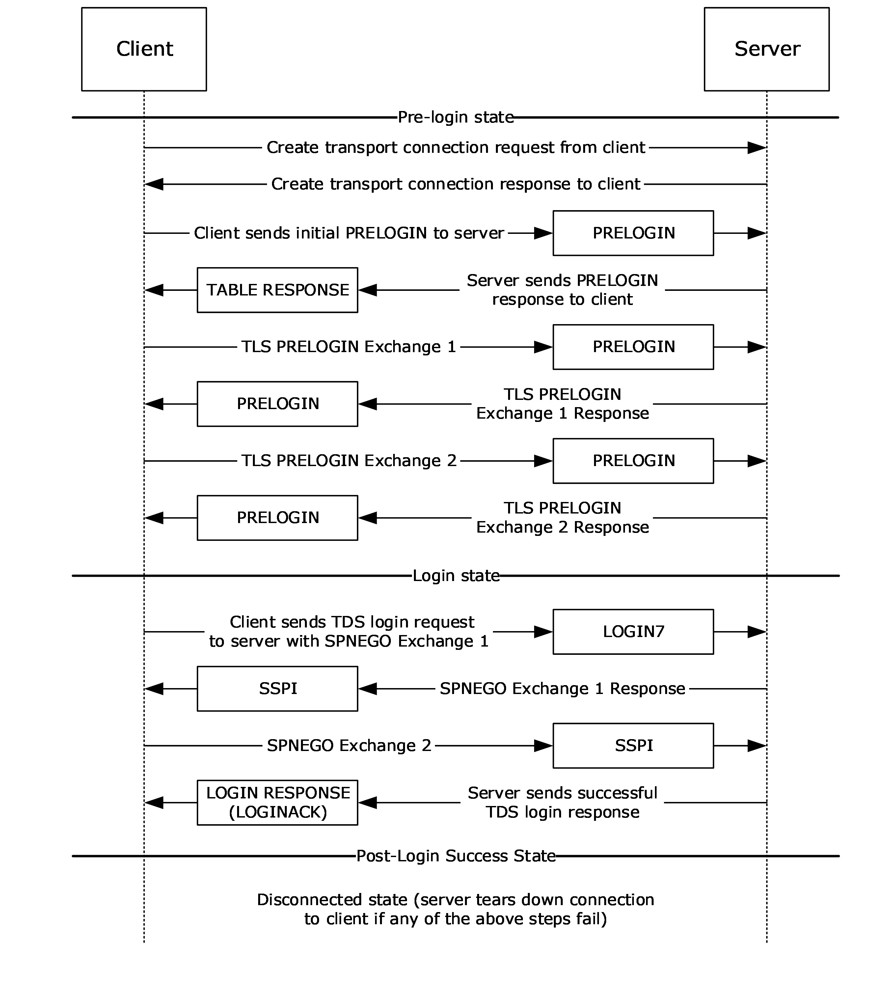

Figure 3: Pre-login to post-login sequence that is used in TDS 7.x

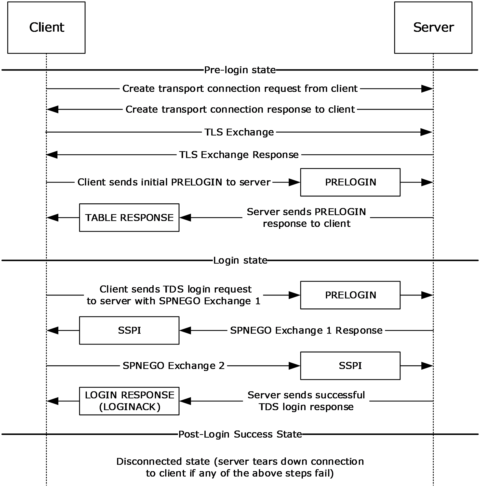

Figure 4: Pre-login to post-login sequence that is used in TDS 8.0

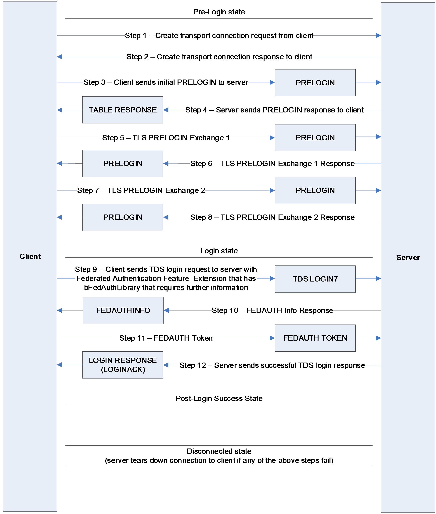

Figure 5: Pre-login to post-login sequence with federated authentication that uses a client library that requires additional information from a server to generate a federated authentication token that is used in TDS 7.x

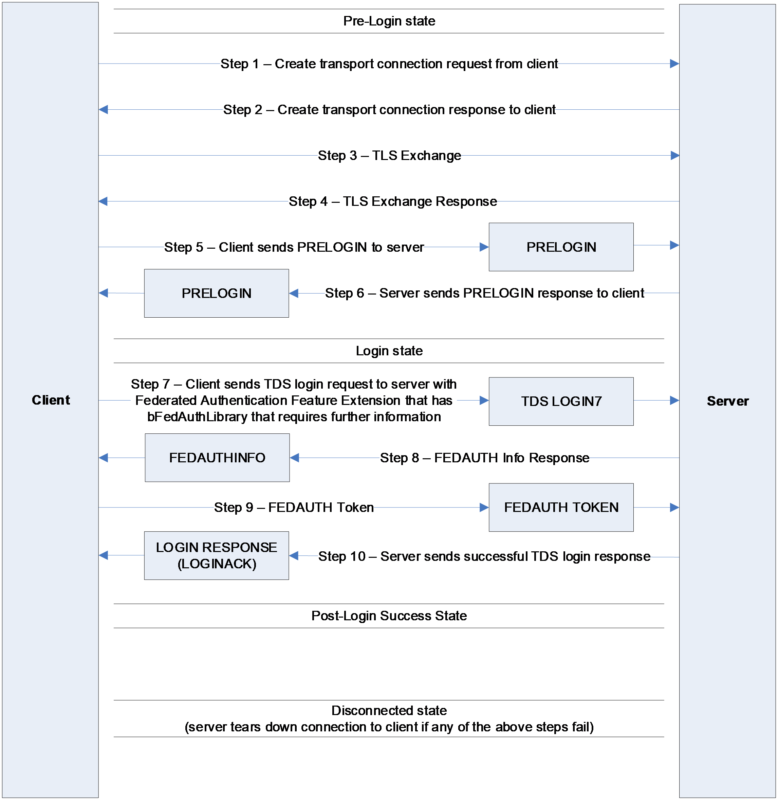

Figure 6: Pre-login to post-login sequence with federated authentication that uses a client library that requires additional information from a server to generate a federated authentication token that is used in TDS 8.0

Figure 7: SQL command and RPC sequence

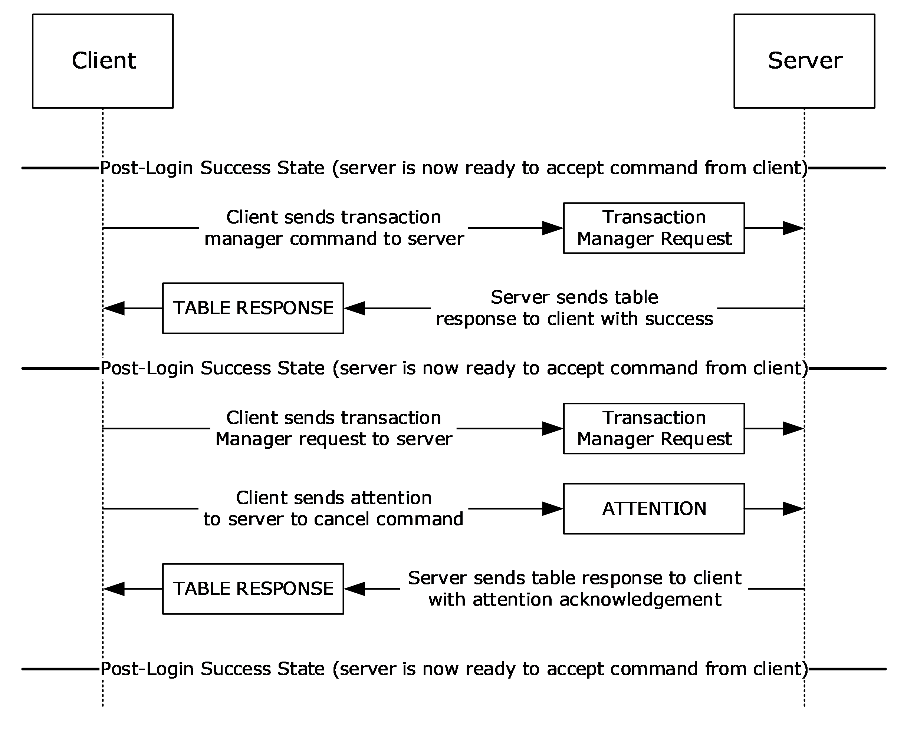

Figure 8: Transaction manager request sequence

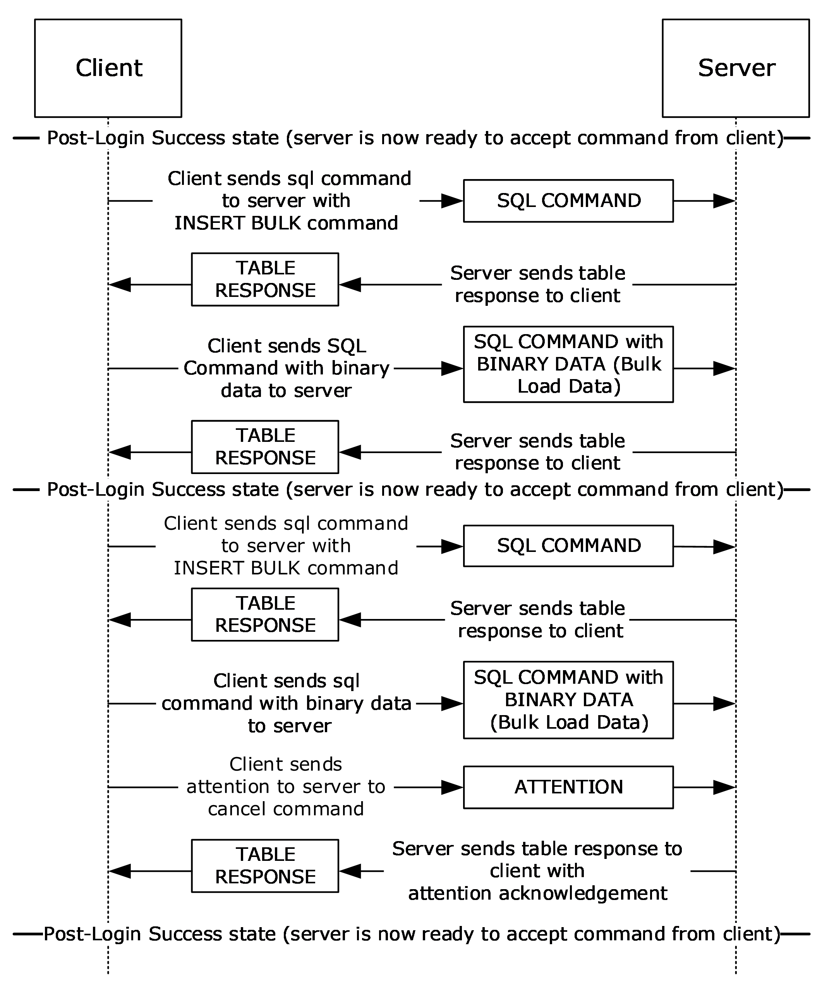

Figure 9: Bulk insert sequence

### 3.1.6 Timer Events

See sections [3.2.6](#Section_3.2.6) and [3.3.6](#Section_3.3.6) for the timer events of the client and server, respectively.

### 3.1.7 Other Local Events

A TDS session is tied to the underlying established network protocol session. As such, loss or termination of a network connection is equivalent to immediate termination of a TDS session.

See sections [3.2.7](#Section_3.2.7) and [3.3.7](#Section_3.2.7) for the other local events of the client and server, respectively.

## 3.2 Client Details

The following state machine diagrams describe TDS on the client side.

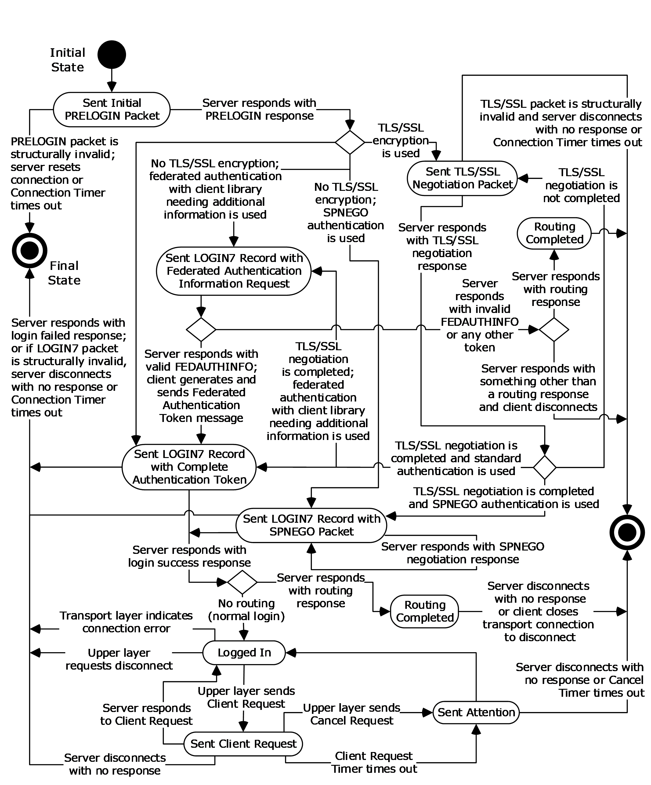

Figure 10: TDS client state machine that is used in TDS 7.x

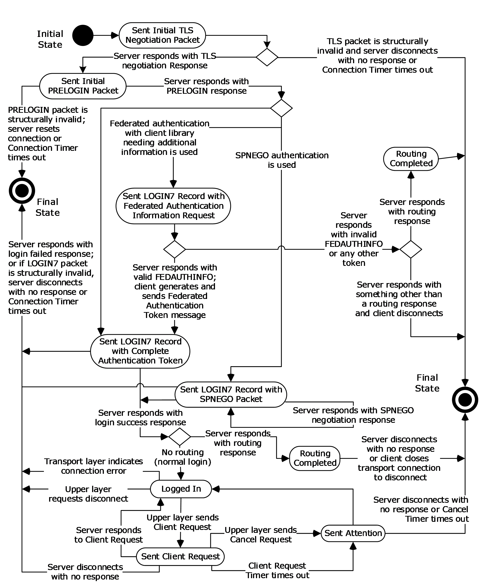

Figure 11: TDS client state machine that is used in TDS 8.0

### 3.2.1 Abstract Data Model

This section describes a conceptual model of data organization that an implementation maintains to participate in this protocol. The described organization is provided to facilitate the explanation of how the protocol behaves. This document does not mandate that implementations adhere to this model as long as their external behavior is consistent with that described in this document.

A TDS client SHOULD maintain the following states:

- [Sent Initial TLS Negotiation Packet State](#Section_3.2.5.1) (applies to only TDS 8.0)
- [Sent Initial PRELOGIN Packet State](#Section_3.2.5.2)
- [Sent TLS/SSL Negotiation Packet State](#Section_3.2.5.3) (applies to only TDS 7.x)
- [Sent LOGIN7 Record with Complete Authentication Token State](#Section_3.2.5.4)
- [Sent LOGIN7 Record with SPNEGO Packet State](#Section_3.2.5.5)
- [Sent LOGIN7 Record with Federated Authentication Information Request State](#Section_3.2.5.6)
- [Logged In State](#Section_3.3.5.8)
- [Sent Client Request State](#Section_3.2.5.8)
- [Sent Attention State](#Section_3.2.5.9)
- [Routing Completed State](#Section_3.2.5.10)
- [Final State](#Section_3.2.5.11)

### 3.2.2 Timers

A TDS client SHOULD implement the following three timers:

- Connection Timer. Controls the maximum time spent during the establishment of a TDS connection. The default value SHOULD be 15 seconds. The implementation SHOULD allow the upper layer to specify a nondefault value, including an infinite value (for example, no timeout).
- Client Request Timer. Controls the maximum time spent waiting for a query response from the server for a client request sent after the connection has been established. The default value is implementation-dependent. The implementation SHOULD allow the upper layer to specify a non-default value, including an infinite value (for example, no timeout).<70>
- Cancel Timer. Controls the maximum time spent waiting for a query cancellation acknowledgement after an Attention request is sent to the server. The default value is implementation-dependent. The implementation SHOULD allow the upper layer to specify a nondefault value, including an infinite value (for example, no timeout).<71>
For all three timers, a client can implement a minimum timeout value that is as short as required. If a TDS client implementation implements any of the timers, it MUST implement their behavior according to this specification.

A TDS client SHOULD request the transport to detect and indicate a broken connection if the transport provides such mechanism. If the transport used is TCP, it SHOULD use the TCP Keep-Alives [[RFC1122]](https://go.microsoft.com/fwlink/?LinkId=112180) in order to detect a nonresponding server in case infinite connection timeout or infinite client request timeout is used. The default values of the TCP Keep-Alive values set by a TDS client are 30 seconds of no activity until the first keep-alive packet is sent and 1 second between when successive keep-alive packets are sent if no acknowledgement is received. The implementation SHOULD allow the upper layer to specify other TCP keep-alive values.

### 3.2.3 Initialization

None.

### 3.2.4 Higher-Layer Triggered Events

A TDS client MUST support the following events from the upper layer:

- Connection Open Request to establish a new TDS connection to a TDS server.
- Client Request to send a query to a TDS server on an already established TDS connection. The Client Request is a request for one of four types of queries to be sent: SQL Command, Bulk Load, Transaction Manager Request, or an RPC.
In addition, it SHOULD support the following event from the upper layer:

- Cancel Request to cancel a client request while waiting for a server response. For example, this enables the upper layer to cancel a long-running client request if the user/upper layer is no longer seeking the result, thus freeing up thus client and server resources. If a client implementation of the TDS protocol supports the Cancel Request event, it MUST handle it as described in this specification.
The processing and actions triggered by these events is described in the remaining parts of this section.

When a TDS client receives a Connection Open Request from the upper layer in the "Initial State" state of a TDS connection, it performs the following actions:

- If the TDS client implements the Connection Timer, it MUST start the Connection Timer if the connection timeout value is not infinite.
- If there is upper-layer request [**MARS**](#gt_multiple-active-result-sets-mars) support, it MUST set the B_MARS byte in the PRELOGIN message to 0x01.
- It MUST send a PRELOGIN message to the server by using the underlying transport protocol.
- If the transport does not report an error, it MUST enter the "Sent Initial PRELOGIN Packet" state.
When a TDS client receives a Connection Open Request from the upper layer in any state other than the "Initial State" state of a TDS connection, it MUST indicate an error to the upper layer.

When a TDS client receives a Client Request from the upper layer in the "Logged In" state, it MUST perform the following actions:

- If the TDS client implements the Query Timer, it MUST start the Client Request Timer if the client request timeout value is not infinite.
- If MARS is enabled, the client MUST keep track whether there is an outstanding active request. If this is the case, then the client MUST initiate a new SMP session, or else an existing SMP session MAY be used.
- Send either SQL Command, Bulk Load, Transaction Manager Request, or a RPC message to the server. The message and its content MUST match the requested message from the Client Request. If MARS is enabled, the TDS message MUST be passed through to the SMP layer.
- If the transport does not report an error, then enter the "Sent Client Request" state.
When a TDS client supporting the Cancel Request receives a Cancel Request from the upper layer in the "Sent Client Request" state, it MUST perform the following actions:

- If the TDS client implements the Cancel Timer, it MUST start the Cancel Timer if the Attention request timeout value is not infinite.
- Send an Attention message to the server. This indicates to the server that the client intends to abort the executing request. If MARS is enabled, the Attention message MUST be passed through to the SMP layer.
- Enter the "Sent Attention" state.

### 3.2.5 Message Processing Events and Sequencing Rules

The processing of messages received from a TDS server depends on the message type and the current state of the TDS client. The rest of this section describes the processing and actions to take on them. The message type is determined from the TDS packet type and the token stream inside the TDS packet payload, as described in section [2.2.3](#Section_2.2.3).

Whenever the TDS client enters either the "Logged In" state or the "Final State" state, it MUST stop the Connection Timer (if implemented and running), the Client Request Timer (if implemented and running), and the Cancel Timer (if implemented and running).

Whenever a TDS client receives a structurally invalid TDS message, it MUST close the underlying transport connection, indicate an error to the upper layer, and enter the "Final State" state.

When a TDS client receives a [**table response**](#gt_table-response) (TDS packet type %x04) from the server, it MUST behave as follows, according to the state of the TDS client.

The corresponding action is taken when the client is in the following states. In the following processing and actions, aspects that do not apply to both TDS 7.x and TDS 8.0 are explicitly identified in the text.

#### 3.2.5.1 Sent Initial TLS Negotiation Packet State

***Applies to only TDS 8.0***

If the response received from the server contains a structurally valid TLS response that indicates a success, the TDS client MUST send a PRELOGIN message to the server and enter the "Sent Initial PRELOGIN Packet State" state.

If the response received from the server does not contain a structurally valid TLS response, or if it contains a structurally valid response that indicates an error, the TDS client MUST close the underlying transport connection, indicate an error to the upper layer, and enter the "Final State" state.

#### 3.2.5.2 Sent Initial PRELOGIN Packet State

If the response contains a structurally valid PRELOGIN response indicating a success, the TDS client MUST take action according to the Encryption option and Authentication scheme:

- If TLS was not established before TDS begins to function, as required in TDS 8.0, the encryption option MUST be handled as described in the "Encryption" subsection of section [2.2.6.5](#Section_2.2.6.5) in the PRELOGIN message description.
- If encryption was negotiated in TDS 7.x, the TDS client MUST initiate a TLS/SSL handshake, send to the server a TLS/SSL message obtained from the TLS/SSL layer encapsulated in TDS packet(s) of type PRELOGIN (0x12), and enter the "Sent TLS/SSL Negotiation Packet" state.
- If encryption was not negotiated and the upper layer did not request full encryption, the TDS client MUST send to the server a Login message that contains the authentication scheme that is specified by the user and MUST enter one of the following three states, depending on the message sent:
- "Sent LOGIN7 Record with Complete Authentication Token" state, if a login message that contains either of the following was sent.
- Standard authentication.
- FEDAUTH FeatureExt that indicates a client library that does not need any additional information from the server for authentication.
- "Sent LOGIN7 Record with [**SPNEGO**](#gt_simple-and-protected-gss-api-negotiation-mechanism-spnego) Packet" state, if a Login message with SPNEGO authentication was sent.
- "Sent LOGIN7 Record with Federated Authentication Information Request" state, if a Login message with FEDAUTH FeatureExt that indicates a client library that needs additional information from the server for authentication was sent.
The TDS specification does not prescribe the authentication protocol if SSPI [[SSPI]](https://go.microsoft.com/fwlink/?LinkId=90536) authentication is used. The current implementation of SSPI supports NTLM [[MSDN-NTLM]](https://go.microsoft.com/fwlink/?LinkId=145227) and Kerberos [[RFC4120]](https://go.microsoft.com/fwlink/?LinkId=90458).

- If encryption was not negotiated and the upper layer requested full encryption, then the TDS client MUST close the underlying transport connection, indicate an error to the upper layer, and enter the "Final State" state.
- If the response received from the server does not contain a structurally valid PRELOGIN response or it contains a structurally valid PRELOGIN response indicating an error, the TDS client MUST close the underlying transport connection, indicate an error to the upper layer, and enter the "Final State" state.
- If NONCEOPT is specified in both the client PRELOGIN message and the server PRELOGIN message, the TDS client MUST maintain a state variable that includes the value of the NONCE that is sent to the server and a state variable that includes the value of the NONCE that is contained in the server’s response.

#### 3.2.5.3 Sent TLS/SSL Negotiation Packet State

***Applies to only TDS 7.x***

In TDS 8.0, because encryption is already established, the TDS state machine MUST NOT enter this state. Otherwise, the TDS server closes the underlying transport connection, indicates an error to the upper layer, and enters the "Final State" state.

If the response contains a structurally valid TLS/SSL response message (TDS packet type 0x12), the TDS client MUST pass the TLS/SSL message contained in it to the TLS/SSL layer and MUST proceed as follows:

- If the TLS/SSL layer indicates that further handshake is needed, the TDS client MUST send to the server the TLS/SSL message obtained from the TLS/SSL layer encapsulated in TDS packet(s) of type PRELOGIN (0x12).
- If the TLS/SSL layer indicates successful completion of the TLS/SSL handshake, the TDS client MUST send a Login message to the server that contains the authentication scheme that is specified by the user. The TDS client then enters one of the following three states, depending on the message sent:
- "Sent LOGIN7 Record with Complete Authentication Token" state, if a Login message that contains either of the following was sent:
- Standard authentication.
- FEDAUTH FeatureId that indicates a client library that does not need any additional information from the server for authentication.
- The "Sent LOGIN7 Record with [**SPNEGO**](#gt_simple-and-protected-gss-api-negotiation-mechanism-spnego) Packet" state, if a Login message with SPNEGO authentication was sent.
- "Sent LOGIN7 Record with Federated Authentication Information Request" state, if a Login message with FEDAUTH FeatureExt that indicates a client library that needs additional information from server for authentication was sent.
The TDS specification does not prescribe the authentication protocol if SSPI [[SSPI]](https://go.microsoft.com/fwlink/?LinkId=90536) authentication or federated authentication is used. The current implementation of SSPI supports NTLM [[MSDN-NTLM]](https://go.microsoft.com/fwlink/?LinkId=145227) and Kerberos [[RFC4120]](https://go.microsoft.com/fwlink/?LinkId=90458).

- If login-only encryption was negotiated as described in section [2.2](#Section_1.3) in the PRELOGIN message description, then the first TDS packet of the Login message MUST be encrypted using TLS/SSL and encapsulated in a TLS/SSL message. All other TDS packets sent or received MUST be in plaintext.
- If full encryption was negotiated as described in section 2.2 in the PRELOGIN message description, then all subsequent TDS packets sent or received from this point on MUST be encrypted using TLS/SSL and encapsulated in a TLS/SSL message.
- If the TLS/SSL layer indicates an error, the TDS client MUST close the underlying transport connection, indicate an error to the upper layer, and enter the "Final State" state.
If the response received from the server does not contain a structurally valid TLS/SSL response or it contains a structurally valid response indicating an error, the TDS client MUST close the underlying transport connection, indicate an error to the upper layer, and enter the "Final State" state.

#### 3.2.5.4 Sent LOGIN7 Record with Complete Authentication Token State

If the response received from the server contains a structurally valid Login response that indicates a successful login, and if the client used [**federated authentication**](#gt_federated-authentication) to authenticate to the server, the client MUST read the Login response stream to find the FEATUREEXTACK token and find the FEDAUTH FeatureId. If the FEDAUTH FeatureId is not present, the TDS client MUST close the underlying transport connection, indicate an error to the upper layer, and enter the "Final State" state. If the FEDAUTH FeatureId is present, the client's action is based on the bFedAuthLibrary as follows:

- When the bFedAuthLibrary is Live ID Compact Token, the client MUST use the session key from its federated authentication token to compute the HMAC-SHA-256 [[RFC6234]](https://go.microsoft.com/fwlink/?LinkId=328921) of the NONCE field in the FEDAUTH Feature Extension Acknowledgement, and the client MUST verify that the nonce matches the nonce sent by the client in its PRELOGIN request. If the signature field does not match the computed HMAC-SHA-256 or if the nonce does not match the nonce sent by the client in its PRELOGIN request, the TDS client MUST close the underlying transport connection, indicate an error to the upper layer, and enter the "Final State" state.
- When the bFedAuthLibrary is Security Token or [**Azure Active Directory Authentication Library (ADAL)**](#gt_azure-active-directory-authentication-library-adal) [that is, 0x02] and any of the following statements is true, the TDS client MUST close the underlying transport connection, indicate an error to the upper layer, and enter the "Final State" state:
- The client had sent a nonce in the PRELOGIN message and either the NONCE field in FEDAUTH Feature Extension Acknowledgement is not present or the NONCE field does not match the nonce sent by the client in its PRELOGIN request.
- The client had not sent a nonce in its PRELOGIN request, and there is a NONCE field present in the FEDAUTH Feature Extension Acknowledgement.
If the response received from the server contains a structurally valid Login response indicating a successful login and no Routing response is detected, the TDS client MUST indicate successful Login completion to the upper layer and enter the "Logged In" state.

If the response received from the server contains a structurally valid Login response indicating a successful login and also contains a routing response (a Routing or Enhanced Routing ENVCHANGE token) after the LOGINACK token, the TDS client MUST enter the "Routing Completed" state.

If the response received from the server does not contain a structurally valid Login response or it contains a structurally valid Login response indicating login failure, the TDS client MUST close the underlying transport connection, indicate an error to the upper layer, and enter the "Final State" state.

#### 3.2.5.5 Sent LOGIN7 Record with SPNEGO Packet State

If the response received from the server contains a structurally valid Login response indicating a successful login and no Routing response is detected, the TDS client MUST indicate successful Login completion to the upper layer and enter the "Logged In" state.

If the response received from the server contains a structurally valid Login response indicating a successful login and also contains a routing response (a Routing or Enhanced Routing ENVCHANGE token) after the LOGINACK token, the TDS client MUST enter the "Routing Completed" state.

If the response received from the server contains a structurally valid SSPI response message, the TDS client MUST send to the server a SSPI message (TDS packet type %x11) containing the data obtained from the applicable SSPI layer. The TDS client SHOULD wait for the response and reenter this state when the response is received.

If the response received from the server does not contain a structurally valid Login response or SSPI response, or if it contains a structurally valid Login response indicating login failure, the TDS client MUST close the underlying transport connection, indicate an error to the upper layer, and enter the "Final State" state.

#### 3.2.5.6 Sent LOGIN7 Record with Federated Authentication Information Request State

If the response received from the server contains a structurally valid Login Response message that contains a Routing or Enhanced Routing ENVCHANGE token in the response after the LOGINACK token, the TDS client MUST enter the "Routing Completed" state.

If the response received from the server contains a structurally valid Login Response message that contains a FEDAUTHINFO token, the TDS client MUST generate a Federated Authentication message, send that Federated Authentication message to the server, and enter the "Sent LOGIN7 Record with Complete Authentication Token" state.

If the response received from the server does not contain a structurally valid Login Response message that contains a routing response or a structurally valid FEDAUTHINFO token, the TDS client MUST close the underlying transport connection, indicate an error to the upper layer, and enter the "Final State" state.

#### 3.2.5.7 Logged In State

The TDS client waits for notification from the upper layer. If the upper layer requests a query to be sent to the server, the TDS client MUST send the appropriate request to the server and enter the "Sent Client Request" state. If [**MARS**](#gt_multiple-active-result-sets-mars) is enabled, the TDS client MUST send the appropriate request to the SMP layer. If the upper layer requests a termination of the connection, the TDS client MUST disconnect from the server and enter the "Final State" state. If the TDS client detects a connection error from the transport layer, the TDS client MUST disconnect from the server and enter the "Final State" state.

#### 3.2.5.8 Sent Client Request State

If the response received from the server contains a structurally valid response, the TDS client MUST indicate the result of the request to the upper layer and enter the "Logged In" state.

The client has the ability to return data/control to the upper layers while remaining in the "Sent Client Request" state while the complete response has not been received or processed.

If the TDS client supports Cancel Request and the upper layer requests a Cancel Request to be sent to the server, the TDS client sends an Attention message to the server, start the Cancel Timer, and enter the "Sent Attention" state.

If the response received from the server does not contain a structurally valid response, the TDS client MUST close the underlying transport connection, indicate an error to the upper layer, and enter the "Final State" state.

#### 3.2.5.9 Sent Attention State

If the response is structurally valid and it does not acknowledge the Attention as described in section [2.2.1.7](#Section_2.2.1.7), then the TDS client MUST discard any data contained in the response and remain in the "Sent Attention" state.

If the response is structurally valid and it acknowledges the Attention as described in section 2.2.1.7, then the TDS client MUST discard any data contained in the response, indicate the completion of the query to the upper layer together with the cause of the Attention (either an upper-layer cancellation as described in section [3.2.4](#Section_3.2.4) or query timeout as described in section [3.2.2](#Section_3.2.2)), and enter the "Logged In" state.

If the response received from the server is not structurally valid, then the TDS client MUST close the underlying transport connection, indicate an error to the upper layer, and enter the "Final State" state.

#### 3.2.5.10 Routing Completed State

The TDS client MUST:

- Read the rest of the login response from the server, processing the remaining tokens until the final DONE token is read, as it does with a normal login response.
- Discard all information read from the original login response except for the routing information supplied in the Routing or Enhanced Routing ENVCHANGE token.
- Any information in the original login response (for example, the language, collation, packet size, or database mirroring partner) does not apply to the subsequent connection established to the alternate server specified in the Routing or Enhanced Routing ENVCHANGE token.
- The alternate database specified in an Enhanced Routing ENVCHANGE token overrides any previous database and must be used when connecting to the alternate server specified in the token.
- Close the original connection and enter the "Final State" state. The original connection cannot be used for any other purpose after the Routing or Enhanced Routing ENVCHANGE token is read and the response is drained.

#### 3.2.5.11 Final State

The "Final State" state is achieved when the application layer has finished the communication and the lower-layer connection is disconnected. All resources for this connection are recycled by the TDS server.

### 3.2.6 Timer Events

If a TDS client implements the Connection Timer and the timer times out, then the TDS client MUST close the underlying connection, indicate the error to the upper layer, and enter the "Final State" state.

If a TDS client implements the Client Request Timer and the timer times out, then the TDS client MUST send an Attention message to the server and enter the "Sent Attention" state.

If a TDS client implements the Cancel Timer and the timer times out, then the TDS client MUST close the underlying connection, indicate the error to the upper layer, and enter the "Final State" state.

### 3.2.7 Other Local Events

Whenever an indication of a connection error is received from the underlying transport, the TDS client MUST close the transport connection, indicate an error to the upper layer, stop any timers if running, and enter the "Final State" state. If TCP is used as the underlying transport, examples of events that can trigger such action—dependent on the actual TCP implementation—might be media sense loss, a TCP connection going down in the middle of communication, or a TCP keep-alive failure.

## 3.3 Server Details

The following state machine diagrams describe TDS on the server side. Depending on the first bytes received, one of the following flows would be initiated.

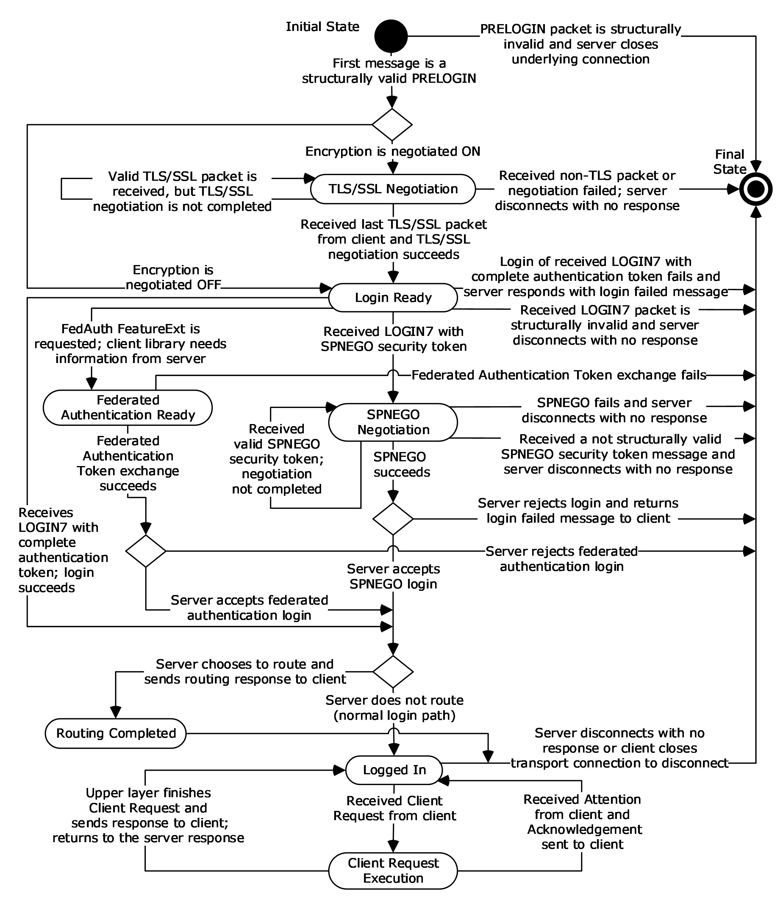

Figure 12: TDS server state machine if the first packet received is PRELOGIN

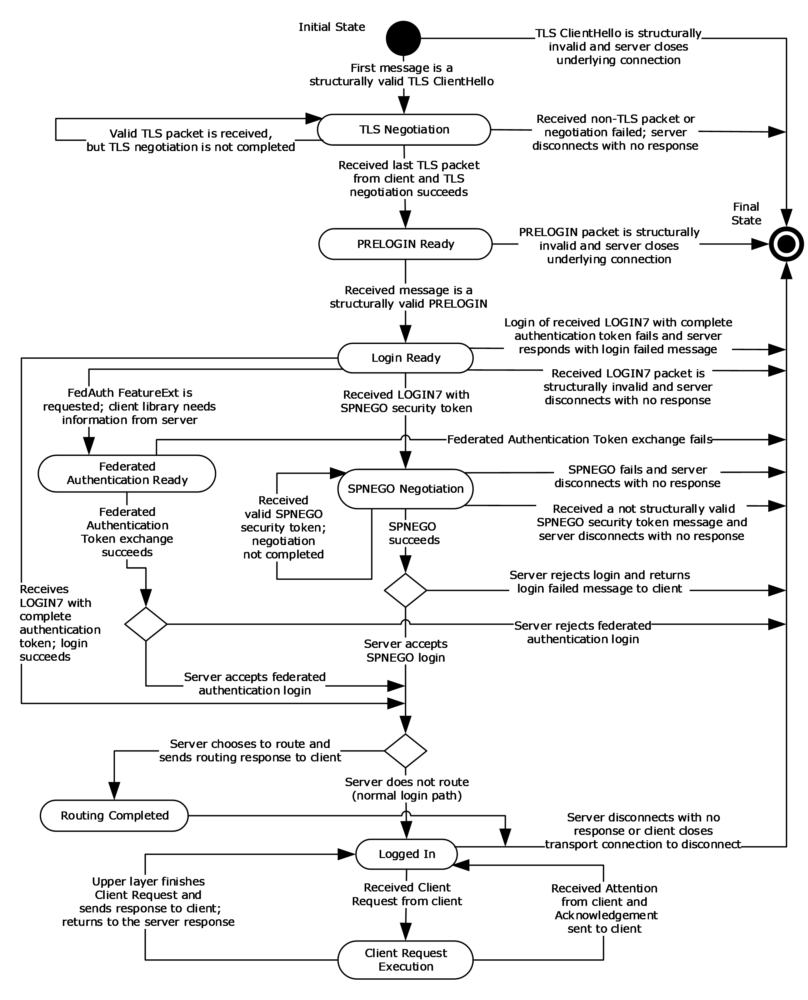

Figure 13: TDS server state machine if the first packet received is TLS ClientHello

### 3.3.1 Abstract Data Model

This section describes a conceptual model of data organization that an implementation maintains to participate in this protocol. The organization is provided to explain how the protocol behaves. This document does not mandate that implementations adhere to this model as long as their external behavior is consistent with what is described in this document.

The server SHOULD maintain the following states:

- [Initial State](#Section_3.3.5.1)
- [TLS/SSL Negotiation State](#Section_3.3.5.2) (applies to only TDS 7.x)
- [TLS Negotiation State](#Section_3.3.5.3) (applies to only TDS 8.0)
- [PRELOGIN Ready State](#Section_3.3.5.4) (applies to only TDS 8.0)
- [Login Ready State](#Section_3.3.5.5)
- [SPNEGO Negotiation State](#Section_3.3.5.6)
- [Federated Authentication Ready State](#Section_3.3.5.7)
- [Logged In State](#Section_3.3.5.8)
- [Client Request Execution State](#Section_3.3.5.9)
- [Routing Completed State](#Section_3.2.5.10)
- [Final State](#Section_3.2.5.11)

### 3.3.2 Timers

The TDS protocol does not regulate any timer on a data stream. The TDS server MAY implement a timer on any message found in section [2](#Section_1.3).

### 3.3.3 Initialization

The server MUST establish a listening endpoint based on one of the transport protocols described in section [2.1](#Section_2.1). The server can establish additional listening endpoints.

When a client makes a connection request, the transport layer listening endpoint initializes all resources required for this connection. The server is ready to receive a Pre-Login message (section [2.2.1.1](#Section_2.2.1.1)).

### 3.3.4 Higher-Layer Triggered Events

A higher layer can choose to terminate a TDS connection at any time. In the current TDS implementation, the upper layer can kill a connection. When this happens, the server MUST terminate the connection and recycle all resources for this connection. No response is sent to the client.

### 3.3.5 Message Processing Events and Sequencing Rules

The processing of messages received from a TDS client depends on the message type and the current state of the TDS server. The rest of this section describes the processing and actions to take on them. The message type is determined from the TDS packet type and the token stream inside the TDS packet payload, as described in section [2.2](#Section_1.3).

The corresponding action is taken when the server is in the following states. In the following processing and actions, aspects that do not apply to both TDS 7.x and TDS 8.0 are explicitly identified in the text.

#### 3.3.5.1 Initial State

The "Initial State" state is a prerequisite for application-layer communication, and a lower-layer channel that can provide reliable communication MUST be established. The TDS server enters the "Initial State" state when the first packet is received from the client. The packet SHOULD be a PRELOGIN packet to set up context for login or a TLS ClientHello to set up context for the TLS handshake. A Pre-Login message is indicated by the PRELOGIN (0x12) message type described in section [2](#Section_1.3). A TLS ClientHello is indicated when the first byte is equal to 0x16.

If the first packet is not a structurally correct PRELOGIN packet, or if the PRELOGIN packet does not contain the client version as the first option token, or if the first packet is not indicated to be a TLS ClientHello, the TDS server MUST close the underlying transport connection, indicate an error to the upper layer, and enter the "Final State" state.

Otherwise, the TDS server MUST do one of the following.

- If the first packet is a PRELOGIN packet:
- Return to the client a PRELOGIN structure wrapped in a [**table response**](#gt_table-response) (0x04) packet and enter the "TLS/SSL Negotiation" state if encryption is negotiated.
- Return to the client a PRELOGIN structure wrapped in a table response (0x04) packet and enter unencrypted "Login Ready" state if encryption is not negotiated.
- If the first packet is a TLS ClientHello, the TDS server MUST enter the "TLS Negotiation" state.
If a FEDAUTHREQUIRED option is contained in the PRELOGIN structure sent by the server to the client, the TDS server MUST maintain the value of the FEDAUTHREQUIRED option in a state variable to validate the LOGIN7 message with FEDAUTH FeatureId when the message arrives, as described in section [3.3.5.5](#Section_3.3.5.5).

If no FEDAUTHREQUIRED option is contained in the PRELOGIN structure sent by the server to the client, or if the value of B_FEDAUTHREQUIRED = 0, the TDS client can treat both events as equivalent and MUST remember the event in a state variable. Either state is treated the same when the state variables are examined in the "Login Ready" state (see section 3.3.5.5 for further details).

If NONCEOPT is specified in both the client PRELOGIN message and the server PRELOGIN message, the TDS server MUST maintain a state variable that includes the values of both the NONCE it sent to the client and the NONCE the client sent to it during the PRELOGIN exchange.

#### 3.3.5.2 TLS/SSL Negotiation State

***Applies to only TDS 7.x***

If the next packet from the TDS client is not a TLS/SSL negotiation packet or the packet is not structurally correct, the TDS server MUST close the underlying transport connection, indicate an error to the upper layer, and enter the "Final State" state.

A TLS/SSL negotiation packet is a PRELOGIN (0x12) packet header encapsulated with TLS/SSL payload. The TDS server MUST exchange a TLS/SSL negotiation packet with the client and reenter this state until the TLS/SSL negotiation is successfully completed. In this case, the TDS server enters the "Login Ready" state.

#### 3.3.5.3 TLS Negotiation State

***Applies to only TDS 8.0***

If the next packet from the TDS client is not a TLS negotiation packet, or if the packet is not structurally correct, the TDS server closes the underlying transport connection, indicates an error to the upper layer, and enters the "Final State" state. A TLS negotiation packet is a standard TLS packet. The TDS server MUST exchange the TLS negotiation packet with the client and reenter this state until the TLS negotiation is successfully completed. In this case, the TDS server enters the “PRELOGIN Ready” state.

#### 3.3.5.4 PRELOGIN Ready State

***Applies to only TDS 8.0***

If the packet is not a structurally correct PRELOGIN packet or if the PRELOGIN packet does not contain the client version as the first option token, the TDS server closes the underlying transport connection, indicates an error to the upper layer, and enters the "Final State" state. Otherwise, the TDS server MUST return to the client a PRELOGIN structure wrapped in a [**table response**](#gt_table-response) (0x04) packet and enter the "Login Ready" state if encryption is negotiated.

If a FEDAUTHREQUIRED option is contained in the PRELOGIN structure sent by the server to the client, the TDS server MUST maintain the value of the FEDAUTHREQUIRED option in a state variable to validate the LOGIN7 message with the FEDAUTH FeatureId when the message arrives, as described in section [3.3.5.5](#Section_3.3.5.5).

If no FEDAUTHREQUIRED option is contained in the PRELOGIN structure sent by the server to the client or if the value of B_FEDAUTHREQUIRED = 0, the TDS client can treat both events as equivalent and MUST remember the event in a state variable. Either state is treated the same when the state variables are examined in the "Login Ready" state (see section 3.3.5.5 for further details).

If NONCEOPT is specified in both the client PRELOGIN message and the server PRELOGIN message, the TDS server MUST maintain a state variable that includes the values of both the NONCE it sent to the client and the NONCE the client sent to it during the PRELOGIN exchange.

#### 3.3.5.5 Login Ready State

If the TDS server receives a valid LOGIN7 message with the FEDAUTH FeatureId from the client, the server MUST validate that one of the following is true:

- The TDS server's PRELOGIN structure contained a FEDAUTHREQUIRED option with the value 0x00, or the TDS server’s PRELOGIN structure did not contain a FEDAUTHREQUIRED option, and the value of fFedAuthEcho is 0.
- The TDS server's PRELOGIN structure contained a FEDAUTHREQUIRED option with the value 0x01, and the value of fFedAuthEcho is 1.
If the TDS server receives a valid LOGIN7 message with the FEDAUTH FeatureId from the client but neither of the above statements is true, the server MUST send an ERROR packet, described in section [2](#Section_1.3), to the client. The TDS server MUST then close the underlying transport connection, indicate an error to the upper layer, and enter the "Final State" state. Otherwise, the TDS server MUST process the FedAuthToken embedded in the packet in a way appropriate for the value of bFedAuthLibrary.

When the bFedAuthLibrary is a Live ID Compact token, the TDS Server MUST respond as follows:

- If no NONCEOPT was specified in the client’s PRELOGIN message, the TDS server MUST send a "Login failed" ERROR token to the client, close the connection, and enter the "Final State" state.
- If a NONCEOPT was specified in the client's PRELOGIN message, the federated authentication library layer responds with one of two results, and the TDS server continues processing according to the response as follows:
- Success:
- The TDS server MUST use the session key from the federated authentication token to compute the HMAC-SHA-256 [[RFC6234]](https://go.microsoft.com/fwlink/?LinkId=328921) of the data sent by the client. If the Signature field does not match the computed HMAC-SHA-256, or if the nonce does not match the nonce sent by the server in its PRELOGIN response, then the TDS server MUST send a "Login failed" ERROR token to the client, close the connection, and enter the "Final State" state.
- If a ChannelBindingToken is present, the server MUST compare the ChannelBindingToken against the channel binding token calculated from the underlying TLS/SSL channel. If the two values do not match, then the TDS server MUST send a "Login failed" ERROR token to the client, close the connection, and enter the "Final State" state.
- If both the channel binding token and the nonce match the expected values, the server MUST send the security token to the upper layer (an application that provides database management functions) for authorization. If the upper layer approves the security token, the TDS server MUST send a LOGINACK message that includes a FEATUREEXTACK token with the FEDAUTH FeatureId and immediately enter the "Logged In" state or enter the "Routing Completed" state if the server decides to route. If the upper layer rejects the security token, the TDS server MUST send a "Login failed" ERROR token to the client, close the connection, and enter the "Final State" state.
- Error: The server then MUST close the underlying transport connection, indicate an error to the upper layer, and enter the "Final State" state.
When the bFedAuthLibrary is Security Token, the TDS server MUST respond as follows:

- If the server’s PRELOGIN response contained a NONCEOPT, the TDS Server MUST validate to see whether the client's LOGIN7 packet has the same nonce echoed back as part of FEDAUTH Feature SignedData. If the NONCE field is not present or if the nonce does not match, the TDS server MUST send a "Login failed" ERROR token to the client, close the connection, and enter the "Final State" state.
- If the server’s PRELOGIN response did not contain a NONCEOPT, the TDS Server MUST verify that there is NO NONCE as part LOGIN7 FEDAUTH Feature SignedData. If a NONCE field is present, the TDS server MUST send a "Login failed" ERROR token back to the client, close the connection, and enter the "Final State" state.
- Success:
- The server MUST send the security token to the upper layer (an application that provides database management functions) for authorization. If the upper layer approves the security token, the TDS server MUST send a LOGINACK message that includes a FEATUREEXTACK token with the FEDAUTH FeatureId and immediately enter the "Logged In" state or enter the "Routing Completed" state if the server decides to route. If the upper layer rejects the security token, the TDS server MUST send a "Login failed" ERROR token to the client, close the connection, and enter the "Final State" state.
- Error: The server then MUST close the underlying transport connection, indicate an error to the upper layer, and enter the "Final State" state.
When bFedAuthLibrary is [**Azure Active Directory Authentication Library (ADAL)**](#gt_azure-active-directory-authentication-library-adal) [that is, 0x02], the TDS server MUST validate that no other data was sent as part of the feature extension, that is, that FeatureExt is structurally valid for this library type. Then the TDS server MUST send a FEDAUTHINFO token with data for FedAuthInfoIDs of STSURL and SPN and enter the "Federated Authentication Ready" state. This FEDAUTHINFO Token message SHOULD be used by the client to generate a federated authentication token.

If the TDS server receives a valid LOGIN7 packet with standard login, the TDS server MUST respond to the TDS client with a LOGINACK (0xAD) described in section 2 indicating login succeed. The TDS server MUST enter the "Logged in" state or enter the "Routing Completed" state if the server decides to route.

If the TDS server receives a LOGIN7 packet with SSPI Negotiation packet, the TDS server MUST enter the "SPNEGO Negotiation" state.

If the TDS server receives a LOGIN7 packet with standard login packet, but the login is invalid, the TDS server MUST send an ERROR packet, described in section 2, to the client. The TDS server MUST close the underlying transport connection, indicate an error to the upper layer, and enter the "Final State" state.

If the packet received is not a structurally valid LOGIN7 packet, the TDS server does not send any response to the client. The TDS server MUST close the underlying transport connection, indicate an error to the upper layer, and enter the "Final State" state.

#### 3.3.5.6 SPNEGO Negotiation State

This state is used to negotiate the security scheme between the client and server. The TDS server processes the packet received according to the following rules.

- If the packet received is a structurally valid [**SPNEGO**](#gt_simple-and-protected-gss-api-negotiation-mechanism-spnego) [[RFC4178]](https://go.microsoft.com/fwlink/?LinkId=90461) negotiation packet, the TDS server delegates processing of the security token embedded in the packet to the SPNEGO layer. The SPNEGO layer responds with one of three results, and the TDS server continues processing according to the response as follows:
- Complete: The TDS server then sends the security token to the upper layer (an application that provides database management functions) for authorization. If the upper layer approves the security token, the TDS server returns the security token to the client within a LOGINACK message and immediately enters the "Logged In" state or enters the "Routing Completed" state if the server decides to route. If the upper layer rejects the security token, then a "Login failed" ERROR token is sent back to the client, and the TDS server closes the connection and enters the "Final State" state.
- Continue: The TDS server sends a SPNEGO [RFC4178] negotiation response to the client, embedding the new security token returned by SPNEGO as part of the Continue response. The server then waits for a message from the client and re-renters the "SPNEGO Negotiation" state when such a packet is received.
- Error: The server then MUST close the underlying transport connection, indicate an error to the upper layer, and enter the "Final State" state.
- If the packet received is not a structurally valid SPNEGO [RFC4178] negotiation packet, the TDS server sends no response to the client. The TDS server MUST close the underlying transport connection, indicate an error to the upper layer, and enter the "Final State" state.

#### 3.3.5.7 Federated Authentication Ready State

This state is used to process the [**federated authentication**](#gt_federated-authentication) token that is obtained from the client. The TDS server processes the packet that is received according to the following rules:

- If the packet that is received is a structurally valid Federated Authentication Token message, the TDS server MUST delegate processing of the security token embedded in the packet to the federated authentication layer, using the library that is indicated by the state variable that maintains the value of the bFedAuthLibrary field of the login packet’s FEDAUTH FeatureExt. The federated authentication layer responds with one of two results, and the TDS server continues processing according to the response as follows:
- SUCCESS: The TDS Server MUST send the Federated Authentication Token to the upper layer (an application that provides database management functions) for authorization. If the upper layer approves the token, the TDS server MUST send a LoginACK message that includes a FEATUREEXTACK token that contains FEDAUTH FeatureId and immediately enter the "Logged In" state or enter the "Routing Completed" state if the server decides to route. If the upper layer rejects the token, then a "Login Failed" ERROR token MUST be sent back to the client, and the TDS server MUST close the connection and enter the "Final State" state.
- ERROR: The server MUST close the underlying transport connection, indicate an error to the upper layer, and enter the "Final State" state.
- If the packet that is received is not a structurally valid Federated Authentication Token message, the TDS server SHOULD send no response to the client. The TDS server MUST close the underlying transport connection, indicate an error to the upper layer, and enter the "Final State" state.

#### 3.3.5.8 Logged In State

If a TDS of type 1, 3, 7, or 14 (see section [2.2.3.1.1](#Section_2.2.3.1.1)) arrives, then the TDS server begins processing by raising an event to the upper layer containing the data of the client request and entering the "Client Request Execution" state. If any other TDS types arrive, the server MUST enter the "Final State" state. The TDS server MUST continue to listen for messages from the client while awaiting notification of client request completion from the upper layer.

#### 3.3.5.9 Client Request Execution State

The TDS server MUST continue to listen for messages from the client while awaiting notification of client request for completion from the upper layer. The TDS server MUST also do one of the following:

- If the upper layer notifies TDS that the client request has finished successfully, the TDS server MUST send the results in the formats described in section [2](#Section_1.3) to the TDS client and enter the "Logged In" state.
- If the upper layer notifies TDS that an error has been encountered during client request, the TDS server MUST send an error message (described in section 2) to the TDS client and enter the "Logged In" state.
- If an attention packet (described in section 2) is received during the execution of the current client request, it MUST deliver a cancel indication to the upper layer. If an attention packet (described in section 2) is received after the execution of the current client request, it SHOULD NOT deliver a cancel indication to the upper layer because there is no existing execution to cancel. The TDS server MUST send an attention acknowledgment to the TDS client and enter the "Logged In" state.
- If another client request packet is received during the execution of the current client request, the TDS server SHOULD queue the new client request, and continue processing the client request already in progress according to the preceding rules. When this operation is complete, the TDS server re-enters the "Client Request Execution" state and processes the newly arrived message.
- If [**MARS**](#gt_multiple-active-result-sets-mars) is enabled, all TDS server responses to client request messages MUST be passed through to the SMP layer.
- If any other message type arrives, the server MUST close the connection and enter the "Final State" state.

#### 3.3.5.10 Routing Completed State

The TDS server SHOULD wait for connection closure initiated by the client and enter the "Final State" state. If any request is received from the client in this state, the server SHOULD close the connection with no response and enter the "Final State" state.

#### 3.3.5.11 Final State

The "Final State" state is achieved when the application layer has finished the communication, and the lower-layer connection is disconnected. All resources for this connection are recycled by the TDS server.

### 3.3.6 Timer Events

None.

### 3.3.7 Other Local Events

When there is a failure in under-layers, the server SHOULD terminate the [**TDS session**](#gt_tds-session) without sending any response to the client. The under-layer failure could be triggered by network failure. It can also be triggered by the termination action from the client, which could be communicated to the server stack by under-layers.

# 4 Protocol Examples

The following sections describe several operations as used in common scenarios to illustrate the function of the TDS protocol. For each example, the binary TDS message is provided followed by the decomposition displayed in XML.

## 4.1 Pre-Login Request

Pre-Login request sent from the client to the server:

12 01 00 2F 00 00 01 00 00 00 1A 00 06 01 00 20

00 01 02 00 21 00 01 03 00 22 00 04 04 00 26 00

01 FF 09 00 00 00 00 00 01 00 B8 0D 00 00 01

<PacketHeader>

<Type>

<BYTE>12 </BYTE>

</Type>

<Status>

<BYTE>01 </BYTE>

</Status>

<Length>

<BYTE>00 </BYTE>

<BYTE>2F </BYTE>

</Length>

<SPID>

<BYTE>00 </BYTE>

<BYTE>00 </BYTE>

</SPID>

<PacketID>

<BYTE>01 </BYTE>

</PacketID>

<Window>

<BYTE>00 </BYTE>

</Window>

</PacketHeader>

<PacketData>

<PRELOGIN>

<PL_OPTION_TOKEN>

<BYTE>00 </BYTE>

</PL_OPTION_TOKEN>

<PL_OFFSET>

<USHORT>00 1A</USHORT>

</PL_OFFSET>

<PL_OPTION_LENGTH>

<USHORT>00 06</USHORT>

</PL_OPTION_LENGTH>

<PL_OPTION_TOKEN>

<BYTE>01 </BYTE>

</PL_OPTION_TOKEN>

<PL_OFFSET>

<USHORT>00 20</USHORT>

</PL_OFFSET>

<PL_OPTION_LENGTH>

<USHORT>00 01</USHORT>

</PL_OPTION_LENGTH>

<PL_OPTION_TOKEN>

<BYTE>02 </BYTE>

</PL_OPTION_TOKEN>

<PL_OFFSET>

<USHORT>00 21</USHORT>

</PL_OFFSET>

<PL_OPTION_LENGTH>

<USHORT>00 01</USHORT>

</PL_OPTION_LENGTH>

<PL_OPTION_TOKEN>

<BYTE>03 </BYTE>

</PL_OPTION_TOKEN>

<PL_OFFSET>

<USHORT>00 22</USHORT>

</PL_OFFSET>

<PL_OPTION_LENGTH>

<USHORT>00 04</USHORT>

</PL_OPTION_LENGTH>

<PL_OPTION_TOKEN>

<BYTE>04 </BYTE>

</PL_OPTION_TOKEN>

<PL_OFFSET>

<USHORT>00 26</USHORT>

</PL_OFFSET>

<PL_OPTION_LENGTH>

<USHORT>00 01</USHORT>

</PL_OPTION_LENGTH>

<PL_OPTION_TOKEN>

<BYTE>FF </BYTE>

</PL_OPTION_TOKEN>

<PL_OPTION_DATA>

<BYTES>09 00 00 00 00 00 01 00 B8 0D 00 00 01</BYTES>

</PL_OPTION_DATA>

</PRELOGIN>

</PacketData>

## 4.2 Login Request

LOGIN7 stream sent from the client to the server:

10 01 00 90 00 00 01 00 88 00 00 00 02 00 09 72

00 10 00 00 00 00 00 07 00 01 00 00 00 00 00 00

E0 03 00 00 00 00 00 00 09 04 00 00 5E 00 08 00

6E 00 02 00 72 00 00 00 72 00 07 00 80 00 00 00

80 00 00 00 80 00 04 00 88 00 00 00 88 00 00 00

00 50 8B E2 B7 8F 88 00 00 00 88 00 00 00 88 00

00 00 00 00 00 00 73 00 6B 00 6F 00 73 00 74 00

6F 00 76 00 31 00 73 00 61 00 4F 00 53 00 51 00

4C 00 2D 00 33 00 32 00 4F 00 44 00 42 00 43 00

<PacketHeader>

<Type>

<BYTE>10 </BYTE>

</Type>

<Status>

<BYTE>01 </BYTE>

</Status>

<Length>

<BYTE>00 </BYTE>

<BYTE>90 </BYTE>

</Length>

<SPID>

<BYTE>00 </BYTE>

<BYTE>00 </BYTE>

</SPID>

<PacketID>

<BYTE>01 </BYTE>

</PacketID>

<Window>

<BYTE>00 </BYTE>

</Window>

</PacketHeader>

<PacketData>

<LOGIN7>

<Length>

<DWORD>88 00 00 00 </DWORD>

</Length>

<TDSVersion>

<DWORD>02 00 09 72 </DWORD>

</TDSVersion>

<PacketSize>

<DWORD>00 10 00 00 </DWORD>

</PacketSize>

<ClientProgVer>

<DWORD>00 00 00 07 </DWORD>

</ClientProgVer>

<ClientPID>

<DWORD>00 01 00 00 </DWORD>

</ClientPID>

<ConnectionID>

<DWORD>00 00 00 00 </DWORD>

</ConnectionID>

<OptionFlags1>

<BYTE>E0 </BYTE>

</OptionFlags1>

<OptionFlags2>

<BYTE>03 </BYTE>

</OptionFlags2>

<TypeFlags>

<BYTE>00 </BYTE>

</TypeFlags>

<OptionFlags3>

<BYTE>00 </BYTE>

</OptionFlags3>

<ClientTimeZone>

<LONG>00 00 00 00 </LONG>

</ClientTimeZone>

<ClientLCID>

<DWORD>09 04 00 00 </DWORD>

</ClientLCID>

<OffsetLength>

<ibHostName>

<USHORT>5E 00 </USHORT>

</ibHostName>

<cchHostName>

<USHORT>08 00 </USHORT>

</cchHostName>

<ibUserName>

<USHORT>6E 00 </USHORT>

</ibUserName>

<cchUserName>

<USHORT>02 00 </USHORT>

</cchUserName>

<ibPassword>

<USHORT>72 00 </USHORT>

</ibPassword>

<cchPassword>

<USHORT>00 00 </USHORT>

</cchPassword>

<ibAppName>

<USHORT>72 00 </USHORT>

</ibAppName>

<cchAppName>

<USHORT>07 00 </USHORT>

</cchAppName>

<ibServerName>

<USHORT>80 00 </USHORT>

</ibServerName>

<cchServerName>

<USHORT>00 00 </USHORT>

</cchServerName>

<ibUnused>

<USHORT>80 00 </USHORT>

</ibUnused>

<cbUnused>

<USHORT>00 00 </USHORT>

</cbUnused>

<ibCltIntName>

<USHORT>80 00 </USHORT>

</ibCltIntName>

<cchCltIntName>

<USHORT>04 00 </USHORT>

</cchCltIntName>

<ibLanguage>

<USHORT>88 00 </USHORT>

</ibLanguage>

<cchLanguage>

<USHORT>00 00 </USHORT>

</cchLanguage>

<ibDatabase>

<USHORT>88 00 </USHORT>

</ibDatabase>

<cchDatabase>

<USHORT>00 00 </USHORT>

</cchDatabase>

<ClientID>

<BYTES>00 50 8B E2 B7 8F </BYTES>

</ClientID>

<ibSSPI>

<USHORT>88 00 </USHORT>

</ibSSPI>

<cbSSPI>

<USHORT>00 00 </USHORT>

</cbSSPI>

<ibAtchDBFile>

<USHORT>88 00 </USHORT>

</ibAtchDBFile>

<cchAtchDBFile>

<USHORT>00 00 </USHORT>

</cchAtchDBFile>

<ibChangePassword>

<USHORT>88 00 </USHORT>

</ibChangePassword>

<cchChangePassword>

<USHORT>00 00 </USHORT>

</cchChangePassword>

<cbSSPILong>

<LONG>00 00 00 00 </LONG>

</cbSSPILong>

</OffsetLength>

<Data>

<BYTES>73 00 6B 00 6F 00 73 00 74 00 6F 00 76 00 31 00 73 00 61 00

4F 00 53 00 51 00 4C 00 2D 00 33 00 32 00 4F 00 44 00 42 00 43 00 </BYTES>

</Data>

</LOGIN7>

</PacketData>

## 4.3 Login Request with Federated Authentication

LOGIN7 stream sent from client to server, including the Feature Extension block that contains the federated authentication feature:

10 01 08 10 00 00 01 00 08 08 00 00 04 00 00 74

00 10 00 00 00 00 00 07 40 37 00 00 00 00 00 00

E0 03 00 10 00 00 00 00 09 04 00 00 5E 00 0F 00

00 00 00 00 00 00 00 00 7C 00 06 00 88 00 18 00

B8 00 04 00 BC 00 04 00 C4 00 00 00 C4 00 00 00

00 15 5D 71 E7 42 00 00 00 00 C4 00 00 00 00 00

00 00 00 00 00 00 44 00 41 00 4E 00 42 00 45 00

4E 00 45 00 44 00 33 00 2D 00 58 00 47 00 5A 00

55 00 4F 00 53 00 51 00 4C 00 43 00 4D 00 44 00

63 00 6C 00 6F 00 75 00 64 00 2E 00 64 00 65 00

76 00 2E 00 6D 00 73 00 63 00 64 00 73 00 2E 00

63 00 6F 00 6D 00 2C 00 31 00 34 00 33 00 35 00

C4 00 00 00 4F 00 44 00 42 00 43 00 02 3E 07 00

00 01 E2 06 00 00 74 00 3D 00 45 00 77 00 43 00

51 00 41 00 6A 00 4B 00 6A 00 42 00 77 00 41 00

55 00 53 00 30 00 48 00 6F 00 2F 00 30 00 65 00

31 00 52 00 35 00 4D 00 32 00 77 00 37 00 74 00

69 00 44 00 72 00 36 00 70 00 4D 00 63 00 75 00

77 00 33 00 35 00 6B 00 41 00 41 00 61 00 62 00

76 00 45 00 38 00 6F 00 55 00 45 00 71 00 2F 00

50 00 45 00 75 00 4C 00 37 00 32 00 64 00 54 00

74 00 64 00 4D 00 42 00 43 00 7A 00 46 00 37 00

41 00 64 00 4A 00 6D 00 6E 00 70 00 45 00 68 00

34 00 32 00 65 00 41 00 46 00 57 00 37 00 2F 00

38 00 49 00 6A 00 41 00 53 00 6D 00 78 00 79 00

50 00 30 00 30 00 71 00 59 00 64 00 76 00 65 00

31 00 5A 00 6B 00 45 00 2F 00 58 00 6C 00 63 00

4E 00 79 00 69 00 77 00 6F 00 55 00 76 00 54 00

4E 00 4F 00 6B 00 74 00 42 00 45 00 4C 00 71 00

76 00 37 00 58 00 4A 00 54 00 6F 00 47 00 71 00

56 00 32 00 6F 00 6B 00 51 00 6E 00 2F 00 65 00

63 00 50 00 41 00 78 00 32 00 71 00 6A 00 55 00

57 00 74 00 6B 00 54 00 59 00 56 00 66 00 62 00

72 00 51 00 58 00 78 00 76 00 4E 00 58 00 66 00

69 00 72 00 77 00 47 00 57 00 63 00 43 00 45 00

4B 00 79 00 46 00 64 00 76 00 35 00 62 00 78 00

55 00 75 00 68 00 69 00 49 00 62 00 39 00 42 00

55 00 56 00 54 00 56 00 4B 00 6A 00 57 00 51 00

34 00 78 00 4E 00 46 00 4E 00 6B 00 43 00 33 00

73 00 58 00 71 00 6F 00 46 00 52 00 31 00 49 00

46 00 64 00 76 00 6A 00 4C 00 76 00 63 00 71 00

71 00 38 00 70 00 47 00 69 00 54 00 64 00 51 00

2F 00 76 00 37 00 6F 00 44 00 6B 00 38 00 78 00

5A 00 42 00 6E 00 61 00 73 00 4C 00 36 00 71 00

2F 00 62 00 38 00 36 00 73 00 5A 00 6C 00 2B 00

55 00 35 00 77 00 69 00 4C 00 50 00 50 00 54 00

68 00 67 00 4D 00 70 00 49 00 46 00 2F 00 42 00

61 00 43 00 2F 00 72 00 45 00 4F 00 51 00 50 00

6B 00 6B 00 63 00 51 00 4A 00 4F 00 56 00 54 00

71 00 51 00 72 00 64 00 63 00 4B 00 4F 00 4D 00

56 00 4E 00 4A 00 61 00 55 00 50 00 49 00 52 00

33 00 64 00 2B 00 42 00 62 00 43 00 66 00 31 00

6D 00 5A 00 62 00 7A 00 6F 00 6E 00 64 00 4F 00

51 00 77 00 39 00 57 00 37 00 49 00 77 00 63 00

6D 00 30 00 45 00 44 00 69 00 78 00 51 00 71 00

70 00 41 00 74 00 61 00 75 00 63 00 42 00 48 00

4F 00 33 00 46 00 75 00 37 00 6D 00 49 00 63 00

69 00 78 00 46 00 39 00 67 00 53 00 2F 00 46 00

4B 00 38 00 2F 00 37 00 6C 00 6E 00 78 00 34 00

53 00 6E 00 33 00 5A 00 2F 00 51 00 7A 00 2B 00

48 00 76 00 6A 00 4C 00 49 00 57 00 2F 00 76 00

44 00 77 00 7A 00 77 00 44 00 5A 00 67 00 41 00

41 00 43 00 4E 00 6D 00 73 00 64 00 34 00 65 00

79 00 68 00 4E 00 49 00 75 00 59 00 41 00 47 00

62 00 58 00 62 00 41 00 4B 00 51 00 37 00 63 00

4A 00 66 00 31 00 6B 00 78 00 31 00 31 00 6D 00

4E 00 42 00 49 00 34 00 79 00 42 00 44 00 36 00

4E 00 4E 00 54 00 53 00 6F 00 63 00 75 00 46 00

42 00 6A 00 4F 00 6B 00 2B 00 73 00 41 00 5A 00

4C 00 35 00 5A 00 34 00 56 00 4E 00 32 00 4D 00

4C 00 71 00 49 00 35 00 71 00 38 00 58 00 54 00

58 00 35 00 72 00 58 00 57 00 65 00 79 00 4B 00

75 00 62 00 76 00 49 00 2F 00 59 00 2F 00 6D 00

64 00 42 00 6A 00 64 00 4E 00 36 00 37 00 51 00

57 00 49 00 72 00 75 00 65 00 73 00 4B 00 52 00

56 00 65 00 32 00 35 00 31 00 31 00 54 00 6E 00

42 00 58 00 46 00 62 00 70 00 53 00 47 00 6E 00

42 00 4A 00 65 00 38 00 6F 00 31 00 4B 00 69 00

50 00 55 00 70 00 55 00 4B 00 6A 00 48 00 74 00

54 00 6D 00 75 00 34 00 36 00 4F 00 43 00 4F 00

38 00 4A 00 49 00 62 00 48 00 47 00 6C 00 70 00

4F 00 70 00 62 00 70 00 6E 00 50 00 49 00 73 00

79 00 36 00 39 00 49 00 58 00 6B 00 45 00 7A 00

67 00 38 00 64 00 36 00 34 00 43 00 74 00 65 00

54 00 2F 00 61 00 63 00 73 00 35 00 68 00 4F 00

72 00 62 00 32 00 44 00 73 00 44 00 6F 00 6E 00

4A 00 71 00 65 00 6D 00 46 00 58 00 54 00 47 00

6D 00 35 00 30 00 37 00 30 00 65 00 71 00 35 00

74 00 75 00 6A 00 69 00 5A 00 75 00 43 00 52 00

30 00 4C 00 54 00 36 00 62 00 59 00 49 00 76 00

59 00 64 00 76 00 42 00 6D 00 70 00 52 00 6C 00

31 00 33 00 38 00 41 00 53 00 42 00 32 00 58 00

48 00 30 00 36 00 43 00 4B 00 39 00 33 00 55 00

38 00 63 00 4F 00 54 00 38 00 68 00 68 00 6E 00

6A 00 32 00 53 00 4D 00 49 00 61 00 2B 00 4B 00

30 00 37 00 62 00 72 00 6F 00 66 00 43 00 50 00

4B 00 35 00 37 00 51 00 66 00 43 00 4D 00 35 00

32 00 4F 00 49 00 4B 00 33 00 2F 00 30 00 67 00

70 00 6F 00 4C 00 41 00 6C 00 4A 00 6E 00 49 00

56 00 59 00 72 00 45 00 6B 00 6B 00 41 00 6E 00

47 00 59 00 79 00 70 00 52 00 34 00 45 00 34 00

6F 00 4D 00 4D 00 33 00 63 00 48 00 32 00 38 00

4D 00 42 00 4C 00 66 00 30 00 76 00 47 00 57 00

2F 00 4D 00 62 00 6E 00 74 00 61 00 31 00 35 00

47 00 37 00 47 00 72 00 71 00 76 00 54 00 41 00

73 00 5A 00 30 00 78 00 42 00 6C 00 35 00 76 00

38 00 74 00 44 00 31 00 4F 00 70 00 70 00 6B 00

47 00 6D 00 2B 00 78 00 56 00 62 00 54 00 78 00

49 00 6E 00 2F 00 31 00 7A 00 51 00 67 00 67 00

32 00 71 00 54 00 4F 00 45 00 53 00 6D 00 6E 00

63 00 49 00 4B 00 38 00 49 00 44 00 6A 00 46 00

50 00 7A 00 79 00 59 00 31 00 71 00 38 00 45 00

49 00 6A 00 38 00 39 00 52 00 72 00 2B 00 63 00

6C 00 51 00 4C 00 33 00 62 00 76 00 39 00 69 00

38 00 4F 00 34 00 68 00 77 00 66 00 43 00 62 00

5A 00 51 00 65 00 63 00 38 00 59 00 4F 00 31 00

4D 00 67 00 4F 00 5A 00 32 00 63 00 2B 00 5A 00

74 00 39 00 45 00 55 00 54 00 67 00 31 00 78 00

51 00 49 00 31 00 6A 00 49 00 71 00 76 00 2B 00

65 00 47 00 63 00 62 00 47 00 50 00 66 00 47 00

78 00 4C 00 4C 00 45 00 57 00 76 00 66 00 2B 00

6A 00 54 00 71 00 58 00 63 00 6B 00 55 00 68 00

79 00 4A 00 42 00 47 00 33 00 6D 00 41 00 45 00

3D 00 26 00 70 00 3D 00 DF 31 12 79 58 7C 0F CD

2B ED 31 0D 8A 06 71 A7 C4 A6 DE BB 08 4F 37 12

07 E2 E9 09 C7 B0 2A 1D 74 6C 73 2D 75 6E 69 71

75 65 3A 20 87 E9 38 E3 2C 32 4F 6C F9 8E 5B 0D

40 B2 1B 57 0E AB FE EF 2F CD 58 DA 0F 7F BD 9C

D0 8B F2 15 85 F3 83 20 7C 22 F8 17 9A 95 8F FF

<PacketHeader>

<Type>

<BYTE>10 </BYTE>

</Type>

<Status>

<BYTE>01 </BYTE>

</Status>

<Length>

<BYTE>08 </BYTE>

<BYTE>10 </BYTE>

</Length>

<SPID>

<BYTE>00 </BYTE>

<BYTE>00 </BYTE>

</SPID>

<PacketID>

<BYTE>01 </BYTE>

</PacketID>

<Window>

<BYTE>00 </BYTE>

</Window>

</PacketHeader>

<PacketData>

<LOGIN7>

<Length>

<DWORD>08 08 00 00 </DWORD>

</Length>

<TDSVersion>

<DWORD>04 00 00 74 </DWORD>

</TDSVersion>

<PacketSize>

<DWORD>00 10 00 00 </DWORD>

</PacketSize>

<ClientProgVer>

<DWORD>00 00 00 07 </DWORD>

</ClientProgVer>

<ClientPID>

<DWORD>40 37 00 00 </DWORD>

</ClientPID>

<ConnectionID>

<DWORD>00 00 00 00 </DWORD>

</ConnectionID>

<OptionFlags1>

<BYTE>E0 </BYTE>

</OptionFlags1>

<OptionFlags2>

<BYTE>03 </BYTE>

</OptionFlags2>

<TypeFlags>

<BYTE>00 </BYTE>

</TypeFlags>

<OptionFlags3>

<BYTE>10 </BYTE>

</OptionFlags3>

<ClientTimeZone>

<LONG>00 00 00 00 </LONG>

</ClientTimeZone>

<ClientLCID>

<DWORD>09 04 00 00 </DWORD>

</ClientLCID>

<OffsetLength>

<ibHostName>

<USHORT>5E 00 </USHORT>

</ibHostName>

<cchHostName>

<USHORT>0F 00 </USHORT>

</cchHostName>

<ibUserName>

<USHORT>00 00 </USHORT>

</ibUserName>

<cchUserName>

<USHORT>00 00 </USHORT>

</cchUserName>

<ibPassword>

<USHORT>00 00 </USHORT>

</ibPassword>

<cchPassword>

<USHORT>00 00 </USHORT>

</cchPassword>

<ibAppName>

<USHORT>7C 00 </USHORT>

</ibAppName>

<cchAppName>

<USHORT>06 00 </USHORT>

</cchAppName>

<ibServerName>

<USHORT>88 00 </USHORT>

</ibServerName>

<cchServerName>

<USHORT>18 00 </USHORT>

</cchServerName>

<ibExtension>

<USHORT>B8 00 </USHORT>

</ibExtension>

<cbExtension>

<USHORT>04 00 </USHORT>

</cbExtension>

<ibCltIntName>

<USHORT>BC 00 </USHORT>

</ibCltIntName>

<cchCltIntName>

<USHORT>04 00 </USHORT>

</cchCltIntName>

<ibLanguage>

<USHORT>C4 00 </USHORT>

</ibLanguage>

<cchLanguage>

<USHORT>00 00 </USHORT>

</cchLanguage>

<ibDatabase>

<USHORT>C4 00 </USHORT>

</ibDatabase>

<cchDatabase>

<USHORT>00 00 </USHORT>

</cchDatabase>

<ClientID>

<BYTES>00 15 5D 71 E7 42 </BYTES>

</ClientID>

<ibSSPI>

<USHORT>00 00 </USHORT>

</ibSSPI>

<cbSSPI>

<USHORT>00 00 </USHORT>

</cbSSPI>

<ibAtchDBFile>

<USHORT>C4 00 </USHORT>

</ibAtchDBFile>

<cchAtchDBFile>

<USHORT>00 00 </USHORT>

</cchAtchDBFile>

<ibChangePassword>

<USHORT>00 00 </USHORT>

</ibChangePassword>

<cchChangePassword>

<USHORT>00 00 </USHORT>

</cchChangePassword>

<cbSSPILong>

<LONG>00 00 00 00 </LONG>

</cbSSPILong>

</OffsetLength>

<Data>

<BYTES>44 00 41 00 4E 00 42 00 45 00

4E 00 45 00 44 00 33 00 2D 00 58 00 47 00 5A 00

55 00 4F 00 53 00 51 00 4C 00 43 00 4D 00 44 00

63 00 6C 00 6F 00 75 00 64 00 2E 00 64 00 65 00

76 00 2E 00 6D 00 73 00 63 00 64 00 73 00 2E 00

63 00 6F 00 6D 00 2C 00 31 00 34 00 33 00 35 00

C4 00 00 00 4F 00 44 00 42 00 43 00 </BYTES>

</Data>

<FeatureExt>

<FeatureOpt>

<FeatureId>

<BYTE>02 </BYTE>

</FeatureId>

<FeatureDataLen>

<DWORD>3E 07 00 00 </DWORD>

</FeatureDataLen>

<FeatureData>

<Options>

<BYTE>01 </BYTE>

</Options>

<FedAuthToken>

<L_VARBYTE>

<LONGLEN>

<DWORD>E2 06 00 00 </DWORD>

</LONGLEN>

<BYTES>74 00 3D 00 45 00 77 00 43 00

51 00 41 00 6A 00 4B 00 6A 00 42 00 77 00 41 00

55 00 53 00 30 00 48 00 6F 00 2F 00 30 00 65 00

31 00 52 00 35 00 4D 00 32 00 77 00 37 00 74 00

69 00 44 00 72 00 36 00 70 00 4D 00 63 00 75 00

77 00 33 00 35 00 6B 00 41 00 41 00 61 00 62 00

76 00 45 00 38 00 6F 00 55 00 45 00 71 00 2F 00

50 00 45 00 75 00 4C 00 37 00 32 00 64 00 54 00

74 00 64 00 4D 00 42 00 43 00 7A 00 46 00 37 00

41 00 64 00 4A 00 6D 00 6E 00 70 00 45 00 68 00

34 00 32 00 65 00 41 00 46 00 57 00 37 00 2F 00

38 00 49 00 6A 00 41 00 53 00 6D 00 78 00 79 00

50 00 30 00 30 00 71 00 59 00 64 00 76 00 65 00

31 00 5A 00 6B 00 45 00 2F 00 58 00 6C 00 63 00

4E 00 79 00 69 00 77 00 6F 00 55 00 76 00 54 00

4E 00 4F 00 6B 00 74 00 42 00 45 00 4C 00 71 00

76 00 37 00 58 00 4A 00 54 00 6F 00 47 00 71 00

56 00 32 00 6F 00 6B 00 51 00 6E 00 2F 00 65 00

63 00 50 00 41 00 78 00 32 00 71 00 6A 00 55 00

57 00 74 00 6B 00 54 00 59 00 56 00 66 00 62 00

72 00 51 00 58 00 78 00 76 00 4E 00 58 00 66 00

69 00 72 00 77 00 47 00 57 00 63 00 43 00 45 00

4B 00 79 00 46 00 64 00 76 00 35 00 62 00 78 00

55 00 75 00 68 00 69 00 49 00 62 00 39 00 42 00

55 00 56 00 54 00 56 00 4B 00 6A 00 57 00 51 00

34 00 78 00 4E 00 46 00 4E 00 6B 00 43 00 33 00

73 00 58 00 71 00 6F 00 46 00 52 00 31 00 49 00

46 00 64 00 76 00 6A 00 4C 00 76 00 63 00 71 00

71 00 38 00 70 00 47 00 69 00 54 00 64 00 51 00

2F 00 76 00 37 00 6F 00 44 00 6B 00 38 00 78 00

5A 00 42 00 6E 00 61 00 73 00 4C 00 36 00 71 00

2F 00 62 00 38 00 36 00 73 00 5A 00 6C 00 2B 00

55 00 35 00 77 00 69 00 4C 00 50 00 50 00 54 00

68 00 67 00 4D 00 70 00 49 00 46 00 2F 00 42 00

61 00 43 00 2F 00 72 00 45 00 4F 00 51 00 50 00

6B 00 6B 00 63 00 51 00 4A 00 4F 00 56 00 54 00

71 00 51 00 72 00 64 00 63 00 4B 00 4F 00 4D 00

56 00 4E 00 4A 00 61 00 55 00 50 00 49 00 52 00

33 00 64 00 2B 00 42 00 62 00 43 00 66 00 31 00

6D 00 5A 00 62 00 7A 00 6F 00 6E 00 64 00 4F 00

51 00 77 00 39 00 57 00 37 00 49 00 77 00 63 00

6D 00 30 00 45 00 44 00 69 00 78 00 51 00 71 00

70 00 41 00 74 00 61 00 75 00 63 00 42 00 48 00

4F 00 33 00 46 00 75 00 37 00 6D 00 49 00 63 00

69 00 78 00 46 00 39 00 67 00 53 00 2F 00 46 00

4B 00 38 00 2F 00 37 00 6C 00 6E 00 78 00 34 00

53 00 6E 00 33 00 5A 00 2F 00 51 00 7A 00 2B 00

48 00 76 00 6A 00 4C 00 49 00 57 00 2F 00 76 00

44 00 77 00 7A 00 77 00 44 00 5A 00 67 00 41 00

41 00 43 00 4E 00 6D 00 73 00 64 00 34 00 65 00

79 00 68 00 4E 00 49 00 75 00 59 00 41 00 47 00

62 00 58 00 62 00 41 00 4B 00 51 00 37 00 63 00

4A 00 66 00 31 00 6B 00 78 00 31 00 31 00 6D 00

4E 00 42 00 49 00 34 00 79 00 42 00 44 00 36 00

4E 00 4E 00 54 00 53 00 6F 00 63 00 75 00 46 00

42 00 6A 00 4F 00 6B 00 2B 00 73 00 41 00 5A 00

4C 00 35 00 5A 00 34 00 56 00 4E 00 32 00 4D 00

4C 00 71 00 49 00 35 00 71 00 38 00 58 00 54 00

58 00 35 00 72 00 58 00 57 00 65 00 79 00 4B 00

75 00 62 00 76 00 49 00 2F 00 59 00 2F 00 6D 00

64 00 42 00 6A 00 64 00 4E 00 36 00 37 00 51 00

57 00 49 00 72 00 75 00 65 00 73 00 4B 00 52 00

56 00 65 00 32 00 35 00 31 00 31 00 54 00 6E 00

42 00 58 00 46 00 62 00 70 00 53 00 47 00 6E 00

42 00 4A 00 65 00 38 00 6F 00 31 00 4B 00 69 00

50 00 55 00 70 00 55 00 4B 00 6A 00 48 00 74 00

54 00 6D 00 75 00 34 00 36 00 4F 00 43 00 4F 00

38 00 4A 00 49 00 62 00 48 00 47 00 6C 00 70 00

4F 00 70 00 62 00 70 00 6E 00 50 00 49 00 73 00

79 00 36 00 39 00 49 00 58 00 6B 00 45 00 7A 00

67 00 38 00 64 00 36 00 34 00 43 00 74 00 65 00

54 00 2F 00 61 00 63 00 73 00 35 00 68 00 4F 00

72 00 62 00 32 00 44 00 73 00 44 00 6F 00 6E 00

4A 00 71 00 65 00 6D 00 46 00 58 00 54 00 47 00

6D 00 35 00 30 00 37 00 30 00 65 00 71 00 35 00

74 00 75 00 6A 00 69 00 5A 00 75 00 43 00 52 00

30 00 4C 00 54 00 36 00 62 00 59 00 49 00 76 00

59 00 64 00 76 00 42 00 6D 00 70 00 52 00 6C 00

31 00 33 00 38 00 41 00 53 00 42 00 32 00 58 00

48 00 30 00 36 00 43 00 4B 00 39 00 33 00 55 00

38 00 63 00 4F 00 54 00 38 00 68 00 68 00 6E 00

6A 00 32 00 53 00 4D 00 49 00 61 00 2B 00 4B 00

30 00 37 00 62 00 72 00 6F 00 66 00 43 00 50 00

4B 00 35 00 37 00 51 00 66 00 43 00 4D 00 35 00

32 00 4F 00 49 00 4B 00 33 00 2F 00 30 00 67 00

70 00 6F 00 4C 00 41 00 6C 00 4A 00 6E 00 49 00

56 00 59 00 72 00 45 00 6B 00 6B 00 41 00 6E 00

47 00 59 00 79 00 70 00 52 00 34 00 45 00 34 00

6F 00 4D 00 4D 00 33 00 63 00 48 00 32 00 38 00

4D 00 42 00 4C 00 66 00 30 00 76 00 47 00 57 00

2F 00 4D 00 62 00 6E 00 74 00 61 00 31 00 35 00

47 00 37 00 47 00 72 00 71 00 76 00 54 00 41 00

73 00 5A 00 30 00 78 00 42 00 6C 00 35 00 76 00

38 00 74 00 44 00 31 00 4F 00 70 00 70 00 6B 00

47 00 6D 00 2B 00 78 00 56 00 62 00 54 00 78 00

49 00 6E 00 2F 00 31 00 7A 00 51 00 67 00 67 00

32 00 71 00 54 00 4F 00 45 00 53 00 6D 00 6E 00

63 00 49 00 4B 00 38 00 49 00 44 00 6A 00 46 00

50 00 7A 00 79 00 59 00 31 00 71 00 38 00 45 00

49 00 6A 00 38 00 39 00 52 00 72 00 2B 00 63 00

6C 00 51 00 4C 00 33 00 62 00 76 00 39 00 69 00

38 00 4F 00 34 00 68 00 77 00 66 00 43 00 62 00

5A 00 51 00 65 00 63 00 38 00 59 00 4F 00 31 00

4D 00 67 00 4F 00 5A 00 32 00 63 00 2B 00 5A 00

74 00 39 00 45 00 55 00 54 00 67 00 31 00 78 00

51 00 49 00 31 00 6A 00 49 00 71 00 76 00 2B 00

65 00 47 00 63 00 62 00 47 00 50 00 66 00 47 00

78 00 4C 00 4C 00 45 00 57 00 76 00 66 00 2B 00

6A 00 54 00 71 00 58 00 63 00 6B 00 55 00 68 00

79 00 4A 00 42 00 47 00 33 00 6D 00 41 00 45 00

3D 00 26 00 70 00 3D 00 </BYTES>

</L_VARBYTE>

</FedAuthToken>

<SignedData>

<Nonce>

<BYTES>DF 31 12 79 58 7C 0F CD

2B ED 31 0D 8A 06 71 A7 C4 A6 DE BB 08 4F 37 12

07 E2 E9 09 C7 B0 2A 1D </BYTES>

</Nonce>

<ChannelBindingToken>

<BYTES>74 6C 73 2D 75 6E 69 71

75 65 3A 20 87 E9 38 E3 2C 32 4F 6C F9 8E 5B </BYTES>

</ChannelBindingToken>

<Signature>

<BYTES>0D

40 B2 1B 57 0E AB FE EF 2F CD 58 DA 0F 7F BD 9C

D0 8B F2 15 85 F3 83 20 7C 22 F8 17 9A 95 8F </BYTES>

</Signature>

</SignedData>

</FeatureData>

</FeatureOpt>

<TERMINATOR>

<BYTE>FF </BYTE>

</TERMINATOR>

</FeatureExt>

</LOGIN7>

</PacketData>

## 4.4 Login Response

Login response from the server to the client:

04 01 01 61 00 00 01 00 E3 1B 00 01 06 6D 00 61

00 73 00 74 00 65 00 72 00 06 6D 00 61 00 73 00

74 00 65 00 72 00 AB 58 00 45 16 00 00 02 00 25

00 43 00 68 00 61 00 6E 00 67 00 65 00 64 00 20

00 64 00 61 00 74 00 61 00 62 00 61 00 73 00 65

00 20 00 63 00 6F 00 6E 00 74 00 65 00 78 00 74

00 20 00 74 00 6F 00 20 00 27 00 6D 00 61 00 73

00 74 00 65 00 72 00 27 00 2E 00 00 00 00 00 00

00 E3 08 00 07 05 09 04 D0 00 34 00 E3 17 00 02

0A 75 00 73 00 5F 00 65 00 6E 00 67 00 6C 00 69

00 73 00 68 00 00 E3 13 00 04 04 34 00 30 00 39

00 36 00 04 34 00 30 00 39 00 36 00 AB 5C 00 47

16 00 00 01 00 27 00 43 00 68 00 61 00 6E 00 67

00 65 00 64 00 20 00 6C 00 61 00 6E 00 67 00 75

00 61 00 67 00 65 00 20 00 73 00 65 00 74 00 74

00 69 00 6E 00 67 00 20 00 74 00 6F 00 20 00 75

00 73 00 5F 00 65 00 6E 00 67 00 6C 00 69 00 73

00 68 00 2E 00 00 00 00 00 00 00 AD 36 00 01 72

09 00 02 16 4D 00 69 00 63 00 72 00 6F 00 73 00

6F 00 66 00 74 00 20 00 53 00 51 00 4C 00 20 00

53 00 65 00 72 00 76 00 65 00 72 00 00 00 00 00

00 00 00 00 FD 00 00 00 00 00 00 00 00 00 00 00

00

<PacketHeader>

<Type>

<BYTE>04 </BYTE>

</Type>

<Status>

<BYTE>01 </BYTE>

</Status>

<Length>

<BYTE>01 </BYTE>

<BYTE>61 </BYTE>

</Length>

<SPID>

<BYTE>00 </BYTE>

<BYTE>00 </BYTE>

</SPID>

<PacketID>

<BYTE>01 </BYTE>

</PacketID>

<Window>

<BYTE>00 </BYTE>

</Window>

</PacketHeader>

<PacketData>

<TableResponse>

<ENVCHANGE>

<TokenType>

<BYTE>E3 </BYTE>

</TokenType>

<Length>

<USHORT>1B 00 </USHORT>

</Length>

<EnvValueData>

<Type>

<BYTE>01 </BYTE>

</Type>

<NewValue>

<B_VARCHAR>

<BYTELEN>

<BYTE>06 </BYTE>

</BYTELEN>

<BYTES ascii="m.a.s.t.e.r.">6D 00 61 00 73 00 74 00 65 00 72 00 </BYTES>

</B_VARCHAR>

</NewValue>

<OldValue>

<B_VARCHAR>

<BYTELEN>

<BYTE>06 </BYTE>

</BYTELEN>

<BYTES ascii="m.a.s.t.e.r.">6D 00 61 00 73 00 74 00 65 00 72 00 </BYTES>

</B_VARCHAR>

</OldValue>

</EnvValueData>

</ENVCHANGE>

<INFO>

<TokenType>

<BYTE>AB </BYTE>

</TokenType>

<Length>

<USHORT>58 00 </USHORT>

</Length>

<Number>

<LONG>45 16 00 00 </LONG>

</Number>

<State>

<BYTE>02 </BYTE>

</State>

<Class>

<BYTE>00 </BYTE>

</Class>

<MsgText>

<US_VARCHAR>

<USHORTLEN>

<USHORT>25 00 </USHORT>

</USHORTLEN>

<BYTES ascii="C.h.a.n.g.e.d. .d.a.t.a.b.a.s.e. .c.o.n.t.e.x.t.

.t.o. .'.m.a.s.t.e.r.'...">43 00 68 00 61 00 6E 00 67 00 65 00 64 00 20 00

64 00 61 00 74 00 61 00 62 00 61 00 73 00 65 00 20 00 63 00 6F 00 6E 00 74

00 65 00 78 00 74 00 20 00 74 00 6F 00 20 00 27 00 6D 00 61 00 73 00 74 00

65 00 72 00 27 00 2E 00 </BYTES>

</US_VARCHAR>

</MsgText>

<ServerName>

<B_VARCHAR>

<BYTELEN>

<BYTE>00 </BYTE>

</BYTELEN>

<BYTES ascii="">

</BYTES>

</B_VARCHAR>

</ServerName>

<ProcName>

<B_VARCHAR>

<BYTELEN>

<BYTE>00 </BYTE>

</BYTELEN>

<BYTES ascii="">

</BYTES>

</B_VARCHAR>

</ProcName>

<LineNumber>

<LONG>00 00 00 00 </LONG>

</LineNumber>

</INFO>

<ENVCHANGE>

<TokenType>

<BYTE>E3 </BYTE>

</TokenType>

<Length>

<USHORT>08 00 </USHORT>

</Length>

<EnvValueData>

<Type>

<BYTE>07 </BYTE>

</Type>

<NewValue>

<B_VARBYTE>

<BYTELEN>

<BYTE>05 </BYTE>

</BYTELEN>

<BYTES>09 04 D0 00 34 </BYTES>

</B_VARBYTE>

</NewValue>

<OldValue>

<B_VARCHAR>

<BYTELEN>

<BYTE>00 </BYTE>

</BYTELEN>

<BYTES ascii="">

</BYTES>

</B_VARCHAR>

</OldValue>

</EnvValueData>

</ENVCHANGE>

<ENVCHANGE>

<TokenType>

<BYTE>E3 </BYTE>

</TokenType>

<Length>

<USHORT>17 00 </USHORT>

</Length>

<EnvValueData>

<Type>

<BYTE>02 </BYTE>

</Type>

<NewValue>

<B_VARCHAR>

<BYTELEN>

<BYTE>0A </BYTE>

</BYTELEN>

<BYTES ascii="u.s._.e.n.g.l.i.s.h.">75 00 73 00 5F 00 65 00 6E 00 67 00 6C 00 69 00 73 00 68 00 </BYTES>

</B_VARCHAR>

</NewValue>

<OldValue>

<B_VARCHAR>

<BYTELEN>

<BYTE>00 </BYTE>

</BYTELEN>

<BYTES ascii="">

</BYTES>

</B_VARCHAR>

</OldValue>

</EnvValueData>

</ENVCHANGE>

<ENVCHANGE>

<TokenType>

<BYTE>E3 </BYTE>

</TokenType>

<Length>

<USHORT>13 00 </USHORT>

</Length>

<EnvValueData>

<Type>

<BYTE>04 </BYTE>

</Type>

<NewValue>

<B_VARCHAR>

<BYTELEN>

<BYTE>04 </BYTE>

</BYTELEN>

<BYTES ascii="4.0.9.6">34 00 30 00 39 00 36 00 </BYTES>

</B_VARCHAR>

</NewValue>

<OldValue>

<B_VARCHAR>

<BYTELEN>

<BYTE>04 </BYTE>

</BYTELEN>

<BYTES ascii="4.0.9.6">34 00 30 00 39 00 36 00 </BYTES>

</B_VARCHAR>

</OldValue>

</EnvValueData>

</ENVCHANGE>

<INFO>

<TokenType>

<BYTE>AB </BYTE>

</TokenType>

<Length>

<USHORT>5C 00 </USHORT>

</Length>

<Number>

<LONG>47 16 00 00 </LONG>

</Number>

<State>

<BYTE>01 </BYTE>

</State>

<Class>

<BYTE>00 </BYTE>

</Class>

<MsgText>

<US_VARCHAR>

<USHORTLEN>

<USHORT>27 00 </USHORT>

</USHORTLEN>

<BYTES ascii="C.h.a.n.g.e.d. .l.a.n.g.u.a.g.e. .s.e.t.t.i.n.g.

.t.o. .u.s._.e.n.g.l.i.s.h...">43 00 68 00 61 00 6E 00 67 00 65 00 64 00 20

00 6C 00 61 00 6E 00 67 00 75 00 61 00 67 00 65 00 20 00 73 00 65 00 74 00

74 00 69 00 6E 00 67 00 20 00 74 00 6F 00 20 00 75 00 73 00 5F 00 65 00 6E

00 67 00 6C 00 69 00 73 00 68 00 2E 00 </BYTES>

</US_VARCHAR>

</MsgText>

<ServerName>

<B_VARCHAR>

<BYTELEN>

<BYTE>00 </BYTE>

</BYTELEN>

<BYTES ascii="">

</BYTES>

</B_VARCHAR>

</ServerName>

<ProcName>

<B_VARCHAR>

<BYTELEN>

<BYTE>00 </BYTE>

</BYTELEN>

<BYTES ascii="">

</BYTES>

</B_VARCHAR>

</ProcName>

<LineNumber>

<LONG>00 00 00 00 </LONG>

</LineNumber>

</INFO>

<LOGINACK>

<TokenType>

<BYTE>AD </BYTE>

</TokenType>

<Length>

<USHORT>36 00 </USHORT>

</Length>

<Interface>

<BYTE>01 </BYTE>

</Interface>

<TDSVersion>

<DWORD>72 09 00 02 </DWORD>

</TDSVersion>

<ProgName>

<B_VARCHAR>

<BYTELEN>

<BYTE>16 </BYTE>

</BYTELEN>

<BYTES ascii="M.i.c.r.o.s.o.f.t. .S.Q.L. .S.e.r.v.e.r.....">4D

00 69 00 63 00 72 00 6F 00 73 00 6F 00 66 00 74 00 20 00 53 00 51 00 4C 00

20 00 53 00 65 00 72 00 76 00 65 00 72 00 00 00 00 00 </BYTES>

</B_VARCHAR>

</ProgName>

<ProgVersion>

<DWORD>00 00 00 00 </DWORD>

</ProgVersion>

</LOGINACK>

<DONE>

<TokenType>

<BYTE>FD </BYTE>

</TokenType>

<Status>

<USHORT>00 00 </USHORT>

</Status>

<CurCmd>

<USHORT>00 00 </USHORT>

</CurCmd>

<DoneRowCount>

<LONGLONG>00 00 00 00 00 00 00 00 </LONGLONG>

</DoneRowCount>

</DONE>

</TableResponse>

</PacketData>

## 4.5 Login Response with Federated Authentication Feature Extension Acknowledgement

Login response from server to client, including the Feature Extension Acknowledgement token that contains a federated authentication feature extension option:

04 01 01 BC 01 4A 01 00 E3 1B 00 01 06 6D 00 61

00 73 00 74 00 65 00 72 00 06 6D 00 61 00 73 00

74 00 65 00 72 00 AB 62 00 45 16 00 00 02 00 25

00 43 00 68 00 61 00 6E 00 67 00 65 00 64 00 20

00 64 00 61 00 74 00 61 00 62 00 61 00 73 00 65

00 20 00 63 00 6F 00 6E 00 74 00 65 00 78 00 74

00 20 00 74 00 6F 00 20 00 27 00 6D 00 61 00 73

00 74 00 65 00 72 00 27 00 2E 00 05 63 00 6C 00

6F 00 75 00 64 00 00 01 00 00 00 E3 08 00 07 05

09 04 D0 00 34 00 E3 17 00 02 0A 75 00 73 00 5F

00 65 00 6E 00 67 00 6C 00 69 00 73 00 68 00 00

AB 66 00 47 16 00 00 01 00 27 00 43 00 68 00 61

00 6E 00 67 00 65 00 64 00 20 00 6C 00 61 00 6E

00 67 00 75 00 61 00 67 00 65 00 20 00 73 00 65

00 74 00 74 00 69 00 6E 00 67 00 20 00 74 00 6F

00 20 00 75 00 73 00 5F 00 65 00 6E 00 67 00 6C

00 69 00 73 00 68 00 2E 00 05 63 00 6C 00 6F 00

75 00 64 00 00 01 00 00 00 AD 36 00 01 74 00 00

04 16 4D 00 69 00 63 00 72 00 6F 00 73 00 6F 00

66 00 74 00 20 00 53 00 51 00 4C 00 20 00 53 00

65 00 72 00 76 00 65 00 72 00 00 00 00 00 0B 00

08 CB E3 13 00 04 04 34 00 30 00 39 00 36 00 04

34 00 30 00 39 00 36 00 AE 02 40 00 00 00 C9 08

46 4E 58 49 0C 71 80 72 CD 69 F0 EC 3D E2 F6 ED

75 8C 77 7D 9C B8 BB 87 4A 9C 90 80 A4 EE 40 B6

07 71 0E A8 3C 0E D7 DE 14 DE F3 8B 65 C2 06 8C

F9 51 D3 BC 32 55 15 A5 E4 A2 45 62 78 80 FF FD

00 00 00 00 00 00 00 00 00 00 00 00

<PacketHeader>

<Type>

<BYTE>04 </BYTE>

</Type>

<Status>

<BYTE>01 </BYTE>

</Status>

<Length>

<BYTE>01 </BYTE>

<BYTE>BC </BYTE>

</Length>

<SPID>

<BYTE>01 </BYTE>

<BYTE>4A </BYTE>

</SPID>

<PacketID>

<BYTE>01 </BYTE>

</PacketID>

<Window>

<BYTE>00 </BYTE>

</Window>

</PacketHeader>

<PacketData>

<TableResponse>

<ENVCHANGE>

<TokenType>

<BYTE>E3 </BYTE>

</TokenType>

<Length>

<USHORT>1B 00 </USHORT>

</Length>

<EnvValueData>

<Type>

<BYTE>01 </BYTE>

</Type>

<NewValue>

<B_VARCHAR>

<BYTELEN>

<BYTE>06 </BYTE>

</BYTELEN>

<BYTES ascii="m.a.s.t.e.r.">6D 00 61 00 73 00 74 00 65 00 72 00 </BYTES>

</B_VARCHAR>

</NewValue>

<OldValue>

<B_VARCHAR>

<BYTELEN>

<BYTE>06 </BYTE>

</BYTELEN>

<BYTES ascii="m.a.s.t.e.r.">6D 00 61 00 73 00 74 00 65 00 72 00 </BYTES>

</B_VARCHAR>

</OldValue>

</EnvValueData>

</ENVCHANGE>

<INFO>

<TokenType>

<BYTE>AB </BYTE>

</TokenType>

<Length>

<USHORT>62 00 </USHORT>

</Length>

<Number>

<LONG>45 16 00 00 </LONG>

</Number>

<State>

<BYTE>02 </BYTE>

</State>

<Class>

<BYTE>00 </BYTE>

</Class>

<MsgText>

<US_VARCHAR>

<USHORTLEN>

<USHORT>25 00 </USHORT>

</USHORTLEN>

<BYTES ascii="C.h.a.n.g.e.d. .d.a.t.a.b.a.s.e. .c.o.n.t.e.x.t.

.t.o. .'.m.a.s.t.e.r.'...">

43 00 68 00 61 00 6E 00 67 00 65 00 64 00 20 00

64 00 61 00 74 00 61 00 62 00 61 00 73 00 65 00

20 00 63 00 6F 00 6E 00 74 00 65 00 78 00 74 00

20 00 74 00 6F 00 20 00 27 00 6D 00 61 00 73 00

74 00 65 00 72 00 27 00 2E 00 </BYTES>

</US_VARCHAR>

</MsgText>

<ServerName>

<B_VARCHAR>

<BYTELEN>

<BYTE>05 </BYTE>

</BYTELEN>

<BYTES ascii="c.l.o.u.d.">

63 00 6C 00 6F 00 75 00 64 00 </BYTES>

</B_VARCHAR>

</ServerName>

<ProcName>

<B_VARCHAR>

<BYTELEN>

<BYTE>00 </BYTE>

</BYTELEN>

<BYTES ascii="">

</BYTES>

</B_VARCHAR>

</ProcName>

<LineNumber>

<LONG>01 00 00 00 </LONG>

</LineNumber>

</INFO>

<ENVCHANGE>

<TokenType>

<BYTE>E3 </BYTE>

</TokenType>

<Length>

<USHORT>08 00 </USHORT>

</Length>

<EnvValueData>

<Type>

<BYTE>07 </BYTE>

</Type>

<NewValue>

<B_VARBYTE>

<BYTELEN>

<BYTE>05 </BYTE>

</BYTELEN>

<BYTES>09 04 D0 00 34 </BYTES>

</B_VARBYTE>

</NewValue>

<OldValue>

<B_VARCHAR>

<BYTELEN>

<BYTE>00 </BYTE>

</BYTELEN>

<BYTES ascii="">

</BYTES>

</B_VARCHAR>

</OldValue>

</EnvValueData>

</ENVCHANGE>

<ENVCHANGE>

<TokenType>

<BYTE>E3 </BYTE>

</TokenType>

<Length>

<USHORT>17 00 </USHORT>

</Length>

<EnvValueData>

<Type>

<BYTE>02 </BYTE>

</Type>

<NewValue>

<B_VARCHAR>

<BYTELEN>

<BYTE>0A </BYTE>

</BYTELEN>

<BYTES ascii="u.s._.e.n.g.l.i.s.h.">75 00 73 00 5F 00 65 00 6E 00 67 00 6C 00 69 00 73 00 68 00 </BYTES>

</B_VARCHAR>

</NewValue>

<OldValue>

<B_VARCHAR>

<BYTELEN>

<BYTE>00 </BYTE>

</BYTELEN>

<BYTES ascii="">

</BYTES>

</B_VARCHAR>

</OldValue>

</EnvValueData>

</ENVCHANGE>

<INFO>

<TokenType>

<BYTE>AB </BYTE>

</TokenType>

<Length>

<USHORT>66 00 </USHORT>

</Length>

<Number>

<LONG>47 16 00 00 </LONG>

</Number>

<State>

<BYTE>01 </BYTE>

</State>

<Class>

<BYTE>00 </BYTE>

</Class>

<MsgText>

<US_VARCHAR>

<USHORTLEN>

<USHORT>27 00 </USHORT>

</USHORTLEN>

<BYTES ascii="C.h.a.n.g.e.d. .l.a.n.g.u.a.g.e. .s.e.t.t.i.n.g.

.t.o. .u.s._.e.n.g.l.i.s.h...">

43 00 68 00 61 00 6E 00 67 00 65 00 64 00 20 00

6C 00 61 00 6E 00 67 00 75 00 61 00 67 00 65 00

20 00 73 00 65 00 74 00 74 00 69 00 6E 00 67 00

20 00 74 00 6F 00 20 00 75 00 73 00 5F 00 65 00

6E 00 67 00 6C 00 69 00 73 00 68 00 2E 00 </BYTES>

</US_VARCHAR>

</MsgText>

<ServerName>

<B_VARCHAR>

<BYTELEN>

<BYTE>05 </BYTE>

</BYTELEN>

<BYTES ascii="c.l.o.u.d.">

63 00 6C 00 6F 00 75 00 64 00 </BYTES>

</B_VARCHAR>

</ServerName>

<ProcName>

<B_VARCHAR>

<BYTELEN>

<BYTE>00 </BYTE>

</BYTELEN>

<BYTES ascii="">

</BYTES>

</B_VARCHAR>

</ProcName>

<LineNumber>

<LONG>01 00 00 00 </LONG>

</LineNumber>

</INFO>

<LOGINACK>

<TokenType>

<BYTE>AD </BYTE>

</TokenType>

<Length>

<USHORT>36 00 </USHORT>

</Length>

<Interface>

<BYTE>01 </BYTE>

</Interface>

<TDSVersion>

<DWORD>74 00 00 04 </DWORD>

</TDSVersion>

<ProgName>

<B_VARCHAR>

<BYTELEN>

<BYTE>16 </BYTE>

</BYTELEN>

<BYTES ascii="M.i.c.r.o.s.o.f.t. .S.Q.L. .S.e.r.v.e.r.....">4D

00 69 00 63 00 72 00 6F 00 73 00 6F 00 66 00 74 00 20 00 53 00 51 00 4C 00

20 00 53 00 65 00 72 00 76 00 65 00 72 00 00 00 00 00 </BYTES>

</B_VARCHAR>

</ProgName>

<ProgVersion>

<DWORD>0B 00 08 CB </DWORD>

</ProgVersion>

</LOGINACK>

<ENVCHANGE>

<TokenType>

<BYTE>E3 </BYTE>

</TokenType>

<Length>

<USHORT>13 00 </USHORT>

</Length>

<EnvValueData>

<Type>

<BYTE>04 </BYTE>

</Type>

<NewValue>

<B_VARCHAR>

<BYTELEN>

<BYTE>04 </BYTE>

</BYTELEN>

<BYTES ascii="4.0.9.6">34 00 30 00 39 00 36 00 </BYTES>

</B_VARCHAR>

</NewValue>

<OldValue>

<B_VARCHAR>

<BYTELEN>

<BYTE>04 </BYTE>

</BYTELEN>

<BYTES ascii="4.0.9.6">34 00 30 00 39 00 36 00 </BYTES>

</B_VARCHAR>

</OldValue>

</EnvValueData>

</ENVCHANGE>

<FEATUREEXTACK>

<TokenType>

<BYTE>AE </BYTE>

</TokenType>

<FeatureAckOpt>

<FeatureId>

<BYTE>02 </BYTE>

</FeatureId>

<FeatureAckDataLen>

<DWORD>40 00 00 00 </DWORD>

</FeatureAckDataLen>

<FeatureAckData>

<Nonce>

<BYTES>

C9 08 46 4E 58 49 0C 71 80 72 CD 69 F0 EC 3D E2

F6 ED 75 8C 77 7D 9C B8 BB 87 4A 9C 90 80 A4 EE </BYTES>

</Nonce>

<Signature>

<BYTES>

40 B6 07 71 0E A8 3C 0E D7 DE 14 DE F3 8B 65 C2

06 8C F9 51 D3 BC 32 55 15 A5 E4 A2 45 62 78 80 </BYTES>

</Signature>

</FeatureAckData>

</FeatureAckOpt>

<FeatureAckOpt>

<TERMINATOR>

<BYTE>FF </BYTE>

</TERMINATOR>

</FeatureAckOpt>

</FEATUREEXTACK>

<DONE>

<TokenType>

<BYTE>FD </BYTE>

</TokenType>

<Status>

<USHORT>00 00 </USHORT>

</Status>

<CurCmd>

<USHORT>00 00 </USHORT>

</CurCmd>

<DoneRowCount>

<LONGLONG>00 00 00 00 00 00 00 00 </LONGLONG>

</DoneRowCount>

</DONE>

</TableResponse>

</PacketData>

## 4.6 SQL Batch Client Request

Client request sent from the client to the server:

01 01 00 5C 00 00 01 00 16 00 00 00 12 00 00 00

02 00 00 00 00 00 00 00 00 01 00 00 00 00 0A 00

73 00 65 00 6C 00 65 00 63 00 74 00 20 00 27 00

66 00 6F 00 6F 00 27 00 20 00 61 00 73 00 20 00

27 00 62 00 61 00 72 00 27 00 0A 00 20 00 20 00

20 00 20 00 20 00 20 00 20 00 20 00

<PacketHeader>

<Type>

<BYTE>01 </BYTE>

</Type>

<Status>

<BYTE>01 </BYTE>

</Status>

<Length>

<BYTE>00 </BYTE>

<BYTE>5C </BYTE>

</Length>

<SPID>

<BYTE>00 </BYTE>

<BYTE>00 </BYTE>

</SPID>

<PacketID>

<BYTE>01 </BYTE>

</PacketID>

<Window>

<BYTE>00 </BYTE>

</Window>

</PacketHeader>

<PacketData>

<SQLBatch>

<All_HEADERS>

<TotalLength>

<DWORD>16 00 00 00 </DWORD>

</TotalLength>

<Header>

<HeaderLength>

<DWORD>12 00 00 00 </DWORD>

</HeaderLength>

<HeaderType>

<USHORT>02 00 </USHORT>

</HeaderType>

<HeaderData>

<MARS>

<TransactionDescriptor>

<ULONGLONG>00 00 00 00 00 00 00 01 </ULONGLONG>

</TransactionDescriptor>

<OutstandingRequestCount>

<DWORD>00 00 00 00 </DWORD>

</OutstandingRequestCount>

</MARS>

</HeaderData>

</Header>

</All_HEADERS>

<SQLText>

<UNICODESTREAM>

<BYTES>0A 00 73 00 65 00 6C 00 65 00 63 00 74 00 20 00 27 00 66

00 6F 00 6F 00 27 00 20 00 61 00 73 00 20 00 27 00 62 00 61 00 72 00 27 00

0A 00 20 00 20 00 20 00 20 00 20 00 20 00 20 00 20 00 </BYTES>

</UNICODESTREAM>

</SQLText>

</SQLBatch>

</PacketData>

## 4.7 SQL Batch Server Response

Server response sent from the server to the client:

04 01 00 33 00 00 01 00 81 01 00 00 00 00 00 20

00 A7 03 00 09 04 D0 00 34 03 62 00 61 00 72 00

D1 03 00 66 6F 6F FD 10 00 C1 00 01 00 00 00 00

00 00 00

<PacketHeader>

<Type>

<BYTE>04 </BYTE>

</Type>

<Status>

<BYTE>01 </BYTE>

</Status>

<Length>

<BYTE>00 </BYTE>

<BYTE>33 </BYTE>

</Length>

<SPID>

<BYTE>00 </BYTE>

<BYTE>00 </BYTE>

</SPID>

<PacketID>

<BYTE>01 </BYTE>

</PacketID>

<Window>

<BYTE>00 </BYTE>

</Window>

</PacketHeader>

<PacketData>

<TableResponse>

<COLMETADATA>

<TokenType>

<BYTE>81 </BYTE>

</TokenType>

<Count>

<USHORT>01 00 </USHORT>

</Count>

<ColumnData>

<UserType>

<ULONG>00 00 00 00 </ULONG>

</UserType>

<Flags>

<USHORT>20 00 </USHORT>

</Flags>

<TYPE_INFO>

<VARLENTYPE>

<USHORTLEN_TYPE>

<BYTE>A7 </BYTE>

</USHORTLEN_TYPE>

</VARLENTYPE>

<TYPE_VARLEN>

<USHORTCHARBINLEN>

<USHORT>03 00 </USHORT>

</USHORTCHARBINLEN>

</TYPE_VARLEN>

<COLLATION>

<BYTES>09 04 D0 00 34 </BYTES>

</COLLATION>

</TYPE_INFO>

<ColName>

<B_VARCHAR>

<BYTELEN>

<BYTE>03 </BYTE>

</BYTELEN>

<BYTES ascii="b.a.r.">62 00 61 00 72 00 </BYTES>

</B_VARCHAR>

</ColName>

</ColumnData>

</COLMETADATA>

<ROW>

<TokenType>

<BYTE>D1 </BYTE>

</TokenType>

<TYPE_VARBYTE>

<TYPE_VARLEN>

<USHORTCHARBINLEN>

<USHORT>03 00 </USHORT>

</USHORTCHARBINLEN>

</TYPE_VARLEN>

<BYTES ascii="fio">66 6F 6F </BYTES>

</TYPE_VARBYTE>

</ROW>

<DONE>

<TokenType>

<BYTE>FD </BYTE>

</TokenType>

<Status>

<USHORT>10 00 </USHORT>

</Status>

<CurCmd>

<USHORT>C1 00 </USHORT>

</CurCmd>

<DoneRowCount>

<LONGLONG>01 00 00 00 00 00 00 00 </LONGLONG>

</DoneRowCount>

</DONE>

</TableResponse>

</PacketData>

## 4.8 RPC Client Request

RPC request sent from the client to the server:

03 01 00 2F 00 00 01 00 16 00 00 00 12 00 00 00

02 00 00 00 00 00 00 00 00 01 00 00 00 00 04 00

66 00 6F 00 6F 00 33 00 00 00 00 02 26 02 00

<PacketHeader>

<Type>

<BYTE>03 </BYTE>

</Type>

<Status>

<BYTE>01 </BYTE>

</Status>

<Length>

<BYTE>00 </BYTE>

<BYTE>2F </BYTE>

</Length>

<SPID>

<BYTE>00 </BYTE>

<BYTE>00 </BYTE>

</SPID>

<PacketID>

<BYTE>01 </BYTE>

</PacketID>

<Window>

<BYTE>00 </BYTE>

</Window>

</PacketHeader>

<PacketData>

<RPCRequest>

<All_HEADERS>

<TotalLength>

<DWORD>16 00 00 00 </DWORD>

</TotalLength>

<Header>

<HeaderLength>

<DWORD>12 00 00 00 </DWORD>

</HeaderLength>

<HeaderType>

<USHORT>02 00 </USHORT>

</HeaderType>

<HeaderData>

<MARS>

<TransactionDescriptor>

<ULONGLONG>00 00 00 00 00 00 00 01 </ULONGLONG>

</TransactionDescriptor>

<OutstandingRequestCount>

<DWORD>00 00 00 00 </DWORD>

</OutstandingRequestCount>

</MARS>

</HeaderData>

</Header>

</All_HEADERS>

<RPCReqBatch>

<NameLenProcID>

<ProcName>

<US_VARCHAR>

<USHORTLEN>

<USHORT>04 00 </USHORT>

</USHORTLEN>

<BYTES ascii="f.o.o.3.">66 00 6F 00 6F 00 33 00 </BYTES>

</US_VARCHAR>

</ProcName>

</NameLenProcID>

<OptionFlags>

<fWithRecomp>

<BIT>0</BIT>

</fWithRecomp>

<fNoMetaData>

<BIT>0</BIT>

</fNoMetaData>

<fReuseMetaData>

<BIT>0</BIT>

</fReuseMetaData>

</OptionFlags>

<ParameterData>

<ParamMetaData>

<B_VARCHAR>

<BYTELEN>

<BYTE>00 </BYTE>

</BYTELEN>

<BYTES ascii="">

</BYTES>

</B_VARCHAR>

<StatusFlags>

<fByRefValue>

<BIT>0</BIT>

</fByRefValue>

<fDefaultValue>

<BIT>1</BIT>

</fDefaultValue>

</StatusFlags>

<TYPE_INFO>

<VARLENTYPE>

<BYTELEN_TYPE>

<BYTE>26 </BYTE>

</BYTELEN_TYPE>

</VARLENTYPE>

<TYPE_VARLEN>

<BYTELEN>

<BYTE>02 </BYTE>

</BYTELEN>

</TYPE_VARLEN>

</TYPE_INFO>

</ParamMetaData>

<ParamLenData>

<TYPE_VARBYTE>

<TYPE_VARLEN>

<BYTELEN>

<BYTE>00 </BYTE>

</BYTELEN>

</TYPE_VARLEN>

<BYTES>

</BYTES>

</TYPE_VARBYTE>

</ParamLenData>

</ParameterData>

</RPCReqBatch>

</RPCRequest>

</PacketData>

## 4.9 RPC Server Response

RPC response sent from the server to the client:

04 01 00 27 00 00 01 00 FF 11 00 C1 00 01 00 00

00 00 00 00 00 79 00 00 00 00 FE 00 00 E0 00 00

00 00 00 00 00 00 00

<PacketHeader>

<Type>

<BYTE>04 </BYTE>

</Type>

<Status>

<BYTE>01 </BYTE>

</Status>

<Length>

<BYTE>00 </BYTE>

<BYTE>27 </BYTE>

</Length>

<SPID>

<BYTE>00 </BYTE>

<BYTE>00 </BYTE>

</SPID>

<PacketID>

<BYTE>01 </BYTE>

</PacketID>

<Window>

<BYTE>00 </BYTE>

</Window>

</PacketHeader>

<PacketData>

<TableResponse>

<DONEINPROC>

<TokenType>

<BYTE>FF </BYTE>

</TokenType>

<Status>

<USHORT>11 00 </USHORT>

</Status>

<CurCmd>

<USHORT>C1 00 </USHORT>

</CurCmd>

<DoneRowCount>

<LONGLONG>01 00 00 00 00 00 00 00 </LONGLONG>

</DoneRowCount>

</DONEINPROC>

<RETURNSTATUS>

<TokenType>

<BYTE>79 </BYTE>

</TokenType>

<VALUE>

<LONG>00 00 00 00 </LONG>

</VALUE>

</RETURNSTATUS>

<DONEPROC>

<TokenType>

<BYTE>FE </BYTE>

</TokenType>

<Status>

<USHORT>00 00 </USHORT>

</Status>

<CurCmd>

<USHORT>E0 00 </USHORT>

</CurCmd>

<DoneRowCount>

<LONGLONG>00 00 00 00 00 00 00 00 </LONGLONG>

</DoneRowCount>

</DONEPROC>

</TableResponse>

</PacketData>

## 4.10 Attention Request

Attention request sent from client to server:

06 01 00 08 00 00 01 00

<PacketHeader>

<Type>

<BYTE>06</BYTE>

</Type>

<Status>

<BYTE>01</BYTE>

</Status>

<Length>

<BYTE>00</BYTE>

<BYTE>08</BYTE>

</Length>

<SPID>

<BYTE>00</BYTE>

<BYTE>00</BYTE>

</SPID>

<PacketID>

<BYTE>01</BYTE>

</PacketID>

<Window>

<BYTE>00</BYTE>

</Window>

</PacketHeader>

## 4.11 SSPI Message

SSPI message carrying SSPI payload sent from client to server:

11 01 00 5E 00 00 01 00 4E 54 4C 4D 53 53 50 00

03 00 00 00 00 00 00 00 58 00 00 00 00 00 00 00

58 00 00 00 00 00 00 00 58 00 00 00 00 00 00 00

58 00 00 00 00 00 00 58 00 00 00 00 00 00 00 58

00 00 00 15 C2 88 E2 06 00 71 17 00 00 0F 30 81

C1 7D 59 5F E9 3E 1A 7C 98 05 01 72 5C 4F

<PacketHeader>

<Type>

<BYTE>11 </BYTE>

</Type>

<Status>

<BYTE>01 </BYTE>

</Status>

<Length>

<BYTE>00 </BYTE>

<BYTE>5E </BYTE>

</Length>

<SPID>

<BYTE>00 </BYTE>

<BYTE>00 </BYTE>

</SPID>

<PacketID>

<BYTE>01 </BYTE>

</PacketID>

<Window>

<BYTE>00 </BYTE>

</Window>

</PacketHeader>

<PacketData>

<SSPI>

<BYTES>4E 54 4C 4D 53 53 50 00 03 00 00 00 00 00 00 00 58 00 00 00 00

00 00 00 58 00 00 00 00 00 00 00 58 00 00 00 00 00 00 00 58 00 00 00 00

00 00 58 00 00 00 00 00 00 00 58 00 00 00 15 C2 88 E2 06 00 71 17 00 00

0F 30 81 C1 7D 59 5F E9 3E 1A 7C 98 05 01 72 5C 4F </BYTES>

</SSPI>

</PacketData>

## 4.12 Bulk Load

BULKLOADBCP request sent from client to server:

07 01 00 26 00 00 01 00 81 01 00 00 00 00 00 05

00 32 02 63 00 31 00 D1 00 FD 00 00 00 00 00 00

00 00 00 00 00 00

<PacketHeader>

<Type>

<BYTE>07 </BYTE>

</Type>

<Status>

<BYTE>01 </BYTE>

</Status>

<Length>

<BYTE>00 </BYTE>

<BYTE>26 </BYTE>

</Length>

<SPID>

<BYTE>00 </BYTE>

<BYTE>00 </BYTE>

</SPID>

<PacketID>

<BYTE>01 </BYTE>

</PacketID>

<Window>

<BYTE>00 </BYTE>

</Window>

</PacketHeader>

<PacketData>

<BulkLoadBCP>

<COLMETADATA>

<TokenType>

<BYTE>81 </BYTE>

</TokenType>

<Count>

<USHORT>01 00 </USHORT>

</Count>

<ColumnData>

<UserType>

<ULONG>00 00 00 00 </ULONG>

</UserType>

<Flags>

<USHORT>05 00 </USHORT>

</Flags>

<TYPE_INFO>

<FIXEDLENTYPE>

<BYTE>32 </BYTE>

</FIXEDLENTYPE>

</TYPE_INFO>

<ColName>

<B_VARCHAR>

<BYTELEN>

<BYTE>02 </BYTE>

</BYTELEN>

<BYTES ascii="c.1.">63 00 31 00 </BYTES>

</B_VARCHAR>

</ColName>

</ColumnData>

</COLMETADATA>

<ROW>

<TokenType>

<BYTE>D1 </BYTE>

</TokenType>

<TYPE_VARBYTE>

<BYTES>00 </BYTES>

</TYPE_VARBYTE>

</ROW>

<DONE>

<TokenType>

<BYTE>FD </BYTE>

</TokenType>

<Status>

<USHORT>00 00 </USHORT>

</Status>

<CurCmd>

<USHORT>00 00 </USHORT>

</CurCmd>

<DoneRowCount>

<LONGLONG>00 00 00 00 00 00 00 00 </LONGLONG>

</DoneRowCount>

</DONE>

</BulkLoadBCP>

</PacketData>

## 4.13 Transaction Manager Request

Transaction Manager Request sent from client to server:

0E 01 00 20 00 00 01 00 16 00 00 00

12 00 00 00 02 00 00 00 00 00 00 00

00 01 00 00 00 00 16 00

<PacketHeader>

<Type>

<BYTE>0E </BYTE>

</Type>

<Status>

<BYTE>01 </BYTE>

</Status>

<Length>

<BYTE>00 </BYTE>

<BYTE>20 </BYTE>

</Length>

<SPID>

<BYTE>00 </BYTE>

<BYTE>00 </BYTE>

</SPID>

<PacketID>

<BYTE>01 </BYTE>

</PacketID>

<Window>

<BYTE>00 </BYTE>

</Window>

</PacketHeader>

<PacketData>

<TransMgrReq>

<All_HEADERS>

<TotalLength>

<DWORD>16 00 00 00 </DWORD>

</TotalLength>

<Header>

<HeaderLength>

<DWORD>12 00 00 00 </DWORD>

</HeaderLength>

<HeaderType>

<USHORT>02 00 </USHORT>

</HeaderType>

<HeaderData>

<MARS>

<TransactionDescriptor>

<ULONGLONG>00 00 00 00 00 00 00 01 </ULONGLONG>

</TransactionDescriptor>

<OutstandingRequestCount>

<DWORD>00 00 00 00 </DWORD>

</OutstandingRequestCount>

</MARS>

</HeaderData>

</Header>

</All_HEADERS>

<RequestType>

<USHORT>16 00 </USHORT>

</RequestType>

<RequestPayload>

<TM_PROMOTE_XACT>

</TM_PROMOTE_XACT>

</RequestPayload>

</TransMgrReq>

</PacketData>

## 4.14 TVP Insert Statement

TVP insert statement sent from client to server:

03 01 00 52 00 00 01 00 16 00 00 00

12 00 00 00 02 00 00 00 00 00 00 00

00 00 00 00 00 01 03 00 66 00 6F 00

6F 00 00 00 00 00 F3 00 03 64 00 62

00 6F 00 07 74 00 76 00 70 00 74 00

79 00 70 00 65 00 01 00 00 00 00 00

00 00 26 01 00 00 01 01 02 00

<tds version="katmai">

<PacketHeader>

<Type>

<BYTE>03 </BYTE>

</Type>

<Status>

<BYTE>01 </BYTE>

</Status>

<Length>

<BYTE>00 </BYTE>

<BYTE>52 </BYTE>

</Length>

<SPID>

<BYTE>00 </BYTE>

<BYTE>00 </BYTE>

</SPID>

<PacketID>

<BYTE>01 </BYTE>

</PacketID>

<Window>

<BYTE>00 </BYTE>

</Window>

</PacketHeader>

<PacketData>

<RPCRequest>

<All_HEADERS>

<TotalLength>

<DWORD>16 00 00 00 </DWORD>

</TotalLength>

<Header>

<HeaderLength>

<DWORD>12 00 00 00 </DWORD>

</HeaderLength>

<HeaderType>

<USHORT>02 00 </USHORT>

</HeaderType>

<HeaderData>

<MARS>

<TransactionDescriptor>

<ULONGLONG>00 00 00 00 00 00 00 00 </ULONGLONG>

</TransactionDescriptor>

<OutstandingRequestCount>

<DWORD>00 00 00 01 </DWORD>

</OutstandingRequestCount>

</MARS>

</HeaderData>

</Header>

</All_HEADERS>

<RPCReqBatch>

<NameLenProcID>

<ProcName>

<US_VARCHAR>

<USHORTLEN>03 00 </USHORTLEN>

<BYTES ascii="f.o.o.">66 00 6F 00 6F 00 </BYTES>

</US_VARCHAR>

</ProcName>

</NameLenProcID>

<OptionFlags>

<fWithRecomp>

<BIT>0</BIT>

</fWithRecomp>

<fNoMetaData>

<BIT>0</BIT>

</fNoMetaData>

<fReuseMetaData>

<BIT>0</BIT>

</fReuseMetaData>

</OptionFlags>

<ParameterData>

<ParamMetaData>

<B_VARCHAR>

<BYTELEN>00 </BYTELEN>

<BYTES ascii="">

</BYTES>

</B_VARCHAR>

<StatusFlags>

<fByRefValue>

<BIT>0</BIT>

</fByRefValue>

<fDefaultValue>

<BIT>0</BIT>

</fDefaultValue>

<fEncrypted>

<BIT>0</BIT>

</fEncrypted>

</StatusFlags>

<TVP_TYPE_INFO>

<TVPTYPE>

<BYTE>F3 </BYTE>

</TVPTYPE>

<TVP_TYPENAME>

<DbName>

<B_VARCHAR>

<BYTELEN>

<BYTE>00 </BYTE>

</BYTELEN>

<BYTES ascii="">

</BYTES>

</B_VARCHAR>

</DbName>

<OwningSchema>

<B_VARCHAR>

<BYTELEN>

<BYTE>03 </BYTE>

</BYTELEN>

<BYTES ascii="dbo">64 00 62 00 6F 00 </BYTES>

</B_VARCHAR>

</OwningSchema>

<TypeName>

<B_VARCHAR>

<BYTELEN>

<BYTE>07 </BYTE>

</BYTELEN>

<BYTES ascii="tvptype">74 00 76 00 70 00 74 00 79 00 70 00 65 00 </BYTES>

</B_VARCHAR>

</TypeName>

</TVP_TYPENAME>

<TVP_COLMETADATA>

<Count>

<USHORT>01 00 </USHORT>

</Count>

<TvpColumnMetaData>

<UserType>

<ULONG>00 00 00 00 </ULONG>

</UserType>

<Flags>

<USHORT>00 00 </USHORT>

</Flags>

<TYPE_INFO>

<VARLENTYPE>

<BYTELEN_TYPE>

<BYTE>26 </BYTE>

</BYTELEN_TYPE>

</VARLENTYPE>

<TYPE_VARLEN>

<BYTELEN>

<BYTE>01 </BYTE>

</BYTELEN>

</TYPE_VARLEN>

</TYPE_INFO>

<ColName>

<B_VARCHAR>

<BYTELEN>

<BYTE>00 </BYTE>

</BYTELEN>

<BYTES ascii="">

</BYTES>

</B_VARCHAR>

</ColName>

</TvpColumnMetaData>

</TVP_COLMETADATA>

<TVP_END_TOKEN>

<TokenType>

<BYTE>00 </BYTE>

</TokenType>

</TVP_END_TOKEN>

<TVP_ROW>

<TokenType>

<BYTE>01 </BYTE>

</TokenType>

<AllColumnData>

<TYPE_VARBYTE>

<TYPE_VARLEN>

<BYTELEN>

<BYTE>01</BYTE>

</BYTELEN>

<BYTES>02</BYTES>

</TYPE_VARLEN>

</TYPE_VARBYTE>

</AllColumnData>

</TVP_ROW>

<TVP_END_TOKEN>

<TokenType>

<BYTE>00 </BYTE>

</TokenType>

</TVP_END_TOKEN>

</TVP_TYPE_INFO>

</ParamMetaData>

<ParamLenData>

</ParamLenData>

</ParameterData>

</RPCReqBatch>

</RPCRequest>

</PacketData>

</tds>

## 4.15 SparseColumn Select Statement

SparseColumn select statement sent from client to server:

04 01 01 B9 00 00 01 00 81 02 00 00 00 00 00 09 00

26 04 02 69 00 64 00 00 00 00 00 0B 04 F1 00 11 73

00 70 00 61 00 72 00 73 00 65 00 50 00 72 00 6F 00

70 00 65 00 72 00 74 00 79 00 53 00 65 00 74 00 D1

04 01 00 00 00 FE FF FF FF FF FF FF FF 7A 00 00 00

3C 00 73 00 70 00 61 00 72 00 73 00 65 00 50 00 72

00 6F 00 70 00 31 00 3E 00 31 00 30 00 30 00 30 00

3C 00 2F 00 73 00 70 00 61 00 72 00 73 00 65 00 50

00 72 00 6F 00 70 00 31 00 3E 00 3C 00 73 00 70 00

61 00 72 00 73 00 65 00 50 00 72 00 6F 00 70 00 32

00 3E 00 66 00 6F 00 6F 00 3C 00 2F 00 73 00 70 00

61 00 72 00 73 00 65 00 50 00 72 00 6F 00 70 00 32

00 3E 00 00 00 00 00 D1 04 02 00 00 00 FE FF FF FF

FF FF FF FF 3E 00 00 00 3C 00 73 00 70 00 61 00 72

00 73 00 65 00 50 00 72 00 6F 00 70 00 31 00 3E 00

31 00 30 00 30 00 30 00 3C 00 2F 00 73 00 70 00 61

00 72 00 73 00 65 00 50 00 72 00 6F 00 70 00 31

00 3E 00 00 00 00 00 D1 04 03 00 00 00 FE FF FF

FF FF FF FF FF 3E 00 00 00 3C 00 73 00 70 00 61

00 72 00 73 00 65 00 50 00 72 00 6F 00 70 00 32

00 3E 00 61 00 62 00 63 00 64 00 3C 00 2F 00 73

00 70 00 61 00 72 00 73 00 65 00 50 00 72 00 6F

00 70 00 32 00 3E 00 00 00 00 00 D2 02 04 04 00

00 00 D2 02 04 05 00 00 00 D2 02 04 06 00 00 00

D2 02 04 07 00 00 00 D2 02 04 08 00 00 00 D2 02

04 09 00 00 00 D2 02 04 0A 00 00 00 FD 10 00 C1

00 0A 00 00 00 00 00 00 00

<tds version="katmai">

<PacketHeader>

<Type>

<BYTE>04 </BYTE>

</Type>

<Status>

<BYTE>01 </BYTE>

</Status>

<Length>

<BYTE>01 </BYTE>

<BYTE>B9 </BYTE>

</Length>

<SPID>

<BYTE>00 </BYTE>

<BYTE>00 </BYTE>

</SPID>

<PacketID>

<BYTE>01 </BYTE>

</PacketID>

<Window>

<BYTE>00 </BYTE>

</Window>

</PacketHeader>

<PacketData>

<TableResponse>

<COLMETADATA>

<TokenType>

<BYTE>81 </BYTE>

</TokenType>

<Count>

<USHORT>02 00 </USHORT>

</Count>

<ColumnData>

<UserType>

<ULONG>00 00 00 00 </ULONG>

</UserType>

<Flags>

<USHORT>09 00 </USHORT>

</Flags>

<TYPE_INFO>

<VARLENTYPE>

<BYTELEN_TYPE>

<BYTE>26 </BYTE>

</BYTELEN_TYPE>

</VARLENTYPE>

<TYPE_VARLEN>

<BYTELEN>

<BYTE>04 </BYTE>

</BYTELEN>

</TYPE_VARLEN>

</TYPE_INFO>

<ColName>

<B_VARCHAR>

<BYTELEN>

<BYTE>02 </BYTE>

</BYTELEN>

<BYTES ascii="i.d.">69 00 64 00 </BYTES>

</B_VARCHAR>

</ColName>

</ColumnData>

<ColumnData>

<UserType>

<ULONG>00 00 00 00 </ULONG>

</UserType>

<Flags fSparseColumn="true">

<USHORT>0B 04 </USHORT>

</Flags>

<TYPE_INFO>

<VARLENTYPE>

<USHORTLEN_TYPE>

<BYTE>F1 </BYTE>

</USHORTLEN_TYPE>

</VARLENTYPE>

<XML_INFO>

<SCHEMA_PRESENT>

<BYTE>00 </BYTE>

</SCHEMA_PRESENT>

</XML_INFO>

</TYPE_INFO>

<ColName>

<B_VARCHAR>

<BYTELEN>

<BYTE>11 </BYTE>

</BYTELEN>

<BYTES ascii="s.p.a.r.s.e.P.r.o.p.e.r.t.y.S.e.t.">73 00 70 00 61 00 72 00 73 00 65 00 50 00 72 00 6F 00 70 00 65 00 72 00 74 00 79 00 53 00 65 00 74 00 </BYTES>

</B_VARCHAR>

</ColName>

</ColumnData>

</COLMETADATA>

<ROW>

<TokenType>

<BYTE>D1 </BYTE>

</TokenType>

<TYPE_VARBYTE>

<TYPE_VARLEN>

<BYTELEN>

<BYTE>04 </BYTE>

</BYTELEN>

</TYPE_VARLEN>

<BYTES>01 00 00 00 </BYTES>

</TYPE_VARBYTE>

<TYPE_VARBYTE>

<BYTES>FE FF FF FF FF FF FF FF 7A 00 00 00 3C 00 73 00 70 00 61 00 72 00 73 00 65 00 50 00 72 00 6F 00 70 00 31 00 3E 00 31 00 30 00 30 00 30 00 3C 00 2F 00 73 00 70 00 61 00 72 00 73 00 65 00 50 00 72 00 6F 00 70 00 31 00 3E 00 3C 00 73 00 70 00 61 00 72 00 73 00 65 00 50 00 72 00 6F 00 70 00 32 00 3E 00 66 00 6F 00 6F 00 3C 00 2F 00 73 00 70 00 61 00 72 00 73 00 65 00 50 00 72 00 6F 00 70 00 32 00 3E 00 00 00 00 00 </BYTES>

</TYPE_VARBYTE>

</ROW>

<ROW>

<TokenType>

<BYTE>D1 </BYTE>

</TokenType>

<TYPE_VARBYTE>

<TYPE_VARLEN>

<BYTELEN>

<BYTE>04 </BYTE>

</BYTELEN>

</TYPE_VARLEN>

<BYTES>02 00 00 00 </BYTES>

</TYPE_VARBYTE>

<TYPE_VARBYTE>

<BYTES>FE FF FF FF FF FF FF FF 3E 00 00 00 3C 00 73 00 70 00 61 00 72 00 73 00 65 00 50 00 72 00 6F 00 70 00 31 00 3E 00 31 00 30 00 30 00 30 00 3C 00 2F 00 73 00 70 00 61 00 72 00 73 00 65 00 50 00 72 00 6F 00 70 00 31 00 3E 00 00 00 00 00 </BYTES>

</TYPE_VARBYTE>

</ROW>

<ROW>

<TokenType>

<BYTE>D1 </BYTE>

</TokenType>

<TYPE_VARBYTE>

<TYPE_VARLEN>

<BYTELEN>

<BYTE>04 </BYTE>

</BYTELEN>

</TYPE_VARLEN>

<BYTES>03 00 00 00 </BYTES>

</TYPE_VARBYTE>

<TYPE_VARBYTE>

<BYTES>FE FF FF FF FF FF FF FF 3E 00 00 00 3C 00 73 00 70 00 61 00 72 00 73 00 65 00 50 00 72 00 6F 00 70 00 32 00 3E 00 61 00 62 00 63 00 64 00 3C 00 2F 00 73 00 70 00 61 00 72 00 73 00 65 00 50 00 72 00 6F 00 70 00 32 00 3E 00 00 00 00 00 </BYTES>

</TYPE_VARBYTE>

</ROW>

<NBCROW>

<TokenType>

<BYTE>D2 </BYTE>

</TokenType>

<NullBitMap>

<BYTES>02 </BYTES>

</NullBitMap>

<TYPE_VARBYTE>

<TYPE_VARLEN>

<BYTELEN>

<BYTE>04 </BYTE>

</BYTELEN>

</TYPE_VARLEN>

<BYTES>04 00 00 00 </BYTES>

</TYPE_VARBYTE>

</NBCROW>

<NBCROW>

<TokenType>

<BYTE>D2 </BYTE>

</TokenType>

<NullBitMap>

<BYTES>02 </BYTES>

</NullBitMap>

<TYPE_VARBYTE>

<TYPE_VARLEN>

<BYTELEN>

<BYTE>04 </BYTE>

</BYTELEN>

</TYPE_VARLEN>

<BYTES>05 00 00 00 </BYTES>

</TYPE_VARBYTE>

</NBCROW>

<NBCROW>

<TokenType>

<BYTE>D2 </BYTE>

</TokenType>

<NullBitMap>

<BYTES>02 </BYTES>

</NullBitMap>

<TYPE_VARBYTE>

<TYPE_VARLEN>

<BYTELEN>

<BYTE>04 </BYTE>

</BYTELEN>

</TYPE_VARLEN>

<BYTES>06 00 00 00 </BYTES>

</TYPE_VARBYTE>

</NBCROW>

<NBCROW>

<TokenType>

<BYTE>D2 </BYTE>

</TokenType>

<NullBitMap>

<BYTES>02 </BYTES>

</NullBitMap>

<TYPE_VARBYTE>

<TYPE_VARLEN>

<BYTELEN>

<BYTE>04 </BYTE>

</BYTELEN>

</TYPE_VARLEN>

<BYTES>07 00 00 00 </BYTES>

</TYPE_VARBYTE>

</NBCROW>

<NBCROW>

<TokenType>

<BYTE>D2 </BYTE>

</TokenType>

<NullBitMap>

<BYTES>02 </BYTES>

</NullBitMap>

<TYPE_VARBYTE>

<TYPE_VARLEN>

<BYTELEN>

<BYTE>04 </BYTE>

</BYTELEN>

</TYPE_VARLEN>

<BYTES>08 00 00 00 </BYTES>

</TYPE_VARBYTE>

</NBCROW>

<NBCROW>

<TokenType>

<BYTE>D2 </BYTE>

</TokenType>

<NullBitMap>

<BYTES>02 </BYTES>

</NullBitMap>

<TYPE_VARBYTE>

<TYPE_VARLEN>

<BYTELEN>

<BYTE>04 </BYTE>

</BYTELEN>

</TYPE_VARLEN>

<BYTES>09 00 00 00 </BYTES>

</TYPE_VARBYTE>

</NBCROW>

<NBCROW>

<TokenType>

<BYTE>D2 </BYTE>

</TokenType>

<NullBitMap>

<BYTES>02 </BYTES>

</NullBitMap>

<TYPE_VARBYTE>

<TYPE_VARLEN>

<BYTELEN>

<BYTE>04 </BYTE>

</BYTELEN>

</TYPE_VARLEN>

<BYTES>0A 00 00 00 </BYTES>

</TYPE_VARBYTE>

</NBCROW>

<DONE>

<TokenType>

<BYTE>FD </BYTE>

</TokenType>

<Status>

<USHORT>10 00 </USHORT>

</Status>

<CurCmd>

<USHORT>C1 00 </USHORT>

</CurCmd>

<DoneRowCount>

<LONGLONG>0A 00 00 00 00 00 00 00 </LONGLONG>

</DoneRowCount>

</DONE>

</TableResponse>

</PacketData>

</tds>

## 4.16 FeatureExt with SESSIONRECOVERY Feature Data

A login message that contains FeatureExt data for the SESSIONRECOVERY feature:

10 01 01 0D 00 00 01 00 05 01 00 00 04 00 00 74

00 10 00 00 00 00 00 07 00 01 00 00 00 00 00 00

E0 03 00 10 00 00 00 00 09 04 00 00 5E 00 00 00

5E 00 02 00 62 00 08 00 72 00 07 00 80 00 00 00

80 00 04 00 84 00 04 00 8C 00 00 00 8C 00 06 00

00 50 8B E2 B7 8F 98 00 00 00 98 00 00 00 98 00

00 00 00 00 00 00 73 00 61 00 00 00 00 00 00 00

00 00 00 00 00 00 00 00 00 00 4F 00 53 00 51 00

4C 00 2D 00 33 00 32 00 98 00 00 00 4F 00 44 00

42 00 43 00 74 00 65 00 6D 00 70 00 64 00 62 00

01 67 00 00 00 56 00 00 00 06 6D 00 61 00 73 00

74 00 65 00 72 00 05 09 04 D0 00 34 0A 75 00 73

00 5F 00 65 00 6E 00 67 00 6C 00 69 00 73 00 68

00 00 09 00 60 81 14 FF E7 FF FF 00 02 02 07 01

04 01 00 05 04 FF FF FF FF 06 01 00 07 01 02 08

08 00 00 00 00 00 00 00 00 09 04 FF FF FF FF 09

00 00 00 00 00 00 09 04 28 23 00 00 FF

<tds version="latest">

<PacketHeader>

<Type>

<BYTE>10 </BYTE>

</Type>

<Status>

<BYTE>01 </BYTE>

</Status>

<Length>

<BYTE>01 </BYTE>

<BYTE>0D </BYTE>

</Length>

<SPID>

<BYTE>00 </BYTE>

<BYTE>00 </BYTE>

</SPID>

<PacketID>

<BYTE>01 </BYTE>

</PacketID>

<Window>

<BYTE>00 </BYTE>

</Window>

</PacketHeader>

<PacketData>

<LOGIN7>

<Length>

<DWORD>05 01 00 00 </DWORD>

</Length>

<TDSVersion>

<DWORD>04 00 00 74 </DWORD>

</TDSVersion>

<PacketSize>

<DWORD>00 10 00 00 </DWORD>

</PacketSize>

<ClientProgVer>

<DWORD>00 00 00 07 </DWORD>

</ClientProgVer>

<ClientPID>

<DWORD>00 01 00 00 </DWORD>

</ClientPID>

<ConnectionID>

<DWORD>00 00 00 00 </DWORD>

</ConnectionID>

<OptionFlags1>

<BYTE>E0 </BYTE>

</OptionFlags1>

<OptionFlags2>

<BYTE>03 </BYTE>

</OptionFlags2>

<TypeFlags>

<BYTE>00 </BYTE>

</TypeFlags>

<OptionFlags3>

<BYTE>10 </BYTE>

</OptionFlags3>

<ClientTimeZone>

<DWORD>00 00 00 00 </DWORD>

</ClientTimeZone>

<ClientLCID>

<DWORD>09 04 00 00 </DWORD>

</ClientLCID>

<OffsetLength>

<ibHostName>

<USHORT>5E 00 </USHORT>

</ibHostName>

<cchHostName>

<USHORT>00 00 </USHORT>

</cchHostName>

<ibUserName>

<USHORT>5E 00 </USHORT>

</ibUserName>

<cchUserName>

<USHORT>02 00 </USHORT>

</cchUserName>

<ibPassword>

<USHORT>62 00 </USHORT>

</ibPassword>

<cchPassword>

<USHORT>08 00 </USHORT>

</cchPassword>

<ibAppName>

<USHORT>72 00 </USHORT>

</ibAppName>

<cchAppName>

<USHORT>07 00 </USHORT>

</cchAppName>

<ibServerName>

<USHORT>80 00 </USHORT>

</ibServerName>

<cchServerName>

<USHORT>00 00 </USHORT>

</cchServerName>

<ibExtension>

<USHORT>80 00 </USHORT>

</ibExtension>

<cbExtension>

<USHORT>04 00 </USHORT>

</cbExtension>

<ibCltIntName>

<USHORT>84 00 </USHORT>

</ibCltIntName>

<cchCltIntName>

<USHORT>04 00 </USHORT>

</cchCltIntName>

<ibLanguage>

<USHORT>8C 00 </USHORT>

</ibLanguage>

<cchLanguage>

<USHORT>00 00 </USHORT>

</cchLanguage>

<ibDatabase>

<USHORT>8C 00 </USHORT>

</ibDatabase>

<cchDatabase>

<USHORT>06 00 </USHORT>

</cchDatabase>

<ClientID>

<BYTES>00 50 8B E2 B7 8F </BYTES>

</ClientID>

<ibSSPI>

<USHORT>98 00 </USHORT>

</ibSSPI>

<cbSSPI>

<USHORT>00 00 </USHORT>

</cbSSPI>

<ibAtchDBFile>

<USHORT>98 00 </USHORT>

</ibAtchDBFile>

<cchAtchDBFile>

<USHORT>00 00 </USHORT>

</cchAtchDBFile>

<ibChangePassword>

<USHORT>98 00 </USHORT>

</ibChangePassword>

<cchChangePassword>

<USHORT>00 00 </USHORT>

</cchChangePassword>

<cbSSPILong>

<LONG>00 00 00 00 </LONG>

</cbSSPILong>

</OffsetLength>

<Data>

<BYTES>73 00 61 00 00 00 00 00 00 00 00 00 00 00 00 00 00 00 00 00 4F 00 53 00 51 00 4C 00 2D 00 33 00 32 00 98 00 00 00 4F 00 44 00 42 00 43 00 74 00 65 00 6D 00 70 00 64 00 62 00 </BYTES>

</Data>

<FeatureExt>

<FeatureOpt>

<FeatureId>

<BYTE>01 </BYTE>

</FeatureId>

<FeatureDataLen>

<DWORD>67 00 00 00 </DWORD>

</FeatureDataLen>

<FeatureData>

<InitSessionRecoveryData>

<Length>

<DWORD>56 00 00 00 </DWORD>

</Length>

<RecoveryDatabase>

<B_VARCHAR>

<BYTE>06 </BYTE>

<BYTES ascii="m.a.s.t.e.r.">6D 00 61 00 73 00 74 00 65 00 72 00 </BYTES>

</B_VARCHAR>

</RecoveryDatabase>

<RecoveryCollation>

<BYTELEN>

<BYTE>05 </BYTE>

</BYTELEN>

<BYTES>09 04 D0 00 34 </BYTES>

</RecoveryCollation>

<RecoveryLanguage>

<B_VARCHAR>

<BYTE>0A </BYTE>

<BYTES ascii="u.s._.e.n.g.l.i.s.h.">75 00 73 00 5F 00 65 00 6E 00 67 00 6C 00 69 00 73 00 68 00 </BYTES>

</B_VARCHAR>

</RecoveryLanguage>

<SessionStateDataSet>

<SessionStateData>

<StateId>

<BYTE>00 </BYTE>

</StateId>

<StateLen>

<BYTE>09 </BYTE>

</StateLen>

<StateValue>

<BYTES>00 60 81 14 FF E7 FF FF 00 </BYTES>

</StateValue>

</SessionStateData>

<SessionStateData>

<StateId>

<BYTE>02 </BYTE>

</StateId>

<StateLen>

<BYTE>02 </BYTE>

</StateLen>

<StateValue>

<BYTES>07 01 </BYTES>

</StateValue>

</SessionStateData>

<SessionStateData>

<StateId>

<BYTE>04 </BYTE>

</StateId>

<StateLen>

<BYTE>01 </BYTE>

</StateLen>

<StateValue>

<BYTES>00 </BYTES>

</StateValue>

</SessionStateData>

<SessionStateData>

<StateId>

<BYTE>05 </BYTE>

</StateId>

<StateLen>

<BYTE>04 </BYTE>

</StateLen>

<StateValue>

<BYTES>FF FF FF FF </BYTES>

</StateValue>

</SessionStateData>

<SessionStateData>

<StateId>

<BYTE>06 </BYTE>

</StateId>

<StateLen>

<BYTE>01 </BYTE>

</StateLen>

<StateValue>

<BYTES>00 </BYTES>

</StateValue>

</SessionStateData>

<SessionStateData>

<StateId>

<BYTE>07 </BYTE>

</StateId>

<StateLen>

<BYTE>01 </BYTE>

</StateLen>

<StateValue>

<BYTES>02 </BYTES>

</StateValue>

</SessionStateData>

<SessionStateData>

<StateId>

<BYTE>08 </BYTE>

</StateId>

<StateLen>

<BYTE>08 </BYTE>

</StateLen>

<StateValue>

<BYTES>00 00 00 00 00 00 00 00 </BYTES>

</StateValue>

</SessionStateData>

<SessionStateData>

<StateId>

<BYTE>09 </BYTE>

</StateId>

<StateLen>

<BYTE>04 </BYTE>

</StateLen>

<StateValue>

<BYTES>FF FF FF FF </BYTES>

</StateValue>

</SessionStateData>

</SessionStateDataSet>

</InitSessionRecoveryData>

<SessionRecoveryDataToBe>

<Length>

<DWORD>09 00 00 00 </DWORD>

</Length>

<RecoveryDatabase>

<B_VARCHAR>

<BYTE>00 </BYTE>

<BYTES ascii="">

</BYTES>

</B_VARCHAR>

</RecoveryDatabase>

<RecoveryCollation>

<BYTELEN>

<BYTE>00 </BYTE>

</BYTELEN>

<BYTES>

</BYTES>

</RecoveryCollation>

<RecoveryLanguage>

<B_VARCHAR>

<BYTE>00 </BYTE>

<BYTES ascii="">

</BYTES>

</B_VARCHAR>

</RecoveryLanguage>

<SessionStateDataSet>

<SessionStateData>

<StateId>

<BYTE>09 </BYTE>

</StateId>

<StateLen>

<BYTE>04 </BYTE>

</StateLen>

<StateValue>

<BYTES>28 23 00 00 </BYTES>

</StateValue>

</SessionStateData>

</SessionStateDataSet>

</SessionRecoveryDataToBe>

</FeatureData>

</FeatureOpt>

<FeatureOpt>

<TERMINATOR>

<BYTE>FF </BYTE>

</TERMINATOR>

</FeatureOpt>

</FeatureExt>

</LOGIN7>

</PacketData>

</tds>

## 4.17 FeatureExtAck with SESSIONRECOVERY Feature Data

A login response message that contains FeatureExtAck data for the SESSIONRECOVERY feature:

04 01 01 96 00 00 01 00 E3 1B 00 01 06 6D 00 61

00 73 00 74 00 65 00 72 00 06 6D 00 61 00 73 00

74 00 65 00 72 00 AB 58 00 45 16 00 00 02 00 25

00 43 00 68 00 61 00 6E 00 67 00 65 00 64 00 20

00 64 00 61 00 74 00 61 00 62 00 61 00 73 00 65

00 20 00 63 00 6F 00 6E 00 74 00 65 00 78 00 74

00 20 00 74 00 6F 00 20 00 27 00 6D 00 61 00 73

00 74 00 65 00 72 00 27 00 2E 00 00 00 00 00 00

00 E3 08 00 07 05 09 04 D0 00 34 00 00 E3 17 00

02 0A 75 00 73 00 5F 00 65 00 6E 00 67 00 6C 00

69 00 73 00 68 00 00 AB 5C 00 47 16 00 00 01 00

27 00 43 00 68 00 61 00 6E 00 67 00 65 00 64 00

20 00 6C 00 61 00 6E 00 67 00 75 00 61 00 67 00

65 00 20 00 73 00 65 00 74 00 74 00 69 00 6E 00

67 00 20 00 74 00 6F 00 20 00 75 00 73 00 5F 00

65 00 6E 00 67 00 6C 00 69 00 73 00 68 00 2E 00

00 00 00 00 00 00 AD 36 00 01 74 00 00 04 16 4D

00 69 00 63 00 72 00 6F 00 73 00 6F 00 66 00 74

00 20 00 53 00 51 00 4C 00 20 00 53 00 65 00 72

00 76 00 65 00 72 00 00 00 00 00 00 00 00 00 E3

13 00 04 04 34 00 30 00 39 00 36 00 04 34 00 30

00 39 00 36 00 AE 01 2E 00 00 00 00 09 00 60 81

14 FF E7 FF FF 00 02 02 07 01 04 01 00 05 04 FF

FF FF FF 06 01 00 07 01 02 08 08 00 00 00 00 00

00 00 00 09 04 28 23 00 00 FF FD 00 00 00 00 00

00 00 00 00 00 00 00

<tds version="latest">

<PacketHeader>

<Type>

<BYTE>04 </BYTE>

</Type>

<Status>

<BYTE>01 </BYTE>

</Status>

<Length>

<BYTE>01 </BYTE>

<BYTE>96 </BYTE>

</Length>

<SPID>

<BYTE>00 </BYTE>

<BYTE>00 </BYTE>

</SPID>

<PacketID>

<BYTE>01 </BYTE>

</PacketID>

<Window>

<BYTE>00 </BYTE>

</Window>

</PacketHeader>

<PacketData>

<TableResponse>

<ENVCHANGE>

<TokenType>

<BYTE>E3 </BYTE>

</TokenType>

<Length>

<USHORT>1B 00 </USHORT>

</Length>

<EnvValueData>

<Type>

<BYTE>01 </BYTE>

</Type>

<NewValue>

<B_VARCHAR>

<BYTELEN>

<BYTE>06 </BYTE>

</BYTELEN>

<BYTES ascii="m.a.s.t.e.r.">6D 00 61 00 73 00 74 00 65 00 72 00 </BYTES>

</B_VARCHAR>

</NewValue>

<OldValue>

<B_VARCHAR>

<BYTELEN>

<BYTE>06 </BYTE>

</BYTELEN>

<BYTES ascii="m.a.s.t.e.r.">6D 00 61 00 73 00 74 00 65 00 72 00 </BYTES>

</B_VARCHAR>

</OldValue>

</EnvValueData>

</ENVCHANGE>

<INFO>

<TokenType>

<BYTE>AB </BYTE>

</TokenType>

<Length>

<USHORT>58 00 </USHORT>

</Length>

<Number>

<LONG>45 16 00 00 </LONG>

</Number>

<State>

<BYTE>02 </BYTE>

</State>

<Class>

<BYTE>00 </BYTE>

</Class>

<MsgText>

<US_VARCHAR>

<USHORTLEN>

<USHORT>25 00 </USHORT>

</USHORTLEN>

<BYTES ascii="C.h.a.n.g.e.d. .d.a.t.a.b.a.s.e. .c.o.n.t.e.x.t. .t.o. .'.m.a.s.t.e.r.'...">43 00 68 00 61 00 6E 00 67 00 65 00 64 00 20 00 64 00 61 00 74 00 61 00 62 00 61 00 73 00 65 00 20 00 63 00 6F 00 6E 00 74 00 65 00 78 00 74 00 20 00 74 00 6F 00 20 00 27 00 6D 00 61 00 73 00 74 00 65 00 72 00 27 00 2E 00 </BYTES>

</US_VARCHAR>

</MsgText>

<ServerName>

<B_VARCHAR>

<BYTELEN>

<BYTE>00 </BYTE>

</BYTELEN>

<BYTES ascii="">

</BYTES>

</B_VARCHAR>

</ServerName>

<ProcName>

<B_VARCHAR>

<BYTELEN>

<BYTE>00 </BYTE>

</BYTELEN>

<BYTES ascii="">

</BYTES>

</B_VARCHAR>

</ProcName>

<LineNumber>

<LONG>00 00 00 00 </LONG>

</LineNumber>

</INFO>

<ENVCHANGE>

<TokenType>

<BYTE>E3 </BYTE>

</TokenType>

<Length>

<USHORT>08 00 </USHORT>

</Length>

<EnvValueData>

<Type>

<BYTE>07 </BYTE>

</Type>

<NewValue>

<B_VARBYTE>

<BYTELEN>

<BYTE>05 </BYTE>

</BYTELEN>

<BYTES>09 04 D0 00 34 00 </BYTES>

</B_VARBYTE>

</NewValue>

<OldValue>

<B_VARCHAR>

<BYTELEN>

<BYTE>00 </BYTE>

</BYTELEN>

<BYTES ascii="">

</BYTES>

</B_VARCHAR>

</OldValue>

</EnvValueData>

</ENVCHANGE>

<ENVCHANGE>

<TokenType>

<BYTE>E3 </BYTE>

</TokenType>

<Length>

<USHORT>17 00 </USHORT>

</Length>

<EnvValueData>

<Type>

<BYTE>02 </BYTE>

</Type>

<NewValue>

<B_VARCHAR>

<BYTELEN>

<BYTE>0A </BYTE>

</BYTELEN>

<BYTES ascii="u.s._.e.n.g.l.i.s.h.">75 00 73 00 5F 00 65 00 6E 00 67 00 6C 00 69 00 73 00 68 00 </BYTES>

</B_VARCHAR>

</NewValue>

<OldValue>

<B_VARCHAR>

<BYTELEN>

<BYTE>00 </BYTE>

</BYTELEN>

<BYTES ascii="">

</BYTES>

</B_VARCHAR>

</OldValue>

</EnvValueData>

</ENVCHANGE>

<INFO>

<TokenType>

<BYTE>AB </BYTE>

</TokenType>

<Length>

<USHORT>5C 00 </USHORT>

</Length>

<Number>

<LONG>47 16 00 00 </LONG>

</Number>

<State>

<BYTE>01 </BYTE>

</State>

<Class>

<BYTE>00 </BYTE>

</Class>

<MsgText>

<US_VARCHAR>

<USHORTLEN>

<USHORT>27 00 </USHORT>

</USHORTLEN>

<BYTES ascii="C.h.a.n.g.e.d. .l.a.n.g.u.a.g.e. .s.e.t.t.i.n.g. .t.o. .u.s._.e.n.g.l.i.s.h...">43 00 68 00 61 00 6E 00 67 00 65 00 64 00 20 00 6C 00 61 00 6E 00 67 00 75 00 61 00 67 00 65 00 20 00 73 00 65 00 74 00 74 00 69 00 6E 00 67 00 20 00 74 00 6F 00 20 00 75 00 73 00 5F 00 65 00 6E 00 67 00 6C 00 69 00 73 00 68 00 2E 00 </BYTES>

</US_VARCHAR>

</MsgText>

<ServerName>

<B_VARCHAR>

<BYTELEN>

<BYTE>00 </BYTE>

</BYTELEN>

<BYTES ascii="">

</BYTES>

</B_VARCHAR>

</ServerName>

<ProcName>

<B_VARCHAR>

<BYTELEN>

<BYTE>00 </BYTE>

</BYTELEN>

<BYTES ascii="">

</BYTES>

</B_VARCHAR>

</ProcName>

<LineNumber>

<LONG>00 00 00 00 </LONG>

</LineNumber>

</INFO>

<LOGINACK>

<TokenType>

<BYTE>AD </BYTE>

</TokenType>

<Length>

<USHORT>36 00 </USHORT>

</Length>

<Interface>

<BYTE>01 </BYTE>

</Interface>

<TDSVersion>

<DWORD>74 00 00 04 </DWORD>

</TDSVersion>

<ProgName>

<B_VARCHAR>

<BYTELEN>

<BYTE>16 </BYTE>

</BYTELEN>

<BYTES ascii="M.i.c.r.o.s.o.f.t. .S.Q.L. .S.e.r.v.e.r.....">4D 00 69 00 63 00 72 00 6F 00 73 00 6F 00 66 00 74 00 20 00 53 00 51 00 4C 00 20 00 53 00 65 00 72 00 76 00 65 00 72 00 00 00 00 00 </BYTES>

</B_VARCHAR>

</ProgName>

<ProgVersion>

<DWORD>00 00 00 00 </DWORD>

</ProgVersion>

</LOGINACK>

<ENVCHANGE>

<TokenType>

<BYTE>E3 </BYTE>

</TokenType>

<Length>

<USHORT>13 00 </USHORT>

</Length>

<EnvValueData>

<Type>

<BYTE>04 </BYTE>

</Type>

<NewValue>

<B_VARCHAR>

<BYTELEN>

<BYTE>04 </BYTE>

</BYTELEN>

<BYTES ascii="4.0.9.6">34 00 30 00 39 00 36 00 </BYTES>

</B_VARCHAR>

</NewValue>

<OldValue>

<B_VARCHAR>

<BYTELEN>

<BYTE>04 </BYTE>

</BYTELEN>

<BYTES ascii="4.0.9.6">34 00 30 00 39 00 36 00 </BYTES>

</B_VARCHAR>

</OldValue>

</EnvValueData>

</ENVCHANGE>

<FEATUREEXTACK>

<TokenType>

<BYTE>AE </BYTE>

</TokenType>

<FeatureAckOpt>

<FeatureId>

<BYTE>01 </BYTE>

</FeatureId>

<FeatureAckDataLen>

<DWORD>2E 00 00 00 </DWORD>

</FeatureAckDataLen>

<SessionStateDataSet>

<SessionStateData>

<StateId>

<BYTE>00 </BYTE>

</StateId>

<StateLen>

<BYTE>09 </BYTE>

</StateLen>

<StateValue>

<BYTES>00 60 81 14 FF E7 FF FF 00 </BYTES>

</StateValue>

</SessionStateData>

<SessionStateData>

<StateId>

<BYTE>02 </BYTE>

</StateId>

<StateLen>

<BYTE>02 </BYTE>

</StateLen>

<StateValue>

<BYTES>07 01 </BYTES>

</StateValue>

</SessionStateData>

<SessionStateData>

<StateId>

<BYTE>04 </BYTE>

</StateId>

<StateLen>

<BYTE>01 </BYTE>

</StateLen>

<StateValue>

<BYTES>00 </BYTES>

</StateValue>

</SessionStateData>

<SessionStateData>

<StateId>

<BYTE>05 </BYTE>

</StateId>

<StateLen>

<BYTE>04 </BYTE>

</StateLen>

<StateValue>

<BYTES>FF FF FF FF </BYTES>

</StateValue>

</SessionStateData>

<SessionStateData>

<StateId>

<BYTE>06 </BYTE>

</StateId>

<StateLen>

<BYTE>01 </BYTE>

</StateLen>

<StateValue>

<BYTES>00 </BYTES>

</StateValue>

</SessionStateData>

<SessionStateData>

<StateId>

<BYTE>07 </BYTE>

</StateId>

<StateLen>

<BYTE>01 </BYTE>

</StateLen>

<StateValue>

<BYTES>02 </BYTES>

</StateValue>

</SessionStateData>

<SessionStateData>

<StateId>

<BYTE>08 </BYTE>

</StateId>

<StateLen>

<BYTE>08 </BYTE>

</StateLen>

<StateValue>

<BYTES>00 00 00 00 00 00 00 00 </BYTES>

</StateValue>

</SessionStateData>

<SessionStateData>

<StateId>

<BYTE>09 </BYTE>

</StateId>

<StateLen>

<BYTE>04 </BYTE>

</StateLen>

<StateValue>

<BYTES>28 23 00 00 </BYTES>

</StateValue>

</SessionStateData>

</SessionStateDataSet>

</FeatureAckOpt>

<FeatureAckOpt>

<TERMINATOR>

<BYTE>FF </BYTE>

</TERMINATOR>

</FeatureAckOpt>

</FEATUREEXTACK>

<DONE>

<TokenType>

<BYTE>FD </BYTE>

</TokenType>

<Status>

<USHORT>00 00 </USHORT>

</Status>

<CurCmd>

<USHORT>00 00 </USHORT>

</CurCmd>

<DoneRowCount>

<LONGLONG>00 00 00 00 00 00 00 00 </LONGLONG>

</DoneRowCount>

</DONE>

</TableResponse>

</PacketData>

</tds>

## 4.18 Table Response with SESSIONSTATE Token Data

A response message that contains SESSIONSTATE token data:

04 01 00 32 00 00 01 00 FD 01 00 BE 00 00 00 00

00 00 00 00 00 E4 0B 00 00 00 01 00 00 00 01 09

04 FF FF FF FF FD 00 00 FD 00 00 00 00 00 00 00

00 00

<tds version="latest">

<PacketHeader>

<Type>

<BYTE>04 </BYTE>

</Type>

<Status>

<BYTE>01 </BYTE>

</Status>

<Length>

<BYTE>00 </BYTE>

<BYTE>32 </BYTE>

</Length>

<SPID>

<BYTE>00 </BYTE>

<BYTE>00 </BYTE>

</SPID>

<PacketID>

<BYTE>01 </BYTE>

</PacketID>

<Window>

<BYTE>00 </BYTE>

</Window>

</PacketHeader>

<PacketData>

<TableResponse>

<DONE>

<TokenType>

<BYTE>FD </BYTE>

</TokenType>

<Status>

<USHORT>01 00 </USHORT>

</Status>

<CurCmd>

<USHORT>BE 00 </USHORT>

</CurCmd>

<DoneRowCount>

<LONGLONG>00 00 00 00 00 00 00 00 </LONGLONG>

</DoneRowCount>

</DONE>

<SESSIONSTATE>

<TokenType>

<BYTE>E4 </BYTE>

</TokenType>

<Length>

<DWORD>0B 00 00 00 </DWORD>

</Length>

<SeqNo>

<DWORD>01 00 00 00 </DWORD>

</SeqNo>

<Status>

<BYTE>01 </BYTE>

</Status>

<SessionStateDataSet>

<SessionStateData>

<StateId>

<BYTE>09 </BYTE>

</StateId>

<StateLen>

<BYTE>04 </BYTE>

</StateLen>

<StateValue>

<BYTES>FF FF FF FF </BYTES>

</StateValue>

</SessionStateData>

</SessionStateDataSet>

</SESSIONSTATE>

<DONE>

<TokenType>

<BYTE>FD </BYTE>

</TokenType>

<Status>

<USHORT>00 00 </USHORT>

</Status>

<CurCmd>

<USHORT>FD 00 </USHORT>

</CurCmd>

<DoneRowCount>

<LONGLONG>00 00 00 00 00 00 00 00 </LONGLONG>

</DoneRowCount>

</DONE>

</TableResponse>

</PacketData>

</tds>

## 4.19 Token Stream Communication

The following two examples highlight token stream communication. The packaging of these token streams into packets is not shown in this section. Actual TDS network data samples are available in section [4](#Section_1.3).

### 4.19.1 Sending a SQL Batch

In this example, a [**SQL statement**](#gt_sql-statement) is sent to the server and the results are sent to the client. The SQL statement is as follows:

SQLStatement = select name, empid from employees

update employees set salary = salary * 1.1

select name from employees where department = 'HR'

Client: SQLStatement

Server: COLMETADATA data stream

ROW data stream

.

.

ROW data stream

DONE data stream (with DONE_COUNT & DONE_MORE

bits set)

DONE data stream (for UPDATE, with DONE_COUNT &

DONE_MORE bits set)

COLMETADATA data stream

ROW data stream

.

.

ROW data stream

DONE data stream (with DONE_COUNT bit set)

### 4.19.2 Out-of-Band Attention Signal

In this example, a [**SQL statement**](#gt_sql-statement) is sent to the server, yet before all the data has been returned an interrupt or "Attention Signal" is sent to the server. The client reads and discards any data received between the time the interrupt was sent and the interrupt acknowledgment was received. The interrupt acknowledgment from the server is a bit set in the status field of the DONE token.

Client: select name, empid from employees

Server: COLMETADATA data stream

ROW data stream

.

.

ROW data stream

Client: ATTENTION SENT

[The client reads and discards any data already buffered by the server until the acknowledgment is found. There might be or might not be a DONE token with the DONE_MORE bit clear prior to the DONE token with the DONE_ATTN bit set.]

Server: DONE data stream (with DONE_ATTN bit set)

## 4.20 FeatureExt with AZURESQLSUPPORT Feature Data

A login message that contains FeatureExt data for the AZURESQLSUPPORT feature:

10 01 01 C7 00 00 01 00 BF 01 00 00 04 00 00 74

40 1F 00 00 00 00 00 06 96 1D 00 00 00 00 00 00

E0 03 20 10 00 00 00 00 00 00 00 00 5E 00 0C 00

76 00 07 00 84 00 08 00 94 00 1C 00 CC 00 4A 00

60 01 04 00 64 01 1C 00 9C 01 00 00 9C 01 06 00

C2 CC 3D 20 B7 AB AB 01 00 00 AB 01 00 00 AB 01

00 00 00 00 00 00 5A 00 4C 00 49 00 4E 00 36 00

43 00 4C 00 49 00 45 00 4E 00 54 00 32 00 63 00

6C 00 6F 00 75 00 64 00 73 00 61 00 00 00 00 00

00 00 00 00 00 00 00 00 00 00 00 00 2E 00 4E 00

65 00 74 00 20 00 53 00 71 00 6C 00 43 00 6C 00

69 00 65 00 6E 00 74 00 20 00 44 00 61 00 74 00

61 00 20 00 50 00 72 00 6F 00 76 00 69 00 64 00

65 00 72 00 65 00 32 00 66 00 38 00 38 00 37 00

36 00 61 00 64 00 36 00 35 00 38 00 2E 00 6C 00

6F 00 63 00 61 00 6C 00 2E 00 6F 00 6E 00 65 00

62 00 6F 00 78 00 2E 00 63 00 6F 00 6E 00 74 00

72 00 6F 00 6C 00 2E 00 7A 00 6C 00 69 00 6E 00

68 00 65 00 6B 00 61 00 36 00 64 00 65 00 76 00

34 00 2E 00 6F 00 6E 00 65 00 62 00 6F 00 78 00

2E 00 78 00 64 00 62 00 2E 00 6D 00 73 00 63 00

64 00 73 00 2E 00 63 00 6F 00 6D 00 2C 00 33 00

37 00 30 00 30 00 38 00 A8 01 00 00 2E 00 4E 00

65 00 74 00 20 00 53 00 71 00 6C 00 43 00 6C 00

69 00 65 00 6E 00 74 00 20 00 44 00 61 00 74 00

61 00 20 00 50 00 72 00 6F 00 76 00 69 00 64 00

65 00 72 00 74 00 65 00 73 00 74 00 64 00 62 00

01 00 00 00 00 04 01 00 00 00 01 05 00 00 00 00

08 01 00 00 00 01 FF

<tds version="latest">

<PacketHeader>

<Type>

<BYTE>10 </BYTE>

</Type>

<Status>

<BYTE>01 </BYTE>

</Status>

<Length>

<BYTE>01 </BYTE>

<BYTE>C7 </BYTE>

</Length>

<SPID>

<BYTE>00 </BYTE>

<BYTE>00 </BYTE>

</SPID>

<PacketID>

<BYTE>01 </BYTE>

</PacketID>

<Window>

<BYTE>00 </BYTE>

</Window>

</PacketHeader>

<PacketData>

<LOGIN7>

<Length>

<DWORD>BF 01 00 00 </DWORD>

</Length>

<TDSVersion>

<DWORD>04 00 00 74 </DWORD>

</TDSVersion>

<PacketSize>

<DWORD>40 1F 00 00 </DWORD>

</PacketSize>

<ClientProgVer>

<DWORD>00 00 00 06 </DWORD>

</ClientProgVer>

<ClientPID>

<DWORD>96 1D 00 00 </DWORD>

</ClientPID>

<ConnectionID>

<DWORD>00 00 00 00 </DWORD>

</ConnectionID>

<OptionFlags1>

<BYTE>E0 </BYTE>

</OptionFlags1>

<OptionFlags2>

<BYTE>03 </BYTE>

</OptionFlags2>

<TypeFlags>

<BYTE>20 </BYTE>

</TypeFlags>

<OptionFlags3>

<BYTE>10 </BYTE>

</OptionFlags3>

<ClientTimeZone>

<DWORD>00 00 00 00 </DWORD>

</ClientTimeZone>

<ClientLCID>

<DWORD>00 00 00 00 </DWORD>

</ClientLCID>

<OffsetLength>

<ibHostName>

<USHORT>5E 00 </USHORT>

</ibHostName>

<cchHostName>

<USHORT>0C 00 </USHORT>

</cchHostName>

<ibUserName>

<USHORT>76 00 </USHORT>

</ibUserName>

<cchUserName>

<USHORT>07 00 </USHORT>

</cchUserName>

<ibPassword>

<USHORT>84 00 </USHORT>

</ibPassword>

<cchPassword>

<USHORT>08 00 </USHORT>

</cchPassword>

<ibAppName>

<USHORT>94 00 </USHORT>

</ibAppName>

<cchAppName>

<USHORT>1C 00 </USHORT>

</cchAppName>

<ibServerName>

<USHORT>CC 00 </USHORT>

</ibServerName>

<cchServerName>

<USHORT>4A 00 </USHORT>

</cchServerName>

<ibExtension>

<USHORT>60 01 </USHORT>

</ibExtension>

<cbExtension>

<USHORT>04 00 </USHORT>

</cbExtension>

<ibCltIntName>

<USHORT>64 01 </USHORT>

</ibCltIntName>

<cchCltIntName>

<USHORT>1C 00 </USHORT>

</cchCltIntName>

<ibLanguage>

<USHORT>9C 01 </USHORT>

</ibLanguage>

<cchLanguage>

<USHORT>00 00 </USHORT>

</cchLanguage>

<ibDatabase>

<USHORT>9C 01 </USHORT>

</ibDatabase>

<cchDatabase>

<USHORT>06 00 </USHORT>

</cchDatabase>

<ClientID>

<BYTES>C2 CC 3D 20 B7 AB </BYTES>

</ClientID>

<ibSSPI>

<USHORT>AB 01 </USHORT>

</ibSSPI>

<cbSSPI>

<USHORT>00 00 </USHORT>

</cbSSPI>

<ibAtchDBFile>

<USHORT>AB 01 </USHORT>

</ibAtchDBFile>

<cchAtchDBFile>

<USHORT>00 00 </USHORT>

</cchAtchDBFile>

<ibChangePassword>

<USHORT>AB 01 </USHORT>

</ibChangePassword>

<cchChangePassword>

<USHORT>00 00 </USHORT>

</cchChangePassword>

<cbSSPILong>

<LONG>00 00 00 00 </LONG>

</cbSSPILong>

</OffsetLength>

<Data>

<BYTES>

5A 00 4C 00 49 00 4E 00 36 00

43 00 4C 00 49 00 45 00 4E 00 54 00 32 00 63 00

6C 00 6F 00 75 00 64 00 73 00 61 00 00 00 00 00

00 00 00 00 00 00 00 00 00 00 00 00 2E 00 4E 00

65 00 74 00 20 00 53 00 71 00 6C 00 43 00 6C 00

69 00 65 00 6E 00 74 00 20 00 44 00 61 00 74 00

61 00 20 00 50 00 72 00 6F 00 76 00 69 00 64 00

65 00 72 00 65 00 32 00 66 00 38 00 38 00 37 00

36 00 61 00 64 00 36 00 35 00 38 00 2E 00 6C 00

6F 00 63 00 61 00 6C 00 2E 00 6F 00 6E 00 65 00

62 00 6F 00 78 00 2E 00 63 00 6F 00 6E 00 74 00

72 00 6F 00 6C 00 2E 00 7A 00 6C 00 69 00 6E 00

68 00 65 00 6B 00 61 00 36 00 64 00 65 00 76 00

34 00 2E 00 6F 00 6E 00 65 00 62 00 6F 00 78 00

2E 00 78 00 64 00 62 00 2E 00 6D 00 73 00 63 00

64 00 73 00 2E 00 63 00 6F 00 6D 00 2C 00 33 00

37 00 30 00 30 00 38 00 A8 01 00 00 2E 00 4E 00

65 00 74 00 20 00 53 00 71 00 6C 00 43 00 6C 00

69 00 65 00 6E 00 74 00 20 00 44 00 61 00 74 00

61 00 20 00 50 00 72 00 6F 00 76 00 69 00 64 00

65 00 72 00 74 00 65 00 73 00 74 00 64 00 62 00

</BYTES>

</Data>

<FeatureExt>

<FeatureOpt>

<FeatureId>

<BYTE>01 </BYTE>

</FeatureId>

<FeatureDataLen>

<DWORD>00 00 00 00 </DWORD>

</FeatureDataLen>

<FeatureId>

<BYTE>04 </BYTE>

</FeatureId>

<FeatureDataLen>

<DWORD>01 00 00 00 </DWORD>

</FeatureDataLen>

<FeatureData>

<BYTE>01</BYTE>

</FeatureData>

<FeatureId>

<BYTE>05 </BYTE>

</FeatureId>

<FeatureDataLen>

<DWORD>00 00 00 00 </DWORD>

</FeatureDataLen>

<FeatureId>

<AZURESQLSUPPORT>

<BYTE>08 </BYTE>

</AZURESQLSUPPORT>

</FeatureId>

<FeatureDataLen>

<DWORD>01 00 00 00 </DWORD>

</FeatureDataLen>

<FeatureData>

<BYTE>01</BYTE>

</FeatureData>

<TERMINATOR>

<BYTE>FF </BYTE>

</TERMINATOR>

</FeatureOpt>

</FeatureExt>

</LOGIN7>

</PacketData>

</tds>

## 4.21 FeatureExtAck with AZURESQLSUPPORT Feature Data

A login response message that contains FeatureExtAck data for the AZURESQLSUPPORT feature:

04 01 02 C3 00 77 01 00 FF 11 00 C1 00 01 00 00

00 00 00 00 00 FF 11 00 C1 00 00 00 00 00 00 00

00 00 FF 01 00 C0 00 00 00 00 00 00 00 00 00 FF

11 00 C1 00 01 00 00 00 00 00 00 00 FF 11 00 C1

00 00 00 00 00 00 00 00 00 FF 01 00 C0 00 00 00

00 00 00 00 00 00 FF 11 00 C1 00 01 00 00 00 00

00 00 00 FF 11 00 C1 00 01 00 00 00 00 00 00 00

FF 11 00 C1 00 00 00 00 00 00 00 00 00 FF 01 00

C0 00 00 00 00 00 00 00 00 00 FF 11 00 C1 00 01

00 00 00 00 00 00 00 FF 11 00 C1 00 00 00 00 00

00 00 00 00 FF 01 00 C0 00 00 00 00 00 00 00 00

00 FF 11 00 C1 00 01 00 00 00 00 00 00 00 E3 1B

00 01 06 74 00 65 00 73 00 74 00 64 00 62 00 06

6D 00 61 00 73 00 74 00 65 00 72 00 AB 66 00 45

16 00 00 02 00 25 00 43 00 68 00 61 00 6E 00 67

00 65 00 64 00 20 00 64 00 61 00 74 00 61 00 62

00 61 00 73 00 65 00 20 00 63 00 6F 00 6E 00 74

00 65 00 78 00 74 00 20 00 74 00 6F 00 20 00 27

00 74 00 65 00 73 00 74 00 64 00 62 00 27 00 2E

00 07 74 00 65 00 73 00 74 00 73 00 76 00 72 00

00 01 00 00 00 E3 08 00 07 05 09 04 D0 00 34 00

E3 17 00 02 0A 75 00 73 00 5F 00 65 00 6E 00 67

00 6C 00 69 00 73 00 68 00 00 AB 6A 00 47 16 00

00 01 00 27 00 43 00 68 00 61 00 6E 00 67 00 65

00 64 00 20 00 6C 00 61 00 6E 00 67 00 75 00 61

00 67 00 65 00 20 00 73 00 65 00 74 00 74 00 69

00 6E 00 67 00 20 00 74 00 6F 00 20 00 75 00 73

00 5F 00 65 00 6E 00 67 00 6C 00 69 00 73 00 68

00 2E 00 07 74 00 65 00 73 00 74 00 73 00 76 00

72 00 00 01 00 00 00 AD 36 00 01 74 00 00 04 16

4D 00 69 00 63 00 72 00 6F 00 73 00 6F 00 66 00

74 00 20 00 53 00 51 00 4C 00 20 00 53 00 65 00

72 00 76 00 65 00 72 00 00 00 00 00 0C 00 03 E8

E3 13 00 04 04 38 00 30 00 30 00 30 00 04 34 00

30 00 39 00 36 00 AE 01 77 00 00 00 00 09 00 60

81 14 FF E7 FF FF 00 02 02 07 01 04 01 00 05 04

FF FF FF FF 06 01 00 07 01 02 08 08 00 00 00 00

00 00 00 00 09 04 FF FF FF FF 0B 47 35 00 44 00

37 00 45 00 44 00 37 00 30 00 42 00 2D 00 42 00

39 00 32 00 45 00 2D 00 34 00 31 00 32 00 42 00

2D 00 42 00 33 00 32 00 46 00 2D 00 37 00 36 00

30 00 43 00 44 00 37 00 34 00 44 00 42 00 39 00

32 00 43 04 01 00 00 00 01 05 01 00 00 00 01 08

01 00 00 00 01 FF FD 00 00 00 00 00 00 00 00 00

00 00 00

<tds version="latest">

<PacketHeader>

<Type>

<BYTE>04 </BYTE>

</Type>

<Status>

<BYTE>01 </BYTE>

</Status>

<Length>

<BYTE>02 </BYTE>

<BYTE>C3 </BYTE>

</Length>

<SPID>

<BYTE>00 </BYTE>

<BYTE>77 </BYTE>

</SPID>

<PacketID>

<BYTE>01 </BYTE>

</PacketID>

<Window>

<BYTE>00 </BYTE>

</Window>

</PacketHeader>

<PacketData>

<TableResponse>

<DONEINPROC>

<TokenType>

<BYTE>FF </BYTE>

</TokenType>

<Status>

<USHORT>11 00 </USHORT>

</Status>

<CurCmd>

<USHORT>C1 00 </USHORT>

</CurCmd>

<DoneRowCount>

<LONGLONG>01 00 00 00 00 00 00 00 </LONGLONG>

</DoneRowCount>

</DONEINPROC>

<DONEINPROC>

<TokenType>

<BYTE>FF </BYTE>

</TokenType>

<Status>

<USHORT>11 00 </USHORT>

</Status>

<CurCmd>

<USHORT>C1 00 </USHORT>

</CurCmd>

<DoneRowCount>

<LONGLONG>00 00 00 00 00 00 00 00 </LONGLONG>

</DoneRowCount>

</DONEINPROC>

<DONEINPROC>

<TokenType>

<BYTE>FF </BYTE>

</TokenType>

<Status>

<USHORT>01 00 </USHORT>

</Status>

<CurCmd>

<USHORT>C0 00 </USHORT>

</CurCmd>

<DoneRowCount>

<LONGLONG>00 00 00 00 00 00 00 00 </LONGLONG>

</DoneRowCount>

</DONEINPROC>

<DONEINPROC>

<TokenType>

<BYTE>FF </BYTE>

</TokenType>

<Status>

<USHORT>11 00 </USHORT>

</Status>

<CurCmd>

<USHORT>C1 00 </USHORT>

</CurCmd>

<DoneRowCount>

<LONGLONG>01 00 00 00 00 00 00 00 </LONGLONG>

</DoneRowCount>

</DONEINPROC>

<DONEINPROC>

<TokenType>

<BYTE>FF </BYTE>

</TokenType>

<Status>

<USHORT>11 00 </USHORT>

</Status>

<CurCmd>

<USHORT>C1 00 </USHORT>

</CurCmd>

<DoneRowCount>

<LONGLONG>00 00 00 00 00 00 00 00 </LONGLONG>

</DoneRowCount>

</DONEINPROC>

<DONEINPROC>

<TokenType>

<BYTE>FF </BYTE>

</TokenType>

<Status>

<USHORT>01 00 </USHORT>

</Status>

<CurCmd>

<USHORT>C0 00 </USHORT>

</CurCmd>

<DoneRowCount>

<LONGLONG>00 00 00 00 00 00 00 00 </LONGLONG>

</DoneRowCount>

</DONEINPROC>

<DONEINPROC>

<TokenType>

<BYTE>FF </BYTE>

</TokenType>

<Status>

<USHORT>11 00 </USHORT>

</Status>

<CurCmd>

<USHORT>C1 00 </USHORT>

</CurCmd>

<DoneRowCount>

<LONGLONG>01 00 00 00 00 00 00 00 </LONGLONG>

</DoneRowCount>

</DONEINPROC>

<DONEINPROC>

<TokenType>

<BYTE>FF </BYTE>

</TokenType>

<Status>

<USHORT>11 00 </USHORT>

</Status>

<CurCmd>

<USHORT>C1 00 </USHORT>

</CurCmd>

<DoneRowCount>

<LONGLONG>01 00 00 00 00 00 00 00 </LONGLONG>

</DoneRowCount>

</DONEINPROC>

<DONEINPROC>

<TokenType>

<BYTE>FF </BYTE>

</TokenType>

<Status>

<USHORT>11 00 </USHORT>

</Status>

<CurCmd>

<USHORT>C1 00 </USHORT>

</CurCmd>

<DoneRowCount>

<LONGLONG>00 00 00 00 00 00 00 00 </LONGLONG>

</DoneRowCount>

</DONEINPROC>

<DONEINPROC>

<TokenType>

<BYTE>FF </BYTE>

</TokenType>

<Status>

<USHORT>01 00 </USHORT>

</Status>

<CurCmd>

<USHORT>C0 00 </USHORT>

</CurCmd>

<DoneRowCount>

<LONGLONG>00 00 00 00 00 00 00 00 </LONGLONG>

</DoneRowCount>

</DONEINPROC>

<DONEINPROC>

<TokenType>

<BYTE>FF </BYTE>

</TokenType>

<Status>

<USHORT>11 00 </USHORT>

</Status>

<CurCmd>

<USHORT>C1 00 </USHORT>

</CurCmd>

<DoneRowCount>

<LONGLONG>01 00 00 00 00 00 00 00 </LONGLONG>

</DoneRowCount>

</DONEINPROC>

<DONEINPROC>

<TokenType>

<BYTE>FF </BYTE>

</TokenType>

<Status>

<USHORT>11 00 </USHORT>

</Status>

<CurCmd>

<USHORT>C1 00 </USHORT>

</CurCmd>

<DoneRowCount>

<LONGLONG>00 00 00 00 00 00 00 00 </LONGLONG>

</DoneRowCount>

</DONEINPROC>

<DONEINPROC>

<TokenType>

<BYTE>FF </BYTE>

</TokenType>

<Status>

<USHORT>01 00 </USHORT>

</Status>

<CurCmd>

<USHORT>C0 00 </USHORT>

</CurCmd>

<DoneRowCount>

<LONGLONG>00 00 00 00 00 00 00 00 </LONGLONG>

</DoneRowCount>

</DONEINPROC>

<DONEINPROC>

<TokenType>

<BYTE>FF </BYTE>

</TokenType>

<Status>

<USHORT>11 00 </USHORT>

</Status>

<CurCmd>

<USHORT>C1 00 </USHORT>

</CurCmd>

<DoneRowCount>

<LONGLONG>01 00 00 00 00 00 00 00 </LONGLONG>

</DoneRowCount>

</DONEINPROC>

<ENVCHANGE>

<TokenType>

<BYTE>E3</BYTE>

</TokenType>

<Length>

<USHORT>1B 00</USHORT>

</Length>

<EnvValueData>

<Type type="Database">

<BYTE>01</BYTE>

</Type>

<NewValue>

<B_VARCHAR>

<BYTELEN>

<BYTE>06 </BYTE>

</BYTELEN>

<BYTES ascii="t.e.s.t.d.b.">74 00 65 00 73 00 74 00 64 00 62 00 </BYTES>

</B_VARCHAR>

</NewValue>

<OldValue>

<B_VARCHAR>

<BYTELEN>

<BYTE>06 </BYTE>

</BYTELEN>

<BYTES ascii="m.a.s.t.e.r.">6D 00 61 00 73 00 74 00 65 00 72 00</BYTES>

</B_VARCHAR>

</OldValue>

</EnvValueData>

</ENVCHANGE>

<INFO>

<TokenType>

<BYTE>AB</BYTE>

</TokenType>

<Length>

<USHORT>66 00</USHORT>

</Length>

<Number>

<LONG>45 16 00 00

</Number>

<State>

<BYTE>02 </BYTE>

</State>

<Class>

<BYTE>00 </BYTE>

</Class>

<MsgText>

<US_VARCHAR>

<USHORTLEN>

<USHORT>25 00 </USHORT>

</USHORTLEN>

<BYTES ascii="C.h.a.n.g.e.d. .d.a.t.a.b.a.s.e. .c.o.n.t.e.x.t. .t.o. .'.t.e.s.t.d.b.'..."> 43 00 68 00 61 00 6E 00

67 00 65 00 64 00 20 00 64 00 61 00 74 00 61 00

62 00 61 00 73 00 65 00 20 00 63 00 6F 00 6E 00

74 00 65 00 78 00 74 00 20 00 74 00 6F 00 20 00

27 00 74 00 65 00 73 00 74 00 64 00 62 00 27 00

2E 00 </BYTES>

</US_VARCHAR>

</MsgText>

<ServerName>

<B_VARCHAR>

<BYTELEN>

<BYTE>07 </BYTE>

</BYTELEN>

<BYTES ascii="t.e.s.t.s.v.r.">74 00 65 00 73 00 74 00 73 00 76 00 72

00 </BYTES>

</B_VARCHAR>

</ServerName>

<ProcName>

<B_VARCHAR>

<BYTELEN>

<BYTE>00 </BYTE>

</BYTELEN>

<BYTES ascii="">

</BYTES>

</B_VARCHAR>

</ProcName>

<LineNumber>

<LONG>01 00 00 00</LONG>

</LineNumber>

</INFO>

<ENVCHANGE>

<TokenType>

<BYTE>E3</BYTE>

</TokenType>

<Length>

<USHORT>08 00 </USHORT>

</Length>

<EnvValueData>

<Type type="SQL Collation">

<BYTE>07 </BYTE>

</Type>

<NewValue>

<B_VARBYTE>

<BYTELEN>

<BYTE>05 </BYTE>

</BYTELEN>

<BYTES>09 04 D0 00 34 </BYTES>

</B_VARBYTE>

</NewValue>

<OldValue>

<B_VARBYTE>

<BYTELEN>

<BYTE>00</BYTE>

</BYTELEN>

</B_VARBYTE>

</OldValue>

</ENVCHANGE>

<ENVCHANGE>

<TokenType>

<BYTE>E3</BYTE>

</TokenType>

<Length>

<USHORT>17 00 </USHORT>

</Length>

<EnvValueData>

<Type type="language">

<BYTE>02 </BYTE>

</Type>

<NewValue>

<B_VARCHAR>

<BYTELEN>

<BYTE>0A </BYTE>

</BYTELEN>

<BYTES ascii="u.s._.e.n.g.l.i.s.h.">75 00 73 00 5F 00 65 00 6E 00 67 00 6C 00 69 00 73 00 68 00 </BYTES>

</B_VARCHAR>

</NewValue>

<OldValue>

<B_VARCHAR>

<BYTELEN>

<BYTE>00 </BYTE>

</BYTELEN>

<BYTES ascii="">

</BYTES>

</B_VARCHAR>

</OldValue>

</EnvValueData>

</ENVCHANGE>

<INFO>

<TokenType>

<BYTE>AB </BYTE>

</TokenType>

<Length>

<USHORT>6A 00 </USHORT>

</Length>

<Number>

<LONG>47 16 00 00 </LONG>

</Number>

<State>

<BYTE>01 </BYTE>

</State>

<Class>

<BYTE>00 </BYTE>

</Class>

<MsgText>

<US_VARCHAR>

<USHORTLEN>

<USHORT>27 00 </USHORT>

</USHORTLEN>

<BYTES ascii="C.h.a.n.g.e.d. .l.a.n.g.u.a.g.e. .s.e.t.t.i.n.g. .t.o. .'.u.s._.e.n.g.l.i.s.h.'...">

43 00 68 00 61 00 6E 00

67 00 65 00 64 00 20 00 6C 00 61 00 6E 00 67 00

75 00 61 00 67 00 65 00 20 00 73 00 65 00 74 00

74 00 69 00 6E 00 67 00 20 00 74 00 6F 00 20 00

75 00 73 00 5F 00 65 00 6E 00 67 00 6C 00 69 00

73 00 68 00 2E 00 </BYTES>

</US_VARCHAR>

</MsgText>

<ServerName>

<B_VARCHAR>

<BYTELEN>

<BYTE>07 </BYTE>

</BYTELEN>

<BYTES ascii="t.e.s.t.s.v.r.">74 00 65 00 73 00 74 00 73

00 76 00 72 00 </BYTES>

</B_VARCHAR>

</ServerName>

<ProcName>

<B_VARCHAR>

<BYTELEN>

<BYTE>00 </BYTE>

</BYTELEN>

<BYTES ascii="">

</BYTES>

</B_VARCHAR>

</ProcName>

<LineNumber>

<LONG>01 00 00 00 </LONG>

</LineNumber>

</INFO>

<LOGINACK>

<TokenType>

<BYTE>AD</BYTE>

</TokenType>

<Length>

<USHORT>36 00 </USHORT>

</Length>

<Interface>

<BYTE>01 </BYTE>

</Interface>

<TDSVersion>

<DWORD>74 00 00 04 </DWORD>

</TDSVersion>

<ProgName>

<B_VARCHAR>

<BYTELEN>

<BYTE>16 </BYTE>

</BYTELEN>

<BYTES ascii="M.i.c.r.o.s.o.f.t. .S.Q.L. .S.e.r.v.e.r.....">

4D 00 69 00 63 00 72 00 6F 00 73 00 6F 00 66 00

74 00 20 00 53 00 51 00 4C 00 20 00 53 00 65 00

72 00 76 00 65 00 72 00 00 00 00 00

</BYTES>

</B_VARCHAR>

</ProgName>

<PROGVERSION>

<DWORD>0C 00 03 E8 </DWORD>

</PROGVERSION>

</LOGINACK>

<ENVCHANGE>

<TokenType>

<BYTE>E3 </BYTE>

</TokenType>

<Length>

<USHORT>13 00 </USHORT>

</Length>

<EnvValueData>

<Type type="Packet size">

<BYTE>04 </BYTE>

</Type>

<DATA>

<NewValue>

<B_VARCHAR>

<BYTELEN>

<BYTE>04 </BYTE>

</BYTELEN>

<BYTES ascii="8.0.0.0.">38 00 30 00 30 00 30 00 </BYTES>

</B_VARCHAR>

</NewValue>

<OldValue>

<B_VARCHAR>

<BYTELEN>

<BYTE>04 </BYTE>

<BYTES ascii="4.0.9.6.">34 00 30 00 39 00 36 00 </BYTES>

</BYTES>

</B_VARCHAR>

</OldValue>

</EnvValueData>

</ENVCHANGE>

<FeatureExtAck>

<TokenType>

<BYTE>AE </BYTE>

</TokenType>

<FeatureAckOpt>

<FeatureId>

<BYTE>01 </BYTE>

</FeatureId>

<FeatureAckDataLen>

<DWORD>77 00 00 00 </DWORD>

</FeatureAckDataLen>

<FeatureAckData>

<BYTE>

00 09 00 60 81 14 FF E7 FF FF 00 02 02 07 01 04

01 00 05 04 FF FF FF FF 06 01 00 07 01 02 08 08

00 00 00 00 00 00 00 00 09 04 FF FF FF FF 0B 47

35 00 44 00 37 00 45 00 44 00 37 00 30 00 42 00

2D 00 42 00 39 00 32 00 45 00 2D 00 34 00 31 00

32 00 42 00 2D 00 42 00 33 00 32 00 46 00 2D 00

37 00 36 00 30 00 43 00 44 00 37 00 34 00 44 00

42 00 39 00 32 00 43

</BYTE>

</FeatureAckData>

</FeatureAckOpt>

<FeatureAckOpt>

<FeatureId>

<BYTE>04 </BYTE>

</FeatureId>

<FeatureAckDataLen>

<DWORD>01 00 00 00 </DWORD>

</FeatureAckDataLen>

<FeatureAckData>

<BYTE>01</BYTE>

</FeatureAckData>

</FeatureAckOpt>

<FeatureAckOpt>

<FeatureId>

<BYTE>05 </BYTE>

</FeatureId>

<FeatureAckDataLen>

<DWORD>01 00 00 00 </DWORD>

</FeatureAckDataLen>

<FeatureAckData>

<BYTE>01</BYTE>

</FeatureAckData>

</FeatureAckOpt>

<FeatureAckOpt>

<FeatureId>

<AZURESQLSUPPORT>

<BYTE>08 </BYTE>

</AZURESQLSUPPORT>

</FeatureId>

<FeatureAckDataLen>

<DWORD>01 00 00 00 </DWORD>

</FeatureAckDataLen>

<FeatureAckData>

<BYTE>01</BYTE>

</FeatureAckData>

</FeatureAckOpt>

<FeatureAckOpt>

<TERMINATOR>

<BYTE>FF </BYTE>

</TERMINATOR>

</FeatureAckOpt>

</FeatureExtAck>

<DONE>

<TokenType>

<BYTE>FD </BYTE>

</TokenType>

<Status>

<USHORT>00 00 </USHORT>

</Status>

<CurCmd>

<USHORT>00 00 </USHORT>

</CurCmd>

<DoneRowCount>

<LONGLONG>00 00 00 00 00 00 00 00 </LONGLONG>

</DoneRowCount>

</DONE>

</TableResponse>

</PacketData>

</tds>

# 5 Security

## 5.1 Security Considerations for Implementers

As previously described in this specification, the TDS protocol provides facilities for authentication and channel encryption negotiation. If SSPI authentication is requested by the client application, the exact choice of security mechanisms is determined by the SSPI layer. Likewise, although the decision as to whether channel encryption is used is negotiated in the TDS layer, the exact choice of cipher suite is negotiated by the TLS/SSL layer. Likewise, although the decision as to whether federated authentication or SSPI authentication is used can optionally be negotiated in the TDS layer, the exact choice of authentication mechanism is determined by either the SSPI layer or the federated authentication layer.

The TDS protocol also includes a mechanism to provide information about the sensitivity of a [**result set**](#gt_result-set) through [**data classification**](#gt_data-classification). Clients can utilize this information to further control access or annotate the sensitive data within an application.

## 5.2 Index of Security Parameters

The following table lists the sections in this document in which the available Tabular Data Stream (TDS) security parameters are mentioned.

| Security parameter | Section |
| --- | --- |
| TLS Negotiation | [2.1](#Section_2.1) Transport [3.2.5.1](#Section_3.2.5.1) Sent Initial TLS Negotiation Packet State [3.2.5.2](#Section_3.2.5.2) Sent Initial PRELOGIN Packet State [3.2.5.3](#Section_3.2.5.3) Sent TLS/SSL Negotiation Packet State [3.3.5.1](#Section_3.3.5.1) Initial State [3.3.5.2](#Section_3.3.5.3) TLS/SSL Negotiation State [3.3.5.3](#Section_3.3.5.2) TLS Negotiation State [3.3.5.4](#Section_3.3.5.4) PRELOGIN Ready State [3.3.5.5](#Section_3.3.5.5) Login Ready State |
| SSPI Authentication | [2.2.1.2](#Section_2.2.1.2) Login [2.2.3.1.1](#Section_2.2.3.1.1) Type [2.2.5.8](#Section_2.2.5.8) Data Packet Stream Tokens [2.2.6.4](#Section_2.2.6.4) LOGIN7 [2.2.6.5](#Section_2.2.6.5) PRELOGIN [2.2.6.8](#Section_4.11) SSPI Message [2.2.7.22](#Section_2.2.7.22) SSPI 3.2.5.2 Sent Initial PRELOGIN Packet State 3.2.5.3 Sent TLS/SSL Negotiation Packet State [3.2.5.5](#Section_3.2.5.5) Sent LOGIN7 Record with SPNEGO Packet State 3.3.5.5 Login Ready State [4.2](#Section_4.2) Login Request [4.3](#Section_4.3) Login Request with Federated Authentication [4.11](#Section_4.11) SSPI Message [4.16](#Section_4.16) FeatureExt with SESSIONRECOVERY Feature Data [4.20](#Section_4.20) FeatureExt with AZURESQLSUPPORT Feature Data |
| Federated Authentication | 2.2.1.2 Login [2.2.1.3](#Section_2.2.6.3) Federated Authentication Token [2.2.2.3](#Section_2.2.2.3) Federated Authentication Information 2.2.3.1.1 Type [2.2.4](#Section_2.2.4) Packet Data Token and Tokenless Data Streams [2.2.6.3](#Section_2.2.6.3) Federated Authentication Token 2.2.6.4 LOGIN7 2.2.6.5 PRELOGIN [2.2.7.11](#Section_2.2.7.11) FEATUREEXTACK [2.2.7.12](#Section_2.2.7.12) FEDAUTHINFO [3.1.5](#Section_3.1.5) Message Processing Events and Sequencing Rules 3.2.5.2 Sent Initial PRELOGIN Packet State 3.2.5.3 Sent TLS/SSL Negotiation Packet State [3.2.5.4](#Section_3.2.5.4) Sent LOGIN7 Record with Complete Authentication Token State [3.2.5.6](#Section_3.2.5.6) Sent LOGIN7 Record with Federated Authentication Information Request State 3.3.5.1 Initial State 3.3.5.5 Login Ready State [3.3.5.7](#Section_3.3.5.7) Federated Authentication Ready State 4.3 Login Request with Federated Authentication [4.5](#Section_2.2.2.2) Login Response with Federated Authentication Feature Extension Acknowledgement |
| Data classification | [2.2.4.2.1.3](#Section_2.2.4.2.1.3) Variable Length Tokens(xx10xxxx) 2.2.5.8 Data Packet Stream Tokens 2.2.6.4 LOGIN7 [2.2.7.5](#Section_2.2.7.5) DATACLASSIFICATION 2.2.7.11 FEATUREEXTACK |

# 6 Appendix A: Product Behavior

The information in this specification is applicable to the following Microsoft products or supplemental software. References to product versions include updates to those products.

This document specifies version-specific details in the Microsoft .NET Framework. For information about which versions of .NET Framework are available in each released Windows product or as supplemental software, see [MS-NETOD](#Section_1.3) section 4.

- Microsoft .NET Framework 1.1
- Microsoft .NET Framework 2.0
- Microsoft .NET Framework 4.0
- Microsoft .NET Framework 4.5
- Microsoft .NET Framework 4.6
- Microsoft .NET Framework 4.7
- Microsoft .NET Framework 4.8
- Microsoft SQL Server 7.0
- Microsoft SQL Server 2000
- Microsoft SQL Server 2005
- Microsoft SQL Server 2008
- Microsoft SQL Server 2008 R2
- Microsoft SQL Server 2012
- Microsoft SQL Server 2014
- Microsoft SQL Server 2016
- Microsoft SQL Server 2017
- Microsoft SQL Server 2019
- Microsoft SQL Server 2022
- Microsoft SQL Server 2025
Exceptions, if any, are noted in this section. If an update version, service pack or Knowledge Base (KB) number appears with a product name, the behavior changed in that update. The new behavior also applies to subsequent updates unless otherwise specified. If a product edition appears with the product version, behavior is different in that product edition.

Unless otherwise specified, any statement of optional behavior in this specification that is prescribed using the terms "SHOULD" or "SHOULD NOT" implies product behavior in accordance with the SHOULD or SHOULD NOT prescription. Unless otherwise specified, the term "MAY" implies that the product does not follow the prescription.

<1> Section 1.3: The following table describes the latest TDS version that is supported by a particular version of Microsoft SQL Server. To determine the earliest TDS version that is supported by a particular SQL Server version, refer to the product documentation.

| TDS version | SQL Server version |
| --- | --- |
| 7.0 | SQL Server 7.0 |
| 7.1 | SQL Server 2000 |
| 7.1 Revision 1 | SQL Server 2000 SP1 |
| 7.2 | SQL Server 2005 |
| 7.3.A | SQL Server 2008 |
| 7.3.B | SQL Server 2008 R2 |
| 7.4 | SQL Server 2012 SQL Server 2014 SQL Server 2016 SQL Server 2017 SQL Server 2019 SQL Server 2022 SQL Server 2025 |
| 8.0 | SQL Server 2022 SQL Server 2025 |

The following table describes the TDS versions that are supported by particular versions of the .NET Framework.

| TDS version | .NET Framework version |
| --- | --- |
| 7.0 | .NET Framework 1.1 |
| 7.1 | .NET Framework 1.1 |
| 7.1 Revision 1 | .NET Framework 1.1 |
| 7.2 | .NET Framework 2.0 |
| 7.3.A | .NET Framework 2.0 .NET Framework 4.0 |
| 7.3.B | .NET Framework 2.0 .NET Framework 4.0 |
| 7.4 | .NET Framework 4.5 .NET Framework 4.6 .NET Framework 4.7 .NET Framework 4.8 |
| 8.0 | Not applicable |

<2> Section 2.1: Microsoft Windows Named Pipes in message mode [[MSDN-NP]](https://go.microsoft.com/fwlink/?LinkId=90247). Please see [[MSDN-NamedPipes]](https://go.microsoft.com/fwlink/?LinkId=127839) for additional information related to Microsoft-specific implementations.

<3> Section 2.1: VIA is supported only by SQL Server 7.0, SQL Server 2000, SQL Server 2005, SQL Server 2008, and SQL Server 2008 R2. This means that VIA is never the underlying transport protocol if either the server or the client can support TDS 7.4 or TDS 8.0.

<4> Section 2.2.1.3: Federated authentication is not supported by SQL Server.

<5> Section 2.2.3.1.1: Only legacy clients that support SQL Server versions that were released prior to SQL Server 7.0 can use Pre-TDS7 Login.

<6> Section 2.2.3.1.1: Only clients that support SQL Server 7.0 or later can use TDS7 Login.

<7> Section 2.2.3.1.5: Depending on the message type and provider, such as Microsoft SQL Server Native Client or Microsoft .NET Framework Data Provider for SQL Server, PacketID values start with either 0 or 1, which is an implementation choice. The .NET Framework Data Provider for SQL Server uses 1.

<8> Section 2.2.4.3: Not all pre-SQL Server 7.0 servers support the attention signal by using the message header. The older implementation was for the client to send a 1-byte message (no header) containing "A" by using the [**out-of-band**](#gt_out-of-band) write.

<9> Section 2.2.5.1.2: The sorting styles that are used by SQL Server are described in [[MSDN-ColSortSty]](https://go.microsoft.com/fwlink/?LinkId=233328).

<10> Section 2.2.5.1.2: COLLATION represents a collation in SQL Server, as described in [[MSDN-Collation]](https://go.microsoft.com/fwlink/?LinkId=233327). It can be either a SQL Server collation or a Windows collation.

Version can be of value 0, 1, 2, or 3. A value of 0 denotes collations introduced in SQL Server 2000. A value of 1 denotes collations introduced in SQL Server 2005. A value of 2 denotes collations introduced in SQL Server 2008. A value of 3 denotes collations introduced in SQL Server 2017.

The **GetLocaleInfo** Windows API can be used to retrieve information about the locale. In particular, querying for the LOCALE_IDEFAULTANSICODEPAGE locale information constant retrieves the code page information for the given locale.

For either collation type, the different comparison flags map to those defined as valid comparison flags for the **CompareString** Windows API.

However, for SQL collations with non-[**Unicode**](#gt_unicode) data, the SortId is used to derive comparison information flags, such as whether, for a given SortId, a lowercase "a" equals an uppercase "A".

<11> Section 2.2.5.3.1: Query notifications is not supported by SQL Server 7.0 and SQL Server 2000.

<12> Section 2.2.5.3.1: SSBDeployment corresponds to the SQL Server Service Broker deployment version.

<13> Section 2.2.5.4.1: NULLTYPE can be sent to SQL Server (for example, in RPCRequest), but SQL Server never emits NULLTYPE data.

<14> Section 2.2.5.5.3: When a .NET Framework Data Provider for SQL Server accesses an XML field, the returned data value is encoded in binary XML format [MS-BINXML](../MS-BINXML/MS-BINXML.md). For other providers, the value is sent in Unicode text format.

<15> Section 2.2.5.5.4: Microsoft implementations return an error if a client does send a raw collation within a sql_variant.

<16> Section 2.2.6.3: Federated Authentication and the FEDAUTH token are not supported by SQL Server.

<17> Section 2.2.6.4: The version numbers used by clients are as follows.

| SQL Server version | Version sent from client to server |
| --- | --- |
| SQL Server 7.0 | 0x00000070 |
| SQL Server 2000 | 0x00000071 |
| SQL Server 2000 SP1 | 0x01000071 |
| SQL Server 2005 | 0x02000972 |
| SQL Server 2008 | 0x03000A73 |
| SQL Server 2008 R2 | 0x03000B73 |
| SQL Server 2012 SQL Server 2014 SQL Server 2016 SQL Server 2017 SQL Server 2019 SQL Server 2022* SQL Server 2025* | 0x04000074 |

*In TDS 7.x flow.

<18> Section 2.2.6.4: The value "1" for fByteOrder is supported only by SQL Server 7.0.

<19> Section 2.2.6.4: SQL Server assumes fFloat to be FLOAT_IEEE_754 and ignores the other settings.

<20> Section 2.2.6.4: For fODBC, SQL Server returns a value of zero for ROWCOUNT.

<21> Section 2.2.6.4: For fOLEDB, SQL Server returns a value of zero for ROWCOUNT.

<22> Section 2.2.6.4: SQL Server implementations do not inspect the fSendYukonBinaryXML bit. When using the .NET Framework Data Provider for SQL Server, the server sends binary XML if the TDS version is 7.2 or later.

<23> Section 2.2.6.4: The FEDAUTH feature extension is not supported by SQL Server.

<24> Section 2.2.6.4: The COLUMNENCRYPTION feature extension is not supported by SQL Server 7.0, SQL Server 2000, SQL Server 2005, SQL Server 2008, SQL Server 2008 R2, SQL Server 2012, and SQL Server 2014.

<25> Section 2.2.6.4: Enclave computations are not supported by SQL Server 7.0, SQL Server 2000, SQL Server 2005, SQL Server 2008, SQL Server 2008 R2, SQL Server 2012, SQL Server 2014, SQL Server 2016, and SQL Server 2017. Support for this functionality was introduced in the .NET Framework 4.7.2 and is not supported by the .NET Framework 1.1, .NET Framework 2.0, .NET Framework 4.0, .NET Framework 4.5, .NET Framework 4.6, .NET Framework 4.7, and .NET Framework 4.7.1.

<26> Section 2.2.6.4: Enclave computations with cached column encryption keys are not supported by SQL Server 7.0, SQL Server 2000, SQL Server 2005, SQL Server 2008, SQL Server 2008 R2, SQL Server 2012, SQL Server 2014, SQL Server 2016, SQL Server 2017, and SQL Server 2019.

<27> Section 2.2.6.4: The GLOBALTRANSACTIONS feature extension is not supported by SQL Server.

<28> Section 2.2.6.4: The AZURESQLSUPPORT feature extension is not supported by SQL Server. This feature extension was introduced in .NET Framework 4.7.2 and is not supported by the .NET Framework 1.1, .NET Framework 2.0, .NET Framework 4.0, .NET Framework 4.5, .NET Framework 4.6, .NET Framework 4.7, and .NET Framework 4.7.1.

<29> Section 2.2.6.4: The DATACLASSIFICATION feature extension is not supported by SQL Server 7.0, SQL Server 2000, SQL Server 2005, SQL Server 2008, SQL Server 2008 R2, SQL Server 2012, SQL Server 2014, SQL Server 2016, and SQL Server 2017.

<30> Section 2.2.6.4: The UTF8_SUPPORT feature extension is not supported by SQL Server 7.0, SQL Server 2000, SQL Server 2005, SQL Server 2008, SQL Server 2008 R2, SQL Server 2012, SQL Server 2014, SQL Server 2016, and SQL Server 2017.

<31> Section 2.2.6.4: The AZURESQLDNSCACHING feature extension is not supported by SQL Server.

<32> Section 2.2.6.4: The JSONSUPPORT feature extension is not supported by SQL Server 7.0, SQL Server 2000, SQL Server 2005, SQL Server 2008, SQL Server 2008 R2, SQL Server 2012, SQL Server 2014, SQL Server 2016, SQL Server 2017, SQL Server 2019, and SQL Server 2022.

<33> Section 2.2.6.4: The VECTORSUPPORT feature extension is not supported by SQL Server 7.0, SQL Server 2000, SQL Server 2005, SQL Server 2008, SQL Server 2008 R2, SQL Server 2012, SQL Server 2014, SQL Server 2016, SQL Server 2017, SQL Server 2019, and SQL Server 2022.

<34> Section 2.2.6.4: The ENHANCEDROUTINGSUPPORT feature extension is not supported by SQL Server.

<35> Section 2.2.6.5: The FEDAUTHREQUIRED payload option token is not supported by SQL Server.

<36> Section 2.2.6.5: The ENCRYPT_EXT bit is not supported by SQL Server and is ignored. When the client driver uses this bit to log in to Azure SQL Database, the session could be disconnected.

<37> Section 2.2.6.5: The ENCRYPT_CLIENT_CERT setting is used only when SQL Server is running on a Linux operating system and is not supported by SQL Server 7.0, SQL Server 2000, SQL Server 2005, SQL Server 2008, SQL Server 2008 R2, SQL Server 2012, SQL Server 2014, SQL Server 2016, and SQL Server 2017.

<38> Section 2.2.6.5: Of the SQL Server products that are applicable to this specification, with the exception of SQL Server 7.0, SQL Server 2000, SQL Server 2005, SQL Server 2008, and SQL Server 2008 R2, the server always sends the value 0 for the INSTOPT option when the string specified in the client's INSTOPT option is "MSSQLServer". The reason for this is that "MSSQLServer" is the name of a default instance, and "MSSQLServer" can be provided by the client even in the absence of an explicit instance name. SQL Server 2000, SQL Server 2005, SQL Server 2008, and SQL Server 2008 R2, which support the INSTOPT field, always validate the client-specified string against the server's instance name.

<39> Section 2.2.6.6: The fNoMetaData flag is supported only by SQL Server 7.0, SQL Server 2000, SQL Server 2005, SQL Server 2008, SQL Server 2008 R2, SQL Server 2012, and SQL Server 2014.

<40> Section 2.2.6.6: The EnclavePackage parameter is not supported by SQL Server 7.0, SQL Server 2000, SQL Server 2005, SQL Server 2008, SQL Server 2008 R2, SQL Server 2012, SQL Server 2014, SQL Server 2016, and SQL Server 2017. This parameter was introduced in the .NET Framework 4.7.2 and is not supported by .NET Framework 1.1, .NET Framework 2.0, .NET Framework 4.0, .NET Framework 4.5, .NET Framework 4.6, .NET Framework 4.7, and .NET Framework 4.7.1.

<41> Section 2.2.7.1: ALTMETADATA_TOKEN is supported only by SQL Server 7.0, SQL Server 2000, SQL Server 2005, SQL Server 2008, and SQL Server 2008 R2.

<42> Section 2.2.7.2: ALTROW_TOKEN is supported only by SQL Server 7.0, SQL Server 2000, SQL Server 2005, SQL Server 2008, and SQL Server 2008 R2.

<43> Section 2.2.7.4: Of the SQL Server products that are applicable to this specification, with the exception of SQL Server 7.0, SQL Server 2000, SQL Server 2005, SQL Server 2008, SQL Server 2008 R2, SQL Server 2012, and SQL Server 2014, SQL Server supports the fHidden flag only through a many-to-many result and by connecting via ODBC.

<44> Section 2.2.7.4: The NoMetaData parameter is supported only by SQL Server 7.0, SQL Server 2000, SQL Server 2005, SQL Server 2008, SQL Server 2008 R2, SQL Server 2012, and SQL Server 2014.

<45> Section 2.2.7.5: The DATACLASSIFICATION token is not supported by SQL Server 7.0, SQL Server 2000, SQL Server 2005, SQL Server 2008, SQL Server 2008 R2, SQL Server 2012, SQL Server 2014, SQL Server 2016, and SQL Server 2017.

<46> Section 2.2.7.6: The 0x4: DONE_INXACT bit is not set by SQL Server and is reserved for future use.

<47> Section 2.2.7.6: The DONE token is usually sent after login has succeeded. In this case, the negotiated TDS version is known, and the client can determine whether DoneRowCount is LONG or ULONGLONG.

When login fails for any reason, SQL Server might also send an error message followed by a [DONE](#Section_2.2.7.6) token. In this case, the server has already completed TDS version negotiation and has to send DoneRowCount as LONG or ULONGLONG based on the negotiated TDS version.

However, sometimes the client cannot determine the server TDS version and cannot determine whether LONG or ULONGLONG is expected for DoneRowCount. If the client TDS level is 7.0 or 7.1, DoneRowCount is always LONG. If the client TDS level is 7.2, 7.3.A, 7.3.B, 7.4, or 8.0, the DoneRowCount can be LONG or ULONGLONG, depending on which version of the server the client is connecting to.

[**SQL Server Native Client (SNAC)**](#gt_sql-server-native-client-snac) [[MSDN-SNAC]](https://go.microsoft.com/fwlink/?LinkId=213738) and SQLClient use the VERSION option in the Pre-Login Response message to detect whether DoneRowCount is LONG or ULONGLONG. It is LONG if VERSION in the Pre-Login Response message indicates that the server is SQL Server 7.0 or SQL Server 2000. Otherwise, DoneRowCount is ULONGLONG.

A third-party implementation has its own logic to detect whether DoneRowCount is LONG or ULONGLONG or to make the client able to handle both LONG and ULONGLONG. In any implementation, before the client performs this task, the server performs TDS version negotiation and determines whether to send LONG or ULONGLONG.

<48> Section 2.2.7.7: The 0x4: DONE_INXACT bit is not set by SQL Server and is reserved for future use.

<49> Section 2.2.7.8: The 0x4: DONE_INXACT bit is not set by SQL Server and is reserved for future use.

<50> Section 2.2.7.9: Type 16: Transaction Manager Address is not used by SQL Server.

<51> Section 2.2.7.10: Numbers less than 20001 are reserved by SQL Server.

<52> Section 2.2.7.10: SQL Server does not raise system errors with severities of 0 through 9.

<53> Section 2.2.7.10: For compatibility reasons, SQL Server converts severity 10 to severity 0 before returning the error information to the calling application.

<54> Section 2.2.7.11: The FEDAUTH feature extension is not supported by SQL Server.

<55> Section 2.2.7.11: The COLUMNENCRYPTION feature extension is not supported by SQL Server 7.0, SQL Server 2000, SQL Server 2005, SQL Server 2008, SQL Server 2008 R2, SQL Server 2012, and SQL Server 2014.

<56> Section 2.2.7.11: Enclave computations are not supported by SQL Server 7.0, SQL Server 2000, SQL Server 2005, SQL Server 2008, SQL Server 2008 R2, SQL Server 2012, SQL Server 2014, SQL Server 2016, and SQL Server 2017. Support for this feature was introduced in the .NET Framework 4.7.2 and is not supported by the .NET Framework 1.1, .NET Framework 2.0, .NET Framework 4.0, .NET Framework 4.5, .NET Framework 4.6, .NET Framework 4.7, and .NET Framework 4.7.1.

<57> Section 2.2.7.11: Enclave computations with cached column encryption keys are not supported by SQL Server 7.0, SQL Server 2000, SQL Server 2005, SQL Server 2008, SQL Server 2008 R2, SQL Server 2012, SQL Server 2014, SQL Server 2016, SQL Server 2017, and SQL Server 2019.

<58> Section 2.2.7.11: The **EnclaveType** field is not supported by SQL Server 7.0, SQL Server 2000, SQL Server 2005, SQL Server 2008, SQL Server 2008 R2, SQL Server 2012, SQL Server 2014, SQL Server 2016, and SQL Server 2017. This field was introduced in the .NET Framework 4.7.2 and is not supported by the .NET Framework 1.1, .NET Framework 2.0, .NET Framework 4.0, .NET Framework 4.5, .NET Framework 4.6, .NET Framework 4.7, and .NET Framework 4.7.1.

<59> Section 2.2.7.11: The GLOBALTRANSACTIONS feature extension is not supported by SQL Server.

<60> Section 2.2.7.11: The AZURESQLSUPPORT feature extension is not supported by SQL Server. This feature extension was introduced in .NET Framework 4.7.2 and is not supported by the .NET Framework 1.1, .NET Framework 2.0, .NET Framework 4.0, .NET Framework 4.5, .NET Framework 4.6, .NET Framework 4.7, and .NET Framework 4.7.1.

<61> Section 2.2.7.11: The DATACLASSIFICATION feature extension is not supported by SQL Server 7.0, SQL Server 2000, SQL Server 2005, SQL Server 2008, SQL Server 2008 R2, SQL Server 2012, SQL Server 2014, SQL Server 2016, and SQL Server 2017.

<62> Section 2.2.7.11: The UTF8_SUPPORT feature extension is not supported by SQL Server 7.0, SQL Server 2000, SQL Server 2005, SQL Server 2008, SQL Server 2008 R2, SQL Server 2012, SQL Server 2014, SQL Server 2016, and SQL Server 2017.

<63> Section 2.2.7.11: The AZURESQLDNSCACHING feature extension is not supported by SQL Server. The FeatureData value is always 0.

<64> Section 2.2.7.11: The JSONSUPPORT feature extension is not supported by SQL Server 7.0, SQL Server 2000, SQL Server 2005, SQL Server 2008, SQL Server 2008 R2, SQL Server 2012, SQL Server 2014, SQL Server 2016, SQL Server 2017, SQL Server 2019, and SQL Server 2022.

<65> Section 2.2.7.11: The VECTORSUPPORT feature extension is not supported by SQL Server 7.0, SQL Server 2000, SQL Server 2005, SQL Server 2008, SQL Server 2008 R2, SQL Server 2012, SQL Server 2014, SQL Server 2016, SQL Server 2017, SQL Server 2019, and SQL Server 2022.

<66> Section 2.2.7.11: The ENHANCEDROUTINGSUPPORT feature extension is not supported by SQL Server.

<67> Section 2.2.7.12: The FEDAUTHINFO token is not supported by SQL Server.

<68> Section 2.2.7.13: Numbers less than 20001 are reserved by SQL Server.

<69> Section 2.2.7.14: The following table shows the values in network transfer format.

| SQL Server | Client to server | Server to client |
| --- | --- | --- |
| SQL Server 7.0 | 0x00000070 | 0x07000000 |
| SQL Server 2000 | 0x00000071 | 0x07010000 |
| SQL Server 2000 SP1 | 0x01000071 | 0x71000001 |
| SQL Server 2005 | 0x02000972 | 0x72090002 |
| SQL Server 2008* | 0x03000A73 | 0x730A0003 |
| SQL Server 2008 R2 | 0x03000B73 | 0x730B0003 |
| SQL Server 2012 SQL Server 2014 SQL Server 2016 SQL Server 2017 SQL Server 2019 SQL Server 2022** SQL Server 2025** | 0x04000074 | 0x74000004 |

*SQL Server 2008 TDS version 0x03000A73 does not include support for NBCROW and fSparseColumnSet.

**In TDS 7.x flow.

<70> Section 3.2.2: In Microsoft implementations, the default value for the [**Microsoft/Windows Data Access Components (MDAC/WDAC)**](#gt_microsoftwindows-data-access-components-mdacwdac) and SNAC Client Request Timers is zero, which is interpreted as no timeout. For a SqlClient Client Request, the default value is 30 seconds. For a description of the data access drivers, see [[MSDN-MDAC]](https://go.microsoft.com/fwlink/?LinkId=213737).

<71> Section 3.2.2: In Microsoft implementations, the default setting for MDAC/WDAC and SNAC Cancel Timer values is 120 seconds. For a SqlClient Cancel Timer, the default value is 5 seconds. For a description of the data access drivers, see [MSDN-MDAC].

# 7 Change Tracking

This section identifies changes that were made to this document since the last release. Changes are classified as Major, Minor, or None.

The revision class **Major** means that the technical content in the document was significantly revised. Major changes affect protocol interoperability or implementation. Examples of major changes are:

- A document revision that incorporates changes to interoperability requirements.
- A document revision that captures changes to protocol functionality.
The revision class **Minor** means that the meaning of the technical content was clarified. Minor changes do not affect protocol interoperability or implementation. Examples of minor changes are updates to clarify ambiguity at the sentence, paragraph, or table level.

The revision class **None** means that no new technical changes were introduced. Minor editorial and formatting changes may have been made, but the relevant technical content is identical to the last released version.

The changes made to this document are listed in the following table. For more information, please contact [dochelp@microsoft.com](mailto:dochelp@microsoft.com).

| Section | Description | Revision class |
| --- | --- | --- |
| [6](#Section_6) Appendix A: Product Behavior | Changed "SQL Server 2025 CTP 2.1" to "SQL Server 2025" in the product applicability list. | Major |

## Revision History

| Date | Version | Revision Class | Comments |
| --- | --- | --- | --- |
| 3/14/2008 | 0.1 | Major | Initial Availability. |
| 6/20/2008 | 0.1.1 | Editorial | Changed language and formatting in the technical content. |
| 7/25/2008 | 0.1.2 | Editorial | Changed language and formatting in the technical content. |
| 8/29/2008 | 0.1.3 | Editorial | Changed language and formatting in the technical content. |
| 10/24/2008 | 0.1.4 | Editorial | Changed language and formatting in the technical content. |
| 12/5/2008 | 0.2 | Minor | Clarified the meaning of the technical content. |
| 1/16/2009 | 0.3 | Minor | Clarified the meaning of the technical content. |
| 2/27/2009 | 0.4 | Minor | Clarified the meaning of the technical content. |
| 4/10/2009 | 0.5 | Minor | Clarified the meaning of the technical content. |
| 5/22/2009 | 0.5.1 | Editorial | Changed language and formatting in the technical content. |
| 7/2/2009 | 1.0 | Major | Updated and revised the technical content. |
| 8/14/2009 | 1.1 | Minor | Clarified the meaning of the technical content. |
| 9/25/2009 | 2.0 | Major | Updated and revised the technical content. |
| 11/6/2009 | 3.0 | Major | Updated and revised the technical content. |
| 12/18/2009 | 4.0 | Major | Updated and revised the technical content. |
| 1/29/2010 | 4.1 | Minor | Clarified the meaning of the technical content. |
| 3/12/2010 | 5.0 | Major | Updated and revised the technical content. |
| 4/23/2010 | 6.0 | Major | Updated and revised the technical content. |
| 6/4/2010 | 7.0 | Major | Updated and revised the technical content. |
| 7/16/2010 | 8.0 | Major | Updated and revised the technical content. |
| 8/27/2010 | 8.0 | None | No changes to the meaning, language, or formatting of the technical content. |
| 10/8/2010 | 9.0 | Major | Updated and revised the technical content. |
| 11/19/2010 | 9.0 | None | No changes to the meaning, language, or formatting of the technical content. |
| 1/7/2011 | 9.1 | Minor | Clarified the meaning of the technical content. |
| 2/11/2011 | 9.2 | Minor | Clarified the meaning of the technical content. |
| 3/25/2011 | 9.3 | Minor | Clarified the meaning of the technical content. |
| 5/6/2011 | 9.4 | Minor | Clarified the meaning of the technical content. |
| 6/17/2011 | 10.0 | Major | Updated and revised the technical content. |
| 9/23/2011 | 11.0 | Major | Updated and revised the technical content. |
| 12/16/2011 | 12.0 | Major | Updated and revised the technical content. |
| 3/30/2012 | 12.1 | Minor | Clarified the meaning of the technical content. |
| 7/12/2012 | 12.2 | Minor | Clarified the meaning of the technical content. |
| 10/25/2012 | 12.2 | None | No changes to the meaning, language, or formatting of the technical content. |
| 1/31/2013 | 13.0 | Major | Updated and revised the technical content. |
| 8/8/2013 | 14.0 | Major | Updated and revised the technical content. |
| 11/14/2013 | 15.0 | Major | Updated and revised the technical content. |
| 2/13/2014 | 16.0 | Major | Updated and revised the technical content. |
| 5/15/2014 | 17.0 | Major | Updated and revised the technical content. |
| 6/30/2015 | 18.0 | Major | Significantly changed the technical content. |
| 10/16/2015 | 19.0 | Major | Significantly changed the technical content. |
| 5/10/2016 | 19.0 | None | No changes to the meaning, language, or formatting of the technical content. |
| 7/14/2016 | 19.0 | None | No changes to the meaning, language, or formatting of the technical content. |
| 3/16/2017 | 20.0 | Major | Significantly changed the technical content. |
| 6/1/2017 | 20.0 | None | No changes to the meaning, language, or formatting of the technical content. |
| 8/16/2017 | 21.0 | Major | Significantly changed the technical content. |
| 9/15/2017 | 22.0 | Major | Significantly changed the technical content. |
| 12/1/2017 | 23.0 | Major | Significantly changed the technical content. |
| 3/16/2018 | 24.0 | Major | Significantly changed the technical content. |
| 9/12/2018 | 25.0 | Major | Significantly changed the technical content. |
| 3/13/2019 | 26.0 | Major | Significantly changed the technical content. |
| 10/16/2019 | 27.0 | Major | Significantly changed the technical content. |
| 11/1/2019 | 28.0 | Major | Significantly changed the technical content. |
| 6/15/2020 | 29.0 | Major | Significantly changed the technical content. |
| 10/1/2020 | 30.0 | Major | Significantly changed the technical content. |
| 6/3/2021 | 31.0 | Major | Significantly changed the technical content. |
| 7/16/2021 | 32.0 | Major | Significantly changed the technical content. |
| 11/1/2022 | 33.0 | Major | Significantly changed the technical content. |
| 12/20/2022 | 33.0 | None | No changes to the meaning, language, or formatting of the technical content. |
| 4/10/2023 | 34.0 | Major | Significantly changed the technical content. |
| 5/14/2024 | 35.0 | Major | Significantly changed the technical content. |
| 9/18/2024 | 36.0 | Major | Significantly changed the technical content. |
| 11/19/2024 | 37.0 | Major | Significantly changed the technical content. |
| 8/29/2025 | 38.0 | Major | Significantly changed the technical content. |
| 10/31/2025 | 39.0 | Major | Significantly changed the technical content. |
