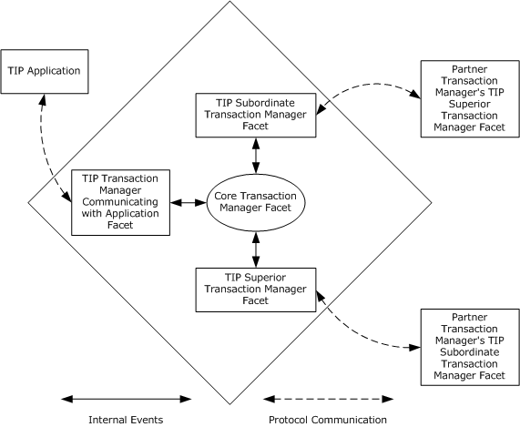
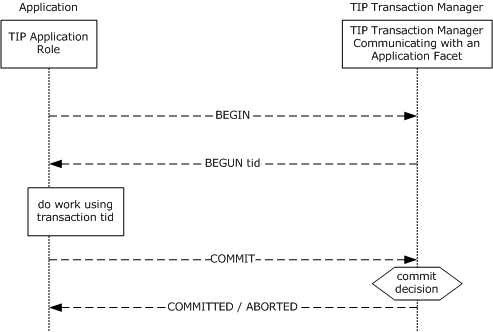
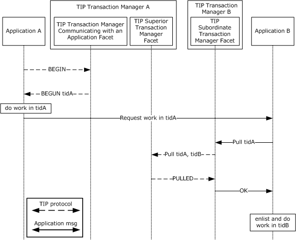
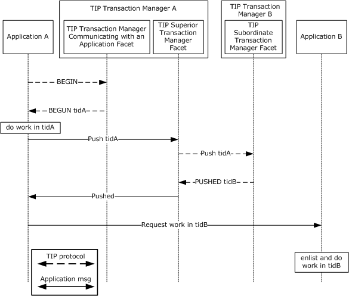
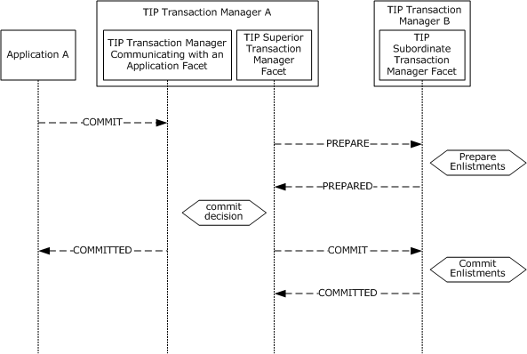
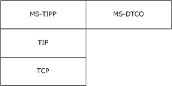

# [MS-TIPP]: Transaction Internet Protocol (TIP) Extensions

Table of Contents

1 Introduction

- [1 Introduction](#Section_1)
  - [1.1 Glossary](#Section_1.1)
  - [1.2 References](#Section_1.2)
    - [1.2.1 Normative References](#Section_1.2.1)
    - [1.2.2 Informative References](#Section_1.2.2)
  - [1.3 Overview](#Section_1.3)
    - [1.3.1 Protocol Roles](#Section_1.3.1)
      - [1.3.1.1 The TIP Application Role](#Section_1.3.1.1)
      - [1.3.1.2 The Transaction Manager Role](#Section_1.3.1.2)
        - [1.3.1.2.1 The TIP Superior Transaction Manager Facet](#Section_1.3.1.2.1)
        - [1.3.1.2.2 The TIP Subordinate Transaction Manager Facet](#Section_1.3.1.2.2)
        - [1.3.1.2.3 The TIP Transaction Manager Communicating with an Application Facet](#Section_1.3.1.2.3)
    - [1.3.2 Common Scenarios](#Section_1.3.2)
      - [1.3.2.1 Starting and Completing a Transaction](#Section_1.3.2.1)
      - [1.3.2.2 Pulling a Transaction](#Section_1.3.2.2)
      - [1.3.2.3 Pushing a Transaction](#Section_1.3.2.3)
      - [1.3.2.4 TIP Two-Phase Commit](#Section_1.3.2.4)
  - [1.4 Relationship to Other Protocols](#Section_1.4)
  - [1.5 Prerequisites/Preconditions](#Section_1.5)
  - [1.6 Applicability Statement](#Section_1.6)
  - [1.7 Versioning and Capability Negotiation](#Section_1.7)
  - [1.8 Vendor-Extensible Fields](#Section_1.8)
  - [1.9 Standards Assignments](#Section_1.9)

2 Messages

- [2 Messages](#Section_2)
  - [2.1 Transport](#Section_2.1)
  - [2.2 Message Syntax](#Section_2.2)
    - [2.2.1 ALREADYPUSHED](#Section_2.2.1)
    - [2.2.2 BEGUN](#Section_2.2.2)
    - [2.2.3 IDENTIFY](#Section_2.2.3)
    - [2.2.4 PULL](#Section_2.2.4)
    - [2.2.5 PUSH](#Section_2.2.5)
    - [2.2.6 PUSHED](#Section_2.2.6)
    - [2.2.7 QUERY](#Section_2.2.7)
    - [2.2.8 RECONNECT](#Section_2.2.8)

3 Protocol Details

- [3 Protocol Details](#Section_3)
  - [3.1 Common Details](#Section_3.1)
    - [3.1.1 Abstract Data Model](#Section_3.1.1)
      - [3.1.1.1 Data Elements](#Section_3.1.1.1)
      - [3.1.1.2 TIP Connection Object](#Section_3.1.1.2)
      - [3.1.1.3 TIP Connection Management Operations](#Section_3.1.1.3)
        - [3.1.1.3.1 GetTipConnection Operation](#Section_3.1.1.3.1)
        - [3.1.1.3.2 GetTipConnectionFromAddress Operation](#Section_3.1.1.3.2)
        - [3.1.1.3.3 HasPartnerTransaction Operation](#Section_3.1.1.3.3)
        - [3.1.1.3.4 FreeTipConnection Operation](#Section_3.1.1.3.4)
        - [3.1.1.3.5 TerminateTipConnection Operation](#Section_3.1.1.3.5)
      - [3.1.1.4 TIP Command Object](#Section_3.1.1.4)
      - [3.1.1.5 Transaction Identifier Converter Operations](#Section_3.1.1.5)
        - [3.1.1.5.1 Convert TIP Transaction Identifier to Transaction Identifier Operation](#Section_3.1.1.5.1)
        - [3.1.1.5.2 Convert Transaction Identifier to TIP Transaction Identifier Operation](#Section_3.1.1.5.2)
      - [3.1.1.6 Primary State Transition Table](#Section_3.1.1.6)
      - [3.1.1.7 Secondary State Transition Table](#Section_3.1.1.7)
    - [3.1.2 Timers](#Section_3.1.2)
    - [3.1.3 Initialization](#Section_3.1.3)
    - [3.1.4 Higher-Layer Triggered Events](#Section_3.1.4)
    - [3.1.5 Message Processing Events and Sequencing Rules](#Section_3.1.5)
      - [3.1.5.1 Receiving BEGUN TIP Command](#Section_3.1.5.1)
      - [3.1.5.2 Receiving CANTMULTIPLEX TIP Command](#Section_3.1.5.2)
      - [3.1.5.3 Receiving CANTTLS TIP Command](#Section_3.1.5.3)
      - [3.1.5.4 Receiving IDENTIFIED TIP Command](#Section_3.1.5.4)
      - [3.1.5.5 Receiving IDENTIFY TIP Command](#Section_3.1.5.5)
      - [3.1.5.6 Receiving MULTIPLEX TIP Command](#Section_3.1.5.6)
      - [3.1.5.7 Receiving MULTIPLEXING TIP Command](#Section_3.1.5.7)
      - [3.1.5.8 Receiving NEEDTLS TIP Command](#Section_3.1.5.8)
      - [3.1.5.9 Receiving NOTBEGUN TIP Command](#Section_3.1.5.9)
      - [3.1.5.10 Receiving TLS TIP Command](#Section_3.1.5.10)
      - [3.1.5.11 Receiving TLSING TIP Command](#Section_3.1.5.11)
    - [3.1.6 Timer Events](#Section_3.1.6)
    - [3.1.7 Other Local Events](#Section_3.1.7)
      - [3.1.7.1 Invalid TIP Command Event](#Section_3.1.7.1)
      - [3.1.7.2 Transport Events](#Section_3.1.7.2)
        - [3.1.7.2.1 Received Message](#Section_3.1.7.2.1)
        - [3.1.7.2.2 Transport Connection Down](#Section_3.1.7.2.2)
  - [3.2 TIP Superior Transaction Manager Facet Details](#Section_3.2)
    - [3.2.1 Abstract Data Model](#Section_3.2.1)
      - [3.2.1.1 TIP Superior Transaction Manager Facet State Transition Table](#Section_3.2.1.1)
    - [3.2.2 Timers](#Section_3.2.2)
    - [3.2.3 Initialization](#Section_3.2.3)
    - [3.2.4 Higher-Layer Triggered Events](#Section_3.2.4)
      - [3.2.4.1 Push Transaction](#Section_3.2.4.1)
    - [3.2.5 Message Processing Events and Sequencing Rules](#Section_3.2.5)
      - [3.2.5.1 Receiving ABORTED TIP Command](#Section_3.2.5.1)
      - [3.2.5.2 Receiving ALREADYPUSHED TIP Command](#Section_3.2.5.2)
      - [3.2.5.3 Receiving COMMITTED TIP Command](#Section_3.2.5.3)
      - [3.2.5.4 Receiving NOTPUSHED TIP Command](#Section_3.2.5.4)
      - [3.2.5.5 Receiving NOTRECONNECTED TIP Command](#Section_3.2.5.5)
      - [3.2.5.6 Receiving PREPARED TIP Command](#Section_3.2.5.6)
      - [3.2.5.7 Receiving PULL TIP Command](#Section_3.2.5.7)
      - [3.2.5.8 Receiving PUSHED TIP Command](#Section_3.2.5.8)
      - [3.2.5.9 Receiving QUERY TIP Command](#Section_3.2.5.9)
      - [3.2.5.10 Receiving READONLY TIP Command](#Section_3.2.5.10)
      - [3.2.5.11 Receiving RECONNECTED TIP Command](#Section_3.2.5.11)
      - [3.2.5.12 Receiving ERROR TIP Command](#Section_3.2.5.12)
    - [3.2.6 Timer Events](#Section_3.2.6)
    - [3.2.7 Other Local Events](#Section_3.2.7)
      - [3.2.7.1 Invalid TIP Command Event](#Section_3.2.7.1)
      - [3.2.7.2 Process Error](#Section_3.2.7.2)
      - [3.2.7.3 Events Signaled by the Core Transaction Manager Facet](#Section_3.2.7.3)
        - [3.2.7.3.1 Begin Commit](#Section_3.2.7.3.1)
        - [3.2.7.3.2 Begin Phase One](#Section_3.2.7.3.2)
        - [3.2.7.3.3 Begin Rollback](#Section_3.2.7.3.3)
        - [3.2.7.3.4 Create Subordinate Enlistment Failure](#Section_3.2.7.3.4)
        - [3.2.7.3.5 Create Subordinate Enlistment Success](#Section_3.2.7.3.5)
      - [3.2.7.4 Transport Events](#Section_3.2.7.4)
        - [3.2.7.4.1 Transport Connection Down](#Section_3.2.7.4.1)
  - [3.3 TIP Subordinate Transaction Manager Facet Details](#Section_3.3)
    - [3.3.1 Abstract Data Model](#Section_3.3.1)
      - [3.3.1.1 TIP Subordinate Transaction Manager Facet State Transition Table](#Section_3.3.1.1)
    - [3.3.2 Timers](#Section_3.3.2)
      - [3.3.2.1 Query Timer](#Section_3.3.2.1)
    - [3.3.3 Initialization](#Section_3.3.3)
    - [3.3.4 Higher-Layer Triggered Events](#Section_3.3.4)
      - [3.3.4.1 Pull Transaction](#Section_3.3.4.1)
    - [3.3.5 Message Processing Events and Sequencing Rules](#Section_3.3.5)
      - [3.3.5.1 Receiving ABORT TIP Command](#Section_3.3.5.1)
      - [3.3.5.2 Receiving COMMIT TIP Command](#Section_3.3.5.2)
      - [3.3.5.3 Receiving NOTPULLED TIP Command](#Section_3.3.5.3)
      - [3.3.5.4 Receiving PREPARE TIP Command](#Section_3.3.5.4)
      - [3.3.5.5 Receiving PULLED TIP Command](#Section_3.3.5.5)
      - [3.3.5.6 Receiving PUSH TIP Command](#Section_3.3.5.6)
      - [3.3.5.7 Receiving QUERIEDEXISTS TIP Command](#Section_3.3.5.7)
      - [3.3.5.8 Receiving QUERIEDNOTFOUND TIP Command](#Section_3.3.5.8)
      - [3.3.5.9 Receiving RECONNECT TIP Command](#Section_3.3.5.9)
      - [3.3.5.10 Receiving ERROR TIP Command](#Section_3.3.5.10)
    - [3.3.6 Timer Events](#Section_3.3.6)
      - [3.3.6.1 Query Timer Expired Event](#Section_3.3.6.1)
    - [3.3.7 Other Local Events](#Section_3.3.7)
      - [3.3.7.1 Invalid TIP Command Event](#Section_3.3.7.1)
      - [3.3.7.2 Process Error](#Section_3.3.7.2)
      - [3.3.7.3 Events Signaled by the Core Transaction Manager Facet](#Section_3.3.7.3)
        - [3.3.7.3.1 Commit Complete](#Section_3.3.7.3.1)
        - [3.3.7.3.2 Create Superior Enlistment Success](#Section_3.3.7.3.2)
        - [3.3.7.3.3 Create Superior Enlistment Failure](#Section_3.3.7.3.3)
        - [3.3.7.3.4 Phase Zero Complete](#Section_3.3.7.3.4)
        - [3.3.7.3.5 Phase One Complete](#Section_3.3.7.3.5)
        - [3.3.7.3.6 Recover In Doubt Transaction](#Section_3.3.7.3.6)
        - [3.3.7.3.7 Rollback Complete](#Section_3.3.7.3.7)
        - [3.3.7.3.8 Unilaterally Aborted](#Section_3.3.7.3.8)
      - [3.3.7.4 Transport Events](#Section_3.3.7.4)
        - [3.3.7.4.1 Transport Connection Down](#Section_3.3.7.4.1)
  - [3.4 TIP Transaction Manager Communicating with an Application Facet Details](#Section_3.4)
    - [3.4.1 Abstract Data Model](#Section_3.4.1)
      - [3.4.1.1 TIP Transaction Manager Communicating with an Application Facet State Transition Table](#Section_3.4.1.1)
    - [3.4.2 Timers](#Section_3.4.2)
    - [3.4.3 Initialization](#Section_3.4.3)
    - [3.4.4 Higher-Layer Triggered Events](#Section_3.4.4)
    - [3.4.5 Message Processing Events and Sequencing Rules](#Section_3.4.5)
      - [3.4.5.1 Receiving ABORT TIP Command](#Section_3.4.5.1)
      - [3.4.5.2 Receiving BEGIN TIP Command](#Section_3.4.5.2)
      - [3.4.5.3 Receiving COMMIT TIP Command](#Section_3.4.5.3)
      - [3.4.5.4 Receiving ERROR TIP Command](#Section_3.4.5.4)
    - [3.4.6 Timer Events](#Section_3.4.6)
    - [3.4.7 Other Local Events](#Section_3.4.7)
      - [3.4.7.1 Invalid TIP Command Event](#Section_3.4.7.1)
      - [3.4.7.2 Events Signaled by the Core Transaction Manager Facet](#Section_3.4.7.2)
        - [3.4.7.2.1 Create Transaction Failure](#Section_3.4.7.2.1)
        - [3.4.7.2.2 Create Transaction Success](#Section_3.4.7.2.2)
        - [3.4.7.2.3 Phase Zero Complete](#Section_3.4.7.2.3)
        - [3.4.7.2.4 Phase One Complete](#Section_3.4.7.2.4)
        - [3.4.7.2.5 Rollback Complete](#Section_3.4.7.2.5)
        - [3.4.7.2.6 Unilaterally Aborted](#Section_3.4.7.2.6)
      - [3.4.7.3 Transport Events](#Section_3.4.7.3)
        - [3.4.7.3.1 Transport Connection Down](#Section_3.4.7.3.1)

4 Protocol Examples

- [4 Protocol Examples](#Section_4)
  - [4.1 Transaction Processing Scenario](#Section_4.1)
    - [4.1.1 Creating the TIP Connection](#Section_4.1.1)
    - [4.1.2 Propagating the Transaction](#Section_4.1.2)
      - [4.1.2.1 Pull Propagation](#Section_4.1.2.1)
      - [4.1.2.2 Push Propagation](#Section_4.1.2.2)
    - [4.1.3 Committing the Transaction](#Section_4.1.3)
      - [4.1.3.1 Two-Phase Commit](#Section_4.1.3.1)
        - [4.1.3.1.1 Read Only](#Section_4.1.3.1.1)
        - [4.1.3.1.2 Phase One](#Section_4.1.3.1.2)
        - [4.1.3.1.3 Recovery](#Section_4.1.3.1.3)
        - [4.1.3.1.4 Phase Two](#Section_4.1.3.1.4)
      - [4.1.3.2 Single-Phase Commit](#Section_4.1.3.2)
  - [4.2 Begin Scenario](#Section_4.2)
    - [4.2.1 Creating the TIP Connection](#Section_4.2.1)
    - [4.2.2 Beginning the Transaction](#Section_4.2.2)
    - [4.2.3 Committing the Transaction](#Section_4.2.3)

5 Security

- [5 Security](#Section_5)
  - [5.1 Security Considerations for Implementers](#Section_5.1)
  - [5.2 Index of Security Parameters](#Section_5.2)

6 Appendix A: Product Behavior

- [6 Appendix A: Product Behavior](#Section_6)

7 Appendix B: Summary of Extensions

- [7 Appendix B: Summary of Extensions](#Section_7)

8 Change Tracking

- [8 Change Tracking](#Section_8)

For the legal notice and IP terms, see [LEGAL.md](../LEGAL.md).
Last updated: 4/23/2024.
See [Revision History](#revision-history) for full version history.

# 1 Introduction

This document specifies a set of extensions to the standard Transaction Internet Protocol (TIP) Version 3.0, as specified in [RFC2371]. This specification assumes that the reader has familiarity with the concepts and requirements specified in [RFC2371]. Concepts and requirements specified in [RFC2371] are repeated in this specification when needed to provide clarity.

Sections 1.5, 1.8, 1.9, 2, and 3 of this specification are normative. All other sections and examples in this specification are informative.

## 1.1 Glossary

This document uses the following terms:

**Augmented Backus-Naur Form (ABNF)**: A modified version of Backus-Naur Form (BNF), commonly used by Internet specifications. ABNF notation balances compactness and simplicity with reasonable representational power. ABNF differs from standard BNF in its definitions and uses of naming rules, repetition, alternatives, order-independence, and value ranges. For more information, see [[RFC5234]](https://go.microsoft.com/fwlink/?LinkId=123096).

**computer name**: The DNS or NetBIOS name.

**core transaction manager facet**: The facet that acts as the internal coordinator of each transaction that is inside the transaction manager. The core transaction manager facet communicates with other facets in its transaction manager to ensure that each transaction is processed correctly. To accomplish this, the core transaction manager facet maintains critical transaction state, in both volatile memory and in a durable store, such as in a log file.

**facet**: In OleTx, a subsystem in a [**transaction manager**](#gt_transaction-manager) that maintains its own per-[**transaction**](#gt_transaction) state and responds to intra-[**transaction manager**](#gt_transaction-manager) events from other [**facets**](#gt_facet). A [**facet**](#gt_facet) can also be responsible for communicating with other participants of a [**transaction**](#gt_transaction).

**globally unique identifier (GUID)**: A term used interchangeably with universally unique identifier (UUID) in Microsoft protocol technical documents (TDs). Interchanging the usage of these terms does not imply or require a specific algorithm or mechanism to generate the value. Specifically, the use of this term does not imply or require that the algorithms described in [[RFC4122]](https://go.microsoft.com/fwlink/?LinkId=90460) or [[C706]](https://go.microsoft.com/fwlink/?LinkId=89824) must be used for generating the [**GUID**](#gt_globally-unique-identifier-guid). See also universally unique identifier (UUID).

**higher-layer business logic**: The application functionality that invokes the functionality that is specific to this protocol.

**IPv4 address in string format**: A string representation of an IPv4 address in dotted-decimal notation, as described in [[RFC1123]](https://go.microsoft.com/fwlink/?LinkId=90268) section 2.1.

**OleTx transaction manager (OleTx TM)**: A [**transaction manager**](#gt_transaction-manager) that implements the OleTx Transaction Protocol [MS-DTCO](../MS-DTCO/MS-DTCO.md).

**partner transaction manager**: A [**transaction manager**](#gt_transaction-manager) that plays the opposite role in an enlistment. When the [**TIP subordinate transaction manager facet**](#gt_tip-subordinate-transaction-manager-facet) is communicating with the partner transaction manager, the partner transaction manager acts as a [**superior transaction manager**](#gt_superior-transaction-manager). When the [**TIP superior transaction manager facet**](#gt_tip-superior-transaction-manager-facet) is communicating with the partner transaction manager, the partner transaction manager acts as a subordinate transaction manager. The [**TIP transaction manager communicating with an application facet**](#gt_tip-transaction-manager-communicating-with-an-application-facet) does not communicate with a partner transaction manager.

**signal**: In OleTx, the act of communicating an event between [**facets**](#gt_facet) inside a [**transaction manager**](#gt_transaction-manager).

**single-phase commit**: An optimization of the Two-Phase Commit Protocol in which a [**transaction manager**](#gt_transaction-manager) delegates the right to decide the outcome of a transaction to its only subordinate participant. This optimization can result in an In Doubt outcome.

**superior transaction manager**: A role taken by a [**transaction manager**](#gt_transaction-manager) that is responsible for gathering outcome votes and providing the final transaction outcome. A root [**transaction manager**](#gt_transaction-manager) can act as a [**superior transaction manager**](#gt_superior-transaction-manager) to a number of subordinate transaction managers. A [**transaction manager**](#gt_transaction-manager) can act as both a subordinate transaction manager and a [**superior transaction manager**](#gt_superior-transaction-manager) on the same transaction.

**TIP**: An acronym for the Transaction Internet Protocol, which is specified in [[RFC2371]](https://go.microsoft.com/fwlink/?LinkId=90338) section 13.

**tip command**: A [**TIP**](#gt_tip) request or reply, including action and parameters, as specified in [RFC2371] section 13.

**TIP command line**: That part of a [**TIP**](#gt_tip) message that contains a single [**TIP command**](#gt_tip-command). This is specified in the [**TIP**](#gt_tip) standard [RFC2371] section 11 as a "line of ASCII text, using only octets with values in the range 32 through 126 inclusive, followed by either a CR (an octet with value 13) or an LR (an octet with value 10)."

**tip connection**: A TIP connection that is initiated and used, as specified in [RFC2371] section 4.

**TIP subordinate transaction manager**: A subordinate transaction manager that implements the transaction management functionality that is specified in TIP.

**TIP subordinate transaction manager facet**: The [**facet**](#gt_facet) that accepts requests to push a transaction from the [**partner transaction manager**](#gt_partner-transaction-manager), sends requests to pull a transaction from the [**partner transaction manager**](#gt_partner-transaction-manager), and participates as a subordinate in the [**Two-Phase Commit**](#gt_two-phase-commit) protocol.

**TIP superior transaction manager**: A [**superior transaction manager**](#gt_superior-transaction-manager) that implements the transaction management functionality that is specified in TIP.

**TIP superior transaction manager facet**: The [**facet**](#gt_facet) that accepts requests to pull a transaction from the [**partner transaction manager**](#gt_partner-transaction-manager), sends requests to push a transaction to the [**partner transaction manager**](#gt_partner-transaction-manager), drives the [**Two-Phase Commit**](#gt_two-phase-commit) protocol with the [**partner transaction manager**](#gt_partner-transaction-manager), and after a failure, performs recovery.

**tip transaction manager**: A [**transaction manager**](#gt_transaction-manager) for the transaction management functionality specified in [**TIP**](#gt_tip).

**TIP transaction manager communicating with an application facet**: The [**facet**](#gt_facet) that accepts requests to create and complete a transaction from an application.

**TIP transaction manager facets**: The [**facets**](#gt_facet) that constitute the [**transaction manager**](#gt_transaction-manager) role, namely the [**TIP superior transaction manager facet**](#gt_tip-superior-transaction-manager-facet), the [**TIP subordinate transaction manager facet**](#gt_tip-subordinate-transaction-manager-facet), and the [**TIP transaction manager communicating with an application facet**](#gt_tip-transaction-manager-communicating-with-an-application-facet).

**transaction**: In OleTx, an atomic transaction.

**transaction manager**: The party that is responsible for managing and distributing the outcome of atomic transactions. A transaction manager is either a root transaction manager or a subordinate transaction manager for a specified transaction.

**Transport Layer Security (TLS)**: A security protocol that supports confidentiality and integrity of messages in client and server applications communicating over open networks. TLS supports server and, optionally, client authentication by using X.509 certificates (as specified in [[X509]](https://go.microsoft.com/fwlink/?LinkId=90590)). TLS is standardized in the IETF TLS working group.

**two-phase commit**: An agreement protocol that is used to resolve the outcome of an atomic transaction in response to a commit request from the root application. Phase One and Phase Two are the distinct phases of the Two-Phase Commit Protocol.

**MAY, SHOULD, MUST, SHOULD NOT, MUST NOT:** These terms (in all caps) are used as defined in [[RFC2119]](https://go.microsoft.com/fwlink/?LinkId=90317). All statements of optional behavior use either MAY, SHOULD, or SHOULD NOT.

## 1.2 References

Links to a document in the Microsoft Open Specifications library point to the correct section in the most recently published version of the referenced document. However, because individual documents in the library are not updated at the same time, the section numbers in the documents may not match. You can confirm the correct section numbering by checking the [Errata](https://go.microsoft.com/fwlink/?linkid=850906).

### 1.2.1 Normative References

We conduct frequent surveys of the normative references to assure their continued availability. If you have any issue with finding a normative reference, please contact [dochelp@microsoft.com](mailto:dochelp@microsoft.com). We will assist you in finding the relevant information.

[MS-DTCO] Microsoft Corporation, "[MSDTC Connection Manager: OleTx Transaction Protocol](../MS-DTCO/MS-DTCO.md)".

[RFC2119] Bradner, S., "Key words for use in RFCs to Indicate Requirement Levels", BCP 14, RFC 2119, March 1997, [https://www.rfc-editor.org/info/rfc2119](https://go.microsoft.com/fwlink/?LinkId=90317)

[RFC2371] Lyon, J., Evans, K., and Klein, J., "Transaction Internet Protocol Version 3.0", RFC 2371, July 1998, [https://www.rfc-editor.org/info/rfc2371](https://go.microsoft.com/fwlink/?LinkId=90338)

### 1.2.2 Informative References

[RFC2372] Lyon, J., Evans, K., and Klein, J., "Transaction Internet Protocol - Requirements and Supplemental Information", RFC 2372, July 1998, [http://www.ietf.org/rfc/rfc2372.txt](https://go.microsoft.com/fwlink/?LinkId=94877)

## 1.3 Overview

This protocol represents an extension to the standard [**Transaction Internet Protocol (TIP)**](#gt_tip), as specified in [[RFC2371]](https://go.microsoft.com/fwlink/?LinkId=90338), and it is assumed to operate in an environment in which an [**OleTx transaction manager (OleTx TM)**](#gt_oletx-transaction-manager-oletx-tm) is present. In this context, the protocol provides concrete mechanisms for associating an OleTx transaction and a TIP [**transaction**](#gt_transaction). These include mechanisms for creating the association, coordinating agreement on a single atomic outcome, and reliably distributing that outcome to the [**transaction managers**](#gt_transaction-manager) involved in the overall transaction:

- It provides a way to group multiple actions across different nodes to define the next state.
- It guarantees that all the nodes agree on the same outcome, so that either of the following occur:
- All of these actions complete, and then all the nodes move together to the next state.
- All the nodes remain in their previous state.
For multiple platforms to participate in this, it is important to have a standard protocol for reaching this agreement. The TIP standard protocol [RFC2371] specifies such a standard. This document defines an extension of the TIP standard protocol.

The TIP standard protocol [RFC2371] specifies [**TIP connection**](#gt_tip-connection) initialization, push and pull enlistment, distributed agreement, and remote transactions. These are summarized in the following subsections and specified in sections [2](#Section_2) and [3](#Section_3). For additional requirements and supplemental information, see [[RFC2372]](https://go.microsoft.com/fwlink/?LinkId=94877).

### 1.3.1 Protocol Roles

This protocol comprises the following self-contained classes of functionality or protocol roles:

- The TIP application role (section [1.3.1.1](#Section_1.3.1.1)).
- The TIP transaction manager role (section [1.3.1.2](#Section_1.3.1.2)), which can be further divided into three subroles or [**facets**](#gt_facet):
- The [**TIP superior transaction manager facet**](#gt_tip-superior-transaction-manager-facet) (section [1.3.1.2.1](#Section_1.3.1.2.1)).
- The [**TIP subordinate transaction manager facet**](#gt_tip-subordinate-transaction-manager-facet) (section [1.3.1.2.2](#Section_1.3.1.2.2)).
- The [**TIP transaction manager communicating with an application facet**](#gt_tip-transaction-manager-communicating-with-an-application-facet) (section [1.3.1.2.3](#Section_1.3.1.2.3)).
The following figure shows the protocol roles.

Figure 1: Protocol roles

These facets communicate with each other both via events and by sharing data, in each case using an implementation-specific mechanism.

#### 1.3.1.1 The TIP Application Role

The TIP application role performs the following tasks:

- Establishes a [**TIP connection**](#gt_tip-connection) with the [**TIP transaction manager communicating with an application facet**](#gt_tip-transaction-manager-communicating-with-an-application-facet) (section [1.3.1.2.3](#Section_1.3.1.2.3)).
- Requests the creation of a [**transaction**](#gt_transaction) on the TIP transaction manager communicating with an application facet and obtains an identifier for the created transaction.
- Requests the commit or rollback of a transaction it created on the TIP transaction manager communicating with an application facet and obtains the transaction outcome.

#### 1.3.1.2 The Transaction Manager Role

##### 1.3.1.2.1 The TIP Superior Transaction Manager Facet

The TIP superior transaction manager facet performs the following tasks:

- Establishes a [**TIP connection**](#gt_tip-connection) with the [**partner transaction manager's**](#gt_partner-transaction-manager) [**TIP subordinate transaction manager facet**](#gt_tip-subordinate-transaction-manager-facet).
- Accepts requests to pull a [**transaction**](#gt_transaction) from the partner transaction manager's TIP subordinate transaction manager facet.
- Sends requests to push a transaction to the partner transaction manager's TIP subordinate transaction manager facet.
- Drives the [**Two-Phase Commit**](#gt_two-phase-commit) Protocol with its partner transaction manager's TIP subordinate transaction manager facet.
- Performs transaction recovery and provides transaction outcome notifications to its partner transaction manager's TIP subordinate transaction manager facet, after a failure.

##### 1.3.1.2.2 The TIP Subordinate Transaction Manager Facet

The TIP subordinate transaction manager facet performs the following tasks:

- Establishes a [**TIP connection**](#gt_tip-connection) with the [**partner transaction manager**](#gt_partner-transaction-manager)'s [**TIP superior transaction manager facet**](#gt_tip-superior-transaction-manager-facet).
- Sends requests to pull a [**transaction**](#gt_transaction) from the partner transaction manager's TIP superior transaction manager facet.
- Accepts requests to push a transaction from the partner transaction manager's TIP superior transaction manager facet.
- Participates in the [**Two-Phase Commit**](#gt_two-phase-commit) Protocol with its partner transaction manager's TIP superior transaction manager facet.
- Participates in recovery and accepts transaction outcome notifications from its partner transaction manager's TIP superior transaction manager facet, after a failure.

##### 1.3.1.2.3 The TIP Transaction Manager Communicating with an Application Facet

The [**TIP transaction manager communicating with an application facet**](#gt_tip-transaction-manager-communicating-with-an-application-facet) performs the following tasks:

- Accepts requests to create a [**transaction**](#gt_transaction) from the TIP application role (section [1.3.1.1](#Section_1.3.1.1)) and responds with the identifier for the created transaction.
- Accepts requests to commit or rollback a transaction from the TIP application role and responds with the transaction outcome.

### 1.3.2 Common Scenarios

#### 1.3.2.1 Starting and Completing a Transaction

In this scenario, an application (playing the [**TIP**](#gt_tip) application role (section [1.3.1.1](#Section_1.3.1.1))) creates a [**transaction**](#gt_transaction) with a [**TIP transaction manager**](#gt_tip-transaction-manager) (that implements this protocol), performs some work by using that transaction, and eventually completes (commits or aborts) the transaction.

The following figure illustrates the scenario (TIP protocol messages are illustrated with dashed arrows).

Figure 2: Starting and completing a transaction

- The TIP application requests the [**TIP transaction manager communicating with an application facet**](#gt_tip-transaction-manager-communicating-with-an-application-facet) (section [1.3.1.2.3](#Section_1.3.1.2.3)) of a TIP transaction manager to create a transaction by sending the **BEGIN** [**TIP command**](#gt_tip-command).
- TIP transaction manager communicating with an application facet replies with a **BEGUN** TIP command, passing in the identifier of the transaction created by the TIP transaction manager.
- The TIP application performs work using the transaction.
- When completing all transacted work associated with the transaction, the TIP application requests the TIP transaction manager communicating with an application facet of the TIP transaction manager to commit the transaction by sending the **COMMIT** TIP command.
- The TIP transaction manager makes the appropriate commit decision and notifies TIP application of the transaction's outcome by using either the **COMMITTED** or **ABORTED** TIP command.

#### 1.3.2.2 Pulling a Transaction

In this scenario, application A sends a request to application B to pull a local [**transaction**](#gt_transaction) that it creates with its [**TIP transaction manager**](#gt_tip-transaction-manager) A, and do some work as part of the pulled transaction. The following figure illustrates the scenario ([**TIP**](#gt_tip) protocol messages are illustrated with dashed arrows).

Figure 3: Pulling a transaction

- Application A requests the [**TIP transaction manager communicating with an application facet**](#gt_tip-transaction-manager-communicating-with-an-application-facet) (section [3.4.1.1](#Section_3.4.1.1)) of TIP transaction manager A to create a transaction by sending the **BEGIN** [**TIP command**](#gt_tip-command).
- TIP transaction manager communicating with an application facet replies with a [**BEGUN**](#Section_2.2.2) TIP command, passing in the identifier of the transaction (*tidA*) created by TIP transaction manager A.
- Application A does some local work in the transaction.
- Application A requests application B to do some work within the same transaction.
- Application B requests TIP transaction manager B to pull this transaction.
- The [**TIP subordinate transaction manager facet**](#gt_tip-subordinate-transaction-manager-facet) (section [1.3.1.2.2](#Section_1.3.1.2.2)) of TIP transaction manager B sends a [PULL](#Section_2.2.4) TIP command to the [**TIP superior transaction manager facet**](#gt_tip-superior-transaction-manager-facet) (section [1.3.1.2.1](#Section_1.3.1.2.1)) of TIP transaction manager A, passing in parameters *tidA* and *tidB* (its local identifier for the transaction).
- TIP transaction manager A agrees by responding with the **PULLED** TIP command. At this point, TIP transaction manager B has an enlistment in the transaction, and the transaction is bound to the [**TIP connection**](#gt_tip-connection).
- TIP transaction manager B returns to application B.
- Application B does the requested work using the pulled transaction.

#### 1.3.2.3 Pushing a Transaction

In this scenario, application A requests its [**transaction manager**](#gt_transaction-manager) A to push a [**transaction**](#gt_transaction) to [**TIP transaction manager**](#gt_tip-transaction-manager) B, and then sends a request to application B to do some work as a part of the pushed transaction.

The following figure illustrates the scenario ([**TIP**](#gt_tip) protocol messages are illustrated with dashed arrows).

Figure 4: Pushing a transaction

- Application A requests the [**TIP transaction manager communicating with an application facet**](#gt_tip-transaction-manager-communicating-with-an-application-facet) (section [3.4.1.1](#Section_3.4.1.1)) of TIP transaction manager A to create a transaction by sending the **BEGIN** [**TIP command**](#gt_tip-command).
- TIP transaction manager communicating with an application facet replies with a [BEGUN](#Section_2.2.2) TIP command, passing in the identifier of the transaction (*tidA*) created by TIP transaction manager A.
- Application A does some local work in the transaction.
- Application A asks its TIP transaction manager A to push the transaction to TIP transaction manager B.
- The [**TIP superior transaction manager facet**](#gt_tip-superior-transaction-manager-facet) (section [1.3.1.2.1](#Section_1.3.1.2.1)) of TIP transaction manager A sends a [PUSH](#Section_2.2.5) TIP command to the [**TIP subordinate transaction manager facet**](#gt_tip-subordinate-transaction-manager-facet) of TIP transaction manager B, passing as a parameter *tidA*.
- The TIP transaction manager B agrees by sending the **PUSHED** TIP command, passing as a parameter *tidB*, which is TIP transaction manager B's identifier for the transaction. At this point, TIP transaction manager B has an enlistment in the transaction, and the transaction is bound to the [**TIP connection**](#gt_tip-connection).
- TIP transaction manager A returns to application A.
- Application A asks application B to do some work within the same transaction passing it the identifier of the pushed transaction, *tidB*.
- Application B does the requested work using the pushed transaction.

#### 1.3.2.4 TIP Two-Phase Commit

Distributed agreement between two [**transaction managers**](#gt_transaction-manager) is accomplished using the [**Two-Phase Commit**](#gt_two-phase-commit) Protocol (see [GRAY]). The following figure illustrates this scenario ([**TIP**](#gt_tip) protocol messages are illustrated with dashed arrows).

Figure 5: TIP two-phase commit

- Application A asks the [**TIP transaction manager**](#gt_tip-transaction-manager) A to commit the current [**transaction**](#gt_transaction).
- The [**TIP superior transaction manager facet**](#gt_tip-superior-transaction-manager-facet) (section [1.3.1.2.1](#Section_1.3.1.2.1)) of the TIP transaction manager A initiates the Two-Phase Commit Protocol (assuming that the transaction has two or more enlistments). As part of that protocol, it sends a **PREPARE** [**TIP command**](#gt_tip-command) to the [**TIP subordinate transaction manager facet**](#gt_tip-subordinate-transaction-manager-facet) of TIP transaction manager B, which is enlisted as a subordinate in the transaction.
- Assuming the TIP transaction manager B successfully prepares all its enlistments for this transaction, it replies with the **PREPARED** TIP command.
- Assuming all enlistments prepare successfully (once the commit decision is made), the TIP transaction manager A starts the second phase of the Two-Phase Commit Protocol and asks all enlistments in the transaction to commit. Specifically, it sends a **COMMIT** TIP command to the TIP subordinate transaction manager facet of TIP transaction manager B. TIP transaction manager also notifies the Application A that the current transaction has been committed.
- After receiving the **COMMIT** TIP command, the TIP transaction manager B notifies all its enlistments for the respective transaction to commit, and replies with a **COMMITTED** TIP command.
- After receiving the **COMMITTED** response from the TIP transaction manager B, the TIP transaction manager A no longer has any responsibilities with respect to that enlistment, and it frees the associated resources.

## 1.4 Relationship to Other Protocols

This protocol is an extension of the [**TIP**](#gt_tip) standard protocol, as specified in [[RFC2371]](https://go.microsoft.com/fwlink/?LinkId=90338).

The following figure illustrates its relationship with other protocols:

- MSDTC Connection Manager: Ole Tx Transaction protocol ([MS-DTCO](../MS-DTCO/MS-DTCO.md)) provides an extensibility mechanism that enables plug in of custom protocol extensions. This protocol is an extension of the standard TIP standard protocol [RFC2371] and provides an implementation of a protocol extension to MSDTC Connection Manager: Ole Tx Transaction protocol ([MS-DTCO]).
- The presence of the TIP, specified in [RFC2371] illustrates that TIP Extensions depends on TIP, especially TIP transaction managers.
- The presence of TCP illustrates how this protocol relies on the session and connection transport infrastructure defined in the TCP protocol.

Figure 6: Protocol layering

## 1.5 Prerequisites/Preconditions

The operation of this protocol requires the following:

- A TCP/IP implementation is available for use by all of the protocol roles.
- An [**OleTx TM**](#gt_oletx-transaction-manager-oletx-tm) is present and operating so that the implementation of this protocol can use its [**transaction**](#gt_transaction) management services.
- All the [**TIP transaction manager facets**](#gt_tip-transaction-manager-facets) establish themselves as protocol extensions of the previous OleTx TM as specified in [MS-DTCO](../MS-DTCO/MS-DTCO.md) section 3.2.1.5.

## 1.6 Applicability Statement

This protocol is a distributed [**transaction**](#gt_transaction) management and coordination protocol, and therefore it is applicable in situations in which distributed transaction management coordination is necessary. Because this protocol is unsecure, an implicit level of trust is required between the parties using the protocol.

## 1.7 Versioning and Capability Negotiation

The Transaction Internet Protocol Extensions extends the [**Transaction Internet Protocol (TIP)**](#gt_tip). The TIP standard, specified in [[RFC2371]](https://go.microsoft.com/fwlink/?LinkId=90338) includes a negotiation mechanism for several aspects of a connection. TIP Extensions supports the TIP negotiation mechanism with the following restrictions:

- TIP Version 3.0 is supported. Other versions are not supported.
- TIP multiplexing negotiation is not supported.
- TIP [**Transport Layer Security (TLS)**](#gt_transport-layer-security-tls) negotiation is not supported.

## 1.8 Vendor-Extensible Fields

There is a variable-length ASCII string in each [**TIP command**](#gt_tip-command) that can be used for any purpose. It is specified in [[RFC2371]](https://go.microsoft.com/fwlink/?LinkId=90338) section 11 of the [**TIP**](#gt_tip) standard.

## 1.9 Standards Assignments

There is only one standard assignment: the TCP port default value of 3372, as specified in [[RFC2371]](https://go.microsoft.com/fwlink/?LinkId=90338) section 7.

# 2 Messages

Unless stated otherwise, this protocol complies with the [**TIP**](#gt_tip) standard as specified in [[RFC2371]](https://go.microsoft.com/fwlink/?LinkId=90338).

## 2.1 Transport

This protocol restricts the connections specified in [[RFC2371]](https://go.microsoft.com/fwlink/?LinkId=90338) section 4 to TCP connections.

## 2.2 Message Syntax

This protocol places the following syntax restrictions on [[RFC2371]](https://go.microsoft.com/fwlink/?LinkId=90338) specification:

- **TIP command line restrictions**:
- Messages received by this protocol restrict the [**TIP command line**](#gt_tip-command-line) specified in [RFC2371] section 11, as follows:
- The TIP command line MUST NOT cross 1,024 character boundaries.
- Messages sent by this protocol MUST restrict the TIP command line specified in [RFC2371] section 11, as follows:
- A message MUST contain at most one TIP command line.
- The TIP command line MUST NOT exceed 1,024 characters.
- **Transaction identifier restrictions**:
- A [**transaction**](#gt_transaction) identifier created by this protocol MUST restrict the **TIP transaction identifier** specified in [RFC2371] section 5 to the following [**Augmented Backus-Naur Form (ABNF)**](#gt_augmented-backus-naur-form-abnf)
OleTxTipTransactionIdentifier

= %x4F %x6C %x65 %x54 %x78 "-" LowerCaseUUID

where *LowerCaseUUID* is defined to be the same as the glossary term [**GUID**](#gt_globally-unique-identifier-guid) with the restriction that alpha characters MUST be lowercase. For example: OleTx-725d5246-2217-11dc-8314-0800200c9a66.

- **Transaction manager address restrictions**:
- A [**transaction manager**](#gt_transaction-manager) address created by this protocol MUST restrict the transaction manager address specified in [RFC2371] section 7 to the following ABNF
%x74 %x69 %x70 %x3A %x2F %x2F HostName %x2F

where *HostName* is defined to be one of the following:

- A [**computer name**](#gt_computer-name) with the restriction that the first character cannot be an underscore or a number.
- An [**IPv4 address in string format**](#gt_ipv4-address-in-string-format).
The following subsections specify which [**TIP command**](#gt_tip-command) parameters have the preceding syntax restrictions. These subsections include only those TIP commands that place restrictions as specified in [RFC2371].

### 2.2.1 ALREADYPUSHED

The *subordinate's transaction identifier* parameter specified in [[RFC2371]](https://go.microsoft.com/fwlink/?LinkId=90338) section 13 for this [**TIP command**](#gt_tip-command) MUST adhere to the *transaction identifier* restrictions specified in section [2.2](#Section_2.2).

### 2.2.2 BEGUN

The *transaction identifier* parameter specified in [[RFC2371]](https://go.microsoft.com/fwlink/?LinkId=90338) section 13 for this [**TIP command**](#gt_tip-command) MUST adhere to the *transaction identifier* restrictions specified in section [2.2](#Section_2.2).

### 2.2.3 IDENTIFY

The *primary transaction manager address* and *secondary transaction manager address* parameters specified in [[RFC2371]](https://go.microsoft.com/fwlink/?LinkId=90338) section 13 for this [**TIP command**](#gt_tip-command) MUST adhere to the [**transaction manager**](#gt_transaction-manager) address restrictions specified in section [2.2](#Section_2.2).

### 2.2.4 PULL

The *superior's transaction identifier* and *subordinate's transaction identifier* parameters specified in [[RFC2371]](https://go.microsoft.com/fwlink/?LinkId=90338) section 13 for this [**TIP command**](#gt_tip-command) MUST adhere to the [**transaction**](#gt_transaction) identifier restriction specified in section [2.2](#Section_2.2).

### 2.2.5 PUSH

The *superior's transaction identifier* parameter specified in [[RFC2371]](https://go.microsoft.com/fwlink/?LinkId=90338) section 13 for this [**TIP command**](#gt_tip-command) MUST adhere to the [**transaction**](#gt_transaction) identifier restrictions specified in section [2.2](#Section_2.2).

### 2.2.6 PUSHED

The *subordinate's transaction identifier* parameter specified in [[RFC2371]](https://go.microsoft.com/fwlink/?LinkId=90338) section 13 of this [**TIP command**](#gt_tip-command) MUST adhere to the [**transaction**](#gt_transaction) identifier restrictions specified in section [2.2](#Section_2.2).

### 2.2.7 QUERY

The *superior's transaction identifier* parameter specified in [[RFC2371]](https://go.microsoft.com/fwlink/?LinkId=90338) section 13 for this [**TIP command**](#gt_tip-command) MUST adhere to the transaction identifier restrictions specified in section [2.2](#Section_2.2).

### 2.2.8 RECONNECT

The *subordinate's transaction identifier* parameter specified in [[RFC2371]](https://go.microsoft.com/fwlink/?LinkId=90338) section 13 for this [**TIP command**](#gt_tip-command) MUST adhere to the transaction identifier restrictions specified in section [2.2](#Section_2.2).

# 3 Protocol Details

This section defines the expected behavior of the [**transaction manager**](#gt_transaction-manager) role (section [1.3.1.2](#Section_1.3.1.2)), which consists of three [**facets**](#gt_facet):

- [**TIP superior transaction manager facet**](#gt_tip-superior-transaction-manager-facet) (section [1.3.1.2.1](#Section_1.3.1.2.1))
- [**TIP subordinate transaction manager facet**](#gt_tip-subordinate-transaction-manager-facet) (section [1.3.1.2.2](#Section_1.3.1.2.2))
- [**TIP transaction manager communicating with an application facet**](#gt_tip-transaction-manager-communicating-with-an-application-facet) (section [1.3.1.2.3](#Section_1.3.1.2.3))

## 3.1 Common Details

This section contains protocol details that are common to all [**TIP transaction manager facets**](#gt_tip-transaction-manager-facets).

### 3.1.1 Abstract Data Model

This section describes a conceptual model of possible data organization that an implementation maintains to participate in this protocol. The described organization is provided to facilitate the explanation of how the protocol behaves. This document does not mandate that implementations adhere to this model as long as their external behavior is consistent with that described in this document.

**Note** The abstract data model can be implemented in a variety of ways. This protocol does not prescribe or advocate any specific implementation technique. This abstract data model is an extension of the abstract data models as specified in [MS-DTCO](../MS-DTCO/MS-DTCO.md) sections 3.1, 3.4, 3.7, and 3.8.

#### 3.1.1.1 Data Elements

A [**TIP transaction manager facet**](#gt_tip-transaction-manager-facets) MUST maintain the following data elements:

- **A table of TIP connections:** This is a table of [**TIP connection**](#gt_tip-connection) objects.
- A set of flags that allow restrictions to be placed on this protocol:
- **Allow Begin:** A flag whose TRUE value indicates that the TIP transaction manager facet will accept a **BEGIN** [**TIP command**](#gt_tip-command).
- **Allow PassThrough:** A flag whose TRUE value indicates that the TIP transaction manager facet will allow a [**transaction**](#gt_transaction) to be pushed and then pulled without a local enlistment.
- **Allow Non-Default Port:** A flag whose TRUE value indicates that the TIP transaction manager facet will allow a TCP connection from a port number other than 3372.
- **Allow Different Partner Address:** A flag whose TRUE value indicates that the TIP transaction manager facet will accept an [IDENTIFY (section 2.2.3)](#Section_2.2.3) TIP command whose primary [**transaction manager**](#gt_transaction-manager) address parameter does not match the address from which the TCP connection originated.
- **Transaction Manager Address Override:** If the field is set, the TIP transaction manager facet will use it as the primary transaction manager address argument when it sends the IDENTIFY (section 2.2.3) TIP command.
The TIP transaction manager facet MUST extend the definition of an enlistment object, as specified in [MS-DTCO](../MS-DTCO/MS-DTCO.md) section 3.2.1.3, to include the following data fields:

- **TIP Connection:** This field references the TIP connection object associated with the enlistment.
- **Partner Transaction Identifier:** This field contains the transaction identifier that the [**partner transaction manager**](#gt_partner-transaction-manager) uses for the transaction object referenced by the enlistment.
- **Partner Transaction Manager Address:** This field contains a transaction manager address (as specified in section [2.2](#Section_2.2)) used to verify and contact the partner transaction manager in case of connection failure.

#### 3.1.1.2 TIP Connection Object

A [**TIP connection**](#gt_tip-connection) object MUST contain the following data fields:

- **Partner Transaction Manager Address:** This field contains a [**transaction manager**](#gt_transaction-manager) address (as specified in section [2.2](#Section_2.2)) used to identify the transaction manager that the TIP connection connects to. This field MAY be null.
- **Enlistment:** This field references an enlistment object associated with the TIP connection. This field MAY be null.
- **Transport Connection:** This field references the TCP connection that the TIP connection uses to send [**TIP commands**](#gt_tip-command).
- **Connection Type:** An enumeration that indicates whether the TIP connection will be used for either sending or receiving requests. This field MUST be set to one of the following values:
- Primary: This value is set to indicate that the TIP connection will be sending requests.
- Secondary: This value is set to indicate that the TIP connection will be receiving requests.
- **State:** An enumeration that indicates what state the TIP connection is in. This field MUST be set to one of the following values or one of the values of an extension to the TIP connection object:
- Initial: The TIP connection has not yet identified its [**partner transaction manager**](#gt_partner-transaction-manager).
- Initial Identify: The TIP connection is waiting for a reply to an [IDENTIFY](#Section_2.2.3) TIP command sent while in the initial state.
- Idle: The TIP connection has identified its partner transaction manager but has no associated [**transaction**](#gt_transaction).
- Error: The TIP connection has sent or received an **ERROR** TIP command.

#### 3.1.1.3 TIP Connection Management Operations

The following operations on the table of [**TIP connection**](#gt_tip-connection) are used throughout section [3](#Section_3).

##### 3.1.1.3.1 GetTipConnection Operation

The **GetTipConnection** operation is called when a TCP message is received on the TCP connection.

- The input parameter for this operation MUST be a TCP connection.
- This returns a [**TIP connection**](#gt_tip-connection) object whose data fields MUST include:
- Transport Connection is the provided TCP connection.
- When this operation is called, the TIP connection manager MUST perform the following actions:
- Attempt to find a TIP connection object corresponding to the provided TCP connection.
- If a TIP connection is found:
- Return the TIP connection.
- Otherwise:
- Create a new TIP connection object and initialize it with the following values:
- The **Connection Type** field is initialized to Secondary.
- The **State** field is initialized to Initial.
- The **Transport Connection** field is set to the provided TCP connection.
- The **Enlistment** field is set to null.
- The **Partner Transaction Manager Address** field is set to null.
- Return the TIP connection object.

##### 3.1.1.3.2 GetTipConnectionFromAddress Operation

The **GetTipConnectionFromAddress** operation is called when a [**TIP transaction manager facet**](#gt_tip-transaction-manager-facets) initiates a [**TIP connection**](#gt_tip-connection) to send a [**TIP command**](#gt_tip-command) (for example, [PUSH](#Section_2.2.5)):

- The input parameter for this operation MUST be a [**partner transaction manager**](#gt_partner-transaction-manager) address.
- This operation returns a TIP connection object, where the following data fields MUST be included and set to the specified values:
- **Partner Transaction Manager Address** contains the provided address.
- **Connection Type** is Primary.
- **State** is Idle.
If there is a TIP connection to the partner transaction manager for which the IDENTIFY/IDENTIFIED exchange has taken place and the **State** is Idle, as specified in [[RFC2371]](https://go.microsoft.com/fwlink/?LinkId=90338) section 4, the TIP connection manager SHOULD return it.

Otherwise, the TIP connection manager MUST perform the following actions:

- Create a new TCP connection to the provided partner transaction manager address.
- Create a corresponding TIP connection object and initialize it with the following values:
- The **Transport Connection** field is set to the TCP connection.
- The **State** field is set to Initial Identify.
- The **Partner Transaction Manager Address** field is initialized to the provided partner transaction manager address.
- The **Connection Type** field is set to Primary.
- Send an [IDENTIFY](#Section_2.2.3) TIP command with the following arguments:
- The *lowest protocol version*: "3".
- The *highest protocol version*: "3".
- If the **Transaction Manager Address Override** field is set, the *primary transaction manager address* argument MUST be set to the value of the **Transaction Manager Address Override** field; otherwise, it MUST be set to the address from which the TIP connection originated.
- The *secondary transaction manager address* argument SHOULD<1> be set to the value of the provided partner transaction manager address as specified in [RFC2371].
- Wait indefinitely for a response from the partner transaction manager. The TIP connection manager MUST accept messages, and the TIP transaction manager facet MUST process events while it is waiting:
- If the connection is terminated, terminate the processing of this event.
- If the response from the partner transaction manager is a valid IDENTIFIED TIP command, return the TIP connection object.
- Otherwise, terminate the processing of this event.

##### 3.1.1.3.3 HasPartnerTransaction Operation

The **HasPartnerTransaction** operation is called when a [**TIP transaction manager facet**](#gt_tip-transaction-manager-facets) has to determine whether a [**partner transaction manager**](#gt_partner-transaction-manager) has already enlisted in a specific [**transaction**](#gt_transaction):

- The input parameters for this operation MUST be:
- *Partner Transaction Manager Address*
- *Partner Transaction Identifier*
- This operation MUST return TRUE if there exists a [**TIP connection**](#gt_tip-connection) whose enlistment has the provided values; otherwise, it MUST return FALSE.

##### 3.1.1.3.4 FreeTipConnection Operation

The **FreeTipConnection** operation is called when a [**TIP transaction manager facet**](#gt_tip-transaction-manager-facets) no longer requires the [**TIP connection**](#gt_tip-connection). The input parameter for this MUST be a TIP connection object. The TIP connection manager MUST perform the following actions:

- If the TIP connection object's **Enlistment** field references an enlistment object, clear the enlistment object's **TIP Connection** field.
- If the TIP connection manager initiated the TCP connection corresponding to the TIP connection, it SHOULD reuse it as specified in [[RFC2371]](https://go.microsoft.com/fwlink/?LinkId=90338) section 4.

##### 3.1.1.3.5 TerminateTipConnection Operation

The input parameter for the **TerminateTipConnection** operation MUST be a [**TIP connection**](#gt_tip-connection) object.

When this operation is called, the TIP connection manager MUST do the following:

- If the TIP connection object's **Enlistment** field references an enlistment object, clear the enlistment object's **TIP Connection** field.
- Close the TCP connection referenced by the **Transport Connection** field of the provided TIP connection object.
- Discard the TIP connection object.

#### 3.1.1.4 TIP Command Object

A TIP command object MUST contain the following data fields:

- **Command Name:** This field contains a [**TIP command**](#gt_tip-command) name.
- **Parameter List:** The list of parameters for this TIP command.

#### 3.1.1.5 Transaction Identifier Converter Operations

The following operations that convert between [**transaction**](#gt_transaction) identifier formats are used throughout section [3](#Section_3).

##### 3.1.1.5.1 Convert TIP Transaction Identifier to Transaction Identifier Operation

The **Convert TIP Transaction Identifier to Transaction Identifier** operation MUST be called with the following argument:

- *TIP Transaction Identifier*
This operation MUST return the following value:

- [**Transaction**](#gt_transaction) identifier
If the **Convert TIP Transaction Identifier to Transaction Identifier** operation is called, it MUST perform the following actions:

- Remove "OleTx-" from the beginning of the [**TIP**](#gt_tip) transaction identifier.
- Convert the TIP transaction identifier string to a GUID and return it.

##### 3.1.1.5.2 Convert Transaction Identifier to TIP Transaction Identifier Operation

The **Convert Transaction Identifier to TIP Transaction Identifier** operation MUST be called with the following argument:

- [**Transaction**](#gt_transaction) identifier
This operation MUST return the following value:

- [**TIP**](#gt_tip) transaction identifier
If the **Convert Transaction Identifier to TIP Transaction Identifier** operation is called, it MUST perform the following actions:

- Convert the transaction identifier from a GUID to a string.
- Prefix "OleTx-" to the string and return it.

#### 3.1.1.6 Primary State Transition Table

The following table summarizes the legal state transitions that are common for all [**TIP transaction manager facets**](#gt_tip-transaction-manager-facets) for a [**TIP connection**](#gt_tip-connection) whose **Connection Type** field is set to Primary. The table omits the following transitions:

- In every state the TIP connection is allowed to send an **ERROR** [**TIP command**](#gt_tip-command) that changes the state to Error.
The following events trigger a state transition:

- A [**TIP**](#gt_tip) request is sent to the [**partner transaction manager**](#gt_partner-transaction-manager).
- A TIP reply is received from the partner transaction manager.
| Current state | Event | Next state |
| --- | --- | --- |
| Initial | [IDENTIFY](#Section_2.2.3) sent | Initial Identify |
| Initial Identify | **IDENTIFIED** received | Idle |
| Initial Identify | **NEEDTLS** received | Error |
| Initial Identify | **ERROR** received | Error |

#### 3.1.1.7 Secondary State Transition Table

The following table summarizes the legal state transitions that are common for all [**TIP transaction manager facets**](#gt_tip-transaction-manager-facets) for a [**TIP connection**](#gt_tip-connection) whose **Connection Type** field is set to Secondary. The table omits the following state transitions:

- In every state, the TIP connection MAY receive an **ERROR** [**TIP command**](#gt_tip-command) that changes the state to Error.
- The state changes when a [**TIP**](#gt_tip) reply is sent to the [**partner transaction manager**](#gt_partner-transaction-manager) in response to a TIP request.
The "<TIP command A> received/<TIP response B> sent" syntax in the table indicates that the [**facet**](#gt_facet) received <TIP command A> and responded to it with <TIP response B>. The state changes from <current state> to the <next state> when <TIP response B> is sent to the partner transaction manager.

| Current state | Event | Next state |
| --- | --- | --- |
| Initial | [IDENTIFY](#Section_2.2.3) received/**IDENTIFIED** sent. | Idle |
| Initial | IDENTIFY received/**ERROR** sent. | Error |
| Initial | TLS received/**CANTTLS** sent. | Initial |
| Initial | TLS received/**Error** sent. | Error |
| Idle | MULTIPLEX received/**CANTMULTIPLEX** sent. | Idle |
| Idle | MULITPLEX received/**Error** sent. | Error |

### 3.1.2 Timers

None.

### 3.1.3 Initialization

The [**TIP**](#gt_tip) implementation MUST perform the following initialization steps:

- The following flags MUST be set to a value that is obtained from an implementation-specific source:<2>
- **Allow Begin**
- **Allow PassThrough**
- **Allow Non-Default Port**
- **Allow DifferentPartner Address**
- The **Transaction Manager Address Override** field SHOULD be set to a value that is obtained from an implementation-specific source.<3>
- If the value of the **Allow Network Access** flag and the **Allow TIP** flag is TRUE, the TIP implementation MUST listen for incoming TCP requests on an implementation-specific port.<4>

### 3.1.4 Higher-Layer Triggered Events

None.

### 3.1.5 Message Processing Events and Sequencing Rules

This section describes how each received [**TIP command**](#gt_tip-command) is processed. Each of these events is signaled with a TIP command object (section [3.1.1.4](#Section_3.1.1.4)) and the receiving TIP Connection object (section [3.1.1.2](#Section_3.1.1.2)) as an input argument.

When a [**TIP transaction manager facet**](#gt_tip-transaction-manager-facets) receives a TIP command that is a response (for example, [BEGUN](#Section_2.2.2)) to a [**TIP**](#gt_tip) request (for example, **BEGIN**) that it does not support, the TIP transaction manager facet treats the response as an invalid TIP command.

#### 3.1.5.1 Receiving BEGUN TIP Command

When the [**TIP transaction manager facet**](#gt_tip-transaction-manager-facets) receives a [BEGUN](#Section_2.2.2) TIP command object, it MUST perform the following actions:

- [**Signal**](#gt_signal) the [Invalid TIP Command event (section 3.1.7.1)](#Section_3.1.7.1) and terminate the processing of this event.

#### 3.1.5.2 Receiving CANTMULTIPLEX TIP Command

When the [**TIP transaction manager facet**](#gt_tip-transaction-manager-facets) receives a **CANTMULTIPLEX** TIP command object, it MUST perform the following actions:

- [**Signal**](#gt_signal) the [Invalid TIP Command event (section 3.1.7.1)](#Section_3.1.7.1) and terminate the processing of this event.

#### 3.1.5.3 Receiving CANTTLS TIP Command

When the [**TIP transaction manager facet**](#gt_tip-transaction-manager-facets) receives a **CANTTLS** TIP command object, it MUST perform the following actions:

- [**Signal**](#gt_signal) the [Invalid TIP Command event (section 3.1.7.1)](#Section_3.1.7.1) and terminate the processing of this event.

#### 3.1.5.4 Receiving IDENTIFIED TIP Command

When the [**TIP transaction manager facet**](#gt_tip-transaction-manager-facets) receives an **IDENTIFIED** TIP command object, it MUST contain the following parameter in its **Parameter List**:

- *protocol version*
Upon receipt, the TIP transaction manager facet MUST perform the following actions:

- Test whether the receiving TIP connection object (section [3.1.1.2](#Section_3.1.1.2)) meets the following conditions:
- The **Connection Type** field is set to Primary.
- The **State** field is set to Initial Identify.
- If the receiving [**TIP connection**](#gt_tip-connection) does not satisfy these conditions, [**signal**](#gt_signal) the [Invalid TIP Command event (section 3.1.7.1)](#Section_3.1.7.1) and terminate the processing of this event.
- If the value of the provided *protocol version* is not 3, signal the Invalid TIP Command event (section 3.1.7.1) and terminate the processing of this event.
- Set the **State** field of the TIP connection object to Idle.

#### 3.1.5.5 Receiving IDENTIFY TIP Command

When the [**TIP transaction manager facet**](#gt_tip-transaction-manager-facets) receives an [IDENTIFY](#Section_2.2.3) TIP command object, it MUST contain the following parameters in its **Parameter List**:

- *lowest protocol version*
- *highest protocol version*
- *primary transaction manager address*
- *secondary transaction manager address*
Upon receipt, the TIP transaction manager facet MUST perform the following actions:

- Test whether the receiving [**TIP connection**](#gt_tip-connection) object meets the following conditions:
- The **Connection Type** field is set to Secondary.
- The **State** field is set to Initial.
- If the receiving TIP connection does not satisfy these conditions, [**signal**](#gt_signal) the [Invalid TIP Command event (section 3.1.7.1)](#Section_3.1.7.1) and terminate the processing of this event.
- If the provided *primary transaction manager address* is not set to "-":
- Set the **Partner Transaction Manager Address** field of the receiving TIP connection to the provided *primary transaction manager address*.
- If the value of the **Allow Different Partner Address** flag is set to FALSE and the provided *primary transaction manager address* does not match the address from which the connection originated, signal the Invalid TIP Command event (section 3.1.7.1) and terminate the processing of this event.
- If **Allow Non-Default Port** is set to FALSE and the sender's **Port** referenced by the **Transport Connection** is not set to 3372, signal the Invalid TIP Command event (section 3.1.7.1) and terminate the processing of this event.
- Test whether the provided values meets one of the following conditions:
- The provided *lowest protocol version* is set to a value less than or equal to the maximum supported [**TIP**](#gt_tip) Protocol version of the Local TIP transaction manager facets.<5>
- The provided *highest protocol version* is set to a value greater than or equal to the minimum supported TIP Protocol version of the local TIP transaction manager facets.<6>
- If the provided values do not satisfy one of the conditions:
- Send an **ERROR** [**TIP command**](#gt_tip-command).
- Terminate the TCP connection. This causes the [Transport Connection Down (section 3.1.7.2.2)](#Section_3.1.7.2.2) event to be signaled.
- Set the **State** field of the receiving TIP connection object to Idle.
- Send an **IDENTIFIED** (as specified in [[RFC2371]](https://go.microsoft.com/fwlink/?LinkId=90338) section 13) TIP command with the following argument:
- The lesser between the provided *highest protocol version* and the maximum supported TIP Protocol version of the local TIP transaction manager facets.

#### 3.1.5.6 Receiving MULTIPLEX TIP Command

When the [**TIP transaction manager facet**](#gt_tip-transaction-manager-facets) receives a **MULTIPLEX** TIP command object, it MUST contain the following parameter in its **Parameter List**:

- *protocol-identifier*
Upon receipt, the TIP transaction manager facet MUST perform the following actions:

- The TIP transaction manager facet MUST test that the receiving [**TIP connection**](#gt_tip-connection) object satisfies the following condition:
- The **Connection Type** field is set to Secondary.
- The TIP transaction manager facet SHOULD<7> test that the receiving TIP connection object meets the following condition in conformance to the [[RFC2371]](https://go.microsoft.com/fwlink/?LinkId=90338) specification:
- The **State** field is set to Idle.
- The TIP transaction manager facet MAY<8> test that the receiving [**TIP command**](#gt_tip-command) object meets the following condition:
- The value of the provided <protocol-identifier> is "TMP2.0"
- If the receiving TIP connection does not satisfy the conditions, [**signal**](#gt_signal) the [Invalid TIP Command event (section 3.1.7.1)](#Section_3.1.7.1) and terminate the processing of this event.
- Send a **CANTMULTIPLEX** (as specified in [RFC2371] section 13) TIP command.

#### 3.1.5.7 Receiving MULTIPLEXING TIP Command

When the [**TIP transaction manager facet**](#gt_tip-transaction-manager-facets) receives a **MULTIPLEXING** TIP command object, it MUST perform the following actions:

- [**Signal**](#gt_signal) the [Invalid TIP Command event (section 3.1.7.1)](#Section_3.1.7.1) and terminate the processing of this event.

#### 3.1.5.8 Receiving NEEDTLS TIP Command

When the [**TIP transaction manager facet**](#gt_tip-transaction-manager-facets) receives a **NEEDTLS** TIP command object, it MUST perform the following actions:

- [**Signal**](#gt_signal) the [Invalid TIP Command event (section 3.1.7.1)](#Section_3.1.7.1) and terminate the processing of this event. These actions do not conform to the [[RFC2371]](https://go.microsoft.com/fwlink/?LinkId=90338) specification.

#### 3.1.5.9 Receiving NOTBEGUN TIP Command

When the [**TIP transaction manager facet**](#gt_tip-transaction-manager-facets) receives a **NOTBEGUN** [**TIP command**](#gt_tip-command) object, it MUST perform the following actions:

- [**Signal**](#gt_signal) the [Invalid TIP Command event (section 3.1.7.1)](#Section_3.1.7.1) and terminate the processing of this event.

#### 3.1.5.10 Receiving TLS TIP Command

When the [**TIP transaction manager facet**](#gt_tip-transaction-manager-facets) receives a [**TLS**](#gt_transport-layer-security-tls) [**TIP command**](#gt_tip-command) object, it MUST perform the following actions:

- Test whether the receiving [TIP connection object](#Section_3.1.1.2) meets the following conditions:
- The **Connection Type** field is set to Secondary.
- The **State** field is set to Initial.
- If the receiving [**TIP connection**](#gt_tip-connection) does not satisfy the conditions, [**signal**](#gt_signal) the [Invalid TIP Command event (section 3.1.7.1)](#Section_3.1.7.1) and terminate the processing of this event.
- The TIP transaction manager facet SHOULD<9> send a **CANTTLS** TIP command to conform to the [[RFC2371]](https://go.microsoft.com/fwlink/?LinkId=90338) specification.

#### 3.1.5.11 Receiving TLSING TIP Command

When the [**TIP transaction manager facet**](#gt_tip-transaction-manager-facets) receives a **TLSING** [**TIP command**](#gt_tip-command) object, it MUST perform the following actions:

- [**Signal**](#gt_signal) the [Invalid TIP Command event (section 3.1.7.1)](#Section_3.1.7.1) and terminate the processing of this event.

### 3.1.6 Timer Events

None.

### 3.1.7 Other Local Events

#### 3.1.7.1 Invalid TIP Command Event

When a [**TIP command**](#gt_tip-command) is determined to be invalid, the [**TIP transaction manager facet**](#gt_tip-transaction-manager-facets) MUST perform the following actions:

- The TIP transaction manager facet SHOULD<10> send the **ERROR** TIP command on the TIP command's [**TIP connection**](#gt_tip-connection).
- If the TIP connection's **Connection Type** data field is Primary, terminate the TCP connection. This causes the [Transport Connection Down (section 3.1.7.2.2)](#Section_3.1.7.2.2) event to be signaled.

#### 3.1.7.2 Transport Events

##### 3.1.7.2.1 Received Message

The Received Message event is signaled when a TCP message arrives on the [**TIP**](#gt_tip) port. When this event is signaled, the [**TIP transaction manager facet**](#gt_tip-transaction-manager-facets) MUST perform the following actions:

- If the value of the **Allow Non-Default Port** flag is FALSE and the provided TCP connection did not originate from port 3372, terminate the connection and terminate the processing of this event.
- Call the [GetTipConnection operation (section 3.1.1.3.1)](#Section_3.1.1.3.1) with the TCP connection as an input parameter. This returns a TIP connection object (section [3.1.1.2](#Section_3.1.1.2)) whose data fields include the following:
- **Transport Connection:** The provided TCP connection.
- Parse the message data into separate [**TIP commands**](#gt_tip-command) according to the ABNF rules as specified in section [2.2](#Section_2.2). To support **Pipelining**, the incoming message is parsed into separate TIP commands.
- If this parsing is not successful, [**signal**](#gt_signal) the [Invalid TIP Command event (section 3.1.7.1)](#Section_3.1.7.1) and terminate the processing of this event.
- For each of the TIP commands in this message, do the following:
- Build a TIP command object from the parsed TIP command name, parameters, and the [**TIP connection**](#gt_tip-connection) object.
- The TIP command object is now ready to be processed as an incoming message event.

##### 3.1.7.2.2 Transport Connection Down

The Transport Connection Down event is signaled when the [**TIP transaction manager facet**](#gt_tip-transaction-manager-facets) is notified that a [**TIP connection**](#gt_tip-connection) has gone down. All TIP transaction manager facets MUST define the behavior for this event.

## 3.2 TIP Superior Transaction Manager Facet Details

This section contains protocol details that relate to the [**TIP superior transaction manager facet**](#gt_tip-superior-transaction-manager-facet) (section [1.3.1.2.1](#Section_1.3.1.2.1)).

### 3.2.1 Abstract Data Model

This section describes a conceptual model of possible data organization that an implementation maintains to participate in this protocol. The described organization is provided to facilitate the explanation of how the protocol behaves. This document does not mandate that implementations adhere to this model as long as their external behavior is consistent with the behavior that is described in this document.

Note that the abstract data model can be implemented in a variety of ways. This protocol does not prescribe or advocate any specific implementation technique.

The [**facet**](#gt_facet) MUST extend the definition of the **State** field of the [**TIP connection**](#gt_tip-connection) object as specified in section [3.1.1.2](#Section_3.1.1.2) to include the following values:

- **State:** An enumeration that indicates what state the TIP connection is in. This field MUST be set to one of the values in the extended enumeration. The following are the extension values:
- Idle Push: The TIP connection is waiting for a reply to a [PUSH](#Section_2.2.5) [**TIP command**](#gt_tip-command) sent while in the Idle state.
- Idle Reconnect: The TIP connection is waiting for a reply to a [RECONNECT](#Section_2.2.8) TIP command sent while in the Idle state.
- Enlisted: The TIP connection is associated with a [**transaction**](#gt_transaction) object and will send TIP commands to notify its [**partner transaction manager**](#gt_partner-transaction-manager) of the transaction's outcome.
- Enlisted Prepare: The TIP connection is waiting for a reply to a **PREPARE** TIP command sent while in the Enlisted state.
- Enlisted Commit: The TIP connection is waiting for a reply to a **COMMIT** TIP command sent while in the Enlisted state.
- Enlisted Abort: The TIP connection is waiting for a reply to an **ABORT** TIP command sent while in the Enlisted state.
- Prepared: The transaction associated with the TIP connection has completed Phase 1.
- Prepared Commit: The TIP connection is waiting for a reply to a **COMMIT** TIP command sent while in the Prepared state.
- Prepared Abort: The TIP connection is waiting for a reply to an **ABORT** TIP command sent while in the Prepared state.

#### 3.2.1.1 TIP Superior Transaction Manager Facet State Transition Table

The following table summarizes the state transitions that are legal to the protocol as seen by the [**TIP superior transaction manager facet**](#gt_tip-superior-transaction-manager-facet) (section [1.3.1.2.1](#Section_1.3.1.2.1)). The states are the [**TIP connection**](#gt_tip-connection) states. The table omits the following transitions:

- In every state, the TIP superior transaction manager facet, acting as a Primary, is allowed to send an **ERROR** [**TIP command**](#gt_tip-command), which changes the state to Error.
- In every state, the TIP superior transaction manager facet, acting as a Secondary, can receive an **ERROR** TIP command, which changes the state to Error.
The following events trigger a state transition:

- A [**TIP**](#gt_tip) request is sent to the [**partner transaction manager**](#gt_partner-transaction-manager).
- A TIP reply is received from the partner transaction manager.
- A TIP reply is sent to the partner transaction manager in response to a TIP request.
The "<TIP command A> received/<TIP response B> sent" syntax in the table indicates that the [**facet**](#gt_facet) received <TIP command A> and decided to respond to it with <TIP response B>. The state changes from <current state> to the <next state> when <TIP response B> is sent to the partner transaction manager.

| Current state | Event | Next state |
| --- | --- | --- |
| Idle | [PULL](#Section_2.2.4) received/**PULLED** sent. | Enlisted |
| Idle | PULL received/**NOT PULLED** sent. | Idle |
| Idle | PULL received/**ERROR** sent. | Error |
| Idle | [PUSH](#Section_2.2.5) sent. | Idle Push |
| Idle Push | [PUSHED](#Section_2.2.6) received. | Enlisted |
| Idle Push | [ALREADYPUSHED](#Section_2.2.1) received. | Idle |
| Idle Push | **NOTPUSHED** received. | Idle |
| Idle Push | **ERROR** received. | Error |
| Idle | [QUERY](#Section_2.2.7) received/**QUERIEDEXISTS** sent. | Idle |
| Idle | QUERY received/**QUERIEDNOTFOUND** sent. | Idle |
| Idle | QUERY received/**ERROR** sent. | Error |
| Idle | [RECONNECT](#Section_2.2.8) sent. | Idle Reconnect |
| Idle Reconnect | **RECONNECTED** received/**COMMIT** sent. | Prepared Commit |
| Idle Reconnect | **NOTRECONNECTED** received. | Idle |
| Idle Reconnect | **ERROR** received. | Error |
| Enlisted | **ABORT** sent. | Enlisted Abort |
| Enlisted Abort | **ABORTED** received. | Idle |
| Enlisted Abort | **ERROR** received. | Error |
| Enlisted | **COMMIT** sent. | Enlisted Commit |
| Enlisted Commit | **ABORTED** received. | Idle |
| Enlisted Commit | **COMMITTED** received. | Idle |
| Enlisted Commit | **ERROR** received. | Error |
| Enlisted | **PREPARE** sent. | Enlisted Prepare |
| Enlisted Prepare | **PREPARED** received. | Prepared |
| Enlisted Prepare | **ABORTED** received. | Idle |
| Enlisted Prepare | **READONLY** received. | Idle |
| Enlisted Prepare | **ERROR** received. | Error |
| Prepared | **ABORT** sent. | Prepared Abort |
| Prepared Abort | **ABORTED** received. | Idle |
| Prepared Abort | **ERROR** received. | Error |
| Prepared | **COMMIT** sent | Prepared Commit |
| Prepared Commit | **COMMITTED** received. | Idle |
| Prepared Commit | **ERROR** received. | Error |

### 3.2.2 Timers

None.

### 3.2.3 Initialization

The [**TIP superior transaction manager facet**](#gt_tip-superior-transaction-manager-facet) (section [1.3.1.2.1](#Section_1.3.1.2.1)) MUST perform all initialization as specified in section [3.1.3](#Section_3.1.3).

The enlistment objects that are created by the TIP superior transaction manager facet MUST initialize the Name and Identifier properties as specified in [MS-DTCO](../MS-DTCO/MS-DTCO.md) section 3.7.1. The Transaction manager facet of the enlistment object MUST be initialized to the TIP superior transaction manager facet.

### 3.2.4 Higher-Layer Triggered Events

#### 3.2.4.1 Push Transaction

The Push Transaction event is triggered by the higher-layer business logic with the following arguments:

- [**Partner transaction manager**](#gt_partner-transaction-manager) address
- [**Transaction**](#gt_transaction) identifier
If the Push Transaction event is signaled, the [**TIP superior transaction manager facet**](#gt_tip-superior-transaction-manager-facet) (section [1.3.1.2.1](#Section_1.3.1.2.1)) MUST perform the following actions:

- Attempt to find a transaction object in the transaction table referenced by the [**core transaction manager facet**](#gt_core-transaction-manager-facet) that meets the following requirement:
- The **Transaction Identifier** field is set to the provided transaction identifier.
- If a transaction object is not found, notify the [**higher-layer business logic**](#gt_higher-layer-business-logic) that the **Push** request failed and terminate the processing of this event.
- Create a new **enlistment** object with the following settings:
- The transaction object is set to the transaction object that was found.
- The **Partner Transaction Manager Address** field is set to the provided partner transaction manager address.
- Call the [**TIP connection**](#gt_tip-connection) manager's [GetTipConnectionFromAddress operation](#Section_3.1.1.3.2) with the following parameter:
- The **Partner Transaction Manager Address** field of the **enlistment** object.
- If a TIP connection object cannot be obtained, notify the higher layer that the **Push** request failed and terminate the processing of this event.
- If the value of the **Allow Network Transactions** flag or the **Allow Outbound Transactions** flag is FALSE:
- Call the TIP connection manager's [TerminateTipConnection operation](#Section_3.1.1.3.5) with the following argument:
- The TIP connection object.
- Notify the higher layer that the **Push** request failed and terminate the processing of this event.
- Set the **enlistment** object's **TIP Connection** field to the TIP connection object.
- Set the TIP connection object's **Enlistment** field to the **enlistment** object.
- Set the TIP connection object's **State** field to Idle Push.
- Call the Transaction Identifier Converter's [Convert Transaction Identifier to TIP Transaction Identifier operation (section 3.1.1.5.2)](#Section_3.1.1.5.2) with the following argument:
- The **Transaction Identifier** field of the transaction object referenced by the enlistment.
- Send a [PUSH (section 2.2.5)](#Section_2.2.5) [**TIP command**](#gt_tip-command) with the following argument:
- Return value from Transaction Identifier Converter's Convert Transaction Identifier to TIP Transaction Identifier operation (section 3.1.1.5.2).

### 3.2.5 Message Processing Events and Sequencing Rules

This section describes how each received [**TIP command**](#gt_tip-command) is processed. Each of these events is signaled with a [TIP command object](#Section_3.1.1.4) as an input argument.

#### 3.2.5.1 Receiving ABORTED TIP Command

When the [**TIP superior transaction manager facet**](#gt_tip-superior-transaction-manager-facet) (section [1.3.1.2.1](#Section_1.3.1.2.1)) receives an ABORTED TIP command, it MUST perform the following actions:

- If the **Connection Type** field of the receiving [**TIP connection**](#gt_tip-connection) object (section [3.1.1.2](#Section_3.1.1.2)) is not set to Primary, [**signal**](#gt_signal) the [Invalid TIP Command event (section 3.4.7.1)](#Section_3.4.7.1) and terminate the processing of this [**TIP command**](#gt_tip-command).
- If the **State** field of the receiving TIP connection object is not set to either Enlisted Abort, Prepared Abort, Enlisted Prepare, or Enlisted Commit, signal the Invalid TIP Command event (section 3.4.7.1) and terminate the processing of this TIP command.
- If the **State** field of the receiving TIP connection object (section 3.1.1.2) is set to either Enlisted Abort or Prepared Abort:
- Signal the **Enlistment Rollback Complete** ([MS-DTCO](../MS-DTCO/MS-DTCO.md) section 3.2.7.18) event on the [**core transaction manager facet**](#gt_core-transaction-manager-facet) with the following argument:
- The enlistment object referenced by the receiving TIP connection.
- Set the **State** field of the receiving TIP connection object to Idle.
- If the **State** field of the receiving TIP connection is set to either Enlisted Prepare or Enlisted Commit:
- Signal the **Enlistment Phase One Complete** ([MS-DTCO] section 3.2.7.16) event on the core transaction manager facet with the following arguments:
- The enlistment object referenced by the receiving TIP connection object (section 3.1.1.2).
- The [Phase One](#Section_4.1.3.1.2) outcome set to Aborted.
- Set the **State** field of the receiving TIP connection object to Idle.

#### 3.2.5.2 Receiving ALREADYPUSHED TIP Command

The ALREADYPUSHED TIP command MUST be received with the following argument:

- <subordinate's transaction identifier>
When the [**TIP superior transaction manager facet**](#gt_tip-superior-transaction-manager-facet) (section [1.3.1.2.1](#Section_1.3.1.2.1)) receives an ALREADYPUSHED TIP command, it MUST perform the following actions:

- Test whether the receiving [TIP connection object](#Section_3.1.1.2) meets the following conditions:
- The **Connection Type** field is set to Primary.
- The **State** field is set to Idle Push.
- If the receiving [**TIP connection**](#gt_tip-connection) does not satisfy the conditions, [**signal**](#gt_signal) the [Invalid TIP Command Event (section 3.4.7.1)](#Section_3.4.7.1) and terminate the processing of this [**TIP command**](#gt_tip-command).
- Call the TIP connection manager's FreeTipConnection operation with the following argument:
- The receiving TIP connection object.
- Notify the higher-layer business logic that the **Push** request succeeded.
- Set the **State** field of the receiving TIP connection object to Idle.

#### 3.2.5.3 Receiving COMMITTED TIP Command

When the [**TIP superior transaction manager facet**](#gt_tip-superior-transaction-manager-facet) (section [1.3.1.2.1](#Section_1.3.1.2.1)) receives a COMMITTED TIP command, it MUST perform the following actions:

- If the **Connection Type** field of the receiving [TIP connection object](#Section_3.1.1.2) is not set to Primary, [**signal**](#gt_signal) the [Invalid TIP Command event (section 3.4.7.1)](#Section_3.4.7.1) and terminate the processing of this [**TIP command**](#gt_tip-command).
- If the **State** field of the receiving TIP connection object is not set to either Enlisted Commit or Prepared Commit, signal the Invalid TIP Command event (section 3.4.7.1) and terminate the processing of this TIP command.
- If the **State** field of the receiving TIP connection object is set to Enlisted Commit:
- Signal the **Enlistment Phase One Complete event** ([MS-DTCO](../MS-DTCO/MS-DTCO.md) section 3.2.7.16) on the [**core transaction manager facet**](#gt_core-transaction-manager-facet) with the following arguments:
- The TIP connection object's enlistment object.
- The Phase One (([MS-DTCO] (section 1.3.1.2)) outcome set to Committed.
- Set the **State** field of the receiving TIP connection object to Idle.
- If the **State** field of the TIP connection object is set to Prepared Commit:
- Signal the Enlistment Commit Complete event ([MS-DTCO] section 3.2.7.15) on the core transaction manager facet with the following argument:
- The enlistment object referenced by the receiving TIP connection object.
- Set the **State** field of the receiving TIP connection object to Idle.

#### 3.2.5.4 Receiving NOTPUSHED TIP Command

When the [**TIP superior transaction manager facet**](#gt_tip-superior-transaction-manager-facet) (section [1.3.1.2.1](#Section_1.3.1.2.1)) receives a NOTPUSHED TIP command, it MUST perform the following actions:

- Test whether the receiving [TIP connection object](#Section_3.1.1.2) meets the following conditions:
- The **Connection Type** field is set to Primary.
- The **State** field is set to Idle Push.
- If the receiving [**TIP connection**](#gt_tip-connection) does not satisfy the conditions, [**signal**](#gt_signal) the [Invalid TIP Command Event (section 3.4.7.1)](#Section_3.4.7.1) and terminate the processing of this [**TIP command**](#gt_tip-command).
- The TIP superior transaction manager facet SHOULD<11> call the TIP connection manager's FreeTipConnection operation with the following argument, to conform to the [[RFC2371]](https://go.microsoft.com/fwlink/?LinkId=90338) specification.
- The TIP connection object referenced by the provided enlistment object.
- Notify the higher-layer business logic that the **Push** request failed.
- Set the **State** field of the receiving TIP connection object to Idle.

#### 3.2.5.5 Receiving NOTRECONNECTED TIP Command

When the [**TIP superior transaction manager facet**](#gt_tip-superior-transaction-manager-facet) (section [1.3.1.2.1](#Section_1.3.1.2.1)) receives a NOTRECONNECTED TIP command, it MUST perform the following actions:

- Test whether the receiving [TIP connection object](#Section_3.1.1.2) meets the following conditions:
- The **Connection Type** field is set to Primary.
- The **State** field is set to Idle Reconnect.
- If the receiving [**TIP connection**](#gt_tip-connection) does not satisfy the conditions, [**signal**](#gt_signal) the [Invalid TIP Command Event (section 3.4.7.1)](#Section_3.4.7.1) and terminate the processing of this [**TIP command**](#gt_tip-command).
- Signal the **Enlistment Commit Complete** ([MS-DTCO](../MS-DTCO/MS-DTCO.md) section 3.2.7.15) event on the [**core transaction manager facet**](#gt_core-transaction-manager-facet) with the following argument:
- The TIP connection object's enlistment object.
- Call the TIP connection manager's [FreeTipConnection](#Section_3.1.1.3.4) operation with the following argument:
- The TIP connection object referenced by the provided enlistment object.
- Set the **State** field of the receiving TIP connection object to Idle.

#### 3.2.5.6 Receiving PREPARED TIP Command

When the [**TIP superior transaction manager facet**](#gt_tip-superior-transaction-manager-facet) (section [1.3.1.2.1](#Section_1.3.1.2.1)) receives a PREPARED TIP command, it MUST perform the following actions:

- If the **Connection Type** field of the receiving [TIP connection object](#Section_3.1.1.2) is not set to Primary, [**signal**](#gt_signal) the [Invalid TIP Command Event (section 3.4.7.1)](#Section_3.4.7.1) and terminate the processing of this [**TIP command**](#gt_tip-command).
- If the **State** field of the receiving TIP connection object is not set to Enlisted Prepare, signal the Invalid TIP Command Event (section 3.4.7.1) and terminate the processing of this TIP command.
- If the **Partner Transaction Manager Address** field of the receiving TIP connection object is not set, signal the Invalid TIP Command Event (section 3.4.7.1) and terminate the processing of this TIP command.
- Signal the **Enlistment Phase One Complete** ([MS-DTCO](../MS-DTCO/MS-DTCO.md) section 3.2.7.16) event on the [**core transaction manager facet**](#gt_core-transaction-manager-facet) with the following arguments:
- The enlistment object referenced by the receiving connection object.
- The [Phase One](#Section_4.1.3.1.2) outcome set to Prepared.
- Set the **State** field of the receiving TIP connection object to Idle.
- Set the **State** field of the receiving TIP connection object to Prepared.

#### 3.2.5.7 Receiving PULL TIP Command

This event MUST be received with the following arguments:

- *superior's transaction identifier*
- *subordinate's transaction identifier*
When the [**TIP superior transaction manager facet**](#gt_tip-superior-transaction-manager-facet) (section [1.3.1.2.1](#Section_1.3.1.2.1)) receives a **PULL** TIP command, it MUST perform the following actions:

- If the value of the **Allow Network Transactions** flag or the **Allow Outbound Transactions** flag is FALSE:
- Call the [**TIP connection**](#gt_tip-connection) manager's TerminateTipConnection operation with the following argument:
- The provided [TIP connection object](#Section_3.1.1.2).
- Terminate the processing of this [**TIP command**](#gt_tip-command).
- Test whether the receiving TIP connection object meets the following conditions:
- The **Connection Type** field is set to Secondary.
- The **State** field is set to Idle.
- If the receiving TIP connection does not satisfy the conditions, [**signal**](#gt_signal) the [Invalid TIP Command Event (section 3.4.7.1)](#Section_3.4.7.1) and terminate the processing of this TIP command.
- If the provided *superior's transaction identifier* does not have the [OleTxTipTransactionIdentifier](#Section_2.2) format, as specified in section 2.2:
- Call the TIP connection manager's [HasPartnerTransaction](#Section_3.1.1.3.3) operation with the following arguments:
- The provided [**partner transaction manager**](#gt_partner-transaction-manager) address.
- The provided *superior's transaction identifier*.
- If **HasPartnerTransaction** returns TRUE, send a **NOTPULLED** TIP command and terminate the processing of this TIP command.
- Call the [**Transaction**](#gt_transaction) Identifier Converter's [Convert TIP Transaction Identifier to Transaction Identifier operation](#Section_3.1.1.5.1) with the following argument:
- The provided *superior's transaction identifier*.
- Attempt to find a transaction object in the transaction table referenced by the [**core transaction manager facet**](#gt_core-transaction-manager-facet) that meets the following condition:<12>
- Transaction Identifier is set to the return value from the Transaction Identifier Converter's Convert TIP Transaction Identifier to Transaction Identifier operation.
- If a transaction object is not found, send a **NOTPULLED** TIP command and terminate the processing of this TIP command.
- Attempt to find a transaction object in the transaction table referenced by the core transaction manager facet that has a superior enlistment object whose **Partner Transaction Identifier** field is not of the OleTxTipTransactionIdentifier format.
- If a transaction object is found:
- Call the TIP connection manager's TerminateTipConnection operation with the provided TIP connection object. This action does not conform to the [[RFC2371]](https://go.microsoft.com/fwlink/?LinkId=90338) specification.
- Terminate the processing of this event.
- If the value of the **Allow PassThrough** flag is FALSE and the transaction object has a superior [**TIP**](#gt_tip) enlistment and no local enlistments, send a **NOTPULLED** TIP command and terminate the processing of this TIP command.
- Create a new enlistment object with the following values:
- The TIP connection reference is set to the TIP connection object.
- The transaction object reference is set to the transaction object.
- The **Partner Transaction Identifier** field is set to the provided *subordinate's transaction identifier*.
- Set the TIP connection object's **Enlistment** field to the enlistment object.
- Signal the Create Subordinate Enlistment event on the core transaction manager facet with the following argument:
- The TIP connection object's enlistment object.
- Set the TIP connection object's **State** field to Enlisted.
- Send a **PULLED** TIP command.

#### 3.2.5.8 Receiving PUSHED TIP Command

This event MUST be [**signaled**](#gt_signal) with the following argument:

- *subordinate's transaction identifier*
When the [**TIP superior transaction manager facet**](#gt_tip-superior-transaction-manager-facet) (section [1.3.1.2.1](#Section_1.3.1.2.1)) receives a PUSHED TIP command, it MUST perform the following actions:

- Test whether the receiving [TIP connection object](#Section_3.1.1.2) meets the following conditions:
- The **Connection Type** field is set to Primary.
- The **State** field is set to Idle Push.
- If the receiving [**TIP connection**](#gt_tip-connection) does not satisfy the conditions, signal the [Invalid TIP Command Event (section 3.4.7.1)](#Section_3.4.7.1) and terminate the processing of this [**TIP command**](#gt_tip-command).
- If the provided *subordinate's transaction identifier* does not have the [OleTxTipTransactionIdentifier](#Section_2.2) format, as specified in section 2.2:
- Call the TIP connection manager's HasPartnerTransaction operation with the following parameters:
- The **Partner Transaction Manager Address** field of the enlistment object referenced by the receiving TIP connection object.
- The provided *subordinate's transaction identifier*.
- If this operation returns TRUE, notify the higher-layer business logic that the **Push** request failed, signal the Invalid TIP Command Event (section 3.4.7.1), and terminate the processing of this TIP command.
- Signal the Create Subordinate Enlistment event on the [**core transaction manager facet**](#gt_core-transaction-manager-facet) with the following argument:
- The enlistment object referenced by the receiving TIP connection.

#### 3.2.5.9 Receiving QUERY TIP Command

This event MUST be [**signaled**](#gt_signal) with the following argument:

- *superior's transaction identifier*
When the [**TIP superior transaction manager facet**](#gt_tip-superior-transaction-manager-facet) (section [1.3.1.2.1](#Section_1.3.1.2.1)) receives a QUERY TIP command, it MUST perform the following actions:

- If the value of the **Allow Network Transactions** flag or the **Allow Outbound Transactions** flag is FALSE:
- Call the [**TIP connection**](#gt_tip-connection) manager's [TerminateTipConnection operation](#Section_3.1.1.3.5) with the following argument:
- The provided [TIP connection object](#Section_3.1.1.2).
- Terminate the processing of this [**TIP command**](#gt_tip-command).
- Test whether the receiving TIP connection object meets the following conditions:
- The **Connection Type** field is set to Secondary.
- The **State** field is set to Idle.
- If the receiving TIP connection does not satisfy the conditions, signal the [Invalid TIP Command Event (section 3.4.7.1)](#Section_3.4.7.1) and terminate the processing of this TIP command.
- Call the [**Transaction**](#gt_transaction) Identifier Converter's [Convert TIP Transaction Identifier to Transaction Identifier operation](#Section_3.1.1.5.1) with the following argument:
- The provided *superior's transaction identifier*.
- Attempt to find a transaction object in the transaction table of the [**core transaction manager facet**](#gt_core-transaction-manager-facet) that meets the following condition:
- Transaction Identifier is set to the return value from Transaction Identifier Converter's Convert TIP Transaction Identifier to Transaction Identifier operation.
- If a transaction object is found, send a **QUERIEDEXISTS** TIP command.
- Otherwise, send a **QUERIEDNOTFOUND** TIP command.

#### 3.2.5.10 Receiving READONLY TIP Command

When the [**TIP superior transaction manager facet**](#gt_tip-superior-transaction-manager-facet) (section [1.3.1.2.1](#Section_1.3.1.2.1)) receives a READONLY TIP command, it MUST perform the following actions:

- If the **Connection Type** field of the receiving [TIP connection object](#Section_3.1.1.2) is not set to Primary, [**signal**](#gt_signal) the [Invalid TIP Command Event (section 3.4.7.1)](#Section_3.4.7.1) and terminate the processing of this [**TIP command**](#gt_tip-command).
- If the TIP connection object's **State** field is not set to Enlisted Prepare, signal the Invalid TIP Command Event (section 3.4.7.1) and terminate the processing of this TIP command.
- Signal the **Enlistment Phase One Complete** ([MS-DTCO](../MS-DTCO/MS-DTCO.md) section 3.2.7.16) event on the [**core transaction manager facet**](#gt_core-transaction-manager-facet) with the following arguments:
- The enlistment object referenced by the receiving TIP connection object.
- The [Phase One](#Section_4.1.3.1.2) outcome set to Read Only.
- Set the **State** field of the receiving TIP connection object to Idle.

#### 3.2.5.11 Receiving RECONNECTED TIP Command

When the [**TIP superior transaction manager facet**](#gt_tip-superior-transaction-manager-facet) (section [1.3.1.2.1](#Section_1.3.1.2.1)) receives a RECONNECTED TIP command object, it MUST perform the following actions:

- Test whether the receiving [TIP connection object](#Section_3.1.1.2) meets the following conditions:
- The **Connection Type** field is set to Primary.
- The **State** field is set to Idle Reconnect.
- If the receiving [**TIP connection**](#gt_tip-connection) does not satisfy the conditions, [**signal**](#gt_signal) the [Invalid TIP Command Event (section 3.4.7.1)](#Section_3.4.7.1) and terminate the processing of this [**TIP command**](#gt_tip-command).
- Set the TIP connection object's **State** field to Prepared Commit.
- Send a **COMMIT** TIP command.

#### 3.2.5.12 Receiving ERROR TIP Command

When the [**TIP superior transaction manager facet**](#gt_tip-superior-transaction-manager-facet) (section [1.3.1.2.1](#Section_1.3.1.2.1)) receives an ERROR TIP command object, it MUST perform the following actions:

- If the **Connection Type** field of the receiving [TIP connection object](#Section_3.1.1.2) is set to Primary:
- Reset the **TIP Connection** field of the enlistment object referenced by the receiving TIP connection object.
- Call the [**TIP connection**](#gt_tip-connection) manager's TerminateTipConnection operation with the TIP connection object as the parameter.
- [**Signal**](#gt_signal) the **Process Error** event with the following argument:
- The receiving TIP connection object.
- Otherwise, if the **Connection Type** field of the receiving TIP connection object is set to Secondary:
- Set the **State** field of the receiving TIP connection object to Error.

### 3.2.6 Timer Events

None.

### 3.2.7 Other Local Events

#### 3.2.7.1 Invalid TIP Command Event

This event overrides the event with the same name specified in section [3.1](#Section_3.1). It is used by the [**TIP superior transaction manager facet**](#gt_tip-superior-transaction-manager-facet) (section [1.3.1.2.1](#Section_1.3.1.2.1)).

This event is triggered with the following argument:

- A [TIP connection object](#Section_3.1.1.2).
When this event is [**signaled**](#gt_signal), it MUST perform the following actions:

- Send an **ERROR** [**TIP command**](#gt_tip-command).
- If the **Connection Type** field of the receiving TIP connection object is set to Primary:
- Call the [**TIP connection**](#gt_tip-connection) manager's TerminateTipConnection operation with the following argument:
- The provided TIP connection object.
- Signal the [Process Error](#Section_3.2.7.2) event with the following argument:
- The provided TIP connection object.
- Otherwise, if the **Connection Type** field of the receiving TIP connection object is set to Secondary:
- Set the **State** field of the receiving TIP connection object to Error.

#### 3.2.7.2 Process Error

This event is triggered with the following argument:

- A [TIP connection object](#Section_3.1.1.2).
If the Process Error event is [**signaled**](#gt_signal), the [**TIP superior transaction manager facet**](#gt_tip-superior-transaction-manager-facet) (section [1.3.1.2.1](#Section_1.3.1.2.1)) MUST perform the following actions:

- If the **Connection Type** field of the provided TIP connection object is set to Primary:
- If the **State** field of the provided TIP connection object is set to Idle Push:
- Notify the [**higher-layer business logic**](#gt_higher-layer-business-logic) that the **Push** request failed.
- Otherwise, if the **State** field of the provided TIP connection object is set to Idle Reconnect:
- Signal the [Begin Commit](#Section_3.2.7.3.1) event on the TIP superior transaction manager facet with the following argument:
- The connection object's enlistment object.
- Otherwise, if the **State** field of the provided TIP connection object is set to either Enlisted Prepare or Enlisted Commit:
- Signal the [Phase One Complete](#Section_3.3.7.3.5) event on the [**core transaction manager facet**](#gt_core-transaction-manager-facet) with the following arguments:
- The enlistment object referenced by the provided TIP connection object.
- The **Outcome** set to Aborted.
- Otherwise, if the **State** field of the provided TIP connection object is set to either Enlisted Abort or Prepared Abort:
- Signal the **Enlistment Rollback Complete** event ([MS-DTCO](../MS-DTCO/MS-DTCO.md) section 3.2.7.18) on the core transaction manager facet with the following argument:
- The enlistment object referenced by the provided TIP connection object.
- Otherwise, if the **State** field of the provided TIP connection object is set to Prepared Commit:
- Signal the Begin Commit event on the TIP superior transaction manager facet with the following argument:
- The enlistment object referenced by the provided TIP connection object.

#### 3.2.7.3 Events Signaled by the Core Transaction Manager Facet

##### 3.2.7.3.1 Begin Commit

The Begin Commit event is triggered by the [**core transaction manager facet**](#gt_core-transaction-manager-facet) with the following argument:

- An enlistment object.
If the Begin Commit event is [**signaled**](#gt_signal), the [**TIP superior transaction manager facet**](#gt_tip-superior-transaction-manager-facet) (section [1.3.1.2.1](#Section_1.3.1.2.1)) MUST perform the following actions:

- If the [TIP connection object](#Section_3.1.1.2) referenced by the provided enlistment object is set:
- Set the **State** field of the TIP connection object referenced by the provided enlistment object to Prepared Commit.
- Send a **COMMIT** [**TIP command**](#gt_tip-command).
- Otherwise:
- Call the [**TIP connection**](#gt_tip-connection) manager's GetTipConnectionFromAddress operation with the following parameter:
- The **Partner Transaction Manager Address** field of the provided enlistment object.
- If a TIP connection object cannot be obtained:
- Rerun this event with the same arguments.
- Otherwise:
- If the value of the **Allow Network Transactions** flag or the **Allow Outbound Transactions** flag is FALSE:
- Call the TIP connection manager's TerminateTipConnection operation with the following argument:
- The TIP connection object.
- Terminate the processing of this event.
- Set the **TIP Connection** field of the provided enlistment object to the TIP connection.
- Set the enlistment referenced by the TIP connection to be the provided enlistment.
- Set the **State** field of the TIP connection to Idle Reconnect.
- Send a [RECONNECT (section 2.2.8)](#Section_2.2.8) TIP command with the following argument:
- The enlistment object's **Partner Transaction Identifier** field.

##### 3.2.7.3.2 Begin Phase One

The Begin Phase One event MUST be [**signaled**](#gt_signal) by the [**core transaction manager facet**](#gt_core-transaction-manager-facet) with the following arguments:

- An enlistment object.
- A [**single-phase commit**](#gt_single-phase-commit) flag. A value of TRUE indicates that a single-phase commit operation SHOULD be performed on the transaction. A value of FALSE indicates that a single-phase commit operation MUST NOT be performed on the [**transaction**](#gt_transaction).
If the Begin Phase One event is signaled, the [**TIP superior transaction manager facet**](#gt_tip-superior-transaction-manager-facet) (section [1.3.1.2.1](#Section_1.3.1.2.1)) MUST perform the following actions:

- If the single-phase commit flag is set to TRUE:
- Set the **State** field of the [TIP connection object](#Section_3.1.1.2) referenced by the provided enlistment object to Enlisted Commit.
- Send a **COMMIT** [**TIP command**](#gt_tip-command).
- Otherwise:
- Set the **State** field of the TIP connection object referenced by the provided enlistment object to Enlisted Prepare.
- Send a **PREPARE** TIP command.

##### 3.2.7.3.3 Begin Rollback

The Begin Rollback event MUST be [**signaled**](#gt_signal) by the [**core transaction manager facet**](#gt_core-transaction-manager-facet) with the following argument:

- An enlistment object.
If the Begin Rollback event is signaled, the [**TIP superior transaction manager facet**](#gt_tip-superior-transaction-manager-facet) (section [1.3.1.2.1](#Section_1.3.1.2.1)) MUST perform the following actions:

- If the **State** field of the [TIP connection object](#Section_3.1.1.2) referenced by the provided enlistment object is set to Enlisted:
- Set the **State** field of the TIP connection object referenced by the provided enlistment object to Enlisted Abort.
- Otherwise, if the **State** field of the TIP connection object referenced by the provided enlistment object is set to Prepared:
- Set the **State** field of the TIP connection object referenced by the provided enlistment object to Prepared Abort.
- Send an **ABORT** [**TIP command**](#gt_tip-command).

##### 3.2.7.3.4 Create Subordinate Enlistment Failure

The Create Subordinate Enlistment Failure event MUST be [**signaled**](#gt_signal) by the [**core transaction manager facet**](#gt_core-transaction-manager-facet) with the following arguments:

- An enlistment object.
- A failure reason.
If the Create Subordinate Enlistment Failure event is signaled, the [**TIP superior transaction manager facet**](#gt_tip-superior-transaction-manager-facet) (section [1.3.1.2.1](#Section_1.3.1.2.1)) MUST perform the following actions:

- Test whether the [TIP connection object](#Section_3.1.1.2) referenced by the provided enlistment object meets the following conditions:
- The **Connection Type** field is set to Primary.
- The **State** field is set to Idle Push.
- If the TIP connection object referenced by the provided enlistment object satisfies both the conditions:
- Notify the [**higher-layer business logic**](#gt_higher-layer-business-logic) that the **Push** request failed.
- Send an **ABORTED** [**TIP command**](#gt_tip-command). This action does not conform to the [[RFC2371]](https://go.microsoft.com/fwlink/?LinkId=90338) specification.
- Reset the TIP connection object referenced by the enlistment object referenced by the provided TIP connection object.
- Call the [**TIP connection**](#gt_tip-connection) manager's TerminateTipConnection operation with the following argument:
- The provided TIP connection object.
- Signal the [Process Error](#Section_3.2.7.2) event with the following argument:
- The TIP connection object referenced by the provided enlistment object.
- Otherwise, if the **Connection Type** field of the TIP connection object referenced by the provided enlistment object is set to Secondary:
- Send a **NOTPULLED** TIP command.

##### 3.2.7.3.5 Create Subordinate Enlistment Success

This event MUST be [**signaled**](#gt_signal) by the [**core transaction manager facet**](#gt_core-transaction-manager-facet) with the following argument:

- An enlistment object.
If the Create Subordinate Enlistment Success event is signaled, the [**TIP superior transaction manager facet**](#gt_tip-superior-transaction-manager-facet) (section [1.3.1.2.1](#Section_1.3.1.2.1)) MUST perform the following actions:

- Test whether the [TIP connection object](#Section_3.1.1.2) referenced by the provided enlistment object meets the following conditions:
- The **Connection Type** field is set to Primary.
- The **State** field is set to Idle Push.
- If the TIP connection object referenced by the provided enlistment object satisfies the conditions:
- Notify the [**higher-layer business logic**](#gt_higher-layer-business-logic) that the **Push** request succeeded.
- Otherwise, if the **Connection Type** field of the TIP connection object referenced by the provided enlistment object is set to Secondary:
- Send a **PULLED** [**TIP command**](#gt_tip-command).
- Set the **Connection Type** field of the TIP connection object referenced by the provided enlistment object to Primary.
- Set the **State** field of the TIP connection object referenced by the provided enlistment object to Enlisted.

#### 3.2.7.4 Transport Events

##### 3.2.7.4.1 Transport Connection Down

This event overrides the event with the same name in section [3.1.7.2.2](#Section_3.1.7.2.2).

This event is triggered with the following argument:

- A [TIP connection object](#Section_3.1.1.2).
- If the Transport Connection Down event is [**signaled**](#gt_signal), the [**TIP superior transaction manager facet**](#gt_tip-superior-transaction-manager-facet) (section [1.3.1.2.1](#Section_1.3.1.2.1)) MUST perform the following actions:
- Call the [**TIP connection**](#gt_tip-connection) manager's [TerminateTipConnection operation](#Section_3.1.1.3.5) with the following argument:
- The provided TIP connection object.
- Signal the [Process Error](#Section_3.2.7.2) event with the following argument:
- The provided TIP connection object.

## 3.3 TIP Subordinate Transaction Manager Facet Details

This section contains protocol details that relate to the [TIP subordinate transaction manager facet](#Section_1.3.1.2.2) protocol role.

### 3.3.1 Abstract Data Model

This section describes a conceptual model of possible data organization that an implementation maintains to participate in this protocol. The described organization is provided to facilitate the explanation of how the protocol behaves. This document does not mandate that implementations adhere to this model as long as their external behavior is consistent with that described in this document.

Note that the abstract data model can be implemented in a variety of ways. This protocol does not prescribe or advocate any specific implementation technique.

The [**TIP subordinate transaction manager facet**](#gt_tip-subordinate-transaction-manager-facet) MUST extend the definition of the **State** field of the [**TIP connection**](#gt_tip-connection) object as specified in section [3.1.1.2](#Section_3.1.1.2) to include the following values:

- **State:** An enumeration that indicates what state the TIP connection is in. This field MUST be set to one of the values in the extended enumeration. The following are the extension values:
- Idle Pull: The TIP connection is waiting for a reply to a [PULL](#Section_2.2.4) [**TIP command**](#gt_tip-command) sent while in the Idle state.
- Idle Query: The TIP connection is waiting for a reply to a [QUERY](#Section_2.2.7) TIP command sent in the Idle state.
- Enlisted: The TIP connection is associated with a [**transaction**](#gt_transaction) object and will receive TIP commands from its [**partner transaction manager**](#gt_partner-transaction-manager) regarding the transaction's outcome.
- Enlisted Prepare: The TIP connection is processing the **PREPARE** TIP command received while in the Enlisted state.
- Enlisted Commit: The TIP connection is processing the **COMMIT** TIP command received while in the Enlisted state.
- Prepared: The transaction associated with the TIP connection has completed Phase 1.
- Aborted: The TIP connection will send the **ABORTED** TIP command, because the associated transaction has been unilaterally aborted.

#### 3.3.1.1 TIP Subordinate Transaction Manager Facet State Transition Table

The following table summarizes the state transitions that are legal to the protocol as seen by the [**TIP subordinate transaction manager facet**](#gt_tip-subordinate-transaction-manager-facet) (section [1.3.1.2.2](#Section_1.3.1.2.2)). The states are the [**TIP connection**](#gt_tip-connection) states. The table omits the following transitions:

- In every state, the TIP subordinate transaction manager facet, acting as a Primary, is allowed to send an **ERROR** [**TIP command**](#gt_tip-command), which changes the state to Error.
- In every state, the TIP subordinate transaction manager facet, acting as a Secondary, can receive an **ERROR** TIP command, which changes the state to Error.
The following events trigger a state transition:

- A [**TIP**](#gt_tip) request is sent to the [**partner transaction manager**](#gt_partner-transaction-manager).
- A TIP reply is received from the partner transaction manager.
- A TIP reply is sent to the partner transaction manager in response to a TIP request.
The "<TIP command A> received/<TIP response B> sent" syntax in the table indicates that the [**facet**](#gt_facet) received <TIP command A> and responded to it with <TIP response B>. The state changes from <current state> to the <next state> when <TIP response B> is sent to the partner transaction manager.

| Current state | Event | Next state |
| --- | --- | --- |
| Idle | PULL sent. | Idle Pull |
| Idle Pull | PULLED received. | Enlisted |
| Idle Pull | NOTPULLED received. | Idle |
| Idle Pull | ERROR received. | Error |
| Idle | PUSH received/PUSHED sent. | Enlisted |
| Idle | PUSH received/ALREADYPUSHED sent. | Idle |
| Idle | PUSH received/NOTPUSHED sent. | Idle |
| Idle | PUSH received/ERROR sent. | Error |
| Idle | QUERY sent. | Idle Query |
| Idle Query | QUERIEDEXISTS received. | Idle |
| Idle Query | QUERIEDNOTFOUND received. | Idle |
| Idle Query | ERROR received. | Error |
| Idle | RECONNECT received/RECONNECTED sent. | Prepared |
| Idle | RECONNECT received/NOTRECONNECTED sent. | Idle |
| Idle | RECONNECT received/ERROR sent. | Error |
| Enlisted | ABORT received/ABORTED sent. | Idle |
| Enlisted | ABORT received/ERROR sent. | Error |
| Enlisted | COMMIT received/ABORTED sent. | Idle |
| Enlisted | COMMIT received/COMMITTED sent. | Idle |
| Enlisted | COMMIT received/ERROR sent. | Error |
| Enlisted | PREPARE received/PREPARED sent. | Prepared |
| Enlisted | PREPARE received/ABORTED sent. | Idle |
| Enlisted | PREPARE received/READONLY sent. | Idle |
| Enlisted | PREPARE received/ERROR sent. | Error |
| Enlisted | PREPARE received/ERROR sent. | Error |
| Enlisted | Unilaterally ABORTED event signaled. | Aborted |
| Prepared | ABORT received/ABORTED sent. | Idle |
| Prepared | ABORT received/ERROR sent. | Error |
| Prepared | COMMIT received/COMMITTED sent. | Idle |
| Prepared | COMMIT received/ERROR sent. | Error |
| Aborted | ABORT received/ABORTED sent. | Idle |
| Aborted | COMMIT received/ABORTED sent. | Idle |
| Aborted | PREPARE received/ABORTED sent. | Idle |

### 3.3.2 Timers

#### 3.3.2.1 Query Timer

The query timer MUST be started whenever recovery work is performed for an [In Doubt Transaction](#Section_3.3.7.3.6), as specified by the processing of the Receiving **QUERIEDEXISTS** [**TIP command**](#gt_tip-command) and [Process Error](#Section_3.2.7.2) events.

The query timer MUST be canceled by the processing of the Receiving [RECONNECT](#Section_2.2.8) TIP command and by the processing of the [Query Timer Expired event](#Section_3.3.6.1).

The value of the timer is set to an implementation-specific value.<13>

When the timer is initialized, the [**TIP subordinate transaction manager facet**](#gt_tip-subordinate-transaction-manager-facet) (section [1.3.1.2.2](#Section_1.3.1.2.2)) MUST provide an enlistment object to associate with the timer.

When the timer expires, the Query Timer Expired event is [**signaled**](#gt_signal).

### 3.3.3 Initialization

The [**TIP subordinate transaction manager facet**](#gt_tip-subordinate-transaction-manager-facet) (section [1.3.1.2.2](#Section_1.3.1.2.2)) MUST perform all initialization as specified in section [3.1.3](#Section_3.1.3).

The enlistment objects that are created by the TIP subordinate transaction manager facet MUST initialize the Name and Identifier properties as specified in [MS-DTCO](../MS-DTCO/MS-DTCO.md) section 3.8.1. The Transaction manager facet of the enlistment object is set to the TIP subordinate transaction manager facet.

### 3.3.4 Higher-Layer Triggered Events

#### 3.3.4.1 Pull Transaction

The Pull Transaction event MUST be [**signaled**](#gt_signal) by the [**higher-layer business logic**](#gt_higher-layer-business-logic) with the following arguments:

- [**Partner transaction manager**](#gt_partner-transaction-manager) address.
- **Superior's Transaction Identifier**. See [[RFC2371]](https://go.microsoft.com/fwlink/?LinkId=90338) section 13 for information on this TIP command.
If the Pull Transaction event is signaled, the [TIP subordinate transaction manager facet](#Section_1.3.1.2.2) MUST perform the following actions:

- If the provided **Superior's Transaction Identifier** does not have the [OleTxTipTransactionIdentifier](#Section_2.2) format:
- Call the [**TIP connection**](#gt_tip-connection) manager's [HasPartnerTransaction operation](#Section_3.1.1.3.3) with the following arguments:
- The provided partner transaction manager address.
- The provided **Superior Transaction Identifier**.
- If **HasPartnerTransaction** returns TRUE, the **Pull** has already been completed, so notify the higher-layer business logic that the **Pull** request was completed successfully and terminate the processing of this event.
- Otherwise:
- Create a new [**transaction**](#gt_transaction) object with a new GUID as an identifier.
- Create a new enlistment object with the following values:
- The transaction field is set to the created transaction object.
- The **Partner Transaction Manager Address** field is set to the provided partner transaction manager address.
- The **Partner Transaction Identifier** is set to the provided **Superior Transaction Identifier**.
- Signal the Create Superior Enlistment event ([MS-DTCO](../MS-DTCO/MS-DTCO.md) section 3.2.7.12) on the [**core transaction manager facet**](#gt_core-transaction-manager-facet) with the following argument:
- The new enlistment object.

### 3.3.5 Message Processing Events and Sequencing Rules

This section describes how each received [**TIP command**](#gt_tip-command) is processed. Each of these events is signaled with a TIP command object as an input argument.

#### 3.3.5.1 Receiving ABORT TIP Command

When the [**TIP subordinate transaction manager facet**](#gt_tip-subordinate-transaction-manager-facet) (section [1.3.1.2.2](#Section_1.3.1.2.2)) receives an **ABORT** TIP command, it MUST perform the following actions:

- If the **Connection Type** field of the receiving [**TIP connection**](#gt_tip-connection) object is not set to Secondary, [**signal**](#gt_signal) the [Invalid TIP Command event (section 3.3.7.1)](#Section_3.3.7.1) and terminate the processing of this event.
- If the **State** field of the receiving TIP connection object is not set to either Aborted, Enlisted, or Prepared, signal the Invalid TIP Command event (section 3.3.7.1) and terminate the processing of this event.
- If the **State** field of the receiving TIP connection object is set to Aborted:
- Set the **State** field of the TIP connection object referenced by the provided enlistment to Idle.
- Send an **ABORTED** [**TIP command**](#gt_tip-command).
- Otherwise:
- Signal the Begin Rollback ([MS-DTCO](../MS-DTCO/MS-DTCO.md) section 3.2.7.6) event on the [**core transaction manager facet**](#gt_core-transaction-manager-facet) with the following argument:
- The [**transaction**](#gt_transaction) object referenced by the enlistment object referenced by the receiving TIP connection object.

#### 3.3.5.2 Receiving COMMIT TIP Command

When the [**TIP subordinate transaction manager facet**](#gt_tip-subordinate-transaction-manager-facet) (section [1.3.1.2.2](#Section_1.3.1.2.2)) receives a **COMMIT** TIP command, it MUST perform the following actions:

- If the **Connection Type** field of the receiving [**TIP connection**](#gt_tip-connection) object is not set to Secondary, [**signal**](#gt_signal) the [Invalid TIP Command Event (section 3.3.7.1)](#Section_3.3.7.1) and terminate the processing of this event.
- If the **State** field of the receiving TIP connection object is not set to either Aborted, Enlisted, or Prepared, signal the Invalid TIP Command Event (section 3.3.7.1) and terminate the processing of this event.
- If the **State** field of the receiving TIP connection object is set to Enlisted:
- Set the **State** field of the receiving TIP connection object to Enlisted Commit.
- Signal the Begin Phase Zero ([MS-DTCO](../MS-DTCO/MS-DTCO.md) section 3.2.7.5) event on the [**core transaction manager facet**](#gt_core-transaction-manager-facet) with the following argument:
- The [**transaction**](#gt_transaction) object referenced by the enlistment object referenced by the receiving TIP connection object.
- Otherwise, if the **State** field of the receiving TIP connection object is set to Prepared:
- Signal the Begin Commit ([MS-DTCO] section 3.2.7.2) event on the core transaction manager facet with the following argument:
- The transaction object referenced by the enlistment object referenced by the receiving TIP connection object.
- Otherwise:
- Set the **State** field of the TIP connection object referenced by the provided enlistment to Idle.
- Send an **ABORTED** [**TIP command**](#gt_tip-command).

#### 3.3.5.3 Receiving NOTPULLED TIP Command

When the [**TIP subordinate transaction manager facet**](#gt_tip-subordinate-transaction-manager-facet) (section [1.3.1.2.2](#Section_1.3.1.2.2)) receives a **NOTPULLED** TIP command, it MUST perform the following actions:

- Test whether the receiving [**TIP connection**](#gt_tip-connection) object meets any of the following conditions:
- The **State** field of the receiving TIP connection object is not set to Idle Pull.
- The **Connection Type** field of the receiving TIP connection object is not set to Primary.
- If the receiving TIP connection satisfies any of the conditions, [**signal**](#gt_signal) the [Invalid TIP Command Event (section 3.3.7.1)](#Section_3.3.7.1) and terminate the processing of this event.
- Notify the [**higher-layer business logic**](#gt_higher-layer-business-logic) that the **Pull** request failed.
- Set the **State** field of the receiving [TIP connection object](#Section_3.1.1.2) to Idle.
- Signal the Begin Rollback ([MS-DTCO](../MS-DTCO/MS-DTCO.md) section 3.2.7.6) event on the [**core transaction manager facet**](#gt_core-transaction-manager-facet) with the following argument:
- The [**transaction**](#gt_transaction) object referenced by the enlistment object referenced by the receiving TIP connection object.

#### 3.3.5.4 Receiving PREPARE TIP Command

When the [**TIP subordinate transaction manager facet**](#gt_tip-subordinate-transaction-manager-facet) (section [1.3.1.2.2](#Section_1.3.1.2.2)) receives a **PREPARE** TIP command, it MUST perform the following actions:

- If the **Connection Type** field of the receiving [**TIP connection**](#gt_tip-connection) object is not set to Secondary, [**signal**](#gt_signal) the [Invalid TIP Command Event (section 3.3.7.1)](#Section_3.3.7.1) and terminate the processing of this event.
- If the **State** field of the receiving TIP connection object is not set to either Aborted or Enlisted, signal the Invalid TIP Command Event (section 3.3.7.1) and terminate the processing of this event.
- If the **State** field of the receiving TIP connection object is set to Enlisted:
- Set the **State** field of the receiving TIP connection object to Enlisted Prepare.
- Signal the Begin Phase Zero ([MS-DTCO](../MS-DTCO/MS-DTCO.md) section 3.2.7.5) event on the [**core transaction manager facet**](#gt_core-transaction-manager-facet) with the following argument:
- The [**transaction**](#gt_transaction) object referenced by the enlistment object referenced by the receiving TIP connection object.
- Otherwise:
- Set the **State** field of the TIP connection object referenced by the provided enlistment to Idle.
- Send an **ABORTED** [**TIP command**](#gt_tip-command).

#### 3.3.5.5 Receiving PULLED TIP Command

When the [**TIP subordinate transaction manager facet**](#gt_tip-subordinate-transaction-manager-facet) (section [1.3.1.2.2](#Section_1.3.1.2.2)) receives a **PULLED** TIP command, it MUST perform the following actions:

- Test whether the receiving [**TIP connection**](#gt_tip-connection) object meets any of the following conditions:
- The **State** field of the receiving TIP connection object is not set to Idle Pull.
- The **Connection Type** field of the receiving TIP connection object is not set to Primary.
- If the receiving TIP connection satisfies any of the conditions, [**signal**](#gt_signal) the [Invalid TIP Command Event (section 3.3.7.1)](#Section_3.3.7.1) and terminate the processing of this event.
- Set the **Connection Type** field of the receiving TIP connection object to Secondary.
- Set the **State** field of the receiving TIP connection object to Enlisted.
- Notify the [**higher-layer business logic**](#gt_higher-layer-business-logic) that the **Pull** request succeeded.

#### 3.3.5.6 Receiving PUSH TIP Command

The PUSH TIP command MUST be received with the following argument:

- *superior's transaction identifier*.
When the [**TIP subordinate transaction manager facet**](#gt_tip-subordinate-transaction-manager-facet) (section [1.3.1.2.2](#Section_1.3.1.2.2)) receives a PUSH TIP command, it MUST perform the following actions:

- If the value of the **Allow Network Transactions** flag or the **Allow Inbound Transactions** flag is FALSE:
- Call the [**TIP connection**](#gt_tip-connection) manager's [TerminateTipConnection operation](#Section_3.1.1.3.5) with the following argument:
- The provided TIP connection object.
- Terminate the processing of this [**TIP command**](#gt_tip-command).
- Test whether the receiving TIP connection object meets any of the following conditions:
- The **State** field of the receiving TIP connection object is not set to Idle.
- The **Connection Type** field of the receiving TIP connection object is not set to Secondary.
- If the receiving TIP connection satisfies any of the conditions, [**signal**](#gt_signal) the [Invalid TIP Command Event (section 3.3.7.1)](#Section_3.3.7.1) and terminate the processing of this event.
- If the **Partner Transaction Manager Address** field of the receiving TIP connection object is not set, send a **NOTPUSHED** TIP command. This action does not conform to the [[RFC2371]](https://go.microsoft.com/fwlink/?LinkId=90338) specification.
- Call the TIP connection manager's [HasPartnerTransaction operation](#Section_3.1.1.3.3) with the following arguments:
- The **Partner Transaction Manager Address** field of the enlistment object referenced by the receiving TIP connection object.
- The provided <*superior's transaction identifier*>.
- If the **HasPartnerTransaction** returns TRUE:
- Send an [ALREADYPUSHED (section 2.2.1)](#Section_2.2.1) TIP command with the following argument:
- The **Transaction Identifier** field of the [**transaction**](#gt_transaction) object referenced by the enlistment object.
- Terminate the processing for this TIP command.
- Create a new transaction object with the following value:
- The **Transaction Identifier** field is set to a new GUID value.
- Create a new enlistment object with the following values:
- The TIP connection object is set to the receiving TIP connection object.
- The **Partner Transaction Identifier** field is set to the provided *superior's transaction identifier*.
- The **Partner Transaction Manager Address** field is set to the **Partner Transaction Manager Address** field of the receiving TIP connection object.
- The transaction object reference is set to new transaction object.
- Set the enlistment reference of the receiving TIP connection object to the new enlistment object.
- Signal the Create Superior Enlistment event ([MS-DTCO](../MS-DTCO/MS-DTCO.md) section 3.2.7.12) on the [**core transaction manager facet**](#gt_core-transaction-manager-facet) with the following argument:
- The enlistment object referenced by the receiving TIP connection object.

#### 3.3.5.7 Receiving QUERIEDEXISTS TIP Command

When the [**TIP subordinate transaction manager facet**](#gt_tip-subordinate-transaction-manager-facet) (section [1.3.1.2.2](#Section_1.3.1.2.2)) receives a **QUERIEDEXISTS** TIP command, it MUST perform the following actions:

- Test whether the receiving [**TIP connection**](#gt_tip-connection) object meets any of the following conditions:
- The **State** field of the receiving TIP connection object is not set to Idle Query.
- The **Connection Type** field of the receiving TIP connection object is not set to Primary.
- If the receiving TIP connection satisfies any of the conditions, [**signal**](#gt_signal) the [Invalid TIP Command Event (section 3.3.7.1)](#Section_3.3.7.1) and terminate the processing of this event.
- Create a query timer (section [3.3.2.1](#Section_3.3.2.1)) with the following arguments:
- The enlistment object referenced by the receiving TIP connection object.
- An implementation-specific timer value.
- Set the **State** field of the receiving TIP connection object to Idle.
- Call the TIP connection manager's [FreeTipConnection operation](#Section_3.1.1.3.4) with the following argument:
- The provided TIP connection object.

#### 3.3.5.8 Receiving QUERIEDNOTFOUND TIP Command

When the [**TIP subordinate transaction manager facet**](#gt_tip-subordinate-transaction-manager-facet) (section [1.3.1.2.2](#Section_1.3.1.2.2)) receives a **QUERIEDNOTFOUND** TIP command, it MUST perform the following actions:

- Test whether the receiving [**TIP connection**](#gt_tip-connection) object meets any of the following conditions:
- The **State** field of the receiving TIP connection object is not set to Idle Query.
- The **Connection Type** field of the receiving TIP connection object is not set to Primary.
- If the receiving TIP connection satisfies any of the conditions, [**signal**](#gt_signal) the [Invalid TIP Command Event (section 3.3.7.1)](#Section_3.3.7.1) and terminate the processing of this event.
- Set the **State** field of the receiving [TIP connection object](#Section_3.1.1.2) to Idle.
- Signal the Begin Rollback ([MS-DTCO](../MS-DTCO/MS-DTCO.md) section 3.2.7.6) event on the [**core transaction manager facet**](#gt_core-transaction-manager-facet) with the following argument:
- The [**transaction**](#gt_transaction) object referenced by the enlistment object referenced by the receiving TIP connection object.
- Call the TIP connection manager's [FreeTipConnection operation](#Section_3.1.1.3.4) with the following argument:
- The provided TIP connection object.

#### 3.3.5.9 Receiving RECONNECT TIP Command

The RECONNECT TIP command MUST be received with the following argument:

- *subordinate's transaction identifier*.
When the [**TIP subordinate transaction manager facet**](#gt_tip-subordinate-transaction-manager-facet) (section [1.3.1.2.2](#Section_1.3.1.2.2)) receives a **RECONNECT** TIP command, it MUST perform the following actions:

- If the value of the **Allow Network Transactions** flag or the **Allow Inbound Transactions** flag is FALSE:
- Call the [**TIP connection**](#gt_tip-connection) manager's [TerminateTipConnection operation](#Section_3.1.1.3.5) with the following argument:
- The provided TIP connection object.
- Terminate the processing of this [**TIP command**](#gt_tip-command).
- Test whether the receiving TIP connection object meets any of the following conditions:
- The **State** field of the receiving TIP connection object is not set to Idle.
- The **Connection Type** field of the receiving TIP connection object is not set to Secondary.
- If the receiving TIP connection satisfies any of the conditions, [**signal**](#gt_signal) the [Invalid TIP Command event (section 3.3.7.1)](#Section_3.3.7.1) and terminate the processing of this event.
- Test the [**transaction**](#gt_transaction) table to see if there is transaction object that meets the following conditions:
- Its **Transaction Identifier** field is set to the provided *subordinate's transaction identifier*.
- Its **Superior Enlistment** field contains an enlistment object whose **TIP Connection** field contains a TIP connection object whose **Partner Transaction Manager Address** field is set to the partner transaction manager address of the receiving TIP connection object.
- If these conditions are not met, signal the Invalid TIP Command event (section 3.3.7.1) and terminate the processing of this event.
- The **TIP Connection** field of the enlistment object referenced by the **Superior Enlistment** field of this transaction object indicates whether this TIP subordinate transaction manager facet is awaiting the reply for a [QUERY](#Section_2.2.7) TIP command for the same transaction. Wait until this field is not set before continuing the processing of this event.
- Call the Transaction Identifier Converter's [Convert TIP Transaction Identifier to Transaction Identifier](#Section_3.1.1.5.1) operation with the following argument:
- *subordinate's transaction identifier*.
- Attempt to find the Transaction Identifier returned from the Transaction Identifier Converter's Convert TIP Transaction Identifier to Transaction Identifier operation in the Transaction table of the [**core transaction manager facet**](#gt_core-transaction-manager-facet).
- If a transaction object is not found:
- Send a **NOTRECONNECTED** TIP command.
- Otherwise:
- If the **Partner Transaction Manager Address** field of the **Superior Enlistment** referenced by the transaction object is not set to **Partner Transaction Manager Address** field of the TIP connection object:
- Send a **NOTRECONNECTED** TIP command.
- Otherwise:
- Test whether the following conditions are all true, which indicates that there is an outstanding **QUERY** TIP command that this TIP subordinate transaction manager facet sent for this transaction:
- The **State** field of the receiving TIP connection is set to Idle Query.
- The TIP connection object of the **Superior Enlistment** referenced by the transaction object is set.
- If the preceding conditions are all true:
- Wait for the TIP connection object referenced by the **Superior Enlistment** referenced by the transaction object to be reset when a response to the **QUERY** TIP command is received.
- Otherwise:
- Cancel the query timer (section [3.3.2.1](#Section_3.3.2.1)) associated with the **Superior Enlistment** referenced by the transaction object, if started.
- Reset the TIP connection object referenced by the **Superior Enlistment** referenced by the transaction object.
- Set the TIP Connection field of the **Superior Enlistment** object of the transaction object to the receiving TIP connection object.
- Send a **RECONNECTED** TIP command.
- Set the **State** field of the receiving [TIP connection object](#Section_3.1.1.2) to Prepared.

#### 3.3.5.10 Receiving ERROR TIP Command

When the [**TIP subordinate transaction manager facet**](#gt_tip-subordinate-transaction-manager-facet) (section [1.3.1.2.2](#Section_1.3.1.2.2)) receives an **ERROR** TIP command, it MUST perform the following actions:

- If the **Connection Type** field of the receiving [**TIP connection**](#gt_tip-connection) object is set to Primary:
- Reset the **TIP Connection** field of the enlistment object referenced by the receiving TIP connection object.
- Call the TIP connection manager's [FreeTipConnection](#Section_3.1.1.3.4) operation with the following argument:
- The receiving TIP connection object.
- [**Signal**](#gt_signal) the [Process Error](#Section_3.2.7.2) event with the following argument:
- The receiving TIP connection object.

### 3.3.6 Timer Events

#### 3.3.6.1 Query Timer Expired Event

The Query Timer Expired event MUST be signaled with the following argument:

- An enlistment object.
If the Query Timer Expired event is [**signaled**](#gt_signal), the [**TIP subordinate transaction manager facet**](#gt_tip-subordinate-transaction-manager-facet) (section [1.3.1.2.2](#Section_1.3.1.2.2)) MUST perform the following action:

- Signal the [Recover In Doubt Transaction event](#Section_3.3.7.3.6) with the provided enlistment object.

### 3.3.7 Other Local Events

A [**TIP subordinate transaction manager facet**](#gt_tip-subordinate-transaction-manager-facet) (section [1.3.1.2.2](#Section_1.3.1.2.2)) MUST be prepared to process the local events specified in the following sections.

#### 3.3.7.1 Invalid TIP Command Event

This event overrides the event with the same name in section [3.1.7.1](#Section_3.1.7.1). It is used by the [**TIP subordinate transaction manager facet**](#gt_tip-subordinate-transaction-manager-facet) (section [1.3.1.2.2](#Section_1.3.1.2.2)).

This event is triggered with the following argument:

- A [**TIP connection**](#gt_tip-connection) object.
If the Invalid TIP Command event is [**signaled**](#gt_signal), the TIP subordinate transaction manager facet MUST perform the following actions:

- Send an **ERROR** [**TIP command**](#gt_tip-command).
- If the **Connection Type** field of the receiving TIP connection object is set to Primary:
- Call the TIP connection manager's [TerminateTipConnection operation](#Section_3.1.1.3.5) with the following argument:
- The provided TIP connection object.
- Signal the [Process Error](#Section_3.2.7.2) event with the following argument:
- The provided TIP connection object.

#### 3.3.7.2 Process Error

The Process Error event MUST be [**signaled**](#gt_signal) with the following argument:

- A [**TIP connection**](#gt_tip-connection) object.
If the Process Error event is signaled, the [**TIP subordinate transaction manager facet**](#gt_tip-subordinate-transaction-manager-facet) (section [1.3.1.2.2](#Section_1.3.1.2.2)) MUST perform the following actions:

- If the **Connection Type** field of the provided TIP connection object is set to Primary:
- If the **State** field of the provided TIP connection object is set to Idle Pull:
- Set the **State** field of the provided TIP connection object to Error.
- Notify the [**higher-layer business logic**](#gt_higher-layer-business-logic) that the **Pull** request failed.
- Signal the [Begin Rollback](#Section_3.2.7.3.3) event on the [**core transaction manager facet**](#gt_core-transaction-manager-facet) with the following argument:
- The [**transaction**](#gt_transaction) object referenced by the enlistment object referenced by the provided TIP connection object.
- Otherwise, if the **State** field of the provided TIP connection object is set to Idle Query:
- Reset the TIP connection referenced by the enlistment object referenced by the provided TIP connection object.
- Create a query timer (section [3.3.2.1](#Section_3.3.2.1)) with the following arguments:
- The enlistment object referenced by the provided TIP connection object.
- An implementation-specific timer value.
- Otherwise, if the **Connection Type** field of the provided TIP connection object is set to Secondary:
- If the **State** field of the provided TIP connection object is set to either Initial or Idle or Initial Identify:
- Set the **State** field of the provided TIP connection object to Error.
- Otherwise, if the **State** field of the provided TIP connection object is set to Enlisted:
- Set the **State** field of the provided TIP connection object to Error.
- Signal the Begin Rollback event on the core transaction manager facet with the following argument:
- The transaction object referenced by the enlistment object referenced by the provided TIP connection object.
- Otherwise, if the **State** field of the provided TIP connection object is set to Prepared:
- Reset the TIP connection referenced by the enlistment object referenced by the provided TIP connection object.
- Create a query timer (section 3.3.2.1) with the following arguments:
- The enlistment object referenced by the provided TIP connection object.
- An implementation-specific timer value.
- Otherwise, if the **State** field of the provided TIP connection object is set to Aborted:
- Set the **State** field of the provided TIP connection object to Error.

#### 3.3.7.3 Events Signaled by the Core Transaction Manager Facet

##### 3.3.7.3.1 Commit Complete

The Commit Complete event MUST be [**signaled**](#gt_signal) with the following argument:

- An enlistment object.
If the Commit Complete event is signaled, the [**TIP subordinate transaction manager facet**](#gt_tip-subordinate-transaction-manager-facet) (section [1.3.1.2.2](#Section_1.3.1.2.2)) MUST perform the following actions:

- Set the **State** field of the [**TIP connection**](#gt_tip-connection) object referenced by the provided enlistment to Idle.
- Send a **COMMITTED** [**TIP command**](#gt_tip-command).

##### 3.3.7.3.2 Create Superior Enlistment Success

The Create Superior Enlistment Success event MUST be [**signaled**](#gt_signal) with the following argument:

- An enlistment object.
If the Create Superior Enlistment Success event is signaled, the [**TIP subordinate transaction manager facet**](#gt_tip-subordinate-transaction-manager-facet) (section [1.3.1.2.2](#Section_1.3.1.2.2)) MUST perform the following actions:

- If the provided enlistment object does not have a [**TIP connection**](#gt_tip-connection), a higher-level **Pull** request is pending, so take the following actions:
- Call the TIP connection manager's [GetTipConnectionFromAddress operation](#Section_3.1.1.3.2) with the following parameter:
- The **Partner Transaction Manager Address** field of the provided enlistment object.
- If a TIP connection object cannot be obtained:
- Notify the [**higher-layer business logic**](#gt_higher-layer-business-logic) that the **Pull** request failed.
- Terminate the processing of this event.
- If the value of the **Allow Network Transactions** flag or the **Allow Inbound Transactions** flag is FALSE:
- Call the TIP connection manager's [TerminateTipConnection operation](#Section_3.1.1.3.5) with the following argument:
- The TIP connection object referenced by the provided enlistment object.
- Notify the higher-layer business logic that the **Pull** request failed.
- Terminate the processing of this event.
- Send a **PULL** [**TIP command**](#gt_tip-command).
- Set the **State** field of the TIP connection object referenced by the provided enlistment to Idle Pull.
- Otherwise, a remote **Push** message is pending, so take the following action:
- Send a [PUSHED (section 2.2.6)](#Section_2.2.6) TIP command with the following argument:
- The **Transaction Identifier** field of the [**transaction**](#gt_transaction) object referenced by the provided enlistment object.
- Set the **State** field of the TIP connection object referenced by the provided enlistment to Enlisted.

##### 3.3.7.3.3 Create Superior Enlistment Failure

The Create Superior Enlistment Failure event MUST be [**signaled**](#gt_signal) with the following arguments:

- An enlistment object.
- A failure reason.
If the Create Superior Enlistment Failure event is signaled, the [**TIP subordinate transaction manager facet**](#gt_tip-subordinate-transaction-manager-facet) (section [1.3.1.2.2](#Section_1.3.1.2.2)) MUST perform the following actions:

- If the provided enlistment object does not have a [**TIP connection**](#gt_tip-connection), a higher-level **Pull** request is pending, so take the following action:
- Notify the [**higher-layer business logic**](#gt_higher-layer-business-logic) that the **Pull** request failed.
- Otherwise, a remote **Push** message is pending, so take the following action:
- Send a **NOTPUSHED** [**TIP command**](#gt_tip-command).

##### 3.3.7.3.4 Phase Zero Complete

The Phase Zero Complete event MUST be [**signaled**](#gt_signal) with the following arguments:

- An enlistment object.
- An outcome value. This value MUST be set to one of the following values:
- Success
- Failure
If the Phase Zero Complete event is signaled, the [**TIP subordinate transaction manager facet**](#gt_tip-subordinate-transaction-manager-facet) (section [1.3.1.2.2](#Section_1.3.1.2.2)) MUST perform the following actions:

- If the provided outcome is Failure:
- Send an **ABORTED** [**TIP command**](#gt_tip-command).
- Set the **State** field of the TIP connection object referenced by the provided Enlistment to Idle.
- Otherwise:
- If the **State** field of the [**TIP connection**](#gt_tip-connection) object referenced by the provided enlistment is set to Enlisted Prepare:
- Signal the Begin Phase One ([MS-DTCO](../MS-DTCO/MS-DTCO.md) section 3.2.7.4) event on the [**core transaction manager facet**](#gt_core-transaction-manager-facet) with the following arguments:
- The [**transaction**](#gt_transaction) object referenced by the provided enlistment object.
- A Single-Phase value set to FALSE.
- If the **State** field of the TIP connection object referenced by the provided enlistment is set to Enlisted Commit:
- Signal the Begin Phase One ([MS-DTCO] section 3.2.7.4) event on the core transaction manager facet with the following arguments:
- The transaction object referenced by the provided enlistment object.
- A Single-Phase value set to TRUE.

##### 3.3.7.3.5 Phase One Complete

The Phase One Complete event MUST be signaled with the following arguments:

- An enlistment object.
- A value indicating the outcome of [Phase One](#Section_4.1.3.1.2). This value MUST be set to one of the following values:
- Read-Only
- Prepared
- Committed
- Aborted
- In Doubt
If the Phase One Complete event is signaled, the [**TIP subordinate transaction manager facet**](#gt_tip-subordinate-transaction-manager-facet) (section [1.3.1.2.2](#Section_1.3.1.2.2)) MUST perform the following actions:

- If the provided outcome is In Doubt:
- Call the [**TIP connection**](#gt_tip-connection) manager's [TerminateTipConnection operation](#Section_3.1.1.3.5) with the following argument:
- The provided TIP connection object.
- Otherwise:
- If the provided outcome is Committed:
- Set the **State** field of the TIP connection object referenced by the provided Enlistment to Idle.
- Send a **COMMITTED** [**TIP command**](#gt_tip-command).
- If the provided outcome is Aborted:
- Set the **State** field of the TIP connection object referenced by the provided Enlistment to Idle.
- Send an **ABORTED** TIP command.
- If the provided outcome is Read-Only:
- Set the **State** field of the TIP connection object referenced by the provided Enlistment to Idle.
- Send a **READONLY** TIP command.
- If the provided outcome is Prepared:
- Set the **State** field of the TIP connection object referenced by the provided Enlistment to Prepared.
- Send a **PREPARED** TIP command.

##### 3.3.7.3.6 Recover In Doubt Transaction

The Recover In Doubt Transaction event MUST be [**signaled**](#gt_signal) with the following argument:

- An enlistment object.
If the Recover In Doubt Transaction event is signaled, the [**TIP subordinate transaction manager facet**](#gt_tip-subordinate-transaction-manager-facet) (section [1.3.1.2.2](#Section_1.3.1.2.2)) MUST perform the following actions:

- Cancel the query timer (section [3.3.2.1](#Section_3.3.2.1)) associated with the provided enlistment object.
- Call the [**TIP connection**](#gt_tip-connection) manager's [GetTipConnectionFromAddress operation](#Section_3.1.1.3.2) with the following parameter:
- The **Partner Transaction Manager Address** field of the provided enlistment object.
- If a TIP connection object cannot be obtained:
- Create a query timer with the following arguments:
- The provided enlistment object.
- An implementation-specific timer value.
- Otherwise:
- If the value of the **Allow Network Transactions** flag or the **Allow Inbound Transactions** flag is FALSE:
- Call the TIP connection manager's [TerminateTipConnection operation](#Section_3.1.1.3.5) with the following argument:
- The provided TIP connection object.
- Terminate the processing of this [**TIP command**](#gt_tip-command).
- Set the TIP Connection field of the provided enlistment object to the TIP connection.
- Set the enlistment referenced by the TIP connection to be the provided enlistment.
- Set the **State** of the TIP connection object to Idle.
- Send a [QUERY](#Section_2.2.7) TIP command with the following argument:
- The **Partner Transaction Identifier** field of the enlistment object referenced by the TIP connection object.
- Set the **State** of the TIP connection object to Idle Query.

##### 3.3.7.3.7 Rollback Complete

The Rollback Complete event MUST be [**signaled**](#gt_signal) with the following argument:

- An enlistment object.
If the Rollback Complete event is signaled, the [**TIP subordinate transaction manager facet**](#gt_tip-subordinate-transaction-manager-facet) (section [1.3.1.2.2](#Section_1.3.1.2.2)) MUST perform the following actions:

- If the **State** field of the [**TIP connection**](#gt_tip-connection) object referenced by the provided enlistment is set to Idle:
- If the TIP connection object referenced by the provided enlistment object is set:
- Call the TIP connection manager’s [FreeTipConnection](#Section_3.1.1.3.4) operation with the following argument:
- The TIP connection object referenced by the provided enlistment object.
- If the **State** field of the TIP connection object referenced by the provided enlistment is set to either Enlisted or Prepared:
- Set the **State** field of the TIP connection object referenced by the provided enlistment to Idle.
- Send an **ABORTED** [**TIP command**](#gt_tip-command).

##### 3.3.7.3.8 Unilaterally Aborted

The Unilaterally Aborted event MUST be [**signaled**](#gt_signal) with the following argument:

- An enlistment object.
If the Unilaterally Aborted event is signaled, the [**TIP subordinate transaction manager facet**](#gt_tip-subordinate-transaction-manager-facet) (section [1.3.1.2.2](#Section_1.3.1.2.2)) MUST perform the following actions:

- If the **State** field of the [**TIP connection**](#gt_tip-connection) object referenced by the provided enlistment is set to Enlisted:
- Set the **State** field of the TIP connection object referenced by the provided enlistment to Aborted.

#### 3.3.7.4 Transport Events

##### 3.3.7.4.1 Transport Connection Down

This event overrides the event with the same name as specified in section [3.1.7.2.2](#Section_3.1.7.2.2).

The Transport Connection Down event MUST be [**signaled**](#gt_signal) with the following argument:

- A [**TIP connection**](#gt_tip-connection) object.
If the Transport Connection Down event is signaled, the [**TIP subordinate transaction manager facet**](#gt_tip-subordinate-transaction-manager-facet) (section [1.3.1.2.2](#Section_1.3.1.2.2)) MUST perform the following actions:

- Call the TIP connection manager's [TerminateTipConnection operation](#Section_3.1.1.3.5) with the following argument:
- The provided TIP connection object.
- Signal the [Process Error](#Section_3.2.7.2) event with the following argument:
- The provided TIP connection object.

## 3.4 TIP Transaction Manager Communicating with an Application Facet Details

This section contains protocol details that relate to the [**TIP transaction manager communicating with an application facet**](#gt_tip-transaction-manager-communicating-with-an-application-facet) (section [1.3.1.2.3](#Section_1.3.1.2.3)) protocol role.

### 3.4.1 Abstract Data Model

This section describes a conceptual model of possible data organization that an implementation maintains to participate in this protocol. The described organization is provided to facilitate the explanation of how the protocol behaves. This document does not mandate that implementations adhere to this model as long as their external behavior is consistent with that described in this document.

Note that the abstract data model can be implemented in a variety of ways. This protocol does not prescribe or advocate any specific implementation technique.

The [**TIP transaction manager communicating with an application facet**](#gt_tip-transaction-manager-communicating-with-an-application-facet) (section [1.3.1.2.3](#Section_1.3.1.2.3)) MUST extend the definition of the **State** field of the [**TIP connection**](#gt_tip-connection) object as specified in section [3.1.1.1](#Section_3.1.1.1) to include the following values:

- **State:** An enumeration that indicates what state the TIP connection is in. This field MUST be set to one of the values in the extended enumeration. The following are the extension values:
- Begun: The TIP connection is associated with an active [**transaction**](#gt_transaction).
- Aborted: The TIP connection sends an **ABORTED** [**TIP command**](#gt_tip-command) because the associated transaction has been unilaterally aborted.

#### 3.4.1.1 TIP Transaction Manager Communicating with an Application Facet State Transition Table

The following table summarizes the state transitions that are legal to the protocol as seen by the [**TIP transaction manager communicating with an application facet**](#gt_tip-transaction-manager-communicating-with-an-application-facet) (section [1.3.1.2.3](#Section_1.3.1.2.3)). The states are the [**TIP connection**](#gt_tip-connection) states. The table omits the following transitions:

- In every state, the TIP transaction manager communicating with an application facet, acting as a Secondary, can receive an **ERROR** [**TIP command**](#gt_tip-command), which changes the state to Error.
- The state changes when a [**TIP**](#gt_tip) reply is sent to the [**partner transaction manager**](#gt_partner-transaction-manager) in response to a TIP request.
The "<TIP command A> received/<TIP response B> sent" syntax in the table indicates that the [**facet**](#gt_facet) received <TIP command A> and decided to respond to it with <TIP response B>. The state changes from <current state> to the <next state> when <TIP response B> is sent to the partner transaction manager.

| Current state | Event | Next state |
| --- | --- | --- |
| Idle | BEGIN received/BEGUN sent. | Begun |
| Idle | BEGIN received/NOTBEGUN sent. | Idle |
| Idle | BEGIN received/ERROR sent. | Error |
| Begun | COMMIT received/COMMITTED sent. | Idle |
| Begun | COMMIT received/ABORTED sent. | Idle |
| Begun | COMMIT received/Error sent. | Error |
| Begun | ABORT received/ABORTED sent. | Idle |
| Begun | ABORT received/ERROR sent. | Error |
| Begun | Unilaterally ABORTED event signaled. | Aborted |
| Aborted | ABORT received/ABORTED sent. | Idle |
| Aborted | COMMIT received/ABORTED sent. | Idle |

### 3.4.2 Timers

None.

### 3.4.3 Initialization

The [**TIP transaction manager communicating with an application facet**](#gt_tip-transaction-manager-communicating-with-an-application-facet) (section [1.3.1.2.3](#Section_1.3.1.2.3)) MUST perform all initialization as specified in section [3.1.3](#Section_3.1.3).

### 3.4.4 Higher-Layer Triggered Events

No higher-layer events apply here.

### 3.4.5 Message Processing Events and Sequencing Rules

This section describes how each received [**TIP command**](#gt_tip-command) is processed. Each of these events is [**signaled**](#gt_signal) with a TIP command object as an input argument.

#### 3.4.5.1 Receiving ABORT TIP Command

When the [**TIP transaction manager communicating with an application facet**](#gt_tip-transaction-manager-communicating-with-an-application-facet) (section [1.3.1.2.3](#Section_1.3.1.2.3)) receives an **ABORT** TIP command, it MUST perform the following actions:

- If the **Connection Type** field of the receiving [**TIP connection**](#gt_tip-connection) object is not set to Secondary, [**signal**](#gt_signal) the [Invalid TIP Command Event (section 3.4.7.1)](#Section_3.4.7.1) and terminate the processing of this [**TIP command**](#gt_tip-command).
- If the **State** field of the receiving TIP connection object is not set to either Aborted or Begun, signal the Invalid TIP Command event (section 3.4.7.1) and terminate the processing of this TIP command.
- If the **State** field of the receiving TIP connection object is set to Aborted:
- Set the **State** field of the TIP connection object referenced by the provided enlistment object to Idle.
- Send an **ABORTED** TIP command.
- Otherwise, if the **State** field of the receiving TIP connection object is set to Begun:
- Signal the Begin Rollback ([MS-DTCO](../MS-DTCO/MS-DTCO.md) section 3.2.7.6) event on the [**core transaction manager facet**](#gt_core-transaction-manager-facet) with the following argument:
- The [**transaction**](#gt_transaction) object referenced by the enlistment object referenced by the receiving TIP connection object.

#### 3.4.5.2 Receiving BEGIN TIP Command

When the [**TIP transaction manager communicating with an application facet**](#gt_tip-transaction-manager-communicating-with-an-application-facet) (section [1.3.1.2.3](#Section_1.3.1.2.3)) receives a BEGIN TIP command, it MUST perform the following actions:

- If the value of the **Allow Network Transactions** flag or the **Allow Inbound Transactions** flag is FALSE:
- Call the [**TIP connection**](#gt_tip-connection) manager's [TerminateTipConnection](#Section_3.1.1.3.5) operation with the following argument:
- The provided TIP connection object.
- Terminate the processing of this [**TIP command**](#gt_tip-command).
- Test whether the receiving TIP connection object meets any of the following conditions:
- The **Connection Type** field of the receiving TIP connection object is not set to Secondary.
- The **State** field of the receiving TIP connection object is not set to Idle.
- The value of the **Allow Begin** flag is FALSE.
- If the receiving TIP connection object satisfies any of the conditions, [**signal**](#gt_signal) the [Invalid TIP Command event (section 3.4.7.1)](#Section_3.4.7.1) and terminate the processing of this TIP command.
- Create a new [**transaction**](#gt_transaction) object with the following value:
- The **Transaction Identifier** field is set to a new GUID value.
- Set the transaction object referenced by the enlistment object referenced by the receiving TIP connection object to the new transaction object.
- Signal the Create Transaction ([MS-DTCO](../MS-DTCO/MS-DTCO.md) section 3.2.7.13) event on the [**core transaction manager facet**](#gt_core-transaction-manager-facet) with the following argument:
- The enlistment object referenced by the receiving TIP connection object.

#### 3.4.5.3 Receiving COMMIT TIP Command

When the [**TIP transaction manager communicating with an application facet**](#gt_tip-transaction-manager-communicating-with-an-application-facet) (section [1.3.1.2.3](#Section_1.3.1.2.3)) receives a **COMMIT** TIP command, it MUST perform the following actions:

- If the **Connection Type** field of the receiving [**TIP connection**](#gt_tip-connection) object is not set to Secondary, [**signal**](#gt_signal) the [Invalid TIP Command event (section 3.4.7.1)](#Section_3.4.7.1) and terminate the processing of this [**TIP command**](#gt_tip-command).
- If the **State** field of the receiving TIP connection object is not set to either Begun or Aborted, signal the Invalid TIP Command event (section 3.4.7.1) and terminate the processing of this TIP command.
- If the **State** field of the receiving TIP connection object is set to Begun:
- Signal the Begin Phase Zero ([MS-DTCO](../MS-DTCO/MS-DTCO.md) section 3.2.7.5) event on the [**core transaction manager facet**](#gt_core-transaction-manager-facet) with the following argument:
- The [**transaction**](#gt_transaction) object referenced by the enlistment object referenced by the receiving TIP connection object.
- Otherwise, if the **State** field of the receiving TIP connection object is set to Aborted:
- Set the **State** field of the TIP connection object referenced by the provided enlistment object to Idle.
- Send an **ABORTED** TIP command.

#### 3.4.5.4 Receiving ERROR TIP Command

When the [**TIP transaction manager communicating with an application facet**](#gt_tip-transaction-manager-communicating-with-an-application-facet) (section [1.3.1.2.3](#Section_1.3.1.2.3)) receives an **ERROR** TIP command object, it MUST perform the following actions:

- If the **State** field of the receiving [**TIP connection**](#gt_tip-connection) object is set to Begun:
- [**Signal**](#gt_signal) the Begin Rollback ([MS-DTCO](../MS-DTCO/MS-DTCO.md) section 3.2.7.6) event on the [**core transaction manager facet**](#gt_core-transaction-manager-facet) with the following argument:
- The [**transaction**](#gt_transaction) object referenced by the enlistment object referenced by the receiving TIP connection object.
- Set the **State** field of the receiving TIP connection object to Error.

### 3.4.6 Timer Events

None.

### 3.4.7 Other Local Events

A [**TIP transaction manager communicating with an application facet**](#gt_tip-transaction-manager-communicating-with-an-application-facet) (section [1.3.1.2.3](#Section_1.3.1.2.3)) MUST be prepared to process the local events specified in the following sections.

#### 3.4.7.1 Invalid TIP Command Event

This event overrides the event with the same name as specified in section [3.1](#Section_3.1). It is used by the [**TIP transaction manager communicating with an application facet**](#gt_tip-transaction-manager-communicating-with-an-application-facet) (section [1.3.1.2.3](#Section_1.3.1.2.3)).

The Invalid TIP Command event is triggered with the following argument:

- A [**TIP connection**](#gt_tip-connection) object.
If the Invalid TIP Command event is [**signaled**](#gt_signal), the TIP transaction manager communicating with an application facet MUST perform the following actions:

- If the **State** field of the receiving TIP connection object is set to Begun:
- Signal the Begin Rollback ([MS-DTCO](../MS-DTCO/MS-DTCO.md) section 3.2.7.6) event on the [**core transaction manager facet**](#gt_core-transaction-manager-facet) with the following argument:
- The enlistment object referenced by the provided TIP connection object.
- Otherwise, if the **State** field of the receiving TIP connection object is not set to Error:
- Send an **ERROR** [**TIP command**](#gt_tip-command).
- Set the **State** field of the receiving TIP connection object to Error.

#### 3.4.7.2 Events Signaled by the Core Transaction Manager Facet

##### 3.4.7.2.1 Create Transaction Failure

The Create Transaction Failure event MUST be [**signaled**](#gt_signal) with the following arguments:

- An enlistment object.
- A failure reason.
If the Create Transaction Failure event is signaled, the [**TIP transaction manager communicating with an application facet**](#gt_tip-transaction-manager-communicating-with-an-application-facet) (section [1.3.1.2.3](#Section_1.3.1.2.3)) MUST perform the following action:

- Send a **NOTBEGUN** [**TIP command**](#gt_tip-command).

##### 3.4.7.2.2 Create Transaction Success

The Create Transaction Success event MUST be [**signaled**](#gt_signal) with the following argument:

- A [**transaction**](#gt_transaction) object.
If the Create Transaction Success event is signaled, the [**TIP transaction manager communicating with an application facet**](#gt_tip-transaction-manager-communicating-with-an-application-facet) (section [1.3.1.2.3](#Section_1.3.1.2.3)) MUST perform the following actions:

- Set the **State** field of the TIP connection object referenced by the provided transaction object to Begun.
- Call the **Transaction Identifier** Converter's [Convert Transaction Identifier to TIP Transaction Identifier](#Section_3.1.1.5.2) operation with the following argument.
- The **Transaction Identifier** field of the provided transaction object.
- Send a [BEGUN](#Section_2.2.2) [**TIP command**](#gt_tip-command) with the following argument:
- The return value from the Convert Transaction Identifier to TIP Transaction Identifier event.

##### 3.4.7.2.3 Phase Zero Complete

The Phase Zero Complete event MUST be [**signaled**](#gt_signal) with the following arguments:

- An enlistment object.
- An outcome value. This value MUST be set to one of the following values:
- Success
- Failure
If the Phase Zero Complete event is signaled, the [**TIP transaction manager communicating with an application facet**](#gt_tip-transaction-manager-communicating-with-an-application-facet) (section [1.3.1.2.3](#Section_1.3.1.2.3)) MUST perform the following actions:

- If the provided outcome is Failure:
- Set the **State** field of the [**TIP connection**](#gt_tip-connection) object referenced by the provided enlistment object to Idle.
- Send an **ABORTED** [**TIP command**](#gt_tip-command).
- If the provided outcome is Success:
- Signal the Begin Phase One ([MS-DTCO](../MS-DTCO/MS-DTCO.md) section 3.2.7.4) event on the [**core transaction manager facet**](#gt_core-transaction-manager-facet) with the following arguments:
- The [**transaction**](#gt_transaction) object referenced by the provided enlistment object.
- A **Single-Phase** value set to TRUE**.**

##### 3.4.7.2.4 Phase One Complete

The Phase One Complete event MUST be [**signaled**](#gt_signal) with the following arguments:

- An enlistment object.
- A value indicating the outcome of [Phase One](#Section_4.1.3.1.2). This value MUST be set to one of the following values:
- Read-Only
- Committed
- Aborted
- In Doubt
If the Phase One Complete event is signaled, the [**TIP transaction manager communicating with an application facet**](#gt_tip-transaction-manager-communicating-with-an-application-facet) (section [1.3.1.2.3](#Section_1.3.1.2.3)) MUST perform the following actions:

- If the provided outcome is In Doubt:
- Send an **ABORTED** [**TIP command**](#gt_tip-command). This action does not conform to the [[RFC2371]](https://go.microsoft.com/fwlink/?LinkId=90338) specification.
- Call the TIP connection manager's [FreeTipConnection](#Section_3.1.1.3.4) operation with the following argument:
- The provided [**TIP connection**](#gt_tip-connection) object.
- Otherwise:
- If the provided outcome is Committed:
- Set the **State** field of the TIP connection object referenced by the provided enlistment to Idle.
- Send a **COMMITTED** TIP command.
- If the provided outcome is Aborted:
- Set the **State** field of the TIP connection object referenced by the provided enlistment to Idle.
- Send an **ABORTED** TIP command.
- If the provided outcome is Read-Only:
- Set the **State** field of the TIP connection object referenced by the provided enlistment to Idle.
- Send a **COMMITTED** TIP command.

##### 3.4.7.2.5 Rollback Complete

The Rollback Complete event MUST be [**signaled**](#gt_signal) with the following argument:

- An enlistment object.
If the Rollback Complete event is signaled, the [**TIP transaction manager communicating with an application facet**](#gt_tip-transaction-manager-communicating-with-an-application-facet) (section [1.3.1.2.3](#Section_1.3.1.2.3)) MUST perform the following actions:

- If the **State** field of the [**TIP connection**](#gt_tip-connection) object referenced by the provided enlistment object is set to Begun:
- Set the **State** field of the TIP connection object referenced by the provided enlistment object to Idle.
- Send an **ABORTED** [**TIP command**](#gt_tip-command).

##### 3.4.7.2.6 Unilaterally Aborted

The Unilaterally Aborted event MUST be [**signaled**](#gt_signal) with the following argument:

- An enlistment object.
If the Unilaterally Aborted event is signaled, the [**TIP transaction manager communicating with an application facet**](#gt_tip-transaction-manager-communicating-with-an-application-facet) (section [1.3.1.2.3](#Section_1.3.1.2.3)) MUST perform the following action:

- If the **State** field of the [**TIP connection**](#gt_tip-connection) object referenced by the provided enlistment object is set to Begun:
- Set the **State** field of the TIP connection object referenced by the provided enlistment object to Aborted.

#### 3.4.7.3 Transport Events

##### 3.4.7.3.1 Transport Connection Down

This event overrides the event with the same name as specified in section [3.1.7.2.2](#Section_3.1.7.2.2).

The Transport Connection Down event MUST be [**signaled**](#gt_signal) with the following argument:

- A [**TIP connection**](#gt_tip-connection) object.
If the Transport Connection Down event is signaled, the [**TIP transaction manager communicating with an application facet**](#gt_tip-transaction-manager-communicating-with-an-application-facet) (section [1.3.1.2.3](#Section_1.3.1.2.3)) MUST perform the following actions:

- If the **State** field of the provided TIP connection object is set to Begun:
- Signal the Begin Rollback event ([MS-DTCO](../MS-DTCO/MS-DTCO.md) section 3.2.7.6) on the [**core transaction manager facet**](#gt_core-transaction-manager-facet) with the following argument:
- The transaction object referenced by the enlistment object, which in turn is referenced by the provided TIP connection object.
- Set the **State** field of the provided TIP connection object to Error.
- Reset the TIP connection object referenced by the enlistment object referenced by the provided TIP connection object.
- Call the TIP connection manager's [TerminateTipConnection](#Section_3.1.1.3.5) operation with the following argument:
- The provided TIP connection object.

# 4 Protocol Examples

The following sections describe several operations as used in common scenarios to illustrate the function of the TIP Extensions. These protocol examples generally assume that a TCP transport session has already been established between the two [**TIP**](#gt_tip) roles. However, some examples exhibit how one TIP role establishes a new TCP transport session with another TIP role, because of the protocol that is being demonstrated.

TIP roles communicate with each other by using [**TIP connections**](#gt_tip-connection) that are in turn layered on top of the TCP transport infrastructure.

## 4.1 Transaction Processing Scenario

### 4.1.1 Creating the TIP Connection

A [**TIP connection**](#gt_tip-connection) can be created by any [**TIP**](#gt_tip) role that can be a primary:

- TIP application
- [**TIP superior transaction manager**](#gt_tip-superior-transaction-manager)
- [**TIP subordinate transaction manager**](#gt_tip-subordinate-transaction-manager)
This [**TIP command**](#gt_tip-command) sequence is initiated by starting a TIP connection on a transport session between a **Primary** and a **Secondary**. The TIP connection starts in the **Initial State**.

The TIP command sequence starts when the **Primary** creates the transport session to the **Secondary**, then starts the TIP connection by sending an [IDENTIFY](#Section_2.2.3) TIP command, specifying *lowest protocol version*, *highest protocol version*, *primary transaction manager address*, and *secondary transaction manager address*. For this example, the **Primary** specifies that the *lowest protocol version* is 3 and the *highest protocol version* is 3, that the *primary transaction manager address* is primary-tm.fabrikam.com:8086/TipTM/ and that the *secondary transaction manager address* is secondary-tm.fabrikam.com:3372/.

| Bit Range | Field | Description |
| --- | --- | --- |
| Variable | TIP Command | 0x49 0x44 0x45 0x4E 0x54 0x49 0x46 0x59 "IDENTIFY" |
| Variable | SP | 0x20 " " |
| Variable | *lowest protocol version* | 0x33 "3" |
| Variable | SP | 0x20 " " |
| Variable | *highest protocol version* | 0x33 "3" |
| Variable | SP | 0x20 " " |
| Variable | *primary transaction manager address* | 0x70 0x72 0x69 0x6D 0x61 0x72 0x79 0x2D 0x74 0x6D 0x2E 0x66 0x61 0x62 0x72 0x69 0x6B 0x61 0x6D 0x2E 0x63 0x6F 0x6D 0x3A 0x38 0x30 0x38 0x36 0x2F 0x54 0x69 0x70 0x54 0x4D 0x2F "primary-tm.fabrikam.com:8086/TipTM/" |
| Variable | SP | 0x20 " " |
| Variable | *secondary transaction manager address* | 0x73 0x65 0x63 0x6F 0x6E 0x64 0x61 0x72 0x79 0x2D 0x74 0x6D 0x2E 0x66 0x61 0x62 0x72 0x69 0x6B 0x61 0x6D 0x2E 0x63 0x6F 0x6D 0x3A 0x33 0x33 0x37 0x32 0x2F "secondary-tm.fabrikam.com:3372/" |
| Variable | [**TIP Command Line**](#gt_tip-command-line) terminator | 0x0A LF |

When the **Secondary** receives the IDENTIFY TIP command from the **Primary**, it finds the *high protocol version* supported by both itself and the **Primary**. If such a protocol version exists, it sends an **IDENTIFIED** TIP command to the **Primary** [**transaction manager**](#gt_transaction-manager) specifying the *protocol version* (for this example, 3), and the **State** of the TIP connection changes to Idle.

| Bit Range | Field | Description |
| --- | --- | --- |
| Variable | TIP Command | 0x49 0x44 0x45 0x4E 0x54 0x49 0x46 0x49 0x45 0x44 "IDENTIFIED" |
| Variable | SP | 0x20 " " |
| Variable | *protocol version* | 0x33 "3" |
| Variable | TIP Command Line terminator | 0x0A LF |

### 4.1.2 Propagating the Transaction

This exchange involves the [**TIP superior transaction manager**](#gt_tip-superior-transaction-manager) and the [**TIP subordinate transaction manager**](#gt_tip-subordinate-transaction-manager).

#### 4.1.2.1 Pull Propagation

The [**TIP subordinate transaction manager**](#gt_tip-subordinate-transaction-manager), which is **Primary**, pulls the [**transaction**](#gt_transaction) by sending a [PULL](#Section_2.2.4) [**TIP command**](#gt_tip-command), specifying the [**TIP superior transaction manager**](#gt_tip-superior-transaction-manager)'s transaction identifier as the *superior's transaction identifier* and its own transaction identifier as the *subordinate's transaction identifier*. For this example, the TIP superior transaction manager's transaction identifier is OleTx-188b0af9-1c81-43cf-8c2a-0e865540f450 and the *subordinate transaction identifier* is a6441ea1-b68c-48b0-adf9-015a08fd3f2f.

| Bit Range | Field | Description |
| --- | --- | --- |
| Variable | TIP command | 0x50 0x55 0x4C 0x4C "PULL" |
| Variable | SP | 0x20 " " |
| "OleTx-188b0af9-1c81-43cf-8c2a-0e865540f450" | <*superior's transaction identifier*> | 0x4F 0x6C 0x65 0x54 0x78 0x2D 0x31 0x38 0x38 0x62 0x30 0x61 0x66 0x39 0x2D 0x31 0x63 0x38 0x31 0x2D 0x34 0x33 0x63 0x66 0x2D 0x38 0x63 0x32 0x61 0x2D 0x30 0x65 0x38 0x36 0x35 0x35 0x34 0x30 0x66 0x34 0x35 0x30 |
| Variable | SP | 0x20 " " |
| "a6441ea1-b68c-48b0-adf9-015a08fd3f2f" | *subordinate's transaction identifier* | 0x61 0x36 0x34 0x34 0x31 0x65 0x61 0x31 0x2D 0x62 0x36 0x38 0x63 0x2D 0x34 0x38 0x62 0x30 0x2D 0x61 0x64 0x66 0x39 0x2D 0x30 0x31 0x35 0x61 0x30 0x38 0x66 0x64 0x33 0x66 0x32 0x66 |
| Variable | [**TIP command line**](#gt_tip-command-line) terminator | 0x0A LF |

When the TIP superior transaction manager receives the PULL TIP command from the TIP subordinate transaction manager, it attempts to locate the transaction in its list of transaction objects by using the *superior's transaction identifier*. If the TIP superior transaction manager can successfully locate the transaction object, it will respond to the TIP subordinate transaction manager with the **PULLED** TIP command and the **Current transaction** of the [**TIP connection**](#gt_tip-connection) will be set to be the transaction. This switches **Connection Type**, so the TIP superior transaction manager is Primary and the TIP subordinate transaction manager is Secondary. The **State** of the TIP connection changes to Enlisted.

| Bit Range | Field | Description |
| --- | --- | --- |
| Variable | TIP command | 0x50 0x55 0x4C 0x4C 0x45 0x44 "PULLED" |
| Variable | TIP command line terminator | 0x0A LF |

#### 4.1.2.2 Push Propagation

The [**TIP superior transaction manager**](#gt_tip-superior-transaction-manager) pushes the [**transaction**](#gt_transaction) by sending a [PUSH](#Section_2.2.5) [**TIP command**](#gt_tip-command), specifying its own transaction identifier as the *superior's transaction identifier*. For this example, the *superior's transaction identifier* is 1c7edc47-a302-4cae-8829-c0bf87d79ad7.

| Bit Range | Field | Description |
| --- | --- | --- |
| Variable | TIP command | 0x50 0x55 0x53 0x48 "PUSH" |
| Variable | SP | 0x20 " " |
| "1c7edc47-a302-4cae-8829-c0bf87d79ad7" | *superior's transaction identifier* | 0x31 0x63 0x37 0x65 0x64 0x63 0x34 0x37 0x2D 0x61 0x33 0x30 0x32 0x2D 0x34 0x63 0x61 0x65 0x2D 0x38 0x38 0x32 0x39 0x2D 0x63 0x30 0x62 0x66 0x38 0x37 0x64 0x37 0x39 0x61 0x64 0x37 |
| Variable | [**TIP command line**](#gt_tip-command-line) terminator | 0x0A LF |

When the [**TIP subordinate transaction manager**](#gt_tip-subordinate-transaction-manager) receives the **PUSH** TIP command, it adds the transaction to its list of transaction objects with a newly created transaction identifier and the transaction will become the **Current transaction** of the [**TIP connection**](#gt_tip-connection). The TIP subordinate transaction manager responds with the [PUSHED](#Section_2.2.6) TIP command, specifying the new transaction identifier as the *subordinate's transaction identifier*. The **State** of the TIP connection changes to Enlisted.

| Bit Range | Field | Description |
| --- | --- | --- |
| Variable | TIP command | 0x50 0x55 0x53 0x48 0x45 0x44 "PUSHED" |
| Variable | SP | 0x20 " " |
| "OleTx-492c3642-9c4c-4f8c-abee-7fe1083cbe2a" | *subordinate's transaction identifier* ID | 0x4F 0x6C 0x65 0x54 0x78 0x2D 0x34 0x39 0x32 0x63 0x33 0x36 0x34 0x32 0x2D 0x39 0x63 0x34 0x63 0x2D 0x34 0x66 0x38 0x63 0x2D 0x61 0x62 0x65 0x65 0x2D 0x37 0x66 0x65 0x31 0x30 0x38 0x33 0x63 0x62 0x65 0x32 0x61 |
| Variable | TIP command line terminator | 0x0A LF |

### 4.1.3 Committing the Transaction

#### 4.1.3.1 Two-Phase Commit

This exchange involves the [**TIP superior transaction manager**](#gt_tip-superior-transaction-manager) and the [**TIP subordinate transaction manager**](#gt_tip-subordinate-transaction-manager).

##### 4.1.3.1.1 Read Only

In the first phase of [**two-phase commit**](#gt_two-phase-commit) processing, the [**TIP superior transaction manager**](#gt_tip-superior-transaction-manager) sends the **PREPARE** [**TIP command**](#gt_tip-command) to the [**TIP subordinate transaction manager**](#gt_tip-subordinate-transaction-manager).

| Bit Range | Field | Description |
| --- | --- | --- |
| Variable | TIP command | 0x50 0x52 0x45 0x50 0x41 0x52 0x45 "PREPARE" |
| Variable | [**TIP command line**](#gt_tip-command-line) terminator | 0x0A LF |

When the TIP subordinate transaction manager receives the **PREPARE** TIP command, it iterates through each of the [**transaction's**](#gt_transaction) subordinate branches and notifies the subordinates that the transaction processing has begun. The TIP subordinate transaction manager waits for reply notifications from each of its subordinates in order to determine the outcome of the transaction.

If each subordinate branch of a transaction successfully prepares for the transaction and it is not necessary for the TIP subordinate transaction manager to receive notification of the transaction's outcome, the TIP subordinate transaction manager is allowed to respond to the TIP superior transaction manager with the **READONLY** TIP command. The **State** of the [**TIP connection**](#gt_tip-connection) changes to Idle and the **Current transaction** of the TIP connection is cleared.

| Bit Range | Field | Description |
| --- | --- | --- |
| Variable | TIP command | 0x52 0x45 0x41 0x44 0x4F 0x4E 0x4C 0x59 "READONLY" |
| Variable | TIP command line terminator | 0x0A LF |

##### 4.1.3.1.2 Phase One

In the first phase of [**two-phase commit**](#gt_two-phase-commit) processing, the [**TIP superior transaction manager**](#gt_tip-superior-transaction-manager) sends the **PREPARE** [**TIP command**](#gt_tip-command) to the [**TIP subordinate transaction manager**](#gt_tip-subordinate-transaction-manager).

| Bit Range | Field | Description |
| --- | --- | --- |
| Variable | TIP command | 0x50 0x52 0x45 0x50 0x41 0x52 0x45 "PREPARE" |
| Variable | [**TIP command line**](#gt_tip-command-line) terminator | 0x0A LF |

When the TIP subordinate transaction manager receives the **PREPARE** TIP command, it iterates through each of the [**transaction's**](#gt_transaction) subordinate branches and notifies the subordinates that the transaction processing has begun. The TIP subordinate transaction manager waits for reply notifications from each of its subordinates in order to determine the outcome of the transaction.

If each subordinate branch of a transaction successfully prepares for the transaction, the TIP subordinate transaction manager responds to the TIP superior transaction manager with the **PREPARED** TIP command. The **State** of the [**TIP connection**](#gt_tip-connection) changes to Prepared.

| Bit Range | Field | Description |
| --- | --- | --- |
| Variable | TIP command | 0x50 0x52 0x45 0x50 0x41 0x52 0x45 0x44 "PREPARED" |
| Variable | TIP command line terminator | 0x0A LF |

##### 4.1.3.1.3 Recovery

While the **State** of the [**TIP connection**](#gt_tip-connection) is Prepared, it is possible that the underlying transport session will fail.

If this occurs, the [**TIP subordinate transaction manager**](#gt_tip-subordinate-transaction-manager) will establish a TIP connection to the [**TIP superior transaction manager**](#gt_tip-superior-transaction-manager) as in section [4.1.1](#Section_4.1.1). It will then send a [QUERY](#Section_2.2.7) [**TIP command**](#gt_tip-command), specifying the *superior's transaction identifier*. For this example, the *superior's transaction identifier* is 1c7edc47-a302-4cae-8829-c0bf87d79ad7.

| Bit Range | Field | Description |
| --- | --- | --- |
| Variable | TIP command | 0x51 0x55 0x45 0x52 0x59 "QUERY" |
| Variable | SP | 0x20 " " |
| "1c7edc47-a302-4cae-8829-c0bf87d79ad7" | *superior's transaction identifier* | 0x31 0x63 0x37 0x65 0x64 0x63 0x34 0x37 0x2D 0x61 0x33 0x30 0x32 0x2D 0x34 0x63 0x61 0x65 0x2D 0x38 0x38 0x32 0x39 0x2D 0x63 0x30 0x62 0x66 0x38 0x37 0x64 0x37 0x39 0x61 0x64 0x37 |
| Variable | [**TIP command line**](#gt_tip-command-line) terminator | 0x0A LF |

When the TIP superior transaction manager receives the **QUERY** TIP command from the TIP subordinate transaction manager, it attempts to locate the [**transaction**](#gt_transaction) in its list of transaction objects by using the *superior's transaction identifier*. If the TIP superior transaction manager can successfully locate the transaction object, it will respond to the TIP subordinate transaction manager with the **QUERIEDEXISTS** TIP command.

| Bit Range | Field | Description |
| --- | --- | --- |
| Variable | TIP command | 0x51 0x55 0x45 0x52 0x49 0x45 0x44 0x45 0x58 0x49 0x53 0x54 0x53 "QUERIEDEXISTS" |
| Variable | TIP command line terminator | 0x0A LF |

The TIP superior transaction manager will then establish a TIP connection to the TIP subordinate transaction manager as in section 4.1.1. It will send a [RECONNECT](#Section_2.2.8) TIP command, specifying the *subordinate's transaction identifier*. For this example, the *subordinate's transaction identifier* is OleTx-492c3642-9c4c-4f8c-abee-7fe1083cbe2a.

| Bit Range | Field | Description |
| --- | --- | --- |
| Variable | TIP command | 0x52 0x45 0x43 0x4F 0x4E 0x4E 0x45 0x43 0x54 "RECONNECT" |
| Variable | SP | 0x20 " " |
| "OleTx-492c3642-9c4c-4f8c-abee-7fe1083cbe2a" | *subordinate's transaction identifier* | 0x4F 0x6C 0x65 0x54 0x78 0x2D 0x34 0x39 0x32 0x63 0x33 0x36 0x34 0x32 0x2D 0x39 0x63 0x34 0x63 0x2D 0x34 0x66 0x38 0x63 0x2D 0x61 0x62 0x65 0x65 0x2D 0x37 0x66 0x65 0x31 0x30 0x38 0x33 0x63 0x62 0x65 0x32 0x61 |
| Variable | TIP command line terminator | 0x0A LF |

When the TIP subordinate transaction manager receives the **RECONNECT** TIP command from the TIP superior transaction manager, it attempts to locate the transaction in its list of transaction objects by using the *subordinate's transaction identifier*. If the TIP subordinate transaction manager can successfully locate the transaction object, it will respond to the TIP superior transaction manager with the **RECONNECTED** TIP command and the transaction will become the **Current transaction** of the TIP connection. The **State** of the TIP connection changes to Prepared.

| Bit Range | Field | Description |
| --- | --- | --- |
| Variable | TIP command | 0x52 0x45 0x43 0x4F 0x4E 0x4E 0x45 0x43 0x54 0x45 0x44 "RECONNECTED" |
| Variable | TIP command line terminator | 0x0A LF |

##### 4.1.3.1.4 Phase Two

In the second phase of [**two-phase commit**](#gt_two-phase-commit) processing, the [**TIP superior transaction manager**](#gt_tip-superior-transaction-manager) sends the **COMMIT** [**TIP command**](#gt_tip-command) to the [**TIP subordinate transaction manager**](#gt_tip-subordinate-transaction-manager).

| Bit Range | Field | Description |
| --- | --- | --- |
| Variable | TIP command | 0x43 0x4F 0x4D 0x4D 0x49 0x54 "COMMIT" |
| Variable | [**TIP command line**](#gt_tip-command-line) Terminator | 0x0A LF |

When the TIP subordinate transaction manager receives the **COMMIT** TIP command, it then iterates through each subordinate branch of the [**transaction**](#gt_transaction) and notifies the subordinates that the transaction is committed. It then waits for reply notifications from each of its subordinates in order to complete Phase Two processing.

When each subordinate branch of the transaction replies that it has committed the transaction, the TIP subordinate transaction manager responds to the TIP superior transaction manager with the **COMMITTED** TIP command. The **State** of the [**TIP connection**](#gt_tip-connection) changes to Idle and the **Current transaction** of the TIP connection is cleared.

| Bit Range | Field | Description |
| --- | --- | --- |
| Variable | TIP command | 0x43 0x4F 0x4D 0x4D 0x49 0x54 0x45 0x44 "COMMITTED" |
| Variable | TIP command line terminator | 0x0A LF |

#### 4.1.3.2 Single-Phase Commit

The single-phase commit [**TIP command**](#gt_tip-command) sequence is the same as that specified in section [4.1.3.1.3](#Section_4.1.3.1.3) except that when the [**TIP subordinate transaction manager**](#gt_tip-subordinate-transaction-manager) receives the [COMMIT TIP command](#Section_3.3.5.2), it then performs the activities of both [Phase One](#Section_4.1.3.1.2) and [Phase Two](#Section_4.1.3.1.4) before responding with the **COMMITTED** TIP command.

## 4.2 Begin Scenario

### 4.2.1 Creating the TIP Connection

The **Primary** [**transaction manager**](#gt_transaction-manager) will establish a [**TIP connection**](#gt_tip-connection) to the [**superior transaction manager**](#gt_superior-transaction-manager) as in section [4.1.1](#Section_4.1.1).

### 4.2.2 Beginning the Transaction

The **Primary** [**transaction manager**](#gt_transaction-manager) begins the [**transaction**](#gt_transaction) by sending a **BEGIN** [**TIP command**](#gt_tip-command).

| Bit Range | Field | Description |
| --- | --- | --- |
| Variable | TIP command | 0x42 0x45 0x47 0x49 0x4E "BEGIN" |
| Variable | [**TIP command line**](#gt_tip-command-line) terminator | 0x0A LF |

When the [**TIP**](#gt_tip) **Secondary** transaction manager receives the **BEGIN** TIP command from the TIP **Primary** transaction manager, it creates a new transaction and adds it to its list of transaction objects. This transaction will become the **Current transaction** of the [**TIP connection**](#gt_tip-connection). The TIP **Secondary** transaction manager will respond with the [BEGUN](#Section_2.2.2) TIP command, specifying the new transaction identifier as the *transaction identifier*. The **State** of the TIP connection changes to Begun.

| Bit Range | Field | Description |
| --- | --- | --- |
| Variable | TIP command | 0x42 0x45 0x47 0x55 0x4E "BEGUN" |
| Variable | SP | 0x20 " " |
| "OleTx-bbea46e9-6b5c-4cb8-bf69-7ab83f2f2b5c" | *transaction identifier* | 0x4F 0x6C 0x65 0x54 0x78 0x2D 0x62 0x62 0x65 0x61 0x34 0x36 0x65 0x39 0x2D 0x36 0x62 0x35 0x63 0x2D 0x34 0x63 0x62 0x38 0x2D 0x62 0x66 0x36 0x39 0x2D 0x37 0x61 0x62 0x38 0x33 0x66 0x32 0x66 0x32 0x62 0x35 0x63 |
| Variable | TIP command line terminator | 0x0A LF |

### 4.2.3 Committing the Transaction

The [**TIP**](#gt_tip) **Primary** [**transaction manager**](#gt_transaction-manager) has to commit the [**transaction**](#gt_transaction) by using single-phase commit (see section [4.1.3.2](#Section_4.1.3.2)).

# 5 Security

## 5.1 Security Considerations for Implementers

The [**transaction**](#gt_transaction) processing protocol that is defined by this specification is intended for use in an environment where all participants are trusted to collaborate in driving transactions toward a final outcome.

Misuse of the [**Two-Phase Commit**](#gt_two-phase-commit) Protocol can enable participants to perform simple denial of service attacks on their [**transaction managers**](#gt_transaction-manager). Because transaction managers generally communicate with multiple participants simultaneously, this condition represents a denial of service to other participants.

Each participant upholds the following principles:

- Every transaction reaches a common outcome for all participants, in accord with a correctly executed Two-Phase Commit Protocol.
- No transaction remains In Doubt for a longer period of time than the application's [**higher-layer business logic**](#gt_higher-layer-business-logic) accepts.
An implementation has the option to further restrict its exposure to security vulnerabilities by initializing the following flags specified in the [Abstract Data Model (section 3.1.1)](#Section_3.1.1) to FALSE:

- Allow [**TIP**](#gt_tip)
- Allow Begin
- Allow PassThrough
- Allow Non-Default Port
- Allow Different Partner Address

## 5.2 Index of Security Parameters

None.

# 6 Appendix A: Product Behavior

The information in this specification is applicable to the following Microsoft products or supplemental software. References to product versions include updates to those products.

- Windows 2000 operating system
- Windows XP operating system
- Windows Server 2003 operating system
- Windows Vista operating system
- Windows Server 2008 operating system
- Windows 7 operating system
- Windows Server 2008 R2 operating system
- Windows 8 operating system
- Windows Server 2012 operating system
- Windows 8.1 operating system
- Windows Server 2012 R2 operating system
- Windows 10 operating system
- Windows Server 2016 operating system
- Windows Server operating system
- Windows Server 2019 operating system
- Windows Server 2022 operating system
- Windows 11 operating system
- Windows Server 2025 operating system
Exceptions, if any, are noted in this section. If an update version, service pack or Knowledge Base (KB) number appears with a product name, the behavior changed in that update. The new behavior also applies to subsequent updates unless otherwise specified. If a product edition appears with the product version, behavior is different in that product edition.

Unless otherwise specified, any statement of optional behavior in this specification that is prescribed using the terms "SHOULD" or "SHOULD NOT" implies product behavior in accordance with the SHOULD or SHOULD NOT prescription. Unless otherwise specified, the term "MAY" implies that the product does not follow the prescription.

<1> Section 3.1.1.3.2: On Windows 2000, the *secondary transaction manager address* argument of the [IDENTIFY](#Section_2.2.3) TIP command is not set to the value of the provided partner transaction manager address.

<2> Section 3.1.3: On Windows, the default value of these flags is FALSE.

<3> Section 3.1.3: On Windows 2000, Windows XP, and Windows Server 2003, the **Transaction Manager Address Override** field is not set.

<4> Section 3.1.3: On Windows, TCP requests are accepted on port 3372.

<5> Section 3.1.5.5: On Windows, the lowest supported and the highest supported TIP Protocol version is 3.

<6> Section 3.1.5.5: On Windows, the lowest supported and the highest supported TIP Protocol version is 3.

<7> Section 3.1.5.6: On Windows 2000, the TIP transaction manager facet does not test that the **State** field is set to Idle.

<8> Section 3.1.5.6: On Windows 2000, the TIP transaction manager facet checks that the value of the provided <protocol identifier> is "TMP2.0". Otherwise, on Windows, the TIP transaction manager facet does not check the value of the provided <protocol identifier>.

<9> Section 3.1.5.10: On Windows 2000, the TIP transaction manager facet signals the Invalid TIP Command event (section [3.1.7.1](#Section_3.1.7.1)) and terminates the processing of this event.

<10> Section 3.1.7.1: On Windows 2000, the TIP transaction manager facet might not send the **ERROR** TIP command or might send an invalid message.

<11> Section 3.2.5.4: On Windows 2000, the TIP superior transaction manager facet signals the [Invalid TIP Command Event (section 3.4.7.1)](#Section_3.4.7.1).

<12> Section 3.2.5.7: On Windows, the TIP superior transaction manager will terminate the corresponding TIP connection on receiving a TIP PULL command from a TIP subordinate transaction manager when the following conditions are true:

- The **Allow Different Partner Address** flag in the TIP superior transaction manager is set to TRUE.
- The partner transaction manager's address is specified as "-".
- A prior request of TIP **PULL** was received from a [**TIP subordinate transaction manager**](#gt_tip-subordinate-transaction-manager) whose address is also specified as "-".
This action does not conform to the [[RFC2371]](https://go.microsoft.com/fwlink/?LinkId=90338) specification.

<13> Section 3.3.2.1: Windows sets the value of the query timer to 2,000 seconds.

# 7 Appendix B: Summary of Extensions

The following table documents the conformance of this protocol to the [[RFC2371]](https://go.microsoft.com/fwlink/?LinkId=90338) specification against the [**TIP commands**](#gt_tip-command) specified in [RFC2371] section 13. In cases where TIP Extensions do not conform to the [RFC2371] specification, specific section references are provided.

| TIP Commands from [RFC2371] Section 13 | Transaction Internet Protocol (TIP) Extensions |
| --- | --- |
| ABORT | Conforms. |
| ABORTED | Conforms. |
| ALREADYPUSHED | Conforms, except for the format restrictions specified in section [2.2.1](#Section_2.2.1). |
| BEGIN | Conforms, except a Transaction Internet Protocol (TIP) Extensions implementation never sends BEGIN TIP command. |
| BEGUN | Conforms, except for the format restrictions specified in section [2.2.2](#Section_2.2.2). |
| CANTMULTIPLEX | Conforms. |
| CANTTLS | Conforms. |
| COMMIT | Conforms. |
| COMMITTED | Conforms. |
| ERROR | Conforms. |
| IDENTIFY | Conforms, except for the format restrictions specified in section [2.2.3](#Section_2.2.3). |
| IDENTIFIED | Conforms. |
| MULTIPLEX | Conforms, except a TIP Extensions implementation never sends MULTIPLEX TIP command. |
| MULTIPLEXING | Conforms, except a TIP Extensions implementation never sends MULTIPLEXING TIP command. |
| NEEDTLS | Conforms, except a TIP Extensions implementation never sends NEEDTLS TIP command. |
| NOTBEGUN | Conforms. |
| NOTPULLED | Conforms. |
| NOTPUSHED | Conforms. |
| NOTRECONNECTED | Conforms. |
| PREPARE | Conforms. |
| PREPARED | Conforms. |
| PULL | Conforms, except for the format restrictions specified in section [2.2.4](#Section_2.2.4). |
| PULLED | Conforms. |
| PUSH | Conforms, except for the format restrictions specified in section [2.2.5](#Section_2.2.5). |
| PUSHED | Conforms, except for the format restrictions specified in section [2.2.6](#Section_2.2.6). |
| QUERY | Conforms, except for the format restrictions specified in section [2.2.7](#Section_2.2.7). |
| QUERIEDEXISTS | Conforms. |
| QUERIEDNOTFOUND | Conforms. |
| READONLY | Conforms. |
| RECONNECT | Conforms, except for the format restrictions specified in section [2.2.8](#Section_2.2.8). |
| RECONNECTED | Conforms. |
| [**TLS**](#gt_transport-layer-security-tls) | Conforms, except a TIP Extensions implementation never sends TLS TIP command. |
| TLSING | Conforms, except a TIP Extensions implementation never sends TLSING TIP command. |

Following is the complete list of sections where this protocol extends the [RFC2371] specification:

- Section 2.2.1
- Section 2.2.2
- Section 2.2.3
- Section 2.2.4
- Section 2.2.5
- Section 2.2.6
- Section 2.2.7
- Section 2.2.8
- Section [3.1.1.3.2](#Section_3.1.1.3.2)
- Section [3.1.5.6](#Section_3.1.5.6)
- Section [3.1.5.9](#Section_3.1.5.9)
- Section [3.1.5.11](#Section_3.1.5.11)
- Section [3.1.7.1](#Section_3.1.7.1)
- Section [3.2.5.4](#Section_3.2.5.4)
- Section [3.2.5.7](#Section_3.2.5.7)
- Section [3.2.7.3.4](#Section_3.2.7.3.4)
- Section [3.3.5.6](#Section_3.3.5.6)
- Section [3.4.7.2.4](#Section_3.4.7.2.4)

# 8 Change Tracking

This section identifies changes that were made to this document since the last release. Changes are classified as Major, Minor, or None.

The revision class **Major** means that the technical content in the document was significantly revised. Major changes affect protocol interoperability or implementation. Examples of major changes are:

- A document revision that incorporates changes to interoperability requirements.
- A document revision that captures changes to protocol functionality.
The revision class **Minor** means that the meaning of the technical content was clarified. Minor changes do not affect protocol interoperability or implementation. Examples of minor changes are updates to clarify ambiguity at the sentence, paragraph, or table level.

The revision class **None** means that no new technical changes were introduced. Minor editorial and formatting changes may have been made, but the relevant technical content is identical to the last released version.

The changes made to this document are listed in the following table. For more information, please contact [dochelp@microsoft.com](mailto:dochelp@microsoft.com).

| Section | Description | Revision class |
| --- | --- | --- |
| [6](#Section_6) Appendix A: Product Behavior | Added Windows Server 2025 to the list of applicable products. | Major |

## Revision History

| Date | Version | Revision Class | Comments |
| --- | --- | --- | --- |
| 7/20/2007 | 0.1 | Major | MCPP Milestone M5 Initial Availability |
| 9/28/2007 | 1.0 | Major | Updated and revised the technical content. |
| 10/23/2007 | 2.0 | Major | Added new content. |
| 11/30/2007 | 3.0 | Major | Updated and revised the technical content. |
| 1/25/2008 | 3.0.1 | Editorial | Changed language and formatting in the technical content. |
| 3/14/2008 | 3.0.2 | Editorial | Changed language and formatting in the technical content. |
| 5/16/2008 | 3.0.3 | Editorial | Changed language and formatting in the technical content. |
| 6/20/2008 | 3.1 | Minor | Clarified the meaning of the technical content. |
| 7/25/2008 | 3.2 | Minor | Clarified the meaning of the technical content. |
| 8/29/2008 | 3.3 | Minor | Clarified the meaning of the technical content. |
| 10/24/2008 | 3.3.1 | Editorial | Changed language and formatting in the technical content. |
| 12/5/2008 | 3.3.2 | Editorial | Changed language and formatting in the technical content. |
| 1/16/2009 | 3.3.3 | Editorial | Changed language and formatting in the technical content. |
| 2/27/2009 | 3.3.4 | Editorial | Changed language and formatting in the technical content. |
| 4/10/2009 | 3.3.5 | Editorial | Changed language and formatting in the technical content. |
| 5/22/2009 | 4.0 | Major | Updated and revised the technical content. |
| 7/2/2009 | 4.0.1 | Editorial | Changed language and formatting in the technical content. |
| 8/14/2009 | 4.0.2 | Editorial | Changed language and formatting in the technical content. |
| 9/25/2009 | 5.0 | Major | Updated and revised the technical content. |
| 11/6/2009 | 5.1 | Minor | Clarified the meaning of the technical content. |
| 12/18/2009 | 5.2 | Minor | Clarified the meaning of the technical content. |
| 1/29/2010 | 5.3 | Minor | Clarified the meaning of the technical content. |
| 3/12/2010 | 6.0 | Major | Updated and revised the technical content. |
| 4/23/2010 | 7.0 | Major | Updated and revised the technical content. |
| 6/4/2010 | 8.0 | Major | Updated and revised the technical content. |
| 7/16/2010 | 9.0 | Major | Updated and revised the technical content. |
| 8/27/2010 | 9.0 | None | No changes to the meaning, language, or formatting of the technical content. |
| 10/8/2010 | 10.0 | Major | Updated and revised the technical content. |
| 11/19/2010 | 10.1 | Minor | Clarified the meaning of the technical content. |
| 1/7/2011 | 10.1 | None | No changes to the meaning, language, or formatting of the technical content. |
| 2/11/2011 | 10.1 | None | No changes to the meaning, language, or formatting of the technical content. |
| 3/25/2011 | 10.1 | None | No changes to the meaning, language, or formatting of the technical content. |
| 5/6/2011 | 10.1 | None | No changes to the meaning, language, or formatting of the technical content. |
| 6/17/2011 | 10.2 | Minor | Clarified the meaning of the technical content. |
| 9/23/2011 | 10.2 | None | No changes to the meaning, language, or formatting of the technical content. |
| 12/16/2011 | 11.0 | Major | Updated and revised the technical content. |
| 3/30/2012 | 11.0 | None | No changes to the meaning, language, or formatting of the technical content. |
| 7/12/2012 | 11.0 | None | No changes to the meaning, language, or formatting of the technical content. |
| 10/25/2012 | 11.0 | None | No changes to the meaning, language, or formatting of the technical content. |
| 1/31/2013 | 11.0 | None | No changes to the meaning, language, or formatting of the technical content. |
| 8/8/2013 | 12.0 | Major | Updated and revised the technical content. |
| 11/14/2013 | 12.0 | None | No changes to the meaning, language, or formatting of the technical content. |
| 2/13/2014 | 12.0 | None | No changes to the meaning, language, or formatting of the technical content. |
| 5/15/2014 | 12.0 | None | No changes to the meaning, language, or formatting of the technical content. |
| 6/30/2015 | 13.0 | Major | Significantly changed the technical content. |
| 10/16/2015 | 13.0 | None | No changes to the meaning, language, or formatting of the technical content. |
| 7/14/2016 | 13.0 | None | No changes to the meaning, language, or formatting of the technical content. |
| 6/1/2017 | 13.0 | None | No changes to the meaning, language, or formatting of the technical content. |
| 9/15/2017 | 14.0 | Major | Significantly changed the technical content. |
| 9/12/2018 | 15.0 | Major | Significantly changed the technical content. |
| 4/7/2021 | 16.0 | Major | Significantly changed the technical content. |
| 6/25/2021 | 17.0 | Major | Significantly changed the technical content. |
| 4/23/2024 | 18.0 | Major | Significantly changed the technical content. |
