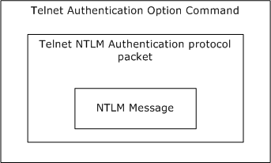
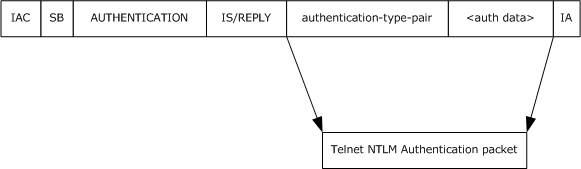
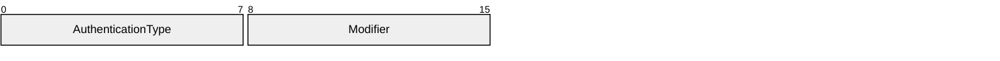
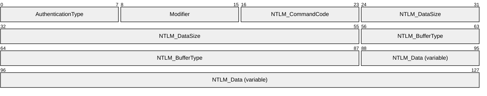
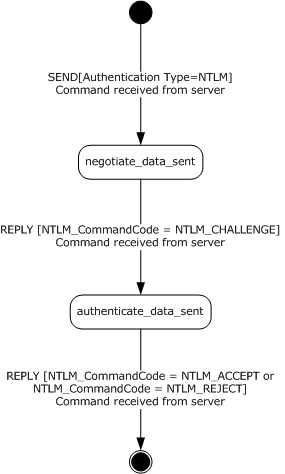
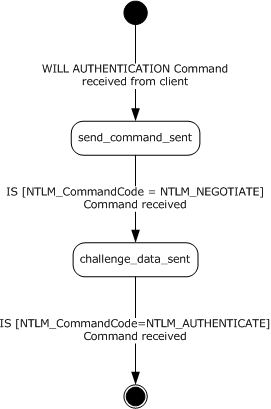
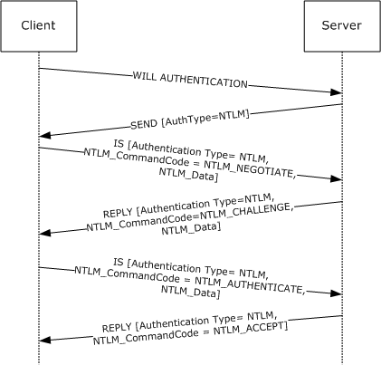

# [MS-TNAP]: Telnet: NT LAN Manager (NTLM) Authentication Protocol

Table of Contents

1 Introduction

- [1 Introduction](#Section_1)
  - [1.1 Glossary](#Section_1.1)
  - [1.2 References](#Section_1.2)
    - [1.2.1 Normative References](#Section_1.2.1)
    - [1.2.2 Informative References](#Section_1.2.2)
  - [1.3 Overview](#Section_1.3)
  - [1.4 Relationship to Other Protocols](#Section_1.4)
  - [1.5 Prerequisites/Preconditions](#Section_1.5)
  - [1.6 Applicability Statement](#Section_1.6)
  - [1.7 Versioning and Capability Negotiation](#Section_1.7)
  - [1.8 Vendor-Extensible Fields](#Section_1.8)
  - [1.9 Standards Assignments](#Section_1.9)

2 Messages

- [2 Messages](#Section_2)
  - [2.1 Transport](#Section_2.1)
  - [2.2 Message Syntax](#Section_2.2)
    - [2.2.1 Telnet Authentication Option Command SEND](#Section_2.2.1)
    - [2.2.2 Telnet Authentication Option Command IS or REPLY](#Section_2.2.2)

3 Protocol Details

- [3 Protocol Details](#Section_3)
  - [3.1 Client Details](#Section_3.1)
    - [3.1.1 Abstract Data Model](#Section_3.1.1)
    - [3.1.2 Timers](#Section_3.1.2)
    - [3.1.3 Initialization](#Section_3.1.3)
    - [3.1.4 Higher-Layer Triggered Events](#Section_3.1.4)
    - [3.1.5 Message Processing Events and Sequencing Rules](#Section_3.1.5)
      - [3.1.5.1 Receiving Any Message](#Section_3.1.5.1)
        - [3.1.5.1.1 Verifying Value of AuthenticationType Field](#Section_3.1.5.1.1)
        - [3.1.5.1.2 Internal State](#Section_3.1.5.1.2)
      - [3.1.5.2 Receiving a SEND Command](#Section_3.1.5.2)
      - [3.1.5.3 Receiving a REPLY Command](#Section_3.1.5.3)
        - [3.1.5.3.1 Receiving the NTLM_CHALLENGE REPLY Command](#Section_3.1.5.3.1)
          - [3.1.5.3.1.1 NTLM Software Returns Success](#Section_3.1.5.3.1.1)
          - [3.1.5.3.1.2 NTLM Software Returns Failure](#Section_3.1.5.3.1.2)
        - [3.1.5.3.2 Receiving the NTLM_ACCEPT REPLY Command](#Section_3.1.5.3.2)
        - [3.1.5.3.3 Receiving the NTLM_REJECT REPLY Command](#Section_3.1.5.3.3)
    - [3.1.6 Timer Events](#Section_3.1.6)
    - [3.1.7 Other Local Events](#Section_3.1.7)
  - [3.2 Server Details](#Section_3.2)
    - [3.2.1 Abstract Data Model](#Section_3.2.1)
    - [3.2.2 Timers](#Section_3.2.2)
    - [3.2.3 Initialization](#Section_3.2.3)
    - [3.2.4 Higher-Layer Triggered Events](#Section_3.2.4)
    - [3.2.5 Message Processing Events and Sequencing Rules](#Section_3.2.5)
      - [3.2.5.1 Receiving Any Message](#Section_3.2.5.1)
        - [3.2.5.1.1 Verifying Value of AuthenticationType Field](#Section_3.2.5.1.1)
        - [3.2.5.1.2 Internal State](#Section_3.2.5.1.2)
      - [3.2.5.2 Receiving an IAC WILL AUTHENTICATION Command](#Section_3.2.5.2)
      - [3.2.5.3 Receiving an IS Command](#Section_3.2.5.3)
        - [3.2.5.3.1 Receiving the NTLM_NEGOTIATE IS Command](#Section_3.2.5.3.1)
          - [3.2.5.3.1.1 NTLM Software Returns Success](#Section_3.2.5.3.1.1)
          - [3.2.5.3.1.2 NTLM Software Returns Failure](#Section_3.2.5.3.1.2)
        - [3.2.5.3.2 Receiving the NTLM_AUTHENTICATE IS Command](#Section_3.2.5.3.2)
          - [3.2.5.3.2.1 NTLM Software Returns Success](#Section_3.2.5.3.2.1)
          - [3.2.5.3.2.2 NTLM Software Returns Failure](#Section_3.2.5.3.2.2)
    - [3.2.6 Timer Events](#Section_3.2.6)
    - [3.2.7 Other Local Events](#Section_3.2.7)

4 Protocol Examples

- [4 Protocol Examples](#Section_4)
  - [4.1 Telnet Client Successfully Authenticating to a Telnet Server](#Section_4.1)

5 Security

- [5 Security](#Section_5)
  - [5.1 Security Considerations for Implementers](#Section_5.1)
  - [5.2 Index of Security Parameters](#Section_5.2)

6 Appendix A: Product Behavior

- [6 Appendix A: Product Behavior](#Section_6)

7 Change Tracking

- [7 Change Tracking](#Section_7)

For the legal notice and IP terms, see [LEGAL.md](../LEGAL.md).
Last updated: 4/23/2024.
See [Revision History](#revision-history) for full version history.

# 1 Introduction

Telnet is an application layer protocol, as specified in [[RFC854]](https://go.microsoft.com/fwlink/?LinkId=90499), and is supplemented by various other RFCs (Requests for Comments). The Telnet Authentication Option (as specified in [[RFC2941]](https://go.microsoft.com/fwlink/?LinkId=90398)), specifies the authentication option to the Telnet protocol as a generic method for negotiating an authentication type and mode, including whether encryption is used and whether credentials are forwarded. While the Telnet Authentication Option specifies command and message formats, it does not specify an authentication type. This document specifies how Telnet client software can use the Telnet: NT LAN Manager (NTLM) Authentication Protocol to authenticate itself to a Telnet server.

Sections 1.5, 1.8, 1.9, 2, and 3 of this specification are normative. All other sections and examples in this specification are informative.

## 1.1 Glossary

This document uses the following terms:

**connection-oriented NTLM**: A particular variant of [**NTLM**](#gt_nt-lan-manager-ntlm-authentication-protocol) designed to be used with connection-oriented remote procedure call (RPC), as described in [MS-NLMP](../MS-NLMP/MS-NLMP.md).

**IS command**: A Telnet Authentication Option command used to send authentication information (as specified in [[RFC2941]](https://go.microsoft.com/fwlink/?LinkId=90398)). The structure of [**IS command**](#gt_is-command), as specified in [RFC2941] section 2, is: IAC SB AUTHENTICATION IS authentication-type-pair <auth data> IAC SE.

**little-endian**: Multiple-byte values that are byte-ordered with the least significant byte stored in the memory location with the lowest address.

**NT LAN Manager (NTLM) Authentication Protocol**: A protocol using a challenge-response mechanism for authentication in which clients are able to verify their identities without sending a password to the server. It consists of three messages, commonly referred to as Type 1 (negotiation), Type 2 (challenge) and Type 3 (authentication).

**NTLM AUTHENTICATE_MESSAGE**: The [**NTLM AUTHENTICATE_MESSAGE**](#gt_ntlm-authenticate_message) packet defines an [**NTLM**](#gt_nt-lan-manager-ntlm-authentication-protocol) authenticate message that is sent from the client to the server after the [**NTLM CHALLENGE_MESSAGE**](#gt_ntlm-challenge_message) is processed by the client. Message structure and other details of this packet are specified in [MS-NLMP].

**NTLM CHALLENGE_MESSAGE**: The [**NTLM CHALLENGE_MESSAGE**](#gt_ntlm-challenge_message) packet defines an NTLM challenge message that is sent from the server to the client. [**NTLM CHALLENGE_MESSAGE**](#gt_ntlm-challenge_message) is generated by the local [**NTLM software**](#gt_ntlm-software) and passed to the application that supports embedded [**NTLM**](#gt_nt-lan-manager-ntlm-authentication-protocol) authentication. This message is used by the server to challenge the client to prove its identity. Message structure and other details of this packet are specified in [MS-NLMP].

**NTLM message**: A message that carries authentication information. Its payload data is passed to the application that supports embedded NTLM authentication by the NTLM software installed on the local computer. NTLM messages are transmitted between the client and server embedded within the application protocol that is using NTLM authentication. There are three types of NTLM messages: NTLM NEGOTIATE_MESSAGE, NTLM CHALLENGE_MESSAGE, and NTLM AUTHENTICATE_MESSAGE.

**NTLM NEGOTIATE_MESSAGE**: The NEGOTIATE_MESSAGE packet defines an NTLM negotiate message that is sent from the client to the server. The [**NTLM NEGOTIATE_MESSAGE**](#gt_ntlm-negotiate_message) is generated by the local [**NTLM software**](#gt_ntlm-software) and passed to the application that supports embedded [**NTLM**](#gt_nt-lan-manager-ntlm-authentication-protocol) authentication. This message allows the client to specify its supported [**NTLM**](#gt_nt-lan-manager-ntlm-authentication-protocol) options to the server. Message structure and other details are specified in [MS-NLMP].

**NTLM software**: Software that implements the [**NT LAN Manager (NTLM) Authentication Protocol**](#gt_nt-lan-manager-ntlm-authentication-protocol).

**REPLY command**: A Telnet Authentication Option (as specified in [RFC2941]) message used to send replies to the [**IS command**](#gt_is-command). The structure of this command, as specified in [RFC2941] section 2, is: IAC SB AUTHENTICATION REPLY authentication-type-pair <auth data> IAC SE.

**SEND command**: A Telnet Authentication Option (as specified in [RFC2941]) command used to request authentication information. The structure of this command, as specified in [RFC2941] section 2, is: IAC SB AUTHENTICATION SEND authentication-type-pair-list IAC SE.

**MAY, SHOULD, MUST, SHOULD NOT, MUST NOT:** These terms (in all caps) are used as defined in [[RFC2119]](https://go.microsoft.com/fwlink/?LinkId=90317). All statements of optional behavior use either MAY, SHOULD, or SHOULD NOT.

## 1.2 References

Links to a document in the Microsoft Open Specifications library point to the correct section in the most recently published version of the referenced document. However, because individual documents in the library are not updated at the same time, the section numbers in the documents may not match. You can confirm the correct section numbering by checking the [Errata](https://go.microsoft.com/fwlink/?linkid=850906).

### 1.2.1 Normative References

We conduct frequent surveys of the normative references to assure their continued availability. If you have any issue with finding a normative reference, please contact [dochelp@microsoft.com](mailto:dochelp@microsoft.com). We will assist you in finding the relevant information.

[MS-DTYP] Microsoft Corporation, "[Windows Data Types](../MS-DTYP/MS-DTYP.md)".

[MS-NLMP] Microsoft Corporation, "[NT LAN Manager (NTLM) Authentication Protocol](../MS-NLMP/MS-NLMP.md)".

[RFC1091] Network Working Group, VanBokkelen, J., "Telnet Terminal-Type Option", RFC 1091, February 1989, [https://www.rfc-editor.org/info/rfc1091](https://go.microsoft.com/fwlink/?LinkId=90913)

[RFC2119] Bradner, S., "Key words for use in RFCs to Indicate Requirement Levels", BCP 14, RFC 2119, March 1997, [https://www.rfc-editor.org/info/rfc2119](https://go.microsoft.com/fwlink/?LinkId=90317)

[RFC2941] Ts'o, T., and Altman, J., "Telnet Authentication Option", RFC 2941, September 2000, [https://www.rfc-editor.org/info/rfc2941](https://go.microsoft.com/fwlink/?LinkId=90398)

[RFC854] Postel, J., and Reynolds, J., "Telnet Protocol Specification", STD 8, RFC 854, May 1983, [https://www.rfc-editor.org/info/rfc854](https://go.microsoft.com/fwlink/?LinkId=90499)

[RFC855] Postel, J., and Reynolds, J., "Telnet Option Specifications", STD 8, RFC 855, May 1983, [https://www.rfc-editor.org/info/rfc855](https://go.microsoft.com/fwlink/?LinkId=90500)

### 1.2.2 Informative References

[MS-TVTT] Microsoft Corporation, "[Telnet: VTNT Terminal Type Format Data Structure](../MS-TVTT/MS-TVTT.md)".

[SSPI] Microsoft Corporation, "SSPI", [https://learn.microsoft.com/en-us/windows/desktop/SecAuthN/sspi](https://go.microsoft.com/fwlink/?LinkId=90536)

## 1.3 Overview

The Telnet: NT LAN Manager (NTLM) Authentication Protocol specifies how a Telnet client and Telnet server can use the NT LAN Manager (NTLM) Authentication Protocol (as specified in [MS-NLMP](../MS-NLMP/MS-NLMP.md)) so that the Telnet server can authenticate the Telnet client. [**NTLM**](#gt_nt-lan-manager-ntlm-authentication-protocol) is a challenge-response style authentication protocol that depends on the application layer protocols to transport NTLM packets from client to server and from server to client.

The Telnet: NTLM Authentication Protocol is an extension to the Telnet Authentication Option, as specified in [[RFC2941]](https://go.microsoft.com/fwlink/?LinkId=90398). While the Telnet Authentication Option specifies how a Telnet server and Telnet client can negotiate an authentication scheme, the Telnet: NTLM Authentication Protocol Specification specifies how a Telnet client and Telnet server encapsulate [**NTLM messages**](#gt_ntlm-message) in the Telnet Authentication Option [**SEND**](#gt_send-command), [**IS**](#gt_is-command), and [**REPLY**](#gt_reply-command) commands so that the Telnet server can authenticate the Telnet client by using the NTLM Authentication Protocol. The Telnet client and the Telnet server are required to use the protocol specified in the Telnet Authentication Option, as specified in [RFC2941], to negotiate for NTLM authentication before they can use the Telnet: NTLM Authentication Protocol.

The Telnet: NTLM Authentication Protocol is an embedded protocol in which Telnet: NTLM Authentication Protocol packets are embedded in Telnet Authentication Option (as specified in [RFC2941]) commands. The following diagram illustrates the relationship between the NTLM message, the Telnet: NTLM Authentication Protocol packet, and the Telnet Authentication Option command.

Figure 1: Relationship between NTLM message, Telnet: NTLM Authentication Protocol packet, and Telnet Authentication Option command

The Telnet: NTLM Authentication Protocol is a pass-through protocol that does not specify the structure of NTLM information. Instead, the protocol relies on the software that implements the NTLM Authentication Protocol (as specified in [MS-NLMP]) to process each NTLM message to be sent or received.

The Telnet: NTLM Authentication Protocol defines a server and a client role.

The sequence that follows shows the typical flow of packets between client and server.

- The Telnet client sends an [**NTLM NEGOTIATE_MESSAGE**](#gt_ntlm-negotiate_message) embedded in a Telnet packet to the server.
- On receiving the Telnet packet with an NTLM NEGOTIATE_MESSAGE, the Telnet server sends an [**NTLM CHALLENGE_MESSAGE**](#gt_ntlm-challenge_message) embedded in a Telnet packet to the client.
- In response, the Telnet client sends an [**NTLM AUTHENTICATE_MESSAGE**](#gt_ntlm-authenticate_message) embedded in a Telnet packet to the server to successfully complete the authentication process.
The NTLM NEGOTIATE_MESSAGE, NTLM CHALLENGE_MESSAGE, and NTLM AUTHENTICATE_MESSAGE packets contain NTLM authentication data that have to be processed by the [**NTLM software**](#gt_ntlm-software) installed on the local computer. How to retrieve and process NTLM messages is specified in [MS-NLMP].

Implementers of the Telnet: NTLM Authentication Protocol are required to possess a working knowledge of the Telnet Protocol (as specified in [[RFC854]](https://go.microsoft.com/fwlink/?LinkId=90499)), the Telnet Option (as specified in [[RFC855]](https://go.microsoft.com/fwlink/?LinkId=90500)), the Telnet Authentication Option (as specified in [RFC2941]), and the NTLM Authentication Protocol (as specified in [MS-NLMP]).

## 1.4 Relationship to Other Protocols

The Telnet: NTLM Authentication Protocol is an extension to the Telnet Authentication Option (as specified in [[RFC2941]](https://go.microsoft.com/fwlink/?LinkId=90398)) and is an embedded protocol. Unlike standalone application protocols, such as Telnet or Hypertext Transfer Protocol (HTTP), Telnet: NTLM Authentication Protocol packets are embedded in the Telnet Authentication Option commands.

The Telnet: NTLM Authentication Protocol specifies only the sequence in which a Telnet server and Telnet client are required to exchange [**NTLM messages**](#gt_ntlm-message) to successfully authenticate the client to the server. It does not specify how the client obtains NTLM messages from the local [**NTLM software**](#gt_ntlm-software), or how the Telnet server processes NTLM messages. The Telnet client and Telnet server implementations depend on the availability of an implementation of the NTLM Authentication Protocol (as specified in [MS-NLMP](../MS-NLMP/MS-NLMP.md)) to obtain and process NTLM messages.

The Telnet: NTLM Authentication Protocol and Telnet VTNT Terminal Type Format [MS-TVTT](../MS-TVTT/MS-TVTT.md) are both extensions to the Telnet Protocol ([[RFC854]](https://go.microsoft.com/fwlink/?LinkId=90499)). Telnet:NTLM Authentication Protocol is an extension to the Telnet Authentication Option (as specified in [RFC2941]) and Telnet VTNT Terminal Type Format is an extension to the Telnet Terminal Type option (as specified in [[RFC1091]](https://go.microsoft.com/fwlink/?LinkId=90913)). If the chosen authentication option is [**NTLM**](#gt_nt-lan-manager-ntlm-authentication-protocol), then, only after Telnet: NTLM Authentication Protocol authenticates the client, can any communication using Telnet VTNT Terminal Type Format happen between the Telnet server and client.

## 1.5 Prerequisites/Preconditions

Because the Telnet: NTLM Authentication Protocol depends on [**NTLM**](#gt_nt-lan-manager-ntlm-authentication-protocol) to authenticate the client to the server, both server and client are required to have access to an implementation of the NTLM Authentication Protocol (as specified in [MS-NLMP](../MS-NLMP/MS-NLMP.md)) capable of supporting [**connection-oriented NTLM**](#gt_connection-oriented-ntlm).<1>

## 1.6 Applicability Statement

The Telnet: NTLM Authentication Protocol is required to be used only when implementing a Telnet client that needs to authenticate to a Telnet server by using [**NTLM**](#gt_nt-lan-manager-ntlm-authentication-protocol) authentication.

## 1.7 Versioning and Capability Negotiation

This document covers versioning issues in the following areas:

- Security and Authentication Methods: The Telnet: NTLM Authentication Protocol supports the NTLMv1 and NTLMv2 authentication methods, as specified in [MS-NLMP](../MS-NLMP/MS-NLMP.md).
- Capability Negotiation: The Telnet: NTLM Authentication Protocol does not support negotiation of the NTLM Authentication Protocol version to use. Instead, the NTLM Authentication Protocol version is required to be configured on both the client and the server prior to authentication. NTLM Authentication Protocol version mismatches are handled by the NTLM Authentication Protocol implementation, and not by the Telnet: NTLM Authentication Protocol.

## 1.8 Vendor-Extensible Fields

The Telnet: NTLM Authentication Protocol does not have any vendor-extensible fields.

## 1.9 Standards Assignments

The Telnet: NTLM Authentication Protocol does not use any standards assignments.

# 2 Messages

The following sections specify how Telnet: NTLM Authentication Protocol messages are transported and give details of message syntax.

This protocol references commonly used data types as defined in [MS-DTYP](../MS-DTYP/MS-DTYP.md).

## 2.1 Transport

The Telnet: NTLM Authentication Protocol does not establish transport connections. Instead, Telnet: NTLM Authentication Protocol messages are encapsulated in Telnet: NTLM Authentication Protocol commands. How Telnet: NTLM Authentication Protocol messages must be encapsulated in Telnet: NTLM Authentication Protocol commands is specified in section [2.2](#Section_2.2).

## 2.2 Message Syntax

The three commands in which Telnet: NTLM Authentication Protocol messages can be embedded are [SEND](#Section_2.2.1), [IS](#Section_2.2.2), and REPLY. The structure of each of these commands is as follows:

- IAC SB AUTHENTICATION SEND authentication-type-pair-list IAC SE
- IAC SB AUTHENTICATION IS authentication-type-pair <auth data> IAC SE
- IAC SB AUTHENTICATION REPLY authentication-type-pair <auth data> IAC SE
The Telnet: NTLM Authentication Protocol specifies the values that the authentication-type-pair-list and the <auth data> fields must be filled with, when the negotiated authentication mechanism is [**NTLM**](#gt_nt-lan-manager-ntlm-authentication-protocol). That is, the payload of the Telnet: NTLM Authentication Protocol is solely the authentication-type-pair-list field in the case of the SEND command; and the payload consists of the authentication-type-pair and the <auth data> fields in the cases of the IS and REPLY commands.

The following figure illustrates the relationship between SEND commands and a Telnet: NTLM Authentication Protocol packet.

Figure 2: Relationship between SEND commands and Telnet: NTLM Authentication packet

The following figure illustrates the relationship between IS and REPLY commands and a Telnet: NTLM Authentication Protocol packet.

Figure 3: Relationship between IS and REPLY commands and Telnet: NTLM Authentication packet

The message syntax of a Telnet: NTLM Authentication Protocol message depends on the Telnet Authentication Option command (as specified in [[RFC2941]](https://go.microsoft.com/fwlink/?LinkId=90398)) in which it is to be embedded, whether a SEND (section 2.2.1), IS (section 2.2.2), or REPLY (section 2.2.2) command.

### 2.2.1 Telnet Authentication Option Command SEND

When the Telnet Authentication Option command (as specified in [[RFC2941]](https://go.microsoft.com/fwlink/?LinkId=90398)) is SEND, the Telnet: NTLM Authentication Protocol specifies how an implementation must fill the **authentication-type-pair-list** field. This field is specified in [RFC2941] as being comprised of two subfields: **AuthenticationType** and **Modifier**. Telnet: NTLM Authentication Protocol does not specify any fields for the message other than those specified in [RFC2941].

The structure of these fields is specified in [RFC2941]. This section specifies how an implementation must use these fields in the context of the Telnet: NTLM Authentication Protocol, and specifies the structure of these fields for completeness and clarity.

**AuthenticationType (1 byte):** A Telnet server MUST set the value of this field to 0x0F to request the use of [**NTLM**](#gt_nt-lan-manager-ntlm-authentication-protocol) as the preferred authentication mechanism. This **AuthenticationType** value indicates to the Telnet client that it must send the [**NTLM NEGOTIATE_MESSAGE**](#gt_ntlm-negotiate_message).

Messages in which **AuthenticationType** is set to a value other than 0x0F MUST NOT be processed by the Telnet: NTLM Authentication Protocol.

**Modifier (1 byte):** This BYTE field specifies modifiers to the authentication method specified in the **AuthenticationType** field, as specified in [RFC2941]. The Telnet Authentication Option (as specified in [RFC2941]) defines **Modifier** as five 1-bit fields. The first two bits are processed as a pair, the AUTH_WHO_MASK bit and the AUTH_HOW_MASK bit. The third and fifth bits in the modifier are the ENCRYPT_MASK bits. These bits are used to determine if and how encryption is enabled. The fourth bit field is the INI_CRED_FWD_MASK bit. This bit is set either to INI_CRED_FWD_ON or INI_CRED_FWD_OFF.

In the context of the Telnet: NTLM Authentication Protocol, the following modifiers MUST be used when an implementation sends a message.

| Bit Range | Field | Description |
| --- | --- | --- |
| Variable | AUTH_WHO_MASK | AUTH_CLIENT_TO_SERVER 0 |
| Variable | AUTH_HOW_MASK | AUTH_HOW_ONE_WAY 0 |
| Variable | ENCRYPT_MASK (2 bits) | ENCRYPT_OFF 0 |
| Variable | INI_CRED_FWD_MASK | INI_CRED_FWD_OFF 0 |

### 2.2.2 Telnet Authentication Option Command IS or REPLY

When the Telnet Authentication Option command (as specified in [[RFC2941]](https://go.microsoft.com/fwlink/?LinkId=90398)) is REPLY or IS, the Telnet: NTLM Authentication Protocol messages are embedded in the **authentication-type-pair** and **<auth-data>** fields. The message structure specified in this section maps to the coalesced space of **authentication-type-pair** and **<auth-data>** fields in IS and REPLY commands.

**AuthenticationType (1 byte):** In the context of the Telnet: NTLM Authentication Protocol, a Telnet client MUST set this field to 0x0F in all IS messages to indicate that the authentication mechanism used is [**NTLM**](#gt_nt-lan-manager-ntlm-authentication-protocol) and a Telnet server MUST set this field to 0x0F in all REPLY messages.

**Modifier (1 byte):** This BYTE field specifies modifiers to the authentication method specified in the **AuthenticationType** field, as specified in [RFC2941]. The Telnet Authentication Option (as specified in [RFC2941]) defines Modifier as five 1-bit fields. The first two bits are processed as a pair—the AUTH_WHO_MASK bit and the AUTH_HOW_MASK bit. The third and fifth bits in the modifier are the ENCRYPT_MASK bits. These bits are used to determine if and how encryption is enabled. The fourth bit field is the INI_CRED_FWD_MASK bit. This bit is set either to INI_CRED_FWD_ON or INI_CRED_FWD_OFF.

In the context of the Telnet: NTLM Authentication Protocol, the following modifiers MUST be used when a client or server implementation sends a message.

| Bit Range | Field | Description |
| --- | --- | --- |
| Variable | AUTH_WHO_MASK | AUTH_CLIENT_TO_SERVER 0 |
| Variable | AUTH_HOW_MASK | AUTH_HOW_ONE_WAY 0 |
| Variable | ENCRYPT_MASK (2 bits) | ENCRYPT_OFF 0 |
| Variable | INI_CRED_FWD_MASK | INI_CRED_FWD_OFF 0 |

**NTLM_CommandCode (1 byte):** This BYTE field specifies a sub stage of NTLM authentication. The possible values for this field are as follows:

| Name | Value |
| --- | --- |
| NTLM_NEGOTIATE | 0x00 |
| NTLM_CHALLENGE | 0x01 |
| NTLM_AUTHENTICATE | 0x02 |
| NTLM_ACCEPT | 0x03 |
| NTLM_REJECT | 0x04 |

**NTLM_DataSize (4 bytes):** This 32-bit unsigned integer field specifies the number of bytes in the **NTLM_Data** field. Data in this field MUST be in [**little-endian**](#gt_little-endian) format.

**NTLM_DataSize** MUST be present only if **NTLM_CommandCode** is one of the following: NTLM_NEGOTIATE, NTLM_CHALLENGE, or NTLM_AUTHENTICATE.

**NTLM_BufferType (4 bytes):** This 32-bit unsigned integer field specifies the type of **NTLM_Data**. Data in this field MUST be in little-endian format. This field indicates the type of the buffer in **NTLM_Data**. Currently, the Telnet: NTLM Authentication Protocol does not specify how this field is processed. For compatibility with older versions of client and server software, an implementation MUST set this field to 0x00000002. An implementation SHOULD recognize 0x00000002 as indicating that the supplied buffer is a SECBUFFER_TOKEN buffer type.<2>

**NTLM_BufferType** MUST be present only if **NTLM_CommandCode** is one of the following: NTLM_NEGOTIATE, NTLM_CHALLENGE, or NTLM_AUTHENTICATE.

**NTLM_Data (variable):** This variable-length field contains the buffer that holds an [**NTLM message**](#gt_ntlm-message). The Telnet: NTLM Authentication Protocol does not specify how an implementation processes this field. Instead, an implementation passes this data to the local NTLM protocol implementation for processing.

**NTLM_Data** MUST be present only if **NTLM_CommandCode** is one of the following: NTLM_NEGOTIATE, NTLM_CHALLENGE, or NTLM_AUTHENTICATE.

# 3 Protocol Details

The following sections provide a detailed specification of Telnet: NTLM Authentication Protocol message computation. Sections [3.1.5](#Section_3.1.5) and [3.2.5](#Section_3.2.5) specify how the client and server must compute messages and respond to messages, respectively.

## 3.1 Client Details

The following state diagram illustrates the activities of the client during Telnet: NTLM Authentication Protocol processing. The start state is the start of Telnet: NTLM Authentication Protocol message exchanges, and the end state marks the completion of Telnet: NTLM Authentication Protocol message exchanges.

Figure 4: Client activity during Telnet: NTLM Authentication Protocol processing

- **send_not_received** (start state): This state indicates that the client has not received the [SEND](#Section_2.2.1) command from the server.
- **negotiate_data_sent:** This state indicates that the client received a SEND command from the server, and in response, the client sent an [**IS command**](#gt_is-command) with the [**NTLM NEGOTIATE_MESSAGE**](#gt_ntlm-negotiate_message).
- **authenticate_data_sent:** This state indicates that the client received an [IS](#Section_2.2.2) [NTLM Command Code = **NTLM_CHALLENGE**] from the server, and in response, the client sent an IS command with [**NTLM AUTHENTICATE_MESSAGE**](#gt_ntlm-authenticate_message).
- **authentication_complete** (end state): This state indicates the completion of Telnet: NTLM Authentication Protocol message exchanges.
The actions that the client takes in response to an incoming message from the server are specified in section [3.1.5](#Section_3.1.5).

This state diagram is included for explanatory purposes only. Implementations are not required to use the same state names as used in the diagram. Section 3.1.5 specifies each transaction in the state diagram in detail. The state machine diagram can be used in conjunction with the content in sections [3.1.1](#Section_3.1.1) through [3.1.7](#Section_3.1.7) to gain a complete understanding of the client role.

### 3.1.1 Abstract Data Model

This section describes a conceptual model of possible data organization that an implementation maintains to participate in this protocol. The described organization is provided to facilitate the explanation of how the protocol behaves. This document does not mandate that implementations adhere to this model as long as their external behavior is consistent with what is described in this document.

The following variable is internal to the client implementation and is not sent to the server.

**AUTH_STATE:** The client uses this variable to store its current state. The various states in which the client can be are as follows:

- send_not_received
- negotiate_data_sent
- authenticate_data_sent
- authentication_complete
**send_not_received** indicates the start state, and **authentication_complete** indicates the end state. **Negotiate_data_sent** and **authenticate_data_sent** are intermediate states. Section [3.1.5](#Section_3.1.5) specifies how AUTH_STATE is used in the context of the Telnet: NTLM Authentication Protocol.

### 3.1.2 Timers

The client does not use any timers.

### 3.1.3 Initialization

The Telnet: NTLM Authentication Protocol is not a protocol by itself; rather, it is part of the Telnet Protocol (as specified in [[RFC854]](https://go.microsoft.com/fwlink/?LinkId=90499)). Therefore, no separate protocol initialization is required.

The client implementation MUST set AUTH_STATE, which it uses to track its internal state to **send_not_received**.

### 3.1.4 Higher-Layer Triggered Events

The client does not use any higher-layer triggered events.

### 3.1.5 Message Processing Events and Sequencing Rules

The Telnet: NTLM Authentication Protocol is driven by a series of message exchanges between a Telnet server and a Telnet client. The client response to an incoming message depends on the Command Type (as specified in [[RFC2941]](https://go.microsoft.com/fwlink/?LinkId=90398)) and the **NTLM_CommandCode** field (as specified in section [2.2.2](#Section_2.2.2)) of the incoming message.

#### 3.1.5.1 Receiving Any Message

##### 3.1.5.1.1 Verifying Value of AuthenticationType Field

Unless specifically noted in a subsequent section in this document, the client implementation MUST verify that the **AuthenticationType** field has the value 0x0F, which corresponds to [**NTLM**](#gt_nt-lan-manager-ntlm-authentication-protocol) authentication. Messages with the **AuthenticationType** field set to a value other than 0x0F MUST NOT be processed by this protocol.

##### 3.1.5.1.2 Internal State

The expected value of AUTH_STATE for each message is specified in subsequent sections of this document. An incoming message for which the current AUTH_STATE does not match the expected state is an out-of-sequence message. The subsequent sections in this document specify how the client responds to out-of-sequence messages.

#### 3.1.5.2 Receiving a SEND Command

Expected AUTH_STATE: **send_not_received**

On receiving the [SEND](#Section_2.2.1) command from the server, the client MUST send an [**IS command**](#gt_is-command) to the server and set AUTH_STATE to **negotiate_data_sent**. The client MUST set the fields of the [IS](#Section_2.2.2) command message as follows:

- **AuthenticationType** set to 0x0F (NTLM).
- **Modifier** set to 0x00.
- **NTLM_CommandCode** set to NTLM_NEGOTIATE.
- **NTLM_DataSize** set to the size of **NTLM Data** in number of bytes.
- **NTLM_BufferType** set to 0x00000002.
- **NTLM_Data** set to [**NTLM NEGOTIATE_MESSAGE**](#gt_ntlm-negotiate_message) as received from the local [**NTLM software**](#gt_ntlm-software). How to obtain an NTLM NEGOTIATE_MESSAGE is specified in [MS-NLMP](../MS-NLMP/MS-NLMP.md).
If the AUTH_STATE is not equal to **send_not_received** when the client receives a [**SEND command**](#gt_send-command), the client SHOULD treat this as an error condition and take an appropriate implementation-dependent action.<3>

#### 3.1.5.3 Receiving a REPLY Command

On receiving a [REPLY](#Section_2.2.2) command, the client MUST process the message based on the value of the **NTLM_CommandCode** in the [**REPLY command**](#gt_reply-command) received from the server.

##### 3.1.5.3.1 Receiving the NTLM_CHALLENGE REPLY Command

Expected AUTH_STATE: **negotiate_data_sent**

A [REPLY](#Section_2.2.2) command with **NTLM_CommandCode** set to NTLM_CHALLENGE indicates that the server has sent an [**NTLM CHALLENGE_MESSAGE**](#gt_ntlm-challenge_message).

On receiving this message, a client MUST call the appropriate local [**NTLM**](#gt_nt-lan-manager-ntlm-authentication-protocol) protocol function for processing the NTLM CHALLENGE_MESSAGE.

If the NTLM CHALLENGE_MESSAGE is a valid NTLM challenge message, as specified in [MS-NLMP](../MS-NLMP/MS-NLMP.md), the local NTLM protocol function passes an [**NTLM AUTHENTICATE_MESSAGE**](#gt_ntlm-authenticate_message) back to the client. If message processing is successful, the client MUST continue, as specified in section [3.1.5.3.1.1](#Section_3.1.5.3.1.1).

The local NTLM protocol function passes an implementation-defined failure error code back to the client if the NTLM CHALLENGE_MESSAGE is not valid. The Telnet: NTLM Authentication Protocol client MUST NOT distinguish between different failure error codes. The client MUST treat all failure error codes identically. If message processing is unsuccessful, the client MUST continue, as specified in section [3.1.5.3.1.2](#Section_3.1.5.3.1.2).

Neither the mechanism for returning the NTLM_AUTHENTICATE_MESSAGE nor the mechanism for returning a failure error code is defined by the Telnet: NTLM Authentication Protocol. These mechanisms are defined by the implementation of the NTLM protocol in use on the client.

###### 3.1.5.3.1.1 NTLM Software Returns Success

The client MUST send an [IS](#Section_2.2.2) command to the server, and MUST set AUTH_STATE to **authenticate_data_sent**. The client MUST set the fields of the [**IS command**](#gt_is-command) message as follows:

- **AuthenticationType** set to 0x0F (NTLM).
- **Modifier** set to 0x00.
- **NTLM_CommandCode** set to NTLM_AUTHENTICATE.
- **NTLM_DataSize** set to the size of **NTLM Data** in number of bytes.
- **NTLM_BufferType** set to 0x00000002.
- **NTLM_Data** set to [**NTLM AUTHENTICATE_MESSAGE**](#gt_ntlm-authenticate_message) passed from the local [**NTLM software**](#gt_ntlm-software). How to get the NTLM AUTHENTICATE_MESSAGE is specified in [MS-NLMP](../MS-NLMP/MS-NLMP.md).
If the AUTH_STATE is not equal to **negotiate_data_sent**, the client SHOULD treat this as an error condition, and then take an appropriate action most suitable for the implementation.<4>

###### 3.1.5.3.1.2 NTLM Software Returns Failure

This indicates an error situation, and the Telnet: NTLM Authentication Protocol does not specify or recommend any action. An implementation can take any appropriate action.<5>

##### 3.1.5.3.2 Receiving the NTLM_ACCEPT REPLY Command

Expected AUTH_STATE: **authenticate_data_sent**

A [REPLY](#Section_2.2.2) command with **NTLM_CommandCode** set to NTLM_ACCEPT indicates that the server has successfully authenticated the client. This command marks the end of the Telnet: NTLM Authentication Protocol.

If the client's AUTH_STATE is equal to **authenticate_data_sent** when it receives this message, the client MUST set AUTH_STATE to **authentication_complete**, and MUST proceed with negotiation for other options, as specified in [[RFC855]](https://go.microsoft.com/fwlink/?LinkId=90500).

If the client's AUTH_STATE is not equal to **authenticate_data_sent** when it receives this message, the client SHOULD treat this as an error condition, and then take an appropriate action suitable for the implementation.<6>

##### 3.1.5.3.3 Receiving the NTLM_REJECT REPLY Command

Expected AUTH_STATE: **authenticate_data_sent**

A [REPLY](#Section_2.2.2) command with **NTLM_CommandCode** set to NTLM_REJECT indicates that the server has failed to authenticate the client by using [**NTLM**](#gt_nt-lan-manager-ntlm-authentication-protocol). This command marks the end of the Telnet: NTLM Authentication Protocol.

If the client's AUTH_STATE is equal to **authenticate_data_sent**, the client MUST set AUTH_STATE to **authentication_complete**, and MUST proceed with negotiation for other options, as specified in [[RFC855]](https://go.microsoft.com/fwlink/?LinkId=90500).<7>

If the AUTH_STATE is not equal to **authenticate_data_sent**, the client SHOULD treat this as an error condition, and then take an appropriate action most suitable for the implementation.<8>

### 3.1.6 Timer Events

The client does not use any timer events.

### 3.1.7 Other Local Events

The client does not use any local events.

## 3.2 Server Details

The following state diagram illustrates the activities of the server during Telnet: NTLM Authentication Protocol processing. The start state is the start of Telnet: NTLM Authentication Protocol message exchanges, and the end state marks the completion of Telnet: NTLM Authentication Protocol message exchanges.

Figure 5: Server activity during Telnet: NTLM Authentication Protocol processing

- **will_authenticate_not_received** (start state): This state indicates that the server has not received an IAC WILL AUTHENTICATION command from the client. The IAC WILL AUTHENTICATION command is specified in [[RFC2941]](https://go.microsoft.com/fwlink/?LinkId=90398).
- **send_command_sent:** This state indicates that the server, in response to an IAC WILL AUTHENTICATION command from the client, has sent a [SEND](#Section_2.2.1) command.
- **challenge_data_sent:** This state indicates that the server, in response to an [IS](#Section_2.2.2) command from the client, has sent a REPLY command with [**NTLM CHALLENGE_MESSAGE**](#gt_ntlm-challenge_message).
- **authentication_complete** (end state): This state indicates the completion of Telnet: NTLM Authentication Protocol message exchanges.
The actions that the server takes in response to an incoming message from the client are specified in section [3.2.5](#Section_3.2.5).

This state diagram is included for explanatory purposes only. Implementations are not required to use the same state names as used in the diagram. Section 3.2.5 specifies each transaction in the state diagram in detail. The state machine diagram can be used in conjunction with content in sections [3.2.1](#Section_3.2.1) through [3.2.7](#Section_3.2.7) to gain a complete understanding of the server role.

### 3.2.1 Abstract Data Model

This section describes a conceptual model of possible data organization that an implementation maintains to participate in this protocol. The described organization is provided to facilitate the explanation of how the protocol behaves. This document does not mandate that implementations adhere to this model as long as their external behavior is consistent with what is described in this document.

The following variable is internal to the server implementation and is not sent to the client.

**AUTH_STATE:** The server uses this variable to store its current state. The various states in which the server can be are as follows:

- will_authenticate_not_received
- send_command_sent
- challenge_data_sent
- authentication_complete
**will_authenticate_not_received** denotes the start state, and **authentication_complete** denotes the end state. **send_command_sent** and **challenge_data_sent** are intermediate states. Section [3.2.5](#Section_3.2.5) specifies how AUTH_STATE is used in the context of the Telnet: NTLM Authentication Protocol.

### 3.2.2 Timers

The server does not use any timers.

### 3.2.3 Initialization

The Telnet: NTLM Authentication Protocol is not a protocol by itself; rather, it is part of the Telnet Protocol (as specified in [[RFC854]](https://go.microsoft.com/fwlink/?LinkId=90499)). Therefore, no separate initialization is required.

The server implementation MUST set AUTH_STATE (which it uses to track its internal state) to **will_authenticate_not_received**.

### 3.2.4 Higher-Layer Triggered Events

The server does not use any higher-layer triggered events.

### 3.2.5 Message Processing Events and Sequencing Rules

The Telnet: NTLM Authentication Protocol is driven by a series of message exchanges between a Telnet server and a Telnet client. The server response to an incoming message depends on the Command Type (as specified in [[RFC2941]](https://go.microsoft.com/fwlink/?LinkId=90398)) and the **NTLM_CommandCode** field (as specified in section [2.2.2](#Section_2.2.2)) of the incoming message.

#### 3.2.5.1 Receiving Any Message

##### 3.2.5.1.1 Verifying Value of AuthenticationType Field

Unless specifically noted in a subsequent section in this document, the server implementation MUST verify that the **AuthenticationType** field has the value 0x0F, which corresponds to [**NTLM**](#gt_nt-lan-manager-ntlm-authentication-protocol) authentication. Messages with the **AuthenticationType** field set to a value other than 0x0F MUST NOT be processed by this protocol.

##### 3.2.5.1.2 Internal State

The expected value of AUTH_STATE for each message is specified in subsequent sections in this document. An incoming message for which the current AUTH_STATE does not match the expected state is an out-of-sequence message. The subsequent sections in this document specify how the server responds to out-of-sequence messages.

#### 3.2.5.2 Receiving an IAC WILL AUTHENTICATION Command

Expected AUTH_STATE: **will_authenticate_not_received**

On receiving the IAC WILL AUTHENTICATION command from the client, the server MUST send a [SEND](#Section_2.2.1) command to the client and set AUTH_STATE to **send_command_sent**. The server MUST set the fields of the SEND command message as follows:

- **AuthenticationType** set to 0x0F ([**NTLM**](#gt_nt-lan-manager-ntlm-authentication-protocol)).
- **Modifier** set to 0x00.
The IAC WILL AUTHENTICATION command is specified in [[RFC2941]](https://go.microsoft.com/fwlink/?LinkId=90398). This document specifies the response that a server makes in the context of the Telnet: NTLM Authentication Protocol only. Details about how to handle an out-of-sequence IAC WILL AUTHENTICATION command are specified in [[RFC855]](https://go.microsoft.com/fwlink/?LinkId=90500) and [RFC2941].

#### 3.2.5.3 Receiving an IS Command

On receiving an [IS](#Section_2.2.2) command, the server MUST process the message based on the value of the **NTLM_CommandCode** in the [**IS command**](#gt_is-command) received from the client.

##### 3.2.5.3.1 Receiving the NTLM_NEGOTIATE IS Command

Expected AUTH_STATE: **send_command_sent**

An [IS](#Section_2.2.2) command with **NTLM_CommandCode** set to NTLM_NEGOTIATE indicates that the client has sent [**NTLM NEGOTIATE_MESSAGE**](#gt_ntlm-negotiate_message).

On receiving this message, the server MUST call the appropriate local [**NTLM**](#gt_nt-lan-manager-ntlm-authentication-protocol) protocol function for processing the NTLM NEGOTIATE_MESSAGE.

If the NTLM NEGOTIATE_MESSAGE is a valid NTLM negotiate message, as specified in [MS-NLMP](../MS-NLMP/MS-NLMP.md), the local NTLM protocol function returns an [**NTLM CHALLENGE_MESSAGE**](#gt_ntlm-challenge_message).

The local NTLM protocol implementation returns a failure error code if the NTLM NEGOTIATE_MESSAGE is not valid. The server's response must depend on the error code returned by the local [**NTLM software**](#gt_ntlm-software).

Neither the mechanism for returning the NTLM CHALLENGE_MESSAGE nor the mechanism for returning a failure error code is defined by the Telnet: NTLM Authentication Protocol. These mechanisms are defined by the implementation of the NTLM protocol in use on the client.

###### 3.2.5.3.1.1 NTLM Software Returns Success

The server MUST send a [REPLY](#Section_2.2.2) command to the client, and MUST set AUTH_STATE to challenge_data_sent. The server MUST set the fields of the [**REPLY command**](#gt_reply-command) as follows:

- **AuthenticationType** set to 0x0F (NTLM).
- **Modifier** set to 0x00.
- **NTLM_CommandCode** set to NTLM_CHALLENGE.
- **NTLM_DataSize** set to the size of **NTLM Data** in number of bytes.
- **NTLM_BufferType** set to 0x00000002.
- **NTLM_Data** set to [**NTLM CHALLENGE_MESSAGE**](#gt_ntlm-challenge_message) passed from the local [**NTLM software**](#gt_ntlm-software). Details about how to get the NTLM CHALLENGE_MESSAGE are specified in [MS-NLMP](../MS-NLMP/MS-NLMP.md).

###### 3.2.5.3.1.2 NTLM Software Returns Failure

The server MUST send a [REPLY](#Section_2.2.2) command, and MUST set its AUTH_STATE to **authentication_complete**. The server MUST set the fields of the [**REPLY command**](#gt_reply-command) as follows:

- **AuthenticationType** set to 0x0F (NTLM).
- **Modifier** set to 0x00.
- **NTLM_CommandCode** set to NTLM_REJECT.

##### 3.2.5.3.2 Receiving the NTLM_AUTHENTICATE IS Command

Expected AUTH_STATE: **challenge_data_sent**

On receiving an [IS](#Section_2.2.2) command [**NTLM_CommandCode** = NTLM_AUTHENTICATE], the server MUST call the local [**NTLM**](#gt_nt-lan-manager-ntlm-authentication-protocol) protocol function for processing the [**NTLM AUTHENTICATE_MESSAGE**](#gt_ntlm-authenticate_message). The server MUST then send a REPLY command to the client, and MUST set AUTH_STATE to **authentication_complete**. The server MUST set the fields of the [**REPLY command**](#gt_reply-command) based on the return value from the local NTLM protocol function, as specified in sections [3.2.5.3.2.1](#Section_3.2.5.3.2.1) and [3.2.5.3.2.2](#Section_3.2.5.3.2.2).

Neither the mechanism for returning the NTLM_AUTHENTICATE message nor the mechanisms for returning or detecting a failure error code are defined by the Telnet: NTLM Authentication Protocol. These mechanisms are defined by the implementation of the NTLM protocol in use on the server. The server implementation can use any [**NTLM software**](#gt_ntlm-software).

###### 3.2.5.3.2.1 NTLM Software Returns Success

The server MUST set the fields of the [REPLY](#Section_2.2.2) command as follows:

- **AuthenticationType** set to 0x0F (NTLM).
- **Modifier** set to 0x00.
- **NTLM_CommandCode** set to NTLM_ACCEPT.

###### 3.2.5.3.2.2 NTLM Software Returns Failure

The server MUST set the fields of the [REPLY](#Section_2.2.2) command as follows:

- **AuthenticationType** set to 0x0F (NTLM).
- **Modifier** set to 0x00.
- **NTLM_CommandCode** set to NTLM_REJECT.

### 3.2.6 Timer Events

The server does not use any timer events.

### 3.2.7 Other Local Events

The server does not use any local events.

# 4 Protocol Examples

The following section describes operations used in a common scenario to illustrate the function of the Telnet: NTLM Authentication Protocol.

## 4.1 Telnet Client Successfully Authenticating to a Telnet Server

This section illustrates the Telnet: NTLM Authentication Protocol with an example scenario in which a Telnet client successfully authenticates to a Telnet server.

Figure 6: Telnet client authenticating Telnet server

The client sends an IAC WILL AUTHENTICATION command to the server. This command is defined in [[RFC2941]](https://go.microsoft.com/fwlink/?LinkId=90398) and does not carry any Telnet: NTLM Authentication Protocol-specific data. It is included in this example to provide a better understanding.

The server sends the [SEND](#Section_2.2.1) command with AuthenticationType=0x0F. AuthenticationType 0x0F corresponds to [**NTLM**](#gt_nt-lan-manager-ntlm-authentication-protocol).

Sample Frame:

+ Ethernet: Etype = Internet IP (IPv4)

+ Ipv4: Next Protocol = TCP, Packet ID = 52505, Total IP Length = 60

+ Tcp: Flags=...PA..., SrcPort=Telnet(23), DstPort=1827, Len=8,

Seq=4209081200 - 4209081208, Ack=3503001584, Win=65532 (scale factor

0) = 0

- Telnet: To Client, DstPort = 0x723

- Telcmd: IAC SB (START OF SUBNEGOTIATION PARAMETERS)

Command: IAC SB (START OF SUBNEGOTIATION PARAMETERS)

- AUTH: AUTHENTICATION OPTION SEND

OptionCode: AUTHENTICATION OPTION

SubCode: SEND

AuthenticationType: NTLM

- Modifier: 0x0,ENCRYPT_OFF

AuthWhoMask: (0.......)AUTH_CLIENT_TO_SERVER

AuthHowMask: (.0......)AUTH_HOW_ONE_WAY

EncryptMask3: (..0.....)

IniCredFwdMask: (...0....)INI_CRED_FWD_OFF

EncryptMask5: (....0...)

Unused: (.....000)

EndCommand: IAC SE (END OF SUBNEGOTIATION PARAMETERS)

The client queries the local [**NTLM software**](#gt_ntlm-software) for [**NTLM NEGOTIATE_MESSAGE**](#gt_ntlm-negotiate_message), encapsulates it in an [IS](#Section_2.2.2) packet, sets various fields (see the following), and sends it to the server.

AuthenticationType = 0x0F

Modifier = 0x00

NTLM_CommandCode = NTLM_NEGOTIATE

NTLM_DataSize = size of NTLM NEGOTIATE_MESSAGE

NTLM_BufferType = 0x00000002

NTLM_Data = NTLM NEGOTIATE_MESSAGE

Sample Frame:

+ Ethernet: Etype = Internet IP (IPv4)

+ Ipv4: Next Protocol = TCP, Packet ID = 36869, Total IP Length = 130

+ Tcp: Flags=...PA..., SrcPort=1827, DstPort=Telnet(23), Len=78,

Seq=3503001590 - 3503001668, Ack=4209081208, Win=64232 (scale factor

0) = 0

- Telnet: To Server, SrcPort = 0x723

- Telcmd: IAC SB (START OF SUBNEGOTIATION PARAMETERS)

Command: IAC SB (START OF SUBNEGOTIATION PARAMETERS)

- AUTH: AUTHENTICATION OPTION IS

OptionCode: AUTHENTICATION OPTION

SubCode: IS

AuthenticationType: NTLM

- Modifier: 0x0,ENCRYPT_OFF

AuthWhoMask: (0.......)AUTH_CLIENT_TO_SERVER

AuthHowMask: (.0......)AUTH_HOW_ONE_WAY

EncryptMask3: (..0.....)

IniCredFwdMask: (...0....)INI_CRED_FWD_OFF

EncryptMask5: (....0...)

Unused: (.....000)

- AuthData:

NTLMCommandCode: NTLM_NEGOTIATE

NTLMDataSize: 40 (0x28)

NTLMBufferType: 2 (0x2)

- NTLMData:

+ ntlmssp: NTLM NEGOTIATE MESSAGE

EndCommand: IAC SE (END OF SUBNEGOTIATION PARAMETERS)

The server passes the NTLM NEGOTIATE_MESSAGE that it received from the client to the local NTLM software. The server then sends a REPLY command with the [**NTLM CHALLENGE_MESSAGE**](#gt_ntlm-challenge_message) got from the local NTLM software encapsulated and various fields set as follows.

AuthenticationType = 0x0F

Modifier = 0x00

NTLM_CommandCode = NTLM_CHALLENGE

NTLM_DataSize = size of NTLM CHALLENGE_MESSAGE

NTLM_BufferType = 0x00000002

NTLM_Data = NTLM CHALLENGE_MESSAGE

The following is a Sample Frame.

+ Ethernet: Etype = Internet IP (IPv4)

+ Ipv4: Next Protocol = TCP, Packet ID = 52509, Total IP Length = 344

+ Tcp: Flags=...PA..., SrcPort=Telnet(23), DstPort=1827, Len=292,

Seq=4209081208 - 4209081500, Ack=3503001668, Win=65448 (scale factor

0) = 0

- Telnet: To Client, DstPort = 0x723

- Telcmd: IAC SB (START OF SUBNEGOTIATION PARAMETERS)

Command: IAC SB (START OF SUBNEGOTIATION PARAMETERS)

- AUTH: AUTHENTICATION OPTION REPLY

OptionCode: AUTHENTICATION OPTION

SubCode: REPLY

AuthenticationType: NTLM

- Modifier: 0x0,ENCRYPT_OFF

AuthWhoMask: (0.......)AUTH_CLIENT_TO_SERVER

AuthHowMask: (.0......)AUTH_HOW_ONE_WAY

EncryptMask3: (..0.....)

IniCredFwdMask: (...0....)INI_CRED_FWD_OFF

EncryptMask5: (....0...)

Unused: (.....000)

- AuthData:

NTLMCommandCode: NTLM_CHALLENGE

NTLMDataSize: 240 (0xF0)

NTLMBufferType: 2 (0x2)

- NTLMData:

+ ntlmssp: NTLM CHALLENGE MESSAGE

EndCommand: IAC SE (END OF SUBNEGOTIATION PARAMETERS)

The client passes the NTLM CHALLENGE_MESSAGE that it received from the server to the local NTLM software. The client then sends an IS command with [**NTLM AUTHENTICATE_MESSAGE**](#gt_ntlm-authenticate_message) got from the local NTLM software encapsulated and various fields set as follows.

AuthenticationType = 0x0F

Modifier = 0x00

NTLM_CommandCode = NTLM_AUTHENTICATE

NTLM_DataSize = size of NTLM AUTHENTICATE_MESSAGE

NTLM_BufferType = 0x00000002

NTLM_Data = NTLM AUTHENTICATE_MESSAGE

The following is a Sample Frame.

+ Ethernet: Etype = Internet IP (IPv4)

+ Ipv4: Next Protocol = TCP, Packet ID = 36871, Total IP Length = 294

+ Tcp: Flags=...PA..., SrcPort=1827, DstPort=Telnet(23), Len=242,

Seq=3503001712 - 3503001954, Ack=4209081500, Win=64159 (scale factor

0) = 0

- Telnet: To Server, SrcPort = 0x723

- Telcmd: IAC SB (START OF SUBNEGOTIATION PARAMETERS)

Command: IAC SB (START OF SUBNEGOTIATION PARAMETERS)

- AUTH: AUTHENTICATION OPTION IS

OptionCode: AUTHENTICATION OPTION

SubCode: IS

AuthenticationType: NTLM

- Modifier: 0x0,ENCRYPT_OFF

AuthWhoMask: (0.......)AUTH_CLIENT_TO_SERVER

AuthHowMask: (.0......)AUTH_HOW_ONE_WAY

EncryptMask3: (..0.....)

IniCredFwdMask: (...0....)INI_CRED_FWD_OFF

EncryptMask5: (....0...)

Unused: (.....000)

- AuthData:

NTLMCommandCode: NTLM_AUTHENTICATE

NTLMDataSize: 186 (0xBA)

NTLMBufferType: 2 (0x2)

- NTLMData:

+ ntlmssp: NTLM AUTHENTICATE MESSAGE

EndCommand: IAC SE (END OF SUBNEGOTIATION PARAMETERS)

The server passes the NTLM AUTHENTICATE_MESSAGE to the local NTLM software. The server then sends a REPLY command to the client with various fields set as follows.

AuthenticationType = 0x0F

Modifier = 0x00

NTLM_CommandCode = NTLM_ACCEPT

Sample Frame:

+ Ethernet: Etype = Internet IP (IPv4)

+ Ipv4: Next Protocol = TCP, Packet ID = 52520, Total IP Length = 64

+ Tcp: Flags=...PA..., SrcPort=Telnet(23), DstPort=1827, Len=12,

Seq=4209081500 - 4209081512, Ack=3503001954, Win=65162 (scale factor

0) = 0

- Telnet: To Client, DstPort = 0x723

- Telcmd: IAC SB (START OF SUBNEGOTIATION PARAMETERS)

Command: IAC SB (START OF SUBNEGOTIATION PARAMETERS)

- AUTH: AUTHENTICATION OPTION REPLY

OptionCode: AUTHENTICATION OPTION

SubCode: REPLY

AuthenticationType: NTLM

- Modifier: 0x0,ENCRYPT_OFF

AuthWhoMask: (0.......)AUTH_CLIENT_TO_SERVER

AuthHowMask: (.0......)AUTH_HOW_ONE_WAY

EncryptMask3: (..0.....)

IniCredFwdMask: (...0....)INI_CRED_FWD_OFF

EncryptMask5: (....0...)

Unused: (.....000)

- AuthData:

NTLMCommandCode: NTLM_ACCEPT

EndCommand: IAC SE (END OF SUBNEGOTIATION PARAMETERS)

The actual value of NTLM_CommandCode depends on the return value given by the local NTLM software after it processes the NTLM AUTHENTICATE_MESSAGE. In this example, it is assumed that the NTLM software returns success.

# 5 Security

The following sections specify security considerations for implementers of the Telnet: NTLM Authentication Protocol.

## 5.1 Security Considerations for Implementers

It is recommended that implementers familiarize themselves with the security considerations of using [**NTLM**](#gt_nt-lan-manager-ntlm-authentication-protocol) authentication (see [MS-NLMP](../MS-NLMP/MS-NLMP.md) section 5).

## 5.2 Index of Security Parameters

| Security parameter | Section |
| --- | --- |
| NTLM | [2](#Section_2) and [3](#Section_3) |

# 6 Appendix A: Product Behavior

The information in this specification is applicable to the following Microsoft products or supplemental software. References to product versions include updates to those products.

- Windows 2000 operating system
- Windows XP operating system
- Windows Server 2003 operating system
- Windows Vista operating system
- Windows Home Server server software
- Windows Server 2008 operating system
- Windows 7 operating system
- Windows Server 2008 R2 operating system
- Windows 8 operating system
- Windows Server 2012 operating system
- Windows 8.1 operating system
- Windows Server 2012 R2 operating system
- Windows 10 operating system
- Windows Server 2016 operating system
- Windows Server operating system
- Windows Server 2019 operating system
- Windows Server 2022 operating system
- Windows 11 operating system
- Windows Server 2025 operating system
Exceptions, if any, are noted in this section. If an update version, service pack or Knowledge Base (KB) number appears with a product name, the behavior changed in that update. The new behavior also applies to subsequent updates unless otherwise specified. If a product edition appears with the product version, behavior is different in that product edition.

Unless otherwise specified, any statement of optional behavior in this specification that is prescribed using the terms "SHOULD" or "SHOULD NOT" implies product behavior in accordance with the SHOULD or SHOULD NOT prescription. Unless otherwise specified, the term "MAY" implies that the product does not follow the prescription.

<1> Section 1.5: Windows Telnet server and Telnet client use Security Support Provider Interface (SSPI) to obtain and process [**NTLM messages**](#gt_ntlm-message). For more information about SSPI, see [[SSPI]](https://go.microsoft.com/fwlink/?LinkId=90536).

<2> Section 2.2.2: Though the Telnet: NTLM Authentication Protocol does not specify why or how the **NTLM_BufferType** field is processed, Microsoft Windows Telnet server and client use the value of this field to fill the **BufferType** field of the SecBuffer structure. For more information on **BufferType** and the SecBuffer structure, see [SSPI]. The value 0x00000002 corresponds to SECBUFFER_TOKEN buffer type. The Microsoft Windows Telnet client and Telnet server implementations set the **NTLM_BufferType** field to 0x00000002.

<3> Section 3.1.5.2: When a Microsoft Windows Telnet client encounters this error condition, it sends an [IS](#Section_2.2.2) command message with the **AuthenticationType** field set to 0x00, which corresponds to **AuthenticationType** NULL. Such an IS packet indicates to the server that Telnet Authentication Option (as specified in [[RFC2941]](https://go.microsoft.com/fwlink/?LinkId=90398)) cannot be used.

<4> Section 3.1.5.3.1.1: When the Microsoft Windows Telnet client encounters this error condition, it ignores the message packet and takes no action.

<5> Section 3.1.5.3.1.2: When the Microsoft Windows Telnet client encounters this error condition, it sends an IS packet with the **AuthenticationType** field set to 0x00, which corresponds to **AuthenticationType** NULL. This IS packet indicates to the server that the Telnet Authentication Option cannot be used.

<6> Section 3.1.5.3.2: When the Microsoft Windows Telnet client encounters this error condition, it processes the message as it would if the message arrived in proper sequence.

<7> Section 3.1.5.3.3: The Microsoft Windows Telnet server follows the REPLY command [**NTLM_CommandCode** = NTLM_REJECT] with Telnet data that contains a string describing the reason for [**NTLM**](#gt_nt-lan-manager-ntlm-authentication-protocol) authentication failure followed by a string for password authentication. Details about how to handle Telnet data are specified in [[RFC854]](https://go.microsoft.com/fwlink/?LinkId=90499).

<8> Section 3.1.5.3.3: When the Microsoft Windows Telnet client encounters this error condition, it processes the message as it would if the message arrived in proper sequence.

# 7 Change Tracking

This section identifies changes that were made to this document since the last release. Changes are classified as Major, Minor, or None.

The revision class **Major** means that the technical content in the document was significantly revised. Major changes affect protocol interoperability or implementation. Examples of major changes are:

- A document revision that incorporates changes to interoperability requirements.
- A document revision that captures changes to protocol functionality.
The revision class **Minor** means that the meaning of the technical content was clarified. Minor changes do not affect protocol interoperability or implementation. Examples of minor changes are updates to clarify ambiguity at the sentence, paragraph, or table level.

The revision class **None** means that no new technical changes were introduced. Minor editorial and formatting changes may have been made, but the relevant technical content is identical to the last released version.

The changes made to this document are listed in the following table. For more information, please contact [dochelp@microsoft.com](mailto:dochelp@microsoft.com).

| Section | Description | Revision class |
| --- | --- | --- |
| [6](#Section_6) Appendix A: Product Behavior | Added Windows Server 2025 to the list of applicable products. | Major |

## Revision History

| Date | Version | Revision Class | Comments |
| --- | --- | --- | --- |
| 2/22/2007 | 0.01 | New | Version 0.01 release |
| 6/1/2007 | 1.0 | Major | Updated and revised the technical content. |
| 7/3/2007 | 1.0.1 | Editorial | Changed language and formatting in the technical content. |
| 7/20/2007 | 1.0.2 | Editorial | Changed language and formatting in the technical content. |
| 8/10/2007 | 1.0.3 | Editorial | Changed language and formatting in the technical content. |
| 9/28/2007 | 1.0.4 | Editorial | Changed language and formatting in the technical content. |
| 10/23/2007 | 1.0.5 | Editorial | Changed language and formatting in the technical content. |
| 11/30/2007 | 1.0.6 | Editorial | Changed language and formatting in the technical content. |
| 1/25/2008 | 1.0.7 | Editorial | Changed language and formatting in the technical content. |
| 3/14/2008 | 2.0 | Major | Updated and revised the technical content. |
| 5/16/2008 | 2.0.1 | Editorial | Changed language and formatting in the technical content. |
| 6/20/2008 | 2.0.2 | Editorial | Changed language and formatting in the technical content. |
| 7/25/2008 | 2.0.3 | Editorial | Changed language and formatting in the technical content. |
| 8/29/2008 | 2.0.4 | Editorial | Changed language and formatting in the technical content. |
| 10/24/2008 | 2.0.5 | Editorial | Changed language and formatting in the technical content. |
| 12/5/2008 | 3.0 | Major | Updated and revised the technical content. |
| 1/16/2009 | 3.0.1 | Editorial | Changed language and formatting in the technical content. |
| 2/27/2009 | 3.0.2 | Editorial | Changed language and formatting in the technical content. |
| 4/10/2009 | 3.0.3 | Editorial | Changed language and formatting in the technical content. |
| 5/22/2009 | 3.1 | Minor | Clarified the meaning of the technical content. |
| 7/2/2009 | 3.2 | Minor | Clarified the meaning of the technical content. |
| 8/14/2009 | 3.2.1 | Editorial | Changed language and formatting in the technical content. |
| 9/25/2009 | 3.3 | Minor | Clarified the meaning of the technical content. |
| 11/6/2009 | 3.3.1 | Editorial | Changed language and formatting in the technical content. |
| 12/18/2009 | 4.0 | Major | Updated and revised the technical content. |
| 1/29/2010 | 5.0 | Major | Updated and revised the technical content. |
| 3/12/2010 | 5.1 | Minor | Clarified the meaning of the technical content. |
| 4/23/2010 | 5.2 | Minor | Clarified the meaning of the technical content. |
| 6/4/2010 | 5.2.1 | Editorial | Changed language and formatting in the technical content. |
| 7/16/2010 | 5.3 | Minor | Clarified the meaning of the technical content. |
| 8/27/2010 | 5.3 | None | No changes to the meaning, language, or formatting of the technical content. |
| 10/8/2010 | 5.3 | None | No changes to the meaning, language, or formatting of the technical content. |
| 11/19/2010 | 5.3 | None | No changes to the meaning, language, or formatting of the technical content. |
| 1/7/2011 | 5.3 | None | No changes to the meaning, language, or formatting of the technical content. |
| 2/11/2011 | 5.3 | None | No changes to the meaning, language, or formatting of the technical content. |
| 3/25/2011 | 5.3 | None | No changes to the meaning, language, or formatting of the technical content. |
| 5/6/2011 | 5.3 | None | No changes to the meaning, language, or formatting of the technical content. |
| 6/17/2011 | 5.4 | Minor | Clarified the meaning of the technical content. |
| 9/23/2011 | 5.4 | None | No changes to the meaning, language, or formatting of the technical content. |
| 12/16/2011 | 6.0 | Major | Updated and revised the technical content. |
| 3/30/2012 | 6.0 | None | No changes to the meaning, language, or formatting of the technical content. |
| 7/12/2012 | 6.0 | None | No changes to the meaning, language, or formatting of the technical content. |
| 10/25/2012 | 6.0 | None | No changes to the meaning, language, or formatting of the technical content. |
| 1/31/2013 | 6.0 | None | No changes to the meaning, language, or formatting of the technical content. |
| 8/8/2013 | 7.0 | Major | Updated and revised the technical content. |
| 11/14/2013 | 7.0 | None | No changes to the meaning, language, or formatting of the technical content. |
| 2/13/2014 | 7.0 | None | No changes to the meaning, language, or formatting of the technical content. |
| 5/15/2014 | 7.0 | None | No changes to the meaning, language, or formatting of the technical content. |
| 6/30/2015 | 7.0 | None | No changes to the meaning, language, or formatting of the technical content. |
| 10/16/2015 | 7.0 | None | No changes to the meaning, language, or formatting of the technical content. |
| 7/14/2016 | 7.0 | None | No changes to the meaning, language, or formatting of the technical content. |
| 6/1/2017 | 7.0 | None | No changes to the meaning, language, or formatting of the technical content. |
| 9/15/2017 | 8.0 | Major | Significantly changed the technical content. |
| 9/12/2018 | 9.0 | Major | Significantly changed the technical content. |
| 4/7/2021 | 10.0 | Major | Significantly changed the technical content. |
| 6/25/2021 | 11.0 | Major | Significantly changed the technical content. |
| 4/23/2024 | 12.0 | Major | Significantly changed the technical content. |
