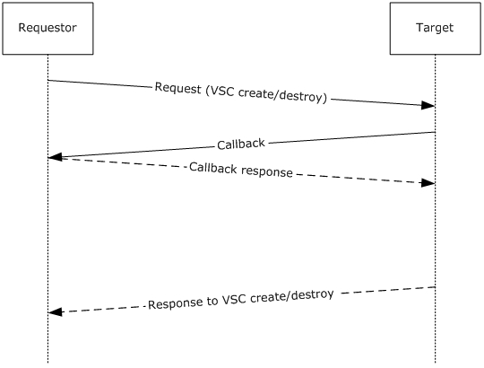
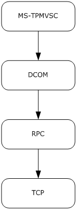
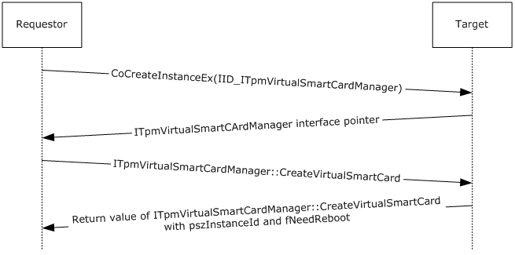
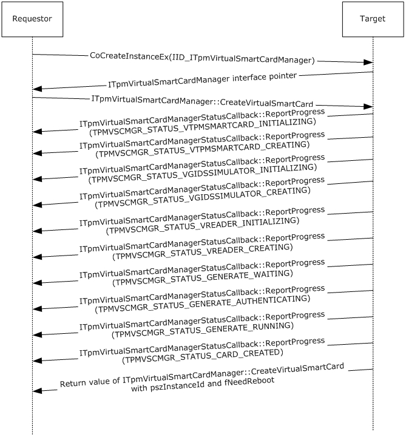

# [MS-TPMVSC]: Trusted Platform Module (TPM) Virtual Smart Card Management Protocol

Table of Contents

1 Introduction

- [1 Introduction](#Section_1)
  - [1.1 Glossary](#Section_1.1)
  - [1.2 References](#Section_1.2)
    - [1.2.1 Normative References](#Section_1.2.1)
    - [1.2.2 Informative References](#Section_1.2.2)
  - [1.3 Overview](#Section_1.3)
  - [1.4 Relationship to Other Protocols](#Section_1.4)
  - [1.5 Prerequisites/Preconditions](#Section_1.5)
  - [1.6 Applicability Statement](#Section_1.6)
  - [1.7 Versioning and Capability Negotiation](#Section_1.7)
  - [1.8 Vendor Extensible Fields](#Section_1.8)
  - [1.9 Standards Assignments](#Section_1.9)

2 Messages

- [2 Messages](#Section_2)
  - [2.1 Transport](#Section_2.1)
  - [2.2 Common Data Types](#Section_2.2)
    - [2.2.1 Enumerations](#Section_2.2.1)
      - [2.2.1.1 TPMVSCMGR_ERROR](#Section_2.2.1.1)
      - [2.2.1.2 TPMVSCMGR_STATUS](#Section_2.2.1.2)
      - [2.2.1.3 SmartCardPinCharacterPolicyOption](#Section_2.2.1.3)
      - [2.2.1.4 TPMVSC_ATTESTATION_TYPE](#Section_2.2.1.4)
    - [2.2.2 Structures](#Section_2.2.2)
      - [2.2.2.1 PinPolicySerialization](#Section_2.2.2.1)

3 Protocol Details

- [3 Protocol Details](#Section_3)
  - [3.1 ITpmVirtualSmartCardManager Server Details](#Section_3.1)
    - [3.1.1 Abstract Data Model](#Section_3.1.1)
    - [3.1.2 Timers](#Section_3.1.2)
    - [3.1.3 Initialization](#Section_3.1.3)
    - [3.1.4 Message Processing Events and Sequencing Rules](#Section_3.1.4)
      - [3.1.4.1 CreateVirtualSmartCard (Opnum 3)](#Section_3.1.4.1)
      - [3.1.4.2 DestroyVirtualSmartCard (Opnum 4)](#Section_3.1.4.2)
    - [3.1.5 Timer Events](#Section_3.1.5)
    - [3.1.6 Other Local Events](#Section_3.1.6)
  - [3.2 ITpmVirtualSmartCardManagerStatusCallback Server Details](#Section_3.2)
    - [3.2.1 Abstract Data Model](#Section_3.2.1)
    - [3.2.2 Timers](#Section_3.2.2)
    - [3.2.3 Initialization](#Section_3.2.3)
    - [3.2.4 Message Processing Events and Sequencing Rules](#Section_3.2.4)
      - [3.2.4.1 ReportProgress (Opnum 3)](#Section_3.2.4.1)
      - [3.2.4.2 ReportError (Opnum 4)](#Section_3.2.4.2)
    - [3.2.5 Timer Events](#Section_3.2.5)
    - [3.2.6 Other Local Events](#Section_3.2.6)
  - [3.3 ITpmVirtualSmartCardManager2 Server Details](#Section_3.3)
    - [3.3.1 Abstract Data Model](#Section_3.3.1)
    - [3.3.2 Timers](#Section_3.3.2)
    - [3.3.3 Initialization](#Section_3.3.3)
    - [3.3.4 Message Processing Events and Sequencing Rules](#Section_3.3.4)
      - [3.3.4.1 CreateVirtualSmartCardWithPinPolicy (Opnum 5)](#Section_3.3.4.1)
    - [3.3.5 Timer Events](#Section_3.3.5)
    - [3.3.6 Other Local Events](#Section_3.3.6)
  - [3.4 ITpmVirtualSmartCardManager3 Server Details](#Section_3.4)
    - [3.4.1 Abstract Data Model](#Section_3.4.1)
    - [3.4.2 Timers](#Section_3.4.2)
    - [3.4.3 Initialization](#Section_3.4.3)
    - [3.4.4 Message Processing Events and Sequencing Rules](#Section_3.4.4)
      - [3.4.4.1 CreateVirtualSmartCardWithAttestation (Opnum 6)](#Section_3.4.4.1)
    - [3.4.5 Timer Events](#Section_3.4.5)
    - [3.4.6 Other Local Events](#Section_3.4.6)

4 Protocol Examples

- [4 Protocol Examples](#Section_4)
  - [4.1 Create a VSC without Status Callback](#Section_4.1)
  - [4.2 Create a VSC with Status Callback](#Section_4.2)

5 Security

- [5 Security](#Section_5)
  - [5.1 Security Considerations for Implementers](#Section_5.1)
  - [5.2 Index of Security Parameters](#Section_5.2)

6 Appendix A: Full IDL

- [6 Appendix A: Full IDL](#Section_6)

7 Appendix B: Product Behavior

- [7 Appendix B: Product Behavior](#Section_7)

8 Change Tracking

- [8 Change Tracking](#Section_8)

For the legal notice and IP terms, see [LEGAL.md](../LEGAL.md).
Last updated: 4/23/2024.
See [Revision History](#revision-history) for full version history.

# 1 Introduction

The DCOM Interfaces for Trusted Platform Module (TPM) Virtual Smart Card Management Protocol is used to manage [**virtual smart cards (VSCs)**](#gt_virtual-smart-card-vsc) on a remote machine, such as those based on trusted platform modules (TPM). It provides methods for a protocol client to request creation and destruction of VSCs and to monitor the status of these operations.

Sections 1.5, 1.8, 1.9, 2, and 3 of this specification are normative. All other sections and examples in this specification are informative.

## 1.1 Glossary

This document uses the following terms:

**certification authority (CA)**: A third party that issues public key certificates. Certificates serve to bind public keys to a user identity. Each user and certification authority (CA) can decide whether to trust another user or CA for a specific purpose, and whether this trust is to be transitive. For more information, see [[RFC3280]](https://go.microsoft.com/fwlink/?LinkId=90414).

**virtual smart card (VSC)**: A combination of hardware, software and firmware that implements the same interface as a smart card but is not necessarily restricted to the same physical form factors. For example, virtual smart cards may be implemented entirely in software, or they may use the cryptographic capabilities of specific hardware such as a TPM.

**MAY, SHOULD, MUST, SHOULD NOT, MUST NOT:** These terms (in all caps) are used as defined in [[RFC2119]](https://go.microsoft.com/fwlink/?LinkId=90317). All statements of optional behavior use either MAY, SHOULD, or SHOULD NOT.

## 1.2 References

Links to a document in the Microsoft Open Specifications library point to the correct section in the most recently published version of the referenced document. However, because individual documents in the library are not updated at the same time, the section numbers in the documents may not match. You can confirm the correct section numbering by checking the [Errata](https://go.microsoft.com/fwlink/?linkid=850906).

### 1.2.1 Normative References

We conduct frequent surveys of the normative references to assure their continued availability. If you have any issue with finding a normative reference, please contact [dochelp@microsoft.com](mailto:dochelp@microsoft.com). We will assist you in finding the relevant information.

[C706] The Open Group, "DCE 1.1: Remote Procedure Call", C706, August 1997, [https://publications.opengroup.org/c706](https://go.microsoft.com/fwlink/?LinkId=89824)

**Note** Registration is required to download the document.

[MS-DCOM] Microsoft Corporation, "[Distributed Component Object Model (DCOM) Remote Protocol](../MS-DCOM/MS-DCOM.md)".

[MS-DTYP] Microsoft Corporation, "[Windows Data Types](../MS-DTYP/MS-DTYP.md)".

[MS-ERREF] Microsoft Corporation, "[Windows Error Codes](../MS-ERREF/MS-ERREF.md)".

[MS-RPCE] Microsoft Corporation, "[Remote Procedure Call Protocol Extensions](../MS-RPCE/MS-RPCE.md)".

[MS-SPNG] Microsoft Corporation, "[Simple and Protected GSS-API Negotiation Mechanism (SPNEGO) Extension](../MS-SPNG/MS-SPNG.md)".

[PCSC3] PC/SC Workgroup, "Interoperability Specification for ICCs and Personal Computer Systems - Part 3: Requirements for PC-Connected Interface Devices", June 2007, [http://pcscworkgroup.com/Download/Specifications/pcsc3_v2.01.09.pdf](https://go.microsoft.com/fwlink/?LinkId=90244)

[RFC2119] Bradner, S., "Key words for use in RFCs to Indicate Requirement Levels", BCP 14, RFC 2119, March 1997, [https://www.rfc-editor.org/info/rfc2119](https://go.microsoft.com/fwlink/?LinkId=90317)

[RFC4178] Zhu, L., Leach, P., Jaganathan, K., and Ingersoll, W., "The Simple and Protected Generic Security Service Application Program Interface (GSS-API) Negotiation Mechanism", RFC 4178, October 2005, [https://www.rfc-editor.org/info/rfc4178](https://go.microsoft.com/fwlink/?LinkId=90461)

[SP800-67] National Institute of Standards and Technology., "Special Publication 800-67, Revision 1, Recommendation for the Triple Data Encryption Algorithm (TDEA) Block Cipher", January 2012, [https://csrc.nist.gov/publications/detail/sp/800-67/rev-1/archive/2012-01-23](https://go.microsoft.com/fwlink/?LinkId=131225)

### 1.2.2 Informative References

None.

## 1.3 Overview

The DCOM Interfaces for the Trusted Platform Module (TPM) Virtual Smart Card Management Protocol provides a Distributed Component Object Model (DCOM) Remote Protocol [MS-DCOM](../MS-DCOM/MS-DCOM.md) interface used for creating and destroying [**VSCs**](#gt_virtual-smart-card-vsc). Like all other DCOM interfaces, this protocol uses RPC [[C706]](https://go.microsoft.com/fwlink/?LinkId=89824), with the extensions specified in [MS-RPCE](../MS-RPCE/MS-RPCE.md), as its underlying protocol. A VSC is a device that presents a device interface complying with the PC/SC specification for PC-connected interface devices [[PCSC3]](https://go.microsoft.com/fwlink/?LinkId=90244) to its host operating system (OS) platform. This protocol does not assume anything about the underlying implementation of VSC devices. In particular, while it is primarily intended for the management of VSCs based on TPMs, it can also be used to manage other types of VSCs. The protocol defines two interfaces: a primary interface which is used to request VSC operations on a target system, and a secondary interface which is used by that target system to return status and progress information to the requestor.

In a typical scenario, this protocol is used by a requestor (generally an administrative workstation) to manage VSC devices on a target (generally an end-user workstation). The requestor, acting as a client, connects to the ITpmVirtualSmartCardManager, ITpmVirtualSmartCardManager2, or ITpmVirtualSmartCardManager3 interface on the target (which acts as the server) and requests the target to either create or destroy a VSC by passing appropriate parameters. These parameters include a reference to an ITpmVirtualSmartCardManagerStatusCallback DCOM interface on the requestor that can be used to provide status updates through callbacks.

The principal difference between the ITpmVirtualSmartCardManager2 interface and the ITpmVirtualSmartCardManager3 interface is that the latter supports creation of attestation-capable virtual smart cards.

The principal difference between the ITpmVirtualSmartCardManager interface and the ITpmVirtualSmartCardManager2 interface is that the latter supports policies to define valid values for the smart-card PIN.

The target, after validating these parameters, starts executing the requested operation. It also opens a second connection back to the requestor over which it invokes the requestor’s ITpmVirtualSmartCardManagerStatusCallback interface as a client, and calls the appropriate functions of that interface to provide progress or error codes. When the operation is completed, the target closes this second connection and returns the result for the requestor’s original method invocation.

This entire process is illustrated in Figure 1.

Figure 1: Typical protocol scenario

## 1.4 Relationship to Other Protocols

The DCOM Interfaces for the TPM Virtual Smart Card Management Protocol relies on the Distributed Component Object Model (DCOM) Remote Protocol, as specified in [MS-DCOM](../MS-DCOM/MS-DCOM.md), which uses RPC [MS-RPCE](../MS-RPCE/MS-RPCE.md) as its transport. A diagram of these relationships is shown in the following figure:

Figure 2: Protocol Relationships

## 1.5 Prerequisites/Preconditions

This protocol is implemented over DCOM and RPC. Therefore, it has the prerequisites specified in [MS-DCOM](../MS-DCOM/MS-DCOM.md) and [MS-RPCE](../MS-RPCE/MS-RPCE.md) as being common to protocols that depend on DCOM and RPC respectively.

This protocol also requires a compliant implementation of [[PCSC3]](https://go.microsoft.com/fwlink/?LinkId=90244), as well as any additional host OS facilities required to support the creation of [**VSCs**](#gt_virtual-smart-card-vsc), on the target.

This protocol requires the use of a secure RPC connection. The requestor is required to possess the credentials of an administrative user on the target, and both requestor and target are required to support security packages that implement support for impersonation as well as packet privacy and integrity.

## 1.6 Applicability Statement

This protocol is applicable to scenarios where it is desirable to remotely manage VSC devices on a computer with a smart card implementation compliant with [[PCSC3]](https://go.microsoft.com/fwlink/?LinkId=90244).

## 1.7 Versioning and Capability Negotiation

This document covers versioning issues in the following areas:

- **Supported Transports:** This protocol uses the Distributed Component Object Model (DCOM) Remote Protocol [MS-DCOM](../MS-DCOM/MS-DCOM.md), which in turn uses RPC over TCP as its only transport, as specified in section [2.1](#Section_2.1).
- **Protocol Versions:** This protocol includes two DCOM interfaces (namely ITpmVirtualSmartCardManager and ITpmVirtualSmartCardManagerStatusCallback), both of which are version 0.0 as defined in section [2.2](#Section_2.2).
- **Security and Authentication Methods:** Microsoft RPC, as defined in [MS-RPCE](../MS-RPCE/MS-RPCE.md), is used to negotiate the authentication mechanism, as specified in [MS-SPNG](../MS-SPNG/MS-SPNG.md) and in section [3.1](../MS-RPCE/MS-RPCE.md).
- **Localization:** This protocol uses predefined status codes and error codes. It is the caller’s responsibility to localize the status and error codes to localized strings.
- **Capability Negotiation:** This protocol does not support explicit capability negotiation. However, as specified in section [3.1.4](#Section_3.4), the requestor can disable the use of the ITpmVirtualSmartCardManagerStatusCallback interface by providing a NULL callback parameter. Even if a callback parameter is provided by the requestor, the target can choose to not use the ITpmVirtualSmartCardManagerStatusCallback interface.

## 1.8 Vendor Extensible Fields

This protocol uses HRESULT values as defined in [MS-ERREF](../MS-ERREF/MS-ERREF.md) section 2.1. Vendors can define their own HRESULT values, provided they set the C bit (0x20000000) for each vendor-defined value, indicating the value is a customer code.

## 1.9 Standards Assignments

| Parameter | Value | Reference |
| --- | --- | --- |
| UUID for ITpmVirtualSmartCardManager | 112b1dff-d9dc-41f7-869f-d67fee7cb591 | [[C706]](https://go.microsoft.com/fwlink/?LinkId=89824) |
| UUID for ITpmVirtualSmartCardManager2 | fdf8a2b9-02de-47f4-bc26-aa85ab5e5267 | [C706] |
| UUID for ITpmVirtualSmartCardManagerStatusCallback | 1a1bb35f-abb8-451c-a1ae-33d98f1bef4a | [C706] |
| UUID for ITpmVirtualSmartCardManager3 | 3C745A97-F375-4150-BE17-5950F694C699 | [C706] |

# 2 Messages

## 2.1 Transport

This protocol uses RPC dynamic endpoints as defined in Part 4 of [[C706]](https://go.microsoft.com/fwlink/?LinkId=89824).

The client and server MUST communicate by using the DCOM Remote Protocol [MS-DCOM](../MS-DCOM/MS-DCOM.md). DCOM, in turn, uses RPC with the ncacn_ip_tcp (RPC over TCP) protocol sequence, as specified in [MS-RPCE](../MS-RPCE/MS-RPCE.md).

The server MUST use the RPC security extensions specified in [MS-RPCE] in the manner specified in section [3.1.3](#Section_3.4) and section [3.1.4](#Section_3.4). It MUST support the use of Simple and Protected GSS-API Negotiation Mechanism (SPNEGO) [MS-SPNG](../MS-SPNG/MS-SPNG.md) [[RFC4178]](https://go.microsoft.com/fwlink/?LinkId=90461) to negotiate security providers, and it MUST register one or more security packages that can be negotiated using this protocol.

A server RPC interface implementing one of the DCOM interfaces specified by this protocol MUST use the appropriate UUID as specified in section [1.9](#Section_1.9).

The RPC version number for all interfaces MUST be 0.0.

## 2.2 Common Data Types

This protocol MUST indicate to the RPC runtime that it is to support both the NDR and NDR64 transfer syntaxes and provide a negotiation mechanism for determining which transfer syntax will be used, as specified in [MS-RPCE](../MS-RPCE/MS-RPCE.md) section 3.

In addition to the RPC base types and definitions specified in [[C706]](https://go.microsoft.com/fwlink/?LinkId=89824) and [MS-RPCE], additional data types are defined in this section.

The following data types are specified in [MS-DTYP](../MS-DTYP/MS-DTYP.md):

| Data type name | Section |
| --- | --- |
| BOOL | [MS-DTYP] section 2.2.3 |
| BYTE | [MS-DTYP] section 2.2.6 |
| DWORD | [MS-DTYP] section 2.2.9 |
| HRESULT | [MS-DTYP] section 2.2.18 |
| LONG | [MS-DTYP] section 2.2.27 |
| LPCWSTR | [MS-DTYP] section 2.2.34 |
| LPWSTR | [MS-DTYP] section 2.2.36 |

### 2.2.1 Enumerations

The following table summarizes the enumerations defined in this specification.

| Enumeration name | Section | Description |
| --- | --- | --- |
| TPMVSCMGR_ERROR | [2.2.1.1](#Section_2.2.1.1) | See section 2.2.1.1. |
| TPMVSCMGR_STATUS | [2.2.1.2](#Section_2.2.1.2) | See section 2.2.1.2. |
| SmartCardPinCharacterPolicyOption | [2.2.1.3](#Section_2.2.1.3) | See section 2.2.1.3. |
| TPMVSC_ATTESTATION_TYPE | [2.2.1.4](#Section_2.2.1.4) | See section 2.2.1.4. |

#### 2.2.1.1 TPMVSCMGR_ERROR

typedef [v1_enum] enum {

TPMVSCMGR_ERROR_IMPERSONATION,

TPMVSCMGR_ERROR_PIN_COMPLEXITY,

TPMVSCMGR_ERROR_READER_COUNT_LIMIT,

TPMVSCMGR_ERROR_TERMINAL_SERVICES_SESSION,

TPMVSCMGR_ERROR_VTPMSMARTCARD_INITIALIZE,

TPMVSCMGR_ERROR_VTPMSMARTCARD_CREATE,

TPMVSCMGR_ERROR_VTPMSMARTCARD_DESTROY,

TPMVSCMGR_ERROR_VGIDSSIMULATOR_INITIALIZE,

TPMVSCMGR_ERROR_VGIDSSIMULATOR_CREATE,

TPMVSCMGR_ERROR_VGIDSSIMULATOR_DESTROY,

TPMVSCMGR_ERROR_VGIDSSIMULATOR_WRITE_PROPERTY,

TPMVSCMGR_ERROR_VGIDSSIMULATOR_READ_PROPERTY,

TPMVSCMGR_ERROR_VREADER_INITIALIZE,

TPMVSCMGR_ERROR_VREADER_CREATE,

TPMVSCMGR_ERROR_VREADER_DESTROY,

TPMVSCMGR_ERROR_GENERATE_LOCATE_READER,

TPMVSCMGR_ERROR_GENERATE_FILESYSTEM,

TPMVSCMGR_ERROR_CARD_CREATE,

TPMVSCMGR_ERROR_CARD_DESTROY,

} TPMVSCMGR_ERROR;

**TPMVSCMGR_ERROR_IMPERSONATION:** An error occurred during impersonation of the caller.

**TPMVSCMGR_ERROR_PIN_COMPLEXITY:** The user personal identification number (PIN) or personal unblocking key (PUK) value does not meet the minimum length requirement.

**TPMVSCMGR_ERROR_READER_COUNT_LIMIT:** The limit on the number of Smart Card Readers has been reached.

**TPMVSCMGR_ERROR_TERMINAL_SERVICES_SESSION:** The TPM Virtual Smart Card Management Protocol cannot be used within a Terminal Services session.

**TPMVSCMGR_ERROR_VTPMSMARTCARD_INITIALIZE:** An error occurred during initialization of the [**VSC**](#gt_virtual-smart-card-vsc) component.

**TPMVSCMGR_ERROR_VTPMSMARTCARD_CREATE:** An error occurred during creation of the VSC component.

**TPMVSCMGR_ERROR_VTPMSMARTCARD_DESTROY:** An error occurred during deletion of the VSC component.

**TPMVSCMGR_ERROR_VGIDSSIMULATOR_INITIALIZE:** An error occurred during initialization of the VSC simulator.

**TPMVSCMGR_ERROR_VGIDSSIMULATOR_CREATE:** An error occurred during creation of the VSC simulator.

**TPMVSCMGR_ERROR_VGIDSSIMULATOR_DESTROY:** An error occurred during deletion of the VSC simulator.

**TPMVSCMGR_ERROR_VGIDSSIMULATOR_WRITE_PROPERTY:** An error occurred during configuration of the VSC simulator.

**TPMVSCMGR_ERROR_VGIDSSIMULATOR_READ_PROPERTY:** An error occurred finding the VSC simulator.

**TPMVSCMGR_ERROR_VREADER_INITIALIZE:** An error occurred during the initialization of the VSC reader.

**TPMVSCMGR_ERROR_VREADER_CREATE:** An error occurred during creation of the VSC reader.

**TPMVSCMGR_ERROR_VREADER_DESTROY:** An error occurred during deletion of the VSC reader.

**TPMVSCMGR_ERROR_GENERATE_LOCATE_READER:** An error occurred preventing connection to the VSC reader.

**TPMVSCMGR_ERROR_GENERATE_FILESYSTEM:** An error occurred during generation of the file system on the VSC.

**TPMVSCMGR_ERROR_CARD_CREATE:** An error occurred during creation of the VSC.

**TPMVSCMGR_ERROR_CARD_DESTROY:** An error occurred during deletion of the VSC.

#### 2.2.1.2 TPMVSCMGR_STATUS

typedef [v1_enum] enum {

TPMVSCMGR_STATUS_VTPMSMARTCARD_INITIALIZING,

TPMVSCMGR_STATUS_VTPMSMARTCARD_CREATING,

TPMVSCMGR_STATUS_VTPMSMARTCARD_DESTROYING,

TPMVSCMGR_STATUS_VGIDSSIMULATOR_INITIALIZING,

TPMVSCMGR_STATUS_VGIDSSIMULATOR_CREATING,

TPMVSCMGR_STATUS_VGIDSSIMULATOR_DESTROYING,

TPMVSCMGR_STATUS_VREADER_INITIALIZING,

TPMVSCMGR_STATUS_VREADER_CREATING,

TPMVSCMGR_STATUS_VREADER_DESTROYING,

TPMVSCMGR_STATUS_GENERATE_WAITING,

TPMVSCMGR_STATUS_GENERATE_AUTHENTICATING,

TPMVSCMGR_STATUS_GENERATE_RUNNING,

TPMVSCMGR_STATUS_CARD_CREATED,

TPMVSCMGR_STATUS_CARD_DESTROYED,

} TPMVSCMGR_STATUS;

**TPMVSCMGR_STATUS_VTPMSMARTCARD_INITIALIZING:** Initializing the [**VSC**](#gt_virtual-smart-card-vsc) component.

**TPMVSCMGR_STATUS_VTPMSMARTCARD_CREATING:** Creating the VSC component.

**TPMVSCMGR_STATUS_VTPMSMARTCARD_DESTROYING:** Deleting the VSC component.

**TPMVSCMGR_STATUS_VGIDSSIMULATOR_INITIALIZING:** Initializing the VSC simulator.

**TPMVSCMGR_STATUS_VGIDSSIMULATOR_CREATING:** Creating the VSC simulator.

**TPMVSCMGR_STATUS_VGIDSSIMULATOR_DESTROYING:** Destroying the VSC simulator.

**TPMVSCMGR_STATUS_VREADER_INITIALIZING:** Initializing the VSC reader.

**TPMVSCMGR_STATUS_VREADER_CREATING:** Creating the VSC reader.

**TPMVSCMGR_STATUS_VREADER_DESTROYING:** Destroying the VSC reader.

**TPMVSCMGR_STATUS_GENERATE_WAITING:** Waiting for the VSC device.

**TPMVSCMGR_STATUS_GENERATE_AUTHENTICATING:** Authenticating to the VSC.

**TPMVSCMGR_STATUS_GENERATE_RUNNING:** Generating the file system on the VSC.

**TPMVSCMGR_STATUS_CARD_CREATED:** The VSC is created.

**TPMVSCMGR_STATUS_CARD_DESTROYED:** The VSC is deleted.

#### 2.2.1.3 SmartCardPinCharacterPolicyOption

This enumeration is used in fields of the PinPolicySerialization structure specified in section [2.2.2.1](#Section_2.2.2.1).<1>

enum SmartCardPinCharacterPolicyOption

{

Allow = 0,

RequireAtLeastOne = 1,

Disallow = 2

};

**Allow:** The value is 0. This character class is allowed.

**RequireAtLeastOne:** The value is 1. At least one item belonging to this character class is required.

**Disallow:** The value is 2. This character class is not allowed.

#### 2.2.1.4 TPMVSC_ATTESTATION_TYPE

enum TPMVSC_ATTESTATION_TYPE

{

TPMVSC_ATTESTATION_NONE = 0,

TPMVSC_ATTESTATION_AIK_ONLY = 1,

TPMVSC_ATTESTATION_AIK_AND_CERTIFICATE = 2,

} TPMVSC_ATTESTATION_TYPE;

**TPMVSC_ATTESTATION_NONE:** The VSC does not support attestation.

**TPMVSC_ATTESTATION_AIK_ONLY:** The VSC supports attestation with an AIK that is unique to this VSC, but will not have a certificate associated with the AIK.

**TPMVSC_ATTESTATION_AIK_AND_CERTIFICATE:** The VSC supports attestation with an AIK that is unique to this VSC, and the AIK will have a certificate issued by a [**certification authority (CA)**](#gt_certification-authority-ca).

### 2.2.2 Structures

The following table summarizes the structures that are defined in this specification:

| Structure name | Section | Description |
| --- | --- | --- |
| PinPolicySerialization | [2.2.2.1](#Section_2.2.2.1) | See section 2.2.2.1. |

#### 2.2.2.1 PinPolicySerialization

This structure is used to serialize a PIN policy for use by the ITpmVirtualSmartCardManager2 interface as specified in section [3.3.4.1](#Section_3.3.4.1).<2>

**Reserved:** This reserved field contains a 32-bit unsigned integer in little-endian encoding that MUST equal 1.

**minLength:** The minimum length permitted for a PIN assigned to the new smart card, represented as a 32-bit unsigned integer in little-endian encoding.

**maxLength:** The maximum length permitted for a PIN assigned to the new smart card, represented as a 32-bit unsigned integer in little-endian encoding.

**uppercaseLettersPolicyOption:** A SmartCardPinCharacterPolicyOption, defined in section [2.2.1.3](#Section_2.2.1.3), encoded in little-endian format. This value indicates whether uppercase letters are permitted in a PIN assigned to the new smart card.

**lowercaseLettersPolicyOption:** A SmartCardPinCharacterPolicyOption, defined in section 2.2.1.3, encoded in little-endian format. This value indicates whether lowercase letters are permitted in a PIN assigned to the new smart card.

**digitsPolicyOption:** A SmartCardPinCharacterPolicyOption, defined in section 2.2.1.3, encoded in little-endian format. This value indicates whether numeric digits are permitted in a PIN assigned to the new smart card.

**specialCharactersPolicyOption:** A SmartCardPinCharacterPolicyOption, defined in section 2.2.1.3, encoded in little-endian format. This value indicates whether printable ASCII characters other than digits and letters are permitted in a PIN assigned to the new smart card.

**otherCharactersPolicyOption:** A SmartCardPinCharacterPolicyOption, defined in section 2.2.1.3, encoded in little-endian format. This value indicates whether all byte values are permitted in a PIN assigned to the new smart card, including non-printable ASCII characters and character codes from 0x80 through 0xFF.

# 3 Protocol Details

Implementations of this protocol MUST implement support for ITpmVirtualSmartCardManager and ITpmVirtualSmartCardManagerStatusCallback. They SHOULD<3> implement support for ITpmVirtualSmartCardManager2 and ITpmVirtualSmartCardManager3.

The client side of the ITpmVirtualSmartCardManager, ITpmVirtualSmartCardManager2, and ITpmVirtualSmartCardManager3 interfaces is simply a pass-through. That is, no additional timers or other state is required on the client side of these interfaces. Calls made by the higher-layer protocol or application are passed directly to the transport, and the results returned by the transport are passed directly back to the higher-layer protocol or application. The set of in-progress calls is made available to the ITpmVirtualSmartCardManagerStatusCallback server as specified in section [3.2.1](#Section_3.2).

Similarly, the client side of the ITpmVirtualSmartCardManagerStatusCallback interface is also a pass-through and requires no additional timers or other state. This protocol is only intended to be invoked by the ITpmVirtualSmartCardManager, ITpmVirtualSmartCardManager2, or ITpmVirtualSmartCardManager3 server while processing a call to one of its methods. When invoked in this way, the ITpmVirtualSmartCardManagerStatusCallback client simply passes the call directly to the underlying DCOM transport, using the same causality ID as the triggering ITpmVirtualSmartCardManager, ITpmVirtualSmartCardManager2, or ITpmVirtualSmartCardManager3 call as specified in [MS-DCOM](../MS-DCOM/MS-DCOM.md) section 3.2.4.2.

## 3.1 ITpmVirtualSmartCardManager Server Details

### 3.1.1 Abstract Data Model

This protocol maintains no state. However, as specified in section [1.5](#Section_1.5), it assumes that the server has access to a smart card implementation compliant with [[PCSC3]](https://go.microsoft.com/fwlink/?LinkId=90244) and associated facilities for creating [**VSCs**](#gt_virtual-smart-card-vsc). Those components are able to maintain implementation-specific state.

### 3.1.2 Timers

None.

### 3.1.3 Initialization

The server MUST register itself with the DCOM infrastructure and bind to a dynamic endpoint obtained from the RPC runtime.

The server MUST indicate to the RPC runtime that it is to negotiate security contexts by using the SPNEGO protocol ([[RFC4178]](https://go.microsoft.com/fwlink/?LinkId=90461)). The server SHOULD request the RPC runtime to reject any unauthenticated connections.

The server MUST indicate to the RPC runtime that it is to perform a strict NDR data consistency check at target level 6.0, as specified in [MS-RPCE](../MS-RPCE/MS-RPCE.md) section 3.

The server MUST indicate to the RPC runtime that it is to reject a NULL unique or full pointer with non-zero conformant value, as specified in [MS-RPCE] section 3.

The server MUST confirm the presence of an underlying smart card infrastructure complying with [[PCSC3]](https://go.microsoft.com/fwlink/?LinkId=90244). If no such infrastructure is present, the server MUST stop initialization and exit with an error.

### 3.1.4 Message Processing Events and Sequencing Rules

This interface includes the following methods:

| Method | Description |
| --- | --- |
| [CreateVirtualSmartCard](#Section_3.1.4.1) | Opnum: 3 |
| [DestroyVirtualSmartCard](#Section_3.1.4.2) | Opnum: 4 |

#### 3.1.4.1 CreateVirtualSmartCard (Opnum 3)

This method is invoked by the requestor to create a [**VSC**](#gt_virtual-smart-card-vsc) on the target.

HRESULT CreateVirtualSmartCard(

[in, string] const wchar_t* pszFriendlyName,

[in] unsigned char bAdminAlgId,

[in, size_is(cbAdminKey)] const unsigned char* pbAdminKey,

[in] unsigned long cbAdminKey,

[in, unique, size_is(cbAdminKcv)] const unsigned char* pbAdminKcv,

[in] unsigned long cbAdminKcv,

[in, unique, size_is(cbPuk)] const unsigned char* pbPuk,

[in] unsigned long cbPuk,

[in, size_is(cbPin)] const unsigned char* pbPin,

[in] unsigned long cbPin,

[in] int fGenerate,

[in, unique] ITpmVirtualSmartCardManagerStatusCallback* pStatusCallback,

[out, string] wchar_t** ppszInstanceId,

[out] int* pfNeedReboot);

**pszFriendlyName:** A Unicode string for use in any user interface messages relating to this VSC.

**bAdminAlgId:** An unsigned byte value. This parameter MUST be set to 0x82.

**pbAdminKey:** An array of 24 bytes containing a TDEA [[SP800-67]](https://go.microsoft.com/fwlink/?LinkId=131225) key intended to be used as the administrative key for the new VSC.

**cbAdminKey:** A 32-bit unsigned integer value. It MUST be set to 24.

**pbAdminKcv:** An array of bytes containing the Key Check Value (KCV) for the administrative key contained in the pbAdminKey parameter. This parameter is optional and MUST be set to NULL if absent. If present, it MUST be computed by encrypting eight zero bytes using the TDEA [SP800-67] block cipher and taking the first three bytes.

**cbAdminKcv:** A 32-bit unsigned integer value. It MUST be set to 0 if the pbAdmin parameter is NULL, and MUST be set to 3 otherwise.

**pbPuk:** An array of bytes containing the desired PUK for the new VSC. This parameter is optional and MUST be set to NULL if absent. If present, its length MUST be between 8 and 127 bytes, inclusive.

**cbPuk:** A 32-bit unsigned integer value. It MUST be equal to the length of the pbPuk parameter in bytes. If pbPuk is NULL, this parameter MUST be set to 0.

**pbPin:** An array of bytes containing the desired PIN for the new VSC. Its length MUST be between 8 and 127 bytes, inclusive.

**cbPin:** A 32-bit unsigned integer value. It MUST be equal to the length of the pbPin parameter in bytes.

**fGenerate:** A Boolean value that indicates whether a file system is to be generated on the new VSC.

**pStatusCallback:** A reference to an instance of the ITpmVirtualSmartCardManagerStatusCallback DCOM interface on the requestor. The server uses this interface to provide feedback on progress and errors. This parameter is optional and MUST be set to NULL if absent.

**ppszInstanceId:** A Unicode string containing a unique instance identifier for the VSC created by this operation.

**pfNeedReboot:** A Boolean value that indicates whether or not a reboot is required on the server before the newly-created VSC is made available to applications.

**Return Values:** The server MUST return 0 if it successfully creates the new VSC, and a nonzero value otherwise.

**Exceptions Thrown:** No exceptions are thrown beyond those thrown by the underlying RPC protocol [MS-RPCE](../MS-RPCE/MS-RPCE.md).

The server MUST validate the parameters before executing the requested operation and fail requests with invalid parameters.

If pbAdminKcv is present, the server MUST perform admin key integrity check. The admin key integrity check is done by encrypting eight zero bytes using the TDEA [SP800-67] block cipher, taking the first 3 bytes and verifying that it matches the provided pbAdminKcv value. If the computed bytes do not match the provided pbAdminKcv value, the admin key integrity check fails and the server MUST fail the requested operation.

If pbPuk is present, the server MUST create a VSC that supports PUK-based PIN reset and its PUK is set as the provided pbPuk value. Otherwise, the server MUST create a VSC that supports challenge-response-based PIN reset through the admin role.

Upon successful creation of a VSC, the server MUST initialize all data structures necessary for the VSC, and register it with the underlying smart card implementation compliant with [[PCSC3]](https://go.microsoft.com/fwlink/?LinkId=90244). The server MUST allocate an instance identifier to the newly-created VSC that is unique among all such identifiers in use at that time.

If pStatusCallback is present, the server SHOULD notify the client of the progress and errors of the undergoing operation, as specified in section [3.2.4](#Section_3.2). The status callback happens synchronously with the requested operation. If the status callback returns an error code, the server MUST abort the VSC creation and return a non-zero error to the client, with the severity bit in the error code set to 1. In this case, the server SHOULD also roll back all changes made in respect to the requested operation.

#### 3.1.4.2 DestroyVirtualSmartCard (Opnum 4)

This method is invoked by the requestor to destroy a previously-created [**VSC**](#gt_virtual-smart-card-vsc) on the target.

HRESULT DestroyVirtualSmartCard(

[in, string] const wchar_t* pszInstanceId,

[in, unique] ITpmVirtualSmartCardManagerStatusCallback* pStatusCallback,

[out] int* pfNeedReboot);

**pszInstanceId:** A Unicode string containing the instance identifier for the VSC to be destroyed.

**pStatusCallback:** A reference to an instance of the ITpmVirtualSmartCardManagerStatusCallback DCOM interface on the requestor. The server uses this interface to provide feedback on progress and errors. This parameter is optional and MUST be set to NULL if absent.

**pfNeedReboot:** A Boolean value that indicates whether or not a reboot is required on the server to complete the destruction of the VSC.

**Return Values:** The server MUST return 0 if it successfully locates and destroys the indicated VSC, and a nonzero value otherwise.

**Exceptions Thrown:** No exceptions are thrown beyond those thrown by the underlying RPC protocol [MS-RPCE](../MS-RPCE/MS-RPCE.md).

The server MUST validate the parameters before executing the requested operation and fail requests with invalid parameters.

In response to the request, the server MUST locate the VSC using the provided instance identifier from the underlying smart card implementation compliant with [[PCSC3]](https://go.microsoft.com/fwlink/?LinkId=90244), remove its registration with the implementation, and clear all data structures associated with the VSC.

If pStatusCallback is present, the server SHOULD notify the client of the progress and errors of the undergoing operation, as specified in section [3.2.4](#Section_3.2). The status callback happens synchronously with the requested operation. If the status callback returns an error code, the server SHOULD try to abort the requested operation and roll back all changes related to the operation. If the operation is aborted, the server MUST return a non-zero error code to the client, with the severity bit in the error code set to 1. If the operation cannot be aborted, the server MUST ignore the error from the status callback interface and complete the requested operation.

### 3.1.5 Timer Events

None.

### 3.1.6 Other Local Events

None.

## 3.2 ITpmVirtualSmartCardManagerStatusCallback Server Details

### 3.2.1 Abstract Data Model

This section describes a conceptual model of possible data organization that an implementation maintains to participate in this protocol. The described organization is provided to facilitate the explanation of how the protocol behaves. This document does not mandate that implementations adhere to this model as long as their external behavior is consistent with that described in this document.

**TPMVSC management requests:** The set of calls that are currently in progress from this host to remote ITpmVirtualSmartCardManager interfaces. This state is shared with the ITpmVirtualSmartCardManager client implementation.

### 3.2.2 Timers

None.

### 3.2.3 Initialization

The server is initialized by the ITpmVirtualSmartCardManager interface client as part of the process of making a request on that interface.

The server MUST register itself with the DCOM infrastructure and bind to a dynamic endpoint obtained from the RPC runtime.

The server MUST indicate to the RPC runtime that it is to negotiate security contexts by using the SPNEGO protocol [[RFC4178]](https://go.microsoft.com/fwlink/?LinkId=90461). The server SHOULD request the RPC runtime to reject any unauthenticated connections.

The server MUST indicate to the RPC runtime that it is to perform a strict NDR data consistency check at target level 6.0, as specified in [MS-RPCE](../MS-RPCE/MS-RPCE.md) section 3.

The server MUST indicate to the RPC runtime that it is to reject a NULL unique or full pointer with a non-zero conformant value, as specified in [MS-RPCE] section 3.

The server SHOULD establish a connection with the higher-layer protocol or application that issued the corresponding request on the ITpmVirtualSmartCardManager interface, in order to convey progress and error information as specified in section [3.2.4](#Section_3.2).

### 3.2.4 Message Processing Events and Sequencing Rules

This interface includes the following methods:

| Method | Description |
| --- | --- |
| [ReportProgress](#Section_3.2.4.1) | Opnum: 3 |
| [ReportError](#Section_3.2.4.2) | Opnum: 4 |

#### 3.2.4.1 ReportProgress (Opnum 3)

This method is called by the target to indicate the progress of a **TPMVSC management request** on the target. The association to a specific ITpmVirtualSmartCardManager method invocation is made by the causality ID in the underlying DCOM transport, as specified in [MS-DCOM](../MS-DCOM/MS-DCOM.md) section 3.2.4.2.

HRESULT ReportProgress(

[in] TPMVSCMGR_STATUS Status);

**Status:** A TPMVSCMGR_STATUS, defined in section [2.2.1.2](#Section_2.2.1.2).

**Return Values:** The server MUST return 0 unless it has been instructed to abort the **TPMVSC management request** as specified in section [3.2.6](#Section_3.2).

**Exceptions Thrown:** No exceptions are thrown beyond those thrown by the underlying RPC protocol [MS-RPCE](../MS-RPCE/MS-RPCE.md).

The server SHOULD report the status code to the higher-layer protocol or application that called the associated ITpmVirtualSmartCardManager method.

#### 3.2.4.2 ReportError (Opnum 4)

This method is called by the target to indicate that an error was encountered during the execution of a **TPMVSC management request** on the target. The association to a specific ITpmVirtualSmartCardManager method invocation is made by the causality ID in the underlying DCOM transport, as specified in [MS-DCOM](../MS-DCOM/MS-DCOM.md) section 3.2.4.2.

HRESULT ReportError(

[in] TPMVSCMGR_ERROR Error);

**Error:** A TPMVSCMGR_ERROR, defined in section [2.2.1.1](#Section_2.2.1.1).

**Return Values:** The server MUST return 0 unless it has been instructed to abort the **TPMVSC management request** as specified in section [3.2.6](#Section_3.2).

**Exceptions Thrown:** No exceptions are thrown beyond those thrown by the underlying RPC protocol [MS-RPCE](../MS-RPCE/MS-RPCE.md).

The server SHOULD report the error code to the higher-layer protocol or application that called the associated ITpmVirtualSmartCardManager method.

### 3.2.5 Timer Events

None.

### 3.2.6 Other Local Events

If a higher-layer protocol or application on the requestor indicates that a particular **TPMVSC management request** has been aborted, the server MUST return a non-zero error code for any future ITpmVirtualSmartCardManagerStatusCallback methods that are invoked in association with the aborted request.

## 3.3 ITpmVirtualSmartCardManager2 Server Details

This interface is derived from the ITpmVirtualSmartCardManager interface and behaves identically to that interface except for the addition of the CreateVirtualSmartCardWithPinPolicy method.

### 3.3.1 Abstract Data Model

The ITpmVirtualSmartCardManager2 interface has the same abstract data model, described in section [3.1.1](#Section_3.4).

### 3.3.2 Timers

None.

### 3.3.3 Initialization

Initialization is described in section [3.1.3](#Section_3.4).

### 3.3.4 Message Processing Events and Sequencing Rules

In addition to the methods specified in section [3.1.4](#Section_3.4), this interface includes the following method:

| Method | Description |
| --- | --- |
| [CreateVirtualSmartCardWithPinPolicy](#Section_3.3.4.1) | Opnum: 5 |

#### 3.3.4.1 CreateVirtualSmartCardWithPinPolicy (Opnum 5)

This method is invoked by the requestor to create a [**VSC**](#gt_virtual-smart-card-vsc) with the specified PIN policy on the target.

HRESULT CreateVirtualSmartCardWithPinPolicy(

[in, string] const wchar_t* pszFriendlyName,

[in] unsigned char bAdminAlgId,

[in, size_is(cbAdminKey)] const unsigned char* pbAdminKey,

[in] unsigned long cbAdminKey,

[in, unique, size_is(cbAdminKcv)] const unsigned char* pbAdminKcv,

[in] unsigned long cbAdminKcv,

[in, unique, size_is(cbPuk)] const unsigned char* pbPuk,

[in] unsigned long cbPuk,

[in, size_is(cbPin)] const unsigned char* pbPin,

[in] unsigned long cbPin,

[in, unique, size_is(cbPinPolicy)] const unsigned char* pbPinPolicy,

[in] unsigned long cbPinPolicy,

[in] int fGenerate,

[in, unique] ITpmVirtualSmartCardManagerStatusCallback* pStatusCallback,

[out, string] wchar_t** ppszInstanceId,

[out] int* pfNeedReboot);

**pszFriendlyName:** A Unicode string for use in any user interface messages relating to this VSC.

**bAdminAlgId:** An unsigned byte value. This parameter MUST be set to 0x82.

**pbAdminKey:** An array of 24 bytes containing a TDEA [[SP800-67]](https://go.microsoft.com/fwlink/?LinkId=131225) key intended to be used as the administrative key for the new VSC.

**cbAdminKey:** A 32-bit unsigned integer value. It MUST be set to 24.

**pbAdminKcv:** An array of bytes containing the Key Check Value (KCV) for the administrative key contained in the pbAdminKey parameter. This parameter is optional and MUST be set to NULL if absent. If present, it MUST be computed by encrypting eight zero bytes using the TDEA [SP800-67] block cipher and taking the first three bytes.

**cbAdminKcv:** A 32-bit unsigned integer value. It MUST be set to 0 if the pbAdmin parameter is NULL, and MUST be set to 3 otherwise.

**pbPuk:** An array of bytes containing the desired PUK for the new VSC. This parameter is optional and MUST be set to NULL if absent. If present, its length MUST be between 8 and 127 bytes, inclusive.

**cbPuk:** A 32-bit unsigned integer value. It MUST be equal to the length of the pbPuk parameter in bytes. If pbPuk is NULL, this parameter MUST be set to 0.

**pbPin:** An array of bytes containing the desired PIN for the new VSC. Its length MUST be between 4 and 127 bytes, inclusive.

**cbPin:** A 32-bit unsigned integer value. It MUST be equal to the length of the pbPin parameter in bytes.

**pbPinPolicy:** A PinPolicySerialization structure specifying the PIN policy for the new VSC, as described in section [2.2.2.1](#Section_2.2.2.1).

**cbPinPolicy:** A 32-bit unsigned integer value. It MUST be equal to the length in bytes of the pbPinPolicy parameter.

**fGenerate:** A Boolean value that indicates whether a file system is to be generated on the new VSC.

**pStatusCallback:** A reference to an instance of the ITpmVirtualSmartCardManagerStatusCallback DCOM interface on the requestor. The server uses this interface to provide feedback on progress and errors. This parameter is optional and MUST be set to NULL if absent.

**ppszInstanceId:** A Unicode string containing a unique instance identifier for the VSC created by this operation.

**pfNeedReboot:** A Boolean value that indicates whether or not a reboot is required on the server before the newly-created VSC is made available to applications.

**Return Values:** The server MUST return 0 if it successfully creates the new VSC, and a nonzero value otherwise.

**Exceptions Thrown:** No exceptions are thrown beyond those thrown by the underlying RPC protocol [MS-RPCE](../MS-RPCE/MS-RPCE.md).

The server MUST validate the parameters before executing the requested operation, using the validation rules specified in section [3.1.4.1](#Section_3.1.4.1), and fail requests with invalid parameters.

If pbPinPolicy is present, the server MUST validate that it is exactly 32 bytes in size and conforms to the format specified in section 2.2.2.1. The server MUST fail the requested operation if any of the following is true:

- minLength is not between 4 and 127, inclusive.
- maxLength is not between 4 and 127, inclusive.
- maxLength is not greater than or equal to minLength.
- The value of uppercaseLettersPolicyOption is not a valid member of the SmartCardPinCharacterPolicyOption enumerated type.
- The value of lowercaseLettersPolicyOption is not a valid member of the SmartCardPinCharacterPolicyOption enumerated type.
- The value of digitsPolicyOption is not a valid member of the SmartCardPinCharacterPolicyOption enumerated type.
- The value of specialCharactersPolicyOption is not a valid member of the SmartCardPinCharacterPolicyOption enumerated type
- The value of otherCharactersPolicyOption is not a valid member of the SmartCardPinCharacterPolicyOption enumerated type
After validating these conditions, the server MUST proceed to create the VSC and notify the client of progress through the callback interface as specified in section 3.1.4.1. The server MUST also initialize the appropriate data structures for the VSC in accordance with the PIN policy specified by the caller.

### 3.3.5 Timer Events

None.

### 3.3.6 Other Local Events

None.

## 3.4 ITpmVirtualSmartCardManager3 Server Details

This interface<4> is derived from the ITpmVirtualSmartCardManager2 interface and behaves identically to it except for the addition of the [CreateVirtualSmartCardWithAttestation method (section 3.4.4.1)](#Section_3.4.4.1).

### 3.4.1 Abstract Data Model

The ITpmVirtualSmartCardManager3 interface has the same Abstract Data Model as described in section [3.1.1](#Section_3.4).

### 3.4.2 Timers

None.

### 3.4.3 Initialization

Initialization is described in section [3.1.3](#Section_3.4).

### 3.4.4 Message Processing Events and Sequencing Rules

In addition to the methods specified in section [3.1.4](#Section_3.4), this interface includes the following method:

| Method | Description |
| --- | --- |
| CreateVirtualSmartCardWithAttestation | Opnum: 6 |

#### 3.4.4.1 CreateVirtualSmartCardWithAttestation (Opnum 6)

This method is invoked by the requestor to create a VSC with attestation.

HRESULT CreateVirtualSmartCardWithAttestation(

[in, string] const wchar_t* pszFriendlyName,

[in] unsigned char bAdminAlgId,

[in, size_is(cbAdminKey)] const unsigned char* pbAdminKey,

[in] unsigned long cbAdminKey,

[in, unique, size_is(cbAdminKcv)] const unsigned char* pbAdminKcv,

[in] unsigned long cbAdminKcv,

[in, unique, size_is(cbPuk)] const unsigned char* pbPuk,

[in] unsigned long cbPuk,

[in, size_is(cbPin)] const unsigned char* pbPin,

[in] unsigned long cbPin,

[in, unique, size_is(cbPinPolicy)] const unsigned char* pbPinPolicy,

[in] unsigned long cbPinPolicy,

[in] TPMVSC_ATTESTATION_TYPE attestationType,

[in] int fGenerate,

[in, unique] ITpmVirtualSmartCardManagerStatusCallback* pStatusCallback,

[out, string] wchar_t** ppszInstanceId

);

**pszFriendlyName:** A Unicode string for use in any user interface messages relating to this VSC.

**bAdminAlgId:** An unsigned byte value. This parameter MUST be set to 0x82.

**pbAdminKey:** An array of 24 bytes containing a TDEA [[SP800-67]](https://go.microsoft.com/fwlink/?LinkId=131225) key intended to be used as the administrative key for the new VSC.

**cbAdminKey:** A 32-bit unsigned integer value. It MUST be set to 24.

**pbAdminKcv:** An array of bytes containing the Key Check Value (KCV) for the administrative key contained in the pbAdminKey parameter. This parameter is optional and MUST be set to NULL if absent. If present, it MUST be computed by encrypting eight zero bytes using the TDEA [SP800-67] block cipher and taking the first three bytes.

**cbAdminKcv:** A 32-bit unsigned integer value. It MUST be set to 0 if the pbAdmin parameter is NULL, and MUST be set to 3 otherwise.

**pbPuk:** An array of bytes containing the desired PUK for the new VSC. This parameter is optional and MUST be set to NULL if absent. If present, its length MUST be between 8 and 127 bytes, inclusive.

**cbPuk:** A 32-bit unsigned integer value. It MUST be equal to the length of the pbPuk parameter in bytes. If pbPuk is NULL, this parameter MUST be set to 0.

**pbPin:** An array of bytes containing the desired PIN for the new VSC. Its length MUST be between 4 and 127 bytes, inclusive.

**cbPin:** A 32-bit unsigned integer value. It MUST be equal to the length of the pbPin parameter in bytes.

**pbPinPolicy:** A PinPolicySerialization structure specifying the PIN policy for the new VSC, as described in section [2.2.2.1](#Section_2.2.2.1).

**cbPinPolicy:** A 32-bit unsigned integer value. It MUST be equal to the length in bytes of the pbPinPolicy parameter.

**attestationType:** A TPMVSC_ATTESTATION_TYPE value specifying the desired attestation properties of the new VSC.

**fGenerate:** A Boolean value that indicates whether a file system is to be generated on the new VSC.

**pStatusCallback:** A reference to an instance of the ITpmVirtualSmartCardManagerStatusCallback DCOM interface on the requestor. The server uses this interface to provide feedback on progress and errors. This parameter is optional and MUST be set to NULL if absent.

**ppszInstanceId:** A Unicode string containing a unique instance identifier for the VSC created by this operation.

**Return Values:** The server MUST return 0 if it successfully creates the new VSC, and a nonzero value otherwise.

**Exceptions Thrown:** No exceptions are thrown beyond those thrown by the underlying RPC protocol [MS-RPCE](../MS-RPCE/MS-RPCE.md).

The server MUST validate the parameters before executing the requested operation, using the validation rules specified in section [3.1.4.1](#Section_3.1.4.1), and fail requests with invalid parameters.

If pbPinPolicy is present, the server MUST validate that it is exactly 32 bytes in size and conforms to the format specified in section 2.2.2.1. The server MUST fail the requested operation if any of the following is TRUE:

- minLength is not between 4 and 127, inclusive.
- maxLength is not between 4 and 127, inclusive.
- maxLength is not greater than or equal to minLength.
- The value of uppercaseLettersPolicyOption is not a valid member of the SmartCardPinCharacterPolicyOption enumerated type.
- The value of lowercaseLettersPolicyOption is not a valid member of the SmartCardPinCharacterPolicyOption enumerated type.
- The value of digitsPolicyOption is not a valid member of the SmartCardPinCharacterPolicyOption enumerated type.
- The value of specialCharactersPolicyOption is not a valid member of the SmartCardPinCharacterPolicyOption enumerated type.
- The value of otherCharactersPolicyOption is not a valid member of the SmartCardPinCharacterPolicyOption enumerated type.
After validating these conditions, the server MUST proceed to create the VSC and notify the client of progress through the callback interface as specified in section 3.1.4.1. The server MUST also initialize the appropriate data structures for the VSC in accordance with the PIN policy specified by the caller.

### 3.4.5 Timer Events

None.

### 3.4.6 Other Local Events

None.

# 4 Protocol Examples

## 4.1 Create a VSC without Status Callback

Since the status callback interface is optional when creating a VSC, the requestor cannot provide a callback interface to the target. In this case, the requestor is only notified through the return value when the requested operation has been completed on the target.

The following figure shows the communication between the requestor and the target when creating a VSC without a requestor-provided callback interface.

Figure 3: Create a VSC without status callback

## 4.2 Create a VSC with Status Callback

When creating a VSC on the target, the requestor can provide a callback interface to receive progress and error notifications from the target while the requested operation is being executed on the target.

The following figure shows the communications between the requestor and the target when creating a VSC with a requestor-provided callback interface.

Figure 4: Create a VSC with status callback

In this example, the requestor returns zero for each call to ITpmVirtualSmartCardManagerStatusCallback::ReportProgress. For brevity, these returns are omitted from the diagram.

# 5 Security

## 5.1 Security Considerations for Implementers

This protocol uses DCOM as its underlying transport. Therefore, all security considerations that apply to DCOM interfaces, as specified in [MS-DCOM](../MS-DCOM/MS-DCOM.md) section 5, are also applicable to this protocol.

The ITpmVirtualSmartCardManager interface allows the requestor to alter system state on the target computer in a persistent way. Therefore, as specified in section [3.1.4](#Section_3.4), any server implementation of this interface has to ensure that the requestor has appropriate administrative privileges.

In addition, some of the parameters to the ITpmVirtualSmartCardManager methods, in particular the PIN, PUK, and administrative keys, contain sensitive information. It is recommended that the client and server take reasonable measures to protect these parameter values, including not writing them to persistent storage and erasing them from memory immediately after use.

The underlying [**VSC**](#gt_virtual-smart-card-vsc) implementation is required to implement appropriate security measures as well. In particular, any keys it generates need to be cryptographically random and not written to unsecured storage in the clear. When a VSC is destroyed, its contents are also destroyed to prevent possible future recovery of its key material.

Sharing AIKs between VSCs allows linking of those VSCs by anyone who sees attestation statements from both VSCs. This can be a privacy issue in some cases. Client implementations can avoid privacy issues by not sharing AIKs and AIK certificates between VSCs.

The security of the attestation relies on the security properties of the TPM itself. Any weaknesses in the TPM implementation will correspondingly affect the strength of the assurance provided by the attestation statement. Implementers are advised to take this into account when deciding whether to implement this protocol on a particular platform.

The security assurance of attestation statements issued by the VSC depends on how strongly the AIK is believed to be associated with a secure TPM. When deploying this protocol, it is important to ensure the integrity of the process for issuing AIK certificates (or for determining the AIKs associated with a given platform, if certificates are not used). In addition, it is important to ensure the security of the PKI that issues the AIK certificates and to follow good certificate management practices.

## 5.2 Index of Security Parameters

| Security parameter | Section |
| --- | --- |
| Use of RPC security | section [2.1](#Section_2.1), section [3.1.3](#Section_3.4), section [3.2.3](#Section_3.2) |
| Administrative privileges of caller | section [3.1.4.1](#Section_3.1.4.1), section [3.1.4.2](#Section_3.1.4.2) |

# 6 Appendix A: Full IDL

import "oaidl.idl";

import "ocidl.idl";

typedef [v1_enum] enum TPMVSC_ATTESTATION_TYPE

{

TPMVSC_ATTESTATION_NONE = 0,

TPMVSC_ATTESTATION_AIK_ONLY = 1,

TPMVSC_ATTESTATION_AIK_AND_CERTIFICATE = 2,

} TPMVSC_ATTESTATION_TYPE;

typedef [v1_enum] enum

{

TPMVSCMGR_STATUS_VTPMSMARTCARD_INITIALIZING, // Initializing the Virtual Smart Card component...

TPMVSCMGR_STATUS_VTPMSMARTCARD_CREATING, // Creating the Virtual Smart Card component...

TPMVSCMGR_STATUS_VTPMSMARTCARD_DESTROYING, // Destroying the Virtual Smart Card component...

TPMVSCMGR_STATUS_VGIDSSIMULATOR_INITIALIZING, // Initializing the Virtual Smart Card Simulator...

TPMVSCMGR_STATUS_VGIDSSIMULATOR_CREATING, // Creating the Virtual Smart Card Simulator...

TPMVSCMGR_STATUS_VGIDSSIMULATOR_DESTROYING, // Destroying the Virtual Smart Card Simulator...

TPMVSCMGR_STATUS_VREADER_INITIALIZING, // Initializing the Virtual Smart Card Reader...

TPMVSCMGR_STATUS_VREADER_CREATING, // Creating the Virtual Smart Card Reader...

TPMVSCMGR_STATUS_VREADER_DESTROYING, // Destroying the Virtual Smart Card Reader...

TPMVSCMGR_STATUS_GENERATE_WAITING, // Waiting for TPM Smart Card Device...

TPMVSCMGR_STATUS_GENERATE_AUTHENTICATING, // Authenticating to the TPM Smart Card...

TPMVSCMGR_STATUS_GENERATE_RUNNING, // Generating filesystem on the TPM Smart Card...

TPMVSCMGR_STATUS_CARD_CREATED, // TPM Smart Card created.

TPMVSCMGR_STATUS_CARD_DESTROYED, // TPM Smart Card destroyed.

} TPMVSCMGR_STATUS;

typedef [v1_enum] enum

{

TPMVSCMGR_ERROR_IMPERSONATION, // Failed to impersonate the caller

TPMVSCMGR_ERROR_PIN_COMPLEXITY, // Ensure that your PIN/PUK meets the length or complexity requirements of your organization.

TPMVSCMGR_ERROR_READER_COUNT_LIMIT, // The limit on the number of Smart Card Readers has been reached.

TPMVSCMGR_ERROR_TERMINAL_SERVICES_SESSION, // TPM Virtual Smart Card management cannot be used within a Terminal Services session.

TPMVSCMGR_ERROR_VTPMSMARTCARD_INITIALIZE, // Failed to initialize the Virtual Smart Card component.

TPMVSCMGR_ERROR_VTPMSMARTCARD_CREATE, // Failed to create the Virtual Smart Card component.

TPMVSCMGR_ERROR_VTPMSMARTCARD_DESTROY, // Failed to destroy the Virtual Smart Card.

TPMVSCMGR_ERROR_VGIDSSIMULATOR_INITIALIZE, // Failed to initialize the Virtual Smart Card Simulator.

TPMVSCMGR_ERROR_VGIDSSIMULATOR_CREATE, // Failed to create the Virtual Smart Card Simulator.

TPMVSCMGR_ERROR_VGIDSSIMULATOR_DESTROY, // Failed to destroy the Virtual Smart Card Simulator.

TPMVSCMGR_ERROR_VGIDSSIMULATOR_WRITE_PROPERTY, // Failed to configure the Virtual Smart Card Simulator.

TPMVSCMGR_ERROR_VGIDSSIMULATOR_READ_PROPERTY, // Failed to find the specified Virtual Smart Card Simulator.

TPMVSCMGR_ERROR_VREADER_INITIALIZE, // Failed to initialize the Virtual Smart Card Reader.

TPMVSCMGR_ERROR_VREADER_CREATE, // Failed to create the Virtual Smart Card Reader.

TPMVSCMGR_ERROR_VREADER_DESTROY, // Failed to destroy the Virtual Smart Card Reader.

TPMVSCMGR_ERROR_GENERATE_LOCATE_READER, // Failed to connect to the TPM Smart Card.

TPMVSCMGR_ERROR_GENERATE_FILESYSTEM, // Failed to generate the filesystem on the TPM Smart Card.

TPMVSCMGR_ERROR_CARD_CREATE, // Unable to create TPM Smart Card.

TPMVSCMGR_ERROR_CARD_DESTROY, // Unable to destroy TPM Smart Card.

} TPMVSCMGR_ERROR;

[

object,

uuid(1A1BB35F-ABB8-451C-A1AE-33D98F1BEF4A),

pointer_default(unique)

]

interface ITpmVirtualSmartCardManagerStatusCallback : IUnknown

{

HRESULT

ReportProgress(

[in] TPMVSCMGR_STATUS Status

);

HRESULT

ReportError(

[in] TPMVSCMGR_ERROR Error

);

};

cpp_quote("//")

cpp_quote("// TPM Virtual Smart Card Default Admin Key Algorithm ID")

cpp_quote("// 0x82 = 0x02 (3-key triple DES) |")

cpp_quote("// 0x80 (ISO/IEC 9797 padding method 2) |")

cpp_quote("// 0x00 (CBC mode)")

cpp_quote("//")

const unsigned char TPMVSC_DEFAULT_ADMIN_ALGORITHM_ID = 0x82;

[

object,

uuid(112B1DFF-D9DC-41F7-869F-D67FEE7CB591),

pointer_default(unique)

]

interface ITpmVirtualSmartCardManager : IUnknown

{

HRESULT

CreateVirtualSmartCard(

[in, string] const wchar_t* pszFriendlyName,

[in] unsigned char bAdminAlgId,

[in, size_is(cbAdminKey)] const unsigned char* pbAdminKey,

[in] unsigned long cbAdminKey,

[in, unique, size_is(cbAdminKcv)] const unsigned char* pbAdminKcv, // optional

[in] unsigned long cbAdminKcv,

[in, unique, size_is(cbPuk)] const unsigned char* pbPuk, // optional

[in] unsigned long cbPuk,

[in, size_is(cbPin)] const unsigned char* pbPin,

[in] unsigned long cbPin,

[in] int fGenerate,

[in, unique] ITpmVirtualSmartCardManagerStatusCallback* pStatusCallback, // optional

[out, string] wchar_t** ppszInstanceId,

[out] int* pfNeedReboot

);

HRESULT

DestroyVirtualSmartCard(

[in, string] const wchar_t* pszInstanceId,

[in, unique] ITpmVirtualSmartCardManagerStatusCallback* pStatusCallback, // optional

[out] int* pfNeedReboot

);

};

[

object,

uuid(FDF8A2B9-02DE-47F4-BC26-AA85AB5E5267),

pointer_default(unique)

]

interface ITpmVirtualSmartCardManager2 : ITpmVirtualSmartCardManager

{

HRESULT

CreateVirtualSmartCardWithPinPolicy(

[in, string] const wchar_t* pszFriendlyName,

[in] unsigned char bAdminAlgId,

[in, size_is(cbAdminKey)] const unsigned char* pbAdminKey,

[in] unsigned long cbAdminKey,

[in, unique, size_is(cbAdminKcv)] const unsigned char* pbAdminKcv, // optional

[in] unsigned long cbAdminKcv,

[in, unique, size_is(cbPuk)] const unsigned char* pbPuk, // optional

[in] unsigned long cbPuk,

[in, size_is(cbPin)] const unsigned char* pbPin,

[in] unsigned long cbPin,

[in, unique, size_is(cbPinPolicy)] const unsigned char* pbPinPolicy, // optional

[in] unsigned long cbPinPolicy,

[in] int fGenerate,

[in, unique] ITpmVirtualSmartCardManagerStatusCallback* pStatusCallback, // optional

[out, string] wchar_t** ppszInstanceId,

[out] int* pfNeedReboot

);

}

[

object,

uuid(3C745A97-F375-4150-BE17-5950F694C699),

pointer_default(unique)

]

interface ITpmVirtualSmartCardManager3 : ITpmVirtualSmartCardManager2

{

HRESULT

CreateVirtualSmartCardWithAttestation(

[in, string] const wchar_t* pszFriendlyName,

[in] unsigned char bAdminAlgId,

[in, size_is(cbAdminKey)] const unsigned char* pbAdminKey,

[in] unsigned long cbAdminKey,

[in, unique, size_is(cbAdminKcv)] const unsigned char* pbAdminKcv, // optional

[in] unsigned long cbAdminKcv,

[in, unique, size_is(cbPuk)] const unsigned char* pbPuk, // optional

[in] unsigned long cbPuk,

[in, size_is(cbPin)] const unsigned char* pbPin,

[in] unsigned long cbPin,

[in, unique, size_is(cbPinPolicy)] const unsigned char* pbPinPolicy, // optional

[in] unsigned long cbPinPolicy,

[in] TPMVSC_ATTESTATION_TYPE attestationType,

[in] int fGenerate,

[in, unique] ITpmVirtualSmartCardManagerStatusCallback* pStatusCallback, // optional

[out, string] wchar_t** ppszInstanceId

);

}

[

uuid(1C60A923-2D86-46AA-928A-E7F3E37577AF)

]

library TpmVirtualSmartCardManagers

{

[

uuid(16A18E86-7F6E-4C20-AD89-4FFC0DB7A96A)

]

coclass TpmVirtualSmartCardManager

{

[default] interface ITpmVirtualSmartCardManager;

interface ITpmVirtualSmartCardManager2;

interface ITpmVirtualSmartCardManager3;

}

[

uuid(152EA2A8-70DC-4C59-8B2A-32AA3CA0DCAC)

]

coclass RemoteTpmVirtualSmartCardManager

{

[default] interface ITpmVirtualSmartCardManager;

interface ITpmVirtualSmartCardManager2;

interface ITpmVirtualSmartCardManager3;

}

};

# 7 Appendix B: Product Behavior

The information in this specification is applicable to the following Microsoft products or supplemental software. References to product versions include updates to those products.

- Windows 8 operating system
- Windows Server 2012 operating system
- Windows 8.1 operating system
- Windows Server 2012 R2 operating system
- Windows 10 operating system
- Windows Server 2016 operating system
- Windows Server 2019 operating system
- Windows Server 2022 operating system
- Windows 11 operating system
- Windows Server 2025 operating system
Exceptions, if any, are noted in this section. If an update version, service pack or Knowledge Base (KB) number appears with a product name, the behavior changed in that update. The new behavior also applies to subsequent updates unless otherwise specified. If a product edition appears with the product version, behavior is different in that product edition.

Unless otherwise specified, any statement of optional behavior in this specification that is prescribed using the terms "SHOULD" or "SHOULD NOT" implies product behavior in accordance with the SHOULD or SHOULD NOT prescription. Unless otherwise specified, the term "MAY" implies that the product does not follow the prescription.

<1> Section 2.2.1.3: The SmartCardPinCharacterPolicyOption enumeration is not supported in Windows 8 or Windows Server 2012 operating system.

<2> Section 2.2.2.1: The PinPolicySerialization structure is not supported in Windows 8 or Windows Server 2012.

<3> Section 3: The ITpmVirtualSmartCardManager2 interface is not supported in Windows 8 or Windows Server 2012. The ITpmVirtualSmartCardManager3 interface is not supported in Windows 8, Windows Server 2012, Windows 8.1, or Windows Server 2012 R2.

<4> Section 3.4: ITpmVirtualSmartCardManager3 is not supported in Windows 8, Windows Server 2012, Windows 8.1, or Windows Server 2012 R2.

# 8 Change Tracking

This section identifies changes that were made to this document since the last release. Changes are classified as Major, Minor, or None.

The revision class **Major** means that the technical content in the document was significantly revised. Major changes affect protocol interoperability or implementation. Examples of major changes are:

- A document revision that incorporates changes to interoperability requirements.
- A document revision that captures changes to protocol functionality.
The revision class **Minor** means that the meaning of the technical content was clarified. Minor changes do not affect protocol interoperability or implementation. Examples of minor changes are updates to clarify ambiguity at the sentence, paragraph, or table level.

The revision class **None** means that no new technical changes were introduced. Minor editorial and formatting changes may have been made, but the relevant technical content is identical to the last released version.

The changes made to this document are listed in the following table. For more information, please contact [dochelp@microsoft.com](mailto:dochelp@microsoft.com).

| Section | Description | Revision class |
| --- | --- | --- |
| [7](#Section_7) Appendix B: Product Behavior | Added Windows Server 2025 to the list of applicable products. | Major |

## Revision History

| Date | Version | Revision Class | Comments |
| --- | --- | --- | --- |
| 3/30/2012 | 1.0 | New | Released new document. |
| 7/12/2012 | 1.0 | None | No changes to the meaning, language, or formatting of the technical content. |
| 10/25/2012 | 1.0 | None | No changes to the meaning, language, or formatting of the technical content. |
| 1/31/2013 | 1.0 | None | No changes to the meaning, language, or formatting of the technical content. |
| 8/8/2013 | 2.0 | Major | Significantly changed the technical content. |
| 11/14/2013 | 2.0 | None | No changes to the meaning, language, or formatting of the technical content. |
| 2/13/2014 | 2.0 | None | No changes to the meaning, language, or formatting of the technical content. |
| 5/15/2014 | 2.0 | None | No changes to the meaning, language, or formatting of the technical content. |
| 6/30/2015 | 3.0 | Major | Significantly changed the technical content. |
| 10/16/2015 | 3.0 | None | No changes to the meaning, language, or formatting of the technical content. |
| 7/14/2016 | 3.0 | None | No changes to the meaning, language, or formatting of the technical content. |
| 6/1/2017 | 3.0 | None | No changes to the meaning, language, or formatting of the technical content. |
| 9/15/2017 | 4.0 | Major | Significantly changed the technical content. |
| 12/1/2017 | 4.0 | None | No changes to the meaning, language, or formatting of the technical content. |
| 9/12/2018 | 5.0 | Major | Significantly changed the technical content. |
| 4/7/2021 | 6.0 | Major | Significantly changed the technical content. |
| 6/25/2021 | 7.0 | Major | Significantly changed the technical content. |
| 4/23/2024 | 8.0 | Major | Significantly changed the technical content. |
