# [MS-TPSOD]: Transaction Processing Services Protocols Overview

Table of Contents

1 Introduction

- [1 Introduction](#Section_1)
  - [1.1 Conceptual Overview](#Section_1.1)
    - [1.1.1 Transaction Trees](#Section_1.1.1)
    - [1.1.2 Two-Phase Commit Protocol](#Section_1.1.2)
    - [1.1.3 Phase Zero](#Section_1.1.3)
    - [1.1.4 Single-Phase Commit](#Section_1.1.4)
    - [1.1.5 Core and Optional Protocols](#Section_1.1.5)
  - [1.2 Glossary](#Section_1.2)
  - [1.3 References](#Section_1.3)

2 Functional Architecture

- [2 Functional Architecture](#Section_2)
  - [2.1 Overview](#Section_2.1)
    - [2.1.1 Purpose](#Section_2.1.1)
    - [2.1.2 Interaction with External Components](#Section_2.1.2)
    - [2.1.3 System Components](#Section_2.1.3)
    - [2.1.4 System Communication](#Section_2.1.4)
    - [2.1.5 Member Protocol Functional Relationships](#Section_2.1.5)
    - [2.1.6 System Applicability](#Section_2.1.6)
    - [2.1.7 Relevant Standards](#Section_2.1.7)
  - [2.2 Protocol Summary](#Section_2.2)
  - [2.3 Environment](#Section_2.3)
    - [2.3.1 Dependencies on This System](#Section_2.3.1)
    - [2.3.2 Dependencies on Other Systems/Components](#Section_2.3.2)
  - [2.4 Assumptions and Preconditions](#Section_2.4)
  - [2.5 Use Cases](#Section_2.5)
    - [2.5.1 Perform Transaction Work – Application](#Section_2.5.1)
    - [2.5.2 Complete a Transaction – Application](#Section_2.5.2)
    - [2.5.3 Transaction Management – Management Tool](#Section_2.5.3)
    - [2.5.4 Recover In-doubt Transaction State – Resource Manager](#Section_2.5.4)
    - [2.5.5 Transaction Recovery - Remote Transaction Manager](#Section_2.5.5)
    - [2.5.6 Supporting Use Cases](#Section_2.5.6)
      - [2.5.6.1 Create a Transaction – Application](#Section_2.5.6.1)
      - [2.5.6.2 Enlist in a Transaction – Resource Manager](#Section_2.5.6.2)
      - [2.5.6.3 Perform Transaction Work with Pull Propagation – Application](#Section_2.5.6.3)
      - [2.5.6.4 Perform Transaction Work with Push Propagation – External Application](#Section_2.5.6.4)
      - [2.5.6.5 Drive Completion of a Transaction – Root Transaction Manager](#Section_2.5.6.5)
  - [2.6 Versioning, Capability Negotiation, and Extensibility](#Section_2.6)
  - [2.7 Error Handling](#Section_2.7)
    - [2.7.1 Connection Disconnected](#Section_2.7.1)
    - [2.7.2 Internal Failures](#Section_2.7.2)
    - [2.7.3 System Configuration Corruption or Unavailability](#Section_2.7.3)
    - [2.7.4 Log Corruption or Unavailability](#Section_2.7.4)
  - [2.8 Coherency Requirements](#Section_2.8)
  - [2.9 Security](#Section_2.9)
    - [2.9.1 Transaction Information Security](#Section_2.9.1)
    - [2.9.2 System Configuration Security](#Section_2.9.2)
    - [2.9.3 Message Security](#Section_2.9.3)
    - [2.9.4 Event Security](#Section_2.9.4)
    - [2.9.5 Connection Type and Feature Restriction](#Section_2.9.5)
    - [2.9.6 Internal Security](#Section_2.9.6)
    - [2.9.7 External Security](#Section_2.9.7)
  - [2.10 Additional Considerations](#Section_2.10)

3 Examples

- [3 Examples](#Section_3)
  - [3.1 Example 1: Perform Transaction Work](#Section_3.1)
  - [3.2 Example 2: Commit a Transaction](#Section_3.2)
  - [3.3 Example 3: Abort a Transaction](#Section_3.3)
  - [3.4 Example 4: Transaction Manager Recovers after a Connection Resource Manager Failure](#Section_3.4)
  - [3.5 Example 5: Connection to a Resource Manager Breaks Down](#Section_3.5)
  - [3.6 Example 6: Distributed Transaction Coordination with External Components](#Section_3.6)
    - [3.6.1 Precursory Message Exchange](#Section_3.6.1)
    - [3.6.2 Application-Driven Transactional Message Exchange](#Section_3.6.2)
    - [3.6.3 Two-Phase Commit Transactional Message Exchange](#Section_3.6.3)

4 Microsoft Implementations

- [4 Microsoft Implementations](#Section_4)
  - [4.1 Product Behavior](#Section_4.1)

5 Change Tracking

- [5 Change Tracking](#Section_5)

For the legal notice and IP terms, see [LEGAL.md](../LEGAL.md).
Last updated: 10/26/2021.
See [Revision History](#revision-history) for full version history.

# 1 Introduction

In a distributed computer network, it is sometimes necessary to ensure that a set of separate operations is either all completed, or that none of the operations is completed. In application programming, it is possible to achieve such semantics by using [**transactions**](#gt_transaction). Systems that require transactions generally rely on a transaction processing service in which the service coordinates multiple operations simultaneously.

The transaction processing services that are described in this overview provide transaction coordination for distributed systems. Very broadly, a transaction is defined as an activity that makes changes to the state of a set of [**resources**](#gt_resource) so that either all the changes are completed or none of the changes are completed. Resources can be data, such as rows in a database, or logical entities, such as the execution state of a program. Resources that are changed by a transaction can also be in separate systems.

Achieving this under all expected and unexpected conditions is difficult but there is a well-established solution, as described in [GRAY]. The solution identifies three [**participants**](#gt_participant) in the transaction execution:

- The [**application**](#gt_application)
- The [**transaction manager (TM)**](#gt_transaction-manager)
- The [**resource manager (RM)**](#gt_resource-manager-rm)
These participants communicate with each other by using the [Two-Phase Commit Protocol (section 1.1.2)](#Section_1.1.2). The transaction manager and the resource manager are usually provided as part of an operating system or other platform elements, such as a database, leaving most implementers with only the application to write.

The RM represents the resources that are involved in the transaction. A transaction manager coordinates the transaction, keeping all the participants in step. All the changes to the resources that are involved in a transaction are made by applications via implementation-specific protocols outside the scope of the [**two-phase commit**](#gt_two-phase-commit) protocol. Only one of the applications that are involved in the transaction initiates and completes the transaction, through communications with its transaction manager. This application is known as the [**root application**](#gt_root-application). As other participants are added to the transaction, each participant is said to be enlisted in the transaction.

For more information about transaction processing concepts, see [GRAY] chapter 2.1, and [MS-DTCO](../MS-DTCO/MS-DTCO.md) section 1.3.

## 1.1 Conceptual Overview

A [**transaction**](#gt_transaction) is an [**atomic**](#gt_atomic-transaction) [**unit of work (UOW)**](#gt_a9e645d9-caad-4e6c-8fed-cefb289e3824) that can either succeed or fail. A transaction cannot be partially completed. Because a transaction can be made up of many steps, each step in the transaction has to succeed for the transaction to be successful. If any step of the transaction fails, the entire transaction fails. When a transaction fails, the system has to return to the state that it was in before the transaction was started. This process is called a [**rollback**](#gt_rollback). When a transaction fails, the changes that had been made are said to be rolled back.

The following sections provide a conceptual overview of the major components and processes of the transaction processing services:

- Transaction Trees (section [1.1.1](#Section_1.1.1))
- Two-Phase Commit Protocol (section [1.1.2](#Section_1.1.2))
- Phase Zero (section [1.1.3](#Section_1.1.3))
- Single-Phase Commit (section [1.1.4](#Section_1.1.4))
- Core and Optional Protocols (section [1.1.5](#Section_1.1.5))

### 1.1.1 Transaction Trees

Multiple [**transaction managers**](#gt_transaction-manager) and [**resource managers**](#gt_resource-manager-rm) can participate in a transaction. In the [**two-phase commit**](#gt_two-phase-commit) protocol their individual responsibilities are defined by a transaction tree, as shown in the following figure.

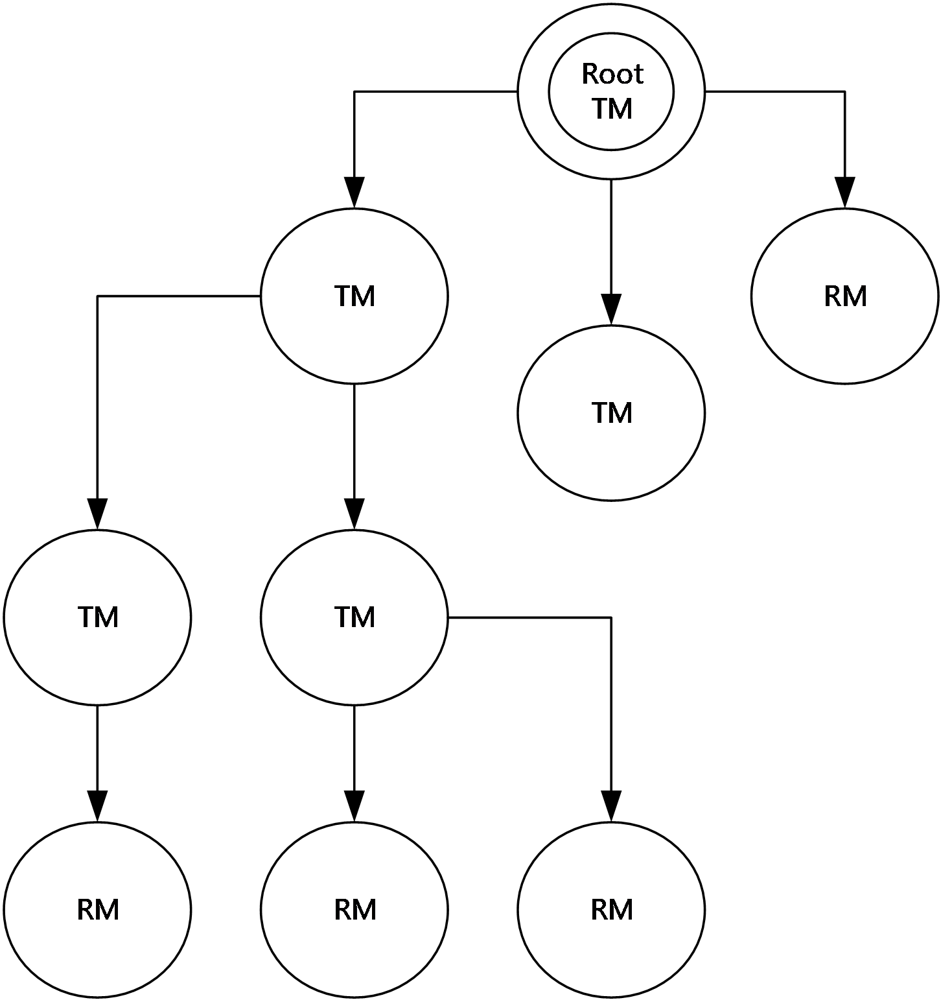

Figure 1: Transaction tree

The transaction manager at the root of the tree is the [**root transaction manager**](#gt_root-transaction-manager). This is the transaction manager with which the root application communicates. Any participant that enlists with a transaction manager is called a [**subordinate participant**](#gt_subordinate-participant). Each transaction manager is a [**superior transaction manager**](#gt_superior-transaction-manager) if any of its subordinate participants are transaction managers. All transaction managers in the tree, apart from the root transaction manager, are [**subordinate transaction managers**](#gt_subordinate-transaction-manager).

### 1.1.2 Two-Phase Commit Protocol

The two phases of the [**two-phase commit**](#gt_two-phase-commit) protocol as described in [GRAY] are [**Phase One**](#gt_phase-one) and [**Phase Two**](#gt_phase-two). These phases can be described informally as "are you ready" and "go / no go," respectively.

Phase One (are you ready) begins when all the required changes to the resource state have been made, and the [**root application**](#gt_root-application) asks the [**transaction manager**](#gt_transaction-manager) to complete the transaction. Phase One ends when the transaction manager determines the [**outcome**](#gt_outcome) of the [**transaction**](#gt_transaction); that is, whether all the changes are to be made or whether no changes are to be made.

When the root application asks the root transaction manager to complete the transaction, it makes either a [**commit request**](#gt_commit-request), asking that all the changes are to be made, or an [**abort request**](#gt_abort-request), asking that no changes are to be made. A commit request causes the root transaction manager to ask each of the subordinate participants that are involved in the transaction whether they are prepared to commit the changes that were made. This process is called voting on the transaction outcome. Each subordinate participant votes for one of three outcomes:

- Read-Only
- Prepared
- Aborted
Read-Only and Prepared are positive votes. Aborted is a negative vote. If every subordinate participant votes positively, then the final outcome of the transaction as a whole is to make all the changes; that is a [**commit outcome**](#gt_commit-outcome).

If any subordinate participant votes negatively, the root transaction manager determines that the final outcome of the transaction as a whole is to make no changes; that is an [**abort outcome**](#gt_abort-outcome). An abort request causes the root transaction manager to notify each subordinate participant to make no changes and to notify each of their respective subordinate participants if there are any to abort the transaction.

A [**subordinate transaction manager**](#gt_subordinate-transaction-manager) determines its vote by aggregating the votes of its subordinate participants. If a subordinate transaction manager has no subordinate participants, or if all of its subordinate participants vote Read-Only, then the subordinate transaction manager votes Read-Only. If at least one subordinate participant votes Prepared, and after collecting all votes no subordinate participant votes Aborted, then the subordinate transaction manager votes Prepared. In all other cases, the subordinate transaction manager votes Aborted, in which case it also notifies any subordinate participants that had voted Prepared that the transaction has been aborted.

Until a participant votes on the outcome of a transaction, that participant can unilaterally abort the transaction by issuing an abort request to its transaction manager. This request is called a unilateral abort. Further details of unilateral abort are described in [MS-DTCO](../MS-DTCO/MS-DTCO.md) section 1.3.2.1.

Phase Two begins after the root transaction manager determines the outcome of the transaction. In this phase, each subordinate participant that voted Prepared is sent either a request to commit the changes if the outcome was the commit outcome or a request to undo ([**rollback**](#gt_rollback)) the changes if the outcome was the abort outcome. The root transaction manager also sends the outcome of the transaction to the root application. A subordinate participant that voted Read-Only is not notified of the outcome of the transaction. For example, a resource manager might vote Read-Only if it made no changes as part of the transaction. A subordinate participant that voted Abort is also not notified of the transaction outcome.

Phase Two ends after the root transaction manager communicates to the participants what the outcome is (commit or abort), and participants have notified the transaction manager that the operation is successfully completed.

The two-phase commit protocol is described in [GRAY]. The DTCO protocol adds Phase Zero (section [1.1.3](#Section_1.1.3)), which expands the beginning of Phase One.

### 1.1.3 Phase Zero

The transaction processing services protocols extend the [**two-phase commit**](#gt_two-phase-commit) protocol by adding [**Phase Zero**](#gt_phase-zero), which expands the beginning of [**Phase One**](#gt_phase-one). It begins when the root application requests completion of the transaction and it ends when all Phase Zero participants have voted that the phase is complete, after which Phase One proceeds, as described previously. The value of the additional phase is that during Phase Zero, new participants can be enlisted in the transaction.

In the two-phase commit protocol that is described in [GRAY], the set of participants is fixed from the moment that Phase One begins. Phase Zero is a useful extension in several scenarios. For example, a caching resource manager can be placed between an application and a database resource manager so that all requested changes are held in memory until the caching resource manager receives a request from the transaction manager to exit Phase Zero. Only then is the database resource manager enlisted in the transaction and the changes are made to the durable store, yielding potentially significant performance gains. Further details of Phase Zero are described in [MS-DTCO](../MS-DTCO/MS-DTCO.md) section 1.3.1.1.

### 1.1.4 Single-Phase Commit

As an extension to the [**two-phase commit**](#gt_two-phase-commit) protocol, transaction processing services protocols use a mechanism that is called [**single-phase commit**](#gt_single-phase-commit) optimization, which is described in [MS-DTCO](../MS-DTCO/MS-DTCO.md) section 1.3.2.2.

This optimization is performed when the [**root transaction manager**](#gt_root-transaction-manager) has only one [**subordinate transaction manager**](#gt_subordinate-transaction-manager). In this case, instead of [**Phase One**](#gt_phase-one), the root transaction manager sends a request to the subordinate transaction manager to perform a single-phase commit. If the subordinate transaction manager supports this operation, then the root transaction manager gives the responsibility to coordinate the outcome of the transaction to the subordinate transaction manager. When the outcome is determined, the subordinate transaction manager notifies the root transaction manager of the result. If the subordinate transaction manager does not support single-phase commit optimization, it rejects the initial request, and the root transaction manager resumes the normal two-phase commit. Single-phase commit optimization is useful when the root transaction manager and the subordinate transaction manager are on separate networks.

### 1.1.5 Core and Optional Protocols

To facilitate transaction coordination, the system supports a set of core protocols and a set of optional protocols, as described in the Protocol Summary (section [2.2](#Section_2.2)). Core protocols are proprietary to the system and are used by default by applications, application services, and resource managers. Optional protocols allow interoperability through transaction processing industry standards. Relevant industry standards are listed in section [2.1.7](#Section_2.1.7). Applications, application services, resource managers, and transaction managers that are communicating with the system over optional protocols are referred to as external applications, external application services, external resource managers, and external transaction managers. The system allows the possibility of processing a transaction by using only a single core or optional protocol, or a combination of core and optional protocols.

## 1.2 Glossary

This document uses the following terms:

**abort outcome**: A possible [**outcome**](#gt_outcome) of an [**atomic transaction**](#gt_atomic-transaction) that indicates that the work performed during the lifetime of the [**transaction**](#gt_transaction) is discarded after the [**transaction**](#gt_transaction) completes. An [**abort outcome**](#gt_abort-outcome) is reached when at least one [**transaction**](#gt_transaction) [**participant**](#gt_participant) does not agree to commit the [**transaction**](#gt_transaction).

**abort request**: An action that a participant performs to force a transaction to reach an abort outcome.

**application**: A participant that is responsible for beginning, propagating, and completing an atomic transaction. An application communicates with a transaction manager in order to begin and complete transactions. An application communicates with a transaction manager in order to marshal transactions to and from other applications. An application also communicates in application-specific ways with a resource manager in order to submit requests for work on resources.

**atomic transaction**: A shared activity that provides mechanisms for achieving the atomicity, consistency, isolation, and durability (ACID) properties when state changes occur inside participating [**resource managers**](#gt_resource-manager-rm).

**cold recovery**: Initial recovery work performed by a [**transaction manager**](#gt_transaction-manager) for a LU 6.2 implementation with respect to a specific [**LU Name Pair**](#gt_lu-name-pair).

**commit outcome**: One of the [**outcomes**](#gt_outcome) of an [**atomic transaction**](#gt_atomic-transaction). The [**commit outcome**](#gt_commit-outcome) indicates that the work performed during the lifetime of the [**transaction**](#gt_transaction) will be retained after the [**transaction**](#gt_transaction) has completed, as specified by the ACID properties. A [**commit outcome**](#gt_commit-outcome) is reached when all [**transaction**](#gt_transaction) [**participants**](#gt_participant) agree to commit the [**transaction**](#gt_transaction).

**commit request**: The action that is performed by a root application to initiate the Two-Phase Commit Protocol for an atomic transaction.

**enlistment**: The relationship between a participant and a [**transaction manager**](#gt_transaction-manager) in an [**atomic transaction**](#gt_atomic-transaction). The term typically refers to the relationship between a [**resource manager**](#gt_resource-manager-rm) and its [**transaction manager**](#gt_transaction-manager), or between a [**subordinate transaction manager**](#gt_subordinate-transaction-manager) facet and its [**superior transaction manager**](#gt_superior-transaction-manager) facet.

**facet**: In OleTx, a subsystem in a [**transaction manager**](#gt_transaction-manager) that maintains its own per-[**transaction**](#gt_transaction) state and responds to intra-[**transaction manager**](#gt_transaction-manager) events from other [**facets**](#gt_facet). A [**facet**](#gt_facet) can also be responsible for communicating with other participants of a [**transaction**](#gt_transaction).

**globally unique identifier (GUID)**: A term used interchangeably with universally unique identifier (UUID) in Microsoft protocol technical documents (TDs). Interchanging the usage of these terms does not imply or require a specific algorithm or mechanism to generate the value. Specifically, the use of this term does not imply or require that the algorithms described in [[RFC4122]](https://go.microsoft.com/fwlink/?LinkId=90460) or [[C706]](https://go.microsoft.com/fwlink/?LinkId=89824) must be used for generating the [**GUID**](#gt_globally-unique-identifier-guid). See also universally unique identifier (UUID).

**log**: A durable store used to maintain [**transaction**](#gt_transaction) state.

**logical unit (LU)**: An addressable network element in the Systems Network Architecture that serves as an access point to the network for programs and users, allowing them to access resources and communicate with other programs and users. For more information on logical units, see [[SNA]](https://go.microsoft.com/fwlink/?LinkId=92608).

**LU Name Pair**: An identifier that uniquely specifies the pairing of a local LU and a [**remote LU**](#gt_remote-lu).

**outcome**: One of the three possible results (Commit, Abort, In Doubt) reachable at the end of a life cycle for an [**atomic transaction**](#gt_atomic-transaction).

**participant**: Any of the parties that are involved in an [**atomic transaction**](#gt_atomic-transaction) and that have a stake in the operations that are performed under the [**transaction**](#gt_transaction) or in the [**outcome**](#gt_outcome) of the [**transaction**](#gt_transaction) ([[WSAT10]](https://go.microsoft.com/fwlink/?LinkId=113066), [[WSAT11]](https://go.microsoft.com/fwlink/?LinkId=113067)).

**Phase One**: The initial phase of a two-phase commit sequence. During this phase, the participants in the transaction are requested to prepare to be committed. This phase is also known as the "Prepare" phase. At the end of Phase One, the outcome of the transaction is known.

**Phase Two**: The second phase of a two-phase commit sequence. This phase occurs after the decision to commit or abort is determined. During this phase, the participants in the transaction are ordered to either commit or rollback.

**Phase Zero**: A phase in distributed transaction processing that is composed of one or more Phase Zero waves. At the beginning of a Phase Zero wave, all Phase Zero participants are notified that the transaction has entered Phase Zero. While the participants process the Phase Zero notification, they can continue to marshal the transaction to new participants. Consequently, participating transaction managers can still accept new enlistments during Phase Zero.

**push propagation**: An operation that enables the targeted marshaling of a [**transaction**](#gt_transaction) from one [**application**](#gt_application) or [**resource manager**](#gt_resource-manager-rm) to another. For marshaling the [**transaction**](#gt_transaction), push propagation requires the source [**participant**](#gt_participant) to have prior knowledge about the contact information of the [**transaction manager**](#gt_transaction-manager) of the destination [**participant**](#gt_participant).

**recovery**: The process of reestablishing connectivity and synchronizing views on the outcome of transactions between two participants after a transient failure. Recovery occurs either between a resource manager and a transaction manager, or between a Superior Transaction Manager Facet and a Subordinate Transaction Manager Facet.

**remote LU**: An LU 6.2 Implementation ([MS-DTCLU](../MS-DTCLU/MS-DTCLU.md) section 3.2) that communicates with the local LU, but without making use of the protocol specified in [MS-DTCLU].

**remote procedure call (RPC)**: A communication protocol used primarily between client and server. The term has three definitions that are often used interchangeably: a runtime environment providing for communication facilities between computers (the RPC runtime); a set of request-and-response message exchanges between computers (the RPC exchange); and the single message from an RPC exchange (the RPC message). For more information, see [C706].

**resource**: A logical entity or unit of data whose state changes in accordance with the [**outcome**](#gt_outcome) of an [**atomic transaction**](#gt_atomic-transaction). [**Resources**](#gt_resource) are either durable or volatile.

**resource manager (RM)**: The participant that is responsible for coordinating the state of a resource with the outcome of atomic transactions. For a specified transaction, a resource manager enlists with exactly one transaction manager to vote on that transaction outcome and to obtain the final outcome. A resource manager is either durable or volatile, depending on its resource.

**rollback**: Synonymous with abort.

**root application**: The [**application**](#gt_application) that is responsible for beginning and completing an [**atomic transaction**](#gt_atomic-transaction). The [**root application**](#gt_root-application) communicates with a [**root transaction manager**](#gt_root-transaction-manager) in order to begin and complete [**transactions**](#gt_transaction).

**root transaction manager**: The specific [**transaction manager**](#gt_transaction-manager) that processes both the Begin Request and the [**Commit Request**](#gt_commit-request) for a specified [**transaction**](#gt_transaction). A specified [**transaction**](#gt_transaction) has exactly one [**root transaction manager**](#gt_root-transaction-manager).

**security provider**: A pluggable security module that is specified by the protocol layer above the [**remote procedure call (RPC)**](#gt_remote-procedure-call-rpc) layer, and will cause the [**RPC**](#gt_remote-procedure-call-rpc) layer to use this module to secure messages in a communication session with the server. The security provider is sometimes referred to as an authentication service. For more information, see [C706] and [MS-RPCE](../MS-RPCE/MS-RPCE.md).

**single-phase commit**: An optimization of the Two-Phase Commit Protocol in which a [**transaction manager**](#gt_transaction-manager) delegates the right to decide the outcome of a transaction to its only subordinate participant. This optimization can result in an In Doubt outcome.

**subordinate participant**: A role that is taken by a [**participant**](#gt_participant) that is responsible for voting on the [**outcome**](#gt_outcome) of an [**atomic transaction**](#gt_atomic-transaction). For a specified [**transaction**](#gt_transaction), the set of [**subordinate participants**](#gt_subordinate-participant) is the set of all [**resource managers**](#gt_resource-manager-rm) and the set of all [**subordinate transaction managers**](#gt_subordinate-transaction-manager).

**subordinate transaction manager**: A role taken by a [**transaction manager**](#gt_transaction-manager) that is responsible for voting on the outcome of an [**atomic transaction**](#gt_atomic-transaction). A [**subordinate transaction manager**](#gt_subordinate-transaction-manager) coordinates the voting and notification of its subordinate participants on behalf of its [**superior transaction manager**](#gt_superior-transaction-manager). When communicating with those subordinate participants, the [**subordinate transaction manager**](#gt_subordinate-transaction-manager) acts in the role of [**superior transaction manager**](#gt_superior-transaction-manager). The root [**transaction manager**](#gt_transaction-manager) is never a [**subordinate transaction manager**](#gt_subordinate-transaction-manager). A [**subordinate transaction manager**](#gt_subordinate-transaction-manager) has exactly one [**superior transaction manager**](#gt_superior-transaction-manager).

**superior transaction manager**: A role taken by a [**transaction manager**](#gt_transaction-manager) that is responsible for gathering outcome votes and providing the final transaction outcome. A root [**transaction manager**](#gt_transaction-manager) can act as a [**superior transaction manager**](#gt_superior-transaction-manager) to a number of [**subordinate transaction managers**](#gt_subordinate-transaction-manager). A [**transaction manager**](#gt_transaction-manager) can act as both a [**subordinate transaction manager**](#gt_subordinate-transaction-manager) and a [**superior transaction manager**](#gt_superior-transaction-manager) on the same transaction.

**tip connection**: A TIP connection that is initiated and used, as specified in [[RFC2371]](https://go.microsoft.com/fwlink/?LinkId=90338) section 4.

**transaction**: In OleTx, an [**atomic transaction**](#gt_atomic-transaction).

**transaction identifier**: The [**GUID**](#gt_globally-unique-identifier-guid) that uniquely identifies an [**atomic transaction**](#gt_atomic-transaction).

**transaction manager**: The party that is responsible for managing and distributing the outcome of [**atomic transactions**](#gt_atomic-transaction). A transaction manager is either a root transaction manager or a subordinate transaction manager for a specified transaction.

**transaction propagation**: The act of coordinating two transaction managers to work together on a single [**atomic transaction**](#gt_atomic-transaction). When propagating a transaction to a transaction manager that is not already a participant in the transaction, that transaction manager plays the role of subordinate transaction manager to the originating transaction manager, which will play the role of superior transaction manager. When propagating a transaction to a transaction manager that is already a participant in the transaction, no new superior or subordinate relationship is established.

**two-phase commit**: An agreement protocol that is used to resolve the outcome of an atomic transaction in response to a commit request from the root application. Phase One and Phase Two are the distinct phases of the Two-Phase Commit Protocol.

**unit of work**: A set of individual operations that MSMQ must successfully complete before any of the individual MSMQ operations can be considered complete.

## 1.3 References

[GRAY] Gray, J., and Reuter, A., "Transaction Processing: Concepts and Techniques", The Morgan Kaufmann Series in Data Management Systems, San Francisco: Morgan Kaufmann Publishers, 1992, Hardcover ISBN: 9781558601901.

[IBM-LU62Guide] IBM, "z/OS Communications Server Version 2 Release 4 SNA Programmer's LU 6.2 Guide", SC27-3669-40, June 2019, [https://www-01.ibm.com/servers/resourcelink/svc00100.nsf/pages/zOSV2R4sc273669/$file/istp620_v2r4.pdf](https://go.microsoft.com/fwlink/?linkid=2133496)

[MC-DTCXA] Microsoft Corporation, "[MSDTC Connection Manager: OleTx XA Protocol](../MC-DTCXA/MC-DTCXA.md)".

[MS-CMOM] Microsoft Corporation, "[MSDTC Connection Manager: OleTx Management Protocol](../MS-CMOM/MS-CMOM.md)".

[MS-CMPO] Microsoft Corporation, "[MSDTC Connection Manager: OleTx Transports Protocol](../MS-CMPO/MS-CMPO.md)".

[MS-CMP] Microsoft Corporation, "[MSDTC Connection Manager: OleTx Multiplexing Protocol](../MS-CMP/MS-CMP.md)".

[MS-COM] Microsoft Corporation, "[Component Object Model Plus (COM+) Protocol](../MS-COM/MS-COM.md)".

[MS-DTCLU] Microsoft Corporation, "[MSDTC Connection Manager: OleTx Transaction Protocol Logical Unit Mainframe Extension](../MS-DTCLU/MS-DTCLU.md)".

[MS-DTCM] Microsoft Corporation, "[MSDTC Connection Manager: OleTx Transaction Internet Protocol](../MS-DTCM/MS-DTCM.md)".

[MS-DTCO] Microsoft Corporation, "[MSDTC Connection Manager: OleTx Transaction Protocol](../MS-DTCO/MS-DTCO.md)".

[MS-MQOD] Microsoft Corporation, "[Message Queuing Protocols Overview](#Section_2.1)".

[MS-RPCE] Microsoft Corporation, "[Remote Procedure Call Protocol Extensions](../MS-RPCE/MS-RPCE.md)".

[MS-TIPP] Microsoft Corporation, "[Transaction Internet Protocol (TIP) Extensions](../MS-TIPP/MS-TIPP.md)".

[MS-WSRVCAT] Microsoft Corporation, "[WS-AtomicTransaction (WS-AT) Version 1.0 Protocol Extensions](../MS-WSRVCAT/MS-WSRVCAT.md)".

[RFC2371] Lyon, J., Evans, K., and Klein, J., "Transaction Internet Protocol Version 3.0", RFC 2371, July 1998, [http://www.ietf.org/rfc/rfc2371.txt](https://go.microsoft.com/fwlink/?LinkId=90338)

[WSAT10] Arjuna Technologies Ltd., BEA Systems, Hitachi Ltd., IBM, IONA Technologies and Microsoft, "Web Services Atomic Transaction (WS-AtomicTransaction)", August 2005, [http://schemas.xmlsoap.org/ws/2004/10/wsat/](https://go.microsoft.com/fwlink/?LinkId=113066)

[WSAT11] OASIS, "Web Services Atomic Transaction (WS-AtomicTransaction) Version 1.1", July 2007, [http://docs.oasis-open.org/ws-tx/wsat/2006/06](https://go.microsoft.com/fwlink/?LinkId=113067)

[X509] ITU-T, "Information Technology - Open Systems Interconnection - The Directory: Public-Key and Attribute Certificate Frameworks", Recommendation X.509, August 2005, [http://www.itu.int/rec/T-REC-X.509/en](https://go.microsoft.com/fwlink/?LinkId=90590)

[XOPEN-DTP] The Open Group, "Distributed Transaction Processing: The XA Specification", February 1992, [http://www.opengroup.org/bookstore/catalog/c193.htm](https://go.microsoft.com/fwlink/?LinkId=95800)

# 2 Functional Architecture

The transaction processing services protocols are an internal infrastructure of the Windows operating system and support applications and systems that require transaction coordination services. For example, a message queuing system such as the one described in [MS-MQOD](#Section_2.1) can use transaction processing to make sure that operations on separate queues either are completed or aborted. Or a middle-tier application server system such as COM+, specified in [MS-COM](../MS-COM/MS-COM.md), uses transaction services. [MS-MQOD] and [MS-COM] describe how those systems interact with the transaction processing services protocols.

Transaction processing services consist of one or more [**transaction managers**](#gt_transaction-manager) that communicate with each other by using protocols that are internal to the system. Multiple transaction managers can be involved in a transaction for many reasons, for example when [**applications**](#gt_application) and the [**resources**](#gt_resource) that are involved are distributed over a network, or when one of the resources that are involved is associated with its own specialized transaction manager.

To provide interoperability with other well-known transaction processing standards, the transaction processing services protocols provide specific external interfaces to enable applications, resource managers, and transaction managers that do not support the internal protocols as defined by the system, to participate in transactions. They are referred to as external applications, external resource managers, and external transaction managers.

## 2.1 Overview

### 2.1.1 Purpose

The transaction processing services protocols provide distributed transaction coordination services for applications, application services, resource managers, external applications, external application services, external resource managers, and external transaction managers. The protocols are also used by clients that configure and manage the system.

The purpose of these protocols is to:

- Use the [**two-phase commit**](#gt_two-phase-commit) protocol, as described in [GRAY] and in [MS-DTCO](../MS-DTCO/MS-DTCO.md) section 1.3.1, to coordinate the transaction participants.
- Enable applications, resource managers, and transaction managers that are distributed over a networked computer system to participate in a single transaction.
- Enable participating transaction managers and resource managers to recover from local failures by reestablishing a state that is consistent with the state of the other participants in a distributed transaction. This process is referred to as transaction [**recovery**](#gt_recovery), as described in [MS-DTCO] section 1.3.4.
- Enable external transaction managers to participate in coordinating a transaction.

### 2.1.2 Interaction with External Components

The following diagram shows the external components that interact with the transaction processing services.

Figure 2: Components interacting with the transaction processing services

Applications, application services, resource managers, external applications, external application services, external resource managers, and external transaction managers use a set of system interfaces to participate in a distributed transaction and perform transaction-processing-specific operations such as transaction marshaling, propagation, and recovery.

Applications and external applications use the system to:

- Demarcate when a transaction begins and completes within a series of operations.
- Marshal a transaction to other applications and resource managers.
- Propagate a transaction from one transaction manager to another.
- Perform administrative operations on a specific transaction or a transaction manager.
Resource managers and external resource managers use the system to:

- Register with a transaction manager and perform recovery operations.
- Enlist for a specific transaction and participate in the corresponding [**two-phase commit**](#gt_two-phase-commit) protocol notifications.
- Vote on transaction outcomes.
External transaction managers use the system to:

- Enlist with the system as a [**superior transaction manager**](#gt_superior-transaction-manager) or [**subordinate transaction manager**](#gt_subordinate-transaction-manager) for a specific transaction.
- Participate in two-phase commit protocol notifications.
- Coordinate recovery operations.
The system can also be used by applications or other systems to provide transaction coordination semantics to higher-level applications. For example, application programming frameworks, such as the Microsoft .NET Framework, or a middle-tier application server system such as COM+ provide transaction processing services to their clients by providing a set of high-level interfaces, but in the background, they can use transaction processing services to fulfill the required transaction coordination semantics. This way, the complexity of interacting with the transaction processing services is minimized.

### 2.1.3 System Components

This section describes the externally visible view of the system and the components within the system.

The conceptual framework for the transaction processing services is defined in terms of the roles that are specified in [MS-DTCO](../MS-DTCO/MS-DTCO.md) section 1.3.3. The most basic role interaction scenario is shown in the following diagram. The [**application**](#gt_application) performs work on a local [**resource manager**](#gt_resource-manager-rm). No propagation is necessary because the resource manager and the application share a common local [**transaction manager**](#gt_transaction-manager). All communications between the application and the transaction manager, between the resource manager and the transaction manager, and between the management tool and the transaction manager are based on core protocols. Communications between the application and the resource manager are implementation-specific.

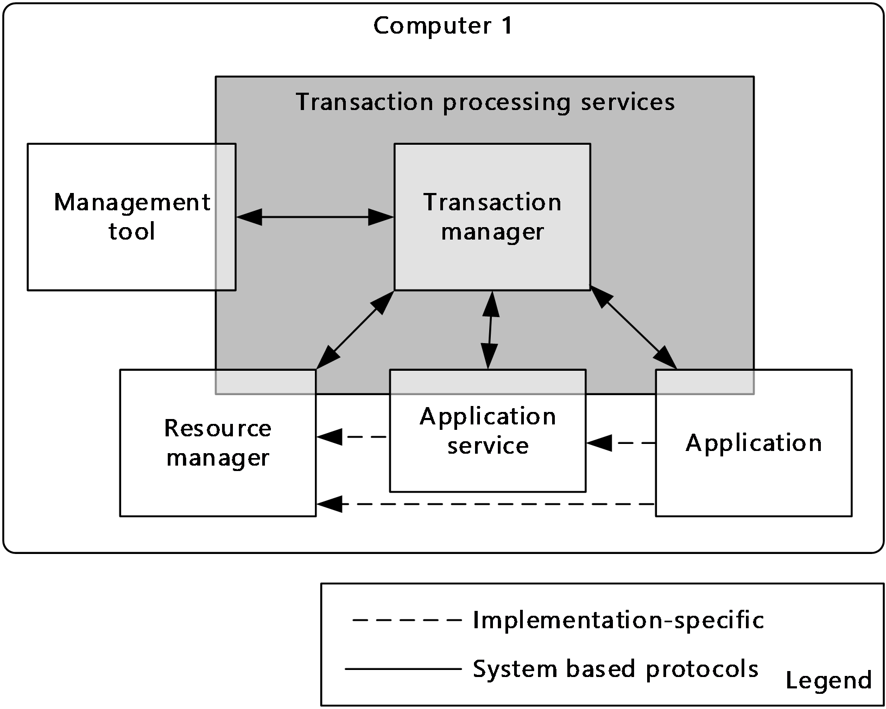

Figure 3: Basic communication between the roles as defined in the transaction lifecycle

The following roles use the core protocols:

**Application:** A client application that performs transacted work on a number of resource managers. The application creates a transaction, and therefore, only that application has the right to commit the transaction.

**Application service:** A service that accepts requests to perform transacted work on local resource managers. An application service does not have the right to commit transactions.

**Transaction manager:** A service that coordinates the lifetime of transactions by providing functionality for resource managers to enlist in these transactions. The transaction manager also provides functionality to enlist in transactions that are coordinated by remote transaction managers.

**Resource manager:** A participant that is responsible for coordinating the state of a resource with the outcome of transactions. For a specified transaction, a resource manager enlists with exactly one transaction manager to vote on that transaction outcome and to obtain the final outcome.

**Management tool:** An application that monitors the health of a transaction manager and configures settings that are related to transaction coordination.

The following roles use the optional protocols:

**External application:** An application that uses a protocol other than a core protocol to communicate with the transaction processing services.

**External application service:** An application service that uses a protocol other than a core protocol to communicate with the transaction processing services.

**External transaction manager:** A transaction manager that uses a protocol other than a core protocol to communicate with the transaction processing services.

**External resource manager:** A resource manager that uses a protocol other than a core protocol to communicate with the transaction processing services.

The following diagram shows a distributed scenario. The application performs work on a local resource manager and a remote resource manager. It is necessary for the transaction to be propagated from the application's local transaction manager to the remote resource manager's transaction manager.

Figure 4: Distributed communication between the roles as defined in the transaction lifecycle

As shown in the previous diagram, the system uses various [**facets**](#gt_facet) to enable communication between different roles. Specific details about these facets and their uses are discussed later in this section.

The communication between the application and application service, between the application and the resource manager, and between the application service and the resource manager are implementation-specific. The expectation is that this communication consists of a request for work to be done, along with all information that is necessary to enlist in the transaction, including the [**transaction identifier**](#gt_transaction-identifier). Otherwise, all other communication is based on the core protocols.

### 2.1.4 System Communication

### 2.1.5 Member Protocol Functional Relationships

The following diagram represents the dependencies of the protocols that are used by the transaction processing services.

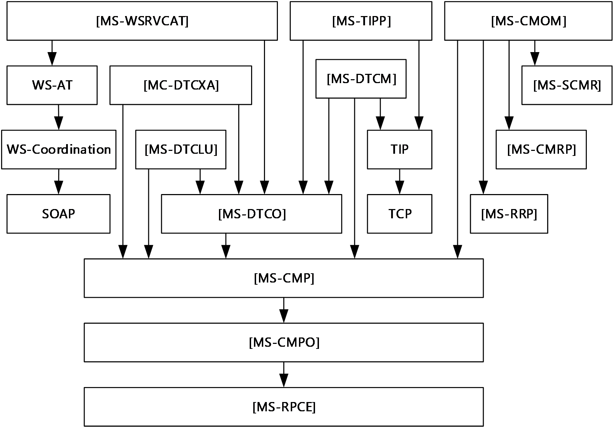

Figure 5: Transaction processing services protocol dependencies

This section describes the roles played by each member protocol in the overall function of the system:

- **MSDTC Connection Manager: OleTx Transaction Protocol (DTCO)**, as specified in [MS-DTCO](../MS-DTCO/MS-DTCO.md), supports all the communications between the components as described in section [2.1.2](../MS-DTCO/MS-DTCO.md), except those between the management tool and the transaction manager, between the application and the application service, between the application and the resource manager, and between the application service and the resource manager. The abstract state machine that drives the transaction lifecycle, as specified in [MS-DTCO] section 1.3.1, is defined only in [MS-DTCO]. An implementation of this state machine is necessary for any implementation of a transaction manager, and therefore, any implementation of the protocols, as specified in [MS-DTCM](../MS-DTCM/MS-DTCM.md), [MS-TIPP](../MS-TIPP/MS-TIPP.md), [MS-DTCLU](../MS-DTCLU/MS-DTCLU.md), [MS-CMOM](../MS-CMOM/MS-CMOM.md), [[WSAT10]](https://go.microsoft.com/fwlink/?LinkId=113066), [[WSAT11]](https://go.microsoft.com/fwlink/?LinkId=113067), [MS-WSRVCAT](../MS-WSRVCAT/MS-WSRVCAT.md), and [MC-DTCXA](../MC-DTCXA/MC-DTCXA.md), requires a DTCO implementation.
- **MSDTC Connection Manager: OleTx Transaction Protocol Logical Unit Mainframe Extension (DTCLU)**, as specified in [MS-DTCLU], supports communication from the external resource manager to the transaction manager. The system uses this protocol to provide transactional support to implementations of LU 6.2, as specified in [[IBM-LU62Guide]](https://go.microsoft.com/fwlink/?linkid=2133496).
- **MSDTC Connection Manager: OleTx Transaction Internet Protocol**, as specified in [MS-DTCM], supports communication from the external application to the transaction manager and external application service to transaction manager communications. The system uses this protocol to allow external application and external application services to request the system to pull a transaction from, or push a transaction to, an external transaction manager that implements Transaction Internal Protocol (TIP).
- **Transaction Internet Protocol (TIP) Extensions**, as specified in [MS-TIPP], supports external application to transaction manager communications, external application service to transaction manager communications, and external transaction manager to transaction manager communications. This protocol represents an extension to TIP as specified in [[RFC2371]](https://go.microsoft.com/fwlink/?LinkId=90338). It provides mechanisms to associate TIP transactions and the transactions that are internal to the system. It also provides mechanisms for driving a single atomic outcome, coordinating the distribution of this outcome, and [**transaction propagation**](#gt_transaction-propagation).
- **WS-AtomicTransaction** protocol ([WSAT10] and [WSAT11]) is an alternative transaction coordination protocol. It supports external application to transaction manager communications, external application service to transaction manager communications, and external transaction manager to transaction manager communications.
- **WS-AtomicTransaction (WS-AT) Version 1.0 Protocol Extensions**, as specified in [MS-WSRVCAT], supports external application to external transaction manager communications, and external application to external application service communications. The system uses this protocol to provide support for external applications to exchange system-specific transaction propagation information with external application services. By using the data structures in the WS-AtomicTransaction (WS-AT) Version 1.0 Protocol Extensions and also by using DTCO, external applications can query system-specific transaction propagation information from the system. External applications can then include this information in **WS-AtomicTransaction** messages when communicating with external application services. If the external application service also supports the protocols as specified in [MS-WSRVCAT] and [MS-DTCO], then for performance reasons, it can choose to communicate with the system by using core protocols rather than by using the WS-AtomicTransaction Version 1.0 Protocol Extensions. See [MS-WSRVCAT] for further details about this protocol and its usage scenarios.
- **MSDTC Connection Manager: OleTx XA Protocol**, as specified in [MC-DTCXA], supports communication from:
- An external transaction manager to a transaction manager.
- An external application to a transaction manager.
- An external resource manager to a transaction manager.
The system uses this protocol to provide transactional support for external transaction managers and external resource managers by implementing the protocol, as specified in [[XOPEN-DTP]](https://go.microsoft.com/fwlink/?LinkId=95800):

- **MSDTC Connection Manager: OleTx Management Protocol**, as specified in [MS-CMOM], is used for communications between the management tool and the transaction manager and performs administration and configuration operations on the system.
- **MSDTC Connection Manager: OleTx Transports Protocol**, as specified in [MS-CMPO](../MS-CMPO/MS-CMPO.md), is a framing and message transport protocol. It implements [**remote procedure call (RPC)**](#gt_remote-procedure-call-rpc) interfaces, as specified in [MS-RPCE](../MS-RPCE/MS-RPCE.md), for establishing duplex sessions between two partners and for exchanging messages between them. [MS-CMPO] describes specific restrictions on the use of RPC interfaces. Details are specified in [MS-CMPO] sections 1.3, 1.7, and 2.
- **MSDTC Connection Manager: OleTx Multiplexing Protocol**, as specified in [MS-CMP](../MS-CMP/MS-CMP.md), supports both multiplexing multiple logical sessions over a single CMPO session, and multiplexing multiple protocol messages into a single CMPO.

### 2.1.6 System Applicability

The transaction processing services protocols are applicable in scenarios where [**atomic transaction**](#gt_atomic-transaction) processing is required where the participants can be on the same computer or distributed in a network, and where each participant can be configured to use a different transaction processing protocol.

### 2.1.7 Relevant Standards

The system uses the standards that are listed in the following table for interoperability with external systems.

| Protocol name | Specification reference | System use description |
| --- | --- | --- |
| Transaction Internet Protocol (TIP) | [[RFC2371]](https://go.microsoft.com/fwlink/?LinkId=90338) | Allows transaction propagation between the system and TIP transaction managers. |
| SNA LU Type 6.2 Protocol (LU 6.2) | [[IBM-LU62Guide]](https://go.microsoft.com/fwlink/?linkid=2133496) | Allows resources with LU Type 6.2 implementation to participate in transactions. |
| Web Services Atomic Transaction (WS-AtomicTransaction) | [[WSAT10]](https://go.microsoft.com/fwlink/?LinkId=113066), [[WSAT11]](https://go.microsoft.com/fwlink/?LinkId=113067) | Allows distributed transaction processing and transaction propagation with systems implementing WS-AtomicTransaction. |
| Distributed Transaction Processing: The XA Specification (XA) | [[XOPEN-DTP]](https://go.microsoft.com/fwlink/?LinkId=95800) | Allows distributed transaction processing and transaction propagation with systems implementing XA. |

## 2.2 Protocol Summary

The following tables list the core and optional protocols that facilitate [**transaction**](#gt_transaction) coordination. Core protocols are proprietary to the system and are used by default by [**applications**](#gt_application), application services, and resource managers. Optional protocols enable interoperability through industry standards of transaction processing as described in section [2.1.7](#Section_2.1.7).

The following table lists each member protocol of the transaction processing services, its purpose, and its corresponding specification.

| Protocol name | Protocol purpose | Document short name |
| --- | --- | --- |
| MSDTC Connection Manager: OleTx Transaction Protocol | Enables the creation, initiation, and distributed propagation of transactions, and the participation in transactions. | [MS-DTCO](../MS-DTCO/MS-DTCO.md) |
| MSDTC Connection Manager: OleTx Management Protocol | Enables management tools to obtain a list of transactions being processed by a transaction manager. Enables the changing of settings that are used by other transaction processing services protocols. | [MS-CMOM](../MS-CMOM/MS-CMOM.md) |
| MSDTC Connection Manager: OleTx Transaction Internet Protocol | Enables the initiation of distributed transaction propagation via the TIP protocol. | [MS-DTCM](../MS-DTCM/MS-DTCM.md) |
| Transaction Internet Protocol (TIP) Extensions | Enables distributed propagation of transactions by using the TIP protocol over TCP. | [MS-TIPP](../MS-TIPP/MS-TIPP.md) |
| MSDTC Connection Manager: OleTx Transaction Protocol Logical Unit Mainframe Extension | Enables an implementation of [**logical unit (LU)**](#gt_logical-unit-lu) type 6.2 as defined by the IBM System Network Architecture (SNA) to participate in transactions that are coordinated by a transaction manager that does not implement SNA protocols. | [MS-DTCLU](../MS-DTCLU/MS-DTCLU.md) |
| WS-AtomicTransaction Protocol | Enables distributed transaction processing and propagation by using the WS-AtomicTransaction protocol. The system supports both version 1.0 and version 1.1 of the protocol. | [[WSAT10]](https://go.microsoft.com/fwlink/?LinkId=113066), [[WSAT11]](https://go.microsoft.com/fwlink/?LinkId=113067) |
| WS-AtomicTransaction (WS-AT) Protocol Extensions | Enables external applications to query the system for system-specific transaction propagation information. It also describes how this information can be propagated by extending the WS-AtomicTransaction Protocol. | [MS-WSRVCAT](../MS-WSRVCAT/MS-WSRVCAT.md) |
| MSDTC Connection Manager: OleTx XA Protocol | Enables external transaction managers and external resource managers by using the protocol as described on [[XOPEN-DTP]](https://go.microsoft.com/fwlink/?LinkId=95800) to participate in transactions with the system. | [MC-DTCXA](../MC-DTCXA/MC-DTCXA.md) |
| MSDTC Connection Manager: OleTx Multiplexing Protocol | Enables multiplexing multiple logical protocol connections through a single CMPO connection, which reduces the number of messages that are exchanged over the wire. | [MS-CMP](../MS-CMP/MS-CMP.md) |
| MSDTC Connection Manager: OleTx Transports Protocol | Provides negotiation of connections and sending of variable-length data for the MSDTC Connection Manager Protocol. | [MS-CMPO](../MS-CMPO/MS-CMPO.md) |

The following tables group the member protocols of the transaction processing services according to their primary purpose.

**Protocols that enable communication among transaction managers**

The protocols that are listed in the following table enable communication among transaction managers. The transaction processing services protocols consist of one or more transaction managers that communicate with each other by using protocols that are internal to the system and that collectively provide external interfaces to applications and resource managers. All of this communication uses a base set of system-defined protocols that are referred to as the core protocols.

| Protocol name | Description | Document short name |
| --- | --- | --- |
| MSDTC Connection Manager: OleTx Transaction Protocol | Enables the creation, initiation, and distributed propagation of transactions, and the participation in transactions. | [MS-DTCO] |
| MSDTC Connection Manager: OleTx Management Protocol | Enables management tools to obtain a list of transactions that are being processed by a transaction manager. Enables changing the settings that are used by other transaction processing services protocols. | [MS-CMOM] |

**Protocols that enable participants that support optional protocols to participate in transactions**

The protocols that are listed in the following table enable applications and transaction managers that support protocols other than the core protocols to participate in transactions. These protocols are referred to as the optional protocols, and the participants that use optional protocols are referred to as external applications, external resource managers, and external transaction managers in this overview.

| Protocol name | Description | Document short name |
| --- | --- | --- |
| MSDTC Connection Manager: OleTx Transaction Internet Protocol | Enables the initiation of distributed transaction propagation via the TIP protocol. | [MS-DTCM] |
| Transaction Internet Protocol (TIP) Extensions | Enables distributed propagation of transactions by using the TIP protocol over TCP. | [MS-TIPP] |
| MSDTC Connection Manager: OleTx Transaction Protocol Logical Unit Mainframe Extension | Enables an implementation of LU Type 6.2 as defined by the IBM System Network Architecture (SNA) to participate in transactions that are coordinated by a transaction manager that does not implement SNA protocols. | [MS-DTCLU] |
| WS-AtomicTransaction Protocol | Enables distributed transaction processing and propagation by using the WS-AtomicTransaction protocol. The system supports both version 1.0 and version 1.1 of the protocol. | [WSAT10], [WSAT11] |
| WS-AtomicTransaction (WS-AT) Version 1.0 Protocol Extensions | Enables external applications to query the system for system-specific transaction propagation information. It also describes how this information can be propagated by extending the WS-AtomicTransaction Protocol. | [MS-WSRVCAT] |
| MSDTC Connection Manager: OleTx XA Protocol | Enables external transaction managers and external resource managers by using the protocol as described in [XOPEN-DTP] to participate in transactions with the system. | [MC-DTCXA] |

**Protocols that enable the underlying communication for the core protocols**

The protocols that are listed in the following table enable the underlying communications functionality for the core protocols and the protocols as described in [MS-DTCM], [MS-DTCLU], and [MC-DTCXA].

| Protocol name | Description | Document short name |
| --- | --- | --- |
| MSDTC Connection Manager: OleTx Multiplexing Protocol | Enables multiplexing multiple logical protocol connections through a single CMPO connection, which reduces the number of messages that are exchanged over the wire. | [MS-CMP] |
| MSDTC Connection Manager: OleTx Transports Protocol | Provides negotiation of connections and sending of variable-length data for the MSDTC Connection Manager Protocol. | [MS-CMPO] |

**Protocols that enable support for TIP transactions**

The protocols that are listed in the following table enable support for Transaction Internet Protocol (TIP) transactions.

| Protocol name | Description | Document short name |
| --- | --- | --- |
| MSDTC Connection Manager: OleTx Transaction Internet Protocol | Enables the initiation of distributed transaction propagation via the TIP protocol. | [MS-DTCM] |
| Transaction Internet Protocol (TIP) Extensions | Enables distributed propagation of transactions by using the TIP protocol over TCP. | [MS-TIPP] |

**Protocols that enable support for WS-AtomicTransactions**

| Protocol name | Description | Document short name |
| --- | --- | --- |
| WS-AtomicTransaction Protocol | Enables distributed transaction processing and propagation by using the WS-AtomicTransaction protocol. The system supports both version 1.0 and version 1.1 of the protocol. | [WSAT10], [WSAT11] |
| WS-AtomicTransaction (WS-AT) Version 1.0 Protocol Extensions | Enables external applications to query the system for system-specific transaction propagation information. It also describes how this information can be propagated by extending the WS-AtomicTransaction Protocol. | [MS-WSRVCAT] |

## 2.3 Environment

The following sections identify the context in which the system exists. The system includes the systems that use the interfaces that are provided by this system of protocols, other systems that depend on this system, and, as appropriate, the manner in which the components of the system communicate.

### 2.3.1 Dependencies on This System

The following systems depend on transaction processing services:

**Message Queuing System:** The message queuing protocols, as described in [MS-MQOD](#Section_2.1), depend on the transaction processing services to allow message queues to be treated as resources in the context of a distributed transaction. Without transaction processing services, the message queuing system has to either extend its internal transaction manager to support distributed transactions or has to rely on another transaction processing system to achieve this.

**COM+:** The COM+ protocol, as described in [MS-COM](../MS-COM/MS-COM.md), depends on transaction processing services to implement its transactional features. Without transaction processing services, the COM+ protocol has to either implement an internal transaction processing system or has to rely on another transaction processing system to achieve the same functionality.

### 2.3.2 Dependencies on Other Systems/Components

The system depends on a durable storage system to maintain the state that is used when recovering from failure. The storage that holds this state is referred to as a log. The log is a crucial component of the system. Without the log, following a transient failure where everything in-memory is lost, it is not possible for the system to determine the last known state of a given transaction and whether the transaction outcome has been communicated to the corresponding participants. If recovery is necessary, but the log that has the recovery information is lost, it is not possible to recover the corresponding transactions. As a result, data corruption or data loss can occur on the affected resources.

The transaction processing services protocols depend on a networking system to connect the computers that are involved in the system if the system spans multiple computers. The system has no specific requirements regarding the type of network that has to be used for this purpose. The system internal components can span across multiple computers, or some transaction participants can be remotely communicating with the system over a network. In either case, the components on separate computers rely on the networking system to discover and communicate with each other.

The transaction processing services protocols depend on a security identity management system to authenticate identities and to group them. The system uses the security identity management system to restrict access to its assets and functionality to specified groups.

## 2.4 Assumptions and Preconditions

The following assumptions and preconditions apply to the transaction processing services protocols:

- The system has to have access to a durable storage system where it can keep a log. The system holds state information for each running transaction in the log. Depending on the number of running transactions at a given time, the log size requirement can differ because the size of the log grows with the number of transaction states that it stores.
- If the system spans across a computer network, the system has to be installed on all the computers that are involved.
- The system has to be configured so that participants can access its services locally or remotely.
- If the system components span across a computer network, the computers in the network has to be connected to each other via the durable network as described previously.
- It is assumed that each transaction participant is trusted by the system. It is possible that a malicious participant can start several new transactions and never complete them, resulting in a filled log. Such a case forces the system to stop responding to new, incoming transaction requests until enough log space is available again.
Member protocols that are supported by the system, as listed in section [2.2](#Section_2.2), can have additional assumptions and preconditions when that protocol is being used. See the relevant member protocol specification for details.

## 2.5 Use Cases

### 2.5.1 Perform Transaction Work – Application

In this use case, the [**application**](#gt_application) performs the transaction between multiple [**transaction managers**](#gt_transaction-manager).

**Context of use:** An application performs transaction work across multiple transaction managers.

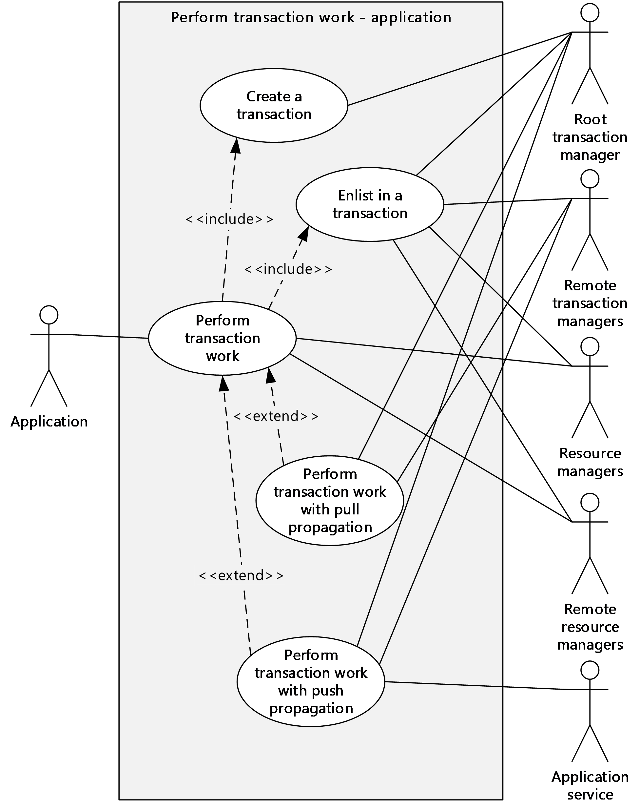

Figure 6: Use case diagram for performing transaction work

**Goal:** To perform transaction work between a [**root transaction manager**](#gt_root-transaction-manager) and one or more remote transaction managers.

**Actors:**

**Application:** A primary actor that performs transaction work on a number of transaction managers. The application creates a transaction, and therefore, only that application has the right to commit the transaction.

**Root transaction manager:** The root transaction manager is a supporting actor. It is a service that coordinates the lifetime of transactions by providing functionality for resource managers to enlist in these transactions. The root transaction manager also provides functionality to enlist in transactions that are coordinated by remote transaction managers. A root transaction manager is a transaction manager that creates and starts the transaction.

**Remote transaction manager:** The remote transaction manager is a supporting actor. It is a transaction manager that receives requests to perform transactions depending on its availability.

**Resource manager:** The resource manager is a supporting actor that is responsible for coordinating the state of a resource with the outcome of transactions. For a specified transaction, a resource manager enlists with exactly one transaction manager (here it is the root transaction manager) to vote on that transaction outcome and to obtain the final outcome.

**Remote resource manager:** The remote resource manager is a supporting actor. It is a resource manager that enlists with the remote transaction manager.

**Application service:** The application service is a supporting actor. It is a service that accepts requests to perform transaction work on local resource managers. An application service cannot commit transactions.

**Stakeholders:**

**Application:** The application is a program that creates transactions in a distributed computed network. Only that application has the right to commit the transaction.

**Preconditions:**

- Transaction processing services are operational.
- The application can access a transaction manager in the system.
**Main success scenario:**

- **Trigger:** The application triggers the root transaction manager to create a transaction (section [2.5.6.1](#Section_2.5.6.1)).
- The resource managers enlist in a transaction (section [2.5.6.2](#Section_2.5.6.2)) with their respective root transaction manager and remote transaction manager or transaction managers.
- After successful [**enlistment**](#gt_enlistment) in a transaction, the resource manager or managers make the requested updates to their resource in accordance with the semantics of the [**two-phase commit**](#gt_two-phase-commit) protocol, such as isolation and durability.
- The application performs remote transaction work with pull propagation by using the application service (section [2.5.6.3](#Section_2.5.6.3)).
**Postcondition:** The transaction is performed successfully.

**Extensions:** None.

**Variation – perform transaction work – external application:** All details are identical to the use case as described in this section except that the application performs the transaction with [**push propagation**](#gt_push-propagation) where the application acts as an external application that makes use of optional protocols (see section [2.2](#Section_2.2)).

### 2.5.2 Complete a Transaction – Application

In this use case, the application either commits or aborts the transaction and completes the transaction on all transaction participants.

**Context of use:** Commit or abort the transaction and drive it on all its participants until the transaction is complete.

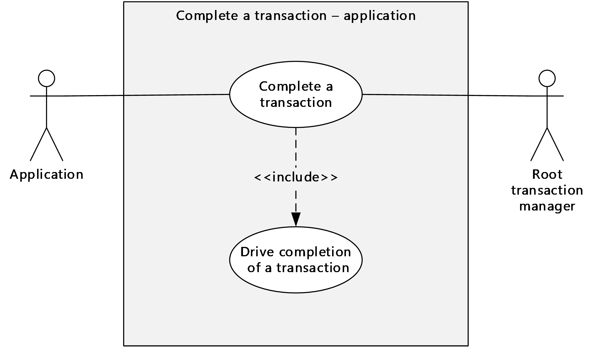

Figure 7: Use case diagram for transaction completion

**Goal:** To complete a transaction.

**Actors:**

**Application:** The application is a primary actor that performs transaction work on a number of resource managers. The application creates a transaction, and therefore, only that application has the right to commit the transaction.

**Root transaction manager:** The root transaction manager is a supporting actor. The root transaction manager is a service that coordinates the life time of transactions, by providing functionality for resource managers to enlist in these transactions. The root transaction manager also provides functionality to enlist in transactions that are coordinated by remote transaction managers. Here, the root transaction manager is a transaction manager that creates the transaction and starts the transaction.

**Stakeholders:**

**Application:** The application is a program that creates and performs transactions in a distributed computed network, and therefore, only that application has the right to commit the transaction.

**Preconditions:**

- Transaction processing services are operational.
- The application can access a transaction manager in the system.
**Main success scenario:**

- **Trigger:** The application triggers the root transaction manager.
- The application requests that the root transaction manager commits or aborts a transaction.
- The root transaction manager makes a durable record for the result of the transaction and responds to the application, indicating success.
- The transaction manager initiates the Drive Completion of a transaction use case (section [2.5.6.5](#Section_2.5.6.5)) to notify all participants of the outcome of the transaction.
**Postcondition:** The transaction has finished successfully.

**Extensions:** None.

**Variation – complete a transaction – external application:** All details are identical to the use case as described in this section except that the application here is an external application that makes use of optional protocols (see section [2.2](#Section_2.2)).

### 2.5.3 Transaction Management – Management Tool

**Context of use:** A transaction operation is monitored or managed by the management tool.

Figure 8: Manage transactions use case

**Goal:** To monitor or manage a transaction.

**Actors:**

**Management tool:** The management tool is the primary actor that triggers this use case. The management tool is an application that monitors the health of a transaction manager and configures settings that are related to transaction coordination.

**Transaction manager:** The transaction manager is the supporting actor. It is a service that coordinates the lifetime of transactions by providing functionality for resource managers to enlist in these transactions. The root transaction manager also provides functionality to enlist in transactions that are coordinated by remote transaction managers.

**Stakeholders:**

**Application:** The application is a program that performs transactions in a distributed computed network that creates a transaction, and therefore, only that application has the right to commit the transaction.

**Preconditions:**

- Transaction processing services are operational.
- The management tool can access the transaction manager in the system.
**Main success scenario:**

- **Trigger:** The management tool requests that the transaction manager provides a list of existing transactions.
- The transaction manager returns a list of existing transactions and their known states.
- The management tool performs a Subscribe for transaction information action against the transaction manager to monitor the progress of the [**two-phase commit**](#gt_two-phase-commit) protocol, as described in [MS-DTCO](../MS-DTCO/MS-DTCO.md) section 1.3.1 and to resolve the transaction if it reaches an error state.
- The management tool requests that the transaction manager updates the state of a transaction. For example, it can force the transaction to abort.
- The transaction manager successfully updates the state of the transaction.
**Postcondition:** The transaction state is correctly updated.

### 2.5.4 Recover In-doubt Transaction State – Resource Manager

This use case shows how the [**resource manager**](#gt_resource-manager-rm) drives recovery when a connection to a resource manager breaks down after a participant has completed [**Phase One**](#gt_phase-one), but before completing [**Phase Two**](#gt_phase-two) of the [**two-phase commit**](#gt_two-phase-commit) protocol, as described in [GRAY]. The participant uses this use case to recover the outcome of such [**transactions**](#gt_transaction).

**Context of use:** There is a failure during the two-phase commit process, and the transaction is in an in-doubt state in the root transaction manager's log.

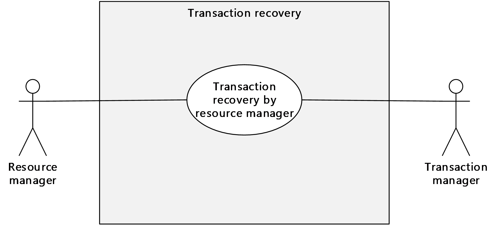

Figure 9: Use case for transaction recovery by a resource manager

**Goal:** To recover the state of an in-doubt transaction in the root transaction manager's log.

**Actors:**

**Resource manager:** The resource manager is a primary actor which is a participant that is responsible for coordinating the state of a resource with the outcome of transactions. For a specified transaction, a resource manager enlists with exactly one transaction manager to vote on that transaction outcome and to obtain the final outcome.

**Transaction manager:** The transaction manager is a supporting actor. The transaction manager is a service that coordinates the lifetime of transactions by providing functionality for resource managers to enlist in these transactions. The transaction manager also provides functionality to enlist in transactions that are coordinated by remote transaction managers. Here, the root transaction is a transaction manager that creates the transaction and starts performing the transaction.

**Stakeholders:**

**Architects:** An architect is responsible for the overall design of a system while managing the technical risks that are associated with it.

An architect can use the transaction processing services as an element of a system in the design process to provide reliable support for distributed transactions.

**IT operations personnel:** If there are transactions in an in-doubt state in the resource manager log, the resource manager executes this use case to recover the affected transactions. Similarly, if a transaction manager has any transactions in a failed-to-notify state, then a resource manager executes this use case to receive the outcomes of those transactions. Both of these operations can require manual intervention by the IT operations personnel to trigger the recovery, or to force the affected resource managers and transaction managers to forget the transactions in either an in-doubt and failed-to-notify state.

**Preconditions:**

- Transaction processing services is operational.
- The resource manager can access a transaction manager in the system.
- The resource manager has transactions in in-doubt state in its log.
**Main success scenario:**

- **Trigger:** The resource manager triggers this use case on startup if it has any in-doubt transactions in its log, as described in [MS-DTCO](../MS-DTCO/MS-DTCO.md) section 1.3.4.2.
- The resource manager asks the transaction manager for the outcome of the transactions in an in-doubt state in its log.
- The system returns the state of each transaction if it has a record of the transaction in its log. Otherwise, the transaction manager indicates to the resource manager that it does not have a record of the transaction.
- The resource manager either aborts or commits each transaction on the basis of the outcome information that it received from the transaction manager. If the transaction manager indicates that it does not have a record for a transaction, the resource manager assumes that the transaction has been aborted.
**Postcondition:** The transaction manager forgets the transaction and the resource manager durably updates its records according to the outcome that it received from the transaction manager.

**Extensions:** None.

### 2.5.5 Transaction Recovery - Remote Transaction Manager

This use case shows how the [**transaction manager**](#gt_transaction-manager) drives [**recovery**](#gt_recovery) where a connection to a [**subordinate transaction manager**](#gt_subordinate-transaction-manager) breaks down during the [**two-phase commit**](#gt_two-phase-commit) protocol, as described in [GRAY], when a participant has completed [**Phase One**](#gt_phase-one) but has experienced a failure before completing [**Phase Two**](#gt_phase-two). The participant uses this use case to recover the [**outcome**](#gt_outcome) of such transactions.

**Context of use:** There is a failure during the two-phase commit process, and the transaction is in an in-doubt state in the participant's log.

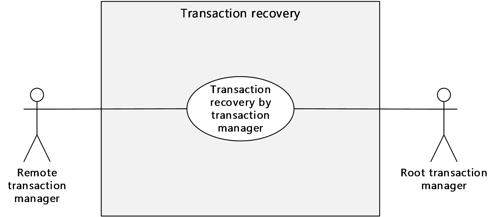

Figure 10: Use case for transaction recovery by a transaction manager

**Goal:** To recover the state of an in-doubt transaction in the participant's log.

**Actors**:

**Remote transaction manager:** The remote transaction manager is a primary actor. It is a transaction manager that receives a request to perform some transaction depending on its availability and enlists itself with the root transaction manager.

**Root transaction manager:** The root transaction manager is a supporting actor. It is a service that coordinates the lifetime of transactions, enabling resource managers to enlist in these transactions and to enlist in transactions that are coordinated by remote transaction managers. Here, a root transaction manager is a transaction manager that creates and starts the transaction.

**Stakeholders:**

**Architects:** An architect is responsible for the overall design of a system while managing the technical risks that are associated with it. An architect can use transaction processing services to provide proven, reusable support for distributed transactions.

**IT operations personnel:** If there are transactions in an in-doubt state in a resource manager log, the resource manager executes this use case to recover the affected transactions. Similarly, if a transaction manager has any transactions in a failed-to-notify state, a resource manager executes this use case to receive the outcomes of those transactions. Both of these operations can require manual intervention by the IT operations personnel to trigger the recovery or to force the affected resource managers and transaction managers to forget the transactions in the in-doubt and failed-to-notify states.

**Preconditions:**

- Transaction processing services are operational.
- The resource manager can access a transaction manager in the system.
- The resource manager has transactions in an in-doubt state in its log.
**Main Success Scenario:**

- **Trigger:** The remote transaction manager triggers this use case on startup if it has any in-doubt transactions in its log, as described in [MS-DTCO](../MS-DTCO/MS-DTCO.md) section 1.3.4.2.
- The remote transaction manager initiates a **CheckAbort** connection with the root transaction manager and sends a Check message to determine whether the transaction is aborted.
- The root transaction manager returns the state of the transaction if it has a record of the transaction in its own log. Otherwise, the root transaction manager indicates to the resource manager that it does not have a record for the transaction.
- The remote transaction manager either aborts or commits each transaction on the basis of the outcome information that it received from the root transaction manager. If the root transaction manager indicated that it does not have a record for a transaction, the remote transaction manager assumes that the transaction has been aborted.
**Postcondition:** The remote transaction manager durably updates its records, according to the outcome that it received from the root transaction manager.

**Extensions:** None.

### 2.5.6 Supporting Use Cases

#### 2.5.6.1 Create a Transaction – Application

In this use case, the application triggers the root transaction manager to create a transaction.

**Context of use:** A transaction is to be created before performing any transaction work.

**Goal:** To start a new transaction with a root transaction manager in the system.

**Actors:**

**Application:** The application is a primary actor that performs transaction work on several resource managers. The application creates a transaction, and therefore, only that application has the right to commit the transaction.

**Root transaction manager:** The root transaction manager is a supporting actor. The root transaction manager coordinates the lifetime of transactions by providing functionality for resource managers to enlist in these transactions. The root transaction manager also provides functionality to enlist in transactions that are coordinated by remote transaction managers. Here, the root transaction manager is a transaction manager that creates the transaction and starts performing the transaction.

**Stakeholders:**

**Application:** The application is a program that creates and performs transactions in a distributed computed network, and therefore, only that application has the right to commit the transaction.

**Preconditions:**

- Transaction processing services are operational.
- The application can access a transaction manager in the system.
**Main success scenario:**

- **Trigger:** The application triggers the root transaction manager to create a transaction.
- The application requests that the root transaction manager creates a transaction.
- The root transaction manager creates a transaction.
- The root transaction manager returns a reference to the transaction to the application.
**Postcondition:** A new transaction is created.

**Extensions:** None.

**Variation – create a transaction – external application:** All details are identical to the use case that is described in this section except that the application is an external application that makes use of optional protocols (see section [2.2](#Section_2.2)).

#### 2.5.6.2 Enlist in a Transaction – Resource Manager

In this use case, the resource manager enlists in a transaction with a respective transaction manager.

**Context of use:** When a resource manager is enlisted in a transaction, the resource manager can participate in the coordination of the transaction.

**Goal:** To enlist a resource manager in a transaction.

**Actors:**

**Resource manager:** The resource manager is a primary actor and can be a remote resource manager or an external resource manager.

**Transaction manager:** The transaction manager is a supporting actor. The transaction manager can be a root transaction manager, a remote transaction manager, or an external transaction manager.

**Stakeholders:**

- Architects
- Implementers
**Preconditions:**

- Transaction processing services are operational.
- The resource manager can access the transaction manager that it has to contact to enlist in the transaction.
**Main success scenario:**

- **Trigger**: The application triggers the resource manager to update its resource in the context of the transaction that was created in the Create a Transaction (section [2.5.6.1](#Section_2.5.6.1)) use case.
- The resource manager asks the transaction manager to enlist in the transaction.
- The transaction manager enlists the resource manager in the transaction and returns a success message to the resource manager.
- After successful enlistment in a transaction, the resource manager makes the requested updates to its resource in accordance with the semantics of the [**two-phase commit**](#gt_two-phase-commit) protocol, such as isolation and durability.
**Postcondition:** The resource manager enlists in a transaction with the respective transaction manager.

**Extensions:** None.

**Variation:** All details are identical to the use case as described in this section except that the application is an external application that makes use of optional protocols (see section [2.2](#Section_2.2)).

#### 2.5.6.3 Perform Transaction Work with Pull Propagation – Application

In this use case, the application performs transaction work with pull propagation.

**Context of use:** To perform a set of operations in a transaction on a remote resource manager that has a separate transaction manager.

**Goal:** To perform transaction work with pull propagation on a remote resource that has a separate transaction manager.

**Actors:**

**Application:** The application is a primary actor that performs transaction work on a number of resource managers. The application creates a transaction, and therefore, only that application has the right to commit the transaction.

**Application service:** The application service is a supporting actor. It is a service that accepts requests to perform transaction work on local resource managers. An application service does not have the right to commit transactions.

**Root transaction manager:** The root transaction manager is a supporting actor. The root transaction manager coordinates the lifetime of transactions by providing functionality for resource managers to enlist in these transactions. The root transaction manager also provides functionality to enlist in transactions that are coordinated by remote transaction managers.

**Remote transaction manager:** The remote transaction manager is a supporting actor that receives requests to perform transactions depending on its availability.

**Remote resource manager:** The remote resource manager is a supporting actor that enlists with the remote transaction manager.

**Stakeholders:**

- Architects
- Implementers
**Preconditions:**

- Transaction processing services are operational.
- The application can access a transaction manager in the system.
- The resource manager of the resource and the application service are on a remote computer and can access a transaction manager in the system.
- The two computers involved are connected on a network.
- The two transaction managers are on separate computers and can access each other.
- The transaction managers on each computer in the system are operational.
**Main success scenario:**

- **Trigger:** The application triggers the resource manager to update its resource in the context of the transaction that was created in the Create a Transaction (section [2.5.6.1](#Section_2.5.6.1)) use case.
- The application sends the transaction reference that was received during the Create a Transaction use case, along with information about the work to be done to the application service.
- Upon receiving the information about the transaction reference and the work to be done, the application service asks its remote transaction manager to pull the transaction, passing the transaction reference that was provided by the application.
- The remote transaction manager sends a transaction reference to the root transaction manager asking to pull the transaction.
- The root transaction manager enlists the remote transaction manager in the transaction and returns success.
- The application service passes the information about the work to be done to the remote resource manager along with a reference to the transaction.
- The remote resource manager executes the Enlist in a Transaction (section [2.5.6.2](#Section_2.5.6.2)) use case, requesting that the remote transaction manager enlist it in the transaction.
- The remote resource manager makes the requested updates to the resource in accordance with the [**two-phase commit**](#gt_two-phase-commit) protocol semantics, such as isolation and durability.
- The remote resource manager reports success to the application service, and in turn, the application service reports success to the application.
**Postcondition:** Transaction work is done with pull propagation.

**Extensions:** None.

**Variation – perform transaction work with pull propagation – external application:** All details are identical to the use case as described in this section except that the application here is an external application that makes use of optional protocols (see section [2.2](#Section_2.2)).

#### 2.5.6.4 Perform Transaction Work with Push Propagation – External Application

In this use case, the application performs transaction work with push propagation.

**Context of use:** To perform set of operations in a transaction on a remote resource manager that has a separate transaction manager with push propagation.

**Goal:** To perform transaction work on a remote resource that has a separate transaction manager with push propagation.

**Actors:**

**External application:** The external application is a primary actor that performs transaction work on several resource managers. The application creates a transaction, and therefore, only that application has the right to commit the transaction.

**Root transaction manager:** The root transaction manager is a supporting actor. It coordinates the lifetime of transactions, providing functionality for resource managers to enlist in these transactions, and functionality to enlist in transactions that are coordinated by remote transaction managers.

**External transaction manager:** The external transaction manager is a supporting actor that receives requests to perform transactions depending on its availability.

**External resource manager:** The external resource manager is a supporting actor that enlists with the remote transaction manager.

**Note** An external actor is one that uses optional protocols as well as core protocols.

**Stakeholders**:

- Architects
- Implementers
**Preconditions:**

- Transaction processing services are operational.
- The external application and the external transaction manager can both access a transaction manager in the system.
- The external application and the external transaction manager are both on separate computers.
- The two computers involved are connected on the network.
**Main success scenario:**

- **Trigger:** The application triggers the resource manager to update its resource in the context of the transaction that was created in the Create a Transaction (section [2.5.6.1](#Section_2.5.6.1)) use case.
- The external application asks the external resource manager for the location of the external transaction manager.
- The external application asks the transaction manager to push the transaction to the external transaction manager.
- The transaction manager initiates a push transaction to push the transaction to the external transaction manager. As a result, the external transaction manager is enlisted in the transaction.
- The external application asks the external resource manager to update the context of the transaction.
- The external resource manager makes the requested updates to its resource in accordance with the [**two-phase commit**](#gt_two-phase-commit) protocol semantics, such as isolation and durability.
- The external resource manager reports success to the external application.
**Postcondition:** Transaction work is done with push propagation.

**Extensions:** None.

#### 2.5.6.5 Drive Completion of a Transaction – Root Transaction Manager

In this use case, the root transaction manager drives the completion of the transaction on all transaction participants.

**Context of use:** A transaction has to be completed on all its participants.

**Goal:** To drive completion of the transaction on all transaction participants.

**Actors:**

**Root transaction manager:** The root transaction manager is a supporting actor. The root transaction manager coordinates the lifetime of transactions by providing functionality for resource managers to enlist in these transactions and functionality to enlist in transactions that are coordinated by remote transaction managers. Here, the root transaction manager creates the transaction and starts performing the transaction.

Transaction managers that are subordinate to the transaction manager that is executing this use case are supporting actors for this use case. Supporting actors execute a new instance of this use case on resource managers and transaction managers that are enlisted in the transaction through them.

**Stakeholders:**

- Architects
- Implementers
**Preconditions:**

- Transaction processing services are operational.
- The transaction manager can access the participants in the transaction.
**Main success scenario:**

- **Trigger**: The root transaction manager triggers its subordinate transaction managers.
- The root transaction manager drives the two-phase commit notifications on each participant that is enlisted in the transaction.
- Each transaction manager that is subordinate to this root transaction manager initiates a new use case for the participants.
- The root transaction manager returns success after the transaction has completed.
**Postcondition:** The transaction has completed successfully.

**Extensions:** None.

## 2.6 Versioning, Capability Negotiation, and Extensibility

The system does not define any versioning and capability negotiation beyond those described in the specifications of the protocols that are supported by the system, as listed in section [2.2](#Section_2.2).

## 2.7 Error Handling

This section describes the common failure scenarios and provides details about the system behavior in such conditions.

### 2.7.1 Connection Disconnected

A common failure scenario is an unexpected connection breakdown between the system and external entities or between transaction managers within the system. A disconnection can be caused by the network not being available, or by one of the communicating participants becoming unavailable. In the case where the network is not available, both participants remain active and expect the other party to continue the communication pattern as described by the protocol that is being executed at the time of the failure. Similarly, in the case where one of the participants is not available, the active participant expects the communication to proceed as specified by the protocol that is being executed.

Generally, a protocol detects a connection breakdown by one of the following methods:

- By using a timer object that generates an event if the corresponding participant has not responded within a reasonable time span.
- By being notified by the underlying protocol that the connection is disconnected.
When a connection disconnected event is detected, the protocol shut downs all related communications and updates any necessary data structures to maintain the system state.

Details about how each protocol detects a connection disconnected event and how it behaves under this scenario are provided in the specifications of the member protocols, as listed in section [2.2](#Section_2.2).

### 2.7.2 Internal Failures

The system or a transaction participant can detect an unrecoverable internal state at any point during the lifetime of a transaction. In such a scenario, if the system or the participant experiencing the internal failure cannot continue the transaction for any reason, it can abort the existing transactions that are not yet in the second phase of the [**two-phase commit**](#gt_two-phase-commit) protocol. The two-phase commit protocol is designed to handle unilateral termination of transactions so that all participants are rolled back to their states before the transaction started. For the transactions that are in the second phase, the transaction information is persisted, which in return means that it is recoverable. When the participant returns to a state where it can resume its operations, it can recover the transaction. Detailed descriptions of unilateral abort and recovery scenarios are provided in [MS-DTCO](../MS-DTCO/MS-DTCO.md) sections 1.3.2.1 and 1.3.4, respectively.

### 2.7.3 System Configuration Corruption or Unavailability

The system relies on the availability and consistency of its configuration data. Configuration consists of the data that determines the behavior of the system under specific conditions or for specific functionality. For example, the configuration can be used to enable or disable certain protocols or determine whether the system can span across a network of computers.

If the configuration data is not available, the protocol that requires the configuration data can assume a default value. [MS-CMOM](../MS-CMOM/MS-CMOM.md) section 3.3.1 describes the system configuration data and the manner in which it maps to the abstract data models in [MS-CMPO](../MS-CMPO/MS-CMPO.md) section 3.2.1, [MS-DTCO](../MS-DTCO/MS-DTCO.md) section 3.2.1, and [MC-DTCXA](../MC-DTCXA/MC-DTCXA.md) section 3.1.1.

### 2.7.4 Log Corruption or Unavailability

The log is where the system keeps the transaction state information. Availability and consistency of the log is crucial to guaranteeing atomicity in transaction processing. The system can use implementation-specific mechanisms to make sure the data in the log is reliable. If the log is corrupt, or if it is not available at all, the system cannot process any new durable transactions or respond to recovery requests.

If the log is not recoverable or if it is lost, a new log is created, which means that any transaction information that was in the previous log is lost. This means that the data or application state that was dependent on the transaction information from the lost log can become corrupt.

## 2.8 Coherency Requirements

Transactions are used by [**applications**](#gt_application) and other systems to maintain data coherency in the event of transient failures. To satisfy this requirement, the system guarantees atomicity through transactions. Transactions require the use of a [**log**](#gt_log) in a durable storage system. The log is used to hold important state information. Following a transient failure, the system can access the log to recall the last known state and continue its processing from that point.

## 2.9 Security

This section documents the system-wide security issues that are not otherwise described in the specifications for the member protocols. It does not duplicate what is already in the member protocol specifications unless there is a unique aspect that applies to the system as a whole.

Transaction processing services are designed to protect the following assets:

- Transaction information, see Transaction Information Security (section [2.9.1](#Section_2.9.1))
- System configuration, see System Configuration Security (section [2.9.2](#Section_2.9.2))
- Messages, see Message Security (section [2.9.3](#Section_2.9.3))
- Events, see Event Security (section [2.9.4](#Section_2.9.4))
This is illustrated in the following diagram, where the system is shown communicating with a resource manager and an application service.

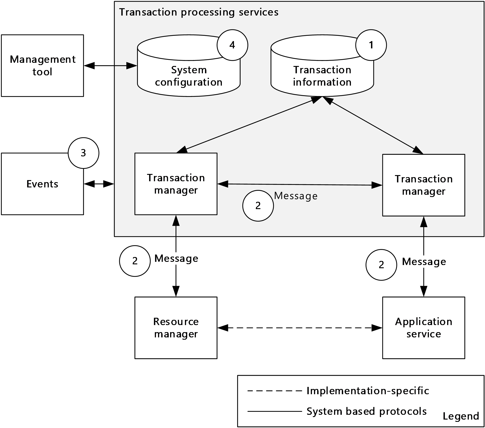

Figure 11: Transaction processing services assets

### 2.9.1 Transaction Information Security

The transaction information asset consists of the state of the transaction, the identity, and the locations of the participants, and other data about the transaction, such as the transaction description. The transaction information is held in memory and also in a log that is supported by a durable storage system.

The system relies on the durable storage system to maintain the integrity of this log and to restrict access to it.

The system accesses and modifies its transaction information as a result of events and messages that it receives. Therefore, the security and integrity of the transaction information is also dependent on the system's ability to secure these events and messages, which is described in sections [2.9.3](#Section_2.9.3) and [2.9.4](#Section_2.9.4).

### 2.9.2 System Configuration Security

The system configuration asset consists of all the configuration data that is required by the system. Examples are security identities and associated credentials that are used by the system, and feature enablement settings such as the setting that allows a transaction to span multiple computers. System configuration data is kept in a durable storage system. The system relies on the durable storage system to enforce the access restrictions as specified by the system.

The system accesses and modifies its system configuration data as a result of messages that it receives; for example, from a management tool, as specified in [MS-CMOM](../MS-CMOM/MS-CMOM.md). Therefore, the security and integrity of the system configuration is also dependent on the system's ability to secure these messages, which is described in section [2.9.3](../MS-CMOM/MS-CMOM.md).

### 2.9.3 Message Security

The messages asset consists of the messages that are received and sent by the system and messages that are received and sent within the system. The system protects the privacy and integrity of these messages and ensures that they are sent to and received from an authorized party.

The messages that the system receives and sends are specified by the system protocols (see section [2.2](../MS-CMPO/MS-CMPO.md)). Most of these protocols, in turn, depend on CMPO, as specified in [MS-CMPO](../MS-CMPO/MS-CMPO.md), which requires that an [**RPC**](#gt_remote-procedure-call-rpc) session is established before exchanging any messages. CMPO uses the [**security provider**](#gt_security-provider) security model, as specified in [MS-RPCE](../MS-RPCE/MS-RPCE.md) section 2.2.1.1.7, and an authentication level, as specified in [MS-RPCE] section 2.2.1.1.8, to configure protection of messages; for example, full encryption for privacy and integrity, or by requiring mutual authentication for authorization. See [MS-CMPO] section 2.1.3 for more details. Some system protocols do not depend on CMPO, but they might use, depend on, or extend other industry standard protocols, as described in section [2.1.7](../MS-CMPO/MS-CMPO.md). When communicating over protocols that do not depend on CMPO, the system adopts the security requirements and semantics that are specified by the industry standard protocol.

When communicating over the WS-AtomicTransaction protocol, the system fully adheres to the security requirements and semantics as specified by the WS-AtomicTransaction protocol. Additionally, the system requires that all WS-AtomicTransaction communication is done over an HTTPS connection. All entities that participate in transaction coordination with the system via the WS-AtomicTransaction protocol have to use a valid X.509 security certificate (see [[X509]](https://go.microsoft.com/fwlink/?LinkId=90590)), when communicating with the system. The system keeps a list of X.509 security certificate thumbprints in its system configuration to authorize whether an entity can participate in transaction coordination with the system by using the WS-AT protocol.

### 2.9.4 Event Security

The Events asset consists of the events that are raised and handled by the system. These events are limited to events that are received from the network system reporting a change of connection state and events that are received from the operating environment of the system when the system is initialized. Both of these event sources and their connection to the system are trusted by the system, and no additional protections are applied.

### 2.9.5 Connection Type and Feature Restriction

The system also restricts access to certain features to specified groups of security identities. This restriction is applied at the level of connection type. A connection type specifies a set of messages. The system protocols specify these connection types and the related messages. The system protocols use connection types to group messages by functionality, and most messages are members of exactly one connection type. Therefore, the functionality that is associated with a message can be restricted by restricting access to the connection type, and by sending or receiving a message only if the communicating party has access to the connection type.

Connection types that are related to transaction state changes are restricted to sessions that are authenticated as administrator, and connection types that are related to transaction manager communication are restricted to parties known to be transaction managers, as specified in [MS-DTCO](../MS-DTCO/MS-DTCO.md) section 5.

The system also restricts the set of supported connection types through configuration, as described in [MS-DTCO] section 5. For example, the system can be configured to not allow connection types related to network transactions.

When using the protocol, as specified in [MS-TIPP](../MS-TIPP/MS-TIPP.md), the system can be configured to restrict the use of specific functionalities that are related to that protocol through configuration, as specified in [MS-TIPP] section 5.

The system can be configured to restrict the use of the protocol, as specified in [MC-DTCXA](../MC-DTCXA/MC-DTCXA.md). Further details of this configuration are described in [MS-CMOM](../MS-CMOM/MS-CMOM.md).

The system can also be configured to restrict the use of the WS-AtomicTransaction (WS-AT) protocol.

### 2.9.6 Internal Security

Transaction processing services apply the security mechanisms as described in sections [2.9.1](#Section_2.9.1), [2.9.2](#Section_2.9.2), [2.9.3](#Section_2.9.3), [2.9.4](#Section_2.9.4), and [2.9.5](#Section_2.9.5) to ensure internal security.

Other systems interacting with transaction processing services need to take the following steps to ensure the security of this system:

- Support the mutual authentication feature of the protocol as specified in [MS-CMPO](../MS-CMPO/MS-CMPO.md).
- Correctly execute the [**two-phase commit**](#gt_two-phase-commit) protocol so that other transaction participants experience well-regulated progress towards a common transaction outcome.
- Always complete transactions after creating them, to avoid filling up the system log and requiring administrative intervention.
- Do not allow transactions to stay in an in-doubt state for a longer period than the higher-layer business logic allows.

### 2.9.7 External Security

Transaction processing services apply the following security measures to ensure the security of other entities with which they interact:

- Support the mutual authentication feature of the protocol as specified in [MS-CMPO](../MS-CMPO/MS-CMPO.md) when communicating over that protocol.
- Establish all communication over HTTPS connections when using WS-AT.
- Correctly execute the two-phase commit protocol so that all transaction participants experience well-regulated progress towards a common transaction outcome.
- Do not allow transactions to stay in an in-doubt state for a longer period than the higher-layer business logic allows.
The other entities that interact with this system have to apply the following security measures to ensure their own security during interactions with this system:

- If the other entity is a resource manager or a transaction manager, it takes security measures similar to those as described in Transaction Information Security (section [2.9.1](#Section_2.9.1)), System Configuration Security (section [2.9.2](#Section_2.9.2)), Message Security (section [2.9.3](#Section_2.9.3)), and Event Security (section [2.9.4](#Section_2.9.4)).
- Support the mutual authentication feature of the protocol as specified in [MS-CMPO] where applicable, when communicating with transaction processing services.
- Establish all communication over HTTPS connections when using WS-AT.
- Correctly execute the two-phase commit protocol so that other transaction participants experience well-regulated progress towards a common transaction outcome.
- Do not allow transactions to stay in an in-doubt state for a longer period than the higher-layer business logic allows.

## 2.10 Additional Considerations

None.

# 3 Examples

## 3.1 Example 1: Perform Transaction Work

This example demonstrates performing a [**transaction**](#gt_transaction) that involves two [**transaction managers**](#gt_transaction-manager) as described in Perform Transaction Work – Application (section [2.5.1](#Section_2.5.1)).

**Prerequisites:**

- Transaction processing services meet all the preconditions that are described in section [2.4](#Section_2.4).
- Transaction processing services are operational.
- The [**application**](#gt_application) can access a transaction manager in the system.
**Initial System State**

No transaction has been performed by an application.

**Final System State**

The application performs a transaction that involves two transaction managers.

**Sequence of Events**

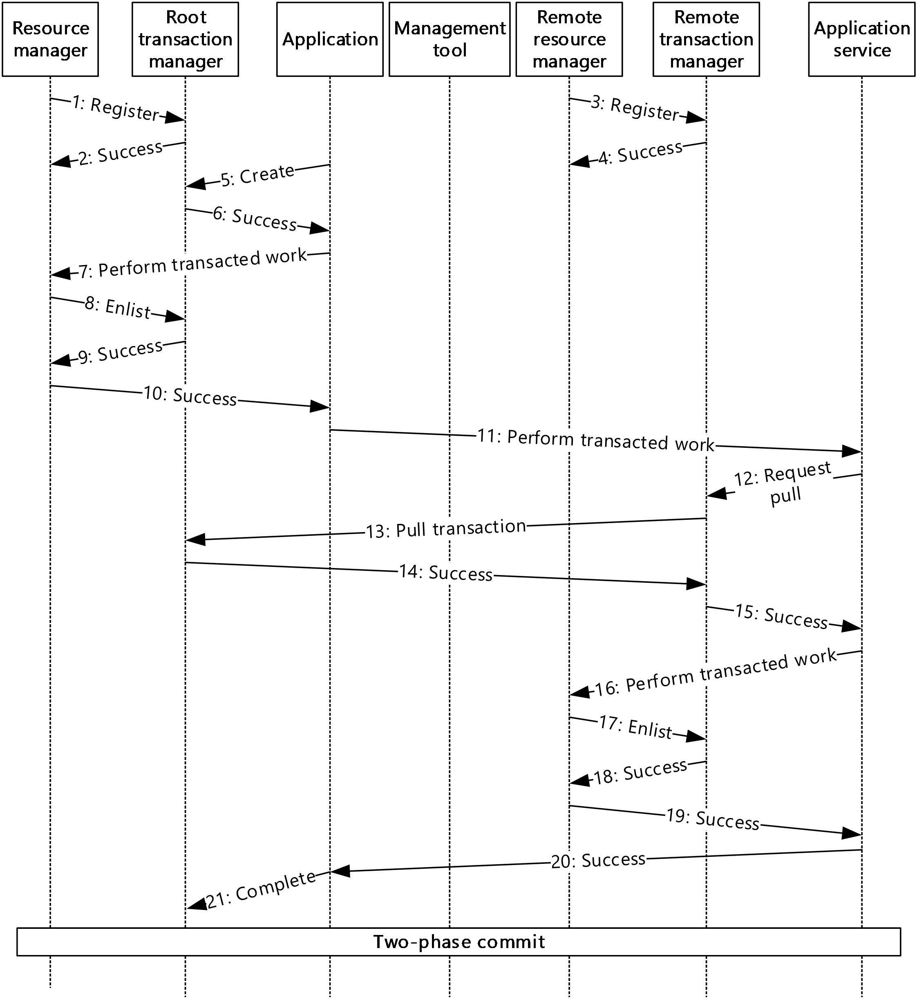

Figure 12: Example of performing a transaction with two transaction managers

The following steps describe the sequence:

- The [**resource manager**](#gt_resource-manager-rm) connects to the root transaction manager by initiating a **CONNTYPE_TXUSER_RESOURCEMANAGER** connection on a DTCO session with the root transaction manager and sends a **TXUSER_RESOURCEMANAGER_MTAG_CREATE** message to the root transaction manager, as specified in [MS-DTCO](../MS-DTCO/MS-DTCO.md) section 4.4.1, to register with it.
- The root transaction manager sends a **TXUSER_RESOURCEMANAGER_MTAG_REQUEST_COMPLETE** message, as described in [MS-DTCO] section 4.4.1, to the resource manager to acknowledge that the resource manager is registered with the root transaction manager as a resource manager.
- The remote resource manager connects to the remote transaction manager by initiating a **CONNTYPE_TXUSER_RESOURCEMANAGER** connection on a DTCO session with the remote transaction manager and sends a **TXUSER_RESOURCEMANAGER_MTAG_CREATE** message to the remote transaction manager, as described in [MS-DTCO] section 4.4.1, to register with it.
- The remote transaction manager sends a **TXUSER_RESOURCEMANAGER_MTAG_REQUEST_COMPLETE** message, as specified in [MS-DTCO] section 4.4.1, to the remote resource manager to acknowledge that the remote resource manager is registered with the remote transaction manager as a resource manager. The management tool performs a **Subscribe for Transaction Information** action against the root transaction manager to monitor the progress of the two-phase commit protocol and to resolve the transaction if it reaches an error state.
- The application sends a **TXUSER_BEGINNER_MTAG_PROMOTE** message to the root transaction manager over a **CONNTYPE_TXUSER_PROMOTE** connection on a DTCO session by specifying the isolation level, timeout, transaction description, isolation flag, and transaction identifier or sends a **TXUSER_BEGIN2_MTAG_BEGIN** message to the root transaction manager over a **CONNTYPE_TXUSER_BEGIN2** connection on a DTCO session specifying the isolation level, timeout, transaction description, and isolation flag to create a **Transaction** action against the root transaction manager, as specified in [MS-DTCO] section 3.3.4.1.
- The root transaction manager creates the transaction object with a [**globally unique identifier (GUID)**](#gt_globally-unique-identifier-guid) (**guidTx**), sends a **TXUSER_BEGIN2_MTAG_SINK_BEGUN** message to the application, and adds the transaction to its list of known transaction objects, as described in [MS-DTCO] section 4.1.1 to complete the **Create Transaction** action that was initiated in step 5.
- The application initiates a **Perform Transaction Work** action against the resource manager.
- The resource manager initiates a **CONNTYPE_TXUSER_ENLISTMENT** connection on a DTCO session with the root transaction manager and sends a **TXUSER_ENLISTMENT_MTAG_ENLIST** message to the root transaction manager specifying the transaction GUID (**guidTx**), and the GUID that uniquely identifies itself (**guidRm**), as described in [MS-DTCO] section 4.4.2, to initiate an **Enlist** action against the root transaction manager.
- The root transaction manager enlists the resource manager in the requested transaction, adds the resource manager to its list of subordinates for the transaction, and sends a **TXUSER_ENLISTMENT_MTAG_ENLISTED** message to the resource manager to acknowledge that the resource manager is enlisted in the transaction, as described in [MS-DTCO] section 4.4.2.
- The resource manager reports successful completion of the transaction work, completing the **Perform Transaction Work** action that was initiated in step 7.
- The application initiates a **Perform Transaction Work** action against the application service by passing a serialized transaction identifier that includes the [**transaction propagation**](#gt_transaction-propagation) information.
- The application service initiates a **CONNTYPE_TXUSER_ASSOCIATE** connection on a DTCO session with the remote transaction manager and sends a **TXUSER_ASSOCIATE_MTAG_ASSOCIATE** message to the remote transaction manager by using the transaction information and propagation information, as described in [MS-DTCO] section 4.2.2.
- The remote transaction manager initiates a **CONNTYPE_PARTNERTM_BRANCH** connection on a DTCO session with the root transaction manager and sends a **PARTNERTM_BRANCH_MTAG_BRANCHING** message to the root transaction manager, specifying the serialized transaction identifier, as described in [MS-DTCO] section 4.2.3.
- The root transaction manager creates a subordinate branch and sends a **PARTNERTM_BRANCH_MTAG_BRANCHED** message to the remote transaction manager, as described in [MS-DTCO] section 4.2.3, to acknowledge that the remote transaction manager is now enlisted in the transaction, completing the **Pull Transaction** action that was initiated in step 13.
- The remote transaction manager sends a **TXUSER_ASSOCIATE_MTAG_ASSOCIATED** message to the application service on the **CONNTYPE_TXUSER_ASSOCIATE** connection, as specified in [MS-DTCO] section 4.2.2, completing the **Request Pull Transaction** action that was initiated in step 12.
- The application service initiates a **Perform Transaction Work** action against the remote resource manager.
- The remote resource manager connects to the remote transaction manager by initiating a **CONNTYPE_TXUSER_ENLISTMENT** connection on a DTCO session with the remote transaction manager and sends a **TXUSER_ENLISTMENT_MTAG_ENLIST** message to the remote transaction manager specifying the transaction identifier (**guidTx**), the resource manager identifier (**guidRm**), and the resource manager session identifier (**guidSession**), as described in [MS-DTCO] section 4.4.2, to initiate an **Enlist** action against the remote transaction manager.
- The remote transaction manager adds the resource manager to its list of subordinate [**enlistments**](#gt_enlistment) and replies to the remote resource manager with a **TXUSER_ENLISTMENT_MTAG_ENLISTED** message to acknowledge that the remote resource manager is enlisted in the transaction, as specified in [MS-DTCO] section 4.4.2.
- The remote resource manager reports successful completion of transacted work by completing the **Perform Transaction Work** action that was initiated in step 16.
- The application service responds to the application by completing the **Perform Transaction Work** action that was initiated in step 11.
- The application completes the transaction by sending a **TXUSER_BEGIN2_MTAG_COMMIT** user message to the root transaction manager transaction, as described in [MS-DTCO] section 4.1.2.1.

## 3.2 Example 2: Commit a Transaction

This example demonstrates how a transaction is committed, as described in the use case Complete a Transaction – Application (section [2.5.2](#Section_2.1)). A transaction is committed if all the subordinate participants involved in the transaction are prepared to commit the changes.

**Prerequisites:**

- Transaction processing services protocols meet all the preconditions as described in section [2.4](#Section_2.4).
- Transaction processing services are operational.
- The application can access a transaction manager in the system.
- Transaction work is performed.
**Initial System State**

A transaction is performed by resource managers and their respective transaction managers.

**Final System State**

The [**two-phase commit**](#gt_two-phase-commit) has been done to complete the transaction.

**Sequence of Events**

The messages that are exchanged in this example are contained within the two-phase commit notifications action between the system and participating roles.

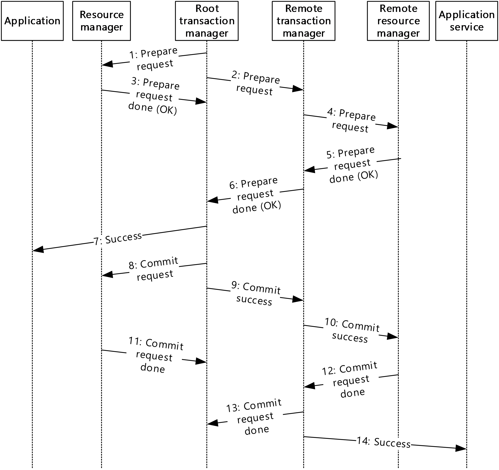

Figure 13: Example of committing a transaction

The following steps describe this sequence:

- The root transaction manager sends a **TXUSER_ENLISTMENT_MTAG_PREPAREREQ** message to the resource manager over the **CONNTYPE_TXUSER_ENLISTMENT** connection, as specified in [MS-DTCO](../MS-DTCO/MS-DTCO.md) section 4.5.1.1, indicating that this is a two-phase commit.
- The root transaction manager sends **a PARTNERTM_PROPAGATE_MTAG_PREPAREREQ** message to the remote transaction manager over the **CONNTYPE_PARTNERTM_BRANCH** connection, as specified in [MS-DTCO] section 4.5.1.2, indicating that this is a two-phase commit.
- The resource manager sends a **TXUSER_ENLISTMENT_MTAG_PREPAREREQDONE** message to the root transaction manager, indicating that the prepare request finished successfully (TXUSER_ENLISTMENT_PREPAREREQDONE_OK), as specified in [MS-DTCO] section 4.5.1.1, completing step 1.
- The remote transaction manager sends a **TXUSER_ENLISTMENT_MTAG_PREPAREREQ** message to the remote resource manager over the **CONNTYPE_TXUSER_ENLISTMENT** connection, as specified in [MS-DTCO] section 4.5.1.1, indicating that this is a two-phase commit.
- The remote resource manager sends a **TXUSER_ENLISTMENT_MTAG_PREPAREREQDONE** message to the remote transaction manager, indicating that the prepare request finished successfully (TXUSER_ENLISTMENT_PREPAREREQDONE_OK) as specified in [MS-DTCO] section 4.5.1.1, completing step 4.
- The remote transaction manager sends a **PARTNERTM_PROPAGATE_MTAG_PREPAREREQDONE** to the root transaction manager, indicating that the prepare request finished successfully (OK), as specified in [MS-DTCO] section 4.5.1.2, completing step 2.
- The root transaction manager sends a **TXUSER_BEGIN2_MTAG_SINK_ERROR** message to the application over the **CONNTYPE_TXUSER_BEGIN2** connection, as specified in [MS-DTCO] section 4.1.2.1, by indicating that the transaction has committed (TRUN_TXBEGIN_ERROR_NOTIFY_COMMITTED), completing step 21 in Example 1: **Perform Transaction Work** (section [3.1)](../MS-DTCO/MS-DTCO.md).
- The root transaction manager sends a **TXUSER_ENLISTMENT_MTAG_COMMITREQ** message to the resource manager over the **CONNTYPE_TXUSER_ENLISTMENT** connection, as specified in [MS-DTCO] section 4.4.3.2.
- The root transaction manager sends a **PARTNERTM_PROPAGATE_MTAG_COMMITREQ** message to the remote transaction manager over the **CONNTYPE_PARTNERTM_BRANCH** connection, as specified in [MS-DTCO] section 4.5.2.2.
- The remote transaction manager sends a **TXUSER_ENLISTMENT_MTAG_COMMITREQ** message to the remote resource manager over the **CONNTYPE_TXUSER_ENLISTMENT** connection, as specified in [MS-DTCO] section 4.4.3.2.
- The resource manager sends a **TXUSER_ENLISTMENT_MTAG_COMMITREQDONE** message to the root transaction manager, completing step 8, and initiates the disconnect sequence on the **CONNTYPE_TXUSER_ENLISTMENT** connection with the root transaction manager, as specified in [MS-DTCO] section 4.4.3.2.
- The remote resource manager sends a **TXUSER_ENLISTMENT_MTAG_COMMITREQDONE** message to the remote transaction manager, completing step 8, and initiates the disconnect sequence on the **CONNTYPE_TXUSER_ENLISTMENT** connection with the remote transaction manager, as specified in [MS-DTCO] section 4.4.3.2.
- The remote transaction manager sends a **PARTNERTM_PROPAGATE_MTAG_COMMITREQDONE** message to the root transaction manager, completing step 9, and initiates the disconnect sequence, as specified in [MS-DTCO] section 4.5.2.2.
- The remote transaction manager sends a success message to the application service, notifying it of the completion of the two-phase commit sequence.

## 3.3 Example 3: Abort a Transaction

This example demonstrates how a transaction is aborted as described in use case Complete a Transaction – Application (section [2.5.2](#Section_2.1)). A transaction is aborted if at least one of the subordinate participants that is involved in the transaction is prepared to abort the changes.

The diagram of the transaction tree for this example is shown in Example 1, as described in section [3.1](#Section_3.1).

**Prerequisites:**

- Transaction processing services protocols meet all the preconditions, as described in section [2.4](#Section_2.4).
- Transaction processing services are operational.
- The application can access a transaction manager in the system.
- Transaction work is performed.
**Initial System State**

A transaction is performed by an application.

**Final System State**

The two-phase commit sequence is completed, and the transaction is aborted.

**Sequence of Events**

The messages that are exchanged in this example are contained within the [**two-phase commit**](#gt_two-phase-commit) notifications action between the system and participating roles.

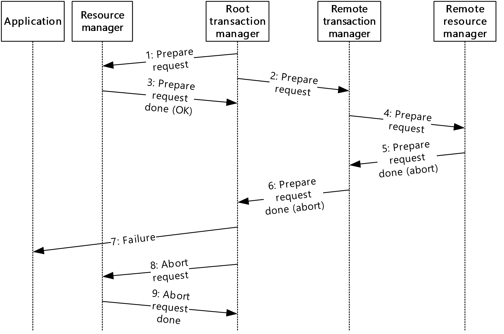

Figure 14: Example of aborting a transaction

The following steps describe this sequence:

- The root transaction manager sends a **TXUSER_ENLISTMENT_MTAG_PREPAREREQ** message to the resource manager over the **CONNTYPE_TXUSER_ENLISTMENT** connection, as specified in [MS-DTCO](../MS-DTCO/MS-DTCO.md) section 4.5.1.1, indicating that this is a two-phase commit.
- The root transaction manager sends a **PARTNERTM_PROPAGATE_MTAG_PREPAREREQ** message to the remote transaction manager over the **CONNTYPE_PARTNERTM_BRANCH** connection, as specified in [MS-DTCO] section 4.5.1.2, indicating that this is a two-phase commit.
- The resource manager sends a **TXUSER_ENLISTMENT_MTAG_PREPAREREQDONE** message to the root transaction manager indicating that the prepare request was finished successfully (OK) (TXUSER_ENLISTMENT_PREPAREREQDONE_OK, as specified in [MS-DTCO] section 4.5.1.1), completing step 1.
- The remote transaction manager sends a **TXUSER_ENLISTMENT_MTAG_PREPAREREQ** message to the remote resource manager over the **CONNTYPE_TXUSER_ENLISTMENT** connection, as specified in [MS-DTCO] section 4.5.1.1, indicating that this is a two-phase commit.
- The remote resource manager sends a **TXUSER_ENLISTMENT_MTAG_PREPAREREQDONE** message to the remote transaction manager indicating that the prepare request was finished unsuccessfully (Abort) (TXUSER_ENLISTMENT_PREPAREREQDONE_ABORT, as specified in [MS-DTCO] section 4.5.1.1), completing step 4.
- The remote transaction manager sends a **PARTNERTM_PROPAGATE_MTAG_PREPAREREQDONE** message to the root transaction manager indicating that the prepare request was unsuccessful (Abort), as specified in [MS-DTCO] section 4.5.1.2, completing step 2.
- The root transaction manager sends a **TXUSER_BEGIN2_MTAG_SINK_ERROR** message to the application over the **CONNTYPE_TXUSER_BEGIN2** connection, as specified in [MS-DTCO] section 4.1.2.1, indicating that the transaction has committed (TRUN_TXBEGIN_ERROR_NOTIFY_ABORTED), completing step 21 in Example 1: Perform Transaction Work (section 3.1).
- The root transaction manager sends a **TXUSER_ENLISTMENT_MTAG_ABORTREQ** message to the resource manager over the **CONNTYPE_TXUSER_ENLISTMENT** connection, as specified in [MS-DTCO] section 2.2.10.2.2.1.
- The resource manager sends a **TXUSER_ENLISTMENT_MTAG_ABORTREQDONE** message to the root transaction manager, completing step 8, as specified in [MS-DTCO] section 2.2.10.2.2.2.

## 3.4 Example 4: Transaction Manager Recovers after a Connection Resource Manager Failure

This example demonstrates how a transaction is recovered when a remote transaction manager breaks down, as described in use case Transaction Recovery - Remote Transaction Manager (section [2.5.5](#Section_2.5.5)).

**Prerequisites:**

- Transaction processing services protocols meet all the preconditions, described in section [2.4](#Section_2.4).
- Transaction processing services are operational.
- The application can access a transaction manager in the system.
- Transaction work is performed.
**Initial System State**

A transaction is performed by an application.

**Final System State**

Recovers the transaction after the breakdown of the remote transaction manager.

**Sequence of Events**

The **PrepareRequest**, **PrepareRequestDone**, **CommitRequest**, and **CommitRequestDone** messages that are exchanged in the following example are contained within the [**two-phase commit**](#gt_two-phase-commit) notification action between the system and participating roles.

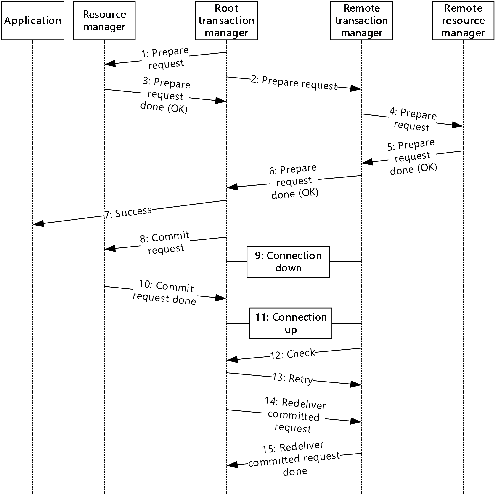

Figure 15: Example of transaction recovery when a remote transaction manager breaks down

The following steps describe this sequence:

- The root transaction manager sends **a TXUSER_ENLISTMENT_MTAG_PREPAREREQ** message to the resource manager over the **CONNTYPE_TXUSER_ENLISTMENT** connection, as specified in [MS-DTCO](../MS-DTCO/MS-DTCO.md) section 4.5.1.1, indicating that this is a two-phase commit.
- The root transaction manager sends a **PARTNERTM_PROPAGATE_MTAG_PREPAREREQ** message to the remote transaction manager over the **CONNTYPE_PARTNERTM_BRANCH** connection, as specified in [MS-DTCO] section 4.5.1.2, indicating that this is a two-phase commit.
- The resource manager sends a **TXUSER_ENLISTMENT_MTAG_PREPAREREQDONE** message to the root transaction manager, indicating that the prepare request finished successfully (TXUSER_ENLISTMENT_PREPAREREQDONE_OK), as specified in [MS-DTCO] section 4.5.1.1, completing step 1.
- The remote transaction manager sends a **TXUSER_ENLISTMENT_MTAG_PREPAREREQ** message to the remote resource manager over the **CONNTYPE_TXUSER_ENLISTMENT** connection, as specified in [MS-DTCO] section 4.5.1.1, indicating that this is a two-phase commit.
- The remote resource manager sends a **TXUSER_ENLISTMENT_MTAG_PREPAREREQDONE** message to the remote transaction manager, indicating that the prepare request finished successfully (TXUSER_ENLISTMENT_PREPAREREQDONE_OK), as specified in [MS-DTCO] section 4.5.1.1, completing step 4.
- The remote transaction manager sends a **PARTNERTM_PROPAGATE_MTAG_PREPAREREQDONE** message to the root transaction manager indicating that the prepare request finished successfully (OK), as specified in [MS-DTCO] section 4.5.1.2, completing step 2.
- The root transaction manager sends a **TXUSER_BEGIN2_MTAG_SINK_ERROR** message to the application over the **CONNTYPE_TXUSER_BEGIN2** connection, as specified in [MS-DTCO] section 4.1.2.1, indicating that the transaction is committed (TRUN_TXBEGIN_ERROR_NOTIFY_COMMITTED), completing step 21 in Example 1: Perform Transaction Work (section [3.1)](../MS-DTCO/MS-DTCO.md).
- The root transaction manager sends a **TXUSER_ENLISTMENT_MTAG_COMMITREQ** message to the resource manager over the **CONNTYPE_TXUSER_ENLISTMENT** connection, as specified in [MS-DTCO] section 4.4.3.2.
- The connection from the root transaction manager to the remote transaction manager breaks down. As a result, the root transaction manager cannot send a **CommitRequest** message to the remote transaction manager.
- The resource manager sends a **TXUSER_ENLISTMENT_MTAG_COMMITREQDONE** message to the root transaction manager, as specified in [MS-DTCO] section 4.4.3.2, completing step 8.
- The connection from the root transaction manager to the remote transaction manager is reestablished.
- The remote transaction manager initiates a **CONNTYPE_PARTNERTM_CHECKABORT** connection with the root transaction manager and sends a **PARTNERTM_CHECKABORT_MTAG_CHECK** message to the root transaction manager in that session, as specified in [MS-DTCO] section 3.8.7.8, to determine whether the transaction is aborted.
- The root transaction manager sends a **PARTNERTM_CHECKABORT_MTAG_RETRY** message to the remote transaction manager over the **CONNTYPE_PARTNERTM_CHECKABORT** connection, as specified in [MS-DTCO] section 3.7.5.2.1.1.1, indicating that the transaction is not aborted. The remote transaction manager waits for a commit request.
- The root transaction manager sends a **PARTNERTM_REDELIVERCOMMIT_MTAG_COMMITREQ** message to the remote transaction manager over the **CONNTYPE_PARTNERTM_REDELIVERCOMMIT** connection, as specified in [MS-DTCO] section 3.7.7.1, indicating that the committed request is redelivered.
- The remote transaction manager sends a **PARTNERTM_REDELIVERCOMMIT_MTAG_COMMITREQDONE** message to the root transaction manager, as specified in [MS-DTCO] section 3.8.7.3, completing step 14.
This sequence causes the remote transaction manager to record this transaction as committed. The remote resource manager will drive its own recovery sequence later. As specified in [MS-DTCO] section 1.3.4.2, the resource manager is responsible for initiating recovery with its transaction manager.

## 3.5 Example 5: Connection to a Resource Manager Breaks Down

This example demonstrates how the resource manager drives recovery when connection to a resource manager breaks, as described in use case Recover In-doubt Transaction State – resource manager (section [2.5.4](#Section_2.5.4)).

**Prerequisites:**

- The transaction processing services protocols meet all the preconditions, as described in section [2.4](#Section_2.4).
- Transaction processing services are operational.
- The application can access a transaction manager in the system.
- Transaction work is performed.
**Initial System State**

A transaction is performed by an application.

**Final System State**

The transaction is complete after recovering from a resource manager breakdown.

**Sequence of Events**

The **PrepareRequest**, **PrepareRequestDone**, **CommitRequest**, and **CommitRequestDone** messages that are exchanged in this example are contained within the [**two-phase commit**](#gt_two-phase-commit) notifications action between the system and participating roles.

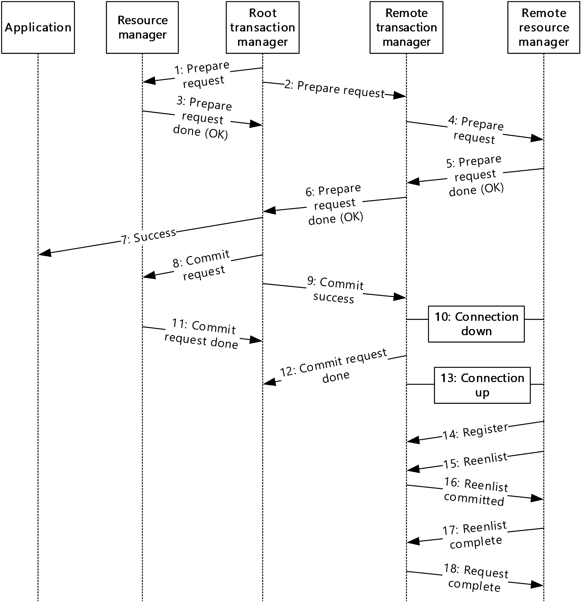

Figure 16: Example of a resource manager connection breakdown during a two-phase commit

The message flow that is shown in this example is as follows:

- The root transaction manager sends a **TXUSER_ENLISTMENT_MTAG_PREPAREREQ** message to the resource manager over the **CONNTYPE_TXUSER_ENLISTMENT** connection, as specified in [MS-DTCO](../MS-DTCO/MS-DTCO.md) section 4.5.1.1, indicating that this is a two-phase commit.
- The root transaction manager sends a **PARTNERTM_PROPAGATE_MTAG_PREPAREREQ** message to the remote transaction manager over the **CONNTYPE_PARTNERTM_BRANCH** connection, as specified in [MS-DTCO] section 4.5.1.2, indicating that this is a two-phase commit.
- The resource manager sends a **TXUSER_ENLISTMENT_MTAG_PREPAREREQDONE** message to the root transaction manager, indicating that the prepare request finished successfully (OK) TXUSER_ENLISTMENT_PREPAREREQDONE_OK, as specified in [MS-DTCO] section 4.5.1.1, completing step 1.
- The remote transaction manager sends a **TXUSER_ENLISTMENT_MTAG_PREPAREREQ** message to the remote resource manager over the **CONNTYPE_TXUSER_ENLISTMENT** connection, as specified in [MS-DTCO] section 4.5.1.1, indicating that this is a two-phase commit.
- The remote resource manager sends a **TXUSER_ENLISTMENT_MTAG_PREPAREREQDONE** message to the remote transaction manager indicating that the prepare request finished successfully (OK) TXUSER_ENLISTMENT_PREPAREREQDONE_OK, as specified in [MS-DTCO] section 4.5.1.1, completing step 4.
- The remote transaction manager sends a **PARTNERTM_PROPAGATE_MTAG_PREPAREREQDONE** to the root transaction manager, indicating that the prepare request finished successfully (OK), as specified in [MS-DTCO] section 4.5.1.2, completing step 2.
- The root transaction manager sends a **TXUSER_BEGIN2_MTAG_SINK_ERROR** message to the application over the **CONNTYPE_TXUSER_BEGIN2** connection, as specified in [MS-DTCO] section 4.1.2.1, specifying that the transaction has committed (TRUN_TXBEGIN_ERROR_NOTIFY_COMMITTED), completing step 21 in Example 1, as described in section [3.1](../MS-DTCO/MS-DTCO.md).
- The root transaction manager sends a **TXUSER_ENLISTMENT_MTAG_COMMITREQ** message to the resource manager over the **CONNTYPE_TXUSER_ENLISTMENT** connection, as specified in [MS-DTCO] section 4.4.3.2).
- The root transaction manager sends a **PARTNERTM_PROPAGATE_MTAG_COMMITREQ** message to the remote transaction manager over the **CONNTYPE_PARTNERTM_BRANCH** connection, as specified in [MS-DTCO] section 4.5.2.2).
- The connection from remote transaction manager to the remote resource manager breaks. As a result, the remote transaction manager cannot send a **CommitRequest** message to the remote resource manager.
- The resource manager sends a **TXUSER_ENLISTMENT_MTAG_COMMITREQDONE** message to the root transaction manager, as specified in [MS-DTCO] section 4.4.3.2, completing step 8.
- The remote transaction manager sends a **PARTNERTM_PROPAGATE_COMMITREQDONE** message to the root transaction manager, as specified in [MS-DTCO] section 4.5.2.2, completing step 9.
- The remote resource manager comes back up and finds the transaction in the in-doubt state.
- The remote resource manager sends a **TXUSER_RESOURCEMANAGER_MTAG_CREATE** message to the remote transaction manager over the **CONNTYPE_TXUSER_RESOURCEMANAGER** connection, as specified in [MS-DTCO] section 3.5.4.10.1) to perform a Register action against the remote transaction manager.
- The remote resource manager sends a **TXUSER_REENLIST_MTAG_REENLIST** message to the remote transaction manager over the **CONNTYPE_TXUSER_REENLIST** connection, as specified in [MS-DTCO] section 4.6.2) to perform a **Query Transaction Outcome** action against the remote transaction manager.
- The remote transaction manager sends a **TXUSER_REENLIST_MTAG_REENLIST_COMMITTED** message to the remote resource manager, as specified in [MS-DTCO] section 4.6.2) to indicate the outcome of the transaction is committed.
- The remote resource manager sends a **TXUSER_RESOURCEMANAGER_MTAG_REENLISTMENTCOMPLETE** message to the remote transaction manager over the **CONNTYPE_TXUSER_RESOURCEMANAGER** connection, as specified in [MS-DTCO] section 4.6.3, to indicate that it has recovered its transactions.
- The remote transaction manager sends a **TXUSER_RESOURCEMANAGER_MTAG_REQUEST_COMPLETE** message to the remote resource manager, as specified in [MS-DTCO] section 4.6.3, to confirm the completion of recovery.

## 3.6 Example 6: Distributed Transaction Coordination with External Components

This example demonstrates how a transaction is completed and committed with external components by making use of optional protocols, as described in the following use cases:

- Transaction Management – Management Tool (section [2.5.3](#Section_2.5.3))
- Create a Transaction – Application (section [2.5.6.1](#Section_2.5.6.1))
- Enlist in a Transaction – Resource Manager (section [2.5.6.2](#Section_2.5.6.2))
- Perform Transaction Work with Pull Propagation – Application (section [2.5.6.3](#Section_2.5.6.3))
- Perform Transaction Work with Push Propagation – External Application (section [2.5.6.4](#Section_2.5.6.4))
- Drive Completion of a Transaction – Root Transaction Manager (section [2.5.6.5](#Section_2.5.6.5))
**Prerequisites:**

- Transaction processing services protocols meet all the preconditions, as described in section [2.4](#Section_2.4).
- Transaction processing services are operational.
- The application can access a transaction manager in the system.
- The resource manager can access the transaction manager that it has to contact to enlist in the transaction.
- The computers involved are connected on the network.
- The two transaction managers are on separate computers and can access each other.
- The transaction managers in the system on each of the computers are operational.
- Both the external application and the external transaction manager can access a transaction manager in the system.
- The external application and the external transaction manager are on separate computers.
- The transaction manager can access the participants in the transaction.
**Initial System State**

No transaction has been performed by the external application.

**Final System State**

A two-phase commit has been done to complete the transaction which involves an external application.

**Sequence of Events:**

- Precursory Message Exchange (section [3.6.1](#Section_3.6.1))
- Application-Driven Transactional Message Exchange (section [3.6.2](#Section_3.6.2))
- Two-Phase Commit Transactional Message Exchange (section [3.6.3](#Section_3.6.3))

### 3.6.1 Precursory Message Exchange

The following diagram shows precursory message exchange in a distributed transaction with external components.

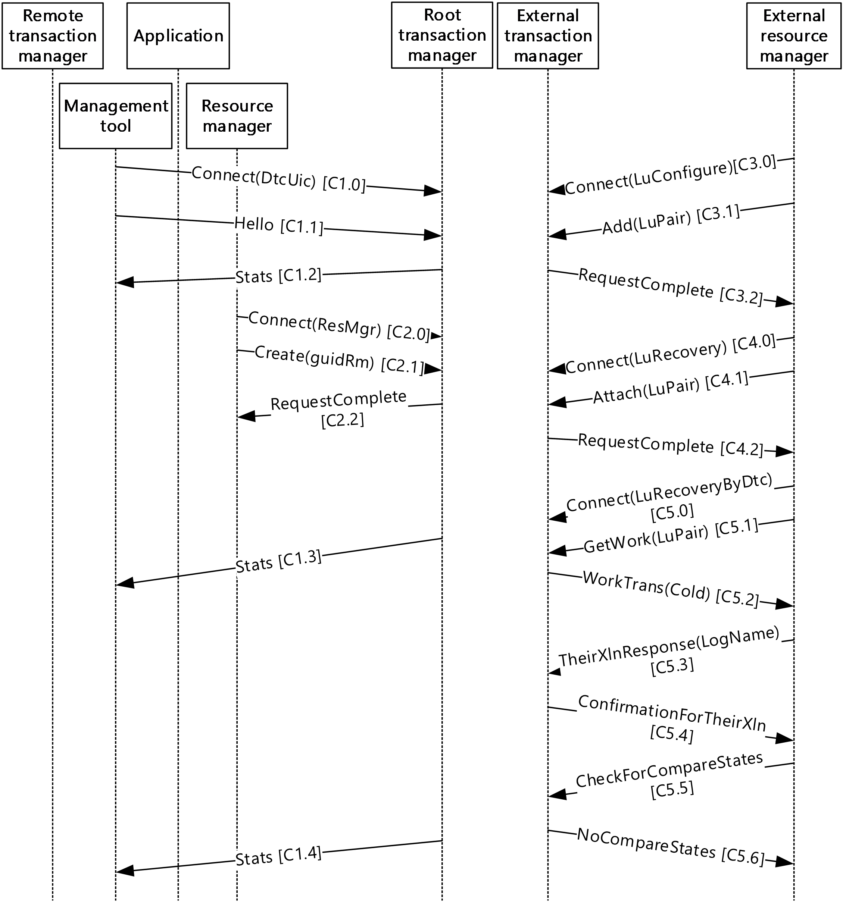

Figure 17: Precursory message exchange in a distributed transaction with external components

The following steps describe this sequence:

- Connect(DtcUic) [C1.0]: The management tool initiates a **CONNTYPE_TXUSER_DTCUIC** connection on an MSDTC Connection Manager: OleTx Management Protocol session with the root transaction manager, as specified in [MS-CMOM](../MS-CMOM/MS-CMOM.md) section 3.2.1.1.
- Hello [C1.1]: The management tool sends an **MTAG_HELLO** message to the root transaction manager, as specified in [MS-CMOM] section 3.2.1.1.
- Stats [C1.2]: The root transaction manager receives the connection request. It starts a timer (if one does not exist) and adds the management tool to its list of Management Client Role connections. Each time the timer expires, the root transaction manager sends an **MSG_DTCUIC_STATS** message to the management tool, as specified in [MS-CMOM] section 3.2.1.1. If the root transaction manager is tracking any active transactions, the root transaction manager also sends an **MSG_DTCUIC_TRANLIST** message, as specified in [MS-CMOM] section 3.2.1.1. In this example, no **MSG_DTCUIC_TRANLIST** message is sent. The management tool continues to receive these messages from the root transaction manager until it closes the connection by initiating the disconnect sequence [C1.3; C1.4].
- Connect (ResMgr) [C2.0]: The resource manager initiates a **CONNTYPE_TXUSER_RESOURCEMANAGER** connection on a DTCO session, as specified in [MS-DTCO](../MS-DTCO/MS-DTCO.md) section 4.4.1, with the root transaction manager.
- Create(guidRm) [C2.1]: The resource manager sends a **TXUSER_RESOURCEMANAGER_MTAG_CREATE** message specifying a GUID that uniquely identifies the resource manager (**guidRm**) to the root transaction manager, as specified in [MS-DTCO] section 4.4.1.
- RequestComplete [C2.2]: The root transaction manager adds the resource manager to its list of registered resource managers and sends a **TXUSER_RESOURCEMANAGER_MTAG_REQUEST_COMPLETE** message to the resource manager protocol, as specified in [MS-DTCO] section 4.4.1. The resource manager continues to maintain this connection to enable the creation of new enlistments in transactions and its participation in two-phase commit processing.
- Connect(LuConfigure) [C3.0]: The external resource manager initiates a **CONNTYPE_TXUSER_DTCLUCONFIGURE** connection on a DTCLU session with the external transaction manager, as specified in [MS-DTCLU](../MS-DTCLU/MS-DTCLU.md) section 4.1.1.
- Add(LuPair) [C3.1]: The external resource manager sends a **TXUSER_DTCLURMCONFIGURE_MTAG_ADD** message specifying the [**LU name pair**](#gt_lu-name-pair) (LuPair) to the external transaction manager, as specified in [MS-DTCLU] section 4.1.1.
- RequestComplete [C3.2]: The external transaction manager adds the LU name pair to its table of LU name pairs and sends a **TXUSER_DTCLURMCONFIGURE_MTAG_REQUEST_COMPLETED** message to the external resource manager, as specified in [MS-DTCLU] section 4.1.1. When the external resource manager receives the **TXUSER_DTCLURMCONFIGURE_MTAG_REQUEST_COMPLETED** response from the external transaction manager, the external resource manager initiates the disconnect sequence.
- Connect(LuRecovery) [C4.0]: The external resource manager initiates a **CONNTYPE_TXUSER_DTCLURECOVERY** connection on a DTCLU session with the external transaction manager, as specified in [MS-DTCLU] section 4.2.1.
- Attach(LuPair) [C4.1]: The external resource manager sends a **TXUSER_DTCLURMRECOVERY_MTAG_ATTACH** message to the external transaction manager specifying an LuPair which was previously configured with the external transaction manager, as specified in [MS-DTCLU] section 4.2.1.
- RequestComplete [C4.2]: The external transaction manager registers the connection's CMPO session, as specified in [MS-CMPO](../MS-CMPO/MS-CMPO.md), for all Recovery Processing associated with the LU name pair and sends a **TXUSER_DTCLURMRECOVERY_MTAG_REQUEST_COMPLETED** message to the external resource manager, as specified in [MS-DTCLU] section 4.2.1. The external resource manager continues to maintain the connection to enable recovery processes to be initiated and to enable the creation of new enlistments in the transactional work associated with the LU name pair.
- Connect(LuRecoveryByDtc) [C5.0]: The external resource manager initiates a **CONNTYPE_TXUSER_DTCLURECOVERYINITIATEDBYDTC** connection a DTCLU session with the external transaction manager, as specified in [MS-DTCLU] section 4.3.1.
- GetWork (LuPair) [C5.1]: The external resource manager sends a **TXUSER_DTCLURECOVERYINITIATEDBYDTC_MTAG_GETWORK** message to the external transaction manager specifying the LuPair for which the external resource manager registered as the recovery process, as specified in [MS-DTCLU] section 4.3.1.
- WorkTrans (Cold) [C5.2]: The external transaction manager determines that it has to perform a [**cold recovery**](#gt_cold-recovery) (Cold) for the LU name pair and sends a **TXUSER_DTCLURECOVERYINITIATEDBYDTC_MTAG_WORK_TRANS** message to the external resource manager, as specified in [MS-DTCLU] section 4.3.1.
- TheirXlnResponse (LogName) [C5.3]: The external resource manager exchanges log names with the [**remote LU**](#gt_remote-lu) and sends a **TXUSER_DTCLURECOVERYINITIATEDBYDTC_MTAG_THEIR_XLN_RESPONSE** message specifying the remote LU log name (LogName) to the external transaction manager, as specified in [MS-DTCLU] section 4.3.1.
- ConfirmationForTheirXln [C5.4]: The external transaction manager verifies that the reported state of the remote LU is consistent with the external transaction manager's state and sends a **TXUSER_DTCLURECOVERYINITIATEDBYDTC_MTAG_CONFIRMATION_FOR_THEIR_XLN** message to the external resource manager, as specified in [MS-DTCLU] section 4.3.1.
- CheckForCompareStates [C5.5]: The external resource manager sends a **TXUSER_DTCLURECOVERYINITIATEDBYDTC_MTAG_CHECK_FOR_COMPARESTATES** message to the external transaction manager to query whether recovery work is required for any LU 6.2 transactional work involving the LU name pair, as specified in [MS-DTCLU] section 4.3.1.
- NoCompareStates [C5.6]: The external transaction manager checks the local and remote transactional state and sends a **TXUSER_DTCLURECOVERYINITIATEDBYDTC_MTAG_NO_COMPARESTATES** message to the external resource manager, as specified in [MS-DTCLU] section 4.3.1. When the external resource manager has received the **TXUSER_DTCLURECOVERYINITIATEDBYDTC_MTAG_NO_COMPARESTATES** message, no further messages are sent using this connection and the external resource manager initiates the disconnect sequence.

### 3.6.2 Application-Driven Transactional Message Exchange

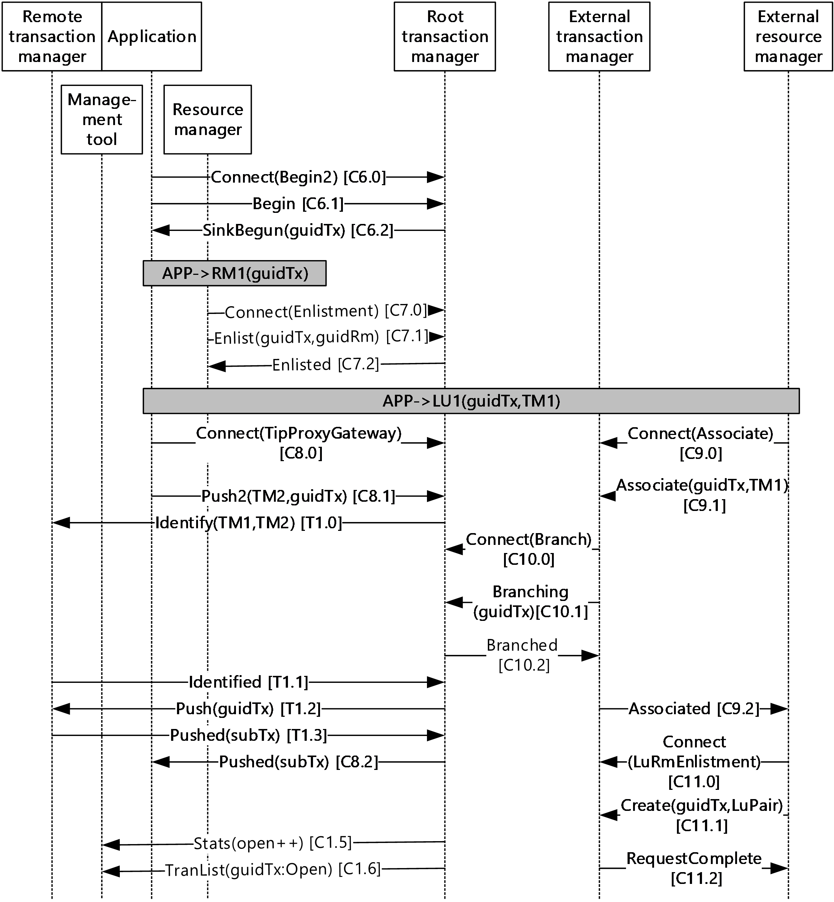

Figure 18: Transactional message exchange before a two-phase commit in a distributed transaction

The following steps describe this sequence:

- Connect(Begin2) [C6.0]: The application initiates a **CONNTYPE_TXUSER_BEGIN2** connection on a DTCO session with the root transaction manager, as specified in [MS-DTCO](../MS-DTCO/MS-DTCO.md) section 4.1.1.
- Begin [C6.1]: The application sends a **TXUSER_BEGIN2_MTAG_BEGIN** message to the root transaction manager specifying the isolation level, timeout, transaction description, and isolation flag, as specified in [MS-DTCO] section 4.1.1.
- SinkBegun(guidTx) [C6.2]: The root transaction manager creates a transaction object with a [**globally unique identifier**](#gt_globally-unique-identifier-guid) (**guidTx**), sends a **TXUSER_BEGIN2_MTAG_SINK_BEGUN** message to the application, and adds the transaction to its list of known transaction objects (as specified in [MS-DTCO] section 4.1.1). When the application receives the **TXUSER_BEGIN2_MTAG_BEGUN** message from the root transaction manager, the transaction (**guidTx**) has begun. The application is now free to propagate this transaction to transaction managers, resource managers, and application services to perform work as part of the transaction, as long as it maintains the **CONNTYPE_TXUSER_BEGIN2** connection. Eventually, the application determines whether to commit or abort the transaction. If the application disconnects the connection before committing or aborting the transaction, then the root transaction manager will abort the transaction.
- Connect(Enlistment) [C7.0]: The resource manager initiates a **CONNTYPE_TXUSER_ENLISTMENT** connection on a DTCO session with the root transaction manager, as specified in [MS-DTCO] section 4.4.2).
- Enlist(guidTx, guidRm) [C7.1]: The resource manager sends a **TXUSER_ENLISTMENT_MTAG_ENLIST** message to the root transaction manager specifying the transaction GUID (**guidTx**), and the GUID that uniquely identifies itself (**guidRm**), as specified in [MS-DTCO] section 4.4.2.
- Enlisted [C7.2]: The root transaction manager enlists the resource manager in the requested transaction, adds the resource manager to its list of subordinates for the transaction, and sends a **TXUSER_ENLISTMENT_MTAG_ENLISTED** message to the resource manager, as specified in [MS-DTCO] section 4.4.2. The resource manager continues to maintain the connection and waits for two-phase commit notifications from the root transaction manager.
- Connect(TipProxyGateway) [C8.0]: The application initiates a **CONNTYPE_TXUSER_TIPPROXYGATEWAY** connection on an MSDTC Connection Manager: OleTx Transaction Internet Protocol session with the root transaction manager, as specified in [MS-DTCM](../MS-DTCM/MS-DTCM.md) section 4.1.1.
- Push2(guidTx,TM2) [C8.1]: The application sends a **TXUSER_TIPPROXYGATEWAY_MTAG_PUSH** user message, as specified in [MS-DTCM] section 2.2.5.1.3.6, or a **TXUSER_TIPPROXYGATEWAY_MTAG_PUSH2** user message, as specified in [MS-DTCM] section 2.2.5.1.3.7, specifying the transaction GUID (**guidTx**), and the Transaction Internet Protocol (TIP) URL of the remote transaction manager.
- Identify(TM1,TM2) [T1.0]: The root transaction manager locates the transaction and creates a new [**TIP connection**](#gt_tip-connection) with the remote transaction manager in the INITIAL state. The root transaction manager uses the TIP URL specified in the message to create the TIP connection over the TCP transport session established with the remote transaction manager and sends an **IDENTIFY** command to the remote transaction manager specifying the root transaction manager's primary transaction manager address and the remote transaction manager's secondary transaction manager address, as specified in [MS-TIPP](../MS-TIPP/MS-TIPP.md) section 4.1.1.
- Identified [T1.1]: When the remote transaction manager receives the **IDENTIFY** command, the remote transaction manager sends an **IDENTIFIED** command to the root transaction manager and the state of the TIP connection is changed to IDLE, as specified in [MS-TIPP] section 4.1.1.
- Push(guidTx) [T1.2]: When the root transaction manager receives the **IDENTIFIED** command, the root transaction manager sends a **PUSH** command to the remote transaction manager specifying the primary's transaction identifier (**guidTx**), as specified in [MS-TIPP] section 4.1.2.2.
- Pushed(subTx) [T1.3]: When the remote transaction manager receives the **PUSH** command, the remote transaction manager adds the transaction to its list of transaction objects with a newly created transaction identifier (**subTx**), sends a **PUSHED** command to the root transaction manager, and the state of the TIP connection changes to **ENLISTED**, as specified in [MS-TIPP] section 4.1.2.2.
- Pushed(subTx) [C8.2]: When the root transaction manager receives the **PUSHED** command, the root transaction manager sends a **TXUSER_TIPPROXYGATEWAY_MTAG_PUSHED** message to the application specifying the remote transaction manager 's transaction identifier (subTx), as specified in [MS-DTCM] section 4.2.3. When the application receives the **TXUSER_TIPPROXYGATEWAY_MTAG_PUSHED** message, the application initiates the disconnect sequence on the **CONNTYPE_TXUSER_TIPPROXYGATEWAY** connection.
- Connect(Associate) [C9.0]: The external resource manager initiates a **CONNTYPE_TXUSER_ASSOCIATE** connection on a DTCO session with the external transaction manager, as specified in [MS-DTCO] section 4.2.2.
- Associate(guidTx,TM1) [C9.1]: The external resource manager sends a **TXUSER_ASSOCIATE_MTAG_ASSOCIATE** message to the external transaction manager specifying the transaction identifier (**guidTx**) and sufficient information (the root transaction manager's machine name and endpoint GUID) to establish a DTCO session with the root transaction manager, as specified in [MS-DTCO] section 4.2.2.
- Connect(Branch) [C10.0]: The external transaction manager attempts to locate the transaction in its list of transaction objects by using the transaction identifier (**guidTx**). Because the transaction object is not located, the external transaction manager attempts to pull the transaction from the root transaction manager by using information contained in the message, and therefore the external transaction manager initiates a **CONNTYPE_PARTNERTM_BRANCH** connection on a DTCO session with the root transaction manager, as specified in [MS-DTCO] section 4.2.3.
- Branching(guidTx) [C10.1]: The external transaction manager sends a **PARTNERTM_BRANCH_MTAG_BRANCHING** message with the transaction identifier (**guidTx**) of the requested transaction to the root transaction manager, as specified in [MS-DTCO] section [4.2.3](../MS-DTCO/MS-DTCO.md).
- Branched [C10.2]: The root transaction manager creates a subordinate branch and sends a **PARTNERTM_BRANCH_MTAG_BRANCHED** message to the external transaction manager, as specified in [MS-DTCO] section 4.2.3.
- Associated [C9.2]: The external transaction manager keeps the connection open to process two-phase commit notifications from the root transaction manager and sends a **TXUSER_ASSOCIATE_MTAG_ASSOCIATED** message to the external resource manager on the **CONNTYPE_TXUSER_ASSOCIATE** connection to inform the external resource manager that the pull operation was successful, as specified in [MS-DTCO] section 4.2.2. The external transaction manager continues to maintain the **CONNTYPE_PARTNERTM_BRANCH** connection with the root transaction manager and waits for two-phase commit processing. When the external resource manager receives the **TXUSER_ASSOCIATE_MTAG_ASSOCIATED** message, the external resource manager initiates the disconnect sequence on the **CONNTYPE_TXUSER_ASSOCIATE** connection.
- Connect(LuRmEnlistment) [C11.0]: The external resource manager initiates a **CONNTYPE_TXUSER_DTCLURMENLISTMENT** connection on a DTCLU session with the external transaction manager, as specified in [MS-DTCLU](../MS-DTCLU/MS-DTCLU.md) section 4.4.1.
- Create(guidTx,LuPair) [C11.1]: The external resource manager sends a **TXUSER_DTCLURMENLISTMENT_MTAG_CREATE** message to the external transaction manager specifying the transaction identifier (**guidTx**) and the LU Name Pair (**LuPair**), as specified in [MS-DTCLU] section 4.4.1.
- RequestComplete [C11.2]: The external transaction manager creates an LU enlistment on the transaction and sends a **TXUSER_DTCLURMENLISTMENT_MTAG_REQUEST_COMPLETED** message to the external resource manager, as specified in [MS-DTCLU] section 4.4.1. When the external resource manager receives the **TXUSER_DTCLURMENLISTMENT_MTAG_REQUEST_COMPLETED** message, the external resource manager continues to maintain the connection and waits for two-phase commit processing.
- Stats(open++) [C1.5]: Because the transaction (**guidTx**) is active but not yet committing or aborting, the root transaction manager sends an **MSG_DTCUIC_STATS** message to the management tool with the number of open transactions incremented by one (open++), as specified in [MS-CMOM](../MS-CMOM/MS-CMOM.md) section 3.2.1.1.
- TranList(guidTx:Open) [C1.6]: The root transaction manager sends an **MSG_DTCUIC_TRANLIST** message to the management tool listing the transaction (**guidTx**) in the open state (XACTSACT_OPEN), as specified in [MS-CMOM] section 3.2.1.1.

### 3.6.3 Two-Phase Commit Transactional Message Exchange

The following diagram shows two-phase commit protocol message exchange in a distributed transaction.

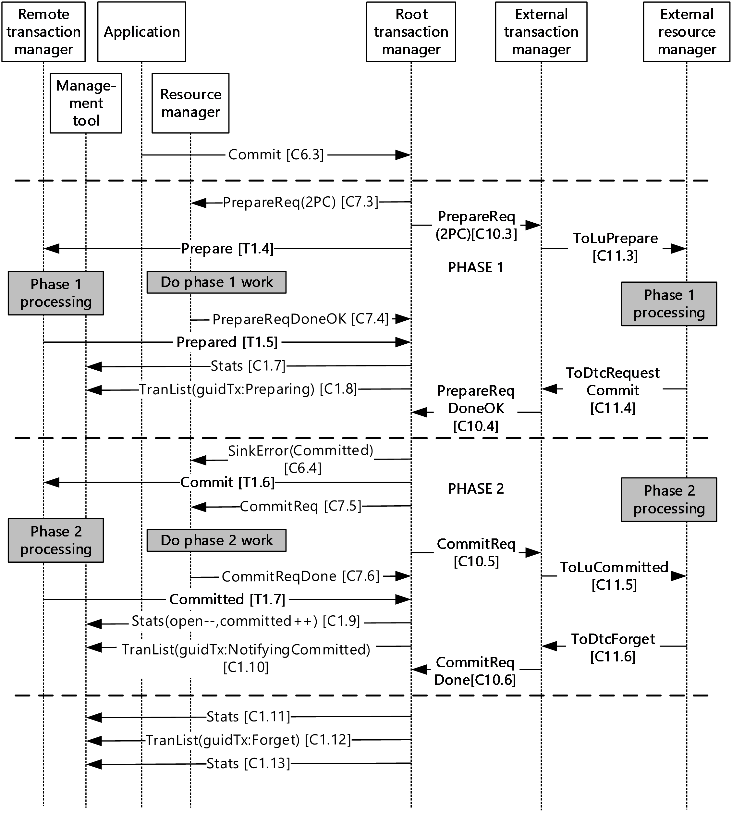

Figure 19: Two-phase commit protocol message exchange in a distributed transaction

The following steps describe this sequence:

- Commit [C6.3]: The application sends a **TXUSER_BEGIN2_MTAG_COMMIT** message to the root transaction manager over its existing **CONNTYPE_TXUSER_BEGIN2** connection, as specified in [MS-DTCO](../MS-DTCO/MS-DTCO.md) section 4.5.1. The application maintains the connection and waits for the outcome of the transaction to the root transaction manager.
- PrepareReq (2PC) [C7.3]: The root transaction manager sends a **TXUSER_ENLISTMENT_MTAG_PREPAREREQ** message to the resource manager over the **CONNTYPE_TXUSER_ENLISTMENT** connection, indicating that this is a two-phase commit (2PC), as specified in [MS-DTCO] section 4.5.1.1.
- Prepare [T1.4]: The root transaction manager sends a PREPARE command over the Transaction Internet Protocol (TIP) connection associated with the transaction to the remote transaction manager, as specified in [MS-TIPP](../MS-TIPP/MS-TIPP.md) section 4.1.3.1.1.
- PrepareReqDoneOK [C7.4]: When the resource manager has successfully completed its [**Phase One**](#gt_phase-one) work, it sends a **TXUSER_ENLISTMENT_MTAG_PREPAREREQDONE** message to the root transaction manager indicating TXUSER_ENLISTMENT_PREPAREREQDONE_OK, as specified in [MS-DTCO] section 4.5.1.1. The resource manager maintains the connection and waits for the transaction outcome from the root transaction manager.
- Prepared [T1.5]: When the remote transaction manager has successfully completed its Phase One processing, it sends a **PREPARED** command to the root transaction manager over the TIP connection, as specified in [MS-TIPP] section 4.1.3.1.2. The state of the TIP connection is now **PREPARED**, and the remote transaction manager waits for the transaction outcome from the root transaction manager.
- PrepareReq (2PC) [C10.3]: The root transaction manager sends a **PARTNERTM_PROPAGATE_MTAG_PREPAREREQ** message to the external transaction manager over the **CONNTYPE_PARTNERTM_BRANCH** connection, indicating that this is a two-phase commit (2PC), as specified in [MS-DTCO] section 4.5.1.2.
- ToLuPrepare [C11.3]: The external transaction manager iterates through each of its subordinate branches to send out Phase One notifications and sends a **TXUSER_DTCLURMENLISTMENT_MTAG_TO_LU_PREPARE** message to the external resource manager over the **CONNTYPE_TXUSER_DTCLURMENLISTMENT** connection, as specified in [MS-DTCLU](../MS-DTCLU/MS-DTCLU.md) section 4.4.2.
- ToDtcRequestCommit [C11.4]: The external resource manager completes its Phase One work, sends a **TXUSER_DTCLURMENLISTMENT_MTAG_TO_DTC_REQUESTCOMMIT** message to the external transaction manager, and waits for the transaction outcome from the external transaction manager, as specified in [MS-DTCO] section 4.4.2.
- PrepareReqDoneOK [C10.4]: The external transaction manager sends a **PARTNERTM_PROPAGATE_MTAG_PREPAREREQDONE** message to the root transaction manager, as specified in [MS-DTCLU] section 4.5.1.2. The external transaction manager maintains the connection and waits for the transaction outcome from the root transaction manager.
- Stats [C1.7]: Because the transaction's outcome is not yet known, the root transaction manager sends a **MSG_DTCUIC_STATS** message to the management tool with no changes from its previous message [T1.5] related to this transaction, as specified in [MS-CMOM](../MS-CMOM/MS-CMOM.md) section 3.2.1.1.
- TranList (guidTx:Preparing) [C1.8]: The root transaction manager sends a **MSG_DTCUIC_TRANLIST** message to the management tool, listing the transaction (**guidTx**) in the preparing state (XACTSACT_PREPARING), as specified in [MS-CMOM] section 3.2.1.1.
- SinkError(Committed) [C6.4]: The root transaction manager sends a **TXUSER_BEGIN2_MTAG_SINK_ERROR** message to the application over the **CONNTYPE_TXUSER_BEGIN2** connection, specifying that the transaction has been committed (TRUN_TXBEGIN_ERROR_NOTIFY_COMMITTED), as specified in [MS-DTCO] section 4.5.1.3. When the application receives the **TXUSER_BEGIN2_MTAG_SINK_ERROR** message, it initiates the disconnect sequence.
- Commit [T1.6]: The root transaction manager sends a **COMMIT** command over the TIP connection associated with the transaction to the remote transaction manager, as specified in [MS-TIPP] section 4.1.3.1.4.
- CommitReq [C7.5]: The root transaction manager sends a **TXUSER_ENLISTMENT_MTAG_COMMITREQ** message to the resource manager over the **CONNTYPE_TXUSER_ENLISTMENT** connection, as specified in [MS-DTCO] section 4.5.2.1.
- CommitReqDone [C7.6]: When the resource manager has completed its commit work, it sends a **TXUSER_ENLISTMENT_MTAG_COMMITREQDONE** message to the root transaction manager and initiates the disconnect sequence on the **CONNTYPE_TXUSER_ENLISTMENT** connection with the root transaction manager, as specified in [MS-DTCO] section 4.5.2.1.
- Committed [T1.7]: When the remote transaction manager has successfully completed its Phase Two processing, it sends a **COMMITTED** command to the root transaction manager over the TIP connection, as specified in [MS-TIPP] section 4.1.3.1.4.
- CommitReq [C10.5]: The root transaction manager sends a **PARTNERTM_PROPAGATE_MTAG_COMMITREQ** message to the remote transaction manager over the **CONNTYPE_PARTNERTM_BRANCH** connection, as specified in [MS-DTCO] section 4.5.2.2.
- ToLuCommitted [C11.5]: When the external transaction manager receives the **PARTNERTM_PROPAGATE_MTAG_COMMITREQ** message, it iterates through each of its subordinate branches to send out commit notifications and sends a **TXUSER_DTCLURMENLISTMENT_MTAG_TO_LU_COMMITTED** message to the external resource manager over the **CONNTYPE_TXUSER_DTCLURMENLISTMENT** connection, as specified in [MS-DTCLU] section 4.4.2.
- ToDtcForget [C11.6]: When the external resource manager receives the **TXUSER_DTCLURMENLISTMENT_MTAG_TO_LU_COMMITTED** message, it completes its Phase-Two processing, sends a **TXUSER_DTCLURMENLISTMENT_MTAG_TO_DTC_FORGET** message to the external transaction manager, and initiates the disconnect sequence, as specified in [MS-DTCLU] section 4.4.2.
- CommitReqDone [C10.6]: When the external transaction manager receives the **TXUSER_DTCLURMENLISTMENT_MTAG_TO_DTC_FORGET** message, it sends a **PARTNERTM_PROPAGATE_MTAG_COMMITREQDONE** user message to the root transaction manager and initiates the disconnect sequence, as specified in [MS-DTCO] section 4.5.2.2.
- Stats(open--,committed++) [C1.9]: Because the transaction is now committed, the root transaction manager sends a **MSG_DTCUIC_STATS** message to the management tool, as specified in [MS-CMOM] section 3.2.1.1, with the number of open transactions decremented by one (open--) and the number of committed transactions incremented by one (committed++).
- TranList(guidTx:NotifyingCommitted) [C1.10]: The root transaction manager sends a **MSG_DTCUIC_TRANLIST** message to the management tool, as specified in [MS-CMOM] section 3.2.1.1, listing the transaction (**guidTx**) in the notifying committed state (XACTSACT_NOTIFYING_COMMITTED).
- Stats [C1.11]: The root transaction manager sends an **MSG_DTCUIC_STATS** message to the management tool, as specified in [MS-CMOM] section 3.2.1.1, with no changes from its previous message [C1.9] related to this transaction.
- TranList(guidTx:Forget) [C1.12]: The root transaction manager sends an **MSG_DTCUIC_TRANLIST** message to the management tool, as specified in [MS-CMOM] section 3.2.1.1, listing the transaction (**guidTx**) in the forget state (XACTSACT_FORGET). Any future **MSG_DTCUIC_TRANLIST** messages do not include this transaction.
- Stats [C1.13]: The root transaction manager sends an **MSG_DTCUIC_STATS** message to the management tool, as specified in [MS-CMOM] section 3.2.1.1, with no changes from its previous message [C1.11] related to this transaction. Because there are no active transactions that the root transaction manager is tracking, no **MSG_DTCUIC_TRANLIST** message is sent.
**Note** The sequence of the messages in this example might not always be the same. It can vary slightly.

# 4 Microsoft Implementations

The information in this specification is applicable to the following Microsoft products or supplemental software. References to product versions include released service packs:

- Windows 2000 operating system
- Windows XP operating system
- Windows Server 2003 operating system
- Windows Server 2003 R2 operating system
- Windows Vista operating system
- Windows Server 2008 operating system
- Windows 7 operating system
- Windows Server 2008 R2 operating system
- Windows 8 operating system
- Windows Server 2012 operating system
- Windows 8.1 operating system
- Windows Server 2012 R2 operating system
- Windows 10 operating system
- Windows Server 2016 operating system
- Windows Server operating system
- Windows Server 2019 operating system
- Windows Server 2022 operating system
- Windows 11 operating system

## 4.1 Product Behavior

None.

# 5 Change Tracking

This section identifies changes that were made to this document since the last release. Changes are classified as Major, Minor, or None.

The revision class **Major** means that the technical content in the document was significantly revised. Major changes affect protocol interoperability or implementation. Examples of major changes are:

- A document revision that incorporates changes to interoperability requirements.
- A document revision that captures changes to protocol functionality.
The revision class **Minor** means that the meaning of the technical content was clarified. Minor changes do not affect protocol interoperability or implementation. Examples of minor changes are updates to clarify ambiguity at the sentence, paragraph, or table level.

The revision class **None** means that no new technical changes were introduced. Minor editorial and formatting changes may have been made, but the relevant technical content is identical to the last released version.

The changes made to this document are listed in the following table. For more information, please contact [dochelp@microsoft.com](mailto:dochelp@microsoft.com).

| Section | Description | Revision class |
| --- | --- | --- |
| [4](#Section_4) Microsoft Implementations | Added Windows 11 to the list of applicable products. | Major |

## Revision History

| Date | Version | Revision Class | Comments |
| --- | --- | --- | --- |
| 3/30/2012 | 1.0 | New | Released new document. |
| 7/12/2012 | 1.1 | Minor | Clarified the meaning of the technical content. |
| 10/25/2012 | 1.1 | None | No changes to the meaning, language, or formatting of the technical content. |
| 1/31/2013 | 1.1 | None | No changes to the meaning, language, or formatting of the technical content. |
| 8/8/2013 | 1.2 | Minor | Clarified the meaning of the technical content. |
| 11/14/2013 | 1.2 | None | No changes to the meaning, language, or formatting of the technical content. |
| 2/13/2014 | 1.2 | None | No changes to the meaning, language, or formatting of the technical content. |
| 5/15/2014 | 1.2 | None | No changes to the meaning, language, or formatting of the technical content. |
| 6/30/2015 | 2.0 | Major | Significantly changed the technical content. |
| 10/16/2015 | 2.0 | None | No changes to the meaning, language, or formatting of the technical content. |
| 9/26/2016 | 2.0 | None | No changes to the meaning, language, or formatting of the technical content. |
| 6/1/2017 | 2.0 | None | No changes to the meaning, language, or formatting of the technical content. |
| 12/15/2017 | 3.0 | Major | Significantly changed the technical content. |
| 11/5/2018 | 4.0 | Major | Significantly changed the technical content. |
| 6/3/2021 | 5.0 | Major | Significantly changed the technical content. |
| 10/26/2021 | 6.0 | Major | Significantly changed the technical content. |
