# [MS-TRP]: Telephony Remote Protocol

Table of Contents

1 Introduction

- [1 Introduction](#Section_1)
  - [1.1 Glossary](#Section_1.1)
  - [1.2 References](#Section_1.2)
    - [1.2.1 Normative References](#Section_1.2.1)
    - [1.2.2 Informative References](#Section_1.2.2)
  - [1.3 Overview](#Section_1.3)
  - [1.4 Relationship to Other Protocols](#Section_1.4)
  - [1.5 Prerequisites/Preconditions](#Section_1.5)
  - [1.6 Applicability Statement](#Section_1.6)
  - [1.7 Versioning and Capability Negotiation](#Section_1.7)
  - [1.8 Vendor-Extensible Fields](#Section_1.8)
  - [1.9 Standards Assignments](#Section_1.9)

2 Messages

- [2 Messages](#Section_2)
  - [2.1 Transport](#Section_2.1)
  - [2.2 Common Data Types](#Section_2.2)
    - [2.2.1 Data Types](#Section_2.2.1)
      - [2.2.1.1 HCALL](#Section_2.2.1.1)
      - [2.2.1.2 HLINE](#Section_2.2.1.2)
      - [2.2.1.3 HLINEAPP](#Section_2.2.1.3)
      - [2.2.1.4 HPHONE](#Section_2.2.1.4)
      - [2.2.1.5 HPHONEAPP](#Section_2.2.1.5)
      - [2.2.1.6 PCONTEXT_HANDLE_TYPE](#Section_2.2.1.6)
      - [2.2.1.7 PCONTEXT_HANDLE_TYPE2](#Section_2.2.1.7)
      - [2.2.1.8 STRINGFORMAT_Constants](#Section_2.2.1.8)
      - [2.2.1.9 TUISPIDLL_OBJECT_Constants](#Section_2.2.1.9)
      - [2.2.1.10 HAGENTSESSION](#Section_2.2.1.10)
      - [2.2.1.11 HAGENT](#Section_2.2.1.11)
    - [2.2.2 HANDLE TABLE](#Section_2.2.2)
    - [2.2.3 Device Constants](#Section_2.2.3)
      - [2.2.3.1 Line Device Constants](#Section_2.2.3.1)
        - [2.2.3.1.1 LINEADDRCAPFLAGS_Constants](#Section_2.2.3.1.1)
        - [2.2.3.1.2 LINEADDRESSMODE_Constants](#Section_2.2.3.1.2)
        - [2.2.3.1.3 LINEADDRESSSHARING_Constants](#Section_2.2.3.1.3)
        - [2.2.3.1.4 LINEADDRESSSTATE_Constants](#Section_2.2.3.1.4)
        - [2.2.3.1.5 LINEADDRESSTYPE_Constants](#Section_2.2.3.1.5)
        - [2.2.3.1.6 LINEADDRFEATURE_Constants](#Section_2.2.3.1.6)
        - [2.2.3.1.7 LINEAGENTFEATURE_Constants](#Section_2.2.3.1.7)
        - [2.2.3.1.8 LINEAGENTSESSIONSTATE_Constants](#Section_2.2.3.1.8)
        - [2.2.3.1.9 LINEAGENTSESSIONSTATUS_Constants](#Section_2.2.3.1.9)
        - [2.2.3.1.10 LINEAGENTSTATE_Constants](#Section_2.2.3.1.10)
        - [2.2.3.1.11 LINEAGENTSTATEEX_Constants](#Section_2.2.3.1.11)
        - [2.2.3.1.12 LINEAGENTSTATUS_Constants](#Section_2.2.3.1.12)
        - [2.2.3.1.13 LINEAGENTSTATUSEX_Constants](#Section_2.2.3.1.13)
        - [2.2.3.1.14 LINEANSWERMODE_Constants](#Section_2.2.3.1.14)
        - [2.2.3.1.15 LINEBEARERMODE_Constants](#Section_2.2.3.1.15)
        - [2.2.3.1.16 LINEBUSYMODE_Constants](#Section_2.2.3.1.16)
        - [2.2.3.1.17 LINECALLCOMPLCOND_Constants](#Section_2.2.3.1.17)
        - [2.2.3.1.18 LINECALLCOMPLMODE_Constants](#Section_2.2.3.1.18)
        - [2.2.3.1.19 LINECALLFEATURE_Constants](#Section_2.2.3.1.19)
        - [2.2.3.1.20 LINECALLFEATURE2_Constants](#Section_2.2.3.1.20)
        - [2.2.3.1.21 LINECALLHUBTRACKING_Constants](#Section_2.2.3.1.21)
        - [2.2.3.1.22 LINECALLINFOSTATE_Constants](#Section_2.2.3.1.22)
        - [2.2.3.1.23 LINECALLORIGIN_Constants](#Section_2.2.3.1.23)
        - [2.2.3.1.24 LINECALLPARAMFLAGS_Constants](#Section_2.2.3.1.24)
        - [2.2.3.1.25 LINECALLPARTYID_Constants](#Section_2.2.3.1.25)
        - [2.2.3.1.26 LINECALLPRIVILEGE_Constants](#Section_2.2.3.1.26)
        - [2.2.3.1.27 LINECALLREASON_Constants](#Section_2.2.3.1.27)
        - [2.2.3.1.28 LINECALLSELECT_Constants](#Section_2.2.3.1.28)
        - [2.2.3.1.29 LINECALLSTATE_Constants](#Section_2.2.3.1.29)
        - [2.2.3.1.30 LINECALLTREATMENT_Constants](#Section_2.2.3.1.30)
        - [2.2.3.1.31 LINECONNECTEDMODE_Constants](#Section_2.2.3.1.31)
        - [2.2.3.1.32 LINEDEVCAPFLAGS_Constants](#Section_2.2.3.1.32)
        - [2.2.3.1.33 LINEDEVSTATE_Constants](#Section_2.2.3.1.33)
        - [2.2.3.1.34 LINEDEVSTATUSFLAGS_Constants](#Section_2.2.3.1.34)
        - [2.2.3.1.35 LINEDIALTONEMODE_Constants](#Section_2.2.3.1.35)
        - [2.2.3.1.36 LINEDIGITMODE_Constants](#Section_2.2.3.1.36)
        - [2.2.3.1.37 LINEDISCONNECTMODE_Constants](#Section_2.2.3.1.37)
        - [2.2.3.1.38 LINEERR_Constants](#Section_2.2.3.1.38)
        - [2.2.3.1.39 LINEFEATURE_Constants](#Section_2.2.3.1.39)
        - [2.2.3.1.40 LINEFORWARDMODE_Constants](#Section_2.2.3.1.40)
        - [2.2.3.1.41 LINEGATHERTERM_Constants](#Section_2.2.3.1.41)
        - [2.2.3.1.42 LINEGENERATETERM_Constants](#Section_2.2.3.1.42)
        - [2.2.3.1.43 LINEMEDIACONTROL_Constants](#Section_2.2.3.1.43)
        - [2.2.3.1.44 LINEMEDIAMODE_Constants](#Section_2.2.3.1.44)
        - [2.2.3.1.45 LINEOFFERINGMODE_Constants](#Section_2.2.3.1.45)
        - [2.2.3.1.46 LINEOPENOPTION_Constants](#Section_2.2.3.1.46)
        - [2.2.3.1.47 LINEPARKMODE_Constants](#Section_2.2.3.1.47)
        - [2.2.3.1.48 LINEPROXYREQUEST_Constants](#Section_2.2.3.1.48)
        - [2.2.3.1.49 LINEPROXYSTATUS_Constants](#Section_2.2.3.1.49)
        - [2.2.3.1.50 LINEQUEUESTATUS_Constants](#Section_2.2.3.1.50)
        - [2.2.3.1.51 LINEREMOVEFROMCONF_Constants](#Section_2.2.3.1.51)
        - [2.2.3.1.52 LINEROAMMODE_Constants](#Section_2.2.3.1.52)
        - [2.2.3.1.53 LINESPECIALINFO_Constants](#Section_2.2.3.1.53)
        - [2.2.3.1.54 LINETERMDEV_Constants](#Section_2.2.3.1.54)
        - [2.2.3.1.55 LINETERMMODE_Constants](#Section_2.2.3.1.55)
        - [2.2.3.1.56 LINETERMSHARING_Constants](#Section_2.2.3.1.56)
        - [2.2.3.1.57 LINETONEMODE_Constants](#Section_2.2.3.1.57)
        - [2.2.3.1.58 LINETRANSFERMODE_Constants](#Section_2.2.3.1.58)
      - [2.2.3.2 Phone Device Constants](#Section_2.2.3.2)
        - [2.2.3.2.1 PHONEBUTTONFUNCTION_Constants](#Section_2.2.3.2.1)
        - [2.2.3.2.2 PHONEBUTTONMODE_Constants](#Section_2.2.3.2.2)
        - [2.2.3.2.3 PHONEBUTTONSTATE_Constants](#Section_2.2.3.2.3)
        - [2.2.3.2.4 PHONEERR_Constants](#Section_2.2.3.2.4)
        - [2.2.3.2.5 PHONEFEATURE_Constants](#Section_2.2.3.2.5)
        - [2.2.3.2.6 PHONEHOOKSWITCHDEV_Constants](#Section_2.2.3.2.6)
        - [2.2.3.2.7 PHONEHOOKSWITCHMODE_Constants](#Section_2.2.3.2.7)
        - [2.2.3.2.8 PHONEINITIALIZEEXOPTION_Constants](#Section_2.2.3.2.8)
        - [2.2.3.2.9 PHONELAMPMODE_Constants](#Section_2.2.3.2.9)
        - [2.2.3.2.10 PHONEPRIVILEGE_Constants](#Section_2.2.3.2.10)
        - [2.2.3.2.11 PHONESTATE_Constants](#Section_2.2.3.2.11)
        - [2.2.3.2.12 PHONESTATUSFLAGS_Constants](#Section_2.2.3.2.12)
    - [2.2.4 Communication Packets Between Client and Server](#Section_2.2.4)
      - [2.2.4.1 Request Packets](#Section_2.2.4.1)
        - [2.2.4.1.1 Create Session for Line Device](#Section_2.2.4.1.1)
          - [2.2.4.1.1.1 Initialize](#Section_2.2.4.1.1.1)
          - [2.2.4.1.1.2 NegotiateAPIVersion](#Section_2.2.4.1.1.2)
          - [2.2.4.1.1.3 GetDevCaps](#Section_2.2.4.1.1.3)
          - [2.2.4.1.1.4 GetAddressCaps](#Section_2.2.4.1.1.4)
          - [2.2.4.1.1.5 Open](#Section_2.2.4.1.1.5)
        - [2.2.4.1.2 Terminate Session for Line Device](#Section_2.2.4.1.2)
          - [2.2.4.1.2.1 Close](#Section_2.2.4.1.2.1)
          - [2.2.4.1.2.2 ShutDown](#Section_2.2.4.1.2.2)
        - [2.2.4.1.3 Line Device Requests](#Section_2.2.4.1.3)
          - [2.2.4.1.3.1 Accept](#Section_2.2.4.1.3.1)
          - [2.2.4.1.3.2 AddToConference](#Section_2.2.4.1.3.2)
          - [2.2.4.1.3.3 AgentSpecific](#Section_2.2.4.1.3.3)
          - [2.2.4.1.3.4 Answer](#Section_2.2.4.1.3.4)
          - [2.2.4.1.3.5 BlindTransfer](#Section_2.2.4.1.3.5)
          - [2.2.4.1.3.6 DeallocateCall](#Section_2.2.4.1.3.6)
          - [2.2.4.1.3.7 CompleteCall](#Section_2.2.4.1.3.7)
          - [2.2.4.1.3.8 CompleteTransfer](#Section_2.2.4.1.3.8)
          - [2.2.4.1.3.9 ConditionalMediaDetection](#Section_2.2.4.1.3.9)
          - [2.2.4.1.3.10 CreateAgent](#Section_2.2.4.1.3.10)
          - [2.2.4.1.3.11 CreateAgentSession](#Section_2.2.4.1.3.11)
          - [2.2.4.1.3.12 DevSpecific](#Section_2.2.4.1.3.12)
          - [2.2.4.1.3.13 DevSpecificFeature](#Section_2.2.4.1.3.13)
          - [2.2.4.1.3.14 Dial](#Section_2.2.4.1.3.14)
          - [2.2.4.1.3.15 Drop](#Section_2.2.4.1.3.15)
          - [2.2.4.1.3.16 Forward](#Section_2.2.4.1.3.16)
          - [2.2.4.1.3.17 GatherDigits](#Section_2.2.4.1.3.17)
          - [2.2.4.1.3.18 GenerateDigits](#Section_2.2.4.1.3.18)
          - [2.2.4.1.3.19 GenerateTone](#Section_2.2.4.1.3.19)
          - [2.2.4.1.3.20 GetAddressID](#Section_2.2.4.1.3.20)
          - [2.2.4.1.3.21 GetAddressStatus](#Section_2.2.4.1.3.21)
          - [2.2.4.1.3.22 GetAgentActivityList](#Section_2.2.4.1.3.22)
          - [2.2.4.1.3.23 GetAgentCaps](#Section_2.2.4.1.3.23)
          - [2.2.4.1.3.24 GetAgentGroupList](#Section_2.2.4.1.3.24)
          - [2.2.4.1.3.25 GetAgentInfo](#Section_2.2.4.1.3.25)
          - [2.2.4.1.3.26 GetAgentSessionInfo](#Section_2.2.4.1.3.26)
          - [2.2.4.1.3.27 GetAgentSessionList](#Section_2.2.4.1.3.27)
          - [2.2.4.1.3.28 GetAgentStatus](#Section_2.2.4.1.3.28)
          - [2.2.4.1.3.29 GetCallHubTracking](#Section_2.2.4.1.3.29)
          - [2.2.4.1.3.30 GetCallIDs](#Section_2.2.4.1.3.30)
          - [2.2.4.1.3.31 GetCallInfo](#Section_2.2.4.1.3.31)
          - [2.2.4.1.3.32 GetCallStatus](#Section_2.2.4.1.3.32)
          - [2.2.4.1.3.33 GetDevConfig](#Section_2.2.4.1.3.33)
          - [2.2.4.1.3.34 GetGroupList](#Section_2.2.4.1.3.34)
          - [2.2.4.1.3.35 GetID](#Section_2.2.4.1.3.35)
          - [2.2.4.1.3.36 GetLineDevStatus](#Section_2.2.4.1.3.36)
          - [2.2.4.1.3.37 GetNewCalls](#Section_2.2.4.1.3.37)
          - [2.2.4.1.3.38 GetNumAddressIDs](#Section_2.2.4.1.3.38)
          - [2.2.4.1.3.39 GetProxyStatus](#Section_2.2.4.1.3.39)
          - [2.2.4.1.3.40 GetQueueInfo](#Section_2.2.4.1.3.40)
          - [2.2.4.1.3.41 GetQueueList](#Section_2.2.4.1.3.41)
          - [2.2.4.1.3.42 Hold](#Section_2.2.4.1.3.42)
          - [2.2.4.1.3.43 MakeCall](#Section_2.2.4.1.3.43)
          - [2.2.4.1.3.44 MonitorDigits](#Section_2.2.4.1.3.44)
          - [2.2.4.1.3.45 MonitorMedia](#Section_2.2.4.1.3.45)
          - [2.2.4.1.3.46 MonitorTones](#Section_2.2.4.1.3.46)
          - [2.2.4.1.3.47 NegotiateExtVersion](#Section_2.2.4.1.3.47)
          - [2.2.4.1.3.48 Park](#Section_2.2.4.1.3.48)
          - [2.2.4.1.3.49 PickUp](#Section_2.2.4.1.3.49)
          - [2.2.4.1.3.50 PrepareAddToConference](#Section_2.2.4.1.3.50)
          - [2.2.4.1.3.51 Redirect](#Section_2.2.4.1.3.51)
          - [2.2.4.1.3.52 ReleaseUserUserInfo](#Section_2.2.4.1.3.52)
          - [2.2.4.1.3.53 RemoveFromConference](#Section_2.2.4.1.3.53)
          - [2.2.4.1.3.54 SecureCall](#Section_2.2.4.1.3.54)
          - [2.2.4.1.3.55 SelectExtVersion](#Section_2.2.4.1.3.55)
          - [2.2.4.1.3.56 SendUserUserInfo](#Section_2.2.4.1.3.56)
          - [2.2.4.1.3.57 SetAgentActivity](#Section_2.2.4.1.3.57)
          - [2.2.4.1.3.58 SetAgentGroup](#Section_2.2.4.1.3.58)
          - [2.2.4.1.3.59 SetAgentMeasurementPeriod](#Section_2.2.4.1.3.59)
          - [2.2.4.1.3.60 SetAgentSessionState](#Section_2.2.4.1.3.60)
          - [2.2.4.1.3.61 SetAgentState](#Section_2.2.4.1.3.61)
          - [2.2.4.1.3.62 SetAgentStateEx](#Section_2.2.4.1.3.62)
          - [2.2.4.1.3.63 SetAppSpecific](#Section_2.2.4.1.3.63)
          - [2.2.4.1.3.64 SetCallData](#Section_2.2.4.1.3.64)
          - [2.2.4.1.3.65 SetCallHubTracking](#Section_2.2.4.1.3.65)
          - [2.2.4.1.3.66 SetCallParams](#Section_2.2.4.1.3.66)
          - [2.2.4.1.3.67 SetCallQualityOfService](#Section_2.2.4.1.3.67)
            - [2.2.4.1.3.67.1 FLOWSPEC](#Section_2.2.4.1.3.67.1)
          - [2.2.4.1.3.68 SetCallTreatment](#Section_2.2.4.1.3.68)
          - [2.2.4.1.3.69 SetDefaultMediaDetection](#Section_2.2.4.1.3.69)
          - [2.2.4.1.3.70 SetDevConfig](#Section_2.2.4.1.3.70)
          - [2.2.4.1.3.71 SetLineDevStatus](#Section_2.2.4.1.3.71)
          - [2.2.4.1.3.72 SetMediaControl](#Section_2.2.4.1.3.72)
          - [2.2.4.1.3.73 SetMediaMode](#Section_2.2.4.1.3.73)
          - [2.2.4.1.3.74 SetQueueMeasurementPeriod](#Section_2.2.4.1.3.74)
          - [2.2.4.1.3.75 SetStatusMessages](#Section_2.2.4.1.3.75)
          - [2.2.4.1.3.76 SetTerminal](#Section_2.2.4.1.3.76)
          - [2.2.4.1.3.77 SetUpConference](#Section_2.2.4.1.3.77)
          - [2.2.4.1.3.78 SetUpTransfer](#Section_2.2.4.1.3.78)
          - [2.2.4.1.3.79 SwapHold](#Section_2.2.4.1.3.79)
          - [2.2.4.1.3.80 UnCompleteCall](#Section_2.2.4.1.3.80)
          - [2.2.4.1.3.81 UnHold](#Section_2.2.4.1.3.81)
          - [2.2.4.1.3.82 UnPark](#Section_2.2.4.1.3.82)
        - [2.2.4.1.4 Create Session for Phone Device](#Section_2.2.4.1.4)
          - [2.2.4.1.4.1 Initialize](#Section_2.2.4.1.4.1)
          - [2.2.4.1.4.2 NegotiateAPIVersion](#Section_2.2.4.1.4.2)
          - [2.2.4.1.4.3 GetDevCaps](#Section_2.2.4.1.4.3)
          - [2.2.4.1.4.4 Open](#Section_2.2.4.1.4.4)
        - [2.2.4.1.5 Terminate Session for Phone Device](#Section_2.2.4.1.5)
          - [2.2.4.1.5.1 Close](#Section_2.2.4.1.5.1)
          - [2.2.4.1.5.2 ShutDown](#Section_2.2.4.1.5.2)
        - [2.2.4.1.6 Phone Device Requests](#Section_2.2.4.1.6)
          - [2.2.4.1.6.1 DevSpecific](#Section_2.2.4.1.6.1)
          - [2.2.4.1.6.2 GetButtonInfo](#Section_2.2.4.1.6.2)
          - [2.2.4.1.6.3 GetData](#Section_2.2.4.1.6.3)
          - [2.2.4.1.6.4 GetDisplay](#Section_2.2.4.1.6.4)
          - [2.2.4.1.6.5 GetGain](#Section_2.2.4.1.6.5)
          - [2.2.4.1.6.6 GetHookSwitch](#Section_2.2.4.1.6.6)
          - [2.2.4.1.6.7 GetID](#Section_2.2.4.1.6.7)
          - [2.2.4.1.6.8 GetLamp](#Section_2.2.4.1.6.8)
          - [2.2.4.1.6.9 GetRing](#Section_2.2.4.1.6.9)
          - [2.2.4.1.6.10 GetStatus](#Section_2.2.4.1.6.10)
          - [2.2.4.1.6.11 GetVolume](#Section_2.2.4.1.6.11)
          - [2.2.4.1.6.12 NegotiateExtVersion](#Section_2.2.4.1.6.12)
          - [2.2.4.1.6.13 SelectExtVersion](#Section_2.2.4.1.6.13)
          - [2.2.4.1.6.14 SetButtonInfo](#Section_2.2.4.1.6.14)
          - [2.2.4.1.6.15 SetData](#Section_2.2.4.1.6.15)
          - [2.2.4.1.6.16 SetDisplay](#Section_2.2.4.1.6.16)
          - [2.2.4.1.6.17 SetGain](#Section_2.2.4.1.6.17)
          - [2.2.4.1.6.18 SetHookSwitch](#Section_2.2.4.1.6.18)
          - [2.2.4.1.6.19 SetLamp](#Section_2.2.4.1.6.19)
          - [2.2.4.1.6.20 SetRing](#Section_2.2.4.1.6.20)
          - [2.2.4.1.6.21 SetStatusMessages](#Section_2.2.4.1.6.21)
          - [2.2.4.1.6.22 SetVolume](#Section_2.2.4.1.6.22)
        - [2.2.4.1.7 MMC Requests](#Section_2.2.4.1.7)
          - [2.2.4.1.7.1 GetAvailableProviders](#Section_2.2.4.1.7.1)
          - [2.2.4.1.7.2 GetDeviceFlags](#Section_2.2.4.1.7.2)
          - [2.2.4.1.7.3 GetLineInfo](#Section_2.2.4.1.7.3)
          - [2.2.4.1.7.4 GetPhoneInfo](#Section_2.2.4.1.7.4)
          - [2.2.4.1.7.5 GetProviderList](#Section_2.2.4.1.7.5)
          - [2.2.4.1.7.6 GetServerConfig](#Section_2.2.4.1.7.6)
          - [2.2.4.1.7.7 SetLineInfo](#Section_2.2.4.1.7.7)
          - [2.2.4.1.7.8 SetPhoneInfo](#Section_2.2.4.1.7.8)
          - [2.2.4.1.7.9 GetUIDllName](#Section_2.2.4.1.7.9)
          - [2.2.4.1.7.10 TUISPIDLLCallback](#Section_2.2.4.1.7.10)
          - [2.2.4.1.7.11 FreeDialogInstance](#Section_2.2.4.1.7.11)
          - [2.2.4.1.7.12 SetServerConfig](#Section_2.2.4.1.7.12)
        - [2.2.4.1.8 Generic Requests](#Section_2.2.4.1.8)
          - [2.2.4.1.8.1 GetAsyncEvents](#Section_2.2.4.1.8.1)
          - [2.2.4.1.8.2 NegotiateAPIVersionForAllDevices](#Section_2.2.4.1.8.2)
          - [2.2.4.1.8.3 RSPSetEventFilterMasks](#Section_2.2.4.1.8.3)
      - [2.2.4.2 Response Packets](#Section_2.2.4.2)
        - [2.2.4.2.1 Completion Packets](#Section_2.2.4.2.1)
          - [2.2.4.2.1.1 LINE_ADDRESSSTATE](#Section_2.2.4.2.1.1)
          - [2.2.4.2.1.2 LINE_AGENTSESSIONSTATUS](#Section_2.2.4.2.1.2)
          - [2.2.4.2.1.3 LINE_AGENTSPECIFIC](#Section_2.2.4.2.1.3)
          - [2.2.4.2.1.4 LINE_AGENTSTATUS](#Section_2.2.4.2.1.4)
          - [2.2.4.2.1.5 LINE_AGENTSTATUSEX](#Section_2.2.4.2.1.5)
          - [2.2.4.2.1.6 LINE_APPNEWCALL](#Section_2.2.4.2.1.6)
          - [2.2.4.2.1.7 LINE_CALLINFO](#Section_2.2.4.2.1.7)
          - [2.2.4.2.1.8 LINE_CALLSTATE](#Section_2.2.4.2.1.8)
          - [2.2.4.2.1.9 LINE_CLOSE](#Section_2.2.4.2.1.9)
          - [2.2.4.2.1.10 LINE_CREATE](#Section_2.2.4.2.1.10)
          - [2.2.4.2.1.11 LINE_CREATEDIALOGINSTANCE](#Section_2.2.4.2.1.11)
          - [2.2.4.2.1.12 LINE_DEVSPECIFIC](#Section_2.2.4.2.1.12)
          - [2.2.4.2.1.13 LINE_DEVSPECIFICFEATURE](#Section_2.2.4.2.1.13)
          - [2.2.4.2.1.14 LINE_GATHERDIGITS](#Section_2.2.4.2.1.14)
          - [2.2.4.2.1.15 LINE_GENERATE](#Section_2.2.4.2.1.15)
          - [2.2.4.2.1.16 LINE_GROUPSTATUS](#Section_2.2.4.2.1.16)
          - [2.2.4.2.1.17 LINE_LINEDEVSTATE](#Section_2.2.4.2.1.17)
          - [2.2.4.2.1.18 LINE_MONITORDIGITS](#Section_2.2.4.2.1.18)
          - [2.2.4.2.1.19 LINE_MONITORMEDIA](#Section_2.2.4.2.1.19)
          - [2.2.4.2.1.20 LINE_MONITORTONE](#Section_2.2.4.2.1.20)
          - [2.2.4.2.1.21 LINE_PROXYREQUEST](#Section_2.2.4.2.1.21)
          - [2.2.4.2.1.22 LINE_PROXYSTATUS](#Section_2.2.4.2.1.22)
          - [2.2.4.2.1.23 LINE_QUEUESTATUS](#Section_2.2.4.2.1.23)
          - [2.2.4.2.1.24 LINE_REMOVE](#Section_2.2.4.2.1.24)
          - [2.2.4.2.1.25 LINE_REPLY](#Section_2.2.4.2.1.25)
          - [2.2.4.2.1.26 PHONE_BUTTON](#Section_2.2.4.2.1.26)
          - [2.2.4.2.1.27 PHONE_CLOSE](#Section_2.2.4.2.1.27)
          - [2.2.4.2.1.28 PHONE_CREATE](#Section_2.2.4.2.1.28)
          - [2.2.4.2.1.29 PHONE_DEVSPECIFIC](#Section_2.2.4.2.1.29)
          - [2.2.4.2.1.30 PHONE_REMOVE](#Section_2.2.4.2.1.30)
          - [2.2.4.2.1.31 PHONE_REPLY](#Section_2.2.4.2.1.31)
          - [2.2.4.2.1.32 PHONE_STATE](#Section_2.2.4.2.1.32)
        - [2.2.4.2.2 Special Case Line Device Completion Packets](#Section_2.2.4.2.2)
          - [2.2.4.2.2.1 AgentSpecific](#Section_2.2.4.2.2.1)
          - [2.2.4.2.2.2 CompleteCall](#Section_2.2.4.2.2.2)
          - [2.2.4.2.2.3 CompleteTransfer](#Section_2.2.4.2.2.3)
          - [2.2.4.2.2.4 CreateAgent](#Section_2.2.4.2.2.4)
          - [2.2.4.2.2.5 CreateAgentSession](#Section_2.2.4.2.2.5)
          - [2.2.4.2.2.6 DevSpecific](#Section_2.2.4.2.2.6)
          - [2.2.4.2.2.7 DevSpecificFeature](#Section_2.2.4.2.2.7)
          - [2.2.4.2.2.8 Forward](#Section_2.2.4.2.2.8)
          - [2.2.4.2.2.9 GetAgentActivityList](#Section_2.2.4.2.2.9)
          - [2.2.4.2.2.10 GetAgentCaps](#Section_2.2.4.2.2.10)
          - [2.2.4.2.2.11 GetAgentGroupList](#Section_2.2.4.2.2.11)
          - [2.2.4.2.2.12 GetAgentInfo](#Section_2.2.4.2.2.12)
          - [2.2.4.2.2.13 GetAgentSessionInfo](#Section_2.2.4.2.2.13)
          - [2.2.4.2.2.14 GetAgentSessionList](#Section_2.2.4.2.2.14)
          - [2.2.4.2.2.15 GetAgentStatus](#Section_2.2.4.2.2.15)
          - [2.2.4.2.2.16 GetGroupList](#Section_2.2.4.2.2.16)
          - [2.2.4.2.2.17 GetQueueInfo](#Section_2.2.4.2.2.17)
          - [2.2.4.2.2.18 GetQueueList](#Section_2.2.4.2.2.18)
          - [2.2.4.2.2.19 MakeCall](#Section_2.2.4.2.2.19)
          - [2.2.4.2.2.20 Park](#Section_2.2.4.2.2.20)
          - [2.2.4.2.2.21 PickUp](#Section_2.2.4.2.2.21)
          - [2.2.4.2.2.22 PrepareAddToConference](#Section_2.2.4.2.2.22)
          - [2.2.4.2.2.23 SetUpConference](#Section_2.2.4.2.2.23)
          - [2.2.4.2.2.24 SetUpTransfer](#Section_2.2.4.2.2.24)
          - [2.2.4.2.2.25 UnPark](#Section_2.2.4.2.2.25)
        - [2.2.4.2.3 Special Case Phone Device Completion Packets](#Section_2.2.4.2.3)
          - [2.2.4.2.3.1 DevSpecific](#Section_2.2.4.2.3.1)
    - [2.2.5 Data Templates](#Section_2.2.5)
      - [2.2.5.1 ASYNCEVENTMSG](#Section_2.2.5.1)
      - [2.2.5.2 TAPI32_MSG](#Section_2.2.5.2)
    - [2.2.6 Data Structures](#Section_2.2.6)
      - [2.2.6.1 AVAILABLEPROVIDERENTRY](#Section_2.2.6.1)
      - [2.2.6.2 AVAILABLEPROVIDERLIST](#Section_2.2.6.2)
      - [2.2.6.3 DEVICEINFO](#Section_2.2.6.3)
      - [2.2.6.4 DEVICEINFOLIST](#Section_2.2.6.4)
      - [2.2.6.5 TAPISERVERCONFIG](#Section_2.2.6.5)
      - [2.2.6.6 LINEADDRESSCAPS](#Section_2.2.6.6)
      - [2.2.6.7 LINEADDRESSSTATUS](#Section_2.2.6.7)
      - [2.2.6.8 LINEAGENTSTATUS](#Section_2.2.6.8)
      - [2.2.6.9 LINEAGENTACTIVITYENTRY](#Section_2.2.6.9)
      - [2.2.6.10 LINEAGENTACTIVITYLIST](#Section_2.2.6.10)
      - [2.2.6.11 LINEAGENTGROUPLIST](#Section_2.2.6.11)
      - [2.2.6.12 LINEAGENTGROUPENTRY](#Section_2.2.6.12)
      - [2.2.6.13 LINEAGENTCAPS](#Section_2.2.6.13)
      - [2.2.6.14 LINEAGENTSESSIONENTRY](#Section_2.2.6.14)
      - [2.2.6.15 LINEAGENTSESSIONLIST](#Section_2.2.6.15)
      - [2.2.6.16 LINEAGENTSESSIONINFO](#Section_2.2.6.16)
      - [2.2.6.17 LINECALLSTATUS](#Section_2.2.6.17)
      - [2.2.6.18 LINECALLHUBTRACKINGINFO](#Section_2.2.6.18)
      - [2.2.6.19 LINECALLINFO](#Section_2.2.6.19)
      - [2.2.6.20 LINECALLPARAMS](#Section_2.2.6.20)
      - [2.2.6.21 LINECALLLIST](#Section_2.2.6.21)
      - [2.2.6.22 LINECALLTREATMENTENTRY](#Section_2.2.6.22)
      - [2.2.6.23 LINEDEVCAPS](#Section_2.2.6.23)
      - [2.2.6.24 LINEDEVSTATUS](#Section_2.2.6.24)
      - [2.2.6.25 LINEAPPINFO](#Section_2.2.6.25)
      - [2.2.6.26 LINEDIALPARAMS](#Section_2.2.6.26)
      - [2.2.6.27 LINEGENERATETONE](#Section_2.2.6.27)
      - [2.2.6.28 LINEPROXYREQUEST](#Section_2.2.6.28)
      - [2.2.6.29 LINEQUEUEINFO](#Section_2.2.6.29)
      - [2.2.6.30 LINEFORWARD](#Section_2.2.6.30)
      - [2.2.6.31 LINEFORWARDLIST](#Section_2.2.6.31)
      - [2.2.6.32 LINEPROVIDERLIST](#Section_2.2.6.32)
      - [2.2.6.33 LINEPROVIDERENTRY](#Section_2.2.6.33)
      - [2.2.6.34 LINEPROXYREQUESTLIST](#Section_2.2.6.34)
      - [2.2.6.35 LINEQUEUELIST](#Section_2.2.6.35)
      - [2.2.6.36 LINEQUEUEENTRY](#Section_2.2.6.36)
      - [2.2.6.37 LINEMONITORTONE](#Section_2.2.6.37)
      - [2.2.6.38 LINEMEDIACONTROLDIGIT](#Section_2.2.6.38)
      - [2.2.6.39 LINEMEDIACONTROLMEDIA](#Section_2.2.6.39)
      - [2.2.6.40 LINEMEDIACONTROLTONE](#Section_2.2.6.40)
      - [2.2.6.41 PHONEBUTTONINFO](#Section_2.2.6.41)
      - [2.2.6.42 PHONECAPS](#Section_2.2.6.42)
      - [2.2.6.43 PHONEEXTENSIONID](#Section_2.2.6.43)
      - [2.2.6.44 LINEMEDIACONTROLCALLSTATE](#Section_2.2.6.44)
      - [2.2.6.45 LINEEXTENSIONID](#Section_2.2.6.45)
      - [2.2.6.46 VARSTRING](#Section_2.2.6.46)
      - [2.2.6.47 LINEAGENTINFO](#Section_2.2.6.47)
      - [2.2.6.48 PHONESTATUS](#Section_2.2.6.48)
      - [2.2.6.49 LINETERMCAPS](#Section_2.2.6.49)
  - [2.3 Directory Service Schema Elements](#Section_2.3)

3 Protocol Details

- [3 Protocol Details](#Section_3)
  - [3.1 Tapsrv Server Details](#Section_3.1)
    - [3.1.1 Abstract Data Model](#Section_3.1.1)
    - [3.1.2 Timers](#Section_3.1.2)
    - [3.1.3 Initialization](#Section_3.1.3)
    - [3.1.4 Message Processing Events and Sequencing Rules](#Section_3.1.4)
      - [3.1.4.1 ClientAttach (Opnum 0)](#Section_3.1.4.1)
      - [3.1.4.2 ClientRequest (Opnum 1)](#Section_3.1.4.2)
      - [3.1.4.3 ClientDetach (Opnum 2)](#Section_3.1.4.3)
    - [3.1.5 Timer Events](#Section_3.1.5)
    - [3.1.6 Other Local Events](#Section_3.1.6)
  - [3.2 Tapsrv Client Details](#Section_3.2)
    - [3.2.1 Abstract Data Model](#Section_3.2.1)
    - [3.2.2 Timers](#Section_3.2.2)
    - [3.2.3 Initialization](#Section_3.2.3)
    - [3.2.4 Message Processing Events and Sequencing Rules](#Section_3.2.4)
    - [3.2.5 Timer Events](#Section_3.2.5)
    - [3.2.6 Other Local Events](#Section_3.2.6)
  - [3.3 Remotesp Server Details](#Section_3.3)
    - [3.3.1 Abstract Data Model](#Section_3.3.1)
    - [3.3.2 Timers](#Section_3.3.2)
    - [3.3.3 Initialization](#Section_3.3.3)
    - [3.3.4 Message Processing Events and Sequencing Rules](#Section_3.3.4)
      - [3.3.4.1 RemoteSPAttach (Opnum 0)](#Section_3.3.4.1)
      - [3.3.4.2 RemoteSPEventProc (Opnum 1)](#Section_3.3.4.2)
      - [3.3.4.3 RemoteSPDetach (Opnum 2)](#Section_3.3.4.3)
    - [3.3.5 Timer Events](#Section_3.3.5)
    - [3.3.6 Other Local Events](#Section_3.3.6)
  - [3.4 Remotesp Client Details](#Section_3.4)
    - [3.4.1 Abstract Data Model](#Section_3.4.1)
    - [3.4.2 Timers](#Section_3.4.2)
    - [3.4.3 Initialization](#Section_3.4.3)
    - [3.4.4 Message Processing Events and Sequencing Rules](#Section_3.4.4)
    - [3.4.5 Timer Events](#Section_3.4.5)
    - [3.4.6 Other Local Events](#Section_3.4.6)

4 Protocol Examples

- [4 Protocol Examples](#Section_4)
  - [4.1 Packet Exchanges to Establish the Session](#Section_4.1)
  - [4.2 Packet Exchanges to Terminate the Session](#Section_4.2)
  - [4.3 Packet Exchanges to Make an Outgoing Call](#Section_4.3)
  - [4.4 Packet Exchanges to Answer an Incoming Call](#Section_4.4)
  - [4.5 Packet Exchanges to Transfer a Connected call](#Section_4.5)
  - [4.6 Packet Exchanges to Forward Incoming Calls or Modify the Existing Forward State](#Section_4.6)
  - [4.7 Packet Exchange for Establishing a Management Session](#Section_4.7)
  - [4.8 Packet Exchanges to Terminate the Management Session](#Section_4.8)
  - [4.9 Packet Exchange for Getting the Server Configuration](#Section_4.9)
  - [4.10 Packet Exchange for Setting the Server Configuration](#Section_4.10)
  - [4.11 Packet Exchanges for ACD proxy requests and responses](#Section_4.11)
  - [4.12 Packet Exchanges to Create an Agent Session for an ACD Group](#Section_4.12)

5 Security

- [5 Security](#Section_5)
  - [5.1 Security Considerations for Implementers](#Section_5.1)
  - [5.2 Index of Security Parameters](#Section_5.2)

6 Appendix A: Full IDL

- [6 Appendix A: Full IDL](#Section_6)
  - [6.1 Appendix A.1: Remotesp.IDL](#Section_6.1)
  - [6.2 Appendix A.2: Tapsrv.IDL](#Section_6.2)

7 Appendix B: Product Behavior

- [7 Appendix B: Product Behavior](#Section_7)

8 Change Tracking

- [8 Change Tracking](#Section_8)

For the legal notice and IP terms, see [LEGAL.md](../LEGAL.md).
Last updated: 4/23/2024.
See [Revision History](#revision-history) for full version history.

# 1 Introduction

The Microsoft Telephony Application Programming Interface (TAPI) enables implementation of communications applications ranging from voice mail to call centers with multiple agents and switches. The Microsoft Telephony programming model abstracts communications control from device control, freeing end-user applications and device manufacturers from the need to conform to the others' requirements. Using this model, an end-user or server application does not require detailed information about device control and the device does not need to be tailored to the application. Applications and devices can undergo innovation and change independently. Possible TAPI applications can include:

- Basic voice calls on the public switched telephone network (PSTN).
- Call center applications for tracking multiple agents.
- Private branch exchange (PBX) control.
- Interactive voice response (IVR) computing systems.
- Voice mail.
- Detailed phone device control.
Sections 1.5, 1.8, 1.9, 2, and 3 of this specification are normative. All other sections and examples in this specification are informative.

## 1.1 Glossary

This document uses the following terms:

**Active Directory Service Interfaces (ADSI)**: A directory service model and a set of Component Object Model (COM) interfaces. ADSI enables Windows applications and Active Directory Domain Services (AD DS) clients to gain access to several network directory services, including AD DS.

**ASCII**: The American Standard Code for Information Interchange (ASCII) is an 8-bit character-encoding scheme based on the English alphabet. ASCII codes represent text in computers, communications equipment, and other devices that work with text. ASCII refers to a single 8-bit ASCII character or an array of 8-bit ASCII characters with the high bit of each character set to zero.

**authentication level**: A numeric value indicating the level of authentication or message protection that [**remote procedure call (RPC)**](#gt_remote-procedure-call-rpc) will apply to a specific message exchange. For more information, see [[C706]](https://go.microsoft.com/fwlink/?LinkId=89824) section 13.1.2.1 and [MS-RPCE](../MS-RPCE/MS-RPCE.md).

**Authentication Service (AS)**: A service that issues ticket granting tickets (TGTs), which are used for authenticating principals within the realm or domain served by the [**Authentication Service**](#gt_authentication-service-as).

**client**: A computer on which the remote procedure call (RPC) client is executing.

**double-byte character set (DBCS)**: A character set that can use more than one byte to represent a single character. A DBCS includes some characters that consist of 1 byte and some characters that consist of 2 bytes. Languages such as Chinese, Japanese, and Korean use DBCS.

**dual-tone multi-frequency (DTMF)**: In telephony systems, a signaling system in which each digit is associated with two specific frequencies. This system typically is associated with touch-tone keypads for telephones.

**endpoint**: A network-specific address of a remote procedure call (RPC) server process for remote procedure calls. The actual name and type of the endpoint depends on the [**RPC**](#gt_remote-procedure-call-rpc) protocol sequence that is being used. For example, for RPC over TCP (RPC Protocol Sequence ncacn_ip_tcp), an endpoint might be TCP port 1025. For RPC over Server Message Block (RPC Protocol Sequence ncacn_np), an endpoint might be the name of a named pipe. For more information, see [C706].

**globally unique identifier (GUID)**: A term used interchangeably with [**universally unique identifier (UUID)**](#gt_universally-unique-identifier-uuid) in Microsoft protocol technical documents (TDs). Interchanging the usage of these terms does not imply or require a specific algorithm or mechanism to generate the value. Specifically, the use of this term does not imply or require that the algorithms described in [[RFC4122]](https://go.microsoft.com/fwlink/?LinkId=90460) or [C706] must be used for generating the [**GUID**](#gt_globally-unique-identifier-guid). See also [**universally unique identifier (UUID)**](#gt_universally-unique-identifier-uuid).

**H.323**: H.323 is the International Telecommunication Union - Telecommunication (ITU-T) protocol used for multimedia communications over packet-switched networks based on the Internet Protocol (IP). The main usage of H.323 is for VoIP, Audio, and Video conferencing. For more information see [[H323]](https://go.microsoft.com/fwlink/?LinkId=93033).

**Interface Definition Language (IDL)**: The International Standards Organization (ISO) standard language for specifying the interface for remote procedure calls. For more information, see [C706] section 4.

**Microsoft Management Console (MMC)**: Provides a framework that consists of a graphical user interface (GUI) and a programming platform in which snap-ins (collections of administrative tools) can be created, opened, and saved. MMC is a multiple-document interface (MDI) application.

**multicast**: The delivery of data from one source to multiple destinations over a network. Copies of the data are made only when it needs to be transmitted on different branches containing the destinations. A minimal spanning tree-based communication where the source sits at the root of the tree, the destinations are on the other nodes, and packets travel down replicated only when necessary.

**Network Data Representation (NDR)**: A specification that defines a mapping from [**Interface Definition Language (IDL)**](#gt_interface-definition-language-idl) data types onto octet streams. [**NDR**](#gt_network-data-representation-ndr) also refers to the runtime environment that implements the mapping facilities (for example, data provided to [**NDR**](#gt_network-data-representation-ndr)). For more information, see [MS-RPCE] and [C706] section 14.

**opnum**: An operation number or numeric identifier that is used to identify a specific [**remote procedure call (RPC)**](#gt_remote-procedure-call-rpc) method or a method in an interface. For more information, see [C706] section 12.5.2.12 or [MS-RPCE].

**public switched telephone network (PSTN)**: Public switched telephone network is the voice-oriented public switched telephone network. It is circuit-switched, as opposed to the packet-switched networks.

**registered proxy function handler**: A server application can register and handle client functions related to Monitoring and control of Automatic Call Distribution (ACD) agent status on stations. The registration is specified using an option in Open (section 2.2.4.1.1.5). Such a server application is called proxy function handler. TAPI conveys the client requests related to monitoring and control of ACD agent status on stations to the proxy function handler.

**remote procedure call (RPC)**: A communication protocol used primarily between client and server. The term has three definitions that are often used interchangeably: a runtime environment providing for communication facilities between computers (the RPC runtime); a set of request-and-response message exchanges between computers (the RPC exchange); and the single message from an RPC exchange (the RPC message). For more information, see [C706].

**RPC protocol sequence**: A character string that represents a valid combination of a [**remote procedure call (RPC)**](#gt_remote-procedure-call-rpc) protocol, a network layer protocol, and a transport layer protocol, as described in [C706] and [MS-RPCE].

**server**: A computer on which the [**remote procedure call (RPC)**](#gt_remote-procedure-call-rpc) server is executing.

**Unicode character**: Unless otherwise specified, a 16-bit UTF-16 code unit.

**universally unique identifier (UUID)**: A 128-bit value. UUIDs can be used for multiple purposes, from tagging objects with an extremely short lifetime, to reliably identifying very persistent objects in cross-process communication such as client and server interfaces, manager entry-point vectors, and [**RPC**](#gt_remote-procedure-call-rpc) objects. UUIDs are highly likely to be unique. UUIDs are also known as [**globally unique identifiers (GUIDs)**](#gt_globally-unique-identifier-guid) and these terms are used interchangeably in the Microsoft protocol technical documents (TDs). Interchanging the usage of these terms does not imply or require a specific algorithm or mechanism to generate the UUID. Specifically, the use of this term does not imply or require that the algorithms described in [RFC4122] or [C706] must be used for generating the UUID.

**well-known endpoint**: A preassigned, network-specific, stable address for a particular client/server instance. For more information, see [C706].

**MAY, SHOULD, MUST, SHOULD NOT, MUST NOT:** These terms (in all caps) are used as defined in [[RFC2119]](https://go.microsoft.com/fwlink/?LinkId=90317). All statements of optional behavior use either MAY, SHOULD, or SHOULD NOT.

## 1.2 References

Links to a document in the Microsoft Open Specifications library point to the correct section in the most recently published version of the referenced document. However, because individual documents in the library are not updated at the same time, the section numbers in the documents may not match. You can confirm the correct section numbering by checking the [Errata](https://go.microsoft.com/fwlink/?linkid=850906).

### 1.2.1 Normative References

We conduct frequent surveys of the normative references to assure their continued availability. If you have any issue with finding a normative reference, please contact [dochelp@microsoft.com](mailto:dochelp@microsoft.com). We will assist you in finding the relevant information.

[C706] The Open Group, "DCE 1.1: Remote Procedure Call", C706, August 1997, [https://publications.opengroup.org/c706](https://go.microsoft.com/fwlink/?LinkId=89824)

**Note** Registration is required to download the document.

[MS-ADA3] Microsoft Corporation, "[Active Directory Schema Attributes N-Z](../MS-ADA3/MS-ADA3.md)".

[MS-DTYP] Microsoft Corporation, "[Windows Data Types](../MS-DTYP/MS-DTYP.md)".

[MS-ERREF] Microsoft Corporation, "[Windows Error Codes](../MS-ERREF/MS-ERREF.md)".

[MS-RPCE] Microsoft Corporation, "[Remote Procedure Call Protocol Extensions](../MS-RPCE/MS-RPCE.md)".

[RFC2119] Bradner, S., "Key words for use in RFCs to Indicate Requirement Levels", BCP 14, RFC 2119, March 1997, [https://www.rfc-editor.org/info/rfc2119](https://go.microsoft.com/fwlink/?LinkId=90317)

[RFC2205] Braden, R., Zhang, L., Berson, S., et al., "Resource ReSerVation Protocol (RSVP)", RFC 2205, September 1997, [https://www.rfc-editor.org/info/rfc2205](https://go.microsoft.com/fwlink/?LinkId=120109)

### 1.2.2 Informative References

[MSDN-MSTelephonyOvw] Microsoft Corporation, "Microsoft Telephony Overview", [http://msdn.microsoft.com/en-us/library/ms733433.aspx](https://go.microsoft.com/fwlink/?LinkId=98248)

[MSDN-TAPI-SP] Microsoft Corporation, "TAPI Service Providers", [http://msdn.microsoft.com/en-us/library/ms725513(VS.85).aspx](https://go.microsoft.com/fwlink/?LinkId=120037)

[MSDN-TAPI2.2] Microsoft Corporation, "Telephony Application Programming Interface Version 2.2", [http://msdn.microsoft.com/en-us/library/ms737220(VS.85).aspx](https://go.microsoft.com/fwlink/?LinkId=119989)

[MSDN-TAPI3.1] Microsoft Corporation, "Telephony Application Programming Interface Version 3.1", [http://msdn.microsoft.com/en-us/library/ms734215(VS.85).aspx](https://go.microsoft.com/fwlink/?LinkId=119990)

## 1.3 Overview

The Telephony Remote Protocol enables a [**client**](#gt_client) to control telephony devices on the [**server**](#gt_server) through TAPI, and manage or administer them. The server software can be modeled as:

- TAPI service, which is independent of device specifics and depends on device-specific software for actual device control.
- Telephony service provider (TSP), which is device-specific software (including the device driver software). For more information, see [[MSDN-TAPI-SP]](https://go.microsoft.com/fwlink/?LinkId=120037).
The TAPI service and the TSP can communicate with each other according to a well-defined interface, the Telephony Service Provider Interface (TSPI).

An Automatic Call Distribution (ACD) server is a combination of hardware and software that classifies, queues, and distributes incoming calls to agents or outgoing calls to lines.

The Server ACD application is a TAPI proxy application, which runs on the same server as the TSP. With a traditional ACD switch, the proxy application would interface to the switch's internal ACD and expose its operation. A software-based or "virtual" ACD proxy application would be fully responsible for the tracking of calls, queues, groups, and agents and would use the standard TAPI interfaces to control the switching hardware. Agent client applications will typically run on the individual agent's workstations and make use of the TAPI Remote Service Provider to communicate with the TAPISRV on the server machine, and hence the proxy application.

The Agent object represents an agent that is capable of handling calls. This agent is usually a person but can be an interactive voice response (IVR) or some other combination of software and hardware. Agents are vital to a call center; they are responsible for receiving and processing incoming calls and at times, for making outgoing calls to customers or prospects.

An Agent Handler represents software or hardware that is capable of passing calls to a group of agents. Typically, this is a proprietary switch that connects outside lines to telephones at agent stations.

An Agent Session represents an agent who has logged on and is qualified to handle calls for a particular ACD Group. An agent session is a dynamically created object that relates an agent to an ACD group for which the group will provide service, and also to the address where they will receive calls (turret, station, phone, and so on). Applications can use the agent session object to track agent activity in a particular ACD group.

An ACD group represents a class of calls that requires a particular type of handling. An ACD group services one or more queues. As incoming calls are classified, they are passed to queues that are associated with the relevant ACD group. A call coming off the queue is passed to an agent who has created an agent session object, indicating the agent is able to handle calls from that ACD group.

The Queue object represents a point in the ACD system where calls are temporarily held pending action. Access to a queue object allows an application to read a variety of standard statistics that relate to queue usage; however, access does not give an application the ability to control calls on the queue. Only applications that have access to the associated addresses and lines are able to control the calls on the queue.

Monitoring and control of ACD agent status on stations is supported through these functions: [GetAgentCaps](#Section_2.2.4.1.3.23), [GetAgentStatus](#Section_2.2.4.1.3.28), [GetAgentGroupList](#Section_2.2.4.1.3.24), [GetAgentActivityList](#Section_2.2.4.2.2.9), [SetAgentGroup](#Section_2.2.4.1.3.58), [SetAgentState](#Section_2.2.4.1.3.61), and [SetAgentActivity](#Section_2.2.4.1.3.57).

Architecturally, ACD functionality is implemented in a server-based application. The client functions mentioned above, rather than mapping to the telephony service provider, are conveyed to a server application that has registered (using an option of [Open](#Section_2.2.4.1.1.5)) as a handler for such functions.

A line device represents a physical device such as a modem, voice board, fax board, or an Integrated Services Digital Network (ISDN) card that is connected to a network. Line devices support communications capabilities by allowing applications to send information to, or receive information from, a network. A line device contains a set of one or more homogeneous channels that can be used to establish calls. In Plain Old Telephone Service (POTS), exactly one channel exists on a line, and the channel is used exclusively for voice. Other technologies, such as ISDN, can support more than one channel on a single line.

An address represents a location on a network. The address itself is a string that identifies a location on a network. In the case of a telephone network, the address is a telephone number. Each channel can have its own address, which means a line could have as many addresses as it has channels. The exact relationship between channels and addresses depends on the underlying TSP implementation.

A client can obtain the number of addresses that are present on a line by using the [GetDevCaps](#Section_2.2.4.1.1.3) packet, which also provides information that is specific to the line device and common to all addresses on that line. Different addresses have different features, capabilities, and states. The client can access this information by sending the [GetAddressCaps](#Section_2.2.4.1.1.4) packet to the server.

A phone device represents characteristics of the phone device hardware rather than the connection to the network itself. Thus, operations such as increasing or decreasing the volume of audio that is sent or received, changing the ring mode, and so on are carried out by using phone device operations.

Many TAPI operations take a device ID or address ID parameter. The device ID can range from 0 to one less than the total number of devices that are reported by the corresponding [Initialize](#Section_2.2.4.1.1.1) packet. The address ID can range from 0 to one less than the number of addresses on that line device. The number of addresses on a line is obtained by sending the GetDevCaps packet for that line device.

This protocol consists of two interfaces: the tapsrv interface and the remotesp interface.

The tapsrv interface allows the client to send [**RPC**](#gt_remote-procedure-call-rpc) packets to the server, causing TAPI operations to be executed on the server. The RPC packets in this specification are named for the specific TAPI operation that will be executed and are specified in section [2.2](#Section_2.2).

TAPI operations can complete either synchronously or asynchronously.

- Synchronous completion occurs when the requested TAPI operation is completely executed before the RPC function call returns to the client. This includes the case when the operation was not executed and an error is synchronously returned to the client.
In Synchronous calls the client sends a [TAPI32_MSG](#Section_2.2.5.2) packet through the [ClientRequest](#Section_3.1.4.2) method with appropriate parameters in the packet. Depending on the request, the server fills the required values and sends back to client.

For example, the client sends the GetDevCaps packet through the ClientRequest method to get the telephony capabilities of a specified line device. The GetDevCaps packet follows the structure of a TAPI32_MSG. The server fills the **Req_Func** field and **VarData** field of TAPI32_MSG with the result of the encapsulated telephony request and [LINEDEVCAPS](#Section_2.2.6.23).

Figure 1: Synchronous Completion

- Asynchronous completion is when the RPC function call returns to the client while the request is still being executed (for example, the RPC function call returns while the client is dialing a number on a telephony device). A request ID is returned from the server when the asynchronous function call returns to the client. When the TAPI operation completes later, the server informs the client of completion along with the success or error status by using the same request ID to identify the operation being completed.
In Asynchronous calls, the client sends a TAPI32_MSG packet through the ClientRequest method with the appropriate parameters in the packet. The server sends the request ID in the response to the ClientRequest method. On completion of the request the server sends back an [ASYNCEVENTMSG](#Section_2.2.5.1) through the [RemoteSPEventProc](#Section_3.3.4.2) method with same request ID. The server also calls the RemoteSPEventProc method with an ASYNCEVENTMSG to indicate any spontaneous event that is related to the TAPI operations on the server.

For example, when the server offers an incoming call the client sends the [Answer](#Section_2.2.4.1.3.4) packet through the ClientRequest method to server for answering the call. The Answer packet follows the structure of the TAPI32_MSG. The server returns a positive number as the request ID for success. On completion of the requested operation the server calls the RemoteSPEventProc method with a [LINE_REPLY](#Section_2.2.4.2.1.25) packet which matches the request identifier previously returned for the Answer packet. LINE_REPLY follows the ASYNCEVENTMSG.

Figure 2: Asynchronous Completion

Section [2.2.4](#Section_2.2.4) specifies the packets that are sent as part of requests from client to server, asynchronous event packets from server to client indicating the completion of the requested operation or spontaneous event relating to TAPI operations on the server.

The remotesp interface, through the RemoteSPEventProc method, allows the server to notify the client of events that affect TAPI operations on the server. In RPC terminology, the server is acting as an "RPC client" on the remotesp interface because the server makes the RPC function call, and the client is acting as an "RPC server" on the remotesp interface. Unless otherwise mentioned, the term "server" is used to indicate a server in the TAPI sense in this specification. A server provides telephony devices that the client can use.

The events that are notified on the remotesp interface can be the completion of an asynchronous TAPI operation that is initiated earlier by the client or a spontaneous event that is related to TAPI operations on the server (for example, an incoming call on a telephony device).

The client can specify that the server use a mailslot mechanism instead of the remotesp interface for the server to notify the client of events. See the [ClientAttach](#Section_3.1.4.1) method for details. In this specification, a client that specifies a mailslot mechanism is called a connection-less client and a client that uses the remotesp interface is called a connection-oriented client.<1>

Connection-less clients use the Pull Model for getting events. In the pull model, the server informs the client that events are available for retrieval by writing a DWORD value to the client's mailslot, and the client retrieves events via the ClientRequest method.

Connection-oriented clients use the Push Model for getting events. In the push model, the server connects to the client on the remotesp interface by using the [RemoteSPAttach](#Section_3.3.4.1) method and calls the RemoteSPEventProc method on the client so that the client can process telephony events and completion notifications from the server.

Clients that connect to the server for administration of the telephony devices cannot be interested in events that occur on the telephony devices. These clients are called [**MMC**](#gt_microsoft-management-console-mmc) clients in this specification and need not provide a mailslot mechanism or remotesp interface for the server to notify the client.

For more information about possible packet sequences to complete TAPI operations, see section [4](#Section_4).

For more information, see [[MSDN-MSTelephonyOvw]](https://go.microsoft.com/fwlink/?LinkId=98248).

## 1.4 Relationship to Other Protocols

The Telephony Remote Protocol requires the [**RPC**](#gt_remote-procedure-call-rpc) protocol for communication from [**client**](#gt_client) to [**server**](#gt_server) and for communication from server to a connection-oriented client. It also depends on mailslot-mechanism support for communications from server to connection-less clients.

There are no protocols that depend on the Telephony Remote Protocol.

## 1.5 Prerequisites/Preconditions

[**RPC**](#gt_remote-procedure-call-rpc) and/or mailslot communication are working between the [**client**](#gt_client) and [**server**](#gt_server) for this protocol to function. Additionally, the client and server are configured to enable their roles as defined by this protocol.

Client configuration:

- The client is configured with the name of the server to connect to.
- The client is configured to act as either a connection-oriented client or a connection-less client.<2>
The client can detect Telephony Remote Protocol servers that are published in the domain by searching Active Directory for serviceConnectionPoint objects with B1A37774-E3F7-488E-ADBFD4DB8A4AB2E5 as a keyword.

Server configuration: The server is configured by enabling the Telephony Remote Protocol server role. The server can publish itself by creating a serviceConnectionPoint object in Active Directory with B1A37774-E3F7-488E-ADBFD4DB8A4AB2E5 as a keyword.

## 1.6 Applicability Statement

Mechanisms external to this protocol are used when a [**client**](#gt_client) makes or receives a phone call in order to transmit or receive voice or data information on a telephony device that is connected to the [**server**](#gt_server). To receive or transmit information (for example, voice or data) over such a phone call, mechanisms external to this protocol are used.

## 1.7 Versioning and Capability Negotiation

This specification covers versioning issues in the following areas.

Supported Transports:

- The Telephony Remote Protocol uses [**RPC**](#gt_remote-procedure-call-rpc) over named pipes only on the tapsrv interface.
- The [**server**](#gt_server) uses a mailslot mechanism with connection-less [**clients**](#gt_client).
- The server uses the RPC protocol and [**endpoint**](#gt_endpoint) that is specified by connection-oriented clients.
Security and Authentication Methods: The Telephony Remote Protocol depends on the RPC protocol for security and authentication. The client supports RPC_C_AUTHN_GSS_NEGOTIATE for the [**authentication service**](#gt_authentication-service-as) on both the tapsrv and remotesp interfaces. The server can reject RPC communications on the tapsrv interface if the [**authentication level**](#gt_authentication-level) is not set to RPC_C_AUTHN_LEVEL_PKT_PRIVACY by the client. In this case, the protocol cannot be used by the client to control telephony devices on the server. The client can reject RPC communications on the remotesp interface if the authentication level is not set to RPC_C_AUTHN_LEVEL_PKT_PRIVACY by the server. In this case, the protocol cannot be used by a connection-oriented client to control telephony devices on the server.

Localization: The Telephony Remote Protocol does not contain locale-specific information.

Protocol Versions: The Telephony Remote Protocol has only one interface version. However, the underlying TAPI operations supported by the protocol can correspond to any of the multiple versions of TAPI. This difference is handled in the protocol by allowing additional values for the constants that are passed in the RPC packets between the client and server. The use of these methods is specified in section [3.1](#Section_3.1). The constants specified in section [2](#Section_2) include details on the TAPI versions for which they are valid. The client and server determine the TAPI version as described in the following sections:

- [Initialize](#Section_2.2.4.1.1.1) RPC packets for line device requests.
- [Initialize](#Section_2.2.4.1.1.1) RPC packets for phone device requests.
- [NegotiateAPIVersion](#Section_2.2.4.1.1.2) RPC packets for line devices.
- [NegotiateAPIVersion](#Section_2.2.4.1.1.2) RPC packets for phone devices.
The client queries the line device capabilities by sending the line [GetDevCaps](#Section_2.2.4.1.1.3) packet.

The client determines the address capabilities by sending the [GetAddressCaps](#Section_2.2.4.1.1.4) packet to the server.

The client determines the phone device capabilities by sending the phone [GetDevCaps](#Section_2.2.4.1.1.3) packet.

TAPI versions are specified in terms of DWORDs, where the higher word represents the major version and the lower word represents the minor version, shown as follows:<3>

- 0x00010004 = TAPI version 1.4
- 0x00020000 = TAPI version 2.0
- 0x00020001 = TAPI version 2.1
- 0x00020002 = TAPI version 2.2
For more information, see [[MSDN-TAPI2.2]](https://go.microsoft.com/fwlink/?LinkId=119989).

- 0x00030000 = TAPI version 3.0
- 0x00030001 = TAPI version 3.1
For more information, see [[MSDN-TAPI3.1]](https://go.microsoft.com/fwlink/?LinkId=119990).

## 1.8 Vendor-Extensible Fields

None

## 1.9 Standards Assignments

The Telephony Remote Protocol uses the following parameter assignments:

| Parameter | Value | Reference |
| --- | --- | --- |
| [**RPC**](#gt_remote-procedure-call-rpc) [**UUID**](#gt_universally-unique-identifier-uuid) for tapsrv | 2F5F6520-CA46-1067-B319-00DD010662DA | [[C706]](https://go.microsoft.com/fwlink/?LinkId=89824) section A.2.5 |
| RPC UUID for remotesp | 2F5F6521-CA47-1068-B319-00DD010662DB | [C706] section A.2.5 |
| Pipe Name for tapsrv interface | \\<SERVER_NAME>\pipe\tapsrv | Section [2.1](#Section_2.1) |
| Mailslot [**endpoint**](#gt_endpoint) for [**server**](#gt_server) to indicate that [**client**](#gt_client) sends [GetAsyncEvents](#Section_2.2.4.1.8.1) packet to fetch event data | Specified by the client as part of [ClientAttach](#Section_3.1.4.1) interface call  for example, \\<CLIENT_NAME>\.\mailslot\tapi\tp1234 | Section 3.1.4.1 |
| RPC protocol and endpoint for remotesp interface | Specified by the client as part of ClientAttach parameters  for example, ncacn_ip_tcp protocol with endpoint 251 | Section 3.1.4.1 |

# 2 Messages

The following sections specify how Telephony Remote Protocol packets are transported and common data types.

## 2.1 Transport

This protocol uses [**RPC**](#gt_remote-procedure-call-rpc) over named pipes, as specified in [MS-RPCE](../MS-RPCE/MS-RPCE.md), for the tapsrv interface.

This protocol uses RPC dynamic [**endpoints**](#gt_endpoint) as specified in [[C706]](https://go.microsoft.com/fwlink/?LinkId=89824) part 4.

The tapsrv interface uses an RPC [**well-known endpoint**](#gt_well-known-endpoint). This is a named pipe that MUST have the value of the [**server**](#gt_server) machine name followed by \pipe\tapsrv.

The remotesp interface uses the [**RPC protocol sequence**](#gt_rpc-protocol-sequence) and endpoint as specified by the [**client**](#gt_client) when the [ClientAttach](#Section_3.1.4.1) method is used.

The server MUST use the remotesp interface or mailslot mechanism as specified by the client when the ClientAttach method is used.

This protocol MUST use the [**UUIDs**](#gt_universally-unique-identifier-uuid) as specified in section [1.9](#Section_1.9).

This protocol uses RPC_C_AUTHN_WINNT or RPC_C_AUTHN_GSS_NEGOTIATE for authentication.<4> Depending on the operating system version and configuration, either the client or the server can reject RPC calls that do not match the [**authentication level**](#gt_authentication-level) of RPC_C_AUTHN_LEVEL_PKT_PRIVACY.

## 2.2 Common Data Types

This protocol MUST indicate to the [**RPC**](#gt_remote-procedure-call-rpc) runtime that it is to support both the NDR20 and NDR64 transfer syntaxes and provide a negotiation mechanism for determining which transfer syntax will be used, as specified in [MS-RPCE](../MS-RPCE/MS-RPCE.md) section 3.

In addition to RPC base types and definitions specified in [[C706]](https://go.microsoft.com/fwlink/?LinkId=89824) and [MS-RPCE], additional data types are defined in the following sections.

### 2.2.1 Data Types

The following sections specify the data types that are referenced in this specification.

#### 2.2.1.1 HCALL

The **HCALL** data type stores a handle to the call that is used to refer to the call between the [**client**](#gt_client) and [**server**](#gt_server).

This type is declared as follows:

typedefDWORDHCALL;

#### 2.2.1.2 HLINE

The **HLINE** data type stores a handle to the line that is used to refer to the line device between the [**client**](#gt_client) and [**server**](#gt_server).

This type is declared as follows:

typedefDWORDHLINE;

#### 2.2.1.3 HLINEAPP

The **HLINEAPP** data type stores a handle to the line application. The [**server**](#gt_server) uses this handle to identify the instance of the [**client**](#gt_client) that is using the line device abstraction.

This type is declared as follows:

typedefDWORDHLINEAPP;

#### 2.2.1.4 HPHONE

The **HPHONE** data type stores a handle to the line that is used to refer to the line device between the [**client**](#gt_client) and [**server**](#gt_server).

This type is declared as follows:

typedefDWORDHPHONE;

#### 2.2.1.5 HPHONEAPP

The **HPHONEAPP** data type stores a handle to the line application. The [**server**](#gt_server) uses this handle to identify the instance of the [**client**](#gt_client) that is using the line device abstraction.

This type is declared as follows:

typedefDWORDHPHONEAPP;

#### 2.2.1.6 PCONTEXT_HANDLE_TYPE

The **PCONTEXT_HANDLE_TYPE** data type stores a context handle that is used by methods in the tapsrv interface. The context handle is a structure that is created by the [**server**](#gt_server) to represent a [**client**](#gt_client) context. The client and server MUST pass it to [**RPC**](#gt_remote-procedure-call-rpc) as a void pointer to the context handle data structure.

This type is declared as follows:

typedef[context_handle] void*PCONTEXT_HANDLE_TYPE;

#### 2.2.1.7 PCONTEXT_HANDLE_TYPE2

The **PCONTEXT_HANDLE_TYPE2** data type stores a context handle that is used by methods in the remotesp interface.

This type is declared as follows:

typedef[context_handle] void*PCONTEXT_HANDLE_TYPE2;

#### 2.2.1.8 STRINGFORMAT_Constants

The STRINGFORMAT_Constants describe different string formats.

| Constant/value | Description |
| --- | --- |
| STRINGFORMAT_ASCII 0x00000001 | Specifies the standard [**ASCII**](#gt_ascii) character format using one byte per character. |
| STRINGFORMAT_DBCS 0x00000002 | Specifies the standard [**DBCS**](#gt_double-byte-character-set-dbcs) character format using one or two bytes per character. |
| STRINGFORMAT_UNICODE 0x00000003 | Specifies the standard [**Unicode character**](#gt_unicode-character) format using two bytes per character. |
| STRINGFORMAT_BINARY 0x00000004 | Specifies the string as an array of unsigned characters; could be used for numeric values. |

#### 2.2.1.9 TUISPIDLL_OBJECT_Constants

The TUISPIDLL_OBJECT_Constants describe different types of objects used while installing, configuring, and removing TSPs.

| Constant/value | Description |
| --- | --- |
| TUISPIDLL_OBJECT_LINEID 0x1 | The concerned object is a line device identifier (**dwDeviceID**). |
| TUISPIDLL_OBJECT_PHONEID 0x2 | The concerned object is a phone device identifier (dwDeviceID). |
| TUISPIDLL_OBJECT_PROVIDERID 0x3 | The concerned object is a permanent provider identifier. |
| TUISPIDLL_OBJECT_DIALOGINSTANCE 0x4 | The concerned object refers to an opaque dialog instance handle. |

#### 2.2.1.10 HAGENTSESSION

The **HAGENTSESSION** data type stores a handle to the agent session.

This type is declared as follows:

typedefDWORDHAGENTSESSION;

#### 2.2.1.11 HAGENT

The **HAGENT** data type stores a handle to the agent.

This type is declared as follows:

typedefDWORDHAGENT;

### 2.2.2 HANDLE TABLE

The following table lists the handle types that are used in the Telephony Remote Protocol and specifies how they are obtained and how they are released. All asynchronous events and completion packet packets have one or more handle parameters that are relevant to the corresponding event. The table lists only those packets with handle parameters that are new; that is, the handle was not provided to the [**client**](#gt_client) earlier.

The [**server**](#gt_server) is responsible for maintaining data structures internally that enable it to obtain the corresponding handle when an event or completion occurs and send the handle to the client.

|  | Obtained by |  | Column 4 |
| --- | --- | --- | --- |
| Handle type | Name of packet | Field in packet | Released by |
| HLINEAPP | [Initialize](#Section_2.2.4.1.1.1) | hLineApp | [ShutDown](#Section_2.2.4.1.2.2) |
| HLINE | [Open](#Section_2.2.4.1.1.5) | hLine | [Close](#Section_2.2.4.1.2.1)/[LINE_CLOSE](#Section_2.2.4.2.1.9) |
| HPHONEAPP | [Initialize](#Section_2.2.4.1.1.1) | hPhoneApp | [ShutDown](#Section_2.2.4.1.2.2) |
| HPHONE | [Open](#Section_2.2.4.1.1.5) | hPhone | [Close](#Section_2.2.4.1.2.1)/[PHONE_CLOSE](#Section_2.2.4.2.1.27) |
| HCALL | [LINE_APPNEWCALL](#Section_2.2.4.2.1.6) **Note** This packet is sent only if the client has negotiated a TAPI version of 2.0, 2.1, 2.2, 3.0, and 3.1. | Param2 | [DeallocateCall](#Section_2.2.4.1.3.6) |
| HCALL | [LINE_CALLSTATE](#Section_2.2.4.2.1.8) **Note** Clients that have negotiated a TAPI version earlier than 2.0, need to examine if this packet is an "old" call (same handle as an already obtained valid call handle) or a new call (different from all existing valid call handles). For clients that negotiated a TAPI version of 2.0, 2.1, 2.2, 3.0, and 3.1, this will always be an "old" call because the handle would have already been sent through LINE_APPNEWCALL. | hCall | DeallocateCall |
| HCALL | [CompleteTransfer](#Section_2.2.4.1.3.8) | hConfCall | DeallocateCall |
| HCALL | [Forward](#Section_2.2.4.1.3.16) | hConsultCall | DeallocateCall |
| HCALL | [MakeCall](#Section_2.2.4.1.3.43) | hCall | DeallocateCall |
| HCALL | [PickUp](#Section_2.2.4.1.3.49) | hCall | DeallocateCall |
| HCALL | [PrepareAddToConference](#Section_2.2.4.1.3.50) | hConsultCall | DeallocateCall |
| HCALL | [SetUpConference](#Section_2.2.4.1.3.77) | hConfCall | DeallocateCall |
| HCALL | SetUpConference | hConsultCall | DeallocateCall |
| HCALL | [SetUpTransfer](#Section_2.2.4.1.3.78) | hConsultCall | DeallocateCall |
| HCALL | [UnPark](#Section_2.2.4.1.3.82) | hCall | DeallocateCall |
| HCALL | [GetNewCalls](#Section_2.2.4.1.3.37) | pCallList of type LINECALLLIST | DeallocateCall |

### 2.2.3 Device Constants

#### 2.2.3.1 Line Device Constants

##### 2.2.3.1.1 LINEADDRCAPFLAGS_Constants

The LINEADDRCAPFLAGS_Constants are bit-flag constants that are used in the dwAddrCapFlags member of the LINEADDRESSCAPS packet to describe various Boolean address capabilities.

| Constant/value | Description |
| --- | --- |
| LINEADDRCAPFLAGS_FWDNUMRINGS 0x00000001 | Specifies whether the number of rings for a "no answer" call is specified when forwarding calls to a "no answer." If TRUE, the valid range must be provided in the dwMinFwdNumRings and dwMaxFwdNumRings members of the [LINEADDRESSCAPS](#Section_2.2.6.6) packet. |
| LINEADDRCAPFLAGS_PICKUPGROUPID 0x00000002 | Specifies whether a group identifier is required for call pickup. |
| LINEADDRCAPFLAGS_SECURE 0x00000004 | Specifies whether calls on this address can be made secure at call-setup time. |
| LINEADDRCAPFLAGS_BLOCKIDDEFAULT 0x00000008 | Specifies whether, by default, the network sends or blocks caller ID information when making a call on this address. If TRUE, identifier information must be blocked by default; if FALSE, identifier information must be transmitted by default. |
| LINEADDRCAPFLAGS_BLOCKIDOVERRIDE 0x00000010 | Specifies whether the default setting for the sending or blocking of caller ID information can be overridden per call. If TRUE, override must be possible; if FALSE, override must not be possible. |
| LINEADDRCAPFLAGS_DIALED 0x00000020 | Specifies whether a destination address can be dialed on this address for making a call. TRUE if a destination address is to be dialed; FALSE if the destination address is fixed. |
| LINEADDRCAPFLAGS_ORIGOFFHOOK 0x00000040 | Specifies whether the originating party's phone can automatically be taken off the hook when making calls. |
| LINEADDRCAPFLAGS_DESTOFFHOOK 0x00000080 | Specifies whether the called party's phone can automatically be forced off the hook when making calls. |
| LINEADDRCAPFLAGS_FWDCONSULT 0x00000100 | Specifies whether call forwarding involves the establishment of a consultation call. |
| LINEADDRCAPFLAGS_SETUPCONFNULL 0x00000200 | Specifies whether setting up a conference call starts with an initial call (FALSE) or with no initial call (TRUE). |
| LINEADDRCAPFLAGS_AUTORECONNECT 0x00000400 | Specifies whether dropping a consultation call automatically reconnects to the call on consultation hold. TRUE if reconnection happens automatically; otherwise, FALSE. |
| LINEADDRCAPFLAGS_COMPLETIONID 0x00000800 | Specifies whether the completion identifiers that are returned by the [CompleteCall](#Section_2.2.4.1.3.7) packet are useful and unique. Must be TRUE if valid; otherwise, FALSE. |
| LINEADDRCAPFLAGS_TRANSFERHELD 0x00001000 | Specifies whether a handheld call can be transferred. |
| LINEADDRCAPFLAGS_TRANSFERMAKE 0x00002000 | Specifies whether an entirely new call can be established for use as a consultation call on transfer. |
| LINEADDRCAPFLAGS_CONFERENCEHELD 0x00004000 | Specifies whether a handheld call can be included in a conference call. |
| LINEADDRCAPFLAGS_CONFERENCEMAKE 0x00008000 | Specifies whether an entirely new call can be established for use as a consultation call (to add) on conference. |
| LINEADDRCAPFLAGS_PARTIALDIAL 0x00010000 | Specifies whether partial dialing is available. |
| LINEADDRCAPFLAGS_FWDSTATUSVALID 0x00020000 | Specifies whether the forwarding status in the [LINEADDRESSSTATUS](#Section_2.2.6.7) packet for this address is valid or is, at most, a best estimate in the absence of accurate confirmation by the switch or network. |
| LINEADDRCAPFLAGS_FWDINTEXTADDR 0x00040000 | Specifies whether internal and external calls can be forwarded to different forwarding addresses. This flag is meaningful only if forwarding of internal and external calls can be controlled separately. This flag is TRUE if internal and external calls can be forwarded to different destination addresses; otherwise, it must be FALSE. |
| LINEADDRCAPFLAGS_FWDBUSYNAADDR 0x00080000 | Specifies whether call forwarding for "busy" and for "no answer" can use different forwarding addresses. This flag is meaningful only if forwarding for "busy" and for "no answer" can be controlled separately. This flag is TRUE if forwarding for "busy" and for "no answer" can use different destination addresses; otherwise, it must be FALSE. |
| LINEADDRCAPFLAGS_ACCEPTTOALERT 0x00100000 | TRUE if an offering call is or has to be accepted using the [Accept](#Section_2.2.4.1.3.1) packet to start alerting the users at both ends of the call; otherwise, it must be FALSE. This flag is typically used only with ISDN. |
| LINEADDRCAPFLAGS_CONFDROP 0x00200000 | TRUE if the [Drop](#Section_2.2.4.1.3.15) packet on a conference call parent also has the side effect of dropping (that is, disconnecting) the other parties who are involved in the conference call; FALSE if dropping a conference call still allows the other parties to talk among themselves. |
| LINEADDRCAPFLAGS_PICKUPCALLWAIT 0x00400000 | TRUE if the [PickUp](#Section_2.2.4.1.3.49) packet can be used to pick up a call that is detected by the user as a call-waiting call; otherwise, it must be FALSE. |

The following constants are present in TAPI versions 2.0, 2.1, 2.2, 3.0, and 3.1.

| Constant/value | Description |
| --- | --- |
| LINEADDRCAPFLAGS_PREDICTIVEDIALER 0x00800000 | This address has enhanced call progress monitoring capabilities that can be applied to outgoing calls to determine call states such as ringback, busy, specialinfo, and connected; or the media type of the device that is answering the call. It can also have the ability to automatically transfer outgoing calls to another address when a call reaches any of a predefined set of states. |
| LINEADDRCAPFLAGS_QUEUE 0x01000000 | This address must not be associated with a particular station or physical device but must be a holding place where calls wait for further processing. The calls placed in the queue can receive a particular treatment. They can also be automatically transferred when a particular resource becomes available (for example, if the queue is an ACD queue and calls are waiting for an available agent). |
| LINEADDRCAPFLAGS_ROUTEPOINT 0x02000000 | This address must not be associated with a particular station or physical device but must be a holding place where calls wait for routing (for example, the call can be routed based on the called address and can redirect the call to another address). The call can also be automatically transferred if a routing time out expires (the switch usually assumes a default routing). |
| LINEADDRCAPFLAGS_HOLDMAKESNEW 0x04000000 | When a call on this address is placed on hold (using the [Hold](#Section_2.2.4.1.3.42) packet or external action), a new call must be automatically created (most likely in LINECALLSTATE_DIALTONE). |
| LINEADDRCAPFLAGS_NOINTERNALCALLS 0x08000000 | The address must be associated with a direct calling office (CO) line (trunk) and must not be used to make internal calls on a private branch exchange (PBX). The application can use this indication to assist the user in selecting the correct call appearance to use for making a call. When this bit is off, it does not necessarily indicate that the address can be used to make internal calls, because the service provider might not be aware of the line type. |
| LINEADDRCAPFLAGS_NOEXTERNALCALLS 0x10000000 | The address is associated with an internal line on a PBX that is restricted in such a way that it cannot be used to place calls to an address outside the switch (for example, it is an intercom). The application can use this indication to assist the user in selecting the correct call appearance to use for making a call. When this bit is off, it does not necessarily indicate that the address can be used to make external calls because the service provider might not be aware of the line type. |
| LINEADDRCAPFLAGS_SETCALLINGID 0x20000000 | The application can choose to set the CallingPartyID member in [LINECALLPARAMS](#Section_2.2.6.20) when calling [MakeCall](#Section_2.2.4.1.3.43) and other functions that accept a LINECALLPARAMS packet. If the content of the identifier is acceptable and a path is available, the service provider passes the identifier along to the called party to indicate the identity of the calling party. |

The following constants are present in TAPI versions 2.2, 3.0, and 3.1.

| Constant/value | Description |
| --- | --- |
| LINEADDRCAPFLAGS_ACDGROUP 0x40000000 | The address must support ACD groups in connection with call center operations. |

The following constants are present in TAPI versions 3.0 and 3.1.

| Constant/value | Description |
| --- | --- |
| LINEADDRCAPFLAGS_NOPSTNADDRESSTRANSLATION 0x80000000 | This address does not support public switched telephone network address translation. |

##### 2.2.3.1.2 LINEADDRESSMODE_Constants

The LINEADDRESSMODE_Constants are bit-flag constants that describe various ways to identify an address on a line device.

| Constant/value | Description |
| --- | --- |
| LINEADDRESSMODE_ADDRESSID 0x00000001 | The address must be specified with a small integer in the range 0 to dwNumAddresses minus one, where dwNumAddresses is the value in the device capabilities of the line. |
| LINEADDRESSMODE_DIALABLEADDR 0x00000002 | The address must be specified through its phone number. |

This constant MUST be used to select an address line on which to originate a call. The usual model is to select the address by means of its address identifier. Address identifiers are the mechanism used to identify addresses throughout TAPI. However, in some environments, when making a call, it is often more practical to identify an originating address of a call by phone number rather than by address identifier.

One example is in the possible modeling of large numbers of stations (third party) on the switch by means of one line device with many addresses. The line represents the set of all stations, and each station is mapped to an address with its own primary phone number and address identifier.

##### 2.2.3.1.3 LINEADDRESSSHARING_Constants

The LINEADDRESSSHARING_Constants are bit-flag constants that describe various ways that an address can be shared between lines.

| Constant/value | Description |
| --- | --- |
| LINEADDRESSSHARING_PRIVATE 0x00000001 | The address must be private to the user's line; it must not be assigned to any other station. |
| LINEADDRESSSHARING_BRIDGEDEXCL 0x00000002 | The address must be bridged to one or more other stations. The first line to activate a call on the line will have exclusive access to the address and calls that might exist on it. Other lines must not be able to use the bridged address while it is in use. |
| LINEADDRESSSHARING_BRIDGEDNEW 0x00000004 | The address must be bridged with one or more other stations. The first line to activate a call on the line must have exclusive access to only the corresponding call. Other applications that use the address must result in new and separate call appearances. |
| LINEADDRESSSHARING_BRIDGEDSHARED 0x00000008 | The address is bridged with one or more other lines. All bridged parties can share in calls on the address, which then functions as a conference. |
| LINEADDRESSSHARING_MONITORED 0x00000010 | An address whose idle or busy status must be made available to this line. |

The way in which an address MUST be shared across lines can affect the behavior of that address. [LINE_CALLSTATE](#Section_2.2.4.2.1.8) and [LINE_ADDRESSSTATE](#Section_2.2.4.2.1.1) packets are sent to the application in response to activities by the bridging stations. It MUST be through these packets that an application can track the status of the address.

##### 2.2.3.1.4 LINEADDRESSSTATE_Constants

The LINEADDRESSSTATE_Constants are bit-flag constants that describe various address status items.

| Constant/value | Description |
| --- | --- |
| LINEADDRESSSTATE_OTHER 0x00000001 | Address-status items other than those that are listed below have changed. The application must check the current address status to determine which items have changed. |
| LINEADDRESSSTATE_DEVSPECIFIC 0x00000002 | The device-specific item of the address status has changed. |
| LINEADDRESSSTATE_INUSEZERO 0x00000004 | The address has changed to idle (it is not in use by any stations). |
| LINEADDRESSSTATE_INUSEONE 0x00000008 | The address has changed from idle or being in use by many bridged stations to being in use by just one station. |
| LINEADDRESSSTATE_INUSEMANY 0x00000010 | The monitored or bridged address has changed from being in use by one station to being in use by more than one station. |
| LINEADDRESSSTATE_NUMCALLS 0x00000020 | The number of calls on the address has changed. This change is the result of events such as a new incoming call, an outgoing call on the address, or a call changing its hold status. This flag covers changes in any of the member's dwNumActiveCalls, dwNumOnHoldCalls, and dwNumOnHoldPendingCalls in the [LINEADDRESSSTATUS](#Section_2.2.6.7) packet. The application checks all three of these members when it receives a [LINE_ADDRESSSTATE](#Section_2.2.4.2.1.1) (numCalls) packet. |
| LINEADDRESSSTATE_FORWARD 0x00000040 | The forwarding status of the address has changed, including possibly the number of rings for determining a no-answer condition. The application is to check the address status to determine details about the current forwarding status of the address. |
| LINEADDRESSSTATE_TERMINALS 0x00000080 | The terminal settings for the address must have changed. |

The following constant is present in TAPI versions 1.4, 2.0, 2.1, 2.2, 3.0, and 3.1.

| Constant/value | Description |
| --- | --- |
| LINEADDRESSSTATE_CAPSCHANGE 0x00000100 | Indicates that, because of configuration changes made by the user or other circumstances, one or more of the members in the [LINEADDRESSCAPS](#Section_2.2.6.6) packet for the address have changed. The [**client**](#gt_client) is to use the [GetAddressCaps](#Section_2.2.4.1.1.4) packet to read the updated packet. If a service provider sends a LINE_ADDRESSSTATE packet that contains this value to TAPI, TAPI will pass it to applications that have negotiated TAPI versions 1.4, 2.0, 2.1, 2.2, 3.0, and 3.1. Applications that negotiate a previous version will receive [LINE_LINEDEVSTATE](#Section_2.2.4.2.1.17) packets that specify LINEDEVSTATE_REINIT, which requires them to shut down and reinitialize their connection to TAPI to obtain the updated information. |

An application is notified about changes to these status items in the LINE_ADDRESSSTATE packet. The device capabilities of the address indicate which address state changes can be reported for this address.

##### 2.2.3.1.5 LINEADDRESSTYPE_Constants

The LINEADDRESSTYPE_Constants are bit-flag constants that identify address format, such as a standard phone number or an email address. Only applications that negotiate TAPI version 3.0 or 3.1 can use address types.

| Constant/value | Description |
| --- | --- |
| LINEADDRESSTYPE_PHONENUMBER 0x00000001 | The address type must be a standard phone number. |
| LINEADDRESSTYPE_SDP 0x00000002 | The address type must be Session Description Protocol (SDP) conference. |
| LINEADDRESSTYPE_EMAILNAME 0x00000004 | The address type must be an email name. |
| LINEADDRESSTYPE_DOMAINNAME 0x00000008 | The address type must be a domain name. |
| LINEADDRESSTYPE_IPADDRESS 0x00000010 | The address type must be an IP address. |

##### 2.2.3.1.6 LINEADDRFEATURE_Constants

The LINEADDRFEATURE_Constants are bit-flag constants that list the operations that can be invoked on an address.

**Note** If none of the new, modified [PickUp](#Section_2.2.4.1.3.49) bits are set in the dwAddressFeatures member in the [LINEADDRESSSTATUS](#Section_2.2.6.7) packet but the LINEADDRFEATURE_PICKUP bit is set, any of the pickup modes can work; the service provider has simply not specified which modes.

| Constant/value | Description |
| --- | --- |
| LINEADDRFEATURE_FORWARD 0x00000001 | The address can be forwarded. |
| LINEADDRFEATURE_MAKECALL 0x00000002 | An outgoing call can be placed in the address. |
| LINEADDRFEATURE_PICKUP 0x00000004 | A call can be picked up at the address. |
| LINEADDRFEATURE_SETMEDIACONTROL 0x00000008 | Media control can be set on this address. |
| LINEADDRFEATURE_SETTERMINAL 0x00000010 | The terminal modes for this address can be set. |
| LINEADDRFEATURE_SETUPCONF 0x00000020 | A conference call with a NULL initial call can be set up at this address. |
| LINEADDRFEATURE_UNCOMPLETECALL 0x00000040 | Call completion requests can be canceled at this address. |
| LINEADDRFEATURE_UNPARK 0x00000080 | Calls can be unparked using this address. |

The following constants are present in TAPI versions 2.2, 3.0, and 3.1.

| Constant/value | Description |
| --- | --- |
| LINEADDRFEATURE_PICKUPHELD 0x00000100 | The [PickUp](#Section_2.2.4.1.3.49) packet (with a null destination address) can be used to pick up a call that is held on the address. This ability must normally be used only in a bridged-exclusive arrangement. |
| LINEADDRFEATURE_PICKUPGROUP 0x00000200 | The PickUp packet can be used to pick up a call in the group. |
| LINEADDRFEATURE_PICKUPDIRECT 0x00000400 | The PickUp packet can be used to pick up a call on a specific address. |
| LINEADDRFEATURE_PICKUPWAITING 0x00000800 | The PickUp packet (with a null destination address) can be used to pick up a call-waiting call. It does not necessarily indicate that a waiting call is actually present because it is often impossible for a telephony device to automatically detect such a call. It must, however, indicate that the hook-flash function (a button on a telephone that simulates a quick off-hook/on-hook/off-hook cycle) will be invoked to attempt to switch to such a call. |
| LINEADDRFEATURE_FORWARDFWD 0x00001000 | The [Forward](#Section_2.2.4.1.3.16) packet can be used to forward calls on the address to other numbers. LINEADDRFEATURE_FORWARD must also be set. **Note** If any of the "FORWARD" bits are set in the dwAddressFeatures member in LINEADDRESSSTATUS but the LINEADDRFEATURE_FORWARD bit is set, any of the forward modes can work; the service provider has simply not specified which ones. |
| LINEADDRFEATURE_FORWARDDND 0x00002000 | The Forward packet (with an empty destination address) can be used to turn on the Do Not Disturb feature on the address. LINEADDRFEATURE_FORWARD must also be set. |

This constant MUST be used both in [LINEADDRESSCAPS](#Section_2.2.6.6) (returned by the [GetAddressCaps](#Section_2.2.4.1.1.4) packet) and in LINEADDRESSSTATUS (returned by the [GetAddressStatus](#Section_2.2.4.1.3.21) packet). LINEADDRESSCAPS reports the availability of the address features by the service provider (mainly the switch) for a specified address. The LINEADDRESSSTATUS packet reports, for a specified address, which address features can actually be invoked while the address is in the current state.

##### 2.2.3.1.7 LINEAGENTFEATURE_Constants

The LINEAGENTFEATURE_Constants are bit-flag constants that list features that are available for an agent on an address.

The following constants are present in TAPI versions 2.0, 2.1, 2.2, 3.0, and 3.1.

| Constant/value | Description |
| --- | --- |
| LINEAGENTFEATURE_SETAGENTGROUP 0x00000001 | The [SetAgentGroup](#Section_2.2.4.1.3.58) packet can be invoked on this address. |
| LINEAGENTFEATURE_SETAGENTSTATE 0x00000002 | The [SetAgentState](#Section_2.2.4.1.3.61) packet can be invoked on this address. |
| LINEAGENTFEATURE_SETAGENTACTIVITY 0x00000004 | The [SetAgentActivity](#Section_2.2.4.1.3.57) packet can be invoked on this address. |
| LINEAGENTFEATURE_AGENTSPECIFIC 0x00000008 | The [AgentSpecific](#Section_2.2.4.1.3.3) packet can be invoked on this address. |
| LINEAGENTFEATURE_GETAGENTACTIVITYLIST 0x00000010 | The [GetAgentActivityList](#Section_2.2.4.2.2.9) packet can be invoked on this address. |
| LINEAGENTFEATURE_GETAGENTGROUP 0x00000020 | The [GetAgentGroupList](#Section_2.2.4.1.3.24) packet can be invoked on this address. |

##### 2.2.3.1.8 LINEAGENTSESSIONSTATE_Constants

The LINEAGENTSESSIONSTATE_Constants are bit-flag constants that specify various agent session states.

The following constants are present in TAPI versions 2.2, 3.0, and 3.1.

| Constant/value | Description |
| --- | --- |
| LINEAGENTSESSIONSTATE_NOTREADY 0x00000001 | The agent must be logged in but occupied with a task other than serving a call (such as on a break). No additional calls are routed to the agent. |
| LINEAGENTSESSIONSTATE_READY 0x00000002 | The agent must be ready to accept calls. |
| LINEAGENTSESSIONSTATE_BUSYONCALL 0x00000004 | The agent must be busy handling a call. |
| LINEAGENTSESSIONSTATE_BUSYWRAPUP 0x00000008 | The agent must be busy handling the wrap-up of a call. |
| LINEAGENTSESSIONSTATE_ENDED 0x00000010 | The agent session must have ended. |
| LINEAGENTSESSIONSTATE_RELEASED 0x00000020 | The agent session must have been released. |

##### 2.2.3.1.9 LINEAGENTSESSIONSTATUS_Constants

The LINEAGENTSESSIONSTATUS_Constants are bit-flag constants that specify various agent session states.

The following constants are present in TAPI versions 2.2, 3.0, and 3.1.

| Constant/value | Description |
| --- | --- |
| LINEAGENTSESSIONSTATUS_NEWSESSION 0x00000001 | A new agent session must have been created. |
| LINEAGENTSESSIONSTATUS_STATE 0x00000002 | The status of the current agent session. |
| LINEAGENTSESSIONSTATUS_UPDATEINFO 0x00000004 | An update of the current agent session statistics. |

##### 2.2.3.1.10 LINEAGENTSTATE_Constants

The LINEAGENTSTATE_Constants are bit-flag constants that describe the state of an agent on an address.

The following constants are present in TAPI versions 2.0, 2.1, 2.2, 3.0, and 3.1.

| Constant/value | Description |
| --- | --- |
| LINEAGENTSTATE_LOGGEDOFF 0x00000001 | No agent must be logged onto the address. |
| LINEAGENTSTATE_NOTREADY 0x00000002 | The agent must be logged in but occupied with a task other than serving a call (such as on a break). No additional calls are routed to the agent. |
| LINEAGENTSTATE_READY 0x00000004 | The agent is ready to accept calls. |
| LINEAGENTSTATE_BUSYACD 0x00000008 | The agent must be busy handling a call that is routed from an ACD queue. |
| LINEAGENTSTATE_BUSYINCOMING 0x00000010 | The agent must be busy handling an incoming call that was not transferred to the agent from an ACD queue to which the agent is logged in. |
| LINEAGENTSTATE_BUSYOUTBOUND 0x00000020 | The agent must be busy handling an outgoing call, such as one routed from a predictive dialing queue. |
| LINEAGENTSTATE_BUSYOTHER 0x00000040 | The agent must be busy handling another type of call, such as an outgoing personal call that must not be transferred to the agent by a predictive dialer. This value can also be used when the agent is known to be busy on a call but the type of call is unknown. |
| LINEAGENTSTATE_WORKINGAFTERCALL 0x00000080 | The agent must have completed the preceding call but must still be occupied with work that is related to that call. The agent is not to receive additional calls. |
| LINEAGENTSTATE_UNKNOWN 0x00000100 | The agent state must be currently unknown but can become known later. This state can be a transitional state when a line or address is first opened. |
| LINEAGENTSTATE_UNAVAIL 0x00000200 | The agent state must be unknown and must never become known. In [LINEAGENTSTATUS](#Section_2.2.6.8), this condition can also be represented by the dwState member being set to 0. |

##### 2.2.3.1.11 LINEAGENTSTATEEX_Constants

The LINEAGENTSTATEEX_Constants are bit-flag constants that describe the state of an agent on an address.

The following constants are present in TAPI versions 2.2, 3.0, and 3.1.

| Constant/value | Description |
| --- | --- |
| LINEAGENTSTATEEX_NOTREADY 0x00000001 | The agent must be logged in but occupied with a task other than serving a call (such as on a break). No additional calls are routed to the agent. |
| LINEAGENTSTATEEX_READY 0x00000002 | The agent must be ready to accept calls. |
| LINEAGENTSTATEEX_BUSYACD 0x00000004 | The agent must be busy handling a call that is routed from an ACD queue. |
| LINEAGENTSTATEEX_BUSYINCOMING 0x00000008 | The agent must be busy handling an incoming call that was not transferred to the agent from an ACD queue to which the agent is logged in. |
| LINEAGENTSTATEEX_BUSYOUTGOING 0x00000010 | The agent must be busy handling an outgoing call, such as one that is routed from a predictive dialing queue. |
| LINEAGENTSTATEEX_UNKNOWN 0x00000020 | The agent state must be currently unknown but can become known later. This can be a transitional state when a line or address is first opened. |
| LINEAGENTSTATEEX_RELEASED 0x00000040 | The agent must have been released, probably because the agent has logged off. |

##### 2.2.3.1.12 LINEAGENTSTATUS_Constants

The LINEAGENTSTATUS_Constants are bit-flag constants that list the update status of the members of the [LINEAGENTSTATUS](#Section_2.2.6.8) packet for an agent.

The following constants are present in TAPI versions 2.0, 2.1, 2.2, 3.0, and 3.1.

| Constant/value | Description |
| --- | --- |
| LINEAGENTSTATUS_GROUP 0x00000001 | The LINEAGENTSTATUS must have been updated. |
| LINEAGENTSTATUS_STATE 0x00000002 | The dwState member in LINEAGENTSTATUS must have been updated. |
| LINEAGENTSTATUS_NEXTSTATE 0x00000004 | The dwNextState member in LINEAGENTSTATUS must have been updated. |
| LINEAGENTSTATUS_ACTIVITY 0x00000008 | The dwActivityID, dwActivitySize, or dwActivityOffset member in LINEAGENTSTATUS must have been updated. |
| LINEAGENTSTATUS_ACTIVITYLIST 0x00000010 | The [LINEAGENTACTIVITYLIST](#Section_2.2.6.10) packet must have been updated. The application can send the [GetAgentActivityList](#Section_2.2.4.1.3.22) packet to get the updated list. |
| LINEAGENTSTATUS_GROUPLIST 0x00000020 | The [LINEAGENTGROUPLIST](#Section_2.2.6.11) packet must have been updated. The application can send the [GetAgentGroupList](#Section_2.2.4.1.3.24) packet to get the updated list. |
| LINEAGENTSTATUS_CAPSCHANGE 0x00000040 | The capabilities in [LINEAGENTCAPS](#Section_2.2.6.13) must have been updated. The application can send the [GetAgentCaps](#Section_2.2.4.1.3.23) packet to get the updated list. |
| LINEAGENTSTATUS_VALIDSTATES 0x00000080 | The dwValidStates member in LINEAGENTSTATUS must have been updated. |
| LINEAGENTSTATUS_VALIDNEXTSTATES 0x00000100 | The dwValidNextStates member in LINEAGENTSTATUS must have been updated. |

##### 2.2.3.1.13 LINEAGENTSTATUSEX_Constants

The LINEAGENTSTATUSEX_Constants are bit-flag constants that describe the status of an agent.

The following constants are present in TAPI versions 2.2, 3.0, and 3.1.

| Constant/value | Description |
| --- | --- |
| LINEAGENTSTATUSEX_NEWAGENT 0x00000001 | An agent must have been added. |
| LINEAGENTSTATUSEX_STATE 0x00000002 | The state of the current agent. |
| LINEAGENTSTATUSEX_UPDATEINFO 0x00000004 | The agent status must have been updated. |

##### 2.2.3.1.14 LINEANSWERMODE_Constants

The LINEANSWERMODE_Constants are bit-flag constants that describe how an existing active call on a line device is affected by answering another offering call on the same line.

| Constant/value | Description |
| --- | --- |
| LINEANSWERMODE_NONE 0x00000001 | Answering another call on the same line must have no effect on the existing active call on the line. |
| LINEANSWERMODE_DROP 0x00000002 | The currently active call must automatically be dropped. |
| LINEANSWERMODE_HOLD 0x00000004 | The currently active call must automatically be placed on hold. |

No extensibility. All 32 bits are reserved.

If a call comes in (is offered) at the time another call is already active, the new call MUST be connected by invoking the [Answer](#Section_2.2.4.1.3.4) packet. The effect this has on the existing active call depends on the device capabilities of the line. The first call can be unaffected, it can be dropped automatically, or it can be placed on hold automatically.

##### 2.2.3.1.15 LINEBEARERMODE_Constants

The LINEBEARERMODE_Constants are bit-flag constants that describe the different bearer modes of a call. When a call is made, it can request a specific bearer mode. These modes are used to select a certain quality of service for the requested connection from the underlying telephone network. Bearer modes that are available on a particular line are a device capability of the line.

| Constant/value | Description |
| --- | --- |
| LINEBEARERMODE_VOICE 0x00000001 | A regular 3.1-kilohertz (kHz) analog voice-grade bearer service. Bit integrity must not be assured. Voice-grade bearer service can support fax and modem media types. |
| LINEBEARERMODE_SPEECH 0x00000002 | The LINEBEARERMODE_SPEECH corresponds to G.711 speech transmission on the call. The network can use processing techniques such as analog transmission, echo cancellation, and compression/decompression. Bit integrity must not be assured. Speech must not be intended to support fax and modem media types. |
| LINEBEARERMODE_MULTIUSE 0x00000004 | The multiuse mode that is defined by ISDN for the call. |
| LINEBEARERMODE_DATA 0x00000008 | This flag allows for the unrestricted data transfer on the call. The data rate must be specified separately. |
| LINEBEARERMODE_ALTSPEECHDATA 0x00000010 | This flag allows for the alternate transfer of speech or unrestricted data on the same ISDN call. |
| LINEBEARERMODE_NONCALLSIGNALING 0x00000020 | This capability corresponds to a non-call-associated signaling connection from the application to the service provider or switch (treated as a media stream by TAPI). |

The following constants are present in TAPI versions 1.4, 2.0, 2.1, 2.2, 3.0, and 3.1.

| Constant/value | Description |
| --- | --- |
| LINEBEARERMODE_PASSTHROUGH 0x00000040 | When a call is active in LINEBEARERMODE_PASSTHROUGH mode, the service provider gives direct access to the attached hardware for control by the application. This mode must be used primarily by applications that want temporary direct control over asynchronous modems, accessed through the communications functions, for the purpose of configuring or using special features that are not otherwise supported by the service provider. |

The following constants are present in TAPI versions 2.0, 2.1, 2.2, 3.0, and 3.1.

| Constant/value | Description |
| --- | --- |
| LINEBEARERMODE_RESTRICTEDDATA 0x00000080 | Bearer service for digital data in which only the low-order 7 bits of each octet can contain user data (for example, for switched 56-kbps service). |

The high-order 16 bits can be assigned for device-specific extensions. The low-order 16 bits are reserved.

Note that bearer mode and media type are different notions. The bearer mode of a call MUST be an indication of the quality of the telephone connection as provided primarily by the network. The media type of a call MUST be an indication of the type of information stream that is exchanged over that call. Group 3 fax or data modem are media types that use a call with a 3.1-kHz voice bearer mode.

##### 2.2.3.1.16 LINEBUSYMODE_Constants

The LINEBUSYMODE_Constants are bit-flag constants that describe different busy signals that the switch or network can generate. These busy signals typically indicate that a different resource MUST be used to make a call, or that the current resource is busy.

| Constant/value | Description |
| --- | --- |
| LINEBUSYMODE_STATION 0x00000001 | The busy signal indicates that the station of the called party is busy. This condition is usually signaled with the standard busy tone. |
| LINEBUSYMODE_TRUNK 0x00000002 | The busy signal indicates that a trunk or circuit is busy. This condition is usually signaled with a fast busy tone. |
| LINEBUSYMODE_UNKNOWN 0x00000004 | The specific mode of the busy signal is currently unknown but can become known later. |
| LINEBUSYMODE_UNAVAIL 0x00000008 | The specific mode of the busy signal is unavailable and will not become known. |

TAPI makes no assumption about the specific signaling mechanism (inband tones, out-of-band packets, etc.) used to send busy signals.

##### 2.2.3.1.17 LINECALLCOMPLCOND_Constants

The LINECALLCOMPLCOND_Constants are bit-flag constants that describe the conditions under which a call can be completed.

| Constant/value | Description |
| --- | --- |
| LINECALLCOMPLCOND_BUSY 0x00000001 | Completion of the call can be completed under "busy" conditions. |
| LINECALLCOMPLCOND_NOANSWER 0x00000002 | Completion of the call under "ringback," "no answer" conditions. |

##### 2.2.3.1.18 LINECALLCOMPLMODE_Constants

The LINECALLCOMPLMODE_Constants are bit-flag constants that describe different ways in which a call can be completed.

| Constant/value | Description |
| --- | --- |
| LINECALLCOMPLMODE_CAMPON 0x00000001 | Queues the call until it can be completed. |
| LINECALLCOMPLMODE_CALLBACK 0x00000002 | Requests the called station to return the call when it returns to idle. |
| LINECALLCOMPLMODE_INTRUDE 0x00000004 | Adds the application to the existing call at the called station (barge in). |
| LINECALLCOMPLMODE_MESSAGE 0x00000008 | Leaves a short, predefined packet for the called station (Leave Word Calling). The packet to be sent is specified separately. |

##### 2.2.3.1.19 LINECALLFEATURE_Constants

The LINECALLFEATURE_Constants are bit-flag constants that indicate operations that can be invoked for a particular address or call.

| Constant/value | Description |
| --- | --- |
| LINECALLFEATURE_ACCEPT 0x00000001 | Accept the call (use the [Accept](#Section_2.2.4.1.3.1) packet). |
| LINECALLFEATURE_ADDTOCONF 0x00000002 | Add the call to the current conference (use the [AddToConference](#Section_2.2.4.1.3.2) packet). |
| LINECALLFEATURE_ANSWER 0x00000004 | Answer the call (use the [Answer](#Section_2.2.4.1.3.4) packet). |
| LINECALLFEATURE_BLINDTRANSFER 0x00000008 | Perform a blind transfer on the call (use the [BlindTransfer](#Section_2.2.4.1.3.5) packet). |
| LINECALLFEATURE_COMPLETECALL 0x00000010 | Complete the call (use the [CompleteCall](#Section_2.2.4.1.3.7) packet). |
| LINECALLFEATURE_COMPLETETRANSF 0x00000020 | Complete the call transfer (use the [CompleteTransfer](#Section_2.2.4.1.3.8) packet). |
| LINECALLFEATURE_DIAL 0x00000040 | Dial the destination number for the call (use the [Dial](#Section_2.2.4.1.3.14) packet). |
| LINECALLFEATURE_DROP 0x00000080 | Drop the call (use the [Drop](#Section_2.2.4.1.3.15) packet). |
| LINECALLFEATURE_GATHERDIGITS 0x00000100 | Gather digits from the call (use the [GatherDigits](#Section_2.2.4.1.3.17) packet). |
| LINECALLFEATURE_GENERATEDIGITS 0x00000200 | Generate digits on the call (use the [GenerateDigits](#Section_2.2.4.1.3.18) packet). |
| LINECALLFEATURE_GENERATETONE 0x00000400 | Generate tones on the call (use the [GenerateTone](#Section_2.2.4.1.3.19) packet). |
| LINECALLFEATURE_HOLD 0x00000800 | Put the call on hold (use the [Hold](#Section_2.2.4.1.3.42) packet). |
| LINECALLFEATURE_MONITORDIGITS 0x00001000 | Monitor digits on the call (use the [MonitorDigits](#Section_2.2.4.1.3.44) packet). |
| LINECALLFEATURE_MONITORMEDIA 0x00002000 | Monitor the media of the call (use the [MonitorMedia](#Section_2.2.4.1.3.45) packet). |
| LINECALLFEATURE_MONITORTONES 0x00004000 | Monitor tones on the call (use the [MonitorTones](#Section_2.2.4.1.3.46) packet). |
| LINECALLFEATURE_PARK 0x00008000 | Park the call (use the [Park](#Section_2.2.4.1.3.48) packet). |
| LINECALLFEATURE_PREPAREADDCONF 0x00010000 | Prepare the call for addition to a conference (use the [PrepareAddToConference](#Section_2.2.4.1.3.50) packet). |
| LINECALLFEATURE_REDIRECT 0x00020000 | Redirect the call to another destination (use the [Redirect](#Section_2.2.4.1.3.51) packet). |
| LINECALLFEATURE_REMOVEFROMCONF 0x00040000 | Remove the call from the conference (use the [RemoveFromConference](#Section_2.2.4.1.3.53) packet). |
| LINECALLFEATURE_SECURECALL 0x00080000 | Secure the call (use the [SecureCall](#Section_2.2.4.1.3.54) packet). |
| LINECALLFEATURE_SENDUSERUSER 0x00100000 | Send user-user information (use the [SendUserUserInfo](#Section_2.2.4.1.3.56) packet). |
| LINECALLFEATURE_SETCALLPARAMS 0x00200000 | Set call parameters (use the [SetCallParams](#Section_2.2.4.1.3.66) packet). |
| LINECALLFEATURE_SETMEDIACONTROL 0x00400000 | Set media controls (see the [SetMediaControl](#Section_2.2.4.1.3.72) packet). |
| LINECALLFEATURE_SETTERMINAL 0x00800000 | Set the terminal to be used with the call (use [SetTerminal](#Section_2.2.4.1.3.76) packet). |
| LINECALLFEATURE_SETUPCONF 0x01000000 | Set up a conference (use the [SetUpConference](#Section_2.2.4.1.3.77) packet). |
| LINECALLFEATURE_SETUPTRANSFER 0x02000000 | Set up a transfer (use the [SetUpTransfer](#Section_2.2.4.1.3.78) packet). |
| LINECALLFEATURE_SWAPHOLD 0x04000000 | Perform a swap hold operation (use the [SwapHold](#Section_2.2.4.1.3.79) packet). |
| LINECALLFEATURE_UNHOLD 0x08000000 | Take the call off hold (use the [Unhold](#Section_2.2.4.1.3.81) packet). |

The following constants are present in TAPI versions 1.4, 2.0, 2.1, 2.2, 3.0, and 3.1:

| Constant/value | Description |
| --- | --- |
| LINECALLFEATURE_RELEASEUSERUSERINFO 0x10000000 | Release current user-user information (use the [ReleaseUserUserInfo](#Section_2.2.4.1.3.52) packet). |

The following constants are present in TAPI versions 2.0, 2.1, 2.2, 3.0, and 3.1:

| Constant/value | Description |
| --- | --- |
| LINECALLFEATURE_SETTREATMENT 0x20000000 | Set call treatment (use the [SetCallTreatment](#Section_2.2.4.1.3.68) packet). |
| LINECALLFEATURE_SETQOS 0x40000000 | Set Quality of Service (QoS) levels for the call (use the [SetCallQualityOfService](#Section_2.2.4.1.3.67) packet). |
| LINECALLFEATURE_SETCALLDATA 0x80000000 | Set the call data packet (use the [SetCallData](#Section_2.2.4.1.3.64) packet). |

These constants MUST be used both in [LINEADDRESSCAPS](#Section_2.2.6.6) (returned by the [GetAddressCaps](#Section_2.2.4.1.1.4) packet) and in [LINECALLSTATUS](#Section_2.2.6.17) (returned by the [GetCallStatus](#Section_2.2.4.1.3.32) packet). The LINEADDRESSCAPS packet reports the availability of the call features on the specified address. An application would use this information when it initializes to determine what it can do when calls exist. For the specified call, LINECALLSTATUS reports which call features can be invoked while the call is in the current call state. The latter takes call privileges into account. An application would make this determination dynamically after the call state changes.

The LINECALLFEATURE_RELEASEUSERUSERINFO value is new to TAPI 1.4. There are no backward compatibility considerations. A service provider can elect to return this value in relevant members (in LINEADDRESSCAPS and LINECALLSTATUS) even when older TAPI versions have been negotiated on the line device.

##### 2.2.3.1.20 LINECALLFEATURE2_Constants

The LINECALLFEATURE2_Constants are bit-flag constants that list the supplemental features that are available for conferencing, transferring, and parking calls.

The following constants are present in TAPI versions 2.0, 2.1, 2.2, 3.0, and 3.1:

| Constant/value | Description |
| --- | --- |
| LINECALLFEATURE2_NOHOLDCONFERENCE 0x00000001 | If this bit is on, a No Hold Conference can be created by using the LINECALLPARAMFLAGS_NOHOLDCONFERENCE option with the [SetUpConference](#Section_2.2.4.1.3.77) packet. The LINECALLFEATURE_SETUPCONF bit will also be on in the dwCallFeatures member. |
| LINECALLFEATURE2_ONESTEPTRANSFER 0x00000002 | If this bit is on, One Step Transfer can be created by using the LINECALLPARAMFLAGS_ONESTEPTRANSFER option with the [SetUpTransfer](#Section_2.2.4.1.3.78) packet. The LINECALLFEATURE_SETUPTRANSFER bit will also be on in the **dwCallFeatures** member. |
| LINECALLFEATURE2_COMPLCAMPON 0x00000004 | If this bit is on, the Camp On feature can be invoked by using the LINECOMPLMODE_CAMPON option with the [CompleteCall](#Section_2.2.4.1.3.7) packet. The LINECALLFEATURE_COMPLETECALL bit will also be on in the dwCallFeatures member. |
| LINECALLFEATURE2_COMPLCALLBACK 0x00000008 | If this bit is on, the Callback feature can be invoked by using the LINECOMPLMODE_CALLBACK option with the CompleteCall packet. The LINECALLFEATURE_COMPLETECALL bit will also be on in the dwCallFeatures member. |
| LINECALLFEATURE2_COMPLINTRUDE 0x00000010 | If this bit is on, the Intrude feature can be invoked by using the LINECOMPLMODE_INTRUDE option with the CompleteCall packet. The LINECALLFEATURE_COMPLETECALL bit will also be on in the dwCallFeatures member. |
| LINECALLFEATURE2_COMPLMESSAGE 0x00000020 | If this bit is on, the Leave Packet feature can be invoked by using the LINECOMPLMODE_MESSAGE option with the CompleteCall packet. The LINECALLFEATURE_COMPLETECALL bit will also be on in the dwCallFeatures member. |
| LINECALLFEATURE2_TRANSFERNORM 0x00000040 | If this bit is on, the [CompleteTransfer](#Section_2.2.4.1.3.8) packet can be used to resolve the transfer as a normal transfer. The LINECALLFEATURE_COMPLETETRANSF bit will also be on in the dwCallFeatures member. |
| LINECALLFEATURE2_TRANSFERCONF 0x00000080 | If this bit is on, the CompleteTransfer packet can be used to resolve the transfer as a three-way conference. The LINECALLFEATURE_COMPLETETRANSF bit must also be on in the dwCallFeatures member. |
| LINECALLFEATURE2_PARKDIRECT 0x00000100 | If this bit is on, the Directed Park feature can be invoked by using the LINEPARKMODE_DIRECTED option with the [Park](#Section_2.2.4.1.3.48) packet. The LINECALLFEATURE_PARK bit must also be on in the dwCallFeatures member. |
| LINECALLFEATURE2_PARKNONDIRECT 0x00000200 | If this bit is on, the Non-Directed Park feature can be invoked by using the LINEPARKMODE_NONDIRECTED option with the Park packet. The LINECALLFEATURE_PARK bit must also be on in the **dwCallFeatures** member. |

**Note** If none of the "COMPL" bits is specified in the dwCallFeatures2 member in [LINECALLSTATUS](#Section_2.2.6.17) but LINECALLFEATURE_COMPLETECALL is specified, it is possible that any of them will work, but the service provider has not specified which.

**Note** If neither TRANSFERNORM nor TRANSFERCONF is specified in the dwCallFeatures2 member in LINECALLSTATUS but LINECALLFEATURE_COMPLETETRANSF is specified, it is possible that either will work, but the service provider has not specified which.

**Note** If neither PARKDIRECT nor PARKNONDIRECT is specified in the dwCallFeatures2 member in LINECALLSTATUS but LINECALLFEATURE_PARK is specified, it is possible that either will work, but the service provider has not specified which.

##### 2.2.3.1.21 LINECALLHUBTRACKING_Constants

The LINECALLHUBTRACKING_Constants are bit-flag constants that describe the type of call-hub tracking that is provided.

The following constants are present in TAPI versions 3.0 and 3.1:

| Constant/value | Description |
| --- | --- |
| LINECALLHUBTRACKING_NONE 0x00000000 | No call-hub tracking must be provided. |
| LINECALLHUBTRACKING_PROVIDERLEVEL 0x00000001 | Call hubs are tracked at the service provider level. Call-by-call changes must be reported. |
| LINECALLHUBTRACKING_ALLCALLS 0x00000002 | Call-hub tracking is provided at the call level. |

No extensibility. All 32 bits are reserved.

When changes occur in this packet, a [LINE_CALLINFO](#Section_2.2.4.2.1.7) packet is sent to the application. The parameters to this packet are a handle to the call and an indication of the information item that has changed. The [LINECALLHUBTRACKINGINFO](#Section_2.2.6.18) packet indicates which tracking type MUST be provided.

##### 2.2.3.1.22 LINECALLINFOSTATE_Constants

The LINECALLINFOSTATE_Constants are bit-flag constants that describe various call information items about which an application will be notified in the [LINE_CALLINFO](#Section_2.2.4.2.1.7) packet.

| Constant/value | Description |
| --- | --- |
| LINECALLINFOSTATE_OTHER 0x00000001 | Call information items other than those listed later in this topic have changed. The application checks the current call information to determine which items have changed. |
| LINECALLINFOSTATE_DEVSPECIFIC 0x00000002 | The device-specific field of the call-information record. |
| LINECALLINFOSTATE_BEARERMODE 0x00000004 | The bearer-mode field of the call-information record. |
| LINECALLINFOSTATE_RATE 0x00000008 | The rate field of the call-information record. |
| LINECALLINFOSTATE_MEDIAMODE 0x00000010 | The media type field of the call-information record. |
| LINECALLINFOSTATE_APPSPECIFIC 0x00000020 | The application-specific field of the call-information record. |
| LINECALLINFOSTATE_CALLID 0x00000040 | The call-ID field of the call-information record. |
| LINECALLINFOSTATE_RELATEDCALLID 0x00000080 | The related call-ID field of the call-information record. |
| LINECALLINFOSTATE_ORIGIN 0x00000100 | The origin field of the call-information record. |
| LINECALLINFOSTATE_REASON 0x00000200 | The reason field of the call-information record. |
| LINECALLINFOSTATE_COMPLETIONID 0x00000400 | The completion-identifier field of the call-information record. |
| LINECALLINFOSTATE_NUMOWNERINCR 0x00000800 | The number of owner fields in the call-information record has been increased. |
| LINECALLINFOSTATE_NUMOWNERDECR 0x00001000 | The number of owner fields in the call-information record has been decreased. |
| LINECALLINFOSTATE_NUMMONITORS 0x00002000 | The number of monitors field in the call-information record has been changed. |
| LINECALLINFOSTATE_TRUNK 0x00004000 | The trunk field of the call-information record. |
| LINECALLINFOSTATE_CALLERID 0x00008000 | One of the callerID-related fields of the call-information record. |
| LINECALLINFOSTATE_CALLEDID 0x00010000 | One of the calledID-related fields of the call-information record. |
| LINECALLINFOSTATE_CONNECTEDID 0x00020000 | One of the connectedID-related fields of the call-information record. |
| LINECALLINFOSTATE_REDIRECTIONID 0x00040000 | The address identifier of the location to which a call has been redirected. |
| LINECALLINFOSTATE_REDIRECTINGID 0x00080000 | The address identifier of the location that redirected a call. |
| LINECALLINFOSTATE_DISPLAY 0x00100000 | The display field of the call-information record. |
| LINECALLINFOSTATE_USERUSERINFO 0x00200000 | The user-user information of the call-information record. |
| LINECALLINFOSTATE_HIGHLEVELCOMP 0x00400000 | The high-level compatibility field of the call-information record. |
| LINECALLINFOSTATE_LOWLEVELCOMP 0x00800000 | The low-level compatibility field of the call-information record. |
| LINECALLINFOSTATE_CHARGINGINFO 0x01000000 | The charging information of the call-information record. |
| LINECALLINFOSTATE_TERMINAL 0x02000000 | The terminal mode information of the call-information record. |
| LINECALLINFOSTATE_DIALPARAMS 0x04000000 | The dial parameters of the call-information record. |
| LINECALLINFOSTATE_MONITORMODES 0x08000000 | One or more of the digit, tone, or media monitoring fields in the call-information record. |

The following constants are present in TAPI versions 2.0, 2.1, 2.2, 3.0, and 3.1.

| Constant/value | Description |
| --- | --- |
| LINECALLINFOSTATE_TREATMENT 0x10000000 | The CallTreatment member in [LINECALLINFO](#Section_2.2.6.19) has been updated. This can occur in response to a [SetCallTreatment](#Section_2.2.4.1.3.68) packet, a call state change, a call "vector" or other script that controls the call, or upon completion of playback of a recorded packet (ordinarily, indicating a change to "silence" or "music"). |
| LINECALLINFOSTATE_QOS 0x20000000 | One or more of the QoS members in LINECALLINFO must have been updated. |
| LINECALLINFOSTATE_CALLDATA 0x40000000 | The CallData member in LINE_CALLINFO must have been updated. |

No extensibility. All 32 bits are reserved.

When changes occur in a LINECALLINFO packet, a LINE_CALLINFO packet MUST be sent to the application. The parameters to this packet are a handle to the call and an indication of the information item that has changed. The [LINEADDRESSCAPS](#Section_2.2.6.6) packet also indicates which of these call information elements MUST be valid for every call on the address.

##### 2.2.3.1.23 LINECALLORIGIN_Constants

The LINECALLORIGIN_Constants are bit-flag constants that describe the origin of a call.

| Constant/value | Description |
| --- | --- |
| LINECALLORIGIN_OUTBOUND 0x0000001 | The call originated from this station as an outgoing call. |
| LINECALLORIGIN_INTERNAL 0x00000002 | The call originated as an incoming call at a station internal to the same switching environment. |
| LINECALLORIGIN_EXTERNAL 0x00000004 | The call originated as an incoming call on an external line. |
| LINECALLORIGIN_UNKNOWN 0x00000010 | The call origin must be currently unknown but can become known later. |
| LINECALLORIGIN_UNAVAIL 0x00000020 | The call origin must be not available and will never become known for this call. |
| LINECALLORIGIN_CONFERENCE 0x00000040 | The call handle must be for a conference call; that is, it is the connection of the application to the conference bridge in the switch. |

The following constants are present in TAPI versions 1.4, 2.0, 2.1, 2.2, 3.0, and 3.1:

| Constant/value | Description |
| --- | --- |
| LINECALLORIGIN_INBOUND 0x00000080 | The call originated as an incoming call, but the service provider is unable to determine whether it came from another station on the same switch or from an external line. The service provider can substitute LINECALLORIGIN_UNAVAIL. |

No extensibility. All 32 bits are reserved.

The origin of a call MUST be stored in the dwOrigin member of the call's [LINECALLINFO](#Section_2.2.6.19) structure.

##### 2.2.3.1.24 LINECALLPARAMFLAGS_Constants

The LINECALLPARAMFLAGS_Constants bit-flag constants describe various status flags about a call.

| Constant/value | Description |
| --- | --- |
| LINECALLPARAMFLAGS_SECURE 0x00000001 | The call is to be set up as secure. |
| LINECALLPARAMFLAGS_IDLE 0x00000002 | The call is to be originated on an idle call appearance and not join a call in progress. When using the [MakeCall](#Section_2.2.4.1.3.43) packet, if the LINECALLPARAMFLAGS_IDLE value is not set and there is an existing call on the line, the function breaks into the existing call if necessary to make the new call. If there is no existing call, the function makes the new call as specified. |
| LINECALLPARAMFLAGS_BLOCKID 0x00000004 | The identity of the originator is to be concealed (block caller ID). |
| LINECALLPARAMFLAGS_ORIGOFFHOOK 0x00000008 | The phone of the originator is to be automatically taken off the hook. |
| LINECALLPARAMFLAGS_DESTOFFHOOK 0x00000010 | The phone of the called party is to be automatically taken off the hook. |

The following constants are present in TAPI versions 2.0, 2.1, 2.2, 3.0, and 3.1:

| Constant/value | Description |
| --- | --- |
| LINECALLPARAMFLAGS_NOHOLDCONFERENCE 0x00000020 | This bit must be used only in conjunction with [SetUpConference](#Section_2.2.4.1.3.77) and [PrepareAddToConference](#Section_2.2.4.1.3.50) packet. The address to be conferenced with the current call must be specified in the TargetAddress member in [LINECALLPARAMS](#Section_2.2.6.20). The consultation call does not physically draw the dial tone from the switch but will progress through various call establishment states (for example, dialing or proceeding). When the consultation call reaches the connected state, the conference is automatically established: the original call, which had remained in the connected state, enters the conferenced state; the consultation call enters the conferenced state; the hConfCall enters the connected state. If the consultation call fails (enters the disconnected state followed by idle), the hConfCall also enters the idle state, and the original call (which might have been an existing conference, in the case of the PrepareAddToConference packet) remains in the connected state. The original party (or parties) never perceive the call as having gone on hold. This feature is often used to add a supervisor to an ACD agent call when necessary to monitor interactions with an irate caller. |
| LINECALLPARAMFLAGS_PREDICTIVEDIAL 0x00000040 | This bit must be used only when placing a call on an address with predictive dialing capability (LINEADDRCAPFLAGS_PREDICTIVEDIALER is on in the dwAddrCapFlags member in [LINEADDRESSCAPS](#Section_2.2.6.6)). The bit must be on to enable the enhanced call progress and/or media device monitoring capabilities of the device. If this bit is not on, the call will be placed without enhanced call progress or media type monitoring, and no automatic transfer will be initiated based on the call state. |
| LINECALLPARAMFLAGS_ONESTEPTRANSFER 0x00000080 | This bit must be used only in conjunction with the [SetUpTransfer](#Section_2.2.4.1.3.78) packet. It combines the operation of the SetUpTransfer packet followed by the [Dial](#Section_2.2.4.1.3.14) packet on the consultation call into a single step. The address to be dialed must be specified in the TargetAddress member in LINECALLPARAMS. The original call must be placed in the onHoldPendingTransfer state, just as if the SetUpTransfer packet were called normally, and the consultation call must be established normally. The application must still call the [CompleteTransfer](#Section_2.2.4.1.3.8) packet to effect the transfer. This feature is often used when invoking a transfer from a [**server**](#gt_server) over a third-party call control link because such links frequently do not support the normal two-step process. |

##### 2.2.3.1.25 LINECALLPARTYID_Constants

The LINECALLPARTYID_Constants are bit-flag constants that describe the nature of the information that is available about the parties that are involved in a call.

| Constant/value | Description |
| --- | --- |
| LINECALLPARTYID_BLOCKED 0x00000001 | The party identifier information must not be available because it has been blocked by the remote party. |
| LINECALLPARTYID_OUTOFAREA 0x00000002 | The caller ID information for the call must not be available because it is not propagated all the way by the network. |
| LINECALLPARTYID_NAME 0x00000004 | The party identifier information consists of the name of the party (for example, from a directory kept inside the switch). |
| LINECALLPARTYID_ADDRESS 0x00000008 | The party identifier information consists of the address of the party, in either canonical address format or dialable address format. |
| LINECALLPARTYID_PARTIAL 0x00000010 | The party identifier information must be valid but it is limited to partial information only. |
| LINECALLPARTYID_UNKNOWN 0x00000020 | The party identifier information must be currently unknown but can become known later. |
| LINECALLPARTYID_UNAVAIL 0x00000040 | The party identifier information must not be available and must not become available later. Information can be unavailable for unspecified reasons. For example, the information was not delivered by the network, it was ignored by the service provider, and so forth. |

No extensibility. All 32 bits are reserved.

For each of the possible parties involved in a call, the LINECALLPARTYID_Constants describe how the party identifier information is formatted. This information is supplied in the [LINECALLINFO](#Section_2.2.6.19) data structure.

##### 2.2.3.1.26 LINECALLPRIVILEGE_Constants

The LINECALLPRIVILEGE_Constants are bit-flag constants that describe the kinds of access rights or privileges that an application with a call handle can have to the corresponding call.

| Constant/value | Description |
| --- | --- |
| LINECALLPRIVILEGE_NONE 0x00000001 | The application has no privileges for the call. The application's handle is void and must not be used. |
| LINECALLPRIVILEGE_MONITOR 0x00000002 | The application has monitor privileges for the call. These privileges allow the application to monitor state changes and query information and status about the call. |
| LINECALLPRIVILEGE_OWNER 0x00000004 | The application has owner privileges for the call. These privileges allow the application to manipulate the call in ways that affect the state of the call. |

No extensibility. All 32 bits are reserved.

When a call handle is first provided to an application or whenever call privileges of that application are modified, the [LINE_CALLSTATE](#Section_2.2.4.2.1.8) packet is sent to the application. When an application hands off a call, and if the receiving application does not already have a handle with owner privileges, this packet informs the application about its new privileges to the call.

##### 2.2.3.1.27 LINECALLREASON_Constants

The LINECALLREASON_Constants are bit-flag constants that describe the reason for a call.

| Constant/value | Description |
| --- | --- |
| LINECALLREASON_DIRECT 0x00000001 | The call must be a direct incoming or outgoing call. |
| LINECALLREASON_FWDBUSY 0x00000002 | This call must be forwarded from another extension that was busy at the time of the call. |
| LINECALLREASON_FWDNOANSWER 0x00000004 | The call must be forwarded from another extension that did not answer the call after some number of rings. |
| LINECALLREASON_FWDUNCOND 0x00000008 | The call must be forwarded unconditionally from another number. |
| LINECALLREASON_PICKUP 0x00000010 | The call must be picked up from another extension. |
| LINECALLREASON_UNPARK 0x00000020 | The call must be retrieved as a parked call. |
| LINECALLREASON_REDIRECT 0x00000040 | The call must be redirected to this station. |
| LINECALLREASON_CALLCOMPLETION 0x00000080 | The call must be the result of a call completion request. |
| LINECALLREASON_TRANSFER 0x00000100 | The call must have been transferred from another number. |
| LINECALLREASON_REMINDER 0x00000200 | The call must be a reminder (or "recall") that the user has a call parked or on hold for (potentially) a long time. |
| LINECALLREASON_UNKNOWN 0x00000400 | The reason for the call must be currently unknown but can become known later. |
| LINECALLREASON_UNAVAIL 0x00000800 | The reason for the call must be unavailable and will not become known later. |
| LINECALLREASON_INTRUDE 0x00001000 | The call intruded onto the line either by a call completion action that was invoked by another station or by operator action. Depending on switch implementation, the call can appear either in the connected state or conferenced with an existing active call on the line. |

The following constants are present in TAPI versions 1.4, 2.0, 2.1, 2.2, 3.0, and 3.1:

| Constant/value | Description |
| --- | --- |
| LINECALLREASON_PARKED 0x00002000 | The call must be parked on the address. Usually, it appears initially in the onHold state. |

The following constants are present in TAPI versions 2.0, 2.1, 2.2, 3.0, and 3.1:

| Constant/value | Description |
| --- | --- |
| LINECALLREASON_CAMPEDON 0x00004000 | The call must be camped on the address. Usually, it appears initially in the onHold state and can be switched to using the [SwapHold](#Section_2.2.4.1.3.79) packet. If an active call becomes idle, the camped-on call can change to the offering state and the device starts ringing. |
| LINECALLREASON_ROUTEREQUEST 0x00008000 | The call appears on the address because the switch needs routing instructions from the application. The application examines the CalledID member in [LINECALLINFO](#Section_2.2.6.19) and use the [Redirect](#Section_2.2.4.1.3.51) packet to provide a new dialable address for the call. If the call is to be blocked instead, the application can send the [Drop](#Section_2.2.4.1.3.15) packet. If the application fails to take action within a switch-defined time-out period, a default action will be taken. The service provider is to substitute LINECALLREASON_UNAVAIL. |

No extensibility. All 32 bits are reserved.

The LINECALLREASON_Constants MUST be used in the dwReason member of the LINECALLINFO data structure.

##### 2.2.3.1.28 LINECALLSELECT_Constants

The LINECALLSELECT_Constants are bit-flag constants that describe which calls MUST be selected.

| Constant/value | Description |
| --- | --- |
| LINECALLSELECT_LINE 0x00000001 | Selects calls on the specified line device. |
| LINECALLSELECT_ADDRESS 0x00000002 | Selects a call on the specified address. |
| LINECALLSELECT_CALL 0x00000004 | Selects related calls to the specified call. For example, the parties in a conference call. |

The following constants are present in TAPI versions 2.1, 2.2, 3.0, and 3.1.

| Constant/value | Description |
| --- | --- |
| LINECALLSELECT_DEVICEID 0x00000008 | Selects calls on the specified device identifier. Applications are to consider using the LINECALLSELECT_LINE constant instead of this one. |

The following constants are present in TAPI versions 3.0 and 3.1.

| Constant/value | Description |
| --- | --- |
| LINECALLSELECT_CALLID 0x00000010 | Selects related calls to the specified call identifier. |

##### 2.2.3.1.29 LINECALLSTATE_Constants

The LINECALLSTATE_Constants are bit-flag constants that describe the call states that a call can be in.

| Constant/value | Description |
| --- | --- |
| LINECALLSTATE_IDLE 0x00000001 | The call exists but has not been connected. No activity exists on the call, which means that no call is currently active. |
| LINECALLSTATE_OFFERING 0x00000002 | The call is being offered to the station, signaling the arrival of a new call. The offering state is not the same as causing a phone or computer to ring. In some environments, a call in the offering state does not ring the user until the switch instructs the line to ring. An example of this use might be where an incoming call appears on several station sets but only the primary address rings. The instruction to ring does not affect any call states. |
| LINECALLSTATE_ACCEPTED 0x00000004 | The call was in the offering state and has been accepted. This indicates to other (monitoring) applications that the current owner application has claimed responsibility for answering the call. In ISDN, the accepted state is entered when the called-party equipment sends a packet to the switch indicating that it is willing to present the call to the called person. This has the side effect of alerting (ringing) the users at both ends of the call. An incoming call can always be immediately answered without first being separately accepted. |
| LINECALLSTATE_DIALTONE 0x00000008 | The call is receiving a dial tone from the switch, which means that the switch is ready to receive a dialed number. See [LINEDIALTONEMODE_Constants](#Section_2.2.3.1.35) for identifiers of special dial tones, such as the stutter tone of normal voice mail. |
| LINECALLSTATE_DIALING 0x00000010 | The originator must be dialing digits on the call. The dialed digits are collected by the switch. Note that the [GenerateDigits](#Section_2.2.4.1.3.18) packet will not place the line into the dialing state. |
| LINECALLSTATE_RINGBACK 0x00000020 | The station to be called has been reached, and the destination switch is generating a ring tone back to the originator. A ringback means that the destination address is being alerted to the call. |
| LINECALLSTATE_BUSY 0x00000040 | The call must be receiving a busy tone. A busy tone indicates that the call cannot be completed because either a circuit (trunk) or the station of the remote party is in use. For more information, see [LINEBUSYMODE_Constants](#Section_2.2.3.1.16). |
| LINECALLSTATE_SPECIALINFO 0x00000080 | The call must be receiving a special information signal, which precedes a prerecorded announcement that indicates why a call cannot be completed. For more information, see [LINESPECIALINFO_Constants](#Section_2.2.3.1.53). |
| LINECALLSTATE_CONNECTED 0x00000100 | The call has been established and the connection must be made. Information must be able to flow over the call between the originating address and the destination address. |
| LINECALLSTATE_PROCEEDING 0x00000200 | Dialing has completed, and the call must be proceeding through the switch or telephone network. This action occurs after dialing is complete and before the call reaches the dialed party, as indicated by ringback tone, busy tone, or answer. |
| LINECALLSTATE_ONHOLD 0x00000400 | The call must be on hold by the switch. This action frees the physical line, which allows another call to use the line. |
| LINECALLSTATE_CONFERENCED 0x00000800 | The call must be a member of a conference call and is logically in the connected state. |
| LINECALLSTATE_ONHOLDPENDCONF 0x00001000 | The call must be currently on hold while it is being added to a conference. |
| LINECALLSTATE_ONHOLDPENDTRANSFER 0x00002000 | The call must be currently on hold awaiting transfer to another number. |
| LINECALLSTATE_DISCONNECTED 0x00004000 | The remote party must have been disconnected from the call. |
| LINECALLSTATE_UNKNOWN 0x00008000 | The call exists, but its state must be currently unknown. This state can be the result of poor call progress detection by the service provider. A call state packet with the call state set to unknown can also be generated to inform TAPI about a new call at a time when the actual call state of the call is not exactly known. |

The high-order 8 bits can define a device-specific substate of any of the predefined states, provided that one of the LINECALLSTATE bits defined above MUST also be set. The low-order 24 bits are reserved for predefined states.

The LINECALLSTATE_Constants are used as parameters by the [LINE_CALLSTATE](#Section_2.2.4.2.1.8) packet that is sent to the application. The packet carries the new call state to which the call transitioned. These constants can also be used as members in the [LINECALLSTATUS](#Section_2.2.6.17) packet that is returned by the [GetCallStatus](#Section_2.2.4.1.3.32) packet.

##### 2.2.3.1.30 LINECALLTREATMENT_Constants

The LINECALLTREATMENT_Constants list treatments for calls that MUST be unanswered or on hold. Except for basic parameter validation, call treatment MUST be a straight pass-through by TAPI to the service provider.

The following constants are present in TAPI versions 2.0, 2.1, 2.2, 3.0, and 3.1.

| Constant/value | Description |
| --- | --- |
| LINECALLTREATMENT_SILENCE 0x00000001 | When the call is not actively connected to a device (offering or onHold), the party must hear silence. |
| LINECALLTREATMENT_RINGBACK 0x00000002 | When the call is not actively connected to a device (offering or onHold), the party must hear a ringback tone. |
| LINECALLTREATMENT_BUSY 0x00000003 | When the call is not actively connected to a device (offering or onHold), the party must hear a busy signal. |
| LINECALLTREATMENT_MUSIC 0x00000004 | When the call is not actively connected to a device (offering or onHold), the party must hear music. |

The value 0x00000000 MUST be reserved to indicate that the service provider does not support call treatments. Values in the range 0x00000005 through 0x000000FF are reserved for future definition. Values in the range 0x00000100 through 0xFFFFFFFF are reserved for assignment by service providers and can include identification of specific musical selections or recorded announcements.

##### 2.2.3.1.31 LINECONNECTEDMODE_Constants

The LINECONNECTEDMODE_Constants are bit-flag constants that describe different substates of a connected call. A mode is available as a call status to the application after the call state transitions are connected and within the [LINE_CALLSTATE](#Section_2.2.4.2.1.8) packet indicating the call is in LINECALLSTATE_CONNECTED. These values are used when the call is on an address that is shared (bridged) with other stations, primarily electronic key systems.

The following constants are present in TAPI versions 1.4, 2.0, 2.1, 2.2, 3.0, and 3.1.

| Constant/value | Description |
| --- | --- |
| LINECONNECTEDMODE_ACTIVE 0x00000001 | Indicates that the call must be connected at the current station (the current station is a participant in the call). If the call state mode is 0, the application assumes that the value is "active" (which would be the situation on a non-bridged address). The mode can switch between ACTIVE and INACTIVE during a call if the user joins and leaves the call through manual action. In such a bridged situation, a [Drop](#Section_2.2.4.1.3.15) or [Hold](#Section_2.2.4.1.3.42) packet operation cannot actually drop the call or place it on hold because the status of other stations on the call can govern (for example, attempting to hold a call when other stations are participating is not possible); instead, the call is changed to INACTIVE mode if it remains CONNECTED at other stations. |
| LINECONNECTEDMODE_INACTIVE 0x00000002 | Indicates that the call must be active at one or more other stations, but the current station is not a participant in the call. If the call state mode is 0, the application assumes that the value is active (which would be the situation on a non-bridged address). A call in the INACTIVE state can be joined by using the [Answer](#Section_2.2.4.1.3.4) packet. Many operations that are valid calls in the CONNECTED state are impossible in the INACTIVE mode, such as monitoring for tones and digits, because the station is not actually participating in the call; monitoring is usually suspended (although not canceled) while the call is in the INACTIVE mode. |

The following constants are present in TAPI versions 2.0, 2.1, 2.2, 3.0, and 3.1.

| Constant/value | Description |
| --- | --- |
| LINECONNECTEDMODE_ACTIVEHELD 0x00000004 | Indicates that the station must be an active participant in the call, but that the remote party has placed the call on hold (the other party considers the call to be in the onHold state). Typically, such information is available only when both [**endpoints**](#gt_endpoint) of the call fall within the same switching domain. |
| LINECONNECTEDMODE_INACTIVEHELD 0x00000008 | Indicates that the station must not be an active participant in the call and that the remote party has placed the call on hold. |
| LINECONNECTEDMODE_CONFIRMED 0x00000010 | Indicates that the service provider received affirmative notification that the call has entered the connected state (for example, through answer supervision or similar mechanisms). |

For backward compatibility, it is the responsibility of the service provider to examine the negotiated TAPI version on the line and to not use those LINECONNECTEDMODE_Constants values that are not supported on the negotiated version. Applications that are not cognizant of LINECONNECTEDMODE_Constants will most likely assume that a call that is in LINECALLSTATE_CONNECTED is in LINECONNECTEDMODE_ACTIVE.

The LINECONNECTEDMODE_ACTIVE and LINECONNECTEDMODE_INACTIVE values MUST be used when the call is on an address that is shared with other stations (bridged; for more information, see [LINEADDRESSSHARING_Constants](#Section_2.2.3.1.3)), primarily electronic key systems. If the connected call state mode is "active," the call MUST be connected at the current station (the current station is a participant in the call). If the call state mode is "inactive", the call MUST be active at one or more other stations, but the current station MUST NOT be a participant in the call.

If the call state mode is 0, the application SHOULD assume that the value is "active" (which would be the situation on a non-bridged address). The mode can switch between ACTIVE and INACTIVE during a call if the user joins and leaves the call through manual action. In such a bridged situation, a Drop or Hold packet operation can actually drop the call or place it on hold because the status of other stations on the call can govern (for example, attempting to hold a call when other stations are participating is not possible); instead, the call can be changed to INACTIVE mode if it remains CONNECTED at other stations.

Many operations that MUST be valid in calls in the connected state are impossible in the INACTIVE mode, such as monitoring for tones and digits, because the station MUST NOT be actually participating in the call. Monitoring is usually suspended (although not canceled) while the call is in the INACTIVE mode.

##### 2.2.3.1.32 LINEDEVCAPFLAGS_Constants

The LINEDEVCAPFLAGS_Constants are bit-flag constants that are a collection of Booleans that describe various line device capabilities.

| Constant/value | Description |
| --- | --- |
| LINEDEVCAPFLAGS_CROSSADDRCONF 0x00000001 | Specifies whether calls on different addresses on this line can be conferenced. |
| LINEDEVCAPFLAGS_HIGHLEVCOMP 0x00000002 | Specifies whether high-level compatibility information elements must be supported on this line. |
| LINEDEVCAPFLAGS_LOWLEVCOMP 0x00000004 | Specifies whether low-level compatibility information elements must be supported on this line. |
| LINEDEVCAPFLAGS_MEDIACONTROL 0x00000008 | Specifies whether media-control operations must be available for calls at this line. |
| LINEDEVCAPFLAGS_MULTIPLEADDR 0x00000010 | Specifies whether the [MakeCall](#Section_2.2.4.1.3.43) or [Dial](#Section_2.2.4.1.3.14) packet is able to deal with multiple addresses at once (as for inverse multiplexing). |
| LINEDEVCAPFLAGS_CLOSEDROP 0x00000020 | Specifies what happens when an open line must be closed while the application has active calls on the line. If TRUE, the service provider drops (clears) all active calls on the line when the last application that opened the line closes it with the [Close](#Section_2.2.4.1.2.1) packet. If FALSE, the service provider does not drop active calls in such cases. Instead, the calls remain active and under control of external devices. A service provider typically sets this bit to FALSE if there is some other device that can keep the call alive, for example, if an analog line has the computer and phone both set to connect directly to them in a party-line configuration. The off-the-hook phone will automatically keep the call active even after the computer turns off. |
| LINEDEVCAPFLAGS_DIALBILLING 0x00000040 | This flag indicates whether the "$", "@", or "W" dialable string modifier must be supported for a particular line device. It must be TRUE if the modifier is supported; otherwise, FALSE. The "?" (prompts user to continue dialing) must not be supported by a line device. This flag allows an application to determine which modifiers would result in the generation of a LINEERR. The application has the choice of pre-scanning dialable strings for unsupported characters or passing the "raw" string from the TranslateAddress packet directly to the provider as part of a function, such as the MakeCall packet or the Dial packet, and letting the function generate an error to tell the application which unsupported modifier occurs first in the string. |
| LINEDEVCAPFLAGS_DIALQUIET 0x00000080 | This flag indicates whether the "$", "@", or "W" dialable string modifier must be supported for a particular line device. It must be TRUE if the modifier is supported; otherwise, FALSE. The "?" (which prompts the user to continue dialing) must not be supported by a line device. This flag indicates which modifiers would result in the generation of a LINEERR error. Dialable strings can be pre-scanned for unsupported characters or passing the "raw" string from the TranslateAddress packet directly to the provider as part of a function, such as the MakeCall packet or the Dial packet, and let the function generate an error to tell the application which unsupported modifier occurs first in the string. |
| LINEDEVCAPFLAGS_DIALDIALTONE 0x00000100 | This flag indicates whether the "$", "@", or "W" dialable string modifier must be supported for a particular line device. It must be TRUE if the modifier is supported; otherwise, FALSE. The "?" (which prompts the user to continue dialing) must not be supported by a line device. This flag allows an application to determine which modifiers would result in the generation of a LINEERR error. The application has the choice of pre-scanning dialable strings for unsupported characters or passing the "raw" string from the TranslateAddress packet directly to the provider as part of a function, such as the MakeCall packet or the Dial packet, and letting the function generate an error to tell the application which unsupported modifier occurs first in the string. |

The following constants are present in TAPI versions 3.0 and 3.1.

| Constant/value | Description |
| --- | --- |
| LINEDEVCAPFLAGS_CALLHUB 0x00000400 | Indicates whether call hubs must be supported on this line. |
| LINEDEVCAPFLAGS_CALLHUBTRACKING 0x00000800 | Indicates whether call-hub tracking must be supported on this line. |
| LINEDEVCAPFLAGS_PRIVATEOBJECTS 0x00001000 | Indicates whether provider-specific interfaces must have been implemented. |
| LINEDEVCAPFLAGS_LOCAL 0x00002000 | This flag indicates that the device can be used only locally and the device will not be exposed through the Telephony Remote Protocol. |

##### 2.2.3.1.33 LINEDEVSTATE_Constants

The LINEDEVSTATE_Constants are bit-flag constants that describe various line status events.

| Constant/value | Description |
| --- | --- |
| LINEDEVSTATE_OTHER 0x00000001 | Device-status items other than those listed below must have changed. The application checks the current device status to determine which items have changed. |
| LINEDEVSTATE_RINGING 0x00000002 | The switch tells the line to alert the user. TAPI: Service providers notify applications on each ring cycle by repeatedly sending [LINE_LINEDEVSTATE](#Section_2.2.4.2.1.17) packets that contain this constant. For example, in the United States, service providers send a packet with this constant every six seconds. TSPI: On a POTS device, the service provider can send the packet whenever the central office sends ring voltage. On digital devices such as ISDN, the service provider might need to synthesize the repetition of the packet if the switch generates only one ring request. Each repetition of the packet shows the ring count increasing, so that the toll-save functions work correctly. |
| LINEDEVSTATE_CONNECTED 0x00000004 | The line was previously disconnected and is now connected to TAPI. |
| LINEDEVSTATE_DISCONNECTED 0x00000008 | This line was previously connected and is now disconnected from TAPI. |
| LINEDEVSTATE_MSGWAITON 0x00000010 | The packet-waiting indicator is turned on. |
| LINEDEVSTATE_MSGWAITOFF 0x00000020 | The packet-waiting indicator is turned off. |
| LINEDEVSTATE_INSERVICE 0x00000040 | The line must be connected to TAPI. This condition happens when TAPI is first activated or when the line wire is physically plugged in and is in service at the switch while TAPI is active. |
| LINEDEVSTATE_OUTOFSERVICE 0x00000080 | The line must be out-of-service at the switch or physically disconnected. TAPI is not to be used to operate on the line device. |
| LINEDEVSTATE_MAINTENANCE 0x00000100 | Maintenance must be performed on the line at the switch. TAPI is not to be used to operate on the line device. |
| LINEDEVSTATE_OPEN 0x00000200 | The line must have been opened by another application. |
| LINEDEVSTATE_CLOSE 0x00000400 | The line must have been closed by another application. |
| LINEDEVSTATE_NUMCALLS 0x00000800 | The number of calls on the line device must have changed. |
| LINEDEVSTATE_NUMCOMPLETIONS 0x00001000 | The number of outstanding call completions on the line device must have changed. |
| LINEDEVSTATE_TERMINALS 0x00002000 | The terminal settings must have changed. This change in settings can happen, for example, if multiple line devices share terminals among them (for example, two lines sharing a phone terminal). |
| LINEDEVSTATE_ROAMMODE 0x00004000 | The roam mode of the line device must have changed. |
| LINEDEVSTATE_BATTERY 0x00008000 | The battery level must have changed significantly (cellular). |
| LINEDEVSTATE_SIGNAL 0x00010000 | The signal level must have changed significantly (cellular). |
| LINEDEVSTATE_DEVSPECIFIC 0x00020000 | The device-specific information about the line must have changed. |
| LINEDEVSTATE_REINIT 0x00040000 | Items must have changed in the configuration of line devices. To become aware of these changes (such as the appearance of new line devices), the application reinitializes its use of TAPI. |
| LINEDEVSTATE_LOCK 0x00080000 | The locked status of the line device changes. For more information, see LINEDEVSTATUSFLAGS_LOCKED in [LINEDEVSTATUSFLAGS_Constants](#Section_2.2.3.1.34). |

The following constants are present in TAPI versions 1.4, 2.0, 2.1, 2.2, 3.0, and 3.1.

| Constant/value | Description |
| --- | --- |
| LINEDEVSTATE_CAPSCHANGE 0x00100000 | Indicates that, because of configuration changes made by the user or other circumstances, one or more of the members in the [LINEDEVCAPS](#Section_2.2.6.23) packet for the address must have changed. The application uses GetDevCaps packet to read the updated packet. If a service provider sends a LINE_LINEDEVSTATE packet containing this value to TAPI, TAPI must pass it along. If a previous TAPI version has been negotiated, the [**endpoint**](#gt_endpoint) must receive LINE_LINEDEVSTATE packets specifying LINEDEVSTATE_REINIT, requiring a shut down and re-initialization of the connection to TAPI to obtain the updated information. |
| LINEDEVSTATE_CONFIGCHANGE 0x00200000 | Indicates that configuration changes must have been made to one or more of the media devices that are associated with the line device. The [GetDevConfig](#Section_2.2.4.1.3.33) packet can be used to read the updated information. If a service provider sends a LINE_LINEDEVSTATE packet that contains this value to TAPI, TAPI must pass it along. |
| LINEDEVSTATE_COMPLCANCEL 0x00800000 | Indicates that the call completion that is identified by the completion identifier that is contained in the dwParam2 parameter of the LINE_LINEDEVSTATE packet must have been externally canceled and is no longer considered valid. (If that value were to be passed in a subsequent call to the [UncompleteCall](#Section_2.2.4.1.3.80) packet, the function would fail with LINEERR_INVALCOMPLETIONID). If a service provider sends a LINE_LINEDEVSTATE packet that contains this value to TAPI, TAPI must pass it along. |
| LINEDEVSTATE_REMOVED 0x01000000 | Indicates that the device must have been removed from the computer by the service provider (most likely through user action, through a control panel, or similar utility). A LINE_LINEDEVSTATE packet with this value will typically be immediately followed by a [LINE_CLOSE](#Section_2.2.4.2.1.9) packet on the device. Subsequent attempts to access the device prior to TAPI being reinitialized must result in a LINEERR_NODEVICE error being returned to the application. If a service provider sends a LINE_LINEDEVSTATE packet that contains this value to TAPI, TAPI must pass it along. |

##### 2.2.3.1.34 LINEDEVSTATUSFLAGS_Constants

The LINEDEVSTATUSFLAGS_Constants are bit-flag constants that describe a collection of Boolean line device status items.

| Constant/value | Description |
| --- | --- |
| LINEDEVSTATUSFLAGS_CONNECTED 0x00000001 | Specifies whether the line must be connected to TAPI. If TRUE, the line must be connected and TAPI must be able to operate on the line device. If FALSE, the line must be disconnected and the application must be unable to control the line device through TAPI. |
| LINEDEVSTATUSFLAGS_MSGWAIT 0x00000002 | Indicates whether the line must have a packet waiting. If TRUE, a packet must be waiting; if FALSE, no packet must be waiting. |
| LINEDEVSTATUSFLAGS_INSERVICE 0x00000004 | Indicates whether the line must be in service. If TRUE, the line must be in service; if FALSE, the line must be out of service. |
| LINEDEVSTATUSFLAGS_LOCKED 0x00000008 | Indicates whether the line is locked or unlocked. This bit is most often used with line devices that are associated with cellular phones. Many cellular phones have a security mechanism that requires the entry of a password to enable the phone to place calls. This bit can be used to indicate to applications that the phone must be locked and cannot be used to place calls until the password is entered on the user interface of the phone so that the application can present an appropriate alert to the user. |

LINEDEVSTATUSFLAGS_Constants are used within the dwDevStatusFlags member of the [LINEDEVSTATUS](#Section_2.2.6.24) packet.

##### 2.2.3.1.35 LINEDIALTONEMODE_Constants

The LINEDIALTONEMODE_Constants are bit-flag constants that describe different types of dial tones. A special dial tone typically carries a special meaning (as with packet waiting).

| Constant/value | Description |
| --- | --- |
| LINEDIALTONEMODE_NORMAL 0x00000001 | This must be a normal dial tone, which typically must be a continuous tone. |
| LINEDIALTONEMODE_SPECIAL 0x00000002 | This must be a special dial tone indicating that a certain condition (known by the switch or network) must be currently in effect. Special dial tones typically use an interrupted tone. As with a normal dial tone, this tone indicates that the switch must be ready to receive the number to be dialed. |
| LINEDIALTONEMODE_INTERNAL 0x00000004 | This must be an internal dial tone, as within a PBX. |
| LINEDIALTONEMODE_EXTERNAL 0x00000008 | This must be an external (public network) dial tone. |
| LINEDIALTONEMODE_UNKNOWN 0x00000010 | The dial tone mode must not be currently known but can become known later. |
| LINEDIALTONEMODE_UNAVAIL 0x00000020 | The dial tone mode must be unavailable and must not become known. |

The LINEDIALTONEMODE_Constants MUST be used within the [LINECALLSTATUS](#Section_2.2.6.17) packet for a call in the dial tone state.

##### 2.2.3.1.36 LINEDIGITMODE_Constants

The LINEDIGITMODE_Constants are bit-flag constants that describe different types of inband digit generation.

| Constant/value | Description |
| --- | --- |
| LINEDIGITMODE_PULSE 0x00000001 | Uses rotary pulse sequences to signal digits. Valid digits are 0 through 9. |
| LINEDIGITMODE_DTMF 0x00000002 | Uses [**DTMF**](#gt_dual-tone-multi-frequency-dtmf) tones to signal digits. Valid digits are 0 through 9, *, #, A, B, C, and D. |
| LINEDIGITMODE_DTMFEND 0x00000004 | Uses DTMF tones to signal digits and detect the down edges. Valid digits are 0 through 9, *, #, A, B, C, and D. |

A digit mode can be specified when generating or detecting digits. Note that pulse digits MUST be generated by making and breaking the local loop circuit. These pulses MUST be absorbed by the switch. The remote end merely observes this as a series of inband audio clicks. Detecting digits sent as pulses MUST also be able to detect sequences of 1 to 10 audible clicks.

##### 2.2.3.1.37 LINEDISCONNECTMODE_Constants

The LINEDISCONNECTMODE_Constants are bit-flag constants that describe different reasons for a remote disconnect request. A disconnect mode MUST be available as call status after the call state transitions to a disconnected state.

| Constant/value | Description |
| --- | --- |
| LINEDISCONNECTMODE_NORMAL 0x00000001 | This must be a normal disconnect request by the remote party. The call must be terminated normally. |
| LINEDISCONNECTMODE_UNKNOWN 0x00000002 | The reason for the disconnect request must be unknown but can become known later. |
| LINEDISCONNECTMODE_REJECT 0x00000004 | The remote user must have rejected the call. |
| LINEDISCONNECTMODE_PICKUP 0x00000008 | The call must be picked up from elsewhere. |
| LINEDISCONNECTMODE_FORWARDED 0x00000010 | The call must be forwarded by the switch. |
| LINEDISCONNECTMODE_BUSY 0x00000020 | The station of the remote user must be busy. |
| LINEDISCONNECTMODE_NOANSWER 0x00000040 | The station of the remote user must answer. |
| LINEDISCONNECTMODE_BADADDRESS 0x00000080 | The destination address must be invalid. |
| LINEDISCONNECTMODE_UNREACHABLE 0x00000100 | The remote user must be reached. |
| LINEDISCONNECTMODE_CONGESTION 0x00000200 | The network must be congested. |
| LINEDISCONNECTMODE_INCOMPATIBLE 0x00000400 | The station equipment of the remote user must be incompatible with the type of call that is requested. |
| LINEDISCONNECTMODE_UNAVAIL 0x00000800 | The reason for the disconnect must be unavailable and will not become known later. |

The following constants must be present in TAPI versions 1.4, 2.0, 2.1, 2.2, 3.0, and 3.1.

| Constant/value | Description |
| --- | --- |
| LINEDISCONNECTMODE_NODIALTONE 0x00001000 | A dial tone was not detected within a service providerdefined time-out, at a point during dialing when one was expected (such as at a "W" in the dialable string). This can also occur without a service providerdefined time-out period or without a value that is specified in the dwWaitForDialTone member of the [LINEDIALPARAMS](#Section_2.2.6.26) structure. |

The following constants are present in TAPI versions 2.0, 2.1, 2.2, 3.0, and 3.1.

| Constant/value | Description |
| --- | --- |
| LINEDISCONNECTMODE_NUMBERCHANGED 0x00002000 | The call could not be connected because the destination number must have been changed; however, automatic redirection to the new number must not be provided. |
| LINEDISCONNECTMODE_OUTOFORDER 0x00004000 | The call must not be connected or was disconnected because the destination device must be out of order (hardware failure). |
| LINEDISCONNECTMODE_TEMPFAILURE 0x00008000 | The call must not be connected or must be disconnected because of a temporary failure in the network; the call can be attempted again later and must be expected to eventually complete. LINEDISCONNECTMODE_TEMPFAILURE must be appropriate as a delayed response. For example, a modem that is receiving a busy signal (or its equivalent) too many times in a particular time period, concludes that the number is not called again until a defined time has elapsed and issues a "delayed" response. |
| LINEDISCONNECTMODE_QOSUNAVAIL 0x00010000 | The call must not be connected or must be disconnected because the minimum quality of service could not be obtained or sustained. This differs from LINEDISCONNECTMODE_INCOMPATIBLE in that the lack of resources can be a temporary condition at the destination. |
| LINEDISCONNECTMODE_BLOCKED 0x00020000 | The call must not be connected because calls from the origination address are not being accepted at the destination address. This differs from LINEDISCONNECTMODE_REJECT in that blocking is implemented in the network (a passive reject) while a rejection must be implemented in the destination equipment (an active reject). The blocking can be due to a specific exclusion of the origination address or because the destination accepts calls from only a selected set of origination addresses (a closed user group). LINEDISCONNECTMODE_BLOCKED must be appropriate as a blacklisted response. For example, a modem must have received an answer, gone more than six seconds without detecting ringback, failed to connect a defined number of times, determined that the phone number must not be valid to call, and issued a "blacklisted" response. |
| LINEDISCONNECTMODE_DONOTDISTURB 0x00040000 | The call must not be connected because the destination has invoked the Do Not Disturb feature. |
| LINEDISCONNECTMODE_CANCELLED 0x00080000 | The call was canceled. |

A remote disconnect request for a particular call results in the call state transitioning to the disconnected state, and a [LINE_CALLSTATE](#Section_2.2.4.2.1.8) packet MUST be sent to the application. The LINEDISCONNECTMODE_Constants information provides details about the remote disconnect request. It MUST be available in the [LINECALLSTATUS](#Section_2.2.6.17) packet of the call when the call is in the disconnected state. While a call is in this state, the application MUST still be allowed to query the information and status of the call. For example, user-user information that is received as part of the remote disconnect MUST be available then. A disconnected call can be cleared by dropping the call.

For backward compatibility, it is the responsibility of the service provider to examine the negotiated TAPI version on the line and to not use this LINEDISCONNECTMODE_Constants value if it is not supported on the negotiated version (LINEDISCONNECTMODE_NORMAL or _UNKNOWN could be used instead).

##### 2.2.3.1.38 LINEERR_Constants

The LINEERR_Constants list error codes that TAPI can return when invoking operations on lines, addresses, or calls. For more information about how to determine which of these error codes a particular function can return, see the individual function descriptions.

| Constant/value | Description |
| --- | --- |
| LINEERR_ALLOCATED 0x80000001 | The line cannot be opened because of a persistent condition, such as a serial port that is opened exclusively by another process. |
| LINEERR_BADDEVICEID 0x80000002 | The specified device identifier or line device identifier, such as in a dwDeviceID parameter, is invalid or out of range. |
| LINEERR_BEARERMODEUNAVAIL 0x80000003 | The bearer mode member in [LINECALLPARAMS](#Section_2.2.6.20) is invalid, the bearer mode that is specified in LINECALLPARAMS is not available, or the call bearer mode cannot be changed to the specified bearer mode. |
| LINEERR_CALLUNAVAIL 0x80000005 | All call appearances on the specified address are currently in use. |
| LINEERR_COMPLETIONOVERRUN 0x80000006 | The maximum number of outstanding call completions has been exceeded. |
| LINEERR_CONFERENCEFULL 0x80000007 | The maximum number of parties for a conference has been reached, or the requested number of parties cannot be satisfied. |
| LINEERR_DIALBILLING 0x80000008 | The dialable address parameter contains dialing control characters that are not processed by the service provider. |
| LINEERR_DIALDIALTONE 0x80000009 | The dialable address parameter contains dialing control characters that are not processed by the service provider. |
| LINEERR_DIALPROMPT 0x8000000A | The dialable address parameter contains dialing control characters that are not processed by the service provider. |
| LINEERR_DIALQUIET 0x8000000B | The dialable address parameter contains dialing control characters that are not processed by the service provider. |
| LINEERR_INCOMPATIBLEAPIVERSION 0x8000000C | The application requested a TAPI version or version range that is either incompatible with, or cannot be supported by, the TAPI implementation and the corresponding service provider. |
| LINEERR_INCOMPATIBLEEXTVERSION 0x8000000D | The application requested an extension version range that is either invalid or cannot be supported by the corresponding service provider. |
| LINEERR_INIFILECORRUPT 0x8000000E | The Telephon.ini file cannot be read or understood properly by TAPI because of internal inconsistencies or formatting problems. For example, the [Locations], [Cards], or [Countries] section of the Telephon.ini file can be corrupted or inconsistent. |
| LINEERR_INUSE 0x8000000F | The line device is in use and cannot currently be configured to allow a party to be added, a call to be answered, a call to be placed, or a call to be transferred. |
| LINEERR_INVALADDRESS 0x80000010 | A specified address must be either invalid or not allowed. If invalid, the address contains invalid characters or digits, or the destination address contains dialing control characters (W, @, $, or?) that are not supported by the service provider. If not allowed, the specified address is either not assigned to the specified line or is not valid for address redirection. |
| LINEERR_INVALADDRESSID 0x80000011 | The specified address identifier is either invalid or out of range. |
| LINEERR_INVALADDRESSMODE 0x80000012 | The specified address mode must be invalid. |
| LINEERR_INVALADDRESSSTATE 0x80000013 | The specified address state contains one or more bits that are not [LINEADDRESSSTATE_Constants](#Section_2.2.3.1.4). |
| LINEERR_INVALAPPHANDLE 0x80000014 | The application handle (such as specified by a hLineApp parameter) or the application registration handle is invalid. |
| LINEERR_INVALAPPNAME 0x80000015 | The specified application name must be invalid. If an application name is specified by the application, it is assumed that the string does not contain any non-displayable characters and is zero-terminated. |
| LINEERR_INVALBEARERMODE 0x80000016 | The specified bearer mode must be invalid. |
| LINEERR_INVALCALLCOMPLMODE 0x80000017 | The specified completion must be invalid. |
| LINEERR_INVALCALLHANDLE 0x80000018 | The specified call handle must be not valid. For example, the handle is not NULL but does not belong to the particular line. In some cases, the specified call device handle is invalid. |
| LINEERR_INVALCALLPARAMS 0x80000019 | The specified call parameters must be invalid. |
| LINEERR_INVALCALLPRIVILEGE 0x8000001A | The specified call privilege parameter must be invalid. |
| LINEERR_INVALCALLSELECT 0x8000001B | The specified select parameter must be invalid. |
| LINEERR_INVALCALLSTATE 0x8000001C | The current state of a call must not be in a valid state for the requested operation. |
| LINEERR_INVALCALLSTATELIST 0x8000001D | The specified call state list must be invalid. |
| LINEERR_INVALCARD 0x8000001E | The permanent card identifier that is specified in dwCard could not be found in any entry in the [Cards] section in the registry. |
| LINEERR_INVALCOMPLETIONID 0x8000001F | The completion identifier must be invalid. |
| LINEERR_INVALCONFCALLHANDLE 0x80000020 | The specified call handle for the conference call must be invalid or is not a handle for a conference call. |
| LINEERR_INVALCONSULTCALLHANDLE 0x80000021 | The specified consultation call handle must be invalid. |
| LINEERR_INVALCOUNTRYCODE 0x80000022 | The specified country code must be invalid. |
| LINEERR_INVALDEVICECLASS 0x80000023 | The line device has no associated device for the indicated device class, or the specified line must not support the indicated device class. |
| LINEERR_INVALDEVICEHANDLE 0x80000024 | The line device handle must be invalid. |
| LINEERR_INVALDIALPARAMS 0x80000025 | The dialing parameters must be invalid. |
| LINEERR_INVALDIGITLIST 0x80000026 | The specified digit list must be invalid. |
| LINEERR_INVALDIGITMODE 0x80000027 | The specified digit mode must be invalid. |
| LINEERR_INVALDIGITS 0x80000028 | The specified termination digits must be invalid. |
| LINEERR_INVALEXTVERSION 0x80000029 | The service provider extension version number must be invalid. |
| LINEERR_INVALGROUPID 0x8000002A | The specified group identifier must be invalid. |
| LINEERR_INVALLINEHANDLE 0x8000002B | The specified call, device, line device, or line handle must be invalid. |
| LINEERR_INVALLINESTATE 0x8000002C | The device configuration cannot be changed in the current line state. The line can be in use by another application, or a dwLineStates parameter contains one or more bits that are not LINEDEVSTATE_Constants. The LINEERR_INVALLINESTATE value can also indicate that the device is disconnected or out of service. These states are indicated by setting the bits that correspond to the LINEDEVSTATUSFLAGS_CONNECTED and LINEDEVSTATUSFLAGS_INSERVICE values to 0 in the dwDevStatusFlags member of the [LINEDEVSTATUS](#Section_2.2.6.24) packet that is returned by the [GetLineDevStatus](#Section_2.2.4.1.3.36) packet. |
| LINEERR_INVALLOCATION 0x8000002D | The permanent location identifier that is specified in dwLocation could not be found in any entry in the [Locations] section in the registry. |
| LINEERR_INVALMEDIALIST 0x8000002E | The specified media list must be invalid. |
| LINEERR_INVALMEDIAMODE 0x8000002F | The list of media types (modes) to be monitored contains invalid information, the specified media type parameter must be invalid, or the service provider does not support the specified media type. The media types that are supported on the line are listed in the dwMediaModes member in the [LINEDEVCAPS](#Section_2.2.6.23) packet. |
| LINEERR_INVALMESSAGEID 0x80000030 | The number that is specified in dwMessageID must be outside the range that is specified by the dwNumCompletionMessages member in the [LINEADDRESSCAPS](#Section_2.2.6.6) packet. |
| LINEERR_INVALPARAM 0x80000032 | A parameter or packet that a parameter points to contains invalid information; a country code is invalid; a window handle is invalid; or the specified forward list parameter contains invalid information. |
| LINEERR_INVALPARKID 0x80000033 | The park identifier must be invalid. |
| LINEERR_INVALPARKMODE 0x80000034 | The specified park mode must be invalid. |
| LINEERR_INVALPOINTER 0x80000035 | One or more of the specified pointer parameters (such as lpCallList, lpdwAPIVersion, lpExtensionID, lpdwExtVersion, lphIcon, lpLineDevCaps, and lpToneList) are invalid, or a required pointer to an output parameter is NULL. |
| LINEERR_INVALPRIVSELECT 0x80000036 | An invalid flag or combination of flags was set for the dwPrivileges parameter. |
| LINEERR_INVALRATE 0x80000037 | The specified rate must be invalid. |
| LINEERR_INVALREQUESTMODE 0x80000038 | The LINEREQUESTMODE indicator is invalid. |
| LINEERR_INVALTERMINALID 0x80000039 | The specified terminal identifier must be invalid. |
| LINEERR_INVALTERMINALMODE 0x8000003A | The specified terminal modes parameter must be invalid. |
| LINEERR_INVALTIMEOUT 0x8000003B | Time-outs are not supported or a value falls outside the valid range that is specified in LINEDEVCAPS. |
| LINEERR_INVALTONE 0x8000003C | The specified custom tone does not represent a valid tone or is made up of too many frequencies; or the specified tone packet does not describe a valid tone. |
| LINEERR_INVALTONELIST 0x8000003D | The specified tone list is invalid. |
| LINEERR_INVALTONEMODE 0x8000003E | The specified tone mode parameter must be invalid. |
| LINEERR_INVALTRANSFERMODE 0x8000003F | The specified transfer mode parameter must be invalid. |
| LINEERR_LINEMAPPERFAILED 0x80000040 | LINEMAPPER was the value that was passed in the dwDeviceID parameter; however, no lines were found that match the requirements that are specified in the lpCallParams parameter. |
| LINEERR_NOCONFERENCE 0x80000041 | The specified call must not be a conference call handle or a participant call. |
| LINEERR_NODEVICE 0x80000042 | The specified device identifier, which was previously valid, is no longer accepted because the associated device has been removed from the computer since TAPI was last initialized. Alternately, the line device has no associated device for the particular device class. |
| LINEERR_NODRIVER 0x80000043 | The telephone service provider for the specified device found that one of its components is missing or corrupt in a way that was not detected at initialization time. The user is advised to use the Telephony Control Panel to correct the problem. |
| LINEERR_NOMEM 0x80000044 | Insufficient memory to perform the operation, or unable to lock memory. |
| LINEERR_NOREQUEST 0x80000045 | No request is currently pending for the indicated mode, or the application is no longer the highest-priority application for the specified request mode. |
| LINEERR_NOTOWNER 0x80000046 | The application does not have owner privileges to the specified call. |
| LINEERR_NOTREGISTERED 0x80000047 | The application is not registered as a request recipient for the indicated request mode. |
| LINEERR_OPERATIONFAILED 0x80000048 | The operation failed for an unspecified or unknown reason. |
| LINEERR_OPERATIONUNAVAIL 0x80000049 | The operation is not available, such as for the particular device or specified line. |
| LINEERR_RATEUNAVAIL 0x8000004A | The service provider currently does not have enough bandwidth available for the specified rate. |
| LINEERR_RESOURCEUNAVAIL 0x8000004B | Insufficient resources to complete the operation. For example, a line cannot be opened because a dynamic resource is over committed. |
| LINEERR_REQUESTOVERRUN 0x8000004C | More requests are pending than the device can handle. |
| LINEERR_STRUCTURETOOSMALL 0x8000004D | The dwTotalSize member of a packet does not specify enough memory to contain the fixed portion of the specified packet. |
| LINEERR_TARGETNOTFOUND 0x8000004E | A target for the call handoff was not found. This condition can occur if the same line did not open with the LINECALLPRIVILEGE_OWNER bit in the dwPrivileges parameter of the [Open](#Section_2.2.4.1.1.5) packet. Or in the case of media-mode handoff, the same line was not opened with the LINECALLPRIVILEGE_OWNER bit in the dwPrivileges parameter of the Open packet and with the media type specified in the dwMediaMode parameter having been specified in the dwMediaModes parameter of the Open packet. |
| LINEERR_TARGETSELF 0x8000004F | The application invoking this operation must be the target of the indirect handoff. That is, TAPI has determined that the calling application is also the highest-priority application for the specified media type. |
| LINEERR_UNINITIALIZED 0x80000050 | The operation was invoked before any application sends the [Initialize](#Section_2.2.4.1.1.1) packet. |
| LINEERR_USERUSERINFOTOOBIG 0x80000051 | The string that contains user-user information exceeds the maximum number of bytes that is specified in the dwUUIAcceptSize, dwUUIAnswerSize, dwUUIDropSize, dwUUIMakeCallSize, or dwUUISendUserUserInfoSize member of LINEDEVCAPS; or the string that contains user-user information is too long. |
| LINEERR_REINIT 0x80000052 | If TAPI re-initialization has been requested (for example, because of adding or removing a telephony service provider), the Initialize packet and the Open packet requests are rejected by using this error until the last application shuts down its usage of the TAPI by using the [Shutdown](#Section_2.2.4.1.2.2) packet; at which time, the new configuration becomes effective, and applications are again permitted to send the Initialize packet. |
| LINEERR_ADDRESSBLOCKED 0x80000053 | The address is blocked. |
| LINEERR_BILLINGREJECTED 0x80000054 | The billing mode of the call was rejected. |
| LINEERR_INVALFEATURE 0x80000055 | The application invoked a feature that is not available on this line. |
| LINEERR_NOMULTIPLEINSTANCE 0x80000056 | A telephony service provider that does not support multiple instances is listed more than once in the [Providers] section in the registry. The application advises the user to use the Telephony Control Panel to remove the duplicate driver. |

The following constants are present in TAPI versions 2.0, 2.1, 2.2, 3.0, and 3.1.

| Constant/value | Description |
| --- | --- |
| LINEERR_INVALAGENTID 0x80000057 | An invalid agent identifier was used. |
| LINEERR_INVALAGENTGROUP 0x80000058 | The application referenced an agent group that is not valid. |
| LINEERR_INVALPASSWORD 0x80000059 | The application used an invalid password. |
| LINEERR_INVALAGENTSTATE 0x8000005A | The application referenced an agent state that is not valid. |
| LINEERR_INVALAGENTACTIVITY 0x8000005B | The specified agent activity is not valid. |
| LINEERR_DIALVOICEDETECT 0x8000005C | Use of the dial modifier (:) is not supported. |

The following constants are present in TAPI versions 2.2, 3.0, and 3.1.

| Constant/value | Description |
| --- | --- |
| LINEERR_USERCANCELLED 0x8000005D | The user canceled the call. |
| LINEERR_INVALAGENTSESSIONSTATE 0x8000005F | The agent session state is invalid. |
| LINEERR_DISCONNECTED 0X80000060 | The call has been disconnected. |
| LINEERR_SERVICE_not_RUNNING 0X80000061 | The service must not be running. |

The following constants are present in TAPI versions 3.0 and 3.1.

| Constant/value | Description |
| --- | --- |
| LINEERR_INVALADDRESSTYPE 0x8000005E | The application referenced an address type that must not be valid. |

If an unknown error is returned, such as an error that is defined by a device-specific extension, it SHOULD be treated as a LINEERR_OPERATIONFAILED (for an unspecified reason).

##### 2.2.3.1.39 LINEFEATURE_Constants

The LINEFEATURE_Constants are bit-flag constants that list the operations that can be invoked on a line.

| Constant/value | Description |
| --- | --- |
| LINEFEATURE_DEVSPECIFIC 0x00000001 | Device-specific operations can be used on the line. |
| LINEFEATURE_DEVSPECIFICFEAT 0x00000002 | Device-specific features can be used on the line. |
| LINEFEATURE_FORWARD 0x00000004 | Forwarding of all addresses can be used on the line. |
| LINEFEATURE_MAKECALL 0x00000008 | An outgoing call can be placed on this line using an unspecified address. |
| LINEFEATURE_SETMEDIACONTROL 0x00000010 | Media control can be set on this line. |
| LINEFEATURE_SETTERMINAL 0x00000020 | Terminal modes for this line can be set. **Note** If neither of the new modified "FORWARD" bits is set in the **dwLineFeatures** member in [LINEDEVSTATUS](#Section_2.2.6.24), but the LINEFEATURE_FORWARD bit is set, any of the forward modes can work; the service provider has simply not specified which ones. |

The following constants are present in TAPI versions 2.0, 2.1, 2.2, 3.0, and 3.1.

| Constant/value | Description |
| --- | --- |
| LINEFEATURE_SETDEVSTATUS 0x00000040 | The [SetLineDevStatus](#Section_2.2.4.1.3.71) packet can be invoked on the line device. |
| LINEFEATURE_FORWARDFWD 0x00000080 | The [Forward](#Section_2.2.4.1.3.16) packet can be used to forward calls on all addresses on the line to other numbers. LINEFEATURE_FORWARD will also be set. |
| LINEFEATURE_FORWARDDND 0x00000100 | The Forward packet (with an empty destination address) can be used to turn on the Do Not Disturb feature on all addresses on the line. LINEFEATURE_FORWARD will also be set. |

The LINEFEATURE_Constants are used in LINEDEVSTATUS (returned by the [GetLineDevStatus](#Section_2.2.4.1.3.36) packet). LINEDEVSTATUS reports, for a particular line, which line features can actually be invoked while the line is in the current state. An application would make this determination dynamically after line state changes, which are typically caused by address or call-related activities on the line.

##### 2.2.3.1.40 LINEFORWARDMODE_Constants

The LINEFORWARDMODE_Constants are bit-flag constants that describe the conditions under which calls to an address can be forwarded.

| Constant/value | Description |
| --- | --- |
| LINEFORWARDMODE_UNCOND 0x00000001 | Forward all calls unconditionally, regardless of their origin. Use this value when unconditional forwarding for internal and external calls cannot be controlled separately. Unconditional forwarding overrides forwarding on "busy" or "no answer" conditions. |
| LINEFORWARDMODE_UNCONDINTERNAL 0x00000002 | Forward all internal calls unconditionally. Use this value when unconditional forwarding for internal and external calls can be controlled separately. |
| LINEFORWARDMODE_UNCONDEXTERNAL 0x00000004 | Forward all external calls unconditionally. Use this value when unconditional forwarding for internal and external calls can be controlled separately. |
| LINEFORWARDMODE_UNCONDSPECIFIC 0x00000008 | Forward all calls unconditionally if they originated at a specified address (selective call forwarding). |
| LINEFORWARDMODE_BUSY 0x00000010 | Forward all calls on "busy", regardless of their origin. Use this value when forwarding for internal and external calls on "busy" cannot be controlled separately. |
| LINEFORWARDMODE_BUSYINTERNAL 0x00000020 | Forward all internal calls on "busy". Use this value when forwarding for internal and external calls on "busy" can be controlled separately. |
| LINEFORWARDMODE_BUSYEXTERNAL 0x00000040 | Forward all external calls on "busy". Use this value when forwarding for internal and external calls on "busy" can be controlled separately. |
| LINEFORWARDMODE_BUSYSPECIFIC 0x00000080 | Forward on "busy" all calls that originated at a specified address (selective call forwarding). |
| LINEFORWARDMODE_NOANSW 0x00000100 | Forward all calls on "no answer", regardless of their origin. Use this value when call forwarding for internal and external calls on "no answer" cannot be controlled separately. |
| LINEFORWARDMODE_NOANSWINTERNAL 0x00000200 | Forward all internal calls on "no answer". Use this value when forwarding for internal and external calls on "no answer" can be controlled separately. |
| LINEFORWARDMODE_NOANSWEXTERNAL 0x00000400 | Forward all external calls on "no answer". Use this value when forwarding for internal and external calls on "no answer" can be controlled separately. |
| LINEFORWARDMODE_NOANSWSPECIFIC 0x00000800 | Forward on "no answer" all calls that originated at a specified address (selective call forwarding). |
| LINEFORWARDMODE_BUSYNA 0x00001000 | Forward all calls on "busy" or "no answer", regardless of their origin. Use this value when forwarding for internal and external calls on "busy" and on "no answer" cannot be controlled separately. |
| LINEFORWARDMODE_BUSYNAINTERNAL 0x00002000 | Forward all internal calls on "busy" or "no answer". Use this value when call forwarding on "busy" and on "no answer" cannot be controlled separately for internal calls. |
| LINEFORWARDMODE_BUSYNAEXTERNAL 0x00004000 | Forward all external calls on "busy" and "no answer". Use this value when call forwarding on "busy" and on "no answer" cannot be controlled separately for external calls. |
| LINEFORWARDMODE_BUSYNASPECIFIC 0x00008000 | Forward on "busy" and "no answer" all calls that originated at a specified address (selective call forwarding). |

The following constants are present in TAPI versions 1.4, 2.0, 2.1, 2.2, 3.0, and 3.1.

| Constant/value | Description |
| --- | --- |
| LINEFORWARDMODE_UNKNOWN 0x00010000 | Calls are forwarded, but the conditions under which forwarding will occur are not now known. It is possible that the conditions can become known at a future time. |
| LINEFORWARDMODE_UNAVAIL 0x00020000 | Calls are forwarded, but the conditions under which forwarding will occur are not known and will never be known by the service provider. |

The bit flags that are defined by LINEFORWARDMODE_Constants are not orthogonal. Unconditional forwarding ignores any specific condition, such as "busy" or "no answer". If unconditional forwarding is not in effect, forwarding on "busy" and on "no answer" can be controlled separately or not separately. If controlled separately, the LINEFORWARDMODE_BUSY and LINEFORWARDMODE_NOANSW flags can be used separately. If not controlled separately, the flag LINEFORWARDMODE_BUSYNA MUST be used. Similarly, if forwarding of internal and external calls can be controlled separately, the LINEFORWARDMODE_INTERNAL and LINEFORWARDMODE_EXTERNAL flags can be used separately; otherwise, the combination is used.

Address capabilities indicate which forwarding modes are available for each address that is assigned to a line. An application can use the Forward packet to set forwarding conditions at the switch.

For backward compatibility, it is the responsibility of the service provider to examine the negotiated TAPI version on the line and to not use these LINEFORWARDMODE_Constants values if the negotiated version does not support them.

##### 2.2.3.1.41 LINEGATHERTERM_Constants

The LINEGATHERTERM_Constants are bit-flag constants that describe the conditions under which buffered digit gathering is terminated.

| Constant/value | Description |
| --- | --- |
| LINEGATHERTERM_BUFFERFULL 0x00000001 | The requested number of digits has been gathered. The buffer is full. |
| LINEGATHERTERM_TERMDIGIT 0x00000002 | One of the termination digits matched a received digit. The matched termination digit is the last digit in the buffer. |
| LINEGATHERTERM_FIRSTTIMEOUT 0x00000004 | The first digit time-out expired. The buffer contains no digits. |
| LINEGATHERTERM_INTERTIMEOUT 0x00000008 | The interdigit time-out expired. The buffer contains at least one digit. |
| LINEGATHERTERM_CANCEL 0x00000010 | The request was canceled by this application, by another application, or because the call was terminated. |

##### 2.2.3.1.42 LINEGENERATETERM_Constants

The LINEGENERATETERM_Constants are bit-flag constants that describe the conditions under which digit or tone generation is terminated.

| Constant/value | Description |
| --- | --- |
| LINEGENERATETERM_DONE 0x00000001 | The requested number of digits or requested tones must have been generated for the requested duration. |
| LINEGENERATETERM_CANCEL 0x00000002 | The digit or tone generation request was canceled by this application, by another application, or because the call was terminated. This value can also be returned when digit or tone generation cannot be completed due to internal failure of the service provider. |

##### 2.2.3.1.43 LINEMEDIACONTROL_Constants

The LINEMEDIACONTROL_Constants are bit-flag constants that describe a set of generic operations on media streams. The interpretations are determined by the media stream. The line device MUST have the media-control capability for any media-control operation to be effective.

| Constant/value | Description |
| --- | --- |
| LINEMEDIACONTROL_NONE 0x00000001 | No change is to be made to the media stream. |
| LINEMEDIACONTROL_START 0x00000002 | Start the media stream. |
| LINEMEDIACONTROL_RESET 0x00000004 | Reset the media stream. Equivalent to an end-of-input stream. All buffers are released. |
| LINEMEDIACONTROL_PAUSE 0x00000008 | Temporarily pause the media stream. The speed of the media stream must be returned to normal. |
| LINEMEDIACONTROL_RESUME 0x00000010 | Resume a paused media stream. |
| LINEMEDIACONTROL_RATEUP 0x00000020 | The speed of the media stream must be increased by some stream-defined quantity. |
| LINEMEDIACONTROL_RATEDOWN 0x00000040 | The speed of the media stream must be decreased by some stream-defined quantity. |
| LINEMEDIACONTROL_RATENORMAL 0x00000080 | The speed of the media stream must be returned to normal. |
| LINEMEDIACONTROL_VOLUMEUP 0x00000100 | The amplitude of the media stream must be increased by some stream-defined quantity. |
| LINEMEDIACONTROL_VOLUMEDOWN 0x00000200 | The amplitude of the media stream must be decreased by some stream-defined quantity. |
| LINEMEDIACONTROL_VOLUMENORMAL 0x00000400 | The amplitude of the media stream must be returned to normal. |

Media control is provided to improve performance of actions on media streams in response to telephony-related events.

Media-control actions can be associated with the detection of digits, the detection of tones, the transition into a call state, and the detection of a media type. Consult the device capabilities of a line to determine whether media control is available on the line.

##### 2.2.3.1.44 LINEMEDIAMODE_Constants

The LINEMEDIAMODE_Constants are bit-flag constants that describe media types (or modes) of a communications session or call.

| Constant/value | Description |
| --- | --- |
| LINEMEDIAMODE_UNKNOWN 0x00000002 | A media stream exists but its mode is not currently known and can become known later. This condition would correspond to a call with an unclassified media type. In typical analog telephony environments, the media type of an incoming call can be unknown until after the call has been answered and the media stream has been filtered to make a determination. If the unknown media-mode flag is set, other media flags can also be set. This flag is used to signify that the media is unknown but that it is likely to be one of the other selected media types. |
| LINEMEDIAMODE_INTERACTIVEVOICE 0x00000004 | Voice energy was detected on the call, and the call is handled as an interactive voice call with humans on both ends. |
| LINEMEDIAMODE_AUTOMATEDVOICE 0x00000008 | Voice energy was detected on the call, and the voice is locally handled by an automated application, such as with an answering machine application. When a service provider cannot distinguish between interactive and automated voice on an incoming call, it will report the call as interactive voice. |
| LINEMEDIAMODE_DATAMODEM 0x00000010 | A data modem session on the call. Current modem protocols require the called station to initiate the handshake. For an incoming data modem call, the application can typically make no positive detection. How the service provider makes this determination is its choice. For example, a period of silence just after answering an incoming call can be used as a heuristic to decide that this call might be a data modem call. |
| LINEMEDIAMODE_G3FAX 0x00000020 | A group 3 fax is being sent or received over the call. |
| LINEMEDIAMODE_TDD 0x00000040 | A Telephony Devices for the Deaf (TDD) session on the call. |
| LINEMEDIAMODE_G4FAX 0x00000080 | A group 4 fax is being sent or received over the call. |
| LINEMEDIAMODE_DIGITALDATA 0x00000100 | A digital data stream of unspecified format. |
| LINEMEDIAMODE_TELETEX 0x00000200 | A teletex session on the call. Teletex is one of the telematic services. |
| LINEMEDIAMODE_VIDEOTEX 0x00000400 | A videotex session on the call. Videotex is one the telematic services. |
| LINEMEDIAMODE_TELEX 0x00000800 | A telex session on the call. Telex is one of the telematic services. |
| LINEMEDIAMODE_MIXED 0x00001000 | A mixed session on the call. Mixed is one of the ISDN telematic services. |
| LINEMEDIAMODE_ADSI 0x00002000 | An [**ADSI**](#gt_active-directory-service-interfaces-adsi) session on the call. ADSI enhances voice calls with alphanumeric information that is downloaded to the phone and with the use of soft buttons on the phone. |

The following constants are present in TAPI versions 1.4, 2.0, 2.1, 2.2, 3.0, and 3.1.

| Constant/value | Description |
| --- | --- |
| LINEMEDIAMODE_VOICEVIEW 0x00004000 | The media type of the call must be VoiceView. |

The following constants are present in TAPI versions 2.1, 2.2, 3.0, and 3.1.

| Constant/value | Description |
| --- | --- |
| LINEMEDIAMODE_VIDEO 0x00008000 | The media type of the call must be video. |

Note that bearer mode and media type are different notions. The bearer mode of a call is an indication of the quality of the telephone connection, as provided primarily by the network. The media type of a call is an indication of the type of information stream that is exchanged over that call. Group 3 fax or data modem are media types that use a call with a 3.1-kHz voice bearer mode.

For backward compatibility, it is the responsibility of the service provider to examine the negotiated TAPI version on the line and to not use this LINEMEDIAMODE_Constants value if it is not supported on the negotiated version.

##### 2.2.3.1.45 LINEOFFERINGMODE_Constants

The LINEOFFERINGMODE_Constants are bit-flag constants that describe different substates of an offering call. A mode is available as call status after the call state transitions to offering, and within the LINE_CALLSTATE packet, indicating that the call is in LINECALLSTATE_OFFERING, as specified in section [2.2.3.1.29](#Section_2.2.3.1.29). These values are used when the call is on an address that is shared (bridged) with other stations, primarily electronic key systems.

The following constants are present in TAPI versions 1.4, 2.0, 2.1, 2.2, 3.0, and 3.1.

| Constant/value | Description |
| --- | --- |
| LINEOFFERINGMODE_ACTIVE 0x00000001 | Indicates that the call is alerting at the current station (will be accompanied by LINEDEVSTATE_RINGING packets), and if any application is set to automatically answer, it can do so. If the call state mode is zero, the application assumes that the value is active (which would be the situation on a non-bridged address). |
| LINEOFFERINGMODE_INACTIVE 0x00000002 | Indicates that the call is being offered at more than one station; however, the current station is not alerting (for example, it can be an attendant station where the offering status is advisory, such as blinking a light). It is preferable that software at the station that is set for automatic answering not answer the call because answering is to be the prerogative of the primary (alerting) station; however, the [Answer](#Section_2.2.4.1.3.4) packet can be used to connect the call. |

For backward compatibility, it is the responsibility of the service provider to examine the negotiated TAPI version on the line and not to use these LINEOFFERINGMODE_Constants values if they are not supported on the negotiated version.

The LINEOFFERINGMODE_ACTIVE and LINEOFFERINGMODE_INACTIVE values are used when the call is on an address that is shared with other stations, primarily electronic key systems. (For more information about bridged addressing, see [LINEADDRESSSHARING_Constants](#Section_2.2.3.1.3).) If the offering call state mode is "active", the call is alerting at the current station (it will be accompanied by LINEDEVSTATE_RINGING packets), and if any application is set up to automatically answer, it can do so. If the call state mode is "inactive", the call is being offered at more than one station; however, the current station is not alerting (for example, it can be an attendant station where the offering status is advisory, such as blinking a light).

Software at the station that is set for automatic answering SHOULD preferably not answer the call because this SHOULD be the prerogative of the primary (alerting) station; however, the Answer packet can be used to connect the call. If the call state mode is 0, the application SHOULD assume that the value is active (which would be the situation on a non-bridged address).

##### 2.2.3.1.46 LINEOPENOPTION_Constants

The LINEOPENOPTION_Constants list the available options for opening a line.

| Constant/value | Description |
| --- | --- |
| LINEOPENOPTION_SINGLEADDRESS 0x80000000 | The application must be informed of new calls that are created on the line device only if those calls appear on the address that is specified in the dwAddressID member in the [LINECALLPARAMS](#Section_2.2.6.20) packet that is pointed to by the lpCallParams parameter. |
| LINEOPENOPTION_PROXY 0x40000000 | The application is willing to handle requests from other applications that have the line open. |

##### 2.2.3.1.47 LINEPARKMODE_Constants

The LINEPARKMODE_Constants are bit-flag constants that describe different ways of parking calls.

| Constant/value | Description |
| --- | --- |
| LINEPARKMODE_DIRECTED 0x00000001 | Specifies directed call park. The address where the call is to be parked must be supplied to the switch. |
| LINEPARKMODE_NONDIRECTED 0x00000002 | Specifies a non-directed call park. The address where the call is parked is selected by a switch and provided by the switch to the application. |

The LINEPARKMODE_Constants are used when parking a call. To find out which park mode is available, consult the address device capabilities of a line.

##### 2.2.3.1.48 LINEPROXYREQUEST_Constants

The LINEPROXYREQUEST_Constants are used in two contexts. First, to indicate which functions the application is willing to handle. The constants can be used in an array of DWORD values in the [LINECALLPARAMS](#Section_2.2.6.20) structure that is passed in with the [Open](#Section_2.2.4.1.1.5) packet when the LINEOPENOPTION_PROXY option is specified. Second, to indicate the type of request that is to be processed and the format of the data in the packet. The constants are used in the [LINE_PROXYREQUEST](#Section_2.2.4.2.1.21) that is passed to the handler application by a LINE_PROXYREQUEST packet.

| Constant/value | Description |
| --- | --- |
| LINEPROXYREQUEST_SETAGENTGROUP 0x00000001 | Associated with the [SetAgentGroup](#Section_2.2.4.1.3.58) packet. |
| LINEPROXYREQUEST_SETAGENTSTATE 0x00000002 | Associated with the [SetAgentState](#Section_2.2.4.1.3.61) packet. |
| LINEPROXYREQUEST_SETAGENTACTIVITY 0x00000003 | Associated with the [SetAgentActivity](#Section_2.2.4.1.3.57) packet. |
| LINEPROXYREQUEST_GETAGENTCAPS 0x00000004 | Associated with the [GetAgentCaps](#Section_2.2.4.1.3.23) packet. |
| LINEPROXYREQUEST_GETAGENTSTATUS 0x00000005 | Associated with the [GetAgentStatus](#Section_2.2.4.1.3.28) packet. |
| LINEPROXYREQUEST_AGENTSPECIFIC 0x00000006 | Associated with the [AgentSpecific](#Section_2.2.4.1.3.3) packet. |
| LINEPROXYREQUEST_GETAGENTACTIVITYLIST 0x00000007 | Associated with the [GetAgentActivityList](#Section_2.2.4.2.2.9) packet. |
| LINEPROXYREQUEST_GETAGENTGROUPLIST 0x00000008 | Associated with the [GetAgentGroupList](#Section_2.2.4.1.3.24) packet. |

The following constants are present in TAPI versions 2.2, 3.0, and 3.1:

| Constant/value | Description |
| --- | --- |
| LINEPROXYREQUEST_CREATEAGENT 0x00000009 | Associated with the [CreateAgent](#Section_2.2.4.2.2.4) packet. |
| LINEPROXYREQUEST_SETAGENTMEASUREMENTPERIOD 0x0000000A | Associated with the [SetAgentMeasurementPeriod](#Section_2.2.4.1.3.59) packet. |
| LINEPROXYREQUEST_GETAGENTINFO 0x0000000B | Associated with the [GetAgentInfo](#Section_2.2.4.1.3.25) packet. |
| LINEPROXYREQUEST_CREATEAGENTSESSION 0x0000000C | Associated with the [CreateAgentSession](#Section_2.2.4.2.2.5) packet. |
| LINEPROXYREQUEST_GETAGENTSESSIONLIST 0x0000000D | Associated with the [GetAgentSessionList](#Section_2.2.4.1.3.27) packet. |
| LINEPROXYREQUEST_SETAGENTSESSIONSTATE 0x0000000E | Associated with the [SetAgentSessionState](#Section_2.2.4.1.3.60) packet. |
| LINEPROXYREQUEST_GETAGENTSESSIONINFO 0x0000000F | Associated with the [GetAgentSessionInfo](#Section_2.2.4.1.3.26) packet. |
| LINEPROXYREQUEST_GETQUEUELIST 0x00000010 | Associated with the [GetQueueList](#Section_2.2.4.1.3.41) packet. |
| LINEPROXYREQUEST_SETQUEUEMEASUREMENTPERIOD 0x00000011 | Associated with the [SetQueueMeasurementPeriod](#Section_2.2.4.1.3.74) packet. |
| LINEPROXYREQUEST_GETQUEUEINFO 0x00000012 | Associated with the [GetQueueInfo](#Section_2.2.4.1.3.40) packet. |
| LINEPROXYREQUEST_GETGROUPLIST 0x00000013 | Associated with the [GetGroupList](#Section_2.2.4.1.3.34) packet. |
| LINEPROXYREQUEST_SETAGENTSTATEEX 0x00000014 | Associated with the [SetAgentStateEx](#Section_2.2.4.1.3.62) packet. |

##### 2.2.3.1.49 LINEPROXYSTATUS_Constants

The LINEPROXYSTATUS_Constants are bit-flag constants that indicate the status of the proxy on a line that is currently open.

See [LINEPROXYREQUEST_Constants](#Section_2.2.3.1.48) for a list and description of all possible proxy request values.

| Constant/value | Description |
| --- | --- |
| LINEPROXYSTATUS_OPEN 0x00000001 | A new proxy connection has been opened. |
| LINEPROXYSTATUS_CLOSE 0x00000002 | A proxy connection has closed. |
| LINEPROXYSTATUS_ALLOPENFORACD 0x00000004 | The line now has proxies that are open for all the proxy request types that are required for ACD operations by TAPI versions 3.0 and 3.1. |

##### 2.2.3.1.50 LINEQUEUESTATUS_Constants

The LINEQUEUESTATUS_Constants are bit-flag constants that indicate the change in status of an ACD queue on an agent handler.

| Constant/value | Description |
| --- | --- |
| LINEQUEUESTATUS_UPDATEINFO 0x00000001 | Update of information about the ACD queue on an agent handler. |
| LINEQUEUESTATUS_NEWQUEUE 0x00000002 | A queue has been added to those that are available. |
| LINEQUEUESTATUS_QUEUEREMOVED 0x00000004 | The queue has been removed from those that are available. |

##### 2.2.3.1.51 LINEREMOVEFROMCONF_Constants

The LINEREMOVEFROMCONF_Constants are scalar constants that describe how parties that participate in a conference call can be removed from a conference call.

| Constant/value | Description |
| --- | --- |
| LINEREMOVEFROMCONF_NONE 0x00000001 | Parties cannot be removed from the conference call. |
| LINEREMOVEFROMCONF_LAST 0x00000002 | Only the most recently added party can be removed from the conference call. |
| LINEREMOVEFROMCONF_ANY 0x00000003 | Any participating party can be removed from the conference call. |

##### 2.2.3.1.52 LINEROAMMODE_Constants

The LINEROAMMODE_Constants are bit-flag constants that describe the roaming status of a line device.

| Constant/value | Description |
| --- | --- |
| LINEROAMMODE_UNKNOWN 0x00000001 | The roam mode is currently unknown but can become known later. |
| LINEROAMMODE_UNAVAIL 0x00000002 | The roam mode is unavailable and will not be known. |
| LINEROAMMODE_HOME 0x00000004 | The line is connected to the home network node. |
| LINEROAMMODE_ROAMA 0x00000008 | The line is connected to the Roam-A carrier and calls are charged accordingly. |
| LINEROAMMODE_ROAMB 0x00000010 | The line is connected to the Roam-B carrier and calls are charged accordingly. |

##### 2.2.3.1.53 LINESPECIALINFO_Constants

The LINESPECIALINFO_Constants are bit-flag constants that describes special information signals that the network can use to report various reporting and network observation operations. They are specially coded tone sequences that are transmitted at the beginning of network advisory recorded announcements.

| Constant/value | Description |
| --- | --- |
| LINESPECIALINFO_NOCIRCUIT 0x00000001 | This special information tone precedes a "no circuit" or emergency announcement (trunk blockage category). |
| LINESPECIALINFO_CUSTIRREG 0x00000002 | This special information tone precedes a vacant number; Application Information Service (AIS); Centrex number change and nonworking station; access code not dialed or dialed in error; or manual intercept operator packet (customer irregularity category). LINESPECIALINFO_CUSTIRREG is also reported when the billing information is rejected and when the dialed address is blocked at the switch. |
| LINESPECIALINFO_REORDER 0x00000004 | This special information tone precedes a reorder announcement (equipment irregularity category). LINESPECIALINFO_REORDER is also reported when the telephone is kept off the hook for too long. |
| LINESPECIALINFO_UNKNOWN 0x00000008 | Specifics about the special information tone are currently unknown but can become known later. |
| LINESPECIALINFO_UNAVAIL 0x00000010 | Specifics about the special information tone are unavailable and will not become known. |

The high-order 16 bits can be assigned for device-specific extensions. The low-order 16 bits are reserved.

Special information tones are defined for advisory packets and are not typically used for billing or supervisory purpose.

##### 2.2.3.1.54 LINETERMDEV_Constants

The LINETERMDEV_Constants are bit-flag constants that describe different types of terminal devices.

| Constant/value | Description |
| --- | --- |
| LINETERMDEV_PHONE 0x00000001 | The terminal must be a phone set. |
| LINETERMDEV_HEADSET 0x00000002 | The terminal must be a headset. |
| LINETERMDEV_SPEAKER 0x00000004 | The terminal must be an external speaker and microphone. |

These constants are used to characterize the terminal device of a line and to help an application to determine the nature of a terminal device.

##### 2.2.3.1.55 LINETERMMODE_Constants

The LINETERMMODE_Constants are bit-flag constants that describe different types of events on a phone line that can be routed to a terminal device.

| Constant/value | Description |
| --- | --- |
| LINETERMMODE_BUTTONS 0x00000001 | These are button-press events that are sent from the terminal to the line. |
| LINETERMMODE_LAMPS 0x00000002 | These are lamp events that are sent from the line to the terminal. |
| LINETERMMODE_DISPLAY 0x00000004 | This is display information that is sent from the line to the terminal. |
| LINETERMMODE_RINGER 0x00000008 | This is ringer-control information that is sent from the switch to the terminal. |
| LINETERMMODE_HOOKSWITCH 0x00000010 | These are hookswitch events that are sent from the terminal to the line. |
| LINETERMMODE_MEDIATOLINE 0x00000020 | This is the unidirectional media stream from the terminal to the line that is associated with a call on the line. Use this value when the routing of both unidirectional channels of a call's media stream can be controlled independently. |
| LINETERMMODE_MEDIAFROMLINE 0x00000040 | This is the unidirectional media stream from the line to the terminal that is associated with a call on the line. Use this value when the routing of both unidirectional channels of a call's media stream can be controlled independently. |
| LINETERMMODE_MEDIABIDIRECT 0x00000080 | This is the bidirectional media stream that is associated with a call on the line and the terminal. Use this value when the routing of both unidirectional channels of a call's media stream cannot be controlled independently. |

These constants describe the classes of control and information streams that can be routed directly between a line device and a terminal device (such as a phone set).

##### 2.2.3.1.56 LINETERMSHARING_Constants

The LINETERMSHARING_Constants are bit-flag constants that describe different ways in which a terminal can be shared between line devices, addresses, or calls.

| Constant/value | Description |
| --- | --- |
| LINETERMSHARING_PRIVATE 0x00000001 | The terminal device is private to a single line device. |
| LINETERMSHARING_SHAREDEXCL 0x00000002 | The terminal device can be used by multiple lines. The last line device to do a [SetTerminal](#Section_2.2.4.1.3.76) packet to the terminal for a particular terminal mode will have exclusive connection to the terminal for that mode. |
| LINETERMSHARING_SHAREDCONF 0x00000004 | The terminal device can be used by multiple lines. The SetTerminal packet requests of the various terminals end up being merged or conferenced at the terminal. |

These constants describe the classes of control and information streams that can be routed directly between a line device and a terminal device (such as a phone set).

##### 2.2.3.1.57 LINETONEMODE_Constants

The LINETONEMODE_Constants are bit-flag constants that describe different selections that are used when generating line tones.

| Constant/value | Description |
| --- | --- |
| LINETONEMODE_CUSTOM 0x00000001 | The tone is a custom tone that is defined by its component frequencies, of type [LINEGENERATETONE](#Section_2.2.6.27). |
| LINETONEMODE_RINGBACK 0x00000002 | The tone is a ringback tone. The exact definition is service-provider defined. |
| LINETONEMODE_BUSY 0x00000004 | The tone is a busy tone. The exact definition is service-provider defined. |
| LINETONEMODE_BEEP 0x00000008 | The tone is a beep, such as the beep that is used to announce the beginning of a recording. The exact definition is service-provider defined. |
| LINETONEMODE_BILLING 0x00000010 | The tone is a billing information tone, such as a credit card prompt tone. The exact definition is service-provider defined. |

The high-order 16 bits can be assigned for device-specific extensions. The low-order 16 bits are reserved.

These constants are used to define tones to be generated inband over a call to the remote party. Note that tone detection of non-custom tones does not use these constants.

##### 2.2.3.1.58 LINETRANSFERMODE_Constants

The LINETRANSFERMODE_Constants describe different ways of resolving call transfer requests.

| Constant/value | Description |
| --- | --- |
| LINETRANSFERMODE_TRANSFER 0x00000001 | The transfer must be resolved by transferring the initial call to the consultation call. Both calls will become idle to the application. |
| LINETRANSFERMODE_CONFERENCE 0x00000002 | The transfer must be resolved by establishing a three-way conference between the application, the party connected to the initial call, and the party connected to the consultation call. A conference call is created when this option is selected. |

#### 2.2.3.2 Phone Device Constants

The constants in the following sections specify bitmasks for phone device requests.

##### 2.2.3.2.1 PHONEBUTTONFUNCTION_Constants

The PHONEBUTTONFUNCTION_Constants are scalar constants that describe the functions that are commonly assigned to buttons on telephone sets.

| Constant/value | Description |
| --- | --- |
| PHONEBUTTONFUNCTION_UNKNOWN 0x00000000 | A "dummy" function assignment that indicates that the exact function of the button is unknown or has not been assigned. |
| PHONEBUTTONFUNCTION_CONFERENCE 0x00000001 | Initiates a conference call or adds a call to a conference call. |
| PHONEBUTTONFUNCTION_TRANSFER 0x00000002 | Initiates a call transfer or completes the transfer of a call. |
| PHONEBUTTONFUNCTION_DROP 0x00000003 | Drops the active call. |
| PHONEBUTTONFUNCTION_HOLD 0x00000004 | Places the active call on hold. |
| PHONEBUTTONFUNCTION_RECALL 0x00000005 | Unholds a call. |
| PHONEBUTTONFUNCTION_DISCONNECT 0x00000006 | Disconnects a call, such as after initiating a transfer. |
| PHONEBUTTONFUNCTION_CONNECT 0x00000007 | Reconnects a call that is on consultation hold. |
| PHONEBUTTONFUNCTION_MSGWAITON 0x00000008 | Turns on a packet-waiting lamp. |
| PHONEBUTTONFUNCTION_MSGWAITOFF 0x00000009 | Turns off a packet-waiting lamp. |
| PHONEBUTTONFUNCTION_SELECTRING 0x0000000A | Allows the user to select the ring pattern of the phone. |
| PHONEBUTTONFUNCTION_ABBREVDIAL 0x0000000B | Indicates the number to be dialed by using a short, abbreviated number that consists of one digit or a few digits. |
| PHONEBUTTONFUNCTION_FORWARD 0x0000000C | Initiates or changes call forwarding to this phone. |
| PHONEBUTTONFUNCTION_PICKUP 0x0000000D | Picks up a call ringing on another phone. |
| PHONEBUTTONFUNCTION_RINGAGAIN 0x0000000E | Initiates a request to be notified if a call cannot be completed normally because of a busy signal or no answer. |
| PHONEBUTTONFUNCTION_PARK 0x0000000F | Parks the active call on another phone, placing it on hold there. |
| PHONEBUTTONFUNCTION_REJECT 0x00000010 | Rejects an incoming call before the call is answered. |
| PHONEBUTTONFUNCTION_REDIRECT 0x00000011 | Redirects an incoming call to another extension before the call is answered. |
| PHONEBUTTONFUNCTION_MUTE 0x00000012 | Mutes the microphone device on a phone. |
| PHONEBUTTONFUNCTION_VOLUMEUP 0x00000013 | Increases the volume of audio through the handset speaker or speaker phone of the phone. |
| PHONEBUTTONFUNCTION_VOLUMEDOWN 0x00000014 | Decreases the volume of audio through the handset speaker or speaker phone of the phone. |
| PHONEBUTTONFUNCTION_SPEAKERON 0x00000015 | Turns on the external speaker of the phone. |
| PHONEBUTTONFUNCTION_SPEAKEROFF 0x00000016 | Turns off the external speaker of the phone. |
| PHONEBUTTONFUNCTION_FLASH 0x00000017 | Generates the equivalent of an on-the-hook/off-the-hook sequence. A flash typically indicates that any digits that are typed next are to be understood as commands to the switch. On many switches, places an active call on consultation hold. |
| PHONEBUTTONFUNCTION_DATAON 0x00000018 | Indicates that the next call is a data call. |
| PHONEBUTTONFUNCTION_DATAOFF 0x00000019 | Indicates that the next call is not a data call. |
| PHONEBUTTONFUNCTION_DONOTDISTURB 0x0000001A | Places the phone in "do not disturb" mode; incoming calls receive a busy signal or are forwarded to an operator or voice mail system. |
| PHONEBUTTONFUNCTION_INTERCOM 0x0000001B | Connects to the intercom to broadcast a page. |
| PHONEBUTTONFUNCTION_BRIDGEDAPP 0x0000001C | Selects a particular appearance of a bridged address. |
| PHONEBUTTONFUNCTION_BUSY 0x0000001D | Makes the phone appear busy to incoming calls. |
| PHONEBUTTONFUNCTION_CALLAPP 0x0000001E | Selects a particular call appearance. |
| PHONEBUTTONFUNCTION_DATETIME 0x0000001F | Causes the phone to display the current date and time; this information is sent by the switch. |
| PHONEBUTTONFUNCTION_DIRECTORY 0x00000020 | Calls up directory service from the switch. |
| PHONEBUTTONFUNCTION_COVER 0x00000021 | Forwards all calls that are destined for this phone to another phone that is used for coverage. |
| PHONEBUTTONFUNCTION_CALLID 0x00000022 | Requests the display of caller ID on the phone display. |
| PHONEBUTTONFUNCTION_LASTNUM 0x00000023 | Redials the last number that was dialed. |
| PHONEBUTTONFUNCTION_NIGHTSRV 0x00000024 | Places the phone in the mode it is configured for during night hours. |
| PHONEBUTTONFUNCTION_SENDCALLS 0x00000025 | Sends all calls to another phone that is used for coverage (same as PHONEBUTTONFUNCTION_COVER). |
| PHONEBUTTONFUNCTION_MSGINDICATOR 0x00000026 | Controls the packet-indicator lamp. |
| PHONEBUTTONFUNCTION_REPDIAL 0x00000027 | Provides repertory dialing of the number to be dialed as a shorthand following the pressing of this button. |
| PHONEBUTTONFUNCTION_SETREPDIAL 0x00000028 | Programs the shorthand-to-phone number mappings that are accessible by means of repertory dialing (the REPDIAL button). |
| PHONEBUTTONFUNCTION_SYSTEMSPEED 0x00000029 | Provides the number to be dialed as a shorthand following the pressing of this button. The mappings for telephony system speed dialing are configured inside the switch. |
| PHONEBUTTONFUNCTION_STATIONSPEED 0x0000002A | Provides the number to be dialed as a shorthand following the pressing of this button. The mappings for station speed dialing are specific to this station (phone). |
| PHONEBUTTONFUNCTION_CAMPON 0x0000002B | Camps-on an extension that returns a busy indication. When the remote station returns to idle, the phone is rung with a distinctive pattern. Picking up the local phone reinitiates the call. |
| PHONEBUTTONFUNCTION_SAVEREPEAT 0x0000002C | When pressed while a call or call attempt is active, remembers that call's number or command. When pressed while no call is active (such as during dial tone), it repeats the most saved command. |
| PHONEBUTTONFUNCTION_QUEUECALL 0x0000002D | Queues a call to an outside number after it encounters a trunk-busy indication. When a trunk becomes available later, the phone rings with a distinctive pattern. Picking up the local phone reinitiates the call. |
| PHONEBUTTONFUNCTION_NONE 0x0000002E | A "dummy" function assignment that indicates that the button does not have a function. |

The following constants are present in TAPI version 3.1.

| Constant/value | Description |
| --- | --- |
| PHONEBUTTONFUNCTION_SEND 0x0000002F | Sends a request for a communications session. |

Values in the range 0x80000000 to 0xFFFFFFFF can be assigned for device-specific extensions. Values in the range 0x00000000 to 0x7FFFFFFF are reserved.

The PHONEBUTTONFUNCTION_Constants have values that are commonly found on current telephone sets. TAPI does not define the semantics of the button functions; it only provides access to the corresponding function. The behavior that is associated with each of the preceding function values is generic and can vary based on the telephony environment.

##### 2.2.3.2.2 PHONEBUTTONMODE_Constants

The PHONEBUTTONMODE_Constants are bit-flag constants that describe the button classes.

| Constant/value | Description |
| --- | --- |
| PHONEBUTTONMODE_DUMMY 0x00000001 | This value is used to describe a button/lamp position that has no corresponding button but has only a lamp. |
| PHONEBUTTONMODE_CALL 0x00000002 | The button must be assigned to a call appearance. |
| PHONEBUTTONMODE_FEATURE 0x00000004 | The button must be assigned to requesting features from the switch, such as hold, conference, and transfer. |
| PHONEBUTTONMODE_KEYPAD 0x00000008 | The button must be one of the twelve keypad buttons, that is, "0" through "9", "*", or "#". |
| PHONEBUTTONMODE_LOCAL 0x00000010 | The button must be a local function button, such as mute or volume control. |
| PHONEBUTTONMODE_DISPLAY 0x00000020 | The button must be a "soft" button that is associated with the phone display. A phone set can have zero or more display buttons. |

This enumeration type is used in the PHONECAPS data packet to describe the meaning that is associated with the buttons of the phone.

##### 2.2.3.2.3 PHONEBUTTONSTATE_Constants

The PHONEBUTTONSTATE_Constants are bit-flag constants that describe the button positions.

| Constant/value | Description |
| --- | --- |
| PHONEBUTTONSTATE_UP 0x00000001 | The button is in the "up" state. |
| PHONEBUTTONSTATE_DOWN 0x00000002 | The button is in the "down" state (pressed down). |

The following constants are present in TAPI versions 1.4, 2.0, 2.1, 2.2, 3.0, and 3.1.

| Constant/value | Description |
| --- | --- |
| PHONEBUTTONSTATE_UNKNOWN 0x00000004 | Indicates that the up or down state of the button is not known at this time, but can become known at a future time. |
| PHONEBUTTONSTATE_UNAVAIL 0x00000008 | Indicates that the up or down state of the button is not known to the service provider, and will not become known at a future time. |

For backward compatibility, it is the responsibility of the service provider to examine the negotiated TAPI version on the phone and not to use those PHONEBUTTONSTATE_Constants values that the negotiated version does not support.

##### 2.2.3.2.4 PHONEERR_Constants

The PHONEERR_Constants list the error codes that the implementation can return when invoking operations on phone devices. Consult the individual function descriptions to determine which of these error codes each function can return.

| Constant/value | Description |
| --- | --- |
| PHONEERR_ALLOCATED 0x90000001 | The specified resource is already allocated. |
| PHONEERR_BADDEVICEID 0x90000002 | The specified device identifier is invalid or is out of range. |
| PHONEERR_INCOMPATIBLEAPIVERSION 0x90000003 | The application requested a TAPI version or version range that cannot be supported by the TAPI implementation or the corresponding service provider. |
| PHONEERR_INCOMPATIBLEEXTVERSION 0x90000004 | The application requested an extension version or version range that cannot be supported by the service provider. |
| PHONEERR_INIFILECORRUPT 0x90000005 | Because of internal inconsistencies or formatting problems in the Telephon.ini file, the file cannot be read and understood correctly by TAPI. |
| PHONEERR_INUSE 0x90000006 | The device is currently in use. The device cannot be configured. |
| PHONEERR_INVALAPPHANDLE 0x90000007 | The application has a specified usage handle or registration handle that is invalid. |
| PHONEERR_INVALAPPNAME 0x90000008 | The specified application name is invalid. If an application name is specified by the application, it is assumed that the string does not contain any non-displayable characters and is NULL-terminated. |
| PHONEERR_INVALBUTTONLAMPID 0x90000009 | The specified button/lamp identifier is out of range or is invalid. |
| PHONEERR_INVALBUTTONMODE 0x9000000A | The button mode parameter is invalid. |
| PHONEERR_INVALBUTTONSTATE 0x9000000B | The button states parameter is invalid. |
| PHONEERR_INVALDATAID 0x9000000C | The specified data identifier is invalid. |
| PHONEERR_INVALDEVICECLASS 0x9000000D | The specified phone does not support the indicated device class. |
| PHONEERR_INVALEXTVERSION 0x9000000E | The service provider extension version number is invalid. |
| PHONEERR_INVALHOOKSWITCHDEV 0x9000000F | The hookswitch device parameter is invalid. |
| PHONEERR_INVALHOOKSWITCHMODE 0x90000010 | The hookswitch mode parameter is invalid. |
| PHONEERR_INVALLAMPMODE 0x90000011 | The specified lamp mode parameter is invalid. |
| PHONEERR_INVALPARAM 0x90000012 | A parameter, such as a row or column value or a window handle, is invalid or out of range. |
| PHONEERR_INVALPHONEHANDLE 0x90000013 | The specified device handle is invalid. |
| PHONEERR_INVALPHONESTATE 0x90000014 | The phone device is not in a valid state for the requested operation. |
| PHONEERR_INVALPOINTER 0x90000015 | One or more of the specified pointer parameters are invalid. |
| PHONEERR_INVALPRIVILEGE 0x90000016 | The dwPrivilege parameter is invalid. |
| PHONEERR_INVALRINGMODE 0x90000017 | The ring mode parameter is invalid. |
| PHONEERR_NODEVICE 0x90000018 | The specified device identifier, which was previously valid, is no longer accepted because the associated device has been removed from the computer since TAPI was last initialized or is corrupt in a way that was not detected at initialization. |
| PHONEERR_NODRIVER 0x90000019 | The telephone service provider for the specified device found that one of its components is missing or corrupt in a way that was not detected at initialization time. The user is advised to use the Telephony Control Panel to correct the problem. |
| PHONEERR_NOMEM 0x9000001A | Insufficient memory to complete the requested operation, or unable to allocate or lock memory. |
| PHONEERR_notOWNER 0x9000001B | The application does not have owner privileges to the specified phone device. |
| PHONEERR_OPERATIONFAILED 0x9000001C | The operation failed for an unspecified reason. |
| PHONEERR_OPERATIONUNAVAIL 0x9000001D | The operation is not available. |
| PHONEERR_RESOURCEUNAVAIL 0x9000001F | The operation cannot be completed because resources are overcommitted. |
| PHONEERR_REQUESTOVERRUN 0x90000020 | The maximum number of outstanding phone requests has been exceeded. |
| PHONEERR_STRUCTURETOOSMALL 0x90000021 | The specified phone caps structure is too small. |
| PHONEERR_UNINITIALIZED 0x90000022 | The operation was invoked before any application sends the [Initialize](#Section_2.2.4.1.1.1) packet. |
| PHONEERR_REINIT 0x90000023 | If TAPI re-initialization has been requested, for example as a result of adding or removing a telephony service provider, Initialize or [Open](#Section_2.2.4.1.1.5) requests are rejected by using this error until the last application shuts down its usage of TAPI (using [Shutdown](#Section_2.2.4.1.2.2)). Then the new configuration becomes effective and applications are again permitted to send the Initialize packet. |
| PHONEERR_DISCONNECTED 0x90000024 | The call was disconnected. |
| PHONEERR_SERVICE_not_RUNNING 0x90000025 | The service is not running. |

The values 0xC0000000 through 0xFFFFFFFF are available for device-specific extensions; the values 0x80000000 through 0xBFFFFFFF are reserved; and 0x00000000 through 0x7FFFFFFF are used as request identifiers.

If an application gets an error return that it does not specifically handle (such as an error that is defined by a device-specific extension), it SHOULD treat the error as a PHONEERR_OPERATIONFAILED (for an unspecified reason).

##### 2.2.3.2.5 PHONEFEATURE_Constants

The PHONEFEATURE_Constants list the operations that can be invoked on a phone using TAPI. Each of the PHONEFEATURE_ values (except PHONEFEATURE_GENERICPHONE) corresponds to a TAPI function that has an identical or similar name.

The following constants are present in TAPI versions 2.0, 2.1, 2.2, 3.0, and 3.1.

| Constant/value | Description |
| --- | --- |
| PHONEFEATURE_GETBUTTONINFO 0x00000001 | The [GetButtonInfo](#Section_2.2.4.1.6.2) packet. |
| PHONEFEATURE_GETDATA 0x00000002 | The [GetData](#Section_2.2.4.1.6.3) packet. |
| PHONEFEATURE_GETDISPLAY 0x00000004 | The [GetDisplay](#Section_2.2.4.1.6.4) packet. |
| PHONEFEATURE_GETGAINHANDSET 0x00000008 | The [GetGain](#Section_2.2.4.1.6.5) packet PHONEHOOKSWITCHDEV_HANDSET. |
| PHONEFEATURE_GETGAINSPEAKER 0x00000010 | The GetGain packet PHONEHOOKSWITCHDEV_SPEAKER. |
| PHONEFEATURE_GETGAINHEADSET 0x00000020 | The GetGain packet PHONEHOOKSWITCHDEV_HEADSET. |
| PHONEFEATURE_GETHOOKSWITCHHANDSET 0x00000040 | The [GetHookSwitch](#Section_2.2.4.1.6.6) packet PHONEHOOKSWITCHDEV_HANDSET. |
| PHONEFEATURE_GETHOOKSWITCHSPEAKER 0x00000080 | The GetHookSwitch packet PHONEHOOKSWITCHDEV_SPEAKER. |
| PHONEFEATURE_GETHOOKSWITCHHEADSET 0x00000100 | The GetHookSwitch packet PHONEHOOKSWITCHDEV_HEADSET. |
| PHONEFEATURE_GETLAMP 0x00000200 | The [GetLamp](#Section_2.2.4.1.6.8) packet. |
| PHONEFEATURE_GETRING 0x00000400 | The [GetRing](#Section_2.2.4.1.6.9) packet. |
| PHONEFEATURE_GETVOLUMEHANDSET 0x00000800 | The [GetVolume](#Section_2.2.4.1.6.11) packet PHONEHOOKSWITCHDEV_HANDSET. |
| PHONEFEATURE_GETVOLUMESPEAKER 0x00001000 | The GetVolume packet PHONEHOOKSWITCHDEV_SPEAKER. |
| PHONEFEATURE_GETVOLUMEHEADSET 0x00002000 | The GetVolume packet PHONEHOOKSWITCHDEV_HEADSET. |
| PHONEFEATURE_SETBUTTONINFO 0x00004000 | The [SetButtonInfo](#Section_2.2.4.1.6.14) packet. |
| PHONEFEATURE_SETDATA 0x00008000 | The [SetData](#Section_2.2.4.1.6.15) packet. |
| PHONEFEATURE_SETDISPLAY 0x00010000 | The [SetDisplay](#Section_2.2.4.1.6.16) packet. |
| PHONEFEATURE_SETGAINHANDSET 0x00020000 | The [SetGain](#Section_2.2.4.1.6.17) packet PHONEHOOKSWITCHDEV_HANDSET. |
| PHONEFEATURE_SETGAINSPEAKER 0x00040000 | The SetGain packet PHONEHOOKSWITCHDEV_SPEAKER. |
| PHONEFEATURE_SETGAINHEADSET 0x00080000 | The SetGain packet PHONEHOOKSWITCHDEV_HEADSET. |
| PHONEFEATURE_SETHOOKSWITCHHANDSET 0x00100000 | The [SetHookSwitch](#Section_2.2.4.1.6.18) packet PHONEHOOKSWITCHDEV_HANDSET. |
| PHONEFEATURE_SETHOOKSWITCHSPEAKER 0x00200000 | The SetHookSwitch packet PHONEHOOKSWITCHDEV_SPEAKER. |
| PHONEFEATURE_SETHOOKSWITCHHEADSET 0x00400000 | The SetHookSwitch packet PHONEHOOKSWITCHDEV_HEADSET. |
| PHONEFEATURE_SETLAMP 0x00800000 | The [SetLamp](#Section_2.2.4.1.6.19) packet. |
| PHONEFEATURE_SETRING 0x01000000 | The [SetRing](#Section_2.2.4.1.6.20) packet. |
| PHONEFEATURE_SETVOLUMEHANDSET 0x02000000 | The [SetVolume](#Section_2.2.4.1.6.22) packet PHONEHOOKSWITCHDEV_HANDSET. |
| PHONEFEATURE_SETVOLUMESPEAKER 0x04000000 | The SetVolume packet PHONEHOOKSWITCHDEV_SPEAKER. |
| PHONEFEATURE_SETVOLUMEHEADSET 0x08000000 | The SetVolume packet PHONEHOOKSWITCHDEV_HEADSET. |

The following constants are present in TAPI versions 3.1 and later.

| Constant/value | Description |
| --- | --- |
| PHONEFEATURE_GENERICPHONE 0x10000000 | must be used only with applications that use TAPI 3.1. |

##### 2.2.3.2.6 PHONEHOOKSWITCHDEV_Constants

The PHONEHOOKSWITCHDEV_Constants are bit-flag constants that describe various audio I/O devices, each with its own hookswitch that is controllable from the computer.

| Constant/value | Description |
| --- | --- |
| PHONEHOOKSWITCHDEV_HANDSET 0x00000001 | A standard earpiece and mouthpiece phone. |
| PHONEHOOKSWITCHDEV_SPEAKER 0x00000002 | A built-in loudspeaker and microphone. This can also be an externally connected adjunct speaker to the telephone set. |
| PHONEHOOKSWITCHDEV_HEADSET 0x00000004 | A headset that is connected to the phone set. |

These constants are used in the [PHONECAPS](#Section_2.2.6.42) packet to indicate the hookswitch device capabilities of a phone device. The PHONESTATUS packet reports the state of the phone's hookswitch devices. The packets [SetHookSwitch](#Section_2.2.4.1.6.18) and [GetHookSwitch](#Section_2.2.4.1.6.6) MUST use it as a parameter to select the I/O device of the phone.

##### 2.2.3.2.7 PHONEHOOKSWITCHMODE_Constants

The PHONEHOOKSWITCHMODE_Constants are bit-flag constants that describe the microphone and speaker components of a hookswitch device.

| Constant/value | Description |
| --- | --- |
| PHONEHOOKSWITCHMODE_ONHOOK 0x00000001 | The device's microphone and speaker are both on the hook. |
| PHONEHOOKSWITCHMODE_MIC 0x00000002 | The device's microphone is active; the speaker is mute. |
| PHONEHOOKSWITCHMODE_SPEAKER 0x00000004 | The device's speaker is active; the microphone is mute. |
| PHONEHOOKSWITCHMODE_MICSPEAKER 0x00000008 | The device's microphone and speaker are both active. |
| PHONEHOOKSWITCHMODE_UNKNOWN 0x00000010 | The device's hookswitch mode is currently unknown. |

These constants are used to provide an individual level of control over the microphone and speaker components of a phone device.

##### 2.2.3.2.8 PHONEINITIALIZEEXOPTION_Constants

The PHONEINITIALIZEEXOPTION_Constants specify which event notification mechanism to use when initializing a session.

The following constants are present in TAPI versions 2.0, 2.1, 2.2, 3.0, and 3.1.

| Constant/value | Description |
| --- | --- |
| PHONEINITIALIZEEXOPTION_USEHIDDENWINDOW 0x00000001 | The application wants to use the Hidden Window event notification mechanism. |
| PHONEINITIALIZEEXOPTION_USEEVENT 0x00000002 | The application wants to use the Event Handle event notification mechanism. |
| PHONEINITIALIZEEXOPTION_USECOMPLETIONPORT 0x00000003 | The application wants to use the Completion Port event notification mechanism. |

##### 2.2.3.2.9 PHONELAMPMODE_Constants

The PHONELAMPMODE_Constants are bit-flag constants that describe various ways in which the lamp of the phone can be lit.

| Constant/value | Description |
| --- | --- |
| PHONELAMPMODE_DUMMY 0x00000001 | This value must be used to describe a button/lamp position that has no corresponding lamp. |
| PHONELAMPMODE_OFF 0x00000002 | The lamp is off. |
| PHONELAMPMODE_STEADY 0x00000004 | The lamp is continuously lit. |
| PHONELAMPMODE_WINK 0x00000008 | The normal rate of on and off. |
| PHONELAMPMODE_FLASH 0x00000010 | The slow rate of on and off. |
| PHONELAMPMODE_FLUTTER 0x00000020 | The fast rate of on and off. |
| PHONELAMPMODE_BROKENFLUTTER 0x00000040 | The superposition of flash and flutter. |
| PHONELAMPMODE_UNKNOWN 0x00000080 | The lamp mode is currently unknown. |

The high-order 16 bits can be assigned for device-specific extensions. The low-order 16 bits are reserved.

Although the exact on and off cadences can differ for phones that are from different vendors, the mapping of actual lamp lighting patterns for most phones onto the previously listed values SHOULD be straightforward.

##### 2.2.3.2.10 PHONEPRIVILEGE_Constants

The PHONEPRIVILEGE_Constants are bit-flag constants that describe the various ways in which a phone device can be opened.

| Constant/value | Description |
| --- | --- |
| PHONEPRIVILEGE_MONITOR 0x00000001 | An application that opens a phone device when the monitor privilege is informed about events and state changes occurring on the phone. The application cannot invoke any operations on the phone device that would change its state; so only status operations can be invoked. Multiple applications can monitor a phone device at any time. |
| PHONEPRIVILEGE_OWNER 0x00000002 | An application that opens a phone device when the owner privilege is allowed to change the state of the lamps, ringer, display, hookswitch, and data blocks of the phone. Opening a phone device in owner mode also provides monitoring of the phone device. Only one application is allowed to be the owner of a phone device at any time. |

##### 2.2.3.2.11 PHONESTATE_Constants

The PHONESTATE_Constants are bit-flag constants that describe various status items for a phone device.

| Constant/value | Description |
| --- | --- |
| PHONESTATE_OTHER 0x00000001 | The phone-status items, other than those listed below, have changed. The application checks the current phone status to determine which items have changed. |
| PHONESTATE_CONNECTED 0x00000002 | The connection between the phone device and TAPI was just made. This happens when TAPI is first invoked or when the wire that connects the phone to the computer is plugged in with TAPI active. |
| PHONESTATE_DISCONNECTED 0x00000004 | The connection between the phone device and TAPI was just broken. This happens when the wire that connects the phone set to the PC is unplugged while TAPI is active. |
| PHONESTATE_OWNER 0x00000008 | The number of owners for the phone device. |
| PHONESTATE_MONITORS 0x00000010 | The number of monitors for the phone device. |
| PHONESTATE_DISPLAY 0x00000020 | The display of the phone has changed. |
| PHONESTATE_LAMP 0x00000040 | A lamp of the phone has changed. |
| PHONESTATE_RINGMODE 0x00000080 | The ring mode of the phone has changed. |
| PHONESTATE_RINGVOLUME 0x00000100 | The ring volume of the phone has changed. |
| PHONESTATE_HANDSETHOOKSWITCH 0x00000200 | The handset hookswitch state has changed. |
| PHONESTATE_HANDSETVOLUME 0x00000400 | The speaker volume setting of the handset has changed. |
| PHONESTATE_HANDSETGAIN 0x00000800 | The microphone gain setting of the handset has changed. |
| PHONESTATE_SPEAKERHOOKSWITCH 0x00001000 | The hookswitch state of the speaker phone has changed. |
| PHONESTATE_SPEAKERVOLUME 0x00002000 | The speaker volume setting of the speaker phone has changed. |
| PHONESTATE_SPEAKERGAIN 0x00004000 | The microphone gain setting state of the speaker phone has changed. |
| PHONESTATE_HEADSETHOOKSWITCH 0x00008000 | The hookswitch state of the headset has changed. |
| PHONESTATE_HEADSETVOLUME 0x00010000 | The speaker volume setting of the headset has changed. |
| PHONESTATE_HEADSETGAIN 0x00020000 | The microphone gain setting of the headset has changed. |
| PHONESTATE_SUSPEND 0x00040000 | The application's use of the phone is temporarily suspended. |
| PHONESTATE_RESUME 0x00080000 | The application's use of the phone device is resumed after having been suspended for some time. |
| PHONESTATE_DEVSPECIFIC 0x00100000 | The device-specific information of the phone has changed. |
| PHONESTATE_REINIT 0x00200000 | Items have changed in the configuration of phone devices. To become aware of these changes (as for the appearance of new phone devices), the application reinitializes its use of TAPI. |

The following constants are present in TAPI versions 1.4, 2.0, 2.1, 2.2, 3.0, and 3.1.

| Constant/value | Description |
| --- | --- |
| PHONESTATE_CAPSCHANGE 0x00400000 | Indicates that, because of configuration changes made by the user or other circumstances, one or more of the members in the [PHONECAPS](#Section_2.2.6.42) packet have changed. The application uses [GetDevCaps](#Section_2.2.4.1.1.3) to read the updated packet. If a service provider sends a [PHONE_STATE](#Section_2.2.4.2.1.32) packet that contains this value to TAPI, TAPI will pass it on to applications that have negotiated TAPI version 1.4, 2.0, 2.1, 2.2, 3.0, or 3.1; applications negotiating a previous TAPI version will receive PHONE_STATE packets specifying PHONESTATE_REINIT, requiring them to shut down and reinitialize their connection to TAPI to obtain the updated information. |
| PHONESTATE_REMOVED 0x00800000 | Indicates that the device is being removed from the computer by the service provider (most likely through user action or through a control panel or similar tool). A PHONE_STATE packet with this value is usually immediately followed by a [PHONE_CLOSE](#Section_2.2.4.2.1.27) packet on the device. Subsequent attempts to access the device prior to TAPI being reinitialized results in PHONEERR_NODEVICE being returned to the application. If a service provider sends a PHONE_STATE packet that contains this value to TAPI, TAPI will pass it on to applications that have negotiated TAPI version 1.4, 2.0, 2.1, 2.2, 3.0, or 3.1. Applications that negotiate a previous TAPI version do not receive any notification. |

##### 2.2.3.2.12 PHONESTATUSFLAGS_Constants

The PHONESTATUSFLAGS_Constants are bit-flag constants that describe a variety of phone device status information.

| Constant/value | Description |
| --- | --- |
| PHONESTATUSFLAGS_CONNECTED 0x00000001 | Specifies whether the phone is currently connected to TAPI. TRUE if connected, otherwise FALSE. |
| PHONESTATUSFLAGS_SUSPENDED 0x00000002 | Specifies whether manipulation of the phone device by TAPI is suspended. TRUE if suspended, otherwise FALSE. An application's use of a phone device can be temporarily suspended when the switch wants to manipulate the phone in a way that cannot tolerate interference from the application. |

### 2.2.4 Communication Packets Between Client and Server

#### 2.2.4.1 Request Packets

The pBuffer parameter in the method [ClientRequest](#Section_3.1.4.2) is used to submit requests to the server. Each packet follows the structure of [TAPI32_MSG](#Section_2.2.5.2) packet. The packet field Req_Func represents the identifier of the function that is invoked on the remote server.

##### 2.2.4.1.1 Create Session for Line Device

The following sections describe the packets that [**clients**](#gt_client) use while they create the session for line device usage.

###### 2.2.4.1.1.1 Initialize

The Initialize packet is transmitted from a TAPI [**client**](#gt_client) to a TAPI [**server**](#gt_server) in a [**remote procedure call**](#gt_remote-procedure-call-rpc). Sending this packet initializes application use of TAPI for subsequent use of the line abstraction. It registers the specified notification mechanism of the application and returns the number of line devices that are available to the application. A line device is any device that provides an implementation for the line-prefixed functions in TAPI.

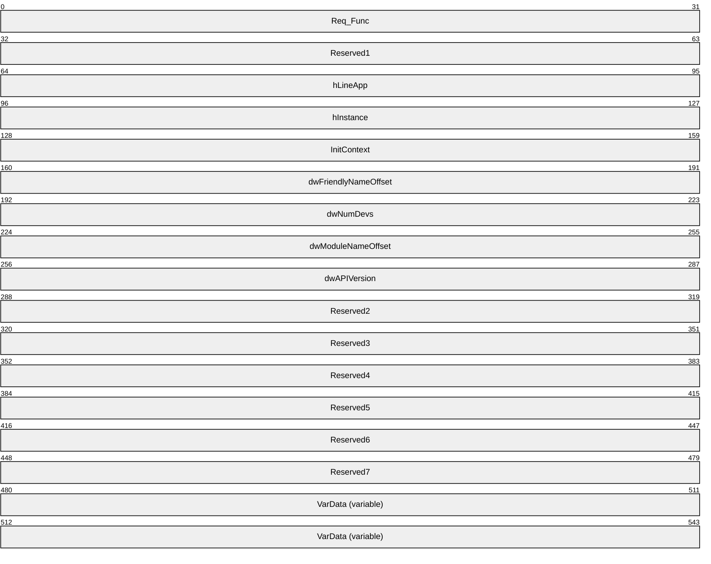
```mermaid
packet-beta
  0-31: "Req_Func"
  32-63: "Reserved1"
  64-95: "hLineApp"
  96-127: "hInstance"
  128-159: "InitContext"
  160-191: "dwFriendlyNameOffset"
  192-223: "dwNumDevs"
  224-255: "dwModuleNameOffset"
  256-287: "dwAPIVersion"
  288-319: "Reserved2"
  320-351: "Reserved3"
  352-383: "Reserved4"
  384-415: "Reserved5"
  416-447: "Reserved6"
  448-479: "Reserved7"
  480-543: "VarData (variable)"
```

**Req_Func (4 bytes):** An unsigned 32-bit integer. The identifier of the function that is invoked on the remote server. This value MUST be set to 47.

**Return Values**

On completion of [ClientRequest](#Section_3.1.4.2), this field contains the result of the encapsulated telephony request. A value of zero indicates success, and a [LINEERR_Constants](#Section_2.2.3.1.38) value indicates failure. The remote server MUST complete this call synchronously.

Zero indicates success. A negative error number indicates that an error occurred. The following table shows the return values for this function.

| Value | Meaning |
| --- | --- |
| LINEERR_INVALAPPNAME 0x80000015 | An invalid application name. |
| LINEERR_OPERATIONFAILED 0x80000048 | The operation failed. |
| LINEERR_INIFILECORRUPT 0x8000000E | The INI file is corrupted. |
| LINEERR_INVALPOINTER 0x80000035 | An invalid pointer. |
| LINEERR_REINIT 0x80000052 | The application attempted to initialize TAPI twice. |
| LINEERR_NOMEM 0x80000044 | No memory available. |
| LINEERR_INVALPARAM 0x80000032 | An invalid parameter. |

**Reserved1 (4 bytes):** An unsigned 32-bit integer. MUST be set to zero when sent and MUST be ignored on receipt.

**hLineApp (4 bytes):** An [HLINEAPP](#Section_2.2.1.3). Upon successful completion of the request, this field contains the client's usage handle for TAPI line requests.

**hInstance (4 bytes):** An unsigned 32-bit integer. This field is an instance handle of the client application. The application can pass NULL for this parameter, in which case, TAPI uses the module handle of the root executable of the process (for purposes of identifying call handoff targets and media mode priorities).

**InitContext (4 bytes):** An unsigned 32-bit integer. This field is an opaque value that the server uses for ASYNCEVENTMSG.InitContext for all line packets that are intended for this client within the scope of the hLineApp.

**dwFriendlyNameOffset (4 bytes):** An unsigned 32-bit integer. This field is the offset, in bytes, from the beginning of the variable data area to a NULL-terminated Unicode string that contains the display name of the client. For remote clients, this MUST be the remote computer name.

**dwNumDevs (4 bytes):** An unsigned 32-bit integer. Upon successful completion of the request, this field MUST contain the number of line devices that are available to the client.

**dwModuleNameOffset (4 bytes):** An unsigned 32-bit integer. This field is the offset, in bytes, from the beginning of the variable data area to a null-terminated Unicode string that contains the display name of the client. For remote clients, this MUST be the remote computer name.

**dwAPIVersion (4 bytes):** An unsigned 32-bit integer. This field is the highest TAPI version that is supported by the client.

**Reserved2 (4 bytes):** An unsigned 32-bit integer. This field is used for padding and MUST be ignored on receipt. It can be any value.

**Reserved3 (4 bytes):** An unsigned 32-bit integer. This field is used for padding and MUST be ignored on receipt. It can be any value.

**Reserved4 (4 bytes):** An unsigned 32-bit integer. This field is used for padding and MUST be ignored on receipt. It can be any value.

**Reserved5 (4 bytes):** An unsigned 32-bit integer. This field is used for padding and MUST be ignored on receipt. It can be any value.

**Reserved6 (4 bytes):** An unsigned 32-bit integer. This field is used for padding and MUST be ignored on receipt. It can be any value.

**Reserved7 (4 bytes):** An unsigned 32-bit integer. This field is used for padding and MUST be ignored on receipt. It can be any value.

**VarData (variable):** Contains the null-terminated Unicode strings that are indicated by the **dwFriendlyNameOffset** and **dwModuleNameOffset** fields.

The contents of this field MUST be DWORD-aligned, as specified in [MS-DTYP](../MS-DTYP/MS-DTYP.md) section 2.2.9.

###### 2.2.4.1.1.2 NegotiateAPIVersion

The NegotiateAPIVersion packet is transmitted from a TAPI [**client**](#gt_client) to a TAPI [**server**](#gt_server) in a [**remote procedure call**](#gt_remote-procedure-call-rpc). Sending this packet allows an application to negotiate a TAPI version to use.

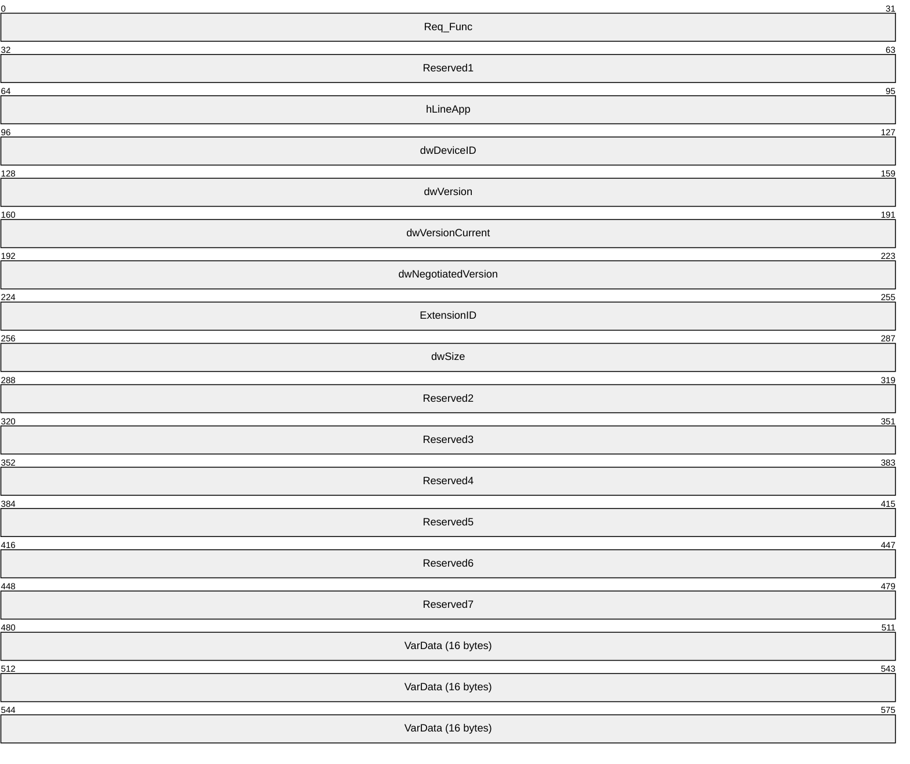
```mermaid
packet-beta
  0-31: "Req_Func"
  32-63: "Reserved1"
  64-95: "hLineApp"
  96-127: "dwDeviceID"
  128-159: "dwVersion"
  160-191: "dwVersionCurrent"
  192-223: "dwNegotiatedVersion"
  224-255: "ExtensionID"
  256-287: "dwSize"
  288-319: "Reserved2"
  320-351: "Reserved3"
  352-383: "Reserved4"
  384-415: "Reserved5"
  416-447: "Reserved6"
  448-479: "Reserved7"
  480-575: "VarData (16 bytes)"
```

**Req_Func (4 bytes):** An unsigned 32-bit integer. The identifier of the function that is invoked on the remote server. This value MUST be set to 52.

**Return Values**

On completion of [ClientRequest](#Section_3.1.4.2), this field contains the result of the encapsulated telephony request. A value of 0 indicates success, and a [LINEERR_Constants](#Section_2.2.3.1.38) value indicates failure. The remote server MUST complete this call synchronously.

MUST return zero if the function succeeds or an error number if an error occurs. Common return values are as follows:

| Name | Value |
| --- | --- |
| LINEERR_INCOMPATIBLEAPIVERSION | 0x8000000C |
| LINEERR_OPERATIONUNAVAIL | 0x80000049 |
| LINEERR_NODRIVER | 0x80000043 |
| LINEERR_OPERATIONFAILED | 0x80000048 |
| LINEERR_NOMEM | 0x80000044 |
| LINEERR_RESOURCEUNAVAIL | 0x8000004B |

**Reserved1 (4 bytes):** An unsigned 32-bit integer. MUST be set to zero when sent and MUST be ignored on receipt.

**hLineApp (4 bytes):** An [HLINEAPP](#Section_2.2.1.3). A handle to the client application's registration with TAPI. This field MUST have been obtained by sending the [Initialize](#Section_2.2.4.1.1.1) packet.

**dwDeviceID (4 bytes):** An unsigned 32-bit integer. Identifies the line device for which the interface version negotiation is to be performed. A valid value of dwDeviceID is in the range 0 to dwNumDevs  1. The client obtains dwNumDevs by sending a Initialize packet to the remote server.

**dwVersion (4 bytes):** An unsigned 32-bit integer. The earliest TAPI version with which the application is compliant.

**dwVersionCurrent (4 bytes):** An unsigned 32-bit integer. The latest TAPI version with which the application is compliant.

**dwNegotiatedVersion (4 bytes):** An unsigned 32-bit integer. Set to TAPI_NO_DATA (0xFFFFFFFF). Upon successful completion of the request, this field will contain the TAPI version number that was negotiated.

**ExtensionID (4 bytes):** An unsigned 32-bit integer. Set to TAPI_NO_DATA (0xFFFFFFFF). Upon successful completion of the request, this field MUST contain the offset, in bytes, in the **VarData** field of a [LINEEXTENSIONID](#Section_2.2.6.45) packet that indicates the identifier of the provider-specific extensions.

**dwSize (4 bytes):** An unsigned 32-bit integer. The size, in bytes, of the packet that is indicated in the **ExtensionID** field.

**Reserved2 (4 bytes):** An unsigned 32-bit integer. This field is used for padding and MUST be ignored on receipt. It can be any value.

**Reserved3 (4 bytes):** An unsigned 32-bit integer. This field is used for padding and MUST be ignored on receipt. It can be any value.

**Reserved4 (4 bytes):** An unsigned 32-bit integer. This field is used for padding and MUST be ignored on receipt. It can be any value.

**Reserved5 (4 bytes):** An unsigned 32-bit integer. This field is used for padding and MUST be ignored on receipt. It can be any value.

**Reserved6 (4 bytes):** An unsigned 32-bit integer. This field is used for padding and MUST be ignored on receipt. It can be any value.

**Reserved7 (4 bytes):** An unsigned 32-bit integer. This field is used for padding and MUST be ignored on receipt. It can be any value.

**VarData (16 bytes):** Present on successful completion of the request. Contains a LINEEXTENSIONID packet.

The contents of this field are DWORD aligned.

###### 2.2.4.1.1.3 GetDevCaps

The GetDevCaps packet is transmitted from a TAPI [**client**](#gt_client) to a TAPI [**server**](#gt_server) in a [**remote procedure call**](#gt_remote-procedure-call-rpc). Sending this packet queries a specified line device to determine its telephony capabilities. The returned information is valid for all addresses on the line device.

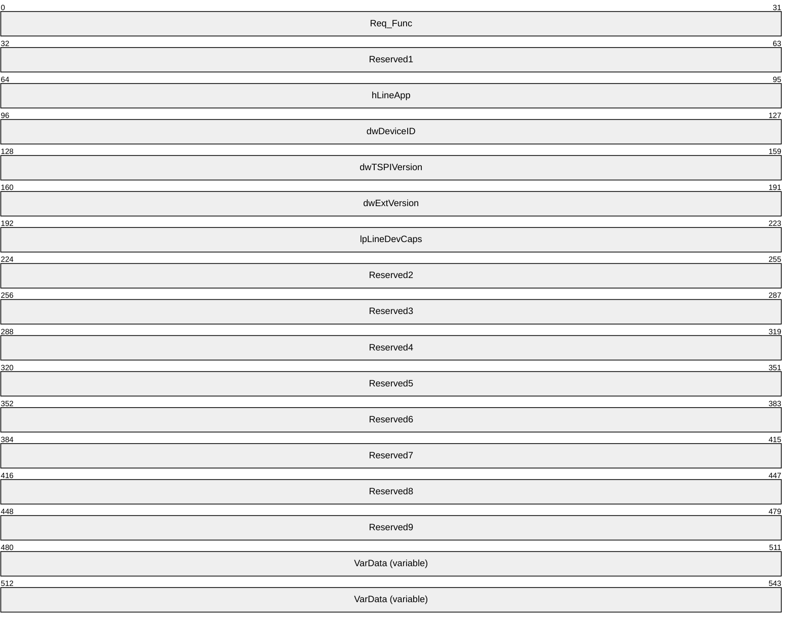
```mermaid
packet-beta
  0-31: "Req_Func"
  32-63: "Reserved1"
  64-95: "hLineApp"
  96-127: "dwDeviceID"
  128-159: "dwTSPIVersion"
  160-191: "dwExtVersion"
  192-223: "lpLineDevCaps"
  224-255: "Reserved2"
  256-287: "Reserved3"
  288-319: "Reserved4"
  320-351: "Reserved5"
  352-383: "Reserved6"
  384-415: "Reserved7"
  416-447: "Reserved8"
  448-479: "Reserved9"
  480-543: "VarData (variable)"
```

**Req_Func (4 bytes):** An unsigned 32-bit integer. The identifier of the function that is invoked on the remote server. This value MUST be set to 34.

**Return Values**

On completion of [ClientRequest](#Section_3.1.4.2), this field contains the result of the encapsulated telephony request. A value of 0 indicates success, and a [LINEERR_Constants](#Section_2.2.3.1.38) value indicates failure. The remote server MUST complete this call synchronously.

MUST return zero if the function succeeds or an error number if an error occurs. Common return values are as follows:

| Name | Value |
| --- | --- |
| LINEERR_INCOMPATIBLEAPIVERSION | 0x8000000C |
| LINEERR_INCOMPATIBLEEXTVERSION | 0x8000000D |
| LINEERR_NODRIVER | 0x80000043 |
| LINEERR_NOMEM | 0x80000044 |
| LINEERR_OPERATIONFAILED | 0x80000048 |
| LINEERR_OPERATIONUNAVAIL | 0x80000049 |
| LINEERR_RESOURCEUNAVAIL | 0x8000004B |

**Reserved1 (4 bytes):** An unsigned 32-bit integer. MUST be set to zero when sent and MUST be ignored on receipt.

**hLineApp (4 bytes):** An [HLINEAPP](#Section_2.2.1.3). A handle to the client application's registration with TAPI. This field MUST have been obtained by sending the [Initialize](#Section_2.2.4.1.1.1) packet.

**dwDeviceID (4 bytes):** An unsigned 32-bit integer. The line device to be queried. A valid value of dwDeviceID is in the range 0 to dwNumDevs  1. The client obtains dwNumDevs by sending a Initialize packet to the remote server.

**dwTSPIVersion (4 bytes):** An unsigned 32-bit integer. The negotiated TSPI version number. This value has already been negotiated for this device through the [NegotiateAPIVersion](#Section_2.2.4.1.1.2) packet.

**dwExtVersion (4 bytes):** An unsigned 32-bit integer. The negotiated extension version number. This value has already been negotiated for this device through the [NegotiateExtVersion](#Section_2.2.4.1.3.47) packet. This parameter is not validated by TAPI when this function is called.

**lpLineDevCaps (4 bytes):** An unsigned 32-bit integer. The size, in bytes, of a [LINEDEVCAPS](#Section_2.2.6.23) data packet that is filled with line device capabilities information upon successful completion of the request.

On successful completion, this field contains the offset, in bytes, of the data packet in the **VarData** field.

**Reserved2 (4 bytes):** An unsigned 32-bit integer. This field is used for padding and MUST be ignored on receipt. It can be any value.

**Reserved3 (4 bytes):** An unsigned 32-bit integer. This field is used for padding and MUST be ignored on receipt. It can be any value.

**Reserved4 (4 bytes):** An unsigned 32-bit integer. This field is used for padding and MUST be ignored on receipt. It can be any value.

**Reserved5 (4 bytes):** An unsigned 32-bit integer. This field is used for padding and MUST be ignored on receipt. It can be any value.

**Reserved6 (4 bytes):** An unsigned 32-bit integer. This field is used for padding and MUST be ignored on receipt. It can be any value.

**Reserved7 (4 bytes):** An unsigned 32-bit integer. This field is used for padding and MUST be ignored on receipt. It can be any value.

**Reserved8 (4 bytes):** An unsigned 32-bit integer. This field is used for padding and MUST be ignored on receipt. It can be any value.

**Reserved9 (4 bytes):** An unsigned 32-bit integer. This field is used for padding and MUST be ignored on receipt. It can be any value.

**VarData (variable):** MUST be present on successful completion of the request. MUST contain a LINEDEVCAPS data structure.

The contents of this field MUST be DWORD-aligned, as specified in [MS-DTYP](../MS-DTYP/MS-DTYP.md) section 2.2.9.

###### 2.2.4.1.1.4 GetAddressCaps

The GetAddressCaps packet is transmitted from a TAPI [**client**](#gt_client) to a TAPI [**server**](#gt_server) in a [**remote procedure call**](#gt_remote-procedure-call-rpc). Sending this packet queries the specified address on the specified line device to determine its telephony capabilities.

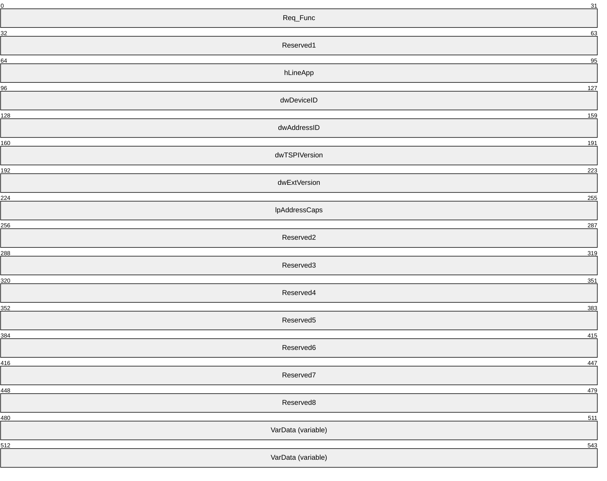
```mermaid
packet-beta
  0-31: "Req_Func"
  32-63: "Reserved1"
  64-95: "hLineApp"
  96-127: "dwDeviceID"
  128-159: "dwAddressID"
  160-191: "dwTSPIVersion"
  192-223: "dwExtVersion"
  224-255: "lpAddressCaps"
  256-287: "Reserved2"
  288-319: "Reserved3"
  320-351: "Reserved4"
  352-383: "Reserved5"
  384-415: "Reserved6"
  416-447: "Reserved7"
  448-479: "Reserved8"
  480-543: "VarData (variable)"
```

**Req_Func (4 bytes):** An unsigned 32-bit integer. The identifier of the function that is invoked on the remote server. This value MUST be set to 21.

**Return Values**

On completion of [ClientRequest](#Section_3.1.4.2), this field contains the result of the encapsulated telephony request. A value of 0 indicates success, and a [LINEERR_Constants](#Section_2.2.3.1.38) value indicates failure. The remote server MUST complete this call synchronously.

MUST return zero, if the function succeeds; or an error number, if an error occurs.

**Reserved1 (4 bytes):** An unsigned 32-bit integer. MUST be set to zero when sent and MUST be ignored on receipt.

**hLineApp (4 bytes):** An [HLINEAPP](#Section_2.2.1.3). A handle to the application's registration with TAPI. This field MUST have been obtained by sending the [Initialize](#Section_2.2.4.1.1.1) packet.

**dwDeviceID (4 bytes):** An unsigned 32-bit integer. The line device that contains the address to be queried. A valid value of dwDeviceID is in the range 0 to dwNumDevs  1. The client obtains dwNumDevs by sending a Initialize packet to the remote server.

**dwAddressID (4 bytes):** An unsigned 32-bit integer. The address on the specified line device whose capabilities are to be queried. An address identifier is permanently associated with an address; the identifier remains constant across operating system upgrades. valid value of dwAddressID is in the range 0 to dwNumAddresses  1. The client obtains dwNumAddresses from the LIVEDEVCAPS obtained by sending a GetDevCaps packet to the remote server. This parameter is not validated by TAPI when this function is called.

**dwTSPIVersion (4 bytes):** An unsigned 32-bit integer. The version number of the TSPI to be used. The high-order word contains the major version number; the low-order word contains the minor version number. This number is obtained by [NegotiateAPIVersion](#Section_2.2.4.1.1.2).

**dwExtVersion (4 bytes):** An unsigned 32-bit integer. The version number of the service providerspecific extensions to be used. This number is zero if no device-specific extensions are to be used. Otherwise, the high-order word contains the major version number; the low-order word contains the minor version number. This value is obtained for this device by sending the NegotiateExtVersion packet. This parameter is not validated by TAPI when this function is called.

**lpAddressCaps (4 bytes):** An unsigned 32-bit integer. The size, in bytes, of a [LINEADDRESSCAPS](#Section_2.2.6.6) packet that is filled with address capabilities information upon successful completion of the request. On successful completion, this field contains the offset, in bytes, of the packet in the **VarData** field.

**Reserved2 (4 bytes):** An unsigned 32-bit integer. This field is used for padding and MUST be ignored on receipt. It can be any value.

**Reserved3 (4 bytes):** An unsigned 32-bit integer. This field is used for padding and MUST be ignored on receipt. It can be any value.

**Reserved4 (4 bytes):** An unsigned 32-bit integer. This field is used for padding and MUST be ignored on receipt. It can be any value.

**Reserved5 (4 bytes):** An unsigned 32-bit integer. This field is used for padding and MUST be ignored on receipt. It can be any value.

**Reserved6 (4 bytes):** An unsigned 32-bit integer. This field is used for padding and MUST be ignored on receipt. It can be any value.

**Reserved7 (4 bytes):** An unsigned 32-bit integer. This field is used for padding and MUST be ignored on receipt. It can be any value.

**Reserved8 (4 bytes):** An unsigned 32-bit integer. This field is used for padding and MUST be ignored on receipt. It can be any value.

**VarData (variable):** Present on successful completion of the request. Contains a LINEADDRESSCAPS packet.

The contents of this field MUST be DWORD-aligned, as specified in [MS-DTYP](../MS-DTYP/MS-DTYP.md) section 2.2.9.

###### 2.2.4.1.1.5 Open

The Open packet is transmitted from a TAPI [**client**](#gt_client) to a TAPI [**server**](#gt_server) in a [**remote procedure call**](#gt_remote-procedure-call-rpc). Sending this packet opens the line device that is specified by its device identifier and returns a line handle for the corresponding opened line device. This line handle is used in subsequent operations on the line device.

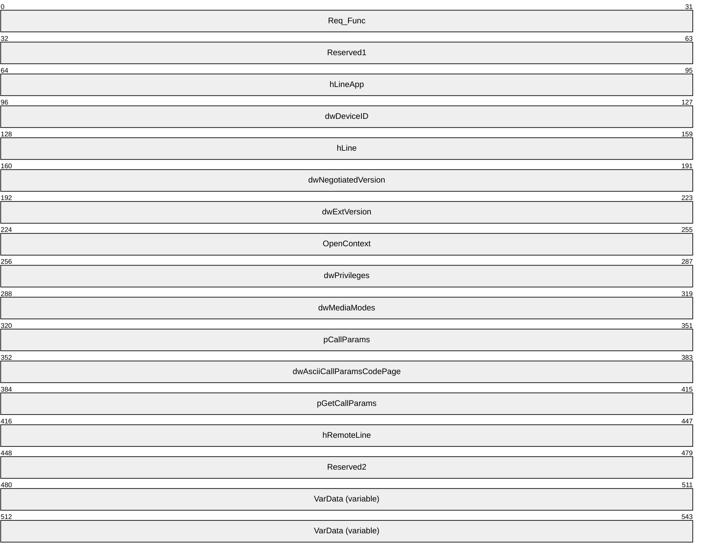
```mermaid
packet-beta
  0-31: "Req_Func"
  32-63: "Reserved1"
  64-95: "hLineApp"
  96-127: "dwDeviceID"
  128-159: "hLine"
  160-191: "dwNegotiatedVersion"
  192-223: "dwExtVersion"
  224-255: "OpenContext"
  256-287: "dwPrivileges"
  288-319: "dwMediaModes"
  320-351: "pCallParams"
  352-383: "dwAsciiCallParamsCodePage"
  384-415: "pGetCallParams"
  416-447: "hRemoteLine"
  448-479: "Reserved2"
  480-543: "VarData (variable)"
```

**Req_Func (4 bytes):** An unsigned 32-bit integer. The identifier of the function that will be invoked on the remote server. This value MUST be set to 54.

Return Values

On completion of [ClientRequest](#Section_3.1.4.2), this field will contain the result of the encapsulated telephony request. A value of 0 indicates success, and a [LINEERR_Constants](#Section_2.2.3.1.38) value indicates failure. The remote server MUST complete this call synchronously.

MUST return zero if the function succeeds or an error number if an error occurs. Common return values are as follows:

| Name | Value |
| --- | --- |
| LINEERR_ALLOCATED | 0x80000001 |
| LINEERR_OPERATIONUNAVAIL | 0x80000049 |
| LINEERR_NODRIVER | 0x80000043 |
| LINEERR_OPERATIONFAILED | 0x80000048 |
| LINEERR_NOMEM | 0x80000044 |
| LINEERR_RESOURCEUNAVAIL | 0x8000004B |

**Reserved1 (4 bytes):** An unsigned 32-bit integer. MUST be set to zero when sent and MUST be ignored on receipt.

**hLineApp (4 bytes):** An [HLINEAPP](#Section_2.2.1.3). A handle to the client application's registration with TAPI. This field MUST have been obtained by sending the [Initialize](#Section_2.2.4.1.1.1) packet.

**dwDeviceID (4 bytes):** An unsigned 32-bit integer. Identifies the line device to be opened. A valid value of dwDeviceID is in the range 0 to dwNumDevs  1. The client obtains dwNumDevs by sending a Initialize packet to the remote server.

**hLine (4 bytes):** An [HLINE](#Section_2.2.1.2). Set to TAPI_NO_DATA (0xFFFFFFFF). Upon successful completion of the request, this field MUST contain the handle representing the opened line device.

**dwNegotiatedVersion (4 bytes):** An unsigned 32-bit integer. The version that is negotiated via the [NegotiateAPIVersion](#Section_2.2.4.1.1.2) request.

**dwExtVersion (4 bytes):** An unsigned 32-bit integer. The extension version number under which the application and the service provider agree to operate. This number is obtained with [NegotiateExtVersion](#Section_2.2.4.1.3.47).

**OpenContext (4 bytes):** An unsigned 32-bit integer. The Callback instance, set to 0.

**dwPrivileges (4 bytes):** An unsigned 32-bit integer. The privilege that the application requests when notified of a call.

**dwMediaModes (4 bytes):** An unsigned 32-bit integer. The media type or modes of interest to the application.

**pCallParams (4 bytes):** The offset, in bytes, from the beginning of the variable data area to the [LINECALLPARAMS](#Section_2.2.6.20) packet. This field is set to TAPI_NO_DATA (0xFFFFFFFF) if no LINECALLPARAMS packet is specified.

**dwAsciiCallParamsCodePage (4 bytes):** An unsigned 32-bit integer. The code page of the **pCallParams** field, set to TAPI_NO_DATA (0xFFFFFFFF).

**pGetCallParams (4 bytes):** An unsigned 32-bit integer. The value of this field is ignored by the server. On successful completion, this field is set to TAPI_NO_DATA (0xFFFFFFFF).

**hRemoteLine (4 bytes):** An unsigned 32-bit integer. If this field is nonzero, the server MUST use this value for ASYNCEVENTMSG.hDevice for all unsolicited events and completion notifications sent to the client, instead of the returned hLine value.

Similar handle-swapping semantics can exist between the TAPI service and telephony service providers.

**Reserved2 (4 bytes):** An unsigned 32-bit integer. This field is used for padding and MUST be ignored on receipt. It can be any value.

**VarData (variable):** This field MUST contain the LINECALLPARAMS packet that is indicated by the **pCallParams** field.

The contents of this field MUST be DWORD-aligned, as specified in [MS-DTYP](../MS-DTYP/MS-DTYP.md) section 2.2.9.

##### 2.2.4.1.2 Terminate Session for Line Device

The following sections describe the buffers that [**clients**](#gt_client) use to terminate the session.

###### 2.2.4.1.2.1 Close

The Close packet is transmitted from a TAPI [**client**](#gt_client) to a TAPI [**server**](#gt_server) in a [**remote procedure call**](#gt_remote-procedure-call-rpc). Sending this packet closes the specified open line device after completing or aborting all outstanding calls and asynchronous operations on the device.

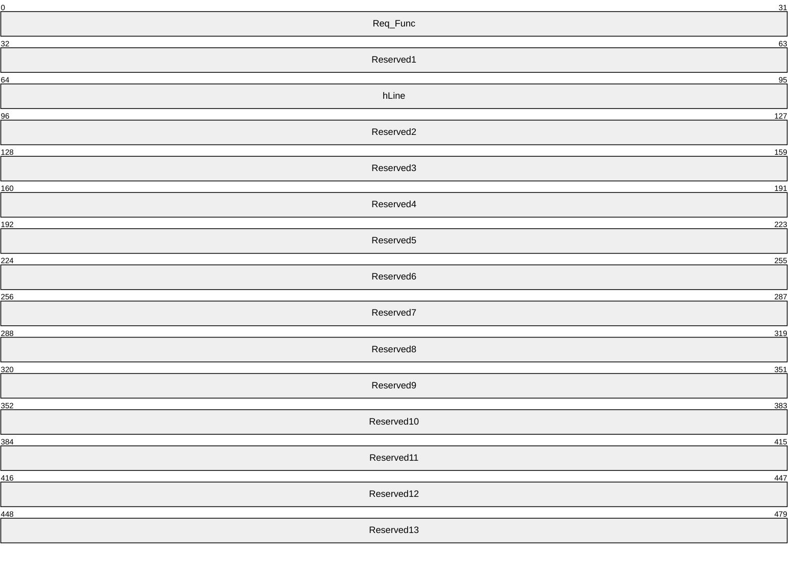
```mermaid
packet-beta
  0-31: "Req_Func"
  32-63: "Reserved1"
  64-95: "hLine"
  96-127: "Reserved2"
  128-159: "Reserved3"
  160-191: "Reserved4"
  192-223: "Reserved5"
  224-255: "Reserved6"
  256-287: "Reserved7"
  288-319: "Reserved8"
  320-351: "Reserved9"
  352-383: "Reserved10"
  384-415: "Reserved11"
  416-447: "Reserved12"
  448-479: "Reserved13"
```

**Req_Func (4 bytes):** An unsigned 32-bit integer. The identifier of the function that will be invoked on the remote server. This value MUST be set to 9.

Return Values

On completion of [ClientRequest](#Section_3.1.4.2), this field contains the result of the encapsulated telephony request. A value of 0 indicates success, and a [LINEERR_Constants](#Section_2.2.3.1.38) value indicates failure. The remote server MUST complete this call synchronously.

MUST return zero if the function succeeds or an error number if an error occurs. Common return values are as follows:

| Name | Value |
| --- | --- |
| LINEERR_NOMEM | 0x80000044 |
| LINEERR_OPERATIONFAILED | 0x80000048 |
| LINEERR_OPERATIONUNAVAIL | 0x80000049 |
| LINEERR_RESOURCEUNAVAIL | 0x8000004B |

**Reserved1 (4 bytes):** An unsigned 32-bit integer. MUST be set to zero when sent and MUST be ignored on receipt.

**hLine (4 bytes):** An [HLINE](#Section_2.2.1.2). A handle to the line to close. This field MUST have been obtained by sending the [Open](#Section_2.2.4.1.1.5) packet.

**Reserved2 (4 bytes):** An unsigned 32-bit integer. This field is used for padding and MUST be ignored on receipt. It can be any value.

**Reserved3 (4 bytes):** An unsigned 32-bit integer. This field is used for padding and MUST be ignored on receipt. It can be any value.

**Reserved4 (4 bytes):** An unsigned 32-bit integer. This field is used for padding and MUST be ignored on receipt. It can be any value.

**Reserved5 (4 bytes):** An unsigned 32-bit integer. This field is used for padding and MUST be ignored on receipt. It can be any value.

**Reserved6 (4 bytes):** An unsigned 32-bit integer. This field is used for padding and MUST be ignored on receipt. It can be any value.

**Reserved7 (4 bytes):** An unsigned 32-bit integer. This field is used for padding and MUST be ignored on receipt. It can be any value.

**Reserved8 (4 bytes):** An unsigned 32-bit integer. This field is used for padding and MUST be ignored on receipt. It can be any value.

**Reserved9 (4 bytes):** An unsigned 32-bit integer. This field is used for padding and MUST be ignored on receipt. It can be any value.

**Reserved10 (4 bytes):** An unsigned 32-bit integer. This field is used for padding and MUST be ignored on receipt. It can be any value.

**Reserved11 (4 bytes):** An unsigned 32-bit integer. This field is used for padding and MUST be ignored on receipt. It can be any value.

**Reserved12 (4 bytes):** An unsigned 32-bit integer. This field is used for padding and MUST be ignored on receipt. It can be any value.

**Reserved13 (4 bytes):** An unsigned 32-bit integer. This field is used for padding and MUST be ignored on receipt. It can be any value.

###### 2.2.4.1.2.2 ShutDown

The Shutdown packet is transmitted from a TAPI [**client**](#gt_client) to a TAPI [**server**](#gt_server) in a [**remote procedure call**](#gt_remote-procedure-call-rpc). Sending this packet MUST shut down the application's usage of the line abstraction of the TAPI.

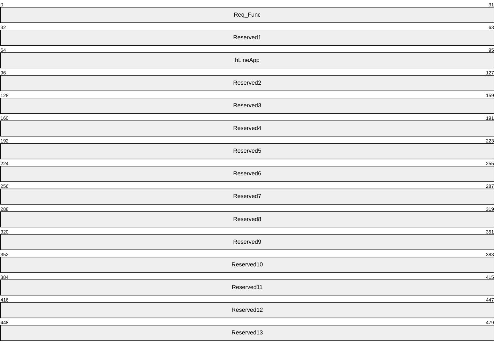
```mermaid
packet-beta
  0-31: "Req_Func"
  32-63: "Reserved1"
  64-95: "hLineApp"
  96-127: "Reserved2"
  128-159: "Reserved3"
  160-191: "Reserved4"
  192-223: "Reserved5"
  224-255: "Reserved6"
  256-287: "Reserved7"
  288-319: "Reserved8"
  320-351: "Reserved9"
  352-383: "Reserved10"
  384-415: "Reserved11"
  416-447: "Reserved12"
  448-479: "Reserved13"
```

**Req_Func (4 bytes):** An unsigned 32-bit integer. The identifier of the function that will be invoked on the remote server. This value MUST be set to 86.

Return Values

On completion of [ClientRequest](#Section_3.1.4.2), this field MUST contain the result of the encapsulated telephony request. A value of 0 indicates success, and a [LINEERR_Constants](#Section_2.2.3.1.38) value indicates failure. The remote server MUST complete this call synchronously.

Returns zero if the request succeeds or a negative error number if an error occurs. Common return values are:

| Name | Value |
| --- | --- |
| LINEERR_INVALAPPHANDLE | 0x80000014 |
| LINEERR_RESOURCEUNAVAIL | 0x8000004B |
| LINEERR_NOMEM | 0x80000044 |
| LINEERR_UNINITIALIZED | 0x80000050 |

**Reserved1 (4 bytes):** An unsigned 32-bit integer. MUST be set to zero when sent and MUST be ignored on receipt.

**hLineApp (4 bytes):** An [HLINEAPP](#Section_2.2.1.3). The usage handle of the application for the line. This field MUST have been obtained by sending the [Initialize](#Section_2.2.4.1.1.1) packet.

**Reserved2 (4 bytes):** An unsigned 32-bit integer. This field is used for padding and MUST be ignored on receipt. It can be any value.

**Reserved3 (4 bytes):** An unsigned 32-bit integer. This field is used for padding and MUST be ignored on receipt. It can be any value.

**Reserved4 (4 bytes):** An unsigned 32-bit integer. This field is used for padding and MUST be ignored on receipt. It can be any value.

**Reserved5 (4 bytes):** An unsigned 32-bit integer. This field is used for padding and MUST be ignored on receipt. It can be any value.

**Reserved6 (4 bytes):** An unsigned 32-bit integer. This field is used for padding and MUST be ignored on receipt. It can be any value.

**Reserved7 (4 bytes):** An unsigned 32-bit integer. This field is used for padding and MUST be ignored on receipt. It can be any value.

**Reserved8 (4 bytes):** An unsigned 32-bit integer. This field is used for padding and MUST be ignored on receipt. It can be any value.

**Reserved9 (4 bytes):** An unsigned 32-bit integer. This field is used for padding and MUST be ignored on receipt. It can be any value.

**Reserved10 (4 bytes):** An unsigned 32-bit integer. This field is used for padding and MUST be ignored on receipt. It can be any value.

**Reserved11 (4 bytes):** An unsigned 32-bit integer. This field is used for padding and MUST be ignored on receipt. It can be any value.

**Reserved12 (4 bytes):** An unsigned 32-bit integer. This field is used for padding and MUST be ignored on receipt. It can be any value.

**Reserved13 (4 bytes):** An unsigned 32-bit integer. This field is used for padding and MUST be ignored on receipt. It can be any value.

##### 2.2.4.1.3 Line Device Requests

The packets in the following sections, from the [Accept(section2.2.4.1.3.1)](#Section_2.2.4.1.3.1) packet through the [UnPark(section2.2.4.1.3.82)](#Section_2.2.4.1.3.82) packet, describe line device requests that are sent from the TAPI [**client**](#gt_client) to the TAPI [**server**](#gt_server) on the tapsrv interface by using the [ClientRequest](#Section_3.1.4.2) [**remote procedure call**](#gt_remote-procedure-call-rpc).

###### 2.2.4.1.3.1 Accept

The Accept packet is transmitted from a TAPI [**client**](#gt_client) to a TAPI [**server**](#gt_server) in a [**remote procedure call**](#gt_remote-procedure-call-rpc). Sending this packet accepts the specified offered call. Optionally, it can send the specified user-user information to the calling party.

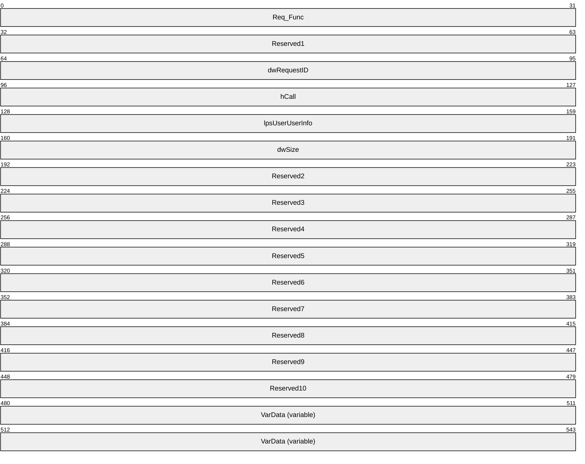
```mermaid
packet-beta
  0-31: "Req_Func"
  32-63: "Reserved1"
  64-95: "dwRequestID"
  96-127: "hCall"
  128-159: "lpsUserUserInfo"
  160-191: "dwSize"
  192-223: "Reserved2"
  224-255: "Reserved3"
  256-287: "Reserved4"
  288-319: "Reserved5"
  320-351: "Reserved6"
  352-383: "Reserved7"
  384-415: "Reserved8"
  416-447: "Reserved9"
  448-479: "Reserved10"
  480-543: "VarData (variable)"
```

**Req_Func (4 bytes):** An unsigned 32-bit integer. The identifier of the function that will be invoked on the remote server. This value MUST be set to 4.

Return Values

On completion of [ClientRequest](#Section_3.1.4.2), this field contains the result of the encapsulated telephony request. A nonzero request ID value indicates that the request is in progress and will complete asynchronously and a [LINEERR_Constants](#Section_2.2.3.1.38) value indicates synchronous failure.

Returns a positive request identifier if the function will be completed asynchronously or a negative error number if an error occurs. The dwParam2 parameter of the corresponding [LINE_REPLY](#Section_2.2.4.2.1.25) packet is zero if the function succeeds; or it is a negative error number if an error occurs. If the client specified a nonzero value in the dwRequestID field of the packet, the same MUST be used as the value for the returned positive request identifier. Common return values are as follows:

| Name | Value |
| --- | --- |
| LINEERR_INVALCALLHANDLE | 0x80000018 |
| LINEERR_OPERATIONFAILED | 0x80000048 |
| LINEERR_INVALCALLSTATE | 0x8000001C |
| LINEERR_RESOURCEUNAVAIL | 0x8000004B |
| LINEERR_NOMEM | 0x80000044 |
| LINEERR_USERUSERINFOTOOBIG | 0x80000051 |
| LINEERR_OPERATIONUNAVAIL | 0x80000049 |

**Reserved1 (4 bytes):** An unsigned 32-bit integer. MUST be set to zero when sent and MUST be ignored on receipt.

**dwRequestID (4 bytes):** The identifier of an asynchronous request.

| Value | Meaning |
| --- | --- |
| 0x00000000 | The server MUST generate a unique positive request ID to return as the Ack_ReturnValue. |
| 0x00000001  0x7FFFFFFF | The server MUST use this value instead of generating a unique positive request ID. |

**hCall (4 bytes):** The handle to the call to be accepted. The application MUST be an owner of the call. The call state of hCall must be offering. The client can obtain a valid hCall from the [LINE_CALLSTATE](#Section_2.2.4.2.1.8) packet sent by the remote server.

**lpsUserUserInfo (4 bytes):** The offset, in bytes, in the VarData field of the user-user information to send to the remote party as part of the call accept. When this field is set to -1 (0xFFFFFFFF), no user-user information is to be sent.

**dwSize (4 bytes):** The size, in bytes, of the user-user information in lpsUserUserInfo (including the null terminator). If lpsUserUserInfo is -1 (0xFFFFFFFF), no user-user information is sent to the calling party and dwSize is ignored.

**Reserved2 (4 bytes):** An unsigned 32-bit integer. This field is used for padding and MUST be ignored on receipt. It can be any value.

**Reserved3 (4 bytes):** An unsigned 32-bit integer. This field is used for padding and MUST be ignored on receipt. It can be any value.

**Reserved4 (4 bytes):** An unsigned 32-bit integer. This field is used for padding and MUST be ignored on receipt. It can be any value.

**Reserved5 (4 bytes):** An unsigned 32-bit integer. This field is used for padding and MUST be ignored on receipt. It can be any value.

**Reserved6 (4 bytes):** An unsigned 32-bit integer. This field is used for padding and MUST be ignored on receipt. It can be any value.

**Reserved7 (4 bytes):** An unsigned 32-bit integer. This field is used for padding and MUST be ignored on receipt. It can be any value.

**Reserved8 (4 bytes):** An unsigned 32-bit integer. This field is used for padding and MUST be ignored on receipt. It can be any value.

**Reserved9 (4 bytes):** An unsigned 32-bit integer. This field is used for padding and MUST be ignored on receipt. It can be any value.

**Reserved10 (4 bytes):** An unsigned 32-bit integer. This field is used for padding and MUST be ignored on receipt. It can be any value.

**VarData (variable):** Contains the user information that is indicated in the lpsUserUserInfo field. The user information can be an [**ASCII**](#gt_ascii) or Unicode string and this data is opaque to the protocol.

The contents of this field MUST be DWORD-aligned, as specified in [MS-DTYP](../MS-DTYP/MS-DTYP.md) section 2.2.9.

###### 2.2.4.1.3.2 AddToConference

The AddToConference packet is transmitted from a TAPI [**client**](#gt_client) to a TAPI [**server**](#gt_server) in a [**remote procedure call**](#gt_remote-procedure-call-rpc). Sending this packet adds the call that is specified by hConsultCall to the conference call that is specified by hConfCall.

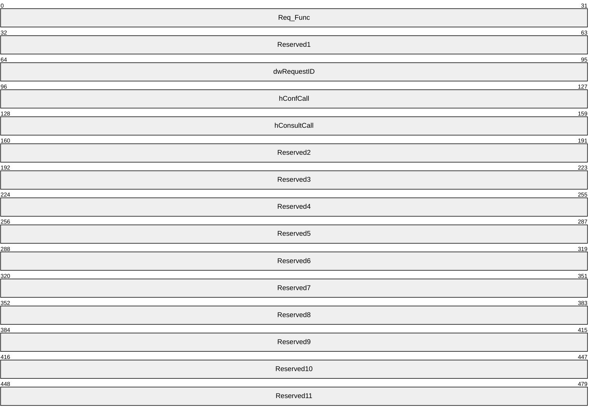
```mermaid
packet-beta
  0-31: "Req_Func"
  32-63: "Reserved1"
  64-95: "dwRequestID"
  96-127: "hConfCall"
  128-159: "hConsultCall"
  160-191: "Reserved2"
  192-223: "Reserved3"
  224-255: "Reserved4"
  256-287: "Reserved5"
  288-319: "Reserved6"
  320-351: "Reserved7"
  352-383: "Reserved8"
  384-415: "Reserved9"
  416-447: "Reserved10"
  448-479: "Reserved11"
```

**Req_Func (4 bytes):** An unsigned 32-bit integer. The identifier of the function that will be invoked on the remote server. This value MUST be set to 5.

**Return Values**

On completion of [ClientRequest](#Section_3.1.4.2), this field contains the result of the encapsulated telephony request. A nonzero request ID value indicates that the request is in progress and will complete asynchronously, and a [LINEERR_Constants](#Section_2.2.3.1.38) value indicates synchronous failure.

Returns a positive request identifier if the function will be completed asynchronously or a negative error number if an error occurs. The dwParam2 parameter of the corresponding [LINE_REPLY](#Section_2.2.4.2.1.25) packet is zero if the function succeeds, or it is a negative error number if an error occurs. If the client specified a nonzero value in the dwRequestID field of the packet, the same value MUST be used as the value for the returned positive request identifier. Common return values are as follows:

| Name | Value |
| --- | --- |
| LINEERR_INVALCALLHANDLE | 0x80000018 |
| LINEERR_OPERATIONUNAVAIL | 0x80000049 |
| LINEERR_INVALCALLSTATE | 0x8000001C |
| LINEERR_OPERATIONFAILED | 0x80000048 |
| LINEERR_CONFERENCEFULL | 0x80000007 |
| LINEERR_RESOURCEUNAVAIL | 0x8000004B |
| LINEERR_NOMEM | 0x80000044 |

**Reserved1 (4 bytes):** An unsigned 32-bit integer. MUST be set to zero when sent and MUST be ignored on receipt.

**dwRequestID (4 bytes):** An unsigned 32-bit integer. The identifier of the asynchronous request.

**hConfCall (4 bytes):** An [HCALL](#Section_2.2.1.1). The handle to the conference call obtained by sending the [SetUpConference](#Section_2.2.4.1.3.77) packet. The application MUST be an owner of this call. Any monitoring (media, tones, digits) on a conference call applies only to the hConfCall and not to the individual participating calls. The call state of hConfCall MUST be onHoldPendingConference or onHold.

**hConsultCall (4 bytes):** An HCALL. The handle to the call to be added to the conference call. One way of obtaining a valid hConsultCall is by sending the [MakeCall](#Section_2.2.4.1.3.43) packet. The application MUST be an owner of this call. This call cannot be either a parent of another conference or a participant in any conference. Depending on the device capabilities that are indicated in [LINEADDRESSCAPS](#Section_2.2.6.6), the hConsultCall parameter might not necessarily have been established by using the SetUpConference or [PrepareAddToConference](#Section_2.2.4.1.3.50) packet. The call state of hConsultCall can be connected, onHold, proceeding, or ringback.

**Reserved2 (4 bytes):** An unsigned 32-bit integer. This field is used for padding and MUST be ignored on receipt. It can be any value.

**Reserved3 (4 bytes):** An unsigned 32-bit integer. This field is used for padding and MUST be ignored on receipt. It can be any value.

**Reserved4 (4 bytes):** An unsigned 32-bit integer. This field is used for padding and MUST be ignored on receipt. It can be any value.

**Reserved5 (4 bytes):** An unsigned 32-bit integer. This field is used for padding and MUST be ignored on receipt. It can be any value.

**Reserved6 (4 bytes):** An unsigned 32-bit integer. This field is used for padding and MUST be ignored on receipt. It can be any value.

**Reserved7 (4 bytes):** An unsigned 32-bit integer. This field is used for padding and MUST be ignored on receipt. It can be any value.

**Reserved8 (4 bytes):** An unsigned 32-bit integer. This field is used for padding and MUST be ignored on receipt. It can be any value.

**Reserved9 (4 bytes):** An unsigned 32-bit integer. This field is used for padding and MUST be ignored on receipt. It can be any value.

**Reserved10 (4 bytes):** An unsigned 32-bit integer. This field is used for padding and MUST be ignored on receipt. It can be any value.

**Reserved11 (4 bytes):** An unsigned 32-bit integer. This field is used for padding and MUST be ignored on receipt. It can be any value.

###### 2.2.4.1.3.3 AgentSpecific

The AgentSpecific packet is transmitted from a TAPI [**client**](#gt_client) to a TAPI [**server**](#gt_server) in a [**remote procedure call**](#gt_remote-procedure-call-rpc). Sending this packet allows the application to access proprietary handler-specific functions of the agent handler that is associated with the address.

The meaning of the extensions are specific to the agent handler. Each set of agent-related extensions is identified by a universally unique 128-bit extension ID that MUST be obtained, along with the specification for the extension, from the promulgator of that extension (usually the author of the agent handler software on the telephony server).

The list of extensions that are supported by the agent handler is obtained from the [LINEAGENTCAPS](#Section_2.2.6.13) packet that is returned by the [GetAgentCaps](#Section_2.2.4.1.3.23) packet.

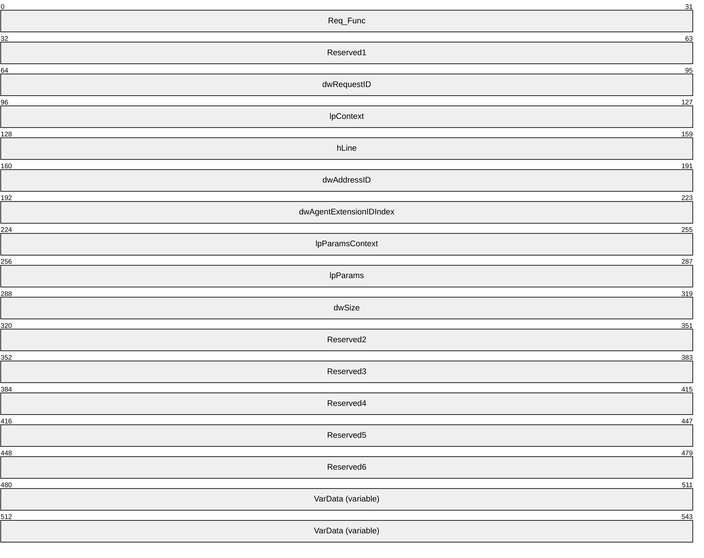
```mermaid
packet-beta
  0-31: "Req_Func"
  32-63: "Reserved1"
  64-95: "dwRequestID"
  96-127: "lpContext"
  128-159: "hLine"
  160-191: "dwAddressID"
  192-223: "dwAgentExtensionIDIndex"
  224-255: "lpParamsContext"
  256-287: "lpParams"
  288-319: "dwSize"
  320-351: "Reserved2"
  352-383: "Reserved3"
  384-415: "Reserved4"
  416-447: "Reserved5"
  448-479: "Reserved6"
  480-543: "VarData (variable)"
```

**Req_Func (4 bytes):** An unsigned 32-bit integer. The identifier of the function that will be invoked on the remote server. This value MUST be set to 6.

**Return Values**

On completion of [ClientRequest](#Section_3.1.4.2), this field contains the result of the encapsulated telephony request. A nonzero request ID value indicates that the request is in progress and will complete asynchronously, and a [LINEERR_Constants](#Section_2.2.3.1.38) value indicates synchronous failure.

Returns a positive request identifier if the function will be completed asynchronously or a negative error number if an error occurs. If the client specified a nonzero value in the dwRequestID field of the packet, the same MUST be used as the value for the returned positive request identifier.

Common return values are as follows:

| Name | Value |
| --- | --- |
| LINEERR_INVALADDRESSID | 0x80000011 |
| LINEERR_INVALAGENTID | 0x80000057 |
| LINEERR_INVALLINEHANDLE | 0x8000002B |
| LINEERR_INVALPARAM | 0x80000032 |
| LINEERR_INVALPOINTER | 0x80000035 |
| LINEERR_NOMEM | 0x80000044 |
| LINEERR_OPERATIONFAILED | 0x80000048 |
| LINEERR_OPERATIONUNAVAIL | 0x80000049 |
| LINEERR_RESOURCEUNAVAIL | 0x8000004B |
| LINEERR_STRUCTURETOOSMALL | 0x8000004D |
| LINEERR_UNINITIALIZED | 0x80000050 |

Additional return values are specific to the agent handler.

**Reserved1 (4 bytes):** An unsigned 32-bit integer. MUST be set to zero when sent and MUST be ignored on receipt.

**dwRequestID (4 bytes):** An unsigned 32-bit integer. The identifier of the asynchronous request.

| Value | Meaning |
| --- | --- |
| 0x00000000 | The server MUST generate a unique positive request ID to return as the Ack_ReturnValue. |
| 0x00000001  0x7FFFFFFF | The server MUST use this value instead of generating a unique positive request ID. |

**lpContext (4 bytes):** An unsigned 32-bit integer. The opaque, client-specified value that is used by the client upon request completion; MUST be returned by the server in the request completion packet.

**hLine (4 bytes):** An [HLINE](#Section_2.2.1.2). The handle to the open line device. This field MUST have been obtained by sending the [Open](#Section_2.2.4.1.1.5) packet.

**dwAddressID (4 bytes):** An unsigned 32-bit integer. The address on the open line device. An address identifier is permanently associated with an address; the identifier remains constant across operating system upgrades. A valid value of dwAddressID is in the range 0 to dwNumAddresses 1. The client obtains dwNumAddresses from the [LINEDEVCAPS](#Section_2.2.6.23) obtained by sending a [GetDevCaps](#Section_2.2.4.1.1.3) packet to the remote server.

**dwAgentExtensionIDIndex (4 bytes):** An unsigned 32-bit integer. The position in the ExtensionIDList packet in LINEAGENTCAPS of the agent handler extension being invoked. A valid value of dwAgentExtensionIDIndex is in the range 0 to dwNumAgentExtensionIDs  1. The client obtains dwNumAgentExtensionIDs from the LINEAGENTCAPS obtained by sending a GetAgentCaps packet to the remote server.

**lpParamsContext (4 bytes):** An unsigned 32-bit integer. The opaque, client-specified value that is used by the client upon request completion; MUST be returned by the server in the request completion packet.

**lpParams (4 bytes):** An unsigned 32-bit integer. The offset, in bytes, in the VarData field of a parameter block. The format of this parameter block is device specific and its contents are passed by TAPI to and from the agent handler application on the telephony server. This parameter block MUST specify the function to invoke and include sufficient room for data to be returned.

**dwSize (4 bytes):** An unsigned 32-bit integer. The size, in bytes, of the parameter block that is indicated in the lpParams field.

**Reserved2 (4 bytes):** An unsigned 32-bit integer. This field is used for padding and MUST be ignored on receipt. It can be any value.

**Reserved3 (4 bytes):** An unsigned 32-bit integer. This field is used for padding and MUST be ignored on receipt. It can be any value.

**Reserved4 (4 bytes):** An unsigned 32-bit integer. This field is used for padding and MUST be ignored on receipt. It can be any value.

**Reserved5 (4 bytes):** An unsigned 32-bit integer. This field is used for padding and MUST be ignored on receipt. It can be any value.

**Reserved6 (4 bytes):** An unsigned 32-bit integer. This field is used for padding and MUST be ignored on receipt. It can be any value.

**VarData (variable):** Contains a parameter block that corresponds to the proprietary handler-specific functions of the agent handler. This data is opaque to the protocol.

The contents of this field MUST be DWORD-aligned, as specified in [MS-DTYP](../MS-DTYP/MS-DTYP.md) section 2.2.9.

###### 2.2.4.1.3.4 Answer

The Answer packet is transmitted from a TAPI [**client**](#gt_client) to a TAPI [**server**](#gt_server) in a [**remote procedure call**](#gt_remote-procedure-call-rpc). Sending this packet answers the specified offering call.

```mermaid
packet-beta
  0-31: "Req_Func"
  32-63: "Reserved1"
  64-95: "dwRequestID"
  96-127: "hCall"
  128-159: "lpsUserUserInfo"
  160-191: "dwSize"
  192-223: "Reserved2"
  224-255: "Reserved3"
  256-287: "Reserved4"
  288-319: "Reserved5"
  320-351: "Reserved6"
  352-383: "Reserved7"
  384-415: "Reserved8"
  416-447: "Reserved9"
  448-479: "Reserved10"
  480-543: "VarData (variable)"
```

**Req_Func (4 bytes):** An unsigned 32-bit integer. The identifier of the function that will be invoked on the remote server. This value MUST be set to 7.

**Return Values**

On completion of [ClientRequest](#Section_3.1.4.2), this field MUST contain the result of the encapsulated telephony request. A nonzero request ID value indicates that the request is in progress and will complete asynchronously, and a [LINEERR_Constants](#Section_2.2.3.1.38) value indicates synchronous failure.

Returns a positive request identifier if the function will be completed asynchronously or a negative error number if an error occurs. The dwParam2 parameter of the corresponding [LINE_REPLY](#Section_2.2.4.2.1.25) packet is zero if the function succeeds, or it is a negative error number if an error occurs. If the client specified a nonzero value in the dwRequestID field of the packet, the same value MUST be used for the returned positive request identifier.

The following table shows the return values for this function.

| Value | Meaning |
| --- | --- |
| LINEERR_INVALCALLHANDLE 0x80000018 | The handle to the call is invalid. |
| LINEERR_OPERATIONUNAVAIL 0x80000049 | The operation is unavailable. |
| LINEERR_INVALCALLSTATE 0x8000001C | The call state is invalid. |
| LINEERR_OPERATIONFAILED 0x80000048 | The operation failed. |
| LINEERR_INUSE 0x8000000F | The line is in use. |
| LINEERR_RESOURCEUNAVAIL 0x8000004B | The resources are unavailable. |
| LINEERR_NOMEM 0x80000044 | Not enough memory is available. |
| LINEERR_USERUSERINFOTOOBIG 0x80000051 | The user-user information is too big. |

**Reserved1 (4 bytes):** An unsigned 32-bit integer. MUST be set to zero when sent and MUST be ignored on receipt.

**dwRequestID (4 bytes):** An unsigned 32-bit integer. The identifier of the asynchronous request.

| Value | Meaning |
| --- | --- |
| 0x00000000 | The server MUST generate a unique positive request ID to return as the Ack_ReturnValue. |
| 0x00000001  0x7FFFFFFF | The server MUST use this value instead of generating a unique positive request ID. |

**hCall (4 bytes):** An [HCALL](#Section_2.2.1.1). A handle to the call to be answered. The application MUST be an owner of this call. The call state of hCall must be offering or accepted. One way in which the client can obtain a valid hCall is from the [LINE_CALLSTATE](#Section_2.2.4.2.1.8) packet sent by the remote server.

**lpsUserUserInfo (4 bytes):** An unsigned 32-bit integer. The offset, in bytes, in the VarData field of user-user information to send to the remote party at the time the call is answered. When this field is set to -1 (0xFFFFFFFF), no user-user information is to be sent.

**dwSize (4 bytes):** An unsigned 32-bit integer. The size, in bytes, of the user-user information in lpsUserUserInfo (including the null terminator). If lpsUserUserInfo is -1 (0xFFFFFFFF), no user-user information MUST be sent to the calling party and dwSize MUST be ignored.

**Reserved2 (4 bytes):** An unsigned 32-bit integer. This field is used for padding and MUST be ignored on receipt. It can be any value.

**Reserved3 (4 bytes):** An unsigned 32-bit integer. This field is used for padding and MUST be ignored on receipt. It can be any value.

**Reserved4 (4 bytes):** An unsigned 32-bit integer. This field is used for padding and MUST be ignored on receipt. It can be any value.

**Reserved5 (4 bytes):** An unsigned 32-bit integer. This field is used for padding and MUST be ignored on receipt. It can be any value.

**Reserved6 (4 bytes):** An unsigned 32-bit integer. This field is used for padding and MUST be ignored on receipt. It can be any value.

**Reserved7 (4 bytes):** An unsigned 32-bit integer. This field is used for padding and MUST be ignored on receipt. It can be any value.

**Reserved8 (4 bytes):** An unsigned 32-bit integer. This field is used for padding and MUST be ignored on receipt. It can be any value.

**Reserved9 (4 bytes):** An unsigned 32-bit integer. This field is used for padding and MUST be ignored on receipt. It can be any value.

**Reserved10 (4 bytes):** An unsigned 32-bit integer. This field is used for padding and MUST be ignored on receipt. It can be any value.

**VarData (variable):** Contains the user information that is indicated in the lpsUserUserInfo field. The user information can be an [**ASCII**](#gt_ascii) or Unicode string, and this data is opaque to the protocol.

The contents of this field MUST be DWORD-aligned, as specified in [MS-DTYP](../MS-DTYP/MS-DTYP.md) section 2.2.9.

###### 2.2.4.1.3.5 BlindTransfer

The BlindTransfer packet is transmitted from a TAPI [**client**](#gt_client) to a TAPI [**server**](#gt_server) in a [**remote procedure call**](#gt_remote-procedure-call-rpc). Sending this packet performs a blind or single-step transfer of the specified call to the specified destination address.

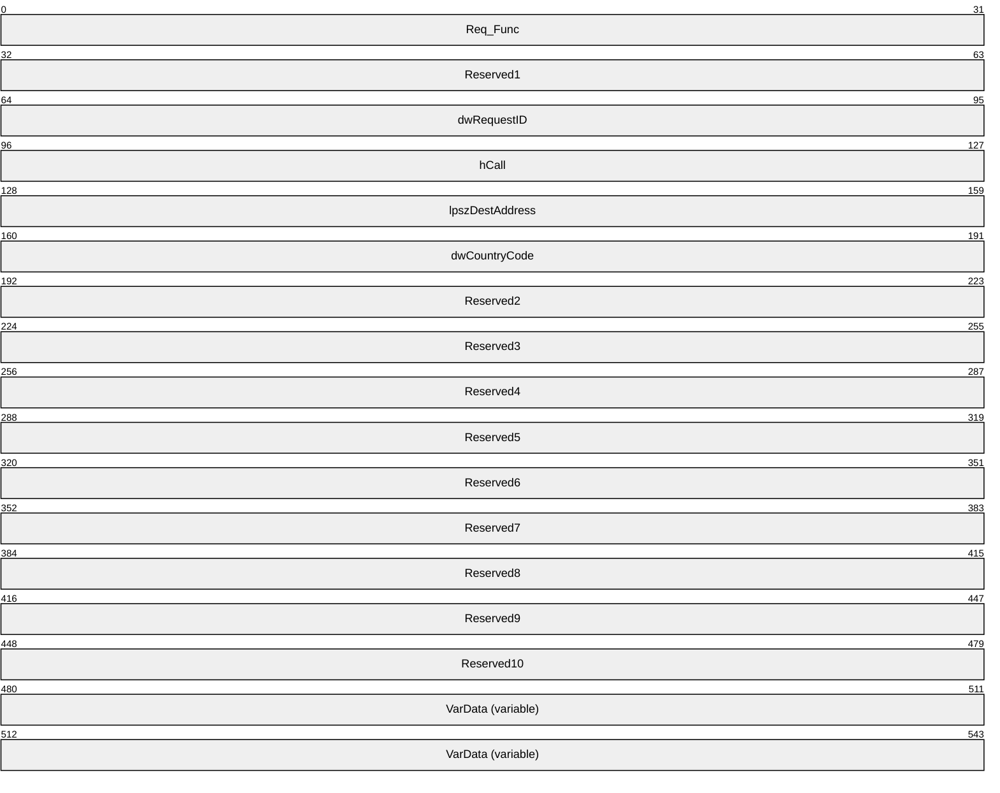
```mermaid
packet-beta
  0-31: "Req_Func"
  32-63: "Reserved1"
  64-95: "dwRequestID"
  96-127: "hCall"
  128-159: "lpszDestAddress"
  160-191: "dwCountryCode"
  192-223: "Reserved2"
  224-255: "Reserved3"
  256-287: "Reserved4"
  288-319: "Reserved5"
  320-351: "Reserved6"
  352-383: "Reserved7"
  384-415: "Reserved8"
  416-447: "Reserved9"
  448-479: "Reserved10"
  480-543: "VarData (variable)"
```

**Req_Func (4 bytes):** An unsigned 32-bit integer. The identifier of the function that will be invoked on the remote server. This value MUST be set to 8.

**Return Values**

On completion of [ClientRequest](#Section_3.1.4.2), this field contains the result of the encapsulated telephony request. A nonzero request ID value indicates that the request is in progress and will complete asynchronously. A [LINEERR_Constants](#Section_2.2.3.1.38) value indicates synchronous failure.

Returns a positive request identifier if the function will be completed asynchronously or a negative error number if an error occurs. The dwParam2 parameter of the corresponding [LINE_REPLY](#Section_2.2.4.2.1.25) packet is zero if the function succeeds, or it is a negative error number if an error occurs. If the client specified a nonzero value in the dwRequestID field of the packet, the same value MUST be used for the returned positive request identifier.

The following table shows the return values for this function.

| Value | Meaning |
| --- | --- |
| LINEERR_INVALCALLHANDLE 0x80000018 | The handle to the call is invalid. |
| LINEERR_NOMEM 0x80000044 | Not enough memory is available. |
| LINEERR_INVALCALLSTATE 0x8000001C | The call state is invalid. |
| LINEERR_OPERATIONFAILED 0x80000048 | The operation failed. |
| LINEERR_ADDRESSBLOCKED 0x80000053 | The address is blocked. |
| LINEERR_RESOURCEUNAVAIL 0x8000004B | The resource is unavailable. |
| LINEERR_INVALCOUNTRYCODE 0x80000022 | The country/region code is invalid. |

**Reserved1 (4 bytes):** An unsigned 32-bit integer. MUST be set to zero when sent and MUST be ignored on receipt.

**dwRequestID (4 bytes):** An unsigned 32-bit integer. The identifier of the asynchronous request.

**hCall (4 bytes):** An [HCALL](#Section_2.2.1.1). The handle to the call to be transferred. One way in which the client can obtain a valid hCall is from the [LINE_CALLSTATE](#Section_2.2.4.2.1.8) packet sent by the remote server. The application MUST be an owner of this call. The call state of hCall must be connected. For hCall to be in connected state, the client needs to send an [Answer](#Section_2.2.4.1.3.4) packet to the remote server.

**lpszDestAddress (4 bytes):** An unsigned 32-bit integer. The offset, in bytes, in the VarData field of a null-terminated Unicode string that identifies where to transfer the call.

**dwCountryCode (4 bytes):** An unsigned 32-bit integer. The country code of the destination. The implementation SHOULD use this field to select the call progress protocols for the destination address. If a value of 0 is specified, the service provider SHOULD use a default. TAPI does not validate dwCountryCode when this function is called.

**Reserved2 (4 bytes):** An unsigned 32-bit integer. This field is used for padding and MUST be ignored on receipt. It can be any value.

**Reserved3 (4 bytes):** An unsigned 32-bit integer. This field is used for padding and MUST be ignored on receipt. It can be any value.

**Reserved4 (4 bytes):** An unsigned 32-bit integer. This field is used for padding and MUST be ignored on receipt. It can be any value.

**Reserved5 (4 bytes):** An unsigned 32-bit integer. This field is used for padding and MUST be ignored on receipt. It can be any value.

**Reserved6 (4 bytes):** An unsigned 32-bit integer. This field is used for padding and MUST be ignored on receipt. It can be any value.

**Reserved7 (4 bytes):** An unsigned 32-bit integer. This field is used for padding and MUST be ignored on receipt. It can be any value.

**Reserved8 (4 bytes):** An unsigned 32-bit integer. This field is used for padding and MUST be ignored on receipt. It can be any value.

**Reserved9 (4 bytes):** An unsigned 32-bit integer. This field is used for padding and MUST be ignored on receipt. It can be any value.

**Reserved10 (4 bytes):** An unsigned 32-bit integer. This field is used for padding and MUST be ignored on receipt. It can be any value.

**VarData (variable):** Contains a null-terminated Unicode string that is indicated in the lpszDestAddress field.

The contents of this field MUST be DWORD-aligned, as specified in [MS-DTYP](../MS-DTYP/MS-DTYP.md) section 2.2.9.

###### 2.2.4.1.3.6 DeallocateCall

The DeallocateCall packet is transmitted from a TAPI [**client**](#gt_client) to a TAPI [**server**](#gt_server) in a [**remote procedure call**](#gt_remote-procedure-call-rpc). Sending this packet MUST deallocate the call after completing or aborting all outstanding asynchronous operations on the call.

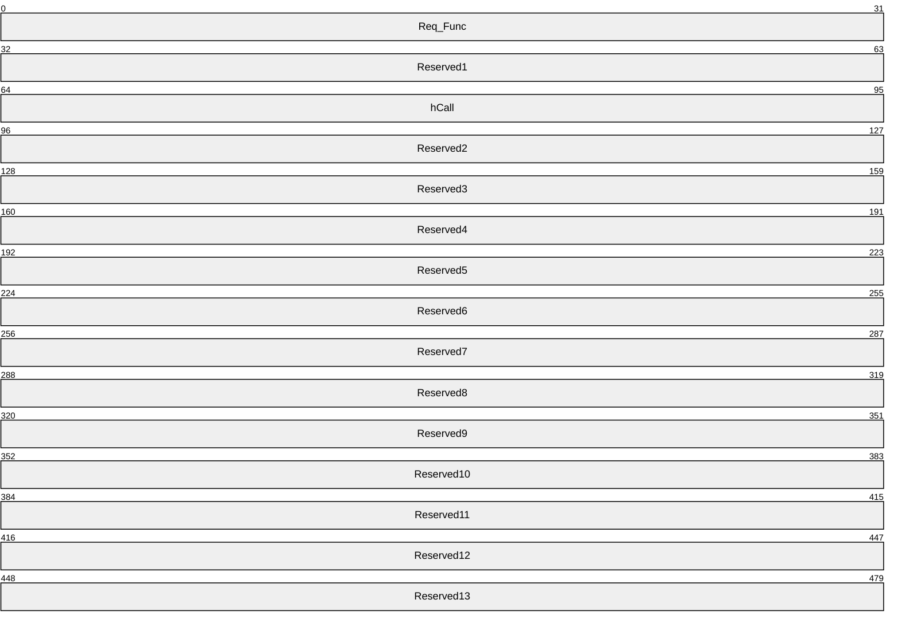
```mermaid
packet-beta
  0-31: "Req_Func"
  32-63: "Reserved1"
  64-95: "hCall"
  96-127: "Reserved2"
  128-159: "Reserved3"
  160-191: "Reserved4"
  192-223: "Reserved5"
  224-255: "Reserved6"
  256-287: "Reserved7"
  288-319: "Reserved8"
  320-351: "Reserved9"
  352-383: "Reserved10"
  384-415: "Reserved11"
  416-447: "Reserved12"
  448-479: "Reserved13"
```

**Req_Func (4 bytes):** An unsigned 32-bit integer. The identifier of the function that will be invoked on the remote server. This value MUST be set to 12.

**Return Values**

On completion of [ClientRequest](#Section_3.1.4.2), this field contains the result of the encapsulated telephony request. A value of 0 indicates success, and a [LINEERR_Constants](#Section_2.2.3.1.38) value indicates failure. The remote server MUST complete this call synchronously.

MUST return zero if the function succeeds or an error number if an error occurs. Common return values are as follows:

| Name | Value |
| --- | --- |
| LINEERR_NOMEM | 0x80000044 |
| LINEERR_OPERATIONFAILED | 0x80000048 |
| LINEERR_OPERATIONUNAVAIL | 0x80000049 |
| LINEERR_RESOURCEUNAVAIL | 0x8000004B |

**Reserved1 (4 bytes):** An unsigned 32-bit integer. MUST be set to zero when sent and MUST be ignored on receipt.

**hCall (4 bytes):** An [HCALL](#Section_2.2.1.1). The call handle to be deallocated. One way of obtaining a valid hCall is by sending the [MakeCall](#Section_2.2.4.1.3.43) packet. An application with monitoring privileges for a call can always deallocate its handle for that call. An application with owner privilege for a call can deallocate its handle unless it is the only owner of the call and the call is not in the idle state. The call handle is no longer valid after it has been deallocated.

**Reserved2 (4 bytes):** An unsigned 32-bit integer. This field is used for padding and MUST be ignored on receipt. It can be any value.

**Reserved3 (4 bytes):** An unsigned 32-bit integer. This field is used for padding and MUST be ignored on receipt. It can be any value.

**Reserved4 (4 bytes):** An unsigned 32-bit integer. This field is used for padding and MUST be ignored on receipt. It can be any value.

**Reserved5 (4 bytes):** An unsigned 32-bit integer. This field is used for padding and MUST be ignored on receipt. It can be any value.

**Reserved6 (4 bytes):** An unsigned 32-bit integer. This field is used for padding and MUST be ignored on receipt. It can be any value.

**Reserved7 (4 bytes):** An unsigned 32-bit integer. This field is used for padding and MUST be ignored on receipt. It can be any value.

**Reserved8 (4 bytes):** An unsigned 32-bit integer. This field is used for padding and MUST be ignored on receipt. It can be any value.

**Reserved9 (4 bytes):** An unsigned 32-bit integer. This field is used for padding and MUST be ignored on receipt. It can be any value.

**Reserved10 (4 bytes):** An unsigned 32-bit integer. This field is used for padding and MUST be ignored on receipt. It can be any value.

**Reserved11 (4 bytes):** An unsigned 32-bit integer. This field is used for padding and MUST be ignored on receipt. It can be any value.

**Reserved12 (4 bytes):** An unsigned 32-bit integer. This field is used for padding and MUST be ignored on receipt. It can be any value.

**Reserved13 (4 bytes):** An unsigned 32-bit integer. This field is used for padding and MUST be ignored on receipt. It can be any value.

###### 2.2.4.1.3.7 CompleteCall

The CompleteCall packet is transmitted from a TAPI [**client**](#gt_client) to a TAPI [**server**](#gt_server) in a [**remote procedure call**](#gt_remote-procedure-call-rpc). Sending this packet specifies how a call that cannot be connected in the usual manner is to be completed instead. The network or switch cannot be able to complete a call because network resources are busy or the remote station is busy or does not answer.

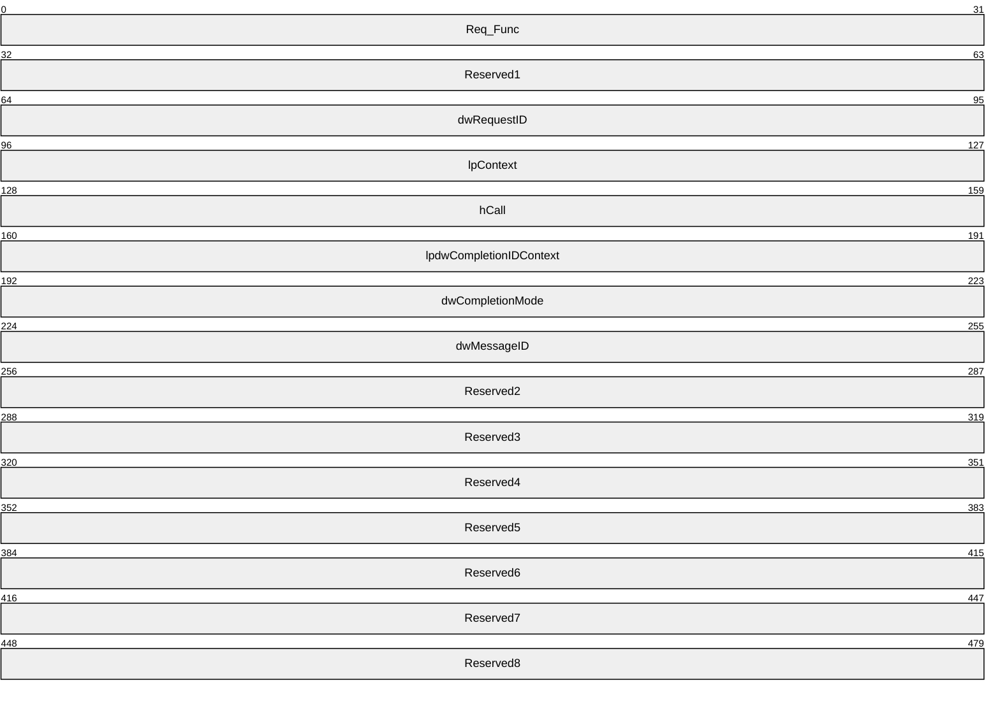
```mermaid
packet-beta
  0-31: "Req_Func"
  32-63: "Reserved1"
  64-95: "dwRequestID"
  96-127: "lpContext"
  128-159: "hCall"
  160-191: "lpdwCompletionIDContext"
  192-223: "dwCompletionMode"
  224-255: "dwMessageID"
  256-287: "Reserved2"
  288-319: "Reserved3"
  320-351: "Reserved4"
  352-383: "Reserved5"
  384-415: "Reserved6"
  416-447: "Reserved7"
  448-479: "Reserved8"
```

**Req_Func (4 bytes):** An unsigned 32-bit integer. The identifier of the function that will be invoked on the remote server. This value MUST be set to 10.

**Return Values**

On completion of [ClientRequest](#Section_3.1.4.2), this field contains the result of the encapsulated telephony request. A nonzero request ID value indicates that the request is in progress and will complete asynchronously and a [LINEERR_Constants](#Section_2.2.3.1.38) value indicates synchronous failure.

Returns a positive request identifier if the function will be completed asynchronously or a negative error number if an error occurs. The dwParam2 parameter of the corresponding [LINE_REPLY](#Section_2.2.4.2.1.25) packet is zero if the function succeeds, or it is a negative error number if an error occurs. If the client specified a nonzero value in the dwRequestID field of the packet, the same value MUST be used for the returned positive request identifier. Common return values are as follows:

| Name | Value |
| --- | --- |
| LINEERR_INVALCALLHANDLE | 0x80000018 |
| LINEERR_NOMEM | 0x80000044 |
| LINEERR_INVALCALLSTATE | 0x8000001C |
| LINEERR_OPERATIONUNAVAIL | 0x80000049 |
| LINEERR_INVALCALLCOMPLMODE | 0x80000017 |
| LINEERR_OPERATIONFAILED | 0x80000048 |
| LINEERR_INVALPOINTER | 0x80000035 |
| LINEERR_RESOURCEUNAVAIL | 0x8000004B |
| LINEERR_COMPLETIONOVERRUN | 0x80000006 |
| LINEERR_INVALMESSAGEID | 0x80000030 |

**Reserved1 (4 bytes):** An unsigned 32-bit integer. MUST be set to zero when sent and MUST be ignored on receipt.

**dwRequestID (4 bytes):** An unsigned 32-bit integer. The identifier of the asynchronous request.

**lpContext (4 bytes):** An unsigned 32-bit integer. The opaque, client-specified value that is used by the client upon request completion; MUST be returned by the server in the request completion packet.

**hCall (4 bytes):** An [HCALL](#Section_2.2.1.1). The handle to the call whose completion is requested. One way of obtaining a valid hCall is by sending the [MakeCall](#Section_2.2.4.1.3.43) packet. The application MUST be an owner of the call. The call state of hCall must be busy, ringback.

**lpdwCompletionIDContext (4 bytes):** An unsigned 32-bit integer. The opaque, client-specified value that is used by the client upon request completion; MUST be returned by the server in the request completion packet.

**dwCompletionMode (4 bytes):** An unsigned 32-bit integer. The way in which the call is to be completed. This parameter MUST use one of the [LINECALLCOMPLMODE_Constants](#Section_2.2.3.1.18).

**dwMessageID (4 bytes):** An unsigned 32-bit integer. The packet that is to be sent when completing the call using LINECALLCOMPLMODE_MESSAGE. This identifier selects the packet from a small number of predefined packets. This parameter is not validated by TAPI when this function is called.

**Reserved2 (4 bytes):** An unsigned 32-bit integer. This field is used for padding and MUST be ignored on receipt. It can be any value.

**Reserved3 (4 bytes):** An unsigned 32-bit integer. This field is used for padding and MUST be ignored on receipt. It can be any value.

**Reserved4 (4 bytes):** An unsigned 32-bit integer. This field is used for padding and MUST be ignored on receipt. It can be any value.

**Reserved5 (4 bytes):** An unsigned 32-bit integer. This field is used for padding and MUST be ignored on receipt. It can be any value.

**Reserved6 (4 bytes):** An unsigned 32-bit integer. This field is used for padding and MUST be ignored on receipt. It can be any value.

**Reserved7 (4 bytes):** An unsigned 32-bit integer. This field is used for padding and MUST be ignored on receipt. It can be any value.

**Reserved8 (4 bytes):** An unsigned 32-bit integer. This field is used for padding and MUST be ignored on receipt. It can be any value.

###### 2.2.4.1.3.8 CompleteTransfer

The CompleteTransfer packet is transmitted from a TAPI [**client**](#gt_client) to a TAPI [**server**](#gt_server) in a [**remote procedure call**](#gt_remote-procedure-call-rpc). Sending this packet completes the transfer of the specified call to the party that is connected in the consultation call. If dwTransferMode is LINETRANSFERMODE_CONFERENCE, the original call handle is changed to a conference call. Otherwise, the service provider SHOULD send call state packets to change the calls to idle.

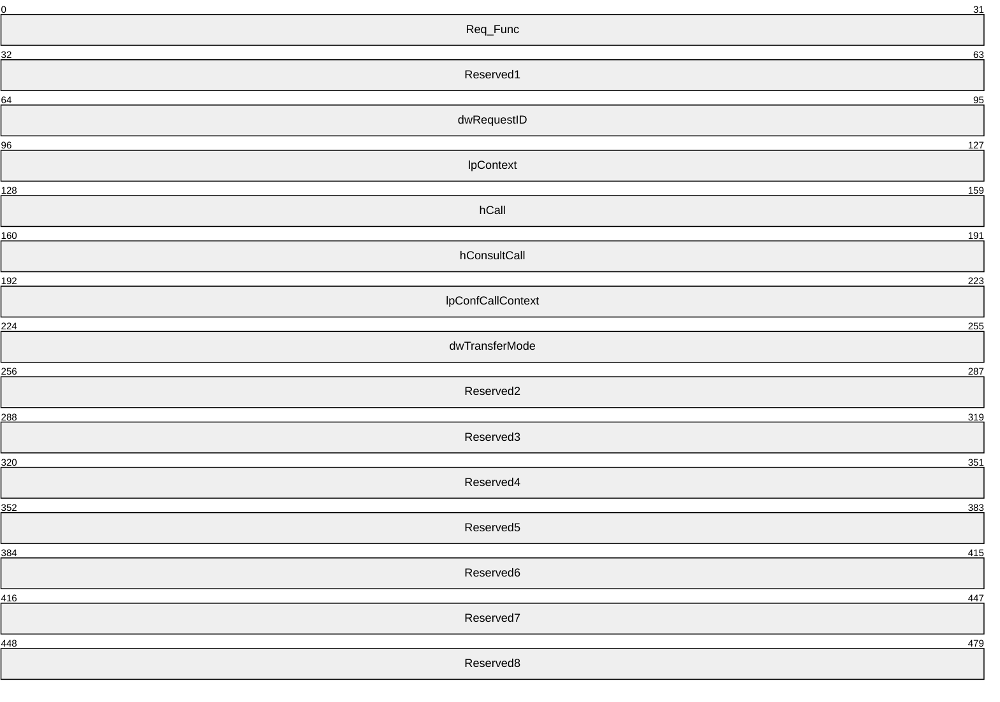
```mermaid
packet-beta
  0-31: "Req_Func"
  32-63: "Reserved1"
  64-95: "dwRequestID"
  96-127: "lpContext"
  128-159: "hCall"
  160-191: "hConsultCall"
  192-223: "lpConfCallContext"
  224-255: "dwTransferMode"
  256-287: "Reserved2"
  288-319: "Reserved3"
  320-351: "Reserved4"
  352-383: "Reserved5"
  384-415: "Reserved6"
  416-447: "Reserved7"
  448-479: "Reserved8"
```

**Req_Func (4 bytes):** An unsigned 32-bit integer. The identifier of the function that will be invoked on the remote server. This value MUST be set to 11.

**Return Values**

On completion of [ClientRequest](#Section_3.1.4.2), this field MUST contain the result of the encapsulated telephony request. A nonzero request ID value indicates that the request is in progress and will complete asynchronously and a [LINEERR_Constants](#Section_2.2.3.1.38) value indicates synchronous failure.

Returns a positive request identifier if the function will be completed asynchronously or a negative error number if an error occurs. The dwParam2 parameter of the corresponding [LINE_REPLY](#Section_2.2.4.2.1.25) packet is zero if the function succeeds, or it is a negative error number if an error occurs. If the client specified a nonzero value in the dwRequestID field of the packet, the same value MUST be used for the returned positive request identifier. Common return values are as follows:

| Name | Value |
| --- | --- |
| LINEERR_INVALCALLHANDLE | 0x80000018 |
| LINEERR_OPERATIONUNAVAIL | 0x80000049 |
| LINEERR_INVALCALLSTATE | 0x8000001C |
| LINEERR_OPERATIONFAILED | 0x80000048 |
| LINEERR_NOMEM | 0x80000044 |
| LINEERR_RESOURCEUNAVAIL | 0x8000004B |

**Reserved1 (4 bytes):** An unsigned 32-bit integer. MUST be set to zero when sent and MUST be ignored on receipt.

**dwRequestID (4 bytes):** An unsigned 32-bit integer. The identifier of the asynchronous request.

**lpContext (4 bytes):** An unsigned 32-bit integer. The opaque, client-specified value that is used by the client upon request completion; MUST be returned by the server in the request completion packet.

**hCall (4 bytes):** An [HCALL](#Section_2.2.1.1). The handle to the call to be transferred. One way in which the client can obtain a valid hCall is from the [LINE_CALLSTATE](#Section_2.2.4.2.1.8) packet sent by the remote server. The application MUST be an owner of this call. The call state of hCall must be onHold or onHoldPendingTransfer. For hCall to be in onHoldPendingTransfer state, the client needs to send [SetUpTransfer](#Section_2.2.4.1.3.78) packet to the remote server. For hCall to be in onHold state, the client needs to send [Hold](#Section_2.2.4.1.3.42) packet to the remote server.

**hConsultCall (4 bytes):** An HCALL. The handle to the call that represents a connection with the destination of the transfer. One way in which the client can obtain a valid hCall is from the LINE_CALLSTATE packet sent by the remote server. The application MUST be an owner of this call. The call state of hConsultCall MUST be connected, ringback, busy, or proceeding.

**lpConfCallContext (4 bytes):** An unsigned 32-bit integer. The opaque, client-specified value that is used by the client upon request completion; MUST be returned by the server in the request completion packet.

**dwTransferMode (4 bytes):** An unsigned 32-bit integer. Specifies how the initiated transfer request is to be resolved. This parameter MUST use one of the [LINETRANSFERMODE_Constants](#Section_2.2.3.1.58).

**Reserved2 (4 bytes):** An unsigned 32-bit integer. This field is used for padding and MUST be ignored on receipt. It can be any value.

**Reserved3 (4 bytes):** An unsigned 32-bit integer. This field is used for padding and MUST be ignored on receipt. It can be any value.

**Reserved4 (4 bytes):** An unsigned 32-bit integer. This field is used for padding and MUST be ignored on receipt. It can be any value.

**Reserved5 (4 bytes):** An unsigned 32-bit integer. This field is used for padding and MUST be ignored on receipt. It can be any value.

**Reserved6 (4 bytes):** An unsigned 32-bit integer. This field is used for padding and MUST be ignored on receipt. It can be any value.

**Reserved7 (4 bytes):** An unsigned 32-bit integer. This field is used for padding and MUST be ignored on receipt. It can be any value.

**Reserved8 (4 bytes):** An unsigned 32-bit integer. This field is used for padding and MUST be ignored on receipt. It can be any value.

###### 2.2.4.1.3.9 ConditionalMediaDetection

The ConditionalMediaDetection packet is transmitted from a TAPI [**client**](#gt_client) to a TAPI [**server**](#gt_server) in a [**remote procedure call**](#gt_remote-procedure-call-rpc). The function is invoked by TAPI whenever a client application uses LINEMAPPER as the dwDeviceID in an [Open](#Section_2.2.4.1.1.5) packet call to request that lines be scanned to find one that supports the desired media types and call parameters.

TAPI scans based on the union of the desired media type and the other media types currently being monitored on the line to give the service provider the opportunity to indicate if it cannot simultaneously monitor for all the requested media types. If the service provider can monitor for the indicated set of media types and support the capabilities that are indicated in lpCallParams, it replies with a success indication. It leaves the active media monitoring modes for the line unchanged.

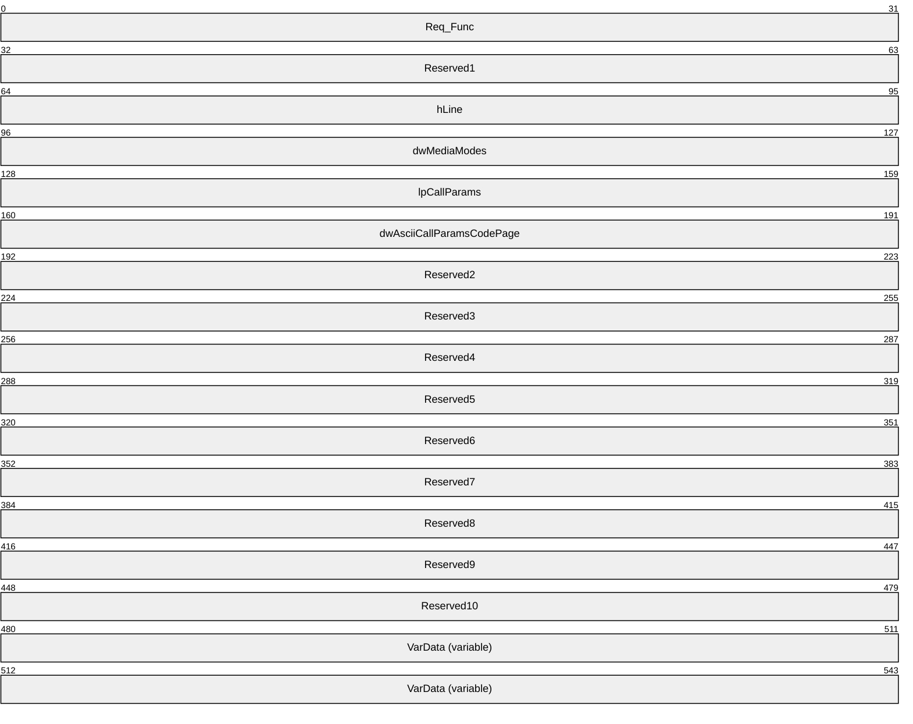
```mermaid
packet-beta
  0-31: "Req_Func"
  32-63: "Reserved1"
  64-95: "hLine"
  96-127: "dwMediaModes"
  128-159: "lpCallParams"
  160-191: "dwAsciiCallParamsCodePage"
  192-223: "Reserved2"
  224-255: "Reserved3"
  256-287: "Reserved4"
  288-319: "Reserved5"
  320-351: "Reserved6"
  352-383: "Reserved7"
  384-415: "Reserved8"
  416-447: "Reserved9"
  448-479: "Reserved10"
  480-543: "VarData (variable)"
```

**Req_Func (4 bytes):** An unsigned 32-bit integer. The identifier of the function that will be invoked on the remote server. This value MUST be set to 127.

**Return Values**

On completion of [ClientRequest](#Section_3.1.4.2), this field MUST contain the result of the encapsulated telephony request. A value of 0 indicates success, and a [LINEERR_Constants](#Section_2.2.3.1.38) value indicates failure. The remote server MUST complete this call synchronously.

MUST return zero if the function succeeds or an error number if an error occurs. Common return values are as follows:

| Name | Value |
| --- | --- |
| LINEERR_INVALLINEHANDLE | 0x8000002B |
| LINEERR_OPERATIONFAILED | 0x80000048 |
| LINEERR_NODRIVER | 0x80000043 |
| LINEERR_RESOURCEUNAVAIL | 0x8000004B |
| LINEERR_NOMEM | 0x80000044 |
| LINEERR_INVALMEDIAMODE | 0x8000002F |
| LINEERR_OPERATIONUNAVAIL | 0x80000049 |

**Reserved1 (4 bytes):** An unsigned 32-bit integer. MUST be set to zero when sent and MUST be ignored on receipt.

**hLine (4 bytes):** An [HLINE](#Section_2.2.1.2). The handle to the line on which media monitoring and parameter capabilities are to be set. This field MUST have been obtained by sending the Open packet.

**dwMediaModes (4 bytes):** An unsigned 32-bit integer. The media types currently of interest to the calling application. This parameter MUST use one or more of the [LINEMEDIAMODE_Constants](#Section_2.2.3.1.44).

**lpCallParams (4 bytes):** An unsigned 32-bit integer. The offset in the VarData field of a [LINECALLPARAMS](#Section_2.2.6.20) packet.

- dwBearerMode
- dwMinRate
- dwMaxRate
- dwMediaMode
- dwCallParamFlags
- dwAddressMode
If dwAddressMode is LINEADDRESSMODE_ADDRESSID, any address on the line is acceptable. If dwAddressMode is LINEADDRESSMODE_DIALABLEADDR, indicating that a specific originating address (phone number) is searched for, or if it is a provider-specific extension, then dwOrigAddressSize/Offset and the portion of the variable part they refer to are also relevant. If dwAddressMode is a provider-specific extension, additional information can be contained in the dwDeviceSpecific variably sized field. All other fields are irrelevant to the function.

**dwAsciiCallParamsCodePage (4 bytes):** An unsigned 32-bit integer. This MUST be set to TAPI_NO_DATA (0xFFFFFFFF).

**Reserved2 (4 bytes):** An unsigned 32-bit integer. This field is used for padding and MUST be ignored on receipt. It can be any value.

**Reserved3 (4 bytes):** An unsigned 32-bit integer. This field is used for padding and MUST be ignored on receipt. It can be any value.

**Reserved4 (4 bytes):** An unsigned 32-bit integer. This field is used for padding and MUST be ignored on receipt. It can be any value.

**Reserved5 (4 bytes):** An unsigned 32-bit integer. This field is used for padding and MUST be ignored on receipt. It can be any value.

**Reserved6 (4 bytes):** An unsigned 32-bit integer. This field is used for padding and MUST be ignored on receipt. It can be any value.

**Reserved7 (4 bytes):** An unsigned 32-bit integer. This field is used for padding and MUST be ignored on receipt. It can be any value.

**Reserved8 (4 bytes):** An unsigned 32-bit integer. This field is used for padding and MUST be ignored on receipt. It can be any value.

**Reserved9 (4 bytes):** An unsigned 32-bit integer. This field is used for padding and MUST be ignored on receipt. It can be any value.

**Reserved10 (4 bytes):** An unsigned 32-bit integer. This field is used for padding and MUST be ignored on receipt. It can be any value.

**VarData (variable):** Contains a LINECALLPARAMS packet.

The contents of this field MUST be DWORD-aligned, as specified in [MS-DTYP](../MS-DTYP/MS-DTYP.md) section 2.2.9.

###### 2.2.4.1.3.10 CreateAgent

The CreateAgent packet is transmitted from a TAPI [**client**](#gt_client) to a TAPI [**server**](#gt_server) in a [**remote procedure call**](#gt_remote-procedure-call-rpc). Sending this packet creates a new agent object. It generates a LINE_PROXYREQUEST packet to be sent to a [**registered proxy function handler**](#gt_registered-proxy-function-handler), referencing a [LINEPROXYREQUEST](#Section_2.2.6.28) packet of type LINEPROXYREQUEST_CREATEAGENT.

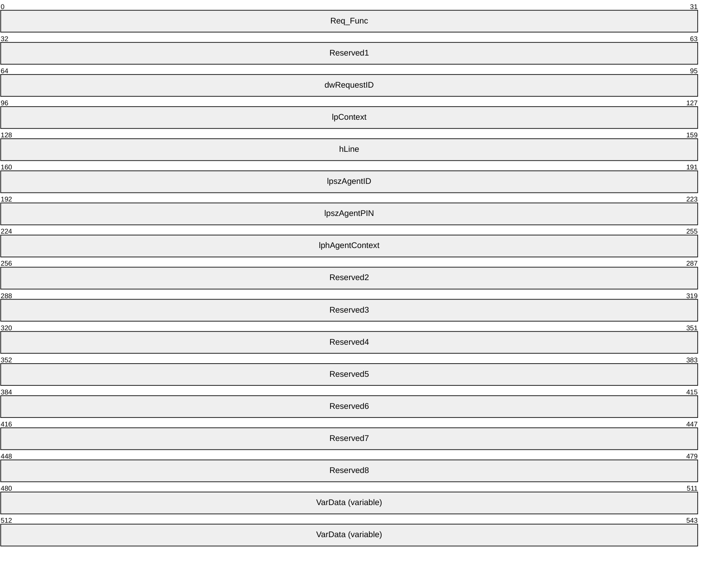
```mermaid
packet-beta
  0-31: "Req_Func"
  32-63: "Reserved1"
  64-95: "dwRequestID"
  96-127: "lpContext"
  128-159: "hLine"
  160-191: "lpszAgentID"
  192-223: "lpszAgentPIN"
  224-255: "lphAgentContext"
  256-287: "Reserved2"
  288-319: "Reserved3"
  320-351: "Reserved4"
  352-383: "Reserved5"
  384-415: "Reserved6"
  416-447: "Reserved7"
  448-479: "Reserved8"
  480-543: "VarData (variable)"
```

**Req_Func (4 bytes):** An unsigned 32-bit integer. The identifier of the function that will be invoked on the remote server. This value MUST be set to 146.

**Return Values**

On completion of [ClientRequest](#Section_3.1.4.2), this field contains the result of the encapsulated telephony request. A nonzero request ID value indicates that the request is in progress and will complete asynchronously and a [LINEERR_Constants](#Section_2.2.3.1.38) value indicates synchronous failure.

MUST return a request identifier if the asynchronous operation starts; otherwise, the function MUST return one of the following error values:

| Name | Value |
| --- | --- |
| LINEERR_INVALLINEHANDLE | 0x8000002B |
| LINEERR_INVALPARAM | 0x80000032 |
| LINEERR_NOMEM | 0x80000044 |
| LINEERR_OPERATIONFAILED | 0x80000048 |
| LINEERR_OPERATIONUNAVAIL | 0x80000049 |
| LINEERR_RESOURCEUNAVAIL | 0x8000004B |
| LINEERR_UNINITIALIZED | 0x80000050 |

**Reserved1 (4 bytes):** An unsigned 32-bit integer. MUST be set to zero when sent and MUST be ignored on receipt.

**dwRequestID (4 bytes):** An unsigned 32-bit integer. The identifier of the asynchronous request.

| Value | Meaning |
| --- | --- |
| 0x00000000 | The server MUST generate a unique positive request ID to return as the Ack_ReturnValue. |
| 0x00000001  0x7FFFFFFF | The server MUST use this value instead of generating a unique positive request ID. |

**lpContext (4 bytes):** An unsigned 32-bit integer. The opaque, client-specified value that is used by the client upon request completion; MUST be returned by the server in the request completion packet.

**hLine (4 bytes):** An [HLINE](#Section_2.2.1.2). The handle to the line device. This field MUST have been obtained by sending the [Open](#Section_2.2.4.1.1.5) packet.

**lpszAgentID (4 bytes):** An unsigned 32-bit integer. The offset, in bytes, of a null-terminated Unicode string that contains the agent identifier in the VarData field. This field is set to TAPI_NO_DATA (0xFFFFFFFF) if no agent identifier was specified.

**lpszAgentPIN (4 bytes):** An unsigned 32-bit integer. The offset, in bytes, of a null-terminated Unicode string that contains the agent PIN or password in the VarData field. This field is set to TAPI_NO_DATA (0xFFFFFFFF) if no agent PIN was specified.

**lphAgentContext (4 bytes):** An unsigned 32-bit integer. The opaque, client-specified value that is used by the client upon request completion; MUST be returned by the server in the request completion packet.

**Reserved2 (4 bytes):** An unsigned 32-bit integer. This field is used for padding and MUST be ignored on receipt. It can be any value.

**Reserved3 (4 bytes):** An unsigned 32-bit integer. This field is used for padding and MUST be ignored on receipt. It can be any value.

**Reserved4 (4 bytes):** An unsigned 32-bit integer. This field is used for padding and MUST be ignored on receipt. It can be any value.

**Reserved5 (4 bytes):** An unsigned 32-bit integer. This field is used for padding and MUST be ignored on receipt. It can be any value.

**Reserved6 (4 bytes):** An unsigned 32-bit integer. This field is used for padding and MUST be ignored on receipt. It can be any value.

**Reserved7 (4 bytes):** An unsigned 32-bit integer. This field is used for padding and MUST be ignored on receipt. It can be any value.

**Reserved8 (4 bytes):** An unsigned 32-bit integer. This field is used for padding and MUST be ignored on receipt. It can be any value.

**VarData (variable):** Contains the null-terminated Unicode strings that are indicated in the lpszAgentID and lpszAgentPIN fields.

The contents of this field MUST be DWORD-aligned, as specified in [MS-DTYP](../MS-DTYP/MS-DTYP.md) section 2.2.9.

###### 2.2.4.1.3.11 CreateAgentSession

The CreateAgentSession packet is transmitted from a TAPI [**client**](#gt_client) to a TAPI [**server**](#gt_server) in a [**remote procedure call**](#gt_remote-procedure-call-rpc). Sending this packet creates a new AgentSession object. It generates a [LINE_PROXYREQUEST](#Section_2.2.4.2.1.21) packet to be sent to a [**registered proxy function handler**](#gt_registered-proxy-function-handler), referencing a [LINEPROXYREQUEST](#Section_2.2.6.28) packet of type LINEPROXYREQUEST_CREATEAGENTSESSION.

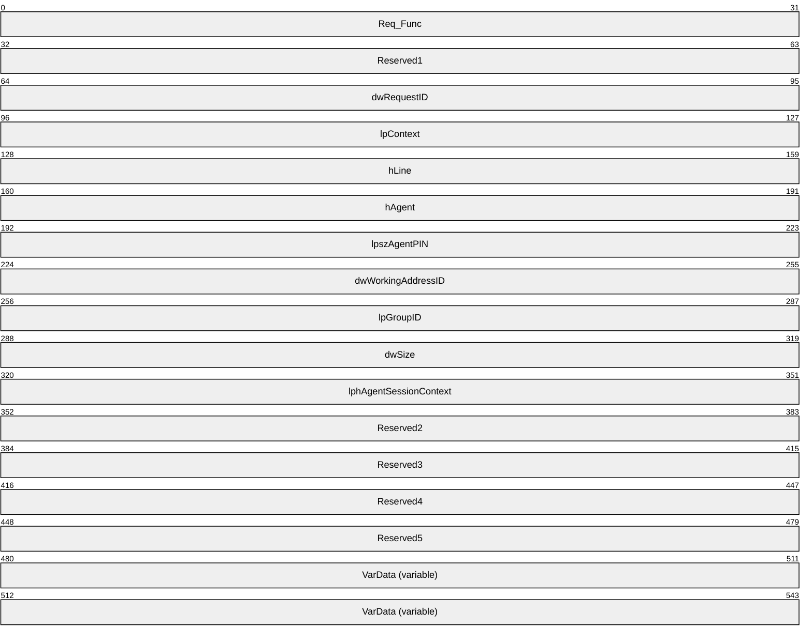
```mermaid
packet-beta
  0-31: "Req_Func"
  32-63: "Reserved1"
  64-95: "dwRequestID"
  96-127: "lpContext"
  128-159: "hLine"
  160-191: "hAgent"
  192-223: "lpszAgentPIN"
  224-255: "dwWorkingAddressID"
  256-287: "lpGroupID"
  288-319: "dwSize"
  320-351: "lphAgentSessionContext"
  352-383: "Reserved2"
  384-415: "Reserved3"
  416-447: "Reserved4"
  448-479: "Reserved5"
  480-543: "VarData (variable)"
```

**Req_Func (4 bytes):** An unsigned 32-bit integer. The identifier of the function that will be invoked on the remote server. This value MUST be set to 147.

**Return Values**

On completion of [ClientRequest](#Section_3.1.4.2), this field contains the result of the encapsulated telephony request. A nonzero request ID value indicates that the request is in progress and will complete asynchronously, and a [LINEERR_Constants](#Section_2.2.3.1.38) value indicates synchronous failure.

Returns a request identifier if the asynchronous operation starts; otherwise, the function MUST return one of the following error values:

| Name | Value |
| --- | --- |
| LINEERR_INVALLINEHANDLE | 0x8000002B |
| LINEERR_INVALPARAM | 0x80000032 |
| LINEERR_NOMEM | 0x80000044 |
| LINEERR_OPERATIONFAILED | 0x80000048 |
| LINEERR_OPERATIONUNAVAIL | 0x80000049 |
| LINEERR_RESOURCEUNAVAIL | 0x8000004B |
| LINEERR_UNINITIALIZED | 0x80000050 |

**Reserved1 (4 bytes):** An unsigned 32-bit integer. MUST be set to zero when sent and MUST be ignored on receipt.

**dwRequestID (4 bytes):** An unsigned 32-bit integer. The identifier of the asynchronous request.

| Value | Meaning |
| --- | --- |
| 0x00000000 | The server MUST generate a unique positive request ID to return as the Ack_ReturnValue. |
| 0x00000001  0x7FFFFFFF | The server MUST use this value instead of generating a unique positive request ID. |

**lpContext (4 bytes):** An unsigned 32-bit integer. The opaque, client-specified value that is used by the client upon request completion; MUST be returned by the server in the request completion packet.

**hLine (4 bytes):** An [HLINE](#Section_2.2.1.2). The handle to the line device. This field MUST have been obtained by sending the [Open](#Section_2.2.4.1.1.5) packet.

**hAgent (4 bytes):** An unsigned 32-bit integer. The identifier of the agent for whom the session is to be created. This field MUST have been obtained by sending the [CreateAgent](#Section_2.2.4.2.2.4) packet.

**lpszAgentPIN (4 bytes):** An unsigned 32-bit integer. The offset in the VarData field that contains a null-terminated Unicode string that contains the agent PIN or password. This field is set to TAPI_NO_DATA (0xFFFFFFFF) if no PIN was supplied.

**dwWorkingAddressID (4 bytes):** An unsigned 32-bit integer. The identifier of the address on which the agent receives calls for this session.

**lpGroupID (4 bytes):** An unsigned 32-bit integer. The offset, in bytes, in the VarData field and [**GUID**](#gt_globally-unique-identifier-guid), as specified in [MS-DTYP](../MS-DTYP/MS-DTYP.md) section 2.3.4.2, that identifies the group for which the session is being created.

**dwSize (4 bytes):** An unsigned 32-bit integer. The size, in bytes, of the GUID that is indicated in the lpGroupID field.

**lphAgentSessionContext (4 bytes):** An unsigned 32-bit integer. The handle to the created agent session that is returned by the ACD proxy. It is the responsibility of the agent handler proxy application to generate and maintain uniqueness of these identifiers.

**Reserved2 (4 bytes):** An unsigned 32-bit integer. This field is used for padding and MUST be ignored on receipt. It can be any value.

**Reserved3 (4 bytes):** An unsigned 32-bit integer. This field is used for padding and MUST be ignored on receipt. It can be any value.

**Reserved4 (4 bytes):** An unsigned 32-bit integer. This field is used for padding and MUST be ignored on receipt. It can be any value.

**Reserved5 (4 bytes):** An unsigned 32-bit integer. This field is used for padding and MUST be ignored on receipt. It can be any value.

**VarData (variable):** Contains a null-terminated Unicode string that is indicated in the lpszAgentPIN field and a GUID that is indicated in the lpGroupID field.

The contents of this field MUST be DWORD-aligned, as specified in [MS-DTYP] section 2.2.9.

###### 2.2.4.1.3.12 DevSpecific

The DevSpecific packet is transmitted from a TAPI [**client**](#gt_client) to a TAPI [**server**](#gt_server) in a [**remote procedure call**](#gt_remote-procedure-call-rpc). The function is used as a general extension mechanism to enable service providers to provide access to features that are not described in other operations. The meanings of the extensions are device-specific, and to take advantage of these extensions, the application MUST be fully aware of them.

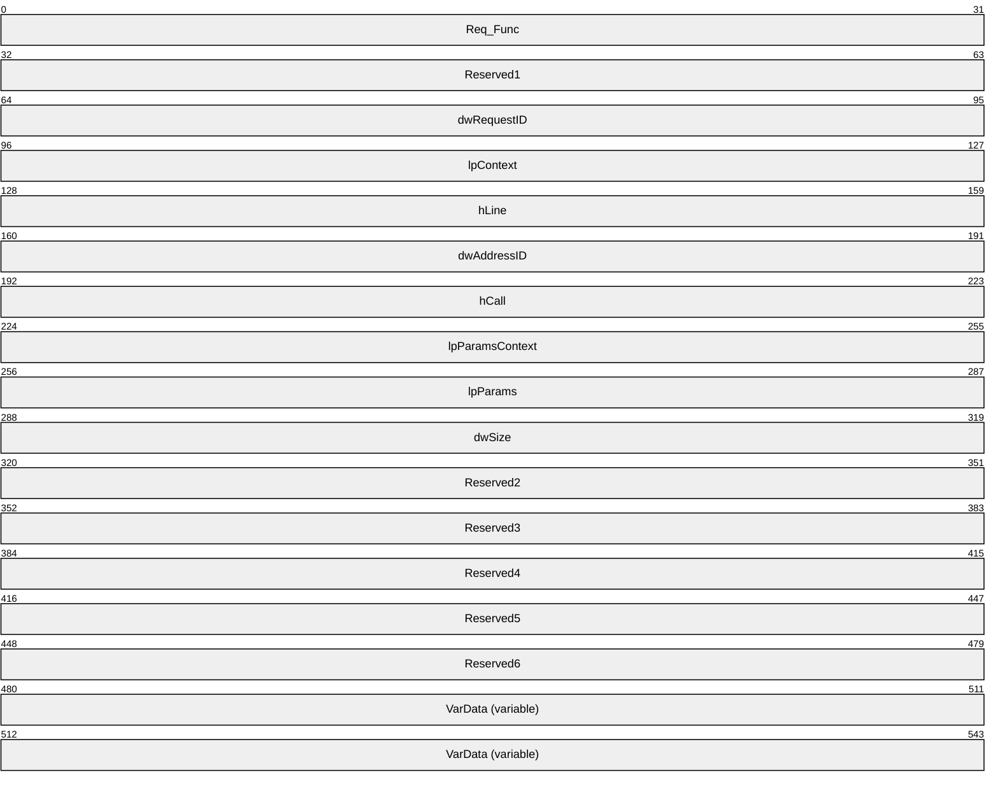
```mermaid
packet-beta
  0-31: "Req_Func"
  32-63: "Reserved1"
  64-95: "dwRequestID"
  96-127: "lpContext"
  128-159: "hLine"
  160-191: "dwAddressID"
  192-223: "hCall"
  224-255: "lpParamsContext"
  256-287: "lpParams"
  288-319: "dwSize"
  320-351: "Reserved2"
  352-383: "Reserved3"
  384-415: "Reserved4"
  416-447: "Reserved5"
  448-479: "Reserved6"
  480-543: "VarData (variable)"
```

**Req_Func (4 bytes):** An unsigned 32-bit integer. The identifier of the function that will be invoked on the remote server. This value MUST be set to 13.

**Return Values**

On completion of [ClientRequest](#Section_3.1.4.2), this field contains the result of the encapsulated telephony request. A nonzero request ID value indicates that the request is in progress and will complete asynchronously and a [LINEERR_Constants](#Section_2.2.3.1.38) value indicates synchronous failure.

Returns a positive request identifier if the function will be completed asynchronously or a negative error number if an error occurs. The dwParam2 parameter of the corresponding [LINE_REPLY](#Section_2.2.4.2.1.25) packet is zero if the function succeeds, or it is a negative error number if an error occurs. If the client specified a nonzero value in the dwRequestID field of the packet, the same value MUST be used for the returned positive request identifier. Common return values are as follows:

| Name | Value |
| --- | --- |
| LINEERR_INVALLINEHANDLE | 0x8000002B |
| LINEERR_OPERATIONUNAVAIL | 0x80000049 |
| LINEERR_INVALADDRESSID | 0x80000011 |
| LINEERR_OPERATIONFAILED | 0x80000048 |
| LINEERR_NOMEM | 0x80000044 |
| LINEERR_RESOURCEUNAVAIL | 0x8000004B |

**Reserved1 (4 bytes):** An unsigned 32-bit integer. MUST be set to zero when sent and MUST be ignored on receipt.

**dwRequestID (4 bytes):** An unsigned 32-bit integer. The identifier of the asynchronous request.

**lpContext (4 bytes):** An unsigned 32-bit integer. The opaque, client-specified value that is used by the client upon request completion; MUST be returned by the server in the request completion packet.

**hLine (4 bytes):** An [HLINE](#Section_2.2.1.2). The handle to a line device. This field MUST have been obtained by sending the [Open](#Section_2.2.4.1.1.5) packet. This parameter is required.

**dwAddressID (4 bytes):** An unsigned 32-bit integer. The address on the specified line to be operated on. An address identifier is permanently associated with an address; the identifier MUST remain constant across operating system upgrades. A valid value of dwAddressID is in the range 0 to dwNumAddresses 1. The client obtains dwNumAddresses from the [LINEDEVCAPS](#Section_2.2.6.23)obtained by sending a [GetDevCaps](#Section_2.2.4.1.1.3)packet to the remote server.

**hCall (4 bytes):** An [HCALL](#Section_2.2.1.1). The handle to a call. This parameter is optional, but if it is specified, the call it represents MUST belong to the hLine line device. One way of obtaining a valid hCall is by sending the [MakeCall](#Section_2.2.4.1.3.43) packet. The call state of hCall is device specific.

**lpParamsContext (4 bytes):** An unsigned 32-bit integer. The opaque, client-specified value that is used by the client upon request completion; MUST be returned by the server in the request completion packet.

**lpParams (4 bytes):** An unsigned 32-bit integer. The offset, in bytes, in the VarData field of a parameter block. The format of this parameter block is device-specific and its contents are passed by TAPI, to or from the TSP.

**dwSize (4 bytes):** An unsigned 32-bit integer. The size, in bytes, of the parameter block that is indicated in the lpParams field.

**Reserved2 (4 bytes):** An unsigned 32-bit integer. This field is used for padding and MUST be ignored on receipt. It can be any value.

**Reserved3 (4 bytes):** An unsigned 32-bit integer. This field is used for padding and MUST be ignored on receipt. It can be any value.

**Reserved4 (4 bytes):** An unsigned 32-bit integer. This field is used for padding and MUST be ignored on receipt. It can be any value.

**Reserved5 (4 bytes):** An unsigned 32-bit integer. This field is used for padding and MUST be ignored on receipt. It can be any value.

**Reserved6 (4 bytes):** An unsigned 32-bit integer. This field is used for padding and MUST be ignored on receipt. It can be any value.

**VarData (variable):** Contains a parameter block that is indicated in the lpParams field. The format of this parameter block is device-specific and its contents are passed by TAPI, to or from the TSP.

The contents of this field MUST be DWORD-aligned, as specified in [MS-DTYP](../MS-DTYP/MS-DTYP.md) section 2.2.9.

###### 2.2.4.1.3.13 DevSpecificFeature

The DevSpecificFeature packet is transmitted from a TAPI [**client**](#gt_client) to a TAPI [**server**](#gt_server) in a [**remote procedure call**](#gt_remote-procedure-call-rpc). The function is used as an extension mechanism to enable service providers to provide access to features that are not described in other operations. The meanings of these extensions are device-specific, and taking advantage of these extensions requires TAPI or its client application to be fully aware of them.

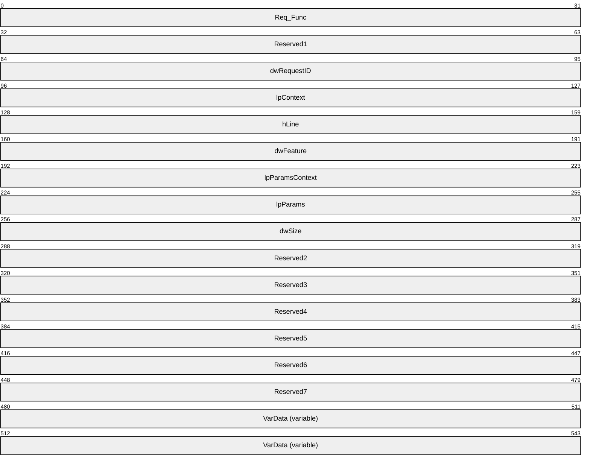
```mermaid
packet-beta
  0-31: "Req_Func"
  32-63: "Reserved1"
  64-95: "dwRequestID"
  96-127: "lpContext"
  128-159: "hLine"
  160-191: "dwFeature"
  192-223: "lpParamsContext"
  224-255: "lpParams"
  256-287: "dwSize"
  288-319: "Reserved2"
  320-351: "Reserved3"
  352-383: "Reserved4"
  384-415: "Reserved5"
  416-447: "Reserved6"
  448-479: "Reserved7"
  480-543: "VarData (variable)"
```

**Req_Func (4 bytes):** The identifier of the function that will be invoked on the remote server. This value MUST be set to 14.

**Return Values**

On completion of [ClientRequest](#Section_3.1.4.2), this field contains the result of the encapsulated telephony request. A nonzero request ID value indicates that the request is in progress and will complete asynchronously, and a [LINEERR_Constants](#Section_2.2.3.1.38) value indicates synchronous failure.

Returns a positive request identifier if the function will be completed asynchronously or a negative error number if an error occurs. The dwParam2 parameter of the corresponding [LINE_REPLY](#Section_2.2.4.2.1.25) packet is zero if the function succeeds, or it is a negative error number if an error occurs. If the client specified a nonzero value in the dwRequestID field of the packet, the same MUST be used as the value for the returned positive request identifier. Common return values are as follows:

| Name | Value |
| --- | --- |
| LINEERR_INVALFEATURE | 0x80000055 |
| LINEERR_OPERATIONUNAVAIL | 0x80000049 |
| LINEERR_INVALLINEHANDLE | 0x8000002B |
| LINEERR_OPERATIONFAILED | 0x80000048 |
| LINEERR_NOMEM | 0x80000044 |
| LINEERR_RESOURCEUNAVAIL | 0x8000004B |

**Reserved1 (4 bytes):** An unsigned 32-bit integer. MUST be set to zero when sent and MUST be ignored on receipt.

**dwRequestID (4 bytes):** An unsigned 32-bit integer. The identifier of the asynchronous request.

**lpContext (4 bytes):** An unsigned 32-bit integer. The opaque, client-specified value that is used by the client upon request completion; MUST be returned by the server in the request completion packet.

**hLine (4 bytes):** An [HLINE](#Section_2.2.1.2). The handle to the line device. This field MUST have been obtained by sending the [Open](#Section_2.2.4.1.1.5) packet.

**dwFeature (4 bytes):** An unsigned 32-bit integer. The feature to invoke on the line device. This parameter MUST use [PHONEBUTTONFUNCTION_Constants](#Section_2.2.3.2.1).

**lpParamsContext (4 bytes):** An unsigned 32-bit integer. The opaque, client-specified value that is used by the client upon request completion; MUST be returned by the server in the request completion packet.

**lpParams (4 bytes):** An unsigned 32-bit integer. The offset, in bytes, in the VarData field of a feature-dependent parameter block. The format of this parameter block is device-specific and its contents are passed by TAPI, to or from the TSP.

**dwSize (4 bytes):** An unsigned 32-bit integer. The size, in bytes, of the parameter block that is indicated in the lpParams field.

**Reserved2 (4 bytes):** An unsigned 32-bit integer. This field is used for padding and MUST be ignored on receipt. It can be any value.

**Reserved3 (4 bytes):** An unsigned 32-bit integer. This field is used for padding and MUST be ignored on receipt. It can be any value.

**Reserved4 (4 bytes):** An unsigned 32-bit integer. This field is used for padding and MUST be ignored on receipt. It can be any value.

**Reserved5 (4 bytes):** An unsigned 32-bit integer. This field is used for padding and MUST be ignored on receipt. It can be any value.

**Reserved6 (4 bytes):** An unsigned 32-bit integer. This field is used for padding and MUST be ignored on receipt. It can be any value.

**Reserved7 (4 bytes):** An unsigned 32-bit integer. This field is used for padding and MUST be ignored on receipt. It can be any value.

**VarData (variable):** Contains a feature-dependent parameter block that is indicated in the lpParams field. The format of this parameter block is device-specific and its contents are passed by TAPI, to or from the TSP.

The contents of this field MUST be DWORD-aligned, as specified in [MS-DTYP](../MS-DTYP/MS-DTYP.md) section 2.2.9.

###### 2.2.4.1.3.14 Dial

The Dial packet is transmitted from a TAPI [**client**](#gt_client) to a TAPI [**server**](#gt_server) in a [**remote procedure call**](#gt_remote-procedure-call-rpc). Sending this packet dials the specified dialable number on the specified call.

```mermaid
packet-beta
  0-31: "Req_Func"
  32-63: "Reserved1"
  64-95: "dwRequestID"
  96-127: "hCall"
  128-159: "lpszDestAddress"
  160-191: "dwCountryCode"
  192-223: "Reserved2"
  224-255: "Reserved3"
  256-287: "Reserved4"
  288-319: "Reserved5"
  320-351: "Reserved6"
  352-383: "Reserved7"
  384-415: "Reserved8"
  416-447: "Reserved9"
  448-479: "Reserved10"
  480-543: "VarData (variable)"
```

**Req_Func (4 bytes):** An unsigned 32-bit integer. The identifier of the function that will be invoked on the remote server. This value MUST be set to 15.

**Return Values**

On completion of [ClientRequest](#Section_3.1.4.2), this field contains the result of the encapsulated telephony request. A nonzero request ID value indicates that the request is in progress and will complete asynchronously, and a [LINEERR_Constants](#Section_2.2.3.1.38) value indicates synchronous failure.

Returns a positive request identifier if the function will be completed asynchronously or a negative error number if an error occurs. The dwParam2 parameter of the corresponding [LINE_REPLY](#Section_2.2.4.2.1.25) packet is zero if the function succeeds, or it is a negative error number if an error occurs. If the client specified a nonzero value in the dwRequestID field of the packet, the same value MUST be used for the returned positive request identifier. Common return values are as follows:

| Name | Value |
| --- | --- |
| LINEERR_INVALCALLHANDLE | 0x80000018 |
| LINEERR_OPERATIONFAILED | 0x80000048 |
| LINEERR_INVALADDRESS | 0x80000010 |
| LINEERR_RESOURCEUNAVAIL | 0x8000004B |
| LINEERR_INVALCOUNTRYCODE | 0x80000022 |
| LINEERR_DIALBILLING | 0x80000008 |
| LINEERR_INVALCALLSTATE | 0x8000001C |
| LINEERR_DIALQUIET | 0x8000000B |
| LINEERR_ADDRESSBLOCKED | 0x80000053 |
| LINEERR_DIALDIALTONE | 0x80000009 |
| LINEERR_NOMEM | 0x80000044 |
| LINEERR_DIALPROMPT | 0x8000000A |
| LINEERR_OPERATIONUNAVAIL | 0x80000049 |

**Reserved1 (4 bytes):** An unsigned 32-bit integer. MUST be set to zero when sent and MUST be ignored on receipt.

**dwRequestID (4 bytes):** An unsigned 32-bit integer. The identifier of the asynchronous request.

**hCall (4 bytes):** An [HCALL](#Section_2.2.1.1). The handle to the call on which a number is to be dialed. One way of obtaining a valid hCall is by sending the [MakeCall](#Section_2.2.4.1.3.43) packet. The application MUST be an owner of the call. The call state of hCall can be any state except idle and disconnected.

**lpszDestAddress (4 bytes):** An unsigned 32-bit integer. The offset, in bytes, in the VarData field of a null-terminated Unicode string that specifies the destination to dial by using the standard dialable number format.

**dwCountryCode (4 bytes):** An unsigned 32-bit integer. The country code of the destination. The implementation uses this field to select the call-progress protocols for the destination address. If a value of 0 is specified, a default call-progress protocol that is defined by the service provider is used. TAPI does not validate this parameter when this function is called.

**Reserved2 (4 bytes):** An unsigned 32-bit integer. This field is used for padding and MUST be ignored on receipt. It can be any value.

**Reserved3 (4 bytes):** An unsigned 32-bit integer. This field is used for padding and MUST be ignored on receipt. It can be any value.

**Reserved4 (4 bytes):** An unsigned 32-bit integer. This field is used for padding and MUST be ignored on receipt. It can be any value.

**Reserved5 (4 bytes):** An unsigned 32-bit integer. This field is used for padding and MUST be ignored on receipt. It can be any value.

**Reserved6 (4 bytes):** An unsigned 32-bit integer. This field is used for padding and MUST be ignored on receipt. It can be any value.

**Reserved7 (4 bytes):** An unsigned 32-bit integer. This field is used for padding and MUST be ignored on receipt. It can be any value.

**Reserved8 (4 bytes):** An unsigned 32-bit integer. This field is used for padding and MUST be ignored on receipt. It can be any value.

**Reserved9 (4 bytes):** An unsigned 32-bit integer. This field is used for padding and MUST be ignored on receipt. It can be any value.

**Reserved10 (4 bytes):** An unsigned 32-bit integer. This field is used for padding and MUST be ignored on receipt. It can be any value.

**VarData (variable):** Contains a null-terminated Unicode string that is indicated in the lpszDestAddress field.

The contents of this field MUST be DWORD-aligned, as specified in [MS-DTYP](../MS-DTYP/MS-DTYP.md) section 2.2.9.

###### 2.2.4.1.3.15 Drop

The Drop packet is transmitted from a TAPI [**client**](#gt_client) to a TAPI [**server**](#gt_server) in a [**remote procedure call**](#gt_remote-procedure-call-rpc). Sending this packet drops or disconnects the specified call. User-user information can optionally be transmitted as part of the call disconnect. This function can be called by the application at any time.

```mermaid
packet-beta
  0-31: "Req_Func"
  32-63: "Reserved1"
  64-95: "dwRequestID"
  96-127: "hCall"
  128-159: "lpsUserUserInfo"
  160-191: "dwSize"
  192-223: "Reserved2"
  224-255: "Reserved3"
  256-287: "Reserved4"
  288-319: "Reserved5"
  320-351: "Reserved6"
  352-383: "Reserved7"
  384-415: "Reserved8"
  416-447: "Reserved9"
  448-479: "Reserved10"
  480-543: "VarData (variable)"
```

**Req_Func (4 bytes):** An unsigned 32-bit integer. The identifier of the function that will be invoked on the remote server. This value MUST be set to 16.

**Return Values**

On completion of [ClientRequest](#Section_3.1.4.2), this field contains the result of the encapsulated telephony request. A nonzero request ID value indicates that the request is in progress and will complete asynchronously, and a [LINEERR_Constants](#Section_2.2.3.1.38) value indicates synchronous failure.

Returns a positive request identifier if the function will be completed asynchronously or a negative error number if an error occurs. The dwParam2 parameter of the corresponding [LINE_REPLY](#Section_2.2.4.2.1.25) packet is zero if the function succeeds, or it is a negative error number if an error occurs. If the client specified a nonzero value in the dwRequestID field of the packet, the same value MUST be used for the returned positive request identifier. Common return values are as follows:

| Name | Value |
| --- | --- |
| LINEERR_INVALCALLHANDLE | 0x80000018 |
| LINEERR_OPERATIONFAILED | 0x80000048 |
| LINEERR_INVALCALLSTATE | 0x8000001C |
| LINEERR_RESOURCEUNAVAIL | 0x8000004B |
| LINEERR_NOMEM | 0x80000044 |
| LINEERR_USERUSERINFOTOOBIG | 0x80000051 |
| LINEERR_OPERATIONUNAVAIL | 0x80000049 |

**Reserved1 (4 bytes):** An unsigned 32-bit integer. MUST be set to zero when sent and MUST be ignored on receipt.

**dwRequestID (4 bytes):** An unsigned 32-bit integer. The identifier of the asynchronous request.

**hCall (4 bytes):** An [HCALL](#Section_2.2.1.1). The handle to the call to be dropped. One way of obtaining a valid hCall is by sending the [MakeCall](#Section_2.2.4.1.3.43) packet. The application MUST be an owner of the call. The call state of hCall can be any state except idle.

**lpsUserUserInfo (4 bytes):** An unsigned 32-bit integer. The offset, in bytes, in the VarData field of user-user information, to send to the remote party as part of the call disconnect. When this field is set to -1 (0xFFFFFFFF), no user-user information is sent.

**dwSize (4 bytes):** An unsigned 32-bit integer. The size, in bytes, of the user-user information in lpsUserUserInfo. If lpsUserUserInfo is -1 (0xFFFFFFFF), no user-user information MUST be sent and dwSize MUST be ignored.

**Reserved2 (4 bytes):** An unsigned 32-bit integer. This field is used for padding and MUST be ignored on receipt. It can be any value.

**Reserved3 (4 bytes):** An unsigned 32-bit integer. This field is used for padding and MUST be ignored on receipt. It can be any value.

**Reserved4 (4 bytes):** An unsigned 32-bit integer. This field is used for padding and MUST be ignored on receipt. It can be any value.

**Reserved5 (4 bytes):** An unsigned 32-bit integer. This field is used for padding and MUST be ignored on receipt. It can be any value.

**Reserved6 (4 bytes):** An unsigned 32-bit integer. This field is used for padding and MUST be ignored on receipt. It can be any value.

**Reserved7 (4 bytes):** An unsigned 32-bit integer. This field is used for padding and MUST be ignored on receipt. It can be any value.

**Reserved8 (4 bytes):** An unsigned 32-bit integer. This field is used for padding and MUST be ignored on receipt. It can be any value.

**Reserved9 (4 bytes):** An unsigned 32-bit integer. This field is used for padding and MUST be ignored on receipt. It can be any value.

**Reserved10 (4 bytes):** An unsigned 32-bit integer. This field is used for padding and MUST be ignored on receipt. It can be any value.

**VarData (variable):** Contains the user information that is indicated in the lpsUserUserInfo field. The user information can be an [**ASCII**](#gt_ascii) or Unicode string, and this data is opaque to the protocol.

The contents of this field MUST be DWORD-aligned, as specified in [MS-DTYP](../MS-DTYP/MS-DTYP.md) section 2.2.9.

###### 2.2.4.1.3.16 Forward

The Forward packet is transmitted from a TAPI [**client**](#gt_client) to a TAPI [**server**](#gt_server) in a [**remote procedure call**](#gt_remote-procedure-call-rpc). Sending this packet forwards calls that are destined for the specified address on the specified line, according to the specified forwarding instructions.

When an originating address (dwAddressID) is forwarded, the specified incoming calls for that address are deflected to the other number by the switch. This function provides a combination of forward and do-not-disturb features. This function can also cancel specific forwarding that is currently in effect.

```mermaid
packet-beta
  0-31: "Req_Func"
  32-63: "Reserved1"
  64-95: "dwRequestID"
  96-127: "lpContext"
  128-159: "hLine"
  160-191: "bAllAddresses"
  192-223: "dwAddressID"
  224-255: "lpForwardList"
  256-287: "dwNumRingsNoAnswer"
  288-319: "lphConsultCallContext"
  320-351: "lpCallParams"
  352-383: "dwAsciiCallParamsCodePage"
  384-415: "Reserved2"
  416-447: "Reserved3"
  448-479: "Reserved4"
  480-543: "VarData (variable)"
```

**Req_Func (4 bytes):** An unsigned 32-bit integer. The identifier of the function that will be invoked on the remote server. This value MUST be set to 17.

**Return Values**

On completion of [ClientRequest](#Section_3.1.4.2), this field contains the result of the encapsulated telephony request. A nonzero request ID value indicates that the request is in progress and will complete asynchronously. A [LINEERR_Constants](#Section_2.2.3.1.38) value indicates synchronous failure.

Returns a positive request identifier if the function will be completed asynchronously or a negative error number if an error occurs. The dwParam2 parameter of the corresponding [LINE_REPLY](#Section_2.2.4.2.1.25) packet is zero if the function succeeds, or it is a negative error number if an error occurs. If the client specified a nonzero value in the dwRequestID field of the packet, the same value MUST be used for the returned positive request identifier. Common return values are as follows:

| Name | Value |
| --- | --- |
| LINEERR_INVALLINEHANDLE | 0x8000002B |
| LINEERR_NOMEM | 0x80000044 |
| LINEERR_INVALADDRESS | 0x80000010 |
| LINEERR_OPERATIONUNAVAIL | 0x80000049 |
| LINEERR_INVALADDRESSID | 0x80000011 |
| LINEERR_OPERATIONFAILED | 0x80000048 |
| LINEERR_INVALCOUNTRYCODE | 0x80000022 |
| LINEERR_RESOURCEUNAVAIL | 0x8000004B |
| LINEERR_INVALPARAM | 0x80000032 |
| LINEERR_STRUCTURETOOSMALL | 0x8000004D |

**Reserved1 (4 bytes):** An unsigned 32-bit integer. MUST be set to zero when sent and MUST be ignored on receipt.

**dwRequestID (4 bytes):** An unsigned 32-bit integer. The identifier of the asynchronous request.

**lpContext (4 bytes):** An unsigned 32-bit integer. The opaque, client-specified value that is used by the client upon request completion; MUST be returned by the server in the request completion packet.

**hLine (4 bytes):** An [HLINE](#Section_2.2.1.2). The handle to the line to be forwarded. This field MUST have been obtained by sending the [Open](#Section_2.2.4.1.1.5)packet.

**bAllAddresses (4 bytes):** An unsigned 32-bit integer. Specifies whether all originating addresses on the line, or just the one that is specified, is forwarded. If TRUE, all addresses on the line are forwarded and dwAddressID is ignored; if FALSE, only the address that is specified as dwAddressID is forwarded. This parameter is not validated by TAPI when this function is called.

**dwAddressID (4 bytes):** An unsigned 32-bit integer. The address on the specified line whose incoming calls are to be forwarded. This parameter is ignored if bAllAddresses is TRUE. This parameter is not validated by TAPI when this function is called. An address identifier is permanently associated with an address; the identifier remains constant across operating system upgrades. A valid value of dwAddressID is in the range 0 to dwNumAddresses 1. The client obtains dwNumAddresses from the [LINEDEVCAPS](#Section_2.2.6.23) obtained by sending a [GetDevCaps](#Section_2.2.4.1.1.3) packet to the remote server.

**lpForwardList (4 bytes):** An unsigned 32-bit integer. The offset, in bytes, in the VarData field of a variable-size [LINEFORWARDLIST](#Section_2.2.6.31) packet that describes the specific forwarding instructions.

**dwNumRingsNoAnswer (4 bytes):** An unsigned 32-bit integer. Specifies the number of rings before an incoming call is considered a "no answer." If dwNumRingsNoAnswer is out of range, the actual value is set to the nearest value in the allowable range. This parameter is not validated by TAPI when this function is called.

**lphConsultCallContext (4 bytes):** An unsigned 32-bit integer. The opaque, client-specified value that is used by the client upon request completion; MUST be returned by the server in the request completion packet.

**lpCallParams (4 bytes):** An unsigned 32-bit integer. The offset, in bytes, in the VarData field of a [LINECALLPARAMS](#Section_2.2.6.20) packet that contains the specified call parameters.

**dwAsciiCallParamsCodePage (4 bytes):** An unsigned 32-bit integer. The code page of the lpCallParams field.

**Reserved2 (4 bytes):** An unsigned 32-bit integer. This field is used for padding and MUST be ignored on receipt. It can be any value.

**Reserved3 (4 bytes):** An unsigned 32-bit integer. This field is used for padding and MUST be ignored on receipt. It can be any value.

**Reserved4 (4 bytes):** An unsigned 32-bit integer. This field is used for padding and MUST be ignored on receipt. It can be any value.

**VarData (variable):** Contains the LINEFORWARDLIST and LINECALLPARAMS packets that are indicated in the fields lpForwardList and lpCallParams.

The contents of this field MUST be DWORD-aligned, as specified in [MS-DTYP](../MS-DTYP/MS-DTYP.md) section 2.2.9.

###### 2.2.4.1.3.17 GatherDigits

The GatherDigits packet is transmitted from a TAPI [**client**](#gt_client) to a TAPI [**server**](#gt_server) in a [**remote procedure call**](#gt_remote-procedure-call-rpc). Sending this packet initiates the buffered gathering of digits on the specified call. TAPI specifies a packet in which to place the digits and the maximum number of digits to be collected.

```mermaid
packet-beta
  0-31: "Req_Func"
  32-63: "Reserved1"
  64-95: "lpContext"
  96-127: "hCall"
  128-159: "dwEndtoEndID"
  160-191: "dwDigitModes"
  192-223: "lpsDigitsContext"
  224-255: "dwNumDigits"
  256-287: "lpszTerminationDigits"
  288-319: "dwFirstDigitTimeout"
  320-351: "dwInterDigitTimeout"
  352-383: "Reserved2"
  384-415: "Reserved3"
  416-447: "Reserved4"
  448-479: "Reserved5"
  480-511: "Reserved6"
  512-575: "VarData (variable)"
```

**Req_Func (4 bytes):** An unsigned 32-bit integer. The identifier of the function that will be invoked on the remote server. This value MUST be set to 18.

**Return Values**

On completion of [ClientRequest](#Section_3.1.4.2), this field contains the result of the encapsulated telephony request. A value of 0 indicates success, and a [LINEERR_Constants](#Section_2.2.3.1.38) value indicates failure. The remote server MUST complete this call synchronously.

MUST return zero if the function succeeds or an error number if an error occurs. Common return values are as follows:

| Name | Value |
| --- | --- |
| LINEERR_INVALCALLHANDLE | 0x80000018 |
| LINEERR_RESOURCEUNAVAIL | 0x8000004B |
| LINEERR_INVALCALLSTATE | 0x8000001C |
| LINEERR_NOMEM | 0x80000044 |
| LINEERR_INVALTIMEOUT | 0x8000003B |
| LINEERR_OPERATIONUNAVAIL | 0x80000049 |
| LINEERR_INVALDIGITMODE | 0x80000027 |
| LINEERR_OPERATIONFAILED | 0x80000048 |
| LINEERR_INVALDIGITS | 0x80000028 |
| LINEERR_INVALPARAM | 0x80000032 |

**Reserved1 (4 bytes):** An unsigned 32-bit integer. MUST be set to zero when sent and MUST be ignored on receipt.

**lpContext (4 bytes):** An unsigned 32-bit integer. The opaque, client-specified value that is used by the client upon request completion; MUST be returned by the server in the request completion packet.

**hCall (4 bytes):** An [HCALL](#Section_2.2.1.1). The handle to the call on which digits are to be gathered. One way of obtaining a valid hCall is by sending the [MakeCall](#Section_2.2.4.1.3.43) packet. The application MUST be an owner of the call. The call state of hCall can be any state.

**dwEndtoEndID (4 bytes):** An unsigned 32-bit integer. A unique, uninterpreted identifier of the request for its entire lifetime, that is, until the matching [LINE_GATHERDIGITS](#Section_2.2.4.2.1.14) packet is sent. The service provider MUST include this identifier as one of the parameters in the packet.

**dwDigitModes (4 bytes):** An unsigned 32-bit integer. The digit modes that are to be monitored. This parameter MUST use one or more of the following LINEDIGITMODE_Constants:

LINEDIGITMODE_PULSE

Detect digits as audible clicks that are the result of the use of rotary pulse sequences. Valid digits for pulse mode are "0" through "9".

LINEDIGITMODE_DTMF

Detect digits as [**DTMF**](#gt_dual-tone-multi-frequency-dtmf) tones. Valid digits for DTMF mode are "0" through "9", "A", "B", "C", "D", "*", "#".

**lpsDigitsContext (4 bytes):** An unsigned 32-bit integer. Set to 0 if digit gathering is to be canceled; otherwise, digit gathering is initiated.

**dwNumDigits (4 bytes):** An unsigned 32-bit integer. The number of digits to be collected before a LINE_GATHERDIGITS packet is sent to TAPI. This function MUST return a LINEERR_INVALPARAM if dwNumDigits is zero.

**lpszTerminationDigits (4 bytes):** An unsigned 32-bit integer. The offset, in bytes, in the varData field of a null-terminated Unicode string of termination digits as text characters, or if none are supplied, the value TAPI_NO_DATA (0xFFFFFFFF).

**dwFirstDigitTimeout (4 bytes):** An unsigned 32-bit integer. The time duration, in milliseconds, in which the first digit is expected. If the first digit is not received in this time frame, digit collection is terminated and a LINE_GATHERDIGITS packet is sent to TAPI. A single null character is written to the packet, indicating no digits were received and the first digit time-out terminated digit gathering. The line device capabilities of the call specify the valid range for this parameter or indicate that time-outs are not supported. This parameter is not validated by TAPI when this function is called.

**dwInterDigitTimeout (4 bytes):** An unsigned 32-bit integer. The maximum time duration, in milliseconds, between consecutive digits. If no digit is received in this time frame, digit collection is terminated and a LINE_GATHERDIGITS packet is sent to TAPI. A single null character is written to the packet, indicating that an interdigit time-out terminated digit gathering. The LINEDEVCAPS packet MUST specify the valid range for this parameter or indicate that time-outs are not supported. This parameter is not validated by TAPI when this function is called.

**Reserved2 (4 bytes):** An unsigned 32-bit integer. This field is used for padding and MUST be ignored on receipt. It can be any value.

**Reserved3 (4 bytes):** An unsigned 32-bit integer. This field is used for padding and MUST be ignored on receipt. It can be any value.

**Reserved4 (4 bytes):** An unsigned 32-bit integer. This field is used for padding and MUST be ignored on receipt. It can be any value.

**Reserved5 (4 bytes):** An unsigned 32-bit integer. This field is used for padding and MUST be ignored on receipt. It can be any value.

**Reserved6 (4 bytes):** An unsigned 32-bit integer. This field is used for padding and MUST be ignored on receipt. It can be any value.

**VarData (variable):** Present if the lpszTerminationDigits field is not set to TAPI_NO_DATA (0xFFFFFFFF). Contains a null-terminated Unicode string as specified by lpszTerminationDigits.

The contents of this field MUST be DWORD-aligned, as specified in [MS-DTYP](../MS-DTYP/MS-DTYP.md) section 2.2.9.

###### 2.2.4.1.3.18 GenerateDigits

The GenerateDigits packet is transmitted from a TAPI [**client**](#gt_client) to a TAPI [**server**](#gt_server) in a [**remote procedure call**](#gt_remote-procedure-call-rpc). Sending this packet initiates the generation of the specified digits on the specified call as inband tones by using the specified signaling mode. Invoking this function while digit or tone generation is in progress aborts the current digit or tone generation. Passing a NULL value for lpszDigits generates no new digits.

```mermaid
packet-beta
  0-31: "Req_Func"
  32-63: "Reserved1"
  64-95: "hCall"
  96-127: "dwDigitMode"
  128-159: "lpszDigits"
  160-191: "dwDuration"
  192-223: "dwEndToEndID"
  224-255: "Reserved2"
  256-287: "Reserved3"
  288-319: "Reserved4"
  320-351: "Reserved5"
  352-383: "Reserved6"
  384-415: "Reserved7"
  416-447: "Reserved8"
  448-479: "Reserved9"
  480-543: "VarData (variable)"
```

**Req_Func (4 bytes):** The identifier of the function that will be invoked on the remote server. This value MUST be set to 19.

**Note** At any time, only one inband generation request (tone generation or digit generation) can be in progress per call.

**Return Values**

On completion of [ClientRequest](#Section_3.1.4.2), this field contains the result of the encapsulated telephony request. A value of 0 indicates success and a [LINEERR_Constants](#Section_2.2.3.1.38) value indicates failure. The remote server MUST complete this call synchronously.

MUST return zero if the function succeeds or an error number if an error occurs. Common return values are as follows:

| Name | Value |
| --- | --- |
| LINEERR_INVALCALLHANDLE | 0x80000018 |
| LINEERR_NOMEM | 0x80000044 |
| LINEERR_INVALCALLSTATE | 0x8000001C |
| LINEERR_OPERATIONUNAVAIL | 0x80000049 |
| LINEERR_INVALDIGITMODE | 0x80000027 |
| LINEERR_OPERATIONFAILED | 0x80000048 |
| LINEERR_RESOURCEUNAVAIL | 0x8000004B |

**Reserved1 (4 bytes):** An unsigned 32-bit integer. MUST be set to zero when sent and MUST be ignored on receipt.

**hCall (4 bytes):** An [HCALL](#Section_2.2.1.1). The handle to the call. One way of obtaining a valid hCall is by sending the [MakeCall](#Section_2.2.4.1.3.43) packet. The application MUST be an owner of the call. The call state of hCall can be any state. TAPI does not impose any call state requirements; however, some Tapi Service Providers can require that the hCall be is the LINECALLSTATE_CONNECTED state.

**dwDigitMode (4 bytes):** An unsigned 32-bit integer. The format to be used for signaling these digits. This parameter MUST use one of the [LINEDIGITMODE_Constants](#Section_2.2.3.1.36).

**lpszDigits (4 bytes):** An unsigned 32-bit integer. The offset, in bytes, in the VarData field of a null-terminated [**Unicode character**](#gt_unicode-character) packet that contains the digits to generate.

**dwDuration (4 bytes):** An unsigned 32-bit integer. Specifies both the duration, in milliseconds, of [**DTMF**](#gt_dual-tone-multi-frequency-dtmf) digits and pulse and DTMF interdigit spacing. A value of 0 uses a default value. The dwDuration parameter MUST be within the range that is specified by MinDialParams to MaxDialParams in [LINEDEVCAPS](#Section_2.2.6.23). If out of range, the actual value is set by the service provider to the nearest value in the range. This parameter is not validated by TAPI when this function is called.

**dwEndToEndID (4 bytes):** An unsigned 32-bit integer. This unique request identifier MUST be stored by the server and passed back as dwParam2 of the corresponding [LINE_GENERATE](#Section_2.2.4.2.1.15) packet to the client when the digit generation is completed.

**Reserved2 (4 bytes):** An unsigned 32-bit integer. This field is used for padding and MUST be ignored on receipt. It can be any value.

**Reserved3 (4 bytes):** An unsigned 32-bit integer. This field is used for padding and MUST be ignored on receipt. It can be any value.

**Reserved4 (4 bytes):** An unsigned 32-bit integer. This field is used for padding and MUST be ignored on receipt. It can be any value.

**Reserved5 (4 bytes):** An unsigned 32-bit integer. This field is used for padding and MUST be ignored on receipt. It can be any value.

**Reserved6 (4 bytes):** An unsigned 32-bit integer. This field is used for padding and MUST be ignored on receipt. It can be any value.

**Reserved7 (4 bytes):** An unsigned 32-bit integer. This field is used for padding and MUST be ignored on receipt. It can be any value.

**Reserved8 (4 bytes):** An unsigned 32-bit integer. This field is used for padding and MUST be ignored on receipt. It can be any value.

**Reserved9 (4 bytes):** An unsigned 32-bit integer. This field is used for padding and MUST be ignored on receipt. It can be any value.

**VarData (variable):** Contains a null-terminated Unicode character packet that is indicated in the lpszDigits field.

The contents of this field MUST be DWORD-aligned, as specified in [MS-DTYP](../MS-DTYP/MS-DTYP.md) section 2.2.9.

###### 2.2.4.1.3.19 GenerateTone

The GenerateTone packet is transmitted from a TAPI [**client**](#gt_client) to a TAPI [**server**](#gt_server) in a [**remote procedure call**](#gt_remote-procedure-call-rpc). Sending this packet generates the specified tone inband over the specified call. Invoking this function with a zero for dwToneMode aborts any tone generation that is currently in progress on the specified call. Sending a GenerateTone or [GenerateDigits](#Section_2.2.4.1.3.18) packet while tone generation is in progress aborts the current tone generation or digit generation in progress and initiates the generation of the newly specified tone or digits.

```mermaid
packet-beta
  0-31: "Req_Func"
  32-63: "Reserved1"
  64-95: "hCall"
  96-127: "dwToneMode"
  128-159: "dwDuration"
  160-191: "dwNumTones"
  192-223: "lpTones"
  224-255: "dwSize"
  256-287: "dwEndToEndID"
  288-319: "Reserved2"
  320-351: "Reserved3"
  352-383: "Reserved4"
  384-415: "Reserved5"
  416-447: "Reserved6"
  448-479: "Reserved7"
  480-543: "VarData (variable)"
```

**Req_Func (4 bytes):** An unsigned 32-bit integer. The identifier of the function that will be invoked on the remote server. This value MUST be set to 20.

**Return Values**

On completion of [ClientRequest](#Section_3.1.4.2), this field contains the result of the encapsulated telephony request. A value of 0 indicates success, and a [LINEERR_Constants](#Section_2.2.3.1.38) value indicates failure. The remote server MUST complete this call synchronously.

MUST return zero if the function succeeds or an error number if an error occurs. Common return values are as follows:

| Name | Value |
| --- | --- |
| LINEERR_INVALCALLHANDLE | 0x80000018 |
| LINEERR_NOMEM | 0x80000044 |
| LINEERR_INVALCALLSTATE | 0x8000001C |
| LINEERR_OPERATIONUNAVAIL | 0x80000049 |
| LINEERR_INVALTONEMODE | 0x8000003E |
| LINEERR_OPERATIONFAILED | 0x80000048 |
| LINEERR_INVALTONE | 0x8000003C |
| LINEERR_RESOURCEUNAVAIL | 0x8000004B |

**Reserved1 (4 bytes):** An unsigned 32-bit integer. MUST be set to zero when sent and MUST be ignored on receipt.

**hCall (4 bytes):** An [HCALL](#Section_2.2.1.1). The handle to the call on which a tone is to be generated. One way of obtaining a valid hCall is by sending the [MakeCall](#Section_2.2.4.1.3.43) packet. The application MUST be an owner of the call. The call state of hCall can be any state.

**dwToneMode (4 bytes):** An unsigned 32-bit integer. Defines the tone to be generated. Tones can be either standard or custom. A custom tone is composed of a set of arbitrary frequencies. A small number of standard tones are predefined. The duration of the tone MUST be specified by dwDuration for both standard and custom tones. If dwToneMode is set to zero, any digit or tone generation in progress is canceled. This parameter MUST use one of the [LINETONEMODE_Constants](#Section_2.2.3.1.57).

**dwDuration (4 bytes):** An unsigned 32-bit integer. The duration, in milliseconds, during which the tone is sustained. A value of 0 for dwDuration uses a default duration for the specified tone. Default values are:

- CUSTOM: infinite
- RINGBACK: infinite
- BUSY: infinite
- BEEP: infinite
- BILLING: fixed (single cycle)
This parameter is not validated by TAPI when this function is called.

**dwNumTones (4 bytes):** An unsigned 32-bit integer. The number of entries in the lpTones array. This parameter is ignored if dwToneMode is not equal to LINETONEMODE_CUSTOM.

**lpTones (4 bytes):** An unsigned 32-bit integer. If dwToneMode is set to LINETONEMODE_CUSTOM, this field contains the offset, in bytes, of a [LINEGENERATETONE](#Section_2.2.6.27) packet in the VarData field. Otherwise, this field is set to the value TAPI_NO_DATA (0xFFFFFFFF).

**dwSize (4 bytes):** An unsigned 32-bit integer. If dwToneMode is set to LINETONEMODE_CUSTOM, this field is set to the value of (dwNumTones * sizeof (LINEGENERATETONE)). Otherwise, this field is set to zero.

**dwEndToEndID (4 bytes):** An unsigned 32-bit integer. A unique, uninterpreted identifier of the request for its entire lifetime, that is, until the matching [LINE_GENERATE](#Section_2.2.4.2.1.15) packet is sent. The service provider MUST include this identifier as one of the parameters in the packet.

**Reserved2 (4 bytes):** An unsigned 32-bit integer. This field is used for padding and MUST be ignored on receipt. It can be any value.

**Reserved3 (4 bytes):** An unsigned 32-bit integer. This field is used for padding and MUST be ignored on receipt. It can be any value.

**Reserved4 (4 bytes):** An unsigned 32-bit integer. This field is used for padding and MUST be ignored on receipt. It can be any value.

**Reserved5 (4 bytes):** An unsigned 32-bit integer. This field is used for padding and MUST be ignored on receipt. It can be any value.

**Reserved6 (4 bytes):** An unsigned 32-bit integer. This field is used for padding and MUST be ignored on receipt. It can be any value.

**Reserved7 (4 bytes):** An unsigned 32-bit integer. This field is used for padding and MUST be ignored on receipt. It can be any value.

**VarData (variable):** Contains a number of LINEGENERATETONE packets that are equal to the value of the dwNumTones field.

The contents of this field MUST be DWORD-aligned, as specified in [MS-DTYP](../MS-DTYP/MS-DTYP.md) section 2.2.9.

###### 2.2.4.1.3.20 GetAddressID

The GetAddressID packet is transmitted from a TAPI [**client**](#gt_client) to a TAPI [**server**](#gt_server) in a [**remote procedure call**](#gt_remote-procedure-call-rpc). Sending this packet returns the address identifier that is associated with address, in a different format on the specified line.

```mermaid
packet-beta
  0-31: "Req_Func"
  32-63: "Reserved1"
  64-95: "hLine"
  96-127: "lpdwAddressID"
  128-159: "dwAddressMode"
  160-191: "lpsAddress"
  192-223: "dwSize"
  224-255: "Reserved2"
  256-287: "Reserved3"
  288-319: "Reserved4"
  320-351: "Reserved5"
  352-383: "Reserved6"
  384-415: "Reserved7"
  416-447: "Reserved8"
  448-479: "Reserved9"
  480-543: "VarData (variable)"
```

**Req_Func (4 bytes):** An unsigned 32-bit integer. The identifier of the function that will be invoked on the remote server. This value MUST be set to 22.

**Return Values**

On completion of [ClientRequest](#Section_3.1.4.2), this field contains the result of the encapsulated telephony request. A value of 0 indicates success, and a [LINEERR_Constants](#Section_2.2.3.1.38) value indicates failure. The remote server MUST complete this call synchronously.

MUST return zero if the function succeeds or an error number if an error occurs. Common return values are as follows:

| Name | Value |
| --- | --- |
| LINEERR_INVALLINEHANDLE | 0x8000002B |
| LINEERR_OPERATIONUNAVAIL | 0x80000049 |
| LINEERR_INVALADDRESS | 0x80000010 |
| LINEERR_OPERATIONFAILED | 0x80000048 |
| LINEERR_NOMEM | 0x80000044 |
| LINEERR_RESOURCEUNAVAIL | 0x8000004B |

**Reserved1 (4 bytes):** An unsigned 32-bit integer. MUST be set to zero when sent and MUST be ignored on receipt.

**hLine (4 bytes):** An HLINE. The handle to the line whose address is to be retrieved. This field MUST have been obtained by sending the [Open](#Section_2.2.4.1.1.5) packet.

**lpdwAddressID (4 bytes):** An unsigned 32-bit integer. Set to TAPI_NO_DATA (0xFFFFFFFF). Upon successful completion of the request, this field contains the address identifier.

**dwAddressMode (4 bytes):** An unsigned 32-bit integer. The address mode of the address that is contained in lpsAddress. [LINEADDRESSMODE_DIALABLEADDR](#Section_2.2.3.1.2) MUST be specified for the dwAddressMode parameter.

**lpsAddress (4 bytes):** An unsigned 32-bit integer. The offset, in bytes, in the VarData field of a packet that holds the address that is assigned to the specified line device. The format of the address is determined by the dwAddressMode parameter.

**dwSize (4 bytes):** An unsigned 32-bit integer. The size of the address that is contained in lpsAddress. The size of the string MUST include the null terminator.

**Reserved2 (4 bytes):** An unsigned 32-bit integer. This field is used for padding and MUST be ignored on receipt. It can be any value.

**Reserved3 (4 bytes):** An unsigned 32-bit integer. This field is used for padding and MUST be ignored on receipt. It can be any value.

**Reserved4 (4 bytes):** An unsigned 32-bit integer. This field is used for padding and MUST be ignored on receipt. It can be any value.

**Reserved5 (4 bytes):** An unsigned 32-bit integer. This field is used for padding and MUST be ignored on receipt. It can be any value.

**Reserved6 (4 bytes):** An unsigned 32-bit integer. This field is used for padding and MUST be ignored on receipt. It can be any value.

**Reserved7 (4 bytes):** An unsigned 32-bit integer. This field is used for padding and MUST be ignored on receipt. It can be any value.

**Reserved8 (4 bytes):** An unsigned 32-bit integer. This field is used for padding and MUST be ignored on receipt. It can be any value.

**Reserved9 (4 bytes):** An unsigned 32-bit integer. This field is used for padding and MUST be ignored on receipt. It can be any value.

**VarData (variable):** Present on successful completion of the request. Contains a packet that holds the address that is assigned to the specified line device, as indicated in the lpsAddress field.

The contents of this field MUST be DWORD-aligned, as specified in [MS-DTYP](../MS-DTYP/MS-DTYP.md) section 2.2.9.

###### 2.2.4.1.3.21 GetAddressStatus

The GetAddressStatus packet is transmitted from a TAPI [**client**](#gt_client) to a TAPI [**server**](#gt_server) in a [**remote procedure call**](#gt_remote-procedure-call-rpc). Sending this packet queries the specified address for its current status.

```mermaid
packet-beta
  0-31: "Req_Func"
  32-63: "Reserved1"
  64-95: "hLine"
  96-127: "dwAddressID"
  128-159: "lpAddressStatus"
  160-191: "Reserved2"
  192-223: "Reserved3"
  224-255: "Reserved4"
  256-287: "Reserved5"
  288-319: "Reserved6"
  320-351: "Reserved7"
  352-383: "Reserved8"
  384-415: "Reserved9"
  416-447: "Reserved10"
  448-479: "Reserved11"
  480-575: "VarData (64 bytes, optional)"
```

**Req_Func (4 bytes):** An unsigned 32-bit integer. The identifier of the function that will be invoked on the remote server. This value MUST be set to 23.

**Return Values**

On completion of [ClientRequest](#Section_3.1.4.2), this field will contain the result of the encapsulated telephony request. A value of 0 indicates success and a [LINEERR_Constants](#Section_2.2.3.1.38) value indicates failure. The remote server MUST complete this call synchronously.

MUST return zero if the function succeeds or an error number if an error occurs. Common return values are as follows:

| Name | Value |
| --- | --- |
| LINEERR_INVALLINEHANDLE | 0x8000002B |
| LINEERR_OPERATIONUNAVAIL | 0x80000049 |
| LINEERR_INVALADDRESSID | 0x80000011 |
| LINEERR_OPERATIONFAILED | 0x80000048 |
| LINEERR_NOMEM | 0x80000044 |
| LINEERR_RESOURCEUNAVAIL | 0x8000004B |

**Reserved1 (4 bytes):** An unsigned 32-bit integer. MUST be set to zero when sent and MUST be ignored on receipt.

**hLine (4 bytes):** An [HLINE](#Section_2.2.1.2). The handle to the opened line device that contains the address to query. This field MUST have been obtained by sending the [Open](#Section_2.2.4.1.1.5) packet.

**dwAddressID (4 bytes):** An unsigned 32-bit integer. An address on the particular open line device. This is the address to be queried. An address identifier is permanently associated with an address; the identifier remains constant across operating system upgrades. A valid value of dwAddressID is in the range 0 to dwNumAddresses 1. The client obtains dwNumAddresses from the [LINEDEVCAPS](#Section_2.2.6.23) obtained by sending a [GetDevCaps](#Section_2.2.4.1.1.3) packet to the remote server. This parameter is not validated by TAPI when this function is called.

**lpAddressStatus (4 bytes):** An unsigned 32-bit integer. The size of a [LINEADDRESSSTATUS](#Section_2.2.6.7) packet that, upon successful completion of the request, contains the current status of an address. Upon successful completion, this field contains the offset, in bytes, of the packet in the VarData field.

**Reserved2 (4 bytes):** An unsigned 32-bit integer. This field is used for padding and MUST be ignored on receipt. It can be any value.

**Reserved3 (4 bytes):** An unsigned 32-bit integer. This field is used for padding and MUST be ignored on receipt. It can be any value.

**Reserved4 (4 bytes):** An unsigned 32-bit integer. This field is used for padding and MUST be ignored on receipt. It can be any value.

**Reserved5 (4 bytes):** An unsigned 32-bit integer. This field is used for padding and MUST be ignored on receipt. It can be any value.

**Reserved6 (4 bytes):** An unsigned 32-bit integer. This field is used for padding and MUST be ignored on receipt. It can be any value.

**Reserved7 (4 bytes):** An unsigned 32-bit integer. This field is used for padding and MUST be ignored on receipt. It can be any value.

**Reserved8 (4 bytes):** An unsigned 32-bit integer. This field is used for padding and MUST be ignored on receipt. It can be any value.

**Reserved9 (4 bytes):** An unsigned 32-bit integer. This field is used for padding and MUST be ignored on receipt. It can be any value.

**Reserved10 (4 bytes):** An unsigned 32-bit integer. This field is used for padding and MUST be ignored on receipt. It can be any value.

**Reserved11 (4 bytes):** An unsigned 32-bit integer. This field is used for padding and MUST be ignored on receipt. It can be any value.

**VarData (64 bytes):** This field is only present on successful completion of the request. Contains a LINEADDRESSSTATUS packet.

The contents of this field MUST be DWORD-aligned, as specified in [MS-DTYP](../MS-DTYP/MS-DTYP.md) section 2.2.9.

###### 2.2.4.1.3.22 GetAgentActivityList

The GetAgentActivityList packet is transmitted from a TAPI [**client**](#gt_client) to a TAPI [**server**](#gt_server) in a [**remote procedure call**](#gt_remote-procedure-call-rpc). Sending this packet obtains the identities of activities that the application can select by using the [SetAgentActivity](#Section_2.2.4.1.3.57) packet to indicate what function the agent is actually performing at the moment.

```mermaid
packet-beta
  0-31: "Req_Func"
  32-63: "Reserved1"
  64-95: "dwRequestID"
  96-127: "lpContext"
  128-159: "hLine"
  160-191: "dwAddressID"
  192-223: "lpAgentActivityListContext"
  224-255: "lpAgentActivityList"
  256-287: "Reserved2"
  288-319: "Reserved3"
  320-351: "Reserved4"
  352-383: "Reserved5"
  384-415: "Reserved6"
  416-447: "Reserved7"
  448-479: "Reserved8"
```

**Req_Func (4 bytes):** An unsigned 32-bit integer. The identifier of the function that will be invoked on the remote server. This value MUST be set to 24.

**Return Values**

On completion of [ClientRequest](#Section_3.1.4.2), this field will contain the result of the encapsulated telephony request. A nonzero request ID value indicates that the request is in progress and will complete asynchronously and a [LINEERR_Constants](#Section_2.2.3.1.38) value indicates synchronous failure.

MUST return a positive request identifier if the asynchronous operation starts; otherwise, this function MUST return one of these negative error values:

| Name | Value |
| --- | --- |
| LINEERR_INVALADDRESSID | 0x80000011 |
| LINEERR_OPERATIONFAILED | 0x80000048 |
| LINEERR_INVALAGENTID | 0x80000057 |
| LINEERR_OPERATIONUNAVAIL | 0x80000049 |
| LINEERR_INVALLINEHANDLE | 0x8000002B |
| LINEERR_RESOURCEUNAVAIL | 0x8000004B |
| LINEERR_INVALPOINTER | 0x80000035 |
| LINEERR_STRUCTURETOOSMALL | 0x8000004D |
| LINEERR_NOMEM | 0x80000044 |
| LINEERR_UNINITIALIZED | 0x80000050 |

**Reserved1 (4 bytes):** An unsigned 32-bit integer. MUST be set to zero when sent and MUST be ignored on receipt.

**dwRequestID (4 bytes):** An unsigned 32-bit integer. The identifier of the asynchronous request.

| Value | Meaning |
| --- | --- |
| 0x00000000 | The server MUST generate a unique positive request ID to return as the Ack_ReturnValue. |
| 0x00000001  0x7FFFFFFF | The server MUST use this value instead of generating a unique positive request ID. |

**lpContext (4 bytes):** An unsigned 32-bit integer. The opaque, client-specified value that is used by the client upon request completion; MUST be returned by the server in the request completion packet.

**hLine (4 bytes):** An [HLINE](#Section_2.2.1.2). The handle to the open line device. This field MUST have been obtained by sending the [Open](#Section_2.2.4.1.1.5) packet.

**dwAddressID (4 bytes):** An unsigned 32-bit integer. The address on the open line device whose agent status is to be queried. An address identifier is permanently associated with an address; the identifier remains constant across operating system upgrades. A valid value of dwAddressID is in the range 0 to dwNumAddresses  1. The client obtains dwNumAddresses from the [LINEDEVCAPS](#Section_2.2.6.23) obtained by sending a [GetDevCaps](#Section_2.2.4.1.1.3) packet to the remote server.

**lpAgentActivityListContext (4 bytes):** An unsigned 32-bit integer. The opaque, client-specified value that is used by the client upon request completion; MUST be returned by the server in the request completion packet.

**lpAgentActivityList (4 bytes):** An unsigned 32-bit integer. The maximum size, in bytes, of the agent activity list data that the client will accept on successful completion of this request.

**Reserved2 (4 bytes):** An unsigned 32-bit integer. This field is used for padding and MUST be ignored on receipt. It can be any value.

**Reserved3 (4 bytes):** An unsigned 32-bit integer. This field is used for padding and MUST be ignored on receipt. It can be any value.

**Reserved4 (4 bytes):** An unsigned 32-bit integer. This field is used for padding and MUST be ignored on receipt. It can be any value.

**Reserved5 (4 bytes):** An unsigned 32-bit integer. This field is used for padding and MUST be ignored on receipt. It can be any value.

**Reserved6 (4 bytes):** An unsigned 32-bit integer. This field is used for padding and MUST be ignored on receipt. It can be any value.

**Reserved7 (4 bytes):** An unsigned 32-bit integer. This field is used for padding and MUST be ignored on receipt. It can be any value.

**Reserved8 (4 bytes):** An unsigned 32-bit integer. This field is used for padding and MUST be ignored on receipt. It can be any value.

###### 2.2.4.1.3.23 GetAgentCaps

The GetAgentCaps packet is transmitted from a TAPI [**client**](#gt_client) to a TAPI [**server**](#gt_server) in a [**remote procedure call**](#gt_remote-procedure-call-rpc). Sending this packet obtains the agent-related capabilities that are supported on the specified line device. If a specific agent is named, the capabilities include a listing of ACD groups into which the agent is permitted to log in.

```mermaid
packet-beta
  0-31: "Req_Func"
  32-63: "Reserved1"
  64-95: "dwRequestID"
  96-127: "lpContext"
  128-159: "hLineApp"
  160-191: "dwDeviceID"
  192-223: "dwAddressID"
  224-255: "dwAppAPIVersion"
  256-287: "lpAgentCapsContext"
  288-319: "lpAgentCapsSize"
  320-351: "Reserved2"
  352-383: "Reserved3"
  384-415: "Reserved4"
  416-447: "Reserved5"
  448-479: "Reserved6"
```

**Req_Func (4 bytes):** An unsigned 32-bit integer. The identifier of the function that will be invoked on the remote server. This value MUST be set to 25.

**Return Values**

On completion of [ClientRequest](#Section_3.1.4.2), this field contains the result of the encapsulated telephony request. A nonzero request ID value indicates that the request is in progress and will complete asynchronously and a [LINEERR_Constants](#Section_2.2.3.1.38) value indicates synchronous failure.

MUST return a positive request identifier if the asynchronous operation starts; otherwise, this function MUST return one of these negative error values:

| Name | Value |
| --- | --- |
| LINEERR_BADDEVICEID | 0x80000002 |
| LINEERR_INCOMPATIBLEAPIVERSION | 0x8000000C |
| LINEERR_INVALADDRESSID | 0x80000011 |
| LINEERR_INVALAPPHANDLE | 0x80000014 |
| LINEERR_INVALPOINTER | 0x80000035 |
| LINEERR_NODEVICE | 0x80000042 |
| LINEERR_NODRIVER | 0x80000043 |
| LINEERR_NOMEM | 0x80000044 |
| LINEERR_OPERATIONFAILED | 0x80000048 |
| LINEERR_OPERATIONUNAVAIL | 0x80000049 |
| LINEERR_RESOURCEUNAVAIL | 0x8000004B |
| LINEERR_STRUCTURETOOSMALL | 0x8000004D |
| LINEERR_UNINITIALIZED | 0x80000050 |

**Reserved1 (4 bytes):** An unsigned 32-bit integer. MUST be set to zero when sent and MUST be ignored on receipt.

**dwRequestID (4 bytes):** An unsigned 32-bit integer. The identifier of the asynchronous request.

| Value | Meaning |
| --- | --- |
| 0x00000000 | The server MUST generate a unique positive request ID to return as the Ack_ReturnValue. |
| 0x00000001  0x7FFFFFFF | The server MUST use this value instead of generating a unique positive request ID. |

**lpContext (4 bytes):** An unsigned 32-bit integer. The opaque, client-specified value that is used by the client upon request completion; MUST be returned by the server in the request completion packet.

**hLineApp (4 bytes):** An [HLINEAPP](#Section_2.2.1.3). The handle to the registration of the application with TAPI. This field MUST have been obtained by sending the [Initialize](#Section_2.2.4.1.1.1) packet.

**dwDeviceID (4 bytes):** An unsigned 32-bit integer. The line device that contains the address to be queried.

**dwAddressID (4 bytes):** An unsigned 32-bit integer. The address on the specified line device whose capabilities are to be queried. An address identifier is permanently associated with an address; the identifier remains constant across operating system upgrades. A valid value of dwAddressID is in the range 0 to dwNumAddresses  1. The client obtains dwNumAddresses from the [LINEDEVCAPS](#Section_2.2.6.23) obtained by sending a [GetDevCaps](#Section_2.2.4.1.1.3) packet to the remote server.

**dwAppAPIVersion (4 bytes):** An unsigned 32-bit integer. The highest TAPI version that is supported by the application. This SHOULD not be the value that is negotiated by using NegotiateAPIVersion on the device being queried.

**lpAgentCapsContext (4 bytes):** An unsigned 32-bit integer. The opaque, client-specified value that is used by the client upon request completion; MUST be returned by the server in the request completion packet.

**lpAgentCapsSize (4 bytes):** An unsigned 32-bit integer. The maximum size, in bytes, of agent capabilities data that the client accepts on successful completion of this request.

**Reserved2 (4 bytes):** An unsigned 32-bit integer. This field is used for padding and MUST be ignored on receipt. It can be any value.

**Reserved3 (4 bytes):** An unsigned 32-bit integer. This field is used for padding and MUST be ignored on receipt. It can be any value.

**Reserved4 (4 bytes):** An unsigned 32-bit integer. This field is used for padding and MUST be ignored on receipt. It can be any value.

**Reserved5 (4 bytes):** An unsigned 32-bit integer. This field is used for padding and MUST be ignored on receipt. It can be any value.

**Reserved6 (4 bytes):** An unsigned 32-bit integer. This field is used for padding and MUST be ignored on receipt. It can be any value.

###### 2.2.4.1.3.24 GetAgentGroupList

The GetAgentGroupList packet is transmitted from a TAPI [**client**](#gt_client) to a TAPI [**server**](#gt_server) in a [**remote procedure call**](#gt_remote-procedure-call-rpc). Sending this packet obtains the identities of agent groups (a combination of queue, supervisor, skill level, and so on) into which the agent that is currently logged on to the workstation is permitted to log on to the automatic call distributor.

```mermaid
packet-beta
  0-31: "Req_Func"
  32-63: "Reserved1"
  64-95: "dwRequestID"
  96-127: "lpContext"
  128-159: "hLine"
  160-191: "dwAddressID"
  192-223: "lpAgentGroupListContext"
  224-255: "lpAgentGroupListSize"
  256-287: "Reserved2"
  288-319: "Reserved3"
  320-351: "Reserved4"
  352-383: "Reserved5"
  384-415: "Reserved6"
  416-447: "Reserved7"
  448-479: "Reserved8"
```

**Req_Func (4 bytes):** An unsigned 32-bit integer. The identifier of the function that will be invoked on the remote server. This value MUST be set to 26.

**Return Values**

On completion of [ClientRequest](#Section_3.1.4.2), this field contains the result of the encapsulated telephony request. A nonzero request ID value indicates that the request is in progress and will complete asynchronously and a [LINEERR_Constants](#Section_2.2.3.1.38) value indicates synchronous failure.

MUST return a positive request identifier if the asynchronous operation starts; otherwise, this function MUST return one of these negative error values:

| Name | Value |
| --- | --- |
| LINEERR_INVALADDRESSID | 0x80000011 |
| LINEERR_INVALAGENTID | 0x80000057 |
| LINEERR_INVALLINEHANDLE | 0x8000002B |
| LINEERR_INVALPOINTER | 0x80000035 |
| LINEERR_NOMEM | 0x80000044 |
| LINEERR_OPERATIONFAILED | 0x80000048 |
| LINEERR_OPERATIONUNAVAIL | 0x80000049 |
| LINEERR_RESOURCEUNAVAIL | 0x8000004B |
| LINEERR_STRUCTURETOOSMALL | 0x8000004D |
| LINEERR_UNINITIALIZED | 0x80000050 |

**Reserved1 (4 bytes):** An unsigned 32-bit integer. MUST be set to zero when sent and MUST be ignored on receipt.

**dwRequestID (4 bytes):** An unsigned 32-bit integer. The identifier of the asynchronous request.

| Value | Meaning |
| --- | --- |
| 0x00000000 | The server MUST generate a unique positive request ID to return as the Ack_ReturnValue. |
| 0x00000001  0x7FFFFFFF | The server MUST use this value instead of generating a unique positive request ID. |

**lpContext (4 bytes):** An unsigned 32-bit integer. The opaque, client-specified value that is used by the client upon request completion; MUST be returned by the server in the request completion packet.

**hLine (4 bytes):** An [HLINE](#Section_2.2.1.2). The handle to the open line device. This field MUST have been obtained by sending the [Open](#Section_2.2.4.1.1.5) packet.

**dwAddressID (4 bytes):** An unsigned 32-bit integer. The address on the open line device whose agent status is to be queried. A valid value of dwAddressID is in the range 0 to dwNumAddresses 1. The client obtains dwNumAddresses from the [LINEDEVCAPS](#Section_2.2.6.23) obtained by sending a [GetDevCaps](#Section_2.2.4.1.1.3) packet to the remote server.

**lpAgentGroupListContext (4 bytes):** An unsigned 32-bit integer. The opaque, client-specified value that is used by the client upon request completion; MUST be returned by the server in the request completion packet.

**lpAgentGroupListSize (4 bytes):** An unsigned 32-bit integer. The maximum size, in bytes, of the agent group list data that the client will accept on successful completion of this request.

**Reserved2 (4 bytes):** An unsigned 32-bit integer. This field is used for padding and MUST be ignored on receipt. It can be any value.

**Reserved3 (4 bytes):** An unsigned 32-bit integer. This field is used for padding and MUST be ignored on receipt. It can be any value.

**Reserved4 (4 bytes):** An unsigned 32-bit integer. This field is used for padding and MUST be ignored on receipt. It can be any value.

**Reserved5 (4 bytes):** An unsigned 32-bit integer. This field is used for padding and MUST be ignored on receipt. It can be any value.

**Reserved6 (4 bytes):** An unsigned 32-bit integer. This field is used for padding and MUST be ignored on receipt. It can be any value.

**Reserved7 (4 bytes):** An unsigned 32-bit integer. This field is used for padding and MUST be ignored on receipt. It can be any value.

**Reserved8 (4 bytes):** An unsigned 32-bit integer. This field is used for padding and MUST be ignored on receipt. It can be any value.

###### 2.2.4.1.3.25 GetAgentInfo

The GetAgentInfo packet is transmitted from a TAPI [**client**](#gt_client) to a TAPI [**server**](#gt_server) in a [**remote procedure call**](#gt_remote-procedure-call-rpc). Sending this packet returns a packet that holds the ACD information that is associated with a particular agent handle. It generates a [LINE_PROXYREQUEST](#Section_2.2.4.2.1.21) packet to be sent to a [**registered proxy function handler**](#gt_registered-proxy-function-handler), referencing a [LINEPROXYREQUEST](#Section_2.2.6.28) packet of type LINEPROXYREQUEST_GETAGENTINFO.

```mermaid
packet-beta
  0-31: "Req_Func"
  32-63: "Reserved1"
  64-95: "dwRequestID"
  96-127: "lpContext"
  128-159: "hLine"
  160-191: "hAgent"
  192-223: "lpAgentInfoContext"
  224-255: "lpAgentInfo"
  256-287: "Reserved2"
  288-319: "Reserved3"
  320-351: "Reserved4"
  352-383: "Reserved5"
  384-415: "Reserved6"
  416-447: "Reserved7"
  448-479: "Reserved8"
```

**Req_Func (4 bytes):** An unsigned 32-bit integer. The identifier of the function that will be invoked on the remote server. This value MUST be set to 148.

**Return Values**

On completion of [ClientRequest](#Section_3.1.4.2), this field contains the result of the encapsulated telephony request. A nonzero request ID value indicates that the request is in progress and will complete asynchronously, and a [LINEERR_Constants](#Section_2.2.3.1.38) value indicates synchronous failure.

MUST return a request identifier if the asynchronous operation starts; otherwise, the function MUST return one of the following error values:

| Name | Value |
| --- | --- |
| LINEERR_INVALLINEHANDLE | 0x8000002B |
| LINEERR_INVALPARAM | 0x80000032 |
| LINEERR_NOMEM | 0x80000044 |
| LINEERR_OPERATIONFAILED | 0x80000048 |
| LINEERR_OPERATIONUNAVAIL | 0x80000049 |
| LINEERR_RESOURCEUNAVAIL | 0x8000004B |
| LINEERR_UNINITIALIZED | 0x80000050 |

**Reserved1 (4 bytes):** An unsigned 32-bit integer. MUST be set to zero when sent and MUST be ignored on receipt.

**dwRequestID (4 bytes):** An unsigned 32-bit integer. The identifier of the asynchronous request.

**lpContext (4 bytes):** An unsigned 32-bit integer. The opaque, client-specified value that is used by the client upon request completion; MUST be returned by the server in the request completion packet.

**hLine (4 bytes):** An [HLINE](#Section_2.2.1.2). The handle to the open line device. This field MUST have been obtained by sending the [Open](#Section_2.2.4.1.1.5) packet.

**hAgent (4 bytes):** An unsigned 32-bit integer. The identifier of the agent whose information is to be retrieved. This field MUST have been obtained by sending the [CreateAgent](#Section_2.2.4.2.2.4) packet.

**lpAgentInfoContext (4 bytes):** An unsigned 32-bit integer. The opaque, client-specified value that is used by the client upon request completion; MUST be returned by the server in the request completion packet.

**lpAgentInfo (4 bytes):** An unsigned 32-bit integer. The maximum size, in bytes, of the agent information data that the client will accept on successful completion of this request.

**Reserved2 (4 bytes):** An unsigned 32-bit integer. This field is used for padding and MUST be ignored on receipt. It can be any value.

**Reserved3 (4 bytes):** An unsigned 32-bit integer. This field is used for padding and MUST be ignored on receipt. It can be any value.

**Reserved4 (4 bytes):** An unsigned 32-bit integer. This field is used for padding and MUST be ignored on receipt. It can be any value.

**Reserved5 (4 bytes):** An unsigned 32-bit integer. This field is used for padding and MUST be ignored on receipt. It can be any value.

**Reserved6 (4 bytes):** An unsigned 32-bit integer. This field is used for padding and MUST be ignored on receipt. It can be any value.

**Reserved7 (4 bytes):** An unsigned 32-bit integer. This field is used for padding and MUST be ignored on receipt. It can be any value.

**Reserved8 (4 bytes):** An unsigned 32-bit integer. This field is used for padding and MUST be ignored on receipt. It can be any value.

###### 2.2.4.1.3.26 GetAgentSessionInfo

The GetAgentSessionInfo packet is transmitted from a TAPI [**client**](#gt_client) to a TAPI [**server**](#gt_server) in a [**remote procedure call**](#gt_remote-procedure-call-rpc). Sending this packet returns a packet that holds the ACD information that is associated with a particular agent session handle. It generates a [LINE_PROXYREQUEST](#Section_2.2.4.2.1.21) packet to be sent to a [**registered proxy function handler**](#gt_registered-proxy-function-handler), referencing a [LINEPROXYREQUEST](#Section_2.2.6.28) packet of type LINEPROXYREQUEST_GETAGENTSESSIONINFO.

```mermaid
packet-beta
  0-31: "Req_Func"
  32-63: "Reserved1"
  64-95: "dwRequestID"
  96-127: "lpContext"
  128-159: "hLine"
  160-191: "hAgentSession"
  192-223: "lpAgentSessionInfoContext"
  224-255: "lpAgentSessionInfo"
  256-287: "Reserved2"
  288-319: "Reserved3"
  320-351: "Reserved4"
  352-383: "Reserved5"
  384-415: "Reserved6"
  416-447: "Reserved7"
  448-479: "Reserved8"
```

**Req_Func (4 bytes):** An unsigned 32-bit integer. The identifier of the function that will be invoked on the remote server. This value MUST be set to 149.

**Return Values**

On completion of [ClientRequest](#Section_3.1.4.2), this field contains the result of the encapsulated telephony request. A nonzero request ID value indicates that the request is in progress and will complete asynchronously and a [LINEERR_Constants](#Section_2.2.3.1.38) value indicates synchronous failure.

Returns a request identifier if the asynchronous operation starts; otherwise, the function MUST return one of the following error values:

| Name | Value |
| --- | --- |
| LINEERR_INVALLINEHANDLE | 0x8000002B |
| LINEERR_INVALPARAM | 0x80000032 |
| LINEERR_NOMEM | 0x80000044 |
| LINEERR_OPERATIONFAILED | 0x80000048 |
| LINEERR_OPERATIONUNAVAIL | 0x80000049 |
| LINEERR_RESOURCEUNAVAIL | 0x8000004B |
| LINEERR_UNINITIALIZED | 0x80000050 |

**Reserved1 (4 bytes):** An unsigned 32-bit integer. MUST be set to zero when sent and MUST be ignored on receipt.

**dwRequestID (4 bytes):** An unsigned 32-bit integer. The identifier of the asynchronous request.

| Value | Meaning |
| --- | --- |
| 0x00000000 | The server MUST generate a unique positive request ID to return as the Ack_ReturnValue. |
| 0x00000001  0x7FFFFFFF | The server MUST use this value instead of generating a unique positive request ID. |

**lpContext (4 bytes):** An unsigned 32-bit integer. The opaque, client-specified value that is used by the client upon request completion; MUST be returned by the server in the request completion packet.

**hLine (4 bytes):** An [HLINE](#Section_2.2.1.2). The handle to the line device. This field MUST have been obtained by sending the [Open](#Section_2.2.4.1.1.5) packet.

**hAgentSession (4 bytes):** An unsigned 32-bit integer. The identifier of the agent session whose information is to be retrieved. This field MUST have been obtained by sending the [CreateAgentSession](#Section_2.2.4.2.2.5) packet.

**lpAgentSessionInfoContext (4 bytes):** An unsigned 32-bit integer. The opaque, client-specified value that is used by the client upon request completion; MUST be returned by the server in the request completion packet.

**lpAgentSessionInfo (4 bytes):** An unsigned 32-bit integer. The maximum size, in bytes, of the agent session information data that the client will accept on successful completion of this request.

**Reserved2 (4 bytes):** An unsigned 32-bit integer. This field is used for padding and MUST be ignored on receipt. It can be any value.

**Reserved3 (4 bytes):** An unsigned 32-bit integer. This field is used for padding and MUST be ignored on receipt. It can be any value.

**Reserved4 (4 bytes):** An unsigned 32-bit integer. This field is used for padding and MUST be ignored on receipt. It can be any value.

**Reserved5 (4 bytes):** An unsigned 32-bit integer. This field is used for padding and MUST be ignored on receipt. It can be any value.

**Reserved6 (4 bytes):** An unsigned 32-bit integer. This field is used for padding and MUST be ignored on receipt. It can be any value.

**Reserved7 (4 bytes):** An unsigned 32-bit integer. This field is used for padding and MUST be ignored on receipt. It can be any value.

**Reserved8 (4 bytes):** An unsigned 32-bit integer. This field is used for padding and MUST be ignored on receipt. It can be any value.

###### 2.2.4.1.3.27 GetAgentSessionList

The GetAgentSessionList packet is transmitted from a TAPI [**client**](#gt_client) to a TAPI [**server**](#gt_server) in a [**remote procedure call**](#gt_remote-procedure-call-rpc). Sending this packet returns a list of agent sessions that are created for the specified agent. It generates a [LINE_PROXYREQUEST](#Section_2.2.4.2.1.21) packet to be sent to a [**registered proxy function handler**](#gt_registered-proxy-function-handler), referencing a [LINEPROXYREQUEST](#Section_2.2.6.28) packet of type LINEPROXYREQUEST_GETAGENTSESSIONLIST.

```mermaid
packet-beta
  0-31: "Req_Func"
  32-63: "Reserved1"
  64-95: "dwRequestID"
  96-127: "lpContext"
  128-159: "hLine"
  160-191: "hAgent"
  192-223: "lpAgentSessionListContext"
  224-255: "lpAgentSessionList"
  256-287: "Reserved2"
  288-319: "Reserved3"
  320-351: "Reserved4"
  352-383: "Reserved5"
  384-415: "Reserved6"
  416-447: "Reserved7"
  448-479: "Reserved8"
```

**Req_Func (4 bytes):** An unsigned 32-bit integer. The identifier of the function that will be invoked on the remote server. This value MUST be set to 150.

**Return Values**

On completion of [ClientRequest](#Section_3.1.4.2), this field contains the result of the encapsulated telephony request. A nonzero request ID value indicates that the request is in progress and will complete asynchronously, and a [LINEERR_Constants](#Section_2.2.3.1.38) value indicates synchronous failure.

Returns a request identifier if the asynchronous operation starts; otherwise, the function MUST return one of the following error values:

| Name | Value |
| --- | --- |
| LINEERR_INVALLINEHANDLE | 0x8000002B |
| LINEERR_INVALPARAM | 0x80000032 |
| LINEERR_NOMEM | 0x80000044 |
| LINEERR_OPERATIONFAILED | 0x80000048 |
| LINEERR_OPERATIONUNAVAIL | 0x80000049 |
| LINEERR_RESOURCEUNAVAIL | 0x8000004B |
| LINEERR_UNINITIALIZED | 0x80000050 |

**Reserved1 (4 bytes):** An unsigned 32-bit integer. MUST be set to zero when sent and MUST be ignored on receipt.

**dwRequestID (4 bytes):** An unsigned 32-bit integer. The identifier of the asynchronous request.

| Value | Meaning |
| --- | --- |
| 0x00000000 | The server MUST generate a unique positive request ID to return as the Ack_ReturnValue. |
| 0x00000001  0x7FFFFFFF | The server MUST use this value instead of generating a unique positive request ID. |

**lpContext (4 bytes):** An unsigned 32-bit integer. The opaque, client-specified value that is used by the client upon request completion; MUST be returned by the server in the request completion packet.

**hLine (4 bytes):** An [HLINE](#Section_2.2.1.2). The handle to the open line device. This field MUST have been obtained by sending the [Open](#Section_2.2.4.1.1.5) packet.

**hAgent (4 bytes):** An unsigned 32-bit integer. The identifier of the agent whose information is to be retrieved. This field MUST have been obtained by sending the [CreateAgent](#Section_2.2.4.2.2.4) packet.

**lpAgentSessionListContext (4 bytes):** An unsigned 32-bit integer. The opaque, client-specified value that is used by the client upon request completion; MUST be returned by the server in the request completion packet.

**lpAgentSessionList (4 bytes):** An unsigned 32-bit integer. The maximum size, in bytes, of the agent session list data that the client will accept on successful completion of this request.

**Reserved2 (4 bytes):** An unsigned 32-bit integer. This field is used for padding and MUST be ignored on receipt. It can be any value.

**Reserved3 (4 bytes):** An unsigned 32-bit integer. This field is used for padding and MUST be ignored on receipt. It can be any value.

**Reserved4 (4 bytes):** An unsigned 32-bit integer. This field is used for padding and MUST be ignored on receipt. It can be any value.

**Reserved5 (4 bytes):** An unsigned 32-bit integer. This field is used for padding and MUST be ignored on receipt. It can be any value.

**Reserved6 (4 bytes):** An unsigned 32-bit integer. This field is used for padding and MUST be ignored on receipt. It can be any value.

**Reserved7 (4 bytes):** An unsigned 32-bit integer. This field is used for padding and MUST be ignored on receipt. It can be any value.

**Reserved8 (4 bytes):** An unsigned 32-bit integer. This field is used for padding and MUST be ignored on receipt. It can be any value.

###### 2.2.4.1.3.28 GetAgentStatus

The GetAgentStatus packet is transmitted from a TAPI [**client**](#gt_client) to a TAPI [**server**](#gt_server) in a [**remote procedure call**](#gt_remote-procedure-call-rpc). Sending this packet obtains the agent-related status on the specified address.

```mermaid
packet-beta
  0-31: "Req_Func"
  32-63: "Reserved1"
  64-95: "dwRequestID"
  96-127: "lpContext"
  128-159: "hLine"
  160-191: "dwAddressID"
  192-223: "lpAgentStatusContext"
  224-255: "lpAgentStatusSize"
  256-287: "Reserved2"
  288-319: "Reserved3"
  320-351: "Reserved4"
  352-383: "Reserved5"
  384-415: "Reserved6"
  416-447: "Reserved7"
  448-479: "Reserved8"
```

**Req_Func (4 bytes):** An unsigned 32-bit integer. The identifier of the function that will be invoked on the remote server. This value MUST be set to 27.

**Return Values**

On completion of [ClientRequest](#Section_3.1.4.2), this field contains the result of the encapsulated telephony request. A nonzero request ID value indicates that the request is in progress and will complete asynchronously, and a [LINEERR_Constants](#Section_2.2.3.1.38) value indicates synchronous failure.

MUST return a positive request identifier if the asynchronous operation starts; otherwise, MUST return one of these negative error values:

| Name | Value |
| --- | --- |
| LINEERR_INVALADDRESSID | 0x80000011 |
| LINEERR_INVALLINEHANDLE | 0x8000002B |
| LINEERR_INVALPOINTER | 0x80000035 |
| LINEERR_NOMEM | 0x80000044 |
| LINEERR_OPERATIONFAILED | 0x80000048 |
| LINEERR_OPERATIONUNAVAIL | 0x80000049 |
| LINEERR_RESOURCEUNAVAIL | 0x8000004B |
| LINEERR_STRUCTURETOOSMALL | 0x8000004D |
| LINEERR_UNINITIALIZED | 0x80000050 |

**Reserved1 (4 bytes):** An unsigned 32-bit integer. MUST be set to zero when sent and MUST be ignored on receipt.

**dwRequestID (4 bytes):** An unsigned 32-bit integer. The identifier of the asynchronous request.

| Value | Meaning |
| --- | --- |
| 0x00000000 | The server MUST generate a unique positive request ID to return as the Ack_ReturnValue. |
| 0x00000001  0x7FFFFFFF | The server MUST use this value instead of generating a unique positive request ID. |

**lpContext (4 bytes):** An unsigned 32-bit integer. The opaque, client-specified value that is used by the client upon request completion; MUST be returned by the server in the request completion packet.

**hLine (4 bytes):** An [HLINE](#Section_2.2.1.2). The handle to the open line device. This field MUST have been obtained by sending the [Open](#Section_2.2.4.1.1.5) packet.

**dwAddressID (4 bytes):** An unsigned 32-bit integer. The address on the open line device whose agent status is to be queried. An address identifier is permanently associated with an address; the identifier remains constant across operating system upgrades. A valid value of dwAddressID is in the range 0 to dwNumAddresses 1. The client obtains dwNumAddresses from the [LINEDEVCAPS](#Section_2.2.6.23) obtained by sending a [GetDevCaps](#Section_2.2.4.1.1.3) packet to the remote server.

**lpAgentStatusContext (4 bytes):** An unsigned 32-bit integer. The opaque, client-specified value that is used by the client upon request completion; MUST be returned by the server in the request completion packet.

**lpAgentStatusSize (4 bytes):** An unsigned 32-bit integer. The maximum size, in bytes, of the agent status data that the client accepts on successful completion of this request.

**Reserved2 (4 bytes):** An unsigned 32-bit integer. This field is used for padding and MUST be ignored on receipt. It can be any value.

**Reserved3 (4 bytes):** An unsigned 32-bit integer. This field is used for padding and MUST be ignored on receipt. It can be any value.

**Reserved4 (4 bytes):** An unsigned 32-bit integer. This field is used for padding and MUST be ignored on receipt. It can be any value.

**Reserved5 (4 bytes):** An unsigned 32-bit integer. This field is used for padding and MUST be ignored on receipt. It can be any value.

**Reserved6 (4 bytes):** An unsigned 32-bit integer. This field is used for padding and MUST be ignored on receipt. It can be any value.

**Reserved7 (4 bytes):** An unsigned 32-bit integer. This field is used for padding and MUST be ignored on receipt. It can be any value.

**Reserved8 (4 bytes):** An unsigned 32-bit integer. This field is used for padding and MUST be ignored on receipt. It can be any value.

###### 2.2.4.1.3.29 GetCallHubTracking

The GetCallHubTracking packet is transmitted from a TAPI [**client**](#gt_client) to a TAPI [**server**](#gt_server) in a [**remote procedure call**](#gt_remote-procedure-call-rpc). Sending this packet returns the current state of call-hub tracking for the service provider. This function requires TAPI 3.0 or 3.1 version negotiation.

```mermaid
packet-beta
  0-31: "Req_Func"
  32-63: "Reserved1"
  64-95: "hLine"
  96-127: "lpTrackingInfo"
  128-159: "Reserved2"
  160-191: "Reserved3"
  192-223: "Reserved4"
  224-255: "Reserved5"
  256-287: "Reserved6"
  288-319: "Reserved7"
  320-351: "Reserved8"
  352-383: "Reserved9"
  384-415: "Reserved10"
  416-447: "Reserved11"
  448-479: "Reserved12"
  480-575: "VarData (20 bytes, optional)"
```

**Req_Func (4 bytes):** An unsigned 32-bit integer. The identifier of the function that will be invoked on the remote server. This value MUST be set to 140.

**Return Values**

On completion of [ClientRequest](#Section_3.1.4.2), this field contains the result of the encapsulated telephony request. A value of 0 indicates success, and a [LINEERR_Constants](#Section_2.2.3.1.38) value indicates failure. The remote server MUST complete this call synchronously.

MUST return zero if the function succeeds or an error number if an error occurs. Common return values are as follows:

| Name | Value |
| --- | --- |
| LINEERR_INVALCALLHANDLE | 0x80000018 |
| LINEERR_NOMEM | 0x80000044 |
| LINEERR_OPERATIONFAILED | 0x80000048 |
| LINEERR_OPERATIONUNAVAIL | 0x80000049 |
| LINEERR_RESOURCEUNAVAIL | 0x8000004B |

**Reserved1 (4 bytes):** An unsigned 32-bit integer. MUST be set to zero when sent and MUST be ignored on receipt.

**hLine (4 bytes):** An [HLINE](#Section_2.2.1.2). The handle to the open line device. This field MUST have been obtained by sending the [Open](#Section_2.2.4.1.1.5) packet.

**lpTrackingInfo (4 bytes):** An unsigned 32-bit integer. The size, in bytes, of a [LINECALLHUBTRACKINGINFO](#Section_2.2.6.18) packet that is filled with call-related information upon successful completion of the request.

On successful completion, this field contains the offset, in bytes, of the packet in the VarData field.

**Reserved2 (4 bytes):** An unsigned 32-bit integer. This field is used for padding and MUST be ignored on receipt. It can be any value.

**Reserved3 (4 bytes):** An unsigned 32-bit integer. This field is used for padding and MUST be ignored on receipt. It can be any value.

**Reserved4 (4 bytes):** An unsigned 32-bit integer. This field is used for padding and MUST be ignored on receipt. It can be any value.

**Reserved5 (4 bytes):** An unsigned 32-bit integer. This field is used for padding and MUST be ignored on receipt. It can be any value.

**Reserved6 (4 bytes):** An unsigned 32-bit integer. This field is used for padding and MUST be ignored on receipt. It can be any value.

**Reserved7 (4 bytes):** An unsigned 32-bit integer. This field is used for padding and MUST be ignored on receipt. It can be any value.

**Reserved8 (4 bytes):** An unsigned 32-bit integer. This field is used for padding and MUST be ignored on receipt. It can be any value.

**Reserved9 (4 bytes):** An unsigned 32-bit integer. This field is used for padding and MUST be ignored on receipt. It can be any value.

**Reserved10 (4 bytes):** An unsigned 32-bit integer. This field is used for padding and MUST be ignored on receipt. It can be any value.

**Reserved11 (4 bytes):** An unsigned 32-bit integer. This field is used for padding and MUST be ignored on receipt. It can be any value.

**Reserved12 (4 bytes):** An unsigned 32-bit integer. This field is used for padding and MUST be ignored on receipt. It can be any value.

**VarData (20 bytes):** Present on successful completion of the request. Contains a LINECALLHUBTRACKINGINFO packet.

The contents of this field MUST be DWORD-aligned, as specified in [MS-DTYP](../MS-DTYP/MS-DTYP.md) section 2.2.9.

###### 2.2.4.1.3.30 GetCallIDs

The GetCallIDs packet is transmitted from a TAPI [**client**](#gt_client) to a TAPI [**server**](#gt_server) in a [**remote procedure call**](#gt_remote-procedure-call-rpc). Sending this packet returns the call identifiers for the service provider. This function requires TAPI 3.0 or 3.1 version negotiation.

```mermaid
packet-beta
  0-31: "Req_Func"
  32-63: "Reserved1"
  64-95: "hCall"
  96-127: "lpdwAddressID"
  128-159: "lpdwCallID"
  160-191: "lpdwRelatedCallID"
  192-223: "Reserved2"
  224-255: "Reserved3"
  256-287: "Reserved4"
  288-319: "Reserved5"
  320-351: "Reserved6"
  352-383: "Reserved7"
  384-415: "Reserved8"
  416-447: "Reserved9"
  448-479: "Reserved10"
```

**Req_Func (4 bytes):** The identifier of the function that will be invoked on the remote server. This value MUST be set to 141.

**Return Values**

On completion of [ClientRequest](#Section_3.1.4.2), this field contains the result of the encapsulated telephony request. A value of 0 indicates success, and a [LINEERR_Constants](#Section_2.2.3.1.38) value indicates failure. The remote server MUST complete this call synchronously.

MUST return zero if the function succeeds, or an error number if an error occurs. Common return values are as follows:

| Name | Value |
| --- | --- |
| LINEERR_INVALCALLHANDLE | 0x80000018 |
| LINEERR_NOMEM | 0x80000044 |
| LINEERR_OPERATIONFAILED | 0x80000048 |
| LINEERR_OPERATIONUNAVAIL | 0x80000049 |
| LINEERR_RESOURCEUNAVAIL | 0x8000004B |

**Reserved1 (4 bytes):** An unsigned 32-bit integer. MUST be set to zero when sent and MUST be ignored on receipt.

**hCall (4 bytes):** An [HCALL](#Section_2.2.1.1). The handle to the call whose identifier is needed. One way of obtaining a valid hCall is by sending the [MakeCall](#Section_2.2.4.1.3.43) packet.

**lpdwAddressID (4 bytes):** An unsigned 32-bit integer. Set to TAPI_NO_DATA (0xFFFFFFFF). Upon successful completion of the request, this field contains the address identifier of the call.

**lpdwCallID (4 bytes):** An unsigned 32-bit integer. Set to TAPI_NO_DATA (0xFFFFFFFF). Upon successful completion of the request, this field contains the call identifier.

**lpdwRelatedCallID (4 bytes):** An unsigned 32-bit integer. Set to TAPI_NO_DATA (0xFFFFFFFF). Upon successful completion of the request, this field contains the identifier of a related call.

**Reserved2 (4 bytes):** An unsigned 32-bit integer. This field is used for padding and MUST be ignored on receipt. It can be any value.

**Reserved3 (4 bytes):** An unsigned 32-bit integer. This field is used for padding and MUST be ignored on receipt. It can be any value.

**Reserved4 (4 bytes):** An unsigned 32-bit integer. This field is used for padding and MUST be ignored on receipt. It can be any value.

**Reserved5 (4 bytes):** An unsigned 32-bit integer. This field is used for padding and MUST be ignored on receipt. It can be any value.

**Reserved6 (4 bytes):** An unsigned 32-bit integer. This field is used for padding and MUST be ignored on receipt. It can be any value.

**Reserved7 (4 bytes):** An unsigned 32-bit integer. This field is used for padding and MUST be ignored on receipt. It can be any value.

**Reserved8 (4 bytes):** An unsigned 32-bit integer. This field is used for padding and MUST be ignored on receipt. It can be any value.

**Reserved9 (4 bytes):** An unsigned 32-bit integer. This field is used for padding and MUST be ignored on receipt. It can be any value.

**Reserved10 (4 bytes):** An unsigned 32-bit integer. This field is used for padding and MUST be ignored on receipt. It can be any value.

###### 2.2.4.1.3.31 GetCallInfo

The GetCallInfo packet is transmitted from a TAPI [**client**](#gt_client) to a TAPI [**server**](#gt_server) in a [**remote procedure call**](#gt_remote-procedure-call-rpc). Sending this packet returns detailed information about the specified call.

```mermaid
packet-beta
  0-31: "Req_Func"
  32-63: "Reserved1"
  64-95: "hCall"
  96-127: "lpCallInfo"
  128-159: "Reserved2"
  160-191: "Reserved3"
  192-223: "Reserved4"
  224-255: "Reserved5"
  256-287: "Reserved6"
  288-319: "Reserved7"
  320-351: "Reserved8"
  352-383: "Reserved9"
  384-415: "Reserved10"
  416-447: "Reserved11"
  448-479: "Reserved12"
  480-543: "VarData (variable)"
```

**Req_Func (4 bytes):** An unsigned 32-bit integer. The identifier of the function that will be invoked on the remote server. This value MUST be set to 30.

**Return Values**

On completion of [ClientRequest](#Section_3.1.4.2), this field contains the result of the encapsulated telephony request. A value of 0 indicates success, and a [LINEERR_Constants](#Section_2.2.3.1.38) value indicates failure. The remote server MUST complete this call synchronously.

MUST return zero if the function succeeds or an error number if an error occurs. Common return values are as follows:

| Name | Value |
| --- | --- |
| LINEERR_INVALCALLHANDLE | 0x80000018 |
| LINEERR_OPERATIONFAILED | 0x80000048 |
| LINEERR_NOMEM | 0x80000044 |
| LINEERR_RESOURCEUNAVAIL | 0x8000004B |
| LINEERR_OPERATIONUNAVAIL | 0x80000049 |

**Reserved1 (4 bytes):** An unsigned 32-bit integer. MUST be set to zero when sent and MUST be ignored on receipt.

**hCall (4 bytes):** An [HCALL](#Section_2.2.1.1). The handle to the call whose call information is to be retrieved. The call state of hCall can be any state. One way of obtaining a valid hCall is by sending the [MakeCall](#Section_2.2.4.1.3.43) packet.

**lpCallInfo (4 bytes):** An unsigned 32-bit integer. The size, in bytes, of a [LINECALLINFO](#Section_2.2.6.19) packet that is filled with call-related information upon successful completion of the request.

On successful completion, this field contains the offset, in bytes, of the packet in the VarData field.

**Reserved2 (4 bytes):** An unsigned 32-bit integer. This field is used for padding and MUST be ignored on receipt. It can be any value.

**Reserved3 (4 bytes):** An unsigned 32-bit integer. This field is used for padding and MUST be ignored on receipt. It can be any value.

**Reserved4 (4 bytes):** An unsigned 32-bit integer. This field is used for padding and MUST be ignored on receipt. It can be any value.

**Reserved5 (4 bytes):** An unsigned 32-bit integer. This field is used for padding and MUST be ignored on receipt. It can be any value.

**Reserved6 (4 bytes):** An unsigned 32-bit integer. This field is used for padding and MUST be ignored on receipt. It can be any value.

**Reserved7 (4 bytes):** An unsigned 32-bit integer. This field is used for padding and MUST be ignored on receipt. It can be any value.

**Reserved8 (4 bytes):** An unsigned 32-bit integer. This field is used for padding and MUST be ignored on receipt. It can be any value.

**Reserved9 (4 bytes):** An unsigned 32-bit integer. This field is used for padding and MUST be ignored on receipt. It can be any value.

**Reserved10 (4 bytes):** An unsigned 32-bit integer. This field is used for padding and MUST be ignored on receipt. It can be any value.

**Reserved11 (4 bytes):** An unsigned 32-bit integer. This field is used for padding and MUST be ignored on receipt. It can be any value.

**Reserved12 (4 bytes):** An unsigned 32-bit integer. This field is used for padding and MUST be ignored on receipt. It can be any value.

**VarData (variable):** Present on successful completion of the request. Contains a LINECALLINFO packet.

The contents of this field MUST be DWORD-aligned, as specified in [MS-DTYP](../MS-DTYP/MS-DTYP.md) section 2.2.9.

###### 2.2.4.1.3.32 GetCallStatus

The GetCallStatus packet is transmitted from a TAPI [**client**](#gt_client) to a TAPI [**server**](#gt_server) in a [**remote procedure call**](#gt_remote-procedure-call-rpc). Sending this packet returns the current status of the specified call.

```mermaid
packet-beta
  0-31: "Req_Func"
  32-63: "Reserved1"
  64-95: "hCall"
  96-127: "lpCallStatus"
  128-159: "Reserved2"
  160-191: "Reserved3"
  192-223: "Reserved4"
  224-255: "Reserved5"
  256-287: "Reserved6"
  288-319: "Reserved7"
  320-351: "Reserved8"
  352-383: "Reserved9"
  384-415: "Reserved10"
  416-447: "Reserved11"
  448-479: "Reserved12"
  480-543: "VarData (variable)"
```

**Req_Func (4 bytes):** An unsigned 32-bit integer. The identifier of the function that will be invoked on the remote server. This value MUST be set to 31.

**Return Values**

On completion of [ClientRequest](#Section_3.1.4.2), this field contains the result of the encapsulated telephony request. A value of 0 indicates success, and a [LINEERR_Constants](#Section_2.2.3.1.38) value indicates failure. The remote server MUST complete this call synchronously.

MUST return zero if the function succeeds or an error number if an error occurs. Common return values are as follows:

| Name | Value |
| --- | --- |
| LINEERR_INVALCALLHANDLE | 0x80000018 |
| LINEERR_OPERATIONFAILED | 0x80000048 |
| LINEERR_NOMEM | 0x80000044 |
| LINEERR_RESOURCEUNAVAIL | 0x8000004B |
| LINEERR_OPERATIONUNAVAIL | 0x80000049 |

**Reserved1 (4 bytes):** An unsigned 32-bit integer. MUST be set to zero when sent and MUST be ignored on receipt.

**hCall (4 bytes):** An [HCALL](#Section_2.2.1.1). The handle to the call to query for its status. The call state of hCall can be any state. One way of obtaining a valid hCall is by sending the [MakeCall](#Section_2.2.4.1.3.43) packet.

**lpCallStatus (4 bytes):** An unsigned 32-bit integer. The size, in bytes, of a [LINECALLSTATUS](#Section_2.2.6.17) packet that is filled with call status information upon successful completion of the request.

On successful completion, this field contains the offset, in bytes, of the packet in the VarData field.

**Reserved2 (4 bytes):** An unsigned 32-bit integer. This field is used for padding and MUST be ignored on receipt. It can be any value.

**Reserved3 (4 bytes):** An unsigned 32-bit integer. This field is used for padding and MUST be ignored on receipt. It can be any value.

**Reserved4 (4 bytes):** An unsigned 32-bit integer. This field is used for padding and MUST be ignored on receipt. It can be any value.

**Reserved5 (4 bytes):** An unsigned 32-bit integer. This field is used for padding and MUST be ignored on receipt. It can be any value.

**Reserved6 (4 bytes):** An unsigned 32-bit integer. This field is used for padding and MUST be ignored on receipt. It can be any value.

**Reserved7 (4 bytes):** An unsigned 32-bit integer. This field is used for padding and MUST be ignored on receipt. It can be any value.

**Reserved8 (4 bytes):** An unsigned 32-bit integer. This field is used for padding and MUST be ignored on receipt. It can be any value.

**Reserved9 (4 bytes):** An unsigned 32-bit integer. This field is used for padding and MUST be ignored on receipt. It can be any value.

**Reserved10 (4 bytes):** An unsigned 32-bit integer. This field is used for padding and MUST be ignored on receipt. It can be any value.

**Reserved11 (4 bytes):** An unsigned 32-bit integer. This field is used for padding and MUST be ignored on receipt. It can be any value.

**Reserved12 (4 bytes):** An unsigned 32-bit integer. This field is used for padding and MUST be ignored on receipt. It can be any value.

**VarData (variable):** Present on successful completion of the request. Contains a LINECALLSTATUS packet.

The contents of this field MUST be DWORD-aligned, as specified in [MS-DTYP](../MS-DTYP/MS-DTYP.md) section 2.2.9.

###### 2.2.4.1.3.33 GetDevConfig

The GetDevConfig packet is transmitted from a TAPI [**client**](#gt_client) to a TAPI [**server**](#gt_server) in a [**remote procedure call**](#gt_remote-procedure-call-rpc). Sending this packet MUST return a packet object, the contents of which are specific to the line (service provider) and device class, giving the current configuration of a device that is associated one-to-one with the line device.

```mermaid
packet-beta
  0-31: "Req_Func"
  32-63: "Reserved1"
  64-95: "dwDeviceID"
  96-127: "lpDeviceConfig"
  128-159: "lpszDeviceClass"
  160-191: "Reserved2"
  192-223: "Reserved3"
  224-255: "Reserved4"
  256-287: "Reserved5"
  288-319: "Reserved6"
  320-351: "Reserved7"
  352-383: "Reserved8"
  384-415: "Reserved9"
  416-447: "Reserved10"
  448-479: "Reserved11"
  480-543: "VarData (variable)"
```

**Req_Func (4 bytes):** An unsigned 32-bit integer. The identifier of the function that will be invoked on the remote server. This value MUST be set to 35.

**Return Values**

On completion of [ClientRequest](#Section_3.1.4.2), this field contains the result of the encapsulated telephony request. A value of 0 indicates success, and a [LINEERR_Constants](#Section_2.2.3.1.38) value indicates failure. The remote server MUST complete this call synchronously.

MUST return zero if the function succeeds or an error number if an error occurs. Common return values are as follows:

| Name | Value |
| --- | --- |
| LINEERR_INVALDEVICECLASS | 0x80000023 |
| LINEERR_NOMEM | 0x80000044 |
| LINEERR_INVALPOINTER | 0x80000035 |
| LINEERR_OPERATIONUNAVAIL | 0x80000049 |
| LINEERR_STRUCTURETOOSMALL | 0x8000004D |
| LINEERR_OPERATIONFAILED | 0x80000048 |
| LINEERR_NODRIVER | 0x80000043 |
| LINEERR_RESOURCEUNAVAIL | 0x8000004B |

**Reserved1 (4 bytes):** An unsigned 32-bit integer. MUST be set to zero when sent and MUST be ignored on receipt.

**dwDeviceID (4 bytes):** An unsigned 32-bit integer. The line device for which the data is retrieved. This field MUST have been obtained by sending the [Initialize](#Section_2.2.4.1.1.1) packet.

**lpDeviceConfig (4 bytes):** An unsigned 32-bit integer. The size, in bytes, of a [VARSTRING](#Section_2.2.6.46) packet that contains the device configuration packet of the associated device upon successful completion of the request.

On successful completion, this field contains the offset, in bytes, of the packet in the VarData field.

**lpszDeviceClass (4 bytes):** An unsigned 32-bit integer. The offset, in bytes, in the VarData field of a null-terminated Unicode string that specifies the device class of the device whose configuration is requested.

**Reserved2 (4 bytes):** An unsigned 32-bit integer. This field is used for padding and MUST be ignored on receipt. It can be any value.

**Reserved3 (4 bytes):** An unsigned 32-bit integer. This field is used for padding and MUST be ignored on receipt. It can be any value.

**Reserved4 (4 bytes):** An unsigned 32-bit integer. This field is used for padding and MUST be ignored on receipt. It can be any value.

**Reserved5 (4 bytes):** An unsigned 32-bit integer. This field is used for padding and MUST be ignored on receipt. It can be any value.

**Reserved6 (4 bytes):** An unsigned 32-bit integer. This field is used for padding and MUST be ignored on receipt. It can be any value.

**Reserved7 (4 bytes):** An unsigned 32-bit integer. This field is used for padding and MUST be ignored on receipt. It can be any value.

**Reserved8 (4 bytes):** An unsigned 32-bit integer. This field is used for padding and MUST be ignored on receipt. It can be any value.

**Reserved9 (4 bytes):** An unsigned 32-bit integer. This field is used for padding and MUST be ignored on receipt. It can be any value.

**Reserved10 (4 bytes):** An unsigned 32-bit integer. This field is used for padding and MUST be ignored on receipt. It can be any value.

**Reserved11 (4 bytes):** An unsigned 32-bit integer. This field is used for padding and MUST be ignored on receipt. It can be any value.

**VarData (variable):** Contains a null-terminated Unicode string that is indicated by the lpszDeviceClass field in the original request. On successful completion of the request, this field contains only a VARSTRING packet that is indicated by the lpDeviceConfig field.

The contents of this field MUST be DWORD-aligned, as specified in [MS-DTYP](../MS-DTYP/MS-DTYP.md) section 2.2.9.

###### 2.2.4.1.3.34 GetGroupList

The GetGroupList packet is transmitted from a TAPI [**client**](#gt_client) to a TAPI [**server**](#gt_server) in a [**remote procedure call**](#gt_remote-procedure-call-rpc). Sending this packet returns a list of ACD groups that are available on the ACD system. It generates a [LINE_PROXYREQUEST](#Section_2.2.4.2.1.21) packet to be sent to a [**registered proxy function handler**](#gt_registered-proxy-function-handler), referencing a [LINEPROXYREQUEST](#Section_2.2.6.28) packet of type LINEPROXYREQUEST_GETGROUPLIST.

```mermaid
packet-beta
  0-31: "Req_Func"
  32-63: "Reserved1"
  64-95: "dwRequestID"
  96-127: "lpContext"
  128-159: "hLine"
  160-191: "lpGroupListContext"
  192-223: "lpAgentGroupListSize"
  224-255: "Reserved2"
  256-287: "Reserved3"
  288-319: "Reserved4"
  320-351: "Reserved5"
  352-383: "Reserved6"
  384-415: "Reserved7"
  416-447: "Reserved8"
  448-479: "Reserved9"
```

**Req_Func (4 bytes):** An unsigned 32-bit integer. The identifier of the function that will be invoked on the remote server. This value MUST be set to 152.

**Return Values**

On completion of [ClientRequest](#Section_3.1.4.2), this field contains the result of the encapsulated telephony request. A nonzero request ID value indicates that the request is in progress and will complete asynchronously and a [LINEERR_Constants](#Section_2.2.3.1.38) value indicates synchronous failure.

MUST return a request identifier if the asynchronous operation starts; otherwise, the function MUST return one of the following error values:

| Name | Value |
| --- | --- |
| LINEERR_INVALLINEHANDLE | 0x8000002B |
| LINEERR_INVALPARAM | 0x80000032 |
| LINEERR_NOMEM | 0x80000044 |
| LINEERR_OPERATIONFAILED | 0x80000048 |
| LINEERR_OPERATIONUNAVAIL | 0x80000049 |
| LINEERR_RESOURCEUNAVAIL | 0x8000004B |
| LINEERR_UNINITIALIZED | 0x80000050 |

**Reserved1 (4 bytes):** An unsigned 32-bit integer. MUST be set to zero when sent and MUST be ignored on receipt.

**dwRequestID (4 bytes):** An unsigned 32-bit integer. The identifier of the asynchronous request.

| Value | Meaning |
| --- | --- |
| 0x00000000 | The server MUST generate a unique positive request ID to return as the Ack_ReturnValue. |
| 0x00000001  0x7FFFFFFF | The server MUST use this value instead of generating a unique positive request ID. |

**lpContext (4 bytes):** An unsigned 32-bit integer. The opaque, client-specified value that is used by the client upon request completion; MUST be returned by the server in the request completion packet.

**hLine (4 bytes):** An [HLINE](#Section_2.2.1.2). The handle to the open line device. This field MUST have been obtained by sending the [Open](#Section_2.2.4.1.1.5) packet.

**lpGroupListContext (4 bytes):** An unsigned 32-bit integer. The opaque, client-specified value that is used by the client upon request completion; MUST be returned by the server in the request completion packet.

**lpAgentGroupListSize (4 bytes):** An unsigned 32-bit integer. The maximum size, in bytes, of the agent group list data that the client accepts on successful completion of this request.

**Reserved2 (4 bytes):** An unsigned 32-bit integer. This field is used for padding and MUST be ignored on receipt. It can be any value.

**Reserved3 (4 bytes):** An unsigned 32-bit integer. This field is used for padding and MUST be ignored on receipt. It can be any value.

**Reserved4 (4 bytes):** An unsigned 32-bit integer. This field is used for padding and MUST be ignored on receipt. It can be any value.

**Reserved5 (4 bytes):** An unsigned 32-bit integer. This field is used for padding and MUST be ignored on receipt. It can be any value.

**Reserved6 (4 bytes):** An unsigned 32-bit integer. This field is used for padding and MUST be ignored on receipt. It can be any value.

**Reserved7 (4 bytes):** An unsigned 32-bit integer. This field is used for padding and MUST be ignored on receipt. It can be any value.

**Reserved8 (4 bytes):** An unsigned 32-bit integer. This field is used for padding and MUST be ignored on receipt. It can be any value.

**Reserved9 (4 bytes):** An unsigned 32-bit integer. This field is used for padding and MUST be ignored on receipt. It can be any value.

###### 2.2.4.1.3.35 GetID

The GetID packet is transmitted from a TAPI [**client**](#gt_client) to a TAPI [**server**](#gt_server) in a [**remote procedure call**](#gt_remote-procedure-call-rpc). Sending this packet returns a device identifier for the specified device class that is associated with the selected line, address, or call.

```mermaid
packet-beta
  0-31: "Req_Func"
  32-63: "Reserved1"
  64-95: "hLine"
  96-127: "dwAddressID"
  128-159: "hCall"
  160-191: "dwSelect"
  192-223: "lpDeviceID"
  224-255: "lpszDeviceClass"
  256-287: "Reserved2"
  288-319: "Reserved3"
  320-351: "Reserved4"
  352-383: "Reserved5"
  384-415: "Reserved6"
  416-447: "Reserved7"
  448-479: "Reserved8"
  480-543: "VarData (variable)"
```

**Req_Func (4 bytes):** An unsigned 32-bit integer. The identifier of the function that will be invoked on the remote server. This value MUST be set to 37.

**Return Values**

On completion of [ClientRequest](#Section_3.1.4.2), this field contains the result of the encapsulated telephony request. A value of 0 indicates success, and a [LINEERR_Constants](#Section_2.2.3.1.38) value indicates failure. The remote server MUST complete this call synchronously.

MUST return zero if the function succeeds or an error number if an error occurs. Common return values are as follows:

| Name | Value |
| --- | --- |
| LINEERR_INVALLINEHANDLE | 0x8000002B |
| LINEERR_NOMEM | 0x80000044 |
| LINEERR_INVALADDRESSID | 0x80000011 |
| LINEERR_OPERATIONUNAVAIL | 0x80000049 |
| LINEERR_INVALCALLHANDLE | 0x80000018 |
| LINEERR_OPERATIONFAILED | 0x80000048 |
| LINEERR_NODEVICE | 0x80000042 |
| LINEERR_RESOURCEUNAVAIL | 0x8000004B |

**Reserved1 (4 bytes):** An unsigned 32-bit integer. MUST be set to zero when sent and MUST be ignored on receipt.

**hLine (4 bytes):** An [HLINE](#Section_2.2.1.2). The handle to an open line device. This field MUST have been obtained by sending the [Open](#Section_2.2.4.1.1.5) packet.

**dwAddressID (4 bytes):** An unsigned 32-bit integer. An address on the specified open line device. An address identifier is permanently associated with an address; the identifier remains constant across operating system upgrades. A valid value of dwAddressID is in the range 0 to dwNumAddresses  1. The client obtains dwNumAddresses from the [LINEDEVCAPS](#Section_2.2.6.23) obtained by sending a [GetDevCaps](#Section_2.2.4.1.1.3) packet to the remote server. TAPI does not validate this parameter when this function is called.

**hCall (4 bytes):** An [HCALL](#Section_2.2.1.1). The handle to a call. One way of obtaining a valid hCall is by sending the [MakeCall](#Section_2.2.4.1.3.43) packet.

**dwSelect (4 bytes):** An unsigned 32-bit integer. Specifies whether the device identifier that is requested is associated with the line, address, or a single call. The dwSelect parameter MUST have only one of the [LINECALLSELECT_Constants](#Section_2.2.3.1.28).

**lpDeviceID (4 bytes):** An unsigned 32-bit integer. The size, in bytes, of a [VARSTRING](#Section_2.2.6.46) packet that contains the device identifier upon successful completion of the request.

On successful completion, this field contains the offset, in bytes, of the packet in the VarData field.

**lpszDeviceClass (4 bytes):** An unsigned 32-bit integer. The offset, in bytes, in the VarData field of a null-terminated string that specifies the device class of the device whose identifier is requested.

**Reserved2 (4 bytes):** An unsigned 32-bit integer. This field is used for padding and MUST be ignored on receipt. It can be any value.

**Reserved3 (4 bytes):** An unsigned 32-bit integer. This field is used for padding and MUST be ignored on receipt. It can be any value.

**Reserved4 (4 bytes):** An unsigned 32-bit integer. This field is used for padding and MUST be ignored on receipt. It can be any value.

**Reserved5 (4 bytes):** An unsigned 32-bit integer. This field is used for padding and MUST be ignored on receipt. It can be any value.

**Reserved6 (4 bytes):** An unsigned 32-bit integer. This field is used for padding and MUST be ignored on receipt. It can be any value.

**Reserved7 (4 bytes):** An unsigned 32-bit integer. This field is used for padding and MUST be ignored on receipt. It can be any value.

**Reserved8 (4 bytes):** An unsigned 32-bit integer. This field is used for padding and MUST be ignored on receipt. It can be any value.

**VarData (variable):** Contains a null-terminated Unicode string that is indicated by the lpszDeviceClass field in the original request. On successful completion of the request, this field contains only a VARSTRING packet that is indicated by the lpDeviceConfig field.

The contents of this field MUST be DWORD-aligned, as specified in [MS-DTYP](../MS-DTYP/MS-DTYP.md) section 2.2.9.

###### 2.2.4.1.3.36 GetLineDevStatus

The GetLineDevStatus packet is transmitted from a TAPI [**client**](#gt_client) to a TAPI [**server**](#gt_server) in a [**remote procedure call**](#gt_remote-procedure-call-rpc). Sending this packet queries the specified open line device for its current status. The information that is returned is global to all addresses on the line.

```mermaid
packet-beta
  0-31: "Req_Func"
  32-63: "Reserved1"
  64-95: "hLine"
  96-127: "lpLineDevStatus"
  128-159: "Reserved2"
  160-191: "Reserved3"
  192-223: "Reserved4"
  224-255: "Reserved5"
  256-287: "Reserved6"
  288-319: "Reserved7"
  320-351: "Reserved8"
  352-383: "Reserved9"
  384-415: "Reserved10"
  416-447: "Reserved11"
  448-479: "Reserved12"
  480-543: "VarData (variable)"
```

**Req_Func (4 bytes):** The identifier of the function that will be invoked on the remote server. This value MUST be set to 38.

**Return Values**

On completion of [ClientRequest](#Section_3.1.4.2), this field contains the result of the encapsulated telephony request. A value of 0 indicates success, and a [LINEERR_Constants](#Section_2.2.3.1.38) value indicates failure. The remote server MUST complete this call synchronously.

MUST return zero if the function succeeds or an error number if an error occurs. Common return values are as follows:

| Name | Value |
| --- | --- |
| LINEERR_INVALLINEHANDLE | 0x8000002B |
| LINEERR_OPERATIONFAILED | 0x80000048 |
| LINEERR_NOMEM | 0x80000044 |
| LINEERR_RESOURCEUNAVAIL | 0x8000004B |
| LINEERR_OPERATIONUNAVAIL | 0x80000049 |

**Reserved1 (4 bytes):** An unsigned 32-bit integer. MUST be set to zero when sent and MUST be ignored on receipt.

**hLine (4 bytes):** An [HLINE](#Section_2.2.1.2). The handle to the open line to be queried. This field MUST have been obtained by sending the [Open](#Section_2.2.4.1.1.5) packet.

**lpLineDevStatus (4 bytes):** An unsigned 32-bit integer. The size, in bytes, of a [LINEDEVSTATUS](#Section_2.2.6.24) packet that is filled with the device status of the line, upon successful completion of the request.

On successful completion, this field contains the offset, in bytes, of the packet in the VarData field.

**Reserved2 (4 bytes):** An unsigned 32-bit integer. This field is used for padding and MUST be ignored on receipt. It can be any value.

**Reserved3 (4 bytes):** An unsigned 32-bit integer. This field is used for padding and MUST be ignored on receipt. It can be any value.

**Reserved4 (4 bytes):** An unsigned 32-bit integer. This field is used for padding and MUST be ignored on receipt. It can be any value.

**Reserved5 (4 bytes):** An unsigned 32-bit integer. This field is used for padding and MUST be ignored on receipt. It can be any value.

**Reserved6 (4 bytes):** An unsigned 32-bit integer. This field is used for padding and MUST be ignored on receipt. It can be any value.

**Reserved7 (4 bytes):** An unsigned 32-bit integer. This field is used for padding and MUST be ignored on receipt. It can be any value.

**Reserved8 (4 bytes):** An unsigned 32-bit integer. This field is used for padding and MUST be ignored on receipt. It can be any value.

**Reserved9 (4 bytes):** An unsigned 32-bit integer. This field is used for padding and MUST be ignored on receipt. It can be any value.

**Reserved10 (4 bytes):** An unsigned 32-bit integer. This field is used for padding and MUST be ignored on receipt. It can be any value.

**Reserved11 (4 bytes):** An unsigned 32-bit integer. This field is used for padding and MUST be ignored on receipt. It can be any value.

**Reserved12 (4 bytes):** An unsigned 32-bit integer. This field is used for padding and MUST be ignored on receipt. It can be any value.

**VarData (variable):** Present on successful completion of the request. Contains a LINEDEVSTATUS packet.

The contents of this field MUST be DWORD-aligned, as specified in [MS-DTYP](../MS-DTYP/MS-DTYP.md) section 2.2.9.

###### 2.2.4.1.3.37 GetNewCalls

The GetNewCalls packet is transmitted from a TAPI [**client**](#gt_client) to a TAPI [**server**](#gt_server) in a [**remote procedure call**](#gt_remote-procedure-call-rpc). Sending this packet returns call handles to calls on a specified line or address for which the application currently does not have handles. The client is granted owner privilege to these calls.

```mermaid
packet-beta
  0-31: "Req_Func"
  32-63: "Reserved1"
  64-95: "hLine"
  96-127: "dwAddressID"
  128-159: "dwSelect"
  160-191: "pCallList"
  192-223: "Reserved2"
  224-255: "Reserved3"
  256-287: "Reserved4"
  288-319: "Reserved5"
  320-351: "Reserved6"
  352-383: "Reserved7"
  384-415: "Reserved8"
  416-447: "Reserved9"
  448-479: "Reserved10"
  480-543: "VarData (variable)"
```

**Req_Func (4 bytes):** An unsigned 32-bit integer. The identifier of the function that will be invoked on the remote server. This value MUST be set to 39.

**Return Values**

On completion of [ClientRequest](#Section_3.1.4.2), this field contains the result of the encapsulated telephony request. A value of 0 indicates success, and a [LINEERR_Constants](#Section_2.2.3.1.38) value indicates failure. The remote server MUST complete this call synchronously.

MUST return zero if the request succeeds or a negative error number if an error occurs. Common return values are:

| Name | Value |
| --- | --- |
| LINEERR_INVALADDRESSID | 0x80000011 |
| LINEERR_OPERATIONFAILED | 0x80000048 |
| LINEERR_INVALCALLSELECT | 0x8000001B |
| LINEERR_RESOURCEUNAVAIL | 0x8000004B |
| LINEERR_INVALLINEHANDLE | 0x8000002B |
| LINEERR_STRUCTURETOOSMALL | 0x8000004D |
| LINEERR_INVALPOINTER | 0x80000035 |
| LINEERR_UNINITIALIZED | 0x80000050 |
| LINEERR_NOMEM | 0x80000044 |

**Reserved1 (4 bytes):** An unsigned 32-bit integer. MUST be set to zero when sent and MUST be ignored on receipt.

**hLine (4 bytes):** An [HLINE](#Section_2.2.1.2). The handle to an open line device. This field MUST have been obtained by sending the [Open](#Section_2.2.4.1.1.5)packet.

**dwAddressID (4 bytes):** An unsigned 32-bit integer. The address on the specified open line device. An address identifier is permanently associated with an address; the identifier remains constant across operating system upgrades. A valid value of dwAddressID is in the range 0 to dwNumAddresses 1. The client obtains dwNumAddresses from the [LINEDEVCAPS](#Section_2.2.6.23) obtained by sending a [GetDevCaps](#Section_2.2.4.1.1.3) packet to the remote server.

**dwSelect (4 bytes):** An unsigned 32-bit integer. The selection of calls that are requested. This parameter MUST be either LINECALLSELECT_ADDRESS or LINECALLSELECT_LINE.

**pCallList (4 bytes):** An unsigned 32-bit integer. The size, in bytes, of a [LINECALLLIST](#Section_2.2.6.21) packet that contains a list of handles to calls on the specified line or address for which the client currently does not have handles, upon successful completion of the request.

On successful completion, this field MUST contain the offset, in bytes, of the packet in the VarData field.

**Reserved2 (4 bytes):** An unsigned 32-bit integer. This field is used for padding and MUST be ignored on receipt. It can be any value.

**Reserved3 (4 bytes):** An unsigned 32-bit integer. This field is used for padding and MUST be ignored on receipt. It can be any value.

**Reserved4 (4 bytes):** An unsigned 32-bit integer. This field is used for padding and MUST be ignored on receipt. It can be any value.

**Reserved5 (4 bytes):** An unsigned 32-bit integer. This field is used for padding and MUST be ignored on receipt. It can be any value.

**Reserved6 (4 bytes):** An unsigned 32-bit integer. This field is used for padding and MUST be ignored on receipt. It can be any value.

**Reserved7 (4 bytes):** An unsigned 32-bit integer. This field is used for padding and MUST be ignored on receipt. It can be any value.

**Reserved8 (4 bytes):** An unsigned 32-bit integer. This field is used for padding and MUST be ignored on receipt. It can be any value.

**Reserved9 (4 bytes):** An unsigned 32-bit integer. This field is used for padding and MUST be ignored on receipt. It can be any value.

**Reserved10 (4 bytes):** An unsigned 32-bit integer. This field is used for padding and MUST be ignored on receipt. It can be any value.

**VarData (variable):** This field is present only on successful completion of the request and contains a LINECALLLIST packet.

The contents of this field MUST be DWORD-aligned, as specified in [MS-DTYP](../MS-DTYP/MS-DTYP.md) section 2.2.9.

###### 2.2.4.1.3.38 GetNumAddressIDs

The GetNumAddressIDs packet is transmitted from a TAPI [**client**](#gt_client) to a TAPI [**server**](#gt_server) in a [**remote procedure call**](#gt_remote-procedure-call-rpc). Sending this packet retrieves the number of address identifiers that are supported on the indicated line.

```mermaid
packet-beta
  0-31: "Req_Func"
  32-63: "Reserved1"
  64-95: "hLine"
  96-127: "lpdwNumAddressIDs"
  128-159: "Reserved2"
  160-191: "Reserved3"
  192-223: "Reserved4"
  224-255: "Reserved5"
  256-287: "Reserved6"
  288-319: "Reserved7"
  320-351: "Reserved8"
  352-383: "Reserved9"
  384-415: "Reserved10"
  416-447: "Reserved11"
  448-479: "Reserved12"
```

**Req_Func (4 bytes):** An unsigned 32-bit integer. The identifier of the function that will be invoked on the remote server. This value MUST be set to 40.

**Return Values**

On completion of [ClientRequest](#Section_3.1.4.2), this field contains the result of the encapsulated telephony request. A value of 0 indicates success, and a [LINEERR_Constants](#Section_2.2.3.1.38) value indicates failure. The remote server MUST complete this call synchronously.

MUST return zero if the function succeeds or an error number if an error occurs. Common return values are as follows:

| Name | Value |
| --- | --- |
| LINEERR_NOMEM | 0x80000044 |
| LINEERR_OPERATIONFAILED | 0x80000048 |
| LINEERR_OPERATIONUNAVAIL | 0x80000049 |
| LINEERR_RESOURCEUNAVAIL | 0x8000004B |

**Reserved1 (4 bytes):** An unsigned 32-bit integer. MUST be set to zero when sent and MUST be ignored on receipt.

**hLine (4 bytes):** An [HLINE](#Section_2.2.1.2). The handle to the line for which the number of address identifiers is to be retrieved. This field MUST have been obtained by sending the [Open](#Section_2.2.4.1.1.5) packet.

**lpdwNumAddressIDs (4 bytes):** An unsigned 32-bit integer. Set to TAPI_NO_DATA (0xFFFFFFFF). Upon successful completion of the request, this field contains the number of address identifiers supported on the indicated line.

**Reserved2 (4 bytes):** An unsigned 32-bit integer. This field is used for padding and MUST be ignored on receipt. It can be any value.

**Reserved3 (4 bytes):** An unsigned 32-bit integer. This field is used for padding and MUST be ignored on receipt. It can be any value.

**Reserved4 (4 bytes):** An unsigned 32-bit integer. This field is used for padding and MUST be ignored on receipt. It can be any value.

**Reserved5 (4 bytes):** An unsigned 32-bit integer. This field is used for padding and MUST be ignored on receipt. It can be any value.

**Reserved6 (4 bytes):** An unsigned 32-bit integer. This field is used for padding and MUST be ignored on receipt. It can be any value.

**Reserved7 (4 bytes):** An unsigned 32-bit integer. This field is used for padding and MUST be ignored on receipt. It can be any value.

**Reserved8 (4 bytes):** An unsigned 32-bit integer. This field is used for padding and MUST be ignored on receipt. It can be any value.

**Reserved9 (4 bytes):** An unsigned 32-bit integer. This field is used for padding and MUST be ignored on receipt. It can be any value.

**Reserved10 (4 bytes):** An unsigned 32-bit integer. This field is used for padding and MUST be ignored on receipt. It can be any value.

**Reserved11 (4 bytes):** An unsigned 32-bit integer. This field is used for padding and MUST be ignored on receipt. It can be any value.

**Reserved12 (4 bytes):** An unsigned 32-bit integer. This field is used for padding and MUST be ignored on receipt. It can be any value.

###### 2.2.4.1.3.39 GetProxyStatus

The GetProxyStatus packet is transmitted from a TAPI [**client**](#gt_client) to a TAPI [**server**](#gt_server) in a [**remote procedure call**](#gt_remote-procedure-call-rpc). Sending this packet returns a list of proxy request types that are currently being serviced for the specified device.

```mermaid
packet-beta
  0-31: "Req_Func"
  32-63: "Reserved1"
  64-95: "hLineApp"
  96-127: "dwDeviceID"
  128-159: "dwAppAPIVersion"
  160-191: "lpLineProxyRequestList"
  192-223: "Reserved2"
  224-255: "Reserved3"
  256-287: "Reserved4"
  288-319: "Reserved5"
  320-351: "Reserved6"
  352-383: "Reserved7"
  384-415: "Reserved8"
  416-447: "Reserved9"
  448-479: "Reserved10"
  480-543: "VarData (variable)"
```

**Req_Func (4 bytes):** An unsigned 32-bit integer. The identifier of the function that will be invoked on the remote server. This value MUST be set to 158.

**Return Values**

On completion of [ClientRequest](#Section_3.1.4.2), this field contains the result of the encapsulated telephony request. A value of 0 indicates success, and a [LINEERR_Constants](#Section_2.2.3.1.38) value indicates failure. The remote server MUST complete this call synchronously.

MUST return zero if the request succeeds; otherwise, the function MUST return one of the following negative error values:

| Name | Value |
| --- | --- |
| LINEERR_BADDEVICEID | 0x80000002 |
| LINEERR_INCOMPATIBLEAPIVERSION | 0x8000000C |
| LINEERR_INVALPARAM | 0x80000032 |
| LINEERR_NOMEM | 0x80000044 |
| LINEERR_OPERATIONFAILED | 0x80000048 |
| LINEERR_OPERATIONUNAVAIL | 0x80000049 |
| LINEERR_RESOURCEUNAVAIL | 0x8000004B |
| LINEERR_UNINITIALIZED | 0x80000050 |

**Reserved1 (4 bytes):** An unsigned 32-bit integer. MUST be set to zero when sent and MUST be ignored on receipt.

**hLineApp (4 bytes):** An [HLINEAPP](#Section_2.2.1.3). The handle to the application registration with TAPI. This field MUST have been obtained by sending the [Initialize](#Section_2.2.4.1.1.1) packet.

**dwDeviceID (4 bytes):** An unsigned 32-bit integer. The line device to query. A valid value of dwDeviceID is in the range 0 to dwNumDevs 1. The client obtains dwNumDevs by sending a Initialize packet to the remote server.

**dwAppAPIVersion (4 bytes):** An unsigned 32-bit integer. The version number of TAPI to be used. This value is obtained by sending the [NegotiateAPIVersion](#Section_2.2.4.1.1.2) packet.

**lpLineProxyRequestList (4 bytes):** An unsigned 32-bit integer. The size, in bytes, of a [LINEPROXYREQUESTLIST](#Section_2.2.6.34) packet that contains a list of the currently supported proxy requests, upon successful completion of the request.

On successful completion, this field contains the offset, in bytes, of the packet in the VarData field.

**Reserved2 (4 bytes):** An unsigned 32-bit integer. This field is used for padding and MUST be ignored on receipt. It can be any value.

**Reserved3 (4 bytes):** An unsigned 32-bit integer. This field is used for padding and MUST be ignored on receipt. It can be any value.

**Reserved4 (4 bytes):** An unsigned 32-bit integer. This field is used for padding and MUST be ignored on receipt. It can be any value.

**Reserved5 (4 bytes):** An unsigned 32-bit integer. This field is used for padding and MUST be ignored on receipt. It can be any value.

**Reserved6 (4 bytes):** An unsigned 32-bit integer. This field is used for padding and MUST be ignored on receipt. It can be any value.

**Reserved7 (4 bytes):** An unsigned 32-bit integer. This field is used for padding and MUST be ignored on receipt. It can be any value.

**Reserved8 (4 bytes):** An unsigned 32-bit integer. This field is used for padding and MUST be ignored on receipt. It can be any value.

**Reserved9 (4 bytes):** An unsigned 32-bit integer. This field is used for padding and MUST be ignored on receipt. It can be any value.

**Reserved10 (4 bytes):** An unsigned 32-bit integer. This field is used for padding and MUST be ignored on receipt. It can be any value.

**VarData (variable):** Contains a LINEPROXYREQUESTLIST packet.

The contents of this field MUST be DWORD-aligned, as specified in [MS-DTYP](../MS-DTYP/MS-DTYP.md) section 2.2.9.

###### 2.2.4.1.3.40 GetQueueInfo

The GetQueueInfo packet is transmitted from a TAPI [**client**](#gt_client) to a TAPI [**server**](#gt_server) in a [**remote procedure call**](#gt_remote-procedure-call-rpc). Sending this packet returns a packet that holds the ACD information that is associated with a particular queue. It generates a [LINE_PROXYREQUEST](#Section_2.2.4.2.1.21) packet to be sent to a [**registered proxy function handler**](#gt_registered-proxy-function-handler), referencing a [LINEPROXYREQUEST](#Section_2.2.6.28) packet of type LINEPROXYREQUEST_GETQUEUEINFO.

```mermaid
packet-beta
  0-31: "Req_Func"
  32-63: "Reserved1"
  64-95: "dwRequestID"
  96-127: "lpContext"
  128-159: "hLine"
  160-191: "dwQueueID"
  192-223: "lpQueueInfoContext"
  224-255: "lpQueueInfo"
  256-287: "Reserved2"
  288-319: "Reserved3"
  320-351: "Reserved4"
  352-383: "Reserved5"
  384-415: "Reserved6"
  416-447: "Reserved7"
  448-479: "Reserved8"
```

**Req_Func (4 bytes):** An unsigned 32-bit integer. The identifier of the function that will be invoked on the remote server. This value MUST be set to 151.

**Return Values**

On completion of [ClientRequest](#Section_3.1.4.2), this field contains the result of the encapsulated telephony request. A nonzero request ID value indicates that the request is in progress and will complete asynchronously, and a [LINEERR_Constants](#Section_2.2.3.1.38) value indicates synchronous failure.

MUST return a request identifier if the asynchronous operation starts; otherwise, the function MUST return one of the following error values:

| Name | Value |
| --- | --- |
| LINEERR_INVALLINEHANDLE | 0x8000002B |
| LINEERR_INVALPARAM | 0x80000032 |
| LINEERR_NOMEM | 0x80000044 |
| LINEERR_OPERATIONFAILED | 0x80000048 |
| LINEERR_OPERATIONUNAVAIL | 0x80000049 |
| LINEERR_RESOURCEUNAVAIL | 0x8000004B |
| LINEERR_UNINITIALIZED | 0x80000050 |

**Reserved1 (4 bytes):** An unsigned 32-bit integer. MUST be set to zero when sent and MUST be ignored on receipt.

**dwRequestID (4 bytes):** An unsigned 32-bit integer. The identifier of the asynchronous request.

| Value | Meaning |
| --- | --- |
| 0x00000000 | The server MUST generate a unique positive request ID to return as the Ack_ReturnValue. |
| 0x00000001  0x7FFFFFFF | The server MUST use this value instead of generating a unique positive request ID. |

**lpContext (4 bytes):** An unsigned 32-bit integer. The opaque, client-specified value that is used by the client upon request completion; MUST be returned by the server in the request completion packet.

**hLine (4 bytes):** An [HLINE](#Section_2.2.1.2). The handle to the open line device. This field MUST have been obtained by sending the [Open](#Section_2.2.4.1.1.5) packet.

**dwQueueID (4 bytes):** An unsigned 32-bit integer. The identifier of the queue whose information is retrieved. This field MUST have been obtained from [LINEQUEUEENTRY](#Section_2.2.6.36) in [LINEQUEUELIST](#Section_2.2.6.35). The LINEQUEUELIST MUST have been obtained by sending GetQueueList packet.

**lpQueueInfoContext (4 bytes):** An unsigned 32-bit integer. The opaque, client-specified value that is used by the client upon request completion; MUST be returned by the server in the request completion packet.

**lpQueueInfo (4 bytes):** An unsigned 32-bit integer. The maximum size, in bytes, of the queue information data that the client will accept on successful completion of this request.

**Reserved2 (4 bytes):** An unsigned 32-bit integer. This field is used for padding and MUST be ignored on receipt. It can be any value.

**Reserved3 (4 bytes):** An unsigned 32-bit integer. This field is used for padding and MUST be ignored on receipt. It can be any value.

**Reserved4 (4 bytes):** An unsigned 32-bit integer. This field is used for padding and MUST be ignored on receipt. It can be any value.

**Reserved5 (4 bytes):** An unsigned 32-bit integer. This field is used for padding and MUST be ignored on receipt. It can be any value.

**Reserved6 (4 bytes):** An unsigned 32-bit integer. This field is used for padding and MUST be ignored on receipt. It can be any value.

**Reserved7 (4 bytes):** An unsigned 32-bit integer. This field is used for padding and MUST be ignored on receipt. It can be any value.

**Reserved8 (4 bytes):** An unsigned 32-bit integer. This field is used for padding and MUST be ignored on receipt. It can be any value.

###### 2.2.4.1.3.41 GetQueueList

The GetQueueList packet is transmitted from a TAPI [**client**](#gt_client) to a TAPI [**server**](#gt_server) in a [**remote procedure call**](#gt_remote-procedure-call-rpc). Sending this packet returns a list of queues that are associated with a particular ACD group. It generates a [LINE_PROXYREQUEST](#Section_2.2.4.2.1.21) packet to be sent to a [**registered proxy function handler**](#gt_registered-proxy-function-handler), referencing a [LINEPROXYREQUEST](#Section_2.2.6.28) packet of type LINEPROXYREQUEST_GETQUEUELIST.

```mermaid
packet-beta
  0-31: "Req_Func"
  32-63: "Reserved1"
  64-95: "dwRequestID"
  96-127: "lpContext"
  128-159: "hLine"
  160-191: "pGroupID"
  192-223: "cbGUID"
  224-255: "lpQueueListContext"
  256-287: "lpQueueList"
  288-319: "Reserved2"
  320-351: "Reserved3"
  352-383: "Reserved4"
  384-415: "Reserved5"
  416-447: "Reserved6"
  448-479: "Reserved7"
  480-575: "VarData (16 bytes)"
```

**Req_Func (4 bytes):** An unsigned 32-bit integer. The identifier of the function that will be invoked on the remote server. This value MUST be set to 153.

**Return Values**

On completion of [ClientRequest](#Section_3.1.4.2), this field contains the result of the encapsulated telephony request. A nonzero request ID value indicates that the request is in progress and will complete asynchronously, and a [LINEERR_Constants](#Section_2.2.3.1.38) value indicates synchronous failure.

MUST return a request identifier if the asynchronous operation starts; otherwise, the function MUST return one of the following error values:

| Name | Value |
| --- | --- |
| LINEERR_INVALLINEHANDLE | 0x8000002B |
| LINEERR_INVALPARAM | 0x80000032 |
| LINEERR_NOMEM | 0x80000044 |
| LINEERR_OPERATIONFAILED | 0x80000048 |
| LINEERR_OPERATIONUNAVAIL | 0x80000049 |
| LINEERR_RESOURCEUNAVAIL | 0x8000004B |
| LINEERR_UNINITIALIZED | 0x80000050 |

**Reserved1 (4 bytes):** An unsigned 32-bit integer. MUST be set to zero when sent and MUST be ignored on receipt.

**dwRequestID (4 bytes):** An unsigned 32-bit integer. The identifier of the asynchronous request.

| Value | Meaning |
| --- | --- |
| 0x00000000 | The server MUST generate a unique positive request ID to return as the Ack_ReturnValue. |
| 0x00000001  0x7FFFFFFF | The server MUST use this value instead of generating a unique positive request ID. |

**lpContext (4 bytes):** An unsigned 32-bit integer. The opaque, client-specified value that is used by the client upon request completion; MUST be returned by the server in the request completion packet.

**hLine (4 bytes):** An [HLINE](#Section_2.2.1.2). The handle to the open line device. This field MUST have been obtained by sending the [Open](#Section_2.2.4.1.1.5) packet.

**pGroupID (4 bytes):** An unsigned 32-bit integer. The offset, in bytes, in the VarData field of a [**GUID**](#gt_globally-unique-identifier-guid) that identifies the group for which the list of queues is requested. The GUID of the group is obtained by sending a [GetAgentGroupList](#Section_2.2.4.1.3.24) packet to the remote server.

**cbGUID (4 bytes):** An unsigned 32-bit integer. The size, in bytes, of the packet that is indicated in the pGroupID field, set to "sizeof (GUID)".

**lpQueueListContext (4 bytes):** An unsigned 32-bit integer. The opaque, client-specified value that is used by the client upon request completion; MUST be returned by the server in the request completion packet.

**lpQueueList (4 bytes):** An unsigned 32-bit integer. The maximum size, in bytes, of the queue list data that the client will accept on successful completion of this request.

**Reserved2 (4 bytes):** An unsigned 32-bit integer. This field is used for padding and MUST be ignored on receipt. It can be any value.

**Reserved3 (4 bytes):** An unsigned 32-bit integer. This field is used for padding and MUST be ignored on receipt. It can be any value.

**Reserved4 (4 bytes):** An unsigned 32-bit integer. This field is used for padding and MUST be ignored on receipt. It can be any value.

**Reserved5 (4 bytes):** An unsigned 32-bit integer. This field is used for padding and MUST be ignored on receipt. It can be any value.

**Reserved6 (4 bytes):** An unsigned 32-bit integer. This field is used for padding and MUST be ignored on receipt. It can be any value.

**Reserved7 (4 bytes):** An unsigned 32-bit integer. This field is used for padding and MUST be ignored on receipt. It can be any value.

**VarData (16 bytes):** Contains the GUID that is indicated by the **pGroupID** field.

The contents of this field MUST be DWORD-aligned, as specified in [MS-DTYP](../MS-DTYP/MS-DTYP.md) section 2.2.9.

###### 2.2.4.1.3.42 Hold

The Hold packet is transmitted from a TAPI [**client**](#gt_client) to a TAPI [**server**](#gt_server) in a [**remote procedure call**](#gt_remote-procedure-call-rpc). Sending this packet places the specified call on hold.

```mermaid
packet-beta
  0-31: "Req_Func"
  32-63: "Reserved1"
  64-95: "dwRequestID"
  96-127: "hCall"
  128-159: "Reserved2"
  160-191: "Reserved3"
  192-223: "Reserved4"
  224-255: "Reserved5"
  256-287: "Reserved6"
  288-319: "Reserved7"
  320-351: "Reserved8"
  352-383: "Reserved9"
  384-415: "Reserved10"
  416-447: "Reserved11"
  448-479: "Reserved12"
```

**Req_Func (4 bytes):** An unsigned 32-bit integer. The identifier of the function that will be invoked on the remote server. This value MUST be set to 46.

**Return Values**

On completion of [ClientRequest](#Section_3.1.4.2), this field contains the result of the encapsulated telephony request. A nonzero request ID value indicates that the request is in progress and will complete asynchronously, and a [LINEERR_Constants](#Section_2.2.3.1.38) value indicates synchronous failure.

Returns a positive request identifier if the function will be completed asynchronously or a negative error number if an error occurs. The dwParam2 parameter of the corresponding [LINE_REPLY](#Section_2.2.4.2.1.25) packet is zero if the function succeeds, or it is a negative error number if an error occurs. If the client specified a nonzero value in the dwRequestID field of the packet, the same value MUST be used for the returned positive request identifier. Common return values are as follows:

| Name | Value |
| --- | --- |
| LINEERR_INVALCALLHANDLE | 0x80000018 |
| LINEERR_OPERATIONUNAVAIL | 0x80000049 |
| LINEERR_INVALCALLSTATE | 0x8000001C |
| LINEERR_OPERATIONFAILED | 0x80000048 |
| LINEERR_NOMEM | 0x80000044 |
| LINEERR_RESOURCEUNAVAIL | 0x8000004B |

**Reserved1 (4 bytes):** An unsigned 32-bit integer. MUST be set to zero when sent and MUST be ignored on receipt.

**dwRequestID (4 bytes):** An unsigned 32-bit integer. The identifier of the asynchronous request.

**hCall (4 bytes):** An [HCALL](#Section_2.2.1.1). The handle to the call to be placed on hold. One way of obtaining a valid hCall is by sending the [MakeCall](#Section_2.2.4.1.3.43) packet. Also a valid hCall can be obtained from [LINE_CALLSTATE](#Section_2.2.4.2.1.8) packet sent by the remote server. The application MUST be an owner of the call. The call state of hCall must be connected. One way to have hCall in connected state is by sending [Answer](#Section_2.2.4.1.3.4) packet.

**Reserved2 (4 bytes):** An unsigned 32-bit integer. This field is used for padding and MUST be ignored on receipt. It can be any value.

**Reserved3 (4 bytes):** An unsigned 32-bit integer. This field is used for padding and MUST be ignored on receipt. It can be any value.

**Reserved4 (4 bytes):** An unsigned 32-bit integer. This field is used for padding and MUST be ignored on receipt. It can be any value.

**Reserved5 (4 bytes):** An unsigned 32-bit integer. This field is used for padding and MUST be ignored on receipt. It can be any value.

**Reserved6 (4 bytes):** An unsigned 32-bit integer. This field is used for padding and MUST be ignored on receipt. It can be any value.

**Reserved7 (4 bytes):** An unsigned 32-bit integer. This field is used for padding and MUST be ignored on receipt. It can be any value.

**Reserved8 (4 bytes):** An unsigned 32-bit integer. This field is used for padding and MUST be ignored on receipt. It can be any value.

**Reserved9 (4 bytes):** An unsigned 32-bit integer. This field is used for padding and MUST be ignored on receipt. It can be any value.

**Reserved10 (4 bytes):** An unsigned 32-bit integer. This field is used for padding and MUST be ignored on receipt. It can be any value.

**Reserved11 (4 bytes):** An unsigned 32-bit integer. This field is used for padding and MUST be ignored on receipt. It can be any value.

**Reserved12 (4 bytes):** An unsigned 32-bit integer. This field is used for padding and MUST be ignored on receipt. It can be any value.

###### 2.2.4.1.3.43 MakeCall

The MakeCall packet is transmitted from a TAPI [**client**](#gt_client) to a TAPI [**server**](#gt_server) in a [**remote procedure call**](#gt_remote-procedure-call-rpc). Sending this packet places a call on the specified line to the specified destination address. Optionally, call parameters can be specified if anything but default call setup parameters are requested.

```mermaid
packet-beta
  0-31: "Req_Func"
  32-63: "Reserved1"
  64-95: "dwRequestID"
  96-127: "lpContext"
  128-159: "hLine"
  160-191: "lphCallContext"
  192-223: "lpszDestAddress"
  224-255: "dwCountryCode"
  256-287: "lpCallParams"
  288-319: "dwCallParamsCodePage"
  320-351: "Reserved2"
  352-383: "Reserved3"
  384-415: "Reserved4"
  416-447: "Reserved5"
  448-479: "Reserved6"
  480-543: "VarData (variable)"
```

**Req_Func (4 bytes):** An unsigned 32-bit integer. The identifier of the function that will be invoked on the remote server. This value MUST be set to 48.

**Return Values**

On completion of [ClientRequest](#Section_3.1.4.2), this field contains the result of the encapsulated telephony request. A nonzero request ID value indicates that the request is in progress and will complete asynchronously, and a [LINEERR_Constants](#Section_2.2.3.1.38) value indicates synchronous failure.

Returns a positive request identifier if the function will be completed asynchronously or a negative error number if an error occurs. The dwParam2 parameter of the corresponding [LINE_REPLY](#Section_2.2.4.2.1.25) packet is zero if the function succeeds, or it is a negative error number if an error occurs. If the client specified a nonzero value in the dwRequestID field of the packet, the same value MUST be used for the returned positive request identifier. Common return values are as follows:

| Name | Value |
| --- | --- |
| LINEERR_ADDRESSBLOCKED | 0x80000053 |
| LINEERR_INVALLINESTATE | 0x8000002C |
| LINEERR_BEARERMODEUNAVAIL | 0x80000003 |
| LINEERR_INVALRATE | 0x80000037 |
| LINEERR_CALLUNAVAIL | 0x80000005 |
| LINEERR_INVALLINEHANDLE | 0x8000002B |
| LINEERR_DIALBILLING | 0x80000008 |
| LINEERR_INVALADDRESS | 0x80000010 |
| LINEERR_DIALQUIET | 0x8000000B |
| LINEERR_INVALADDRESSID | 0x80000011 |
| LINEERR_DIALDIALTONE | 0x80000009 |
| LINEERR_INVALCALLPARAMS | 0x80000019 |
| LINEERR_DIALPROMPT | 0x8000000A |
| LINEERR_NOMEM | 0x80000044 |
| LINEERR_INUSE | 0x8000000F |
| LINEERR_OPERATIONUNAVAIL | 0x80000049 |
| LINEERR_INVALADDRESSMODE | 0x80000012 |
| LINEERR_OPERATIONFAILED | 0x80000048 |
| LINEERR_INVALBEARERMODE | 0x80000016 |
| LINEERR_RESOURCEUNAVAIL | 0x8000004B |
| LINEERR_INVALCOUNTRYCODE | 0x80000022 |
| LINEERR_RATEUNAVAIL | 0x8000004A |
| LINEERR_INVALMEDIAMODE | 0x8000002F |
| LINEERR_USERUSERINFOTOOBIG | 0x80000051 |

**Reserved1 (4 bytes):** An unsigned 32-bit integer. MUST be set to zero when sent and MUST be ignored on receipt.

**dwRequestID (4 bytes):** An unsigned 32-bit integer. The identifier of the asynchronous request.

**lpContext (4 bytes):** An unsigned 32-bit integer. The opaque, client-specified value that is used by the client upon request completion; MUST be returned by the server in the request completion packet.

**hLine (4 bytes):** An [HLINE](#Section_2.2.1.2). The handle to the open line on which the new call is to originate. This field MUST have been obtained by sending the [Open](#Section_2.2.4.1.1.5) packet.

**lphCallContext (4 bytes):** An unsigned 32-bit integer. The opaque, client-specified value that is used by the client upon request completion; MUST be returned by the server in the request completion packet.

**lpszDestAddress (4 bytes):** An unsigned 32-bit integer. The offset, in bytes, in the VarData field of a null-terminated Unicode string that specifies the destination address. If this field is -1 (0xFFFFFFFF), no destination address is sent.

**dwCountryCode (4 bytes):** An unsigned 32-bit integer. The country code of the called party. f a value of 0 is specified, an implementation specific default MUST be used.

**lpCallParams (4 bytes):** An unsigned 32-bit integer. The offset, in bytes, in the VarData field of a [LINECALLPARAMS](#Section_2.2.6.20) packet that contains call parameters. If this field is -1 (0xFFFFFFFF), no call parameters are sent.

**dwCallParamsCodePage (4 bytes):** An unsigned 32-bit integer. This MUST be set to TAPI_NO_DATA (0xFFFFFFFF).

**Reserved2 (4 bytes):** An unsigned 32-bit integer. This field is used for padding and MUST be ignored on receipt. It can be any value.

**Reserved3 (4 bytes):** An unsigned 32-bit integer. This field is used for padding and MUST be ignored on receipt. It can be any value.

**Reserved4 (4 bytes):** An unsigned 32-bit integer. This field is used for padding and MUST be ignored on receipt. It can be any value.

**Reserved5 (4 bytes):** An unsigned 32-bit integer. This field is used for padding and MUST be ignored on receipt. It can be any value.

**Reserved6 (4 bytes):** An unsigned 32-bit integer. This field is used for padding and MUST be ignored on receipt. It can be any value.

**VarData (variable):** Contains a null-terminated Unicode string that is indicated by the lpszDestAddress field and a LINECALLPARAMS packet that is indicated by the lpCallParams field.

The contents of this field MUST be DWORD-aligned, as specified in [MS-DTYP](../MS-DTYP/MS-DTYP.md) section 2.2.9.

###### 2.2.4.1.3.44 MonitorDigits

The MonitorDigits packet is transmitted from a TAPI [**client**](#gt_client) to a TAPI [**server**](#gt_server) in a [**remote procedure call**](#gt_remote-procedure-call-rpc). Sending this packet enables or disables the unbuffered detection of digits that are received on the call. Each time a digit of the specified digit modes is detected, a [LINE_MONITORDIGITS](#Section_2.2.4.2.1.18) packet is sent to the application by TAPI, indicating which digit is detected.

```mermaid
packet-beta
  0-31: "Req_Func"
  32-63: "Reserved1"
  64-95: "hCall"
  96-127: "dwDigitModes"
  128-159: "Reserved2"
  160-191: "Reserved3"
  192-223: "Reserved4"
  224-255: "Reserved5"
  256-287: "Reserved6"
  288-319: "Reserved7"
  320-351: "Reserved8"
  352-383: "Reserved9"
  384-415: "Reserved10"
  416-447: "Reserved11"
  448-479: "Reserved12"
```

**Req_Func (4 bytes):** An unsigned 32-bit integer. The identifier of the function that will be invoked on the remote server. This value MUST be set to 49.

**Return Values**

On completion of [ClientRequest](#Section_3.1.4.2), this field contains the result of the encapsulated telephony request. A value of 0 indicates success, and a [LINEERR_Constants](#Section_2.2.3.1.38) value indicates failure. The remote server MUST complete this call synchronously.

MUST return zero if the function succeeds or an error number if an error occurs. Common return values are as follows:

| Name | Value |
| --- | --- |
| LINEERR_INVALCALLHANDLE | 0x80000018 |
| LINEERR_OPERATIONUNAVAIL | 0x80000049 |
| LINEERR_INVALCALLSTATE | 0x8000001C |
| LINEERR_OPERATIONFAILED | 0x80000048 |
| LINEERR_INVALDIGITMODE | 0x80000027 |
| LINEERR_RESOURCEUNAVAIL | 0x8000004B |
| LINEERR_NOMEM | 0x80000044 |

**Reserved1 (4 bytes):** An unsigned 32-bit integer. MUST be set to zero when sent and MUST be ignored on receipt.

**hCall (4 bytes):** An [HCALL](#Section_2.2.1.1). The handle to the call on which digits are to be detected. The call state of hCall can be any state except idle or disconnected. One way of obtaining a valid hCall is by sending the [MakeCall](#Section_2.2.4.1.3.43) packet. Also a valid hCall can be obtained from [LINE_CALLSTATE](#Section_2.2.4.2.1.8) packet sent by the remote server.

**dwDigitModes (4 bytes):** An unsigned 32-bit integer. The digit modes that are to be monitored. A dwDigitModes parameter with a value of 0 cancels digit monitoring. The dwDigitModes parameter MUST have one of the [LINEDIGITMODE_Constants](#Section_2.2.3.1.36).

**Reserved2 (4 bytes):** An unsigned 32-bit integer. This field is used for padding and MUST be ignored on receipt. It can be any value.

**Reserved3 (4 bytes):** An unsigned 32-bit integer. This field is used for padding and MUST be ignored on receipt. It can be any value.

**Reserved4 (4 bytes):** An unsigned 32-bit integer. This field is used for padding and MUST be ignored on receipt. It can be any value.

**Reserved5 (4 bytes):** An unsigned 32-bit integer. This field is used for padding and MUST be ignored on receipt. It can be any value.

**Reserved6 (4 bytes):** An unsigned 32-bit integer. This field is used for padding and MUST be ignored on receipt. It can be any value.

**Reserved7 (4 bytes):** An unsigned 32-bit integer. This field is used for padding and MUST be ignored on receipt. It can be any value.

**Reserved8 (4 bytes):** An unsigned 32-bit integer. This field is used for padding and MUST be ignored on receipt. It can be any value.

**Reserved9 (4 bytes):** An unsigned 32-bit integer. This field is used for padding and MUST be ignored on receipt. It can be any value.

**Reserved10 (4 bytes):** An unsigned 32-bit integer. This field is used for padding and MUST be ignored on receipt. It can be any value.

**Reserved11 (4 bytes):** An unsigned 32-bit integer. This field is used for padding and MUST be ignored on receipt. It can be any value.

**Reserved12 (4 bytes):** An unsigned 32-bit integer. This field is used for padding and MUST be ignored on receipt. It can be any value.

###### 2.2.4.1.3.45 MonitorMedia

The MonitorMedia packet is transmitted from a TAPI [**client**](#gt_client) to a TAPI [**server**](#gt_server) in a [**remote procedure call**](#gt_remote-procedure-call-rpc). Sending this packet enables or disables the detection of media types on the specified call. When a media type is detected, a [LINE_MONITORMEDIA](#Section_2.2.4.2.1.19) packet is sent to TAPI.

```mermaid
packet-beta
  0-31: "Req_Func"
  32-63: "Reserved1"
  64-95: "hCall"
  96-127: "dwMediaModes"
  128-159: "Reserved2"
  160-191: "Reserved3"
  192-223: "Reserved4"
  224-255: "Reserved5"
  256-287: "Reserved6"
  288-319: "Reserved7"
  320-351: "Reserved8"
  352-383: "Reserved9"
  384-415: "Reserved10"
  416-447: "Reserved11"
  448-479: "Reserved12"
```

**Req_Func (4 bytes):** An unsigned 32-bit integer. The identifier of the function that will be invoked on the remote server. This value MUST be set to 50.

**Return Values**

On completion of [ClientRequest](#Section_3.1.4.2), this field contains the result of the encapsulated telephony request. A value of 0 indicates success, and a [LINEERR_Constants](#Section_2.2.3.1.38) value indicates failure. The remote server MUST complete this call synchronously.

MUST return zero if the function succeeds or an error number if an error occurs. Common return values are as follows:

| Name | Value |
| --- | --- |
| LINEERR_INVALCALLHANDLE | 0x80000018 |
| LINEERR_OPERATIONUNAVAIL | 0x80000049 |
| LINEERR_INVALCALLSTATE | 0x8000001C |
| LINEERR_OPERATIONFAILED | 0x80000048 |
| LINEERR_INVALMEDIAMODE | 0x8000002F |
| LINEERR_RESOURCEUNAVAIL | 0x8000004B |
| LINEERR_NOMEM | 0x80000044 |

**Reserved1 (4 bytes):** An unsigned 32-bit integer. MUST be set to zero when sent and MUST be ignored on receipt.

**hCall (4 bytes):** An [HCALL](#Section_2.2.1.1). The handle to the call. The call state of hCall can be any state except idle. One way of obtaining a valid hCall is by sending the [MakeCall](#Section_2.2.4.1.3.43) packet. Also a valid hCall can be obtained from [LINE_CALLSTATE](#Section_2.2.4.2.1.8) packet sent by the remote server.

**dwMediaModes (4 bytes):** An unsigned 32-bit integer. The media types to be monitored. The dwMediaModes parameter MUST be a bitwise combination of [LINEMEDIAMODE_Constants](#Section_2.2.3.1.44). A value of 0 cancels all media type monitoring.

**Reserved2 (4 bytes):** An unsigned 32-bit integer. This field is used for padding and MUST be ignored on receipt. It can be any value.

**Reserved3 (4 bytes):** An unsigned 32-bit integer. This field is used for padding and MUST be ignored on receipt. It can be any value.

**Reserved4 (4 bytes):** An unsigned 32-bit integer. This field is used for padding and MUST be ignored on receipt. It can be any value.

**Reserved5 (4 bytes):** An unsigned 32-bit integer. This field is used for padding and MUST be ignored on receipt. It can be any value.

**Reserved6 (4 bytes):** An unsigned 32-bit integer. This field is used for padding and MUST be ignored on receipt. It can be any value.

**Reserved7 (4 bytes):** An unsigned 32-bit integer. This field is used for padding and MUST be ignored on receipt. It can be any value.

**Reserved8 (4 bytes):** An unsigned 32-bit integer. This field is used for padding and MUST be ignored on receipt. It can be any value.

**Reserved9 (4 bytes):** An unsigned 32-bit integer. This field is used for padding and MUST be ignored on receipt. It can be any value.

**Reserved10 (4 bytes):** An unsigned 32-bit integer. This field is used for padding and MUST be ignored on receipt. It can be any value.

**Reserved11 (4 bytes):** An unsigned 32-bit integer. This field is used for padding and MUST be ignored on receipt. It can be any value.

**Reserved12 (4 bytes):** An unsigned 32-bit integer. This field is used for padding and MUST be ignored on receipt. It can be any value.

###### 2.2.4.1.3.46 MonitorTones

The MonitorTones packet is transmitted from a TAPI [**client**](#gt_client) to a TAPI [**server**](#gt_server) in a [**remote procedure call**](#gt_remote-procedure-call-rpc). Sending this packet enables and disables the detection of inband tones on the call. Each time a specified tone is detected, a packet is sent to the client application through TAPI.

```mermaid
packet-beta
  0-31: "Req_Func"
  32-63: "Reserved1"
  64-95: "hCall"
  96-127: "lpToneList"
  128-159: "dwNumEntries"
  160-191: "dwToneListID"
  192-223: "Reserved2"
  224-255: "Reserved3"
  256-287: "Reserved4"
  288-319: "Reserved5"
  320-351: "Reserved6"
  352-383: "Reserved7"
  384-415: "Reserved8"
  416-447: "Reserved9"
  448-479: "Reserved10"
  480-575: "VarData (20 bytes)"
```

**Req_Func (4 bytes):** An unsigned 32-bit integer. The identifier of the function that will be invoked on the remote server. This value MUST be set to 51.

**Return Values**

On completion of [ClientRequest](#Section_3.1.4.2), this field contains the result of the encapsulated telephony request. A value of 0 indicates success, and a [LINEERR_Constants](#Section_2.2.3.1.38) value indicates failure. The remote server MUST complete this call synchronously.

MUST return zero if the function succeeds or an error number if an error occurs. Common return values are as follows:

| Name | Value |
| --- | --- |
| LINEERR_INVALCALLHANDLE | 0x80000018 |
| LINEERR_OPERATIONUNAVAIL | 0x80000049 |
| LINEERR_INVALCALLSTATE | 0x8000001C |
| LINEERR_OPERATIONFAILED | 0x80000048 |
| LINEERR_INVALTONE | 0x8000003C |
| LINEERR_RESOURCEUNAVAIL | 0x8000004B |
| LINEERR_NOMEM | 0x80000044 |
| LINEERR_INVALPOINTER | 0x80000035 |

**Reserved1 (4 bytes):** An unsigned 32-bit integer. MUST be set to zero when sent and MUST be ignored on receipt.

**hCall (4 bytes):** An [HCALL](#Section_2.2.1.1). The handle to the call on whose voice channel tones are to be monitored. The call state of hCall can be any state except idle. One way of obtaining a valid hCall is by sending the [MakeCall](#Section_2.2.4.1.3.43) packet. Also a valid hCall can be obtained from [LINE_CALLSTATE](#Section_2.2.4.2.1.8) packet sent by the remote server.

**lpToneList (4 bytes):** An unsigned 32-bit integer. The offset, in bytes, in the VarData field. Contains a list of tones to be monitored of type [LINEMONITORTONE](#Section_2.2.6.37).

**dwNumEntries (4 bytes):** An unsigned 32-bit integer. This value is equal to the number of entries in lpToneList multiplied by size of LINEMONITORTONE. The dwNumEntries parameter is ignored if lpToneList is -1(0xFFFFFFFF). TAPI does not validate this parameter when this function is called.

**dwToneListID (4 bytes):** An unsigned 32-bit integer. The unique identifier for this tone list.

**Reserved2 (4 bytes):** An unsigned 32-bit integer. This field is used for padding and MUST be ignored on receipt. It can be any value.

**Reserved3 (4 bytes):** An unsigned 32-bit integer. This field is used for padding and MUST be ignored on receipt. It can be any value.

**Reserved4 (4 bytes):** An unsigned 32-bit integer. This field is used for padding and MUST be ignored on receipt. It can be any value.

**Reserved5 (4 bytes):** An unsigned 32-bit integer. This field is used for padding and MUST be ignored on receipt. It can be any value.

**Reserved6 (4 bytes):** An unsigned 32-bit integer. This field is used for padding and MUST be ignored on receipt. It can be any value.

**Reserved7 (4 bytes):** An unsigned 32-bit integer. This field is used for padding and MUST be ignored on receipt. It can be any value.

**Reserved8 (4 bytes):** An unsigned 32-bit integer. This field is used for padding and MUST be ignored on receipt. It can be any value.

**Reserved9 (4 bytes):** An unsigned 32-bit integer. This field is used for padding and MUST be ignored on receipt. It can be any value.

**Reserved10 (4 bytes):** An unsigned 32-bit integer. This field is used for padding and MUST be ignored on receipt. It can be any value.

**VarData (20 bytes):** Contains a LINEMONITORTONE packet.

The contents of this field MUST be DWORD-aligned, as specified in [MS-DTYP](../MS-DTYP/MS-DTYP.md) section 2.2.9.

###### 2.2.4.1.3.47 NegotiateExtVersion

The NegotiateExtVersion packet is transmitted from a TAPI [**client**](#gt_client) to a TAPI [**server**](#gt_server) in a [**remote procedure call**](#gt_remote-procedure-call-rpc). Sending this packet MUST return the highest extension version number that the service provider can operate under for this device and for the range of possible extension versions.

```mermaid
packet-beta
  0-31: "Req_Func"
  32-63: "Reserved1"
  64-95: "hLineApp"
  96-127: "dwDeviceID"
  128-159: "dwTSPIVersion"
  160-191: "dwLowVersion"
  192-223: "dwHighVersion"
  224-255: "lpdwExtVersion"
  256-287: "Reserved2"
  288-319: "Reserved3"
  320-351: "Reserved4"
  352-383: "Reserved5"
  384-415: "Reserved6"
  416-447: "Reserved7"
  448-479: "Reserved8"
```

**Req_Func (4 bytes):** An unsigned 32-bit integer. The identifier of the function that will be invoked on the remote server. This value MUST be set to 53.

**Return Values**

On completion of [ClientRequest](#Section_3.1.4.2), this field contains the result of the encapsulated telephony request. A value of 0 indicates success, and a [LINEERR_Constants](#Section_2.2.3.1.38) value indicates failure. The remote server MUST complete this call synchronously.

MUST return zero if the function succeeds or an error number if an error occurs. Common return values are as follows:

| Name | Value |
| --- | --- |
| LINEERR_INCOMPATIBLEAPIVERSION | 0x8000000C |
| LINEERR_OPERATIONUNAVAIL | 0x80000049 |
| LINEERR_INCOMPATIBLEEXTVERSION | 0x8000000D |
| LINEERR_OPERATIONFAILED | 0x80000048 |
| LINEERR_NODRIVER | 0x80000043 |
| LINEERR_RESOURCEUNAVAIL | 0x8000004B |
| LINEERR_NOMEM | 0x80000044 |

**Reserved1 (4 bytes):** An unsigned 32-bit integer. MUST be set to zero when sent and MUST be ignored on receipt.

**hLineApp (4 bytes):** An [HLINEAPP](#Section_2.2.1.3). The handle to the client application's registration with TAPI. This field MUST have been obtained by sending the [Initialize](#Section_2.2.4.1.1.1) packet.

**dwDeviceID (4 bytes):** An unsigned 32-bit integer. Identifies the line device for which interface version negotiation is performed. A valid value of dwDeviceID is in the range 0 to dwNumDevs 1. The client obtains dwNumDevs by sending a Initialize packet to the remote server.

**dwTSPIVersion (4 bytes):** An unsigned 32-bit integer. The TAPI version number that was negotiated for the specified line device using NegotiateAPIVersion.

**dwLowVersion (4 bytes):** An unsigned 32-bit integer. The lowest extension version number under which TAPI or its client application can operate. The most-significant WORD is the major version number and the least-significant WORD is the minor version number. TAPI does not validate this parameter when this function is called.

**dwHighVersion (4 bytes):** An unsigned 32-bit integer. The highest extension version number under which TAPI or its client application can operate. The most-significant WORD is the major version number and the least-significant WORD is the minor version number. TAPI does not validate this parameter when this function is called.

**lpdwExtVersion (4 bytes):** An unsigned 32-bit integer. Set to TAPI_NO_DATA (0xFFFFFFFF). Upon successful completion, this field contains the negotiated extension version number.

**Reserved2 (4 bytes):** An unsigned 32-bit integer. This field is used for padding and MUST be ignored on receipt. It can be any value.

**Reserved3 (4 bytes):** An unsigned 32-bit integer. This field is used for padding and MUST be ignored on receipt. It can be any value.

**Reserved4 (4 bytes):** An unsigned 32-bit integer. This field is used for padding and MUST be ignored on receipt. It can be any value.

**Reserved5 (4 bytes):** An unsigned 32-bit integer. This field is used for padding and MUST be ignored on receipt. It can be any value.

**Reserved6 (4 bytes):** An unsigned 32-bit integer. This field is used for padding and MUST be ignored on receipt. It can be any value.

**Reserved7 (4 bytes):** An unsigned 32-bit integer. This field is used for padding and MUST be ignored on receipt. It can be any value.

**Reserved8 (4 bytes):** An unsigned 32-bit integer. This field is used for padding and MUST be ignored on receipt. It can be any value.

###### 2.2.4.1.3.48 Park

The Park packet is transmitted from a TAPI [**client**](#gt_client) to a TAPI [**server**](#gt_server) in a [**remote procedure call**](#gt_remote-procedure-call-rpc). Sending this packet parks the specified call according to the specified park mode.

```mermaid
packet-beta
  0-31: "Req_Func"
  32-63: "Reserved1"
  64-95: "dwRequestID"
  96-127: "lpContext"
  128-159: "hCall"
  160-191: "dwParkMode"
  192-223: "lpszDirAddress"
  224-255: "lpNonDirAddressContext"
  256-287: "lpNonDirAddress"
  288-319: "Reserved2"
  320-351: "Reserved3"
  352-383: "Reserved4"
  384-415: "Reserved5"
  416-447: "Reserved6"
  448-479: "Reserved7"
  480-543: "VarData (variable)"
```

**Req_Func (4 bytes):** An unsigned 32-bit integer. The identifier of the function that will be invoked on the remote server. This value MUST be set to 55.

**Return Values**

On completion of [ClientRequest](#Section_3.1.4.2), this field contains the result of the encapsulated telephony request. A nonzero request ID value indicates that the request is in progress and will complete asynchronously, and a [LINEERR_Constants](#Section_2.2.3.1.38) value indicates synchronous failure.

Returns a positive request identifier if the function will be completed asynchronously or a negative error number if an error occurs. The dwParam2 parameter of the corresponding [LINE_REPLY](#Section_2.2.4.2.1.25) packet is zero if the function succeeds, or it is a negative error number if an error occurs. If the client specified a nonzero value in the dwRequestID field of the packet, the same value MUST be used for the returned positive request identifier. Common return values are as follows:

| Name | Value |
| --- | --- |
| LINEERR_INVALCALLHANDLE | 0x80000018 |
| LINEERR_NOMEM | 0x80000044 |
| LINEERR_INVALPARKMODE | 0x80000034 |
| LINEERR_OPERATIONUNAVAIL | 0x80000049 |
| LINEERR_INVALCALLSTATE | 0x8000001C |
| LINEERR_OPERATIONFAILED | 0x80000048 |
| LINEERR_INVALADDRESS | 0x80000010 |
| LINEERR_RESOURCEUNAVAIL | 0x8000004B |
| LINEERR_STRUCTURETOOSMALL | 0x8000004D |

**Reserved1 (4 bytes):** An unsigned 32-bit integer. MUST be set to zero when sent and MUST be ignored on receipt.

**dwRequestID (4 bytes):** An unsigned 32-bit integer. The identifier of the asynchronous request.

**lpContext (4 bytes):** An unsigned 32-bit integer. The opaque, client-specified value that is used by the client upon request completion; MUST be returned by the server in the request completion packet.

**hCall (4 bytes):** An [HCALL](#Section_2.2.1.1). The handle to the call to be parked. One way of obtaining a valid hCall is by sending the [MakeCall](#Section_2.2.4.1.3.43) packet. The application MUST be an owner of the call. The call state of hCall must be connected. One way to have hCall in connected state is by sending [Answer](#Section_2.2.4.1.3.4) packet.

**dwParkMode (4 bytes):** An unsigned 32-bit integer. The park mode with which the call is to be parked; MUST be one of the [LINEPARKMODE_Constants](#Section_2.2.3.1.47).

**lpszDirAddress (4 bytes):** An unsigned 32-bit integer. The offset, in bytes, in the VarData field of a null-terminated Unicode string that indicates the address where the call is parked when using directed park.

**lpNonDirAddressContext (4 bytes):** An unsigned 32-bit integer. The opaque, client-specified value that is used by the client upon request completion; MUST be returned by the server in the request completion packet.

**lpNonDirAddress (4 bytes):** An unsigned 32-bit integer. The size, in bytes, of a [VARSTRING](#Section_2.2.6.46) packet in the VarData field that will contain the address where a non-directed call has been parked upon successful completion of the request.

**Reserved2 (4 bytes):** An unsigned 32-bit integer. This field is used for padding and MUST be ignored on receipt. It can be any value.

**Reserved3 (4 bytes):** An unsigned 32-bit integer. This field is used for padding and MUST be ignored on receipt. It can be any value.

**Reserved4 (4 bytes):** An unsigned 32-bit integer. This field is used for padding and MUST be ignored on receipt. It can be any value.

**Reserved5 (4 bytes):** An unsigned 32-bit integer. This field is used for padding and MUST be ignored on receipt. It can be any value.

**Reserved6 (4 bytes):** An unsigned 32-bit integer. This field is used for padding and MUST be ignored on receipt. It can be any value.

**Reserved7 (4 bytes):** An unsigned 32-bit integer. This field is used for padding and MUST be ignored on receipt. It can be any value.

**VarData (variable):** Contains the null-terminated Unicode string that is indicated by the lpszDirAddress field or a VARSTRING packet that is indicated by the lpszNonDirAddress field.

The contents of this field MUST be DWORD-aligned, as specified in [MS-DTYP](../MS-DTYP/MS-DTYP.md) section 2.2.9.

###### 2.2.4.1.3.49 PickUp

The PickUp packet is transmitted from a TAPI [**client**](#gt_client) to a TAPI [**server**](#gt_server) in a [**remote procedure call**](#gt_remote-procedure-call-rpc). Sending this packet picks up a call alert at the specified destination address and returns a call handle for the picked-up call. If invoked with NULL for the lpszDestAddress parameter, a group pickup is performed. If required by the device capabilities, lpszGroupID specifies the group identifier to which the alerting station belongs.

```mermaid
packet-beta
  0-31: "Req_Func"
  32-63: "Reserved1"
  64-95: "dwRequestID"
  96-127: "lpContext"
  128-159: "hLine"
  160-191: "dwAddressID"
  192-223: "lphCallContext"
  224-255: "lpszDestAddress"
  256-287: "lpszGroupID"
  288-319: "Reserved2"
  320-351: "Reserved3"
  352-383: "Reserved4"
  384-415: "Reserved5"
  416-447: "Reserved6"
  448-479: "Reserved7"
  480-543: "VarData (variable)"
```

**Req_Func (4 bytes):** An unsigned 32-bit integer. The identifier of the function that will be invoked on the remote server. This value MUST be set to 56.

**Return Values**

On completion of [ClientRequest](#Section_3.1.4.2), this field contains the result of the encapsulated telephony request. A nonzero request ID value indicates that the request is in progress and will complete asynchronously, and a [LINEERR_Constants](#Section_2.2.3.1.38) value indicates synchronous failure.

Returns a positive request identifier if the function will be completed asynchronously or a negative error number if an error occurs. The dwParam2 parameter of the corresponding [LINE_REPLY](#Section_2.2.4.2.1.25) packet is zero if the function succeeds, or it is a negative error number if an error occurs. If the client specified a nonzero value in the dwRequestID field of the packet, the same value MUST be used for the returned positive request identifier. Common return values are as follows:

| Name | Value |
| --- | --- |
| LINEERR_INVALLINEHANDLE | 0x8000002B |
| LINEERR_NOMEM | 0x80000044 |
| LINEERR_INVALADDRESSID | 0x80000011 |
| LINEERR_OPERATIONUNAVAIL | 0x80000049 |
| LINEERR_INVALADDRESS | 0x80000010 |
| LINEERR_OPERATIONFAILED | 0x80000048 |
| LINEERR_INVALGROUPID | 0x8000002A |
| LINEERR_RESOURCEUNAVAIL | 0x8000004B |

**Reserved1 (4 bytes):** An unsigned 32-bit integer. MUST be set to zero when sent and MUST be ignored on receipt.

**dwRequestID (4 bytes):** An unsigned 32-bit integer. The identifier of the asynchronous request.

**lpContext (4 bytes):** An unsigned 32-bit integer. The opaque, client-specified value that is used by the client upon request completion; MUST be returned by the server in the request completion packet.

**hLine (4 bytes):** An [HLINE](#Section_2.2.1.2). The handle to the line on which a call is to be picked up. This field MUST have been obtained by sending the [Open](#Section_2.2.4.1.1.5) packet.

**dwAddressID (4 bytes):** An unsigned 32-bit integer. The address on hLine at which the pickup is to be originated. An address identifier is permanently associated with an address; the identifier remains constant across operating system upgrades. A valid value of dwAddressID is in the range 0 to dwNumAddresses  1. The client obtains dwNumAddresses from the [LINEDEVCAPS](#Section_2.2.6.23) obtained by sending a [GetDevCaps](#Section_2.2.4.1.1.3) packet to the remote server.

**lphCallContext (4 bytes):** An unsigned 32-bit integer. The opaque, client-specified value that is used by the client upon request completion; MUST be returned by the server in the request completion packet.

**lpszDestAddress (4 bytes):** An unsigned 32-bit integer. The offset, in bytes, in the VarData field of a null-terminated Unicode string that contains the address whose call is to be picked up.

**lpszGroupID (4 bytes):** An unsigned 32-bit integer. The offset, in bytes, in the VarData field of a null-terminated Unicode string that contains the group identifier to which the alerting station belongs.

**Reserved2 (4 bytes):** An unsigned 32-bit integer. This field is used for padding and MUST be ignored on receipt. It can be any value.

**Reserved3 (4 bytes):** An unsigned 32-bit integer. This field is used for padding and MUST be ignored on receipt. It can be any value.

**Reserved4 (4 bytes):** An unsigned 32-bit integer. This field is used for padding and MUST be ignored on receipt. It can be any value.

**Reserved5 (4 bytes):** An unsigned 32-bit integer. This field is used for padding and MUST be ignored on receipt. It can be any value.

**Reserved6 (4 bytes):** An unsigned 32-bit integer. This field is used for padding and MUST be ignored on receipt. It can be any value.

**Reserved7 (4 bytes):** An unsigned 32-bit integer. This field is used for padding and MUST be ignored on receipt. It can be any value.

**VarData (variable):** Contains two null-terminated Unicode strings that are indicated by the lpszDestAddress and lpszGroupID fields.

The contents of this field MUST be DWORD-aligned, as specified in [MS-DTYP](../MS-DTYP/MS-DTYP.md) section 2.2.9.

###### 2.2.4.1.3.50 PrepareAddToConference

The PrepareAddToConference packet is transmitted from a TAPI [**client**](#gt_client) to a TAPI [**server**](#gt_server) in a [**remote procedure call**](#gt_remote-procedure-call-rpc). Sending this packet prepares an existing conference call for the addition of another party. It creates a new, temporary consultation call. The new consultation call can be subsequently added to the conference call.

```mermaid
packet-beta
  0-31: "Req_Func"
  32-63: "Reserved1"
  64-95: "dwRequestID"
  96-127: "lpContext"
  128-159: "hConfCall"
  160-191: "lphConsultCallContext"
  192-223: "lpCallParams"
  224-255: "dwAsciiCallParamsCodePage"
  256-287: "Reserved2"
  288-319: "Reserved3"
  320-351: "Reserved4"
  352-383: "Reserved5"
  384-415: "Reserved6"
  416-447: "Reserved7"
  448-479: "Reserved8"
  480-543: "VarData (variable)"
```

**Req_Func (4 bytes):** An unsigned 32-bit integer. The identifier of the function that will be invoked on the remote server. This value MUST be set to 57.

**Return Values**

On completion of [ClientRequest](#Section_3.1.4.2), this field contains the result of the encapsulated telephony request. A nonzero request ID value indicates that the request is in progress and will complete asynchronously, and a [LINEERR_Constants](#Section_2.2.3.1.38) value indicates synchronous failure.

Returns a positive request identifier if the function will be completed asynchronously or a negative error number if an error occurs. The dwParam2 parameter of the corresponding [LINE_REPLY](#Section_2.2.4.2.1.25) packet is zero if the function succeeds, or it is a negative error number if an error occurs. If the client specified a nonzero value in the dwRequestID field of the packet, the same value MUST be used for the returned positive request identifier. Common return values are as follows:

| Name | Value |
| --- | --- |
| LINEERR_BEARERMODEUNAVAIL | 0x80000003 |
| LINEERR_INVALLINESTATE | 0x8000002C |
| LINEERR_CALLUNAVAIL | 0x80000005 |
| LINEERR_INVALMEDIAMODE | 0x8000002F |
| LINEERR_CONFERENCEFULL | 0x80000007 |
| LINEERR_INVALRATE | 0x80000037 |
| LINEERR_INUSE | 0x8000000F |
| LINEERR_NOMEM | 0x80000044 |
| LINEERR_INVALADDRESSMODE | 0x80000012 |
| LINEERR_OPERATIONUNAVAIL | 0x80000049 |
| LINEERR_INVALBEARERMODE | 0x80000016 |
| LINEERR_OPERATIONFAILED | 0x80000048 |
| LINEERR_INVALCALLPARAMS | 0x80000019 |
| LINEERR_RATEUNAVAIL | 0x8000004A |
| LINEERR_INVALCALLSTATE | 0x8000001C |
| LINEERR_RESOURCEUNAVAIL | 0x8000004B |
| LINEERR_INVALCONFCALLHANDLE | 0x80000020 |
| LINEERR_USERUSERINFOTOOBIG | 0x80000051 |

**Reserved1 (4 bytes):** An unsigned 32-bit integer. MUST be set to zero when sent and MUST be ignored on receipt.

**dwRequestID (4 bytes):** An unsigned 32-bit integer. The identifier of the asynchronous request.

**lpContext (4 bytes):** An unsigned 32-bit integer. The opaque, client-specified value that is used by the client upon request completion; MUST be returned by the server in the request completion packet.

**hConfCall (4 bytes):** An [HCALL](#Section_2.2.1.1). The handle to a conference call. This field MUST have been obtained by sending the [SetUpConference](#Section_2.2.4.1.3.77) packet. The application MUST be an owner of this call. The call state of hConfCall MUST be connected.

**lphConsultCallContext (4 bytes):** An unsigned 32-bit integer. The opaque, client-specified value that is used by the client upon request completion; MUST be returned by the server in the request completion packet.

**lpCallParams (4 bytes):** An unsigned 32-bit integer. The offset, in bytes, in the VarData field of a [LINECALLPARAMS](#Section_2.2.6.20) packet that contains call parameters to use when establishing the consultation call. If this field is -1 (0xFFFFFFFF), no call parameters are sent.

**dwAsciiCallParamsCodePage (4 bytes):** An unsigned 32-bit integer. This MUST be set to TAPI_NO_DATA (0xFFFFFFFF).

**Reserved2 (4 bytes):** An unsigned 32-bit integer. This field is used for padding and MUST be ignored on receipt. It can be any value.

**Reserved3 (4 bytes):** An unsigned 32-bit integer. This field is used for padding and MUST be ignored on receipt. It can be any value.

**Reserved4 (4 bytes):** An unsigned 32-bit integer. This field is used for padding and MUST be ignored on receipt. It can be any value.

**Reserved5 (4 bytes):** An unsigned 32-bit integer. This field is used for padding and MUST be ignored on receipt. It can be any value.

**Reserved6 (4 bytes):** An unsigned 32-bit integer. This field is used for padding and MUST be ignored on receipt. It can be any value.

**Reserved7 (4 bytes):** An unsigned 32-bit integer. This field is used for padding and MUST be ignored on receipt. It can be any value.

**Reserved8 (4 bytes):** An unsigned 32-bit integer. This field is used for padding and MUST be ignored on receipt. It can be any value.

**VarData (variable):** Contains a LINECALLPARAMS packet.

The contents of this field MUST be DWORD-aligned, as specified in [MS-DTYP](../MS-DTYP/MS-DTYP.md) section 2.2.9.

###### 2.2.4.1.3.51 Redirect

The Redirect packet is transmitted from a TAPI [**client**](#gt_client) to a TAPI [**server**](#gt_server) in a [**remote procedure call**](#gt_remote-procedure-call-rpc). Sending this packet redirects the specified offering call to the specified destination address.

```mermaid
packet-beta
  0-31: "Req_Func"
  32-63: "Reserved1"
  64-95: "dwRequestID"
  96-127: "hCall"
  128-159: "lpszDestAddress"
  160-191: "dwCountryCode"
  192-223: "Reserved2"
  224-255: "Reserved3"
  256-287: "Reserved4"
  288-319: "Reserved5"
  320-351: "Reserved6"
  352-383: "Reserved7"
  384-415: "Reserved8"
  416-447: "Reserved9"
  448-479: "Reserved10"
  480-543: "VarData (variable)"
```

**Req_Func (4 bytes):** An unsigned 32-bit integer. The identifier of the function that will be invoked on the remote server. This value MUST be set to 60.

**Return Values**

On completion of [ClientRequest](#Section_3.1.4.2), this field contains the result of the encapsulated telephony request. A nonzero request ID value indicates that the request is in progress and will complete asynchronously, and a [LINEERR_Constants](#Section_2.2.3.1.38) value indicates synchronous failure.

Returns a positive request identifier if the function will be completed asynchronously or a negative error number if an error occurs. The dwParam2 parameter of the corresponding [LINE_REPLY](#Section_2.2.4.2.1.25) packet is zero if the function succeeds, or it is a negative error number if an error occurs. If the client specified a nonzero value in the dwRequestID field of the packet, the same value MUST be used for the returned positive request identifier. Common return values are as follows:

| Name | Value |
| --- | --- |
| LINEERR_INVALCALLHANDLE | 0x80000018 |
| LINEERR_NOMEM | 0x80000044 |
| LINEERR_INVALCALLSTATE | 0x8000001C |
| LINEERR_OPERATIONUNAVAIL | 0x80000049 |
| LINEERR_INVALCOUNTRYCODE | 0x80000022 |
| LINEERR_OPERATIONFAILED | 0x80000048 |
| LINEERR_INVALADDRESS | 0x80000010 |
| LINEERR_RESOURCEUNAVAIL | 0x8000004B |

**Reserved1 (4 bytes):** An unsigned 32-bit integer. MUST be set to zero when sent and MUST be ignored on receipt.

**dwRequestID (4 bytes):** An unsigned 32-bit integer. The identifier of the asynchronous request.

**hCall (4 bytes):** An [HCALL](#Section_2.2.1.1). The handle to the call to be redirected. The client can obtain a valid hCall from the [LINE_CALLSTATE](#Section_2.2.4.2.1.8) packet sent by the remote server. The application MUST be an owner of the call. The call state of hCall must be offering. The client must have sent [MakeCall](#Section_2.2.4.1.3.43) packet to have hCall in offering state.

**lpszDestAddress (4 bytes):** An unsigned 32-bit integer. The offset, in bytes, in the VarData field of a null-terminated Unicode string that specifies the destination address.

**dwCountryCode (4 bytes):** An unsigned 32-bit integer. The country code of the party to which the call is redirected. If a value of 0 is specified, a default is used by the implementation. This parameter is not validated by TAPI when this function is called.

**Reserved2 (4 bytes):** An unsigned 32-bit integer. This field is used for padding and MUST be ignored on receipt. It can be any value.

**Reserved3 (4 bytes):** An unsigned 32-bit integer. This field is used for padding and MUST be ignored on receipt. It can be any value.

**Reserved4 (4 bytes):** An unsigned 32-bit integer. This field is used for padding and MUST be ignored on receipt. It can be any value.

**Reserved5 (4 bytes):** An unsigned 32-bit integer. This field is used for padding and MUST be ignored on receipt. It can be any value.

**Reserved6 (4 bytes):** An unsigned 32-bit integer. This field is used for padding and MUST be ignored on receipt. It can be any value.

**Reserved7 (4 bytes):** An unsigned 32-bit integer. This field is used for padding and MUST be ignored on receipt. It can be any value.

**Reserved8 (4 bytes):** An unsigned 32-bit integer. This field is used for padding and MUST be ignored on receipt. It can be any value.

**Reserved9 (4 bytes):** An unsigned 32-bit integer. This field is used for padding and MUST be ignored on receipt. It can be any value.

**Reserved10 (4 bytes):** An unsigned 32-bit integer. This field is used for padding and MUST be ignored on receipt. It can be any value.

**VarData (variable):** MUST contain the null-terminated Unicode strings that are indicated by the lpszDestAddress.

The contents of this field MUST be DWORD-aligned, as specified in [MS-DTYP](../MS-DTYP/MS-DTYP.md) section 2.2.9.

###### 2.2.4.1.3.52 ReleaseUserUserInfo

The ReleaseUserUserInfo packet is transmitted from a TAPI [**client**](#gt_client) to a TAPI [**server**](#gt_server) in a [**remote procedure call**](#gt_remote-procedure-call-rpc). Sending this packet informs the service provider that the user-user information that is contained in the [LINECALLINFO](#Section_2.2.6.19) packet has been processed and that subsequently received user-user information can now be written into that packet. The service provider sends a [LINE_CALLINFO](#Section_2.2.4.2.1.7) packet to indicate LINECALLINFOSTATE_USERUSERINFO when new information is available.

```mermaid
packet-beta
  0-31: "Req_Func"
  32-63: "Reserved1"
  64-95: "dwRequestID"
  96-127: "hCall"
  128-159: "Reserved2"
  160-191: "Reserved3"
  192-223: "Reserved4"
  224-255: "Reserved5"
  256-287: "Reserved6"
  288-319: "Reserved7"
  320-351: "Reserved8"
  352-383: "Reserved9"
  384-415: "Reserved10"
  416-447: "Reserved11"
  448-479: "Reserved12"
```

**Req_Func (4 bytes):** An unsigned 32-bit integer. The identifier of the function that will be invoked on the remote server. This value MUST be set to 62.

**Return Values**

On completion of [ClientRequest](#Section_3.1.4.2), this field contains the result of the encapsulated telephony request. A nonzero request ID value indicates that the request is in progress and will complete asynchronously, and a [LINEERR_Constants](#Section_2.2.3.1.38) value indicates synchronous failure.

Returns a positive request identifier if the function will be completed asynchronously or a negative error number if an error occurs. The dwParam2 parameter of the corresponding [LINE_REPLY](#Section_2.2.4.2.1.25) packet is zero if the function succeeds, or it is a negative error number if an error occurs. If the client specified a nonzero value in the dwRequestID field of the packet, the same value MUST be used for the returned positive request identifier. Common return values are as follows:

| Name | Value |
| --- | --- |
| LINEERR_INVALCALLHANDLE | 0x80000018 |
| LINEERR_OPERATIONFAILED | 0x80000048 |
| LINEERR_NOMEM | 0x80000044 |
| LINEERR_RESOURCEUNAVAIL | 0x8000004B |

**Reserved1 (4 bytes):** An unsigned 32-bit integer. MUST be set to zero when sent and MUST be ignored on receipt.

**dwRequestID (4 bytes):** An unsigned 32-bit integer. The identifier of the asynchronous request.

**hCall (4 bytes):** An [HCALL](#Section_2.2.1.1). The handle to the call for which user-user information is to be released. One way of obtaining a valid hCall is by sending the [MakeCall](#Section_2.2.4.1.3.43) packet. Also a valid hCall can be obtained from [LINE_CALLSTATE](#Section_2.2.4.2.1.8) packet sent by the remote server. The application MUST be an owner of the call. The call state of hCall can be any state.

**Reserved2 (4 bytes):** An unsigned 32-bit integer. This field is used for padding and MUST be ignored on receipt. It can be any value.

**Reserved3 (4 bytes):** An unsigned 32-bit integer. This field is used for padding and MUST be ignored on receipt. It can be any value.

**Reserved4 (4 bytes):** An unsigned 32-bit integer. This field is used for padding and MUST be ignored on receipt. It can be any value.

**Reserved5 (4 bytes):** An unsigned 32-bit integer. This field is used for padding and MUST be ignored on receipt. It can be any value.

**Reserved6 (4 bytes):** An unsigned 32-bit integer. This field is used for padding and MUST be ignored on receipt. It can be any value.

**Reserved7 (4 bytes):** An unsigned 32-bit integer. This field is used for padding and MUST be ignored on receipt. It can be any value.

**Reserved8 (4 bytes):** An unsigned 32-bit integer. This field is used for padding and MUST be ignored on receipt. It can be any value.

**Reserved9 (4 bytes):** An unsigned 32-bit integer. This field is used for padding and MUST be ignored on receipt. It can be any value.

**Reserved10 (4 bytes):** An unsigned 32-bit integer. This field is used for padding and MUST be ignored on receipt. It can be any value.

**Reserved11 (4 bytes):** An unsigned 32-bit integer. This field is used for padding and MUST be ignored on receipt. It can be any value.

**Reserved12 (4 bytes):** An unsigned 32-bit integer. This field is used for padding and MUST be ignored on receipt. It can be any value.

###### 2.2.4.1.3.53 RemoveFromConference

The RemoveFromConference packet is transmitted from a TAPI [**client**](#gt_client) to a TAPI [**server**](#gt_server) in a [**remote procedure call**](#gt_remote-procedure-call-rpc). Sending this packet removes the specified call from the conference call to which it currently belongs. The remaining calls in the conference call are unaffected.

```mermaid
packet-beta
  0-31: "Req_Func"
  32-63: "Reserved1"
  64-95: "dwRequestID"
  96-127: "hCall"
  128-159: "Reserved2"
  160-191: "Reserved3"
  192-223: "Reserved4"
  224-255: "Reserved5"
  256-287: "Reserved6"
  288-319: "Reserved7"
  320-351: "Reserved8"
  352-383: "Reserved9"
  384-415: "Reserved10"
  416-447: "Reserved11"
  448-479: "Reserved12"
```

**Req_Func (4 bytes):** An unsigned 32-bit integer. Identifier of the function that will be invoked on the remote server. This value MUST be set to 63.

**Return Values**

On completion of [ClientRequest](#Section_3.1.4.2), this field will contain the result of the encapsulated telephony request. A nonzero request ID value indicates that the request is in progress and will complete asynchronously, and a [LINEERR_Constants](#Section_2.2.3.1.38) value indicates synchronous failure.

Returns a positive request identifier if the function will be completed asynchronously or a negative error number if an error occurs. The dwParam2 parameter of the corresponding [LINE_REPLY](#Section_2.2.4.2.1.25) packet is zero if the function succeeds, or it is a negative error number if an error occurs. If the client specified a nonzero value in the dwRequestID field of the packet, the same MUST be used as the value for the returned positive request identifier. Common return values are as follows:

| Name | Value |
| --- | --- |
| LINEERR_INVALCALLHANDLE | 0x80000018 |
| LINEERR_OPERATIONUNAVAIL | 0x80000049 |
| LINEERR_INVALCALLSTATE | 0x8000001C |
| LINEERR_OPERATIONFAILED | 0x80000048 |
| LINEERR_NOMEM | 0x80000044 |
| LINEERR_RESOURCEUNAVAIL | 0x8000004B |

**Reserved1 (4 bytes):** An unsigned 32-bit integer. MUST be set to zero when sent and MUST be ignored on receipt.

**dwRequestID (4 bytes):** An unsigned 32-bit integer. The identifier of the asynchronous request.

**hCall (4 bytes):** A [HCALL](#Section_2.2.1.1). Handle to the call to be removed from the conference. The application MUST be an owner of this call. The call state of hCall must be conferenced. The client must have sent the [AddToConference](#Section_2.2.4.1.3.2) packet to have hCall in the conference state.

**Reserved2 (4 bytes):** An unsigned 32-bit integer. This field is used for padding and MUST be ignored on receipt. It can be any value.

**Reserved3 (4 bytes):** An unsigned 32-bit integer. This field is used for padding and MUST be ignored on receipt. It can be any value.

**Reserved4 (4 bytes):** An unsigned 32-bit integer. This field is used for padding and MUST be ignored on receipt. It can be any value.

**Reserved5 (4 bytes):** An unsigned 32-bit integer. This field is used for padding and MUST be ignored on receipt. It can be any value.

**Reserved6 (4 bytes):** An unsigned 32-bit integer. This field is used for padding and MUST be ignored on receipt. It can be any value.

**Reserved7 (4 bytes):** An unsigned 32-bit integer. This field is used for padding and MUST be ignored on receipt. It can be any value.

**Reserved8 (4 bytes):** An unsigned 32-bit integer. This field is used for padding and MUST be ignored on receipt. It can be any value.

**Reserved9 (4 bytes):** An unsigned 32-bit integer. This field is used for padding and MUST be ignored on receipt. It can be any value.

**Reserved10 (4 bytes):** An unsigned 32-bit integer. This field is used for padding and MUST be ignored on receipt. It can be any value.

**Reserved11 (4 bytes):** An unsigned 32-bit integer. This field is used for padding and MUST be ignored on receipt. It can be any value.

**Reserved12 (4 bytes):** An unsigned 32-bit integer. This field is used for padding and MUST be ignored on receipt. It can be any value.

###### 2.2.4.1.3.54 SecureCall

The SecureCall packet is transmitted from a TAPI [**client**](#gt_client) to a TAPI [**server**](#gt_server) in a [**remote procedure call**](#gt_remote-procedure-call-rpc). Sending this packet secures the call from any interruptions or interference that can affect the media stream of the call.

```mermaid
packet-beta
  0-31: "Req_Func"
  32-63: "Reserved1"
  64-95: "dwRequestID"
  96-127: "hCall"
  128-159: "Reserved2"
  160-191: "Reserved3"
  192-223: "Reserved4"
  224-255: "Reserved5"
  256-287: "Reserved6"
  288-319: "Reserved7"
  320-351: "Reserved8"
  352-383: "Reserved9"
  384-415: "Reserved10"
  416-447: "Reserved11"
  448-479: "Reserved12"
```

**Req_Func (4 bytes):** An unsigned 32-bit integer. The identifier of the function that will be invoked on the remote server. This value MUST be set to 64.

**Return Values**

On completion of [ClientRequest](#Section_3.1.4.2), this field contains the result of the encapsulated telephony request. A nonzero request ID value indicates that the request is in progress and will complete asynchronously, and a [LINEERR_Constants](#Section_2.2.3.1.38) value indicates synchronous failure.

Returns a positive request identifier if the function will be completed asynchronously or a negative error number if an error occurs. The dwParam2 parameter of the corresponding [LINE_REPLY](#Section_2.2.4.2.1.25) packet is zero if the function succeeds, or it is a negative error number if an error occurs. If the client specified a nonzero value in the dwRequestID field of the packet, the same value MUST be used for the returned positive request identifier. Common return values are as follows:

| Name | Value |
| --- | --- |
| LINEERR_INVALCALLHANDLE | 0x80000018 |
| LINEERR_OPERATIONUNAVAIL | 0x80000049 |
| LINEERR_INVALCALLSTATE | 0x8000001C |
| LINEERR_OPERATIONFAILED | 0x80000048 |
| LINEERR_NOMEM | 0x80000044 |
| LINEERR_RESOURCEUNAVAIL | 0x8000004B |

**Reserved1 (4 bytes):** An unsigned 32-bit integer. MUST be set to zero when sent and MUST be ignored on receipt.

**dwRequestID (4 bytes):** An unsigned 32-bit integer. The identifier of the asynchronous request.

**hCall (4 bytes):** An [HCALL](#Section_2.2.1.1). The handle to the call to be secured. One way of obtaining a valid hCall is by sending the [MakeCall](#Section_2.2.4.1.3.43) packet. The application MUST be an owner of the call. The call state of hCall can be any state.

**Reserved2 (4 bytes):** An unsigned 32-bit integer. This field is used for padding and MUST be ignored on receipt. It can be any value.

**Reserved3 (4 bytes):** An unsigned 32-bit integer. This field is used for padding and MUST be ignored on receipt. It can be any value.

**Reserved4 (4 bytes):** An unsigned 32-bit integer. This field is used for padding and MUST be ignored on receipt. It can be any value.

**Reserved5 (4 bytes):** An unsigned 32-bit integer. This field is used for padding and MUST be ignored on receipt. It can be any value.

**Reserved6 (4 bytes):** An unsigned 32-bit integer. This field is used for padding and MUST be ignored on receipt. It can be any value.

**Reserved7 (4 bytes):** An unsigned 32-bit integer. This field is used for padding and MUST be ignored on receipt. It can be any value.

**Reserved8 (4 bytes):** An unsigned 32-bit integer. This field is used for padding and MUST be ignored on receipt. It can be any value.

**Reserved9 (4 bytes):** An unsigned 32-bit integer. This field is used for padding and MUST be ignored on receipt. It can be any value.

**Reserved10 (4 bytes):** An unsigned 32-bit integer. This field is used for padding and MUST be ignored on receipt. It can be any value.

**Reserved11 (4 bytes):** An unsigned 32-bit integer. This field is used for padding and MUST be ignored on receipt. It can be any value.

**Reserved12 (4 bytes):** An unsigned 32-bit integer. This field is used for padding and MUST be ignored on receipt. It can be any value.

###### 2.2.4.1.3.55 SelectExtVersion

The SelectExtVersion packet is transmitted from a TAPI [**client**](#gt_client) to a TAPI [**server**](#gt_server) in a [**remote procedure call**](#gt_remote-procedure-call-rpc). Sending this packet selects the indicated extension version for the indicated line device. Subsequent requests operate according to that extension version.

```mermaid
packet-beta
  0-31: "Req_Func"
  32-63: "Reserved1"
  64-95: "hLine"
  96-127: "dwExtVersion"
  128-159: "Reserved2"
  160-191: "Reserved3"
  192-223: "Reserved4"
  224-255: "Reserved5"
  256-287: "Reserved6"
  288-319: "Reserved7"
  320-351: "Reserved8"
  352-383: "Reserved9"
  384-415: "Reserved10"
  416-447: "Reserved11"
  448-479: "Reserved12"
```

**Req_Func (4 bytes):** The identifier of the function that will be invoked on the remote server. This value MUST be set to 128.

**Return Values**

On completion of [ClientRequest](#Section_3.1.4.2), this field contains the result of the encapsulated telephony request. A value of 0 indicates success, and a [LINEERR_Constants](#Section_2.2.3.1.38) value indicates failure. The remote server MUST complete this call synchronously.

MUST return zero if the function succeeds or an error number if an error occurs. Common return values are as follows:

| Name | Value |
| --- | --- |
| LINEERR_INCOMPATIBLEEXTVERSION | 0x8000000D |
| LINEERR_OPERATIONFAILED | 0x80000048 |
| LINEERR_NOMEM | 0x80000044 |
| LINEERR_RESOURCEUNAVAIL | 0x8000004B |
| LINEERR_OPERATIONUNAVAIL | 0x80000049 |

**Reserved1 (4 bytes):** An unsigned 32-bit integer. MUST be set to zero when sent and MUST be ignored on receipt.

**hLine (4 bytes):** An [HLINE](#Section_2.2.1.2). The handle to the line where an extension version is to be selected. This field MUST have been obtained by sending the [Open](#Section_2.2.4.1.1.5) packet.

**dwExtVersion (4 bytes):** An unsigned 32-bit integer. The extension version to be selected. This version number has been negotiated by using the [NegotiateExtVersion](#Section_2.2.4.1.3.47) packet. The most-significant WORD is the major version number and the least-significant WORD is the minor version number. Calling this function with a dwExtVersion of zero cancels the current selection.

**Reserved2 (4 bytes):** An unsigned 32-bit integer. This field is used for padding and MUST be ignored on receipt. It can be any value.

**Reserved3 (4 bytes):** An unsigned 32-bit integer. This field is used for padding and MUST be ignored on receipt. It can be any value.

**Reserved4 (4 bytes):** An unsigned 32-bit integer. This field is used for padding and MUST be ignored on receipt. It can be any value.

**Reserved5 (4 bytes):** An unsigned 32-bit integer. This field is used for padding and MUST be ignored on receipt. It can be any value.

**Reserved6 (4 bytes):** An unsigned 32-bit integer. This field is used for padding and MUST be ignored on receipt. It can be any value.

**Reserved7 (4 bytes):** An unsigned 32-bit integer. This field is used for padding and MUST be ignored on receipt. It can be any value.

**Reserved8 (4 bytes):** An unsigned 32-bit integer. This field is used for padding and MUST be ignored on receipt. It can be any value.

**Reserved9 (4 bytes):** An unsigned 32-bit integer. This field is used for padding and MUST be ignored on receipt. It can be any value.

**Reserved10 (4 bytes):** An unsigned 32-bit integer. This field is used for padding and MUST be ignored on receipt. It can be any value.

**Reserved11 (4 bytes):** An unsigned 32-bit integer. This field is used for padding and MUST be ignored on receipt. It can be any value.

**Reserved12 (4 bytes):** An unsigned 32-bit integer. This field is used for padding and MUST be ignored on receipt. It can be any value.

###### 2.2.4.1.3.56 SendUserUserInfo

The SendUserUserInfo packet is transmitted from a TAPI [**client**](#gt_client) to a TAPI [**server**](#gt_server) in a [**remote procedure call**](#gt_remote-procedure-call-rpc). Sending this packet sends user-user information to the remote party on the specified call.

```mermaid
packet-beta
  0-31: "Req_Func"
  32-63: "Reserved1"
  64-95: "dwRequestID"
  96-127: "hCall"
  128-159: "lpsUserUserInfo"
  160-191: "dwSize"
  192-223: "Reserved2"
  224-255: "Reserved3"
  256-287: "Reserved4"
  288-319: "Reserved5"
  320-351: "Reserved6"
  352-383: "Reserved7"
  384-415: "Reserved8"
  416-447: "Reserved9"
  448-479: "Reserved10"
  480-543: "VarData (variable)"
```

**Req_Func (4 bytes):** An unsigned 32-bit integer. The identifier of the function that will be invoked on the remote server. This value MUST be set to 65.

**Return Values**

On completion of [ClientRequest](#Section_3.1.4.2), this field contains the result of the encapsulated telephony request. A nonzero request ID value indicates that the request is in progress and will complete asynchronously, and a [LINEERR_Constants](#Section_2.2.3.1.38) value indicates synchronous failure.

Returns a positive request identifier if the function will be completed asynchronously or a negative error number if an error occurs. The dwParam2 parameter of the corresponding [LINE_REPLY](#Section_2.2.4.2.1.25) packet is zero if the function succeeds, or it is a negative error number if an error occurs. If the client specified a nonzero value in the dwRequestID field of the packet, the same value MUST be used for the returned positive request identifier. Common return values are as follows:

| Name | Value |
| --- | --- |
| LINEERR_INVALCALLHANDLE | 0x80000018 |
| LINEERR_OPERATIONFAILED | 0x80000048 |
| LINEERR_INVALCALLSTATE | 0x8000001C |
| LINEERR_RESOURCEUNAVAIL | 0x8000004B |
| LINEERR_NOMEM | 0x80000044 |
| LINEERR_USERUSERINFOTOOBIG | 0x80000051 |
| LINEERR_OPERATIONUNAVAIL | 0x80000049 |

**Reserved1 (4 bytes):** An unsigned 32-bit integer. MUST be set to zero when sent and MUST be ignored on receipt.

**dwRequestID (4 bytes):** An unsigned 32-bit integer. The identifier of the asynchronous request.

**hCall (4 bytes):** An [HCALL](#Section_2.2.1.1). The handle to the call on which to send user-user information. One way of obtaining a valid hCall is by sending the [MakeCall](#Section_2.2.4.1.3.43) packet. The application MUST be an owner of the call. The call state of hCall must be connected, offering, accepted, or ringback.

**lpsUserUserInfo (4 bytes):** An unsigned 32-bit integer. The offset, in bytes, in the VarData field of user-user information to send to the remote party. When this field is set to -1 (0xFFFFFFFF), no user-user information is to be sent.

**dwSize (4 bytes):** An unsigned 32-bit integer. The size, in bytes, including the null terminator, of the user-user information in lpsUserUserInfo. If lpsUserUserInfo is -1 (0xFFFFFFFF), no user-user information MUST be sent and dwSize MUST be ignored.

**Reserved2 (4 bytes):** An unsigned 32-bit integer. This field is used for padding and MUST be ignored on receipt. It can be any value.

**Reserved3 (4 bytes):** An unsigned 32-bit integer. This field is used for padding and MUST be ignored on receipt. It can be any value.

**Reserved4 (4 bytes):** An unsigned 32-bit integer. This field is used for padding and MUST be ignored on receipt. It can be any value.

**Reserved5 (4 bytes):** An unsigned 32-bit integer. This field is used for padding and MUST be ignored on receipt. It can be any value.

**Reserved6 (4 bytes):** An unsigned 32-bit integer. This field is used for padding and MUST be ignored on receipt. It can be any value.

**Reserved7 (4 bytes):** An unsigned 32-bit integer. This field is used for padding and MUST be ignored on receipt. It can be any value.

**Reserved8 (4 bytes):** An unsigned 32-bit integer. This field is used for padding and MUST be ignored on receipt. It can be any value.

**Reserved9 (4 bytes):** An unsigned 32-bit integer. This field is used for padding and MUST be ignored on receipt. It can be any value.

**Reserved10 (4 bytes):** An unsigned 32-bit integer. This field is used for padding and MUST be ignored on receipt. It can be any value.

**VarData (variable):** Contains the user information that is indicated in the lpsUserUserInfo field. The user information can be an [**ASCII**](#gt_ascii) or Unicode string, and this data is opaque to the protocol.

The contents of this field MUST be DWORD-aligned, as specified in [MS-DTYP](../MS-DTYP/MS-DTYP.md) section 2.2.9.

###### 2.2.4.1.3.57 SetAgentActivity

The SetAgentActivity packet is transmitted from a TAPI [**client**](#gt_client) to a TAPI [**server**](#gt_server) in a [**remote procedure call**](#gt_remote-procedure-call-rpc). Sending this packet sets the agent activity code that is associated with a particular address.

```mermaid
packet-beta
  0-31: "Req_Func"
  32-63: "Reserved1"
  64-95: "dwRequestID"
  96-127: "hLine"
  128-159: "dwAddressID"
  160-191: "dwActivityID"
  192-223: "Reserved2"
  224-255: "Reserved3"
  256-287: "Reserved4"
  288-319: "Reserved5"
  320-351: "Reserved6"
  352-383: "Reserved7"
  384-415: "Reserved8"
  416-447: "Reserved9"
  448-479: "Reserved10"
```

**Req_Func (4 bytes):** An unsigned 32-bit integer. The identifier of the function that will be invoked on the remote server. This value MUST be set to 66.

**Return Values**

On completion of [ClientRequest](#Section_3.1.4.2), this field contains the result of the encapsulated telephony request. A nonzero request ID value indicates that the request is in progress and will complete asynchronously, and a [LINEERR_Constants](#Section_2.2.3.1.38) value indicates synchronous failure.

MUST return a positive request identifier if the asynchronous operation starts; otherwise, the function MUST return one of these negative error values:

| Name | Value |
| --- | --- |
| LINEERR_INVALADDRESSID | 0x80000011 |
| LINEERR_INVALADDRESSSTATE | 0x80000013 |
| LINEERR_INVALAGENTACTIVITY | 0x8000005B |
| LINEERR_INVALLINEHANDLE | 0x8000002B |
| LINEERR_INVALPOINTER | 0x80000035 |
| LINEERR_NOMEM | 0x80000044 |
| LINEERR_OPERATIONFAILED | 0x80000048 |
| LINEERR_OPERATIONUNAVAIL | 0x80000049 |
| LINEERR_RESOURCEUNAVAIL | 0x8000004B |
| LINEERR_UNINITIALIZED | 0x80000050 |

**Reserved1 (4 bytes):** An unsigned 32-bit integer. MUST be set to zero when sent and MUST be ignored on receipt.

**dwRequestID (4 bytes):** An unsigned 32-bit integer. The identifier of the asynchronous request.

| Value | Meaning |
| --- | --- |
| 0x00000000 | The server MUST generate a unique positive request ID to return as the Ack_ReturnValue. |
| 0x00000001  0x7FFFFFFF | The server MUST use this value instead of generating a unique positive request ID. |

**hLine (4 bytes):** An [HLINE](#Section_2.2.1.2). The handle to the line device. This field MUST have been obtained by sending the [Open](#Section_2.2.4.1.1.5) packet.

**dwAddressID (4 bytes):** An unsigned 32-bit integer. The identifier of the address for which the agent activity code is to be changed. An address identifier is permanently associated with an address; the identifier remains constant across operating system upgrades. A valid value of dwAddressID is in the range 0 to dwNumAddresses 1. The client obtains dwNumAddresses from the [LINEDEVCAPS](#Section_2.2.6.23) obtained by sending a [GetDevCaps](#Section_2.2.4.1.1.3) packet to the remote server.

**dwActivityID (4 bytes):** An unsigned 32-bit integer. New agent activity id. The meaning of all values of this parameter are specific to the application and call center server.

**Reserved2 (4 bytes):** An unsigned 32-bit integer. This field is used for padding and MUST be ignored on receipt. It can be any value.

**Reserved3 (4 bytes):** An unsigned 32-bit integer. This field is used for padding and MUST be ignored on receipt. It can be any value.

**Reserved4 (4 bytes):** An unsigned 32-bit integer. This field is used for padding and MUST be ignored on receipt. It can be any value.

**Reserved5 (4 bytes):** An unsigned 32-bit integer. This field is used for padding and MUST be ignored on receipt. It can be any value.

**Reserved6 (4 bytes):** An unsigned 32-bit integer. This field is used for padding and MUST be ignored on receipt. It can be any value.

**Reserved7 (4 bytes):** An unsigned 32-bit integer. This field is used for padding and MUST be ignored on receipt. It can be any value.

**Reserved8 (4 bytes):** An unsigned 32-bit integer. This field is used for padding and MUST be ignored on receipt. It can be any value.

**Reserved9 (4 bytes):** An unsigned 32-bit integer. This field is used for padding and MUST be ignored on receipt. It can be any value.

**Reserved10 (4 bytes):** An unsigned 32-bit integer. This field is used for padding and MUST be ignored on receipt. It can be any value.

###### 2.2.4.1.3.58 SetAgentGroup

The SetAgentGroup packet is transmitted from a TAPI [**client**](#gt_client) to a TAPI [**server**](#gt_server) in a [**remote procedure call**](#gt_remote-procedure-call-rpc). Sending this packet sets the agent groups on which the agent is logged into on a particular address.

```mermaid
packet-beta
  0-31: "Req_Func"
  32-63: "Reserved1"
  64-95: "dwRequestID"
  96-127: "hLine"
  128-159: "dwAddressID"
  160-191: "lpAgentGroupList"
  192-223: "Reserved2"
  224-255: "Reserved3"
  256-287: "Reserved4"
  288-319: "Reserved5"
  320-351: "Reserved6"
  352-383: "Reserved7"
  384-415: "Reserved8"
  416-447: "Reserved9"
  448-479: "Reserved10"
  480-543: "VarData (variable)"
```

**Req_Func (4 bytes):** An unsigned 32-bit integer. The identifier of the function that will be invoked on the remote server. This value MUST be set to 67.

**Return Values**

On completion of [ClientRequest](#Section_3.1.4.2), this field contains the result of the encapsulated telephony request. A nonzero request ID value indicates that the request is in progress and will complete asynchronously, and a [LINEERR_Constants](#Section_2.2.3.1.38) value indicates synchronous failure.

MUST return a positive request identifier if the asynchronous operation starts; otherwise, the function MUST return one of these negative error values:

| Name | Value |
| --- | --- |
| LINEERR_INVALADDRESSID | 0x80000011 |
| LINEERR_INVALADDRESSSTATE | 0x80000013 |
| LINEERR_INVALAGENTGROUP | 0x80000058 |
| LINEERR_INVALAGENTID | 0x80000057 |
| LINEERR_INVALLINEHANDLE | 0x8000002B |
| LINEERR_INVALPARAM | 0x80000032 |
| LINEERR_INVALPASSWORD | 0x80000059 |
| LINEERR_INVALPOINTER | 0x80000035 |
| LINEERR_NOMEM | 0x80000044 |
| LINEERR_OPERATIONFAILED | 0x80000048 |
| LINEERR_OPERATIONUNAVAIL | 0x80000049 |
| LINEERR_RESOURCEUNAVAIL | 0x8000004B |
| LINEERR_UNINITIALIZED | 0x80000050 |

**Reserved1 (4 bytes):** An unsigned 32-bit integer. MUST be set to zero when sent and MUST be ignored on receipt.

**dwRequestID (4 bytes):** An unsigned 32-bit integer. The identifier of the asynchronous request.

| Value | Meaning |
| --- | --- |
| 0x00000000 | The server MUST generate a unique positive request ID to return as the Ack_ReturnValue. |
| 0x00000001  0x7FFFFFFF | The server MUST use this value instead of generating a unique positive request ID. |

**hLine (4 bytes):** An [HLINE](#Section_2.2.1.2). The handle to the line device. This field MUST have been obtained by sending the [Open](#Section_2.2.4.1.1.5) packet.

**dwAddressID (4 bytes):** An unsigned 32-bit integer. The identifier of the address for which the agent information is to be changed. An address identifier is permanently associated with an address; the identifier remains constant across operating system upgrades. A valid value of dwAddressID is in the range 0 to dwNumAddresses 1. The client obtains dwNumAddresses from the [LINEDEVCAPS](#Section_2.2.6.23) obtained by sending a [GetDevCaps](#Section_2.2.4.1.1.3) packet to the remote server.

**lpAgentGroupList (4 bytes):** An unsigned 32-bit integer. The offset, in bytes, in the VarData field of a [LINEAGENTGROUPLIST](#Section_2.2.6.11) packet. This packet identifies the groups that the current agent will be logged into at the address that is specified in the dwAddressID field.

**Reserved2 (4 bytes):** An unsigned 32-bit integer. This field is used for padding and MUST be ignored on receipt. It can be any value.

**Reserved3 (4 bytes):** An unsigned 32-bit integer. This field is used for padding and MUST be ignored on receipt. It can be any value.

**Reserved4 (4 bytes):** An unsigned 32-bit integer. This field is used for padding and MUST be ignored on receipt. It can be any value.

**Reserved5 (4 bytes):** An unsigned 32-bit integer. This field is used for padding and MUST be ignored on receipt. It can be any value.

**Reserved6 (4 bytes):** An unsigned 32-bit integer. This field is used for padding and MUST be ignored on receipt. It can be any value.

**Reserved7 (4 bytes):** An unsigned 32-bit integer. This field is used for padding and MUST be ignored on receipt. It can be any value.

**Reserved8 (4 bytes):** An unsigned 32-bit integer. This field is used for padding and MUST be ignored on receipt. It can be any value.

**Reserved9 (4 bytes):** An unsigned 32-bit integer. This field is used for padding and MUST be ignored on receipt. It can be any value.

**Reserved10 (4 bytes):** An unsigned 32-bit integer. This field is used for padding and MUST be ignored on receipt. It can be any value.

**VarData (variable):** A LINEAGENTGROUPLIST packet that describes a list of ACD agent groups. This packet can contain an array of [LINEAGENTGROUPENTRY](#Section_2.2.6.12) packets.

###### 2.2.4.1.3.59 SetAgentMeasurementPeriod

The SetAgentMeasurementPeriod packet is transmitted from a TAPI [**client**](#gt_client) to a TAPI [**server**](#gt_server) in a [**remote procedure call**](#gt_remote-procedure-call-rpc). Sending this packet sets the measurement period that is associated with a particular agent. It generates a [LINE_PROXYREQUEST](#Section_2.2.4.2.1.21) packet to be sent to a [**registered proxy function handler**](#gt_registered-proxy-function-handler), referencing a [LINEPROXYREQUEST](#Section_2.2.6.28) packet of type LINEPROXYREQUEST_SETAGENTMEASUREMENTPERIOD.

```mermaid
packet-beta
  0-31: "Req_Func"
  32-63: "Reserved1"
  64-95: "dwRequestID"
  96-127: "hLine"
  128-159: "hAgent"
  160-191: "dwMeasurementPeriod"
  192-223: "Reserved2"
  224-255: "Reserved3"
  256-287: "Reserved4"
  288-319: "Reserved5"
  320-351: "Reserved6"
  352-383: "Reserved7"
  384-415: "Reserved8"
  416-447: "Reserved9"
  448-479: "Reserved10"
```

**Req_Func (4 bytes):** An unsigned 32-bit integer. The identifier of the function that will be invoked on the remote server. This value MUST be set to 154.

**Return Values**

On completion of [ClientRequest](#Section_3.1.4.2), this field contains the result of the encapsulated telephony request. A nonzero request ID value indicates that the request is in progress and will complete asynchronously, and a [LINEERR_Constants](#Section_2.2.3.1.38) value indicates synchronous failure.

MUST return a request identifier if the asynchronous operation starts; otherwise, the function MUST return one of the following error values:

| Name | Value |
| --- | --- |
| LINEERR_INVALLINEHANDLE | 0x8000002B |
| LINEERR_INVALPARAM | 0x80000032 |
| LINEERR_NOMEM | 0x80000044 |
| LINEERR_OPERATIONFAILED | 0x80000048 |
| LINEERR_OPERATIONUNAVAIL | 0x80000049 |
| LINEERR_RESOURCEUNAVAIL | 0x8000004B |
| LINEERR_UNINITIALIZED | 0x80000050 |

**Reserved1 (4 bytes):** An unsigned 32-bit integer. MUST be set to zero when sent and MUST be ignored on receipt.

**dwRequestID (4 bytes):** An unsigned 32-bit integer. The identifier of the asynchronous request.

| Value | Meaning |
| --- | --- |
| 0x00000000 | The server MUST generate a unique positive request ID to return as the Ack_ReturnValue. |
| 0x00000001  0x7FFFFFFF | The server MUST use this value instead of generating a unique positive request ID. |

**hLine (4 bytes):** An [HLINE](#Section_2.2.1.2). The handle to the line device. This field MUST have been obtained by sending the [Open](#Section_2.2.4.1.1.5) packet.

**hAgent (4 bytes):** An unsigned 32-bit integer. The identifier of the agent whose information is to be changed. The client obtains this handle by sending a [CreateAgent](#Section_2.2.4.2.2.4) packet to the remote server.

**dwMeasurementPeriod (4 bytes):** An unsigned 32-bit integer. The new measurement period, in seconds. MUST be greater than zero.

**Reserved2 (4 bytes):** An unsigned 32-bit integer. This field is used for padding and MUST be ignored on receipt. It can be any value.

**Reserved3 (4 bytes):** An unsigned 32-bit integer. This field is used for padding and MUST be ignored on receipt. It can be any value.

**Reserved4 (4 bytes):** An unsigned 32-bit integer. This field is used for padding and MUST be ignored on receipt. It can be any value.

**Reserved5 (4 bytes):** An unsigned 32-bit integer. This field is used for padding and MUST be ignored on receipt. It can be any value.

**Reserved6 (4 bytes):** An unsigned 32-bit integer. This field is used for padding and MUST be ignored on receipt. It can be any value.

**Reserved7 (4 bytes):** An unsigned 32-bit integer. This field is used for padding and MUST be ignored on receipt. It can be any value.

**Reserved8 (4 bytes):** An unsigned 32-bit integer. This field is used for padding and MUST be ignored on receipt. It can be any value.

**Reserved9 (4 bytes):** An unsigned 32-bit integer. This field is used for padding and MUST be ignored on receipt. It can be any value.

**Reserved10 (4 bytes):** An unsigned 32-bit integer. This field is used for padding and MUST be ignored on receipt. It can be any value.

###### 2.2.4.1.3.60 SetAgentSessionState

The SetAgentSessionState packet is transmitted from a TAPI [**client**](#gt_client) to a TAPI [**server**](#gt_server) in a [**remote procedure call**](#gt_remote-procedure-call-rpc). Sending this packet sets the agent session state that is associated with a particular agent session handle. It generates a [LINE_PROXYREQUEST](#Section_2.2.4.2.1.21) packet to be sent to a [**registered proxy function handler**](#gt_registered-proxy-function-handler), referencing a [LINEPROXYREQUEST](#Section_2.2.6.28) packet of type LINEPROXYREQUEST_SETAGENTSESSIONSTATE.

```mermaid
packet-beta
  0-31: "Req_Func"
  32-63: "Reserved1"
  64-95: "dwRequestID"
  96-127: "hLine"
  128-159: "hAgentSession"
  160-191: "dwAgentSessionState"
  192-223: "dwNextAgentSessionState"
  224-255: "Reserved2"
  256-287: "Reserved3"
  288-319: "Reserved4"
  320-351: "Reserved5"
  352-383: "Reserved6"
  384-415: "Reserved7"
  416-447: "Reserved8"
  448-479: "Reserved9"
```

**Req_Func (4 bytes):** An unsigned 32-bit integer. The identifier of the function that will be invoked on the remote server. This value MUST be set to 155.

**Return Values**

On completion of [ClientRequest](#Section_3.1.4.2), this field contains the result of the encapsulated telephony request. A nonzero request ID value indicates that the request is in progress and will complete asynchronously, and a [LINEERR_Constants](#Section_2.2.3.1.38) value indicates synchronous failure.

MUST return a request identifier if the asynchronous operation starts; otherwise, the function MUST return one of the following error values:

| Name | Value |
| --- | --- |
| LINEERR_INVALAGENTSTATE | 0x8000005A |
| LINEERR_INVALLINEHANDLE | 0x8000002B |
| LINEERR_INVALPARAM | 0x80000032 |
| LINEERR_NOMEM | 0x80000044 |
| LINEERR_OPERATIONFAILED | 0x80000048 |
| LINEERR_OPERATIONUNAVAIL | 0x80000049 |
| LINEERR_RESOURCEUNAVAIL | 0x8000004B |
| LINEERR_UNINITIALIZED | 0x80000050 |

**Reserved1 (4 bytes):** An unsigned 32-bit integer. MUST be set to zero when sent and MUST be ignored on receipt.

**dwRequestID (4 bytes):** An unsigned 32-bit integer. The identifier of the asynchronous request.

| Value | Meaning |
| --- | --- |
| 0x00000000 | The server MUST generate a unique positive request ID to return as the Ack_ReturnValue. |
| 0x00000001  0x7FFFFFFF | The server MUST use this value instead of generating a unique positive request ID. |

**hLine (4 bytes):** An [HLINE](#Section_2.2.1.2). The handle to the line device. This field MUST have been obtained by sending the [Open](#Section_2.2.4.1.1.5) packet.

**hAgentSession (4 bytes):** An unsigned 32-bit integer. The identifier of the agent session whose information is to be changed. The client obtains this handle by sending a [CreateAgentSession](#Section_2.2.4.2.2.5) packet to the remote server.

**dwAgentSessionState (4 bytes):** An unsigned 32-bit integer. The new agent session state. MUST be one of the [LINEAGENTSESSIONSTATE_Constants](#Section_2.2.3.1.8) or zero to leave the agent session state unchanged and modify only the next state.

**dwNextAgentSessionState (4 bytes):** An unsigned 32-bit integer. The next agent session state. MUST be one of the LINEAGENTSESSIONSTATE_Constants or zero. At most, one of dwAgentSessionState or dwNextAgentSessionState can be zero.

**Reserved2 (4 bytes):** An unsigned 32-bit integer. This field is used for padding and MUST be ignored on receipt. It can be any value.

**Reserved3 (4 bytes):** An unsigned 32-bit integer. This field is used for padding and MUST be ignored on receipt. It can be any value.

**Reserved4 (4 bytes):** An unsigned 32-bit integer. This field is used for padding and MUST be ignored on receipt. It can be any value.

**Reserved5 (4 bytes):** An unsigned 32-bit integer. This field is used for padding and MUST be ignored on receipt. It can be any value.

**Reserved6 (4 bytes):** An unsigned 32-bit integer. This field is used for padding and MUST be ignored on receipt. It can be any value.

**Reserved7 (4 bytes):** An unsigned 32-bit integer. This field is used for padding and MUST be ignored on receipt. It can be any value.

**Reserved8 (4 bytes):** An unsigned 32-bit integer. This field is used for padding and MUST be ignored on receipt. It can be any value.

**Reserved9 (4 bytes):** An unsigned 32-bit integer. This field is used for padding and MUST be ignored on receipt. It can be any value.

###### 2.2.4.1.3.61 SetAgentState

The SetAgentState packet is transmitted from a TAPI [**client**](#gt_client) to a TAPI [**server**](#gt_server) in a [**remote procedure call**](#gt_remote-procedure-call-rpc). Sending this packet sets the agent state that is associated with a particular address. It generates a [LINE_PROXYREQUEST](#Section_2.2.4.2.1.21) packet to be sent to a [**registered proxy function handler**](#gt_registered-proxy-function-handler), referencing a [LINEPROXYREQUEST](#Section_2.2.6.28) packet of type LINEPROXYREQUEST_SETAGENTSTATE.

```mermaid
packet-beta
  0-31: "Req_Func"
  32-63: "Reserved1"
  64-95: "dwRequestID"
  96-127: "hLine"
  128-159: "dwAddressID"
  160-191: "dwAgentState"
  192-223: "dwNextAgentState"
  224-255: "Reserved2"
  256-287: "Reserved3"
  288-319: "Reserved4"
  320-351: "Reserved5"
  352-383: "Reserved6"
  384-415: "Reserved7"
  416-447: "Reserved8"
  448-479: "Reserved9"
```

**Req_Func (4 bytes):** An unsigned 32-bit integer. The identifier of the function that will be invoked on the remote server. This value MUST be set to 68.

**Return Values**

On completion of [ClientRequest](#Section_3.1.4.2), this field will contain the result of the encapsulated telephony request. A nonzero request ID value indicates that the request is in progress and will complete asynchronously, and a [LINEERR_Constants](#Section_2.2.3.1.38) value indicates synchronous failure.

MUST return a positive request identifier if the asynchronous operation starts; otherwise, the function MUST return one of these negative error values:

| Name | Value |
| --- | --- |
| LINEERR_INVALADDRESSID | 0x80000011 |
| LINEERR_INVALADDRESSSTATE | 0x80000013 |
| LINEERR_INVALAGENTSTATE | 0x8000005A |
| LINEERR_INVALLINEHANDLE | 0x8000002B |
| LINEERR_INVALPARAM | 0x80000032 |
| LINEERR_NOMEM | 0x80000044 |
| LINEERR_OPERATIONFAILED | 0x80000048 |
| LINEERR_OPERATIONUNAVAIL | 0x80000049 |
| LINEERR_RESOURCEUNAVAIL | 0x8000004B |
| LINEERR_UNINITIALIZED | 0x80000050 |

**Reserved1 (4 bytes):** An unsigned 32-bit integer. MUST be set to zero when sent and MUST be ignored on receipt.

**dwRequestID (4 bytes):** An unsigned 32-bit integer. The identifier of the asynchronous request.

| Value | Meaning |
| --- | --- |
| 0x00000000 | The server MUST generate a unique positive request ID to return as the Ack_ReturnValue. |
| 0x00000001  0x7FFFFFFF | The server MUST use this value instead of generating a unique positive request ID. |

**hLine (4 bytes):** An [HLINE](#Section_2.2.1.2). The handle to the line device. This field MUST have been obtained by sending the [Open](#Section_2.2.4.1.1.5) packet.

**dwAddressID (4 bytes):** An unsigned 32-bit integer. The identifier of the address for which the agent information is to be changed. An address identifier is permanently associated with an address; the identifier remains constant across operating system upgrades. A valid value of dwAddressID is in the range 0 to dwNumAddresses  1. The client obtains dwNumAddresses from the [LINEDEVCAPS](#Section_2.2.6.23) obtained by sending a [GetDevCaps](#Section_2.2.4.1.1.3) packet to the remote server.

**dwAgentState (4 bytes):** An unsigned 32-bit integer. The new agent state. MUST be one of the [LINEAGENTSTATE_Constants](#Section_2.2.3.1.10), or zero to leave the agent state unchanged and modify only the next state.

**dwNextAgentState (4 bytes):** An unsigned 32-bit integer. The agent state that SHOULD be automatically set when the current call on the address becomes idle. For example, if it is known that after-call work is to be performed, this field can be set to LINEAGENTSTATE_WORKINGAFTERCALL so that a new call is not assigned to the agent after the current call. MUST be one of the LINEAGENTSTATE_Constants, or zero to use the default next state that is configured for the agent.

**Reserved2 (4 bytes):** An unsigned 32-bit integer. This field is used for padding and MUST be ignored on receipt. It can be any value.

**Reserved3 (4 bytes):** An unsigned 32-bit integer. This field is used for padding and MUST be ignored on receipt. It can be any value.

**Reserved4 (4 bytes):** An unsigned 32-bit integer. This field is used for padding and MUST be ignored on receipt. It can be any value.

**Reserved5 (4 bytes):** An unsigned 32-bit integer. This field is used for padding and MUST be ignored on receipt. It can be any value.

**Reserved6 (4 bytes):** An unsigned 32-bit integer. This field is used for padding and MUST be ignored on receipt. It can be any value.

**Reserved7 (4 bytes):** An unsigned 32-bit integer. This field is used for padding and MUST be ignored on receipt. It can be any value.

**Reserved8 (4 bytes):** An unsigned 32-bit integer. This field is used for padding and MUST be ignored on receipt. It can be any value.

**Reserved9 (4 bytes):** An unsigned 32-bit integer. This field is used for padding and MUST be ignored on receipt. It can be any value.

###### 2.2.4.1.3.62 SetAgentStateEx

The SetAgentStateEx packet is transmitted from a TAPI [**client**](#gt_client) to a TAPI [**server**](#gt_server) in a [**remote procedure call**](#gt_remote-procedure-call-rpc). Sending this packet sets the agent state that is associated with a particular agent handle. It generates a [LINE_PROXYREQUEST](#Section_2.2.4.2.1.21) packet to be sent to a [**registered proxy function handler**](#gt_registered-proxy-function-handler), referencing a [LINEPROXYREQUEST](#Section_2.2.6.28) packet of type LINEPROXYREQUEST_SETAGENTSTATEEX.

```mermaid
packet-beta
  0-31: "Req_Func"
  32-63: "Reserved1"
  64-95: "dwRequestID"
  96-127: "hLine"
  128-159: "hAgent"
  160-191: "dwAgentState"
  192-223: "dwNextAgentState"
  224-255: "Reserved2"
  256-287: "Reserved3"
  288-319: "Reserved4"
  320-351: "Reserved5"
  352-383: "Reserved6"
  384-415: "Reserved7"
  416-447: "Reserved8"
  448-479: "Reserved9"
```

**Req_Func (4 bytes):** An unsigned 32-bit integer. The identifier of the function that will be invoked on the remote server. This value MUST be set to 157.

**Return Values**

On completion of [ClientRequest](#Section_3.1.4.2), this field contains the result of the encapsulated telephony request. A nonzero request ID value indicates that the request is in progress and will complete asynchronously, and a [LINEERR_Constants](#Section_2.2.3.1.38) value indicates synchronous failure.

MUST return a request identifier if the asynchronous operation starts; otherwise, the function MUST return one of the following error values:

| Name | Value |
| --- | --- |
| LINEERR_INVALAGENTSTATE | 0x8000005A |
| LINEERR_INVALLINEHANDLE | 0x8000002B |
| LINEERR_INVALPARAM | 0x80000032 |
| LINEERR_NOMEM | 0x80000044 |
| LINEERR_OPERATIONFAILED | 0x80000048 |
| LINEERR_OPERATIONUNAVAIL | 0x80000049 |
| LINEERR_RESOURCEUNAVAIL | 0x8000004B |
| LINEERR_UNINITIALIZED | 0x80000050 |

**Reserved1 (4 bytes):** An unsigned 32-bit integer. MUST be set to zero when sent and MUST be ignored on receipt.

**dwRequestID (4 bytes):** An unsigned 32-bit integer. The identifier of the asynchronous request.

| Value | Meaning |
| --- | --- |
| 0x00000000 | The server MUST generate a unique positive request ID to return as the Ack_ReturnValue. |
| 0x00000001  0x7FFFFFFF | The server MUST use this value instead of generating a unique positive request ID. |

**hLine (4 bytes):** An [HLINE](#Section_2.2.1.2). The handle to the line device. This field MUST have been obtained by sending the [Open](#Section_2.2.4.1.1.5) packet.

**hAgent (4 bytes):** An unsigned 32-bit integer. The identifier of the agent whose information is to be changed. The client obtains this handle by sending a [CreateAgent](#Section_2.2.4.2.2.4) packet to the remote server.

**dwAgentState (4 bytes):** An unsigned 32-bit integer. The new agent state. MUST be one of the [LINEAGENTSTATEEX_Constants](#Section_2.2.3.1.11), or zero, to leave the agent state unchanged and modify only the next state.

**dwNextAgentState (4 bytes):** An unsigned 32-bit integer. The next agent state. MUST be one of the LINEAGENTSTATEEX_Constants, or zero, to use the default next state that is configured for the agent.

**Reserved2 (4 bytes):** An unsigned 32-bit integer. This field is used for padding and MUST be ignored on receipt. It can be any value.

**Reserved3 (4 bytes):** An unsigned 32-bit integer. This field is used for padding and MUST be ignored on receipt. It can be any value.

**Reserved4 (4 bytes):** An unsigned 32-bit integer. This field is used for padding and MUST be ignored on receipt. It can be any value.

**Reserved5 (4 bytes):** An unsigned 32-bit integer. This field is used for padding and MUST be ignored on receipt. It can be any value.

**Reserved6 (4 bytes):** An unsigned 32-bit integer. This field is used for padding and MUST be ignored on receipt. It can be any value.

**Reserved7 (4 bytes):** An unsigned 32-bit integer. This field is used for padding and MUST be ignored on receipt. It can be any value.

**Reserved8 (4 bytes):** An unsigned 32-bit integer. This field is used for padding and MUST be ignored on receipt. It can be any value.

**Reserved9 (4 bytes):** An unsigned 32-bit integer. This field is used for padding and MUST be ignored on receipt. It can be any value.

###### 2.2.4.1.3.63 SetAppSpecific

The SetAppSpecific packet is transmitted from a TAPI [**client**](#gt_client) to a TAPI [**server**](#gt_server) in a [**remote procedure call**](#gt_remote-procedure-call-rpc). Sending this packet sets the application-specific field of the specified call's [LINECALLINFO](#Section_2.2.6.19) packet.

```mermaid
packet-beta
  0-31: "Req_Func"
  32-63: "Reserved1"
  64-95: "hCall"
  96-127: "dwAppSpecific"
  128-159: "Reserved2"
  160-191: "Reserved3"
  192-223: "Reserved4"
  224-255: "Reserved5"
  256-287: "Reserved6"
  288-319: "Reserved7"
  320-351: "Reserved8"
  352-383: "Reserved9"
  384-415: "Reserved10"
  416-447: "Reserved11"
  448-479: "Reserved12"
```

**Req_Func (4 bytes):** The identifier of the function that will be invoked on the remote server. This value MUST be set to 70.

**Return Values**

On completion of [ClientRequest](#Section_3.1.4.2), this field contains the result of the encapsulated telephony request. A value of 0 indicates success, and a [LINEERR_Constants](#Section_2.2.3.1.38) value indicates failure. The remote server MUST complete this call synchronously.

MUST return zero if the function succeeds or an error number if an error occurs. Common return values are as follows:

| Name | Value |
| --- | --- |
| LINEERR_INVALCALLHANDLE | 0x80000018 |
| LINEERR_OPERATIONFAILED | 0x80000048 |
| LINEERR_NOMEM | 0x80000044 |
| LINEERR_RESOURCEUNAVAIL | 0x8000004B |
| LINEERR_OPERATIONUNAVAIL | 0x80000049 |

**Reserved1 (4 bytes):** An unsigned 32-bit integer. MUST be set to zero when sent and MUST be ignored on receipt.

**hCall (4 bytes):** The handle to the call whose application-specific field needs to be set. One way of obtaining a valid hCall is by sending the [MakeCall](#Section_2.2.4.1.3.43) packet. Also a valid hCall can be obtained from [LINE_CALLSTATE](#Section_2.2.4.2.1.8) packet sent by the remote server. The application MUST be an owner of the call. The call state of hCall can be any state.

**dwAppSpecific (4 bytes):** The new content of the dwAppSpecific member for the call's LINECALLINFO packet. This value is uninterpreted by the service provider. This parameter is not validated by TAPI when this function is called.

**Reserved2 (4 bytes):** An unsigned 32-bit integer. This field is used for padding and MUST be ignored on receipt. It can be any value.

**Reserved3 (4 bytes):** An unsigned 32-bit integer. This field is used for padding and MUST be ignored on receipt. It can be any value.

**Reserved4 (4 bytes):** An unsigned 32-bit integer. This field is used for padding and MUST be ignored on receipt. It can be any value.

**Reserved5 (4 bytes):** An unsigned 32-bit integer. This field is used for padding and MUST be ignored on receipt. It can be any value.

**Reserved6 (4 bytes):** An unsigned 32-bit integer. This field is used for padding and MUST be ignored on receipt. It can be any value.

**Reserved7 (4 bytes):** An unsigned 32-bit integer. This field is used for padding and MUST be ignored on receipt. It can be any value.

**Reserved8 (4 bytes):** An unsigned 32-bit integer. This field is used for padding and MUST be ignored on receipt. It can be any value.

**Reserved9 (4 bytes):** An unsigned 32-bit integer. This field is used for padding and MUST be ignored on receipt. It can be any value.

**Reserved10 (4 bytes):** An unsigned 32-bit integer. This field is used for padding and MUST be ignored on receipt. It can be any value.

**Reserved11 (4 bytes):** An unsigned 32-bit integer. This field is used for padding and MUST be ignored on receipt. It can be any value.

**Reserved12 (4 bytes):** An unsigned 32-bit integer. This field is used for padding and MUST be ignored on receipt. It can be any value.

###### 2.2.4.1.3.64 SetCallData

The SetCallData packet is transmitted from a TAPI [**client**](#gt_client) to a TAPI [**server**](#gt_server) in a [**remote procedure call**](#gt_remote-procedure-call-rpc). The function service provider stores the indicated call data with its information that is related to the call, and subsequently delivers it whenever the [GetCallInfo](#Section_2.2.4.1.3.31) packet is sent. The service provider sends a [LINE_CALLINFO](#Section_2.2.4.2.1.7) packet indicating LINECALLINFOSTATE_CALLDATA to show that the call data has changed.

Depending on the service provider implementation, the call data can be propagated to all entities having handles to the call, including those on other machines (through the server), and can travel with the call when it is transferred.

```mermaid
packet-beta
  0-31: "Req_Func"
  32-63: "Reserved1"
  64-95: "dwRequestID"
  96-127: "hCall"
  128-159: "lpCallData"
  160-191: "dwSize"
  192-223: "Reserved2"
  224-255: "Reserved3"
  256-287: "Reserved4"
  288-319: "Reserved5"
  320-351: "Reserved6"
  352-383: "Reserved7"
  384-415: "Reserved8"
  416-447: "Reserved9"
  448-479: "Reserved10"
  480-543: "VarData (variable)"
```

**Req_Func (4 bytes):** An unsigned 32-bit integer. The identifier of the function that will be invoked on the remote server. This value MUST be set to 71.

**Return Values**

On completion of [ClientRequest](#Section_3.1.4.2), this field will contain the result of the encapsulated telephony request. A nonzero request ID value indicates that the request is in progress and will complete asynchronously, and a [LINEERR_Constants](#Section_2.2.3.1.38) value indicates synchronous failure.

Returns a positive request identifier if the asynchronous operation starts; otherwise, the function returns one of these negative error values:

| Name | Value |
| --- | --- |
| LINEERR_INVALCALLSTATE | 0x8000001C |
| LINEERR_INVALPARAM | 0x80000032 |
| LINEERR_NOMEM | 0x80000044 |
| LINEERR_OPERATIONFAILED | 0x80000048 |
| LINEERR_RESOURCEUNAVAIL | 0x8000004B |

**Reserved1 (4 bytes):** An unsigned 32-bit integer. MUST be set to zero when sent and MUST be ignored on receipt.

**dwRequestID (4 bytes):** An unsigned 32-bit integer. The identifier for reporting asynchronous completion information.

**hCall (4 bytes):** An [HCALL](#Section_2.2.1.1). The handle to the call. One way of obtaining a valid hCall is by sending the [MakeCall](#Section_2.2.4.1.3.43) packet. Also a valid hCall can be obtained from [LINE_CALLSTATE](#Section_2.2.4.2.1.8) packet sent by the remote server. The application MUST have OWNER privileges.

**lpCallData (4 bytes):** An unsigned 32-bit integer. The offset, in bytes, in the **VarData** field, that contains the data to be copied to the CallData field in [LINECALLINFO](#Section_2.2.6.19), replacing any existing data.

**dwSize (4 bytes):** An unsigned 32-bit integer. The size, in bytes, of the data that is indicated in the lpCallData field.

**Reserved2 (4 bytes):** An unsigned 32-bit integer. This field is used for padding and MUST be ignored on receipt. It can be any value.

**Reserved3 (4 bytes):** An unsigned 32-bit integer. This field is used for padding and MUST be ignored on receipt. It can be any value.

**Reserved4 (4 bytes):** An unsigned 32-bit integer. This field is used for padding and MUST be ignored on receipt. It can be any value.

**Reserved5 (4 bytes):** An unsigned 32-bit integer. This field is used for padding and MUST be ignored on receipt. It can be any value.

**Reserved6 (4 bytes):** An unsigned 32-bit integer. This field is used for padding and MUST be ignored on receipt. It can be any value.

**Reserved7 (4 bytes):** An unsigned 32-bit integer. This field is used for padding and MUST be ignored on receipt. It can be any value.

**Reserved8 (4 bytes):** An unsigned 32-bit integer. This field is used for padding and MUST be ignored on receipt. It can be any value.

**Reserved9 (4 bytes):** An unsigned 32-bit integer. This field is used for padding and MUST be ignored on receipt. It can be any value.

**Reserved10 (4 bytes):** An unsigned 32-bit integer. This field is used for padding and MUST be ignored on receipt. It can be any value.

**VarData (variable):** Contains data to copy to the CallData member of a LINECALLINFO packet.

The contents of this field MUST be DWORD-aligned, as specified in [MS-DTYP](../MS-DTYP/MS-DTYP.md) section 2.2.9.

###### 2.2.4.1.3.65 SetCallHubTracking

The SetCallHubTracking packet is transmitted from a TAPI [**client**](#gt_client) to a TAPI [**server**](#gt_server) in a [**remote procedure call**](#gt_remote-procedure-call-rpc). Sending this packet sets the call-hub tracking mode. This function requires TAPI 3.0 or 3.1 version negotiation.

```mermaid
packet-beta
  0-31: "Req_Func"
  32-63: "Reserved1"
  64-95: "hLine"
  96-127: "lpTrackingInfo"
  128-159: "Reserved2"
  160-191: "Reserved3"
  192-223: "Reserved4"
  224-255: "Reserved5"
  256-287: "Reserved6"
  288-319: "Reserved7"
  320-351: "Reserved8"
  352-383: "Reserved9"
  384-415: "Reserved10"
  416-447: "Reserved11"
  448-479: "Reserved12"
  480-575: "VarData (20 bytes)"
```

**Req_Func (4 bytes):** An unsigned 32-bit integer. The identifier of the function that will be invoked on the remote server. This value MUST be set to 143.

**Return Values**

On completion of [ClientRequest](#Section_3.1.4.2), this field contains the result of the encapsulated telephony request. A value of 0 indicates success, and a [LINEERR_Constants](#Section_2.2.3.1.38) value indicates failure. The remote server MUST complete this call synchronously.

MUST return zero if the function succeeds or an error number if an error occurs. Common return values are as follows:

| Name | Value |
| --- | --- |
| LINEERR_INVALCALLHANDLE | 0x80000018 |
| LINEERR_NOMEM | 0x80000044 |
| LINEERR_OPERATIONFAILED | 0x80000048 |
| LINEERR_OPERATIONUNAVAIL | 0x80000049 |
| LINEERR_RESOURCEUNAVAIL | 0x8000004B |

**Reserved1 (4 bytes):** An unsigned 32-bit integer. MUST be set to zero when sent and MUST be ignored on receipt.

**hLine (4 bytes):** An [HLINE](#Section_2.2.1.2). A handle to the line whose call-hub tracking state will be modified. This field MUST have been obtained by sending the [Open](#Section_2.2.4.1.1.5) packet.

**lpTrackingInfo (4 bytes):** An unsigned 32-bit integer. The offset, in bytes, in the varData field of a [LINECALLHUBTRACKINGINFO](#Section_2.2.6.18) packet that contains call information upon successful completion of the request.

**Reserved2 (4 bytes):** An unsigned 32-bit integer. This field is used for padding and MUST be ignored on receipt. It can be any value.

**Reserved3 (4 bytes):** An unsigned 32-bit integer. This field is used for padding and MUST be ignored on receipt. It can be any value.

**Reserved4 (4 bytes):** An unsigned 32-bit integer. This field is used for padding and MUST be ignored on receipt. It can be any value.

**Reserved5 (4 bytes):** An unsigned 32-bit integer. This field is used for padding and MUST be ignored on receipt. It can be any value.

**Reserved6 (4 bytes):** An unsigned 32-bit integer. This field is used for padding and MUST be ignored on receipt. It can be any value.

**Reserved7 (4 bytes):** An unsigned 32-bit integer. This field is used for padding and MUST be ignored on receipt. It can be any value.

**Reserved8 (4 bytes):** An unsigned 32-bit integer. This field is used for padding and MUST be ignored on receipt. It can be any value.

**Reserved9 (4 bytes):** An unsigned 32-bit integer. This field is used for padding and MUST be ignored on receipt. It can be any value.

**Reserved10 (4 bytes):** An unsigned 32-bit integer. This field is used for padding and MUST be ignored on receipt. It can be any value.

**Reserved11 (4 bytes):** An unsigned 32-bit integer. This field is used for padding and MUST be ignored on receipt. It can be any value.

**Reserved12 (4 bytes):** An unsigned 32-bit integer. This field is used for padding and MUST be ignored on receipt. It can be any value.

**VarData (20 bytes):** Contains a LINECALLHUBTRACKINGINFO packet.

The contents of this field MUST be DWORD-aligned, as specified in [MS-DTYP](../MS-DTYP/MS-DTYP.md) section 2.2.9.

###### 2.2.4.1.3.66 SetCallParams

The SetCallParams packet is transmitted from a TAPI [**client**](#gt_client) to a TAPI [**server**](#gt_server) in a [**remote procedure call**](#gt_remote-procedure-call-rpc). Sending this packet allows an application to change the bearer mode, rate parameters, and dial parameters of an existing call.

```mermaid
packet-beta
  0-31: "Req_Func"
  32-63: "Reserved1"
  64-95: "dwRequestID"
  96-127: "hCall"
  128-159: "dwBearerMode"
  160-191: "dwMinRate"
  192-223: "dwMaxRate"
  224-255: "lpDialParams"
  256-287: "dwSize"
  288-319: "Reserved2"
  320-351: "Reserved3"
  352-383: "Reserved4"
  384-415: "Reserved5"
  416-447: "Reserved6"
  448-479: "Reserved7"
  480-575: "VarData (16 bytes, optional)"
```

**Req_Func (4 bytes):** An unsigned 32-bit integer. The identifier of the function that will be invoked on the remote server. This value MUST be set to 72.

**Return Values**

On completion of [ClientRequest](#Section_3.1.4.2), this field contains the result of the encapsulated telephony request. A nonzero request ID value indicates that the request is in progress and will complete asynchronously, and a [LINEERR_Constants](#Section_2.2.3.1.38) value indicates synchronous failure.

Returns a positive request identifier if the function will be completed asynchronously or a negative error number if an error occurs. The dwParam2 parameter of the corresponding [LINE_REPLY](#Section_2.2.4.2.1.25) packet is zero if the function succeeds, or it is a negative error number if an error occurs. If the client specified a nonzero value in the dwRequestID field of the packet, the same value MUST be used for the returned positive request identifier. The following table shows the return values for this function.

| Value | Meaning |
| --- | --- |
| LINEERR_BEARERMODEUNAVAIL 0x80000003 | The bearer mode member in the LINECALLPARAMS packet is invalid, the bearer mode that is specified in LINECALLPARAMS is not available, or the bearer mode of the call cannot be changed to the specified bearer mode. |
| LINEERR_NOTOWNER 0x80000046 | The application is not the owner of the call. |
| LINEERR_INVALBEARERMODE 0x80000016 | The bearer mode is invalid. |
| LINEERR_OPERATIONUNAVAIL 0x80000049 | The operation is invalid. |
| LINEERR_INVALCALLHANDLE 0x80000018 | The call handle is invalid. |
| LINEERR_RATEUNAVAIL 0x8000004A | The rate is unavailable. |
| LINEERR_INVALRATE 0x80000037 | The rate is invalid. |
| LINEERR_NOMEM 0x80000044 | Not enough memory is available. |
| LINEERR_OPERATIONFAILED 0x80000048 | The operation failed. |
| LINEERR_RESOURCEUNAVAIL 0x8000004B | The resource is unavailable. |
| LINEERR_UNINITIALIZED 0x80000050 | The parameter is uninitialized. |
| LINEERR_INVALCALLSTATE 0x8000001C | The call state is invalid. |
| LINEERR_INVALPOINTER 0x80000035 | The pointer is invalid. |

**Reserved1 (4 bytes):** An unsigned 32-bit integer. MUST be set to zero when sent and MUST be ignored on receipt.

**dwRequestID (4 bytes):** An unsigned 32-bit integer. The identifier of the asynchronous request.

| Value | Meaning |
| --- | --- |
| 0x00000000 | The server MUST generate a unique positive request ID to return as the Ack_ReturnValue. |
| 0x00000001  0x7FFFFFFF | The server MUST use this value instead of generating a unique positive request ID. |

**hCall (4 bytes):** An [HCALL](#Section_2.2.1.1). The handle to the call whose parameters are to be changed. One way of obtaining a valid hCall is by sending the [MakeCall](#Section_2.2.4.1.3.43) packet. Also a valid hCall can be obtained from [LINE_CALLSTATE](#Section_2.2.4.2.1.8) packet sent by the remote server. The application MUST be an owner of the call. The call state of hCall can be any state except idle or disconnected.

**dwBearerMode (4 bytes):** An unsigned 32-bit integer. The new bearer mode for the call. This field MUST use one of the [LINEBEARERMODE_Constants](#Section_2.2.3.1.15).

**dwMinRate (4 bytes):** An unsigned 32-bit integer. The lower bound for the new data rate of the call.

**dwMaxRate (4 bytes):** An unsigned 32-bit integer. The upper bound for the new data rate of the call.

**lpDialParams (4 bytes):** An unsigned 32-bit integer. The offset, in bytes, in the VarData field of a [LINEDIALPARAMS](#Section_2.2.6.26) packet that contains the new dial parameters of the call. If this field is -1 (0xFFFFFFFF), no call parameter is sent.

**dwSize (4 bytes):** An unsigned 32-bit integer. The size, in bytes, of the packet that is indicated in the lpDialParams field.

**Reserved2 (4 bytes):** An unsigned 32-bit integer. This field is used for padding and MUST be ignored on receipt. It can be any value.

**Reserved3 (4 bytes):** An unsigned 32-bit integer. This field is used for padding and MUST be ignored on receipt. It can be any value.

**Reserved4 (4 bytes):** An unsigned 32-bit integer. This field is used for padding and MUST be ignored on receipt. It can be any value.

**Reserved5 (4 bytes):** An unsigned 32-bit integer. This field is used for padding and MUST be ignored on receipt. It can be any value.

**Reserved6 (4 bytes):** An unsigned 32-bit integer. This field is used for padding and MUST be ignored on receipt. It can be any value.

**Reserved7 (4 bytes):** An unsigned 32-bit integer. This field is used for padding and MUST be ignored on receipt. It can be any value.

**VarData (16 bytes):** Contains the LINEDIALPARAMS packet that specifies a collection of dialing-related fields.

###### 2.2.4.1.3.67 SetCallQualityOfService

The SetCallQualityOfService packet is transmitted from a TAPI [**client**](#gt_client) to a TAPI [**server**](#gt_server) in a [**remote procedure call**](#gt_remote-procedure-call-rpc). Sending this packet MUST allow a change to the quality of service parameters (reserved capacity and performance guarantees) for an existing call. Except for basic parameter validation, this is a straight pass-through to a service provider.

```mermaid
packet-beta
  0-31: "Req_Func"
  32-63: "Reserved1"
  64-95: "dwRequestID"
  96-127: "hCall"
  128-159: "lpSendingFlowspec"
  160-191: "dwSendingFlowspecSize"
  192-223: "lpReceivingFlowspec"
  224-255: "dwReceivingFlowspecSize"
  256-287: "Reserved2"
  288-319: "Reserved3"
  320-351: "Reserved4"
  352-383: "Reserved5"
  384-415: "Reserved6"
  416-447: "Reserved7"
  448-479: "Reserved8"
  480-575: "VarData (32 bytes)"
```

**Req_Func (4 bytes):** An unsigned 32-bit integer. The identifier of the function that will be invoked on the remote server. This value MUST be set to 74.

**Return Values**

On completion of [ClientRequest](#Section_3.1.4.2), this field MUST contain the result of the encapsulated telephony request. A nonzero request ID value indicates that the request is in progress and will complete asynchronously, and a [LINEERR_Constants](#Section_2.2.3.1.38) value indicates synchronous failure.

Returns a positive request identifier if the asynchronous operation starts; otherwise, the function MUST return one of these negative error values:

| Name | Value |
| --- | --- |
| LINEERR_INVALCALLHANDLE | 0x80000018 |
| LINEERR_INVALCALLSTATE | 0x8000001C |
| LINEERR_INVALPARAM | 0x80000032 |
| LINEERR_INVALPOINTER | 0x80000035 |
| LINEERR_INVALRATE | 0x80000037 |
| LINEERR_NOMEM | 0x80000044 |
| LINEERR_NOTOWNER | 0x80000046 |
| LINEERR_OPERATIONUNAVAIL | 0x80000049 |
| LINEERR_OPERATIONFAILED | 0x80000048 |
| LINEERR_RATEUNAVAIL | 0x8000004A |
| LINEERR_RESOURCEUNAVAIL | 0x8000004B |
| LINEERR_UNINITIALIZED | 0x80000050 |

**Reserved1 (4 bytes):** An unsigned 32-bit integer. MUST be set to zero when sent and MUST be ignored on receipt.

**dwRequestID (4 bytes):** An unsigned 32-bit integer. The identifier of the asynchronous request.

| Value | Meaning |
| --- | --- |
| 0x00000000 | The server MUST generate a unique positive request ID to return as the Ack_ReturnValue. |
| 0x00000001  0x7FFFFFFF | The server MUST use this value instead of generating a unique positive request ID. |

**hCall (4 bytes):** An [HCALL](#Section_2.2.1.1). The handle to the call. One way of obtaining a valid hCall is by sending the [MakeCall](#Section_2.2.4.1.3.43) packet. Also a valid hCall can be obtained from [LINE_CALLSTATE](#Section_2.2.4.2.1.8) packet sent by the remote server. The application MUST have OWNER privilege.

**lpSendingFlowspec (4 bytes):** An unsigned 32-bit integer. The offset, in bytes, in the VarData field of a WinSock2 [FLOWSPEC](#Section_2.2.4.1.3.67.1) packet that is followed by provider-specific data.

**dwSendingFlowspecSize (4 bytes):** An unsigned 32-bit integer. The total size, in bytes, of the FLOWSPEC packet and accompanying provider-specific data. This is equivalent to what would have been stored in SendingFlowspec in a QoS packet.

**lpReceivingFlowspec (4 bytes):** An unsigned 32-bit integer. The offset, in bytes, in the VarData field of a WinSock2 FLOWSPEC packet, followed by provider-specific data.

**dwReceivingFlowspecSize (4 bytes):** An unsigned 32-bit integer. The total size, in bytes, of the FLOWSPEC and accompanying provider-specific data. This is equivalent to what would have been stored in ReceivingFlowspec in a QoS packet.

**Reserved2 (4 bytes):** An unsigned 32-bit integer. This field is used for padding and MUST be ignored on receipt. It can be any value.

**Reserved3 (4 bytes):** An unsigned 32-bit integer. This field is used for padding and MUST be ignored on receipt. It can be any value.

**Reserved4 (4 bytes):** An unsigned 32-bit integer. This field is used for padding and MUST be ignored on receipt. It can be any value.

**Reserved5 (4 bytes):** An unsigned 32-bit integer. This field is used for padding and MUST be ignored on receipt. It can be any value.

**Reserved6 (4 bytes):** An unsigned 32-bit integer. This field is used for padding and MUST be ignored on receipt. It can be any value.

**Reserved7 (4 bytes):** An unsigned 32-bit integer. This field is used for padding and MUST be ignored on receipt. It can be any value.

**Reserved8 (4 bytes):** An unsigned 32-bit integer. This field is used for padding and MUST be ignored on receipt. It can be any value.

**VarData (32 bytes):** MUST Contain a WinSock2 FLOWSPEC packet that is followed by provider-specific data that is indicated in the lpSendingFlowspec field; and a WinSock2 FLOWSPEC packet that is followed by the provider-specific data that is indicated by the lpReceivingFlowspec field.

The contents of this field are DWORD-aligned.

FLOWSPEC

The FLOWSPEC packet allows the changing of Quality of Service (QoS) settings for a particular flow.

```mermaid
packet-beta
  0-31: "TokenRate"
  32-63: "TokenBucketSize"
  64-95: "PeakBandwidth"
  96-127: "Latency"
  128-159: "DelayVariation"
  160-191: "ServiceType"
  192-223: "MaxSduSize"
  224-255: "MinimumPolicedSize"
```

**TokenRate (4 bytes):** An unsigned 32-bit integer. Specifies the permitted rate at which data can be transmitted over the life of the flow.

**TokenBucketSize (4 bytes):** An unsigned 32-bit integer. The maximum amount of credits, in bytes, that a particular direction of a flow can accrue, regardless of time.

**PeakBandwidth (4 bytes):** An unsigned 32-bit integer. The upper limit, in bytes per second, on time-based transmission permission for a particular flow. **PeakBandwidth** restricts flows that can have accrued a significant amount of transmission credits, or tokens from overburdening network resources with one-time or cyclical data bursts, by enforcing a per-second data transmission ceiling. Some intermediate systems can take advantage of this information, resulting in more efficient resource allocation.

**Latency (4 bytes):** An unsigned 32-bit integer. The maximum acceptable delay, in microseconds, between transmission of a bit by the sender and its receipt by one or more intended receivers. The precise interpretation of this number depends on the level of guarantee that is specified in the QoS request.

**DelayVariation (4 bytes):** An unsigned 32-bit integer. The difference between the maximum and minimum possible delay, in microseconds, that a packet will experience. **DelayVariation** is used to determine the amount of packet space that is needed at the receiving end of the flow. This packet space information can be used to restore the original data transmission pattern.

**ServiceType (4 bytes):** An unsigned 32-bit integer. Specifies the level of service to negotiate for the flow.

| Value | Meaning |
| --- | --- |
| SERVICETYPE_NOTRAFFIC 0x00000000 | Indicates that no traffic will be transmitted in the specified direction. On duplex-capable media, this value signals underlying software to set up unidirectional connections only. |
| SERVICETYPE_BESTEFFORT 0x00000001 | Results in no action taken. However, traffic control does create a BESTEFFORT flow, and traffic on the flow is handled by traffic control similarly to other BESTEFFORT traffic. |
| SERVICETYPE_CONTROLLEDLOAD 0x00000002 | Provides an end-to-end QoS that closely approximates transmission quality that is provided by best-effort service, as expected under unloaded conditions from the associated network components along the data path. Therefore, applications that use SERVICETYPE_CONTROLLEDLOAD can assume the following: The network will deliver a high percentage of transmitted packets to its intended receivers. In other words, packet loss will closely approximate the basic packet error rate of the transmission medium. Transmission delay for a high percentage of the delivered packets will not greatly exceed the minimum transit delay that is experienced by any successfully delivered packet. |
| SERVICETYPE_GUARANTEED 0x00000003 | Guarantees that datagrams arrive within the guaranteed delivery time and are not discarded because of queue overflowsprovided the flow's traffic stays within its specified traffic parameters. This service is intended for applications that need a firm guarantee that a datagram arrives no later than a certain time after it was transmitted by its source. |
| SERVICETYPE_NETWORK_UNAVAILBLE 0x00000004 | Used to notify network changes. |
| SERVICETYPE_GENERAL_INFORMATION 0x00000005 | Specifies that all service types are supported for a flow. Can be used on the sender side only. |
| SERVICETYPE_NOCHANGE 0x00000006 | Indicates that the Quality of Service (QoS) in a transmission that uses this ServiceType value is not changed. SERVICETYPE_NOCHANGE can be used when requesting a change in the QoS for one direction only or when requesting a change only within the ProviderSpecific parameters of a QoS specification and not in the SendingFlowspec or ReceivingFlowspec. |
| SERVICETYPE_NONCONFORMING 0x00000009 | Used to indicate nonconforming traffic. |
| SERVICETYPE_NETWORK_CONTROL 0x0000000A | Used only for transmission of control packets, such as Resource Reservation Protocol (RSVP) signaling packets [[RFC2205]](https://go.microsoft.com/fwlink/?LinkId=120109). This ServiceType has the highest priority. |
| SERVICETYPE_QUALITATIVE 0x0000000D | Requires better than BESTEFFORT transmission but cannot quantify its transmission requirements. Traffic control treats flows of this type with the same priority as BESTEFFORT traffic. |
| SERVICE_NO_TRAFFIC_CONTROL 0x81000000 | Indicates that traffic control is not to be invoked in the specified direction. |
| SERVICE_NO_QOS_SIGNALING 0x40000000 | Suppresses RSVP signaling in the specified direction. |

**MaxSduSize (4 bytes):** An unsigned 32-bit integer. Specifies the maximum packet size, in bytes, that is permitted or used in the traffic flow.

**MinimumPolicedSize (4 bytes):** An unsigned 32-bit integer. Specifies the minimum packet size, in bytes, for which the requested Quality of Service is provided. Packets smaller than this size are treated by traffic control as **MinimumPolicedSize**. When using the FLOWSPEC packet together with RSVP, the value of **MinimumPolicedSize** cannot be zero.

###### 2.2.4.1.3.68 SetCallTreatment

The SetCallTreatment packet is transmitted from a TAPI [**client**](#gt_client) to a TAPI [**server**](#gt_server) in a [**remote procedure call**](#gt_remote-procedure-call-rpc). Sending this packet MUST set the sounds that a party hears for an unanswered call or when on hold. Except for basic parameter validation, it is a straight pass-through by TAPI to the service provider.

```mermaid
packet-beta
  0-31: "Req_Func"
  32-63: "Reserved1"
  64-95: "dwRequestID"
  96-127: "hCall"
  128-159: "dwTreatment"
  160-191: "Reserved2"
  192-223: "Reserved3"
  224-255: "Reserved4"
  256-287: "Reserved5"
  288-319: "Reserved6"
  320-351: "Reserved7"
  352-383: "Reserved8"
  384-415: "Reserved9"
  416-447: "Reserved10"
  448-479: "Reserved11"
```

**Req_Func (4 bytes):** An unsigned 32-bit integer. The identifier of the function that will be invoked on the remote server. This value MUST be set to 75.

**Return Values**

On completion of [ClientRequest](#Section_3.1.4.2), this field MUST contain the result of the encapsulated telephony request. A nonzero request ID value indicates that the request is in progress and will complete asynchronously, and a [LINEERR_Constants](#Section_2.2.3.1.38) value indicates synchronous failure.

Returns a positive request identifier if the asynchronous operation starts; otherwise, the function MUST return one of these negative error values:

| Name | Value |
| --- | --- |
| LINEERR_INVALCALLHANDLE | 0x80000018 |
| LINEERR_INVALCALLSTATE | 0x8000001C |
| LINEERR_INVALPARAM | 0x80000032 |
| LINEERR_NOMEM | 0x80000044 |
| LINEERR_NOTOWNER | 0x80000046 |
| LINEERR_OPERATIONFAILED | 0x80000048 |
| LINEERR_OPERATIONUNAVAIL | 0x80000049 |
| LINEERR_RESOURCEUNAVAIL | 0x8000004B |
| LINEERR_UNINITIALIZED | 0x80000050 |

**Reserved1 (4 bytes):** An unsigned 32-bit integer. MUST be set to zero when sent and MUST be ignored on receipt.

**dwRequestID (4 bytes):** An unsigned 32-bit integer. The identifier of the asynchronous request.

| Value | Meaning |
| --- | --- |
| 0x00000000 | The server MUST generate a unique positive request ID to return as the Ack_ReturnValue. |
| 0x00000001  0x7FFFFFFF | The server MUST use this value instead of generating a unique positive request ID. |

**hCall (4 bytes):** An [HCALL](#Section_2.2.1.1). The handle to the call. One way of obtaining a valid hCall is by sending the [MakeCall](#Section_2.2.4.1.3.43) packet. Also a valid hCall can be obtained from [LINE_CALLSTATE](#Section_2.2.4.2.1.8) packet sent by the remote server. The application MUST have OWNER privileges.

**dwTreatment (4 bytes):** An unsigned 32-bit integer. MUST be one of the call treatments that are supported on the address on which the call appears, as indicated by [LINEADDRESSCAPS](#Section_2.2.6.6). LINEERR_INVALPARAM is returned if the specified treatment is not supported.

**Reserved2 (4 bytes):** An unsigned 32-bit integer. This field is used for padding and MUST be ignored on receipt. It can be any value.

**Reserved3 (4 bytes):** An unsigned 32-bit integer. This field is used for padding and MUST be ignored on receipt. It can be any value.

**Reserved4 (4 bytes):** An unsigned 32-bit integer. This field is used for padding and MUST be ignored on receipt. It can be any value.

**Reserved5 (4 bytes):** An unsigned 32-bit integer. This field is used for padding and MUST be ignored on receipt. It can be any value.

**Reserved6 (4 bytes):** An unsigned 32-bit integer. This field is used for padding and MUST be ignored on receipt. It can be any value.

**Reserved7 (4 bytes):** An unsigned 32-bit integer. This field is used for padding and MUST be ignored on receipt. It can be any value.

**Reserved8 (4 bytes):** An unsigned 32-bit integer. This field is used for padding and MUST be ignored on receipt. It can be any value.

**Reserved9 (4 bytes):** An unsigned 32-bit integer. This field is used for padding and MUST be ignored on receipt. It can be any value.

**Reserved10 (4 bytes):** An unsigned 32-bit integer. This field is used for padding and MUST be ignored on receipt. It can be any value.

**Reserved11 (4 bytes):** An unsigned 32-bit integer. This field is used for padding and MUST be ignored on receipt. It can be any value.

###### 2.2.4.1.3.69 SetDefaultMediaDetection

The SetDefaultMediaDetection packet is transmitted from a TAPI [**client**](#gt_client) to a TAPI [**server**](#gt_server) in a [**remote procedure call**](#gt_remote-procedure-call-rpc). Sending this packet MUST tell the service provider the new set of media types to detect for the indicated line (replacing any previous set). It MUST also set the initial set of media types that SHOULD be monitored for on subsequent calls (inbound or outbound) on this line.

```mermaid
packet-beta
  0-31: "Req_Func"
  32-63: "Reserved1"
  64-95: "hLine"
  96-127: "dwMediaModes"
  128-159: "Reserved2"
  160-191: "Reserved3"
  192-223: "Reserved4"
  224-255: "Reserved5"
  256-287: "Reserved6"
  288-319: "Reserved7"
  320-351: "Reserved8"
  352-383: "Reserved9"
  384-415: "Reserved10"
  416-447: "Reserved11"
  448-479: "Reserved12"
```

**Req_Func (4 bytes):** An unsigned 32-bit integer. The identifier of the function that will be invoked on the remote server. This value MUST be set to 76.

**Return Values**

On completion of [ClientRequest](#Section_3.1.4.2), this field MUST contain the result of the encapsulated telephony request. A value of 0 indicates success, and a [LINEERR_Constants](#Section_2.2.3.1.38) value indicates failure. The remote server MUST complete this call synchronously.

Returns zero if the function succeeds, or an error number if an error occurs. Common return values are as follows:

| Name | Value |
| --- | --- |
| LINEERR_INVALLINEHANDLE | 0x8000002B |
| LINEERR_OPERATIONFAILED | 0x80000048 |
| LINEERR_INVALMEDIAMODE | 0x8000002F |
| LINEERR_RESOURCEUNAVAIL | 0x8000004B |
| LINEERR_NOMEM | 0x80000044 |
| LINEERR_NODRIVER | 0x80000043 |
| LINEERR_OPERATIONUNAVAIL | 0x80000049 |

**Reserved1 (4 bytes):** An unsigned 32-bit integer. MUST be set to zero when sent and MUST be ignored on receipt.

**hLine (4 bytes):** An [HLINE](#Section_2.2.1.2). The handle to the line to have media monitoring set. This field MUST have been obtained by sending the [Open](#Section_2.2.4.1.1.5) packet.

**dwMediaModes (4 bytes):** An unsigned 32-bit integer. The media types of interest to TAPI. This parameter MUST use one of the [LINEMEDIAMODE_Constants](#Section_2.2.3.1.44).

**Reserved2 (4 bytes):** An unsigned 32-bit integer. This field is used for padding and MUST be ignored on receipt. It can be any value.

**Reserved3 (4 bytes):** An unsigned 32-bit integer. This field is used for padding and MUST be ignored on receipt. It can be any value.

**Reserved4 (4 bytes):** An unsigned 32-bit integer. This field is used for padding and MUST be ignored on receipt. It can be any value.

**Reserved5 (4 bytes):** An unsigned 32-bit integer. This field is used for padding and MUST be ignored on receipt. It can be any value.

**Reserved6 (4 bytes):** An unsigned 32-bit integer. This field is used for padding and MUST be ignored on receipt. It can be any value.

**Reserved7 (4 bytes):** An unsigned 32-bit integer. This field is used for padding and MUST be ignored on receipt. It can be any value.

**Reserved8 (4 bytes):** An unsigned 32-bit integer. This field is used for padding and MUST be ignored on receipt. It can be any value.

**Reserved9 (4 bytes):** An unsigned 32-bit integer. This field is used for padding and MUST be ignored on receipt. It can be any value.

**Reserved10 (4 bytes):** An unsigned 32-bit integer. This field is used for padding and MUST be ignored on receipt. It can be any value.

**Reserved11 (4 bytes):** An unsigned 32-bit integer. This field is used for padding and MUST be ignored on receipt. It can be any value.

**Reserved12 (4 bytes):** An unsigned 32-bit integer. This field is used for padding and MUST be ignored on receipt. It can be any value.

###### 2.2.4.1.3.70 SetDevConfig

The SetDevConfig packet is transmitted from a TAPI [**client**](#gt_client) to a TAPI [**server**](#gt_server) in a [**remote procedure call**](#gt_remote-procedure-call-rpc). Sending this packet MUST restore the configuration of a device that is associated one-to-one with the line device.

```mermaid
packet-beta
  0-31: "Req_Func"
  32-63: "Reserved1"
  64-95: "dwDeviceID"
  96-127: "lpDeviceConfig"
  128-159: "dwSize"
  160-191: "lpszDeviceClass"
  192-223: "Reserved2"
  224-255: "Reserved3"
  256-287: "Reserved4"
  288-319: "Reserved5"
  320-351: "Reserved6"
  352-383: "Reserved7"
  384-415: "Reserved8"
  416-447: "Reserved9"
  448-479: "Reserved10"
  480-543: "VarData (variable)"
```

**Req_Func (4 bytes):** An unsigned 32-bit integer. The identifier of the function that will be invoked on the remote server. This value MUST be set to 77.

**Return Values**

On completion of [ClientRequest](#Section_3.1.4.2), this field MUST contain the result of the encapsulated telephony request. A value of 0 indicates success, and a [LINEERR_Constants](#Section_2.2.3.1.38) value indicates failure. The remote server MUST complete this call synchronously.

Returns zero if the function succeeds or an error number if an error occurs. Common return values are:

| Name | Value |
| --- | --- |
| LINEERR_INVALDEVICECLASS | 0x80000023 |
| LINEERR_NOMEM | 0x80000044 |
| LINEERR_INVALPOINTER | 0x80000035 |
| LINEERR_OPERATIONUNAVAIL | 0x80000049 |
| LINEERR_INVALPARAM | 0x80000032 |
| LINEERR_OPERATIONFAILED | 0x80000048 |
| LINEERR_INVALLINESTATE | 0x8000002C |
| LINEERR_RESOURCEUNAVAIL | 0x8000004B |
| LINEERR_NODRIVER | 0x80000043 |

**Reserved1 (4 bytes):** An unsigned 32-bit integer. MUST be set to zero when sent and MUST be ignored on receipt.

**dwDeviceID (4 bytes):** An unsigned 32-bit integer. The line device to be configured. A valid value of dwDeviceID is in the range 0 to dwNumDevs 1. The client obtains dwNumDevs by sending a [Initialize](#Section_2.2.4.1.1.1) packet to the remote server.

**lpDeviceConfig (4 bytes):** An unsigned 32-bit integer. The offset, in bytes, in the VarData field of the device configuration data structure [VARSTRING](#Section_2.2.6.46) that was returned by the GetDevConfig packet.

**dwSize (4 bytes):** An unsigned 32-bit integer. The number of bytes in the packet that is pointed to by lpDeviceConfig.

**lpszDeviceClass (4 bytes):** An unsigned 32-bit integer. The offset, in bytes, in the VarData field of a null-terminated Unicode string that specifies the device class of the device whose configuration will be restored.

**Reserved2 (4 bytes):** An unsigned 32-bit integer. This field is used for padding and MUST be ignored on receipt. It can be any value.

**Reserved3 (4 bytes):** An unsigned 32-bit integer. This field is used for padding and MUST be ignored on receipt. It can be any value.

**Reserved4 (4 bytes):** An unsigned 32-bit integer. This field is used for padding and MUST be ignored on receipt. It can be any value.

**Reserved5 (4 bytes):** An unsigned 32-bit integer. This field is used for padding and MUST be ignored on receipt. It can be any value.

**Reserved6 (4 bytes):** An unsigned 32-bit integer. This field is used for padding and MUST be ignored on receipt. It can be any value.

**Reserved7 (4 bytes):** An unsigned 32-bit integer. This field is used for padding and MUST be ignored on receipt. It can be any value.

**Reserved8 (4 bytes):** An unsigned 32-bit integer. This field is used for padding and MUST be ignored on receipt. It can be any value.

**Reserved9 (4 bytes):** An unsigned 32-bit integer. This field is used for padding and MUST be ignored on receipt. It can be any value.

**Reserved10 (4 bytes):** An unsigned 32-bit integer. This field is used for padding and MUST be ignored on receipt. It can be any value.

**VarData (variable):** MUST contain a configuration data packet VARSTRING that is indicated by the lpDeviceConfig field and a null-terminated Unicode string that is indicated by the lpszDeviceClass field in the original request. This field is not present in the response.

The contents of this field are DWORD-aligned.

###### 2.2.4.1.3.71 SetLineDevStatus

The SetLineDevStatus packet is transmitted from a TAPI [**client**](#gt_client) to a TAPI [**server**](#gt_server) in a [**remote procedure call**](#gt_remote-procedure-call-rpc). Sending this packet MUST set the device status as indicated, and the appropriate [LINE_LINEDEVSTATE](#Section_2.2.4.2.1.17) packets to indicate the new status.

```mermaid
packet-beta
  0-31: "Req_Func"
  32-63: "Reserved1"
  64-95: "dwRequestID"
  96-127: "hLine"
  128-159: "dwStatusToChange"
  160-191: "fStatus"
  192-223: "Reserved2"
  224-255: "Reserved3"
  256-287: "Reserved4"
  288-319: "Reserved5"
  320-351: "Reserved6"
  352-383: "Reserved7"
  384-415: "Reserved8"
  416-447: "Reserved9"
  448-479: "Reserved10"
```

**Req_Func (4 bytes):** An unsigned 32-bit integer. The identifier of the function that will be invoked on the remote server. This value MUST be set to 78.

**Return Values**

On completion of [ClientRequest](#Section_3.1.4.2), this field MUST contain the result of the encapsulated telephony request. A nonzero request ID value indicates that the request is in progress and will complete asynchronously, and a [LINEERR_Constants](#Section_2.2.3.1.38) value indicates synchronous failure.

Returns a positive request identifier if the asynchronous operation starts; otherwise, the function returns one of these negative error values:

| Name | Value |
| --- | --- |
| LINEERR_INVALLINESTATE | 0x8000002C |
| LINEERR_INVALPARAM | 0x80000032 |
| LINEERR_NOMEM | 0x80000044 |
| LINEERR_OPERATIONFAILED | 0x80000048 |
| LINEERR_RESOURCEUNAVAIL | 0x8000004B |

**Reserved1 (4 bytes):** An unsigned 32-bit integer. MUST be set to zero when sent and MUST be ignored on receipt.

**dwRequestID (4 bytes):** An unsigned 32-bit integer. The identifier for reporting asynchronous function results.

**hLine (4 bytes):** An [HLINE](#Section_2.2.1.2). The service provider's handle to the line device. This field MUST have been obtained by sending the [Open](#Section_2.2.4.1.1.5) packet.

**dwStatusToChange (4 bytes):** An unsigned 32-bit integer. MUST use one or more of the [LINEDEVSTATUSFLAGS_Constants](#Section_2.2.3.1.34).

**fStatus (4 bytes):** An unsigned 32-bit integer. 1 to turn on the indicated status bits; 0 to turn off.

**Reserved2 (4 bytes):** An unsigned 32-bit integer. This field is used for padding and MUST be ignored on receipt. It can be any value.

**Reserved3 (4 bytes):** An unsigned 32-bit integer. This field is used for padding and MUST be ignored on receipt. It can be any value.

**Reserved4 (4 bytes):** An unsigned 32-bit integer. This field is used for padding and MUST be ignored on receipt. It can be any value.

**Reserved5 (4 bytes):** An unsigned 32-bit integer. This field is used for padding and MUST be ignored on receipt. It can be any value.

**Reserved6 (4 bytes):** An unsigned 32-bit integer. This field is used for padding and MUST be ignored on receipt. It can be any value.

**Reserved7 (4 bytes):** An unsigned 32-bit integer. This field is used for padding and MUST be ignored on receipt. It can be any value.

**Reserved8 (4 bytes):** An unsigned 32-bit integer. This field is used for padding and MUST be ignored on receipt. It can be any value.

**Reserved9 (4 bytes):** An unsigned 32-bit integer. This field is used for padding and MUST be ignored on receipt. It can be any value.

**Reserved10 (4 bytes):** An unsigned 32-bit integer. This field is used for padding and MUST be ignored on receipt. It can be any value.

###### 2.2.4.1.3.72 SetMediaControl

The SetMediaControl packet is transmitted from a TAPI [**client**](#gt_client) to a TAPI [**server**](#gt_server) in a [**remote procedure call**](#gt_remote-procedure-call-rpc). Sending this packet MUST enable or disable control actions on the media stream that is associated with the specified line, address, or call.

Media control actions can be triggered by the detection of specified digits, media types, custom tones, and call states. The new specified media controls replace all the ones that were in effect for this line, address, or call prior to this request.

```mermaid
packet-beta
  0-31: "Req_Func"
  32-63: "Reserved1"
  64-95: "hLine"
  96-127: "dwAddressID"
  128-159: "hCall"
  160-191: "dwSelect"
  192-223: "lpDigitList"
  224-255: "dwDigitNumEntries"
  256-287: "lpMediaList"
  288-319: "dwMediaNumEntries"
  320-351: "lpToneList"
  352-383: "dwToneNumEntries"
  384-415: "lpCallStateList"
  416-447: "dwCallStateNumEntries"
  448-479: "Reserved2"
  480-543: "VarData (variable)"
```

**Req_Func (4 bytes):** An unsigned 32-bit integer. The identifier of the function that will be invoked on the remote server. This value MUST be set to 79.

**Return Values**

On completion of [ClientRequest](#Section_3.1.4.2), this field MUST contain the result of the encapsulated telephony request. A value of 0 indicates success, and a [LINEERR_Constants](#Section_2.2.3.1.38) value indicates failure. The remote server MUST complete this call synchronously.

Returns zero if the function succeeds or an error number if an error occurs. Common return values are as follows:

| Name | Value |
| --- | --- |
| LINEERR_INVALADDRESSID | 0x80000011 |
| LINEERR_INVALPOINTER | 0x80000035 |
| LINEERR_INVALCALLHANDLE | 0x80000018 |
| LINEERR_INVALTONELIST | 0x8000003D |
| LINEERR_INVALCALLSELECT | 0x8000001B |
| LINEERR_NOMEM | 0x80000044 |
| LINEERR_INVALCALLSTATELIST | 0x8000001D |
| LINEERR_OPERATIONUNAVAIL | 0x80000049 |
| LINEERR_INVALDIGITLIST | 0x80000026 |
| LINEERR_OPERATIONFAILED | 0x80000048 |
| LINEERR_INVALLINEHANDLE | 0x8000002B |
| LINEERR_RESOURCEUNAVAIL | 0x8000004B |
| LINEERR_INVALMEDIALIST | 0x8000002E |

**Reserved1 (4 bytes):** An unsigned 32-bit integer. MUST be set to zero when sent and MUST be ignored on receipt.

**hLine (4 bytes):** An [HLINE](#Section_2.2.1.2). The handle to a line. This field MUST have been obtained by sending the [Open](#Section_2.2.4.1.1.5) packet.

**dwAddressID (4 bytes):** An unsigned 32-bit integer. An address on the particular open line device. An address identifier is permanently associated with an address; the identifier remains constant across operating system upgrades. TAPI does not validate this parameter when this function is called. A valid value of dwAddressID is in the range 0 to dwNumAddresses 1. The client obtains dwNumAddresses from the [LINEDEVCAPS](#Section_2.2.6.23) obtained by sending a [GetDevCaps](#Section_2.2.4.1.1.3) packet to the remote server.

**hCall (4 bytes):** An [HCALL](#Section_2.2.1.1). The handle to a call. One way of obtaining a valid hCall is by sending the [MakeCall](#Section_2.2.4.1.3.43) packet. Also a valid hCall can be obtained from [LINE_CALLSTATE](#Section_2.2.4.2.1.8) packet sent by the remote server. The call state of hCall can be any state.

**dwSelect (4 bytes):** An unsigned 32-bit integer. Specifies whether the requested media control is associated with a single call; is the default for all calls on an address; or is the default for all calls on a line. This parameter MUST use the [LINECALLSELECT_Constants](#Section_2.2.3.1.28).

**lpDigitList (4 bytes):** An unsigned 32-bit integer. The offset, in bytes, of a [LINEMEDIACONTROLDIGIT](#Section_2.2.6.38) packet in the VarData field that contains the digits to trigger media control actions.

**dwDigitNumEntries (4 bytes):** An unsigned 32-bit integer. This value is equal to the number of entries in the **lpDigitList** multiplied by the size of LINEMEDIACONTROLDIGIT. TAPI does not validate this parameter when this function is called.

**lpMediaList (4 bytes):** An unsigned 32-bit integer. The offset, in bytes, of a [LINEMEDIACONTROLMEDIA](#Section_2.2.6.39) packet in the VarData field that contains a media type to monitor, media-type specific information such as duration, and a media control field.

**dwMediaNumEntries (4 bytes):** An unsigned 32-bit integer. This value is equal to the number of entries in the **lpMediaList** multiplied by the size of LINEMEDIACONTROLMEDIA. TAPI does not validate this parameter when this function is called.

**lpToneList (4 bytes):** An unsigned 32-bit integer. The offset, in bytes, of a [LINEMEDIACONTROLTONE](#Section_2.2.6.40) packet in the VarData field that contains a description of a tone to monitor, the duration of the tone, and a media-control field.

**dwToneNumEntries (4 bytes):** An unsigned 32-bit integer. This value is equal to the number of entries in the **lpToneList** multiplied by the size of LINEMEDIACONTROLTONE. TAPI does not validate this parameter when this function is called.

**lpCallStateList (4 bytes):** An unsigned 32-bit integer. The offset, in bytes, of a [LINEMEDIACONTROLCALLSTATE](#Section_2.2.6.44) packet in the VarData field that contains a call state and a media control action.

**dwCallStateNumEntries (4 bytes):** An unsigned 32-bit integer. This value is equal to the number of entries in the **lpCallStateList** multiplied by the size of LINEMEDIACONTROLCALLSTATE. TAPI does not validate this parameter when this function is called.

**Reserved2 (4 bytes):** An unsigned 32-bit integer. This field is used for padding and MUST be ignored on receipt. It can be any value.

**VarData (variable):** MUST Contain an array of LINEMEDIACONTROLDIGIT packets that is indicated in the lpDigitList field; an array of LINEMEDIACONTROLMEDIA packets that is indicated in the lpMediaList field; an array of LINEMEDIACONTROLTONE packets that is indicated in the lpToneList field; and an array of LINEMEDIACONTROLCALLSTATE packets that is indicated in the lpCallStateList field.

The contents of this field are DWORD-aligned.

###### 2.2.4.1.3.73 SetMediaMode

The SetMediaMode packet is transmitted from a TAPI [**client**](#gt_client) to a TAPI [**server**](#gt_server) in a [**remote procedure call**](#gt_remote-procedure-call-rpc). Sending this packet MUST set the media types of the specified call in its [LINECALLINFO](#Section_2.2.6.19) packet.

```mermaid
packet-beta
  0-31: "Req_Func"
  32-63: "Reserved1"
  64-95: "hCall"
  96-127: "dwMediaMode"
  128-159: "Reserved2"
  160-191: "Reserved3"
  192-223: "Reserved4"
  224-255: "Reserved5"
  256-287: "Reserved6"
  288-319: "Reserved7"
  320-351: "Reserved8"
  352-383: "Reserved9"
  384-415: "Reserved10"
  416-447: "Reserved11"
  448-479: "Reserved12"
```

**Req_Func (4 bytes):** The identifier of the function that will be invoked on the remote server. This value MUST be set to 80.

**Return Values**

On completion of [ClientRequest](#Section_3.1.4.2), this field MUST contain the result of the encapsulated telephony request. A value of 0 indicates success, and a [LINEERR_Constants](#Section_2.2.3.1.38) value indicates failure. The remote server MUST complete this call synchronously.

Returns zero if the request succeeds or a negative error number if an error occurs. Common return values are:

| Name | Value |
| --- | --- |
| LINEERR_INVALCALLHANDLE | 0x80000018 |
| LINEERR_OPERATIONFAILED | 0x80000048 |
| LINEERR_INVALMEDIAMODE | 0x8000002F |
| LINEERR_RESOURCEUNAVAIL | 0x8000004B |
| LINEERR_NOMEM | 0x80000044 |
| LINEERR_UNINITIALIZED | 0x80000050 |
| LINEERR_OPERATIONUNAVAIL | 0x80000049 |

**Reserved1 (4 bytes):** An unsigned 32-bit integer. MUST be set to zero when sent and MUST be ignored on receipt.

**hCall (4 bytes):** An [HCALL](#Section_2.2.1.1). The handle to the call whose media type is to be changed. One way of obtaining a valid hCall is by sending the [MakeCall](#Section_2.2.4.1.3.43) packet. Also a valid hCall can be obtained from [LINE_CALLSTATE](#Section_2.2.4.2.1.8) packet sent by the remote server. The application MUST be an owner of the call. The call state of hCall can be any state.

**dwMediaMode (4 bytes):** An unsigned 32-bit integer. The new media types for the call. This parameter MUST use the [LINEMEDIAMODE_Constants](#Section_2.2.3.1.44). If the UNKNOWN media type flag is set, other media type flags can also be set. This field MUST be used to identify the media type of a call when the media type is not fully determined, but is narrowed down to one of a small set of specified media types. If the UNKNOWN flag is not set, only a single media type can be specified.

**Reserved2 (4 bytes):** An unsigned 32-bit integer. This field is used for padding and MUST be ignored on receipt. It can be any value.

**Reserved3 (4 bytes):** An unsigned 32-bit integer. This field is used for padding and MUST be ignored on receipt. It can be any value.

**Reserved4 (4 bytes):** An unsigned 32-bit integer. This field is used for padding and MUST be ignored on receipt. It can be any value.

**Reserved5 (4 bytes):** An unsigned 32-bit integer. This field is used for padding and MUST be ignored on receipt. It can be any value.

**Reserved6 (4 bytes):** An unsigned 32-bit integer. This field is used for padding and MUST be ignored on receipt. It can be any value.

**Reserved7 (4 bytes):** An unsigned 32-bit integer. This field is used for padding and MUST be ignored on receipt. It can be any value.

**Reserved8 (4 bytes):** An unsigned 32-bit integer. This field is used for padding and MUST be ignored on receipt. It can be any value.

**Reserved9 (4 bytes):** An unsigned 32-bit integer. This field is used for padding and MUST be ignored on receipt. It can be any value.

**Reserved10 (4 bytes):** An unsigned 32-bit integer. This field is used for padding and MUST be ignored on receipt. It can be any value.

**Reserved11 (4 bytes):** An unsigned 32-bit integer. This field is used for padding and MUST be ignored on receipt. It can be any value.

**Reserved12 (4 bytes):** An unsigned 32-bit integer. This field is used for padding and MUST be ignored on receipt. It can be any value.

###### 2.2.4.1.3.74 SetQueueMeasurementPeriod

The SetQueueMeasurementPeriod packet is transmitted from a TAPI [**client**](#gt_client) to a TAPI [**server**](#gt_server) in a [**remote procedure call**](#gt_remote-procedure-call-rpc). Sending this packet MUST set the measurement period that is associated with a particular queue. It generates a [LINE_PROXYREQUEST](#Section_2.2.4.2.1.21) packet to be sent to a [**registered proxy function handler**](#gt_registered-proxy-function-handler), referencing a [LINEPROXYREQUEST](#Section_2.2.6.28) packet of type LINEPROXYREQUEST_SETQUEUEMEASUREMENTPERIOD.

```mermaid
packet-beta
  0-31: "Req_Func"
  32-63: "Reserved1"
  64-95: "dwRequestID"
  96-127: "hLine"
  128-159: "dwQueueID"
  160-191: "dwMeasurementPeriod"
  192-223: "Reserved2"
  224-255: "Reserved3"
  256-287: "Reserved4"
  288-319: "Reserved5"
  320-351: "Reserved6"
  352-383: "Reserved7"
  384-415: "Reserved8"
  416-447: "Reserved9"
  448-479: "Reserved10"
```

**Req_Func (4 bytes):** An unsigned 32-bit integer. The identifier of the function that will be invoked on the remote server. This value MUST be set to 156.

**Return Values**

On completion of [ClientRequest](#Section_3.1.4.2), this field MUST contain the result of the encapsulated telephony request. A nonzero request ID value indicates that the request is in progress and will complete asynchronously, and a [LINEERR_Constants](#Section_2.2.3.1.38) value indicates synchronous failure.

Returns a request identifier if the asynchronous operation starts; otherwise, the function MUST return one of the following error values:

| Name | Value |
| --- | --- |
| LINEERR_INVALLINEHANDLE | 0x8000002B |
| LINEERR_INVALPARAM | 0x80000032 |
| LINEERR_NOMEM | 0x80000044 |
| LINEERR_OPERATIONFAILED | 0x80000048 |
| LINEERR_OPERATIONUNAVAIL | 0x80000049 |
| LINEERR_RESOURCEUNAVAIL | 0x8000004B |
| LINEERR_UNINITIALIZED | 0x80000050 |

**Reserved1 (4 bytes):** An unsigned 32-bit integer. MUST be set to zero when sent and MUST be ignored on receipt.

**dwRequestID (4 bytes):** An unsigned 32-bit integer. The identifier of the asynchronous request.

| Value | Meaning |
| --- | --- |
| 0x00000000 | The server MUST generate a unique positive request ID to return as the Ack_ReturnValue. |
| 0x00000001  0x7FFFFFFF | The server MUST use this value instead of generating a unique positive request ID. |

**hLine (4 bytes):** An [HLINE](#Section_2.2.1.2). The handle to the line device. This field MUST have been obtained by sending the [Open](#Section_2.2.4.1.1.5) packet.

**dwQueueID (4 bytes):** An unsigned 32-bit integer. The identifier of the queue whose information is to be changed. This field MUST have been obtained from [LINEQUEUEENTRY](#Section_2.2.6.36) in [LINEQUEUELIST](#Section_2.2.6.35). The LINEQUEUELIST MUST have been obtained by sending [GetQueueList](#Section_2.2.4.1.3.41) packet.

**dwMeasurementPeriod (4 bytes):** An unsigned 32-bit integer. The new measurement period, in seconds. MUST be greater than zero.

**Reserved2 (4 bytes):** An unsigned 32-bit integer. This field is used for padding and MUST be ignored on receipt. It can be any value.

**Reserved3 (4 bytes):** An unsigned 32-bit integer. This field is used for padding and MUST be ignored on receipt. It can be any value.

**Reserved4 (4 bytes):** An unsigned 32-bit integer. This field is used for padding and MUST be ignored on receipt. It can be any value.

**Reserved5 (4 bytes):** An unsigned 32-bit integer. This field is used for padding and MUST be ignored on receipt. It can be any value.

**Reserved6 (4 bytes):** An unsigned 32-bit integer. This field is used for padding and MUST be ignored on receipt. It can be any value.

**Reserved7 (4 bytes):** An unsigned 32-bit integer. This field is used for padding and MUST be ignored on receipt. It can be any value.

**Reserved8 (4 bytes):** An unsigned 32-bit integer. This field is used for padding and MUST be ignored on receipt. It can be any value.

**Reserved9 (4 bytes):** An unsigned 32-bit integer. This field is used for padding and MUST be ignored on receipt. It can be any value.

**Reserved10 (4 bytes):** An unsigned 32-bit integer. This field is used for padding and MUST be ignored on receipt. It can be any value.

###### 2.2.4.1.3.75 SetStatusMessages

The SetStatusMessages packet is transmitted from a TAPI [**client**](#gt_client) to a TAPI [**server**](#gt_server) in a [**remote procedure call**](#gt_remote-procedure-call-rpc). Sending this packet MUST enable an application to specify which notification packets to receive for events that are related to status changes for the specified line or any of its addresses.

```mermaid
packet-beta
  0-31: "Req_Func"
  32-63: "Reserved1"
  64-95: "hLine"
  96-127: "dwLineStates"
  128-159: "dwAddressStates"
  160-191: "Reserved2"
  192-223: "Reserved3"
  224-255: "Reserved4"
  256-287: "Reserved5"
  288-319: "Reserved6"
  320-351: "Reserved7"
  352-383: "Reserved8"
  384-415: "Reserved9"
  416-447: "Reserved10"
  448-479: "Reserved11"
```

**Req_Func (4 bytes):** An unsigned 32-bit integer. The identifier of the function that will be invoked on the remote server. This value MUST be set to 82.

**Return Values**

On completion of [ClientRequest](#Section_3.1.4.2), this field MUST contain the result of the encapsulated telephony request. A value of 0 indicates success, and a [LINEERR_Constants](#Section_2.2.3.1.38) value indicates failure. The remote server MUST complete this call synchronously.

Returns zero if the request succeeds or a negative error number if an error occurs. Common return values are:

| Name | Value |
| --- | --- |
| LINEERR_INVALADDRESSSTATE | 0x80000013 |
| LINEERR_OPERATIONFAILED | 0x80000048 |
| LINEERR_INVALLINEHANDLE | 0x8000002B |
| LINEERR_RESOURCEUNAVAIL | 0x8000004B |
| LINEERR_INVALLINESTATE | 0x8000002C |
| LINEERR_UNINITIALIZED | 0x80000050 |
| LINEERR_NOMEM | 0x80000044 |
| LINEERR_OPERATIONUNAVAIL | 0x80000049 |

**Reserved1 (4 bytes):** An unsigned 32-bit integer. MUST be set to zero when sent and MUST be ignored on receipt.

**hLine (4 bytes):** An [HLINE](#Section_2.2.1.2). The handle to the line device. This field MUST have been obtained by sending the [Open](#Section_2.2.4.1.1.5) packet.

**dwLineStates (4 bytes):** An unsigned 32-bit integer. The bit array that identifies the line-device status changes for which a packet is sent to the application. This parameter MUST use one or more of the [LINEDEVSTATE_Constants](#Section_2.2.3.1.33).

**dwAddressStates (4 bytes):** An unsigned 32-bit integer. The bit array that identifies the address status changes for which a packet is sent to the application. This parameter MUST use one or more of the [LINEADDRESSSTATE_Constants](#Section_2.2.3.1.4).

**Reserved2 (4 bytes):** An unsigned 32-bit integer. This field is used for padding and MUST be ignored on receipt. It can be any value.

**Reserved3 (4 bytes):** An unsigned 32-bit integer. This field is used for padding and MUST be ignored on receipt. It can be any value.

**Reserved4 (4 bytes):** An unsigned 32-bit integer. This field is used for padding and MUST be ignored on receipt. It can be any value.

**Reserved5 (4 bytes):** An unsigned 32-bit integer. This field is used for padding and MUST be ignored on receipt. It can be any value.

**Reserved6 (4 bytes):** An unsigned 32-bit integer. This field is used for padding and MUST be ignored on receipt. It can be any value.

**Reserved7 (4 bytes):** An unsigned 32-bit integer. This field is used for padding and MUST be ignored on receipt. It can be any value.

**Reserved8 (4 bytes):** An unsigned 32-bit integer. This field is used for padding and MUST be ignored on receipt. It can be any value.

**Reserved9 (4 bytes):** An unsigned 32-bit integer. This field is used for padding and MUST be ignored on receipt. It can be any value.

**Reserved10 (4 bytes):** An unsigned 32-bit integer. This field is used for padding and MUST be ignored on receipt. It can be any value.

**Reserved11 (4 bytes):** An unsigned 32-bit integer. This field is used for padding and MUST be ignored on receipt. It can be any value.

###### 2.2.4.1.3.76 SetTerminal

The SetTerminal packet is transmitted from a TAPI [**client**](#gt_client) to a TAPI [**server**](#gt_server) in a [**remote procedure call**](#gt_remote-procedure-call-rpc). Sending this packet MUST enable an application to specify which terminal information related to the specified line, address, or call is to be routed. This function can be used while calls are in progress on the line to allow an application to route these events to different devices, as required.

```mermaid
packet-beta
  0-31: "Req_Func"
  32-63: "Reserved1"
  64-95: "dwRequestID"
  96-127: "hLine"
  128-159: "dwAddressID"
  160-191: "hCall"
  192-223: "dwSelect"
  224-255: "dwTerminalModes"
  256-287: "dwTerminalID"
  288-319: "bEnable"
  320-351: "Reserved2"
  352-383: "Reserved3"
  384-415: "Reserved4"
  416-447: "Reserved5"
  448-479: "Reserved6"
```

**Req_Func (4 bytes):** An unsigned 32-bit integer. The identifier of the function that will be invoked on the remote server. This value MUST be set to 83.

**Return Values**

On completion of [ClientRequest](#Section_3.1.4.2), this field MUST contain the result of the encapsulated telephony request. A nonzero request ID value indicates that the request is in progress and will complete asynchronously, and a [LINEERR_Constants](#Section_2.2.3.1.38) value indicates synchronous failure.

Returns a positive request identifier if the function will be completed asynchronously or a negative error number if an error occurs. The dwParam2 parameter of the corresponding [LINE_REPLY](#Section_2.2.4.2.1.25) packet is zero if the function succeeds, or it is a negative error number if an error occurs. If the client specified a nonzero value in the dwRequestID field of the packet, the same value MUST be used for the returned positive request identifier. Common return values are:

| Name | Value |
| --- | --- |
| LINEERR_INVALADDRESSID | 0x80000011 |
| LINEERR_NOMEM | 0x80000044 |
| LINEERR_INVALCALLHANDLE | 0x80000018 |
| LINEERR_OPERATIONUNAVAIL | 0x80000049 |
| LINEERR_INVALCALLSELECT | 0x8000001B |
| LINEERR_OPERATIONFAILED | 0x80000048 |
| LINEERR_INVALLINEHANDLE | 0x8000002B |
| LINEERR_RESOURCEUNAVAIL | 0x8000004B |
| LINEERR_INVALTERMINALID | 0x80000039 |
| LINEERR_UNINITIALIZED | 0x80000050 |
| LINEERR_INVALTERMINALMODE | 0x8000003A |

**Reserved1 (4 bytes):** An unsigned 32-bit integer. MUST be set to zero when sent and MUST be ignored on receipt.

**dwRequestID (4 bytes):** An unsigned 32-bit integer. The identifier of the asynchronous request.

| Value | Meaning |
| --- | --- |
| 0x00000000 | The server MUST generate a unique positive request ID to return as the Ack_ReturnValue. |
| 0x00000001  0x7FFFFFFF | The server MUST use this value instead of generating a unique positive request ID. |

**hLine (4 bytes):** An [HLINE](#Section_2.2.1.2). The handle to an open line device. This field MUST have been obtained by sending the [Open](#Section_2.2.4.1.1.5) packet.

**dwAddressID (4 bytes):** An unsigned 32-bit integer. The address on the specified open line device. An address identifier is permanently associated with an address; the identifier remains constant across operating system upgrades. A valid value of dwAddressID is in the range 0 to dwNumAddresses 1. The client obtains dwNumAddresses from the [LINEDEVCAPS](#Section_2.2.6.23) obtained by sending a [GetDevCaps](#Section_2.2.4.1.1.3) packet to the remote server.

**hCall (4 bytes):** An [HCALL](#Section_2.2.1.1). The handle to a call. One way of obtaining a valid hCall is by sending the [MakeCall](#Section_2.2.4.1.3.43) packet. Also a valid hCall can be obtained from [LINE_CALLSTATE](#Section_2.2.4.2.1.8) packet sent by the remote server. The call state of hCall can be any state if dwSelect is CALL.

**dwSelect (4 bytes):** An unsigned 32-bit integer. Specifies whether the terminal setting is requested for the line, the address, or just the specified call. If line or address is specified, events either apply to the line or address itself, or serve as a default initial setting for all new calls on the line or address. This parameter MUST use one of the [LINECALLSELECT_Constants](#Section_2.2.3.1.28).

**dwTerminalModes (4 bytes):** An unsigned 32-bit integer. The class of low-level events to be routed to the specified terminal. This parameter MUST use one or more of the [LINETERMMODE_Constants](#Section_2.2.3.1.55).

**dwTerminalID (4 bytes):** An unsigned 32-bit integer. The device identifier of the terminal device where the specified events are to be routed. Terminal identifiers are small integers in the range of zero to one less than dwNumTerminals, where dwNumTerminals, and the terminal modes that each terminal is capable of handling, are obtained by sending the GetDevCaps packet.

These terminal identifiers have no relation to other device identifiers and are defined by the service provider using device capabilities.

**bEnable (4 bytes):** An unsigned 32-bit integer. If TRUE, dwTerminalID is valid and the specified event classes are routed to or from that terminal. If FALSE, these events are not routed to or from the terminal device with identifier equal to dwTerminalID.

**Reserved2 (4 bytes):** An unsigned 32-bit integer. This field is used for padding and MUST be ignored on receipt. It can be any value.

**Reserved3 (4 bytes):** An unsigned 32-bit integer. This field is used for padding and MUST be ignored on receipt. It can be any value.

**Reserved4 (4 bytes):** An unsigned 32-bit integer. This field is used for padding and MUST be ignored on receipt. It can be any value.

**Reserved5 (4 bytes):** An unsigned 32-bit integer. This field is used for padding and MUST be ignored on receipt. It can be any value.

**Reserved6 (4 bytes):** An unsigned 32-bit integer. This field is used for padding and MUST be ignored on receipt. It can be any value.

###### 2.2.4.1.3.77 SetUpConference

The SetUpConference packet is transmitted from a TAPI [**client**](#gt_client) to a TAPI [**server**](#gt_server) in a [**remote procedure call**](#gt_remote-procedure-call-rpc). Sending this packet MUST set up a conference call for the addition of the third party.

```mermaid
packet-beta
  0-31: "Req_Func"
  32-63: "Reserved1"
  64-95: "dwRequestID"
  96-127: "lpContext"
  128-159: "hCall"
  160-191: "hLine"
  192-223: "lphConfCallContext"
  224-255: "lphConsultCallContext"
  256-287: "dwNumParties"
  288-319: "lpCallParams"
  320-351: "dwAsciiCallParamsCodePage"
  352-383: "Reserved2"
  384-415: "Reserved3"
  416-447: "Reserved4"
  448-479: "Reserved5"
  480-543: "VarData (variable)"
```

**Req_Func (4 bytes):** An unsigned 32-bit integer. The identifier of the function that will be invoked on the remote server. This value MUST be set to 84.

**Return Values**

On completion of [ClientRequest](#Section_3.1.4.2), this field MUST contain the result of the encapsulated telephony request. A nonzero request ID value indicates that the request is in progress and will complete asynchronously, and a [LINEERR_Constants](#Section_2.2.3.1.38) value indicates synchronous failure.

Returns a positive request identifier if the function will be completed asynchronously or a negative error number if an error occurs. The dwParam2 parameter of the corresponding [LINE_REPLY](#Section_2.2.4.2.1.25) packet is zero if the function succeeds, or it is a negative error number if an error occurs. If the client specified a nonzero value in the dwRequestID field of the packet, the same value MUST be used for the returned positive request identifier. Common return values are:

| Name | Value |
| --- | --- |
| LINEERR_BEARERMODEUNAVAIL | 0x80000003 |
| LINEERR_UNINITIALIZED | 0x80000050 |
| LINEERR_CALLUNAVAIL | 0x80000005 |
| LINEERR_INVALMEDIAMODE | 0x8000002F |
| LINEERR_CONFERENCEFULL | 0x80000007 |
| LINEERR_INVALPOINTER | 0x80000035 |
| LINEERR_INUSE | 0x8000000F |
| LINEERR_INVALRATE | 0x80000037 |
| LINEERR_INVALADDRESSMODE | 0x80000012 |
| LINEERR_NOMEM | 0x80000044 |
| LINEERR_INVALBEARERMODE | 0x80000016 |
| LINEERR_NOTOWNER | 0x80000046 |
| LINEERR_INVALCALLHANDLE | 0x80000018 |
| LINEERR_OPERATIONUNAVAIL | 0x80000049 |
| LINEERR_INVALCALLSTATE | 0x8000001C |
| LINEERR_OPERATIONFAILED | 0x80000048 |
| LINEERR_INVALCALLPARAMS | 0x80000019 |
| LINEERR_RATEUNAVAIL | 0x8000004A |
| LINEERR_INVALLINEHANDLE | 0x8000002B |
| LINEERR_RESOURCEUNAVAIL | 0x8000004B |
| LINEERR_INVALLINESTATE | 0x8000002C |
| LINEERR_STRUCTURETOOSMALL | 0x8000004D |
| LINEERR_USERUSERINFOTOOBIG | 0x80000051 |

**Reserved1 (4 bytes):** An unsigned 32-bit integer. MUST be set to zero when sent and MUST be ignored on receipt.

**dwRequestID (4 bytes):** The identifier of the asynchronous request.

| Value | Meaning |
| --- | --- |
| 0x00000000 | An unsigned 32-bit integer. The server MUST generate a unique positive request ID to return as the Ack_ReturnValue. |
| 0x00000001  0x7FFFFFFF | The server MUST use this value instead of generating a unique positive request ID. |

**lpContext (4 bytes):** An unsigned 32-bit integer. The opaque, client-specified value that is used by the client upon request completion; MUST be returned by the server in the request completion packet.

**hCall (4 bytes):** An [HCALL](#Section_2.2.1.1). The handle to the Initial call that identifies the first party of a conference call. In some environments, a call MUST exist to start a conference call, and the application MUST be an owner of this call. In other telephony environments, where no call initially exists, hCall MUST be left NULL, and hLine MUST be specified to identify the line on which the conference call is to be initiated. If hCall is not NULL, the call state of hCall must be connected. One way in which this handle can be obtained is by sending the [MakeCall](#Section_2.2.4.1.3.43) packet to the remote server.

**hLine (4 bytes):** An [HLINE](#Section_2.2.1.2). The handle to the line. This handle MUST be used to identify the line device on which to originate the conference call if hCall is NULL. The hLine parameter is ignored if hCall is not NULL. This field MUST have been obtained by sending the [Open](#Section_2.2.4.1.1.5) packet.

**lphConfCallContext (4 bytes):** An unsigned 32-bit integer. The opaque, client-specified value that is used by the client upon request completion; MUST be returned by the server in the request completion packet.

**lphConsultCallContext (4 bytes):** An unsigned 32-bit integer. The opaque, client-specified value that is used by the client upon request completion; MUST be returned by the server in the request completion packet.

**dwNumParties (4 bytes):** An unsigned 32-bit integer. The expected number of parties in the conference call. This number MUST be passed to the service provider. The service provider is free to do as it pleases with this number: ignore it, use it as a hint to allocate the correct size of the conference bridge inside the switch, and so on.

**lpCallParams (4 bytes):** An unsigned 32-bit integer. The size, in bytes, of a [LINECALLPARAMS](#Section_2.2.6.20) packet in the VarData field that contains call parameters to use when establishing the consultation call. If this field is -1 (0xFFFFFFFF), it indicates that no LINECALLPARAMS packet was specified.

**dwAsciiCallParamsCodePage (4 bytes):** An unsigned 32-bit integer. This MUST be set to TAPI_NO_DATA (0xFFFFFFFF).

**Reserved2 (4 bytes):** An unsigned 32-bit integer. This field is used for padding and MUST be ignored on receipt. It can be any value.

**Reserved3 (4 bytes):** An unsigned 32-bit integer. This field is used for padding and MUST be ignored on receipt. It can be any value.

**Reserved4 (4 bytes):** An unsigned 32-bit integer. This field is used for padding and MUST be ignored on receipt. It can be any value.

**Reserved5 (4 bytes):** An unsigned 32-bit integer. This field is used for padding and MUST be ignored on receipt. It can be any value.

**VarData (variable):** MUST contain a LINECALLPARAMS packet.

The contents of this field are aligned to the next byte.

###### 2.2.4.1.3.78 SetUpTransfer

The SetUpTransfer packet is transmitted from a TAPI [**client**](#gt_client) to a TAPI [**server**](#gt_server) in a [**remote procedure call**](#gt_remote-procedure-call-rpc). Sending this packet MUST initiate a transfer of the call that is specified by the hCall parameter. It establishes a consultation call on which the party can be dialed that can become the destination of the transfer. The application acquires owner privileges to the lphConsultCallContext parameter.

```mermaid
packet-beta
  0-31: "Req_Func"
  32-63: "Reserved1"
  64-95: "dwRequestID"
  96-127: "lpContext"
  128-159: "hCall"
  160-191: "lphConsultCallContext"
  192-223: "lpCallParams"
  224-255: "dwAsciiCallParamsCodePage"
  256-287: "Reserved2"
  288-319: "Reserved3"
  320-351: "Reserved4"
  352-383: "Reserved5"
  384-415: "Reserved6"
  416-447: "Reserved7"
  448-479: "Reserved8"
  480-543: "VarData (variable)"
```

**Req_Func (4 bytes):** An unsigned 32-bit integer. The identifier of the function that will be invoked on the remote server. This value MUST be set to 85.

**Return Values**

On completion of [ClientRequest](#Section_3.1.4.2), this field MUST contain the result of the encapsulated telephony request. A nonzero request ID value indicates that the request is in progress and will complete asynchronously, and a [LINEERR_Constants](#Section_2.2.3.1.38) value indicates synchronous failure.

Returns a positive request identifier if the function will be completed asynchronously or a negative error number if an error occurs. The dwParam2 parameter of the corresponding [LINE_REPLY](#Section_2.2.4.2.1.25) packet is zero if the function succeeds, or it is a negative error number if an error occurs. If the client specified a nonzero value in the dwRequestID field of the packet, the same value MUST be used for the returned positive request identifier. Common return values are:

| Name | Value |
| --- | --- |
| LINEERR_BEARERMODEUNAVAIL | 0x80000003 |
| LINEERR_INVALRATE | 0x80000037 |
| LINEERR_CALLUNAVAIL | 0x80000005 |
| LINEERR_NOMEM | 0x80000044 |
| LINEERR_INUSE | 0x8000000F |
| LINEERR_NOTOWNER | 0x80000046 |
| LINEERR_INVALADDRESSMODE | 0x80000012 |
| LINEERR_OPERATIONFAILED | 0x80000048 |
| LINEERR_INVALBEARERMODE | 0x80000016 |
| LINEERR_OPERATIONUNAVAIL | 0x80000049 |
| LINEERR_INVALCALLHANDLE | 0x80000018 |
| LINEERR_RATEUNAVAIL | 0x8000004A |
| LINEERR_INVALCALLPARAMS | 0x80000019 |
| LINEERR_RESOURCEUNAVAIL | 0x8000004B |
| LINEERR_INVALCALLSTATE | 0x8000001C |
| LINEERR_STRUCTURETOOSMALL | 0x8000004D |
| LINEERR_INVALLINESTATE | 0x8000002C |
| LINEERR_UNINITIALIZED | 0x80000050 |
| LINEERR_INVALMEDIAMODE | 0x8000002F |
| LINEERR_USERUSERINFOTOOBIG | 0x80000051 |
| LINEERR_INVALPOINTER | 0x80000035 |

**Reserved1 (4 bytes):** An unsigned 32-bit integer. MUST be set to zero when sent and MUST be ignored on receipt.

**dwRequestID (4 bytes):** An unsigned 32-bit integer. The identifier of the asynchronous request.

| Value | Meaning |
| --- | --- |
| 0x00000000 | An unsigned 32-bit integer. The server MUST generate a unique positive request ID to return as the Ack_ReturnValue. |
| 0x00000001  0x7FFFFFFF | The server MUST use this value instead of generating a unique positive request ID. |

**lpContext (4 bytes):** An unsigned 32-bit integer. The opaque, client-specified value that is used by the client upon request completion; MUST be returned by the server in the request completion packet.

**hCall (4 bytes):** An [HCALL](#Section_2.2.1.1). The handle to the call to be transferred. One way of obtaining a valid hCall is by sending the [MakeCall](#Section_2.2.4.1.3.43) packet. The application MUST be an owner of the call. The call state of hCall must be connected. One way to have hCall in connected state is by sending [Answer](#Section_2.2.4.1.3.4) packet.

**lphConsultCallContext (4 bytes):** An unsigned 32-bit integer. The opaque, client-specified value that is used by the client upon request completion; MUST be returned by the server in the request completion packet.

**lpCallParams (4 bytes):** An unsigned 32-bit integer. The size, in bytes, of a [LINECALLPARAMS](#Section_2.2.6.20) packet in the VarData field that contains call parameters to use when establishing the consultation call. If this field is -1 (0xFFFFFFFF), no LINECALLPARAMS packet was specified.

**dwAsciiCallParamsCodePage (4 bytes):** An unsigned 32-bit integer. This MUST be set to TAPI_NO_DATA (0xFFFFFFFF).

**Reserved2 (4 bytes):** An unsigned 32-bit integer. This field is used for padding and MUST be ignored on receipt. It can be any value.

**Reserved3 (4 bytes):** An unsigned 32-bit integer. This field is used for padding and MUST be ignored on receipt. It can be any value.

**Reserved4 (4 bytes):** An unsigned 32-bit integer. This field is used for padding and MUST be ignored on receipt. It can be any value.

**Reserved5 (4 bytes):** An unsigned 32-bit integer. This field is used for padding and MUST be ignored on receipt. It can be any value.

**Reserved6 (4 bytes):** An unsigned 32-bit integer. This field is used for padding and MUST be ignored on receipt. It can be any value.

**Reserved7 (4 bytes):** An unsigned 32-bit integer. This field is used for padding and MUST be ignored on receipt. It can be any value.

**Reserved8 (4 bytes):** An unsigned 32-bit integer. This field is used for padding and MUST be ignored on receipt. It can be any value.

**VarData (variable):** MUST contain a LINECALLPARAMS packet.

The contents of this field are DWORD-aligned.

###### 2.2.4.1.3.79 SwapHold

The SwapHold packet is transmitted from a TAPI [**client**](#gt_client) to a TAPI [**server**](#gt_server) in a [**remote procedure call**](#gt_remote-procedure-call-rpc). Sending this packet MUST swap the specified active call with the specified call on consultation hold.

```mermaid
packet-beta
  0-31: "Req_Func"
  32-63: "Reserved1"
  64-95: "dwRequestID"
  96-127: "hActiveCall"
  128-159: "hHeldCall"
  160-191: "Reserved2"
  192-223: "Reserved3"
  224-255: "Reserved4"
  256-287: "Reserved5"
  288-319: "Reserved6"
  320-351: "Reserved7"
  352-383: "Reserved8"
  384-415: "Reserved9"
  416-447: "Reserved10"
  448-479: "Reserved11"
```

**Req_Func (4 bytes):** An unsigned 32-bit integer. The identifier of the function that will be invoked on the remote server. This value MUST be set to 87.

**Return Values**

On completion of [ClientRequest](#Section_3.1.4.2), this field MUST contain the result of the encapsulated telephony request. A nonzero request ID value indicates that the request is in progress and will complete asynchronously, and a [LINEERR_Constants](#Section_2.2.3.1.38) value indicates synchronous failure.

Returns a positive request identifier if the function will be completed asynchronously or a negative error number if an error occurs. The dwParam2 parameter of the corresponding [LINE_REPLY](#Section_2.2.4.2.1.25) packet is zero if the function succeeds, or it is a negative error number if an error occurs. If the client specified a nonzero value in the dwRequestID field of the packet, the same value MUST be used for the returned positive request identifier. Common return values are:

| Name | Value |
| --- | --- |
| LINEERR_INVALCALLHANDLE | 0x80000018 |
| LINEERR_OPERATIONUNAVAIL | 0x80000049 |
| LINEERR_INVALCALLSTATE | 0x8000001C |
| LINEERR_OPERATIONFAILED | 0x80000048 |
| LINEERR_NOMEM | 0x80000044 |
| LINEERR_RESOURCEUNAVAIL | 0x8000004B |
| LINEERR_NOTOWNER | 0x80000046 |
| LINEERR_UNINITIALIZED | 0x80000050 |

**Reserved1 (4 bytes):** An unsigned 32-bit integer. MUST be set to zero when sent and MUST be ignored on receipt.

**dwRequestID (4 bytes):** An unsigned 32-bit integer. The identifier of the asynchronous request.

| Value | Meaning |
| --- | --- |
| 0x00000000 | An unsigned 32-bit integer. The server MUST generate a unique positive request ID to return as the Ack_ReturnValue. |
| 0x00000001  0x7FFFFFFF | The server MUST use this value instead of generating a unique positive request ID. |

**hActiveCall (4 bytes):** An [HCALL](#Section_2.2.1.1). The handle to the active call. One way of obtaining a valid hCall is by sending the [MakeCall](#Section_2.2.4.1.3.43) packet. The application MUST be an owner of the call. The call state of hActiveCall MUST be connected. One way to have hCall in connected state is by sending [Answer](#Section_2.2.4.1.3.4) packet.

**hHeldCall (4 bytes):** An HCALL. The handle to the consultation call. One way of obtaining a valid hCall is from [LINE_CALLSTATE](#Section_2.2.4.2.1.8) packet sent by the remote server. The application MUST be an owner of the call. The call state of hHeldCall can be onHoldPendingTransfer, onHoldPendingConference, or onHold.

**Reserved2 (4 bytes):** An unsigned 32-bit integer. This field is used for padding and MUST be ignored on receipt. It can be any value.

**Reserved3 (4 bytes):** An unsigned 32-bit integer. This field is used for padding and MUST be ignored on receipt. It can be any value.

**Reserved4 (4 bytes):** An unsigned 32-bit integer. This field is used for padding and MUST be ignored on receipt. It can be any value.

**Reserved5 (4 bytes):** An unsigned 32-bit integer. This field is used for padding and MUST be ignored on receipt. It can be any value.

**Reserved6 (4 bytes):** An unsigned 32-bit integer. This field is used for padding and MUST be ignored on receipt. It can be any value.

**Reserved7 (4 bytes):** An unsigned 32-bit integer. This field is used for padding and MUST be ignored on receipt. It can be any value.

**Reserved8 (4 bytes):** An unsigned 32-bit integer. This field is used for padding and MUST be ignored on receipt. It can be any value.

**Reserved9 (4 bytes):** An unsigned 32-bit integer. This field is used for padding and MUST be ignored on receipt. It can be any value.

**Reserved10 (4 bytes):** An unsigned 32-bit integer. This field is used for padding and MUST be ignored on receipt. It can be any value.

**Reserved11 (4 bytes):** An unsigned 32-bit integer. This field is used for padding and MUST be ignored on receipt. It can be any value.

###### 2.2.4.1.3.80 UnCompleteCall

The UnCompleteCall packet is transmitted from a TAPI [**client**](#gt_client) to a TAPI [**server**](#gt_server) in a [**remote procedure call**](#gt_remote-procedure-call-rpc). Sending this packet MUST cancel the specified call completion request on the specified line.

```mermaid
packet-beta
  0-31: "Req_Func"
  32-63: "Reserved1"
  64-95: "dwRequestID"
  96-127: "hLine"
  128-159: "dwCompletionID"
  160-191: "Reserved2"
  192-223: "Reserved3"
  224-255: "Reserved4"
  256-287: "Reserved5"
  288-319: "Reserved6"
  320-351: "Reserved7"
  352-383: "Reserved8"
  384-415: "Reserved9"
  416-447: "Reserved10"
  448-479: "Reserved11"
```

**Req_Func (4 bytes):** An unsigned 32-bit integer. The identifier of the function that will be invoked on the remote server. This value MUST be set to 88.

**Return Values**

On completion of [ClientRequest](#Section_3.1.4.2), this field MUST contain the result of the encapsulated telephony request. A nonzero request ID value indicates that the request is in progress and will complete asynchronously, and a [LINEERR_Constants](#Section_2.2.3.1.38) value indicates synchronous failure.

Returns a positive request identifier if the function will be completed asynchronously or a negative error number if an error occurs. The dwParam2 parameter of the corresponding [LINE_REPLY](#Section_2.2.4.2.1.25) packet is zero if the function succeeds, or it is a negative error number if an error occurs. If the client specified a nonzero value in the dwRequestID field of the packet, the same value MUST be used for the returned positive request identifier. Common return values are:

| Name | Value |
| --- | --- |
| LINEERR_INVALLINEHANDLE | 0x8000002B |
| LINEERR_OPERATIONFAILED | 0x80000048 |
| LINEERR_INVALCOMPLETIONID | 0x8000001F |
| LINEERR_RESOURCEUNAVAIL | 0x80000049 |
| LINEERR_NOMEM | 0x80000044 |
| LINEERR_UNINITIALIZED | 0x80000050 |
| LINEERR_OPERATIONUNAVAIL | 0x80000049 |

**Reserved1 (4 bytes):** An unsigned 32-bit integer. MUST be set to zero when sent and MUST be ignored on receipt.

**dwRequestID (4 bytes):** An unsigned 32-bit integer. The identifier of the asynchronous request.

| Value | Meaning |
| --- | --- |
| 0x00000000 | An unsigned 32-bit integer. The server MUST generate a unique positive request ID to return as the Ack_ReturnValue. |
| 0x00000001  0x7FFFFFFF | The server MUST use this value instead of generating a unique positive request ID. |

**hLine (4 bytes):** An [HLINE](#Section_2.2.1.2). The handle to the line device on which a call completion is to be canceled. This field MUST have been obtained by sending the [Open](#Section_2.2.4.1.1.5) packet.

**dwCompletionID (4 bytes):** An unsigned 32-bit integer. The completion identifier for the request that is to be canceled. This value is obtained by sending a [CompleteCall](#Section_2.2.4.1.3.7) request to the remote server.

**Reserved2 (4 bytes):** An unsigned 32-bit integer. This field is used for padding and MUST be ignored on receipt. It can be any value.

**Reserved3 (4 bytes):** An unsigned 32-bit integer. This field is used for padding and MUST be ignored on receipt. It can be any value.

**Reserved4 (4 bytes):** An unsigned 32-bit integer. This field is used for padding and MUST be ignored on receipt. It can be any value.

**Reserved5 (4 bytes):** An unsigned 32-bit integer. This field is used for padding and MUST be ignored on receipt. It can be any value.

**Reserved6 (4 bytes):** An unsigned 32-bit integer. This field is used for padding and MUST be ignored on receipt. It can be any value.

**Reserved7 (4 bytes):** An unsigned 32-bit integer. This field is used for padding and MUST be ignored on receipt. It can be any value.

**Reserved8 (4 bytes):** An unsigned 32-bit integer. This field is used for padding and MUST be ignored on receipt. It can be any value.

**Reserved9 (4 bytes):** An unsigned 32-bit integer. This field is used for padding and MUST be ignored on receipt. It can be any value.

**Reserved10 (4 bytes):** An unsigned 32-bit integer. This field is used for padding and MUST be ignored on receipt. It can be any value.

**Reserved11 (4 bytes):** An unsigned 32-bit integer. This field is used for padding and MUST be ignored on receipt. It can be any value.

###### 2.2.4.1.3.81 UnHold

The UnHold packet is transmitted from a TAPI [**client**](#gt_client) to a TAPI [**server**](#gt_server) in a [**remote procedure call**](#gt_remote-procedure-call-rpc). Sending this packet MUST retrieve the specified held call.

```mermaid
packet-beta
  0-31: "Req_Func"
  32-63: "Reserved1"
  64-95: "dwRequestID"
  96-127: "hCall"
  128-159: "Reserved2"
  160-191: "Reserved3"
  192-223: "Reserved4"
  224-255: "Reserved5"
  256-287: "Reserved6"
  288-319: "Reserved7"
  320-351: "Reserved8"
  352-383: "Reserved9"
  384-415: "Reserved10"
  416-447: "Reserved11"
  448-479: "Reserved12"
```

**Req_Func (4 bytes):** An unsigned 32-bit integer. The identifier of the function that will be invoked on the remote server. This value MUST be set to 89.

**Return Values**

On completion of [ClientRequest](#Section_3.1.4.2), this field MUST contain the result of the encapsulated telephony request. A nonzero request ID value indicates that the request is in progress and will complete asynchronously, and a [LINEERR_Constants](#Section_2.2.3.1.38) value indicates synchronous failure.

Returns a positive request identifier if the function will be completed asynchronously or a negative error number if an error occurs. The dwParam2 parameter of the corresponding [LINE_REPLY](#Section_2.2.4.2.1.25) packet is zero if the function succeeds, or it is a negative error number if an error occurs. If the client specified a nonzero value in the dwRequestID field of the packet, the same value MUST be used for the returned positive request identifier. Common return values are:

| Name | Value |
| --- | --- |
| LINEERR_INVALCALLHANDLE | 0x80000018 |
| LINEERR_OPERATIONUNAVAIL | 0x80000049 |
| LINEERR_INVALCALLSTATE | 0x8000001C |
| LINEERR_OPERATIONFAILED | 0x80000048 |
| LINEERR_NOMEM | 0x80000044 |
| LINEERR_RESOURCEUNAVAIL | 0x8000004B |
| LINEERR_NOTOWNER | 0x80000046 |
| LINEERR_UNINITIALIZED | 0x80000050 |

**Reserved1 (4 bytes):** An unsigned 32-bit integer. MUST be set to zero when sent and MUST be ignored on receipt.

**dwRequestID (4 bytes):** An unsigned 32-bit integer. The identifier of the asynchronous request.

| Value | Meaning |
| --- | --- |
| 0x00000000 | An unsigned 32-bit integer. The server MUST generate a unique positive request ID to return as the Ack_ReturnValue. |
| 0x00000001  0x7FFFFFFF | The server MUST use this value instead of generating a unique positive request ID. |

**hCall (4 bytes):** An [HCALL](#Section_2.2.1.1). The handle to the call to be retrieved. The application MUST be an owner of this call. The call state of hCall must be onHold, onHoldPendingTransfer, or onHoldPendingConference. This handle can be obtained by sending the [Hold](#Section_2.2.4.1.3.42) packet to the remote server.

**Reserved2 (4 bytes):** An unsigned 32-bit integer. This field is used for padding and MUST be ignored on receipt. It can be any value.

**Reserved3 (4 bytes):** An unsigned 32-bit integer. This field is used for padding and MUST be ignored on receipt. It can be any value.

**Reserved4 (4 bytes):** An unsigned 32-bit integer. This field is used for padding and MUST be ignored on receipt. It can be any value.

**Reserved5 (4 bytes):** An unsigned 32-bit integer. This field is used for padding and MUST be ignored on receipt. It can be any value.

**Reserved6 (4 bytes):** An unsigned 32-bit integer. This field is used for padding and MUST be ignored on receipt. It can be any value.

**Reserved7 (4 bytes):** An unsigned 32-bit integer. This field is used for padding and MUST be ignored on receipt. It can be any value.

**Reserved8 (4 bytes):** An unsigned 32-bit integer. This field is used for padding and MUST be ignored on receipt. It can be any value.

**Reserved9 (4 bytes):** An unsigned 32-bit integer. This field is used for padding and MUST be ignored on receipt. It can be any value.

**Reserved10 (4 bytes):** An unsigned 32-bit integer. This field is used for padding and MUST be ignored on receipt. It can be any value.

**Reserved11 (4 bytes):** An unsigned 32-bit integer. This field is used for padding and MUST be ignored on receipt. It can be any value.

**Reserved12 (4 bytes):** An unsigned 32-bit integer. This field is used for padding and MUST be ignored on receipt. It can be any value.

###### 2.2.4.1.3.82 UnPark

The UnPark packet is transmitted from a TAPI [**client**](#gt_client) to a TAPI [**server**](#gt_server) in a [**remote procedure call**](#gt_remote-procedure-call-rpc). Sending this packet retrieves the call that is parked at the specified address and returns a call handle for it.

```mermaid
packet-beta
  0-31: "Req_Func"
  32-63: "Reserved1"
  64-95: "dwRequestID"
  96-127: "lpContext"
  128-159: "hLine"
  160-191: "dwAddressID"
  192-223: "lphCallContext"
  224-255: "lpszDestAddress"
  256-287: "Reserved2"
  288-319: "Reserved3"
  320-351: "Reserved4"
  352-383: "Reserved5"
  384-415: "Reserved6"
  416-447: "Reserved7"
  448-479: "Reserved8"
  480-543: "VarData (variable)"
```

**Req_Func (4 bytes):** An unsigned 32-bit integer. The identifier of the function that will be invoked on the remote server. This value MUST be set to 90.

**Return Values**

On completion of [ClientRequest](#Section_3.1.4.2), this field MUST contain the result of the encapsulated telephony request. A nonzero request ID value indicates that the request is in progress and will complete asynchronously, and a [LINEERR_Constants](#Section_2.2.3.1.38) value indicates synchronous failure.

Returns a positive request identifier if the function will be completed asynchronously or a negative error number if an error occurs. The dwParam2 parameter of the corresponding [LINE_REPLY](#Section_2.2.4.2.1.25) packet is zero if the function succeeds, or it is a negative error number if an error occurs. If the client specified a nonzero value in the dwRequestID field of the packet, the same value MUST be used for the returned positive request identifier. Common return values are:

| Name | Value |
| --- | --- |
| LINEERR_INVALADDRESS | 0x80000010 |
| LINEERR_OPERATIONUNAVAIL | 0x80000049 |
| LINEERR_INVALADDRESSID | 0x80000011 |
| LINEERR_OPERATIONFAILED | 0x80000048 |
| LINEERR_INVALLINEHANDLE | 0x8000002B |
| LINEERR_RESOURCEUNAVAIL | 0x80000049 |
| LINEERR_INVALPOINTER | 0x80000035 |
| LINEERR_UNINITIALIZED | 0x80000050 |
| LINEERR_NOMEM | 0x80000044 |

**Reserved1 (4 bytes):** An unsigned 32-bit integer. MUST be set to zero when sent and MUST be ignored on receipt.

**dwRequestID (4 bytes):** An unsigned 32-bit integer. The identifier of the asynchronous request.

| Value | Meaning |
| --- | --- |
| 0x00000000 | An unsigned 32-bit integer. The server MUST generate a unique positive request ID to return as the Ack_ReturnValue. |
| 0x00000001  0x7FFFFFFF | The server MUST use this value instead of generating a unique positive request ID. |

**lpContext (4 bytes):** An unsigned 32-bit integer. The opaque, client-specified value that is used by the client upon request completion; MUST be returned by the server in the request completion packet.

**hLine (4 bytes):** An [HLINE](#Section_2.2.1.2). The handle to the open line device on which a call is to be unparked. This field MUST have been obtained by sending the [Open](#Section_2.2.4.1.1.5) packet. To park the call, the client needs to send a [Park](#Section_2.2.4.1.3.48) packet to the remote server.

**dwAddressID (4 bytes):** An unsigned 32-bit integer. The address on hLine at which the unpark is to be originated. An address identifier is permanently associated with an address; the identifier remains constant across operating system upgrades. A valid value of dwAddressID is in the range 0 to dwNumAddresses  1. The client obtains dwNumAddresses from the [LINEDEVCAPS](#Section_2.2.6.23) obtained by sending a [GetDevCaps](#Section_2.2.4.1.1.3) packet to the remote server.

**lphCallContext (4 bytes):** An unsigned 32-bit integer. The opaque, client-specified value that is used by the client upon request completion; MUST be returned by the server in the request completion packet.

**lpszDestAddress (4 bytes):** An unsigned 32-bit integer. The offset, in bytes, in the VarData field of a null-terminated Unicode string that contains the address where the call is parked.

**Reserved2 (4 bytes):** An unsigned 32-bit integer. This field is used for padding and MUST be ignored on receipt. It can be any value.

**Reserved3 (4 bytes):** An unsigned 32-bit integer. This field is used for padding and MUST be ignored on receipt. It can be any value.

**Reserved4 (4 bytes):** An unsigned 32-bit integer. This field is used for padding and MUST be ignored on receipt. It can be any value.

**Reserved5 (4 bytes):** An unsigned 32-bit integer. This field is used for padding and MUST be ignored on receipt. It can be any value.

**Reserved6 (4 bytes):** An unsigned 32-bit integer. This field is used for padding and MUST be ignored on receipt. It can be any value.

**Reserved7 (4 bytes):** An unsigned 32-bit integer. This field is used for padding and MUST be ignored on receipt. It can be any value.

**Reserved8 (4 bytes):** An unsigned 32-bit integer. This field is used for padding and MUST be ignored on receipt. It can be any value.

**VarData (variable):** MUST contain a null-terminated Unicode string that is indicated by the lpszDestAddress.

The contents of this field are DWORD-aligned.

##### 2.2.4.1.4 Create Session for Phone Device

The packets in the following sections describe the buffers that [**clients**](#gt_client) use while creating the session for phone device usage.

###### 2.2.4.1.4.1 Initialize

The Initialize packet is transmitted from a TAPI [**client**](#gt_client) to a TAPI [**server**](#gt_server) in a [**remote procedure call**](#gt_remote-procedure-call-rpc). Sending this packet initializes the application's use of TAPI for the subsequent use of the phone functions in the TAPI. It registers the application's specified notification mechanism and returns the number of phone devices that are available to the application.

```mermaid
packet-beta
  0-31: "Req_Func"
  32-63: "Reserved1"
  64-95: "hPhoneApp"
  96-127: "hInstance"
  128-159: "InitContext"
  160-191: "dwFriendlyNameOffset"
  192-223: "dwNumDevs"
  224-255: "dwModuleNameOffset"
  256-287: "dwAPIVersion"
  288-319: "Reserved2"
  320-351: "Reserved3"
  352-383: "Reserved4"
  384-415: "Reserved5"
  416-447: "Reserved6"
  448-479: "Reserved7"
  480-543: "VarData (variable)"
```

**Req_Func (4 bytes):** The identifier of the function that will be invoked on the remote server. This value MUST be set to 106.

**Return Values**

On completion of [ClientRequest](#Section_3.1.4.2), this field MUST contain the result of the encapsulated telephony request. A value of 0 indicates success and a [PHONEERR_Constants](#Section_2.2.3.2.4) value indicates failure. The remote server MUST complete this call synchronously.

Returns zero if the request succeeds or a negative error number if an error occurs. Common return values are:

| Name | Value |
| --- | --- |
| PHONEERR_INVALAPPNAME | 0x00000008 |
| PHONEERR_INIFILECORRUPT | 0x00000005 |
| PHONEERR_INVALPOINTER | 0x00000015 |
| PHONEERR_NOMEM | 0x0000001A |
| PHONEERR_OPERATIONFAILED | 0x0000001C |
| PHONEERR_REINIT | 0x00000023 |
| PHONEERR_RESOURCEUNAVAIL | 0x0000001F |
| PHONEERR_NODEVICE | 0x00000018 |
| PHONEERR_NODRIVER | 0x00000019 |
| PHONEERR_INVALPARAM | 0x00000012 |

**Reserved1 (4 bytes):** An unsigned 32-bit integer. MUST be set to zero when sent and MUST be ignored on receipt.

**hPhoneApp (4 bytes):** An [HPHONEAPP](#Section_2.2.1.5). Upon successful completion of the request, this field contains the client usage handle for TAPI phone requests.

**hInstance (4 bytes):** An unsigned 32-bit integer. Unused and MUST be ignored by the server.

**InitContext (4 bytes):** An unsigned 32-bit integer. The instance handle of the client application.

**dwFriendlyNameOffset (4 bytes):** An unsigned 32-bit integer. The offset, in bytes, from the beginning of the variable data area to a null-terminated Unicode string that contains the display name of the client. For remote clients, this name is the remote computer name.

**dwNumDevs (4 bytes):** An unsigned 32-bit integer. Upon successful completion of the request, this field MUST contain the number of phone devices that are available to the client.

**dwModuleNameOffset (4 bytes):** An unsigned 32-bit integer. The offset, in bytes, from the beginning of the variable data area to a null-terminated Unicode string that contains the display name of the client. For remote clients, this name MUST be the remote computer name.

**dwAPIVersion (4 bytes):** An unsigned 32-bit integer. The highest TAPI version that is supported by the client.

**Reserved2 (4 bytes):** An unsigned 32-bit integer. This field is used for padding and MUST be ignored on receipt. It can be any value.

**Reserved3 (4 bytes):** An unsigned 32-bit integer. This field is used for padding and MUST be ignored on receipt. It can be any value.

**Reserved4 (4 bytes):** An unsigned 32-bit integer. This field is used for padding and MUST be ignored on receipt. It can be any value.

**Reserved5 (4 bytes):** An unsigned 32-bit integer. This field is used for padding and MUST be ignored on receipt. It can be any value.

**Reserved6 (4 bytes):** An unsigned 32-bit integer. This field is used for padding and MUST be ignored on receipt. It can be any value.

**Reserved7 (4 bytes):** An unsigned 32-bit integer. This field is used for padding and MUST be ignored on receipt. It can be any value.

**VarData (variable):** Contains the null-terminated Unicode strings that are indicated by the dwFriendlyNameOffset and dwModuleNameOffset fields.

The contents of this field are DWORD-aligned.

###### 2.2.4.1.4.2 NegotiateAPIVersion

The NegotiateAPIVersion packet is transmitted from a TAPI [**client**](#gt_client) to a TAPI [**server**](#gt_server) in a [**remote procedure call**](#gt_remote-procedure-call-rpc). Sending this packet MUST allow an application to negotiate a TAPI version to use for the specified phone device.

```mermaid
packet-beta
  0-31: "Req_Func"
  32-63: "Reserved1"
  64-95: "hPhoneApp"
  96-127: "dwDeviceIDLocal"
  128-159: "dwVersion"
  160-191: "dwVersionCurrent"
  192-223: "dwNegotiatedVersion"
  224-255: "ExtensionID"
  256-287: "dwSize"
  288-319: "Reserved2"
  320-351: "Reserved3"
  352-383: "Reserved4"
  384-415: "Reserved5"
  416-447: "Reserved6"
  448-479: "Reserved7"
  480-575: "VarData (16 bytes)"
```

**Req_Func (4 bytes):** The identifier of the function that will be invoked on the remote server. This value MUST be set to 108.

**Return Values**

On completion of [ClientRequest](#Section_3.1.4.2), this field MUST contain the result of the encapsulated telephony request. A value of zero indicates success, and a [PHONEERR_Constants](#Section_2.2.3.2.4) value indicates failure. The remote server MUST complete this call synchronously.

Returns zero if the request succeeds or a negative error number if an error occurs. Common return values are:

| Name | Value |
| --- | --- |
| PHONEERR_INVALAPPHANDLE | 0x00000007 |
| PHONEERR_OPERATIONFAILED | 0x0000001C |
| PHONEERR_BADDEVICEID | 0x00000002 |
| PHONEERR_OPERATIONUNAVAIL | 0x0000001D |
| PHONEERR_NODRIVER | 0x00000019 |
| PHONEERR_NOMEM | 0x0000001A |
| PHONEERR_INVALPOINTER | 0x00000015 |
| PHONEERR_RESOURCEUNAVAIL | 0x0000001F |
| PHONEERR_INCOMPATIBLEAPIVERSION | 0x00000003 |
| PHONEERR_UNINITIALIZED | 0x00000022 |
| PHONEERR_NODEVICE | 0x00000018 |

**Reserved1 (4 bytes):** An unsigned 32-bit integer. MUST be set to zero when sent and MUST be ignored on receipt.

**hPhoneApp (4 bytes):** An [HPHONEAPP](#Section_2.2.1.5). The handle to the application registration with TAPI. This field MUST have been obtained by sending the [Initialize](#Section_2.2.4.1.1.1) packet.

**dwDeviceIDLocal (4 bytes):** An unsigned 32-bit integer. The phone device to query. A valid value of dwDeviceIDLocal is in the range 0 to dwNumDevs  1. The client obtains dwNumDevs by sending a Initialize packet to the remote server.

**dwVersion (4 bytes):** An unsigned 32-bit integer. The minimum TAPI version the request will support. Set to TAPI_VERSION1_0 (0x00010003).

**dwVersionCurrent (4 bytes):** An unsigned 32-bit integer. The most current version of TAPI.

**dwNegotiatedVersion (4 bytes):** An unsigned 32-bit integer. Set to TAPI_NO_DATA (0xFFFFFFFF). Upon successful completion of the request, this field contains the TAPI version number that was negotiated.

**ExtensionID (4 bytes):** An unsigned 32-bit integer. Set to TAPI_NO_DATA (0xFFFFFFFF). Upon successful completion of the request, this field contains the offset, in bytes, of a [PHONEEXTENSIONID](#Section_2.2.6.43) packet in the VarData field, indicating the extension identifier of the provider-specific extensions.

**dwSize (4 bytes):** An unsigned 32-bit integer. The size, in bytes, of the packet that is indicated in the ExtensionID field.

**Reserved2 (4 bytes):** An unsigned 32-bit integer. This field is used for padding and MUST be ignored on receipt. It can be any value.

**Reserved3 (4 bytes):** An unsigned 32-bit integer. This field is used for padding and MUST be ignored on receipt. It can be any value.

**Reserved4 (4 bytes):** An unsigned 32-bit integer. This field is used for padding and MUST be ignored on receipt. It can be any value.

**Reserved5 (4 bytes):** An unsigned 32-bit integer. This field is used for padding and MUST be ignored on receipt. It can be any value.

**Reserved6 (4 bytes):** An unsigned 32-bit integer. This field is used for padding and MUST be ignored on receipt. It can be any value.

**Reserved7 (4 bytes):** An unsigned 32-bit integer. This field is used for padding and MUST be ignored on receipt. It can be any value.

**VarData (16 bytes):** Present on successful completion of the request. MUST contain a PHONEEXTENSIONID packet.

The contents of this field are DWORD-aligned.

###### 2.2.4.1.4.3 GetDevCaps

The GetDevCaps packet is transmitted from a TAPI [**client**](#gt_client) to a TAPI [**server**](#gt_server) in a [**remote procedure call**](#gt_remote-procedure-call-rpc). Sending this packet queries a specified phone device to determine its telephony capabilities.

```mermaid
packet-beta
  0-31: "Req_Func"
  32-63: "Reserved1"
  64-95: "hPhoneApp"
  96-127: "dwDeviceID"
  128-159: "dwTSPIVersion"
  160-191: "dwExtVersion"
  192-223: "lpPhoneCaps"
  224-255: "Reserved2"
  256-287: "Reserved3"
  288-319: "Reserved4"
  320-351: "Reserved5"
  352-383: "Reserved6"
  384-415: "Reserved7"
  416-447: "Reserved8"
  448-479: "Reserved9"
  480-543: "VarData (variable)"
```

**Req_Func (4 bytes):** The identifier of the function that will be invoked on the remote server. This value MUST be set to 95.

**Return Values**

On completion of [ClientRequest](#Section_3.1.4.2), this field MUST contain the result of the encapsulated telephony request. A value of 0 indicates success, and a [PHONEERR_Constants](#Section_2.2.3.2.4) value indicates failure. The remote server MUST complete this call synchronously.

Returns zero if the request succeeds or a negative error number if an error occurs. Common return values are:

| Name | Value |
| --- | --- |
| PHONEERR_INVALAPPHANDLE | 0x00000008 |
| PHONEERR_INVALPOINTER | 0x00000015 |
| PHONEERR_BADDEVICEID | 0x00000002 |
| PHONEERR_OPERATIONFAILED | 0x0000001C |
| PHONEERR_INCOMPATIBLEAPIVERSION | 0x00000003 |
| PHONEERR_OPERATIONUNAVAIL | 0x0000001D |
| PHONEERR_INCOMPATIBLEEXTVERSION | 0x00000004 |
| PHONEERR_NOMEM | 0x0000001A |
| PHONEERR_STRUCTURETOOSMALL | 0x00000021 |
| PHONEERR_RESOURCEUNAVAIL | 0x0000001F |
| PHONEERR_NODRIVER | 0x00000019 |
| PHONEERR_UNINITIALIZED | 0x00000022 |
| PHONEERR_NODEVICE | 0x00000018 |

**Reserved1 (4 bytes):** An unsigned 32-bit integer. MUST be set to zero when sent and MUST be ignored on receipt.

**hPhoneApp (4 bytes):** An [HPHONEAPP](#Section_2.2.1.5). The handle to the application registration with TAPI. This field MUST have been obtained by sending the [Initialize](#Section_2.2.4.1.1.1) packet.

**dwDeviceID (4 bytes):** An unsigned 32-bit integer. The identifier of the phone device to be queried. A valid value of dwDeviceID is in the range 0 to dwNumDevs  1. The client obtains dwNumDevs by sending a Initialize packet to the remote server.

**dwTSPIVersion (4 bytes):** An unsigned 32-bit integer. The version number of the TAPI to be used. The high-order word contains the major version number; the low-order word contains the minor version number. This number is obtained by using [NegotiateAPIVersion](#Section_2.2.4.1.1.2).

**dwExtVersion (4 bytes):** An unsigned 32-bit integer. The version number of the service provider-specific extensions to be used. This number is obtained by using [NegotiateExtVersion](#Section_2.2.4.1.3.47). It can be zero if no device-specific extensions are used. Otherwise, the high-order word contains the major version number; the low-order word contains the minor version number.

**lpPhoneCaps (4 bytes):** An unsigned 32-bit integer. The size, in bytes, of a [PHONECAPS](#Section_2.2.6.42) packet that contains phone device capability information on successful completion of the request.

On successful completion, this field contains the offset of the packet in the VarData field.

**Reserved2 (4 bytes):** An unsigned 32-bit integer. This field is used for padding and MUST be ignored on receipt. It can be any value.

**Reserved3 (4 bytes):** An unsigned 32-bit integer. This field is used for padding and MUST be ignored on receipt. It can be any value.

**Reserved4 (4 bytes):** An unsigned 32-bit integer. This field is used for padding and MUST be ignored on receipt. It can be any value.

**Reserved5 (4 bytes):** An unsigned 32-bit integer. This field is used for padding and MUST be ignored on receipt. It can be any value.

**Reserved6 (4 bytes):** An unsigned 32-bit integer. This field is used for padding and MUST be ignored on receipt. It can be any value.

**Reserved7 (4 bytes):** An unsigned 32-bit integer. This field is used for padding and MUST be ignored on receipt. It can be any value.

**Reserved8 (4 bytes):** An unsigned 32-bit integer. This field is used for padding and MUST be ignored on receipt. It can be any value.

**Reserved9 (4 bytes):** An unsigned 32-bit integer. This field is used for padding and MUST be ignored on receipt. It can be any value.

**VarData (variable):** MUST be present on successful completion of the request. MUST contain a PHONECAPS packet.

The contents of this field are DWORD-aligned.

###### 2.2.4.1.4.4 Open

The Open packet is transmitted from a TAPI [**client**](#gt_client) to a TAPI [**server**](#gt_server) in a [**remote procedure call**](#gt_remote-procedure-call-rpc). Sending this packet MUST open the specified phone device.

A phone device can be opened by using either owner privilege or monitor privilege. An application that opens the phone with owner privileges can control the lamps, display, ringer, and hookswitch or hookswitches of the phone. An application that opens the phone device with monitor privilege is notified only about events that occur at the phone, such as hookswitch changes or button presses. Opening a phone device in owner mode also provides monitoring of the phone device.

Ownership of a phone device is exclusive; that is, at any time, only one application can have a phone device opened with owner privileges. However, a phone device can be opened multiple times with monitor privilege.

```mermaid
packet-beta
  0-31: "Req_Func"
  32-63: "Reserved1"
  64-95: "hPhoneApp"
  96-127: "dwDeviceID"
  128-159: "hPhone"
  160-191: "dwNegotiatedVersion"
  192-223: "dwExtVersion"
  224-255: "OpenContext"
  256-287: "dwPrivilege"
  288-319: "hRemotePhone"
  320-351: "Reserved2"
  352-383: "Reserved3"
  384-415: "Reserved4"
  416-447: "Reserved5"
  448-479: "Reserved6"
```

**Req_Func (4 bytes):** The identifier of the function that will be invoked on the remote server. This value MUST be set to 107.

**Return Values**

On completion of [ClientRequest](#Section_3.1.4.2), this field MUST contain the result of the encapsulated telephony request. A value of 0 indicates success, and a [PHONEERR_Constants](#Section_2.2.3.2.4) value indicates failure. The remote server MUST complete this call synchronously.

Returns zero if the request succeeds or a negative error number if an error occurs. Common return values are:

| Name | Value |
| --- | --- |
| PHONEERR_ALLOCATED | 0x00000001 |
| PHONEERR_NODRIVER | 0x00000019 |
| PHONEERR_BADDEVICEID | 0x00000002 |
| PHONEERR_NOMEM | 0x0000001A |
| PHONEERR_INCOMPATIBLEAPIVERSION | 0x00000003 |
| PHONEERR_OPERATIONFAILED | 0x0000001C |
| PHONEERR_INCOMPATIBLEEXTVERSION | 0x00000004 |
| PHONEERR_OPERATIONUNAVAIL | 0x0000001D |
| PHONEERR_INVALAPPHANDLE | 0x00000007 |
| PHONEERR_RESOURCEUNAVAIL | 0x0000001F |
| PHONEERR_INVALPOINTER | 0x00000015 |
| PHONEERR_UNINITIALIZED | 0x00000022 |
| PHONEERR_INVALPRIVILEGE | 0x00000016 |
| PHONEERR_REINIT | 0x00000023 |
| PHONEERR_INUSE | 0x00000006 |
| PHONEERR_NODEVICE | 0x00000018 |
| PHONEERR_INIFILECORRUPT | 0x00000005 |

**Reserved1 (4 bytes):** An unsigned 32-bit integer. MUST be set to zero when sent and MUST be ignored on receipt.

**hPhoneApp (4 bytes):** An [HPHONEAPP](#Section_2.2.1.5). The handle to the application registration with TAPI. This field MUST have been obtained by sending the [Initialize](#Section_2.2.4.1.1.1) packet.

**dwDeviceID (4 bytes):** An unsigned 32-bit integer. The identifier of the phone device to be opened. A valid value of dwDeviceID is in the range 0 to dwNumDevs  1. The client obtains dwNumDevs by sending a Initialize packet to the remote server.

**hPhone (4 bytes):** An [HPHONE](#Section_2.2.1.4). Set to TAPI_NO_DATA (0xFFFFFFFF). Upon successful completion of the request, this field contains the handle for the phone device to be used by TAPI in subsequent calls to identify the device.

**dwNegotiatedVersion (4 bytes):** An unsigned 32-bit integer. The version that is negotiated via the [NegotiateAPIVersion](#Section_2.2.4.1.1.2) request.

**dwExtVersion (4 bytes):** An unsigned 32-bit integer. The extension version number under which the application and the service provider agree to operate. This number is zero if the application does not use any extensions. This number is obtained from [NegotiateExtVersion](#Section_2.2.4.1.3.47).

**OpenContext (4 bytes):** An unsigned 32-bit integer. The Callback instance, set to 0.

**dwPrivilege (4 bytes):** An unsigned 32-bit integer. The privilege that is requested. This parameter MUST use one of the [PHONEPRIVILEGE_Constants](#Section_2.2.3.2.10).

**hRemotePhone (4 bytes):** An unsigned 32-bit integer. If this field is nonzero, the server MUST use this value for ASYNCEVENTMSG.hDevice for all unsolicited event and completion notifications that are sent to the client, instead of the returned hPhone value.

Similar handle-swapping semantics can exist between TAPI service and telephony service providers

**Reserved2 (4 bytes):** An unsigned 32-bit integer. This field is used for padding and MUST be ignored on receipt. It can be any value.

**Reserved3 (4 bytes):** An unsigned 32-bit integer. This field is used for padding and MUST be ignored on receipt. It can be any value.

**Reserved4 (4 bytes):** An unsigned 32-bit integer. This field is used for padding and MUST be ignored on receipt. It can be any value.

**Reserved5 (4 bytes):** An unsigned 32-bit integer. This field is used for padding and MUST be ignored on receipt. It can be any value.

**Reserved6 (4 bytes):** An unsigned 32-bit integer. This field is used for padding and MUST be ignored on receipt. It can be any value.

##### 2.2.4.1.5 Terminate Session for Phone Device

The packets in the following sections describe the buffers that [**clients**](#gt_client) use for terminating the session.

###### 2.2.4.1.5.1 Close

The phone Close packet is transmitted from a TAPI [**client**](#gt_client) to a TAPI [**server**](#gt_server) in a [**remote procedure call**](#gt_remote-procedure-call-rpc). Sending this packet MUST close the specified open phone device.

```mermaid
packet-beta
  0-31: "Req_Func"
  32-63: "Reserved1"
  64-95: "hPhone"
  96-127: "Reserved2"
  128-159: "Reserved3"
  160-191: "Reserved4"
  192-223: "Reserved5"
  224-255: "Reserved6"
  256-287: "Reserved7"
  288-319: "Reserved8"
  320-351: "Reserved9"
  352-383: "Reserved10"
  384-415: "Reserved11"
  416-447: "Reserved12"
  448-479: "Reserved13"
```

**Req_Func (4 bytes):** The identifier of the function that will be invoked on the remote server. This value MUST be set to 91.

**Return Values**

On completion of [ClientRequest](#Section_3.1.4.2), this field MUST contain the result of the encapsulated telephony request. A value of 0 indicates success, and a [PHONEERR_Constants](#Section_2.2.3.2.4) value indicates failure. The remote server MUST complete this call synchronously.

Returns zero if the request succeeds or a negative error number if an error occurs. Common return values are:

| Name | Value |
| --- | --- |
| PHONEERR_INVALPHONEHANDLE | 0x00000013 |
| PHONEERR_NOMEM | 0x0000001A |
| PHONEERR_OPERATIONFAILED | 0x0000001C |
| PHONEERR_RESOURCEUNAVAIL | 0x0000001F |
| PHONEERR_OPERATIONUNAVAIL | 0x0000001D |
| PHONEERR_UNINITIALIZED | 0x00000022 |

**Reserved1 (4 bytes):** An unsigned 32-bit integer. MUST be set to zero when sent and MUST be ignored on receipt.

**hPhone (4 bytes):** An [HPHONE](#Section_2.2.1.4). The handle to the open phone device to be closed. If the function succeeds, the handle is no longer valid. This field MUST have been obtained by sending the [Open](#Section_2.2.4.1.1.5) packet.

**Reserved2 (4 bytes):** An unsigned 32-bit integer. This field is used for padding and MUST be ignored on receipt. It can be any value.

**Reserved3 (4 bytes):** An unsigned 32-bit integer. This field is used for padding and MUST be ignored on receipt. It can be any value.

**Reserved4 (4 bytes):** An unsigned 32-bit integer. This field is used for padding and MUST be ignored on receipt. It can be any value.

**Reserved5 (4 bytes):** An unsigned 32-bit integer. This field is used for padding and MUST be ignored on receipt. It can be any value.

**Reserved6 (4 bytes):** An unsigned 32-bit integer. This field is used for padding and MUST be ignored on receipt. It can be any value.

**Reserved7 (4 bytes):** An unsigned 32-bit integer. This field is used for padding and MUST be ignored on receipt. It can be any value.

**Reserved8 (4 bytes):** An unsigned 32-bit integer. This field is used for padding and MUST be ignored on receipt. It can be any value.

**Reserved9 (4 bytes):** An unsigned 32-bit integer. This field is used for padding and MUST be ignored on receipt. It can be any value.

**Reserved10 (4 bytes):** An unsigned 32-bit integer. This field is used for padding and MUST be ignored on receipt. It can be any value.

**Reserved11 (4 bytes):** An unsigned 32-bit integer. This field is used for padding and MUST be ignored on receipt. It can be any value.

**Reserved12 (4 bytes):** An unsigned 32-bit integer. This field is used for padding and MUST be ignored on receipt. It can be any value.

**Reserved13 (4 bytes):** An unsigned 32-bit integer. This field is used for padding and MUST be ignored on receipt. It can be any value.

###### 2.2.4.1.5.2 ShutDown

The phone ShutDown packet is transmitted from a TAPI [**client**](#gt_client) to a TAPI [**server**](#gt_server) in a [**remote procedure call**](#gt_remote-procedure-call-rpc). Sending this packet MUST shut down the application usage of TAPI's phone abstraction.

```mermaid
packet-beta
  0-31: "Req_Func"
  32-63: "Reserved1"
  64-95: "hPhoneApp"
  96-127: "Reserved2"
  128-159: "Reserved3"
  160-191: "Reserved4"
  192-223: "Reserved5"
  224-255: "Reserved6"
  256-287: "Reserved7"
  288-319: "Reserved8"
  320-351: "Reserved9"
  352-383: "Reserved10"
  384-415: "Reserved11"
  416-447: "Reserved12"
  448-479: "Reserved13"
```

**Req_Func (4 bytes):** The identifier of the function that will be invoked on the remote server. This value MUST be set to 119.

**Return Values**

On completion of [ClientRequest](#Section_3.1.4.2), this field MUST contain the result of the encapsulated telephony request. A value of 0 indicates success, and a [PHONEERR_Constants](#Section_2.2.3.2.4) value indicates failure. The remote server MUST complete this call synchronously.

Returns zero if the request succeeds or a negative error number if an error occurs. Common return values are:

| Name | Value |
| --- | --- |
| PHONEERR_INVALAPPHANDLE | 0x00000007 |
| PHONEERR_NOMEM | 0x0000001A |
| PHONEERR_UNINITIALIZED | 0x00000022 |
| PHONEERR_RESOURCEUNAVAIL | 0x0000001F |

**Reserved1 (4 bytes):** An unsigned 32-bit integer. MUST be set to zero when sent and MUST be ignored on receipt.

**hPhoneApp (4 bytes):** An [HPHONEAPP](#Section_2.2.1.5). The usage handle of the application for TAPI. This field MUST have been obtained by sending the [Initialize](#Section_2.2.4.1.1.1) packet.

**Reserved2 (4 bytes):** An unsigned 32-bit integer. This field is used for padding and MUST be ignored on receipt. It can be any value.

**Reserved3 (4 bytes):** An unsigned 32-bit integer. This field is used for padding and MUST be ignored on receipt. It can be any value.

**Reserved4 (4 bytes):** An unsigned 32-bit integer. This field is used for padding and MUST be ignored on receipt. It can be any value.

**Reserved5 (4 bytes):** An unsigned 32-bit integer. This field is used for padding and MUST be ignored on receipt. It can be any value.

**Reserved6 (4 bytes):** An unsigned 32-bit integer. This field is used for padding and MUST be ignored on receipt. It can be any value.

**Reserved7 (4 bytes):** An unsigned 32-bit integer. This field is used for padding and MUST be ignored on receipt. It can be any value.

**Reserved8 (4 bytes):** An unsigned 32-bit integer. This field is used for padding and MUST be ignored on receipt. It can be any value.

**Reserved9 (4 bytes):** An unsigned 32-bit integer. This field is used for padding and MUST be ignored on receipt. It can be any value.

**Reserved10 (4 bytes):** An unsigned 32-bit integer. This field is used for padding and MUST be ignored on receipt. It can be any value.

**Reserved11 (4 bytes):** An unsigned 32-bit integer. This field is used for padding and MUST be ignored on receipt. It can be any value.

**Reserved12 (4 bytes):** An unsigned 32-bit integer. This field is used for padding and MUST be ignored on receipt. It can be any value.

**Reserved13 (4 bytes):** An unsigned 32-bit integer. This field is used for padding and MUST be ignored on receipt. It can be any value.

##### 2.2.4.1.6 Phone Device Requests

The packets in the following sections, from the [DevSpecific(section2.2.4.1.6.1)](#Section_2.2.4.1.6.1) packet to the [SetVolume(section2.2.4.1.6.22)](#Section_2.2.4.1.6.22) packet, describe phone device requests that are sent from a TAPI [**client**](#gt_client) to a TAPI [**server**](#gt_server) on the tapsrv interface by using a [ClientRequest](#Section_3.1.4.2) [**remote procedure call**](#gt_remote-procedure-call-rpc).

###### 2.2.4.1.6.1 DevSpecific

The DevSpecific packet is transmitted from a TAPI [**client**](#gt_client) to a TAPI [**server**](#gt_server) in a [**remote procedure call**](#gt_remote-procedure-call-rpc). Sending this packet MUST be used as a general extension mechanism to enable a TAPI implementation to provide features that are not described in the other TAPI functions. The meanings of these extensions are device specific.

```mermaid
packet-beta
  0-31: "Req_Func"
  32-63: "Reserved1"
  64-95: "dwRequestID"
  96-127: "lpContext"
  128-159: "hPhone"
  160-191: "lpParamsContext"
  192-223: "lpParams"
  224-255: "dwSize"
  256-287: "Reserved2"
  288-319: "Reserved3"
  320-351: "Reserved4"
  352-383: "Reserved5"
  384-415: "Reserved6"
  416-447: "Reserved7"
  448-479: "Reserved8"
  480-543: "VarData (variable)"
```

**Req_Func (4 bytes):** The identifier of the function that will be invoked on the remote server. This value MUST be set to 92.

**Return Values**

On completion of [ClientRequest](#Section_3.1.4.2), this field MUST contain the result of the encapsulated telephony request. A nonzero request ID value indicates that the request is in progress and will complete asynchronously, and a [PHONEERR_Constants](#Section_2.2.3.2.4) value indicates synchronous failure.

Returns a positive request identifier if the function will be completed asynchronously or a negative error number if an error occurs. The *dwParam2* parameter of the corresponding [LINE_REPLY](#Section_2.2.4.2.1.25) packet is 0 if the function succeeds, or is a negative error number if an error occurs. If the client specified a nonzero value in the **dwRequestID** field of the packet, the same value MUST be used for the returned positive request identifier. The following table lists common return values.

| Name | Value |
| --- | --- |
| PHONEERR_INVALPHONEHANDLE | 0x00000013 |
| PHONEERR_NOMEM | 0x0000001A |
| PHONEERR_INVALPOINTER | 0x00000015 |
| PHONEERR_RESOURCEUNAVAIL | 0x0000001F |
| PHONEERR_OPERATIONUNAVAIL | 0x0000001D |
| PHONEERR_UNINITIALIZED | 0x00000022 |
| PHONEERR_OPERATIONFAILED | 0x0000001C |

Additional return values are device specific.

**Reserved1 (4 bytes):** An unsigned 32-bit integer. MUST be set to zero when sent and MUST be ignored on receipt.

**dwRequestID (4 bytes):** An unsigned 32-bit integer. The identifier of the asynchronous request.

| Value | Meaning |
| --- | --- |
| 0x00000000 | The server MUST generate a unique positive request ID to return as the Ack_ReturnValue. |
| 0x00000001  0x7FFFFFFF | The server MUST use this value instead of generating a unique positive request ID. |

**lpContext (4 bytes):** An unsigned 32-bit integer. The opaque, client-specified value that is used by the client upon request completion; MUST be returned by the server in the request completion packet.

**hPhone (4 bytes):** An [HPHONE](#Section_2.2.1.4). The handle to a phone device. This field MUST have been obtained by sending the [Open](#Section_2.2.4.1.1.5) packet.

**lpParamsContext (4 bytes):** An unsigned 32-bit integer. The opaque, client-specified value that is used by the client upon request completion; MUST be returned by the server in the request completion packet.

**lpParams (4 bytes):** An unsigned 32-bit integer. The offset, in bytes, in the VarData field of a parameter block.

**dwSize (4 bytes):** An unsigned 32-bit integer. The size, in bytes, of the parameter block that is indicated in the lpParams field.

**Reserved2 (4 bytes):** An unsigned 32-bit integer. This field is used for padding and MUST be ignored on receipt. It can be any value.

**Reserved3 (4 bytes):** An unsigned 32-bit integer. This field is used for padding and MUST be ignored on receipt. It can be any value.

**Reserved4 (4 bytes):** An unsigned 32-bit integer. This field is used for padding and MUST be ignored on receipt. It can be any value.

**Reserved5 (4 bytes):** An unsigned 32-bit integer. This field is used for padding and MUST be ignored on receipt. It can be any value.

**Reserved6 (4 bytes):** An unsigned 32-bit integer. This field is used for padding and MUST be ignored on receipt. It can be any value.

**Reserved7 (4 bytes):** An unsigned 32-bit integer. This field is used for padding and MUST be ignored on receipt. It can be any value.

**Reserved8 (4 bytes):** An unsigned 32-bit integer. This field is used for padding and MUST be ignored on receipt. It can be any value.

**VarData (variable):** MUST contain a parameter block indicated in the lpParams field.

The contents of this field are DWORD-aligned.

###### 2.2.4.1.6.2 GetButtonInfo

The GetButtonInfo packet is transmitted from a TAPI [**client**](#gt_client) to a TAPI [**server**](#gt_server) in a [**remote procedure call (RPC)**](#gt_remote-procedure-call-rpc). Sending this packet MUST return information about the specified button.

```mermaid
packet-beta
  0-31: "Req_Func"
  32-63: "Reserved1"
  64-95: "hPhone"
  96-127: "dwButtonLampID"
  128-159: "lpButtonInfo"
  160-191: "Reserved2"
  192-223: "Reserved3"
  224-255: "Reserved4"
  256-287: "Reserved5"
  288-319: "Reserved6"
  320-351: "Reserved7"
  352-383: "Reserved8"
  384-415: "Reserved9"
  416-447: "Reserved10"
  448-479: "Reserved11"
  480-543: "VarData (variable)"
```

**Req_Func (4 bytes):** The identifier of the function that will be invoked on the remote server. This value MUST be set to 93.

**Return Values**

On completion of [ClientRequest](#Section_3.1.4.2), this field MUST contain the result of the encapsulated telephony request. A value of 0 indicates success, and a [PHONEERR_Constants](#Section_2.2.3.2.4) value indicates failure. The remote server MUST complete this call synchronously.

Returns 0 if the request succeeds or a negative error number if an error occurs. The following table lists common return values.

| Name | Value |
| --- | --- |
| PHONEERR_INVALPHONEHANDLE | 0x00000013 |
| PHONEERR_NOMEM | 0x0000001A |
| PHONEERR_INVALBUTTONLAMPID | 0x00000009 |
| PHONEERR_RESOURCEUNAVAIL | 0x0000001F |
| PHONEERR_INVALPOINTER | 0x00000015 |
| PHONEERR_OPERATIONFAILED | 0x0000001C |
| PHONEERR_INVALPHONESTATE | 0x00000014 |
| PHONEERR_STRUCTURETOOSMALL | 0x00000021 |
| PHONEERR_OPERATIONUNAVAIL | 0x0000001D |
| PHONEERR_UNINITIALIZED | 0x00000022 |

**Reserved1 (4 bytes):** An unsigned 32-bit integer. MUST be set to zero when sent and MUST be ignored on receipt.

**hPhone (4 bytes):** An [HPHONE](#Section_2.2.1.4). The handle to the open phone device. This field MUST have been obtained by sending the [Open](#Section_2.2.4.1.1.5) packet.

**dwButtonLampID (4 bytes):** An unsigned 32-bit integer. The button on the phone device. A valid value of dwButtonLampID is in the range 0 to dwNumButtonLamps 1. The client obtains dwNumButtonLamps from the [PHONECAPS](#Section_2.2.6.42) obtained by sending a [GetDevCaps](#Section_2.2.4.1.1.3) packet to the remote server.

**lpButtonInfo (4 bytes):** An unsigned 32-bit integer. The size, in bytes, of a [PHONEBUTTONINFO](#Section_2.2.6.41) packet that contains the mode and the function; and provides additional descriptive text that corresponds to the button, upon successful completion of the request.

On successful completion, this field contains the offset, in bytes, of the packet in the VarData field.

**Reserved2 (4 bytes):** An unsigned 32-bit integer. This field is used for padding and MUST be ignored on receipt. It can be any value.

**Reserved3 (4 bytes):** An unsigned 32-bit integer. This field is used for padding and MUST be ignored on receipt. It can be any value.

**Reserved4 (4 bytes):** An unsigned 32-bit integer. This field is used for padding and MUST be ignored on receipt. It can be any value.

**Reserved5 (4 bytes):** An unsigned 32-bit integer. This field is used for padding and MUST be ignored on receipt. It can be any value.

**Reserved6 (4 bytes):** An unsigned 32-bit integer. This field is used for padding and MUST be ignored on receipt. It can be any value.

**Reserved7 (4 bytes):** An unsigned 32-bit integer. This field is used for padding and MUST be ignored on receipt. It can be any value.

**Reserved8 (4 bytes):** An unsigned 32-bit integer. This field is used for padding and MUST be ignored on receipt. It can be any value.

**Reserved9 (4 bytes):** An unsigned 32-bit integer. This field is used for padding and MUST be ignored on receipt. It can be any value.

**Reserved10 (4 bytes):** An unsigned 32-bit integer. This field is used for padding and MUST be ignored on receipt. It can be any value.

**Reserved11 (4 bytes):** An unsigned 32-bit integer. This field is used for padding and MUST be ignored on receipt. It can be any value.

**VarData (variable):** This field MUST be present only on successful completion of the request. MUST contain a PHONEBUTTONINFO packet.

The contents of this field are DWORD-aligned.

###### 2.2.4.1.6.3 GetData

The GetData packet is transmitted from a TAPI [**client**](#gt_client) to a TAPI [**server**](#gt_server) in a [**remote procedure call**](#gt_remote-procedure-call-rpc). Sending this packet MUST upload the information from the specified location in the open phone device to the specified packet.

```mermaid
packet-beta
  0-31: "Req_Func"
  32-63: "Reserved1"
  64-95: "hPhone"
  96-127: "dwDataID"
  128-159: "lpData"
  160-191: "dwSize"
  192-223: "Reserved2"
  224-255: "Reserved3"
  256-287: "Reserved4"
  288-319: "Reserved5"
  320-351: "Reserved6"
  352-383: "Reserved7"
  384-415: "Reserved8"
  416-447: "Reserved9"
  448-479: "Reserved10"
  480-543: "VarData (variable)"
```

**Req_Func (4 bytes):** The identifier of the function that will be invoked on the remote server. This value MUST be set to 94.

**Return Values**

On completion of [ClientRequest](#Section_3.1.4.2), this field MUST contain the result of the encapsulated telephony request. A value of 0 indicates success, and a [PHONEERR_Constants](#Section_2.2.3.2.4) value indicates failure. The remote server MUST complete this call synchronously.

Returns zero if the request succeeds or a negative error number if an error occurs. The following table lists common return values.

| Name | Value |
| --- | --- |
| PHONEERR_INVALPHONEHANDLE | 0x00000013 |
| PHONEERR_NOMEM | 0x0000001A |
| PHONEERR_INVALPOINTER | 0x00000015 |
| PHONEERR_RESOURCEUNAVAIL | 0x0000001F |
| PHONEERR_INVALPHONESTATE | 0x00000014 |
| PHONEERR_OPERATIONFAILED | 0x0000001C |
| PHONEERR_INVALDATAID | 0x0000000C |
| PHONEERR_UNINITIALIZED | 0x00000022 |
| PHONEERR_OPERATIONUNAVAIL | 0x0000001D |

**Reserved1 (4 bytes):** An unsigned 32-bit integer. MUST be set to zero when sent and MUST be ignored on receipt.

**hPhone (4 bytes):** An [HPHONE](#Section_2.2.1.4). The handle to the open phone device. This field MUST have been obtained by sending the [Open](#Section_2.2.4.1.1.5) packet.

**dwDataID (4 bytes):** An unsigned 32-bit integer. Specifies from where in the phone device, the packet is to be uploaded. A valid value of dwDataID is in the range 0 to dwNumGetData  1. The client obtains dwNumGetData from the [PHONECAPS](#Section_2.2.6.42) obtained by sending a [GetDevCaps](#Section_2.2.4.1.1.3) packet to the remote server.

**lpData (4 bytes):** An unsigned 32-bit integer. Set to TAPI_NO_DATA (0xFFFFFFFF). Upon successful completion of the request, this field contains the offset, in bytes, of the uploaded data in the VarData field.

**dwSize (4 bytes):** An unsigned 32-bit integer. The size, in bytes, of the data packet.

**Reserved2 (4 bytes):** An unsigned 32-bit integer. This field is used for padding and MUST be ignored on receipt. It can be any value.

**Reserved3 (4 bytes):** An unsigned 32-bit integer. This field is used for padding and MUST be ignored on receipt. It can be any value.

**Reserved4 (4 bytes):** An unsigned 32-bit integer. This field is used for padding and MUST be ignored on receipt. It can be any value.

**Reserved5 (4 bytes):** An unsigned 32-bit integer. This field is used for padding and MUST be ignored on receipt. It can be any value.

**Reserved6 (4 bytes):** An unsigned 32-bit integer. This field is used for padding and MUST be ignored on receipt. It can be any value.

**Reserved7 (4 bytes):** An unsigned 32-bit integer. This field is used for padding and MUST be ignored on receipt. It can be any value.

**Reserved8 (4 bytes):** An unsigned 32-bit integer. This field is used for padding and MUST be ignored on receipt. It can be any value.

**Reserved9 (4 bytes):** An unsigned 32-bit integer. This field is used for padding and MUST be ignored on receipt. It can be any value.

**Reserved10 (4 bytes):** An unsigned 32-bit integer. This field is used for padding and MUST be ignored on receipt. It can be any value.

**VarData (variable):** This field MUST be present only on successful completion of the request and MUST contain the uploaded data on successful completion.

The contents of this field are DWORD-aligned.

###### 2.2.4.1.6.4 GetDisplay

The GetDisplay packet is transmitted from a TAPI [**client**](#gt_client) to a TAPI [**server**](#gt_server) in a [**remote procedure call**](#gt_remote-procedure-call-rpc). Sending this packet MUST return the current contents of the specified phone display.

```mermaid
packet-beta
  0-31: "Req_Func"
  32-63: "Reserved1"
  64-95: "hPhone"
  96-127: "lpDisplay"
  128-159: "Reserved2"
  160-191: "Reserved3"
  192-223: "Reserved4"
  224-255: "Reserved5"
  256-287: "Reserved6"
  288-319: "Reserved7"
  320-351: "Reserved8"
  352-383: "Reserved9"
  384-415: "Reserved10"
  416-447: "Reserved11"
  448-479: "Reserved12"
  480-543: "VarData (variable)"
```

**Req_Func (4 bytes):** The identifier of the function that will be invoked on the remote server. This value MUST be set to 96.

**Return Values**

On completion of [ClientRequest](#Section_3.1.4.2), this field MUST contain the result of the encapsulated telephony request. A value of 0 indicates success, and a [PHONEERR_Constants](#Section_2.2.3.2.4) value indicates failure. The remote server MUST complete this call synchronously.

Returns 0 if the request succeeds or a negative error number if an error occurs. The following table lists common return values.

| Name | Value |
| --- | --- |
| PHONEERR_INVALPHONEHANDLE | 0x00000013 |
| PHONEERR_RESOURCEUNAVAIL | 0x0000001F |
| PHONEERR_INVALPOINTER | 0x00000015 |
| PHONEERR_OPERATIONFAILED | 0x0000001C |
| PHONEERR_INVALPHONESTATE | 0x00000014 |
| PHONEERR_STRUCTURETOOSMALL | 0x00000021 |
| PHONEERR_OPERATIONUNAVAIL | 0x0000001D |
| PHONEERR_UNINITIALIZED | 0x00000022 |
| PHONEERR_NOMEM | 0x0000001A |

**Reserved1 (4 bytes):** An unsigned 32-bit integer. MUST be set to zero when sent and MUST be ignored on receipt.

**hPhone (4 bytes):** An [HPHONE](#Section_2.2.1.4). The handle to the open phone device. This field MUST have been obtained by sending the [Open](#Section_2.2.4.1.1.5) packet.

**lpDisplay (4 bytes):** An unsigned 32-bit integer. The size, in bytes, of a [VARSTRING](#Section_2.2.6.46) packet that contains the display content upon successful completion of the request. The values of dwDisplayNumColumns and dwDisplayNumRows can be used to determined the required size. The client obtains dwDisplayNumColumns and dwDisplayNumRows from the [PHONECAPS](#Section_2.2.6.42) obtained by sending a [GetDevCaps](#Section_2.2.4.1.1.3) packet to the remote server.

On successful completion, this field contains the offset, in bytes, of the packet in the VarData field.

**Reserved2 (4 bytes):** An unsigned 32-bit integer. This field is used for padding and MUST be ignored on receipt. It can be any value.

**Reserved3 (4 bytes):** An unsigned 32-bit integer. This field is used for padding and MUST be ignored on receipt. It can be any value.

**Reserved4 (4 bytes):** An unsigned 32-bit integer. This field is used for padding and MUST be ignored on receipt. It can be any value.

**Reserved5 (4 bytes):** An unsigned 32-bit integer. This field is used for padding and MUST be ignored on receipt. It can be any value.

**Reserved6 (4 bytes):** An unsigned 32-bit integer. This field is used for padding and MUST be ignored on receipt. It can be any value.

**Reserved7 (4 bytes):** An unsigned 32-bit integer. This field is used for padding and MUST be ignored on receipt. It can be any value.

**Reserved8 (4 bytes):** An unsigned 32-bit integer. This field is used for padding and MUST be ignored on receipt. It can be any value.

**Reserved9 (4 bytes):** An unsigned 32-bit integer. This field is used for padding and MUST be ignored on receipt. It can be any value.

**Reserved10 (4 bytes):** An unsigned 32-bit integer. This field is used for padding and MUST be ignored on receipt. It can be any value.

**Reserved11 (4 bytes):** An unsigned 32-bit integer. This field is used for padding and MUST be ignored on receipt. It can be any value.

**Reserved12 (4 bytes):** An unsigned 32-bit integer. This field is used for padding and MUST be ignored on receipt. It can be any value.

**VarData (variable):** This field MUST be present only on successful completion of the request. MUST contain a VARSTRING packet.

The contents of this field are DWORD-aligned.

###### 2.2.4.1.6.5 GetGain

The GetGain packet is transmitted from a TAPI [**client**](#gt_client) to a TAPI [**server**](#gt_server) in a [**remote procedure call**](#gt_remote-procedure-call-rpc). Sending this packet MUST return the gain setting of the microphone of the specified phone's hookswitch device.

```mermaid
packet-beta
  0-31: "Req_Func"
  32-63: "Reserved1"
  64-95: "hPhone"
  96-127: "dwHookSwitchDev"
  128-159: "lpdwGain"
  160-191: "Reserved2"
  192-223: "Reserved3"
  224-255: "Reserved4"
  256-287: "Reserved5"
  288-319: "Reserved6"
  320-351: "Reserved7"
  352-383: "Reserved8"
  384-415: "Reserved9"
  416-447: "Reserved10"
  448-479: "Reserved11"
```

**Req_Func (4 bytes):** The identifier of the function that will be invoked on the remote server. This value MUST be set to 97.

**Return Values**

On completion of [ClientRequest](#Section_3.1.4.2), this field MUST contain the result of the encapsulated telephony request. A value of 0 indicates success, and a [PHONEERR_Constants](#Section_2.2.3.2.4) value indicates failure. The remote server MUST complete this call synchronously.

Returns 0 if the request succeeds or a negative error number if an error occurs. The following table lists common return values.

| Name | Value |
| --- | --- |
| PHONEERR_INVALPHONEHANDLE | 0x00000013 |
| PHONEERR_NOMEM | 0x0000001A |
| PHONEERR_INVALPOINTER | 0x00000015 |
| PHONEERR_RESOURCEUNAVAIL | 0x0000001F |
| PHONEERR_INVALPHONESTATE | 0x00000014 |
| PHONEERR_OPERATIONFAILED | 0x0000001C |
| PHONEERR_INVALHOOKSWITCHDEV | 0x0000000F |
| PHONEERR_UNINITIALIZED | 0x00000022 |
| PHONEERR_OPERATIONUNAVAIL | 0x0000001D |

**Reserved1 (4 bytes):** An unsigned 32-bit integer. MUST be set to zero when sent and MUST be ignored on receipt.

**hPhone (4 bytes):** An [HPHONE](#Section_2.2.1.4). The handle to the open phone device. This field MUST have been obtained by sending the [Open](#Section_2.2.4.1.1.5) packet.

**dwHookSwitchDev (4 bytes):** An unsigned 32-bit integer. A hookswitch device whose gain level is queried. The dwHookSwitchDev parameter can have only one bit set. This parameter MUST use one of the [PHONEHOOKSWITCHDEV_Constants](#Section_2.2.3.2.6).

**lpdwGain (4 bytes):** An unsigned 32-bit integer. Set to TAPI_NO_DATA (0xFFFFFFFF). Upon successful completion of the request, this field contains the current gain setting of the hookswitch microphone component.

**Reserved2 (4 bytes):** An unsigned 32-bit integer. This field is used for padding and MUST be ignored on receipt. It can be any value.

**Reserved3 (4 bytes):** An unsigned 32-bit integer. This field is used for padding and MUST be ignored on receipt. It can be any value.

**Reserved4 (4 bytes):** An unsigned 32-bit integer. This field is used for padding and MUST be ignored on receipt. It can be any value.

**Reserved5 (4 bytes):** An unsigned 32-bit integer. This field is used for padding and MUST be ignored on receipt. It can be any value.

**Reserved6 (4 bytes):** An unsigned 32-bit integer. This field is used for padding and MUST be ignored on receipt. It can be any value.

**Reserved7 (4 bytes):** An unsigned 32-bit integer. This field is used for padding and MUST be ignored on receipt. It can be any value.

**Reserved8 (4 bytes):** An unsigned 32-bit integer. This field is used for padding and MUST be ignored on receipt. It can be any value.

**Reserved9 (4 bytes):** An unsigned 32-bit integer. This field is used for padding and MUST be ignored on receipt. It can be any value.

**Reserved10 (4 bytes):** An unsigned 32-bit integer. This field is used for padding and MUST be ignored on receipt. It can be any value.

**Reserved11 (4 bytes):** An unsigned 32-bit integer. This field is used for padding and MUST be ignored on receipt. It can be any value.

###### 2.2.4.1.6.6 GetHookSwitch

The GetHookSwitch packet is transmitted from a TAPI [**client**](#gt_client) to a TAPI [**server**](#gt_server) in a [**remote procedure call**](#gt_remote-procedure-call-rpc). Sending this packet MUST return the current hookswitch mode of the specified open phone device.

```mermaid
packet-beta
  0-31: "Req_Func"
  32-63: "Reserved1"
  64-95: "hPhone"
  96-127: "lpdwHookSwitchDevs"
  128-159: "Reserved2"
  160-191: "Reserved3"
  192-223: "Reserved4"
  224-255: "Reserved5"
  256-287: "Reserved6"
  288-319: "Reserved7"
  320-351: "Reserved8"
  352-383: "Reserved9"
  384-415: "Reserved10"
  416-447: "Reserved11"
  448-479: "Reserved12"
```

**Req_Func (4 bytes):** The identifier of the function that will be invoked on the remote server. This value MUST be set to 98.

**Return Values**

On completion of [ClientRequest](#Section_3.1.4.2), this field MUST contain the result of the encapsulated telephony request. A value of 0 indicates success and a [PHONEERR_Constants](#Section_2.2.3.2.4) value indicates failure. The remote server MUST complete this call synchronously.

Returns 0 if the request succeeds or a negative error number if an error occurs. The following table lists common return values.

| Name | Value |
| --- | --- |
| PHONEERR_INVALPHONEHANDLE | 0x00000013 |
| PHONEERR_NOMEM | 0x0000001A |
| PHONEERR_INVALPOINTER | 0x00000015 |
| PHONEERR_RESOURCEUNAVAIL | 0x0000001F |
| PHONEERR_INVALPHONESTATE | 0x00000014 |
| PHONEERR_OPERATIONFAILED | 0x0000001C |
| PHONEERR_OPERATIONUNAVAIL | 0x0000001D |
| PHONEERR_UNINITIALIZED | 0x00000022 |

**Reserved1 (4 bytes):** An unsigned 32-bit integer. MUST be set to zero when sent and MUST be ignored on receipt.

**hPhone (4 bytes):** An [HPHONE](#Section_2.2.1.4). The handle to the open phone device. This field MUST have been obtained by sending the [Open](#Section_2.2.4.1.1.5) packet.

**lpdwHookSwitchDevs (4 bytes):** An unsigned 32-bit integer. Set to TAPI_NO_DATA (0xFFFFFFFF). Upon successful completion of the request, this field contains the mode of the phone's hookswitch devices. If a bit position is 0, the corresponding hookswitch device is onhook; if 1, the microphone and or speaker part of the corresponding hookswitch device is offhook.

**Reserved2 (4 bytes):** An unsigned 32-bit integer. This field is used for padding and MUST be ignored on receipt. It can be any value.

**Reserved3 (4 bytes):** An unsigned 32-bit integer. This field is used for padding and MUST be ignored on receipt. It can be any value.

**Reserved4 (4 bytes):** An unsigned 32-bit integer. This field is used for padding and MUST be ignored on receipt. It can be any value.

**Reserved5 (4 bytes):** An unsigned 32-bit integer. This field is used for padding and MUST be ignored on receipt. It can be any value.

**Reserved6 (4 bytes):** An unsigned 32-bit integer. This field is used for padding and MUST be ignored on receipt. It can be any value.

**Reserved7 (4 bytes):** An unsigned 32-bit integer. This field is used for padding and MUST be ignored on receipt. It can be any value.

**Reserved8 (4 bytes):** An unsigned 32-bit integer. This field is used for padding and MUST be ignored on receipt. It can be any value.

**Reserved9 (4 bytes):** An unsigned 32-bit integer. This field is used for padding and MUST be ignored on receipt. It can be any value.

**Reserved10 (4 bytes):** An unsigned 32-bit integer. This field is used for padding and MUST be ignored on receipt. It can be any value.

**Reserved11 (4 bytes):** An unsigned 32-bit integer. This field is used for padding and MUST be ignored on receipt. It can be any value.

**Reserved12 (4 bytes):** An unsigned 32-bit integer. This field is used for padding and MUST be ignored on receipt. It can be any value.

###### 2.2.4.1.6.7 GetID

The GetID packet is transmitted from a TAPI [**client**](#gt_client) to a TAPI [**server**](#gt_server) in a [**remote procedure call**](#gt_remote-procedure-call-rpc). Sending this packet MUST return a device identifier for the particular device class that is associated with the specified phone device.

```mermaid
packet-beta
  0-31: "Req_Func"
  32-63: "Reserved1"
  64-95: "hPhone"
  96-127: "lpDeviceID"
  128-159: "lpszDeviceClass"
  160-191: "Reserved2"
  192-223: "Reserved3"
  224-255: "Reserved4"
  256-287: "Reserved5"
  288-319: "Reserved6"
  320-351: "Reserved7"
  352-383: "Reserved8"
  384-415: "Reserved9"
  416-447: "Reserved10"
  448-479: "Reserved11"
  480-543: "VarData (variable)"
```

**Req_Func (4 bytes):** The identifier of the function that will be invoked on the remote server. This value MUST be set to 99.

**Return Values**

On completion of [ClientRequest](#Section_3.1.4.2), this field MUST contain the result of the encapsulated telephony request. A value of 0 indicates success, and a [PHONEERR_Constants](#Section_2.2.3.2.4) value indicates failure. The remote server MUST complete this call synchronously.

Returns 0 if the request succeeds or a negative error number if an error occurs. The following table lists common return values.

| Name | Value |
| --- | --- |
| PHONEERR_INVALPHONEHANDLE | 0x00000013 |
| PHONEERR_NOMEM | 0x0000001A |
| PHONEERR_INVALPOINTER | 0x00000015 |
| PHONEERR_RESOURCEUNAVAIL | 0x0000001F |
| PHONEERR_INVALDEVICECLASS | 0x0000000D |
| PHONEERR_UNINITIALIZED | 0x00000022 |
| PHONEERR_OPERATIONFAILED | 0x0000001C |
| PHONEERR_STRUCTURETOOSMALL | 0x00000021 |
| PHONEERR_OPERATIONUNAVAIL | 0x0000001D |

**Reserved1 (4 bytes):** An unsigned 32-bit integer. MUST be set to zero when sent and MUST be ignored on receipt.

**hPhone (4 bytes):** An [HPHONE](#Section_2.2.1.4). The handle to an open phone device. This field MUST have been obtained by sending the [Open](#Section_2.2.4.1.1.5) packet.

**lpDeviceID (4 bytes):** An unsigned 32-bit integer. The size, in bytes, of a [VARSTRING](#Section_2.2.6.46) packet that contains the device identifier on successful completion of the request.

On successful completion, this field contains the offset, in bytes, of the packet in the VarData field.

**lpszDeviceClass (4 bytes):** An unsigned 32-bit integer. The offset in the VarData field that contains a null-terminated Unicode string that specifies the device class of the device whose identifier is requested.

**Reserved2 (4 bytes):** An unsigned 32-bit integer. This field is used for padding and MUST be ignored on receipt. It can be any value.

**Reserved3 (4 bytes):** An unsigned 32-bit integer. This field is used for padding and MUST be ignored on receipt. It can be any value.

**Reserved4 (4 bytes):** An unsigned 32-bit integer. This field is used for padding and MUST be ignored on receipt. It can be any value.

**Reserved5 (4 bytes):** An unsigned 32-bit integer. This field is used for padding and MUST be ignored on receipt. It can be any value.

**Reserved6 (4 bytes):** An unsigned 32-bit integer. This field is used for padding and MUST be ignored on receipt. It can be any value.

**Reserved7 (4 bytes):** An unsigned 32-bit integer. This field is used for padding and MUST be ignored on receipt. It can be any value.

**Reserved8 (4 bytes):** An unsigned 32-bit integer. This field is used for padding and MUST be ignored on receipt. It can be any value.

**Reserved9 (4 bytes):** An unsigned 32-bit integer. This field is used for padding and MUST be ignored on receipt. It can be any value.

**Reserved10 (4 bytes):** An unsigned 32-bit integer. This field is used for padding and MUST be ignored on receipt. It can be any value.

**Reserved11 (4 bytes):** An unsigned 32-bit integer. This field is used for padding and MUST be ignored on receipt. It can be any value.

**VarData (variable):** MUST contain a null-terminated Unicode string as specified in the lpszDeviceClass field. On successful completion, this field MUST also contain a VARSTRING packet as specified in the lpDeviceID field.

The contents of this field are DWORD-aligned.

###### 2.2.4.1.6.8 GetLamp

The GetLamp packet is transmitted from a TAPI [**client**](#gt_client) to a TAPI [**server**](#gt_server) in a [**remote procedure call**](#gt_remote-procedure-call-rpc). Sending this packet MUST return the current lamp mode of the specified lamp.

```mermaid
packet-beta
  0-31: "Req_Func"
  32-63: "Reserved1"
  64-95: "hPhone"
  96-127: "dwButtonLampID"
  128-159: "lpdwLampMode"
  160-191: "Reserved2"
  192-223: "Reserved3"
  224-255: "Reserved4"
  256-287: "Reserved5"
  288-319: "Reserved6"
  320-351: "Reserved7"
  352-383: "Reserved8"
  384-415: "Reserved9"
  416-447: "Reserved10"
  448-479: "Reserved11"
```

**Req_Func (4 bytes):** The identifier of the function that will be invoked on the remote server. This value MUST be set to 101.

**Return Values**

On completion of [ClientRequest](#Section_3.1.4.2), this field MUST contain the result of the encapsulated telephony request. A value of 0 indicates success, and a [PHONEERR_Constants](#Section_2.2.3.2.4) value indicates failure. The remote server MUST complete this call synchronously.

Returns 0 if the request succeeds or a negative error number if an error occurs. The following table lists common return values.

| Name | Value |
| --- | --- |
| PHONEERR_INVALPHONEHANDLE | 0x00000013 |
| PHONEERR_NOMEM | 0x0000001A |
| PHONEERR_INVALBUTTONLAMPID | 0x00000009 |
| PHONEERR_RESOURCEUNAVAIL | 0x0000001F |
| PHONEERR_INVALPOINTER | 0x00000015 |
| PHONEERR_OPERATIONFAILED | 0x0000001C |
| PHONEERR_INVALPHONESTATE | 0x00000014 |
| PHONEERR_UNINITIALIZED | 0x00000022 |
| PHONEERR_OPERATIONUNAVAIL | 0x0000001D |

**Reserved1 (4 bytes):** An unsigned 32-bit integer. MUST be set to zero when sent and MUST be ignored on receipt.

**hPhone (4 bytes):** An [HPHONE](#Section_2.2.1.4). The handle to the open phone device. This field MUST have been obtained by sending the [Open](#Section_2.2.4.1.1.5) packet.

**dwButtonLampID (4 bytes):** An unsigned 32-bit integer. The identifier of the lamp to be queried. A valid value of dwButtonLampID is in the range 0 to dwNumButtonLamps  1. The client obtains dwNumButtonLamps from the [PHONECAPS](#Section_2.2.6.42) obtained by sending a [GetDevCaps](#Section_2.2.4.1.1.3) packet to the remote server.

**lpdwLampMode (4 bytes):** An unsigned 32-bit integer. Set to TAPI_NO_DATA (0xFFFFFFFF). Upon successful completion of the request, this field contains the lamp mode status of the specified lamp. The constant names, values, and descriptions are listed in [PHONELAMPMODE_Constants](#Section_2.2.3.2.9).

**Reserved2 (4 bytes):** An unsigned 32-bit integer. This field is used for padding and MUST be ignored on receipt. It can be any value.

**Reserved3 (4 bytes):** An unsigned 32-bit integer. This field is used for padding and MUST be ignored on receipt. It can be any value.

**Reserved4 (4 bytes):** An unsigned 32-bit integer. This field is used for padding and MUST be ignored on receipt. It can be any value.

**Reserved5 (4 bytes):** An unsigned 32-bit integer. This field is used for padding and MUST be ignored on receipt. It can be any value.

**Reserved6 (4 bytes):** An unsigned 32-bit integer. This field is used for padding and MUST be ignored on receipt. It can be any value.

**Reserved7 (4 bytes):** An unsigned 32-bit integer. This field is used for padding and MUST be ignored on receipt. It can be any value.

**Reserved8 (4 bytes):** An unsigned 32-bit integer. This field is used for padding and MUST be ignored on receipt. It can be any value.

**Reserved9 (4 bytes):** An unsigned 32-bit integer. This field is used for padding and MUST be ignored on receipt. It can be any value.

**Reserved10 (4 bytes):** An unsigned 32-bit integer. This field is used for padding and MUST be ignored on receipt. It can be any value.

**Reserved11 (4 bytes):** An unsigned 32-bit integer. This field is used for padding and MUST be ignored on receipt. It can be any value.

###### 2.2.4.1.6.9 GetRing

The GetRing packet is transmitted from a TAPI [**client**](#gt_client) to a TAPI [**server**](#gt_server) in a [**remote procedure call**](#gt_remote-procedure-call-rpc). Sending this packet MUST enable an application to query the current ring mode of the specified open phone device.

```mermaid
packet-beta
  0-31: "Req_Func"
  32-63: "Reserved1"
  64-95: "hPhone"
  96-127: "lpdwRingMode"
  128-159: "lpdwVolume"
  160-191: "Reserved2"
  192-223: "Reserved3"
  224-255: "Reserved4"
  256-287: "Reserved5"
  288-319: "Reserved6"
  320-351: "Reserved7"
  352-383: "Reserved8"
  384-415: "Reserved9"
  416-447: "Reserved10"
  448-479: "Reserved11"
```

**Req_Func (4 bytes):** The identifier of the function that will be invoked on the remote server. This value MUST be set to 102.

**Return Values**

On completion of [ClientRequest](#Section_3.1.4.2), this field MUST contain the result of the encapsulated telephony request. A value of 0 indicates success, and a [PHONEERR_Constants](#Section_2.2.3.2.4) value indicates failure. The remote server MUST complete this call synchronously.

Returns 0 if the request succeeds or a negative error number if an error occurs. The following table lists common return values.

| Name | Value |
| --- | --- |
| PHONEERR_INVALPHONEHANDLE | 0x00000013 |
| PHONEERR_NOMEM | 0x0000001A |
| PHONEERR_INVALPHONESTATE | 0x00000014 |
| PHONEERR_RESOURCEUNAVAIL | 0x0000001F |
| PHONEERR_INVALPOINTER | 0x00000015 |
| PHONEERR_OPERATIONFAILED | 0x0000001C |
| PHONEERR_OPERATIONUNAVAIL | 0x0000001D |
| PHONEERR_UNINITIALIZED | 0x00000022 |

**Reserved1 (4 bytes):** An unsigned 32-bit integer. MUST be set to zero when sent and MUST be ignored on receipt.

**hPhone (4 bytes):** An [HPHONE](#Section_2.2.1.4). The handle to the open phone device. This field MUST have been obtained by sending the [Open](#Section_2.2.4.1.1.5) packet.

**lpdwRingMode (4 bytes):** An unsigned 32-bit integer. The ringing pattern with which the phone is ringing. Zero indicates that the phone is not ringing.

**lpdwVolume (4 bytes):** An unsigned 32-bit integer. The volume level with which the phone is ringing. This MUST be in the range 0x00000000 (silence) to 0x0000FFFF (maximum volume). The actual granularity and quantization of volume settings in this range are specific to the service provider.

**Reserved2 (4 bytes):** An unsigned 32-bit integer. This field is used for padding and MUST be ignored on receipt. It can be any value.

**Reserved3 (4 bytes):** An unsigned 32-bit integer. This field is used for padding and MUST be ignored on receipt. It can be any value.

**Reserved4 (4 bytes):** An unsigned 32-bit integer. This field is used for padding and MUST be ignored on receipt. It can be any value.

**Reserved5 (4 bytes):** An unsigned 32-bit integer. This field is used for padding and MUST be ignored on receipt. It can be any value.

**Reserved6 (4 bytes):** An unsigned 32-bit integer. This field is used for padding and MUST be ignored on receipt. It can be any value.

**Reserved7 (4 bytes):** An unsigned 32-bit integer. This field is used for padding and MUST be ignored on receipt. It can be any value.

**Reserved8 (4 bytes):** An unsigned 32-bit integer. This field is used for padding and MUST be ignored on receipt. It can be any value.

**Reserved9 (4 bytes):** An unsigned 32-bit integer. This field is used for padding and MUST be ignored on receipt. It can be any value.

**Reserved10 (4 bytes):** An unsigned 32-bit integer. This field is used for padding and MUST be ignored on receipt. It can be any value.

**Reserved11 (4 bytes):** An unsigned 32-bit integer. This field is used for padding and MUST be ignored on receipt. It can be any value.

###### 2.2.4.1.6.10 GetStatus

The GetStatus packet is transmitted from a TAPI [**client**](#gt_client) to a TAPI [**server**](#gt_server) in a [**remote procedure call**](#gt_remote-procedure-call-rpc). Sending this packet MUST enable an application to query the specified open phone device for its overall status.

```mermaid
packet-beta
  0-31: "Req_Func"
  32-63: "Reserved1"
  64-95: "hPhone"
  96-127: "lpPhoneStatus"
  128-159: "Reserved2"
  160-191: "Reserved3"
  192-223: "Reserved4"
  224-255: "Reserved5"
  256-287: "Reserved6"
  288-319: "Reserved7"
  320-351: "Reserved8"
  352-383: "Reserved9"
  384-415: "Reserved10"
  416-447: "Reserved11"
  448-479: "Reserved12"
  480-511: "Reserved13"
  512-575: "VarData (variable)"
```

**Req_Func (4 bytes):** The identifier of the function that will be invoked on the remote server. This value MUST be set to 103.

**Return Values**

On completion of [ClientRequest](#Section_3.1.4.2), this field MUST contain the result of the encapsulated telephony request. A value of 0 indicates success, and a [PHONEERR_Constants](#Section_2.2.3.2.4) value indicates failure. The remote server MUST complete this call synchronously.

Returns 0 if the request succeeds or a negative error number if an error occurs. The following table lists common return values.

| Name | Value |
| --- | --- |
| PHONEERR_INVALPHONEHANDLE | 0x00000013 |
| PHONEERR_NOMEM | 0x0000001A |
| PHONEERR_INVALPOINTER | 0x00000015 |
| PHONEERR_RESOURCEUNAVAIL | 0x0000001F |
| PHONEERR_OPERATIONFAILED | 0x0000001C |
| PHONEERR_STRUCTURETOOSMALL | 0x00000021 |
| PHONEERR_OPERATIONUNAVAIL | 0x0000001D |
| PHONEERR_UNINITIALIZED | 0x00000022 |

**Reserved1 (4 bytes):** An unsigned 32-bit integer. MUST be set to zero when sent and MUST be ignored on receipt.

**hPhone (4 bytes):** An [HPHONE](#Section_2.2.1.4). The handle to the open phone device to be queried. This field MUST have been obtained by sending the [Open](#Section_2.2.4.1.1.5) packet.

**lpPhoneStatus (4 bytes):** An unsigned 32-bit integer. The size, in bytes, of a [PHONESTATUS](#Section_2.2.6.48) packet that contains information about the phone's status upon successful completion of the request.

On successful completion, this field contains the offset, in bytes, of the packet in the VarData field.

**Reserved2 (4 bytes):** An unsigned 32-bit integer. This field is used for padding and MUST be ignored on receipt. It can be any value.

**Reserved3 (4 bytes):** An unsigned 32-bit integer. This field is used for padding and MUST be ignored on receipt. It can be any value.

**Reserved4 (4 bytes):** An unsigned 32-bit integer. This field is used for padding and MUST be ignored on receipt. It can be any value.

**Reserved5 (4 bytes):** An unsigned 32-bit integer. This field is used for padding and MUST be ignored on receipt. It can be any value.

**Reserved6 (4 bytes):** An unsigned 32-bit integer. This field is used for padding and MUST be ignored on receipt. It can be any value.

**Reserved7 (4 bytes):** An unsigned 32-bit integer. This field is used for padding and MUST be ignored on receipt. It can be any value.

**Reserved8 (4 bytes):** An unsigned 32-bit integer. This field is used for padding and MUST be ignored on receipt. It can be any value.

**Reserved9 (4 bytes):** An unsigned 32-bit integer. This field is used for padding and MUST be ignored on receipt. It can be any value.

**Reserved10 (4 bytes):** An unsigned 32-bit integer. This field is used for padding and MUST be ignored on receipt. It can be any value.

**Reserved11 (4 bytes):** An unsigned 32-bit integer. This field is used for padding and MUST be ignored on receipt. It can be any value.

**Reserved12 (4 bytes):** An unsigned 32-bit integer. This field is used for padding and MUST be ignored on receipt. It can be any value.

**Reserved13 (4 bytes):** An unsigned 32-bit integer. This field is used for padding and MUST be ignored on receipt. It can be any value.

**VarData (variable):** MUST present upon successful completion of the request. MUST contain a PHONESTATUS packet. The contents of this field are DWORD-aligned.

###### 2.2.4.1.6.11 GetVolume

The GetVolume packet is transmitted from a TAPI [**client**](#gt_client) to a TAPI [**server**](#gt_server) in a [**remote procedure call**](#gt_remote-procedure-call-rpc). Sending this packet MUST return the volume setting of the hookswitch device for the specified phone.

```mermaid
packet-beta
  0-31: "Req_Func"
  32-63: "Reserved1"
  64-95: "hPhone"
  96-127: "dwHookSwitchDev"
  128-159: "lpdwVolume"
  160-191: "Reserved2"
  192-223: "Reserved3"
  224-255: "Reserved4"
  256-287: "Reserved5"
  288-319: "Reserved6"
  320-351: "Reserved7"
  352-383: "Reserved8"
  384-415: "Reserved9"
  416-447: "Reserved10"
  448-479: "Reserved11"
```

**Req_Func (4 bytes):** The identifier of the function that will be invoked on the remote server. This value MUST be set to 105.

**Return Values**

On completion of [ClientRequest](#Section_3.1.4.2), this field MUST contain the result of the encapsulated telephony request. A value of 0 indicates success, and a [PHONEERR_Constants](#Section_2.2.3.2.4) value indicates failure. The remote server MUST complete this call synchronously.

Returns 0 if the request succeeds or a negative error number if an error occurs. The following table lists common return values.

| Name | Value |
| --- | --- |
| PHONEERR_INVALPHONEHANDLE | 0x00000013 |
| PHONEERR_NOMEM | 0x0000001A |
| PHONEERR_INVALPHONESTATE | 0x00000014 |
| PHONEERR_RESOURCEUNAVAIL | 0x0000001F |
| PHONEERR_INVALPOINTER | 0x00000015 |
| PHONEERR_OPERATIONFAILED | 0x0000001C |
| PHONEERR_INVALHOOKSWITCHDEV | 0x0000000F |
| PHONEERR_UNINITIALIZED | 0x00000022 |
| PHONEERR_OPERATIONUNAVAIL | 0x0000001D |

**Reserved1 (4 bytes):** An unsigned 32-bit integer. MUST be set to zero when sent and MUST be ignored on receipt.

**hPhone (4 bytes):** An [HPHONE](#Section_2.2.1.4). The handle to the open phone device. This field MUST have been obtained by sending the [Open](#Section_2.2.4.1.1.5) packet.

**dwHookSwitchDev (4 bytes):** An unsigned 32-bit integer. A single hookswitch device whose volume level is queried. This parameter MUST use one of the [PHONEHOOKSWITCHDEV_Constants](#Section_2.2.3.2.6).

**lpdwVolume (4 bytes):** An unsigned 32-bit integer. Set to TAPI_NO_DATA (0xFFFFFFFF). Upon successful completion of the request, this field contains the current volume setting of the hookswitch device. This is a number between 0x00000000 (silence) through 0x0000FFFF (maximum volume).

**Reserved2 (4 bytes):** An unsigned 32-bit integer. This field is used for padding and MUST be ignored on receipt. It can be any value.

**Reserved3 (4 bytes):** An unsigned 32-bit integer. This field is used for padding and MUST be ignored on receipt. It can be any value.

**Reserved4 (4 bytes):** An unsigned 32-bit integer. This field is used for padding and MUST be ignored on receipt. It can be any value.

**Reserved5 (4 bytes):** An unsigned 32-bit integer. This field is used for padding and MUST be ignored on receipt. It can be any value.

**Reserved6 (4 bytes):** An unsigned 32-bit integer. This field is used for padding and MUST be ignored on receipt. It can be any value.

**Reserved7 (4 bytes):** An unsigned 32-bit integer. This field is used for padding and MUST be ignored on receipt. It can be any value.

**Reserved8 (4 bytes):** An unsigned 32-bit integer. This field is used for padding and MUST be ignored on receipt. It can be any value.

**Reserved9 (4 bytes):** An unsigned 32-bit integer. This field is used for padding and MUST be ignored on receipt. It can be any value.

**Reserved10 (4 bytes):** An unsigned 32-bit integer. This field is used for padding and MUST be ignored on receipt. It can be any value.

**Reserved11 (4 bytes):** An unsigned 32-bit integer. This field is used for padding and MUST be ignored on receipt. It can be any value.

###### 2.2.4.1.6.12 NegotiateExtVersion

The NegotiateExtVersion packet is transmitted from a TAPI [**client**](#gt_client) to a TAPI [**server**](#gt_server) in a [**remote procedure call**](#gt_remote-procedure-call-rpc). Sending this packet MUST allow an application to negotiate an extension version to use with the specified phone device. This operation need not be called if the application does not support extensions.

```mermaid
packet-beta
  0-31: "Req_Func"
  32-63: "Reserved1"
  64-95: "hPhoneApp"
  96-127: "dwDeviceID"
  128-159: "dwTSPIVersion"
  160-191: "dwLowVersion"
  192-223: "dwHighVersion"
  224-255: "lpdwExtVersion"
  256-287: "Reserved2"
  288-319: "Reserved3"
  320-351: "Reserved4"
  352-383: "Reserved5"
  384-415: "Reserved6"
  416-447: "Reserved7"
  448-479: "Reserved8"
```

**Req_Func (4 bytes):** The identifier of the function that will be invoked on the remote server. This value MUST be set to 109.

**Return Values**

On completion of [ClientRequest](#Section_3.1.4.2), this field MUST contain the result of the encapsulated telephony request. A value of 0 indicates success, and a [PHONEERR_Constants](#Section_2.2.3.2.4) value indicates failure. The remote server MUST complete this call synchronously.

Returns 0 if the request succeeds or a negative error number if an error occurs. The following table lists common return values.

| Name | Value |
| --- | --- |
| PHONEERR_INVALAPPHANDLE | 0x00000007 |
| PHONEERR_OPERATIONFAILED | 0x0000001C |
| PHONEERR_BADDEVICEID | 0x00000002 |
| PHONEERR_OPERATIONUNAVAIL | 0x0000001D |
| PHONEERR_NODRIVER | 0x00000019 |
| PHONEERR_NOMEM | 0x0000001A |
| PHONEERR_INCOMPATIBLEAPIVERSION | 0x00000003 |
| PHONEERR_RESOURCEUNAVAIL | 0x0000001F |
| PHONEERR_INCOMPATIBLEEXTVERSION | 0x00000004 |
| PHONEERR_UNINITIALIZED | 0x00000022 |
| PHONEERR_INVALPOINTER | 0x00000015 |
| PHONEERR_NODEVICE | 0x00000018 |

**Reserved1 (4 bytes):** An unsigned 32-bit integer. MUST be set to zero when sent and MUST be ignored on receipt.

**hPhoneApp (4 bytes):** An [HPHONEAPP](#Section_2.2.1.5). The handle to the application registration with TAPI. This field MUST have been obtained by sending the [Initialize](#Section_2.2.4.1.1.1) packet.

**dwDeviceID (4 bytes):** An unsigned 32-bit integer. The identifier of the phone device to be queried. A valid value of dwDeviceID is in the range 0 to dwNumDevs 1. The client obtains dwNumDevs by sending a Initialize packet to the remote server.

**dwTSPIVersion (4 bytes):** An unsigned 32-bit integer. The TAPI version number that was negotiated for the specified phone device by using [NegotiateAPIVersion](#Section_2.2.4.1.1.2).

**dwLowVersion (4 bytes):** An unsigned 32-bit integer. The least recent extension version of the extension identifier that is returned by NegotiateAPIVersion and with which the application is compliant. The high-order word is the major version number; the low-order word is the minor version number.

**dwHighVersion (4 bytes):** An unsigned 32-bit integer. The most recent extension version of the extension identifier that is returned by NegotiateAPIVersion and with which the application is compliant. The high-order word is the major version number; the low-order word is the minor version number.

**lpdwExtVersion (4 bytes):** An unsigned 32-bit integer. Set to TAPI_NO_DATA (0xFFFFFFFF). Upon successful completion of the request, this field contains the highest extension version number, within the range that is requested by the caller, under which the service provider can operate. The most-significant WORD is the major version number and the least-significant WORD is the minor version number.

**Reserved2 (4 bytes):** An unsigned 32-bit integer. This field is used for padding and MUST be ignored on receipt. It can be any value.

**Reserved3 (4 bytes):** An unsigned 32-bit integer. This field is used for padding and MUST be ignored on receipt. It can be any value.

**Reserved4 (4 bytes):** An unsigned 32-bit integer. This field is used for padding and MUST be ignored on receipt. It can be any value.

**Reserved5 (4 bytes):** An unsigned 32-bit integer. This field is used for padding and MUST be ignored on receipt. It can be any value.

**Reserved6 (4 bytes):** An unsigned 32-bit integer. This field is used for padding and MUST be ignored on receipt. It can be any value.

**Reserved7 (4 bytes):** An unsigned 32-bit integer. This field is used for padding and MUST be ignored on receipt. It can be any value.

**Reserved8 (4 bytes):** An unsigned 32-bit integer. This field is used for padding and MUST be ignored on receipt. It can be any value.

###### 2.2.4.1.6.13 SelectExtVersion

The SelectExtVersion packet is transmitted from a TAPI [**client**](#gt_client) to a TAPI [**server**](#gt_server) in a [**remote procedure call**](#gt_remote-procedure-call-rpc). Sending this packet MUST select the indicated extension version for the indicated phone device. Subsequent requests operate according to that extension version.

```mermaid
packet-beta
  0-31: "Req_Func"
  32-63: "Reserved1"
  64-95: "hPhone"
  96-127: "dwExtVersion"
  128-159: "Reserved2"
  160-191: "Reserved3"
  192-223: "Reserved4"
  224-255: "Reserved5"
  256-287: "Reserved6"
  288-319: "Reserved7"
  320-351: "Reserved8"
  352-383: "Reserved9"
  384-415: "Reserved10"
  416-447: "Reserved11"
  448-479: "Reserved12"
```

**Req_Func (4 bytes):** The identifier of the function that will be invoked on the remote server. This value MUST be set to 129.

**Return Values**

On completion of [ClientRequest](#Section_3.1.4.2), this field MUST contain the result of the encapsulated telephony request. A value of 0 indicates success, and a [PHONEERR_Constants](#Section_2.2.3.2.4) value indicates failure. The remote server MUST complete this call synchronously.

Returns 0 if the function succeeds or an error number if an error occurs. The following table lists common return values.

| Name | Value |
| --- | --- |
| PHONEERR_INCOMPATIBLEEXTVERSION | 0x00000004 |
| PHONEERR_OPERATIONFAILED | 0x0000001C |
| PHONEERR_NOMEM | 0x0000001A |
| PHONEERR_OPERATIONUNAVAIL | 0x0000001D |
| PHONEERR_RESOURCEUNAVAIL | 0x0000001F |

**Reserved1 (4 bytes):** An unsigned 32-bit integer. MUST be set to zero when sent and MUST be ignored on receipt.

**hPhone (4 bytes):** An [HPHONE](#Section_2.2.1.4). The handle to the phone for which an extension version is to be selected. This field MUST have been obtained by sending the [Open](#Section_2.2.4.1.1.5) packet.

**dwExtVersion (4 bytes):** The extension version to be selected. This field MUST have been obtained by sending the [NegotiateExtVersion](#Section_2.2.4.1.3.47) packet. The most-significant WORD is the major version number and the least-significant WORD is the minor version number. Calling this function with a dwExtVersion of zero cancels the current selection.

**Reserved2 (4 bytes):** An unsigned 32-bit integer. This field is used for padding and MUST be ignored on receipt. It can be any value.

**Reserved3 (4 bytes):** An unsigned 32-bit integer. This field is used for padding and MUST be ignored on receipt. It can be any value.

**Reserved4 (4 bytes):** An unsigned 32-bit integer. This field is used for padding and MUST be ignored on receipt. It can be any value.

**Reserved5 (4 bytes):** An unsigned 32-bit integer. This field is used for padding and MUST be ignored on receipt. It can be any value.

**Reserved6 (4 bytes):** An unsigned 32-bit integer. This field is used for padding and MUST be ignored on receipt. It can be any value.

**Reserved7 (4 bytes):** An unsigned 32-bit integer. This field is used for padding and MUST be ignored on receipt. It can be any value.

**Reserved8 (4 bytes):** An unsigned 32-bit integer. This field is used for padding and MUST be ignored on receipt. It can be any value.

**Reserved9 (4 bytes):** An unsigned 32-bit integer. This field is used for padding and MUST be ignored on receipt. It can be any value.

**Reserved10 (4 bytes):** An unsigned 32-bit integer. This field is used for padding and MUST be ignored on receipt. It can be any value.

**Reserved11 (4 bytes):** An unsigned 32-bit integer. This field is used for padding and MUST be ignored on receipt. It can be any value.

**Reserved12 (4 bytes):** An unsigned 32-bit integer. This field is used for padding and MUST be ignored on receipt. It can be any value.

###### 2.2.4.1.6.14 SetButtonInfo

The SetButtonInfo packet is transmitted from a TAPI [**client**](#gt_client) to a TAPI [**server**](#gt_server) in a [**remote procedure call**](#gt_remote-procedure-call-rpc). Sending this packet MUST set information about the specified button on the specified phone.

```mermaid
packet-beta
  0-31: "Req_Func"
  32-63: "Reserved1"
  64-95: "dwRequestID"
  96-127: "hPhone"
  128-159: "dwButtonLampID"
  160-191: "lpButtonInfo"
  192-223: "Reserved2"
  224-255: "Reserved3"
  256-287: "Reserved4"
  288-319: "Reserved5"
  320-351: "Reserved6"
  352-383: "Reserved7"
  384-415: "Reserved8"
  416-447: "Reserved9"
  448-479: "Reserved10"
  480-543: "VarData (variable)"
```

**Req_Func (4 bytes):** The identifier of the function that will be invoked on the remote server. This value MUST be set to 110.

**Return Values**

On completion of [ClientRequest](#Section_3.1.4.2), this field MUST contain the result of the encapsulated telephony request. A nonzero request ID value indicates that the request is in progress and will complete asynchronously, and a [PHONEERR_Constants](#Section_2.2.3.2.4) value indicates synchronous failure.

Returns a positive request identifier if the function will be completed asynchronously or a negative error number if an error occurs. The *dwParam2* parameter of the corresponding [PHONE_REPLY](#Section_2.2.4.2.1.31) packet is 0 if the function succeeds, or is a negative error number if an error occurs. If the client specified a nonzero value in the **dwRequestID** field of the packet, the same value MUST be used for the returned positive request identifier. The following table lists common return values.

| Name | Value |
| --- | --- |
| PHONEERR_INVALPHONEHANDLE | 0x00000013 |
| PHONEERR_RESOURCEUNAVAIL | 0x0000001F |
| PHONEERR_INVALBUTTONLAMPID | 0x00000009 |
| PHONEERR_OPERATIONFAILED | 0x0000001C |
| PHONEERR_NOMEM | 0x0000001A |
| PHONEERR_OPERATIONUNAVAIL | 0x0000001D |

**Reserved1 (4 bytes):** An unsigned 32-bit integer. MUST be set to zero when sent and MUST be ignored on receipt.

**dwRequestID (4 bytes):** An unsigned 32-bit integer. The identifier of the asynchronous request. The service provider MUST return this value if the function completes asynchronously.

**hPhone (4 bytes):** An [HPHONE](#Section_2.2.1.4). The handle to the phone for which button information is to be set. This field MUST have been obtained by sending the [Open](#Section_2.2.4.1.1.5) packet.

**dwButtonLampID (4 bytes):** An unsigned 32-bit integer. A button on the phone device. A valid value of dwButtonLampID is in the range 0 to dwNumButtonLamps 1. The client obtains dwNumButtonLamps from the [PHONECAPS](#Section_2.2.6.42) obtained by sending a [GetDevCaps](#Section_2.2.4.1.1.3) packet to the remote server.

**lpButtonInfo (4 bytes):** An unsigned 32-bit integer. The offset, in bytes, in the VarData field of a [PHONEBUTTONINFO](#Section_2.2.6.41) packet that describes the mode and function, and provides additional descriptive text about the button.

**Reserved2 (4 bytes):** An unsigned 32-bit integer. MUST be set to zero when sent and MUST be ignored on receipt.

**Reserved3 (4 bytes):** An unsigned 32-bit integer. MUST be set to zero when sent and MUST be ignored on receipt.

**Reserved4 (4 bytes):** An unsigned 32-bit integer. MUST be set to zero when sent and MUST be ignored on receipt.

**Reserved5 (4 bytes):** An unsigned 32-bit integer. MUST be set to zero when sent and MUST be ignored on receipt.

**Reserved6 (4 bytes):** An unsigned 32-bit integer. MUST be set to zero when sent and MUST be ignored on receipt.

**Reserved7 (4 bytes):** An unsigned 32-bit integer. MUST be set to zero when sent and MUST be ignored on receipt.

**Reserved8 (4 bytes):** An unsigned 32-bit integer. MUST be set to zero when sent and MUST be ignored on receipt.

**Reserved9 (4 bytes):** An unsigned 32-bit integer. MUST be set to zero when sent and MUST be ignored on receipt.

**Reserved10 (4 bytes):** An unsigned 32-bit integer. MUST be set to zero when sent and MUST be ignored on receipt.

**VarData (variable):** MUST contain a PHONEBUTTONINFO packet.

The contents of this field are DWORD-aligned.

###### 2.2.4.1.6.15 SetData

The SetData packet is transmitted from a TAPI [**client**](#gt_client) to a TAPI [**server**](#gt_server) in a [**remote procedure call**](#gt_remote-procedure-call-rpc). Sending this packet MUST download the information in the specified packet to the opened phone device at the selected data identifier.

```mermaid
packet-beta
  0-31: "Req_Func"
  32-63: "Reserved1"
  64-95: "dwRequestID"
  96-127: "hPhone"
  128-159: "dwDataID"
  160-191: "lpData"
  192-223: "dwSize"
  224-255: "Reserved2"
  256-287: "Reserved3"
  288-319: "Reserved4"
  320-351: "Reserved5"
  352-383: "Reserved6"
  384-415: "Reserved7"
  416-447: "Reserved8"
  448-479: "Reserved9"
  480-543: "VarData (variable)"
```

**Req_Func (4 bytes):** The identifier of the function that will be invoked on the remote server. This value MUST be set to 111.

**Return Values**

On completion of [ClientRequest](#Section_3.1.4.2), this field MUST contain the result of the encapsulated telephony request. A nonzero request ID value indicates that the request is in progress and will complete asynchronously, and a [PHONEERR_Constants](#Section_2.2.3.2.4) value indicates synchronous failure.

Returns a positive request identifier if the function will be completed asynchronously or a negative error number if an error occurs. The *dwParam2* parameter of the corresponding [PHONE_REPLY](#Section_2.2.4.2.1.31) packet is 0 if the function succeeds, or is a negative error number if an error occurs. If the client specified a nonzero value in the **dwRequestID** field of the packet, the same value MUST be used for the returned positive request identifier. The following table lists common return values.

| Name | Value |
| --- | --- |
| PHONEERR_INVALPHONEHANDLE | 0x00000013 |
| PHONEERR_RESOURCEUNAVAIL | 0x0000001F |
| PHONEERR_INVALDATAID | 0x0000000C |
| PHONEERR_OPERATIONFAILED | 0x0000001C |
| PHONEERR_INVALPHONESTATE | 0x00000014 |
| PHONEERR_OPERATIONUNAVAIL | 0x0000001D |
| PHONEERR_NOMEM | 0x0000001A |

**Reserved1 (4 bytes):** An unsigned 32-bit integer. MUST be set to zero when sent and MUST be ignored on receipt.

**dwRequestID (4 bytes):** An unsigned 32-bit integer. The identifier of the asynchronous request.

**hPhone (4 bytes):** An [HPHONE](#Section_2.2.1.4). The handle to the phone into which data is to be downloaded. This field MUST have been obtained by sending the [Open](#Section_2.2.4.1.1.5) packet.

**dwDataID (4 bytes):** An unsigned 32-bit integer. Specifies where in the phone device the packet is to be downloaded. A valid value of dwDataID is in the range 0 to dwNumSetData 1. The client obtains dwNumSetData from the [PHONECAPS](#Section_2.2.6.42) obtained by sending a [GetDevCaps](#Section_2.2.4.1.1.3) packet to the remote server.

**lpData (4 bytes):** An unsigned 32-bit integer. The offset, in bytes, in the VarData field of the data to upload into the phone device.

**dwSize (4 bytes):** An unsigned 32-bit integer. The size, in bytes, of the data indicated in the lpData field.

**Reserved2 (4 bytes):** An unsigned 32-bit integer. This field is used for padding and MUST be ignored on receipt. It can be any value.

**Reserved3 (4 bytes):** An unsigned 32-bit integer. This field is used for padding and MUST be ignored on receipt. It can be any value.

**Reserved4 (4 bytes):** An unsigned 32-bit integer. This field is used for padding and MUST be ignored on receipt. It can be any value.

**Reserved5 (4 bytes):** An unsigned 32-bit integer. This field is used for padding and MUST be ignored on receipt. It can be any value.

**Reserved6 (4 bytes):** An unsigned 32-bit integer. This field is used for padding and MUST be ignored on receipt. It can be any value.

**Reserved7 (4 bytes):** An unsigned 32-bit integer. This field is used for padding and MUST be ignored on receipt. It can be any value.

**Reserved8 (4 bytes):** An unsigned 32-bit integer. This field is used for padding and MUST be ignored on receipt. It can be any value.

**Reserved9 (4 bytes):** An unsigned 32-bit integer. This field is used for padding and MUST be ignored on receipt. It can be any value.

**VarData (variable):** Contains the data to upload into the phone device. The format of the data, its meaning to the phone device, and the meaning of the data identifier are specific to the service provider.

The contents of this field are DWORD-aligned.

###### 2.2.4.1.6.16 SetDisplay

The SetDisplay packet is transmitted from a TAPI [**client**](#gt_client) to a TAPI [**server**](#gt_server) in a [**remote procedure call**](#gt_remote-procedure-call-rpc). Sending this packet MUST cause the specified string to be displayed on the specified open phone device.

```mermaid
packet-beta
  0-31: "Req_Func"
  32-63: "Reserved1"
  64-95: "dwRequestID"
  96-127: "hPhone"
  128-159: "dwRow"
  160-191: "dwColumn"
  192-223: "lpsDisplay"
  224-255: "dwSize"
  256-287: "Reserved2"
  288-319: "Reserved3"
  320-351: "Reserved4"
  352-383: "Reserved5"
  384-415: "Reserved6"
  416-447: "Reserved7"
  448-479: "Reserved8"
  480-543: "VarData (variable)"
```

**Req_Func (4 bytes):** The identifier of the function that will be invoked on the remote server. This value MUST be set to 112.

**Return Values**

On completion of [ClientRequest](#Section_3.1.4.2), this field MUST contain the result of the encapsulated telephony request. A nonzero request ID value indicates that the request is in progress and will complete asynchronously, and a [PHONEERR_Constants](#Section_2.2.3.2.4) value indicates synchronous failure.

Returns a positive request identifier if the function is completed asynchronously or a negative error number if an error occurs. The following table lists common return values.

| Name | Value |
| --- | --- |
| PHONEERR_INVALPHONEHANDLE | 0x00000013 |
| PHONEERR_OPERATIONUNAVAIL | 0x0000001D |
| PHONEERR_NOTOWNER | 0x0000001B |
| PHONEERR_OPERATIONFAILED | 0x0000001C |
| PHONEERR_INVALPHONESTATE | 0x00000014 |
| PHONEERR_UNINITIALIZED | 0x00000022 |
| PHONEERR_INVALPOINTER | 0x00000015 |
| PHONEERR_NOMEM | 0x0000001A |
| PHONEERR_INVALPARAM | 0x00000012 |
| PHONEERR_RESOURCEUNAVAIL | 0x0000001F |

**Reserved1 (4 bytes):** An unsigned 32-bit integer. MUST be set to zero when sent and MUST be ignored on receipt.

**dwRequestID (4 bytes):** An unsigned 32-bit integer. The identifier of the asynchronous request.

**hPhone (4 bytes):** An [HPHONE](#Section_2.2.1.4). The handle to the phone on which the string is to be displayed. This field MUST have been obtained by sending the [Open](#Section_2.2.4.1.1.5) packet.

**dwRow (4 bytes):** An unsigned 32-bit integer. The row on the display where the new text is to be displayed. A valid value of dwRow is in the range 0 to dwDisplayNumRows  1. The client obtains dwDisplayNumRows from the [PHONECAPS](#Section_2.2.6.42) obtained by sending a [GetDevCaps](#Section_2.2.4.1.1.3) packet to the remote server.

**dwColumn (4 bytes):** An unsigned 32-bit integer. The column position on the display where the new text is to be displayed. A valid value of dwColumn is in the range 0 to dwDisplayNumColumns 1. The client obtains dwDisplayNumColumns from the PHONECAPS obtained by sending a GetDevCaps packet to the remote server.

**lpsDisplay (4 bytes):** An unsigned 32-bit integer. The offset, in bytes, in the VarData field where the display content string is stored. The display information MUST have the format that is specified in the dwStringFormat member of the PHONECAPS packet, which describes the device capabilities of the phone.

**dwSize (4 bytes):** An unsigned 32-bit integer. The size, in bytes, including the null terminator, of the information that is pointed to by lpsDisplay.

**Reserved2 (4 bytes):** An unsigned 32-bit integer. This field is used for padding and MUST be ignored on receipt. It can be any value.

**Reserved3 (4 bytes):** An unsigned 32-bit integer. This field is used for padding and MUST be ignored on receipt. It can be any value.

**Reserved4 (4 bytes):** An unsigned 32-bit integer. This field is used for padding and MUST be ignored on receipt. It can be any value.

**Reserved5 (4 bytes):** An unsigned 32-bit integer. This field is used for padding and MUST be ignored on receipt. It can be any value.

**Reserved6 (4 bytes):** An unsigned 32-bit integer. This field is used for padding and MUST be ignored on receipt. It can be any value.

**Reserved7 (4 bytes):** An unsigned 32-bit integer. This field is used for padding and MUST be ignored on receipt. It can be any value.

**Reserved8 (4 bytes):** An unsigned 32-bit integer. This field is used for padding and MUST be ignored on receipt. It can be any value.

**VarData (variable):** MUST contain a display content string.

The contents of this field are DWORD-aligned.

###### 2.2.4.1.6.17 SetGain

The SetGain packet is transmitted from a TAPI [**client**](#gt_client) to a TAPI [**server**](#gt_server) in a [**remote procedure call**](#gt_remote-procedure-call-rpc). Sending this packet MUST set the gain of the microphone of the specified hookswitch device to the specified gain level.

```mermaid
packet-beta
  0-31: "Req_Func"
  32-63: "Reserved1"
  64-95: "dwRequestID"
  96-127: "hPhone"
  128-159: "dwHookSwitchDev"
  160-191: "dwGain"
  192-223: "Reserved2"
  224-255: "Reserved3"
  256-287: "Reserved4"
  288-319: "Reserved5"
  320-351: "Reserved6"
  352-383: "Reserved7"
  384-415: "Reserved8"
  416-447: "Reserved9"
  448-479: "Reserved10"
```

**Req_Func (4 bytes):** The identifier of the function that will be invoked on the remote server. This value MUST be set to 113.

**Return Values**

On completion of [ClientRequest](#Section_3.1.4.2), this field MUST contain the result of the encapsulated telephony request. A nonzero request ID value indicates that the request is in progress and will complete asynchronously, and a [PHONEERR_Constants](#Section_2.2.3.2.4) value indicates synchronous failure.

Returns a positive request identifier if the function will be completed asynchronously or a negative error number if an error occurs. The *dwParam2* parameter of the corresponding [PHONE_REPLY](#Section_2.2.4.2.1.31) packet is 0 if the function succeeds, or is a negative error number if an error occurs. If the client specified a nonzero value in the **dwRequestID** field of the packet, the same value MUST be used for the returned positive request identifier. The following table lists common return values.

| Name | Value |
| --- | --- |
| PHONEERR_INVALPHONEHANDLE | 0x00000013 |
| PHONEERR_RESOURCEUNAVAIL | 0x0000001F |
| PHONEERR_INVALPHONESTATE | 0x00000014 |
| PHONEERR_OPERATIONFAILED | 0x0000001C |
| PHONEERR_INVALHOOKSWITCHDEV | 0x0000000F |
| PHONEERR_OPERATIONUNAVAIL | 0x0000001D |
| PHONEERR_NOMEM | 0x0000001A |

**Reserved1 (4 bytes):** An unsigned 32-bit integer. MUST be set to zero when sent and MUST be ignored on receipt.

**dwRequestID (4 bytes):** The identifier of the asynchronous request.

**hPhone (4 bytes):** An [HPHONE](#Section_2.2.1.4). The handle to the phone that contains the hookswitch device whose gain is to be set. This field MUST have been obtained by sending the [Open](#Section_2.2.4.1.1.5) packet.

**dwHookSwitchDev (4 bytes):** The hookswitch device whose microphone gain is to be set. This parameter MUST use one of the [PHONEHOOKSWITCHDEV_Constants](#Section_2.2.3.2.6).

**dwGain (4 bytes):** A DWORD-sized location that contains the desired new gain setting of the device. This MUST be in the range from 0x00000000 (silence) through 0x0000FFFF (maximum volume). The actual granularity and quantization of gain settings in this range are specific to the service provider. A value for dwGain that is out of range is clamped by TAPI to the nearest in-range value.

**Reserved2 (4 bytes):** An unsigned 32-bit integer. This field is used for padding and MUST be ignored on receipt. It can be any value.

**Reserved3 (4 bytes):** An unsigned 32-bit integer. This field is used for padding and MUST be ignored on receipt. It can be any value.

**Reserved4 (4 bytes):** An unsigned 32-bit integer. This field is used for padding and MUST be ignored on receipt. It can be any value.

**Reserved5 (4 bytes):** An unsigned 32-bit integer. This field is used for padding and MUST be ignored on receipt. It can be any value.

**Reserved6 (4 bytes):** An unsigned 32-bit integer. This field is used for padding and MUST be ignored on receipt. It can be any value.

**Reserved7 (4 bytes):** An unsigned 32-bit integer. This field is used for padding and MUST be ignored on receipt. It can be any value.

**Reserved8 (4 bytes):** An unsigned 32-bit integer. This field is used for padding and MUST be ignored on receipt. It can be any value.

**Reserved9 (4 bytes):** An unsigned 32-bit integer. This field is used for padding and MUST be ignored on receipt. It can be any value.

**Reserved10 (4 bytes):** An unsigned 32-bit integer. This field is used for padding and MUST be ignored on receipt. It can be any value.

###### 2.2.4.1.6.18 SetHookSwitch

The SetHookSwitch packet is transmitted from a TAPI [**client**](#gt_client) to a TAPI [**server**](#gt_server) in a [**remote procedure call**](#gt_remote-procedure-call-rpc). Sending this packet MUST set the hook state of the specified open phone's hookswitch devices to the specified mode. Only the hookswitch state of the hookswitch devices that are listed is affected.

```mermaid
packet-beta
  0-31: "Req_Func"
  32-63: "Reserved1"
  64-95: "dwRequestID"
  96-127: "hPhone"
  128-159: "dwHookSwitchDevs"
  160-191: "dwHookSwitchMode"
  192-223: "Reserved2"
  224-255: "Reserved3"
  256-287: "Reserved4"
  288-319: "Reserved5"
  320-351: "Reserved6"
  352-383: "Reserved7"
  384-415: "Reserved8"
  416-447: "Reserved9"
  448-479: "Reserved10"
```

**Req_Func (4 bytes):** The identifier of the function that will be invoked on the remote server. This value MUST be set to 114.

**Return Values**

On completion of [ClientRequest](#Section_3.1.4.2), this field MUST contain the result of the encapsulated telephony request. A nonzero request ID value indicates that the request is in progress and will complete asynchronously, and a [PHONEERR_Constants](#Section_2.2.3.2.4) value indicates synchronous failure.

Returns a positive request identifier if the function will be completed asynchronously, or a negative error number if an error occurs. The *dwParam2* parameter of the corresponding [PHONE_REPLY](#Section_2.2.4.2.1.31) packet is 0 if the function succeeds, or is a negative error number if an error occurs. If the client specified a nonzero value in the **dwRequestID** field of the packet, the same value MUST be used for the returned positive request identifier. The following table lists common return values.

| Name | Value |
| --- | --- |
| PHONEERR_INVALPHONEHANDLE | 0x00000013 |
| PHONEERR_NOMEM | 0x0000001A |
| PHONEERR_INVALHOOKSWITCHDEV | 0x0000000F |
| PHONEERR_RESOURCEUNAVAIL | 0x0000001F |
| PHONEERR_INVALHOOKSWITCHMODE | 0x00000010 |
| PHONEERR_OPERATIONFAILED | 0x0000001C |
| PHONEERR_INVALPHONESTATE | 0x00000014 |
| PHONEERR_OPERATIONUNAVAIL | 0x0000001D |

**Reserved1 (4 bytes):** An unsigned 32-bit integer. MUST be set to zero when sent and MUST be ignored on receipt.

**dwRequestID (4 bytes):** An unsigned 32-bit integer. The identifier of the asynchronous request.

**hPhone (4 bytes):** An [HPHONE](#Section_2.2.1.4). The handle to the phone that contains the hookswitch devices whose modes are to be set. This field MUST have been obtained by sending the [Open](#Section_2.2.4.1.1.5) packet.

**dwHookSwitchDevs (4 bytes):** The devices whose hookswitch mode is to be set. This parameter MUST use one of the [PHONEHOOKSWITCHDEV_Constants](#Section_2.2.3.2.6).

**dwHookSwitchMode (4 bytes):** The hookswitch mode to set. This parameter MUST have one of the [PHONEHOOKSWITCHMODE_Constants](#Section_2.2.3.2.7).

**Reserved2 (4 bytes):** An unsigned 32-bit integer. This field is used for padding and MUST be ignored on receipt. It can be any value.

**Reserved3 (4 bytes):** An unsigned 32-bit integer. This field is used for padding and MUST be ignored on receipt. It can be any value.

**Reserved4 (4 bytes):** An unsigned 32-bit integer. This field is used for padding and MUST be ignored on receipt. It can be any value.

**Reserved5 (4 bytes):** An unsigned 32-bit integer. This field is used for padding and MUST be ignored on receipt. It can be any value.

**Reserved6 (4 bytes):** An unsigned 32-bit integer. This field is used for padding and MUST be ignored on receipt. It can be any value.

**Reserved7 (4 bytes):** An unsigned 32-bit integer. This field is used for padding and MUST be ignored on receipt. It can be any value.

**Reserved8 (4 bytes):** An unsigned 32-bit integer. This field is used for padding and MUST be ignored on receipt. It can be any value.

**Reserved9 (4 bytes):** An unsigned 32-bit integer. This field is used for padding and MUST be ignored on receipt. It can be any value.

**Reserved10 (4 bytes):** An unsigned 32-bit integer. This field is used for padding and MUST be ignored on receipt. It can be any value.

###### 2.2.4.1.6.19 SetLamp

The SetLamp packet is transmitted from a TAPI [**client**](#gt_client) to a TAPI [**server**](#gt_server) in a [**remote procedure call**](#gt_remote-procedure-call-rpc). Sending this packet MUST cause the specified lamp to be set on the specified open phone device in the specified lamp mode.

```mermaid
packet-beta
  0-31: "Req_Func"
  32-63: "Reserved1"
  64-95: "dwRequestID"
  96-127: "hPhone"
  128-159: "dwButtonLampID"
  160-191: "dwLampMode"
  192-223: "Reserved2"
  224-255: "Reserved3"
  256-287: "Reserved4"
  288-319: "Reserved5"
  320-351: "Reserved6"
  352-383: "Reserved7"
  384-415: "Reserved8"
  416-447: "Reserved9"
  448-479: "Reserved10"
```

**Req_Func (4 bytes):** The identifier of the function that will be invoked on the remote server. This value MUST be set to 115.

**Return Values**

On completion of [ClientRequest](#Section_3.1.4.2), this field MUST contain the result of the encapsulated telephony request. A nonzero request ID value indicates that the request is in progress and will complete asynchronously, and a [PHONEERR_Constants](#Section_2.2.3.2.4) value indicates synchronous failure.

Returns a positive request identifier if the function will be completed asynchronously, or a negative error number if an error occurs. The *dwParam2* parameter of the corresponding [PHONE_REPLY](#Section_2.2.4.2.1.31) packet is 0 if the function succeeds, or is a negative error number if an error occurs. If the client specified a nonzero value in the **dwRequestID** field of the packet, the same value MUST be used for the returned positive request identifier. The following table lists common return values.

| Name | Value |
| --- | --- |
| PHONEERR_INVALPHONEHANDLE | 0x00000013 |
| PHONEERR_NOMEM | 0x0000001A |
| PHONEERR_INVALBUTTONLAMPID | 0x00000009 |
| PHONEERR_RESOURCEUNAVAIL | 0x0000001F |
| PHONEERR_INVALPHONESTATE | 0x00000014 |
| PHONEERR_OPERATIONFAILED | 0x0000001C |
| PHONEERR_INVALLAMPMODE | 0x00000011 |
| PHONEERR_OPERATIONUNAVAIL | 0x0000001D |

**Reserved1 (4 bytes):** An unsigned 32-bit integer. MUST be set to zero when sent and MUST be ignored on receipt.

**dwRequestID (4 bytes):** An unsigned 32-bit integer. The identifier of the asynchronous request.

**hPhone (4 bytes):** An [HPHONE](#Section_2.2.1.4). The handle to the phone whose lamp is to be set. This field MUST have been obtained by sending the [Open](#Section_2.2.4.1.1.5) packet.

**dwButtonLampID (4 bytes):** An unsigned 32-bit integer. The button whose lamp is to be set. A valid value of dwButtonLampID is in the range 0 to dwNumButtonLamps  1. The client obtains dwNumButtonLamps from the [PHONECAPS](#Section_2.2.6.42) obtained by sending a [GetDevCaps](#Section_2.2.4.1.1.3) packet to the remote server.

**dwLampMode (4 bytes):** An unsigned 32-bit integer. Specifies how the lamp is to be lit. The dwLampMode parameter MUST have one of the [PHONELAMPMODE_Constants](#Section_2.2.3.2.9).

**Reserved2 (4 bytes):** An unsigned 32-bit integer. This field is used for padding and MUST be ignored on receipt. It can be any value.

**Reserved3 (4 bytes):** An unsigned 32-bit integer. This field is used for padding and MUST be ignored on receipt. It can be any value.

**Reserved4 (4 bytes):** An unsigned 32-bit integer. This field is used for padding and MUST be ignored on receipt. It can be any value.

**Reserved5 (4 bytes):** An unsigned 32-bit integer. This field is used for padding and MUST be ignored on receipt. It can be any value.

**Reserved6 (4 bytes):** An unsigned 32-bit integer. This field is used for padding and MUST be ignored on receipt. It can be any value.

**Reserved7 (4 bytes):** An unsigned 32-bit integer. This field is used for padding and MUST be ignored on receipt. It can be any value.

**Reserved8 (4 bytes):** An unsigned 32-bit integer. This field is used for padding and MUST be ignored on receipt. It can be any value.

**Reserved9 (4 bytes):** An unsigned 32-bit integer. This field is used for padding and MUST be ignored on receipt. It can be any value.

**Reserved10 (4 bytes):** An unsigned 32-bit integer. This field is used for padding and MUST be ignored on receipt. It can be any value.

###### 2.2.4.1.6.20 SetRing

The SetRing packet is transmitted from a TAPI [**client**](#gt_client) to a TAPI [**server**](#gt_server) in a [**remote procedure call**](#gt_remote-procedure-call-rpc). Sending this packet MUST ring the specified open phone device by using the specified ring mode and volume.

```mermaid
packet-beta
  0-31: "Req_Func"
  32-63: "Reserved1"
  64-95: "dwRequestID"
  96-127: "hPhone"
  128-159: "dwRingMode"
  160-191: "dwVolume"
  192-223: "Reserved2"
  224-255: "Reserved3"
  256-287: "Reserved4"
  288-319: "Reserved5"
  320-351: "Reserved6"
  352-383: "Reserved7"
  384-415: "Reserved8"
  416-447: "Reserved9"
  448-479: "Reserved10"
```

**Req_Func (4 bytes):** The identifier of the function that will be invoked on the remote server. This value MUST be set to 116.

**Return Values**

On completion of [ClientRequest](#Section_3.1.4.2), this field MUST contain the result of the encapsulated telephony request. A nonzero request ID value indicates that the request is in progress and will complete asynchronously, and a [PHONEERR_Constants](#Section_2.2.3.2.4) value indicates synchronous failure.

Returns a positive request identifier if the function will be completed asynchronously or a negative error number if an error occurs. The *dwParam2* parameter of the corresponding [PHONE_REPLY](#Section_2.2.4.2.1.31) packet is 0 if the function succeeds, or is a negative error number if an error occurs. If the client specified a nonzero value in the **dwRequestID** field of the packet, the same value MUST be used for the returned positive request identifier. The following table lists common return values.

| Name | Value |
| --- | --- |
| PHONEERR_INVALPHONEHANDLE | 0x00000013 |
| PHONEERR_RESOURCEUNAVAIL | 0x0000001F |
| PHONEERR_INVALPHONESTATE | 0x00000014 |
| PHONEERR_OPERATIONFAILED | 0x0000001C |
| PHONEERR_INVALRINGMODE | 0x00000017 |
| PHONEERR_OPERATIONUNAVAIL | 0x0000001D |
| PHONEERR_NOMEM | 0x0000001A |

**Reserved1 (4 bytes):** An unsigned 32-bit integer. MUST be set to zero when sent and MUST be ignored on receipt.

**dwRequestID (4 bytes):** An unsigned 32-bit integer. The identifier of the asynchronous request.

**hPhone (4 bytes):** An [HPHONE](#Section_2.2.1.4). The handle to the phone to be rung. This field MUST have been obtained by sending the [Open](#Section_2.2.4.1.1.5) packet.

**dwRingMode (4 bytes):** An unsigned 32-bit integer. The ringing pattern with which to ring the phone. This parameter MUST be within the range from zero through the value of the dwNumRingModes member in the PHONECAPS packet. If dwNumRingModes is zero, the ring mode of the phone cannot be controlled; if dwNumRingModes is 1, a value of 0 for dwRingMode indicates that the phone SHOULD NOT be rung (silence); and other values from 1 through dwNumRingModes are valid ring modes for the phone device.

**dwVolume (4 bytes):** An unsigned 32-bit integer. The volume level with which the phone is to be rung. This MUST be in the range from 0x00000000 (silence) through 0x0000FFFF (maximum volume). The actual granularity and quantization of volume settings in this range are specific to the service provider. A value for dwVolume that is out of range is clamped by TAPI to the nearest value in range.

**Reserved2 (4 bytes):** An unsigned 32-bit integer. This field is used for padding and MUST be ignored on receipt. It can be any value.

**Reserved3 (4 bytes):** An unsigned 32-bit integer. This field is used for padding and MUST be ignored on receipt. It can be any value.

**Reserved4 (4 bytes):** An unsigned 32-bit integer. This field is used for padding and MUST be ignored on receipt. It can be any value.

**Reserved5 (4 bytes):** An unsigned 32-bit integer. This field is used for padding and MUST be ignored on receipt. It can be any value.

**Reserved6 (4 bytes):** An unsigned 32-bit integer. This field is used for padding and MUST be ignored on receipt. It can be any value.

**Reserved7 (4 bytes):** An unsigned 32-bit integer. This field is used for padding and MUST be ignored on receipt. It can be any value.

**Reserved8 (4 bytes):** An unsigned 32-bit integer. This field is used for padding and MUST be ignored on receipt. It can be any value.

**Reserved9 (4 bytes):** An unsigned 32-bit integer. This field is used for padding and MUST be ignored on receipt. It can be any value.

**Reserved10 (4 bytes):** An unsigned 32-bit integer. This field is used for padding and MUST be ignored on receipt. It can be any value.

###### 2.2.4.1.6.21 SetStatusMessages

The SetStatusMessages packet is transmitted from a TAPI [**client**](#gt_client) to a TAPI [**server**](#gt_server) in a [**remote procedure call**](#gt_remote-procedure-call-rpc). Sending this packet MUST cause the service provider to filter status packets that are not currently of interest to any application.

```mermaid
packet-beta
  0-31: "Req_Func"
  32-63: "Reserved1"
  64-95: "hPhone"
  96-127: "dwPhoneStates"
  128-159: "dwButtonModes"
  160-191: "dwButtonStates"
  192-223: "Reserved2"
  224-255: "Reserved3"
  256-287: "Reserved4"
  288-319: "Reserved5"
  320-351: "Reserved6"
  352-383: "Reserved7"
  384-415: "Reserved8"
  416-447: "Reserved9"
  448-479: "Reserved10"
```

**Req_Func (4 bytes):** The identifier of the function that will be invoked on the remote server. This value MUST be set to 117.

**Return Values**

On completion of [ClientRequest](#Section_3.1.4.2), this field MUST contain the result of the encapsulated telephony request. A value of 0 indicates success, and a [PHONEERR_Constants](#Section_2.2.3.2.4) value indicates failure. The remote server MUST complete this call synchronously.

Returns 0 if the function succeeds, or an error number if an error occurs. The following table lists common return values.

| Name | Value |
| --- | --- |
| PHONEERR_INVALPHONEHANDLE | 0x00000013 |
| PHONEERR_NOMEM | 0x0000001A |
| PHONEERR_INVALPHONESTATE | 0x00000014 |
| PHONEERR_RESOURCEUNAVAIL | 0x0000001F |
| PHONEERR_INVALBUTTONMODE | 0x0000000A |
| PHONEERR_OPERATIONFAILED | 0x0000001C |
| PHONEERR_INVALBUTTONSTATE | 0x0000000B |
| PHONEERR_OPERATIONUNAVAIL | 0x0000001D |

**Reserved1 (4 bytes):** An unsigned 32-bit integer. MUST be set to zero when sent and MUST be ignored on receipt.

**hPhone (4 bytes):** An [HPHONE](#Section_2.2.1.4). The opaque handle to the phone whose state-change monitoring filter is to be set. This field MUST have been obtained by sending the [Open](#Section_2.2.4.1.1.5) packet.

**dwPhoneStates (4 bytes):** An unsigned 32-bit integer. Flags that specify the set of phone status changes and events for which TAPI wants to receive notification packets. This parameter MUST have zero, one, or more than one of the [PHONESTATE_Constants](#Section_2.2.3.2.11).

**dwButtonModes (4 bytes):** An unsigned 32-bit integer. Flags that specify the set of phone button modes for which TAPI wants to receive notification packets. If dwButtonModes is 0, dwButtonStates is ignored. This parameter MUST have zero, one, or more than one of the PHONEBUTTONMODE_Constants. If dwButtonModes has at least one of these flags set, dwButtonStates MUST also have at least one bit set.

**dwButtonStates (4 bytes):** An unsigned 32-bit integer. This parameter specifies the set of phone button state changes, which MUST be one of the [PHONEBUTTONSTATE_Constants](#Section_2.2.3.2.3), for which TAPI wants to receive notification packets.

**Reserved2 (4 bytes):** An unsigned 32-bit integer. This field is used for padding and MUST be ignored on receipt. It can be any value.

**Reserved3 (4 bytes):** An unsigned 32-bit integer. This field is used for padding and MUST be ignored on receipt. It can be any value.

**Reserved4 (4 bytes):** An unsigned 32-bit integer. This field is used for padding and MUST be ignored on receipt. It can be any value.

**Reserved5 (4 bytes):** An unsigned 32-bit integer. This field is used for padding and MUST be ignored on receipt. It can be any value.

**Reserved6 (4 bytes):** An unsigned 32-bit integer. This field is used for padding and MUST be ignored on receipt. It can be any value.

**Reserved7 (4 bytes):** An unsigned 32-bit integer. This field is used for padding and MUST be ignored on receipt. It can be any value.

**Reserved8 (4 bytes):** An unsigned 32-bit integer. This field is used for padding and MUST be ignored on receipt. It can be any value.

**Reserved9 (4 bytes):** An unsigned 32-bit integer. This field is used for padding and MUST be ignored on receipt. It can be any value.

**Reserved10 (4 bytes):** An unsigned 32-bit integer. This field is used for padding and MUST be ignored on receipt. It can be any value.

###### 2.2.4.1.6.22 SetVolume

The SetVolume packet is transmitted from a TAPI [**client**](#gt_client) to a TAPI [**server**](#gt_server) in a [**remote procedure call**](#gt_remote-procedure-call-rpc). Sending this packet MUST set the volume of the speaker component of the specified hookswitch device to the specified level.

```mermaid
packet-beta
  0-31: "Req_Func"
  32-63: "Reserved1"
  64-95: "dwRequestID"
  96-127: "hPhone"
  128-159: "dwHookSwitchDev"
  160-191: "dwVolume"
  192-223: "Reserved2"
  224-255: "Reserved3"
  256-287: "Reserved4"
  288-319: "Reserved5"
  320-351: "Reserved6"
  352-383: "Reserved7"
  384-415: "Reserved8"
  416-447: "Reserved9"
  448-479: "Reserved10"
```

**Req_Func (4 bytes):** The identifier of the function that will be invoked on the remote server. This value MUST be set to 118.

**Return Values**

On completion of [ClientRequest](#Section_3.1.4.2), this field MUST contain the result of the encapsulated telephony request. A nonzero request ID value indicates that the request is in progress and will complete asynchronously, and a [PHONEERR_Constants](#Section_2.2.3.2.4) value indicates synchronous failure.

Returns a positive request identifier if the function will be completed asynchronously or a negative error number if an error occurs. The *dwParam2* parameter of the corresponding [PHONE_REPLY](#Section_2.2.4.2.1.31) packet is 0 if the function succeeds, or is a negative error number if an error occurs. If the client specified a nonzero value in the **dwRequestID** field of the packet, the same value MUST be used for the returned positive request identifier. The following table lists common return values.

| Name | Value |
| --- | --- |
| PHONEERR_INVALPHONEHANDLE | 0x00000013 |
| PHONEERR_RESOURCEUNAVAIL | 0x0000001F |
| PHONEERR_INVALPHONESTATE | 0x00000014 |
| PHONEERR_OPERATIONFAILED | 0x0000001C |
| PHONEERR_INVALHOOKSWITCHDEV | 0x0000000F |
| PHONEERR_OPERATIONUNAVAIL | 0x0000001D |
| PHONEERR_NOMEM | 0x0000001A |

**Reserved1 (4 bytes):** An unsigned 32-bit integer. MUST be set to zero when sent and MUST be ignored on receipt.

**dwRequestID (4 bytes):** An unsigned 32-bit integer. The identifier of the asynchronous request.

**hPhone (4 bytes):** An [HPHONE](#Section_2.2.1.4). The handle to the phone that contains the speaker whose volume is to be set. This field MUST have been obtained by sending the [Open](#Section_2.2.4.1.1.5) packet.

**dwHookSwitchDev (4 bytes):** An unsigned 32-bit integer. Identifies the hookswitch device whose speaker volume is to be set. This parameter MUST use one of the [PHONEHOOKSWITCHDEV_Constants](#Section_2.2.3.2.6).

**dwVolume (4 bytes):** An unsigned 32-bit integer that specifies the new volume level of the hookswitch device. This MUST be in the range from 0x00000000 (silence) through 0x0000FFFF (maximum volume). The actual granularity and quantization of volume settings in this range are specific to the service provider. A value for dwVolume that is out of range is clamped by TAPI to the nearest value in range.

**Reserved2 (4 bytes):** An unsigned 32-bit integer. This field is used for padding and MUST be ignored on receipt. It can be any value.

**Reserved3 (4 bytes):** An unsigned 32-bit integer. This field is used for padding and MUST be ignored on receipt. It can be any value.

**Reserved4 (4 bytes):** An unsigned 32-bit integer. This field is used for padding and MUST be ignored on receipt. It can be any value.

**Reserved5 (4 bytes):** An unsigned 32-bit integer. This field is used for padding and MUST be ignored on receipt. It can be any value.

**Reserved6 (4 bytes):** An unsigned 32-bit integer. This field is used for padding and MUST be ignored on receipt. It can be any value.

**Reserved7 (4 bytes):** An unsigned 32-bit integer. This field is used for padding and MUST be ignored on receipt. It can be any value.

**Reserved8 (4 bytes):** An unsigned 32-bit integer. This field is used for padding and MUST be ignored on receipt. It can be any value.

**Reserved9 (4 bytes):** An unsigned 32-bit integer. This field is used for padding and MUST be ignored on receipt. It can be any value.

**Reserved10 (4 bytes):** An unsigned 32-bit integer. This field is used for padding and MUST be ignored on receipt. It can be any value.

##### 2.2.4.1.7 MMC Requests

The packets in the following sections, from the [GetAvailableProviders(section2.2.4.1.7.1)](#Section_2.2.4.1.7.1) packet to the [SetServerConfig(section2.2.4.1.7.12)](#Section_2.2.4.1.7.12) packet, describe MMC requests that are sent from a TAPI [**client**](#gt_client) to the TAPI [**server**](#gt_server) on the tapsrv interface by using a [ClientRequest](#Section_3.1.4.2) [**remote procedure call**](#gt_remote-procedure-call-rpc).

###### 2.2.4.1.7.1 GetAvailableProviders

The GetAvailableProviders packet retrieves all available telephony service providers (TSPs), in the [**server**](#gt_server) system. On success, an [AVAILABLEPROVIDERLIST](#Section_2.2.6.2) packet, which MUST contain zero or more [AVAILABLEPROVIDERENTRY](#Section_2.2.6.1) sub-packets, is returned.

```mermaid
packet-beta
  0-31: "Req_Func"
  32-63: "Reserved1"
  64-95: "hLineApp"
  96-127: "lpProviderList"
  128-159: "Reserved2"
  160-191: "Reserved3"
  192-223: "Reserved4"
  224-255: "Reserved5"
  256-287: "Reserved6"
  288-319: "Reserved7"
  320-351: "Reserved8"
  352-383: "Reserved9"
  384-415: "Reserved10"
  416-447: "Reserved11"
  448-479: "Reserved12"
  480-543: "VarData (variable)"
```

**Req_Func (4 bytes):** The identifier of the function that will be invoked on the remote server. This value MUST be set to 131.

On completion of [ClientRequest](#Section_3.1.4.2), this field MUST contain the result of the encapsulated telephony request. A value of 0 indicates success, and a [LINEERR_Constants](#Section_2.2.3.1.38) value indicates failure. The remote server MUST complete this call synchronously.

**Reserved1 (4 bytes):** An unsigned 32-bit integer. MUST be set to zero when sent and MUST be ignored on receipt.

**hLineApp (4 bytes):** An [HLINEAPP](#Section_2.2.1.3). The handle to the application registration with TAPI. This field MUST have been obtained by sending the [Initialize](#Section_2.2.4.1.1.1) packet.

**lpProviderList (4 bytes):** An unsigned 32-bit integer. The size, in bytes, of an AVAILABLEPROVIDERLIST packet that is filled with agent capabilities information, upon successful completion of the request. On successful completion, this field MUST contain the offset, in bytes, of the packet in the VarData field.

**Reserved2 (4 bytes):** An unsigned 32-bit integer. MUST be set to zero when sent and MUST be ignored on receipt.

**Reserved3 (4 bytes):** An unsigned 32-bit integer. MUST be set to zero when sent and MUST be ignored on receipt.

**Reserved4 (4 bytes):** An unsigned 32-bit integer. MUST be set to zero when sent and MUST be ignored on receipt.

**Reserved5 (4 bytes):** An unsigned 32-bit integer. MUST be set to zero when sent and MUST be ignored on receipt.

**Reserved6 (4 bytes):** An unsigned 32-bit integer. MUST be set to zero when sent and MUST be ignored on receipt.

**Reserved7 (4 bytes):** An unsigned 32-bit integer. MUST be set to zero when sent and MUST be ignored on receipt.

**Reserved8 (4 bytes):** An unsigned 32-bit integer. MUST be set to zero when sent and MUST be ignored on receipt.

**Reserved9 (4 bytes):** An unsigned 32-bit integer. MUST be set to zero when sent and MUST be ignored on receipt.

**Reserved10 (4 bytes):** An unsigned 32-bit integer. MUST be set to zero when sent and MUST be ignored on receipt.

**Reserved11 (4 bytes):** An unsigned 32-bit integer. MUST be set to zero when sent and MUST be ignored on receipt.

**Reserved12 (4 bytes):** An unsigned 32-bit integer. MUST be set to zero when sent and MUST be ignored on receipt.

**VarData (variable):** MUST present upon successful completion of the request. MUST contain an AVAILABLEPROVIDERLIST packet that MUST contain zero or more AVAILABLEPROVIDERENTRY sub-packets.

###### 2.2.4.1.7.2 GetDeviceFlags

The GetDeviceFlags packet retrieves the zero-based device ID and device capabilities flag for the specified device. This request is only supported for line devices. The returned flags match those that are returned by the service in dwDevCapsFlags of the [LINEDEVCAPS](#Section_2.2.6.23) packet.

```mermaid
packet-beta
  0-31: "Req_Func"
  32-63: "Reserved1"
  64-95: "hLineApp"
  96-127: "fLine"
  128-159: "dwProviderID"
  160-191: "dwPermanentDeviceID"
  192-223: "dwFlags"
  224-255: "dwDeviceID"
  256-287: "Reserved2"
  288-319: "Reserved3"
  320-351: "Reserved4"
  352-383: "Reserved5"
  384-415: "Reserved6"
  416-447: "Reserved7"
  448-479: "Reserved8"
```

**Req_Func (4 bytes):** The identifier of the function that will be invoked on the remote [**server**](#gt_server). This value MUST be set to 165.

On completion of [ClientRequest](#Section_3.1.4.2), this field MUST contain the result of the encapsulated telephony request. A value of 0 indicates success, and a [LINEERR_Constants](#Section_2.2.3.1.38) value indicates failure. The remote server MUST complete this call synchronously.

**Reserved1 (4 bytes):** An unsigned 32-bit integer. MUST be set to zero when sent and MUST be ignored on receipt.

**hLineApp (4 bytes):** An [HLINEAPP](#Section_2.2.1.3). The handle to the application registration with TAPI. This field MUST have been obtained by sending the [Initialize](#Section_2.2.4.1.1.1) packet.

**fLine (4 bytes):** An unsigned 32-bit integer. The value equals 1 for line devices and 0 for phone devices.

**dwProviderID (4 bytes):** An unsigned 32-bit integer. The provider identifier of the entry.

**dwPermanentDeviceID (4 bytes):** An unsigned 32-bit integer. Unsupported; set to zero.

**dwFlags (4 bytes):** An unsigned 32-bit integer. Upon successful completion of the request, this field MUST contain the device capabilities. This member MUST use one or more of the [LINEDEVCAPFLAGS_Constants](#Section_2.2.3.1.32).

**dwDeviceID (4 bytes):** An unsigned 32-bit integer. Upon successful completion of the request, this field MUST contain the value of the device ID, which can be greater than or equal to 0.

**Reserved2 (4 bytes):** An unsigned 32-bit integer. MUST be set to zero when sent and MUST be ignored on receipt.

**Reserved3 (4 bytes):** An unsigned 32-bit integer. MUST be set to zero when sent and MUST be ignored on receipt.

**Reserved4 (4 bytes):** An unsigned 32-bit integer. MUST be set to zero when sent and MUST be ignored on receipt.

**Reserved5 (4 bytes):** An unsigned 32-bit integer. MUST be set to zero when sent and MUST be ignored on receipt.

**Reserved6 (4 bytes):** An unsigned 32-bit integer. MUST be set to zero when sent and MUST be ignored on receipt.

**Reserved7 (4 bytes):** An unsigned 32-bit integer. MUST be set to zero when sent and MUST be ignored on receipt.

**Reserved8 (4 bytes):** An unsigned 32-bit integer. MUST be set to zero when sent and MUST be ignored on receipt.

###### 2.2.4.1.7.3 GetLineInfo

The GetLineInfo packet queries information that pertains to the line device.

```mermaid
packet-beta
  0-31: "Req_Func"
  32-63: "Reserved1"
  64-95: "hLineApp"
  96-127: "lpDeviceInfoList"
  128-159: "Reserved2"
  160-191: "Reserved3"
  192-223: "Reserved4"
  224-255: "Reserved5"
  256-287: "Reserved6"
  288-319: "Reserved7"
  320-351: "Reserved8"
  352-383: "Reserved9"
  384-415: "Reserved10"
  416-447: "Reserved11"
  448-479: "Reserved12"
  480-543: "VarData (variable)"
```

**Req_Func (4 bytes):** The identifier of the function that will be invoked on the remote [**server**](#gt_server). This value MUST be set to 132.

On completion of [ClientRequest](#Section_3.1.4.2), this field MUST contain the result of the encapsulated telephony request. A value of zero indicates success, and a [LINEERR_Constants](#Section_2.2.3.1.38) value indicates failure. The remote server MUST complete this call synchronously.

**Reserved1 (4 bytes):** An unsigned 32-bit integer. MUST be set to zero when sent and MUST be ignored on receipt.

**hLineApp (4 bytes):** An [HLINEAPP](#Section_2.2.1.3). The handle to the application registration with TAPI. This field MUST have been obtained by sending the [Initialize](#Section_2.2.4.1.1.1) packet.

**lpDeviceInfoList (4 bytes):** An unsigned 32-bit integer. The size of a [DEVICEINFOLIST](#Section_2.2.6.4) packet that, upon successful completion of the request, MUST contain a list of device information entries.

Upon successful completion, this field MUST contain the offset, in bytes, of the packet in the VarData field.

**Reserved2 (4 bytes):** An unsigned 32-bit integer. MUST be set to zero when sent and MUST be ignored on receipt.

**Reserved3 (4 bytes):** An unsigned 32-bit integer. MUST be set to zero when sent and MUST be ignored on receipt.

**Reserved4 (4 bytes):** An unsigned 32-bit integer. MUST be set to zero when sent and MUST be ignored on receipt.

**Reserved5 (4 bytes):** An unsigned 32-bit integer. MUST be set to zero when sent and MUST be ignored on receipt.

**Reserved6 (4 bytes):** An unsigned 32-bit integer. MUST be set to zero when sent and MUST be ignored on receipt.

**Reserved7 (4 bytes):** An unsigned 32-bit integer. MUST be set to zero when sent and MUST be ignored on receipt.

**Reserved8 (4 bytes):** An unsigned 32-bit integer. MUST be set to zero when sent and MUST be ignored on receipt.

**Reserved9 (4 bytes):** An unsigned 32-bit integer. MUST be set to zero when sent and MUST be ignored on receipt.

**Reserved10 (4 bytes):** An unsigned 32-bit integer. MUST be set to zero when sent and MUST be ignored on receipt.

**Reserved11 (4 bytes):** An unsigned 32-bit integer. MUST be set to zero when sent and MUST be ignored on receipt.

**Reserved12 (4 bytes):** An unsigned 32-bit integer. MUST be set to zero when sent and MUST be ignored on receipt.

**VarData (variable):** MUST contain a DEVICEINFOLIST packet. The contents of this field are DWORD-aligned.

###### 2.2.4.1.7.4 GetPhoneInfo

The GetPhoneInfo packet queries information that pertains to the phone device.

```mermaid
packet-beta
  0-31: "Req_Func"
  32-63: "Reserved1"
  64-95: "hPhoneApp"
  96-127: "lpDeviceInfoList"
  128-159: "Reserved2"
  160-191: "Reserved3"
  192-223: "Reserved4"
  224-255: "Reserved5"
  256-287: "Reserved6"
  288-319: "Reserved7"
  320-351: "Reserved8"
  352-383: "Reserved9"
  384-415: "Reserved10"
  416-447: "Reserved11"
  448-479: "Reserved12"
  480-543: "VarData (variable)"
```

**Req_Func (4 bytes):** The identifier of the function that will be invoked on the remote [**server**](#gt_server). This value MUST be set to 133.

On completion of [ClientRequest](#Section_3.1.4.2), this field MUST contain the result of the encapsulated telephony request. A value of zero indicates success, and a [LINEERR_Constants](#Section_2.2.3.1.38) value indicates failure. The remote server MUST complete this call synchronously.

**Reserved1 (4 bytes):** An unsigned 32-bit integer. MUST be set to zero when sent and MUST be ignored on receipt.

**hPhoneApp (4 bytes):** An [HPHONEAPP](#Section_2.2.1.5). The handle to the application registration with TAPI. This field MUST have been obtained by sending the [Initialize](#Section_2.2.4.1.1.1) packet.

**lpDeviceInfoList (4 bytes):** An unsigned 32-bit integer. The size of a [DEVICEINFOLIST](#Section_2.2.6.4) packet that, upon successful completion of the request, MUST contain a list of device information entries.

Upon successful completion, this field MUST contain the offset, in bytes, of the packet in the VarData field.

**Reserved2 (4 bytes):** An unsigned 32-bit integer. MUST be set to zero when sent and MUST be ignored on receipt.

**Reserved3 (4 bytes):** An unsigned 32-bit integer. MUST be set to zero when sent and MUST be ignored on receipt.

**Reserved4 (4 bytes):** An unsigned 32-bit integer. MUST be set to zero when sent and MUST be ignored on receipt.

**Reserved5 (4 bytes):** An unsigned 32-bit integer. MUST be set to zero when sent and MUST be ignored on receipt.

**Reserved6 (4 bytes):** An unsigned 32-bit integer. MUST be set to zero when sent and MUST be ignored on receipt.

**Reserved7 (4 bytes):** An unsigned 32-bit integer. MUST be set to zero when sent and MUST be ignored on receipt.

**Reserved8 (4 bytes):** An unsigned 32-bit integer. MUST be set to zero when sent and MUST be ignored on receipt.

**Reserved9 (4 bytes):** An unsigned 32-bit integer. MUST be set to zero when sent and MUST be ignored on receipt.

**Reserved10 (4 bytes):** An unsigned 32-bit integer. MUST be set to zero when sent and MUST be ignored on receipt.

**Reserved11 (4 bytes):** An unsigned 32-bit integer. MUST be set to zero when sent and MUST be ignored on receipt.

**Reserved12 (4 bytes):** An unsigned 32-bit integer. MUST be set to zero when sent and MUST be ignored on receipt.

**VarData (variable):** MUST contain a DEVICEINFOLIST packet. The contents of this field are DWORD-aligned.

###### 2.2.4.1.7.5 GetProviderList

The GetProviderList packet is transmitted from a TAPI [**client**](#gt_client) to a TAPI [**server**](#gt_server) in a [**remote procedure call**](#gt_remote-procedure-call-rpc). Sending this packet MUST return a list of service providers that are currently installed in the telephony system.

```mermaid
packet-beta
  0-31: "Req_Func"
  32-63: "Reserved1"
  64-95: "dwAPIVersion"
  96-127: "lpProviderList"
  128-159: "Reserved2"
  160-191: "Reserved3"
  192-223: "Reserved4"
  224-255: "Reserved5"
  256-287: "Reserved6"
  288-319: "Reserved7"
  320-351: "Reserved8"
  352-383: "Reserved9"
  384-415: "Reserved10"
  416-447: "Reserved11"
  448-479: "Reserved12"
  480-543: "VarData (variable)"
```

**Req_Func (4 bytes):** An unsigned 32-bit integer. The identifier of the function that will be invoked on the remote server. This value MUST be set to 42.

**Return Values**

On completion of [ClientRequest](#Section_3.1.4.2), this field will contain the result of the encapsulated telephony request. A nonzero request ID value indicates that the request is in progress and will complete asynchronously, and a [LINEERR_Constants](#Section_2.2.3.1.38) value indicates synchronous failure. The remote server MUST complete this call synchronously.

MUST return zero if the request succeeds or a negative error number if an error occurs. Common return values are:

| Name | Value |
| --- | --- |
| LINEERR_INCOMPATIBLEAPIVERSION | 0x8000000C |
| LINEERR_NOMEM | 0x80000044 |
| LINEERR_INIFILECORRUPT | 0x8000000E |
| LINEERR_OPERATIONFAILED | 0x80000048 |
| LINEERR_INVALPOINTER | 0x80000035 |
| LINEERR_STRUCTURETOOSMALL | 0x8000004D |

**Reserved1 (4 bytes):** An unsigned 32-bit integer. MUST be set to zero when sent and MUST be ignored on receipt.

**dwAPIVersion (4 bytes):** An unsigned 32-bit integer. The highest version of TAPI that is supported by the application (not necessarily the value that is negotiated by the [NegotiateAPIVersion](#Section_2.2.4.1.1.2) packet on some particular line devices).

**lpProviderList (4 bytes):** An unsigned 32-bit integer. The size, in bytes, of a [LINEPROVIDERLIST](#Section_2.2.6.32) packet that is filled with agent capabilities information, upon successful completion of the request. On successful completion, this field contains the offset, in bytes, of the packet in the VarData field.

**Reserved2 (4 bytes):** An unsigned 32-bit integer. This field is used for padding and MUST be ignored on receipt. It can be any value.

**Reserved3 (4 bytes):** An unsigned 32-bit integer. This field is used for padding and MUST be ignored on receipt. It can be any value.

**Reserved4 (4 bytes):** An unsigned 32-bit integer. This field is used for padding and MUST be ignored on receipt. It can be any value.

**Reserved5 (4 bytes):** An unsigned 32-bit integer. This field is used for padding and MUST be ignored on receipt. It can be any value.

**Reserved6 (4 bytes):** An unsigned 32-bit integer. This field is used for padding and MUST be ignored on receipt. It can be any value.

**Reserved7 (4 bytes):** An unsigned 32-bit integer. This field is used for padding and MUST be ignored on receipt. It can be any value.

**Reserved8 (4 bytes):** An unsigned 32-bit integer. This field is used for padding and MUST be ignored on receipt. It can be any value.

**Reserved9 (4 bytes):** An unsigned 32-bit integer. This field is used for padding and MUST be ignored on receipt. It can be any value.

**Reserved10 (4 bytes):** An unsigned 32-bit integer. This field is used for padding and MUST be ignored on receipt. It can be any value.

**Reserved11 (4 bytes):** An unsigned 32-bit integer. This field is used for padding and MUST be ignored on receipt. It can be any value.

**Reserved12 (4 bytes):** An unsigned 32-bit integer. This field is used for padding and MUST be ignored on receipt. It can be any value.

**VarData (variable):** On successful completion of the request, MUST contain a LINEPROVIDERLIST packet.

###### 2.2.4.1.7.6 GetServerConfig

The GetServerConfig packet queries the configuration of the TAPI [**server**](#gt_server).

```mermaid
packet-beta
  0-31: "Req_Func"
  32-63: "Reserved1"
  64-95: "hLineApp"
  96-127: "lpProviderList"
  128-159: "Reserved2"
  160-191: "Reserved3"
  192-223: "Reserved4"
  224-255: "Reserved5"
  256-287: "Reserved6"
  288-319: "Reserved7"
  320-351: "Reserved8"
  352-383: "Reserved9"
  384-415: "Reserved10"
  416-447: "Reserved11"
  448-479: "Reserved12"
  480-543: "VarData (variable)"
```

**Req_Func (4 bytes):** The identifier of the function that will be invoked on the remote server. This value MUST be set to 134.

On completion of [ClientRequest](#Section_3.1.4.2), this field MUST contain the result of the encapsulated telephony request. A value of 0 indicates success, and a [LINEERR_Constants](#Section_2.2.3.1.38) value indicates failure. The remote server MUST complete this call synchronously.

**Reserved1 (4 bytes):** An unsigned 32-bit integer. MUST be set to zero when sent and MUST be ignored on receipt.

**hLineApp (4 bytes):** An [HLINEAPP](#Section_2.2.1.3). The handle to the application registration with TAPI. This field MUST have been obtained by sending the [Initialize](#Section_2.2.4.1.1.1) packet.

**lpProviderList (4 bytes):** An unsigned 32-bit integer. The size, in bytes, of a [TAPISERVERCONFIG](#Section_2.2.6.5) packet that is filled with agent capabilities information, upon successful completion of the request. On successful completion, this field MUST contain the offset, in bytes, of the packet in the VarData field.

**Reserved2 (4 bytes):** An unsigned 32-bit integer. MUST be set to zero when sent and MUST be ignored on receipt.

**Reserved3 (4 bytes):** An unsigned 32-bit integer. MUST be set to zero when sent and MUST be ignored on receipt.

**Reserved4 (4 bytes):** An unsigned 32-bit integer. MUST be set to zero when sent and MUST be ignored on receipt.

**Reserved5 (4 bytes):** An unsigned 32-bit integer. MUST be set to zero when sent and MUST be ignored on receipt.

**Reserved6 (4 bytes):** An unsigned 32-bit integer. MUST be set to zero when sent and MUST be ignored on receipt.

**Reserved7 (4 bytes):** An unsigned 32-bit integer. MUST be set to zero when sent and MUST be ignored on receipt.

**Reserved8 (4 bytes):** An unsigned 32-bit integer. MUST be set to zero when sent and MUST be ignored on receipt.

**Reserved9 (4 bytes):** An unsigned 32-bit integer. MUST be set to zero when sent and MUST be ignored on receipt.

**Reserved10 (4 bytes):** An unsigned 32-bit integer. MUST be set to zero when sent and MUST be ignored on receipt.

**Reserved11 (4 bytes):** An unsigned 32-bit integer. MUST be set to zero when sent and MUST be ignored on receipt.

**Reserved12 (4 bytes):** An unsigned 32-bit integer. MUST be set to zero when sent and MUST be ignored on receipt.

**VarData (variable):** MUST present upon successful completion of the request. MUST contain a TAPISERVERCONFIG packet. The contents of this field are DWORD-aligned.

###### 2.2.4.1.7.7 SetLineInfo

The SetLineInfo packet sets information that pertains to the line device.

```mermaid
packet-beta
  0-31: "Req_Func"
  32-63: "Reserved1"
  64-95: "hLineApp"
  96-127: "lpDeviceInfoList"
  128-159: "Reserved2"
  160-191: "Reserved3"
  192-223: "Reserved4"
  224-255: "Reserved5"
  256-287: "Reserved6"
  288-319: "Reserved7"
  320-351: "Reserved8"
  352-383: "Reserved9"
  384-415: "Reserved10"
  416-447: "Reserved11"
  448-479: "Reserved12"
  480-543: "VarData (variable)"
```

**Req_Func (4 bytes):** The identifier of the function that will be invoked on the remote [**server**](#gt_server). This value MUST be set to 135.

On completion of [ClientRequest](#Section_3.1.4.2), this field MUST contain the result of the encapsulated telephony request. A value of 0 indicates success, and a [LINEERR_Constants](#Section_2.2.3.1.38) or [PHONEERR_Constants](#Section_2.2.3.2.4) value indicates failure. The remote server MUST complete this call synchronously.

**Reserved1 (4 bytes):** An unsigned 32-bit integer. MUST be set to zero when sent and MUST be ignored on receipt.

**hLineApp (4 bytes):** An [HLINEAPP](#Section_2.2.1.3). The handle to the application registration with TAPI. This field MUST have been obtained by sending the [Initialize](#Section_2.2.4.1.1.1) packet.

**lpDeviceInfoList (4 bytes):** An unsigned 32-bit integer. The offset, in bytes, in the VarData field of a [DEVICEINFOLIST](#Section_2.2.6.4) packet that MUST contain a list of device information entries.

**Reserved2 (4 bytes):** An unsigned 32-bit integer. MUST be set to zero when sent and MUST be ignored on receipt.

**Reserved3 (4 bytes):** An unsigned 32-bit integer. MUST be set to zero when sent and MUST be ignored on receipt.

**Reserved4 (4 bytes):** An unsigned 32-bit integer. MUST be set to zero when sent and MUST be ignored on receipt.

**Reserved5 (4 bytes):** An unsigned 32-bit integer. MUST be set to zero when sent and MUST be ignored on receipt.

**Reserved6 (4 bytes):** An unsigned 32-bit integer. MUST be set to zero when sent and MUST be ignored on receipt.

**Reserved7 (4 bytes):** An unsigned 32-bit integer. MUST be set to zero when sent and MUST be ignored on receipt.

**Reserved8 (4 bytes):** An unsigned 32-bit integer. MUST be set to zero when sent and MUST be ignored on receipt.

**Reserved9 (4 bytes):** An unsigned 32-bit integer. MUST be set to zero when sent and MUST be ignored on receipt.

**Reserved10 (4 bytes):** An unsigned 32-bit integer. MUST be set to zero when sent and MUST be ignored on receipt.

**Reserved11 (4 bytes):** An unsigned 32-bit integer. MUST be set to zero when sent and MUST be ignored on receipt.

**Reserved12 (4 bytes):** An unsigned 32-bit integer. MUST be set to zero when sent and MUST be ignored on receipt.

**VarData (variable):** MUST contain a DEVICEINFOLIST packet. The contents of this field are DWORD-aligned.

###### 2.2.4.1.7.8 SetPhoneInfo

The SetPhoneInfo packet sets information that pertains to the phone device.

```mermaid
packet-beta
  0-31: "Req_Func"
  32-63: "Reserved1"
  64-95: "hPhoneApp"
  96-127: "lpDeviceInfoList"
  128-159: "Reserved2"
  160-191: "Reserved3"
  192-223: "Reserved4"
  224-255: "Reserved5"
  256-287: "Reserved6"
  288-319: "Reserved7"
  320-351: "Reserved8"
  352-383: "Reserved9"
  384-415: "Reserved10"
  416-447: "Reserved11"
  448-479: "Reserved12"
  480-543: "VarData (variable)"
```

**Req_Func (4 bytes):** The identifier of the function that will be invoked on the remote [**server**](#gt_server). This value MUST be set to 136.

On completion of [ClientRequest](#Section_3.1.4.2), this field MUST contain the result of the encapsulated telephony request. A value of zero indicates success, and a [LINEERR_Constants](#Section_2.2.3.1.38) or [PHONEERR_Constants](#Section_2.2.3.2.4) value indicates failure. The remote server MUST complete this call synchronously.

**Reserved1 (4 bytes):** An unsigned 32-bit integer. MUST be set to zero when sent and MUST be ignored on receipt.

**hPhoneApp (4 bytes):** An [HPHONEAPP](#Section_2.2.1.5). The handle to the application registration with TAPI. This field MUST have been obtained by sending the [Initialize](#Section_2.2.4.1.1.1) packet.

**lpDeviceInfoList (4 bytes):** An unsigned 32-bit integer. The offset, in bytes, in the VarData field of a [DEVICEINFOLIST](#Section_2.2.6.4) packet that MUST contain a list of device information entries.

**Reserved2 (4 bytes):** An unsigned 32-bit integer. MUST be set to zero when sent and MUST be ignored on receipt.

**Reserved3 (4 bytes):** An unsigned 32-bit integer. MUST be set to zero when sent and MUST be ignored on receipt.

**Reserved4 (4 bytes):** An unsigned 32-bit integer. MUST be set to zero when sent and MUST be ignored on receipt.

**Reserved5 (4 bytes):** An unsigned 32-bit integer. MUST be set to zero when sent and MUST be ignored on receipt.

**Reserved6 (4 bytes):** An unsigned 32-bit integer. MUST be set to zero when sent and MUST be ignored on receipt.

**Reserved7 (4 bytes):** An unsigned 32-bit integer. MUST be set to zero when sent and MUST be ignored on receipt.

**Reserved8 (4 bytes):** An unsigned 32-bit integer. MUST be set to zero when sent and MUST be ignored on receipt.

**Reserved9 (4 bytes):** An unsigned 32-bit integer. MUST be set to zero when sent and MUST be ignored on receipt.

**Reserved10 (4 bytes):** An unsigned 32-bit integer. MUST be set to zero when sent and MUST be ignored on receipt.

**Reserved11 (4 bytes):** An unsigned 32-bit integer. MUST be set to zero when sent and MUST be ignored on receipt.

**Reserved12 (4 bytes):** An unsigned 32-bit integer. MUST be set to zero when sent and MUST be ignored on receipt.

**VarData (variable):** MUST contain a DEVICEINFOLIST packet. The contents of this field are DWORD-aligned.

###### 2.2.4.1.7.9 GetUIDllName

The GetUIDllName packet, along with the [TUISPIDLLCallback](#Section_2.2.4.1.7.10) packet and the [FreeDialogInstance](#Section_2.2.4.1.7.11) packet, is used to install, configure, or remove a TSP on the server. The GetUIDllName packet begins the installation or removal process of the TSP; the TUISPIDLLCallback packet obtains any data required for display by the TSP user interface during installation, configuration, or removal of the TSP; and the FreeDialogInstance packet informs the server about the completion of the installation, configuration, or removal process of the TSP.

```mermaid
packet-beta
  0-31: "Req_Func"
  32-63: "Reserved1"
  64-95: "dwObjectID"
  96-127: "dwObjectType"
  128-159: "dwUIDllNameOffset"
  160-191: "dwUIDllNameSize"
  192-223: "dwProviderFilenameOffset"
  224-255: "bRemoveProvider"
  256-287: "htDlgInst"
  288-319: "Reserved2"
  320-351: "Reserved3"
  352-383: "Reserved4"
  384-415: "Reserved5"
  416-447: "Reserved6"
  448-479: "Reserved7"
  480-543: "VarData (variable)"
```

**Req_Func (4 bytes):** The identifier of the function that is invoked on the remote [**server**](#gt_server). This value MUST be set to 1.

On completion of the [ClientRequest](#Section_3.1.4.2) method, this field MUST contain the result of the encapsulated telephony request. A value of 0 indicates success, and a [LINEERR_Constants](#Section_2.2.3.1.38) value indicates failure. The remote server MUST complete this call synchronously.

**Reserved1 (4 bytes):** An unsigned 32-bit integer. This MUST be 0x00000000 and ignored on receipt.

**dwObjectID (4 bytes):** The **dwObjectType** field in this packet determines the interpretation of this field as follows:

- TUISPIDLL_OBJECT_LINEID: **dwObjectID** is a line device identifier.
- TUISPIDLL_OBJECT_PHONEID: **dwObjectID** is a phone device identifier.
- TUISPIDLL_OBJECT_PROVIDERID: **dwObjectID** is a permanent provider identifier. The client MUST provide a valid permanent provider identifier corresponding to the TSP being configured or removed. If this operation is an installation of the TSP, as indicated by the **dwProviderFilenameOffset** field of this packet being a valid Unicode string (not 0xffffffff), then upon successful completion of this request, the server MUST provide the permanent provider identifier that will be used for the TSP being installed.
- TUISPIDLL_OBJECT_DIALOGINSTANCE: **dwObjectID** is an opaque handle that was provided as part of the [LINE_CREATEDIALOGINSTANCE](#Section_2.2.4.2.1.11) packet.
**dwObjectType (4 bytes):** One of the [TUISPIDLL_OBJECT_Constants](#Section_2.2.1.9).

**dwUIDllNameOffset (4 bytes):** On successful completion of this client request, the server MUST provide in this field the offset of a Unicode string in the **VARDATA** field of the packet. This Unicode string is the path to a DLL on the client. It is the responsibility of the client to call one or more functions exported by this DLL corresponding to the operation desired by the client. The function or functions to be called for the operation to be performed is part of the API contract between the TSP and the server or client. Typically, the functions called will display some user interface on the client so that the user can control the operation being performed. Note that the name or path of the user interface DLL is from the client perspective. Ensuring the presence the DLL at the given path or in that name so the client can use the DLL is the responsibility of the client.

**dwUIDllNameSize (4 bytes):** Gives the size of the Unicode string specified by the **UIDllName** field.

**dwProviderFilenameOffset (4 bytes):** This field is used only if the **dwObjectType** is TUISPIDLL_OBJECT_PROVIDERID; otherwise, it is ignored. This field MUST be the offset of a Unicode string in the **VARDATA** field of this packet if the client wants to install the TSP; otherwise, this field MUST be set to 0xffffffff. The Unicode string corresponds to the DLL file name of the TSP that MUST be installed, configured, or uninstalled. Note that the name or path of the user interface DLL is from the server perspective. Ensuring the presence of that DLL at that path or in that name so that the server can use that DLL is the responsibility of the server.

**bRemoveProvider (4 bytes):** This field MUST be set to 1 if the client wants to remove (uninstall) the TSP; otherwise, this field MUST be set to 0.

**htDlgInst (4 bytes):** On successful completion of the request, the server MUST provide in this field an opaque handle that the client MUST provide to the server when calling the FreeDialogInstance packet after the client completes an operation (for example, the client completes calling the corresponding function in the user interface DLL for installing, removing, or configuring the TSP). This opaque handle value cannot be used after it is used in a FreeDialogInstance packet.

**Reserved2 (4 bytes):** An unsigned 32-bit integer. This MUST be 0x00000000 and ignored on receipt.

**Reserved3 (4 bytes):** An unsigned 32-bit integer. This MUST be 0x00000000 and ignored on receipt.

**Reserved4 (4 bytes):** An unsigned 32-bit integer. This MUST be 0x00000000 and ignored on receipt.

**Reserved5 (4 bytes):** An unsigned 32-bit integer. This MUST be 0x00000000 and ignored on receipt.

**Reserved6 (4 bytes):** An unsigned 32-bit integer. This MUST be 0x00000000 and ignored on receipt.

**Reserved7 (4 bytes):** An unsigned 32-bit integer. This MUST be 0x00000000 and ignored on receipt.

**VarData (variable):** A Unicode string that corresponds to the DLL file name of the TSP that

MUST be installed, configured, or uninstalled.

###### 2.2.4.1.7.10 TUISPIDLLCallback

The client uses the TUISPIDLLCallback packet to send or receive opaque data between the TSP on the server and the corresponding TSP user interface DLL on the client. The client obtains the user interface DLL earlier by sending the [GetUIDllName](#Section_2.2.4.1.7.9) packet to begin the operation of installing, configuring, or removing the TSP.

```mermaid
packet-beta
  0-31: "Req_Func"
  32-63: "Reserved1"
  64-95: "dwObjectID"
  96-127: "dwObjectType"
  128-159: "dwParamsInOffset"
  160-191: "dwParamsInSize"
  192-223: "dwParamsOutOffset"
  224-255: "dwParamsOutSize"
  256-287: "Reserved2"
  288-319: "Reserved3"
  320-351: "Reserved4"
  352-383: "Reserved5"
  384-415: "Reserved6"
  416-447: "Reserved7"
  448-479: "Reserved8"
  480-543: "VARDATA (variable)"
```

**Req_Func (4 bytes):** Identifier of the function that will be invoked on the remote server. This value MUST be set to 2.

On completion of the [ClientRequest](#Section_3.1.4.2) method, this field MUST contain the result of the encapsulated telephony request. A value of 0 indicates success, and a [LINEERR_Constants](#Section_2.2.3.1.38) value indicates failure. The remote server MUST complete this call synchronously.

**Reserved1 (4 bytes):** An unsigned 32-bit integer. This MUST be 0x00000000 and ignored on receipt.

**dwObjectID (4 bytes):** The **dwObjectType** field in this packet determines the interpretation of this field, as follows:

- TUISPIDLL_OBJECT_LINEID: **dwObjectID** is a line device identifier.
- TUISPIDLL_OBJECT_PHONEID: **dwObjectID** is a phone device identifier.
- TUISPIDLL_OBJECT_PROVIDERID: **dwObjectID** is a permanent provider identifier. The **dwObjectID** field in this case MUST be filled up by the server when the client wants to install the TSP; otherwise, this identifies the TSP being configured or removed.
- TUISPIDLL_OBJECT_DIALOGINSTANCE: **dwObjectID** is an opaque handle that was provided by the server to the client as part of corresponding GetUIDllName packet. This opaque handle value cannot be used after it is used in a [FreeDialogInstance](#Section_2.2.4.1.7.11) packet.
**dwObjectType (4 bytes):** One of the [TUISPIDLL_OBJECT_Constants](#Section_2.2.1.9).

**dwParamsInOffset (4 bytes):** The offset in the **VARDATA** field to opaque data that the client is sending to the TSP on the server. This opaque data is not interpreted by the protocol.

**dwParamsInSize (4 bytes):** The size of the opaque data in the **VARDATA** field that the client is sending to the TSP on the server.

**dwParamsOutOffset (4 bytes):** On successful completion of the request, the server MUST set this field to the offset in the **VARDATA** field to the opaque data that the TSP is sending to the client. This opaque data is not interpreted by the protocol.

**dwParamsOutSize (4 bytes):** A 32-bit integer. The client MUST set this field to the size of the data that it can receive from the server (for example, the size of the packet allocated on the client). On successful completion of the request, the server MUST set this field to the size of the data being returned in the **VARDATA** field at **dwParamsOutOffset**.

**Reserved2 (4 bytes):** An unsigned 32-bit integer. This MUST be 0x00000000 and ignored on receipt.

**Reserved3 (4 bytes):** An unsigned 32-bit integer. This MUST be 0x00000000 and ignored on receipt.

**Reserved4 (4 bytes):** An unsigned 32-bit integer. This MUST be 0x00000000 and ignored on receipt.

**Reserved5 (4 bytes):** An unsigned 32-bit integer. This MUST be 0x00000000 and ignored on receipt.

**Reserved6 (4 bytes):** An unsigned 32-bit integer. This MUST be 0x00000000 and ignored on receipt.

**Reserved7 (4 bytes):** An unsigned 32-bit integer. This MUST be 0x00000000 and ignored on receipt.

**Reserved8 (4 bytes):** An unsigned 32-bit integer. This MUST be 0x00000000 and ignored on receipt.

**VARDATA (variable):** Opaque data that the TSP is sending to the client.

###### 2.2.4.1.7.11 FreeDialogInstance

The FreeDialogInstance packet indicates the end of the TSP installation, configuration, or removal operation on the client side. The client MUST have started this operation by sending the [GetUIDllName](#Section_2.2.4.1.7.9) packet, and this operation might have had one or more [TUISPIDLLCallback](#Section_2.2.4.1.7.10) packets sent by the client during the operation. The server takes appropriate action corresponding to the end of this operation, for example, completing the configuration of the server and the TSP, or allocating or releasing resources.

```mermaid
packet-beta
  0-31: "Req_Func"
  32-63: "Reserved1"
  64-95: "htDlgInst"
  96-127: "lUIDllResult"
  128-159: "Reserved2"
  160-191: "Reserved3"
  192-223: "Reserved4"
  224-255: "Reserved5"
  256-287: "Reserved6"
  288-319: "Reserved7"
  320-351: "Reserved8"
  352-383: "Reserved9"
  384-415: "Reserved10"
  416-447: "Reserved11"
  448-479: "Reserved12"
```

**Req_Func (4 bytes):** The identifier of the function that will be invoked on the remote server. This value MUST be set to 3.

On completion of the [ClientRequest](#Section_3.1.4.2) method, this field MUST contain the result of the encapsulated telephony request. A value of 0 indicates success, and a [LINEERR_Constants](#Section_2.2.3.1.38) value indicates failure. The remote server MUST complete this call synchronously.

**Reserved1 (4 bytes):** An unsigned 32-bit integer. This MUST be 0x00000000 and ignored on receipt.

**htDlgInst (4 bytes):** An opaque handle that was returned by the server in the corresponding **htDlgInst** field of the GetUIDllName packet. This opaque handle value cannot be used further after it is used in a FreeDialogInstance packet.

**lUIDllResult (4 bytes):** This field MUST be set to 0 if the current operation (as identified by **htDlgInst**, namely, installing, configuring, or removing a TSP) was successfully completed on the client side, and set to nonzero to indicate that the operation was unsuccessful or canceled on the client side. Correspondingly, the server either terminates and cleans up the setup involved for the current operation or completes the work remaining on the server side for the current operation.

**Reserved2 (4 bytes):** An unsigned 32-bit integer. This MUST be 0x00000000 and ignored on receipt.

**Reserved3 (4 bytes):** An unsigned 32-bit integer. This MUST be 0x00000000 and ignored on receipt.

**Reserved4 (4 bytes):** An unsigned 32-bit integer. This MUST be 0x00000000 and ignored on receipt.

**Reserved5 (4 bytes):** An unsigned 32-bit integer. This MUST be 0x00000000 and ignored on receipt.

**Reserved6 (4 bytes):** An unsigned 32-bit integer. This MUST be 0x00000000 and ignored on receipt.

**Reserved7 (4 bytes):** An unsigned 32-bit integer. This MUST be 0x00000000 and ignored on receipt.

**Reserved8 (4 bytes):** An unsigned 32-bit integer. This MUST be 0x00000000 and ignored on receipt.

**Reserved9 (4 bytes):** An unsigned 32-bit integer. This MUST be 0x00000000 and ignored on receipt.

**Reserved10 (4 bytes):** An unsigned 32-bit integer. This MUST be 0x00000000 and ignored on receipt.

**Reserved11 (4 bytes):** An unsigned 32-bit integer. This MUST be 0x00000000 and ignored on receipt.

**Reserved12 (4 bytes):** An unsigned 32-bit integer. This MUST be 0x00000000 and ignored on receipt.

###### 2.2.4.1.7.12 SetServerConfig

The SetServerConfig packet sets the configuration of the TAPI [**server**](#gt_server).

```mermaid
packet-beta
  0-31: "Req_Func"
  32-63: "Reserved1"
  64-95: "hLineApp"
  96-127: "dwServerConfigOffset"
  128-159: "Reserved2"
  160-191: "Reserved3"
  192-223: "Reserved4"
  224-255: "Reserved5"
  256-287: "Reserved6"
  288-319: "Reserved7"
  320-351: "Reserved8"
  352-383: "Reserved9"
  384-415: "Reserved10"
  416-447: "Reserved11"
  448-479: "Reserved12"
  480-575: "VarData (48 bytes)"
```

**Req_Func (4 bytes):** The identifier of the function that will be invoked on the remote server. This value MUST be set to 137.

On completion of [ClientRequest](#Section_3.1.4.2), this field MUST contain the result of the encapsulated telephony request. A value of zero indicates success, and a [LINEERR_Constants](#Section_2.2.3.1.38) or [PHONEERR_Constants](#Section_2.2.3.2.4) value indicates failure. The remote server MUST complete this call synchronously.

**Reserved1 (4 bytes):** An unsigned 32-bit integer. MUST be set to 0 when sent and MUST be ignored on receipt.

**hLineApp (4 bytes):** An [HLINEAPP](#Section_2.2.1.3). The handle to the application registration with TAPI. This field MUST have been obtained by sending the [Initialize](#Section_2.2.4.1.1.1) packet.

**dwServerConfigOffset (4 bytes):** An unsigned 32-bit integer. Valid offset, relative to the start of the VarData area.

**Reserved2 (4 bytes):** An unsigned 32-bit integer. MUST be set to zero when sent and MUST be ignored on receipt.

**Reserved3 (4 bytes):** An unsigned 32-bit integer. MUST be set to zero when sent and MUST be ignored on receipt.

**Reserved4 (4 bytes):** An unsigned 32-bit integer. MUST be set to zero when sent and MUST be ignored on receipt.

**Reserved5 (4 bytes):** An unsigned 32-bit integer. MUST be set to zero when sent and MUST be ignored on receipt.

**Reserved6 (4 bytes):** An unsigned 32-bit integer. MUST be set to zero when sent and MUST be ignored on receipt.

**Reserved7 (4 bytes):** An unsigned 32-bit integer. MUST be set to zero when sent and MUST be ignored on receipt.

**Reserved8 (4 bytes):** An unsigned 32-bit integer. MUST be set to zero when sent and MUST be ignored on receipt.

**Reserved9 (4 bytes):** An unsigned 32-bit integer. MUST be set to 0 when sent and MUST be ignored on receipt.

**Reserved10 (4 bytes):** An unsigned 32-bit integer. MUST be set to zero when sent and MUST be ignored on receipt.

**Reserved11 (4 bytes):** An unsigned 32-bit integer. MUST be set to zero when sent and MUST be ignored on receipt.

**Reserved12 (4 bytes):** An unsigned 32-bit integer. MUST be set to zero when sent and MUST be ignored on receipt.

**VarData (48 bytes):** MUST contain a [TAPISERVERCONFIG](#Section_2.2.6.5) packet. The contents of this field are DWORD-aligned.

##### 2.2.4.1.8 Generic Requests

The packets in the following sections, from [GetAsyncEvents(section2.2.4.1.8.1)](#Section_2.2.4.1.8.1) to [RSPSetEventFilterMasks(section2.2.4.1.8.3)](#Section_2.2.4.1.8.3), describe generic requests (not specific to just line or phone devices) that are sent from a TAPI [**client**](#gt_client) to the TAPI [**server**](#gt_server) on the tapsrv interface by using a [ClientRequest](#Section_3.1.4.2) [**remote procedure call**](#gt_remote-procedure-call-rpc).

###### 2.2.4.1.8.1 GetAsyncEvents

The GetAsyncEvents packet allows [**clients**](#gt_client) to use the "pull" model for retrieval of unsolicited events and completion notifications from the [**server**](#gt_server) by using this request.

In the "pull" model, servers notify clients that packets are available for retrieval by writing a DWORD value that matches the client dwInitContext parameter to the client mailslot.

On successful completion of this request, any packets that are returned to the client are packed in the variable-length data portion of the [**remote procedure call**](#gt_remote-procedure-call-rpc) packet.

```mermaid
packet-beta
  0-31: "Req_Func"
  32-63: "Reserved1"
  64-95: "dwTotalBufferSize"
  96-127: "dwNeededBufferSize"
  128-159: "dwUsedBufferSize"
  160-191: "Reserved2"
  192-223: "Reserved3"
  224-255: "Reserved4"
  256-287: "Reserved5"
  288-319: "Reserved6"
  320-351: "Reserved7"
  352-383: "Reserved8"
  384-415: "Reserved9"
  416-447: "Reserved10"
  448-479: "Reserved11"
  480-543: "VarData (variable)"
```

**Req_Func (4 bytes):** The identifier of the function that will be invoked on the remote server. This value MUST be set to 0.

On completion of [ClientRequest](#Section_3.1.4.2), this field MUST contain the result of the encapsulated telephony request. A value of 0 indicates success, and a [LINEERR_Constants](#Section_2.2.3.1.38) value indicates failure.

**Reserved1 (4 bytes):** An unsigned 32-bit integer. MUST be set to zero when sent and MUST be ignored on receipt.

**dwTotalBufferSize (4 bytes):** An unsigned 32-bit integer. MUST contain the total size, in bytes, that are allocated for the variable-length data packet.

**dwNeededBufferSize (4 bytes):** An unsigned 32-bit integer. On successful completion, this field MUST contain the size, in bytes, of all the unsolicited event and completion notification data that are available for retrieval on the server at the time the request was received.

**dwUsedBufferSize (4 bytes):** An unsigned 32-bit integer. On successful completion, this field MUST contain the size, in bytes, of the unsolicited event and completion notification data that is returned in the VarData field. This value MUST be less than, or equal to, dwTotalBufferSize.

**Reserved2 (4 bytes):** An unsigned 32-bit integer. MUST be set to zero when sent and MUST be ignored on receipt.

**Reserved3 (4 bytes):** An unsigned 32-bit integer. MUST be set to zero when sent and MUST be ignored on receipt.

**Reserved4 (4 bytes):** An unsigned 32-bit integer. MUST be set to zero when sent and MUST be ignored on receipt.

**Reserved5 (4 bytes):** An unsigned 32-bit integer. MUST be set to zero when sent and MUST be ignored on receipt.

**Reserved6 (4 bytes):** An unsigned 32-bit integer. MUST be set to zero when sent and MUST be ignored on receipt.

**Reserved7 (4 bytes):** An unsigned 32-bit integer. MUST be set to zero when sent and MUST be ignored on receipt.

**Reserved8 (4 bytes):** An unsigned 32-bit integer. MUST be set to zero when sent and MUST be ignored on receipt.

**Reserved9 (4 bytes):** An unsigned 32-bit integer. MUST be set to zero when sent and MUST be ignored on receipt.

**Reserved10 (4 bytes):** An unsigned 32-bit integer. MUST be set to zero when sent and MUST be ignored on receipt.

**Reserved11 (4 bytes):** An unsigned 32-bit integer. MUST be set to zero when sent and MUST be ignored on receipt.

**VarData (variable):** MUST contain any packet on successful completion.

The contents of this field are DWORD-aligned.

###### 2.2.4.1.8.2 NegotiateAPIVersionForAllDevices

The NegotiateAPIVersionForAllDevices request condenses version negotiation for all devices into a single request.

```mermaid
packet-beta
  0-31: "Req_Func"
  32-63: "Reserved1"
  64-95: "hLineApp"
  96-127: "dwNumLineDevices"
  128-159: "dwNumPhoneDevices"
  160-191: "dwAPIHighVersion"
  192-223: "dwLineAPIVersionListOffset"
  224-255: "dwLineAPIVersionListSize"
  256-287: "dwLineExtensionIDListOffset"
  288-319: "dwLineExtensionIDListSize"
  320-351: "dwPhoneAPIVersionListOffset"
  352-383: "dwPhoneAPIVersionListSize"
  384-415: "dwPhoneExtensionIDListOffset"
  416-447: "dwPhoneExtensionIDListSize"
  448-479: "Reserved2"
  480-543: "VarData (variable)"
```

**Req_Func (4 bytes):** The identifier of the function that will be invoked on the remote [**server**](#gt_server). This value MUST be set to 130.

On completion of [ClientRequest](#Section_3.1.4.2), this field MUST contain the result of the encapsulated telephony request. A value of zero indicates success, and a [LINEERR_Constants](#Section_2.2.3.1.38) value indicates failure.

**Reserved1 (4 bytes):** An unsigned 32-bit integer. MUST be set to zero when sent and MUST be ignored on receipt.

**hLineApp (4 bytes):** An [HLINEAPP](#Section_2.2.1.3). The handle to the application registration with TAPI. This field MUST have been obtained by sending the [Initialize](#Section_2.2.4.1.1.1) packet.

**dwNumLineDevices (4 bytes):** An unsigned 32-bit integer. The number of line devices to negotiate, starting with the line device ID zero.

**dwNumPhoneDevices (4 bytes):** An unsigned 32-bit integer. The number of phone devices to negotiate, starting with the phone device ID zero.

**dwAPIHighVersion (4 bytes):** An unsigned 32-bit integer. The latest TAPI version that is wanted by the [**client**](#gt_client).

**dwLineAPIVersionListOffset (4 bytes):** An unsigned 32-bit integer. On successful completion, this field MUST contain the offset, in bytes, of the packet in the VarData field.

**dwLineAPIVersionListSize (4 bytes):** An unsigned 32-bit integer. The size, in bytes, of an ordered list of negotiated line device versions. For example, in the DWORD array, the element[0] is the negotiated version for the line device ID zero.

**dwLineExtensionIDListOffset (4 bytes):** An unsigned 32-bit integer. On successful completion, this field MUST contain the offset, in bytes, of the packet in the VarData field.

**dwLineExtensionIDListSize (4 bytes):** An unsigned 32-bit integer. The size, in bytes, of an ordered list of line device extension IDs. For example, in the [LINEEXTENSIONID](#Section_2.2.6.45) array, the element[0] is an extension ID for the line device ID zero.

**dwPhoneAPIVersionListOffset (4 bytes):** An unsigned 32-bit integer. On successful completion, this field MUST contain the offset, in bytes, of the packet in the VarData field.

**dwPhoneAPIVersionListSize (4 bytes):** An unsigned 32-bit integer. The size, in bytes, of an ordered list of negotiated phone device versions. For example, in the DWORD array, the element[0] is the negotiated version for the phone device ID zero.

**dwPhoneExtensionIDListOffset (4 bytes):** An unsigned 32-bit integer. On successful completion, this field MUST contain the offset, in bytes, of the packet in the VarData field.

**dwPhoneExtensionIDListSize (4 bytes):** An unsigned 32-bit integer. The size, in bytes, of an ordered list of phone device extension IDs. For example, in the [PHONEEXTENSIONID](#Section_2.2.6.43) array, the element[0] is an extension ID for the phone device ID zero.

**Reserved2 (4 bytes):** An unsigned 32-bit integer. MUST be set to zero when sent and MUST be ignored on receipt.

**VarData (variable):** MUST contain a LINEEXTENSIONID packet, a PHONEEXTENSIONID packet, and DWORD arrays of Line API Version and Phone API Version.

The contents of this field are DWORD-aligned.

###### 2.2.4.1.8.3 RSPSetEventFilterMasks

The RSPSetEventFilterMasks packet controls what packets get sent to TAPI version 3.0 and newer [**clients**](#gt_client). Clients that negotiate versions that are lower than 3.0 do not receive this filtering.

```mermaid
packet-beta
  0-31: "Req_Func"
  32-63: "Reserved1"
  64-95: "dwObjType"
  96-127: "lObjectID"
  128-159: "fSubMask"
  160-191: "dwSubMasks"
  192-223: "ulEventMasksLo"
  224-255: "ulEventMasksHi"
  256-287: "Reserved2"
  288-319: "Reserved3"
  320-351: "Reserved4"
  352-383: "Reserved5"
  384-415: "Reserved6"
  416-447: "Reserved7"
```

**Req_Func (4 bytes):** The identifier of the function that will be invoked on the remote [**server**](#gt_server). This value MUST be set to 161.

On completion of [ClientRequest](#Section_3.1.4.2), this field MUST contain the result of the encapsulated telephony request. A value of zero indicates success, and a [LINEERR_Constants](#Section_2.2.3.1.38) value indicates failure.

**Reserved1 (4 bytes):** An unsigned 32-bit integer. MUST be set to zero when sent and MUST be ignored on receipt.

**dwObjType (4 bytes):** An unsigned 32-bit integer. An ordinal that describes the type of lObjectID.

| Value | Meaning |
| --- | --- |
| 0x00000000 | lObjectID is ignored. |
| 0x00000001 | lObjectID is of type HLINEAPP. |
| 0x00000002 | lObjectID is of type HLINE. |
| 0x00000003 | lObjectID is of type HCALL. |
| 0x00000004 | lObjectID is of type HPHONEAPP. |
| 0x00000005 | lObjectID is of type HPHONE. |

**lObjectID (4 bytes):** An unsigned 32-bit integer. The handle of the object.

**fSubMask (4 bytes):** A BOOL. The flag that indicates filters on packets to be sent to the client.

If the value is TRUE, the ulEventMasksLo and ulEventMasksHi fields MUST have only one valid bit that is set for both of them (for example, EM_LINE_CALLSTATE, referring to the LINE_CALLSTATE packet). The dwSubMasks field is treated as a bit array of sub-types of that packet (for example, LINE_CALLSTATE_* values). A bit that is set to 1 allows packets of the corresponding sub-type to be sent to the client. A bit that is set to 0 prevents packets of the corresponding sub-type from being sent to the client.

If the value is FALSE, the ulEventMasksLo and ulEventMasksHi fields are treated as bit arrays. A bit that is set to 1 allows packets of the corresponding sub-type to be sent to the client. A bit that is set to zero prevents packets of the corresponding sub-type from being sent to the client.

**dwSubMasks (4 bytes):** An unsigned 32-bit integer. If the fSubMask value is TRUE, the ulEventMasksLo and ulEventMasksHi fields MUST have only one valid bit that is set for both of them (for example, EM_LINE_CALLSTATE, referring to the LINE_CALLSTATE packet). The dwSubMasks field is treated as a bit array of sub-types of that packet (for example, LINE_CALLSTATE_* values). A bit that is set to 1 allows packets of the corresponding sub-type to be sent to the client. A bit that is set to 0 prevents packets of the corresponding sub-type from being sent to the client.

**ulEventMasksLo (4 bytes):** An unsigned 32-bit integer. If fSubMask is set to true, this MUST contain a bit that is set referencing the packet (for example, LINE_CALLSTATE) to allow or prevent the subevents that are specified by the dwSubMasks field (for example, LINE_CALLSTATE_* values). If fSubMask is set to false, each mask bit that is set to correspond to a valid LINE_* or PHONE_* event, allows all events of this type to be sent to the client. Each cleared mask bit that is set to correspond to a valid LINE_* or PHONE_* event, prevents all events of this type from being sent to the client.

| Name | Value |
| --- | --- |
| EM_LINE_ADDRESSSTATE | 0x00000001 |
| EM_LINE_LINEDEVSTATE | 0x00000002 |
| EM_LINE_CALLINFO | 0x00000004 |
| EM_LINE_CALLSTATE | 0x00000008 |
| EM_LINE_APPNEWCALL | 0x00000010 |
| EM_LINE_CREATE | 0x00000020 |
| EM_LINE_REMOVE | 0x00000040 |
| EM_LINE_CLOSE | 0x00000080 |
| EM_LINE_PROXYREQUEST | 0x00000100 |
| EM_LINE_DEVSPECIFIC | 0x00000200 |
| EM_LINE_DEVSPECIFICFEATURE | 0x00000400 |
| EM_LINE_AGENTSTATUS | 0x00000800 |
| EM_LINE_AGENTSTATUSEX | 0x00001000 |
| EM_LINE_AGENTSPECIFIC | 0x00002000 |
| EM_LINE_AGENTSESSIONSTATUS | 0x00004000 |
| EM_LINE_QUEUESTATUS | 0x00008000 |
| EM_LINE_GROUPSTATUS | 0x00010000 |
| EM_LINE_PROXYSTATUS | 0x00020000 |
| EM_LINE_APPNEWCALLHUB | 0x00040000 |
| EM_LINE_CALLHUBCLOSE | 0x00080000 |
| EM_LINE_DEVSPECIFICEX | 0x00100000 |
| EM_LINE_QOSINFO | 0x00200000 |
| EM_PHONE_CREATE | 0x01000000 |
| EM_PHONE_REMOVE | 0x02000000 |
| EM_PHONE_CLOSE | 0x04000000 |
| EM_PHONE_STATE | 0x08000000 |
| EM_PHONE_DEVSPECIFIC | 0x10000000 |
| EM_PHONE_BUTTONMODE | 0x20000000 |
| EM_PHONE_BUTTONSTATE | 0x40000000 |
| EM_ALL | 0x7FFFFFFF |
| EM_NUM_MASKS | 0x0000001F |

**ulEventMasksHi (4 bytes):** An unsigned 32-bit integer. If fSubMask is set to true, this MUST contain a bit that is set to reference the packet (for example, LINE_CALLSTATE) to allow or prevent the subevents that are specified by the dwSubMasks field (for example, LINE_CALLSTATE_* values). If fSubMask is set to false, each mask bit that is set to correspond to a valid LINE_* or PHONE_* event, allows all events of this type to be sent to the client. Each mask bit that is cleared to correspond to a valid LINE_* or PHONE_* event, prevents all events of this type from being sent to the client.

There are 31 EM_* bits that are reserved for the existing LINE_* and PHONE_* packets. To provide extensibility for future packets that might be added, a 64-bit value that is composed of a ulEventMasksLo (the low 32 bits) and ulEventMasksHi (the high 32 bits) was chosen over a single 32-bit ulEventMask value.

**Reserved2 (4 bytes):** An unsigned 32-bit integer. MUST be set to zero when sent and MUST be ignored on receipt.

**Reserved3 (4 bytes):** An unsigned 32-bit integer. MUST be set to zero when sent and MUST be ignored on receipt.

**Reserved4 (4 bytes):** An unsigned 32-bit integer. MUST be set to zero when sent and MUST be ignored on receipt.

**Reserved5 (4 bytes):** An unsigned 32-bit integer. MUST be set to zero when sent and MUST be ignored on receipt.

**Reserved6 (4 bytes):** An unsigned 32-bit integer. MUST be set to zero when sent and MUST be ignored on receipt.

**Reserved7 (4 bytes):** An unsigned 32-bit integer. MUST be set to zero when sent and MUST be ignored on receipt.

The RSPSetEventFilterMasks packet controls packets that are sent to clients of TAPI versions 3.0 and 3.1. Clients that negotiate TAPI versions prior to 3.0 do not receive this filtering.

#### 2.2.4.2 Response Packets

The following packets are sent from TAPI server to TAPI client to indicate the completion of an asynchronous request or to indicate any spontaneous event that is related to the TAPI operations on the server. The pBuffer parameter in the method [RemoteSPEventProc](#Section_3.3.4.2) is used. Each packet follows the [AYNCEVENTMSG](#Section_2.2.5.1) packet.

##### 2.2.4.2.1 Completion Packets

The following sections, from [LINE_ADDRESSSTATE(section2.2.4.2.1.1)](#Section_2.2.4.2.1.1) to [PHONE_STATE(section2.2.4.2.1.32)](#Section_2.2.4.2.1.32), describe asynchronous event packets that transmit an asynchronous event from a TAPI [**server**](#gt_server) to a TAPI [**client**](#gt_client) in order to inform the client of events regarding a telephony device on the client.

###### 2.2.4.2.1.1 LINE_ADDRESSSTATE

The LINE_ADDRESSSTATE packet is sent when the status of an address changes on a line that is currently open by the application. The line can be opened by the client by sending [Open](#Section_2.2.4.1.1.5) packet to the server. The application can invoke the [GetAddressStatus](#Section_2.2.4.1.3.21) packet to determine the current status of the address.

```mermaid
packet-beta
  0-31: "TotalSize"
  32-63: "InitContext"
  64-95: "fnPostProcessProcHandle"
  96-127: "hRemoteLine"
  128-159: "Msg"
  160-191: "OpenContext"
  192-223: "Param1"
  224-255: "Param2"
  256-287: "Param3"
  288-319: "Param4"
```

**TotalSize (4 bytes):** An unsigned 32-bit integer. The total size of the asynchronous event packet.

**InitContext (4 bytes):** An unsigned 32-bit integer. The opaque client-specified session value that MUST be equal to the InitContext value that is specified in the original scoping of the line [Initialize](#Section_2.2.4.1.1.1) request.

**fnPostProcessProcHandle (4 bytes):** An unsigned 32-bit integer. This MUST be 0x00000000 and ignored on receipt.

**hRemoteLine (4 bytes):** An unsigned 32-bit integer. The handle of the [**client**](#gt_client) for the line value.

**Msg (4 bytes):** An unsigned 32-bit integer. The packet type, which MUST be set to 0x00000000 (LINE_ADDRESSSTATE).

**OpenContext (4 bytes):** An unsigned 32-bit integer. The opaque client-specified context value that MUST be equal to the OpenContext value that is specified in the original scoping of the line Open request.

This information MUST be passed back to the application with each completion and event that is associated with the handle of the line or call on the line. This field is not interpreted by TAPI.

**Param1 (4 bytes):** An unsigned 32-bit integer. The address identifier of the address that changed status.

**Param2 (4 bytes):** An unsigned 32-bit integer. The address state that changed. MUST be one or more of the [LINEADDRESSSTATE_Constants](#Section_2.2.3.1.4).

**Param3 (4 bytes):** An unsigned 32-bit integer. This MUST be ignored on receipt and can be any value.

**Param4 (4 bytes):** An unsigned 32-bit integer. This MUST be ignored on receipt and can be any value.

###### 2.2.4.2.1.2 LINE_AGENTSESSIONSTATUS

The LINE_AGENTSESSIONSTATUS packet is sent when the status of an Application Connection Designer (ACD) agent session changes on an agent handler for which the application currently has an open line. An agent session can be established using [CreateAgentSession](#Section_2.2.4.2.2.5) packet.

```mermaid
packet-beta
  0-31: "TotalSize"
  32-63: "InitContext"
  64-95: "fnPostProcessProcHandle"
  96-127: "hRemoteLine"
  128-159: "Msg"
  160-191: "OpenContext"
  192-223: "Param1"
  224-255: "Param2"
  256-287: "Param3"
  288-319: "Param4"
```

**TotalSize (4 bytes):** An unsigned 32-bit integer. The total size of the asynchronous event packet.

**InitContext (4 bytes):** An unsigned 32-bit integer. The opaque client-specified session value that MUST be equal to the InitContext value that is specified in the original scoping of the line [Initialize](#Section_2.2.4.1.1.1) request.

**fnPostProcessProcHandle (4 bytes):** An unsigned 32-bit integer. MUST be set to zero when sent and MUST be ignored on receipt.

**hRemoteLine (4 bytes):** An unsigned 32-bit integer. The handle of the [**client**](#gt_client) for the line value.

**Msg (4 bytes):** An unsigned 32-bit integer. The packet type; MUST be set to 0x0000001B (LINE_AGENTSESSIONSTATUS).

**OpenContext (4 bytes):** An unsigned 32-bit integer. The opaque, client-specified context value that MUST be equal to the OpenContext value that is specified in the original scoping of the line [Open](#Section_2.2.4.1.1.5) request.

This information MUST be passed back to the application with each completion and event that is associated with the handle of the line or call on the line. This field is not interpreted by TAPI.

**Param1 (4 bytes):** An unsigned 32-bit integer. The handle of the agent session whose status has changed.

**Param2 (4 bytes):** An unsigned 32-bit integer. Specifies the agent session status that changed. MUST be one or more of the [LINEAGENTSESSIONSTATUS_Constants](#Section_2.2.3.1.9).

**Param3 (4 bytes):** An unsigned 32-bit integer. If the Param2 field includes the LINEAGENTSESSIONSTATUS_STATE bit, this field indicates the new value of the agent session state, which MUST be only one of the LINEAGENTSESSIONSTATUS_Constants. Otherwise, this field MUST be set to 0.

**Param4 (4 bytes):** An unsigned 32-bit integer. This MUST be ignored on receipt and can be any value.

###### 2.2.4.2.1.3 LINE_AGENTSPECIFIC

The LINE_AGENTSPECIFIC packet is sent when the status of an ACD agent changes on a line that the application currently has open. An ACD agent can be established using [CreateAgent](#Section_2.2.4.2.2.4) packet. The application can send the [GetAgentStatus](#Section_2.2.4.1.3.28) packet to determine the current status of the agent.

```mermaid
packet-beta
  0-31: "TotalSize"
  32-63: "InitContext"
  64-95: "fnPostProcessProcHandle"
  96-127: "hDevice"
  128-159: "Msg"
  160-191: "OpenContext"
  192-223: "Param1"
  224-255: "Param2"
  256-287: "Param3"
  288-319: "Param4"
```

**TotalSize (4 bytes):** An unsigned 32-bit integer. The total size of the asynchronous event packet.

**InitContext (4 bytes):** An unsigned 32-bit integer. The opaque, client-specified session value that MUST be equal to the InitContext value that is specified in the original scoping of the line [Initialize](#Section_2.2.4.1.1.1) request.

**fnPostProcessProcHandle (4 bytes):** An unsigned 32-bit integer. MUST be set to zero when sent and MUST be ignored on receipt.

**hDevice (4 bytes):** An unsigned 32-bit integer. The handle to the call or line device that is associated with the asynchronous event.

**Msg (4 bytes):** An unsigned 32-bit integer. The packet type; MUST be set to 0x00000015 (LINE_AGENTSPECIFIC).

**OpenContext (4 bytes):** An unsigned 32-bit integer. The opaque, client-specified context value that MUST be equal to the OpenContext value that is specified in the original scoping of the line [Open](#Section_2.2.4.1.1.5) request.

This information MUST be passed back to the application with each completion and event that is associated with the handle of the line or call on the line. This field is not interpreted by TAPI.

**Param1 (4 bytes):** An unsigned 32-bit integer. The index into the array of handler extension identifiers in the [LINEAGENTCAPS](#Section_2.2.6.13) packet of the handler extension with which the asynchronous event is associated.

**Param2 (4 bytes):** An unsigned 32-bit integer. Specific to the handler extension. This value MUST be used to cause the application to send an [AgentSpecific](#Section_2.2.4.1.3.3) packet to obtain further details about the asynchronous event.

**Param3 (4 bytes):** An unsigned 32-bit integer. Specific to the handler extension.

**Param4 (4 bytes):** An unsigned 32-bit integer. The remote handle to the line device.

If there is a valid call handle that is associated with the packet, the [**server**](#gt_server) MUST set the hDevice field to the hCall value and the Param4 field to the hRemoteLine value.

If there is no valid call handle that is associated with the packet, the server MUST set the hDevice field to the hRemoteLine value and the Param4 field to 0.

###### 2.2.4.2.1.4 LINE_AGENTSTATUS

The LINE_AGENTSTATUS packet is sent when the status of an ACD agent changes on a line that the application currently has open. An ACD agent can be created using [CreateAgent](#Section_2.2.4.2.2.4) packet. The application can invoke the [GetAgentStatus](#Section_2.2.4.1.3.28) packet to determine the current status of the agent.

```mermaid
packet-beta
  0-31: "TotalSize"
  32-63: "InitContext"
  64-95: "fnPostProcessProcHandle"
  96-127: "hRemoteLine"
  128-159: "Msg"
  160-191: "OpenContext"
  192-223: "Param1"
  224-255: "Param2"
  256-287: "Param3"
  288-319: "Param4"
```

**TotalSize (4 bytes):** An unsigned 32-bit integer. The total size of the asynchronous event packet.

**InitContext (4 bytes):** An unsigned 32-bit integer. The opaque, client-specified session value that MUST be equal to the InitContext value that is specified in the original scoping of the line [Initialize](#Section_2.2.4.1.1.1) request.

**fnPostProcessProcHandle (4 bytes):** An unsigned 32-bit integer. MUST be set to zero when sent and MUST be ignored on receipt.

**hRemoteLine (4 bytes):** An unsigned 32-bit integer. The handle of the [**client**](#gt_client) for the line value.

**Msg (4 bytes):** An unsigned 32-bit integer. The packet type; MUST be set to 0x00000016 (LINE_AGENTSTATUS).

**OpenContext (4 bytes):** An unsigned 32-bit integer. The opaque, client-specified context value that MUST be equal to the OpenContext value that is specified in the original scoping of the line [Open](#Section_2.2.4.1.1.5) request.

This information MUST be passed back to the application with each completion and event that is associated with the handle of the line or call on the line. This field is not interpreted by TAPI.

**Param1 (4 bytes):** An unsigned 32-bit integer. The identifier of the address on the line on which the agent status has changed.

**Param2 (4 bytes):** An unsigned 32-bit integer. Specifies the agent status that changed and can be a combination of [LINEAGENTSTATUS_Constants](#Section_2.2.3.1.12).

**Param3 (4 bytes):** An unsigned 32-bit integer. If the dwParam2 includes the LINEAGENTSTATUS_STATE bit, this field indicates the new value of the dwState member in a [LINEAGENTSTATUS](#Section_2.2.6.8) structure. Otherwise, this field is set to 0.

**Param4 (4 bytes):** An unsigned 32-bit integer. This MUST be ignored on receipt and can be any value.

###### 2.2.4.2.1.5 LINE_AGENTSTATUSEX

The LINE_AGENTSTATUSEX packet is sent when the status of an ACD agent changes on an agent handler for which the application currently has an open line. An ACD agent can be created using [CreateAgent](#Section_2.2.4.2.2.4) packet.

```mermaid
packet-beta
  0-31: "TotalSize"
  32-63: "InitContext"
  64-95: "fnPostProcessProcHandle"
  96-127: "hRemoteLine"
  128-159: "Msg"
  160-191: "OpenContext"
  192-223: "Param1"
  224-255: "Param2"
  256-287: "Param3"
  288-319: "Param4"
```

**TotalSize (4 bytes):** An unsigned 32-bit integer. The total size of the asynchronous event packet.

**InitContext (4 bytes):** An unsigned 32-bit integer. The opaque, client-specified session value that MUST be equal to the InitContext value that is specified in the original scoping of the line [Initialize](#Section_2.2.4.1.1.1) request.

**fnPostProcessProcHandle (4 bytes):** An unsigned 32-bit integer. MUST be set to zero when sent and MUST be ignored on receipt.

**hRemoteLine (4 bytes):** An unsigned 32-bit integer. The handle of the [**client**](#gt_client) for the line value.

**Msg (4 bytes):** An unsigned 32-bit integer. The packet type; MUST be set to 0x0000001D (LINE_AGENTSTATUSEX).

**OpenContext (4 bytes):** An unsigned 32-bit integer. The opaque, client-specified context value that MUST be equal to the OpenContext value that is specified in the original scoping of the line [Open](#Section_2.2.4.1.1.5) request.

This information MUST be passed back to the application with each completion and event that is associated with the handle of the line or call on the line. This field is not interpreted by TAPI.

**Param1 (4 bytes):** An unsigned 32-bit integer. The handle of the agent whose status has changed.

**Param2 (4 bytes):** An unsigned 32-bit integer. Specifies the agent status that changed. MUST be one or more of the [LINEAGENTSTATUSEX_Constants](#Section_2.2.3.1.13).

**Param3 (4 bytes):** An unsigned 32-bit integer. If the **Param2** field includes the LINEAGENTSTATUSEX_STATE bit, the field indicates the new value of the agent state, which MUST be only one of the [LINEAGENTSTATEEX_Constants](#Section_2.2.3.1.11). Otherwise, the field is set to 0.

**Param4 (4 bytes):** An unsigned 32-bit integer. This MUST be ignored on receipt and can be any value.

###### 2.2.4.2.1.6 LINE_APPNEWCALL

The LINE_APPNEWCALL packet is sent to inform an application that a new call handle has been created on its behalf.

```mermaid
packet-beta
  0-31: "TotalSize"
  32-63: "InitContext"
  64-95: "fnPostProcessProcHandle"
  96-127: "hRemoteLine"
  128-159: "Msg"
  160-191: "OpenContext"
  192-223: "Param1"
  224-255: "Param2"
  256-287: "Param3"
  288-319: "Param4"
```

**TotalSize (4 bytes):** An unsigned 32-bit integer. The total size of the asynchronous event packet.

**InitContext (4 bytes):** An unsigned 32-bit integer. The opaque, client-specified session value that MUST be equal to the InitContext value that is specified in the original scoping of the line [Initialize](#Section_2.2.4.1.1.1) request.

**fnPostProcessProcHandle (4 bytes):** An unsigned 32-bit integer. MUST be set to zero when sent and MUST be ignored on receipt.

**hRemoteLine (4 bytes):** An unsigned 32-bit integer. The handle of the [**client**](#gt_client) for the line value.

**Msg (4 bytes):** An unsigned 32-bit integer. The packet type; MUST be set to 0x00000017 (LINE_APPNEWCALL).

**OpenContext (4 bytes):** An unsigned 32-bit integer. The opaque, client-specified context value that MUST be equal to the OpenContext value that is specified in the original scoping of the line [Open](#Section_2.2.4.1.1.5) request.

This information MUST be passed back to the application with each completion and event that is associated with the handle of the line or call on the line. This field is not interpreted by TAPI.

**Param1 (4 bytes):** An unsigned 32-bit integer. The address ID of the new call.

**Param2 (4 bytes):** An unsigned 32-bit integer. The new call handle value. The client is granted owner privilege to the call.

**Param3 (4 bytes):** An unsigned 32-bit integer. The call ID value.

**Param4 (4 bytes):** An unsigned 32-bit integer. The related call ID value.

###### 2.2.4.2.1.7 LINE_CALLINFO

The LINE_CALLINFO packet is sent when call information about the specified call has changed. A call can be established using [MakeCall](#Section_2.2.4.1.3.43) packet. The application can send the [GetCallInfo](#Section_2.2.4.1.3.31) packet to determine the current call information.

```mermaid
packet-beta
  0-31: "TotalSize"
  32-63: "InitContext"
  64-95: "fnPostProcessProcHandle"
  96-127: "hCall"
  128-159: "Msg"
  160-191: "OpenContext"
  192-223: "Param1"
  224-255: "Param2"
  256-287: "Param3"
  288-319: "hRemoteLine"
```

**TotalSize (4 bytes):** An unsigned 32-bit integer. The total size of the asynchronous event packet.

**InitContext (4 bytes):** An unsigned 32-bit integer. The opaque, client-specified session value that MUST be equal to the InitContext value that is specified in the original scoping of the line [Initialize](#Section_2.2.4.1.1.1) request.

**fnPostProcessProcHandle (4 bytes):** An unsigned 32-bit integer. MUST be set to zero when sent and MUST be ignored on receipt.

**hCall (4 bytes):** An [HCALL](#Section_2.2.1.1). The handle to the call or line device that is associated with the asynchronous event.

**Msg (4 bytes):** An unsigned 32-bit integer. MUST be set to 0x00000001 (LINE_CALLINFO).

**OpenContext (4 bytes):** An unsigned 32-bit integer. The opaque client-specified context value that MUST be equal to the OpenContext value that is specified in the original scoping of the line [Open](#Section_2.2.4.1.1.5) request.

This information MUST be passed back to the application with each completion and event that is associated with the handle of the line or call on the line. This field is not interpreted by TAPI.

**Param1 (4 bytes):** An unsigned 32-bit integer. The call information item that has changed. MUST be one or more of the [LINECALLINFOSTATE_Constants](#Section_2.2.3.1.22).

**Param2 (4 bytes):** An unsigned 32-bit integer. This MUST be ignored on receipt and can be any value.

**Param3 (4 bytes):** An unsigned 32-bit integer. This MUST be ignored on receipt and can be any value.

**hRemoteLine (4 bytes):** An unsigned 32-bit integer. The handle of the [**client**](#gt_client) for the line value.

A LINE_CALLINFO message with number of owners incremented, number of owners decremented, and/or number of monitors changed indication is sent to applications that already have a handle for the call. This can be the result of another application changing ownership or monitorship to a call, for example using Open, [Close](#Section_2.2.4.1.2.1), [GetNewCalls](#Section_2.2.4.1.3.37) and [Shutdown](#Section_2.2.4.1.2.2) packet.

The application that causes a change in the number of owners or monitors, for example, using DeallocateCall packet, does not itself receive a message indicating that the change has been done.

These LINE_CALLINFO messages are not sent when a notification of a new call is provided in a LINE_CALLSTATE message, because the call information already reflects the correct number of owners and monitors at the time the LINE_CALLSTATE messages are sent. LINE_CALLINFO messages are also suppressed in the case where a call is offered by TAPI to monitors through the LINECALLSTATE_UNKNOWN mechanism.

No LINE_CALLINFO messages are sent for a call after the call has entered the idle state. Specifically, changes in the number of owners and monitors are not reported as applications deallocate their handles for the idle call.

###### 2.2.4.2.1.8 LINE_CALLSTATE

The LINE_CALLSTATE packet is sent when the status of the specified call has changed. Typically, several such packets are received during the lifetime of a call. Applications are notified of new incoming calls with this packet. A call can be established using the [MakeCall](#Section_2.2.4.1.3.43) packet. The application can use the [GetCallStatus](#Section_2.2.4.1.3.32) packet to retrieve more detailed information about the current status of the call.

```mermaid
packet-beta
  0-31: "TotalSize"
  32-63: "InitContext"
  64-95: "fnPostProcessProcHandle"
  96-127: "hCall"
  128-159: "Msg"
  160-191: "OpenContext"
  192-223: "Param1"
  224-255: "Param2"
  256-287: "Param3"
  288-319: "hRemoteLine"
```

**TotalSize (4 bytes):** An unsigned 32-bit integer. The total size of the asynchronous event packet.

**InitContext (4 bytes):** An unsigned 32-bit integer. The opaque, client-specified session value that MUST be equal to the InitContext value that is specified in the original scoping of the line [Initialize](#Section_2.2.4.1.1.1) request.

**fnPostProcessProcHandle (4 bytes):** An unsigned 32-bit integer. The call statedependent information.

| Value | Meaning |
| --- | --- |
| "LINECALLSTATE_BUSY" | If **Param1** is LINECALLSTATE_BUSY, **fnPostProcessProcHandle** MUST contain details about the busy mode. This parameter MUST use one of the [LINEBUSYMODE_Constants](#Section_2.2.3.1.16). |
| "LINECALLSTATE_CONNECTED" | If **Param1** is LINECALLSTATE_CONNECTED, **fnPostProcessProcHandle** MUST contain details about the connected mode. This parameter MUST use one of the [LINECONNECTEDMODE_Constants](#Section_2.2.3.1.31). |
| "LINECALLSTATE_DIALTONE" | If **Param1** is LINECALLSTATE_DIALTONE, **fnPostProcessProcHandle** MUST contain details about the dial tone mode. This parameter MUST use one of the [LINEDIALTONEMODE_Constants](#Section_2.2.3.1.35). |
| "LINECALLSTATE_OFFERING" | If **Param1** is LINECALLSTATE_OFFERING, **fnPostProcessProcHandle** MUST contain details about the connected mode. This parameter MUST use one of the [LINEOFFERINGMODE_Constants](#Section_2.2.3.1.45). |
| "LINECALLSTATE_SPECIALINFO" | If **Param1** is LINECALLSTATE_SPECIALINFO, **fnPostProcessProcHandle** MUST contain the details about the special information mode. This parameter MUST use one of the [LINESPECIALINFO_Constants](#Section_2.2.3.1.53). |
| "LINECALLSTATE_DISCONNECTED" | If **Param1** is LINECALLSTATE_DISCONNECTED, **fnPostProcessProcHandle** MUST contain details about the disconnect mode. This parameter MUST use one of the [LINEDISCONNECTMODE_Constants](#Section_2.2.3.1.37). |
| "LINECALLSTATE_CONFERENCED" | If **Param1** is LINECALLSTATE_CONFERENCED, **fnPostProcessProcHandle** MUST contain the handle of the parent call of the conference. |

If param1 is not any of the preceding specified values, fnPostProcessProcHandle is unused.

**hCall (4 bytes):** An [HCALL](#Section_2.2.1.1). The handle to the call or line device that is associated with the asynchronous event.

**Msg (4 bytes):** An unsigned 32-bit integer. The packet type; MUST be set to 0x00000002 (LINE_CALLSTATE).

**OpenContext (4 bytes):** An unsigned 32-bit integer. The opaque, client-specified context value that MUST be equal to the OpenContext value that is specified in the original scoping of the line [Open](#Section_2.2.4.1.1.5) request.

This information MUST be passed back to the application with each completion and event that is associated with the handle of the line or call on the line. This field is not interpreted by TAPI.

**Param1 (4 bytes):** An unsigned 32-bit integer. The new call state. This parameter MUST be one of the [LINECALLSTATE_Constants](#Section_2.2.3.1.29).

**Param2 (4 bytes):** An unsigned 32-bit integer. The privilege of the client on the call. The client is granted owner privilege to the call and so is set to LINECALLPRIVILEGE_OWNER.

**Param3 (4 bytes):** An unsigned 32-bit integer. The media type of the call. This is a combination of one or more [LINEMEDIAMODE_Constants](#Section_2.2.3.1.44).

**hRemoteLine (4 bytes):** An unsigned 32-bit integer. The handle of the [**client**](#gt_client) for the line value.

###### 2.2.4.2.1.9 LINE_CLOSE

The LINE_CLOSE packet is sent when the specified line device which was opened using the [Open](#Section_2.2.4.1.1.5) packet is forcibly closed. The line device handle or any call handles for calls on the line are no longer valid after this packet is sent.

```mermaid
packet-beta
  0-31: "TotalSize"
  32-63: "InitContext"
  64-95: "fnPostProcessProcHandle"
  96-127: "hRemoteLine"
  128-159: "Msg"
  160-191: "OpenContext"
  192-223: "Param1"
  224-255: "Param2"
  256-287: "Param3"
  288-319: "Param4"
```

**TotalSize (4 bytes):** An unsigned 32-bit integer. The total size of the asynchronous event packet.

**InitContext (4 bytes):** An unsigned 32-bit integer. The opaque, client-specified session value that MUST be equal to the InitContext value that is specified in the original scoping of the line [Initialize](#Section_2.2.4.1.1.1) request.

**fnPostProcessProcHandle (4 bytes):** An unsigned 32-bit integer. MUST be set to zero when sent and MUST be ignored on receipt.

**hRemoteLine (4 bytes):** An unsigned 32-bit integer. The handle of the [**client**](#gt_client) for the line value.

**Msg (4 bytes):** An unsigned 32-bit integer. The packet type; MUST be set to 0x00000003 (LINE_CLOSE).

**OpenContext (4 bytes):** The opaque, client-specified context value that MUST be equal to the OpenContext value that is specified in the original scoping of the line Open request.

This information MUST be passed back to the application with each completion and event that is associated with the handle of the line or call on the line. This field is not interpreted by TAPI.

**Param1 (4 bytes):** An unsigned 32-bit integer. This MUST be ignored on receipt and can be any value.

**Param2 (4 bytes):** An unsigned 32-bit integer. This MUST be ignored on receipt and can be any value.

**Param3 (4 bytes):** An unsigned 32-bit integer. This MUST be ignored on receipt and can be any value.

**Param4 (4 bytes):** An unsigned 32-bit integer. This MUST be ignored on receipt and can be any value.

###### 2.2.4.2.1.10 LINE_CREATE

The LINE_CREATE packet is sent to inform the application of the creation of a new line device.

```mermaid
packet-beta
  0-31: "TotalSize"
  32-63: "InitContext"
  64-95: "fnPostProcessProcHandle"
  96-127: "hDevice"
  128-159: "Msg"
  160-191: "OpenContext"
  192-223: "Param1"
  224-255: "Param2"
  256-287: "Param3"
  288-319: "Param4"
```

**TotalSize (4 bytes):** An unsigned 32-bit integer. The total size of the asynchronous event packet.

**InitContext (4 bytes):** An unsigned 32-bit integer. The opaque, client-specified session value that MUST be equal to the InitContext value that is specified in the original scoping of the line [Initialize](#Section_2.2.4.1.1.1) request.

**fnPostProcessProcHandle (4 bytes):** An unsigned 32-bit integer. MUST be set to zero when sent and MUST be ignored on receipt.

**hDevice (4 bytes):** An unsigned 32-bit integer. MUST be set to zero when sent and MUST be ignored on receipt.

**Msg (4 bytes):** An unsigned 32-bit integer. The packet type; MUST be set to 0x00000013 (LINE_CREATE).

**OpenContext (4 bytes):** An unsigned 32-bit integer. MUST be set to zero when sent and MUST be ignored on receipt.

**Param1 (4 bytes):** An unsigned 32-bit integer. The device identifier of the newly created device.

**Param2 (4 bytes):** An unsigned 32-bit integer. This MUST be ignored on receipt and can be any value.

**Param3 (4 bytes):** An unsigned 32-bit integer. This MUST be ignored on receipt and can be any value.

**Param4 (4 bytes):** An unsigned 32-bit integer. This MUST be ignored on receipt and can be any value.

###### 2.2.4.2.1.11 LINE_CREATEDIALOGINSTANCE

The LINE_CREATEDIALOGINSTANCE packet causes TAPI to create an association between the service provider and the application that invoked the asynchronous Telephony Service Provider Interface (TSPI) function that generated this asynchronous event.

```mermaid
packet-beta
  0-31: "TotalSize"
  32-63: "InitContext"
  64-95: "fnPostProcessProcHandle"
  96-127: "hDevice"
  128-159: "Msg"
  160-191: "OpenContext"
  192-223: "Param1"
  224-255: "Param2"
  256-287: "Param3"
  288-319: "Param4"
  320-383: "VarData (variable)"
```

**TotalSize (4 bytes):** An unsigned 32-bit integer. The total size of the asynchronous event packet.

**InitContext (4 bytes):** An unsigned 32-bit integer. The opaque, client-specified session value that MUST be equal to the InitContext value that is specified in the original scoping of the line [Initialize](#Section_2.2.4.1.1.1) request.

**fnPostProcessProcHandle (4 bytes):** An unsigned 32-bit integer. MUST be set to zero when sent and MUST be ignored on receipt.

**hDevice (4 bytes):** An unsigned 32-bit integer. The handle to the call or line device that is associated with the asynchronous event.

**Msg (4 bytes):** An unsigned 32-bit integer. The packet type; MUST be set to 0x000001F7 (LINE_CREATEDIALOGINSTANCE).

**OpenContext (4 bytes):** An unsigned 32-bit integer. The opaque, client-specified context value that MUST be equal to the OpenContext value that is specified in the original scoping of the line [Open](#Section_2.2.4.1.1.5) request.

This information MUST be passed back to the application with each completion and event that is associated with the handle of the line or call on the line. This field is not interpreted by TAPI.

**Param1 (4 bytes):** An unsigned 32-bit integer. The size, in bytes, of the [ASYNCEVENTMSG](#Section_2.2.5.1) packet (40).

**Param2 (4 bytes):** An unsigned 32-bit integer. The size, in bytes, of the VarData field.

**Param3 (4 bytes):** An unsigned 32-bit integer. The offset, in bytes, of the VarData field.

**Param4 (4 bytes):** An unsigned 32-bit integer. This MUST be ignored on receipt and can be any value.

**VarData (variable):** A string of *UNICODE* characters, which can be null terminated.

###### 2.2.4.2.1.12 LINE_DEVSPECIFIC

The LINE_DEVSPECIFIC packet is sent to notify the application about device-specific events that occur on a line, address, or call. The meaning of the event and the interpretation of the fields are device specific.

```mermaid
packet-beta
  0-31: "TotalSize"
  32-63: "InitContext"
  64-95: "fnPostProcessProcHandle"
  96-127: "hDevice"
  128-159: "Msg"
  160-191: "OpenContext"
  192-223: "Param1"
  224-255: "Param2"
  256-287: "Param3"
  288-319: "Param4"
```

**TotalSize (4 bytes):** An unsigned 32-bit integer. The total size of the asynchronous event packet.

**InitContext (4 bytes):** An unsigned 32-bit integer. The opaque, client-specified session value that MUST be equal to the InitContext value that is specified in the original scoping of the line [Initialize](#Section_2.2.4.1.1.1) request.

**fnPostProcessProcHandle (4 bytes):** An unsigned 32-bit integer. MUST be set to zero when sent and MUST be ignored on receipt.

**hDevice (4 bytes):** An unsigned 32-bit integer. The handle to the call or line device that is associated with the asynchronous event.

**Msg (4 bytes):** An unsigned 32-bit integer. The packet type; MUST be set to 0x00000004 (LINE_DEVSPECIFIC).

**OpenContext (4 bytes):** An unsigned 32-bit integer. The opaque, client-specified context value that MUST be equal to the OpenContext value that is specified in the original scoping of the line [Open](#Section_2.2.4.1.1.5) request.

This information MUST be passed back to the application with each completion and event that is associated with the handle of the line or call on the line. This field is not interpreted by TAPI.

**Param1 (4 bytes):** An unsigned 32-bit integer. Device specific.

**Param2 (4 bytes):** An unsigned 32-bit integer. Device specific.

**Param3 (4 bytes):** An unsigned 32-bit integer. Device specific.

**Param4 (4 bytes):** An unsigned 32-bit integer. If the event is specific to a call, this field MUST contain the remote handle to the line device. Otherwise, this field is set to 0.

If there is a valid call handle that is associated with the packet, the [**server**](#gt_server) MUST set the **hDevice** field to the hCall value and the **Param4** field to the hRemoteLine value.

If there is no valid call handle that is associated with the packet, the server MUST set the **hDevice** field to the hRemoteLine value and the **Param4** field to 0.

###### 2.2.4.2.1.13 LINE_DEVSPECIFICFEATURE

The LINE_DEVSPECIFICFEATURE packet is sent as notification about device-specific events that occur on a line, address, or call. The meaning of the event and the interpretation of the fields are device specific.

```mermaid
packet-beta
  0-31: "TotalSize"
  32-63: "InitContext"
  64-95: "fnPostProcessProcHandle"
  96-127: "hDevice"
  128-159: "Msg"
  160-191: "OpenContext"
  192-223: "Param1"
  224-255: "Param2"
  256-287: "Param3"
  288-319: "Param4"
```

**TotalSize (4 bytes):** An unsigned 32-bit integer. The total size of the asynchronous event packet.

**InitContext (4 bytes):** An unsigned 32-bit integer. The opaque, client-specified session value that MUST be equal to the InitContext value that is specified in the original scoping of the line [Initialize](#Section_2.2.4.1.1.1) request.

**fnPostProcessProcHandle (4 bytes):** An unsigned 32-bit integer. MUST be set to zero when sent and MUST be ignored on receipt.

**hDevice (4 bytes):** An unsigned 32-bit integer. The handle to the call or line device that is associated with the asynchronous event.

**Msg (4 bytes):** An unsigned 32-bit integer. The packet type; MUST be set to 0x00000005 (LINE_DEVSPECIFICFEATURE).

**OpenContext (4 bytes):** An unsigned 32-bit integer. The opaque, client-specified context value that MUST be equal to the OpenContext value that is specified in the original scoping of the line [Open](#Section_2.2.4.1.1.5) request.

This information MUST be passed back to the application with each completion and event that is associated with the handle of the line or call on the line. This field is not interpreted by TAPI.

**Param1 (4 bytes):** An unsigned 32-bit integer. Device specific.

**Param2 (4 bytes):** An unsigned 32-bit integer. Device specific.

**Param3 (4 bytes):** An unsigned 32-bit integer. Device specific.

**Param4 (4 bytes):** An unsigned 32-bit integer. If the event is specific to a call, this field MUST contain the remote handle to the line device. Otherwise, the field is set to 0.

If there is a valid call handle that is associated with the packet, the [**server**](#gt_server) MUST set the **hDevice** field to the hCall value and the **Param4** field to the hRemoteLine value.

If there is no valid call handle that is associated with the packet, the server MUST set the **hDevice** field to the hRemoteLine value and the **Param4** field to 0.

###### 2.2.4.2.1.14 LINE_GATHERDIGITS

The LINE_GATHERDIGITS packet is sent when the current buffered digit-gathering request has terminated or is canceled. The digit packet can be examined after this packet is received by the application. The LINE_GATHERDIGITS packet is sent only if the client initiated the digit gathering on the call using [GatherDigits](#Section_2.2.4.1.3.17).

```mermaid
packet-beta
  0-31: "TotalSize"
  32-63: "InitContext"
  64-95: "lpContext"
  96-127: "hDevice"
  128-159: "Msg"
  160-191: "OpenContext"
  192-223: "Param1"
  224-255: "lpsDigitsContext"
  256-287: "Param3"
  288-319: "dwNumDigits"
  320-351: "dwEndToEndID"
  352-383: "hRemoteLine"
  384-447: "VarData (variable)"
```

**TotalSize (4 bytes):** An unsigned 32-bit integer. The total size of the asynchronous event packet.

**InitContext (4 bytes):** An unsigned 32-bit integer. The opaque, client-specified session value that MUST be equal to the InitContext value that is specified in the original scoping of the line [Initialize](#Section_2.2.4.1.1.1) request.

**lpContext (4 bytes):** An unsigned 32-bit integer. The opaque, client-specified value that MUST be equal to the lpContext value in the original GatherDigits request.

**hDevice (4 bytes):** An unsigned 32-bit integer. The handle to the call or line device that is associated with the asynchronous event.

**Msg (4 bytes):** An unsigned 32-bit integer. The packet type; MUST be set to 0x00000006 (LINE_GATHERDIGITS).

**OpenContext (4 bytes):** An unsigned 32-bit integer. The opaque, client-specified context value that MUST be equal to the OpenContext value that is specified in the original scoping of the line [Open](#Section_2.2.4.1.1.5) request.

This information MUST be passed back to the application with each completion and event that is associated with the handle of the line or call on the line. This field is not interpreted by TAPI.

**Param1 (4 bytes):** An unsigned 32-bit integer. The reason why digit gathering has been terminated. This parameter MUST be one of the [LINEGATHERTERM_Constants](#Section_2.2.3.1.41).

**lpsDigitsContext (4 bytes):** An unsigned 32-bit integer. An opaque, client-specified value that MUST be equal to the **lpsDigitsContext** value in the original line GatherDigits request.

**Param3 (4 bytes):** An unsigned 32-bit integer. The "tick count" at which the digit gathering is completed. For TAPI versions earlier than 2.0, this parameter is unused.

**dwNumDigits (4 bytes):** An unsigned 32-bit integer. The number of WCHAR digit characters in the variable-length data that immediately follows this packet.

**dwEndToEndID (4 bytes):** An unsigned 32-bit integer. A client-specified value that MUST be equal to the **dwEndToEndID** value in the original line GatherDigits request.

**hRemoteLine (4 bytes):** An unsigned 32-bit integer. The client handle for the line value.

**VarData (variable):** Contains the gathered WCHAR digit characters. The number of digits is determined by **dwNumDigits**.

###### 2.2.4.2.1.15 LINE_GENERATE

The LINE_GENERATE packet is sent to notify the application that the current digit or tone generation has terminated. Only one generation request can be in progress for a particular call at any time. This packet is also sent when digit or tone generation is canceled. The LINE_GENERATE packet is sent only if the client initiated the digit generation on the call using [GenerateDigits](#Section_2.2.4.1.3.18) or if the client initiated the tone generation using [GenerateTone](#Section_2.2.4.1.3.19).

```mermaid
packet-beta
  0-31: "TotalSize"
  32-63: "InitContext"
  64-95: "fnPostProcessProcHandle"
  96-127: "hCall"
  128-159: "Msg"
  160-191: "OpenContext"
  192-223: "Param1"
  224-255: "Param2"
  256-287: "Param3"
  288-319: "hRemoteLine"
```

**TotalSize (4 bytes):** An unsigned 32-bit integer. The total size of the asynchronous event packet.

**InitContext (4 bytes):** An unsigned 32-bit integer. The opaque, client-specified session value that MUST be equal to the InitContext value that is specified in the original scoping of the line [Initialize](#Section_2.2.4.1.1.1) request.

**fnPostProcessProcHandle (4 bytes):** An unsigned 32-bit integer. MUST be set to zero when sent and MUST be ignored on receipt.

**hCall (4 bytes):** An [HCALL](#Section_2.2.1.1). The handle to the call or line device that is associated with the asynchronous event.

**Msg (4 bytes):** An unsigned 32-bit integer. The packet type, which MUST be set to 0x00000007 (LINE_GENERATE).

**OpenContext (4 bytes):** An unsigned 32-bit integer. The opaque client-specified context value that MUST be equal to the OpenContext value that is specified in the original scoping of the line [Open](#Section_2.2.4.1.1.5) request.

This information MUST be passed back to the application with each completion and event that is associated with the handle of the line or call on the line. This field is not interpreted by TAPI.

**Param1 (4 bytes):** An unsigned 32-bit integer. The reason why digit or tone generation has been terminated. This parameter MUST be one of the [LINEGENERATETERM_Constants](#Section_2.2.3.1.42).

**Param2 (4 bytes):** An unsigned 32-bit integer. This value MUST be equal to the dwEndToEndID value that was specified in the original GenerateDigits request.

**Param3 (4 bytes):** An unsigned 32-bit integer. The "tick count" at which the digit or tone generation is completed. For TAPI versions earlier than 2.0, this parameter is unused.

**hRemoteLine (4 bytes):** An unsigned 32-bit integer. The [**client**](#gt_client) handle for the line value.

###### 2.2.4.2.1.16 LINE_GROUPSTATUS

The LINE_GROUPSTATUS packet is sent when the status of an ACD group changes on an agent handler for which the application currently has an open line.

```mermaid
packet-beta
  0-31: "TotalSize"
  32-63: "InitContext"
  64-95: "fnPostProcessProcHandle"
  96-127: "hRemoteLine"
  128-159: "Msg"
  160-191: "OpenContext"
  192-223: "Param1"
  224-255: "Param2"
  256-287: "Param3"
  288-319: "Param4"
```

**TotalSize (4 bytes):** An unsigned 32-bit integer. The total size of the asynchronous event packet.

**InitContext (4 bytes):** An unsigned 32-bit integer. The opaque, client-specified session value that MUST be equal to the InitContext value that is specified in the original scoping of the line [Initialize](#Section_2.2.4.1.1.1) request.

**fnPostProcessProcHandle (4 bytes):** An unsigned 32-bit integer. MUST be set to zero when sent and MUST be ignored on receipt.

**hRemoteLine (4 bytes):** An unsigned 32-bit integer. The handle of the [**client**](#gt_client) for the line value.

**Msg (4 bytes):** An unsigned 32-bit integer. The packet type; MUST be set to 0x0000001E (LINE_GROUPSTATUS).

**OpenContext (4 bytes):** An unsigned 32-bit integer. The opaque, client-specified context value that MUST be equal to the OpenContext value that is specified in the original scoping of the line [Open](#Section_2.2.4.1.1.5) request.

This information MUST be passed back to the application with each completion and event that is associated with the handle of the line or call on the line. This field is not interpreted by TAPI.

**Param1 (4 bytes):** An unsigned 32-bit integer. This MUST be ignored on receipt and can be any value.

**Param2 (4 bytes):** An unsigned 32-bit integer. Specifies the group status that has changed.

**Param3 (4 bytes):** An unsigned 32-bit integer. This MUST be ignored on receipt and can be any value.

**Param4 (4 bytes):** An unsigned 32-bit integer. This MUST be ignored on receipt and can be any value.

###### 2.2.4.2.1.17 LINE_LINEDEVSTATE

The LINE_LINEDEVSTATE packet is sent when the state of a line device has changed. The [GetLineDevStatus](#Section_2.2.4.1.3.36) packet can be sent to determine the new status of the line.

```mermaid
packet-beta
  0-31: "TotalSize"
  32-63: "InitContext"
  64-95: "fnPostProcessProcHandle"
  96-127: "hRemoteLine"
  128-159: "Msg"
  160-191: "OpenContext"
  192-223: "Param1"
  224-255: "Param2"
  256-287: "Param3"
  288-319: "Param4"
```

**TotalSize (4 bytes):** An unsigned 32-bit integer. The total size of the asynchronous event packet.

**InitContext (4 bytes):** An unsigned 32-bit integer. The opaque, client-specified session value that MUST be equal to the InitContext value that is specified in the original scoping of the line [Initialize](#Section_2.2.4.1.1.1) request.

**fnPostProcessProcHandle (4 bytes):** An unsigned 32-bit integer. MUST be set to zero when sent and MUST be ignored on receipt.

**hRemoteLine (4 bytes):** An unsigned 32-bit integer. The handle of the [**client**](#gt_client) for the line value.

**Msg (4 bytes):** An unsigned 32-bit integer. The packet type; MUST be set to 0x00000008 (LINE_LINEDEVSTATE).

**OpenContext (4 bytes):** An unsigned 32-bit integer. The opaque, client-specified context value that MUST be equal to the OpenContext value that is specified in the original scoping of the line [Open](#Section_2.2.4.1.1.5) request.

This information MUST be passed back to the application with each completion and event that is associated with the handle of the line or call on the line. This field is not interpreted by TAPI.

**Param1 (4 bytes):** An unsigned 32-bit integer. The line device status item that has changed. The parameter MUST be one or more of the [LINEDEVSTATE_Constants](#Section_2.2.3.1.33).

**Param2 (4 bytes):** An unsigned 32-bit integer. The interpretation of this field depends on the value of the **Param1** field. If the **Param1** field is set to LINEDEVSTATE_RINGING, the field MUST contain the ring mode that the switch instructs the line to ring. Valid ring modes are numbers in the range from one to dwNumRingModes, where dwNumRingModes is a line device capability.

If the **Param1** field is set to LINEDEVSTATE_REINIT, this field MUST contain [LINE_CREATE](#Section_2.2.4.2.1.10) (0x00000013) or LINE_LINEDEVSTATE(0x00000008). If this field is set to zero, a [Shutdown](#Section_2.2.4.1.2.2) packet MUST be sent.

**Param3 (4 bytes):** An unsigned 32-bit integer. The interpretation of this parameter depends on the value of the **Param1** field. If the **Param1** field is set to LINEDEVSTATE_RINGING, this field MUST contain the ring count for this ring event. The ring count starts at zero.

If the **Param1** field is set to LINEDEVSTATE_REINIT, this field MUST be set to one of the LINEDEVSTATE_Constants values.

**Param4 (4 bytes):** An unsigned 32-bit integer. This MUST be ignored on receipt and can be any value.

###### 2.2.4.2.1.18 LINE_MONITORDIGITS

The LINE_MONITORDIGITS packet is sent when a digit is detected. The sending of this packet is controlled with the [MonitorDigits](#Section_2.2.4.1.3.44) packet. The LINE_MONITORDIGITS packet is sent if the client has enabled digit monitoring.

```mermaid
packet-beta
  0-31: "TotalSize"
  32-63: "InitContext"
  64-95: "fnPostProcessProcHandle"
  96-127: "hCall"
  128-159: "Msg"
  160-191: "OpenContext"
  192-223: "Param1"
  224-255: "Param2"
  256-287: "Param3"
  288-319: "hRemoteLine"
```

**TotalSize (4 bytes):** An unsigned 32-bit integer. The total size of the asynchronous event packet.

**InitContext (4 bytes):** An unsigned 32-bit integer. The opaque, client-specified session value that MUST be equal to the InitContext value that is specified in the original scoping of the line [Initialize](#Section_2.2.4.1.1.1) request.

**fnPostProcessProcHandle (4 bytes):** An unsigned 32-bit integer. MUST be set to zero when sent and MUST be ignored on receipt.

**hCall (4 bytes):** An [HCALL](#Section_2.2.1.1). The handle to the call or line device that is associated with the asynchronous event.

**Msg (4 bytes):** An unsigned 32-bit integer. The packet type; MUST be set to 0x00000009 (LINE_MONITORDIGITS).

**OpenContext (4 bytes):** An unsigned 32-bit integer. The opaque, client-specified context value that MUST be equal to the OpenContext value that is specified in the original scoping of the line [Open](#Section_2.2.4.1.1.5) request.

This information MUST be passed back to the application with each completion and event that is associated with the handle of the line or call on the line. This field is not interpreted by TAPI.

**Param1 (4 bytes):** An unsigned 32-bit integer. The low-order byte that MUST contain the last digit that is received in a text representation.

**Param2 (4 bytes):** An unsigned 32-bit integer. The digit mode that was detected. This parameter MUST be one of the [LINEDIGITMODE_Constants](#Section_2.2.3.1.36).

**Param3 (4 bytes):** An unsigned 32-bit integer. The "tick count" (the number of milliseconds since Windows started) at which the specified digit was detected. For TAPI versions earlier than 2.0, this parameter is unused.

**hRemoteLine (4 bytes):** An unsigned 32-bit integer. The handle of the [**client**](#gt_client) for the line value.

###### 2.2.4.2.1.19 LINE_MONITORMEDIA

The LINE_MONITORMEDIA packet is sent when a change in the media type of the call is detected. The sending of this packet is controlled with the [MonitorMedia](#Section_2.2.4.1.3.45) packet. The LINE_MONITORMEDIA packet is sent if the client has enabled media monitoring for the media type detected.

```mermaid
packet-beta
  0-31: "TotalSize"
  32-63: "InitContext"
  64-95: "fnPostProcessProcHandle"
  96-127: "hCall"
  128-159: "Msg"
  160-191: "OpenContext"
  192-223: "Param1"
  224-255: "Param2"
  256-287: "Param3"
  288-319: "hRemoteLine"
```

**TotalSize (4 bytes):** An unsigned 32-bit integer. The total size of the asynchronous event packet.

**InitContext (4 bytes):** An unsigned 32-bit integer. The opaque, client-specified session value that MUST be equal to the InitContext value that is specified in the original scoping of the line [Initialize](#Section_2.2.4.1.1.1) request.

**fnPostProcessProcHandle (4 bytes):** An unsigned 32-bit integer. MUST be set to zero when sent and MUST be ignored on receipt.

**hCall (4 bytes):** An [HCALL](#Section_2.2.1.1). The handle to the call or line device that is associated with the asynchronous event.

**Msg (4 bytes):** An unsigned 32-bit integer. The packet type; MUST be set to 0x0000000A (LINE_MONITORMEDIA).

**OpenContext (4 bytes):** The opaque, client-specified context value that MUST be equal to the OpenContext value that is specified in the original scoping of the line [Open](#Section_2.2.4.1.1.5) request.

This information MUST be passed back to the application with each completion and event that is associated with the handle of the line or call on the line. This field is not interpreted by TAPI.

**Param1 (4 bytes):** An unsigned 32-bit integer. The new media type (or mode). This parameter MUST be one of the [LINEMEDIAMODE_Constants](#Section_2.2.3.1.44).

**Param2 (4 bytes):** An unsigned 32-bit integer. This MUST be ignored on receipt and can be any value.

**Param3 (4 bytes):** An unsigned 32-bit integer. The "tick count" at which the specified media was detected. For TAPI versions earlier than 2.0, this parameter is unused.

**hRemoteLine (4 bytes):** An unsigned 32-bit integer. The handle of the [**client**](#gt_client) for the line value.

###### 2.2.4.2.1.20 LINE_MONITORTONE

The LINE_MONITORTONE packet is sent when a tone is detected. The sending of this packet is controlled with the [MonitorTones](#Section_2.2.4.1.3.46) packet. The LINE_MONITORTONE packet is sent if client has requested the tone be monitored.

```mermaid
packet-beta
  0-31: "TotalSize"
  32-63: "InitContext"
  64-95: "fnPostProcessProcHandle"
  96-127: "hCall"
  128-159: "Msg"
  160-191: "OpenContext"
  192-223: "Param1"
  224-255: "Param2"
  256-287: "Param3"
  288-319: "hRemoteLine"
```

**TotalSize (4 bytes):** An unsigned 32-bit integer. The total size of the asynchronous event packet.

**InitContext (4 bytes):** An unsigned 32-bit integer. The opaque, client-specified session value that MUST be equal to the InitContext value that is specified in the original scoping of the line [Initialize](#Section_2.2.4.1.1.1) request.

**fnPostProcessProcHandle (4 bytes):** An unsigned 32-bit integer. MUST be set to zero when sent and MUST be ignored on receipt.

**hCall (4 bytes):** An [HCALL](#Section_2.2.1.1). An unsigned 32-bit integer. The handle to the call or line device that is associated with the asynchronous event.

**Msg (4 bytes):** An unsigned 32-bit integer. The packet type; MUST be set to 0x0000000B (LINE_MONITORTONE).

**OpenContext (4 bytes):** An unsigned 32-bit integer. The opaque, client-specified context value that MUST be equal to the OpenContext value that is specified in the original scoping of the line [Open](#Section_2.2.4.1.1.5) request.

This information MUST be passed back to the application with each completion and event that is associated with the handle of the line or call on the line. This field is not interpreted by TAPI.

**Param1 (4 bytes):** An unsigned 32-bit integer. The dwAppSpecific member of the [LINEMONITORTONE](#Section_2.2.6.37) packet for the tone that was detected.

**Param2 (4 bytes):** An unsigned 32-bit integer. This MUST be ignored on receipt and can be any value.

**Param3 (4 bytes):** An unsigned 32-bit integer. The "tick count" at which the tone was detected. For TAPI versions earlier than 2.0, this parameter is unused.

**hRemoteLine (4 bytes):** An unsigned 32-bit integer. The handle of the [**client**](#gt_client) for the line value.

###### 2.2.4.2.1.21 LINE_PROXYREQUEST

The LINE_PROXYREQUEST packet delivers a request to a [**registered proxy function handler**](#gt_registered-proxy-function-handler). An application can register as proxy function handler using an option in [Open](#Section_2.2.4.1.1.5) packet.

```mermaid
packet-beta
  0-31: "TotalSize"
  32-63: "InitContext"
  64-95: "fnPostProcessProcHandle"
  96-127: "hDevice"
  128-159: "Msg"
  160-191: "OpenContext"
  192-223: "Param1"
  224-255: "Param2"
  256-287: "Param3"
  288-319: "Param4"
  320-383: "Vardata (variable)"
```

**TotalSize (4 bytes):** An unsigned 32-bit integer. The total size of the asynchronous event packet.

**InitContext (4 bytes):** An unsigned 32-bit integer. The opaque, client-specified session value that MUST be equal to the InitContext value that is specified in the original scoping of the line [Initialize](#Section_2.2.4.1.1.1) request.

**fnPostProcessProcHandle (4 bytes):** An unsigned 32-bit integer. MUST be set to zero when sent and MUST be ignored on receipt.

**hDevice (4 bytes):** An unsigned 32-bit integer. The handle to the call or line device that is associated with the asynchronous event.

**Msg (4 bytes):** An unsigned 32-bit integer. The packet type; MUST be set to 0x00000018 (LINE_PROXYREQUEST).

**OpenContext (4 bytes):** An unsigned 32-bit integer. The opaque, client-specified context value that MUST be equal to the OpenContext value that is specified in the original scoping of the line Open request.

This information MUST be passed back to the application with each completion and event that is associated with the handle of the line or call on the line. This field is not interpreted by TAPI.

**Param1 (4 bytes):** An unsigned 32-bit integer. This MUST be ignored on receipt and can be any value.

**Param2 (4 bytes):** An unsigned 32-bit integer. This MUST be ignored on receipt and can be any value.

**Param3 (4 bytes):** An unsigned 32-bit integer. This MUST be ignored on receipt and can be any value.

**Param4 (4 bytes):** An unsigned 32-bit integer. This MUST be ignored on receipt and can be any value.

**Vardata (variable):** Contains a variably sized [LINEPROXYREQUEST](#Section_2.2.6.28).

###### 2.2.4.2.1.22 LINE_PROXYSTATUS

The LINE_PROXYSTATUS packet is sent when the available proxies change on a line that the application currently has open.

```mermaid
packet-beta
  0-31: "TotalSize"
  32-63: "InitContext"
  64-95: "fnPostProcessProcHandle"
  96-127: "hRemoteLine"
  128-159: "Msg"
  160-191: "OpenContext"
  192-223: "Param1"
  224-255: "Param2"
  256-287: "Param3"
  288-319: "Param4"
```

**TotalSize (4 bytes):** An unsigned 32-bit integer. The total size of the asynchronous event packet.

**InitContext (4 bytes):** An unsigned 32-bit integer. The opaque, client-specified session value that MUST be equal to the InitContext value that is specified in the original scoping of the line [Initialize](#Section_2.2.4.1.1.1) request.

**fnPostProcessProcHandle (4 bytes):** An unsigned 32-bit integer. MUST be set to zero when sent and MUST be ignored on receipt.

**hRemoteLine (4 bytes):** An unsigned 32-bit integer. The handle of the [**client**](#gt_client) for the line value.

**Msg (4 bytes):** An unsigned 32-bit integer. The packet type; MUST be set to 0x0000001F (LINE_PROXYSTATUS).

**OpenContext (4 bytes):** An unsigned 32-bit integer. The opaque, client-specified context value that MUST be equal to the OpenContext value that is specified in the original scoping of the line [Open](#Section_2.2.4.1.1.5) request.

This information MUST be passed back to the application with each completion and event that is associated with the handle of the line or call on the line. This field is not interpreted by TAPI.

**Param1 (4 bytes):** An unsigned 32-bit integer. Specifies the proxy status that changed. MUST be one or more of the [LINEPROXYSTATUS_Constants](#Section_2.2.3.1.49).

**Param2 (4 bytes):** An unsigned 32-bit integer. If the **Param1** field is set to LINEPROXYSTATUS_OPEN or LINEPROXYSTATUS_CLOSE, this field MUST indicate the related proxy request type. MUST be one of the [LINEPROXYREQUEST_Constants](#Section_2.2.3.1.48). Otherwise, **Param2** is set to zero

**Param3 (4 bytes):** An unsigned 32-bit integer. This MUST be ignored on receipt and can be any value.

**Param4 (4 bytes):** An unsigned 32-bit integer. This MUST be ignored on receipt and can be any value.

###### 2.2.4.2.1.23 LINE_QUEUESTATUS

The LINE_QUEUESTATUS packet is sent when the status of an ACD queue changes on an agent handler for which the application currently has an open line.

```mermaid
packet-beta
  0-31: "TotalSize"
  32-63: "InitContext"
  64-95: "fnPostProcessProcHandle"
  96-127: "hRemoteLine"
  128-159: "Msg"
  160-191: "OpenContext"
  192-223: "Param1"
  224-255: "Param2"
  256-287: "Param3"
  288-319: "Param4"
```

**TotalSize (4 bytes):** An unsigned 32-bit integer. The total size of the asynchronous event packet.

**InitContext (4 bytes):** An unsigned 32-bit integer. The opaque, client-specified session value that MUST be equal to the InitContext value that is specified in the original scoping of the line [Initialize](#Section_2.2.4.1.1.1) request.

**fnPostProcessProcHandle (4 bytes):** An unsigned 32-bit integer. MUST be set to zero when sent and MUST be ignored on receipt.

**hRemoteLine (4 bytes):** An unsigned 32-bit integer. The handle of the [**client**](#gt_client) for the line value.

**Msg (4 bytes):** An unsigned 32-bit integer. The packet type; MUST be set to 0x0000001C (LINE_QUEUESTATUS).

**OpenContext (4 bytes):** An unsigned 32-bit integer. The opaque, client-specified context value that MUST be equal to the OpenContext value that is specified in the original scoping of the line [Open](#Section_2.2.4.1.1.5) request.

This information MUST be passed back to the application with each completion and event that is associated with the handle of the line or call on the line. This field is not interpreted by TAPI.

**Param1 (4 bytes):** An unsigned 32-bit integer. The identifier of the queue whose status has changed.

**Param2 (4 bytes):** An unsigned 32-bit integer. Specifies the queue status that changed. MUST be one or more of the [LINEQUEUESTATUS_Constants](#Section_2.2.3.1.50).

**Param3 (4 bytes):** An unsigned 32-bit integer. This MUST be ignored on receipt and can be any value.

**Param4 (4 bytes):** An unsigned 32-bit integer. This MUST be ignored on receipt and can be any value.

###### 2.2.4.2.1.24 LINE_REMOVE

The LINE_REMOVE packet is sent to inform an application of the removal (deletion from the telephony system) of a line device. Generally, this is not used for temporary removals but for permanent removals in which the device would no longer be reported by the service provider if TAPI were reinitialized.

```mermaid
packet-beta
  0-31: "TotalSize"
  32-63: "InitContext"
  64-95: "fnPostProcessProcHandle"
  96-127: "hDevice"
  128-159: "Msg"
  160-191: "OpenContext"
  192-223: "Param1"
  224-255: "Param2"
  256-287: "Param3"
  288-319: "Param4"
```

**TotalSize (4 bytes):** An unsigned 32-bit integer. The total size of the asynchronous event packet.

**InitContext (4 bytes):** An unsigned 32-bit integer. The opaque, client-specified session value that MUST be equal to the InitContext value that is specified in the original scoping of the line [Initialize](#Section_2.2.4.1.1.1) request.

**fnPostProcessProcHandle (4 bytes):** An unsigned 32-bit integer. MUST be set to zero when sent and MUST be ignored on receipt.

**hDevice (4 bytes):** An unsigned 32-bit integer. MUST be set to zero when sent and MUST be ignored on receipt.

**Msg (4 bytes):** An unsigned 32-bit integer. The packet type; MUST be set to 0x00000019 (LINE_REMOVE).

**OpenContext (4 bytes):** An unsigned 32-bit integer. MUST be set to zero when sent and MUST be ignored on receipt.

**Param1 (4 bytes):** An unsigned 32-bit integer. The identifier of the line device that was removed.

**Param2 (4 bytes):** An unsigned 32-bit integer. This MUST be ignored on receipt and can be any value.

**Param3 (4 bytes):** An unsigned 32-bit integer. This MUST be ignored on receipt and can be any value.

**Param4 (4 bytes):** An unsigned 32-bit integer. This MUST be ignored on receipt and can be any value.

###### 2.2.4.2.1.25 LINE_REPLY

The LINE_REPLY packet is sent to report the results of a function call that completed asynchronously.

```mermaid
packet-beta
  0-31: "TotalSize"
  32-63: "InitContext"
  64-95: "fnPostProcessProcHandle"
  96-127: "hDevice"
  128-159: "Msg"
  160-191: "OpenContext"
  192-223: "dwRemoteRequestID"
  224-255: "dwParam2"
  256-287: "Reserved1"
  288-319: "Reserved2"
```

**TotalSize (4 bytes):** An unsigned 32-bit integer. The total size of the asynchronous event packet.

**InitContext (4 bytes):** An unsigned 32-bit integer. The opaque, client-specified session value that MUST be equal to the InitContext value that is specified in the original scoping of the line [Initialize](#Section_2.2.4.1.1.1) request.

**fnPostProcessProcHandle (4 bytes):** An unsigned 32-bit integer. The opaque, client-specified value that MUST be equal to the lpContext value in the original request.

**hDevice (4 bytes):** An unsigned 32-bit integer. The handle to the call or line device that is associated with the asynchronous event.

**Msg (4 bytes):** An unsigned 32-bit integer. The packet type; MUST be set to 0x0000000C (LINE_REPLY).

**OpenContext (4 bytes):** An unsigned 32-bit integer. The opaque, client-specified context value that MUST be equal to the OpenContext value that is specified in the original scoping of the line [Open](#Section_2.2.4.1.1.5) request.

This information MUST be passed back to the application with each completion and event that is associated with the handle of the line or call on the line. This field is not interpreted by TAPI.

**dwRemoteRequestID (4 bytes):** An unsigned 32-bit integer. The [**client**](#gt_client) ID for the request value.

**dwParam2 (4 bytes):** An unsigned 32-bit integer. Indicates success or error. A zero indicates success; a negative number indicates an error.

**Reserved1 (4 bytes):** An unsigned 32-bit integer. This MUST be ignored on receipt and can be any value.

**Reserved2 (4 bytes):** An unsigned 32-bit integer. This MUST be ignored on receipt and can be any value.

###### 2.2.4.2.1.26 PHONE_BUTTON

The PHONE_BUTTON packet is sent to notify the application that it has detected a button press on the local phone.

```mermaid
packet-beta
  0-31: "TotalSize"
  32-63: "InitContext"
  64-95: "fnPostProcessProcHandle"
  96-127: "hRemotePhone"
  128-159: "Msg"
  160-191: "OpenContext"
  192-223: "Param1"
  224-255: "Param2"
  256-287: "Param3"
  288-319: "Param4"
```

**TotalSize (4 bytes):** An unsigned 32-bit integer. The total size of the asynchronous event packet.

**InitContext (4 bytes):** An unsigned 32-bit integer. The opaque, client-specified session value that MUST be equal to the InitContext value that is specified in the original scoping of the phone [Initialize](#Section_2.2.4.1.1.1) request.

**fnPostProcessProcHandle (4 bytes):** An unsigned 32-bit integer. MUST be set to zero when sent and MUST be ignored on receipt.

**hRemotePhone (4 bytes):** An unsigned 32-bit integer. The handle of the [**client**](#gt_client) for the phone value.

**Msg (4 bytes):** An unsigned 32-bit integer. The packet type; MUST be set to 0x0000000E (PHONE_BUTTON).

**OpenContext (4 bytes):** An unsigned 32-bit integer. The opaque, client-specified context value that MUST be equal to the OpenContext value that is specified in the original scoping of the phone [Open](#Section_2.2.4.1.1.5) request.

This information MUST be passed back to the application with each completion and event that is associated with the handle of the phone. This field is not interpreted by TAPI.

**Param1 (4 bytes):** An unsigned 32-bit integer. The button or lamp identifier of the button that was pressed.

**Param2 (4 bytes):** An unsigned 32-bit integer. The mode of the button. This parameter MUST use one of the [PHONEBUTTONMODE_Constants](#Section_2.2.3.2.2).

**Param3 (4 bytes):** An unsigned 32-bit integer. Specifies whether this is a button-down event or a button-up event. This parameter MUST use one of the [PHONEBUTTONSTATE_Constants](#Section_2.2.3.2.3).

**Param4 (4 bytes):** An unsigned 32-bit integer. This MUST be ignored on receipt and can be any value.

###### 2.2.4.2.1.27 PHONE_CLOSE

The PHONE_CLOSE packet is sent when an open phone device is forcibly closed as part of resource reclamation. The device handle is no longer valid after this packet is sent. The PHONE_CLOSE packet is sent only after an open phone has been forcibly closed.

```mermaid
packet-beta
  0-31: "TotalSize"
  32-63: "InitContext"
  64-95: "fnPostProcessProcHandle"
  96-127: "hRemotePhone"
  128-159: "Msg"
  160-191: "OpenContext"
  192-223: "Param1"
  224-255: "Param2"
  256-287: "Param3"
  288-319: "Param4"
```

**TotalSize (4 bytes):** An unsigned 32-bit integer. The total size of the asynchronous event packet.

**InitContext (4 bytes):** An unsigned 32-bit integer. The opaque, client-specified session value that MUST be equal to the InitContext value that is specified in the original scoping of the phone [Initialize](#Section_2.2.4.1.1.1) request.

**fnPostProcessProcHandle (4 bytes):** An unsigned 32-bit integer. MUST be set to zero when sent and MUST be ignored on receipt.

**hRemotePhone (4 bytes):** An unsigned 32-bit integer. The handle of the [**client**](#gt_client) for the phone value.

**Msg (4 bytes):** An unsigned 32-bit integer. The packet type; MUST be set to 0x0000000F (PHONE_CLOSE).

**OpenContext (4 bytes):** An unsigned 32-bit integer. The opaque, client-specified context value that MUST be equal to the OpenContext value that is specified in the original scoping of the phone [Open](#Section_2.2.4.1.1.5) request.

This information MUST be passed back to the application with each completion and event that is associated with the handle of the phone. This field is not interpreted by TAPI.

**Param1 (4 bytes):** An unsigned 32-bit integer. This MUST be ignored on receipt and can be any value.

**Param2 (4 bytes):** An unsigned 32-bit integer. This MUST be ignored on receipt and can be any value.

**Param3 (4 bytes):** An unsigned 32-bit integer. This MUST be ignored on receipt and can be any value.

**Param4 (4 bytes):** An unsigned 32-bit integer. This MUST be ignored on receipt and can be any value.

###### 2.2.4.2.1.28 PHONE_CREATE

The PHONE_CREATE packet is sent to inform applications of the creation of a new phone device.

```mermaid
packet-beta
  0-31: "TotalSize"
  32-63: "InitContext"
  64-95: "fnPostProcessProcHandle"
  96-127: "hDevice"
  128-159: "Msg"
  160-191: "OpenContext"
  192-223: "Param1"
  224-255: "Param2"
  256-287: "Param3"
  288-319: "Param4"
```

**TotalSize (4 bytes):** An unsigned 32-bit integer. The total size of the asynchronous event packet.

**InitContext (4 bytes):** An unsigned 32-bit integer. The opaque, client-specified session value that MUST be equal to the InitContext value that is specified in the original scoping of the phone [Initialize](#Section_2.2.4.1.1.1) request.

**fnPostProcessProcHandle (4 bytes):** An unsigned 32-bit integer. MUST be set to zero when sent and MUST be ignored on receipt.

**hDevice (4 bytes):** An unsigned 32-bit integer. MUST be set to zero when sent and MUST be ignored on receipt.

**Msg (4 bytes):** An unsigned 32-bit integer. The packet type; MUST be set to 0x00000014 (PHONE_CREATE).

**OpenContext (4 bytes):** An unsigned 32-bit integer. MUST be set to zero when sent and MUST be ignored on receipt.

**Param1 (4 bytes):** An unsigned 32-bit integer. The device identifier of the newly created device.

**Param2 (4 bytes):** An unsigned 32-bit integer. This MUST be ignored on receipt and can be any value.

**Param3 (4 bytes):** An unsigned 32-bit integer. This MUST be ignored on receipt and can be any value.

**Param4 (4 bytes):** An unsigned 32-bit integer. This MUST be ignored on receipt and can be any value.

###### 2.2.4.2.1.29 PHONE_DEVSPECIFIC

The PHONE_DEVSPECIFIC packet is sent to notify the application about device-specific events that occur on a phone, address, or call. The meaning of the event and the interpretation of the fields are device-specific.

```mermaid
packet-beta
  0-31: "TotalSize"
  32-63: "InitContext"
  64-95: "fnPostProcessProcHandle"
  96-127: "hDevice"
  128-159: "Msg"
  160-191: "OpenContext"
  192-223: "Param1"
  224-255: "Param2"
  256-287: "Param3"
  288-319: "Param4"
```

**TotalSize (4 bytes):** An unsigned 32-bit integer. The total size of the asynchronous event packet.

**InitContext (4 bytes):** An unsigned 32-bit integer. The opaque, client-specified session value that MUST be equal to the InitContext value that is specified in the original scoping of the phone [Initialize](#Section_2.2.4.1.1.1) request.

**fnPostProcessProcHandle (4 bytes):** An unsigned 32-bit integer. MUST be set to zero when sent and MUST be ignored on receipt.

**hDevice (4 bytes):** An unsigned 32-bit integer. The handle to the call or phone device that is associated with the asynchronous event.

**Msg (4 bytes):** An unsigned 32-bit integer. The packet type; MUST be set to 0x00000010 (PHONE_DEVSPECIFIC).

**OpenContext (4 bytes):** An unsigned 32-bit integer. The opaque, client-specified context value that MUST be equal to the OpenContext value that is specified in the original scoping of the phone [Open](#Section_2.2.4.1.1.5) request.

This information MUST be passed back to the application with each completion and event that is associated with the handle of the phone. This field is not interpreted by TAPI.

**Param1 (4 bytes):** An unsigned 32-bit integer. Device specific.

**Param2 (4 bytes):** An unsigned 32-bit integer. Device specific.

**Param3 (4 bytes):** An unsigned 32-bit integer. Device specific.

**Param4 (4 bytes):** An unsigned 32-bit integer. If the event is specific to a call, this field MUST contain the remote handle to the phone device. Otherwise, this field is set to 0.

If a valid call handle is associated with the packet, the [**server**](#gt_server) MUST set the **hDevice** field to the hCall value and the **Param4** field to the hRemotePhone value.

If no valid call handle is associated with the packet, the server MUST set the **hDevice** field to the hRemotePhone value and the **Param4** field to 0.

###### 2.2.4.2.1.30 PHONE_REMOVE

The PHONE_REMOVE packet is sent to inform an application of the removal (deletion from the telephony system) of a phone device. Generally, this is not used for temporary removals, such as extraction of a PC Card, but only for permanent removals in which the device would no longer be reported by the service provider if TAPI were reinitialized.

```mermaid
packet-beta
  0-31: "TotalSize"
  32-63: "InitContext"
  64-95: "fnPostProcessProcHandle"
  96-127: "hDevice"
  128-159: "Msg"
  160-191: "OpenContext"
  192-223: "Param1"
  224-255: "Param2"
  256-287: "Param3"
  288-319: "Param4"
```

**TotalSize (4 bytes):** An unsigned 32-bit integer. The total size of the asynchronous event packet.

**InitContext (4 bytes):** An unsigned 32-bit integer. The opaque, client-specified session value that MUST be equal to the InitContext value that is specified in the original scoping of the phone [Initialize](#Section_2.2.4.1.1.1) request.

**fnPostProcessProcHandle (4 bytes):** An unsigned 32-bit integer. MUST be set to zero when sent and MUST be ignored on receipt.

**hDevice (4 bytes):** An unsigned 32-bit integer. MUST be set to zero when sent and MUST be ignored on receipt.

**Msg (4 bytes):** An unsigned 32-bit integer. The packet type; MUST be set to 0x0000001A (PHONE_REMOVE).

**OpenContext (4 bytes):** An unsigned 32-bit integer. MUST be set to zero when sent and MUST be ignored on receipt.

**Param1 (4 bytes):** An unsigned 32-bit integer. The identifier of the phone device that was removed.

**Param2 (4 bytes):** An unsigned 32-bit integer. This MUST be ignored on receipt and can be any value.

**Param3 (4 bytes):** An unsigned 32-bit integer. This MUST be ignored on receipt and can be any value.

**Param4 (4 bytes):** An unsigned 32-bit integer. This MUST be ignored on receipt and can be any value.

###### 2.2.4.2.1.31 PHONE_REPLY

The PHONE_REPLY packet is sent to an application to report the results of a function call that was completed asynchronously.

```mermaid
packet-beta
  0-31: "TotalSize"
  32-63: "InitContext"
  64-95: "fnPostProcessProcHandle"
  96-127: "hDevice"
  128-159: "Msg"
  160-191: "OpenContext"
  192-223: "dwRemoteRequestID"
  224-255: "Param2"
  256-287: "Param3"
  288-319: "Param4"
```

**TotalSize (4 bytes):** An unsigned 32-bit integer. The total size of the asynchronous event packet.

**InitContext (4 bytes):** An unsigned 32-bit integer. The opaque, client-specified session value that MUST be equal to the InitContext value that is specified in the original scoping of the phone [Initialize](#Section_2.2.4.1.1.1) request.

**fnPostProcessProcHandle (4 bytes):** An unsigned 32-bit integer. The opaque, client-specified value that MUST be equal to the lpContext value in the original request.

**hDevice (4 bytes):** An unsigned 32-bit integer. The handle to the phone device that is associated with the asynchronous event.

**Msg (4 bytes):** An unsigned 32-bit integer. The packet type; MUST be set to 0x00000011 (PHONE_REPLY).

**OpenContext (4 bytes):** An unsigned 32-bit integer. The opaque, client-specified context value that MUST be equal to the OpenContext value that is specified in the original scoping of the phone [Open](#Section_2.2.4.1.1.5) request.

This information MUST be passed back to the application with each completion and event that is associated with the handle of the phone. This field is not interpreted by TAPI.

**dwRemoteRequestID (4 bytes):** An unsigned 32-bit integer. The ID of the [**client**](#gt_client) for the request value.

**Param2 (4 bytes):** An unsigned 32-bit integer. Indicates the success or error of the request that is identified in the **Param1** field. A zero indicates success; a negative number indicates an error.

**Param3 (4 bytes):** An unsigned 32-bit integer. This MUST be ignored on receipt and can be any value.

**Param4 (4 bytes):** An unsigned 32-bit integer. This MUST be ignored on receipt and can be any value.

###### 2.2.4.2.1.32 PHONE_STATE

The PHONE_STATE packet is sent when the status of a phone device changes.

```mermaid
packet-beta
  0-31: "TotalSize"
  32-63: "InitContext"
  64-95: "fnPostProcessProcHandle"
  96-127: "hRemotePhone"
  128-159: "Msg"
  160-191: "OpenContext"
  192-223: "Param1"
  224-255: "Param2"
  256-287: "Param3"
  288-319: "Param4"
```

**TotalSize (4 bytes):** An unsigned 32-bit integer. The total size of the asynchronous event packet.

**InitContext (4 bytes):** An unsigned 32-bit integer. The opaque client-specified session value that MUST be equal to the InitContext value that is specified in the original scoping of the phone [Initialize](#Section_2.2.4.1.1.1) request.

**fnPostProcessProcHandle (4 bytes):** An unsigned 32-bit integer. MUST be set to zero when sent and MUST be ignored on receipt.

**hRemotePhone (4 bytes):** An unsigned 32-bit integer. The handle of the [**client**](#gt_client) for the phone value.

**Msg (4 bytes):** An unsigned 32-bit integer. The packet type, which MUST be set to 0x00000012 (PHONE_STATE).

**OpenContext (4 bytes):** An unsigned 32-bit integer. The opaque client-specified context value that MUST be equal to the OpenContext value that is specified in the original scoping of the phone [Open](#Section_2.2.4.1.1.5) request.

This information MUST be passed back to the application with each completion and event that is associated with the handle of the phone. This field is not interpreted by TAPI.

**Param1 (4 bytes):** An unsigned 32-bit integer. The phone state that changed. This field MUST use one of the [PHONESTATE_Constants](#Section_2.2.3.2.11).

**Param2 (4 bytes):** An unsigned 32-bit integer. The phone state-dependent information that details the status change. This parameter is not used if multiple flags are set in the **Param1** field from multiple status items that have changed. The application SHOULD invoke the [GetStatus](#Section_2.2.4.1.6.10) packet to obtain complete information.

If the **Param1** field is set to PHONESTATE_OWNER, this field MUST contain the new number of owners.

If the **Param1** field is set to PHONESTATE_MONITORS, this field MUST contain the new number of monitors.

If the **Param1** field is set to PHONESTATE_LAMP, this field MUST contain the button/lamp identifier of the lamp that changed.

If the **Param1** field is set to PHONESTATE_RINGMODE, this field MUST contain the new ring mode.

If the **Param1** field is set to one of the PHONESTATE_HANDSETHOOKSWITCH, PHONESTATE_SPEAKERHOOKSWITCH, or PHONESTATE_HEADSETHOOKSWITCH constants, this field MUST contain the new hookswitch mode of that device. This parameter MUST use one of the [PHONEHOOKSWITCHMODE_Constants](#Section_2.2.3.2.7).

**Param3 (4 bytes):** An unsigned 32-bit integer. This MUST be ignored on receipt and can be any value.

**Param4 (4 bytes):** An unsigned 32-bit integer. This MUST be ignored on receipt and can be any value.

##### 2.2.4.2.2 Special Case Line Device Completion Packets

Special Case Line Device Completion Packets are structures that are derived from the base [ASYNCEVENTMSG](#Section_2.2.5.1) structure.

The following sections, [AgentSpecific(section2.2.4.2.2.1)](#Section_2.2.4.2.2.1) to [UnPark(section2.2.4.2.2.25)](#Section_2.2.4.2.2.25), describe Line Device Completion packets that the TAPI [**server**](#gt_server) sends to the TAPI [**client**](#gt_client) for asynchronous requests.

###### 2.2.4.2.2.1 AgentSpecific

This is the completion packet sent by the [**server**](#gt_server) for the line [AgentSpecific](#Section_2.2.4.1.3.3) request.

```mermaid
packet-beta
  0-31: "Totalsize"
  32-63: "InitContext"
  64-95: "lpContext"
  96-127: "hDevice"
  128-159: "Msg"
  160-191: "OpenContext"
  192-223: "dwRequestId"
  224-255: "Result"
  256-287: "lpParamsContext"
  288-319: "dwSize"
  320-383: "VarData (variable)"
```

**Totalsize (4 bytes):** An unsigned 32-bit integer. The total size, in bytes, of this packet and any trailing variable-length data.

**InitContext (4 bytes):** An unsigned 32-bit integer. An opaque, client-specified session value that MUST be equal to the InitContext value specified in the original scoping of the line [Initialize](#Section_2.2.4.1.1.1) request.

**lpContext (4 bytes):** An unsigned 32-bit integer. An opaque, client-specified value that MUST be equal to the lpContext value in the original AgentSpecific request.

**hDevice (4 bytes):** An unsigned 32-bit integer. This MUST be ignored on receipt and can be any value.

**Msg (4 bytes):** An unsigned 32-bit integer. The packet type identifier. MUST be set to 0x0000000C ([LINE_REPLY](#Section_2.2.4.2.1.25)).

**OpenContext (4 bytes):** An unsigned 32-bit integer. An opaque, client-specified value that MUST be equal to the OpenContext value specified in the original scoping of the line [Open](#Section_2.2.4.1.1.5) request.

**dwRequestId (4 bytes):** An unsigned 32-bit integer. The positive, nonzero, client-specified request ID value equal to the dwRequestID value in the original AgentSpecific request.

**Result (4 bytes):** An unsigned 32-bit integer. The request result, for example, 0 for success or a [LINEERR_Constants](#Section_2.2.3.1.38) value for an error.

**lpParamsContext (4 bytes):** An unsigned 32-bit integer. An opaque, client-specified value that MUST be equal to the lpParamsContext value in the original AgentSpecific request.

**dwSize (4 bytes):** An unsigned 32-bit integer. The size, in bytes, of any returned variable-length data that is returned in the VarData field.

**VarData (variable):** Opaque data sent to the [**client**](#gt_client) according to the corresponding AgentSpecific request. The server provides padding to ensure that the entire packet is aligned on a QWORD boundary, as specified in [MS-DTYP](../MS-DTYP/MS-DTYP.md) section 2.2.40.

###### 2.2.4.2.2.2 CompleteCall

This is the completion packet sent by the [**server**](#gt_server) for the line [CompleteCall](#Section_2.2.4.1.3.7) request.

```mermaid
packet-beta
  0-31: "Totalsize"
  32-63: "InitContext"
  64-95: "lpContext"
  96-127: "hDevice"
  128-159: "Msg"
  160-191: "OpenContext"
  192-223: "dwRequestId"
  224-255: "Result"
  256-287: "dwCompletionID"
  288-319: "lpdwCompletionIDContext"
```

**Totalsize (4 bytes):** An unsigned 32-bit integer. The total size, in bytes, of this packet and any trailing variable-length data.

**InitContext (4 bytes):** An unsigned 32-bit integer. An opaque, client-specified session value that MUST be equal to the InitContext value specified in the original scoping of the line [Initialize](#Section_2.2.4.1.1.1) request.

**lpContext (4 bytes):** An unsigned 32-bit integer. An opaque, client-specified value that MUST be equal to the lpContext value in the original CompleteCall request.

**hDevice (4 bytes):** An unsigned 32-bit integer. This MUST be ignored on receipt and can be any value.

**Msg (4 bytes):** An unsigned 32-bit integer. The packet type identifier. MUST be set to [LINE_REPLY](#Section_2.2.4.2.1.25) (0x0000000C).

**OpenContext (4 bytes):** An unsigned 32-bit integer. An opaque, client-specified value that MUST be equal to the OpenContext value specified in the original scoping of the line [Open](#Section_2.2.4.1.1.5) request.

**dwRequestId (4 bytes):** An unsigned 32-bit integer. The positive, nonzero, client-specified request ID value equal to the dwRequestId value in the original request.

**Result (4 bytes):** An unsigned 32-bit integer. The request result, for example, zero for success or a [LINEERR_Constants](#Section_2.2.3.1.38) value for an error.

**dwCompletionID (4 bytes):** An unsigned 32-bit integer. On success, the completion ID.

**lpdwCompletionIDContext (4 bytes):** An unsigned 32-bit integer. An opaque, client-specified value that MUST be equal to the lpdwCompletionIDContext value in the original line CompleteCall request.

###### 2.2.4.2.2.3 CompleteTransfer

This is the completion packet sent by the [**server**](#gt_server) for the line [CompleteTransfer](#Section_2.2.4.1.3.8) request.

```mermaid
packet-beta
  0-31: "Totalsize"
  32-63: "InitContext"
  64-95: "lpContext"
  96-127: "hDevice"
  128-159: "Msg"
  160-191: "OpenContext"
  192-223: "dwRequestId"
  224-255: "Result"
  256-287: "hConfCall"
  288-319: "lphConfCallContext"
  320-351: "dwConfCallAddressID"
  352-383: "dwConfCallID"
  384-415: "dwConfCallRelatedCallID"
```

**Totalsize (4 bytes):** An unsigned 32-bit integer. The total size, in bytes, of this packet and any trailing variable-length data.

**InitContext (4 bytes):** An unsigned 32-bit integer. An opaque, client-specified session value that MUST be equal to the InitContext value specified in the original scoping of the line [Initialize](#Section_2.2.4.1.1.1) request.

**lpContext (4 bytes):** An unsigned 32-bit integer. An opaque, client-specified value that MUST be equal to the lpContext value in the original request.

**hDevice (4 bytes):** An unsigned 32-bit integer. This MUST be ignored on receipt and can be any value.

**Msg (4 bytes):** An unsigned 32-bit integer. The packet type identifier. MUST be set to [LINE_REPLY](#Section_2.2.4.2.1.25) (0x0000000C).

**OpenContext (4 bytes):** An unsigned 32-bit integer. An opaque, client-specified value that MUST be equal to the OpenContext value specified in the original scoping of the line [Open](#Section_2.2.4.1.1.5) request.

**dwRequestId (4 bytes):** An unsigned 32-bit integer. The positive, nonzero, client-specified request ID value equal to the dwRequestId value in the original request.

**Result (4 bytes):** An unsigned 32-bit integer. the request result, for example, 0 for success or a [LINEERR_Constants](#Section_2.2.3.1.38) value for an error.

**hConfCall (4 bytes):** An unsigned 32-bit integer. On successful completion, the new conference call handle. The client is granted owner privilege to the call.

**lphConfCallContext (4 bytes):** An unsigned 32-bit integer. Opaque client-specified value which MUST be equal to the lpConfCallContext value in the original line CompleteTransfer request.

**dwConfCallAddressID (4 bytes):** An unsigned 32-bit integer. On successful completion, the address ID of the new conference call. This field is valid if **dwTransferMode** in the original CompleteTransfer request is set to LINETRANSFERMODE_CONFERENCE.

**dwConfCallID (4 bytes):** An unsigned 32-bit integer. On successful completion, the call ID of the new conference call. This field is valid if **dwTransferMode** in the original CompleteTransfer request is set to LINETRANSFERMODE_CONFERENCE.

**dwConfCallRelatedCallID (4 bytes):** An unsigned 32-bit integer. On successful completion, the related call ID of the new conference call. This field is valid if **dwTransferMode** in the original CompleteTransfer request is set to LINETRANSFERMODE_CONFERENCE.

###### 2.2.4.2.2.4 CreateAgent

This is the completion packet sent by the [**server**](#gt_server) for the line [CreateAgent](#Section_2.2.4.2.2.4) request.

```mermaid
packet-beta
  0-31: "Totalsize"
  32-63: "InitContext"
  64-95: "lpContext"
  96-127: "hDevice"
  128-159: "Msg"
  160-191: "OpenContext"
  192-223: "dwRequestId"
  224-255: "Result"
  256-287: "lphAgentContext"
  288-319: "dwSize"
  320-383: "VarData (variable)"
```

**Totalsize (4 bytes):** An unsigned 32-bit integer. The total size, in bytes, of this packet and any trailing variable-length data.

**InitContext (4 bytes):** An unsigned 32-bit integer. An opaque, client-specified session value that MUST be equal to the InitContext value specified in the original scoping of the line [Initialize](#Section_2.2.4.1.1.1) request.

**lpContext (4 bytes):** An unsigned 32-bit integer. An opaque, client-specified value that MUST be equal to the lpContext value in the original request.

**hDevice (4 bytes):** An unsigned 32-bit integer. This MUST be ignored on receipt and can be any value.

**Msg (4 bytes):** An unsigned 32-bit integer. The packet type identifier. MUST be set to [LINE_REPLY](#Section_2.2.4.2.1.25) (0x0000000C).

**OpenContext (4 bytes):** An unsigned 32-bit integer. An opaque, client-specified value that MUST be equal to the OpenContext value specified in the original scoping of the line [Open](#Section_2.2.4.1.1.5) request.

**dwRequestId (4 bytes):** An unsigned 32-bit integer. The positive, nonzero, client-specified request ID value equal to the dwRequestId value in the original request.

**Result (4 bytes):** An unsigned 32-bit integer. The request result, for example, 0 for success or a [LINEERR_Constants](#Section_2.2.3.1.38) value for an error.

**lphAgentContext (4 bytes):** An unsigned 32-bit integer. An opaque, client-specified value that MUST be equal to the lpAgentContext value in the original line CreateAgent request.

**dwSize (4 bytes):** An unsigned 32-bit integer. The size, in bytes, of any returned variable-length data that immediately follows this packet.

**VarData (variable):** Contains opaque data of the size specified by **dwSize**. The contents of this field MUST be QWORD-aligned, as specified in [MS-DTYP](../MS-DTYP/MS-DTYP.md) section 2.2.40.

###### 2.2.4.2.2.5 CreateAgentSession

This is the completion packet sent by the [**server**](#gt_server) for the line [CreateAgentSession](#Section_2.2.4.2.2.5) request.

```mermaid
packet-beta
  0-31: "Totalsize"
  32-63: "InitContext"
  64-95: "lpContext"
  96-127: "hDevice"
  128-159: "Msg"
  160-191: "OpenContext"
  192-223: "dwRequestId"
  224-255: "Result"
  256-287: "lphAgentSessionContext"
  288-319: "dwSize"
  320-383: "VarData (variable)"
```

**Totalsize (4 bytes):** An unsigned 32-bit integer. The total size, in bytes, of this packet and any trailing variable-length data.

**InitContext (4 bytes):** An unsigned 32-bit integer. An opaque, client-specified session value that MUST be equal to the InitContext value specified in the original scoping of the line [Initialize](#Section_2.2.4.1.1.1) request.

**lpContext (4 bytes):** An unsigned 32-bit integer. An opaque, client-specified value that MUST be equal to the lpContext value in the original request.

**hDevice (4 bytes):** An unsigned 32-bit integer. This MUST be ignored on receipt and can be any value.

**Msg (4 bytes):** An unsigned 32-bit integer. The packet type identifier. MUST be set to [LINE_REPLY](#Section_2.2.4.2.1.25) (0x0000000C).

**OpenContext (4 bytes):** An unsigned 32-bit integer. An opaque, client-specified value that MUST be equal to the OpenContext value specified in the original scoping of the line [Open](#Section_2.2.4.1.1.5) request.

**dwRequestId (4 bytes):** An unsigned 32-bit integer. The positive, nonzero, client-specified request ID value equal to the dwRequestId value in the original request.

**Result (4 bytes):** An unsigned 32-bit integer. The request result, for example, 0 for success or a [LINEERR_Constants](#Section_2.2.3.1.38) value for an error.

**lphAgentSessionContext (4 bytes):** An unsigned 32-bit integer. An opaque, client-specified value that MUST be equal to the lpAgentSessionContext value in the original line CreateAgentSession request.

**dwSize (4 bytes):** An unsigned 32-bit integer. The size, in bytes, of any returned variable-length data that immediately follows this packet.

**VarData (variable):** Contains opaque data of the size specified by **dwSize**. The contents of this field MUST be QWORD-aligned, as specified in [MS-DTYP](../MS-DTYP/MS-DTYP.md) section 2.2.40.

###### 2.2.4.2.2.6 DevSpecific

This is the completion packet sent by the [**server**](#gt_server) for the line [DevSpecific](#Section_2.2.4.1.6.1) request.

```mermaid
packet-beta
  0-31: "Totalsize"
  32-63: "InitContext"
  64-95: "lpContext"
  96-127: "hDevice"
  128-159: "Msg"
  160-191: "OpenContext"
  192-223: "dwRequestId"
  224-255: "Result"
  256-287: "lpParamsContext"
  288-319: "dwSize"
  320-383: "VarData (variable)"
```

**Totalsize (4 bytes):** An unsigned 32-bit integer. The total size, in bytes, of this packet and any trailing variable-length data.

**InitContext (4 bytes):** An unsigned 32-bit integer. An opaque, client-specified session value that MUST be equal to the InitContext value specified in the original scoping of the line [Initialize](#Section_2.2.4.1.1.1) request.

**lpContext (4 bytes):** An unsigned 32-bit integer. An opaque, client-specified value that MUST be equal to the lpContext value in the original request.

**hDevice (4 bytes):** An unsigned 32-bit integer. This MUST be ignored on receipt and can be any value.

**Msg (4 bytes):** An unsigned 32-bit integer. The packet type identifier. MUST be set to [LINE_REPLY](#Section_2.2.4.2.1.25) (0x0000000C).

**OpenContext (4 bytes):** An unsigned 32-bit integer. An opaque, client-specified value that MUST be equal to the OpenContext value specified in the original scoping of the line [Open](#Section_2.2.4.1.1.5) request.

**dwRequestId (4 bytes):** An unsigned 32-bit integer. The positive, nonzero, client-specified request ID value equal to the dwRequestId value in the original request.

**Result (4 bytes):** An unsigned 32-bit integer. The request result, for example, 0 for success or a [LINEERR_Constants](#Section_2.2.3.1.38) value for an error.

**lpParamsContext (4 bytes):** An unsigned 32-bit integer. An opaque, client-specified value that MUST be equal to the lpParamsContext value in the original line DevSpecific request.

**dwSize (4 bytes):** An unsigned 32-bit integer. The size, in bytes, of any returned variable-length data that immediately follows this packet.

**VarData (variable):** Contains opaque data of the size specified by **dwSize**. The contents of this field MUST be QWORD-aligned, as specified in [MS-DTYP](../MS-DTYP/MS-DTYP.md) section 2.2.40.

###### 2.2.4.2.2.7 DevSpecificFeature

This is the completion packet sent by the [**server**](#gt_server) for the line [DevSpecificFeature](#Section_2.2.4.2.2.7) request.

```mermaid
packet-beta
  0-31: "Totalsize"
  32-63: "InitContext"
  64-95: "lpContext"
  96-127: "hDevice"
  128-159: "Msg"
  160-191: "OpenContext"
  192-223: "dwRequestId"
  224-255: "Result"
  256-287: "lpParamsContext"
  288-319: "dwSize"
  320-383: "VarData (variable)"
```

**Totalsize (4 bytes):** An unsigned 32-bit integer. The total size, in bytes, of this packet and any trailing variable-length data.

**InitContext (4 bytes):** An unsigned 32-bit integer. An opaque, client-specified session value that MUST be equal to the InitContext value specified in the original scoping of the line [Initialize](#Section_2.2.4.1.1.1) request.

**lpContext (4 bytes):** An unsigned 32-bit integer. An opaque, client-specified value that MUST be equal to the lpContext value in the original request.

**hDevice (4 bytes):** An unsigned 32-bit integer. This MUST be ignored on receipt and can be any value.

**Msg (4 bytes):** An unsigned 32-bit integer. The packet type identifier. MUST be set to [LINE_REPLY](#Section_2.2.4.2.1.25) (0x0000000C).

**OpenContext (4 bytes):** An unsigned 32-bit integer. An opaque, client-specified value that MUST be equal to the OpenContext value specified in the original scoping of the line [Open](#Section_2.2.4.1.1.5) request.

**dwRequestId (4 bytes):** An unsigned 32-bit integer. The positive, nonzero, client-specified request ID value equal to the dwRequestId value in the original request.

**Result (4 bytes):** An unsigned 32-bit integer. The request result, for example, 0 for success or a [LINEERR_Constants](#Section_2.2.3.1.38) value for an error.

**lpParamsContext (4 bytes):** An unsigned 32-bit integer. An opaque, client-specified value that MUST be equal to the lpParamsContext value in the original line DevSpecificFeature request.

**dwSize (4 bytes):** An unsigned 32-bit integer. The size, in bytes, of any returned variable-length data that immediately follows this packet.

**VarData (variable):** Contains opaque data of the size specified by **dwSize**. The contents of this field MUST be QWORD-aligned, as specified in [MS-DTYP](../MS-DTYP/MS-DTYP.md) section 2.2.40.

###### 2.2.4.2.2.8 Forward

This is the completion packet sent by the [**server**](#gt_server) for the line [Forward](#Section_2.2.4.1.3.16) request.

```mermaid
packet-beta
  0-31: "Totalsize"
  32-63: "InitContext"
  64-95: "lpContext"
  96-127: "hDevice"
  128-159: "Msg"
  160-191: "OpenContext"
  192-223: "dwRequestId"
  224-255: "Result"
  256-287: "hConsultCall"
  288-319: "lphConsultCallContext"
  320-351: "dwConsultCallAddressID"
  352-383: "dwConsultCallID"
  384-415: "dwConsultCallRelatedCallID"
```

**Totalsize (4 bytes):** An unsigned 32-bit integer. The total size, in bytes, of this packet and any trailing variable-length data.

**InitContext (4 bytes):** An unsigned 32-bit integer. An opaque, client-specified session value that MUST be equal to the InitContext value specified in the original scoping of the line [Initialize](#Section_2.2.4.1.1.1) request.

**lpContext (4 bytes):** An unsigned 32-bit integer. An opaque, client-specified value that MUST be equal to the lpContext value in the original request.

**hDevice (4 bytes):** An unsigned 32-bit integer. This MUST be ignored on receipt and can be any value.

**Msg (4 bytes):** An unsigned 32-bit integer. The packet type identifier. MUST be set to [LINE_REPLY](#Section_2.2.4.2.1.25) (0x0000000C).

**OpenContext (4 bytes):** An unsigned 32-bit integer. An opaque, client-specified value that MUST be equal to the OpenContext value specified in the original scoping of line [Open](#Section_2.2.4.1.1.5) request.

**dwRequestId (4 bytes):** An unsigned 32-bit integer. The positive, nonzero, client-specified request ID value equal to the dwRequestId value in the original request.

**Result (4 bytes):** An unsigned 32-bit integer. The request result, for example, 0 for success or a [LINEERR_Constants](#Section_2.2.3.1.38) value for an error.

**hConsultCall (4 bytes):** An unsigned 32-bit integer. On successful completion, the new consultation call handle. The client is granted owner privilege to the call.

**lphConsultCallContext (4 bytes):** An unsigned 32-bit integer. An opaque, client-specified value that MUST be equal to the lphConsultCallContext value in the original line Forward request.

**dwConsultCallAddressID (4 bytes):** An unsigned 32-bit integer. On successful completion, the address ID of the new consultation call. This field is sent if hConsultCall is not NULL(0x00000000).

**dwConsultCallID (4 bytes):** An unsigned 32-bit integer. On successful completion, the call ID of the new consultation call. This field is sent if hConsultCall is not NULL(0x00000000).

**dwConsultCallRelatedCallID (4 bytes):** An unsigned 32-bit integer. On successful completion, the related call ID of the new consultation call. This field is sent if hConsultCall is not NULL(0x00000000).

###### 2.2.4.2.2.9 GetAgentActivityList

This is the completion packet sent by the [**server**](#gt_server) for the line [GetAgentActivityList](#Section_2.2.4.2.2.9) request.

```mermaid
packet-beta
  0-31: "Totalsize"
  32-63: "InitContext"
  64-95: "lpContext"
  96-127: "hDevice"
  128-159: "Msg"
  160-191: "OpenContext"
  192-223: "dwRequestId"
  224-255: "Result"
  256-287: "lpAgentActivityListContext"
  288-319: "dwSize"
  320-383: "VarData (variable)"
```

**Totalsize (4 bytes):** An unsigned 32-bit integer. The total size, in bytes, of this packet and any trailing variable-length data.

**InitContext (4 bytes):** An unsigned 32-bit integer. An opaque, client-specified session value that MUST be equal to the InitContext value specified in the original scoping of the line [Initialize](#Section_2.2.4.1.1.1) request.

**lpContext (4 bytes):** An unsigned 32-bit integer. An opaque, client-specified value that MUST be equal to the lpContext value in the original request.

**hDevice (4 bytes):** An unsigned 32-bit integer. This MUST be ignored on receipt and can be any value.

**Msg (4 bytes):** An unsigned 32-bit integer. The packet type identifier. MUST be set to 0x0000000C ([LINE_REPLY](#Section_2.2.4.2.1.25)).

**OpenContext (4 bytes):** An unsigned 32-bit integer. An opaque, client-specified value that MUST be equal to the OpenContext value specified in the original scoping of the line [Open](#Section_2.2.4.1.1.5) request.

**dwRequestId (4 bytes):** An unsigned 32-bit integer. The positive, nonzero, client-specified request ID value equal to the dwRequestId value in the original request.

**Result (4 bytes):** An unsigned 32-bit integer. The request result, for example, 0 for success or a [LINEERR_Constants](#Section_2.2.3.1.38) value for an error.

**lpAgentActivityListContext (4 bytes):** An unsigned 32-bit integer. An opaque, client-specified value that MUST be equal to the lpAgentActivityListContext value in the original line GetAgentActivityList request.

**dwSize (4 bytes):** An unsigned 32-bit integer. The size, in bytes, of any returned variable-length data that immediately follows this packet.

**VarData (variable):** Contains a [LINEAGENTACTIVITYLIST](#Section_2.2.6.10) packet. The offset and size fields within the LINEAGENTACTIVITYLIST and further included packets MUST refer to data within this VarData field. The contents of this field MUST be QWORD-aligned, as specified in [MS-DTYP](../MS-DTYP/MS-DTYP.md) section 2.2.40.

###### 2.2.4.2.2.10 GetAgentCaps

This is the completion packet sent by the [**server**](#gt_server) for the line [GetAgentCaps](#Section_2.2.4.1.3.23) request.

```mermaid
packet-beta
  0-31: "Totalsize"
  32-63: "InitContext"
  64-95: "lpContext"
  96-127: "hDevice"
  128-159: "Msg"
  160-191: "OpenContext"
  192-223: "dwRequestId"
  224-255: "Result"
  256-287: "lpAgentCapsContext"
  288-319: "dwSize"
  320-383: "VarData (variable)"
```

**Totalsize (4 bytes):** An unsigned 32-bit integer. The total size, in bytes, of this packet and any trailing variable-length data.

**InitContext (4 bytes):** An unsigned 32-bit integer. An opaque, client-specified session value that MUST be equal to the InitContext value specified in the original scoping of the line [Initialize](#Section_2.2.4.1.1.1) request.

**lpContext (4 bytes):** An unsigned 32-bit integer. An opaque, client-specified value that MUST be equal to the lpContext value in the original request.

**hDevice (4 bytes):** An unsigned 32-bit integer. This MUST be ignored on receipt and can be any value.

**Msg (4 bytes):** An unsigned 32-bit integer. The packet type identifier. MUST be set to 0x0000000C ([LINE_REPLY](#Section_2.2.4.2.1.25)).

**OpenContext (4 bytes):** An unsigned 32-bit integer. An opaque, client-specified value that MUST be equal to the OpenContext value specified in the original scoping of the line [Open](#Section_2.2.4.1.1.5) request.

**dwRequestId (4 bytes):** An unsigned 32-bit integer. The positive, nonzero, client-specified request ID value equal to the dwRequestId value in the original request.

**Result (4 bytes):** An unsigned 32-bit integer. The request result, for example, 0 for success or a [LINEERR_Constants](#Section_2.2.3.1.38) value for an error.

**lpAgentCapsContext (4 bytes):** An unsigned 32-bit integer. An opaque, client-specified value that MUST be equal to the lpAgentCapsContext value in original line GetAgentCaps request.

**dwSize (4 bytes):** An unsigned 32-bit integer. The size, in bytes, of any returned variable-length data that immediately follows this packet. The dwSize MUST NOT exceed the lpAgentCapsSize specified in the original line GetAgentCaps request.

**VarData (variable):** Contains the [LINEAGENTCAPS](#Section_2.2.6.13) packet. The offset and size fields within the LINEAGENTCAPS and further included packets MUST refer to data within this VarData field. The contents of this field MUST be QWORD-aligned, as specified in [MS-DTYP](../MS-DTYP/MS-DTYP.md) section 2.2.40.

###### 2.2.4.2.2.11 GetAgentGroupList

This is the completion packet sent by the [**server**](#gt_server) for the line [GetAgentGroupList](#Section_2.2.4.1.3.24) request.

```mermaid
packet-beta
  0-31: "Totalsize"
  32-63: "InitContext"
  64-95: "lpContext"
  96-127: "hDevice"
  128-159: "Msg"
  160-191: "OpenContext"
  192-223: "dwRequestId"
  224-255: "Result"
  256-287: "lpAgentGroupListContext"
  288-319: "dwSize"
  320-383: "VarData (variable)"
```

**Totalsize (4 bytes):** An unsigned 32-bit integer. The total size, in bytes, of this packet and any trailing variable-length data.

**InitContext (4 bytes):** An unsigned 32-bit integer. An opaque, client-specified session value that MUST be equal to the InitContext value specified in the original scoping of the line [Initialize](#Section_2.2.4.1.1.1) request.

**lpContext (4 bytes):** An unsigned 32-bit integer. An opaque, client-specified value that MUST be equal to the lpContext value in the original request.

**hDevice (4 bytes):** An unsigned 32-bit integer. This MUST be ignored on receipt and can be any value.

**Msg (4 bytes):** An unsigned 32-bit integer. The packet type identifier. MUST be set to 0x0000000C ([LINE_REPLY](#Section_2.2.4.2.1.25)).

**OpenContext (4 bytes):** An unsigned 32-bit integer. An opaque, client-specified value that MUST be equal to the OpenContext value specified in the original scoping of the line [Open](#Section_2.2.4.1.1.5) request.

**dwRequestId (4 bytes):** An unsigned 32-bit integer. The positive, nonzero, client-specified request ID value equal to the dwRequestId value in the original request.

**Result (4 bytes):** An unsigned 32-bit integer. The request result, for example, 0 for success or a [LINEERR_Constants](#Section_2.2.3.1.38) value for an error.

**lpAgentGroupListContext (4 bytes):** An unsigned 32-bit integer. An opaque, client-specified value that MUST be equal to the lpAgentGroupListContext value in the original line GetAgentGroupList request.

**dwSize (4 bytes):** An unsigned 32-bit integer. The size, in bytes, of any returned variable-length data that immediately follows this packet. The dwSize MUST NOT exceed the lpAgentGroupListSize specified in the original line GetAgentGroupList request.

**VarData (variable):** Contains [LINEAGENTGROUPLIST](#Section_2.2.6.11) packet. The offset and size fields within the LINEAGENTGROUPLIST and further included packets MUST refer to data within this VarData field. The contents of this field MUST be QWORD-aligned, as specified in [MS-DTYP](../MS-DTYP/MS-DTYP.md) section 2.2.40.

###### 2.2.4.2.2.12 GetAgentInfo

This is the completion packet sent by the [**server**](#gt_server) for the line [GetAgentInfo](#Section_2.2.4.1.3.25) request.

```mermaid
packet-beta
  0-31: "Totalsize"
  32-63: "InitContext"
  64-95: "lpContext"
  96-127: "hDevice"
  128-159: "Msg"
  160-191: "OpenContext"
  192-223: "dwRequestId"
  224-255: "Result"
  256-287: "lpAgentInfoContext"
  288-319: "dwSize"
  320-383: "VarData (variable)"
```

**Totalsize (4 bytes):** An unsigned 32-bit integer. The total size, in bytes, of this packet and any trailing variable-length data.

**InitContext (4 bytes):** An unsigned 32-bit integer. An opaque, client-specified session value that MUST be equal to the InitContext value specified in the original scoping of the line [Initialize](#Section_2.2.4.1.1.1) request.

**lpContext (4 bytes):** An unsigned 32-bit integer. An opaque, client-specified value that MUST be equal to the lpContext value in the original request.

**hDevice (4 bytes):** An unsigned 32-bit integer. This MUST be ignored on receipt and can be any value.

**Msg (4 bytes):** An unsigned 32-bit integer. The packet type identifier. MUST be set to 0x0000000C ([LINE_REPLY](#Section_2.2.4.2.1.25)).

**OpenContext (4 bytes):** An unsigned 32-bit integer. An opaque, client-specified value that MUST be equal to the OpenContext value specified in the original scoping of the line [Open](#Section_2.2.4.1.1.5) request.

**dwRequestId (4 bytes):** An unsigned 32-bit integer. The positive, nonzero, client-specified request ID value equal to the dwRequestId value in the original request.

**Result (4 bytes):** An unsigned 32-bit integer. The request result, for example, zero for success or a [LINEERR_Constants](#Section_2.2.3.1.38) value for an error.

**lpAgentInfoContext (4 bytes):** An unsigned 32-bit integer. An opaque, client-specified value that MUST be equal to the lpAgentInfoContext value in the original line GetAgentInfo request.

**dwSize (4 bytes):** An unsigned 32-bit integer. The size, in bytes, of any returned variable-length data that immediately follows this packet.

**VarData (variable):** Contains a [LINEAGENTINFO](#Section_2.2.6.47) packet. Offset and size fields within the LINEAGENTINFO and further included packets MUST refer to data within this VarData field. The contents of this field MUST be QWORD-aligned, as specified in [MS-DTYP](../MS-DTYP/MS-DTYP.md) section 2.2.40.

###### 2.2.4.2.2.13 GetAgentSessionInfo

This is the completion packet sent by the [**server**](#gt_server) for the line [GetAgentSessionInfo](#Section_2.2.4.1.3.26) request.

```mermaid
packet-beta
  0-31: "Totalsize"
  32-63: "InitContext"
  64-95: "lpContext"
  96-127: "hDevice"
  128-159: "Msg"
  160-191: "OpenContext"
  192-223: "dwRequestId"
  224-255: "Result"
  256-287: "lpAgentSessionInfoContext"
  288-319: "dwSize"
  320-383: "VarData (variable)"
```

**Totalsize (4 bytes):** An unsigned 32-bit integer. The total size, in bytes, of this packet and any trailing variable-length data.

**InitContext (4 bytes):** An unsigned 32-bit integer. An opaque, client-specified session value that MUST be equal to the InitContext value specified in the original scoping of the line [Initialize](#Section_2.2.4.1.1.1) request.

**lpContext (4 bytes):** An unsigned 32-bit integer. An opaque client-specified value that MUST be equal to the lpContext value in the original request.

**hDevice (4 bytes):** An unsigned 32-bit integer. This MUST be ignored on receipt and can be any value.

**Msg (4 bytes):** An unsigned 32-bit integer. The packet type identifier. MUST be set to 0x0000000C ([LINE_REPLY](#Section_2.2.4.2.1.25)).

**OpenContext (4 bytes):** An unsigned 32-bit integer. An opaque, client-specified value that MUST be equal to the OpenContext value specified in the original scoping of the line [Open](#Section_2.2.4.1.1.5) request.

**dwRequestId (4 bytes):** An unsigned 32-bit integer. The positive, nonzero, client-specified request ID value equal to the dwRequestId value in the original request.

**Result (4 bytes):** An unsigned 32-bit integer. The request result, for example, 0 for success or a [LINEERR_Constants](#Section_2.2.3.1.38) value for an error.

**lpAgentSessionInfoContext (4 bytes):** An unsigned 32-bit integer. An opaque, client-specified value that MUST be equal to the lpAgentSessionInfoContext value in the original line GetAgentSessionInfo request.

**dwSize (4 bytes):** An unsigned 32-bit integer. The size, in bytes, of any returned variable-length data that immediately follows this packet.

**VarData (variable):** Contains a [LINEAGENTSESSIONINFO](#Section_2.2.6.16) packet. The offset and size fields within the LINEAGENTSESSIONINFO and further included packets MUST refer to data within this VarData field. The contents of this field MUST be QWORD-aligned, as specified in [MS-DTYP](../MS-DTYP/MS-DTYP.md) section 2.2.40.

###### 2.2.4.2.2.14 GetAgentSessionList

This is the completion packet sent by the [**server**](#gt_server) for the line [GetAgentSessionList](#Section_2.2.4.1.3.27) request.

```mermaid
packet-beta
  0-31: "Totalsize"
  32-63: "InitContext"
  64-95: "lpContext"
  96-127: "hDevice"
  128-159: "Msg"
  160-191: "OpenContext"
  192-223: "dwRequestId"
  224-255: "Result"
  256-287: "lpAgentSessionListContext"
  288-319: "dwSize"
  320-383: "VarData (variable)"
```

**Totalsize (4 bytes):** An unsigned 32-bit integer. Total size, in bytes, of this packet and any trailing variable-length data.

**InitContext (4 bytes):** An unsigned 32-bit integer. An opaque, client-specified session value that MUST be equal to the InitContext value specified in the original scoping of the line [Initialize](#Section_2.2.4.1.1.1) request.

**lpContext (4 bytes):** An unsigned 32-bit integer. An opaque, client-specified value that MUST be equal to the lpContext value in the original request.

**hDevice (4 bytes):** An unsigned 32-bit integer. This MUST be ignored on receipt and can be any value.

**Msg (4 bytes):** An unsigned 32-bit integer. The packet type identifier. MUST be set to 0x0000000C ([LINE_REPLY](#Section_2.2.4.2.1.25)).

**OpenContext (4 bytes):** An unsigned 32-bit integer. An opaque, client-specified value that MUST be equal to the OpenContext value specified in the original scoping of the line [Open](#Section_2.2.4.1.1.5) request.

**dwRequestId (4 bytes):** An unsigned 32-bit integer. The positive, nonzero, client-specified request ID value equal to the dwRequestId value in the original request.

**Result (4 bytes):** An unsigned 32-bit integer. The request result, for example, 0 for success or a [LINEERR_Constants](#Section_2.2.3.1.38) value for an error.

**lpAgentSessionListContext (4 bytes):** An unsigned 32-bit integer. An opaque, client-specified value that MUST be equal to the lpAgentSessionListContext value in the original line GetAgentSessionList request.

**dwSize (4 bytes):** An unsigned 32-bit integer. The size, in bytes, of any returned variable-length data that immediately follows this packet.

**VarData (variable):** Contains a [LINEAGENTSESSIONLIST](#Section_2.2.6.15) packet. The offset and size fields within the LINEAGENTSESSIONLIST and further included packets MUST refer to data within this VarData field. The contents of this field MUST be QWORD-aligned, as specified in [MS-DTYP](../MS-DTYP/MS-DTYP.md) section 2.2.40.

###### 2.2.4.2.2.15 GetAgentStatus

This is the completion packet sent by the [**server**](#gt_server) for the line [GetAgentStatus](#Section_2.2.4.1.3.28) request.

```mermaid
packet-beta
  0-31: "Totalsize"
  32-63: "InitContext"
  64-95: "lpContext"
  96-127: "hDevice"
  128-159: "Msg"
  160-191: "OpenContext"
  192-223: "dwRequestId"
  224-255: "Result"
  256-287: "lpAgentStatusContext"
  288-319: "dwSize"
  320-383: "VarData (variable)"
```

**Totalsize (4 bytes):** An unsigned 32-bit integer. The total size, in bytes, of this packet and any trailing variable-length data.

**InitContext (4 bytes):** An unsigned 32-bit integer. An opaque, client-specified session value that MUST be equal to the InitContext value specified in the original scoping of the line [Initialize](#Section_2.2.4.1.1.1) request.

**lpContext (4 bytes):** An unsigned 32-bit integer. An opaque, client-specified value that MUST be equal to the lpContext value in the original request.

**hDevice (4 bytes):** An unsigned 32-bit integer. This MUST be ignored on receipt and can be any value.

**Msg (4 bytes):** An unsigned 32-bit integer. The packet type identifier. MUST be set to [LINE_REPLY](#Section_2.2.4.2.1.25) (0x0000000C).

**OpenContext (4 bytes):** An unsigned 32-bit integer. An opaque, client-specified value that MUST be equal to the OpenContext value specified in the original scoping of the line [Open](#Section_2.2.4.1.1.5) request.

**dwRequestId (4 bytes):** An unsigned 32-bit integer. The positive, nonzero, client-specified request ID value equal to the dwRequestId value in the original request.

**Result (4 bytes):** An unsigned 32-bit integer. The request result, for example, 0 for success or a [LINEERR_Constants](#Section_2.2.3.1.38) value for an error.

**lpAgentStatusContext (4 bytes):** An unsigned 32-bit integer. An opaque, client-specified value that MUST be equal to the lpAgentStatusContext value in the original line GetAgentStatus request.

**dwSize (4 bytes):** An unsigned 32-bit integer. The size, in bytes, of any returned variable-length data that immediately follows this packet. The dwSize field MUST be less than the lpAgentStatusSize of the original GetAgentStatus request.

**VarData (variable):** Contains the agent status [LINEAGENTSTATUS](#Section_2.2.6.8) data of size dwSize. The offset and size fields within the LINEAGENTSTATUS MUST refer to data within this VarData field.

The contents of this field MUST be QWORD-aligned, as specified in [MS-DTYP](../MS-DTYP/MS-DTYP.md) section 2.2.40.

###### 2.2.4.2.2.16 GetGroupList

This is the completion packet sent by the [**server**](#gt_server) for the line [GetGroupList](#Section_2.2.4.1.3.34) request.

```mermaid
packet-beta
  0-31: "Totalsize"
  32-63: "InitContext"
  64-95: "lpContext"
  96-127: "hDevice"
  128-159: "Msg"
  160-191: "OpenContext"
  192-223: "dwRequestId"
  224-255: "Result"
  256-287: "lpGroupListContext"
  288-319: "dwSize"
  320-383: "VarData (variable)"
```

**Totalsize (4 bytes):** An unsigned 32-bit integer. The total size, in bytes, of this packet and any trailing variable-length data.

**InitContext (4 bytes):** An unsigned 32-bit integer. An opaque, client-specified session value that MUST be equal to the InitContext value specified in the original scoping of the line [Initialize](#Section_2.2.4.1.1.1) request.

**lpContext (4 bytes):** An unsigned 32-bit integer. An opaque, client-specified value that MUST be equal to the lpContext value in the original request.

**hDevice (4 bytes):** An unsigned 32-bit integer. This MUST be ignored on receipt and can be any value.

**Msg (4 bytes):** An unsigned 32-bit integer. The packet type identifier. MUST be set to [LINE_REPLY](#Section_2.2.4.2.1.25) (0x0000000C).

**OpenContext (4 bytes):** An unsigned 32-bit integer. An opaque, client-specified value that MUST be equal to the OpenContext value specified in the original scoping of the line [Open](#Section_2.2.4.1.1.5) request.

**dwRequestId (4 bytes):** An unsigned 32-bit integer. The positive, nonzero, client-specified request ID value equal to the dwRequestId value in the original request.

**Result (4 bytes):** An unsigned 32-bit integer. The request result, for example, 0 for success or a [LINEERR_Constants](#Section_2.2.3.1.38) value for an error.

**lpGroupListContext (4 bytes):** An unsigned 32-bit integer. An opaque, client-specified value that MUST be equal to the lpGroupListContext value in the original line GetGroupList request.

**dwSize (4 bytes):** An unsigned 32-bit integer. The size, in bytes, of any returned variable-length data that immediately follows this packet. The dwSize is MUST NOT exceed the lpAgentGroupListSize specified in the original line GetGroupList request.

**VarData (variable):** Contains [LINEAGENTGROUPLIST](#Section_2.2.6.11) packet. The offset and size fields within the LINEAGENTGROUPLIST and further included packets MUST refer to data within this VarData field. The contents of this field MUST be QWORD-aligned, as specified in [MS-DTYP](../MS-DTYP/MS-DTYP.md) section 2.2.40.

###### 2.2.4.2.2.17 GetQueueInfo

This is the completion packet sent by the [**server**](#gt_server) for the line [GetQueueInfo](#Section_2.2.4.1.3.40) request.

```mermaid
packet-beta
  0-31: "Totalsize"
  32-63: "InitContext"
  64-95: "lpContext"
  96-127: "hDevice"
  128-159: "Msg"
  160-191: "OpenContext"
  192-223: "dwRequestId"
  224-255: "Result"
  256-287: "lpQueueInfoContext"
  288-319: "dwSize"
  320-415: "VarData (52 bytes)"
```

**Totalsize (4 bytes):** An unsigned 32-bit integer. The total size, in bytes, of this packet and any trailing variable-length data.

**InitContext (4 bytes):** An unsigned 32-bit integer. An opaque, client-specified session value that MUST be equal to the InitContext value specified in the original scoping of the line [Initialize](#Section_2.2.4.1.1.1) request.

**lpContext (4 bytes):** An unsigned 32-bit integer. An opaque, client-specified value that MUST be equal to the lpContext value in the original request.

**hDevice (4 bytes):** An unsigned 32-bit integer. This MUST be ignored on receipt and can be any value.

**Msg (4 bytes):** An unsigned 32-bit integer. The packet type identifier. MUST be set to [LINE_REPLY](#Section_2.2.4.2.1.25) (0x0000000C).

**OpenContext (4 bytes):** An unsigned 32-bit integer. An opaque, client-specified value that MUST be equal to the OpenContext value specified in the original scoping of the line [Open](#Section_2.2.4.1.1.5) request.

**dwRequestId (4 bytes):** An unsigned 32-bit integer. The positive, nonzero, client-specified request ID value equal to the dwRequestId value in the original request.

**Result (4 bytes):** An unsigned 32-bit integer. The request result, for example, 0 for success or a [LINEERR_Constants](#Section_2.2.3.1.38) value for an error.

**lpQueueInfoContext (4 bytes):** An unsigned 32-bit integer. An opaque, client-specified value that MUST be equal to the lpQueueInfoContext value in the original line GetQueueInfo request.

**dwSize (4 bytes):** An unsigned 32-bit integer. The size, in bytes, of any returned variable-length data that immediately follows this packet.

**VarData (52 bytes):** Contains a [LINEQUEUEINFO](#Section_2.2.6.29) packet. The offset and size fields within the LINEQUEUEINFO and further included packets MUST refer to data within this VarData field. The contents of this field MUST be QWORD-aligned, as specified in [MS-DTYP](../MS-DTYP/MS-DTYP.md) section 2.2.40.

###### 2.2.4.2.2.18 GetQueueList

This is the completion packet sent by the [**server**](#gt_server) for the line [GetQueueList](#Section_2.2.4.1.3.41) request.

```mermaid
packet-beta
  0-31: "Totalsize"
  32-63: "InitContext"
  64-95: "lpContext"
  96-127: "hDevice"
  128-159: "Msg"
  160-191: "OpenContext"
  192-223: "dwRequestId"
  224-255: "Result"
  256-287: "lpQueueListContext"
  288-319: "dwSize"
  320-383: "VarData (variable)"
```

**Totalsize (4 bytes):** An unsigned 32-bit integer. The total size, in bytes, of this packet and any trailing variable-length data.

**InitContext (4 bytes):** An unsigned 32-bit integer. An opaque, client-specified session value that MUST be equal to the InitContext value specified in the original scoping of the line [Initialize](#Section_2.2.4.1.1.1) request.

**lpContext (4 bytes):** An unsigned 32-bit integer. An opaque, client-specified value that MUST be equal to the lpContext value in the original request.

**hDevice (4 bytes):** An unsigned 32-bit integer. This MUST be ignored on receipt and can be any value.

**Msg (4 bytes):** An unsigned 32-bit integer. The packet type identifier. MUST be set to [LINE_REPLY](#Section_2.2.4.2.1.25) (0x0000000C).

**OpenContext (4 bytes):** An unsigned 32-bit integer. An opaque, client-specified value that MUST be equal to the OpenContext value specified in the original scoping of the line [Open](#Section_2.2.4.1.1.5) request.

**dwRequestId (4 bytes):** An unsigned 32-bit integer. The positive, nonzero, client-specified request ID value equal to the dwRequestId value in the original request.

**Result (4 bytes):** An unsigned 32-bit integer. The request result, for example, 0 for success or a [LINEERR_Constants](#Section_2.2.3.1.38) value for an error.

**lpQueueListContext (4 bytes):** An unsigned 32-bit integer. An opaque, client-specified value that MUST be equal to the lpQueueListContext value in the original line GetQueueList request.

**dwSize (4 bytes):** An unsigned 32-bit integer. The size, in bytes, of any returned variable-length data that immediately follows this packet.

**VarData (variable):** Contains a [LINEQUEUELIST](#Section_2.2.6.35) packet. The offset and size fields within the LINEQUEUELIST and further included packets MUST refer to data within this VarData field. The contents of this field MUST be QWORD-aligned, as specified in [MS-DTYP](../MS-DTYP/MS-DTYP.md) section 2.2.40.

###### 2.2.4.2.2.19 MakeCall

This is the completion packet sent by the [**server**](#gt_server) for the line [MakeCall](#Section_2.2.4.1.3.43) request.

```mermaid
packet-beta
  0-31: "Totalsize"
  32-63: "InitContext"
  64-95: "lpContext"
  96-127: "hDevice"
  128-159: "Msg"
  160-191: "OpenContext"
  192-223: "dwRequestId"
  224-255: "Result"
  256-287: "hCall"
  288-319: "lphCallContext"
  320-351: "dwAddressID"
  352-383: "dwCallID"
  384-415: "dwRelatedCallID"
```

**Totalsize (4 bytes):** An unsigned 32-bit integer. The total size, in bytes, of this packet and any trailing variable-length data.

**InitContext (4 bytes):** An unsigned 32-bit integer. An opaque, client-specified session value that MUST be equal to the InitContext value specified in the original scoping of the line [Initialize](#Section_2.2.4.1.1.1) request.

**lpContext (4 bytes):** An unsigned 32-bit integer. An opaque, client-specified value that MUST be equal to the lpContext value in the original request.

**hDevice (4 bytes):** An unsigned 32-bit integer. This MUST be ignored on receipt and can be any value.

**Msg (4 bytes):** An unsigned 32-bit integer. The packet type identifier. MUST be set to [LINE_REPLY](#Section_2.2.4.2.1.25) (0x0000000C).

**OpenContext (4 bytes):** An unsigned 32-bit integer. An opaque, client-specified value that MUST be equal to the OpenContext value specified in the original scoping of the line [Open](#Section_2.2.4.1.1.5) request.

**dwRequestId (4 bytes):** An unsigned 32-bit integer. The positive, nonzero, client-specified request ID value equal to the dwRequestId value in the original request.

**Result (4 bytes):** An unsigned 32-bit integer. The request result, for example, 0 for success or a [LINEERR_Constants](#Section_2.2.3.1.38) value for an error.

**hCall (4 bytes):** An unsigned 32-bit integer. On successful completion, the new call handle. The client is granted owner privilege to the call.

**lphCallContext (4 bytes):** An unsigned 32-bit integer. An opaque, client-specified value that MUST be equal to the lphCallContext value in the original line MakeCall request.

**dwAddressID (4 bytes):** An unsigned 32-bit integer. On successful completion, the address ID of the new call.

**dwCallID (4 bytes):** An unsigned 32-bit integer. On successful completion, the call ID of the new call.

**dwRelatedCallID (4 bytes):** An unsigned 32-bit integer. On successful completion, the related call ID of the new call.

###### 2.2.4.2.2.20 Park

This is the completion packet sent by the [**server**](#gt_server) for the line [Park](#Section_2.2.4.1.3.48) request.

```mermaid
packet-beta
  0-31: "Totalsize"
  32-63: "InitContext"
  64-95: "lpContext"
  96-127: "hDevice"
  128-159: "Msg"
  160-191: "OpenContext"
  192-223: "dwRequestId"
  224-255: "Result"
  256-287: "lpNonDirAddressContext"
  288-319: "dwSize"
  320-383: "VarData (variable)"
```

**Totalsize (4 bytes):** An unsigned 32-bit integer. The total size, in bytes, of this packet and any trailing variable-length data.

**InitContext (4 bytes):** An unsigned 32-bit integer. An opaque, client-specified session value that MUST be equal to the InitContext value specified in the original scoping of the line [Initialize](#Section_2.2.4.1.1.1) request.

**lpContext (4 bytes):** An unsigned 32-bit integer. An opaque, client-specified value that MUST be equal to the lpContext value in the original request.

**hDevice (4 bytes):** An unsigned 32-bit integer. This MUST be ignored on receipt and can be any value.

**Msg (4 bytes):** An unsigned 32-bit integer. The packet type identifier. MUST be set to [LINE_REPLY](#Section_2.2.4.2.1.25) (0x0000000C).

**OpenContext (4 bytes):** An unsigned 32-bit integer. An opaque, client-specified value that MUST be equal to the OpenContext value specified in the original scoping of the line [Open](#Section_2.2.4.1.1.5) request.

**dwRequestId (4 bytes):** An unsigned 32-bit integer. The positive, nonzero, client-specified request ID value equal to the dwRequestId value in the original request.

**Result (4 bytes):** An unsigned 32-bit integer. The request result, for example, 0 for success or a [LINEERR_Constants](#Section_2.2.3.1.38) value for an error.

**lpNonDirAddressContext (4 bytes):** An unsigned 32-bit integer. An opaque, client-specified value that MUST be equal to the lpNonDirAddressContext value in the original line Park request.

**dwSize (4 bytes):** An unsigned 32-bit integer. The size, in bytes, of any returned variable-length data that immediately follows this packet.

**VarData (variable):** Contains the [VARSTRING](#Section_2.2.6.46) packet that will contain the address where a nondirected call has been parked, the size as specified by **dwSize**.

###### 2.2.4.2.2.21 PickUp

This is the completion packet sent by the [**server**](#gt_server) for the line [PickUp](#Section_2.2.4.1.3.49) request.

```mermaid
packet-beta
  0-31: "Totalsize"
  32-63: "InitContext"
  64-95: "lpContext"
  96-127: "hDevice"
  128-159: "Msg"
  160-191: "OpenContext"
  192-223: "dwRequestId"
  224-255: "Result"
  256-287: "hCall"
  288-319: "lphCallContext"
  320-351: "dwAddressID"
  352-383: "dwCallID"
  384-415: "dwRelatedCallID"
```

**Totalsize (4 bytes):** An unsigned 32-bit integer. The total size, in bytes, of this packet and any trailing variable-length data.

**InitContext (4 bytes):** An unsigned 32-bit integer. An opaque, client-specified session value that MUST be equal to the InitContext value specified in the original scoping of the line [Initialize](#Section_2.2.4.1.1.1) request.

**lpContext (4 bytes):** An unsigned 32-bit integer. An opaque, client-specified value that MUST be equal to the lpContext value in the original request.

**hDevice (4 bytes):** An unsigned 32-bit integer. This MUST be ignored on receipt and can be any value.

**Msg (4 bytes):** An unsigned 32-bit integer. The packet type identifier. MUST be set to [LINE_REPLY](#Section_2.2.4.2.1.25) (0x0000000C).

**OpenContext (4 bytes):** An unsigned 32-bit integer. An opaque, client-specified value that MUST be equal to the OpenContext value specified in the original scoping of the line [Open](#Section_2.2.4.1.1.5) request.

**dwRequestId (4 bytes):** An unsigned 32-bit integer. The positive, nonzero, client-specified request ID value equal to the dwRequestId value in the original request.

**Result (4 bytes):** An unsigned 32-bit integer. The request result, for example, 0 for success or a [LINEERR_Constants](#Section_2.2.3.1.38) value for an error.

**hCall (4 bytes):** An unsigned 32-bit integer. On successful completion, the new call handle. The client is granted owner privilege to the call.

**lphCallContext (4 bytes):** An unsigned 32-bit integer. An opaque, client-specified value that MUST be equal to the lphCallContext value in the original line PickUp request.

**dwAddressID (4 bytes):** An unsigned 32-bit integer. On successful completion, the address ID of the new call.

**dwCallID (4 bytes):** An unsigned 32-bit integer. On successful completion, the call ID of the new call.

**dwRelatedCallID (4 bytes):** An unsigned 32-bit integer. On successful completion, the related call ID of the new call.

###### 2.2.4.2.2.22 PrepareAddToConference

This is the completion packet sent by the [**server**](#gt_server) for the line [PrepareAddToConference](#Section_2.2.4.1.3.50) request.

```mermaid
packet-beta
  0-31: "Totalsize"
  32-63: "InitContext"
  64-95: "lpContext"
  96-127: "hDevice"
  128-159: "Msg"
  160-191: "OpenContext"
  192-223: "dwRequestId"
  224-255: "Result"
  256-287: "hConsultCall"
  288-319: "lphConsultCallContext"
  320-351: "dwConsultCallAddressID"
  352-383: "dwConsultCallID"
  384-415: "dwConsultCallRelatedCallID"
```

**Totalsize (4 bytes):** An unsigned 32-bit integer. The total size, in bytes, of this packet and any trailing variable-length data.

**InitContext (4 bytes):** An unsigned 32-bit integer. An opaque, client-specified session value that MUST be equal to the InitContext value specified in the original scoping of the line [Initialize](#Section_2.2.4.1.1.1) request.

**lpContext (4 bytes):** An unsigned 32-bit integer. An opaque, client-specified value that MUST be equal to the lpContext value in the original request.

**hDevice (4 bytes):** An unsigned 32-bit integer. This MUST be ignored on receipt and can be any value.

**Msg (4 bytes):** An unsigned 32-bit integer. The packet type identifier. MUST be set to [LINE_REPLY](#Section_2.2.4.2.1.25) (0x0000000C).

**OpenContext (4 bytes):** An unsigned 32-bit integer. An opaque, client-specified value that MUST be equal to the OpenContext value specified in the original scoping of the line [Open](#Section_2.2.4.1.1.5) request.

**dwRequestId (4 bytes):** An unsigned 32-bit integer. The positive, nonzero, client-specified request ID value equal to the dwRequestId value in the original request.

**Result (4 bytes):** An unsigned 32-bit integer. The request result, for example, 0 for success or a [LINEERR_Constants](#Section_2.2.3.1.38) value for an error.

**hConsultCall (4 bytes):** An unsigned 32-bit integer. On successful completion, the new consultation call handle. The client is granted owner privilege to the call.

**lphConsultCallContext (4 bytes):** An unsigned 32-bit integer. An opaque, client-specified value that MUST be equal to the lphConsultCallContext value in the original line PrepareAddToConference request.

**dwConsultCallAddressID (4 bytes):** An unsigned 32-bit integer. On successful completion, the address ID of the new consultation call.

**dwConsultCallID (4 bytes):** An unsigned 32-bit integer. On successful completion, the call ID of the new consultation call.

**dwConsultCallRelatedCallID (4 bytes):** An unsigned 32-bit integer. On successful completion, the related call ID of the new consultation call.

###### 2.2.4.2.2.23 SetUpConference

This is the completion packet sent by the [**server**](#gt_server) for the line [SetUpConference](#Section_2.2.4.1.3.77) request.

```mermaid
packet-beta
  0-31: "Totalsize"
  32-63: "InitContext"
  64-95: "lpContext"
  96-127: "hDevice"
  128-159: "Msg"
  160-191: "OpenContext"
  192-223: "dwRequestId"
  224-255: "Result"
  256-287: "hConfCall"
  288-319: "lphConfCallContext"
  320-351: "hConsultCall"
  352-383: "lphConsultCallContext"
  384-415: "dwConfCallAddressID"
  416-447: "dwConfCallID"
  448-479: "dwConfCallRelatedCallID"
  480-511: "dwConsultCallAddressID"
  512-543: "dwConsultCallID"
  544-575: "dwConsultCallRelatedCallID"
```

**Totalsize (4 bytes):** An unsigned 32-bit integer. The total size, in bytes, of this packet and any trailing variable-length data.

**InitContext (4 bytes):** An unsigned 32-bit integer. An opaque, client-specified session value that MUST be equal to the InitContext value specified in the original scoping of the line [Initialize](#Section_2.2.4.1.1.1) request.

**lpContext (4 bytes):** An unsigned 32-bit integer. An opaque, client-specified value that MUST be equal to the lpContext value in the original request.

**hDevice (4 bytes):** An unsigned 32-bit integer. This MUST be ignored on receipt and can be any value.

**Msg (4 bytes):** An unsigned 32-bit integer. The packet type identifier. MUST be set to [LINE_REPLY](#Section_2.2.4.2.1.25) (0x0000000C).

**OpenContext (4 bytes):** An unsigned 32-bit integer. An opaque, client-specified value that MUST be equal to the OpenContext value specified in the original scoping of the line [Open](#Section_2.2.4.1.1.5) request.

**dwRequestId (4 bytes):** An unsigned 32-bit integer. The positive, nonzero, client-specified request ID value equal to the dwRequestId value in the original request.

**Result (4 bytes):** An unsigned 32-bit integer. The request result, for example, 0 for success or a [LINEERR_Constants](#Section_2.2.3.1.38) value for an error.

**hConfCall (4 bytes):** An unsigned 32-bit integer. On successful completion, the new conference call handle. The client is granted owner privilege to the call.

**lphConfCallContext (4 bytes):** An unsigned 32-bit integer. An opaque, client-specified value that MUST be equal to the lpConfCallContext value in the original line SetUpConference request.

**hConsultCall (4 bytes):** An unsigned 32-bit integer. On successful completion, the new consultation call handle. The client is granted owner privilege to the call.

**lphConsultCallContext (4 bytes):** An unsigned 32-bit integer. An opaque, client-specified value that MUST be equal to the lphConsultCallContext value in the original line [SetUpConference](#Section_2.2.4.1.3.78) request.

**dwConfCallAddressID (4 bytes):** An unsigned 32-bit integer. On successful completion, the address ID of the new conference call.

**dwConfCallID (4 bytes):** An unsigned 32-bit integer. On successful completion, the call ID of the new conference call.

**dwConfCallRelatedCallID (4 bytes):** An unsigned 32-bit integer. On successful completion, the related call ID of the new conference call.

**dwConsultCallAddressID (4 bytes):** An unsigned 32-bit integer. On successful completion, the address ID of the new consultation call.

**dwConsultCallID (4 bytes):** An unsigned 32-bit integer. On successful completion, the call ID of the new consultation call.

**dwConsultCallRelatedCallID (4 bytes):** An unsigned 32-bit integer. On successful completion, the related call ID of the new consultation call.

###### 2.2.4.2.2.24 SetUpTransfer

This is the completion packet sent by the [**server**](#gt_server) for the line [SetUpTransfer](#Section_2.2.4.1.3.78) request.

```mermaid
packet-beta
  0-31: "Totalsize"
  32-63: "InitContext"
  64-95: "lpContext"
  96-127: "hDevice"
  128-159: "Msg"
  160-191: "OpenContext"
  192-223: "dwRequestId"
  224-255: "Result"
  256-287: "hConsultCall"
  288-319: "lphConsultCallContext"
  320-351: "dwConsultCallAddressID"
  352-383: "dwConsultCallID"
  384-415: "dwConsultCallRelatedCallID"
```

**Totalsize (4 bytes):** An unsigned 32-bit integer. The total size, in bytes, of this packet and any trailing variable-length data.

**InitContext (4 bytes):** An unsigned 32-bit integer. An opaque, client-specified session value that MUST be equal to the InitContext value specified in the original scoping of the line [Initialize](#Section_2.2.4.1.1.1) request.

**lpContext (4 bytes):** An unsigned 32-bit integer. An opaque, client-specified value that MUST be equal to the lpContext value in the original request.

**hDevice (4 bytes):** An unsigned 32-bit integer. This MUST be ignored on receipt and can be any value.

**Msg (4 bytes):** An unsigned 32-bit integer. The packet type identifier. MUST be set to [LINE_REPLY](#Section_2.2.4.2.1.25) (0x0000000C).

**OpenContext (4 bytes):** An unsigned 32-bit integer. An opaque, client-specified value that MUST be equal to the OpenContext value specified in the original scoping of line [Open](#Section_2.2.4.1.1.5) request.

**dwRequestId (4 bytes):** An unsigned 32-bit integer. The positive, nonzero, client-specified request ID value equal to the dwRequestId value in the original request.

**Result (4 bytes):** An unsigned 32-bit integer. The request result, for example, 0 for success or a [LINEERR_Constants](#Section_2.2.3.1.38) value for an error.

**hConsultCall (4 bytes):** An unsigned 32-bit integer. On successful completion, the new consultation call handle. The client is granted owner privilege to the call.

**lphConsultCallContext (4 bytes):** An unsigned 32-bit integer. An opaque, client-specified value that MUST be equal to the lphConsultCallContext value in the original line SetUpTransfer request.

**dwConsultCallAddressID (4 bytes):** An unsigned 32-bit integer. On successful completion, the address ID of the new consultation call.

**dwConsultCallID (4 bytes):** An unsigned 32-bit integer. On successful completion, the call ID of the new consultation call.

**dwConsultCallRelatedCallID (4 bytes):** An unsigned 32-bit integer. On successful completion, the related call ID of the new consultation call.

###### 2.2.4.2.2.25 UnPark

This is the completion packet sent by the [**server**](#gt_server) for the line [UnPark](#Section_2.2.4.1.3.82) request.

```mermaid
packet-beta
  0-31: "Totalsize"
  32-63: "InitContext"
  64-95: "lpContext"
  96-127: "hDevice"
  128-159: "Msg"
  160-191: "OpenContext"
  192-223: "dwRequestId"
  224-255: "Result"
  256-287: "hCall"
  288-319: "lphCallContext"
  320-351: "dwAddressID"
  352-383: "dwCallID"
  384-415: "dwRelatedCallID"
```

**Totalsize (4 bytes):** An unsigned 32-bit integer. The total size, in bytes, of this packet and any trailing variable-length data.

**InitContext (4 bytes):** An unsigned 32-bit integer. An opaque, client-specified session value that MUST be equal to the InitContext value specified in the original scoping of the line [Initialize](#Section_2.2.4.1.1.1) request.

**lpContext (4 bytes):** An unsigned 32-bit integer. An opaque, client-specified value that MUST be equal to the lpContext value in the original request.

**hDevice (4 bytes):** An unsigned 32-bit integer. This MUST be ignored on receipt and can be any value.

**Msg (4 bytes):** An unsigned 32-bit integer. The packet type identifier. MUST be set to [LINE_REPLY](#Section_2.2.4.2.1.25) (0x0000000C).

**OpenContext (4 bytes):** An unsigned 32-bit integer. An opaque, client-specified value that MUST be equal to the OpenContext value specified in the original scoping of line [Open](#Section_2.2.4.1.1.5) request.

**dwRequestId (4 bytes):** An unsigned 32-bit integer. The positive, nonzero, client-specified request ID value equal to the dwRequestId value in the original request.

**Result (4 bytes):** An unsigned 32-bit integer. The request result, for example, 0 for success or a [LINEERR_Constants](#Section_2.2.3.1.38) value for an error.

**hCall (4 bytes):** An unsigned 32-bit integer. On successful completion, the new call handle. The client is granted owner privilege to the call.

**lphCallContext (4 bytes):** An unsigned 32-bit integer. An opaque, client-specified value that MUST be equal to the lphCallContext value in the original line UnPark request.

**dwAddressID (4 bytes):** An unsigned 32-bit integer. On successful completion, the address ID of the new call.

**dwCallID (4 bytes):** An unsigned 32-bit integer. On successful completion, the call ID of the new call.

**dwRelatedCallID (4 bytes):** An unsigned 32-bit integer. On successful completion, the related call ID of the new call.

##### 2.2.4.2.3 Special Case Phone Device Completion Packets

[DevSpecific(section2.2.4.2.3.1)](#Section_2.2.4.2.3.1) is a phone device completion packet sent by the TAPI [**server**](#gt_server) to the TAPI [**client**](#gt_client) for specific (phone [DevSpecific](#Section_2.2.4.1.6.1)) requests.

###### 2.2.4.2.3.1 DevSpecific

This is the completion packet sent by the [**server**](#gt_server) for a phone DevSpecific request.

```mermaid
packet-beta
  0-31: "Totalsize"
  32-63: "InitContext"
  64-95: "lpContext"
  96-127: "hDevice"
  128-159: "Msg"
  160-191: "OpenContext"
  192-223: "dwRequestId"
  224-255: "Result"
  256-287: "lpParamsContext"
  288-319: "dwSize"
  320-383: "VarData (variable)"
```

**Totalsize (4 bytes):** An unsigned 32-bit integer. The total size, in bytes, of this packet and any trailing variable-length data.

**InitContext (4 bytes):** An unsigned 32-bit integer. An opaque, client-specified session value that MUST be equal to the **InitContext** value specified in the original scoping of the phone [Initialize](#Section_2.2.4.1.1.1) request.

**lpContext (4 bytes):** An unsigned 32-bit integer. An opaque, client-specified value that MUST be equal to the **lpContext** value in the original request.

**hDevice (4 bytes):** An unsigned 32-bit integer. This MUST be ignored on receipt and can be any value.

**Msg (4 bytes):** An unsigned 32-bit integer. The packet type identifier. MUST be set to [PHONE_REPLY](#Section_2.2.4.2.1.31) (0x00000011).

**OpenContext (4 bytes):** An unsigned 32-bit integer. An opaque, client-specified value that MUST be equal to the OpenContext value specified in the original scoping of the phone [Open](#Section_2.2.4.1.1.5) request.

**dwRequestId (4 bytes):** An unsigned 32-bit integer. The positive, nonzero, client-specified request ID value equal to the **dwRequestID** value in the original request.

**Result (4 bytes):** An unsigned 32-bit integer. The request result, for example, 0 for success or a [LINEERR_Constants](#Section_2.2.3.1.38) value for an error.

**lpParamsContext (4 bytes):** An unsigned 32-bit integer. An opaque, client-specified value that MUST be equal to the lpParamsContext value in the original phone [DevSpecific](#Section_2.2.4.1.6.1) request.

**dwSize (4 bytes):** An unsigned 32-bit integer. The size, in bytes, of any returned variable-length data that is returned in **VarData** field.

**VarData (variable):** Opaque data sent to the [**client**](#gt_client) according to the corresponding original DevSpecific request. The server provides padding to ensure that the entire packet is aligned on a QWORD boundary, as specified in [MS-DTYP](../MS-DTYP/MS-DTYP.md) section 2.2.40.

### 2.2.5 Data Templates

The following sections ASYNCEVENTMSG(section [2.2.5.1](#Section_2.2.5.1)) to TAPI32_MSG(section [2.2.5.2](#Section_2.2.5.2)), specify the templates of communication buffers that are used between TAPI client and TAPI server.

#### 2.2.5.1 ASYNCEVENTMSG

```mermaid
packet-beta
  0-31: "TotalSize"
  32-63: "InitContext"
  64-95: "PostProcessProcContext"
  96-127: "hDevice"
  128-159: "Msg"
  160-191: "OpenContext"
  192-223: "Param1"
  224-255: "Param2"
  256-287: "Param3"
  288-319: "Param4"
  320-383: "VarData (variable)"
```

**TotalSize (4 bytes):** An unsigned 32-bit integer. The total size, in bytes, of this packet and any trailing variable-length data.

**InitContext (4 bytes):** An unsigned 32-bit integer. An opaque, client-specified session value that MUST be equal to the InitContext value specified in the original scoping of the line [Initialize](#Section_2.2.4.1.1.1) or the phone [Initialize](#Section_2.2.4.1.1.1) requests.

**PostProcessProcContext (4 bytes):** An unsigned 32-bit integer. An opaque, client-specified value that MUST be equal to the **lpContext** value in the original request.

**hDevice (4 bytes):** An unsigned 32-bit integer. The handle of the object that pertains to the packet. For instance, hCall for the [LINE_CALLSTATE](#Section_2.2.4.2.1.8) packet.

This field is unused for some packets, for example, [LINE_REPLY](#Section_2.2.4.2.1.25) or [PHONE_REPLY](#Section_2.2.4.2.1.31).

If **hDevice** refers to a line device handle and the **hRemoteLine** value specified in the original scoping of the line [Open](#Section_2.2.4.1.1.5) request was nonzero, then the [**server**](#gt_server) MUST set this field to the **hRemoteLine** value.

If **hDevice** refers to a phone device handle and the **hRemotePhone** value specified in the original scoping of the phone [Open](#Section_2.2.4.1.1.5) request was nonzero, then the server MUST set this field to the **hRemotePhone** value.

**Msg (4 bytes):** An unsigned 32-bit integer. The packet type identifier. The value MUST be one of the packet type identifier values in the completion packets in section [2.2.4.2.1](#Section_2.2.4.2.1).

**OpenContext (4 bytes):** An unsigned 32-bit integer. An opaque, client-specified value that MUST be equal to the OpenContext value specified in the original scoping of the line Open or the phone Open requests.

**Param1 (4 bytes):** An unsigned 32-bit integer. An event-specific value.

**Param2 (4 bytes):** An unsigned 32-bit integer. An event-specific value.

**Param3 (4 bytes):** An unsigned 32-bit integer. An event-specific value.

**Param4 (4 bytes):** An unsigned 32-bit integer. An event-specific value.

**VarData (variable):** Any variable length data. This field is an optional and dependent on packet usage

This packet serves as a template for the [Response Packets](#Section_2.2.4.2).

#### 2.2.5.2 TAPI32_MSG

The TAPI32_MSG packet is used in the following situations:

- Requests from the [**client**](#gt_client) to the [**server**](#gt_server) to specify a function type.
- Acknowledgments from the server to the client to specify a return value.
```mermaid
packet-beta
  0-31: "Req_Func/Ack_ReturnValue"
  32-63: "Reserved1"
  64-159: "PARAMETERS FOR REQUEST (52 bytes)"
  160-223: "VarData (variable)"
```

**Req_Func/Ack_ReturnValue (4 bytes):** An unsigned 32-bit integer. The function type requested by the client from the server.

The return value from the server request. The following table lists the possible return values.

| Value | Meaning |
| --- | --- |
| TAPI_SUCCESS 0x00000000 | The requested function is valid. |
| TAPIERR_INVALRPCCONTEXT 0x0000F101 | The [**RPC**](#gt_remote-procedure-call-rpc) request is made with an invalid handle. |
| LINEERR_INVALPARAM 0x80000032 | A parameter or packet that a parameter points to contains invalid information. |
| LINEERR_OPERATIONUNAVAIL 0x80000049 | The operation is not available. |
| LINEERR_REINIT 0x80000052 | The application attempted to initialize TAPI twice. |

**Reserved1 (4 bytes):** An unsigned 32-bit integer. MUST be set to zero when sent and MUST be ignored on receipt.

**PARAMETERS FOR REQUEST (52 bytes):** An unsigned 32-bit integer. The parameters for the request. The size of the Params array MUST be specified by MAX_TAPI_FUNC_ARGS, which has a value of 13.

**VarData (variable):** Any variable length data. This field is dependent on packet usage.

This packet serves as a template for the [Request Packets](#Section_2.2.4.1).

### 2.2.6 Data Structures

The following sections, [AVAILABLEPROVIDERENTRY(section2.2.6.1)](#Section_2.2.6.1) to [LINETERMCAPS(section2.2.6.49)](#Section_2.2.6.49), specify the communication packets that are used between the TAPI [**client**](#gt_client) and the TAPI [**server**](#gt_server) (that is, they are used by the packets and packets that are being sent between the client and the server). The following Data Structures are sent as part of the communication packet between client and server.

#### 2.2.6.1 AVAILABLEPROVIDERENTRY

```mermaid
packet-beta
  0-31: "dwFileNameSize"
  32-63: "dwFileNameOffset"
  64-95: "dwFriendlyNameSize"
  96-127: "dwFriendlyNameOffset"
  128-159: "dwOptions"
```

**dwFileNameSize (4 bytes):** An unsigned 32-bit integer. The size, in bytes, of the string containing the file name and the null terminator.

**dwFileNameOffset (4 bytes):** An unsigned 32-bit integer. The offset from the beginning of [AVAILABLEPROVIDERLIST](#Section_2.2.6.2) to a null-terminated string containing the file name of the service-provider DLL .tsp file.

**dwFriendlyNameSize (4 bytes):** An unsigned 32-bit integer. The size, in bytes, of the string containing the display name and the null terminator.

**dwFriendlyNameOffset (4 bytes):** An unsigned 32-bit integer. The offset from the beginning of AVAILABLEPROVIDERLIST to a null-terminated string containing the display name of the service-provider DLL .tsp file.

**dwOptions (4 bytes):** An unsigned 32-bit integer.

| Value | Meaning |
| --- | --- |
| AVAILABLEPROVIDER_INSTALLABLE 0x00000001 | The TAPI Service Provider can be installed. |
| AVAILABLEPROVIDER_CONFIGURABLE 0x00000002 | The TSP can be configured. |
| AVAILABLEPROVIDER_REMOVABLE 0x00000004 | The TSP can be removed. |

#### 2.2.6.2 AVAILABLEPROVIDERLIST

```mermaid
packet-beta
  0-31: "dwTotalSize"
  32-63: "dwNeededSize"
  64-95: "dwUsedSize"
  96-127: "dwNumProviderListEntries"
  128-159: "dwProviderListSize"
  160-191: "dwProviderListOffset"
  192-255: "VarData (variable)"
```

**dwTotalSize (4 bytes):** An unsigned 32-bit integer. The total size, in bytes, allocated to the packet.

**dwNeededSize (4 bytes):** An unsigned 32-bit integer. The size, in bytes, needed for the packet to hold all the returned information.

**dwUsedSize (4 bytes):** An unsigned 32-bit integer. The size, in bytes, of the portion of the packet that MUST contain useful information.

**dwNumProviderListEntries (4 bytes):** An unsigned 32-bit integer. The number of [AVAILABLEPROVIDERENTRY](#Section_2.2.6.1) packets present in the array denominated by dwProviderListSize and dwProviderListOffset.

**dwProviderListSize (4 bytes):** An unsigned 32-bit integer. The size, in bytes, of the provider list array.

**dwProviderListOffset (4 bytes):** An unsigned 32-bit integer. The offset from the beginning of this packet to an array of AVAILABLEPROVIDERENTRY elements that provide the information on each service provider. The size of the array MUST be specified by dwProviderListSize.

**VarData (variable):** An array of AVAILABLEPROVIDERENTRY elements that provide the information on each service provider as specified by dwProviderListOffset.

#### 2.2.6.3 DEVICEINFO

```mermaid
packet-beta
  0-31: "dwPermanentDeviceID"
  32-63: "dwProviderID"
  64-95: "dwDeviceNameSize"
  96-127: "dwDeviceNameOffset"
  128-159: "dwAddressesSize"
  160-191: "dwAddressesOffset"
  192-223: "dwDomainUserNamesSize"
  224-255: "dwDomainUserNamesOffset"
  256-287: "dwFriendlyUserNamesSize"
  288-319: "dwFriendlyUserNamesOffset"
```

**dwPermanentDeviceID (4 bytes):** An unsigned 32-bit integer. The permanent identifier by which the device is known in the computing system configuration.

**dwProviderID (4 bytes):** An unsigned 32-bit integer. The provider identifier of the entry.

**dwDeviceNameSize (4 bytes):** An unsigned 32-bit integer. The size, in bytes, of the variably sized device field containing a user-configurable name for this device.

**dwDeviceNameOffset (4 bytes):** An unsigned 32-bit integer. The offset from the beginning of the [DEVICEINFOLIST](#Section_2.2.6.4) packet.

**dwAddressesSize (4 bytes):** An unsigned 32-bit integer. The size, in bytes, of the address field.

**dwAddressesOffset (4 bytes):** An unsigned 32-bit integer. The offset from the beginning of the DEVICEINFOLIST packet. Each address string MUST be null-terminated and the last address string MUST be terminated with two null characters. The size, in bytes, includes the terminating null characters.

**dwDomainUserNamesSize (4 bytes):** An unsigned 32-bit integer. The size, in bytes, of the list of accounts in domain or user format. This is a list of users that can access this device.

**dwDomainUserNamesOffset (4 bytes):** An unsigned 32-bit integer. The offset from the beginning of the DEVICEINFOLIST packet. Each account string MUST be null-terminated and the last account string MUST be terminated with two null characters. The size, in bytes, includes the terminating null characters.

**dwFriendlyUserNamesSize (4 bytes):** An unsigned 32-bit integer. The size, in bytes, of the list of display names corresponding to DomainUserNames list entries.

**dwFriendlyUserNamesOffset (4 bytes):** An unsigned 32-bit integer. The offset from the beginning of the DEVICEINFOLIST packet. Each display name string MUST be null-terminated and the last display name string MUST be terminated with two null characters. The size, in bytes, includes the terminating null characters.

#### 2.2.6.4 DEVICEINFOLIST

```mermaid
packet-beta
  0-31: "dwTotalSize"
  32-63: "dwNeededSize"
  64-95: "dwUsedSize"
  96-127: "dwNumDeviceInfoEntries"
  128-159: "dwDeviceInfoSize"
  160-191: "dwDeviceInfoOffset"
  192-255: "VarData (variable)"
```

**dwTotalSize (4 bytes):** An unsigned 32-bit integer. The total size, in bytes, allocated to the packet.

**dwNeededSize (4 bytes):** An unsigned 32-bit integer. The size, in bytes, needed for the packet to hold all of the returned information.

**dwUsedSize (4 bytes):** An unsigned 32-bit integer. The size, in bytes, of the portion of the packet that MUST contain useful information.

**dwNumDeviceInfoEntries (4 bytes):** An unsigned 32-bit integer. The number of [DEVICEINFO](#Section_2.2.6.3) packets present in the array denominated by **dwDeviceInfoSize** and **dwDeviceInfoOffset**.

**dwDeviceInfoSize (4 bytes):** An unsigned 32-bit integer. The size, in bytes, of the device info list array in the **VarData** field.

**dwDeviceInfoOffset (4 bytes):** An unsigned 32-bit integer. The offset from the beginning of this packet to an array of DEVICEINFO elements that provide the information on each service provider. The size of the array MUST be specified by **dwDeviceInfoSize**.

**VarData (variable):** An array of DEVICEINFO elements that provides the information on each service provider, as specified by **dwDeviceInfoOffset**.

#### 2.2.6.5 TAPISERVERCONFIG

```mermaid
packet-beta
  0-31: "dwTotalSize"
  32-63: "dwNeededSize"
  64-95: "dwUsedSize"
  96-127: "dwFlags"
  128-159: "dwDomainNameSize"
  160-191: "dwDomainNameOffset"
  192-223: "dwUserNameSize"
  224-255: "dwUserNameOffset"
  256-287: "dwPasswordSize"
  288-319: "dwPasswordOffset"
  320-351: "dwAdministratorsSize"
  352-383: "dwAdministratorsOffset"
  384-447: "VarData (variable)"
```

**dwTotalSize (4 bytes):** An unsigned 32-bit integer. The total size, in bytes, allocated to the packet.

**dwNeededSize (4 bytes):** An unsigned 32-bit integer. The size, in bytes, needed for the packet to hold all of the returned information.

**dwUsedSize (4 bytes):** An unsigned 32-bit integer. The size, in bytes, of the portion of the packet that MUST contain useful information.

**dwFlags (4 bytes):** An unsigned 32-bit integer.

| Value | Meaning |
| --- | --- |
| TAPISERVERCONFIGFLAGS_ISSERVER 0x00000001 | The [**server**](#gt_server) has remote telephony server capability. |
| TAPISERVERCONFIGFLAGS_ENABLESERVER 0x00000002 | The server is configured by enabling the telephony remote protocol server role. |
| TAPISERVERCONFIGFLAGS_SETACCOUNT 0x00000004 | The [**client**](#gt_client) changes the credentials (user account and password) for the process corresponding to the remote telephony server role |
| TAPISERVERCONFIGFLAGS_SETTAPIADMINISTRATORS 0x00000008 | The client changes the TAPI administrator's list. |
| TAPISERVERCONFIGFLAGS_LOCKMMCWRITE 0x00000020 | The client locks the server configuration database and prevents other clients from locking or writing. |
| TAPISERVERCONFIGFLAGS_UNLOCKMMCWRITE 0x00000040 | Client unlocks the server configuration database and allows other clients to lock or write. |

**dwDomainNameSize (4 bytes):** An unsigned 32-bit integer. The size, in bytes, of the string containing the domain name and including the terminating null character.

**dwDomainNameOffset (4 bytes):** An unsigned 32-bit integer. The offset from the beginning of this packet.

**dwUserNameSize (4 bytes):** An unsigned 32-bit integer. The size, in bytes, of the string containing the user name and including the terminating null character.

**dwUserNameOffset (4 bytes):** An unsigned 32-bit integer. The offset from the beginning of this packet.

**dwPasswordSize (4 bytes):** An unsigned 32-bit integer. The size, in bytes, of the string containing the password and including the terminating null character.

**dwPasswordOffset (4 bytes):** An unsigned 32-bit integer. The offset from the beginning of this packet.

**dwAdministratorsSize (4 bytes):** An unsigned 32-bit integer. The size, in bytes, of a list of TAPI administrator accounts in domain or user formats.

**dwAdministratorsOffset (4 bytes):** An unsigned 32-bit integer. The offset from the beginning of this packet. Each account string is null-terminated and the last account string is terminated with two null characters. The size, in bytes, including the terminating null characters.

**VarData (variable):** This field contains the Domain name as specified by **dwDomainNameOffset**, User Name as specified by **dwUserNameOffset**, Password as specified by **dwPaswordOffset** and Administrator accounts in domain as specified by **dwAdministratorSize**.

#### 2.2.6.6 LINEADDRESSCAPS

The LINEADDRESSCAPS packet describes the capabilities of a specified address. LINEADDRESSCAPS is supplied by the server in the field VarData of the returned version of the [GetAddressCaps](#Section_2.2.4.1.1.4) packet if the request is completed successfully.

```mermaid
packet-beta
  0-31: "dwTotalSize"
  32-63: "dwNeededSize"
  64-95: "dwUsedSize"
  96-127: "dwLineDeviceID"
  128-159: "dwAddressSize"
  160-191: "dwAddressOffset"
  192-223: "dwDevSpecificSize"
  224-255: "dwDevSpecificOffset"
  256-287: "dwAddressSharing"
  288-319: "dwAddressStates"
  320-351: "dwCallInfoStates"
  352-383: "dwCallerIDFlags"
  384-415: "dwCalledIDFlags"
  416-447: "dwConnectedIDFlags"
  448-479: "dwRedirectionIDFlags"
  480-511: "dwRedirectingIDFlags"
  512-543: "dwCallStates"
  544-575: "dwDialToneModes"
  576-607: "dwBusyModes"
  608-639: "dwSpecialInfo"
  640-671: "dwDisconnectModes"
  672-703: "dwMaxNumActiveCalls"
  704-735: "dwMaxNumOnHoldCalls"
  736-767: "dwMaxNumOnHoldPendingCalls"
  768-799: "dwMaxNumConference"
  800-831: "dwMaxNumTransConf"
  832-863: "dwAddrCapFlags"
  864-895: "dwCallFeatures"
  896-927: "dwRemoveFromConfCaps"
  928-959: "dwRemoveFromConfState"
  960-991: "dwTransferModes"
  992-1023: "dwParkModes"
  1024-1055: "dwForwardModes"
  1056-1087: "dwMaxForwardEntries"
  1088-1119: "dwMaxSpecificEntries"
  1120-1151: "dwMinFwdNumRings"
  1152-1183: "dwMaxFwdNumRings"
  1184-1215: "dwMaxCallCompletions"
  1216-1247: "dwCallCompletionConds"
  1248-1279: "dwCallCompletionModes"
  1280-1311: "dwNumCompletionMessages"
  1312-1343: "dwCompletionMsgTextEntrySize"
  1344-1375: "dwCompletionMsgTextSize"
  1376-1407: "dwCompletionMsgTextOffset"
  1408-1439: "dwAddressFeatures"
  1440-1471: "dwPredictiveAutoTransferStates (optional)"
  1472-1503: "dwNumCallTreatments (optional)"
  1504-1535: "dwCallTreatmentListSize (optional)"
  1536-1567: "dwCallTreatmentListOffset (optional)"
  1568-1599: "dwDeviceClassesSize (optional)"
  1600-1631: "dwDeviceClassesOffset (optional)"
  1632-1663: "dwMaxCallDataSize (optional)"
  1664-1695: "dwCallFeatures2 (optional)"
  1696-1727: "dwMaxNoAnswerTimeout (optional)"
  1728-1759: "dwConnectedModes (optional)"
  1760-1791: "dwOfferingModes (optional)"
  1792-1823: "dwAvailableMediaModes (optional)"
  1824-1887: "VarData (variable)"
```

**dwTotalSize (4 bytes):** An unsigned 32-bit integer. The total size, in bytes, that is allocated to this packet.

**dwNeededSize (4 bytes):** An unsigned 32-bit integer. The size, in bytes, for this packet that is needed to hold all the returned information.

**dwUsedSize (4 bytes):** An unsigned 32-bit integer. The size, in bytes, of the portion of this packet that contains useful information.

**dwLineDeviceID (4 bytes):** An unsigned 32-bit integer. The device identifier of the line device with which this address is associated.

**dwAddressSize (4 bytes):** An unsigned 32-bit integer. The size, in bytes, of the address field.

**dwAddressOffset (4 bytes):** An unsigned 32-bit integer. The offset from the beginning of the packet to the variably sized address field. The size of the field MUST be specified by **dwAddressSize**.

**dwDevSpecificSize (4 bytes):** An unsigned 32-bit integer. The size, in bytes, of the device-specific field.

**dwDevSpecificOffset (4 bytes):** An unsigned 32-bit integer. The offset from the beginning of the packet to the variably sized device-specific field. The size of the field MUST be specified by **dwDevSpecificSize**.

**dwAddressSharing (4 bytes):** An unsigned 32-bit integer. The sharing mode of the address. This member MUST be one of the [LINEADDRESSSHARING_Constants](#Section_2.2.3.1.3).

**dwAddressStates (4 bytes):** An unsigned 32-bit integer. When the address state changes, the application can get notified in the [LINE_ADDRESSSTATE](#Section_2.2.4.2.1.1) packet. This member MUST use one or more of the [LINEADDRESSSTATE_Constants](#Section_2.2.3.1.4).

**dwCallInfoStates (4 bytes):** An unsigned 32-bit integer. The call information elements that are meaningful for all calls on this address. An application can get notified about changes in some of these states in [LINE_CALLINFO](#Section_2.2.4.2.1.7) packets. This member MUST use one or more of the [LINECALLINFOSTATE_Constants](#Section_2.2.3.1.22).

**dwCallerIDFlags (4 bytes):** An unsigned 32-bit integer. The party identifier information types that can be provided for calls on this address. The caller MUST be the originator of the session. MUST be one or more of the [LINECALLPARTYID_Constants](#Section_2.2.3.1.25).

**dwCalledIDFlags (4 bytes):** An unsigned 32-bit integer. The party identifier information types that can be provided for calls on this address. Here, "called" refers to the original destination. MUST be one or more of the LINECALLPARTYID_Constants.

**dwConnectedIDFlags (4 bytes):** An unsigned 32-bit integer. The party identifier information types that can be provided for calls on this address. MUST be one or more of the LINECALLPARTYID_Constants.

**dwRedirectionIDFlags (4 bytes):** An unsigned 32-bit integer. The party identifier information types that can be provided for calls on this address. Here, "redirection" is the new destination. MUST be one or more of the LINECALLPARTYID_Constants.

**dwRedirectingIDFlags (4 bytes):** An unsigned 32-bit integer. The party identifier information types that can be provided for calls on this address. Here, "redirecting" is the address that invoked redirection. MUST be one or more of the LINECALLPARTYID_Constants.

**dwCallStates (4 bytes):** An unsigned 32-bit integer. The call states that can be reported for calls on this address. This member MUST use one or more of the [LINECALLSTATE_Constants](#Section_2.2.3.1.29).

**dwDialToneModes (4 bytes):** An unsigned 32-bit integer. The dial tone modes that can be reported for calls made on this address. This member is meaningful only if the dial tone call state can be reported. This member MUST use one or more of the [LINEDIALTONEMODE_Constants](#Section_2.2.3.1.35).

**dwBusyModes (4 bytes):** An unsigned 32-bit integer. The busy modes that can be reported for calls made on this address. This member is meaningful only if the busy call state can be reported. This member MUST use one or more of the [LINEBUSYMODE_Constants](#Section_2.2.3.1.16).

**dwSpecialInfo (4 bytes):** An unsigned 32-bit integer. The special information types that can be reported for calls made on this address. This member is meaningful only if the specialInfo call state can be reported. This member MUST use one or more of the [LINESPECIALINFO_Constants](#Section_2.2.3.1.53).

**dwDisconnectModes (4 bytes):** An unsigned 32-bit integer. The disconnect modes that can be reported for calls that are made on this address. This member is meaningful only if the disconnected call state can be reported. This member MUST use one or more of the [LINEDISCONNECTMODE_Constants](#Section_2.2.3.1.37).

**dwMaxNumActiveCalls (4 bytes):** An unsigned 32-bit integer. The maximum number of active call appearances that the address can handle. This number does not include calls on hold or calls on hold pending transfer or conference.

**dwMaxNumOnHoldCalls (4 bytes):** An unsigned 32-bit integer. The maximum number of call appearances at the address that can be on hold.

**dwMaxNumOnHoldPendingCalls (4 bytes):** An unsigned 32-bit integer. The maximum number of call appearances at the address that can be on hold pending transfer or conference.

**dwMaxNumConference (4 bytes):** An unsigned 32-bit integer. The maximum number of parties that can join a single conference call on this address.

**dwMaxNumTransConf (4 bytes):** An unsigned 32-bit integer. The number of parties (including "self") that can be added in a conference call that is initiated as a generic consultation call using the [SetUpTransfer](#Section_2.2.4.1.3.78) packet.

**dwAddrCapFlags (4 bytes):** An unsigned 32-bit integer. The packed bit flags that describe a variety of address capabilities. This member MUST use one or more of the [LINEADDRCAPFLAGS_Constants](#Section_2.2.3.1.1).

**dwCallFeatures (4 bytes):** An unsigned 32-bit integer. The switching capabilities or features that are available for all calls on this address by using the [LINECALLFEATURE_Constants](#Section_2.2.3.1.19). This member represents the call-related features that can possibly be available on an address (static availability as opposed to dynamic availability). Invoking a supported feature requires the call to be in the correct state and the underlying line device to be opened in a compatible mode. A zero in a bit position indicates that the corresponding feature is never available. A one indicates that the corresponding feature can be available if the application has the right privileges to the call and the call is in the appropriate state for the operation to be meaningful. This member allows an application to discover which call features can be (and which can never be) supported by the address.

**dwRemoveFromConfCaps (4 bytes):** An unsigned 32-bit integer. The capabilities of an address for removing calls from a conference call. This member MUST use one of the [LINEREMOVEFROMCONF_Constants](#Section_2.2.3.1.51).

**dwRemoveFromConfState (4 bytes):** An unsigned 32-bit integer. Uses one or more of the LINECALLSTATE_Constants to specify the state of the call after it has been removed from a conference call.

**dwTransferModes (4 bytes):** An unsigned 32-bit integer. The capabilities of an address for resolving transfer requests. This member MUST use one of the [LINETRANSFERMODE_Constants](#Section_2.2.3.1.58).

**dwParkModes (4 bytes):** An unsigned 32-bit integer. The different call park modes that are available at this address. This member MUST use one of the [LINEPARKMODE_Constants](#Section_2.2.3.1.47).

**dwForwardModes (4 bytes):** An unsigned 32-bit integer. The different modes of forwarding that are available for this address. This member MUST use one or more of the [LINEFORWARDMODE_Constants](#Section_2.2.3.1.40).

**dwMaxForwardEntries (4 bytes):** An unsigned 32-bit integer. The maximum number of entries that can be passed to the [Forward](#Section_2.2.4.1.3.16) packet in the lpForwardList parameter.

**dwMaxSpecificEntries (4 bytes):** An unsigned 32-bit integer. The maximum number of entries in the lpForwardList parameter that is passed to the Forward packet that can contain forwarding instructions based on a specific caller ID (selective call forwarding). This member is zero if selective call forwarding is not supported.

**dwMinFwdNumRings (4 bytes):** An unsigned 32-bit integer. The minimum number of rings that can be set to determine when a call is officially considered "no answer."

**dwMaxFwdNumRings (4 bytes):** An unsigned 32-bit integer. The maximum number of rings that can be set to determine when a call is officially considered "no answer." If this number of rings cannot be set, then **dwMinFwdNumRings** and **dwMaxNumRings** are equal.

**dwMaxCallCompletions (4 bytes):** An unsigned 32-bit integer. The maximum number of concurrent call completion requests that can be outstanding on this line device. Zero implies that call completion is not available.

**dwCallCompletionConds (4 bytes):** An unsigned 32-bit integer. The different call conditions under which call completion can be requested. This member MUST use one or more of the [LINECALLCOMPLCOND_Constants](#Section_2.2.3.1.17).

**dwCallCompletionModes (4 bytes):** An unsigned 32-bit integer. The ways in which the call can be completed. This member MUST use one of the [LINECALLCOMPLMODE_Constants](#Section_2.2.3.1.18).

**dwNumCompletionMessages (4 bytes):** An unsigned 32-bit integer. The number of call completion packets that can be selected from, when using the LINECALLCOMPLMODE_MESSAGE option. Individual packets are identified by values in the range zero through one less than **dwNumCompletionMessages**.

**dwCompletionMsgTextEntrySize (4 bytes):** An unsigned 32-bit integer. The size, in bytes, of each of the call completion text descriptions that are specified by **dwCompletionMsgTextSize** and **dwCompletionMsgTextOffset**.

**dwCompletionMsgTextSize (4 bytes):** An unsigned 32-bit integer. The size, in bytes, of the call completion text.

**dwCompletionMsgTextOffset (4 bytes):** An unsigned 32-bit integer. The offset from the beginning of this packet to the variably sized field that contains descriptive text about each of the call completion packets. Each packet is **dwCompletionMsgTextEntrySize** bytes long. The string format of these textual descriptions is indicated by **dwStringFormat** in the line's device capabilities. The size of the field MUST be specified by **dwCompletionMsgTextSize**.

**dwAddressFeatures (4 bytes):** An unsigned 32-bit integer. The features that are available for this address by using the [LINEADDRFEATURE_Constants](#Section_2.2.3.1.6). Invoking a supported feature requires the address to be in the proper state and the underlying line device to be opened in a compatible mode. A zero in a bit position indicates that the corresponding feature is never available. A one indicates that the corresponding feature can be available if the address is in the appropriate state for the operation to be meaningful. This member allows an application to discover which address features can be (and which can never be) supported by the address.

**dwPredictiveAutoTransferStates (4 bytes):** An unsigned 32-bit integer. The call state or states upon which a call that is made by a predictive dialer can be set to automatically transfer the call to another address; one or more of the LINECALLSTATE_Constants. The value 0 indicates that automatic transfer based on call state is unavailable. This member of the packet is available only if the negotiated TAPI version is 2.0 or higher.

**dwNumCallTreatments (4 bytes):** An unsigned 32-bit integer. The number of entries in the array of [LINECALLTREATMENTENTRY](#Section_2.2.6.22) packets delimited by **dwCallTreatmentListSize** and **dwCallTreatmentListOffset**. This member of the packet is available only if the negotiated TAPI version is 2.0 or higher.

**dwCallTreatmentListSize (4 bytes):** An unsigned 32-bit integer. The size, in bytes, of the call treatment array. This member of the packet is available only if the negotiated TAPI version is 2.0 or higher.

**dwCallTreatmentListOffset (4 bytes):** An unsigned 32-bit integer. The offset from the beginning of the packet to an array of LINECALLTREATMENTENTRY packets that specify the call treatments supported on the address (that can be selected using the [SetCallTreatment](#Section_2.2.4.1.3.68) packet). The value is **dwNumCallTreatments** times SIZEOF(LINECALLTREATMENTENTRY). The size of the field MUST be specified by **dwCallTreatmentListSize**. This member of the packet is available only if the negotiated TAPI version is 2.0 or higher.

**dwDeviceClassesSize (4 bytes):** An unsigned 32-bit integer. The size, in bytes, of the list of supported device classes. This member of the packet is available only if the negotiated TAPI version is 2.0 or higher.

**dwDeviceClassesOffset (4 bytes):** An unsigned 32-bit integer. The offset from the beginning of the packet to a string that consists of the device class identifiers that are supported on this address for use with the [GetID](#Section_2.2.4.1.3.35) packet. The elements are separated by null characters, and the last class identifier is followed by two null characters. The size of the field MUST be specified by **dwDeviceClassesSize**. This member of the packet is available only if the negotiated TAPI version is 2.0 or higher.

**dwMaxCallDataSize (4 bytes):** An unsigned 32-bit integer. The maximum number of bytes that an application can set in [LINECALLINFO](#Section_2.2.6.19) by using the [SetCallData](#Section_2.2.4.1.3.64) packet. This member of the packet is available only if the negotiated TAPI version is 2.0 or higher.

**dwCallFeatures2 (4 bytes):** An unsigned 32-bit integer. The additional switching capabilities or features that are available for all calls on this address by using the [LINECALLFEATURE2_Constants](#Section_2.2.3.1.20). It is an extension of the dwCallFeatures member. This member of the packet is available only if the negotiated TAPI version is 2.0 or higher.

**dwMaxNoAnswerTimeout (4 bytes):** An unsigned 32-bit integer. The maximum value, in seconds, that can be set in the **dwNoAnswerTimeout** member in [LINECALLPARAMS](#Section_2.2.6.20) when making a call. A value of 0 indicates that automatic abandonment of unanswered calls is not supported by the service provider or that the time-out value is not adjustable by applications. This member of the packet is available only if the negotiated TAPI version is 2.0 or higher.

**dwConnectedModes (4 bytes):** An unsigned 32-bit integer. The [LINECONNECTEDMODE_Constants](#Section_2.2.3.1.31) that can appear in the **dwCallStateMode** member of [LINECALLSTATUS](#Section_2.2.6.17) and in [LINE_CALLSTATE](#Section_2.2.4.2.1.8) packets for calls on this address. This member of the packet is available only if the negotiated TAPI version is 2.0 or higher.

**dwOfferingModes (4 bytes):** An unsigned 32-bit integer. The LINECONNECTEDMODE_Constants that can appear in the **dwCallStateMode** member of LINECALLSTATUS and in LINE_CALLSTATE packets for calls on this address. This member of the packet is available only if the negotiated TAPI version is 2.0 or higher.

**dwAvailableMediaModes (4 bytes):** An unsigned 32-bit integer. The media types (modes) that can be invoked on new calls created on this address, when the **dwAddressFeatures** member indicates that new calls are possible. If this member is zero, it indicates that the service provider either does not know or cannot indicate which media types are available; in which case, any or all of the media types that are indicated in the **dwMediaModes** member in [LINEDEVCAPS](#Section_2.2.6.23) can be available. This member of the packet is available only if the negotiated TAPI version is 2.0 or higher.

**VarData (variable):** MUST contain

- Address information as specified by **dwAddressOffset**.
- Device-specific information as specified by **dwDevSpecificOffset**.
- Descriptive text about each of the call completion packets as specified by **dwCompletionMsgTextOffset**.
- An array of LINECALLTREATMENTENTRY packets that specify the call treatments supported on the address as specified by **dwCallTreatmentListOffset**.
- A string consisting of the device class identifiers that are supported on this address as specified by **dwDeviceClassesOffset**.
Device-specific extensions SHOULD use the DevSpecific (**dwDevSpecificSize** and **dwDevSpecificOffset**) variably sized area of this packet.

Sessions that are negotiated with TAPI versions that are earlier than TAPI version 2.0 are not aware of the new members in the LINEADDRESSCAPS packet. The application passes in a **dwAPIVersion** parameter with the GetAddressCaps packet, which can be used for guidance by TAPI in handling this situation. If the application passes in a **dwTotalSize** member that is less than the size of the fixed portion of the packet, as defined in the **dwAPIVersion** member specified, LINEERR_STRUCTURETOOSMALL MUST be returned. If sufficient memory has been allocated by the application, before sending the GetAddressCaps packet, TAPI MUST set the **dwNeededSize** and dwUsedSize members to the fixed size of the packet as it existed in the specified TAPI version.

New service providers (that support the new TAPI version) MUST examine the TAPI version that is passed in. If the TAPI version is less than the highest version that is supported by the provider, the service provider MUST NOT fill in fields that are not supported in older TAPI versions because these would fall in the variable portion of the older packet.

New applications MUST be aware of the TAPI version that is negotiated and not examine the contents of fields in the fixed portion beyond the original end of the fixed portion of the packet for the negotiated TAPI version.

The members **dwPredictiveAutoTransferStates** through **dwAvailableMediaModes** are available only to sessions that request a TAPI version of 2.0, 2.1, 2.2, 3.0, or 3.1 by using the GetAddressCaps packet.

#### 2.2.6.7 LINEADDRESSSTATUS

The LINEADDRESSSTATUS packet describes the current status of an address. LINEADDRESSSTATUS is supplied by the server in the field VarData of the returned version of the [GetAddressStatus](#Section_2.2.4.1.3.21) packet if the request is completed successfully.

```mermaid
packet-beta
  0-31: "dwTotalSize"
  32-63: "dwNeededSize"
  64-95: "dwUsedSize"
  96-127: "dwNumInUse"
  128-159: "dwNumActiveCalls"
  160-191: "dwNumOnHoldCalls"
  192-223: "dwNumOnHoldPendCalls"
  224-255: "dwAddressFeatures"
  256-287: "dwNumRingsNoAnswer"
  288-319: "dwForwardNumEntries"
  320-351: "dwForwardSize"
  352-383: "dwForwardOffset"
  384-415: "dwTerminalModesSize"
  416-447: "dwTerminalModesOffset"
  448-479: "dwDevSpecificSize"
  480-511: "dwDevSpecificOffset"
```

**dwTotalSize (4 bytes):** An unsigned 32-bit integer. The total size, in bytes, allocated to this packet.

**dwNeededSize (4 bytes):** An unsigned 32-bit integer. The size, in bytes, for this packet that is needed to hold all the returned information.

**dwUsedSize (4 bytes):** An unsigned 32-bit integer. The size, in bytes, of the portion of this packet that contains useful information.

**dwNumInUse (4 bytes):** An unsigned 32-bit integer. The number of stations that are currently using the address.

**dwNumActiveCalls (4 bytes):** An unsigned 32-bit integer. The number of calls on the address that are in call states other than idle, onHold, onHoldPendingTransfer, and onHoldPendingConference.

**dwNumOnHoldCalls (4 bytes):** An unsigned 32-bit integer. The number of calls on the address in the onHold state.

**dwNumOnHoldPendCalls (4 bytes):** An unsigned 32-bit integer. The number of calls on the address in the onHoldPendingTransfer or onHoldPendingConference state.

**dwAddressFeatures (4 bytes):** An unsigned 32-bit integer. Address-related functions that can be invoked on the address in its current state. This field MUST use one or more of the [LINEADDRFEATURE_Constants](#Section_2.2.3.1.6).

**dwNumRingsNoAnswer (4 bytes):** An unsigned 32-bit integer. The number of rings set for this address before an unanswered call is considered "no answer."

**dwForwardNumEntries (4 bytes):** An unsigned 32-bit integer. The number of entries in the array referred to by **dwForwardSize** and **dwForwardOffset**.

**dwForwardSize (4 bytes):** An unsigned 32-bit integer. The size, in bytes, of the forwarding information array.

**dwForwardOffset (4 bytes):** An unsigned 32-bit integer. The offset from the beginning of the packet to the variably sized field that describes the address's forwarding information. This information MUST be an array of **dwForwardNumEntries** elements, of type [LINEFORWARD](#Section_2.2.6.31). The offsets of the addresses in the array are relative to the beginning of the LINEADDRESSSTATUS packet. The offsets dwCallerAddressOffset and dwDestAddressOffset in the variably sized field of type LINEFORWARD pointed to by **dwForwardOffset** are relative to the beginning of the LINEADDRESSSTATUS packet (the "root" container). The size of the array MUST be specified by **dwForwardSize**.

**dwTerminalModesSize (4 bytes):** An unsigned 32-bit integer.

The size of the terminal modes array, in bytes.

**dwTerminalModesOffset (4 bytes):** An unsigned 32-bit integer. The offset from the beginning of the packet to the variably sized device field containing an array with DWORD-sized entries that use one or more of the [LINETERMMODE_Constants](#Section_2.2.3.1.55). This array is indexed by terminal identifiers, in the range from 0 to one less than dwNumTerminals. Each entry in the array specifies the current terminal modes for the corresponding terminal set with the [SetTerminal](#Section_2.2.4.1.3.76) packet for this address. The size of the array MUST be specified by **dwTerminalModesSize**.

**dwDevSpecificSize (4 bytes):** An unsigned 32-bit integer. The size, in bytes, of the device-specific field.

**dwDevSpecificOffset (4 bytes):** An unsigned 32-bit integer. The offset from the beginning of this packet to the variably sized device-specific field. The size of the field MUST be specified by **dwDevSpecificSize**.

Device-specific extensions SHOULD use the DevSpecific (**dwDevSpecificSize** and **dwDevSpecificOffset**) variably sized area of this packet.

This packet MUST be returned by the GetAddressStatus packet. When items in this packet change as a consequence of activities on the address, a [LINE_ADDRESSSTATE](#Section_2.2.4.2.1.1) packet is sent. A parameter to this packet is the address state, one of the [LINEADDRESSSTATE_Constants](#Section_2.2.3.1.4), which indicates that the status item in this record changed.

#### 2.2.6.8 LINEAGENTSTATUS

The LINEAGENTSTATUS packet describes the current status of an ACD agent. LINEAGENTSTATUS is supplied by the server in the field VarData of the completion packet of the [GetAgentStatus](#Section_2.2.4.1.3.28) request.

```mermaid
packet-beta
  0-31: "dwTotalSize"
  32-63: "dwNeededSize"
  64-95: "dwUsedSize"
  96-127: "dwNumEntries"
  128-159: "dwGroupListSize"
  160-191: "dwGroupListOffset"
  192-223: "dwState"
  224-255: "dwNextState"
  256-287: "dwActivityID"
  288-319: "dwActivitySize"
  320-351: "dwActivityOffset"
  352-383: "dwAgentFeatures"
  384-415: "dwValidStates"
  416-447: "dwValidNextStates"
```

**dwTotalSize (4 bytes):** An unsigned 32-bit integer. The total size, in bytes, allocated to this data packet.

**dwNeededSize (4 bytes):** An unsigned 32-bit integer. The size, in bytes, needed to hold all the information requested.

**dwUsedSize (4 bytes):** An unsigned 32-bit integer. The size, in bytes, of the portion of this packet that contains useful information.

**dwNumEntries (4 bytes):** An unsigned 32-bit integer. The number of [LINEAGENTGROUPENTRY](#Section_2.2.6.12) packets that appear in the array specified by **dwGroupListOffset**. The value MUST be 0 if no agent is associated with (logged in) the address.

**dwGroupListSize (4 bytes):** An unsigned 32-bit integer. The size, in bytes, of the group list array.

**dwGroupListOffset (4 bytes):** An unsigned 32-bit integer. Offset from the beginning of this packet to an array of LINEAGENTGROUPENTRY packets. The size is **dwNumEntries** times SIZEOF(LINEAGENTGROUPENTRY). The array contains ACD groups into which the agent is currently associated with (logged in) the address. The size of the field MUST be specified by **dwGroupListSize**.

**dwState (4 bytes):** An unsigned 32-bit integer. The current state of the agent. MUST be one of the [LINEAGENTSTATE_Constants](#Section_2.2.3.1.10).

**dwNextState (4 bytes):** An unsigned 32-bit integer. The state into which the agent is automatically placed when the current call completes. MUST be one of the LINEAGENTSTATE_Constants.

**dwActivityID (4 bytes):** An unsigned 32-bit integer. The identifier of the current agent activity.

**dwActivitySize (4 bytes):** An unsigned 32-bit integer. The size, in bytes, of the agent activity string.

**dwActivityOffset (4 bytes):** An unsigned 32-bit integer. The offset from the beginning of the packet to a null-terminated string specifying the current agent activity. The size of the string MUST be specified by **dwActivitySize**. This string MUST be part of the **VarData** field of the packet containing this packet.

**dwAgentFeatures (4 bytes):** An unsigned 32-bit integer. The agent-related features available at the time the status was obtained, using the [LINEAGENTFEATURE_Constants](#Section_2.2.3.1.7).

**dwValidStates (4 bytes):** An unsigned 32-bit integer. The agent states that could be selected, at this point in time, using the [SetAgentState](#Section_2.2.4.1.3.61) packet. MUST consist of one or more of the LINEAGENTSTATE_Constants.

**dwValidNextStates (4 bytes):** An unsigned 32-bit integer. The next agent states that could be selected, at this point in time, by calling the SetAgentState packet. MUST consist of one or more of the LINEAGENTSTATE_Constants.

#### 2.2.6.9 LINEAGENTACTIVITYENTRY

The LINEAGENTACTIVITYENTRY packet specifies a single ACD agent activity. The [LINEAGENTACTIVITYLIST](#Section_2.2.6.10) packet can contain an array of LINEAGENTACTIVITYENTRY packets.

```mermaid
packet-beta
  0-31: "dwID"
  32-63: "dwNameSize"
  64-95: "dwNameOffset"
```

**dwID (4 bytes):** An unsigned 32-bit integer. The unique identifier for an activity. It is the responsibility of the agent handler to generate and maintain uniqueness of this identifier.

**dwNameSize (4 bytes):** An unsigned 32-bit integer. The size, in bytes, of the activity name, including the null terminator.

**dwNameOffset (4 bytes):** An unsigned 32-bit integer. The offset from the beginning of this packet to a null-terminated string specifying the name and other identifying information of an activity that can be selected by sending the [SetAgentActivity](#Section_2.2.4.1.3.57) packet. The size of the string is specified by **dwNameSize**.

#### 2.2.6.10 LINEAGENTACTIVITYLIST

The LINEAGENTACTIVITYLIST packet describes a list of ACD agent activities. This packet can contain an array of [LINEAGENTACTIVITYENTRY](#Section_2.2.6.9) packets. LINEAGENTACTIVITYLIST is supplied by the server in the field VarData of the completion packet of the [GetAgentActivityList](#Section_2.2.4.2.2.9) request.

```mermaid
packet-beta
  0-31: "dwTotalSize"
  32-63: "dwNeededSize"
  64-95: "dwUsedSize"
  96-127: "dwNumEntries"
  128-159: "dwListSize"
  160-191: "dwListOffset"
  192-255: "VarData (variable)"
```

**dwTotalSize (4 bytes):** The total size, in bytes, allocated to this packet.

**dwNeededSize (4 bytes):** The size, in bytes, needed to hold all the information requested.

**dwUsedSize (4 bytes):** The size, in bytes, of the portion of this packet that contains useful information.

**dwNumEntries (4 bytes):** The number of LINEAGENTACTIVITYENTRY packets that appear in the list array. The value is 0 if no agent activity codes are available.

**dwListSize (4 bytes):** The size, in bytes, of the activity list array.

**dwListOffset (4 bytes):** The offset from the beginning of the packet to an array of LINEAGENTACTIVITYENTRY packets that indicate information about an activity that could be specified for the current logged-on agent. This MUST be **dwNumEntries** times SIZEOF(LINEAGENTACTIVITYENTRY). The size of the array MUST be specified by **dwListSize**.

**VarData (variable):** An array of LINEAGENTACTIVITYENTRY packets that indicate information about an activity that could be specified for the current logged-on agent, as specified by **dwListOffset**.

#### 2.2.6.11 LINEAGENTGROUPLIST

The LINEAGENTGROUPLIST packet describes a list of ACD agent groups. This packet can contain an array of [LINEAGENTGROUPENTRY](#Section_2.2.6.12) packets.

Multiple packets use the LINEAGENTGROUPLIST packet; these include the [GetAgentGroupList](#Section_2.2.4.1.3.24), [GetGroupList](#Section_2.2.4.1.3.34), and [SetAgentGroup](#Section_2.2.4.1.3.58) packets.

```mermaid
packet-beta
  0-31: "dwTotalSize"
  32-63: "dwNeededSize"
  64-95: "dwUsedSize"
  96-127: "dwNumEntries"
  128-159: "dwListSize"
  160-191: "dwListOffset"
  192-255: "VarData (variable)"
```

**dwTotalSize (4 bytes):** An unsigned 32-bit integer. The total size, in bytes, allocated to this data structure.

**dwNeededSize (4 bytes):** An unsigned 32-bit integer. The size, in bytes, needed to hold all the information requested.

**dwUsedSize (4 bytes):** An unsigned 32-bit integer. The size, in bytes, of the portion of this packet that contains useful information.

**dwNumEntries (4 bytes):** An unsigned 32-bit integer. The number of LINEAGENTGROUPENTRY packets that appear in the list array specified by **dwListOffset**. The value MUST be 0 if no agent is associated with (logged on) the address.

**dwListSize (4 bytes):** An unsigned 32-bit integer. The size of the group list array, in bytes.

**dwListOffset (4 bytes):** An unsigned 32-bit integer. Offset from the beginning of this packet to an array of LINEAGENTGROUPENTRY packets that specify information about each ACD group into which the current agent is to be associated with (logged on) the address. This is **dwNumEntries** times SIZEOF(LINEAGENTGROUPENTRY). The size of the field MUST be specified by **dwListSize**.

**VarData (variable):** An array of LINEAGENTGROUPENTRY packets that specify information about each ACD group into which the current agent is to be associated with (logged on) at the address as specified by **dwListOffset**.

#### 2.2.6.12 LINEAGENTGROUPENTRY

The LINEAGENTGROUPENTRY packet provides information on ACD agent groups. The [LINEAGENTGROUPLIST](#Section_2.2.6.11) packet can contain an array of LINEAGENTGROUPENTRY packets.

```mermaid
packet-beta
  0-31: "dwGroupID1"
  32-63: "dwGroupID2"
  64-95: "dwGroupID3"
  96-127: "dwGroupID4"
  128-159: "dwNameSize"
  160-191: "dwNameOffset"
```

**dwGroupID1 (4 bytes):** An unsigned 32-bit integer. The first part of the [**UUID**](#gt_universally-unique-identifier-uuid) for the group.

**dwGroupID2 (4 bytes):** An unsigned 32-bit integer. The second part of the UUID for the group.

**dwGroupID3 (4 bytes):** An unsigned 32-bit integer. The third part of the UUID for the group.

**dwGroupID4 (4 bytes):** An unsigned 32-bit integer. The fourth part of the UUID for a group. It is the responsibility of the agent handler to generate and maintain the uniqueness of this identifier.

**dwNameSize (4 bytes):** An unsigned 32-bit integer. The size, in bytes, of the ACD group or queue name, including the null terminator.

**dwNameOffset (4 bytes):** An unsigned 32-bit integer. The offset from the beginning of the packet to a null-terminated string specifying the name and other identifying information of an ACD group or queue into which the agent can log on. This string can contain information, such as supervisor and skill level, to assist the agent in selecting the correct group from a list displayed on the workstation screen. The size of the field MUST be specified by **dwNameSize**.

#### 2.2.6.13 LINEAGENTCAPS

The LINEAGENTCAPS packet describes the capabilities of an ACD agent. LINEAGENTCAPS is supplied by the server in the field VarData of the completion packet of the [GetAgentCaps](#Section_2.2.4.1.3.23) request.

```mermaid
packet-beta
  0-31: "dwTotalSize"
  32-63: "dwNeededSize"
  64-95: "dwUsedSize"
  96-127: "dwAgentHandlerInfoSize"
  128-159: "dwAgentHandlerInfoOffset"
  160-191: "dwCapsVersion"
  192-223: "dwFeatures"
  224-255: "dwStates"
  256-287: "dwNextStates"
  288-319: "dwMaxNumGroupEntries"
  320-351: "dwAgentStatusMessages"
  352-383: "dwNumAgentExtensionIDs"
  384-415: "dwAgentExtensionIDListSize"
  416-447: "dwAgentExtensionIDListOffset"
  448-543: "ProxyGUID (16 bytes, optional)"
```

**dwTotalSize (4 bytes):** An unsigned 32-bit integer. The total size, in bytes, allocated to this packet.

**dwNeededSize (4 bytes):** An unsigned 32-bit integer. The size, in bytes, needed to hold all the information requested.

**dwUsedSize (4 bytes):** An unsigned 32-bit integer. The size, in bytes, of the portion of this packet that contains useful information.

**dwAgentHandlerInfoSize (4 bytes):** An unsigned 32-bit integer. The size, in bytes, of the agent handler information.

**dwAgentHandlerInfoOffset (4 bytes):** An unsigned 32-bit integer. The offset from the beginning of the packet to a null-terminated string specifying the name, version, or other identifying information of the [**server**](#gt_server) application that is handling agent requests. The size of the string MUST be specified by **dwAgentHandlerInfoSize**.

**dwCapsVersion (4 bytes):** An unsigned 32-bit integer. The TAPI version that the agent handler application used in preparing the contents of this packet. This MUST NOT be greater than the TAPI version that the calling application passed in to the GetAgentCaps packet.

**dwFeatures (4 bytes):** An unsigned 32-bit integer. The agent-related features available for this line using the [LINEAGENTFEATURE_Constants](#Section_2.2.3.1.7). Invoking a supported feature requires the line and address to be in the proper state. A 0 in a bit position indicates that the corresponding feature is never available. A 1 indicates that the corresponding feature can be available if the line is in the appropriate state for the operation to be meaningful. This field allows for the discovery of which agent features can be (and which can never be) supported by the device.

**dwStates (4 bytes):** An unsigned 32-bit integer. The [LINEAGENTSTATE_Constants](#Section_2.2.3.1.10) that can be used in the *dwAgentState* parameter of the [SetAgentState](#Section_2.2.4.1.3.61) packet. Setting a supported state requires the line and address to be in the proper state. A 0 in a bit position indicates that the corresponding state is never available. A 1 indicates that the corresponding state can be available if the line is in the appropriate state for the state to be meaningful. This field allows for the discovery of which agent features can be (and which can never be) supported by the device.

**dwNextStates (4 bytes):** An unsigned 32-bit integer. The LINEAGENTSTATE_Constants that can be used in the *dwNextAgentState* parameter of the SetAgentState packet. Setting a supported state requires the line and address to be in the proper state. A 0 in a bit position indicates that the corresponding state is never available. A 1 indicates that the corresponding state can be available if the line is in the appropriate state for the state to be meaningful. This field allows for the discovery of which agent features can be (and which can never be) supported by the device.

**dwMaxNumGroupEntries (4 bytes):** An unsigned 32-bit integer. The maximum number of agent identifiers that can be logged on to the address simultaneously. This field determines the highest value that can be passed in as the **dwNumEntries** member in the [LINEAGENTGROUPLIST](#Section_2.2.6.11) packet to the [SetAgentGroup](#Section_2.2.4.1.3.58) packet.

**dwAgentStatusMessages (4 bytes):** An unsigned 32-bit integer. Indicates the [LINEAGENTSTATUS_Constants](#Section_2.2.3.1.12) that can be received by the application in dwParam2 of a [LINE_AGENTSTATUS](#Section_2.2.4.2.1.4) packet.

**dwNumAgentExtensionIDs (4 bytes):** An unsigned 32-bit integer. The number of [LINEEXTENSIONID](#Section_2.2.6.45) packets that appear in the ExtensionIDList array specified by **dwAgentExtensionIDListOffset**. The value is 0 if agent-handlerspecific extensions are supported on the address.

**dwAgentExtensionIDListSize (4 bytes):** An unsigned 32-bit integer. The size, in bytes, of the agent extension IDs array.

**dwAgentExtensionIDListOffset (4 bytes):** An unsigned 32-bit integer. The offset from the beginning of the packet to an array of LINEEXTENSIONID packets. The size is dwNumExtensionIDs times SIZEOF(LINEEXTENSIONID). The array lists the 128-bit [**UUID**](#gt_universally-unique-identifier-uuid) for all agent-handlerspecific extensions supported by the agent handle for the address. The extension being used is referenced in the [AgentSpecific](#Section_2.2.4.1.3.3) packet and the [LINE_AGENTSPECIFIC](#Section_2.2.4.2.1.3) packet by its position in this table, the first entry being entry 0, so it is important that the agent handler always present extension identifiers in this array in the same order. The size of the array MUST be specified by **dwAgentExtensionIDListOffset**.

**ProxyGUID (16 bytes):** The GUID for the ACD proxy associated with the line. This element is exposed only if a TAPI version of 2.2, 3.0, or 3.1 has been negotiated.

#### 2.2.6.14 LINEAGENTSESSIONENTRY

The LINEAGENTSESSIONENTRY packet describes an ACD agent session. The [LINEAGENTSESSIONLIST](#Section_2.2.6.15) packet can contain an array of LINEAGENTSESSIONENTRY packets.

```mermaid
packet-beta
  0-31: "hAgentSession"
  32-63: "hAgent"
  64-159: "GroupID (16 bytes)"
  160-191: "dwWorkingAddressID"
```

**hAgentSession (4 bytes):** An [HAGENTSESSION](#Section_2.2.1.10). The unique identifier for an agent session. It is the responsibility of the agent handler to generate and maintain the uniqueness of these identifiers.

**hAgent (4 bytes):** An unsigned 32-bit integer. The unique identifier for an agent. It is the responsibility of the agent handler to generate and maintain the uniqueness of these identifiers.

**GroupID (16 bytes):** An unsigned 32-bit integer. The [**UUID**](#gt_universally-unique-identifier-uuid) for an ACD group. It is the responsibility of the agent handler to generate and maintain the uniqueness of this identifier.

**dwWorkingAddressID (4 bytes):** An unsigned 32-bit integer. The address identifier on which the agent will receive calls for this session.

#### 2.2.6.15 LINEAGENTSESSIONLIST

The LINEAGENTSESSIONLIST packet describes a list of ACD agent sessions. This packet can contain an array of [LINEAGENTSESSIONENTRY](#Section_2.2.6.14) packets. LINEAGENTSESSIONENTRY is supplied by the server in the field VarData of the completion packet of the [GetAgentSessionList](#Section_2.2.4.1.3.27) request.

```mermaid
packet-beta
  0-31: "dwTotalSize"
  32-63: "dwNeededSize"
  64-95: "dwUsedSize"
  96-127: "dwNumEntries"
  128-159: "dwListSize"
  160-223: "dwListOffset (variable)"
  224-287: "VarData (variable)"
```

**dwTotalSize (4 bytes):** The total size, in bytes, allocated to this packet.

**dwNeededSize (4 bytes):** The size, in bytes, needed to hold all the information requested.

**dwUsedSize (4 bytes):** The size, in bytes, of the portion of this packet that contains useful information.

**dwNumEntries (4 bytes):** The number of LINEAGENTSESSIONENTRY packets that appear in the list array. The value is 0 if no agent sessions have been created.

**dwListSize (4 bytes):** The size, in bytes, of the agent session list array.

**dwListOffset (variable):** The offset from the beginning of this packet to an array of LINEAGENTSESSIONENTRY packets that specify information about agents. The **dwListOffset** member is dwNumEntries times SIZEOF(LINEAGENTSESSIONENTRY). The size of the field MUST be specified by **dwListSize**.

**VarData (variable):** An array of LINEAGENTSESSIONENTRY packets that specify information about agents as specified by **dwListOffset**.

#### 2.2.6.16 LINEAGENTSESSIONINFO

The LINEAGENTSESSIONINFO packet contains information about the ACD agent session.

```mermaid
packet-beta
  0-31: "dwTotalSize"
  32-63: "dwNeededSize"
  64-95: "dwUsedSize"
  96-127: "dwAgentSessionState"
  128-159: "dwNextAgentSessionState"
  160-191: "dateSessionStartTime"
  192-223: "dwSessionDuration"
  224-255: "dwNumberOfCalls"
  256-287: "dwTotalTalkTime"
  288-319: "dwAverageTalkTime"
  320-351: "dwTotalCallTime"
  352-383: "dwAverageCallTime"
  384-415: "dwTotalWrapUpTime"
  416-447: "dwAverageWrapUpTime"
  448-479: "cyACDCallRate"
  480-511: "dwLongestTimeToAnswer"
  512-543: "dwAverageTimeToAnswer"
```

**dwTotalSize (4 bytes):** An unsigned 32-bit integer. The total size, in bytes, allocated to this packet.

**dwNeededSize (4 bytes):** An unsigned 32-bit integer. The size, in bytes, needed to hold all the information requested.

**dwUsedSize (4 bytes):** An unsigned 32-bit integer. The size, in bytes, of the portion of this packet that contains useful information.

**dwAgentSessionState (4 bytes):** An unsigned 32-bit integer. MUST be one of the [LINEAGENTSESSIONSTATE_Constants](#Section_2.2.3.1.8).

**dwNextAgentSessionState (4 bytes):** An unsigned 32-bit integer. MUST be one of the LINEAGENTSESSIONSTATE_Constants.

**dateSessionStartTime (4 bytes):** An unsigned 32-bit integer. The time the session was created.

**dwSessionDuration (4 bytes):** An unsigned 32-bit integer. The duration of the agent session, in seconds. The active period only; timing stops when a session enters the ASST_SESSION_ENDED state.

**dwNumberOfCalls (4 bytes):** An unsigned 32-bit integer. The number of ACD calls handled during this agent session by this agent.

**dwTotalTalkTime (4 bytes):** An unsigned 32-bit integer. The number of seconds spent talking in ACD calls during this agent session by this agent.

**dwAverageTalkTime (4 bytes):** An unsigned 32-bit integer. The average time, in seconds, spent talking for each ACD call during this agent session by this agent.

**dwTotalCallTime (4 bytes):** An unsigned 32-bit integer. The number of seconds spent on ACD calls during this agent session by this agent. It includes time on the phone plus wrap-up time.

**dwAverageCallTime (4 bytes):** An unsigned 32-bit integer. The average time, in seconds, spent for each ACD call during this agent session. Includes time on the phone plus wrap-up time.

**dwTotalWrapUpTime (4 bytes):** An unsigned 32-bit integer. The number of seconds spent on ACD call wrap-up (after-call work) during this agent session by this agent.

**dwAverageWrapUpTime (4 bytes):** An unsigned 32-bit integer. The average time, in seconds, for each ACD call spent in wrap-up (after-call work) during this agent session.

**cyACDCallRate (4 bytes):** An unsigned 32-bit integer. The call rate for each agent session. This is a fixed-point decimal number.

**dwLongestTimeToAnswer (4 bytes):** An unsigned 32-bit integer. The longest time, in seconds, that calls waited to be answered.

**dwAverageTimeToAnswer (4 bytes):** An unsigned 32-bit integer. The average time, in seconds, that calls waited to be answered.

#### 2.2.6.17 LINECALLSTATUS

The LINECALLSTATUS packet describes the current status of a call. The information in this packet depends on the device capabilities of the address, the ownership of the call by the invoking application, and the current state of the call being queried. LINECALLSTATUS is supplied by the server in the field VarData of the returned version of the [GetCallStatus](#Section_2.2.4.1.3.32) packet if the request is completed successfully.

```mermaid
packet-beta
  0-31: "dwTotalSize"
  32-63: "dwNeededSize"
  64-95: "dwUsedSize"
  96-127: "dwCallState"
  128-159: "dwCallStateMode"
  160-191: "dwCallPrivilege"
  192-223: "dwCallFeatures"
  224-255: "dwDevSpecificSize"
  256-287: "dwDevSpecificOffset"
  288-319: "dwCallFeatures2 (optional)"
  320-415: "tStateEntryTime (16 bytes, optional)"
```

**dwTotalSize (4 bytes):** An unsigned 32-bit integer. The total size, in bytes, allocated to this packet.

**dwNeededSize (4 bytes):** An unsigned 32-bit integer. The size, in bytes, for this packet that is needed to hold all the returned information.

**dwUsedSize (4 bytes):** An unsigned 32-bit integer. The size, in bytes, of the portion of this packet that contains useful information.

**dwCallState (4 bytes):** An unsigned 32-bit integer. The value that specifies the current call state of the call using one of the [LINECALLSTATE_Constants](#Section_2.2.3.1.29).

**dwCallStateMode (4 bytes):** An unsigned 32-bit integer. The interpretation of the **dwCallStateMode** member is call-statedependent. In many cases, the value will be 0. The following table shows **dwCallStateMode** types for a given **dwCallState** value.

| dwCallState | CallStateMode |
| --- | --- |
| LINECALLSTATE_BUSY | [LINEBUSYMODE_Constants](#Section_2.2.3.1.16) |
| LINECALLSTATE_CONNECTED | [LINECONNECTEDMODE_Constants](#Section_2.2.3.1.31) |
| LINECALLSTATE_DIALTONE | [LINEDIALTONEMODE_Constants](#Section_2.2.3.1.35) |
| LINECALLSTATE_DISCONNECTED | [LINEDISCONNECTMODE_Constants](#Section_2.2.3.1.37) |
| LINECALLSTATE_OFFERING | [LINEOFFERINGMODE_Constants](#Section_2.2.3.1.45) |
| LINECALLSTATE_SPECIALINFO | [LINESPECIALINFO_Constants](#Section_2.2.3.1.53) |

**dwCallPrivilege (4 bytes):** An unsigned 32-bit integer. The privilege level for this call. This field MUST use one or more of the [LINECALLPRIVILEGE_Constants](#Section_2.2.3.1.26).

**dwCallFeatures (4 bytes):** An unsigned 32-bit integer. These flags indicate the TAPI functions that can be invoked on the call, given the availability of the feature in the device capabilities, the current call state, and call ownership of the invoking application. A 0 indicates the corresponding feature cannot be invoked on the call in its current state; a 1 indicates the feature can be invoked. This field MUST use [LINECALLFEATURE_Constants](#Section_2.2.3.1.19).

**dwDevSpecificSize (4 bytes):** An unsigned 32-bit integer. The size, in bytes, of the variably sized device-specific field.

**dwDevSpecificOffset (4 bytes):** An unsigned 32-bit integer. The offset, in bytes, from the beginning of this packet.

**dwCallFeatures2 (4 bytes):** An unsigned 32-bit integer. The value that indicates additional functions can be invoked on the call, given the availability of the feature in the device capabilities, the current call state, and call ownership of the invoking application. An extension of the **dwCallFeatures** field. This field MUST use [LINECALLFEATURE2_Constants](#Section_2.2.3.1.20).

**tStateEntryTime (16 bytes):** A SYSTEMTIME. The Coordinated Universal Time (UTC) at which the current call state was entered.

Device-specific extensions SHOULD use the DevSpecific (**dwDevSpecificSize** and **dwDevSpecificOffset**) variably sized area of this packet.

A [LINE_CALLSTATE](#Section_2.2.4.2.1.8) packet is sent whenever the call state of a call changes. This packet provides only the new call state of the call. Additional status about a call is available with the GetCallStatus packet.

The fields **dwCallFeatures2** and **tStateEntryTime** are available only to a line device opened with a TAPI version of 2.0, 2.1, 2.2, 3.0, or 3.1.

#### 2.2.6.18 LINECALLHUBTRACKINGINFO

The LINECALLHUBTRACKINGINFO packet contains information that reports the type of tracking available to a call hub. This packet is exposed only to applications that negotiate a TAPI version of 2.2 or higher. The [GetCallHubtracking](#Section_2.2.4.1.3.29) and [SetCallHubTracking](#Section_2.2.4.1.3.65) packets use this packet.

```mermaid
packet-beta
  0-31: "dwTotalSize"
  32-63: "dwNeededSize"
  64-95: "dwUsedSize"
  96-127: "dwAvailableTracking"
  128-159: "dwCurrentTracking"
```

**dwTotalSize (4 bytes):** An unsigned 32-bit integer. The total size, in bytes.

**dwNeededSize (4 bytes):** An unsigned 32-bit integer. The size, in bytes, needed.

**dwUsedSize (4 bytes):** An unsigned 32-bit integer. The size, in bytes, used.

**dwAvailableTracking (4 bytes):** An unsigned 32-bit integer. The available tracking, as represented by one of the [LINECALLHUBTRACKING_Constants](#Section_2.2.3.1.21).

**dwCurrentTracking (4 bytes):** An unsigned 32-bit integer. The current tracking, as represented by a LINECALLHUBTRACKING_Constants.

#### 2.2.6.19 LINECALLINFO

The LINECALLINFO packet MUST contain call data. This data remains fixed during the call and is obtained with the [GetCallInfo](#Section_2.2.4.1.3.31) packet. If a part of the packet does change, then a [LINE_CALLINFO](#Section_2.2.4.2.1.7) packet is sent indicating which data item has changed. Dynamically changing call data, such as call progress status, is available in the [LINECALLSTATUS](#Section_2.2.6.17) packet, returned with the [GetCallStatus](#Section_2.2.4.1.3.32) packet.

```mermaid
packet-beta
  0-31: "dwTotalSize"
  32-63: "dwNeededSize"
  64-95: "dwUsedSize"
  96-127: "hLine"
  128-159: "dwLineDeviceID"
  160-191: "dwAddressID"
  192-223: "dwBearerMode"
  224-255: "dwRate"
  256-287: "dwMediaMode"
  288-319: "dwAppSpecific"
  320-351: "dwCallID"
  352-383: "dwRelatedCallID"
  384-415: "dwCallParamFlags"
  416-447: "dwCallStates"
  448-479: "dwMonitorDigitModes"
  480-511: "dwMonitorMediaModes"
  512-607: "DialParams (16 bytes)"
  608-639: "dwOrigin"
  640-671: "dwReason"
  672-703: "dwCompletionID"
  704-735: "dwNumOwners"
  736-767: "dwNumMonitors"
  768-799: "dwCountryCode"
  800-831: "dwTrunk"
  832-863: "dwCallerIDFlags"
  864-895: "dwCallerIDSize"
  896-927: "dwCallerIDOffset"
  928-959: "dwCallerIDNameSize"
  960-991: "dwCallerIDNameOffset"
  992-1023: "dwCalledIDFlags"
  1024-1055: "dwCalledIDSize"
  1056-1087: "dwCalledIDOffset"
  1088-1119: "dwCalledIDNameSize"
  1120-1151: "dwCalledIDNameOffset"
  1152-1183: "dwConnectedIDFlags"
  1184-1215: "dwConnectedIDSize"
  1216-1247: "dwConnectedIDOffset"
  1248-1279: "dwConnectedIDNameSize"
  1280-1311: "dwConnectedIDNameOffset"
  1312-1343: "dwRedirectionIDFlags"
  1344-1375: "dwRedirectionIDSize"
  1376-1407: "dwRedirectionIDOffset"
  1408-1439: "dwRedirectionIDNameSize"
  1440-1471: "dwRedirectionIDNameOffset"
  1472-1503: "dwRedirectingIDFlags"
  1504-1535: "dwRedirectingIDSize"
  1536-1567: "dwRedirectingIDOffset"
  1568-1599: "dwRedirectingIDNameSize"
  1600-1631: "dwRedirectingIDNameOffset"
  1632-1663: "dwAppNameSize"
  1664-1695: "dwAppNameOffset"
  1696-1727: "dwDisplayableAddressSize"
  1728-1759: "dwDisplayableAddressOffset"
  1760-1791: "dwCalledPartySize"
  1792-1823: "dwCalledPartyOffset"
  1824-1855: "dwCommentSize"
  1856-1887: "dwCommentOffset"
  1888-1919: "dwDisplaySize"
  1920-1951: "dwDisplayOffset"
  1952-1983: "dwUserUserInfoSize"
  1984-2015: "dwUserUserInfoOffset"
  2016-2047: "dwHighLevelCompSize"
  2048-2079: "dwHighLevelCompOffset"
  2080-2111: "dwLowLevelCompSize"
  2112-2143: "dwLowLevelCompOffset"
  2144-2175: "dwChargingInfoSize"
  2176-2207: "dwChargingInfoOffset"
  2208-2239: "dwTerminalModesSize"
  2240-2271: "dwTerminalModesOffset"
  2272-2303: "dwDevSpecificSize"
  2304-2335: "dwDevSpecificOffset"
  2336-2367: "dwCallTreatment (optional)"
  2368-2399: "dwCallDataSize (optional)"
  2400-2431: "dwCallDataOffset (optional)"
  2432-2463: "dwSendingFlowspecSize (optional)"
  2464-2495: "dwSendingFlowspecOffset (optional)"
  2496-2527: "dwReceivingFlowspecSize"
  2528-2559: "dwReceivingFlowspecOffset"
  2560-2591: "dwCallerIDAddressType (optional)"
  2592-2623: "dwCalledIDAddressType (optional)"
  2624-2655: "dwConnectedIDAddressType (optional)"
  2656-2687: "dwRedirectionIDAddressType (optional)"
  2688-2719: "dwRedirectingIDAddressType (optional)"
```

**dwTotalSize (4 bytes):** An unsigned 32-bit integer. The total size, in bytes, allocated to this packet.

**dwNeededSize (4 bytes):** An unsigned 32-bit integer. The size, in bytes, for this packet needed to contain all the returned data.

**dwUsedSize (4 bytes):** An unsigned 32-bit integer. The size, in bytes, of the portion of this packet that contains useful data.

**hLine (4 bytes):** An unsigned 32-bit integer. The handle for the line device with which this call is associated.

**dwLineDeviceID (4 bytes):** An unsigned 32-bit integer. The device identifier of the line device with which this call is associated.

**dwAddressID (4 bytes):** An unsigned 32-bit integer. The address identifier of the address on the line on which this call exists.

**dwBearerMode (4 bytes):** An unsigned 32-bit integer. The value that specifies the current bearer mode of the call. It MUST use LINE_CALLINFO

**dwRate (4 bytes):** An unsigned 32-bit integer. The rate, in bits per second (bps), of the call data stream.

**dwMediaMode (4 bytes):** An unsigned 32-bit integer. The value that specifies the media mode of the data stream currently on the call. This is the media mode determined by the owner of the call, which is not necessarily the same as that of the last [LINE_MONITORMEDIA](#Section_2.2.4.2.1.19) packet. This member is not directly affected by the LINE_MONITORMEDIA packets. It MUST use one or more of the [LINEMEDIAMODE_Constants](#Section_2.2.3.1.44).

**dwAppSpecific (4 bytes):** An unsigned 32-bit integer. The opaque, client-specified value uninterpreted by the protocol.

**dwCallID (4 bytes):** An unsigned 32-bit integer. In some telephony environments, the switch, or service provider, can assign a unique identifier to each call. This enables the call to be tracked across transfers, forwards, or other events. The domain of these call identifiers and their scope is service provider-defined. The **dwCallID** member makes this unique identifier available.

**dwRelatedCallID (4 bytes):** An unsigned 32-bit integer. Telephony environments that use the call identifier can find it necessary to relate one call to another. The **dwRelatedCallID** member can be used by the service provider for this purpose.

**dwCallParamFlags (4 bytes):** An unsigned 32-bit integer. This field specifies a collection of call-related parameters when the call is outgoing. These are the same call parameters specified in the [MakeCall](#Section_2.2.4.1.3.43) packet This member MUST use [LINECALLPARAMFLAGS_Constants](#Section_2.2.3.1.24).

**dwCallStates (4 bytes):** An unsigned 32-bit integer. The value that specifies the call states of type [LINECALLSTATE_Constants](#Section_2.2.3.1.29) for which the application can be notified on this call. The **dwCallStates** member is constant in LINECALLINFO and does not change depending on the call state. It MUST use LINECALLSTATE_Constants.

**dwMonitorDigitModes (4 bytes):** An unsigned 32-bit integer. The value that specifies the various digit modes using [LINEDIGITMODE_Constants](#Section_2.2.3.1.36).

**dwMonitorMediaModes (4 bytes):** An unsigned 32-bit integer. This field specifies the various media modes for which monitoring is currently enabled using LINEMEDIAMODE_Constants.

**DialParams (16 bytes):** A [LINEDIALPARAMS](#Section_2.2.6.26). The dialing parameters currently in effect on the call, of type LINEDIALPARAMS. Unless these parameters are set by either MakeCall or the [SetCallParams](#Section_2.2.4.1.3.66) packet, their values MUST be the same as the defaults used in the [LINEDEVCAPS](#Section_2.2.6.23) packet.

**dwOrigin (4 bytes):** An unsigned 32-bit integer. The value that identifies where the call originated. It uses one or more of the [LINECALLORIGIN_Constants](#Section_2.2.3.1.23).

**dwReason (4 bytes):** An unsigned 32-bit integer. The value that specifies the reason why the call occurred. It uses one or more of the [LINECALLREASON_Constants](#Section_2.2.3.1.27).

**dwCompletionID (4 bytes):** An unsigned 32-bit integer. The value that specifies the completion identifier for the incoming call if it is the result of a completion request that terminates. This identifier is meaningful only if dwReason is LINECALLREASON_CALLCOMPLETION.

**dwNumOwners (4 bytes):** An unsigned 32-bit integer. The number of application modules with different call handles that have owner privilege for the call.

**dwNumMonitors (4 bytes):** An unsigned 32-bit integer. The number of application modules with different call handles with monitor privilege for the call.

**dwCountryCode (4 bytes):** An unsigned 32-bit integer. The country or region code of the destination party. Zero if unknown.

**dwTrunk (4 bytes):** An unsigned 32-bit integer. The number of the trunk over which the call is routed. This member is used for both incoming and outgoing calls. The **dwTrunk** member SHOULD be set to 0xFFFFFFFF if it is unknown.

**dwCallerIDFlags (4 bytes):** An unsigned 32-bit integer. The value that determines the validity and content of the caller party identifier data. The caller is the originator of the call. It MUST use one or more of the [LINECALLPARTYID_Constants](#Section_2.2.3.1.25).

**dwCallerIDSize (4 bytes):** An unsigned 32-bit integer. The size, in bytes, of the field that contains the data identifying the caller.

**dwCallerIDOffset (4 bytes):** An unsigned 32-bit integer. The offset, in bytes, from the beginning of this packet.

**dwCallerIDNameSize (4 bytes):** An unsigned 32-bit integer. The size, in bytes, of the field that contains the data identifying the name of the calling party.

**dwCallerIDNameOffset (4 bytes):** An unsigned 32-bit integer. The offset, in bytes, from the beginning of this packet.

**dwCalledIDFlags (4 bytes):** An unsigned 32-bit integer. The value that determines the validity and content of the called-party identifier data. The called party corresponds to the originally addressed party. It uses one or more of the LINECALLPARTYID_Constants.

**dwCalledIDSize (4 bytes):** An unsigned 32-bit integer. The size, in bytes, of the field that contains the called-party identifier number data.

**dwCalledIDOffset (4 bytes):** An unsigned 32-bit integer. The offset, in bytes, from the beginning of this packet.

**dwCalledIDNameSize (4 bytes):** An unsigned 32-bit integer. The size, in bytes, of the field that contains the called-party identifier name data.

**dwCalledIDNameOffset (4 bytes):** An unsigned 32-bit integer. The offset, in bytes, from the beginning of this packet.

**dwConnectedIDFlags (4 bytes):** An unsigned 32-bit integer. The value that determines the validity and content of the connected-party identifier data. The connected party is the party to which the connection was made. This can be different from the called-party identifier if the call was diverted. It uses one or more of the LINECALLPARTYID_Constants.

**dwConnectedIDSize (4 bytes):** An unsigned 32-bit integer. The size, in bytes, of the field that contains the connected-party identifier number data.

**dwConnectedIDOffset (4 bytes):** An unsigned 32-bit integer. The offset, in bytes, from the beginning of this packet.

**dwConnectedIDNameSize (4 bytes):** An unsigned 32-bit integer. The size, in bytes, of the field that contains the connected-party identifier name data.

**dwConnectedIDNameOffset (4 bytes):** An unsigned 32-bit integer. The offset, in bytes, from the beginning of this packet.

**dwRedirectionIDFlags (4 bytes):** An unsigned 32-bit integer. The value that determines the validity and content of the redirection-party identifier data. The redirection party identifies to the calling user the number toward which diversion was invoked. It uses one or more of the LINECALLPARTYID_Constants.

**dwRedirectionIDSize (4 bytes):** An unsigned 32-bit integer. The size, in bytes, of the field that contains the redirection-party identifier number data.

**dwRedirectionIDOffset (4 bytes):** An unsigned 32-bit integer. The offset, in bytes, from the beginning of this packet.

**dwRedirectionIDNameSize (4 bytes):** An unsigned 32-bit integer. The size, in bytes, of the field that contains the redirection-party identifier name data.

**dwRedirectionIDNameOffset (4 bytes):** An unsigned 32-bit integer. The offset, in bytes, from the beginning of this packet.

**dwRedirectingIDFlags (4 bytes):** An unsigned 32-bit integer. The value that determines the validity and content of the redirection-party identifier data. The party that received the call identifies the new destination number or whatever data is detected to the call originator. It uses one or more of the LINECALLPARTYID_Constants.

**dwRedirectingIDSize (4 bytes):** An unsigned 32-bit integer. The size, in bytes, of the field that contains the redirection-party identifier number data.

**dwRedirectingIDOffset (4 bytes):** An unsigned 32-bit integer. The offset, in bytes, from the beginning of this packet.

**dwRedirectingIDNameSize (4 bytes):** An unsigned 32-bit integer. The size, in bytes, of the field that contains the redirection-party identifier name data.

**dwRedirectingIDNameOffset (4 bytes):** An unsigned 32-bit integer. The offset, in bytes, from the beginning of this packet.

**dwAppNameSize (4 bytes):** An unsigned 32-bit integer. The size, in bytes, of the field that holds the application name of the application that first originated, accepted, or answered the call.

**dwAppNameOffset (4 bytes):** An unsigned 32-bit integer. The offset, in bytes, from the beginning of this packet. This is the name that an application can specify in the [Initialize](#Section_2.2.4.1.1.1) packet. If the application specifies no such name, then the application's module file name is used.

**dwDisplayableAddressSize (4 bytes):** An unsigned 32-bit integer. This field specifies the displayable string that is used for logging purposes. The data is obtained from [LINECALLPARAMS](#Section_2.2.6.20) for functions that initiate calls.

**dwDisplayableAddressOffset (4 bytes):** An unsigned 32-bit integer. This field specifies the displayable string that is used for logging purposes. The data is obtained from LINECALLPARAMS for functions that initiate calls.

**dwCalledPartySize (4 bytes):** An unsigned 32-bit integer. The size, in bytes, of the field that holds a user-friendly description of the called party.

**dwCalledPartyOffset (4 bytes):** An unsigned 32-bit integer. The offset, in bytes, from the beginning of this packet. This data can be specified with the [MakeCall](#Section_2.2.4.1.3.43) packet and can be optionally specified in the *lpCallParams* parameter whenever a new call is established. It is useful for call logging purposes.

**dwCommentSize (4 bytes):** An unsigned 32-bit integer. The size, in bytes, of the field that holds a comment about the call that is provided by the application that originated the call using the MakeCall packet.

**dwCommentOffset (4 bytes):** An unsigned 32-bit integer. The offset, in bytes, from the beginning of this packet. This data can be optionally specified in the *lpCallParams* parameter using the MakeCall packet whenever a new call is established.

**dwDisplaySize (4 bytes):** An unsigned 32-bit integer. The size, in bytes, of the field that holds raw display data.

**dwDisplayOffset (4 bytes):** An unsigned 32-bit integer. The offset, in bytes, from the beginning of this packet. Depending on the telephony environment, a service provider can extract functional data from this member pair for formatting and presentation that is most appropriate for this telephony configuration.

**dwUserUserInfoSize (4 bytes):** An unsigned 32-bit integer. The size, in bytes, of the field that holds user-user data.

**dwUserUserInfoOffset (4 bytes):** An unsigned 32-bit integer. The offset, in bytes, from the beginning of this packet. The protocol discriminator field for the user-user data, if used, appears as the first byte of the data pointed to by **dwUserUserInfoOffset** and is accounted for in **dwUserUserInfoSize**.

**dwHighLevelCompSize (4 bytes):** An unsigned 32-bit integer. The size, in bytes, of the field that holds high-level compatibility data.

**dwHighLevelCompOffset (4 bytes):** An unsigned 32-bit integer. The offset, in bytes, from the beginning of this packet. The format of this data MUST be specified by other standards (ISDN Q.931).

**dwLowLevelCompSize (4 bytes):** An unsigned 32-bit integer. The size, in bytes, of the field that holds low-level compatibility data.

**dwLowLevelCompOffset (4 bytes):** An unsigned 32-bit integer. The offset, in bytes, from the beginning of this packet. The format of this data MUST be specified by other standards (ISDN Q.931).

**dwChargingInfoSize (4 bytes):** An unsigned 32-bit integer. The size, in bytes, of the field that holds charging data.

**dwChargingInfoOffset (4 bytes):** An unsigned 32-bit integer. The offset, in bytes, from the beginning of this packet. The format of this data MUST be specified by other standards (ISDN Q.931).

**dwTerminalModesSize (4 bytes):** An unsigned 32-bit integer. The size, in bytes, of the variably sized device field that contains an array with DWORD-sized entries.

**dwTerminalModesOffset (4 bytes):** An unsigned 32-bit integer. The offset, in bytes, from the beginning of this packet. The set of LINETERMMODE is indexed by terminal identifiers, in the range from 0 to one less than **dwNumTerminals**. Each entry in the array specifies the current terminal modes for the corresponding terminal set with the [SetTerminal](#Section_2.2.4.1.3.76) packet for this call's media stream. The following values are predefined.

**dwDevSpecificSize (4 bytes):** An unsigned 32-bit integer. The size, in bytes, of the field that holds device-specific data.

**dwDevSpecificOffset (4 bytes):** An unsigned 32-bit integer. The offset, in bytes, from the beginning of this packet.

**dwCallTreatment (4 bytes):** An unsigned 32-bit integer. The call treatment currently being applied on the call or that is applied when the call enters the next applicable state. Can be 0 if call treatments are not supported.

**dwCallDataSize (4 bytes):** An unsigned 32-bit integer. The size, in bytes, of the application-settable call data.

**dwCallDataOffset (4 bytes):** An unsigned 32-bit integer. The offset from the beginning of the packet to the application-settable call data. The size of the field is specified by **dwCallDataSize**.

**dwSendingFlowspecSize (4 bytes):** An unsigned 32-bit integer. The size, in bytes, of the quality of service information.

**dwSendingFlowspecOffset (4 bytes):** An unsigned 32-bit integer. The offset from the beginning of the packet to a [FLOWSPEC](#Section_2.2.4.1.3.67.1) packet followed by Winsock provider-specific data, equivalent to what would have been stored in SendingFlowspec in a QoS packet. Specifies the quality of service currently in effect in the sending direction on the call. The size of the field is specified by **dwSendingFlowspecSize**.

**dwReceivingFlowspecSize (4 bytes):** An unsigned 32-bit integer. The size, in bytes, of the QoS information.

**dwReceivingFlowspecOffset (4 bytes):** An unsigned 32-bit integer. The offset from the beginning of the packet to a FLOWSPEC packet followed by Winsock provider-specific data, equivalent to what would have been stored in ReceivingFlowspec in a QoS packet. Specifies the quality of service currently in effect in the receiving direction on the call. The size of the field is specified by **dwReceivingFlowspecSize**.

**dwCallerIDAddressType (4 bytes):** An unsigned 32-bit integer. The address type of the caller. This MUST use one of the [LINEADDRESSTYPE_Constants](#Section_2.2.3.1.5). This member of the packet is available only if the negotiated TAPI version is 3.0 or 3.1.

**dwCalledIDAddressType (4 bytes):** An unsigned 32-bit integer. The address type of the called party. This MUST use one of the LINEADDRESSTYPE_Constants. This member of the packet is available only if the negotiated TAPI version is 3.0 or 3.1.

**dwConnectedIDAddressType (4 bytes):** An unsigned 32-bit integer. The address type of the destination to which the call was actually connected. This MUST use one of the LINEADDRESSTYPE_Constants. This member of the packet is available only if the negotiated TAPI version is 3.0 or 3.1.

**dwRedirectionIDAddressType (4 bytes):** An unsigned 32-bit integer. The address type of the new call destination. This member of the packet is available only if the negotiated TAPI version is 3.0 or 3.1.

**dwRedirectingIDAddressType (4 bytes):** An unsigned 32-bit integer. The address type of the location that redirected the call. This member of the packet is available only if the negotiated TAPI version is 3.0 or 3.1.

Device-specific extensions SHOULD use the DevSpecific (**dwDevSpecificSize** and **dwDevSpecificOffset**) variably sized area of this packet.

The LINECALLINFO packet contains relatively fixed data about a call. This packet is returned with the GetCallInfo packet. When data items in this packet have changed, a LINECALLINFO packet is sent to the application. A parameter to this packet is the data item or field that changed.

The fields **dwCallTreatment** through **dwReceivingFlowspecOffset** are available only to applications that open the line device with a TAPI version of 2.0, 2.1, 2.2, 3.0, or 3.1.

**Note** The preferred format for specification of the contents of the **dwCallID** member and the other five similar members (**dwCallerIDFlag**, **dwCallerIDSize**, **dwCallerIDOffset**, **dwCallerIDNameSize**, and **dwCallerIDNameOffset**) is the TAPI canonical number format. For example, an incoming call line identification (ICLID) of 5551234567 received from the switch SHOULD be converted to "+1 (555) 1234567" before being placed in the LINECALLINFO packet. This standardized format facilitates searching of databases and call-back functions implemented in applications.

#### 2.2.6.20 LINECALLPARAMS

The LINECALLPARAMS packet describes parameters supplied when making calls using the [MakeCall](#Section_2.2.4.1.3.43) packet. The LINECALLPARAMS packet is also used as a parameter in other operations, such as line [Open](#Section_2.2.4.1.1.5).

```mermaid
packet-beta
  0-31: "dwTotalSize"
  32-63: "dwBearerMode"
  64-95: "dwMinRate"
  96-127: "dwMaxRate"
  128-159: "dwMediaMode"
  160-191: "dwCallParamFlags"
  192-223: "dwAddressMode"
  224-255: "dwAddressID"
  256-351: "DialParams (16 bytes)"
  352-383: "dwOrigAddressSize"
  384-415: "dwOrigAddressOffset"
  416-447: "dwDisplayableAddressSize"
  448-479: "dwDisplayableAddressOffset"
  480-511: "dwCalledPartySize"
  512-543: "dwCalledPartyOffset"
  544-575: "dwCommentSize"
  576-607: "dwCommentOffset"
  608-639: "dwUserUserInfoSize"
  640-671: "dwUserUserInfoOffset"
  672-703: "dwHighLevelCompSize"
  704-735: "dwHighLevelCompOffset"
  736-767: "dwLowLevelCompSize"
  768-799: "dwLowLevelCompOffset"
  800-831: "dwDevSpecificSize"
  832-863: "dwDevSpecificOffset"
  864-895: "dwPredictiveAutoTransferStates"
  896-927: "dwTargetAddressSize"
  928-959: "dwTargetAddressOffset"
  960-991: "dwSendingFlowspecSize"
  992-1023: "dwSendingFlowspecOffset"
  1024-1055: "dwReceivingFlowspecSize"
  1056-1087: "dwReceivingFlowspecOffset"
  1088-1119: "dwDeviceClassSize"
  1120-1151: "dwDeviceClassOffset"
  1152-1183: "dwDeviceConfigSize"
  1184-1215: "dwDeviceConfigOffset"
  1216-1247: "dwCallDataSize"
  1248-1279: "dwCallDataOffset"
  1280-1311: "dwNoAnswerTimeout"
  1312-1343: "dwCallingPartyIDSize"
  1344-1375: "dwCallingPartyIDOffset"
  1376-1407: "dwAddressType (optional)"
  1408-1471: "VarData (variable)"
```

**dwTotalSize (4 bytes):** An unsigned 32-bit integer. The total size, in bytes, allocated to this packet. This size SHOULD be large enough to hold all the fixed and variably sized portions of this packet.

**dwBearerMode (4 bytes):** An unsigned 32-bit integer. The value that specifies the bearer mode for the call. If **dwBearerMode** is set to any value except LINEBEARERMODE_PASSTHROUGH, the call will attempt to complete if that bearer mode is supported on the line being accessed. This member MUST use one or more of the [LINEBEARERMODE_Constants](#Section_2.2.3.1.15).

If **dwBearerMode** is 0, the default value is LINEBEARERMODE_VOICE.

**dwMinRate (4 bytes):** An unsigned 32-bit integer. The minimum data rate requested for the call's data stream, in bits per second. When making a call, the service provider attempts to provide the highest available rate in the requested range. If a specific data rate is required, both **dwMinRate** and **dwMaxRate** SHOULD be set to that value. If an application works best with one rate but is able to degrade to lower rates, the application SHOULD specify these as the maximum and minimum rates, respectively.

**dwMaxRate (4 bytes):** An unsigned 32-bit integer. The value that specifies the data rate range requested for the call's data stream in bits per second. When making a call, the service provider attempts to provide the highest available rate in the requested range. If a specific data rate is required, both **dwMinRate** and **dwMaxRate** SHOULD be set to that value. If an application works best with one rate but is able to degrade to lower rates, the application SHOULD specify these as the maximum and minimum rates, respectively. If **dwMaxRate** is 0, the default value is as specified by the **dwMaxRate** member of the [LINEDEVCAPS](#Section_2.2.6.23) packet. This is the maximum rate supported by the device.

**dwMediaMode (4 bytes):** An unsigned 32-bit integer. The value that specifies the expected media mode of the call. This member MUST use one or more of the [LINEMEDIAMODE_Constants](#Section_2.2.3.1.44). If **dwMediaMode** is 0, the default value is LINEMEDIAMODE_INTERACTIVEVOICE.

**dwCallParamFlags (4 bytes):** An unsigned 32-bit integer. The value that specifies a collection of Boolean call-setup parameters. This member MUST use one or more of the [LINECALLPARAMFLAGS_Constants](#Section_2.2.3.1.24).

**dwAddressMode (4 bytes):** An unsigned 32-bit integer. The value that specifies the mode by which the originating address is specified. The **dwAddressMode** member cannot be LINEADDRESSMODE_ADDRESSID for the Open packet. This member MUST use one or more of the [LINEADDRESSMODE_Constants](#Section_2.2.3.1.2).

**dwAddressID (4 bytes):** An unsigned 32-bit integer. The address identifier of the originating address if **dwAddressMode** is set to LINEADDRESSMODE_ADDRESSID.

**DialParams (16 bytes):** A [LINEDIALPARAMS](#Section_2.2.6.26). When a value of 0 is specified for this field, the default value for the field is used as indicated in the **DefaultDialParams** member of the LINEDEVCAPS packet. If a nonzero value is specified for a field that is outside the range specified by the corresponding fields in **MinDialParams** and **MaxDialParams** in the LINEDEVCAPS packet, the nearest value within the valid range is used instead.

**dwOrigAddressSize (4 bytes):** An unsigned 32-bit integer. The size, in bytes, of the field holding the originating address.

**dwOrigAddressOffset (4 bytes):** An unsigned 32-bit integer. The offset, in bytes, from the beginning of this packet. The format of this address is dependent on the **dwAddressMode** member.

**dwDisplayableAddressSize (4 bytes):** An unsigned 32-bit integer. The size, in bytes, of the displayable string including the null terminator.

**dwDisplayableAddressOffset (4 bytes):** An unsigned 32-bit integer. The offset, in bytes, from the beginning of this packet that specifies the displayable string that is used for logging purposes. The content of this string is recorded in the **dwDisplayableAddressOffset** and **dwDisplayableAddressSize** fields of the call's [LINECALLINFO](#Section_2.2.6.19) packet.

**dwCalledPartySize (4 bytes):** An unsigned 32-bit integer. The size, in bytes, of the field that holds called-party data.

**dwCalledPartyOffset (4 bytes):** An unsigned 32-bit integer. The offset, in bytes, from the beginning of this packet. This data can be specified by the [**client**](#gt_client) that makes the call and is made available in the call's packet for logging purposes. The format of this field is that of **dwStringFormat**, as specified in LINEDEVCAPS.

**dwCommentSize (4 bytes):** An unsigned 32-bit integer. The size, in bytes, of the field that holds comments about the call.

**dwCommentOffset (4 bytes):** An unsigned 32-bit integer. The offset, in bytes, from the beginning of this packet. This data can be specified by the client that makes the call and is made available in the call's packet for logging purposes. The format of this field is that of **dwStringFormat**, as specified in LINEDEVCAPS.

**dwUserUserInfoSize (4 bytes):** An unsigned 32-bit integer. The size, in bytes, of the field that holds user-user data.

**dwUserUserInfoOffset (4 bytes):** An unsigned 32-bit integer. The offset, in bytes, from the beginning of this packet. The protocol discriminator field for the user-user data, if required, SHOULD appear as the first byte of the data pointed to by **dwUserUserInfoOffset** and MUST be accounted for in **dwUserUserInfoSize**.

**dwHighLevelCompSize (4 bytes):** An unsigned 32-bit integer. The size, in bytes, of the field that holds high-level compatibility data.

**dwHighLevelCompOffset (4 bytes):** An unsigned 32-bit integer. The offset, in bytes, from the beginning of this packet for the HighLevelCompOffset.

**dwLowLevelCompSize (4 bytes):** An unsigned 32-bit integer. The size, in bytes, of the field that holds low-level compatibility data.

**dwLowLevelCompOffset (4 bytes):** An unsigned 32-bit integer. The offset, in bytes, from the beginning of this packet for the LowLevelCompOffset.

**dwDevSpecificSize (4 bytes):** An unsigned 32-bit integer. The size, in bytes, of the field that holds device-specific data.

**dwDevSpecificOffset (4 bytes):** An unsigned 32-bit integer. The offset, in bytes, from the beginning of this packet for the DevSpecificOffset.

**dwPredictiveAutoTransferStates (4 bytes):** An unsigned 32-bit integer. The [LINECALLSTATE_Constants](#Section_2.2.3.1.29), entry into which cause the call to be blind-transferred to the specified target address. Set to 0 if automatic transfer is not desired.

**dwTargetAddressSize (4 bytes):** An unsigned 32-bit integer. The size, in bytes, of a string specifying the target address that can be dialed not using **dwAddressID**. Used in the case of certain automatic actions. In the case of predictive dialing, specifies the address to which the call SHOULD be automatically transferred. Set to 0 if automatic transfer is not desired. In the case of a No Hold Conference, specifies the address that SHOULD be added to the call. In the case of a One Step Transfer, specifies the address to dial on the consultation call.

**dwTargetAddressOffset (4 bytes):** An unsigned 32-bit integer. The offset from the beginning of LINECALLPARAMS of a string specifying the target-dialable address not using **dwAddressID**. Used in the case of certain automatic actions. In the case of predictive dialing, specifies the address to which the call SHOULD be automatically transferred. Set to 0 if automatic transfer is not desired. In the case of a No Hold Conference, specifies the address that SHOULD be added to the call. In the case of a One Step Transfer, specifies the address to dial on the consultation call.

**dwSendingFlowspecSize (4 bytes):** An unsigned 32-bit integer. The total size, in bytes, of a Winsock2 [FLOWSPEC](#Section_2.2.4.1.3.67.1) packet followed by Winsock2 provider-specific data.

**dwSendingFlowspecOffset (4 bytes):** An unsigned 32-bit integer. The offset from the beginning of LINECALLPARAMS of a Winsock2 FLOWSPEC packet followed by Winsock2 provider-specific data.

**dwReceivingFlowspecSize (4 bytes):** An unsigned 32-bit integer. The total size, in bytes, of a Winsock2 FLOWSPEC packet.

**dwReceivingFlowspecOffset (4 bytes):** An unsigned 32-bit integer. The offset from the beginning of LINECALLPARAMS of a Winsock2 FLOWSPEC packet.

**dwDeviceClassSize (4 bytes):** An unsigned 32-bit integer. The size, in bytes, of a null-terminated [**ASCII**](#gt_ascii) string (the size includes the NULL) that indicates the device class of the device whose configuration is specified in DeviceConfig. Valid device class strings are the same as those specified for the [GetID](#Section_2.2.4.1.3.35) packet.

**dwDeviceClassOffset (4 bytes):** An unsigned 32-bit integer. The offset from the beginning of LINECALLPARAMS of a null-terminated ASCII string (the size includes the NULL) that indicates the device class of the device whose configuration is specified in DeviceConfig.

**dwDeviceConfigSize (4 bytes):** An unsigned 32-bit integer. The size, in bytes, of the opaque configuration packet pointed to by **dwDevConfigOffset**. This value is returned in the **dwStringSize** member in the [VARSTRING](#Section_2.2.6.46) packet returned by the [GetDevConfig](#Section_2.2.4.1.3.33) packet. If the size is 0, the default device configuration is used. This enables the application to set the device configuration before the call is initiated.

**dwDeviceConfigOffset (4 bytes):** An unsigned 32-bit integer. The offset from the beginning of LINECALLPARAMS to the opaque configuration packet. This value is returned in the **dwStringSize** field in the VARSTRING packet returned by GetDevConfig. If the size is 0, the default device configuration is used. This allows the application to set the device configuration before the call is initiated.

**dwCallDataSize (4 bytes):** An unsigned 32-bit integer. The size, in bytes, of the call data set by the application to be initially attached to the call.

**dwCallDataOffset (4 bytes):** An unsigned 32-bit integer. The offset from the beginning of LINECALLPARAMS of the call data set by the application to be initially attached to the call.

**dwNoAnswerTimeout (4 bytes):** An unsigned 32-bit integer. The number of seconds, after the completion of dialing, that the call SHOULD wait in the proceeding or ring-back state before it is abandoned by the service provider with a LINECALLSTATE_DISCONNECTED and LINEDISCONNECTMODE_NOANSWER. A value of 0 indicates that automatic call abandonment is not used.

**dwCallingPartyIDSize (4 bytes):** An unsigned 32-bit integer. The size, in bytes, of a null-terminated ASCII string (the size includes the NULL) that specifies the identity of the party placing the call.

**dwCallingPartyIDOffset (4 bytes):** An unsigned 32-bit integer. The offset from the beginning of LINECALLPARAMS of a null-terminated ASCII string (the size includes the NULL) that specifies the identity of the party placing the call. If the content of the identifier is acceptable and a path is available, the service provider passes the identifier to the called party to indicate the identity of the calling party.

**dwAddressType (4 bytes):** An unsigned 32-bit integer. The address type used for the call. This member is available only if the negotiated TAPI version is 3.0 or 3.1.

**VarData (variable):** MUST contain:

- Originating address, as specified by **dwOrigAddressOffset**.
- Displayable string that is used for logging purposes, as specified by **dwDisplayableAddressOffset**.
- Called-party data, as specified by **dwCalledPartyOffset**.
- Comments about the call, as specified by **dwCommentOffset**.
- User-user data, as specified by **dwUserUserInfoOffset**.
- High-level compatibility data, as specified by **dwHighLevelCompOffset**.
- Low-level compatibility data, as specified by **dwLowLevelCompOffset**.
- Device-specific information, as specified by **dwDevSpecificOffset**.
- Target-dialable address, as specified by **dwTargetAddressOffset**.
- A FLOWSPEC packet, as specified by **dwSendingFlowspecOffset** and **dwReceivingFlowspecOffset**.
- Device class of the device, as specified by **dwDeviceClassOffset**.
- Opaque configuration packet, as specified by **dwDeviceConfigOffset**.
- Call data set by the application to be initially attached to the call, as specified by **dwCallDataOffset**.
- Identity of the party placing the call, as specified by **dwCallingPartyIDOffset**.
Device-specific extensions SHOULD use the **dwDevSpecificSize** and **dwDevSpecificOffset** members of this packet.

This packet is used as a parameter to the MakeCall packet when setting up a call. Its fields enable the application to specify a variety of ISDN call-setup parameters. If no LINECALLPARAMS packet is supplied to MakeCall, a default POTS voice-grade call is requested with the default values listed above.

**Note** The members **dwOrigAddressSize** through **dwDevSpecificOffset** are ignored when an *lpCallParams* parameter is specified with the Open function.

#### 2.2.6.21 LINECALLLIST

The LINECALLLIST packet describes a list of call handles. LINECALLLIST is supplied by the server in the field VarData of the returned version of the [GetNewCalls](#Section_2.2.4.1.3.37) packet if the request is completed successfully.

```mermaid
packet-beta
  0-31: "dwTotalSize"
  32-63: "dwNeededSize"
  64-95: "dwUsedSize"
  96-127: "dwCallsNumEntries"
  128-159: "dwCallsSize"
  160-191: "dwCallsOffset"
  192-255: "VarData (variable)"
```

**dwTotalSize (4 bytes):** An unsigned 32-bit integer. The total size, in bytes, allocated to this packet.

**dwNeededSize (4 bytes):** An unsigned 32-bit integer. The size, in bytes, for this packet that is needed to hold all the returned information.

**dwUsedSize (4 bytes):** An unsigned 32-bit integer. The size, in bytes, of the portion of this packet that contains useful information.

**dwCallsNumEntries (4 bytes):** An unsigned 32-bit integer. The number of handles in the hCalls array.

**dwCallsSize (4 bytes):** An unsigned 32-bit integer. The size, in bytes, of the array of call handles.

**dwCallsOffset (4 bytes):** An unsigned 32-bit integer. The offset from the beginning of the packet to the variably sized array of HCALL handles. The size of the array MUST be specified by **dwCallsSize**.

**VarData (variable):** An array of HCALL handles, as specified by **dwCallsOffset**.

#### 2.2.6.22 LINECALLTREATMENTENTRY

The LINECALLTREATMENTENTRY packet provides information on the type of call treatment, such as music, recorded announcement, or silence, on the current call. The [LINEADDRESSCAPS](#Section_2.2.6.6) packet can contain an array of LINECALLTREATMENTENTRY packets.

```mermaid
packet-beta
  0-31: "dwCallTreatmentID"
  32-63: "dwCallTreatmentNameSize"
  64-95: "dwCallTreatmentNameOffset"
```

**dwCallTreatmentID (4 bytes):** One of the [LINECALLTREATMENT_Constants](#Section_2.2.3.1.30) (if the treatment is of a predefined type) or a service provider-specific value.

**dwCallTreatmentNameSize (4 bytes):** The size, in bytes, of the call treatment name string, including the terminating null character.

**dwCallTreatmentNameOffset (4 bytes):** The offset from the beginning of LINEADDRESSCAPS to a null-terminated string identifying the treatment. This would ordinarily describe the content of the music or recorded announcement. If the treatment is of a predefined type, a meaningful name is still specified, for example, "Silence\0", "Busy Signal\0", "Ringback\0", or "Music\0". The size of the string is specified by **dwCallTreatmentNameSize**.

#### 2.2.6.23 LINEDEVCAPS

This LINEDEVCAPS packet specifies the capabilities of a line device. LINEDEVCAPS is supplied by the server in the field VarData of the returned version of the [GetDevCaps](#Section_2.2.4.1.1.3) packet if the request is completed successfully.

```mermaid
packet-beta
  0-31: "dwTotalSize"
  32-63: "dwNeededSize"
  64-95: "dwUsedSize"
  96-127: "dwProviderInfoSize"
  128-159: "dwProviderInfoOffset"
  160-191: "dwSwitchInfoSize"
  192-223: "dwSwitchInfoOffset"
  224-255: "dwPermanentLineID"
  256-287: "dwLineNameSize"
  288-319: "dwLineNameOffset"
  320-351: "dwStringFormat"
  352-383: "dwAddressModes"
  384-415: "dwNumAddresses"
  416-447: "dwBearerModes"
  448-479: "dwMaxRate"
  480-511: "dwMediaModes"
  512-543: "dwGenerateToneModes"
  544-575: "dwGenerateToneMaxFreq"
  576-607: "dwGenerateDigitModes"
  608-639: "dwMonitorToneMaxNumFreq"
  640-671: "dwMonitorToneMaxNumEntries"
  672-703: "dwMonitorDigitModes"
  704-735: "dwGatherDigitsMinTimeout"
  736-767: "dwGatherDigitsMaxTimeout"
  768-799: "dwMedCtlDigitMaxListSize"
  800-831: "dwMedCtlMediaMaxListSize"
  832-863: "dwMedCtlToneMaxListSize"
  864-895: "dwMedCtlCallStateMaxListSize"
  896-927: "dwDevCapFlags"
  928-959: "dwMaxNumActiveCalls"
  960-991: "dwAnswerMode"
  992-1023: "dwRingModes"
  1024-1055: "dwLineStates"
  1056-1087: "dwUUIAcceptSize"
  1088-1119: "dwUUIAnswerSize"
  1120-1151: "dwUUIMakeCallSize"
  1152-1183: "dwUUIDropSize"
  1184-1215: "dwUUISendUserUserInfoSize"
  1216-1247: "dwUUICallInfoSize"
  1248-1343: "MinDialParams (16 bytes)"
  1344-1439: "MaxDialParams (16 bytes)"
  1440-1535: "DefaultDialParams (16 bytes)"
  1536-1567: "dwNumTerminals"
  1568-1599: "dwTerminalCapsSize"
  1600-1631: "dwTerminalCapsOffset"
  1632-1663: "dwTerminalTextEntrySize"
  1664-1695: "dwTerminalTextSize"
  1696-1727: "dwTerminalTextOffset"
  1728-1759: "dwDevSpecificSize"
  1760-1791: "dwDevSpecificOffset"
  1792-1823: "dwLineFeatures"
  1824-1855: "dwSettableDevStatus (optional)"
  1856-1887: "dwDeviceClassesSize (optional)"
  1888-1919: "dwDeviceClassesOffset (optional)"
  1920-2015: "PermanentLineGuid (16 bytes, optional)"
  2016-2047: "dwAddressTypes (optional)"
  2048-2143: "ProtocolGuid (16 bytes, optional)"
  2144-2175: "dwAvailableTracking (optional)"
  2176-2239: "VarData (variable)"
```

**dwTotalSize (4 bytes):** An unsigned 32-bit integer. The total size, in bytes, that is allocated to this data packet.

**dwNeededSize (4 bytes):** An unsigned 32-bit integer. The size, in bytes, for this data packet that is needed to hold all the returned data.

**dwUsedSize (4 bytes):** An unsigned 32-bit integer. The size, in bytes, of the portion of this packet that contains useful data.

**dwProviderInfoSize (4 bytes):** An unsigned 32-bit integer. The size, in bytes, of the field that contains service provider data.

**dwProviderInfoOffset (4 bytes):** An unsigned 32-bit integer. The offset, in bytes, from the beginning of this packet. The **dwProviderInfoSize** and **dwProviderInfoOffset** fields are intended to provide data about the provider hardware or software, such as the vendor name and version numbers of hardware and software. This data can be useful when a user needs to call customer service with problems regarding the provider.

**dwSwitchInfoSize (4 bytes):** An unsigned 32-bit integer. The size, in bytes, of the variably sized device field that contains switch data.

**dwSwitchInfoOffset (4 bytes):** An unsigned 32-bit integer. The offset, in bytes, from the beginning of this packet.

The **dwSwitchInfoSize** and **dwSwitchInfoOffset** fields are intended to provide data about the switch to which the line device is connected, such as the switch manufacturer, the model name, the software version, and so on. This data can be useful when a user needs to call customer service with problems regarding the switch.

**dwPermanentLineID (4 bytes):** An unsigned 32-bit integer. A permanent identifier by which the line device is known in the computing system configuration. It is a permanent name for the line device. This permanent name does not change as lines are added to, or removed from, the system and persists through operating system upgrades. Therefore, it can be used to link line-specific information in .ini files (or other files) in a way that is not affected by adding or removing other lines or by changing the operating system.

**dwLineNameSize (4 bytes):** An unsigned 32-bit integer. The size, in bytes, of the variably sized device field that contains a user configurable name for this line device.

**dwLineNameOffset (4 bytes):** An unsigned 32-bit integer. The offset, in bytes, from the beginning of this packet. This name can be configured by the user when configuring the service provider of the line device and is provided for user convenience.

**dwStringFormat (4 bytes):** An unsigned 32-bit integer. The value that specifies the string format that is used with this line device. This member MUST use one of the [STRINGFORMAT_Constants](#Section_2.2.1.8).

**dwAddressModes (4 bytes):** An unsigned 32-bit integer. The value that specifies the mode by which the originating address is specified. This field MUST use one of the [LINEADDRESSMODE_Constants](#Section_2.2.3.1.2).

**dwNumAddresses (4 bytes):** An unsigned 32-bit integer. The number of addresses that is associated with this line device. Individual addresses are referred to by address identifiers. Address identifiers range from zero to one less than the value that is indicated by **dwNumAddresses**.

**dwBearerModes (4 bytes):** An unsigned 32-bit integer. A flag array that indicates the different bearer modes that the address is able to support. This member MUST use [LINEBEARERMODE_Constants](#Section_2.2.3.1.15).

**dwMaxRate (4 bytes):** An unsigned 32-bit integer. The maximum data rate, in bits per second, for data exchange over the call.

**dwMediaModes (4 bytes):** An unsigned 32-bit integer. The flag array that indicates the different media modes that the address is able to support. This member MUST use [LINEMEDIAMODE_Constants](#Section_2.2.3.1.44).

**dwGenerateToneModes (4 bytes):** An unsigned 32-bit integer. The tones that can be generated on this line. This field uses one or more of the [LINETONEMODE_Constants](#Section_2.2.3.1.57). A value of 0 means that tone generation is not supported on this device.

**dwGenerateToneMaxFreq (4 bytes):** An unsigned 32-bit integer. The maximum number of frequencies that can be specified in describing a general tone that uses the [LINEGENERATETONE](#Section_2.2.6.27) packet when generating a tone using lineGenerateTone. A value of 0 indicates that tone generation is not available.

**dwGenerateDigitModes (4 bytes):** An unsigned 32-bit integer. The digit modes that can be generated on this line. This member uses one or more of the [LINEDIGITMODE_Constants](#Section_2.2.3.1.36). A value of 0 means that digit generation is not supported on this device.

**dwMonitorToneMaxNumFreq (4 bytes):** An unsigned 32-bit integer. The maximum number of frequencies that can be specified in describing a general tone that uses the LINEGENERATETONE packet when monitoring a general tone that uses lineMonitorTones. A value of 0 indicates that tone monitor is not available.

**dwMonitorToneMaxNumEntries (4 bytes):** An unsigned 32-bit integer. A maximum number of entries that can be specified in a tone list to lineMonitorTones.

**dwMonitorDigitModes (4 bytes):** An unsigned 32-bit integer. The digit modes that can be detected on this line. This member uses one or more of the LINEDIGITMODE_Constants. A value of 0 means that digit mode detection is not supported on this device.

**dwGatherDigitsMinTimeout (4 bytes):** An unsigned 32-bit integer. The minimum value, in milliseconds, that can be specified for both the first digit and interdigit time-out values that are used by lineGatherDigits. If both **dwGatherDigitsMinTimeout** and **dwGatherDigitsMaxTimeout** are zero, time-outs are not supported.

**dwGatherDigitsMaxTimeout (4 bytes):** An unsigned 32-bit integer. The maximum value, in milliseconds, that can be specified for both the first digit and interdigit time-out values that are used by lineGatherDigits. If both **dwGatherDigitsMinTimeout** and **dwGatherDigitsMaxTimeout** are zero, time-outs are not supported.

**dwMedCtlDigitMaxListSize (4 bytes):** An unsigned 32-bit integer. The maximum number of entries that can be specified in the digit list parameter of [SetMediaControl](#Section_2.2.4.1.3.72).

**dwMedCtlMediaMaxListSize (4 bytes):** An unsigned 32-bit integer. The maximum number of entries that can be specified in the media list.

**dwMedCtlToneMaxListSize (4 bytes):** An unsigned 32-bit integer. The maximum number of entries that can be specified in the tone list parameter of SetMediaControl.

**dwMedCtlCallStateMaxListSize (4 bytes):** An unsigned 32-bit integer. The maximum number of entries that can be specified in the call state list.

**dwDevCapFlags (4 bytes):** An unsigned 32-bit integer. The value that specifies various Boolean device capabilities. This member MUST use [LINEDEVCAPFLAGS_Constants](#Section_2.2.3.1.32).

**dwMaxNumActiveCalls (4 bytes):** An unsigned 32-bit integer. The maximum number of (minimum bandwidth) calls that can be active (connected) on the line at one time. The actual number of active calls can be lower if higher bandwidth calls have been established on the line.

**dwAnswerMode (4 bytes):** An unsigned 32-bit integer. A value that specifies the effect on the active call when answering another offering call on a line device. This member MUST use one or more of [LINEANSWERMODE_Constants](#Section_2.2.3.1.14).

**dwRingModes (4 bytes):** An unsigned 32-bit integer. The number of different ring modes that can be reported in the [LINE_LINEDEVSTATE](#Section_2.2.4.2.1.17) packet with the ringing indication. Different ring modes range from one to **dwRingModes**. Zero indicates no ring.

**dwLineStates (4 bytes):** An unsigned 32-bit integer. Specifies the different line status components for which the application can be notified in a LINE_LINEDEVSTATE packet on this line. This member MUST use one or more of [LINEDEVSTATE_Constants](#Section_2.2.3.1.33).

**dwUUIAcceptSize (4 bytes):** An unsigned 32-bit integer. The maximum size of user-user data that can be sent during a call accept.

**dwUUIAnswerSize (4 bytes):** An unsigned 32-bit integer. The maximum size of user-user data that can be sent during a call answer.

**dwUUIMakeCallSize (4 bytes):** An unsigned 32-bit integer. The maximum size of user-user data that can be sent during a make call.

**dwUUIDropSize (4 bytes):** An unsigned 32-bit integer. The maximum size of user-user data that can be sent during a call drop.

**dwUUISendUserUserInfoSize (4 bytes):** An unsigned 32-bit integer. The maximum size of user-user information, including the null terminator, that can be sent separately any time during a call with [SendUserUserInfo](#Section_2.2.4.1.3.56).

**dwUUICallInfoSize (4 bytes):** An unsigned 32-bit integer. The maximum size of user-user data that can be received in the [LINECALLINFO](#Section_2.2.6.19) packet.

**MinDialParams (16 bytes):** A [LINEDIALPARAMS](#Section_2.2.6.26) packet. The minimum value, in milliseconds, for the dial parameters that can be set for calls on this line. Dialing parameters can be set to values in the range **MinDialParams** to **MaxDialParams**. The granularity of the actual settings is service providerspecific.

**MaxDialParams (16 bytes):** A LINEDIALPARAMS packet. The maximum value, in milliseconds, for the dial parameters that can be set for calls on this line. Dialing parameters can be set to values in the range **MinDialParams** to **MaxDialParams**. The granularity of the actual settings is service providerspecific.

**DefaultDialParams (16 bytes):** A LINEDIALPARAMS packet. The default dial parameters that are used for calls on this line. These parameter values can be overridden on a per-call basis.

**dwNumTerminals (4 bytes):** An unsigned 32-bit integer. The number of terminals that can be set for this line device, its addresses, or its calls. Individual terminals are referred to by terminal IDs and range from zero to one less than the value that is indicated by **dwNumTerminals**.

**dwTerminalCapsSize (4 bytes):** An unsigned 32-bit integer. The size, in bytes, of the variably sized device field that contains an array with entries of type [LINETERMCAPS](#Section_2.2.6.49).

**dwTerminalCapsOffset (4 bytes):** An unsigned 32-bit integer. The offset from the beginning of this structure to the variably sized device field that contains an array with entries of type LINETERMCAPS. This array is indexed by terminal IDs, in the range from zero to **dwNumTerminals** minus one. Each entry in the array specifies the terminal device capabilities of the corresponding terminal. The size of the field is specified by **dwTerminalCapsSize**.

**dwTerminalTextEntrySize (4 bytes):** An unsigned 32-bit integer. The size, in bytes, of each terminal text description, including the null terminator that is pointed to by **dwTerminalTextSize** and **dwTerminalTextOffset**.

**dwTerminalTextSize (4 bytes):** An unsigned 32-bit integer. The size, in bytes, of the variably sized field that contains descriptive text about each of the line's available terminals, including the null terminator.

**dwTerminalTextOffset (4 bytes):** An unsigned 32-bit integer. The offset, in bytes, from the beginning of this packet to the descriptive text about each of the line's available terminals. Each packet is **dwTerminalTextEntrySize** bytes long. The string format of these textual descriptions is indicated by **dwStringFormat** in the device capabilities of the line. The size of the field is specified by **dwTerminalTextSize**.

**dwDevSpecificSize (4 bytes):** An unsigned 32-bit integer. The size, in bytes, of the variably sized device-specific field.

**dwDevSpecificOffset (4 bytes):** An unsigned 32-bit integer. The offset, in bytes, from the beginning of this data packet.

**dwLineFeatures (4 bytes):** An unsigned 32-bit integer. A value that specifies the available features for this line that use one or more of the [LINEFEATURE_Constants](#Section_2.2.3.1.39). Invoking a supported feature requires the line to be in the proper state and the underlying line device to be opened in a compatible mode. A zero in a bit position indicates that the corresponding feature is never available. A one indicates that the corresponding feature can be available if the line is in the appropriate state for the operation to be meaningful. This member enables an application to discover which line features can be, and which can never be, supported by the device.

**dwSettableDevStatus (4 bytes):** An unsigned 32-bit integer. [LINEDEVSTATUSFLAGS_Constants](#Section_2.2.3.1.34) that can be modified. This member of the packet is available only if the negotiated TAPI version is 2.0 or higher.

**dwDeviceClassesSize (4 bytes):** An unsigned 32-bit integer. The length, in bytes, from the beginning of LINEDEVCAPS of a string that consists of the device class identifiers that are supported on one or more addresses on this line for use with the [GetID](#Section_2.2.4.1.3.35) packet, separated by null characters; the last identifier in the list is followed by two null characters. This member of the packet is available only if the negotiated TAPI version is 2.0 or higher.

**dwDeviceClassesOffset (4 bytes):** An unsigned 32-bit integer. The offset of the string that is described in the **dwDeviceClassesSize** member. This member of the packet is available only if the negotiated TAPI version is 2.0 or higher.

**PermanentLineGuid (16 bytes):** The [**GUID**](#gt_globally-unique-identifier-guid) that is permanently associated with the line device. This member of the packet is available only if the negotiated TAPI version is 2.2 or higher.

**dwAddressTypes (4 bytes):** An unsigned 32-bit integer. The address type that is used for the call. This member of the packet is available only if the negotiated TAPI version is 3.0 or higher.

**ProtocolGuid (16 bytes):** A GUID that indicates the current TAPI protocol. This member of the packet is available only if the negotiated TAPI version is 3.0 or higher. This field MUST be one of the following values:

| Value | Meaning |
| --- | --- |
| TAPIPROTOCOL_PSTN 831CE2D6-83B5-11d1-BB5C-00C04FB6809F | [**PSTN**](#gt_public-switched-telephone-network-pstn) protocol |
| TAPIPROTOCOL_H323 831CE2D7-83B5-11d1-BB5C-00C04FB6809F | [**H.323**](#gt_h323) protocol |
| TAPIPROTOCOL_Multicast 831CE2D8-83B5-11d1-BB5C-00C04FB6809F | [**Multicast**](#gt_multicast) protocol |

**dwAvailableTracking (4 bytes):** An unsigned 32-bit integer. The available tracking, as represented by a [LINECALLHUBTRACKING_Constants](#Section_2.2.3.1.21). This member of the packet is available only if the negotiated TAPI version is 3.0 or higher.

**VarData (variable):** MUST contain:

- Service providerspecific information as specified by **dwProviderInfoOffset**.
- Data about the switch as specified by **dwSwitchInfoOffset**.
- The name of the line device as specified by **dwLineNameOffset**.
- An array that has entries of type LINETERMCAPS as specified by **dwTerminalCapsOffset**.
- Text about the available terminals for each line as specified by **dwTerminalTextOffset**.
- Device-specific information as specified by **dwDevSpecificOffset**.
- Device class identifiers that are supported on the device as specified by **dwDeviceClassesOffset**.
Device-specific extensions SHOULD use the **dwDevSpecificSize** and **dwDevSpecificOffset** members of this packet.

Applications that are negotiated with TAPI versions earlier than TAPI versions 2.0, 2.2, or 3.0 are not aware of the new members in the LINEDEVCAPS packet that are available only from the corresponding TAPI version and MUST use a SIZEOF LINEDEVCAPS that is smaller than the new size. The application passes in a **dwAPIVersion** parameter with the GetDevCaps packet, which can be used for guidance by TAPI in handling this situation. If the application passes in a **dwTotalSize** member less than the size of the fixed portion of the packet, as defined in the specified **dwAPIVersion**, LINEERR_STRUCTURETOOSMALL is returned. If sufficient memory has been allocated by the application, before calling the GetDevCaps packet, TAPI sets the **dwNeededSize** and **dwUsedSize** members to the fixed size of the packet as it existed in the specified TAPI version.

New applications MUST be aware of the negotiated TAPI version and not examine the contents of members in the fixed portion beyond the original end of the fixed portion of the packet for the negotiated TAPI version.

If the LINEBEARERMODE_DATA bit is set in the **dwBearerModes** member, the **dwMaxRate** member indicates the maximum rate of digital transmission on the bearer channel. The **dwMaxRate** member of the LINEDEVCAPS packet can contain valid values even if the dwBearerModes member of the LINEDEVCAPS packet is not set to LINEBEARERMODE_DATA.

If LINEBEARERMODE_DATA is not set in **dwBearerModes**, but the LINEBEARERMODE_VOICE value is set and the LINEMEDIAMODE_DATAMODEM value is set in the **dwMediaModes** member, the **dwMaxRate** member indicates the maximum SYNCHRONOUS (DCE) bit rate on the phone line for the attached modem or functional equivalent. For example, if the fastest modulation speed of the modem is V.32bis at 14,400 bps, dwMaxRate equals 14400. This is not the fastest DTE port rate (which would most likely be 38400, 57600, or 115200), but the fastest bit rate the modem supports on the phone line.

#### 2.2.6.24 LINEDEVSTATUS

The LINEDEVSTATUS packet describes the current status of a line device. LINEDEVSTATUS is supplied by the server in the field VarData of the returned version of the [GetLineDevStatus](#Section_2.2.4.1.3.36) packet if the request is completed successfully.

```mermaid
packet-beta
  0-31: "dwTotalSize"
  32-63: "dwNeededSize"
  64-95: "dwUsedSize"
  96-127: "dwNumOpens"
  128-159: "dwOpenMediaModes"
  160-191: "dwNumActiveCalls"
  192-223: "dwNumOnHoldCalls"
  224-255: "dwNumOnHoldPendCalls"
  256-287: "dwLineFeatures"
  288-319: "dwNumCallCompletions"
  320-351: "dwRingMode"
  352-383: "dwSignalLevel"
  384-415: "dwBatteryLevel"
  416-447: "dwRoamMode"
  448-479: "dwDevStatusFlags"
  480-511: "dwTerminalModesSize"
  512-543: "dwTerminalModesOffset"
  544-575: "dwDevSpecificSize"
  576-607: "dwDevSpecificOffset"
  608-639: "dwAvailableMediaModes (optional)"
  640-671: "dwAppInfoSize (optional)"
  672-703: "dwAppInfoOffset (optional)"
```

**dwTotalSize (4 bytes):** The total size, in bytes, allocated to this packet.

**dwNeededSize (4 bytes):** The size, in bytes, for this packet that is needed to hold all the returned information.

**dwUsedSize (4 bytes):** The size, in bytes, of the portion of this packet that contains useful information.

**dwNumOpens (4 bytes):** The number of active opens on the line device.

**dwOpenMediaModes (4 bytes):** The bit array that indicates the media types for which the line device is currently open.

**dwNumActiveCalls (4 bytes):** The number of calls on the line in call states other than idle, onHold, onHoldPendingTransfer, and onHoldPendingConference.

**dwNumOnHoldCalls (4 bytes):** the number of calls on the line in the onHold state.

**dwNumOnHoldPendCalls (4 bytes):** The number of calls on the line in the onHoldPendingTransfer or onHoldPendingConference state.

**dwLineFeatures (4 bytes):** Line-related functions that are currently available on this line. This member MUST use one or more of the [LINEFEATURE_Constants](#Section_2.2.3.1.39).

**dwNumCallCompletions (4 bytes):** The number of outstanding call-completion requests on the line.

**dwRingMode (4 bytes):** The current ring mode on the line device.

**dwSignalLevel (4 bytes):** The current signal level of the connection on the line. This MUST be a value in the range 0x00000000 (weakest signal) to 0x0000FFFF (strongest signal).

**dwBatteryLevel (4 bytes):** The current battery level of the line device hardware. This MUST be a value in the range 0x00000000 (battery empty) to 0x0000FFFF (battery full).

**dwRoamMode (4 bytes):** The current roam mode of the line device. This member MUST use one of the [LINEROAMMODE_Constants](#Section_2.2.3.1.52).

**dwDevStatusFlags (4 bytes):** The flags that indicate status information, such as whether the device is locked. It consists of one or more members of [LINEDEVSTATUSFLAGS_Constants](#Section_2.2.3.1.34).

**dwTerminalModesSize (4 bytes):** The size, in bytes, of the variably sized device field containing an array of current terminal modes.

**dwTerminalModesOffset (4 bytes):** The offset, in bytes, from the beginning of the packet to an array of current terminal modes. This array is indexed by terminal IDs, in the range from 0 to **dwNumTerminals** minus one. Each entry in the array specifies the current terminal modes for the corresponding terminal set using the [SetTerminal](#Section_2.2.4.1.3.76) packet for this line. Each entry is a DWORD that specifies one or more of the [LINETERMMODE_Constants](#Section_2.2.3.1.55). The size of the array MUST be specified by **dwTerminalModesSize**.

**dwDevSpecificSize (4 bytes):** The size, in bytes, of the variably sized device-specific field. If the device-specific information is a pointer to a string, the size MUST include the null terminator.

**dwDevSpecificOffset (4 bytes):** The offset, in bytes, from the beginning of the packet to the device-specific field. The size of the field MUST be specified by **dwDevSpecificSize**.

**dwAvailableMediaModes (4 bytes):** Indicates the media types that can be invoked on new calls created on this line device when the dwLineFeatures member indicates that new calls are possible. If this member is 0, it indicates that the service provider either does not know or cannot indicate which media types are available, in which case any or all of the media types indicated in the dwMediaModes member in [LINEDEVCAPS](#Section_2.2.6.23) can be available.

**dwAppInfoSize (4 bytes):** The size, in bytes, of the array that identifies the applications that have the line open.

**dwAppInfoOffset (4 bytes):** The offset from the beginning of the packet to an array of [LINEAPPINFO](#Section_2.2.6.25) packets. The **dwNumOpens** member indicates the number of elements in the array. Each element in the array identifies an application that has the line open. The size of the array MUST be specified by **dwAppInfoSize**.

Device-specific extensions SHOULD use the DevSpecific (**dwDevSpecificSize** and **dwDevSpecificOffset**) variably sized area of this packet.

The members **dwAvailableMediaModes** through **dwAppInfoOffset** are available only to line device's with a TAPI version of 2.0, 2.1, 2.2, 3.0, or 3.1.

#### 2.2.6.25 LINEAPPINFO

The LINEAPPINFO packet contains information about the application that is currently running. The [LINEDEVSTATUS](#Section_2.2.6.24) packet can contain an array of LINEAPPINFO packets.

```mermaid
packet-beta
  0-31: "dwMachineNameSize"
  32-63: "dwMachineNameOffset"
  64-95: "dwUserNameSize"
  96-127: "dwUserNameOffset"
  128-159: "dwModuleFilenameSize"
  160-191: "dwModuleFilenameOffset"
  192-223: "dwFriendlyNameSize"
  224-255: "dwFriendlyNameOffset"
  256-287: "dwMediaModes"
  288-319: "dwAddressID"
```

**dwMachineNameSize (4 bytes):** The size, in bytes, of the computer name string, including the null terminator.

**dwMachineNameOffset (4 bytes):** The offset, from the beginning of the LINEDEVSTATUS packet to a string specifying the name of the computer on which the application is executing. The size of the field is specified by **dwMachineNameSize**.

**dwUserNameSize (4 bytes):** The size, in bytes, of the user name string, including the null terminator.

**dwUserNameOffset (4 bytes):** The offset, from the beginning of the LINEDEVSTATUS packet to a string specifying the user name under whose account the application is running. The size of the field is specified by **dwUserNameSize**.

**dwModuleFilenameSize (4 bytes):** The size, in bytes, of the module file name string.

**dwModuleFilenameOffset (4 bytes):** The offset, from the beginning of LINEDEVSTATUS to a string specifying the module file name of the application. The size of the field is specified by **dwModuleFilenameSize**.

**dwFriendlyNameSize (4 bytes):** The size, in bytes, of the display name string.

**dwFriendlyNameOffset (4 bytes):** The offset, from the beginning of LINEDEVSTATUS to the string provided by the application to line [Initialize](#Section_2.2.4.1.1.1), which is used in any display to the user. The size of the field is specified by **dwFriendlyNameSize**.

**dwMediaModes (4 bytes):** The media types for which the application has requested ownership of new calls; 0 if **dwPrivileges** in line [Open](#Section_2.2.4.1.1.5) did not include LINECALLPRIVILEGE_OWNER.

**dwAddressID (4 bytes):** If the line handle was opened using LINEOPENOPTION_SINGLEADDRESS, then this field contains the address identifier specified; set to 0xFFFFFFFF if the single address option was not used.

An address identifier is permanently associated with an address; the identifier remains constant across operating system upgrades.

#### 2.2.6.26 LINEDIALPARAMS

The LINEDIALPARAMS packet specifies a collection of dialing-related fields. Send the [SetCallParams](#Section_2.2.4.1.3.66) packet to set parameters for a call using the LINEDIALPARAMS packet.

```mermaid
packet-beta
  0-31: "dwDialPause"
  32-63: "dwDialSpeed"
  64-95: "dwDigitDuration"
  96-127: "dwWaitForDialtone"
```

**dwDialPause (4 bytes):** An unsigned 32-bit integer. The duration, in milliseconds, of a comma in the dialable address.

**dwDialSpeed (4 bytes):** An unsigned 32-bit integer. The interdigit time period, in milliseconds, between successive digits.

**dwDigitDuration (4 bytes):** An unsigned 32-bit integer. The duration, in milliseconds, of a digit.

**dwWaitForDialtone (4 bytes):** An unsigned 32-bit integer. The maximum amount of time, in milliseconds, to wait for a dial tone when a "W" is used in the dialable address.

This packet cannot be extended.

If 0 is specified for a member, the default value is used. If a nonzero value is specified for a member that is outside the range specified by the **MinDialParams** and **MaxDialParams** members in the [LINEDEVCAPS](#Section_2.2.6.23) packet, the nearest value within the valid range is used instead.

The [MakeCall](#Section_2.2.4.1.3.43) packet allows an application to adjust the dialing parameters to be used for the call. The SetCallParams packet can be used to adjust the dialing parameters of an existing call. The [LINECALLINFO](#Section_2.2.6.19) packet lists the call's current dialing parameters.

#### 2.2.6.27 LINEGENERATETONE

The LINEGENERATETONE packet contains information about a tone to be generated. This packet is used by the [GenerateTone](#Section_2.2.4.1.3.19) packet.

```mermaid
packet-beta
  0-31: "dwFrequency"
  32-63: "dwCadenceOn"
  64-95: "dwCadenceOff"
  96-127: "dwVolume"
```

**dwFrequency (4 bytes):** An unsigned 32-bit integer. The frequency, in hertz, of this tone component. A service provider can adjust (round up or down) the frequency specified by the application to fit its resolution.

**dwCadenceOn (4 bytes):** An unsigned 32-bit integer. The length, in milliseconds, of the "on" duration of the cadence of the custom tone to be generated. Zero means no tone is generated.

**dwCadenceOff (4 bytes):** An unsigned 32-bit integer. The length, in milliseconds, of the "off" duration of the cadence of the custom tone to be generated. Zero means no off time, that is, a constant tone.

**dwVolume (4 bytes):** An unsigned 32-bit integer. The volume level at which the tone is to be generated. A value of 0x0000FFFF represents full volume and a value of 0x00000000 is silence.

This packet cannot be extended. This packet is used only for the generation of tones. It MUST NOT be used for tone monitoring.

#### 2.2.6.28 LINEPROXYREQUEST

The LINEPROXYREQUEST packet contains parameter values of the application making the proxy request. Multiple TAPI call center functions generate a [LINE_PROXYREQUEST](#Section_2.2.4.2.1.21) packet that references a LINEPROXYREQUEST packet.

```mermaid
packet-beta
  0-31: "dwSize"
  32-63: "dwClientMachineNameSize"
  64-95: "dwClientMachineNameOffset"
  96-127: "dwClientUserNameSize"
  128-159: "dwClientUserNameOffset"
  160-191: "dwClientAppAPIVersion"
  192-223: "dwRequestType"
  224-255: "dwAddressIDSETAGENTGROUP (optional)"
  256-319: "GroupListSETAGENTGROUP (variable)"
  320-351: "dwAddressIDSETAGENTSTATE (optional)"
  352-383: "dwAgentStateSETAGENTSTATE (optional)"
  384-415: "dwNextAgentStateSETAGENTSTATE (optional)"
  416-447: "dwAddressIDSETAGENTACTIVITY (optional)"
  448-479: "dwActivityIDSETAGENTACTIVITY (optional)"
  480-511: "dwAddressIDGETAGENTCAPS (optional)"
  512-607: "AgentCapsGETAGENTCAPS (72 bytes, optional)"
  608-639: "dwAddressIDGETAGENTSTATUS (optional)"
  640-703: "AgentStatusGETAGENTSTATUS (variable)"
  704-735: "dwAddressIDAGENTSPECIFIC (optional)"
  736-767: "dwAgentExtensionIDIndexAGENTSPECIFIC (optional)"
  768-799: "dwSizeAGENTSPECIFIC (optional)"
  800-863: "ParamsAGENTSPECIFIC (variable)"
  864-895: "dwAddressIDGETAGENTACTIVITYLIST (optional)"
  896-959: "ActivityListGETAGENTACTIVITYLIST (variable)"
  960-991: "dwAddressIDGETAGENTGROUPLIST (optional)"
  992-1055: "GroupListGETAGENTACTIVITYLIST (variable)"
  1056-1087: "hAgentCREATEAGENT (optional)"
  1088-1119: "dwAgentIDSizeCREATEAGENT (optional)"
  1120-1151: "dwAgentIDOffsetCREATEAGENT (optional)"
  1152-1183: "dwAgentPINSizeCREATEAGENT (optional)"
  1184-1215: "dwAgentPINOffsetCREATEAGENT (optional)"
  1216-1247: "hAgentSETAGENTSTATEEX (optional)"
  1248-1279: "dwAgentStateSETAGENTSTATEEX (optional)"
  1280-1311: "dwNextAgentStateSETAGENTSTATEEX (optional)"
  1312-1343: "hAgentSETAGENTMEASUREMENTPERIOD (optional)"
  1344-1375: "dwMeasurementPeriodSETAGENTMEASUREMENTPERIOD (optional)"
  1376-1407: "hAgentGETAGENTINFO (optional)"
  1408-1471: "AgentInfoGETAGENTINFO (variable)"
  1472-1503: "hAgentSessionCREATEAGENTSESSION (optional)"
  1504-1535: "dwAgentPINSizeCREATEAGENTSESSION (optional)"
  1536-1567: "dwAgentPINOffsetCREATEAGENTSESSION (optional)"
  1568-1599: "hAgentCREATEAGENTSESSION (optional)"
  1600-1695: "GroupIDCREATEAGENTSESSION (16 bytes, optional)"
  1696-1727: "dwWorkingAddressIDCREATEAGENTSESSION (optional)"
  1728-1759: "hAgentGETAGENTSESSIONLIST (optional)"
  1760-1823: "SessionListGETAGENTSESSIONLIST (variable)"
  1824-1855: "hAgentSessionGETAGENTSESSIONINFO (optional)"
  1856-1919: "SessionInfoGETAGENTSESSIONINFO (variable)"
  1920-1951: "hAgentSessionSETAGENTSESSIONSTATE (optional)"
  1952-1983: "dwAgentSessionStateSETAGENTSESSIONSTATE (optional)"
  1984-2015: "dwNextAgentSessionStateSETAGENTSESSIONSTATE (optional)"
  2016-2111: "GroupIDGETQUEUELIST (16 bytes, optional)"
  2112-2175: "QueueListGETQUEUELIST (variable)"
  2176-2207: "dwQueueIDSETQUEUEMEASUREMENTPERIOD (optional)"
  2208-2239: "dwMeasurementPeriodSETQUEUEMEASUREMENTPERIOD (optional)"
  2240-2271: "dwQueueIDGETQUEUEINFO (optional)"
  2272-2367: "QueueInfoGETQUEUEINFO (52 bytes, optional)"
  2368-2431: "GroupListGETGROUPLIST (variable)"
```

**dwSize (4 bytes):** An unsigned 32-bit integer. The total number of bytes allocated by TAPI to contain the LINEPROXYREQUEST packet. The **dwTotalSize** member of any packet contained within LINEPROXYREQUEST (for example, [LINEAGENTCAPS](#Section_2.2.6.13)) reflects only the number of bytes allocated for that specific packet. The total size, in bytes, of the *Params* parameter block.

**dwClientMachineNameSize (4 bytes):** An unsigned 32-bit integer. The size, in bytes, of the [**client**](#gt_client) machine name string, including the terminating null character.

**dwClientMachineNameOffset (4 bytes):** An unsigned 32-bit integer. The offset from the beginning of the packet to a null-terminated string identifying the client machine that made this request. The size of the string MUST be specified by **dwClientMachineNameSize**.

**dwClientUserNameSize (4 bytes):** An unsigned 32-bit integer. The size, in bytes, of the client user name string, including the terminating null character.

**dwClientUserNameOffset (4 bytes):** An unsigned 32-bit integer. The offset from the beginning of the packet to a null-terminated string identifying the user under whose account the application is running on the client machine. The size of the string MUST be specified by **dwClientUserNameSize**.

**dwClientAppAPIVersion (4 bytes):** An unsigned 32-bit integer. The highest TAPI version supported by the application that made the request. The proxy handler SHOULD restrict the contents of any data returned to the application to those members and values that were defined in this, or earlier, versions of TAPI.

**dwRequestType (4 bytes):** An unsigned 32-bit integer. This field MUST use one of the [LINEPROXYREQUEST_Constants](#Section_2.2.3.1.48). Identifies the type of function and the union component that defines the remaining data in the packet.

**dwAddressIDSETAGENTGROUP (4 bytes):** An unsigned 32-bit integer. The identifier of the address for which the agent is to be set. This field is present only when **dwRequestType** is set to LINEPROXYREQUEST_SETAGENTGROUP.

**GroupListSETAGENTGROUP (variable):** A packet of type [LINEAGENTGROUPLIST](#Section_2.2.6.11). The offsets within this packet are relative to the beginning of SetAgent.GroupList rather than to the beginning of the LINEPROXYREQUEST packet. This field is present only when **dwRequestType** is set to LINEPROXYREQUEST_SETAGENTGROUP.

**dwAddressIDSETAGENTSTATE (4 bytes):** An unsigned 32-bit integer. The identifier of the address for which the agent state is to be set. This field is present only when **dwRequestType** is set to LINEPROXYREQUEST_SETAGENTSTATE.

**dwAgentStateSETAGENTSTATE (4 bytes):** An unsigned 32-bit integer. The new agent state, or 0 to leave the agent state unchanged. This field is present only when **dwRequestType** is set to LINEPROXYREQUEST_SETAGENTSTATE.

**dwNextAgentStateSETAGENTSTATE (4 bytes):** An unsigned 32-bit integer. The new next agent state, or 0 to use the default next state associated with the specified agent state. This field is present only when **dwRequestType** is set to LINEPROXYREQUEST_SETAGENTSTATE.

**dwAddressIDSETAGENTACTIVITY (4 bytes):** An unsigned 32-bit integer. The identifier of the address for which the agent activity is to be set. This field is present only when **dwRequestType** is set to LINEPROXYREQUEST_SETAGENTACTIVITY.

**dwActivityIDSETAGENTACTIVITY (4 bytes):** An unsigned 32-bit integer. The identifier for the activity being selected. This field is present only when **dwRequestType** is set to LINEPROXYREQUEST_SETAGENTACTIVITY.

**dwAddressIDGETAGENTCAPS (4 bytes):** An unsigned 32-bit integer. The identifier of the address for which the agent capabilities are to be retrieved. This field is present only when **dwRequestType** is set to LINEPROXYREQUEST_GETAGENTCAPS.

**AgentCapsGETAGENTCAPS (72 bytes):** The packet of type LINEAGENTCAPS. The offsets within this packet are relative to the beginning of GetAgentCaps.AgentCaps rather than to the beginning of the LINEPROXYREQUEST packet. This field is present only when **dwRequestType** is set to LINEPROXYREQUEST_GETAGENTCAPS.

**dwAddressIDGETAGENTSTATUS (4 bytes):** An unsigned 32-bit integer. The identifier of the address for which the agent status is to be retrieved. This field is present only when **dwRequestType** is set to LINEPROXYREQUEST_GETAGENTSTATUS.

**AgentStatusGETAGENTSTATUS (variable):** The packet of type [LINEAGENTSTATUS](#Section_2.2.6.8). The offsets within this packet are relative to the beginning of SetAgentStatus.AgentStatus rather than to the beginning of the LINEPROXYREQUEST packet. This field is present only when **dwRequestType** is set to LINEPROXYREQUEST_GETAGENTSTATUS.

**dwAddressIDAGENTSPECIFIC (4 bytes):** An unsigned 32-bit integer. The identifier of the address for which the agent status is to be retrieved. This field is present only when **dwRequestType** is set to LINEPROXYREQUEST_AGENTSPECIFIC.

**dwAgentExtensionIDIndexAGENTSPECIFIC (4 bytes):** An unsigned 32-bit integer. The index of the handler extension being invoked; the identifier's position within the array of extension identifiers returned in LINEAGENTCAPS. This field is present only when **dwRequestType** is set to LINEPROXYREQUEST_AGENTSPECIFIC.

**dwSizeAGENTSPECIFIC (4 bytes):** An unsigned 32-bit integer. The total size, in bytes, of the *Params* parameter block. This field is present only when **dwRequestType** is set to LINEPROXYREQUEST_AGENTSPECIFIC.

**ParamsAGENTSPECIFIC (variable):** The block of memory that includes the contents passed to the handler from the application. This field is present only when **dwRequestType** is set to LINEPROXYREQUEST_AGENTSPECIFIC.

**dwAddressIDGETAGENTACTIVITYLIST (4 bytes):** An unsigned 32-bit integer. The identifier of the address for which the agent activity list is to be retrieved. This field is present only when **dwRequestType** is set to LINEPROXYREQUEST_GETAGENTACTIVITYLIST.

**ActivityListGETAGENTACTIVITYLIST (variable):** The packet of type [LINEAGENTACTIVITYLIST](#Section_2.2.6.10). The offsets within this packet are relative to the beginning of GetAgentActivityList.ActivityList rather than to the beginning of the LINEPROXYREQUEST packet. This field is present only when **dwRequestType** is set to LINEPROXYREQUEST_GETAGENTACTIVITYLIST.

**dwAddressIDGETAGENTGROUPLIST (4 bytes):** An unsigned 32-bit integer. Identifier of the address for which the agent group list is to be retrieved. This field is present only when dwRequestType is set to LINEPROXYREQUEST_GETAGENTGROUPLIST.

**GroupListGETAGENTACTIVITYLIST (variable):** The packet of type LINEAGENTGROUPLIST. The offsets within this packet are relative to the beginning of GetAgentGroupList.GroupList rather than to the beginning of the LINEPROXYREQUEST packet. This field is present only when **dwRequestType** is set to LINEPROXYREQUEST_GETAGENTGROUPLIST.

**hAgentCREATEAGENT (4 bytes):** A [HAGENT](#Section_2.2.1.11). The unique identifier for an agent. It is the responsibility of the agent handler to generate and maintain the uniqueness of this identifier. This field is present only when **dwRequestType** is set to LINEPROXYREQUEST_CREATEAGENT.

**dwAgentIDSizeCREATEAGENT (4 bytes):** An unsigned 32-bit integer. The size, in bytes, of the agent ID string. This field is present only when **dwRequestType** is set to LINEPROXYREQUEST_CREATEAGENT.

**dwAgentIDOffsetCREATEAGENT (4 bytes):** An unsigned 32-bit integer. The offset from the beginning of the field **hAgentCREATEAGENT** to a null-terminated string that specifies the ID of the agent. The size of the string MUST be specified by **dwAgentIDSize**. This field is present only when **dwRequestType** is set to LINEPROXYREQUEST_CREATEAGENT.

**dwAgentPINSizeCREATEAGENT (4 bytes):** An unsigned 32-bit integer. The size, in bytes, of the PIN string, including the null terminator. This field is present only when **dwRequestType** is set to LINEPROXYREQUEST_CREATEAGENT.

**dwAgentPINOffsetCREATEAGENT (4 bytes):** An unsigned 32-bit integer. The offset from the beginning of the field **hAgentCREATEAGENT** to a null-terminated string that specifies the PIN or password of the agent. The size of the string MUST be specified by **dwAgentPINSize**. This field is present only when **dwRequestType** is set to LINEPROXYREQUEST_CREATEAGENT.

**hAgentSETAGENTSTATEEX (4 bytes):** A HAGENT. The unique identifier for an agent. It is the responsibility of the agent handler to generate and maintain the uniqueness of this identifier. This field is present only when **dwRequestType** is set to LINEPROXYREQUEST_SETAGENTSTATEEX.

**dwAgentStateSETAGENTSTATEEX (4 bytes):** An unsigned 32-bit integer. MUST use one of the [LINEAGENTSTATEEX_Constants](#Section_2.2.3.1.11). This field is present only when **dwRequestType** is set to LINEPROXYREQUEST_SETAGENTSTATEEX.

**dwNextAgentStateSETAGENTSTATEEX (4 bytes):** An unsigned 32-bit integer. This field MUST use one of the LINEAGENTSTATEEX_Constants. This field is present only when **dwRequestType** is set to LINEPROXYREQUEST_SETAGENTSTATEEX.

**hAgentSETAGENTMEASUREMENTPERIOD (4 bytes):** A HAGENT. The unique identifier for an agent. It is the responsibility of the agent handler to generate and maintain the uniqueness of this identifier. This field is present only when **dwRequestType** is set to LINEPROXYREQUEST_SETAGENTMEASUREMENTPERIOD.

**dwMeasurementPeriodSETAGENTMEASUREMENTPERIOD (4 bytes):** An unsigned 32-bit integer. The period, in seconds, for which the switch or implementation stores and calculates information. For example, **dwNumberOfACDCalls** holds the number of calls the agent handled; **dwMeasurementPeriod** indicates if this value referenced the calls handled in the last hour, day, or month. This field is present only when **dwRequestType** is set to LINEPROXYREQUEST_SETAGENTMEASUREMENTPERIOD.

**hAgentGETAGENTINFO (4 bytes):** A HAGENT. The unique identifier for an agent. It is the responsibility of the agent handler to generate and maintain the uniqueness of this identifier. This field is present only when **dwRequestType** is set to LINEPROXYREQUEST_GETAGENTINFO.

**AgentInfoGETAGENTINFO (variable):** The packet of type [LINEAGENTINFO](#Section_2.2.6.47). This field is present only when **dwRequestType** is set to LINEPROXYREQUEST_GETAGENTINFO.

**hAgentSessionCREATEAGENTSESSION (4 bytes):** A [HAGENTSESSION](#Section_2.2.1.10). The unique identifier for an agent session. This field is present only when **dwRequestType** is set to LINEPROXYREQUEST_CREATEAGENTSESSION.

**dwAgentPINSizeCREATEAGENTSESSION (4 bytes):** An unsigned 32-bit integer. The size, in bytes, of the agent PIN string, including the null terminator. This field is present only when **dwRequestType** is set to LINEPROXYREQUEST_CREATEAGENTSESSION.

**dwAgentPINOffsetCREATEAGENTSESSION (4 bytes):** An unsigned 32-bit integer. The offset from the beginning of the field **hAgentSessionCREATEAGENTSESSION** to a null-terminated string that specifies the PIN or password of the agent. The size of this string MUST be specified by **dwAgentPINSize**. This field is present only when **dwRequestType** is set to LINEPROXYREQUEST_CREATEAGENTSESSION.

**hAgentCREATEAGENTSESSION (4 bytes):** A HAGENT. The unique identifier for an agent. It is the responsibility of the agent handler to generate and maintain the uniqueness of this identifier. This field is present only when **dwRequestType** is set to LINEPROXYREQUEST_CREATEAGENTSESSION.

**GroupIDCREATEAGENTSESSION (16 bytes):** GUID for an ACD group. It is the responsibility of the agent handler to generate and maintain the uniqueness of this identifier. This field is present only when **dwRequestType** is set to LINEPROXYREQUEST_CREATEAGENTSESSION.

**dwWorkingAddressIDCREATEAGENTSESSION (4 bytes):** An unsigned 32-bit integer. The identifier of the address on which the agent will receive calls for this session. This field is present only when **dwRequestType** is set to LINEPROXYREQUEST_CREATEAGENTSESSION.

**hAgentGETAGENTSESSIONLIST (4 bytes):** A HAGENT. The unique identifier for an agent. It is the responsibility of the agent handler to generate and maintain the uniqueness of this identifier. This field is present only when **dwRequestType** is set to LINEPROXYREQUEST_GETAGENTSESSIONLIST.

**SessionListGETAGENTSESSIONLIST (variable):** The packet of type [LINEAGENTSESSIONLIST](#Section_2.2.6.15). This field is present only when **dwRequestType** is set to LINEPROXYREQUEST_GETAGENTSESSIONLIST.

**hAgentSessionGETAGENTSESSIONINFO (4 bytes):** A HAGENTSESSION. The unique identifier for an agent session. It is the responsibility of the agent handler to generate and maintain the uniqueness of this identifier. This field is present only when **dwRequestType** is set to LINEPROXYREQUEST_GETAGENTSESSIONINFO.

**SessionInfoGETAGENTSESSIONINFO (variable):** The packet of type [LINEAGENTSESSIONINFO](#Section_2.2.6.16). This field is present only when **dwRequestType** is set to LINEPROXYREQUEST_GETAGENTSESSIONINFO.

**hAgentSessionSETAGENTSESSIONSTATE (4 bytes):** A HAGENTSESSION. The unique identifier for an agent session. It is the responsibility of the agent handler to generate and maintain the uniqueness of this identifier. This field is present only when **dwRequestType**e is set to LINEPROXYREQUEST_SETAGENTSESSIONSTATE.

**dwAgentSessionStateSETAGENTSESSIONSTATE (4 bytes):** An unsigned 32-bit integer. This field MUST use one of the [LINEAGENTSESSIONSTATE_Constants](#Section_2.2.3.1.8). This field is present only when **dwRequestType** is set to LINEPROXYREQUEST_SETAGENTSESSIONSTATE.

**dwNextAgentSessionStateSETAGENTSESSIONSTATE (4 bytes):** An unsigned 32-bit integer. This field MUST use one of the LINEAGENTSESSIONSTATE_Constants. This field is present only when **dwRequestType** is set to LINEPROXYREQUEST_SETAGENTSESSIONSTATE.

**GroupIDGETQUEUELIST (16 bytes):** GUID for an ACD group. It is the responsibility of the agent handler to generate and maintain the uniqueness of this identifier. This field is present only when **dwRequestType** is set to LINEPROXYREQUEST_GETQUEUELIST.

**QueueListGETQUEUELIST (variable):** The packet of type [LINEQUEUELIST](#Section_2.2.6.35). This field is present only when **dwRequestType** is set to LINEPROXYREQUEST_GETQUEUELIST.

**dwQueueIDSETQUEUEMEASUREMENTPERIOD (4 bytes):** An unsigned 32-bit integer. The unique identifier for a queue. It is the responsibility of the agent handler to generate and maintain the uniqueness of this identifier. This field is present only when **dwRequestType** is set to LINEPROXYREQUEST_SETQUEUEMEASUREMENTPERIOD.

**dwMeasurementPeriodSETQUEUEMEASUREMENTPERIOD (4 bytes):** An unsigned 32-bit integer. The period, in seconds, for which the switch or implementation stores and calculates information. This field is present only when **dwRequestType** is set to LINEPROXYREQUEST_SETQUEUEMEASUREMENTPERIOD.

**dwQueueIDGETQUEUEINFO (4 bytes):** An unsigned 32-bit integer. The unique identifier for a queue. It is the responsibility of the agent handler to generate and maintain the uniqueness of this identifier. This field is present only when **dwRequestType** is set to LINEPROXYREQUEST_GETQUEUEINFO.

**QueueInfoGETQUEUEINFO (52 bytes):** The packet of type [LINEQUEUEINFO](#Section_2.2.6.29). This field is present only when **dwRequestType** is set to LINEPROXYREQUEST_GETQUEUEINFO.

**GroupListGETGROUPLIST (variable):** The packet of type LINEAGENTGROUPLIST. This field is present only when **dwRequestType** is set to LINEPROXYREQUEST_GETGROUPLIST.

An address identifier is permanently associated with an address; the identifier remains constant across operating system upgrades.

#### 2.2.6.29 LINEQUEUEINFO

The LINEQUEUEINFO packet provides information about a queue on a line device. The [GetQueueInfo](#Section_2.2.4.1.3.40) function returns the LINEQUEUEINFO packet. This packet requires TAPI 3.0 version negotiation.

```mermaid
packet-beta
  0-31: "dwTotalSize"
  32-63: "dwNeededSize"
  64-95: "dwUsedSize"
  96-127: "dwMeasurementPeriod"
  128-159: "dwTotalCallsQueued"
  160-191: "dwCurrentCallsQueued"
  192-223: "dwTotalCallsAbandoned"
  224-255: "dwTotalCallsFlowedIn"
  256-287: "dwTotalCallsFlowedOut"
  288-319: "dwLongestEverWaitTime"
  320-351: "dwCurrentLongestWaitTime"
  352-383: "dwAverageWaitTime"
  384-415: "dwFinalDisposition"
```

**dwTotalSize (4 bytes):** An unsigned 32-bit integer. The total size, in bytes, allocated to this packet.

**dwNeededSize (4 bytes):** An unsigned 32-bit integer. The size, in bytes, needed to hold all the information requested.

**dwUsedSize (4 bytes):** An unsigned 32-bit integer. The size, in bytes, of the portion of this packet that contains useful information.

**dwMeasurementPeriod (4 bytes):** An unsigned 32-bit integer. The period, in seconds, for which the switch or implementation stores and calculates information. For example, **dwTotalCallsAbandoned** holds the number of abandoned calls; **dwMeasurementPeriod** would indicate if this value referenced the calls queued in an hour, day, or month.

**dwTotalCallsQueued (4 bytes):** An unsigned 32-bit integer. The total number of incoming calls for this queue during this measurement period.

**dwCurrentCallsQueued (4 bytes):** An unsigned 32-bit integer. The number of incoming calls currently waiting.

**dwTotalCallsAbandoned (4 bytes):** An unsigned 32-bit integer. The number of abandoned calls during this measurement period.

**dwTotalCallsFlowedIn (4 bytes):** An unsigned 32-bit integer. The total number of calls that flowed into this queue (passed down from another queue or ACD group) during this measurement period.

**dwTotalCallsFlowedOut (4 bytes):** An unsigned 32-bit integer. The total number of calls that flowed out of this queue (passed down to another queue or ACD group) during this measurement period.

**dwLongestEverWaitTime (4 bytes):** An unsigned 32-bit integer. The longest time, in seconds, any call has waited in the queue.

**dwCurrentLongestWaitTime (4 bytes):** An unsigned 32-bit integer. The longest time, in seconds, that a current call (still in the queue) has been waiting.

**dwAverageWaitTime (4 bytes):** An unsigned 32-bit integer. The average time, in seconds, that a call has waited in the queue.

**dwFinalDisposition (4 bytes):** An unsigned 32-bit integer. The final disposition of the queue.

#### 2.2.6.30 LINEFORWARD

The LINEFORWARD packet describes an entry of the forwarding instructions. The [LINEFORWARDLIST](#Section_2.2.6.31) and the [LINEADDRESSSTATUS](#Section_2.2.6.7) packets can contain an array of LINEFORWARD packets.

```mermaid
packet-beta
  0-31: "dwForwardMode"
  32-63: "dwCallerAddressSize"
  64-95: "dwCallerAddressOffset"
  96-127: "dwDestCountryCode"
  128-159: "dwDestAddressSize"
  160-191: "dwDestAddressOffset"
  192-223: "dwCallerAddressType"
  224-255: "dwDestAddressType"
```

**dwForwardMode (4 bytes):** An unsigned 32-bit integer. The types of forwarding. This member MUST use one of the [LINEFORWARDMODE_Constants](#Section_2.2.3.1.40).

**dwCallerAddressSize (4 bytes):** An unsigned 32-bit integer. The size, in bytes, of the variably sized field containing the address of a caller to be forwarded.

**dwCallerAddressOffset (4 bytes):** The offset from the beginning of this packet to the variably sized field containing the address of a caller to be forwarded.

The size of the field is specified by **dwCallerAddressSize**.

This member is set to 0 if **dwForwardMode** is not one of the following values:

| Name | Value |
| --- | --- |
| LINEFORWARDMODE_BUSYNASPECIFIC | 0x00008000 |
| LINEFORWARDMODE_NOANSWSPECIFIC | 0x00000800 |
| LINEFORWARDMODE_UNCONDSPECIFIC | 0x00000008 |
| LINEFORWARDMODE_BUSYSPECIFIC | 0x00000080 |

**dwDestCountryCode (4 bytes):** An unsigned 32-bit integer. The country code of the destination address to which the call is to be forwarded.

**dwDestAddressSize (4 bytes):** An unsigned 32-bit integer. The size, in bytes, of the variably sized field containing the address of the address where calls are to be forwarded.

**dwDestAddressOffset (4 bytes):** An unsigned 32-bit integer. The offset from the beginning of this packet to the variably sized field containing the address of the address where calls are to be forwarded. The size of the field is specified by **dwDestAddressSize**.

**dwCallerAddressType (4 bytes):** An unsigned 32-bit integer. The address type of the caller. This can be one of the [LINEADDRESSTYPE_Constants](#Section_2.2.3.1.5). This member of the packet is available only if the negotiated version of TAPI is 3.1 or higher.

**dwDestAddressType (4 bytes):** An unsigned 32-bit integer. The address type for the called destination. This can be one of the LINEADDRESSTYPE_Constants. This member of the packet is available only if the negotiated version of TAPI is 3.1 or higher.

#### 2.2.6.31 LINEFORWARDLIST

The LINEFORWARDLIST packet describes a list of forwarding instructions. This packet can contain an array of [LINEFORWARD](#Section_2.2.6.31) packets. The line [Forward](#Section_2.2.4.1.3.16) packet uses this packet.

```mermaid
packet-beta
  0-31: "dwTotalSize"
  32-63: "dwNumEntries"
  64-127: "ForwardList (variable)"
```

**dwTotalSize (4 bytes):** An unsigned 32-bit integer. The total size, in bytes, of the data packet.

**dwNumEntries (4 bytes):** An unsigned 32-bit integer. The number of entries in the array specified as ForwardList.

**ForwardList (variable):** An array of forwarding instructions. The array's entries are of type LINEFORWARD.

This packet cannot be extended.

The LINEFORWARDLIST packet defines the forwarding parameters requested for forwarding calls on an address or on all addresses on a line.

#### 2.2.6.32 LINEPROVIDERLIST

The LINEPROVIDERLIST packet describes a list of service providers. A packet of this type is returned by the [GetProviderList](#Section_2.2.4.1.7.5) packet. The LINEPROVIDERLIST packet can contain an array of [LINEPROVIDERENTRY](#Section_2.2.6.33) packets.

```mermaid
packet-beta
  0-31: "dwTotalSize"
  32-63: "dwNeededSize"
  64-95: "dwUsedSize"
  96-127: "dwNumProviders"
  128-159: "dwProviderListSize"
  160-191: "dwProviderListOffset"
  192-255: "VarData (variable)"
```

**dwTotalSize (4 bytes):** An unsigned 32-bit integer. The total size, in bytes, allocated to this data packet.

**dwNeededSize (4 bytes):** An unsigned 32-bit integer. The size, in bytes, for this packet that is needed to hold all the returned information.

**dwUsedSize (4 bytes):** An unsigned 32-bit integer. The size, in bytes, of the portion of this packet that contains useful information.

**dwNumProviders (4 bytes):** An unsigned 32-bit integer. The number of LINEPROVIDERENTRY packets present in the array denominated by **dwProviderListSize** and **dwProviderListOffset**.

**dwProviderListSize (4 bytes):** An unsigned 32-bit integer. The size, in bytes, of the provider list array.

**dwProviderListOffset (4 bytes):** An unsigned 32-bit integer. The offset from the beginning of this packet to an array of LINEPROVIDERENTRY elements that provide the information on each service provider. The size of the array MUST be specified by **dwProviderListSize**.

**VarData (variable):** An array of LINEPROVIDERENTRY elements that provide the information on each service provider as specified by **dwProviderListOffset**.

This packet cannot be extended.

#### 2.2.6.33 LINEPROVIDERENTRY

The LINEPROVIDERENTRY packet provides the information for a single service provider entry. An array of these packets is returned as part of the [LINEPROVIDERLIST](#Section_2.2.6.32) packet returned by [GetProviderList](#Section_2.2.4.1.7.5).

```mermaid
packet-beta
  0-31: "dwPermanentProviderID"
  32-63: "dwProviderFilenameSize"
  64-95: "dwProviderFilenameOffset"
```

**dwPermanentProviderID (4 bytes):** An unsigned 32-bit integer. The permanent provider identifier of the entry.

**dwProviderFilenameSize (4 bytes):** An unsigned 32-bit integer. The size, in bytes, of the provider file name string, including the null terminator.

**dwProviderFilenameOffset (4 bytes):** An unsigned 32-bit integer. The offset from the beginning of the LINEPROVIDERLIST packet to a null-terminated string containing the file name (path) of the service provider DLL (.tsp) file. The size of the string is specified by **dwProviderFilenameSize**.

#### 2.2.6.34 LINEPROXYREQUESTLIST

The LINEPROXYREQUESTLIST packet describes a list of proxy requests. LINEPROXYREQUESTLIST is supplied by the server in the field VarData of the returned version of the [GetProxyStatus](#Section_2.2.4.1.3.39) packet if the request is completed successfully.

```mermaid
packet-beta
  0-31: "dwTotalSize"
  32-63: "dwNeededSize"
  64-95: "dwUsedSize"
  96-127: "dwNumEntries"
  128-159: "dwListSize"
  160-191: "dwListOffset"
  192-255: "VarData (variable)"
```

**dwTotalSize (4 bytes):** An unsigned 32-bit integer. The total size, in bytes, allocated to this packet.

**dwNeededSize (4 bytes):** An unsigned 32-bit integer. The size, in bytes, needed to hold all the information requested.

**dwUsedSize (4 bytes):** An unsigned 32-bit integer. The size, in bytes, of the portion of this packet that contains useful information.

**dwNumEntries (4 bytes):** An unsigned 32-bit integer. The number of DWORD elements that appear in the list array.

**dwListSize (4 bytes):** An unsigned 32-bit integer. The size, in bytes, of the proxy request type list.

**dwListOffset (4 bytes):** An unsigned 32-bit integer. The offset from the beginning of the packet to an array of DWORD elements indicating the currently supported proxy request types. Each element MUST be one of the [LINEPROXYREQUEST_Constants](#Section_2.2.3.1.48). The **dwListOffset** member is **dwNumEntries** times SIZEOF(DWORD). The size of the field MUST be specified by **dwListSize**.

**VarData (variable):** An array of DWORD elements indicating the currently supported proxy request types, as specified by **dwListOffset**.

#### 2.2.6.35 LINEQUEUELIST

The LINEQUEUELIST packet describes a list of queues. This packet can contain an array of [LINEQUEUEENTRY](#Section_2.2.6.36) packets. LINEQUEUELIST is supplied by the server in the field VarData of the completion packet of the [GetQueueList](#Section_2.2.4.1.3.41) request. This packet requires TAPI 3.0 version negotiation.

```mermaid
packet-beta
  0-31: "dwTotalSize"
  32-63: "dwNeededSize"
  64-95: "dwUsedSize"
  96-127: "dwNumEntries"
  128-159: "dwListSize"
  160-191: "dwListOffset"
  192-255: "VarData (variable)"
```

**dwTotalSize (4 bytes):** An unsigned 32-bit integer. The total size, in bytes, allocated to this packet.

**dwNeededSize (4 bytes):** An unsigned 32-bit integer. The size, in bytes, needed to hold all the information requested.

**dwUsedSize (4 bytes):** An unsigned 32-bit integer. The size, in bytes, of the portion of this packet that contains useful information.

**dwNumEntries (4 bytes):** An unsigned 32-bit integer. The number of LINEQUEUEENTRY packets that appear in the list array. The value is 0 if no queue is available.

**dwListSize (4 bytes):** An unsigned 32-bit integer. The size, in bytes, of the agent information array.

**dwListOffset (4 bytes):** An unsigned 32-bit integer. The offset from the beginning of the packet to an array of the LINEQUEUEENTRY packet that specifies information about agents. The **dwListOffset** member is **dwNumEntries** times SIZEOF(LINEQUEUEENTRY). The size of the field MUST be specified **bydwListSize**.

**VarData (variable):** An array of the LINEQUEUEENTRY packet that specifies information about agents as specified by **dwListOffset**.

#### 2.2.6.36 LINEQUEUEENTRY

The LINEQUEUEENTRY packet provides the information for a single queue entry. The [LINEQUEUELIST](#Section_2.2.6.35) packet can contain an array of LINEQUEUEENTRY packets. This packet requires TAPI 3.0 version negotiation.

```mermaid
packet-beta
  0-31: "dwQueueID"
  32-63: "dwNameSize"
  64-95: "dwNameOffset"
```

**dwQueueID (4 bytes):** An unsigned 32-bit integer. The unique identifier for a queue. It is the responsibility of the agent handler to generate and maintain the uniqueness of this identifier.

**dwNameSize (4 bytes):** An unsigned 32-bit integer. The size, in bytes, of the queue name string, including the null terminator.

**dwNameOffset (4 bytes):** An unsigned 32-bit integer. The offset, from the beginning of the packet to a null-terminated string that specifies the name of the queue. The size of the string is specified by **dwNameSize**.

#### 2.2.6.37 LINEMONITORTONE

The LINEMONITORTONE packet describes a tone to be monitored. This is used as an entry in an array. The [MonitorTones](#Section_2.2.4.1.3.46) packet uses this packet.

```mermaid
packet-beta
  0-31: "dwAppSpecific"
  32-63: "dwDuration"
  64-95: "dwFrequency1"
  96-127: "dwFrequency2"
  128-159: "dwFrequency3"
```

**dwAppSpecific (4 bytes):** An unsigned 32-bit integer. This field is used by the application for tagging the tone. When this tone is detected, the value of the **dwAppSpecific** member MUST be passed back to the application.

**dwDuration (4 bytes):** An unsigned 32-bit integer. The duration of time, in milliseconds, during which the tone SHOULD be present before a detection is made.

**dwFrequency1 (4 bytes):** An unsigned 32-bit integer. The first frequency, in hertz, of the tone.

**dwFrequency2 (4 bytes):** An unsigned 32-bit integer. The second frequency, in hertz, of the tone.

**dwFrequency3 (4 bytes):** An unsigned 32-bit integer. The third frequency, in hertz, of the tone. If fewer than three frequencies are needed in the tone, a value of 0 SHOULD be used for the unused frequencies. A tone with all three frequencies set to 0 is interpreted as silence and can be use for silence detection.

This packet cannot be extended.

The LINEMONITORTONE packet defines a tone for the purpose of detection. An array of tones is passed to the MonitorTones packet, which monitors these tones and sends a [LINE_MONITORTONE](#Section_2.2.4.2.1.20) packet to the application when a detection is made.

A tone with all frequencies set to 0 corresponds to silence. An application can thus monitor the call's information stream for silence.

#### 2.2.6.38 LINEMEDIACONTROLDIGIT

The LINEMEDIACONTROLDIGIT packet describes a media action to be executed when detecting a digit. It is used as an entry in an array. The [SetMediaControl](#Section_2.2.4.1.3.72) packet uses this packet.

```mermaid
packet-beta
  0-31: "dwDigit"
  32-63: "dwDigitModes"
  64-95: "dwMediaControl"
```

**dwDigit (4 bytes):** An unsigned 32-bit integer. Low-order byte is the digit in whose detection is to trigger a media action.Valid digits depend on the media type.

**dwDigitModes (4 bytes):** An unsigned 32-bit integer. The digit modes to monitor. This member MUST use one or more of the [LINEDIGITMODE_Constants](#Section_2.2.3.1.36).

**dwMediaControl (4 bytes):** An unsigned 32-bit integer. The media control action. This member MUST use one of the [LINEMEDIACONTROL_Constants](#Section_2.2.3.1.43).

This packet cannot be extended.

The LINEMEDIACONTROLDIGIT packet defines a triple <digit, digit modes, media-control action>. An array of these triples is passed to the SetMediaControl packet to set the media control actions triggered by digits detected on a given call. When a listed digit is detected, then the corresponding action on the media stream is invoked.

#### 2.2.6.39 LINEMEDIACONTROLMEDIA

The LINEMEDIACONTROLMEDIA packet describes a media action to be executed when detecting a media type change. It is used as an entry in an array. The [SetMediaControl](#Section_2.2.4.1.3.72) packet uses this packet.

```mermaid
packet-beta
  0-31: "dwMediaModes"
  32-63: "dwDuration"
  64-95: "dwMediaControl"
```

**dwMediaModes (4 bytes):** An unsigned 32-bit integer. This field specifies one or more media types. This member MUST use one of the [LINEMEDIAMODE_Constants](#Section_2.2.3.1.44).

**dwDuration (4 bytes):** An unsigned 32-bit integer. The duration of time, in milliseconds, during which the media type SHOULD be present before the application SHOULD be notified or media control action SHOULD be taken.

**dwMediaControl (4 bytes):** An unsigned 32-bit integer. The media control action. This member MUST use one of the [LINEMEDIACONTROL_Constants](#Section_2.2.3.1.43).

This packet cannot be extended.

The LINEMEDIACONTROLMEDIA packet defines a triple <media types, duration, media-control action>. An array of these triples is passed to the SetMediaControl packet to set the media control actions triggered by media type changes for a given call. When a change to a listed media type is detected, then the corresponding action on the media stream MUST be invoked.

#### 2.2.6.40 LINEMEDIACONTROLTONE

The LINEMEDIACONTROLTONE packet describes a media action to be executed when a tone has been detected. It is used as an entry in an array. The [SetMediaControl](#Section_2.2.4.1.3.72) packet uses this packet.

```mermaid
packet-beta
  0-31: "dwAppSpecific"
  32-63: "dwDuration"
  64-95: "dwFrequency1"
  96-127: "dwFrequency2"
  128-159: "dwFrequency3"
  160-191: "dwMediaControl"
```

**dwAppSpecific (4 bytes):** An unsigned 32-bit integer. This field is used by the application for tagging the tone. When this tone is detected, the value of the **dwAppSpecific** member MUST be passed back to the application.

**dwDuration (4 bytes):** An unsigned 32-bit integer. The duration of time, in milliseconds, during which the tone SHOULD be present before detection is made.

**dwFrequency1 (4 bytes):** An unsigned 32-bit integer. The first frequency, in hertz, of the tone.

**dwFrequency2 (4 bytes):** An unsigned 32-bit integer. The second frequency, in hertz, of the tone.

**dwFrequency3 (4 bytes):** An unsigned 32-bit integer. The third frequency, in hertz, of the tone. If fewer than three frequencies are needed in the tone, a value of 0 SHOULD be used for the unused frequencies. A tone with all three frequencies set to zero is interpreted as silence and can be use for silence detection.

**dwMediaControl (4 bytes):** An unsigned 32-bit integer. The media control action. This member MUST use one of the [LINEMEDIACONTROL_Constants](#Section_2.2.3.1.43).

This packet cannot be extended.

The LINEMEDIACONTROLTONE packet defines a tuple <tone, media-control action>. An array of these tuples is passed to the SetMediaControl packet to set media control actions triggered by media type changes for a given call. When a change to a listed media type is detected, the corresponding action on the media stream is invoked.

A tone with all frequencies set to 0 corresponds to silence. An application can thus monitor the call's information stream for silence.

#### 2.2.6.41 PHONEBUTTONINFO

The PHONEBUTTONINFO packet contains information about a button on a phone device. This packet is used by multiple TAPI and TSPI functions.

```mermaid
packet-beta
  0-31: "dwTotalSize"
  32-63: "dwNeededSize"
  64-95: "dwUsedSize"
  96-127: "dwButtonMode"
  128-159: "dwButtonFunction"
  160-191: "dwButtonTextSize"
  192-223: "dwButtonTextOffset"
  224-255: "dwDevSpecificSize"
  256-287: "dwDevSpecificOffset"
  288-319: "dwButtonState"
  320-383: "VarData (variable)"
```

**dwTotalSize (4 bytes):** An unsigned 32-bit integer. The total size, in bytes, allocated to this packet.

**dwNeededSize (4 bytes):** An unsigned 32-bit integer. The size, in bytes, for this packet that is needed to hold all the returned information.

**dwUsedSize (4 bytes):** An unsigned 32-bit integer. The size, in bytes, of the portion of this packet that contains useful information.

**dwButtonMode (4 bytes):** An unsigned 32-bit integer. The mode or general usage class of the button. This member MUST use one of the [PHONEBUTTONMODE_Constants](#Section_2.2.3.2.2).

**dwButtonFunction (4 bytes):** An unsigned 32-bit integer. The function assigned to the button. This member MUST use one of the [PHONEBUTTONFUNCTION_Constants](#Section_2.2.3.2.1).

**dwButtonTextSize (4 bytes):** An unsigned 32-bit integer. The size, in bytes, of the descriptive text for the button.

**dwButtonTextOffset (4 bytes):** An unsigned 32-bit integer. The offset, from the beginning of this packet to the variably sized field containing descriptive text for this button. The format of this information is as specified in the **dwStringFormat** member of the phone's device capabilities. The size of the field MUST be specified by **dwButtonTextSize**.

**dwDevSpecificSize (4 bytes):** An unsigned 32-bit integer. The size, in bytes, of the device-specific field. If the device-specific field is a pointer to a string, the size MUST include the null terminator.

**dwDevSpecificOffset (4 bytes):** An unsigned 32-bit integer. the offset, from the beginning of the packet to the variably sized device-specific field. The size of the field MUST be specified by **dwDevSpecificSize**.

**dwButtonState (4 bytes):** An unsigned 32-bit integer. For the [GetButtonInfo](#Section_2.2.4.1.6.2) packet, this field indicates the current state of the button, using one or more of the [PHONEBUTTONSTATE_Constants](#Section_2.2.3.2.3). This field is ignored by the [SetButtonInfo](#Section_2.2.4.1.6.14) packet.

**VarData (variable):**

- Descriptive text for the button, as specified by **dwButtonTextOffset**.
- Device-specific information, as specified by **dwDevSpecificOffset**.
Device-specific extensions SHOULD use the DevSpecific (**dwDevSpecificSize** and **dwDevSpecificOffset**) variably sized area of this packet.

Older applications are compiled without this field in the PHONEBUTTONINFO packet and using a SIZEOF(PHONEBUTTONINFO) smaller than the new size. The application passes in a *dwAPIVersion* parameter with the [Open](#Section_2.2.4.1.1.5) packet, which can be used for guidance by TAPI in handling this situation. If the application passes in a **dwTotalSize** less than the size of the fixed portion of the packet, as defined in the specified **dwAPIVersion**, PHONEERR_STRUCTURETOOSMALL is returned. If sufficient memory has been allocated by the application, before sending the GetButtonInfo packet, TAPI sets the **dwNeededSize** and **dwUsedSize** members to the fixed size of the packet as it existed in the specified TAPI version.

New service providers (that support the new TAPI version) MUST examine the TAPI version passed in. If the TAPI version is less than the highest version supported by the provider, the service provider MUST NOT fill in fields not supported in older TAPI versions, as these would fall in the variable portion of the older packet.

New applications MUST be cognizant of the TAPI version negotiated and not examine the contents of fields in the fixed portion beyond the original end of the fixed portion of the packet for the negotiated TAPI version.

#### 2.2.6.42 PHONECAPS

The PHONECAPS packet describes the capabilities of a phone device. The phone [GetDevCaps](#Section_2.2.4.1.1.3) packet returns this packet. PHONECAPS is supplied by the server in the field VarData of the returned version of the phone GetDevCaps packet if the request is completed successfully.

```mermaid
packet-beta
  0-31: "dwTotalSize"
  32-63: "dwNeededSize"
  64-95: "dwUsedSize"
  96-127: "dwProviderInfoSize"
  128-159: "dwProviderInfoOffset"
  160-191: "dwPhoneInfoSize"
  192-223: "dwPhoneInfoOffset"
  224-255: "dwPermanentPhoneID"
  256-287: "dwPhoneNameSize"
  288-319: "dwPhoneNameOffset"
  320-351: "dwStringFormat"
  352-383: "dwPhoneStates"
  384-415: "dwHookSwitchDevs"
  416-447: "dwHandsetHookSwitchModes"
  448-479: "dwSpeakerHookSwitchModes"
  480-511: "dwHeadsetHookSwitchModes"
  512-543: "dwVolumeFlags"
  544-575: "dwGainFlags"
  576-607: "dwDisplayNumRows"
  608-639: "dwDisplayNumColumns"
  640-671: "dwNumRingModes"
  672-703: "dwNumButtonLamps"
  704-735: "dwButtonModesSize"
  736-767: "dwButtonModesOffset"
  768-799: "dwButtonFunctionsSize"
  800-831: "dwButtonFunctionsOffset"
  832-863: "dwLampModesSize"
  864-895: "dwLampModesOffset"
  896-927: "dwNumSetData"
  928-959: "dwSetDataSize"
  960-991: "dwSetDataOffset"
  992-1023: "dwNumGetData"
  1024-1055: "dwGetDataSize"
  1056-1087: "dwGetDataOffset"
  1088-1119: "dwDevSpecificSize"
  1120-1151: "dwDevSpecificOffset"
  1152-1183: "dwDeviceClassesSize (optional)"
  1184-1215: "dwDeviceClassesOffset (optional)"
  1216-1247: "dwPhoneFeatures (optional)"
  1248-1279: "dwSettableHandsetHookSwitchModes (optional)"
  1280-1311: "dwSettableSpeakerHookSwitchModes (optional)"
  1312-1343: "dwSettableHeadsetHookSwitchModes (optional)"
  1344-1375: "dwMonitoredHandsetHookSwitchModes (optional)"
  1376-1407: "dwMonitoredSpeakerHookSwitchModes (optional)"
  1408-1439: "dwMonitoredHeadsetHookSwitchModes (optional)"
  1440-1535: "PermanentPhoneGuid (16 bytes)"
  1536-1599: "VarData (variable)"
```

**dwTotalSize (4 bytes):** An unsigned 32-bit integer. The total size, in bytes, that is allocated to this packet.

**dwNeededSize (4 bytes):** An unsigned 32-bit integer. The needed size, in bytes, for this packet to hold all the returned information.

**dwUsedSize (4 bytes):** An unsigned 32-bit integer. The size, in bytes, of the portion of this packet that contains useful information.

**dwProviderInfoSize (4 bytes):** An unsigned 32-bit integer. The size, in bytes, of the provider-specific information. If the provider-specific information is a pointer to a string, the size MUST include the null terminator.

**dwProviderInfoOffset (4 bytes):** An unsigned 32-bit integer. The offset from the beginning of the packet to the variably sized field that contains service providerspecific information.

This member provides information about the provider hardware and software, such as the vendor name and version numbers of hardware and software. This information can be useful when a user needs to call customer service with problems regarding the provider. The size of the field MUST be specified by dwProviderInfoSize.

**dwPhoneInfoSize (4 bytes):** An unsigned 32-bit integer. The size, in bytes, of the phone-specific information. If the phone-specific information is a pointer to a string, the size MUST include the null terminator.

**dwPhoneInfoOffset (4 bytes):** An unsigned 32-bit integer. The offset from the beginning of the packet to the variably sized device field that contains phone-specific information.

This member provides information about the attached phone device, such as the phone device manufacturer, the model name, the software version, and so on. This information can be useful when a user needs to call customer service with problems about the phone. The size of the field MUST be specified by dwPhoneInfoSize.

**dwPermanentPhoneID (4 bytes):** An unsigned 32-bit integer. The permanent identifier by which the phone device is known in the computing system configuration.

**dwPhoneNameSize (4 bytes):** An unsigned 32-bit integer. The size, in bytes, of the configurable name for the phone, including the null terminator.

**dwPhoneNameOffset (4 bytes):** An unsigned 32-bit integer. The offset from the beginning of the packet to the variably sized device field that contains a user-configurable name for this phone device. This name can be configured by the user when configuring the service provider of the phone and is provided for user convenience. The size of the field MUST be specified by dwPhoneNameSize.

**dwStringFormat (4 bytes):** An unsigned 32-bit integer. The string format to be used with this phone device. This member MUST use one of the STRINGFORMAT_Constants.

**dwPhoneStates (4 bytes):** An unsigned 32-bit integer. The state changes for this phone device for which the application can be notified in a [PHONE_STATE](#Section_2.2.4.2.1.32) packet. This member MUST be one or more of the [PHONESTATE_Constants](#Section_2.2.3.2.11).

**dwHookSwitchDevs (4 bytes):** An unsigned 32-bit integer. The hookswitch devices of the phone. This member MUST use one of the [PHONEHOOKSWITCHDEV_Constants](#Section_2.2.3.2.6).

**dwHandsetHookSwitchModes (4 bytes):** An unsigned 32-bit integer. The hookswitch mode of the handset. The member is only meaningful if dwHookSwitchDevs is PHONEHOOKSWITCHDEV_HANDSET. It MUST use one of the [PHONEHOOKSWITCHMODE_Constants](#Section_2.2.3.2.7).

**dwSpeakerHookSwitchModes (4 bytes):** An unsigned 32-bit integer. The hookswitch mode of the speaker. The member is only meaningful if dwHookSwitchDevs is PHONEHOOKSWITCHDEV_SPEAKER. It MUST use one of the PHONEHOOKSWITCHMODE_Constants.

**dwHeadsetHookSwitchModes (4 bytes):** An unsigned 32-bit integer. The hookswitch mode of the headset. The member is only meaningful if dwHookSwitchDevs is PHONEHOOKSWITCHDEV_HEADSET. It MUST use one of the PHONEHOOKSWITCHMODE_Constants.

**dwVolumeFlags (4 bytes):** An unsigned 32-bit integer. The volume-setting capabilities of the speaker components of the phone device. The volume of the hookswitch device's speaker component can be adjusted with phone SetVolume packet.

**dwGainFlags (4 bytes):** An unsigned 32-bit integer. The gain-setting capabilities of the phone device's microphone components. The gain level of the hookswitch device's microphone component can be adjusted with the [SetGain](#Section_2.2.4.1.6.17) packet.

**dwDisplayNumRows (4 bytes):** An unsigned 32-bit integer. The display capabilities of the phone device by describing the number of rows in the phone display. The dwDisplayNumRows and dwDisplayNumColumns members are both zero for a phone device without a display.

**dwDisplayNumColumns (4 bytes):** An unsigned 32-bit integer. The display capabilities of the phone device by describing the number of columns in the phone display. The dwDisplayNumRows and dwDisplayNumColumns members are both zero for a phone device without a display.

**dwNumRingModes (4 bytes):** An unsigned 32-bit integer. The ring capabilities of the phone device. The phone is able to ring with dwNumRingModes different ring patterns, identified as 1, 2, through dwNumRingModes minus one. If the value of this member is 0, applications have no control over the ring mode of the phone. If the value of this member is greater than 0, it indicates the number of ring modes, in addition to silence, that are supported by the service provider. A value of 0 in the lpdwRingMode parameter of [GetRing](#Section_2.2.4.1.6.9) or the dwRingMode parameter of [SetRing](#Section_2.2.4.1.6.20) indicates silence (the phone is not ringing or SHOULD NOT be rung), and dwRingMode values of 1 to dwNumRingModes are valid ring modes for the phone device.

**dwNumButtonLamps (4 bytes):** An unsigned 32-bit integer. The number of button/lamps on the phone device that are detectable in TAPI. Button/lamps are identified by their identifier. Valid button/lamp identifiers range from zero to dwNumButtonLamps minus one. The keypad buttons "0", through "9", "*", and "#" are assigned the identifiers 0 through 12.

**dwButtonModesSize (4 bytes):** An unsigned 32-bit integer. The size, in bytes, of the button modes array.

**dwButtonModesOffset (4 bytes):** An unsigned 32-bit integer. The offset from the beginning of this packet to the variably sized field that contains the button modes of the phone buttons. The array is indexed by button/lamp identifier. This array uses the [PHONEBUTTONMODE_Constants](#Section_2.2.3.2.2). The size of the array MUST be specified by dwButtonModesSize.

**dwButtonFunctionsSize (4 bytes):** An unsigned 32-bit integer. The size, in bytes, of the button functions field.

**dwButtonFunctionsOffset (4 bytes):** An unsigned 32-bit integer. The offset from the beginning of this packet to the variably sized field that contains the button functions of the phone buttons. The array is indexed by button/lamp identifier. This array uses the [PHONEBUTTONFUNCTION_Constants](#Section_2.2.3.2.1). The size of the array MUST be specified by dwButtonFunctionsSize.

**dwLampModesSize (4 bytes):** An unsigned 32-bit integer. The size, in bytes, of the lamp modes array.

**dwLampModesOffset (4 bytes):** An unsigned 32-bit integer. The offset from the beginning of this packet to the variably sized field that contains the lamp modes of the phone lamps. The array is indexed by button/lamp identifier. This array uses the [PHONELAMPMODE_Constants](#Section_2.2.3.2.9). The size of the array MUST be specified by dwLampModesSize.

**dwNumSetData (4 bytes):** An unsigned 32-bit integer. The number of different download areas in the phone device. The different areas are referred to by using the data IDs 0, 1, dwNumSetData minus one. If this member is zero, the phone does not support the download capability.

**dwSetDataSize (4 bytes):** An unsigned 32-bit integer. The size, in bytes, of the data size array.

**dwSetDataOffset (4 bytes):** An unsigned 32-bit integer. The offset from the beginning of this packet to the variably sized field that contains the sizes, in bytes, of the phone's download data areas. This is an array that has DWORD-sized elements that are indexed by data identifier. The size of the array MUST be specified by dwSetDataSize.

**dwNumGetData (4 bytes):** An unsigned 32-bit integer. The number of different upload areas in the phone device. The different areas are referred to by using the data IDs 0, 1, dwNumGetData minus one. If this field is zero, the phone does not support the upload capability.

**dwGetDataSize (4 bytes):** An unsigned 32-bit integer. The size, in bytes, of the data size array.

**dwGetDataOffset (4 bytes):** An unsigned 32-bit integer. The offset, from the beginning of this packet to the variably sized field, that contains the sizes, in bytes, of the phone's upload data areas. This is an array that has DWORD-sized elements that are indexed by data identifier. The size of the array MUST be specified by dwGetDataSize.

**dwDevSpecificSize (4 bytes):** An unsigned 32-bit integer. The size, in bytes, of the device-specific field. If the device-specific information is a pointer to a string, the size MUST include the null terminator.

**dwDevSpecificOffset (4 bytes):** An unsigned 32-bit integer. The offset from the beginning of this packet to the variably sized device-specific field. The size of the field MUST be specified by dwDevSpecificSize.

**dwDeviceClassesSize (4 bytes):** An unsigned 32-bit integer. The size, in bytes, of the supported device class identifiers.

**dwDeviceClassesOffset (4 bytes):** An unsigned 32-bit integer. The offset from the beginning of this packet to a string that consists of the device class identifiers that are supported on this device for use with the [GetID](#Section_2.2.4.1.3.35) packet. The identifiers are separated by NULLs, and the last identifier in the list is followed by two NULLs. The size of the field MUST be specified by dwDeviceClassesSize.

**dwPhoneFeatures (4 bytes):** An unsigned 32-bit integer. The flags that indicate which TAPI functions can be invoked on the phone. A zero indicates that the corresponding feature is not implemented and can never be invoked by the application on the phone; a one indicates that the feature can be invoked, depending on the device state and other factors. This member MUST use [PHONEFEATURE_Constants](#Section_2.2.3.2.5).

**dwSettableHandsetHookSwitchModes (4 bytes):** An unsigned 32-bit integer. The PHONEHOOKSWITCHMODE_Constants that can be set on the handset by using the [SetHookSwitch](#Section_2.2.4.1.6.18) packet.

**dwSettableSpeakerHookSwitchModes (4 bytes):** An unsigned 32-bit integer. The PHONEHOOKSWITCHMODE_Constants that can be set on the speakerphone by using the SetHookSwitch packet.

**dwSettableHeadsetHookSwitchModes (4 bytes):** An unsigned 32-bit integer. The PHONEHOOKSWITCHMODE_Constants that can be set on the headset by using the SetHookSwitch packet.

**dwMonitoredHandsetHookSwitchModes (4 bytes):** An unsigned 32-bit integer. The PHONEHOOKSWITCHMODE_Constants that can be detected and reported for the handset in a PHONE_STATE packet and by the [GetHookSwitch](#Section_2.2.4.1.6.6) packet.

**dwMonitoredSpeakerHookSwitchModes (4 bytes):** An unsigned 32-bit integer. The PHONEHOOKSWITCHMODE_Constants that can be detected and reported for the speakerphone in a PHONE_STATE packet and by the GetHookSwitch packet.

**dwMonitoredHeadsetHookSwitchModes (4 bytes):** An unsigned 32-bit integer. The PHONEHOOKSWITCHMODE_Constants that can be detected and reported for the headset in a PHONE_STATE packet and by the GetHookSwitch packet.

**PermanentPhoneGuid (16 bytes):** The GUID that is permanently associated with this phone.

**VarData (variable):** MUST contain:

- Service providerspecific information, as specified by **dwProviderInfoOffset**.
- Phone-specific information, as specified by **dwPhoneInfoOffset**.
- The user-configurable name for the phone, as specified by **dwPhoneNameOffset**.
- The button modes of the phone buttons, as specified by **dwButtonModesOffset**.
- The button functions of the phone buttons, as specified by **dwButtonFunctionsOffset**.
- The lamp modes of the phone lamps, as specified by **dwLampModesOffset**.
- The sizes, in bytes, of the phone's download data areas, as specified by **dwSetDataOffset**.
- The sizes, in bytes, of the phone's upload data areas, as specified by **dwGetDataOffset**.
- Device-specific information, as specified by **dwDevSpecificOffset**
- The device class identifiers that are supported on the device, as specified by **dwDeviceClassesOffset**.
Device-specific extensions SHOULD use the DevSpecific (dwDevSpecificSize and dwDevSpecificOffset) variably sized area of this packet.

The members dwDeviceClassesSize through dwMonitoredHeadsetHookSwitchModes are available only to applications that open the phone device with TAPI versions 2.0, 2.1, 2.2, 3.0, and 3.1.

#### 2.2.6.43 PHONEEXTENSIONID

The PHONEEXTENSIONID packet describes an extension identifier. Extension identifiers are used to identify service provider-specific extensions for phone device classes. PHONEEXTENSIONID is supplied by the server in the field VarData of the returned version of the phone [NegotiateAPIVersion](#Section_2.2.4.1.1.2) packet if the request is completed successfully.

```mermaid
packet-beta
  0-31: "dwExtensionID0"
  32-63: "dwExtensionID1"
  64-95: "dwExtensionID2"
  96-127: "dwExtensionID3"
```

**dwExtensionID0 (4 bytes):** An unsigned 32-bit integer. The first part of the extension identifier.

**dwExtensionID1 (4 bytes):** An unsigned 32-bit integer. The second part of the extension identifier.

**dwExtensionID2 (4 bytes):** An unsigned 32-bit integer. The third part of the extension identifier.

**dwExtensionID3 (4 bytes):** An unsigned 32-bit integer. The fourth part of the extension identifier.

These four members together specify a universally unique extension identifier that identifies a phone device class extension. This packet cannot be extended.

#### 2.2.6.44 LINEMEDIACONTROLCALLSTATE

The LINEMEDIACONTROLCALLSTATE packet describes a media action to be executed when detecting transitions into one or more call states. The [SetMediaControl](#Section_2.2.4.1.3.72) packet uses this packet.

```mermaid
packet-beta
  0-31: "dwCallStates"
  32-63: "dwMediaControl"
```

**dwCallStates (4 bytes):** An unsigned 32-bit integer. One or more call states. This member MUST use one of the [LINECALLSTATE_Constants](#Section_2.2.3.1.29).

**dwMediaControl (4 bytes):** An unsigned 32-bit integer. The media control action. This member MUST use one of the [LINEMEDIACONTROL_Constants](#Section_2.2.3.1.43).

This packet cannot be extended.

The LINEMEDIACONTROLCALLSTATE packet defines a tuple <call states, media-control action>. An array of these tuples is passed to the SetMediaControl packet to set the media control actions triggered by the transition to the call state of the given call. When a transition to a listed call state is detected, the corresponding action on the media stream MUST be invoked.

#### 2.2.6.45 LINEEXTENSIONID

The LINEEXTENSIONID packet describes an extension identifier. Extension identifiers are used to identify service provider-specific extensions for line devices. This packet is used by the line [NegotiateAPIVersion](#Section_2.2.4.1.1.2) packet.

```mermaid
packet-beta
  0-31: "dwExtensionID0"
  32-63: "dwExtensionID1"
  64-95: "dwExtensionID2"
  96-127: "dwExtensionID3"
```

**dwExtensionID0 (4 bytes):** An unsigned 32-bit integer. The first part of the extension identifier.

**dwExtensionID1 (4 bytes):** An unsigned 32-bit integer. The second part of the extension identifier.

**dwExtensionID2 (4 bytes):** An unsigned 32-bit integer. The third part of the extension identifier.

**dwExtensionID3 (4 bytes):** An unsigned 32-bit integer. The fourth part of the extension identifier.

These four members together specify a universally unique extension identifier that identifies a line device class extension. This packet cannot be extended.

#### 2.2.6.46 VARSTRING

The VARSTRING packet is used for returning variably sized strings. It is used both by the line device class and the phone device class.

```mermaid
packet-beta
  0-31: "dwTotalSize"
  32-63: "dwNeededSize"
  64-95: "dwUsedSize"
  96-127: "dwStringFormat"
  128-159: "dwStringSize"
  160-191: "dwStringOffset"
  192-255: "VarData (variable)"
```

**dwTotalSize (4 bytes):** The total size, in bytes, allocated to this packet.

**dwNeededSize (4 bytes):** The size, in bytes, for this packet that is needed to hold all the returned information.

**dwUsedSize (4 bytes):** The size, in bytes, of the portion of this packet that contains useful information.

**dwStringFormat (4 bytes):** The format of the string. This member uses one of the [STRINGFORMAT_Constants](#Section_2.2.1.8).

**dwStringSize (4 bytes):** The size, in bytes, of the string information, including the null terminator.

**dwStringOffset (4 bytes):** The offset, from the beginning of the packet to the variably sized device field containing the string information. The size of the field is specified by **dwStringSize**.

**VarData (variable):** The string information, as specified by **dwStringOffset**. The encoding of the string is specified by **dwStringFormat**.

This packet is not extendible.

If a string cannot be returned in a variable packet, the **dwStringSize** and **dwStringOffset** fields are set in one of the following ways:

- **dwStringSize** and **dwStringOffset** members are both set to 0.
- **dwStringOffset** is nonzero and dwStringSize is 0.
- **dwStringOffset** is nonzero, **dwStringSize** is 1, and the byte at the given offset is 0.

#### 2.2.6.47 LINEAGENTINFO

The LINEAGENTINFO packet contains information about an ACD agent. LINEAGENTINFO is supplied by the server in the field VarData of the completion packet of the [GetAgentInfo](#Section_2.2.4.1.3.25) request.

```mermaid
packet-beta
  0-31: "dwTotalSize"
  32-63: "dwNeededSize"
  64-95: "dwUsedSize"
  96-127: "dwAgentState"
  128-159: "dwNextAgentState"
  160-191: "dwMeasurementPeriod"
  192-223: "cyOverallCallRate"
  224-255: "dwNumberOfACDCalls"
  256-287: "dwNumberOfIncomingCalls"
  288-319: "dwNumberOfOutgoingCalls"
  320-351: "dwTotalACDTalkTime"
  352-383: "dwTotalACDCallTime"
  384-415: "dwTotalACDWrapUpTime"
```

**dwTotalSize (4 bytes):** An unsigned 32-bit integer. The total size, in bytes, allocated to this packet, including the null terminator.

**dwNeededSize (4 bytes):** An unsigned 32-bit integer. The size, in bytes, needed to hold all the information requested.

**dwUsedSize (4 bytes):** An unsigned 32-bit integer. The size, in bytes, of the portion of this packet that contains useful information.

**dwAgentState (4 bytes):** An unsigned 32-bit integer. This field MUST be one of the [LINEAGENTSTATEEX_Constants](#Section_2.2.3.1.11).

**dwNextAgentState (4 bytes):** An unsigned 32-bit integer. This field MUST be one of the LINEAGENTSTATEEX_Constants.

**dwMeasurementPeriod (4 bytes):** An unsigned 32-bit integer. The period, in seconds, for which the switch or implementation stores and calculates information. For example, **dwNumberOfACDCalls** holds the number of calls the agent handled; **dwMeasurementPeriod** indicates if this value referenced the calls handled in the last hour, day, or month.

**cyOverallCallRate (4 bytes):** An unsigned 32-bit integer. The agent's call rate (calls per agent hour, where agent hour represents the time that an agent was active in one or more agent sessions) across all agent sessions. This is a fixed-point decimal number.

**dwNumberOfACDCalls (4 bytes):** An unsigned 32-bit integer. The number of ACD calls handled by this agent across all sessions.

**dwNumberOfIncomingCalls (4 bytes):** An unsigned 32-bit integer. The number of incoming non-ACD calls handled by this agent.

**dwNumberOfOutgoingCalls (4 bytes):** An unsigned 32-bit integer. The number of outgoing non-ACD calls handled by this agent.

**dwTotalACDTalkTime (4 bytes):** An unsigned 32-bit integer. The number of seconds spent talking in ACD calls by this agent across all sessions.

**dwTotalACDCallTime (4 bytes):** An unsigned 32-bit integer. The number of seconds spent on ACD calls by this agent (across all sessions). Includes time on the phone plus wrap-up time.

**dwTotalACDWrapUpTime (4 bytes):** An unsigned 32-bit integer. The number of seconds spent on ACD call wrap-up (after call work) by this agent across all sessions.

#### 2.2.6.48 PHONESTATUS

The PHONESTATUS packet specifies the current status of a phone device. PHONESTATUS is supplied by the server in the field VarData of the returned version of the [GetStatus](#Section_2.2.4.1.6.10) packet if the request is completed successfully.

```mermaid
packet-beta
  0-31: "dwTotalSize"
  32-63: "dwNeededSize"
  64-95: "dwUsedSize"
  96-127: "dwStatusFlags"
  128-159: "dwNumOwners"
  160-191: "dwNumMonitors"
  192-223: "dwRingMode"
  224-255: "dwRingVolume"
  256-287: "dwHandsetHookSwitchMode"
  288-319: "dwHandsetVolume"
  320-351: "dwHandsetGain"
  352-383: "dwSpeakerHookSwitchMode"
  384-415: "dwSpeakerVolume"
  416-447: "dwSpeakerGain"
  448-479: "dwHeadsetHookSwitchMode"
  480-511: "dwHeadsetVolume"
  512-543: "dwHeadsetGain"
  544-575: "dwDisplaySize"
  576-607: "dwDisplayOffset"
  608-639: "dwLampModesSize"
  640-671: "dwLampModesOffset"
  672-703: "dwOwnerNameSize"
  704-735: "dwOwnerNameOffset"
  736-767: "dwDevSpecificSize"
  768-799: "dwDevSpecificOffset"
  800-831: "dwPhoneFeatures (optional)"
  832-895: "VarData (variable)"
```

**dwTotalSize (4 bytes):** An unsigned 32-bit integer. The total size, in bytes, allocated to this packet.

**dwNeededSize (4 bytes):** An unsigned 32-bit integer. The size, in bytes, for this packet that is needed to hold all the returned information.

**dwUsedSize (4 bytes):** An unsigned 32-bit integer. The size, in bytes, of the portion of this packet that contains useful information.

**dwStatusFlags (4 bytes):** An unsigned 32-bit integer. The status flags for this phone device. This member uses one of the [PHONESTATUSFLAGS_Constants](#Section_2.2.3.2.12).

**dwNumOwners (4 bytes):** An unsigned 32-bit integer. The number of application modules with owner privilege for the phone.

**dwNumMonitors (4 bytes):** An unsigned 32-bit integer. The number of application modules with monitor privilege for the phone.

**dwRingMode (4 bytes):** An unsigned 32-bit integer. The current ring mode of a phone device.

**dwRingVolume (4 bytes):** An unsigned 32-bit integer. The current ring volume of a phone device. This is a value between 0x00000000 (silence) and 0x0000FFFF (maximum volume).

**dwHandsetHookSwitchMode (4 bytes):** An unsigned 32-bit integer. The current hook-switch mode of the phone's handset. This member uses one of the [PHONEHOOKSWITCHMODE_Constants](#Section_2.2.3.2.7).

**dwHandsetVolume (4 bytes):** An unsigned 32-bit integer. The current speaker volume of the phone's handset device. This is a value between 0x00000000 (silence) and 0x0000FFFF (maximum volume).

**dwHandsetGain (4 bytes):** An unsigned 32-bit integer. The current microphone gain of the phone's handset device. This is a value between 0x00000000 (silence) and 0x0000FFFF (maximum gain).

**dwSpeakerHookSwitchMode (4 bytes):** An unsigned 32-bit integer. The current hook-switch mode of the phone's speakerphone. This member uses one of the PHONEHOOKSWITCHMODE_Constants.

**dwSpeakerVolume (4 bytes):** An unsigned 32-bit integer. The current speaker volume of the phone's speaker device. This is a value between 0x00000000 (silence) and 0x0000FFFF (maximum volume).

**dwSpeakerGain (4 bytes):** An unsigned 32-bit integer. The current microphone gain of the phone's speaker device. This is a value between 0x00000000 (silence) and 0x0000FFFF (maximum gain).

**dwHeadsetHookSwitchMode (4 bytes):** An unsigned 32-bit integer. The current hook-switch mode of the phone's headset. This member uses one of the PHONEHOOKSWITCHMODE_Constants.

**dwHeadsetVolume (4 bytes):** An unsigned 32-bit integer. The current speaker volume of the phone's headset device. This is a value between 0x00000000 (silence) and 0x0000FFFF (maximum volume).

**dwHeadsetGain (4 bytes):** An unsigned 32-bit integer. The current microphone gain of the phone's headset device. This is a value between 0x00000000 (silence) and 0x0000FFFF (maximum gain).

**dwDisplaySize (4 bytes):** An unsigned 32-bit integer. The size, in bytes, of the display information.

**dwDisplayOffset (4 bytes):** An unsigned 32-bit integer. The offset, from the beginning of this packet to a [VARSTRING](#Section_2.2.6.46) containing the phone's current display information. The size of the field is specified by **dwDisplaySize**.

**dwLampModesSize (4 bytes):** An unsigned 32-bit integer. The size, in bytes, of the current lamp modes array.

**dwLampModesOffset (4 bytes):** An unsigned 32-bit integer. The offset, from the beginning of this packet to the variably sized field containing the phone's current lamp modes. The size of the field is specified by **dwLampModesSize**. Each lamp mode in the array MUST be one or more of the [PHONELAMPMODE_Constants](#Section_2.2.3.2.9).

**dwOwnerNameSize (4 bytes):** An unsigned 32-bit integer. The size, in bytes, of the name of the current owner, including the null terminator.

**dwOwnerNameOffset (4 bytes):** An unsigned 32-bit integer. The offset from the beginning of the packet to the variably sized field containing the name of the application that is the current owner of the phone device. The name is the application name provided by the application when it is invoked with phoneInitialize or phoneInitializeEx. If no application name was supplied, the application's file name is used instead. The size of the field is specified by **dwOwnerNameSize**. If the phone currently has no owner, **dwOwnerNameSize** is 0.

**dwDevSpecificSize (4 bytes):** An unsigned 32-bit integer. The size, in bytes, of the device-specific field. If the device-specific information is a pointer to a string, the size MUST include the null terminator.

**dwDevSpecificOffset (4 bytes):** An unsigned 32-bit integer. The offset, from the beginning of this packet to the variably sized device-specific field. The size of the field is specified by **dwDevSpecificSize**.

**dwPhoneFeatures (4 bytes):** An unsigned 32-bit integer. The flags that indicate which functions can be invoked on the phone, considering the availability of the feature in the device capabilities, the current device state, and device ownership of the invoking application. A 0 indicates that the corresponding feature cannot be invoked by the application on the phone in its current state; a 1 indicates the feature can be invoked. This member uses one or more of the [PHONEFEATURE_Constants](#Section_2.2.3.2.5).

**VarData (variable):** MUST contain:

- The phone's current display information, as specified by **dwDisplayOffset**.
- The phone's current lamp modes, as specified by **dwLampModesOffset**.
- The name of the application that is the current owner of the phone device, as specified by **dwOwnerNameOffset**.
- The device-specific information, as specified by **dwDevSpecificOffset**.
Device-specific extensions SHOULD use the DevSpecific (**dwDevSpecificSize** and **dwDevSpecificOffset**) variably sized area of this packet.

The **dwPhoneFeatures** member is available only to the phone device with a TAPI version of 2.0 or later.

#### 2.2.6.49 LINETERMCAPS

The LINETERMCAPS packet describes the capabilities of a line's terminal device. The [LINEDEVCAPS](#Section_2.2.6.23) packet can contain an array of LINETERMCAPS packet.

```mermaid
packet-beta
  0-31: "dwTermDev"
  32-63: "dwTermModes"
  64-95: "dwTermSharing"
```

**dwTermDev (4 bytes):** An unsigned 32-bit integer. The device type of the terminal. This member uses one of the [LINETERMDEV_Constants](#Section_2.2.3.1.54).

**dwTermModes (4 bytes):** An unsigned 32-bit integer. The terminal modes that the terminal device can deal with. This member uses one of the [LINETERMMODE_Constants](#Section_2.2.3.1.55).

**dwTermSharing (4 bytes):** An unsigned 32-bit integer. The sharing modes for the terminal device. This member uses one of the [LINETERMSHARING_Constants](#Section_2.2.3.1.56).

## 2.3 Directory Service Schema Elements

The Telephony Remote protocol accesses the following Directory Service schema classes and attributes listed in the following table. For the syntactic specifications of the following <Class> or <Class><Attribute> pairs, refer to : [MS-ADA3](../MS-ADA3/MS-ADA3.md).

| Class | Attribute |
| --- | --- |
| ServiceConnectionPoint | serviceDNSName serviceBindingInformation |

# 3 Protocol Details

The server can publish itself by creating a serviceConnectionPoint object in Active Directory with B1A37774-E3F7-488E-ADBFD4DB8A4AB2E5 as a keyword and the [**client**](#gt_client) discovers the Telephony Remote Protocol [**servers**](#gt_server) that are published in the domain by searching Active Directory for serviceConnectionPoint objects with the same keyword.<5>

The client uses the serviceDNSName attribute to make RPC calls to the Telephony Remote Protocol servers, if the server is currently valid. To determine if the server is valid, the client uses information in the serviceBindingInformation.

The serviceBindingInformation attribute of the object contains the information which is used by the client to identify Telephony Remote Protocol servers. The attribute contains a substring of the format S{<Serverstate>}TTL{<TimeToLive>}. <TimeToLive> string is the concatenation of Year, Month, Date, Hour, Minute, Second, Milliseconds. There are 5 digits allocated for year, 3 digits for milliseconds, and 2 digits for the remaining fields. All the numbers are prefixed with zeros to fill the extra space. The client determines a server as a valid Telephony Remote Protocol servers if <ServerState> is 'Active' and <TimeToLive> is ahead of the current SystemTime. After identifying the Telephony Remote Protocol servers, the client uses the serviceDNSName attribute to make RPC calls to the server.

The client side of the Telephony Remote Protocol MUST call the [ClientAttach](#Section_3.1.4.1) method on the tapsrv interface to obtain a context handle before calling any other methods of the tapsrv interface.

The obtained context handle is used in subsequent [ClientRequest](#Section_3.1.4.2) method invocations.

The context handle MUST be passed in a [ClientDetach](#Section_3.1.4.3) method call to the server after the client is finished using telephony devices on the server. This allows the server to free the resources allocated for the client as identified by the context handle.

A context handle freed by passing it to the server in a ClientDetach method call cannot be used again; instead, the client MUST invoke the ClientAttach method again to obtain a fresh context handle.

Connection-oriented clients of the protocol MUST be listening on the remotesp interface on the [**RPC protocol sequence**](#gt_rpc-protocol-sequence) and [**endpoint**](#gt_endpoint) specified to the server in ClientAttach before invoking the ClientAttach method.

Connectionless clients of the protocol MUST first create a mailslot and then pass the mailslot details to the server in a ClientAttach request.

For asynchronous TAPI operations, the higher-layer protocol or application on the client side needs to maintain the request ID returned by the server. The stored request ID is needed to match the completion notification from the server against the corresponding ClientRequest method call.

The client side of this protocol is simply a pass-through except for the dependencies noted above. That is, there are no additional timers or other states required on the client side of this protocol. Calls made by the higher-layer protocol or application are passed directly to the transport, and the results returned by the transport are passed directly back to the higher-layer protocol or application.

## 3.1 Tapsrv Server Details

### 3.1.1 Abstract Data Model

This section describes a conceptual model of possible data organization that an implementation maintains to participate in this protocol. The described organization is provided to facilitate the explanation of how the protocol behaves. This specification does not mandate that implementations adhere to this model as long as their external behavior is consistent with that described in this specification.

**Provider List:** A list of all telephony service providers that are installed on the machine. For each provider, the server maintains the name of the provider, the service provider version, the provider ID, and the list of lines available from this provider. For each line available from the provider, the server keeps track of the registered proxy function handler, if any.

**Handle Table:** The Handle Table contains all the handles that are used in the Telephony Remote Protocol. The details of the various handles (obtained/released) are described in section [2.2.2](#Section_2.2.2). The handle is added to the Handle Table when it is obtained (for example, when HLINEAPP is obtained in an [Initialize](#Section_2.2.4.1.1.1) request) and removed from the Handle Table when it is released (for example, when HLINEAPP is released in a [ShutDown](#Section_2.2.4.1.2.2) packet).

**List of Opened Lines:** The server maintains the list of opened lines. For each opened line, the server maintains the client that opened the line, the handle to the line (HLINE), the list of calls present on the line, telephony service provider information (provider name, service provider version, and so on) on which this line is available, the device identifier, and the negotiated version.

**List of Opened Phones:** The server maintains the list of opened phone devices. For each opened phone device, the server maintains the client that opened the phone, the handle to the phone (HPHONE), telephony service provider information (provider name, service provider version, and so on) on which this phone device is available, the device identifier, and the negotiated version.

**LineApp Handle List:** The LineApp Handle List is the list of clients' usage handles for TAPI line requests (HLINEAPP) obtained by sending the Initialize packet. For each handle, the server maintains a list of lines that were opened using this handle.

**PhoneApp Handle List:** The PhoneApp Handle List is the list of client's usage handle for TAPI phone requests (HPHONEAPP) obtained by sending the Initialize packet. For each handle, the server maintains a list of phone devices that were opened using this handle.

**Client List:** The Client List is the list of all clients that established a binding instance with the server using [ClientAttach](#Section_3.1.4.1). For each client, the server maintains the client's machine name, the user's domain account name, and the list of usage handles (HLINEAPP/HPHONEAPP) obtained using the Initialize packet.

**Call List:** The Call List is the list of all calls that are present on the server. For each call, the server maintains a list of clients that have the handle to the call. For each call, the server also maintains the handle to the line on which the call is present, the call state, and the handle to the call (HCALL). The server maintains the association between the handle to the call and the client.

**Conference List:** The Conference List is the list of all conference calls present on the server. For each conference call, the server maintains the list of calls present on the conference.

### 3.1.2 Timers

None

### 3.1.3 Initialization

The [**server**](#gt_server) MUST listen on the [**well-known endpoint**](#gt_well-known-endpoint) corresponding to the tapsrv interface, as specified in [[C706]](https://go.microsoft.com/fwlink/?LinkId=89824) section 6.2.2.

### 3.1.4 Message Processing Events and Sequencing Rules

This protocol MUST indicate to the [**RPC**](#gt_remote-procedure-call-rpc) runtime that it is to perform a strict [**NDR**](#gt_network-data-representation-ndr) data-consistency check at target level 5.0, as specified in [MS-RPCE](../MS-RPCE/MS-RPCE.md) section 3.

This protocol MUST indicate to the RPC runtime that it is to perform a strict NDR data-consistency check at target level 6.0, as specified in [MS-RPCE] section 3.

This protocol MUST indicate to the RPC runtime that it is to reject a NULL unique or full pointer with a nonzero conformant value, as specified in [MS-RPCE] section 3.

This protocol MUST indicate to the RPC runtime via the strict_context_handle attribute that it is to reject use of context handles created by a method of a different RPC interface than this one, as specified in [MS-RPCE] section 3.

Methods in RPC Opnum Order

| Method | Description |
| --- | --- |
| [ClientAttach](#Section_3.1.4.1) | Used to establish a binding instance with the [**server**](#gt_server). Opnum: 0 |
| [ClientRequest](#Section_3.1.4.2) | Used to submit requests to the server. Opnum: 1 |
| [ClientDetach](#Section_3.1.4.3) | Used to release the allocated resources created on the [**client**](#gt_client) side. Opnum: 2 |

#### 3.1.4.1 ClientAttach (Opnum 0)

The ClientAttach method is called by the [**client**](#gt_client) to establish a binding instance with the [**server**](#gt_server).

longClientAttach(

[out] PCONTEXT_HANDLE_TYPE*pphContext,

[in] longlProcessID,

[out] long*phAsyncEventsEvent,

[in,string] wchar_t*pszDomainUser,

[in,string] wchar_t*pszMachine

);

**pphContext:** Pointer to a [PCONTEXT_HANDLE_TYPE](#Section_2.2.1.6) context handle.

**lProcessID:** Identifier of the process on the client that generated the attach request.

| Value | Meaning |
| --- | --- |
| 0xFFFFFFFF | Client is a remote instance that wants to control the telephony devices on this server. |
| 0xFFFFFFFD | Client is a remote instance that wants to manage and administer the telephony server. |

**phAsyncEventsEvent:** If applicable, a pointer to a packet containing any asynchronous event that was triggered by the client attaching to the server.

If lProcessId equals 0xFFFFFFFF (-1) and the server supports the [NegotiateAPIVersionForAllDevices](#Section_2.2.4.1.8.2) request, the server MUST set the value of phAsyncEventsEvent to 0xa5c369a5.

If lProcessId equals 0xFFFFFFFD (-3), the server MUST set the value of phAsyncEventsEvent to 0x32323232 for a 32-bit platform or to 0x64646464 for a 64-bit platform.

**pszDomainUser:** Pointer to a null-terminated string indicating the user's domain account name. The string is passed on the wire.

If lProcessId equals 0xFFFFFFFF (-1), pszDomainUser MUST contain either an empty string ("") or the name of a client mailslot. If a mailslot name is specified and the server is able to successfully open the mailslot, then the client and the server MUST use the "pull" model event scheme. The server MUST inform the client that events are available for retrieval by writing a DWORD value to the client's mailslot, and the client retrieves events via the [ClientRequest](#Section_3.1.4.2) method. If an empty string is specified or the server is unable to open the client's mailslot, then the "push" model event scheme MUST be used in which the server calls the client's [RemoteSPEventProc](#Section_3.3.4.2) method.

If lProcessId equals 0xFFFFFFFD (-3), pszDomainUser MUST contain the user name. The client in this case is an [**MMC**](#gt_microsoft-management-console-mmc) client that is not interested in events occurring on the telephony devices.

**pszMachine:** Pointer to a null-terminated string indicating the client's machine name. The string MUST be passed on the wire.

If lProcessId equals 0xFFFFFFFF (-1), the pszMachine string takes the following format: <clientComputerName>"<protocolSequence1>"<endpoint1>"<protSeqN>"<epN>"\0. This allows the client to inform the server of its machine name and what protocols and [**endpoints**](#gt_endpoint) are supported by the client on its remotesp interface. Quotation marks MUST be used as delimiting tokens. For instance, CLIENT-PC-NAME"ncacn_ip_tcp"251"ncacn_nb_nb"251"\0.

If lProcessId equals 0xFFFFFFFD (-3), pszMachine MUST contain the computer name.

**Return Values:** The method returns 0 on success; otherwise, it returns a nonzero error code, as specified in [MS-ERREF](../MS-ERREF/MS-ERREF.md). The following table includes a common error code.

| Return value/code | Description |
| --- | --- |
| 0x80000048 LINEERR_OPERATIONFAILED | Generic error on the server. |
| -19 | Requesting administrator access via lProcessId equals 0xFFFFFFFD (-3), but the user credentials of the client do not have administrator access on the server. |

On success, the server adds the client to the client list and updates the client's machine name and the user's domain account name.

**Exceptions Thrown**:

No exceptions are thrown beyond those thrown by the underlying [**RPC**](#gt_remote-procedure-call-rpc) protocol, as specified in [MS-RPCE](../MS-RPCE/MS-RPCE.md).

The [**opnum**](#gt_opnum) field value for this method is 0.

Either the client or the server can reject unencrypted packets based on the configuration.<6>

#### 3.1.4.2 ClientRequest (Opnum 1)

The ClientRequest method is called by the [**client**](#gt_client) to submit requests to the [**server**](#gt_server).

voidClientRequest(

[in] PCONTEXT_HANDLE_TYPEphContext,

[in,out,length_is(*plUsedSize),size_is(lNeededSize)]

unsigned char*pBuffer,

[in] longlNeededSize,

[in,out] long*plUsedSize

);

**phContext:** Parameter that MUST contain the context handle of type [PCONTEXT_HANDLE_TYPE](#Section_2.2.1.6).

**pBuffer:** Packet that MUST contain event packets or function calls. The packet follows the structure of a [TAPI32_MSG(section2.2.5.2)](#Section_2.2.5.2) packet. The Req_Func field of this packet contains information about the operation to be performed on the server.

**lNeededSize:** The size, in bytes, of a valid pBuffer.

**plUsedSize:** The size, in bytes, of a valid pBuffer data. If any variable-length input data is specified, both the size of the input data length and all the padding bytes are included, or else all the padding bytes are excluded.

**Return Values:** This method has no return values. However, the status of the request is encapsulated within the *pBuffer* parameter and contained in the TAPI32_MSG.Ack_ReturnValue field.

**Exceptions Thrown**:

No exceptions are thrown beyond those thrown by the underlying [**RPC**](#gt_remote-procedure-call-rpc) protocol as specified in [MS-RPCE](../MS-RPCE/MS-RPCE.md).

The [**opnum**](#gt_opnum) field value for this method is 1.

When processing a call, the server MUST do the following:

- Fail the request if lNeededSize is less than the size of the structure TAPI32_MSG.
- Fail the request if the value in plUsedSize is less than the size of a ULONG_PTR.
- Fail the request if phContext is not a valid handle.
- Fail the request if Req_Func in pBuffer is not a valid value.
Depending on the value of Req_Func in pBuffer, the server performs additional checks described as follows:

When Req_Func is equal to 47 (Initialize):

- The server MUST fail if dwFriendlyNameOffset is not WCHAR-aligned.
- The server MUST fail if dwFriendlyNameOffset lies outside the variable data area (VarData).
- The server MUST fail if the string pointed by dwFriendlyNameOffset is not NULL-terminated.
- The server MUST fail if dwModuleNameOffset is not WCHAR-aligned.
- The server MUST fail if dwModuleNameOffset lies outside the variable data area (VarData).
- The server MUST fail if the string pointed by dwModuleNameOffset is not NULL-terminated.
- On success, the server creates a new client's usage handle (HLINEAPP) and adds it to the **LineApp Handle List**. The server also adds the handle to the list of usage handles for the client in the **Client List**. The server queries the number of lines from service providers installed on the machine and updates the **Provider List** with this information.
When Req_Func is equal to 52 (NegotiateAPIVersion):

- The server MUST fail if the size of VarData is less than the size of the LINEEXTENSIONID structure.
- The server MUST fail if dwDeviceID is invalid.
- The server MUST fail if hLineApp is an invalid handle.
- The server MUST fail if dwVersion is greater than dwVersionCurrent.
- The server MUST fail if no valid TAPI version exists between dwVersion or dwVersionCurrent (both inclusive). The valid values are 0x00010003, 0x00010004, 0x00020000, 0x00020001, 0x00020002, 0x00030000 and 0x00030001.
When Req_Func is equal to 34 (GetDevCaps):

- The server MUST fail if the size of VarData is less than the size of lpLineDevCaps.
- The server MUST fail if the size of lpLineDevCaps is less than the size of the LINEDEVCAPS packet.
- The server MUST fail if dwDeviceID is invalid.
- The server MUST fail if dwTSPIVersion is invalid. The valid values are 0x00010003, 0x00010004, 0x00020000, 0x00020001, 0x00020002, 0x00030000 and 0x00030001.
- The server MUST fail if dwExtVersion is invalid.
- The server MUST fail if hLineApp is an invalid handle.
When Req_Func is equal to 21 (GetAddressCaps):

- The server MUST fail if hLineApp is an invalid handle.
- The server MUST fail if the size of VarData is less than the size of lpAddressCaps.
- The server MUST fail if the size of lpAddressCaps is less than size of the LINEADDRESSCAPS packet.
- The server MUST fail if VarData is less than the size of the LINEADDRESSCAPS packet.
- The server MUST fail if dwDeviceID is invalid.
- The server MUST fail if dwTSPIVersion is invalid. The valid values are 0x00010003, 0x00010004, 0x00020000, 0x00020001, 0x00020002, 0x00030000 and 0x00030001.
- The server MUST fail if dwExtVersion is invalid.
When Req_Func is equal to 9 (Close):

- The server MUST fail if hLine is an invalid handle.
- On success, the server removes the handle (HLINE) and removes the client from the **List of Opened Lines**.
When Req_Func is equal to 86 (Shutdown):

- The server MUST fail if hLineApp is an invalid handle.
- On success, the server removes the handle from the **LineApp Handle List** and from the list of usage handles for the client in the **Client List**.
When Req_Func is equal to 4 (Accept):

- If lpsUserUserInfo is not set to -1(0xFFFFFFFF), the server MUST check that lpsUserUserInfo (offset) is DWORD-aligned and lies within VarData and fail otherwise.
- If lpsUserUserInfo is not set to -1(0xFFFFFFFF), the server MUST fail if the sum of lpsUserUserInfo (offset) and dwSize falls beyond VarData.
- The server MUST fail if hCall is an invalid handle.
When Req_Func is equal to 5 (AddToConference):

- The server MUST fail if hConfCall is an invalid handle.
- The server MUST fail if hConsultCall is an invalid handle.
When Req_Func is equal to 6 (AgentSpecific):

- The server MUST check that lpParams (offset) is DWORD-aligned and lies within VarData and fail otherwise.
- The server MUST fail if the sum of lpParams (offset) and dwSize falls beyond VarData.
- The server MUST fail if hLine is an invalid handle.
- The server MUST fail if there is no registered proxy function handler for line handle.
- The server MUST fail if the registered proxy function handler does not handle this request.
- On success, the server sends the request to the registered proxy function handler.
When Req_Func is equal to 7 (Answer):

- The server MUST check that lpsUserUserInfo (offset) is DWORD-aligned and lies within VarData and fail otherwise.
- The server MUST fail if the sum of lpsUserUserInfo (offset) and dwSize falls beyond VarData.
- The server MUST fail if hCall is an invalid handle.
When Req_Func is equal to 8 (BlindTransfer):

- The server MUST fail if the string pointed to by lpszDestAddress is not WCHAR-aligned, not NULL-terminated, or lies outside VarData.
- The server MUST fail if hCall is an invalid handle.
When Req_Func is equal to 12 (DeallocateCall):

- The server MUST fail if hCall is an invalid handle.
- On success, the server removes the client for the call from the **Call List**.
When Req_Func is equal to 10 (CompleteCall):

- The server MUST fail if hCall is an invalid handle.
- The server MUST fail if dwCompletionMode has more than one bit set or its value is not one among LINECALLCOMPLMODE_Constants.
When Req_Func is equal to 11 (CompleteTransfer):

- The server MUST fail if dwTransferMode is not one among LINETRANSFERMODE_Constants.
- The server MUST fail if hCall is an invalid handle.
- The server MUST fail if hConsultCall is an invalid handle.
- The server MUST fail if hCall and hConsultCall are the same.
- The server MUST fail if hCall and hConsultCall are not on the same line.
- On success, if **dwTransferMode** is set to LINETRANSFERMODE_CONFERENCE, the server creates a conference call with a new handle (HCALL) and adds it to the **Conference List**. The server adds the hCall and hConsultCall to the list of calls maintained for the conference call in the **Conference List**.
When Req_Func is equal to 146 (CreateAgent):

- If lpszAgentPIN is not set to TAPI_NO_DATA (0xffffffff), the server MUST fail if the string pointed to by lpszAgentPIN is not WCHAR-aligned, not NULL-terminated, or lies outside VarData.
- If lpszAgentID is not set to TAPI_NO_DATA (0xffffffff), the server MUST fail if the string pointed to by lpszAgentID is not WCHAR-aligned, not NULL-terminated, or lies outside VarData.
- The server MUST fail if hLine is an invalid handle.
- The server MUST fail if there is no registered proxy function handler for line handle.
- The server MUST fail if the registered proxy function handler does not handle this request.
- On success, the server sends the request to the registered proxy function handler.
When Req_Func is equal to 147 (CreateAgentSession):

- If lpszAgentPIN is not set to TAPI_NO_DATA (0xffffffff), the server MUST fail if the string pointed to by lpszAgentPIN is not WCHAR-aligned, not NULL-terminated, or lies outside VarData.
- The server MUST check that lpGroupID (offset) is DWORD-aligned and lies within VarData and fail otherwise.
- The server MUST fail if the sum of lpGroupID (offset) and dwSize falls beyond VarData.
- The server MUST fail if dwSize is less than the size of GUID.
- The server MUST fail if hLine is an invalid handle.
- The server MUST fail if dwWorkingAddressID is invalid.
- The server MUST fail if there is no registered proxy function handler for line handle.
- The server MUST fail if the registered proxy function handler does not handle this request.
- On success, the server sends the request to the registered proxy function handler.
When Req_Func is equal to 13 (DevSpecific):

- The server MUST fail if hCall is specified and is an invalid handle.
- The server MUST fail if hCall is not specified and hLine is an invalid handle.
- The server MUST check that lpParams (offset) is DWORD-aligned and lies within VarData and fail otherwise.
- The server MUST fail if the sum of lpParams (offset) and dwSize falls beyond VarData.
- If hCall is passed, the server MUST fail if hCall is an invalid handle.
When Req_Func is equal to 14 (DevSpecificFeature):

- The server MUST check that lpParams (offset) is DWORD-aligned and lies within VarData and fail otherwise.
- The server MUST fail if the sum of lpParams (offset) and dwSize falls beyond VarData.
- The server MUST fail if hLine is an invalid handle.
- The server MUST fail if dwFeature is invalid.
When Req_Func is equal to 15 (Dial):

- The server MUST fail if the string pointed to by lpszDestAddress is not WCHAR-aligned, not NULL-terminated, or lies outside VarData.
- The server MUST fail if hCall is an invalid handle.
When Req_Func is equal to 16 (Drop):

- The server MUST check that lpsUserUserInfo (offset) is DWORD-aligned and lies within VarData and fail otherwise.
- The server MUST fail if the sum of lpsUserUserInfo (offset) and dwSize falls beyond VarData.
- The server MUST fail if hCall is an invalid handle.
When Req_Func is equal to 18 (GatherDigits):

- If lpszTerminationDigits is not set to TAPI_NO_DATA (0xffffffff), the server MUST fail if the string pointed to by lpszTerminationDigits is not WCHAR-aligned, not NULL-terminated, or lies outside VarData.
- The server MUST fail if hCall is an invalid handle.
- The server MUST fail if dwDigitModes does not have value either LINEDIGITMODE_PULSE or LINEDIGITMODE_DTMF (LINEDIGITMODE_Constants).
- The server MUST fail if lpsDigitsContext is not set to 0 and the value of dwNumDigits is set to 0.
When Req_Func is equal to 19 (GenerateDigits):

- If lpszDigits is not set to 0xffffffff, server MUST fail if the string pointed to by lpszDigits is not WCHAR-aligned, not NULL-terminated, or lies outside VarData.
- The server MUST fail if hCall is an invalid handle.
- The server MUST fail if dwDigitMode does not have a value of either LINEDIGITMODE_PULSE or LINEDIGITMODE_DTMF.
When Req_Func is equal to 20 (GenerateTone):

- If dwToneMode is set to LINETONEMODE_CUSTOM, the server MUST fail if the size of VarData is less than the size of the LINEGENERATETONE packets which will be dwNumTones in number.
- For dwToneMode = LINETONEMODE_CUSTOM, the server MUST check that lpTones (offset) is DWORD-aligned and lies within VarData and fail otherwise.
- For dwToneMode = LINETONEMODE_CUSTOM, the server MUST fail if the sum of lpTones (offset) and dwSize falls beyond VarData.
- The server MUST fail if hCall is an invalid handle.
- The server MUST fail if dwToneMode has more than one bit set or its value is not one among LINETONEMODE_Constants.
When Req_Func is equal to 22 (GetAddressID):

- The server MUST check that lpsAddress (offset) is DWORD-aligned and lies within VarData and fail otherwise.
- The server MUST fail if the sum of lpsAddress (offset) and dwSize falls beyond VarData.
- The server MUST fail if hLine is an invalid handle.
- The server MUST fail if dwAddressMode does not have value LINEADDRESSMODE_DIALABLEADDR.
When Req_Func is equal to 23 (GetAddressStatus):

- The server MUST fail if hLine is an invalid handle.
- The server MUST fail if the size of VarData is less than lpAddressCaps.
- The server MUST fail if lpAddressCaps is less than size of the LINEADDRESSSTATUS packet.
When Req_Func is equal to 24 (GetAgentActivityList):

- The server MUST fail if hLine is an invalid handle.
- The server MUST fail if dwAddressID is invalid or there is no agent associated with dwAddressID.
- The server MUST fail if there is no registered proxy function handler for line handle.
- The server MUST fail if the registered proxy function handler does not handle this request.
- The server MUST fail if lpAgentActivityList is greater than 0x40000.
- The server MUST fail if lpAgentActivityList is less than size of LINEAGENTACTIVITYLIST packet.
- On success, the server sends the request to the registered proxy function handler.
When Req_Func is equal to 25 (GetAgentCaps):

- The server MUST fail if hLineApp is an invalid handle.
- The server MUST fail if the size of VarData is less than lpAgentCapsSize.
- The server MUST fail if lpAgentCapsSize is less than the size of LINEAGENTCAPS packet.
- The server MUST fail if dwAppAPIVersion is invalid. The valid values are 0x00020000, 0x00020001, 0x00020002, 0x00030000, and 0x00030001.
- The server MUST fail if there is no registered proxy function handler for the line handle.
- The server MUST fail if the registered proxy function handler does not handle this request.
- On success, the server sends the request to the registered proxy function handler.
When Req_Func is equal to 26 (GetAgentGroupList):

- The server MUST fail if hLine is an invalid handle.
- The server MUST fail if dwAddressID is invalid or there is no agent associated with dwAddressID.
- The server MUST fail if there is no registered proxy function handler for line handle.
- The server MUST fail if the registered proxy function handler does not handle this request.
- The server MUST fail if lpAgentGroupListSize is greater than 0x40000.
- The server MUST fail if lpAgentGroupListSize is less than the size of the LINEAGENTGROUPLIST packet.
- On success, the server sends the request to the registered proxy function handler.
When Req_Func is equal to 148 (GetAgentInfo):

- The server MUST fail if lpAgentInfo is greater than 0x40000.
- The server MUST fail if lpAgentInfo is less than the size of the LINEAGENTINFO packet.
- The server MUST fail if hLine is an invalid handle.
- The server MUST fail if hAgent is an invalid handle.
- The server MUST fail if there is no registered proxy function handler for line handle.
- The server MUST fail if the registered proxy function handler does not handle this request.
- On success, the server sends the request to the registered proxy function handler.
When Req_Func is equal to 149 (GetAgentSessionInfo):

- The server MUST fail if lpAgentSessionInfo is greater than 0x40000.
- The server MUST fail if lpAgentSessionInfo is less than the size of the LINEAGENTSESSIONINFO packet.
- The server MUST fail if hLine is an invalid handle.
- The server MUST fail if hAgentSession is an invalid handle.
- The server MUST fail if there is no registered proxy function handler for line handle.
- The server MUST fail if the registered proxy function handler does not handle this request.
- On success, the server sends the request to the registered proxy function handler.
When Req_Func is equal to 150 (GetAgentSessionList):

- The server MUST fail if lpAgentSessionList is greater than 0x40000.
- The server MUST fail if lpAgentSessionList is less than the size of the LINEAGENTSESSIONLIST packet.
- The server MUST fail if hLine is an invalid handle.
- The server MUST fail if hAgent is an invalid handle.
- The server MUST fail if there is no registered proxy function handler for line handle.
- The server MUST fail if the registered proxy function handler does not handle this request.
- On success, the server sends the request to the registered proxy function handler.
When Req_Func is equal to 27 (GetAgentStatus):

- The server MUST fail if hLine is an invalid handle.
- The server MUST fail if dwAddressID is invalid or there is no agent associated with dwAddressID.
- The server MUST fail if there is no registered proxy function handler for line handle.
- The server MUST fail if the registered proxy function handler does not handle this request.
- The server MUST fail if lpAgentStatusSize is greater than 0x40000.
- The server MUST fail if lpAgentStatusSize is less than the size of the LINEAGENTSTATUS packet.
- On success, the server sends the request to the registered proxy function handler.
When Req_Func is equal to 140 (GetCallHubTracking):

- The server MUST fail if the size of VarData is less than lpTrackingInfo.
- The server MUST fail if the size of lpTrackingInfo is less than the size of the LINECALLHUBTRACKINGINFO packet.
- The server MUST fail if the size of VarData is less than the size of the LINECALLHUBTRACKINGINFO packet.
- The server MUST fail if hLine is an invalid handle.
When Req_Func is equal to 141 (GetCallIDs):

- The server MUST fail if no lines are initialized on the server.
- The server MUST fail if hCall is an invalid handle.
When Req_Func is equal to 30 (GetCallInfo):

- The server MUST fail if the size of VarData is less than lpCallInfo.
- The server MUST fail if lpCallInfo is less than size of the LINECALLINFO packet.
- The server MUST fail if hCall is an invalid handle.
When Req_Func is equal to 31 (GetCallStatus):

- The server MUST fail if the size of VarData is less than lpCallStatus.
- The server MUST fail if lpCallStatus is less than size of the LINECALLSTATUS packet.
- The server MUST fail if hCall is an invalid handle.
When Req_Func is equal to 35 (GetDevConfig):

- The server MUST fail if the size of VarData is less than the size of the VARSTRING packet.
- The server MUST fail if the string pointed to by lpszDeviceClass is not WCHAR-aligned, not NULL-terminated, or lies outside VarData.
- The server MUST fail if dwDeviceID is invalid.
When Req_Func is equal to 152 (GetGroupList):

- The server MUST fail if lpAgentGroupListSize is greater than 0x40000.
- The server MUST fail if lpAgentGroupListSize is less than the size of the LINEAGENTGROUPLIST packet.
- The server MUST fail if the size of VarData is less than the size of the LINEAGENTGROUPLIST packet.
- The server MUST fail if hLine is an invalid handle.
- The server MUST fail if there is no registered proxy function handler for the line handle.
- The server MUST fail if the registered proxy function handler does not handle this request.
- On success, the server sends the request to the registered proxy function handler.
When Req_Func is equal to 37 (GetID):

- The Server MUST fail if lpDeviceId is less than size of the VARSTRING packet.
- The server MUST fail if the size of VarData is less than lpDeviceID.
- The server MUST fail if the string pointed to by lpszDeviceClass is not WCHAR-aligned, not NULL-terminated, or lies outside VarData.
- Depending upon the type of parameter passed in dwSelect, the server MUST check that hCall and hLine handles are valid and fail otherwise.
- The server MUST fail if dwSelect is set to LINECALLSELECT_DEVICEID and dwAddressID is invalid.
- The server MUST fail if dwSelect is invalid.
When Req_Func is equal to 38 (GetLineDevStatus):

- The server MUST fail if the size of VarData is less than lpLineDevStatus.
- The server MUST fail if lpLineDevStatus is less than size of the LINEDEVSTATUS packet.
- The server MUST fail if hLine is an invalid handle.
When Req_Func is equal to 39 (GetNewCalls):

- The server MUST fail if the size of VarData is less than pCallList.
- The server MUST fail if the pCallList is less than size of the LINECALLLIST packet.
- The server MUST fail if dwSelect does not have value either LINECALLSELECT_ADDRESS or LINECALLSELECT_LINE.
- The server MUST fail if hLine is an invalid handle.
When Req_Func is equal to 40 (GetNumAddressIDs):

- The server MUST fail if hLine is an invalid handle.
When Req_Func is equal to 158 (GetProxyStatus):

- The server MUST fail if dwDeviceID is invalid.
- The server MUST fail if dwAppAPIVersion is invalid. The valid values are 0x00010003, 0x00010004, 0x00020000, 0x00020001, 0x00020002, 0x00030000, and 0x00030001.
- The server MUST fail if the size of VarData is less than lpLineProxyRequestList.
- The server MUST fail if the lpLineProxyRequestList is less than size of the LINEPROXYREQUESTLIST packet.
When Req_Func is equal to 151 (GetQueueInfo):

- The server MUST fail if lpQueueInfo is less than the size of the LINEQUEUEINFO packet.
- The server MUST fail if hLine is an invalid handle.
- The server MUST fail if the size of lpQueueInfo is greater than 0x40000.
- The server MUST fail if there is no registered proxy function handler for line handle.
- The server MUST fail if the registered proxy function handler does not handle this request.
- On success, the server sends the request to the registered proxy function handler.
When Req_Func is equal to 153 (GetQueueList):

- The server MUST fail if the size of VarData is less than the size of the LINEQUEUELIST packet.
- The server MUST check that pGroupID (offset) is DWORD-aligned and lies within VarData and fail otherwise.
- The server MUST fail if the sum of pGroupID (offset) and cbGUID falls beyond VarData.
- The server MUST fail if hLine is an invalid handle.
- The server MUST fail if there is no registered proxy function handler for line handle.
- The server MUST fail if the registered proxy function handler doesn't handle this request.
- On success, the server sends the request to the registered proxy function handler.
When Req_Func is equal to 46 (Hold):

- The server MUST fail if hCall is an invalid handle.
When Req_Func is equal to 49 ( MonitorDigits):

- The server MUST fail if hCall is an invalid handle.
- The server MUST fail if dwDigitModes is invalid.
When Req_Func is equal to 50 (MonitorMedia):

- The server MUST fail if hCall is an invalid handle.
- The server MUST fail if dwMediaModes is invalid.
When Req_Func is equal to 51 (MonitorTones):

- If lpTones is not set to -1(0xFFFFFFFF), the server MUST check that lpToneList (offset) is DWORD-aligned and lies within VarData and fail otherwise.
- The server MUST fail if the sum of lpToneList (offset) and dwNumEntries falls beyond VarData.
- The server MUST fail if hCall is an invalid handle.
When Req_Func is equal to 53 (NegotiateExtVersion):

- The Server MUST fail if hLineApp is an invalid handle.
- The server MUST fail if dwDeviceID is invalid.
- The server MUST fail if dwTSPIVersion is invalid. The valid values are 0x00010003, 0x00010004, 0x00020000, 0x00020001, 0x00020002, 0x00030000, and 0x00030001.
When Req_Func is equal to 55 (Park):

- The Server MUST fail if dwParkMode is invalid.
- If dwParkMode is equal to LINEPARKMODE_DIRECTED, the server MUST fail if the string pointed to by lpszDirAddress is not WCHAR-aligned, not NULL-terminated, or lies outside VarData.
- If dwParkMode is equal to LINEPARKMODE_NONDIRECTED, the server MUST fail if the size of lpNonDirAddress is less than the size of the VARSTRING packet.
- The server MUST fail if hCall is an invalid handle.
When Req_Func is equal to 56 (Pickup):

- If lpszDestAddress is not set to 0xffffffff, the server MUST fail if the string pointed to by lpszDestAddress is not WCHAR-aligned, not NULL-terminated, or lies outside VarData.
- If lpszGroupID is not set to 0xffffffff, the server MUST fail if the string pointed to by lpszGroupID is not WCHAR-aligned, not NULL-terminated, or lies outside VarData.
- The server MUST fail if hLine is an invalid handle.
- On success, the server creates a call with a new handle (HCALL) and add it to the **Call List**. The server updates the call with the handle of the line on which the call is made and adds this call to the list of calls maintained for an opened line. The server adds the client to the list of clients maintained for the call handle (HCALL) in the **Call List**.
When Req_Func is equal to 60 (Redirect):

- The server MUST fail if hCall is an invalid handle.
- The server MUST fail if the string pointed to by lpszDestAddress is not WCHAR-aligned, not NULL-terminated, or lies outside VarData.
When Req_Func is equal to 62 (ReleaseUseruserInfo):

- The server MUST fail if hCall is an invalid handle.
When Req_Func is equal to 63 (RemoveFromConference):

- The server MUST fail if hCall is an invalid handle.
- The server MUST fail if the call is not currently conferenced.
When Req_Func is equal to 64 (SecureCall):

- The server MUST fail if hCall is an invalid handle.
When Req_Func is equal to 128 (SelectExtVersion):

- The server MUST fail if hLine is an invalid handle.
When Req_Func is equal to 65 (SendUserUserInfo):

- The server MUST fail if hCall is an invalid handle.
- The server MUST check that lpsUserUserInfo (offset) is DWORD-aligned and lies within VarData and fail otherwise.
- The server MUST fail if the sum of lpsUserUserInfo (offset) and dwSize falls beyond VarData.
When Req_Func is equal to 66 (SetAgentActivity):

- The server MUST fail if hLine is an invalid handle.
- The server MUST fail if there is no registered proxy function handler for line handle.
- The server MUST fail if the registered proxy function handler does not handle this request.
- On success, the server sends the request to the registered proxy function handler.
When Req_Func is equal to 67 (SetAgentGroup):

- The server MUST fail if hLine is an invalid handle.
- The server MUST fail if the LINEAGENTGROUPLIST packet pointed by lpAgentGroupList (offset) lies outside VarData or is not DWORD-aligned.
- The server MUST fail if VarData is not big enough to accommodate LINEAGENTGROUPLIST packet.
- The server MUST fail if there is no registered proxy function handler for line handle.
- The server MUST fail if the registered proxy function handler does not handle this request.
- On success, the server sends the request to the registered proxy function handler.
When Req_Func is equal to 154 (SetAgentMeasurementPeriod):

- The server MUST fail if hLine is an invalid handle.
- The server MUST fail if the value of dwMeasurementPeriod is zero.
- The server MUST fail if there is no registered proxy function handler for line handle.
- The server MUST fail if the registered proxy function handler does not handle this request.
- On success, the server sends the request to the registered proxy function handler.
When Req_Func is equal to 155 (SetAgentSessionState):

- The server MUST fail if hLine is an invalid handle.
- The server MUST fail if the values of both dwAgentSessionState and dwNextAgentSessionState are zero.
- If the value of dwAgentSessionState is nonzero, the server MUST fail if dwAgentSessionState has more than one bit set or its value is not one among LINEAGENTSESSIONSTATE_Constants.
- If the value of dwNextAgentSessionState is nonzero, the server MUST fail if dwNextAgentSessionState has more than one bit set or its value is not one among LINEAGENTSESSIONSTATE_Constants.
- The server MUST fail if there is no registered proxy function handler for line handle.
- The server MUST fail if the registered proxy function handler does not handle this request.
- On success, the server sends the request to the registered proxy function handler.
When Req_Func is equal to 68 (SetAgentState):

- The server MUST fail if hLine is an invalid handle.
- The server MUST fail if the values of both dwAgentState and dwNextAgentState are zero.
- If the value of dwAgentState is nonzero, server MUST fail if dwAgentState has more than one bit set or its value is not one among LINEAGENTSESSIONSTATE_Constants.
- If the value of dwNextAgentState is nonzero, the server MUST fail if dwNextAgentState has more than one bit set or its value is not one among LINEAGENTSESSIONSTATE_Constants.
- The server MUST fail if there is no registered proxy function handler for line handle.
- The server MUST fail if the registered proxy function handler does not handle this request.
- On success, the server sends the request to the registered proxy function handler.
When Req_Func is equal to 157 (SetAgentStateEx):

- The server MUST fail if hLine is an invalid handle.
- The server MUST fail if the values of both dwAgentState and dwNextAgentState are zero.
- If the value of dwAgentState is nonzero, the server MUST fail if dwAgentState has more than one bit set or its value is not one among LINEAGENTSTATEEX_Constants.
- If the value of dwNextAgentState is nonzero, the server MUST fail if dwBearerMode has more than one bit set or its value is not one among LINEAGENTSTATEEX_Constants.
- The server MUST fail if there is no registered proxy function handler for line handle.
- The server MUST fail if the registered proxy function handler does not handle this request.
When Req_Func is equal to 70 (SetAppSpecific):

- The server MUST fail if hCall is an invalid handle.
When Req_Func is equal to 71 (SetCallData):

- The server MUST check that lpCallData (offset) is DWORD-aligned and lies within VarData and fail otherwise.
- The server MUST fail if the sum of lpCallData (offset) and dwSize falls beyond VarData.
- The server MUST fail if hCall is an invalid handle.
When Req_Func is equal to 143 (SetCallhubTracking):

- The server MUST fail if the LINECALLHUBTRACKINGINFO packet pointed by lpTrackingInfo lies outside VarData or is not DWORD-aligned.
- The server MUST fail if VarData is not big enough to accommodate the LINECALLHUBTRACKINGINFO packet.
- The server MUST fail if hLine is an invalid handle.
- The server MUST fail if LINECALLHUBTRACKINGINFO.dwCurrentTracking is invalid.
When Req_Func is equal to 72 (SetCallParams):

- If lpDialParams is not set to -1(0xffffffff), the server MUST check that lpDialParams (offset) is DWORD-aligned and lies within VarData and fail otherwise.
- If lpDialParams is not set to -1(0xffffffff), the server MUST fail if the sum of lpDialParams (offset) and dwSize falls beyond VarData.
- The server MUST fail if hCall is an invalid handle.
- The server MUST fail if dwBearerMode has more than one bit set or its value is not one among LINEBEARERMODE_Constants.
When Req_Func is equal to 74 (SetCallqualityofservice):

- The server MUST check that lpSendingFlowspec (offset) is DWORD-aligned and lies within VarData and fail otherwise.
- The server MUST fail if the sum of lpSendingFlowspec (offset) and dwSendingFlowspecSize falls beyond VarData.
- The server MUST check that lpReceivingFlowspec (offset) is DWORD-aligned and lies within VarData and fail otherwise.
- The server MUST fail if the sum of lpReceivingFlowspec (offset) and dwSendingFlowspecSize falls beyond VarData.
- The server MUST fail if hCall is an invalid handle.
When Req_Func is equal to 75 (SetCallTreatment):

- The server MUST fail if hCall is an invalid handle.
- The server MUST fail if the value of dwTreatment is zero or between 4 to 256.
When Req_Func is equal to 76 (SetDefaultMediaDetection):

- The server MUST fail if hLine is an invalid handle.
When Req_Func is equal to 77 (SetDevConfig):

- The server MUST check that lpDeviceConfig (offset) is DWORD-aligned and lies within VarData and fail otherwise.
- The server MUST fail if the sum of lpDeviceConfig (offset) and dwSize falls beyond VarData.
- The server MUST fail if the string pointed to by lpszDeviceClass is not WCHAR-aligned, not NULL-terminated, or lies outside VarData.
- The server MUST fail if dwDeviceID is invalid.
When Req_Func is equal to 78 (SetLineDevStatus):

- The server MUST fail if hLine is an invalid handle.
- The server MUST fail if dwStatusToChange is zero or does not have a value among LINEDEVSTATUSFLAGS_Constants.
When Req_Func is equal to 79 (SetMediaControl):

- The server MUST check that lpDigitList (offset) is DWORD-aligned and lies within VarData and fail otherwise.
- The server MUST fail if the sum of lpDigitList (offset) and dwDigitNumEntries falls beyond VarData.
- The server MUST check that lpMediaList (offset) is DWORD-aligned and lies within VarData and fail otherwise.
- The server MUST fail if the sum of lpMediaList (offset) and dwMediaNumEntries falls beyond VarData.
- The server MUST check that lpToneList (offset) is DWORD-aligned and lies within VarData and fail otherwise.
- The server MUST fail if the sum of lpToneList (offset) and dwToneNumEntries falls beyond VarData.
- The server MUST check that lpCallStateList (offset) is DWORD-aligned and lies within VarData and fail otherwise.
- The server MUST fail if the sum of lpCallStateList (offset) and dwCallStateNumEntries falls beyond VarData.
- Depending upon the type of parameter passed in dwSelect, the server MUST check that hCall and hLine handles are valid or fail otherwise.
When Req_Func is equal to 80 (SetMediaMode):

- The server MUST fail if hCall is an invalid handle.
- For version < = 2.1, the server MUST fail if there is more than one bit set in dwMediaModes without the UNKNOWN flag set or its value is not one among LINEMEDIAMODE_Constants.
When Req_Func is equal to 156 (SetQueueMeasurementPeriod):

- The Server MUST fail if dwMeasurementPeriod is set to zero.
- The server MUST fail if hLine is an invalid handle.
- The server MUST fail if there is no registered proxy function handler for line handle.
- The server MUST fail if the registered proxy function handler does not handle this request.
- On success, the server sends the request to the registered proxy function handler.
When Req_Func is equal to 82 (SetStatusMessages):

- The server MUST fail if hLine is an invalid handle.
- The server MUST fail if dwLineStates value is not one among valid LINEDEVSTATE_Constants.
- The server MUST fail if the dwAddressStates value is not one among valid LINEADDRESSSTATE_Constants.
When Req_Func is equal to 83 (SetTerminal):

- Depending upon the type of parameter passed in dwSelect, the server MUST check that hCall and hLine handles are valid or fail otherwise.
- The server MUST fail if dwSelect has more than one bit set or its value is not one among LINECALLSELECT_Constants.
- The server MUST fail if the dwTerminalModes is zero or its value is not one among valid LINETERMMODE_Constants.
When Req_Func is equal to 87 (SwapHold):

- The server MUST fail if hActiveCall is an invalid handle.
- The server MUST fail if hHeldCall is an invalid handle.
- The server MUST fail if call handle for HeldCall and ActiveCall are the same.
When Req_Func is equal to 88 (UncompleteCall):

- The server MUST fail if hLine is an invalid handle.
When Req_Func is equal to 89 (Unhold):

- The server MUST fail if hCall is an invalid handle.
When Req_Func is equal to 90 (Unpark):

- The server MUST fail if the string pointed to by lpszDestAddress is not WCHAR-aligned, not NULL-terminated, or lies outside VarData.
- The server MUST fail if hLine is an invalid handle.
- On success, the server creates a call with a new handle (HCALL) and adds it to the **Call List**. The server updates the call with the handle of the line on which the call is made and adds this call to the list of calls maintained for an opened line. The server adds the client to the list of clients maintained for the call handle (HCALL) in the **Call List**.
When Req_Func is equal to 54 (Open):

- The server MUST fail if hLineApp is an invalid handle.
- The server MUST fail if dwAPIVersion is invalid. The valid values are 0x00010003, 0x00010004, 0x00020000, 0x00020001, 0x00020002, 0x00030000, and 0x00030001.
- The server MUST fail if none of the privilege bits are set in dwPrivileges or LINECALLPRIVILEGE_NONE is set with either LINECALLPRIVILEGE_MONITOR and LINECALLPRIVILEGE_OWNER also being set.
- The server MUST fail if any bit other than a valid bit is set in dwPrivileges.
- The server MUST fail if dwPrivileges is set to LINEOPENOPTION_SINGLEADDRESS or LINEOPENOPTION_PROXY and the LINECALLPARAMS packet pointed to by pCallParams lies outside VarData or is not DWORD-aligned.
- The server MUST fail if dwPrivileges has LINEOPENOPTION_SINGLEADDRESS set and dwAddressMode is not set to LINEADDRESSMODE_ADDRESSID.
- The server MUST fail if dwPrivileges has LINEOPENOPTION_OWNER set and dwMediaModes is invalid.
- The server MUST fail if dwExtVersion is invalid.
- The server MUST fail if dwPrivileges has LINEOPENOPTION_SINGLEADDRESS set and dwAddressID is invalid.
- The server MUST fail if dwPrivileges is set to LINEOPENOPTION_SINGLEADDRESS or LINEOPENOPTION_PROXY and the LINECALLPARAMS packet pointed by pCallParams is invalid. The invalidity of the LINECALLPARAMS packet is defined directly after the processing rules for SetUpTransfer.
- On success, the server creates a line with a new handle (HLINE) and adds it to the **List of Opened Lines**. The server updates the client and provider information for the added line handle (HLINE). If **dwPrivileges** is set to LINEOPENOPTION_PROXY, add the client as a registered proxy function handler to the line in the **Provider List**.
When Req_Func is equal to 127 (ConditionalMediaDetection):

- The server MUST fail if LINECALLPARAMS packet pointed by lpCallParams is invalid. The invalidity of the LINECALLPARAMS packet is defined directly after the processing rules for SetUpTransfer.
- The server MUST fail if the lpCallParams(offset) lies outside VarData or is not DWORD-aligned.
- The server MUST fail if VarData is not big enough to accommodate LINECALLPARAMS packet.
- The server MUST fail if hLine is an invalid handle.
When Req_Func is equal to 17 (Forward):

- The server MUST fail if hLine is an invalid handle.
- If lpForwardList is not set to 0xffffffff, the server MUST fail if the LINEFORWARDLIST packet pointed by lpForwardList lies outside VarData or is not DWORD-aligned.
- If lpCallParams is not set to 0xffffffff, the server MUST fail if the LINECALLPARAMS packet pointed by lpCallParams lies outside VarData or is not DWORD-aligned.
- The server MUST fail if the size of lpForwardList is less than size of LINEFORWARDLIST packet.
- For each LINEFORWARD in LINEFORWARDLIST packet:
- The server MUST fail if dwForwardMode has more than one bit set or its value is not one among LINEFORWARDMODE_Constants.
- The server MUST check that dwCallerAddressOffset is DWORD-aligned and lies within VarData and fail otherwise.
- The server MUST fail if the sum of dwCallerAddressOffset and dwSize falls beyond VarData.
- The server MUST check that dwDestAddressOffset is DWORD-aligned and lies within VarData and fail otherwise.
- The server MUST fail if the sum of dwDestAddressOffset and dwSize falls beyond VarData.
- The server MUST fail if the LINECALLPARAMS packet pointed by lpCallParams is invalid. The invalidity of the LINECALLPARAMS packet is defined directly after the processing rules for SetUpTransfer.
- On success, the server creates a call with a new handle (HCALL) and adds it to the **Call List**. The server updates the call with the handle of the line on which the call is made and adds this call to the list of calls maintained for an opened line. The server adds the client to the list of clients maintained for the call handle (HCALL) in the **Call List**.
When Req_Func is equal to 48 (MakeCall):

- The server MUST fail if hLine is an invalid handle.
- The server MUST fail if the string pointed to by lpszDestAddress is not WCHAR-aligned, not NULL-terminated, or lies outside VarData.
- If lpszDigits is not set to 0xffffffff, the server MUST fail if the LINECALLPARAMS packet pointed by dwCallParamsOffset lies outside VarData or is not DWORD-aligned.
- The server MUST fail if VarData is not big enough to accommodate LINECALLPARAMS packet.
- The server MUST fail if the LINECALLPARAMS packet pointed by lpCallParams is invalid. The invalidity of the LINECALLPARAMS packet is defined directly after the processing rules for SetUpTransfer.
- On success, the server creates a call with a new handle (HCALL) and adds it to the **Call List**. The server updates the call with the handle of the line on which the call is made and adds this call to the list of calls maintained for an opened line. The server adds the client to the list of clients maintained for the call handle (HCALL) in the **Call List**.
When Req_Func is equal to 57 (PrepareAddtoConference):

- The server MUST fail if hConfCall is an invalid handle.
- The server MUST fail if the LINECALLPARAMS packet pointed by lpCallParams lies outside VarData buffer or is not DWORD-aligned.
- The server MUST fail if VarData is not big enough to accommodate LINECALLPARAMS packet.
- The server MUST fail if the LINECALLPARAMS packet pointed by lpCallParams is invalid. The invalidity of the LINECALLPARAMS packet is defined directly after the processing rules for SetUpTransfer.
- On success, the server creates a consultation call with a new handle (HCALL) and adds it to the **Call List**. The server updates the call with the handle of the line on which the call is made and adds this call to the list of calls maintained for an opened line. The server adds the client to the list of clients maintained for the call handle (HCALL) in the **Call List**.
When Req_Func is equal to 84 (SetUpConference):

- The server MUST check that hCall and hLine handles are valid or fail otherwise.
- If lpCallParams is not set to 0xffffffff, the server MUST fail if the LINECALLPARAMS packet pointed by lpCallParams lies outside VarData buffer or is not DWORD-aligned.
- The server MUST fail if VarData is not big enough to accommodate the LINECALLPARAMS packet.
- The server MUST fail if the LINECALLPARAMS packet pointed by lpCallParams is invalid. The invalidity of the LINECALLPARAMS packet is defined directly after the processing rules for SetUpTransfer.
- On success, the server creates a conference call with a new handle (HCALL) and adds it to the **Conference List**. The server also creates a consultation call with a new handle (HCALL) and adds it to the call list. The server updates the calls with the handle of the line on which the call is made and adds the calls to the list of calls maintained for an opened line. The server adds the client to the list of clients maintained for the call handle (HCALL) in the **Call List**. If hCall is specified, the server adds the call to the list of calls maintained for the conference call in the **Conference List**.
When Req_Func is equal to 85 (SetUpTransfer):

- The server MUST fail if hCall is an invalid handle.
- If lpCallParams is not set to 0xffffffff, the server MUST fail if the LINECALLPARAMS packet pointed by lpCallParams lies outside VarData buffer or is not DWORD-aligned.
- The server MUST fail if VarData is not big enough to accommodate the LINECALLPARAMS packet.
- The server MUST fail if the LINECALLPARAMS packet pointed by lpCallParams is invalid. The invalidity of the LINECALLPARAMS packet is defined directly after the processing rules for SetUpTransfer.
- On success, the server creates a consultation call with a new handle (HCALL) and adds it to the **Call List**. The server updates the call with the handle of the line on which the call is made and adds this call to the list of calls maintained for an opened line. The server adds the client to the list of clients maintained for the call handle (HCALL) in the **Call List**.
LINECALLPARAMS packet is invalid if (this validity is checked as part of Open, ConditionalMediaDetection, Forward, MakeCall, PrepareAddtoConference, SetUpConference, and SetUpTransfer requests):

- dwTotalSize is less than size of fixed portion of LINECALLPARAMS.
- dwBearerMode is invalid.
- More than one bit is set for dwBearerMode; this is valid for API versions greater than 0x00020000.
- dwMediaMode, dwCallParamFlags, dwAddressMode, dwPredictiveAutoTransferStates, or dwAddressType are invalid.
- dwOrigAddressOffset, dwUserUserInfoOffset, dwHighLevelCompOffset, dwLowLevelCompOffset, dwDevSpecificOffset, dwDisplayableAddressOffset, dwCalledPartyOffset, dwCommentOffset, dwTargetAddressOffset, dwSendingFlowspecOffset, dwReceivingFlowspecOffset, dwDeviceClassOffset, dwDeviceConfigOffset, dwCallDataOffset, dwCallingPartyIDOffset are not DWORD-aligned or do not lie within VarData.
- The sum of dwOrigAddressSize and dwOrigAddressOffset, or sum of dwUserUserInfoSize and dwUserUserInfoOffset, or sum of dwHighLevelCompSize and dwHighLevelCompOffset, or sum of dwLowLevelCompSize and dwLowLevelCompOffset, or sum of dwDevSpecificSize and dwDevSpecificOffset, or sum of dwTargetAddressSize and dwTargetAddressOffset, or sum of dwSendingFlowspecSize and dwSendingFlowspecOffset, or sum of dwReceivingFlowspecSize and dwReceivingFlowspecOffset, or sum of dwDeviceClassSize and dwDeviceClassOffset, or sum of dwDeviceConfigSize and dwDeviceConfigOffset, or sum of dwCallDataSize and dwCallDataOffset, or sum of dwCallingPartyIDSize and dwCallingPartyIDOffset do not lie within varData.
- For API version greater than 0x00020000, the sum of dwDisplayableAddressSize and dwDisplayableAddressOffset or sum of dwCalledPartySize and dwCalledPartyOffset or sum of dwCommentSize and dwCommentOffset do not lie within varData.
When Req_Func is equal to 106 (Initialize):

- The server MUST fail if dwFriendlyNameOffset is not WCHAR-aligned.
- The server MUST fail if the string pointed by dwFriendlyNameOffset lies outside the variable data area (VarData).
- The server MUST fail if the string pointed by dwFriendlyNameOffset is not NULL-terminated.
- The server MUST fail if dwModuleNameOffset is not WCHAR-aligned.
- The server MUST fail if the string pointed by dwModuleNameOffset lies outside the variable data area.
- The server MUST fail if the string pointed by dwModuleNameOffset is not NULL-terminated.
- On success, the server creates a new client's usage handle (HPHONEAPP) and adds it to the **PhoneApp Handle List**. The server also adds the handle to the list of usage handles for the client in the **Client List**. The server queries the number of phones from service providers installed on the machine and updates the **Provider List** with this information.
When Req_Func is equal to 108 (NegotiateAPIVersion):

- The server MUST fail if the size of vardata is less than the size of the PHONEEXTENSIONID structure.
- The server MUST fail if dwDeviceIDLocal is invalid.
- The server MUST fail if hPhoneApp is invalid.
- The server MUST fail if dwVersion is greater than dwVersionCurrent.
- The server MUST fail if no valid TAPI version exists between dwVersion or dwVersionCurrent (both inclusive). The valid values are 0x00010003, 0x00010004, 0x00020000, 0x00020001, 0x00020002, 0x00030000, and 0x00030001.
When Req_Func is equal to 95 (GetDevCaps):

- The server MUST fail if the size of VarData is less than the size of the PHONECAPS structure.
- The server MUST fail if dwExtVersion is invalid.
- The server MUST fail if dwDeviceID is invalid.
When Req_Func is equal to 107 (Open):

- The server MUST fail if hPhoneApp is an invalid handle.
- The server MUST fail if dwPrivilege is invalid. The valid values are PHONEPRIVILEGE_MONITOR and PHONEPRIVILEGE_OWNER.
- The server MUST fail if dwNegotiatedVersion is invalid.
- The server MUST fail if dwExtVersion is invalid.
- On success, the server creates a phone with a new handle (HPHONE) and adds it to the **List of Opened Phones**. The server updates the client and provider information for the added phone handle (HPHONE).
When Req_Func is equal to 91 (Close):

- The server MUST fail if hPhone is an invalid handle.
- On success, the server removes the handle (HPHONE) and the client from the **List of Opened Phones**.
When Req_Func is equal to 119 (Shutdown):

- The server MUST fail if hPhoneApp is an invalid handle.
- On success, the server removes the handle from **PhoneApp Handle List** and from the list of usage handles for the client in the **Client List**.
When Req_Func is equal to 92 (DevSpecific):

- The server MUST fail if lpParams is invalid (negative) or dwSize + lpParams points outside VarData.
- The server MUST fail if hPhone is an invalid handle.
When Req_Func is equal to 93 (GetButtonInfo):

- The server MUST fail if lpButtonInfo is greater than the size of the VarData.
- The server MUST fail if hPhone is an invalid handle.
- The server MUST fail if lpButtonInfo is less than size of PHONEBUTTONINFO.
When Req_Func is equal to 94 (GetData):

- The server MUST fail if dwSize is greater than the size of VarData.
When Req_Func is equal to 96 (GetDisplay):

- The server MUST fail if hPhone is an invalid handle.
- The server MUST fail if lpDisplay greater than the size of VarData.
- The server MUST fail if lpDisplay is less than the size of VARSTRING structure.
When Req_Func is equal to 97 (GetGain):

- The server MUST fail if hPhone is an invalid handle.
- The server MUST fail if dwHookSwitchDev has more than one bit set or its value is not one among PHONEHOOKSWITCHDEV_Constants.
When Req_Func is equal to 98 (GetHookSwitch):

- The server MUST fail if hPhone is an invalid handle.
When Req_Func is equal to 99 (GetID):

- The server MUST fail if lpDeviceID is greater than the size of varData.
- The server MUST fail if lpDeviceID is less than the size of VARSTRING packet.
- The server MUST fail if the string pointed to by lpszDeviceClass is not WCHAR-aligned, not NULL-terminated, or lies outside varData.
- The server MUST fail if hPhone is an invalid handle.
When Req_Func is equal to 101 (GetLamp):

- The server MUST fail if hPhone is an invalid handle.
When Req_Func is equal to 102 (GetRing):

- The server MUST fail if hPhone is an invalid handle.
When Req_Func is equal to 103 (GetStatus):

- The server MUST fail if lpPhoneStatus is greater than the size of varData.
- The server MUST fail if hPhone is an invalid handle.
- The server MUST fail if lpPhoneStatus is not equal to the size of the PHONESTATUS packet.
When Req_Func is equal to 105 (GetVolume):

- The server MUST fail if hPhone is an invalid handle.
- The server MUST fail if exactly one of the following bits are not set in dwHookSwitchDev:
- PHONEHOOKSWITCHDEV_HANDSET
- PHONEHOOKSWITCHDEV_SPEAKER
- PHONEHOOKSWITCHDEV_HEADSET
When Req_Func is equal to 109 (NegotiateExtVersion):

- The server MUST fail if hPhoneApp is an invalid handle.
- The server MUST fail if dwDeviceID is an invalid handle.
- The server MUST fail if dwTSPIVersion is invalid. The valid values are 0x00010003, 0x00010004, 0x00020000, 0x00020001, 0x00020002, 0x00030000, and 0x00030001.
When Req_Func is equal to 129 (SelectExtVersion):

- The server MUST fail if hPhone is an invalid handle.
When Req_Func is equal to 110 (SetButtonInfo):

- The server MUST fail if hPhone is an invalid handle.
- The server MUST fail if the PHONEBUTTIONINFO packet lies outside varData buffer or is not DWORD-aligned.
When Req_Func is equal to 111 (SetData):

- The server MUST fail if hPhone is invalid.
- The server MUST check that lpData (offset) is DWORD-aligned and lies within varData and fail otherwise.
- The server MUST fail if the sum of lpData (offset) and dwSize falls beyond varData.
- The server MUST fail if the client does not have privileges greater than or equal to PHONEPRIVILEGE_OWNER.
When Req_Func is equal to 112 (SetDisplay):

- The server MUST fail if hPhone is invalid.
- The server MUST check that lpsDisplay (offset) is DWORD-aligned and lies within varData and fail otherwise.
- The server MUST fail if the sum of lpsDisplay (offset) and dwSize falls beyond varData.
- The server MUST fail if the client does not have privileges greater than or equal to PHONEPRIVILEGE_OWNER.
When Req_Func is equal to 113 (SetGain):

- The server MUST fail if hPhone is invalid.
- The server MUST fail if dwHookSwitchDev is invalid.
- The server MUST fail if the client does not have privileges greater than or equal to PHONEPRIVILEGE_OWNER.
When Req_Func is equal to 114 (SetHookSwitch):

- The server MUST fail if hPhone is invalid.
- The server MUST fail if dwHookSwitchDev is invalid.
- The server MUST fail if dwHookSwitchMode is invalid.
- The server MUST fail if the client does not have privileges greater than or equal to PHONEPRIVILEGE_OWNER.
When Req_Func is equal to 115 (SetLamp):

- The server MUST fail if hPhone is invalid.
- The server MUST fail if dwLampMode is invalid.
- The server MUST fail if the client does not have privileges greater than or equal to PHONEPRIVILEGE_OWNER.
When Req_Func is equal to 116 (SetRing):

- The server MUST fail if hPhone is invalid.
- The server MUST fail if the client does not have privileges greater than or equal to PHONEPRIVILEGE_OWNER.
When Req_Func is equal to 117 (SetStatusMessages):

- The server MUST fail if hPhone is invalid.
- The server MUST fail if dwPhoneStates is invalid.
- The server MUST fail if dwButtonModes is invalid.
- The server MUST fail if dwButtonStates is invalid.
- The server MUST fail if dwButtonModes has at least one valid flag set and dwButtonStates has no valid flag set.
- The server MUST fail if the client does not have privileges greater than or equal to PHONEPRIVILEGE_MONITOR.
When Req_Func is equal to 118 (SetVolume):

- The server MUST fail if hPhone is invalid.
- The server MUST fail if dwHookSwitchDev is invalid.
- The server MUST fail if the client does not have privileges greater than or equal to PHONEPRIVILEGE_OWNER.
- The server MUST fail if VarData is not big enough to accommodate PHONEBUTTONINFO.
When Req_Func is equal to 131 (GetAvailableProviders):

- The server MUST fail if lpProviderList is greater than size of VarData.
- The server MUST fail if lpProviderList is less than size of AVAILABLEPROVIDERLIST.
When Req_Func is equal to 165 (GetDeviceFlags):

- The server MUST fail if dwProviderID is invalid.
When Req_Func is equal to 132 (GetLineInfo):

- The server MUST fail if lpDeviceInfoList is greater than size of VarData.
- The server MUST fail if VarData is not big enough to accommodate DEVICEINFOLIST.
When Req_Func is equal to 133 (GetPhoneInfo):

- The server MUST fail if lpDeviceInfoList is greater than size of VarData.
- The server MUST fail if VarData is not big enough to accommodate DEVICEINFOLIST.
When Req_Func is equal to 42 (GetProviderList):

- The server MUST fail if lpProviderList is greater than size of VarData.
- The server MUST fail if dwAPIVersion is invalid. The valid values are 0x00010003, 0x00010004, 0x00020000, 0x00020001, 0x00020002, 0x00030000, and 0x00030001.
- The server MUST fail if lpProviderList is less than size of LINEPROVIDERLIST.
When Req_Func is equal to 134 (GetServerConfig):

- The server MUST fail if lpProviderList is greater than size of VarData.
- The server MUST fail if VarData is not big enough to accommodate TAPISERVERCONFIG.
When Req_Func is equal to 135 (SetLineInfo):

- The server MUST fail if client does not have admin privileges.
- The server MUST fail if lpDeviceInfoList is not a multiple of 4.
- The server MUST fail if VarData is not big enough to accommodate DEVICEINFOLIST.
When Req_Func is equal to 136 (SetPhoneInfo):

- The server MUST fail if client does not have admin privileges.
- The server MUST fail if lpDeviceInfoList is not a multiple of 4.
- The server MUST fail if VarData is not big enough to accommodate DEVICEINFOLIST.
When Req_Func is equal to 1 (GetUIDllName):

- The server MUST fail if dwObjectType is set to TUISPIDLL_OBJECT_LINEID or TUISPIDLL_OBJECT_PHONEID and the client does not have admin privileges.
- The server MUST fail if dwObjectType is set to TUISPIDLL_OBJECT_PROVIDERID and the client is trying to install or uninstall the TSP and does not have admin privileges. The server MUST fail if dwObjectID is invalid.
- The following failures are valid if dwProviderFileNameOffset is not set to 0xffffffff.
- The server MUST fail ifdwProviderFileNameOffset is not WCHAR-aligned.
- The server MUST fail if the string pointed by dwProviderFileNameOffset lies outside the variable data area (VarData).
- The server MUST fail if the string pointed by dwProviderFileNameOffset is not NULL-terminated.
When Req_Func is equal to 2 (TUISPIDLLCallBack):

- The server MUST check that dwParamsInOffset is DWORD-aligned and lies within varData and fail otherwise.
- The server MUST fail if the sum of dwParamsInOffset and dwParamsInSize falls beyond varData.
- The server MUST fail if dwObjectType is set to TUISPIDLL_OBJECT_LINEID or TUISPIDLL_OBJECT_PHONEID and the client does not have admin privileges.
- The server MUST fail if dwObjectID is invalid.
When Req_Func is equal to 3 (FreeDialogInstance):

- The server MUST fail if htDlgInst is an invalid handle.
- On success, the server adds (or removes) a provider to (or from) the provider list if the operation that is initiated using the GetUIDllName packet is installation (or removal) of the provider. If added, the server updates the provider with the provider name, service provider version, provider ID, and the list of lines available on the service provider.
When Req_Func is equal to 137 (SetServerConfig):

- The server MUST fail if client does not have admin privileges.
- The server MUST fail if VarData is not big enough to accommodate TAPISERVERCONFIG.
When Req_Func is equal to 0 (GetAsyncEvents):

- The server MUST fail if dwTotalBufferSize is greater than the size of VarData.
When Req_Func is equal to 130 (NegotiateAPIVersionForAllDevices):

- The server MUST fail if VarData is not big enough to accommodate a LINEEXTENSIONID packet, a PHONEEXTENSIONID packet, and DWORD-arrays of Line API Version and Phone API Version.
- The server MUST fail if dwNumLineDevices or dwNumPhoneDevices is invalid.
- The server MUST fail if dwLineAPIVersionListSize is not a multiple of 4 and dwNumLineDevices.
- The server MUST fail if dwPhoneAPIVersionListSize is not a multiple of 4 and dwNumPhoneDevices.
- The server MUST fail if dwLineExtensionIDListSize is not equal to a multiple of the size of LINEEXTENSIONID and dwNumLineDevices.
- The server MUST fail if dwPhoneExtensionIDListSize is not equal to a multiple of the size of PHONEEXTENSIONID and dwNumPhoneDevices.
- The server MUST fail if dwAPIHighVersion is invalid. The valid values are 0x00010003, 0x00010004, 0x00020000, 0x00020001, 0x00020002, 0x00030000, and 0x00030001.
When Req_Func is equal to 161 (RSPSetEventFilterMasks):

- The server MUST fail if dwObjType is invalid.
- The server MUST fail if lObjectID is invalid.

#### 3.1.4.3 ClientDetach (Opnum 2)

The ClientDetach method is called by a [**client**](#gt_client) when it finishes using the telephony resources on a [**server**](#gt_server). In response, the server frees the referenced binding instance and releases the allocated resources associated with the client. For connection-oriented clients, the server then calls [RemoteSPDetach](#Section_3.3.4.3) on the client to release the allocated resources created on the client side.

voidClientDetach(

[in,out] PCONTEXT_HANDLE_TYPE*pphContext

);

**pphContext:** Pointer to a [PCONTEXT_HANDLE_TYPE](#Section_2.2.1.6) handle to the binding instance being terminated.

This method has no return values.

On success, the server removes the client from the **Client list**.

**Exceptions Thrown**:

No exceptions are thrown beyond those thrown by the underlying [**RPC**](#gt_remote-procedure-call-rpc) protocol, as specified in [MS-RPCE](../MS-RPCE/MS-RPCE.md).

The [**opnum**](#gt_opnum) field value for this method is 2.

### 3.1.5 Timer Events

No protocol timer events are required on the [**server**](#gt_server) beyond the timers required in the underlying [**RPC**](#gt_remote-procedure-call-rpc) protocol.

The server can cancel an ongoing RPC (for example, [RemoteSPEventProc](#Section_3.3.4.2)) to connection-oriented [**clients**](#gt_client) if it determines on another thread that the thread making the RPC has been continuously blocked for more than a time-out period. The time-out period can be configurable with some default value.

The server can release resources allocated for connectionless clients that do not request event data (by calling [ClientRequest](#Section_3.1.4.2) with the [GetAsyncEvents](#Section_2.2.4.1.8.1) packet) within a time-out period after notifying the client of the availability of new events (by writing a DWORD to the mailslot of the client). The time-out can be configurable with some default value.<7>

### 3.1.6 Other Local Events

The [**server**](#gt_server) does not retry a connection dropped by the lower layers.

## 3.2 Tapsrv Client Details

### 3.2.1 Abstract Data Model

None

### 3.2.2 Timers

No protocol timer events are required on the [**client**](#gt_client) beyond the timers required in the underlying [**RPC**](#gt_remote-procedure-call-rpc) protocol.

This protocol uses nondefault behavior for the RPC Call Timeout timer defined in [MS-RPCE](../MS-RPCE/MS-RPCE.md) section 3.3.2.2.2. The timer value that this protocol uses is configurable, with a default value of 5 seconds. This time-out applies to all method calls on the tapsrv interface.

### 3.2.3 Initialization

If the [**client**](#gt_client) uses a mailslot or the remotesp interface, as specified in the [ClientAttach](#Section_3.1.4.1) call, then the client MUST be listening on the protocol sequence and the [**endpoint**](#gt_endpoint) specified for the remotesp interface or MUST have opened the specified mailslot, respectively.

### 3.2.4 Message Processing Events and Sequencing Rules

The Telephony Remote Protocol MUST indicate to the [**RPC**](#gt_remote-procedure-call-rpc) runtime that it is to perform a strict [**NDR**](#gt_network-data-representation-ndr) data-consistency check at target level 5.0, as specified in [MS-RPCE](../MS-RPCE/MS-RPCE.md) section 3.

This protocol MUST indicate to the RPC runtime that it is to perform a strict NDR data-consistency check at target level 6.0, as specified in [MS-RPCE] section 3.

This protocol MUST indicate to the RPC runtime that it is to reject a NULL unique or full pointer with a nonzero conformant value, as specified in [MS-RPCE] section 3.

### 3.2.5 Timer Events

None

### 3.2.6 Other Local Events

When a [**server**](#gt_server) is not responding or not available, the [**client**](#gt_client) can poll for the availability of the server by using means external to this protocolfor example, an Internet Control Packet Protocol (ICMP) ping request to check that the server computer is running and connected to the networkand connect automatically to the server after the polling indicates that the server is available. The polling interval can be configurable with some default value.<8>

The client can choose to retry [ClientRequest](#Section_3.1.4.2) calls to the server for specific TAPI operations when these calls result in an [**RPC**](#gt_remote-procedure-call-rpc) exception (for example, for TAPI32_MSG.Req_Func == GetAsyncEvents). The retry time-out and the number of retries can be configurable on the client with some default values.<9>

## 3.3 Remotesp Server Details

The remotesp interface [**server**](#gt_server) corresponds to the connection-oriented [**client**](#gt_client) side of this protocol. The term client is used interchangeably with the term remotesp server, and the term server is used interchangeably with the term remotesp client.

### 3.3.1 Abstract Data Model

This section describes a conceptual model of possible data organization that an implementation maintains to participate in this protocol. The described organization is provided to facilitate the explanation of how the protocol behaves. This specification does not mandate that implementations adhere to this model as long as their external behavior is consistent with that described in this specification.

**Server List:** The list of all servers that have established a binding instance with the client using [RemoteSPAttach](#Section_3.3.4.1).

**Request ID list:** The list of all request identifiers that were returned by the server for each asynchronous request. When an asynchronous request (for example, MakeCall) is made by the client using [ClientRequest](#Section_3.1.4.2), this list is updated with the request identifier returned by the server. The client also maintains the association between the request identifier and the request made by the client. When the client receives the completion response event of the asynchronous operation (either by pull model or push model), the corresponding request identifier is removed from the list.

### 3.3.2 Timers

None

### 3.3.3 Initialization

The remotesp [**server**](#gt_server) MUST be listening on the [**RPC protocol sequence**](#gt_rpc-protocol-sequence) and the [**endpoint**](#gt_endpoint) it specifies to the server during the [ClientAttach](#Section_3.1.4.1) method, as specified in [[C706]](https://go.microsoft.com/fwlink/?LinkId=89824) section 6.2.2.

### 3.3.4 Message Processing Events and Sequencing Rules

This protocol MUST indicate to the [**RPC**](#gt_remote-procedure-call-rpc) runtime that it is to perform a strict [**NDR**](#gt_network-data-representation-ndr) data-consistency check at target level 5.0, as specified in [MS-RPCE](../MS-RPCE/MS-RPCE.md) section 3.

This protocol MUST indicate to the RPC runtime that it is to perform a strict NDR data-consistency check at target level 6.0, as specified in [MS-RPCE] section 3.

This protocol MUST indicate to the RPC runtime that it is to reject a NULL unique or full pointer with a nonzero conformant value, as specified in [MS-RPCE] section 3.

This protocol MUST indicate to the RPC runtime via the **strict_context_handle** attribute that it is to reject the use of context handles created by a method from a different RPC interface than this one, as specified in [MS-RPCE] section 3.

Methods in RPC Opnum Order

| Method | Description |
| --- | --- |
| [RemoteSPAttach](#Section_3.3.4.1) | The RemoteSPAttach method is called by the [**server**](#gt_server) to establish a binding instance in response to a [**client**](#gt_client) call to the server's [ClientAttach](#Section_3.1.4.1) method. Opnum: 0 |
| [RemoteSPEventProc](#Section_3.3.4.2) | The RemoteSPEventProc method is called by the server to "push" completion notifications and unsolicited events to the client. Opnum: 1 |
| [RemoteSPDetach](#Section_3.3.4.3) | The RemoteSPDetach method is called by the server in response to a client call to the server's [ClientDetach](#Section_3.1.4.3) method to free the binding instance and to release the associated resources. Opnum: 2 |

#### 3.3.4.1 RemoteSPAttach (Opnum 0)

The RemoteSPAttach method is called by the [**server**](#gt_server) to establish a binding instance in response to a [**client**](#gt_client) call to the server's [ClientAttach](#Section_3.1.4.1) method.

longRemoteSPAttach(

[out] PCONTEXT_HANDLE_TYPE2*pphContext

);

**pphContext:** Client handle of type [PCONTEXT_HANDLE_TYPE2](#Section_2.2.1.7).

**Return Values:** The method returns 0 on success; otherwise, it returns a nonzero error code, as specified in [MS-ERREF](../MS-ERREF/MS-ERREF.md). On success, the **Server List** is updated with the binding instance.

**Exceptions Thrown**:

The client raises an RPC_S_ACCESS_DENIED exception if it fails to obtain the [**RPC**](#gt_remote-procedure-call-rpc) call attributes. The client also raises an RPC_S_ACCESS_DENIED exception if it determines from the call attributes that the server did not specify RPC_C_AUTHN_LEVEL_PKT_PRIVACY, and the client configuration requires this [**authentication level**](#gt_authentication-level).

Except as noted above, no exceptions are thrown beyond those thrown by the underlying RPC protocol, as specified in [MS-RPCE](../MS-RPCE/MS-RPCE.md).

The [**opnum**](#gt_opnum) field value for this method is 0.<10>

#### 3.3.4.2 RemoteSPEventProc (Opnum 1)

The RemoteSPEventProc method is called by the [**server**](#gt_server) to "push" completion notifications and unsolicited events to the [**client**](#gt_client). The server MUST call this method of the remotesp interface with the [**endpoint**](#gt_endpoint) and protocol sequence as specified by the connection-oriented client in the [ClientAttach](#Section_3.1.4.1) [**RPC**](#gt_remote-procedure-call-rpc) packet.

voidRemoteSPEventProc(

[in] PCONTEXT_HANDLE_TYPE2phContext,

[in,length_is(lSize),size_is(lSize)]

unsigned charpBuffer[],

[in] longlSize

);

**phContext:** Client handle of type [PCONTEXT_HANDLE_TYPE2](#Section_2.2.1.7).

**pBuffer:** Packet MUST contain a list of [ASYNCEVENTMSG](#Section_2.2.5.1) structures, each of which MUST be ASYNCEVENTMSG.TotalSize bytes in size.

**lSize:** Size of the pBuffer.

**Return Values:** This method has no return values.

**Exceptions Thrown**:

No exceptions are thrown beyond those thrown by the underlying RPC protocol, as specified in [MS-RPCE](../MS-RPCE/MS-RPCE.md).

The [**opnum**](#gt_opnum) field value for this method is 1.

When processing a notification, remotesp MUST do the following:

- Fail if the lsize is a negative value, not DWORD-aligned, or less than the size of the fixed portion of the ASYNCEVENTMSG structure.
- Fail if any of ASYNCEVENTMSG structure present in the buffer does not have a valid TotalSize. TotalSize is invalid if it is less than the size of the fixed portion of the ASYNCEVENTMSG packet, it is not DWORD-aligned, or it overflows the pBuffer.
- Fail if the size of pBuffer has data other than a list of ASYNCEVENTMSG structures.
- Fail if ASYNCEVENTMSG.InitContext is an invalid value.
Depending on the value of ASYNCEVENTMSG.Msg, remotesp performs additional checks described as follows:

For Msg = 0x00000008(LINE_LINEDEVSTATE), 0x00000003(LINE_CLOSE), 0x00000000(LINE_ADDRESSSTATE), 0x00000016 (LINE_AGENTSTATUS), 0x0000001B (LINE_AGENTSESSIONSTATUS), 0x0000001C (LINE_QUEUESTATUS) , 0x0000001D (LINE_AGENTSTATUSEX), 0x0000001E (LINE_GROUPSTATUS), 0x0000001F (LINE_PROXYSTATUS), 0x00000001 (LINE_CALLINFO), 0x00000002 (LINE_CALLSTATE), 0x00000007 (LINE_GENERATE), 0x00000009 (LINE_MONITORDIGITS), 0x0000000A (LINE_MONITORMEDIA), 0x0000000B (LINE_MONITORTONE), 0x00000017 (LINE_APPNEWCALL):

- Ignore the response if hRemoteLine is set and is an invalid handle.
For Msg = 0x0000000C (LINE_REPLY), 0x00000011 (PHONE_REPLY):

- Ignore the response if dwRemoteRequestID is invalid.
For Msg = 0x00000012 (PHONE_STATE), 0x0000000F (PHONE_CLOSE), 0x00000010 (PHONE_DEVSPECIFIC):

- Ignore the response if hRemotePhone is set and is an invalid handle.
For Msg= 0x00000013 (LINE_CREATE), 0x00000014 (PHONE_CREATE):

- Ignore the response if the device identifier passed in Param1 is invalid.
For Msg = 0x00000019 (LINE_REMOVE), 0x0000001A (PHONE_REMOVE):

- Ignore the response if Param1 is an invalid handle.
For Msg = 0x0000000E (PHONE_BUTTON):

- Ignore the response if hDevice is invalid.
For Msg = 0x00000015 (LINE_AGENTSPECIFIC), 0x00000004 (LINE_DEVSPECIFIC), 0x00000005 (LINE_DEVSPECIFICFEATURE):

- Ignore the response if param4 is set and is invalid.
- Ignore the response if param4 is not set and hDevice is invalid.

#### 3.3.4.3 RemoteSPDetach (Opnum 2)

The RemoteSPDetach method is called by the [**server**](#gt_server) in response to a [**Client**](#gt_client) call to the server's [ClientDetach](#Section_3.1.4.3) method to free the binding instance and to release the associated resources.

voidRemoteSPDetach(

[in,out] PCONTEXT_HANDLE_TYPE2*pphContext

);

**pphContext:** Pointer to a [PCONTEXT_HANDLE_TYPE2](#Section_2.2.1.7) handle to the binding instance being terminated.

This method has no return values.

On success, the binding instance is removed from the **Server List**.

**Exceptions Thrown**:

No exceptions are thrown beyond those thrown by the underlying [**RPC**](#gt_remote-procedure-call-rpc) protocol, as specified in [MS-RPCE](../MS-RPCE/MS-RPCE.md).

The [**opnum**](#gt_opnum) field value for this method is 2.

### 3.3.5 Timer Events

None

### 3.3.6 Other Local Events

The [**server**](#gt_server) does not retry a connection dropped by the lower layers.

## 3.4 Remotesp Client Details

The remotesp interface [**client**](#gt_client) corresponds to the [**server**](#gt_server) side of the Telephony Remote Protocol. The term server is used interchangeably with the term remotesp Client, and the term Client is used interchangeably with the term remotesp server.

### 3.4.1 Abstract Data Model

None

### 3.4.2 Timers

None

### 3.4.3 Initialization

None

### 3.4.4 Message Processing Events and Sequencing Rules

This protocol MUST indicate to the [**RPC**](#gt_remote-procedure-call-rpc) runtime that it is to perform a strict [**NDR**](#gt_network-data-representation-ndr) data-consistency check at target level 5.0, as specified in [MS-RPCE](../MS-RPCE/MS-RPCE.md) section 3.

This protocol MUST indicate to the RPC runtime that it is to perform a strict NDR data-consistency check at target level 6.0, as specified in [MS-RPCE] section 3.

This protocol MUST indicate to the RPC runtime that it is to reject a NULL unique or full pointer with a nonzero conformant value, as specified in [MS-RPCE] section 3.

### 3.4.5 Timer Events

None

### 3.4.6 Other Local Events

None

# 4 Protocol Examples

A [**client**](#gt_client) can negotiate versions for each device one at a time ([NegotiateAPIVersion](#Section_2.2.4.1.1.2)) or for all devices at once ([NegotiateAPIVersionForAllDevices](#Section_2.2.4.1.8.2)). A client can ask the [**server**](#gt_server) to use either the remotesp interface or mailslot for communication of asynchronous completion or spontaneous events. The remotesp interface is assumed in the sequence diagrams.

## 4.1 Packet Exchanges to Establish the Session

Figure 3: Client establishing the session

The [**client**](#gt_client) can establish the session for line device usage by following the steps below:

- The Client first calls [ClientAttach](#Section_3.1.4.1) to establish a binding instance with the [**server**](#gt_server). The method returns 0 on success; otherwise, it returns a nonzero error code.
- The Client calls [ClientRequest](#Section_3.1.4.2) with the [Initialize](#Section_2.2.4.1.1.1) packet to initialize the client's use of TAPI for subsequent use of the line abstraction. The server returns the number of line devices available to the application. The return value of the function is 0 if it is successful and a negative error number if an error occurs.
- The client then calls ClientRequest with [NegotiateAPIVersionForAllDevices](#Section_2.2.4.1.8.2) to negotiate which TAPI version to use for which device. The server returns the list of negotiated TAPI and extension versions. The return value of the function is 0 if it is successful and a negative error number if an error occurs.
- To get the telephony capabilities of a specified line device, the client calls ClientRequest with [GetDevCaps](#Section_2.2.4.1.1.3) with the device ID. The server returns a packet of [LINEDEVCAPS](#Section_2.2.6.23), which is valid for all addresses on the line device. The return value of the function is 0 if it is successful and a negative error number if an error occurs.
- To get the telephony capabilities of a specified address on a specific line device, the client calls ClientRequest with [GetAddressCaps](#Section_2.2.4.1.1.4) with the device ID. The server returns a packet of [LINEADDRESSCAPS](#Section_2.2.6.6), which is valid for the line address. The return value of the function is 0 if it is successful and a negative error number if an error occurs.
- The client then calls ClientRequest with [Open](#Section_2.2.4.1.1.5) to open the line device specified by its device identifier. The server opens the line device and returns a handle for the opened line device. The return value of the function is 0 if it is successful and a negative error number if an error occurs. The values of the parameters for Open depend on the intended purpose and need to refer to the Open packet documentation. For receiving the incoming calls, the LINECALLPRIVILEGE_OWNER bit is set in the *dwPrivileges* parameter of Open so that the application can own and answer any incoming calls on this line device.

## 4.2 Packet Exchanges to Terminate the Session

Figure 4: Client terminating the session

The [**client**](#gt_client) can terminate the session by following the steps below:

- The client calls [ClientRequest](#Section_3.1.4.2) with [Close](#Section_2.2.4.1.2.1) and the specified open line device to close the line. The [**server**](#gt_server) closes the line and returns 0 if it is successful and a negative error number if an error occurs.
- The client then calls ClientRequest with [Shutdown](#Section_2.2.4.1.2.2) to terminate the application's use of the line abstraction. The server shuts down the abstraction and returns 0 if it is successful and a negative error number if an error occurs.
- The client finally calls [ClientDetach](#Section_3.1.4.3) to detach from the binding instance. In response, the server frees the referenced binding instance and releases the allocated resources associated with the client.

## 4.3 Packet Exchanges to Make an Outgoing Call

Figure 5: Client making an outgoing call

A [**client**](#gt_client) can make an outgoing call by following the steps below:

- The client establishes the session as described in the example in section [4.1](#Section_4.1).
- The client calls the [MakeCall](#Section_2.2.4.1.3.43) packet to the [**server**](#gt_server) to make an outgoing call. The return value is a positive number that is the request identifier or a negative number in case of error.
- The server calls the [RemoteSPEventProc](#Section_3.3.4.2) method of the client with the [LINE_REPLY](#Section_2.2.4.2.1.25) packet, which matches the request identifier previously returned for the MakeCall packet. The LINE_REPLY packet that is returned is actually the MakeCall completion packet, and it contains the handle to the newly created call, which is then used in packets requiring [HCALL](#Section_2.2.1.1). A return value of zero indicates that the call was made successfully, or a negative number is returned on error.
- When done with the call, the client calls [ClientRequest](#Section_3.1.4.2) with the [Drop](#Section_2.2.4.1.3.15) packet to terminate the call. It uses the HCALL returned by the MakeCall completion packet. The server closes the call and returns 0 if it is successful and a negative error number if an error occurs.
- The client calls ClientRequest with the [DeallocateCall](#Section_2.2.4.1.3.6) packet to release any resources on the server. For example, even after terminating the call, the client might want to query information about the terminated call, such as the caller ID. The server closes the call and the handle for this call is no longer valid. The server returns 0 if the DeallocateCall operation is successful and a negative error number if an error occurs.
- The client can terminate the session as described in the example in section [4.2](#Section_4.2).

## 4.4 Packet Exchanges to Answer an Incoming Call

Figure 6: Client answering an incoming call

A [**client**](#gt_client) can answer an incoming call by following the steps below:

- The client establishes the session as described in the example in section [4.1](#Section_4.1).
- The [**server**](#gt_server) calls the [RemoteSPEventProc](#Section_3.3.4.2) method of the client with the [LINE_APPNEWCALL](#Section_2.2.4.2.1.6) packet to indicate that a new call has appeared on the line device. The handle to the newly created call is provided as part of this LINE_APPNEWCALL packet. The client can allocate any required resources for a new call at this stage.
- The server calls the RemoteSPEventProc method of the client with the [LINE_CALLSTATE](#Section_2.2.4.2.1.8) packet; the call state is LINECALLSTATE_OFFERING to indicate that the client is being offered a new call.
- The client calls the [Answer](#Section_2.2.4.1.3.4) packet to the server to accept the incoming call. The return value is a positive number that is the request identifier, or a negative number in case of error.
- The server calls the RemoteSPEventProc method of the client with the [LINE_REPLY](#Section_2.2.4.2.1.25) packet, which matches the request identifier previously returned for the Answer packet. A return value of 0 indicates that the call was answered successfully, or a negative number is returned on error.
- When done with the call, the client calls [ClientRequest](#Section_3.1.4.2) with the [Drop](#Section_2.2.4.1.3.15) packet to terminate the call. The server closes the call and returns 0 if it is successful, and a negative error number if an error occurs.
- The client calls ClientRequest with the [DeallocateCall](#Section_2.2.4.1.3.6) packet to release any resources on the server. For example, even after terminating the call, the client might want to query information about the terminated call, such as the caller ID. The server closes the call, and the handle for this call is no longer valid. The server returns 0 if the DeallocateCall operation is successful, and a negative error number if an error occurs.
- The client can terminate the session as described in the example in section [4.2](#Section_4.2).

## 4.5 Packet Exchanges to Transfer a Connected call

Figure 7: Client transferring an existing connected call

A [**client**](#gt_client) can transfer an existing connected call. Both outgoing calls and incoming calls that are in a connected state can be transferred to another address (phone number). The following steps describe transferring an incoming call that has been answered:

- The client establishes the session as described in the example in section [4.1](#Section_4.1).
- The [**server**](#gt_server) calls the [RemoteSPEventProc](#Section_3.3.4.2) method of the client with the [LINE_APPNEWCALL](#Section_2.2.4.2.1.6) packet to indicate that a new call has appeared on the line device. The client can allocate any required resources for a new call at this stage.
- The server calls the RemoteSPEventProc method of the client with the [LINE_CALLSTATE](#Section_2.2.4.2.1.8) packet; the call state is LINECALLSTATE_OFFERING to indicate that the client is being offered a new call.
- The client calls the [Answer](#Section_2.2.4.1.3.4) packet to the server to accept the incoming call. The return value is a positive number that is the request identifier, or a negative number in case of error.
- The server calls the RemoteSPEventProc method of the client with the [LINE_REPLY](#Section_2.2.4.2.1.25) packet, which matches the request identifier previously returned for the Answer packet. A return value of 0 indicates that the call was answered successfully, or a negative number is returned on error.
- The client calls the [BlindTransfer](#Section_2.2.4.1.3.5) packet to the server to transfer the answered call. The return value is a positive number that is the request identifier, or a negative number in case of error.
- The server calls the RemoteSPEventProc method of the client with the LINE_REPLY packet, which matches the request identifier previously returned for the BlindTransfer packet. A return value of 0 indicates that the call was answered successfully, or a negative number is returned on error.
- The answered call has transitioned to the idle state upon successful blind transfer, so there is no need to drop the call. The client sends the [DeallocateCall](#Section_2.2.4.1.3.6) packet to release any resources on the server. The server closes the call, and the handle for this call is no longer valid. The server returns 0 if the DeallocateCall operation is successful, and a negative error number if an error occurs
- The client can terminate the session as described in the example in section [4.2](#Section_4.2).

## 4.6 Packet Exchanges to Forward Incoming Calls or Modify the Existing Forward State

Figure 8: Client forwarding a call

The [**client**](#gt_client) can forward incoming calls by following the steps below:

- The client establishes the session as described in the example in section [4.1](#Section_4.1).
- The client calls the [Forward](#Section_2.2.4.1.3.16) packet to the [**server**](#gt_server) to forward calls on the line address or to modify (including cancel) existing forward instructions. The return value is a positive number that is the request identifier, or a negative number in case of error.
- The server calls the [RemoteSPEventProc](#Section_3.3.4.2) method of the client with the [LINE_REPLY](#Section_2.2.4.2.1.25) packet, which matches the request identifier previously returned for the Forward packet. A return value of 0 indicates that the operation was carried out successfully, or a negative number is returned on error.
- The client can terminate the session as described in the example in section [4.2](#Section_4.2).

## 4.7 Packet Exchange for Establishing a Management Session

Figure 9: Client establishing a management session

- A client connecting to the server for managing the server is typically not interested in using the functionality of the telephony devices on the server or the event occurring on those devices. Such a client is called an MMC client and uses 0xFFFFFFFD for the lProcessID field of the [ClientAttach](#Section_3.1.4.1) method. The server does not send any events to such an MMC client  neither [RemoteSPAttach](#Section_3.3.4.1) nor the mailslot mechanism as described in the ClientAttach method are used.
- The client sends the Initialize buffer for line devices as part of establishing a management session. This is required to get a HLINEAPP handle that is used in subsequent requests to the server.

## 4.8 Packet Exchanges to Terminate the Management Session

Figure 10: Client terminating a management session

The client can terminate the session by following these steps:

- The client calls [ClientRequest](#Section_3.1.4.2) with [Shutdown](#Section_2.2.4.1.2.2) to terminate the application's use of the line abstraction. The server shuts down the abstraction and returns 0 if it is successful and a negative error number if an error occurs.
- The client calls [ClientDetach](#Section_3.1.4.3) to detach from the binding instance. In response, the server frees the referenced binding instance and releases the allocated resources associated with the client.

## 4.9 Packet Exchange for Getting the Server Configuration

Figure 11: Client establishing a management session

- The client establishes the management session as described in section [4.7](#Section_4.7).
- The client sends the [GetServerConfig](#Section_2.2.4.1.7.6) packet to get the server configuration.
- The server responds with the server configuration information in the corresponding response packet as given in the description of GetServerConfig packet.
- The client can terminate the management session as described in section [4.8](#Section_4.8).

## 4.10 Packet Exchange for Setting the Server Configuration

Figure 12: Client establishing a management session

- The client establishes the management session as described in section [4.7](#Section_4.7).
- The client sends the [SetServerConfig](#Section_2.2.4.1.7.12) packet with the desired server configuration parameters as given in description of the SetServerConfig packet.
- The server responds with the corresponding response packet as given in the description of the SetServerConfig packet.
- The client can terminate the management session as described in section [4.8](#Section_4.8).

## 4.11 Packet Exchanges for ACD proxy requests and responses

Figure 13: ACD proxy request and response exchange

The agent application can send proxy requests and receive proxy responses by following these steps:

- The client establishes the session as described in the example in section [4.1](#Section_4.1).
- The client sends a [CreateAgent](#Section_2.2.4.2.2.4) packet to server to create an agent. The return value is a positive number that is the request identifier, or a negative number in case of error.
- The server creates a packet [LINE_PROXYREQUEST](#Section_2.2.4.2.1.21) with structure based on the client requested packet type. For CreateAgent packet, LINE_PROXYREQUEST packet is created with structure of type LINEPROXYREQUEST_CREATEAGENT.
- The server sends the LINE_PROXYREQUEST packet to registered proxy function handler.
- After completing the request, proxy application sends the response by calling lineProxyResponse function which results in generation of [LINE_REPLY](#Section_2.2.4.2.1.25) packet.
- The server calls the [RemoteSPEventProc](#Section_3.3.4.2) method of the client with the LINE_REPLY packet, which matches the request identifier previously returned for the proxy request packet. A return value of 0 indicates that the operation was carried out successfully, or a negative number is returned on error.

## 4.12 Packet Exchanges to Create an Agent Session for an ACD Group

Figure 14: Creating agent session for an ACD group

The agent application can create an agent session for an ACD group by following these steps:

- The client establishes the session and creates an agent as described in the example in section [4.11](#Section_4.11).
- The client sends a [GetAgentGroupList](#Section_2.2.4.1.3.24) packet to server to obtain the agent groups into which agent is permitted to log on to the automatic call distributor. The return value is a positive number that is the request identifier, or a negative number in case of error.
- The server creates a packet [LINE_PROXYREQUEST](#Section_2.2.4.2.1.21) with structure based on the client requested packet type. For GetAgentGroupList packet, LINE_PROXYREQUEST packet is created with structure of type LINEPROXYREQUEST_GETAGENTGROUPLIST.
- The server sends the LINE_PROXYREQUEST packet to registered proxy function handler.
- After completing the request, proxy application sends the response by calling lineProxyResponse function which results in generation of [LINE_REPLY](#Section_2.2.4.2.1.25) packet with LINEAGENTGROUPLIST.
- The server calls the [RemoteSPEventProc](#Section_3.3.4.2) method of the client with the LINE_REPLY packet, which matches the request identifier previously returned for the proxy request packet. A return value of 0 indicates that the operation was carried out successfully, or a negative number is returned on error.
- The client sends a [CreateAgentSession](#Section_2.2.4.2.2.5) packet to server to create a session for an ACD group. The return value is a positive number that is the request identifier, or a negative number in case of error.
- The server creates a packet LINE_PROXYREQUEST with structure based on the client requested packet type. For CreateAgentSession packet, LINE_PROXYREQUEST packet is created with structure of type LINEPROXYREQUEST_CREATEAGENTSESSION.
- The server sends the LINE_PROXYREQUEST packet to registered proxy function handler.
- After completing the request, the proxy application sends the response by calling the lineProxyResponse function, which results in generation of the LINE_REPLY packet.
- The server calls the RemoteSPEventProc method of the client with the LINE_REPLY packet, which matches the request identifier previously returned for the proxy request packet. A return value of 0 indicates that the operation was carried out successfully, or a negative number is returned on error.

# 5 Security

The following sections specify security considerations for implementers of the Telephony Remote Protocol.

## 5.1 Security Considerations for Implementers

Security considerations for authenticated [**RPCs**](#gt_remote-procedure-call-rpc) that are used in the Telephony Remote Protocol are as specified in [MS-RPCE](../MS-RPCE/MS-RPCE.md). The [**client**](#gt_client) always performs authenticated RPCs.

The RPC connection uses the ncacn_ip_tcp protocol sequence. Both client and [**server**](#gt_server) use RPC_C_AUTHN_LEVEL_PKT_PRIVACY for [ClientAttach](#Section_3.1.4.1) and [RemoteSPAttach](#Section_3.3.4.1), respectively, based on the version of Windows that supports this level of authentication. Either the client or the server can reject unencrypted packets based on configuration.<11>

The server performs access control checks based on the credentials of the user.

## 5.2 Index of Security Parameters

None

# 6 Appendix A: Full IDL

For ease of implementation, the full [**IDLs**](#gt_interface-definition-language-idl) for all interfaces that are defined in this protocol are provided in this appendix.

## 6.1 Appendix A.1: Remotesp.IDL

For ease of implementation, the full [**IDL**](#gt_interface-definition-language-idl) is provided below.

[

uuid(2F5F6521-CA47-1068-B319-00DD010662DB),

version(1.0),

#ifdef __midl

ms_union,

#endif // __midl

pointer_default(unique)

]

interface remotesp

{

typedef [context_handle] void * PCONTEXT_HANDLE_TYPE2;

long

RemoteSPAttach(

[out] PCONTEXT_HANDLE_TYPE2 *pphContext

);

void

RemoteSPEventProc(

[in] PCONTEXT_HANDLE_TYPE2 phContext,

[in, length_is(lSize), size_is(lSize)] unsigned char pBuffer[],

[in] long lSize

);

void

RemoteSPDetach(

[in, out] PCONTEXT_HANDLE_TYPE2 *pphContext

);

}

## 6.2 Appendix A.2: Tapsrv.IDL

For ease of implementation, the full [**IDL**](#gt_interface-definition-language-idl) is provided below.

[

uuid(2F5F6520-CA46-1067-B319-00DD010662DA),

version(1.0),

#ifdef __midl

ms_union,

#endif // __midl

pointer_default(unique)

]

interface tapsrv

{

typedef [context_handle] void * PCONTEXT_HANDLE_TYPE;

long

ClientAttach(

[out] PCONTEXT_HANDLE_TYPE *pphContext,

[in] long lProcessID,

[out] long *phAsyncEventsEvent,

[in, string] wchar_t *pszDomainUser,

[in, string] wchar_t *pszMachine

);

void

ClientRequest(

[in] PCONTEXT_HANDLE_TYPE phContext,

[in, out, length_is(*plUsedSize), size_is(lNeededSize)]

unsigned char* pBuffer,

[in] long lNeededSize,

[in, out] long *plUsedSize

);

void

ClientDetach(

[in, out] PCONTEXT_HANDLE_TYPE *pphContext

);

}

# 7 Appendix B: Product Behavior

The information in this specification is applicable to the following Microsoft products or supplemental software. References to product versions include updates to those products.

The terms "earlier" and "later", when used with a product version, refer to either all preceding versions or all subsequent versions, respectively. The term "through" refers to the inclusive range of versions. Applicable Microsoft products are listed chronologically in this section.

**Windows Client**

- Windows 98 operating system
- Windows NT 4.0 operating system
- Windows 2000 Professional operating system
- Windows XP operating system
- Windows Vista operating system
- Windows 7 operating system
- Windows 8 operating system
- Windows 8.1 operating system
- Windows 10 operating system
- Windows 11 operating system
**Windows Server**

- Windows 98
- Windows NT 4.0
- Windows 2000 Server operating system
- Windows Server 2003 operating system
- Windows Server 2008 operating system
- Windows Server 2008 R2 operating system
- Windows Server 2012 operating system
- Windows Server 2012 R2 operating system
- Windows Server 2016 operating system
- Windows Server operating system
- Windows Server 2019 operating system
- Windows Server 2022 operating system
- Windows Server 2025 operating system
Exceptions, if any, are noted in this section. If an update version, service pack or Knowledge Base (KB) number appears with a product name, the behavior changed in that update. The new behavior also applies to subsequent updates unless otherwise specified. If a product edition appears with the product version, behavior is different in that product edition.

Unless otherwise specified, any statement of optional behavior in this specification that is prescribed using the terms "SHOULD" or "SHOULD NOT" implies product behavior in accordance with the SHOULD or SHOULD NOT prescription. Unless otherwise specified, the term "MAY" implies that the product does not follow the prescription.

<1> Section 1.3: The default behavior of Windows [**clients**](#gt_client) is connection-less unless explicitly configured to be connection-oriented. Applicable Windows Server releases support both connection-oriented and connection-less clients.

<2> Section 1.5: By default, a Windows-based computer is not configured to act as a client for the Telephony Remote Protocol. The default, when enabled, is to act as a connection-less client.

<3> Section 1.7: The following table lists the TAPI version and the Windows versions in which they are supported:

| TAPI version | Distribution |
| --- | --- |
| 1.4 | Supported in Windows. |
| 2.0 | Supported in Windows NT 4.0 operating system Service Pack 3 (SP3), Windows 2000 Professional and later, and Windows 2000 Server and later. |
| 2.1 | Supported in Windows 98, Windows NT 4.0 operating system Service Pack 4 (SP4), Windows 2000 Professional and later, and Windows 2000 Server and later. |
| 2.2 | Not supported in Windows 98 and Windows NT 4.0. |
| 3.0 | Not supported in Windows 98 and Windows NT 4.0. |
| 3.1 | Not supported in Windows 98, Windows NT 4.0, and Windows 2000 operating system. |

<4> Section 2.1: Both client and server use RPC_C_AUTHN_GSS_NEGOTIATE for authentication in Windows 7 and later, and in Windows Server 2008 R2 and later.

<5> Section 3: Automatic detection of [**servers**](#gt_server) is not supported in: Windows 98, Windows NT 4.0, and Windows 2000.

<6> Section 3.1.4.1: Both client and server use [**authentication level**](#gt_authentication-level) RPC_C_AUTHN_LEVEL_PKT_PRIVACY for [ClientAttach](#Section_3.1.4.1) and [RemoteSPAttach](#Section_3.3.4.1), respectively, based on the version of Windows that supports this level of authentication:

- Windows XP operating system Service Pack 2 (SP2)
- Windows Server 2003 operating system with Service Pack 1 (SP1)
- Windows Vista and later.
- Windows Server 2008 and later.
- Windows 2000, Windows XP, and Windows Server 2003 use the default authentication level provided by that platform.
<7> Section 3.1.5: Default time-out is 30 milliseconds for timers.

<8> Section 3.2.6: The default polling interval is 5 minutes.

<9> Section 3.2.6: The default value is 1 second for time-out, and the number of retries is 2.

<10> Section 3.3.4.1: Starting with Windows Server 2003 with SP1, the client and server reject unencrypted packets. The authentication-level constant RPC_C_AUTHN_LEVEL_PKT_PRIVACY is required for a client/server connection to succeed.

<11> Section 5.1: Both client and server use the authentication level RPC_C_AUTHN_LEVEL_PKT_PRIVACY for ClientAttach and RemoteSPAttach, respectively, based on the version of Windows that supports this level of authentication:

- Windows XP SP2
- Windows Server 2003 with SP1
- Windows Vista and later.
- Windows Server 2008 and later.
- Windows 2000, Windows XP, and Windows Server 2003 use the default authentication level that is provided by that platform.

# 8 Change Tracking

This section identifies changes that were made to this document since the last release. Changes are classified as Major, Minor, or None.

The revision class **Major** means that the technical content in the document was significantly revised. Major changes affect protocol interoperability or implementation. Examples of major changes are:

- A document revision that incorporates changes to interoperability requirements.
- A document revision that captures changes to protocol functionality.
The revision class **Minor** means that the meaning of the technical content was clarified. Minor changes do not affect protocol interoperability or implementation. Examples of minor changes are updates to clarify ambiguity at the sentence, paragraph, or table level.

The revision class **None** means that no new technical changes were introduced. Minor editorial and formatting changes may have been made, but the relevant technical content is identical to the last released version.

The changes made to this document are listed in the following table. For more information, please contact [dochelp@microsoft.com](mailto:dochelp@microsoft.com).

| Section | Description | Revision class |
| --- | --- | --- |
| [7](#Section_7) Appendix B: Product Behavior | Added Windows Server 2025 to the list of applicable products. | Major |

## Revision History

| Date | Version | Revision Class | Comments |
| --- | --- | --- | --- |
| 5/11/2007 | 0.1 | New | Version 0.1 release |
| 8/10/2007 | 1.0 | Major | Updated and revised the technical content. |
| 9/28/2007 | 1.0.1 | Editorial | Changed language and formatting in the technical content. |
| 10/23/2007 | 1.0.2 | Editorial | Changed language and formatting in the technical content. |
| 11/30/2007 | 2.0 | Major | Added four new sections. |
| 1/25/2008 | 2.0.1 | Editorial | Changed language and formatting in the technical content. |
| 3/14/2008 | 3.0 | Major | Updated and revised the technical content. |
| 5/16/2008 | 3.0.1 | Editorial | Changed language and formatting in the technical content. |
| 6/20/2008 | 4.0 | Major | Updated and revised the technical content. |
| 7/25/2008 | 4.0.1 | Editorial | Changed language and formatting in the technical content. |
| 8/29/2008 | 5.0 | Major | Updated and revised the technical content. |
| 10/24/2008 | 6.0 | Major | Updated and revised the technical content. |
| 12/5/2008 | 7.0 | Major | Updated and revised the technical content. |
| 1/16/2009 | 8.0 | Major | Updated and revised the technical content. |
| 2/27/2009 | 9.0 | Major | Updated and revised the technical content. |
| 4/10/2009 | 10.0 | Major | Updated and revised the technical content. |
| 5/22/2009 | 11.0 | Major | Updated and revised the technical content. |
| 7/2/2009 | 11.1 | Minor | Clarified the meaning of the technical content. |
| 8/14/2009 | 11.1.1 | Editorial | Changed language and formatting in the technical content. |
| 9/25/2009 | 11.2 | Minor | Clarified the meaning of the technical content. |
| 11/6/2009 | 12.0 | Major | Updated and revised the technical content. |
| 12/18/2009 | 12.1 | Minor | Clarified the meaning of the technical content. |
| 1/29/2010 | 12.2 | Minor | Clarified the meaning of the technical content. |
| 3/12/2010 | 12.3 | Minor | Clarified the meaning of the technical content. |
| 4/23/2010 | 12.3.1 | Editorial | Changed language and formatting in the technical content. |
| 6/4/2010 | 12.4 | Minor | Clarified the meaning of the technical content. |
| 7/16/2010 | 12.4 | None | No changes to the meaning, language, or formatting of the technical content. |
| 8/27/2010 | 12.4 | None | No changes to the meaning, language, or formatting of the technical content. |
| 10/8/2010 | 12.4 | None | No changes to the meaning, language, or formatting of the technical content. |
| 11/19/2010 | 12.4 | None | No changes to the meaning, language, or formatting of the technical content. |
| 1/7/2011 | 12.4 | None | No changes to the meaning, language, or formatting of the technical content. |
| 2/11/2011 | 12.4 | None | No changes to the meaning, language, or formatting of the technical content. |
| 3/25/2011 | 12.4 | None | No changes to the meaning, language, or formatting of the technical content. |
| 5/6/2011 | 12.4 | None | No changes to the meaning, language, or formatting of the technical content. |
| 6/17/2011 | 12.5 | Minor | Clarified the meaning of the technical content. |
| 9/23/2011 | 12.5 | None | No changes to the meaning, language, or formatting of the technical content. |
| 12/16/2011 | 13.0 | Major | Updated and revised the technical content. |
| 3/30/2012 | 13.0 | None | No changes to the meaning, language, or formatting of the technical content. |
| 7/12/2012 | 13.0 | None | No changes to the meaning, language, or formatting of the technical content. |
| 10/25/2012 | 13.0 | None | No changes to the meaning, language, or formatting of the technical content. |
| 1/31/2013 | 13.0 | None | No changes to the meaning, language, or formatting of the technical content. |
| 8/8/2013 | 14.0 | Major | Updated and revised the technical content. |
| 11/14/2013 | 14.0 | None | No changes to the meaning, language, or formatting of the technical content. |
| 2/13/2014 | 14.0 | None | No changes to the meaning, language, or formatting of the technical content. |
| 5/15/2014 | 14.0 | None | No changes to the meaning, language, or formatting of the technical content. |
| 6/30/2015 | 15.0 | Major | Significantly changed the technical content. |
| 10/16/2015 | 15.0 | None | No changes to the meaning, language, or formatting of the technical content. |
| 7/14/2016 | 15.0 | None | No changes to the meaning, language, or formatting of the technical content. |
| 6/1/2017 | 15.0 | None | No changes to the meaning, language, or formatting of the technical content. |
| 9/15/2017 | 16.0 | Major | Significantly changed the technical content. |
| 9/12/2018 | 17.0 | Major | Significantly changed the technical content. |
| 4/7/2021 | 18.0 | Major | Significantly changed the technical content. |
| 6/25/2021 | 19.0 | Major | Significantly changed the technical content. |
| 4/23/2024 | 20.0 | Major | Significantly changed the technical content. |
