# [MS-TSCH]: Task Scheduler Service Remoting Protocol

Table of Contents

<details>
<summary>1 Introduction</summary>

- [1 Introduction](#Section_1)
  - [1.1 Glossary](#Section_1.1)
  - [1.2 References](#Section_1.2)
    - [1.2.1 Normative References](#Section_1.2.1)
    - [1.2.2 Informative References](#Section_1.2.2)
  - [1.3 Overview](#Section_1.3)
  - [1.4 Relationship to Other Protocols](#Section_1.4)
  - [1.5 Prerequisites/Preconditions](#Section_1.5)
  - [1.6 Applicability Statement](#Section_1.6)
  - [1.7 Versioning and Capability Negotiation](#Section_1.7)
  - [1.8 Vendor-Extensible Fields](#Section_1.8)
  - [1.9 Standards Assignments](#Section_1.9)
</details>

<details>
<summary>2 Messages</summary>

- [2 Messages](#Section_2)
  - [2.1 Transport](#Section_2.1)
  - [2.2 Message Syntax](#Section_2.2)
  - [2.3 Common Data Types](#Section_2.3)
    - [2.3.1 Constant Values](#Section_2.3.1)
    - [2.3.2 ATSVC_HANDLE](#Section_2.3.2)
    - [2.3.3 SASEC_HANDLE](#Section_2.3.3)
    - [2.3.4 AT_INFO](#Section_2.3.4)
    - [2.3.5 AT_ENUM_CONTAINER](#Section_2.3.5)
    - [2.3.6 AT_ENUM](#Section_2.3.6)
    - [2.3.7 Flags](#Section_2.3.7)
    - [2.3.8 TASK_USER_CRED](#Section_2.3.8)
    - [2.3.9 TASK_LOGON_TYPE](#Section_2.3.9)
    - [2.3.10 TASK_XML_ERROR_INFO](#Section_2.3.10)
    - [2.3.11 Path Names](#Section_2.3.11)
    - [2.3.12 TASK_NAMES](#Section_2.3.12)
    - [2.3.13 TASK_STATE](#Section_2.3.13)
    - [2.3.14 Error Codes](#Section_2.3.14)
  - [2.4 .JOB File Format](#Section_2.4)
    - [2.4.1 FIXDLEN_DATA](#Section_2.4.1)
    - [2.4.2 Variable-Length Data Section](#Section_2.4.2)
      - [2.4.2.1 Specially Formatted Unicode Strings](#Section_2.4.2.1)
      - [2.4.2.2 Running Instance Count](#Section_2.4.2.2)
      - [2.4.2.3 Application Name](#Section_2.4.2.3)
      - [2.4.2.4 Parameters](#Section_2.4.2.4)
      - [2.4.2.5 Working Directory](#Section_2.4.2.5)
      - [2.4.2.6 Author](#Section_2.4.2.6)
      - [2.4.2.7 Comment](#Section_2.4.2.7)
      - [2.4.2.8 User Data Size/User Data](#Section_2.4.2.8)
      - [2.4.2.9 Reserved Data Size/Reserved Data](#Section_2.4.2.9)
      - [2.4.2.10 Trigger Count](#Section_2.4.2.10)
      - [2.4.2.11 Triggers](#Section_2.4.2.11)
        - [2.4.2.11.1 Trigger Type](#Section_2.4.2.11.1)
        - [2.4.2.11.2 Day of the Month](#Section_2.4.2.11.2)
        - [2.4.2.11.3 Day of the Week](#Section_2.4.2.11.3)
        - [2.4.2.11.4 Month of the Year](#Section_2.4.2.11.4)
        - [2.4.2.11.5 DAILY Trigger](#Section_2.4.2.11.5)
        - [2.4.2.11.6 WEEKLY Trigger](#Section_2.4.2.11.6)
        - [2.4.2.11.7 MONTHLYDATE Trigger](#Section_2.4.2.11.7)
        - [2.4.2.11.8 MONTHLYDOW Trigger](#Section_2.4.2.11.8)
      - [2.4.2.12 Job Signature](#Section_2.4.2.12)
  - [2.5 XML Task Definition Format](#Section_2.5)
    - [2.5.1 Common Data Types](#Section_2.5.1)
      - [2.5.1.1 Standard Data Types](#Section_2.5.1.1)
      - [2.5.1.2 versionType](#Section_2.5.1.2)
      - [2.5.1.3 nonEmptyString](#Section_2.5.1.3)
      - [2.5.1.4 pathType](#Section_2.5.1.4)
      - [2.5.1.5 guidType](#Section_2.5.1.5)
    - [2.5.2 RegistrationInfo Schema Part](#Section_2.5.2)
    - [2.5.3 Triggers Schema Part](#Section_2.5.3)
      - [2.5.3.1 Common Trigger Elements](#Section_2.5.3.1)
      - [2.5.3.2 BootTrigger](#Section_2.5.3.2)
      - [2.5.3.3 RegistrationTrigger](#Section_2.5.3.3)
      - [2.5.3.4 IdleTrigger](#Section_2.5.3.4)
      - [2.5.3.5 TimeTrigger](#Section_2.5.3.5)
      - [2.5.3.6 EventTrigger](#Section_2.5.3.6)
      - [2.5.3.7 LogonTrigger](#Section_2.5.3.7)
      - [2.5.3.8 SessionStateChangeTrigger](#Section_2.5.3.8)
      - [2.5.3.9 CalendarTrigger](#Section_2.5.3.9)
    - [2.5.4 Settings Schema Part](#Section_2.5.4)
      - [2.5.4.1 AllowStartOnDemand](#Section_2.5.4.1)
      - [2.5.4.2 RestartOnFailure](#Section_2.5.4.2)
      - [2.5.4.3 MultipleInstancesPolicy](#Section_2.5.4.3)
      - [2.5.4.4 DisallowStartIfOnBatteries](#Section_2.5.4.4)
      - [2.5.4.5 StopIfGoingOnBatteries](#Section_2.5.4.5)
      - [2.5.4.6 AllowHardTerminate](#Section_2.5.4.6)
      - [2.5.4.7 StartWhenAvailable](#Section_2.5.4.7)
      - [2.5.4.8 RunOnNetworkAvailable](#Section_2.5.4.8)
      - [2.5.4.9 NetworkSettings](#Section_2.5.4.9)
      - [2.5.4.10 WakeToRun](#Section_2.5.4.10)
      - [2.5.4.11 Enabled](#Section_2.5.4.11)
      - [2.5.4.12 Hidden](#Section_2.5.4.12)
      - [2.5.4.13 DeleteExpiredTaskAfter](#Section_2.5.4.13)
      - [2.5.4.14 IdleSettings](#Section_2.5.4.14)
      - [2.5.4.15 Maintenance Settings](#Section_2.5.4.15)
      - [2.5.4.16 ExecutionTimeLimit](#Section_2.5.4.16)
      - [2.5.4.17 Priority](#Section_2.5.4.17)
      - [2.5.4.18 RunOnlyIfIdle](#Section_2.5.4.18)
      - [2.5.4.19 UseUnifiedSchedulingEngine](#Section_2.5.4.19)
      - [2.5.4.20 DisallowStartOnRemoteAppSession](#Section_2.5.4.20)
      - [2.5.4.21 Volatile](#Section_2.5.4.21)
    - [2.5.5 Data Schema Part](#Section_2.5.5)
    - [2.5.6 Principal Schema Part](#Section_2.5.6)
    - [2.5.7 Action Schema Part](#Section_2.5.7)
      - [2.5.7.1 Exec Action](#Section_2.5.7.1)
      - [2.5.7.2 ComHandler Action](#Section_2.5.7.2)
      - [2.5.7.3 Email Action](#Section_2.5.7.3)
      - [2.5.7.4 ShowMessage Action](#Section_2.5.7.4)
    - [2.5.8 XML Tasks Localization](#Section_2.5.8)
    - [2.5.9 Task Fields Parameterization](#Section_2.5.9)
      - [2.5.9.1 Parameterization Format](#Section_2.5.9.1)
      - [2.5.9.2 Parameter Names](#Section_2.5.9.2)
      - [2.5.9.3 Parameterizable Fields](#Section_2.5.9.3)
</details>

<details>
<summary>3 Protocol Details</summary>

- [3 Protocol Details](#Section_3)
  - [3.1 Client Role Details](#Section_3.1)
    - [3.1.1 Abstract Data Model](#Section_3.1.1)
    - [3.1.2 Timers](#Section_3.1.2)
    - [3.1.3 Initialization](#Section_3.1.3)
    - [3.1.4 Higher-Layer Triggered Events](#Section_3.1.4)
      - [3.1.4.1 ATSvc Client Processing](#Section_3.1.4.1)
        - [3.1.4.1.1 Add Task](#Section_3.1.4.1.1)
        - [3.1.4.1.2 Delete Task](#Section_3.1.4.1.2)
        - [3.1.4.1.3 Retrieve Task Status](#Section_3.1.4.1.3)
        - [3.1.4.1.4 Enumerate Tasks](#Section_3.1.4.1.4)
      - [3.1.4.2 SASec Client Processing](#Section_3.1.4.2)
        - [3.1.4.2.1 Common Operations](#Section_3.1.4.2.1)
          - [3.1.4.2.1.1 Determining Task Folder](#Section_3.1.4.2.1.1)
          - [3.1.4.2.1.2 Setting Account Information](#Section_3.1.4.2.1.2)
        - [3.1.4.2.2 Add Task](#Section_3.1.4.2.2)
        - [3.1.4.2.3 Delete Task](#Section_3.1.4.2.3)
        - [3.1.4.2.4 Modify Task](#Section_3.1.4.2.4)
        - [3.1.4.2.5 Retrieve Task Status](#Section_3.1.4.2.5)
        - [3.1.4.2.6 Enumerate Tasks](#Section_3.1.4.2.6)
        - [3.1.4.2.7 ATSvc Account Information](#Section_3.1.4.2.7)
        - [3.1.4.2.8 Control Task Operation](#Section_3.1.4.2.8)
          - [3.1.4.2.8.1 Run](#Section_3.1.4.2.8.1)
          - [3.1.4.2.8.2 Stop](#Section_3.1.4.2.8.2)
          - [3.1.4.2.8.3 Stop Instance](#Section_3.1.4.2.8.3)
      - [3.1.4.3 ITaskSchedulerService Client Processing](#Section_3.1.4.3)
        - [3.1.4.3.1 Add Task](#Section_3.1.4.3.1)
        - [3.1.4.3.2 Add Folder](#Section_3.1.4.3.2)
        - [3.1.4.3.3 Delete Task or Folder](#Section_3.1.4.3.3)
        - [3.1.4.3.4 Modify Task or Folder](#Section_3.1.4.3.4)
          - [3.1.4.3.4.1 Set the Security Descriptor of a Task](#Section_3.1.4.3.4.1)
          - [3.1.4.3.4.2 Set the Security Descriptor of a Folder](#Section_3.1.4.3.4.2)
          - [3.1.4.3.4.3 Set the Enabled State of a Task](#Section_3.1.4.3.4.3)
          - [3.1.4.3.4.4 Modify a Task Definition](#Section_3.1.4.3.4.4)
        - [3.1.4.3.5 Retrieve Task and Task Status](#Section_3.1.4.3.5)
          - [3.1.4.3.5.1 Retrieve a Task](#Section_3.1.4.3.5.1)
          - [3.1.4.3.5.2 Retrieve a Task's Security Descriptor](#Section_3.1.4.3.5.2)
          - [3.1.4.3.5.3 Retrieve a Running Task's Instance Information](#Section_3.1.4.3.5.3)
          - [3.1.4.3.5.4 Retrieve a Task's Scheduled Run Times](#Section_3.1.4.3.5.4)
          - [3.1.4.3.5.5 Retrieve a Task's Last Run Information](#Section_3.1.4.3.5.5)
          - [3.1.4.3.5.6 Retrieve a Task's Information](#Section_3.1.4.3.5.6)
          - [3.1.4.3.5.7 Retrieve the Number of Times a Task Did Not Run](#Section_3.1.4.3.5.7)
          - [3.1.4.3.5.8 Retrieve the Highest Version of the Schema](#Section_3.1.4.3.5.8)
        - [3.1.4.3.6 Enumerate Tasks or Folders](#Section_3.1.4.3.6)
          - [3.1.4.3.6.1 Enumerate All Tasks in a Folder](#Section_3.1.4.3.6.1)
          - [3.1.4.3.6.2 Enumerate All Subfolders in a Folder](#Section_3.1.4.3.6.2)
          - [3.1.4.3.6.3 Enumerate a Task's Running Instances](#Section_3.1.4.3.6.3)
    - [3.1.5 Message Processing Events and Sequencing Rules](#Section_3.1.5)
    - [3.1.6 Timer Events](#Section_3.1.6)
  - [3.2 Server Role Details](#Section_3.2)
    - [3.2.1 Abstract Data Model](#Section_3.2.1)
    - [3.2.2 Timers](#Section_3.2.2)
    - [3.2.3 Initialization](#Section_3.2.3)
    - [3.2.4 Higher-Layer Triggered Events](#Section_3.2.4)
      - [3.2.4.1 EventLog Events](#Section_3.2.4.1)
      - [3.2.4.2 Idle](#Section_3.2.4.2)
      - [3.2.4.3 Startup](#Section_3.2.4.3)
      - [3.2.4.4 Session Change](#Section_3.2.4.4)
      - [3.2.4.5 Sleep](#Section_3.2.4.5)
      - [3.2.4.6 Wake](#Section_3.2.4.6)
    - [3.2.5 Message Processing Events and Sequencing Rules](#Section_3.2.5)
      - [3.2.5.1 Common Operations](#Section_3.2.5.1)
        - [3.2.5.1.1 Task Registration Security Checks](#Section_3.2.5.1.1)
        - [3.2.5.1.2 Starting a Task](#Section_3.2.5.1.2)
        - [3.2.5.1.3 Stopping a Task](#Section_3.2.5.1.3)
      - [3.2.5.2 ATSvc Message Processing Events and Sequencing Rules](#Section_3.2.5.2)
        - [3.2.5.2.1 NetrJobAdd (Opnum 0)](#Section_3.2.5.2.1)
        - [3.2.5.2.2 NetrJobDel (Opnum 1)](#Section_3.2.5.2.2)
        - [3.2.5.2.3 NetrJobEnum (Opnum 2)](#Section_3.2.5.2.3)
        - [3.2.5.2.4 NetrJobGetInfo (Opnum 3)](#Section_3.2.5.2.4)
      - [3.2.5.3 SASec Message Processing Events and Sequencing Rules](#Section_3.2.5.3)
        - [3.2.5.3.1 Receive File Add Notification](#Section_3.2.5.3.1)
        - [3.2.5.3.2 Receive File Delete Notification](#Section_3.2.5.3.2)
        - [3.2.5.3.3 Receive File Modification Notification](#Section_3.2.5.3.3)
        - [3.2.5.3.4 SASetAccountInformation (Opnum 0)](#Section_3.2.5.3.4)
        - [3.2.5.3.5 SASetNSAccountInformation (Opnum 1)](#Section_3.2.5.3.5)
        - [3.2.5.3.6 SAGetNSAccountInformation (Opnum 2)](#Section_3.2.5.3.6)
        - [3.2.5.3.7 SAGetAccountInformation (Opnum 3)](#Section_3.2.5.3.7)
      - [3.2.5.4 ITaskSchedulerService Message Processing Events and Sequencing Rules](#Section_3.2.5.4)
        - [3.2.5.4.1 SchRpcHighestVersion (Opnum 0)](#Section_3.2.5.4.1)
        - [3.2.5.4.2 SchRpcRegisterTask (Opnum 1)](#Section_3.2.5.4.2)
        - [3.2.5.4.3 SchRpcRetrieveTask (Opnum 2)](#Section_3.2.5.4.3)
        - [3.2.5.4.4 SchRpcCreateFolder (Opnum 3)](#Section_3.2.5.4.4)
        - [3.2.5.4.5 SchRpcSetSecurity (Opnum 4)](#Section_3.2.5.4.5)
        - [3.2.5.4.6 SchRpcGetSecurity (Opnum 5)](#Section_3.2.5.4.6)
        - [3.2.5.4.7 SchRpcEnumFolders (Opnum 6)](#Section_3.2.5.4.7)
        - [3.2.5.4.8 SchRpcEnumTasks (Opnum 7)](#Section_3.2.5.4.8)
        - [3.2.5.4.9 SchRpcEnumInstances (Opnum 8)](#Section_3.2.5.4.9)
        - [3.2.5.4.10 SchRpcGetInstanceInfo (Opnum 9)](#Section_3.2.5.4.10)
        - [3.2.5.4.11 SchRpcStopInstance (Opnum 10)](#Section_3.2.5.4.11)
        - [3.2.5.4.12 SchRpcStop (Opnum 11)](#Section_3.2.5.4.12)
        - [3.2.5.4.13 SchRpcRun (Opnum 12)](#Section_3.2.5.4.13)
        - [3.2.5.4.14 SchRpcDelete (Opnum 13)](#Section_3.2.5.4.14)
        - [3.2.5.4.15 SchRpcRename (Opnum 14)](#Section_3.2.5.4.15)
        - [3.2.5.4.16 SchRpcScheduledRuntimes (Opnum 15)](#Section_3.2.5.4.16)
        - [3.2.5.4.17 SchRpcGetLastRunInfo (Opnum 16)](#Section_3.2.5.4.17)
        - [3.2.5.4.18 SchRpcGetTaskInfo (Opnum 17)](#Section_3.2.5.4.18)
        - [3.2.5.4.19 SchRpcGetNumberOfMissedRuns (Opnum 18)](#Section_3.2.5.4.19)
        - [3.2.5.4.20 SchRpcEnableTask (Opnum 19)](#Section_3.2.5.4.20)
    - [3.2.6 Timer Events](#Section_3.2.6)
      - [3.2.6.1 Global Timer](#Section_3.2.6.1)
      - [3.2.6.2 Delay Timer](#Section_3.2.6.2)
  - [3.3 RPC Runtime Check Notes](#Section_3.3)
</details>

<details>
<summary>4 Protocol Examples</summary>

- [4 Protocol Examples](#Section_4)
  - [4.1 Packet Sequence for Task Creation](#Section_4.1)
    - [4.1.1 Packet Sequence for Task Creation Using SASec Interface](#Section_4.1.1)
    - [4.1.2 Packet Sequence for Task Creation Using ITaskScheduler Interface](#Section_4.1.2)
    - [4.1.3 Task XML Example](#Section_4.1.3)
  - [4.2 Examples of Operations Flow](#Section_4.2)
    - [4.2.1 SASec Operation Flow](#Section_4.2.1)
    - [4.2.2 ITaskSchedulerService Operation Flow](#Section_4.2.2)
</details>

<details>
<summary>5 Security</summary>

- [5 Security](#Section_5)
  - [5.1 Security Considerations for Implementers](#Section_5.1)
</details>

<details>
<summary>6 Appendix A: Full IDL</summary>

- [6 Appendix A: Full IDL](#Section_6)
  - [6.1 Appendix A.1: ATSvc.idl](#Section_6.1)
  - [6.2 Appendix A.2: SaSecRpc.idl](#Section_6.2)
  - [6.3 Appendix A.3: SchRpc.idl](#Section_6.3)
</details>

<details>
<summary>7 Appendix B: Product Behavior</summary>

- [7 Appendix B: Product Behavior](#Section_7)
</details>

<details>
<summary>8 Change Tracking</summary>

- [8 Change Tracking](#Section_8)
</details>

For the legal notice and IP terms, see [LEGAL.md](../LEGAL.md).
Last updated: 4/23/2024.
See [Revision History](#revision-history) for full version history.

<a id="Section_1"></a>
# 1 Introduction

This specification describes how the Task Scheduler Remoting Protocol is used to register and configure a [**task**](#gt_task) and to inquire about the status of running tasks on a remote machine.

Sections 1.5, 1.8, 1.9, 2, and 3 of this specification are normative. All other sections and examples in this specification are informative.

<a id="Section_1.1"></a>
## 1.1 Glossary

This document uses the following terms:

<a id="gt_access-control-entry-ace"></a>
**access control entry (ACE)**: An entry in an access control list (ACL) that contains a set of user rights and a [**security identifier (SID)**](#gt_security-identifier-sid) that identifies a principal for whom the rights are allowed, denied, or audited.

<a id="gt_active-directory"></a>
**Active Directory**: The Windows implementation of a general-purpose directory service, which uses LDAP as its primary access protocol. [**Active Directory**](#gt_active-directory) stores information about a variety of objects in the network such as user accounts, computer accounts, groups, and all related credential information used by Kerberos [MS-KILE](../MS-KILE/MS-KILE.md). [**Active Directory**](#gt_active-directory) is either deployed as Active Directory Domain Services (AD DS) or Active Directory Lightweight Directory Services (AD LDS), which are both described in [MS-ADOD](../MS-ADOD/MS-ADOD.md): Active Directory Protocols Overview.

<a id="gt_authentication-level"></a>
**authentication level**: A numeric value indicating the level of authentication or message protection that [**remote procedure call (RPC)**](#gt_remote-procedure-call-rpc) will apply to a specific message exchange. For more information, see [[C706]](https://go.microsoft.com/fwlink/?LinkId=89824) section 13.1.2.1 and [MS-RPCE](../MS-RPCE/MS-RPCE.md).

<a id="gt_binding-handle"></a>
**binding handle**: A data structure that represents the logical connection between a client and a server.

<a id="gt_component-object-model-com"></a>
**Component Object Model (COM)**: An object-oriented programming model that defines how objects interact within a single process or between processes. In [**COM**](#gt_component-object-model-com), clients have access to an object through interfaces implemented on the object. For more information, see [MS-DCOM](../MS-DCOM/MS-DCOM.md).

<a id="gt_condition"></a>
**condition**: A predicate (for example, the machine is idle) that has to be satisfied for a [**task**](#gt_task) to run. A task runs when any of its [**triggers**](#gt_trigger) and all of its conditions are met.

<a id="gt_credential"></a>
**credential**: Previously established, authentication data that is used by a security principal to establish its own identity. When used in reference to the Netlogon Protocol, it is the data that is stored in the NETLOGON_CREDENTIAL structure.

<a id="gt_domain"></a>
**domain**: A set of users and computers sharing a common namespace and management infrastructure. At least one computer member of the set has to act as a domain controller (DC) and host a member list that identifies all members of the domain, as well as optionally hosting the [**Active Directory**](#gt_active-directory) service. The domain controller provides authentication of members, creating a unit of trust for its members. Each domain has an identifier that is shared among its members. For more information, see [MS-AUTHSOD](../MS-AUTHSOD/MS-AUTHSOD.md) section 1.1.1.5 and [MS-ADTS](../MS-ADTS/MS-ADTS.md).

<a id="gt_domain-name-system-dns"></a>
**Domain Name System (DNS)**: A hierarchical, distributed database that contains mappings of domain names to various types of data, such as IP addresses. DNS enables the location of computers and services by user-friendly names, and it also enables the discovery of other information stored in the database.

<a id="gt_dynamic-endpoint"></a>
**dynamic endpoint**: A network-specific server address that is requested and assigned at run time. For more information, see [C706].

<a id="gt_folder"></a>
**folder**: A file system construct. File systems organize a volume's data by providing a hierarchy of objects, which are referred to as folders or directories, that contain files and can also contain other folders.

<a id="gt_fully-qualified-domain-name-fqdn"></a>
**fully qualified domain name (FQDN)**: An unambiguous domain name that gives an absolute location in the [**Domain Name System's (DNS)**](#gt_domain-name-system-dns) hierarchy tree, as defined in [[RFC1035]](https://go.microsoft.com/fwlink/?LinkId=90264) section 3.1 and [[RFC2181]](https://go.microsoft.com/fwlink/?LinkId=127732) section 11.

<a id="gt_globally-unique-identifier-guid"></a>
**globally unique identifier (GUID)**: A term used interchangeably with [**universally unique identifier (UUID)**](#gt_universally-unique-identifier-uuid) in Microsoft protocol technical documents (TDs). Interchanging the usage of these terms does not imply or require a specific algorithm or mechanism to generate the value. Specifically, the use of this term does not imply or require that the algorithms described in [[RFC4122]](https://go.microsoft.com/fwlink/?LinkId=90460) or [C706] must be used for generating the [**GUID**](#gt_globally-unique-identifier-guid). See also [**universally unique identifier (UUID)**](#gt_universally-unique-identifier-uuid).

<a id="gt_handle"></a>
**handle**: Any token that can be used to identify and access an object such as a device, file, or a window.

<a id="gt_hidden-task"></a>
**hidden task**: A [**task**](#gt_task) configuration stored on a disk, but not displayed in the graphical user interface.

<a id="gt_interface-definition-language-idl"></a>
**Interface Definition Language (IDL)**: The International Standards Organization (ISO) standard language for specifying the interface for remote procedure calls. For more information, see [C706] section 4.

<a id="gt_job"></a>
**job**: An object identifying an administrative action (for example, running a program) to be performed on specified [**triggers**](#gt_trigger) and [**conditions**](#gt_condition) (for example, every day at a specific time). Synonym for Task.

<a id="gt_local-system"></a>
**local system**: Specifies the security context of the computer, used as a [**task**](#gt_task) [**principal**](#gt_principal) (as opposed to user context as [**principal**](#gt_principal)).

<a id="gt_logged-on-user"></a>
**logged-on user**: A user interacting with the computer after having been authenticated on the [**domain**](#gt_domain).

<a id="gt_principal"></a>
**principal**: An authenticated entity that initiates a message or channel in a distributed system.

<a id="gt_process-identifier-pid"></a>
**process identifier (PID)**: A nonzero integer used by some operating systems (for example, Windows and UNIX) to uniquely identify a process. For more information, see [[PROCESS]](https://go.microsoft.com/fwlink/?LinkId=90251).

<a id="gt_registration-task"></a>
**registration (task)**: The process of configuring all the parameters required for a [**task**](#gt_task) to be ready to start when the [**triggers**](#gt_trigger) and [**conditions**](#gt_condition) are met.

<a id="gt_remote-procedure-call-rpc"></a>
**remote procedure call (RPC)**: A communication protocol used primarily between client and server. The term has three definitions that are often used interchangeably: a runtime environment providing for communication facilities between computers (the RPC runtime); a set of request-and-response message exchanges between computers (the RPC exchange); and the single message from an RPC exchange (the RPC message). For more information, see [C706].

<a id="gt_rpc-dynamic-endpoint"></a>
**RPC dynamic endpoint**: A network-specific server address that is requested and assigned at run time, as described in [C706].

<a id="gt_rpc-protocol-sequence"></a>
**RPC protocol sequence**: A character string that represents a valid combination of a [**remote procedure call (RPC)**](#gt_remote-procedure-call-rpc) protocol, a network layer protocol, and a transport layer protocol, as described in [C706] and [MS-RPCE].

<a id="gt_scheduled-runtime"></a>
**scheduled runtime**: A time when a [**task**](#gt_task) with either a TimeTrigger or CalendarTrigger is scheduled to run.

<a id="gt_security-descriptor"></a>
**security descriptor**: A data structure containing the security information associated with a securable object. A [**security descriptor**](#gt_security-descriptor) identifies an object's owner by its [**security identifier (SID)**](#gt_security-identifier-sid). If access control is configured for the object, its [**security descriptor**](#gt_security-descriptor) contains a discretionary access control list (DACL) with [**SIDs**](#gt_security-identifier-sid) for the [**security principals**](#gt_security-principal) who are allowed or denied access. Applications use this structure to set and query an object's security status. The [**security descriptor**](#gt_security-descriptor) is used to guard access to an object as well as to control which type of auditing takes place when the object is accessed. The [**security descriptor**](#gt_security-descriptor) format is specified in [MS-DTYP](../MS-DTYP/MS-DTYP.md) section 2.4.6; a string representation of [**security descriptors**](#gt_security-descriptor), called SDDL, is specified in [MS-DTYP] section 2.5.1.

<a id="gt_security-descriptor-definition-language-sddl"></a>
**Security Descriptor Definition Language (SDDL)**: The format used to specify a [**security descriptor**](#gt_security-descriptor) as a text string, specified in [MS-DTYP] section 2.5.1.

<a id="gt_security-identifier-sid"></a>
**security identifier (SID)**: An identifier for [**security principals**](#gt_security-principal) that is used to identify an account or a group. Conceptually, the [**SID**](#gt_security-identifier-sid) is composed of an account authority portion (typically a [**domain**](#gt_domain)) and a smaller integer representing an identity relative to the account authority, termed the relative identifier (RID). The [**SID**](#gt_security-identifier-sid) format is specified in [MS-DTYP] section 2.4.2; a string representation of [**SIDs**](#gt_security-identifier-sid) is specified in [MS-DTYP] section 2.4.2 and [MS-AZOD](../MS-AZOD/MS-AZOD.md) section 1.1.1.2.

<a id="gt_security-principal"></a>
**security principal**: A unique entity that is identifiable through cryptographic means by at least one key. It frequently corresponds to a human user, but also can be a service that offers a resource to other security principals. Also referred to as principal.

<a id="gt_security-provider"></a>
**security provider**: A pluggable security module that is specified by the protocol layer above the [**remote procedure call (RPC)**](#gt_remote-procedure-call-rpc) layer, and will cause the [**RPC**](#gt_remote-procedure-call-rpc) layer to use this module to secure messages in a communication session with the server. The security provider is sometimes referred to as an authentication service. For more information, see [C706] and [MS-RPCE].

<a id="gt_server-message-block-smb"></a>
**Server Message Block (SMB)**: A protocol that is used to request file and print services from server systems over a network. The SMB protocol extends the CIFS protocol with additional security, file, and disk management support. For more information, see [[CIFS]](https://go.microsoft.com/fwlink/?linkid=2109334) and [MS-SMB](../MS-SMB/MS-SMB.md).

<a id="gt_service-for-user-s4u"></a>
**Service for User (S4U)**: Extensions to the Kerberos protocol that allow a service to obtain a Kerberos service ticket for a user that has not authenticated to the Key Distribution Center (KDC). [**S4U**](#gt_service-for-user-s4u) includes S4U2proxy and S4U2self.

<a id="gt_simple-mail-transfer-protocol-smtp"></a>
**Simple Mail Transfer Protocol (SMTP)**: A member of the TCP/IP suite of protocols that is used to transport Internet messages, as described in [[RFC5321]](https://go.microsoft.com/fwlink/?LinkId=144740).

<a id="gt_task"></a>
**task**: An object identifying an administrative action (for example, running a program) to be performed on specified [**triggers**](#gt_trigger) and [**conditions**](#gt_condition) (for example, every day at a specific time). Synonym for [**job**](#gt_job).

<a id="gt_task-instance"></a>
**task instance**: An occurrence of a [**task**](#gt_task) execution according to the [**task**](#gt_task) configuration. Each instance is assigned a [**GUID**](#gt_globally-unique-identifier-guid) for monitoring and control purposes.

<a id="gt_task-name"></a>
**task name**: The name of the [**task**](#gt_task) used to store the [**task**](#gt_task) in the [**task store**](#gt_task-store).

<a id="gt_task-store"></a>
**task store**: A persistent conceptual data structure on the server that stores [**task**](#gt_task) configuration.

<a id="gt_terminal-server"></a>
**terminal server**: A computer on which terminal services is running.

<a id="gt_trigger"></a>
**trigger**: A change of state (for example, reaching a specific time of day) that signals when a [**task**](#gt_task) is to run. A [**task**](#gt_task) runs when any of its [**triggers**](#gt_trigger) and all of its [**conditions**](#gt_condition) are satisfied.

<a id="gt_unicode"></a>
**Unicode**: A character encoding standard developed by the Unicode Consortium that represents almost all of the written languages of the world. The [**Unicode**](#gt_unicode) standard [[UNICODE5.0.0/2007]](https://go.microsoft.com/fwlink/?LinkId=154659) provides three forms (UTF-8, UTF-16, and UTF-32) and seven schemes (UTF-8, UTF-16, UTF-16 BE, UTF-16 LE, UTF-32, UTF-32 LE, and UTF-32 BE).

<a id="gt_unicode-string"></a>
**Unicode string**: A [**Unicode**](#gt_unicode) 8-bit string is an ordered sequence of 8-bit units, a [**Unicode**](#gt_unicode) 16-bit string is an ordered sequence of 16-bit code units, and a [**Unicode**](#gt_unicode) 32-bit string is an ordered sequence of 32-bit code units. In some cases, it could be acceptable not to terminate with a terminating null character. Unless otherwise specified, all [**Unicode strings**](#gt_unicode-string) follow the UTF-16LE encoding scheme with no Byte Order Mark (BOM).

<a id="gt_universally-unique-identifier-uuid"></a>
**universally unique identifier (UUID)**: A 128-bit value. UUIDs can be used for multiple purposes, from tagging objects with an extremely short lifetime, to reliably identifying very persistent objects in cross-process communication such as client and server interfaces, manager entry-point vectors, and [**RPC**](#gt_remote-procedure-call-rpc) objects. UUIDs are highly likely to be unique. UUIDs are also known as [**globally unique identifiers (GUIDs)**](#gt_globally-unique-identifier-guid) and these terms are used interchangeably in the Microsoft protocol technical documents (TDs). Interchanging the usage of these terms does not imply or require a specific algorithm or mechanism to generate the UUID. Specifically, the use of this term does not imply or require that the algorithms described in [RFC4122] or [C706] must be used for generating the UUID.

<a id="gt_well-known-endpoint"></a>
**well-known endpoint**: A preassigned, network-specific, stable address for a particular client/server instance. For more information, see [C706].

<a id="gt_workstation"></a>
**workstation**: A terminal or desktop computer in a network that is used to run applications and is connected to a server from which it obtains data shared with other computers.

<a id="gt_xml"></a>
**XML**: The Extensible Markup Language, as described in [[XML1.0]](https://go.microsoft.com/fwlink/?LinkId=90599).

<a id="gt_xml-path-language-xpath"></a>
**XML Path Language (XPath)**: A language used to create expressions that can address parts of an XML document, manipulate strings, numbers, and Booleans, and can match a set of nodes in the document, as specified in [XPATH]. XPath models an XML document as a tree of nodes of different types, including element, attribute, and text. XPath expressions can identify the nodes in an XML document based on their type, name, and values, as well as the relationship of a node to other nodes in the document.

**MAY, SHOULD, MUST, SHOULD NOT, MUST NOT:** These terms (in all caps) are used as defined in [[RFC2119]](https://go.microsoft.com/fwlink/?LinkId=90317). All statements of optional behavior use either MAY, SHOULD, or SHOULD NOT.

<a id="Section_1.2"></a>
## 1.2 References

Links to a document in the Microsoft Open Specifications library point to the correct section in the most recently published version of the referenced document. However, because individual documents in the library are not updated at the same time, the section numbers in the documents may not match. You can confirm the correct section numbering by checking the [Errata](https://go.microsoft.com/fwlink/?linkid=850906).

<a id="Section_1.2.1"></a>
### 1.2.1 Normative References

We conduct frequent surveys of the normative references to assure their continued availability. If you have any issue with finding a normative reference, please contact [dochelp@microsoft.com](mailto:dochelp@microsoft.com). We will assist you in finding the relevant information.

[C706] The Open Group, "DCE 1.1: Remote Procedure Call", C706, August 1997, [https://publications.opengroup.org/c706](https://go.microsoft.com/fwlink/?LinkId=89824)

**Note** Registration is required to download the document.

[ISO-8601] International Organization for Standardization, "Data Elements and Interchange Formats - Information Interchange - Representation of Dates and Times", ISO/IEC 8601:2004, December 2004, [http://www.iso.org/iso/en/CatalogueDetailPage.CatalogueDetail?CSNUMBER=40874&ICS1=1&ICS2=140&ICS3=30](https://go.microsoft.com/fwlink/?LinkId=89920)

**Note** There is a charge to download the specification.

[MS-CIFS] Microsoft Corporation, "[Common Internet File System (CIFS) Protocol](../MS-CIFS/MS-CIFS.md)".

[MS-DCOM] Microsoft Corporation, "[Distributed Component Object Model (DCOM) Remote Protocol](../MS-DCOM/MS-DCOM.md)".

[MS-DTYP] Microsoft Corporation, "[Windows Data Types](../MS-DTYP/MS-DTYP.md)".

[MS-ERREF] Microsoft Corporation, "[Windows Error Codes](../MS-ERREF/MS-ERREF.md)".

[MS-EVEN6] Microsoft Corporation, "[EventLog Remoting Protocol Version 6.0](../MS-EVEN6/MS-EVEN6.md)".

[MS-EVEN] Microsoft Corporation, "[EventLog Remoting Protocol](../MS-EVEN/MS-EVEN.md)".

[MS-RPCE] Microsoft Corporation, "[Remote Procedure Call Protocol Extensions](../MS-RPCE/MS-RPCE.md)".

[MS-RRP] Microsoft Corporation, "[Windows Remote Registry Protocol](../MS-RRP/MS-RRP.md)".

[MS-SFU] Microsoft Corporation, "[Kerberos Protocol Extensions: Service for User and Constrained Delegation Protocol](../MS-SFU/MS-SFU.md)".

[MS-SMB] Microsoft Corporation, "[Server Message Block (SMB) Protocol](../MS-SMB/MS-SMB.md)".

[RFC1321] Rivest, R., "The MD5 Message-Digest Algorithm", RFC 1321, April 1992, [https://www.rfc-editor.org/info/rfc1321](https://go.microsoft.com/fwlink/?LinkId=90275)

[RFC2119] Bradner, S., "Key words for use in RFCs to Indicate Requirement Levels", BCP 14, RFC 2119, March 1997, [https://www.rfc-editor.org/info/rfc2119](https://go.microsoft.com/fwlink/?LinkId=90317)

[RFC3066] Alvestrand, H., "Tags for the Identification of Languages", BCP 47, RFC 3066, January 2001, [https://www.rfc-editor.org/info/rfc3066](https://go.microsoft.com/fwlink/?LinkId=90404)

[RFC788] Postel, J., "Simple Mail Transfer Protocol", STD 10, RFC 788, November 1981, [https://www.rfc-editor.org/info/rfc788](https://go.microsoft.com/fwlink/?LinkId=91145)

[UNICODE] The Unicode Consortium, "The Unicode Consortium Home Page", [http://www.unicode.org/](https://go.microsoft.com/fwlink/?LinkId=90550)

[W3C-XSD] World Wide Web Consortium, "XML Schema Part 2: Datatypes Second Edition", 28 October 2004, [http://www.w3.org/TR/2004/REC-xmlschema-2-20041028](https://go.microsoft.com/fwlink/?LinkId=90563)

<a id="Section_1.2.2"></a>
### 1.2.2 Informative References

[MS-AUTHSOD] Microsoft Corporation, "[Authentication Services Protocols Overview](../MS-AUTHSOD/MS-AUTHSOD.md)".

[MS-WCCE] Microsoft Corporation, "[Windows Client Certificate Enrollment Protocol](../MS-WCCE/MS-WCCE.md)".

[MSDN-CREDMGMT] Microsoft Corporation, "Credentials Management", [http://msdn.microsoft.com/en-us/library/aa374789(VS.85).aspx](https://go.microsoft.com/fwlink/?LinkId=119256)

[MSDN-GINA] Microsoft Corporation, "Winlogon and GINA", [http://msdn.microsoft.com/en-us/library/aa380543.aspx](https://go.microsoft.com/fwlink/?LinkId=100300)

[MSDN-MIDL] Microsoft Corporation, "Microsoft Interface Definition Language (MIDL)", [http://msdn.microsoft.com/en-us/library/ms950375.aspx](https://go.microsoft.com/fwlink/?LinkId=90041)

[MSDN-NetAware] Microsoft Corporation, "Network Awareness on Windows Vista", [http://msdn.microsoft.com/en-us/library/ms697388.aspx](https://go.microsoft.com/fwlink/?LinkId=90051)

[MSDN-ODCN] Microsoft Corporation, "Obtaining Directory Change Notifications", [http://msdn.microsoft.com/en-us/library/aa365261.aspx](https://go.microsoft.com/fwlink/?LinkId=90053)

[MSDN-TaskSch] Microsoft Corporation, "Task Scheduler", [http://msdn.microsoft.com/en-us/library/aa383614.aspx](https://go.microsoft.com/fwlink/?LinkId=90142)

[MSDN-WSI] Microsoft Corporation, "WTS_SESSION_INFO structure", [http://msdn.microsoft.com/en-us/library/aa383864.aspx](https://go.microsoft.com/fwlink/?LinkId=90170)

<a id="Section_1.3"></a>
## 1.3 Overview

The Task Scheduler Remoting Protocol is used to register and configure tasks or to query the status of running [**tasks**](#gt_task) on a remote server. The Task Scheduler Remoting Protocol primarily consists of three separate remote procedure call (RPC) interfaces:

- Net Schedule ([ATSvc](#Section_3.1.4.1))
- Task Scheduler Agent ([SASec](#Section_3.2.5.3))
- Windows Vista operating system Task Remote Protocol ([ITaskSchedulerService](#Section_4.2.2))
All three interfaces use [**RPC**](#gt_remote-procedure-call-rpc) as their transport to configure and manage tasks remotely.

The three interfaces represent a continuum of increasing functionality, with ATSvc providing rudimentary functionality and ITaskSchedulerService providing the most functionality. Historically, the ATSvc interface is the oldest.<1> The three interfaces are not independent—they operate on the [**task store**](#gt_task-store), shared persistent storage for tasks.

In the ATSvc interface (see section 3.2.5.2), a task can be anything that can be specified on a command line for execution on the server. The client can specify execution at a given time or repeated execution on particular days of the week or month. In addition to creating tasks with [NetrJobAdd (section 3.2.5.2.1)](#Section_3.2.5.2.1), the interface includes methods for deleting tasks (section [3.2.5.2.2](#Section_3.2.5.2.2)), enumerating tasks (section [3.2.5.2.3](#Section_3.2.5.2.3)), and querying the status of a task (section [3.2.5.2.4](#Section_3.2.5.2.4)).

The SASec interface (section 3.2.5.3), only includes methods for manipulating account information, because most SASec-created task configuration is stored in the file system using the .JOB file format (section [2.4](#Section_2.4)). Clients add, delete, enumerate, and query tasks using a remote file system protocol as specified in section [3.2.5](#Section_3.2.5). The .JOB file format provides more features than the ATSvc interface for specifying tasks.<2>

Clients use the Windows Remote Registry Protocol Specification, as specified in [MS-RRP](../MS-RRP/MS-RRP.md), to discover the path of the remote directory that stores the tasks as .JOB files (section 3.2.5.3). Clients use the SASec interface methods to supply security [**credentials**](#gt_credential) for the remote task execution.

In contrast, the ITaskSchedulerService interface (section 3.2.5.4) includes methods for creating, deleting, enumerating, and querying tasks. The remote registry and file system protocols are not used. The ITaskSchedulerService interface uses [**XML**](#gt_xml) to specify task configuration (section [2.5](#Section_2.5)). The XML schema provides more features than the .JOB File Format for specifying tasks.

<a id="Section_1.4"></a>
## 1.4 Relationship to Other Protocols

The [ATSvc](../MS-RRP/MS-RRP.md), [SASec](#Section_3.2.5.3), and [ITaskSchedulerService](#Section_4.2.2) interfaces in the Task Scheduler Remoting Protocol use the [**RPC**](#gt_remote-procedure-call-rpc) Protocol [[C706]](https://go.microsoft.com/fwlink/?LinkId=89824) for transport as specified in section [2.1](#Section_2.1). The SASec interface requires that clients also use the Windows Remote Registry Protocol Specification [MS-RRP](../MS-RRP/MS-RRP.md), which uses RPC, and a remote file system protocol. Implementers can refer to section 5.1 of [MS-DCOM](../MS-DCOM/MS-DCOM.md) for security considerations.

No higher-layer protocols make use of the Task Scheduler Remoting Protocol.

<a id="Section_1.5"></a>
## 1.5 Prerequisites/Preconditions

The Task Scheduler Remoting Protocol requires the following preconditions:

- The server is prepared to receive remote procedure calls rpc_server_use_protseq and rpc_server_register_if, as specified in [[C706]](https://go.microsoft.com/fwlink/?LinkId=89824) section 3.
- The server's remote file system implementation is required to support file change notifications (section [3.2.5.3](#Section_3.2.5.3)).
- The client and server are required to have [**security providers**](#gt_security-provider) to support encrypted remote calls.
- The client is required to possess [**credentials**](#gt_credential) recognized by the server.
<a id="Section_1.6"></a>
## 1.6 Applicability Statement

This protocol is applicable to scheduling [**tasks**](#gt_task) and querying their status on remote machines either in [**domain**](#gt_domain) or [**workstation**](#gt_workstation) configurations.

<a id="Section_1.7"></a>
## 1.7 Versioning and Capability Negotiation

There are four versions of the Task Scheduler Remoting Protocol that correspond to the [ATSvc](#Section_3.1.4.1), [SASec](#Section_3.2.5.3), and [ITaskSchedulerService](#Section_4.2.2) (for the last two) interfaces. The following table provides the task version number, as specified in section [3.2.1](#Section_3.2.1), for these interfaces:

Tasks created with ATSvc are v1.0, tasks created with SASec are v1.1, and tasks created with ITaskSchedulerService are v1.2 or v1.3. ATSvc, SASec, and ITaskSchedulerService support managing all five versions--v1.0, v1.1, v1.2, v1.3, and v1.4.

| Interface | Task version |
| --- | --- |
| ATSvc | v1.0 |
| SASec | v1.1 |
| ITaskSchedulerService | v1.2 |
| ITaskSchedulerService | v1.3 |
| ITaskSchedulerService | V1.4 |

There is no explicit version or capability negotiation in the Task Scheduler Remoting Protocol. Instead, the availability of an [**RPC**](#gt_remote-procedure-call-rpc) interface indicates support for that version of the protocol by the server.

Though versioning is mentioned in this specification as summarized here, it is not subject to negotiation. The ITaskSchedulerService interface has a method [SchRpcHighestVersion (section 3.2.5.4.1)](#Section_3.2.5.4.1) that returns the highest version in the format 0xMMMMmmmm, where 'M' stands for the major version hex digits and 'm' stands for the minor version hex digits. The only version numbers currently supported are 0x00010002 and 0x00010003, and no negotiation takes place. The .JOB file format contains a **File Version** field (see [FIXDLEN_DATA (section 2.4.1)](#Section_2.4.1)), but this field is always set to 0x0001, so it is not subject to negotiation. The [**XML**](#gt_xml) schema contains a Version element (see section [2.5.1](#Section_2.5.1)), but this element is for the use of the task itself and not related to Task Scheduler Remoting Protocol versioning.

<a id="Section_1.8"></a>
## 1.8 Vendor-Extensible Fields

This protocol uses HRESULT return codes, which are vendor-extensible. Vendors are free to choose their own values for this field, as long as the C bit (0x20000000) is set, indicating it is a customer code. For more information, see [MS-ERREF](../MS-ERREF/MS-ERREF.md).<3>

<a id="Section_1.9"></a>
## 1.9 Standards Assignments

The following is a table of well-known [**UUIDs**](#gt_universally-unique-identifier-uuid) used in the [ATSvc](#Section_3.1.4.1), [SASec](#Section_3.2.5.3), and [ITaskSchedulerService](#Section_4.2.2) protocols.

| Name | Value | Purpose |
| --- | --- | --- |
| GUID_ATSvc | 1FF70682-0A51-30E8-076D-740BE8CEE98B | ATSvc UUID version 1.0 |
| GUID_SASec | 378E52B0-C0A9-11CF-822D-00AA0051E40F | SASec UUID version 1.0 |
| GUID_ITaskSchedulerService | 86D35949-83C9-4044-B424-DB363231FD0C | ITaskSchedulerService UUID version 1.0 |

The ATSvc and SASec interfaces use the ncacn_np [**RPC protocol sequence**](#gt_rpc-protocol-sequence) and the [**well-known endpoint**](#gt_well-known-endpoint) \PIPE\atsvc. The ITaskSchedulerService interface uses the ncacn_ip_tcp RPC protocol sequence and [**RPC dynamic endpoints**](#gt_rpc-dynamic-endpoint).

<a id="Section_2"></a>
# 2 Messages

<a id="Section_2.1"></a>
## 2.1 Transport

The Task Scheduler Remoting Protocol MUST use [MS-RPCE](../MS-RPCE/MS-RPCE.md) as its transport protocol.

When using the [ATSvc](../MS-RPCE/MS-RPCE.md) and [SASec](#Section_3.2.5.3) interfaces, the Task Scheduler Remoting Protocol client and server MUST specify ncacn_np as the [**RPC protocol sequence**](#gt_rpc-protocol-sequence) ([MS-RPCE] section 2.1.1.2).

When using the [ITaskSchedulerService](#Section_4.2.2) interface, the Task Scheduler Remoting Protocol client and server MUST specify ncacn_ip_tcp. The ATSvc and SASec interfaces use a [**well-known endpoint**](#gt_well-known-endpoint) (see section [1.9](#Section_1.9)) whereas the ITaskSchedulerService interface uses a [**dynamic endpoint**](#gt_dynamic-endpoint). The server MUST specify the "Simple and Protected GSS-API Negotiation Mechanism" (0x9) as the [**RPC**](#gt_remote-procedure-call-rpc) authentication service ([MS-RPCE] section 2.2.1.1.7). The client SHOULD specify either "Simple and Protected GSS-API Negotiation Mechanism" or "NTLM" (0xA) as the authentication service.<4>

The client SHOULD use an [**authentication level**](#gt_authentication-level) of Packet Privacy to connect to the server. If the server does not support this authentication level, the client SHOULD fall back to Connection. Authentication levels are specified in detail in [MS-RPCE] section 3.3.1.5.2.2.

The RPC server MUST require RPC_C_AUTHN_GSS_NEGOTIATE or RPC_C_AUTHN_WINNT authorization. The RPC client MUST use an authentication level of RPC_C_AUTHN_LEVEL_PKT_PRIVACY (value = 6), as specified in [MS-RPCE] section 2.2.1.1.8.

<a id="Section_2.2"></a>
## 2.2 Message Syntax

This section uses both [**Interface Definition Language (IDL)**](#gt_interface-definition-language-idl) and bit-diagrams to specify syntax. Types and structures defined in IDL syntax are marshaled as specified in [[C706]](https://go.microsoft.com/fwlink/?LinkId=89824) section 14. All fields in bit-diagrams are marshaled using little-endian byte ordering unless otherwise stated. In both IDL and bit-diagrams, all extra padding bytes MUST be zero unless otherwise stated and MUST be ignored upon receipt.

Except where otherwise specified, the Task Scheduler Remoting Protocol uses the UTF-16LE [**Unicode**](#gt_unicode) encoding, as specified in [[UNICODE]](https://go.microsoft.com/fwlink/?LinkId=90550), for all string values, including all string constants appearing in this specification.

<a id="Section_2.3"></a>
## 2.3 Common Data Types

In addition to the [**RPC**](#gt_remote-procedure-call-rpc) data types specified in [MS-DTYP](../MS-DTYP/MS-DTYP.md) Appendix A, the following sections use the definitions of BYTE, DWORD, LPDWORD, LPCWSTR, FILETIME, SECURITY_DESCRIPTOR, and SECURITY_INFORMATION as specified in [MS-DTYP].

The following additional data types are used in the [**IDL**](#gt_interface-definition-language-idl) specification of the Task Scheduler Remoting Protocol RPC interfaces.

<a id="Section_2.3.1"></a>
### 2.3.1 Constant Values

The Task Scheduler Remoting Protocol uses the following constant value definitions for interface method parameters.

**Note** All values are given in decimal notation, as per the IDL source code.

| Constant/value | Description |
| --- | --- |
| CNLEN 15 | The CNLEN constant is set to a value of 15. |
| DNLEN CNLEN | The DNLEN constant is set to the value of CNLEN; that is, DNLEN is set to 15. |
| UNLEN 256 | The UNLEN constant is set to a value of 256. |
| MAX_BUFFER_SIZE (DNLEN+UNLEN+1+1) | The value of MAX_BUFFER_SIZE calculates out to 273. |

<a id="Section_2.3.2"></a>
### 2.3.2 ATSVC_HANDLE

The [ATSvc](#Section_3.1.4.1) interface on a particular server is referred to by its [**handle**](#gt_handle), the ATSVC_HANDLE. For the ATSvc interface, the handle is the NetBIOS name of the server providing the interface.

This type is declared as follows:

typedef [handle] const wchar_t* ATSVC_HANDLE;

All the ATSvc methods, as specified in section 3.2.5.2, have an ATSVC_HANDLE as their first parameter. This string is translated to an [**RPC**](#gt_remote-procedure-call-rpc) binding handle by using RPC APIs.

<a id="Section_2.3.3"></a>
### 2.3.3 SASEC_HANDLE

The [SASec](#Section_3.2.5.3) interface on a particular server is referred to by its [**handle**](#gt_handle), a SASEC_HANDLE. For the SASec interface, the handle is the NetBIOS name of the server providing the interface.

All the SASec methods, as specified in section 3.2.5.3, have an SASEC_HANDLE as their first parameter. This string is translated to an [**RPC**](#gt_remote-procedure-call-rpc) binding handle using RPC APIs.

This type is declared as follows:

typedef [handle] const wchar_t* SASEC_HANDLE;

<a id="Section_2.3.4"></a>
### 2.3.4 AT_INFO

The client uses the AT_INFO structure to configure a [**task**](#gt_task) in the [ATSvc](#Section_3.1.4.1) [NetrJobAdd (section 3.2.5.2.1)](#Section_3.2.5.2.1) method. The server returns the AT_INFO structure with information about a task in the ATSvc [NetrJobGetInfo (section 3.2.5.2.4)](#Section_3.2.5.2.4) method. The format of the AT_INFO structure is as follows.

typedef struct _AT_INFO {

DWORD_PTR JobTime;

DWORD DaysOfMonth;

unsigned char DaysOfWeek;

unsigned char Flags;

[string] wchar_t* Command;

} AT_INFO,

*PAT_INFO,

*LPAT_INFO;

**JobTime:** This field is the time of day the task is to run, expressed as milliseconds after midnight. The value is in the range of 0 to 86399999 (24*60*60*1000-1). **JobTime** is present on the wire as a 32-bit unsigned integer.<5>

**DaysOfMonth:** Contains individual bit flags that specify that the task is to run on that day of the month. Bits that do not correspond to a real calendar day (for example, bit 2 in February, which means the 30th) are ignored. See also the JOB_ADD_CURRENT_DATE flag below. The mapping of bit to day of month is as follows.


**1-31:** Any bit set to 1 specifies that the task can be run on that day of the month. More than one bit can be set to 1.

**x:** Unused. Can be set to zero when sent and ignored on receipt.<6>

Bit 0 is not used.

**DaysOfWeek:** Contains individual bit flags that specify the day of the week on which the task is to run. The mapping of bit to day of week is as follows.

| 0 | 1 | 2 | 3 | 4 | 5 | 6 | 7 |
| --- | --- | --- | --- | --- | --- | --- | --- |
| X | S U | S A | F R | T H | W E | T U | M O |

| Value | Description |
| --- | --- |
| X | Unused. Can be set to zero when sent and ignored upon receipt.<7> |
| MO Monday | If set to 1, specifies that the task can be run on Monday. |
| TU Tuesday | If set to 1, specifies that the task can be run on Tuesday. |
| WE Wednesday | If set to 1, specifies that the task can be run on Wednesday. |
| TH Thursday | If set to 1, specifies that the task can be run on Thursday. |
| FR Friday | If set to 1, specifies that the task can be run on Friday. |
| SA Saturday | If set to 1, indicates that the task can be run on Saturday. |
| SU Sunday | If set to 1, indicates that the task can be run on Sunday. |

**Flags:** Contains individual bit flags set to zero or more of the following values.

| 0 | 1 | 2 | 3 | 4 | 5 | 6 | 7 |
| --- | --- | --- | --- | --- | --- | --- | --- |
| X | 0 | 0 | N I | A C | R T | E R | R P |

| Value | Description |
| --- | --- |
| X | Unused. MUST be set to zero when sent and MUST be ignored on receipt.<8> |
| RP JOB_RUN_PERIODICALLY | If set to 1, specifies that the task has a repeating schedule. See [Global Timer (section 3.2.6.1)](#Section_3.2.6.1). |
| ER JOB_EXEC_ERROR | If an error was encountered during the last time this task tried to execute a program, this bit is set to 1. |
| RT JOB_RUNS_TODAY | If set to 1, indicates that this task is to run today. |
| AC JOB_ADD_CURRENT_DATE | If set to 1, indicates that the bit corresponding to the current day (today) bit is added to the **DaysOfMonth** bit mask. |
| NI JOB_NONINTERACTIVE | If set to 1, specifies that this task is not to be interactive; that is, it will not interact with the current logged-on user. |

**Command:** This member is a [**Unicode string**](#gt_unicode-string) that contains the name of a command, batch program, or binary file to execute; or the name of a document to be executed by its associated executable.

**Note** The **DaysOfMonth** and **DayOfWeek** bits can be used simultaneously. For example, setting **DaysOfMonth** to the fifteenth of the month, **DayOfWeek** to Tuesday, and JOB_RUN_PERIODICALLY to 1 will cause the [**job**](#gt_job) to run on the fifteenth of every month and on Tuesday of every week.

<a id="Section_2.3.5"></a>
### 2.3.5 AT_ENUM_CONTAINER

The [ATSvc](#Section_3.1.4.1) method [NetrJobEnum](#Section_3.2.5.2.3) uses the AT_ENUM_CONTAINER structure to return multiple [AT_ENUM](#Section_2.3.6) structures. The format of the AT_ENUM_CONTAINER structure is as follows:

typedef struct _AT_ENUM_CONTAINER {

DWORD EntriesRead;

[size_is(EntriesRead)] LPAT_ENUM Buffer;

} AT_ENUM_CONTAINER,

*PAT_ENUM_CONTAINER,

*LPAT_ENUM_CONTAINER;

**EntriesRead:** The number of entries in the Buffer array.

**Buffer:** Pointer to an array of AT_ENUM structures.

<a id="Section_2.3.6"></a>
### 2.3.6 AT_ENUM

The format of the AT_ENUM structure is almost identical to the [AT_INFO](#Section_2.3.4) structure with only the addition of the **JobId** field:

typedef struct _AT_ENUM {

DWORD JobId;

DWORD_PTR JobTime;

DWORD DaysOfMonth;

unsigned char DaysOfWeek;

unsigned char Flags;

wchar_t* Command;

} AT_ENUM,

*PAT_ENUM,

*LPAT_ENUM;

**JobId:** Identifier of the [**task**](#gt_task). This is a 32-bit integer that uniquely identifies the AT [**job**](#gt_job) in the server system.

All other fields are interpreted according to the corresponding specification given in AT_INFO (section 2.3.4) for all other fields.

<a id="Section_2.3.7"></a>
### 2.3.7 Flags

Several of the following structures have a **Flags** field. The specific Flags bits are defined as follows.

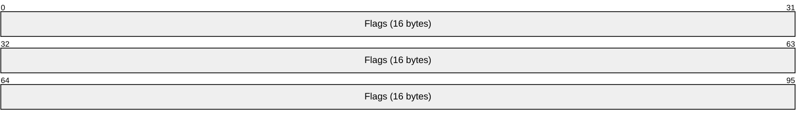

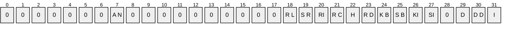

| Value | Description |
| --- | --- |
| I TASK_FLAG_INTERACTIVE | If set to 1, specifies that the task can interact with the logged-on user. |
| DD TASK_FLAG_DELETE_WHEN_DONE | If set to 1, specifies that the task can be deleted when there are no more scheduled run times. |
| D TASK_FLAG_DISABLED | If set to 1, specifies that the task is disabled. |
| SI TASK_FLAG_START_ONLY_IF_IDLE | If set to 1, specifies that the task begins only if the computer is not in use at the scheduled time. |
| KI TASK_FLAG_KILL_ON_IDLE_END | If set to 1, specifies that the task can be terminated if the computer makes an idle to non-idle transition while the task is running. The computer makes an idle to non-idle transition when user input is detected. |
| SB TASK_FLAG_DONT_START_IF_ON_BATTERIES | If set to 1, specifies that the task cannot start if its target computer is running on battery power. |
| KB TASK_FLAG_KILL_IF_GOING_ON_BATTERIES | If set to 1, specifies that the task can end, and the associated application quit if the task's target computer switches to battery power. |
| RD TASK_FLAG_RUN_ONLY_IF_DOCKED | Unused. MUST be set to zero when sent and MUST be ignored on receipt. |
| H TASK_FLAG_HIDDEN | If set to 1, specifies that the task is hidden. |
| RC TASK_FLAG_RUN_IF_CONNECTED_TO_INTERNET | Unused. MUST be set to zero when sent and MUST be ignored on receipt. |
| RI TASK_FLAG_RESTART_ON_IDLE_RESUME | If set to 1, specifies that the task can start again if the computer makes a non-idle to idle transition before all the task's triggers elapse. |
| SR TASK_FLAG_SYSTEM_REQUIRED | If set to 1, specifies that the task can cause the system to resume, or awaken if the system is sleeping. |
| RL TASK_FLAG_RUN_ONLY_IF_LOGGED_ON | If set to 1, specifies that the task can only run if the user specified in the task is logged on interactively. |
| AN TASK_APPLICATION_NAME | If set to 1, specifies that the task has an application name defined. |

**Flags (16 bytes)**: Undefined bits. MUST be set to zero when sent and MUST be ignored on receipt.

<a id="Section_2.3.8"></a>
### 2.3.8 TASK_USER_CRED

The TASK_USER_CRED structure contains user [**credentials**](#gt_credential) and is passed to the server during [**task registration**](#gt_5d98b0b1-7545-4aff-b4b3-786ed48911a3), as specified in section [3.2.5.4.2](#Section_3.2.5.4.2).

typedef struct _TASK_USER_CRED {

[string] const wchar_t* userId;

[string] const wchar_t* password;

DWORD flags;

} TASK_USER_CRED;

**userId:** Contains the user name identifying the account under which the [**task**](#gt_task) can execute. The user name is a string recognized by Windows authentication, as specified in [MS-AUTHSOD](../MS-AUTHSOD/MS-AUTHSOD.md) section 1.1.1.2.<9>

**password:** Contains the password associated with the user specified in the preceding userId field above, represented as a string. For information about security considerations, see section [5.1](#Section_5.1).

**flags:** The flags field contains individual bit flags that are structured as shown in the following table. The client MUST set the undefined bits to 0. The undefined bits are ignored on receipt.


| Value | Description |
| --- | --- |
| D credFlagDefault | If set to 1, the server can use these credentials if no other credentials are provided. If set to 0, the server can use these credentials instead of the credentials specified in the task configuration. |

<a id="Section_2.3.9"></a>
### 2.3.9 TASK_LOGON_TYPE

The TASK_LOGON_TYPE is a DWORD parameter to the [SchRpcRegisterTask](#Section_3.2.5.4.2) method. It specifies how a user context is established for a [**task**](#gt_task).

| Value | Meaning |
| --- | --- |
| 0x00000000 | TASK_LOGON_NONE: No logon type specified. |
| 0x00000001 | TASK_LOGON_PASSWORD: The task can be run as it would be run by the user, with the supplied userid and password. The task can run non-interactively. |
| 0x00000002 | TASK_LOGON_S4U: When the task is started, the task can run as if by the user with [**Service for User (S4U)**](#gt_service-for-user-s4u), as specified in [MS-SFU](../MS-SFU/MS-SFU.md). The task can run non-interactively. |
| 0x00000003 | TASK_LOGON_INTERACTIVE_TOKEN: The task can be started in the user's interactive logon session. |
| 0x00000004 | TASK_LOGON_GROUP: Same as TASK_LOGON_INTERACTIVE_TOKEN except that the task can run for any member of the security group. |
| 0x00000005 | TASK_LOGON_SERVICE_ACCOUNT: The task can run in a machine context, that is, [**local system**](#gt_local-system), local service, or network service. The task can run non-interactively. |
| 0x00000006 | TASK_LOGON_INTERACTIVE_TOKEN_OR_PASSWORD: If the user is logged on when the task is started, the TASK_LOGON_INTERACTIVE_TOKEN logon type is used, otherwise the TASK_LOGON_PASSWORD is used. |

<a id="Section_2.3.10"></a>
### 2.3.10 TASK_XML_ERROR_INFO

The TASK_XML_ERROR_INFO structure is a return value from the SchRpcRegisterTask (Opnum 1) method that contains additional information about an error in the [**XML**](#gt_xml) task definition.

typedef struct _TASK_XML_ERROR_INFO {

DWORD line, column;

[string] wchar_t* node;

[string] wchar_t* value;

} TASK_XML_ERROR_INFO,

*PTASK_XML_ERROR_INFO;

**line:** Contains the line number where parsing failed. Carriage returns in the XML separate the string into lines. The first line is "line one".

**column:** Contains the column where parsing failed. Indicates the character within the line, where the first character is "column one".

**node:** Contains the attribute or element name that caused the error, or which is missing.

**value:** When this field is not empty, it contains the invalid value that caused the error.

<a id="Section_2.3.11"></a>
### 2.3.11 Path Names

Many of the [ITaskSchedulerService](#Section_4.2.2) methods have a [**Unicode string**](#gt_unicode-string) path parameter. This parameter specifies the location of the task in the [**XML**](#gt_xml) [**task store**](#gt_task-store), as specified in section [3.2.1](#Section_3.2.1). Path names start with a "\" character followed by zero or more names, and separated by single "\" characters. An empty string is equivalent to "\".

Names do not:

- Start with a space character.
- Contain any of the following characters: ":", "/", or "\"
- Consist of the following string: ".."
<a id="Section_2.3.12"></a>
### 2.3.12 TASK_NAMES

The enumeration methods SchRpcEnumFolders (Opnum 6) and SchRpcEnumTasks (Opnum 7) return arrays of [**Unicode strings**](#gt_unicode-string) that contain the names of the enumerated objects. For readability in specifying these methods, the TASK_NAMES type is defined as a pointer to a pointer to wide characters.

This type is declared as follows:

typedef [string] wchar_t** TASK_NAMES;

<a id="Section_2.3.13"></a>
### 2.3.13 TASK_STATE

The [SchRpcGetInstanceInfo](#Section_3.2.5.4.10) and [SchRpcGetTaskInfo](#Section_3.2.5.4.18) methods return information about the current state of the task in a DWORD return parameter. The state is encoded as follows.

| Value | Meaning |
| --- | --- |
| TASK_STATE_UNKNOWN 0x00000000 | Unable to determine the current state. |
| TASK_STATE_DISABLED 0x00000001 | The task is disabled and will not run. |
| TASK_STATE_QUEUED 0x00000002 | The task has been triggered but is not yet running. |
| TASK_STATE_READY 0x00000003 | The task is ready to run but has not yet been triggered. |
| TASK_STATE_RUNNING 0x00000004 | The task is running. |

<a id="Section_2.3.14"></a>
### 2.3.14 Error Codes

This specification uses the HRESULT and NET_API_STATUS types, as specified in [MS-DTYP](../MS-DTYP/MS-DTYP.md) sections 2.2.18 and 2.2.37.

Unless specified explicitly, all failure values are treated as equivalent for protocol purposes and are simply passed back to the invoking application.<10>

<a id="Section_2.4"></a>
## 2.4 .JOB File Format

A .JOB file specifies [**task**](#gt_task) configuration. Clients that use the [SASec](#Section_3.2.5.3) interface create the .JOB file and write it to the server by using a remote file system protocol, as specified in section [3.1.4.2.2](#Section_3.1.4.2.2). Clients read .JOB files from the server as specified in section [3.1.4.2.5](#Section_3.1.4.2.5).

A .JOB file consists of two main sections, fixed-length (section [2.4.1](#Section_2.4.1)) and variable-length (section [2.4.2](#Section_2.4.2)).

All fields in the .JOB file format MUST use little-endian byte ordering unless otherwise stated. All extra padding bytes are a value of zero unless otherwise stated and all are ignored upon receipt.

<a id="Section_2.4.1"></a>
### 2.4.1 FIXDLEN_DATA

The FIXDLEN_DATA structure is the fixed-length header in the .JOB description file. The FIXDLEN_DATA structure is located at the beginning of the file. The format of the FIXDLEN_DATA structure is as follows.

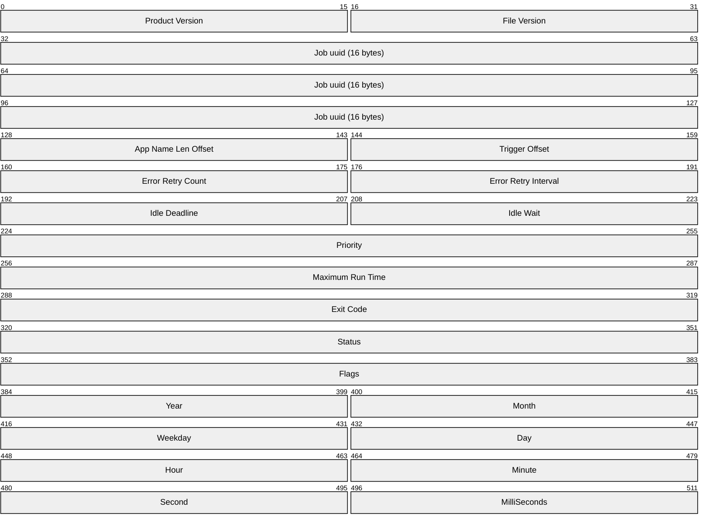

**Product Version (2 bytes):** Contains the version of the product that generated this .JOB file.<11>

**File Version (2 bytes):** Version of the .JOB file format. The client sets this to 0x0001.

**Job uuid (16 bytes):** Contains a randomly generated [**UUID**](#gt_universally-unique-identifier-uuid) to identify this task unique to the server.

**App Name Len Offset (2 bytes):** Contains the offset in bytes within the .JOB file where the length of the application name is located.

**Trigger Offset (2 bytes):** Contains the offset in bytes within the .JOB file where the task [**triggers**](#gt_trigger) are located.

**Error Retry Count (2 bytes):** Contains the number of execute attempts that are attempted for the task if the task fails to start.

**Error Retry Interval (2 bytes):** Contains the interval, in minutes, between successive retries.

**Idle Deadline (2 bytes):** Contains a maximum time in minutes to wait for the machine to become idle for Idle Wait minutes.

**Idle Wait (2 bytes):** Contains a value in minutes. The machine remains idle for this many minutes before it runs the task.

**Priority (4 bytes):** Contains ONE of the bit flags that control the priority at which the task will run. All bits not defined in the following table are set to 0 and ignored upon receipt. The bit field is structured as follows:

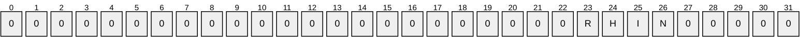

PRIORITY_CLASS

| Value | Description |
| --- | --- |
| N NORMAL_PRIORITY_CLASS | If set to 1, the task has no special scheduling requirements. |
| I IDLE_PRIORITY_CLASS | If set to 1, the task can run in a process whose threads run only when the machine is idle, and are preempted by the threads of any process running in a higher priority class. |
| H HIGH_PRIORITY_CLASS | If set to 1, the task performs time-critical tasks that can be executed immediately for it to run correctly. The threads of a high-priority class process preempt the threads of normal or idle priority class processes. |
| R REALTIME_PRIORITY_CLASS | If set to 1, the task can run at the highest possible priority. The threads of a real-time priority class process preempt the threads of all other processes, including operating system processes performing important tasks. |

**Maximum Run Time (4 bytes):** Contains the number of milliseconds the server will wait for the task to complete.

**Exit Code (4 bytes):** This contains the exit code of the executed task upon the completion of that task. MUST be set to 0x00000000 when sent and MUST be ignored on receipt.

**Status (4 bytes):** This contains the current status of the task. Is to be set to 0 and ignored upon receipt. Possible values are specified in the following table:

| Value | Meaning |
| --- | --- |
| SCHED_S_TASK_READY 0x00041300 | Task is not running but is scheduled to run at some time in the future. |
| SCHED_S_TASK_RUNNING 0x00041301 | Task is currently running. |
| SCHED_S_TASK_NOT_SCHEDULED 0x00041305 | The task is not running and has no valid triggers.<12> |

**Flags (4 bytes):** Task-specific flag bits that are as specified in section [2.3.7](#Section_2.3.7).

The following eight fields all refer to the time this task most recently ran. When creating a [**job**](#gt_job), the field values are to be ignored upon receipt.

| Value | Meaning |
| --- | --- |
| Year 1601 — 30827 | The year (1601–30827), inclusive. |
| Month 1 — 12 | The month, January=1, February=2, …, December=12. |
| Weekday 0 — 6 | The day of the week, Sunday=0, Monday=1, …, Saturday=6. |
| Day 1 — 31 | The day of the month (1–31), inclusive. |
| Hour 0 — 23 | The hour of the day (0–23), inclusive. |
| Minute 0 — 59 | The minute of the hour (0–59), inclusive. |
| Second 0 — 59 | The seconds of the minute (0–59), inclusive. |
| Milliseconds 0 — 999 | Between 0 and 999, for values less than one second, inclusive. |

<a id="Section_2.4.2"></a>
### 2.4.2 Variable-Length Data Section

Immediately following the [FIXDLEN_DATA](#Section_2.4.1) structure is the Variable-Length Data Section. The variable-length data section is composed of the following fields:

- Running Instance Count
- Application Name
- Parameters
- Working Directory
- Author
- Comment
- User Data
- Reserved Data
- Triggers
- Job Signature
This section also contains the specification for specially formatted Unicode strings in section [2.4.2.1](#Section_2.4.2.1).

<a id="Section_2.4.2.1"></a>
#### 2.4.2.1 Specially Formatted Unicode Strings

Fields containing a specially formatted [**Unicode string**](#gt_unicode-string) contain either a 16-bit nonzero character count followed by a null-terminated Unicode string, or a 16-bit zero with no following [**Unicode**](#gt_unicode) characters. In the former case, the character count includes the terminating null character. In the latter case, the string is said to be absent.

<a id="Section_2.4.2.2"></a>
#### 2.4.2.2 Running Instance Count

The first field of the variable-length data section is the count of running instances of this task. This field contains the number of instances of this task that are currently running. Running instances are manipulated as 16-bit unsigned integers. While creating a [**job**](#gt_job), the field is to be ignored on receipt.

<a id="Section_2.4.2.3"></a>
#### 2.4.2.3 Application Name

The Application Name field follows the [Running Instance Count](#Section_2.4.2.2) field. The Application Name field and the four following fields ([Parameters](#Section_2.4.2.4), [Working Directory](#Section_2.4.2.5), [Author](#Section_2.4.2.6), and **Comment**) are specially formatted [**Unicode strings**](#gt_unicode-string), as specified in the following sections. The string in the Application Name field is not absent. The content of this field is the same as the **Command** field specified in section [2.5.7.1](#Section_2.5.7.1).<13>

<a id="Section_2.4.2.4"></a>
#### 2.4.2.4 Parameters

The Parameters field follows the [Application Name](#Section_2.4.2.3) field. The Parameters field contains a specially formatted [**Unicode string**](#gt_unicode-string), as specified in section [2.4.2.1](#Section_2.4.2.1). The content of this field is the same as the **Arguments** field, as specified in section [2.5.7.1](#Section_2.5.7.1).

<a id="Section_2.4.2.5"></a>
#### 2.4.2.5 Working Directory

The Working Directory field follows the [Parameters](#Section_2.4.2.4) field. The Working Directory field contains a specially formatted [**Unicode string**](#gt_unicode-string), as specified in section [2.4.2.1](#Section_2.4.2.1). The content of this field is the same as the **Working Directory** field, as specified in section [2.5.7.1](#Section_2.5.7.1).

<a id="Section_2.4.2.6"></a>
#### 2.4.2.6 Author

The Author field follows the [Working Directory](#Section_2.4.2.5) field. The Author field contains a specially formatted [**Unicode string**](#gt_unicode-string), as specified in section [2.4.2.1](#Section_2.4.2.1). The content of this field is the same as the **Author** field, as specified in section [2.5.2](#Section_2.5.2).

<a id="Section_2.4.2.7"></a>
#### 2.4.2.7 Comment

The Comment field follows the [Author](#Section_2.4.2.6) field. The Comment field contains a specially formatted [**Unicode string**](#gt_unicode-string), as specified in section [2.4.2.1](#Section_2.4.2.1). The content of this field is the same as the **Description** field, as specified in section [2.5.2](#Section_2.5.2).

<a id="Section_2.4.2.8"></a>
#### 2.4.2.8 User Data Size/User Data

The 16-bit **User Data Size** field follows the [Comment](#Section_2.4.2.7) field. If User Data bytes are present following the **User Data Size** field, **User Data Size** contains the number of bytes of User Data. If User Data is not present, **User Data Size** contains the value zero. There are no alignment requirements for User Data. The contents of User Data are arbitrary bits defined as user data using any implementation-specific method.

| 0 | 1 | 2 | 3 | 4 | 5 | 6 | 7 | 8 | 9 | 1 0 | 1 | 2 | 3 | 4 | 5 |
| --- | --- | --- | --- | --- | --- | --- | --- | --- | --- | --- | --- | --- | --- | --- | --- |
| User Data Size | - | - | - | - | - | - | - | - | - | - | - | - | - | - | - |
| Byte 1 | Byte 2 | - | - | - | - | - | - | - | - | - | - | - | - | - | - |
| Byte 3 | Byte (Size) | - | - | - | - | - | - | - | - | - | - | - | - | - | - |

<a id="Section_2.4.2.9"></a>
#### 2.4.2.9 Reserved Data Size/Reserved Data

The 16-bit **Reserved Data Size** field follows the [User Data](#Section_2.4.2.8) field. If Reserved Data bytes are present following the **Reserved Data Size** field, **Reserved Data Size** SHOULD contain the value eight and an 8-byte TASKRESERVED1 structure SHOULD follow **Reserved Data Size**<14>. If Reserved Data is not present, **Reserved Data Size** contains the value zero.

| 0 | 1 | 2 | 3 | 4 | 5 | 6 | 7 | 8 | 9 | 1 0 | 1 | 2 | 3 | 4 | 5 |
| --- | --- | --- | --- | --- | --- | --- | --- | --- | --- | --- | --- | --- | --- | --- | --- |
| Reserved Data Size | - | - | - | - | - | - | - | - | - | - | - | - | - | - | - |
| Byte 1 | Byte 2 | - | - | - | - | - | - | - | - | - | - | - | - | - | - |
| Byte 3 | Byte 4 | - | - | - | - | - | - | - | - | - | - | - | - | - | - |
| Byte 5 | Byte 6 | - | - | - | - | - | - | - | - | - | - | - | - | - | - |
| Byte 7 | Byte 8 | - | - | - | - | - | - | - | - | - | - | - | - | - | - |

The TASKRESERVED1 structure has the following fields.

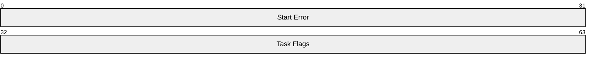

The Start Error contains the HRESULT error from the most recent attempt to start the task. MUST be set to zero when sent and MUST be ignored on receipt.<15>

The Task Flags are not used. MUST be set to zero when sent and MUST be ignored on receipt.

<a id="Section_2.4.2.10"></a>
#### 2.4.2.10 Trigger Count

The 16-bit Trigger Count field follows the [Reserved Data](#Section_2.4.2.9) field. The Trigger Count field contains the size, in bytes, of the following array of [**triggers**](#gt_trigger).

| 0 | 1 | 2 | 3 | 4 | 5 | 6 | 7 | 8 | 9 | 1 0 | 1 | 2 | 3 | 4 | 5 |
| --- | --- | --- | --- | --- | --- | --- | --- | --- | --- | --- | --- | --- | --- | --- | --- |
| Trigger Count | - | - | - | - | - | - | - | - | - | - | - | - | - | - | - |

<a id="Section_2.4.2.11"></a>
#### 2.4.2.11 Triggers

An array of zero or more [**triggers**](#gt_trigger) follows the [Trigger Count](#Section_2.4.2.10) field. All triggers share the same format.

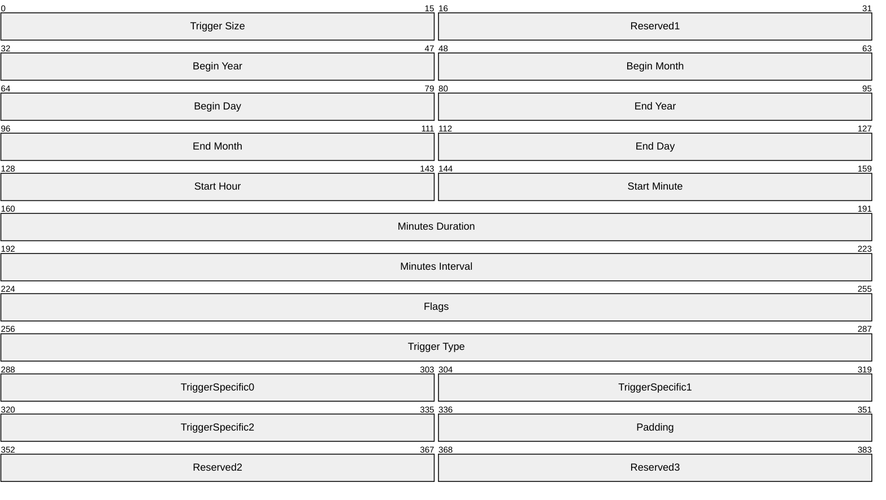

**Trigger Size (2 bytes):** Set to 0x0030. When creating a [**job**](#gt_job), the value SHOULD be ignored upon receipt.

**Reserved1 (2 bytes):** This field is ignored when read in from the file and is set to 0.

**Begin Year (2 bytes):** This field contains the first date this trigger is to fire. **Begin Year** SHOULD be in the range of 1601 to 30827.<16>

**Begin Month (2 bytes):** This field contains the first date this trigger is to fire. **Begin Month** SHOULD be in the range of 1 to 12. <17>

**Begin Day (2 bytes):** This field contains the first date this trigger fires. **Begin Day** SHOULD be in the range of 1 to the number of days in the month specified by the **Begin Month** field. <18>

**End Year (2 bytes):** These fields are ignored if the **TASK_TRIGGER_FLAG_HAS_END_DATE** bit is not set in the **Flags** field. Otherwise, these fields are set to the last date this trigger fires. **End Year** SHOULD be in the range of 1601 to 30827. <19>

**End Month (2 bytes):** These fields are ignored if the TASK_TRIGGER_FLAG_HAS_END_DATE bit is not set in the **Flags** field. Otherwise, these fields are set to the last date this trigger is to fire. **End Month** SHOULD be in the range of 1 to 12. <20>

**End Day (2 bytes):** These fields are ignored if the TASK_TRIGGER_FLAG_HAS_END_DATE bit is not set in the **Flags** field. Otherwise, these fields are set to the last date this trigger is to fire. **End Day** SHOULD be in the range of 1 to the number of days in the month specified by the **End Month** field.<21>

**Start Hour (2 bytes):** This field is set to the hour of the day when this trigger fires. **Start Hour** is in the range 0 to 23.

**Start Minute (2 bytes):** This field is set to the minute of the hour when this trigger is to fire. **Start Minute** is in the range 0 to 59.

**Minutes Duration (4 bytes):** This field contains a value in minutes, in the range 0x00000000 to 0xFFFFFFFF.<22>

For example, if **Minutes Duration** is 60, and **Minutes Interval** is 15, then if started at 1:00, the task runs every 15 minutes for the next 60 minutes (five times: at 1:00, 1:15, 1:30, 1:45, and 2:00.)

**Minutes Interval (4 bytes):** This field contains a value in minutes, in the range 0x00000000 to 0xFFFFFFFF. **Minutes Interval** indicates the time period between repeated trigger firings.<23>

**Flags (4 bytes):** This field contains zero or more bit flags. All bits not defined in the following table are to be set to zero and ignored upon receipt. The bit field is structured as follows:

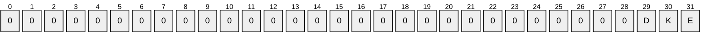

Task Trigger Flags

| Value | Description |
| --- | --- |
| E TASK_TRIGGER_FLAG_HAS_END_DATE | If set to 1, specifies that the task can stop at some point in time. |
| K TASK_TRIGGER_FLAG_KILL_AT_DURATION_END | If set to 1, specifies that the task can be stopped at the end of the repetition period. |
| D TASK_TRIGGER_FLAG_DISABLED | If set to 1, specifies that the trigger is disabled. |

**Trigger Type (4 bytes):** Trigger type, as specified in section [2.4.2.11.1](#Section_2.4.2.11.1).

**TriggerSpecific0 (2 bytes):** This field is set to values specific to each trigger type.

**TriggerSpecific1 (2 bytes):** This field is set to values specific to each trigger type.

**TriggerSpecific2 (2 bytes):** This field is set to values specific to each trigger type.

**Padding (2 bytes):** MUST be set to zero when sent and MUST be ignored on receipt.

**Reserved2 (2 bytes):** MUST be set to zero when sent and MUST be ignored on receipt.

**Reserved3 (2 bytes):** MUST be set to zero when sent and MUST be ignored on receipt.

<a id="Section_2.4.2.11.1"></a>
##### 2.4.2.11.1 Trigger Type

The Trigger type specifies how the trigger-specific fields are interpreted and contains one of the following values.

| Bit Range | Field | Description |
| --- | --- | --- |
| Variable | ONCE | 0x00000000 Not used |
| Variable | DAILY | 0x00000001 Section [2.4.2.11.5](#Section_2.4.2.11.5) |
| Variable | WEEKLY | 0x00000002 Section [2.4.2.11.6](#Section_2.4.2.11.6) |
| Variable | MONTHLYDATE | 0x00000003 Section [2.4.2.11.7](#Section_2.4.2.11.7) |
| Variable | MONTHLYDOW | 0x00000004 Section [2.4.2.11.8](#Section_2.4.2.11.8) |
| Variable | EVENT_ON_IDLE | 0x00000005 Not used |
| Variable | EVENT_AT_SYSTEMSTART | 0x00000006 Not used |
| Variable | EVENT_AT_LOGON | 0x00000007 Not used |

When the [**trigger**](#gt_trigger) type is ONCE, EVENT_ON_IDLE, EVENT_AT_SYSTEMSTART, or EVENT_AT_LOGON, the trigger-specific fields are set to 0.

The different trigger types use some shared bit fields, as indicated in the following sections.

<a id="Section_2.4.2.11.2"></a>
##### 2.4.2.11.2 Day of the Month

The Day of the Month field is specified as follows.

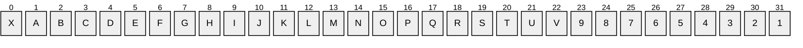

**X (1 bit):** Unused. MUST be set to zero when sent and MUST be ignored on receipt.

**1-31:** Any bit set to 1 specifies that the task can run on that day of the month. More than one bit MAY be set to 1.

<a id="Section_2.4.2.11.3"></a>
##### 2.4.2.11.3 Day of the Week

The Day of the Week field is specified as follows.


| 0 | 1 | 2 | 3 | 4 | 5 | 6 | 7 | 8 | 9 | 1 0 | 1 | 2 | 3 | 4 | 5 |
| --- | --- | --- | --- | --- | --- | --- | --- | --- | --- | --- | --- | --- | --- | --- | --- |
| 0 | 0 | 0 | 0 | 0 | 0 | 0 | 0 | 0 | S A | F R | T H | W E | T U | M O | S U |

Day of the Week Flags

| Value | Description |
| --- | --- |
| SU Sunday | If set to 1, specifies that the task can run on Sunday. |
| MO Monday | If set to 1, specifies that the task can run on Monday. |
| TU Tuesday | If set to 1, specifies that the task can run on Tuesday. |
| WE Wednesday | If set to 1, specifies that the task can run on Wednesday. |
| TH Thursday | If set to 1, specifies that the task can run on Thursday. |
| FR Friday | If set to 1, specifies that the task can run on Friday. |
| SA Saturday | If set to 1, specifies that the task can run on Saturday. |

**Day of the Week (2 bytes):** Undefined bits are set to 0 when sent and ignored upon receipt.

<a id="Section_2.4.2.11.4"></a>
##### 2.4.2.11.4 Month of the Year

The Month of the Year field is specified as follows.


| 0 | 1 | 2 | 3 | 4 | 5 | 6 | 7 | 8 | 9 | 1 0 | 1 | 2 | 3 | 4 | 5 |
| --- | --- | --- | --- | --- | --- | --- | --- | --- | --- | --- | --- | --- | --- | --- | --- |
| 0 | 0 | 0 | 0 | D E | N O | O C | S E | A U | J L | J U | M A | A P | M R | F E | J A |

| Value | Description |
| --- | --- |
| JA January | If set to 1, specifies that the task can run in January. |
| FE February | If set to 1, specifies that the task can run in February. |
| MR March | If set to 1, specifies that the task can run in March. |
| AP April | If set to 1, specifies that the task can run in April. |
| MA May | If set to 1, specifies that the task can run in May. |
| JU June | If set to 1, specifies that the task can run in June. |
| JL July | If set to 1, specifies that the task can run in July. |
| AU August | If set to 1, specifies that the task can run in August. |
| SE September | If set to 1, specifies that the task can run in September. |
| OC October | If set to 1, specifies that the task can run in October. |
| NO November | If set to 1, specifies that the task can run in November. |
| DE December | If set to 1, specifies that the task can run in December. |

**Month of the Year (2 bytes):** Undefined bits MUST be set to zero when sent and MUST be ignored on receipt.

<a id="Section_2.4.2.11.5"></a>
##### 2.4.2.11.5 DAILY Trigger

When [**trigger**](#gt_trigger) type is DAILY, the five fields are interpreted as follows:

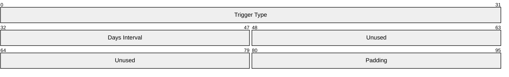

**Trigger Type (4 bytes):** Trigger frequency type. This field is set to 0x00000001 for the DAILY trigger type.

| Name | Value |
| --- | --- |
| DailyTrigger | 0x00000001 |

**Days Interval (2 bytes):** This field contains the number of 24-hour periods between trigger firings.

**Unused (4 bytes):** MUST be set to zero when sent and MUST be ignored on receipt.

**Padding (2 bytes):** MUST be set to zero when sent and MUST be ignored on receipt.

<a id="Section_2.4.2.11.6"></a>
##### 2.4.2.11.6 WEEKLY Trigger

When the [**trigger**](#gt_trigger) type is WEEKLY, the five fields are interpreted as follows:

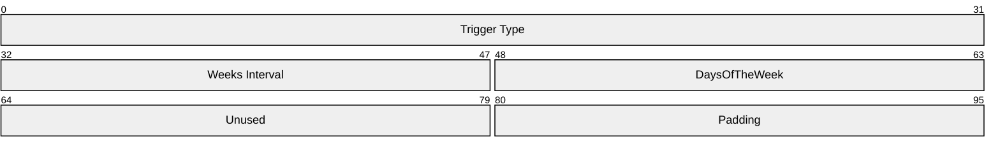

**Trigger Type (4 bytes):** Trigger frequency type. Set to 0x00000002 for the WEEKLY trigger type.

**Weeks Interval (2 bytes):** Contains the number of weeks between trigger firings.

**DaysOfTheWeek (2 bytes):** Contains the bit flags that specify on which days of the week the trigger fires, which are interpreted as specified in section [2.4.2.11.3](#Section_2.4.2.11.3).

**Unused (2 bytes):** MUST be set to zero when sent and MUST be ignored on receipt.

**Padding (2 bytes):** MUST be set to zero when sent and MUST be ignored on receipt.

<a id="Section_2.4.2.11.7"></a>
##### 2.4.2.11.7 MONTHLYDATE Trigger

When [**trigger**](#gt_trigger) type is MONTHLYDATE, the five fields are interpreted as follows:

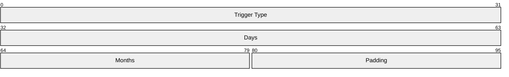

**Trigger Type (4 bytes):** Trigger frequency type. Set to 0x00000003 for the MONTHLYDATE trigger type.

**Days (4 bytes):** Bit flags that specify on which days of the month the trigger fires, which are interpreted as specified in section [2.4.2.11.2](#Section_2.4.2.11.2).

**Months (2 bytes):** Bit flags that specify on which months of the year the trigger fires, which are interpreted as specified in section [2.4.2.11.4](#Section_2.4.2.11.4).

**Padding (2 bytes):** MUST be set to zero when sent and MUST be ignored on receipt.

<a id="Section_2.4.2.11.8"></a>
##### 2.4.2.11.8 MONTHLYDOW Trigger

When [**trigger**](#gt_trigger) type is MONTHLYDOW (monthly day of week), the five fields are interpreted as follows.

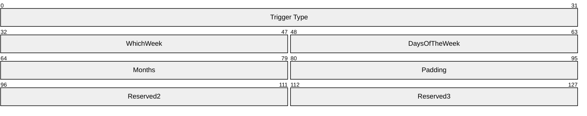

**Trigger Type (4 bytes):** Trigger frequency type. Set to 0x00000004 for the MONTHLYDOW trigger type.

**WhichWeek (2 bytes):** Set to one of the following values.

| Name | Value |
| --- | --- |
| FIRST_WEEK | 0x0001 |
| SECOND_WEEK | 0x0002 |
| THIRD_WEEK | 0x0003 |
| FOURTH_WEEK | 0x0004 |
| LAST_WEEK | 0x0005 |

**DaysOfTheWeek (2 bytes):** Bit flags that specify on which days of the week the trigger fires, which are interpreted as specified in section [2.4.2.11.3](#Section_2.4.2.11.3).

**Months (2 bytes):** Bit flags that specify on which months of the year the trigger fires, which are interpreted as specified in section [2.4.2.11.4](#Section_2.4.2.11.4).

**Padding (2 bytes):** MUST be set to zero when sent and MUST be ignored on receipt.

**Reserved2 (2 bytes):** MUST be set to zero when sent and MUST be ignored on receipt.

**Reserved3 (2 bytes):** MUST be set to zero when sent and MUST be ignored on receipt.

<a id="Section_2.4.2.12"></a>
#### 2.4.2.12 Job Signature

A 32-bit JOB_SIGNATURE_HEADER and 64-byte signature (see the following) MAY follow the array of [**triggers**](#gt_trigger).

The following fields **Byte1** through **Byte64** contain the 64-byte signature.

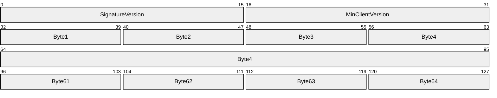

**SignatureVersion (2 bytes):** Set to 1.

**MinClientVersion (2 bytes):** Set to 1.

If the .JOB file does not contain a complete JOB_SIGNATURE_HEADER and signature, or if the **SignatureVersion** and **MinClientVersion** fields do not contain the value 1, the recipient ignores the signature.

The signature is calculated as follows:

- The [**Security Identifier (SID)**](#gt_security-identifier-sid) of the file owner, the **uuidJob** field of the [FIXDLEN_DATA](#Section_2.4.1) structure, and the null-terminated string value from Application Name in the variable-length data section is bytewise concatenated in a buffer.
- A 16-byte MD5 [[RFC1321]](https://go.microsoft.com/fwlink/?LinkId=90275) hash of the buffer is calculated.
- A private key is obtained from the system to be used for the digital signature.<24>
- The hash is signed using MD5, and the signed hash is placed in the 64 bytes after the JOB_SIGNATURE_HEADER.
<a id="Section_2.5"></a>
## 2.5 XML Task Definition Format

The [ITaskSchedulerService](#Section_4.2.2) interface uses [**XML**](#gt_xml) to define [**tasks**](#gt_task). Tasks are XML documents that MUST adhere to the schema specified in this section.

The server MUST validate an XML task definition's conformance to this schema and return an error if invalid, as specified in section [3.2.5.4.2](#Section_3.2.5.4.2).

The task schema contains the following six top-level parts. The "Actions" part MUST be present.

**Note** The task schema is defined by `xmlns="http://schemas.microsoft.com/windows/2004/02/mit/task`

<!-- Task -->

<xs:complexType name="taskType">

<xs:all>

<xs:element name="RegistrationInfo" type="registrationInfoType" minOccurs="0"/>

<xs:element name="Triggers" type="triggersType" minOccurs="0"/>

<xs:element name="Settings" type="settingsType" minOccurs="0"/>

<xs:element name="Data" type="dataType" minOccurs="0"/>

<xs:element name="Principals" type="principalsType" minOccurs="0"/>

<xs:element name="Actions" type="actionsType"/>

</xs:all>

<xs:attribute name="version" type="versionType" use="optional"/>

</xs:complexType>

**RegistrationInfo:** If present, this part MUST specify the task location, security settings, description, and version of the task. See section [2.5.2](#Section_2.5.2).

**Triggers:** If present, this part MUST specify the [**triggers**](#gt_trigger) (changes of state or time) that cause the task to be started. See section [2.5.3](#Section_2.5.3).

**Settings:** If present, this part MUST specify additional settings and/or constraints imposed on the task once a trigger is met. See section [2.5.4](#Section_2.5.4).

**Data:** If present, this part MUST specify a container for arbitrary data required by the tasks. See section [2.5.5](#Section_2.5.5).

**Principals:** If present, this part MUST specify the context identity in which the task is to be started. See section [2.5.6](#Section_2.5.6).

**Actions:** This part MUST be present and MUST specify the action to be performed once the task is started. See section [2.5.7](#Section_2.5.7).

**Version:** If present, this attribute MUST specify the lowest version of the Task Scheduler Remoting Protocol that will be compatible with this task. Its value MUST be one of the following: "1.0", "1.1", "1.2", "1.3", or "1.4", corresponding to [ATSvc](#Section_3.1.4.1), SASec, and ITaskSchedulerService (for the last three), respectively (see section [1.7](#Section_1.7)).

<a id="Section_2.5.1"></a>
### 2.5.1 Common Data Types

This section specifies common data types used in the [**XML**](#gt_xml) task definition schema.

<a id="Section_2.5.1.1"></a>
#### 2.5.1.1 Standard Data Types

The [**XML**](#gt_xml) task definition schema uses several standard XML types:

**xs:boolean:** A Boolean value, as specified in [[W3C-XSD]](https://go.microsoft.com/fwlink/?LinkId=90563) section 3.2.2.

**xs:byte:** A signed 8-bit integer, as specified in [W3C-XSD] section 3.3.19.

**xs:unsignedByte:** An unsigned 8-bit integer, as specified in [W3C-XSD] section 3.3.24.

**xs:unsignedInt:** An unsigned 32-bit integer, as specified in [W3C-XSD] section 3.3.22.

**xs:dateTime:** A date and time value, as specified in [[ISO-8601]](https://go.microsoft.com/fwlink/?LinkId=89920) section 5.3.3.

**xs:duration:** A time duration value, as specified in [ISO-8601] section 5.3.3.

**xs:string:** A string, as specified in [W3C-XSD] section 3.2.1.

**xs:ID:** A string name, as specified in [W3C-XSD] section 3.3.8.

**xs:IDREF:** A string name, as specified in [W3C-XSD] section 3.3.10.

**xs:anyURI:** A path, as specified in [W3C-XSD] section 3.2.17.

<a id="Section_2.5.1.2"></a>
#### 2.5.1.2 versionType

The versionType specifies a string representing a version number. The version number has one of the following formats: "X.Y", "X.Y.Z", or "X.Y.Z.W", where X, Y, Z, and W contain one or more decimal digits.

<xs:simpleType name="versionType">

<xs:restriction base="xs:string">

<xs:pattern value="\d+(\.\d+){1,3}"/>

</xs:restriction>

</xs:simpleType>

<a id="Section_2.5.1.3"></a>
#### 2.5.1.3 nonEmptyString

The nonEmptyString type specifies a string that contains at least one character.

<xs:simpleType name="nonEmptyString">

<xs:restriction base="xs:string">

<xs:minLength value="1"/>

</xs:restriction>

</xs:simpleType>

<a id="Section_2.5.1.4"></a>
#### 2.5.1.4 pathType

The pathType type specifies a string that contains between 1 and 260 characters.

<xs:simpleType name="pathType">

<xs:restriction base="nonEmptyString">

<xs:maxLength value="260"/>

</xs:restriction>

</xs:simpleType>

<a id="Section_2.5.1.5"></a>
#### 2.5.1.5 guidType

The guidType type specifies a string that contains the representation of a [**GUID**](#gt_globally-unique-identifier-guid), as defined in [MS-DTYP](../MS-DTYP/MS-DTYP.md) section 2.3.4.

<xs:simpleType name= "guidType ">

<xs:restriction base= "xs:string ">

<xs:pattern value= "\{([0-9a-fA-F]){8}(\-[0-9a-fA-F]{4}){3}\-[0-9a-fA-F]{12}\} "/>

<!-- GUID should be in a form:{xxxxxxxx-xxxx-xxxx-xxxx-xxxxxxxxxxxx}where x is a hexadecimal digit. -->

</xs:restriction>

</xs:simpleType>

<a id="Section_2.5.2"></a>
### 2.5.2 RegistrationInfo Schema Part

If present, this schema part specifies the location and security settings for the [**task registration**](#gt_5d98b0b1-7545-4aff-b4b3-786ed48911a3) and additional descriptive fields as specified in this section.

<!-- RegistrationInfo -->

<xs:complexType name="registrationInfoType">

<xs:all>

<xs:element name="URI" type="xs:anyURI" minOccurs="0"/>

<xs:element name="SecurityDescriptor" type="xs:string"

minOccurs="0"/>

<xs:element name="Source" type="xs:string" minOccurs="0"/>

<xs:element name="Date" type="xs:dateTime" minOccurs="0"/>

<xs:element name="Author" type="xs:string" minOccurs="0"/>

<xs:element name="Version" type="xs:string" minOccurs="0"/>

<xs:element name="Description" type="xs:string" minOccurs="0"/>

<xs:element name="Documentation" type="xs:string" minOccurs="0"/>

</xs:all>

</xs:complexType>

**URI:** If present, this field specifies the path in the [**task store**](#gt_task-store) for this task (see sections [2.3.11](#Section_2.3.11) and [2.5.1.1](#Section_2.5.1.1)).

**Security Descriptor:** If present, this field specifies the task [**security descriptor**](#gt_security-descriptor) in [**Security Descriptor Definition Language (SDDL)**](#gt_security-descriptor-definition-language-sddl) format.

**Source:** If present, this field specifies a user-designated field used by the task author, defined in the following "Author" field, to arbitrarily categorize tasks (example: Accounting, MyTasks).

**Date:** If present, this field contains a time/date value whose format is as specified in section 2.5.1.1. The value specifies the creation or modification date. If this field is not present, the time/date value used is set to the current time/date of when the task is registered.

**Author:** If present, this field specifies a name identifying the person or entity that created the task.

**Version:** If present, this field specifies the version level of the task. This is a free text element controlled by and for the exclusive use of the task owner and not related to Task Scheduler Remoting Protocol versions.

**Description:** If present, this field specifies a user-friendly description of the task. For example: `"This task defragments the computer's hard disk drives"`.

**Documentation:** If present, this field specifies the uniform resource identifier (URI) of external documentation related to the task.

<a id="Section_2.5.3"></a>
### 2.5.3 Triggers Schema Part

If present, the Triggers schema part specifies the state change or time occurrence and frequency that the task will be started within the predefined time boundaries. The [**triggers**](#gt_trigger) control when the task is to be started based on time, events, or built-in system changes. If the part contains multiple triggers, the task can be started on the first occurring trigger.

<!-- Triggers -->

<xs:group name="triggerGroup">

<xs:choice>

<xs:element name="BootTrigger" type="bootTriggerType"

minOccurs="0"/>

<xs:element name="RegistrationTrigger"

type="registrationTriggerType" minOccurs="0"/>

<xs:element name="IdleTrigger" type="idleTriggerType"

minOccurs="0"/>

<xs:element name="TimeTrigger" type="timeTriggerType"

minOccurs="0"/>

<xs:element name="EventTrigger" type="eventTriggerType"

minOccurs="0"/>

<xs:element name="LogonTrigger" type="logonTriggerType"

minOccurs="0"/>

<xs:element name="SessionStateChangeTrigger"

type="sessionStateChangeTriggerType" minOccurs="0"/>

<xs:element name="CalendarTrigger" type="calendarTriggerType"

minOccurs="0"/>

</xs:choice>

</xs:group>

<a id="Section_2.5.3.1"></a>
#### 2.5.3.1 Common Trigger Elements

This section specifies the elements that are common to all [**triggers**](#gt_trigger). For the clarity of the document, these will be specified once in this section, but each and every trigger specified in the following sections contains these common elements. The following sections specify only added elements beyond the ones specified in this section.

<!-- Base type for all triggers -->

<xs:complexType name="triggerBaseType" abstract="true">

<xs:sequence>

<xs:element name="Enabled" type="xs:boolean" default="true"

minOccurs="0"/>

<xs:element name="StartBoundary" type="xs:dateTime"

minOccurs="0"/>

<xs:element name="EndBoundary"

type="xs:dateTime" minOccurs="0"/>

<xs:element name="Repetition" type="repetitionType"

minOccurs="0"/>

<xs:element name="ExecutionTimeLimit" type="xs:duration"

minOccurs="0"/>

</xs:sequence>

<xs:attribute name="id" type="xs:ID" use="optional"/>

</xs:complexType>

<!-- Repetition -->

<xs:complexType name="repetitionType">

<xs:all>

<xs:element name="Interval">

<xs:simpleType>

<xs:restriction base= "xs:duration">

<xs:minInclusive value="PT1M"/>

<xs:maxInclusive value="P31D"/>

</xs:restriction>

</xs:simpleType>

</xs:element>

<xs:element name= "Duration" minOccurs= "0">

<xs:simpleType>

<xs:restriction base= "xs:duration">

<xs:minInclusive value= "PT1M "/>

</xs:restriction>

</xs:simpleType>

</xs:element>

<xs:element name= "StopAtDurationEnd" type= "xs:boolean"

default= "false " minOccurs= "0"/>

</xs:all>

</xs:complexType>

**Id attribute:** If present, this field specifies an identifier for the specific trigger type Id, allowing direct reference.

**StartBoundary:** If present, this field contains a time/date value of the start time/date of a task. The format is as specified in section [2.5.1.1](#Section_2.5.1.1). This field is present for Time and Calendar triggers.

**EndBoundary:** If present, this field contains a time/date value of the end time/date of a task. The format is as specified in section 2.5.1.1.

**Enabled:** If present, this field contains a Boolean value. If the field is not present or the value is TRUE, the trigger is enabled and the task can start when this trigger occurs. If FALSE, the trigger is disabled and the trigger can be ignored when determining whether to run the task.

**ExecutionTimeLimit:** If present, this field contains a time duration that is a limit of the task's execution time. The format MUST be as specified in section 2.5.1.1.

**Repetition:** If present, the **Repetition** field contains 1 to 3 of the following subfields, including at least the Interval subfield.

**Interval:** This subfield is present and contains a duration of time in the range from 1 minute to 31 days, inclusive. The format is as specified in section 2.5.1.1. If the task starts at the time specified by the trigger, it can restart at the intervals specified by this field, calculated from the trigger start time.

**Duration:** If present, the **Duration** subfield contains a duration no shorter than 1 minute. The format is as specified in section 2.5.1.1. The server can stop restarting the task after this much time has elapsed from the task's trigger time. If not present, the **Duration** value of 1 day can be used for the task.

**StopAtDurationEnd:** If present, this subfield contains a Boolean value. If the field has the value TRUE, any running [**task instance**](#gt_task-instance) can stop at the end of the **Duration**. If the field has the value FALSE, task instances can continue running after the end of the **Duration**.

<a id="Section_2.5.3.2"></a>
#### 2.5.3.2 BootTrigger

If present, the BootTrigger specifies that the task can start at operating system start-up, after the [ATSvc](#Section_3.1.4.1) server initializes.

<!-- BootTrigger -->

<xs:complexType name="bootTriggerType">

<xs:complexContent>

<xs:extension base="triggerBaseType">

<xs:sequence>

<xs:element name="Delay" type="xs:duration" default="PT0M"

minOccurs="0"/>

</xs:sequence>

</xs:extension>

</xs:complexContent>

</xs:complexType>

**Delay:** If present, this field contains a user-specified delay value as specified for "duration" in section [2.5.1.1](#Section_2.5.1.1). The task startup can be delayed after boot (ATSvc start-up) by the delay value.

<a id="Section_2.5.3.3"></a>
#### 2.5.3.3 RegistrationTrigger

If present, the RegistrationTrigger specifies that the task can start after registration.

<!-- RegistrationTrigger -->

<xs:complexType name="registrationTriggerType">

<xs:complexContent>

<xs:extension base="triggerBaseType">

<xs:sequence>

<xs:element name="Delay" type="xs:duration" default="PT0M"

minOccurs="0"/>

</xs:sequence>

</xs:extension>

</xs:complexContent>

</xs:complexType>

**Delay:** If present, this field contains a user-specified delay value. The task can have a delayed start after [**task registration**](#gt_5d98b0b1-7545-4aff-b4b3-786ed48911a3) until the time interval specified by the delay value has elapsed.

<a id="Section_2.5.3.4"></a>
#### 2.5.3.4 IdleTrigger

If present, the IdleTrigger specifies that the task can start when the machine becomes idle, as specified in section [3.2.4.2](#Section_3.2.4.2).

<!-- IdleTrigger -->

<xs:complexType name="idleTriggerType">

<xs:complexContent>

<xs:extension base= "triggerBaseType "/>

</xs:complexContent>

</xs:complexType>

<a id="Section_2.5.3.5"></a>
#### 2.5.3.5 TimeTrigger

If present, the TimeTrigger specifies that the task can start at the specified **StartBoundary** time.

<!-- TimeTrigger -->

<xs:complexType name="timeTriggerType">

<xs:complexContent>

<xs:extension base="triggerBaseType">

<xs:sequence>

<xs:element name="RandomDelay" type="xs:duration"

default="PT0M" minOccurs="0"/>

</xs:sequence>

</xs:extension>

</xs:complexContent>

</xs:complexType>

**RandomDelay:** If present, this field contains a user-specified maximum delay value as specified for "time duration" in section [2.5.1.1](#Section_2.5.1.1).

<a id="Section_2.5.3.6"></a>
#### 2.5.3.6 EventTrigger

If present, the EventTrigger specifies that the task can start upon occurrence of an event matching an event subscription query, as specified in [MS-EVEN6](../MS-EVEN6/MS-EVEN6.md) section 2.2.16, or on the occurrence of a number of events of the same type (same **EventId**) in a given period of time.

<!-- EventTrigger -->

<xs:complexType name="eventTriggerType">

<xs:complexContent>

<xs:extension base="triggerBaseType">

<xs:sequence>

<xs:element name="Subscription" type="nonEmptyString"/>

<xs:element name="Delay" type="xs:duration" default="PT0M"

minOccurs="0"/>

<xs:element name="PeriodOfOccurrence" type="xs:duration"

default="PT0M" minOccurs="0"/>

<xs:element name="NumberOfOccurrences" default="1"

minOccurs="0">

<xs:simpleType>

<xs:restriction base="xs:unsignedByte">

<xs:minInclusive value="1"/>

<xs:maxInclusive value="32"/>

</xs:restriction>

</xs:simpleType>

</xs:element>

<xs:element name="MatchingElement" type="nonEmptyString"

minOccurs="0"/>

<xs:element name="ValueQueries" type="namedValues"

minOccurs="0"/>

</xs:sequence>

</xs:extension>

</xs:complexContent>

</xs:complexType>

<xs:complexType name="namedValues">

<xs:sequence>

<xs:element name="Value" type="namedValue" maxOccurs="32"/>

</xs:sequence>

</xs:complexType>

<xs:complexType name="namedValue">

<xs:simpleContent>

<xs:extension base="nonEmptyString">

<xs:attribute name="name" type="nonEmptyString" use="required"/>

</xs:extension>

</xs:simpleContent>

</xs:complexType>

**Subscription:** This field is not optional and contains an [**XPATH**](#gt_xml-path-language-xpath) [**XML**](#gt_xml) query for an event ([MS-EVEN6] section 2.2.16).

**Delay:** If present, this field contains a user-specified delay value as specified for "time duration" in section [2.5.1.1](#Section_2.5.1.1). The task can have a delayed start after event occurrence; the time duration of the delayed start is equal to the delay value.

**NumberOfOccurrences:** If present, this field contains an integer value between 1 and 32, inclusive. The [**trigger**](#gt_trigger) can fire after **NumberOfOccurrences** occurrences of the **MatchingElement** query (subject to the **PeriodOfOccurrence** field; see the following field).

**PeriodOfOccurrence:** If present, this field contains a time period as specified in section 2.5.1.1, which is greater than or equal to 1 minute. If present, this field indicates the occurrences of the **MatchingElement** query that occurred prior to the last **PeriodOfOccurrence** time period that are not counted.

**MatchingElement:** If present, this field specifies an XML field name. For more information, see [MS-EVEN6] section 3.1.4.31.

**ValueQueries:** If present, this field specifies a set of XML elements. The set has between 1 and 32 members, inclusive. When an event matches the subscription and fires the trigger, element values from the event for task action parameterization (section [2.5.9](#Section_2.5.9)) can be retrieved.

<a id="Section_2.5.3.7"></a>
#### 2.5.3.7 LogonTrigger

If present, the LogonTrigger specifies that the task can start at user logon.

<!-- LogonTrigger -->

<xs:complexType name="logonTriggerType">

<xs:complexContent>

<xs:extension base="triggerBaseType">

<xs:sequence>

<xs:element name="UserId" type="nonEmptyString"

minOccurs="0"/>

<xs:element name="Delay" type="xs:duration" default="PT0M"

minOccurs="0"/>

</xs:sequence>

</xs:extension>

</xs:complexContent>

</xs:complexType>

**UserId:** If present, this field contains an account name in a format supported by the operating system. Only one **UserId** is to be specified in the LogonTrigger.

**Delay:** If present, this field contains a user-specified delay value as specified for "time duration" in section [2.5.1.1](#Section_2.5.1.1). The task can have a delayed start after Logon; the time duration of the delayed start is equal to the delay value.

<a id="Section_2.5.3.8"></a>
#### 2.5.3.8 SessionStateChangeTrigger

If present, this [**trigger**](#gt_trigger) specifies that the task can start when one of the following system changes occurs.<25>

<!-- SessionStateChangeTrigger -->

<xs:simpleType name="sessionStateChangeType">

<xs:restriction base="xs:string">

<xs:enumeration value="ConsoleConnect"/>

<xs:enumeration value="ConsoleDisconnect"/>

<xs:enumeration value="RemoteConnect"/>

<xs:enumeration value="RemoteDisconnect"/>

<xs:enumeration value="SessionLock"/>

<xs:enumeration value="SessionUnlock"/>

</xs:restriction>

</xs:simpleType>

<xs:complexType name="sessionStateChangeTriggerType">

<xs:complexContent>

<xs:extension base="triggerBaseType">

<xs:sequence>

<xs:element name="UserId" type="nonEmptyString"

minOccurs="0"/>

<xs:element name="Delay" type="xs:duration" default="PT0M"

minOccurs="0"/>

<xs:element name="StateChange"

type="sessionStateChangeType"/>

</xs:sequence>

</xs:extension>

</xs:complexContent>

</xs:complexType>

**UserId:** If present, this field MUST contain an account name. The server fires the trigger when that user has a session change as specified by the **StateChange** field. The task starts in the context (identity) specified by the Principal part as specified in section [2.5.6](#Section_2.5.6). Only one **UserId** is to be specified in the SessionStateChangeTrigger.

**Delay:** If present, this field MUST contain a user-specified delay value as specified for "time duration" in section [2.5.1.1](#Section_2.5.1.1). The task can have a delayed start until after the trigger has fired for the session state change. The time duration of the delayed start is equal to the delay value.

**StateChange:** This field is present and specifies one of the following strings.

| String | Behavior |
| --- | --- |
| ConsoleConnect | Specifies that the task is started when a user connects to a new session from a local computer while keeping an old session active.<26> |
| ConsoleDisconnect | Specifies that the task is started when a user disconnects from a new session on a local computer, and the new session was established while keeping an old session active. |
| RemoteConnect | Specifies that the task is started when a user connects to a remote session. |
| RemoteDisconnect | Specifies that the task is started when a user disconnects from a remote session. |
| SessionLock | Specifies that the task is started when user locks the [**workstation**](#gt_workstation). |
| SessionUnlock | Specifies that the task is started when user unlocks the workstation. |

<a id="Section_2.5.3.9"></a>
#### 2.5.3.9 CalendarTrigger

If present, the CalendarTrigger specifies that the task can start on the specified days.

<!-- CalendarTrigger -->

<xs:complexType name="calendarTriggerType">

<xs:complexContent>

<xs:extension base="triggerBaseType">

<xs:sequence>

<xs:element name="RandomDelay" type="xs:duration"

default="PT0M" minOccurs="0"/>

<xs:choice>

<xs:element name="ScheduleByDay"

type="dailyScheduleType"/>

<xs:element name="ScheduleByWeek"

type="weeklyScheduleType"/>

<xs:element name="ScheduleByMonth"

type="monthlyScheduleType"/>

<xs:element name="ScheduleByMonthDayOfWeek"

type="monthlyDayOfWeekScheduleType"/>

</xs:choice>

</xs:sequence>

</xs:extension>

</xs:complexContent>

</xs:complexType>

<!-- DailySchedule -->

<xs:complexType name="dailyScheduleType">

<xs:all>

<xs:element name="DaysInterval" minOccurs="0">

<xs:simpleType>

<xs:restriction base="xs:unsignedInt">

<xs:minInclusive value="1"/>

<xs:maxInclusive value="365"/>

</xs:restriction>

</xs:simpleType>

</xs:element>

</xs:all>

</xs:complexType>

<!-- WeeklySchedule -->

<xs:complexType name="weeklyScheduleType">

<xs:all>

<xs:element name="WeeksInterval" minOccurs="0">

<xs:simpleType>

<xs:restriction base="xs:unsignedByte">

<xs:minInclusive value="1"/>

<xs:maxInclusive value="52"/>

</xs:restriction>

</xs:simpleType>

</xs:element>

<xs:element name="DaysOfWeek" type="daysOfWeekType"

minOccurs="0"/>

</xs:all>

</xs:complexType>

<!-- MonthlySchedule -->

<xs:complexType name="monthlyScheduleType">

<xs:all>

<xs:element name="DaysOfMonth" type="daysOfMonthType"

minOccurs="0"/>

<xs:element name="Months" type="monthsType" minOccurs="0"/>

</xs:all>

</xs:complexType>

<!-- MonthlyDayOfWeekSchedule -->

<xs:complexType name="monthlyDayOfWeekScheduleType">

<xs:all>

<xs:element name="Weeks" type="weeksType" minOccurs="0"/>

<xs:element name="DaysOfWeek" type="daysOfWeekType"/>

<xs:element name="Months" type="monthsType" minOccurs="0"/>

</xs:all>

</xs:complexType>

<!-- DaysOfWeek -->

<xs:complexType name="daysOfWeekType">

<xs:all>

<xs:element name="Monday" fixed="" minOccurs="0"/>

<xs:element name="Tuesday" fixed="" minOccurs="0"/>

<xs:element name="Wednesday" fixed="" minOccurs="0"/>

<xs:element name="Thursday" fixed="" minOccurs="0"/>

<xs:element name="Friday" fixed="" minOccurs="0"/>

<xs:element name="Saturday" fixed="" minOccurs="0"/>

<xs:element name="Sunday" fixed="" minOccurs="0"/>

</xs:all>

</xs:complexType>

<!-- Months -->

<xs:complexType name="monthsType">

<xs:all>

<xs:element name="January" fixed="" minOccurs="0"/>

<xs:element name="February" fixed="" minOccurs="0"/>

<xs:element name="March" fixed="" minOccurs="0"/>

<xs:element name="April" fixed="" minOccurs="0"/>

<xs:element name="May" fixed="" minOccurs="0"/>

<xs:element name="June" fixed="" minOccurs="0"/>

<xs:element name="July" fixed="" minOccurs="0"/>

<xs:element name="August" fixed="" minOccurs="0"/>

<xs:element name="September" fixed="" minOccurs="0"/>

<xs:element name="October" fixed="" minOccurs="0"/>

<xs:element name="November" fixed="" minOccurs="0"/>

<xs:element name="December" fixed="" minOccurs="0"/>

</xs:all>

</xs:complexType>

<!-- DaysOfMonth -->

<xs:complexType name="daysOfMonthType">

<xs:sequence>

<xs:element name="Day" type="dayOfMonthType" minOccurs="0"

maxOccurs="32"/>

</xs:sequence>

</xs:complexType>

<xs:simpleType name="dayOfMonthType">

<xs:restriction base="xs:string">

<xs:pattern value="[1-9]|[1-2][0-9]|3[0-1]|Last"/>

</xs:restriction>

</xs:simpleType>

<!-- Weeks -->

<xs:complexType name="weeksType">

<xs:sequence>

<xs:element name="Week" type="weekType" minOccurs="0"

maxOccurs="5"/>

</xs:sequence>

</xs:complexType>

<xs:simpleType name="weekType">

<xs:restriction base="xs:string">

<xs:pattern value="[1-4]|Last"/>

</xs:restriction>

</xs:simpleType>

The **CalendarTrigger** field has exactly one of the following subfields: **ScheduleByDay**, **ScheduleByWeek**, **ScheduleByMonth**, or **ScheduleByMonthDayOfWeek**.

**ScheduleByDay:** If present, this field specifies that the task can run every day or every X number of days as specified by the **DaysInterval** subfield.

**DaysInterval**: If present, this field contains a value between 1 and 365, inclusive. The task runs every DaysInterval days (for example, a **DaysInterval** value of 2 means every other day).

**ScheduleByWeek:** If present, this field specifies that the task can run every week or every X number of weeks as specified by the WeeksInterval subfield, on specific days of the week as specified by the DaysOfWeek subfield.

**WeeksInterval**: If present, this field contains a value between 1 and 52, inclusive. The task runs every **WeeksInterval** weeks (for example, a **WeeksInterval** value of 2 means every other week).

**DaysOfWeek**: If present, this field contains zero or more of the following seven subfields: **Sunday**, **Monday**, **Tuesday**, **Wednesday**, **Thursday**, **Friday**, **Saturday**. The task runs on the specified days of the week.

**ScheduleByMonth:** If present, this field specifies that the task can run on the days specified by the **DaysOfMonth** subfield, on specific months as specified by the Months subfield.

**DaysOfMonth**: If present, this field contains zero or more **Day** subfields, where each **Day** subfield contains a value between 1 and 31 inclusive, or the value "Last". The task runs on the specified days of the month for each **Day** subfield containing a value between 1 and 31 inclusive. The task also runs on the last day of the month if any **Day** subfield contains the value "Last".

**Months**: If present, this field contains zero or more of the following twelve subfields: **January**, **February**, **March**, **April**, **May**, **June**, **July**, **August**, **September**, **October**, **November**, **December**. The task runs on the specified months.

**ScheduleByMonthDayOfWeek:** If present, this field specifies that the task can run on the weeks specified by the **Weeks** subfield, on specific days of the week as specified by the DaysOfWeek subfield, on specific months as specified by the Months subfield.

**Weeks**: If present, this field contains zero or more **Week** subfields, where each **Week** subfield contains one of the following five values: 1, 2, 3, 4, or Last. The task runs on the specified weeks of the month.

**DaysOfWeek**: If present, this field contains zero or more of the following seven subfields: **Sunday**, **Monday**, **Tuesday**, **Wednesday**, **Thursday**, **Friday**, **Saturday**. The task runs on the specified days of the week.

**Months**: If present, this field contains zero or more of the following twelve subfields: **January**, **February**, **March**, **April**, **May**, **June**, **July**, **August**, **September**, **October**, **November**, **December**. The task runs on the specified months.

**RandomDelay:** If present, this field contains a user-specified maximum delay value as specified for "time duration" in section [2.5.1.1](#Section_2.5.1.1). The random delay value MUST be chosen from the interval from zero to **RandomDelay**, inclusive. The task runs after the random delay interval has passed.

<a id="Section_2.5.4"></a>
### 2.5.4 Settings Schema Part

If present, the Settings Schema Part specifies how to run the actions and additional [**conditions**](#gt_condition). The task can run only if the following machine conditions match the following settings when the [**trigger**](#gt_trigger) occurs: running on battery, **DisallowStartIfOnBatteries**; network available, **RunOnNetworkAvailable**; and idle, **RunOnlyIfIdle**.

<!-- Settings -->

<xs:complexType name="settingsType">

<xs:all>

<xs:element name="AllowStartOnDemand" type="xs:boolean"

default="true" minOccurs="0"/>

<xs:element name="RestartOnFailure" type="restartType"

minOccurs="0"/>

<xs:element name="MultipleInstancesPolicy"

type="multipleInstancesPolicyType" default="IgnoreNew"

minOccurs="0"/>

<xs:element name="DisallowStartIfOnBatteries" type="xs:boolean"

default="true" minOccurs="0"/>

<xs:element name="StopIfGoingOnBatteries" type="xs:boolean"

default="true" minOccurs="0"/>

<xs:element name="AllowHardTerminate" type="xs:boolean"

default="true" minOccurs="0"/>

<xs:element name="StartWhenAvailable" type="xs:boolean"

default="false" minOccurs="0"/>

<xs:element name="NetworkProfileName" type="xs:string"

minOccurs="0"/>

<xs:element name="RunOnlyIfNetworkAvailable" type="xs:boolean"

default="false" minOccurs="0"/>

<xs:element name="WakeToRun" type="xs:boolean" default="false"

minOccurs="0"/>

<xs:element name="Enabled" type="xs:boolean" default="true"

minOccurs="0"/>

<xs:element name="Hidden" type="xs:boolean" default="false"

minOccurs="0"/>

<xs:element name="DeleteExpiredTaskAfter" type="xs:duration"

default="PT0S" minOccurs="0"/>

<xs:element name="IdleSettings" type="idleSettingsType"

minOccurs="0"/>

<xs:element name="NetworkSettings" type="networkSettingsType"

minOccurs="0"/>

<xs:element name="ExecutionTimeLimit" type="xs:duration"

minOccurs="0"/>

<xs:element name="Priority" type="priorityType" default="7"

minOccurs="0"/>

<xs:element name="RunOnlyIfIdle" type="xs:boolean"

default="false" minOccurs="0"/>

</xs:all>

</xs:complexType>

The following two settings are supported only in the v1.3 schema.

<xs:element name="UseUnifiedSchedulingEngine" type="xs:boolean" default="false" minOccurs="0" />

<xs:element name="DisallowStartOnRemoteAppSession" type="xs:boolean" default="false" minOccurs="0" />

The following settings are supported only in the v1.4 schema.

<xs:element name="MaintenanceSettings" type="maintenanceSettingsType"

minOccurs="0"/>

<xs:element name="Volatile" type="xs:boolean" default="false" minOccurs="0"/>

<a id="Section_2.5.4.1"></a>
#### 2.5.4.1 AllowStartOnDemand

If present and set to TRUE, the AllowStartOnDemand field specifies that the task is started when invoked by the user (see section [3.2.5.4.13](#Section_3.2.5.4.13)). Otherwise, the task does not run when invoked by the user, but only when the appropriate [**trigger**](#gt_trigger) occurs.

<a id="Section_2.5.4.2"></a>
#### 2.5.4.2 RestartOnFailure

If the task fails to run because one of the start conditions is not met (see [Settings Schema Part (section 2.5.4)](#Section_2.5.4)) or because of a failure to start an action, the operation is attempted again. The operation attempt will continue for the number of times specified by the **Count** subfield and with an interval between retries specified by the **Interval** subfield.

<!-- RestartOnFailure -->

<xs:complexType name="restartType">

<xs:all>

<xs:element name="Interval">

<xs:simpleType>

<xs:restriction base= "xs:duration ">

<xs:minInclusive value="PT1M"/>

<xs:maxInclusive value="P31D"/>

</xs:restriction>

</xs:simpleType>

</xs:element>

<xs:element name="Count">

<xs:simpleType>

<xs:restriction base="xs:unsignedByte">

<xs:minInclusive value="1"/>

</xs:restriction>

</xs:simpleType>

</xs:element>

</xs:all>

</xs:complexType>

**Interval:** This field is not optional and contains a time duration (see section [2.5.1.1](#Section_2.5.1.1)). The duration falls in the range of 1 minute to 31 days, inclusive.

**Count:** This field is present and contains an integer in the range 1 to 255, inclusive.

<a id="Section_2.5.4.3"></a>
#### 2.5.4.3 MultipleInstancesPolicy

If present, the MultipleInstancesPolicy field contains one of the following values: Parallel, Queue, IgnoreNew, or StopExisting.

<!-- MultipleInstancesPolicy -->

<xs:simpleType name="multipleInstancesPolicyType">

<xs:restriction base="xs:string">

<xs:enumeration value="Parallel"/>

<xs:enumeration value="Queue"/>

<xs:enumeration value="IgnoreNew"/>

<xs:enumeration value="StopExisting"/>

</xs:restriction>

</xs:simpleType>

**Parallel:** Specifies that multiple instances of the task can start in parallel for each occurring [**trigger**](#gt_trigger).

**Queue:** Specifies that execution instances related to this trigger can start serially, on the completion of the previous instance.

**IgnoreNew:** Specifies that all additional triggers can be ignored during the execution of an instance.

**StopExisting:** Specifies that the running instance can be stopped and a new instance can be started on any additional trigger occurrence.

<a id="Section_2.5.4.4"></a>
#### 2.5.4.4 DisallowStartIfOnBatteries

The task will not start if the computer is running on batteries, unless this field is present and set to FALSE.

<a id="Section_2.5.4.5"></a>
#### 2.5.4.5 StopIfGoingOnBatteries

The task can be stopped if the computer switches to battery or Uninterrupted Power Supply (UPS) power, unless this field is present and set to FALSE.

<a id="Section_2.5.4.6"></a>
#### 2.5.4.6 AllowHardTerminate

The task can be forcibly stopped if it exceeds its absolute execution time limit, unless this field is present and is set to FALSE.

<a id="Section_2.5.4.7"></a>
#### 2.5.4.7 StartWhenAvailable

If present and set to TRUE, this field specifies that the task can start when the computer becomes available if a scheduled run time was missed. This field applies only to time-based tasks with an end boundary or time-based tasks that are set to repeat infinitely.

<a id="Section_2.5.4.8"></a>
#### 2.5.4.8 RunOnNetworkAvailable

If present and set to TRUE, this field specifies that the task can start only if a network connection is available.

<a id="Section_2.5.4.9"></a>
#### 2.5.4.9 NetworkSettings

The **NetworkSettings** field can be ignored unless the **RunOnNetworkAvailable** field (section [2.5.4.8](#Section_2.5.4.8)) is present and set to TRUE.<27>

If present and either the **Name** or **Id** subfields are present, this field specifies a network. The task can only start if a network connection to the specified network is available.

<!-- NetworkSettings -->

<xs:complexType name="networkSettingsType">

<xs:all>

<xs:element name="Name" type="nonEmptyString" minOccurs="0"/>

<xs:element name="Id" type="guidType" minOccurs="0"/>

</xs:all>

</xs:complexType>

**Name:** If present, this field contains a string name of a network. Only name formats supported by the operating system can be used.

**Id:** If present, this field contains a [**GUID**](#gt_globally-unique-identifier-guid) (section [2.5.1.5](#Section_2.5.1.5)) specifying a network.

<a id="Section_2.5.4.10"></a>
#### 2.5.4.10 WakeToRun

If present and set to TRUE, this field specifies that the task can be run by awakening the computer from power-suspended mode (standby or hibernate).

<a id="Section_2.5.4.11"></a>
#### 2.5.4.11 Enabled

If present and set to FALSE, this field specifies that the task never runs.

<a id="Section_2.5.4.12"></a>
#### 2.5.4.12 Hidden

If present and set to TRUE, this field specifies that the task does not appear in an administrative console or graphic user interface.

<a id="Section_2.5.4.13"></a>
#### 2.5.4.13 DeleteExpiredTaskAfter

If present, this field contains a time duration in the format specified in section [2.5.1.1](#Section_2.5.1.1). The task can be deleted (after this delay) when it has no future scheduled run times.

<a id="Section_2.5.4.14"></a>
#### 2.5.4.14 IdleSettings

If present, the **IdleSettings** field specifies that the task can run only when the machine has been idle for the value of the **Duration** subfield.

<!-- IdleSettings -->

<xs:complexType name="idleSettingsType">

<xs:all>

<xs:element name= "Duration " default= "PT10M " minOccurs= "0 ">

<xs:simpleType>

<xs:restriction base= "xs:duration ">

<xs:minInclusive value= "PT1M "/>

</xs:restriction>

</xs:simpleType>

</xs:element>

<xs:element name= "WaitTimeout " default= "PT1H "

minOccurs= "0 ">

<xs:simpleType>

<xs:restriction base= "xs:duration ">

<xs:minInclusive value= "PT1M "/>

</xs:restriction>

</xs:simpleType>

</xs:element>

<xs:element name= "StopOnIdleEnd " type= "xs:boolean "

default= "true " minOccurs= "0 "/>

<xs:element name="RestartOnIdle" type="xs:boolean"

default="false" minOccurs="0"/>

</xs:all>

</xs:complexType>

**Duration:** If present, this subfield contains a time duration of at least 1 minute (between 1 minute and 31 days, inclusive). The format is as specified in section [2.5.1.1](#Section_2.5.1.1). The task can have a delayed start until the specified **Duration** has elapsed from the time that the machine became idle. For example, if a task with idle duration of 15 minutes is [**triggered**](#gt_trigger) at a time when the machine was already idle for 10 minutes, the task is to start after 5 more minutes.<28>

**WaitTimeout:** If present, this subfield contains a time duration of at least 1 minute (between 1 minute and 31 days, inclusive). The format MUST be as specified in section 2.5.1.1. The task, if triggered, will wait for the computer to become Idle for at most **WaitTimeout** minutes.<29>

**StopOnIdleEnd:** If present and set to TRUE, this subfield specifies that the task stops when the idle [**condition**](#gt_condition) ceases to be true. If not present, or if present and set to FALSE, the task continues when the idle condition ceases to be true.<30>

**RestartOnIdle:** If present and set to TRUE, this subfield specifies that the task restarts when the machine returns to idle state. If present and set to FALSE, the task continues running when the server returns to idle state.<31>

<a id="Section_2.5.4.15"></a>
#### 2.5.4.15 Maintenance Settings

If present, the **MaintenanceSettings** field specifies that the task will run during the machine maintenance periods with a given periodicity.

<!-- MaintenanceSettings -->

<xs:complexType name="maintenanceSettingsType">

<xs:all>

<xs:element name="Period" minOccurs="1" maxOccurs="1">

<xs:simpleType>

<xs:restriction base="xs:duration">

<xs:minInclusive value="P1D"/>

</xs:restriction>

</xs:simpleType>

</xs:element>

<xs:element name="Deadline" minOccurs="0" maxOccurs="1">

<xs:simpleType>

<xs:restriction base="xs:duration">

<xs:minInclusive value="P1D"/>

</xs:restriction>

</xs:simpleType>

</xs:element>

<xs:element name="Exclusive" type="xs:boolean" minOccurs="0" />

</xs:all>

</xs:complexType>

**Period:** A time duration of at least 1 day. The format is as specified in section [2.5.1.1](#Section_2.5.1.1). The task is to start during regular machine maintenance periods only if the previous task run finished before the end of the **Period** time following regular activation time. For example, if the task has the **Period** set to P1W (one week), it is to start on the regular maintenance period at least on the eighth day after its previous run.

**Deadline:** If present, this subfield contains a time duration of at least 1 day. The **Deadline** time is always be greater than the Period time. The format MUST be as specified in section 2.5.1.1. If the task missed its **Period** requirement (for example, because the machine was off during the regular maintenance time), it can run when the machine is idle in addition to regular time.

**Exclusive:** If present and set to TRUE, this subfield specifies that the task can be started independently of other tasks that have specified **MaintenanceSettings**.

<a id="Section_2.5.4.16"></a>
#### 2.5.4.16 ExecutionTimeLimit

If present, this field contains a time duration. The task can gracefully stop when this limit is reached. The format is specified in section [2.5.1.1](#Section_2.5.1.1). Additionally, the task can be forcibly stopped in accordance with the **AllowHardTerminate** setting if its execution runtime exceeds this maximum time allowed.

<a id="Section_2.5.4.17"></a>
#### 2.5.4.17 Priority

If present, this field contains a value between 1 and 10, inclusive.

<!-- Lower number means higher priority. -->

<xs:simpleType name="priorityType">

<xs:restriction base="xs:byte">

<xs:minInclusive value="1" fixed="true"/>

<xs:maxInclusive value="10" fixed="true"/>

</xs:restriction>

</xs:simpleType>

<a id="Section_2.5.4.18"></a>
#### 2.5.4.18 RunOnlyIfIdle

If present and set to TRUE, this field specifies that the task can only start if the machine is idle according to the **IdleSettings** field defined in section [2.5.4.14](#Section_2.5.4.14).

<a id="Section_2.5.4.19"></a>
#### 2.5.4.19 UseUnifiedSchedulingEngine

If present and set to TRUE, the **UseUnifiedSchedulingEngine** field specifies that the generic task scheduling engine provided by the underlying operating system is used to manage the task.

<a id="Section_2.5.4.20"></a>
#### 2.5.4.20 DisallowStartOnRemoteAppSession

The task cannot start if the current session is a "Remote App Session", and if the DisallowStartOnRemoteAppSession field is present and set to TRUE.

<a id="Section_2.5.4.21"></a>
#### 2.5.4.21 Volatile

If present and set to TRUE, the **Volatile** setting specifies that the task will be automatically disabled at the next OS startup.

<a id="Section_2.5.5"></a>
### 2.5.5 Data Schema Part

If present, this field contains a fragment of [**XML**](#gt_xml).

<!-- Data -->

<xs:complexType name="dataType">

<xs:sequence>

<xs:any/>

</xs:sequence>

</xs:complexType>

<a id="Section_2.5.6"></a>
### 2.5.6 Principal Schema Part

If present, this field specifies the identity used as [**security principal**](#gt_security-principal) for the task's execution context. For information about the elements in the Action group, see section [2.5.7](#Section_2.5.7).

<!-- Principal -->

<xs:complexType name="principalType">

<xs:all>

<xs:element name="UserId" type="nonEmptyString" minOccurs="0"/>

<xs:element name= "LogonType " type= "logonType "

minOccurs= "0 "/>

<xs:element name="GroupId" type="nonEmptyString" minOccurs="0"/>

<xs:element name="DisplayName" type="xs:string" minOccurs="0"/>

<xs:element name="RunLevel" type="runLevelType" minOccurs="0"/>

<!-- begin v1.3 only -->

<xs:element name="ProcessTokenSidType" type="processTokenSidType" minOccurs="0" maxOccurs="1"/>

<xs:element name="RequiredPrivileges" type="requiredPrivilegesType" minOccurs="0" />

<!-- end v1.3 only -->

</xs:all>

<xs:attribute name="id" type="xs:ID" use="optional"/>

</xs:complexType>

<xs:simpleType name="logonType">

<xs:restriction base="xs:string">

<xs:enumeration value="S4U"/>

<xs:enumeration value="Password"/>

<xs:enumeration value="InteractiveToken"/>

<xs:enumeration value="InteractiveTokenOrPassword"/>

<!-- for backward compatibility -->

</xs:restriction>

</xs:simpleType>

<xs:simpleType name="runLevelType">

<xs:restriction base="xs:string">

<xs:enumeration value="LeastPrivilege"/>

<xs:enumeration value="HighestAvailable"/>

<!-- begin v1.3 only -->

<xs:simpleType name="processTokenSidType">

<xs:restriction base="xs:string">

<xs:enumeration value="None" />

<xs:enumeration value="Unrestricted" />

</xs:restriction>

</xs:simpleType>

<xs:complexType name="requiredPrivilegesType">

<xs:sequence>

<xs:element name="Privilege" type="privilegeType" minOccurs="1" maxOccurs="64"/>

</xs:sequence>

</xs:complexType>

<xs:simpleType name="privilegeType">

<xs:restriction base="xs:string">

<xs:enumeration value="SeCreateTokenPrivilege" />

<xs:enumeration value="SeAssignPrimaryTokenPrivilege" />

<xs:enumeration value="SeLockMemoryPrivilege" />

<xs:enumeration value="SeIncreaseQuotaPrivilege" />

<xs:enumeration value="SeUnsolicitedInputPrivilege" />

<xs:enumeration value="SeMachineAccountPrivilege" />

<xs:enumeration value="SeTcbPrivilege" />

<xs:enumeration value="SeSecurityPrivilege" />

<xs:enumeration value="SeTakeOwnershipPrivilege" />

<xs:enumeration value="SeLoadDriverPrivilege" />

<xs:enumeration value="SeSystemProfilePrivilege" />

<xs:enumeration value="SeSystemtimePrivilege" />

<xs:enumeration value="SeProfileSingleProcessPrivilege" />

<xs:enumeration value="SeIncreaseBasePriorityPrivilege" />

<xs:enumeration value="SeCreatePagefilePrivilege" />

<xs:enumeration value="SeCreatePermanentPrivilege" />

<xs:enumeration value="SeBackupPrivilege" />

<xs:enumeration value="SeRestorePrivilege" />

<xs:enumeration value="SeShutdownPrivilege" />

<xs:enumeration value="SeDebugPrivilege" />

<xs:enumeration value="SeAuditPrivilege" />

<xs:enumeration value="SeSystemEnvironmentPrivilege" />

<xs:enumeration value="SeChangeNotifyPrivilege" />

<xs:enumeration value="SeRemoteShutdownPrivilege" />

<xs:enumeration value="SeUndockPrivilege" />

<xs:enumeration value="SeSyncAgentPrivilege" />

<xs:enumeration value="SeEnableDelegationPrivilege" />

<xs:enumeration value="SeManageVolumePrivilege" />

<xs:enumeration value="SeImpersonatePrivilege" />

<xs:enumeration value="SeCreateGlobalPrivilege" />

<xs:enumeration value="SeTrustedCredManAccessPrivilege" />

<xs:enumeration value="SeRelabelPrivilege" />

<xs:enumeration value="SeIncreaseWorkingSetPrivilege" />

<xs:enumeration value="SeTimeZonePrivilege" />

<xs:enumeration value="SeCreateSymbolicLinkPrivilege" />

</xs:restriction>

</xs:simpleType>

<!-- end v1.3 only -->

</xs:restriction>

</xs:simpleType>

**UserId:** If present, this field contains the [**principal**](#gt_principal) for running the task. It contains the account name specified in one of the following forms:

- NetBIOS or [**fully qualified domain name (FQDN)**](#gt_fully-qualified-domain-name-fqdn) domain\username
- UPN username@domain
- ".\username" which specifies a user on the local machine.
- "LOCAL SYSTEM", "NETWORK SERVICE", or "LOCAL SERVICE", in which case the task will run under one of those computer-reserved accounts.
- The SID string for the user's account, as defined in [MS-DTYP](../MS-DTYP/MS-DTYP.md) section 2.4.2.1.
**LogonType:** If present, this field contains one of the following strings:

- S4U: Specifies that the task can run non-interactively. The password is not saved.
- Password: Specifies that the task can run non-interactively.
- InteractiveToken: Specifies that the task can run interactively using the [**credentials**](#gt_credential) of the currently [**logged-on user**](#gt_logged-on-user).
- InteractiveTokenOrPassword: Specifies that the task can run interactively if the user is logged-on and non-interactively if the user is logged-off.
**GroupId:** If present, this field contains a security group id, either local or centrally specified in [**Active Directory**](#gt_active-directory). The task can be triggered for each user in the specified security group.

**Note** The multiple instance policy can affect the actual start of the task. See [MultipleInstancesPolicy (section 2.5.4.3)](#Section_2.5.4.3).

**DisplayName:** If present, this field contains a friendly (descriptive) name of the principal. This field is present to provide a short, human-readable description of the principal identity.

**RunLevel:** If present, this field contains one of the following strings:

- LeastPrivilege: Specifies that the task can run with least privileges allowed for the user.
- HighestAvailable: Specifies that the task can run with highest privileges allowed for the user.
**ProcessTokenSidType:** If present, the **ProcessTokenSidType** field contains one of the following strings:

- **None**: Specifies that the task runs in a process that does not contain a process token SID.
- **Unrestricted**: Specifies that the task runs in a process that has an unrestricted process token SID.
If the **ProcessTokenSidType** field is present, validation occurs ensuring that **UserId** contains the name or the corresponding SID string for one of those computer-reserved accounts: "NETWORK SERVICE" or "LOCAL SERVICE".

**RequiredPrivileges:** If present, the **RequiredPrivileges** field contains at least one and a maximum of 64 <Privilege> elements with the following strings.

These values represent the set of privileges needed to run the task.

- "SeCreateTokenPrivilege"
- "SeAssignPrimaryTokenPrivilege"
- "SeLockMemoryPrivilege"
- "SeIncreaseQuotaPrivilege"
- "SeUnsolicitedInputPrivilege"
- "SeMachineAccountPrivilege"
- "SeTcbPrivilege"
- "SeSecurityPrivilege"
- "SeTakeOwnershipPrivilege"
- "SeLoadDriverPrivilege"
- "SeSystemProfilePrivilege"
- "SeSystemtimePrivilege"
- "SeProfileSingleProcessPrivilege"
- "SeIncreaseBasePriorityPrivilege"
- "SeCreatePagefilePrivilege"
- "SeCreatePermanentPrivilege"
- "SeBackupPrivilege"
- "SeRestorePrivilege"
- "SeShutdownPrivilege"
- "SeDebugPrivilege"
- "SeAuditPrivilege"
- "SeSystemEnvironmentPrivilege"
- "SeChangeNotifyPrivilege"
- "SeRemoteShutdownPrivilege"
- "SeUndockPrivilege"
- "SeSyncAgentPrivilege"
- "SeEnableDelegationPrivilege"
- "SeManageVolumePrivilege"
- "SeImpersonatePrivilege"
- "SeCreateGlobalPrivilege"
- "SeTrustedCredManAccessPrivilege"
- "SeRelabelPrivilege"
- "SeIncreaseWorkingSetPrivilege"
- "SeTimeZonePrivilege"
- "SeCreateSymbolicLinkPrivilege"
If the **RequiredPrivileges** field is present, the task runs in a process that has a token with a superset of privileges as the one specified in the task definition.

**Id attribute:** If present, this field contains a user-selected identifier as specified in section [2.2](#Section_2.2), allowing the credential to be referenced elsewhere in the task body. This ID is unique in the context of the task.

<a id="Section_2.5.7"></a>
### 2.5.7 Action Schema Part

The Action Schema Part is not optional and contains at least one action to be executed once the task's [**triggers**](#gt_trigger) and [**conditions**](#gt_condition) cause the task to run.

<!-- Actions -->

<xs:complexType name="actionsType">

<xs:sequence>

<xs:group ref="actionGroup" maxOccurs="32"/>

</xs:sequence>

<xs:attribute name="Context" type="xs:IDREF" use="optional"/>

</xs:complexType>

<xs:group name="actionGroup">

<xs:choice>

<xs:element name="Exec" type="execType"/>

<xs:element name="ComHandler" type="comHandlerType"/>

<xs:element name="SendEmail" type="sendEmailType"/>

<xs:element name="ShowMessage" type="showMessageType"/>

</xs:choice>

</xs:group>

<!-- Base type for actions. -->

<xs:complexType name="actionBaseType" abstract="true">

<xs:attribute name="id" type="xs:ID" use="optional"/>

</xs:complexType>

<a id="Section_2.5.7.1"></a>
#### 2.5.7.1 Exec Action

If present, this field contains a command-line action.

<!-- Exec -->

<xs:complexType name="execType">

<xs:complexContent>

<xs:extension base= "actionBaseType ">

<xs:all>

<xs:element name="Command" type="pathType"/>

<xs:element name="Arguments" type="xs:string"

minOccurs="0"/>

<xs:element name="WorkingDirectory" type="pathType"

minOccurs="0"/>

</xs:all>

</xs:extension>

</xs:complexContent>

</xs:complexType>

**Command:** This field is not optional and contains either a path of an executable or a document with an associated program. If the path does not begin with "\", it is relative to the working directory.

**Arguments:** If present, this field contains an arguments string.

**WorkingDirectory:** If present, this field contains a path of a [**folder**](#gt_folder). **WorkingDirectory** can contain a drive specifier.

<a id="Section_2.5.7.2"></a>
#### 2.5.7.2 ComHandler Action

If present, this field specifies a custom handler.<32><33>

<!-- ComHandler -->

<xs:complexType name="comHandlerType">

<xs:complexContent>

<xs:extension base= "actionBaseType ">

<xs:all>

<xs:element name="ClassId" type="guidType"/>

<xs:element name="Data" type="dataType" minOccurs="0"/>

</xs:all>

</xs:extension>

</xs:complexContent>

</xs:complexType>

**ClassId:** This field is not optional and contains a [**GUID**](#gt_globally-unique-identifier-guid) of the custom handler's COM class (see section [2.5.1.5](#Section_2.5.1.5)).

**Data:** If present, this field contains a fragment of [**XML**](#gt_xml).

<a id="Section_2.5.7.3"></a>
#### 2.5.7.3 Email Action

If present,<34> this field contains the specification of an email action.

<!-- SendEmail -->

<xs:complexType name="sendEmailType">

<xs:complexContent>

<xs:extension base="actionBaseType">

<xs:all>

<xs:element name="Server" type="nonEmptyString"/>

<xs:element name="Subject" type="xs:string" minOccurs="0"/>

<xs:element name="To" type="xs:string" minOccurs="0"/>

<xs:element name="Cc" type="xs:string" minOccurs="0"/>

<xs:element name="Bcc" type="xs:string" minOccurs="0"/>

<xs:element name="ReplyTo" type="xs:string" minOccurs="0"/>

<xs:element name="From" type="xs:string" minOccurs="0"/>

<xs:element name="HeaderFields" type="headerFieldsType"

minOccurs="0"/>

<xs:element name="Body" type="xs:string" minOccurs="0"/>

<xs:element name="Attachments" type="attachmentsType"

minOccurs="0"/>

</xs:all>

</xs:extension>

</xs:complexContent>

</xs:complexType>

<xs:complexType name="headerFieldsType">

<xs:sequence>

<xs:element name="HeaderField" type="headerFieldType"

minOccurs="0" maxOccurs="32"/>

</xs:sequence>

</xs:complexType>

<xs:complexType name="headerFieldType">

<xs:all>

<xs:element name="Name" type="nonEmptyString"/>

<xs:element name="Value" type="xs:string"/>

</xs:all>

</xs:complexType>

<xs:complexType name="attachmentsType">

<xs:sequence>

<xs:element name="File" type="nonEmptyString" minOccurs="0"

maxOccurs="8"/>

</xs:sequence>

</xs:complexType>

**Server:** This field is present and contains the email server [**Domain Name System (DNS)**](#gt_domain-name-system-dns) name.

**Subject:** If this field is present, it contains the **Subject** of the email message.

**To:** If this field is present, it contains the email addresses. The addresses are fully qualified, and multiple addresses are semicolon-delimited.

**CC:** If this field is present, it contains the carbon copy email addresses. The addresses are fully qualified, and multiple addresses are semicolon-delimited.

**BCC:** If this field is present, it contains the blind carbon copy email addresses. The addresses are fully qualified, and multiple addresses are semicolon-delimited.

**Note** At least one of **To**, **CC**, or **BCC** are required for a fully-formed email.

**ReplyTo:** If this field is present, it contains the reply email address.

**From:** This field is not optional. It contains the from email address.

**HeaderFields:** If present, this field contains strings to be included in the email header as **Name** and **Value** subfields. The field contains between 0 and 32 (inclusive) header strings.

**Body:** If this field is present, it contains the email body text.

**Attachment:** If present, this field contains between 0 and 8 (inclusive) Name subfields, specifying a file or list of files to be attached to the email. Each subfield can contain a fully qualified path name for absolute location. If a path name is unqualified, the working directory can be assumed.

<a id="Section_2.5.7.4"></a>
#### 2.5.7.4 ShowMessage Action

If present,<35> the ShowMessageAction field specifies that a message box can be displayed on each session where this user is [**logged on**](#gt_logged-on-user) to the local machine.

<!-- ShowMessage -->

<xs:complexType name="showMessageType">

<xs:complexContent>

<xs:extension base= "actionBaseType ">

<xs:all>

<xs:element name="Title" type="nonEmptyString"/>

<xs:element name="Body" type="nonEmptyString"/>

</xs:all>

</xs:extension>

</xs:complexContent>

</xs:complexType>

**Title:** If present, this field contains a nonempty string for the caption of the message box.

**Body:** This field is not optional and contains a nonempty string for the contents of the message box.

<a id="Section_2.5.8"></a>
### 2.5.8 XML Tasks Localization

Some of the fields in the task [**XML**](#gt_xml) definition MAY be localized. To treat a field as localizable, the application specifies the field in the following form:

$(@dllname.dll, -resId), where dllname.dll is the name of a library containing the localized string and resId are the resource ID in the library containing the string.

Example:

<Description>$(@%SystemRoot%\system32\MyRes.dll,-101)</Description>

The following fields MAY be localized:

- **RegistrationInfo** elements (see section [2.5.1](#Section_2.5.1)):
<xs:element name="Source" type="xs:string" minOccurs="0"/>

<xs:element name="Author" type="xs:string" minOccurs="0"/>

<xs:element name="Description" type="xs:string" minOccurs="0"/>

<xs:element name="Documentation" type="xs:string" minOccurs="0"/>

- **Principal** element (see section [2.5.6](#Section_2.5.6)):
<xs:element name="DisplayName" type="xs:string" minOccurs="0"/>

- Email action elements (see section [2.5.7.3](#Section_2.5.7.3)):
<xs:element name="Subject" type="xs:string" minOccurs="0"/>

<xs:element name="Body" type="xs:string" minOccurs="0"/>

- **ShowMessage** action elements (see section [2.5.7.4](#Section_2.5.7.4)):
<xs:element name="Title" type="nonEmptyString"/>

<xs:element name="Body" type="nonEmptyString"/>

<a id="Section_2.5.9"></a>
### 2.5.9 Task Fields Parameterization

Some of the fields in the [**XML**](#gt_xml) task definition MAY be parameterized, allowing their values to be substituted with referenced parameter values at task runtime. The server performs parameter substitution if a parameterized field is specified in the format specified in section [2.5.9.1](#Section_2.5.9.1). The potential parameter names are specified in section [2.5.9.2](#Section_2.5.9.2). The XML task definition fields that are parameterized are specified in section [2.5.9.3](#Section_2.5.9.3).

<a id="Section_2.5.9.1"></a>
#### 2.5.9.1 Parameterization Format

To enable parameter substitution, a parameterizable field has a value in the form of a dollar sign "$" and a parameter name enclosed in parentheses. For example, "$(paramName)". If a parameterizable field is to contain the dollar sign, it is escaped with a dollar sign. For example:

- The string "$$text" is replaced with "$text".
- The string "$(paramName)" is replaced with "paramValue".
<a id="Section_2.5.9.2"></a>
#### 2.5.9.2 Parameter Names

The server MUST support the following parameter names in parameterizable fields:

- Any event property specified in the **ValueQuery** field (see section [2.5.3.6](#Section_2.5.3.6)).
- The names Arg0, Arg1, …, Arg31, with corresponding values that were passed to [SchRpcRun](#Section_3.2.5.4.13) (section 3.2.5.4.13).
If a parameterizable field contains a parameter name that has no corresponding value, then the server MUST NOT replace the parameterizable field. For example, if the parameterizable field contains "$(Arg0)" and the task is started in a context other than SchRpcRun, the parameterizable field is not replaced.

<a id="Section_2.5.9.3"></a>
#### 2.5.9.3 Parameterizable Fields

The server MUST support parameter substitution in the following fields in the [Action Schema Part](#Section_2.5.7):

<!-- Exec -->

<xs:element name="Arguments" type="xs:string" minOccurs="0"/>

<xs:element name="WorkingDirectory" type="pathType" minOccurs="0"/>

<!-- ComHandler -->

<xs:element name="Data" type="dataType" minOccurs="0"/>

<!-- SendEmail -->

<xs:element name="Server" type="nonEmptyString"/>

<xs:element name="Subject" type="xs:string" minOccurs="0"/>

<xs:element name="To" type="xs:string" minOccurs="0"/>

<xs:element name="Cc" type="xs:string" minOccurs="0"/>

<xs:element name="Bcc" type="xs:string" minOccurs="0"/>

<xs:element name="ReplyTo" type="xs:string" minOccurs="0"/>

<xs:element name="From" type="xs:string" minOccurs="0"/>

<xs:element name="Body" type="xs:string" minOccurs="0"/>

<!-- ShowMessage -->

<xs:element name="Title" type="nonEmptyString"/>

<xs:element name="Body" type="nonEmptyString"/>

<a id="Section_3"></a>
# 3 Protocol Details

<a id="Section_3.1"></a>
## 3.1 Client Role Details

The Task Scheduler Remoting Protocol consists of three interfaces:<36>

- Net Schedule ([ATSvc](#Section_3.1.4.1))
- Task Scheduler Agent ([SASec](#Section_3.2.5.3))
- Vista Task Remote Protocol ([ITaskSchedulerService](#Section_4.2.2))
All three interfaces can be used to configure and manage [**tasks**](#gt_task) remotely. The three interfaces represent a continuum of increasing functionality, with ATSvc providing rudimentary functionality and ITaskSchedulerService providing the most functionality. Clients are advised to use the lowest-functionality interface that meets their application requirements, but clients MAY try to bind to ITaskSchedulerService and then fall back to SASec and then ATSvc if the newer interfaces are not supported.

The protocol's client role consists of using these interfaces to make calls on the server to implement application or user requests. The client does not maintain any protocol state.

The client side of this protocol is a pass-through. That is, no timers or other state is required on the client side of this protocol. Calls made by the higher-layer protocol or application are passed directly to the transport, and the results returned by the transport are passed back directly to the higher-layer protocol or application.

<a id="Section_3.1.1"></a>
### 3.1.1 Abstract Data Model

None.

<a id="Section_3.1.2"></a>
### 3.1.2 Timers

None.

<a id="Section_3.1.3"></a>
### 3.1.3 Initialization

The client MUST establish a binding to the server as specified in [MS-RPCE](../MS-RPCE/MS-RPCE.md) section 3.2.2.

<a id="Section_3.1.4"></a>
### 3.1.4 Higher-Layer Triggered Events

Applications and users use the Task Scheduler Remoting Protocol to implement the following conceptual operations: Add Task, Delete Task, Modify Task, Retrieve Task Status, and Enumerate Tasks. The following subsections specify how the client uses the [ATSvc](#Section_3.1.4.1), [SASec](#Section_3.2.5.3), and [ITaskSchedulerService](#Section_4.2.2) interfaces to accomplish these operations.

<a id="Section_3.1.4.1"></a>
#### 3.1.4.1 ATSvc Client Processing

This subsection specifies how the client uses the [ATSvc](#Section_3.1.4.1) interface to implement the following conceptual operations: Add Task, Delete Task, Retrieve Task Status, and Enumerate Tasks.

Note that the [SASec](#Section_3.2.5.3) interface includes two methods ([SASetNSAccountInformation](#Section_3.2.5.3.5) and [SAGetNSAccountInformation](#Section_3.2.5.3.6)) that clients of the ATSvc interface use to set or get account information that applies to ATSvc [**tasks**](#gt_task). For more information, see section 3.2.5.2.

The ATSvc methods take as their first parameter an [ATSVC_HANDLE](#Section_2.3.2), which is a [**Unicode string**](#gt_unicode-string) specifying the server. The client MUST map this string to an [**RPC**](#gt_remote-procedure-call-rpc) [**binding handle**](#gt_binding-handle) for the remote server, which it obtained during initialization, as specified in section [3.1.3](#Section_3.1.3). For more details, see [[C706]](https://go.microsoft.com/fwlink/?LinkId=89824) sections 4.3.5 and 5.1.5.2. This first parameter is not mentioned further in the following subsections.

<a id="Section_3.1.4.1.1"></a>
##### 3.1.4.1.1 Add Task

First, the client MUST construct an [AT_INFO](#Section_2.3.4) structure (section 2.3.4) to specify the [**task**](#gt_task):

- The **JobTime**, **DaysOfMonth**, and **DaysOfWeek** fields MUST specify the time and day (or days) at which the task will run.
- The **Flags** field MUST be set to zero, except for the following bit flags:
- JOB_RUN_PERIODICALLY to specify that the server MUST run the task on a repeating schedule.
- JOB_ADD_CURRENT_DATE to specify that the server MUST set the current day in the **DaysOfMonth** field.
- JOB_NONINTERACTIVE to specify that this task is not interactive.
- The **Command** field MUST contain a [**Unicode string**](#gt_unicode-string) specifying the name of the batch file or binary program to execute.
Next, the client MUST invoke the [NetrJobAdd](#Section_3.2.5.2.1) method with the following parameters:

- A pointer to the AT_INFO structure in the *pAtInfo* parameter.
- A pointer to a DWORD to receive the task ID in the *pJobId* parameter.
**Note** The server MUST allocate task IDs sequentially. See section 3.2.5.2.1.

<a id="Section_3.1.4.1.2"></a>
##### 3.1.4.1.2 Delete Task

To delete a task, the client MUST first know the task's ID, obtained when adding the task (see section [3.1.4.1.1](#Section_3.1.4.1.1)) or enumerating tasks (see section [3.1.4.1.4](#Section_3.1.4.1.4)). Then the client MUST invoke the [NetrJobDel](#Section_3.2.5.2.2) method with the desired task ID in the *MinJobId* and *MaxJobId* parameters. To delete all tasks with IDs in a numeric range (note that the server MUST allocate task IDs sequentially; see section [3.2.5.2.1](#Section_3.2.5.2.1)), the client MUST invoke the NetrJobDel method specifying in the *MinJobId* parameter the lowest desired task ID and in the *MaxJobId* parameter the highest desired task ID.

<a id="Section_3.1.4.1.3"></a>
##### 3.1.4.1.3 Retrieve Task Status

To retrieve [**task**](#gt_task) status, the client MUST first know the task's ID, obtained when adding the task, as specified in section [3.1.4.1.1](#Section_3.1.4.1.1), or enumerating tasks, as specified in section [3.1.4.1.4](#Section_3.1.4.1.4). Then the client MUST invoke the section [3.2.5.2.4](#Section_3.2.5.2.4) method specifying the required task ID and a double pointer to an [AT_INFO](#Section_2.3.4) structure. The double pointer to an AT_INFO receives a pointer to an AT_INFO structure upon return. The client MUST free the allocated memory for the AT_INFO structure, as specified in [[C706]](https://go.microsoft.com/fwlink/?LinkId=89824) section 5.1.1.1.

<a id="Section_3.1.4.1.4"></a>
##### 3.1.4.1.4 Enumerate Tasks

To enumerate [**tasks**](#gt_task), the client MUST invoke the [NetrJobEnum](#Section_3.2.5.2.3) method repeatedly.

First, the client MUST invoke NetrJobEnum with the following parameter values:

- A pointer to an [AT_ENUM_CONTAINER](#Section_2.3.5) to receive the results of the enumeration (the client SHOULD initialize the AT_ENUM_CONTAINER) with a zero **EntriesRead** field and a NULL **Buffer** field).
- The preferred maximum size in bytes of the returned [AT_ENUM](#Section_2.3.6) array (a value of 0xFFFFFFFF indicates no preference) in the *PreferedMaximumLength* parameter.
- A pointer to a **DWORD** to receive the remaining number of entries in the *pTotalEntries* parameter.
- A pointer to a **DWORD** to receive the resume [**handle**](#gt_handle) in the *pResumeHandle* parameter.
- The client MUST initialize the *pResumeHandle***DWORD** to 0.
If the NetrJobEnum method returns ERROR_MORE_DATA [MS-ERREF](../MS-ERREF/MS-ERREF.md), the client can continue to invoke NetrJobEnum until a call to NetrJobEnum returns ERROR_SUCCESS [MS-ERREF]. In subsequent calls to NetrJobEnum, the client MUST pass the parameter values as previously specified, except the client MUST initialize the *pResumeHandle***DWORD** to the value returned via the *pResumeHandle* parameter of the previous NetrJobEnum call.

Finally, the client MUST free the memory allocated for the AT_ENUM array returned from each NetrJobEnum call, as specified in [[C706]](https://go.microsoft.com/fwlink/?LinkId=89824) section 5.1.1.1.

<a id="Section_3.1.4.2"></a>
#### 3.1.4.2 SASec Client Processing

This subsection specifies how the client uses the [SASec](#Section_3.2.5.3) interface to implement the following conceptual operations: Add Task, Delete Task, Modify Task, Retrieve Task Status, and Enumerate Tasks. It also specifies how the client uses the SASec interface to get or set account information for [ATSvc](#Section_3.1.4.1) tasks.

The SASec interface only includes methods for getting and setting account information associated with tasks. Clients using the SASec interface MAY use a remote file system protocol and the Windows Remote Registry Protocol, as specified in [MS-RRP](../MS-RRP/MS-RRP.md), to accomplish most operations.<37>

The SASec methods take as their first parameter an [SASEC_HANDLE](#Section_2.3.3), which is a [**Unicode string**](#gt_unicode-string) specifying the server. The client MUST map this string to an [**RPC**](#gt_remote-procedure-call-rpc) [**binding handle**](#gt_binding-handle) for the remote server, which it obtained during initialization, as specified in section [3.1.3](#Section_3.1.3). RPC functionality used here is as specified in [[C706]](https://go.microsoft.com/fwlink/?LinkId=89824) sections 4.3.5 and 5.1.5.2. This first parameter is not mentioned further in this section's subsections.

<a id="Section_3.1.4.2.1"></a>
##### 3.1.4.2.1 Common Operations

[SASec](#Section_3.2.5.3) client processing makes use of several common operations, which are specified once in this section to avoid duplication in the following subsections.

<a id="Section_3.1.4.2.1.1"></a>
###### 3.1.4.2.1.1 Determining Task Folder

To determine the task [**folder**](#gt_folder) on the server, the client MUST use the remote registry protocol as specified in [MS-RRP](../MS-RRP/MS-RRP.md) section 3.1.5, by retrieving the **TasksFolder** location from a location agreed upon between the client and the server.<38>

<a id="Section_3.1.4.2.1.2"></a>
###### 3.1.4.2.1.2 Setting Account Information

To set account information associated with a task, the client MUST invoke the [SASetAccountInformation](#Section_3.2.5.3.4) method with the following parameter values:

- The [**task name**](#gt_task-name) in the *pwszJobName* parameter,
- The name of the account (user principal name (UPN) format) under which the task is to run in the *pwszAccountName* parameter.
- The password for the account in the *pwszPassword* parameter.
- A DWORD flags value in the *dwJobFlags* parameter.
The DWORD flags value MUST be 0, except the client can set the TASK_FLAG_RUN_ONLY_IF_LOGGED_ON flag to 1 to indicate that the task MUST only run if the user specified in the *pwszAccountName* parameter is [**logged on**](#gt_logged-on-user). In this case, *pwszPasswordParameter* SHOULD be NULL. The client can pass an empty string for the *pwszAccountName* parameter and NULL for the *pwszPassword* parameter to specify that the task MUST run under the [**local system**](#gt_local-system) context.

<a id="Section_3.1.4.2.2"></a>
##### 3.1.4.2.2 Add Task

First, the client MUST construct a .JOB file as specified in section [2.4](#Section_2.4) to define the task. The .JOB file MUST contain a non-empty [Application Name (section 2.4.2.3)](#Section_2.4.2.3).

Next, the client MUST determine the task [**folder**](#gt_folder) on the server (see section [3.1.4.2.1.1](#Section_3.1.4.2.1.1)).

Next, the client MUST choose a name for the task. This [**task name**](#gt_task-name) MUST be a file name with the ".JOB" extension.

Next, the client MUST create a file in the task folder on the server, using the task name as the name of the file, and write the .JOB file constructed previously to the file on the server.<39>

Finally, the client MUST set account information for the task (see section [3.1.4.2.1.2](#Section_3.1.4.2.1.2)).

<a id="Section_3.1.4.2.3"></a>
##### 3.1.4.2.3 Delete Task

First, the client MUST know the task's name. The client could have created the name when adding the task (see section [3.1.4.2.2](#Section_3.1.4.2.2)) or obtained the name by enumerating tasks (see section [3.1.4.2.6](#Section_3.1.4.2.6)), or by other out-of-band means.

Next, the client MUST determine the task folder on the server (see section [3.1.4.2.1.1](#Section_3.1.4.2.1.1)).

Finally, the client MUST delete a file in the task folder on the server, using the [**task name**](#gt_task-name) as the name of the file.<40>

<a id="Section_3.1.4.2.4"></a>
##### 3.1.4.2.4 Modify Task

First, the client MUST know the task's name. The client could have created the name when adding the task (section [3.1.4.2.2](#Section_3.1.4.2.2)) or obtained the name by enumerating tasks (section [3.1.4.2.6](#Section_3.1.4.2.6)), or by other out-of-band means.

Next, the client MUST determine the task folder on the server (section [3.1.4.2.1.1](#Section_3.1.4.2.1.1)).

Next, the client MUST read the .JOB file from the task folder on the server, and MUST use the [**task name**](#gt_task-name) as the name of the file.

Next, the client MUST modify the .JOB file as requested by the application.

Next, the client MUST write the .JOB file to the task folder on the server, using the task name as the name of the file.<41>

Finally, the client SHOULD set account information for the task (section [3.1.4.2.1.2](#Section_3.1.4.2.1.2)).

<a id="Section_3.1.4.2.5"></a>
##### 3.1.4.2.5 Retrieve Task Status

First, the client MUST know the task's name. The client either created the name when adding the task (section [3.1.4.2.2](#Section_3.1.4.2.2)), obtained the name by enumerating tasks (section [3.1.4.2.6](#Section_3.1.4.2.6)), or obtained the name by other out-of-band means.

Next, the client MUST determine the task folder on the server (see section [3.1.4.2.1.1](#Section_3.1.4.2.1.1)).

Next, the client MUST read the .JOB file from the task folder on the server, using the [**task name**](#gt_task-name) as the name of the file. If the file is not a valid .JOB file (section [2.4](#Section_2.4)), the client MUST return an error to the application. Otherwise, the client MUST extract the desired status information from the .JOB file.<42>

Finally, if the application requests the account name associated with the task, the client MUST allocate an array of WCHAR's to receive the account name (the array SHOULD be initialized to contain all zeroes) and then MUST invoke the [SAGetAccountInformation](#Section_3.2.5.3.7) method with the following parameter values: the task name in the *pwszJobName* parameter, the size of the array in WCHAR's in the *ccBufferSize* parameter, and a pointer to the array in the *wszBuffer* parameter.

<a id="Section_3.1.4.2.6"></a>
##### 3.1.4.2.6 Enumerate Tasks

The client MUST first determine the task folder on the server, as specified in section [3.1.4.2.1.1](#Section_3.1.4.2.1.1).

Next, the client MUST enumerate all files that have a .JOB extension in the task folder on the server. The client MUST read each such file to determine whether it is valid, as specified in section [2.4](#Section_2.4). The client MUST ignore invalid files and return to the application the names of valid .JOB files.<43>

<a id="Section_3.1.4.2.7"></a>
##### 3.1.4.2.7 ATSvc Account Information

The [SASec](#Section_3.2.5.3) interface has the methods [SASetNSAccountInformation](#Section_3.2.5.3.5) and [SAGetNSAccountInformation](#Section_3.2.5.3.6), which manipulate the account information that is associated with [ATSvc](#Section_3.1.4.1) tasks. This account information, as specified in section 3.2.5.3.5, MUST apply to all ATSvc tasks, including tasks that the client adds (as specified in section [3.1.4.1.1](#Section_3.1.4.1.1)) after calling SASetNSAccountInformation.

To change the account information that is associated with all ATSvc tasks, the client MUST invoke the SASetNSAccountInformation method with the following parameter values:

- The account name in the *pwsAccount* parameter.
- The password in the *pwszPassword* parameter.
To retrieve the account name that is associated with all ATSvc tasks, the client MUST allocate an array of WCHAR's to receive the account name (the array SHOULD be initialized to contain all zeroes).

Next, the client MUST invoke the SAGetNSAccountInformation method with the following parameter values:

- The size of the array in WCHAR's in the *ccBufferSize* parameter.
- A pointer to the array in the *wszBuffer* parameter.
<a id="Section_3.1.4.2.8"></a>
##### 3.1.4.2.8 Control Task Operation

<a id="Section_3.1.4.2.8.1"></a>
###### 3.1.4.2.8.1 Run

To run a task, the client MUST first know the path of the task. The path of a task is determined when the client creates the task or queries the server (section [3.1.4.3.6](#Section_3.1.4.3.6)).

The client MUST then invoke the [SchRpcRun](#Section_3.2.5.4.13) method with the following parameters:

- The path of the existing task in the path *parameter*.
- The number of string arguments in the *cArgs* parameter.
- An array of strings in the *pArgs* parameter.
- The required flags in the *flags* parameter (section 3.2.5.4.13).
- The requested [**terminal server**](#gt_terminal-server) session (or 0xFFFFFFFF to specify any session) in the *sessionId* parameter.
- The user name to run as (or NULL to run as the client calling the method) in the *userId* parameter.
- A pointer to a buffer to receive the running instance identifier in the *pGuid* parameter.
<a id="Section_3.1.4.2.8.2"></a>
###### 3.1.4.2.8.2 Stop

To stop one or more instances of a task, the client MUST first know the path of the task. The path of the task is determined when the client creates the task or queries the server (section [3.1.4.3.6](#Section_3.1.4.3.6)).

The client MUST then invoke the [SchRpcStop](#Section_3.2.5.4.12) method with the following parameters:

- The path of the existing task in the *path* parameter.
- Zero in the *flags* parameter.
<a id="Section_3.1.4.2.8.3"></a>
###### 3.1.4.2.8.3 Stop Instance

To stop a running instance of a task, the client MUST know the identifier of the particular running instance. The identifier of a particular running instance is obtained when running the task explicitly (section [3.1.4.2.8.1](#Section_3.1.4.2.8.1)) or when enumerating running instances (section [3.1.4.3.6.3](#Section_3.1.4.3.6.3)).

Then the client MUST invoke the [SchRpcStopInstance](#Section_3.2.5.4.11) method with the following parameters:

- The identifier of the running instance in the *guid* parameter.
- Zero in the *flags* parameter.
<a id="Section_3.1.4.3"></a>
#### 3.1.4.3 ITaskSchedulerService Client Processing

This subsection specifies how the client uses the [ITaskSchedulerService](#Section_4.2.2) interface to implement the following conceptual operations: Add Task, Delete Task, Retrieve Task Status, and Enumerate Tasks.

The ITaskSchedulerService methods MUST take as their first parameter an [**RPC**](#gt_remote-procedure-call-rpc) [**binding handle**](#gt_binding-handle) for the remote server, which they MUST have obtained during initialization, as specified in section [3.1.3](#Section_3.1.3). This first parameter is not present in the [**IDL**](#gt_interface-definition-language-idl) in section 3.2.5.4 because it is an "explicit handle" as specified in [[C706]](https://go.microsoft.com/fwlink/?LinkId=89824) section 4.3.5. This first parameter is not mentioned further in the following sections.

<a id="Section_3.1.4.3.1"></a>
##### 3.1.4.3.1 Add Task

First, the client MUST construct an [**XML**](#gt_xml) task definition (section [2.4.2.11](#Section_2.4.2.11)) that MUST specify the features of the task. The task description has several optional elements, but it MUST have an Actions node specifying the actions the task will execute.

Next, the client MUST invoke the [SchRpcRegisterTask](#Section_3.2.5.4.2) method with the following parameters:

- The required location of the task (or NULL) in the *path* parameter.
- The task definition in the *xmlTaskDefinition* parameter.
- A level consisting of at least TASK_CREATE in the *flags* parameter.
- The required security description (or NULL) in the *sddl* parameter.
- The required method of logging on in the *logonType* parameter, as specified in section [2.3.9](#Section_2.3.9).
- The number of [**credentials**](#gt_credential) in the *cCreds* parameter.
- The credentials in the *pCreds* parameter.
- The location of a buffer to receive the actual path (or NULL) in the *pActualPath* parameter.
- The location of a buffer to receive the ErrorInfo (or NULL) in the *pErrorInfo* parameter.
<a id="Section_3.1.4.3.2"></a>
##### 3.1.4.3.2 Add Folder

To add a [**folder**](#gt_folder), the client MUST know the path of the new folder on the server.

The client MUST invoke [SchRpcCreateFolder](#Section_3.2.5.4.4) with the following parameters:

- The desired path of the new folder in the *path* parameter.
- The desired [**Security descriptor**](#gt_security-descriptor) (or NULL) in the *sddl* parameter.
- Zero in the *flags* parameter.
<a id="Section_3.1.4.3.3"></a>
##### 3.1.4.3.3 Delete Task or Folder

To delete a task or folder, the client MUST first know the path of the task or folder. The path of the task or folder is determined when the client creates the task or folder or queries the server, as specified in section [3.1.4.3.6](#Section_3.1.4.3.6).

Next, the client MUST invoke [SchRpcDelete](#Section_3.2.5.4.14) with the following parameter values:

- The path of the existing task or folder in the *path* parameter.
- Zero in the *flags* parameter.
<a id="Section_3.1.4.3.4"></a>
##### 3.1.4.3.4 Modify Task or Folder

<a id="Section_3.1.4.3.4.1"></a>
###### 3.1.4.3.4.1 Set the Security Descriptor of a Task

To set the [**security descriptor**](#gt_security-descriptor) of a task, the client MUST first know the path of the task. The path of the task is determined when the client creates the task or queries the server, as specified in section [3.1.4.3.6](#Section_3.1.4.3.6). Sometimes it is beneficial for the client to avoid adding its identity to the security descriptor. In order for the client to avoid adding its identity to the security descriptor, the client MUST set the TASK_DONT_ADD_PRINCIPAL_ACE bit in the flags parameter.

The client MUST invoke [SchRpcSetSecurity](#Section_3.2.5.4.5) with the following parameters:

- The path of the existing task in the *path* parameter.
- SCH_FLAG_TASK (and TASK_DONT_ADD_PRINCIPAL_ACE, if required) in the *flags* parameter.
<a id="Section_3.1.4.3.4.2"></a>
###### 3.1.4.3.4.2 Set the Security Descriptor of a Folder

To set the [**security descriptor**](#gt_security-descriptor) of a folder, the client MUST first know the path of the folder. The path of the folder is determined when the client creates the folder or queries the server, as specified in section [3.1.4.3.6](#Section_3.1.4.3.6).

The client MUST then invoke the [SchRpcSetSecurity](#Section_3.2.5.4.5) method with the following parameter values:

- The path of the existing task or folder in the *path* parameter.
- SCH_FLAG_FOLDER in the *flags* parameter.
<a id="Section_3.1.4.3.4.3"></a>
###### 3.1.4.3.4.3 Set the Enabled State of a Task

To set the enabled state of a [**task**](#gt_task), the client MUST first know the path of the task. The path of the task is determined when the client creates the task or queries the server, as specified in section [3.1.4.3.6](#Section_3.1.4.3.6).

The client MUST then invoke the [SchRpcEnableTask](#Section_3.2.5.4.20) method with the following parameter values:

- The path of the existing task in the *path* parameter.
- Zero (meaning not enabled) or 1 (meaning enabled) in the *enabled* parameter.
<a id="Section_3.1.4.3.4.4"></a>
###### 3.1.4.3.4.4 Modify a Task Definition

To modify a task definition, the client MUST first know the path of the task. The path of the task is determined when the client creates the task or queries the server, as specified in section [3.1.4.3.6](#Section_3.1.4.3.6).

Next, the client MUST invoke [SchRpcRetrieveTask](#Section_3.2.5.4.3) with the following parameters:

- The path of the existing task in the *path* parameter.
- An array of strings specifying the required localization languages, as specified in [[RFC3066]](https://go.microsoft.com/fwlink/?LinkId=90404), in priority order in the *languagesBuffer*.
- A pointer to an unsigned long containing the number of strings in the array in the *pulNumLanguages* parameter.
- The location of a buffer to receive the localized task definition in the *xmlTaskDefinition* parameter.
After retrieving the task definition, the client MUST modify the task definition as required and MUST invoke [SchRpcRegisterTask](#Section_3.2.5.4.2) with the following parameters:

- The path of the existing task in the *path* parameter.
- The modified task definition in the *xmlTaskDefinition* parameter.
- The required flag bits (including TASK_UPDATE) in the *flags* parameter.
- The required security description (or NULL) in the *sddl* parameter.
- The required method of logging on in the *logonType* parameter, as specified in section [2.3.9](#Section_2.3.9).
- The number of [**credentials**](#gt_credential) in the *cCreds* parameter.
- The credentials in the *pCreds* parameter.
- The location of a buffer to receive the actual path (if required) in the *pActualPath* parameter.
- The location of a buffer to receive the ErrorInfo (if required) in the *pErrorInfo* parameter.
Finally, the client MUST deallocate the actual path and ErrorInfo, as specified in [[C706]](https://go.microsoft.com/fwlink/?LinkId=89824) section 5.1.1.1.

<a id="Section_3.1.4.3.5"></a>
##### 3.1.4.3.5 Retrieve Task and Task Status

<a id="Section_3.1.4.3.5.1"></a>
###### 3.1.4.3.5.1 Retrieve a Task

To retrieve a task's definition, the client MUST first know the path of the task. The path of the task is determined when the client creates the task or queries the server, as specified in section [3.1.4.3.6](#Section_3.1.4.3.6).

Then the client MUST invoke the [SchRpcRetrieveTask](#Section_3.2.5.4.3) method with the following parameters:

- The path of the existing task in the *path* parameter.
- An array of strings specifying the required localization languages, as specified in [[RFC3066]](https://go.microsoft.com/fwlink/?LinkId=90404), which MUST be in priority order in *languagesBuffer*.
- A pointer to an unsigned long containing the number of strings in the array in the *pulNumLanguages* parameter.
- The location of a buffer to receive the localized task definition in the *xmlTaskDefinition* parameter.
The client MUST deallocate the *xmlTaskDefinition* after successful execution, as specified in [[C706]](https://go.microsoft.com/fwlink/?LinkId=89824) section 5.1.1.1.

<a id="Section_3.1.4.3.5.2"></a>
###### 3.1.4.3.5.2 Retrieve a Task's Security Descriptor

To retrieve a task's [**security descriptor**](#gt_security-descriptor), the client MUST first know the path of the task. The path of the task is determined when the client creates the task or queries the server (section [3.1.4.3.6](#Section_3.1.4.3.6)).

Next, the client MUST invoke the [SchRpcGetSecurity](#Section_3.2.5.4.6) method with the following parameters:

- The path of the existing task in the *path* parameter.
- The type of security information desired in the *securityInformation* parameter. For more information on the SECURITY_INFORMATION structure, see [MS-DTYP](../MS-DTYP/MS-DTYP.md) section 2.4.7.
- The location of a buffer to receive the security information in the *sddl* parameter.
The client MUST deallocate the *xmlTaskDefinition* after successful execution of the method, as specified in [[C706]](https://go.microsoft.com/fwlink/?LinkId=89824) section 5.1.1.1.

<a id="Section_3.1.4.3.5.3"></a>
###### 3.1.4.3.5.3 Retrieve a Running Task's Instance Information

To retrieve a running task's Instance Information the client MUST know the identifier of the particular running instance. The identifier of the particular running instance is obtained when running the task explicitly (section [3.1.4.2.8.1](#Section_3.1.4.2.8.1)) and when enumerating running instances (section [3.1.4.3.6.3](#Section_3.1.4.3.6.3)).

Next, the client MUST invoke the [SchRpcGetInstanceInfo](#Section_3.2.5.4.10) method with the following parameters:

- The identifier of the running instance in the **guid** parameter.
- The location of a buffer to receive the path (or NULL) in the *pPath* parameter.
- The location of a buffer to receive the TASK_STATE (or NULL) in the *pState* parameter.
- The location of a buffer to receive the name of the current action (or NULL) in the *pCurrentAction* parameter.
- Zero in the *pInfo* parameter.
- Zero in the *pcGroupInstances* parameter.
- Zero in the *pGroupInstances* parameter.
- The location of a buffer to receive the Process ID of the process executing the task (or NULL) in the pEnginePid parameter.
The client MUST deallocate the *pPath* and *pCurrentAction* after successful execution of the method, as specified in section 5.1.1.1 of [[C706]](https://go.microsoft.com/fwlink/?LinkId=89824).

<a id="Section_3.1.4.3.5.4"></a>
###### 3.1.4.3.5.4 Retrieve a Task's Scheduled Run Times

To retrieve a task's scheduled run times, the client MUST first know the path of the task. The path of the task is determined when the client creates the task or queries the server (section [3.1.4.3.6](#Section_3.1.4.3.6)).

Then the client MUST invoke the [SchRpcScheduledRuntimes](#Section_3.2.5.4.16) method with the following parameters:

- The path of the existing task in the *path* parameter.
- The start of the time window (or 0 to indicate the beginning of time) in the *start* parameter.
- The end of the time window (or 0 to indicate the end of time) in the *end* parameter.
- Zero in the *flags* parameter.
- The number of run times requested in the *cRequested* parameter.
- The location of a DWORD to receive actual number of run times in the *pcRuntimes* parameter.
- The location of a buffer to receive the array of run times in the *pRuntimes* parameter.
The client MUST deallocate the *pRuntimes* parameter after successful execution of the method, as specified in section 5.1.1.1 of [[C706]](https://go.microsoft.com/fwlink/?LinkId=89824).

<a id="Section_3.1.4.3.5.5"></a>
###### 3.1.4.3.5.5 Retrieve a Task's Last Run Information

To retrieve a task's last run information, the client MUST first know the path of the task. The path of the task is determined when the client creates the task or queries the server (section [3.1.4.3.6](#Section_3.1.4.3.6)).

The client MUST then invoke the [SchRpcGetLastRunInfo](#Section_3.2.5.4.17) method with the following parameters:

- The path of the existing task in the *path* parameter.
- The location of a SYSTEMTIME structure to receive the last run time in the *pLastRuntime* parameter.
- The location of a DWORD to receive the last return code in the *pLastReturnCode* parameter.
<a id="Section_3.1.4.3.5.6"></a>
###### 3.1.4.3.5.6 Retrieve a Task's Information

To retrieve a task's information, the client MUST first know the path of the task. The path of the task is determined when the client creates the task or queries the server (section [3.1.4.3.6](#Section_3.1.4.3.6)).

The client MUST then invoke the [SchRpcGetTaskInfo](#Section_3.2.5.4.18) with the following parameters:

- The path of the existing task in the path parameter.
- SCH_FLAG_STATE in the *flags* parameter to retrieve the state (or 0 if the state is not required).
- The location of a BOOL to receive the task's enabled state in the *pEnabled* parameter.
- The location of a DWORD to receive the task state (or 0) in the *pState* parameter.
<a id="Section_3.1.4.3.5.7"></a>
###### 3.1.4.3.5.7 Retrieve the Number of Times a Task Did Not Run

To retrieve the number of times a task did not run, the client MUST first know the path of the task. The path of the task is determined when the client creates the task or queries the server (section [3.1.4.3.6](#Section_3.1.4.3.6)).

The client MUST then invoke the [SchRpcGetNumberOfMissedRuns](#Section_3.2.5.4.19) method with the following parameters:

- The path of the existing task in the *path* parameter.
- The location of a DWORD to receive the number of times the task did not run in the *pNumberOfMissedRuns* parameter.
<a id="Section_3.1.4.3.5.8"></a>
###### 3.1.4.3.5.8 Retrieve the Highest Version of the Schema

To retrieve the highest version of the schema supported by the server, the client MUST invoke the [SchRpcHighestVersion](#Section_3.2.5.4.1) method passing the location of a DWORD to receive the version number in the *pVersion* parameter.

<a id="Section_3.1.4.3.6"></a>
##### 3.1.4.3.6 Enumerate Tasks or Folders

<a id="Section_3.1.4.3.6.1"></a>
###### 3.1.4.3.6.1 Enumerate All Tasks in a Folder

To enumerate all tasks in a folder, the client MUST invoke the [SchRpcEnumTasks](#Section_3.2.5.4.8) method with the following parameters:

- The path of the existing folder in the *path* parameter.
- TASK_ENUM_HIDDEN in the *flags* parameter to include [**hidden tasks**](#gt_hidden-task) in the enumeration (or 0 to skip them).
- The location of the starting index of the enumeration in the *pStartIndex* parameter, the number of [**task names**](#gt_task-name) to be returned in the *cRequested* parameter.
- A pointer to a DWORD to receive the number of names returned in the *pcNames* parameter.
- A pointer to a buffer to receive the array of names in the *pNames* parameter.
The client MUST deallocate the *pNames* after successful execution of the method as specified in [[C706]](https://go.microsoft.com/fwlink/?LinkId=89824) section 5.1.1.1.

If the SchRpcEnumTasks method returns S_FALSE, the client MUST continue to invoke SchRpcEnumTasks until a call to SchRpcEnumTasks returns S_OK. In subsequent calls to SchRpcEnumTasks, the client MUST pass the parameter values as specified earlier, except the client MUST NOT modify the pStartIndex parameter because the previous call to SchRpcEnumTasks returned the index of the next task to be enumerated.

<a id="Section_3.1.4.3.6.2"></a>
###### 3.1.4.3.6.2 Enumerate All Subfolders in a Folder

To enumerate all subfolders in a folder, the client MUST invoke the [SchRpcEnumFolders](#Section_3.2.5.4.7) method with the following parameters:

- The path of the folder in the *path* parameter.
- Zero in the *flags* parameter.
- The location of the starting index of the enumeration in the *pStartIndex* parameter.
- The number of names to be returned in the *cRequested* parameter.
- A pointer to a DWORD to receive the number of names returned in the *pcNames* parameter.
- A pointer to a buffer to receive the array of names in the *pNames* parameter.
The client MUST deallocate the *pNames* after successful execution of the method, as specified in [[C706]](https://go.microsoft.com/fwlink/?LinkId=89824) section 5.1.1.1.

If the SchRpcEnumFolders method returns S_FALSE, the client MUST continue to invoke SchRpcEnumFolders until a call to SchRpcEnumFolders returns S_OK. In subsequent calls to SchRpcEnumFolders, the client MUST pass the parameter values as specified earlier, except the client MUST NOT modify the *pStartIndex* parameter because the previous call to SchRpcEnumFolders returned the index of the next folder to be enumerated.

<a id="Section_3.1.4.3.6.3"></a>
###### 3.1.4.3.6.3 Enumerate a Task's Running Instances

To enumerate a task's running instances the client MUST first know the task's path. The task's path is obtained when adding the task (section [3.1.4.3.1](#Section_3.1.4.3.1)) and when enumerating tasks (section [3.1.4.3.6](#Section_3.1.4.3.6)).

The client MUST then invoke the [SchRpcEnumInstances](#Section_3.2.5.4.9) method with the following parameters:

- The path of the existing task in the *path* parameter.
- TASK_ENUM_HIDDEN in the *flags* parameter to include [**hidden tasks**](#gt_hidden-task) in the enumeration or 0 to skip them.
- A pointer to a DWORD to receive the number of instance identifiers in the *pcGuids* parameter.
- A pointer to a buffer to receive the array of instance identifiers in the *pGuids* parameter.
The client MUST deallocate the *pNames* after successful execution of the method, as specified in [[C706]](https://go.microsoft.com/fwlink/?LinkId=89824) section 5.1.1.1.

<a id="Section_3.1.5"></a>
### 3.1.5 Message Processing Events and Sequencing Rules

None.

<a id="Section_3.1.6"></a>
### 3.1.6 Timer Events

None.

<a id="Section_3.2"></a>
## 3.2 Server Role Details

As specified in this section, the Task Scheduler Remoting Protocol server SHOULD implement the [ATSvc](#Section_3.1.4.1), [SASec](#Section_3.2.5.3), and [ITaskSchedulerService](#Section_4.2.2) interfaces. At least one of the interfaces MUST be implemented. The server MAY implement any combination that includeds at least one of the interfaces.<44>

<a id="Section_3.2.1"></a>
### 3.2.1 Abstract Data Model

This section describes a conceptual model of possible data organization that an implementation maintains to participate in this protocol. The described organization is provided to facilitate the explanation of how the protocol behaves. This specification does not mandate that implementations adhere to this model as long as their external behavior is consistent with that described in this specification.

The primary conceptual data structure maintained by the server is a **task store**. The [**task store**](#gt_task-store) MUST be persistent. It MUST consist of three logical stores having the following characteristics:

- [ITaskSchedulerService](#Section_4.2.2) servers MUST support an [**XML**](#gt_xml) task store, which is a hierarchical store that holds XML task definitions (section [2.4.2.11](#Section_2.4.2.11)). The server MUST support [**security descriptors**](#gt_security-descriptor) on folders in the XML task store.
- [SASec](#Section_3.2.5.3) servers MUST support a .JOB task store, which is a single file folder holding [.JOB files](#Section_2.4) (section 2.4) that MUST be accessible via a remote file-system protocol. In addition to the file folder, the .JOB task store MUST contain a Boolean value per task, which differentiates between valid and invalid tasks.
- [ATSvc](#Section_3.1.4.1) servers MUST support an AT task store, which is a list of [AT_ENUM](#Section_2.3.6) task information structures (section 2.3.6).
A Task Scheduler Remoting Protocol server that implements more than one of these interfaces MAY consolidate the task store data structures, to the extent that the individual interfaces' semantics (as specified later in this section) are preserved. In particular, tasks created or modified using the ATSvc interface MUST be visible (that is, enumerable and controllable) using the ITaskSchedulerService, SASec, and ATSvc interfaces.

Tasks created or modified using the SASec interface MUST be visible using the ITaskSchedulerService and SASec interfaces. Servers that implement both the ATSvc and SASec interfaces MUST make the ATSvc tasks visible in the SASec interface using SASec [**task names**](#gt_task-name) derived from the ATSvc task ID as follows: "at%d.job" where the "%d" is replaced by the base-10 string representation of the task ID.<45>

Server implementations of the SASec interface MUST store the path name of the file-system location of the .JOB task store in a registry [MS-RRP](../MS-RRP/MS-RRP.md), in a location agreed between the client and the server.<46>

Server implementations of the SASec interface MUST maintain a conceptual data structure known as the account name store. The account name store MUST be capable of mapping task names (.JOB file names) to account names. If the server implements both the ITaskSchedulerService and SASec interfaces, then the server MUST consolidate the account name store and the XML task store, as follows: the account name associated with an SASec task (supplied by the client in the *pwszAccountName* parameter of the [SASetAccountInformation](#Section_3.2.5.3.4) method) MUST be visible in the **UserId** element of the corresponding XML task definition (section [2.5.6](#Section_2.5.6)) if it is not the empty string, and "LocalSystem" MUST be visible in the **UserId** element (section 2.5.6) if the account name is the empty string.

Server implementations of the SASec interface MUST maintain a conceptual data structure known as the ATSvc account name. The ATSvc account name MUST store a single string, which is the account name associated with all ATSvc tasks (supplied by the client in the *pwszAccountName* parameter of the [SASetNSAccountInformation](#Section_3.2.5.3.5) method). The initial value of the ATSvc account name MUST be "LocalSystem".

Server implementations of the ITaskSchedulerService and SASec interfaces MUST maintain a conceptual data structure known as the credential store. The credential store maps account names to passwords. If the server implements both the ITaskSchedulerService and SASec interfaces, the interface implementations MUST share a single credential store.

Server implementations of the ITaskSchedulerService and SASec interfaces MUST maintain a conceptual data structure known as the running task list. An entry in the running task list MUST contain an instance ID, the location of the task in the task store, sufficient information to allow the task to be stopped (including a process ID or [**PID**](#gt_process-identifier-pid)), a state (section [2.3.13](#Section_2.3.13)), a delay time, and an action [**Unicode string**](#gt_unicode-string). The action string SHOULD only be valid when the state is TASK_STATE_RUNNING. The delay time MAY only be valid when the state is TASK_STATE_QUEUED.

<a id="Section_3.2.2"></a>
### 3.2.2 Timers

The server MUST maintain a global timer that MUST fire when the next task is scheduled to run.

The server MUST maintain a delay timer that MUST fire when the next entry in the running task list is scheduled to transition from TASK_STATE_QUEUED to TASK_STATE_RUNNING.

<a id="Section_3.2.3"></a>
### 3.2.3 Initialization

The Task Scheduler Remoting Protocol server MUST initialize by registering its [**RPC**](#gt_remote-procedure-call-rpc) interfaces (see rpc_server_use_protseq and rpc_server_register_if in [[C706]](https://go.microsoft.com/fwlink/?LinkId=89824) section 3).

<a id="Section_3.2.4"></a>
### 3.2.4 Higher-Layer Triggered Events

This section specifies the Task Scheduler Remoting Protocol server operation in response to system state changes.

<a id="Section_3.2.4.1"></a>
#### 3.2.4.1 EventLog Events

If the server implements the [ITaskSchedulerService](#Section_4.2.2) interface and has a task registered with an Event [**trigger**](#gt_trigger) ([EventTrigger (section 2.5.3.6)](#Section_2.5.3.6)), the server MUST subscribe to events (section [3.2.5.4.2](#Section_3.2.5.4.2)) as specified in [MS-EVEN6](../MS-EVEN6/MS-EVEN6.md) section 3.1.1.9.

Upon receiving an EventLog ([MS-EVEN](../MS-EVEN/MS-EVEN.md)) notification, the server MUST traverse the [**task store**](#gt_task-store) and start all valid, enabled tasks (section [3.2.5.1.2](#Section_3.2.5.1.2)) that have a satisfied [**XPATH**](#gt_xml-path-language-xpath) query.

<a id="Section_3.2.4.2"></a>
#### 3.2.4.2 Idle

If the server implements the [ITaskSchedulerService](#Section_4.2.2) interface or the [SASec](#Section_3.2.5.3) interface, the server MUST detect when the machine enters an idle state.<47>

Upon detecting an idle state, the server MUST traverse the [**task store**](#gt_task-store) and MUST start all valid, enabled tasks (section [3.2.5.1.2](#Section_3.2.5.1.2)) that have idle [**triggers**](#gt_trigger).

Upon detecting the end of an idle state, the server MUST traverse the running task list and stop any tasks (section [3.2.5.1.3](#Section_3.2.5.1.3)) that are configured to stop when idle state ends.

<a id="Section_3.2.4.3"></a>
#### 3.2.4.3 Startup

If the server implements the [ITaskSchedulerService](#Section_4.2.2) interface or the [SASec](#Section_3.2.5.3) interface, after server initialization (section [3.2.3](#Section_3.2.3)) the server MUST traverse the [**task store**](#gt_task-store) and MUST start all valid, enabled tasks (section [3.2.5.1.2](#Section_3.2.5.1.2)) that are configured to run at system startup.

Next, if the server implements the ITaskSchedulerService interface, the server MUST traverse the task store and MUST start all valid, enabled tasks that were scheduled to be started during the time period when the service was inactive and that have the **StartWhenAvailable** field set to TRUE in their [**XML**](#gt_xml) task definition.

<a id="Section_3.2.4.4"></a>
#### 3.2.4.4 Session Change

If the server implements the [ITaskSchedulerService](#Section_4.2.2) or [SASec](#Section_3.2.5.3) interface, it MUST detect logon session change. If the server implements the ITaskSchedulerService interface, it MUST detect desktop connection session change, session lock session change, and session unlock session change. For more information about session changes, please see [[MSDN-GINA]](https://go.microsoft.com/fwlink/?LinkId=100300).

Upon detecting session change, the server MUST traverse the [**task store**](#gt_task-store) and MUST start tasks with the following attributes:

- All valid, enabled tasks (section [3.2.5.1.2](#Section_3.2.5.1.2)) that are configured to start for the corresponding user.
All valid, enabled tasks that are configured to start for any groups of which the user is a member.

All valid, enabled tasks that are configured to start for all users.

<a id="Section_3.2.4.5"></a>
#### 3.2.4.5 Sleep

If the server implements the [ITaskSchedulerService](#Section_4.2.2) interface, it MUST detect when the server is about to enter sleep mode. If the [**task store**](#gt_task-store) contains a task that is configured with the **WakeToRun** field set to TRUE in its [**XML**](#gt_xml) task definition, the server MUST arrange to exit sleep mode in time to run the task.

<a id="Section_3.2.4.6"></a>
#### 3.2.4.6 Wake

If the server implements the [ITaskSchedulerService](#Section_4.2.2) interface, then the interface implementation MUST perform the following steps:

- Detect that the server has exited sleep mode.
Traverse the [**task store**](#gt_task-store).

Find all valid, enabled tasks that were scheduled to be started during the time period while the server was in sleep mode.

Start all such tasks that have the **StartWhenAvailable** field set to TRUE in their [**XML**](#gt_xml) task definition.

<a id="Section_3.2.5"></a>
### 3.2.5 Message Processing Events and Sequencing Rules

This section uses both [**IDL**](#gt_interface-definition-language-idl) and bit-diagrams to specify syntax. Types and structures defined in IDL syntax are marshaled as specified in [[C706]](https://go.microsoft.com/fwlink/?LinkId=89824) section 14. All fields in bit-diagrams are marshaled using little-endian byte ordering unless otherwise stated. In both IDL and bit-diagrams, all extra padding bytes MUST be zero unless otherwise stated and MUST be ignored upon receipt.

Except where otherwise specified, the Task Scheduler Remoting Protocol uses the UTF-16LE [**Unicode**](#gt_unicode) encoding [[UNICODE]](https://go.microsoft.com/fwlink/?LinkId=90550) for all string values, including all string constants appearing in this specification.

This section specifies how the server processes [Net Schedule (ATSvc)](#Section_4d44c426fad24cc79677bfcd235dca33), [Task Scheduler Agent (SASec)](#Section_3.2.5.3), and [Task Remote Protocol (ITaskSchedulerService)](#Section_4.2.2) interface method calls.

Most methods have many possible error returns. In cases where more than one error applies, the server processing order specified here is not meant to constrain an implementation's choice of error code.

<a id="Section_3.2.5.1"></a>
#### 3.2.5.1 Common Operations

This section specifies common server operations.

<a id="Section_3.2.5.1.1"></a>
##### 3.2.5.1.1 Task Registration Security Checks

When adding a task to the [**task store**](#gt_task-store), the server SHOULD check the following security permissions using any implementation-specific method<48> and MUST return ERROR_ACCESS_DENIED if the task is not allowed: <49>

|  |  | Noninteractive tasks | Interactive tasks | Column 5 |
| --- | --- | --- | --- | --- |
| **Scheduling user** | **Task running in the context of:** | **Credentials stored centrally with Service For User** | **Credentials stored locally** | **Running as logged-on user** |
| Admin | Self | No password required | Password required | No password required |
| Admin | Other user | Password required | Password required | No password required |
| Admin | Group | Not allowed | Not allowed | No password required |
| Admin | System | No password required | No password required | No password required |
| Non-Admin | Self | No password required | Password required | No password required |
| Non-Admin | Other user | Password required | Password required | Password required |
| Non-Admin | Group | Not allowed | Not allowed | Not allowed |
| Non-Admin | System | Not allowed | Not allowed | Not allowed |

When adding a task to the task store with a logon or session change [**trigger**](#gt_trigger), the server SHOULD check the following matrix and MUST return E_ACCESSDENIED<50> if the task is not allowed:

|  | What is specified in the Trigger? | Column 3 | Column 4 |
| --- | --- | --- | --- |
| **Who is the task registering entity?** | **Same as registering entity** | **Different from registering entity** | **Nothing** |
| Admin | Allowed | Allowed | Allowed |
| Non-admin | Allowed | Not allowed | Not allowed |

<a id="Section_3.2.5.1.2"></a>
##### 3.2.5.1.2 Starting a Task

First, the server MUST obtain the account name associated with the [**task**](#gt_task) as follows. For [ATSvc](#Section_3.1.4.1) tasks, the server MUST use the ATSvc account name. For [SASec](#Section_3.2.5.3) tasks, the server MUST obtain the account name from the account name store. For [ITaskSchedulerService](#Section_4.2.2) tasks, the server MUST obtain the account name from the **UserId** element of the [**XML**](#gt_xml) task definition (section [2.5.6](#Section_2.5.6)) if it is not the empty string, and use "LocalSystem" if it is not present or the empty string.

Next, the server MUST check the credential store for a mapping from the account name to a password. If a mapping is found, the server MUST use the password from the mapping to run the task. Otherwise, if the TASK_FLAG_RUN_ONLY_IF_LOGGED_ON flag is set in the task definition and the account name is [**logged on**](#gt_logged-on-user), the server MUST run the task using the logged-on account. Otherwise, the server MUST NOT run the task.

If the task is configured to run in system contexts (LocalSystem, NetworkService, LocalService), the server MUST run the task noninteractively and ignore any task configuration (section 2.5.6) to the contrary.

To run the task, the server MUST generate an instance ID and create an entry in the running task list that contains the instance ID, the location of the task in the [**task store**](#gt_task-store), and sufficient information to stop the task. If the task's [**trigger**](#gt_trigger) has a delay (section [2.5.3](#Section_2.5.3)), the entry state MUST be set to TASK_STATE_QUEUED, the entry delay MUST be initialized to the task's trigger delay, and the delay timer MUST be reset. Otherwise, the entry state MUST be set to TASK_STATE_RUNNING, the entry action MUST be set to the action to be executed (section [2.5.7](#Section_2.5.7)), and the last runtime associated with the task in the task store MUST be set to the current time.

When the task finishes executing, the task stops as specified in section [3.2.5.1.3](#Section_3.2.5.1.3).

<a id="Section_3.2.5.1.3"></a>
##### 3.2.5.1.3 Stopping a Task

The server MUST delete the entry from the running [**task**](#gt_task) list. The server MUST update the task status and the exit code in the [**task store**](#gt_task-store).

<a id="Section_3.2.5.2"></a>
#### 3.2.5.2 ATSvc Message Processing Events and Sequencing Rules

The ATSvc [**RPC**](#gt_remote-procedure-call-rpc) interface provides methods to control scheduled tasks. All the ATSvc methods MUST have administrator privileges, as specified in section [3.2.5](#Section_3.2.5) and its subsections.

If the server implements the ATSvc interface, it MUST implement the methods as specified in the following table.

Methods in RPC Opnum Order

| Method | Description |
| --- | --- |
| [NetrJobAdd](#Section_3.2.5.2.1) | The NetrJobAdd method adds a single AT task to the server's [**task store**](#gt_task-store). Opnum: 0 |
| [NetrJobDel](#Section_3.2.5.2.2) | The NetrJobDel method deletes a specified range of tasks from the task store. Opnum: 1 |
| [NetrJobEnum](#Section_3.2.5.2.3) | The NetrJobEnum method returns an enumeration of all AT tasks on the specified server. Opnum: 2 |
| [NetrJobGetInfo](#Section_3.2.5.2.4) | The NetrJobGetInfo method returns information for a specified ATSvc task. Opnum: 3 |

<a id="Section_3.2.5.2.1"></a>
##### 3.2.5.2.1 NetrJobAdd (Opnum 0)

The NetrJobAdd method MUST add a single AT task to the server's [**task store**](#gt_task-store).

NET_API_STATUS NetrJobAdd(

[in, string, unique] ATSVC_HANDLE ServerName,

[in] LPAT_INFO pAtInfo,

[out] LPDWORD pJobId

);

**ServerName:** Pointer to a [**Unicode string**](#gt_unicode-string) that MUST specify the server. The client MUST map this string to an [**RPC**](#gt_remote-procedure-call-rpc) [**binding handle**](#gt_binding-handle). The server MUST ignore this parameter. For more information, see [[C706]](https://go.microsoft.com/fwlink/?LinkId=89824) sections 4.3.5 and 5.1.5.2.

**pAtInfo:** Pointer to an [AT_INFO](#Section_2.3.4) structure (section 2.3.4) that MUST contain the task configuration.

**pJobId:** MUST return a pointer to the task identifier when the NetrJobAdd method is successful.

**Return Values:** For more information on return codes, see section [2.3.14](#Section_2.3.14) or Win32 Error Codes in [MS-ERREF](../MS-ERREF/MS-ERREF.md) section 2.1.

In response to this request, the server MUST:

- Return ERROR_ACCESS_DENIED if the caller does not have administrative privileges on the server.
- Return ERROR_INVALID_PARAMETER if the **Command** field of the AT_INFO structure is not as specified in section 2.3.4.
- Return ERROR_INVALID_PARAMETER if the **JobTime** field of the AT_INFO structure is not as specified in section 2.3.4.
- Return ERROR_INVALID_PARAMETER if the **DaysOfMonth** field of the AT_INFO structure is not as specified in section 2.3.4.
- Return ERROR_INVALID_PARAMETER if the **DaysOfWeek** field of the AT_INFO structure is not as specified in section 2.3.4.
- Determine the next available sequence number (*JobId*) for the new task— this value MUST be returned in the buffer pointed to by the *pJobId* parameter.
- *Update AT_INFO Flags:* If the **AC** bit is set to 1 by the client, specifies that the server MUST set the bit in **DaysOfMonth** corresponding to the current day of the month. The server MUST set **AC** to 0 on return.
- Store the task in the AT task store.
- Update the global timer if this task will run earlier than the current timer value.
- MUST return ERROR_SUCCESS if the call was successful.
If any errors are raised during the processing, they are returned. For more information on return codes, see section 2.3.14 and Win32 Error Codes in [MS-ERREF] section 2.1.

<a id="Section_3.2.5.2.2"></a>
##### 3.2.5.2.2 NetrJobDel (Opnum 1)

The NetrJobDel method MUST delete a specified range of tasks from the [**task store**](#gt_task-store). The method is capable of deleting all AT tasks or just a subset of the tasks, as determined by the values of the *MinJobId* and *MaxJobId* parameters.

NET_API_STATUS NetrJobDel(

[in, string, unique] ATSVC_HANDLE ServerName,

[in] DWORD MinJobId,

[in] DWORD MaxJobId

);

**ServerName:** Pointer to a [**Unicode string**](#gt_unicode-string) that MUST specify the server. The client MUST map this string to an [**RPC**](#gt_remote-procedure-call-rpc) binding handle. The server MUST ignore this parameter. For more information, see [[C706]](https://go.microsoft.com/fwlink/?LinkId=89824) sections 4.3.5 and 5.1.5.2.

**MinJobId:** MUST specify the low end of the range of tasks to be deleted. This parameter MUST NOT be greater than *MaxJobId*.

**MaxJobId:** MUST specify the high end of the range of tasks to be deleted. This parameter MUST NOT be smaller than *MinJobId*.

**Return Values:** For more information on return codes, see section [2.3.14](#Section_2.3.14), or Win32 Error Codes in [MS-ERREF](../MS-ERREF/MS-ERREF.md) section 2.1.

To delete all tasks, specify MinJobId as 0 and MaxJobId as 0xFFFFFFFF.

In response to this request, the server MUST:

- Return ERROR_ACCESS_DENIED if the caller does not have administrative privileges on the server.
- Traverse the AT task store and delete each task whose ID is in the range specified by *MinJobId* through *MaxJobId* inclusively.
- Return ERROR_SUCCESS if the call was successful.
- Return an error if *MinJobId* is greater than MaxJobId.
- Return an error if *MaxJobId* is smaller than MinJobId.
- Return an error APE_AT_ID_NOT_FOUND (0x00000EDE) if no ID was valid in the specified range.
If any errors are raised during the processing, they are returned. For more information about return codes, see section 2.3.14 and Win32 Error Codes in [MS-ERREF] section 2.1.

<a id="Section_3.2.5.2.3"></a>
##### 3.2.5.2.3 NetrJobEnum (Opnum 2)

The NetrJobEnum method MUST return an enumeration of all AT tasks on the specified server.

NET_API_STATUS NetrJobEnum(

[in, string, unique] ATSVC_HANDLE ServerName,

[in, out] LPAT_ENUM_CONTAINER pEnumContainer,

[in] DWORD PreferedMaximumLength,

[out] LPDWORD pTotalEntries,

[in, out, unique] LPDWORD pResumeHandle

);

**ServerName:** Pointer to a [**Unicode string**](#gt_unicode-string) that MUST specify the server. The client MUST map this string to an [**RPC**](#gt_remote-procedure-call-rpc) binding handle. The server MUST ignore this parameter. For more information, see [[C706]](https://go.microsoft.com/fwlink/?LinkId=89824) sections 4.3.5 and 5.1.5.2.

**pEnumContainer:** Pointer to an [AT_ENUM_CONTAINER](#Section_2.3.5) (section 2.3.5) structure that MUST contain a count of the number of entries returned and a buffer that contains the entries. The client MUST send a pointer to this structure to the server with the **Buffer** field set to NULL; upon return the **Buffer** field MUST contain a pointer to an array of [AT_ENUM](#Section_2.3.6) structures.

**PreferedMaximumLength:** MUST contain the preferred maximum length, in bytes, of data to be returned. A value of 0xFFFFFFFF MUST indicate no preferred maximum length.

**pTotalEntries:** Pointer to a value that MUST receive the total number of tasks in the list, beyond the position specified by *pResumeHandle*.

**pResumeHandle:** MUST be a pointer to an index into the list of tasks. This value indicates the index number at which the enumeration MUST start.

**Return Values:** For more information on return codes, see section [2.3.14](#Section_2.3.14), or Win32 Error Codes in [MS-ERREF](../MS-ERREF/MS-ERREF.md) section 2.1.

In response to this request the server MUST:

- Check the **Buffer** field in *pEnumContainer*. If it is not set to NULL, set *pTotalEntries* to 0 and return ERROR_INVALID_PARAMETER.
- Verify that *pResumeHandle* contains a 0-based index number within the valid range of tasks in the list, and if not, set *pTotalEntries* to 0 and return ERROR_SUCCESS.
- Return ERROR_ACCESS_DENIED if the caller does not have administrative privileges on the server.
- Enumerate tasks in the AT [**task store**](#gt_task-store), starting the enumeration at the ordinal position given by the DWORD value pointed to by the pResumeHandle parameter.
- Calculate the size of the *AT_ENUM* array buffer as follows. If *PreferedMaximumLength* is 0xFFFFFFFF, choose a size equal to `((sizeof(AT_ENUM)+132) * number of tasks).` If *PreferedMaximumLength* is not 0xFFFFFFFF, choose a size equal to the highest even number smaller or equal to *PreferedMaximumLength*. In both cases, make sure that the size is not greater than 65536 and not smaller than `(sizeof(AT_ENUM)+520)`.
- Allocate a buffer of this size and return the address of the buffer in the **Buffer** field of the AT_ENUM_CONTAINER structure pointed to by the pEnumContainer parameter.
- Initialize the buffer to hold an array of AT_ENUM structures, with field values copied from as many enumerated tasks as fit, and initialize the **EntriesRead** field of the AT_ENUM_CONTAINER structure to the number of entries that fit in the buffer.
- Return the number of tasks enumerated in the *pTotalEntries* parameter, beyond the position specified by *pResumeHandle*.
- Return the status code ERROR_SUCCESS if all the enumerated tasks fit in the buffer and set *pResumeHandle* to 0; otherwise, return ERROR_MORE_DATA and increment the value pointed to by the *pResumeHandle* parameter by the value of the **EntriesRead** field.
- MUST return ERROR_SUCCESS if the call was successful.
If any errors are raised during the processing, they are returned. For more information about return codes, see section 2.3.14 and Win32 Error Codes in [MS-ERREF] section 2.1.

<a id="Section_3.2.5.2.4"></a>
##### 3.2.5.2.4 NetrJobGetInfo (Opnum 3)

The NetrJobGetInfo method MUST return information for a specified [ATSvc](#Section_3.1.4.1) task. The task identifier MUST be used to locate the task configuration.

NET_API_STATUS NetrJobGetInfo(

[in, string, unique] ATSVC_HANDLE ServerName,

[in] DWORD JobId,

[out] LPAT_INFO* ppAtInfo

);

**ServerName:** Pointer to a [**Unicode string**](#gt_unicode-string) that MUST specify the server. The client MUST map this string to an [**RPC**](#gt_remote-procedure-call-rpc) [**binding handle**](#gt_binding-handle). The server MUST ignore this parameter. For more information, see [[C706]](https://go.microsoft.com/fwlink/?LinkId=89824) sections 4.3.5 and 5.1.5.2.

**JobId:** MUST contain a task identifier.

**ppAtInfo:** MUST be a pointer to an [AT_INFO](#Section_2.3.4) structure as specified in section 2.3.4.

**Return Values:** For more information on return codes, see section [2.3.14](#Section_2.3.14), or Win32 Error Codes in [MS-ERREF](../MS-ERREF/MS-ERREF.md) section 2.1.

In response to this request the server MUST:

- Return ERROR_ACCESS_DENIED if the caller does not have administrative privileges on the server.
- Retrieve from the AT [**task store**](#gt_task-store) the [AT_ENUM](#Section_2.3.6) structure of the task specified by the *JobId* parameter.
- Allocate an AT_INFO structure, copy the corresponding fields from the AT_ENUM structure, and return the AT_INFO structure's address in the *ppAtInfo* parameter.
- MUST return ERROR_SUCCESS if the call was successful.
- Return ERROR_FILE_NOT_FOUND if the specified task cannot be found.
If any errors are raised during the processing, they are returned. For more information on return codes, see section 2.3.14 and Win32 Error Codes in [MS-ERREF] section 2.1.

<a id="Section_3.2.5.3"></a>
#### 3.2.5.3 SASec Message Processing Events and Sequencing Rules

The SASec [**RPC**](#gt_remote-procedure-call-rpc) interface is used to securely set or get account information associated with tasks. When using the SASec interface, operations such as creating, deleting, and enumerating tasks are performed using a remote file system protocol, as specified in section [3.1.4.2](#Section_3.1.4.2).

If the server implements the SASec interface, it MUST implement the methods as specified in the following table. Because clients of the SASec interface use a remote file system protocol to read, write, and enumerate files in the .JOB [**task store**](#gt_task-store) on the server, the server MUST also support a notification mechanism that initiates server-side processing when the client makes changes to the .JOB task store.<51>

Methods in RPC Opnum Order

| Method | Description |
| --- | --- |
| [SASetAccountInformation](#Section_3.2.5.3.4) | The SASetAccountInformation method sets the [**credentials**](#gt_credential) under which the task MUST run. Opnum: 0 |
| [SASetNSAccountInformation](#Section_3.2.5.3.5) | The SASetNSAccountInformation method configures the credentials under which all [ATSvc](#Section_3.1.4.1) tasks run. Opnum: 1 |
| [SAGetNSAccountInformation](#Section_3.2.5.3.6) | The SAGetNSAccountInformation method returns the ATSvc account name. Opnum: 2 |
| [SAGetAccountInformation](#Section_3.2.5.3.7) | The SAGetAccountInformation method retrieves the account name for a specified task. Opnum: 3 |

<a id="Section_3.2.5.3.1"></a>
##### 3.2.5.3.1 Receive File Add Notification

Upon receipt of a file change notification indicating that a file has been added to the .JOB [**task store**](#gt_task-store), the server MUST examine the file to determine whether it is a valid .JOB file (see section [2.4](#Section_2.4)). The following actions MUST be performed:

- If the file is syntactically valid:
- Add an entry to the account name store that maps from the task name to the account name that created the file.
- If this task is to run earlier than the current value of the global timer, reset the global timer.
- The server MUST reject the .JOB file if it cannot be parsed, including if the file is too short (shorter than the fixed-length data portion) and if the file is too long (there is extra data left over after successfully parsing the task definition - see section 2.4).
- If the client sets the **TASK_FLAG_INTERACTIVE** bit (Section [2.3.7](#Section_2.3.7)) to 1 in the .JOB file, then the server MUST run the task interactively.
- If the client sets the **TASK_FLAG_DELETE_WHEN_DONE** bit (Section 2.3.7) to 1 in the .JOB file, then the server MUST delete the task when there are no more scheduled runtimes.
- If the client sets the **TASK_FLAG_DISABLED** bit (Section 2.3.7) to 1 in the .JOB file, then the server MUST disable the task.
- If the client sets the **TASK_FLAG_START_ONLY_IF_IDLE** bit (Section 2.3.7) to 1 in the .JOB file, then the server MUST not start the task if the computer is in use.
- If the client sets the **TASK_FLAG_KILL_ON_IDLE_END** bit (Section 2.3.7) to 1 in the .JOB file, then the server MUST stop the task if the computer is not idle anymore.
- If the client sets the **TASK_FLAG_DONT_START_IF_ON_BATTERIES** bit (Section 2.3.7) to 1 in the .JOB file, then the server MUST not allow the task to run if the computer is on battery.
- If the client sets the **TASK_FLAG_HIDDEN** bit (Section 2.3.7) to 1 in the .JOB file, then the server MUST mark the task as hidden.
- If the client sets the **TASK_FLAG_RESTART_ON_IDLE_RESUME** bit (Section 2.3.7) to 1 in the .JOB file, then the server MUST restart the task if the computer is idle again.
- If the client sets the **TASK_FLAG_SYSTEM_REQUIRED** bit (Section 2.3.7) to 1 in the .JOB file, then the server MUST awaken the system if the system is sleeping.
- If the client sets the **TASK_FLAG_RUN_ONLY_IF_LOGGED_ON** bit (Section 2.3.7) to 1 in the .JOB file, then the server MUST run the task only if the user specified in the task is logged on interactively.
- The server must not wait longer than the **Idle Deadline** for the machine to become idle for **Idle Wait** minutes.
- If **IDLE_PRIORITY_CLASS** (section 2.4) is set to 1, the server MUST run the task in a process whose threads run only when the machineis idle, and are preempted by the threads of any process running in a higher priority class.
- If **HIGH_PRIORITY_CLASS** (section 2.4) is set to 1, the task performs time-critical tasks that MUST be executed immediately for it to run correctly. The threads of a high-priority class process preempt the threads of normal or idle priority class processes.
- If **REALTIME_PRIORITY_CLASS** (section 2.4) is set to 1, the task MUST run at the highest possible priority. The threads of a real-time priority class process preempt the threads of all other processes, including operating system processes performing important tasks.
- **Exit Code** (section 2.4): The server MUST set this to the exit code of the task's last run.
- The server MUST set the following fields (section 2.4) to reflect the time this task was started:
| Value | Meaning |
| --- | --- |
| Year 1601 – 30827 | The year (1601–30827), inclusive. |
| Month 1 – 12 | The month, January=1, February=2, …, December=12. |
| Weekday 0 – 6 | The day of the week, Sunday=0, Monday=1, …, Saturday=6. |
| Day1 – 31 | The day of the month (1–31), inclusive. |
| Hour 0 – 23 | The hour of the day (0–23), inclusive. |
| Minute 0 – 59 | The minute of the hour (0–59), inclusive. |
| Second 0 – 59 | The seconds of the minute (0–59), inclusive. |
| Milliseconds 0 – 999 | Between 0 and 999, for values less than one second, inclusive. |

- The server MUST set the **Running Instance Count** field (section 2.4) to the number of instances of this task that are currently running.
- **Begin Year**, **Begin Month**, and **Begin Day** MUST be set to the first date this trigger is to fire.
- **Minutes Duration** (section 2.4): If nonzero, indicates that the trigger is fired repeatedly (as specified by the **Minutes Interval field**) until **Minutes Duration** (section 2.4) has elapsed.
- **Task Trigger Flags** (section 2.4):
| Value | Description |
| --- | --- |
| E TASK_TRIGGER_FLAG_HAS_END_DATE | If set to 1, specifies that the task MUST stop at some point in time. |
| K TASK_TRIGGER_FLAG_KILL_AT_DURATION_END | If set to 1, specifies that the task MUST be stopped at the end of the repetition period. |
| D TASK_TRIGGER_FLAG_DISABLED | If set to 1, specifies that the trigger is disabled and MUST NOT fire. |

- **Day of the Month** (section 2.4): 1–31: Any bit set to 1 specifies that the task MUST be run on that day of the month.
- **Day of the Week Flags** (section 2.4):
| Value | Description |
| --- | --- |
| SU Sunday | If set to 1, specifies that the task MUST run on Sunday. |
| MO Monday | If set to 1, specifies that the task MUST run on Monday. |
| TU Tuesday | If set to 1, specifies that the task MUST run on Tuesday. |
| WE Wednesday | If set to 1, specifies that the task MUST run on Wednesday. |
| TH Thursday | If set to 1, specifies that the task MUST run on Thursday. |
| FR Friday | If set to 1, specifies that the task MUST run on Friday. |
| SA Saturday | If set to 1, specifies that the task MUST run on Saturday. |

- **Month of the Year** (section 2.4):
| Value | Description |
| --- | --- |
| JA January | If set to 1, specifies that the task MUST run in January. |
| FE February | If set to 1, specifies that the task MUST run in February. |
| MR March | If set to 1, specifies that the task MUST run in March. |
| AP April | If set to 1, specifies that the task MUST run in April. |
| MA May | If set to 1, specifies that the task MUST run in May. |
| JU June | If set to 1, specifies that the task MUST run in June. |
| JL July | If set to 1, specifies that the task MUST run in July. |
| AU August | If set to 1, specifies that the task MUST run in August. |
| SE September | If set to 1, specifies that the task MUST run in September. |
| OC October | If set to 1, specifies that the task MUST run in October. |
| NO November | If set to 1, specifies that the task MUST run in November. |
| DE December | If set to 1, specifies that the task MUST run in December. |

- **TASKRESERVED1 Start Error** (section 2.4): The server MUST set the **Start Error** to the error from the last attempt to start the task.
- Otherwise, set the Boolean value **TASK_FLAG_DISABLED** bit (Section 2.3.7) associated with the task to FALSE.
<a id="Section_3.2.5.3.2"></a>
##### 3.2.5.3.2 Receive File Delete Notification

Upon receipt of a file change notification indicating that a file has been deleted from the .JOB [**task store**](#gt_task-store), the server MUST:

- Remove the corresponding entry in the account name store, if present.
- Remove all entries in the credential store that have no entries in the account name store referencing them.
- Reset the global timer to the time at which the first valid task in the task store is to run.
<a id="Section_3.2.5.3.3"></a>
##### 3.2.5.3.3 Receive File Modification Notification

Upon receipt of a file change notification indicating that a file has been modified in the .JOB [**task store**](#gt_task-store), the server MUST:

- Remove the old task, as specified in section [3.2.5.3.2](#Section_3.2.5.3.2) (note that this requires only the task's name, not the old task file contents).
- Add the new task, as specified in section [3.2.5.3.1](#Section_3.2.5.3.1).
<a id="Section_3.2.5.3.4"></a>
##### 3.2.5.3.4 SASetAccountInformation (Opnum 0)

The SASetAccountInformation method MUST set the [**credentials**](#gt_credential) under which the task MUST run.

HRESULT SASetAccountInformation(

[in, string, unique] SASEC_HANDLE Handle,

[in, string] const wchar_t* pwszJobName,

[in, string] const wchar_t* pwszAccount,

[in, string, unique] const wchar_t* pwszPassword,

[in] DWORD dwJobFlags

);

**Handle:** Pointer to a [**Unicode string**](#gt_unicode-string) that MUST specify the server. The client MUST map this string to an [**RPC**](#gt_remote-procedure-call-rpc) [**binding handle**](#gt_binding-handle). The server MUST ignore this parameter. For more information, see [[C706]](https://go.microsoft.com/fwlink/?LinkId=89824) sections 4.3.5 and 5.1.5.2.

**pwszJobName:** Pointer to a string that MUST specify a [**task name**](#gt_task-name), such as "MyJob.job".

**pwszAccount:** Pointer to a string that MUST specify the account name. This string MAY be expressed either as a UPN in the form user@domain or as a Security Account Manager (SAM) name in the form domain\account.

**pwszPassword:** Pointer to a string that MUST specify the password for the account. See section [5.1](#Section_5.1).

**dwJobFlags:** The **dwJobFlags** field MUST contain individual bit flags that MUST have one or more of the following values:

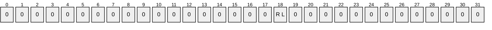

| Value | Description |
| --- | --- |
| RL TASK_FLAG_RUN_ONLY_IF_LOGGED_ON | When set, the task MUST run only if the user specified is logged on interactively. |

Undefined bits MUST be set to 0 when sent and ignored upon receipt.

**Return Values:** For more information about return codes, see section [2.3.14](#Section_2.3.14) or Win32 Error Codes in [MS-ERREF](../MS-ERREF/MS-ERREF.md) section 2.1.<52>

Upon receipt of the SASetAccountInformation call, the server MUST:

- Return E_ACCESSDENIED if the caller does not have write access to the folder that represents the .JOB [**task store**](#gt_task-store).
- Return E_INVALIDARG if the *pwszAccount* parameter is NULL.
**Note** When the server is passing NULL as a value for this parameter, behavior can change based on the RPC Runtime Check. See RPC Runtime Check Notes (section [3.3](#Section_3.3)).

- Return the value 0x80070002, the HRESULT form of the Win32 error ERROR_FILE_NOT_FOUND, if the *pwszJobName* parameter is not a file name that is present in the .JOB task store.
- Return E_ACCESSDENIED if the caller does not have write access to the file in the .JOB task store.
- Return E_ACCESSDENIED if the caller does not have administrative privileges on the server.
- Return the value 0x8007000D, which is the HRESULT form of the Win32 error ERROR_INVALID_DATA, if the .JOB file is not syntactically valid (see [.JOB File Format (section 2.4)](#Section_2.4)).<53><54>
- If the *pwszAccount* parameter is not an empty string and *pwszPassword* is not NULL:
- Return E_ACCESSDENIED if the *pwszPassword* parameter is not valid for *pwszAccount*.<55>
- Update the account name store by adding a mapping from *pwszJobName* to *pwszAccount*.
- Update the credential store by adding a mapping from *pwszAccount* to *pwszPassword* if a mapping for *pwszAccount* is not already present.
- If the *pwszAccount* parameter is not an empty string and *pwszPassword* is NULL:
- Return SCHED_E_UNSUPPORTED_ACCOUNT_OPTION if the TASK_FLAG_RUN_ONLY_IF_LOGGED_ON bit in *dwJobFlags* is not set.<56>
- Update the account name store by adding a mapping from *pwszJobName* to *pwszAccount*.
- Finally, if the *pwszAccount* parameter is the empty string:
- Return E_ACCESSDENIED if the caller does not have administrative privileges on the server.<57>
- If *pwszPassword* is not NULL, return E_ACCESSDENIED.<58>
- If *pwszPassword* is NULL, update the account name store by adding a mapping from *pwszJobName* to "LocalSystem" and return S_OK.
- Return SCHED_E_INVALIDVALUE if the **MinutesInterval** field is set to a value larger than the **MinutesDuration** field.<59>
- Return SCHED_E_UNEXPECTEDNODE if [Trigger type](#Section_2.4.2.11.1) is not as specified in 2.4.2.11.1.<60>
- Return S_OK on success.
If any errors are raised during the processing, they are returned. For more information about return codes, see section 2.3.14 and Win32 Error Codes in [MS-ERREF] section 2.1.

<a id="Section_3.2.5.3.5"></a>
##### 3.2.5.3.5 SASetNSAccountInformation (Opnum 1)

The SASetNSAccountInformation method MUST configure the [**credentials**](#gt_credential) under which all [ATSvc](#Section_3.1.4.1) tasks run.

HRESULT SASetNSAccountInformation(

[in, string, unique] SASEC_HANDLE Handle,

[in, string, unique] const wchar_t* pwszAccount,

[in, string, unique] const wchar_t* pwszPassword

);

**Handle:** Pointer to a [**Unicode string**](#gt_unicode-string) that MUST specify the server. The client MUST map this string to an [**RPC**](#gt_remote-procedure-call-rpc) binding handle. The server MUST ignore this parameter. For more details, see [[C706]](https://go.microsoft.com/fwlink/?LinkId=89824) sections 4.3.5 and 5.1.5.2.

**pwszAccount:** MUST be a pointer to a string that specifies the account name.

**pwszPassword:** MUST be a pointer to a string that specifies the password for the named account. See section [5.1](#Section_5.1) for security considerations.

Upon receipt of the SASetNSAccountInformation call, the server MUST:

- Return E_ACCESSDENIED if the caller does not have administrative privileges on the server.
- If the *pwszAccount* parameter is NULL, store "LocalSystem" in the ATSvc account name conceptual data structure and return S_OK.<61>
- Return the value 0x8007000D, which is the HRESULT form of the Win32 error ERROR_INVALID_DATA, if the *pwszPassword* parameter is longer than 127 characters.
- Return the value 0x8007000D, which is the HRESULT form of the Win32 error ERROR_INVALID_DATA, if the *pwszPassword* parameter is NULL.<62>
- Return E_ACCESSDENIED if the *pwszPassword* parameter is not valid for *pwszAccount*.<63>
- Store the *pwszAccount* string in the ATSvc account name and add an entry to the credential store mapping from *pwszAccount* to *pwszPassword*.
If any errors are raised during the processing, they are returned. For more information about return codes, see section [2.3.14](#Section_2.3.14) and Win32 Error Codes in [MS-ERREF](../MS-ERREF/MS-ERREF.md) section 2.1.

<a id="Section_3.2.5.3.6"></a>
##### 3.2.5.3.6 SAGetNSAccountInformation (Opnum 2)

The SAGetNSAccountInformation method MUST return the [ATSvc](#Section_3.1.4.1) account name.

HRESULT SAGetNSAccountInformation(

[in, string, unique] SASEC_HANDLE Handle,

[in, range(0,MAX_BUFFER_SIZE)] DWORD ccBufferSize,

[in, out, size_is(ccBufferSize)]

wchar_t wszBuffer[]

);

**Handle:** Pointer to a [**Unicode string**](#gt_unicode-string) that MUST specify the server. The client MUST map this string to an [**RPC**](#gt_remote-procedure-call-rpc) [**Binding handle**](#gt_binding-handle). The server MUST ignore this parameter. For more details, see [[C706]](https://go.microsoft.com/fwlink/?LinkId=89824) sections 4.3.5 and 5.1.5.2.

**ccBufferSize:** MUST contain the number of characters in the array supplied by the client and filled by the server. This value MUST be the size of the *wszBuffer* parameter. MAX_BUFFER_SIZE is equal to 273. For more information on MAX_BUFFER_SIZE, see the [SaSec](#Section_3.2.5.3) interface IDL (section [6.2](#Section_6.2)).

**wszBuffer:** Upon input, MUST be an empty array of size equal to the *ccBufferSize* parameter. The client SHOULD initialize the array to contain zeroes. Upon return, the array MUST contain the ATSvc account name.

**Return Values:** For more information about return codes, see section [2.3.14](#Section_2.3.14), or Win32 Error Codes in [MS-ERREF](../MS-ERREF/MS-ERREF.md) section 2.

Upon receipt of the SAGetNSAccountInformation call, the server MUST:

- Return E_INVALIDARG if the *wszBuffer* parameter is NULL.
**Note** When passing NULL as a value for this parameter, behavior can change based upon the RPC Runtime Check. See RPC Runtime Check Notes (section [3.3](#Section_3.3)).

- Return E_ACCESSDENIED if the caller does not have administrative privileges on the server.
- If the ATSvc account name is "LocalSystem", set *wszBuffer* to be the empty string and return S_FALSE.
- Return the value 0x0000007A, which is the HRESULT form of the Win32 error ERROR_INSUFFICIENT_BUFFER, if the ATSvc account name (including the terminating zero character) is larger than *ccBufferSize*.
- Copy the null-terminated ATSvc account name to *wszBuffer* and return S_OK.
If any errors are raised during the processing, they are returned. For more information about return codes, see section 2.3.14 and Win32 Error Codes in [MS-ERREF] section 2.1.

<a id="Section_3.2.5.3.7"></a>
##### 3.2.5.3.7 SAGetAccountInformation (Opnum 3)

The SAGetAccountInformation method MUST retrieve the account name for a specified task.

HRESULT SAGetAccountInformation(

[in, string, unique] SASEC_HANDLE Handle,

[in, string] const wchar_t* pwszJobName,

[in, range(0,MAX_BUFFER_SIZE)] DWORD ccBufferSize,

[in, out, size_is(ccBufferSize)]

wchar_t wszBuffer[]

);

**Handle:** Pointer to a [**Unicode string**](#gt_unicode-string) that MUST specify the server. The client MUST map this string to an [**RPC**](#gt_remote-procedure-call-rpc) binding handle. The server MUST ignore this parameter. For more details, see [[C706]](https://go.microsoft.com/fwlink/?LinkId=89824) sections 4.3.5 and 5.1.5.2.

**pwszJobName:** MUST be a pointer to a string that specifies a task name, such as "MyJob.job".

**ccBufferSize:** MUST contain the number of characters in the array supplied by the client and filled by the server. This value MUST be the size of the *wszBuffer* parameter. MAX_BUFFER_SIZE is equal to 273. For more information on MAX_BUFFER_SIZE, see the [SaSec](#Section_3.2.5.3) interface IDL (section [6.2](#Section_6.2)).

**wszBuffer:** Upon input, MUST be an empty array of size equal to the *ccBufferSize* parameter. The client SHOULD initialize the array to contain zeroes. Upon return, the array MUST contain the name of the account to be used as the context the task runs under.

**Return Values:** For more information on return codes, see section [2.3.14](#Section_2.3.14), or Win32 Error Codes in [MS-ERREF](../MS-ERREF/MS-ERREF.md) section 2.1.

Upon receipt of the SAGetAccountInformation call, the server MUST:

- Return E_ACCESSDENIED if the caller does not have read access to the .JOB [**task store**](#gt_task-store).
- Return SCHED_E_CANNOT_OPEN_TASK if the *pwszJobName* parameter is not a file name present in the .JOB task store.
- Return E_ACCESSDENIED if the caller does not have read access to the task file.
- Return SCHED_E_ACCOUNT_INFORMATION_NOT_SET if there is no mapping in the account name store for the task name; otherwise, get the account name from the mapping.
- Return E_INVALIDARG if the *wszBuffer* parameter is NULL.
**Note** When passing NULL as a value for this parameter, behavior can change based on the RPC Runtime Check. See RPC Runtime Check Notes (section [3.3](#Section_3.3)).

- If the account name is "LocalSystem", set *wszBuffer* to be the empty string and return S_OK.
- Return the value 0x8007007A, which is the HRESULT form of the Win32 error ERROR_INSUFFICIENT_BUFFER, if the account name (including the terminating zero character) is larger than *ccBufferSize*.
- Copy the null-terminated account name to *wszBuffer* and return S_OK.
If any errors are raised during the processing, they are returned. For more information about return codes, see section 2.3.14 and Win32 Error Codes in [MS-ERREF] section 2.1.

<a id="Section_3.2.5.4"></a>
#### 3.2.5.4 ITaskSchedulerService Message Processing Events and Sequencing Rules

The ITaskSchedulerService [**RPC**](#gt_remote-procedure-call-rpc) interface provides methods to control scheduled tasks using [**XML**](#gt_xml) task definitions.<64>

If the server implements the ITaskSchedulerService interface, it MUST implement the methods as specified in the following table.

Methods in RPC Opnum Order

| Method | Description |
| --- | --- |
| [SchRpcHighestVersion](#Section_3.2.5.4.1) | The SchRpcHighestVersion method returns the highest version of the Task Scheduler Remoting Protocol supported by the server. Opnum: 0 |
| [SchRpcRegisterTask](#Section_3.2.5.4.2) | The SchRpcRegisterTask method registers a task with the server. Opnum: 1 |
| [SchRpcRetrieveTask](#Section_3.2.5.4.3) | The SchRpcRetrieveTask method returns a task definition. Opnum: 2 |
| [SchRpcCreateFolder](#Section_3.2.5.4.4) | The SchRpcCreateFolder method creates a new folder. Opnum: 3 |
| [SchRpcSetSecurity](#Section_3.2.5.4.5) | The SchRpcSetSecurity method sets a [**security descriptor**](#gt_security-descriptor) on a task or folder. Opnum: 4 |
| [SchRpcGetSecurity](#Section_3.2.5.4.6) | The SchRpcGetSecurity method gets the security descriptor associated with a task or folder. Opnum: 5 |
| [SchRpcEnumFolders](#Section_3.2.5.4.7) | The SchRpcEnumFolders method retrieves a list of folders on the server. Opnum: 6 |
| [SchRpcEnumTasks](#Section_3.2.5.4.8) | The SchRpcEnumTasks method returns the list of tasks in a specific folder. Opnum: 7 |
| [SchRpcEnumInstances](#Section_3.2.5.4.9) | The SchRpcEnumInstances method returns a list of instances of a specified task that are currently running. Opnum: 8 |
| [SchRpcGetInstanceInfo](#Section_3.2.5.4.10) | The SchRpcGetInstanceInfo method gets information about an instance of a running task. Opnum: 9 |
| [SchRpcStopInstance](#Section_3.2.5.4.11) | The SchRpcStopInstance method stops a specified instance of a task. Opnum: 10 |
| [SchRpcStop](#Section_3.2.5.4.12) | The SchRpcStop method stops all currently running instances of a task specified by a path. Opnum: 11 |
| [SchRpcRun](#Section_3.2.5.4.13) | The SchRpcRun method runs a task specified by a path. Opnum: 12 |
| [SchRpcDelete](#Section_3.2.5.4.14) | The SchRpcDelete method deletes a task or folder in the [**task store**](#gt_task-store). Opnum: 13 |
| [SchRpcRename](#Section_3.2.5.4.15) | The SchRpcRename method is unused. Opnum: 14 |
| [SchRpcScheduledRuntimes](#Section_3.2.5.4.16) | The SchRpcScheduledRuntimes method returns scheduled run times. Opnum: 15 |
| [SchRpcGetLastRunInfo](#Section_3.2.5.4.17) | The SchRpcGetLastRunInfo method returns information about the task's last run. Opnum: 16 |
| [SchRpcGetTaskInfo](#Section_3.2.5.4.18) | The SchRpcGetTaskInfo method returns information about a specified task. Opnum: 17 |
| [SchRpcGetNumberOfMissedRuns](#Section_3.2.5.4.19) | The SchRpcGetNumberOfMissedRuns method returns the number of times a task was scheduled to run but did not due to the server being unavailable (for example, powered off). Opnum: 18 |
| [SchRpcEnableTask](#Section_3.2.5.4.20) | The SchRpcEnableTask method enables or disables a task. Opnum: 19 |

<a id="Section_3.2.5.4.1"></a>
##### 3.2.5.4.1 SchRpcHighestVersion (Opnum 0)

The SchRpcHighestVersion method MUST return the highest version of the Task Scheduler Remoting Protocol that is supported by the server.<65>

HRESULT SchRpcHighestVersion(

[out] DWORD* pVersion

);

**pVersion:** The server MUST return the highest version of the Task Scheduler Remoting Protocol that is supported by the server. This version MUST be in the format 0xMMMMmmmm, where 'M' stands for the major version hex digits and 'm' stands for the minor version hex digits. *pVersion* SHOULD be set to 0x00010002 or 0x00010003.

| Value | Meaning |
| --- | --- |
| 0x00010002 | Version 1.2 of the protocol is in use. |
| 0x00010003 | Version 1.3 of the protocol is in use. |
| 0x00010004 | Version 1.4 of the protocol is in use. |

**Return Values:** For more information on return codes, see section [2.3.14](#Section_2.3.14), or Win32 Error Codes in [MS-ERREF](../MS-ERREF/MS-ERREF.md) section 2.1.

Upon receipt of the SchRpcHighestVersion call, the server MUST return the highest version of the Task Scheduler Remoting Protocol that is supported by the server in the *pVersion* parameter.

<a id="Section_3.2.5.4.2"></a>
##### 3.2.5.4.2 SchRpcRegisterTask (Opnum 1)

The SchRpcRegisterTask method MUST register a task with the server.

HRESULT SchRpcRegisterTask(

[in, string, unique] const wchar_t* path,

[in, string] const wchar_t* xml,

[in] DWORD flags,

[in, string, unique] const wchar_t* sddl,

[in] DWORD logonType,

[in] DWORD cCreds,

[in, size_is(cCreds), unique] const TASK_USER_CRED* pCreds,

[out, string] wchar_t** pActualPath,

[out] PTASK_XML_ERROR_INFO* pErrorInfo

);

**path:** MUST contain the full path associated (or to be associated) with a task as specified in section [2.3.11](#Section_2.3.11). A NULL path indicates that the server SHOULD either take the path from the task definition or generate a path itself.

**xml:** MUST contain the task definition in [**XML**](#gt_xml) format as specified in section [2.5](#Section_2.5).

**flags:** The flags field MUST contain individual bit flags that MUST have one or more of the following values.

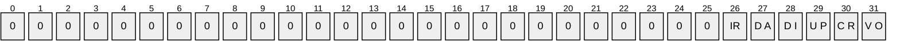

| Value | Description |
| --- | --- |
| VO TASK_VALIDATE_ONLY | If set to 1, the server MUST only validate the task definition and not actually register the task. |
| CR TASK_CREATE | If set to 1, the server MUST register the task if the task does not already exist. |
| UP TASK_UPDATE | If set to 1, the server MUST update the task if the task already exists. |
| DI TASK_DISABLE | If set to 1, the server MUST disable the task. |
| DA TASK_DONT_ADD_PRINCIPAL_ACE | If set to 1, the server MUST NOT add an 'Allow' [**access control entry (ACE)**](#gt_access-control-entry-ace) for the task [**principal**](#gt_principal) to the task's [**security descriptor**](#gt_security-descriptor). |
| IR TASK_IGNORE_REGISTRATION_TRIGGERS | If set to 1, the server MUST NOT start the task after registering it, even if it has registration triggers. |

Undefined bits. MUST be set to zero when sent and MUST be ignored on receipt.<66>

**sddl:** MUST be a security descriptor in [**SDDL**](#gt_security-descriptor-definition-language-sddl) format as specified in [MS-DTYP](../MS-DTYP/MS-DTYP.md). A NULL value MUST specify that the task inherits its security descriptor from its folder, when creating a new task, or that the task's security descriptor does not change when updating an existing task.

**logonType:** MUST contain a [TASK_LOGON_TYPE](#Section_2.3.9) value (section 2.3.9). The server MUST reject invalid values. The specified *logonType* SHOULD correspond to the type of principal used in the **xml task definition**, or supplied in *pCreds*.

**cCreds:** MUST contain the number of [**credentials**](#gt_credential) passed in *pCreds* parameter. Client MUST set to 0 or 1, and the server MUST return an error if not 0 or 1.

**pCreds:** MUST be an array of credentials for the task with *cCreds* entries. *pCreds* MUST be NULL if *cCreds* is 0. See section [2.3.8](#Section_2.3.8) for details of the TASK_USER_CRED structure.

**pActualPath:** If this parameter is non-NULL, the server MUST return the task's actual path.

**pErrorInfo:** If this parameter is non-NULL and the XML task definition is invalid, the server MUST return additional error information.

**Return Values:** For more information on return codes, see section [2.3.14](#Section_2.3.14), or Win32 Error Codes in section 2 of [MS-ERREF](../MS-ERREF/MS-ERREF.md).

Upon receipt of the SchRpcRegisterTask call, the server MUST:

- Return E_INVALIDARG (0x80070057) if any of the parameters contain invalid values.
- Return E_ACCESSDENIED if the caller does not have read access to the path in the XML [**task store**](#gt_task-store) or if the path does not exist.
- Parse the task definition contained in the *xml* parameter (section [2.4.2.11](#Section_2.4.2.11)).
- If any errors are found and the *pErrorInfo* parameter is non-NULL, MUST return extended error information in a [TASK_XML_ERROR_INFO](#Section_2.4) structure (section 2.4) in the *pErrorInfo* parameter.
- Finally, the server MUST return one of the following error codes (section 2.3.14):
- SCHED_E_UNEXPECTEDNODE
- SCHED_E_NAMESPACE
- SCHED_E_INVALIDVALUE
- SCHED_E_MISSINGNODE
- SCHED_E_TOO_MANY_NODES
- SCHED_E_MALFORMEDXML
- If the TASK_VALIDATE_ONLY flag is set in the *flags* parameter, return S_OK.
- Take one of the following actions, depending upon the supplied task *xml*:
- Registration (section [2.5.2](#Section_2.5.2)):
- Version: The server MUST return an error if the task definition uses a feature that is not compatible with the version (see section 3.2.5.4.2).
- URI: If not specified, the server saves the task in the task store's root folder.
- Security Descriptor: If present apply security description to the task, otherwise secure the task as follows: Task creator/owner has full control on the task configuration and Administrators have read and delete permissions.
- Triggers (section [2.5.3](#Section_2.5.3)):
- For each trigger, independently of its type (section [2.5.3.1](#Section_2.5.3.1)), apply:
- StartBoundary: If present, the server MUST NOT start the task before this time/date value.
- EndBoundary: If present, the server MUST NOT start the task after this time/date value.
- Enabled: If the field is not present or the value is TRUE, the trigger is enabled and the server MUST start the task when this trigger occurs. If FALSE, the trigger is disabled and the server MUST ignore the trigger when determining whether to run the task.
- ExecutionTimeLimit: If specified, the server MUST limit the task's execution time—when triggered by this particular trigger—to the specified duration. If not present, the server MUST limit the task's execution time to 72 hours for this particular trigger.
- Interval: If specified, the server MUST start the task at the time specified by the trigger, and then restart the task at the intervals specified by this field, calculated from the trigger start time.
- Duration: If not present, the server MUST use the value of 1 day for Duration.
- StopAtDurationEnd: If the field has the value TRUE, the server MUST stop all running task instances at the end of the Duration.
- BootTrigger (section [2.5.3.2](#Section_2.5.3.2)): If present, the BootTrigger specifies that the server MUST start the task at operating system startup, after the ATSvc server initializes.
- BootTrigger's Delay: If specified, the server MUST delay starting the task after boot (ATSvc start-up) by the delay value. If not present, the server MUST NOT delay starting the task.
- RegistrationTrigger (section [2.5.3.3](#Section_2.5.3.3)): If present, the RegistrationTrigger specifies that the server MUST start the task immediately when it is registered on the system.
- RegistrationTrigger's Delay: If present, server MUST delay starting the task after [**task registration**](#gt_5d98b0b1-7545-4aff-b4b3-786ed48911a3) by the delay value. If not present, the server MUST NOT delay starting the task.
- IdleTrigger (section [2.5.3.4](#Section_2.5.3.4)): If specified, the server MUST start the task when the machine becomes idle, as specified in section [3.2.4.2](#Section_3.2.4.2).
- TimeTrigger (section [2.5.3.5](#Section_2.5.3.5)): If present, the TimeTrigger specifies that the server MUST start the task at the specified StartBoundary time.
- TimeTrigger's RandomDelay: The server MUST choose a delay value randomly and delay starting the task after the time trigger fires by the random delay value. The random delay value MUST be chosen from the interval from zero to RandomDelay, inclusive. If not present, the server MUST NOT delay starting the task.
- EventTrigger (section [2.5.3.6](#Section_2.5.3.6)): If present, the EventTrigger specifies that the server MUST start the task upon occurrence of an event matching an event subscription query, as specified in [MS-EVEN6](../MS-EVEN6/MS-EVEN6.md) section 2.2.14, or on the occurrence of a number of events of the same type (same EventId) in a given period of time. The server MUST accept queries for multiple event types, up to and including an entire event channel ([MS-EVEN6] section 3.1.1.4).
- EventTrigger's NumberOfIOccurences: If EventTrigger is present but if the NumberOfOccurences field is not present, the server MUST fire the trigger after the first occurrence.
- EventTrigger's Delay: If specified, the server MUST delay starting the task after event occurrence by the delay value. If not present, the server MUST NOT delay starting the task.
- NumberOfOccurrences: If specified, the server MUST fire the trigger after NumberOfOccurrences occurrences of the MatchingElement query (subject to the PeriodOfOccurrence field; see the following field). If this field is not present, the server MUST fire the trigger after the first occurrence.
- PeriodOfOccurences: If specified, the server MUST NOT count occurrences of the MatchingElement query that occurred prior to the last PeriodOfOccurrence time period.
- MatchingElement: If present, the server MUST count occurrences of events that match the Subscription query and contain this field name. For more information, see [MS-EVEN6] section 3.1.4.31.
- ValueQueries: If present, when an event matches the subscription and fires the trigger, the server MUST retrieve the element values from the event for task action parameterization as specified in section [2.5.9](#Section_2.5.9). If not present, the server MUST NOT perform parameterization for this task trigger.
- LogonTrigger (section [2.5.3.7](#Section_2.5.3.7)): If present, the LogonTrigger specifies that the server MUST start the task at user logon.
- LogonTrigger's UserId filed: If LogonTrigger is present and UserId is not present then server MUST start the task for any user at logon.
- LogonTrigger's Delay: If present, the server MUST delay starting the task after Logon by the delay value. If not present, the server MUST NOT delay starting the task.
- SessionStateChangeTrigger (section [2.5.3.8](#Section_2.5.3.8)): If present, this trigger specifies that the server MUST start the task when one of the following system changes occurs: ConsoleConnect, ConsoleDisconnect, RemoteConnect, RemoteDisconnect, SessionLock, SessionUnlock.<67>
- SessionStateChangeTrigger's UserId: If UserId is not present then server MUST start the task for any user at session change event.
- SessionStateChangeTrigger's Delay: The server MUST delay starting the task after the SessionStateChangeTrigger by the delay value. If not present, the server MUST NOT delay starting the task.<68>
- CalendarTrigger (section [2.5.3.9](#Section_2.5.3.9)): If present, the CalendarTrigger specifies that the server MUST start the task on the specified days.
- ScheduleByDay: If specified, server MUST run the task every day or every *X* number of days as specified by the DaysInterval subfield.
- CalendarTrigger's ScheduleByDay DaysInterval: If CalendarTrigger ScheduleByDay is specified but DaysInterval is not present, the server MUST run the task every day.
- ScheduleByWeek: If present, this field specifies that the server MUST run the task every week or every *X* number of weeks as specified by the WeeksInterval subfield, or on specific days of the week as specified by the DaysOfWeek subfield.
- CalendarTrigger's ScheduleByWeek WeeksInterval: If CalendarTrigger ScheduleByWeek is specified but WeeksInterval is not present, the server MUST run the task every week.
- CalendarTrigger's ScheduleByWeek DaysOfWeek: If CalendarTrigger ScheduleByWeek is specified but the DaysOfWeek field is not present or none of the seven subfields are present, the server MUST return SCHED_E_MISSINGNODE (0x80041319).
- ScheduleByMonth: If present, this field specifies that the server MUST run the task on the days specified by the DaysOfMonth subfield, on specific months as specified by the Months subfield.
- CalendarTrigger's ScheduleByMonth DaysOfMonth: If CalendarTrigger ScheduleByMonth is specified but the DaysOfMonth field is not present, or no Day subfields are present, the server MUST return SCHED_E_MISSINGNODE (0x80041319).
- CalendarTrigger's ScheduleByMonth Months: If CalendarTrigger ScheduleByMonth is specified but the Months field is not present, the server MUST run the task every month. If CalendarTrigger ScheduleByMonth is specified and the Months field is present but none of the twelve subfields are present, the server MUST return SCHED_E_MISSINGNODE (0x80041319).
- ScheduleByMonthDayOfWeek: If present, this field specifies that the server MUST run the task on the weeks specified by the Weeks subfield, on specific days of the week as specified by the DaysOfWeek subfield, on specific months as specified by the Months subfield.
- CalendarTrigger's ScheduleByMonthDayOfWeek Weeks: If CalendarTrigger ScheduleByMonthDayOfWeek is specified but the Weeks field is not present or no Week subfields are present, the server MUST return SCHED_E_MISSINGNODE (0x80041319).
- CalendarTrigger's ScheduleByMonthDayOfWeek DaysOfWeek: If the CalendarTrigger ScheduleByMonthDayOfWeek is specified but the DaysOfWeek field is not present or none of the seven subfields are present, the server MUST return SCHED_E_MISSINGNODE (0x80041319).
- CalendarTrigger's ScheduleByMonthDayOfWeek Months: If the CalendarTrigger ScheduleByMonthDayOfWeek is specified but the Months field is not present, the server MUST run the task every month. If CalendarTrigger ScheduleByMonthDayOfWeek is specified and the Months field is present but none of the twelve subfields are present, the server MUST return SCHED_E_MISSINGNODE (0x80041319).
- Settings (section [2.5.4](#Section_2.5.4)): The server MUST check machine conditions (running on batteries, network available, idle) according to the settings (DisallowStartIfOnBatteries, RunOnNetworkAvailable, RunOnlyIfIdle) once the trigger occurs to determine if the task is to be started. The task will run only if the conditions at the time the trigger fires match the settings defined.
- MultipleInstancesPolicy conditions:
- Parallel: Specifies that the server MUST start multiple instances of the task in parallel for each occurring trigger.
- Queue: If present, specifies that execution instances related to this trigger MUST start serially, on the completion of the previous instance.
- IgnoreNew: If present, specifies that the server MUST ignore all additional triggers occurring during the execution of an instance.
- StopExisting: If present, specifies that the server MUST stop the running instance and start a new instance on any additional trigger occurrence. If not present, the server MUST use the value IgnoreNew for MultipleInstancesPolicy.
- DisallowStartIfOnBatteries: The server MUST NOT start the task if the computer is running on batteries, unless this field is present and set to FALSE.
- StopIfGoingOnBatteries: The server MUST stop the task if the computer switches to battery or Uninterrupted Power Supply (UPS) power, unless this field is present and set to FALSE.
- AllowHardTerminate: The server MUST forcibly stop the task if it exceeds its absolute execution time limit, unless this field is present and set to FALSE.
- StartWhenAvailable: If present and set to TRUE, this field specifies that the server MUST start the task when the computer becomes available if a scheduled run time was missed.
- RunOnNetworkAvailable: If present and set to TRUE, this field specifies that the server MUST start the task only if a network connection is available.
- NetworkSettings: If present, the server MUST ignore the NetworkSettings field unless the RunOnNetworkAvailable field (section [2.5.4.8](#Section_2.5.4.8)) is present and set to TRUE.<69>
- NetworkSetting's Name or Id: The server MUST start the task only if a network connection to the specified network is available.
- WakeToRun: If present and set to TRUE, this field specifies that the server MUST wake from power-suspended mode (standby or hibernate) to run the task.
- Enabled: If present and set to FALSE, this field specifies that the server MUST NOT run the task.Hidden: If present and set to TRUE, this field specifies that the server SHOULD NOT show the task in an administrative console or graphic user interface.
- DeleteExpiredTaskAfter: The server MUST delete the task (after this delay) when it has no future scheduled run times.
- IdleSettings: If present, this field specifies that the server MUST run the task only when the machine has been idle for the value of the Duration subfield. The server MUST ignore the IdleSettings field, unless the RunOnlyIfIdle field, which MUST be specified as in section [2.5.4.18](#Section_2.5.4.18), is present and has the value TRUE.
- IdleSettings Duration: The server MUST delay starting the task until the specified Duration has elapsed from the time that the machine became idle.
- MaintenanceSettings: If present, this field specifies that the server MUST run the task during the regular maintenance periods with the periodicity defined by the Period field. The server MUST reject tasks with the MaintenanceSettings field unless the UseUnifiedSchedulingEngine field (as specified in section [2.5.4.19](#Section_2.5.4.19)) is present and has the value TRUE.
- MaintenanceSettings Period: The server MUST run the task during the regular machine maintenance periods only if the task previously run finished running before the beginning of the preceding Period time ago.
- MaintenanceSettings Deadline: If present, and the Period time was missed, the server MUST run the task during machine idle.
- MaintenanceSettings Exclusive: If present and set to TRUE, the server MUST run the task independently of other tasks that specify MaintenanceSettings.
- ExecutionTimeLimit: The server MUST attempt to gracefully stop the task after its execution runtime exceeds this maximum time allowed. The server MUST forcibly stop the task in accordance with the AllowHardTerminate setting if its execution runtime exceeds this maximum time allowed.
- Priority: If not present, the server MUST use the value 7 for Priority.
- RunOnlyIfIdle: If present and set to TRUE, this field specifies that the server MUST start the task only if the machine is idle according to the IdleSettings field defined in section [2.5.4.14](#Section_2.5.4.14).
- Principal (section [2.5.6](#Section_2.5.6)): specifies the security context of the user on whose behalf the task will run. One of UserId or GroupId is mandatory.
- UserId: The server MUST use the account name as the principal for running the task.
- GroupId: the server MUST run the task for each and every user in the security group who is logged on at the time.
- LogonType of S4U: the server MUST run the task non-interactively. The server MUST NOT save a password. At task runtime, the server MUST retrieve a restricted token from Active Directory based on the account name.
- LogonType of Password: the server MUST run the task non-interactively. The server MUST use the password specified in the TASK_USER_CRED (section 2.3.8) structure for running the task.
- LogonType of InteractiveToken: the server MUST run the task interactively in the currently logged-on user credentials. The server MUST NOT save a password and SHOULD NOT require a password.
- LogonType of InteractiveTokenOrPassword: the server MUST run the task interactively if the user is logged on and non-interactively if the user is logged off.
- LogonType: if not present, the server MUST use the value InteractiveToken for LogonType.
- RunLevel's LeastPrivilege: the server MUST run the task with least privileges allowed for the user.
- RunLevel's HighestAvailable: the server MUST run the task with highest privileges allowed for the user.
- RunLevel: if not present, the server MUST use the value LeastPrivilege.
- Actions (section [2.5.7](#Section_2.5.7)): The server MUST support up to 32 actions. The server MUST execute multiple actions sequentially, in the order specified in the Actions field.
- Exec Action's Arguments: If specified, the server MUST pass the arguments to the Command executable. If not present, the server MUST NOT pass arguments to the Command executable.
- Exec Action's WorkingDirectory: The server MUST start the executable with its working directory set to the specified folder. If not present, the server MUST start the executable in the task store folder.
- ComHandler Action's ClassId: If specified, the server MUST map the GUID value to the custom handler's COM class.
- ComHandler Action's Data: If specified, the server SHOULD NOT parse the XML fragment. The server MUST pass the XML fragment to the custom handler.
- Email Action: If present, this field MUST contain the specification of an email action and the server MUST send email through a [**Simple Mail Transfer Protocol (SMTP)**](#gt_simple-mail-transfer-protocol-smtp) server. See [[RFC788]](https://go.microsoft.com/fwlink/?LinkId=91145).
- Email Action's Subject: If present, the server MUST send the email with the specified Subject.
- Email Action's To: If present, the server MUST send the email to the specified addresses.
- Email Action's CC: If present, the server MUST send the email to all addresses specified.
- Email Action's BCC: If present, the server MUST send the email to all specified addresses and MUST do so using a blind copy action.
- Email Action's ReplyTo: If present, the server MUST send the email with the specified ReplyTo address.
- Email Action's From: If Email Action is specified, then this field MUST be present and the server MUST send the email with the specified From address.
- Email Action's Body: If present, the server MUST send the email with the specified email body text.
- ShowMessage Action: If present, specifies that the server MUST display a message box on each session where this user is logged on the local machine.
- ShowMessage Action's Title: If specified, the server MUST use the string for the caption of the message box.
- ShowMessage Action's Body: If specified, the server MUST use the string for the contents of the message box.
- Determine the logon type to be used depending upon *logonType* supplied:
- If TASK_LOGON_NONE is specified, the server MUST determine the logon type from XML, or by using the TASK_LOGON_INTERACTIVE_TOKEN if not specified in XML.
- If TASK_LOGON_PASSWORD is specified, the server MUST run the task with the user's logon and password supplied. The server MUST run the task non-interactively.
- If TASK_LOGON_S4U is specified, the server MUST run the task with user's Service for User (S4U), as specified in [MS-SFU](../MS-SFU/MS-SFU.md). The server MUST run the task non-interactively.
- If TASK_LOGON_INTERACTIVE_TOKEN is specified, the server MUST run the task in the user's interactive logon session. The server MUST run the task interactively.
- If TASK_LOGON_GROUP is specified, then the server MUST run the task in the user's interactive logon session for any member of the security group. The server MUST run the task interactively.
- If TASK_LOGON_SERVICE_ACCOUNT is specified, then the server MUST run the task as local system, local service or network service. The server MUST run the task noninteractively.
- If TASK_LOGON_INTERACTIVE_TOKEN_OR_PASSWORD is specified, then the server MUST run in the user's interactive logon session. If the user is not logged on then the server MUST run the task using the user's logon and password noninteractively.
- Determine the principal to be used:
- A user ID specified in the *pCreds* parameter MUST be used if present.
- A user ID specified in the *UserID* element of the xmlTaskDefinition (section 2.5.6) MUST be used if present.
- A group ID is specified in the *GroupID* element of the xmlTaskDefinition (section 2.5.6) MUST be used if present.
- If both *UserID* and *GroupID* are present then server MUST return SCHED_E_UNEXPECTEDNODE, with the "node" field of the ErrorInfo structure specifying the "GroupId" as unexpected node.
- If none of the above is present, the user ID of the caller MUST be used.
- Update the principal node of the XML task definition (section 2.5.6) to reflect the principal just determined and the *logonType* parameter.
- The server MUST return an error if any of the undefined bits in the FLAGS field of the pCreds parameter are not set to 0.
- pCreds parameter Flags field's D credFlagDefault bit: If set to 1, the server MUST use these credentials only if no other credentials are provided. If set to 0, the server MUST use these credentials instead of the credentials specified in the task configuration.
- Return ERROR_LOGON_FAILURE if the call was made using an unknown user name or bad password.
- Return E_ACCESSDENIED if the caller does not have administrative privileges on the server and the task has one of the following triggers:
- Boot trigger (section 2.5.3.2).
- Logon trigger for "everyone" or any user other than the caller (section 2.5.3.7).
- Session state change [**trigger**](#gt_trigger) for "everyone" or any user other than the caller (section 2.5.3.8).
- Return E_ACCESSDENIED if the task priority is 1 and the caller does not have administrative privileges on the server.
- Perform security validation as specified in section [3.2.5.1.1](#Section_3.2.5.1.1).
- Return E_ACCESSDENIED if a password is required (section 3.2.5.1.1) but the password provided in the *pCreds* parameter is not valid for the principal chosen.
- Determine the correct path.
- MUST use the *path* parameter if non-NULL.
- Otherwise, if present, MUST use the URI element of the *RegistrationInfo* node of the task definition (section [2.5.1](#Section_2.5.1)).
- Otherwise, MUST generate a [**UUID**](#gt_universally-unique-identifier-uuid) and MUST use the string representation of it surrounded by '{' and '}' characters, as specified in [[C706]](https://go.microsoft.com/fwlink/?LinkId=89824) section A.3.
- If the path determined does not exist in the XML task store and the TASK_UPDATE flag is specified instead of the TASK_CREATE flag in the *flags* parameter, and the *flags* parameter is not 0: the server MUST return the value 0x80070002, the HRESULT form of the Win32 error ERROR_FILE_NOT_FOUND.
- If the following three conditions are all true:
- The path determined does not exist in the XML task store.
- One of the following flags has been specified instead of TASK_CREATE in the *flags* parameter: TASK_DISABLE, TASK_DONT_ADD_PRINCIPAL_ACE, or TASK_IGNORE_REGISTRATION_TRIGGERS.
- The *flags* parameter is not 0.
The server MUST return the value 0x80070057 (the HRESULT form of the Win32 error E_INVALIDARG).

- If the path determined does exist in the XML task store and the TASK_CREATE flag is specified instead of the *TASK_UPDATE* flag in the *flags* parameter: the server MUST return the value 0x800700B7, the HRESULT form of the Win32 error ERROR_ALREADY_EXISTS.
- If the path determined does exist in the XML task store, and TASK_DISABLE, TASK_DONT_ADD_PRINCIPAL_ACE, or TASK_IGNORE_REGISTRATION_TRIGGERS has been specified instead of the TASK_UPDATE flag in the *flags* parameter: the server MUST return the value 0x80070057 (the HRESULT form of the Win32 error E_INVALIDARG).
- Create subfolders in the task store for the path determined using the security descriptor specified in the *sddl* parameter (section [3.2.5.4.4](#Section_3.2.5.4.4)).
- Save the task in the XML task store at the path determined. The server MUST use the security descriptor specified in the *sddl* parameter, and unless the TASK_DONT_ADD_PRINCIPAL_ACE bit is specified in the *flags* parameter also give the principal File Read ("FR") access to the task (as specified in [MS-DTYP] section 2.5.1.1).
- If the XML task definition has the *Version* attribute (section 2.5) with a value of "1.1" or "1.0", the server MUST also save the task in the .JOB task store or the AT task store, respectively.
- If a password is required, the server MUST update its credential store with the principal chosen and the password provided in the *pCreds* parameter.
- The server MUST update its [EventLog](#Section_3.2.4.1) subscriptions (section 3.2.4.1) to match the event triggers (section 2.5.3.6) currently in the XML task store, as specified in [MS-EVEN6] section 2.2.13.
- If this task is to run earlier than the current value of the global timer, reset the global timer.
- If the task has a registration trigger (section 2.5.3.3) and the TASK_IGNORE_REGISTRATION_TRIGGERS bit in the *flags* parameter is not set, start the task (section [3.2.5.1.2](#Section_3.2.5.1.2)).
- If the *pActualPath* parameter is non-NULL, return the path determined in the *pActualPath* parameter.
- Return S_OK.
If any errors are raised during the processing they are returned. For more information on return codes, see section 2.3.14 and Win32 Error Codes in [MS-ERREF] section 2.1.

<a id="Section_3.2.5.4.3"></a>
##### 3.2.5.4.3 SchRpcRetrieveTask (Opnum 2)

The SchRpcRetrieveTask method MUST return a task definition.

HRESULT SchRpcRetrieveTask(

[in, string] const wchar_t* path,

[in, string] const wchar_t* lpcwszLanguagesBuffer,

[in] unsigned long* pulNumLanguages,

[out, string] wchar_t** pXml

);

**path:** MUST contain the full path associated with an existing task as specified in section [2.3.11](#Section_2.3.11).

**lpcwszLanguagesBuffer:** If non-NULL, this parameter MUST contain a list of language names separated by the '\' character. The language names MUST be taken from the "String name" column of the table.

**pulNumLanguages:** The client SHOULD specify the number of language names in *languagesBuffer*. The server MUST ignore this parameter.

**pXml:** MUST contain the task definition in [**XML**](#gt_xml) format, localized using the language names contained in the *languagesBuffer* parameter. For more information about XML localization, see section [2.5.8](#Section_2.5.8).

**Return Values:** For more information on return codes, see section [2.3.14](#Section_2.3.14), or Win32 Error Codes in [MS-ERREF](../MS-ERREF/MS-ERREF.md) section 2.1.

Upon receipt of the SchRpcRetrieveTask call, the server MUST:

- Return E_INVALIDARG if the *path* parameter is the root.
- Return 0x80070003, the HRESULT value of the Win32 error ERROR_PATH_NOT_FOUND, if the path does not exist in XML task store.
- Return the HRESULT value of the Win32 error ERROR_FILE_NOT_FOUND if the task does not exist in XML task store.
- Return E_ACCESSDENIED if the caller does not have read access to the path in the XML [**task store**](#gt_task-store).
- Return 0x8007007B, the HRESULT value of the Win32 error ERROR_INVALID_NAME, if the specified path is not in the format specified in section 2.3.11.
- Retrieve the task definition from the path in the XML task store. If the *languagesBuffer* parameter is non-NULL, the server MUST replace localizable strings in the task definition according to the language names contained in the *languagesBuffer* parameter, as specified in section 2.5.8. Multiple languages are used in order of preference. If no language can localize the string, the server default is used.
- Return the task definition in the *xmlTaskDefinition* parameter and return S_OK.
If any errors are raised during the processing they are returned. For more information on return codes, see section 2.3.14 and Win32 Error Codes in [MS-ERREF] section 2.1.

<a id="Section_3.2.5.4.4"></a>
##### 3.2.5.4.4 SchRpcCreateFolder (Opnum 3)

The [SchRpcCreateFolder](#Section_3.2.5.4.4) method creates a new folder.

HRESULT SchRpcCreateFolder(

[in, string] const wchar_t* path,

[in, string, unique] const wchar_t* sddl,

[in] DWORD flags

);

**path:** MUST contain the full path to be associated with a folder (section [2.3.11](#Section_2.3.11)).

**sddl:** If non-NULL, MUST be a [**security descriptor**](#gt_security-descriptor) in [**SDDL**](#gt_security-descriptor-definition-language-sddl) format as specified in [MS-DTYP](../MS-DTYP/MS-DTYP.md).

**flags:** Unused, MUST be 0.

**Return Values:** For more information on return codes, see section [2.3.14](#Section_2.3.14), or Win32 Error Codes in [MS-ERREF](../MS-ERREF/MS-ERREF.md) section 2.1.

Upon receipt of the SchRpcCreateFolder call, the server MUST:

- Return E_INVALIDARG if the *path* parameter is the root or if the *flags* parameter is nonzero.
- Return E_ACCESSDENIED if the caller does not have access to create subfolders in the deepest existing folder specified in the *path* parameter.<70>
- Create deeper subfolders in the [**task store**](#gt_task-store) for the path using the security descriptor specified in the *sddl* parameter [MS-DTYP]. If the *sddl* parameter is NULL, use the security descriptor of the deepest existing folder in the *path* parameter.
- Return S_OK.
If any errors are raised during the processing they are returned. For more information on return codes, see section 2.3.14 and Win32 Error Codes in [MS-ERREF] section 2.1.

<a id="Section_3.2.5.4.5"></a>
##### 3.2.5.4.5 SchRpcSetSecurity (Opnum 4)

The SchRpcSetSecurity method MUST set a [**security descriptor**](#gt_security-descriptor) on a task or folder.

HRESULT SchRpcSetSecurity(

[in, string] const wchar_t* path,

[in, string] const wchar_t* sddl,

[in] DWORD flags

);

**path:** MUST contain the full path associated with a task or folder in the format specified in section [2.3.11](#Section_2.3.11)).

**sddl:** MUST be a security descriptor in [**SDDL**](#gt_security-descriptor-definition-language-sddl) format as specified in [MS-DTYP](../MS-DTYP/MS-DTYP.md).

**flags:** The flags field MUST contain individual bit flags that MUST have one or more of the following values:

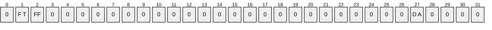

| Value | Description |
| --- | --- |
| DA TASK_DONT_ADD_PRINCIPAL_ACE | If set to 1, the server MUST NOT add the 'Allow' [**ACE**](#gt_access-control-entry-ace) for the task [**principal**](#gt_principal) to the security descriptor. |
| FF SCH_FLAG_FOLDER | If set to 1, the server MUST apply the security descriptor to folders. |
| FT SCH_FLAG_TASK | If set to 1, the server MUST apply the security descriptor to tasks. |

**Return Values:** For more information on return codes, see section [2.3.14](#Section_2.3.14), or Win32 Error Codes in [MS-ERREF](../MS-ERREF/MS-ERREF.md) section 2.1.

Upon receipt of the SchRpcSetSecurity call, the server MUST:

- Return E_INVALIDARG if any bits other than SCH_FLAG_TASK, SCH_FLAG_FOLDER, or TASK_DONT_ADD_PRINCIPAL_ACE are set in the *flags* parameter.
- Return 0x8007007B, the HRESULT form of the Win32 error **ERROR_INVALID_NAME**, if the specified *path* is not in the format specified in section 2.3.11.
- Return the value 0x80070003, the HRESULT form of the Win32 error ERROR_PATH_NOT_FOUND, if the specified *path* does not exist on the server in the [**XML**](#gt_xml) [**task store**](#gt_task-store).
- Return the value 0x80070003, the HRESULT form of the Win32 error ERROR_PATH_NOT_FOUND, if the task specified in *path* does not exist on the server in the XML task store.
- Return E_ACCESSDENIED if caller does not have write access to the task or folder specified in the *path* parameter.
- Return E_INVALIDARG if the *SDDL* parameter is null.
**Note** When passing NULL as a value for parameters, behavior can change based on the RPC Runtime Check. See [RPC Runtime Check Notes (section 3.3)](#Section_3.3).

- Set the security descriptor of the task or folder specified in the *path* parameter in the task store according to the *sddl* parameter.
- Return S_OK.
<a id="Section_3.2.5.4.6"></a>
##### 3.2.5.4.6 SchRpcGetSecurity (Opnum 5)

The SchRpcGetSecurity method MUST get the [**security descriptor**](#gt_security-descriptor) associated with a task or folder.

HRESULT SchRpcGetSecurity(

[in, string] const wchar_t* path,

[in] DWORD securityInformation,

[out, string] wchar_t** sddl

);

**path:** MUST be the full path associated with a task or folder in the format specified in section [2.3.11](#Section_2.3.11)).

**securityInformation:** MUST contain security information in the format of a SECURITY_INFORMATION structure. The SECURITY_INFORMATION structure is defined in [MS-DTYP](../MS-DTYP/MS-DTYP.md) section 2.4.7.

**sddl:** MUST point to a buffer that will receive security information in string format. The string format is specified in [MS-DTYP] section 2.5.1.

**Return Values:** For more information on return codes, see section [2.3.14](#Section_2.3.14), or Win32 Error Codes in [MS-ERREF](../MS-ERREF/MS-ERREF.md) section 2.1.

Upon receipt of the SchRpcGetSecurity call that requires the server to return the security descriptor of the requested object, the server MUST:

- Return E_INVALIDARG if the *sddl* parameter is NULL.
**Note** When passing NULL as a value for parameters, behavior can change based on the RPC Runtime Check. See [RPC Runtime Check Notes (section 3.3)](#Section_3.3).

- Return 0x8007007B, the HRESULT form of the Win32 error **ERROR_INVALID_NAME** if the specified *path* is not in the format specified in section 2.3.11.
- Return the value 0x80070003, the HRESULT form of the Win32 error ERROR_PATH_NOT_FOUND if the specified *path* does not exist on the server in the [**XML**](#gt_xml) [**task store**](#gt_task-store).
- Return the HRESULT form of the Win32 error ERROR_FILE_NOT_FOUND if the task does not exist on the server in the XML task store.
- Return E_ACCESSDENIED if the caller does not have permission to read the task or the security descriptor.
- Retrieve the security information specified in the *securityInformation* parameter from the path in the task store. For more information on the SECURITY_INFORMATION structure, see [MS-DTYP] section 2.4.7.
- Encode security information in [**sddl**](#gt_security-descriptor-definition-language-sddl) and return the string in the *sddl* parameter to the caller.
- Return *S_OK*.
If any errors are raised during the processing, they are returned. For more information about return codes, see section 2.3.14 and Win32 Error Codes in [MS-ERREF] section 2.1.

<a id="Section_3.2.5.4.7"></a>
##### 3.2.5.4.7 SchRpcEnumFolders (Opnum 6)

The SchRpcEnumFolders method MUST retrieve a list of folders on the server.

The server MUST return S_FALSE if there are more folders to enumerate.

Note that if the client requests items 1-10 and then 11-20, the second call MAY return duplicate entries if the folder list has changed in between calls.

HRESULT SchRpcEnumFolders(

[in, string] const wchar_t* path,

[in] DWORD flags,

[in, out] DWORD* pStartIndex,

[in] DWORD cRequested,

[out] DWORD* pcNames,

[out, string, size_is(, *pcNames)]

TASK_NAMES* pNames

);

**path:** MUST contain the full path associated with a folder using the format specified in section [2.3.11](#Section_2.3.11).

**flags:** All bits except **TASK_ENUM_HIDDEN** MUST be set to zero and the server MUST return an error if undefined bits are set to 1. This field has one or more of the following values:

```mermaid
packet-beta
  0-0: "0"
  1-1: "0"
  2-2: "0"
  3-3: "0"
  4-4: "0"
  5-5: "0"
  6-6: "0"
  7-7: "0"
  8-8: "0"
  9-9: "0"
  10-10: "0"
  11-11: "0"
  12-12: "0"
  13-13: "0"
  14-14: "0"
  15-15: "0"
  16-16: "0"
  17-17: "0"
  18-18: "0"
  19-19: "0"
  20-20: "0"
  21-21: "0"
  22-22: "0"
  23-23: "0"
  24-24: "0"
  25-25: "0"
  26-26: "0"
  27-27: "0"
  28-28: "0"
  29-29: "0"
  30-30: "0"
  31-31: "H"
```

Where the bits are defined as:

| Value | Description |
| --- | --- |
| H TASK_ENUM_HIDDEN | If set to 1, the server MUST include hidden tasks in the enumeration, otherwise the server MUST exclude hidden tasks from the enumeration. |

**pStartIndex:** MUST contain the index at which to start enumeration. If the server returns S_FALSE, the server MUST update *startIndex* to contain the index at which the enumeration MUST resume.

**cRequested:** MUST contain the number of entries requested. The server MUST NOT return more than *cRequested* entries.

**pcNames:** MUST contain a count of enumerated subfolder names contained in *pNames*.

**pNames:** Buffer MUST contain returned folder names.

**Return Values:** For more information on return codes, see section [2.3.14](#Section_2.3.14), or Win32 Error Codes in [MS-ERREF](../MS-ERREF/MS-ERREF.md) section 2.1.

Upon receipt of the SchRpcEnumFolders call, the server MUST:

- Return E_INVALIDARG if the out parameters are NULL or if any bit other than TASK_ENUM_HIDDEN is set in the *flags* parameter.
**Note** When passing NULL as a value for parameters, behavior can change based on the RPC Runtime Check. See [RPC Runtime Check Notes](#Section_3.3) (section 3.3).

- Return the value 0x80070003, the HRESULT version of the Win32 error ERROR_PATH_NOT_FOUND, if the *path* parameter does not name a folder in the [**XML**](#gt_xml) [**task store**](#gt_task-store), or if the caller does not have either read or write access to that folder.
- Enumerate the subfolders in that folder, starting the enumeration at the ordinal position given by the DWORD value pointed to by the *pStartIndex* parameter. The server MUST NOT enumerate more than *cRequested* subfolders. The server MUST enumerate as many subfolders as are available, up to a total of *cRequested* subfolders. The server MUST skip subfolders that the caller does not have read or write access to.<71>
- Return an array of pointers to the enumerated null-terminated subfolder names in the *pNames* parameter.
- Return the number of enumerated subfolder names in the *pcNames* parameter.
- Increment the value pointed to by the *pStartIndex* parameter by the number of enumerated subfolder names.
- Return S_OK if there are no more names to enumerate, else return S_FALSE.
If any errors are raised during the processing they are returned. For more information on return codes, see section 2.3.14 and Win32 Error Codes in [MS-ERREF] section 2.1.

<a id="Section_3.2.5.4.8"></a>
##### 3.2.5.4.8 SchRpcEnumTasks (Opnum 7)

The SchRpcEnumTasks method MUST return the list of tasks in a specific folder.

MUST returns S_FALSE if there are more tasks to enumerate.

Note that if client requests items 1-10 and then 11-20, the second call can return duplicate entries if the task list has changed in between calls.

HRESULT SchRpcEnumTasks(

[in, string] const wchar_t* path,

[in] DWORD flags,

[in, out] DWORD* startIndex,

[in] DWORD cRequested,

[out] DWORD* pcNames,

[out, string, size_is(, *pcNames)]

TASK_NAMES* pNames

);

**path:** MUST contain the full path associated with a folder as specified in section [2.3.11](#Section_2.3.11).

**flags:** The *flags* parameter MUST contain individual bit flags that MUST have one or more of the following values:

```mermaid
packet-beta
  0-0: "0"
  1-1: "0"
  2-2: "0"
  3-3: "0"
  4-4: "0"
  5-5: "0"
  6-6: "0"
  7-7: "0"
  8-8: "0"
  9-9: "0"
  10-10: "0"
  11-11: "0"
  12-12: "0"
  13-13: "0"
  14-14: "0"
  15-15: "0"
  16-16: "0"
  17-17: "0"
  18-18: "0"
  19-19: "0"
  20-20: "0"
  21-21: "0"
  22-22: "0"
  23-23: "0"
  24-24: "0"
  25-25: "0"
  26-26: "0"
  27-27: "0"
  28-28: "0"
  29-29: "0"
  30-30: "0"
  31-31: "H"
```

| Value | Description |
| --- | --- |
| H TASK_ENUM_HIDDEN | If set to 1, the server MUST include hidden tasks in the enumeration, otherwise the server MUST exclude hidden tasks from the enumeration. |

**startIndex:** MUST contain the index at which to start enumeration. If the server returns S_FALSE, the server MUST update *startIndex* to contain the index at which the enumeration MUST resume.

**cRequested:** MUST contain the number of entries requested. The server MUST NOT return more than *cRequested* entries.

**pcNames:** The server MUST set *pcNames* to equal the number of enumerated tasks returned in the *pNames* parameter.

**pNames:** Buffer that MUST contain returned [**task names**](#gt_task-name).

**Return Values:** For more information on return codes, see section [2.3.14](#Section_2.3.14), or Win32 Error Codes in [MS-ERREF](../MS-ERREF/MS-ERREF.md) section 2.1.

Upon receipt of the SchRpcEnumTasks call, the server MUST:

- Return E_INVALIDARG if the out parameters are NULL or if any bit other than TASK_ENUM_HIDDEN is set in the *flags* parameter.
**Note** When passing NULL as a value for parameters, behavior can change based upon the RPC Runtime Check. See [RPC Runtime Check Notes](#Section_3.3) (section 3.3).

- Return the value 0x8007007B, the HRESULT form of the Win32 error **ERROR_INVALID_NAME**, if the specified *path* is not in the format specified in section 2.3.11.
- Return the value 0x80070003, the HRESULT form of the Win32 error ERROR_PATH_NOT_FOUND, if the specified *path* does not exist on the server in the [**XML**](#gt_xml) [**task store**](#gt_task-store).
- Return the HRESULT version of the Win32 error ERROR_FILE_NOT_FOUND if the *path* parameter does not name a folder in the XML task store, or if the caller does not have either read or write access to that folder.
- Enumerate the tasks in that folder, starting the enumeration at the ordinal position given by the DWORD value pointed to by the *pStartIndex* parameter. The server MUST NOT enumerate more than *cRequested* tasks. The server MUST enumerate as many tasks as are available, up to a total of *cRequested* tasks. The server MUST skip tasks that the caller does not have read or write access to. The server MUST skip tasks that are hidden (section [2.5.4.12](#Section_2.5.4.12)) unless the TASK_ENUM_HIDDEN bit is set in the *flags* parameter.<72>
- Return an array of pointers to the enumerated null-terminated task names in the *pNames* parameter.
- Return the number of enumerated task names in the *pcNames* parameter.
- Increment the value pointed to by the *pStartIndex* parameter by the number of enumerated task names.
- Return S_OK if there are no more names to enumerate, else return S_FALSE.
<a id="Section_3.2.5.4.9"></a>
##### 3.2.5.4.9 SchRpcEnumInstances (Opnum 8)

The SchRpcEnumInstances method MUST return a task's list of instances that are currently running.

HRESULT SchRpcEnumInstances(

[in, string, unique] const wchar_t* path,

[in] DWORD flags,

[out] DWORD* pcGuids,

[out, size_is(, *pcGuids)] GUID** pGuids

);

**path:** MUST contain the full path to a task in the format specified in section [2.3.11](#Section_2.3.11). If NULL is specified, all instances for all tasks MUST be returned.

**flags:** The flags field MUST contain individual bit flags that MUST have one or more of the following values:

```mermaid
packet-beta
  0-0: "0"
  1-1: "0"
  2-2: "0"
  3-3: "0"
  4-4: "0"
  5-5: "0"
  6-6: "0"
  7-7: "0"
  8-8: "0"
  9-9: "0"
  10-10: "0"
  11-11: "0"
  12-12: "0"
  13-13: "0"
  14-14: "0"
  15-15: "0"
  16-16: "0"
  17-17: "0"
  18-18: "0"
  19-19: "0"
  20-20: "0"
  21-21: "0"
  22-22: "0"
  23-23: "0"
  24-24: "0"
  25-25: "0"
  26-26: "0"
  27-27: "0"
  28-28: "0"
  29-29: "0"
  30-30: "0"
  31-31: "H"
```

| Value | Description |
| --- | --- |
| H TASK_ENUM_HIDDEN | If set to 1, [**hidden tasks**](#gt_hidden-task) MUST be included in the result set. |

The client MUST set undefined bits to 0. The server MUST return an error if any of the undefined bits are not set to 0.

**pcGuids:** MUST contain the number of instances.

**pGuids:** MUST be an array of [**GUIDs**](#gt_globally-unique-identifier-guid).

**Return Values:** For more information on return codes, see section [2.3.14](#Section_2.3.14), or Win32 Error Codes in [MS-ERREF](../MS-ERREF/MS-ERREF.md) section 2.1.

Upon receipt of the SchRpcEnumInstances call, the server MUST:

- Return E_INVALIDARG if any bit other than TASK_ENUM_HIDDEN is set in the *flags* parameter.
- Return 0x8007007B, the HRESULT form of the Win32 error **ERROR_INVALID_NAME** if the specified path is not in the format specified in section 2.3.11.
- Return 0x80070002, the HRESULT form of the Win32 error ERROR_FILE_NOT_FOUND if the task specified in the *path* parameter does not exist on the server or the file specified by the *path* parameter does not exist in the [**XML**](#gt_xml) [**task store**](#gt_task-store).<73>
- Enumerate all of the running task instances in the running task list conceptual data structure. If the *path* parameter is not NULL, the server MUST skip all entries in the running task list whose locations do not match the *path* parameter. The server MUST skip all entries for tasks to which the caller does not have read access. Unless the TASK_ENUM_HIDDEN bit is set in the *flags* parameter, the server MUST skip all entries for hidden tasks (section [2.5.4.12](#Section_2.5.4.12)).
- Return an array of [**task instance**](#gt_task-instance) IDs from the enumerated running task instances in the *pGuids* parameter.
- Return the number of task instance IDs in the *pcGuids* parameter.
- Return S_OK.
<a id="Section_3.2.5.4.10"></a>
##### 3.2.5.4.10 SchRpcGetInstanceInfo (Opnum 9)

The SchRpcGetInstanceInfo method MUST get information about an instance of a running task.

HRESULT SchRpcGetInstanceInfo(

[in] GUID guid,

[out, string] wchar_t** pPath,

[out] DWORD* pState,

[out, string] wchar_t** pCurrentAction,

[out, string] wchar_t** pInfo,

[out] DWORD* pcGroupInstances,

[out, size_is(, *pcGroupInstances)]

GUID** pGroupInstances,

[out] DWORD* pEnginePID

);

**guid:** MUST contain the [**GUID**](#gt_globally-unique-identifier-guid) of the running [**task instance**](#gt_task-instance).

**pPath:** MUST be the location where a string containing the task's path is to be returned in the format specified in section [2.3.11](#Section_2.3.11). If NULL, specifies that the path is not requested.

**pState:** Location where the state of the instance (section [2.3.13](#Section_2.3.13)) is to be returned. If NULL, specifies that the state is not requested.

**pCurrentAction:** MUST be the location where the name (id) of the action the task is currently executing is to be returned. If NULL, specifies that the current action is not requested.

**pInfo:** Unused. If non-NULL, the server MUST set the string to NULL.

**pcGroupInstances:** Unused.

**pGroupInstances:** Unused. If non-NULL, the server MUST set the GUID to NULL.

**pEnginePID:** MUST be the location where the Process ID of the process executing the task is to be returned. If NULL, specifies that the Process ID is not requested.

**Return Values:** For more information on return codes, see section [2.3.14](#Section_2.3.14), or Win32 Error Codes in [MS-ERREF](../MS-ERREF/MS-ERREF.md) section 2.1.

Upon receipt of the SchRpcGetInstanceInfo, the server MUST:

- Return SCHED_E_TASK_NOT_RUNNING if there is no entry in the running task list with an instance ID matching the **guid** parameter.
- Return E_ACCESSDENIED if the caller does not have read access to the task.
- Return the path of the task instance in the *pPath* parameter.
- Return the state of the task instance in the *pState* parameter.
- If the state is TASK_STATE_RUNNING, return the action of the task instance in the *pCurrentAction* parameter. Otherwise, return NULL in the *pCurrentAction* parameter.
- Return NULL in the location pointed to by the *pInfo* parameter, if *pInfo* is non-NULL.
- Return 0x00000000 in the location pointed to by the *pcGroupInstances* parameter, if *pcGroupInstances* is non-NULL.
- Return NULL in the location pointed to by the *pGroupInstances* parameter, if *pGroupInstances* is non-NULL.
- Return the [**PID**](#gt_process-identifier-pid) of the task instance in the location pointed to by the *pEnginePID* parameter, if *pEnginePID* is non-NULL.
- Return S_OK.
<a id="Section_3.2.5.4.11"></a>
##### 3.2.5.4.11 SchRpcStopInstance (Opnum 10)

The SchRpcStopInstance method MUST stop a specified instance of a task.

HRESULT SchRpcStopInstance(

[in] GUID guid,

[in] DWORD flags

);

**guid:** MUST contain the [**task instance**](#gt_task-instance) [**GUID**](#gt_globally-unique-identifier-guid).

**flags:** Unused. The client MUST send 0 and the server MUST return an error if nonzero.

**Return Values:** For more information on return codes, see section [2.3.14](#Section_2.3.14), or Win32 Error Codes in [MS-ERREF](../MS-ERREF/MS-ERREF.md) section 2.1.

Upon receipt of the SchRpcStopInstance call, the server MUST:

- Return E_INVALIDARG if the *flags* parameter is non-zero.
- Return SCHED_E_TASK_NOT_RUNNING if there is no entry in the running task list with an instance ID matching the *guid* parameter.
- Return E_ACCESSDENIED if the caller does not have execute access to the task.
- Stop the instance of the running task (section [3.2.5.1.3](#Section_3.2.5.1.3)).
- Return S_OK.
<a id="Section_3.2.5.4.12"></a>
##### 3.2.5.4.12 SchRpcStop (Opnum 11)

The SchRpcStop MUST stop all currently running instances of a task specified by a path.

HRESULT SchRpcStop(

[in, string, unique] const wchar_t* path,

[in] DWORD flags

);

**path:** MUST contain the full path to a task using the format specified in section [2.3.11](#Section_2.3.11).

**flags:** Unused. The client MUST set 0, and the server MUST return an error if nonzero.

**Return Values:** For more information on return codes, see section [2.3.14](#Section_2.3.14), or Win32 Error Codes in [MS-ERREF](../MS-ERREF/MS-ERREF.md) section 2.1.

Upon receipt of the SchRpcStop call, the server MUST:

- Return E_INVALIDARG if the *flags* parameter is nonzero or the *path* parameter is NULL.
- Return 0x8007007B, the HRESULT form of the Win32 error **ERROR_INVALID_NAME**, if the path specified in the *path* parameter is not in the format specified in section 2.3.11.
- Return the value 0x80070002, the HRESULT form of the Win32 error ERROR_FILE_NOT_FOUND if the task specified in the *path* parameter does not exist in the Task Schedule store on the server or the file specified by the *path* parameter does not exist in the [**XML**](#gt_xml) [**task store**](#gt_task-store).<74>
- Examine the running task list for all entries whose path matches the *path* parameter, and stop them (section [3.2.5.1.3](#Section_3.2.5.1.3)) if the caller has execute access to the task.
- Not stop the task and return S_OK when the task is a hidden task.<75>
- Return S_FALSE if no running task instances were stopped, otherwise S_OK.
If any errors are raised during the processing, they are returned. For more information about return codes, see section 2.3.14 and Win32 Error Codes in [MS-ERREF] section 2.1.

<a id="Section_3.2.5.4.13"></a>
##### 3.2.5.4.13 SchRpcRun (Opnum 12)

The SchRpcRun method MUST run a task specified by a path.

HRESULT SchRpcRun(

[in, string] const wchar_t* path,

[in] DWORD cArgs,

[in, string, size_is(cArgs), unique]

const wchar_t** pArgs,

[in] DWORD flags,

[in] DWORD sessionId,

[in, unique, string] const wchar_t* user,

[out] GUID* pGuid

);

**path:** MUST be the full path to a task using the format specified in section [2.3.11](#Section_2.3.11).

**cArgs:** MUST be the number of strings supplied in *pArgs*.

**pArgs:** MUST be an array of strings of size *cArgs*. This parameter MUST supply string values for parameter substitution, as specified in section [2.5.9](#Section_2.5.9).

**flags:** The flags field MUST contain individual bit flags that MUST have one or more of the following values.

```mermaid
packet-beta
  0-0: "0"
  1-1: "0"
  2-2: "0"
  3-3: "0"
  4-4: "0"
  5-5: "0"
  6-6: "0"
  7-7: "0"
  8-8: "0"
  9-9: "0"
  10-10: "0"
  11-11: "0"
  12-12: "0"
  13-13: "0"
  14-14: "0"
  15-15: "0"
  16-16: "0"
  17-17: "0"
  18-18: "0"
  19-19: "0"
  20-20: "0"
  21-21: "0"
  22-22: "0"
  23-23: "0"
  24-24: "0"
  25-25: "0"
  26-26: "0"
  27-27: "0"
  28-28: "U S"
  29-29: "SI"
  30-30: "IC"
  31-31: "A S"
```

Flags

| Value | Description |
| --- | --- |
| AS TASK_RUN_AS_SELF | If set to 1, the server MUST run the task in the context of the caller. |
| IC TASK_RUN_IGNORE_CONSTRAINTS | If set to 1, the server MUST ignore the conditions in the task definition. |
| SI TASK_RUN_USE_SESSION_ID | If set to 1, the server MUST run the task in the login session specified by the *sessionId* parameter. |
| US TASK_RUN_USER_SID | If set to 1, the *userId* parameter MUST contain a [**SID**](#gt_security-identifier-sid) string. |

Undefined bits MUST be set to 0 when sent and the server MUST return an error if undefined bits are set to 1.

**sessionId:** MUST specify a [**terminal server**](#gt_terminal-server) session in which to run the task. The server MUST ignore this parameter unless the TASK_RUN_USE_SESSION_ID bit in the *flags* parameter is set. For more information on terminal server sessions, see [[MSDN-WSI]](https://go.microsoft.com/fwlink/?LinkId=90170).

**user:** If non-NULL, MUST specify the user context under which to run the task. If the TASK_RUN_USER_SID bit in the *flags* parameter is set, *userID* MUST contain a SID string. Otherwise, *userID* MUST contain an account name. If the TASK_RUN_AS_SELF bit in the *flag* parameter is set, the server MUST ignore the *userId* parameter.

**pGuid:** MUST contain a [**GUID**](#gt_globally-unique-identifier-guid) for the [**task instance**](#gt_task-instance) created as result of this call.

**Return Values:** For more information on return codes, see section [2.3.14](#Section_2.3.14), or Win32 Error Codes in [MS-ERREF](../MS-ERREF/MS-ERREF.md) section 2.1.

Upon receipt of the SchRpcRun call, the server MUST:

- Return E_INVALIDARG if any bits other than TASK_RUN_AS_SELF, TASK_RUN_IGNORE_CONSTRAINTS, TASK_RUN_USE_SESSION_ID, or TASK_RUN_USER_SID are set in the *flags* parameter.
- Return E_ACCESSDENIED if the caller does not have read or execute access to the path in the [**XML**](#gt_xml) [**task store**](#gt_task-store).
- Return 0x8007007B, the HRESULT form of the Win32 error **ERROR_INVALID_NAME**, if the specified *path* is not in the format specified in section 2.3.11.
- Return the value 0x80070003, the HRESULT form of the Win32 error ERROR_PATH_NOT_FOUND, if the specified *path* does not exist on the server in the XML task store.
- Return the HRESULT form of the Win32 error ERROR_FILE_NOT_FOUND if the specified file does not exist on the server in the XML task store.
- Return SCHED_E_START_ON_DEMAND if the task's definition does not specify AllowStartOnDemand (section [2.5.4.1](#Section_2.5.4.1)).
- Return SCHED_E_TASK_DISABLED if the value of the enabled/disabled **Boolean** associated with the task in the task store is disabled.
- Return S_OK but not start the task if the task's conditions (DisallowStartIfOnBatteries, RunOnNetworkAvailable, RunOnlyIfIdle; see section [2.5.4](#Section_2.5.4)) do not allow the task to be started, unless the TASK_RUN_IGNORE_CONSTRAINTS bit is set in the *flags* parameter.
- Return E_INVALIDARG if the caller does not have administrative privileges on the server and the caller is not the task's registered user unless the TASK_RUN_AS_SELF bit is set in the *flags* parameter.
- Return E_INVALIDARG if the TASK_RUN_USE_SESSION_ID bit is set in the *flags* parameter and the caller does not have administrative privileges on the server and the user specified in the *userId* parameter is not the user running in the logon session identified by the *sessionId* parameter.
- Return E_INVALIDARG if both the TASK_RUN_USE_SESSION_ID and TASK_RUN_AS_SELF bits are set in the *flags* parameter and the caller does not have administrative privileges on the server and the caller is not the user running in the logon session identified by the *sessionId* parameter.
- Return RPC_E_INVALID_PARAMETER if *pArgs* is not of the size specified by *cArgs*.
- Select the user to be used to run the task:
- If a user is specified in the *userId* parameter, use that.
- Otherwise, if the TASK_RUN_AS_SELF bit is set in the *flags* parameter, use the caller's identity.
- Otherwise, if the TASK_RUN_USE_SESSION_ID bit is set in the *flags* parameter, use the user in the logon session identified by the *sessionId* parameter.
- Otherwise, use the user in the task's XML definition.
- Parameterize the task definition by modifying specific fields in the task XML definition using the *cArgs* and *pArgs* parameters, as specified in section 2.5.9.
- Start the task using the selected user (section [3.2.5.1.2](#Section_3.2.5.1.2)).
- Return S_FALSE upon failure.
- Return S_OK upon success.
S_OK is also returned when the Task Scheduler service attempted to run the task, but the task did not run due to one of the constraints in the task definition and the **TASK_RUN_IGNORE_CONSTRAINTS** bit was not set to ignore those conditions. Constraints in the task definition include DisallowStartIfOnBatteries, RunOnNetworkAvailable, and RunOnlyIfIdle.

S_OK is also returned if another instance of the task is already running, and a new instance was not started due to the IgnoreNew condition being set in the multiple instance policy specified in section [2.5.4.3](#Section_2.5.4.3).

If any errors are raised during the processing, they are returned. For more information about return codes, see section 2.3.14 and Win32 Error Codes in [MS-ERREF] section 2.1.

<a id="Section_3.2.5.4.14"></a>
##### 3.2.5.4.14 SchRpcDelete (Opnum 13)

The SchRpcDelete method MUST delete a task or folder in the [**task store**](#gt_task-store).

HRESULT SchRpcDelete(

[in, string] const wchar_t* path,

[in] DWORD flags

);

**path:** MUST be the full path to the task or folder to delete using the format specified in section [2.3.11](#Section_2.3.11).

**flags:** Unused. The client MUST set to zero and the server MUST return an error if nonzero.

**Return Values:** For more information on return codes, see section [2.3.14](#Section_2.3.14), or Win32 Error Codes in [MS-ERREF](../MS-ERREF/MS-ERREF.md) section 2.1.

Upon receipt of the SchRpcDelete call, the server MUST:

- Return E_INVALIDARG if the **path** parameter is NULL or if the root or the *flags* parameter is nonzero.<76>
- Return the value 0x8007007B, the HRESULT form of the Win32 error ERROR_INVALID_NAME, if the specified path is not in the format specified in section 2.3.11.
- Return the value 0x80070003, the HRESULT form of the Win32 error ERROR_PATH_NOT_FOUND, if the specified path does not exist on the server in the [**XML**](#gt_xml) task store.
- Return the HRESULT form of the Win32 error ERROR_FILE_NOT_FOUND if the task specified in the *path* parameter does not exist on the server or the file specified by the *path* parameter does not exist in the XML task store.<77><78>
- Return E_ACCESSDENIED if the caller does not have delete access to the path in the XML task store.<79>
- Delete the task from the XML task store.
- Return S_OK.
<a id="Section_3.2.5.4.15"></a>
##### 3.2.5.4.15 SchRpcRename (Opnum 14)

The SchRpcRename method renames a folder or task.

HRESULT SchRpcRename(

[in, string] const wchar_t* path,

[in, string] const wchar_t* newName,

[in] DWORD flags

);

**path:** MUST be the full path to the task or to a folder to rename. The path MUST be in the format specified in section [2.3.11](#Section_2.3.11).

**newName:** The new name of the task.

**flags:** Reserved. The client MUST set this parameter to zero.

**Return Values:** For more information on return codes, see section [2.3.14](#Section_2.3.14), or Win32 Error Codes in [MS-ERREF](../MS-ERREF/MS-ERREF.md) section 2.1.

Upon receipt of the SchRpcRename call the server MUST return E_NOTIMPL.

<a id="Section_3.2.5.4.16"></a>
##### 3.2.5.4.16 SchRpcScheduledRuntimes (Opnum 15)

The SchRpcScheduledRuntimes method MUST return scheduled run times.

HRESULT SchRpcScheduledRuntimes(

[in, string] const wchar_t* path,

[in, unique] PSYSTEMTIME start,

[in, unique] PSYSTEMTIME end,

[in] DWORD flags,

[in] DWORD cRequested,

[out] DWORD* pcRuntimes,

[out, size_is(, *pcRuntimes)] PSYSTEMTIME* pRuntimes

);

**path:** MUST contain the full path to a task using the format specified in section [2.3.11](#Section_2.3.11).

**start:** If non-NULL, MUST specify the start of a time interval. If NULL, the server MUST calculate [**scheduled runtimes**](#gt_scheduled-runtime) from the start of time, where the start of time is the smallest time value that the specific operating system implements.

**end:** If non-NULL, MUST specify the end of a time interval. If NULL, the server MUST calculate scheduled runtimes to the end of time, where the end of time is the largest time value that the specific operating system implements.

**flags:** Unused. The client MUST specify 0, and the server MUST return an error if nonzero.

**cRequested:** MUST contain the number of scheduled runtimes requested.

**pcRuntimes:** MUST contain the number of runtimes actually returned. The server MUST NOT return more than *cRequested* runtimes.

**pRuntimes:** MUST be a pointer to an array of scheduled runtimes. The server MUST return the first *pcRuntimes* runtimes in the specified time interval.

**Return Values:** For more information on return codes, see section [2.3.14](#Section_2.3.14), or Win32 Error Codes in [MS-ERREF](../MS-ERREF/MS-ERREF.md) section 2.1.

Upon receipt of the SchRpcScheduledRuntimes call that requires the server to return the state of the scheduled instances of a task, the server MUST:

- Return E_INVALIDARG if any of the following are true:
- The *path* parameter is NULL.
- The *flags* parameter is nonzero.
- The *pcRuntimes* parameter is NULL.
- The *pRuntimes* parameter is NULL.
**Note** When passing NULL as a value for parameters, behavior can change based upon the RPC Runtime Check, as specified in [RPC Runtime Check Notes (section 3.3)](#Section_3.3).

- Return the value 0x8007007B, the HRESULT form of the Win32 error **ERROR_INVALID_NAME**, if the specified *path* is not in the format specified in section 2.3.11.
- Return the value 0x80070003, the HRESULT form of the Win32 error ERROR_PATH_NOT_FOUND, if the specified *path* does not exist on the server in the [**XML**](#gt_xml) [**task store**](#gt_task-store).
- Return the HRESULT form of the Win32 error ERROR_FILE_NOT_FOUND, if the specified task does not exist on the server in the XML task store.
- Return E_ACCESSDENIED if the caller does not have read access to the task.
- Retrieve the task definition from the XML task store and compute all the scheduled runtimes between start and end parameters, up to the number *cRequested*. If the start parameter is NULL, the computation MUST start at the beginning of time. If the end parameter is NULL, the computation MUST continue to the end of time.
- The server MUST NOT compute more than *cRequested* scheduled runtimes and MUST compute as many scheduled runtimes as are available, up to a total of *cRequested* scheduled runtimes.<80>
- The server MUST return the computed runtimes in the *pRuntimes* parameter.
- The server MUST return the number of computed runtimes in the *pcRuntimes* parameter.
- Depending upon the situation, the server MUST return:
- S_OK if there were scheduled runs in the given time window and all were returned.
- S_FALSE if there were scheduled runs in the given time window but some were not returned.
- SCHED_S_TASK_NO_MORE_RUNS if no runs are scheduled in given time window.
- SCHED_S_TASK_NOT_SCHEDULED if the task has no time-based triggers.
<a id="Section_3.2.5.4.17"></a>
##### 3.2.5.4.17 SchRpcGetLastRunInfo (Opnum 16)

The SchRpcGetLastRunInfo method MUST return information about the task's last run.

HRESULT SchRpcGetLastRunInfo(

[in, string] const wchar_t* path,

[out] PSYSTEMTIME pLastRuntime,

[out] DWORD* pLastReturnCode

);

**path:** MUST contain the full path to a task using the format specified in section [2.3.11](#Section_2.3.11).

**pLastRuntime:** The server MUST return an error if this parameter is NULL. The server MUST return the time when the task last started running, or zero if the task has never started.

**pLastReturnCode:** The server MUST return an error if this parameter is NULL. The server MUST return the exit code from the task's last execution, or zero if the task has never finished execution.

**Return Values:** For more information about return codes, see section [2.3.14](#Section_2.3.14), or Win32 Error Codes in [MS-ERREF](../MS-ERREF/MS-ERREF.md) section 2.1.

Upon receipt of the SchRpcGetLastRunInfo call that requires the server to return the info of the last instance of a task, the server MUST:

- Return E_INVALIDARG if any of the following statements are true:
- The *path* parameter is NULL.
The *pLastRuntime* parameter is NULL.

The *pLastReturnCode* parameter is NULL.

**Note** When passing NULL as a value for parameters, behavior can change based on the RPC Runtime Check. See [RPC Runtime Check Notes](#Section_3.3) (section 3.3).

- Return the value 0x8007007B, the HRESULT form of the Win32 error ERROR_INVALID_NAME, if the specified *path* is not in the format specified in section 2.3.11.
- Return the value 0x80070003, the HRESULT form of the Win32 error ERROR_PATH_NOT_FOUND, if the specified *path* does not exist on the server in the [**XML**](#gt_xml) [**task store**](#gt_task-store).
- Return the HRESULT form of the Win32 error ERROR_FILE_NOT_FOUND if the specified task does not exist on the server in the XML task store.
- Return E_ACCESSDENIED if the caller does not have read access to the task.
- Retrieve the last runtime and exit code associated with the task in the task store, and:
- Return the last runtime in the *pLastRuntime* parameter.
- Return the exit code in the *pLastReturnCode* parameter.
- Return S_OK.
<a id="Section_3.2.5.4.18"></a>
##### 3.2.5.4.18 SchRpcGetTaskInfo (Opnum 17)

The SchRpcGetTaskInfo method MUST return information about a specified task.

HRESULT SchRpcGetTaskInfo(

[in, string] const wchar_t* path,

[in] DWORD flags,

[out] DWORD* pEnabled,

[out] DWORD* pState

);

**path:** MUST contain the full path to a task using the format specified in section [2.3.11](#Section_2.3.11).

**flags:** The flags field MUST contain individual bit flags that MUST have one or more of the following values

```mermaid
packet-beta
  0-0: "0"
  1-1: "0"
  2-2: "0"
  3-3: "F S"
  4-4: "0"
  5-5: "0"
  6-6: "0"
  7-7: "0"
  8-8: "0"
  9-9: "0"
  10-10: "0"
  11-11: "0"
  12-12: "0"
  13-13: "0"
  14-14: "0"
  15-15: "0"
  16-16: "0"
  17-17: "0"
  18-18: "0"
  19-19: "0"
  20-20: "0"
  21-21: "0"
  22-22: "0"
  23-23: "0"
  24-24: "0"
  25-25: "0"
  26-26: "0"
  27-27: "0"
  28-28: "0"
  29-29: "0"
  30-30: "0"
  31-31: "0"
```

| Value | Description |
| --- | --- |
| FS SCH_FLAG_STATE | If set to 1, the server MUST retrieve the TASK_STATE. |

Undefined bits. MUST be set to zero when sent and MUST be ignored on receipt.

**pEnabled:** MUST be a pointer to a Boolean that indicates whether the task is currently enabled.

**pState:** If non-NULL and the SCH_FLAG_STATE bit in the *flags* parameter is set, the server MUST return the current state of the task in the format specified in section [2.3.13](#Section_2.3.13). Otherwise, the server MUST ignore this parameter.

**Return Values:** For more information about return codes, see section [2.3.14](#Section_2.3.14), or Win32 Error Codes in [MS-ERREF](../MS-ERREF/MS-ERREF.md) section 2.1.

Upon receipt of the SchRpcGetTaskInfo call, the server MUST:

- Return E_INVALIDARG if the *path* parameter is NULL or is the root.
- Return 0x8007007B, the HRESULT form of the Win32 error **ERROR_INVALID_NAME**, if the specified *path* is not in the format specified in section 2.3.11.
- Return the value 0x80070003, the HRESULT form of the Win32 error ERROR_PATH_NOT_FOUND, if the specified *path* does not exist on the server in the [**XML**](#gt_xml) [**task store**](#gt_task-store).
- Return the HRESULT form of the Win32 error ERROR_FILE_NOT_FOUND if the specified task does not exist on the server in the XML task store.
- Return E_ACCESSDENIED if the caller does not have read access to the task.
If the *pEnabled* parameter is non-NULL, the server MUST set the corresponding memory location to the value of the enabled/disabled flag in the task store.

- If the *pState* parameter is non-NULL and the SCH_FLAG_STATE bit is set in the *flags* parameter, return a state value (section 2.3.13) specified as follows:
- If the task has any entries in the running task list in the TASK_STATE_RUNNING state, return TASK_STATE_RUNNING.
- Otherwise, if the task has any entries in the running task list in the TASK_STATE_QUEUED state, return TASK_STATE_QUEUED.
- Otherwise, if the task is enabled in the task store, return TASK_STATE_READY.
- Otherwise, return TASK_STATE_DISABLED.
- Return S_OK.
<a id="Section_3.2.5.4.19"></a>
##### 3.2.5.4.19 SchRpcGetNumberOfMissedRuns (Opnum 18)

The SchRpcGetNumberOfMissedRuns MUST return the number of times a task was scheduled to run but did not due to the server being unavailable (for example, powered off).

HRESULT SchRpcGetNumberOfMissedRuns(

[in, string] const wchar_t* path,

[out] DWORD* pNumberOfMissedRuns

);

**path:** MUST contain the full path to a task, in the format specified in section [2.3.11](#Section_2.3.11).

**pNumberOfMissedRuns:** MUST be the address of a DWORD that receives the number of times a task was scheduled to run but did not.

**Return Values:** For more information about return codes, see section [2.3.14](#Section_2.3.14), or Win32 Error Codes in [MS-ERREF](../MS-ERREF/MS-ERREF.md) section 2.1.

Upon receipt of the SchRpcGetNumberOfMissedRuns call, the server MUST:

- Return the number of runs missed since the last successful run. If the task has not yet run in the *pNumberOfMissedRuns* parameter and if the parameter is non-NULL, the server MUST return the number of runs missed since registration instead.
- Return S_OK when:
- The *path* is not present.
- The *path* is not in the specified format.
- Return S_OK.<81>
<a id="Section_3.2.5.4.20"></a>
##### 3.2.5.4.20 SchRpcEnableTask (Opnum 19)

The SchRpcEnableTask method MUST enable or disable a task.

HRESULT SchRpcEnableTask(

[in, string] const wchar_t* path,

[in] DWORD enabled

);

**path:** MUST contain the full path to the task, in the format specified in section [2.3.11](#Section_2.3.11).

**enabled:** If TRUE, the server MUST enable the task. Otherwise, the server MUST disable the task.

**Return Values:** For more information about return codes, see [MS-ERREF](../MS-ERREF/MS-ERREF.md) section 2.

Upon receipt of the SchRpcEnableTask call, the server MUST:

- Return E_INVALIDARG if the *path* parameter is NULL or is the root.
- Return the value 0x8007007B, the HRESULT form of the Win32 error **ERROR_INVALID_NAME**, if the specified *path* is not in the format specified in section 2.3.11.
- Return the value 0x80070003, the HRESULT form of the Win32 error ERROR_PATH_NOT_FOUND, if the specified *path* does not exist on the server in the [**XML**](#gt_xml) [**task store**](#gt_task-store).
- Return the HRESULT form of the Win32 error ERROR_FILE_NOT_FOUND if the specified task does not exist on the server in the XML task store.
- Return E_ACCESSDENIED if the caller does not have write access to the task.
- Save the value of the enabled parameter in the enabled/disabled Boolean value associated with the task in the task store.
- Return S_OK.
<a id="Section_3.2.6"></a>
### 3.2.6 Timer Events

As specified in section [3.2.2](#Section_3.2.2), the server MUST maintain a global timer and a delay timer.

<a id="Section_3.2.6.1"></a>
#### 3.2.6.1 Global Timer

When the global timer fires, the server MUST traverse the [**task store**](#gt_task-store) and MUST start (see section [3.2.5.1.2](#Section_3.2.5.1.2)) all valid, enabled tasks that are scheduled to run at or before the current time.

When starting a task from the AT task store, the server MUST clear the corresponding bits in the *DaysOfMonth* and *DaysOfWeek* fields, unless the JOB_RUN_PERIODICALLY bit is set in the *flags* field.

Finally, the server MUST reset the global timer to when the next task is scheduled to run.

<a id="Section_3.2.6.2"></a>
#### 3.2.6.2 Delay Timer

When the delay timer fires, the server MUST traverse the running task list and MUST transition from TASK_STATE_QUEUED to TASK_STATE_RUNNING all entries that have reached their scheduled delay time.

Finally, the server MUST reset the delay timer to when the next entry in the running task list is scheduled to transition from TASK_STATE_QUEUED to TASK_STATE_RUNNING.

<a id="Section_3.3"></a>
## 3.3 RPC Runtime Check Notes

The behavior of the client when methods are executed can be affected by the RPC protocol runtime checks and MIDL compiler options used when generating stubs. For example, this often concerns error codes when passing the NULL value in parameters with the `[string]` IDL attribute. In these cases, the IDL method does not return the expected error code. Instead, an RPC exception is raised.

For more information about generating RPC stubs from IDL definitions, see the topic "Using the MIDL Compiler" in [[MSDN-MIDL]](https://go.microsoft.com/fwlink/?LinkId=90041).

<a id="Section_4"></a>
# 4 Protocol Examples

The following sections provide several examples that illustrate the most complex Task Scheduler Remoting Protocol operation: [**task**](#gt_task) creation by the Scheduling Agent.

<a id="Section_4.1"></a>
## 4.1 Packet Sequence for Task Creation

This section illustrates the Task Scheduler Remoting Protocol operation by depicting the sequence of packets that are sent during the creation of a [**task**](#gt_task), using both the [SASec](#Section_3.2.5.3) and [ITaskSchedulerService](#Section_4.2.2) interfaces.

<a id="Section_4.1.1"></a>
### 4.1.1 Packet Sequence for Task Creation Using SASec Interface

The following illustration depicts the sequence of packets for creating a [**task**](#gt_task) by using the [SASec](#Section_3.2.5.3) interface.

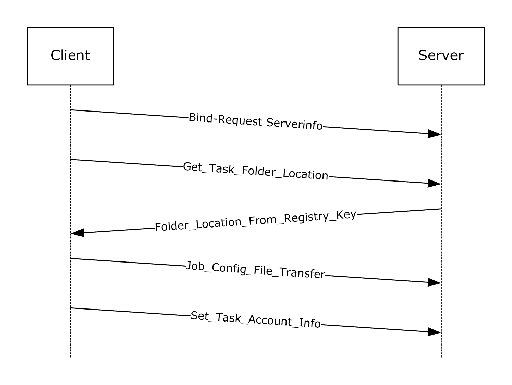

Figure 1: Example of task creation with SASec protocol

The client binds to the server, as specified in section [3.1.3](#Section_3.1.3). Next, the client requests the location of the tasks [**folder**](#gt_folder) on the server where the task configuration file is stored, as specified in section [3.1.4.2.1.1](#Section_3.1.4.2.1.1). Then the client transfers the .JOB configuration file followed by a client message setting the task account information as specified in section [3.2.5.3.4](#Section_3.2.5.3.4). For more information, see [2.4](#Section_2.4).

<a id="Section_4.1.2"></a>
### 4.1.2 Packet Sequence for Task Creation Using ITaskScheduler Interface

The following illustration depicts the sequence of packets for creating a task using the [ITaskSchedulerService](#Section_4.2.2) interface.

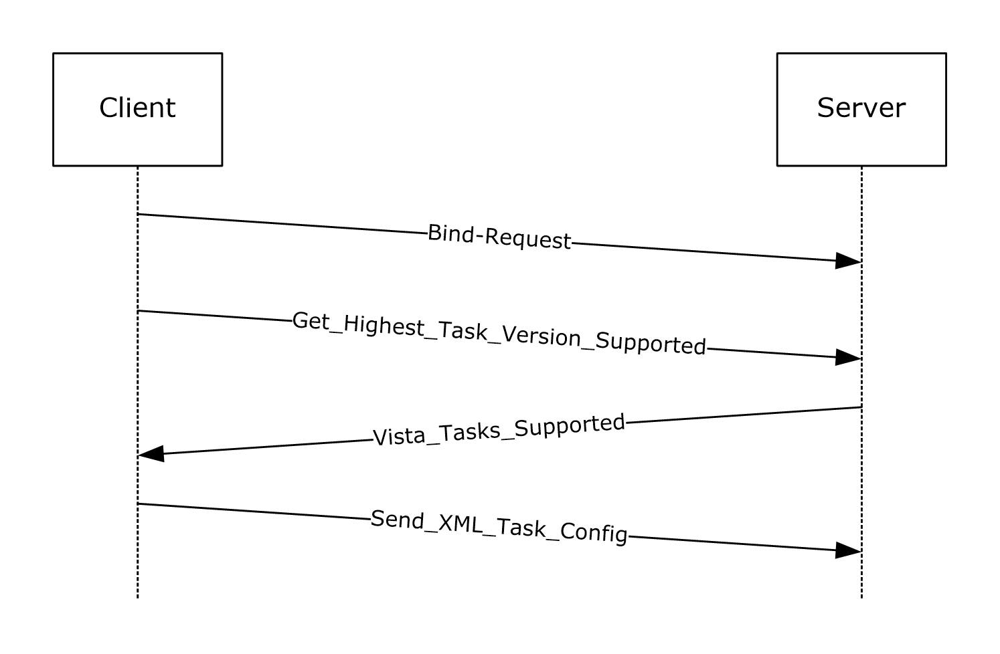

Figure 2: Example of task creation with ITaskSchedulerService protocol

The client binds to the server, as specified in section [3.1.3](#Section_3.1.3). Next, the client inquires about the highest task version supported by the server to which a ITaskScheduler compliant server will reply with the version information specified in section [1.7](#Section_1.7). Then the client sends the [**XML**](#gt_xml) configuration and the [**credentials**](#gt_credential) for running the task, as specified in section [3.1.4.3.1](#Section_3.1.4.3.1).

<a id="Section_4.1.3"></a>
### 4.1.3 Task XML Example

The following is an example of a task configuration [**XML**](#gt_xml). The XML in this example defines a task that starts Notepad when a user logs on. The task has a single execution action (starting Notepad), a single logon [**trigger**](#gt_trigger) that starts the task when a user logs on, and several other task settings that affect how the task is handled by the Task Scheduler Remoting Protocol. The *<Principal>* is set to the built-in Administrators group, indicating that the task runs for any user who is part of this group.

<?xml version="1.0" ?>

<!--

This sample schedules a task to start notepad.exe

when a user logs on.

-->

<Task xmlns="http://schemas.microsoft.com/windows/2004/02/mit/task">

<RegistrationInfo>

<Date>2005-10-11T13:21:17-08:00</Date>

<Author>AuthorName</Author>

<Version>1.0.0</Version>

<Description>

Starts Notepad when a specified user logs on.

</Description>

</RegistrationInfo>

<Triggers>

<LogonTrigger>

<StartBoundary>2005-10-11T13:21:17-08:00</StartBoundary>

<EndBoundary>2006-01-01T00:00:00-08:00</EndBoundary>

<Enabled>true</Enabled>

</LogonTrigger>

</Triggers>

<Principals>

<Principal>

<GroupId>Builtin\Administrators</GroupId>

</Principal>

</Principals>

<Settings>

<Enabled>true</Enabled>

<AllowStartOnDemand>true</AllowStartOnDemand>

<AllowHardTerminate>true</AllowHardTerminate>

</Settings>

<Actions>

<Exec>

<Command>notepad.exe</Command>

</Exec>

</Actions>

</Task>

<a id="Section_4.2"></a>
## 4.2 Examples of Operations Flow

This section provides a conceptual protocol operation flow for the [SASec](#Section_3.2.5.3) and [ITaskSchedulerService](#Section_4.2.2) interfaces.

<a id="Section_4.2.1"></a>
### 4.2.1 SASec Operation Flow

The following figure provides a conceptual service operation flow with respect to [SASec](#Section_3.2.5.3) interface.

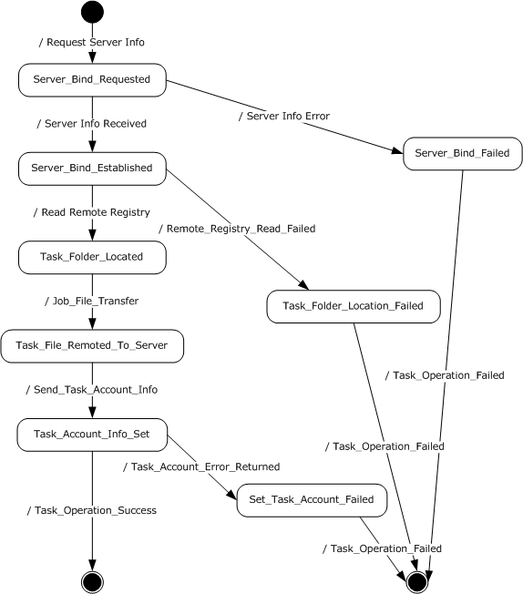

Figure 3: SASec operation flow

**Server_Bind:** Client binds to the server, as specified in section [3.1.3](#Section_3.1.3).

**Task_Folder_Located:** Client makes a Remote Registry call to request the location of the task folder on the server, as specified in section [3.1.4.2.1.1](#Section_3.1.4.2.1.1).

**Task_File_Remoted_To_Server:** Client writes the .JOB file (using a remote file-system protocol) to the task folder location received in the previous step, as specified in section [3.1.4.2.2](#Section_3.1.4.2.2).

**Task_Acount_Info_Set:** Client uses [**RPC**](#gt_remote-procedure-call-rpc) to supply the [**credentials**](#gt_credential) for the task, by invoking [SASetAccountInformation](#Section_3.2.5.3.4) as specified in section [3.1.4.2.1.2](#Section_3.1.4.2.1.2).

**Server_Bind_Failed:** Server returns error or no reply.

**Task_Folder_Location_Failed:** Server returns an error indicating one of the registry keys not found.

**Set_Task_Account_Failed:** Server returns an error indicating that the requested account could not be resolved.

<a id="Section_4.2.2"></a>
### 4.2.2 ITaskSchedulerService Operation Flow

The following figure illustrates a conceptual protocol operation flow for the [ITaskSchedulerService](#Section_4.2.2) interface. All the operations involve the task definition / configuration [**XML**](#gt_xml) document. For task creation and update, a new or updated task definition is remoted from the client. Deletion and enumeration operate on the XML definitions already existing on the server. In all cases, the task definition exists in the form of an XML document, each task as a separate file, organized in subdirectories under the Tasks root directory.

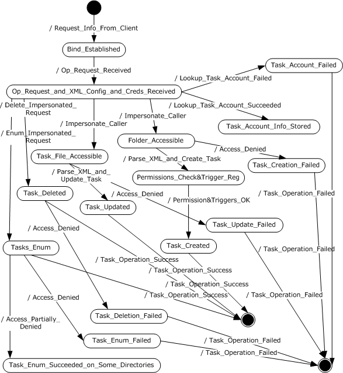

Figure 4: ITaskSchedulerService operation flow

**Server_Bind:** Client binds to the server, as specified in section [3.1.3](#Section_3.1.3).

**Op_Request_and_XML_Config_and_Creds_Received:** Server receives a request for operation such as create, update, or delete a task, or enumerate tasks. In the case of creating or updating a task, the task XML configuration is passed along in the [**RPC**](#gt_remote-procedure-call-rpc) call, together with the [**credentials**](#gt_credential) for running the created / updated task as specified in section [3.1.4.3.1](#Section_3.1.4.3.1).

**Folder_Accessible:** If a task creation is requested, the server first checks if the client has access to the folder where the tasks are required to be registered according to the URI element specified in section [2.5.1](#Section_2.5.1).

**Permissions_Check_&Trigger_Reg:** If the task creation is requested, the server first checks that the client is allowed to register the task according to the configuration requested. The permissions check is performed according to the permissions table in section [3.2.5.1.1](#Section_3.2.5.1.1). In addition, the server configures the [**trigger**](#gt_trigger) as specified in section [3.2.4](#Section_3.2.4).

**Task_File_Accessible:** If the task update is requested, the server first checks if the client has access to the file that requires updating. The permissions check is performed according to the permissions table in section 3.2.5.1.1.

**Task_Deleted / Task_Updated / Task_Created / Tasks_Enum:** Server internal states, as requested by the client request as specified in section [3.1.4.3](#Section_3.1.4.3).

**Task_Account_Failed:** Server failed to resolve the account name requested by client.

**Task_Deletion_Failed / Task_Update_Failed / Task_Creation_Failed / Task_Enum_Failed:** Server failed to delete / update / create / enumerate the task, as requested by the client according to the operations specified in section 3.1.4.3.

**Task_Enum_Succeeded_on_Some_Directories:** The client did not have access to all the directories under the tasks directory root, thus only partial enumeration was returned as specified in section [3.2.5.4.8](#Section_3.2.5.4.8).

<a id="Section_5"></a>
# 5 Security

<a id="Section_5.1"></a>
## 5.1 Security Considerations for Implementers

The Task Scheduler Remoting Protocol has no integral method of security. Instead, this protocol relies upon the underlying transports, such as Distributed Component Object Model (DCOM) Remote Protocol [MS-DCOM](../MS-DCOM/MS-DCOM.md) and [**RPC**](#gt_remote-procedure-call-rpc), to provide security across the wire.

[**Authentication Levels**](#gt_authentication-level): Due to [**credentials**](#gt_credential) being transferred between client and server on this remote protocol, implementers are advised to use PKT_PRIVACY authentication level only, as specified in [MS-RPCE](../MS-RPCE/MS-RPCE.md) section 2.2.1.1.8.<82>

Preferred [**security providers**](#gt_security-provider): Implementers are advised to use Windows NT LAN Manager (NTLM) as the security provider, that is, RPC_C_AUTHN_WINNT – NTLM, as specified in [MS-RPCE] section 2.2.1.1.8.

Authentication Methods: For all three protocol interfaces, the RPC server requires RPC_C_AUTHN_GSS_NEGOTIATE or RPC_C_AUTHN_WINNT authorization. The RPC client uses an authentication level of RPC_C_AUTHN_LEVEL_PKT_PRIVACY (value = 6), as specified in [MS-RPCE] section 2.2.1.1.8.

The [SAGetAccountInformation](#Section_3.2.5.3.7) method in the [SASec](#Section_3.2.5.3) interface (section 3.2.5.3.7) has a *wszBuffer* input/output parameter. To avoid sending uninitialized memory, implementers are advised to create the client such that it initializes the buffer before it is sent.

The [SchRpcRetrieveTask](#Section_3.2.5.4.3) method in the [ITaskSchedulerService](#Section_4.2.2) interface (section 3.2.5.4.3) has a *pulNumLanguages* input parameter that is unused. To avoid sending uninitialized memory, implementers are advised to create the client implementation such that it specifies the address of an initialized DWORD.

<a id="Section_6"></a>
# 6 Appendix A: Full IDL

<a id="Section_6.1"></a>
## 6.1 Appendix A.1: ATSvc.idl

For ease of implementation, the full [**IDL**](#gt_interface-definition-language-idl) is provided below, where "ms-dtyp.idl" is the IDL as specified in [MS-DTYP](../MS-DTYP/MS-DTYP.md) Appendix A.

import "ms-dtyp.idl";

typedef struct _AT_ENUM {

DWORD JobId;

DWORD_PTR JobTime;

DWORD DaysOfMonth;

unsigned char DaysOfWeek;

unsigned char Flags;

wchar_t* Command;

} AT_ENUM, *PAT_ENUM, *LPAT_ENUM;

typedef struct _AT_INFO {

DWORD_PTR JobTime;

DWORD DaysOfMonth;

unsigned char DaysOfWeek;

unsigned char Flags;

[string] wchar_t* Command;

} AT_INFO, *PAT_INFO, *LPAT_INFO;

[

uuid(1FF70682-0A51-30E8-076D-740BE8CEE98B),

version(1.0),

#ifdef __midl

ms_union,

#endif

pointer_default(unique)

]

interface atsvc

{

typedef [handle] const wchar_t* ATSVC_HANDLE;

typedef struct _AT_ENUM_CONTAINER {

DWORD EntriesRead;

[size_is( EntriesRead)] LPAT_ENUM Buffer;

} AT_ENUM_CONTAINER, *PAT_ENUM_CONTAINER, *LPAT_ENUM_CONTAINER;

NET_API_STATUS

NetrJobAdd(

[in,string,unique] ATSVC_HANDLE ServerName,

[in] LPAT_INFO pAtInfo,

[out] LPDWORD pJobId

);

NET_API_STATUS

NetrJobDel(

[in,string,unique] ATSVC_HANDLE ServerName,

[in] DWORD MinJobId,

[in] DWORD MaxJobId

);

NET_API_STATUS

NetrJobEnum(

[in,string,unique] ATSVC_HANDLE ServerName,

[in,out] LPAT_ENUM_CONTAINER pEnumContainer,

[in] DWORD PreferedMaximumLength,

[out] LPDWORD pTotalEntries,

[in,out,unique] LPDWORD pResumeHandle

);

NET_API_STATUS

NetrJobGetInfo(

[in,string,unique] ATSVC_HANDLE ServerName,

[in] DWORD JobId,

[out] LPAT_INFO * ppAtInfo

);

}

<a id="Section_6.2"></a>
## 6.2 Appendix A.2: SaSecRpc.idl

For ease of implementation, the full [**IDL**](#gt_interface-definition-language-idl) is provided below, where "ms-dtyp.idl" is the IDL as specified in [MS-DTYP](../MS-DTYP/MS-DTYP.md) Appendix A.

import "ms-dtyp.idl";

[

uuid(378E52B0-C0A9-11CF-822D-00AA0051E40F),

version(1.0),

#ifdef __midl

ms_union,

#endif // __midl

pointer_default(unique)

]

interface sasec

{

#define CNLEN 15

#define DNLEN CNLEN

#define UNLEN 256

#define MAX_BUFFER_SIZE (DNLEN+UNLEN+1+1)

typedef [handle] const wchar_t* SASEC_HANDLE;

HRESULT

SASetAccountInformation(

[ in, string, unique ] SASEC_HANDLE Handle,

[ in, string ] const wchar_t* pwszJobName,

[ in, string ] const wchar_t* pwszAccount,

[ in, string, unique ] const wchar_t* pwszPassword,

[ in ] DWORD dwJobFlags);

HRESULT

SASetNSAccountInformation(

[ in, string, unique ] SASEC_HANDLE Handle,

[ in, string, unique ] const wchar_t* pwszAccount,

[ in, string, unique ] const wchar_t* pwszPassword);

HRESULT

SAGetNSAccountInformation(

[ in, string, unique ] SASEC_HANDLE Handle,

[ in, range(0, MAX_BUFFER_SIZE) ] DWORD ccBufferSize,

[ in, out, size_is(ccBufferSize) ]

wchar_t wszBuffer[]);

HRESULT

SAGetAccountInformation(

[ in, string, unique ] SASEC_HANDLE Handle,

[ in, string ] const wchar_t* pwszJobName,

[ in, range(0, MAX_BUFFER_SIZE) ] DWORD ccBufferSize,

[ in, out, size_is(ccBufferSize) ]

wchar_t wszBuffer[]);

}

<a id="Section_6.3"></a>
## 6.3 Appendix A.3: SchRpc.idl

For ease of implementation, the full [**IDL**](#gt_interface-definition-language-idl) is provided below, where "ms-dtyp.idl" is the IDL as specified in [MS-DTYP](../MS-DTYP/MS-DTYP.md) Appendix A.

import "ms-dtyp.idl";

[

uuid(86D35949-83C9-4044-B424-DB363231FD0C),

version(1.0),

pointer_default(unique)

]

interface ITaskSchedulerService

{

enum credFlag

{

credFlagDefault = 0x1

};

typedef struct _TASK_USER_CRED

{

[string] const wchar_t* userId;

[string] const wchar_t* password;

DWORD flags;

} TASK_USER_CRED;

typedef struct _TASK_XML_ERROR_INFO

{

DWORD line, column;

[string] wchar_t* node;

[string] wchar_t* value;

} TASK_XML_ERROR_INFO, *PTASK_XML_ERROR_INFO;

typedef [string] wchar_t** TASK_NAMES;

HRESULT

SchRpcHighestVersion

(

[out] DWORD* pVersion

);

HRESULT

SchRpcRegisterTask

(

[in, string, unique] const wchar_t* path,

[in, string] const wchar_t* xml,

[in] DWORD flags,

[in, string, unique] const wchar_t* sddl,

[in] DWORD logonType,

[in] DWORD cCreds,

[in, size_is(cCreds), unique] const TASK_USER_CRED* pCreds,

[out, string] wchar_t** pActualPath,

[out] PTASK_XML_ERROR_INFO* pErrorInfo

);

HRESULT

SchRpcRetrieveTask

(

[in, string] const wchar_t* path,

[in, string] const wchar_t* lpcwszLanguagesBuffer,

[in] unsigned long * pulNumLanguages,

[out, string] wchar_t** pXml

);

HRESULT

SchRpcCreateFolder

(

[in, string] const wchar_t* path,

[in, string, unique] const wchar_t* sddl,

[in] DWORD flags

);

HRESULT

SchRpcSetSecurity

(

[in, string] const wchar_t* path,

[in, string] const wchar_t* sddl,

[in] DWORD flags

);

HRESULT

SchRpcGetSecurity

(

[in, string] const wchar_t* path,

[in] DWORD securityInformation,

[out, string] wchar_t** sddl

);

HRESULT

SchRpcEnumFolders

(

[in, string] const wchar_t* path,

[in] DWORD flags,

[in, out] DWORD* pStartIndex,

[in] DWORD cRequested,

[out] DWORD* pcNames,

[out, string, size_is(,*pcNames)] TASK_NAMES* pNames

);

HRESULT

SchRpcEnumTasks

(

[in, string] const wchar_t* path,

[in] DWORD flags,

[in, out] DWORD* startIndex,

[in] DWORD cRequested,

[out] DWORD* pcNames,

[out, string, size_is(,*pcNames)] TASK_NAMES* pNames

);

HRESULT

SchRpcEnumInstances

(

[in, string, unique] const wchar_t* path,

[in] DWORD flags,

[out] DWORD* pcGuids,

[out, size_is(,*pcGuids)] GUID** pGuids

);

HRESULT

SchRpcGetInstanceInfo

(

[in] GUID guid,

[out, string] wchar_t** pPath,

[out] DWORD * pState, //TASK_STATE

[out, string] wchar_t** pCurrentAction,

[out, string] wchar_t** pInfo,

[out] DWORD* pcGroupInstances,

[out, size_is(,*pcGroupInstances)] GUID** pGroupInstances,

[out] DWORD* pEnginePID

);

HRESULT

SchRpcStopInstance

(

[in] GUID guid,

[in] DWORD flags

);

HRESULT

SchRpcStop

(

[in, string, unique] const wchar_t* path,

[in] DWORD flags

);

HRESULT

SchRpcRun

(

[in, string] const wchar_t* path,

[in] DWORD cArgs,

[in, string, size_is(cArgs),unique] const wchar_t** pArgs,

[in] DWORD flags,

[in] DWORD sessionId,

[in, unique, string] const wchar_t* user,

[out] GUID* pGuid

);

HRESULT

SchRpcDelete

(

[in, string] const wchar_t* path,

[in] DWORD flags

);

HRESULT

SchRpcRename

(

[in, string] const wchar_t* path,

[in, string] const wchar_t* newName,

[in] DWORD flags

);

HRESULT

SchRpcScheduledRuntimes

(

[in, string] const wchar_t* path,

[in, unique] PSYSTEMTIME start,

[in, unique] PSYSTEMTIME end,

[in] DWORD flags,

[in] DWORD cRequested,

[out] DWORD* pcRuntimes,

[out, size_is(,*pcRuntimes)] PSYSTEMTIME* pRuntimes

);

HRESULT

SchRpcGetLastRunInfo

(

[in, string] const wchar_t* path,

[out] PSYSTEMTIME pLastRuntime,

[out] DWORD* pLastReturnCode

);

HRESULT

SchRpcGetTaskInfo

(

[in, string] const wchar_t* path,

[in] DWORD flags,

[out] DWORD* pEnabled,

[out] DWORD * pState //TASK_STATE

);

HRESULT

SchRpcGetNumberOfMissedRuns

(

[in, string] const wchar_t* path,

[out] DWORD* pNumberOfMissedRuns

);

HRESULT

SchRpcEnableTask

(

[in, string] const wchar_t* path,

[in] DWORD enabled

);

}

<a id="Section_7"></a>
# 7 Appendix B: Product Behavior

The information in this specification is applicable to the following Microsoft products or supplemental software. References to product versions include updates to those products.

The terms "earlier" and "later", when used with a product version, refer to either all preceding versions or all subsequent versions, respectively. The term "through" refers to the inclusive range of versions. Applicable Microsoft products are listed chronologically in this section.

**Windows Client**

- Windows NT Workstation 4.0 operating system with Service Pack 2 (SP2)
- Windows 2000 Professional operating system
- Windows XP operating system
- Windows Vista operating system
- Windows 7 operating system
- Windows 8 operating system
- Windows 8.1 operating system
- Windows 10 operating system
- Windows 11 operating system
**Windows Server**

- Windows 2000 Server operating system
- Windows Server 2003 operating system
- Windows Server 2008 operating system
- Windows Server 2008 R2 operating system
- Windows Server 2012 operating system
- Windows Server 2012 R2 operating system
- Windows Server 2016 operating system
- Windows Server operating system
- Windows Server 2019 operating system
- Windows Server 2022 operating system
- Windows Server 2025 operating system
Exceptions, if any, are noted in this section. If an update version, service pack or Knowledge Base (KB) number appears with a product name, the behavior changed in that update. The new behavior also applies to subsequent updates unless otherwise specified. If a product edition appears with the product version, behavior is different in that product edition.

Unless otherwise specified, any statement of optional behavior in this specification that is prescribed using the terms "SHOULD" or "SHOULD NOT" implies product behavior in accordance with the SHOULD or SHOULD NOT prescription. Unless otherwise specified, the term "MAY" implies that the product does not follow the prescription.

<1> Section 1.3: The [SASec](#Section_3.2.5.3) interface was introduced in the Windows 2000 operating system and the [ITaskSchedulerService](#Section_4.2.2) interface made its debut in Windows Vista.

<2> Section 1.3: Windows clients use the [**server message block (SMB)**](#gt_server-message-block-smb) remote file-system protocol [MS-SMB](../MS-SMB/MS-SMB.md).

<3> Section 1.8: Windows applications do not set the C bit.

<4> Section 2.1: All Windows clients specify "Simple and Protected GSS-API Negotiation".

<5> Section 2.3.4: The Microsoft implementations use a scalar DWORD_PTR, as specified in [MS-DTYP](../MS-DTYP/MS-DTYP.md) section 2.2.10. This is treated as a **DWORD** value when present on the wire.

<6> Section 2.3.4: The Windows implementation returns 0x00000057.

<7> Section 2.3.4: The Windows implementation returns 0x00000057.

<8> Section 2.3.4: The Windows implementation returns 0x00000057.

<9> Section 2.3.8: In Microsoft implementations, this protocol supports any authentication supported by the underlying operating system. For more information on authentication in Windows, see [MS-AUTHSOD](../MS-AUTHSOD/MS-AUTHSOD.md).

<10> Section 2.3.14: Windows returns failure codes to invoking applications uninterpreted. In addition to the error codes, as specified in [MS-ERREF](../MS-ERREF/MS-ERREF.md), the Windows Task Scheduler server also uses the following HRESULT error codes:

| Value | Meaning |
| --- | --- |
| S_OK 0x00000000 | The method succeeded. |
| S_FALSE 0x00000001 | Alternate success code. |
| E_OUTOFMEMORY 0x80000002 | The server ran out of memory. |
| E_ACCESSDENIED 0x80000009 | Access is denied due to incorrect user name and password combination. |
| E_INVALIDARG 0x80000003 | One or more parameters are invalid. |
| E_FAIL 0x80000008 | An unspecified error occurred. |
| E_UNEXPECTED 0x8000FFFF | An unexpected error occurred. |
| SCHED_S_TASK_READY 0x00041300 | The task is ready to run at its next scheduled time. |
| SCHED_S_TASK_RUNNING 0x00041301 | The task is currently running. |
| SCHED_S_TASK_DISABLED 0x00041302 | The task will not run at the scheduled times because it has been disabled. |
| SCHED_S_TASK_HAS_NOT_RUN 0x00041303 | The task has not yet run. |
| SCHED_S_TASK_NO_MORE_RUNS 0x00041304 | There are no more runs scheduled for this task. |
| SCHED_S_TASK_NOT_SCHEDULED 0x00041305 | One or more of the properties that are required to run this task on a schedule have not been set, or no runs are scheduled. |
| SCHED_S_TASK_TERMINATED 0x00041306 | The last run of the task was terminated by the user. |
| SCHED_S_TASK_NO_VALID_TRIGGERS 0x00041307 | Either the task has no triggers or the existing triggers are disabled or not set. |
| SCHED_S_EVENT_TRIGGER 0x00041308 | The task contains only event triggers that do not have set run times. |
| SCHED_E_TRIGGER_NOT_FOUND 0x80041309 | [**Trigger**](#gt_trigger) not found. |
| SCHED_E_TASK_NOT_READY 0x8004130A | One or more of the properties that are required to run this task have not been set. |
| SCHED_E_TASK_NOT_RUNNING 0x8004130B | There is no running instance of the task. |
| SCHED_E_SERVICE_NOT_INSTALLED 0x8004130C | The Task Scheduler Remoting Protocol service is not installed on this computer. |
| SCHED_E_CANNOT_OPEN_TASK 0x8004130D | The task object could not be opened. |
| SCHED_E_INVALID_TASK 0x8004130E | The object is either an invalid task object or is not a task object. |
| SCHED_E_ACCOUNT_INFORMATION_NOT_SET 0x8004130F | No account information could be found in the Task Scheduler Remoting Protocol security database for the task indicated. |
| SCHED_E_ACCOUNT_NAME_NOT_FOUND 0x80041310 | Unable to establish existence of the account specified. |
| SCHED_E_ACCOUNT_DBASE_CORRUPT 0x80041311 | Corruption was detected in the Task Scheduler Remoting Protocol security database. |
| SCHED_E_NO_SECURITY_SERVICES 0x80041312 | The server is not running Windows NT operating system. The following Microsoft implementations return this error code: Windows 95 operating system, Windows 98 operating system, and Windows Millennium Edition operating system. |
| SCHED_E_UNKNOWN_OBJECT_VERSION 0x80041313 | The task object version is either unsupported or invalid. |
| SCHED_E_UNSUPPORTED_ACCOUNT_OPTION 0x80041314 | The task has been configured with an unsupported combination of account settings and run time options. |
| SCHED_E_SERVICE_NOT_RUNNING 0x80041315 | The Task Scheduler Remoting Protocol service is not running. |
| SCHED_E_UNEXPECTEDNODE 0x80041316 | The task [**XML**](#gt_xml) contains an unexpected node. |
| SCHED_E_NAMESPACE 0x80041317 | The task XML contains an element or attribute from an unexpected namespace. |
| SCHED_E_INVALIDVALUE 0x80041318 | The task XML contains a value which is incorrectly formatted or out of range. |
| SCHED_E_MISSINGNODE 0x80041319 | The task XML is missing a required element or attribute. |
| SCHED_E_MALFORMEDXML 0x8004131A | The task XML is malformed. |
| SCHED_S_SOME_TRIGGERS_FAILED 0x0004131B | The task is registered, but not all specified triggers will start the task. |
| SCHED_S_BATCH_LOGON_PROBLEM 0x0004131C | The task is registered, but might fail to start because the batch logon privilege is required to be enabled for the task [**principal**](#gt_principal). |
| SCHED_E_TOO_MANY_NODES 0x8004131D | The task XML contains too many nodes of the same type. |
| SCHED_E_PAST_END_BOUNDARY 0x8004131E | The task cannot be started after the trigger's end boundary. |
| SCHED_E_ALREADY_RUNNING 0x8004131F | An instance of this task is already running. |
| SCHED_E_USER_NOT_LOGGED_ON 0x80041320 | The task will not run because the user is not logged on. |
| SCHED_E_INVALID_TASK_HASH 0x80041321 | The task image is corrupt or has been tampered with. |
| SCHED_E_SERVICE_NOT_AVAILABLE 0x80041322 | The Task Scheduler Remoting Protocol service is not available. |
| SCHED_E_SERVICE_TOO_BUSY 0x80041323 | The Task Scheduler Remoting Protocol service is too busy to handle the request. |
| SCHED_E_TASK_ATTEMPTED 0x80041324 | The Task Scheduler Remoting Protocol service attempted to run the task, but the task did not run due to one of the constraints in the task definition. |
| SCHED_S_TASK_QUEUED 0x00041325 | The Task Scheduler Remoting Protocol service has asked the task to run. |
| SCHED_E_TASK_DISABLED 0x80041326 | The task is disabled. |
| SCHED_E_TASK_NOT_V1_COMPAT 0x80041327 | The task has properties that are not compatible with the SASec interface. |
| SCHED_E_START_ON_DEMAND 0x80041328 | The task settings do not allow the task to start on demand. |

<11> Section 2.4.1: Windows clients write the following values:

| Value | Meaning |
| --- | --- |
| 0x0400 | Windows NT 4.0 operating system |
| 0x0500 | Windows 2000 |
| 0x0501 | Windows XP |
| 0x0600 | Windows Vista |
| 0x0601 | Windows 7 |
| 0x0602 | Windows 8 |
| 0x0603 | Windows 8.1 |
| 0x0a00 | Windows 10 |

<12> Section 2.4.1: The Windows implementation requires the *status* field to be initially set consistent to the *Trigger Count* field.

<13> Section 2.4.2.3: In Windows NT 4.0 operating system Service Pack 2 (SP2), Windows NT Workstation 4.0 operating system with Service Pack 3 (SP3), Windows NT Workstation 4.0 operating system with Service Pack 4 (SP4), Windows NT Workstation 4.0 operating system with Service Pack 5 (SP5), Windows NT Workstation 4.0 operating system with Service Pack 6 (SP6), Windows NT Workstation 4.0 operating system Service Pack 6a (SP6a), Windows 2000, Windows XP, and Windows Server 2003, the AN bit of the task flags field (see [Flags (section 2.3.7)](#Section_2.3.7)) is set to 1 if an application name is specified in the .JOB file (that is, if the **Application Name** field is nonempty).

<14> Section 2.4.2.9: In Windows Vista and later and Windows Server 2008 and later, the [SASetAccountInformation](#Section_3.2.5.3.4) implementation returns 0x8007000D. This is the HRESULT form of the Win32 error ERROR_INVALID_DATA, and occurs when the **Reserved Data Size** is nonzero and is not 8 (see SASetAccountInformation (section 3.2.5.3.4)). In Windows XP and Windows Server 2003, the SASetAccountInformation implementation returns S_OK, but the scheduling engine does not load the task.

<15> Section 2.4.2.9: In Windows Vista and later and Windows Server 2008 and later, the Start Error information is passed through the task exit code field, and it can only be modified when explicitly using the v1 API to run the task.

<16> Section 2.4.2.11: In Windows Vista and later, the SASetAccountInformation (section 3.2.5.3.4) implementation will return error code 0x80041318.

In Windows Server 2008 and later, the SASetAccountInformation (section 3.2.5.3.4) implementation will return SCHED_E_MISSINGNODE (0x80041319) when Begin Year is in the range 1000 to 1600.

In Windows NT 4.0, Windows 2000, Windows XP, and Windows Server 2003, the SASetAccountInformation implementation will return S_OK, but the scheduler engine will not load the .JOB definition file with the incorrect date set.

Windows Vista and later and Windows Server 2008 and later will accept task trigger years in the range of 1601 to 9999.

<17> Section 2.4.2.11: In Windows Vista and later and Windows Server 2008 and later, the SASetAccountInformation (section 3.2.5.3.4) implementation will return error code 0x80041318.

In Windows NT 4.0, Windows 2000, Windows XP, and Windows Server 2003, the SASetAccountInformation implementation will return S_OK, but the scheduler engine will not load the .JOB definition file with the incorrect date set.

<18> Section 2.4.2.11: Refer to the product behavior note for the **Begin Month** field.

<19> Section 2.4.2.11: Refer to the product behavior note for the **Begin Month** field. Windows Vista and later and Windows Server 2008 and later accept task trigger years in the range of 1601 to 9999.

<20> Section 2.4.2.11: Refer to the product behavior note for the **Begin Month** field.

<21> Section 2.4.2.11: Refer to the product behavior note for the **Begin Month** field.

<22> Section 2.4.2.11: Windows Vista and later and Windows Server 2008 and later **SASetAccountInformation** implementations will return SCHED_E_INVALIDVALUE, if the repetition interval is greater than 31 days, or the interval is nonzero and greater than or equal to the minutes duration value.

<23> Section 2.4.2.11: Windows Vista and later and Windows Server 2008 and later **SASetAccountInformation** implementations will return SCHED_E_INVALIDVALUE, if the repetition interval is greater than 31 days, or the interval is nonzero and greater than or equal to the minutes duration value.

<24> Section 2.4.2.12: In Windows, a certificate in the user's certificate store with signature key usage capability is located, and the private key associated with that certificate is extracted. For more information, see [MS-CIFS](../MS-CIFS/MS-CIFS.md) section 2.2.3.1. See also [MS-WCCE](../MS-WCCE/MS-WCCE.md).

<25> Section 2.5.3.8: The [**ATSvc**](#Section_3.1.4.1) on Windows has the ability to start and track multiple [**terminal server**](#gt_terminal-server) sessions. If a user has multiple active sessions, each task for the specific user will be activated in all the user's sessions, whether connected or disconnected.

<26> Section 2.5.3.8: In Windows Vista and later and Windows Server 2008 and later, the "Switch User" option facilitates the switch from an old user session to a new user session.

<27> Section 2.5.4.9: For more information about network awareness in Windows, see [[MSDN-NetAware]](https://go.microsoft.com/fwlink/?LinkId=90051).

<28> Section 2.5.4.14: Windows scheduling engine server implementations use the following defaults. **IdleSettings** node: **Duration** – 0, **WaitTimeout** – 0xFFFFFFFF, **StopOnIdleEnd** – FALSE, **RestartOnIdle** – FALSE. The client-side API, while generating task definition XML, will still use the defaults specified in the schema.

<29> Section 2.5.4.14: Windows scheduling engine server implementations use the following defaults. **IdleSettings** node: **Duration** – 0, **WaitTimeout** – 0xFFFFFFFF, **StopOnIdleEnd** – FALSE, **RestartOnIdle** – FALSE. The client-side API, while generating task definition XML, will still use the defaults specified in the schema.

<30> Section 2.5.4.14: Windows scheduling engine server implementations use the following defaults. **IdleSettings** node: **Duration** – 0, **WaitTimeout** – 0xFFFFFFFF, **StopOnIdleEnd** – FALSE, **RestartOnIdle** – FALSE. The client-side API, while generating task definition XML, will still use the defaults specified in the schema.

<31> Section 2.5.4.14: Windows scheduling engine server implementations use the following defaults. **IdleSettings** node: **Duration** – 0, **WaitTimeout** – 0xFFFFFFFF, **StopOnIdleEnd** – FALSE, **RestartOnIdle** – FALSE. The client-side API, while generating task definition XML, will still use the defaults specified in the schema.

<32> Section 2.5.7.2: The custom handler uses the Task Scheduler Remoting Protocol [**Component Object Model (COM)**](#gt_component-object-model-com) interfaces. For more information, see [[MSDN-TaskSch]](https://go.microsoft.com/fwlink/?LinkId=90142).

<33> Section 2.5.7.2: Windows Vista and later and Windows Server 2008 and later implementations allow only out of process activation of COM–based tasks. Implementation of ITaskHandler is able to be created with CLSCTX_LOCAL_SERVER context.

<34> Section 2.5.7.3: Email Action is available in Windows NT Workstation 4.0 SP2, Windows 2000, Windows XP, Windows Server 2003, Windows Vista, Windows Server 2008, Windows 7, Windows Server 2008 R2, Windows 8, and Windows Server 2012 only.

<35> Section 2.5.7.4: ShowMessage Action is available in Windows NT Workstation 4.0 SP2, Windows 2000, Windows XP, Windows Server 2003, Windows Vista, Windows Server 2008, Windows 7, Windows Server 2008 R2, Windows 8, and Windows Server 2012 only.

<36> Section 3.1: Typically the choice of interface is made by the application. For example, some applications use the ATSvc interface and work with all server versions, and some applications use the ITaskSchedulerService interface and only work with Windows Server 2008 servers.

<37> Section 3.1.4.2: Windows clients use the SMB remote file-system protocol [MS-SMB].

<38> Section 3.1.4.2.1.1: The [**job**](#gt_job) store location can be found as the **TasksFolder** value under the HKEY_LOCAL_MACHINE\SOFTWARE\Microsoft\SchedulingAgent key. If the **TasksFolder** value has the type REG_SZ, the client is required to use the value directly. If the value has the type REG_EXPAND_SZ, the client expands the value as specified in the following paragraph. If the value has any other type, the client reports an error to the application.

To expand a REG_EXPAND_SZ **TasksFolder** value, the client parses the value looking for "%SystemRoot%" substrings. For each such substring, the client substitutes the remote SystemRoot value. If the **TasksFolder** value contains any other use of the "%" character, the client operation reports an error to the application.

To obtain the remote SystemRoot value, the client uses the remote registry protocol as specified in [MS-RRP](../MS-RRP/MS-RRP.md) section 3.1.5, by retrieving the SystemRoot value under the HKEY_LOCAL_MACHINE\SOFTWARE\Microsoft\Windows NT\CurrentVersion key. If the value has any type other than REG_SZ, the client reports an error to the application.

<39> Section 3.1.4.2.2: Windows clients create and write the file as specified in sections [MS-CIFS] 2.2.4.64 and 2.2.4.43.

<40> Section 3.1.4.2.3: Windows clients delete the file using SMB as specified in [MS-CIFS] section 2.2.4.7.

<41> Section 3.1.4.2.4: Windows clients write the file as specified in [MS-CIFS] section 2.2.4.43.

<42> Section 3.1.4.2.5: Windows clients read the file using SMB as specified in [MS-CIFS] section 2.2.4.42.

<43> Section 3.1.4.2.6: Windows clients enumerate and read the files by using SMB as specified in [MS-CIFS] sections 2.2.6.2 and 2.2.4.42.

<44> Section 3.2: Windows NT 4.0 implements the ATSvc interface; Windows 2000, Windows XP, and Windows Server 2003 implement the ATSvc and SASec interfaces; Windows Vista implements the ATSvc, SASec, and ITaskSchedulerService interfaces.

<45> Section 3.2.1: Windows Vista and later and Windows Server 2008 and later implementations use an XML [**task store**](#gt_task-store) and a .JOB task store. ATSvc tasks are represented as .JOB files in the .JOB task store. All tasks in the .JOB task store are also represented in the XML task store. Similarly, the Windows 2000, Windows XP, and Windows Server 2003 implementations use a .JOB task store to represent ATSvc and SASec tasks. The Windows NT 4.0 implementation uses the registry [MS-RRP] to represent ATSvc tasks.

<46> Section 3.2.1: In Windows, this location is in the **TasksFolder** value under the HKEY_LOCAL_MACHINE\SOFTWARE\Microsoft\SchedulingAgent key. The **TasksFolder** value is required to have the REG_SZ or REG_EXPAND_SZ type. If the **TasksFolder** value has the REG_EXPAND_SZ type, then the value can only use the SystemRoot environment variable.

<47> Section 3.2.4.2: The Windows implementation checks the following states to decide if the machine is idle:

| State | True or False |
| --- | --- |
| User input within the idle detection period | False |
| Machine on battery power | False |
| Machine will enter standby/hibernation in < 1 min | False |
| Execution state = ES_DISPLAY_REQUIRED | False |
| CPU idle time >= 90% in the idle detection period | True |
| Disk idle time >= 90% in the idle detection period | True |

Or:

| State | True or False |
| --- | --- |
| User input within the idle detection period | False |
| Machine on battery power | False |
| Machine will enter standby/hibernation in < 1 min | False |
| Screen saver is on | True |

The idle detection period is 14.5 minutes.

<48> Section 3.2.5.1.1: Windows uses the CredMan component to store credentials locally. For more information, please see [[MSDN-CREDMGMT]](https://go.microsoft.com/fwlink/?LinkId=119256).

<49> Section 3.2.5.1.1: The LogonType property of the task that is set to run in group context is ignored at registration time and the task will always run interactively.

<50> Section 3.2.5.1.1: The Windows implementation of the SchRpc protocol will accept [**RPC**](#gt_remote-procedure-call-rpc) connections over TCP from local administrators only. RPC over LRPC does not have this limitation, but that is only for the local task scheduler and not the remote scheduler.

<51> Section 3.2.5.3: Windows clients use the SMB remote file system protocol [MS-SMB]. The Windows file system provides notifications. For more information, see [[MSDN-ODCN]](https://go.microsoft.com/fwlink/?LinkId=90053).

<52> Section 3.2.5.3.4: Windows Server 2008 and later return SCHED_E_INVALIDVALUE when the Unused bit in Day of Month (section [2.4.2.11.2](#Section_2.4.2.11.2)) is set to 1.

<53> Section 3.2.5.3.4: On Windows XP and Windows Server 2003, when the [Application Name (section 2.4.2.3)](#Section_2.4.2.3) field is provided with a non-null-terminated string or the string length provided is zero (section [2.4.2.1](#Section_2.4.2.1)), the server returns 0x8004130e. If a non-null–terminated string is provided as input to the [Parameters (section 2.4.2.4)](#Section_2.4.2.4), [Working Directory (section 2.4.2.5)](#Section_2.4.2.5), [Author (section 2.4.2.6)](#Section_2.4.2.6), or [Comment (section 2.4.2.7)](#Section_2.4.2.7) fields, the server returns S_OK but does not load the task.

On Windows XP and Windows Server 2003, when the **Start Hour** field or the **Start Minute** field that is provided is out of range, the server returns S_OK but does not load the task. On Windows Vista and later and Windows Server 2008 and later, when the **Start Hour** field or the **Start Minute** field that is provided is out of range, the server returns 0x80041318.

Windows ignores the trigger offset value upon receipt.

On Windows Vista and Windows Server 2008, if the **File Version** field is not set to 0x0001, the server returns 0x80041313. On Windows XP and Windows Server 2003, if the **File Version** field is not set to 0x0001, the server returns S_OK but does not load the task.

On Windows Server 2003 and later and Windows Vista and later, if the Trigger type is not specified as in [Trigger Type (section 2.4.2.11.1)](#Section_2.4.2.11.1), the server returns SCHED_E_UNEXPECTEDNODE (0x80041316). On Windows NT 4.0 SP2, Windows NT Workstation 4.0 SP3, Windows NT Workstation 4.0 SP4, Windows NT Workstation 4.0 SP5, Windows NT Workstation 4.0 SP6, Windows NT Workstation 4.0 SP6a, Windows 2000, Windows XP, and Windows Server 2003, the server does not load the job but returns S_OK.

Windows XP and Windows Server 2003 ignore the application name offset field. Windows Vista and later and Windows Server 2016 and later return SCHED_E_INVALID_TASK if the application name could not be read from the offset field or if the string read from the offset is not null terminated. Windows Vista and later and Windows Server 2008 and later return E_UNEXPECTED if the string at the application name offset is longer than 261 characters.

<54> Section 3.2.5.3.4: Windows Vista and later and Windows Server 2008 and later return SCHED_E_MISSINGNODE if the trigger type (see Trigger Type (section 2.4.2.11.1)) is **MONTHLYDOW** and the week is out of range.

<55> Section 3.2.5.3.4: Windows Vista and later and Windows Server 2008 and later return the value 0x8007052E, the HRESULT form of the Win32 error ERROR_LOGON_FAILURE, if the *pwszPassword* parameter is not valid for *pwszAccount*.

<56> Section 3.2.5.3.4: Windows Vista bypasses the TASK_FLAGRUN_ONLY_IF_LOGGED_ON bit flag check in *dwJobFlags*.

<57> Section 3.2.5.3.4: Windows Vista and later and Windows Server 2008 and later additionally enforce the security checks described in [Task Registration Security Checks (section 3.2.5.1.1)](#Section_3.2.5.1.1).

<58> Section 3.2.5.3.4: The server returns 0x8007052E, the HRESULT form of ERROR_LOGON_FAILURE on Windows Vista and later and Windows Server 2008 and later.

<59> Section 3.2.5.3.4: Windows XP and Windows Server 2003 return S_OK if the **MinutesInterval** field is set to a value larger than the **MinutesDuration** field but set only the **MinutesInterval** value and ignore the **MinutesDuration** value.

<60> Section 3.2.5.3.4: On Windows XP and Windows Server 2003, return S_OK if Trigger type is not as specified in 2.4.2.11.1.

<61> Section 3.2.5.3.5: Windows Vista and later and Windows Server 2008 and later store "LocalSystem" in the ATSvc account name conceptual data structure and return S_OK when *pwszAccount* is empty string.

<62> Section 3.2.5.3.5: Windows Vista and later and Windows Server 2008 and later return E_INVALIDARG if the *pwszPassword* parameter is NULL.

<63> Section 3.2.5.3.5: Windows Vista and later and Windows Server 2008 and later return the value 0x0000052E, which is the HRESULT form of the Win32 error ERROR_LOGON_FAILURE, if the *pwszPassword* parameter is not valid for *pwszAccount*.

<64> Section 3.2.5.4: The ITaskSchedulerService interface is present in Windows Vista and Windows Server 2008.

<65> Section 3.2.5.4.1: Windows Vista and Windows Server 2008 return version 1.2, and Windows Server 2008 R2 and later and Windows 7 and later return version 1.3.

<66> Section 3.2.5.4.2: Windows Server 2008 and later and Windows 10 and later return E_INVALIDARG (0x80070057) when an undefined bit is set to 1.

<67> Section 3.2.5.4.2: The ATSvc on Windows has the ability to start and track multiple terminal server sessions. If a user has multiple active sessions, each task for the specific user will be activated in all the user's sessions, whether connected or disconnected.

<68> Section 3.2.5.4.2: The ATSvc on Windows has the ability to start and track multiple terminal server sessions. If a user has multiple active sessions, each task for the specific user will be activated in all the user's sessions, whether connected or disconnected.

<69> Section 3.2.5.4.2: For more information about network awareness in Windows, see [MSDN-NetAware].

<70> Section 3.2.5.4.4: Windows Vista and later and Windows Server 2008 and later bypass the NTFS security checks when the client connects with Local Administrator privileges from an elevated mode console.

<71> Section 3.2.5.4.7: Windows implementations limit the total space required to return the subfolder names to 64 kilobytes.

<72> Section 3.2.5.4.8: Windows implementations limit the total space required to return the subfolder names to 64 kilobytes.

<73> Section 3.2.5.4.9: Windows Vista and Windows Server 2008 return S_OK, if the task specified in the *path* parameter does not exist on the server or the file specified by the *path* parameter does not exist in the XML task store.

<74> Section 3.2.5.4.12: Windows Vista and Windows Server 2008 return S_OK if the task does not exist.

<75> Section 3.2.5.4.12: Windows 7 and later and Windows Server 2008 R2 operating system and later allow stopping of hidden tasks.

<76> Section 3.2.5.4.14: Windows 7 and later and Windows Server 2008 R2 and later return E_ACCESSDENIED when the path is the root.

<77> Section 3.2.5.4.14: Windows 7 and later and Windows Server 2008 R2 and later return S_OK for the first [SchRpcDelete](#Section_3.2.5.4.14) call if the task was already deleted by setting the DeleteExpiredTaskAfter attribute.

<78> Section 3.2.5.4.14: Windows Vista and Windows Server 2008 return ERROR_PATH_NOT_FOUND, if the task specified in the *path* parameter does not exist on the server or the file specified by the *path* parameter does not exist in the XML task store.

<79> Section 3.2.5.4.14: Windows Vista and later and Windows Server 2008 and later bypass the NTFS security checks when the client connected from an elevated mode console with Local Administrator privileges.

<80> Section 3.2.5.4.16: Windows implementations limit the total space required to return the subfolder names to 64 kilobytes.

<81> Section 3.2.5.4.19: The [SchRpcGetNumberOfMissedRuns](#Section_3.2.5.4.19) method is not implemented on the server side and will return S_OK and 0 in the *pNumberOfMissedRuns* parameter.

<82> Section 5.1: Windows uses the flags PKT_PRIVACY and RPC_C_AUTHN_WINNT (or RPC_C_AUTHN_GSS_NEGOTIATE if available) as in a Kerberos domain, as specified in [MS-RPCE](../MS-RPCE/MS-RPCE.md) section 2.2.1.1.8.

<a id="Section_8"></a>
# 8 Change Tracking

This section identifies changes that were made to this document since the last release. Changes are classified as Major, Minor, or None.

The revision class **Major** means that the technical content in the document was significantly revised. Major changes affect protocol interoperability or implementation. Examples of major changes are:

- A document revision that incorporates changes to interoperability requirements.
- A document revision that captures changes to protocol functionality.
The revision class **Minor** means that the meaning of the technical content was clarified. Minor changes do not affect protocol interoperability or implementation. Examples of minor changes are updates to clarify ambiguity at the sentence, paragraph, or table level.

The revision class **None** means that no new technical changes were introduced. Minor editorial and formatting changes may have been made, but the relevant technical content is identical to the last released version.

The changes made to this document are listed in the following table. For more information, please contact [dochelp@microsoft.com](mailto:dochelp@microsoft.com).

| Section | Description | Revision class |
| --- | --- | --- |
| [7](#Section_7) Appendix B: Product Behavior | Added Windows Server 2025 to the list of applicable products. | Major |

<a id="revision-history"></a>

## Revision History

| Date | Version | Revision Class | Comments |
| --- | --- | --- | --- |
| 3/2/2007 | 1.0 | Major | Updated and revised the technical content. |
| 4/3/2007 | 1.1 | Minor | Clarified the meaning of the technical content. |
| 5/11/2007 | 2.0 | Major | New format |
| 6/1/2007 | 2.0.1 | Editorial | Changed language and formatting in the technical content. |
| 7/3/2007 | 2.1 | Minor | Clarified the meaning of the technical content. |
| 8/10/2007 | 3.0 | Major | Updated and revised the technical content. |
| 9/28/2007 | 3.0.1 | Editorial | Changed language and formatting in the technical content. |
| 10/23/2007 | 3.1 | Minor | Clarified the meaning of the technical content. |
| 1/25/2008 | 3.1.1 | Editorial | Changed language and formatting in the technical content. |
| 3/14/2008 | 4.0 | Major | Updated and revised the technical content. |
| 6/20/2008 | 4.1 | Minor | Clarified the meaning of the technical content. |
| 7/25/2008 | 5.0 | Major | Updated and revised the technical content. |
| 8/29/2008 | 6.0 | Major | Updated and revised the technical content. |
| 10/24/2008 | 6.0.1 | Editorial | Changed language and formatting in the technical content. |
| 12/5/2008 | 7.0 | Major | Updated and revised the technical content. |
| 1/16/2009 | 8.0 | Major | Updated and revised the technical content. |
| 2/27/2009 | 9.0 | Major | Updated and revised the technical content. |
| 4/10/2009 | 10.0 | Major | Updated and revised the technical content. |
| 5/22/2009 | 11.0 | Major | Updated and revised the technical content. |
| 7/2/2009 | 11.0.1 | Editorial | Changed language and formatting in the technical content. |
| 8/14/2009 | 12.0 | Major | Updated and revised the technical content. |
| 9/25/2009 | 12.1 | Minor | Clarified the meaning of the technical content. |
| 11/6/2009 | 12.1.1 | Editorial | Changed language and formatting in the technical content. |
| 12/18/2009 | 13.0 | Major | Updated and revised the technical content. |
| 1/29/2010 | 14.0 | Major | Updated and revised the technical content. |
| 3/12/2010 | 15.0 | Major | Updated and revised the technical content. |
| 4/23/2010 | 15.0.1 | Editorial | Changed language and formatting in the technical content. |
| 6/4/2010 | 15.1 | Minor | Clarified the meaning of the technical content. |
| 7/16/2010 | 16.0 | Major | Updated and revised the technical content. |
| 8/27/2010 | 17.0 | Major | Updated and revised the technical content. |
| 10/8/2010 | 17.0 | None | No changes to the meaning, language, or formatting of the technical content. |
| 11/19/2010 | 17.0 | None | No changes to the meaning, language, or formatting of the technical content. |
| 1/7/2011 | 17.0 | None | No changes to the meaning, language, or formatting of the technical content. |
| 2/11/2011 | 18.0 | Major | Updated and revised the technical content. |
| 3/25/2011 | 18.0 | None | No changes to the meaning, language, or formatting of the technical content. |
| 5/6/2011 | 18.0 | None | No changes to the meaning, language, or formatting of the technical content. |
| 6/17/2011 | 18.1 | Minor | Clarified the meaning of the technical content. |
| 9/23/2011 | 18.1 | None | No changes to the meaning, language, or formatting of the technical content. |
| 12/16/2011 | 19.0 | Major | Updated and revised the technical content. |
| 3/30/2012 | 19.0 | None | No changes to the meaning, language, or formatting of the technical content. |
| 7/12/2012 | 19.0 | None | No changes to the meaning, language, or formatting of the technical content. |
| 10/25/2012 | 20.0 | Major | Updated and revised the technical content. |
| 1/31/2013 | 20.1 | Minor | Clarified the meaning of the technical content. |
| 8/8/2013 | 21.0 | Major | Updated and revised the technical content. |
| 11/14/2013 | 21.0 | None | No changes to the meaning, language, or formatting of the technical content. |
| 2/13/2014 | 21.0 | None | No changes to the meaning, language, or formatting of the technical content. |
| 5/15/2014 | 21.0 | None | No changes to the meaning, language, or formatting of the technical content. |
| 6/30/2015 | 22.0 | Major | Significantly changed the technical content. |
| 10/16/2015 | 22.0 | None | No changes to the meaning, language, or formatting of the technical content. |
| 7/14/2016 | 23.0 | Major | Significantly changed the technical content. |
| 6/1/2017 | 23.0 | None | No changes to the meaning, language, or formatting of the technical content. |
| 9/15/2017 | 24.0 | Major | Significantly changed the technical content. |
| 12/1/2017 | 24.0 | None | No changes to the meaning, language, or formatting of the technical content. |
| 9/12/2018 | 25.0 | Major | Significantly changed the technical content. |
| 4/7/2021 | 26.0 | Major | Significantly changed the technical content. |
| 6/25/2021 | 27.0 | Major | Significantly changed the technical content. |
| 4/23/2024 | 28.0 | Major | Significantly changed the technical content. |
