# [MS-TSGU]: Terminal Services Gateway Server Protocol

Table of Contents

1 Introduction

- [1 Introduction](#Section_1)
  - [1.1 Glossary](#Section_1.1)
  - [1.2 References](#Section_1.2)
    - [1.2.1 Normative References](#Section_1.2.1)
    - [1.2.2 Informative References](#Section_1.2.2)
  - [1.3 Overview](#Section_1.3)
    - [1.3.1 RPC Over HTTP Transport](#Section_1.3.1)
      - [1.3.1.1 RDGSP Protocol Phases Using RPC Over HTTP Transport](#Section_1.3.1.1)
        - [1.3.1.1.1 Connection Setup Phase](#Section_1.3.1.1.1)
        - [1.3.1.1.2 Data Transfer Phase](#Section_1.3.1.1.2)
        - [1.3.1.1.3 Shutdown Phase](#Section_1.3.1.1.3)
    - [1.3.2 HTTP Transport](#Section_1.3.2)
      - [1.3.2.1 RDGHTTP Protocol Phases Using HTTP Transport](#Section_1.3.2.1)
        - [1.3.2.1.1 Connection Setup and Authentication Phase](#Section_1.3.2.1.1)
        - [1.3.2.1.2 Tunnel and Channel Creation Phase](#Section_1.3.2.1.2)
        - [1.3.2.1.3 Data and Server Message Exchange Phase](#Section_1.3.2.1.3)
        - [1.3.2.1.4 Connection Close Phase](#Section_1.3.2.1.4)
    - [1.3.3 UDP Transport](#Section_1.3.3)
      - [1.3.3.1 RDGUDP Protocol Phases Using UDP Transport](#Section_1.3.3.1)
        - [1.3.3.1.1 DTLS Handshake Phase](#Section_1.3.3.1.1)
        - [1.3.3.1.2 Connection Setup Phase](#Section_1.3.3.1.2)
        - [1.3.3.1.3 Data Transfer Phase](#Section_1.3.3.1.3)
        - [1.3.3.1.4 Shutdown Phase](#Section_1.3.3.1.4)
  - [1.4 Relationship to Other Protocols](#Section_1.4)
  - [1.5 Prerequisites/Preconditions](#Section_1.5)
    - [1.5.1 Common Prerequisites/Preconditions](#Section_1.5.1)
    - [1.5.2 Prerequisites/Preconditions for RPC Transport](#Section_1.5.2)
    - [1.5.3 Prerequisites/Preconditions for HTTP Transport](#Section_1.5.3)
    - [1.5.4 Prerequisites/Preconditions for UDP Transport](#Section_1.5.4)
  - [1.6 Applicability Statement](#Section_1.6)
  - [1.7 Versioning and Capability Negotiation](#Section_1.7)
    - [1.7.1 RPC Over HTTP Transport](#Section_1.7.1)
    - [1.7.2 HTTP Transport](#Section_1.7.2)
    - [1.7.3 UDP Transport](#Section_1.7.3)
  - [1.8 Vendor-Extensible Fields](#Section_1.8)
  - [1.9 Standards Assignments](#Section_1.9)
    - [1.9.1 RPC Over HTTP Transport](#Section_1.9.1)
    - [1.9.2 HTTP Transport](#Section_1.9.2)
    - [1.9.3 UDP Transport](#Section_1.9.3)

2 Messages

- [2 Messages](#Section_2)
  - [2.1 Transport](#Section_2.1)
    - [2.1.1 RPC Over HTTP Transport](#Section_2.1.1)
    - [2.1.2 HTTP Transport](#Section_2.1.2)
    - [2.1.3 UDP Transport](#Section_2.1.3)
  - [2.2 Data Types](#Section_2.2)
    - [2.2.1 Common Data Types](#Section_2.2.1)
      - [2.2.1.1 RESOURCENAME](#Section_2.2.1.1)
    - [2.2.2 RPC Over HTTP Transport Data Types](#Section_2.2.2)
      - [2.2.2.1 PTUNNEL_CONTEXT_HANDLE_NOSERIALIZE](#Section_2.2.2.1)
      - [2.2.2.2 PCHANNEL_CONTEXT_HANDLE_NOSERIALIZE](#Section_2.2.2.2)
      - [2.2.2.3 PTUNNEL_CONTEXT_HANDLE_SERIALIZE](#Section_2.2.2.3)
      - [2.2.2.4 PCHANNEL_CONTEXT_HANDLE_SERIALIZE](#Section_2.2.2.4)
    - [2.2.3 HTTP Transport Data Types](#Section_2.2.3)
      - [2.2.3.1 Custom HTTP Methods](#Section_2.2.3.1)
        - [2.2.3.1.1 RDG_IN_DATA](#Section_2.2.3.1.1)
        - [2.2.3.1.2 RDG_OUT_DATA](#Section_2.2.3.1.2)
      - [2.2.3.2 Custom HTTP Headers](#Section_2.2.3.2)
        - [2.2.3.2.1 RDG-Connection-Id](#Section_2.2.3.2.1)
        - [2.2.3.2.2 RDG-Correlation-Id](#Section_2.2.3.2.2)
        - [2.2.3.2.3 RDG-User-Id](#Section_2.2.3.2.3)
      - [2.2.3.3 Custom URL Query Parameters](#Section_2.2.3.3)
        - [2.2.3.3.1 ConId](#Section_2.2.3.3.1)
        - [2.2.3.3.2 CorId](#Section_2.2.3.3.2)
        - [2.2.3.3.3 UsrId](#Section_2.2.3.3.3)
        - [2.2.3.3.4 AuthS](#Section_2.2.3.3.4)
        - [2.2.3.3.5 ClGen](#Section_2.2.3.3.5)
        - [2.2.3.3.6 ClBld](#Section_2.2.3.3.6)
        - [2.2.3.3.7 ClmTk](#Section_2.2.3.3.7)
    - [2.2.4 UDP Transport Data Types](#Section_2.2.4)
    - [2.2.5 Constants](#Section_2.2.5)
      - [2.2.5.1 Common Constants](#Section_2.2.5.1)
      - [2.2.5.2 RPC Transport Constants](#Section_2.2.5.2)
        - [2.2.5.2.1 MAX_RESOURCE_NAMES](#Section_2.2.5.2.1)
        - [2.2.5.2.2 TSG_PACKET_TYPE_HEADER](#Section_2.2.5.2.2)
        - [2.2.5.2.3 TSG_PACKET_TYPE_VERSIONCAPS](#Section_2.2.5.2.3)
        - [2.2.5.2.4 TSG_PACKET_TYPE_QUARCONFIGREQUEST](#Section_2.2.5.2.4)
        - [2.2.5.2.5 TSG_PACKET_TYPE_QUARREQUEST](#Section_2.2.5.2.5)
        - [2.2.5.2.6 TSG_PACKET_TYPE_RESPONSE](#Section_2.2.5.2.6)
        - [2.2.5.2.7 TSG_PACKET_TYPE_QUARENC_RESPONSE](#Section_2.2.5.2.7)
        - [2.2.5.2.8 TSG_CAPABILITY_TYPE_NAP](#Section_2.2.5.2.8)
        - [2.2.5.2.9 TSG_PACKET_TYPE_CAPS_RESPONSE](#Section_2.2.5.2.9)
        - [2.2.5.2.10 TSG_PACKET_TYPE_MSGREQUEST_PACKET](#Section_2.2.5.2.10)
        - [2.2.5.2.11 TSG_PACKET_TYPE_MESSAGE_PACKET](#Section_2.2.5.2.11)
        - [2.2.5.2.12 TSG_PACKET_TYPE_AUTH](#Section_2.2.5.2.12)
        - [2.2.5.2.13 TSG_PACKET_TYPE_REAUTH](#Section_2.2.5.2.13)
        - [2.2.5.2.14 TSG_ASYNC_MESSAGE_CONSENT_MESSAGE](#Section_2.2.5.2.14)
        - [2.2.5.2.15 TSG_ASYNC_MESSAGE_SERVICE_MESSAGE](#Section_2.2.5.2.15)
        - [2.2.5.2.16 TSG_ASYNC_MESSAGE_REAUTH](#Section_2.2.5.2.16)
        - [2.2.5.2.17 TSG_TUNNEL_CALL_ASYNC_MSG_REQUEST](#Section_2.2.5.2.17)
        - [2.2.5.2.18 TSG_TUNNEL_CANCEL_ASYNC_MSG_REQUEST](#Section_2.2.5.2.18)
        - [2.2.5.2.19 TSG_NAP_CAPABILITY_QUAR_SOH](#Section_2.2.5.2.19)
        - [2.2.5.2.20 TSG_NAP_CAPABILITY_IDLE_TIMEOUT](#Section_2.2.5.2.20)
        - [2.2.5.2.21 TSG_MESSAGING_CAP_CONSENT_SIGN](#Section_2.2.5.2.21)
        - [2.2.5.2.22 TSG_MESSAGING_CAP_SERVICE_MSG](#Section_2.2.5.2.22)
        - [2.2.5.2.23 TSG_MESSAGING_CAP_REAUTH](#Section_2.2.5.2.23)
      - [2.2.5.3 HTTP Transport Constants](#Section_2.2.5.3)
        - [2.2.5.3.1 HTTP_CHANNEL_RESPONSE_FIELDS_PRESENT_FLAGS Enumeration](#Section_2.2.5.3.1)
        - [2.2.5.3.2 HTTP_EXTENDED_AUTH Enumeration](#Section_2.2.5.3.2)
        - [2.2.5.3.3 HTTP_PACKET_TYPE Enumeration](#Section_2.2.5.3.3)
        - [2.2.5.3.4 HTTP_TUNNEL_AUTH_FIELDS_PRESENT_FLAGS Enumeration](#Section_2.2.5.3.4)
        - [2.2.5.3.5 HTTP_TUNNEL_AUTH_RESPONSE_FIELDS_PRESENT_FLAGS Enumeration](#Section_2.2.5.3.5)
        - [2.2.5.3.6 HTTP_TUNNEL_PACKET_FIELDS_PRESENT_FLAGS Enumeration](#Section_2.2.5.3.6)
        - [2.2.5.3.7 HTTP_TUNNEL_REDIR_FLAGS Enumeration](#Section_2.2.5.3.7)
        - [2.2.5.3.8 HTTP_TUNNEL_RESPONSE_FIELDS_PRESENT_FLAGS Enumeration](#Section_2.2.5.3.8)
        - [2.2.5.3.9 HTTP_CAPABILITY_TYPE Enumeration](#Section_2.2.5.3.9)
        - [2.2.5.3.10 Custom HTTP Authentication Scheme Names](#Section_2.2.5.3.10)
      - [2.2.5.4 UDP Transport Constants](#Section_2.2.5.4)
        - [2.2.5.4.1 UdpPktType Enumeration](#Section_2.2.5.4.1)
    - [2.2.6 Return Codes](#Section_2.2.6)
      - [2.2.6.1 Common Return Codes](#Section_2.2.6.1)
      - [2.2.6.2 RPC Transport Return Codes](#Section_2.2.6.2)
      - [2.2.6.3 HTTP Transport Return Codes](#Section_2.2.6.3)
      - [2.2.6.4 UDP Transport Return Codes](#Section_2.2.6.4)
    - [2.2.7 Structures and Unions](#Section_2.2.7)
    - [2.2.8 Common Structures and Unions](#Section_2.2.8)
    - [2.2.9 RPC over HTTP Transport Structures and Unions](#Section_2.2.9)
      - [2.2.9.1 TSENDPOINTINFO](#Section_2.2.9.1)
      - [2.2.9.2 TSG_PACKET](#Section_2.2.9.2)
        - [2.2.9.2.1 TSG_PACKET_TYPE_UNION](#Section_2.2.9.2.1)
          - [2.2.9.2.1.1 TSG_PACKET_HEADER](#Section_2.2.9.2.1.1)
          - [2.2.9.2.1.2 TSG_PACKET_VERSIONCAPS](#Section_2.2.9.2.1.2)
            - [2.2.9.2.1.2.1 TSG_PACKET_CAPABILITIES](#Section_2.2.9.2.1.2.1)
              - [2.2.9.2.1.2.1.1 TSG_CAPABILITIES_UNION](#Section_2.2.9.2.1.2.1.1)
              - [2.2.9.2.1.2.1.2 TSG_CAPABILITY_NAP](#Section_2.2.9.2.1.2.1.2)
          - [2.2.9.2.1.3 TSG_PACKET_QUARCONFIGREQUEST](#Section_2.2.9.2.1.3)
          - [2.2.9.2.1.4 TSG_PACKET_QUARREQUEST](#Section_2.2.9.2.1.4)
          - [2.2.9.2.1.5 TSG_PACKET_RESPONSE](#Section_2.2.9.2.1.5)
            - [2.2.9.2.1.5.1 responseData Format](#Section_2.2.9.2.1.5.1)
            - [2.2.9.2.1.5.2 TSG_REDIRECTION_FLAGS](#Section_2.2.9.2.1.5.2)
          - [2.2.9.2.1.6 TSG_PACKET_QUARENC_RESPONSE](#Section_2.2.9.2.1.6)
          - [2.2.9.2.1.7 TSG_PACKET_CAPS_RESPONSE](#Section_2.2.9.2.1.7)
          - [2.2.9.2.1.8 TSG_PACKET_MSG_REQUEST](#Section_2.2.9.2.1.8)
          - [2.2.9.2.1.9 TSG_PACKET_MSG_RESPONSE](#Section_2.2.9.2.1.9)
            - [2.2.9.2.1.9.1 TSG_PACKET_TYPE_MESSAGE_UNION](#Section_2.2.9.2.1.9.1)
              - [2.2.9.2.1.9.1.1 TSG_PACKET_STRING_MESSAGE](#Section_2.2.9.2.1.9.1.1)
              - [2.2.9.2.1.9.1.2 TSG_PACKET_REAUTH_MESSAGE](#Section_2.2.9.2.1.9.1.2)
          - [2.2.9.2.1.10 TSG_PACKET_AUTH](#Section_2.2.9.2.1.10)
          - [2.2.9.2.1.11 TSG_PACKET_REAUTH](#Section_2.2.9.2.1.11)
            - [2.2.9.2.1.11.1 TSG_INITIAL_PACKET_TYPE_UNION](#Section_2.2.9.2.1.11.1)
      - [2.2.9.3 Generic Send Data Message Packet](#Section_2.2.9.3)
      - [2.2.9.4 Generic Receive Pipe Message Packet](#Section_2.2.9.4)
        - [2.2.9.4.1 RDG Client to RDG Server Packet Format](#Section_2.2.9.4.1)
        - [2.2.9.4.2 RDG Server to RDG Client Packet Format for Intermediate Responses](#Section_2.2.9.4.2)
        - [2.2.9.4.3 RDG Server to RDG Client Packet Format for Final Response](#Section_2.2.9.4.3)
    - [2.2.10 HTTP Transport Structures and Unions](#Section_2.2.10)
      - [2.2.10.1 HTTP_byte_BLOB Structure](#Section_2.2.10.1)
      - [2.2.10.2 HTTP_CHANNEL_PACKET Structure](#Section_2.2.10.2)
      - [2.2.10.3 HTTP_CHANNEL_PACKET_VARIABLE Structure](#Section_2.2.10.3)
      - [2.2.10.4 HTTP_CHANNEL_RESPONSE Structure](#Section_2.2.10.4)
      - [2.2.10.5 HTTP_CHANNEL_RESPONSE_OPTIONAL Structure](#Section_2.2.10.5)
      - [2.2.10.6 HTTP_DATA_PACKET Structure](#Section_2.2.10.6)
      - [2.2.10.7 HTTP_EXTENDED_AUTH_PACKET Structure](#Section_2.2.10.7)
      - [2.2.10.8 HTTP_KEEPALIVE_PACKET Structure](#Section_2.2.10.8)
      - [2.2.10.9 HTTP_PACKET_HEADER Structure](#Section_2.2.10.9)
      - [2.2.10.10 HTTP_HANDSHAKE_REQUEST_PACKET Structure](#Section_2.2.10.10)
      - [2.2.10.11 HTTP_HANDSHAKE_RESPONSE_PACKET Structure](#Section_2.2.10.11)
      - [2.2.10.12 HTTP_REAUTH_MESSAGE Structure](#Section_2.2.10.12)
      - [2.2.10.13 HTTP_SERVICE_MESSAGE Structure](#Section_2.2.10.13)
      - [2.2.10.14 HTTP_TUNNEL_AUTH_PACKET Structure](#Section_2.2.10.14)
      - [2.2.10.15 HTTP_TUNNEL_AUTH_PACKET_OPTIONAL Structure](#Section_2.2.10.15)
      - [2.2.10.16 HTTP_TUNNEL_AUTH_RESPONSE Structure](#Section_2.2.10.16)
      - [2.2.10.17 HTTP_TUNNEL_AUTH_RESPONSE_OPTIONAL Structure](#Section_2.2.10.17)
      - [2.2.10.18 HTTP_TUNNEL_PACKET Structure](#Section_2.2.10.18)
      - [2.2.10.19 HTTP_TUNNEL_PACKET_OPTIONAL Structure](#Section_2.2.10.19)
      - [2.2.10.20 HTTP_TUNNEL_RESPONSE Structure](#Section_2.2.10.20)
      - [2.2.10.21 HTTP_TUNNEL_RESPONSE_OPTIONAL Structure](#Section_2.2.10.21)
      - [2.2.10.22 HTTP_UNICODE_STRING Structure](#Section_2.2.10.22)
      - [2.2.10.23 HTTP_CLOSE_PACKET Structure](#Section_2.2.10.23)
    - [2.2.11 UDP Transport Structures and Unions](#Section_2.2.11)
      - [2.2.11.1 AASYNDATA Structure](#Section_2.2.11.1)
      - [2.2.11.2 AASYNDATARESP Structure](#Section_2.2.11.2)
      - [2.2.11.3 CONNECT_PKT Structure](#Section_2.2.11.3)
      - [2.2.11.4 CONNECT_PKT_RESP Structure](#Section_2.2.11.4)
      - [2.2.11.5 DATA_PKT Structure](#Section_2.2.11.5)
      - [2.2.11.6 DISC_PKT Structure](#Section_2.2.11.6)
      - [2.2.11.7 UDP_PACKET_HEADER Structure](#Section_2.2.11.7)
      - [2.2.11.8 AUTHN_COOKIE_DATA Structure](#Section_2.2.11.8)
      - [2.2.11.9 UDP_CORRELATION_INFO Structure](#Section_2.2.11.9)
      - [2.2.11.10 CONNECT_PKT_FRAGMENT Structure](#Section_2.2.11.10)

3 Protocol Details

- [3 Protocol Details](#Section_3)
  - [3.1 Common Server Protocol Details](#Section_3.1)
    - [3.1.1 Abstract Data Model](#Section_3.1.1)
    - [3.1.2 Timers](#Section_3.1.2)
      - [3.1.2.1 Session Timeout Timer](#Section_3.1.2.1)
      - [3.1.2.2 Reauthentication Timer](#Section_3.1.2.2)
    - [3.1.3 Local Events](#Section_3.1.3)
  - [3.2 RPC Transport - Server Protocol Details](#Section_3.2)
    - [3.2.1 TsProxyRpcInterface Server Details](#Section_3.2.1)
    - [3.2.2 Abstract Data Model](#Section_3.2.2)
    - [3.2.3 RPC over HTTP Transport - RDG Server States](#Section_3.2.3)
    - [3.2.4 Timers](#Section_3.2.4)
      - [3.2.4.1 Connection Timer](#Section_3.2.4.1)
    - [3.2.5 Initialization](#Section_3.2.5)
    - [3.2.6 Message Processing Events and Sequencing Rules](#Section_3.2.6)
      - [3.2.6.1 Connection Setup Phase](#Section_3.2.6.1)
        - [3.2.6.1.1 TsProxyCreateTunnel (Opnum 1)](#Section_3.2.6.1.1)
        - [3.2.6.1.2 TsProxyAuthorizeTunnel (Opnum 2)](#Section_3.2.6.1.2)
        - [3.2.6.1.3 TsProxyMakeTunnelCall (Opnum 3)](#Section_3.2.6.1.3)
        - [3.2.6.1.4 TsProxyCreateChannel (Opnum 4)](#Section_3.2.6.1.4)
      - [3.2.6.2 Data Transfer Phase](#Section_3.2.6.2)
        - [3.2.6.2.1 TsProxySendToServer (Opnum 9)](#Section_3.2.6.2.1)
        - [3.2.6.2.2 TsProxySetupReceivePipe (Opnum 8)](#Section_3.2.6.2.2)
      - [3.2.6.3 Shutdown Phase](#Section_3.2.6.3)
        - [3.2.6.3.1 TsProxyCloseChannel (Opnum 6)](#Section_3.2.6.3.1)
        - [3.2.6.3.2 TsProxyMakeTunnelCall (Opnum 3)](#Section_3.2.6.3.2)
        - [3.2.6.3.3 TsProxyCloseTunnel (Opnum 7)](#Section_3.2.6.3.3)
        - [3.2.6.3.4 Server Initiated Shutdown](#Section_3.2.6.3.4)
    - [3.2.7 Timer Events](#Section_3.2.7)
      - [3.2.7.1 Session Timeout Timer](#Section_3.2.7.1)
      - [3.2.7.2 Reauthentication Timer](#Section_3.2.7.2)
      - [3.2.7.3 Connection Timer](#Section_3.2.7.3)
      - [3.2.7.4 Data Arrival From the Target Server](#Section_3.2.7.4)
  - [3.3 HTTP Transport - Server Protocol Details](#Section_3.3)
    - [3.3.1 HTTP Transport – RDG Server States](#Section_3.3.1)
    - [3.3.2 Abstract Data Model](#Section_3.3.2)
    - [3.3.3 Timers](#Section_3.3.3)
      - [3.3.3.1 Keep-alive Timer](#Section_3.3.3.1)
    - [3.3.4 Initialization](#Section_3.3.4)
    - [3.3.5 Message Processing Events and Sequencing Rules](#Section_3.3.5)
      - [3.3.5.1 Connection Setup and Authentication](#Section_3.3.5.1)
      - [3.3.5.2 Tunnel and Channel Creation](#Section_3.3.5.2)
      - [3.3.5.3 NTLM Extended Authentication](#Section_3.3.5.3)
        - [3.3.5.3.1 During HTTP and WebSocket Transport Setup](#Section_3.3.5.3.1)
        - [3.3.5.3.2 During Version and Capability Negotiation](#Section_3.3.5.3.2)
        - [3.3.5.3.3 During the Extended Authentication Phase](#Section_3.3.5.3.3)
      - [3.3.5.4 Data and Server Message Exchange](#Section_3.3.5.4)
      - [3.3.5.5 Connection Close](#Section_3.3.5.5)
    - [3.3.6 Timer Events](#Section_3.3.6)
      - [3.3.6.1 Session Timeout Timer](#Section_3.3.6.1)
      - [3.3.6.2 Reauthentication Timer](#Section_3.3.6.2)
      - [3.3.6.3 Connection Timer](#Section_3.3.6.3)
      - [3.3.6.4 Keep-alive Timer](#Section_3.3.6.4)
    - [3.3.7 Other Local Events](#Section_3.3.7)
    - [3.3.8 Data Arrival from Target Server](#Section_3.3.8)
  - [3.4 UDP Transport - Server Protocol Details](#Section_3.4)
    - [3.4.1 UDP Transport – RDG Server States](#Section_3.4.1)
    - [3.4.2 Initialization](#Section_3.4.2)
    - [3.4.3 Message Processing Events and Sequencing Rules](#Section_3.4.3)
      - [3.4.3.1 DTLS Handshake Phase](#Section_3.4.3.1)
      - [3.4.3.2 Connection Setup Phase](#Section_3.4.3.2)
      - [3.4.3.3 Data Transfer Phase](#Section_3.4.3.3)
      - [3.4.3.4 Shut Down Phase](#Section_3.4.3.4)
  - [3.5 Common Client Protocol Details](#Section_3.5)
    - [3.5.1 Abstract Data Model](#Section_3.5.1)
    - [3.5.2 Timer Events](#Section_3.5.2)
      - [3.5.2.1 Idle Timeout Timer](#Section_3.5.2.1)
    - [3.5.3 Other Local Events](#Section_3.5.3)
  - [3.6 RPC Transport - Client Protocol Details](#Section_3.6)
    - [3.6.1 Abstract Data Model](#Section_3.6.1)
    - [3.6.2 Timers](#Section_3.6.2)
      - [3.6.2.1 Idle Timeout Timer](#Section_3.6.2.1)
        - [3.6.2.1.1 Idle Time Processing](#Section_3.6.2.1.1)
    - [3.6.3 Initialization](#Section_3.6.3)
    - [3.6.4 Message Processing Events and Sequencing Rules](#Section_3.6.4)
    - [3.6.5 Data Representation forTsProxySetupReceivePipe and TsProxySendToServer](#Section_3.6.5)
      - [3.6.5.1 TsProxySendToServer Request](#Section_3.6.5.1)
      - [3.6.5.2 TsProxySendToServer Response](#Section_3.6.5.2)
      - [3.6.5.3 TsProxySetupReceivePipe Request](#Section_3.6.5.3)
      - [3.6.5.4 TsProxySetupReceivePipe Response](#Section_3.6.5.4)
      - [3.6.5.5 TsProxySetupReceivePipe Final Response](#Section_3.6.5.5)
  - [3.7 HTTP Transport - Client Protocol Details](#Section_3.7)
    - [3.7.1 Abstract Data Model](#Section_3.7.1)
    - [3.7.2 Timers](#Section_3.7.2)
    - [3.7.3 Initialization](#Section_3.7.3)
    - [3.7.4 Higher-Layer Triggered Events](#Section_3.7.4)
    - [3.7.5 Message Processing Events and Sequencing Rules](#Section_3.7.5)
      - [3.7.5.1 Connection Setup and Authentication](#Section_3.7.5.1)
      - [3.7.5.2 Tunnel and Channel Creation](#Section_3.7.5.2)
      - [3.7.5.3 Data and Server Message Exchange](#Section_3.7.5.3)
      - [3.7.5.4 Connection Close](#Section_3.7.5.4)
  - [3.8 UDP Transport - Client Protocol Details](#Section_3.8)
    - [3.8.1 Initialization](#Section_3.8.1)
    - [3.8.2 Message Processing Events and Sequencing Rules](#Section_3.8.2)
    - [3.8.3 Establishing a Connection](#Section_3.8.3)

4 Protocol Examples

- [4 Protocol Examples](#Section_4)
  - [4.1 RPC Transport Protocol Examples](#Section_4.1)
    - [4.1.1 Normal Scenario](#Section_4.1.1)
    - [4.1.2 Pluggable Authentication Scenario with Consent Message Returned](#Section_4.1.2)
    - [4.1.3 Reauthentication](#Section_4.1.3)
  - [4.2 HTTP Transport Protocol Examples](#Section_4.2)
    - [4.2.1 Normal Scenario](#Section_4.2.1)
  - [4.3 UDP Transport Protocol Examples](#Section_4.3)
    - [4.3.1 Normal Scenario](#Section_4.3.1)

5 Security

- [5 Security](#Section_5)
  - [5.1 Security Considerations for Implementers](#Section_5.1)
  - [5.2 Index of Security Parameters](#Section_5.2)

6 Appendix A: Full IDL

- [6 Appendix A: Full IDL](#Section_6)

7 Appendix B: Product Behavior

- [7 Appendix B: Product Behavior](#Section_7)

8 Change Tracking

- [8 Change Tracking](#Section_8)

For the legal notice and IP terms, see [LEGAL.md](../LEGAL.md).
Last updated: 4/23/2024.
See [Revision History](#revision-history) for full version history.

# 1 Introduction

The Remote Desktop Gateway Server Protocol (RDGSP Protocol)<1> is used primarily for tunneling client to server traffic across firewalls when the Remote Desktop Gateway (RDG)<2> server is deployed in the neutral zone of a network. The primary consumer of the Terminal Services Gateway Server Protocol is the Remote Desktop Protocol: Basic Connectivity and Graphics Remoting [MS-RDPBCGR](../MS-RDPBCGR/MS-RDPBCGR.md).

The RDGSP Protocol uses either [**Hypertext Transfer Protocol (HTTP)**](#gt_hypertext-transfer-protocol-http) or [**remote procedure call (RPC)**](#gt_remote-procedure-call-rpc) over HTTP as the transport for establishing the [**main channel**](#gt_main-channel). The protocol uses [**User Datagram Protocol (UDP)**](#gt_user-datagram-protocol-udp) as the transport for establishing the [**side channel**](#gt_side-channel) which is established only when the main channel uses HTTP.

Sections 1.5, 1.8, 1.9, 2, and 3 of this specification are normative. All other sections and examples in this specification are informative.

## 1.1 Glossary

This document uses the following terms:

**administrative message**: A message sent by the RDG administrator to all users connected through RDG. Typical messages would include those sent regarding maintenance downtimes. The term [**administrative message**](#gt_administrative-message) and Service Message is used interchangeably in this document.

**authentication level**: A numeric value indicating the level of authentication or message protection that [**remote procedure call (RPC)**](#gt_remote-procedure-call-rpc) will apply to a specific message exchange. For more information, see [[C706]](https://go.microsoft.com/fwlink/?LinkId=89824) section 13.1.2.1 and [MS-RPCE](../MS-RPCE/MS-RPCE.md).

**Authentication Service (AS)**: A service that issues ticket granting tickets (TGTs), which are used for authenticating principals within the realm or domain served by the [**Authentication Service**](#gt_authentication-service-as).

**binary large object (BLOB)**: A collection of binary data stored as a single entity in a database.

**certificate**: A certificate is a collection of attributes and extensions that can be stored persistently. The set of attributes in a certificate can vary depending on the intended usage of the certificate. A certificate securely binds a public key to the entity that holds the corresponding private key. A certificate is commonly used for authentication and secure exchange of information on open networks, such as the Internet, extranets, and intranets. Certificates are digitally signed by the issuing certification authority (CA) and can be issued for a user, a computer, or a service. The most widely accepted format for certificates is defined by the ITU-T X.509 version 3 international standards. For more information about attributes and extensions, see [[RFC3280]](https://go.microsoft.com/fwlink/?LinkId=90414) and [[X509]](https://go.microsoft.com/fwlink/?LinkId=90590) sections 7 and 8.

**channel**: A successful connection between the RDG [**client**](#gt_client) and [**target server**](#gt_target-server) via the RDG [**server**](#gt_server). For more information about the connection, see [MS-TSGU](#Section_0007d661a86d4e8f89f77f77f8824188) section 1.3.1.1.2.

**chunked transfer**: A type of transfer-encoding method introduced in [**Hypertext Transfer Protocol (HTTP)**](#gt_hypertext-transfer-protocol-http) version 1.1 where each write operation to the connection is precounted, and the final zero-length chunk is written at the end of the response signifying the end of the transaction.

**client**: A computer on which the remote procedure call (RPC) client is executing.

**Consent Signing Message**: An End User License Agreement (EULA) which the user has to accept in order to connect successfully through RDG.

**cryptographic service provider**: An independent software module that performs authentication, encoding, and encryption services that Windows-based applications access through the CryptoAPI.

**Datagram Transport Layer Security (DTLS)**: A protocol based on the Transport Layer Security (TLS) Protocol that provides secure communication for UDP applications. For more details about DTLS see [[RFC4347]](https://go.microsoft.com/fwlink/?LinkId=227111).

**endpoint**: A network-specific address of a remote procedure call (RPC) server process for remote procedure calls. The actual name and type of the endpoint depends on the [**RPC**](#gt_remote-procedure-call-rpc) protocol sequence that is being used. For example, for RPC over TCP (RPC Protocol Sequence ncacn_ip_tcp), an endpoint might be TCP port 1025. For RPC over Server Message Block (RPC Protocol Sequence ncacn_np), an endpoint might be the name of a named pipe. For more information, see [C706].

**extended authentication**: Methods of authentication used by the RDGHTTP Protocol in addition to the methods provided by the transport layer (see transport authentication). Examples include [**smart card authentication**](#gt_smart-card-authentication) and [**pluggable authentication**](#gt_pluggable-authentication).

**globally unique identifier (GUID)**: A term used interchangeably with [**universally unique identifier (UUID)**](#gt_universally-unique-identifier-uuid) in Microsoft protocol technical documents (TDs). Interchanging the usage of these terms does not imply or require a specific algorithm or mechanism to generate the value. Specifically, the use of this term does not imply or require that the algorithms described in [[RFC4122]](https://go.microsoft.com/fwlink/?LinkId=90460) or [C706] must be used for generating the [**GUID**](#gt_globally-unique-identifier-guid). See also [**universally unique identifier (UUID)**](#gt_universally-unique-identifier-uuid).

**handle**: Any token that can be used to identify and access an object such as a device, file, or a window.

**handshake**: An initial negotiation between a peer and an authenticator that establishes the parameters of their transactions.

**handshake request**: A message sent by the RDG client to the RDG server requesting information about the server's version and negotiated capabilities. In the request message, the RDG client sends information about its version and negotiated capabilities.

**handshake response**: A message sent by the RDG server in response to the handshake request received from the RDG client. In the response message, the RDG server sends information about its version and negotiated capabilities.

**HRESULT**: An integer value that indicates the result or status of an operation. A particular HRESULT can have different meanings depending on the protocol using it. See [MS-ERREF](../MS-ERREF/MS-ERREF.md) section 2.1 and specific protocol documents for further details.

**HTTP 1.1 connection**: An HTTP connection created by using HTTP version 1.1.

**Hypertext Transfer Protocol (HTTP)**: An application-level protocol for distributed, collaborative, hypermedia information systems (text, graphic images, sound, video, and other multimedia files) on the World Wide Web.

**Hypertext Transfer Protocol Secure (HTTPS)**: An extension of HTTP that securely encrypts and decrypts web page requests. In some older protocols, "Hypertext Transfer Protocol over Secure Sockets Layer" is still used (Secure Sockets Layer has been deprecated). For more information, see [[SSL3]](https://go.microsoft.com/fwlink/?LinkId=90534) and [[RFC5246]](https://go.microsoft.com/fwlink/?LinkId=129803).

**IN channel**: The HTTP connection responsible for transmitting data from an RDG client to an RDG server. (The connection is protected by [**Secure Sockets Layer (SSL)**](#gt_secure-sockets-layer-ssl).) The IN channel is created after the OUT channel and has no significance apart from the OUT channel.

**Interface Definition Language (IDL)**: The International Standards Organization (ISO) standard language for specifying the interface for remote procedure calls. For more information, see [C706] section 4.

**Internet Protocol version 4 (IPv4)**: An Internet protocol that has 32-bit source and destination addresses. IPv4 is the predecessor of IPv6.

**Internet Protocol version 6 (IPv6)**: A revised version of the Internet Protocol (IP) designed to address growth on the Internet. Improvements include a 128-bit IP address size, expanded routing capabilities, and support for authentication and privacy.

**main channel**: The channel that uses reliable transport, such as HTTP or RPC over HTTP. This channel is used to carry all of the RDP data that is not sent over the side channel.

**maximum transmission unit (MTU)**: The size, in bytes, of the largest packet that a given layer of a communications protocol can pass onward.

**Network Access Protection (NAP)**: A feature of an operating system that provides a platform for system health-validated access to private networks. [**NAP**](#gt_network-access-protection-nap) provides a way of detecting the health state of a network client that is attempting to connect to or communicate on a network, and limiting the access of the network client until the health policy requirements have been met. [**NAP**](#gt_network-access-protection-nap) is implemented through quarantines and health checks, as specified in [[TNC-IF-TNCCSPBSoH]](https://go.microsoft.com/fwlink/?LinkId=240054).

**Network Data Representation (NDR)**: A specification that defines a mapping from [**Interface Definition Language (IDL)**](#gt_interface-definition-language-idl) data types onto octet streams. [**NDR**](#gt_network-data-representation-ndr) also refers to the runtime environment that implements the mapping facilities (for example, data provided to [**NDR**](#gt_network-data-representation-ndr)). For more information, see [MS-RPCE] and [C706] section 14.

**NT LAN Manager (NTLM) Authentication Protocol**: A protocol using a challenge-response mechanism for authentication in which clients are able to verify their identities without sending a password to the server. It consists of three messages, commonly referred to as Type 1 (negotiation), Type 2 (challenge) and Type 3 (authentication).

**opnum**: An operation number or numeric identifier that is used to identify a specific [**remote procedure call (RPC)**](#gt_remote-procedure-call-rpc) method or a method in an interface. For more information, see [C706] section 12.5.2.12 or [MS-RPCE].

**OUT channel**: The HTTP connection responsible for transmitting data from an RDG server to an RDG client. (The connection is protected by [**Secure Sockets Layer (SSL)**](#gt_secure-sockets-layer-ssl).) The OUT channel is created after the IN channel and has no significance apart from the IN channel.

**out pipe**: See [**pipe**](#gt_pipe).

**pipe**: A supported IDL data type for streaming data, as specified in [C706] section 4.2.14. The term out pipe refers to the pipe created between the RDG [**client**](#gt_client) and the RDG server for transferring data from the target server to the [**client**](#gt_client) via the RDG server. The term out pipe is used because the data flows out from the RDG server to the RDG [**client**](#gt_client).

**pluggable authentication**: An option for overriding the default [**RPC authentication**](#gt_rpc-authentication) schemes by using cookie-based authentication. To use this option, the RDG loads an installed plugin to perform the authentication based on a cookie passed by the client. The cookie is retrieved when the user browses a given site and enters their credentials.

**protocol data unit (PDU)**: Information that is delivered as a unit among peer entities of a network and that can contain control information, address information, or data. For more information on remote procedure call (RPC)-specific PDUs, see [C706] section 12.

**reauthentication**: A process for validating the user authorization of the user credentials after the connection is established. Reauthentication provides the ability to verify the validity of user credentials and user authorization periodically, and disconnect the connection if the user credentials become invalid. In the process of [**reauthentication**](#gt_reauthentication), the RDG server expects the client to follow the same sequence of connection setup phase steps, as specified in section 1.3.1.1.1, to enable the credentials of the user to be rechecked, or [**reauthenticated**](#gt_reauthentication). If the same sequence of steps is not followed, or an error occurs during the process, the existing connection is disconnected.

**Remote Desktop Protocol (RDP)**: A multi-channel protocol that allows a user to connect to a computer running Microsoft Terminal Services (TS). RDP enables the exchange of client and server settings and also enables negotiation of common settings to use for the duration of the connection, so that input, graphics, and other data can be exchanged and processed between client and server.

**remote procedure call (RPC)**: A communication protocol used primarily between client and server. The term has three definitions that are often used interchangeably: a runtime environment providing for communication facilities between computers (the RPC runtime); a set of request-and-response message exchanges between computers (the RPC exchange); and the single message from an RPC exchange (the RPC message). For more information, see [C706].

**Remote Procedure Call over HTTP (RPC over HTTP)**: The Remote Procedure Call over HTTP Protocol specified in [MS-RPCH](../MS-RPCH/MS-RPCH.md).

**RPC authentication**: [**RPC**](#gt_remote-procedure-call-rpc) supports several authentication methods as defined in [MS-RPCE] sections 1.7 and 2.2.1.1.7. Of these, the RDG [**server**](#gt_server) supports NTLM and [**Secure channel (Schannel)**](#gt_secure-channel-schannel) authentication methods.

**Secure channel (Schannel)**: An authentication method which can be used with [**RPC authentication**](#gt_rpc-authentication) by using RPC_C_AUTHN_GSS_SCHANNEL security provider as defined in [MS-RPCE] section 2.2.1.1.7.

**Secure Sockets Layer (SSL)**: A security protocol that supports confidentiality and integrity of messages in client and server applications that communicate over open networks. SSL supports server and, optionally, client authentication using X.509 certificates [X509] and [[RFC5280]](https://go.microsoft.com/fwlink/?LinkId=131034). SSL is superseded by Transport Layer Security (TLS). TLS version 1.0 is based on SSL version 3.0 [SSL3].

**server**: A computer on which the [**remote procedure call (RPC)**](#gt_remote-procedure-call-rpc) server is executing.

**service message**: See [**administrative message**](#gt_administrative-message).

**SHA-1 hash**: A hashing algorithm as specified in [[FIPS180-2]](https://go.microsoft.com/fwlink/?LinkId=89868) that was developed by the National Institute of Standards and Technology (NIST) and the National Security Agency (NSA).

**side channel**: The channel that uses non-reliable transport, such as UDP, to tunnel audio and video RDP data.

**smart card authentication**: An authentication method implemented using a smart card.

**statement of health (SoH)**: A collection of data generated by a system health entity, as specified in [TNC-IF-TNCCSPBSoH], which defines the health state of a machine. The data is interpreted by a Health Policy Server, which determines whether the machine is healthy or unhealthy according to the policies defined by an administrator.

**statement of health response (SoHR)**: A collection of data that represents the evaluation of the [**statement of health (SoH)**](#gt_statement-of-health-soh) according to network policies, as specified in [TNC-IF-TNCCSPBSoH].

**target server**: The resource that the client connects to via RDG server. The target server name is the machine name of such a resource. For more information about the Target server name ADM element, see sections 3.1.1 and 3.5.1.

**terminal server**: A computer on which terminal services is running.

**Triple Data Encryption Standard**: A block cipher that is formed from the Data Encryption Standard (DES) cipher by using it three times.

**tunnel**: (1) The encapsulation of one network protocol within another.

(2) Establishes a context in which all further method calls or data transfer can be performed between the RDG client and the RDG server. A tunnel is unique to a given combination of a RDG server and RDG client instance. All operations on the tunnel are stateful.

**UDP authentication cookie**: An 8-bit (byte) [**binary large object (BLOB)**](#gt_binary-large-object-blob) sent by the RDG server to the RDG client on the [**main channel**](#gt_main-channel). The RDG client uses the same byte BLOB to authenticate to the RDG server on the side channel.

**UDPCookieAuthentication**: An authentication method that is used by the RDG clients to authenticate to the RDG server by using a [**UDP authentication cookie**](#gt_udp-authentication-cookie).

**Unicode**: A character encoding standard developed by the Unicode Consortium that represents almost all of the written languages of the world. The [**Unicode**](#gt_unicode) standard [[UNICODE5.0.0/2007]](https://go.microsoft.com/fwlink/?LinkId=154659) provides three forms (UTF-8, UTF-16, and UTF-32) and seven schemes (UTF-8, UTF-16, UTF-16 BE, UTF-16 LE, UTF-32, UTF-32 LE, and UTF-32 BE).

**universally unique identifier (UUID)**: A 128-bit value. UUIDs can be used for multiple purposes, from tagging objects with an extremely short lifetime, to reliably identifying very persistent objects in cross-process communication such as client and server interfaces, manager entry-point vectors, and [**RPC**](#gt_remote-procedure-call-rpc) objects. UUIDs are highly likely to be unique. UUIDs are also known as [**globally unique identifiers (GUIDs)**](#gt_globally-unique-identifier-guid) and these terms are used interchangeably in the Microsoft protocol technical documents (TDs). Interchanging the usage of these terms does not imply or require a specific algorithm or mechanism to generate the UUID. Specifically, the use of this term does not imply or require that the algorithms described in [RFC4122] or [C706] must be used for generating the UUID.

**User Datagram Protocol (UDP)**: The connectionless protocol within TCP/IP that corresponds to the transport layer in the ISO/OSI reference model.

**well-known endpoint**: A preassigned, network-specific, stable address for a particular client/server instance. For more information, see [C706].

**MAY, SHOULD, MUST, SHOULD NOT, MUST NOT:** These terms (in all caps) are used as defined in [[RFC2119]](https://go.microsoft.com/fwlink/?LinkId=90317). All statements of optional behavior use either MAY, SHOULD, or SHOULD NOT.

## 1.2 References

Links to a document in the Microsoft Open Specifications library point to the correct section in the most recently published version of the referenced document. However, because individual documents in the library are not updated at the same time, the section numbers in the documents may not match. You can confirm the correct section numbering by checking the [Errata](https://go.microsoft.com/fwlink/?linkid=850906).

### 1.2.1 Normative References

We conduct frequent surveys of the normative references to assure their continued availability. If you have any issue with finding a normative reference, please contact [dochelp@microsoft.com](mailto:dochelp@microsoft.com). We will assist you in finding the relevant information.

[C706] The Open Group, "DCE 1.1: Remote Procedure Call", C706, August 1997, [https://publications.opengroup.org/c706](https://go.microsoft.com/fwlink/?LinkId=89824)

**Note** Registration is required to download the document.

[MS-DTYP] Microsoft Corporation, "[Windows Data Types](#Section_2.2)".

[MS-ERREF] Microsoft Corporation, "[Windows Error Codes](../MS-ERREF/MS-ERREF.md)".

[MS-NLMP] Microsoft Corporation, "[NT LAN Manager (NTLM) Authentication Protocol](../MS-NLMP/MS-NLMP.md)".

[MS-RDPBCGR] Microsoft Corporation, "[Remote Desktop Protocol: Basic Connectivity and Graphics Remoting](../MS-RDPBCGR/MS-RDPBCGR.md)".

[MS-RDPEUDP] Microsoft Corporation, "[Remote Desktop Protocol: UDP Transport Extension](#Section_1.7.3)".

[MS-RPCE] Microsoft Corporation, "[Remote Procedure Call Protocol Extensions](../MS-RPCE/MS-RPCE.md)".

[MS-RPCH] Microsoft Corporation, "[Remote Procedure Call over HTTP Protocol](../MS-RPCH/MS-RPCH.md)".

[RFC2119] Bradner, S., "Key words for use in RFCs to Indicate Requirement Levels", BCP 14, RFC 2119, March 1997, [https://www.rfc-editor.org/info/rfc2119](https://go.microsoft.com/fwlink/?LinkId=90317)

[RFC4347] Rescorla, E., and Modadugu, N., "Datagram Transport Layer Security", RFC 4347, April 2006, [https://www.rfc-editor.org/info/rfc4347](https://go.microsoft.com/fwlink/?LinkId=227111)

[RFC6455] Fette, I., and Melnikov, A., "The WebSocket Protocol", RFC 6455, December 2011, [http://www.ietf.org/rfc/rfc6455.txt](https://go.microsoft.com/fwlink/?LinkId=252388)

[TNC-IF-TNCCSPBSoH] TCG, "TNC IF-TNCCS: Protocol Bindings for SoH", version 1.0, May 2007, [https://trustedcomputinggroup.org/tnc-if-tnccs-protocol-bindings-soh/](https://go.microsoft.com/fwlink/?LinkId=240054)

[URL] van Kesteren, A., "URL: Living Standard", June 2017, [https://url.spec.whatwg.org/](https://go.microsoft.com/fwlink/?linkid=853950)

### 1.2.2 Informative References

[MS-RDSOD] Microsoft Corporation, "[Remote Desktop Services Protocols Overview](#Section_1.3)".

[MS-RNAP] Microsoft Corporation, "[Vendor-Specific RADIUS Attributes for Network Access Protection (NAP) Data Structure](../MS-RNAP/MS-RNAP.md)".

[MSDN-ENVLOPED-DATA] Microsoft Corporation, "Encoding Enveloped Data", [http://msdn.microsoft.com/en-us/library/windows/desktop/aa382008(v=vs.85).aspx](https://go.microsoft.com/fwlink/?LinkID=324591)

[MSDN-MMSCH] Microsoft Corporation, "Mixed Mode Serialization of Context Handles", [http://msdn.microsoft.com/en-us/library/aa367098(VS.85).aspx](https://go.microsoft.com/fwlink/?LinkId=151562)

[MSDN-NAPAPI] Microsoft Corporation, "NAP Interfaces", [http://msdn.microsoft.com/en-us/library/aa369705(v=VS.85).aspx](https://go.microsoft.com/fwlink/?LinkId=199018)

[MSDN-RPCMESSAGE] Microsoft Corporation, "RPC_MESSAGE", [http://msdn.microsoft.com/en-us/library/aa378631.aspx](https://go.microsoft.com/fwlink/?LinkId=92766)

[RFC7230] Fielding, R., and Reschke, J., Eds., "Hypertext Transfer Protocol (HTTP/1.1): Message Syntax and Routing", RFC 7230, June 2014, [https://www.rfc-editor.org/info/rfc7230](https://go.microsoft.com/fwlink/?LinkId=402094)

[RFC768] Postel, J., "User Datagram Protocol", STD 6, RFC 768, August 1980, [https://www.rfc-editor.org/info/rfc768](https://go.microsoft.com/fwlink/?LinkId=90490)

## 1.3 Overview

The RDGSP Protocol is designed for remote connections from RDG clients originating on the Internet to [**target servers**](#gt_target-server) behind a firewall.<3> The protocol establishes a connection, called a [**tunnel (2)**](#gt_1ebdc9c6-bb01-455e-98f7-8930618bb601), from an RDG [**client**](#gt_client) to an RDG [**server**](#gt_server) in the neutral zone. The RDG client uses the tunnel to establish a channel between the RDG client and the target server with the RDG server acting as a proxy. Data transfer between the RDG client and the target server occurs by using the channel. The tunnel and channel maintain active connections.

The RDG client establishes one [**main channel**](#gt_main-channel) to the target server. The RDG client can establish zero or more [**side channels**](#gt_side-channel) depending on the requirements of the Remote Desktop Protocol: UDP Transport Extension Protocol [MS-RDPEUDP](#Section_1.7.3).

The RDGSP Protocol uses one of the following transports for establishing the main channel:

- Remote Procedure Call over HTTP Protocol (RPC over HTTP)
- [**HTTP**](#gt_hypertext-transfer-protocol-http)
The RDGSP Protocol uses the UDP transport for establishing the side channel.

In this specification, information that is common to all three transport types ([**RPC**](#gt_remote-procedure-call-rpc) over HTTP, HTTP, and UDP) is provided at the beginning of each main section and details for each transport type are defined in transport-specific subsections that follow the main section. The subsections are distinguished as follows:

- Details specific to the RDGHTTP Protocol are documented in subsections that include the phrase "HTTP Transport" in the title.
- Details specific to the RDGUDP Protocol are documented in subsections that include the phrase "UDP Transport" in the title.

### 1.3.1 RPC Over HTTP Transport

Communication from the RDG [**server**](#gt_server) to the RDG [**client**](#gt_client) is performed by using an [**RPC**](#gt_remote-procedure-call-rpc) [**out pipe**](#gt_out-pipe). Communication from the RDG client to the RDG server is performed by using RPC calls.

The RDG client first calls the [TsProxyCreateTunnel](#Section_3.2.6.1.1), [TsProxyAuthorizeTunnel](#Section_3.2.6.1.2), and [TsProxyCreateChannel](#Section_3.2.6.1.4) methods in sequential order, as shown in the figure named Message sequence between RDG client and RDG server during connection setup phase, in section [1.3.1.1.1](#Section_1.3.1.1.1). The RDG client makes each subsequent call in the order specified, only after a response for the previously issued call is received.

After the TsProxyCreateTunnel call successfully completes, the RDG client calls the [TsProxySetupReceivePipe](#Section_3.2.6.2.2) and [TsProxySendToServer](#Section_3.2.6.2.1) methods. However, because the TsProxySetupReceivePipe call can have multiple responses from the RDG server, the responses can be interspersed with the calls to TsProxySendToServer.

To end the connection, the RDG client calls the [TsProxyCloseChannel](#Section_3.2.6.3.1) and [TsProxyCloseTunnel](#Section_3.2.6.3.3) methods in sequential order, as shown in the figure named Message sequence between RDG client and RDG server during shutdown phase, in section [1.3.1.1.3](#Section_1.3.1.1.3). If the RDG client calls TsProxyCloseTunnel before TsProxyCloseChannel, the RDG server closes the channel and then closes the tunnel. If TsProxyCloseChannel is called after TsProxyCloseTunnel, the RDG client receives an RPC exception. For details about the possible errors returned, see the description of the [Return Codes (section 2.2.6)](#Section_2.2.6).

#### 1.3.1.1 RDGSP Protocol Phases Using RPC Over HTTP Transport

The RDGSP Protocol uses [**RPC**](#gt_remote-procedure-call-rpc) over [**HTTP**](#gt_hypertext-transfer-protocol-http) as the transport by operating in three phases: connection setup, data transfer, and shutdown. The following sections provide an overview of these phases. For specific details about each phase, see section [3](#Section_1.3).

##### 1.3.1.1.1 Connection Setup Phase

During the connection setup phase, a connection between the RDG [**client**](#gt_client) and RDG [**server**](#gt_server) is first established, and then the RDG server establishes a connection to the [**target server**](#gt_target-server). This phase consists of the following four operations:

- Tunnel creation: Involves negotiating the protocol versioning and capabilities, returning the server [**certificate**](#gt_certificate), and returning a context representation for the [**tunnel (2)**](#gt_1ebdc9c6-bb01-455e-98f7-8930618bb601) to the RDG client. The RDG client presents the context representation to the RDG server in subsequent operations on the tunnel (2). Tunnel (2) creation is accomplished by using the [TsProxyCreateTunnel (section 3.2.6.1.1)](#Section_3.2.6.1.1) method which is always the first call in the protocol sequence. A tunnel (2) shutdown, as specified in section [3.2.6.1.3](#Section_3.2.6.1.3), is possible without proceeding further in the RDG protocol sequence.
- Tunnel authorization: Involves processing authorization rules for the RDG client connection, performing health checks, conducting quarantines, enforcing user authentication, performing health remediation as needed, and modifying [**terminal server**](#gt_terminal-server) device redirection settings. Tunnel authorization is accomplished by calling to the [TsProxyAuthorizeTunnel (section 3.2.6.1.2)](#Section_3.2.6.1.2) method which is the second call in the protocol sequence. A tunnel shutdown, as described in section [3.2.6.3](#Section_3.2.6.3), is possible after tunnel authorization without proceeding further in the RDG protocol sequence.
- Request for messages: After the tunnel is authorized, if the client and the server are both capable of sending and receiving [**administrative messages**](#gt_administrative-message), the RDG client can call TsProxyMakeTunnelCall (section 3.2.6.1.3), with the RDG transport constant [TSG_TUNNEL_CALL_ASYNC_MSG_REQUEST (section 2.2.5.2.17)](#Section_2.2.5.2.17) as the parameter. When the server has a message to send to the client, the server completes the pending call to [TsProxyMakeTunnelCall](#Section_3.2.6.1.3) and the client then makes another call to TsProxyMakeTunnelCall.
- Channel creation: This operation requires that a connection be made to the target server and can also include verification of access rights to determine whether a connection is allowed. The creation of a channel involves creating a server context representation for the channel and returning the context representation to the RDG client. The RDG client can then present the context representation in subsequent operations on the channel. This is accomplished by using the [TsProxyCreateChannel](#Section_3.2.6.1.4) method call which is the third call in the protocol sequence. A channel shutdown, as specified in section 3.2.6.3, is possible without proceeding further in the RDG protocol sequence. A tunnel shutdown is only possible after all channels inside the tunnels are shut down. When the channels are not closed by the RDG client prior to requesting tunnel shutdown, they are closed automatically by the RDG server.
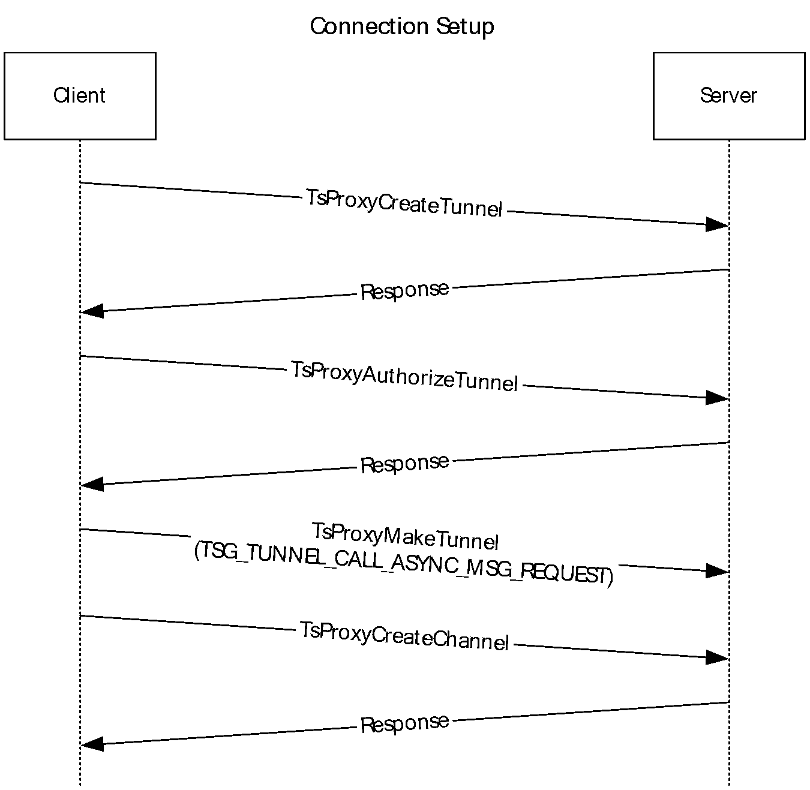

Figure 1: Message sequence between the RDG client and RDG server during connection setup phase

##### 1.3.1.1.2 Data Transfer Phase

The data transfer phase allows for data transfer between the RDG [**client**](#gt_client) and the [**target server**](#gt_target-server) via the RDG [**server**](#gt_server). In this phase, the RDG server acts as a proxy between the RDG client and the target server, as shown in the following diagram.

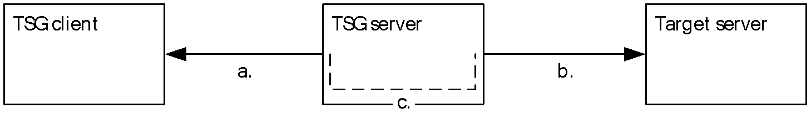

Figure 2: Connection between the RDG client and the target server via RDG server proxy

The RDG client establishes a connection to the RDG server which in turn establishes a separate connection to the target server. The resulting logical connection between the RDG client and the target server via the RDG server is called a channel. A channel can only be established within the context of a [**tunnel (2)**](#gt_1ebdc9c6-bb01-455e-98f7-8930618bb601). The channel is specific to the RDG client and tunnel instance. Multiple channels can exist within a tunnel.

- Data transfer from the target server to the RDG client via the RDG server using an [**out pipe**](#gt_out-pipe): The RDGSP Protocol uses RPC out pipes to stream data from the RDG server to the RDG client. Data from the target server is sent by the RDG server to the RDG client via the out pipe and all of the data is streamed via this pipe. The RPC out pipe is created by using the [TsProxySetupReceivePipe (section 3.2.6.2.2)](#Section_3.2.6.2.2) method, which is the fourth call in the protocol sequence. This method can be called only once per channel; however, data is sent from the RDG server to the RDG client multiple times.
- Data transfer from the RDG client to the target server via the RDG server by using an [**RPC**](#gt_remote-procedure-call-rpc) call: The RDG client uses an RPC method call to send the data that is intended for delivery to the target server by the RDG server. The method call transfers data from the RDG client to the RDG server which then sends the data to the target server. The return value of the method call indicates whether the data transfer was successful. This data transfer operation is accomplished by using the [TsProxySendToServer (section 3.2.6.2.1)](#Section_3.2.6.2.1) method, which is the fifth call in the protocol sequence. This method can be called multiple times within a channel.
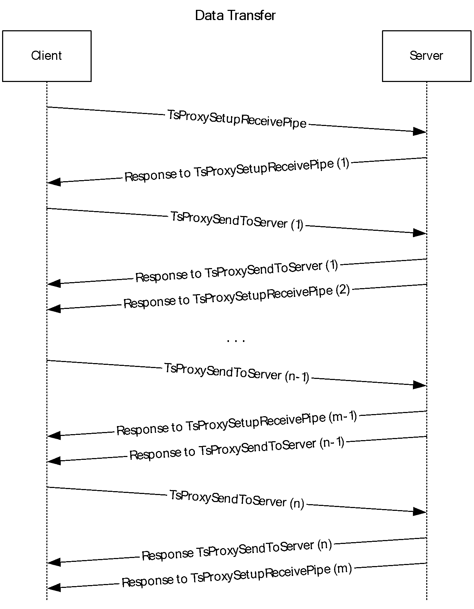

Figure 3: Message sequence between RDG client and RDG server during data transfer phase

##### 1.3.1.1.3 Shutdown Phase

This shutdown phase is used to terminate the [**channel**](#gt_channel) and [**tunnel (2)**](#gt_1ebdc9c6-bb01-455e-98f7-8930618bb601). The phase consists of three operations:

- Channel shutdown: Channel shutdown can be performed only after a channel has been successfully created. A channel shutdown closes the [**RPC**](#gt_remote-procedure-call-rpc) [**out pipe**](#gt_out-pipe) created in the data transfer phase and prevents any further use of the channel. The closing of a channel can be initiated either by the RDG client or the RDG [**server**](#gt_server). To initiate channel shutdown, the client uses the [TsProxyCloseChannel (section 3.2.6.3.1)](#Section_3.2.6.3.1) method. The RDG server initiates channel shutdown by sending an RPC response [**protocol data unit (PDU)**](#gt_protocol-data-unit-pdu) with the PFC_LAST_FRAG bit set in the **pfc_flags** field as the final response PDU of the [TsProxySetupReceivePipe (section 3.2.6.2.2)](#Section_3.2.6.2.2) method. For more information about an RPC response PDU, the **pfc_flags** field, and the PFC_LAST_FRAG bit, see [[C706]](https://go.microsoft.com/fwlink/?LinkId=89824) sections 12.6.2 and 12.6.4.10.
- Cancel pending messages: If the RDG client has pending [**administrative message**](#gt_administrative-message) requests on the RDG server, the RDG client cancels these requests by calling the [TsProxyMakeTunnel (section 3.2.6.3.2)](#Section_3.2.6.1.3) call with [TSG_TUNNEL_CANCEL_ASYNC_MSG_REQUEST (section 2.2.5.2.17)](#Section_2.2.5.2.17) as a parameter.
- Tunnel shutdown: Tunnel (2) shutdown can be performed only after a tunnel has been successfully created and after all channels (if any) inside the tunnel are shut down successfully. A tunnel shutdown closes the connection between the RDG client and RDG server and is the last call in the protocol sequence. The closing of a tunnel is accomplished by using the [TsProxyCloseTunnel (section 3.2.6.3.3)](#Section_3.2.6.3.3) method.
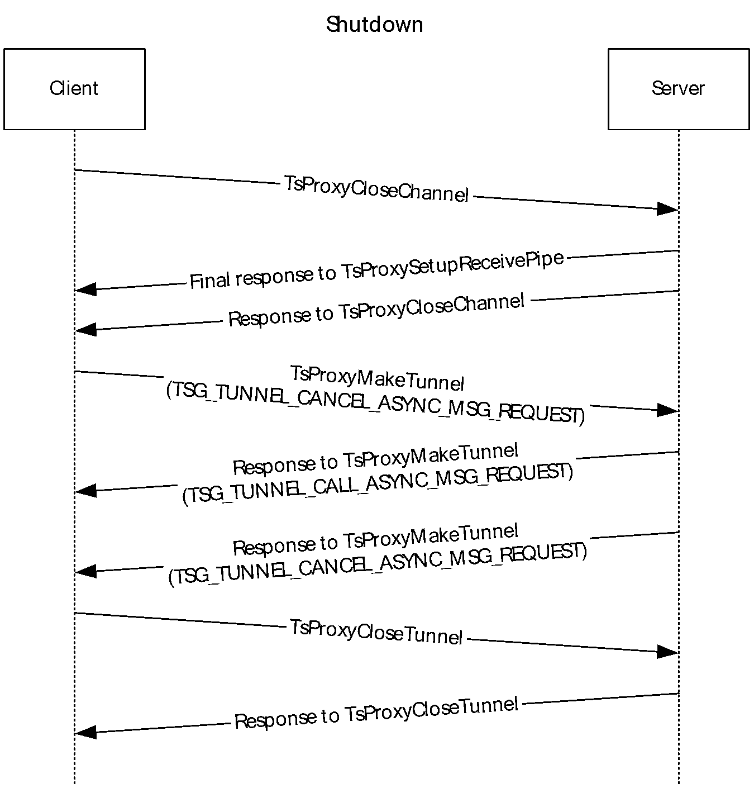

Figure 4: Message sequence between the RDG client and RDG server during shutdown phase

### 1.3.2 HTTP Transport

The RDGHTTP Protocol uses the [**HTTP**](#gt_hypertext-transfer-protocol-http) transport by creating two [**HTTP 1.1 connections**](#gt_http-11-connection) for use as communication channels to and from the RDG server. Each channel is protected by [**SSL**](#gt_secure-sockets-layer-ssl) (HTTPS).<4>

#### 1.3.2.1 RDGHTTP Protocol Phases Using HTTP Transport

The RDGHTTP Protocol uses [**HTTP**](#gt_hypertext-transfer-protocol-http) transport by operating in four phases: connection setup and authentication, tunnel and channel creation, data and server message transfer, and connection close. The following sections provide an overview of these phases. For specific details about each phase, see section [3](#Section_1.3).

##### 1.3.2.1.1 Connection Setup and Authentication Phase

The connection setup and authentication phase only involves the exchange of [**HTTP**](#gt_hypertext-transfer-protocol-http) header information and consists of three operations:

- Create [**OUT channel**](#gt_out-channel): An [**HTTP 1.1 connection**](#gt_http-11-connection) is established. If the RDG server and client both support the WebSocket protocol ([[RFC6455]](https://go.microsoft.com/fwlink/?LinkId=252388)), then this connection is used for duplex communication between the RDG client and server; otherwise, this connection is used only for outbound communication from the RDG server.<5> WebSocket support is negotiated using the Opening Handshake as specified in [RFC6455] section 1.3.
- Create [**IN channel**](#gt_in-channel): A second HTTP 1.1 connection is established for inbound communication to the RDG server if the RDG server and client don't support the WebSocket protocol. In this case, the OUT channel is used only for outbound communication.
- Authenticate user.
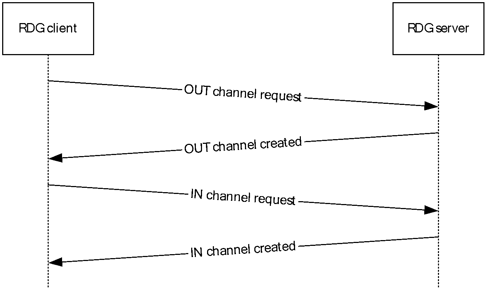

Figure 5: Message sequence between RDG client and RDG server during connection setup and authentication phase

##### 1.3.2.1.2 Tunnel and Channel Creation Phase

In the [**tunnel (2)**](#gt_1ebdc9c6-bb01-455e-98f7-8930618bb601) and [**channel**](#gt_channel) creation phase, the RDG client and RDG server exchange protocol messages as [**HTTP**](#gt_hypertext-transfer-protocol-http) request and response entity bodies. The exchange of messages is in a strict predefined order. At the end of this phase, the RDG client and RDG server are ready to start exchanging data. The phase consists of four operations:

- Exchange version and capability negotiation information.
- Create tunnel.
- Authorize tunnel.
- Create channel.
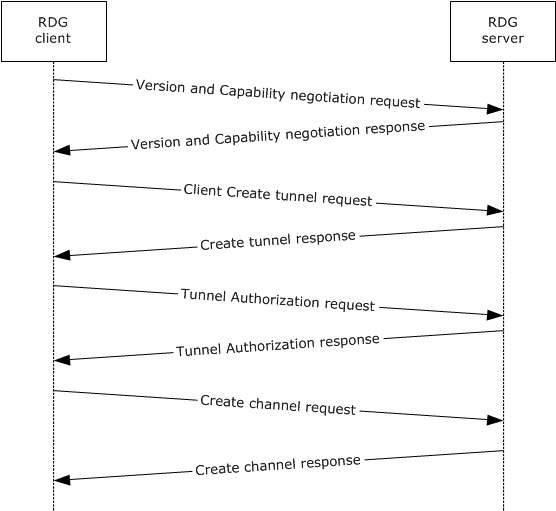

Figure 6: Message sequence between RDG client and RDG server during tunnel and channel creation phase

When the client and server have negotiated [**extended authentication**](#gt_extended-authentication), there is an additional required "Extended authentication" phase that occurs after the "Exchange version and capability negotiation information" phase.

RDG clients are permitted to close and create channels on an existing tunnel. However, only one channel can be associated with a tunnel at any given time. Due to server-side race conditions, channel creation can fail on a tunnel that was previously associated with a channel. In the case of such a failure, the RDG client closes the connection and reconnects to the RDG server using the steps outlined in sections 1.3.2.1.1 and 1.3.2.1.2.

##### 1.3.2.1.3 Data and Server Message Exchange Phase

In the data and server message exchange phase, the RDG client and RDG server send data using the [**IN channel**](#gt_in-channel) and [**OUT channels**](#gt_out-channel) as necessary, and keep-alive messages flow between the RDG server and RDG client. The RDG server sends periodic [**service messages**](#gt_service-message) or [**reauthentication**](#gt_reauthentication) requests as required.

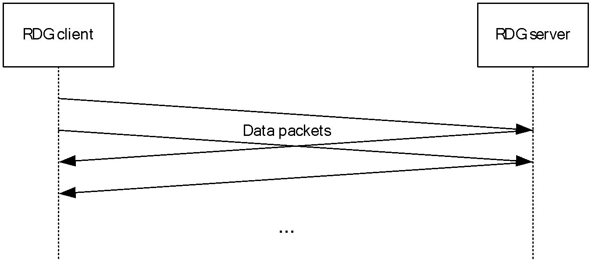

Figure 7: Message sequence between the RDG client and RDG server during the data and server message exchange phase

##### 1.3.2.1.4 Connection Close Phase

In the connection close phase, the RDG client, the RDG server, or both parties can close the connection. In the following figure, the RDG client is the initiator of the connection close request. This phase involves two operations:

- Close channel.
- Close tunnel.
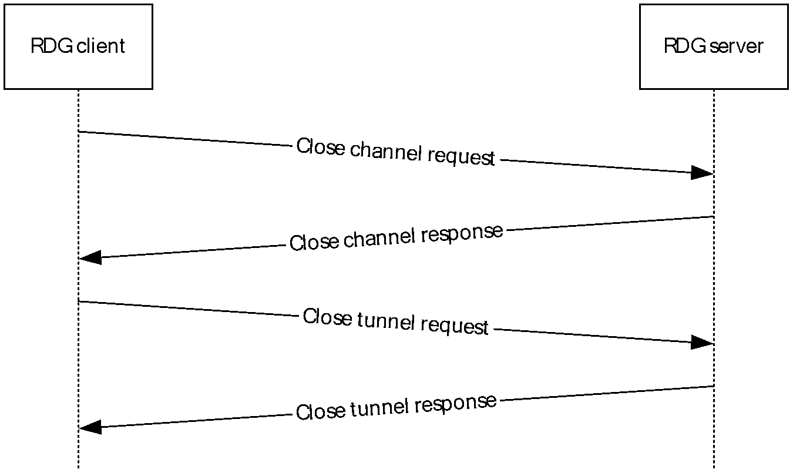

Figure 8: Message sequence between RDG client and RDG server during connection close phase

### 1.3.3 UDP Transport

The RDGUDP Protocol is designed for tunneling graphics and the audio and video data for remote connections from RDG clients originating on the Internet to [**target servers**](#gt_target-server) behind a firewall.<6>

The protocol creates a [**tunnel (2)**](#gt_1ebdc9c6-bb01-455e-98f7-8930618bb601) object on the RDG client and then uses the tunnel to establish a [**channel**](#gt_channel) between the RDG client and the target server with the RDG server acting as a proxy. Data transfer between the RDG client and the target server occurs by using the channel. The tunnel and channel maintain active connections.

Communication from the RDG client to the RDG server and from the RDG server to the RDG client is accomplished using [**UDP**](#gt_user-datagram-protocol-udp). The RDG client performs the [**DTLS**](#gt_datagram-transport-layer-security-dtls) [**handshake**](#gt_handshake) with the RDG server to establish a secure channel. To ensure that the RDG server is reachable from the RDG client, the first packet during the DTLS handshake is sent in a reliable manner from the RDG client to the RDG server. After the DTLS handshake is complete, the RDG client sends a [CONNECT_PKT Structure (section 2.2.11.3)](#Section_2.2.11.3) packet to the RDG server in a reliable manner until it receives a [CONNECT_PKT_RESP Structure (section 2.2.11.4)](#Section_2.2.11.4) packet in response. After the connect response is received with a success result code, the UDP channel is ready to transfer [**Remote Desktop Protocol (RDP)**](#gt_remote-desktop-protocol-rdp) packets.

Before creating the UDP channel ([**side channel**](#gt_side-channel)), the RDG client establishes a [**main channel**](#gt_main-channel) to the target server through the RDG server.

#### 1.3.3.1 RDGUDP Protocol Phases Using UDP Transport

The RDGUDP Protocol uses the [**UDP**](#gt_user-datagram-protocol-udp) transport by operating in four phases: DTLS handshake, connection setup, data transfer, and shutdown. The following sections provide an overview of these phases. For specific details about each phase, see section [3](#Section_1.3).

##### 1.3.3.1.1 DTLS Handshake Phase

The [**DTLS**](#gt_datagram-transport-layer-security-dtls) [**handshake**](#gt_handshake) phase involves the establishment of a secure connection between the RDG [**client**](#gt_client) and the RDG server. After all the data packets have been transmitted during the handshake, the RDG client and RDG server transition into the [connection setup phase (section 1.3.3.1.2)](#Section_1.3.3.1.2). Implementation details about the DTLS handshake and retransmission of packets during the handshake are specified in [[RFC4347]](https://go.microsoft.com/fwlink/?LinkId=227111) section 3.2.

The DTLS handshake phase consists of two operations:

- The RDG client sends the first packet in a reliable manner: the first packet is retransmitted for a pre-determined number of times until the packet is received from the RDG server. If the first packet is not received from the RDG server after the pre-determined number of attempts, the result of the connection establishment to the UDP channel is marked as a failure.
- The remainder of the DTLS handshake is performed in a non-reliable manner: any packet lost on the network is considered to be lost and no attempt is made to retransmit the lost packet. In this case, the RDG client and the RDG server are required to handle packets lost during the handshake and retransmit as necessary.
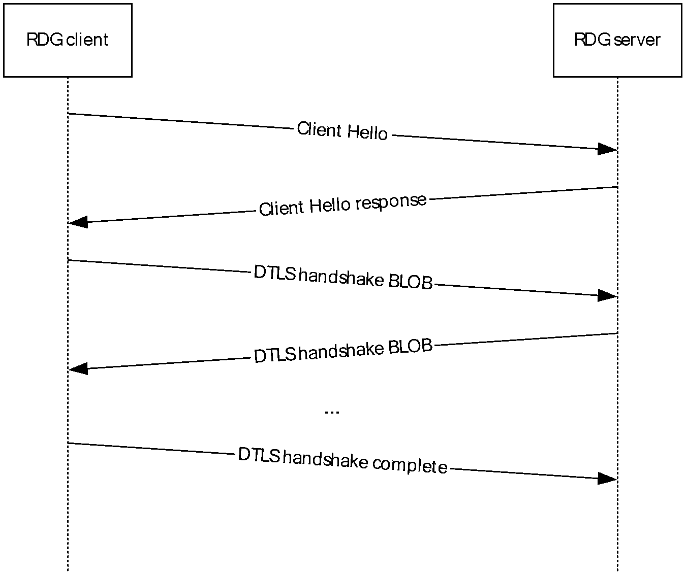

Figure 9: Message sequence between RDG client and RDG server during DTLS handshake phase

An optional UDP_CORRELATION_INFO structure (section [2.2.11.9](#Section_2.2.11.9)) can be appended to the ClientHello request and included in the initial client-to-RDG packet. This structure contains a correlation identifier GUID, containing the same GUID value as described in the custom HTTP header RDG-Correlation-Id (section [2.2.3.2.2](#Section_2.2.3.2.2).) This structure extends the initial RFC4347 packet's size, but is not included in the DTLS verify_data calculations.

##### 1.3.3.1.2 Connection Setup Phase

The connection setup phase consists of three operations:

- The RDG client sends the [CONNECT_PKT Structure (section 2.2.11.3)](#Section_2.2.11.3) packet to the RDG server for a predetermined number of times until the client receives the [CONNECT_PKT_RESP Structure (section 2.2.11.4)](#Section_2.2.11.4) packet from the RDG server.
- The RDG server authenticates the RDG client using the cookie sent in the CONNECT_PKT Structure packet. If the cookie validation is successful, the RDG client establishes the [**UDP**](#gt_user-datagram-protocol-udp) connection to the target server using the IP address specified in the cookie.
- The RDG server stores the result of the connection establishment in the CONNECT_PKT_RESP Structure packet and sends the packet back to the RDG client.
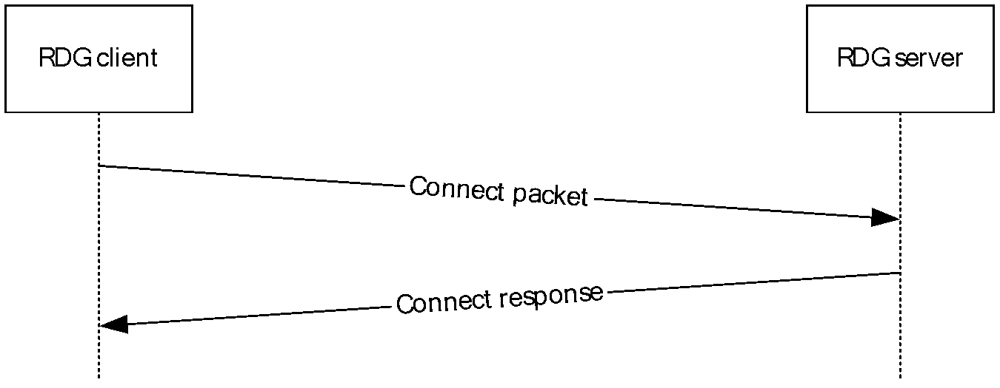

Figure 10: Message sequence between RDG client and RDG server during connection setup phase

##### 1.3.3.1.3 Data Transfer Phase

The data transfer phase enables the transmission of data packets between the RDG [**client**](#gt_client) and the [**target server**](#gt_target-server) by using the RDG server as a proxy. In contrast to the use of RPC over HTTP as the transport, when using [**UDP**](#gt_user-datagram-protocol-udp), the [**tunnel (2)**](#gt_1ebdc9c6-bb01-455e-98f7-8930618bb601) is a logical entity and the [**channel**](#gt_channel) is the end-to-end connection between the RDG client and the target server. In addition, a tunnel can consist of only one channel.

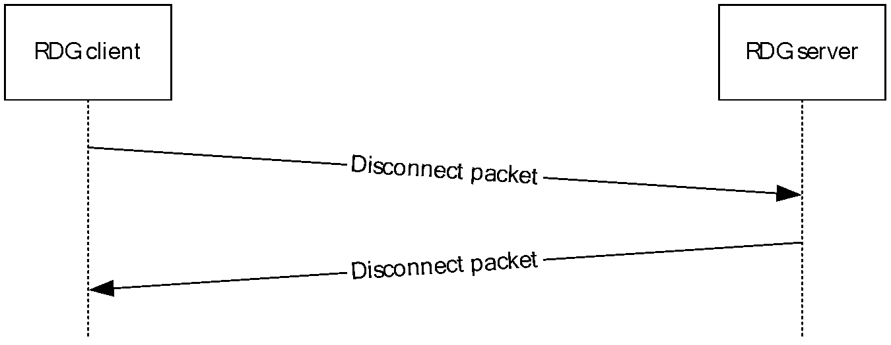

Figure 11: Message sequence between RDG client and RDG server during data transfer phase

##### 1.3.3.1.4 Shutdown Phase

The shutdown phase is used to terminate the [**UDP**](#gt_user-datagram-protocol-udp) [**channel**](#gt_channel) and end the connection between the RDG client and the RDG server. To tear down the channel and terminate the connection, either the RDG client or the RDG server sends the [DISC_PKT Structure (section 2.2.11.6)](#Section_2.2.11.6) packet to the other party.

Figure 12: Message sequence between the RDG client and RDG server during shutdown phase

## 1.4 Relationship to Other Protocols

This protocol is dependent upon the Remote Procedure Call over HTTP Protocol [MS-RPCH](../MS-RPCH/MS-RPCH.md) for the use of [**RPC**](#gt_remote-procedure-call-rpc) as a transport.

This protocol is dependent upon the Hypertext Transfer Protocol -- HTTP/1.1 [[RFC7230]](https://go.microsoft.com/fwlink/?LinkId=402094) for the use of [**HTTP**](#gt_hypertext-transfer-protocol-http) as a transport.

This protocol is dependent upon the User Datagram Protocol [[RFC768]](https://go.microsoft.com/fwlink/?LinkId=90490) for the use of [**UDP**](#gt_user-datagram-protocol-udp) as a transport.

No other protocol depends on the RDGSP Protocol.

The [**RDP**](#gt_remote-desktop-protocol-rdp) client and [**target server**](#gt_target-server) can use the RDGSP Protocol as its transport for traversing corporate firewalls. RDP data is passed through this transport. As a result, RDP does not track the TSG protocol. RDP is specified in [MS-RDPBCGR](../MS-RDPBCGR/MS-RDPBCGR.md).

## 1.5 Prerequisites/Preconditions

### 1.5.1 Common Prerequisites/Preconditions

The RDG [**client**](#gt_client) is required to obtain the name of the RDG [**server**](#gt_server) that supports the RDG service before the RDGSP Protocol is invoked.

The RDG client is required to obtain the name of the [**target server**](#gt_target-server) for making a channel connection.

A certificate is required to be deployed on the RDG server. The root authority of the certificate has to be trusted on the client as required by [**HTTPS**](#gt_hypertext-transfer-protocol-secure-https) and [**DTLS**](#gt_datagram-transport-layer-security-dtls).

### 1.5.2 Prerequisites/Preconditions for RPC Transport

The RDGSP Protocol is an RPC over HTTP Protocol type interface, and therefore has the prerequisites specified in [[C706]](https://go.microsoft.com/fwlink/?LinkId=89824) part 2, 3, and 4, [MS-RPCE](../MS-RPCE/MS-RPCE.md) sections 2 and 3, and [MS-RPCH](../MS-RPCH/MS-RPCH.md) section 2.1.

### 1.5.3 Prerequisites/Preconditions for HTTP Transport

The RDGHTTP Protocol requires RDG clients to support [**HTTP**](#gt_hypertext-transfer-protocol-http) version 1.1. When an RDG client supports only HTTP version 1.0, some features available in HTTP version 1.1 cannot be used. For example, when the [**chunked transfer**](#gt_chunked-transfer) encoding feature in HTTP version 1.1 cannot be used, the **content-length** field in the HTTP 1.0 header is used instead.

### 1.5.4 Prerequisites/Preconditions for UDP Transport

The RDGUDP Protocol requires the RDG [**client**](#gt_client) to establish a [**main channel**](#gt_main-channel) to the [**target server**](#gt_target-server) through the RDG server.

The RDG client is required to obtain the [**UDP authentication cookie**](#gt_udp-authentication-cookie) on the main channel.

## 1.6 Applicability Statement

This protocol is applicable when a [**client**](#gt_client) on the Internet or local private network requires a connection to a [**target server**](#gt_target-server) that is behind a firewall.

## 1.7 Versioning and Capability Negotiation

The supported transports for this protocol are as follows:

- [**RPC**](#gt_remote-procedure-call-rpc) over HTTP ([MS-RPCH](../MS-RPCH/MS-RPCH.md)) is used as the main transport.
- [**HTTP**](#gt_hypertext-transfer-protocol-http) transport is used for the [**main channel**](#gt_main-channel).
- [**UDP**](#gt_user-datagram-protocol-udp) transport is used for the [**side channel**](#gt_side-channel).

### 1.7.1 RPC Over HTTP Transport

- Protocol Version: The RDGSP Protocol [**RPC**](#gt_remote-procedure-call-rpc) interface has a single version number of 1.3. The RDGSP Protocol can be extended without altering the version number by adding RPC methods to the interface with [**opnums**](#gt_opnum) lying numerically beyond those defined in this specification. An RDG [**client**](#gt_client) determines whether such methods are supported by attempting to invoke the method. If the method is not supported, the RDG [**server**](#gt_server) returns an RPC_S_PROCNUM_OUT_OF_RANGE error. RPC versioning and capacity negotiation are specified in [[C706]](https://go.microsoft.com/fwlink/?LinkId=89824) section 4.2.4.2 and [MS-RPCE](../MS-RPCE/MS-RPCE.md) section 1.7. The [**Network Data Representation (NDR)**](#gt_network-data-representation-ndr) version required for this transport is 0x50002.
- Security and Authentication Methods: The RDGSP Protocol supports all authentication methods as specified in [MS-RPCE] section 1.7. The NTLM and Schannel authentication methods have pluggable security provider modules, as specified in [MS-RPCE] section 2.2.1.1.7. [**RPC authentication**](#gt_rpc-authentication) APIs are specified in [C706] section 2.7. In addition to RPC authentication, the RDGSP Protocol supports cookie-based [**pluggable authentication**](#gt_pluggable-authentication).
The RDGSP Protocol does not make direct calls using NTLM, [**Secure channel (Schannel)**](#gt_secure-channel-schannel), and Basic authentication, but instead uses RPC over HTTP as specified in [MS-RPCE] section 2.1.1.8. The NTLM sequence for RPC is provided in section 4.2.

- Capability Negotiation: This protocol does not enforce any explicit version negotiation, but there is support for version negotiation. An explicit capabilities check is performed by the RDG client to ensure that its capabilities are supported and matched by the RDG server. The RDG client and RDG server announce their version and capabilities by using the [TsProxyCreateTunnel](#Section_3.2.6.1.1) method call. For specifications on the current version and capabilities announced by the RDG client and RDG server, see section [2.2.7](#Section_2.2.7).

### 1.7.2 HTTP Transport

Protocol Version: The RDGHTTP protocol exchanges protocol version information in the initial packet exchanges. If the version exchanged is not supported by the receiver, the connection is dropped. If the RDG [**server**](#gt_server) receives a version number lower than what it supports, it can respond with that same version number. This can happen when the RDG server is operating in a lower version mode. When the RDG server does not support the RDG client's version, the RDG server can drop the connection with an error message. If the RDG server receives a higher version number than it supports, it responds with an error and drops the connection. The RDG client employs the same logic for responding to a different version number.

- Security and Authentication Methods: The RDGHTTP Protocol supports Negotiate, NTLM, Digest, and Basic authentication methods supported by HTTP. If [**extended authentication**](#gt_extended-authentication) is used, this is performed after the HTTP connection creation. The RDG server certificate is used for authentication and [**SSL**](#gt_secure-sockets-layer-ssl) protection.
- Capability Negotiation: An explicit capabilities check is performed by the RDG client to ensure that its capabilities are supported and matched by the RDG server. The RDG client and RDG server announce their capabilities in the initial packet exchange. For specifications on the capabilities announced by the RDG client and RDG server, see section [2.2.7](#Section_2.2.7).

### 1.7.3 UDP Transport

- Supported Transports: Use of the [**UDP**](#gt_user-datagram-protocol-udp) transport by the RDGUDP Protocol works only with the [**main channel**](#gt_main-channel) after it has been established by the RDGHTTP Protocol using [**HTTP**](#gt_hypertext-transfer-protocol-http) transport.
- Protocol Version: 1.0.
- Security and Authentication Methods: The RDGUDP Protocol supports the [**UDP authentication cookie**](#gt_udp-authentication-cookie) and [**smart card authentication**](#gt_smart-card-authentication) methods.
- Capability Negotiation: None.

## 1.8 Vendor-Extensible Fields

This protocol uses **HRESULT** datatypes as specified in [MS-ERREF](../MS-ERREF/MS-ERREF.md) section 2.1. Vendors can choose their own values for this field, as long as the C bit (0x20000000) is set, indicating it is a customer code.

## 1.9 Standards Assignments

### 1.9.1 RPC Over HTTP Transport

The following table contains the RPC interface [**universal unique identifier (UUID)**](#gt_universally-unique-identifier-uuid), protocol sequence, and endpoint ports used by this protocol.

| Parameter | Value | Reference |
| --- | --- | --- |
| RPC interface UUID | 44e265dd-7daf-42cd-8560-3cdb6e7a2729 | [[C706]](https://go.microsoft.com/fwlink/?LinkId=89824) section 2.1.1 |
| ProtocolSequence | ncacn_http | Section [1.5](#Section_1.5.2) |
| [**endpoint**](#gt_endpoint) | 80, 443, and 3388 | Section [2.1](#Section_2.1) |

### 1.9.2 HTTP Transport

The RDG server binds on the following HTTP/HTTPS binding URLs and listens on the following default endpoint ports.

| Parameter | Value | Reference |
| --- | --- | --- |
| HTTP Binding URL | http://+:<Port number>/remoteDesktopGateway/Port number is configurable. | Section [2.1.2](#Section_2.1.2) |
| HTTPS Binding URL | https://+:<Port number>/remoteDesktopGateway/Port number is configurable. | Section 2.1.2 |
| endpoint | 80 and 443, as configured in HTTPS Binding URL, or HTTP Binding URL | Section 2.1.2 |

### 1.9.3 UDP Transport

The following is the endpoint port used to listen for incoming UDP packets.

| Parameter | Value | Reference |
| --- | --- | --- |
| endpoint | 3391 | Section [2.1.3](#Section_2.1.3) |

# 2 Messages

The following sections specify how the Remote Desktop Gateway Server Protocol messages are transported and common data types.

## 2.1 Transport

### 2.1.1 RPC Over HTTP Transport

The RDGSP Protocol uses the Remote Procedure Call over HTTP Protocol [MS-RPCH](../MS-RPCH/MS-RPCH.md) as transport.

This protocol uses the following static [**endpoints**](#gt_endpoint) as well as [**well-known endpoints**](#gt_well-known-endpoint). These endpoints are ports as defined in [MS-RPCH] section 1.5 on the RDG [**server**](#gt_server). The only protocol sequence used for the transport is "ncacn_http".

- Port 80: This endpoint is used by [MS-RPCH] as the underlying transport, when [MS-RPCH] runs over plain HTTP.
- Port 443: This endpoint is used by [MS-RPCH] as the underlying transport, when [MS-RPCH] runs over [**HTTPS**](#gt_hypertext-transfer-protocol-secure-https).
- Port 3388: This endpoint is used by the RDG server to listen for incoming [**RPC**](#gt_remote-procedure-call-rpc) method calls. The authenticated RPC interface allows RPC to negotiate the use of authentication and the [**authentication level**](#gt_authentication-level) on behalf of the RDG [**client**](#gt_client) and [**target server**](#gt_target-server).
Port 3388 endpoint and at least one of Port 80 and Port 443 endpoints MUST be supported.

The RDGSP Protocol MUST use the [**UUID**](#gt_universally-unique-identifier-uuid), as specified in section [1.9](#Section_1.9). The RPC version number is 1.3.

### 2.1.2 HTTP Transport

The [**HTTP**](#gt_hypertext-transfer-protocol-http) transport based RDG protocol is transported by an [**HTTPS**](#gt_hypertext-transfer-protocol-secure-https) connection. By default the RDG [**server**](#gt_server) listens on the URL HTTPS Binding URL with port 443. However, the port number can be configured to a different value, see section [3.1.1](#Section_3.2.2) for details.

When the RDG server connects with a reverse proxy, the connection from the RDG [**client**](#gt_client) is terminated and another connection to the RDG server is created, over which data is relayed. The connection between the reverse proxy and the RDG server can then be over HTTP without [**SSL**](#gt_secure-sockets-layer-ssl), for which the RDG server also binds on the HTTP binding URL.

### 2.1.3 UDP Transport

This protocol uses [**UDP**](#gt_user-datagram-protocol-udp) transport.

This protocol uses the following [**endpoints**](#gt_endpoint).

- Port 3391: This endpoint is used by the RDG server to listen for incoming UDP packets.

## 2.2 Data Types

### 2.2.1 Common Data Types

The following sections describe the data types that are used by all the transports of RDG.

#### 2.2.1.1 RESOURCENAME

This type is declared as follows:

typedef [string] wchar_t* RESOURCENAME;

The target server name to which the RDG server connects. This refers to the ADM element **Target server name** (sections [3.1.1](#Section_3.2.2) and [3.5.1](#Section_3.2.2)). The name MUST NOT be NULL and SHOULD be a valid server name. A valid [**target server**](#gt_target-server) name is one which DNS can resolve properly. Also, a valid target server is one which is up and running, and can accept a [**terminal server**](#gt_terminal-server) connection.

A **RESOURCENAME** can be an IP address, FQDN, or NetBIOS name. DNS cannot resolve all NetBIOS names—for example, there are differences in the allowed characters, differences in length, and differences in composition rules. Therefore, RESOURCENAME can be a NetBIOS name if the NetBIOS name uses characters and length restrictions allowed by DNS which enables DNS to resolve the name.

### 2.2.2 RPC Over HTTP Transport Data Types

In addition to the [**RPC**](#gt_remote-procedure-call-rpc) base types and definitions as specified in [[C706]](https://go.microsoft.com/fwlink/?LinkId=89824) section 3.1, [MS-RPCE](../MS-RPCE/MS-RPCE.md) section 2.2 and [MS-DTYP](#Section_2.2), additional data types are defined in the following sections.

In addition to the RPC base types and definitions described, the additional data types are defined in the MIDL specification for this RPC interface.

#### 2.2.2.1 PTUNNEL_CONTEXT_HANDLE_NOSERIALIZE

An [**RPC**](#gt_remote-procedure-call-rpc) context [**handle**](#gt_handle) representing the [**tunnel (2)**](#gt_1ebdc9c6-bb01-455e-98f7-8930618bb601) for the given connection. For details about the modes of the context handles, see [[MSDN-MMSCH]](https://go.microsoft.com/fwlink/?LinkId=151562). For the NOSERIALIZE context handle, there can be more than one pending RPC call on the RDG server. However, on the wire, it is identical to PTUNNEL_CONTEXT_HANDLE_SERIALIZE.

This type is declared as follows:

typedef [context_handle] void* PTUNNEL_CONTEXT_HANDLE_NOSERIALIZE;

The context handle MUST NOT be type_strict, but it MUST be strict. More details on RPC context handles are specified in [[C706]](https://go.microsoft.com/fwlink/?LinkId=89824) sections 4.2.16.6, 5.1.6, and 6.1 and [MS-RPCE](../MS-RPCE/MS-RPCE.md) sections 3.1.1.5.3.2.2.2 and 3.3.1.4.1.

#### 2.2.2.2 PCHANNEL_CONTEXT_HANDLE_NOSERIALIZE

An [**RPC**](#gt_remote-procedure-call-rpc) context [**handle**](#gt_handle) representing the [**channel**](#gt_channel) for the given connection. For details on modes of the context handles, see [[MSDN-MMSCH]](https://go.microsoft.com/fwlink/?LinkId=151562). For the NOSERIALIZE context handle, there can be more than one pending RPC call on the RDG server. However, on the wire, it is identical to PCHANNEL_CONTEXT_HANDLE_SERIALIZE.

This type is declared as follows:

typedef [context_handle] void* PCHANNEL_CONTEXT_HANDLE_NOSERIALIZE;

The context handle MUST NOT be type_strict, but it MUST be strict. More details on RPC context handles are specified in [[C706]](https://go.microsoft.com/fwlink/?LinkId=89824) sections 4.2.16.6, 5.1.6, and 6.1 and [MS-RPCE](../MS-RPCE/MS-RPCE.md) section 3.1.1.5.3.2.2.2 and 3.3.1.4.1.

#### 2.2.2.3 PTUNNEL_CONTEXT_HANDLE_SERIALIZE

An [**RPC**](#gt_remote-procedure-call-rpc) context [**handle**](#gt_handle) representing the [**tunnel (2)**](#gt_1ebdc9c6-bb01-455e-98f7-8930618bb601) for the given connection. For details about the modes of the context handles, see [[MSDN-MMSCH]](https://go.microsoft.com/fwlink/?LinkId=151562). For this context handle, there can be no more than one pending RPC call on the RDG server. On the wire it is identical to PTUNNEL_CONTEXT_HANDLE_NOSERIALIZE.

This type is declared as follows:

typedef [context_handle] PTUNNEL_CONTEXT_HANDLE_NOSERIALIZE PTUNNEL_CONTEXT_HANDLE_SERIALIZE;

The context handle MUST NOT be type_strict, but it MUST be strict. More details on RPC context handles are specified in [[C706]](https://go.microsoft.com/fwlink/?LinkId=89824) sections 4.2.16.6, 5.1.6, and 6.1 and [MS-RPCE](../MS-RPCE/MS-RPCE.md) section 3.1.1.5.3.2.2.2 and 3.3.1.4.1.

#### 2.2.2.4 PCHANNEL_CONTEXT_HANDLE_SERIALIZE

An [**RPC**](#gt_remote-procedure-call-rpc) context [**handle**](#gt_handle) representing the [**channel**](#gt_channel) for the given connection. For details on the modes of the context handles, see [[MSDN-MMSCH]](https://go.microsoft.com/fwlink/?LinkId=151562). For this context handle, there can be no more than one pending RPC call on the RDG server. On the wire it is identical to PCHANNEL_CONTEXT_HANDLE_NOSERIALIZE.

This type is declared as follows:

typedef [context_handle] PCHANNEL_CONTEXT_HANDLE_NOSERIALIZE PCHANNEL_CONTEXT_HANDLE_SERIALIZE;

The context handle MUST NOT be type_strict, but it MUST be strict. More details on RPC context handles are specified in [[C706]](https://go.microsoft.com/fwlink/?LinkId=89824) sections 4.2.16.6, 5.1.6, and 6.1 and [MS-RPCE](../MS-RPCE/MS-RPCE.md) section 3.1.1.5.3.2.2.2 and 3.3.1.4.1.

### 2.2.3 HTTP Transport Data Types

#### 2.2.3.1 Custom HTTP Methods

This protocol defines the following custom HTTP methods.

| Method | Description |
| --- | --- |
| [RDG_IN_DATA (section 2.2.3.1.1)](#Section_2.2.3.1.1) | Request to create an [**IN channel**](#gt_in-channel). |
| [RDG_OUT_DATA (section 2.2.3.1.2)](#Section_2.2.3.1.2) | Request to create an [**OUT channel**](#gt_out-channel). |

##### 2.2.3.1.1 RDG_IN_DATA

This method is used to create an [**IN channel**](#gt_in-channel) by the RDG [**server**](#gt_server). The custom header [RDG-Connection-Id (section 2.2.3.2.1)](#Section_2.2.3.2.1) is set to a unique identifier, a [**GUID**](#gt_globally-unique-identifier-guid) that is generated by the RDG client and is used to correlate IN channel and [**OUT channel**](#gt_out-channel). The client disallows caching.

##### 2.2.3.1.2 RDG_OUT_DATA

This method is used to create an [**OUT channel**](#gt_out-channel) by the RDG [**server**](#gt_server). The custom header [RDG-Connection-Id (section 2.2.3.2.1)](#Section_2.2.3.2.1) is set to a unique identifier, a [**GUID**](#gt_globally-unique-identifier-guid) which is used in creating the [**IN channel**](#gt_in-channel) request. The client disallows caching.

#### 2.2.3.2 Custom HTTP Headers

The messages exchanged in this protocol use the following HTTP headers in addition to the existing set of standard HTTP headers.

| Header | Description |
| --- | --- |
| [RDG-Connection-Id (section 2.2.3.2.1)](#Section_2.2.3.2.1) | A [**GUID**](#gt_globally-unique-identifier-guid) generated by the RDG client, which is used by the [RDG_IN_DATA (section 2.2.3.1.1)](#Section_2.2.3.1.1) and [RDG_OUT_DATA (section 2.2.3.1.2)](#Section_2.2.3.1.2) methods to correlate between the [**IN channel**](#gt_in-channel) and the [**OUT channel**](#gt_out-channel). |
| [RDG-Correlation-Id (section 2.2.3.2.2)](#Section_2.2.3.2.2) | Optional GUID used to specify a correlation identifier for the connection. |
| [RDG-User-Id (section 2.2.3.2.3)](#Section_2.2.3.2.3) | Optional user name associated with the connection. |

##### 2.2.3.2.1 RDG-Connection-Id

A [**GUID**](#gt_globally-unique-identifier-guid) generated by the RDG client, which is used by [RDG_IN_DATA (section 2.2.3.1.1)](#Section_2.2.3.1.1) and [RDG_OUT_DATA (section 2.2.3.1.2)](#Section_2.2.3.1.2) methods to correlate the [**IN channel**](#gt_in-channel) and the [**OUT channel**](#gt_out-channel).

##### 2.2.3.2.2 RDG-Correlation-Id

An optional header containing a GUID, generated by the RDG client, which specifies the correlation identifier for the connection, which can appear in some of the RDG or [**terminal server's**](#gt_terminal-server) event logs. This value, if provided, MUST be the same as provided in the RDP_NEG_CORRELATION_INFO structure ([MS-RDPBCGR](../MS-RDPBCGR/MS-RDPBCGR.md) section 2.2.1.1.2) or RDPUDP_CORRELATION_ID_PAYLOAD structure ([MS-RDPEUDP](#Section_1.7.3) section 2.2.2.8).

The RDG-Correlation-Id header value is an ASCII representation of a GUID, including curly braces.

##### 2.2.3.2.3 RDG-User-Id

An optional header containing the name of the user requesting use of the RDG. This value, if provided, is used only for event logging purposes, as an aid to identify the specific user related to an event.

The RDG-User-Id header value is the user’s name in Unicode, encoded using BASE64.

#### 2.2.3.3 Custom URL Query Parameters

The protocol supports several URL query parameters in HTTP and WebSocket protocol requests from the client. The parameters provide an alternative to the custom HTTP headers defined in section [2.2.3.2](#Section_2.2.3.2), and their values are included in a query string as a part of the RDG server URL. The query string MUST be set to a serialization of the parameter name/value pairs, using the "application/x-www-form-urlencoded" encoding specified in [[URL]](https://go.microsoft.com/fwlink/?linkid=853950).

The server MUST accept these parameters as an alternative to the custom HTTP headers when processing a WebSocket Upgrade request ([[RFC6455]](https://go.microsoft.com/fwlink/?LinkId=252388) section 4).

The following URL query parameters are defined:

| Name | Description |
| --- | --- |
| ConId (section [2.2.3.3.1](#Section_2.2.3.3.1)) | A client-generated connection identifier. |
| CorId (section [2.2.3.3.2](#Section_2.2.3.3.2)) | A client-generated correlation identifier. |
| UsrId (section [2.2.3.3.3](#Section_2.2.3.3.3)) | The name of the user connecting to the RDG. |
| AuthS (section [2.2.3.3.4](#Section_2.2.3.3.4)) | The custom authentication scheme. |
| ClGen (section [2.2.3.3.5](#Section_2.2.3.3.5)) | The client generation string. |
| ClBld (section [2.2.3.3.6](#Section_2.2.3.3.6)) | The client build string. |
| ClmTk (section [2.2.3.3.7](#Section_2.2.3.3.7)) | Reserved for future use. |

##### 2.2.3.3.1 ConId

A [**GUID**](#gt_globally-unique-identifier-guid) generated by the RDG client, equivalent to the RDG-Connection-Id (section [2.2.3.2.1](#Section_2.2.3.2.1)) header.

##### 2.2.3.3.2 CorId

An optional client-generated [**GUID**](#gt_globally-unique-identifier-guid), equivalent to the RDG-Correlation-Id (section [2.2.3.2.2](#Section_2.2.3.2.2)) header.

##### 2.2.3.3.3 UsrId

An optional value containing the name of the user requesting use of the RDG, equivalent to the RDG-User-Id (section [2.2.3.2.3](#Section_2.2.3.2.3)) header.

##### 2.2.3.3.4 AuthS

An optional value containing the name of a custom authentication scheme. This field is used in a similar way to the HTTP Authorization header when specifying an [**extended authentication**](#gt_extended-authentication) scheme.

##### 2.2.3.3.5 ClGen

An optional string identifying the type and "generation" of the client program.

##### 2.2.3.3.6 ClBld

An optional string identifying the specific build of the client program.

##### 2.2.3.3.7 ClmTk

This field is reserved for future use.

### 2.2.4 UDP Transport Data Types

None.

### 2.2.5 Constants

#### 2.2.5.1 Common Constants

None.

#### 2.2.5.2 RPC Transport Constants

##### 2.2.5.2.1 MAX_RESOURCE_NAMES

| Constant/value | Description |
| --- | --- |
| MAX_RESOURCE_NAMES 50 | The maximum range allowed by the RDG [**server**](#gt_server) for the **numResourceNames** data type in the [TSENDPOINTINFO](#Section_2.2.9.1) structure. |

##### 2.2.5.2.2 TSG_PACKET_TYPE_HEADER

| Constant/value | Description |
| --- | --- |
| TSG_PACKET_TYPE_HEADER 0x00004844 | This constant is used by the **packetId** field of the [TSG_PACKET](#Section_2.2.9.2) structure. The RDG [**client**](#gt_client) and RDG [**server**](#gt_server) SHOULD not use this type, as specified in sections 2.2.9.2 and [2.2.9.2.1.1](#Section_2.2.9.2.1.10). |

##### 2.2.5.2.3 TSG_PACKET_TYPE_VERSIONCAPS

| Constant/value | Description |
| --- | --- |
| TSG_PACKET_TYPE_VERSIONCAPS 0x00005643 | This constant is used by the **packetId** field of the [TSG_PACKET](#Section_2.2.9.2) structure. When this constant is present, the **packetVersionCaps** field of the **TSGPacket** union field in the TSG_PACKET structure MUST be a pointer to a [TSG_PACKET_VERSIONCAPS](#Section_2.2.9.2.1.2) structure. |

##### 2.2.5.2.4 TSG_PACKET_TYPE_QUARCONFIGREQUEST

| Constant/value | Description |
| --- | --- |
| TSG_PACKET_TYPE_QUARCONFIGREQUEST 0x00005143 | This constant is used by the **packetId** field of the [TSG_PACKET](#Section_2.2.9.2) structure. When this constant is present, the **packetQuarConfigRequest** field of the **TSGPacket** union field in the TSG_PACKET structure MUST be a pointer to a [TSG_PACKET_QUARCONFIGREQUEST](#Section_2.2.9.2.1.3) structure. |

##### 2.2.5.2.5 TSG_PACKET_TYPE_QUARREQUEST

| Constant/value | Description |
| --- | --- |
| TSG_PACKET_TYPE_QUARREQUEST 0x00005152 | This constant is used by the **packetId** field of the [TSG_PACKET](#Section_2.2.9.2) structure. When this constant is present, the **packetQuarRequest** field of the **TSGPacket** union field in the TSG_PACKET structure MUST be a pointer to a [TSG_PACKET_QUARREQUEST](#Section_2.2.9.2.1.4) structure. It is also used by the RDG server in the flags filed of the [TSG_PACKET_RESPONSE](#Section_2.2.9.2.1.5) structure in response to the [TsProxyAuthorizeTunnel](#Section_3.2.6.1.2) call. |

##### 2.2.5.2.6 TSG_PACKET_TYPE_RESPONSE

| Constant/value | Description |
| --- | --- |
| TSG_PACKET_TYPE_RESPONSE 0x00005052 | This constant is used by the **packetId** field, of the [TSG_PACKET](#Section_2.2.9.2) structure. When this constant is present, the **packetResponse** field of the **TSGPacket** union field, in the TSG_PACKET structure, MUST be a pointer to a [TSG_PACKET_RESPONSE](#Section_2.2.9.2.1.5) structure. |

##### 2.2.5.2.7 TSG_PACKET_TYPE_QUARENC_RESPONSE

| Constant/value | Description |
| --- | --- |
| TSG_PACKET_TYPE_QUARENC_RESPONSE 0x00004552 | This constant is used by the **packetId** field of the [TSG_PACKET](#Section_2.2.9.2) structure. When this type is present, the **packetQuarEncResponse** field of the **TSGPacket** union field in the TSG_PACKET structure MUST be a pointer to a [TSG_PACKET_QUARENC_RESPONSE](#Section_2.2.9.2.1.6) structure. |

##### 2.2.5.2.8 TSG_CAPABILITY_TYPE_NAP

| Constant/value | Description |
| --- | --- |
| TSG_CAPABILITY_TYPE_NAP 0x00000001 | This constant is used by the **TSGCapNap** field of [TSG_CAPABILITIES_UNION](#Section_2.2.9.2.1.2.1.1). It indicates whether [**Network Access Protection (NAP)**](#gt_network-access-protection-nap) capabilities are supported by the RDG [**client**](#gt_client) and RDG [**server**](#gt_server). |

##### 2.2.5.2.9 TSG_PACKET_TYPE_CAPS_RESPONSE

| Constant/value | Description |
| --- | --- |
| TSG_PACKET_TYPE_CAPS_RESPONSE 0x00004350 | This constant is used by the **packetId** field of the [TSG_PACKET](#Section_2.2.9.2) structure. When this type is present, the **packetCapsResponse** field of the **TSGPacket** union field in the TSG_PACKET structure MUST be a pointer to a [TSG_PACKET_CAPS_RESPONSE](#Section_2.2.9.2.1.7) structure. |

##### 2.2.5.2.10 TSG_PACKET_TYPE_MSGREQUEST_PACKET

| Constant/value | Description |
| --- | --- |
| TSG_PACKET_TYPE_MSGREQUEST_PACKET 0x00004752 | This constant is used by the **packetId** field of the [TSG_PACKET](#Section_2.2.9.2) structure. When this type is present, the **packetMsgRequest** field of the **TSGPacket** union field in the TSG_PACKET structure MUST be a pointer to a [TSG_PACKET_MSG_REQUEST](#Section_2.2.9.2.1.8) structure. |

##### 2.2.5.2.11 TSG_PACKET_TYPE_MESSAGE_PACKET

| Constant/value | Description |
| --- | --- |
| TSG_PACKET_TYPE_MESSAGE_PACKET 0x00004750 | This constant is used by the **packetId** field of the [TSG_PACKET](#Section_2.2.9.2) structure. When this type is present, the **packetMsgResponse** field of the **TSGPacket** union field in the TSG_PACKET structure MUST be a pointer to a [TSG_PACKET_MSG_RESPONSE](#Section_2.2.9.2.1.9) structure. |

##### 2.2.5.2.12 TSG_PACKET_TYPE_AUTH

| Constant/value | Description |
| --- | --- |
| TSG_PACKET_TYPE_AUTH 0x00004054 | This constant is used by the **packetId** field of the [TSG_PACKET](#Section_2.2.9.2) structure. When this type is present, the **packetAuth** field of the **TSGPacket** union field in the TSG_PACKET structure MUST be a pointer to a [TSG_PACKET_AUTH](#Section_2.2.9.2.1.10) structure. |

##### 2.2.5.2.13 TSG_PACKET_TYPE_REAUTH

| Constant/value | Description |
| --- | --- |
| TSG_PACKET_TYPE_REAUTH 0x00005250 | This constant is used by the **packetId** field of the [TSG_PACKET](#Section_2.2.9.2) structure. When this type is present, the **packetReauth** field of the **TSGPacket** union field in the TSG_PACKET structure MUST be a pointer to a [TSG_PACKET_REAUTH](#Section_2.2.9.2.1.11) structure. |

##### 2.2.5.2.14 TSG_ASYNC_MESSAGE_CONSENT_MESSAGE

| Constant/value | Description |
| --- | --- |
| TSG_ASYNC_MESSAGE_CONSENT_MESSAGE 0x00000001 | This constant is used by the **msgType** field of the TSG_PACKET_MSG_RESPONSE structure. This value indicates that the **consentMessage** field of the TSG_PACKET_TYPE_MESSAGE_UNION contains the Consent Message. |

##### 2.2.5.2.15 TSG_ASYNC_MESSAGE_SERVICE_MESSAGE

| Constant/value | Description |
| --- | --- |
| TSG_ASYNC_MESSAGE_SERVICE_MESSAGE 0x00000002 | This constant is used by the **msgType** field of the TSG_PACKET_MSG_RESPONSE structure. This value indicates that the **serviceMessage** field of the TSG_PACKET_TYPE_MESSAGE_UNION contains the Service Message. |

##### 2.2.5.2.16 TSG_ASYNC_MESSAGE_REAUTH

| Constant/value | Description |
| --- | --- |
| TSG_ASYNC_MESSAGE_REAUTH 0x00000003 | This constant is used by the **msgType** field of the TSG_PACKET_MSG_RESPONSE structure. This value indicates that the **reauthMessage** field of the TSG_PACKET_TYPE_MESSAGE_UNION contains the Reauthentication request to the client. |

##### 2.2.5.2.17 TSG_TUNNEL_CALL_ASYNC_MSG_REQUEST

| Constant/value | Description |
| --- | --- |
| TSG_TUNNEL_CALL_ASYNC_MSG_REQUEST 0x00000001 | This constant is used by the *procId* parameter of the TsProxyMakeTunnelCall method. This value indicates that the client can receive Service Messages and the RDG server SHOULD send the same when available. |

##### 2.2.5.2.18 TSG_TUNNEL_CANCEL_ASYNC_MSG_REQUEST

| Constant/value | Description |
| --- | --- |
| TSG_TUNNEL_CANCEL_ASYNC_MSG_REQUEST 0x00000002 | This constant is used by the *procId* parameter of the [TsProxyMakeTunnelCall](#Section_3.2.6.1.3) method. This value indicates that the [**client**](#gt_client) has requested to cancel the pending service message request on the RDG [**server**](#gt_server). |

##### 2.2.5.2.19 TSG_NAP_CAPABILITY_QUAR_SOH

| Constant/value | Description |
| --- | --- |
| TSG_NAP_CAPABILITY_QUAR_SOH 0x00000001 | This constant is used to represent the NAP quarantine [**statement of health (SoH)**](#gt_statement-of-health-soh) capability. If the RDG [**client**](#gt_client) supports this capability, it means that the RDG client is capable of sending a quarantine [**statement of health response (SoHR)**](#gt_statement-of-health-response-sohr) to the RDG [**server**](#gt_server) as specified in section [2.2.9.2.1.5.1](#Section_2.2.9.2.1.5.1). If the RDG server supports this capability, it means that the RDG server is capable of receiving and processing a quarantine statement of health response from the RDG client as specified in section 2.2.9.2.1.5.1.<7> |

##### 2.2.5.2.20 TSG_NAP_CAPABILITY_IDLE_TIMEOUT

| Constant/value | Description |
| --- | --- |
| TSG_NAP_CAPABILITY_IDLE_TIMEOUT 0x00000002 | This constant is used to represent the Idle timeout capability. If the RDG [**client**](#gt_client) supports this capability, it means that the RDG client is capable of receiving and processing an idle timeout value as specified in section [2.2.9.2.1.5.1](#Section_2.2.9.2.1.5.1). If the RDG [**server**](#gt_server) supports this capability, it means that the RDG server is capable of sending an idle timeout value to the client as specified in section 2.2.9.2.1.5.1. |

##### 2.2.5.2.21 TSG_MESSAGING_CAP_CONSENT_SIGN

| Constant/value | Description |
| --- | --- |
| TSG_MESSAGING_CAP_CONSENT_SIGN 0x00000004 | This constant is used to represent the consent message capability. If the RDG [**client**](#gt_client) supports this capability, it means that the RDG client is capable of receiving and processing a consent message as specified in section [2.2.9.2.1.9.1](#Section_2.2.9.2). If the RDG [**server**](#gt_server) supports this capability, it means that the RDG server is capable of sending a consent message to the RDG client as specified in section 2.2.9.2.1.9.1. |

##### 2.2.5.2.22 TSG_MESSAGING_CAP_SERVICE_MSG

| Constant/value | Description |
| --- | --- |
| TSG_MESSAGING_CAP_SERVICE_MSG 0x00000008 | This constant is used to represent the service message capability. If the RDG [**client**](#gt_client) supports this capability, it means that the RDG client is capable of receiving and processing a service message as specified in section [2.2.9.2.1.9.1](#Section_2.2.9.2). If the RDG [**server**](#gt_server) supports this capability, it means that the RDG server is capable of sending a service message to the RDG client as specified in section 2.2.9.2.1.9.1. |

##### 2.2.5.2.23 TSG_MESSAGING_CAP_REAUTH

| Constant/value | Description |
| --- | --- |
| TSG_MESSAGING_CAP_REAUTH 0x00000010 | This constant is used to represent the [**reauthentication**](#gt_reauthentication) capability. If the RDG [**client**](#gt_client) supports this capability, it means that the RDG client is capable of performing reauthentication according to the same methods as initial authentication, as specified in section [2.1](#Section_2.1). If the RDG [**server**](#gt_server) supports this capability, it means that the RDG server is capable of sending a reauthentication request to the RDG client, as specified in section [2.2.9.2.1.9.1](#Section_2.2.9.2) |

#### 2.2.5.3 HTTP Transport Constants

##### 2.2.5.3.1 HTTP_CHANNEL_RESPONSE_FIELDS_PRESENT_FLAGS Enumeration

| Constant/value | Description |
| --- | --- |
| HTTP_CHANNEL_RESPONSE_FIELD_CHANNELID 0x1 | This constant is used to represent that the [HTTP_CHANNEL_RESPONSE_OPTIONAL (section 2.2.10.5)](#Section_2.2.10.5) structure contains the **channelId** field, as specified in section [3.5.1](#Section_3.2.2). |
| HTTP_CHANNEL_RESPONSE_FIELD_AUTHNCOOKIE 0x2 | This constant is used to represent that the HTTP_CHANNEL_RESPONSE_OPTIONAL structure contains the **authnCookie** field that describes the [**UDP authentication cookie**](#gt_udp-authentication-cookie) |
| HTTP_CHANNEL_RESPONSE_FIELD_UDPPORT 0x4 | This constant is used to represent that the HTTP_CHANNEL_RESPONSE_OPTIONAL structure contains the **udpPort** field. |

##### 2.2.5.3.2 HTTP_EXTENDED_AUTH Enumeration

| Constant/value | Description |
| --- | --- |
| HTTP_EXTENDED_AUTH_NONE 0x00 | This constant represents that an [**extended authentication**](#gt_extended-authentication) is not used. |
| HTTP_EXTENDED_AUTH_SC 0x01 | This constant represents that an RDG client requested a [**smart card authentication**](#gt_smart-card-authentication). |
| HTTP_EXTENDED_AUTH_PAA 0x02 | This constant represents that an RDG client requested a [**pluggable authentication**](#gt_pluggable-authentication). |
| HTTP_EXTENDED_AUTH_SSPI_NTLM 0x04 | This constant represents that an RDG client requested [**NTLM**](#gt_fff710f9-e3d1-4991-99a2-009768d57585) authentication through the extended authentication protocol sequence. |

##### 2.2.5.3.3 HTTP_PACKET_TYPE Enumeration

| Constant/value | Description |
| --- | --- |
| PKT_TYPE_HANDSHAKE_REQUEST 0x1 | This constant represents that the packet type is [**handshake request**](#gt_handshake-request). |
| PKT_TYPE_HANDSHAKE_RESPONSE 0x2 | This constant represents that the packet type is [**handshake response**](#gt_handshake-response). |
| PKT_TYPE_EXTENDED_AUTH_MSG 0x3 | This constant represents that the packet type is an [**extended authentication**](#gt_extended-authentication) message. |
| PKT_TYPE_TUNNEL_CREATE 0x4 | This constant represents that the packet type is a [**tunnel (2)**](#gt_1ebdc9c6-bb01-455e-98f7-8930618bb601) create request. |
| PKT_TYPE_TUNNEL_RESPONSE 0x5 | This constant represents that the packet type is a tunnel (2) create response. |
| PKT_TYPE_TUNNEL_AUTH 0x6 | This constant represents that the packet type is a tunnel (2) authorization request. |
| PKT_TYPE_TUNNEL_AUTH_RESPONSE 0x7 | This constant represents that the packet type is a tunnel (2) authorization response. |
| PKT_TYPE_CHANNEL_CREATE 0x8 | This constant represents that the packet type is a [**channel**](#gt_channel) create request. |
| PKT_TYPE_CHANNEL_RESPONSE 0x9 | This constant represents that the packet type is a channel create response. |
| PKT_TYPE_DATA 0xA | This constant represents that the packet type is [**RDP**](#gt_remote-desktop-protocol-rdp) data. |
| PKT_TYPE_SERVICE_MESSAGE 0xB | This constant represents that the packet type is a service message. |
| PKT_TYPE_REAUTH_MESSAGE 0xC | This constant represents that the packet type is [**reauthentication**](#gt_reauthentication) message. |
| PKT_TYPE_KEEPALIVE 0xD | This constant represents that the packet type is keep-alive packet. |
| PKT_TYPE_CLOSE_CHANNEL 0x10 | This constant represents that the packet type is close channel request. |
| PKT_TYPE_CLOSE_CHANNEL_RESPONSE 0x11 | This constant represents that the packet type is close channel response. |

##### 2.2.5.3.4 HTTP_TUNNEL_AUTH_FIELDS_PRESENT_FLAGS Enumeration

| Constant/value | Description |
| --- | --- |
| HTTP_TUNNEL_AUTH_FIELD_SOH 0x1 | This constant represents that the [HTTP_TUNNEL_AUTH_PACKET_OPTIONAL](#Section_2.2.10.15) structure contains the **statementOfHealth** field. |

##### 2.2.5.3.5 HTTP_TUNNEL_AUTH_RESPONSE_FIELDS_PRESENT_FLAGS Enumeration

| Constant/value | Description |
| --- | --- |
| HTTP_TUNNEL_AUTH_RESPONSE_FIELD_REDIR_FLAGS 0x1 | This constant represents that [HTTP_TUNNEL_AUTH_RESPONSE_OPTIONAL](#Section_2.2.10.17) contains the **redirFlags** field. |
| HTTP_TUNNEL_AUTH_RESPONSE_FIELD_IDLE_TIMEOUT 0x2 | This constant represents that HTTP_TUNNEL_AUTH_RESPONSE_OPTIONAL contains the **idleTimeout** field. |
| HTTP_TUNNEL_AUTH_RESPONSE_FIELD_SOH_RESPONSE 0x4 | This constant represents that HTTP_TUNNEL_AUTH_RESPONSE_OPTIONAL contains the **SoHResponse** field. |

##### 2.2.5.3.6 HTTP_TUNNEL_PACKET_FIELDS_PRESENT_FLAGS Enumeration

| Constant/value | Description |
| --- | --- |
| HTTP_TUNNEL_PACKET_FIELD_PAA_COOKIE 0x1 | This constant represents that [HTTP_TUNNEL_PACKET_OPTIONAL](#Section_2.2.10.19) contains the **PAACookie** field. |
| HTTP_TUNNEL_PACKET_FIELD_REAUTH 0x2 | This constant represents that HTTP_TUNNEL_PACKET_OPTIONAL contains the **reauthTunnelContext** field. |

##### 2.2.5.3.7 HTTP_TUNNEL_REDIR_FLAGS Enumeration

| Constant/value | Description |
| --- | --- |
| HTTP_TUNNEL_REDIR_ENABLE_ALL 0x80000000 | This constant represents that device redirection is enabled for all devices |
| HTTP_TUNNEL_REDIR_DISABLE_ALL 0x40000000 | This constant represents that device redirection is disabled for all devices |
| HTTP_TUNNEL_REDIR_DISABLE_DRIVE 0x1 | This constant represents that drive redirection is disabled. |
| HTTP_TUNNEL_REDIR_DISABLE_PRINTER 0x2 | This constant represents that printer redirection is disabled. |
| HTTP_TUNNEL_REDIR_DISABLE_PORT 0x4 | This constant represents that port redirection is disabled. |
| HTTP_TUNNEL_REDIR_DISABLE_CLIPBOARD 0x8 | This constant represents that clibboard redirection is disabled. |
| HTTP_TUNNEL_REDIR_DISABLE_PNP 0x10 | This constant represents that PnP redirection is disabled. |

##### 2.2.5.3.8 HTTP_TUNNEL_RESPONSE_FIELDS_PRESENT_FLAGS Enumeration

| Constant/value | Description |
| --- | --- |
| HTTP_TUNNEL_RESPONSE_FIELD_TUNNEL_ID 0x1 | This constant represents that [HTTP_TUNNEL_RESPONSE_OPTIONAL (section 2.2.10.21)](#Section_2.2.10.21) contains the **tunnelId** field. |
| HTTP_TUNNEL_RESPONSE_FIELD_CAPS 0x2 | This constant represents that HTTP_TUNNEL_RESPONSE_OPTIONAL contains the **capsFlags** field. |
| HTTP_TUNNEL_RESPONSE_FIELD_SOH_REQ 0x4 | This constant represents that HTTP_TUNNEL_RESPONSE_OPTIONAL contains the **nonce** and the **serverCert** fields. |
| HTTP_TUNNEL_RESPONSE_FIELD_CONSENT_MSG 0x10 | This constant represents that HTTP_TUNNEL_RESPONSE_OPTIONAL contains the **consentMsg** field. |

##### 2.2.5.3.9 HTTP_CAPABILITY_TYPE Enumeration

| Constant/value | Description |
| --- | --- |
| HTTP_CAPABILITY_TYPE_QUAR_SOH 0x1 | This constant represents whether the RDG [**client**](#gt_client) or the RDG [**server**](#gt_server) is NAP capable. |
| HTTP_CAPABILITY_IDLE_TIMEOUT 0x2 | This constant represents whether the RDG client or the RDG server supports idle timeout. |
| HTTP_CAPABILITY_MESSAGING_CONSENT_SIGN 0x4 | This constant represents whether the RDG client or the RDG server supports consent messaging. |
| HTTP_CAPABILITY_MESSAGING_SERVICE_MSG 0x8 | This constant represents whether the RDG client or the RDG server supports [**service messaging**](#gt_3e4de572-6e63-49e7-95d1-2fcd9c646e21). |
| HTTP_CAPABILITY_REAUTH 0x10 | This constant represents whether the RDG client or the RDG server supports [**reauthentication**](#gt_reauthentication). |
| HTTP_CAPABILITY_UDP_TRANSPORT 0x20 | This constant represents whether the RDG client or the RDG server supports [**UDP**](#gt_user-datagram-protocol-udp) transport. |

##### 2.2.5.3.10 Custom HTTP Authentication Scheme Names

The following scheme names are used to identify custom authentication schemes. They are used in the HTTP **WWW-Authenticate** and **Authorization** headers.

| Constant/value | Description |
| --- | --- |
| HTTP_TRANS_CUSTOM_AUTH_SMARTCARD "SMARTCARD" | This scheme name is used to specify [**smartcard authentication**](#gt_smart-card-authentication). |
| HTTP_TRANS_CUSTOM_AUTH_PAA "PAA" | This scheme name is used to specify [**pluggable authentication**](#gt_pluggable-authentication). |
| HTTP_TRANS_CUSTOM_AUTH_CONNID "CONNID" | This value is reserved for future use. |
| HTTP_TRANS_CUSTOM_AUTH_SSPI_NTLM "SSPI_NTLM" | This scheme name is used to specify [**NTLM**](#gt_fff710f9-e3d1-4991-99a2-009768d57585) [**extended authentication**](#gt_extended-authentication). |

#### 2.2.5.4 UDP Transport Constants

##### 2.2.5.4.1 UdpPktType Enumeration

| Constant/value | Description |
| --- | --- |
| PKT_TYPE_CONNECT_REQ/1 | This constant is used to represent the CONNECT packet type sent by the client during the [Connection Setup Phase (section 1.3.1.1.1)](#Section_1.3.1.1.1). |
| PKT_TYPE_CONNECT_RESP/2 | This constant represents CONNECT_RESPONSE packet type sent by the RDG server during the Connection Setup Phase. |
| PKT_TYPE_PAYLOAD/3 | This constant represents the DATA packet type sent either by the RDG client or RDG server during the [Data Transfer Phase (section 1.3.1.1.2)](#Section_3.2.6.2). |
| PKT_TYPE_DISCONNECT/4 | This constant represents the DISCONNECT packet type sent either by the RDG client or RDG server during the [Shutdown Phase (section 1.3.1.1.3)](#Section_1.3.1.1.3). |
| PKT_TYPE_CONNECT_REQ_FRAGMENT/5 | This constant represents the fragment of CONNECT_REQUEST packet type sent by the client. The RDG client MUST use the PKT_TYPE_CONNECT_REQ_FRAGMENT packet type to send connection request to the RDP server. It MUST do so by splitting a CONNECT_PKT request into one or more fragments of type CONNECT_PKT_FRAGMENT (section [2.2.11.10](#Section_2.2.11.10)).<8> |

### 2.2.6 Return Codes

The following [**HRESULT**](#gt_hresult) return values are specified by this protocol. The protocol MUST be ended when any of the below return codes, except ERROR_SUCCESS, are received. The phrase "ending the protocol" refers to closing the [**channel**](#gt_channel) and [**tunnel (2)**](#gt_1ebdc9c6-bb01-455e-98f7-8930618bb601), if a channel has been created; or closing the tunnel (2), if a channel has not been created, but the tunnel (2) has been created.

#### 2.2.6.1 Common Return Codes

| Return value/code | Description |
| --- | --- |
| 0x800759D8 E_PROXY_INTERNALERROR | Used as a generic catch-all when an unexpected error happens. |
| 0x800759DA E_PROXY_RAP_ACCESSDENIED | Returned when an attempt to resolve or access a [**target server**](#gt_target-server) is blocked by RDG [**server**](#gt_server) policies. |
| 0x800759DB E_PROXY_NAP_ACCESSDENIED | Returned when the RDG server denies the RDG [**client**](#gt_client) access due to policy. |
| 0x800759DF E_PROXY_ALREADYDISCONNECTED | Returned when an operation is called on a disconnected [**tunnel (2)**](#gt_1ebdc9c6-bb01-455e-98f7-8930618bb601) or [**channel**](#gt_channel). |
| 0x800759ED E_PROXY_QUARANTINE_ACCESSDENIED | The RDG server rejects the connection due to quarantine policy. |
| 0x800759EE E_PROXY_NOCERTAVAILABLE | The RDG server cannot find a [**certificate**](#gt_certificate) to register for SCHANNEL [**Authentication Service (AS)**](#gt_authentication-service-as). |
| 0x800759F7 E_PROXY_COOKIE_BADPACKET | An invalid cookie packet was sent by the client. |
| 0x800759F8 E_PROXY_COOKIE_AUTHENTICATION_ACCESS_DENIED | Returned when the RDG server is in [**pluggable authentication**](#gt_pluggable-authentication) mode and the given user does not have access to connect via RDG server. |
| 0x800759F9 E_PROXY_UNSUPPORTED_AUTHENTICATION_METHOD | Returned to the RDG client when the RDG server is in native authentication mode and the RDG client is in pluggable authentication mode and vice versa. |
| 0x800759E9 E_PROXY_CAPABILITYMISMATCH | Returned when the RDG server supports the [TSG_MESSAGING_CAP_CONSENT_SIGN](#Section_2.2.5.2.21) capability and is configured to allow only a RDG client that supports the TSG_MESSAGING_CAP_CONSENT_SIGN capability, but the RDG client doesn't support the capability. |
| 0x00000000 ERROR_SUCCESS | Returned when the requested operation succeeds. |
| 0x00000005 ERROR_ACCESS_DENIED | Returned by the RDG server when the requested operation is not allowed. |
| 0x000059DD HRESULT_CODE(E_PROXY_TS_CONNECTFAILED) | Returned by RDG server when the RDG server fails to connect to the target server. |
| 0x000059E6 HRESULT_CODE(E_PROXY_MAXCONNECTIONSREACHED) | The RDG server has reached the maximum connections allowed. |
| 0X000059D8 HRESULT_CODE(E_PROXY_INTERNALERROR) | Returned when an unexpected error occurs. |
| 0x000004CA ERROR_GRACEFUL_DISCONNECT | Returned by the RDG server when the connection is disconnected by the RDG client. |
| 0x000059E8 HRESULT_CODE(E_PROXY_NOTSUPPORTED) | Returned when the RDG server receives an unsupported packet. |
| 0x8009030C SEC_E_LOGON_DENIED | Returned when client authentication fails during [**NTLM**](#gt_fff710f9-e3d1-4991-99a2-009768d57585) [**extended authentication**](#gt_extended-authentication). |

In addition to the preceding [**HRESULTs**](#gt_hresult), which are defined by the [MS-TSGU] protocol, the following **DWORDs** are returned by only RPC and HTTP transports. These error codes are returned by [TsProxySetupReceivePipe](#Section_3.2.6.2.2) for RPC transport, for HTTP transport these are returned in the response packet sent by the RDG server as per the protocol.

| Return value/code | Description |
| --- | --- |
| 0x000059F6 HRESULT_CODE(E_PROXY_SESSIONTIMEOUT) | Returned if a session timeout occurs and "disconnect on session timeout" is configured at the RDG server and the ADM element **Negotiated Capabilities** contains [TSG_NAP_CAPABILITY_IDLE_TIMEOUT](#Section_2.2.5.2.20). |
| 0X000059FA HRESULT_CODE(E_PROXY_REAUTH_AUTHN_FAILED) | Returned when a [**reauthentication**](#gt_reauthentication) attempt by the client has failed because the user credentials are no longer valid and the ADM element **Negotiated Capabilities** contains TSG_NAP_CAPABILITY_IDLE_TIMEOUT. |
| 0x000059FB HRESULT_CODE(E_PROXY_REAUTH_CAP_FAILED) | Returned when a reauthentication attempt by the client has failed because the user is not authorized to connect through the RDG server anymore and the ADM element **Negotiated Capabilities** contains TSG_NAP_CAPABILITY_IDLE_TIMEOUT. |
| 0x000059FC HRESULT_CODE(E_PROXY_REAUTH_RAP_FAILED) | Returned when a reauthentication attempt by the client has failed because the user is not authorized to connect to the given end resource anymore and the ADM element **Negotiated Capabilities** contains TSG_NAP_CAPABILITY_IDLE_TIMEOUT. |
| 0x000059FD HRESULT_CODE(E_PROXY_SDR_NOT_SUPPORTED_BY_TS) | The RDG server is capable of exchanging policies with some target servers.<9> If the RDG server is configured to allow connections to only target servers that are capable of policy exchange and the target server is not capable of exchanging policies with the RDG server. |
| 0x00005A00 HRESULT_CODE(E_PROXY_REAUTH_NAP_FAILED) | Returned when a reauthentication attempt by the RDG client has failed because the health of the user's computer is no longer compliant with the RDG server configuration and the ADM element **Negotiated Capabilities** contains TSG_NAP_CAPABILITY_IDLE_TIMEOUT. |
| 0x000004D4 HRESULT_CODE(E_PROXY_CONNECTIONABORTED) | Returned when the following happens: The RDG server administrator forcefully disconnects the connection. Or when the ADM element **Negotiated Capabilities** doesn't contain TSG_NAP_CAPABILITY_IDLE_TIMEOUT and any one of the following happens: Session timeout occurs and disconnect on session timeout is configured at the RDG server. Reauthentication attempt by the client has failed because the user credentials are no longer valid. Reauthentication attempt by the client has failed because the user is not authorized to connect through the RDG server anymore. Reauthentication attempt by the client has failed because the user is not authorized to connect to the given end resource anymore. Reauthentication attempt by the RDG client has failed because the health of the user's computer is no longer compliant with the RDG server configuration. |
| 0x000000A0 ERROR_BAD_ARGUMENTS | Returned when the target server unexpectedly closes the connection between the RDG server and the target server. |

#### 2.2.6.2 RPC Transport Return Codes

| Return value/code | Description |
| --- | --- |
| 0x8007071A HRESULT_FROM_WIN32(RPC_S_CALL_CANCELLED) | Returned when a pending call is canceled by the RDG [**client**](#gt_client) or the call is canceled because a shutdown sequence is initiated. |

In addition to the preceding [**HRESULTs**](#gt_hresult), which are defined by the [MS-TSGU] protocol, the following **DWORDs** are returned in an rpc_fault packet when an exception is raised on the RDG server.

| Return value/code | Description |
| --- | --- |
| 0x000004E3 ERROR_ONLY_IF_CONNECTED | Returned by the RDG [**server**](#gt_server) when an attempt is made by the client to send data to the target server on connection state other than Pipe Created state. |
| 0x00000057 ERROR_INVALID_PARAMETER | Returned by the RDG server when the RDG client sends a non-NULL value in a data member of the [TSG_PACKET_QUARREQUEST](#Section_2.2.9.2.1.4) structure but it is not prefixed with Nonce. |
| 0x000003E3 ERROR_OPERATION_ABORTED | Returned when the RDG server does not receive a [TsProxySetupReceivePipe](#Section_3.2.6.2.2) method call before the [Connection Timer (section 3.2.4.1)](#Section_1.3.2.1.1) expires. |

#### 2.2.6.3 HTTP Transport Return Codes

There are no return codes that are specific only to the [**HTTP**](#gt_hypertext-transfer-protocol-http) transport.

#### 2.2.6.4 UDP Transport Return Codes

There are no return codes that are specific only to the [**UDP**](#gt_user-datagram-protocol-udp) transport.

### 2.2.7 Structures and Unions

### 2.2.8 Common Structures and Unions

None.

### 2.2.9 RPC over HTTP Transport Structures and Unions

#### 2.2.9.1 TSENDPOINTINFO

The TSENDPOINTINFO structure contains information about the [**target server**](#gt_target-server) to which the RDG [**server**](#gt_server) attempts to connect.

typedef struct _tsendpointinfo {

[size_is(numResourceNames)] RESOURCENAME* resourceName;

[range(0, MAX_RESOURCE_NAMES)] unsigned long numResourceNames;

[unique, size_is(numAlternateResourceNames)]

RESOURCENAME* alternateResourceNames;

[range(0, 3)] unsigned short numAlternateResourceNames;

unsigned long Port;

} TSENDPOINTINFO,

*PTSENDPOINTINFO;

**resourceName:** An array of **RESOURCENAME** strings, as specified in section [2.2.1.1](#Section_2.2.1.1). The range is from 0 to **numResourceNames**. This array, in conjunction with *alternateResourceNames* parameter array, comprises the alias names of the target server to which the RDG server can connect. As specified in the [Protocol Overview (section 1.3)](#Section_1.3), the RDG server acts as a proxy to target server. The RDP [**client**](#gt_client) and target server MUST use [MS-RDPBCGR](../MS-RDPBCGR/MS-RDPBCGR.md) to communicate.

**numResourceNames:** The number of **RESOURCENAME** datatypes in the **resourceName** array. The value MUST be in the range of 1 to 50, inclusive.

**alternateResourceNames:** An array of **RESOURCENAME** strings to be used as alternative names for the target server. The range is from 0 to **numAlternateResourceNames**.<10>

**numAlternateResourceNames:** The number of allowed **alternateResourceNames**. The value MUST be in the range of 0 to 3, inclusive.

**Port:** Specifies the protocol ID and TCP port number for the target server [**endpoint**](#gt_endpoint) to which the RDG server connects. The protocol ID is in the low order 16 bits of this field and port number is in the high order 16 bits. The value of the protocol ID must be set to 3.

#### 2.2.9.2 TSG_PACKET

The TSG_PACKET structure specifies the type of structure to be used by the RDG [**client**](#gt_client) and RDG [**server**](#gt_server).

typedef struct _TSG_PACKET {

unsigned long packetId;

[switch_is(packetId)] TSG_PACKET_TYPE_UNION TSGPacket;

} TSG_PACKET,

*PTSG_PACKET;

**packetId:** This value specifies the type of structure pointer contained in the **TSGPacket** field. Valid values are specified in sections [2.2.5.2.2](#Section_2.2.5.2.21), [2.2.5.2.3](#Section_2.2.5.2.3), [2.2.5.2.4](#Section_2.2.5.2.4), [2.2.5.2.5](#Section_2.2.5.2.5), [2.2.5.2.6](#Section_2.2.5.2.6), [2.2.5.2.7](#Section_2.2.5.2.7), [2.2.5.2.9](#Section_2.2.5.2.9), [2.2.5.2.10](#Section_2.2.5.2.10), [2.2.5.2.11](#Section_2.2.5.2.11), [2.2.5.2.12](#Section_2.2.5.2.12), and [2.2.5.2.13](#Section_2.2.5.2.13).

**TSGPacket:** A union field containing the actual structure pointer corresponding to the value contained in the **packetId** field. Valid structures for this field are specified in sections [2.2.9.2.1.1](#Section_2.2.9.2.1.10), [2.2.9.2.1.2](#Section_2.2.9.2.1.2), [2.2.9.2.1.3](#Section_2.2.9.2.1.3), [2.2.9.2.1.4](#Section_2.2.9.2.1.4), [2.2.9.2.1.5](#Section_2.2.9.2.1.5), [2.2.9.2.1.6](#Section_2.2.9.2.1.6), [2.2.9.2.1.7](#Section_2.2.9.2.1.7), [2.2.9.2.1.8](#Section_2.2.9.2.1.8), [2.2.9.2.1.9](#Section_2.2.9.2.1.9), [2.2.9.2.1.10](#Section_2.2.9.2.1.10), and [2.2.9.2.1.11](#Section_2.2.9.2.1.11).

##### 2.2.9.2.1 TSG_PACKET_TYPE_UNION

The TSG_PACKET_TYPE_UNION union specifies an [**RPC**](#gt_remote-procedure-call-rpc) switch_type union of structures as follows.

typedef

[switch_type(unsigned long)]

union {

[case(TSG_PACKET_TYPE_HEADER)]

PTSG_PACKET_HEADER packetHeader;

[case(TSG_PACKET_TYPE_VERSIONCAPS)]

PTSG_PACKET_VERSIONCAPS packetVersionCaps;

[case(TSG_PACKET_TYPE_QUARCONFIGREQUEST)]

PTSG_PACKET_QUARCONFIGREQUEST packetQuarConfigRequest;

[case(TSG_PACKET_TYPE_QUARREQUEST)]

PTSG_PACKET_QUARREQUEST packetQuarRequest;

[case(TSG_PACKET_TYPE_RESPONSE)]

PTSG_PACKET_RESPONSE packetResponse;

[case(TSG_PACKET_TYPE_QUARENC_RESPONSE)]

PTSG_PACKET_QUARENC_RESPONSE packetQuarEncResponse;

[case(TSG_PACKET_TYPE_CAPS_RESPONSE)]

PTSG_PACKET_CAPS_RESPONSE packetCapsResponse;

[case(TSG_PACKET_TYPE_MSGREQUEST_PACKET)]

PTSG_PACKET_MSG_REQUEST packetMsgRequest;

[case(TSG_PACKET_TYPE_MESSAGE_PACKET)]

PTSG_PACKET_MSG_RESPONSE packetMsgResponse;

[case(TSG_PACKET_TYPE_AUTH)]

PTSG_PACKET_AUTH packetAuth;

[case(TSG_PACKET_TYPE_REAUTH)]

PTSG_PACKET_REAUTH packetReauth;

} TSG_PACKET_TYPE_UNION,

*PTSG_PACKET_TYPE_UNION;

**packetHeader:** A **PTSG_PACKET_HEADER** as specified in section [2.2.9.2.1.1](#Section_2.2.9.2.1.10).

**packetVersionCaps:** A **PTSG_PACKET_VERSIONCAPS** as specified in section [2.2.9.2.1.2](#Section_2.2.9.2.1.2).

**packetQuarConfigRequest:** A **PTSG_PACKET_QUARCONFIGREQUEST** as specified in section [2.2.9.2.1.3](#Section_2.2.9.2.1.3).

**packetQuarRequest:** A **PTSG_PACKET_QUARREQUEST** as specified in section [2.2.9.2.1.4](#Section_2.2.9.2.1.4).

**packetResponse:** A **PTSG_PACKET_RESPONSE** as specified in section [2.2.9.2.1.5](#Section_2.2.9.2.1.5).

**packetQuarEncResponse:** A **PTSG_PACKET_QUARENC_RESPONSE** as specified in section [2.2.9.2.1.6](#Section_2.2.9.2.1.6).

**packetCapsResponse:** A **PTSG_PACKET_CAPS_RESPONSE** as specified in section [2.2.9.2.1.7](#Section_2.2.9.2.1.7).

**packetMsgRequest:** A **PTSG_PACKET_MSG_REQUEST** as specified in section [2.2.9.2.1.8](#Section_2.2.9.2.1.8).

**packetMsgResponse:** A **PTSG_PACKET_MSG_RESPONSE** as specified in section [2.2.9.2.1.9](#Section_2.2.9.2.1.9).

**packetAuth:** A **PTSG_PACKET_AUTH** as specified in section [2.2.9.2.1.10](#Section_2.2.9.2.1.10).

**packetReauth:** A **PTSG_PACKET_REAUTH** as specified in section [2.2.9.2.1.11](#Section_2.2.9.2.1.11).

###### 2.2.9.2.1.1 TSG_PACKET_HEADER

The TSG_PACKET_HEADER structure contains information about the **ComponentId** and **PacketId** fields of the [TSG_PACKET](#Section_2.2.9.2) structure. The value of **PacketId** in TSG_PACKET MUST be set to [TSG_PACKET_TYPE_HEADER](#Section_2.2.5.2.21).

typedef struct _TSG_PACKET_HEADER {

unsigned short ComponentId;

unsigned short PacketId;

} TSG_PACKET_HEADER,

*PTSG_PACKET_HEADER;

**ComponentId:** Represents the component sending the packet. This MUST be the following value:

| Value | Meaning |
| --- | --- |
| 0x5452 | TS Gateway Transport |

**PacketId:** Unused.

This structure cannot be used by itself as part of any method call. It can be used only in the context of other structures.

###### 2.2.9.2.1.2 TSG_PACKET_VERSIONCAPS

The TSG_PACKET_VERSIONCAPS structure is used for version and capabilities negotiation. The value of the **packetId** field in [TSG_PACKET](#Section_2.2.9.2) MUST be set to **TSG_PACKET_TYPE_VERSIONCAPS**.

This structure MUST be embedded in the [TSG_PACKET_QUARENC_RESPONSE](#Section_2.2.9.2.1.6).

typedef struct _TSG_PACKET_VERSIONCAPS {

TSG_PACKET_HEADER tsgHeader;

[size_is(numCapabilities)] PTSG_PACKET_CAPABILITIES TSGCaps;

[range(0, 32)] unsigned long numCapabilities;

unsigned short majorVersion;

unsigned short minorVersion;

unsigned short quarantineCapabilities;

} TSG_PACKET_VERSIONCAPS,

*PTSG_PACKET_VERSIONCAPS;

**tsgHeader:** Specified in [2.2.9.2.1.1](#Section_2.2.9.2.1.10).

**TSGCaps:** An array of [TSG_PACKET_CAPABILITIES](#Section_2.2.9.2) structures. The number of elements in the array is indicated by the **numCapabilities** field.

**numCapabilities:** The number of array elements for the **TSGCaps** field. This value MUST be in the range of 0 and 32. If the **TSGCaps** field is ignored, then this field MUST also be ignored.

**majorVersion:** Indicates the major version of the RDG [**client**](#gt_client) or RDG [**server**](#gt_server), depending on the sender. This MUST be the following value:

| Value | Meaning |
| --- | --- |
| 0x0001 | Current major version of the Terminal Services Gateway Server Protocol. |

**minorVersion:** Indicates the minor version of the RDG client or RDG server, depending on the sender. This MUST be the following value.

| Value | Meaning |
| --- | --- |
| 0x0001 | Current minor version of the Terminal Services Gateway Server Protocol. |

**quarantineCapabilities:** Indicates quarantine capabilities of the RDG client and RDG server, depending on the sender. This MAY be the following value:<11>

| Value | Meaning |
| --- | --- |
| 0x0001 | Quarantine is supported and required by the RDG server. |

TSG_PACKET_CAPABILITIES

The TSG_PACKET_CAPABILITIES structure contains information about the capabilities of the RDG [**client**](#gt_client) and RDG [**server**](#gt_server).

This structure MUST be embedded in the [TSG_PACKET_VERSIONCAPS](#Section_2.2.9.2.1.2) structure.

typedef struct _TSG_PACKET_CAPABILITIES {

unsigned long capabilityType;

[switch_is(capabilityType)] TSG_CAPABILITIES_UNION TSGPacket;

} TSG_PACKET_CAPABILITIES,

*PTSG_PACKET_CAPABILITIES;

**capabilityType:** Indicates the type of [**NAP**](#gt_network-access-protection-nap) capability supported by the RDG client or the RDG server. This member MUST be the following value:

| Value | Meaning |
| --- | --- |
| 0x00000001 | The RDG server supports NAP capability type (TSG_CAPABILITY_TYPE_NAP).<12> |

**TSGPacket:** Specifies the union containing the actual structure corresponding to the value defined in the **capabilityType** field. Valid structures are specified in sections [2.2.9.2.1.2.1.1](#Section_2.2.9.2.1.2.1.1) and [2.2.9.2.1.2.1.2](#Section_2.2.9.2.1.2.1.2).

TSG_CAPABILITIES_UNION

The TSG_CAPABILITIES_UNION union specifies an [**RPC**](#gt_remote-procedure-call-rpc) switch_type union of structures as follows.

typedef

[switch_type(unsigned long)]

union {

[case(TSG_CAPABILITY_TYPE_NAP)]

TSG_CAPABILITY_NAP TSGCapNap;

} TSG_CAPABILITIES_UNION,

*PTSG_CAPABILITIES_UNION;

**TSGCapNap:** A [TSG_CAPABILITY_NAP](#Section_2.2.9.2.1.2.1.2) structure.

TSG_CAPABILITY_NAP

The TSG_CAPABILITY_NAP structure contains information about the [**NAP**](#gt_network-access-protection-nap) capabilities of the RDG [**client**](#gt_client) and RDG [**server**](#gt_server).

This structure MUST be embedded in the [TSG_PACKET_CAPABILITIES](#Section_2.2.9.2) structure.

typedef struct _TSG_CAPABILITY_NAP {

unsigned long capabilities;

} TSG_CAPABILITY_NAP,

*PTSG_CAPABILITY_NAP;

**capabilities:** Indicates the NAP capabilities supported by the RDG client and RDG server. This bit field MUST be 0 or one or more of the following values.

| Value |
| --- |
| [TSG_NAP_CAPABILITY_QUAR_SOH](#Section_2.2.5.2.19) |
| [TSG_NAP_CAPABILITY_IDLE_TIMEOUT](#Section_2.2.5.2.20) |
| [TSG_MESSAGING_CAP_CONSENT_SIGN](#Section_2.2.5.2.21) |
| [TSG_MESSAGING_CAP_SERVICE_MSG](#Section_2.2.5.2.22) |
| [TSG_MESSAGING_CAP_REAUTH](#Section_2.2.5.2.23) |

###### 2.2.9.2.1.3 TSG_PACKET_QUARCONFIGREQUEST

The TSG_PACKET_QUARCONFIGREQUEST structure contains information about quarantine configuration. RDG [**server**](#gt_server) and RDG [**client**](#gt_client) MAY support this structure.<13> If the RDG server or RDG client do not support the TSG_PACKET_QUARCONFIGREQUEST structure, then the error code HRESULT_CODE(E_PROXY_NOTSUPPORTED) is returned.

typedef struct _TSG_PACKET_QUARCONFIGREQUEST {

unsigned long flags;

} TSG_PACKET_QUARCONFIGREQUEST,

*PTSG_PACKET_QUARCONFIGREQUEST;

**flags:** Contains information about quarantine configuration.

###### 2.2.9.2.1.4 TSG_PACKET_QUARREQUEST

The TSG_PACKET_QUARREQUEST structure<14> contains information about the RDG client's [**statement of health (SoH)**](#gt_statement-of-health-soh) and the name of the RDG [**client**](#gt_client) machine. The value of the **packetId** field in [TSG_PACKET](#Section_2.2.9.2) MUST be set to [TSG_PACKET_TYPE_QUARREQUEST](#Section_2.2.5.2.5).

typedef struct _TSG_PACKET_QUARREQUEST {

unsigned long flags;

[string, size_is(nameLength)] wchar_t* machineName;

[range(0, 512 + 1)] unsigned long nameLength;

[unique, size_is(dataLen)] byte* data;

[range(0, 8000)] unsigned long dataLen;

} TSG_PACKET_QUARREQUEST,

*PTSG_PACKET_QUARREQUEST;

**flags:** This field can be any value when sending and ignored on receipt.

**machineName:** A string representing the name of the RDG **Client Machine name** (section [3.5.1](#Section_3.2.2)).<15> This field can be ignored. The length of the name, including the terminating null character, MUST be equal to the size specified by the **nameLength** field.

**nameLength:** An unsigned long specifying the number of characters in **machineName**, including the terminating null character. The specified value MUST be in the range from 0 to 513 characters.

**data:** An array of bytes that specifies the statement of health prepended with nonce, which is obtained in [TSG_PACKET_QUARENC_RESPONSE (section 2.2.9.2.1.6)](#Section_2.2.9.2.1.6) from the RDG [**server**](#gt_server) in response to [TsProxyCreateTunnel](#Section_3.2.6.1.1).<16> This field can be ignored. The length of this data is specified by the **dataLen** field.

**dataLen:** The length, in bytes, of the **data** field. This value MUST be in the range between 0 and 8000, both inclusive.

###### 2.2.9.2.1.5 TSG_PACKET_RESPONSE

The TSG_PACKET_RESPONSE structure contains the response of the RDG [**server**](#gt_server) to the RDG [**client**](#gt_client) for the [TsProxyAuthorizeTunnel](#Section_3.2.6.1.2) method call. The value of the **packetId** field in [TSG_PACKET](#Section_2.2.9.2) MUST be set to [TSG_PACKET_TYPE_RESPONSE](#Section_2.2.5.2.6).

typedef struct _TSG_PACKET_RESPONSE {

unsigned long flags;

unsigned long reserved;

[size_is(responseDataLen)] byte* responseData;

[range(0, 24000)] unsigned long responseDataLen;

TSG_REDIRECTION_FLAGS redirectionFlags;

} TSG_PACKET_RESPONSE,

*PTSG_PACKET_RESPONSE;

**flags:** The RDG server MUST set this value to [TSG_PACKET_TYPE_QUARREQUEST](#Section_2.2.5.2.5) to indicate that this structure is in response to the TsProxyAuthorizeTunnel method call. The RDG client MAY ignore this field.

**reserved:** This field is unused and can be any value when sending and ignored on receipt.

**responseData:** Byte data representing the response from the RDG server for the TsProxyAuthorizeTunnel method call. If the **Negotiated Capabilities** ADM element contains TSG_NAP_CAPABILITY_QUAR_SOH and TSG_NAP_CAPABILITY_IDLE_TIMEOUT and the value of the **dataLen** member specified in the [TSG_PACKET_QUARREQUEST structure (section 2.2.9.2.1.4)](#Section_2.2.9.2.1.4) is greater than zero, then **responseData** MUST contain both the [**statement of health response (SoHR)**](#gt_statement-of-health-response-sohr) and the idle timeout value. If **Negotiated Capabilities** contains only TSG_NAP_CAPABILITY_QUAR_SOH and the value of the **dataLen** member specified in the TSG_PACKET_QUARREQUEST structure (section 2.2.9.2.1.4) is greater than zero, then **responseData** MUST contain only the statement of health response. If **Negotiated Capabilities** contains only TSG_NAP_CAPABILITY_IDLE_TIMEOUT, then **responseData** MUST contain only the idle timeout value. The length of the data MUST be equal to that specified by **responseDataLen**. If **Negotiated Capabilities** does not contain both TSG_NAP_CAPABILITY_QUAR_SOH and TSG_NAP_CAPABILITY_IDLE_TIMEOUT, then **responseData** is ignored and **responseDataLen** is set to zero.<17>

**responseDataLen:** Length, in bytes, of the data specified by the **responseData** field.

**redirectionFlags:** A [TSG_REDIRECTION_FLAGS](#Section_2.2.9.2.1.5.2) structure.<18>

responseData Format

The RDG [**server**](#gt_server) uses the responseData to send various data to the RDG [**client**](#gt_client) after [**tunnel (2)**](#gt_1ebdc9c6-bb01-455e-98f7-8930618bb601) authorization. The responseData is shown below.

**Note** Both the **Idle timeout value** and **Statement of health response** fields are optional, meaning either one of them or both can be absent. Also note that, in case of **Idle timeout value** absence, **Statement of health response** begins from the first DWORD itself. If both of them are absent, the responseData is ignored and **responseDataLen** is set to zero.

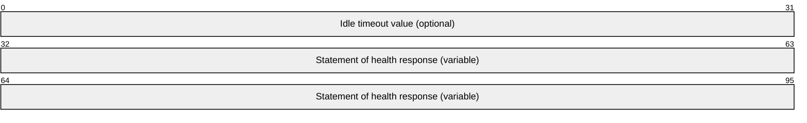
```mermaid
packet-beta
  0-31: "Idle timeout value (optional)"
  32-95: "Statement of health response (variable)"
```

**Idle timeout value (4 bytes):** If the ADM element **Negotiated Capabilities** contains [TSG_NAP_CAPABILITY_IDLE_TIMEOUT](#Section_2.2.5.2.20), then the first 4 bytes of the **responseData** field is the **Idle timeout value** in units of minutes.

**Statement of health response (variable):** If the ADM element **Negotiated Capabilities** contains [TSG_NAP_CAPABILITY_QUAR_SOH](#Section_2.2.5.2.19) and the **Statement of health** is passed in the [TsProxyAuthorizeTunnel](#Section_3.2.6.1.2) call as specified in [2.2.9.2.1.4](#Section_2.2.9.2.1.4), then the remaining number of bytes of the **responseData** field is the **Statement of health** response.

TSG_REDIRECTION_FLAGS

The TSG_REDIRECTION_FLAGS structure specifies the device redirection settings that MUST be enforced by the RDG [**client**](#gt_client). For details about device redirection, see [MS-RDSOD](#Section_1.3) section 2.1.1.2.

This structure MUST be embedded in the [TSG_PACKET_RESPONSE](#Section_2.2.9.2.1.5) structure.

**Note** Both **enableAllRedirections** and **disableAllRedirections** MUST NOT be TRUE.

typedef struct _TSG_REDIRECTION_FLAGS {

BOOL enableAllRedirections;

BOOL disableAllRedirections;

BOOL driveRedirectionDisabled;

BOOL printerRedirectionDisabled;

BOOL portRedirectionDisabled;

BOOL reserved;

BOOL clipboardRedirectionDisabled;

BOOL pnpRedirectionDisabled;

} TSG_REDIRECTION_FLAGS,

*PTSG_REDIRECTION_FLAGS;

**enableAllRedirections:** A Boolean value indicating whether the RDG [**server**](#gt_server) specifies any control over the device redirection on the RDG client.

| Value | Meaning |
| --- | --- |
| FALSE 0x00000000 | Device redirection is not enabled for all devices. Other fields of this structure specify which device redirection is enabled or disabled. |
| TRUE 0x00000001 | Device redirection is enabled for all devices. All other fields of this structure MUST be ignored. |

**disableAllRedirections:** A Boolean value indicating whether the RDG server specifies any control over disabling all device redirection on the RDG client.

| Value | Meaning |
| --- | --- |
| FALSE 0x00000000 | Device redirection is not disabled for all devices. Other fields of this structure specify which device redirection is enabled or disabled. |
| TRUE 0x00000001 | Device redirection is disabled for all devices. All other fields of this structure MUST be ignored. |

**driveRedirectionDisabled:** A Boolean value indicating whether the RDG server specifies any control over disabling drive redirection on the RDG client.

| Value | Meaning |
| --- | --- |
| FALSE 0x00000000 | The RDG client is allowed to choose its own redirection settings for enabling or disabling drive redirection. |
| TRUE 0x00000001 | Drive redirection is disabled. |

**printerRedirectionDisabled:** A Boolean value indicating whether the RDG server specifies any control over disabling printer redirection on the RDG client.

| Value | Meaning |
| --- | --- |
| FALSE 0x00000000 | The RDG client is allowed to choose its own redirection settings for enabling or disabling printer redirection. |
| TRUE 0x00000001 | Printer redirection is disabled. |

**portRedirectionDisabled:** A Boolean value indicating whether the RDG server specifies any control over disabling port redirection on the RDG client.

| Value | Meaning |
| --- | --- |
| FALSE 0x00000000 | The RDG client is allowed to choose its own redirection settings for enabling or disabling port redirection. Port redirection applies to both serial (COM) and parallel ports (LPT). |
| TRUE 0x00000001 | Port redirection is disabled. |

**reserved:** Unused. MUST be 0.

**clipboardRedirectionDisabled:** A Boolean value indicating whether the RDG server specifies any control over disabling clipboard redirection on the RDG client.

| Value | Meaning |
| --- | --- |
| FALSE 0x00000000 | The RDG client is allowed to choose its own redirection settings for enabling or disabling clipboard redirection. |
| TRUE 0x00000001 | Clipboard redirection is disabled. |

**pnpRedirectionDisabled:** A Boolean value indicating whether the RDG server specifies any control over disabling Plug and Play redirection on the RDG client.

| Value | Meaning |
| --- | --- |
| FALSE 0x00000000 | The RDG client is allowed to choose its own redirection settings for enabling or disabling PnP redirection. |
| TRUE 0x00000001 | PnP redirection is disabled. |

###### 2.2.9.2.1.6 TSG_PACKET_QUARENC_RESPONSE

The TSG_PACKET_QUARENC_RESPONSE structure contains the response of the RDG [**server**](#gt_server) for the [TsProxyCreateTunnel](#Section_3.2.6.1.1) method call. The value of the **packetId** field in [TSG_PACKET](#Section_2.2.9.2) MUST be set to [TSG_PACKET_TYPE_QUARENC_RESPONSE](#Section_2.2.5.2.7).

typedef struct _TSG_PACKET_QUARENC_RESPONSE {

unsigned long flags;

[range(0, 24000)] unsigned long certChainLen;

[string, size_is(certChainLen)]

wchar_t* certChainData;

GUID nonce;

PTSG_PACKET_VERSIONCAPS versionCaps;

} TSG_PACKET_QUARENC_RESPONSE,

*PTSG_PACKET_QUARENC_RESPONSE;

**flags:** Unused. MUST be 0.

**certChainLen:** An unsigned long specifying the number of characters in **certChainData**, including the terminating null character. If the **quarantineCapabilities** field of the [TSG_PACKET_VERSIONCAPS](#Section_2.2.9.2.1.2) structure is set to 1, this MUST be a nonzero value. This field MUST be ignored if **certChainData** is ignored. The value MUST be in the range of 0 and 24000; both inclusive.

**certChainData:** The [**certificate**](#gt_certificate), along with the chain, that the RDG server used for the SCHANNEL [**authentication service**](#gt_authentication-service-as) as part of registering the [**RPC**](#gt_remote-procedure-call-rpc) interfaces and initialization. It MUST be a string representation of the certificate chain if **certChainLen** is nonzero.<19> This field can be ignored.

**nonce:** A [**GUID**](#gt_globally-unique-identifier-guid) to uniquely identify this connection to prevent replay attacks by the RDG [**client**](#gt_client). This can be used for auditing purposes. A GUID is a unique ID using opaque sequence of bytes as specified in [MS-DTYP](#Section_2.2) section 2.3.4.2.

**versionCaps:** A pointer to a TSG_PACKET_VERSIONCAPS structure, as specified in section 2.2.9.2.1.2.

###### 2.2.9.2.1.7 TSG_PACKET_CAPS_RESPONSE

The TSG_PACKET_CAPS_RESPONSE structure contains the response of the RDG server, which supports Consent Signing capability, to the RDG client for the [TsProxyCreateTunnel](#Section_3.2.6.1.1) method call. This structure contains [TSG_PACKET_QUARENC_RESPONSE](#Section_2.2.9.2.1.6) followed by the consent signing string. The value of the **packetId** field in [TSG_PACKET](#Section_2.2.9.2) MUST be set to [TSG_PACKET_TYPE_CAPS_RESPONSE](#Section_2.2.5.2.9).

typedef struct _TSG_PACKET_CAPS_RESPONSE {

TSG_PACKET_QUARENC_RESPONSE pktQuarEncResponse;

TSG_PACKET_MSG_RESPONSE pktConsentMessage;

} TSG_PACKET_CAPS_RESPONSE,

*PTSG_PACKET_CAPS_RESPONSE;

**pktQuarEncResponse:** A TSG_PACKET_QUARENC_RESPONSE structure as specified in section 2.2.9.2.1.6.

**pktConsentMessage:** A [TSG_PACKET_MSG_RESPONSE](#Section_2.2.9.2.1.9) structure as specified in section 2.2.9.2.1.9.

###### 2.2.9.2.1.8 TSG_PACKET_MSG_REQUEST

The TSG_PACKET_MSG_REQUEST structure contains the request from the client to the RDG server to send across an administrative message whenever there is any. The value of the **packetId** field in [TSG_PACKET](#Section_2.2.9.2) MUST be set to [TSG_PACKET_TYPE_MSGREQUEST_PACKET](#Section_2.2.5.2.10).

typedef struct _TSG_PACKET_MSG_REQUEST {

unsigned long maxMessagesPerBatch;

} TSG_PACKET_MSG_REQUEST,

*PTSG_PACKET_MSG_REQUEST;

**maxMessagesPerBatch:** An unsigned long that specifies how many messages can be sent by the server at one time.

###### 2.2.9.2.1.9 TSG_PACKET_MSG_RESPONSE

The TSG_PACKET_MSG_RESPONSE structure contains the response of the RDG server to the client when a message needs to be sent to the client. The value of the **packetId** field in [TSG_PACKET](#Section_2.2.9.2) MUST be set to [TSG_PACKET_TYPE_MESSAGE_PACKET](#Section_2.2.5.2.11).

typedef struct _TSG_PACKET_MSG_RESPONSE {

unsigned long msgID;

unsigned long msgType;

long isMsgPresent;

[switch_is(msgType)] TSG_PACKET_TYPE_MESSAGE_UNION messagePacket;

} TSG_PACKET_MSG_RESPONSE,

*PTSG_PACKET_MSG_RESPONSE;

**msgID:** This field is unused.<20> This field can be ignored.

**msgType:** An unsigned long specifying what type of message is being sent by the server. This MUST be one of the following values.

| Value | Meaning |
| --- | --- |
| TSG_ASYNC_MESSAGE_CONSENT_MESSAGE 0x00000001 | The server is sending a [**Consent Signing Message**](#gt_consent-signing-message). |
| TSG_ASYNC_MESSAGE_SERVICE_MESSAGE 0x00000002 | The server is sending an Administrative Message. |
| TSG_ASYNC_MESSAGE_REAUTH 0x00000003 | The server expects the client to Reauthenticate. |

**isMsgPresent:** A Boolean that indicates whether the *messagePacket* parameter is present or not. If the value is TRUE, then *messagePacket* contains valid data and can be processed. If the value is FALSE, *messagePacket* parameter MUST be ignored.

**messagePacket:** A [TSG_PACKET_TYPE_MESSAGE_UNION](#Section_2.2.9.2) union, as specified in section 2.2.9.2.1.9.1.

TSG_PACKET_TYPE_MESSAGE_UNION

The TSG_PACKET_TYPE_MESSAGE_UNION union contains the actual message that is sent by the TS Gateway server to the client. The exact type of message depends on **msgType** field as specified in section [2.2.9.2.1.9](#Section_2.2.9.2.1.9).

typedef

[switch_type(unsigned long)]

union {

[case(TSG_ASYNC_MESSAGE_CONSENT_MESSAGE)]

PTSG_PACKET_STRING_MESSAGE consentMessage;

[case(TSG_ASYNC_MESSAGE_SERVICE_MESSAGE)]

PTSG_PACKET_STRING_MESSAGE serviceMessage;

[case(TSG_ASYNC_MESSAGE_REAUTH)]

PTSG_PACKET_REAUTH_MESSAGE reauthMessage;

} TSG_PACKET_TYPE_MESSAGE_UNION,

*PTSG_PACKET_TYPE_MESSAGE_UNION ;

**consentMessage:** A pointer to a [TSG_PACKET_STRING_MESSAGE](#Section_2.2.9.2) structure, as defined in section 2.2.9.2.1.9.1.1. This field is used if **msgType** field specified in section 2.2.9.2.1.9 is set to [TSG_ASYNC_MESSAGE_CONSENT_MESSAGE](#Section_2.2.5.2.14).

**serviceMessage:** A pointer to a TSG_PACKET_STRING_MESSAGE structure, as defined in section 2.2.9.2.1.9.1.1. This field is used if **msgType** field specified in section 2.2.9.2.1.9 is set to [TSG_ASYNC_MESSAGE_SERVICE_MESSAGE](#Section_2.2.5.2.15).

**reauthMessage:** A pointer to a [TSG_PACKET_REAUTH_MESSAGE](#Section_2.2.9.2) structure, as defined in section 2.2.9.2.1.9.1.2. This field is used if **msgType** field specified in section 2.2.9.2.1.9 is set to [TSG_ASYNC_MESSAGE_REAUTH](#Section_2.2.5.2.16).

TSG_PACKET_STRING_MESSAGE

The TSG_PACKET_STRING_MESSAGE structure contains either the [**Consent Signing Message**](#gt_consent-signing-message) or the Administrative Message that is being sent from the RDG server to the client.

typedef struct _TSG_PACKET_STRING_MESSAGE {

long isDisplayMandatory;

long isConsentMandatory;

[range(0,65536)] unsigned long msgBytes;

[size_is(msgBytes)] wchar_t* msgBuffer;

} TSG_PACKET_STRING_MESSAGE,

*PTSG_PACKET_STRING_MESSAGE;

**isDisplayMandatory:** A Boolean that specifies whether the client needs to display this message.

**isConsentMandatory:** A Boolean that specifies whether the user needs to give its consent before the connection can proceed.

**msgBytes:** An unsigned long specifying the number of characters in **msgBuffer**, including the terminating null character. The size of the message SHOULD<21> be determined by the **serverCert** field in the HTTP_TUNNEL_RESPONSE_OPTIONAL structure (section [2.2.10.21](#Section_2.2.10.21)). The consent message is embedded in the HTTP_TUNNEL_RESPONSE as part of the HTTP_TUNNEL_RESPONSE_OPTIONAL structure. When the HTTP_TUNNEL_RESPONSE_FIELD_CONSENT_MSG flag is set in the HTTP_TUNNEL_RESPONSE_FIELDS_PRESENT_FLAGS (section [2.2.5.3.8](#Section_2.2.5.3.8)), the HTTP_TUNNEL_RESPONSE_OPTIONAL data structure contains a consent message in the HTTP_UNICODE_STRING format (section [2.2.10.22](#Section_2.2.10.22)).

**msgBuffer:** An array of wchar_t specifying the string. The size of the buffer is as indicated by **msgBytes**.

TSG_PACKET_REAUTH_MESSAGE

The TSG_PACKET_REAUTH_MESSAGE structure is sent by the RDG server to the client when the server requires the user credential to be reauthenticated.

typedef struct _TSG_PACKET_REAUTH_MESSAGE {

unsigned __int64 tunnelContext;

} TSG_PACKET_REAUTH_MESSAGE,

*PTSG_PACKET_REAUTH_MESSAGE;

**tunnelContext:** A unsigned __int64 that is sent by the server to client. When the client initiates the reauthentication sequence, it MUST include this context. This is used by the server to validate successful reauthentication by the client.

###### 2.2.9.2.1.10 TSG_PACKET_AUTH

The TSG_PACKET_AUTH structure is sent by the client to the TS Gateway server when Pluggable Authentication is used. This packet includes [TSG_PACKET_VERSIONCAPS](#Section_2.2.9.2.1.2), which is used for capability negotiation, and cookie, which is used for user authentication. This MUST be the first packet from the client to the server if the server has Pluggable Authentication turned on. The value of the **packetId** field in [TSG_PACKET](#Section_2.2.9.2) MUST be set to [TSG_PACKET_TYPE_AUTH](#Section_2.2.5.2.12).

typedef struct _TSG_PACKET_AUTH {

TSG_PACKET_VERSIONCAPS TSGVersionCaps;

[range(0,65536)] unsigned long cookieLen;

[size_is(cookieLen)] byte* cookie;

} TSG_PACKET_AUTH,

*PTSG_PACKET_AUTH;

**TSGVersionCaps:** A TSG_PACKET_VERSIONCAPS structure as specified in section 2.2.9.2.1.2.

**cookieLen:** An unsigned long that specifies the size in bytes for the field cookie.

**cookie:** A byte pointer that points to the cookie data. The cookie is used for authentication.

###### 2.2.9.2.1.11 TSG_PACKET_REAUTH

The TSG_PACKET_REAUTH structure is sent by the client to the TS Gateway server when the client is reauthenticating the connection. The value of the **packetId** field in [TSG_PACKET](#Section_2.2.9.2) MUST be set to [TSG_PACKET_TYPE_REAUTH](#Section_2.2.5.2.13).

typedef struct _TSG_PACKET_REAUTH {

unsigned __int64 tunnelContext;

unsigned long packetId;

[switch_is(packetId)] TSG_INITIAL_PACKET_TYPE_UNION TSGInitialPacket;

} TSG_PACKET_REAUTH,

*PTSG_PACKET_REAUTH;

**tunnelContext:** An unsigned __int64 that identifies which tunnel is being reauthenticated.

**packetId:** An unsigned long that specifies what type of packet is present inside TSGInitialPacket.

| Value | Meaning |
| --- | --- |
| TSG_PACKET_TYPE_VERSIONCAPS 0x00005643 | This packet is sent when Pluggable Authentication is off. |
| TSG_PACKET_TYPE_AUTH 0x00004054 | This packet is sent when Pluggable Authentication is on. This packet includes [TSG_PACKET_VERSIONCAPS](#Section_2.2.9.2.1.2) as well as the cookie that is required for authentication. |

**TSGInitialPacket:** A [TSG_INITIAL_PACKET_TYPE_UNION](#Section_2.2.9.2.1.11.1) union as specified in section 2.2.9.2.1.11.1.

TSG_INITIAL_PACKET_TYPE_UNION

The TSG_INITIAL_PACKET_TYPE_UNION union is sent by the client to the TS Gateway server when the client is reauthenticating the connection. Depending on **packetId** as specified in section [2.2.9.2.1.11](#Section_2.2.9.2.1.11), either [TSG_PACKET_VERSIONCAPS](#Section_2.2.9.2.1.2) or [TSG_PACKET_AUTH](#Section_2.2.9.2.1.10) is included.

typedef

[switch_type(unsigned long)]

union {

[case(TSG_PACKET_TYPE_VERSIONCAPS)]

PTSG_PACKET_VERSIONCAPS packetVersionCaps;

[case(TSG_PACKET_TYPE_AUTH)]

PTSG_PACKET_AUTH packetAuth;

} TSG_INITIAL_PACKET_TYPE_UNION,

*PTSG_INITIAL_PACKET_TYPE_UNION;

**packetVersionCaps:** A pointer to a TSG_PACKET_VERSIONCAPS structure as specified in section 2.2.9.2.1.2.

**packetAuth:** A pointer to a TSG_PACKET_AUTH structure as specified in section 2.2.9.2.1.10.

#### 2.2.9.3 Generic Send Data Message Packet

This packet contains data sent by the RDG [**client**](#gt_client) to the RDG [**server**](#gt_server) which is then sent to the [**target server**](#gt_target-server). The data is sent by the RDG client for the [TsProxySendToServer](#Section_3.2.6.2.1) method call.

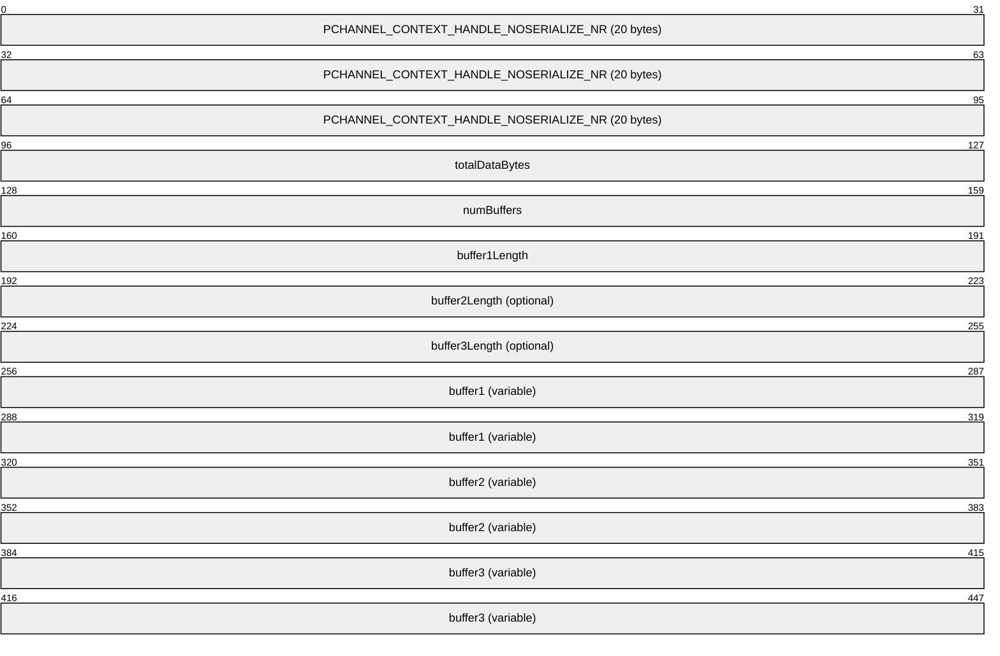
```mermaid
packet-beta
  0-95: "PCHANNEL_CONTEXT_HANDLE_NOSERIALIZE_NR (20 bytes)"
  96-127: "totalDataBytes"
  128-159: "numBuffers"
  160-191: "buffer1Length"
  192-223: "buffer2Length (optional)"
  224-255: "buffer3Length (optional)"
  256-319: "buffer1 (variable)"
  320-383: "buffer2 (variable)"
  384-447: "buffer3 (variable)"
```

**PCHANNEL_CONTEXT_HANDLE_NOSERIALIZE_NR (20 bytes):** This MUST be the network representation of the [PCHANNEL_CONTEXT_HANDLE_NOSERIALIZE](#Section_2.2.2.2) data type returned by the RDG server by using the [TsProxyCreateChannel](#Section_3.2.6.1.4) method call. Network representation of a context handle is described in [[C706]](https://go.microsoft.com/fwlink/?LinkId=89824) Appendix N.

**totalDataBytes (4 bytes):** An **unsigned long** that specifies the total number of bytes to be sent to the target server. This MUST be in network order representation. It MUST be the sum of **buffer1Length**, **buffer2Length**, and **buffer3Length** and the size of the data, in bytes, for **buffer1Length**, **buffer2Length**, and **buffer3Length**. It MUST NOT be zero.

**numBuffers (4 bytes):** An **unsigned long** that specifies the total number of data buffers that follow this field. This MUST be in a network-order representation.

**buffer1Length (4 bytes):** An **unsigned long** specifying the length of the first buffer. This MUST be in a network-order representation and be nonzero.

**buffer2Length (4 bytes):** An **unsigned long** specifying the length of the second buffer. This MUST be in a network-order representation. This is optional and can be 0.

**buffer3Length (4 bytes):** An **unsigned long** specifying the length of the third buffer. This MUST be in a network-order representation. This is optional and can be 0.

**buffer1 (variable):** The **buffer1** is an array of bytes. Its length is specified by **buffer1Length**. This MUST be non-NULL and contain the same number of bytes specified by **buffer1Length**. The contents of **buffer1** are opaque to the Remote Desktop Gateway Server Protocol.

**buffer2 (variable):** The **buffer2** is an array of bytes. Its length is specified by **buffer2Length**. This MUST be non-NULL if buffer2Length is nonzero and contain the same number of bytes specified by **buffer2Length**. If buffer2Length is 0, this SHOULD be NULL. If **buffer2Length** is zero and **buffer2** is non-NULL, then **buffer2** MUST be ignored. The contents of **buffer2** are opaque to the Remote Desktop Gateway Server Protocol.

**buffer3 (variable):** The **buffer3** is an array of bytes. Its length is specified by **buffer3Length**. This MUST be non-NULL if buffer3Length is nonzero and contain the same number of bytes specified by **buffer3Length**. If buffer3Length is 0, this SHOULD be NULL. If **buffer3Length** is zero and **buffer3** is non-NULL, then **buffer3** MUST be ignored. The contents of **buffer3** are opaque to the Remote Desktop Gateway Server Protocol.

#### 2.2.9.4 Generic Receive Pipe Message Packet

The Generic Receive Pipe Message packet has dual purposes. The packet is used by both the RDG [**client**](#gt_client) for setting up the receive pipe and the RDG [**server**](#gt_server) to send the data that is received from the target server to the RDG client.

The RDG client sends this packet in the [TsProxySetupReceivePipe (section 3.2.6.2.2)](#Section_3.2.6.2.2) method to set up the receive [**pipe**](#gt_pipe) between the RDG server and the RDG client.

The packet has three different formats in various phases as explained in the following sections.

##### 2.2.9.4.1 RDG Client to RDG Server Packet Format

The RDG [**client**](#gt_client) sends the packet to the RDG [**server**](#gt_server) in the format below.

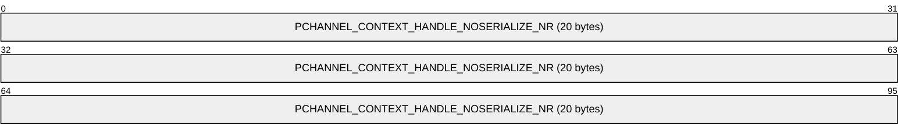
```mermaid
packet-beta
  0-95: "PCHANNEL_CONTEXT_HANDLE_NOSERIALIZE_NR (20 bytes)"
```

**PCHANNEL_CONTEXT_HANDLE_NOSERIALIZE_NR (20 bytes):** This MUST be the network representation of the [PCHANNEL_CONTEXT_HANDLE_NOSERIALIZE (section 2.2.2.2)](#Section_2.2.2.2) data type returned by the RDG server obtained by using the [TsProxyCreateChannel (section 3.2.6.1.4)](#Section_3.2.6.1.4) method call. Network representation of a context handle is described in [[C706]](https://go.microsoft.com/fwlink/?LinkId=89824) Appendix N.

##### 2.2.9.4.2 RDG Server to RDG Client Packet Format for Intermediate Responses

The RDG server to RDG client Packet Format for Intermediate Responses is the intermediate responses from the RDG [**server**](#gt_server) to the RDG [**client**](#gt_client).

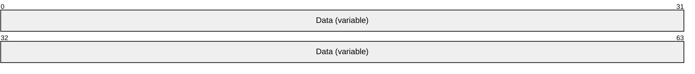
```mermaid
packet-beta
  0-63: "Data (variable)"
```

**Data (variable):** This is data that the RDG server received from the [**target server**](#gt_target-server) and forwards to the RDG client. The size of this data is in the RPC headers' **alloc_hint** field specified in [[C706]](https://go.microsoft.com/fwlink/?LinkId=89824). Only the RDG server uses the **Data** field. This field MUST NOT be sent by the RDG client.

##### 2.2.9.4.3 RDG Server to RDG Client Packet Format for Final Response

This is the final response from the RDG [**server**](#gt_server) to the RDG [**client**](#gt_client). To indicate connection disconnect, RDG server MUST set the PFC_LAST_FRAG bit in pfc_flags of the header of the RPC response PDU as described in [TsProxySetupReceivePipe (section 3.2.6.2.2)](#Section_3.2.6.2.2). For a description of [**RPC**](#gt_remote-procedure-call-rpc) response PDU, pfc_flags, PFC_LAST_FRAG, and stub data, refer to sections 12.6.2 and 12.6.4.10 in [[C706]](https://go.microsoft.com/fwlink/?LinkId=89824). PDU body contains the return value as shown in the following packet diagram.

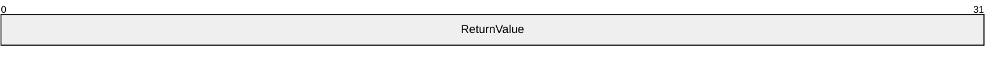
```mermaid
packet-beta
  0-31: "ReturnValue"
```

**ReturnValue (4 bytes):** Return value of the TsProxySetupReceivePipe (section 3.2.6.2.2) method call.

### 2.2.10 HTTP Transport Structures and Unions

#### 2.2.10.1 HTTP_byte_BLOB Structure

This structure is used for storing and exchanging binary data.

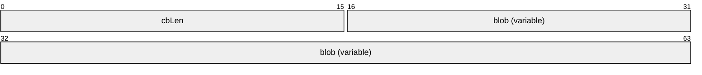
```mermaid
packet-beta
  0-15: "cbLen"
  16-63: "blob (variable)"
```

**cbLen (2 bytes):** An unsigned short representing the size of the data in the **blob** field.

**blob (variable):** An array of bytes, which contains the binary data of the length of **cbLen**.

#### 2.2.10.2 HTTP_CHANNEL_PACKET Structure

This packet is used for channel creation.

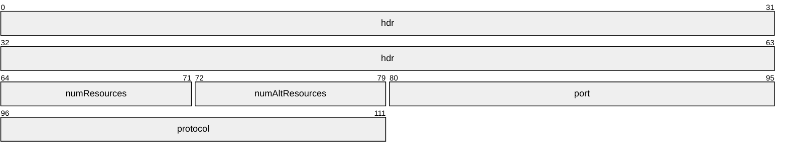
```mermaid
packet-beta
  0-63: "hdr"
  64-71: "numResources"
  72-79: "numAltResources"
  80-95: "port"
  96-111: "protocol"
```

**hdr (8 bytes):** An [HTTP_PACKET_HEADER (section 2.2.10.9)](#Section_2.2.10.9) structure. Its **packetType** field is set to PKT_TYPE_CHANNEL_CREATE.

**numResources (1 byte):** A single byte size field that represents the number of resource names (server names) describing the target. This value MUST be in the range 1 -- 50.

**numAltResources (1 byte):** A single byte size field that represents the number of alternative resource names. This value MUST be in the range 0 - 3.

**port (2 bytes):** An unsigned short that represents the port for communication with the [**target server**](#gt_target-server).

**protocol (2 bytes):** An unsigned short that represents the protocol number used for connection with the target server. The value MUST be set to 3.

#### 2.2.10.3 HTTP_CHANNEL_PACKET_VARIABLE Structure

This packet is used for channel creation.

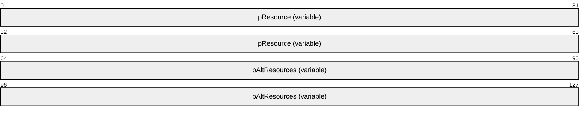
```mermaid
packet-beta
  0-63: "pResource (variable)"
  64-127: "pAltResources (variable)"
```

**pResource (variable):** An array of [HTTP_UNICODE_STRING Structure (section 2.2.10.22)](#Section_2.2.10.22). The number of elements in the array is represented in the **numResources** field of the corresponding [HTTP_CHANNEL_PACKET](#Section_2.2.10.3) structure.

**pAltResources (variable):** An array of HTTP_UNICODE_STRING Structure (section 2.2.10.22). The number of elements in the array is represented in the **numAltResources** field of the corresponding HTTP_CHANNEL_PACKET structure.

#### 2.2.10.4 HTTP_CHANNEL_RESPONSE Structure

This packet is sent by the RDG server in response to a channel creation request.

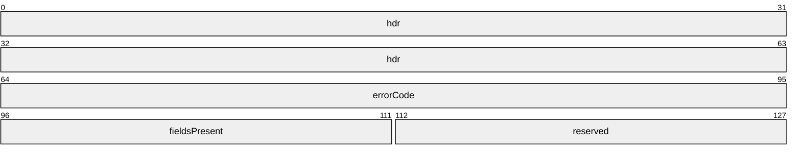
```mermaid
packet-beta
  0-63: "hdr"
  64-95: "errorCode"
  96-111: "fieldsPresent"
  112-127: "reserved"
```

**hdr (8 bytes):** An [HTTP_PACKET_HEADER (section 2.2.10.9)](#Section_2.2.10.9) structure. Its **packetType** field is set to PKT_TYPE_CHANNEL_RESPONSE.

**errorCode (4 bytes):** An unsigned integer representing the error generated from the RDG server in the process of creating a [**channel**](#gt_channel), in an HRESULT format.

**fieldsPresent (2 bytes):** An unsigned short representing the flags values defined in the [HTTP_CHANNEL_RESPONSE_FIELDS_PRESENT_FLAGS (section 2.2.5.3.1)](#Section_2.2.5.3.1) enumeration.

**reserved (2 bytes):** Reserved for future use.

#### 2.2.10.5 HTTP_CHANNEL_RESPONSE_OPTIONAL Structure

This packet is optionally sent by the RDG server in response to a channel creation request.

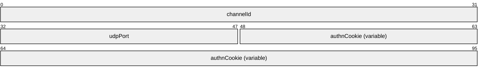
```mermaid
packet-beta
  0-31: "channelId"
  32-47: "udpPort"
  48-95: "authnCookie (variable)"
```

**channelId (4 bytes):** An unsigned integer representing the **channelId** field of the corresponding [HTTP_CHANNEL_RESPONSE (section 2.2.10.4)](#Section_2.2.10.4) structure.

**udpPort (2 bytes):** An unsigned short representing the port number of the RDGUDP listener.

**authnCookie (variable):** An [HTTP_byte_BLOB (section 2.2.10.1)](#Section_2.2.10.1) structure. It contains the cookie to be used for the RDGUDP connection authentication in the **UDPAuthCookie** ADM element format.

#### 2.2.10.6 HTTP_DATA_PACKET Structure

This packet is used for sending or receiving RDP data.

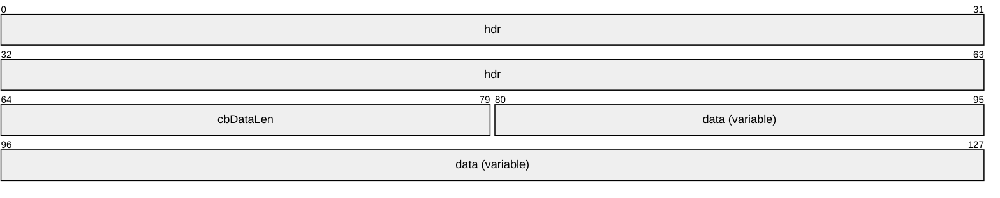
```mermaid
packet-beta
  0-63: "hdr"
  64-79: "cbDataLen"
  80-127: "data (variable)"
```

**hdr (8 bytes):** An [HTTP_PACKET_HEADER (section 2.2.10.9)](#Section_2.2.10.9) structure. Its **packetType** field is set to PKT_TYPE_DATA.

**cbDataLen (2 bytes):** An unsigned short representing the length of data in the **data** field.

**data (variable):** An array of bytes representing data.

#### 2.2.10.7 HTTP_EXTENDED_AUTH_PACKET Structure

This packet is used for extended [**tunnel (2)**](#gt_1ebdc9c6-bb01-455e-98f7-8930618bb601) authorization messages from the RDG server to the RDG client.

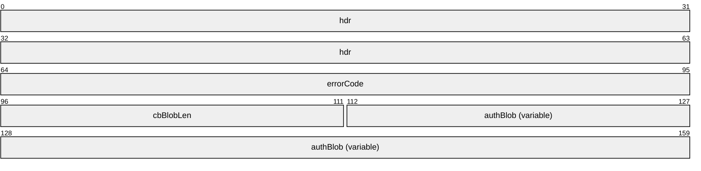
```mermaid
packet-beta
  0-63: "hdr"
  64-95: "errorCode"
  96-111: "cbBlobLen"
  112-159: "authBlob (variable)"
```

**hdr (8 bytes):** An [HTTP_PACKET_HEADER (section 2.2.10.9)](#Section_2.2.10.9) structure. Its **packetType** field is set to PKT_TYPE_EXTENDED_AUTH_MSG.

**errorCode (4 bytes):** An unsigned integer representing the error generated by the RDG server during authorization.

**cbBlobLen (2 bytes):** An unsigned short representing the length of the **authBlob** field.

**authBlob (variable):** An array of bytes which contains authorization data.

#### 2.2.10.8 HTTP_KEEPALIVE_PACKET Structure

This packet is sent by the RDG client and RDG server to ensure that the HTTP connection is not lost if there is no RDP data.

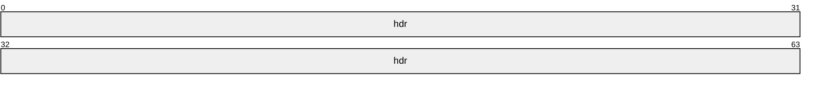
```mermaid
packet-beta
  0-63: "hdr"
```

**hdr (8 bytes):** An [HTTP_PACKET_HEADER (section 2.2.10.9)](#Section_2.2.10.9) structure. Its **packetType** field is set to PKT_TYPE_KEEPALIVE.

#### 2.2.10.9 HTTP_PACKET_HEADER Structure

This structure describes an HTTP packet.

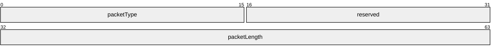
```mermaid
packet-beta
  0-15: "packetType"
  16-31: "reserved"
  32-63: "packetLength"
```

**packetType (2 bytes):** An unsigned short representing the type of the packet from [HTTP_PACKET_TYPE Enumeration (section 2.2.5.3.3)](#Section_2.2.5.3.3).

**reserved (2 bytes):** Reserved for future use.

**packetLength (4 bytes):** An unsigned integer representing the length of the packet.

#### 2.2.10.10 HTTP_HANDSHAKE_REQUEST_PACKET Structure

This packet is sent from the RDG client to the RDG server to negotiate the appropriate protocol version to use.

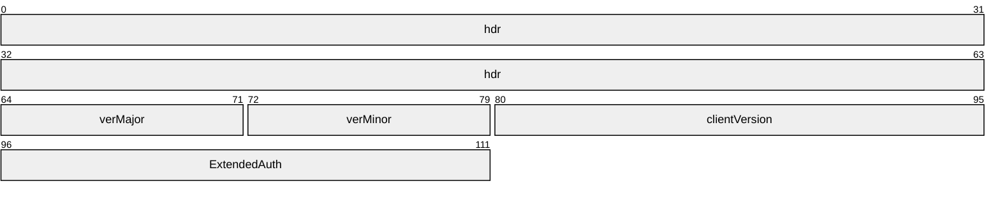
```mermaid
packet-beta
  0-63: "hdr"
  64-71: "verMajor"
  72-79: "verMinor"
  80-95: "clientVersion"
  96-111: "ExtendedAuth"
```

**hdr (8 bytes):** An [HTTP_PACKET_HEADER (section 2.2.10.9)](#Section_2.2.10.9) structure. Its **packetType** field is set to PKT_TYPE_HANDSHAKE_REQUEST.

**verMajor (1 byte):** A single byte representing the major version of the RDGHTTP protocol.

**verMinor (1 byte):** A single byte representing the minor version of the RDGHTTP protocol.

**clientVersion (2 bytes):** An unsigned short representing the version of RDG client operating system. This field is not used and MUST be set to zero.

**ExtendedAuth (2 bytes):** An unsigned short representing the [**extended authentication**](#gt_extended-authentication) requested by the RDG client, in an [HTTP_EXTENDED_AUTH Enumeration (section 2.2.5.3.2)](#Section_2.2.5.3.2) format.

#### 2.2.10.11 HTTP_HANDSHAKE_RESPONSE_PACKET Structure

This packet is sent from the RDG server to provide details of its protocol version and the supported authentication schemes.

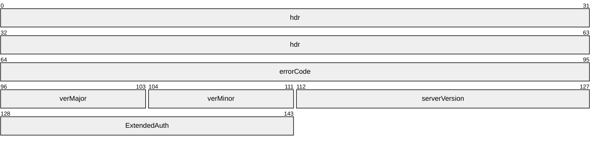
```mermaid
packet-beta
  0-63: "hdr"
  64-95: "errorCode"
  96-103: "verMajor"
  104-111: "verMinor"
  112-127: "serverVersion"
  128-143: "ExtendedAuth"
```

**hdr (8 bytes):** An [HTTP_PACKET_HEADER (section 2.2.10.9)](#Section_2.2.10.9) structure. Its **packetType** field is set to PKT_TYPE_HANDSHAKE_RESPONSE.

**errorCode (4 bytes):** An unsigned integer representing errors encountered during the handshake between the RDG client and RDG server, in an [**HRESULT**](#gt_hresult) format.

**verMajor (1 byte):** A single byte representing the major version of the RDGHTTP protocol.

**verMinor (1 byte):** A single byte representing the minor version of the RDGHTTP protocol.

**serverVersion (2 bytes):** An unsigned short representing the version of RDG server operating system. This field is not used and MUST be set to zero.

**ExtendedAuth (2 bytes):** An unsigned short representing the [**extended authentication**](#gt_extended-authentication) requested by the RDG client, in an [HTTP_EXTENDED_AUTH Enumeration (section 2.2.5.3.2)](#Section_2.2.5.3.2) format.

#### 2.2.10.12 HTTP_REAUTH_MESSAGE Structure

This structure describes a reauthentication message.

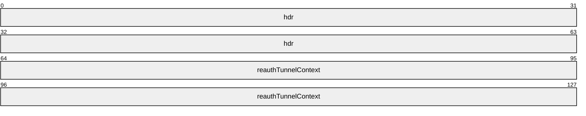
```mermaid
packet-beta
  0-63: "hdr"
  64-127: "reauthTunnelContext"
```

**hdr (8 bytes):** An [HTTP_PACKET_HEADER (section 2.2.10.9)](#Section_2.2.10.9) structure. Its **packetType** field is set to PKT_TYPE_REAUTH_MESSAGE.

**reauthTunnelContext (8 bytes):** An unsigned long representing which [**tunnel (2)**](#gt_1ebdc9c6-bb01-455e-98f7-8930618bb601) is being [**reauthenticated**](#gt_reauthentication).

#### 2.2.10.13 HTTP_SERVICE_MESSAGE Structure

This structure describes a service message.

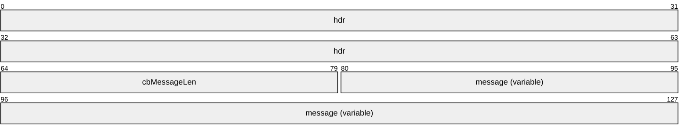
```mermaid
packet-beta
  0-63: "hdr"
  64-79: "cbMessageLen"
  80-127: "message (variable)"
```

**hdr (8 bytes):** An [HTTP_PACKET_HEADER (section 2.2.10.9)](#Section_2.2.10.9) structure. Its **packetType** field is set to PKT_TYPE_SERVICE_MESSAGE.

**cbMessageLen (2 bytes):** An unsigned short representing the length of **message**.

**message (variable):** An array of bytes which specifies the message string. The size of the message string is as indicated by **cbMessageLen** field.

#### 2.2.10.14 HTTP_TUNNEL_AUTH_PACKET Structure

This packet is used by the client to request [**tunnel (2)**](#gt_1ebdc9c6-bb01-455e-98f7-8930618bb601) authorization.

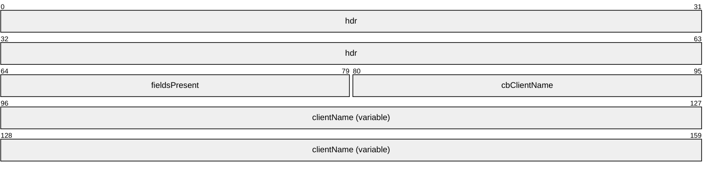
```mermaid
packet-beta
  0-63: "hdr"
  64-79: "fieldsPresent"
  80-95: "cbClientName"
  96-159: "clientName (variable)"
```

**hdr (8 bytes):** An [HTTP_PACKET_HEADER (section 2.2.10.9)](#Section_2.2.10.9) structure. Its **packetType** field is set to PKT_TYPE_TUNNEL_AUTH.

**fieldsPresent (2 bytes):** An unsigned short representing the fields present in [HTTP_TUNNEL_AUTH_PACKET_OPTIONAL (section 2.2.10.15)](#Section_2.2.10.15). Its values are defined in the [HTTP_TUNNEL_AUTH_FIELDS_PRESENT_FLAGS Enumeration (section 2.2.5.3.4)](#Section_2.2.5.3.4).

**cbClientName (2 bytes):** An unsigned short representing the length of the **clientName** field.

**clientName (variable):** An array of bytes representing the name of the client machine.

#### 2.2.10.15 HTTP_TUNNEL_AUTH_PACKET_OPTIONAL Structure

This packet is used for sending optional information for [**tunnel (2)**](#gt_1ebdc9c6-bb01-455e-98f7-8930618bb601) authorization.

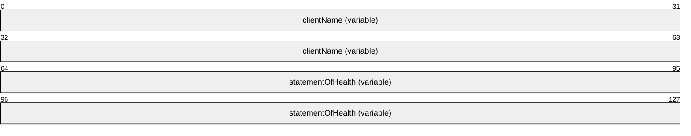
```mermaid
packet-beta
  0-63: "clientName (variable)"
  64-127: "statementOfHealth (variable)"
```

**clientName (variable):** An [HTTP_UNICODE_STRING (section 2.2.10.22)](#Section_2.2.10.22) structure representing the name of the RDG client machine.

**statementOfHealth (variable):** An [HTTP_byte_BLOB (section 2.2.10.1)](#Section_2.2.10.1) structure representing the [**statement of health (SoH)**](#gt_statement-of-health-soh) of the RDG client machine.

#### 2.2.10.16 HTTP_TUNNEL_AUTH_RESPONSE Structure

This packet is used by the RDG server to send the [**tunnel (2)**](#gt_1ebdc9c6-bb01-455e-98f7-8930618bb601) authorization response back to the RDG client.

```mermaid
packet-beta
  0-63: "hdr"
  64-95: "errorCode"
  96-111: "fieldsPresent"
  112-127: "reserved"
```

**hdr (8 bytes):** An [HTTP_PACKET_HEADER (section 2.2.10.9)](#Section_2.2.10.9) structure. Its **packetType** field is set to PKT_TYPE_TUNNEL_AUTH_RESPONSE.

**errorCode (4 bytes):** An unsigned integer representing error codes encountered during the tunnel (2) authorization process by the RDG server, in an HRESULT format.

**fieldsPresent (2 bytes):** An unsigned short representing flags that specify the optional fields that are present in the [HTTP_TUNNEL_AUTH_RESPONSE_OPTIONAL structure (section 2.2.10.17)](#Section_2.2.10.17). It's defined in the [HTTP_TUNNEL_AUTH_RESPONSE_FIELDS_PRESENT_FLAGS Enumeration (section 2.2.5.3.5)](#Section_2.2.5.3.5) format.

**reserved (2 bytes):** Reserved for future use.

#### 2.2.10.17 HTTP_TUNNEL_AUTH_RESPONSE_OPTIONAL Structure

This packet is returned by the RDG server in response to the [**tunnel (2)**](#gt_1ebdc9c6-bb01-455e-98f7-8930618bb601) authorization request.

```mermaid
packet-beta
  0-31: "redirFlags"
  32-63: "idleTimeout"
  64-127: "SoHResponse (variable)"
```

**redirFlags (4 bytes):** An unsigned integer representing device redirection flags defined in [HTTP_TUNNEL_REDIR_FLAGS Enumeration (section 2.2.5.3.7)](#Section_2.2.5.3.7).

**idleTimeout (4 bytes):** An unsigned integer representing the **Idle timeout value** ADM element in units of minutes.

**SoHResponse (variable):** An [HTTP_byte_BLOB (section 2.2.10.1)](#Section_2.2.10.1) structure representing the [**statement of health (SoH)**](#gt_statement-of-health-soh) of the RDG client machine.

#### 2.2.10.18 HTTP_TUNNEL_PACKET Structure

This packet is used by the RDG client to send an RDG [**tunnel (2)**](#gt_1ebdc9c6-bb01-455e-98f7-8930618bb601) creation request.

```mermaid
packet-beta
  0-63: "hdr"
  64-95: "capsFlags"
  96-111: "fieldsPresent"
  112-127: "reserved"
```

**hdr (8 bytes):** An [HTTP_PACKET_HEADER (section 2.2.10.9)](#Section_2.2.10.9) structure. Its **packetType** field is set to PKT_TYPE_TUNNEL_CREATE.

**capsFlags (4 bytes):** An unsigned integer representing the capabilities supported by the RDG client. Its specified in the [HTTP_CAPABILITY_TYPE Enumeration](#Section_2.2.5.3.9) format.

**fieldsPresent (2 bytes):** An unsigned short representing the flags that specify what optional fields are present in the [HTTP_TUNNEL_PACKET_OPTIONAL Structure (section 2.2.10.19)](#Section_2.2.10.19). It’s defined in en [HTTP_TUNNEL_PACKET_FIELDS_PRESENT_FLAGS Enumeration (section 2.2.5.3.6)](#Section_2.2.5.3.6).

**reserved (2 bytes):** Reserved for future use.

#### 2.2.10.19 HTTP_TUNNEL_PACKET_OPTIONAL Structure

This packet is optionally used in a RDG [**tunnel (2)**](#gt_1ebdc9c6-bb01-455e-98f7-8930618bb601) creation request.

```mermaid
packet-beta
  0-63: "reauthTunnelContext"
  64-127: "PAACookie (variable)"
```

**reauthTunnelContext (8 bytes):** An unsigned long representing the tunnel (2) that is being [**reauthenticated**](#gt_reauthentication).

**PAACookie (variable):** An [HTTP_byte_BLOB (section 2.2.10.1)](#Section_2.2.10.1) structure representing the cookie for [**pluggable authentication**](#gt_pluggable-authentication).

#### 2.2.10.20 HTTP_TUNNEL_RESPONSE Structure

The RDG server uses this structure to send a [**tunnel (2)**](#gt_1ebdc9c6-bb01-455e-98f7-8930618bb601) creation response to the RDG client.

```mermaid
packet-beta
  0-63: "hdr"
  64-79: "serverVersion"
  80-111: "statusCode"
  112-127: "fieldsPresent"
  128-143: "reserved"
```

**hdr (8 bytes):** An [HTTP_PACKET_HEADER (section 2.2.10.9)](#Section_2.2.10.9) structure. Its **packetType** field is set to PKT_TYPE_TUNNEL_RESPONSE.

**serverVersion (2 bytes):** An unsigned integer representing the version of the RDGHTTP Protocol.

**statusCode (4 bytes):** An unsigned integer representing errors that are detected by the RDG server in the process of creating a tunnel (2).

**fieldsPresent (2 bytes):** An unsigned short representing the flags that specify the optional fields that are present in the [HTTP_TUNNEL_RESPONSE_OPTIONAL Structure (section 2.2.10.21)](#Section_2.2.10.21) defined in an [HTTP_TUNNEL_RESPONSE_FIELDS_PRESENT_FLAGS Enumeration (section 2.2.5.3.8)](#Section_2.2.5.3.8).

**reserved (2 bytes):** Reserved for future use.

#### 2.2.10.21 HTTP_TUNNEL_RESPONSE_OPTIONAL Structure

This structure is optionally sent by the RDG server in response to a [**tunnel (2)**](#gt_1ebdc9c6-bb01-455e-98f7-8930618bb601) creation request.

```mermaid
packet-beta
  0-31: "tunnelId"
  32-63: "capsFlags"
  64-159: "nonce (16 bytes)"
  160-223: "serverCert (variable)"
  224-287: "consentMsg (variable)"
```

**tunnelId (4 bytes):** An unsigned integer representing the **Tunnel Id** ADM element of the corresponding tunnel.

**capsFlags (4 bytes):** An unsigned integer representing the capabilities negotiated by the RDG server. It's specified in the form of an HTTP_CAPABILITY_TYPE Enumeration.

**nonce (16 bytes):** A [**GUID**](#gt_globally-unique-identifier-guid) ([MS-DTYP](#Section_2.2) section 2.3.4.2) representing the nonce for the [**statement of health (SoH)**](#gt_statement-of-health-soh).

**serverCert (variable):** An [HTTP_UNICODE_STRING (section 2.2.10.22)](#Section_2.2.10.22) that is used for SoH encryption.

**consentMsg (variable):** An HTTP_UNICODE_STRING (section 2.2.10.22). It contains the consent message set by the admin on the RDG server, that is delivered to the RDG client prior to allowing the connection.

#### 2.2.10.22 HTTP_UNICODE_STRING Structure

This structure describes a Unicode string.

```mermaid
packet-beta
  0-15: "cbLen"
  16-63: "str (variable)"
```

**cbLen (2 bytes):** An unsigned short representing the length of the **str** field.

**str (variable):** String of length **cbLen**.

#### 2.2.10.23 HTTP_CLOSE_PACKET Structure

This packet is used to end a session.

```mermaid
packet-beta
  0-63: "hdr"
  64-95: "statusCode"
```

**hdr (8 bytes):** An **HTTP_PACKET_HEADER** structure (section [2.2.10.9](#Section_2.2.10.9)). Its **packetType** field is set to PKT_TYPE_CLOSE_CHANNEL or PKT_TYPE_CLOSE_CHANNEL_RESPONSE. Section [3.7.5.4](#Section_3.3.5.5) describes the connection close sequence and how to set the **packetType** field in the **HTTP_PACKET_HEADER**.

**statusCode (4 bytes):** An unsigned integer representing errors that are detected by the RDG server in the process of creating a channel, in an HRESULT format. The expected return codes are described in section [2.2.6](#Section_2.2.6).

### 2.2.11 UDP Transport Structures and Unions

#### 2.2.11.1 AASYNDATA Structure

The AASYNDATA structure contains the RDGUDP channel properties sent between the RDG [**client**](#gt_client) and RDG [**server**](#gt_server).

```mermaid
packet-beta
  0-15: "uUpStreamMtu"
  16-31: "uDownStreamMtu"
  32-63: "fLossy"
  64-95: "snSendISN"
```

**uUpStreamMtu (2 bytes):** An unsigned short representing the size for the [**maximum transmission unit (MTU)**](#gt_maximum-transmission-unit-mtu) between the RDG client and RDG server path. This MUST be determined by the RDG client.

**uDownStreamMtu (2 bytes):** An unsigned short representing the size for the MTU between the RDG server and RDG client path. This MUST be determined by the RDG client.

**fLossy (4 bytes):** A Boolean flag which indicates whether the [**UDP**](#gt_user-datagram-protocol-udp) channel is reliable or not. This MUST be determined by the consumer of the RDG protocol ([MS-RDPEUDP](#Section_1.7.3)). The RDG client forwards the flag to the RDG server, which in turn sends the flag to a [**target server**](#gt_target-server) during the [Connection Setup Phase (section 1.3.1.1.1)](#Section_1.3.1.1.1).

**snSendISN (4 bytes):** An integer representing the initial sequence number used by the forward error correction (FEC) receive window between the RDG client and the target server. This MUST be determined by the consumer of the RDG protocol ([MS-RDPEUDP]). The RDG client forwards the flag to the RDG server, which in turn sends the flag to the target server during the Connection Setup Phase.

#### 2.2.11.2 AASYNDATARESP Structure

The AASYNDATARESP structure contains the RDGUDP channel properties sent by the RDG [**server**](#gt_server) to the RDG [**client**](#gt_client) during the [Connection Setup Phase (section 1.3.1.1.1)](#Section_1.3.1.1.1).

```mermaid
packet-beta
  0-15: "uUpStreamMtu"
  16-31: "uDownStreamMtu"
  32-63: "snRecvISN"
```

**uUpStreamMtu (2 bytes):** An unsigned short representing the resultant path for the [**MTU**](#gt_maximum-transmission-unit-mtu) between the RDG client, the RDG server and the [**target server**](#gt_target-server). The path is detected by the RDG server after establishing a connection with the target server.

**uDownStreamMtu (2 bytes):** An unsigned short representing the resultant path for the MTU between the target server, the RDG server and the RDG client. The path is detected by the RDG server after establishing a connection with the target server.

**snRecvISN (4 bytes):** An integer representing the initial sequence number used by the forward error correction (FEC) receive window between the target server and the RDG client. The integer value is sent by the target server to the RDG server during the Connection Setup Phase.

#### 2.2.11.3 CONNECT_PKT Structure

The CONNECT_PKT structure carries the UDP channel authentication information as specified in the [AASYNDATA structure (section 2.2.11.1)](#Section_2.2.11.1), from the RDG [**client**](#gt_client) to the RDG [**server**](#gt_server).

```mermaid
packet-beta
  0-31: "hdr"
  32-47: "usPortNumber"
  48-63: "cbAuthnCookieLen"
  64-159: "SynData"
  160-223: "authnCookie (variable)"
```

**hdr (4 bytes):** A [UDP_PACKET_HEADER Structure (section 2.2.11.7)](#Section_2.2.11.7).

**usPortNumber (2 bytes):** An unsigned short representing the port number on which the [**target server**](#gt_target-server) listens.

**cbAuthnCookieLen (2 bytes):** An DWORD representing the RDGUDP authentication cookie length.

**SynData (12 bytes):** An AASYNDATA structure as specified in 2.2.11.1.

**authnCookie (variable):** An array of bytes representing the authentication cookie.

#### 2.2.11.4 CONNECT_PKT_RESP Structure

The CONNECT_PKT_RESP structure is sent from the RDG [**server**](#gt_server) as a response to UDP channel authentication.

```mermaid
packet-beta
  0-31: "hdr"
  32-95: "SynResponse"
  96-159: "result"
```

**hdr (4 bytes):** A [UDP_PACKET_HEADER Structure (section 2.2.11.7)](#Section_2.2.11.7).

**SynResponse (8 bytes):** An [AASYNDATARESP Structure (section 2.2.11.2)](#Section_2.2.11.2).

**result (8 bytes):** A LONG specifying whether the connection was established successfully.

#### 2.2.11.5 DATA_PKT Structure

This structure contains RDP UDP data.

```mermaid
packet-beta
  0-31: "hdr"
  32-95: "data (variable)"
```

**hdr (4 bytes):** A [UDP_PACKET_HEADER Structure (section 2.2.11.7)](#Section_2.2.11.7).

**data (variable):** An array of BYTE containing the RDP UDP data.

#### 2.2.11.6 DISC_PKT Structure

This structure contains an error code or reason for a UDP disconnect.

```mermaid
packet-beta
  0-31: "hdr"
  32-95: "discReason"
```

**hdr (4 bytes):** A [UDP_PACKET_HEADER Structure (section 2.2.11.7)](#Section_2.2.11.7).

**discReason (8 bytes):** A LONG specifying the error code or reason for the disconnect.

#### 2.2.11.7 UDP_PACKET_HEADER Structure

This structure describes a UDP packet.

```mermaid
packet-beta
  0-15: "pktID"
  16-31: "pktLen"
```

**pktID (2 bytes):** The packet type information, which can be one of the enumerations specified in [2.2.5.4.1](#Section_2.2.5.4.1).

**pktLen (2 bytes):** Specifies the packet length excluding the length of UDP_PACKET_HEADER.

#### 2.2.11.8 AUTHN_COOKIE_DATA Structure

The AUTHN_COOKIE_DATA structure is used to authenticate a UDP connection.

```mermaid
packet-beta
  0-31: "szUserName (1042 bytes)"
  32-63: "szPrimaryUDPAuthScheme (42 bytes)"
  64-95: "ftExpiryTime (8 bytes)"
  96-127: "szServerIP (114 bytes)"
  128-159: "szServerName (520 bytes)"
  160-191: "uTSPortNumber (4 bytes)"
```

**szUserName (1042 bytes):** Name of the user for which the [**side channel**](#gt_side-channel) is required to be created in Unicode characters.

**szPrimaryUDPAuthScheme (42 bytes):** The name of the primary authentication method to be used for authenticating a side channel in Unicode characters. By default, all the side channels are authenticated with the [**UDPCookieAuthentication**](#gt_udpcookieauthentication) method. The RDG client and RDG server can also implement other strong authentication methods. For a side channel to be established, an RDG client SHOULD pass both the UDPCookieAuthentication method and the method mentioned in **szPrimaryUDPAuthScheme**.

**ftExpiryTime (8 bytes):** The time (FILETIME) at which the cookie expires. For information on the FILETIME structure, see [MS-DTYP](#Section_2.2) section 2.3.3.

**szServerIP (114 bytes):** The IP address of the [**target server**](#gt_target-server) in Unicode characters.

**szServerName (520 bytes):** The name of the target server in Unicode characters.

**uTSPortNumber (4 bytes):** The port number where RDG is listening for incoming [**UDP**](#gt_user-datagram-protocol-udp) connections.

#### 2.2.11.9 UDP_CORRELATION_INFO Structure

This structure SHOULD be appended to the initial DTLS "ClientHello" packet. It is independent of the DTLS request, and not included in any DTLS field size or calculations.

Multi-byte values in this structure are transmitted in little-endian byte order.

```mermaid
packet-beta
  0-31: "uReserved"
  32-47: "uSignature1"
  48-143: "uCorrelationId (16 bytes)"
  144-159: "uSignature2"
  160-175: "uCbStruct"
```

**uReserved (4 bytes):** MUST be 0x0000.

**uSignature1 (2 bytes):** An unsigned short with value 0x1DAA.

**uCorrelationId (16 bytes):** A GUID, generated by the RDG client, which specifies the correlation identifier for the connection, which can appear in some of the RDG or [**terminal server's**](#gt_terminal-server) event logs. This value MUST be the same as provided in the RDP_NEG_CORRELATION_INFO structure ([MS-RDPBCGR](../MS-RDPBCGR/MS-RDPBCGR.md) section 2.2.1.1.2), RDPUDP_CORRELATION_ID_PAYLOAD structure ([MS-RDPEUDP](#Section_1.7.3) section 2.2.2.8), and RDG-Correlation-Id header (section [2.2.3.2.2](#Section_2.2.3.2.2).)

**uSignature2 (2 bytes):** An unsigned short with value 0xAA1D.

**uCbStruct (2 bytes):** An unsigned short with value 26 decimal (size of this structure in bytes.)

#### 2.2.11.10 CONNECT_PKT_FRAGMENT Structure

The RDG client MUST use the PKT_TYPE_CONNECT_REQ_FRAGMENT packet type to send connection requests to the RDP server. It MUST do so by splitting a CONNECT_PKT request into one or more fragments of type CONNECT_PKT_FRAGMENT.<22>

```mermaid
packet-beta
  0-31: "UDP_PACKET_HEADER (4 bytes)"
  32-47: "usFragmentID (2 bytes)"
  48-63: "usNoOfFragments (2 bytes)"
  64-79: "cbFragmentLength (2 bytes)"
  80-127: "Fragment(variable)"
```

Multi-byte values in this structure are transmitted in little-endian byte order.

typedef struct _CONNECT_PKT_FRAGMENT

{

UDP_PACKET_HEADER hdr;

USHORT usFragmentID;

USHORT usNoOfFragments;

USHORT cbFragmentLength;

BYTE fragment[0];

} CONNECT_PKT_FRAGMENT, *PCONNECT_PKT_FRAGMENT;

**hdr (4 bytes)**: A UDP_PACKET_HEADER structure (section [2.2.11.7](#Section_2.2.11.7)).

**usFragmentID (2 bytes)**: Identifies the fragment number. The first fragment starts with 0.

**usNoOfFragments (2 bytes)**: Total number of fragments.

**cbFragmentLength (2 bytes)**: Length of this fragment.

**fragment (variable)**: An array of bytes representing a portion of the CONNECT_PKT request.

# 3 Protocol Details

The following sections specify details of the Remote Desktop Gateway Server Protocol, including abstract data models, interface method syntax, and message processing rules.

## 3.1 Common Server Protocol Details

The following sections specify details of the RDG Server Protocol that are common for all transports.

### 3.1.1 Abstract Data Model

**Target server names**: An array of alias names for a target [**server**](#gt_server). A target server alias name is a string of [**Unicode**](#gt_unicode) characters. The server name applies to the machine to which the RDG server connects.<23>

- For [**RPC over HTTP**](#gt_remote-procedure-call-over-http-rpc-over-http) transport, this is initialized by the RDG server when the RDG [**client**](#gt_client) calls [TsProxyCreateChannel](#Section_3.2.6.1.4). This data is passed by the RDG client in the structure [TSENDPOINTINFO](#Section_2.2.9.1).
- For [**HTTP**](#gt_hypertext-transfer-protocol-http) transport, this is initialized when the RDG server receives an HTTP_CHANNEL_PACKET (section [2.2.10.2](#Section_2.2.10.3)) from the RDG client.
- For [**UDP**](#gt_user-datagram-protocol-udp) transport, this is initialized when the RDG server receives a CONNECT_PKT from the RDG client.
An array of *resourceName* and *alternateResourceNames* of TSENDPOINTINFO structure makes [**target server**](#gt_target-server) alias names. The RDG server attempts to connect to the target server by each target server alias name until it succeeds or until the array is traversed completely.

**Tunnel id**: An unsigned long representing the [**tunnel (2)**](#gt_1ebdc9c6-bb01-455e-98f7-8930618bb601) identifier for tracking purposes on the RDG server. The **Tunnel id**, which is then generated on the server, is stored by the RDG server and RDG client, and can later be used for subsequent tunnel-related operations.<24>

- For RPC over HTTP transport, this is generated after a client call to [TsProxyCreateTunnel](#Section_3.2.6.1.1). The **Tunnel id** is created by the TsProxyCreateTunnel method and points to a [**BLOB**](#gt_binary-large-object-blob) that stores the ADM elements **Tunnel Context handle**, **Channel id**, **Nonce**, and **Number of Connections**.
- For HTTP transport, this is generated after the RDG server receives HTTP_TUNNEL_REQUEST.
- For UDP transport, this is generated after the RDG server receives CONNECT_PKT and the **tunnel id** is not communicated to RDG client.
**Channel id**: An unsigned long representing the [**channel**](#gt_channel) identifier for tracking purposes on the RDG server. The **Channel id**, which is then generated on the server, is stored by the RDG server and RDG client and can later be used for subsequent channel-related calls.<25>

- For RPC over HTTP, this is generated after a client call to TsProxyCreateChannel. The **Channel id** points to a BLOB that is created by the TsProxyCreateChannel method and that stores the target server name and **Channel Context handle** ADM element.
- For HTTP transport, this is generated after the RDG server receives HTTP_CHANNEL_PACKET.
- For UDP transport, this is generated after RDG receives CONNECT_PKT and the **Channel id** is not communicated to RDG client.
**TimeoutAction**: A Boolean value that specifies how the RDG server processes the session timeout. If the value is FALSE, the RDG server terminates the connection. If the value is TRUE, the RDG server initiates the process for the client to reauthenticate. The default value is FALSE.

**Nonce**: A unique [**GUID**](#gt_globally-unique-identifier-guid) created by the RDG server to identify the current connection. This is used to prevent [**statement of health (SoH)**](#gt_statement-of-health-soh) replay attacks.

**Number of Connections**: An unsigned long representing the number of active connections the RDG server is processing.

- For [**RPC**](#gt_remote-procedure-call-rpc) transport, this is incremented on every successful call to TsProxyCreateTunnel and decremented on a [TsProxyCloseTunnel](#Section_3.2.6.3.3) call.
- For HTTP transport, this is incremented just before sending HTTP_TUNNEL_RESPONSE to the RDG client.
- For UDP transport, this is incremented just before sending CONNECT_PKT_RESP to the RDG client.
**Reauthentication Connection**: A Boolean value representing whether the current connection is a normal connection or a [**reauthentication**](#gt_reauthentication) connection.

**Reauthentication Tunnel Context**: A ULONGLONG value representing a unique connection identifier. For normal connections, this value represents the unique connection identifier of the same connection. For a reauthentication connection, this value represents the unique connection identifier of a connection that has initiated the reauthentication request.

**Reauthentication Status**: An enumeration value representing the reauthentication status of the connection that has initiated the reauthentication.

**Note** Only normal connections can initiate reauthentication. Reauthentication connections cannot initiate reauthentication.

Possible values are defined in the table below.

| Enumeration Value | Description |
| --- | --- |
| None | No progress made on the reauthentication. |
| AuthenticationCompleted | User authentication is done. |
| UserAuthorizationCompleted | User authorization is done, and if the RDG server is configured for quarantine, the RDG client is quarantine compliant. |
| UserAuthorizationCompletedButQurantineFailed | User authorization is done, and the RDG server is configured for quarantine but the RDG client is not quarantine compliant. |
| ResourceAuthorizationCompleted | Resource authorization is done. If **Reauthentication Status** reaches this state, it means that reauthentication is completed. |

This ADM element is valid only for normal connection, that is, when **Reauthentication Connection** is FALSE.

**Negotiated Capabilities**: A ULONG bitmask value representing the negotiated capabilities between the RDG client and the RDG server. It contains zero or more of the following NAP Capability values.

For RPC transport, the values are:

| NAP Capability Value |
| --- |
| [TSG_NAP_CAPABILITY_QUAR_SOH](#Section_2.2.5.2.19) |
| [TSG_NAP_CAPABILITY_IDLE_TIMEOUT](#Section_2.2.5.2.20) |
| [TSG_MESSAGING_CAP_CONSENT_SIGN](#Section_2.2.5.2.21) |
| [TSG_MESSAGING_CAP_SERVICE_MSG](#Section_2.2.5.2.22) |
| [TSG_MESSAGING_CAP_REAUTH](#Section_2.2.5.2.23) |

For HTTP transport its values are:

| NAP Capability Value |
| --- |
| TSG_NAP_CAPABILITY_QUAR_SOH |
| TSG_NAP_CAPABILITY_IDLE_TIMEOUT |
| TSG_MESSAGING_CAP_CONSENT_SIGN |
| TSG_MESSAGING_CAP_SERVICE_MSG |
| TSG_MESSAGING_CAP_REAUTH |

**dWResponse**: A 32-bit integer for the RDG user and client trust having the following values:

| Value | Meaning |
| --- | --- |
| AA_UNTRUSTED 0x00000000 | Both the user and the client are untrusted. |
| AA_TRUSTEDUSER_UNTRUSTEDCLIENT 0x00000001 | The user is trusted. The client is untrusted. |
| AA_TRUSTEDUSER_TRUSTEDCLIENT 0x00000002 | Both the user and the client are trusted. |

### 3.1.2 Timers

#### 3.1.2.1 Session Timeout Timer

After a [**main channel**](#gt_main-channel) is successfully created, if the session timeout is configured on the RDG server,<26> the RDG server MUST start this timer with the configured session-timeout value. If the ADM element **Negotiated Capabilities** contains TSG_NAP_CAPABILITY_IDLE_TIMEOUT, the session timeout timer is used on expiration to either disconnect with the error E_PROXY_SESSIONTIMEOUT or request that the client initiate reauthentication, depending on the value of the ADM element **TimeoutAction**. The default value of the timer is zero, which means no session timeout. The timeout value MUST be between 0 and 4294967295 minutes.

#### 3.1.2.2 Reauthentication Timer

The default value of the timer is 1 minute.<27> The time value MUST be between 1 and 3, both inclusive, in minutes. The RDG [**server**](#gt_server) MUST start this timer after it sends the [**reauthentication**](#gt_reauthentication) message to the RDG [**client**](#gt_client). This timer is not applicable for [**UDP**](#gt_user-datagram-protocol-udp) transport.

### 3.1.3 Local Events

This section describes an abstract interface on the server between the NAP Policy Server (NPS) and the TSGU server.<28> This interface is not used between the TSGU client and the TSGU server. This section is not applicable for [**UDP**](#gt_user-datagram-protocol-udp) transport.

**TSGServerProcessSoH**

When the RDG server receives the [**statement of health (SoH)**](#gt_statement-of-health-soh) from the RDG client, the SoH and other parameters are sent to the NPS using this abstract interface.<29> This abstract interface can then use a RADIUS client library to implement the RADIUS protocol between the TSGU server and NPS.

- **Inputs**: None.
- **Outputs**:
- *NasServerType*: Set to a null-terminated string "TSGU".
- *UserName*: The user name as a null-terminated string.
- ClientMachineName: The client machine name as a null-terminated string.
- AuthType: A 32 bit unsigned integer specifying the type of authorization used. Possible values are: Password (0x00000002), Smart Card (0x00000003) or Cookie (0x00000008).
- SoHData: The statement of health data.
- NumSoHBytes: A 32-bit integer specifying the number of bytes for the SoHData.
- *UserToken*: An array of unsigned 32-bit integers specifying user groups.
- NumUserGroups: A 32-bit integer specifying the number of bytes for the *UserToken*.
**SoHRAsyncCallback**

When the NPS finishes processing the SoH, it sends the [**statement of health response (SoHR)**](#gt_statement-of-health-response-sohr) to the TSG server, as described in [[TNC-IF-TNCCSPBSoH]](https://go.microsoft.com/fwlink/?LinkId=240054), using this abstract interface. This abstract interface can be a callback from a RADIUS client library on the TSGU server.

- **Inputs**:
- *dwSoHRSize*: A 32-bit unsigned integer specifying the number of bytes returned in the *ppSoHR* parameter.
- *ppSoHR*: A pointer to buffers returning the SoHR.
- pDeviceRedirection: A pointer to a structure that specifies the client device redirection settings.
- idleTimeout: A 32-bit unsigned integer specifying the idle timeout passed onto the client.
- sessionTimeout: A 32-bit unsigned integer specifying the server session timeout.
- timeoutAction: A Boolean value which specifies the action to be taken on server session timeout.
- *dwResponse*: A 32-bit unsigned integer specifying the type of response.
- **Outputs**: None.
- **Constraints**:
- The RDG server MUST not allow the connection if the value of the *dwResponse* indicates that both the RDG user and the client are not trusted.

## 3.2 RPC Transport - Server Protocol Details

### 3.2.1 TsProxyRpcInterface Server Details

The following sections contain the details of the TsProxyRpcInterface on the server.

### 3.2.2 Abstract Data Model

This section describes a conceptual model of possible data organization that an implementation maintains to participate in this protocol. The described organization is provided to facilitate the explanation of how the protocol behaves. This document does not mandate that implementations adhere to this model as long as their external behavior is consistent with that described in this document.

**Tunnel Context handle:** An [**RPC**](#gt_remote-procedure-call-rpc) context handle for the RDG client to RDG server connection represented by an array of 20 bytes on the RDG server.

**Channel Context handle:** An RPC context handle for the connection from the RDG client to the target server via a RDG server represented by an array of 20 bytes on the RDG server.

### 3.2.3 RPC over HTTP Transport - RDG Server States

**Connection State**: An enumeration of different connection states. This is updated as per the state transition rules mentioned in section [3.2.6](#Section_1.3). The following diagram represents the connection state transition.

The RDG [**server**](#gt_server) MUST use this ADM element to verify that the call sequence is not violated. In each state the allowed calls and the state transitions therefore are described in this section. Section 3.2.6 describes the returns values and errors for each method call.

Each connection goes through a set of states as described in this section.

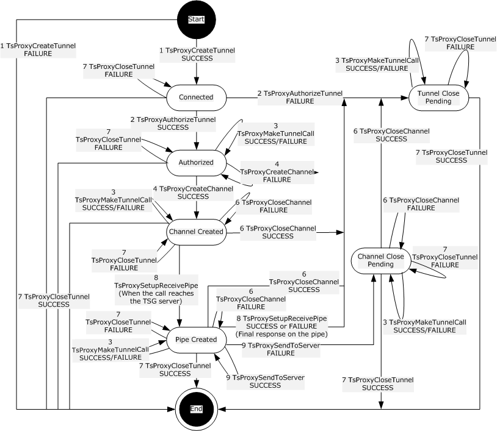

Figure 13: State transition diagram

**Start**: By default, the protocol starts in a disconnected state.

**Connected**: A successful [TsProxyCreateTunnel](#Section_3.2.6.1.1) call brings the connection to the Connected state. Once a connection is in a Connected state, a [TsProxyCloseTunnel](#Section_3.2.6.3.3) call can be made to bring the connection to the Disconnected state.

**Authorized**: A successful [TsProxyAuthorizeTunnel](#Section_3.2.6.1.2) call brings the connection to the Authorized state. A TsProxyAuthorizeTunnel call can only be made when the connection is in a Connected state. If a TsProxyAuthorizeTunnel call is made in any other state, then the result is undefined. The [TsProxyMakeTunnelCall](#Section_3.2.6.1.3) call is allowed in this state. This call does not change the state. TsProxyCloseTunnel can also be made in this state, which moves the connection to the Disconnected state.

**Channel Created**: A successful [TsProxyCreateChannel](#Section_3.2.6.1.4) call brings the connection to the Channel Created state. A TsProxyCreateChannel call is valid only when the tunnel is authorized. If a TsProxyCreateChannel call is made before the [**tunnel (2)**](#gt_1ebdc9c6-bb01-455e-98f7-8930618bb601) is authorized, ERROR_ACCESS_DENIED will be returned. [TsProxyCloseChannel](#Section_3.2.6.3.1) can also be made in this state, which moves the connection to the Tunnel Close Pending state. The [TsProxySetupReceivePipe](#Section_3.2.6.2.2) call is valid only in this state. If this call is made before the RDG [**client**](#gt_client) calls TsProxyCreateChannel, ERROR_ACCESS_DENIED will be returned. If it is made after the call to TsProxyCloseChannel, E_PROXY_ALREADYDISCONNECTED will be returned.

The [TsProxyMakeTunnelCall](#Section_3.2.6.1.3) call is allowed in this state. This call does not change the state.

When TsProxyCloseTunnel is called in this state before a call to TsProxyCloseChannel, the RDG server closes the channel and completes the TsProxyCloseTunnel call. After completing this call, the RDG server moves to the End state.

**Pipe Created:** When a call to TsProxySetupReceivePipe reaches the RDG server, the connection goes to the Pipe Created state. The [TsProxySendToServer](#Section_3.2.6.2.1) call is valid only in this state. If this call is made before the RDG client calls TsProxySetupReceivePipe, ERROR_ACCESS_DENIED will be returned. If it is made after the call to TsProxyCloseTunnel, E_PROXY_ALREADYDISCONNECTED will be returned.

The TsProxyMakeTunnelCall call is allowed in this state. This call does not change the state.

When TsProxyCloseTunnel is called in this state before a call to TsProxyCloseChannel, the RDG server closes the channel and completes the TsProxyCloseTunnel call. After completing this call, the RDG server moves to the End state.

**Channel Close Pending:** From Pipe Created state, either a final response to TsProxySetupReceivePipe call or a failure in TsProxySendToServer call brings the connection to the Channel Close Pending state. TsProxyCloseChannel, TsProxyMakeTunnelCall, and TsProxyCloseTunnel calls are the only valid calls in this state.

When TsProxyCloseTunnel is called in this state before a call to TsProxyCloseChannel, the RDG server closes the channel and completes the TsProxyCloseTunnel call. After completing this call, the RDG server moves to the End state.

**Tunnel Close Pending:** Either a failure TsProxyAuthorizeTunnel call from Connected state or a successful TsProxyCloseChannel call from Channel Close Pending state brings the connection to Tunnel Close Pending state. If a previous TsProxyMakeTunnelCall has not completed, then another call to TsProxyMakeTunnelCall MUST be made as specified in section 3.2.6.3.2. The TsProxyCloseTunnel call SHOULD be made by the RDG client to end the protocol.

**End**: The RDG server MUST transition to this state when the TsProxyCloseTunnel method is called. At this stage, the connection between the RDG client and the RDG server is disconnected.

### 3.2.4 Timers

#### 3.2.4.1 Connection Timer

The RDG [**server**](#gt_server) MAY use this timer to recover early instead of waiting for long periods for a successful connection to the [**target server**](#gt_target-server).<30>

The default value of the timer is 30 seconds.<31> The timer value MUST be between 30 seconds and 3 minutes, both inclusive, in units of minutes. This timer MUST be started after the call to [TsProxyCreateChannel](#Section_3.2.6.1.4) is received by the RDG server.

If a call to [TsProxySetupReceivePipe](#Section_3.2.6.2.2) is received by the RDG server before the timer expires, the timer MUST be stopped.

If the call to the TsProxySetupReceivePipe is received by the RDG server after the timer has expired, the server MUST disconnect with the ERROR_BAD_ARGUMENTS return value, as specified in section [2.2.6](#Section_2.2.6).

### 3.2.5 Initialization

The protocol uses the transport and endpoints as described in section [2.1](#Section_2.1).

The initialization steps for the RDG server are as follows: The RDG [**server**](#gt_server) MUST register for [**Internet Protocol version 4 (IPv4)**](#gt_internet-protocol-version-4-ipv4) and [**Internet Protocol version 6 (IPv6)**](#gt_internet-protocol-version-6-ipv6) local host addresses 127.0.0.1 and ::1 as the network address when operating in a non-load balanced environment. The RDG server MUST register for RPC_C_AUTHN_GSS_NEGOTIATE and SHOULD register for RPC_C_AUTHN_GSS_SCHANNEL as [**authentication services**](#gt_ffda2ae0-9528-42a7-ac1a-9d42d40674f7), as specified in [MS-RPCE](../MS-RPCE/MS-RPCE.md) section 2.2.1.1.7. The RDG [**client**](#gt_client) MUST use a minimum [**authentication level**](#gt_authentication-level) of RPC_C_AUTHN_LEVEL_PKT_INTEGRITY (see [MS-RPCE] section 2.2.1.1.8) and MUST use one of the following authentication services: RPC_C_AUTHN_GSS_NEGOTIATE or RPC_C_AUTHN_GSS_SCHANNEL, or RPC_C_AUTHN_WINNT.<32>

All timers are connection-specific timers, and MUST not be started on initialization.

### 3.2.6 Message Processing Events and Sequencing Rules

This protocol asks the [**RPC**](#gt_remote-procedure-call-rpc) runtime to perform a strict [**NDR**](#gt_network-data-representation-ndr) data consistency check at target level 7.0 for all methods unless otherwise specified, as specified in [MS-RPCE](../MS-RPCE/MS-RPCE.md) section 3.

The RDG [**server**](#gt_server) SHOULD<33> enforce appropriate security measures to be sure that the caller has the required permissions to execute the following routines.

The methods MAY throw an exception, and the [**client**](#gt_client) MUST [**handle**](#gt_handle) these exceptions gracefully. The methods implemented by the RDG server MUST be sequential in order as specified in section [1.3.1.1](#Section_1.3). The method details are specified as follows.

Methods in RPC Opnum Order

| Method | Description |
| --- | --- |
| Opnum0NotUsedOnWire | Reserved for local use. Opnum: 0 |
| [TsProxyCreateTunnel](#Section_3.2.6.1.1) | Sets up the context in which all further communication between the RDG client and the RDG server occurs. Opnum: 1 |
| [TsProxyAuthorizeTunnel](#Section_3.2.6.1.2) | Authorizes the tunnel based on rules defined by the RDG server. Opnum: 2 |
| [TsProxyMakeTunnelCall](#Section_3.2.6.1.3) | Used to request for administrative messages from the RDG server when the same are available. This method is only called when both the client and the RDG server are capable of handling administrative messages. The request is queued up on the RDG server. The same method is also called during shutdown sequence to cancel any pending administrative message request.<34> Opnum: 3 |
| [TsProxyCreateChannel](#Section_3.2.6.1.4) | Creates a channel between the RDG client and the [**target server**](#gt_target-server) via the RDG server that the RDG client desires to connect. Opnum: 4 |
| Opnum5NotUsedOnWire | Reserved for local use. Opnum: 5 |
| [TsProxyCloseChannel](#Section_3.2.6.3.1) | Closes the channel between the RDG client and the target server. Opnum: 6 |
| [TsProxyCloseTunnel](#Section_3.2.6.3.3) | Closes the tunnel between the RDG client and the RDG server. Opnum: 7 |
| [TsProxySetupReceivePipe](#Section_3.2.6.2.2) | Used for data transfer from the RDG server to the RDG client. Opnum: 8 |
| [TsProxySendToServer](#Section_3.2.6.2.1) | Used for data transfer from the RDG client to the RDG server. Opnum: 9 |

**Note** In the preceding table, the term "Reserved for local use" means that the client MUST NOT send the opnum, and the RDG server behavior is undefined<35> because it does not affect interoperability.

#### 3.2.6.1 Connection Setup Phase

##### 3.2.6.1.1 TsProxyCreateTunnel (Opnum 1)

The TsProxyCreateTunnel method sets up the [**tunnel (2)**](#gt_1ebdc9c6-bb01-455e-98f7-8930618bb601) in which all further communication between the RDG [**client**](#gt_client) and the RDG [**server**](#gt_server) occurs. This is also used to exchange versioning and capability information between the RDG client and RDG server. It is used to exchange the RDG server [**certificate**](#gt_certificate) which has already been used to register for an [**authentication service**](#gt_authentication-service-as). After this method call has successfully been completed, a tunnel (2) shutdown can be performed. This is accomplished by using the [TsProxyCloseTunnel](#Section_3.2.6.3.3) method call.

Prerequisites: The connection state MUST be in Start state.

Sequential Processing Rules:

- If any unexpected error occurs in the below process, the RDG server MUST return E_PROXY_INTERNALERROR.
- The RDG server MUST verify that a server authentication certificate is registered with SCHANNEL authentication service. Otherwise it MUST return E_PROXY_NOCERTAVAILABLE.
- If the RDG server is configured for [**pluggable authentication**](#gt_pluggable-authentication):
- The RDG server MUST verify that the **packetId** member of the *TSGPacket* parameter is either [TSG_PACKET_TYPE_AUTH](#Section_2.2.5.2.12) or [TSG_PACKET_TYPE_REAUTH](#Section_2.2.5.2.13). Otherwise, it MUST return the E_PROXY_UNSUPPORTED_AUTHENTICATION_METHOD error code.
- If the **packetId** member of *TSGPacket* parameter is TSG_PACKET_TYPE_AUTH, then the RDG server MUST verify that TSGPacket->TSGPacket.packetAuth is not NULL and TSGPacket->TSGPacket.packetAuth->cookie is not NULL and TSGPacket->TSGPacket.packetAuth->cookieLen is not zero. Otherwise, it MUST return E_PROXY_COOKIE_BADPACKET. If the **packetId** member of the *TSGPacket* parameter is TSG_PACKET_TYPE_REAUTH, then the RDG server MUST verify that TSGPacket->TSGPacket.packetReauth->TSGInitialPacket.packetAuth is not NULL and TSGPacket->TSGPacket.packetReauth->TSGInitialPacket.packetAuth->cookie is not NULL and TSGPacket->TSGPacket.packetReauth->TSGInitialPacket.packetAuth->cookieLen is not zero. Otherwise, it MUST return E_PROXY_COOKIE_BADPACKET.
- The RDG server MUST authenticate the user using the cookie. If authentication fails, it MUST return E_PROXY_COOKIE_AUTHENTICATION_ACCESS_DENIED error code.
- If the RDG server is configured for [**RPC authentication**](#gt_rpc-authentication):
- The RDG server MUST verify that the **packetId** member of the *TSGPacket* parameter type is either [TSG_PACKET_TYPE_VERSIONCAPS](#Section_2.2.5.2.3) or TSG_PACKET_TYPE_REAUTH. Otherwise, it MUST return the E_PROXY_INTERNALERROR error code.
- The RDG server MUST create a [**GUID**](#gt_globally-unique-identifier-guid) and initialize the ADM element **Nonce** with it.
- The RDG server MUST create a unique identifier and initialize the ADM element **Tunnel Id** with it.
- If the **packetId** member of the *TSGPacket* parameter type is not TSG_PACKET_TYPE_REAUTH:
- The RDG server MUST initialize the ADM element **Reauthentication Connection** to FALSE.
- The RDG server MUST initialize the ADM element **Reauthentication Status** to NONE.
- The RDG server MUST initialize the ADM element **Reauthentication Tunnel Context** with a unique ULONGLONG identifier. This identifier MUST be used by the [**reauthentication**](#gt_reauthentication) connection to find this connection and set its **Reauthentication Status** ADM element.
- If the **packetId** member of the *TSGPacket* parameter is TSG_PACKET_TYPE_REAUTH:
- The RDG server MUST initialize the ADM element **Reauthentication Connection** to TRUE.
- The RDG server MUST not use the ADM element **Reauthentication Status** for this connection.
- The RDG server MUST initialize the ADM element **Reauthentication Tunnel Context** with TSGPacket->TSGPacket.packetReauth->tunnelContext.
- The RDG server MUST find the original connection that has initiated the reauthentication using **Reauthentication Tunnel Context**, and its ADM element **Reauthentication Status** MUST be set to AuthenticationCompleted.
- The RDG server MUST create a tunnel (2) context handle and MUST initialize the ADM element **Tunnel Context Handle** with it.
- The RDG server MUST initialize the ADM element **Negotiated Capabilities** with the common capabilities between the RDG client and the RDG server.
- If the RDG server supports the [TSG_MESSAGING_CAP_CONSENT_SIGN](#Section_2.2.5.2.21) capability and is configured to allow only a RDG client that supports the TSG_MESSAGING_CAP_CONSENT_SIGN capability, but the RDG client doesn't support the capability, then the RDG server MUST return the E_PROXY_CAPABILITYMISMATCH error.
- If the ADM element **Negotiated Capabilities** contains the TSG_MESSAGING_CAP_CONSENT_SIGN value, the **packetId** member of the *TSGPacketResponse* out parameter MUST be [TSG_PACKET_TYPE_CAPS_RESPONSE](#Section_2.2.5.2.9). Otherwise, the **packetId** member of *TSGPacketResponse* MUST be [TSG_PACKET_TYPE_QUARENC_RESPONSE](#Section_2.2.5.2.7).
- The RDG server SHOULD<36> set the **certChainData** field of [TSG_PACKET_QUARENC_RESPONSE](#Section_2.2.9.2.1.6) structure in *TSGPacketResponse* only when quarantine is configured at the RDG server and the ADM element **Negotiated Capabilities** contains [TSG_NAP_CAPABILITY_QUAR_SOH](#Section_2.2.5.2.19).
- The RDG server MUST return ERROR_SUCCESS.
HRESULT TsProxyCreateTunnel(

[in, ref] PTSG_PACKET TSGPacket,

[out, ref] PTSG_PACKET* TSGPacketResponse,

[out] PTUNNEL_CONTEXT_HANDLE_SERIALIZE* tunnelContext,

[out] unsigned long* tunnelId

);

**TSGPacket:** Pointer to the [TSG_PACKET](#Section_2.2.9.2) structure. If this call is made for a reauthentication, then the **packetId** field MUST be set to TSG_PACKET_TYPE_REAUTH and the **packetReauth** field of the *TSGPacket* union field MUST be a pointer to the TSG_PACKET_REAUTH structure. Otherwise, if this call is made for a new connection and the RDG server is configured for RPC authentication, then the value of the **packetId** field MUST be set to TSG_PACKET_TYPE_VERSIONCAPS and the **packetVersionCaps** field of the *TSGPacket* union field MUST be a pointer to the [TSG_PACKET_VERSIONCAPS](#Section_2.2.9.2.1.2) structure. Otherwise, if this call is made for a new connection and the RDG server is configured for pluggable authentication <37>, then the value of the **packetId** field MUST be set to TSG_PACKET_TYPE_AUTH and the **packetAuth** field of the *TSGPacket* union field MUST be a pointer to the [TSG_PACKET_AUTH](#Section_2.2.9.2.1.10) structure. If TSG_PACKET_AUTH is not populated correctly, the error E_PROXY_COOKIE_BADPACKET is returned.<38>

**TSGPacketResponse:** Pointer to the TSG_PACKET structure. If TSG_MESSAGING_CAP_CONSENT_SIGN capability is negotiated, the **packetId** member of the *TSGPacketResponse* out parameter MUST be TSG_PACKET_TYPE_CAPS_RESPONSE and the **packetCapsResponse** field of the **TSGPacket** union field MUST be a pointer to the [TSG_PACKET_CAPS_RESPONSE (section 2.2.9.2.1.7)](#Section_2.2.9.2.1.7). Otherwise, the **packetId** member of *TSGPacketResponse* MUST be TSG_PACKET_TYPE_QUARENC_RESPONSE, and the **packetQuarEncResponse** field of the *TSGPacket* union field MUST be a pointer to the TSG_PACKET_QUARENC_RESPONSE structure. The ADM element Nonce MUST be initialized to a unique GUID and assigned to the **nonce** field of the TSG_PACKET_QUARENC_RESPONSE structure either in TSGPacketResponse->TSGPacket.packetQuarEncResponse or TSGPacketResponse->TSGPacket.packetCapsResponse->pktQuarEncResponse.

**tunnelContext:** An [**RPC**](#gt_remote-procedure-call-rpc) context [**handle**](#gt_handle) that represents context-specific information for the tunnel (2). The RDG server MUST provide a non-NULL value. The RDG client MUST save and use this context handle on all subsequent methods calls on the tunnel (2). The methods are [TsProxyAuthorizeTunnel](#Section_3.2.6.1.2), [TsProxyCreateChannel](#Section_3.2.6.1.4), and TsProxyCloseTunnel.

**tunnelId:** An **unsigned long** identifier representing the tunnel (2). The RDG server MUST save this value in the ADM element **Tunnel id** and SHOULD provide this value to the RDG client. The RDG client SHOULD save the *tunnel id* for future use on the RDG client itself. This *tunnel id* is not required on any future method calls to the RDG server; the *tunnelContext* is used instead.

**Return Values:** The method MUST return ERROR_SUCCESS on success. Other failures MUST be one of the codes listed in the rest of this table. The client MAY interpret failures in any way it deems appropriate. See section [2.2.6](#Section_2.2.6) for details on these errors.

| Return value | State transition | Description |
| --- | --- | --- |
| ERROR_SUCCESS (0x00000000) | The connection MUST transition to the connected state. | Returned when a call to the TsProxyCreateTunnel method succeeds. |
| E_PROXY_INTERNALERROR (0x800759D8) | The connection MUST transition to end state. | Returned when the server encounters an unexpected error. The RDG client MUST end the protocol when this error is received. |
| E_PROXY_COOKIE_BADPACKET (0x800759F7) | The connection MUST transition to end state. | Returned if the **packetAuth** field of the *TSGPacket* parameter is NULL. |
| E_PROXY_NOCERTAVAILABLE (0x800759EE) | The connection MUST transition to end state. | Returned when the RDG server cannot find a certificate to register for SCHANNEL Authentication Service (AS). The RDG client MUST end the protocol when this error is received. |
| E_PROXY_UNSUPPORTED_AUTHENTICATION_METHOD(0x800759F9) | The connection MUST transition to end state. | Returned to the RDG client when the RDG server is configured for pluggable authentication and the value of the **packetId** member of the *TSGPacket* parameter is not equal to TSG_PACKET_TYPE_AUTH or TSG_PACKET_TYPE_REAUTH. The RDG server MUST disconnect the connection. |
| E_PROXY_COOKIE_AUTHENTICATION_ACCESS_DENIED (0x800759F8) | The connection MUST transition to end state. | Returned when the given user does not have access to connect via RDG server. The RDG server MUST be in pluggable authentication mode for this error to be returned. |
| E_PROXY_CAPABILITYMISMATCH (0x800759E9) | The connection MUST transition to end state. | Returned when the RDG server supports the TSG_MESSAGING_CAP_CONSENT_SIGN capability and is configured to allow only a RDG client that supports the TSG_MESSAGING_CAP_CONSENT_SIGN capability, but the RDG client doesn't support the capability. |

##### 3.2.6.1.2 TsProxyAuthorizeTunnel (Opnum 2)

The TsProxyAuthorizeTunnel method is used to authorize the [**tunnel (2)**](#gt_1ebdc9c6-bb01-455e-98f7-8930618bb601) based on rules defined by the RDG [**server**](#gt_server). The RDG server SHOULD perform security authorization for the RDG [**client**](#gt_client). The RDG server SHOULD<39> also use this method to require health checks from the RDG client, which SHOULD result in the RDG client performing health remediation.<40> After this method call has successfully been completed, a tunnel (2) shutdown can be performed. If there are existing channels within the tunnel, the RDG server MUST close all the channels before the tunnel shutdown. The tunnel (2) shutdown is accomplished by using the [TsProxyCloseTunnel](#Section_3.2.6.3.3) method call.

If this method call completes successfully, the ADM element **Number of Connections** MUST be incremented by 1.

Prerequisites: The connection MUST be in Connected state. If this call is made in any other state, the result is undefined.

Sequential Processing Rules:

- The RDG server MUST verify that the **packetId** field of the *TSGPacket* parameter is [TSG_PACKET_TYPE_QUARREQUEST](#Section_2.2.5.2.5). Otherwise, it MUST return HRESULT_CODE(E_PROXY_NOTSUPPORTED).
- If the TSGPacket->TSGPacket.packetQuarRequest->dataLen is not zero and TSGPacket->TSGPacket.packetQuarRequest->data is not NULL, then the following.<41>
- The RDG server MUST decode the [**SoH**](#gt_statement-of-health-soh) specified in TSGPacket->TSGPacket.packetQuarRequest->data with the RDG server certificate, which is encoded with one of PKCS #7 or X.509 encoding types, whichever is supported by the RDG server certificate. The RDG server MUST decrypt the SoH, which is encrypted using the [**Triple Data Encryption Standard**](#gt_triple-data-encryption-standard) algorithm.
- If decoding of the SoH fails, the RDG server MUST return the error code returned by the [**cryptographic service provider**](#gt_cryptographic-service-provider).
- If decoding of the SoH succeeds, the RDG server MUST also verify that the decoded message is prefixed with the **Nonce**. Otherwise, it MUST return ERROR_INVALID_PARAMETER.
- The remaining bytes in the decoded message are the RDG client computer's [**statement of health response (SoHR)**](#gt_statement-of-health-response-sohr).
- The RDG server MUST verify that the ADM element **Number of Connections** has not already reached the maximum number of connections configured by the RDG service. Otherwise, it MUST return the E_PROXY_MAXCONNECTIONSREACHED error code.
- The RDG server MUST do the user authorization as per policies configured at the RDG server. If the user is not authorized, it MUST return E_PROXY_NAP_ACCESS_DENIED.
- If quarantine is configured at the RDG server:<42>
- The RDG client computer's SoH SHOULD be passed to a Network Policy Server (NPS) using a RADIUS request. The statement of health is carried by the MS-Quarantine- SoH RADIUS attribute as specified in [MS-RNAP](../MS-RNAP/MS-RNAP.md) section 2.2.1.19.
- After the NPS processes the statement of health request, a statement of health response is returned in a RADIUS response. The SoHR is encoded in the MS-Quarantine-SoH RADIUS attribute as specified in [MS-RNAP] section 2.2.1.19.
- The RDG server MUST sign the SoHR using [**SHA-1 hash**](#gt_sha-1-hash) and encode it with the RDG server certificate using PKCS #7 or X.509 encoding types, whichever is supported by the RDG server certificate and append the signed and encoded SoHR to TSGPacketResponse->TSGPacket.packetResponse->responseData, where *TSGPacketResponse* is an output parameter to TsProxyAuthorizeTunnel.
- If the RDG client computer's health is not compliant to quarantine settings:
- If the ADM element **Reauthentication Connection** is TRUE:
- The RDG server MUST find the original connection that has initiated the [**reauthentication**](#gt_reauthentication) using **Reauthentication Tunnel Context** and MUST set its ADM element **Reauthentication Status** to UserAuthorizationCompletedButQuarantineFailed.
- The RDG server MUST return the E_PROXY_QUARANTINE_ACCESSDENIED error code.
- If the ADM element **Reauthentication Connection** is TRUE:
- The RDG server MUST find the original connection which has initiated the reauthentication using **Reauthentication Tunnel Context** and MUST set its ADM element **Reauthentication Status** to *UserAuthorizationCompleted*.
- The RDG server MUST set the **packetId** member of the *TSGPacketResponse* out parameter to [TSG_PACKET_TYPE_RESPONSE](#Section_2.2.5.2.6).
- The RDG server MUST increment the ADM element **Number of Connections** by 1.
- The RDG server MUST return ERROR_SUCCESS.
HRESULT TsProxyAuthorizeTunnel(

[in] PTUNNEL_CONTEXT_HANDLE_NOSERIALIZE tunnelContext,

[in, ref] PTSG_PACKET TSGPacket,

[out, ref] PTSG_PACKET* TSGPacketResponse

);

**tunnelContext:** The RDG client MUST provide the RDG server with the same context [**handle**](#gt_handle) it received from the [TsProxyCreateTunnel](#Section_3.2.6.1.1) method call. The RDG server SHOULD throw an exception if the [**RPC**](#gt_remote-procedure-call-rpc) validation and verification fails.

**TSGPacket:** Pointer to the [TSG_PACKET](#Section_2.2.9.2) structure. The value of the **packetId** field MUST be set to TSG_PACKET_TYPE_QUARREQUEST. If this is set to any other value, the error E_PROXY_NOT_SUPPORTED is returned. The **packetQuarRequest** field of the *TSGPacket* union field MUST be a pointer to the [TSG_PACKET_QUARREQUEST](#Section_2.2.9.2.1.4) structure.

**TSGPacketResponse:** Pointer to the TSG_PACKET structure. The value of the **packetId** field MUST be TSG_PACKET_TYPE_RESPONSE. The **packetResponse** field of the *TSGPacket* union field MUST be a pointer to the [TSG_PACKET_RESPONSE](#Section_2.2.9.2.1.5) structure.

**Return Values:** The method MUST return ERROR_SUCCESS on success. Other failures MUST be one of the codes listed. The client MAY interpret failures in any way it deems appropriate. See [2.2.6](#Section_2.2.6) for details on these errors.

| Return value | State transition | Description |
| --- | --- | --- |
| ERROR_SUCCESS (0x00000000) | The connection MUST transition to the authorized state. | Returned when a call to the TsProxyAuthorizeTunnel method succeeds. |
| E_PROXY_NAP_ACCESSDENIED (0x800759DB) | The connection MUST transition to Tunnel Close Pending state. | Returned when the RDG server denies the RDG client access due to policy. The RDG client MUST end the protocol when this error is received. |
| HRESULT_CODE(E_PROXY_NOTSUPPORTED) (0x000059E8) | The connection MUST transition to Tunnel Close Pending state. | Returned if the **packetId** field of the *TSGPacket* parameter is not TSG_PACKET_TYPE_QUARREQUEST. The RDG client MUST end the protocol when this error is received. |
| E_PROXY_QUARANTINE_ACCESSDENIED (0x800759ED) | The connection MUST transition to Tunnel Close Pending state. | Returned when the RDG server rejects the connection due to quarantine policy. The RDG client MUST end the protocol when this error is received. |
| ERROR_ACCESS_DENIED (0x00000005) | The connection MUST transition to Tunnel Close Pending state. | Returned when this call is made either in a state other than the Connected state or the *tunnelContext* parameter is NULL. The RDG client MUST end the protocol when this error is received. |
| HRESULT_CODE(E_PROXY_MAXCONNECTIONSREACHED) (0x59E6) | The connection MUST transition to end state. | Returned when the ADM element **Number of Connections** is equal to the maximum number of connections when the call is made.<43> The RDG client MUST end the protocol when this error is received. |
| ERROR_INVALID_PARAMETER (0x00000057) | The connection MUST not transition its state. | Returned when the **Negotiated Capabilities** ADM element contains TSG_NAP_CAPABILITY_QUAR_SOH and TSGPacket->TSGPacket.packetQuarRequest->dataLen is not zero and TSGPacket->TSGPacket.packetQuarRequest->data is not NULL and TSGPacket->TSGPacket.packetQuarRequest->data is not prefixed with Nonce. |

##### 3.2.6.1.3 TsProxyMakeTunnelCall (Opnum 3)

The TsProxyMakeTunnelCall method is designed to be used as a general purpose API. If both the client and the server support the administrative message, the client MAY request the same from the RDG server. If the RDG [**server**](#gt_server) has any administrative messages, it SHOULD complete the pending call at this point in time. After a call to TsProxyMakeTunnelCall returns, the RDG client SHOULD queue up another request at this point in time. During the shutdown sequence, the client MUST make this call, if a request is pending on the RDG server, to cancel the administrative message request.

Prerequisites: The connection MUST be in Authorized state or Channel Created state or Pipe Created state or Channel Close Pending state or Tunnel Close Pending state. If this call is made in any other state, the error ERROR_ACCESS_DENIED is returned.

Sequential Processing Rules:

- The RDG server MUST verify that the *procId* parameter is either [TSG_TUNNEL_CALL_ASYNC_MSG_REQUEST](#Section_2.2.5.2.17) or [TSG_TUNNEL_CANCEL_ASYNC_MSG_REQUEST](#Section_2.2.5.2.18). Otherwise, it MUST return ERROR_ACCESS_DENIED.
- The RDG server MUST verify that the [**tunnel (2)**](#gt_1ebdc9c6-bb01-455e-98f7-8930618bb601) has been authorized. Otherwise, it MUST return ERROR_ACCESS_DENIED.
- The RDG server MUST verify that the ADM element **Reauthentication Connection** is FALSE. Otherwise, it MUST return ERROR_ACCESS_DENIED. TsProxyMakeTunnelCall is not valid on [**reauthentication**](#gt_reauthentication) tunnels.
- If *procId* is TSG_TUNNEL_CALL_ASYNC_MSG_REQUEST:
- If a TsProxyMakeTunnelCall has already been made and not yet returned, the RDG server MUST return ERROR_ACCESS_DENIED.
- If there is already a pending [**administrative message**](#gt_administrative-message) or reauthentication message to the RDG [**client**](#gt_client), the RDG server MUST fill *TSGPacketResponse* and return ERROR_SUCCESS.
- If there is no pending administrative message or a reauthentication message, the RDG server MUST wait until one of the following events occurs:
- Reauthentication starts because the session timeout timer expires.
- The RDG server administrator sets the administrative message.
- The RDG client cancels the call.
- The connection shutdown sequence is initiated.
If any of the preceding events occurs, then the following steps MUST be performed:

- If reauthentication is started because of session timeout timer expiration, then the RDG server MUST return the TsProxyMakeTunnelCall as explained in section [3.2.7.1](#Section_3.1.2.1).
- Or else, if the RDG administrator has set the administrative message, then the RDG server MUST do the following:
- The RDG server MUST set the **packetId** member of the *TSGPacketResponse* out parameter of TsProxyMakeTunnelCall to [TSG_PACKET_TYPE_MESSAGE_PACKET](#Section_2.2.5.2.11).
- The RDG server MUST set TSGPacketResponse->packetMsgResponse->msgType to [TSG_ASYNC_MESSAGE_SERVICE_MESSAGE](#Section_2.2.5.2.15).
- The RDG server MUST initialize TSGPacketResponse->packetMsgResponse->messagePacket.serviceMessage->isDisplayMandatory to TRUE.
- The RDG server MUST initialize TSGPacketResponse->packetMsgResponse->messagePacket.serviceMessage->isConsentMandatory to FALSE.
- The RDG server MUST initialize TSGPacketResponse->packetMsgResponse->messagePacket.serviceMessage->msgBuffer with the administrative message.
- The RDG server MUST initialize TSGPacketResponse->packetMsgResponse->messagePacket.serviceMessage->msgBytes with the number of characters in TSGPacketResponse->packetMsgResponse->messagePacket.serviceMessage->msgBuffer.
- The RDG server MUST complete the TsProxyMakeTunnelCall with error code ERROR_SUCCESS.
- Or else, if the RDG client cancels the call by calling another TsProxyMakeTunnelCall with *procId* TSG_TUNNEL_CANCEL_ASYNC_MSG_REQUEST, then the RDG server MUST return HRESULT_FROM_WIN32(RPC_S_CALL_CANCELLED).
- Or else, if the connection shutdown sequence is initiated, then the RDG server MUST return HRESULT_FROM_WIN32(RPC_S_CALL_CANCELLED).
- If *procId* is TSG_TUNNEL_CANCEL_ASYNC_MSG_REQUEST:
- If there is no unreturned TsProxyMakeTunnelCall call which is called with the *procId* value TSG_TUNNEL_CALL_ASYNC_MSG_REQUEST, the RDG server MUST return ERROR_ACCESS_DENIED.
- Otherwise, the RDG server MUST notify the waiting TsProxyMakeTunnelCall call, which is called with the *procId* value TSG_TUNNEL_CALL_ASYNC_MSG_REQUEST, that the RDG client is canceling the call.
- The RDG server MUST return ERROR_SUCCESS.
HRESULT TsProxyMakeTunnelCall(

[in] PTUNNEL_CONTEXT_HANDLE_NOSERIALIZE tunnelContext,

[in] unsigned long procId,

[in, ref] PTSG_PACKET TSGPacket,

[out, ref] PTSG_PACKET* TSGPacketResponse

);

**tunnelContext:** The RDG client MUST provide the RDG server with the same context [**handle**](#gt_handle) it received from the [TsProxyCreateTunnel](#Section_3.2.6.1.1) method call. The RDG server SHOULD throw an exception if the [**RPC**](#gt_remote-procedure-call-rpc) validation and verification fail.

**procId:** This field identifies the work that is performed by the API. This field can have the following values.

| Value | Meaning |
| --- | --- |
| TSG_TUNNEL_CALL_ASYNC_MSG_REQUEST 0x00000001 | Used to request an administrative message when the same is available on the server. |
| TSG_TUNNEL_CANCEL_ASYNC_MSG_REQUEST 0x00000002 | Used to cancel a pending administrative message request. |

**TSGPacket:** Pointer to the [TSG_PACKET](#Section_2.2.9.2) structure. The value of the **packetId** field MUST be set to [TSG_PACKET_TYPE_MSGREQUEST_PACKET](#Section_2.2.5.2.10). The **packetMsgRequest** field of the **TSGPacket** union field MUST be a pointer to the [TSG_PACKET_MSG_REQUEST](#Section_2.2.9.2.1.8) structure.

**TSGPacketResponse:** Pointer to the TSG_PACKET structure. If *procId* is TSG_TUNNEL_CANCEL_ASYNC_MSG_REQUEST or if the return value is HRESULT_FROM_WIN32(RPC_S_CALL_CANCELLED), **TSGPacketResponse* MUST be set to NULL. Otherwise, the value of the **packetId** field MUST be TSG_PACKET_TYPE_MESSAGE_PACKET. The **packetMsgResponse** field of the **TSGPacket** union field MUST be a pointer to the [TSG_PACKET_MSG_RESPONSE](#Section_2.2.9.2.1.9) structure.

**Return Values:** The method MUST return ERROR_SUCCESS on success. Other failures MUST be one of the codes listed. The client MAY interpret failures in any way it deems appropriate. See section [2.2.6](#Section_2.2.6) for details on these errors. The connection MUST NOT transition its state after completing the TsProxyMakeTunnelCall.

| Return value | State transition | Description |
| --- | --- | --- |
| ERROR_SUCCESS (0x00000000) | The connection MUST NOT transition its state. | Returned when a call to the TsProxyMakeTunnelCall method succeeds. |
| ERROR_ACCESS_DENIED (0x00000005) | The connection MUST NOT transition its state. | Returned in the following cases. When the call is made in any state other than Authorized, Channel Created, Pipe Created, Channel Close Pending, or Tunnel Close Pending. If **procId** is neither TSG_TUNNEL_CALL_ASYNC_MSG_REQUEST nor TSG_TUNNEL_CANCEL_ASYNC_MSG_REQUEST. If **procId** is TSG_TUNNEL_CALL_ASYNC_MSG_REQUEST and there is already a call to TsProxyMakeTunnelCall made earlier with **procId** TSG_TUNNEL_CALL_ASYNC_MSG_REQUEST and it is not yet returned. If **procId** is TSG_TUNNEL_CANCEL_ASYNC_MSG_REQUEST and there is no call to TsProxyMakeTunnelCall made earlier with **procId** TSG_TUNNEL_CALL_ASYNC_MSG_REQUEST that is not yet returned. If the *tunnelContext* parameter is NULL. If the tunnel is not authorized. If the **Reauthentication Connection** ADM element is TRUE. The RDG client MUST end the protocol when this error is received. |
| HRESULT_FROM_WIN32(RPC_S_CALL_CANCELLED)(0x8007071A) | The connection MUST not transition its state. | Returned when the call is canceled by the RDG client or the call is canceled because a shutdown sequence is initiated. |

##### 3.2.6.1.4 TsProxyCreateChannel (Opnum 4)

The TsProxyCreateChannel method is used to create a [**channel**](#gt_channel) between the RDG [**client**](#gt_client) and the RDG [**server**](#gt_server).<44> The RDG server SHOULD connect to the [**target server**](#gt_target-server) during this call to start communication between the RDG client and target server. If connection to the target server cannot be done, the RDG server MUST return HRESULT_CODE(E_PROXY_TS_CONNECTFAILED) as noted in the Return Values section.<45> The RDG server MUST return a representation of the channel to the RDG client. After this method call has successfully been completed, a channel shutdown can be performed by using the [TsProxyCloseChannel](#Section_3.2.6.3.1) method. Please refer to section [3.1.1](#Section_3.2.2) for a state transition diagram.

Prerequisites: The tunnel MUST be authorized; otherwise, the error ERROR_ACCESS_DENIED is returned.

Sequential Processing Rules:

- If some unexpected error occurs during the following process, the RDG server MUST return E_PROXY_INTERNALERROR.
- The RDG server MUST verify that the tunnel has been authorized. Otherwise, it MUST return ERROR_ACCESS_DENIED.
- The RDG server MUST verify that the *tsEndPointInfo* parameter is not NULL and tsEndPointInfo->numResources is not zero. Otherwise, it MUST return ERROR_ACCESS_DENIED.
- The RDG server MUST initialize the ADM element **Target server names** with combined array of the **resourceName** and **alternateResourceNames** members of the *tsEndPointInfo* parameter.
- The RDG server MUST do the resource authorization as per policies configured at the RDG server. If the resource is not authorized, then it MUST return E_PROXY_RAP_ACCESSDENIED.<46>
- If **Reauthentication Connection** is TRUE:
- The RDG server MUST find the original connection that has initiated the [**reauthentication**](#gt_reauthentication) using **Reauthentication Tunnel Context** and MUST set its ADM element **Reauthentication Status** to ResourceAuthorizationCompleted.
- Return ERROR_SUCCESS.
- The RDG server SHOULD try to connect to the target server by each name in the target server names array until it succeeds or until the array is traversed completely. If connection fails for all target server names, it MUST return HRESULT_CODE(E_PROXY_TS_CONNECTFAILED) in rpc_fault packet.
- The RDG server MUST create the *channelId* and *channelContext* RPC content handles and MUST initialize the corresponding ADM elements.
- The RDG server MUST also start the [Session Timeout Timer (section 3.1.2.1)](#Section_3.1.2.1), if the session timeout is configured at the RDG server.
- If the RDG server is implementing the Connection Timer, the RDG server MUST start the Connection Timer.
- The RDG server MUST return ERROR_SUCCESS.
HRESULT TsProxyCreateChannel(

[in] PTUNNEL_CONTEXT_HANDLE_NOSERIALIZE tunnelContext,

[in, ref] PTSENDPOINTINFO tsEndPointInfo,

[out] PCHANNEL_CONTEXT_HANDLE_SERIALIZE* channelContext,

[out] unsigned long* channelId

);

**tunnelContext:** The RDG client MUST provide the RDG server with the same context [**handle**](#gt_handle) it received from the [TsProxyCreateTunnel](#Section_3.2.6.1.1) method call. The RDG server SHOULD throw an exception if the [**RPC**](#gt_remote-procedure-call-rpc) validation and verification fails.

**tsEndPointInfo:** Pointer to the [TSENDPOINTINFO](#Section_2.2.9.1) structure. The RDG client MUST provide a non-NULL pointer to the RDG server for this structure. The RDG server initializes the ADM element Target server names with an array of **resourceName** and **alternateResourceNames** members of TSENDPOINTINFO structure. The RDG server SHOULD try to connect to the target server by each name in the array until it succeeds or until the array is traversed completely. If connection fails for all target server names, HRESULT_CODE(E_PROXY_TS_CONNECTFAILED) (0x000059DD) is returned.<47> The rules for determining a valid server name are specified in section [2.2.1.1](#Section_2.2.1.1).

**channelContext:** A RPC context handle that represents context-specific information for the channel. The RDG server MUST provide a non-NULL value. The RDG client MUST save and use this context handle on all subsequent method calls on the channel. Specifically, these methods are [TsProxySendToServer](#Section_3.2.6.2.1), [TsProxySetupReceivePipe](#Section_3.2.6.2.2), and TsProxyCloseChannel.

**channelId:** An unsigned long identifying the channel. The RDG server MUST provide this value to the RDG client. The RDG client MUST save the returned channel ID for future use in the ADM element **Channel id** (section [3.5.1](#Section_3.2.2)). This channel ID is not required on any future method calls.

**Return Values:** The method MUST return ERROR_SUCCESS on success. Other failures MUST be one of the codes listed. The client MAY interpret failures in any way it deems appropriate. See section [2.2.6](#Section_2.2.6) for details on these errors.

| Return value | State transition | Description |
| --- | --- | --- |
| ERROR_SUCCESS (0x00000000) | The connection MUST transition to Channel Created state. | Returned when a call to the TsProxyCreateChannel method succeeds. |
| ERROR_ACCESS_DENIED (0x00000005) | The connection MUST NOT transition its state. | Returned either if *tunnelContext* parameter is NULL, if this method is called on a tunnel which is not authorized, if the **tsEndPointInfo** parameter is NULL, or if the **numResourceNames** member of the **tsEndPointInfo** parameter is zero. |
| E_PROXY_RAP_ACCESSDENIED (0x800759DA) | The connection MUST NOT transition its state. | Returned when an attempt to resolve or access a target server is blocked by RDG server policies. |
| E_PROXY_INTERNALERROR (0x800759D8) | The connection MUST NOT transition its state. | Returned when the server encounters an unexpected error while creating the channel. |
| HRESULT_CODE(E_PROXY_TS_CONNECTFAILED) (0x000059DD) | The connection MUST NOT transition its state. | This error is returned in rpc_fault packet when the RDG server fails to connect to any of the target server names, as specified in the members of **tsEndPointInfo**. |

The error ERROR_ACCESS_DENIED is returned when this call is made on a tunnel which is not authorized.

#### 3.2.6.2 Data Transfer Phase

##### 3.2.6.2.1 TsProxySendToServer (Opnum 9)

The method is used for data transfer from the RDG [**client**](#gt_client) to the [**target server**](#gt_target-server), via the RDG [**server**](#gt_server). The RDG server SHOULD send the buffer data received in this method to the target server. The [**RPC**](#gt_remote-procedure-call-rpc) runtime MUST NOT perform a strict [**NDR**](#gt_network-data-representation-ndr) data consistency check for this method. The Remote Desktop Gateway Server Protocol bypasses NDR for this method. The wire data MUST follow the regular RPC specifications as specified in [[C706]](https://go.microsoft.com/fwlink/?LinkId=89824) section 2.1, and [MS-RPCE](../MS-RPCE/MS-RPCE.md) minus all NDR headers, trailers, and NDR-specific payload. The RDG server MUST have created the [**channel**](#gt_channel) to the target server before completing this method call. This method MAY be called multiple times by the RDG client, but only after the previous method call finishes. The RDG server MUST [**handle**](#gt_handle) multiple sequential invocations of this method call. This method bypasses NDR. For this reason, unlike other RPC methods that return an HRESULT, this method returns a DWORD. This is directly passed to the callee from underlying RPC calls.<48> When this call fails, the RDG server MUST send the final response to [TsProxySetupReceivePipe](#Section_3.2.6.2.2) call.

Prerequisites: The connection MUST be in Pipe Created state. If this call is made in any other state, ERROR_ONLY_IF_CONNECTED or E_PROXY_TS_CONNECTFAILED is returned.

Sequential Processing Rules:

- If some unexpected error occurs in the following process, the RDG server MUST return HRESULT_CODE(E_PROXY_INTERNALERROR).
- The RDG server MUST extract the channel context handle from the *pRpcMessage* parameter. Refer to [Generic Send Data Message Packet](#Section_2.2.9.3) for the *pRpcMessage* format.
- The RDG server MUST verify that the channel context handle is not NULL. Otherwise, it MUST return ERROR_ACCESS_DENIED.
- The RDG server MUST verify that the connection is in Pipe Created state. Otherwise, it MUST return ERROR_ONLY_IF_CONNECTED or E_PROXY_TS_CONNECTFAILED.
- The RDG server MUST extract the RDG client data from the *pRpcMessage* parameter. For the *pRpcMessage* format, refer to Generic Send Data Message Packet (section 2.2.9.3).
- The RDG server MUST verify that the **totalDataBytes** field in *pRpcMessage* is not zero. Otherwise, it MUST return ERROR_ACCESS_DENIED.
- The RDG server MUST verify that the **numBuffers** filed in *pRpcMessage* is in the range of 1 and 3, both inclusive. Otherwise, it MUST return ERROR_ACCESS_DENIED.
- The RDG server MUST verify that **buffer1Length** + **buffer2Length**, (if **numBuffers** >= 2), + **buffer3Length**, (if **numBuffers** == 3), + size of **buffer1Length** + size of **buffer2Length**, (if **numBuffers** >= 2), + size of **buffer3Length**, (if **numBuffers** == 3), does not exceed **totalDataBytes**. Otherwise, it MUST return ERROR_ACCESS_DENIED.
- The RDG server MUST verify that the **buffer1Length** field in *pRpcMessage* is not zero. Otherwise, it MUST return HRESULT_CODE(E_PROXY_INTERNALERROR).
- The RDG server MUST send the data extracted in the preceding step to the target server.
- The RDG server MUST return ERROR_SUCCESS.
DWORD TsProxySendToServer(

[in, max_is(32767)] byte pRpcMessage[]

);

**pRpcMessage:** The protocol data between RDG client and RDG server MUST be decoded as specified in section 2.2.9.3. RPC stub information is specified in [MS-RPCE] sections 1.1 and 1.5.

**Return Values:** The method MUST return ERROR_SUCCESS on success. Other failures MUST be one of the codes listed. The client MAY interpret failures in any way it deems appropriate. See section [2.2.6](#Section_2.2.6) for details on these errors.

| Return value | State transition | Description |
| --- | --- | --- |
| ERROR_SUCCESS (0x00000000) | The connection MUST remain in PipeCreated state. | Returned when a call to the TsProxySendToServer method succeeds. |
| ERROR_ONLY_IF_CONNECTED (0x000004E3) | The connection MUST transition to Channel Close Pending state. | Returned by the RDG server when an attempt is made by the client to send data to the target server on connection state other than Pipe Created state. The RDG client MUST end the protocol when this error is returned. |
| ERROR_ACCESS_DENIED (0x00000005) | The connection MUST transition to Channel Close Pending state. | Returned if the channel context handle passed in the *pRpcMessage* parameter is NULL. The RDG client MUST end the protocol when this error is received. |
| HRESULT_CODE(E_PROXY_INTERNALERROR) (0x000059D8) | The connection MUST transition to Channel Close Pending state. | Returned when an unexpected error occurs in TsProxySendToServer. The RDG client MUST end the protocol when this error is received. |

##### 3.2.6.2.2 TsProxySetupReceivePipe (Opnum 8)

The TsProxySetupReceivePipe method is used for data transfer from the RDG [**server**](#gt_server) to the RDG [**client**](#gt_client). The RDG server MUST create an [**RPC**](#gt_remote-procedure-call-rpc) [**out pipe**](#gt_out-pipe) upon receiving this method call from the RDG client. This call bypasses the [**NDR**](#gt_network-data-representation-ndr) and hence, the RPC runtime MUST NOT perform a strict NDR data consistency check for this method. Refer to section [3.6.5](#Section_3.2.6.2.1) for details on NDR-bypassing. Section [3.6.5.4](#Section_3.6.5.4) and section [3.6.5.5](#Section_3.6.5.5) give details on wire representation of data for responses to TsProxySetupReceivePipe. The out pipe MUST be created by the RDG server in the same manner as NDR creates it for a call.<49> The RDG server MUST use this out pipe and Stub Data field in RPC response PDUs to send all data from the target server to the RDG client on the [**channel**](#gt_channel). The RDG client MUST use this out pipe to pull data from the [**target server**](#gt_target-server) on the channel. On connection disconnect, the RDG server MUST send the following on the pipe: A DWORD return code in an RPC response PDU and set the PFC_LAST_FRAG bit in the **pfc_flags** field of the RPC response PDU. The pipe close is indicated when the PFC_LAST_FRAG bit is set in the **pfc_flags** field of the RPC response PDU. When the RDG client sees that the PFC_LAST_FRAG bit is set in the **pfc_flags** field of the RPC response PDU, it MUST interpret the 4 bytes Stub Data as the return code of TsProxySetupReceivePipe. For a description of RPC response PDU, **pfc_flags**, PFC_LAST_FRAG, and Stub Data, refer to sections 12.6.2 and 12.6.4.10 in [[C706]](https://go.microsoft.com/fwlink/?LinkId=89824). The RDG client and RDG server MUST negotiate a separate out pipe for each channel. Out pipes MUST NOT be used or shared across channels.<50>

As long as the channel is not closed, the RPC and Transport layer guarantee that any data that is sent by the RDG server reaches the RDG client. RPC and Transport layer also ensure that the data is delivered to the RDG client in the order it was sent by the RDG server.

After the call reaches the RDG server, the connection MUST transition to Pipe Created state after setting up the out pipe.

Prerequisites: The connection MUST be in Channel Created state. If this is called in any other state, then the behavior is undefined.

Sequential Processing Rules:

- If some unexpected error occurs in the following process, the RDG server MUST return HRESULT_CODE(E_PROXY_INTERNALERROR).
- If the RDG server is implementing the Connection Timer, then if TsProxySetupReceivePipe is called after the Connection Timer has expired, the RDG server MUST return ERROR_OPERATION_ABORTED; otherwise, the Connection Timer MUST be stopped.
- The RDG server MUST extract the channel context [**handle**](#gt_handle) from *pRpcMessage* parameter. For the *pRpcMessage* format, refer to [RDG Client to RDG Server Packet Format (section 2.2.9.4.1)](#Section_2.2.9.4.1).
- The RDG server MUST verify that the channel context handle is not NULL. Otherwise, it MUST return ERROR_ACCESS_DENIED.
- If the RDG server is configured such that the connections are allowed only to a resource that allows policy exchanges between the RDG server and the target server, and the target server does not support the same, then the RDG server MUST return HRESULT_CODE(E_PROXY_SDR_NOT_SUPPORTED_BY_TS).
- If connection to the target server is not set up in [TsProxyCreateChannel](#Section_3.2.6.1.4) call, then the RDG server MUST try to connect to the target server by each name in the **Target server names** array until it succeeds or until the array is traversed completely. If connection fails for all target server names, it MUST return HRESULT_CODE(E_PROXY_TS_CONNECTFAILED).<51>
- The RDG server MUST set up an out pipe to send data received from the target server to the RDG client.
- The connection MUST transition to Pipe Created state.
- The RDG server MUST start receiving data from the target server and stream the same to the RDG client. This process MUST be continued until one of the following events occurs.
- If the Session Timeout Timer expires and the **TimeoutAction** ADM element is set to "disconnect on session timeout" RDG server:
- If the ADM element **Negotiated Capabilities** contains [TSG_NAP_CAPABILITY_IDLE_TIMEOUT](#Section_2.2.5.2.20), then the RDG server MUST disconnect the session by sending the final response of the TsProxySetupReceivePipe method with the HRESULT_CODE(E_PROXY_SESSIONTIMEOUT) error code.
- If the ADM element **Negotiated Capabilities** does not contain TSG_NAP_CAPABILITY_IDLE_TIMEOUT, then the RDG server MUST disconnect the session by sending the final response of the TsProxySetupReceivePipe method with the HRESULT_CODE(E_PROXY_CONNECTIONABORTED) error code.
- If the session timeout timer expires and the **TimeoutAction** ADM element is set to "[**reauthentication**](#gt_reauthentication) on session timeout", the RDG server initiates a reauthentication with the client and starts the reauthentication timer, as explained in section [3.2.7.1](#Section_3.1.2.1). After the reauthentication timer expires, the RDG server MUST check the value of **Reauthentication Status** ADM element.
- If the ADM element **Reauthentication Status** is set to NONE:
- If the ADM element **Negotiated Capabilities** contains TSG_NAP_CAPABILITY_IDLE_TIMEOUT, then the RDG server MUST disconnect the connection with HRESULT_CODE(E_PROXY_REAUTH_AUTHN_FAILED).
- If the ADM element **Negotiated Capabilities** does not contain TSG_NAP_CAPABILITY_IDLE_TIMEOUT, then the RDG server MUST disconnect the connection with HRESULT_CODE(E_PROXY_CONNECTIONABORTED).
- If the ADM element **Reauthentication Status** is set to AuthenticationCompleted:
- If the ADM element **Negotiated Capabilities** contains TSG_NAP_CAPABILITY_IDLE_TIMEOUT, then the RDG server MUST disconnect the connection with HRESULT_CODE(E_PROXY_REAUTH_CAP_FAILED).
- If the ADM element **Negotiated Capabilities** does not contain TSG_NAP_CAPABILITY_IDLE_TIMEOUT, then the RDG server MUST disconnect the connection with HRESULT_CODE(E_PROXY_CONNECTIONABORTED).
- If the ADM element **Reauthentication Status** is set to UserAuthorizationCompletedButQurantineFailed:
- If the ADM element **Negotiated Capabilities** contains TSG_NAP_CAPABILITY_IDLE_TIMEOUT, then the RDG server MUST disconnect the connection with HRESULT_CODE(E_PROXY_REAUTH_NAP_FAILED).
- If the ADM element **Negotiated Capabilities** does not contain TSG_NAP_CAPABILITY_IDLE_TIMEOUT, then the RDG server MUST disconnect the connection with HRESULT_CODE(E_PROXY_CONNECTIONABORTED).
- If the ADM element **Reauthentication Status** is set to UserAuthorizationCompleted:
- If the ADM element **Negotiated Capabilities** contains TSG_NAP_CAPABILITY_IDLE_TIMEOUT, then the RDG server MUST disconnect the connection with HRESULT_CODE(E_PROXY_REAUTH_RAP_FAILED).
- If the ADM element **Negotiated Capabilities** does not contain TSG_NAP_CAPABILITY_IDLE_TIMEOUT, then the RDG server MUST disconnect the connection with HRESULT_CODE(E_PROXY_CONNECTIONABORTED).
- If the ADM element **Reauthentication Status** is set to ResourceAuthorizationCompleted, the RDG server MUST start the Session Timeout Timer and MUST reset the ADM element **Reauthentication Status** to NONE.
- If the target server unexpectedly closes the connection between the RDG server and the target server, the RDG server MUST return ERROR_BAD_ARGUMENTS.
- If the RDG server administrator forcefully disconnects the connection, the RDG server MUST return HRESULT_CODE(E_PROXY_CONNECTIONABORTED).
- If the connection gets disconnected either by the RDG client or the RDG server, or by an unknown error, the RDG server MUST send the corresponding error code to the RDG client in the final response, as specified in [RDG Server to RDG Client Packet Format for Final Response (section 2.2.9.4.3)](#Section_2.2.9.4.3).
DWORD TsProxySetupReceivePipe(

[in, max_is(32767)] byte pRpcMessage[]

);

**pRpcMessage:** The protocol data between RDG client and RDG server MUST be decoded as specified in section [2.2.9.4](#Section_2.2.9.4). RPC stub information is specified in [MS-RPCE](../MS-RPCE/MS-RPCE.md) sections 1.1 and 1.5.

**Return Values:** The method MUST return ERROR_GRACEFUL_DISCONNECT on success, that is, if the RDG client gracefully disconnects the connection by calling [TsProxyCloseChannel](#Section_3.2.6.3.1). Other failures MUST be one of the codes listed. The client MAY interpret failures in any way it deems appropriate. See section [2.2.6](#Section_2.2.6) for details on these errors.

The error DWORD value is always sent, when the receive pipe closes down. The receive pipe will always close down when a disconnect takes place.

| Return value | State transition | Description |
| --- | --- | --- |
| ERROR_ACCESS_DENIED (0x00000005) | The connection MUST transition to Tunnel Close Pending state. | Returned either if this method is called before TsProxyCreateChannel or if the **Channel Context Handle** ADM element is NULL. The RDG client MUST end the protocol when this error is received. |
| HRESULT_CODE(E_PROXY_INTERNALERROR) (0x000059D8) | The connection MUST transition to Tunnel Close Pending state. | Returned when an unexpected error occurs in TsProxySetupReceivePipe. The RDG client MUST end the protocol when this error is received. |
| HRESULT_CODE(E_PROXY_TS_CONNECTFAILED) (0x000059DD) | The connection MUST transition to Tunnel Close Pending state. | Returned when the RDG server fails to connect to target server. It is returned in an rpc_fault packet.<52> The RDG client MUST end the protocol when this error is received. |
| HRESULT_CODE(E_PROXY_SESSIONTIMEOUT) (0x000059F6) | The connection MUST transition to Tunnel Close Pending state. | Returned by RDG server if a session timeout occurs and "disconnect on session timeout" is configured at the RDG server and the ADM element **Negotiated Capabilities** contains TSG_NAP_CAPABILITY_IDLE_TIMEOUT. The RDG client MUST end the protocol when this error is received. |
| HRESULT_CODE(E_PROXY_REAUTH_AUTHN_FAILED) (0x000059FA) | The connection MUST transition to Tunnel Close Pending state. | Returned when a reauthentication attempt by the client has failed because the user credentials are no longer valid and the ADM element **Negotiated Capabilities** contains TSG_NAP_CAPABILITY_IDLE_TIMEOUT. The RDG client MUST end the protocol when this error is received. |
| HRESULT_CODE(E_PROXY_REAUTH_CAP_FAILED) (0x000059FB) | The connection MUST transition to Tunnel Close Pending state. | Returned when a reauthentication attempt by the client has failed because the user is not authorized to connect through the RDG server anymore and the ADM element **Negotiated Capabilities** contains TSG_NAP_CAPABILITY_IDLE_TIMEOUT. The RDG client MUST end the protocol when this error is received. |
| HRESULT_CODE(E_PROXY_REAUTH_RAP_FAILED) (0x000059FC) | The connection MUST transition to Tunnel Close Pending state. | Returned when a reauthentication attempt by the client has failed because the user is not authorized to connect to the given end resource anymore and the ADM element **Negotiated Capabilities** contains TSG_NAP_CAPABILITY_IDLE_TIMEOUT. The RDG client MUST end the protocol when this error is received. |
| HRESULT_CODE(E_PROXY_CONNECTIONABORTED) (0x000004D4) | The connection MUST transition to Tunnel Close Pending state. | Returned when the following happens: The RDG server administrator forcefully disconnects the connection. Or when the ADM element **Negotiated Capabilities** doesn't contain TSG_NAP_CAPABILITY_IDLE_TIMEOUT and any one of the following happens: Session timeout occurs and disconnect on session timeout is configured at the RDG server. Reauthentication attempt by the client has failed because the user credentials are no longer valid. Reauthentication attempt by the client has failed because the user is not authorized to connect through the RDG server anymore. Reauthentication attempt by the client has failed because the user is not authorized to connect to the given end resource anymore. Reauthentication attempt by the RDG client has failed because the health of the user's computer is no longer compliant with the RDG server configuration. The RDG client MUST end the protocol when this error is received. |
| HRESULT_CODE(E_PROXY_SDR_NOT_SUPPORTED_BY_TS) (0x000059FD) | The connection MUST transition to Tunnel Close Pending state. | The RDG server is capable of exchanging policies with some target servers. The RDG server MAY be configured to allow connections to only target servers that are capable of policy exchange. If such a setting is configured and the target server is not capable of exchanging policies with the RDG server, this error will be returned. The RDG client MUST end the protocol when this error is received. |
| ERROR_GRACEFUL_DISCONNECT (0x000004CA) | The connection MUST transition to Tunnel Close Pending state. | Returned when the connection is disconnected gracefully by the RDG client calling TsProxyCloseChannel. |
| HRESULT_CODE(E_PROXY_REAUTH_NAP_FAILED) (0x00005A00) | The connection MUST transition to Tunnel Close Pending state. | Returned when a reauthentication attempt by the RDG client has failed because the user's computer's health is no longer compliant with the RDG server configuration and the ADM element **Negotiated Capabilities** contains TSG_NAP_CAPABILITY_IDLE_TIMEOUT. The RDG client MUST end the protocol when this error is received. |
| ERROR_OPERATION_ABORTED(0x000003E3) | The connection MUST transition to Tunnel Close Pending state. | Returned when the call to TsProxySetupReceivePipe is received after the Connection Timer has expired. |
| ERROR_BAD_ARGUMENTS(0x000000A0) | The connection MUST transition to Tunnel Close Pending state. | Returned when the target server unexpectedly closes the connection between the RDG server and the target server. |

#### 3.2.6.3 Shutdown Phase

Shutdown phase is used to terminate the [**channel**](#gt_channel) and [**tunnel (2)**](#gt_1ebdc9c6-bb01-455e-98f7-8930618bb601). Channel closure can either be initiated by the RDG [**client**](#gt_client) or the RDG [**server**](#gt_server). The RDG client SHOULD initiate it by closing the channel using method [TsProxyCloseChannel](#Section_3.2.6.3.1). The RDG server initiates it by setting the PFC_LAST_FRAG bit in the **pfc_flags** field in the final response for the [TsProxySetupReceivePipe](#Section_3.2.6.2.2) method. If the client has any pending administrative message requests on the RDG server, the client cancels the same by making a [TsProxyMakeTunnelCall](#Section_3.2.6.1.3) call with [TSG_TUNNEL_CANCEL_ASYNC_MSG_REQUEST](#Section_2.2.5.2.18) as a parameter. The closing of tunnel is accomplished by using the [TsProxyCloseTunnel](#Section_3.2.6.3.3) method.

##### 3.2.6.3.1 TsProxyCloseChannel (Opnum 6)

The TsProxyCloseChannel method is used to terminate the [**channel**](#gt_channel) from the RDG [**client**](#gt_client) to the RDG [**server**](#gt_server). This SHOULD be called only if the RDG client has not received the RPC response PDU with the PFC_LAST_FRAG bit set in the **pfc_flags** field. All communication between the RDG client and the [**target server**](#gt_target-server) MUST stop after the RDG server executes this method. The RDG client MUST NOT use this context [**handle**](#gt_handle) in any subsequent operations after calling this method. This will terminate the channel between the RDG client and the target server. If the RDG server has not already sent the RPC response PDU with the PFC_LAST_FRAG bit set in the **pfc_flags** field, which happens if the RDG server initiated the disconnect, the RDG client will also receive a return code for [TsProxySetupReceivePipe](#Section_3.2.6.2.2) in an RPC response PDU with the PFC_LAST_FRAG bit set in the **pfc_flags**. For a description of RPC response PDU, pfc_flags, and PFC_LAST_FRAG, refer to [[C706]](https://go.microsoft.com/fwlink/?LinkId=89824) sections 12.6.2 and 12.6.14.10.

The RDG server completes the TsProxyCloseChannel only after sending all of the data it received before this call was made. The RDG client receives the call complete notification only after it receives all of the data that was sent by the RDG server before completing TsProxyCloseChannel. Please refer to section 3.2.6.2.2 for details on how the data is ensured to reach the destination.

Prerequisites: The connection MUST be in Channel Created state or Pipe Created state or Channel Close Pending state.

Sequential Processing Rules:

- The RDG server MUST check whether the channel context handle is NULL or not a valid context handle. If so, the TSGU server MUST return ERROR_ACCESS_DENIED.
- The RDG server MUST disconnect the connection to the target server.
- The RDG server MUST send all data received from the target server to the RDG client and MUST end TsProxySetupReceivePipe with ERROR_GRACEFUL_DISCONNECT.
- The RDG server MUST return ERROR_SUCCESS.
HRESULT TsProxyCloseChannel(

[in, out] PCHANNEL_CONTEXT_HANDLE_NOSERIALIZE* context

);

**context:** The RDG client MUST provide the RDG server with the same context handle it received from the [TsProxyCreateChannel](#Section_3.2.6.1.4) method call.

**Return Values:**

| Return value | State transition | Description |
| --- | --- | --- |
| ERROR_SUCCESS (0x00000000) | The connection MUST transition to Tunnel Close Pending state. | Returned when the call to the TsProxyCloseChannel method succeeds. |
| ERROR_ACCESS_DENIED (0x00000005) | The connection MUST NOT transition its state. | Returned when the provided context parameter is NULL or not a valid channel context handle. |

##### 3.2.6.3.2 TsProxyMakeTunnelCall (Opnum 3)

The [TsProxyMakeTunnelCall](#Section_3.2.6.1.3) method MUST be called with the TSG_TUNNEL_CANCEL_ASYNC_MSG_REQUEST parameter before the [TsProxyCloseTunnel](#Section_3.2.6.3.3) method is called if the previous TsProxyMakeTunnelCall has not returned. The TsProxyMakeTunnelCall method has been defined in section 3.2.6.1.3.

The TsProxyCloseTunnel method call uses a serialized context handle. If a previous call to the TsProxyMakeTunnelCall has not returned, then the RDG client cannot call TsProxyCloseTunnel, because of the serialized nature of the context handle.

##### 3.2.6.3.3 TsProxyCloseTunnel (Opnum 7)

The TsProxyCloseTunnel method is used to terminate the [**tunnel (1)**](#gt_1ebdc9c6-bb01-455e-98f7-8930618bb601) between the RDG [**client**](#gt_client) and the RDG [**server**](#gt_server). All communication between the RDG client and RDG server MUST stop after the RDG server executes this method. The RDG client MUST NOT use this tunnel context [**handle**](#gt_handle) in any subsequent operations after this method call. This MUST be the final tear down phase of the RDG client to RDG server tunnel. If the ADM element **Reauthentication Connection** is FALSE, then the ADM element **Number of Connections** MUST be decremented by 1 in this call. If there is an existing [**channel**](#gt_channel) within the tunnel, it SHOULD first be closed using [TsProxyCloseChannel](#Section_3.2.6.3.1). If the RDG client calls the TsProxyCloseTunnel method before calling the TsProxyCloseChannel method, the RDG server MUST close the channel and then close the tunnel.

Prerequisites: The connection MUST be in any of the following states: Connected state, Authorized state, Channel Created state, Pipe Created state, Channel Close Pending state, or Tunnel Close Pending state.

Sequential Processing Rules:

- The RDG server MUST check whether the tunnel context handle is NULL or not a valid context handle. If so, it MUST return ERROR_ACCESS_DENIED.
- If there are any channels in the tunnel then the RDG server MUST disconnect them. If TsProxyCloseChannel has not already been called then the RDG server MUST close the [**RPC**](#gt_remote-procedure-call-rpc) out pipe and return ERROR_GRACEFUL_DISCONNECT for the [TsProxySetupReceivePipe](#Section_3.2.6.2.2).
- The RDG server MUST disconnect the tunnel.
- If the ADM element **Reauthentication Connection** is FALSE:
- The RDG server MUST decrement the ADM element **Number of Connections** by 1.
- The connection MUST transition to the End state.
- The RDG server MUST return ERROR_SUCCESS.
HRESULT TsProxyCloseTunnel(

[in, out] PTUNNEL_CONTEXT_HANDLE_SERIALIZE* context

);

**context:** The RDG client MUST provide the RDG server with the same context handle it received from the [TsProxyCreateTunnel](#Section_3.2.6.1.1) method call.

**Return Values:** The method MUST return 0 on success. This function SHOULD NOT fail from a RDG protocol perspective. If TsProxyCloseTunnel is called while any of the channels are not closed, then the RDG server MUST close all the channels and then close the tunnel.

| Return value | State transition | Description |
| --- | --- | --- |
| ERROR_SUCCESS (0x00000000) | The connection MUST transition to the end state. | Returned when a call to the TsProxyCloseTunnel method succeeds. |
| ERROR_ACCESS_DENIED (0x00000005) | The connection MUST NOT transition its state. | Returned when the provided context parameter is NULL or not a valid tunnel context handle. |

##### 3.2.6.3.4 Server Initiated Shutdown

The [**server**](#gt_server) initiates shutdown by sending the final response packet to [TsProxySetupReceivePipe](#Section_3.2.6.2.2) call with the PFC_LAST_FRAG bit set in the **pfc_flags** field. The server closes the [**channel**](#gt_channel) after sending this response. The [**client**](#gt_client) SHOULD not call [TsProxyCloseChannel](#Section_3.2.6.3.1) after receiving this final response. The client SHOULD call the TsProxyCloseChannel method if the client initiates the shutdown, but not if the server initiates shutdown.

Prerequisites: The connection MUST be in Pipe Created state.

Sequential Processing Rules:

- The RDG server MUST send the final response packet to TsProxySetupReceivePipe call with the PFC_LAST_FRAG bit set in the **pfc_flags** field.
- The RDG server MUST close the channel.
- The connection MUST be transitioned to Tunnel Close Pending state.

### 3.2.7 Timer Events

#### 3.2.7.1 Session Timeout Timer

- If the Session Timeout Timer expires and "disconnect on session timeout" is configured at the RDG [**server**](#gt_server), then review the following.
- If the ADM element **Negotiated Capabilities** contains [TSG_NAP_CAPABILITY_IDLE_TIMEOUT](#Section_2.2.5.2.20), then the RDG server MUST disconnect the session by sending the final response of the [TsProxySetupReceivePipe](#Section_3.2.6.2.2) method with the HRESULT_CODE(E_PROXY_SESSIONTIMEOUT) error code.
- If the ADM element **Negotiated Capabilities** doesn't contain TSG_NAP_CAPABILITY_IDLE_TIMEOUT, then the RDG server MUST disconnect the session by sending the final response of the TsProxySetupReceivePipe method with the HRESULT_CODE(E_PROXY CONNECTIONABORTED) error code.
- Otherwise, if this timer expires and "reauthentication on session timeout" is configured at the RDG server, the RDG server MUST initiate the [**reauthentication**](#gt_reauthentication) connection as follows:
- The RDG server MUST set the ADM element **Reauthentication Status** to None.
- The RDG server MUST start the [Reauthentication Timer](#Section_3.2.7.2).
- If there is no waiting [TsProxyMakeTunnelCall](#Section_3.2.6.1.3) call, do nothing.
- If there is a waiting TsProxyMakeTunnelCall call:
- The RDG server MUST set the **packetId** member of the *TSGPacketResponse* out parameter of TsProxyMakeTunnelCall to [TSG_PACKET_TYPE_MESSAGE_PACKET](#Section_2.2.5.2.11).
- The RDG server MUST set TSGPacketResponse->packetMsgResponse->msgType to [TSG_ASYNC_MESSAGE_REAUTH](#Section_2.2.5.2.16).
- The RDG server MUST initialize TSGPacketResponse->packetMsgResponse->messagePacket.reauthMessage->tunnelContext by the ADM element **Reauthentication Tunnel Context**.
- The RDG server MUST complete the waiting TsProxyMakeTunnelCall with error code ERROR_SUCCESS.

#### 3.2.7.2 Reauthentication Timer

If the Reauthentication Timer expires, the RDG [**server**](#gt_server) MUST check the ADM element **Reauthentication Status** value.

- If the ADM element **Reauthentication Status** is set to NONE:
- If the ADM element **Negotiated Capabilities** contains [TSG_NAP_CAPABILITY_IDLE_TIMEOUT](#Section_2.2.5.2.20), then the RDG server MUST disconnect the connection with HRESULT_CODE (E_PROXY_REAUTH_AUTHN_FAILED).
- If the ADM element **Negotiated Capabilities** does not contain TSG_NAP_CAPABILITY_IDLE_TIMEOUT, then the RDG server MUST disconnect the connection with HRESULT_CODE (E_PROXY_CONNECTIONABORTED).
- If the ADM element **Reauthentication Status** is set to AuthenticationCompleted:
- If the ADM element **Negotiated Capabilities** contains TSG_NAP_CAPABILITY_IDLE_TIMEOUT, then the RDG server MUST disconnect the connection with HRESULT_CODE (E_PROXY_REAUTH_CAP_FAILED).
- If the ADM element **Negotiated Capabilities** doesn't contain TSG_NAP_CAPABILITY_IDLE_TIMEOUT, then the RDG server MUST disconnect the connection with HRESULT_CODE (E_PROXY_CONNECTIONABORTED).
- If the ADM element **Reauthentication Status** is set to UserAuthorizationCompletedButQurantineFailed:
- If the ADM element **Negotiated Capabilities** contains TSG_NAP_CAPABILITY_IDLE_TIMEOUT, then the RDG server MUST disconnect the connection with HRESULT_CODE (E_PROXY_REAUTH_NAP_FAILED).
- If the ADM element **Negotiated Capabilities** doesn't contain TSG_NAP_CAPABILITY_IDLE_TIMEOUT, then the RDG server MUST disconnect the connection with HRESULT_CODE (E_PROXY_CONNECTIONABORTED).
- If the ADM element **Reauthentication Status** is set to UserAuthorizationCompleted:
- If the ADM element **Negotiated Capabilities** contains TSG_NAP_CAPABILITY_IDLE_TIMEOUT, then the RDG server MUST disconnect the connection with HRESULT_CODE (E_PROXY_REAUTH_RAP_FAILED).
- If the ADM element **Negotiated Capabilities** doesn't contain TSG_NAP_CAPABILITY_IDLE_TIMEOUT, then the RDG server MUST disconnect the connection with HRESULT_CODE (E_PROXY_CONNECTIONABORTED).
- If the ADM element **Reauthentication Status** is set to ResourceAuthorizationCompleted, the RDG server MUST start the [Session Timeout Timer](#Section_3.1.2.1) and MUST reset the ADM element **Reauthentication Status** to NONE.

#### 3.2.7.3 Connection Timer

If the Connection Timer expires and the call to the [TsProxySetupReceivePipe](#Section_3.2.6.2.2) method is received by the RDG [**server**](#gt_server) after the timer has expired, the server MUST disconnect with the ERROR_OPERATION_ABORTED return value, as specified in section [2.2.6](#Section_2.2.6).

#### 3.2.7.4 Data Arrival From the Target Server

This event occurs when the [**target server**](#gt_target-server) data arrives at the RDG [**server**](#gt_server) that is destined for the RDG [**client**](#gt_client). When this event occurs, the RDG server MUST stream the data to the RDG client, in response to the [TsProxySetupReceivePipe](#Section_3.2.6.2.2), in the same order that it arrived.

## 3.3 HTTP Transport - Server Protocol Details

### 3.3.1 HTTP Transport – RDG Server States

The RDG server has two state machines: one to manage the connection with the RDG client and one to manage channels. The connection state machine has one instance for every RDG client, whereas the channel state machine MAY have multiple instances for the same RDG client, one for each channel. The connection state machine creates a channel state machine when a new channel is being requested.

The RDG server hosts connections from many RDG clients. Each connection to the RDG server has many states in its communication with the RDG client. The valid state transitions on the RDG server are depicted in the following figure, which shows the tunnel state machine RDG server.

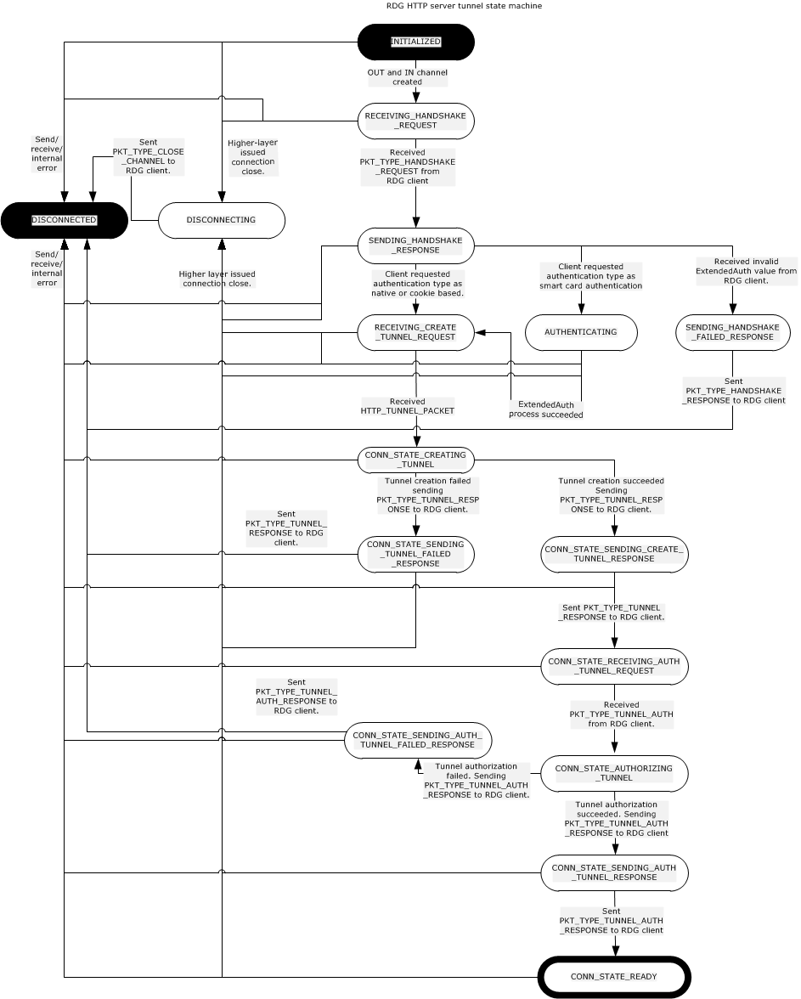

Figure 14: RDG HTTP server tunnel state machine

The following figure shows the channel state machine RDG server. The channel exists inside the tunnel only when the tunnel is in TUNNEL_STATE_AUTHORIZED state.

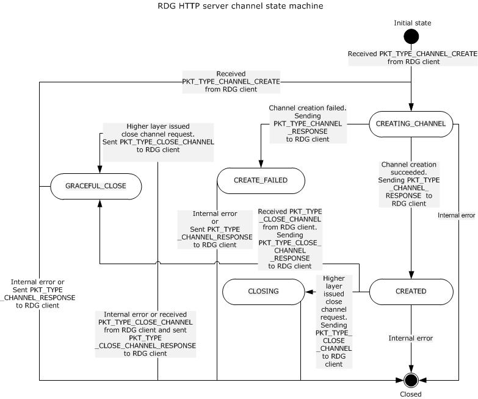

Figure 15: RDG HTTP server channel state machine

### 3.3.2 Abstract Data Model

**udpPort:** The [**UDP**](#gt_user-datagram-protocol-udp) port number to which the RDG server listens to create the [**side channel**](#gt_side-channel).

### 3.3.3 Timers

#### 3.3.3.1 Keep-alive Timer

**Keep alive timer:** This timer is used on both the RDG client and RDG server to send HTTP_KEEPALIVE_PACKET between the client and the server. This ensures that the HTTP connection is not lost if there is no RDP data. The default time period for this timer is 15 minutes, but it can be configured independently on both RDG client and RDG server.<53>

### 3.3.4 Initialization

The RDG server initializes the HTTP connection and creates an HTTP server session with version 2.0. The HTTP server session is updated with the authentication scheme Negotiate, NTLM, Digest and Basic. Mutual authentication is mandated on the session. NTLM credential caching is disabled. The RDG server binds to the *HTTPS Binding URL* parameter. In this case, <Port number> is the port number used, which can be changed. If the RDG server is deployed behind a reverse proxy, the connection between the reverse proxy and the RDG server can be over HTTP, in which case, the RDG server binds to the *HTTP Binding URL* parameter.

After the RDG client and the RDG server have successfully created an IN channel and an OUT channel, the [Keep-alive Timer (section 3.3.6.4)](#Section_3.3.3.1) is started.

### 3.3.5 Message Processing Events and Sequencing Rules

As mentioned in the [Overview (section 1.3)](#Section_1.3), the protocol operation can be viewed as four distinct phases: connection setup, tunnel and channel creation, data exchange, and connection close. The high-level operation of the protocol is depicted in the following flow diagrams.

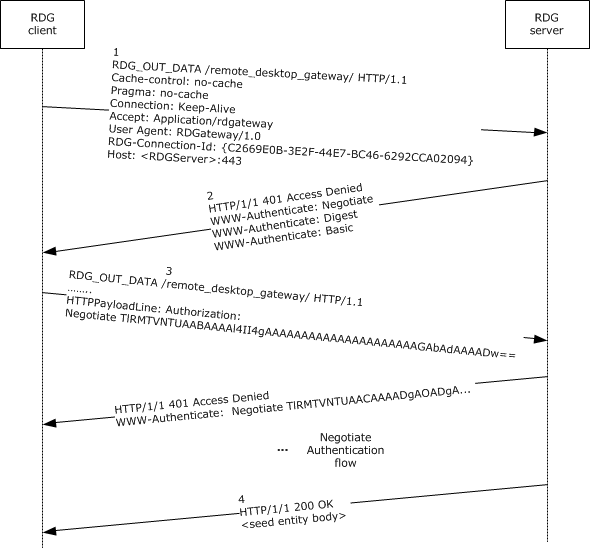

Figure 16: Out channel setup

#### 3.3.5.1 Connection Setup and Authentication

This phase establishes the two HTTP connections called IN channel and OUT channel and authenticates the user. This phase involves HTTP header exchanges only.

- The RDG client first establishes a secure HTTP connection to the RDG server using [**SSL**](#gt_secure-sockets-layer-ssl) on the name and port number supplied by the higher layer. This step also includes server authentication using the RDG server's [**certificate**](#gt_certificate).
**Note** If the higher layer provides password credentials, the credentials are sent along with the request. The RDG client uses Negotiate as the preselected authentication scheme.

The RDG client sends a request with the [RDG_OUT_DATA (section 2.2.3.1.2)](#Section_2.2.3.1.2) custom command and the custom header [RDG-Connection-Id (section 2.2.3.2.1)](#Section_2.2.3.2.1) set to a unique identifier. A [**GUID**](#gt_globally-unique-identifier-guid) generated by the RDG client is used for this purpose. The RDG client disallows caching and uses "*/*" as the accept type.

Optional headers with an RDG_OUT_DATA request SHOULD include RDG-Connection-Id (section 2.2.3.2.1) and [RDG-User-Id (section 2.2.3.2.3)](#Section_2.2.3.2.3).

- The RDG server interprets this request as a request to create the OUT channel. It sends back an HTTP 401 status code (authentication required) with the supported authentication schemes in the **WWW-Authenticate** header. This should include any Custom HTTP Authentication Scheme Names (section [2.2.5.3.10](#Section_2.2.5.3.10)) for custom authentication schemes that the RDG server supports.
- The RDG client selects an authentication method and starts the authentication exchange by setting the **Authorization** header. Messages are exchanged until the client is authenticated.
- The server sends back the final status code 200 OK, and also a random entity body of limited size (100 bytes). This enables a reverse proxy to start allowing data from the RDG server to the RDG client. The RDG server does not specify an entity length in its response. It uses HTTP 1.0 semantics to send the entity body and closes the connection after the last byte is sent.
The RDG client resends the request on the same connection. The RDG server recognizes this second request as an authenticated connection request, as described in the following diagram.

Figure 17: IN channel tunnel and channel setup

- The RDG client sends a request for creating an IN channel with the custom command [RDG_IN_DATA (section 2.2.3.1.1)](#Section_2.2.3.1.1), and the RDG-Connection-Id header set to the same GUID sent on the RDG_OUT_DATA request. This allows the RDG server to correlate the two requests as belonging to the same connection. Steps 1 through 4 in the process are repeated but with the RDG_IN_DATA command, as shown in steps 5 through 8 in the previous diagram (IN channel and tunnel channel creation). The content length is not used to tell to the RDG server that this not the data but the authentication request.
Optional headers with an RDG_IN_DATA request SHOULD include [RDG-Correlation-Id (section 2.2.3.2.2)](#Section_2.2.3.2.2) and RDG-User-Id (section 2.2.3.2.3).

#### 3.3.5.2 Tunnel and Channel Creation

From this phase forward, all packets exchange is done in the HTTP entity body.

- Packets from the RDG client to the RDG server are sent as the request entity body of the IN channel. These packets are sent as self-delimiting chunks. Packets from the RDG server to the RDG client are sent as the response entity body of the OUT channel. The packet formats are defined in section [2.2.10](#Section_2.2.10).
The first set of messages exchanged is the version negotiation packet [HTTP_HANDSHAKE_REQUEST_PACKET (section 2.2.10.10)](#Section_2.2.10.10) (shown in steps 8 and 9 in the figure in section [3.3.5.1](#Section_3.3.5.1)). The version field in this packet indicates the highest protocol version supported by the RDG client. If the RDG server does not support the specified version, the connection is dropped. If the RDG server receives a version number lower than what it supports, it MAY respond back with that same version number. That is, the RDG server is now operating in a lower version mode. It MAY drop the connection with an error message if it does not support the RDG client's version. If the RDG server receives a higher version number than it supports, it responds with an error message packet. The same applies to the RDG client logic.

- The RDG client sends an [HTTP_TUNNEL_PACKET](#Section_2.2.10.18) and receives a corresponding [HTTP_TUNNEL_RESPONSE](#Section_2.2.10.20) (shown in steps 10 and 11 in the figure in section 3.3.5.1). If the response contains an error, the client closes the connection and sends the error to the higher layer. At the end of this step, the RDG client has passed CAP (Connection Authorization Policies) checks.
- The RDG client MUST send the [HTTP_TUNNEL_AUTH_PACKET](#Section_2.2.10.14), appending [HTTP_TUNNEL_AUTH_PACKET_OPTIONAL](#Section_2.2.10.15), to the RDG server (shown in step 11 in the figure in section 3.3.5.1). The client MUST set **clientName** as the name of the RDG client, **cbClientName** as the length of the RDG client name, **fieldsPresent** as HTTP_TUNNEL_AUTH_FIELD_SOH (if Negotiated Capabilities contains HTTP_CAPABILITY_TYPE_QUAR_SOH), and **statementOfHealth** and **clientName** of the HTTP_TUNNEL_AUTH_PACKET_OPTIONAL structure to authorize the tunnel.
The RDG client MUST receive the [HTTP_TUNNEL_AUTH_RESPONSE](#Section_2.2.10.17) and [HTTP_TUNNEL_AUTH_RESPONSE_OPTIONAL](#Section_2.2.10.17) structures (shown in step 12 in the figure in section 3.3.5.1). If the errorCode in HTTP_TUNNEL_AUTH_RESPONSE is S_OK or E_PROXY_QUARANTINE_ACCESSDENIED, continue the following steps. Otherwise, the RDG client MUST close the connection.

- The RDG client sends an [HTTP_CHANNEL_PACKET](#Section_2.2.10.3) with the target server details and receives a corresponding response (shown in steps 12 and 13 in the figure in section 3.3.5.1). If the response contains an error, the RDG client MAY close the connection. At the end of this step, the RDG client has passed RAP (Resource Authorization Policies) checks and is successfully connected to the target server.
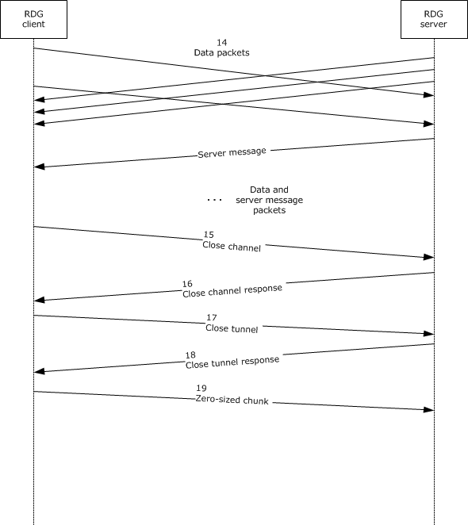

Figure 18: Data flow and connection close

#### 3.3.5.3 NTLM Extended Authentication

A variation of the RDG protocol connection sequence is used when the client and server agree to use the [**NTLM**](#gt_fff710f9-e3d1-4991-99a2-009768d57585) [**extended authentication**](#gt_extended-authentication) mode. This mode allows for NTLM authentication to be performed at the RDG protocol layer, rather than at the HTTP protocol layer. This requires several changes to the protocol sequence.<54>

##### 3.3.5.3.1 During HTTP and WebSocket Transport Setup

If the RDG server supports [**NTLM**](#gt_fff710f9-e3d1-4991-99a2-009768d57585) [**extended authentication**](#gt_extended-authentication), it MUST include HTTP_TRANS_CUSTOM_AUTH_SSPI_NTLM as one of the supported authentication schemes in the **WWW-Authenticate** header of any HTTP status 401 responses it sends to a client.

If a client is configured to use NTLM extended authentication for a connection, it MUST do one of the following when performing a WebSocket Upgrade, RDG_OUT_DATA, or RDG_IN_DATA request:

- Set the request's **Authorization** header to equal HTTP_TRANS_CUSTOM_AUTH_SSPI_NTLM.
- Set the AuthS (section [2.2.3.3.4](#Section_2.2.3.3.4)) URL query parameter to equal HTTP_TRANS_CUSTOM_AUTH_SSPI_NTLM.
If the RDG server supports NTLM extended authentication and it receives an HTTP or WebSocket request with this specified as the authentication scheme, it MUST finish establishing the transport connection with no further authentication exchange.

##### 3.3.5.3.2 During Version and Capability Negotiation

If a client has negotiated the [**NTLM**](#gt_fff710f9-e3d1-4991-99a2-009768d57585) [**extended authentication**](#gt_extended-authentication) mode during transport setup, it MUST set the **ExtendedAuth** field of the HTTP_HANDSHAKE_REQUEST_PACKET (section [2.2.10.10](#Section_2.2.10.10)) to HTTP_EXTENDED_AUTH_SSPI_NTLM.

If the RDG server supports the NTLM extended authentication mode, it MUST include HTTP_EXTENDED_AUTH_SSPI_NTLM in the **ExtendedAuth** field of the HTTP_HANDSHAKE_RESPONSE_PACKET (section [2.2.10.11](#Section_2.2.10.11)) that it sends to the client.

If a client has negotiated the NTLM extended authentication mode during transport setup, and it receives an HTTP_HANDSHAKE_RESPONSE_PACKET that does not include HTTP_EXTENDED_AUTH_SSPI_NTLM in the **ExtendedAuth** field, it MUST close the connection.

##### 3.3.5.3.3 During the Extended Authentication Phase

If client and server have negotiated to use [**NTLM**](#gt_fff710f9-e3d1-4991-99a2-009768d57585) [**extended authentication**](#gt_extended-authentication) for a given connection, the Version and Capability negotiation phase is followed by a required Extended Authentication phase, which MUST be completed before Tunnel Creation can commence.

In the Extended Authentication phase, the client and the RDG server exchange a series of HTTP_EXTENDED_AUTH_PACKET messages (section [2.2.10.7](#Section_2.2.10.7)). If either the client or the RDG server receives a message where the **errorCode** field is not equal to ERROR_SUCCESS, it MUST close the connection. In the absence of a specific error, both client and RDG server MUST set the **errorCode** field to ERROR_SUCCESS for outgoing HTTP_EXTENDED_AUTH_PACKET messages. In the case of an error, the **errorCode** field MUST be set to an appropriate error code. For this extended authentication mode, the **authBlob** field of the HTTP_EXTENDED_AUTH_PACKET messages contains NTLM protocol messages, as specified in [MS-NLMP](../MS-NLMP/MS-NLMP.md).

The client sends the first HTTP_EXTENDED_AUTH_PACKET message. The contents MUST correspond to the first message of the NTLM protocol handshake. After sending the first message, the client waits for incoming HTTP_EXTENDED_AUTH_PACKET messages. When an HTTP_EXTENDED_AUTH_PACKET message is received, the client processes it as follows:

- If the **errorCode** contains anything other than ERROR_SUCCESS, the client MUST close the connection and skip further processing of the message. If the **errorCode** equals SEC_E_LOGON_DENIED, the client should process this as a logon failure.
- If the NTLM handshake is not complete and the **authBlob** field is not empty, the client MUST process the contents of **authBlob** as an NTLM protocol message. If NTLM protocol processing requires a response from the client, the client MUST send that response to the RDG server in a new HTTP_EXTENDED_AUTH_PACKET message. The NTLM response message MUST be embedded in the **authBlob** field. The **errorCode** field MUST be set to ERROR_SUCCESS.
- If the NTLM handshake is complete and the **errorCode** field is set to ERROR_SUCCESS, the client MUST exit the Extended Authentication phase and enter the Tunnel and Channel Creation phase.
The RDG server begins the Extended Authentication phase by waiting for incoming HTTP_EXTENDED_AUTH_PACKET messages. When an HTTP_EXTENDED_AUTH_PACKET message is received, the RDG server MUST process it as follows:

- If the **errorCode** contains anything other than ERROR_SUCCESS, the server MUST close the connection and skip further processing of the message.
- If the NTLM handshake is not complete and the **authBlob** is not empty, the RDG server MUST process the contents of the **authBlob** as an NTLM protocol message. The RDG server MUST NOT require NTLM messages to use channel binding.
- If NTLM protocol processing requires a response from the server, the server MUST send that response to the client in a new HTTP_EXTENDED_AUTH_PACKET message. The NTLM response message MUST be embedded in the **authBlob** field. The **errorCode** field MUST be set to ERROR_SUCCESS.
- If NTLM protocol processing does not require a response from the server and if NTLM authentication is successful, the server MUST send a new HTTP_EXTENDED_AUTH_PACKET message to the client. The **authBlob** field of this message MUST be empty and the **errorCode** field MUST contain ERROR_SUCCESS. The RDG server MUST then exit the Extended Authentication and enter the Tunnel and Channel Creation phase.
- If NTLM protocol processing does not require a response from the server and if NTLM authentication failed, the server MUST send a new HTTP_EXTENDED_AUTH_PACKET message to the client. The **authBlob** field of this message must be empty, and the **errorCode** field must contain SEC_E_LOGON_DENIED. The RDG server MUST then close the connection.

#### 3.3.5.4 Data and Server Message Exchange

At this point, the data exchange phase begins. Either server or client can send data. Most of the data consists of RDP packets sent in either direction. Some packets are control packets from the RDG server to the RDG client. These include keep-alive messages, service messages, and reauthentication messages.

#### 3.3.5.5 Connection Close

Either client or server can close the connection at any time. Typically, the RDG client closes the connection based on user input. The RDG server MAY also close the connection on an administrator-initiated disconnect. An error condition on the RDG server or RDG client also causes the connection to be closed. Closing a connection involves two phases: closing the channel and closing the tunnel.

- A channel close indicates that no more RDP data will flow on that connection unless a new channel is created. The tunnel is still active and can handle other protocol messages such as keep-alive packets, service messages, and so on.
- A tunnel close indicates an HTTP disconnection. A tunnel close is initiated only after all channels have been closed. Tunnel and channel close are initiated by either client or server. If both sides simultaneously try to send close messages, the tie is broken in the following priority order:
- A tunnel close takes precedence over a channel close.
- A close message from the client takes precedence over a close message from the server.

### 3.3.6 Timer Events

#### 3.3.6.1 Session Timeout Timer

If the Session Timeout Timer expires, and "disconnect on session timeout" is configured on the RDG server, then review the following:

- If the ADM element **Negotiated Capabilities** contains HTTP_CAPABILITY_IDLE_TIMEOUT, then the RDG server disconnects the session by sending an HRESULT_CODE(E_PROXY_SESSIONTIMEOUT) error code in a HTTP_CLOSE_PACKET with type PKT_TYPE_CLOSE_CHANNEL to the RDG client.
- If the ADM element **Negotiated Capabilities** does not contain HTTP_CAPABILITY_IDLE_TIMEOUT, then the RDG server disconnects the session by sending an HRESULT_CODE(E_PROXY_CONNECTIONABORTED) error code in PKT_TYPE_CLOSE_CHANNEL to the RDG client.
Otherwise, if this timer expires and "reauthentication on session timeout" is configured at the RDG server, the RDG server MUST initiate the reauthentication connection as follows:

- The RDG server sets the ADM element **Reauthentication Status** to None.
- The RDG server starts the Reauthentication Timer.
- RDG server sends PKT_TYPE_REAUTH_MESSAGE to the RDG client with **reauthTunnelContext** set to the current tunnelId.

#### 3.3.6.2 Reauthentication Timer

If the reauthentication timer expires, the RDG server checks the ADM element **Reauthentication Status** value.

- If the ADM element **Reauthentication Status** is set to NONE:
- If the ADM element **Negotiated Capabilities** contains HTTP_CAPABILITY_IDLE_TIMEOUT, then the RDG server disconnects the connection by sending HRESULT_CODE(E_PROXY_REAUTH_AUTHN_FAILED) error code in PKT_TYPE_CLOSE_CHANNEL to the RDG client.
- If the ADM element **Negotiated Capabilities** does not contain HTTP_CAPABILITY_IDLE_TIMEOUT, then the RDG server disconnects the session by sending HRESULT_CODE(E_PROXY_CONNECTIONABORTED) error code in PKT_TYPE_CLOSE_CHANNEL to the RDG client.
- If the ADM element **Reauthentication Status** is set to AuthenticationCompleted:
- If the ADM element **Negotiated Capabilities** contains HTTP_CAPABILITY_IDLE_TIMEOUT, then the RDG server disconnects the session by sending HRESULT_CODE(E_PROXY_REAUTH_CAP_FAILED) error code in PKT_TYPE_CLOSE_CHANNEL to the RDG client.
- If the ADM element **Negotiated Capabilities** does not contain HTTP_CAPABILITY_IDLE_TIMEOUT, then the RDG server disconnects the session by sending HRESULT_CODE(E_PROXY_CONNECTIONABORTED) error code in PKT_TYPE_CLOSE_CHANNEL to the RDG client.
- If the ADM element **Reauthentication Status** is set to UserAuthorizationCompletedButQurantineFailed:
- If the ADM element **Negotiated Capabilities** contains HTTP_CAPABILITY_IDLE_TIMEOUT, then the RDG server disconnects the session by sending HRESULT_CODE(E_PROXY_REAUTH_NAP_FAILED) error code in PKT_TYPE_CLOSE_CHANNEL to the RDG client.
- If the ADM element **Negotiated Capabilities** does not contain HTTP_CAPABILITY_IDLE_TIMEOUT, then the RDG server disconnects the session by sending HRESULT_CODE(E_PROXY_CONNECTIONABORTED) error code in PKT_TYPE_CLOSE_CHANNEL to the RDG client.
- If the ADM element **Reauthentication Status** is set to UserAuthorizationCompleted:
- If the ADM element **Negotiated Capabilities** contains HTTP_CAPABILITY_IDLE_TIMEOUT, then the RDG server disconnects the session by sending HRESULT_CODE(E_PROXY_REAUTH_RAP_FAILED) error code in PKT_TYPE_CLOSE_CHANNEL to the RDG client.
- If the ADM element **Negotiated Capabilities** does not contain HTTP_CAPABILITY_IDLE_TIMEOUT, then the RDG server disconnects the session by sending HRESULT_CODE(E_PROXY_CONNECTIONABORTED) error code in PKT_TYPE_CLOSE_CHANNEL to the RDG client.
- If the ADM element **Reauthentication Status** is set to ResourceAuthorizationCompleted, the RDG server MUST start the Session Timeout Timer and reset the ADM element **Reauthentication Status** to NONE.

#### 3.3.6.3 Connection Timer

If the Connection Timer expires, the RDG server disconnects the session by sending an ERROR_OPERATION_ABORTED error code in the PKT_TYPE_CLOSE_CHANNEL to the RDG client.

#### 3.3.6.4 Keep-alive Timer

This timer is used by both the RDG client and the RDG server. When this timer expires, both the client and the server send an [HTTP_KEEPALIVE_PACKET (section 2.2.10.8)](#Section_2.2.10.8) to each other.

### 3.3.7 Other Local Events

None.

### 3.3.8 Data Arrival from Target Server

This event occurs when the target server data destined for the RDG client arrives at the RDG server. When this event occurs, the RDG server streams the data to the RDG client in the form of an [HTTP_DATA_PACKET](#Section_2.2.10.6), in the order in which it arrived.

## 3.4 UDP Transport - Server Protocol Details

### 3.4.1 UDP Transport – RDG Server States

The following figure describes the states in the UDP transport to the RDG server connection.

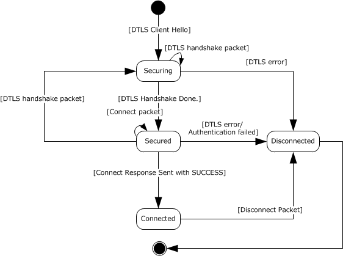

Figure 19: UDP to RDG server states

### 3.4.2 Initialization

The protocol uses the transport and [**endpoints**](#gt_endpoint) described in section [2.1](#Section_2.1).

The RDGUDP server listens on the specified IP addresses for [**UDP**](#gt_user-datagram-protocol-udp) packets.

### 3.4.3 Message Processing Events and Sequencing Rules

#### 3.4.3.1 DTLS Handshake Phase

To start this phase, the connection state MUST be in the Initial state. If an error occurs in the following process, the RD Gateway UDP server ends the connection.

Sequential processing rules:

- The RDGUDP server creates a [**DTLS**](#gt_datagram-transport-layer-security-dtls) object and sets the state to Initial.
- After receiving the first message on the UDP connection, the RDG server moves the state to Securing.
- The RDGUDP server completes the DTLS handshake as specified in [[RFC4347]](https://go.microsoft.com/fwlink/?LinkId=227111).
- After completing the DTLS handshake, the RDGUDP server moves the state to Secured and moves to the [Connection Setup (section 3.4.3.2)](#Section_3.4.3.2) phase.

#### 3.4.3.2 Connection Setup Phase

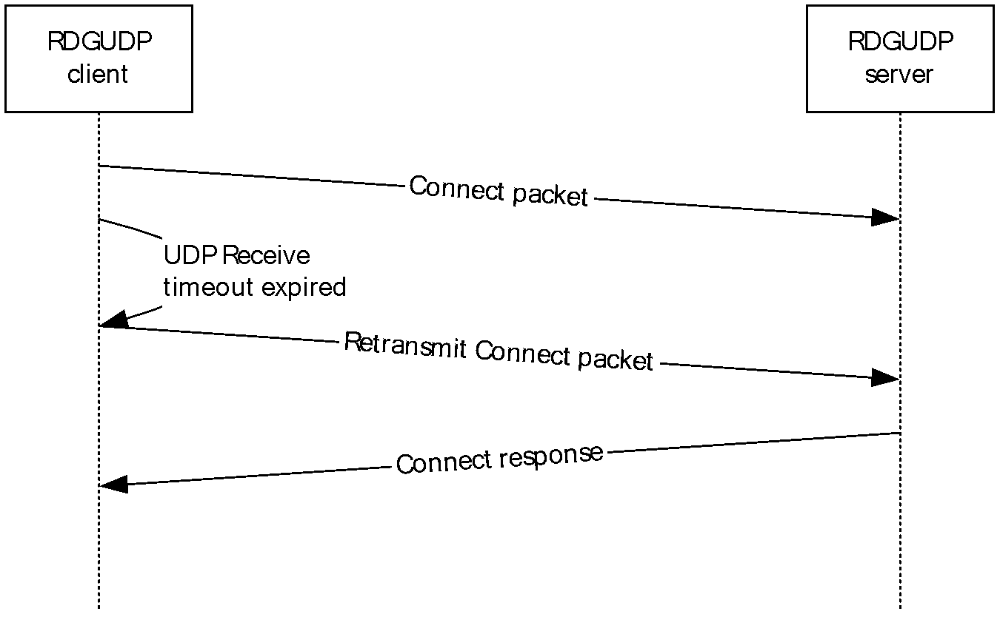

Figure 20: The RDGUDP client server connection

If a [**DTLS**](#gt_datagram-transport-layer-security-dtls) error or non-DTLS error occurs in the following process, the RDGUDP server ends the connection.

- The RDGUDP server decrypts the incoming message as follows:
- If the DTLS decrypt message fails with an error that indicates that the DTLS handshake is not complete, the RDGUDP server returns to the DTLS handshake phase again.
- If decrypt message fails with an ignorable error, the RDGUDP server ignores the message and waits for another incoming message. For information on ignorable DTLS errors, see [[RFC4347]](https://go.microsoft.com/fwlink/?LinkId=227111).
- If the decrypt succeeds, the RDGUDP server MUST end the connection if it is not [CONNECT_PKT (section 2.2.11.3)](#Section_2.2.11.3) and skip the remaining processing rules.
- The RDGUDP server verifies the signature on CONNECT_PKT.authnCookie and decodes it. For information on how to verify the signature, see section [3.6.4](#Section_3.4.3)
- The RDGUDP server maps the decoded message to the **AUTHN_COOKIE_DATA** data structure.
- The RDGUDP server compares AUTHN_COOKIE_DATA.ftExpiryTime with the current time.
- If AUTHN_COOKIE_DATA.ftExpiryTime is greater than current time, the RDGUDP server establishes a connection with the target server as described in [MS-RDPEUDP](#Section_1.7.3). Otherwise, if AUTHN_COOKIE_DATA.ftExpiryTime is less than the current time, the RDGUDP server skips steps b and c and sets the result in CONNECT_PKT_RESP to E_ACCESS_DENIED.
- While connecting to the target server, the RDGUDP server does not resolve the AUTHN_COOKIE_DATA.szServerName again to find the IP address. Instead it SHOULD use the AUTHN_COOKIE_DATA.szServerIP in AUTHN_COOKIE_DATA.
- If the connection to the target server is successful, the RDGUDP server sets CONNECT_PKT_RESP.Result to S_OK.
- If the connection to the target server fails, the RDGUDP server sets CONNECT_PKT_RESP. Result to E_PROXY_TS_CONNECT_FAILED.
- The RDGUDP server sends the CONNECT_PKT_RESP to the RDGUDP client.
- If the Result is S_OK, move the connection state to Connected; otherwise, move it to the [Shutdown phase (section 3.4.3.4)](#Section_3.2.6.3).

#### 3.4.3.3 Data Transfer Phase

If an error occurs in the following process, the RD Gateway UDP server ends the connection.

- The RDGUDP server decrypts the message using DTLS and forwards the message to the target server
- If the decrypted message is a **DATA_PKT**, then the RDGUDP server forwards the DATA_PKT.data to the target server.
- Otherwise, if the decrypted message contains **DISC_PKT**, then proceed to [Shutdown phase (section 3.4.3.4)](#Section_3.2.6.3).
- The RDGUDP server copies the message received from target server to DATA_PKT.data, encrypts the DATA_PKT, and sends it to the RDGUDP client.

#### 3.4.3.4 Shut Down Phase

- To end the connection, the RDGUDP server sets the disconnect reason code value in DISC_PKT.discReason.
- The RDGUDP server encrypts the DISC_PKT and sends the encrypted message to the RDGUDP client.
- The RDGUDP server ends the connection.

## 3.5 Common Client Protocol Details

### 3.5.1 Abstract Data Model

This section describes a conceptual model of possible data organization that an implementation maintains to participate in this protocol. The described organization is provided to facilitate the explanation of how the protocol behaves. This document does not mandate that implementations adhere to this model as long as their external behavior is consistent with that described in this document.

**Target server name**: A string of [**Unicode**](#gt_unicode) characters. The [**server**](#gt_server) name applies to the machine that the RDG server connects to.<55>

**Client Machine name**: A string of Unicode characters that cannot exceed 513 bytes,<56> including the terminating null character. The Client Machine name refers to the machine that runs the RDG [**client**](#gt_client). It is possible for the Client Machine name to be the same as the server name (in value) if the client and the server run on the same physical machine.<57>

**Tunnel id**: An unsigned long representing the tunnel identifier for tracking purposes on the RDG server. It MAY be used by the RDG client to help the RDG server administrator troubleshoot connection issues.

**Channel id**: An unsigned long representing the [**channel**](#gt_channel) identifier for tracking purposes on the RDG server. It MAY be used by the RDG client to help the RDG server administrator troubleshoot connection issues.

**CertChainData**: A string of variable data returned by the RDG server representing the [**certificate**](#gt_certificate) chain used by the RDG server for the [**HTTPS**](#gt_hypertext-transfer-protocol-secure-https) communication between RDG client and RDG server. The RDG client MAY use this data to verify the identity of the RDG server before sending sensitive data, such as the health information of the RDG client machine.

**Nonce**: A unique [**GUID**](#gt_globally-unique-identifier-guid) returned by the RDG server to identify the current connection. The RDG client sends this GUID to the RDG server if it sends the [**statement of health (SoH)**](#gt_statement-of-health-soh), as specified in section [2.2.9.2.1.4](#Section_2.2.9.2.1.4).

**Idle Timeout Value**: An unsigned long value that specifies connection idle time in minutes before the connection is torn down.

**DeviceRedirection**: A [TSG_REDIRECTION_FLAGS (section 2.2.9.2.1.5.2)](#Section_2.2.9.2.1.5.2) structure that specifies the device redirection settings that MUST be enforced by the client.

**UDPAuthCookie**: A signed and encoded byte BLOB containing an **AUTHN_COOKIE_DATA** structure.

**Negotiated Capabilities**: A ULONG bitmask value representing the negotiated capabilities between the RDG client and the RDG server. It contains zero or more of the following values:

| NAP Capability Value |
| --- |
| [TSG_NAP_CAPABILITY_QUAR_SOH (section 2.2.5.2.19)](#Section_2.2.5.2.19) |
| [TSG_NAP_CAPABILITY_IDLE_TIMEOUT (section 2.2.5.2.20)](#Section_2.2.5.2.20) |
| [TSG_MESSAGING_CAP_CONSENT_SIGN (section 2.2.5.2.21)](#Section_2.2.5.2.21) |
| [TSG_MESSAGING_CAP_SERVICE_MSG (section 2.2.5.2.22)](#Section_2.2.5.2.22) |
| [TSG_MESSAGING_CAP_REAUTH (section 2.2.5.2.23)](#Section_2.2.5.2.23) |

### 3.5.2 Timer Events

None.

#### 3.5.2.1 Idle Timeout Timer

If the Idle Timeout Timer expires, the RDG [**client**](#gt_client) SHOULD end the protocol.

### 3.5.3 Other Local Events

Whenever there is a change in the RDG [**client**](#gt_client) computer's health, the NAP client informs the RDG client by calling the following abstract interface implemented by the RDG client:

**NotifySoHChange**

- **Inputs**: None
- **Outputs**: None
- **Constraints**:
- The RDG client MUST get its [**SoH**](#gt_statement-of-health-soh) again by calling **NAP EC API**.<58>

## 3.6 RPC Transport - Client Protocol Details

The following sections contain the details of the [TsProxyRpcInterface (section 3.2.1)](#Section_1.3) on the client.

### 3.6.1 Abstract Data Model

This section describes a conceptual model of possible data organization that an implementation maintains to participate in this protocol. The described organization is provided to facilitate the explanation of how the protocol behaves. This document does not mandate that implementations adhere to this model as long as their external behavior is consistent with that described in this document.

**binding handle:** An [**RPC**](#gt_remote-procedure-call-rpc) binding [**handle**](#gt_handle) created by the RDG [**client**](#gt_client) to bind to the RDG [**server**](#gt_server). For more details about binding handles, see [[C706]](https://go.microsoft.com/fwlink/?LinkId=89824) section 2.1.

**tunnel context handle:** An RPC context handle for the RDG client to RDG server represented by an array of 20 bytes on the RDG server. This context handle is used to identify a specific connection from the RDG client to the RDG server.

**channel context handle:** An RPC context handle for the connection from the RDG client to the target server via the RDG server represented by an array of 20 bytes on the RDG server. The context handle is used to identify a specific connection to the [**target server**](#gt_target-server) from the RDG client via the RDG server.

### 3.6.2 Timers

#### 3.6.2.1 Idle Timeout Timer

If idle timeout capability is negotiated between the RDG [**client**](#gt_client) and the RDG [**server**](#gt_server), then the RDG server MUST send the idle timeout value to the RDG client in the [TSG_PACKET_RESPONSE](#Section_2.2.9.2.1.5) structure in response to the [TsProxyAuthorizeTunnel](#Section_3.2.6.1.2) call. If idle timeout is not configured at the RDG server, it MUST send zero.

##### 3.6.2.1.1 Idle Time Processing

If the idle timeout value is zero, no idle timeout is configured at the RDG [**server**](#gt_server), and therefore, no idle time processing is required by the RDG [**client**](#gt_client).

If the idle timeout value is nonzero, the RDG client SHOULD start this timer and SHOULD reset the timer whenever the TSG client sends some payload data in the [TsProxySendToServer (section 3.2.6.2.1)](#Section_3.2.6.2.1) method to the RDG server. The TSG client SHOULD end the protocol when the timer expires as the connection has been idle for the specified Idle Timeout Value.

Other than that described in this section, no protocol timers are required beyond those used internally by [**RPC**](#gt_remote-procedure-call-rpc) to implement resiliency to network outages, as specified in [MS-RPCE](../MS-RPCE/MS-RPCE.md) section 3.

### 3.6.3 Initialization

The RDG [**client**](#gt_client) creates an [**RPC**](#gt_remote-procedure-call-rpc) binding [**handle**](#gt_handle) to the RDG server’s RPC [**endpoint**](#gt_endpoint). The RDG client MUST create a binding handle, a binding handle is specified in [[C706]](https://go.microsoft.com/fwlink/?LinkId=89824) section 2.1, and make the first method invocation to receive the tunnel context handle, as specified in section [3.2.6.1](#Section_3.2.6.1). Subsequent method invocations MUST use either the tunnel context handle or the [**channel**](#gt_channel) context handle, as each method requires. The RDG client MUST create an authenticated RPC binding handle with a minimum of RPC_C_AUTHN_LEVEL_PKT_INTEGRITY and other parameters as specified in section [2.1](#Section_2.1). This requires establishing the binding to the [**well-known endpoint**](#gt_well-known-endpoint) as specified in section 2.1.

If an authenticated binding handle is established, the RDG client MUST match the version and capabilities of the RDG [**server**](#gt_server); if no match can be made, the RDG client SHOULD stop further progress on the protocol connection.

### 3.6.4 Message Processing Events and Sequencing Rules

This protocol asks the [**RPC**](#gt_remote-procedure-call-rpc) runtime to perform a strict [**NDR**](#gt_network-data-representation-ndr) data consistency check at target level 7.0 for all methods unless otherwise specified, as specified in [MS-RPCE](../MS-RPCE/MS-RPCE.md) section 1.3.

All the methods implemented by the RDG [**server**](#gt_server) SHOULD enforce appropriate security measures to make sure that the RDG [**client**](#gt_client) has the required permissions to execute the routines. All methods MUST be RPC calls. However, these methods MUST be called in a sequence specified in section [1.3](#Section_1.3).

The methods MAY throw an exception and the RDG client MUST [**handle**](#gt_handle) these exceptions appropriately. The methods called by the RDG client MUST be sequential in order, as specified in section [1.3.1.1](#Section_1.3). The method details are specified in section [3.2.6](#Section_1.3).

A RDG client's invocation of each method is typically the result of local application activity. The local application at the RDG client specifies values for all input parameters. No other higher-layer triggered events are processed.

The RDG client SHOULD process errors returned from the RDG server and notify the application invoker of the error received in the higher layer.

Sequential processing rules for connection process:

- The RDG client MUST call [TsProxyCreateTunnel](#Section_3.2.6.1.1) to create a tunnel to the gateway.
- If the call fails, the RDG client MUST end the protocol and MUST NOT perform the following steps.
- The RDG client MUST initialize the following ADM elements using TsProxyCreateTunnel out parameters:
- The RDG client MUST initialize the ADM element **Tunnel id** with the *tunnelId* out parameter.
- The RDG client MUST initialize the ADM element **Tunnel Context Handle** with the *tunnelContext* out parameter. This **Tunnel Context Handle** is used for subsequent tunnel-related calls.
- If *TSGPacketResponse*->packetId is [TSG_PACKET_TYPE_CAPS_RESPONSE](#Section_2.2.5.2.9), where *TSGPacketResponse* is an out parameter,
- The RDG client MUST initialize the ADM element **Nonce** with TSGPacketResponse->TSGPacket.packetCapsResponse->pktQuarEncResponse.nonce.
- The RDG client MUST initialize the ADM element **Negotiated Capabilities** with TSGPacketResponse->TSGPacket.packetCapsResponse->pktQuarEncResponse.versionCaps->TSGCaps[0].TSGPacket.TSGCapNap.capabilities.
- If *TSGPacketResponse*->packetId is [TSG_PACKET_TYPE_QUARENC_RESPONSE](#Section_2.2.5.2.7), where *TSGPacketResponse* is an out parameter,
- The RDG client MUST initialize the ADM element **Nonce** with TSGPacketResponse->TSGPacket.packetQuarEncResponse->nonce.
- The RDG client MUST initialize the ADM element **Negotiated Capabilities** with TSGPacketResponse->TSGPacket.packetQuarEncResponse->versionCaps->TSGCaps[0].TSGPacket.TSGCapNap.capabilities.
- The RDG client MUST get its [**statement of health (SoH)**](#gt_statement-of-health-soh) by calling **NAP EC API**.<59> Details of the SoH format are specified in [[TNC-IF-TNCCSPBSoH]](https://go.microsoft.com/fwlink/?LinkId=240054). If the SoH is received successfully, then the RDG client MUST create an enveloped data message for the server that encrypts the SoH using the [**Triple Data Encryption Standard**](#gt_triple-data-encryption-standard) algorithm and encode it using one of PKCS #7 or X.509 encoding types, whichever is supported by the RDG server certificate context available in the ADM element **CertChainData**. Details about creating an enveloped data message are provided in [[MSDN-ENVLOPED-DATA]](https://go.microsoft.com/fwlink/?LinkID=324591).
- The RDG client MUST copy the ADM element **Nonce** to TSGPacket.packetQuarRequest->data and append the encrypted SoH message into TSGPacket.packetQuarRequest->data. The RDG client MUST set the TSGPacket.packetQuarRequest->dataLen to the sum of the number of bytes in the encrypted SoH message and number of bytes in the ADM element **Nonce**, where *TSGpacket* is an input parameter of [TsProxyAuthorizeTunnel](#Section_3.2.6.1.2). The format of the **packetQuarRequest** field is specified in section [2.2.9.2.1.4](#Section_2.2.9.2.1.4).
- The RDG client MUST call TsProxyAuthorizeTunnel to authorize the tunnel.
- If the call succeeds or fails with error E_PROXY_QUARANTINE_ACCESSDENIED, follow the steps later in this section. Else, the RDG client MUST end the protocol and MUST NOT follow the steps later in this section.
- If the ADM element **Negotiated Capabilities** contains [TSG_NAP_CAPABILITY_IDLE_TIMEOUT](#Section_2.2.5.2.20), then the ADM element **Idle Timeout Value** SHOULD be initialized with first 4 bytes of TSGPacketResponse->TSGPacket.packetResponse->responseData and the **Statement of health response** variable MUST be initialized with the remaining bytes of **responseData**, where *TSGPacketResponse* is an out parameter of TsProxyAuthorizeTunnel. The format of the **responseData** member is specified in section [2.2.9.2.1.5.1](#Section_2.2.9.2.1.5.1).
- If the ADM element **Negotiated Capabilities** doesn't contain TSG_NAP_CAPABILITY_IDLE_TIMEOUT, then the ADM element **Idle Timeout Value** SHOULD be initialized to zero and the **Statement of health response** variable MUST be initialized with all the bytes of TSGPacketResponse->TSGPacket.packetResponse->responseData.
- Verify the signature of the **Statement of health response** variable using [**SHA-1 hash**](#gt_sha-1-hash) and decode it using the RDG server certificate context available in the ADM element **CertChainData** using one of PKCS #7 or X.509 encoding types, whichever is supported by the RDG Server certificate. The SoHR is processed by calling the NAP EC API INapEnforcementClientConnection::GetSoHResponse.
- If the call TsProxyAuthorizeTunnel fails with error E_PROXY_QUARANTINE_ACCESSDENIED, the RDG client MUST end the protocol and MUST NOT follow the steps later in this section.
- If the ADM element **Idle Timeout Value** is nonzero, the RDG client SHOULD start the idle time processing as specified in section [3.6.2.1.1](#Section_3.6.2.1.1) and SHOULD end the protocol when the connection has been idle for the specified **Idle Timeout Value**.
- If the ADM element **Negotiated Capabilities** contains [TSG_MESSAGING_CAP_SERVICE_MSG](#Section_2.2.5.2.22), a [TsProxyMakeTunnelCall](#Section_3.2.6.1.3) call MAY be made by the client, with [TSG_TUNNEL_CALL_ASYNC_MSG_REQUEST](#Section_2.2.5.2.17) as the parameter, to receive messages from the RDG server.
- The RDG client MUST call [TsProxyCreateChannel](#Section_3.2.6.1.4) to create a [**channel**](#gt_channel) to the [**target server**](#gt_target-server) name as specified by the ADM element **Target Server Name** (section [3.5.1](#Section_3.2.2)).
- If the call fails, the RDG client MUST end the protocol and MUST not follow the below steps.
- The RDG client MUST initialize the following ADM elements using TsProxyCreateChannel out parameters.
- The RDG client MUST initialize the ADM element **Channel id** with the *channelId* out parameter.
- The RDG client MUST initialize the ADM element **Channel Context Handle** with the *channelContext* out parameter. This **Channel Context Handle** is used for subsequent channel-related calls.
Sequential processing rules for data transfer:

- The RDG client MUST call [TsProxySetupReceivePipe](#Section_3.2.6.2.2) to receive data from the target server, via the RDG server.
- The RDG client MUST call [TsProxySendToServer](#Section_3.2.6.2.1) to send data to the target server via the RDG server, and if the Idle Timeout Timer is started, the RDG client SHOULD reset the Idle Timeout Timer.
- If [TsProxyMakeTunnelCall](#Section_3.2.6.1.3) is returned, the RDG client MUST process the message and MAY call TsProxyMakeTunnelCall again with TSG_TUNNEL_CALL_ASYNC_MSG_REQUEST as the parameter.
- The RDG client MUST end the protocol after it receives the final response to TsProxySetupReceivePipe. The final response format is specified in section [2.2.9.4.3](#Section_2.2.9.4.3).
Sequential processing rules for ending the protocol:

- If a channel was successfully created in the connection process, the RDG client MUST call [TsProxyCloseChannel](#Section_3.2.6.3.1) to close the channel.
- If the RDG client called TsProxyMakeTunnelCall during the connection process and the call has not yet returned, the RDG client MUST call TsProxyMakeTunnelCall with the [TSG_TUNNEL_CANCEL_ASYNC_MSG_REQUEST](#Section_2.2.5.2.18) parameter to cancel the previous pending call.
- If the tunnel was successfully created during the connection process, the RDG client MUST call [TsProxyCloseTunnel](#Section_3.2.6.3.3) to close the tunnel.
Sequential processing rules when the RDG client receives a [**reauthentication**](#gt_reauthentication) message from the RDG server:

- The RDG client MUST start a new connection by calling TsProxyCreateTunnel. The **packetId** member of the *TSGPacket* MUST be set to [TSG_PACKET_TYPE_REAUTH](#Section_2.2.5.2.13). Also, TSGPacket->packetReauth.tunnelContext MUST be initialized by the TSGPacketResponse->packetMsgResponse->messagePacket.reauthMessage->tunnelContext, which is received in the TsProxyMakeTunnelCall response.
- If TsProxyCreateTunnel fails, go to step 6.
- On successful completion of TsProxyCreateTunnel, the RDG client MUST call TsProxyAuthorizeTunnel.
- If TsProxyAuthorizeTunnel fails, go to step 6.
- On successful completion of TsProxyAuthorizeTunnel, the RDG client MUST call TsProxyCreateChannel.
- End of processing reauthentication message.
Other than the above, no other special message processing is required on the RDG client beyond the processing required in the underlying RPC protocol, as specified in [MS-RPCE].

### 3.6.5 Data Representation forTsProxySetupReceivePipe and TsProxySendToServer

NDR64 specifies a method to package the data before sending it on the wire. For improved performance, [TsProxySetupReceivePipe](#Section_3.2.6.2.2) and [TsProxySendToServer](#Section_3.2.6.2.1) deviate from the [[C706]](https://go.microsoft.com/fwlink/?LinkId=89824) specification of the Network Data Representation. This section documents how these two calls bypass NDR64 and how the data is represented on the wire. For more information about NDR64, see [MS-RPCE](../MS-RPCE/MS-RPCE.md) section 2.2.5.

In the case of TsProxySetupReceivePipe and TsProxySendToServer, the Stub Data is not encoded using NDR64, instead it is sent over the wire as it is. Verification Trailer ([MS-RPCE] section 2.2.2.13) is also not passed with the Stub Data.

TsProxySetupReceivePipe and TsProxySendToServer modify the RPC Stub Data. The following elements are not modified:

- Ethernet
- [**IPv4**](#gt_internet-protocol-version-4-ipv4)
- [**IPv6**](#gt_internet-protocol-version-6-ipv6)
- TCP
- [**HTTP**](#gt_hypertext-transfer-protocol-http)
- [**RPC**](#gt_remote-procedure-call-rpc)
- RPC Stub Data
- RPC

#### 3.6.5.1 TsProxySendToServer Request

The wire representation of the stub data in the case of a TsProxySendToServer request is defined as follows.

```mermaid
packet-beta
  0-95: "Context Handle (20 bytes)"
  96-127: "Total Bytes"
  128-159: "Number of Buffers"
  160-191: "Buffer1 Length"
  192-223: "Buffer2 Length (optional)"
  224-255: "Buffer3 Length (optional)"
  256-319: "Buffer1 (variable)"
  320-383: "Buffer2 (variable)"
  384-447: "Buffer3 (variable)"
```

**Context Handle (20 bytes):** This field MUST be set to the context handle returned by a call to the [TsProxyCreateChannel](#Section_3.2.6.1.4) call. This context handle MUST be aligned to the 4-byte boundary.

**Total Bytes (4 bytes):** This field MUST be set to sum total of sizes of all the buffers and 4 bytes for each buffer. This is represented in the network byte order.

**Number of Buffers (4 bytes):** This field MUST be set to the total number of buffers. This MUST not exceed 0x00000003. This is represented in the network byte order.

**Buffer1 Length (4 bytes):** This field MUST be set to the length of the first buffer. This is represented in the network byte order

**Buffer2 Length (4 bytes):** This field MUST be set to the length of the first buffer. This is represented in the network byte order. If the Number of Buffers is set to 0x00000002 or 0x00000003, then this field is sent.

**Buffer3 Length (4 bytes):** This field MUST be set to the length of the first buffer. This is represented in the network byte order. If the Number of Buffers is set to 0x00000003, then this field is sent.

**Buffer1 (variable):** This field MUST contain the data corresponding to first buffer.

**Buffer2 (variable):** This field MUST contain the data corresponding to second buffer.

**Buffer3 (variable):** This field MUST contain the data corresponding to the third buffer.

#### 3.6.5.2 TsProxySendToServer Response

The following is the response sent to the client.

```mermaid
packet-beta
  0-31: "ReturnValue"
```

**ReturnValue (4 bytes):** Must be set to the return value of the TsProxySendToServer call.

#### 3.6.5.3 TsProxySetupReceivePipe Request

The wire representation of the stub data in the case of a TsProxySetupReceivePipe request is as follows.

```mermaid
packet-beta
  0-95: "Context Handle (20 bytes)"
```

**Context Handle (20 bytes):** Must be set to the context handle returned by a call to the [TsProxyCreateChannel](#Section_3.2.6.1.4) call. This context handle MUST be aligned to the 4-byte boundary.

#### 3.6.5.4 TsProxySetupReceivePipe Response

There can be multiple responses to the TsProxySetupReceivePipe call. Except for the last response, specified in section [3.6.5.5](#Section_3.6.5.5), the following is the representation of the Stub Data for all other responses.

```mermaid
packet-beta
  0-63: "Data (variable)"
```

**Data (variable):** Must be set to the data to be sent to the RDG client. The size of this data is in the [**RPC**](#gt_remote-procedure-call-rpc) header alloc_hint field specified in [[C706]](https://go.microsoft.com/fwlink/?LinkId=89824).

#### 3.6.5.5 TsProxySetupReceivePipe Final Response

The following represents the Stub data for the TsProxySetupReceivePipe call. For the final response PDU, the PFC_LAST_FRAG bit MUST be set in the **pfc_flags** field of the [**RPC**](#gt_remote-procedure-call-rpc) response PDU.

```mermaid
packet-beta
  0-31: "ReturnValue"
```

**ReturnValue (4 bytes):** Must be set to the return value of the call.

## 3.7 HTTP Transport - Client Protocol Details

The following sections contain the details of the RDG client HTTP protocol interface on the client.

The set of valid state transitions on the RDG client is depicted in the following diagram.

The RDG client has two state machines: one to manage tunnels and one to manage channels. The tunnel state machine has one instance, whereas the [**channel**](#gt_channel) state machine MAY have multiple instances, one for each channel. The tunnel state machine creates a channel state machine when a new channel is being requested,

The following figure shows the tunnel state machine at the RDG client and the channel state machine at the RDG client. A channel exists inside the tunnel only when the tunnel is in the TUNNEL_STATE_AUTHORIZED state.

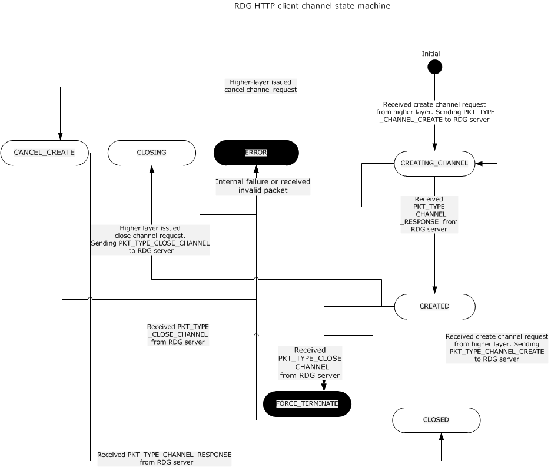

Figure 21: RDG HTTP client channel state machine

### 3.7.1 Abstract Data Model

**UDPAuthCookie:** A signed and encoded byte [**BLOB**](#gt_binary-large-object-blob) containing an **AUTHN_COOKIE_DATA** structure.

**udpPort:** The UDP port number to which the RDG server listens in order to create the side channel.

### 3.7.2 Timers

None.

### 3.7.3 Initialization

The RDG client SHOULD create its tunnel and [**channel**](#gt_channel) objects and set the state to Initial. The RDG client MUST match the version and capabilities of the RDG server. If no match can be made, the RDG client SHOULD stop further progress on the protocol connection.

### 3.7.4 Higher-Layer Triggered Events

When a create tunnel is requested by the higher layer, it can also issue a Cancel Tunnel Creation request before the tunnel is created. Once the tunnel is created, the higher layer can also issue a Close Tunnel request, which initiates the [Connection Close phase (section 3.3.5.5)](#Section_3.3.5.5).

The higher layer initiates the [**channel**](#gt_channel) creation once the tunnel has been authorized. After issuing a Channel Creation request, it can issue a Cancel Channel Creation request before the channel is created. After the channel is created, the higher layer can issue a Close Channel request.

### 3.7.5 Message Processing Events and Sequencing Rules

The RDG client uses the following sequencing rules and message processing in its various phases. The RDG client SHOULD process errors returned from the RDG server and notify the application invoker of the error received in the higher layer. The RDG client protocol operates in the following phases:

- [Connection Setup and Authentication (section 3.7.5.1)](#Section_3.7.5.1)
- [Tunnel and Channel Creation (section 3.7.5.2)](#Section_3.7.5.2)
- [Data and Server Message Exchange (section 3.7.5.3)](#Section_3.7.5.3)
- [Connection Close (section 3.7.5.4)](#Section_3.3.5.5)

#### 3.7.5.1 Connection Setup and Authentication

In this phase, the client creates two channels with the RDG server: an [**IN channel**](#gt_in-channel) and an [**OUT channel**](#gt_out-channel). The client MUST create the OUT channel before the IN channel.

Sequential processing rules for creating OUT and IN channels are described in section [3.3.5.1](#Section_3.3.5.1).

#### 3.7.5.2 Tunnel and Channel Creation

After the connection setup and handshake of version and capability exchange described in [3.3.5.1](#Section_3.3.5.1), tunnels and channels are created. The sequential processing rules for tunnel and channel creation are as follows:

- The state of the tunnel MUST be TUNNEL_STATE_AUTHENTICATING or TUNNEL_STATE_RECEIVING_HANDSHAKE_RESPONSE. The RDG client MUST send [HTTP_TUNNEL_PACKET (section 2.2.10.18)](#Section_2.2.10.18) to the RDG server using the [**IN channel**](#gt_in-channel). **packetType** is set to PKT_TYPE_TUNNEL_CREATE, **capsFlags** is set according to the RDG client's capabilities. If PAA is not used, set **fieldsPresent** to zero. Otherwise, set **fieldsPresent** to 2 and fill the [HTTP_TUNNEL_PACKET_OPTIONAL structure (section 2.2.10.19)](#Section_2.2.10.19) accordingly. Append it to the end of HTTP_TUNNEL_PACKET. **reauthTunnelContext** MUST be set to zero.
- If step 1 fails, the RDG client MUST end the protocol.
- The RDG client MUST receive [HTTP_TUNNEL_RESPONSE (section 2.2.10.20)](#Section_2.2.10.20) and [HTTP_TUNNEL_RESPONSE_OPTIONAL (section 2.2.10.21)](#Section_2.2.10.21) in the OUT channel. The **packetType** MUST be set to PKT_TYPE_TUNNEL_RESPONSE. If **statusCode** is not zero, the RDG client MUST NOT continue to the next step.
- The RDG client MUST initialize the following ADM elements using the **fields from** response structures received in step 3.
- The RDG client MUST initialize the ADM element **Tunnel id** with the *tunnelId* of the HTTP_TUNNEL_RESPONSE_OPTIONAL if it is present.
- The RDG client MUST initialize the ADM element **Nonce** with *nonce* of the HTTP_TUNNEL_RESPONSE_OPTIONAL structure if it is present.
- The RDG client MUST initialize the ADM element **Negotiated Capabilities** with **capsFlags** of the HTTP_TUNNEL_RESPONSE_OPTIONAL structure if it is present
- The RDG client MUST initialize the ADM element **CertChainData** with **serverCert** of the HTTP_TUNNEL_RESPONSE_OPTIONAL structure if it is present
- The RDG client MUST get its [**SoH**](#gt_statement-of-health-soh) by calling **NAP EC API**. If the SoH is received successfully, encrypt the SoH with the RDG server [**certificate**](#gt_certificate) context available in the ADM element **CertChainData**. The RDG client MUST pass the **consentMsg** to the higher layer if it is present in HTTP_TUNNEL_RESPONSE_OPTIONAL structure.
- The RDG client MUST send the [HTTP_TUNNEL_AUTH_PACKET (section 2.2.10.14)](#Section_2.2.10.14) appending [HTTP_TUNNEL_AUTH_PACKET_OPTIONAL (section 2.2.10.15)](#Section_2.2.10.15) to the RDG server after setting **clientName** as the name of the RDG client, **cbClientName** as the length of the RDG client name, **fieldsPresent** set as HTTP_TUNNEL_AUTH_FIELD_SOH if Negotiated Capabilities contains HTTP_CAPABILITY_TYPE_QUAR_SOH, and accordingly setting **statementOfHealth** and **clientName** of the HTTP_TUNNEL_AUTH_PACKET_OPTIONAL structure to authorize the tunnel.
- The RDG client MUST receive the [HTTP_TUNNEL_AUTH_RESPONSE (section 2.2.10.16)](#Section_2.2.10.17) and [HTTP_TUNNEL_AUTH_RESPONSE_OPTIONAL (section 2.2.10.17)](#Section_2.2.10.17) structures. If the **errorCode** in HTTP_TUNNEL_AUTH_RESPONSE is S_OK or E_PROXY_QUARANTINE_ACCESSDENIED, continue the following steps. Otherwise, the RDG client MUST end the protocol.
- If the ADM element **Negotiated Capabilities** contains HTTP_CAPABILITY_IDLE_TIMEOUT, then the ADM element **Idle Timeout Value** SHOULD be initialized with **idleTimeout** in the HTTP_TUNNEL_AUTH_RESPONSE_OPTIONAL structure; otherwise, it MUST be initialized with zero.
- If the ADM element **Negotiated Capabilities** contains HTTP_CAPABILITY_TYPE_QUAR_SOH, then the ADM element **Statement of health response** SHOULD be initialized with the **SoHResponse** of HTTP_TUNNEL_AUTH_RESPONSE_OPTIONAL structure; otherwise, it MUST be initialized with NULL.
- If **Statement of health response** is non-NULL, then decrypt the **Statement of health response** variable and pass it to Process SoHR Task.
- If the **errorCode** in HTTP_TUNNEL_AUTH_RESPONSE is E_PROXY_QUARANTINE_ACCESSDENIED, the RDG client MUST end the protocol.
- The RDG client MUST send [HTTP_CHANNEL_PACKET (section 2.2.10.2)](#Section_2.2.10.3) and append the [HTTP_CHANNEL_PACKET_VARIABLE (section 2.2.10.3)](#Section_2.2.10.3) structure to create the channel.
- The RDG client MUST receive [HTTP_CHANNEL_RESPONSE (section 2.2.10.4)](#Section_2.2.10.4) and [HTTP_CHANNEL_RESPONSE_OPTIONAL (section 2.2.10.5)](#Section_2.2.10.5). If the **errorCode** is not S_OK, the RDG client MUST end the protocol.
- The RDG client MUST initialize the ADM elements **Channel id**, **udpPort** and **UDPAuthCookie** with the *channelId*, *udpPort* and *authnCookie* parameters of the HTTP_CHANNEL_RESPONSE_OPTIONAL structure.

#### 3.7.5.3 Data and Server Message Exchange

The sequential processing rules for data transfer are as follows:

- The state of the [**tunnel (2)**](#gt_1ebdc9c6-bb01-455e-98f7-8930618bb601) MUST be TUNNEL_STATE_AUTHORIZED, and the state of channel MUST be CHANNEL_STATE_CREATED.
- To send RDP data to the target server, the RDG client MUST add it to [HTTP_DATA_PACKET (section 2.2.10.6)](#Section_2.2.10.6) and send it through the [**IN channel**](#gt_in-channel).
- To receive RDP data from the [**target server**](#gt_target-server), the RDG client receives HTTP_DATA_PACKET (section 2.2.10.6) from the [**OUT channel**](#gt_out-channel).
- If the received packet type is PKT_TYPE_REAUTH_MESSAGE, then the RDG client MUST consider it as an [HTTP_REAUTH_MESSAGE (section 2.2.10.12)](#Section_2.2.10.12) and pass it on to the higher layer accordingly.

#### 3.7.5.4 Connection Close

The sequential processing rules for closing a connection initiated by the client are as follows:

- The channel MUST be in the CHANNEL_STATE_CREATED state. The RDG client sends an HTTP_CLOSE_PACKET to the RDG server with **packetType** set to PKT_TYPE_CLOSE_CHANNEL. The client MUST NOT send any more data on the channel after this.
- The RDG client waits for an HTTP_CLOSE_PACKET from the RDG server with **packetType** set to PKT_TYPE_CLOSE_CHANNEL_RESPONSE and discards any other channel data it receives. Nonchannel data such as service messages are received and processed as usual.
- After receiving HTTP_CLOSE_PACKET from the RDG server with **packetType** as PKT_TYPE_CLOSE_CHANNEL_RESPONSE, the RDG client closes the channel.
The sequential processing rules for closing a connection initiated by the server are as follows:

- The channel MUST be in CHANNEL_STATE_CREATED state. The RDG client receives a HTTP_CLOSE_PACKET from the RDG server with **packetType** set to PKT_TYPE_CLOSE_CHANNEL. The client MUST NOT send or receive any more data on the channel after this.
- The RDG client sends an HTTP_CLOSE_PACKET to RDG server with **packetType** set to PKT_TYPE_CLOSE_CHANNEL_RESPONSE, and closes the channel.
The sequential processing rules for closing a tunnel initiated by the client are as follows:

- The tunnel state MUST be less than TUNNEL_STATE_CANCEL_TUNNEL_CREATE_OR_AUTH and greater than TUNNEL_STATE_CONNECT_IN_PROGRESS. The RDG client closes all channels inside the tunnel.
- The RDG client closes the HTTP connection for OUT and IN channels.
The sequential processing rules for closing a tunnel initiated by the server are as follows:

- The [**tunnel (2)**](#gt_1ebdc9c6-bb01-455e-98f7-8930618bb601) state MUST be less than TUNNEL_STATE_CANCEL_TUNNEL_CREATE_OR_AUTH and greater than TUNNEL_STATE_CONNECT_IN_PROGRESS. The RDG client receives a disconnect notification from HTTP.
- The RDG client closes all the channels inside the tunnel without sending an HTTP_CLOSE_PACKET packet to the RDG server or waiting for HTTP_CLOSE_PACKET.

## 3.8 UDP Transport - Client Protocol Details

### 3.8.1 Initialization

The RD Gateway UDP client initializes DTLS.

### 3.8.2 Message Processing Events and Sequencing Rules

- The RDGUDP client MUST perform a [**DTLS**](#gt_datagram-transport-layer-security-dtls) [**handshake**](#gt_handshake) with the RDGUDP server as specified in [[RFC4347]](https://go.microsoft.com/fwlink/?LinkId=227111). This exchange is as defined in [RFC4347], except that the client SHOULD append a UDP_CORRELATION_INFO structure to the ClientHello packets.
- The RDG client MUST set the **CONNECT_PKT.authnCookie** with the ADM element **UDPAuthCookie** value.
- The RDG client MUST encrypt and send the **CONNECT_PKT** to the RDGUDP server in a reliable way until it receives a [**UDP**](#gt_user-datagram-protocol-udp) packet. If the RDGUDP client does not receive the UDP message after a predetermined number of retries, it ends the connection.
- The RDG client MUST decrypt the message received from the RDGUDP server by using DTLS. If DTLS returns an error that is not ignorable, it ends the connection. For information on ignorable errors, see [RFC4347].
- If DTLS decryption fails with an ignorable error, the RDG client MUST repeat step 2 through step 4.
- If DTLS decryption succeeds, the RDGUDP client MUST map the decrypted message to **CONNECT_PKT_RESP**. If **CONNECT_PKT_RESP.Result** fails, the RDG client MUST end the connection.
- The RDG client MUST ask DTLS to generate fragments of a size less than the minimum of CONNECT_PKT_RESP.uUPStreamMTU and CONNECT_PKT_RESP.uDownStreamMTU.
- Whenever the Remote Desktop Protocol: Basic Connectivity and Graphics Remoting Protocol has data to be sent, the RDG client MUST copy the RDP data payload to DATA_PKT.data and encrypt the **DATA_PKT** with DTLS.
- The RDG client MUST send the encrypted message to the RDGUDP server.
- The RDG client MUST decrypt the incoming messages with DTLS and map the decrypted message to **DATA_PKT** structure.
- If the decrypted packet contains a DATA_PKT structure, the RDG client MUST hand over the DATA_PKT.data to the Remote Desktop Protocol UDP Transport Extension specified in [MS-RDPEUDP](#Section_1.7.3) for processing. Otherwise, if the decrypted message contains **DISC_PKT**, then the RDG client MUST end the connection.

### 3.8.3 Establishing a Connection

The client MUST transmit one or more CONNECT_PKT_FRAGMENT structures, as specified in section [2.2.11.10](#Section_2.2.11.10), to the server to establish the connection.

The following is a list of constants and variables that hold the state temporarily:

- **connectReqBufferLen** is the length of the connect request buffer **connectPktBuff**.
- **reqLen** is the actual length of the request in **connectPktBuff**.
- **authCookieLen** is the length of the Authentication Cookie, which was previously generated by the RDP server and provided to the client, that the client returns to the RDP server.
- MAX_DTLS_HDR_TRLR is the maximum length of the [**DTLS**](#gt_datagram-transport-layer-security-dtls) header and trailer bits. It is 96 bytes.
- Size of **UDP_PACKET_HEADER** is 4 bytes.
- **LAYER_2_OVERHEAD** is 100 bytes, which is MAX_DTLS_HDR_TRLR_SIZE + UDP header size.
- MAX_CONNECT_REQ_FRAGMENT_SIZE is the maximum size of each connect request fragment. It MUST be set to 1000 bytes.
Before transmitting a CONNECT_PKT_FRAMEMENT, the client MUST do the following:

- Set **connectReqBufferLen** to sizeof(CONNECT_PKT) + **authCookieLen** + MAX_DTLS_HDR_TRLR.
- Allocate a buffer for **connectPktBuff** of size **connectReqBufferLen** for the CONNECT_PKT structure and set values for each of its fields.
- Set **reqLen** to the connect request buffer's **hdr.pktLen** + size of UDP_PACKET_HEADER.
- Set **MaxUdpPacketSize** = (**uUpStreamMtu** from the connect request's SyncData) - LAYER_2_OVERHEAD
- Set **fragmentCount** = **reqLen** / MAX_CONNECT_REQ_FRAGMENT_SIZE
- If the remainder after the division of **reqLen** by MAX_CONNECT_REQ_FRAGMENT_SIZE is not zero, increase the fragment count by 1 to completely account for all of the bytes of the request.
- Split the CONNECT_PKT buffer into **fragmentCount** fragments, meaning multiple buffers of type CONNECT_PKT_FRAGMENT.
Each fragment's CONNECT_PKT_FRAGMENT fields MUST be set as follows:

- Set **UdpPktType** to PKT_TYPE_CONNECT_REQ_FRAGMENT.
- Set **usNoOfFragments** to **fragmentCount**, meaning the total number of fragments calculated.
- Set **usFragmentID** to the Current Fragment number.
- Set **cbFragmentLength** to MAX_CONNECT_REQ_FRAGMENT_SIZE or to the actual number of bytes remaining in the connect request buffer.
- Set **pktLen** to (sizeof(CONNECT_PKT_FRAGMENT) - sizeof(UDP_PACKET_HEADER)) + **cbFragmentLength** of the Current Fragment.
- Set the current fragment's length, **fragmentLen**, to **cbFragmentLength** of Current Fragment + sizeof(UDP_PACKET_HEADER).
- If the very first fragment's **fragmentLen** < **MaxUdpPacketSize**, set **fragmentLen** to **MaxUdpPacketSize**.
Finally, DTLS encrypts the fragments and sends them to the RDP server.

# 4 Protocol Examples

## 4.1 RPC Transport Protocol Examples

### 4.1.1 Normal Scenario

- The RDG [**client**](#gt_client) obtains the name of an RDG [**server**](#gt_server) by using an out-of-band mechanism. The RDG client establishes a binding handle (a binding handle is specified in [[C706]](https://go.microsoft.com/fwlink/?LinkId=89824) section 2.1) to the RDG server at the [**well-known endpoint**](#gt_well-known-endpoint) of 443 and 3388.
- The RDG server performs the authentication steps specified in section [2.1](#Section_2.1).
- The RDG client then calls the [TsProxyCreateTunnel](#Section_3.2.6.1.1) method to create and obtain the [**tunnel (2)**](#gt_1ebdc9c6-bb01-455e-98f7-8930618bb601) context [**handle**](#gt_handle). As part of this call, the client sends current version capabilities to the server.
- The RDG server receives the TsProxyCreateTunnel method. The RDG server authenticates the RDG client and uses policies to determine if the RDG client is allowed access to create a tunnel (2). The RDG server then creates a context handle to represent the tunnel (2) and returns this to the RDG client. The server response includes the common capabilities of both the client and the server.
- The RDG client makes the [TsProxyAuthorizeTunnel](#Section_3.2.6.1.2) method call using the tunnel (2) context handle, optionally passing its health statement.
- The RDG server receives TsProxyAuthorizeTunnel method call and verifies the tunnel (2) context handle. The RDG server also performs [**RPC's**](#gt_remote-procedure-call-rpc) verification and uses [**NAP**](#gt_network-access-protection-nap) policies to determine if the client is healthy. Assuming the RDG client is healthy, the RDG server returns success.
- If both the client and the server are capable of handling administrative messages, the client can request administrative messages using the [TsProxyMakeTunnelCall](#Section_3.2.6.1.3) method. This call is queued up on the server and is completed only when the messages are available.
- The RDG client makes the [TsProxyCreateChannel](#Section_3.2.6.1.4) method call using the tunnel (2) context handle. The RDG client passes the [**target server**](#gt_target-server) information to the RDG server and obtains the [**channel**](#gt_channel) context handle from the RDG server.
- The RDG server receives the TsProxyCreateChannel method and determines, based on the NAP policy, if the RDG client is allowed to connect to the target server. If the connection is allowed, the RDG server creates a context handle to represent the channel and returns this to the RDG client.
- The RDG client makes the [TsProxySetupReceivePipe](#Section_3.2.6.2.2) method call.
- The RDG server receives the TsProxySetupReceivePipe method and creates an RPC [**out pipe**](#gt_out-pipe). The RDG server can now send data on the [**pipe**](#gt_pipe).
- The RDG client and RDG server start sending and receiving data from this point.
- The RDG client makes the [TsProxyCloseChannel](#Section_3.2.6.3.1) method call to close the channel.
- The RDG server receives the TsProxyCloseChannel method and correctly closes the channel.
- The RDG client then makes the [TsProxyCloseTunnel](#Section_3.2.6.3.3) method call to end the connection.
- The RDG server receives the TsProxyCloseTunnel method and destroys the client connection.
For example, the client calls the TsProxyCreateTunnel method on a server named "fourthcoffee.example.com".

Example for the TsProxyCreateTunnel method:

HRESULT = {to be filled in by server}

TsProxyCreateTunnel(

[in, ref] PTSG_PACKET TSGPacket;

[out, ref] PTSG_PACKET* TSGPacketResponse =

{to be filled in by server};

[out] PTUNNEL_CONTEXT_HANDLE_SERIALIZE* tunnelContext =

{to be filled in by server,

and saved as m_tunnelcontext by client};

[out] unsigned long* tunnelid =

{to be filled in by server and saved as m_tunnelid by client};

);

Where [TSG_PACKET](#Section_2.2.9.2) is set as follows.

typedef struct _TSG_PACKET

{

unsigned long packetId = TSG_PACKET_TYPE_VERSIONCAPS;

TSG_PACKET_TYPE_UNION TSGPacket {= packetVersionCaps};

} TSG_PACKET;

Where [TSG_PACKET_VERSIONCAPS](#Section_2.2.9.2.1.2) is filled in as follows.

typedef struct _TSG_PACKET_VERSIONCAPS

{

TSG_PACKET_HEADER TSGHeader

{

ComponentId = 0x5452;

PacketId = {unused};

}

PTSG_PACKET_CAPABILITIES TSGCaps

{

capabilityType = 1;

TSGPacket.tsgCapNap = {1};

}

unsigned long numCapabilities = 1;

unsigned short majorVersion = 1;

unsigned short minorVersion = 1;

unsigned short quarantineCapabilities = 0;

} TSG_PACKET_VERSIONCAPS;

The RDG server receives this method and returns the following.

HRESULT = S_OK

TsProxyCreateTunnel(

[in, ref] PTSG_PACKET TSGPacket = {unchanged};

[out, ref] PTSG_PACKET* TSGPacketResponse = =

{filled in as shown below};

[out] PTUNNEL_CONTEXT_HANDLE_SERIALIZE* tunnelContext =

pContextHandleObject;

[out] unsigned long* tunnelId = 1;

);

Where [TSG_PACKET_RESPONSE](#Section_2.2.9.2.1.5) is set as follows.

typedef struct _TSG_PACKET

{

unsigned long packetId = TSG_PACKET_TYPE_QUARENC_RESPONSE;

TSG_PACKET_TYPE_UNION TSGPacket {= packetQuarEncResponse};

} TSG_PACKET;

Where the [TSG_PACKET_QUARENC_RESPONSE](#Section_2.2.9.2.1.6) is set as follows.

typedef struct _TSG_PACKET_QUARENC_RESPONSE

{

unsigned long flags = 0;

unsigned long certChainLen = {number of characters in certChainData};

wchar_t* certChainData = {certificate chain data};

GUID nonce = CreateGuid();

PTSG_PACKET_VERSIONCAPS versionCaps

{

TSG_PACKET_HEADER TSGHeader

{

ComponentId = 0x5452;

PacketId = TSG_PACKET_TYPE_VERSIONCAPS;

}

PTSG_PACKET_CAPABILITIES TSGCaps

{

capabilityType = 1;

TSGPacket.tsgCapNap = {1};

}

unsigned long numCapabilities = 1;

unsigned short majorVersion = 1;

unsigned short minorVersion = 1;

unsigned short quarantineCapabilities = 0;

}

} TSG_PACKET_QUARENC_RESPONSE;

Example for TsProxyAuthorizeTunnel method.

HRESULT = {to be filled in by server}

TsProxyAuthorizeTunnel(

[in] PTUNNEL_CONTEXT_HANDLE_NOSERIALIZE tunnelContext =

m_tunnelcontext;

[in, ref] PTSG_PACKET TSGPacket;

[out, ref] PTSG_PACKET* TSGPacketResponse =

{ to be filled in by server};

);

Where TSG_PACKET is set as follows.

typedef struct _TSG_PACKET

{

unsigned long packetId = TSG_PACKET_TYPE_QUARREQUEST;

TSG_PACKET_TYPE_UNION TSGPacket

{=PTSG_PACKET_QUARREQUEST packetQuarRequest};

} TSG_PACKET;

Where the [TSG_PACKET_QUARREQUEST](#Section_2.2.9.2.1.4) is set as follows.

typedef struct _TSG_PACKET_QUARREQUEST

{

unsigned long flags = 0;

wchar_t* machineName = "mymachine";

unsigned long nameLength = 10;

byte *data = {statement of health prefixed with Nonce, which is received in response to TsProxyCreateTunnel};

unsigned long dataLen = {Number of bytes in the data field};

} TSG_PACKET_QUARREQUEST;

The RDG server receives this method and returns the following.

HRESULT = S_OK

TsProxyAuthorizeTunnel(

[in] PTUNNEL_CONTEXT_HANDLE_NOSERIALIZE tunnelContext = unchanged;

[in, ref] PTSG_PACKET TSGPacket = unchanged;

[out, ref] PTSG_PACKET* TSGPacketResponse= filled in as below;

);

Where the TSG_PACKET_RESPONSE is set as follows.

typedef struct _TSG_PACKET

{

unsigned long packetId = TSG_PACKET_TYPE_RESPONSE;

TSG_PACKET_TYPE_UNION TSGPacket

{=PTSG_PACKET_RESPONSE packetResponse};

} TSG_PACKET;

Where the packetResponse is set as follows.

typedef struct _TSG_PACKET_RESPONSE

{

unsigned long flags = TSG_PACKET_TYPE_QUARREQUEST;

unsigned long reserved = 0;

byte *responseData = NULL;

unsigned long responseDataLen = 0;

TSG_REDIRECTION_FLAGS redirectionFlags = {0,0,0,0,0,0,0,0};

} TSG_PACKET_RESPONSE;

Example for the TsProxyMakeTunnelCall method.

HRESULT = {to be filled in by server}

TsProxyMakeTunnelCall(

[in] PTUNNEL_CONTEXT_HANDLE_NOSERIALIZE tunnelContext = m_tunnelcontext;

[in] unsigned long procId,

[in, ref] PTSG_PACKET TSGPacket,

[out, ref] PTSG_PACKET* TSGPacketResponse = { to be filled in by server }

);

Where the procId and TSGPacket are set as follows.

procId = TSG_TUNNEL_CALL_ASYNC_MSG_REQUEST = 0x1

typedef struct _TSG_PACKET

{

unsigned long packetId = TSG_PACKET_TYPE_MSGREQUEST_PACKET;

TSG_PACKET_TYPE_UNION TSGPacket

{=PTSG_PACKET_MSG_REQUEST packetMsgRequest};

} TSG_PACKET;

Where the [TSG_PACKET_MSG_REQUEST](#Section_2.2.9.2.1.8) is set as follows.

typedef struct _TSG_PACKET_MSG_REQUEST

{

unsigned long maxMessagesPerBatch = 1;

} TSG_PACKET_MSG_REQUEST;

The RDG server receives this method and returns:

HRESULT = S_OK

TsProxyMakeTunnelCall(

[in] PTUNNEL_CONTEXT_HANDLE_NOSERIALIZE tunnelContext = unchanged;

[in] unsigned long procId = unchanged,

[in, ref] PTSG_PACKET TSGPacket = unchanged,

[out, ref] PTSG_PACKET* TSGPacketResponse = { filled in as below }

);

Where the TSG_PACKET_RESPONSE is set as follows.

typedef struct _TSG_PACKET

{

unsigned long packetId = TSG_PACKET_TYPE_MESSAGE_PACKET;

TSG_PACKET_TYPE_UNION TSGPacket

{=PTSG_PACKET_MSG_RESPONSE packetMsgResponse};

} TSG_PACKET;

Where the packetMsgResponse is set as follows.

typedef struct _TSG_PACKET_MSG_RESPONSE

{

unsigned long msgID = 1;

unsigned long msgType = TSG_ASYNC_MESSAGE_SERVICE_MESSAGE = 2;

long isMsgPresent = 1;

[switch_is(msgType)] TSG_PACKET_TYPE_MESSAGE_UNION messagePacket;

} TSG_PACKET_MSG_RESPONSE;

Where the messagePacket is set as follows.

typedef [switch_type(unsigned long)] union

{

[case (TSG_ASYNC_MESSAGE_CONSENT_MESSAGE)]

PTSG_PACKET_STRING_MESSAGE consentMessage;

[case (TSG_ASYNC_MESSAGE_SERVICE_MESSAGE)]

PTSG_PACKET_STRING_MESSAGE serviceMessage;

[case (TSG_ASYNC_MESSAGE_REAUTH)]

PTSG_PACKET_REAUTH_MESSAGE reauthMessage;

} TSG_PACKET_TYPE_MESSAGE_UNION;

Where the servicemessage is set as follows.

typedef struct _TSG_PACKET_STRING_MESSAGE

{

long isDisplayMandatory = 1;

long isConsentMandatory = 1;

[range(0, 65536)] unsigned long msgBytes = 4;

[size_is(msgBytes)] wchar_t* msgBuffer = "Test";

} TSG_PACKET_STRING_MESSAGE;

Example for the TsProxyCreateChannel method.

HRESULT = {to be filled in by server}

TsProxyCreateChannel(

[in] PTUNNEL_CONTEXT_HANDLE_NOSERIALIZE tunnelContext =

m_tunnelcontext;

[in, ref] PTSENDPOINTINFO tsEndPointInfo;

[out] PCHANNEL_CONTEXT_HANDLE_SERIALIZE* channelContext =

{ to be filled in by server};

[out] unsigned long* channelId = { to be filled in by server};

);

Where the tsEndPointInfo is set as follows.

typedef struct _tsendpointinfo

{

RESOURCENAME *resourceNames = "myTsMachine";

unsigned long numResourceNames = 1;

RESOURCENAME *alternateResourceNames = NULL;

unsigned short numAlternateResourceNames = 0;

unsigned long Port = 222101507;

}TSENDPOINTINFO;

The RDG server receives this method and returns:

HRESULT = S_OK

TsProxyCreateChannel(

[in] PTUNNEL_CONTEXT_HANDLE_NOSERIALIZE tunnelContext = unchanged;

[in, ref] PTSENDPOINTINFO tsEndPointInfo = unchanged;

[out] PCHANNEL_CONTEXT_HANDLE_SERIALIZE* channelContext =

pServerChannelContextHandle;

[out] unsigned long* channelId = 1;

);

Example for the [TsProxySendToServer](#Section_3.2.6.2.1) method.

DWORD = {to be filled in by server}

TsProxySendToServer(

[in] TSG_SEND_MESSAGE_TSGSendMessage;

);

Where the [Generic Send Data Message Packet](#Section_2.2.9.3) is as follows.

m_channelContextHandle = {00 00 00 00 36 41 18

41 dd 2d 84 43 83 63 82 cc b6 ea f3 f9 };

typedef struct _TSG_SEND_MESSAGE

{

PTUNNEL_CONTEXT_HANDLE_NOSERIALIZE m_channelContextHandle; //as above

DWORD totalDataLength = 0x00000008; //buffer1Length+sizeof(buffer1Length)

DWORD numBuffers = 0x00000001; //number of buffers that follow is 1

DWORD buffer1Length=0x04; //length of data that follows is 4 bytes

PBYTE buffer1 = {04,00,00,03}; //data of 4 bytes

} TSG_SEND_MESSAGE;

The RDG server receives this method, verifies **m_channelContextHandle**, and sends the **buffer1Length** of **buffer1** to the target server and returns the following.

DWORD = ERROR_SUCCESS

TsProxySendToServer (

[in] TSG_SEND_MESSAGE_TSGSendMessage = unchanged;

);

Example for the TsProxySetupReceivePipe method.

DWORD = {to be filled in by server}

TsProxySetupReceivePipe (

[in, max_is(32767)] byte pRpcMessage[]

);

Where an example value of pRpcMessage is as follows.

{

00 00 00 00 EC EC 2E 7D DB E2 E3 4A AE 61 A3 51 DC 53 55 61

}

The RDG server receives this method, sets up the out pipe, streams all necessary data to the RDG client in RPC response PDUs without setting the PFC_LAST_FRAG bit in the **pfc_flags** field, and when the RDG client calls TsProxyCloseChannel or calls TsProxyCloseTunnel without calling TsProxyCloseChannel, it returns the following return code in an RPC response PDU with PFC_LAST_FRAG bit set in the **pfc_flags** field.

DWORD = ERROR_GRACEFUL_DISCONNECT

TsProxySetupReceivePipe (

[in, max_is(32767)] byte pRpcMessage[] = unchanged

);

Example for the TsProxyCloseChannel method.

HRESULT = {to be filled in by server}

TsProxyCloseChannel (

[in, out] PCHANNEL_CONTEXT_HANDLE_NOSERIALIZE* context =

m_channelContext;

);

The RDG server receives this method and returns:

HRESULT = S_OK

TsProxyCloseChannel(

[in, out] PCHANNEL_CONTEXT_HANDLE_NOSERIALIZE* context = NULL;

);

Example for the TsProxyCloseTunnel method.

HRESULT = {to be filled in by server}

TsProxyCloseTunnel (

[in, out] PTUNNEL_CONTEXT_HANDLE_SERIALIZE* context =

m_tunnelContext;

);

The RDG server receives this method and returns:

HRESULT = S_OK

TsProxyCloseTunnel(

[in, out] PTUNNEL_CONTEXT_HANDLE_SERIALIZE* context = NULL;

);

### 4.1.2 Pluggable Authentication Scenario with Consent Message Returned

- The RDG client obtains the name of a RDG server by using an out-of-band mechanism. The RDG client also obtains the cookie required for authenticating the user on the server by an out-of-band mechanism. The RDG client establishes a binding handle (a binding handle is specified in [[C706]](https://go.microsoft.com/fwlink/?LinkId=89824) section 2.1) to the RDG server at the well-known endpoint of 443 and 3388. The RDG client then calls the [TsProxyCreateTunnel](#Section_3.2.6.1.1) method to create and obtain the tunnel context handle. Note that at this point in time, the connection is unauthenticated. The RDG server then authenticates the user using the cookie that is passed in. As part of this call, the client sends current version capabilities to the server.
- The rest of the call flow is identical to what is specified in section [4.1.1](#Section_4.3.1).
For example, the client calls the TsProxyCreateTunnel method on a server named "fourthcoffee.example.com". The cookie content "Test" is used for authenticating the user. The Consent Message "Accept" is returned.

Example for the TsProxyCreateTunnel method:

HRESULT = {to be filled in by server}

TsProxyCreateTunnel(

[in, ref] PTSG_PACKET TSGPacket;

[out, ref] PTSG_PACKET* TSGPacketResponse =

{to be filled in by server};

[out] PTUNNEL_CONTEXT_HANDLE_SERIALIZE* tunnelContext =

{to be filled in by server,

and saved as m_tunnelcontext by client};

[out] unsigned long* tunnelid =

{to be filled in by server and saved as m_tunnelid by client};

);

Where TSG_PACKET is set as follows.

typedef struct _TSG_PACKET

{

unsigned long packetId = TSG_PACKET_TYPE_AUTH;

TSG_PACKET_TYPE_UNION TSGPacket {= packetAuth};

} TSG_PACKET;

Where TSG_PACKET_AUTH is filled in as follows.

typedef struct _TSG_PACKET_AUTH

{

TSG_PACKET_VERSIONCAPS TSGVersionCaps;

[range(0, 65536)]unsigned long cookieLen = 4;

[size_is(cookieLen)]byte* cookie = "Test";

} TSG_PACKET_AUTH;

Where TSG_PACKET_VERSIONCAPS is filled in as follows.

typedef struct _TSG_PACKET_VERSIONCAPS

{

TSG_PACKET_HEADER TSGHeader

{

ComponentId = 0x5452;

PacketId = TSG_PACKET_TYPE_VERSIONCAPS;

}

PTSG_PACKET_CAPABILITIES TSGCapTSGCaps

{

capabilityType = 1;

TSGPacket.TSGCapNap = {1};

}

unsigned long numCapabilities = 1;

unsigned short majorVersion = 1;

unsigned short minorVersion = 1;

unsigned short quarantineCapabilities = 0;

} TSG_PACKET_VERSIONCAPS;

The RDG server receives this method and returns the following.

HRESULT = S_OK

TsProxyCreateTunnel(

[in, ref] PTSG_PACKET TSGPacket = {unchanged};

[out, ref] PTSG_PACKET* TSGPacketResponse = =

{filled in as shown below};

[out] PTUNNEL_CONTEXT_HANDLE_SERIALIZE* tunnelContext =

pContextHandleObject;

[out] unsigned long* tunnelId = 1;

);

Where TSG_PACKET_RESPONSE is set as follows.

typedef struct _TSG_PACKET

{

unsigned long packetId = TSG_PACKET_TYPE_CAPS_RESPONSE;

TSG_PACKET_TYPE_UNION TSGPacket {= packetCapsResponse};

} TSG_PACKET;

Where the TSG_PACKET_CAPS_RESPONSE is set as follows.

typedef struct _TSG_PACKET_CAPS_RESPONSE

{

TSG_PACKET_QUARENC_RESPONSE pktQuarEncResponse;

TSG_PACKET_MSG_RESPONSE pktConsentMessage;

} TSG_PACKET_CAPS_RESPONSE;

Where the TSG_PACKET_QUARENC_RESPONSE is set as follows.

typedef struct _TSG_PACKET_QUARENC_RESPONSE

{

unsigned long flags = 0;

unsigned long certChainLen = 0;

wchar_t* certChainData = "";

GUID nonce = CreateGuid();

PTSG_PACKET_VERSIONCAPS versionCaps

{

TSG_PACKET_HEADER TSGHeader

{

ComponentId = 0x5452;

PacketId = TSG_PACKET_TYPE_VERSIONCAPS;

}

PTSG_PACKET_CAPABILITIES TSGCapTSGCaps

{

capabilityType = 1;

TSGPacket.TSGCapNap = {1};

}

unsigned long numCapabilities = 1;

unsigned short majorVersion = 1;

unsigned short minorVersion = 1;

unsigned short quarantineCapabilities = 0;

}

} TSG_PACKET_QUARENC_RESPONSE;

Where the TSG_PACKET_MSG_RESPONSE is set as follows.

typedef struct _TSG_PACKET_MSG_RESPONSE

{

unsigned long msgID = 1;

unsigned long msgType = TSG_ASYNC_MESSAGE_CONSENT_MESSAGE = 1;

long isMsgPresent = 1;

[switch_is(msgType)] TSG_PACKET_TYPE_MESSAGE_UNION messagePacket;

} TSG_PACKET_MSG_RESPONSE;

Where the msgPacket is set as follows.

typedef [switch_type(unsigned long)] union

{

[case (TSG_ASYNC_MESSAGE_CONSENT_MESSAGE)]

PTSG_PACKET_STRING_MESSAGE consentMessage;

[case (TSG_ASYNC_MESSAGE_SERVICE_MESSAGE)]

PTSG_PACKET_STRING_MESSAGE serviceMessage;

[case (TSG_ASYNC_MESSAGE_REAUTH)]

PTSG_PACKET_REAUTH_MESSAGE reauthMessage;

} TSG_PACKET_TYPE_MESSAGE_UNION;

Where the consentMessage is set as follows.

typedef struct _TSG_PACKET_STRING_MESSAGE

{

long isDisplayMandatory = 1;

long isConsentMandatory = 1;

[range(0, 65536)] unsigned long msgBytes = 7;

[size_is(msgBytes)] wchar_t* msgBuffer = "Accept";

} TSG_PACKET_STRING_MESSAGE;

### 4.1.3 Reauthentication

- Reauthentication is possible only if both the client and the server have the capability to handle the same. This capability is found out during the capability exchange during tunnel creation. This capability is based on capability to support Service Messages. As noted in section [4.1.1](#Section_4.3.1), a message request is queued up on the server using the [TsProxyMakeTunnelCall](#Section_3.2.6.1.3) method. The following sequence of calls takes place when the server expects the client to reauthenticate.
- The server completes the pending call. In the message type, it specifies that reauthentication is required. It also passes in the specific tunnel context so that when the client actually reauthenticates, the server can find out which client is doing the same.
- The client follows the steps 1, 2, 3, 4, 6, and 7 as specified in section 4.1.1. Only the initial packet is different, because it contains the tunnel context information that was passed back by the server.
The RDG server completes the pending TsProxyMakeTunnel calls as follows:

HRESULT = S_OK

TsProxyMakeTunnelCall(

[in] PTUNNEL_CONTEXT_HANDLE_NOSERIALIZE tunnelContext = unchanged;

[in] unsigned long procId = unchanged,

[in, ref] PTSG_PACKET TSGPacket = unchanged,

[out, ref] PTSG_PACKET* TSGPacketResponse = { filled in as below }

);

Where the TSG_PACKET_RESPONSE is set as follows:

typedef struct _TSG_PACKET

{

unsigned long packetId = TSG_PACKET_TYPE_MESSAGE_PACKET;

TSG_PACKET_TYPE_UNION TSGPacket

{=PTSG_PACKET_MSG_RESPONSE packetMsgResponse};

} TSG_PACKET;

Where the packetMsgResponse is set as follows:

typedef struct _TSG_PACKET_MSG_RESPONSE

{

unsigned long msgID = 1;

unsigned long msgType = TSG_ASYNC_MESSAGE_REAUTH = 3;

long isMsgPresent = 1;

[switch_is(msgType)] TSG_PACKET_TYPE_MESSAGE_UNION messagePacket;

} TSG_PACKET_MSG_RESPONSE;

Where the messagePacket is set as follows:

typedef [switch_type(unsigned long)] union

{

[case (TSG_ASYNC_MESSAGE_CONSENT_MESSAGE)]

PTSG_PACKET_STRING_MESSAGE consentMessage;

[case (TSG_ASYNC_MESSAGE_SERVICE_MESSAGE)]

PTSG_PACKET_STRING_MESSAGE serviceMessage;

[case (TSG_ASYNC_MESSAGE_REAUTH)]

PTSG_PACKET_REAUTH_MESSAGE reauthMessage;

} TSG_PACKET_TYPE_MESSAGE_UNION;

Where the reauthPacket is set as follows:

typedef struct _TSG_PACKET_REAUTH_MESSAGE

{

__int64 tunnelContext = 0x00123456;

} TSG_PACKET_REAUTH_MESSAGE, *PTSG_PACKET_REAUTH_MESSAGE;

The client responds with the following call:

HRESULT = {to be filled in by server}

TsProxyCreateTunnel(

[in, ref] PTSG_PACKET TSGPacket;

[out, ref] PTSG_PACKET* TSGPacketResponse =

{to be filled in by server};

[out] PTUNNEL_CONTEXT_HANDLE_SERIALIZE* tunnelContext =

{to be filled in by server,

and saved as m_tunnelcontext by client};

[out] unsigned long* tunnelid =

{to be filled in by server and saved as m_tunnelid by client};

);

Where TSG_PACKET is set as follows:

typedef struct _TSG_PACKET

{

unsigned long packetId = TSG_PACKET_TYPE_REAUTH;

TSG_PACKET_TYPE_UNION TSGPacket {= packetReauth};

} TSG_PACKET;

Where packetReauth is set as follows:

typedef struct _TSG_PACKET_REAUTH

{

__int64 tunnelContext = 0x00123456;

unsigned long packetId = 0x5250;

[switch_is(packetId)] TSG_INITIAL_PACKET_TYPE_UNION TSGInitialPacket;

} TSG_PACKET_REAUTH, *PTSG_PACKET_REAUTH;

Where TSGInitialPacket is set as follows:

typedef [switch_type(unsigned long)] union

{

[case (TSG_PACKET_TYPE_VERSIONCAPS)]

PTSG_PACKET_VERSIONCAPS packetVersionCaps;

[case (TSG_PACKET_TYPE_AUTH)]

PTSG_PACKET_AUTH packetAuth;

} TSG_INITIAL_PACKET_TYPE_UNION;

Where TSG_PACKET_VERSIONCAPS is set as follows:

- packetVersionCaps has been specified as defined in section 4.1.1.
- packetAuth has been specified as defined in section [4.1.2](#Section_4.1.2).

## 4.2 HTTP Transport Protocol Examples

### 4.2.1 Normal Scenario

Initialization: The RDG client obtains the name of an RDG server by using an out-of-band mechanism. The RDG client creates an HTTP session as follows:

- A proxy name is not specified.
- Asynchronous response is requested.
- The status continue setting is set to FALSE.
- The redirect policy is set to never redirect.
- The resolve timeout is set to 2 minutes.
- The connect timeout is set to 1 minute.
- The send timeout is set to 30 seconds.
- The receive response timeout is set to 90 seconds.
- The receive timeout is set to 30 seconds.
- The RDG client creates the OUT channel by sending a request with the [RDG_OUT_DATA (section 2.2.3.1.2)](#Section_2.2.3.1.2) custom command and the custom header [RDG-Connection-Id (section 2.2.3.2.1)](#Section_2.2.3.2.1) set to a unique identifier. A GUID generated by the RDG client is used for this purpose; (such as {0x958F92D8,0xDA20,0x467a,{0xBB,0xE3,0x65,0xE7,0xE9,0xB4,0xED,0xCF}}). The RDG client disallows caching and uses accept type as */*. The target resource used is "/remoteDesktopGateway/". The HTTP version is 1.1 as described in section [3.3.5.1](#Section_3.3.5.1).
- The RDG server interprets this request as a request to create an OUT channel. It returns an HTTP 401 status code (authentication required) with the supported authentication schemes in the WWW-Authenticate header as described in section 3.3.5.1.
- The RDG client selects an authentication method and starts the authentication exchange by setting the Authorization header. Messages are exchanged back and forth until the client is authenticated, as described in section 3.3.5.1.
- The server sends back the final status code 200 OK, and a random entity body of limited size (100 bytes). This enables a reverse proxy to start allowing data from the RDG server to the RDG client. The RDG server does not specify an entity length in its response, as described in section 3.3.5.1.
- The RDG client resends the request on the same connection. The RDG server recognizes this second request as an authenticated connection request.
- The RDG client creates an IN channel by sending a request with the [RDG_IN_DATA (section 2.2.3.1.1)](#Section_2.2.3.1.1) custom command and the custom header RDG-Connection-Id set to the same unique identifier and GUID used for creating the OUT channel. In the example, it is {0x958F92D8,0xDA20,0x467a,{0xBB,0xE3,0x65,0xE7,0xE9,0xB4,0xED,0xCF}}. The RDG client disallows caching and uses accept type as */*. The target resource used is "/remoteDesktopGateway/". The HTTP version is 1.1, as described in section 3.3.5.1.
- The RDG server interprets this as a request to create an IN channel. It sends back an HTTP 401 status code (authentication required) with the supported authentication schemes in the WWW-Authenticate header as described in section 3.3.5.1.
- The RDG client selects an authentication method and starts the authentication exchange by setting the Authorization header. Messages are exchanged back and forth until the client is authenticated, as described in section 3.3.5.1.
- The server sends back the final status code 200 OK, and a random entity body of limited size (100 bytes). This enables a reverse proxy to start allowing data from RDG server to RDG client. The RDG server does not specify an entity length in its response, as described in section 3.3.5.1.
- The RDG client resends the request on the same connection. The RDG server recognizes this second request as an authenticated connection request. From this point on, data communication between the RDG client and RDG server is done by using the HTTP entity body.
- After OUT and IN channels have been created, the RDG client sends the [HTTP_HANDSHAKE_REQUEST_PACKET (section 2.2.10.10)](#Section_2.2.10.10) in the HTTP entity body.
pHandShakePacket->hdr.packetType = PKT_TYPE_HANDSHAKE_REQUEST; pHandShakePacket->verMajor = 1; pHandShakePacket->verMinor = 0; pHandShakePacket->ExtendedAuth = 0;

- The RDG server responds back with an [HTTP_HANDSHAKE_RESPONSE_PACKET (section 2.2.10.11)](#Section_2.2.10.11) in the HTTP entity body, giving details of its version and the supported authentication schemes.
pHandShakePacket->hdr.packetType = PKT_TYPE_HANDSHAKE_RESPONSE; pHandShakePacket->verMajor = 1; pHandShakePacket->verMinor = 0; pHandShakePacket->ExtendedAuth = HTTP_EXTENDED_AUTH_PAA | HTTP_EXTENDED_AUTH_SC;

- The RDG client sends [HTTP_TUNNEL_PACKET (section 2.2.10.18)](#Section_2.2.10.18) to request tunnel creation.
pTunnelPacket->hdr.packetType = PKT_TYPE_TUNNEL_CREATE; pTunnelPacket->capsFlags = 0x3F; pTunnelPacket->fieldsPresent = 0

- The RDG server responds with [HTTP_TUNNEL_RESPONSE (section 2.2.10.20)](#Section_2.2.10.20) and [HTTP_TUNNEL_RESPONSE_OPTIONAL (section 2.2.10.21)](#Section_2.2.10.21).
HTTP_TUNNEL_RESPONSE *pResponsePacket = (HTTP_TUNNEL_RESPONSE*)pPacket; HTTP_TUNNEL_RESPONSE_OPTIONAL *pResponsePacketOpt = (HTTP_TUNNEL_RESPONSE_OPTIONAL)(pPacket + sizeof(HTTP_TUNNEL_RESPONSE)); pResponsePacket->hdr.packetType = PKT_TYPE_TUNNEL_RESPONSE; pResponsePacket->statusCode = 0; pResponsePacket->fieldsPresent = HTTP_TUNNEL_RESPONSE_FIELD_TUNNEL_ID | HTTP_TUNNEL_RESPONSE_FIELD_CAPS; pResponsePacketOpt->tunnelId = 6; pResponsePacketOpt ->capsFlags = 0x3F

- The RDG client sends [HTTP_TUNNEL_AUTH_PACKET (section 2.2.10.14)](#Section_2.2.10.14) and [HTTP_TUNNEL_AUTH_PACKET_OPTIONAL (section 2.2.10.15)](#Section_2.2.10.15) to the RDG server to request tunnel authorization.
pAuthPacket->hdr.packetType = PKT_TYPE_TUNNEL_AUTH; pAuthPacket->cbClientName = 22; pAuthPacket->cbClientName = "RDG-Client1";

- The RDG server responds with [HTTP_TUNNEL_AUTH_RESPONSE](#Section_2.2.10.17) and [HTTP_TUNNEL_AUTH_RESPONSE_OPTIONAL](#Section_2.2.10.17) to the RDG client.
pAuthResponse->hdr.packetType = PKT_TYPE_TUNNEL_AUTH_RESPONSE; pAuthResponse->errorCode = hrIn; pAuthResponse->fieldsPresent = HTTP_TUNNEL_AUTH_RESPONSE_FIELD_REDIR_FLAGS | HTTP_TUNNEL_AUTH_RESPONSE_FIELD_IDLE_TIMEOUT; pAuthResponseOpt->redirFlags = 0; pAuthResponseOpt -> idleTimeout = 0;

- The RDG client sends [HTTP_CHANNEL_PACKET (section 2.2.10.2)](#Section_2.2.10.3) to request channel creation.
pChannelPkt->hdr.packetType = PKT_TYPE_CHANNEL_CREATE; pChannelPkt->numResources = 1; pChannelPkt->numAltResources = 0; pChannelPkt->port = 3389; pChannelPkt->protocol = 3;

- The RDG server responds with [HTTP_CHANNEL_RESPONSE (section 2.2.10.4)](#Section_2.2.10.4) and [HTTP_CHANNEL_RESPONSE_OPTIONAL (section 2.2.10.5)](#Section_2.2.10.5).
pChannelResp->hdr.packetType = PKT_TYPE_CHANNEL_RESPONSE; pChannelResp->errorCode = 0; pChannelResp->fieldsPresent = HTTP_CHANNEL_RESPONSE_FIELD_CHANNELID| HTTP_CHANNEL_RESPONSE_FIELD_UDPPORT| HTTP_CHANNEL_RESPONSE_FIELD_AUTHNCOOKIE; pChannelRespOpt->channelId = 1; pChannelRespOpt->udpPort = 3391; pChannelRespOpt->authnCookie.cbLen = 1433; pChannelRespOpt->authnCookie.blob = <encrypted blob>

## 4.3 UDP Transport Protocol Examples

### 4.3.1 Normal Scenario

- Initialization: The RDG client obtains the name of a RDG server by using an out-of-band mechanism. It initializes the [**DTLS**](#gt_datagram-transport-layer-security-dtls).
- DTLS on the RDG client generates the first DTLS packet and the RDG client sends the packet to the RDG server by using [**UDP**](#gt_user-datagram-protocol-udp).
- The RDG server initializes the DTLS for the new UDP connection and feeds the first packet received to the DTLS.
- The RDG client and the RDG server exchange DTLS [**handshake**](#gt_handshake) packets until the handshake is complete.
- The RDG client initializes the [CONNECT_PKT (section 2.2.11.3)](#Section_2.2.11.3) and encrypts the connect packet with DTLS. It sends the encrypted packet to the RDG server.
CONNECT_PKT.usPortNumber = 3389 CONNECT_PKT.cbAuthnCookieLen = pMainChannel->GetUDPAuthnCookieLen();CONNECT_PKT.authnCookie = pMainChannel->GetUDPAuthnCookie();CONNECT_PKT.SynData.fLossy = 1CONNECT_PKT.SynData.uUpStreamMTU = 1500;CONNECT_PKT.SynData.uDownStreamMTU = 1500;CONNECT_PKT.SynData.snSendISN = -1

- The RDG server decrypts the packet received with DTLS. The RDG server decodes the message and verifies the signature on the decoded message. The RDG server maps the decoded message to the **AUTHN_COOKIE_DATA** structure.
- The RDG server connects to the target server specified in the ADM element **AUTHN_COOKIE_DATA.szServerName**.
- The RDG server prepares the [CONNECT_PKT_RESP (section 2.2.11.4)](#Section_2.2.11.4) and encrypts the packet with DTLS. It sends the encrypted packet to the RDG client.
CONNECT_PKT_RESP.result = S_OKCONNECT_PKT_RESP.SynResponse.uUpStreamMTU = 1386CONNECT_PKT_RESP.SynResponse.uDownStreamMTU = 1386CONNECT_PKT_RESP.snRecvISN = -1

- The RDG client and RDG server are ready for data transfer.

# 5 Security

The following sections specify security considerations for implementers of the Remote Desktop Gateway Server Protocol and an index of security parameters.

## 5.1 Security Considerations for Implementers

For RPC over HTTP transport, it is recommended that authenticated [**RPC**](#gt_remote-procedure-call-rpc) be used by this protocol, as specified in [[C706]](https://go.microsoft.com/fwlink/?LinkId=89824) section 13.

The RDG [**server**](#gt_server) audits all [**tunnel (2)**](#gt_1ebdc9c6-bb01-455e-98f7-8930618bb601) and [**channel**](#gt_channel) connections to the [**target server**](#gt_target-server). The RDG server determines which RDG clients are allowed to connect and which [**authentication service**](#gt_authentication-service-as) they use.

During the tunnel creation for [**main channel**](#gt_main-channel), the RDG server sends a nonce represented by a [**GUID**](#gt_globally-unique-identifier-guid) to uniquely identify the connection to prevent [**SoH**](#gt_statement-of-health-soh) replay attacks. The RDG [**client**](#gt_client) MUST send this GUID if it sends the SoH, as specified in section [2.2.9.2.1.4](#Section_2.2.9.2.1.4).

## 5.2 Index of Security Parameters

| Security parameter | Section |
| --- | --- |
| Authentication service settings | [2.1](#Section_2.1) |

# 6 Appendix A: Full IDL

This section is not applicable for HTTP and UDP transports.

For ease of implementation, the full [**IDL**](#gt_interface-definition-language-idl) is provided below, where "ms-dtyp.idl" is the IDL as specified in [MS-DTYP](#Section_2.2) Appendix A.

import "ms-dtyp.idl";

[

uuid(44e265dd-7daf-42cd-8560-3cdb6e7a2729),

version(1.3),

pointer_default(unique)

]

interface TsProxyRpcInterface

{

typedef [context_handle] void*

PTUNNEL_CONTEXT_HANDLE_NOSERIALIZE;

typedef [context_handle] void*

PCHANNEL_CONTEXT_HANDLE_NOSERIALIZE;

typedef [context_handle]

PTUNNEL_CONTEXT_HANDLE_NOSERIALIZE

PTUNNEL_CONTEXT_HANDLE_SERIALIZE;

typedef [context_handle]

PCHANNEL_CONTEXT_HANDLE_NOSERIALIZE

PCHANNEL_CONTEXT_HANDLE_SERIALIZE;

typedef [string] wchar_t* RESOURCENAME;

#define MAX_RESOURCE_NAMES 50

typedef struct _tsendpointinfo {

[size_is(numResourceNames)] RESOURCENAME* resourceName;

[range(0, MAX_RESOURCE_NAMES)]

unsigned long numResourceNames;

[unique, size_is(numAlternateResourceNames)]

RESOURCENAME* alternateResourceNames;

[range(0, 3)]

unsigned short numAlternateResourceNames;

unsigned long Port;

} TSENDPOINTINFO,

*PTSENDPOINTINFO;

#define TSG_PACKET_TYPE_HEADER 0x00004844

#define TSG_PACKET_TYPE_VERSIONCAPS 0x00005643

#define TSG_PACKET_TYPE_QUARCONFIGREQUEST 0x00005143

#define TSG_PACKET_TYPE_QUARREQUEST 0x00005152

#define TSG_PACKET_TYPE_RESPONSE 0x00005052

#define TSG_PACKET_TYPE_QUARENC_RESPONSE 0x00004552

#define TSG_CAPABILITY_TYPE_NAP 0x00000001

#define TSG_PACKET_TYPE_CAPS_RESPONSE 0x00004350

#define TSG_PACKET_TYPE_MSGREQUEST_PACKET 0x00004752

#define TSG_PACKET_TYPE_MESSAGE_PACKET 0x00004750

#define TSG_PACKET_TYPE_AUTH 0x00004054

#define TSG_PACKET_TYPE_REAUTH 0x00005250

#define TSG_ASYNC_MESSAGE_CONSENT_MESSAGE 0x00000001

#define TSG_ASYNC_MESSAGE_SERVICE_MESSAGE 0x00000002

#define TSG_ASYNC_MESSAGE_REAUTH 0x00000003

#define TSG_TUNNEL_CALL_ASYNC_MSG_REQUEST 0x00000001

#define TSG_TUNNEL_CANCEL_ASYNC_MSG_REQUEST 0x00000002

#define TSG_NAP_CAPABILITY_QUAR_SOH 0x00000001

#define TSG_NAP_CAPABILITY_IDLE_TIMEOUT 0x00000002

#define TSG_MESSAGING_CAP_CONSENT_SIGN 0x00000004

#define TSG_MESSAGING_CAP_SERVICE_MSG 0x00000008

#define TSG_MESSAGING_CAP_REAUTH 0x00000010

typedef struct _TSG_PACKET_HEADER {

unsigned short ComponentId;

unsigned short PacketId;

} TSG_PACKET_HEADER,

*PTSG_PACKET_HEADER;

typedef struct _TSG_CAPABILITY_NAP{

unsigned long capabilities;

} TSG_CAPABILITY_NAP,

*PTSG_CAPABILITY_NAP;

typedef [switch_type(unsigned long)] union {

[case (TSG_CAPABILITY_TYPE_NAP)]

TSG_CAPABILITY_NAP TSGCapNap;

} TSG_CAPABILITIES_UNION,

*PTSG_CAPABILITIES_UNION;

typedef struct _TSG_PACKET_CAPABILITIES {

unsigned long capabilityType;

[switch_is(capabilityType)]

TSG_CAPABILITIES_UNION TSGPacket;

} TSG_PACKET_CAPABILITIES,

*PTSG_PACKET_CAPABILITIES;

typedef struct _TSG_PACKET_VERSIONCAPS {

TSG_PACKET_HEADER tsgHeader;

[size_is(numCapabilities)]

PTSG_PACKET_CAPABILITIES TSGCaps;

[range(0, 32)] unsigned long numCapabilities;

unsigned short majorVersion;

unsigned short minorVersion;

unsigned short quarantineCapabilities;

} TSG_PACKET_VERSIONCAPS,

*PTSG_PACKET_VERSIONCAPS;

typedef struct _TSG_PACKET_QUARCONFIGREQUEST {

unsigned long flags;

} TSG_PACKET_QUARCONFIGREQUEST,

*PTSG_PACKET_QUARCONFIGREQUEST;

typedef struct _TSG_PACKET_QUARREQUEST {

unsigned long flags;

[string, size_is(nameLength)] wchar_t* machineName;

[range(0, 512 + 1)] unsigned long nameLength;

[unique, size_is(dataLen)] byte* data;

[range(0, 8000)] unsigned long dataLen;

} TSG_PACKET_QUARREQUEST,

*PTSG_PACKET_QUARREQUEST;

typedef struct _TSG_REDIRECTION_FLAGS {

BOOL enableAllRedirections;

BOOL disableAllRedirections;

BOOL driveRedirectionDisabled;

BOOL printerRedirectionDisabled;

BOOL portRedirectionDisabled;

BOOL reserved;

BOOL clipboardRedirectionDisabled;

BOOL pnpRedirectionDisabled;

} TSG_REDIRECTION_FLAGS,

*PTSG_REDIRECTION_FLAGS;

typedef struct _TSG_PACKET_RESPONSE {

unsigned long flags;

unsigned long reserved;

[size_is(responseDataLen)] byte* responseData;

[range(0, 24000)] unsigned long responseDataLen;

TSG_REDIRECTION_FLAGS redirectionFlags;

} TSG_PACKET_RESPONSE,

*PTSG_PACKET_RESPONSE;

typedef struct _TSG_PACKET_QUARENC_RESPONSE {

unsigned long flags;

[range(0, 24000)] unsigned long certChainLen;

[string, size_is(certChainLen)] wchar_t* certChainData;

GUID nonce;

PTSG_PACKET_VERSIONCAPS versionCaps;

} TSG_PACKET_QUARENC_RESPONSE,

*PTSG_PACKET_QUARENC_RESPONSE;

typedef struct _TSG_PACKET_MSG_REQUEST {

unsigned long maxMessagesPerBatch;

} TSG_PACKET_MSG_REQUEST, *PTSG_PACKET_MSG_REQUEST;

typedef struct _TSG_PACKET_STRING_MESSAGE {

long isDisplayMandatory;

long isConsentMandatory;

[range(0,65536)] unsigned long msgBytes;

[size_is(msgBytes)] wchar_t* msgBuffer;

} TSG_PACKET_STRING_MESSAGE,

*PTSG_PACKET_STRING_MESSAGE;

typedef struct _TSG_PACKET_REAUTH_MESSAGE {

unsigned __int64 tunnelContext;

} TSG_PACKET_REAUTH_MESSAGE, *PTSG_PACKET_REAUTH_MESSAGE;

typedef

[switch_type(unsigned long)]

union {

[case(TSG_ASYNC_MESSAGE_CONSENT_MESSAGE)]

PTSG_PACKET_STRING_MESSAGE consentMessage;

[case(TSG_ASYNC_MESSAGE_SERVICE_MESSAGE)]

PTSG_PACKET_STRING_MESSAGE serviceMessage;

[case(TSG_ASYNC_MESSAGE_REAUTH)]

PTSG_PACKET_REAUTH_MESSAGE reauthMessage;

} TSG_PACKET_TYPE_MESSAGE_UNION,

*PTSG_PACKET_TYPE_MESSAGE_UNION ;

typedef struct _TSG_PACKET_MSG_RESPONSE {

unsigned long msgID;

unsigned long msgType;

long isMsgPresent;

[switch_is(msgType)] TSG_PACKET_TYPE_MESSAGE_UNION messagePacket;

} TSG_PACKET_MSG_RESPONSE,

*PTSG_PACKET_MSG_RESPONSE;

typedef struct _TSG_PACKET_CAPS_RESPONSE {

TSG_PACKET_QUARENC_RESPONSE pktQuarEncResponse;

TSG_PACKET_MSG_RESPONSE pktConsentMessage;

} TSG_PACKET_CAPS_RESPONSE, *PTSG_PACKET_CAPS_RESPONSE;

typedef struct _TSG_PACKET_AUTH {

TSG_PACKET_VERSIONCAPS TSGVersionCaps;

[range(0, 65536)] unsigned long cookieLen;

[size_is(cookieLen)] byte* cookie;

} TSG_PACKET_AUTH, *PTSG_PACKET_AUTH;

typedef

[switch_type(unsigned long)]

union {

[case(TSG_PACKET_TYPE_VERSIONCAPS)]

PTSG_PACKET_VERSIONCAPS packetVersionCaps;

[case(TSG_PACKET_TYPE_AUTH)]

PTSG_PACKET_AUTH packetAuth;

} TSG_INITIAL_PACKET_TYPE_UNION,

*PTSG_INITIAL_PACKET_TYPE_UNION;

typedef struct _TSG_PACKET_REAUTH {

unsigned __int64 tunnelContext;

unsigned long packetId;

[switch_is(packetId)] TSG_INITIAL_PACKET_TYPE_UNION TSGInitialPacket;

} TSG_PACKET_REAUTH,

*PTSG_PACKET_REAUTH;

typedef [switch_type(unsigned long)] union {

[case (TSG_PACKET_TYPE_HEADER)]

PTSG_PACKET_HEADER packetHeader;

[case (TSG_PACKET_TYPE_VERSIONCAPS)]

PTSG_PACKET_VERSIONCAPS packetVersionCaps;

[case (TSG_PACKET_TYPE_QUARCONFIGREQUEST)]

PTSG_PACKET_QUARCONFIGREQUEST packetQuarConfigRequest;

[case (TSG_PACKET_TYPE_QUARREQUEST)]

PTSG_PACKET_QUARREQUEST packetQuarRequest;

[case (TSG_PACKET_TYPE_RESPONSE)]

PTSG_PACKET_RESPONSE packetResponse;

[case (TSG_PACKET_TYPE_QUARENC_RESPONSE)]

PTSG_PACKET_QUARENC_RESPONSE packetQuarEncResponse;

[case (TSG_PACKET_TYPE_CAPS_RESPONSE)]

PTSG_PACKET_CAPS_RESPONSE packetCapsResponse;

[case (TSG_PACKET_TYPE_MSGREQUEST_PACKET)]

PTSG_PACKET_MSG_REQUEST packetMsgRequest;

[case (TSG_PACKET_TYPE_MESSAGE_PACKET)]

PTSG_PACKET_MSG_RESPONSE packetMsgResponse;

[case (TSG_PACKET_TYPE_AUTH)]

PTSG_PACKET_AUTH packetAuth;

[case (TSG_PACKET_TYPE_REAUTH)]

PTSG_PACKET_REAUTH packetReauth;

} TSG_PACKET_TYPE_UNION,

*PTSG_PACKET_TYPE_UNION;

typedef struct _TSG_PACKET {

unsigned long packetId;

[switch_is(packetId)] TSG_PACKET_TYPE_UNION TSGPacket;

} TSG_PACKET,

*PTSG_PACKET;

void Opnum0NotUsedOnWire(void);

HRESULT

TsProxyCreateTunnel(

[in, ref] PTSG_PACKET TSGPacket,

[out, ref] PTSG_PACKET* TSGPacketResponse,

[out] PTUNNEL_CONTEXT_HANDLE_SERIALIZE* tunnelContext,

[out] unsigned long* tunnelId

);

HRESULT

TsProxyAuthorizeTunnel(

[in] PTUNNEL_CONTEXT_HANDLE_NOSERIALIZE tunnelContext,

[in, ref] PTSG_PACKET TSGPacket,

[out, ref] PTSG_PACKET* TSGPacketResponse

);

HRESULT

TsProxyMakeTunnelCall(

[in] PTUNNEL_CONTEXT_HANDLE_NOSERIALIZE tunnelContext,

[in] unsigned long procId,

[in, ref] PTSG_PACKET TSGPacket,

[out, ref] PTSG_PACKET* TSGPacketResponse

);

HRESULT

TsProxyCreateChannel(

[in] PTUNNEL_CONTEXT_HANDLE_NOSERIALIZE tunnelContext,

[in, ref] PTSENDPOINTINFO tsEndPointInfo ,

[out] PCHANNEL_CONTEXT_HANDLE_SERIALIZE* channelContext,

[out] unsigned long* channelId

);

void Opnum5NotUsedOnWire(void);

HRESULT

TsProxyCloseChannel(

[in, out] PCHANNEL_CONTEXT_HANDLE_NOSERIALIZE* context

);

HRESULT

TsProxyCloseTunnel(

[in, out] PTUNNEL_CONTEXT_HANDLE_SERIALIZE* context

);

//see section 2.2.3.3 for decoding instructions

DWORD

TsProxySetupReceivePipe(

[in, max_is(32767)] byte pRpcMessage[]

);

//see section 2.2.3.4 for decoding instructions

DWORD

TsProxySendToServer(

[in, max_is(32767)] byte pRpcMessage[]

);

};

# 7 Appendix B: Product Behavior

The information in this specification is applicable to the following Microsoft products or supplemental software. References to product versions include updates to those products.

- Windows XP operating system Service Pack 3 (SP3)
- Windows Vista operating system
- Windows Server 2008 operating system
- Windows 7 operating system
- Windows Server 2008 R2 operating system
- Windows 8 operating system
- Windows Server 2012 operating system
- Windows 8.1 operating system
- Windows Server 2012 R2 operating system
- Windows 10 operating system
- Windows Server 2016 operating system
- Windows Server 2019 operating system
- Windows Server 2022 operating system
- Windows 11 operating system
- Windows Server 2025 operating system
Exceptions, if any, are noted in this section. If an update version, service pack or Knowledge Base (KB) number appears with a product name, the behavior changed in that update. The new behavior also applies to subsequent updates unless otherwise specified. If a product edition appears with the product version, behavior is different in that product edition.

Unless otherwise specified, any statement of optional behavior in this specification that is prescribed using the terms "SHOULD" or "SHOULD NOT" implies product behavior in accordance with the SHOULD or SHOULD NOT prescription. Unless otherwise specified, the term "MAY" implies that the product does not follow the prescription.

<1> Section 1: This protocol was called the Terminal Services Gateway Server Protocol in the following operating systems: Windows XP operating system, Windows Server 2003 operating system with Service Pack 1 (SP1), Windows Vista, Windows Server 2008 and Windows 7.

<2> Section 1: This gateway was called the Terminal Services Gateway Server Protocol in the following operating systems: Windows XP, Windows Server 2003 with SP1, Windows Vista, Windows Server 2008 and Windows 7.

<3> Section 1.3: The Windows [**RDP**](#gt_remote-desktop-protocol-rdp) [**client**](#gt_client) uses the RDGSP Protocol as a transport mechanism to establish a connection to a [**target server**](#gt_target-server) behind a firewall. The connection frequently originates from a client located on the Internet. The RDGSP Protocol can also be used to connect to an isolated target server from clients located on a different private network. An RDGSP Protocol server serves as the termination point for the [**tunnel (2)**](#gt_1ebdc9c6-bb01-455e-98f7-8930618bb601) and relays RDP client data to and from the target server by using the channel.

<4> Section 1.3.2: Support for the HTTP transport is available as follows:

TSGU client

- Windows 7 with RDP 8.0/8.1 Client Update
- Windows Server 2008 R2 operating system with RDP 8.0/8.1 Client Update
- Windows 8
- Windows Server 2012
- Windows 8.1
- Windows Server 2012 R2
- Windows 10
- Windows Server 2016
- Windows Server 2019
TSGU server

- Windows Server 2012
- Windows Server 2012 R2
- Windows Server 2016
- Windows Server 2019
<5> Section 1.3.2.1.1: The WebSocket protocol ([[RFC6455]](https://go.microsoft.com/fwlink/?LinkId=252388)) is used in the connection setup phase of the HTTP transport in the following releases: Windows 10, Windows Server 2016, and Windows Server 2019.

<6> Section 1.3.3: Support for UDP transport is not available in Windows XP operating system Service Pack 2 (SP2), Windows Server 2003 with SP1, Windows Vista, Windows Server 2008, Windows 7, and Windows Server 2008 R2.

<7> Section 2.2.5.2.19: Windows XP SP2, Windows Server 2003 with SP1, Windows Vista, and Windows Server 2008 do not support Consent Message, Service Message, Idle Timeout, and Reauthentication.

<8> Section 2.2.5.4.1: In Windows implementations, the maximum size of each CONNECT_PKT_FRAGMENT fragment is 1000 bytes.

<9> Section 2.2.6.1: Windows XP SP2, Windows Server 2003 with SP1, Windows Vista, and Windows Server 2008 are not capable of exchanging policies with the RDG server.

<10> Section 2.2.9.1: Windows Server 2003 with SP1, Windows XP SP2, and Windows Vista send a list of IP addresses in the **resourceName** field and NetBIOS or FQDN names in **alternateResourceNames** when it is redirected by the TS session directory.

<11> Section 2.2.9.2.1.2: Windows XP SP2, Windows Vista, Windows Server 2003 with SP1, Windows Server 2008 operating system, and Windows Server 2008 R2 send quarantineCapabilities type 1—indicating that each understands [**network access protection**](#gt_network-access-protection-nap) capability. Based on quarantine policies set on Windows Server 2008, it will require quarantine information be sent from client to server.

<12> Section 2.2.9.2.1.2.1: Windows XP SP2, Windows Vista, Windows Server 2003 with SP1, and Windows Server 2008 send the capability type 0x00000001 indicating that each understands NAP capability. Based on quarantine policies set on Windows Server 2008, it will require quarantine information to be sent from client to server.

<13> Section 2.2.9.2.1.3: The TSG_PACKET_QUARCONFIGREQUEST structure is not used by any version of Windows. If this structure is used, an error code of HRESULT_CODE(E_PROXY_NOTSUPPORTED) is returned.

<14> Section 2.2.9.2.1.4: If Windows Server 2008 requires that quarantine information be sent, the client's health is queried using quarantine agent and is sent to the Windows Server 2008 in an encrypted manner. If this data is not present and quarantine is required by Windows Server 2008, the server rejects the [TsProxyAuthorizeTunnel](#Section_3.2.6.1.2) call with an E_PROXY_QUARANTINE_ACCESSDENIED (0x800759ED) response.

<15> Section 2.2.9.2.1.4: Windows Server 2008 uses machineName value to determine the machine domain membership based on the network access policies set by the administrator on the server.

<16> Section 2.2.9.2.1.4: Windows XP SP2, Windows Server 2003 with SP1, and Windows Vista obtain the [**statement of health**](#gt_statement-of-health-soh) from the NAP agent and encrypt it using the [**certificate**](#gt_certificate) sent by the server during the [TsProxyCreateTunnel](#Section_3.2.6.1.1) method. Windows Server 2008 decrypts the statement of health from the client using the private key corresponding to the same certificate it sent to the client during the tunnel (2) creation. If the packet contains health data, Windows Server 2008 performs all access checks, including quarantine, and network policies in this call to allow operations on the tunnel (2).

<17> Section 2.2.9.2.1.5: In Windows Server 2008, **responseData** is ignored and **responseDataLen** is set to zero.

Windows Server 2008 R2, Windows Server 2012, and Windows Server 2012 R2 can send the [**statement of health response (SoHR)**](#gt_statement-of-health-response-sohr) and idle timeout values, depending on its policies. The statement of health response is signed and encoded using the RDG server's private key. The RDG client sends the statement of health response to the NAP agent, which verifies and decodes the data using the server public key that was passed during a call to TsProxyCreateTunnel. If the RDG server can support idle timeout as specified in section [2.2.9.2.1.2.1.2](#Section_2.2.9.2.1.2.1.2), then the idle timeout is prepended to the statement of health response.

Idle timeout is configured on the RDG server and is enforced on the RDG client. Only Windows Server 2008 R2 RDG server supports idle timeout.

<18> Section 2.2.9.2.1.5: Windows Server 2008 sends the **redirectionFlags** value based on network policies configured for Windows [**terminal server**](#gt_terminal-server). Regarding the details of redirectionFlag values please refer to section 2.2.1.27 of [MS-RNAP](../MS-RNAP/MS-RNAP.md).

<19> Section 2.2.9.2.1.6: Windows Server 2008 sends the base64-encoded version of the certificate chain if quarantine is required. This certificate is the same as that registered for the RPC_C_AUTHN_GSS_SCHANNEL [**authentication service**](#gt_authentication-service-as).

<20> Section 2.2.9.2.1.9: Windows implementation of RDG server always sets this field to 1 and Windows implementation of RDG client never uses this field.

<21> Section 2.2.9.2.1.9.1.1: The maximum number of characters in the constant message depends on the **serverCert** field size in the HTTP_TUNNEL_REPONSE_OPTIONAL structure. (The **serverCert** is used for SoH encryption.) The following table is a guideline for determining the maximum number of characters in the **msgBytes** field:

|  | Windows 8.1, Windows Server 2012 R2 | Windows Server 2008, Windows Server 2008 R2, Windows Server 2012, Windows Server 2016, Windows Server 2019 |
| --- | --- | --- |
| MAX of HTTP_TUNNEL_RESPONSE size | 22528 | 65536 |
| Required HTTP_TUNNEL_RESPONSE | 18 | 18 |
| Optional HTTP_TUNNEL_RESPONSE_OPTIONAL header | 24 | 24 |
| Allow server cert size The size of the certificate depends on the key size | ~1500 | ~1500 |
| Max consent message (in bytes) | 20986 | 63994 |
| Max consent message (in character size, including spaces, carriage return and the ending 0 string) | ~10493 | ~31997 |

<22> Section 2.2.11.10: In Windows implementations, the maximum size of each CONNECT_PKT_FRAGMENT fragment is 1000 bytes.

<23> Section 3.1.1: On machines running Windows, this is the machine name that is returned by the **gethostname** function.

<24> Section 3.1.1: Windows Server 2003 with SP1, Windows Server 2008, Windows Server 2008 R2, Windows 8, Windows 8.1, and Windows 10 use **Tunnel id** to map to a **Tunnel Context handle**, **Channel id** capabilities information, and user information.

<25> Section 3.1.1: Windows Server 2003 with SP1, Windows Server 2008, Windows Server 2008 R2, Windows 8, Windows 8.1, and Windows 10 use the **Channel id** for an auditing purpose at server side and to show the connection details to the administrator.

<26> Section 3.1.2.1: The session timeout timer is not implemented in Windows XP SP2, Windows Server 2003 with SP1, Windows Vista, Windows Server 2008, Windows 7, Windows 8, and Windows Server 2012.

<27> Section 3.1.2.2: The reauthentication timer is not implemented in Windows XP SP2, Windows Server 2003 with SP1, Windows Vista, Windows Server 2008, Windows 7, Windows 8, and Windows Server 2012.

<28> Section 3.1.3: Only Windows Server 2008, Windows Server 2008 R2, Windows Server 2012, and Windows Server 2012 R2 communicate with NAP Policy Servers.

<29> Section 3.1.3: Windows Server 2016 and Windows Server 2019 ignore the client statement of health.

<30> Section 3.2.4.1: Windows Server 2008 implements this timer, but Windows Server 2008 R2 does not implement this timer. In Windows Server 2008, if a call to [TsProxySetupReceivePipe](#Section_3.2.6.2.2) is not made within 30 seconds of a call to [TsProxyCreateChannel](#Section_3.2.6.1.4), the Windows Server 2008 RDG server will disconnect the connection. The disconnection will occur in order to implement TsProxyCreateChannel. Note that the protocol, however, does not mandate the timer.

<31> Section 3.2.4.1: The timer value is not mandated by the protocol. Different implementations can choose to use this timer if required. The timer value can be set to a value appropriate to the implementation.

<32> Section 3.2.5: Windows Server 2008 uses the identity of the caller to perform method-specific access checks. The RDG service allows only authenticated users to call any method. Windows Server 2008 imposes a minimum impersonation level of RPC_C_IMPL_LEVEL_IDENTIFY ([MS-RPCE](../MS-RPCE/MS-RPCE.md) section 2.2.1.1.9) on all method calls. If RDG is operating in a load-balanced environment, Windows Server 2008 registers for the hostname, not the [**IPv4**](#gt_internet-protocol-version-4-ipv4)/[**IPv6**](#gt_internet-protocol-version-6-ipv6) addresses. Windows Server 2008 registers for RPC_C_AUTHN_GSS_SCHANNEL authentication service using the same certificate that is set for HTTPS communications on the machine.

<33> Section 3.2.6: Windows Server 2008 implementation uses [**RPC**](#gt_remote-procedure-call-rpc) protocol to retrieve the identity of the caller as specified in [MS-RPCE] section 3.2.3.4.2. The server uses the underlying Windows security subsystem to determine the permissions for the caller. If the caller does not have the required permissions to execute a specific method, the method call fails with ERROR_ACCESS_DENIED. This error code is returned to the caller in an rpc_fault packet.

<34> Section 3.2.6: This method is not available in Windows XP SP2, Windows Server 2003 with SP1, Windows Vista, and Windows Server 2008.

<35> Section 3.2.6: Opnums that are not used apply to Windows XP SP2, Windows Vista, Windows Server 2003 with SP1, Windows Server 2008, Windows 7, Windows Server 2008 R2, Windows 8, Windows Server 2012, Windows 8.1, Windows Server 2012 R2, Windows 10, Windows Server 2016, and Windows Server 2019.

Opnum 3 is not used by Windows XP SP2, Windows Server 2003 with SP1, Windows Vista, and Windows Server 2008.

| Opnum | Description |
| --- | --- |
| *0* | Reserved for local use. |
| *5* | Reserved for local use. |

<36> Section 3.2.6.1.1: Windows Server 2016 and Windows Server 2019 do not set the **certChainData** field of [TSG_PACKET_QUARENC_RESPONSE](#Section_2.2.9.2.1.6) structure in *TSGPacketResponse*.

<37> Section 3.2.6.1.1: **Pluggable authentication** is not available in Windows XP SP2, Windows Server 2003 with SP1, Windows Vista, and Windows Server 2008. Windows does not implement any authentication plug-ins, but ISVs can create their plug-ins and use them for authentication.

<38> Section 3.2.6.1.1: In Windows Server 2008, the results are undefined when the **TSGPacket** is set to anything other than the [TSG_PACKET_VERSIONCAPS](#Section_2.2.9.2.1.2) structure. However, in Windows Server 2008 R2, Windows Server 2012, Windows Server 2012 R2, Windows Server 2016, and Windows Server 2019, if the **TSGPacket** is set to anything other than the TSG_PACKET_VERSIONCAPS structure in case of RPC authentication or [TSG_PACKET_AUTH](#Section_2.2.9.2.1.10) structure in case of pluggable authentication, the error <E_PROXY_INTERNALERROR> is returned.

<39> Section 3.2.6.1.2: Windows Server 2016 and Windows Server 2019 do not use the TsProxyAuthorizeTunnel method to require health checks from the RDG client.

<40> Section 3.2.6.1.2: Windows implementation of the protocol does user authorization based on user group membership, client computer group membership (optional), user authentication method (password or smartcard), and client computer health status (optional). These authorization conditions are specified using connection authorization policies (CAPs). When the CAPs set by the administrator require RDG client computer health status checks, the RDG server will require that RDG clients send health information and remediate themselves if health check is not met.

<41> Section 3.2.6.1.2: Not performed by Windows Server 2016 and Windows Server 2019, and TSGPacket->TSGPacket.packetQuarRequest->dataLen and TSGPacket->TSGPacket.packetQuarRequest->data are ignored.

<42> Section 3.2.6.1.2: Not performed by Windows Server 2016 and Windows Server 2019.

<43> Section 3.2.6.1.2: The Windows Server 2008 R2 Standard operating system implementation limits the number of connections to 250.

The Windows Server 2008 R2 Foundation operating system implementation limits the number of connections to 50.

All other Windows implementations allow an unlimited number of connections.

<44> Section 3.2.6.1.4: Windows Server 2008 rejects this call and all channel-related calls if the TsProxyAuthorizeTunnel method call does not succeed. Windows Server 2008 performs access checks to determine if a connection to the target server is allowed by policies in this call.

<45> Section 3.2.6.1.4: Windows Server 2008 does not attempt to connect to the target server during the TsProxyCreateChannel call. The actual connection to the target server happens during the call to TsProxySetupReceivePipe.

<46> Section 3.2.6.1.4: Windows Server 2008 returns HRESULT_CODE(E_PROXY_RAP_ACCESSDENIED), such as 0x000059DA, if resource authorization fails.

<47> Section 3.2.6.1.4: In Windows Server 2008, even if the **RESOURCENAME** strings in the **resourceName** member are not valid, ERROR_SUCCESS is returned. In Windows Server 2008 R2, Windows Server 2012, Windows Server 2012 R2, Windows Server 2016, and Windows Server 2019, if the **RESOURCENAME** is not valid, HRESULT_CODE(E_PROXY_TS_CONNECTFAILED) (0x000059DD) is returned.

<48> Section 3.2.6.2.1: Windows Server 2008, Windows Server 2003 with SP1, Windows XP SP2, and Windows Vista do not use the [**NDR**](#gt_network-data-representation-ndr) for this call. Windows Server 2008 rejects this call if any discrepancies in the data are noted, such as the data lengths not matching those reported by the server stub.

<49> Section 3.2.6.2.2: To bypass NDR, the Windows implementation of Terminal Services Gateway Server Protocol hooks into the RPC layer directly and reads from the Buffer field of the _RPC_MESSAGE struct defined in [[MSDN-RPCMESSAGE]](https://go.microsoft.com/fwlink/?LinkId=92766).

<50> Section 3.2.6.2.2: Windows Server 2008, Windows Server 2003 with SP1, Windows XP SP2, and Windows Vista do not use the NDR for this call. Windows Server 2003 with SP1, Windows XP SP2, Windows Vista, and Windows Server 2008 disable RPC buffering for this call. The Windows Server 2008 rejects this call if any discrepancies in the data are noted, such as the data lengths not matching those reported by the server stub. Windows Server 2008 makes a socket connection to the target server as part of this call.

<51> Section 3.2.6.2.2: Only Windows Server 2008 attempts to connect to the target server during the TsProxySetupReceivePipe call because it doesn't attempt to connect to the target server during TsProxyCreateChannel call.

<52> Section 3.2.6.2.2: This error is returned only by the Windows Server 2008 RDG server, because only this version attempts connecting to the target server in the TsProxySetupReceivePipe call.

<53> Section 3.3.3.1: In the following TSGU clients the default timer value on the client is 8 minutes.

- Windows 7 with RDP 8.0/8.1 Client Update
- Windows Server 2008 R2 with RDP 8.0/8.1 Client Update
- Windows 8
- Windows Server 2012
- Windows 8.1
- Windows Server 2012 R2
- Windows 10
- Windows Server 2016
- Windows Server 2019
In newer versions of TSGU client, beginning with RDP 8.1, with the updates in the following KBs installed, the default time period is 1 minute.

- Windows 8.1/Windows Server 2012 R2: KB 2921855
- RDP 8.1 for Windows 7/Windows Server 2008 R2: KB 2923545
- Windows 10, Windows Server 2016, and Windows Server 2019
This timer is not supported in the following versions of Windows:

- Windows XP SP2
- Windows Server 2003 with SP1
- Windows Vista
- Windows Server 2008
<54> Section 3.3.5.3: The implementation of RDG server for Microsoft Windows supports the [**NTLM**](#gt_fff710f9-e3d1-4991-99a2-009768d57585) [**extended authentication**](#gt_extended-authentication) mode only on Windows Server 2016 Update 7C and Windows Server 2019.

<55> Section 3.5.1: On machines running Windows, this is the machine name that is returned by the **gethostname** function.

<56> Section 3.5.1: Note that the size of the buffer is 513 bytes, even though the contents are 16-bit [**Unicode**](#gt_unicode) characters. This reflects the actual Windows implementation.

<57> Section 3.5.1: On machines running Windows, the Client Machine name refers to the computer name only as returned by the **gethostname** function.

<58> Section 3.5.3: Windows uses the **INapEnforcementClientConnection::GetSoHRequest** method to obtain the SoH, which is retrieved in the out parameter as specified in [[MSDN-NAPAPI]](https://go.microsoft.com/fwlink/?LinkId=199018).

<59> Section 3.6.4: Windows uses the **INapEnforcementClientConnection::GetSoHRequest** method to obtain the SoH, which is retrieved in the out parameter as specified in [MSDN-NAPAPI].

# 8 Change Tracking

This section identifies changes that were made to this document since the last release. Changes are classified as Major, Minor, or None.

The revision class **Major** means that the technical content in the document was significantly revised. Major changes affect protocol interoperability or implementation. Examples of major changes are:

- A document revision that incorporates changes to interoperability requirements.
- A document revision that captures changes to protocol functionality.
The revision class **Minor** means that the meaning of the technical content was clarified. Minor changes do not affect protocol interoperability or implementation. Examples of minor changes are updates to clarify ambiguity at the sentence, paragraph, or table level.

The revision class **None** means that no new technical changes were introduced. Minor editorial and formatting changes may have been made, but the relevant technical content is identical to the last released version.

The changes made to this document are listed in the following table. For more information, please contact [dochelp@microsoft.com](mailto:dochelp@microsoft.com).

| Section | Description | Revision class |
| --- | --- | --- |
| [7](#Section_7) Appendix B: Product Behavior | Added Windows Server 2025 to the list of applicable products. | Major |

## Revision History

| Date | Version | Revision Class | Comments |
| --- | --- | --- | --- |
| 2/22/2007 | 0.01 | New | Version 0.01 release |
| 6/1/2007 | 1.0 | Major | Updated and revised the technical content. |
| 7/3/2007 | 1.0.1 | Editorial | Changed language and formatting in the technical content. |
| 7/20/2007 | 1.1 | Minor | Clarified the meaning of the technical content. |
| 8/10/2007 | 2.0 | Major | Updated and revised the technical content. |
| 9/28/2007 | 3.0 | Major | Updated and revised the technical content. |
| 10/23/2007 | 4.0 | Major | Updated and revised the technical content. |
| 11/30/2007 | 4.0.1 | Editorial | Changed language and formatting in the technical content. |
| 1/25/2008 | 5.0 | Major | Updated and revised the technical content. |
| 3/14/2008 | 6.0 | Major | Updated and revised the technical content. |
| 5/16/2008 | 6.0.1 | Editorial | Changed language and formatting in the technical content. |
| 6/20/2008 | 6.0.2 | Editorial | Changed language and formatting in the technical content. |
| 7/25/2008 | 6.0.3 | Editorial | Changed language and formatting in the technical content. |
| 8/29/2008 | 7.0 | Major | Updated and revised the technical content. |
| 10/24/2008 | 8.0 | Major | Updated and revised the technical content. |
| 12/5/2008 | 9.0 | Major | Updated and revised the technical content. |
| 1/16/2009 | 10.0 | Major | Updated and revised the technical content. |
| 2/27/2009 | 11.0 | Major | Updated and revised the technical content. |
| 4/10/2009 | 12.0 | Major | Updated and revised the technical content. |
| 5/22/2009 | 13.0 | Major | Updated and revised the technical content. |
| 7/2/2009 | 14.0 | Major | Updated and revised the technical content. |
| 8/14/2009 | 15.0 | Major | Updated and revised the technical content. |
| 9/25/2009 | 16.0 | Major | Updated and revised the technical content. |
| 11/6/2009 | 17.0 | Major | Updated and revised the technical content. |
| 12/18/2009 | 18.0 | Major | Updated and revised the technical content. |
| 1/29/2010 | 19.0 | Major | Updated and revised the technical content. |
| 3/12/2010 | 20.0 | Major | Updated and revised the technical content. |
| 4/23/2010 | 21.0 | Major | Updated and revised the technical content. |
| 6/4/2010 | 22.0 | Major | Updated and revised the technical content. |
| 7/16/2010 | 23.0 | Major | Updated and revised the technical content. |
| 8/27/2010 | 24.0 | Major | Updated and revised the technical content. |
| 10/8/2010 | 25.0 | Major | Updated and revised the technical content. |
| 11/19/2010 | 25.0 | None | No changes to the meaning, language, or formatting of the technical content. |
| 1/7/2011 | 25.0 | None | No changes to the meaning, language, or formatting of the technical content. |
| 2/11/2011 | 26.0 | Major | Updated and revised the technical content. |
| 3/25/2011 | 27.0 | Major | Updated and revised the technical content. |
| 5/6/2011 | 27.0 | None | No changes to the meaning, language, or formatting of the technical content. |
| 6/17/2011 | 28.0 | Major | Updated and revised the technical content. |
| 9/23/2011 | 28.0 | None | No changes to the meaning, language, or formatting of the technical content. |
| 12/16/2011 | 29.0 | Major | Updated and revised the technical content. |
| 3/30/2012 | 30.0 | Major | Updated and revised the technical content. |
| 7/12/2012 | 30.1 | Minor | Clarified the meaning of the technical content. |
| 10/25/2012 | 30.1 | None | No changes to the meaning, language, or formatting of the technical content. |
| 1/31/2013 | 30.1 | None | No changes to the meaning, language, or formatting of the technical content. |
| 8/8/2013 | 31.0 | Major | Updated and revised the technical content. |
| 11/14/2013 | 32.0 | Major | Updated and revised the technical content. |
| 2/13/2014 | 33.0 | Major | Updated and revised the technical content. |
| 5/15/2014 | 34.0 | Major | Updated and revised the technical content. |
| 6/30/2015 | 35.0 | Major | Significantly changed the technical content. |
| 10/16/2015 | 35.0 | None | No changes to the meaning, language, or formatting of the technical content. |
| 7/14/2016 | 36.0 | Major | Significantly changed the technical content. |
| 6/1/2017 | 37.0 | Major | Significantly changed the technical content. |
| 9/15/2017 | 38.0 | Major | Significantly changed the technical content. |
| 9/12/2018 | 39.0 | Major | Significantly changed the technical content. |
| 4/7/2021 | 40.0 | Major | Significantly changed the technical content. |
| 6/25/2021 | 41.0 | Major | Significantly changed the technical content. |
| 4/23/2024 | 42.0 | Major | Significantly changed the technical content. |
