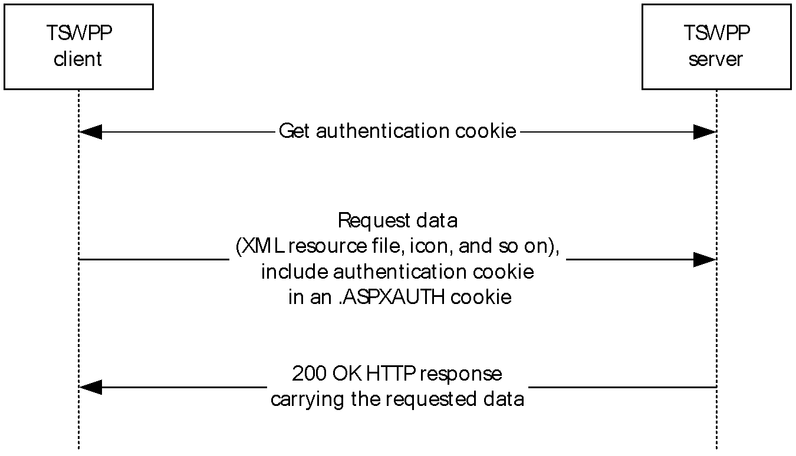
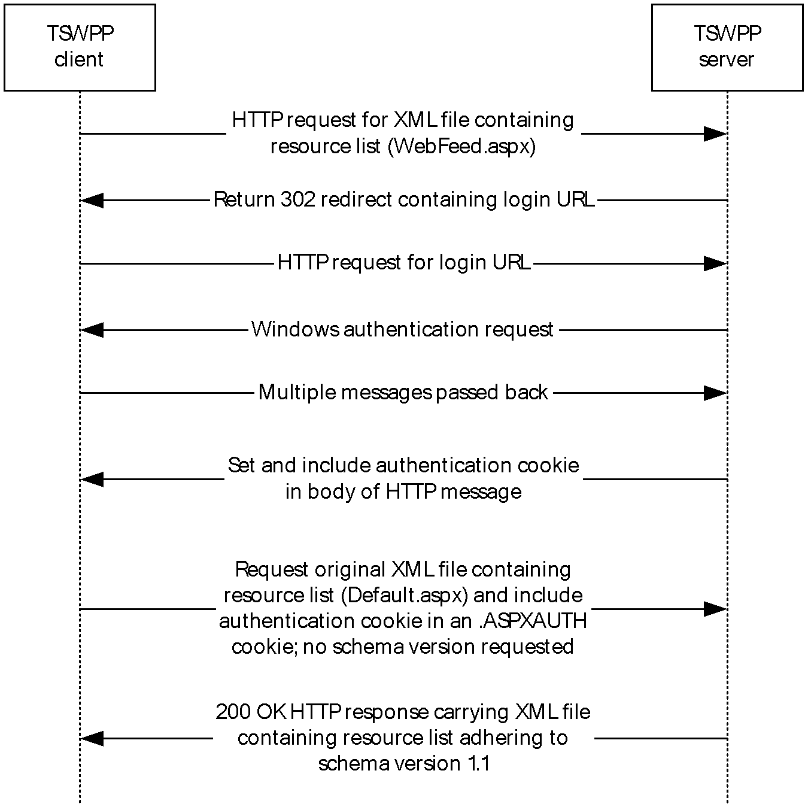
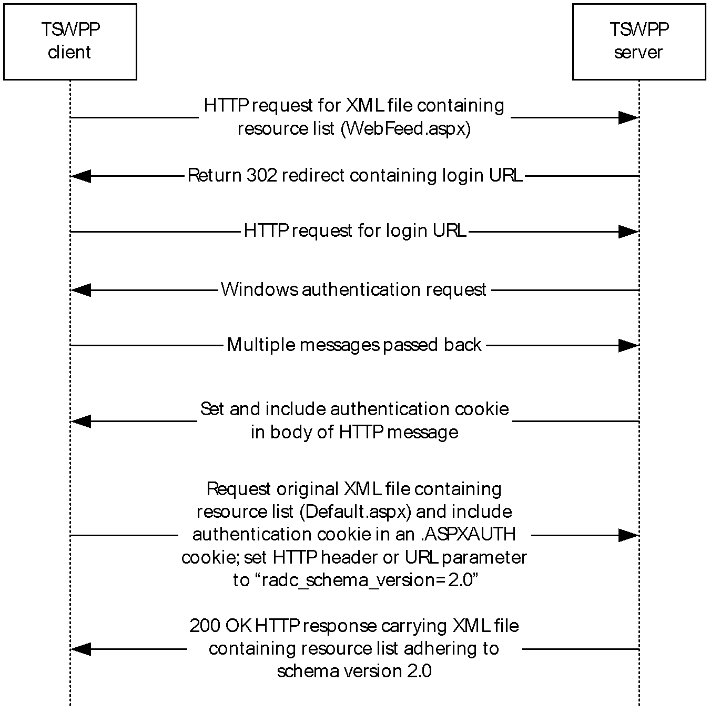
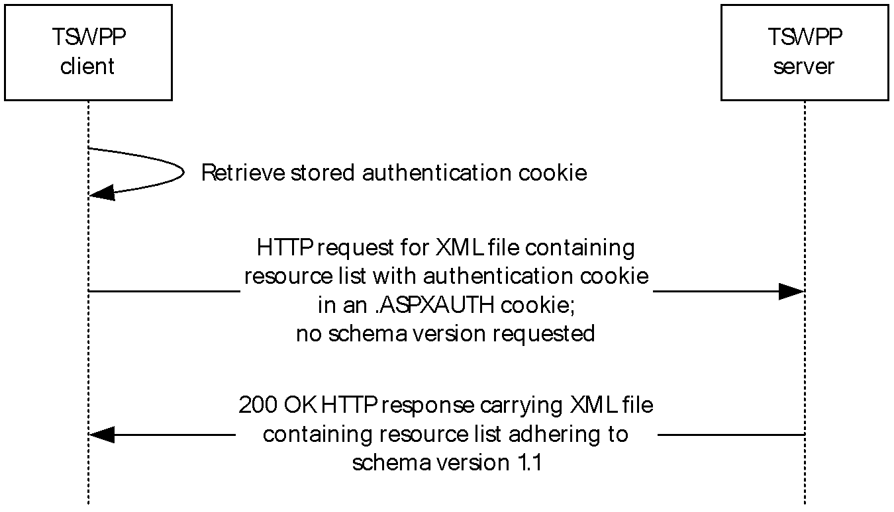
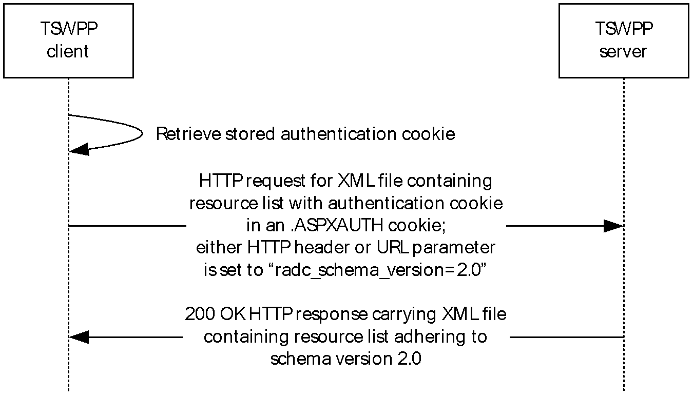
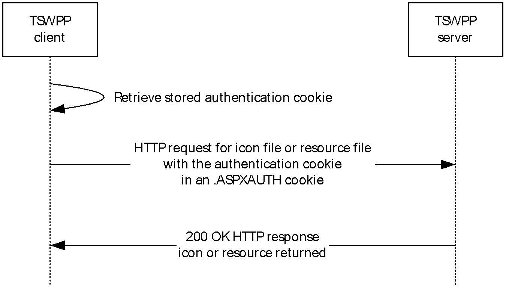

# [MS-TSWP]: Terminal Services Workspace Provisioning Protocol

Table of Contents

1 Introduction

- [1 Introduction](#Section_1)
  - [1.1 Glossary](#Section_1.1)
  - [1.2 References](#Section_1.2)
    - [1.2.1 Normative References](#Section_1.2.1)
    - [1.2.2 Informative References](#Section_1.2.2)
  - [1.3 Overview](#Section_1.3)
    - [1.3.1 General Message Flow](#Section_1.3.1)
  - [1.4 Relationship to Other Protocols](#Section_1.4)
  - [1.5 Prerequisites/Preconditions](#Section_1.5)
  - [1.6 Applicability Statement](#Section_1.6)
  - [1.7 Versioning and Capability Negotiation](#Section_1.7)
  - [1.8 Vendor-Extensible Fields](#Section_1.8)
  - [1.9 Standards Assignments](#Section_1.9)

2 Messages

- [2 Messages](#Section_2)
  - [2.1 Transport](#Section_2.1)
  - [2.2 Message Syntax](#Section_2.2)
    - [2.2.1 Resource List Syntax](#Section_2.2.1)
      - [2.2.1.1 Schema Version 1.1](#Section_2.2.1.1)
      - [2.2.1.2 Schema Version 2.0](#Section_2.2.1.2)
      - [2.2.1.3 Schema Version 2.1](#Section_2.2.1.3)
      - [2.2.1.4 Resource List Content-Type](#Section_2.2.1.4)
    - [2.2.2 Schema Element Definitions](#Section_2.2.2)
      - [2.2.2.1 Schema Version 1.1 Element Definitions](#Section_2.2.2.1)
        - [2.2.2.1.1 ResourceCollection Element](#Section_2.2.2.1.1)
        - [2.2.2.1.2 Publisher Element](#Section_2.2.2.1.2)
        - [2.2.2.1.3 Resources Element](#Section_2.2.2.1.3)
        - [2.2.2.1.4 Resource Element](#Section_2.2.2.1.4)
        - [2.2.2.1.5 Icons Element](#Section_2.2.2.1.5)
        - [2.2.2.1.6 Icon Elements](#Section_2.2.2.1.6)
        - [2.2.2.1.7 HostingTerminalServers Element](#Section_2.2.2.1.7)
        - [2.2.2.1.8 HostingTerminalServer Element](#Section_2.2.2.1.8)
        - [2.2.2.1.9 ResourceFile Element](#Section_2.2.2.1.9)
        - [2.2.2.1.10 TerminalServerRef Element](#Section_2.2.2.1.10)
        - [2.2.2.1.11 TerminalServers Element](#Section_2.2.2.1.11)
        - [2.2.2.1.12 TerminalServer Element](#Section_2.2.2.1.12)
        - [2.2.2.1.13 FileExtensions Element](#Section_2.2.2.1.13)
        - [2.2.2.1.14 FileExtension Element](#Section_2.2.2.1.14)
      - [2.2.2.2 Schema Version 2.0 Element Definitions](#Section_2.2.2.2)
        - [2.2.2.2.1 ResourceCollection Element](#Section_2.2.2.2.1)
        - [2.2.2.2.2 FileExtensions Element](#Section_2.2.2.2.2)
        - [2.2.2.2.3 FileExtension Element](#Section_2.2.2.2.3)
        - [2.2.2.2.4 FileAssociationIcons Element](#Section_2.2.2.2.4)
        - [2.2.2.2.5 SubFolders Element](#Section_2.2.2.2.5)
        - [2.2.2.2.6 Folders Element](#Section_2.2.2.2.6)
        - [2.2.2.2.7 Folder Element](#Section_2.2.2.2.7)
      - [2.2.2.3 Schema Version 2.1 Element Definitions](#Section_2.2.2.3)
        - [2.2.2.3.1 Resource Element](#Section_2.2.2.3.1)
    - [2.2.3 .ASPXAUTH Cookie](#Section_2.2.3)
    - [2.2.4 Resources](#Section_2.2.4)
    - [2.2.5 Content Negotiation](#Section_2.2.5)
    - [2.2.6 Folders](#Section_2.2.6)

3 Protocol Details

- [3 Protocol Details](#Section_3)
  - [3.1 Common Details](#Section_3.1)
    - [3.1.1 Abstract Data Model](#Section_3.1.1)
      - [3.1.1.1 Authentication Cookie](#Section_3.1.1.1)
      - [3.1.1.2 XML Files](#Section_3.1.1.2)
      - [3.1.1.3 Icon Files](#Section_3.1.1.3)
      - [3.1.1.4 Resource Files](#Section_3.1.1.4)
      - [3.1.1.5 Resources](#Section_3.1.1.5)
    - [3.1.2 Timers](#Section_3.1.2)
    - [3.1.3 Initialization](#Section_3.1.3)
    - [3.1.4 Higher-Layer Triggered Events](#Section_3.1.4)
    - [3.1.5 Message Processing Events and Sequencing Rules](#Section_3.1.5)
      - [3.1.5.1 Message Flow for First Request](#Section_3.1.5.1)
        - [3.1.5.1.1 Without Content Negotiation](#Section_3.1.5.1.1)
        - [3.1.5.1.2 With Content Negotiation](#Section_3.1.5.1.2)
      - [3.1.5.2 Message Flow for Subsequent Requests](#Section_3.1.5.2)
        - [3.1.5.2.1 Without Content Negotiation](#Section_3.1.5.2.1)
        - [3.1.5.2.2 With Content Negotiation](#Section_3.1.5.2.2)
      - [3.1.5.3 Message Flow for Icon and Resource File Requests](#Section_3.1.5.3)
    - [3.1.6 Timer Events](#Section_3.1.6)
    - [3.1.7 Other Local Events](#Section_3.1.7)
  - [3.2 Client Details](#Section_3.2)
    - [3.2.1 Abstract Data Model](#Section_3.2.1)
    - [3.2.2 Timers](#Section_3.2.2)
    - [3.2.3 Initialization](#Section_3.2.3)
    - [3.2.4 Higher-Layer Triggered Events](#Section_3.2.4)
    - [3.2.5 Message Processing Events and Sequencing Rules](#Section_3.2.5)
    - [3.2.6 Timer Events](#Section_3.2.6)
    - [3.2.7 Other Local Events](#Section_3.2.7)
  - [3.3 Server Details](#Section_3.3)
    - [3.3.1 Abstract Data Model](#Section_3.3.1)
      - [3.3.1.1 Authentication Cookie](#Section_3.3.1.1)
    - [3.3.2 Timers](#Section_3.3.2)
    - [3.3.3 Initialization](#Section_3.3.3)
    - [3.3.4 Higher-Layer Triggered Events](#Section_3.3.4)
    - [3.3.5 Message Processing Events and Sequencing Rules](#Section_3.3.5)
    - [3.3.6 Timer Events](#Section_3.3.6)
    - [3.3.7 Other Local Events](#Section_3.3.7)

4 Protocol Examples

- [4 Protocol Examples](#Section_4)
  - [4.1 Schema Version 1.1 Examples](#Section_4.1)
    - [4.1.1 Message with One Hosting Terminal Server](#Section_4.1.1)
    - [4.1.2 Message with Multiple Terminal Servers](#Section_4.1.2)
  - [4.2 Schema Version 2.0 Examples](#Section_4.2)
    - [4.2.1 Message with One Hosting Terminal Server](#Section_4.2.1)
    - [4.2.2 Message with Subfolders and Display Folder](#Section_4.2.2)
    - [4.2.3 Message with Multiple Folders and No Display Folder](#Section_4.2.3)
  - [4.3 .ASPXAUTH Cookie Message Returned from the Server](#Section_4.3)

5 Security

- [5 Security](#Section_5)
  - [5.1 Security Considerations for Implementers](#Section_5.1)
  - [5.2 Index of Security Parameters](#Section_5.2)

6 Appendix A: Product Behavior

- [6 Appendix A: Product Behavior](#Section_6)

7 Change Tracking

- [7 Change Tracking](#Section_7)

For the legal notice and IP terms, see [LEGAL.md](../LEGAL.md).
Last updated: 4/23/2024.
See [Revision History](#revision-history) for full version history.

# 1 Introduction

This is a specification of the Terminal Services Workspace Provisioning Protocol.

The Terminal Services Workspace Provisioning Protocol is used to discover and provision workspaces by transferring remote resource information from a server to a client. The client can use this resource information to launch resources such as [**remote applications**](#gt_remote-application) on a remote server.

Sections 1.5, 1.8, 1.9, 2, and 3 of this specification are normative. All other sections and examples in this specification are informative.

## 1.1 Glossary

This document uses the following terms:

**authentication**: The act of proving an identity to a server while providing key material that binds the identity to subsequent communications.

**binary large object (BLOB)**: A discrete packet of data that is stored in a database and is treated as a sequence of uninterpreted bytes.

**client**: The entity that initiates the [**HTTP**](#gt_hypertext-transfer-protocol-http) connection.

**Content-Type**: A property of an [**HTTP**](#gt_hypertext-transfer-protocol-http) message, specified in the message header, which defines the type of data in the message payload. The Content Type header is defined in [[RFC7231]](https://go.microsoft.com/fwlink/?LinkId=402095) section 3.1.1.5.

**domain name**: A name with a structure indicated by dots.

**globally unique identifier (GUID)**: A term used interchangeably with universally unique identifier (UUID) in Microsoft protocol technical documents (TDs). Interchanging the usage of these terms does not imply or require a specific algorithm or mechanism to generate the value. Specifically, the use of this term does not imply or require that the algorithms described in [[RFC4122]](https://go.microsoft.com/fwlink/?LinkId=90460) or [[C706]](https://go.microsoft.com/fwlink/?LinkId=89824) must be used for generating the [**GUID**](#gt_globally-unique-identifier-guid). See also universally unique identifier (UUID).

**HTTPS proxy**: An intermediary program that acts as both a [**server**](#gt_server) and a [**client**](#gt_client) for the purpose of making requests on behalf of other [**clients**](#gt_client), tunneled using Secure Sockets Layer (SSL) or Transport Layer Security (TLS) for providing secure, encrypted communication.

**Hypertext Transfer Protocol (HTTP)**: An application-level protocol for distributed, collaborative, hypermedia information systems (text, graphic images, sound, video, and other multimedia files) on the World Wide Web.

**Hypertext Transfer Protocol Secure (HTTPS)**: An extension of HTTP that securely encrypts and decrypts web page requests. In some older protocols, "Hypertext Transfer Protocol over Secure Sockets Layer" is still used (Secure Sockets Layer has been deprecated). For more information, see [[SSL3]](https://go.microsoft.com/fwlink/?LinkId=90534) and [[RFC5246]](https://go.microsoft.com/fwlink/?LinkId=129803).

**Kerberos**: An [**authentication**](#gt_authentication) system that enables two parties to exchange private information across an otherwise open network by assigning a unique key (called a ticket) to each user that logs on to the network and then embedding these tickets into messages sent by the users. For more information, see [MS-KILE](../MS-KILE/MS-KILE.md).

**NT LAN Manager (NTLM) Authentication Protocol**: A protocol using a challenge-response mechanism for [**authentication**](#gt_authentication) in which clients are able to verify their identities without sending a password to the server. It consists of three messages, commonly referred to as Type 1 (negotiation), Type 2 (challenge) and Type 3 (authentication).

**publisher**: A set of resources that are contained in the same [**workspace**](#gt_workspace).

**remote application**: An application running on a remote server.

**Remote Desktop Protocol (RDP)**: A multi-channel protocol that allows a user to connect to a computer running Microsoft Terminal Services (TS). RDP enables the exchange of client and server settings and also enables negotiation of common settings to use for the duration of the connection, so that input, graphics, and other data can be exchanged and processed between client and server.

**schema**: The set of attributes and object classes that govern the creation and update of objects.

**server**: The entity that responds to the HTTP connection. See [MS-TSWP](#Section_1fc8309267b54091bd6f256ce6658e80).

**Simple and Protected GSS-API Negotiation Mechanism (SPNEGO)**: An [**authentication**](#gt_authentication) mechanism that allows Generic Security Services (GSS) peers to determine whether their credentials support a common set of GSS-API security mechanisms, to negotiate different options within a given security mechanism or different options from several security mechanisms, to select a service, and to establish a security context among themselves using that service. [**SPNEGO**](#gt_simple-and-protected-gss-api-negotiation-mechanism-spnego) is specified in [[RFC4178]](https://go.microsoft.com/fwlink/?LinkId=90461).

**terminal server**: A computer on which [**terminal services**](#gt_terminal-services-ts) is running.

**terminal services (TS)**: A service on a server computer that allows delivery of applications, or the desktop itself, to various computing devices. When a user runs an application on a [**terminal server**](#gt_terminal-server), the application execution takes place on the server computer and only keyboard, mouse, and display information is transmitted over the network. Each user sees only his or her individual session, which is managed transparently by the server operating system and is independent of any other client session.

**Transmission Control Protocol (TCP)**: A protocol used with the Internet Protocol (IP) to send data in the form of message units between computers over the Internet. TCP handles keeping track of the individual units of data (called packets) that a message is divided into for efficient routing through the Internet.

**TSWPP**: The Terminal Services Workspace Provisioning Protocol.

**Uniform Resource Locator (URL)**: A string of characters in a standardized format that identifies a document or resource on the World Wide Web. The format is as specified in [[RFC1738]](https://go.microsoft.com/fwlink/?LinkId=90287).

**workspace**: A set of remote resources, such as [**remote applications**](#gt_remote-application) and desktops, which are published to end users.

**XML**: The Extensible Markup Language, as described in [[XML1.0]](https://go.microsoft.com/fwlink/?LinkId=90599).

**XML namespace**: A collection of names that is used to identify elements, types, and attributes in XML documents identified in a URI reference [[RFC3986]](https://go.microsoft.com/fwlink/?LinkId=90453). A combination of XML namespace and local name allows XML documents to use elements, types, and attributes that have the same names but come from different sources. For more information, see [[XMLNS-2ED]](https://go.microsoft.com/fwlink/?LinkId=90602).

**XML resource list**: An [**XML**](#gt_xml) file that is sent from a [**TSWPP**](#gt_tswpp) [**server**](#gt_server) to a [**TSWPP**](#gt_tswpp) [**client**](#gt_client). This file, which conforms to the [**XML schema (XSD)**](#gt_xml-schema-xsd) in section 2.2.1, describes a set of remote resources.

**XML schema**: A description of a type of XML document that is typically expressed in terms of constraints on the structure and content of documents of that type, in addition to the basic syntax constraints that are imposed by [**XML**](#gt_xml) itself. An XML schema provides a view of a document type at a relatively high level of abstraction.

**XML Schema (XSD)**: A language that defines the elements, attributes, namespaces, and data types for [**XML**](#gt_xml) documents as defined by [[XMLSCHEMA1/2]](https://go.microsoft.com/fwlink/?LinkId=90607) and [[XMLSCHEMA2/2]](https://go.microsoft.com/fwlink/?LinkId=90609) standards. An XML schema uses [**XML**](#gt_xml) syntax for its language.

**MAY, SHOULD, MUST, SHOULD NOT, MUST NOT:** These terms (in all caps) are used as defined in [[RFC2119]](https://go.microsoft.com/fwlink/?LinkId=90317). All statements of optional behavior use either MAY, SHOULD, or SHOULD NOT.

## 1.2 References

Links to a document in the Microsoft Open Specifications library point to the correct section in the most recently published version of the referenced document. However, because individual documents in the library are not updated at the same time, the section numbers in the documents may not match. You can confirm the correct section numbering by checking the [Errata](https://go.microsoft.com/fwlink/?linkid=850906).

### 1.2.1 Normative References

We conduct frequent surveys of the normative references to assure their continued availability. If you have any issue with finding a normative reference, please contact [dochelp@microsoft.com](mailto:dochelp@microsoft.com). We will assist you in finding the relevant information.

[MS-DTYP] Microsoft Corporation, "[Windows Data Types](../MS-DTYP/MS-DTYP.md)".

[RFC2109] Kristol, D., and Montulli, L., "HTTP State Management Mechanism", RFC 2109, February 1997, [https://www.rfc-editor.org/info/rfc2109](https://go.microsoft.com/fwlink/?LinkId=90315)

[RFC2119] Bradner, S., "Key words for use in RFCs to Indicate Requirement Levels", BCP 14, RFC 2119, March 1997, [https://www.rfc-editor.org/info/rfc2119](https://go.microsoft.com/fwlink/?LinkId=90317)

[RFC2818] Rescorla, E., "HTTP Over TLS", RFC 2818, May 2000, [https://www.rfc-editor.org/info/rfc2818](https://go.microsoft.com/fwlink/?LinkId=90383)

[RFC4559] Jaganathan, K., Zhu, L., and Brezak, J., "SPNEGO-based Kerberos and NTLM HTTP Authentication in Microsoft Windows", RFC 4559, June 2006, [https://www.rfc-editor.org/info/rfc4559](https://go.microsoft.com/fwlink/?LinkId=90483)

[RFC7230] Fielding, R., and Reschke, J., Eds., "Hypertext Transfer Protocol (HTTP/1.1): Message Syntax and Routing", RFC 7230, June 2014, [https://www.rfc-editor.org/info/rfc7230](https://go.microsoft.com/fwlink/?LinkId=402094)

[RFC7231] Fielding, R., and Reschke, J., Eds., "Hypertext Transfer Protocol -- HTTP/1.1: Semantics and Content", RFC7231, June 2014, [https://www.rfc-editor.org/info/rfc7231](https://go.microsoft.com/fwlink/?LinkId=402095)

### 1.2.2 Informative References

[MS-RDPBCGR] Microsoft Corporation, "[Remote Desktop Protocol: Basic Connectivity and Graphics Remoting](../MS-RDPBCGR/MS-RDPBCGR.md)".

[MS-RDWR] Microsoft Corporation, "[Remote Desktop Workspace Runtime Protocol](../MS-RDWR/MS-RDWR.md)".

[MSDN-TSCCRDP] Microsoft Corporation, "Terminal Services Client Configuration through the .rdp File", [http://msdn.microsoft.com/en-us/library/aa915001.aspx](https://go.microsoft.com/fwlink/?LinkId=167029)

[NTLM] Microsoft Corporation, "Microsoft NTLM", [http://msdn.microsoft.com/en-us/library/aa378749.aspx](https://go.microsoft.com/fwlink/?LinkId=90235)

[XML10/4] W3C Recommendation, "Extensible Markup Language (XML) 1.0 (Fourth Edition)", August 16, 2006, [http://www.w3.org/TR/2006/REC-xml-20060816](https://go.microsoft.com/fwlink/?LinkId=113071)

[XMLSCHEMA1/2] Thompson, H., Beech, D., Maloney, M., and Mendelsohn, N., Eds., "XML Schema Part 1: Structures Second Edition", W3C Recommendation, October 2004, [https://www.w3.org/TR/2004/REC-xmlschema-1-20041028/](https://go.microsoft.com/fwlink/?LinkId=90607)

[XMLSCHEMA2/2] Biron, P., and Malhotra, A., Eds., "XML Schema Part 2: Datatypes Second Edition", W3C Recommendation, October 2004, [https://www.w3.org/TR/2004/REC-xmlschema-2-20041028/](https://go.microsoft.com/fwlink/?LinkId=90609)

## 1.3 Overview

The Terminal Services Workspace Provisioning Protocol ([**TSWPP**](#gt_tswpp)) was created to provide users with a unified view of the resources that have been made available to them by an administrator. This protocol obtains information that a [**client**](#gt_client) machine can use to launch a [**remote application**](#gt_remote-application) that runs on a [**server**](#gt_server) or a virtual machine (VM). The client can arrange the remote resources so that a user can use a pointing device to launch the application.

TSWPP specifies an [**HTTP**](#gt_hypertext-transfer-protocol-http)–based interface [[RFC7230]](https://go.microsoft.com/fwlink/?LinkId=402094) that uses [**XML**](#gt_xml) messages to describe the remote resources that are available. In this specification, the entity that initiates the HTTP connection is referred to as the client, and the entity that responds to the HTTP connection is referred to as the server.

### 1.3.1 General Message Flow

The general communication pattern between a TSWPP client and TSWPP server is shown in the following figure.

Figure 1: Basic message flow between a TSWPP client and TSWPP server

Communication between a TSWPP client and a TSWPP server is always initiated by the client. During the first request from the client to the server, the client obtains an [**authentication**](#gt_authentication) cookie from the server as specified in section [3.1.5.1](#Section_3.1.5.1). On subsequent requests, the previously obtained authentication cookie is simply passed to the server as specified in section [3.1.5.2](#Section_3.1.5.2). The TSWPP client can request various forms of data from the TSWPP server, such as an XML file describing the resources that are available, and icon and resource files for the available resources. Information about the available forms of data is specified in section [3.1.1](#Section_3.1.1), details about the message flow for downloading the XML file are specified in sections 3.1.5.1 and 3.1.5.2, and details for downloading resource files and icon files are specified in section [3.1.5.3](#Section_3.1.5.3).

## 1.4 Relationship to Other Protocols

[**TSWPP**](#gt_tswpp) depends on [**HTTP**](#gt_hypertext-transfer-protocol-http) (as defined in [[RFC7230]](https://go.microsoft.com/fwlink/?LinkId=402094) and [[RFC2109]](https://go.microsoft.com/fwlink/?LinkId=90315)) and [**HTTPS**](#gt_hypertext-transfer-protocol-secure-https) ([[RFC2818]](https://go.microsoft.com/fwlink/?LinkId=90383)) to transfer all protocol messages, including resource information. Any version of HTTP can be used with TSWPP.

For initial [**authentication**](#gt_authentication), TSWPP depends on the authentication scheme defined in [[RFC4559]](https://go.microsoft.com/fwlink/?LinkId=90483).

## 1.5 Prerequisites/Preconditions

The following are prerequisites for using [**TSWPP**](#gt_tswpp):

- TSWPP does not provide a mechanism for a [**client**](#gt_client) to discover the [**Uniform Resource Locator (URL)**](#gt_uniform-resource-locator-url) to the [**server**](#gt_server); thus, the client is required to have a valid URL to the server. This URL provides a path either to the [**XML resource list**](#gt_xml-resource-list) or to the entry point that the server uses to generate the XML resource list for the client.
- Both client and server implementations of TSWPP are present and running.
- The client machine has the necessary applications to launch any of the resource files contained in the [**XML**](#gt_xml) resource file. For example, if one of the resource files in the XML resource file is a [**Remote Desktop Protocol (RDP)**](#gt_remote-desktop-protocol-rdp) configuration file [[MSDN-TSCCRDP]](https://go.microsoft.com/fwlink/?LinkId=167029), then the [**Terminal Services**](#gt_terminal-services-ts) client is required to be present in order to launch the application, and that client will use the RDP protocol [MS-RDPBCGR](../MS-RDPBCGR/MS-RDPBCGR.md) to connect.

## 1.6 Applicability Statement

[**TSWPP**](#gt_tswpp) is applicable when a [**client**](#gt_client) requires the constituent elements of an application that is located on a remote [**server**](#gt_server) in order to execute that application remotely on the server machine. These elements can include, but are not limited to, icons, remote files, and information describing the remotely-executing resource or application.

## 1.7 Versioning and Capability Negotiation

This document covers versioning issues in the following areas:

- **Supported Transports**: [**TSWPP**](#gt_tswpp) is implemented on [**HTTP**](#gt_hypertext-transfer-protocol-http) (section [2.1](#Section_2.1)).
- **Protocol Versions**: Servers specify the protocol version by using the **SchemaVersion** attribute in the [**XML**](#gt_xml) file. Clients support the version specified by the server because TSWPP does not support protocol negotiation. For more information, see section [2.2.5](#Section_2.2.5).<1><2>
- **Security and Authentication Methods**: TSWPP supports HTTP access [**authentication**](#gt_authentication), as specified in [[RFC4559]](https://go.microsoft.com/fwlink/?LinkId=90483).
- **Localization**: This specification does not define any locale-specific protocol behavior.
- **Capability Negotiation**: Communication of the XML feed is performed using the highest schema version recognized by both the HTTP/1.1 client and the HTTP server, as defined in section 2.2.5.<3><4>

## 1.8 Vendor-Extensible Fields

None.

## 1.9 Standards Assignments

| Parameter | Value | Reference |
| --- | --- | --- |
| [**TCP**](#gt_transmission-control-protocol-tcp) port | 443 | [[RFC2818]](https://go.microsoft.com/fwlink/?LinkId=90383) |
| [**XML namespace**](#gt_xml-namespace) | "http://schemas.microsoft.com/ts/2007/05/tswf" | [[XML10/4]](https://go.microsoft.com/fwlink/?LinkId=113071) |

# 2 Messages

## 2.1 Transport

[**TSWPP**](#gt_tswpp) uses [**HTTP**](#gt_hypertext-transfer-protocol-http) protocol messages that are carried in the HTTP message headers and message body, as specified in [[RFC7230]](https://go.microsoft.com/fwlink/?LinkId=402094) and [[RFC2109]](https://go.microsoft.com/fwlink/?LinkId=90315). TSWPP uses [**HTTPS**](#gt_hypertext-transfer-protocol-secure-https) to transport these messages, as specified in [[RFC2818]](https://go.microsoft.com/fwlink/?LinkId=90383).

A [**TCP**](#gt_transmission-control-protocol-tcp) port has not been reserved for TSWPP. Administrators often use TCP port 443 when setting up their web servers, because many [**HTTPS proxy**](#gt_https-proxy) servers forward only HTTPS traffic that uses port 443. TSWPP can use any port as defined in [RFC2818] section 2.3 "Port Number".

TSWPP uses the access [**authentication**](#gt_authentication) functionality of the HTTP layer. The supported HTTP access authentication schemes are implementation-specific, as specified in [[RFC4559]](https://go.microsoft.com/fwlink/?LinkId=90483).

## 2.2 Message Syntax

### 2.2.1 Resource List Syntax

This section specifies the complete [**XML**](#gt_xml) [**schema**](#gt_schema), the set of attributes and object classes that govern the creation and update of objects, (see [[XMLSCHEMA1/2]](https://go.microsoft.com/fwlink/?LinkId=90607) and [[XMLSCHEMA2/2]](https://go.microsoft.com/fwlink/?LinkId=90609) for details on XML schemas) for messages that are sent from the [**TSWPP**](#gt_tswpp) [**server**](#gt_server) to the TSWPP client, which defines the syntax for [**XML resource lists**](#gt_xml-resource-list).

The **targetNamespace** listed here (http://schemas.microsoft.com/ts/2007/05/tswf) is a URI (see http://www.w3.org/tr/REC-xml-names/ and http://www.ietf.org/rfc/rfc3986.txt for details on [**XML namespace**](#gt_xml-namespace) URIs), and is just meant to be used as a string identifier for the TSWPP namespace.

#### 2.2.1.1 Schema Version 1.1

The [**schema**](#gt_schema) version for this [**XML**](#gt_xml) schema is 1.1 and is listed in the **version** attribute of the <xs:schema> element example that follows.

<?xml version="1.0" encoding="utf-8"?>

<xs:schema targetNamespace="http://schemas.microsoft.com/ts/2007/05/tswf" elementFormDefault="qualified" xmlns="http://schemas.microsoft.com/ts/2007/05/tswf" xmlns:mstns="http://schemas.microsoft.com/ts/2007/05/tswf" xmlns:xs="http://www.w3.org/2001/XMLSchema" version="1.1">

<xs:element name="ResourceCollection" type="ResourceCollectionType" />

<xs:complexType name="ResourceCollectionType">

<xs:sequence>

<xs:element name="Publisher" type="PublisherType" minOccurs="1" maxOccurs="unbounded">

<xs:key name="ResourceIDKey">

<xs:selector xpath="mstns:Resources/mstns:Resource" />

<xs:field xpath="@ID" />

</xs:key>

<xs:key name="TerminalServerIDKey">

<xs:selector xpath="mstns:TerminalServers/mstns:TerminalServer" />

<xs:field xpath="@ID" />

</xs:key>

<xs:keyref name="ResourceToTerminalServerRef" refer="TerminalServerIDKey">

<xs:selector xpath="mstns:Resources/mstns:Resource/mstns:HostingTerminalServers/mstns:HostingTerminalServer/mstns:TerminalServerRef" />

<xs:field xpath="@Ref" />

</xs:keyref>

</xs:element>

</xs:sequence>

<xs:attribute name="SchemaVersion" type="xs:string" use="required" />

<xs:attribute name="PubDate" type="xs:dateTime" />

<xs:anyAttribute />

</xs:complexType>

<xs:complexType name="PublisherType">

<xs:sequence>

<xs:element name="Resources">

<xs:complexType>

<xs:sequence>

<xs:element name="Resource" type="ResourceType" minOccurs="0" maxOccurs="unbounded" />

</xs:sequence>

</xs:complexType>

</xs:element>

<xs:element name="TerminalServers">

<xs:complexType>

<xs:sequence>

<xs:element name="TerminalServer" type="TerminalServerType" minOccurs="0" maxOccurs="unbounded" />

</xs:sequence>

</xs:complexType>

</xs:element>

<xs:any minOccurs="0" maxOccurs="unbounded" />

</xs:sequence>

<xs:attribute name="LastUpdated" type="xs:dateTime" />

<xs:attribute name="Name" type="xs:string" />

<xs:attribute name="ID" type="xs:string" />

<xs:attribute name="Description" type="xs:string" />

<xs:anyAttribute />

</xs:complexType>

<!-- Resource and related Types -->

<xs:complexType name="ResourceType">

<xs:sequence>

<xs:element name="Icons" minOccurs="0" maxOccurs="1">

<xs:complexType>

<xs:all>

<xs:element name="Icon16" type="IconType" minOccurs="0" maxOccurs="1" />

<xs:element name="Icon32" type="IconType" minOccurs="0" maxOccurs="1" />

<xs:element name="Icon48" type="IconType" minOccurs="0" maxOccurs="1" />

<xs:element name="Icon64" type="IconType" minOccurs="0" maxOccurs="1" />

<xs:element name="Icon100" type="IconType" minOccurs="0" maxOccurs="1" />

<xs:element name="Icon256" type="IconType" minOccurs="0" maxOccurs="1" />

<xs:element name="IconRaw" type="IconType">

</xs:element>

</xs:all>

</xs:complexType>

</xs:element>

<xs:element name="FileExtensions" minOccurs="0" maxOccurs="1">

<xs:complexType>

<xs:sequence>

<xs:element name="FileExtension" type="FileExtensionType" minOccurs="0" maxOccurs="unbounded" />

</xs:sequence>

</xs:complexType>

</xs:element>

<xs:element name="HostingTerminalServers">

<xs:complexType>

<xs:sequence>

<xs:element name="HostingTerminalServer" type="HostingTerminalServerType" minOccurs="0" maxOccurs="unbounded" />

</xs:sequence>

<xs:anyAttribute />

</xs:complexType>

</xs:element>

<xs:any minOccurs="0" maxOccurs="unbounded" />

</xs:sequence>

<xs:attribute name="ID" type="xs:string" use="required" />

<xs:attribute name="Alias" type="xs:string" />

<xs:attribute name="Title" type="xs:string" />

<xs:attribute name="LastUpdated" type="xs:dateTime" />

<xs:attribute name="Type">

<xs:simpleType>

<xs:restriction base="xs:string">

<xs:enumeration value="Desktop" />

<xs:enumeration value="RemoteApp" />

</xs:restriction>

</xs:simpleType>

</xs:attribute>

<xs:attribute name="RequiredCommandLine" type="xs:string" />

<xs:attribute name="ExecutableName" type="xs:string" />

<xs:anyAttribute />

</xs:complexType>

<xs:complexType name="IconType">

<xs:sequence>

<xs:element name="FileContent" type="xs:string" minOccurs="0" maxOccurs="1" />

</xs:sequence>

<xs:attribute name="Dimensions" type="xs:string" />

<xs:attribute name="FileType" type="xs:string" />

<xs:attribute name="FileURL" type="xs:string" />

<xs:attribute name="Index" type="xs:integer" />

<xs:anyAttribute />

</xs:complexType>

<xs:complexType name="FileExtensionType">

<xs:sequence>

<xs:any minOccurs="0" maxOccurs="unbounded" />

</xs:sequence>

<xs:attribute name="Name" type="xs:string" />

<xs:anyAttribute />

</xs:complexType>

<xs:complexType name="TerminalServerRefType">

<xs:attribute name="Ref" type="xs:string" use="required" />

</xs:complexType>

<xs:complexType name="ResourceFileType">

<xs:sequence>

<xs:element name="Content" type="xs:string" minOccurs="0" maxOccurs="1" />

</xs:sequence>

<xs:attribute name="URL" type="xs:string" />

<xs:attribute name="FileExtension" type="xs:string" default=".rdp" />

<xs:anyAttribute />

</xs:complexType>

<xs:complexType name="HostingTerminalServerType">

<xs:sequence>

<xs:element name="ResourceFile" type="ResourceFileType" minOccurs="0" maxOccurs="1" />

<xs:element name="TerminalServerRef" type="TerminalServerRefType" />

<xs:any minOccurs="0" maxOccurs="unbounded" />

</xs:sequence>

<xs:anyAttribute />

</xs:complexType>

<!-- TerminalServer and related Types -->

<xs:complexType name="TerminalServerType">

<xs:attribute name="ID" type="xs:string" use="required" />

<xs:attribute name="Name" type="xs:string" />

<xs:attribute name="LastUpdated" type="xs:dateTime" />

<xs:anyAttribute />

</xs:complexType>

</xs:schema>

#### 2.2.1.2 Schema Version 2.0

The schema version for this [**XML**](#gt_xml) [**schema**](#gt_schema) is 2.0 and is listed in the version attribute of the <xs:schema> element example below.

Due to the way the schema is written, documents that adhere to schema version 1.1 will also validate against schema version 2.0. Documents that adhere to schema version 2.0 will not necessarily validate against schema version 1.1.

<?xml version="1.0" encoding="utf-8"?>

<xs:schema targetNamespace="http://schemas.microsoft.com/ts/2007/05/tswf"

elementFormDefault="qualified" xmlns="http://schemas.microsoft.com/ts/2007/05/tswf" xmlns:mstns="http://schemas.microsoft.com/ts/2007/05/tswf" xmlns:xs="http://www.w3.org/2001/XMLSchema" version="2.0">

<xs:element name="ResourceCollection" type="ResourceCollectionType" />

<xs:complexType name="ResourceCollectionType">

<xs:sequence>

<xs:element name="Publisher" type="PublisherType"

minOccurs="1" maxOccurs="unbounded">

<xs:key name="ResourceIDKey">

<xs:selector xpath="mstns:Resources/mstns:Resource" />

<xs:field xpath="@ID" />

</xs:key>

<xs:key name="TerminalServerIDKey">

<xs:selector xpath="mstns:TerminalServers/mstns:TerminalServer" />

<xs:field xpath="@ID" />

</xs:key>

<xs:keyref name="ResourceToTerminalServerRef" refer="TerminalServerIDKey">

<xs:selector xpath="mstns:Resources/mstns:Resource/

mstns:HostingTerminalServers/mstns:HostingTerminalServer/

mstns:TerminalServerRef" />

<xs:field xpath="@Ref" />

</xs:keyref>

</xs:element>

</xs:sequence>

<xs:attribute name="SchemaVersion" type="xs:string" use="required" />

<xs:attribute name="PubDate" type="xs:dateTime" />

<xs:anyAttribute processContents="lax" />

</xs:complexType>

<xs:complexType name="PublisherType">

<xs:sequence>

<xs:element name="SubFolders" minOccurs="0" maxOccurs="unbounded">

<xs:complexType>

<xs:sequence>

<xs:element name="Folder" type="FolderType"

minOccurs="0" maxOccurs="unbounded" />

</xs:sequence>

<xs:anyAttribute processContents="lax" />

</xs:complexType>

</xs:element>

<xs:element name="Resources">

<xs:complexType>

<xs:sequence>

<xs:element name="Resource" type="ResourceType"

minOccurs="0" maxOccurs="unbounded" />

</xs:sequence>

</xs:complexType>

</xs:element>

<xs:element name="TerminalServers">

<xs:complexType>

<xs:sequence>

<xs:element name="TerminalServer" type="TerminalServerType"

minOccurs="0" maxOccurs="unbounded" />

</xs:sequence>

</xs:complexType>

</xs:element>

<xs:any minOccurs="0" maxOccurs="unbounded" processContents="lax" />

</xs:sequence>

<xs:attribute name="LastUpdated" type="xs:dateTime" />

<xs:attribute name="Name" type="xs:string" />

<xs:attribute name="ID" type="xs:string" />

<xs:attribute name="Description" type="xs:string" />

<xs:attribute name="SupportsReconnect" type="xs:boolean" />

<xs:attribute name="DisplayFolder" type="xs:string"/>

<xs:anyAttribute processContents="lax" />

</xs:complexType>

<!-- Resource and related Types -->

<xs:complexType name="ResourceType">

<xs:sequence>

<xs:element name="Icons" minOccurs="0" maxOccurs="1">

<xs:complexType>

<xs:sequence>

<xs:element name="IconRaw" type="IconType" />

<xs:element name="Icon16" type="IconType" minOccurs="0" maxOccurs="1" />

<xs:element name="Icon32" type="IconType" minOccurs="0" maxOccurs="1" />

<xs:element name="Icon48" type="IconType" minOccurs="0" maxOccurs="1" />

<xs:element name="Icon64" type="IconType" minOccurs="0" maxOccurs="1" />

<xs:element name="Icon100" type="IconType" minOccurs="0" maxOccurs="1" />

<xs:element name="Icon256" type="IconType" minOccurs="0" maxOccurs="1" />

<xs:element name="Icon" type="IconType" minOccurs="0" maxOccurs="unbounded" />

</xs:sequence>

</xs:complexType>

</xs:element>

<xs:element name="FileExtensions" minOccurs="0" maxOccurs="1">

<xs:complexType>

<xs:sequence>

<xs:element name="FileExtension" type="FileExtensionType"

minOccurs="0" maxOccurs="unbounded" />

</xs:sequence>

<xs:anyAttribute processContents="lax" />

</xs:complexType>

</xs:element>

<xs:element name="Folders" minOccurs="0" maxOccurs="1">

<xs:complexType>

<xs:sequence>

<xs:element name="Folder" type="FolderType"

minOccurs="0" maxOccurs="unbounded" />

</xs:sequence>

<xs:anyAttribute processContents="lax" />

</xs:complexType>

</xs:element>

<xs:element name="HostingTerminalServers">

<xs:complexType>

<xs:sequence>

<xs:element name="HostingTerminalServer" type="HostingTerminalServerType"

minOccurs="0" maxOccurs="unbounded" />

</xs:sequence>

<xs:anyAttribute processContents="lax" />

</xs:complexType>

</xs:element>

<xs:any minOccurs="0" maxOccurs="unbounded" processContents="lax" />

</xs:sequence>

<xs:attribute name="ID" type="xs:string" use="required" />

<xs:attribute name="Alias" type="xs:string" />

<xs:attribute name="Title" type="xs:string" />

<xs:attribute name="LastUpdated" type="xs:dateTime" />

<xs:attribute name="Type">

<xs:simpleType>

<xs:restriction base="xs:string">

<xs:enumeration value="Desktop" />

<xs:enumeration value="RemoteApp" />

</xs:restriction>

</xs:simpleType>

</xs:attribute>

<xs:attribute name="RequiredCommandLine" type="xs:string" />

<xs:attribute name="ExecutableName" type="xs:string" />

<xs:anyAttribute processContents="lax" />

</xs:complexType>

<xs:complexType name="IconType">

<xs:sequence>

<xs:element name="FileContent" type="xs:string" minOccurs="0" maxOccurs="1" />

</xs:sequence>

<xs:attribute name="Dimensions" type="xs:string" />

<xs:attribute name="FileType" type="xs:string" />

<xs:attribute name="FileURL" type="xs:string" />

<xs:attribute name="Index" type="xs:integer" />

<xs:anyAttribute processContents="lax" />

</xs:complexType>

<xs:complexType name="FileExtensionType">

<xs:sequence>

<xs:any minOccurs="0" maxOccurs="unbounded" processContents="lax" />

</xs:sequence>

<xs:attribute name="Name" type="xs:string" />

<xs:attribute name="PrimaryHandler" type="xs:string" />

<xs:anyAttribute processContents="lax" />

</xs:complexType>

<xs:element name="FileAssociationIcons">

<xs:complexType>

<xs:sequence>

<xs:element name="IconRaw" type="IconType" />

<xs:element name="Icon16" type="IconType" minOccurs="0" maxOccurs="1" />

<xs:element name="Icon32" type="IconType" minOccurs="0" maxOccurs="1" />

<xs:element name="Icon48" type="IconType" minOccurs="0" maxOccurs="1" />

<xs:element name="Icon64" type="IconType" minOccurs="0" maxOccurs="1" />

<xs:element name="Icon100" type="IconType" minOccurs="0" maxOccurs="1" />

<xs:element name="Icon256" type="IconType" minOccurs="0" maxOccurs="1" />

<xs:element name="Icon" type="IconType" minOccurs="0" maxOccurs="unbounded" />

</xs:sequence>

</xs:complexType>

</xs:element>

<xs:complexType name="TerminalServerRefType">

<xs:attribute name="Ref" type="xs:string" use="required" />

</xs:complexType>

<xs:complexType name="FolderType">

<xs:attribute name="Name" type="xs:string" use="required" />

<xs:anyAttribute processContents="lax" />

</xs:complexType>

<xs:complexType name="ResourceFileType">

<xs:sequence>

<xs:element name="Content" type="xs:string" minOccurs="0" maxOccurs="1" />

</xs:sequence>

<xs:attribute name="URL" type="xs:string" />

<xs:attribute name="FileExtension" type="xs:string" default=".rdp" />

<xs:anyAttribute processContents="lax" />

</xs:complexType>

<xs:complexType name="HostingTerminalServerType">

<xs:sequence>

<xs:element name="ResourceFile" type="ResourceFileType"

minOccurs="0" maxOccurs="1" />

<xs:element name="TerminalServerRef" type="TerminalServerRefType" />

<xs:any minOccurs="0" maxOccurs="unbounded" processContents="lax" />

</xs:sequence>

<xs:anyAttribute processContents="lax" />

</xs:complexType>

<!-- TerminalServer and related Types -->

<xs:complexType name="TerminalServerType">

<xs:attribute name="ID" type="xs:string" use="required" />

<xs:attribute name="Name" type="xs:string" />

<xs:attribute name="LastUpdated" type="xs:dateTime" />

<xs:anyAttribute processContents="lax" />

</xs:complexType>

</xs:schema>

#### 2.2.1.3 Schema Version 2.1

The schema version for this [**XML**](#gt_xml) [**schema**](#gt_schema) is 2.1 and is listed in the version attribute of the <xs:schema> element example later in this section.

Due to the way the schema is written, documents that adhere to schema version 2.1 will also validate against schema version 2.0. Similarly, documents that adhere to schema version 2.0 will also validate against the schema version 2.1. Documents that adhere to schema version 1.1 will validate against schema version 2.1, but documents that adhere to schema version 2.1 will not necessarily validate against schema version 1.1.

<?xml version="1.0" encoding="utf-8"?>

<xs:schema targetNamespace="http://schemas.microsoft.com/ts/2007/05/tswf" elementFormDefault="qualified" xmlns="http://schemas.microsoft.com/ts/2007/05/tswf" xmlns:mstns="http://schemas.microsoft.com/ts/2007/05/tswf" xmlns:xs="http://www.w3.org/2001/XMLSchema" version="2.1">

<xs:element name="ResourceCollection" type="ResourceCollectionType" />

<xs:complexType name="ResourceCollectionType">

<xs:sequence>

<xs:element name="Publisher" type="PublisherType" minOccurs="1" maxOccurs="unbounded">

<xs:key name="ResourceIDKey">

<xs:selector xpath="mstns:Resources/mstns:Resource" />

<xs:field xpath="@ID" />

</xs:key>

<xs:key name="TerminalServerIDKey">

<xs:selector xpath="mstns:TerminalServers/mstns:TerminalServer" />

<xs:field xpath="@ID" />

</xs:key>

<xs:keyref name="ResourceToTerminalServerRef" refer="TerminalServerIDKey">

<xs:selector xpath="mstns:Resources/mstns:Resource/mstns:HostingTerminalServers/mstns:HostingTerminalServer/mstns:TerminalServerRef" />

<xs:field xpath="@Ref" />

</xs:keyref>

</xs:element>

</xs:sequence>

<xs:attribute name="SchemaVersion" type="xs:string" use="required" />

<xs:attribute name="PubDate" type="xs:dateTime" />

<xs:anyAttribute processContents="lax" />

</xs:complexType>

<xs:complexType name="PublisherType">

<xs:sequence>

<xs:element name="SubFolders" minOccurs="0" maxOccurs="unbounded">

<xs:complexType>

<xs:sequence>

<xs:element name="Folder" type="FolderType" minOccurs="0" maxOccurs="unbounded" />

</xs:sequence>

<xs:anyAttribute processContents="lax" />

</xs:complexType>

</xs:element>

<xs:element name="Resources">

<xs:complexType>

<xs:sequence>

<xs:element name="Resource" type="ResourceType" minOccurs="0" maxOccurs="unbounded" />

</xs:sequence>

</xs:complexType>

</xs:element>

<xs:element name="TerminalServers">

<xs:complexType>

<xs:sequence>

<xs:element name="TerminalServer" type="TerminalServerType" minOccurs="0" maxOccurs="unbounded" />

</xs:sequence>

</xs:complexType>

</xs:element>

<xs:any minOccurs="0" maxOccurs="unbounded" processContents="lax" />

</xs:sequence>

<xs:attribute name="LastUpdated" type="xs:dateTime" />

<xs:attribute name="Name" type="xs:string" />

<xs:attribute name="ID" type="xs:string" />

<xs:attribute name="Description" type="xs:string" />

<xs:attribute name="SupportsReconnect" type="xs:boolean" />

<xs:attribute name="DisplayFolder" type="xs:string"/>

<xs:anyAttribute processContents="lax" />

</xs:complexType>

<!-- Resource and related Types -->

<xs:complexType name="ResourceType">

<xs:sequence>

<xs:element name="Icons" minOccurs="0" maxOccurs="1">

<xs:complexType>

<xs:sequence>

<xs:element name="IconRaw" type="IconType" />

<xs:element name="Icon16" type="IconType" minOccurs="0" maxOccurs="1" />

<xs:element name="Icon32" type="IconType" minOccurs="0" maxOccurs="1" />

<xs:element name="Icon48" type="IconType" minOccurs="0" maxOccurs="1" />

<xs:element name="Icon64" type="IconType" minOccurs="0" maxOccurs="1" />

<xs:element name="Icon100" type="IconType" minOccurs="0" maxOccurs="1" />

<xs:element name="Icon256" type="IconType" minOccurs="0" maxOccurs="1" />

<xs:element name="Icon" type="IconType" minOccurs="0" maxOccurs="unbounded" />

</xs:sequence>

</xs:complexType>

</xs:element>

<xs:element name="FileExtensions" minOccurs="0" maxOccurs="1">

<xs:complexType>

<xs:sequence>

<xs:element name="FileExtension" type="FileExtensionType" minOccurs="0" maxOccurs="unbounded" />

</xs:sequence>

<xs:anyAttribute processContents="lax" />

</xs:complexType>

</xs:element>

<xs:element name="Folders" minOccurs="0" maxOccurs="1">

<xs:complexType>

<xs:sequence>

<xs:element name="Folder" type="FolderType" minOccurs="0" maxOccurs="unbounded" />

</xs:sequence>

<xs:anyAttribute processContents="lax" />

</xs:complexType>

</xs:element>

<xs:element name="HostingTerminalServers">

<xs:complexType>

<xs:sequence>

<xs:element name="HostingTerminalServer" type="HostingTerminalServerType" minOccurs="0" maxOccurs="unbounded" />

</xs:sequence>

<xs:anyAttribute processContents="lax" />

</xs:complexType>

</xs:element>

<xs:any minOccurs="0" maxOccurs="unbounded" processContents="lax" />

</xs:sequence>

<xs:attribute name="ID" type="xs:string" use="required" />

<xs:attribute name="Alias" type="xs:string" />

<xs:attribute name="Title" type="xs:string" />

<xs:attribute name="LastUpdated" type="xs:dateTime" />

<xs:attribute name="Type">

<xs:simpleType>

<xs:restriction base="xs:string">

<xs:enumeration value="Desktop" />

<xs:enumeration value="RemoteApp" />

</xs:restriction>

</xs:simpleType>

</xs:attribute>

<xs:attribute name="RequiredCommandLine" type="xs:string" />

<xs:attribute name="ExecutableName" type="xs:string" />

<xs:attribute name="ShowByDefault" type="xs:boolean" />

<xs:anyAttribute processContents="lax" />

</xs:complexType>

<xs:complexType name="IconType">

<xs:sequence>

<xs:element name="FileContent" type="xs:string" minOccurs="0" maxOccurs="1" />

</xs:sequence>

<xs:attribute name="Dimensions" type="xs:string" />

<xs:attribute name="FileType" type="xs:string" />

<xs:attribute name="FileURL" type="xs:string" />

<xs:attribute name="Index" type="xs:integer" />

<xs:anyAttribute processContents="lax" />

</xs:complexType>

<xs:complexType name="FileExtensionType">

<xs:sequence>

<xs:any minOccurs="0" maxOccurs="unbounded" processContents="lax" />

</xs:sequence>

<xs:attribute name="Name" type="xs:string" />

<xs:attribute name="PrimaryHandler" type="xs:string" />

<xs:anyAttribute processContents="lax" />

</xs:complexType>

<xs:element name="FileAssociationIcons">

<xs:complexType>

<xs:sequence>

<xs:element name="IconRaw" type="IconType" />

<xs:element name="Icon16" type="IconType" minOccurs="0" maxOccurs="1" />

<xs:element name="Icon32" type="IconType" minOccurs="0" maxOccurs="1" />

<xs:element name="Icon48" type="IconType" minOccurs="0" maxOccurs="1" />

<xs:element name="Icon64" type="IconType" minOccurs="0" maxOccurs="1" />

<xs:element name="Icon100" type="IconType" minOccurs="0" maxOccurs="1" />

<xs:element name="Icon256" type="IconType" minOccurs="0" maxOccurs="1" />

<xs:element name="Icon" type="IconType" minOccurs="0" maxOccurs="unbounded" />

</xs:sequence>

</xs:complexType>

</xs:element>

<xs:complexType name="TerminalServerRefType">

<xs:attribute name="Ref" type="xs:string" use="required" />

</xs:complexType>

<xs:complexType name="FolderType">

<xs:attribute name="Name" type="xs:string" use="required" />

<xs:anyAttribute processContents="lax" />

</xs:complexType>

<xs:complexType name="ResourceFileType">

<xs:sequence>

<xs:element name="Content" type="xs:string" minOccurs="0" maxOccurs="1" />

</xs:sequence>

<xs:attribute name="URL" type="xs:string" />

<xs:attribute name="FileExtension" type="xs:string" default=".rdp" />

<xs:anyAttribute processContents="lax" />

</xs:complexType>

<xs:complexType name="HostingTerminalServerType">

<xs:sequence>

<xs:element name="ResourceFile" type="ResourceFileType" minOccurs="0" maxOccurs="1" />

<xs:element name="TerminalServerRef" type="TerminalServerRefType" />

<xs:any minOccurs="0" maxOccurs="unbounded" processContents="lax" />

</xs:sequence>

<xs:anyAttribute processContents="lax" />

</xs:complexType>

<!-- TerminalServer and related Types -->

<xs:complexType name="TerminalServerType">

<xs:attribute name="ID" type="xs:string" use="required" />

<xs:attribute name="Name" type="xs:string" />

<xs:attribute name="LastUpdated" type="xs:dateTime" />

<xs:anyAttribute processContents="lax" />

</xs:complexType>

</xs:schema>

#### 2.2.1.4 Resource List Content-Type

If the client sends an HTTP Accept header ([[RFC7231]](https://go.microsoft.com/fwlink/?LinkId=402095) section 5.3.2) requesting the "application/x-msts-radc+xml" and content compatible with schema version 2.0 (see section [2.2.5](#Section_2.2.5)), the server SHOULD set the Content-Type of the response resource list as "application\x-msts-radc+xml". Otherwise, the server MUST set the Content-Type of the response resource list as "text/xml".<5>

### 2.2.2 Schema Element Definitions

#### 2.2.2.1 Schema Version 1.1 Element Definitions

This section specifies the elements in the [**XML schema (XSD)**](#gt_xml-schema-xsd) that are defined in section [2.2.1.1](#Section_2.2.1.1). The values of all attributes MUST be **xs:string**, unless specified otherwise.

##### 2.2.2.1.1 ResourceCollection Element

The <ResourceCollection> element contains all the other elements defined in section [2.2.2.1](#Section_2.2.1.1). The server MUST only put one <Publisher> element as defined in section [2.2.2.1.2](#Section_2.2.2.1.2). The <ResourceCollection> element defines the following attributes:

- **PubDate**: The publication date. This date SHOULD be included in the <ResourceCollection> element and MUST be in the form **xs:dateTime**.
- **SchemaVersion**: The version number of the [**XML**](#gt_xml) [**schema**](#gt_schema). This attribute MUST be included in the <ResourceCollection> element and SHOULD be based on the version of the schema described in section [2.2.1.1](#Section_2.2.1.1) of this document. The schema version for the XML schema listed in section 2.2.1.1 of this document is schema version 1.1. The schema version number can be found in the **version** attribute of the <xs:schema> element in the XML schema (section [2.2.1](#Section_2.2.1)).

##### 2.2.2.1.2 Publisher Element

The <Publisher> element contains all the attributes for one [**publisher**](#gt_publisher). It defines the following attributes:

- **LastUpdated**: A timestamp that indicates the date and time of any changes made by any entries under the <Publisher> element. This timestamp MUST be in **xs:dateTime** format.
- **Name**: The name of the publisher of the resources.
- **ID**: A [**GUID**](#gt_globally-unique-identifier-guid), as defined in [MS-DTYP](../MS-DTYP/MS-DTYP.md) sections 2.3.4, 2.3.4.2, and 2.3.4.3, or the fully qualified [**domain name**](#gt_domain-name), a name with a structure indicated by dots, of the server that provides the [**XML**](#gt_xml) file. The value of this attribute MUST be globally unique.
- **Description**: An optional description of the publisher.
The <Publisher> element contains the following keys in the schema that MUST be unique in a <Publisher> element.

- **TerminalServerIDKey**: This declares that the **ID** attribute of the <TerminalServer> element (section [2.2.2.1.12](#Section_2.2.2.1.12)) MUST be unique among the <TerminalServer> elements contained in the <TerminalServer> element (section [2.2.2.1.11](#Section_2.2.2.1.11)). The ID attribute is defined in section 2.2.2.1.12.
- **ResourceToTerminalServerRef**: This declares that references to a <TerminalServer> element by ID SHOULD be contained in <TerminalServerRef> elements. The link to the <TerminalServer> ID is in the **Ref** attribute as defined in section [2.2.2.1.10](#Section_2.2.2.1.10).

##### 2.2.2.1.3 Resources Element

The <Resources>element contains all of the resources that have been published by a [**publisher**](#gt_publisher) as specified in section [2.2.2.1.2](#Section_2.2.2.1.2).

##### 2.2.2.1.4 Resource Element

The <Resource> element describes one resource such as an application that can be launched remotely. It contains all information that a client requires to display and launch the application. This element defines the following attributes:

- **ID**: A unique identifier for the resource. This identifier MUST be unique among all other resource identifiers within the containing <Resources> element (section [2.2.2.1.3](#Section_2.2.2.1.3)). The unique identifier SHOULD be generated in such a manner that the identifier remains the same on each request for the [**XML**](#gt_xml) file.
- **Alias**: An identifier that the [**server**](#gt_server) uses to look up the requested resource. This identifier MUST be unique among all other resource identifiers within the containing <Resources> element (section 2.2.2.1.3). The unique identifier SHOULD be generated in such a manner that the identifier remains the same on each request for the XML file.
- **Title**: The name of the resource. The client SHOULD use the value of this attribute to display the resource name to the user.
- **LastUpdated**: An optional timestamp, which specifies the last time that anything changed in this resource. The timestamp MUST be in **xs:dateTime** format.
- **Type**: The type of resource that this <Resource> element specifies. This type MUST be either "Desktop" or "RemoteApp". If the resource will start a complete desktop on a remote computer, use the "Desktop" type; otherwise, use the "RemoteApp" type.
- **ExecutableName**: This attribute specifies the executable that runs on the server if this resource is launched.
- **RequiredCommandLine**: This attribute is ignored by the client and MUST NOT be used by the server.

##### 2.2.2.1.5 Icons Element

The <Icons> element contains all icons associated with one resource.

##### 2.2.2.1.6 Icon Elements

The Icon elements specify icons for a resource or application. Icon elements include <Icon16>, <Icon32>, <Icon48>, <Icon64>, <Icon100>, <Icon256>, and <IconRaw>. The numeric part of the name specifies that the image used for the icon MUST be square, with height and width equal to that number. For example, an icon with the name **Icon256** must have a height and width of 256 pixels. The <IconRaw> element can contain multiple icons with different sizes.

Icon elements define the following attributes:

- **Dimensions**: An attribute that specifies the height and width of the icon with an "x" separating the two entries, such as "32x32". This attribute SHOULD appear only when the icon name is a value that contains a specific size such as **Icon16** and SHOULD NOT appear when the icon name is **IconRaw**.
- **FileType**: The file extension for the file type of the image. For example, if the image file on the [**server**](#gt_server) is named Paint.ico, then the **FileType** attribute would be "Ico".
- **FileURL**: An optional [**URL**](#gt_uniform-resource-locator-url) that specifies the location of the image file. This attribute MUST be present if the icon is available from a web server.
- **FileContent**: This element is ignored by the client and MUST NOT be used by the server.
- **Index**: This attribute is ignored by the client and MUST NOT be used by the server.

##### 2.2.2.1.7 HostingTerminalServers Element

The <HostingTerminalServers> element contains elements for all the [**terminal servers**](#gt_terminal-server), computers on which [**Terminal Services**](#gt_terminal-services-ts) is running, that are hosting a resource. This element MUST contain at least one [HostingTerminalServer](#Section_2.2.2.1.7) element, as defined in section 2.2.2.1.8.

##### 2.2.2.1.8 HostingTerminalServer Element

The <HostingTerminalServer> element contains the name of the file required to launch a remote resource as defined in section [2.2.2.1.9](#Section_2.2.2.1.9) and an element that links to the [**terminal server**](#gt_terminal-server) reference, as defined in section [2.2.2.1.10](#Section_2.2.2.1.10).

##### 2.2.2.1.9 ResourceFile Element

The <ResourceFile> element contains the name of the file that is required in order to launch a remote resource on a server. This element defines the following attributes:

- **FileExtension**: The file extension of the resource file that is defined in this resource. This file extension is what the client SHOULD use to determine how to launch the resource file. For example, if the file is for the [**terminal server**](#gt_terminal-server) client, then this file extension MUST be ".rdp".
- **URL**: The [**URL**](#gt_uniform-resource-locator-url) to the location of this resource file. This attribute MUST be present if the resource file is available from a web server.
- **Content**: This element is ignored by the client and MUST NOT be used by the server.

##### 2.2.2.1.10 TerminalServerRef Element

The <TerminalServerRef> element is a link element that contains one attribute: **Ref**. This attribute is the unique identifier for the [**terminal server**](#gt_terminal-server) as defined in section [2.2.2.1.12](#Section_2.2.2.1.12).

##### 2.2.2.1.11 TerminalServers Element

The <TerminalServers> element contains <TerminalServer> elements (section [2.2.2.1.12](#Section_2.2.2.1.12)) for all [**terminal servers**](#gt_terminal-server) that host the remote resources defined in section [2.2.2.1.3](#Section_2.2.2.1.3).

##### 2.2.2.1.12 TerminalServer Element

The <TerminalServer> element contains the definition for one hosting [**terminal server**](#gt_terminal-server). It defines the following attributes:

- **ID**: A reference as defined in section [2.2.2.1.10](#Section_2.2.2.1.10). This attribute value MUST be unique among all terminal server elements contained in the <TerminalServers> element (section [2.2.2.1.11](#Section_2.2.2.1.11)).
- **Name**: The name of the terminal server, which SHOULD be the fully qualified [**domain name**](#gt_domain-name) of that server.
- **LastUpdated**: The timestamp, which specifies the last time anything changed in this <TerminalServer> element. This entry MUST be in **xs:dateTime** format.

##### 2.2.2.1.13 FileExtensions Element

The <FileExtensions> element SHOULD contain <FileExtension> elements (section [2.2.2.1.14](#Section_2.2.2.1.14)) for all the file types that can be opened by the remote resource defined in section [2.2.2.1.4](#Section_2.2.2.1.4).<6>

The <FileExtensions> element MUST be set as empty by the server if the remote resource does not handle any file types.

##### 2.2.2.1.14 FileExtension Element

The <FileExtension> element MUST contain the definition of one file type that the remote resource is capable of opening.

- **Name**: The name of the file type, which MUST be preceded by a dot (for example, ".txt"). This attribute value SHOULD be unique among all <FileExtension> elements contained in the <Resources> element (see section [2.2.2.1.3](#Section_2.2.2.1.3)).

#### 2.2.2.2 Schema Version 2.0 Element Definitions

This section specifies the elements in the [**XML schema (XSD)**](#gt_xml-schema-xsd) that are defined in section [2.2.1.2](#Section_2.2.1.2). It does this by listing the changes from schema version 1.1, the element definitions for which can be found in section [2.2.2.1](#Section_2.2.1.1). Unless specified otherwise in this section, the definition of an element in schema version 2.0 is the same as its definition in schema version 1.1.

##### 2.2.2.2.1 ResourceCollection Element

The <ResourceCollection> element contains all of the other elements defined in sections [2.2.2.1](#Section_2.2.1.1) and [2.2.2.2](#Section_2.2.1.2). The server MUST only put one <Publisher> element as defined in section [2.2.2.1.2](#Section_2.2.2.1.2). The <ResourceCollection> element defines the following attributes:

- **PubDate**: The publication date. This date SHOULD be included in the <ResourceCollection> element and MUST be in the form xs:dateTime.
- **SchemaVersion**: The version number of the [**XML**](#gt_xml) [**schema**](#gt_schema). This attribute MUST be included in the <ResourceCollection> element and SHOULD be based on the version of the schema described in section [2.2.1.2](#Section_2.2.1.2) of this document. The schema version for the XML schema listed in section 2.2.1.2 of this document is schema version 2.0. The schema version number can be found in the version attribute of the <xs:schema> element in the XML schema (see section [2.2.1](#Section_2.2.1)).
- **DisplayFolder**: When present, this attribute indicates that the <ResourceCollection> element contains a subset of the available resources. The subset consists of the resources that exist in the folder name specified in this attribute. If this attribute is not present, the <ResourceCollection> element contains resources from all folders. Folders are described in section [2.2.6](#Section_2.2.6).
- **SupportsReconnect**: Indicates whether the server supports the Remote Desktop Workspace Runtime Protocol [MS-RDWR](../MS-RDWR/MS-RDWR.md). This attribute SHOULD be included in the <ResourceCollection> element and MUST be in the form xs:boolean.

##### 2.2.2.2.2 FileExtensions Element

The <FileExtensions> element SHOULD contain <FileExtension> elements (section [2.2.2.2.3](#Section_2.2.2.2.3)) for all the file types that can be opened by the remote resource defined in section [2.2.2.1.4](#Section_2.2.2.1.4).

The <FileExtensions> element MUST be set as empty by the server if the remote resource cannot handle any file types.

##### 2.2.2.2.3 FileExtension Element

The <FileExtension> element contains the definition of one file type such that the remote resource is capable of opening documents of that type.

- **Name**: The name of the file type, which MUST be preceded by a dot (for example, ".txt"). This attribute value SHOULD be unique among all <FileExtension> elements contained in the <Resources> element (section [2.2.2.1.3](#Section_2.2.2.1.3)).
- **PrimaryHandler**: This attribute is reserved for future use and MUST be set by the server to the xs:boolean value of True.

##### 2.2.2.2.4 FileAssociationIcons Element

The <FileAssociationIcons> element contains all icons associated with one file type. The icon element is defined in section [2.2.2.1.6](#Section_2.2.2.1.6).

##### 2.2.2.2.5 SubFolders Element

The <SubFolders> element SHOULD contain <Folder> elements (section [2.2.2.2.7](#Section_2.2.2.2.7)) for all folders contained in the current display folder as defined by the **DisplayFolder** attribute of the <ResourceCollection> element (section [2.2.2.2.1](#Section_2.2.2.2.1)). If no display folder is defined, the <SubFolders> element MUST NOT be included. The <Folder> elements included in the <SubFolders> element describe any folders that are contained in the current display folder.

##### 2.2.2.2.6 Folders Element

The <Folders> element SHOULD contain <Folder> elements (section [2.2.2.2.7](#Section_2.2.2.2.7)) for all folders within which the remote resource exists. Folders are described in section [2.2.6](#Section_2.2.6).

##### 2.2.2.2.7 Folder Element

The <Folder> element describes a folder (see section [2.2.6](#Section_2.2.6)) and defines the following attribute:

- **Name**: The name of the folder as specified in section 2.2.6. This attribute MUST be included in the <Folder> element.

#### 2.2.2.3 Schema Version 2.1 Element Definitions

This section specifies the elements in the [**XML schema (XSD)**](#gt_xml-schema-xsd) that are defined in section [2.2.1.3](#Section_2.2.1.3). It does this by listing the changes from schema version 2.0, the element definitions for which can be found in section [2.2.2.2](#Section_2.2.1.2). Unless specified otherwise in this section, the definition of an element in schema version 2.1 is the same as its definition in schema version 2.0 (which can in turn be the same as its definition in schema version 1.1).

##### 2.2.2.3.1 Resource Element

The <Resource> element describes one resource, such as an application that can be launched remotely. It contains all information that a client requires to display and launch the application. This element defines the following attributes:

- **ID**: A unique identifier for the resource. This identifier MUST be unique among all other resource identifiers within the containing <Resource> element (section [2.2.2.1.3](#Section_2.2.2.1.3)). The unique identifier SHOULD be generated in such a manner that the identifier remains the same on each request for the XML file.
- **Alias**: An identifier that the server uses to look up the requested resource. This identifier MUST be unique among all other resource identifiers within the containing <Resources> element (section 2.2.2.1.3). The unique identifier SHOULD be generated in such a manner that the identifier remains the same on each request for the XML file.
- **Title**: The name of the resource. The client SHOULD use the value of this attribute to display the resource name to the user.
- **LastUpdated**: An optional time stamp, which specifies the last time that anything changed in this resource. The time stamp MUST be in **xs:dateTime** format.
- **Type**: The type of resource that this <Resource> element specifies. This type MUST be either "Desktop" or "RemoteApp". If the resource will start a complete desktop on a remote computer, use the "Desktop" type; otherwise, use the "RemoteApp" type.
- **ExecutableName**: This attribute specifies the executable that runs on the server if this resource is launched.
- **RequiredCommandLine**: This attribute is ignored by the client and MUST NOT be used by the server.
- **ShowByDefault**: Clients MAY take advantage of this attribute to run in two different modes: "install" mode, and "catalog" mode.
Clients running in "install" mode SHOULD ignore all resources with a ShowByDefault value of "false" and make all resources with a ShowByDefault value of "true" available to be launched by the user.

Clients running in "catalog" mode SHOULD provide a list of all resources to the user and let the user choose which ones to make available to be launched.

This attribute SHOULD be included in the <Resource> element and MUST be in the form xs:boolean. If this attribute is not present in the <Resource> element, clients MUST act as if it were present with a value of "true".

### 2.2.3 .ASPXAUTH Cookie

If a user's interactions with the HTML login [**URL**](#gt_uniform-resource-locator-url) have allowed the [**TSWPP**](#gt_tswpp) server to establish the user’s identity, the remote server SHOULD generate a cookie that identifies the user and allows [**authentication**](#gt_authentication) to the server. The contents of the cookie SHOULD be signed and encrypted. The specific implementation of this cookie including the signing and encryption algorithms is dependent on the implementation of the TSWPP server, because only the server is required to parse the contents of the cookie. If the server implements the cookie, then the cookie MUST be returned in an [**HTTP**](#gt_hypertext-transfer-protocol-http) payload with a [**Content-Type**](#gt_content-type) of "application/x-msts-webfeed-login".

### 2.2.4 Resources

Resources are stored on the [**TSWPP**](#gt_tswpp) server in memory and comprise the list of resources that are used to generate the [XML files (section 3.1.1.2)](#Section_3.1.1.2) that are sent to the TSWPP [**client**](#gt_client). The data stored for a resource includes the following:

- The [resource file (section 3.1.1.4)](#Section_3.1.1.4)
- A friendly display name for the resource
- A unique identifier for the resource
- Any [icon files (section 3.1.1.3)](#Section_3.1.1.3) associated with the resource
- A list of folder paths that specifies the folders where the resource exists (see section [2.2.6](#Section_2.2.6))
A client MUST be able to authenticate to the TSWPP server before the client can retrieve the XML file (section 3.1.1.2) containing the list of resources. A client MUST request the XML file from the TSWPP server, and the server MUST respond to requests from a client for the XML file containing the list of resources, as specified in section [2](#Section_2). The mechanism by which the XML file (section 3.1.1.2) contents are assembled is server implementation-specific. The server SHOULD receive a user identity as shown in the figures in section [3.1.5](#Section_3.1.5), and it SHOULD use that identity to create a customized [**XML resource list**](#gt_xml-resource-list) for that user. How the XML resource list is customized or if is customized at all is up to the server implementation. This is done by including only <ResourceFile> elements that the user can access.

If the server is configured to customize the XML resource list for each user, each user can have a different XML resource list returned from a TSWPP server. The server SHOULD cache the information used to generate the XML file (section 3.1.1.2), so that the server can quickly respond to requests for the list of resources.

If the XML resource list that the client requests from the server is not available, the server MUST return an HTTP "404 Not Found" error code [[RFC7230]](https://go.microsoft.com/fwlink/?LinkId=402094).

The client implementation can run in two modes: "install" mode and "catalog" mode. The client implementation makes some of the resources described in the XML resource list available to the user by installing them in a manner that allows easy user access to the resources. The client implementation SHOULD use the ShowByDefault attribute to determine which resources to install (section [2.2.2.3.1](#Section_2.2.2.3.1)). In addition, the client implementation stores the XML resource list locally and updates it at least every 24 hours through new TSWPP transactions.

The client SHOULD make efforts to keep the locally stored XML resource list up-to-date. The client SHOULD accomplish this by periodically retrieving a new copy of the resource list from the server. The method of triggering this periodic retrieval of the XML resource list is specific to the client implementation. The client MAY trigger retrieval of the XML resource list by using a periodic task scheduler provided by the client operating system.

The client SHOULD prevent resource files with unsafe file extensions from being downloaded. This SHOULD be done before downloading by checking the FileExtension attribute of the <ResourceFile> element section [2.2.2.1.9](#Section_2.2.2.1.9) and determining whether the file extension listed in that attribute is registered as being safe. Which file extensions are considered safe and the manner in which they are registered as safe for download with the client is a detail of the client implementation. The server has no concept of safe or unsafe file extensions.

If the server returns an HTTP "404 Not Found" error code [RFC7230] when the client is connecting on the initial attempt to set up a [**workspace**](#gt_workspace), the client SHOULD NOT set up a workspace and SHOULD warn the user that the connection could not be made. If the server returns an HTTP "404 Not Found" error when the client is connecting in order to update workspace resources that were previously downloaded, the client SHOULD log a warning but leave the existing resources untouched.

### 2.2.5 Content Negotiation

The client SHOULD request that the server provide a copy of the XML feed that will validate against the highest schema version that the client is able to process.<7> The client MUST do this by requesting a specific schema version in an HTTP Accept header ([[RFC7231]](https://go.microsoft.com/fwlink/?LinkId=402095) section 5.3.2). The header MUST specify a media-range of "application\x-msts-radc+xml" and MUST specify an accept-extension parameter named "radc_schema_version" with a value of either "1.1" or "2.0". For example: "radc_schema_version=2.0" requests schema versions 2.0 and 2.1.

The server SHOULD support content negotiation.<8> If the server does not support content negotiation, or if the client does not request a specific schema version, the server MUST provide a copy of the XML feed adhering to schema version 1.1. If the server supports content negotiation but does not recognize the requested schema version, it SHOULD provide a copy of the XML feed adhering to schema version 1.1.

### 2.2.6 Folders

Resources in the XML file can be organized in a hierarchical tree of folders consisting of a root folder that contains zero or more subfolders, and where only the root folder can contain subfolders.

Each subfolder in the hierarchy contains one or more remote resources and each resource can exist in one or more subfolders. When no subfolders are specified for a resource, the resource exists only in the root folder.

The name of the root folder is "/". The name of each subfolder is a descriptive string with the root folder name prepended to it, as in "/subfolder_name".

# 3 Protocol Details

## 3.1 Common Details

### 3.1.1 Abstract Data Model

This section describes a conceptual model of possible data organization that an implementation maintains to participate in this protocol. The described organization is provided to facilitate the explanation of how the protocol behaves. This document does not mandate that implementations adhere to this model as long as their external behavior is consistent with that described in this document.

#### 3.1.1.1 Authentication Cookie

When a [**TSWPP**](#gt_tswpp) [**client**](#gt_client) first connects to the TSWPP [**server**](#gt_server), an [**authentication**](#gt_authentication) cookie is transmitted to the client, as specified in section [3.1](#Section_1.3). This opaque server generated cookie contains information to authenticate a user to the server as well as the security identifier (SID), as defined in [MS-DTYP](../MS-DTYP/MS-DTYP.md) section 2.4.2, for the user that originally authenticated to the server.

#### 3.1.1.2 XML Files

[**XML**](#gt_xml) files contain resource lists, as specified in [Resource List Syntax (section 2.2.1)](#Section_2.2.1). The [**TSWPP**](#gt_tswpp) server generates these XML files and passes them back to the TSWPP [**client**](#gt_client) when the client requests them, so that each user can get a unique XML file. The files that are referenced by the XML file are stored on the server so that the client can download them on subsequent connections without the additional overhead of retrieving the resources.

#### 3.1.1.3 Icon Files

Icon files represent icons and are stored on the [**TSWPP**](#gt_tswpp) server file system. An [**XML resource list**](#gt_xml-resource-list) references icon files so that a TSWPP client can download and store them on the client machine for use in the presentation of the operating system user interface.<9>

#### 3.1.1.4 Resource Files

Resource files represent the resources that are stored on the [**TSWPP**](#gt_tswpp) server file system. An [**XML resource list**](#gt_xml-resource-list) references resource files so that a TSWPP client can download and store them on the client machine for use in launching remote applications from the operating system user interface.<10>

#### 3.1.1.5 Resources

Resources are stored on the [**TSWPP**](#gt_tswpp) server in memory and comprise the list of resources that are used to generate the [XML files (section 3.1.1.2)](#Section_3.1.1.2) that are sent to the TSWPP client. The data stored for a resource includes any [icon files (section 3.1.1.3)](#Section_3.1.1.3) associated with that resource as well as the [resource file (section 3.1.1.4)](#Section_3.1.1.4) itself. This data includes a friendly display name for the resource as well as a unique identifier. In addition, if the server implementation makes XML files unique for each user, then the information to determine whether a user is authorized to see a particular resource is also stored.

### 3.1.2 Timers

None.

### 3.1.3 Initialization

None.

### 3.1.4 Higher-Layer Triggered Events

None.

### 3.1.5 Message Processing Events and Sequencing Rules

#### 3.1.5.1 Message Flow for First Request

##### 3.1.5.1.1 Without Content Negotiation

The message flow between a [**TSWPP**](#gt_tswpp) client and TSWPP server on the first connection without content negotiation is shown in the following figure.

Figure 2: Message flow between TSWPP client and TSWPP server on first connection without content negotiation

In the above figure, the TSWPP client MUST send an [**HTTP**](#gt_hypertext-transfer-protocol-http) request for the XML file containing the resource list. The XML resource list MUST conform to the [**XML schema**](#gt_xml-schema) (XSD) for messages that are sent from a TSWPP server to a TSWPP client as specified in section [2.2.1](#Section_2.2.1).

Because the TSWPP client did not include the .ASPXAUTH cookie in its request, the client is not authenticated and the server SHOULD send a 302 redirect code with the login URL for the client to authenticate. If the client receives the 302 packet from the server, the client MUST send an HTTP request to the login URL provided by the server.

The server SHOULD then redirect the client to the login URL. This login URL SHOULD initiate the [**authentication**](#gt_authentication) process, and this process SHOULD be achieved using the [**Simple and Protected GSS-API Negotiation Mechanism (SPNEGO)**](#gt_simple-and-protected-gss-api-negotiation-mechanism-spnego)-based [**Kerberos**](#gt_kerberos) and the [**NT LAN Manager (NTLM) Authentication Protocol**](#gt_nt-lan-manager-ntlm-authentication-protocol) over HTTP, as specified in [[RFC4559]](https://go.microsoft.com/fwlink/?LinkId=90483). For more information about the authentication process, see [[NTLM]](https://go.microsoft.com/fwlink/?LinkId=90235).

The specific authentication mechanism is negotiated between the server and the client, and therefore results in multiple messages being passed between the client and server to complete authentication as defined in [RFC4559].

The authentication cookie SHOULD be obtained in the initial request to the server and MUST be carried in the HTTP message body, as specified in [[RFC7230]](https://go.microsoft.com/fwlink/?LinkId=402094) and [[RFC2109]](https://go.microsoft.com/fwlink/?LinkId=90315). If the server provides an authentication cookie in the previous step, the authentication cookie is treated as an opaque [**binary large object (BLOB)**](#gt_binary-large-object-blob) and MUST be sent by the client to the server in all subsequent requests and MUST be carried in the HTTP message headers, as specified in [RFC7230] and [RFC2109].

If the client does not request that the resource list adhere to a specific version of the [**XML**](#gt_xml) [**schema**](#gt_schema), the server SHOULD return a version of the resource list adhering to schema version 1.1.

##### 3.1.5.1.2 With Content Negotiation

The message flow between a [**TSWPP**](#gt_tswpp) client and TSWPP server on the first connection with content negotiation is shown in the following figure.

Figure 3: Message flow between TSWPP client and TSWPP server on first connection with content negotiation

The message flow proceeds as in section [3.1.5.1](#Section_3.1.5.1) until the final round of communication between the client and the server in the figure.

If the client requests that the server return a copy of the resource list adhering to schema version 2.0, as defined in section [2.2.5](#Section_2.2.5), and if the server is capable of returning a copy of the resource list adhering to schema version 2.0, the server SHOULD return a resource list that adheres to that schema version. Otherwise, the server MUST return a copy of the resource list adhering to schema version 1.1.

#### 3.1.5.2 Message Flow for Subsequent Requests

##### 3.1.5.2.1 Without Content Negotiation

The message flow between a client and server on subsequent requests for the XML file containing the resource list, without content negotiation, is shown in the following figure.

Figure 4: Message flow between TSWPP client and TSWPP server on subsequent requests without content negotiation

In the preceding figure, the [**TSWPP**](#gt_tswpp) client has already obtained the .ASPXAUTH cookie shown in section [3.1.5.1.1](#Section_3.1.5.1.1). This cookie is set in the [**HTTP**](#gt_hypertext-transfer-protocol-http) request header (section [2.2.3](#Section_2.2.3)) and the XML file containing the resource list is requested. No schema version is requested by the client.

When no schema version is requested, the XML resource list SHOULD conform to the [**XML schema**](#gt_xml-schema) (XSD) version 1.1 for messages that are sent from a TSWPP server to a TSWPP client as specified in section [2.2.1.1](#Section_2.2.1.1).

If the server provides a cookie authentication mechanism, the server SHOULD authenticate the user's access by using the .ASPXAUTH cookie (section [3.3.1.1](#Section_3.3.1.1)) and MUST return the XML file to the client.

##### 3.1.5.2.2 With Content Negotiation

The message flow between a client and a server on subsequent requests for the XML file containing the resource list, with content negotiation, is shown in the following figure.

Figure 5: Message flow between TSWPP client and TSWPP server on subsequent requests with content negotiation

In the preceding figure, the TSWPP client has already obtained the .ASPXAUTH cookie as shown in section [3.1.5.2.1](#Section_3.1.5.2.1). This cookie is set in the HTTP request header (section [2.2.3](#Section_2.2.3)) and the XML file containing the resource list is requested.

The client requests that the server generate a resource list adhering to the [**XML**](#gt_xml) [**schema**](#gt_schema) version 2.0 by specifying the parameter "radc_schema_version=2.0" as either an HTTP Header or as an URL parameter (section [2.2.5](#Section_2.2.5)).

When the client requests that the resource list adhere to a schema version, the server SHOULD return an XML resource list conforming to [**XML schema (XSD)**](#gt_xml-schema-xsd) version 2.0 as specified in section [2.2.1](#Section_2.2.1).

If the server provides a cookie authentication mechanism, the server SHOULD authenticate the user's access by using the .ASPXAUTH cookie (section [3.3.1.1](#Section_3.3.1.1)) and MUST return the XML file to the client.

#### 3.1.5.3 Message Flow for Icon and Resource File Requests

The message flow between a client and a server for requests for icon and resource file URLs that were specified in the [**XML**](#gt_xml) file containing the resource list is shown in the following diagram. Icon and resource file URLs are specified in the [**XML schema**](#gt_xml-schema) definitions for <Icon> elements (section [2.2.2.1.6](#Section_2.2.2.1.6)) and the <ResourceFile> element (section [2.2.2.1.9](#Section_2.2.2.1.9)).

Figure 6: Message flow between TSWPP client and TSWPP server on requests for icon and resource file URLs

In the preceding figure, the XML file containing the list of resources has already been downloaded. The client is downloading the resource files and icon files that are defined in the XML file.

If the server provided an authentication cookie, the client MUST set the .ASPXAUTH cookie and the client MUST request the resource and icon files by using the resources that were returned in the XML file.

If the requested resource or icon does not exist, the server MUST return an HTTP "404 Not Found" error code [[RFC7230]](https://go.microsoft.com/fwlink/?LinkId=402094).

### 3.1.6 Timer Events

None.

### 3.1.7 Other Local Events

None.

## 3.2 Client Details

### 3.2.1 Abstract Data Model

This section describes a conceptual model of possible data organization that an implementation maintains to participate in this protocol. The described organization is provided to facilitate the explanation of how the protocol behaves. This document does not mandate that implementations adhere to this model as long as their external behavior is consistent with that described in this document.

### 3.2.2 Timers

None.

### 3.2.3 Initialization

None.

### 3.2.4 Higher-Layer Triggered Events

None.

### 3.2.5 Message Processing Events and Sequencing Rules

The only sequence rule is that the client initiates a request for an [**XML**](#gt_xml) file (section [3.1.1.2](#Section_3.1.1.2)).

The client can request the resources that are described in the XML file in separate [**HTTP**](#gt_hypertext-transfer-protocol-http) requests (section [2.1](#Section_2.1)), and the order of those requests is not significant.

### 3.2.6 Timer Events

None.

### 3.2.7 Other Local Events

None.

## 3.3 Server Details

### 3.3.1 Abstract Data Model

This section describes a conceptual model of possible data organization that an implementation maintains to participate in this protocol. The described organization is provided to facilitate the explanation of how the protocol behaves. This document does not mandate that implementations adhere to this model as long as their external behavior is consistent with that described in this document.

#### 3.3.1.1 Authentication Cookie

When a [**TSWPP**](#gt_tswpp) client first connects to the TSWPP server, an authentication cookie is transmitted to the client, as specified in section [3.1](#Section_1.3). This cookie contains information to authenticate a user to the server, as well as the security identifier (SID), as defined in [MS-DTYP](../MS-DTYP/MS-DTYP.md) section 2.4.2, for the user that originally authenticated to the server.

### 3.3.2 Timers

None.

### 3.3.3 Initialization

None.

### 3.3.4 Higher-Layer Triggered Events

The [**TSWPP**](#gt_tswpp) server SHOULD be implemented so that changing a resource triggers the update of an [**XML resource list**](#gt_xml-resource-list) that contains that resource. How this event is triggered is implementation-specific, and it depends on how the server obtains data about resources that are being included in XML resource lists.

### 3.3.5 Message Processing Events and Sequencing Rules

When a client makes a request for an XML file, the server returns the XML file containing the resources. The set of resource elements contained in the [XML file (section 3.1.1.2)](#Section_3.1.1.2) are determined entirely by the identity of the user making the request. If the server is unable to provide the requested file to the client, the server returns an HTTP "404 Not Found" error code [[RFC7230]](https://go.microsoft.com/fwlink/?LinkId=402094).

### 3.3.6 Timer Events

None.

### 3.3.7 Other Local Events

None.

# 4 Protocol Examples

## 4.1 Schema Version 1.1 Examples

### 4.1.1 Message with One Hosting Terminal Server

The following is an example of a message adhering to schema version 1.1 that specifies only one <HostingTerminalServer> element.

<?xml version="1.0" encoding="utf-8"?>

<ResourceCollection PubDate="2010-09-02T22:22:25.295284Z" SchemaVersion="1.1" xmlns="http://schemas.microsoft.com/ts/2007/05/tswf">

<Publisher LastUpdated="2010-09-02T22:22:25.295284Z" Name="Remote Desktop Services Default Connection" ID="examplehost.exampledomain" Description="">

<Resources>

<Resource ID="daecc587f26279f5626ba992a9c5842b04f3c1ac" Alias="calc-TestAppCollection-CmsRdsh" Title="Calculator" LastUpdated="2010-09-02T22:22:25.2796622Z" Type="RemoteApp">

<Icons>

<IconRaw FileType="Ico" FileURL="/RDWeb/Pages/rdp/calc-TestAppCollection-CmsRdsh.ico?hash=faK4lzW0J5Ij8XvPxwtB8F1LpTHwset9rZB4ttg7tsU%3D" />

<Icon32 Dimensions="32x32" FileType="Png" FileURL="/RDWeb/Pages/rdp/calc-TestAppCollection-CmsRdsh_32x32.png?hash=f4eV7HuTXB6H6HRaG59oCI%2BfjXeOjSixtU1nMHPvbVA%3D" />

</Icons>

<FileExtensions />

<HostingTerminalServers>

<HostingTerminalServer>

<ResourceFile FileExtension=".rdp" URL="/RDWeb/Pages/rdp/examplehost-calc-TestAppCollection-CmsRdsh.rdp" />

<TerminalServerRef Ref="examplehost" />

</HostingTerminalServer>

</HostingTerminalServers>

</Resource>

<Resource ID="48765b62a141dda2f1f4ae3465d3fa7fc5528c1b" Alias="mspaint-TestAppCollection-CmsRdsh" Title="Paint" LastUpdated="2010-09-02T22:22:25.295284Z" Type="RemoteApp">

<Icons>

<IconRaw FileType="Ico" FileURL="/RDWeb/Pages/rdp/mspaint-TestAppCollection-CmsRdsh.ico?hash=faK4lzW0J5Ij8XvPxwtB8F1LpTHwset9rZB4ttg7tsU%3D" />

<Icon32 Dimensions="32x32" FileType="Png" FileURL="/RDWeb/Pages/rdp/mspaint-TestAppCollection-CmsRdsh_32x32.png?hash=f4eV7HuTXB6H6HRaG59oCI%2BfjXeOjSixtU1nMHPvbVA%3D" />

</Icons>

<FileExtensions>

<FileExtension Name=".bmp" />

<FileExtension Name=".dib" />

<FileExtension Name=".emf" />

<FileExtension Name=".rle" />

<FileExtension Name=".wmf" />

</FileExtensions>

<HostingTerminalServers>

<HostingTerminalServer>

<ResourceFile FileExtension=".rdp" URL="/RDWeb/Pages/rdp/examplehost-mspaint-TestAppCollection-CmsRdsh.rdp" />

<TerminalServerRef Ref="examplehost" />

</HostingTerminalServer>

</HostingTerminalServers>

</Resource>

<Resource ID="9358b60fd0d1d2f6d170bca9af66efc29e2c3092" Alias="wordpad-TestAppCollection-CmsRdsh" Title="WordPad" LastUpdated="2010-09-02T22:22:25.295284Z" Type="RemoteApp">

<Icons>

<IconRaw FileType="Ico" FileURL="/RDWeb/Pages/rdp/wordpad-TestAppCollection-CmsRdsh.ico?hash=faK4lzW0J5Ij8XvPxwtB8F1LpTHwset9rZB4ttg7tsU%3D" />

<Icon32 Dimensions="32x32" FileType="Png" FileURL="/RDWeb/Pages/rdp/wordpad-TestAppCollection-CmsRdsh_32x32.png?hash=f4eV7HuTXB6H6HRaG59oCI%2BfjXeOjSixtU1nMHPvbVA%3D" />

</Icons>

<FileExtensions>

<FileExtension Name=".docx" />

<FileExtension Name=".odt" />

<FileExtension Name=".rtf" />

</FileExtensions>

<HostingTerminalServers>

<HostingTerminalServer>

<ResourceFile FileExtension=".rdp" URL="/RDWeb/Pages/rdp/examplehost-wordpad-TestAppCollection-CmsRdsh.rdp" />

<TerminalServerRef Ref="examplehost" />

</HostingTerminalServer>

</HostingTerminalServers>

</Resource>

<Resource ID="be8f309b7755f3b495f98a7075e4e7cd8bb82c3f" Alias="TSRemoteDesktop-TestDesktopCollection-CmsRdsh" Title="Remote Desktop" LastUpdated="2010-09-02T22:22:25.295284Z" Type="Desktop">

<Icons>

<IconRaw FileType="Ico" FileURL="/RDWeb/Pages/rdp/mstsc256.ico" />

<Icon32 Dimensions="32x32" FileType="Png" FileURL="/RDWeb/Pages/rdp/mstsc256_32x32.png" />

</Icons>

<FileExtensions />

<HostingTerminalServers>

<HostingTerminalServer>

<ResourceFile FileExtension=".rdp" URL="/RDWeb/Pages/rdp/examplehost-TSRemoteDesktop-TestDesktopCollection-CmsRdsh.rdp" />

<TerminalServerRef Ref="examplehost" />

</HostingTerminalServer>

</HostingTerminalServers>

</Resource>

</Resources>

<TerminalServers>

<TerminalServer ID="examplehost" Name="examplehost" LastUpdated="2010-09-02T22:22:25.295284Z" />

</TerminalServers>

</Publisher>

</ResourceCollection>

### 4.1.2 Message with Multiple Terminal Servers

The following is an example of a message adhering to schema version 1.1 that specifies multiple <HostingTerminalServer> elements.

<?xml version="1.0" encoding="utf-8" ?>

<ResourceCollection PubDate="2008-08-09T21:04:44.4216774Z"

SchemaVersion="1.0" xmlns="http://schemas.microsoft.com/ts/2007/05/tswf">

<Publisher LastUpdated="2008-08-09T21:04:30.0467694Z" Name="TSWF Default

Publisher" ID="C5DBDC2D-AED2-3871-5216-B4B26E523DAC" Description="A test

publisher">

<Resources>

<Resource ID="6e4514834a0969aaa34b36149a6e5db453a4347e"

Alias="wmplayer-examplehost2-VmFarm" Title="Windows Media Player"

LastUpdated="2008-08-09T21:04:29.9842698Z" Type="RemoteApp">

<Icons>

<IconRaw FileType="Ico" FileURL="/TS/images/wmplayer-examplehost2-

VmFarm032x32.ico" />

<Icon32 Dimensions="32x32" FileType="Png" FileURL="/TS/images/wmplayer-

examplehost2-VmFarm032x32.png" />

</Icons>

<FileExtensions />

<HostingTerminalServers>

<HostingTerminalServer>

<ResourceFile FileExtension=".rdp" URL="/TS/images/EXAMPLEHOST2-wmplayer-

kl-testbed4-VmFarm.rdp" />

<TerminalServerRef Ref=" EXAMPLEHOST2" />

</HostingTerminalServer>

</HostingTerminalServers>

</Resource>

<Resource ID="95c33f5c2e9042e18e046c7fae8248fa91a8c399" Alias="dfrgui-examplehost2-VmFarm" Title="Disk Defragmenter" LastUpdated="2008-08-

09T21:04:29.9842698Z" Type="RemoteApp">

<Icons>

<IconRaw FileType="Ico" FileURL="/TS/images/dfrgui-kl-testbed4-

VmFarm032x32.ico" />

<Icon32 Dimensions="32x32" FileType="Png" FileURL="/TS/images/dfrgui-examplehost2-VmFarm032x32.png" />

</Icons>

<FileExtensions />

<HostingTerminalServers>

<HostingTerminalServer>

<ResourceFile FileExtension=".rdp" URL="/TS/images/EXAMPLEHOST2-dfrgui-

examplehost2-VmFarm.rdp" />

<TerminalServerRef Ref="EXAMPLEHOST2" />

</HostingTerminalServer>

</HostingTerminalServers>

</Resource>

<Resource ID="e7692debcdcabebfa3acfe0de2c84cfa05e5b18e" Alias="cleanmgr-examplehost2-VmFarm" Title="Disk Cleanup" LastUpdated="2008-08-

09T21:04:29.9998947Z" Type="RemoteApp">

<Icons>

<IconRaw FileType="Ico" FileURL="/TS/images/cleanmgr-examplehost2-

VmFarm032x32.ico" />

<Icon32 Dimensions="32x32" FileType="Png" FileURL="/TS/images/cleanmgr-

examplehost2-VmFarm032x32.png" />

</Icons>

<FileExtensions />

<HostingTerminalServers>

<HostingTerminalServer>

<ResourceFile FileExtension=".rdp" URL="/TS/images/EXAMPLEHOST2-cleanmgr-

examplehost2-VmFarm.rdp" />

<TerminalServerRef Ref="EXAMPLEHOST2" />

</HostingTerminalServer>

</HostingTerminalServers>

</Resource>

<Resource ID="aa8cfd93a7028f13b1c6e0579923f824ea9f0cbf"

Alias="TSRemoteDesktop-localhost-VmFarm" Title="Remote Desktop"

LastUpdated="2008-08-09T21:04:30.0155196Z" Type="RemoteApp">

<Icons>

<IconRaw FileType="Ico" FileURL="/TS/images/TSRemoteDesktop-localhost-

VmFarm32x32.ico" />

<Icon32 Dimensions="32x32" FileType="Png"

FileURL="/TS/images/mstsc25632x32.png" />

</Icons>

<FileExtensions />

<HostingTerminalServers>

<HostingTerminalServer>

<ResourceFile FileExtension=".rdp" URL="/TS/images/EXAMPLEHOST1-

TSRemoteDesktop-localhost-VmFarm.rdp" />

<TerminalServerRef Ref="EXAMPLEHOST1" />

</HostingTerminalServer>

</HostingTerminalServers>

</Resource>

<Resource ID="ed04af6be1cc8fe836bbb136dbe61f07162551e9" Alias="wordpad-

localhost-VmFarm" Title="WordPad" LastUpdated="2008-08-

09T21:04:30.0155196Z" Type="RemoteApp">

<Icons>

<IconRaw FileType="Ico" FileURL="/TS/images/wordpad-localhost-

VmFarm032x32.ico" />

<Icon32 Dimensions="32x32" FileType="Png" FileURL="/TS/images/wordpad-

localhost-VmFarm032x32.png" />

</Icons>

<FileExtensions />

<HostingTerminalServers>

<HostingTerminalServer>

<ResourceFile FileExtension=".rdp" URL="/TS/images/EXAMPLEHOST1-wordpad-

localhost-VmFarm.rdp" />

<TerminalServerRef Ref="EXAMPLEHOST1" />

</HostingTerminalServer>

</HostingTerminalServers>

</Resource>

<Resource ID="5c97c0e4e29031e123965236f9d0385f863faa9a" Alias="mspaint

(1)-localhost-VmFarm" Title="Paint" LastUpdated="2008-08-

09T21:04:30.0311445Z" Type="RemoteApp">

<Icons>

<IconRaw FileType="Ico" FileURL="/TS/images/mspaint__1_-localhost-

VmFarm032x32.ico" />

<Icon32 Dimensions="32x32" FileType="Png"

FileURL="/TS/images/mspaint__1_-localhost-VmFarm032x32.png" />

</Icons>

<FileExtensions />

<HostingTerminalServers>

<HostingTerminalServer>

<ResourceFile FileExtension=".rdp" URL="/TS/images/EXAMPLEHOST1-

mspaint_(1_-localhost-VmFarm.rdp" />

<TerminalServerRef Ref="EXAMPLEHOST1" />

</HostingTerminalServer>

</HostingTerminalServers>

</Resource>

<Resource ID="34cf1eb036041f5e31c20cb569e9125b8fdc4edb"

Alias="CompMgmtLauncher-localhost-VmFarm" Title="Server Manager"

LastUpdated="2008-08-09T21:04:30.0467694Z" Type="RemoteApp">

<Icons>

<IconRaw FileType="Ico" FileURL="/TS/images/CompMgmtLauncher-localhost-

VmFarm032x32.ico" />

<Icon32 Dimensions="32x32" FileType="Png"

FileURL="/TS/images/CompMgmtLauncher-localhost-VmFarm032x32.png" />

</Icons>

<FileExtensions />

<HostingTerminalServers>

<HostingTerminalServer>

<ResourceFile FileExtension=".rdp" URL="/TS/images/EXAMPLEHOST1-

CompMgmtLauncher-localhost-VmFarm.rdp" />

<TerminalServerRef Ref="EXAMPLEHOST1" />

</HostingTerminalServer>

</HostingTerminalServers>

</Resource>

<Resource ID="35a43a391cb9654cfd2c5b6d732fd054667e2fc6" Alias="calc-

localhost-VmFarm" Title="Calculator" LastUpdated="2008-08-

09T21:04:30.0467694Z" Type="RemoteApp">

<Icons>

<IconRaw FileType="Ico" FileURL="/TS/images/calc-localhost-

VmFarm032x32.ico" />

<Icon32 Dimensions="32x32" FileType="Png" FileURL="/TS/images/calc-

localhost-VmFarm032x32.png" />

</Icons>

<FileExtensions />

<HostingTerminalServers>

<HostingTerminalServer>

<ResourceFile FileExtension=".rdp" URL="/TS/images/EXAMPLEHOST1-calc-

localhost-VmFarm.rdp" />

<TerminalServerRef Ref="EXAMPLEHOST1" />

</HostingTerminalServer>

</HostingTerminalServers>

</Resource>

</Resources>

<TerminalServers>

<TerminalServer ID="EXAMPLEHOST1" Name="EXAMPLEHOST1.exampledomain" LastUpdated="2008-08-

09T21:04:30.0467694Z">

</TerminalServer>

<TerminalServer ID="EXAMPLEHOST1" Name="EXAMPLEHOST2.exampledomain" LastUpdated="2008-08-

09T21:04:30.0467694Z">

</TerminalServer>

</TerminalServers>

</Publisher>

</ResourceCollection>

## 4.2 Schema Version 2.0 Examples

### 4.2.1 Message with One Hosting Terminal Server

The following is an example of a message adhering to schema version 2.0 that specifies only one <HostingTerminalServer> element.

<?xml version="1.0" encoding="utf-8"?>

<ResourceCollection PubDate="2010-09-02T22:49:50.4818001Z" SchemaVersion="2.0" xmlns="http://schemas.microsoft.com/ts/2007/05/tswf">

<Publisher LastUpdated="2010-09-02T22:22:25.295284Z" Name="Remote Desktop Services Default Connection" ID="examplehost.exampledomain" Description="" SupportsReconnect="true">

<Resources>

<Resource ID="daecc587f26279f5626ba992a9c5842b04f3c1ac" Alias="calc-TestAppCollection-CmsRdsh" Title="Calculator" LastUpdated="2010-09-02T22:22:25.2796622Z" Type="RemoteApp">

<Icons>

<IconRaw FileType="Ico" FileURL="/RDWeb/Pages/rdp/calc-TestAppCollection-CmsRdsh.ico" />

<Icon32 Dimensions="32x32" FileType="Png" FileURL="/RDWeb/Pages/rdp/calc-TestAppCollection-CmsRdsh_32x32.png" />

</Icons>

<FileExtensions />

<Folders>

<Folder Name="Utility" />

</Folders>

<HostingTerminalServers>

<HostingTerminalServer>

<ResourceFile FileExtension=".rdp" URL="/RDWeb/Pages/rdp/examplehost-calc-TestAppCollection-CmsRdsh.rdp" />

<TerminalServerRef Ref="examplehost" />

</HostingTerminalServer>

</HostingTerminalServers>

</Resource>

<Resource ID="48765b62a141dda2f1f4ae3465d3fa7fc5528c1b" Alias="mspaint-TestAppCollection-CmsRdsh" Title="Paint" LastUpdated="2010-09-02T22:22:25.295284Z" Type="RemoteApp">

<Icons>

<IconRaw FileType="Ico" FileURL="/RDWeb/Pages/rdp/mspaint-TestAppCollection-CmsRdsh.ico" />

<Icon32 Dimensions="32x32" FileType="Png" FileURL="/RDWeb/Pages/rdp/mspaint-TestAppCollection-CmsRdsh_32x32.png" />

</Icons>

<FileExtensions>

<FileExtension Name=".bmp" PrimaryHandler="True">

<FileAssociationIcons>

<IconRaw FileType="Ico" FileURL="/RDWeb/Pages/rdp/fileassoc/.bmp/mspaint-TestAppCollection-CmsRdsh.ico" />

</FileAssociationIcons>

</FileExtension>

<FileExtension Name=".dib" PrimaryHandler="True">

<FileAssociationIcons>

<IconRaw FileType="Ico" FileURL="/RDWeb/Pages/rdp/fileassoc/.dib/mspaint-TestAppCollection-CmsRdsh.ico" />

</FileAssociationIcons>

</FileExtension>

<FileExtension Name=".emf" PrimaryHandler="True">

<FileAssociationIcons>

<IconRaw FileType="Ico" FileURL="/RDWeb/Pages/rdp/fileassoc/.emf/mspaint-TestAppCollection-CmsRdsh.ico" />

</FileAssociationIcons>

</FileExtension>

<FileExtension Name=".rle" PrimaryHandler="True">

<FileAssociationIcons>

<IconRaw FileType="Ico" FileURL="/RDWeb/Pages/rdp/fileassoc/.rle/mspaint-TestAppCollection-CmsRdsh.ico" />

</FileAssociationIcons>

</FileExtension>

<FileExtension Name=".wmf" PrimaryHandler="True">

<FileAssociationIcons>

<IconRaw FileType="Ico" FileURL="/RDWeb/Pages/rdp/fileassoc/.wmf/mspaint-TestAppCollection-CmsRdsh.ico" />

</FileAssociationIcons>

</FileExtension>

</FileExtensions>

<HostingTerminalServers>

<HostingTerminalServer>

<ResourceFile FileExtension=".rdp" URL="/RDWeb/Pages/rdp/examplehost-mspaint-TestAppCollection-CmsRdsh.rdp" />

<TerminalServerRef Ref="examplehost" />

</HostingTerminalServer>

</HostingTerminalServers>

</Resource>

<Resource ID="9358b60fd0d1d2f6d170bca9af66efc29e2c3092" Alias="wordpad-TestAppCollection-CmsRdsh" Title="WordPad" LastUpdated="2010-09-02T22:22:25.295284Z" Type="RemoteApp">

<Icons>

<IconRaw FileType="Ico" FileURL="/RDWeb/Pages/rdp/wordpad-TestAppCollection-CmsRdsh.ico" />

<Icon32 Dimensions="32x32" FileType="Png" FileURL="/RDWeb/Pages/rdp/wordpad-TestAppCollection-CmsRdsh_32x32.png" />

</Icons>

<FileExtensions>

<FileExtension Name=".docx" PrimaryHandler="True">

<FileAssociationIcons>

<IconRaw FileType="Ico" FileURL="/RDWeb/Pages/rdp/fileassoc/.docx/wordpad-TestAppCollection-CmsRdsh.ico" />

</FileAssociationIcons>

</FileExtension>

<FileExtension Name=".odt" PrimaryHandler="True">

<FileAssociationIcons>

<IconRaw FileType="Ico" FileURL="/RDWeb/Pages/rdp/fileassoc/.odt/wordpad-TestAppCollection-CmsRdsh.ico" />

</FileAssociationIcons>

</FileExtension>

<FileExtension Name=".rtf" PrimaryHandler="True">

<FileAssociationIcons>

<IconRaw FileType="Ico" FileURL="/RDWeb/Pages/rdp/fileassoc/.rtf/wordpad-TestAppCollection-CmsRdsh.ico" />

</FileAssociationIcons>

</FileExtension>

</FileExtensions>

<HostingTerminalServers>

<HostingTerminalServer>

<ResourceFile FileExtension=".rdp" URL="/RDWeb/Pages/rdp/examplehost-wordpad-TestAppCollection-CmsRdsh.rdp" />

<TerminalServerRef Ref="examplehost" />

</HostingTerminalServer>

</HostingTerminalServers>

</Resource>

<Resource ID="be8f309b7755f3b495f98a7075e4e7cd8bb82c3f" Alias="TSRemoteDesktop-TestDesktopCollection-CmsRdsh" Title="Remote Desktop" LastUpdated="2010-09-02T22:22:25.295284Z" Type="Desktop">

<Icons>

<IconRaw FileType="Ico" FileURL="/RDWeb/Pages/rdp/mstsc256.ico" />

<Icon32 Dimensions="32x32" FileType="Png" FileURL="/RDWeb/Pages/rdp/mstsc256_32x32.png" />

</Icons>

<FileExtensions />

<HostingTerminalServers>

<HostingTerminalServer>

<ResourceFile FileExtension=".rdp" URL="/RDWeb/Pages/rdp/examplehost-TSRemoteDesktop-TestDesktopCollection-CmsRdsh.rdp" />

<TerminalServerRef Ref="examplehost" />

</HostingTerminalServer>

</HostingTerminalServers>

</Resource>

</Resources>

<TerminalServers>

<TerminalServer ID="examplehost" Name="examplehost.exampledomain" LastUpdated="2010-09-02T22:22:25.295284Z" />

</TerminalServers>

</Publisher>

</ResourceCollection>

### 4.2.2 Message with Subfolders and Display Folder

The following is an example of a message adhering to schema version 2.0 that specifies a **DisplayFolder** attribute and a <SubFolders> element.

<?xml version="1.0" encoding="utf-8"?>

<ResourceCollection

PubDate="2011-06-17T19:04:10.5016737Z"

SchemaVersion="2.0" xmlns="http://schemas.microsoft.com/ts/2007/05/tswf">

<Publisher

LastUpdated="2011-06-17T19:03:31.5149404Z"

Name="Example Connection"

ID="examplehost.exampledomain"

Description=""

SupportsReconnect="true"

DisplayFolder="/">

<SubFolders>

<Folder

Name="/Utility" />

<Folder

Name="/System tools" />

</SubFolders>

<Resources>

<Resource

ID="e13cf7ba28237d579452c939bf0ce33157b2effb"

Alias="wordpad-Remote-CmsRdsh"

Title="WordPad"

LastUpdated="2011-06-17T19:03:31.5149404Z"

Type="RemoteApp">

<Icons>

<IconRaw

FileType="Ico"

FileURL="https://contoso.com/RDWeb/img/rawicon/wordpad-Remote-CmsRdsh.ico" />

<Icon32

Dimensions="32x32"

FileType="Png"

FileURL="https://contoso.com/RDWeb/img/png/wordpad-Remote-CmsRdsh_32x32.png" />

</Icons>

<FileExtensions />

<Folders>

<Folder

Name="/" />

</Folders>

<HostingTerminalServers>

<HostingTerminalServer>

<ResourceFile

FileExtension=".rdp"

URL="/RDWeb/Pages/rdp/examplehost.exampledomain-wordpad-Remote-CmsRdsh.rdp" />

<TerminalServerRef

Ref="examplehost.exampledomain" />

</HostingTerminalServer>

</HostingTerminalServers>

</Resource>

</Resources>

<TerminalServers>

<TerminalServer

ID="examplehost.exampledomain"

Name="examplehost.exampledomain"

LastUpdated="2011-06-17T19:03:31.5149404Z" />

</TerminalServers>

</Publisher>

</ResourceCollection>

### 4.2.3 Message with Multiple Folders and No Display Folder

The following is an example of a message adhering to schema version 2.0 that does not specify a **DisplayFolder** attribute, but does have multiple folders containing resources and some resources that are contained in multiple folders.

<?xml version="1.0" encoding="utf-8"?>

<ResourceCollection

PubDate="2011-06-17T20:10:46.6550408Z"

SchemaVersion="2.0" xmlns="http://schemas.microsoft.com/ts/2007/05/tswf">

<Publisher

LastUpdated="2011-06-17T20:10:13.17941Z"

Name="Example Connection"

ID="examplehost.exampledomain"

Description=""

SupportsReconnect="true">

<Resources>

<Resource

ID="3572b2f082b9081a91c406b8c74f3559eebe2613"

Alias="calc-Remote-CmsRdsh"

Title="Calculator"

LastUpdated="2011-06-17T20:10:13.1744096Z"

Type="RemoteApp">

<Icons>

<IconRaw

FileType="Ico"

FileURL="/RDWeb/Pages/rdp/calc-Remote-CmsRdsh.ico" />

<Icon32

Dimensions="32x32"

FileType="Png"

FileURL="/RDWeb/Pages/rdp/calc-Remote-CmsRdsh_32x32.png" />

</Icons>

<FileExtensions />

<Folders>

<Folder

Name="/Utility" />

</Folders>

<HostingTerminalServers>

<HostingTerminalServer>

<ResourceFile

FileExtension=".rdp"

URL="/RDWeb/Pages/rdp/examplehost.exampledomain-calc-Remote-CmsRdsh.rdp" />

<TerminalServerRef

Ref="examplehost.exampledomain" />

</HostingTerminalServer>

</HostingTerminalServers>

</Resource>

<Resource

ID="294ec54b83ccc5a80343f600c37aa5765a8deaf2"

Alias="mspaint-Remote-CmsRdsh"

Title="Paint"

LastUpdated="2011-06-17T20:10:13.1764105Z"

Type="RemoteApp">

<Icons>

<IconRaw

FileType="Ico"

FileURL="/RDWeb/Pages/rdp/mspaint-Remote-CmsRdsh.ico" />

<Icon32

Dimensions="32x32"

FileType="Png"

FileURL="/RDWeb/Pages/rdp/mspaint-Remote-CmsRdsh_32x32.png" />

</Icons>

<FileExtensions />

<Folders>

<Folder

Name="/Utility" />

</Folders>

<HostingTerminalServers>

<HostingTerminalServer>

<ResourceFile

FileExtension=".rdp"

URL="/RDWeb/Pages/rdp/examplehost.exampledomain-mspaint-Remote-CmsRdsh.rdp" />

<TerminalServerRef

Ref="examplehost.exampledomain" />

</HostingTerminalServer>

</HostingTerminalServers>

</Resource>

<Resource

ID="0776bf31f519bd7f3456f9ff631d2c6709484aed"

Alias="msconfig-Remote-CmsRdsh"

Title="System Configuration"

LastUpdated="2011-06-17T20:10:13.1754104Z"

Type="RemoteApp">

<Icons>

<IconRaw

FileType="Ico"

FileURL="/RDWeb/Pages/rdp/msconfig-Remote-CmsRdsh.ico" />

<Icon32

Dimensions="32x32"

FileType="Png"

FileURL="/RDWeb/Pages/rdp/msconfig-Remote-CmsRdsh_32x32.png" />

</Icons>

<FileExtensions />

<Folders>

<Folder

Name="/System tools" />

</Folders>

<HostingTerminalServers>

<HostingTerminalServer>

<ResourceFile

FileExtension=".rdp"

URL="/RDWeb/Pages/rdp/examplehost.exampledomain-msconfig-Remote-CmsRdsh.rdp" />

<TerminalServerRef

Ref="examplehost.exampledomain" />

</HostingTerminalServer>

</HostingTerminalServers>

</Resource>

<Resource

ID="bbad20436e5237b6e2789b1eee200518920c06d5"

Alias="powershell-Remote-CmsRdsh"

Title="Windows PowerShell"

LastUpdated="2011-06-17T20:10:13.1774102Z"

Type="RemoteApp">

<Icons>

<IconRaw

FileType="Ico"

FileURL="/RDWeb/Pages/rdp/powershell-Remote-CmsRdsh.ico" />

<Icon32

Dimensions="32x32"

FileType="Png"

FileURL="/RDWeb/Pages/rdp/powershell-Remote-CmsRdsh_32x32.png" />

</Icons>

<FileExtensions />

<Folders>

<Folder

Name="/" />

<Folder

Name="/System tools" />

<Folder

Name="/Utility" />

</Folders>

<HostingTerminalServers>

<HostingTerminalServer>

<ResourceFile

FileExtension=".rdp"

URL="/RDWeb/Pages/rdp/examplehost.exampledomain-powershell-Remote-CmsRdsh.rdp" />

<TerminalServerRef

Ref="examplehost.exampledomain" />

</HostingTerminalServer>

</HostingTerminalServers>

</Resource>

<Resource

ID="e13cf7ba28237d579452c939bf0ce33157b2effb"

Alias="wordpad-Remote-CmsRdsh"

Title="WordPad"

LastUpdated="2011-06-17T20:10:13.1784095Z"

Type="RemoteApp">

<Icons>

<IconRaw

FileType="Ico"

FileURL="/RDWeb/Pages/rdp/wordpad-Remote-CmsRdsh.ico" />

<Icon32

Dimensions="32x32"

FileType="Png"

FileURL="/RDWeb/Pages/rdp/wordpad-Remote-CmsRdsh_32x32.png" />

</Icons>

<FileExtensions />

<Folders>

<Folder

Name="/" />

</Folders>

<HostingTerminalServers>

<HostingTerminalServer>

<ResourceFile

FileExtension=".rdp"

URL="/RDWeb/Pages/rdp/examplehost.exampledomain-wordpad-Remote-CmsRdsh.rdp" />

<TerminalServerRef

Ref="examplehost.exampledomain" />

</HostingTerminalServer>

</HostingTerminalServers>

</Resource>

<Resource

ID="d6cf42c8757f9cecac42f4bce3ff2cef5a6d6188"

Alias="Remote-Remote-CmsRdsh"

Title="Remote"

LastUpdated="2011-06-17T20:10:13.17941Z"

Type="Desktop">

<Icons>

<IconRaw

FileType="Ico"

FileURL="/RDWeb/Pages/rdp/mstsc256.ico" />

<Icon32

Dimensions="32x32"

FileType="Png"

FileURL="/RDWeb/Pages/rdp/mstsc256_32x32.png" />

</Icons>

<FileExtensions />

<HostingTerminalServers>

<HostingTerminalServer>

<ResourceFile

FileExtension=".rdp"

URL="/RDWeb/Pages/rdp/examplehost.exampledomain-Remote-Remote-CmsRdsh.rdp" />

<TerminalServerRef

Ref="examplehost.exampledomain" />

</HostingTerminalServer>

</HostingTerminalServers>

</Resource>

</Resources>

<TerminalServers>

<TerminalServer

ID="examplehost.exampledomain"

Name="examplehost.exampledomain"

LastUpdated="2011-06-17T20:10:13.17941Z" />

</TerminalServers>

</Publisher>

</ResourceCollection>

## 4.3 .ASPXAUTH Cookie Message Returned from the Server

The following is an example of the **.ASPXAUTH** cookie that is returned from the server after the server has authorized the user for access. The contents of the cookie are then set as a cookie, in the client's responses, with the name of **.ASPXAUTH**.

HTTP/1.1 200 OK

Cache-Control: private

Content-Type: application/x-msts-webfeed-login; charset=utf-8

Server: Microsoft-IIS/7.5

X-AspNet-Version: 2.0.50727

Persistent-Auth: true

X-Powered-By: ASP.NET

Date: Thu, 11 Mar 2010 00:51:13 GMT

Content-Length: 384

**Note** The contents of a server-generated cookie are as defined in section [2.2.3](#Section_2.2.3)

# 5 Security

## 5.1 Security Considerations for Implementers

None.

## 5.2 Index of Security Parameters

None.

# 6 Appendix A: Product Behavior

The information in this specification is applicable to the following Microsoft products or supplemental software. References to product versions include updates to those products.

- Windows 7 operating system
- Windows Server 2008 R2 operating system
- Windows 8 operating system
- Windows Server 2012 operating system
- Windows 8.1 operating system
- Windows Server 2012 R2 operating system
- Windows 10 operating system
- Windows Server 2016 operating system
- Windows Server 2019 operating system
- Windows Server 2022 operating system
- Windows 11 operating system
- Windows Server 2025 operating system
Exceptions, if any, are noted in this section. If an update version, service pack or Knowledge Base (KB) number appears with a product name, the behavior changed in that update. The new behavior also applies to subsequent updates unless otherwise specified. If a product edition appears with the product version, behavior is different in that product edition.

Unless otherwise specified, any statement of optional behavior in this specification that is prescribed using the terms "SHOULD" or "SHOULD NOT" implies product behavior in accordance with the SHOULD or SHOULD NOT prescription. Unless otherwise specified, the term "MAY" implies that the product does not follow the prescription.

<1> Section 1.7: The Windows 7 TSWPP client implementation never requests a specific version of the XML feed from the server.

<2> Section 1.7: The Windows Server 2008 R2 operating system TSWPP server implementation never honors client requests for a specific schema version and always returns an XML feed adhering to schema version 1.1.

<3> Section 1.7: The Windows 7 TSWPP client implementation never requests a specific version of the XML feed from the server.

<4> Section 1.7: The Windows Server 2008 R2 TSWPP server implementation never honors client requests for a specific schema version and always returns an XML feed adhering to schema version 1.1.

<5> Section 2.2.1.4: The Windows Server 2008 R2 TSWPP server implementation always uses the "text/xml" Content-Type.

<6> Section 2.2.2.1.13: The Windows Server 2008 R2 implementation always leaves the <FileExtensions> element empty.

<7> Section 2.2.5: The Windows 7 [**TSWPP**](#gt_tswpp) client implementation never requests a specific version of the XML feed from the server.

<8> Section 2.2.5: The Windows Server 2008 R2 TSWPP server implementation never honors client requests for a specific schema version and always returns an XML feed adhering to schema version 1.1.

<9> Section 3.1.1.3: Windows client implementations use the information in icon files in the presentation of the Windows **Start** menu.

<10> Section 3.1.1.4: The Windows client implementations use the information in resource files in launching remote applications from the Windows **Start** menu.

# 7 Change Tracking

This section identifies changes that were made to this document since the last release. Changes are classified as Major, Minor, or None.

The revision class **Major** means that the technical content in the document was significantly revised. Major changes affect protocol interoperability or implementation. Examples of major changes are:

- A document revision that incorporates changes to interoperability requirements.
- A document revision that captures changes to protocol functionality.
The revision class **Minor** means that the meaning of the technical content was clarified. Minor changes do not affect protocol interoperability or implementation. Examples of minor changes are updates to clarify ambiguity at the sentence, paragraph, or table level.

The revision class **None** means that no new technical changes were introduced. Minor editorial and formatting changes may have been made, but the relevant technical content is identical to the last released version.

The changes made to this document are listed in the following table. For more information, please contact [dochelp@microsoft.com](mailto:dochelp@microsoft.com).

| Section | Description | Revision class |
| --- | --- | --- |
| [6](#Section_6) Appendix A: Product Behavior | Added Windows Server 2025 to the list of applicable products. | Major |

## Revision History

| Date | Version | Revision Class | Comments |
| --- | --- | --- | --- |
| 12/5/2008 | 0.1 | Major | Initial Availability |
| 1/16/2009 | 0.2 | Minor | Clarified the meaning of the technical content. |
| 2/27/2009 | 0.2.1 | Editorial | Changed language and formatting in the technical content. |
| 4/10/2009 | 1.0 | Major | Updated and revised the technical content. |
| 5/22/2009 | 1.0.1 | Editorial | Changed language and formatting in the technical content. |
| 7/2/2009 | 2.0 | Major | Updated and revised the technical content. |
| 8/14/2009 | 2.0.1 | Editorial | Changed language and formatting in the technical content. |
| 9/25/2009 | 2.1 | Minor | Clarified the meaning of the technical content. |
| 11/6/2009 | 2.2 | Minor | Clarified the meaning of the technical content. |
| 12/18/2009 | 3.0 | Major | Updated and revised the technical content. |
| 1/29/2010 | 3.1 | Minor | Clarified the meaning of the technical content. |
| 3/12/2010 | 4.0 | Major | Updated and revised the technical content. |
| 4/23/2010 | 5.0 | Major | Updated and revised the technical content. |
| 6/4/2010 | 6.0 | Major | Updated and revised the technical content. |
| 7/16/2010 | 6.0 | None | No changes to the meaning, language, or formatting of the technical content. |
| 8/27/2010 | 6.0 | None | No changes to the meaning, language, or formatting of the technical content. |
| 10/8/2010 | 6.0 | None | No changes to the meaning, language, or formatting of the technical content. |
| 11/19/2010 | 7.0 | Major | Updated and revised the technical content. |
| 1/7/2011 | 7.0 | None | No changes to the meaning, language, or formatting of the technical content. |
| 2/11/2011 | 7.0 | None | No changes to the meaning, language, or formatting of the technical content. |
| 3/25/2011 | 8.0 | Major | Updated and revised the technical content. |
| 5/6/2011 | 8.0 | None | No changes to the meaning, language, or formatting of the technical content. |
| 6/17/2011 | 8.1 | Minor | Clarified the meaning of the technical content. |
| 9/23/2011 | 8.1 | None | No changes to the meaning, language, or formatting of the technical content. |
| 12/16/2011 | 9.0 | Major | Updated and revised the technical content. |
| 3/30/2012 | 9.0 | None | No changes to the meaning, language, or formatting of the technical content. |
| 7/12/2012 | 9.0 | None | No changes to the meaning, language, or formatting of the technical content. |
| 10/25/2012 | 9.1 | Minor | Clarified the meaning of the technical content. |
| 1/31/2013 | 9.1 | None | No changes to the meaning, language, or formatting of the technical content. |
| 8/8/2013 | 10.0 | Major | Updated and revised the technical content. |
| 11/14/2013 | 11.0 | Major | Updated and revised the technical content. |
| 2/13/2014 | 11.0 | None | No changes to the meaning, language, or formatting of the technical content. |
| 5/15/2014 | 11.0 | None | No changes to the meaning, language, or formatting of the technical content. |
| 6/30/2015 | 11.0 | None | No changes to the meaning, language, or formatting of the technical content. |
| 10/16/2015 | 11.0 | None | No changes to the meaning, language, or formatting of the technical content. |
| 7/14/2016 | 11.0 | None | No changes to the meaning, language, or formatting of the technical content. |
| 6/1/2017 | 11.0 | None | No changes to the meaning, language, or formatting of the technical content. |
| 9/15/2017 | 12.0 | Major | Significantly changed the technical content. |
| 9/12/2018 | 13.0 | Major | Significantly changed the technical content. |
| 4/7/2021 | 14.0 | Major | Significantly changed the technical content. |
| 6/25/2021 | 15.0 | Major | Significantly changed the technical content. |
| 4/23/2024 | 16.0 | Major | Significantly changed the technical content. |
