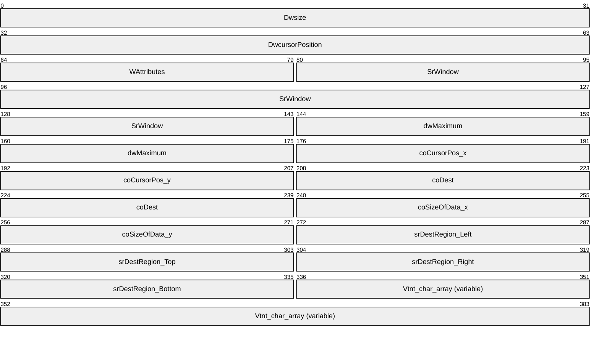
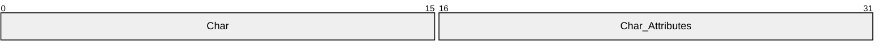
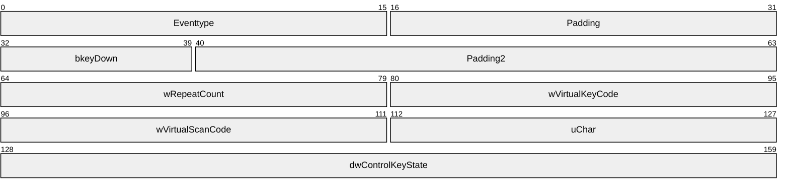

# [MS-TVTT]: Telnet: VTNT Terminal Type Format Data Structure

Table of Contents

1 Introduction

- [1 Introduction](#Section_1)
  - [1.1 Glossary](#Section_1.1)
  - [1.2 References](#Section_1.2)
    - [1.2.1 Normative References](#Section_1.2.1)
    - [1.2.2 Informative References](#Section_1.2.2)
  - [1.3 Overview](#Section_1.3)
  - [1.4 Relationship to Protocols and Other Structures](#Section_1.4)
  - [1.5 Applicability Statement](#Section_1.5)
  - [1.6 Versioning and Localization](#Section_1.6)
  - [1.7 Vendor-Extensible Fields](#Section_1.7)

2 Structures

- [2 Structures](#Section_2)
  - [2.1 VTNT_CHAR_INFO](#Section_2.1)
    - [2.1.1 VTNT_SINGLE_CHAR](#Section_2.1.1)
  - [2.2 INPUT_RECORD](#Section_2.2)
    - [2.2.1 Virtual Key Code Values](#Section_2.2.1)

3 Structure Examples

- [3 Structure Examples](#Section_3)
  - [3.1 INPUT_RECORD Structure Example](#Section_3.1)
  - [3.2 VTNT_CHAR_INFO Structure Example](#Section_3.2)

4 Security Considerations

- [4 Security Considerations](#Section_4)

5 Appendix A: Product Behavior

- [5 Appendix A: Product Behavior](#Section_5)

6 Change Tracking

- [6 Change Tracking](#Section_6)

For the legal notice and IP terms, see [LEGAL.md](../LEGAL.md).
Last updated: 4/23/2024.
See [Revision History](#revision-history) for full version history.

# 1 Introduction

This specification defines the structures for Telnet VTNT Terminal Type Format, and how the client and server negotiate the use of this format.

Remote terminal applications such as Telnet extend the terminal on one computer to another computer on the network. This enables users to work with terminal-based applications running on a remote computer as if the user's local computer display and input device were connected to the remote computer.

Remote terminal applications achieve this by exchanging screen display and input device data over the network. Since there are different types of display and input devices, many varieties of terminal application software use "terminal types" to ensure that both client and server are sending and interpreting the data in the same way.

Sections 1.7 and 2 of this specification are normative. All other sections and examples in this specification are informative.

## 1.1 Glossary

This document uses the following terms:

**character set**: A mapping between the characters of a written language and the values that are used to represent those characters to a computer.

**console**: An interface that provides I/O to character-mode applications.

**console screen buffer**: A two-dimensional array of character and color data for output in a [**console window**](#gt_console-window). Each cell in the array holds a character and additional information about how the character is to be displayed. Not all of the contents of the [**console screen buffer**](#gt_console-screen-buffer) are displayed in the terminal. The region of the [**console screen buffer**](#gt_console-screen-buffer) displayed in the terminal is represented by the [**console window**](#gt_console-window).

**console window**: Displays a portion of the active [**console screen buffer**](#gt_console-screen-buffer). Each screen buffer maintains its own current window rectangle that specifies the coordinates of the upper-left and lower-right character cells to be displayed in the [**console window**](#gt_console-window).

**double-byte character set**: A [**character set**](#gt_character-set) in which characters that cannot be represented in 1 byte are represented in 2 bytes. For more information, see [[MSDN-CS]](https://go.microsoft.com/fwlink/?LinkId=90692).

**Input Method Editor (IME)**: An application that is used to enter characters in written Asian languages by using a standard 101-key keyboard. An IME consists of both an engine that converts keystrokes into phonetic and ideographic characters and a dictionary of commonly used ideographic words.

**IS command**: A Telnet terminal-type option command that is used to send the list of supported terminal types. For more information, see [[RFC1091]](https://go.microsoft.com/fwlink/?LinkId=90913).

**scan code**: A code generated by the key-board software to identify the key pressed in a unique manner.

**TELNET connection**: A Transmission Control Protocol (TCP) connection used to transmit data with interspersed TELNET control information. For further information, refer to [[RFC854]](https://go.microsoft.com/fwlink/?LinkId=90499).

**virtual key code**: A device-independent code assigned to each keyboard key. [MS-TVTT](#Section_e18d3a323eb047888ba39043bc6d9708) specifies virtual key codes only of the keyboard keys relevant to remote terminal applications. Valid virtual key code values are specified in section 2.2.1:

**MAY, SHOULD, MUST, SHOULD NOT, MUST NOT:** These terms (in all caps) are used as defined in [[RFC2119]](https://go.microsoft.com/fwlink/?LinkId=90317). All statements of optional behavior use either MAY, SHOULD, or SHOULD NOT.

## 1.2 References

Links to a document in the Microsoft Open Specifications library point to the correct section in the most recently published version of the referenced document. However, because individual documents in the library are not updated at the same time, the section numbers in the documents may not match. You can confirm the correct section numbering by checking the [Errata](https://go.microsoft.com/fwlink/?linkid=850906).

### 1.2.1 Normative References

We conduct frequent surveys of the normative references to assure their continued availability. If you have any issue with finding a normative reference, please contact [dochelp@microsoft.com](mailto:dochelp@microsoft.com). We will assist you in finding the relevant information.

[RFC1091] Network Working Group, VanBokkelen, J., "Telnet Terminal-Type Option", RFC 1091, February 1989, [https://www.rfc-editor.org/info/rfc1091](https://go.microsoft.com/fwlink/?LinkId=90913)

[RFC2119] Bradner, S., "Key words for use in RFCs to Indicate Requirement Levels", BCP 14, RFC 2119, March 1997, [https://www.rfc-editor.org/info/rfc2119](https://go.microsoft.com/fwlink/?LinkId=90317)

### 1.2.2 Informative References

[MSDN-CONSOLES] Microsoft Corporation, "Consoles", [http://msdn.microsoft.com/en-us/library/ms682055.aspx](https://go.microsoft.com/fwlink/?LinkId=90690)

[MSDN-CSB] Microsoft Corporation, "Console Screen Buffers", [http://msdn.microsoft.com/en-us/library/ms682088.aspx](https://go.microsoft.com/fwlink/?LinkId=90693)

## 1.3 Overview

This specification defines the structures for Telnet VTNT Terminal Type Format, and how the client and server negotiate the use of this format.

An implementation using Telnet VTNT Terminal Type Format is able to extend the terminal over the network by doing the following:

- Sending the actual keyboard input from the local client to the remote server, using a structure specified by the Telnet VTNT Terminal Type Format.
- Sending the server's terminal display information (output) to the client, using a structure specified by the Telnet VTNT Terminal Type Format, so that it can be displayed on the client's terminal.
Unlike other terminal types, Telnet VTNT Terminal Type Format does not specify escape codes. Instead, Telnet VTNT Terminal Type Format specifies structures passed between client and server in each of the preceding scenarios.

To use the Telnet VTNT Terminal Type Format, both the Telnet client and the server have to support this format. [[RFC1091]](https://go.microsoft.com/fwlink/?LinkId=90913) specifies how a Telnet server and client can negotiate for supported terminal types. A Telnet server and client have to use the string "VTNT" in the [RFC1091] [**IS command**](#gt_is-command) to negotiate for Telnet VTNT Terminal Type Format.

## 1.4 Relationship to Protocols and Other Structures

The Telnet VTNT Terminal Type Format specifies structures that are independent of any other structure and protocol. VTNT structure formats are transported as data in a [**TELNET connection**](#gt_telnet-connection). If the negotiated term type is Telnet: VTNT Terminal Type Format in a Telnet session, both the server and client will have to interpret the data in a TELNET connection as Telnet: VTNT Terminal Type Format structures.

## 1.5 Applicability Statement

Telnet VTNT Terminal Type Format is used only to transport display and input information of terminal applications.

## 1.6 Versioning and Localization

Telnet VTNT Terminal Type Format does not carry any versioning information. Telnet VTNT Terminal Type Format does not carry any localization information. Rather, all the character fields are 2 bytes in size and can carry Unicode characters, thereby enabling localization.

## 1.7 Vendor-Extensible Fields

Telnet VTNT Terminal Type Format does not have any vendor-extensible fields.

# 2 Structures

Telnet VTNT Terminal Type Format specifies two structures:

- [VTNT_CHAR_INFO](#Section_2.1) is used by the server to send [**console**](#gt_console) display information back to the client.
- [INPUT_RECORD](#Section_2.2) is used by the client to send keyboard input to the server.
To specify how the data sent by server to client is to be organized and interpreted, Telnet VTNT Terminal Type Format assumes the availability of the following:

- A [**console screen buffer**](#gt_console-screen-buffer) abstract data type that is capable of holding multiple rows of character data in the server.
- A mechanism that populates the server's console screen buffer based on the actual output in the server's terminal.
- A console screen buffer abstract data type that is capable of holding multiple rows of character data in the client.
- A mechanism to synchronize the contents of the console screen buffer and the actual display in the client's terminal.
The sequence of operations involved in sending the console display information from server to client is as follows:

- The server reads its console screen buffer, packs the following in a VTNT_CHAR_INFO structure, and sends it to the client:
- The coordinates of the region in the console screen buffer that have to be rewritten.
- The characters to be displayed and their attributes.
- The client rewrites its console screen buffer based on the data in the VTNT_CHAR_INFO structure it received from the server.
- The client synchronizes the contents of the console screen buffer and the actual display in the terminal.
The preceding details are implementation-specific and are provided only as guidance. This protocol does not prescribe or advocate any specific implementation technique. Telnet VTNT Terminal Type Format does not specify how the abstract data types are to be implemented. The console screen buffers are local to the implementation and are not transported over the network. Implementations can implement their own buffers or use any system-provided buffers that are available. The mechanism to synchronize the contents of the console screen buffer and the actual display in the console in the client is, again, an implementation choice. <1>

Unless otherwise specified, multibyte fields (that is, 16-bit, 32-bit, and 64-bit fields) in a Telnet VTNT Terminal Type Format structure MUST be transmitted in little-endian byte order (least-significant byte first).

## 2.1 VTNT_CHAR_INFO

VTNT_CHAR_INFO is a variable-length structure that the server uses to send characters that are to be repainted in the client [**console window**](#gt_console-window).

VTNT_CHAR_INFO encapsulates console window coordinate information and the specific characters and their attributes to be displayed. The coordinates are expressed in terms of coordinates in a grid based on character cells. The upper-left corner of the grid has coordinates (0, 0).

**Dwsize (4 bytes): Dwsize** is a 4-byte unsigned integer field that is not used. The server SHOULD fill this field with zeros. The client MUST ignore this field.

**DwcursorPosition (4 bytes): DwcursorPosition** is a 4-byte unsigned integer field that is not used. The server SHOULD fill this field with zeros. The client MUST ignore this field.

**WAttributes (2 bytes):** A 2-byte unsigned integer field that specifies whether the console window coordinates specified by the **srDestRegion_left**, **srDestRegion_top**, **srDestRegion_right**, and **srDestRegion_bottom** fields are relative or absolute. This field MUST contain one of the following values:

| Value | Meaning |
| --- | --- |
| ABSOLUTE_COORDS 0x0000 | Specifies that **srDestRegion_left**, **srDestRegion_top**, **srDestRegion_right**, and **srDestRegion_bottom** fields identify the region in the server's console window. The server sends the characters and character attributes that are displayed in this region in the **Char** and **Char_Attributes** fields of this structure. A client implementation, while calculating the region to be repainted in the client's [**console screen buffer**](#gt_console-screen-buffer), is to take in to account the offset of the client's console window within the client's console screen buffer. |
| RELATIVE_COORDS 0x0001 | An implementation MUST use RELATIVE_COORDS to specify that the data SHOULD be appended to the current contents of the client's console window. In case the wAttributes is set to RELATIVE_COORDS, the client MUST not use the **srDestRegion_left**, **srDestRegion_top**, **srDestRegion_right** and **srDestRegion_bottom** values, even if the server has filled them with any value. Instead, a client implementation is to calculate the console screen buffer coordinates based on the **coSizeOfData_x** and **coSizeOfData_y** fields. A client implementation, when writing the received data to the console screen buffer, is to take care of buffer scrolling if the buffer overflows. |

**SrWindow (8 bytes):** An 8-byte field that is not used. The server SHOULD fill this field with zeros. The client MUST ignore this field.

**dwMaximum (4 bytes):** A 4-byte unsigned integer field that is not used. The server SHOULD fill this field with zeros. The client MUST ignore this field.

**coCursorPos_x (2 bytes):** A 2-byte unsigned integer field that specifies the x-coordinate of the cursor's current position in the server's console window. The x-coordinate MUST be a value between 0 and the right-most character position, inclusive, expressed as an offset from the left-most column position that a character can occupy.

**coCursorPos_y (2 bytes):** A 2-byte unsigned integer field that specifies the y-coordinate of the cursor's current position in the console window. The y-coordinate MUST be a value between 0 and the bottom-most character position, inclusive, expressed as an offset from the top-most row position that a character can occupy.

**coDest (4 bytes):** A 4-byte-long field that is not used. The server SHOULD fill this field with zeros. The client MUST ignore this field.

**coSizeOfData_x (2 bytes):** A 2-byte unsigned integer field that specifies the number of character cell columns that the client MUST paint. This MUST be a value between 0 and the right-most character position, inclusive.

**coSizeOfData_y (2 bytes):** A 2-byte unsigned integer field that specifies the number of character cell rows that the client MUST paint. This MUST be a value between 0 and the bottom-most character position, inclusive.

**srDestRegion_Left (2 bytes):** A 2-byte unsigned integer field that specifies the x-coordinate of the upper-left corner of a rectangle in the server's console window. This MUST be a value between 0 and the right-most character position, inclusive, expressed as an offset from the left-most column that a character can occupy in the client's console window.

**srDestRegion_Top (2 bytes):** A 2-byte unsigned integer field that specifies the y-coordinate of the upper-left corner of a rectangle in the server's console window. This MUST be a value between 0 and the bottom-most character position, inclusive, expressed as an offset from the top-most row that a character can occupy in the client's console window.

**srDestRegion_Right (2 bytes):** A 2-byte unsigned integer field that specifies the x-coordinate of the lower-right corner of a rectangle in the server's console window. This MUST be a value between 0 and the right-most character position, inclusive, expressed as an offset from the left-most column that a character can occupy.

**srDestRegion_Bottom (2 bytes):** A 2-byte unsigned integer field that specifies the y-coordinate of the lower-right corner of a rectangle in the server's console window. This MUST be a value between 0 and the bottom-most character position, inclusive, expressed as an offset from the top-most row that a character can occupy.

**Vtnt_char_array (variable): Vtnt_char_array** is a set of one or more [VTNT_SINGLE_CHAR](#Section_2.1.1) structures, that contains the input characters sent to the client.

The number of VTNT_SINGLE_CHAR structures in this array MUST be equal to the product of the **coSizeOfData_x** and **coSizeOfData_y** fields.

Characters MUST be arranged in the **Vtnt_char_array** array in row-major order. That is, the first VTNT_SINGLE_CHAR structure fills the first character position of the first row of the region identified for repainting, the second structures fill the second character position in the first row, and so on. Once all the character positions in the first row are filled, the next VTNT_SINGLE_CHAR structure contains the character at the first character position of the second row. This follows until all the character positions identified by the coordinates are filled. There MUST be no padding bytes before or after a VTNT_SINGLE_CHAR structure in the VTNT_CHAR_INFO structure.

### 2.1.1 VTNT_SINGLE_CHAR

The VTNT_SINGLE_CHAR structure contains a pair of fields that represents a character sent to the [**console window**](#gt_console-window), and that character's attributes.

**Char (2 bytes):** A 2-byte character field that specifies the character to be held in one character cell location of the [**console screen buffer**](#gt_console-screen-buffer). **Char** is the first of the <Char,Char_attributes> pair that can be repeated any number of times within the [VTNT_CHAR_INFO](#Section_2.1) structure. Telnet VTNT Terminal Type Format does not specify the [**character set**](#gt_character-set) to be used. Rather, client and server implementations are to be configured to use a compatible character set, such as Unicode UTF-16.<2> If the character set used is a single-byte character set such as ASCII, then the first byte of **Char** MUST contain the character value, and the second byte MUST be zero.

**Char_Attributes (2 bytes):** A 2-byte unsigned integer field that specifies an additional attribute of the character specified in the **Char** field immediately preceding this field. **Char_attributes** is the second of the <Char,Char_attributes> pair that can be repeated any number of times.

This field MUST be zero, or the result of a bitwise OR of one or more of the following values.

The values that start with COMMON MAY be used only if the character set used is a [**double-byte character set**](#gt_double-byte-character-set); those values MUST NOT be used for non-double-byte character sets.

| Value | Meaning |
| --- | --- |
| FOREGROUND_BLUE 0x0001 | Text color contains blue |
| FOREGROUND_GREEN 0x0002 | Text color contains green |
| FOREGROUND_RED 0x0004 | Text color contains red |
| FOREGROUND_INTENSITY 0x0008 | Text color is intensified |
| BACKGROUND_BLUE 0x0010 | Background color contains blue |
| BACKGROUND_GREEN 0x0020 | Background color contains green |
| BACKGROUND_RED 0x0040 | Background color contains red |
| BACKGROUND_INTENSITY 0x0080 | Background color is intensified |
| COMMON_LVB_LEADING_BYTE 0x0100 | Leading byte |
| COMMON_LVB_TRAILING_BYTE 0x0200 | Trailing byte |
| COMMON_LVB_GRID_HORIZONTAL 0x0400 | Top horizontal |
| COMMON_LVB_GRID_LVERTICAL 0x0800 | Left vertical |
| COMMON_LVB_GRID_RVERTICAL 0x1000 | Right vertical |
| COMMON_LVB_REVERSE_VIDEO 0x4000 | Reverse foreground and background attribute |
| COMMON_LVB_UNDERSCORE 0x8000 | Underscore |

## 2.2 INPUT_RECORD

The INPUT_RECORD structure is used by a client to send keyboard input information to the server.

**Eventtype (2 bytes):** A 2-byte unsigned integer field, used to indicate the type of the device input data that is carried in the INPUT_RECORD structure. The value of this field MUST be 0x0001, which indicates that the INPUT_RECORD structure carries data generated by a keyboard input device.

**Padding (2 bytes):** This field can contain any value and MUST be ignored by the receiver.

**bkeyDown (1 byte):** An 8-bit unsigned integer field that indicates whether the particular keyboard key is pressed or released. This field MUST contain one of the following values:

| Value | Meaning |
| --- | --- |
| 0x01 | Key is pressed. |
| 0x00 | Key is not pressed. |

**Padding2 (3 bytes):** This field can contain any value and MUST be ignored by the receiver.

**wRepeatCount (2 bytes):** A 2-byte unsigned integer field that indicates the number of times the key is held down.

**wVirtualKeyCode (2 bytes):** A 2-byte unsigned integer field that carries the [**virtual key code**](#gt_virtual-key-code) of the key pressed. Telnet VTNT Terminal Type Format does not specify how to generate or process virtual key codes. The virtual key code is generated by the software that interfaces with the keyboard.

The implementer of a TELNET server that uses the Telnet VTNT Terminal Type Format decides how to use the value carried by this field. This field MAY be ignored if the server does not require the virtual key code to correctly identify the keyboard key sent by the client.

A client MUST set this field to the virtual key code value that is compatible with the server. If the server does not process this field, the client MUST set it to zero. Telnet VTNT Terminal Type Format does not offer a way for the client to determine if a server expects the client to set this field to zero or to a virtual key code. Rather, the server and client implementations SHOULD be preconfigured to ensure interoperability. Valid virtual key code values are specified in section [2.2.1](#Section_2.2.1).<3>

**wVirtualScanCode (2 bytes):** A 2-byte unsigned integer field that carries the [**Scan code**](#gt_scan-code) of the key pressed. Telnet VTNT Terminal Type Format does not specify how to generate or process Scan codes. Scan code is generated by the software that interfaces with the keyboard.

It is a server implementation's choice to decide how to use the value carried by this field. A server implementation can also ignore this field if the [**console**](#gt_console) input interface does not require Scan code to correctly identify the Keyboard key sent by the client.

A client MUST set this field to the Scan code value that is compatible with the server. If the Server does not process this field, the client MUST set it to zero. Telnet VTNT Terminal Type Format does not offer a way for the client to determine if a server expects the Client to set this field to zero or Scan Code. Rather, the server and client implementations SHOULD be preconfigured to ensure interoperability.<4>

**uChar (2 bytes):** A 2-byte unsigned integer field that carries the character to which the key pressed corresponds. If there is no character associated with the key typed, then this field MUST be filled with zeros. Telnet VTNT Terminal Type Format does not specify what [**character set**](#gt_character-set) is to be used. Rather, the client and server implementations SHOULD be configured to use a compatible character set.<5>

**dwControlKeyState (4 bytes):** A 4-byte unsigned integer field that indicates the state of the control keys in the keyboard. It can be one or more of the following values. This field MUST contain zero, or the result of a bitwise OR of one or more of the following values:

| Value | Meaning |
| --- | --- |
| 0x00000080 | The CAPS LOCK light is on. |
| 0x00000100 | The key is enhanced. |
| 0x00000002 | The left ALT key is pressed. |
| 0x00000008 | The left CTRL key is pressed. |
| 0x00000020 | The NUM LOCK light is on. |
| 0x00000001 | The right ALT key is pressed. |
| 0x00000004 | The right CTRL key is pressed. |
| 0x00000040 | The SCROLL LOCK light is on. |
| 0x00000010 | The SHIFT key is pressed. |
| 0x00010000 | [**Input method editor (IME)**](#gt_input-method-editor-ime) full shape mode. Valid only when IME is used to input. |
| 0x00020000 | IME KATAKANA mode. Valid only when IME is used to input. |
| 0x00040000 | IME HIRAGANA mode. Valid only when IME is used to input. |
| 0x00400000 | IME ROMAN mode. Valid only when IME is used to input. |
| 0x00800000 | IME input on. Valid only when IME is used to input. |

### 2.2.1 Virtual Key Code Values

| Name/Value | Description |
| --- | --- |
| VK_LBUTTON 0x0001 | Left mouse button |
| VK_RBUTTON 0x0002 | Right mouse button |
| VK_CANCEL 0x0003 | CTRL+BREAK processing |
| VK_BACK 0x0008 | BACKSPACE key |
| VK_TAB 0x0009 | TAB key |
| VK_CLEAR 0x000C | CLEAR key |
| VK_RETURN 0x0D | ENTER key |
| VK_SHIFT 0x10 | SHIFT key |
| VK_CONTROL 0x11 | CTRL key |
| VK_MENU 0x12 | ALT key |
| VK_PAUSE 0x0013 | PAUSE key |
| VK_CAPITAL 0x0014 | CAPS LOCK key |
| VK_ESCAPE 0x001B | ESC key |
| VK_SPACE 0x0020 | SPACEBAR |
| VK_PRIOR 0x0021 | PAGE UP key |
| VK_NEXT 0x0022 | PAGE DOWN key |
| VK_END 0x0023 | END key |
| VK_HOME 0x0024 | HOME key |
| VK_LEFT 0x0025 | LEFT ARROW key |
| VK_UP 0x0026 | UP ARROW key |
| VK_RIGHT 0x0027 | RIGHT ARROW key |
| VK_DOWN 0x0028 | DOWN ARROW key |
| VK_SELECT 0x0029 | SELECT key |
| VK_PRINT 0x002A | PRINT key |
| VK_EXECUTE 0x002B | EXECUTE key |
| VK_SNAPSHOT 0x002C | PRINT SCREEN key |
| VK_INSERT 0x002D | INS key |
| VK_DELETE 0x002E | DEL key |
| VK_HELP 0x002F | HELP key |
| VK_0 0x0030 | 0 key |
| VK_1 0x0031 | 1 key |
| VK_2 0x0032 | 2 key |
| VK_3 0x0033 | 3 key |
| VK_4 0x0034 | 4 key |
| VK_5 0x0035 | 5 key |
| VK_6 0x0036 | 6 key |
| VK_7 0x0037 | 7 key |
| VK_8 0x0038 | 8 key |
| VK_9 0x0039 | 9 key |
| VK_A 0x0041 | A key |
| VK_B 0x0042 | B key |
| VK_C 0x0043 | C key |
| VK_D 0x0044 | D key |
| VK_E 0x0045 | E key |
| VK_F 0x0046 | F key |
| VK_G 0x0047 | G key |
| VK_H 0x0048 | H key |
| VK_I 0x0049 | I key |
| VK_J 0x004A | J key |
| VK_K 0x004B | K key |
| VK_L 0x004C | L key |
| VK_M 0x004D | M key |
| VK_N 0x004E | N key |
| VK_O 0x004F | O key |
| VK_P 0x0050 | P key |
| VK_Q 0x0051 | Q key |
| VK_R 0x0052 | R key |
| VK_S 0x0053 | S key |
| VK_T 0x0054 | T key |
| VK_U 0x0055 | U key |
| VK_V 0x0056 | V key |
| VK_W 0x0057 | W key |
| VK_X 0x0058 | X key |
| VK_Y 0x0059 | Y key |
| VK_Z 0x005A | Z key |
| VK_LWIN 0x005B | Left Windows key (Microsoft Natural Keyboard) |
| VK_RWIN 0x005C | Right Windows key (Microsoft Natural Keyboard) |
| VK_APPS 0x005D | Applications key (Microsoft Natural Keyboard) |
| VK_SLEEP 0x005F | Computer Sleep key |
| VK_NUMPAD0 0x0060 | Numeric keypad 0 key |
| VK_NUMPAD1 0x0061 | Numeric keypad 1 key |
| VK_NUMPAD2 0x0062 | Numeric keypad 2 key |
| VK_NUMPAD3 0x0063 | Numeric keypad 3 key |
| VK_NUMPAD4 0x0064 | Numeric keypad 4 key |
| VK_NUMPAD5 0x0065 | Numeric keypad 5 key |
| VK_NUMPAD6 0x0066 | Numeric keypad 6 key |
| VK_NUMPAD7 0x0067 | Numeric keypad 7 key |
| VK_NUMPAD8 0x0068 | Numeric keypad 8 key |
| VK_NUMPAD9 0x0069 | Numeric keypad 9 key |
| VK_MULTIPLY 0x006A | Multiply key |
| VK_ADD 0x006B | Add key |
| VK_SEPARATOR 0x006C | Separator key |
| VK_SUBTRACT 0x006D | Subtract key |
| VK_DECIMAL 0x006E | Decimal key |
| VK_DIVIDE 0x006F | Divide key |
| VK_F1 0x0070 | F1 key |
| VK_F2 0x0071 | F2 key |
| VK_F3 0x0072 | F3 key |
| VK_F4 0x0073 | F4 key |
| VK_F5 0x0074 | F5 key |
| VK_F6 0x0075 | F6 key |
| VK_F7 0x0076 | F7 key |
| VK_F8 0x0077 | F8 key |
| VK_F9 0x0078 | F9 key |
| VK_F10 0x0079 | F10 key |
| VK_F11 0x007A | F11 key |
| VK_F12 0x007B | F12 key |
| VK_F13 0x007C | F13 key |
| VK_F14 0x007D | F14 key |
| VK_F15 0x007E | F15 key |
| VK_F16 0x007F | F16 key |
| VK_F17 0x0080 | F17 key |
| VK_F18 0x0081 | F18 key |
| VK_F19 0x0082 | F19 key |
| VK_F20 0x0083 | F20 key |
| VK_F21 0x0084 | F21 key |
| VK_F22 0x0085 | F22 key |
| VK_F23 0x0086 | F23 key |
| VK_F24 0x0087H | F24 key |
| VK_NUMLOCK 0x0090 | NUM LOCK key |
| VK_SCROLL 0x0091 | SCROLL LOCK key |
| VK_LSHIFT 0x00A0 | Left SHIFT key |
| VK_RSHIFT 0x00A1 | Right SHIFT key |
| VK_LCONTROL 0x00A2 | Left CTRL key |
| VK_RCONTROL 0x00A3 | Right CTRL key |
| VK_LMENU 0x00A4 | Left MENU key |
| VK_RMENU 0x00A5 | Right MENU key |

# 3 Structure Examples

This section contains examples of the structures defined by the Telnet VTNT Terminal Type Format.

## 3.1 INPUT_RECORD Structure Example

The following is an example of a populated [INPUT_RECORD](#Section_2.2) structure.

EventType = 0x0001

bKeyDown = 0x01

wRepeatCount = 0x0001

wVirtualKeyCode = 0x0044

wVirtualScanCode = 0x0020

uChar = 0x0064

dwControlKeyState = 0x0020

The INPUT_RECORD structure tells the server that 0x0064 is the input character, and NUM LOCK was on when the character was entered. The value 0x01 in **bKeyDown** indicates that the key was pressed; 0x0001 in **wRepeatCount** indicates that the key was pressed once.

## 3.2 VTNT_CHAR_INFO Structure Example

The following is an example of a populated [VTNT_CHAR_INFO](#Section_2.1) structure. The following structure instructs the client to redraw a row of 80-character cells, which is located on the second row of the display. The upper-left corner is (1,0) and lower-right corner is (1,79).

dwSize = 0x00000000

dwCursorPosition = 0x00000000

wAttributes = 0x0000

srWindow = 0x0000000000000000

dwMaximum = 0x00000000

coCursorPos_x = 0x0012

coCursorPos_y = 0x0001

coDest = 0x00000000

coSizeOfData_x = 0x0050

coSizeOfData_y = 0x0001

srDestRegion_Left = 0x0000

srDestRegion_Top = 0x0001

srDestRegion_Right = 0x004F

srDestRegion_Bottom = 0x0001

Vtnt_char_array

char = 0x0046

char_attributes = 0x0007

This example shows only one **Vtnt_char_array** for the sake of conciseness. It can be inferred based on **coSizeOfData_x** and **coSizeOfData_y** fields that a total of 80 **Vtnt_char_array** structures are sent by the server.

# 4 Security Considerations

There are no security considerations associated with Telnet VTNT Terminal Type Format.

# 5 Appendix A: Product Behavior

The information in this specification is applicable to the following Microsoft products or supplemental software. References to product versions include updates to those products.

- Windows 2000 operating system
- Windows XP operating system
- Windows Server 2003 operating system
- Windows Vista operating system
- Windows Server 2008 operating system
- Windows 7 operating system
- Windows Server 2008 R2 operating system
- Windows 8 operating system
- Windows Server 2012 operating system
- Windows 8.1 operating system
- Windows Server 2012 R2 operating system
- Windows 10 operating system
- Windows Server 2016 operating system
- Windows Server operating system
- Windows Server 2019 operating system
- Windows Server 2022 operating system
- Windows 11 operating system
- Windows Server 2025 operating system
Exceptions, if any, are noted in this section. If an update version, service pack or Knowledge Base (KB) number appears with a product name, the behavior changed in that update. The new behavior also applies to subsequent updates unless otherwise specified. If a product edition appears with the product version, behavior is different in that product edition.

Unless otherwise specified, any statement of optional behavior in this specification that is prescribed using the terms "SHOULD" or "SHOULD NOT" implies product behavior in accordance with the SHOULD or SHOULD NOT prescription. Unless otherwise specified, the term "MAY" implies that the product does not follow the prescription.

<1> Section 2: When implementing Telnet VTNT Terminal Type Format on Windows, implementers can take advantage of Windows Console APIs such as ReadConsoleOutput () API and WriteConsoleOutput() to read and write to the [**console screen buffer**](#gt_console-screen-buffer). For more information, see [[MSDN-CONSOLES]](https://go.microsoft.com/fwlink/?LinkId=90690). Windows also has an implementation of the console screen buffer (see [[MSDN-CSB]](https://go.microsoft.com/fwlink/?LinkId=90693)).

<2> Section 2.1.1: Windows Telnet Server fills the **Char** field with Unicode UTF-16 characters.

<3> Section 2.2: Windows Telnet server expects a client to fill this field with [**virtual key codes**](#gt_virtual-key-code) that are compatible with the keyboard installed on the server. Virtual key codes for each of the keyboard keys are specified in section [2.2.1](#Section_2.2.1). Implementations of Telnet VTNT Terminal Type Format on Windows can use the Windows ReadConsoleInput() API, which returns a structure compatible with the [INPUT_RECORD](#Section_2.2) structure, with all fields including **wVirtualKeyCode** filled in.

<4> Section 2.2: Windows Telnet server expects a client to fill this field with the [**scan code**](#gt_scan-code). An implementation on Windows can use the ReadConsoleInput() API, which returns a structure compatible with the INPUT_RECORD structure, with all fields including **wVirtualScanCode** filled with the scan code of the key pressed.

<5> Section 2.2: Windows Telnet client uses Unicode characters to fill this field.

# 6 Change Tracking

This section identifies changes that were made to this document since the last release. Changes are classified as Major, Minor, or None.

The revision class **Major** means that the technical content in the document was significantly revised. Major changes affect protocol interoperability or implementation. Examples of major changes are:

- A document revision that incorporates changes to interoperability requirements.
- A document revision that captures changes to protocol functionality.
The revision class **Minor** means that the meaning of the technical content was clarified. Minor changes do not affect protocol interoperability or implementation. Examples of minor changes are updates to clarify ambiguity at the sentence, paragraph, or table level.

The revision class **None** means that no new technical changes were introduced. Minor editorial and formatting changes may have been made, but the relevant technical content is identical to the last released version.

The changes made to this document are listed in the following table. For more information, please contact [dochelp@microsoft.com](mailto:dochelp@microsoft.com).

| Section | Description | Revision class |
| --- | --- | --- |
| [5](#Section_5) Appendix A: Product Behavior | Added Windows Server 2025 to the list of applicable products. | Major |

## Revision History

| Date | Version | Revision Class | Comments |
| --- | --- | --- | --- |
| 5/11/2007 | 0.1 | New | Version 0.1 release |
| 8/10/2007 | 0.2 | Minor | Updated XML tagging. |
| 9/28/2007 | 0.2.1 | Editorial | Changed language and formatting in the technical content. |
| 10/23/2007 | 0.3 | Minor | Made minor updates to references. |
| 11/30/2007 | 0.3.1 | Editorial | Changed language and formatting in the technical content. |
| 1/25/2008 | 0.3.2 | Editorial | Changed language and formatting in the technical content. |
| 3/14/2008 | 1.0 | Major | Updated and revised the technical content. |
| 5/16/2008 | 1.0.1 | Editorial | Changed language and formatting in the technical content. |
| 6/20/2008 | 2.0 | Major | Updated and revised the technical content. |
| 7/25/2008 | 2.1 | Minor | Clarified the meaning of the technical content. |
| 8/29/2008 | 2.1.1 | Editorial | Changed language and formatting in the technical content. |
| 10/24/2008 | 2.1.2 | Editorial | Changed language and formatting in the technical content. |
| 12/5/2008 | 3.0 | Major | Updated and revised the technical content. |
| 1/16/2009 | 3.0.1 | Editorial | Changed language and formatting in the technical content. |
| 2/27/2009 | 3.0.2 | Editorial | Changed language and formatting in the technical content. |
| 4/10/2009 | 3.0.3 | Editorial | Changed language and formatting in the technical content. |
| 5/22/2009 | 3.1 | Minor | Clarified the meaning of the technical content. |
| 7/2/2009 | 3.1.1 | Editorial | Changed language and formatting in the technical content. |
| 8/14/2009 | 3.1.2 | Editorial | Changed language and formatting in the technical content. |
| 9/25/2009 | 3.1.3 | Editorial | Changed language and formatting in the technical content. |
| 11/6/2009 | 3.1.4 | Editorial | Changed language and formatting in the technical content. |
| 12/18/2009 | 3.1.5 | Editorial | Changed language and formatting in the technical content. |
| 1/29/2010 | 3.1.6 | Editorial | Changed language and formatting in the technical content. |
| 3/12/2010 | 3.1.7 | Editorial | Changed language and formatting in the technical content. |
| 4/23/2010 | 3.1.8 | Editorial | Changed language and formatting in the technical content. |
| 6/4/2010 | 3.1.9 | Editorial | Changed language and formatting in the technical content. |
| 7/16/2010 | 3.1.9 | None | No changes to the meaning, language, or formatting of the technical content. |
| 8/27/2010 | 3.1.9 | None | No changes to the meaning, language, or formatting of the technical content. |
| 10/8/2010 | 3.1.9 | None | No changes to the meaning, language, or formatting of the technical content. |
| 11/19/2010 | 3.1.9 | None | No changes to the meaning, language, or formatting of the technical content. |
| 1/7/2011 | 3.1.9 | None | No changes to the meaning, language, or formatting of the technical content. |
| 2/11/2011 | 3.1.9 | None | No changes to the meaning, language, or formatting of the technical content. |
| 3/25/2011 | 3.1.9 | None | No changes to the meaning, language, or formatting of the technical content. |
| 5/6/2011 | 3.1.9 | None | No changes to the meaning, language, or formatting of the technical content. |
| 6/17/2011 | 3.2 | Minor | Clarified the meaning of the technical content. |
| 9/23/2011 | 3.2 | None | No changes to the meaning, language, or formatting of the technical content. |
| 12/16/2011 | 4.0 | Major | Updated and revised the technical content. |
| 3/30/2012 | 4.0 | None | No changes to the meaning, language, or formatting of the technical content. |
| 7/12/2012 | 4.0 | None | No changes to the meaning, language, or formatting of the technical content. |
| 10/25/2012 | 4.0 | None | No changes to the meaning, language, or formatting of the technical content. |
| 1/31/2013 | 4.0 | None | No changes to the meaning, language, or formatting of the technical content. |
| 8/8/2013 | 4.0 | None | No changes to the meaning, language, or formatting of the technical content. |
| 11/14/2013 | 4.0 | None | No changes to the meaning, language, or formatting of the technical content. |
| 2/13/2014 | 4.0 | None | No changes to the meaning, language, or formatting of the technical content. |
| 5/15/2014 | 4.0 | None | No changes to the meaning, language, or formatting of the technical content. |
| 6/30/2015 | 5.0 | Major | Significantly changed the technical content. |
| 10/16/2015 | 5.0 | None | No changes to the meaning, language, or formatting of the technical content. |
| 7/14/2016 | 5.0 | None | No changes to the meaning, language, or formatting of the technical content. |
| 6/1/2017 | 5.0 | None | No changes to the meaning, language, or formatting of the technical content. |
| 9/15/2017 | 6.0 | Major | Significantly changed the technical content. |
| 9/12/2018 | 7.0 | Major | Significantly changed the technical content. |
| 4/7/2021 | 8.0 | Major | Significantly changed the technical content. |
| 6/25/2021 | 9.0 | Major | Significantly changed the technical content. |
| 4/23/2024 | 10.0 | Major | Significantly changed the technical content. |
