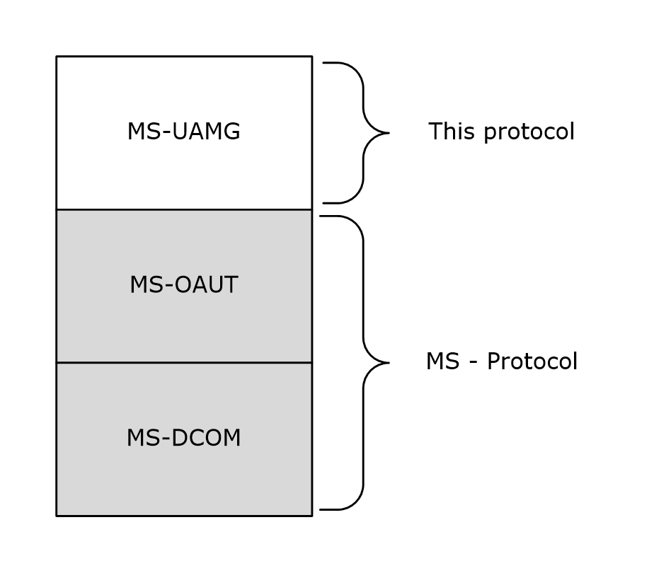
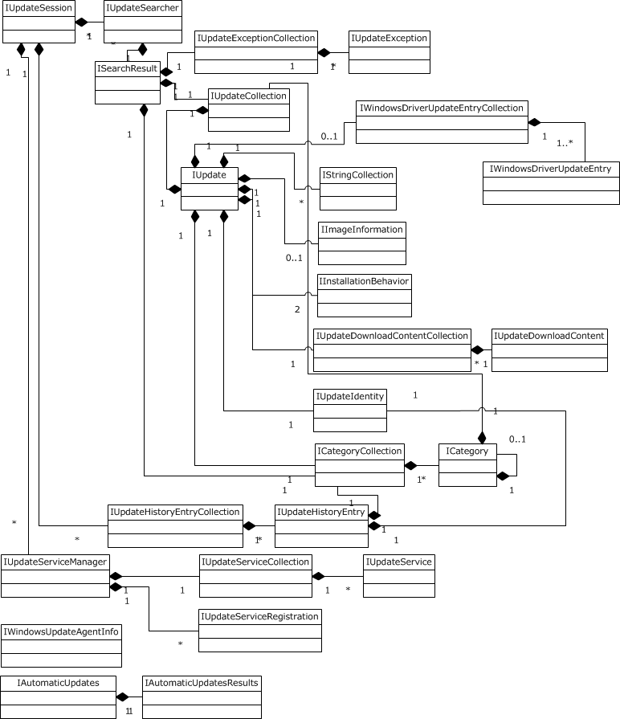
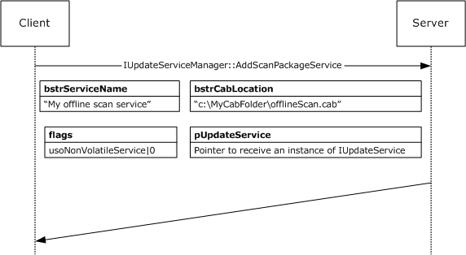

# [MS-UAMG]: Update Agent Management Protocol

Table of Contents

1 Introduction

- [1 Introduction](#Section_1)
  - [1.1 Glossary](#Section_1.1)
  - [1.2 References](#Section_1.2)
    - [1.2.1 Normative References](#Section_1.2.1)
    - [1.2.2 Informative References](#Section_1.2.2)
  - [1.3 Overview](#Section_1.3)
  - [1.4 Relationship to Other Protocols](#Section_1.4)
  - [1.5 Prerequisites/Preconditions](#Section_1.5)
  - [1.6 Applicability Statement](#Section_1.6)
  - [1.7 Versioning and Capability Negotiation](#Section_1.7)
  - [1.8 Vendor-Extensible Fields](#Section_1.8)
  - [1.9 Standards Assignments](#Section_1.9)

2 Messages

- [2 Messages](#Section_2)
  - [2.1 Transport](#Section_2.1)
  - [2.2 Common Data Types](#Section_2.2)
    - [2.2.1 InstallationImpact](#Section_2.2.1)
    - [2.2.2 InstallationRebootBehavior](#Section_2.2.2)
    - [2.2.3 UpdateType](#Section_2.2.3)
    - [2.2.4 DeploymentAction](#Section_2.2.4)
    - [2.2.5 DownloadPriority](#Section_2.2.5)
    - [2.2.6 AutoSelectionMode](#Section_2.2.6)
    - [2.2.7 AutoDownloadMode](#Section_2.2.7)
    - [2.2.8 UpdateExceptionContext](#Section_2.2.8)
    - [2.2.9 OperationResultCode](#Section_2.2.9)
    - [2.2.10 UpdateOperation](#Section_2.2.10)
    - [2.2.11 ServerSelection](#Section_2.2.11)
    - [2.2.12 SearchScope](#Section_2.2.12)
    - [2.2.13 UpdateServiceRegistrationState](#Section_2.2.13)
    - [2.2.14 UpdateServiceOption](#Section_2.2.14)
    - [2.2.15 AddServiceFlag](#Section_2.2.15)

3 Protocol Details

- [3 Protocol Details](#Section_3)
  - [3.1 Relationships Between Servers](#Section_3.1)
  - [3.2 IAutomaticUpdatesResults Server Details](#Section_3.2)
    - [3.2.1 Abstract Data Model](#Section_3.2.1)
    - [3.2.2 Timers](#Section_3.2.2)
    - [3.2.3 Initialization](#Section_3.2.3)
    - [3.2.4 Message Processing Events and Sequencing Rules](#Section_3.2.4)
      - [3.2.4.1 IAutomaticUpdatesResults::LastSearchSuccessDate (Opnum 8)](#Section_3.2.4.1)
      - [3.2.4.2 IAutomaticUpdatesResults::LastInstallationSuccessDate (Opnum 9)](#Section_3.2.4.2)
    - [3.2.5 Timer Events](#Section_3.2.5)
    - [3.2.6 Other Local Events](#Section_3.2.6)
  - [3.3 IAutomaticUpdatesResults Client Details](#Section_3.3)
    - [3.3.1 Abstract Data Model](#Section_3.3.1)
    - [3.3.2 Timers](#Section_3.3.2)
    - [3.3.3 Initialization](#Section_3.3.3)
    - [3.3.4 Message Processing Events and Sequencing Rules](#Section_3.3.4)
    - [3.3.5 Timer Events](#Section_3.3.5)
    - [3.3.6 Other Local Events](#Section_3.3.6)
  - [3.4 IAutomaticUpdates and IAutomaticUpdates2 Server Details](#Section_3.4)
    - [3.4.1 Abstract Data Model](#Section_3.4.1)
    - [3.4.2 Timers](#Section_3.4.2)
    - [3.4.3 Initialization](#Section_3.4.3)
    - [3.4.4 Message Processing Events and Sequencing Rules for IAutomaticUpdates](#Section_3.4.4)
      - [3.4.4.1 IAutomaticUpdates::DetectNow (Opnum 8)](#Section_3.4.4.1)
    - [3.4.5 Message Processing Events and Sequencing Rules for IAutomaticUpdates2](#Section_3.4.5)
      - [3.4.5.1 IAutomaticUpdates2::Results (Opnum 15)](#Section_3.4.5.1)
    - [3.4.6 Timer Events](#Section_3.4.6)
    - [3.4.7 Other Local Events](#Section_3.4.7)
  - [3.5 IAutomaticUpdates and IAutomaticUpdates2 Client Details](#Section_3.5)
    - [3.5.1 Abstract Data Model](#Section_3.5.1)
    - [3.5.2 Timers](#Section_3.5.2)
    - [3.5.3 Initialization](#Section_3.5.3)
    - [3.5.4 Message Processing Events and Sequencing Rules](#Section_3.5.4)
    - [3.5.5 Timer Events](#Section_3.5.5)
    - [3.5.6 Other Local Events](#Section_3.5.6)
  - [3.6 ICategory Server Details](#Section_3.6)
    - [3.6.1 Abstract Data Model](#Section_3.6.1)
    - [3.6.2 Timers](#Section_3.6.2)
    - [3.6.3 Initialization](#Section_3.6.3)
    - [3.6.4 Message Processing Events and Sequencing Rules](#Section_3.6.4)
      - [3.6.4.1 ICategory::Name (Opnum 8)](#Section_3.6.4.1)
      - [3.6.4.2 ICategory:: CategoryID (Opnum 9)](#Section_3.6.4.2)
      - [3.6.4.3 ICategory::Children (Opnum 10)](#Section_3.6.4.3)
      - [3.6.4.4 ICategory::Description (Opnum 11)](#Section_3.6.4.4)
      - [3.6.4.5 ICategory::Image (Opnum 12)](#Section_3.6.4.5)
      - [3.6.4.6 ICategory::Order (Opnum 13)](#Section_3.6.4.6)
      - [3.6.4.7 ICategory::Parent (Opnum 14)](#Section_3.6.4.7)
      - [3.6.4.8 ICategory::Type (Opnum 15)](#Section_3.6.4.8)
      - [3.6.4.9 ICategory::Updates (Opnum 16)](#Section_3.6.4.9)
    - [3.6.5 Timer Events](#Section_3.6.5)
    - [3.6.6 Other Local Events](#Section_3.6.6)
  - [3.7 ICategory Client Details](#Section_3.7)
    - [3.7.1 Abstract Data Model](#Section_3.7.1)
    - [3.7.2 Timers](#Section_3.7.2)
    - [3.7.3 Initialization](#Section_3.7.3)
    - [3.7.4 Message Processing Events and Sequencing Rules](#Section_3.7.4)
    - [3.7.5 Timer Events](#Section_3.7.5)
    - [3.7.6 Other Local Events](#Section_3.7.6)
  - [3.8 ICategoryCollection Server Details](#Section_3.8)
    - [3.8.1 Abstract Data Model](#Section_3.8.1)
    - [3.8.2 Timers](#Section_3.8.2)
    - [3.8.3 Initialization](#Section_3.8.3)
    - [3.8.4 Message Processing Events and Sequencing Rules](#Section_3.8.4)
      - [3.8.4.1 ICategoryCollection::Item (Opnum 8)](#Section_3.8.4.1)
      - [3.8.4.2 ICategoryCollection::_NewEnum (Opnum 9)](#Section_3.8.4.2)
      - [3.8.4.3 ICategoryCollection::Count (Opnum 10)](#Section_3.8.4.3)
    - [3.8.5 Timer Events](#Section_3.8.5)
    - [3.8.6 Other Local Events](#Section_3.8.6)
  - [3.9 ICategoryCollection Client Details](#Section_3.9)
    - [3.9.1 Abstract Data Model](#Section_3.9.1)
    - [3.9.2 Timers](#Section_3.9.2)
    - [3.9.3 Initialization](#Section_3.9.3)
    - [3.9.4 Message Processing Events and Sequencing Rules](#Section_3.9.4)
    - [3.9.5 Timer Events](#Section_3.9.5)
    - [3.9.6 Other Local Events](#Section_3.9.6)
  - [3.10 IImageInformation Server Details](#Section_3.10)
    - [3.10.1 Abstract Data Model](#Section_3.10.1)
    - [3.10.2 Timers](#Section_3.10.2)
    - [3.10.3 Initialization](#Section_3.10.3)
    - [3.10.4 Message Processing Events and Sequencing Rules](#Section_3.10.4)
      - [3.10.4.1 IImageInformation::AltText (Opnum 8)](#Section_3.10.4.1)
      - [3.10.4.2 IImageInformation::Height (Opnum 9)](#Section_3.10.4.2)
      - [3.10.4.3 IImageInformation::Source (Opnum 10)](#Section_3.10.4.3)
      - [3.10.4.4 IImageInformation::Width (Opnum 11)](#Section_3.10.4.4)
    - [3.10.5 Timer Events](#Section_3.10.5)
    - [3.10.6 Other Local Events](#Section_3.10.6)
  - [3.11 IImageInformation Client Details](#Section_3.11)
    - [3.11.1 Abstract Data Model](#Section_3.11.1)
    - [3.11.2 Timers](#Section_3.11.2)
    - [3.11.3 Initialization](#Section_3.11.3)
    - [3.11.4 Message Processing Events and Sequencing Rules](#Section_3.11.4)
    - [3.11.5 Timer Events](#Section_3.11.5)
    - [3.11.6 Other Local Events](#Section_3.11.6)
  - [3.12 IInstallationBehavior Server Details](#Section_3.12)
    - [3.12.1 Abstract Data Model](#Section_3.12.1)
    - [3.12.2 Timers](#Section_3.12.2)
    - [3.12.3 Initialization](#Section_3.12.3)
    - [3.12.4 Message Processing Events and Sequencing Rules](#Section_3.12.4)
      - [3.12.4.1 IInstallationBehavior::CanRequestUserInput (Opnum 8)](#Section_3.12.4.1)
      - [3.12.4.2 IInstallationBehavior::Impact (Opnum 9)](#Section_3.12.4.2)
      - [3.12.4.3 IInstallationBehavior::RebootBehavior (Opnum 10)](#Section_3.12.4.3)
      - [3.12.4.4 IInstallationBehavior::RequiresNetworkConnectivity (Opnum 11)](#Section_3.12.4.4)
    - [3.12.5 Timer Events](#Section_3.12.5)
    - [3.12.6 Other Local Events](#Section_3.12.6)
  - [3.13 IInstallationBehavior Client Details](#Section_3.13)
    - [3.13.1 Abstract Data Model](#Section_3.13.1)
    - [3.13.2 Timers](#Section_3.13.2)
    - [3.13.3 Initialization](#Section_3.13.3)
    - [3.13.4 Message Processing Events and Sequencing Rules](#Section_3.13.4)
    - [3.13.5 Timer Events](#Section_3.13.5)
    - [3.13.6 Other Local Events](#Section_3.13.6)
  - [3.14 ISearchResult Server Details](#Section_3.14)
    - [3.14.1 Abstract Data Model](#Section_3.14.1)
    - [3.14.2 Timers](#Section_3.14.2)
    - [3.14.3 Initialization](#Section_3.14.3)
    - [3.14.4 Message Processing Events and Sequencing Rules](#Section_3.14.4)
      - [3.14.4.1 ISearchResult::ResultCode (Opnum 8)](#Section_3.14.4.1)
      - [3.14.4.2 ISearchResult::RootCategories (Opnum 9)](#Section_3.14.4.2)
      - [3.14.4.3 ISearchResult::Updates (Opnum 10)](#Section_3.14.4.3)
      - [3.14.4.4 ISearchResult::Warnings (Opnum 11)](#Section_3.14.4.4)
    - [3.14.5 Timer Events](#Section_3.14.5)
    - [3.14.6 Other Local Events](#Section_3.14.6)
  - [3.15 ISearchResult Client Details](#Section_3.15)
    - [3.15.1 Abstract Data Model](#Section_3.15.1)
    - [3.15.2 Timers](#Section_3.15.2)
    - [3.15.3 Initialization](#Section_3.15.3)
    - [3.15.4 Message Processing Events and Sequencing Rules](#Section_3.15.4)
    - [3.15.5 Timer Events](#Section_3.15.5)
    - [3.15.6 Other Local Events](#Section_3.15.6)
  - [3.16 IUpdateSession, IUpdateSession2, and IUpdateSession3 Server Details](#Section_3.16)
    - [3.16.1 Abstract Data Model](#Section_3.16.1)
    - [3.16.2 Timers](#Section_3.16.2)
    - [3.16.3 Initialization](#Section_3.16.3)
    - [3.16.4 Message Processing Events and Sequencing Rules for IUpdateSession](#Section_3.16.4)
      - [3.16.4.1 IUpdateSession::ClientApplicationID (Opnum 8)](#Section_3.16.4.1)
      - [3.16.4.2 IUpdateSession::ClientApplicationID (Opnum 9)](#Section_3.16.4.2)
      - [3.16.4.3 IUpdateSession::ReadOnly (Opnum 10)](#Section_3.16.4.3)
      - [3.16.4.4 IUpdateSession::CreateUpdateSearcher (Opnum 13)](#Section_3.16.4.4)
    - [3.16.5 Message Processing Events and Sequencing Rules for IUpdateSession2](#Section_3.16.5)
      - [3.16.5.1 IUpdateSession2::UserLocale (Opnum 14)](#Section_3.16.5.1)
      - [3.16.5.2 IUpdateSession2::UserLocale (Opnum 15)](#Section_3.16.5.2)
    - [3.16.6 Message Processing Events and Sequencing Rules for IUpdateSession3](#Section_3.16.6)
      - [3.16.6.1 IUpdateSession3::CreateUpdateServiceManager (Opnum 16)](#Section_3.16.6.1)
      - [3.16.6.2 IUpdateSession3::QueryHistory (Opnum 17)](#Section_3.16.6.2)
    - [3.16.7 Timer Events](#Section_3.16.7)
    - [3.16.8 Other Local Events](#Section_3.16.8)
  - [3.17 IUpdateSession, IUpdateSession2, and IUpdateSession3 Client Details](#Section_3.17)
    - [3.17.1 Abstract Data Model](#Section_3.17.1)
    - [3.17.2 Timers](#Section_3.17.2)
    - [3.17.3 Initialization](#Section_3.17.3)
    - [3.17.4 Message Processing Events and Sequencing Rules](#Section_3.17.4)
    - [3.17.5 Timer Events](#Section_3.17.5)
    - [3.17.6 Other Local Events](#Section_3.17.6)
  - [3.18 IStringCollection Server Details](#Section_3.18)
    - [3.18.1 Abstract Data Model](#Section_3.18.1)
    - [3.18.2 Timers](#Section_3.18.2)
    - [3.18.3 Initialization](#Section_3.18.3)
    - [3.18.4 Message Processing Events and Sequencing Rules](#Section_3.18.4)
      - [3.18.4.1 IStringCollection::Item (Opnum 8)](#Section_3.18.4.1)
      - [3.18.4.2 IStringCollection::Item (Opnum 9)](#Section_3.18.4.2)
      - [3.18.4.3 IStringCollection::_NewEnum (Opnum 10)](#Section_3.18.4.3)
      - [3.18.4.4 IStringCollection::Count (Opnum 11)](#Section_3.18.4.4)
      - [3.18.4.5 IStringCollection::ReadOnly (Opnum 12)](#Section_3.18.4.5)
      - [3.18.4.6 IStringCollection::Add (Opnum 13)](#Section_3.18.4.6)
      - [3.18.4.7 IStringCollection::Clear (Opnum 14)](#Section_3.18.4.7)
      - [3.18.4.8 IStringCollection::Copy (Opnum 15)](#Section_3.18.4.8)
      - [3.18.4.9 IStringCollection::Insert (Opnum 16)](#Section_3.18.4.9)
      - [3.18.4.10 IStringCollection::RemoveAt (Opnum 17)](#Section_3.18.4.10)
    - [3.18.5 Timer Events](#Section_3.18.5)
    - [3.18.6 Other Local Events](#Section_3.18.6)
  - [3.19 IStringCollection Client Details](#Section_3.19)
    - [3.19.1 Abstract Data Model](#Section_3.19.1)
    - [3.19.2 Timers](#Section_3.19.2)
    - [3.19.3 Initialization](#Section_3.19.3)
    - [3.19.4 Message Processing Events and Sequencing Rules](#Section_3.19.4)
    - [3.19.5 Timer Events](#Section_3.19.5)
    - [3.19.6 Other Local Events](#Section_3.19.6)
  - [3.20 IUpdate, IUpdate2, IUpdate3, IUpdate4, IUpdate5, IWindowsDriverUpdate, IWindowsDriverUpdate2, IWindowsDriverUpdate3, IWindowsDriverUpdate4, and IWindowsDriverUpdate5 Server Details](#Section_3.20)
    - [3.20.1 Abstract Data Model](#Section_3.20.1)
    - [3.20.2 Timers](#Section_3.20.2)
    - [3.20.3 Initialization](#Section_3.20.3)
    - [3.20.4 Message Processing Events and Sequencing Rules for IUpdate](#Section_3.20.4)
      - [3.20.4.1 IUpdate::Title (Opnum 8)](#Section_3.20.4.1)
      - [3.20.4.2 IUpdate::AutoSelectOnWebSites (Opnum 9)](#Section_3.20.4.2)
      - [3.20.4.3 IUpdate::BundledUpdates (Opnum 10)](#Section_3.20.4.3)
      - [3.20.4.4 IUpdate::CanRequireSource (Opnum 11)](#Section_3.20.4.4)
      - [3.20.4.5 IUpdate::Categories (Opnum 12)](#Section_3.20.4.5)
      - [3.20.4.6 IUpdate::Deadline (Opnum 13)](#Section_3.20.4.6)
      - [3.20.4.7 IUpdate::DeltaCompressedContentAvailable (Opnum 14)](#Section_3.20.4.7)
      - [3.20.4.8 IUpdate::DeltaCompressedContentPreferred (Opnum 15)](#Section_3.20.4.8)
      - [3.20.4.9 IUpdate::Description (Opnum 16)](#Section_3.20.4.9)
      - [3.20.4.10 IUpdate::EulaAccepted (Opnum 17)](#Section_3.20.4.10)
      - [3.20.4.11 IUpdate::EulaText (Opnum 18)](#Section_3.20.4.11)
      - [3.20.4.12 IUpdate::HandlerID (Opnum 19)](#Section_3.20.4.12)
      - [3.20.4.13 IUpdate::Identity (Opnum 20)](#Section_3.20.4.13)
      - [3.20.4.14 IUpdate::Image (Opnum 21)](#Section_3.20.4.14)
      - [3.20.4.15 IUpdate::InstallationBehavior (Opnum 22)](#Section_3.20.4.15)
      - [3.20.4.16 IUpdate::IsBeta (Opnum 23)](#Section_3.20.4.16)
      - [3.20.4.17 IUpdate::IsDownloaded (Opnum 24)](#Section_3.20.4.17)
      - [3.20.4.18 IUpdate::IsHidden (Opnum 25)](#Section_3.20.4.18)
      - [3.20.4.19 IUpdate::IsInstalled (Opnum 27)](#Section_3.20.4.19)
      - [3.20.4.20 IUpdate::IsMandatory (Opnum 28)](#Section_3.20.4.20)
      - [3.20.4.21 IUpdate::IsUninstallable (Opnum 29)](#Section_3.20.4.21)
      - [3.20.4.22 IUpdate::Languages (Opnum 30)](#Section_3.20.4.22)
      - [3.20.4.23 IUpdate::LastDeploymentChangeTime (Opnum 31)](#Section_3.20.4.23)
      - [3.20.4.24 IUpdate::MaxDownloadSize (Opnum 32)](#Section_3.20.4.24)
      - [3.20.4.25 IUpdate::MinDownloadSize (Opnum 33)](#Section_3.20.4.25)
      - [3.20.4.26 IUpdate::MoreInfoUrls (Opnum 34)](#Section_3.20.4.26)
      - [3.20.4.27 IUpdate::MsrcSeverity (Opnum 35)](#Section_3.20.4.27)
      - [3.20.4.28 IUpdate::RecommendedCpuSpeed (Opnum 36)](#Section_3.20.4.28)
      - [3.20.4.29 IUpdate::RecommendedHardDiskSpace (Opnum 37)](#Section_3.20.4.29)
      - [3.20.4.30 IUpdate::RecommendedMemory (Opnum 38)](#Section_3.20.4.30)
      - [3.20.4.31 IUpdate::ReleaseNotes (Opnum 39)](#Section_3.20.4.31)
      - [3.20.4.32 IUpdate::SecurityBulletinIDs (Opnum 40)](#Section_3.20.4.32)
      - [3.20.4.33 IUpdate::SupersededUpdateIDs (Opnum 41)](#Section_3.20.4.33)
      - [3.20.4.34 IUpdate::SupportUrl (Opnum 42)](#Section_3.20.4.34)
      - [3.20.4.35 IUpdate::Type (Opnum 43)](#Section_3.20.4.35)
      - [3.20.4.36 IUpdate::UninstallationNotes (Opnum 44)](#Section_3.20.4.36)
      - [3.20.4.37 IUpdate::UninstallationBehavior (Opnum 45)](#Section_3.20.4.37)
      - [3.20.4.38 IUpdate::UninstallationSteps (Opnum 46)](#Section_3.20.4.38)
      - [3.20.4.39 IUpdate::KBArticleIDs (Opnum 47)](#Section_3.20.4.39)
      - [3.20.4.40 IUpdate::DeploymentAction (Opnum 49)](#Section_3.20.4.40)
      - [3.20.4.41 IUpdate::DownloadPriority (Opnum 51)](#Section_3.20.4.41)
      - [3.20.4.42 IUpdate::DownloadContents (Opnum 52)](#Section_3.20.4.42)
    - [3.20.5 Message Processing Events and Sequencing Rules for IUpdate2](#Section_3.20.5)
      - [3.20.5.1 IUpdate2::RebootRequired (Opnum 53)](#Section_3.20.5.1)
      - [3.20.5.2 IUpdate2::IsPresent (Opnum 54)](#Section_3.20.5.2)
      - [3.20.5.3 IUpdate2::CveIDs (Opnum 55)](#Section_3.20.5.3)
    - [3.20.6 Message Processing Events and Sequencing Rules for IUpdate3](#Section_3.20.6)
      - [3.20.6.1 IUpdate3::BrowseOnly (Opnum 57)](#Section_3.20.6.1)
    - [3.20.7 Message Processing Events and Sequencing Rules for IUpdate4](#Section_3.20.7)
      - [3.20.7.1 IUpdate4::PerUser (Opnum 58)](#Section_3.20.7.1)
    - [3.20.8 Message Processing Events and Sequencing Rules for IUpdate5](#Section_3.20.8)
      - [3.20.8.1 IUpdate5::AutoSelection (Opnum 59)](#Section_3.20.8.1)
      - [3.20.8.2 IUpdate5::AutoDownload (Opnum 60)](#Section_3.20.8.2)
    - [3.20.9 Message Processing Events and Sequencing Rules for IWindowsDriverUpdate](#Section_3.20.9)
      - [3.20.9.1 IWindowsDriverUpdate::DriverClass (Opnum 53)](#Section_3.20.9.1)
      - [3.20.9.2 IWindowsDriverUpdate::DriverHardwareID (Opnum 54)](#Section_3.20.9.2)
      - [3.20.9.3 IWindowsDriverUpdate::DriverManufacturer (Opnum 55)](#Section_3.20.9.3)
      - [3.20.9.4 IWindowsDriverUpdate::DriverModel (Opnum 56)](#Section_3.20.9.4)
      - [3.20.9.5 IWindowsDriverUpdate::DriverProvider (Opnum 57)](#Section_3.20.9.5)
      - [3.20.9.6 IWindowsDriverUpdate::DriverVerDate (Opnum 58)](#Section_3.20.9.6)
      - [3.20.9.7 IWindowsDriverUpdate::DeviceProblemNumber (Opnum 59)](#Section_3.20.9.7)
      - [3.20.9.8 IWindowsDriverUpdate::DeviceStatus (Opnum 60)](#Section_3.20.9.8)
    - [3.20.10 Message Processing Events and Sequencing Rules for IWindowsDriverUpdate2](#Section_3.20.10)
      - [3.20.10.1 IWindowsDriverUpdate2::RebootRequired (Opnum 61)](#Section_3.20.10.1)
      - [3.20.10.2 IWindowsDriverUpdate2::IsPresent (Opnum 62)](#Section_3.20.10.2)
      - [3.20.10.3 IWindowsDriverUpdate2::CveIDs (Opnum 63)](#Section_3.20.10.3)
    - [3.20.11 Message Processing Events and Sequencing Rules for IWindowsDriverUpdate3](#Section_3.20.11)
      - [3.20.11.1 IWindowsDriverUpdate3::BrowseOnly (Opnum 65)](#Section_3.20.11.1)
    - [3.20.12 Message Processing Events and Sequencing Rules for IWindowsDriverUpdate4](#Section_3.20.12)
      - [3.20.12.1 IWindowsDriverUpdate4::WindowsDriverUpdateEntries (Opnum 66)](#Section_3.20.12.1)
      - [3.20.12.2 IWindowsDriverUpdate4::PerUser (Opnum 67)](#Section_3.20.12.2)
    - [3.20.13 Message Processing Events and Sequencing Rules for IWindowsDriverUpdate5](#Section_3.20.13)
      - [3.20.13.1 IWindowsDriverUpdate5::AutoSelection (Opnum 68)](#Section_3.20.13.1)
      - [3.20.13.2 IWindowsDriverUpdate5::AutoDownload (Opnum 69)](#Section_3.20.13.2)
    - [3.20.14 Timer Events](#Section_3.20.14)
    - [3.20.15 Other Local Events](#Section_3.20.15)
  - [3.21 IUpdate, IUpdate2, IUpdate3, IUpdate4, IUpdate5, IWindowsDriverUpdate, IWindowsDriverUpdate2, IWindowsDriverUpdate3, IWindowsDriverUpdate4, and IWindowsDriverUpdate5 Client Details](#Section_3.21)
    - [3.21.1 Abstract Data Model](#Section_3.21.1)
    - [3.21.2 Timers](#Section_3.21.2)
    - [3.21.3 Initialization](#Section_3.21.3)
    - [3.21.4 Message Processing Events and Sequencing Rules](#Section_3.21.4)
    - [3.21.5 Timer Events](#Section_3.21.5)
    - [3.21.6 Other Local Events](#Section_3.21.6)
  - [3.22 IUpdateCollection Server Details](#Section_3.22)
    - [3.22.1 Abstract Data Model](#Section_3.22.1)
    - [3.22.2 Timers](#Section_3.22.2)
    - [3.22.3 Initialization](#Section_3.22.3)
    - [3.22.4 Message Processing Events and Sequencing Rules](#Section_3.22.4)
      - [3.22.4.1 IUpdateCollection::Item (Opnum 8)](#Section_3.22.4.1)
      - [3.22.4.2 IUpdateCollection::Item (Opnum 9)](#Section_3.22.4.2)
      - [3.22.4.3 IUpdateCollection::_NewEnum (Opnum 10)](#Section_3.22.4.3)
      - [3.22.4.4 IUpdateCollection::Count (Opnum 11)](#Section_3.22.4.4)
      - [3.22.4.5 IUpdateCollection::ReadOnly (Opnum 12)](#Section_3.22.4.5)
      - [3.22.4.6 IUpdateCollection::Add (Opnum 13)](#Section_3.22.4.6)
      - [3.22.4.7 IUpdateCollection::Clear (Opnum 14)](#Section_3.22.4.7)
      - [3.22.4.8 IUpdateCollection::Insert (Opnum 16)](#Section_3.22.4.8)
      - [3.22.4.9 IUpdateCollection::RemoveAt (Opnum 17)](#Section_3.22.4.9)
    - [3.22.5 Timer Events](#Section_3.22.5)
    - [3.22.6 Other Local Events](#Section_3.22.6)
  - [3.23 IUpdateCollection Client Details](#Section_3.23)
    - [3.23.1 Abstract Data Model](#Section_3.23.1)
    - [3.23.2 Timers](#Section_3.23.2)
    - [3.23.3 Initialization](#Section_3.23.3)
    - [3.23.4 Message Processing Events and Sequencing Rules](#Section_3.23.4)
    - [3.23.5 Timer Events](#Section_3.23.5)
    - [3.23.6 Other Local Events](#Section_3.23.6)
  - [3.24 IUpdateDownloadContent and IUpdateDownloadContent2 Server Details](#Section_3.24)
    - [3.24.1 Abstract Data Model](#Section_3.24.1)
    - [3.24.2 Timers](#Section_3.24.2)
    - [3.24.3 Initialization](#Section_3.24.3)
    - [3.24.4 Message Processing Events and Sequencing Rules for IUpdateDownloadContent](#Section_3.24.4)
      - [3.24.4.1 IUpdateDownloadContent::DownloadUrl (Opnum 8)](#Section_3.24.4.1)
    - [3.24.5 Message Processing Events and Sequencing Rules for IUpdateDownloadContent2](#Section_3.24.5)
      - [3.24.5.1 IUpdateDownloadContent2::IsDeltaCompressedContent (Opnum 9)](#Section_3.24.5.1)
    - [3.24.6 Timer Events](#Section_3.24.6)
    - [3.24.7 Other Local Events](#Section_3.24.7)
  - [3.25 IUpdateDownloadContent and IUpdateDownloadContent2 Client Details](#Section_3.25)
    - [3.25.1 Abstract Data Model](#Section_3.25.1)
    - [3.25.2 Timers](#Section_3.25.2)
    - [3.25.3 Initialization](#Section_3.25.3)
    - [3.25.4 Message Processing Events and Sequencing Rules](#Section_3.25.4)
    - [3.25.5 Timer Events](#Section_3.25.5)
    - [3.25.6 Other Local Events](#Section_3.25.6)
  - [3.26 IUpdateDownloadContentCollection Server Details](#Section_3.26)
    - [3.26.1 Abstract Data Model](#Section_3.26.1)
    - [3.26.2 Timers](#Section_3.26.2)
    - [3.26.3 Initialization](#Section_3.26.3)
    - [3.26.4 Message Processing Events and Sequencing Rules](#Section_3.26.4)
      - [3.26.4.1 IUpdateDownloadContentCollection::Item (Opnum 8)](#Section_3.26.4.1)
      - [3.26.4.2 IUpdateDownloadContentCollection::_NewEnum (Opnum 9)](#Section_3.26.4.2)
      - [3.26.4.3 IUpdateDownloadContentCollection::Count (Opnum 10)](#Section_3.26.4.3)
    - [3.26.5 Timer Events](#Section_3.26.5)
    - [3.26.6 Other Local Events](#Section_3.26.6)
  - [3.27 IUpdateDownloadContentCollection Client Details](#Section_3.27)
    - [3.27.1 Abstract Data Model](#Section_3.27.1)
    - [3.27.2 Timers](#Section_3.27.2)
    - [3.27.3 Initialization](#Section_3.27.3)
    - [3.27.4 Message Processing Events and Sequencing Rules](#Section_3.27.4)
    - [3.27.5 Timer Events](#Section_3.27.5)
    - [3.27.6 Other Local Events](#Section_3.27.6)
  - [3.28 IUpdateException Server Details](#Section_3.28)
    - [3.28.1 Abstract Data Model](#Section_3.28.1)
    - [3.28.2 Timers](#Section_3.28.2)
    - [3.28.3 Initialization](#Section_3.28.3)
    - [3.28.4 Message Processing Events and Sequencing Rules](#Section_3.28.4)
      - [3.28.4.1 IUpdateException::Message (Opnum 8)](#Section_3.28.4.1)
      - [3.28.4.2 IUpdateException::HResult (Opnum 9)](#Section_3.28.4.2)
      - [3.28.4.3 IUpdateException::Context (Opnum 10)](#Section_3.28.4.3)
    - [3.28.5 Timer Events](#Section_3.28.5)
    - [3.28.6 Other Local Events](#Section_3.28.6)
  - [3.29 IUpdateException Client Details](#Section_3.29)
    - [3.29.1 Abstract Data Model](#Section_3.29.1)
    - [3.29.2 Timers](#Section_3.29.2)
    - [3.29.3 Initialization](#Section_3.29.3)
    - [3.29.4 Message Processing Events and Sequencing Rules](#Section_3.29.4)
    - [3.29.5 Timer Events](#Section_3.29.5)
    - [3.29.6 Other Local Events](#Section_3.29.6)
  - [3.30 IUpdateExceptionCollection Server Details](#Section_3.30)
    - [3.30.1 Abstract Data Model](#Section_3.30.1)
    - [3.30.2 Timers](#Section_3.30.2)
    - [3.30.3 Initialization](#Section_3.30.3)
    - [3.30.4 Message Processing Events and Sequencing Rules](#Section_3.30.4)
      - [3.30.4.1 IUpdateExceptionCollection::Item (Opnum 8)](#Section_3.30.4.1)
      - [3.30.4.2 IUpdateExceptionCollection::_NewEnum (Opnum 9)](#Section_3.30.4.2)
      - [3.30.4.3 IUpdateExceptionCollection::Count (Opnum 10)](#Section_3.30.4.3)
    - [3.30.5 Timer Events](#Section_3.30.5)
    - [3.30.6 Other Local Events](#Section_3.30.6)
  - [3.31 IUpdateExceptionCollection Client Details](#Section_3.31)
    - [3.31.1 Abstract Data Model](#Section_3.31.1)
    - [3.31.2 Timers](#Section_3.31.2)
    - [3.31.3 Initialization](#Section_3.31.3)
    - [3.31.4 Message Processing Events and Sequencing Rules](#Section_3.31.4)
    - [3.31.5 Timer Events](#Section_3.31.5)
    - [3.31.6 Other Local Events](#Section_3.31.6)
  - [3.32 IUpdateHistoryEntry and IUpdateHistoryEntry2 Server Details](#Section_3.32)
    - [3.32.1 Abstract Data Model](#Section_3.32.1)
    - [3.32.2 Timers](#Section_3.32.2)
    - [3.32.3 Initialization](#Section_3.32.3)
    - [3.32.4 Message Processing Events and Sequencing Rules for IUpdateHistoryEntry](#Section_3.32.4)
      - [3.32.4.1 IUpdateHistoryEntry::Operation (Opnum 8)](#Section_3.32.4.1)
      - [3.32.4.2 IUpdateHistoryEntry::ResultCode (Opnum 9)](#Section_3.32.4.2)
      - [3.32.4.3 IUpdateHistoryEntry::HResult (Opnum 10)](#Section_3.32.4.3)
      - [3.32.4.4 IUpdateHistoryEntry::Date (Opnum 11)](#Section_3.32.4.4)
      - [3.32.4.5 IUpdateHistoryEntry::UpdateIdentity (Opnum 12)](#Section_3.32.4.5)
      - [3.32.4.6 IUpdateHistoryEntry::Title (Opnum 13)](#Section_3.32.4.6)
      - [3.32.4.7 IUpdateHistoryEntry::Description (Opnum 14)](#Section_3.32.4.7)
      - [3.32.4.8 IUpdateHistoryEntry::UnmappedResultCode (Opnum 15)](#Section_3.32.4.8)
      - [3.32.4.9 IUpdateHistoryEntry::ClientApplicationID (Opnum 16)](#Section_3.32.4.9)
      - [3.32.4.10 IUpdateHistoryEntry::ServerSelection (Opnum 17)](#Section_3.32.4.10)
      - [3.32.4.11 IUpdateHistoryEntry::ServiceID (Opnum 18)](#Section_3.32.4.11)
      - [3.32.4.12 IUpdateHistoryEntry::UninstallationSteps (Opnum 19)](#Section_3.32.4.12)
      - [3.32.4.13 IUpdateHistoryEntry::UninstallationNotes (Opnum 20)](#Section_3.32.4.13)
      - [3.32.4.14 IUpdateHistoryEntry::SupportUrl (Opnum 21)](#Section_3.32.4.14)
    - [3.32.5 Message Processing Events and Sequencing Rules for IUpdateHistoryEntry2](#Section_3.32.5)
      - [3.32.5.1 IUpdateHistoryEntry2::Categories (Opnum 22)](#Section_3.32.5.1)
    - [3.32.6 Timer Events](#Section_3.32.6)
    - [3.32.7 Other Local Events](#Section_3.32.7)
  - [3.33 IUpdateHistoryEntry and IUpdateHistoryEntry2 Client Details](#Section_3.33)
    - [3.33.1 Abstract Data Model](#Section_3.33.1)
    - [3.33.2 Timers](#Section_3.33.2)
    - [3.33.3 Initialization](#Section_3.33.3)
    - [3.33.4 Message Processing Events and Sequencing Rules](#Section_3.33.4)
    - [3.33.5 Timer Events](#Section_3.33.5)
    - [3.33.6 Other Local Events](#Section_3.33.6)
  - [3.34 IUpdateHistoryEntryCollection Server Details](#Section_3.34)
    - [3.34.1 Abstract Data Model](#Section_3.34.1)
    - [3.34.2 Timers](#Section_3.34.2)
    - [3.34.3 Initialization](#Section_3.34.3)
    - [3.34.4 Message Processing Events and Sequencing Rules](#Section_3.34.4)
      - [3.34.4.1 IUpdateHistoryEntryCollection::Item (Opnum 8)](#Section_3.34.4.1)
      - [3.34.4.2 IUpdateHistoryEntryCollection::_NewEnum (Opnum 9)](#Section_3.34.4.2)
      - [3.34.4.3 IUpdateHistoryEntryCollection::Count (Opnum 10)](#Section_3.34.4.3)
    - [3.34.5 Timer Events](#Section_3.34.5)
    - [3.34.6 Other Local Events](#Section_3.34.6)
  - [3.35 IUpdateHistoryEntryCollection Client Details](#Section_3.35)
    - [3.35.1 Abstract Data Model](#Section_3.35.1)
    - [3.35.2 Timers](#Section_3.35.2)
    - [3.35.3 Initialization](#Section_3.35.3)
    - [3.35.4 Message Processing Events and Sequencing Rules](#Section_3.35.4)
    - [3.35.5 Timer Events](#Section_3.35.5)
    - [3.35.6 Other Local Events](#Section_3.35.6)
  - [3.36 IUpdateIdentity Server Details](#Section_3.36)
    - [3.36.1 Abstract Data Model](#Section_3.36.1)
    - [3.36.2 Timers](#Section_3.36.2)
    - [3.36.3 Initialization](#Section_3.36.3)
    - [3.36.4 Message Processing Events and Sequencing Rules](#Section_3.36.4)
      - [3.36.4.1 IUpdateIdentity::RevisionNumber (Opnum 8)](#Section_3.36.4.1)
      - [3.36.4.2 IUpdateIdentity::UpdateID (Opnum 9)](#Section_3.36.4.2)
    - [3.36.5 Timer Events](#Section_3.36.5)
    - [3.36.6 Other Local Events](#Section_3.36.6)
  - [3.37 IUpdateIdentity Client Details](#Section_3.37)
    - [3.37.1 Abstract Data Model](#Section_3.37.1)
    - [3.37.2 Timers](#Section_3.37.2)
    - [3.37.3 Initialization](#Section_3.37.3)
    - [3.37.4 Message Processing Events and Sequencing Rules](#Section_3.37.4)
    - [3.37.5 Timer Events](#Section_3.37.5)
    - [3.37.6 Other Local Events](#Section_3.37.6)
  - [3.38 IUpdateSearcher, IUpdateSearcher2, and IUpdateSearcher3 Server Details](#Section_3.38)
    - [3.38.1 Abstract Data Model](#Section_3.38.1)
    - [3.38.2 Timers](#Section_3.38.2)
    - [3.38.3 Initialization](#Section_3.38.3)
    - [3.38.4 Message Processing Events and Sequencing Rules for IUpdateSearcher](#Section_3.38.4)
      - [3.38.4.1 IUpdateSearcher::CanAutomaticallyUpgradeService (Opnum 8)](#Section_3.38.4.1)
      - [3.38.4.2 IUpdateSearcher::CanAutomaticallyUpgradeService (Opnum 9)](#Section_3.38.4.2)
      - [3.38.4.3 IUpdateSearcher::ClientApplicationID (Opnum 10)](#Section_3.38.4.3)
      - [3.38.4.4 IUpdateSearcher::ClientApplicationID (Opnum 11)](#Section_3.38.4.4)
      - [3.38.4.5 IUpdateSearcher::IncludePotentiallySupersededUpdates (Opnum 12)](#Section_3.38.4.5)
      - [3.38.4.6 IUpdateSearcher::IncludePotentiallySupersededUpdates (Opnum 13)](#Section_3.38.4.6)
      - [3.38.4.7 IUpdateSearcher::ServerSelection (Opnum 14)](#Section_3.38.4.7)
      - [3.38.4.8 IUpdateSearcher::ServerSelection (Opnum 15)](#Section_3.38.4.8)
      - [3.38.4.9 IUpdateSearcher::EscapeString (Opnum 18)](#Section_3.38.4.9)
      - [3.38.4.10 IUpdateSearcher::QueryHistory (Opnum 19)](#Section_3.38.4.10)
      - [3.38.4.11 IUpdateSearcher::Search (Opnum 20)](#Section_3.38.4.11)
      - [3.38.4.12 IUpdateSearcher::Online (Opnum 21)](#Section_3.38.4.12)
      - [3.38.4.13 IUpdateSearcher::Online (Opnum 22)](#Section_3.38.4.13)
      - [3.38.4.14 IUpdateSearcher::GetTotalHistoryCount (Opnum 23)](#Section_3.38.4.14)
      - [3.38.4.15 IUpdateSearcher::ServiceID (Opnum 24)](#Section_3.38.4.15)
      - [3.38.4.16 IUpdateSearcher::ServiceID (Opnum 25)](#Section_3.38.4.16)
    - [3.38.5 Message Processing Events and Sequencing Rules for IUpdateSearcher2](#Section_3.38.5)
      - [3.38.5.1 IUpdateSearcher2::IgnoreDownloadPriority (Opnum 26)](#Section_3.38.5.1)
      - [3.38.5.2 IUpdateSearcher2::IgnoreDownloadPriority (Opnum 27)](#Section_3.38.5.2)
    - [3.38.6 Message Processing Events and Sequencing Rules for IUpdateSearcher3](#Section_3.38.6)
      - [3.38.6.1 IUpdateSearcher3::SearchScope (Opnum 28)](#Section_3.38.6.1)
      - [3.38.6.2 IUpdateSearcher3::SearchScope (Opnum 29)](#Section_3.38.6.2)
    - [3.38.7 Timer Events](#Section_3.38.7)
    - [3.38.8 Other Local Events](#Section_3.38.8)
  - [3.39 IUpdateSearcher, IUpdateSearcher2, and IUpdateSearcher3 Client Details](#Section_3.39)
    - [3.39.1 Abstract Data Model](#Section_3.39.1)
    - [3.39.2 Timers](#Section_3.39.2)
    - [3.39.3 Initialization](#Section_3.39.3)
    - [3.39.4 Message Processing Events and Sequencing Rules](#Section_3.39.4)
    - [3.39.5 Timer Events](#Section_3.39.5)
    - [3.39.6 Other Local Events](#Section_3.39.6)
  - [3.40 IUpdateService and IUpdateService2 Server Details](#Section_3.40)
    - [3.40.1 Abstract Data Model](#Section_3.40.1)
    - [3.40.2 Timers](#Section_3.40.2)
    - [3.40.3 Initialization](#Section_3.40.3)
    - [3.40.4 Message Processing Events and Sequencing Rules for IUpdateService](#Section_3.40.4)
      - [3.40.4.1 IUpdateService::Name (Opnum 8)](#Section_3.40.4.1)
      - [3.40.4.2 IUpdateService::ContentValidationCert (Opnum 9)](#Section_3.40.4.2)
      - [3.40.4.3 IUpdateService::ExpirationDate (Opnum 10)](#Section_3.40.4.3)
      - [3.40.4.4 IUpdateService::IsManaged (Opnum 11)](#Section_3.40.4.4)
      - [3.40.4.5 IUpdateService::IsRegisteredWithAU (Opnum 12)](#Section_3.40.4.5)
      - [3.40.4.6 IUpdateService::IssueDate (Opnum 13)](#Section_3.40.4.6)
      - [3.40.4.7 IUpdateService::OffersWindowsUpdates (Opnum 14)](#Section_3.40.4.7)
      - [3.40.4.8 IUpdateService::RedirectUrls (Opnum 15)](#Section_3.40.4.8)
      - [3.40.4.9 IUpdateService::ServiceID (Opnum 16)](#Section_3.40.4.9)
      - [3.40.4.10 IUpdateService::IsScanPackageService (Opnum 17)](#Section_3.40.4.10)
      - [3.40.4.11 IUpdateService::CanRegisterWithAU (Opnum 18)](#Section_3.40.4.11)
      - [3.40.4.12 IUpdateService::ServiceUrl (Opnum 19)](#Section_3.40.4.12)
      - [3.40.4.13 IUpdateService::SetupPrefix (Opnum 20)](#Section_3.40.4.13)
    - [3.40.5 Message Processing Events and Sequencing Rules for IUpdateService2](#Section_3.40.5)
      - [3.40.5.1 IUpdateService2::IsDefaultAUService (Opnum 21)](#Section_3.40.5.1)
    - [3.40.6 Timer Events](#Section_3.40.6)
    - [3.40.7 Other Local Events](#Section_3.40.7)
  - [3.41 IUpdateService and IUpdateService2 Client Details](#Section_3.41)
    - [3.41.1 Abstract Data Model](#Section_3.41.1)
    - [3.41.2 Timers](#Section_3.41.2)
    - [3.41.3 Initialization](#Section_3.41.3)
    - [3.41.4 Message Processing Events and Sequencing Rules](#Section_3.41.4)
    - [3.41.5 Timer Events](#Section_3.41.5)
    - [3.41.6 Other Local Events](#Section_3.41.6)
  - [3.42 IUpdateServiceCollection Server Details](#Section_3.42)
    - [3.42.1 Abstract Data Model](#Section_3.42.1)
    - [3.42.2 Timers](#Section_3.42.2)
    - [3.42.3 Initialization](#Section_3.42.3)
    - [3.42.4 Message Processing Events and Sequencing Rules](#Section_3.42.4)
      - [3.42.4.1 IUpdateServiceCollection::Item (Opnum 8)](#Section_3.42.4.1)
      - [3.42.4.2 IUpdateServiceCollection::_NewEnum (Opnum 9)](#Section_3.42.4.2)
      - [3.42.4.3 IUpdateServiceCollection::Count (Opnum 10)](#Section_3.42.4.3)
    - [3.42.5 Timer Events](#Section_3.42.5)
    - [3.42.6 Other Local Events](#Section_3.42.6)
  - [3.43 IUpdateServiceCollection Client Details](#Section_3.43)
    - [3.43.1 Abstract Data Model](#Section_3.43.1)
    - [3.43.2 Timers](#Section_3.43.2)
    - [3.43.3 Initialization](#Section_3.43.3)
    - [3.43.4 Message Processing Events and Sequencing Rules](#Section_3.43.4)
    - [3.43.5 Timer Events](#Section_3.43.5)
    - [3.43.6 Other Local Events](#Section_3.43.6)
  - [3.44 IUpdateServiceManager and IUpdateServiceManager2 Server Details](#Section_3.44)
    - [3.44.1 Abstract Data Model](#Section_3.44.1)
    - [3.44.2 Timers](#Section_3.44.2)
    - [3.44.3 Initialization](#Section_3.44.3)
    - [3.44.4 Message Processing Events and Sequencing Rules for IUpdateServiceManager](#Section_3.44.4)
      - [3.44.4.1 IUpdateServiceManager::Services (Opnum 8)](#Section_3.44.4.1)
      - [3.44.4.2 IUpdateServiceManager::RegisterServiceWithAU (Opnum 10)](#Section_3.44.4.2)
      - [3.44.4.3 IUpdateServiceManager::RemoveService (Opnum 11)](#Section_3.44.4.3)
      - [3.44.4.4 IUpdateServiceManager::AddScanPackageService (Opnum 13)](#Section_3.44.4.4)
      - [3.44.4.5 IUpdateServiceManager::SetOption (Opnum 14)](#Section_3.44.4.5)
    - [3.44.5 Message Processing Events and Sequencing Rules for IUpdateServiceManager2](#Section_3.44.5)
      - [3.44.5.1 IUpdateServiceManager2::ClientApplicationID (Opnum 15)](#Section_3.44.5.1)
      - [3.44.5.2 IUpdateServiceManager2::ClientApplicationID (Opnum 16)](#Section_3.44.5.2)
      - [3.44.5.3 IUpdateServiceManager2::QueryServiceRegistration (Opnum 17)](#Section_3.44.5.3)
      - [3.44.5.4 IUpdateServiceManager2::AddService2 (Opnum 18)](#Section_3.44.5.4)
    - [3.44.6 Timer Events](#Section_3.44.6)
    - [3.44.7 Other Local Events](#Section_3.44.7)
  - [3.45 IUpdateServiceManager and IUpdateServiceManager2 Client Details](#Section_3.45)
    - [3.45.1 Abstract Data Model](#Section_3.45.1)
    - [3.45.2 Timers](#Section_3.45.2)
    - [3.45.3 Initialization](#Section_3.45.3)
    - [3.45.4 Message Processing Events and Sequencing Rules](#Section_3.45.4)
    - [3.45.5 Timer Events](#Section_3.45.5)
    - [3.45.6 Other Local Events](#Section_3.45.6)
  - [3.46 IUpdateServiceRegistration Server Details](#Section_3.46)
    - [3.46.1 Abstract Data Model](#Section_3.46.1)
    - [3.46.2 Timers](#Section_3.46.2)
    - [3.46.3 Initialization](#Section_3.46.3)
    - [3.46.4 Message Processing Events and Sequencing Rules](#Section_3.46.4)
      - [3.46.4.1 IUpdateServiceRegistration::RegistrationState (Opnum 8)](#Section_3.46.4.1)
      - [3.46.4.2 IUpdateServiceRegistration::ServiceID (Opnum 9)](#Section_3.46.4.2)
      - [3.46.4.3 IUpdateServiceRegistration::IsPendingRegistrationWithAU (Opnum 10)](#Section_3.46.4.3)
      - [3.46.4.4 IUpdateServiceRegistration::Service (Opnum 11)](#Section_3.46.4.4)
    - [3.46.5 Timer Events](#Section_3.46.5)
    - [3.46.6 Other Local Events](#Section_3.46.6)
  - [3.47 IUpdateServiceRegistration Client Details](#Section_3.47)
    - [3.47.1 Abstract Data Model](#Section_3.47.1)
    - [3.47.2 Timers](#Section_3.47.2)
    - [3.47.3 Initialization](#Section_3.47.3)
    - [3.47.4 Message Processing Events and Sequencing Rules](#Section_3.47.4)
    - [3.47.5 Timer Events](#Section_3.47.5)
    - [3.47.6 Other Local Events](#Section_3.47.6)
  - [3.48 IWindowsDriverUpdateEntry Server Details](#Section_3.48)
    - [3.48.1 Abstract Data Model](#Section_3.48.1)
    - [3.48.2 Timers](#Section_3.48.2)
    - [3.48.3 Initialization](#Section_3.48.3)
    - [3.48.4 Message Processing Events and Sequencing Rules](#Section_3.48.4)
      - [3.48.4.1 IWindowsDriverUpdateEntry::DriverClass (Opnum 8)](#Section_3.48.4.1)
      - [3.48.4.2 IWindowsDriverUpdateEntry::DriverHardwareID (Opnum 9)](#Section_3.48.4.2)
      - [3.48.4.3 IWindowsDriverUpdateEntry::DriverManufacturer (Opnum 10)](#Section_3.48.4.3)
      - [3.48.4.4 IWindowsDriverUpdateEntry::DriverModel (Opnum 11)](#Section_3.48.4.4)
      - [3.48.4.5 IWindowsDriverUpdateEntry::DriverProvider (Opnum 12)](#Section_3.48.4.5)
      - [3.48.4.6 IWindowsDriverUpdateEntry::DriverVerDate (Opnum 13)](#Section_3.48.4.6)
      - [3.48.4.7 IWindowsDriverUpdateEntry::DeviceProblemNumber (Opnum 14)](#Section_3.48.4.7)
      - [3.48.4.8 IWindowsDriverUpdateEntry::DeviceStatus (Opnum 15)](#Section_3.48.4.8)
    - [3.48.5 Timer Events](#Section_3.48.5)
    - [3.48.6 Other Local Events](#Section_3.48.6)
  - [3.49 IWindowsDriverUpdateEntry Client Details](#Section_3.49)
    - [3.49.1 Abstract Data Model](#Section_3.49.1)
    - [3.49.2 Timers](#Section_3.49.2)
    - [3.49.3 Initialization](#Section_3.49.3)
    - [3.49.4 Message Processing Events and Sequencing Rules](#Section_3.49.4)
    - [3.49.5 Timer Events](#Section_3.49.5)
    - [3.49.6 Other Local Events](#Section_3.49.6)
  - [3.50 IWindowsDriverUpdateEntryCollection Server Details](#Section_3.50)
    - [3.50.1 Abstract Data Model](#Section_3.50.1)
    - [3.50.2 Timers](#Section_3.50.2)
    - [3.50.3 Initialization](#Section_3.50.3)
    - [3.50.4 Message Processing Events and Sequencing Rules](#Section_3.50.4)
      - [3.50.4.1 IWindowsDriverUpdateEntryCollection::Item (Opnum 8)](#Section_3.50.4.1)
      - [3.50.4.2 IWindowsDriverUpdateEntryCollection::_NewEnum (Opnum 9)](#Section_3.50.4.2)
      - [3.50.4.3 IWindowsDriverUpdateEntryCollection::Count (Opnum 10)](#Section_3.50.4.3)
    - [3.50.5 Timer Events](#Section_3.50.5)
    - [3.50.6 Other Local Events](#Section_3.50.6)
  - [3.51 IWindowsDriverUpdateEntryCollection Client Details](#Section_3.51)
    - [3.51.1 Abstract Data Model](#Section_3.51.1)
    - [3.51.2 Timers](#Section_3.51.2)
    - [3.51.3 Initialization](#Section_3.51.3)
    - [3.51.4 Message Processing Events and Sequencing Rules](#Section_3.51.4)
    - [3.51.5 Timer Events](#Section_3.51.5)
    - [3.51.6 Other Local Events](#Section_3.51.6)
  - [3.52 IWindowsUpdateAgentInfo Server Details](#Section_3.52)
    - [3.52.1 Abstract Data Model](#Section_3.52.1)
    - [3.52.2 Timers](#Section_3.52.2)
    - [3.52.3 Initialization](#Section_3.52.3)
    - [3.52.4 Message Processing Events and Sequencing Rules](#Section_3.52.4)
      - [3.52.4.1 IWindowsUpdateAgentInfo::GetInfo (Opnum 8)](#Section_3.52.4.1)
    - [3.52.5 Timer Events](#Section_3.52.5)
    - [3.52.6 Other Local Events](#Section_3.52.6)
  - [3.53 IWindowsUpdateAgentInfo Client Details](#Section_3.53)
    - [3.53.1 Abstract Data Model](#Section_3.53.1)
    - [3.53.2 Timers](#Section_3.53.2)
    - [3.53.3 Initialization](#Section_3.53.3)
    - [3.53.4 Message Processing Events and Sequencing Rules](#Section_3.53.4)
    - [3.53.5 Timer Events](#Section_3.53.5)
    - [3.53.6 Other Local Events](#Section_3.53.6)

4 Protocol Examples

- [4 Protocol Examples](#Section_4)
  - [4.1 Adding a New Update Service](#Section_4.1)
  - [4.2 Adding a New Update Service Based on a Scan Package](#Section_4.2)
  - [4.3 Performing an Update Search and Consuming Results](#Section_4.3)

5 Security

- [5 Security](#Section_5)
  - [5.1 Security Considerations for Implementers](#Section_5.1)
  - [5.2 Index of Security Parameters](#Section_5.2)

6 Appendix A: Full IDL

- [6 Appendix A: Full IDL](#Section_6)

7 Appendix B: Product Behavior

- [7 Appendix B: Product Behavior](#Section_7)

8 Change Tracking

- [8 Change Tracking](#Section_8)

For the legal notice and IP terms, see [LEGAL.md](../LEGAL.md).
Last updated: 9/9/2025.
See [Revision History](#revision-history) for full version history.

# 1 Introduction

The Update Agent Management Protocol uses DCOM as its transport layer. It provides a set of types and interfaces that allow callers to manage an [**update agent**](#gt_update-agent) and to invoke some update agent operations, such as an update search.

Sections 1.5, 1.8, 1.9, 2, and 3 of this specification are normative. All other sections and examples in this specification are informative.

## 1.1 Glossary

This document uses the following terms:

**automatic update agent**: An [**automatic update agent**](#gt_automatic-update-agent) is a subcomponent of or a component in addition to the [**update agent**](#gt_update-agent), which automatically and periodically triggers the [**update agent**](#gt_update-agent) to perform operations such as search. A single [**update service**](#gt_update-service) is registered with an [**automatic update agent**](#gt_automatic-update-agent), on which all automatic operations are performed.

**category**: A group of updates. Each update belongs to zero or more update categories. An update category can be a product category that contains updates for a particular product, or a classification category that contains updates of a particular classification (for example, all security updates). A category can have a parent category as well as child categories.

**Common Vulnerabilities and Exposures (CVE) ID**: Described in [[CVE]](https://go.microsoft.com/fwlink/?LinkId=177781).

**Coordinated Universal Time (UTC)**: A high-precision atomic time standard that approximately tracks Universal Time (UT). It is the basis for legal, civil time all over the Earth. Time zones around the world are expressed as positive and negative offsets from UTC. In this role, it is also referred to as Zulu time (Z) and Greenwich Mean Time (GMT). In these specifications, all references to UTC refer to the time at UTC-0 (or GMT).

**globally unique identifier (GUID)**: A term used interchangeably with universally unique identifier (UUID) in Microsoft protocol technical documents (TDs). Interchanging the usage of these terms does not imply or require a specific algorithm or mechanism to generate the value. Specifically, the use of this term does not imply or require that the algorithms described in [[RFC4122]](https://go.microsoft.com/fwlink/?LinkId=90460) or [[C706]](https://go.microsoft.com/fwlink/?LinkId=89824) have to be used for generating the GUID. See also universally unique identifier (UUID).

**HRESULT**: An integer value that indicates the result or status of an operation. A particular HRESULT can have different meanings depending on the protocol using it. See [MS-ERREF](../MS-ERREF/MS-ERREF.md) section 2.1 and specific protocol documents for further details.

**language code identifier (LCID)**: A 32-bit number that identifies the user interface human language dialect or variation that is supported by an application or a client computer.

**remote procedure call (RPC)**: A communication protocol used primarily between client and server. The term has three definitions that are often used interchangeably: a runtime environment providing for communication facilities between computers (the RPC runtime); a set of request-and-response message exchanges between computers (the RPC exchange); and the single message from an RPC exchange (the RPC message). For more information, see [C706].

**root category**: A [**category**](#gt_category) that does not have a parent.

**scan package**: A file containing metadata for a set of updates. An [**update agent**](#gt_update-agent) can treat this as a virtual [**update service**](#gt_update-service) against which the [**update agent**](#gt_update-agent) can perform update searches.

**update agent**: A software component on a computer that communicates with one or more [**update services**](#gt_update-service) in order to search for updates applicable to the computer.

**update service**: A server or service that responds to communication initiated by [**update agents**](#gt_update-agent) in order to provide update metadata for applicable updates.

**UTC (Coordinated Universal Time)**: A high-precision atomic time standard that approximately tracks Universal Time (UT). It is the basis for legal, civil time all over the Earth. Time zones around the world are expressed as positive and negative offsets from UTC. In this role, it is also referred to as Zulu time (Z) and Greenwich Mean Time (GMT). In these specifications, all references to UTC refer to the time at UTC–0 (or GMT).

**MAY, SHOULD, MUST, SHOULD NOT, MUST NOT:** These terms (in all caps) are used as defined in [[RFC2119]](https://go.microsoft.com/fwlink/?LinkId=90317). All statements of optional behavior use either MAY, SHOULD, or SHOULD NOT.

## 1.2 References

Links to a document in the Microsoft Open Specifications library point to the correct section in the most recently published version of the referenced document. However, because individual documents in the library are not updated at the same time, the section numbers in the documents may not match. You can confirm the correct section numbering by checking the [Errata](https://go.microsoft.com/fwlink/?linkid=850906).

### 1.2.1 Normative References

We conduct frequent surveys of the normative references to assure their continued availability. If you have any issue with finding a normative reference, please contact [dochelp@microsoft.com](mailto:dochelp@microsoft.com). We will assist you in finding the relevant information.

[C706] The Open Group, "DCE 1.1: Remote Procedure Call", C706, August 1997, [https://publications.opengroup.org/c706](https://go.microsoft.com/fwlink/?LinkId=89824)

**Note** Registration is required to download the document.

[MS-DCOM] Microsoft Corporation, "[Distributed Component Object Model (DCOM) Remote Protocol](../MS-DCOM/MS-DCOM.md)".

[MS-DTYP] Microsoft Corporation, "[Windows Data Types](../MS-DTYP/MS-DTYP.md)".

[MS-ERREF] Microsoft Corporation, "[Windows Error Codes](../MS-ERREF/MS-ERREF.md)".

[MS-OAUT] Microsoft Corporation, "[OLE Automation Protocol](../MS-OAUT/MS-OAUT.md)".

[MS-RPCE] Microsoft Corporation, "[Remote Procedure Call Protocol Extensions](../MS-RPCE/MS-RPCE.md)".

[RFC2119] Bradner, S., "Key words for use in RFCs to Indicate Requirement Levels", BCP 14, RFC 2119, March 1997, [https://www.rfc-editor.org/info/rfc2119](https://go.microsoft.com/fwlink/?LinkId=90317)

[RFC4122] Leach, P., Mealling, M., and Salz, R., "A Universally Unique Identifier (UUID) URN Namespace", RFC 4122, July 2005, [https://www.rfc-editor.org/info/rfc4122](https://go.microsoft.com/fwlink/?LinkId=90460)

[RFC5234] Crocker, D., Ed., and Overell, P., "Augmented BNF for Syntax Specifications: ABNF", STD 68, RFC 5234, January 2008, [https://www.rfc-editor.org/info/rfc5234](https://go.microsoft.com/fwlink/?LinkId=123096)

[W3C-XSD] World Wide Web Consortium, "XML Schema Part 2: Datatypes Second Edition", 28 October 2004, [http://www.w3.org/TR/2004/REC-xmlschema-2-20041028](https://go.microsoft.com/fwlink/?LinkId=90563)

### 1.2.2 Informative References

[MSFT-MSRC] Microsoft Corporation, "Severity Update Rating System", [https://technet.microsoft.com/en-us/security/gg309177.aspx](https://go.microsoft.com/fwlink/?LinkId=90196)

## 1.3 Overview

The Update Agent Management Protocol defines a set of types and interfaces that allow clients to manage an [**update agent**](#gt_update-agent). The protocol implements two primary classes of functionality: (1) managing the set of [**update services**](#gt_update-service) registered with an update agent and (2) performing an update search with the update agent and returning the results.

The client and server can be on the same machine, or they can be on different machines connected by a network. A client can use the functionality provided by this protocol to perform an update search on the server machine against an update service of the client's choice.

## 1.4 Relationship to Other Protocols

The Update Agent Management Protocol uses the Distributed Component Object Model (DCOM) Remote Protocol, as specified in [MS-DCOM](../MS-DCOM/MS-DCOM.md).

Additionally, it uses types and interfaces defined by the OLE Automation Protocol, as specified in [MS-OAUT](../MS-OAUT/MS-OAUT.md).

Figure 1: Relationship between protocols related to the Update Agent Management Protocol

## 1.5 Prerequisites/Preconditions

The DCOM Remote Protocol, as specified in [MS-DCOM](../MS-DCOM/MS-DCOM.md), and the OLE Automation Protocol, as specified in [MS-OAUT](../MS-OAUT/MS-OAUT.md), needs to be installed on both the client and the server.

The update agent needs to be able to communicate and perform update synchronizations with its [**update service**](#gt_update-service).

## 1.6 Applicability Statement

The Update Agent Management Protocol is useful for managing the set of [**update services**](#gt_update-service) registered with an [**update agent**](#gt_update-agent) and for performing an update search on the server machine, especially in situations where the client is running on a different machine than the server.

## 1.7 Versioning and Capability Negotiation

This document covers versioning issues in the following areas:

- **Localization:** The server side of this protocol can return localized data from various methods, including text strings and **IImageInformation** instances, which represent localized images.
- **Capability Negotiation:** Some interfaces defined by this protocol form inheritance chains: for example, the **IAutomaticUpdatesSettings**, **IAutomaticUpdatesSettings2**, and **IAutomaticUpdatesSettings3** interfaces. It is recommended that the server implement all three interfaces, but it can implement only a subset. A caller can determine whether an interface is supported by calling the **IUnknown::QueryInterface** method.

## 1.8 Vendor-Extensible Fields

This protocol uses **HRESULT** values as defined in [MS-ERREF](../MS-ERREF/MS-ERREF.md) section 2.1. Vendors can define their own **HRESULT** values, provided that they set the C bit (0x20000000) for each vendor-defined value, indicating the value is a customer code.

## 1.9 Standards Assignments

The following [**globally unique identifiers (GUIDs)**](#gt_globally-unique-identifier-guid) are used by the Update Agent Management Protocol.

| Constant/value | Description |
| --- | --- |
| CLSID_AutomaticUpdates {BFE18E9C-6D87-4450-B37C-E02F0B373803} | The GUID associated with the object implementing the **IAutomaticUpdates** interface. |
| CLSID_InstallationAgent {317E92FC-1679-46FD-A0B5-F08914DD8623} | The GUID associated with the object implementing the **IInstallationAgent** interface. |
| CLSID_StringCollection {72C97D74-7C3B-40AE-B77D-ABDB22EBA6FB} | The GUID associated with the object implementing the **IStringCollection** interface. |
| CLSID_UpdateCollection {13639463-00DB-4646-803D-528026140D88} | The GUID associated with the object implementing the **IUpdateCollection** interface. |
| CLSID_UpdateDownloader {5BAF654A-5A07-4264-A255-9FF54C7151E7} | The GUID associated with the object implementing the **IUpdateDownloader** interface. |
| CLSID_UpdateInstaller {D2E0FE7F-D23E-48E1-93C0-6FA8CC346474} | The GUID associated with the object implementing the **IUpdateInstaller** interface. |
| CLSID_UpdateSearcher {B699E5E8-67FF-4177-88B0-3684A3388BFB} | The GUID associated with the object implementing the **IUpdateSearcher** interface. |
| CLSID_UpdateServiceManager {F8D253D9-89A4-4DAA-87B6-1168369F0B21} | The GUID associated with the object implementing the **IUpdateServiceManager** interface. |
| CLSID_UpdateSession {4CB43D7F-7EEE-4906-8698-60DA1C38F2FE} | The GUID associated with the object implementing the **IUpdateSession** interface. |
| CLSID_WindowsUpdateAgentInfo {C2E88C2F-6F5B-4AAA-894B-55C847AD3A2D} | The GUID associated with the object implementing the **IWindowsUpdateAgentInfo** interface. |
| IID_IStringCollection {EFF90582-2DDC-480F-A06D-60F3FBC362C3} | The GUID associated with the **IStringCollection** interface. |
| IID_IAutomaticUpdatesResults {E7A4D634-7942-4DD9-A111-82228BA33901} | The GUID associated with the **IAutomaticUpdatesResults** interface. |
| IID_IAutomaticUpdatesSettings {2EE48F22-AF3C-405F-8970-F71BE12EE9A2} | The GUID associated with the **IAutomaticUpdatesSettings** interface. |
| IID_IAutomaticUpdatesSettings2 {6ABC136A-C3CA-4384-8171-CB2B1E59B8DC} | The GUID associated with the **IAutomaticUpdatesSettings2** interface. |
| IID_IAutomaticUpdatesSettings3 {B587F5C3-F57E-485F-BBF5-0D181C5CD0DC} | The GUID associated with the **IAutomaticUpdatesSettings3** interface. |
| IID_IAutomaticUpdates {673425BF-C082-4C7C-BDFD-569464B8E0CE} | The GUID associated with the **IAutomaticUpdates** interface. |
| IID_IAutomaticUpdates2 {4A2F5C31-CFD9-410E-B7FB-29A653973A0F} | The GUID associated with the **IAutomaticUpdates2** interface. |
| IID_IUpdateIdentity {46297823-9940-4C09-AED9-CD3EA6D05968} | The GUID associated with the **IUpdateIdentity** interface. |
| IID_IImageInformation {7C907864-346C-4AEB-8F3F-57DA289F969F} | The GUID associated with the **IImageInformation** interface. |
| IID_ICategory {81DDC1B8-9D35-47A6-B471-5B80F519223B} | The GUID associated with the **ICategory** interface. |
| IID_ICategoryCollection {3A56BFB8-576C-43F7-9335-FE4838FD7E37} | The GUID associated with the **ICategoryCollection** interface. |
| IID_IInstallationBehavior {D9A59339-E245-4DBD-9686-4D5763E39624} | The GUID associated with the **IInstallationBehavior** interface. |
| IID_IUpdateDownloadContent {54A2CB2D-9A0C-48B6-8A50-9ABB69EE2D02} | The GUID associated with the **IUpdateDownloadContent** interface. |
| IID_IUpdateDownloadContent2 {C97AD11B-F257-420B-9D9F-377F733F6F68} | The GUID associated with the **IUpdateDownloadContent2** interface. |
| IID_IUpdateDownloadContentCollection {BC5513C8-B3B8-4BF7-A4D4-361C0D8C88BA} | The GUID associated with the **IUpdateDownloadContentCollection** interface. |
| IID_IUpdate {6A92B07A-D821-4682-B423-5C805022CC4D} | The GUID associated with the **IUpdate** interface. |
| IID_IUpdate2 {144fe9b0-d23d-4a8b-8634-fb4457533b7a} | The GUID associated with the **IUpdate2** interface. |
| IID_IUpdate3 {112EDA6B-95B3-476F-9D90-AEE82C6B8181} | The GUID associated with the **IUpdate3** interface. |
| IID_IUpdate4 {27E94B0D-5139-49A2-9A61-93522DC54652} | The GUID associated with the **IUpdate4** interface. |
| IID_IUpdate5 {C1C2F21A-D2F4-4902-B5C6-8A081C19A890} | The GUID associated with the **IUpdate5** interface. |
| IID_IWindowsDriverUpdateEntryCollection {0D521700-A372-4bef-828B-3D00C10ADEBD} | The GUID associated with the **IWindowsDriverUpdateEntryCollection** interface. |
| IID_IWindowsDriverUpdateEntry {ED8BFE40-A60B-42ea-9652-817DFCFA23EC} | The GUID associated with the **IWindowsDriverUpdateEntry** interface. |
| IID_IWindowsDriverUpdate {B383CD1A-5CE9-4504-9F63-764B1236F191} | The GUID associated with the **IWindowsDriverUpdate** interface. |
| IID_IWindowsDriverUpdate2 {615c4269-7a48-43bd-96b7-bf6ca27d6c3e} | The GUID associated with the **IWindowsDriverUpdate2** interface. |
| IID_IWindowsDriverUpdate3 {49EBD502-4A96-41BD-9E3E-4C5057F4250C} | The GUID associated with the **IWindowsDriverUpdate3** interface. |
| IID_IWindowsDriverUpdate4 {004C6A2B-0C19-4c69-9F5C-A269B2560DB9} | The GUID associated with the **IWindowsDriverUpdate4** interface. |
| IID_IWindowsDriverUpdate5 {70CF5C82-8642-42bb-9DBC-0CFD263C6C4F} | The GUID associated with the **IWindowsDriverUpdate5** interface. |
| IID_IUpdateCollection {07F7438C-7709-4CA5-B518-91279288134E} | The GUID associated with the **IUpdateCollection** interface. |
| IID_IUpdateException {A376DD5E-09D4-427F-AF7C-FED5B6E1C1D6} | The GUID associated with the **IUpdateException** interface. |
| IID_IUpdateExceptionCollection {A37D00F5-7BB0-4953-B414-F9E98326F2E8} | The GUID associated with the **IUpdateExceptionCollection** interface. |
| IID_ISearchResult {D40CFF62-E08C-4498-941A-01E25F0FD33C} | The GUID associated with the **ISearchResult** interface. |
| IID_IUpdateHistoryEntry {BE56A644-AF0E-4E0E-A311-C1D8E695CBFF} | The GUID associated with the **IUpdateHistoryEntry** interface. |
| IID_IUpdateHistoryEntry2 {C2BFB780-4539-4132-AB8C-0A8772013AB6} | The GUID associated with the **IUpdateHistoryEntry2** interface. |
| IID_IUpdateHistoryEntryCollection {A7F04F3C-A290-435B-AADF-A116C3357A5C} | The GUID associated with the **IUpdateHistoryEntryCollection** interface. |
| IID_IUpdateSearcher {8F45ABF1-F9AE-4B95-A933-F0F66E5056EA} | The GUID associated with the **IUpdateSearcher** interface. |
| IID_IUpdateSearcher2 {4CBDCB2D-1589-4BEB-BD1C-3E582FF0ADD0} | The GUID associated with the **IUpdateSearcher2** interface. |
| IID_IUpdateSearcher3 {04C6895D-EAF2-4034-97F3-311DE9BE413A} | The GUID associated with the **IUpdateSearcher3** interface. |
| IID_IUpdateSession {816858A4-260D-4260-933A-2585F1ABC76B} | The GUID associated with the **IUpdateSession** interface. |
| IID_IUpdateSession2 {91CAF7B0-EB23-49ED-9937-C52D817F46F7} | The GUID associated with the **IUpdateSession2** interface. |
| IID_IUpdateSession3 {918EFD1E-B5D8-4c90-8540-AEB9BDC56F9D} | The GUID associated with the **IUpdateSession3** interface. |
| IID_IUpdateService {76B3B17E-AED6-4DA5-85F0-83587F81ABE3} | The GUID associated with the **IUpdateService** interface. |
| IID_IUpdateService2 {1518B460-6518-4172-940F-C75883B24CEB} | The GUID associated with the **IUpdateService2** interface. |
| IID_IUpdateServiceCollection {9B0353AA-0E52-44FF-B8B0-1F7FA0437F88} | The GUID associated with the **IUpdateServiceCollection** interface. |
| IID_IUpdateServiceRegistration {DDE02280-12B3-4E0B-937B-6747F6ACB286} | The GUID associated with the **IUpdateServiceRegistration** interface. |
| IID_IUpdateServiceManager {23857E3C-02BA-44A3-9423-B1C900805F37} | The GUID associated with the **IUpdateServiceManager** interface. |
| IID_IUpdateServiceManager2 {0BB8531D-7E8D-424F-986C-A0B8F60A3E7B} | The GUID associated with the **IUpdateServiceManager2** interface. |
| IID_IWindowsUpdateAgentInfo {85713FA1-7796-4FA2-BE3B-E2D6124DD373} | The GUID associated with the **IWindowsUpdateAgentInfo** interface. |

# 2 Messages

## 2.1 Transport

This protocol uses the Distributed Component Object Model (DCOM) Remote Protocol, as defined in [MS-DCOM](../MS-DCOM/MS-DCOM.md) section 1.3.

To access an interface, the client MUST request a DCOM connection to its well-known object UUID endpoint on the server, as defined in [MS-DCOM] section 1.9.

## 2.2 Common Data Types

This protocol MUST indicate to the [**remote procedure call (RPC)**](#gt_remote-procedure-call-rpc) runtime that it is to support the NDR transfer syntax only, as specified in Part 4 of [[C706]](https://go.microsoft.com/fwlink/?LinkId=89824).

In addition to RPC base types and definitions specified in [C706] and [MS-RPCE](../MS-RPCE/MS-RPCE.md), additional data types are defined in this section.

This protocol references commonly used data types as defined in [MS-DTYP](../MS-DTYP/MS-DTYP.md).

Unless otherwise qualified, instances of **GUID** refer to [MS-DTYP] section 2.3.4.

### 2.2.1 InstallationImpact

The InstallationImpact enumeration defines values that describe the level of impact resulting from installing or uninstalling an update.

typedef enum tagInstallationImpact

{

iiNormal = 0,

iiMinor = 1,

iiRequiresExclusiveHandling = 2,

} InstallationImpact;

**iiNormal:** Installing or uninstalling an update results in a level of impact on the target computer that is typical of most updates.

**iiMinor:** Installing or uninstalling an update results in an insignificant impact on the target computer. For example, this can apply to an update to the signatures of an antivirus application.

**iiRequiresExclusiveHandling:** Installing or uninstalling an update has such a high impact on the target computer that the update is required to be installed or uninstalled exclusively. This value can apply to a major update such as an operating system service pack.

### 2.2.2 InstallationRebootBehavior

The InstallationRebootBehavior enumeration defines values that describe the reboot behavior of installing or uninstalling an update.

typedef enum tagInstallationRebootBehavior

{

irbNeverReboots = 0,

irbAlwaysRequiresReboot = 1,

irbCanRequestReboot = 2,

} InstallationRebootBehavior;

**irbNeverReboots:** The update never requires a system restart during or after an installation or an uninstallation.

**irbAlwaysRequiresReboot:** The update always requires a system restart after a successful installation or uninstallation.

**irbCanRequestReboot:** The update might or might not require a system restart after an installation or uninstallation. The need to restart is determined after the update is installed or uninstalled.

### 2.2.3 UpdateType

The UpdateType enumeration defines values that describe the type of an update.

typedef enum tagUpdateType

{

utSoftware = 1,

utDriver = 2,

} UpdateType;

**utSoftware:** Indicates that the update is a software update.

**utDriver:** Indicates that the update is a driver update.

### 2.2.4 DeploymentAction

The DeploymentAction enumeration defines values that describe the server-defined action to be taken on the update by the [**update agent**](#gt_update-agent).

typedef enum tagDeploymentAction

{

daNone = 0,

daInstallation = 1,

daUninstallation = 2,

daDetection = 3,

} DeploymentAction;

**daNone:** The update inherits the deployment action from its bundled updates.

**daInstallation:** The update SHOULD be installed on the computer and/or for the specified user.

**daUninstallation:** The update SHOULD be uninstalled from the computer and/or for the specified user.

**daDetection:** The update is deployed only to determine the applicability of the update. The update SHOULD NOT be installed.

### 2.2.5 DownloadPriority

The DownloadPriority enumeration defines values describing the recommended download priority of an update. It is up to the [**update agent**](#gt_update-agent) implementation to define the relative differences between download priority levels.<1>

typedef enum tagDownloadPriority

{

dpLow = 1,

dpNormal = 2,

dpHigh = 3,

dpExtraHigh = 4,

} DownloadPriority;

**dpLow:** The update service recommends that the update agent SHOULD use fewer resources to download the update than it uses for updates with dpNormal or dpHigh priority.

**dpNormal:** The update service recommends that the update agent SHOULD use more resources to download the update than it uses for updates with dpLow priority, but fewer resources than it uses for updates with dpHigh priority.

**dpHigh:** The update service recommends that the update agent SHOULD use more resources to download the update than it uses for updates with dpLow or dpNormal priority.

**dpExtraHigh:** The update service recommends that the update agent SHOULD use all available resources to download the update as quickly as possible.

### 2.2.6 AutoSelectionMode

The AutoSelectionMode enumeration defines values describing the recommendation for whether an update is automatically selected in a user interface (UI).

typedef enum tagAutoSelectionMode

{

asLetWindowsUpdateDecide = 0,

asAutoSelectIfDownloaded = 1,

asNeverAutoSelect = 2,

asAlwaysAutoSelect = 3,

} AutoSelectionMode;

**asLetWindowsUpdateDecide:** The update service recommends that a user interface implementation SHOULD decide whether to automatically select the update. This decision is implementation-specific and can involve other properties of the update and/or the administrator's configuration of the user interface. <2>

**asAutoSelectIfDownloaded:** The update service recommends that a user interface implementation SHOULD automatically select the update if the update is already downloaded.

**asNeverAutoSelect:** The update service recommends that a user interface implementation SHOULD NOT automatically select the update.

**asAlwaysAutoSelect:** The update service recommends that a user interface implementation SHOULD automatically select the update.

### 2.2.7 AutoDownloadMode

The AutoDownloadMode enumeration defines values describing the recommendation for whether an update is downloaded automatically by an [**update agent**](#gt_update-agent).

typedef enum tagAutoDownloadMode

{

adLetWindowsUpdateDecide = 0,

adNeverAutoDownload = 1,

adAlwaysAutoDownload = 2,

} AutoDownloadMode;

**adLetWindowsUpdateDecide:** The update service recommends that the update agent SHOULD decide on its own whether to automatically download the update. This decision is implementation-specific and can involve other properties of the update and/or the administrator's configuration of the update agent. In Windows, the update agent has an option to allow automatic download of important updates and another option to allow automatic download of recommended updates.<3>

**adNeverAutoDownload:** The update service recommends that the update agent SHOULD NOT automatically download the update.

**adAlwaysAutoDownload:** The update service recommends that the update agent SHOULD automatically download the update.

### 2.2.8 UpdateExceptionContext

The UpdateExceptionContext enumeration defines values that describe the context in which an error has occurred.

typedef enum tagUpdateExceptionContext

{

uecGeneral = 1,

uecWindowsDriver = 2,

uecWindowsInstaller = 3,

} UpdateExceptionContext;

**uecGeneral:** The exception is not tied to any context.

**uecWindowsDriver:** The exception is related to one or more Windows drivers.

**uecWindowsInstaller:** The exception is related to Windows Installer.

### 2.2.9 OperationResultCode

The OperationResultCode enumeration defines values that describe the result of an update operation.

typedef enum tagOperationResultCode

{

orcNotStarted = 0,

orcInProgress = 1,

orcSucceeded = 2,

orcSucceededWithErrors = 3,

orcFailed = 4,

orcAborted = 5,

} OperationResultCode;

**orcNotStarted:** The operation is not started.

**orcInProgress:** The operation is in progress.

**orcSucceeded:** The operation was completed successfully.

**orcSucceededWithErrors:** The operation is complete, but one or more errors occurred during the operation. The results might be incomplete.

**orcFailed:** The operation failed to complete.

**orcAborted:** The operation is canceled.

### 2.2.10 UpdateOperation

The UpdateOperation enumeration defines values that describe the type of an update operation.

typedef enum tagUpdateOperation

{

uoInstallation = 1,

uoUninstallation = 2,

} UpdateOperation;

**uoInstallation:** Install the update on the target computer.

**uoUninstallation:** Uninstall the update from the target computer.

### 2.2.11 ServerSelection

The ServerSelection enumeration defines values that describe the type of server to use for an update search operation.

typedef enum tagServerSelection

{

ssDefault = 0,

ssManagedServer = 1,

ssWindowsUpdate = 2,

ssOthers = 3,

} ServerSelection;

**ssDefault:** Search the default server for updates that match the search criteria.

**ssManagedServer:** Search only the managed server for updates that match the search criteria.

**ssWindowsUpdate:** Search the Windows Update service over the Internet.

**ssOthers:** Search another server, to be specified by other means.

### 2.2.12 SearchScope

The SearchScope enumeration defines values that describe the combination of per-user and per-machine updates for which to search.

typedef enum tagSearchScope

{

searchScopeDefault = 0,

searchScopeMachineOnly = 1,

searchScopeCurrentUserOnly = 2,

searchScopeMachineAndCurrentUser = 3,

searchScopeMachineAndAllUsers = 4,

searchScopeAllUsers = 5

} SearchScope;

**searchScopeDefault:** Use the default search scope defined by the [**update agent**](#gt_update-agent). This SHOULD be equivalent to **searchScopeMachineOnly**.

**searchScopeMachineOnly:** Search for per-machine update only.

**searchScopeCurrentUserOnly:** Search for per-user updates for the calling user only.

**searchScopeMachineAndCurrentUser:** Search for per-machine updates and per-user updates for the calling user.

**searchScopeMachineAndAllUsers:** Search for per-machine updates and per-user updates for all users.

**searchScopeAllUsers:** Search for per-user updates for all users.

### 2.2.13 UpdateServiceRegistrationState

The UpdateServiceRegistrationState enumeration defines values that describe the state of a service's registration.

typedef enum tagUpdateServiceRegistrationState

{

usrsNotRegistered = 1,

usrsRegistrationPending = 2,

usrsRegistered = 3,

} UpdateServiceRegistrationState;

**usrsNotRegistered:** The service is not registered.

**usrsRegistrationPending:** The service is pending registration. Registration will be attempted the next time that the [**update agent**](#gt_update-agent) contacts an [**update service**](#gt_update-service).

**usrsRegistered:** The service is registered.

### 2.2.14 UpdateServiceOption

The UpdateServiceOption enumeration defines values that control how an [**update service**](#gt_update-service) is removed.

typedef enum tagUpdateServiceOption

{

usoNonVolatileService = 0x00000001,

} UpdateServiceOption;

**usoNonVolatileService:** The service is to be treated as nonvolatile; removal of the service requires an explicit call to do so.

### 2.2.15 AddServiceFlag

The AddServiceFlag enumeration defines values that control how an [**update service**](#gt_update-service) is registered.

typedef enum tagAddServiceFlag

{

asfAllowPendingRegistration = 0x00000001,

asfAllowOnlineRegistration = 0x00000002,

asfRegisterServiceWithAU = 0x00000004,

} AddServiceFlag;

**asfAllowPendingRegistration:** Allows the [**update agent**](#gt_update-agent) to process the service registration at a later time if the service registration cannot be performed before returning from the IUpdateServiceManager2::AddService2 (opnum 18) (section [3.44.5.4)](#Section_3.44.5.4) method call.

**asfAllowOnlineRegistration:** Allows the update agent to process the service registration during the IUpdateServiceManager2::AddService2 (opnum 18) method call if network connectivity is available.

**asfRegisterServiceWithAU:** Registers the service with the [**automatic update agent**](#gt_automatic-update-agent) when the service is added.

# 3 Protocol Details

The client side of this protocol is simply a pass-through. That is, no additional timers or other state is required on the client side of this protocol. Calls made by the higher-layer protocol or application are passed directly to the transport, and the results returned by the transport are passed directly back to the higher-layer protocol or application.

## 3.1 Relationships Between Servers

Several servers in this protocol are related by composition. The following diagram illustrates these relationships. Note that the interface members have been omitted from the diagram for clarity.

Figure 2: Composition relationships between servers

## 3.2 IAutomaticUpdatesResults Server Details

The **IAutomaticUpdatesResults** interface derives from the **IDispatch** interface and represents an immutable record of the most recent results of operations performed by an automatic update agent.

### 3.2.1 Abstract Data Model

This section describes a conceptual model of possible data organization that an implementation maintains to participate in this protocol. The described organization is provided to facilitate the explanation of how the protocol behaves. This document does not mandate that implementations adhere to this model as long as their external behavior is consistent with that described in this document.

An **IAutomaticUpdatesResults** server maintains the following data elements:

- **LastSearchSuccessDate:** A **DATE** ([MS-OAUT](../MS-OAUT/MS-OAUT.md) section 2.2.24) structure set to the date-time of the last successful search initiated by the [**automatic update agent**](#gt_automatic-update-agent).
- **LastInstallationSuccessDate:** A **DATE** ([MS-OAUT] section 2.2.24) structure set to the date-time of the last successful installation or uninstallation initiated by the automatic update agent.
Once initialized, these data elements are never modified or reinitialized.

### 3.2.2 Timers

None.

### 3.2.3 Initialization

When the server is created, the server's abstract data model (ADM) elements SHOULD be populated with current data. This data is obtained from the [**update agent**](#gt_update-agent) through an implementation-dependent interface.<4>

### 3.2.4 Message Processing Events and Sequencing Rules

This protocol MUST indicate to the RPC runtime that it is to perform a strict NDR data consistency check at target level 5.0, as specified in [MS-RPCE](../MS-RPCE/MS-RPCE.md) section 3.

This interface includes the following methods:

Methods in RPC Opnum Order

| Method | Description |
| --- | --- |
| [LastSearchSuccessDate](#Section_3.2.4.1) | Retrieves the date-time of the most recent successful search done by the [**automatic update agent**](#gt_automatic-update-agent). Opnum: 8 |
| [LastInstallationSuccessDate](#Section_3.2.4.2) | Retrieves the date-time of the most recent successful installation done by the automatic update agent. Opnum: 9 |

All methods MUST NOT throw exceptions.

#### 3.2.4.1 IAutomaticUpdatesResults::LastSearchSuccessDate (Opnum 8)

The IAutomaticUpdatesResults::LastSearchSuccessDate (opnum 8) method retrieves the date-time of the most recent successful search done by the [**automatic update agent**](#gt_automatic-update-agent).

HRESULT LastSearchSuccessDate(

[out, retval] VARIANT* retval

);

**retval:** If the date-time for the last successful update search is not known, the **vt** field (see [MS-OAUT](../MS-OAUT/MS-OAUT.md) section 2.2.29.1), MUST be set to VT_EMPTY as specified in [MS-OAUT] section 2.2.7. Otherwise, the **vt** member MUST be set to VT_DATE (see [MS-OAUT] section 2.2.7, and the date-time of the last successful update search MUST be stored in the **date** field.

**Return Values:** The method MUST return information in an [**HRESULT**](#gt_hresult) data structure. The severity bit in the structure identifies the following conditions:

- If the severity bit is set to 0, the method completed successfully.
- If the severity bit is set to 1, the method failed and encountered a fatal error.
**Exceptions Thrown:** No exceptions are thrown beyond those thrown by the underlying RPC protocol [MS-RPCE](../MS-RPCE/MS-RPCE.md).

This method SHOULD return a VARIANT, as specified in [MS-OAUT] section 2.2.29.2, containing the value of the **LastSearchSuccessDate** ADM element.

#### 3.2.4.2 IAutomaticUpdatesResults::LastInstallationSuccessDate (Opnum 9)

The IAutomaticUpdatesResults::LastInstallationSuccessDate (opnum 9) method retrieves the date-time of the most recent successful installation done by the [**automatic update agent**](#gt_automatic-update-agent).

HRESULT LastInstallationSuccessDate(

[out, retval] VARIANT* retval

);

**retval:** If the date-time for the last successful update search is not known, the **vt** field MUST be set to VT_EMPTY. Otherwise, the **vt** member MUST be set to VT_DATE, and the date-time of the last successful update installation MUST be stored in the **date** field.

**Return Values:** The method MUST return information in an [**HRESULT**](#gt_hresult) data structure. The severity bit in the structure identifies the following conditions:

- If the severity bit is set to 0, the method completed successfully.
- If the severity bit is set to 1, the method failed and encountered a fatal error.
**Exceptions Thrown:** No exceptions are thrown beyond those thrown by the underlying RPC protocol [MS-RPCE](../MS-RPCE/MS-RPCE.md).

This method SHOULD return a VARIANT containing the value of the **LastInstallationSuccessDate** ADM element.

### 3.2.5 Timer Events

None.

### 3.2.6 Other Local Events

None.

## 3.3 IAutomaticUpdatesResults Client Details

### 3.3.1 Abstract Data Model

None.

### 3.3.2 Timers

None.

### 3.3.3 Initialization

None.

### 3.3.4 Message Processing Events and Sequencing Rules

To retrieve an **IAutomaticUpdatesResults** instance, a client MUST call the IAutomaticUpdates2::Results (opnum 15) (section [3.4.5.1)](#Section_3.4.5.1) method.

### 3.3.5 Timer Events

None.

### 3.3.6 Other Local Events

None.

## 3.4 IAutomaticUpdates and IAutomaticUpdates2 Server Details

The **IAutomaticUpdates** interface derives from the **IDispatch** interface and represents an [**automatic update agent**](#gt_automatic-update-agent). It defines methods to notify the automatic update agent to start a search. The **IAutomaticUpdates2** interface derives from **IAutomaticUpdates** and defines additional methods for interacting with an automatic update agent.

### 3.4.1 Abstract Data Model

This section describes a conceptual model of possible data organization that an implementation maintains to participate in this protocol. The described organization is provided to facilitate the explanation of how the protocol behaves. This document does not mandate that implementations adhere to this model as long as their external behavior is consistent with that described in this document.

An **IAutomaticUpdates** and **IAutomaticUpdates2** server maintains the following data element:

**Results:** An **IAutomaticUpdateResults** instance containing the results of the most recent operations performed by the [**automatic update agent**](#gt_automatic-update-agent).

Once initialized, this data element is never modified or reinitialized.

### 3.4.2 Timers

None.

### 3.4.3 Initialization

When the server is created, an instance of the **IAutomaticUpdateResults** interface SHOULD be created and stored in the **Results** ADM element.

### 3.4.4 Message Processing Events and Sequencing Rules for IAutomaticUpdates

This protocol MUST indicate to the RPC runtime that it is to perform a strict NDR data consistency check at target level 5.0, as specified in [MS-RPCE](../MS-RPCE/MS-RPCE.md) section 3.

This interface includes the following methods:

Methods in RPC Opnum Order

| Method | Description |
| --- | --- |
| [DetectNow](#Section_3.4.4.1) | Notifies the [**automatic update agent**](#gt_automatic-update-agent) to begin an update search. Opnum: 8 |
| Opnum9NotUsedOnWire | Reserved for local use. Opnum: 9 |
| Opnum10NotUsedOnWire | Reserved for local use. Opnum: 10 |
| Opnum11NotUsedOnWire | Reserved for local use. Opnum: 11 |
| Opnum12NotUsedOnWire | Reserved for local use. Opnum: 12 |
| Opnum13NotUsedOnWire | Reserved for local use. Opnum: 13 |
| Opnum14NotUsedOnWire | Reserved for local use. Opnum: 14 |

In the table above, the term "Reserved for local use" means that the client MUST NOT send the opnum, and the server behavior is undefined <5> since it does not affect interoperability.

All methods MUST NOT throw exceptions.

#### 3.4.4.1 IAutomaticUpdates::DetectNow (Opnum 8)

The **IAutomaticUpdates::DectectNow** method notifies the [**automatic update agent**](#gt_automatic-update-agent) to begin an update search.

HRESULT DetectNow();

This method has no parameters.

**Return Values:** The method MUST return information in an [**HRESULT**](#gt_hresult) data structure. The severity bit in the structure identifies the following conditions:

- If the severity bit is set to 0, the method completed successfully.
- If the severity bit is set to 1, the method failed and encountered a fatal error.
**Exceptions Thrown:** No exceptions are thrown beyond those thrown by the underlying RPC protocol [MS-RPCE](../MS-RPCE/MS-RPCE.md).

The server SHOULD trigger the automatic update agent to perform an update search.

### 3.4.5 Message Processing Events and Sequencing Rules for IAutomaticUpdates2

This protocol MUST indicate to the RPC runtime that it is to perform a strict NDR data consistency check at target level 5.0, as specified in [MS-RPCE](../MS-RPCE/MS-RPCE.md) section 3.

This interface includes the following methods:

Methods in RPC Opnum Order

| Method | Description |
| --- | --- |
| [Results](#Section_3.4.5.1) | Retrieves an **IAutomaticUpdatesResults** instance. Opnum: 15 |

All methods MUST NOT throw exceptions.

#### 3.4.5.1 IAutomaticUpdates2::Results (Opnum 15)

The IAutomaticUpdates2::Results (opnum 15) method retrieves an **IAutomaticUpdatesResults** instance.

HRESULT Results(

[out, retval] IAutomaticUpdatesResults** retval

);

**retval:** MUST be set to an instance of the **IAutomaticUpdatesResults** interface.

**Return Values:** The method MUST return information in an [**HRESULT**](#gt_hresult) data structure. The severity bit in the structure identifies the following conditions:

- If the severity bit is set to 0, the method completed successfully.
- If the severity bit is set to 1, the method failed and encountered a fatal error.
**Exceptions Thrown:** No exceptions are thrown beyond those thrown by the underlying RPC protocol [MS-RPCE](../MS-RPCE/MS-RPCE.md).

This method SHOULD return the value of the **Results** ADM element.

### 3.4.6 Timer Events

None.

### 3.4.7 Other Local Events

None.

## 3.5 IAutomaticUpdates and IAutomaticUpdates2 Client Details

### 3.5.1 Abstract Data Model

None.

### 3.5.2 Timers

None.

### 3.5.3 Initialization

None.

### 3.5.4 Message Processing Events and Sequencing Rules

To retrieve an **IAutomaticUpdates** instance, a client MUST directly create an object that implements the **IAutomaticUpdates** interface.

To retrieve an **IAutomaticUpdates2** instance, a client MUST directly create an object that implements the **IAutomaticUpdates2** interface.

### 3.5.5 Timer Events

None.

### 3.5.6 Other Local Events

None.

## 3.6 ICategory Server Details

The **ICategory** interface derives from the **IDispatch** interface and is an immutable representation of an update [**category**](#gt_category).

### 3.6.1 Abstract Data Model

This section describes a conceptual model of possible data organization that an implementation maintains to participate in this protocol. The described organization is provided to facilitate the explanation of how the protocol behaves. This document does not mandate that implementations adhere to this model as long as their external behavior is consistent with that described in this document.

An **ICategory** server maintains the following data elements:

- **Locale**: An [**LCID**](#gt_language-code-identifier-lcid) identifying the locale for localized strings maintained by this ADM.
- **Name:** A string containing the update category's localized name.
- **ID:** A string uniquely identifying the category.
- **Children:** An **ICategoryCollection** instance containing its child categories.
- **Description:** A string containing the category's localized description.
- **Image:** A localized **IImageInformation** instance representing the image associated with this category.
- **Order:** An integer indicating the category's recommended display order in a graphical user interface (GUI) among its siblings.
- **Parent:** An **ICategory** instance representing the category's parent category.
- **Type:** A string describing the category's type.
- **Updates:** An **IUpdateCollection** instance containing the updates found during an update search that belong to this category.
Once initialized, these data elements are not modified.

### 3.6.2 Timers

None.

### 3.6.3 Initialization

When an **ICategory** instance is created, it SHOULD<6> obtain the value of the creating server's **Locale** ADM element through an implementation-dependent interface and store it in its own **Locale** ADM element. It SHOULD<7> then populate the remaining ADM elements from [**category**](#gt_category) metadata obtained from the [**update agent**](#gt_update-agent) through an implementation-dependent interface. Localized strings SHOULD<8> be loaded in the locale identified by the **Locale** ADM element.

### 3.6.4 Message Processing Events and Sequencing Rules

This protocol MUST indicate to the RPC runtime that it is to perform a strict NDR data consistency check at target level 5.0, as specified in [MS-RPCE](../MS-RPCE/MS-RPCE.md) section 3.

This interface includes the following methods:

Methods in RPC Opnum Order

| Method | Description |
| --- | --- |
| [Name](#Section_3.6.4.1) | Retrieves the name of the update [**category**](#gt_category). Opnum: 8 |
| [CategoryID](#Section_3.6.4.2) | Retrieves the ID of the category. Opnum: 9 |
| [Children](#Section_3.6.4.3) | Retrieves an **ICategoryCollection** interface instance containing the children of the category. Opnum: 10 |
| [Description](#Section_3.6.4.4) | Retrieves the description of the category. Opnum: 11 |
| [Image](#Section_3.6.4.5) | Retrieves an **IImageInformation** interface instance containing information on the image associated with the category. Opnum: 12 |
| [Order](#Section_3.6.4.6) | Retrieves the recommended display order of the category among its siblings. Opnum: 13 |
| [Parent](#Section_3.6.4.7) | Retrieves the parent of the category. Opnum: 14 |
| [Type](#Section_3.6.4.8) | Retrieves the type of the category. Opnum: 15 |
| [Updates](#Section_3.6.4.9) | Retrieves an **IUpdateCollection** interface instance containing the updates that immediately belong to the category. Opnum: 16 |

All methods MUST NOT throw exceptions.

#### 3.6.4.1 ICategory::Name (Opnum 8)

The ICategory::Name (opnum 8) method retrieves the name of the update [**category**](#gt_category).

HRESULT Name(

[out, retval] BSTR* retval

);

**retval:** The localized name of the category.

**Return Values:** The method MUST return information in an [**HRESULT**](#gt_hresult) data structure. The severity bit in the structure identifies the following conditions:

- If the severity bit is set to 0, the method completed successfully.
- If the severity bit is set to 1, the method failed and encountered a fatal error.
**Exceptions Thrown:** No exceptions are thrown beyond those thrown by the underlying RPC protocol [MS-RPCE](../MS-RPCE/MS-RPCE.md).

This method SHOULD return the value of the **Name** ADM element.

#### 3.6.4.2 ICategory:: CategoryID (Opnum 9)

The ICategory:: CategoryID (opnum 9) method retrieves the ID of the update category.

HRESULT CategoryID(

[out, retval] BSTR* retval

);

**retval:** A globally unique string identifying this category.

**Return Values:** The method MUST return information in an HRESULT data structure. The severity bit in the structure identifies the following conditions:

- If the severity bit is set to 0, the method completed successfully.
- If the severity bit is set to 1, the method failed and encountered a fatal error.
**Exceptions Thrown:** No exceptions are thrown beyond those thrown by the underlying RPC protocol [MS-RPCE](../MS-RPCE/MS-RPCE.md).

This method SHOULD return the value of the **ID** ADM element.

#### 3.6.4.3 ICategory::Children (Opnum 10)

The ICategory::Children (opnum 10) method retrieves an **ICategoryCollection** interface instance containing the children of the update category.

HRESULT Children(

[out, retval] ICategoryCollection** retval

);

**retval:** An instance of the **ICategoryCollection** interface that contains the categories that are children of this category.

**Return Values:** The method MUST return information in an [**HRESULT**](#gt_hresult) data structure. The severity bit in the structure identifies the following conditions:

- If the severity bit is set to 0, the method completed successfully.
- If the severity bit is set to 1, the method failed and encountered a fatal error.
**Exceptions Thrown:** No exceptions are thrown beyond those thrown by the underlying RPC protocol [MS-RPCE](../MS-RPCE/MS-RPCE.md).

This method SHOULD return the value of the **Children** ADM element.

#### 3.6.4.4 ICategory::Description (Opnum 11)

The ICategory::Description (opnum 11) method retrieves the description of the update category.

HRESULT Description(

[out, retval] BSTR* retval

);

**retval:** MUST be set to a string containing the description of the category, or MUST be set to NULL or the empty string if there is no description for the category.

**Return Values:** The method MUST return information in an [**HRESULT**](#gt_hresult) data structure. The severity bit in the structure identifies the following conditions:

- If the severity bit is set to 0, the method completed successfully.
- If the severity bit is set to 1, the method failed and encountered a fatal error.
**Exceptions Thrown:** No exceptions are thrown beyond those thrown by the underlying RPC protocol [MS-RPCE](../MS-RPCE/MS-RPCE.md).

This method SHOULD return the value of the **Description** ADM element.

#### 3.6.4.5 ICategory::Image (Opnum 12)

The ICategory::Image (opnum 12) method retrieves an **IImageInformation** interface instance that contains information on the image associated with the update category.

HRESULT Image(

[out, retval] IImageInformation** retval

);

**retval:** MUST be set to an instance of **IImageInformation** that describes the image associated with the category, or MUST be set to NULL if no image is associated with the category.

**Return Values:** The method MUST return information in an [**HRESULT**](#gt_hresult) data structure. The severity bit in the structure identifies the following conditions:

- If the severity bit is set to 0, the method completed successfully.
- If the severity bit is set to 1, the method failed and encountered a fatal error.
**Exceptions Thrown:** No exceptions are thrown beyond those thrown by the underlying RPC protocol [MS-RPCE](../MS-RPCE/MS-RPCE.md).

This method SHOULD return the value of the **Image** ADM element.

#### 3.6.4.6 ICategory::Order (Opnum 13)

The ICategory::Order (opnum 13) method retrieves the recommended display order of the update category among its siblings.

HRESULT Order(

[out, retval] LONG* retval

);

**retval:** MUST be set to a value indicating the recommended display order of this category among its siblings. A category with a lesser **Order** value is recommended to be displayed before a category with a greater **Order** value.

**Return Values:** The method MUST return information in an [**HRESULT**](#gt_hresult) data structure. The severity bit in the structure identifies the following conditions:

- If the severity bit is set to 0, the method completed successfully.
- If the severity bit is set to 1, the method failed and encountered a fatal error.
**Exceptions Thrown:** No exceptions are thrown beyond those thrown by the underlying RPC protocol [MS-RPCE](../MS-RPCE/MS-RPCE.md).

This method SHOULD return the value of the **Order** ADM element.

#### 3.6.4.7 ICategory::Parent (Opnum 14)

The ICategory::Parent (opnum 14) method retrieves the parent of the update category.

HRESULT Parent(

[out, retval] ICategory** retval

);

**retval:** MUST be set to an instance of the **ICategory** interface representing this category's parent category, or MUST be set to NULL if this category is the [**root category**](#gt_root-category).

**Return Values:** The method MUST return information in an [**HRESULT**](#gt_hresult) data structure. The severity bit in the structure identifies the following conditions:

- If the severity bit is set to 0, the method completed successfully.
- If the severity bit is set to 1, the method failed and encountered a fatal error.
**Exceptions Thrown:** No exceptions are thrown beyond those thrown by the underlying RPC protocol [MS-RPCE](../MS-RPCE/MS-RPCE.md).

This method SHOULD return the value of the **Parent** ADM element.

#### 3.6.4.8 ICategory::Type (Opnum 15)

The ICategory::Type (opnum 15) method retrieves the type of the update category.

HRESULT Type(

[out, retval] BSTR* retval

);

**retval:** A string containing the type of this category. The string MUST be set to one of the following values:

- "Company", if this category refers to the company or organization that has public ownership and support accountability for the updates belonging to the category.
- "ProductFamily", if this category refers to a related set of products.
- "Product", if this category refers to a single product.
- "UpdateClassification", for all other cases.
**Return Values:** The method MUST return information in an [**HRESULT**](#gt_hresult) data structure. The severity bit in the structure identifies the following conditions:

- If the severity bit is set to 0, the method completed successfully.
- If the severity bit is set to 1, the method failed and encountered a fatal error.
**Exceptions Thrown:** No exceptions are thrown beyond those thrown by the underlying RPC protocol [MS-RPCE](../MS-RPCE/MS-RPCE.md).

This method SHOULD return the value of the **Type** ADM element.

#### 3.6.4.9 ICategory::Updates (Opnum 16)

The ICategory::Updates (opnum 16) method retrieves an **IUpdateCollection** interface containing the updates that belong to the update category.

HRESULT Updates(

[out, retval] IUpdateCollection** retval

);

**retval:** An instance of **IUpdateCollection** containing updates belonging to this category.

**Return Values:** The method MUST return information in an **HRESULT** data structure. The severity bit in the structure identifies the following conditions:

- If the severity bit is set to 0, the method completed successfully.
- If the severity bit is set to 1, the method failed and encountered a fatal error.
**Exceptions Thrown:** No exceptions are thrown beyond those thrown by the underlying RPC protocol [MS-RPCE](../MS-RPCE/MS-RPCE.md).

This method SHOULD return the value of the **Updates** ADM element.

### 3.6.5 Timer Events

None.

### 3.6.6 Other Local Events

None.

## 3.7 ICategory Client Details

### 3.7.1 Abstract Data Model

None.

### 3.7.2 Timers

None.

### 3.7.3 Initialization

None.

### 3.7.4 Message Processing Events and Sequencing Rules

To retrieve an **ICategory** instance, a client MUST call one of the following methods:

- ICategory::Parent (opnum 14) (section [3.6.4.7)](#Section_3.6.4.7)
- ICategoryCollection::Item (opnum 8) (section [3.8.4.1)](#Section_3.8.4.1)

### 3.7.5 Timer Events

None.

### 3.7.6 Other Local Events

None.

## 3.8 ICategoryCollection Server Details

The **ICategoryCollection** interface derives from the **IDispatch** interface and represents an immutable collection of **ICategory** instances.

### 3.8.1 Abstract Data Model

This section describes a conceptual model of possible data organization that an implementation maintains to participate in this protocol. The described organization is provided to facilitate the explanation of how the protocol behaves. This document does not mandate that implementations adhere to this model as long as their external behavior is consistent with that described in this document.

An **ICategoryCollection** server maintains the following data elements:

- **Locale**: An [**LCID**](#gt_language-code-identifier-lcid) identifying the locale for localized data.
- **List:** An ordered list of **ICategory** instances.
- **Count:** An integer set to the count of the number of items in **List**.
Once initialized, these data elements are not modified.

### 3.8.2 Timers

None.

### 3.8.3 Initialization

When the server is created, it SHOULD<9> obtain the value of the creating server's **Locale** ADM element through an implementation-dependent interface and store it in its own **Locale** ADM element. Its remaining ADM elements SHOULD<10> be populated with category data obtained from the [**update agent**](#gt_update-agent) through an implementation-dependent interface.

### 3.8.4 Message Processing Events and Sequencing Rules

This protocol MUST indicate to the RPC runtime that it is to perform a strict NDR data consistency check at target level 5.0, as specified in [MS-RPCE](../MS-RPCE/MS-RPCE.md) section 3.

This interface includes the following methods:

Methods in RPC Opnum Order

| Method | Description |
| --- | --- |
| [Item](#Section_3.8.4.1) | Retrieves an item by index. Opnum: 8 |
| [_NewEnum](#Section_3.8.4.2) | Retrieves an enumerator that can be used to enumerate the collection of **ICategory** instances. Opnum: 9 |
| [Count](#Section_3.8.4.3) | Retrieves a count of the number of items in the collection. Opnum: 10 |

All methods MUST NOT throw exceptions.

#### 3.8.4.1 ICategoryCollection::Item (Opnum 8)

The ICategoryCollection::Item (opnum 8) method retrieves an item by index.

HRESULT Item(

[in] LONG index,

[out, retval] ICategory** retval

);

**index:** The zero-indexed position of the item to retrieve.

**retval:** The [ICategory](#Section_3.6.4.7) at the given index.

**Return Values:** The method MUST return information in an **HRESULT** data structure. The severity bit in the structure identifies the following conditions:

- If the severity bit is set to 0, the method completed successfully.
- If the severity bit is set to 1, the method failed and encountered a fatal error.
If the given index is less than 0x00000000 or greater than or equal to the number of items in the collection, the method MUST return an error.

**Exceptions Thrown:** No exceptions are thrown beyond those thrown by the underlying RPC protocol [MS-RPCE](../MS-RPCE/MS-RPCE.md).

This method SHOULD return the item in the **List** ADM element at the given index.

#### 3.8.4.2 ICategoryCollection::_NewEnum (Opnum 9)

The ICategoryCollection::_NewEnum (opnum 9) method retrieves an enumerator that can be used to enumerate the collection of **ICategory** instances.

HRESULT _NewEnum(

[out, retval] IUnknown** retval

);

**retval:** The **IUnknown** interface of an object that implements the **IEnumVARIANT** interface, which can be used to enumerate the elements in the collection.

**Return Values:** The method MUST return information in an **HRESULT** data structure. The severity bit in the structure identifies the following conditions:

- If the severity bit is set to 0, the method completed successfully.
- If the severity bit is set to 1, the method failed and encountered a fatal error.
**Exceptions Thrown:** No exceptions are thrown beyond those thrown by the underlying RPC protocol [MS-RPCE](../MS-RPCE/MS-RPCE.md).

This method SHOULD create a new object that implements the **IEnumVARIANT** interface and enumerates over the **List** ADM element.

#### 3.8.4.3 ICategoryCollection::Count (Opnum 10)

The ICategoryCollection::Count (opnum 10) method retrieves a count of the number of items in the collection of **ICategory** instances.

HRESULT Count(

[out, retval] LONG* retval

);

**retval:** A count of the elements in the collection.

**Return Values:** The method MUST return information in an **HRESULT** data structure. The severity bit in the structure identifies the following conditions:

- If the severity bit is set to 0, the method completed successfully.
- If the severity bit is set to 1, the method failed and encountered a fatal error.
**Exceptions Thrown:** No exceptions are thrown beyond those thrown by the underlying RPC protocol [MS-RPCE](../MS-RPCE/MS-RPCE.md).

This method SHOULD return the value of the **Count** ADM element.

### 3.8.5 Timer Events

None.

### 3.8.6 Other Local Events

None.

## 3.9 ICategoryCollection Client Details

### 3.9.1 Abstract Data Model

None.

### 3.9.2 Timers

None.

### 3.9.3 Initialization

None.

### 3.9.4 Message Processing Events and Sequencing Rules

To retrieve an **ICategoryCollection** instance, the client MUST call one of the following methods:

- ICategory::Children (opnum 10) (section [3.6.4.3)](#Section_3.6.4.3)
- IUpdate::Categories (opnum 12) (section [3.20.4.5)](#Section_3.20.4.5)
- ISearchResult::RootCategories (opnum 9) (section [3.14.4.2)](#Section_3.14.4.2)
- IUpdateHistoryEntry2::Categories (opnum 22) (section [3.32.5.1)](#Section_3.32.5.1)

### 3.9.5 Timer Events

None.

### 3.9.6 Other Local Events

None.

## 3.10 IImageInformation Server Details

The **IImageInformation** interface derives from the **IDispatch** interface and is an immutable representation of a localized image that is associated with an update or category.

### 3.10.1 Abstract Data Model

This section describes a conceptual model of possible data organization that an implementation maintains to participate in this protocol. The described organization is provided to facilitate the explanation of how the protocol behaves. This document does not mandate that implementations adhere to this model as long as their external behavior is consistent with that described in this document.

An **IImageInformation** server maintains the following data elements:

**Locale**: An [**LCID**](#gt_language-code-identifier-lcid) identifying the locale for localized strings maintained by this ADM.

**Height:** An integer set to the height of the image, in pixels.

**Width:** An integer set to the width of the image, in pixels.

**Source:** A string containing the URL of the image.

**AltText:** A string containing the localized alternate text for the image.

Once initialized, these data elements are never modified or reinitialized.

### 3.10.2 Timers

None.

### 3.10.3 Initialization

When an **IImageInformation** instance is created, it SHOULD obtain the desired locale for localized data from the creating server through an implementation-dependent interface and store that in the **Locale** ADM element. It SHOULD then populate the remaining ADM elements from update metadata obtained from the [**update agent**](#gt_update-agent) through an implementation-dependent interface. Localized data SHOULD be loaded in the locale identified by the **Locale** ADM element.<11>

### 3.10.4 Message Processing Events and Sequencing Rules

This protocol MUST indicate to the RPC runtime that it is to perform a strict NDR data consistency check at target level 5.0, as specified in [MS-RPCE](../MS-RPCE/MS-RPCE.md) section 3.

This interface includes the following methods:

Methods in RPC Opnum Order

| Method | Description |
| --- | --- |
| [AltText](#Section_3.10.4.1) | Retrieves the alternate text for the image. Opnum: 8 |
| [Height](#Section_3.10.4.2) | Retrieves the height of the image, in pixels. Opnum: 9 |
| [Source](#Section_3.10.4.3) | Retrieves the source location of the image. Opnum: 10 |
| [Width](#Section_3.10.4.4) | Retrieves the width of the image, in pixels. Opnum: 11 |

All methods MUST NOT throw exceptions.

#### 3.10.4.1 IImageInformation::AltText (Opnum 8)

The IImageInformation::AltText (opnum 8) method retrieves the alternate text for the image.

HRESULT AltText(

[out, retval] BSTR* retval

);

**retval:** A string containing the alternate text for the image. If no alternate text for the image exists, then this MUST be NULL.

**Return Values:** The method MUST return information in an **HRESULT** data structure. The severity bit in the structure identifies the following conditions:

- If the severity bit is set to 0, the method completed successfully.
- If the severity bit is set to 1, the method failed and encountered a fatal error.
**Exceptions Thrown:** No exceptions are thrown beyond those thrown by the underlying RPC protocol [MS-RPCE](../MS-RPCE/MS-RPCE.md).

The server SHOULD return the value of the **AltText** ADM element.

#### 3.10.4.2 IImageInformation::Height (Opnum 9)

The IImageInformation::Height (opnum 9) method retrieves the height of the image, in pixels.

HRESULT Height(

[out, retval] LONG* retval

);

**retval:** The height of the image, in pixels.

**Return Values:** The method MUST return information in an **HRESULT** data structure. The severity bit in the structure identifies the following conditions:

- If the severity bit is set to 0, the method completed successfully.
- If the severity bit is set to 1, the method failed and encountered a fatal error.
**Exceptions Thrown:** No exceptions are thrown beyond those thrown by the underlying RPC protocol [MS-RPCE](../MS-RPCE/MS-RPCE.md).

This method SHOULD return the value of the **Height** ADM element.

#### 3.10.4.3 IImageInformation::Source (Opnum 10)

The IImageInformation::Source (opnum 10) method retrieves the source location of the image.

HRESULT Source(

[out, retval] BSTR* retval

);

**retval:** A URL that specifies the location of the image.

**Return Values:** The method MUST return information in an **HRESULT** data structure. The severity bit in the structure identifies the following conditions:

- If the severity bit is set to 0, the method completed successfully.
- If the severity bit is set to 1, the method failed and encountered a fatal error.
**Exceptions Thrown:** No exceptions are thrown beyond those thrown by the underlying RPC protocol [MS-RPCE](../MS-RPCE/MS-RPCE.md).

This method SHOULD return the value of the **Source** ADM element.

#### 3.10.4.4 IImageInformation::Width (Opnum 11)

The IImageInformation::Width (opnum 11) method retrieves the width of the image, in pixels.

HRESULT Width(

[out, retval] LONG* retval

);

**retval:** The width of the image, in pixels.

**Return Values:** The method MUST return information in an **HRESULT** data structure. The severity bit in the structure identifies the following conditions:

- If the severity bit is set to 0, the method completed successfully.
- If the severity bit is set to 1, the method failed and encountered a fatal error.
**Exceptions Thrown:** No exceptions are thrown beyond those thrown by the underlying RPC protocol [MS-RPCE](../MS-RPCE/MS-RPCE.md).

This method SHOULD return the value of the **Width** ADM element.

### 3.10.5 Timer Events

None.

### 3.10.6 Other Local Events

None.

## 3.11 IImageInformation Client Details

### 3.11.1 Abstract Data Model

None.

### 3.11.2 Timers

None.

### 3.11.3 Initialization

None.

### 3.11.4 Message Processing Events and Sequencing Rules

To retrieve an **IImageInformation** instance, a client MUST call one of these methods:

- ICategory::Image (opnum 12) (section [3.6.4.5)](#Section_3.6.4.5)
- IUpdate::Image (opnum 21) (section [3.20.4.14)](#Section_3.20.4.14)

### 3.11.5 Timer Events

None.

### 3.11.6 Other Local Events

None.

## 3.12 IInstallationBehavior Server Details

The **IInstallationBehavior** interface derives from the **IDispatch** interface and represents an immutable description of the behavior of an update installation or uninstallation operation.

### 3.12.1 Abstract Data Model

This section describes a conceptual model of possible data organization that an implementation maintains to participate in this protocol. The described organization is provided to facilitate the explanation of how the protocol behaves. This document does not mandate that implementations adhere to this model as long as their external behavior is consistent with that described in this document.

An **IInstallationBehavior** server maintains the following data elements:

- **CanRequestUserInput:** A VARIANT_BOOL that indicates whether the operation can request user input.
- **Impact:** A value from the [InstallationImpact (section 2.2.1)](#Section_2.2.1) enumeration that describes the impact of the operation.
- **RebootBehavior:** A value from the [InstallationRebootBehavior (section 2.2.2)](#Section_2.2.2) enumeration that describes the reboot behavior of the operation.
- **RequiresNetworkConnectivity:** A VARIANT_BOOL that indicates whether the operation requires network connectivity.
Once initialized, these data elements are never modified.

### 3.12.2 Timers

None.

### 3.12.3 Initialization

When the server is created, its ADM elements SHOULD<12> be initialized from update metadata obtained from the [**update agent**](#gt_update-agent) through an implementation-dependent interface.

### 3.12.4 Message Processing Events and Sequencing Rules

This protocol MUST indicate to the RPC runtime that it is to perform a strict NDR data consistency check at target level 5.0, as specified in [MS-RPCE](../MS-RPCE/MS-RPCE.md) section 3.

This interface includes the following methods:

Methods in RPC Opnum Order

| Method | Description |
| --- | --- |
| [CanRequestUserInput](#Section_3.12.4.1) | Retrieves whether the operation can request user input. Opnum: 8 |
| [Impact](#Section_3.12.4.2) | Retrieves an enumeration value that describes the impact of the installation or uninstallation operation on the computer. Opnum: 9 |
| [RebootBehavior](#Section_3.12.4.3) | Retrieves an enumeration value that describes the likelihood that a reboot is needed for this operation. Opnum: 10 |
| [RequiresNetworkConnectivity](#Section_3.12.4.4) | Retrieves whether the operation requires network connectivity. Opnum: 11 |

All methods MUST NOT throw exceptions.

#### 3.12.4.1 IInstallationBehavior::CanRequestUserInput (Opnum 8)

The IInstallationBehavior::CanRequestUserInput (opnum 8) method retrieves whether the operation can request user input.

HRESULT CanRequestUserInput(

[out, retval] VARIANT_BOOL* retval

);

**retval:** MUST be set either to VARIANT_TRUE if the operation can request user input or to VARIANT_FALSE if the operation never requests user input.

**Return Values:** The method MUST return information in an **HRESULT** data structure. The severity bit in the structure identifies the following conditions:

- If the severity bit is set to 0, the method completed successfully.
- If the severity bit is set to 1, the method failed and encountered a fatal error.
**Exceptions Thrown:** No exceptions are thrown beyond those thrown by the underlying RPC protocol [MS-RPCE](../MS-RPCE/MS-RPCE.md).

This method SHOULD return the value of the **CanRequestUserInput** ADM element.

#### 3.12.4.2 IInstallationBehavior::Impact (Opnum 9)

The IInstallationBehavior::Impact (opnum 9) method retrieves an enumeration value that describes the impact of the installation or uninstallation operation on the computer.

HRESULT Impact(

[out, retval] InstallationImpact* retval

);

**retval:** An [InstallationImpact (section 2.2.1)](#Section_2.2.1) instance that indicates the impact of the operation.

**Return Values:** The method MUST return information in an **HRESULT** data structure. The severity bit in the structure identifies the following conditions:

- If the severity bit is set to 0, the method completed successfully.
- If the severity bit is set to 1, the method failed and encountered a fatal error.
**Exceptions Thrown:** No exceptions are thrown beyond those thrown by the underlying RPC protocol [MS-RPCE](../MS-RPCE/MS-RPCE.md).

This method SHOULD return the value of the **Impact** ADM element.

#### 3.12.4.3 IInstallationBehavior::RebootBehavior (Opnum 10)

The IInstallationBehavior::RebootBehavior (opnum 10) method retrieves an enumeration value that describes the likelihood that a reboot is needed for this operation.

HRESULT RebootBehavior(

[out, retval] InstallationRebootBehavior* retval

);

**retval:** An [InstallationRebootBehavior (section 2.2.2)](#Section_2.2.2) instance that specifies the reboot behavior of the operation.

**Return Values:** The method MUST return information in an **HRESULT** data structure. The severity bit in the structure identifies the following conditions:

- If the severity bit is set to 0, the method completed successfully.
- If the severity bit is set to 1, the method failed and encountered a fatal error.
**Exceptions Thrown:** No exceptions are thrown beyond those thrown by the underlying RPC protocol [MS-RPCE](../MS-RPCE/MS-RPCE.md).

This method SHOULD return the value of the **RebootBehavior** ADM element.

#### 3.12.4.4 IInstallationBehavior::RequiresNetworkConnectivity (Opnum 11)

The IInstallationBehavior::RequiresNetworkConnectivity (opnum 11) method retrieves whether the operation can require network connectivity.

HRESULT RequiresNetworkConnectivity(

[out, retval] VARIANT_BOOL* retval

);

**retval:** MUST be set either to VARIANT_TRUE if the operation can require network connectivity or to VARIANT_FALSE if the operation never requires network connectivity.

**Return Values:** The method MUST return information in an **HRESULT** data structure. The severity bit in the structure identifies the following conditions:

- If the severity bit is set to 0, the method completed successfully.
- If the severity bit is set to 1, the method failed and encountered a fatal error.
**Exceptions Thrown:** No exceptions are thrown beyond those thrown by the underlying RPC protocol [MS-RPCE](../MS-RPCE/MS-RPCE.md).

This method SHOULD return the value of the **RequiresNetworkConnectivity** ADM element.

### 3.12.5 Timer Events

None.

### 3.12.6 Other Local Events

None.

## 3.13 IInstallationBehavior Client Details

### 3.13.1 Abstract Data Model

None.

### 3.13.2 Timers

None.

### 3.13.3 Initialization

None.

### 3.13.4 Message Processing Events and Sequencing Rules

To retrieve an **IInstallationBehavior** instance, a client MUST call one of the following methods:

- IUpdate::InstallationBehavior (opnum 22)
- IUpdate::UninstallationBehavior (opnum 45)

### 3.13.5 Timer Events

None.

### 3.13.6 Other Local Events

None.

## 3.14 ISearchResult Server Details

The **ISearchResult** interface derives from the **IDispatch** interface and represents an immutable record of the results of a search operation.

### 3.14.1 Abstract Data Model

This section describes a conceptual model of possible data organization that an implementation maintains to participate in this protocol. The described organization is provided to facilitate the explanation of how the protocol behaves. This document does not mandate that implementations adhere to this model as long as their external behavior is consistent with that described in this document.

An **ISearchResult** server maintains the following data elements:

- **Locale**: An [**LCID**](#gt_language-code-identifier-lcid) identifying the locale for localized data.
- **ResultCode:** A value from the [OperationResultCode (section 2.2.9)](#Section_2.2.9) enumeration that describes the overall result of the search operation.
- **RootCategories:** An **ICategoryCollection** collection containing [**root categories**](#gt_root-category).
- **Updates:** An **IUpdateCollection** containing updates found during the search operation.
- **Warnings:** An **IUpdateExceptionCollection** containing warnings generated during the search operation.
Once initialized, these data elements are never modified.

### 3.14.2 Timers

None.

### 3.14.3 Initialization

When the server is created, it SHOULD obtain the value of the creating server's **Locale** ADM element through an implementation-dependent<13> interface and store it in its own **Locale** ADM element. Its remaining ADM elements SHOULD be initialized using the results of the search operation performed by the [**update agent**](#gt_update-agent). The results of the search are obtained from the update agent through an implementation-dependent<14> interface.

### 3.14.4 Message Processing Events and Sequencing Rules

This protocol MUST indicate to the RPC runtime that it is to perform a strict NDR data consistency check at target level 5.0, as specified in [MS-RPCE](../MS-RPCE/MS-RPCE.md) section 3.

This interface includes the following methods:

Methods in RPC Opnum Order

| Method | Description |
| --- | --- |
| [ResultCode](#Section_3.14.4.1) | Retrieves the result code for the search. Opnum: 8 |
| [RootCategories](#Section_3.14.4.2) | Retrieves the [**root categories**](#gt_root-category) found during the search. Opnum: 9 |
| [Updates](#Section_3.14.4.3) | Retrieves the updates found during the search. Opnum: 10 |
| [Warnings](#Section_3.14.4.4) | Retrieves the warnings generated during the search. Opnum: 11 |

All methods MUST NOT throw exceptions.

#### 3.14.4.1 ISearchResult::ResultCode (Opnum 8)

The ISearchResult::ResultCode (opnum 8) method retrieves the result code for the search.

HRESULT ResultCode(

[out, retval] OperationResultCode* retval

);

**retval:** The [OperationResultCode (section 2.2.9)](#Section_2.2.9) value that specifies the overall result of the search.

**Return Values:** The method MUST return information in an **HRESULT** data structure. The severity bit in the structure identifies the following conditions:

- If the severity bit is set to 0, the method completed successfully.
- If the severity bit is set to 1, the method failed and encountered a fatal error.
**Exceptions Thrown**: No exceptions are thrown beyond those thrown by the underlying RPC protocol [MS-RPCE](../MS-RPCE/MS-RPCE.md).

This method SHOULD return the value of the **ResultCode** ADM element.

#### 3.14.4.2 ISearchResult::RootCategories (Opnum 9)

The ISearchResult::RootCategories (opnum 9) method retrieves the [**root categories**](#gt_root-category) found during the search.

HRESULT RootCategories(

[out, retval] ICategoryCollection** retval

);

**retval:** A collection of the root categories found for the computer.

**Return Values:** The method MUST return information in an **HRESULT** data structure. The severity bit in the structure identifies the following conditions:

- If the severity bit is set to 0, the method completed successfully.
- If the severity bit is set to 1, the method failed and encountered a fatal error.
**Exceptions Thrown:** No exceptions are thrown beyond those thrown by the underlying RPC protocol [MS-RPCE](../MS-RPCE/MS-RPCE.md).

This method SHOULD return the value of the **RootCategories** ADM element. All root categories of each update returned by the ISearchResult::Updates (opnum 10) (section [3.14.4.3)](#Section_3.14.4.3) method MUST be contained in the collection returned by the **ISearchResult::RootCategories** method.

#### 3.14.4.3 ISearchResult::Updates (Opnum 10)

The ISearchResult::Updates (opnum 10) method retrieves the updates found during the search.

HRESULT Updates(

[out, retval] IUpdateCollection** retval

);

**retval:** A collection of the updates found for the computer.

**Return Values:** The method MUST return information in an **HRESULT** data structure. The severity bit in the structure identifies the following conditions:

- If the severity bit is set to 0, the method completed successfully.
- If the severity bit is set to 1, the method failed and encountered a fatal error.
**Exceptions Thrown:** No exceptions are thrown beyond those thrown by the underlying RPC protocol [MS-RPCE](../MS-RPCE/MS-RPCE.md).

This method SHOULD return the value of the **Updates** ADM element. This method MUST return a collection of updates that meet the search criteria specified in the call to the IUpdateSearcher::Search (opnum 20) (section [3.38.4.11)](#Section_3.38.4.11) method that returned this instance.

#### 3.14.4.4 ISearchResult::Warnings (Opnum 11)

The ISearchResult::Warnings (opnum 11) method retrieves the warnings generated during the search.

HRESULT Warnings(

[out, retval] IUpdateExceptionCollection** retval

);

**retval:** A collection of the warnings generated during the search.

**Return Values:** The method MUST return information in an **HRESULT** data structure. The severity bit in the structure identifies the following conditions:

- If the severity bit is set to 0, the method completed successfully.
- If the severity bit is set to 1, the method failed and encountered a fatal error.
**Exceptions Thrown:** No exceptions are thrown beyond those thrown by the underlying RPC protocol [MS-RPCE](../MS-RPCE/MS-RPCE.md).

This method SHOULD return the value of the **Warnings** ADM element.

### 3.14.5 Timer Events

None.

### 3.14.6 Other Local Events

None.

## 3.15 ISearchResult Client Details

### 3.15.1 Abstract Data Model

None.

### 3.15.2 Timers

None.

### 3.15.3 Initialization

None.

### 3.15.4 Message Processing Events and Sequencing Rules

To retrieve an **ISearchResult** instance, the client MUST call the IUpdateSearcher::Search (opnum 20) (section [3.38.4.11)](#Section_3.38.4.11) method.

### 3.15.5 Timer Events

None.

### 3.15.6 Other Local Events

None.

## 3.16 IUpdateSession, IUpdateSession2, and IUpdateSession3 Server Details

The **IUpdateSession** interface derives from the **IDispatch** interface and represents a session in which callers can perform operations on updates. The **IUpdateSession** interface also exposes read-write properties that are used as parameters for update operations.

The **IUpdateSession2** interface derives from **IUpdateSession**. In addition to the functionality provided by **IUpdateSession**, the **IUpdateSession2** interface adds the ability to control the language in which localized data are provided.

The **IUpdateSession3** interface derives from **IUpdateSession2**. In addition to the functionality provided by **IUpdateSession2**, the **IUpdateSession3** interface provides access to the set of update services registered with the [**update agent**](#gt_update-agent) as well as a record of the actions taken by the update agent in the past.

### 3.16.1 Abstract Data Model

This section describes a conceptual model of possible data organization that an implementation maintains to participate in this protocol. The described organization is provided to facilitate the explanation of how the protocol behaves. This document does not mandate that implementations adhere to this model as long as their external behavior is consistent with that described in this document.

The server maintains the following data elements:

- **ClientApplicationID:** A string identifying the client application using the interface. This is mutable.
- **UserLocale:** An LCID identifying the locale to use when generating localized results for operations performed by interfaces obtained by calling methods defined by this interface. This is mutable.
- **HistoryList:** A list of **IUpdateHistoryEntry** instances representing all history entries recorded by the [**update agent**](#gt_update-agent), sorted by date in descending order. Once initialized, this data element is never modified.

### 3.16.2 Timers

None.

### 3.16.3 Initialization

When the server is created, its ADM elements SHOULD be initialized as follows:

- **ClientApplicationID** SHOULD be initialized to the empty string.
- **UserLocale** SHOULD be initialized to an [**LCID**](#gt_language-code-identifier-lcid) representing the calling user's default UI language.
- **HistoryList** SHOULD be initialized from persisted history data obtained from the [**update agent**](#gt_update-agent) through an implementation-dependent<15> interface.

### 3.16.4 Message Processing Events and Sequencing Rules for IUpdateSession

This protocol MUST indicate to the RPC runtime that it is to perform a strict NDR data consistency check at target level 5.0, as specified in [MS-RPCE](../MS-RPCE/MS-RPCE.md) section 3.

This interface includes the following methods:

Methods in RPC Opnum Order

| Method | Description |
| --- | --- |
| [ClientApplicationID](#Section_3.16.4.1) | Retrieves the identifier of the calling application. Opnum: 8 |
| [ClientApplicationID](#Section_3.16.4.2) | Sets the identifier of the calling application. Opnum: 9 |
| [ReadOnly](#Section_3.16.4.3) | Returns whether the session is read-only. Opnum: 10 |
| Opnum11NotUsedOnWire | Reserved for local use. Opnum: 11 |
| Opnum 12NotUsedOnWire | Reserved for local use. Opnum: 12 |
| [CreateUpdateSearcher](#Section_3.16.4.4) | Retrieves an instance of **IUpdateSearcher**. Opnum: 13 |
| Opnum 13NotUsedOnWire | Reserved for local use. Opnum: 14 |
| Opnum 14NotUsedOnWire | Reserved for local use. Opnum: 15 |

In the table above, the term "Reserved for local use" means that the client MUST NOT send the opnum, and the server behavior is undefined <16> since it does not affect interoperability.

All methods MUST NOT throw exceptions.

#### 3.16.4.1 IUpdateSession::ClientApplicationID (Opnum 8)

The IUpdateSession::ClientApplicationID (opnum 8) method retrieves the identifier of the calling application.

HRESULT ClientApplicationID(

[out, retval] BSTR* retval

);

**retval:** The identifier of the calling application previously set using the IUpdateSession::ClientApplicationID (opnum 9) (section [3.16.4.2)](#Section_3.16.4.2) method. If no identifier was previously set, this MUST be NULL or the empty string.

**Return Values:** The method MUST return information in an **HRESULT** data structure. The severity bit in the structure identifies the following conditions:

- If the severity bit is set to 0, the method completed successfully.
- If the severity bit is set to 1, the method failed and encountered a fatal error.
**Exceptions Thrown:** No exceptions are thrown beyond those thrown by the underlying RPC protocol [MS-RPCE](../MS-RPCE/MS-RPCE.md).

This method SHOULD return the value of the **ClientApplicationID** ADM element.

#### 3.16.4.2 IUpdateSession::ClientApplicationID (Opnum 9)

The IUpdateSession::ClientApplicationID (opnum 9) method sets the identifier of the calling application.

HRESULT ClientApplicationID(

[in] BSTR value

);

**value:** The identifier of the calling application.

**Return Values:** The method MUST return information in an **HRESULT** data structure. The severity bit in the structure identifies the following conditions:

- If the severity bit is set to 0, the method completed successfully.
- If the severity bit is set to 1, the method failed and encountered a fatal error.
**Exceptions Thrown:** No exceptions are thrown beyond those thrown by the underlying RPC protocol [MS-RPCE](../MS-RPCE/MS-RPCE.md).

This method SHOULD replace the value of the **ClientApplicationID** ADM element with the value of the *value* parameter.

#### 3.16.4.3 IUpdateSession::ReadOnly (Opnum 10)

The IUpdateSession::ReadOnly (opnum 10) method returns whether the session is read-only.

HRESULT ReadOnly(

[out, retval] VARIANT_BOOL* retval

);

**retval:** MUST be VARIANT_TRUE if the session is read-only, or VARIANT_FALSE if not. See [MS-OAUT](../MS-OAUT/MS-OAUT.md) section 2.2.27 for information on these two values.

**Return Values:** The method MUST return information in an **HRESULT** data structure. The severity bit in the structure identifies the following conditions:

- If the severity bit is set to 0, the method completed successfully.
- If the severity bit is set to 1, the method failed and encountered a fatal error.
**Exceptions Thrown:** No exceptions are thrown beyond those thrown by the underlying RPC protocol [MS-RPCE](../MS-RPCE/MS-RPCE.md).

This method SHOULD return the value of the **ReadOnly** ADM element.

#### 3.16.4.4 IUpdateSession::CreateUpdateSearcher (Opnum 13)

The IUpdateSession::CreateUpdateSearcher (opnum 13) method retrieves an instance of the **IUpdateSearcher** interface.

HRESULT CreateUpdateSearcher(

[out, retval] IUpdateSearcher** retval

);

**retval:** An IUpdateSearcher instance.

**Return Values:** The method MUST return information in an **HRESULT** data structure. The severity bit in the structure identifies the following conditions:

- If the severity bit is set to 0, the method completed successfully.
- If the severity bit is set to 1, the method failed and encountered a fatal error.
**Exceptions Thrown:** No exceptions are thrown beyond those thrown by the underlying RPC protocol [MS-RPCE](../MS-RPCE/MS-RPCE.md).

This method SHOULD return a newly created object implementing the **IUpdateSearcher** interface.

The returned **IUpdateSearcher** instance SHOULD use the current value of the server's **ClientApplicationID** ADM element as the client application ID for operations that it performs. The **IUpdateSearcher** instance SHOULD use the current value of the server's **UserLocale** ADM element to determine the language in which to generate localized results for operations that it performs.

### 3.16.5 Message Processing Events and Sequencing Rules for IUpdateSession2

This protocol MUST indicate to the RPC runtime that it is to perform a strict NDR data consistency check at target level 5.0, as specified in [MS-RPCE](../MS-RPCE/MS-RPCE.md) section 3.

This interface includes the following methods:

Methods in RPC Opnum Order

| Method | Description |
| --- | --- |
| [UserLocale](#Section_3.16.5.1) | Gets the language for update results. Opnum: 14 |
| [UserLocale](#Section_3.16.5.2) | Sets the language for update results. Opnum: 15 |

All methods MUST NOT throw exceptions.

#### 3.16.5.1 IUpdateSession2::UserLocale (Opnum 14)

The IUpdateSession2::UserLocale (opnum 14) method gets the language for update results.

HRESULT UserLocale(

[out, retval] LCID* retval

);

**retval:** An [**LCID**](#gt_language-code-identifier-lcid) that contains the ID of the locale for results of operations in this session. If no locale is set by using IUpdateSession2::UserLocale (opnum 15) (section [3.16.5.2)](#Section_3.16.5.2), this MUST contain the current user's default locale as obtained from the system.<17>

**Return Values:** The method MUST return information in an **HRESULT** data structure. The severity bit in the structure identifies the following conditions:

- If the severity bit is set to 0, the method completed successfully.
- If the severity bit is set to 1, the method failed and encountered a fatal error.
**Exceptions Thrown:** No exceptions are thrown beyond those thrown by the underlying RPC protocol [MS-RPCE](../MS-RPCE/MS-RPCE.md).

This method SHOULD return the value of the **UserLocale** ADM element.

#### 3.16.5.2 IUpdateSession2::UserLocale (Opnum 15)

The IUpdateSession2::UserLocale (opnum 15) method sets the language for update results.

HRESULT UserLocale(

[in] LCID lcid

);

**lcid:** An [**LCID**](#gt_language-code-identifier-lcid) that contains the language identifier for results of operations in this session.

**Return Values:** The method MUST return information in an **HRESULT** data structure. The severity bit in the structure identifies the following conditions:

- If the severity bit is set to 0, the method completed successfully.
- If the severity bit is set to 1, the method failed and encountered a fatal error.
**Exceptions Thrown:** No exceptions are thrown beyond those thrown by the underlying RPC protocol [MS-RPCE](../MS-RPCE/MS-RPCE.md).

This method SHOULD set the **UserLocale** ADM element to the value provided.

### 3.16.6 Message Processing Events and Sequencing Rules for IUpdateSession3

This protocol MUST indicate to the RPC runtime that it is to perform a strict NDR data consistency check at target level 5.0, as specified in [MS-RPCE](../MS-RPCE/MS-RPCE.md) section 3.

This interface includes the following methods:

Methods in RPC Opnum Order

| Method | Description |
| --- | --- |
| [CreateUpdateServiceManager](#Section_3.16.6.1) | Retrieves an instance of **IUpdateServiceManager2**. Opnum: 16 |
| [QueryHistory](#Section_3.16.6.2) | Retrieves relevant update history entries. Opnum: 17 |

All methods MUST NOT throw exceptions.

#### 3.16.6.1 IUpdateSession3::CreateUpdateServiceManager (Opnum 16)

The IUpdateSession3::CreateUpdateServiceManager (Opnum 16) method retrieves an instance of the **IUpdateServiceManager2** interface.

HRESULT CreateUpdateServiceManager(

[out, retval] IUpdateServiceManager2** retval

);

**retval:** An **IUpdateServiceManager2** instance.

**Return Values:** The method MUST return information in an **HRESULT** data structure. The severity bit in the structure identifies the following conditions:

- If the severity bit is set to 0, the method completed successfully.
- If the severity bit is set to 1, the method failed and encountered a fatal error.
**Exceptions Thrown:** No exceptions are thrown beyond those thrown by the underlying RPC protocol [MS-RPCE](../MS-RPCE/MS-RPCE.md).

This method SHOULD return a newly created object that implements **IUpdateServiceManager2**.

#### 3.16.6.2 IUpdateSession3::QueryHistory (Opnum 17)

The IUpdateSession3::QueryHistory (Opnum 17) method retrieves relevant update history entries.

HRESULT QueryHistory(

[in] BSTR criteria,

[in] LONG startIndex,

[in] LONG count,

[out, retval] IUpdateHistoryEntryCollection** retval

);

**criteria:** A string specifying criteria that select history entries. The string MUST be one of the following:

- NULL or empty, in which case all history entries are selected.
- "UpdateID='<id>'", where <id> is an update identifier. In this case, only history entries pertaining to this update are selected.
**startIndex:** The zero-based index of the first history entry to retrieve.

**count:** The number of entries to retrieve.

**retval:** An **IUpdateHistoryEntryCollection** containing the history entries requested. If fewer entries are available than requested in the count parameter, only the entries available are retrieved.

**Return Values:** The method MUST return information in an **HRESULT** data structure. The severity bit in the structure identifies the following conditions:

- If the severity bit is set to 0, the method completed successfully.
- If the severity bit is set to 1, the method failed and encountered a fatal error.
This method MUST return an error if the *startIndex* value is less than 0x00000000 or greater than or equal to the number of items in the collection.

**Exceptions Thrown:** No exceptions are thrown beyond those thrown by the underlying RPC protocol [MS-RPCE](../MS-RPCE/MS-RPCE.md).

This method MUST return an **IUpdateHistoryEntryCollection** containing the following history entries, sorted by date in descending order:

- Only history entries pertaining to the update specified in *criteria*, if specified.
- Only history entries starting from the given *startIndex*.
- A maximum of *count* history entries, starting from *startIndex*.
The server SHOULD derive these history entries from the **HistoryList** ADM element.

### 3.16.7 Timer Events

None.

### 3.16.8 Other Local Events

None.

## 3.17 IUpdateSession, IUpdateSession2, and IUpdateSession3 Client Details

### 3.17.1 Abstract Data Model

None.

### 3.17.2 Timers

None.

### 3.17.3 Initialization

None.

### 3.17.4 Message Processing Events and Sequencing Rules

To retrieve an **IUpdateSession** instance, the client MUST do one of the following:

- Directly create an object that implements the **IUpdateSession** interface. The object creation mechanism is implementation-dependent.<18>
- Obtain an **IUpdateSession2** interface and use the **IUnknown::QueryInterface** method to obtain an **IUpdateSession** interface.
- Obtain an **IUpdateSession3** interface and use the **IUnknown::QueryInterface** method to obtain an **IUpdateSession** interface.
To retrieve an **IUpdateSession2** instance, the client MUST do one of the following:

- Directly create an object that implements the **IUpdateSession2** interface. The object creation mechanism is implementation-dependent.
- Obtain an **IUpdateSession** interface and use the **IUnknown::QueryInterface** method to obtain an **IUpdateSession2** interface.
- Obtain an **IUpdateSession3** interface and use the **IUnknown::QueryInterface** method to obtain an **IUpdateSession2** interface.
To retrieve an **IUpdateSession3** instance, the client MUST do one of the following:

- Directly create an object that implements the **IUpdateSession3** interface. The object creation mechanism is implementation-dependent.
- Obtain an **IUpdateSession** interface and use the **IUnknown::QueryInterface** method to obtain an **IUpdateSession3** interface.
- Obtain an **IUpdateSession2** interface and use the **IUnknown::QueryInterface** method to obtain an **IUpdateSession3** interface.

### 3.17.5 Timer Events

None.

### 3.17.6 Other Local Events

None.

## 3.18 IStringCollection Server Details

The **IStringCollection** interface derives from the **IDispatch** interface and represents an ordered list of strings. An **IStringCollection** instance can be read-only or read-write.

### 3.18.1 Abstract Data Model

This section describes a conceptual model of possible data organization that an implementation maintains to participate in this protocol. The described organization is provided to facilitate the explanation of how the protocol behaves. This document does not mandate that implementations adhere to this model as long as their external behavior is consistent with that described in this document.

An **IStringCollection** server maintains the following data elements:

- **ReadOnly:** A VARIANT_BOOL that indicates whether the collection is read-only. Once initialized, this data element cannot be modified.
- **List:** An ordered list of strings. If the collection is read-only, this data element cannot be changed after initialization. If the collection is read-write, this data element can be modified.
- **Count:** An integer count of the number of elements in the list of strings. If the collection is read-only, this data element cannot be changed after initialization. If the collection is read-write, this data element can be modified.

### 3.18.2 Timers

None.

### 3.18.3 Initialization

When the server is created, its ADM is populated with data obtained from the [**update agent**](#gt_update-agent) through an implementation-dependent<19> interface.

### 3.18.4 Message Processing Events and Sequencing Rules

This protocol MUST indicate to the RPC runtime that it is to perform a strict NDR data consistency check at target level 5.0, as specified in [MS-RPCE](../MS-RPCE/MS-RPCE.md) section 3.

This interface includes the following methods:

Methods in RPC Opnum Order

| Method | Description |
| --- | --- |
| [Item](#Section_3.18.4.1) | Gets an item by index. Opnum: 8 |
| [Item](#Section_3.18.4.2) | Sets an item in the collection. Opnum: 9 |
| [_NewEnum](#Section_3.18.4.3) | Retrieves an enumerator for the collection. Opnum: 10 |
| [Count](#Section_3.18.4.4) | Retrieves a count of the items in the collection. Opnum: 11 |
| [ReadOnly](#Section_3.18.4.5) | Retrieves whether the collection is read-only. Opnum: 12 |
| [Add](#Section_3.18.4.6) | Adds an item to the collection. Opnum: 13 |
| [Clear](#Section_3.18.4.7) | Removes all items from the collection. Opnum: 14 |
| [Copy](#Section_3.18.4.8) | Creates a deep read-write copy of the collection. Opnum: 15 |
| [Insert](#Section_3.18.4.9) | Inserts an item into the collection at a given position. Opnum: 16 |
| [RemoveAt](#Section_3.18.4.10) | Removes an item from the collection. Opnum: 17 |

All methods MUST NOT throw exceptions.

#### 3.18.4.1 IStringCollection::Item (Opnum 8)

The IStringCollection::Item (opnum 8) method gets an item by index.

HRESULT Item(

[in] LONG index,

[out, retval] BSTR* retval

);

**index:** The zero-based index of the item to retrieve.

**retval:** The string at the given index.

**Return Values:** The method MUST return information in an **HRESULT** data structure. The severity bit in the structure identifies the following conditions:

- If the severity bit is set to 0, the method completed successfully.
- If the severity bit is set to 1, the method failed and encountered a fatal error.
If the given index is less than 0x00000000 or greater than or equal to the number of items in the collection, the method MUST return an error.

**Exceptions Thrown:** No exceptions are thrown beyond those thrown by the underlying RPC protocol [MS-RPCE](../MS-RPCE/MS-RPCE.md).

This method SHOULD return the item at the given index in the **List** ADM element.

#### 3.18.4.2 IStringCollection::Item (Opnum 9)

The IStringCollection::Item (opnum 9) method sets an item in the collection.

HRESULT Item(

[in] LONG index,

[in] BSTR value

);

**index:** The zero-based index of the item to modify.

**value:** The new item to set in the collection.

**Return Values:** The method MUST return information in an **HRESULT** data structure. The severity bit in the structure identifies the following conditions:

- If the severity bit is set to 0, the method completed successfully.
- If the severity bit is set to 1, the method failed and encountered a fatal error.
If the index is less than 0x00000000 or greater than or equal to the number of items in the collection, the server SHOULD return WU_E_INVALIDINDEX (0x80240007).

If the collection is read-only, the server SHOULD return WU_E_NOT_SUPPORTED (0x80240037).

**Exceptions Thrown:** No exceptions are thrown beyond those thrown by the underlying RPC protocol [MS-RPCE](../MS-RPCE/MS-RPCE.md).

This method SHOULD set the item at the given index in the **List** ADM element list to the given value.

#### 3.18.4.3 IStringCollection::_NewEnum (Opnum 10)

The **IStringCollection::_NewEnum** method retrieves an enumerator for the collection.

HRESULT _NewEnum(

[out, retval] IUnknown** retval

);

**retval:** The **IUnknown** interface of an object that also implements the **IEnumVARIANT** interface, which can be used to enumerate the elements in the collection.

**Return Values:** The method MUST return information in an **HRESULT** data structure. The severity bit in the structure identifies the following conditions:

- If the severity bit is set to 0, the method completed successfully.
- If the severity bit is set to 1, the method failed and encountered a fatal error.
**Exceptions Thrown:** No exceptions are thrown beyond those thrown by the underlying RPC protocol [MS-RPCE](../MS-RPCE/MS-RPCE.md).

This method SHOULD create a new object implementing the **IEnumVARIANT** interface, which enumerates the items in the **List** ADM element.

#### 3.18.4.4 IStringCollection::Count (Opnum 11)

The IStringCollection::Count (opnum 11) method retrieves a count of the items in the collection.

HRESULT Count(

[out, retval] LONG* retval

);

**retval:** The number of elements in the collection.

**Return Values:** The method MUST return information in an **HRESULT** data structure. The severity bit in the structure identifies the following conditions:

- If the severity bit is set to 0, the method completed successfully.
- If the severity bit is set to 1, the method failed and encountered a fatal error.
**Exceptions Thrown:** No exceptions are thrown beyond those thrown by the underlying RPC protocol [MS-RPCE](../MS-RPCE/MS-RPCE.md).

This method SHOULD return the value of the **Count** ADM element.

#### 3.18.4.5 IStringCollection::ReadOnly (Opnum 12)

The IStringCollection::ReadOnly (opnum 12) method retrieves whether the collection is read-only.

HRESULT ReadOnly(

[out, retval] VARIANT_BOOL* retval

);

**retval:** MUST be set either to VARIANT_TRUE if the collection is read-only or to VARIANT_FALSE if it is not.

**Return Values:** The method MUST return information in an **HRESULT** data structure. The severity bit in the structure identifies the following conditions:

- If the severity bit is set to 0, the method completed successfully.
- If the severity bit is set to 1, the method failed and encountered a fatal error.
**Exceptions Thrown:** No exceptions are thrown beyond those thrown by the underlying RPC protocol [MS-RPCE](../MS-RPCE/MS-RPCE.md).

This method SHOULD return the value of the **ReadOnly** ADM element.

#### 3.18.4.6 IStringCollection::Add (Opnum 13)

The IStringCollection::Add (opnum 13) method adds an item to the collection.

HRESULT Add(

[in] BSTR value,

[out, retval] LONG* retval

);

**value:** The string to add to the collection.

**retval:** The index of the added string in the collection.

**Return Values:** The method MUST return information in an **HRESULT** data structure. The severity bit in the structure identifies the following conditions:

- If the severity bit is set to 0, the method completed successfully.
- If the severity bit is set to 1, the method failed and encountered a fatal error.
If the collection is read-only, the server SHOULD return WU_E_NOT_SUPPORTED (0x80240037).

**Exceptions Thrown:** No exceptions are thrown beyond those thrown by the underlying RPC protocol [MS-RPCE](../MS-RPCE/MS-RPCE.md).

This method SHOULD append the given value to the **List** ADM element and increment the value of the **Count** ADM element.

#### 3.18.4.7 IStringCollection::Clear (Opnum 14)

The IStringCollection::Clear (opnum 14) method removes all items from the collection.

HRESULT Clear();

This method has no parameters.

**Return Values:** The method MUST return information in an **HRESULT** data structure. The severity bit in the structure identifies the following conditions:

- If the severity bit is set to 0, the method completed successfully.
- If the severity bit is set to 1, the method failed and encountered a fatal error.
If the collection is read-only, the server SHOULD return WU_E_NOT_SUPPORTED (0x80240037).

**Exceptions Thrown:** No exceptions are thrown beyond those thrown by the underlying RPC protocol [MS-RPCE](../MS-RPCE/MS-RPCE.md).

This method SHOULD empty the **List** ADM element and set the value of the **Count** ADM element to 0.

#### 3.18.4.8 IStringCollection::Copy (Opnum 15)

The IStringCollection::Copy (opnum 15) method creates a deep read-write copy of the collection from this instance.

HRESULT Copy(

[out, retval] IStringCollection** retval

);

**retval:** A read-write [IStringCollection (section 3.18.4)](#Section_3.18.4.1) instance containing a copy of the strings in this collection, in the same order.

**Return Values:** The method MUST return information in an **HRESULT** data structure. The severity bit in the structure identifies the following conditions:

- If the severity bit is set to 0, the method completed successfully.
- If the severity bit is set to 1, the method failed and encountered a fatal error.
**Exceptions Thrown:** No exceptions are thrown beyond those thrown by the underlying RPC protocol [MS-RPCE](../MS-RPCE/MS-RPCE.md).

This method SHOULD create a new object implementing the **IStringCollection** interface and initialize the copy's ADM as follows:

- **ReadOnly:** Set to FALSE.
- **List:** A copy of the original server's **List** ADM element.
- **Count:** Set to the value of the original server's **Count** ADM element.

#### 3.18.4.9 IStringCollection::Insert (Opnum 16)

The IStringCollection::Insert (opnum 16) method inserts an item into the collection at a given position.

HRESULT Insert(

[in] LONG index,

[in] BSTR value

);

**index:** The position at which to insert the string.

**value:** The string to insert into the collection.

**Return Values:** The method MUST return information in an **HRESULT** data structure. The severity bit in the structure identifies the following conditions:

- If the severity bit is set to 0, the method completed successfully.
- If the severity bit is set to 1, the method failed and encountered a fatal error.
If the collection is read-only, the server SHOULD return WU_E_NOT_SUPPORTED (0x80240037).

If the index is less than 0x00000000 or greater than the number of items in the collection, the server SHOULD return WU_E_INVALIDINDEX (0x80240007). The server MUST allow insertion at the end of the collection.

**Exceptions Thrown:** No exceptions are thrown beyond those thrown by the underlying RPC protocol [MS-RPCE](../MS-RPCE/MS-RPCE.md).

This method SHOULD insert the given value into its **List** ADM element at the given index, and increment the value of its **Count** ADM element.

#### 3.18.4.10 IStringCollection::RemoveAt (Opnum 17)

The IStringCollection::RemoveAt (opnum 17) method removes an item from the collection.

HRESULT RemoveAt(

[in] LONG index

);

**index:** The index of the string to remove.

**Return Values:** The method MUST return information in an **HRESULT** data structure. The severity bit in the structure identifies the following conditions:

- If the severity bit is set to 0, the method completed successfully.
- If the severity bit is set to 1, the method failed and encountered a fatal error.
If the collection is read-only, the server SHOULD return WU_E_NOT_SUPPORTED (0x80240037).

If the index is less than 0x00000000 or greater than or equal to the number of items in the collection, the server SHOULD return WU_E_INVALIDINDEX (0x80240007).

**Exceptions Thrown:** No exceptions are thrown beyond those thrown by the underlying RPC protocol [MS-RPCE](../MS-RPCE/MS-RPCE.md).

This method SHOULD remove the item in its **List** ADM element at the given index and decrement the value of its **Count** ADM element.

### 3.18.5 Timer Events

None.

### 3.18.6 Other Local Events

None.

## 3.19 IStringCollection Client Details

### 3.19.1 Abstract Data Model

None.

### 3.19.2 Timers

None.

### 3.19.3 Initialization

None.

### 3.19.4 Message Processing Events and Sequencing Rules

To retrieve an **IStringCollection** element, the client MUST call one of the following methods:

- IStringCollection::Copy (opnum 15) (section [3.18.4.8)](#Section_3.18.4.8)
- IUpdate::Languages (opnum 30) (section [3.20.4.22)](#Section_3.20.4.22)
- IUpdate::MoreInfoUrls (opnum 34) (section [3.20.4.26)](#Section_3.20.4.26)
- IUpdate::SecurityBulletinIDs (opnum 40) (section [3.20.4.32)](#Section_3.20.4.32)
- IUpdate::SupersededUpdateIDs (opnum 41) (section [3.20.4.33)](#Section_3.20.4.33)
- IUpdate::UninstallationSteps (opnum 46) (section [3.20.4.38)](#Section_3.20.4.38)
- IUpdate::KBArticleIDs (opnum 47) (section [3.20.4.39)](#Section_3.20.4.39)
- IUpdate2::CveIDs (opnum 55) (section [3.20.5.3)](#Section_3.20.5.3)
- IUpdateHistoryEntry::UninstallationSteps (opnum 19) (section [3.32.4.12)](#Section_3.32.4.12)

### 3.19.5 Timer Events

None.

### 3.19.6 Other Local Events

None.

## 3.20 IUpdate, IUpdate2, IUpdate3, IUpdate4, IUpdate5, IWindowsDriverUpdate, IWindowsDriverUpdate2, IWindowsDriverUpdate3, IWindowsDriverUpdate4, and IWindowsDriverUpdate5 Server Details

The **IUpdate** interface derives from the **IDispatch** interface and is an immutable representation of an update. This interface defines methods that return read-only properties of an update.

The **IUpdate2** interface derives from the **IUpdate** interface and provides additional read-only data about an update.

The **IUpdate3** interface derives from the **IUpdate2** interface and provides additional read-only data about an update.

The **IUpdate4** interface derives from the **IUpdate3** interface and provides additional read-only data about an update.

The **IUpdate5** interface derives from the **IUpdate4** interface and provides additional read-only data about an update.

The **IWindowsDriverUpdate** interface derives from the **IUpdate** interface and represents a driver.

The **IWindowsDriverUpdate2** interface derives from the **IWindowsDriverUpdate** interface and provides additional read-only data about a driver.

The **IWindowsDriverUpdate3** interface derives from the **IWindowsDriverUpdate2** interface and provides additional read-only data about a driver.

The **IWindowsDriverUpdate4** interface derives from the **IWindowsDriverUpdate3** interface and provides additional read-only data about a driver.

The **IWindowsDriverUpdate5** interface derives from the **IWindowsDriverUpdate4** interface and provides additional read-only data about a driver.

If the update is not a driver, the server MUST return an error when the **IUnknown::QueryInterface** method is called to query for the **IWindowsDriverUpdate** interface, the **IWindowsDriverUpdate2** interface, the **IWindowsDriverUpdate3** interface, the **IWindowsDriverUpdate4** interface, or the **IWindowsDriverUpdate5** interface.

### 3.20.1 Abstract Data Model

This section describes a conceptual model of possible data organization that an implementation maintains to participate in this protocol. The described organization is provided to facilitate the explanation of how the protocol behaves. This document does not mandate that implementations adhere to this model as long as their external behavior is consistent with that described in this document.

The server maintains the following data elements.

**Locale:** An LCID identifying the locale for localized data.

**Title:** A string containing the localized title of the update.

**AutoSelectOnWebSites:** A VARIANT_BOOL indicating whether the update is recommended to be automatically selected in website UIs.

**BundledUpdates:** An **IUpdateCollection** instance containing **IUpdate** instances representing the updates that are bundled by this update.

**CanRequireSource:** A VARIANT_BOOL indicating whether the installation of this update can require source media.

**Categories:** An **ICategoryCollection** instance containing **ICategory** instances representing the categories to which this update belongs.

**HasDeadline:** A Boolean indicating whether the administrator has set a deadline before which the update is required to be installed.

**Deadline:** A **DATE** ([MS-OAUT](../MS-OAUT/MS-OAUT.md) section 2.2.25) set to the date-time, in UTC, before which the update is required to be installed.

**DeltaCompressedContentAvailable:** A VARIANT_BOOL indicating whether delta-compressed content is available for the update.

**DeltaCompressedContentPreferred:** A VARIANT_BOOL indicating whether delta-compressed content is preferred for the update.

**Description:** A string containing the localized description of the update.

**HasEula:** A Boolean indicating whether the update has an associated software license agreement.

**EulaAccepted:** A VARIANT_BOOL indicating whether the software license agreement associated with the update has been accepted by the user.

**EulaText:** A string containing the text of the software license agreement associated with the update.

**HandlerID:** A string containing a URI that identifies the handler for the update.

**Identity:** An **IUpdateIdentity** instance that uniquely identifies this update.

**Image:** An **IImageInformation** instance that represents a localized image associated with the update. This can be NULL if no such image exists.

**InstallationBehavior:** An **IInstallationBehavior** instance describing the installation behavior of the update.

**IsBeta:** A VARIANT_BOOL indicating whether this update is a beta release.

**IsDownloaded:** A VARIANT_BOOL indicating whether the update is currently cached by the [**update agent**](#gt_update-agent).

**IsHidden:** A VARIANT_BOOL indicating whether the update has been hidden by a user.

**IsInstalled:** A VARIANT_BOOL indicating whether the update is installed.

**IsMandatory:** A VARIANT_BOOL indicating whether the installation of the update is mandatory.

**IsUninstallable:** A VARIANT_BOOL indicating whether the update can be uninstalled.

**Languages:** An **IStringCollection** instance identifying the set of languages supported by the update. Each language is identified by a separate string containing a language identifier as specified by [[W3C-XSD]](https://go.microsoft.com/fwlink/?LinkId=90563).

**LastDeploymentChangeTime:** A **DATE** set to the date-time, in UTC, when the update was last published.

**MaxDownloadSize:** A DECIMAL, as specified in [MS-OAUT] section 2.2.26, set to the maximum download size of the update, in bytes.

**MinDownloadSize:** Retrieves the minimum download size of the update, in bytes.

**MoreInfoUrls:** An **IStringCollection** instance containing URLs of documents that contain more information about the update.

**MsrcSeverity:** A string containing a rating of the severity of the problem that the update fixes.

**RecommendedCpuSpeed:** A LONG set to the CPU speed, in megahertz, recommended for the installation of the update or to 0x00000000 if there is no recommended CPU speed.

**RecommendedHardDiskSpace:** A LONG set to the free hard disk space, in megabytes, recommended for the installation of the update or to 0x00000000 if there is no recommended hard disk space.

**RecommendedMemory:** A LONG set to the amount of memory, in megabytes, recommended for the installation of the update or to 0x00000000 if there is no recommended amount of memory.

**ReleaseNotes:** A string set to the localized release notes for the update.

**SecurityBulletinIDs:** An **IStringCollection** instance containing the security bulletin IDs associated with the update.

**SupersededUpdateIDs:** An **IStringCollection** instance containing the IDs of updates that are superseded by the update. Each ID is the string form of a UUID, as specified in [[RFC4122]](https://go.microsoft.com/fwlink/?LinkId=90460) section 3.

**SupportUrl:** A string containing a URL of a document containing support information for the update.

**Type:** A value from the [UpdateType (section 2.2.3)](#Section_2.2.3) enumeration indicating the type of the update.

**UninstallationNotes:** A string containing the localized uninstallation notes for the update.

**UninstallationBehavior:** An **IInstallationBehavior** instance describing the uninstallation behavior of the update.

**UninstallationSteps:** An **IStringCollection** instance containing a list of localized uninstallation steps for the update.

**KBArticleIDs:** An **IStringCollection** instance containing a list of Knowledge Base article IDs associated with the update.

**DeploymentAction:** A value from the [DeploymentAction (section 2.2.4)](#Section_2.2.4) enumeration indicating the deployment action for the update.

**DownloadPriority:** A value from the [DownloadPriority (section 2.2.5)](#Section_2.2.5) enumeration indicating the download priority for the update.

**DownloadContents:** An **IUpdateDownloadContentCollection** instance containing **IUpdateDownloadContent** instances representing download content locations for the update.

**RebootRequired:** A VARIANT_BOOL indicating whether a reboot is needed to complete installation or uninstallation of the update.

**IsPresent:** A VARIANT_BOOL indicating whether this update is installed for one or more products.

**CveIDs:** An **IStringCollection** instance containing the [**Common Vulnerabilities and Exposures (CVE) IDs**](#gt_common-vulnerabilities-and-exposures-cve-id) associated with the update.

**BrowseOnly:** A VARIANT_BOOL that describes whether the update is considered browse-only.

**PerUser:** A VARIANT_BOOL that describes whether the update is installed per user rather than per machine.

**AutoSelection:** A value from the [AutoSelectionMode (section 2.2.6)](#Section_2.2.6) enumeration that describes the conditions under which this update is recommended to be selected in a GUI.

**AutoDownload:** A value from the [AutoDownloadMode (section 2.2.7)](#Section_2.2.7) enumeration that describes the conditions under which this update is recommended to be automatically downloaded by an update agent.

**WindowsDriverUpdateEntries:** An **IWindowsDriverUpdateEntryCollection** containing **IWindowsDriverUpdateEntry** instances describing the devices that this driver matches. If the update is not a driver, this SHOULD be NULL.

**DefaultWindowsDriverUpdateEntry:** An **IWindowsDriverUpdateEntry** instance chosen from the collection of **IWindowsDriverUpdateEntry** instances contained in the **WindowsDriverUpdateEntries** ADM element. If the update is not a driver, this SHOULD be NULL.

Once initialized, these data elements are not modified.

### 3.20.2 Timers

None.

### 3.20.3 Initialization

When an instance is created, the instance SHOULD obtain the value of the creating server's **Locale** ADM element through an implementation-dependent<20> interface and store that value in its own **Locale** ADM element. It SHOULD then populate its ADM (with the exception of the **DefaultWindowsDriverUpdateEntry** ADM element) from update metadata obtained from the [**update agent**](#gt_update-agent) through an implementation-dependent<21> interface. Localized data SHOULD be retrieved in the locale identified by the **Locale** ADM element.

If the **WindowsDriverUpdateEntries** ADM element is not NULL, the **DefaultWindowsDriverUpdateEntry** SHOULD be initialized as follows:

- If the **WindowsDriverUpdateEntries** ADM element contains exactly one item, the **DefaultWindowsDriverUpdateEntry** SHOULD be initialized to point to that item.
- If the **WindowsDriverUpdateEntries** ADM element contains more than one item, the **DefaultWindowsDriverUpdateEntry** SHOULD be initialized to point to one of those items, as determined in an implementation-dependent<22> manner.

### 3.20.4 Message Processing Events and Sequencing Rules for IUpdate

This protocol MUST indicate to the RPC runtime that it is to perform a strict NDR data consistency check at target level 5.0, as specified in [MS-RPCE](../MS-RPCE/MS-RPCE.md) section 3.

This interface includes the following methods:

Methods in RPC Opnum Order

| Method | Description |
| --- | --- |
| [Title](#Section_3.20.4.1) | Retrieves the localized title of the update. Opnum: 8 |
| [AutoSelectOnWebSites](#Section_3.20.4.2) | Retrieves whether the update is automatically selected in website UIs. Opnum: 9 |
| [BundledUpdates](#Section_3.20.4.3) | Retrieves a collection of the updates bundled by the update. Opnum: 10 |
| [CanRequireSource](#Section_3.20.4.4) | Retrieves whether the installation of the update can require source media. Opnum: 11 |
| [Categories](#Section_3.20.4.5) | Retrieves a collection of the categories to which the update belongs. Opnum: 12 |
| [Deadline](#Section_3.20.4.6) | Retrieves the date-time before which the update is installed. Opnum: 13 |
| [DeltaCompressedContentAvailable](#Section_3.20.4.7) | Retrieves whether delta-compressed content is available for the update. Opnum: 14 |
| [DeltaCompressedContentPreferred](#Section_3.20.4.8) | Retrieves whether delta-compressed content is preferred for the update. Opnum: 15 |
| [Description](#Section_3.20.4.9) | Retrieves the localized description for the update. Opnum: 16 |
| [EulaAccepted](#Section_3.20.4.10) | Retrieves whether the software license terms associated with the update has been accepted by a user. Opnum: 17 |
| [EulaText](#Section_3.20.4.11) | Retrieves the text of the software license terms associated with the update. Opnum: 18 |
| [HandlerID](#Section_3.20.4.12) | Retrieves the URI identifying the handler for the update. Opnum: 19 |
| [Identity](#Section_3.20.4.13) | Retrieves the unique identity of the update. Opnum: 20 |
| [Image](#Section_3.20.4.14) | Retrieves a localized image associated with the update. Opnum: 21 |
| [InstallationBehavior](#Section_3.20.4.15) | Retrieves a description of the installation behavior of the update. Opnum: 22 |
| [IsBeta](#Section_3.20.4.16) | Retrieves whether the update is a beta release. Opnum: 23 |
| [IsDownloaded](#Section_3.20.4.17) | Retrieves whether the update is currently cached by the [**update agent**](#gt_update-agent). Opnum: 24 |
| [IsHidden](#Section_3.20.4.18) | Retrieves whether the update has been hidden by a user. Opnum: 25 |
| Opnum26NotUsedOnWire | Reserved for local use. Opnum: 26 |
| [IsInstalled](#Section_3.20.4.19) | Retrieves whether the update is installed. Opnum: 27 |
| [IsMandatory](#Section_3.20.4.20) | Retrieves whether the installation of the update is mandatory. Opnum: 28 |
| [IsUninstallable](#Section_3.20.4.21) | Retrieves whether the update can be uninstalled. Opnum: 29 |
| [Languages](#Section_3.20.4.22) | Retrieves a collection of languages supported by the update. Opnum: 30 |
| [LastDeploymentChangeTime](#Section_3.20.4.23) | Retrieves the date-time when the update was last published. Opnum: 31 |
| [MaxDownloadSize](#Section_3.20.4.24) | Retrieves the maximum download size of the update. Opnum: 32 |
| [MinDownloadSize](#Section_3.20.4.25) | Retrieves the minimum download size of the update. Opnum: 33 |
| [MoreInfoUrls](#Section_3.20.4.26) | Retrieves a collection of URLs of documents that contain more information about the update. Opnum: 34 |
| [MsrcSeverity](#Section_3.20.4.27) | Retrieves a rating of the severity of the problem that the update fixes. Opnum: 35 |
| [RecommendedCpuSpeed](#Section_3.20.4.28) | Retrieves the CPU speed recommended for the installation of the update. Opnum: 36 |
| [RecommendedHardDiskSpace](#Section_3.20.4.29) | Retrieves the free hard disk space recommended for the installation of the update. Opnum: 37 |
| [RecommendedMemory](#Section_3.20.4.30) | Retrieves the amount of memory recommended for the installation of the update. Opnum: 38 |
| [ReleaseNotes](#Section_3.20.4.31) | Retrieves the localized release notes for the update. Opnum: 39 |
| [SecurityBulletinIDs](#Section_3.20.4.32) | Retrieves the security bulletin IDs associated with the update. Opnum: 40 |
| [SupersededUpdateIDs](#Section_3.20.4.33) | Retrieves a collection of the IDs of updates that are superseded by the update. Opnum: 41 |
| [SupportUrl](#Section_3.20.4.34) | Retrieves a URL for a document containing support information for the update. Opnum: 42 |
| [Type](#Section_3.20.4.35) | Retrieves the type of the update. Opnum: 43 |
| [UninstallationNotes](#Section_3.20.4.36) | Retrieves the localized uninstallation notes for the update. Opnum: 44 |
| [UninstallationBehavior](#Section_3.20.4.37) | Retrieves a description of the uninstallation behavior for the update. Opnum: 45 |
| [UninstallationSteps](#Section_3.20.4.38) | Retrieves a list of localized uninstallation steps for the update. Opnum: 46 |
| [KBArticleIDs](#Section_3.20.4.39) | Retrieves a list of Knowledge Base article IDs associated with the update. Opnum: 47 |
| Opnum48NotUsedOnWire | Reserved for local use. Opnum: 48 |
| [DeploymentAction](#Section_2.2.4) | Retrieves the deployment action for the update. Opnum: 49 |
| Opnum50NotUsedOnWire | Reserved for local use. Opnum: 50 |
| [DownloadPriority](#Section_2.2.5) | Retrieves the download priority for the update. Opnum: 51 |
| [DownloadContents](#Section_3.20.4.42) | Retrieves a collection of download content locations for the update. Opnum: 52 |

In the table above, the term "Reserved for local use" means that the client MUST NOT send the opnum, and the server behavior is undefined<23> since it does not affect interoperability.

All methods MUST NOT throw exceptions.

#### 3.20.4.1 IUpdate::Title (Opnum 8)

The IUpdate::Title (opnum 8) method retrieves the localized title of the update.

HRESULT Title(

[out, retval] BSTR* retval

);

**retval:** The localized title of the update.

**Return Values:** The method MUST return information in an **HRESULT** data structure. The severity bit in the structure identifies the following conditions:

- If the severity bit is set to 0, the method completed successfully.
- If the severity bit is set to 1, the method failed and encountered a fatal error.
**Exceptions Thrown:** No exceptions are thrown beyond those thrown by the underlying RPC protocol [MS-RPCE](../MS-RPCE/MS-RPCE.md).

The server SHOULD return the value of the **Title** ADM element.

#### 3.20.4.2 IUpdate::AutoSelectOnWebSites (Opnum 9)

The IUpdate::AutoSelectOnWebSites (opnum 9) method retrieves whether the update is recommended to be selected automatically in website UIs.

HRESULT AutoSelectOnWebSites(

[out, retval] VARIANT_BOOL* retval

);

**retval:** MUST be VARIANT_TRUE if the update is to be selected in website UIs or VARIANT_FALSE if it is not to be selected in UIs.

**Return Values:** The method MUST return information in an **HRESULT** data structure. The severity bit in the structure identifies the following conditions:

- If the severity bit is set to 0, the method completed successfully.
- If the severity bit is set to 1, the method failed and encountered a fatal error.
**Exceptions Thrown:** No exceptions are thrown beyond those thrown by the underlying RPC protocol [MS-RPCE](../MS-RPCE/MS-RPCE.md).

The server SHOULD return the value of the **AutoSelectOnWebSites** ADM element.

#### 3.20.4.3 IUpdate::BundledUpdates (Opnum 10)

The IUpdate::BundledUpdates (opnum 10) method retrieves a collection of the updates bundled by the update.

HRESULT BundledUpdates(

[out, retval] IUpdateCollection** retval

);

**retval:** An **IUpdateCollection** instance containing an ordered list of the updates bundled by this update.

**Return Values:** The method MUST return information in an **HRESULT** data structure. The severity bit in the structure identifies the following conditions:

- If the severity bit is set to 0, the method completed successfully.
- If the severity bit is set to 1, the method failed and encountered a fatal error.
**Exceptions Thrown:** No exceptions are thrown beyond those thrown by the underlying RPC protocol [MS-RPCE](../MS-RPCE/MS-RPCE.md).

The server SHOULD return the value of the **BundledUpdates** ADM element.

#### 3.20.4.4 IUpdate::CanRequireSource (Opnum 11)

The IUpdate::CanRequireSource (opnum 11) method retrieves whether the installation of the update can require source media.

HRESULT CanRequireSource(

[out, retval] VARIANT_BOOL* retval

);

**retval:** MUST be VARIANT_TRUE if the update can require source media or VARIANT_FALSE if the update never requires source media.

**Return Values:** The method MUST return information in an **HRESULT** data structure. The severity bit in the structure identifies the following conditions:

- If the severity bit is set to 0, the method completed successfully.
- If the severity bit is set to 1, the method failed and encountered a fatal error.
**Exceptions Thrown:** No exceptions are thrown beyond those thrown by the underlying RPC protocol [MS-RPCE](../MS-RPCE/MS-RPCE.md).

The server SHOULD return the value of the **CanRequireSource** ADM element.

#### 3.20.4.5 IUpdate::Categories (Opnum 12)

The IUpdate::Categories (opnum 12) method retrieves a collection of the categories to which the update belongs.

HRESULT Categories(

[out, retval] ICategoryCollection** retval

);

**retval:** An **ICategoryCollection** instance containing the categories to which this update belongs.

**Return Values:** The method MUST return information in an **HRESULT** data structure. The severity bit in the structure identifies the following conditions:

- If the severity bit is set to 0, the method completed successfully.
- If the severity bit is set to 1, the method failed and encountered a fatal error.
**Exceptions Thrown:** No exceptions are thrown beyond those thrown by the underlying RPC protocol [MS-RPCE](../MS-RPCE/MS-RPCE.md).

The server SHOULD return the value of the **Categories** ADM element.

#### 3.20.4.6 IUpdate::Deadline (Opnum 13)

The IUpdate::Deadline (opnum 13) method retrieves the date-time before which the update is installed.

HRESULT Deadline(

[out, retval] VARIANT* retval

);

**retval:** Specifies the [**Coordinated Universal Time (UTC)**](#gt_coordinated-universal-time-utc) date-time by which the update is installed or uninstalled, depending upon its deployment action. If there is no deadline for this update, the **vt** field MUST be set to VT_EMPTY, as specified in [MS-OAUT](../MS-OAUT/MS-OAUT.md) section 2.2.7. Otherwise, the **vt** member MUST be set to VT_DATE, and the date-time of the deadline is stored in the **date** field.

**Return Values:** The method MUST return information in an **HRESULT** data structure. The severity bit in the structure identifies the following conditions:

- If the severity bit is set to 0, the method completed successfully.
- If the severity bit is set to 1, the method failed and encountered a fatal error.
**Exceptions Thrown:** No exceptions are thrown beyond those thrown by the underlying RPC protocol [MS-RPCE](../MS-RPCE/MS-RPCE.md).

If the **HasDeadline** ADM element is set to TRUE, the server SHOULD set the **vt** field of *retval* to VT_DATE and return the value of the **Deadline** ADM element in the date field of *retval*.

Otherwise, if the **HasDeadline** ADM element is set to FALSE, the server SHOULD set the **vt** field of *retval* to VT_EMPTY.

#### 3.20.4.7 IUpdate::DeltaCompressedContentAvailable (Opnum 14)

The IUpdate::DeltaCompressedContentAvailable (opnum 14) method retrieves whether delta-compressed content is available for the update.

HRESULT DeltaCompressedContentAvailable(

[out, retval] VARIANT_BOOL* retval

);

**retval:** MUST be set either to VARIANT_TRUE if there is delta-compressed content available for this update or to VARIANT_FALSE if not.

**Return Values:** The method MUST return information in an **HRESULT** data structure. The severity bit in the structure identifies the following conditions:

- If the severity bit is set to 0, the method completed successfully.
- If the severity bit is set to 1, the method failed and encountered a fatal error.
**Exceptions Thrown:** No exceptions are thrown beyond those thrown by the underlying RPC protocol [MS-RPCE](../MS-RPCE/MS-RPCE.md).

The server SHOULD return the value of the **DeltaCompressedContentAvailable** ADM element.

#### 3.20.4.8 IUpdate::DeltaCompressedContentPreferred (Opnum 15)

The IUpdate::DeltaCompressedContentPreferred (opnum 15) method retrieves whether delta-compressed content is preferred for the update.

HRESULT DeltaCompressedContentPreferred(

[out, retval] VARIANT_BOOL* retval

);

**retval:** MUST be set either to VARIANT_TRUE if delta-compressed content is preferred or to VARIANT_FALSE if not.

**Return Values:** The method MUST return information in an **HRESULT** data structure. The severity bit in the structure identifies the following conditions:

- If the severity bit is set to 0, the method completed successfully.
- If the severity bit is set to 1, the method failed and encountered a fatal error.
**Exceptions Thrown:** No exceptions are thrown beyond those thrown by the underlying RPC protocol [MS-RPCE](../MS-RPCE/MS-RPCE.md).

The server SHOULD return the value of the **DeltaCompressedContentPreferred** ADM element.

#### 3.20.4.9 IUpdate::Description (Opnum 16)

The IUpdate::Description (opnum 16) method retrieves the localized description for the update.

HRESULT Description(

[out, retval] BSTR* retval

);

**retval:** A localized description of the update. If there is no description of the update, this MUST be set to NULL or the empty string.

**Return Values:** The method MUST return information in an **HRESULT** data structure. The severity bit in the structure identifies the following conditions:

- If the severity bit is set to 0, the method completed successfully.
- If the severity bit is set to 1, the method failed and encountered a fatal error.
**Exceptions Thrown:** No exceptions are thrown beyond those thrown by the underlying RPC protocol [MS-RPCE](../MS-RPCE/MS-RPCE.md).

The server SHOULD return the value of the **Description** ADM element.

#### 3.20.4.10 IUpdate::EulaAccepted (Opnum 17)

The IUpdate::EulaAccepted (opnum 17) method retrieves whether the software license terms associated with the update have been accepted by a user.

HRESULT EulaAccepted(

[out, retval] VARIANT_BOOL* retval

);

**retval:** MUST be set either to VARIANT_TRUE if the software license terms associated with this update have been accepted by a user on the computer or to VARIANT_FALSE if not. If no software license terms are associated with this update, *retval* MUST be set to VARIANT_TRUE.

**Return Values:** The method MUST return information in an **HRESULT** data structure. The severity bit in the structure identifies the following conditions:

- If the severity bit is set to 0, the method completed successfully.
- If the severity bit is set to 1, the method failed and encountered a fatal error.
**Exceptions Thrown:** No exceptions are thrown beyond those thrown by the underlying RPC protocol [MS-RPCE](../MS-RPCE/MS-RPCE.md).

If the value of the **HasEula** ADM element is TRUE, the server SHOULD return the value of the **EulaAccepted** ADM element. Otherwise, if the value of the **HasEula** ADM element is FALSE, the server SHOULD return VARIANT_TRUE.

#### 3.20.4.11 IUpdate::EulaText (Opnum 18)

The IUpdate::EulaText (opnum 18) method retrieves the text of the software license terms associated with the update.

HRESULT EulaText(

[out, retval] BSTR* retval

);

**retval:** The localized text of the software license terms associated with the update. If no software license terms are associated with the update, *retval* MUST be set to NULL or the empty string.

**Return Values:** The method MUST return information in an **HRESULT** data structure. The severity bit in the structure identifies the following conditions:

- If the severity bit is set to 0, the method completed successfully.
- If the severity bit is set to 1, the method failed and encountered a fatal error.
**Exceptions Thrown:** No exceptions are thrown beyond those thrown by the underlying RPC protocol [MS-RPCE](../MS-RPCE/MS-RPCE.md).

If the value of the **HasEula** ADM element is TRUE, the server SHOULD return the value of the **EulaText** ADM element. Otherwise, if the value of the **HasEula** ADM element is FALSE, the server SHOULD return NULL or the empty string.

#### 3.20.4.12 IUpdate::HandlerID (Opnum 19)

The IUpdate::HandlerID (opnum 19) method retrieves the URI identifying the handler for the update.

HRESULT HandlerID(

[out, retval] BSTR* retval

);

**retval:** A URI identifying a handler that manages the download, installation, and uninstallation of the update.

**Return Values:** The method MUST return information in an **HRESULT** data structure. The severity bit in the structure identifies the following conditions:

- If the severity bit is set to 0, the method completed successfully.
- If the severity bit is set to 1, the method failed and encountered a fatal error.
**Exceptions Thrown:** No exceptions are thrown beyond those thrown by the underlying RPC protocol [MS-RPCE](../MS-RPCE/MS-RPCE.md).

The server SHOULD return the value of the **HandlerID** ADM element.

#### 3.20.4.13 IUpdate::Identity (Opnum 20)

The IUpdate::Identity (opnum 20) method retrieves the unique identity of the update.

HRESULT Identity(

[out, retval] IUpdateIdentity** retval

);

**retval:** An **IUpdateIdentity** instance that uniquely identifies the update.

**Return Values:** The method MUST return information in an **HRESULT** data structure. The severity bit in the structure identifies the following conditions:

- If the severity bit is set to 0, the method completed successfully.
- If the severity bit is set to 1, the method failed and encountered a fatal error.
**Exceptions Thrown:** No exceptions are thrown beyond those thrown by the underlying RPC protocol [MS-RPCE](../MS-RPCE/MS-RPCE.md).

The server SHOULD return the value of the **Identity** ADM element.

#### 3.20.4.14 IUpdate::Image (Opnum 21)

The IUpdate::Image (opnum 21) method retrieves a localized image associated with the update.

HRESULT Image(

[out, retval] IImageInformation** retval

);

**retval:** An **IImageInformation** instance that contains information about the localized image associated with the update. If no image is associated with the update, *retval* MUST be set to NULL.

**Return Values:** The method MUST return information in an **HRESULT** data structure. The severity bit in the structure identifies the following conditions:

- If the severity bit is set to 0, the method completed successfully.
- If the severity bit is set to 1, the method failed and encountered a fatal error.
**Exceptions Thrown:** No exceptions are thrown beyond those thrown by the underlying RPC protocol [MS-RPCE](../MS-RPCE/MS-RPCE.md).

The server SHOULD return the value of the **Image** ADM element.

#### 3.20.4.15 IUpdate::InstallationBehavior (Opnum 22)

The IUpdate::InstallationBehavior (opnum 22) method retrieves a description of the installation behavior of the update.

HRESULT InstallationBehavior(

[out, retval] IInstallationBehavior** retval

);

**retval:** An **InstallationBehavior** instance defining the behavior of the installation operation for this update.

**Return Values:** The method MUST return information in an **HRESULT** data structure. The severity bit in the structure identifies the following conditions:

- If the severity bit is set to 0, the method completed successfully.
- If the severity bit is set to 1, the method failed and encountered a fatal error.
**Exceptions Thrown:** No exceptions are thrown beyond those thrown by the underlying RPC protocol [MS-RPCE](../MS-RPCE/MS-RPCE.md).

The server SHOULD return the value of the **InstallationBehavior** ADM element.

#### 3.20.4.16 IUpdate::IsBeta (Opnum 23)

The IUpdate::IsBeta (opnum 23) method retrieves whether the update is a beta release.

HRESULT IsBeta(

[out, retval] VARIANT_BOOL* retval

);

**retval:** MUST be set either to VARIANT_TRUE if the update is a beta release or to VARIANT_FALSE if it is not.

**Return Values:** The method MUST return information in an **HRESULT** data structure. The severity bit in the structure identifies the following conditions:

- If the severity bit is set to 0, the method completed successfully.
- If the severity bit is set to 1, the method failed and encountered a fatal error.
**Exceptions Thrown:** No exceptions are thrown beyond those thrown by the underlying RPC protocol [MS-RPCE](../MS-RPCE/MS-RPCE.md).

The server SHOULD return the value of the **IsBeta** ADM element.

#### 3.20.4.17 IUpdate::IsDownloaded (Opnum 24)

The IUpdate::IsDownloaded (opnum 24) method retrieves whether the update is currently cached by the update agent.

HRESULT IsDownloaded(

[out, retval] VARIANT_BOOL* retval

);

**retval:** MUST be set either to VARIANT_TRUE if all the update content has been cached on the computer or to VARIANT_FALSE if not.

**Return Values:** The method MUST return information in an **HRESULT** data structure. The severity bit in the structure identifies the following conditions:

- If the severity bit is set to 0, the method completed successfully.
- If the severity bit is set to 1, the method failed and encountered a fatal error.
**Exceptions Thrown:** No exceptions are thrown beyond those thrown by the underlying RPC protocol [MS-RPCE](../MS-RPCE/MS-RPCE.md).

The server SHOULD return the value of the **IsDownloaded** ADM element.

#### 3.20.4.18 IUpdate::IsHidden (Opnum 25)

The IUpdate::IsHidden (opnum 25) method retrieves whether the update has been hidden by a user.

HRESULT IsHidden(

[out, retval] VARIANT_BOOL* retval

);

**retval:** MUST be set either to VARIANT_TRUE if the update has been hidden by a user or to VARIANT_FALSE if not.

**Return Values:** The method MUST return information in an **HRESULT** data structure. The severity bit in the structure identifies the following conditions:

- If the severity bit is set to 0, the method completed successfully.
- If the severity bit is set to 1, the method failed and encountered a fatal error.
**Exceptions Thrown:** No exceptions are thrown beyond those thrown by the underlying RPC protocol [MS-RPCE](../MS-RPCE/MS-RPCE.md).

The server SHOULD return the value of the **IsHidden** ADM element.

#### 3.20.4.19 IUpdate::IsInstalled (Opnum 27)

The IUpdate::IsInstalled (opnum 27) method retrieves whether the update is installed.

HRESULT IsInstalled(

[out, retval] VARIANT_BOOL* retval

);

**retval:** MUST be set either to VARIANT_TRUE if the update was installed when the search that produced this IUpdate instance was performed or to VARIANT_FALSE if not.

**Return Values:** The method MUST return information in an **HRESULT** data structure. The severity bit in the structure identifies the following conditions:

- If the severity bit is set to 0, the method completed successfully.
- If the severity bit is set to 1, the method failed and encountered a fatal error.
**Exceptions Thrown:** No exceptions are thrown beyond those thrown by the underlying RPC protocol [MS-RPCE](../MS-RPCE/MS-RPCE.md).

The server SHOULD return the value of the **IsInstalled** ADM element.

#### 3.20.4.20 IUpdate::IsMandatory (Opnum 28)

The IUpdate::IsMandatory (opnum 28) method retrieves whether the installation of the update is mandatory.

HRESULT IsMandatory(

[out, retval] VARIANT_BOOL* retval

);

**retval:** MUST be set either to VARIANT_TRUE if the installation of the update is mandatory or to VARIANT_FALSE if not.

**Return Values:** The method MUST return information in an **HRESULT** data structure. The severity bit in the structure identifies the following conditions:

- If the severity bit is set to 0, the method completed successfully.
- If the severity bit is set to 1, the method failed and encountered a fatal error.
**Exceptions Thrown:** No exceptions are thrown beyond those thrown by the underlying RPC protocol [MS-RPCE](../MS-RPCE/MS-RPCE.md).

The server SHOULD return the value of the **IsMandatory** ADM element.

#### 3.20.4.21 IUpdate::IsUninstallable (Opnum 29)

The IUpdate::IsUninstallable (opnum 29) method retrieves whether the update can be uninstalled.

HRESULT IsUninstallable(

[out, retval] VARIANT_BOOL* retval

);

**retval:** MUST be set either to VARIANT_TRUE if the update can be uninstalled or to VARIANT_FALSE otherwise.

**Return Values:** The method MUST return information in an **HRESULT** data structure. The severity bit in the structure identifies the following conditions:

- If the severity bit is set to 0, the method completed successfully.
- If the severity bit is set to 1, the method failed and encountered a fatal error.
**Exceptions Thrown:** No exceptions are thrown beyond those thrown by the underlying RPC protocol [MS-RPCE](../MS-RPCE/MS-RPCE.md).

The server SHOULD return the value of the **IsUninstallable** ADM element.

#### 3.20.4.22 IUpdate::Languages (Opnum 30)

The IUpdate::Languages (opnum 30) method retrieves a collection of languages supported by the update.

HRESULT Languages(

[out, retval] IStringCollection** retval

);

**retval:** An **IStringCollection** instance containing the languages supported by this update. Languages are identified using identifiers specified by [[W3C-XSD]](https://go.microsoft.com/fwlink/?LinkId=90563).

**Return Values:** The method MUST return information in an **HRESULT** data structure. The severity bit in the structure identifies the following conditions:

- If the severity bit is set to 0, the method completed successfully.
- If the severity bit is set to 1, the method failed and encountered a fatal error.
**Exceptions Thrown:** No exceptions are thrown beyond those thrown by the underlying RPC protocol [MS-RPCE](../MS-RPCE/MS-RPCE.md).

The server SHOULD return the value of the **Languages** ADM element.

#### 3.20.4.23 IUpdate::LastDeploymentChangeTime (Opnum 31)

The IUpdate::LastDeploymentChangeTime (opnum 31) method retrieves the date-time when the update was last published.

HRESULT LastDeploymentChangeTime(

[out, retval] DATE* retval

);

**retval:** The date-time, in UTC, when the update was last published on the server.

**Return Values:** The method MUST return information in an **HRESULT** data structure. The severity bit in the structure identifies the following conditions:

- If the severity bit is set to 0, the method completed successfully.
- If the severity bit is set to 1, the method failed and encountered a fatal error.
**Exceptions Thrown:** No exceptions are thrown beyond those thrown by the underlying RPC protocol [MS-RPCE](../MS-RPCE/MS-RPCE.md).

The server SHOULD return the value of the **LastDeploymentChangeTime** ADM element.

#### 3.20.4.24 IUpdate::MaxDownloadSize (Opnum 32)

The IUpdate::MaxDownloadSize (opnum 32) method retrieves the maximum download size of the update.

HRESULT MaxDownloadSize(

[out, retval] DECIMAL* retval

);

**retval:** A DECIMAL, as specified in [MS-OAUT](../MS-OAUT/MS-OAUT.md) section 2.2.26, set to the maximum number of bytes that might need to be downloaded for the update.

**Return Values:** The method MUST return information in an **HRESULT** data structure. The severity bit in the structure identifies the following conditions:

- If the severity bit is set to 0, the method completed successfully.
- If the severity bit is set to 1, the method failed and encountered a fatal error.
**Exceptions Thrown:** No exceptions are thrown beyond those thrown by the underlying RPC protocol [MS-RPCE](../MS-RPCE/MS-RPCE.md).

The server SHOULD return the value of the **MaxDownloadSize** ADM element.

#### 3.20.4.25 IUpdate::MinDownloadSize (Opnum 33)

The IUpdate::MinDownloadSize (opnum 33) method retrieves the minimum download size of the update.

HRESULT MinDownloadSize(

[out, retval] DECIMAL* retval

);

**retval:** A DECIMAL, as specified in [MS-OAUT](../MS-OAUT/MS-OAUT.md) section 2.2.26, set to the minimum number of bytes that might need to be downloaded for this update.

**Return Values:** The method MUST return information in an **HRESULT** data structure. The severity bit in the structure identifies the following conditions:

- If the severity bit is set to 0, the method completed successfully.
- If the severity bit is set to 1, the method failed and encountered a fatal error.
**Exceptions Thrown:** No exceptions are thrown beyond those thrown by the underlying RPC protocol [MS-RPCE](../MS-RPCE/MS-RPCE.md).

The server SHOULD return the value of the **MinDownloadSize** ADM element.

#### 3.20.4.26 IUpdate::MoreInfoUrls (Opnum 34)

The IUpdate::MoreInfoUrls (opnum 34) method retrieves a collection of URLs of documents that contain more information about the update.

HRESULT MoreInfoUrls(

[out, retval] IStringCollection** retval

);

**retval:** An **IStringCollection** instance containing URLs of documents that contain additional, localized information about the update. If there is no additional information for the update, the **IStringCollection** instance MUST be empty.

**Return Values:** The method MUST return information in an **HRESULT** data structure. The severity bit in the structure identifies the following conditions:

- If the severity bit is set to 0, the method completed successfully.
- If the severity bit is set to 1, the method failed and encountered a fatal error.
**Exceptions Thrown:** No exceptions are thrown beyond those thrown by the underlying RPC protocol [MS-RPCE](../MS-RPCE/MS-RPCE.md).

The server SHOULD return the value of the **MoreInfoUrls** ADM element.

#### 3.20.4.27 IUpdate::MsrcSeverity (Opnum 35)

The IUpdate::MsrcSeverity (opnum 35) method retrieves a rating of the severity of the problem that the update fixes.

HRESULT MsrcSeverity(

[out, retval] BSTR* retval

);

**retval:** A string indicating the severity of the issue fixed by this update as defined by the Microsoft Security Response Center (MSRC). The string SHOULD be set to an enumerated list of values. <24>

**Return Values:** The method MUST return information in an **HRESULT** data structure. The severity bit in the structure identifies the following conditions:

- If the severity bit is set to 0, the method completed successfully.
- If the severity bit is set to 1, the method failed and encountered a fatal error.
**Exceptions Thrown:** No exceptions are thrown beyond those thrown by the underlying RPC protocol [MS-RPCE](../MS-RPCE/MS-RPCE.md).

The server SHOULD return the value of the **MsrcSeverity** ADM element.

#### 3.20.4.28 IUpdate::RecommendedCpuSpeed (Opnum 36)

The IUpdate::RecommendedCpuSpeed (opnum 36) method retrieves the CPU speed recommended for the installation of the update.

HRESULT RecommendedCpuSpeed(

[out, retval] LONG* retval

);

**retval:** The recommended CPU speed, in megahertz, for installation of the update. If there is no recommended CPU speed for the update, *retval* MUST be set to 0x00000000.

**Return Values:** The method MUST return information in an **HRESULT** data structure. The severity bit in the structure identifies the following conditions:

- If the severity bit is set to 0, the method completed successfully.
- If the severity bit is set to 1, the method failed and encountered a fatal error.
**Exceptions Thrown:** No exceptions are thrown beyond those thrown by the underlying RPC protocol [MS-RPCE](../MS-RPCE/MS-RPCE.md).

The server SHOULD return the value of the **RecommendedCpuSpeed** ADM element.

#### 3.20.4.29 IUpdate::RecommendedHardDiskSpace (Opnum 37)

The IUpdate::RecommendedHardDiskSpace (opnum 37) method retrieves the free hard disk space recommended for the installation of the update.

HRESULT RecommendedHardDiskSpace(

[out, retval] LONG* retval

);

**retval:** The recommended free disk space, in megabytes, for installation of the update. If there is no recommended hard disk space for this update, *retval* MUST be set to 0x00000000.

**Return Values:** The method MUST return information in an **HRESULT** data structure. The severity bit in the structure identifies the following conditions:

- If the severity bit is set to 0, the method completed successfully.
- If the severity bit is set to 1, the method failed and encountered a fatal error.
**Exceptions Thrown:** No exceptions are thrown beyond those thrown by the underlying RPC protocol [MS-RPCE](../MS-RPCE/MS-RPCE.md).

The server SHOULD return the value of the **RecommendedHardDiskSpace** ADM element.

#### 3.20.4.30 IUpdate::RecommendedMemory (Opnum 38)

The IUpdate::RecommendedMemory (opnum 38) method retrieves the amount of memory recommended for the installation of the update.

HRESULT RecommendedMemory(

[out, retval] LONG* retval

);

**retval:** The recommended amount of physical memory, in megabytes, for installation of the update. If there is no recommended amount of physical memory for this update, *retval* MUST be set to 0x00000000.

**Return Values:** The method MUST return information in an **HRESULT** data structure. The severity bit in the structure identifies the following conditions:

- If the severity bit is set to 0, the method completed successfully.
- If the severity bit is set to 1, the method failed and encountered a fatal error.
**Exceptions Thrown:** No exceptions are thrown beyond those thrown by the underlying RPC protocol [MS-RPCE](../MS-RPCE/MS-RPCE.md).

The server SHOULD return the value of the **RecommendedMemory** ADM element.

#### 3.20.4.31 IUpdate::ReleaseNotes (Opnum 39)

The IUpdate::ReleaseNotes (opnum 39) method retrieves the localized release notes for the update.

HRESULT ReleaseNotes(

[out, retval] BSTR* retval

);

**retval:** The localized release notes for this update. If there are no release notes, *retval* MUST be set either to NULL or to the empty string.

**Return Values:** The method MUST return information in an **HRESULT** data structure. The severity bit in the structure identifies the following conditions:

- If the severity bit is set to 0, the method completed successfully.
- If the severity bit is set to 1, the method failed and encountered a fatal error.
**Exceptions Thrown:** No exceptions are thrown beyond those thrown by the underlying RPC protocol [MS-RPCE](../MS-RPCE/MS-RPCE.md).

The server SHOULD return the value of the **ReleaseNotes** ADM element.

#### 3.20.4.32 IUpdate::SecurityBulletinIDs (Opnum 40)

The IUpdate::SecurityBulletinIDs (opnum 40) method retrieves the security bulletin IDs associated with the update.

HRESULT SecurityBulletinIDs(

[out, retval] IStringCollection** retval

);

**retval:** An **IStringCollection** instance containing the security bulletin IDs associated with this update. If no security bulletin IDs are associated with this update, *retval* MUST be set to an empty **IStringCollection** instance.

**Return Values:** The method MUST return information in an **HRESULT** data structure. The severity bit in the structure identifies the following conditions:

- If the severity bit is set to 0, the method completed successfully.
- If the severity bit is set to 1, the method failed and encountered a fatal error.
**Exceptions Thrown:** No exceptions are thrown beyond those thrown by the underlying RPC protocol [MS-RPCE](../MS-RPCE/MS-RPCE.md).

The server SHOULD return the value of the **SecurityBulletinIDs** ADM element.

#### 3.20.4.33 IUpdate::SupersededUpdateIDs (Opnum 41)

The IUpdate::SupersededUpdateIDs (opnum 41) method retrieves a collection of the IDs of updates that are superseded by the update.

HRESULT SupersededUpdateIDs(

[out, retval] IStringCollection** retval

);

**retval:** An **IStringCollection** instance containing the IDs of the updates superseded by the update. If this update does not supersede any updates, *retval* MUST be set to an empty **IStringCollection** instance.

**Return Values:** The method MUST return information in an **HRESULT** data structure. The severity bit in the structure identifies the following conditions:

- If the severity bit is set to 0, the method completed successfully.
- If the severity bit is set to 1, the method failed and encountered a fatal error.
**Exceptions Thrown:** No exceptions are thrown beyond those thrown by the underlying RPC protocol [MS-RPCE](../MS-RPCE/MS-RPCE.md).

The server SHOULD return the value of the **SupersededUpdateIDs** ADM element.

#### 3.20.4.34 IUpdate::SupportUrl (Opnum 42)

The IUpdate::SupportUrl (opnum 42) method retrieves a URL for a document containing support information for the update.

HRESULT SupportUrl(

[out, retval] BSTR* retval

);

**retval:** A URL for a document containing localized support information for the update. If there is no support information for this update, *retval* MUST be set either to NULL or to the empty string.

**Return Values:** The method MUST return information in an **HRESULT** data structure. The severity bit in the structure identifies the following conditions:

- If the severity bit is set to 0, the method completed successfully.
- If the severity bit is set to 1, the method failed and encountered a fatal error.
**Exceptions Thrown:** No exceptions are thrown beyond those thrown by the underlying RPC protocol [MS-RPCE](../MS-RPCE/MS-RPCE.md).

The server SHOULD return the value of the **SupportUrl** ADM element.

#### 3.20.4.35 IUpdate::Type (Opnum 43)

The IUpdate::Type (opnum 43) method retrieves the type of the update.

HRESULT Type(

[out, retval] UpdateType* retval

);

**retval:** A value of the [UpdateType (section 2.2.3)](#Section_2.2.3) enumeration that describes the type of the update.

**Return Values:** The method MUST return information in an **HRESULT** data structure. The severity bit in the structure identifies the following conditions:

- If the severity bit is set to 0, the method completed successfully.
- If the severity bit is set to 1, the method failed and encountered a fatal error.
**Exceptions Thrown:** No exceptions are thrown beyond those thrown by the underlying RPC protocol [MS-RPCE](../MS-RPCE/MS-RPCE.md).

The server SHOULD return the value of the **Type** ADM element.

#### 3.20.4.36 IUpdate::UninstallationNotes (Opnum 44)

The IUpdate::UninstallationNotes (opnum 44) method retrieves the localized uninstallation notes for the update.

HRESULT UninstallationNotes(

[out, retval] BSTR* retval

);

**retval:** The uninstallation notes for this update. If there are no uninstallation notes, retval MUST be set either to NULL or to the empty string.

**Return Values:** The method MUST return information in an **HRESULT** data structure. The severity bit in the structure identifies the following conditions:

- If the severity bit is set to 0, the method completed successfully.
- If the severity bit is set to 1, the method failed and encountered a fatal error.
**Exceptions Thrown:** No exceptions are thrown beyond those thrown by the underlying RPC protocol [MS-RPCE](../MS-RPCE/MS-RPCE.md).

The server SHOULD return the value of the **UninstallationNotes** ADM element.

#### 3.20.4.37 IUpdate::UninstallationBehavior (Opnum 45)

The IUpdate::UninstallationBehavior (opnum 45) method retrieves a description of the uninstallation behavior for the update.

HRESULT UninstallationBehavior(

[out, retval] IInstallationBehavior** retval

);

**retval:** An **IInstallationBehavior** instance describing the behavior of the uninstallation operation for this update. If the update cannot be uninstalled, *retval* MUST be set to NULL.

**Return Values:** The method MUST return information in an **HRESULT** data structure. The severity bit in the structure identifies the following conditions:

- If the severity bit is set to 0, the method completed successfully.
- If the severity bit is set to 1, the method failed and encountered a fatal error.
**Exceptions Thrown:** No exceptions are thrown beyond those thrown by the underlying RPC protocol [MS-RPCE](../MS-RPCE/MS-RPCE.md).

The server SHOULD return the value of the **UninstallationBehavior** ADM element.

#### 3.20.4.38 IUpdate::UninstallationSteps (Opnum 46)

The IUpdate::UninstallationSteps (opnum 46) method retrieves a list of localized uninstallation steps for the update.

HRESULT UninstallationSteps(

[out, retval] IStringCollection** retval

);

**retval:** An **IStringCollection** interface containing localized strings that specify the uninstallation steps for the update. If there are no uninstallation steps for the update, *retval* MUST be set to an empty **IStringCollection**.

**Return Values:** The method MUST return information in an **HRESULT** data structure. The severity bit in the structure identifies the following conditions:

- If the severity bit is set to 0, the method completed successfully.
- If the severity bit is set to 1, the method failed and encountered a fatal error.
**Exceptions Thrown:** No exceptions are thrown beyond those thrown by the underlying RPC protocol [MS-RPCE](../MS-RPCE/MS-RPCE.md).

The server SHOULD return the value of the **UninstallationSteps** ADM element.

#### 3.20.4.39 IUpdate::KBArticleIDs (Opnum 47)

The IUpdate::KBArticleIDs (opnum 47) method retrieves a list of Knowledge Base article IDs associated with the update.

HRESULT KBArticleIDs(

[out, retval] IStringCollection** retval

);

**retval:** An **IStringCollection** interface containing the IDs of Knowledge Base articles for the update. If there are no Knowledge Base articles for the update, *retval* MUST be set to an empty **IStringCollection**.

**Return Values:** The method MUST return information in an **HRESULT** data structure. The severity bit in the structure identifies the following conditions:

- If the severity bit is set to 0, the method completed successfully.
- If the severity bit is set to 1, the method failed and encountered a fatal error.
**Exceptions Thrown:** No exceptions are thrown beyond those thrown by the underlying RPC protocol [MS-RPCE](../MS-RPCE/MS-RPCE.md).

The server SHOULD return the value of the **KBArticleIDs** ADM element.

#### 3.20.4.40 IUpdate::DeploymentAction (Opnum 49)

The IUpdate::DeploymentAction (opnum 49) method retrieves the deployment action for the update.

HRESULT DeploymentAction(

[out, retval] DeploymentAction* retval

);

**retval:** A [DeploymentAction (section 2.2.4)](#Section_2.2.4) enumeration value that indicates the action for which the update is deployed.

**Return Values:** The method MUST return information in an **HRESULT** data structure. The severity bit in the structure identifies the following conditions:

- If the severity bit is set to 0, the method completed successfully.
- If the severity bit is set to 1, the method failed and encountered a fatal error.
**Exceptions Thrown:** No exceptions are thrown beyond those thrown by the underlying RPC protocol [MS-RPCE](../MS-RPCE/MS-RPCE.md).

The server SHOULD return the value of the **DeploymentAction** ADM element.

#### 3.20.4.41 IUpdate::DownloadPriority (Opnum 51)

The IUpdate::DownloadPriority (opnum 51) method retrieves the download priority for the update.

HRESULT DownloadPriority(

[out, retval] DownloadPriority* retval

);

**retval:** A [DownloadPriority (section 2.2.5)](#Section_2.2.5) enumeration value that indicates the recommended download priority for the update.

**Return Values:** The method MUST return information in an **HRESULT** data structure. The severity bit in the structure identifies the following conditions:

- If the severity bit is set to 0, the method completed successfully.
- If the severity bit is set to 1, the method failed and encountered a fatal error.
**Exceptions Thrown:** No exceptions are thrown beyond those thrown by the underlying RPC protocol [MS-RPCE](../MS-RPCE/MS-RPCE.md).

The server SHOULD return the value of the **DownloadPriority** ADM element.

#### 3.20.4.42 IUpdate::DownloadContents (Opnum 52)

The IUpdate::DownloadContents (opnum 52) method retrieves a collection of download content URLs for the update.

HRESULT DownloadContents(

[out, retval] IUpdateDownloadContentCollection** retval

);

**retval:** An [IUpdateDownloadContentCollection (section 3.26.4)](#Section_3.26.4.1) containing the URLs of downloadable content associated with the update.

**Return Values:** The method MUST return information in an **HRESULT** data structure. The severity bit in the structure identifies the following conditions:

- If the severity bit is set to 0, the method completed successfully.
- If the severity bit is set to 1, the method failed and encountered a fatal error.
**Exceptions Thrown:** No exceptions are thrown beyond those thrown by the underlying RPC protocol [MS-RPCE](../MS-RPCE/MS-RPCE.md).

The server SHOULD return the value of the **DownloadContents** ADM element.

### 3.20.5 Message Processing Events and Sequencing Rules for IUpdate2

This protocol MUST indicate to the RPC runtime that it is to perform a strict NDR data consistency check at target level 5.0, as specified in [MS-RPCE](../MS-RPCE/MS-RPCE.md) section 3.

This interface includes the following methods:

Methods in RPC Opnum Order

| Method | Description |
| --- | --- |
| [RebootRequired](#Section_3.20.5.1) | Retrieves whether a reboot is needed to complete installation or uninstallation of the update. Opnum: 53 |
| [IsPresent](#Section_3.20.5.2) | Retrieves whether this update is installed for one or more products. Opnum: 54 |
| [CveIDs](#Section_3.20.5.3) | Retrieves the [**CVE IDs**](#gt_aae0b03e-5b9c-4db6-937b-7af6e0f20422) associated with the update. Opnum: 55 |
| Opnum56NotUsedOnWire | Reserved for local use. Opnum: 56 |

In the table above, the term "Reserved for local use" means that the client MUST NOT send the opnum, and the server behavior is undefined<25> since it does not affect interoperability.

All methods MUST NOT throw exceptions.

#### 3.20.5.1 IUpdate2::RebootRequired (Opnum 53)

The IUpdate2::RebootRequired (opnum 53) method retrieves whether a reboot is needed to complete installation or uninstallation of the update.

HRESULT RebootRequired(

[out, retval] VARIANT_BOOL* retval

);

**retval:** MUST be set either to VARIANT_TRUE if a reboot is required to complete the installation or uninstallation of this update or to VARIANT_FALSE if not.

**Return Values:** The method MUST return information in an **HRESULT** data structure. The severity bit in the structure identifies the following conditions:

- If the severity bit is set to 0, the method completed successfully.
- If the severity bit is set to 1, the method failed and encountered a fatal error.
**Exceptions Thrown:** No exceptions are thrown beyond those thrown by the underlying RPC protocol [MS-RPCE](../MS-RPCE/MS-RPCE.md).

This method SHOULD return the value of the **RebootRequired** ADM element.

#### 3.20.5.2 IUpdate2::IsPresent (Opnum 54)

The IUpdate2::IsPresent (opnum 54) method retrieves whether the update is installed for one or more products.

HRESULT IsPresent(

[out, retval] VARIANT_BOOL* retval

);

**retval:** MUST be set either to VARIANT_TRUE if the update is installed for one or more products or to VARIANT_FALSE if not.

**Return Values:** The method MUST return information in an **HRESULT** data structure. The severity bit in the structure identifies the following conditions:

- If the severity bit is set to 0, the method completed successfully.
- If the severity bit is set to 1, the method failed and encountered a fatal error.
**Exceptions Thrown:** No exceptions are thrown beyond those thrown by the underlying RPC protocol [MS-RPCE](../MS-RPCE/MS-RPCE.md).

This method SHOULD return the value of the **IsPresent** ADM element.

#### 3.20.5.3 IUpdate2::CveIDs (Opnum 55)

The IUpdate2::CveIDs (opnum 55) method retrieves the [**CVE IDs**](#gt_aae0b03e-5b9c-4db6-937b-7af6e0f20422) associated with the update.

HRESULT CveIDs(

[out, retval] IStringCollection** retval

);

**retval:** An **IStringCollection** instance containing the CVE IDs associated with the update. If no CVE IDs are associated with the update, *retval* MUST be set to an empty **IStringCollection**.

**Return Values:** The method MUST return information in an **HRESULT** data structure. The severity bit in the structure identifies the following conditions:

- If the severity bit is set to 0, the method completed successfully.
- If the severity bit is set to 1, the method failed and encountered a fatal error.
**Exceptions Thrown:** No exceptions are thrown beyond those thrown by the underlying RPC protocol [MS-RPCE](../MS-RPCE/MS-RPCE.md).

This method SHOULD return the value of the **CveIDs** ADM element.

### 3.20.6 Message Processing Events and Sequencing Rules for IUpdate3

This protocol MUST indicate to the RPC runtime that it is to perform a strict NDR data consistency check at target level 5.0, as specified in [MS-RPCE](../MS-RPCE/MS-RPCE.md) section 3.

This interface includes the following methods:

Methods in RPC Opnum Order

| Method | Description |
| --- | --- |
| [BrowseOnly](#Section_3.20.6.1) | Retrieves whether the update is browse-only. Opnum: 57 |

All methods MUST NOT throw exceptions.

#### 3.20.6.1 IUpdate3::BrowseOnly (Opnum 57)

The IUpdate3::BrowseOnly (opnum 57) method retrieves whether the update is browse-only.

HRESULT BrowseOnly(

[out, retval] VARIANT_BOOL* retval

);

**retval:** MUST be set either to VARIANT_TRUE if this update is not recommended to be installed automatically or to VARIANT_FALSE if not.

**Return Values:** The method MUST return information in an **HRESULT** data structure. The severity bit in the structure identifies the following conditions:

- If the severity bit is set to 0, the method completed successfully.
- If the severity bit is set to 1, the method failed and encountered a fatal error.
**Exceptions Thrown:** No exceptions are thrown beyond those thrown by the underlying RPC protocol [MS-RPCE](../MS-RPCE/MS-RPCE.md).

This method SHOULD return the value of the **BrowseOnly** ADM element.

### 3.20.7 Message Processing Events and Sequencing Rules for IUpdate4

This protocol MUST indicate to the RPC runtime that it is to perform a strict NDR data consistency check at target level 5.0, as specified in [MS-RPCE](../MS-RPCE/MS-RPCE.md) section 3.

This interface includes the following methods:

Methods in RPC Opnum Order

| Method | Description |
| --- | --- |
| [PerUser](#Section_3.20.7.1) | Retrieves whether the update is per user. Opnum: 58 |

All methods MUST NOT throw exceptions.

#### 3.20.7.1 IUpdate4::PerUser (Opnum 58)

The IUpdate4::PerUser (opnum 58) method retrieves whether the update is per user.

HRESULT PerUser(

[out, retval] VARIANT_BOOL* retval

);

**retval:** MUST be set either to VARIANT_TRUE if this update is installed per user rather than per machine or to VARIANT_FALSE if not.

**Return Values:** The method MUST return information in an **HRESULT** data structure. The severity bit in the structure identifies the following conditions:

- If the severity bit is set to 0, the method completed successfully.
- If the severity bit is set to 1, the method failed and encountered a fatal error.
**Exceptions Thrown:** No exceptions are thrown beyond those thrown by the underlying RPC protocol [MS-RPCE](../MS-RPCE/MS-RPCE.md).

This method SHOULD return the value of the **PerUser** ADM element.

### 3.20.8 Message Processing Events and Sequencing Rules for IUpdate5

This protocol MUST indicate to the RPC runtime that it is to perform a strict NDR data consistency check at target level 5.0, as specified in [MS-RPCE](../MS-RPCE/MS-RPCE.md) section 3.

This interface includes the following methods:

Methods in RPC Opnum Order

| Method | Description |
| --- | --- |
| [AutoSelection](#Section_3.20.8.1) | Retrieves a value describing whether to select the update automatically in a user interface. Opnum: 59 |
| [AutoDownload](#Section_3.20.8.2) | Retrieves a value describing whether to download the update automatically. Opnum: 60 |

All methods MUST NOT throw exceptions.

#### 3.20.8.1 IUpdate5::AutoSelection (Opnum 59)

The IUpdate5::AutoSelection (opnum 59) method retrieves a value describing when the update is recommended to be selected automatically in a user interface.

HRESULT AutoSelection(

[out, retval] AutoSelectionMode* retval

);

**retval:** An [AutoSelectionMode (section 2.2.6)](#Section_2.2.6) enumeration value that specifies whether the update is to be selected automatically in a user interface.

**Return Values:** The method MUST return information in an **HRESULT** data structure. The severity bit in the structure identifies the following conditions:

- If the severity bit is set to 0, the method completed successfully.
- If the severity bit is set to 1, the method failed and encountered a fatal error.
**Exceptions Thrown:** No exceptions are thrown beyond those thrown by the underlying RPC protocol [MS-RPCE](../MS-RPCE/MS-RPCE.md).

This method SHOULD return the value of the **AutoSelection** ADM element.

#### 3.20.8.2 IUpdate5::AutoDownload (Opnum 60)

The IUpdate5::AutoDownload (opnum 60) method retrieves a value describing when the update is recommended to be downloaded automatically.

HRESULT AutoDownload(

[out, retval] AutoDownloadMode* retval

);

**retval:** An [AutoDownloadMode (section 2.2.7)](#Section_2.2.7) enumeration value that specifies the recommendation for whether the update is to be downloaded automatically.

**Return Values:** The method MUST return information in an **HRESULT** data structure. The severity bit in the structure identifies the following conditions:

- If the severity bit is set to 0, the method completed successfully.
- If the severity bit is set to 1, the method failed and encountered a fatal error.
**Exceptions Thrown:** No exceptions are thrown beyond those thrown by the underlying RPC protocol [MS-RPCE](../MS-RPCE/MS-RPCE.md).

This method SHOULD return the value of the **AutoDownload** ADM element.

### 3.20.9 Message Processing Events and Sequencing Rules for IWindowsDriverUpdate

This protocol MUST indicate to the RPC runtime that it is to perform a strict NDR data consistency check at target level 5.0, as specified in [MS-RPCE](../MS-RPCE/MS-RPCE.md) section 3.

This interface includes the following methods:

Methods in RPC Opnum Order

| Method | Description |
| --- | --- |
| [DriverClass](#Section_3.20.9.1) | Retrieves the class of this driver. Opnum: 53 |
| [DriverHardwareID](#Section_3.20.9.2) | Retrieves the hardware ID or compatible ID that matches the driver. Opnum: 54 |
| [DriverManufacturer](#Section_3.20.9.3) | Retrieves the language-invariant name of the driver manufacturer. Opnum: 55 |
| [DriverModel](#Section_3.20.9.4) | Retrieves the language-invariant model name of the device for which this driver is intended. Opnum: 56 |
| [DriverProvider](#Section_3.20.9.5) | Retrieves the language-invariant name of the provider of this driver. Opnum: 57 |
| [DriverVerDate](#Section_3.20.9.6) | Retrieves the version date of this driver. Opnum: 58 |
| [DeviceProblemNumber](#Section_3.20.9.7) | Retrieves the problem number of the device that this driver matches. Opnum: 59 |
| [DeviceStatus](#Section_3.20.9.8) | Retrieves the status of the device that this driver matches. Opnum: 60 |

All methods MUST NOT throw exceptions.

#### 3.20.9.1 IWindowsDriverUpdate::DriverClass (Opnum 53)

The IWindowsDriverUpdate::DriverClass (opnum 53) method retrieves the class of this driver.

HRESULT DriverClass(

[out, retval] BSTR* retval

);

**retval:** A string specifying the class of this driver.

**Return Values:** The method MUST return information in an **HRESULT** data structure. The severity bit in the structure identifies the following conditions:

- If the severity bit is set to 0, the method completed successfully.
- If the severity bit is set to 1, the method failed and encountered a fatal error.
**Exceptions Thrown:** No exceptions are thrown beyond those thrown by the underlying RPC protocol [MS-RPCE](../MS-RPCE/MS-RPCE.md).

This method SHOULD return the string returned by a call to the **DriverClass** method on the **IWindowsDriverUpdateEntry** instance referred to by the **DefaultWindowsDriverUpdateEntry** ADM element.

#### 3.20.9.2 IWindowsDriverUpdate::DriverHardwareID (Opnum 54)

The IWindowsDriverUpdate::DriverHardwareID (opnum 54) method retrieves the hardware ID or compatible ID that this driver matches to be installable.

HRESULT DriverHardwareID(

[out, retval] BSTR* retval

);

**retval:** A string specifying the hardware ID or compatible ID that this driver matches to be installable.

**Return Values:** The method MUST return information in an **HRESULT** data structure. The severity bit in the structure identifies the following conditions:

- If the severity bit is set to 0, the method completed successfully.
- If the severity bit is set to 1, the method failed and encountered a fatal error.
**Exceptions Thrown:** No exceptions are thrown beyond those thrown by the underlying RPC protocol [MS-RPCE](../MS-RPCE/MS-RPCE.md).

This method SHOULD return the string returned by a call to the **DriverHardwareID** method on the **IWindowsDriverUpdateEntry** instance referred to by the **DefaultWindowsDriverUpdateEntry** ADM element.

#### 3.20.9.3 IWindowsDriverUpdate::DriverManufacturer (Opnum 55)

The IWindowsDriverUpdate::DriverManufacturer (opnum 55) method retrieves the language-invariant name of the driver manufacturer.

HRESULT DriverManufacturer(

[out, retval] BSTR* retval

);

**retval:** A string containing the language-invariant name of the driver manufacturer. If the driver manufacturer name is not available, then this MUST be NULL.

**Return Values:** The method MUST return information in an **HRESULT** data structure. The severity bit in the structure identifies the following conditions:

- If the severity bit is set to 0, the method completed successfully.
- If the severity bit is set to 1, the method failed and encountered a fatal error.
**Exceptions Thrown:** No exceptions are thrown beyond those thrown by the underlying RPC protocol [MS-RPCE](../MS-RPCE/MS-RPCE.md).

This method SHOULD return the string returned by a call to the **DriverManufacturer** method on the **IWindowsDriverUpdateEntry** instance referred to by the **DefaultWindowsDriverUpdateEntry** ADM element.

#### 3.20.9.4 IWindowsDriverUpdate::DriverModel (Opnum 56)

The IWindowsDriverUpdate::DriverModel (opnum 56) method retrieves the language-invariant model name of the device for which this driver is intended.

HRESULT DriverModel(

[out, retval] BSTR* retval

);

**retval:** A string containing the language-invariant model name of the device for which this driver is intended.

**Return Values:** The method MUST return information in an **HRESULT** data structure. The severity bit in the structure identifies the following conditions:

- If the severity bit is set to 0, the method completed successfully.
- If the severity bit is set to 1, the method failed and encountered a fatal error.
**Exceptions Thrown:** No exceptions are thrown beyond those thrown by the underlying RPC protocol [MS-RPCE](../MS-RPCE/MS-RPCE.md).

This method SHOULD return the string returned by a call to the **DriverModel** method on the **IWindowsDriverUpdateEntry** instance referred to by the **DefaultWindowsDriverUpdateEntry** ADM element.

#### 3.20.9.5 IWindowsDriverUpdate::DriverProvider (Opnum 57)

The IWindowsDriverUpdate::DriverProvider (opnum 57) method retrieves the language-invariant name of the provider of this driver.

HRESULT DriverProvider(

[out, retval] BSTR* retval

);

**retval:** A string containing the language-invariant name of the provider of this driver.

**Return Values:** The method MUST return information in an **HRESULT** data structure. The severity bit in the structure identifies the following conditions:

- If the severity bit is set to 0, the method completed successfully.
- If the severity bit is set to 1, the method failed and encountered a fatal error.
**Exceptions Thrown:** No exceptions are thrown beyond those thrown by the underlying RPC protocol [MS-RPCE](../MS-RPCE/MS-RPCE.md).

This method SHOULD return the string returned by a call to the **DriverProvider** method on the **IWindowsDriverUpdateEntry** instance referred to by the **DefaultWindowsDriverUpdateEntry** ADM element.

#### 3.20.9.6 IWindowsDriverUpdate::DriverVerDate (Opnum 58)

The IWindowsDriverUpdate::DriverVerDate (opnum 58) method retrieves the version date of the driver.

HRESULT DriverVerDate(

[out, retval] DATE* retval

);

**retval:** A **DATE** ([MS-OAUT](../MS-OAUT/MS-OAUT.md) section 2.2.25) structure containing the version date of this driver.

**Return Values:** The method MUST return information in an **HRESULT** data structure. The severity bit in the structure identifies the following conditions:

- If the severity bit is set to 0, the method completed successfully.
- If the severity bit is set to 1, the method failed and encountered a fatal error.
**Exceptions Thrown:** No exceptions are thrown beyond those thrown by the underlying RPC protocol [MS-RPCE](../MS-RPCE/MS-RPCE.md).

This method SHOULD return the value returned by a call to the **DriverVerDate** method on the **IWindowsDriverUpdateEntry** instance referred to by the **DefaultWindowsDriverUpdateEntry** ADM element.

#### 3.20.9.7 IWindowsDriverUpdate::DeviceProblemNumber (Opnum 59)

The IWindowsDriverUpdate::DeviceProblemNumber (opnum 59) method retrieves the problem number of the device this driver matches.

HRESULT DeviceProblemNumber(

[out, retval] LONG* retval

);

**retval:** A LONG specifying the problem number of the device this driver matches.

**Return Values:** The method MUST return information in an **HRESULT** data structure. The severity bit in the structure identifies the following conditions:

- If the severity bit is set to 0, the method completed successfully.
- If the severity bit is set to 1, the method failed and encountered a fatal error.
**Exceptions Thrown:** No exceptions are thrown beyond those thrown by the underlying RPC protocol [MS-RPCE](../MS-RPCE/MS-RPCE.md).

This method SHOULD return the value returned by a call to the **DeviceProblemNumber** method on the **IWindowsDriverUpdateEntry** instance referred to by the **DefaultWindowsDriverUpdateEntry** ADM element.

#### 3.20.9.8 IWindowsDriverUpdate::DeviceStatus (Opnum 60)

The IWindowsDriverUpdate::DeviceStatus (opnum 60) method retrieves the status of the device this driver matches.

HRESULT DeviceStatus(

[out, retval] LONG* retval

);

**retval:** A LONG specifying the status of the device this driver matches.

**Return Values:** The method MUST return information in an **HRESULT** data structure. The severity bit in the structure identifies the following conditions:

- If the severity bit is set to 0, the method completed successfully.
- If the severity bit is set to 1, the method failed and encountered a fatal error.
**Exceptions Thrown:** No exceptions are thrown beyond those thrown by the underlying RPC protocol [MS-RPCE](../MS-RPCE/MS-RPCE.md).

This method SHOULD return the value returned by a call to the **DeviceStatus** method on the **IWindowsDriverUpdateEntry** instance referred to by the **DefaultWindowsDriverUpdateEntry** ADM element.

### 3.20.10 Message Processing Events and Sequencing Rules for IWindowsDriverUpdate2

This protocol MUST indicate to the RPC runtime that it is to perform a strict NDR data consistency check at target level 5.0, as specified in [MS-RPCE](../MS-RPCE/MS-RPCE.md) section 3.

This interface includes the following methods:

Methods in RPC Opnum Order

| Method | Description |
| --- | --- |
| [RebootRequired](#Section_3.20.10.1) | Retrieves whether a reboot is needed to complete installation or uninstallation of the update. Opnum: 61 |
| [IsPresent](#Section_3.20.10.2) | Retrieves whether this update is installed for one or more products. Opnum: 62 |
| [CveIDs](#Section_3.20.10.3) | Retrieves the [**CVE IDs**](#gt_aae0b03e-5b9c-4db6-937b-7af6e0f20422) associated with the update. Opnum: 63 |
| Opnum64NotUsedOnWire | Reserved for local use. Opnum: 64 |

In the table above, the term "Reserved for local use" means that the client MUST NOT send the opnum, and the server behavior is undefined<26> since it does not affect interoperability.

All methods MUST NOT throw exceptions.

#### 3.20.10.1 IWindowsDriverUpdate2::RebootRequired (Opnum 61)

The IWindowsDriverUpdate2::RebootRequired (opnum 61) method retrieves whether a reboot is needed to complete installation or uninstallation of the update.

HRESULT RebootRequired(

[out, retval] VARIANT_BOOL* retval

);

**retval:** MUST be set either to VARIANT_TRUE if a reboot is required to complete the installation or uninstallation of this update or to VARIANT_FALSE if not.

**Return Values:** The method MUST return information in an **HRESULT** data structure. The severity bit in the structure identifies the following conditions:

- If the severity bit is set to 0, the method completed successfully.
- If the severity bit is set to 1, the method failed and encountered a fatal error.
**Exceptions Thrown:** No exceptions are thrown beyond those thrown by the underlying RPC protocol [MS-RPCE](../MS-RPCE/MS-RPCE.md).

This method SHOULD return the value of the **RebootRequired** ADM element.

#### 3.20.10.2 IWindowsDriverUpdate2::IsPresent (Opnum 62)

The IWindowsDriverUpdate2::IsPresent (opnum 62) method retrieves whether the update is installed for one or more products.

HRESULT IsPresent(

[out, retval] VARIANT_BOOL* retval

);

**retval:** MUST be set either to VARIANT_TRUE if the update is installed for one or more products or to VARIANT_FALSE if not.

**Return Values:** The method MUST return information in an **HRESULT** data structure. The severity bit in the structure identifies the following conditions:

- If the severity bit is set to 0, the method completed successfully.
- If the severity bit is set to 1, the method failed and encountered a fatal error.
**Exceptions Thrown:** No exceptions are thrown beyond those thrown by the underlying RPC protocol [MS-RPCE](../MS-RPCE/MS-RPCE.md).

This method SHOULD return the value of the **IsPresent** ADM element.

#### 3.20.10.3 IWindowsDriverUpdate2::CveIDs (Opnum 63)

The IWindowsDriverUpdate2::CveIDs (opnum 63) method retrieves the [**CVE IDs**](#gt_aae0b03e-5b9c-4db6-937b-7af6e0f20422) associated with the update.

HRESULT CveIDs(

[out, retval] IStringCollection** retval

);

**retval:** An [IStringCollection (section 3.18.4)](#Section_3.18.4.1) instance containing the CVE IDs associated with the update. If no CVE IDs are associated with the update, *retval* MUST be set to an empty **IStringCollection**.

**Return Values:** The method MUST return information in an **HRESULT** data structure. The severity bit in the structure identifies the following conditions:

- If the severity bit is set to 0, the method completed successfully.
- If the severity bit is set to 1, the method failed and encountered a fatal error.
**Exceptions Thrown:** No exceptions are thrown beyond those thrown by the underlying RPC protocol [MS-RPCE](../MS-RPCE/MS-RPCE.md).

This method SHOULD return the value of the **CveIDs** ADM element.

### 3.20.11 Message Processing Events and Sequencing Rules for IWindowsDriverUpdate3

This protocol MUST indicate to the RPC runtime that it is to perform a strict NDR data consistency check at target level 5.0, as specified in [MS-RPCE](../MS-RPCE/MS-RPCE.md) section 3.

This interface includes the following methods:

Methods in RPC Opnum Order

| Method | Description |
| --- | --- |
| [BrowseOnly](#Section_3.20.11.1) | Retrieves whether the update is browse-only. Opnum: 65 |

All methods MUST NOT throw exceptions.

#### 3.20.11.1 IWindowsDriverUpdate3::BrowseOnly (Opnum 65)

The IWindowsDriverUpdate3::BrowseOnly (opnum 65) method retrieves whether the update is browse-only. If an update is browse-only, then it is not recommended for the update to be installed automatically.

HRESULT BrowseOnly(

[out, retval] VARIANT_BOOL* retval

);

**retval:** MUST be set either to VARIANT_TRUE if this update is browse-only, or to VARIANT_FALSE otherwise.

**Return Values:** The method MUST return information in an **HRESULT** data structure. The severity bit in the structure identifies the following conditions:

- If the severity bit is set to 0, the method completed successfully.
- If the severity bit is set to 1, the method failed and encountered a fatal error.
**Exceptions Thrown:** No exceptions are thrown beyond those thrown by the underlying RPC protocol [MS-RPCE](../MS-RPCE/MS-RPCE.md).

This method SHOULD return the value of the **BrowseOnly** ADM element.

### 3.20.12 Message Processing Events and Sequencing Rules for IWindowsDriverUpdate4

This protocol MUST indicate to the RPC runtime that it is to perform a strict NDR data consistency check at target level 5.0, as specified in [MS-RPCE](../MS-RPCE/MS-RPCE.md) section 3.

This interface includes the following methods:

Methods in RPC Opnum Order

| Method | Description |
| --- | --- |
| [WindowsDriverUpdateEntries](#Section_3.20.12.1) | Retrieves a collection of driver update entries associated with this driver. Opnum: 66 |
| [PerUser](#Section_3.20.12.2) | Retrieves whether the update is per user. Opnum: 67 |

All methods MUST NOT throw exceptions.

#### 3.20.12.1 IWindowsDriverUpdate4::WindowsDriverUpdateEntries (Opnum 66)

The IWindowsDriverUpdate4::WindowsDriverUpdateEntries (opnum 66) method retrieves a collection of driver update entries associated with this driver.

HRESULT WindowsDriverUpdateEntries(

[out, retval] IWindowsDriverUpdateEntryCollection** retval

);

**retval:** An **IWindowsDriverUpdateEntryCollection** instance containing **IWindowsDriverUpdateEntry** instances for each device for which this driver can be installed.

**Return Values:** The method MUST return information in an **HRESULT** data structure. The severity bit in the structure identifies the following conditions:

- If the severity bit is set to 0, the method completed successfully.
- If the severity bit is set to 1, the method failed and encountered a fatal error.
**Exceptions Thrown:** No exceptions are thrown beyond those thrown by the underlying RPC protocol [MS-RPCE](../MS-RPCE/MS-RPCE.md).

This method SHOULD return the value of the **WindowsDriverUpdateEntries** ADM element.

#### 3.20.12.2 IWindowsDriverUpdate4::PerUser (Opnum 67)

The IWindowsDriverUpdate4::PerUser (opnum 67) method retrieves whether the update is per user.

HRESULT PerUser(

[out, retval] VARIANT_BOOL* retval

);

**retval:** MUST be set either to VARIANT_TRUE if this update is installed per user rather than per machine or to VARIANT_FALSE if not.

**Return Values:** The method MUST return information in an **HRESULT** data structure. The severity bit in the structure identifies the following conditions:

- If the severity bit is set to 0, the method completed successfully.
- If the severity bit is set to 1, the method failed and encountered a fatal error.
**Exceptions Thrown:** No exceptions are thrown beyond those thrown by the underlying RPC protocol [MS-RPCE](../MS-RPCE/MS-RPCE.md).

This method SHOULD return the value of the **PerUser** ADM element.

### 3.20.13 Message Processing Events and Sequencing Rules for IWindowsDriverUpdate5

This protocol MUST indicate to the RPC runtime that it is to perform a strict NDR data consistency check at target level 5.0, as specified in [MS-RPCE](../MS-RPCE/MS-RPCE.md) section 3.

This interface includes the following methods:

Methods in RPC Opnum Order

| Method | Description |
| --- | --- |
| [AutoSelection](#Section_3.20.13.1) | Retrieves a value describing the recommendation for whether the update is selected automatically in a user interface. Opnum: 68 |
| [AutoDownload](#Section_3.20.13.2) | Retrieves a value describing the recommendation for whether the update is downloaded automatically. Opnum: 69 |

All methods MUST NOT throw exceptions.

#### 3.20.13.1 IWindowsDriverUpdate5::AutoSelection (Opnum 68)

The IWindowsDriverUpdate5::AutoSelection (opnum 68) method retrieves a value describing when the update is recommended to be selected automatically in the UI.

HRESULT AutoSelection(

[out, retval] AutoSelectionMode* retval

);

**retval:** An [AutoSelectionMode (section 2.2.6)](#Section_2.2.6) enumeration value that specifies the recommendation for whether the update is to be selected automatically in a user interface.

**Return Values:** The method MUST return information in an **HRESULT** data structure. The severity bit in the structure identifies the following conditions:

- If the severity bit is set to 0, the method completed successfully.
- If the severity bit is set to 1, the method failed and encountered a fatal error.
**Exceptions Thrown:** No exceptions are thrown beyond those thrown by the underlying RPC protocol [MS-RPCE](../MS-RPCE/MS-RPCE.md).

This method SHOULD return the value of the **AutoSelection** ADM element.

#### 3.20.13.2 IWindowsDriverUpdate5::AutoDownload (Opnum 69)

The IWindowsDriverUpdate5::AutoDownload (opnum 69) method retrieves a value describing when the update is recommended to be downloaded automatically.

HRESULT AutoDownload(

[out, retval] AutoDownloadMode* retval

);

**retval:** An [AutoDownloadMode (section 2.2.7)](#Section_2.2.7) enumeration value that specifies the recommendation for whether the update is to be downloaded automatically.

**Return Values:** The method MUST return information in an **HRESULT** data structure. The severity bit in the structure identifies the following conditions:

- If the severity bit is set to 0, the method completed successfully.
- If the severity bit is set to 1, the method failed and encountered a fatal error.
**Exceptions Thrown:** No exceptions are thrown beyond those thrown by the underlying RPC protocol [MS-RPCE](../MS-RPCE/MS-RPCE.md).

This method SHOULD return the value of the **AutoDownload** ADM element.

### 3.20.14 Timer Events

None.

### 3.20.15 Other Local Events

None.

## 3.21 IUpdate, IUpdate2, IUpdate3, IUpdate4, IUpdate5, IWindowsDriverUpdate, IWindowsDriverUpdate2, IWindowsDriverUpdate3, IWindowsDriverUpdate4, and IWindowsDriverUpdate5 Client Details

### 3.21.1 Abstract Data Model

None.

### 3.21.2 Timers

None.

### 3.21.3 Initialization

None.

### 3.21.4 Message Processing Events and Sequencing Rules

An **IUpdate** instance can be retrieved by calling the IUpdateCollection::Item (opnum 8) (section [3.22.4.1)](#Section_3.22.4.1) method.

The client can use the **IUnknown::QueryInterface** method to then obtain an **IUpdate2**, **IUpdate3**, **IUpdate4**, or **IUpdate5** interface. Additionally, if the update is a driver, the client can use the **IUnknown::QueryInterface** method to obtain an **IWindowsDriverUpdate**, **IWindowsDriverUpdate2**, **IWindowsDriverUpdate3**, **IWindowsDriverUpdate4**, or **IWindowsDriverUpdate5** interface.

### 3.21.5 Timer Events

None.

### 3.21.6 Other Local Events

None.

## 3.22 IUpdateCollection Server Details

The **IUpdateCollection** interface derives from the **IDispatch** interface and represents a mutable list of updates.

### 3.22.1 Abstract Data Model

This section describes a conceptual model of possible data organization that an implementation maintains to participate in this protocol. The described organization is provided to facilitate the explanation of how the protocol behaves. This document does not mandate that implementations adhere to this model as long as their external behavior is consistent with that described in this document.

An **IUpdateCollection** server maintains the following data elements:

- **Locale:** An LCID identifying the locale for localized data.
- **ReadOnly:** A VARIANT_BOOL that indicates whether the list is read-only. Once initialized, this data element is not modified.
- **List:** An ordered list of **IUpdate** instances. This data element can be modified only if the collection is not read-only.
- **Count:** An integer count of the items in the list. This element can be modified only if the collection is not read-only.

### 3.22.2 Timers

None.

### 3.22.3 Initialization

The server SHOULD obtain the value of the creating server's **Locale** ADM element through an implementation-dependent<27> interface and store it in its own **Locale** ADM element. It SHOULD populate its remaining ADM elements from data obtained from the [**update agent**](#gt_update-agent) through an implementation-dependent<28> interface.

### 3.22.4 Message Processing Events and Sequencing Rules

This protocol MUST indicate to the RPC runtime that it is to perform a strict NDR data consistency check at target level 5.0, as specified in [MS-RPCE](../MS-RPCE/MS-RPCE.md) section 3.

This interface includes the following methods:

Methods in RPC Opnum Order

| Method | Description |
| --- | --- |
| [Item](#Section_3.22.4.1) | Retrieves an item from the collection by index. Opnum: 8 |
| [Item](#Section_3.22.4.2) | Replaces an item in the collection by index. Opnum: 9 |
| [_NewEnum](#Section_3.22.4.3) | Returns an enumerator over the collection. Opnum: 10 |
| [Count](#Section_3.22.4.4) | Returns the number of items in the collection. Opnum: 11 |
| [ReadOnly](#Section_3.22.4.5) | Returns whether the collection is read-only. Opnum: 12 |
| [Add](#Section_3.22.4.6) | Adds an item to the collection. Opnum: 13 |
| [Clear](#Section_3.22.4.7) | Empties the collection. Opnum: 14 |
| Opnum15NotUsedOnWire | Reserved for local use. Opnum: 15 |
| [Insert](#Section_3.22.4.8) | Inserts an item into the collection. Opnum: 16 |
| [RemoveAt](#Section_3.22.4.9) | Removes an item from the collection. Opnum: 17 |

In the table above, the term "Reserved for local use" means that the client MUST NOT send the opnum, and the server behavior is undefined<29> since it does not affect interoperability.

All methods MUST NOT throw exceptions.

#### 3.22.4.1 IUpdateCollection::Item (Opnum 8)

The IUpdateCollection::Item (opnum 8) method retrieves an item from the collection by index.

HRESULT Item(

[in] LONG index,

[out, retval] IUpdate** retval

);

**index:** The zero-based index of the item to retrieve.

**retval:** The item at the given index.

**Return Values:** The method MUST return information in an **HRESULT** data structure. The severity bit in the structure identifies the following conditions:

- If the severity bit is set to 0, the method completed successfully.
- If the severity bit is set to 1, the method failed and encountered a fatal error.
If the index is less than 0x00000000 or greater than or equal to the number of items in the collection, the server MUST return an error.

**Exceptions Thrown:** No exceptions are thrown beyond those thrown by the underlying RPC protocol [MS-RPCE](../MS-RPCE/MS-RPCE.md).

This method SHOULD return the item at the given index in the **List** ADM element.

#### 3.22.4.2 IUpdateCollection::Item (Opnum 9)

The IUpdateCollection::Item (opnum 9) method replaces an item in the collection by index.

HRESULT Item(

[in] LONG index,

[in] IUpdate* value

);

**index:** The zero-based index of the item to replace.

**value:** The item with which to replace the existing item.

**Return Values:** The method MUST return information in an **HRESULT** data structure. The severity bit in the structure identifies the following conditions:

- If the severity bit is set to 0, the method completed successfully.
- If the severity bit is set to 1, the method failed and encountered a fatal error.
If the *index* is less than 0x00000000 or greater than or equal to the number of items in the collection, the server MUST return an error.

If the collection is read-only, the server MUST return an error.

**Exceptions Thrown:** No exceptions are thrown beyond those thrown by the underlying RPC protocol [MS-RPCE](../MS-RPCE/MS-RPCE.md).

This method SHOULD set the given item at the given *index* in the **List** ADM element.

#### 3.22.4.3 IUpdateCollection::_NewEnum (Opnum 10)

The IUpdateCollection::_NewEnum (opnum 10) method returns an enumerator over the collection.

HRESULT _NewEnum(

[out, retval] IUnknown** retval

);

**retval:** The IUnknown interface of an object that also implements the **IEnumVARIANT** interface, which can be used to enumerate the elements in the collection.

**Return Values:** The method MUST return information in an **HRESULT** data structure. The severity bit in the structure identifies the following conditions:

- If the severity bit is set to 0, the method completed successfully.
- If the severity bit is set to 1, the method failed and encountered a fatal error.
**Exceptions Thrown:** No exceptions are thrown beyond those thrown by the underlying RPC protocol [MS-RPCE](../MS-RPCE/MS-RPCE.md).

This method SHOULD create a new object that implements the **IEnumVARIANT** interface and enumerates over the **List** ADM element.

#### 3.22.4.4 IUpdateCollection::Count (Opnum 11)

The IUpdateCollection::Count (opnum 11) method returns the number of items in the collection.

HRESULT Count(

[out, retval] LONG* retval

);

**retval:** The number of items in the collection.

**Return Values:** The method MUST return information in an **HRESULT** data structure. The severity bit in the structure identifies the following conditions:

- If the severity bit is set to 0, the method completed successfully.
- If the severity bit is set to 1, the method failed and encountered a fatal error.
**Exceptions Thrown:** No exceptions are thrown beyond those thrown by the underlying RPC protocol [MS-RPCE](../MS-RPCE/MS-RPCE.md).

This method SHOULD return the value of the **Count** ADM element.

#### 3.22.4.5 IUpdateCollection::ReadOnly (Opnum 12)

The IUpdateCollection::ReadOnly (opnum 12) method returns whether the collection is read-only.

HRESULT ReadOnly(

[out, retval] VARIANT_BOOL* retval

);

**retval:** MUST be set either to VARIANT_TRUE if the collection is read-only, or to VARIANT_FALSE if it is not.

**Return Values:** The method MUST return information in an **HRESULT** data structure. The severity bit in the structure identifies the following conditions:

- If the severity bit is set to 0, the method completed successfully.
- If the severity bit is set to 1, the method failed and encountered a fatal error.
**Exceptions Thrown:** No exceptions are thrown beyond those thrown by the underlying RPC protocol [MS-RPCE](../MS-RPCE/MS-RPCE.md).

This method SHOULD return the value of the **ReadOnly** ADM element.

#### 3.22.4.6 IUpdateCollection::Add (Opnum 13)

The IUpdateCollection::Add (opnum 13) method adds an item to the collection.

HRESULT Add(

[in] IUpdate* value,

[out, retval] LONG* retval

);

**value:** The item to add to the collection.

**retval:** The index of the added item.

**Return Values:** The method MUST return information in an **HRESULT** data structure. The severity bit in the structure identifies the following conditions:

- If the severity bit is set to 0, the method completed successfully.
- If the severity bit is set to 1, the method failed and encountered a fatal error.
If the collection is read-only, the server MUST return an error.

**Exceptions Thrown:** No exceptions are thrown beyond those thrown by the underlying RPC protocol [MS-RPCE](../MS-RPCE/MS-RPCE.md).

This method SHOULD append the given item to the **List** ADM element and increment the value of the **Count** ADM element.

#### 3.22.4.7 IUpdateCollection::Clear (Opnum 14)

The IUpdateCollection::Clear (opnum 14) method empties the collection.

HRESULT Clear();

This method has no parameters.

**Return Values:** The method MUST return information in an **HRESULT** data structure. The severity bit in the structure identifies the following conditions:

- If the severity bit is set to 0, the method completed successfully.
- If the severity bit is set to 1, the method failed and encountered a fatal error.
If the collection is read-only, the server MUST return an error.

**Exceptions Thrown:** No exceptions are thrown beyond those thrown by the underlying RPC protocol [MS-RPCE](../MS-RPCE/MS-RPCE.md).

This method SHOULD clear the **List** ADM element and set the value of the **Count** ADM element to 0.

#### 3.22.4.8 IUpdateCollection::Insert (Opnum 16)

The IUpdateCollection::Insert (opnum 16) method inserts an item into the collection.

HRESULT Insert(

[in] LONG index,

[in] IUpdate* value

);

**index:** The zero-based position at which to insert the item. This can be a position at the end of the list.

**value:** The item to insert into the list.

**Return Values:** The method MUST return information in an **HRESULT** data structure. The severity bit in the structure identifies the following conditions:

- If the severity bit is set to 0, the method completed successfully.
- If the severity bit is set to 1, the method failed and encountered a fatal error.
If the collection is read-only, the server MUST return an error.

If **index** is less than 0x00000000 or greater than or equal to the number of items in the collection, the server MUST return an error.

**Exceptions Thrown:** No exceptions are thrown beyond those thrown by the underlying RPC protocol [MS-RPCE](../MS-RPCE/MS-RPCE.md).

This method SHOULD insert the given item at the given index in the **List** ADM element and increment the value of the **Count** ADM element.

#### 3.22.4.9 IUpdateCollection::RemoveAt (Opnum 17)

The IUpdateCollection::RemoveAt (opnum 17) method removes an item from the collection.

HRESULT RemoveAt(

[in] LONG index

);

**index:** The zero-based index of the item to remove.

**Return Values:** The method MUST return information in an **HRESULT** data structure. The severity bit in the structure identifies the following conditions:

- If the severity bit is set to 0, the method completed successfully.
- If the severity bit is set to 1, the method failed and encountered a fatal error.
If the index is less than 0x00000000 or greater than or equal to the number of items in the collection, the server MUST return an error.

**Exceptions Thrown:** No exceptions are thrown beyond those thrown by the underlying RPC protocol [MS-RPCE](../MS-RPCE/MS-RPCE.md).

This method SHOULD remove the item at the given index from the **List** ADM element, and decrement the value of the **Count** ADM element.

### 3.22.5 Timer Events

None.

### 3.22.6 Other Local Events

None.

## 3.23 IUpdateCollection Client Details

### 3.23.1 Abstract Data Model

None.

### 3.23.2 Timers

None.

### 3.23.3 Initialization

None.

### 3.23.4 Message Processing Events and Sequencing Rules

To retrieve an **IUpdateCollection** instance, a client MUST call one of the following methods:

- ICategory::Updates (opnum 16) (section [3.6.4.9)](#Section_3.6.4.9)
- IUpdate::BundledUpdates (opnum 10) (section [3.20.4.3)](#Section_3.20.4.3)
- ISearchResult::Updates (opnum 10) (section [3.14.4.3)](#Section_3.14.4.3)

### 3.23.5 Timer Events

None.

### 3.23.6 Other Local Events

None.

## 3.24 IUpdateDownloadContent and IUpdateDownloadContent2 Server Details

The **IUpdateDownloadContent** interface derives from the **IDispatch** interface and represents the location of a single piece of downloadable content associated with an update.

The **IUpdateDownloadContent2** interface derives from the **IUpdateDownloadContent** interface and defines a method that provides additional information about a piece of downloadable content.

### 3.24.1 Abstract Data Model

This section describes a conceptual model of possible data organization that an implementation maintains to participate in this protocol. The described organization is provided to facilitate the explanation of how the protocol behaves. This document does not mandate that implementations adhere to this model as long as their external behavior is consistent with that described in this document.

An **IUpdateDownloadContent** server maintains the following data element:

- **DownloadUrl:** A string containing a URL specifying the location of the content.
- **IsDeltaCompressedContent:** A VARIANT_BOOL that indicates whether the content is delta-compressed.
Once initialized, this data element is not modified.

### 3.24.2 Timers

None.

### 3.24.3 Initialization

When the server is initialized, it SHOULD populate its ADM from update metadata obtained from the [**update agent**](#gt_update-agent) through an implementation-dependent<30> interface.

### 3.24.4 Message Processing Events and Sequencing Rules for IUpdateDownloadContent

This protocol MUST indicate to the RPC runtime that it is to perform a strict NDR data consistency check at target level 5.0, as specified in [MS-RPCE](../MS-RPCE/MS-RPCE.md) section 3.

This interface includes the following methods:

Methods in RPC Opnum Order

| Method | Description |
| --- | --- |
| [DownloadUrl](#Section_3.24.4.1) | Retrieves the location of the content. Opnum: 8 |

All methods MUST NOT throw exceptions.

#### 3.24.4.1 IUpdateDownloadContent::DownloadUrl (Opnum 8)

The IUpdateDownloadContent::DownloadUrl (opnum 8) method retrieves the location of the content.

HRESULT DownloadUrl(

[out, retval] BSTR* retval

);

**retval:** A URL specifying the location of the download content.

**Return Values:** The method MUST return information in an **HRESULT** data structure. The severity bit in the structure identifies the following conditions:

- If the severity bit is set to 0, the method completed successfully.
- If the severity bit is set to 1, the method failed and encountered a fatal error.
**Exceptions Thrown:** No exceptions are thrown beyond those thrown by the underlying RPC protocol [MS-RPCE](../MS-RPCE/MS-RPCE.md).

This method SHOULD return the value of the **DownloadUrl** ADM element.

### 3.24.5 Message Processing Events and Sequencing Rules for IUpdateDownloadContent2

This protocol MUST indicate to the RPC runtime that it is to perform a strict NDR data consistency check at target level 5.0, as specified in [MS-RPCE](../MS-RPCE/MS-RPCE.md) section 3.

This interface includes the following methods:

Methods in RPC Opnum Order

| Method | Description |
| --- | --- |
| [IsDeltaCompressedContent](#Section_3.24.5.1) | Retrieves whether the content is delta-compressed. Opnum: 9 |

All methods MUST NOT throw exceptions.

#### 3.24.5.1 IUpdateDownloadContent2::IsDeltaCompressedContent (Opnum 9)

The IUpdateDownloadContent2::IsDeltaCompressedContent (opnum 9) method retrieves whether the content is delta-compressed.

HRESULT IsDeltaCompressedContent(

[out, retval] VARIANT _BOOL* retval

);

**retval:** MUST be VARIANT_TRUE if the content is delta-compressed or VARIANT_FALSE if not.

**Return Values:** The method MUST return information in an **HRESULT** data structure. The severity bit in the structure identifies the following conditions:

- If the severity bit is set to 0, the method completed successfully.
- If the severity bit is set to 1, the method failed and encountered a fatal error.
**Exceptions Thrown:** No exceptions are thrown beyond those thrown by the underlying RPC protocol [MS-RPCE](../MS-RPCE/MS-RPCE.md).

This method SHOULD return the value of the **IsDeltaCompressedContent** ADM element.

### 3.24.6 Timer Events

None.

### 3.24.7 Other Local Events

None.

## 3.25 IUpdateDownloadContent and IUpdateDownloadContent2 Client Details

### 3.25.1 Abstract Data Model

None.

### 3.25.2 Timers

None.

### 3.25.3 Initialization

None.

### 3.25.4 Message Processing Events and Sequencing Rules

To retrieve an **IUpdateDownloadContent** instance, a client MUST call IUpdateDownloadContentCollection::Item (opnum 8) (section [3.26.4.1)](#Section_3.26.4.1).

To retrieve an **IUpdateDownloadContent2** instance, a client MUST retrieve an **IUpdateDownloadContent** instance, and then use the **IUnknown::QueryInterface** method to obtain an **IUpdateDownloadContent2** instance.

### 3.25.5 Timer Events

None.

### 3.25.6 Other Local Events

None.

## 3.26 IUpdateDownloadContentCollection Server Details

The **IUpdateDownloadContentCollection** interface derives from the **IDispatch** interface and represents an immutable list of download content.

### 3.26.1 Abstract Data Model

This section describes a conceptual model of possible data organization that an implementation maintains to participate in this protocol. The described organization is provided to facilitate the explanation of how the protocol behaves. This document does not mandate that implementations adhere to this model as long as their external behavior is consistent with that described in this document.

An **IUpdateDownloadContentCollection** server maintains the following data elements:

- **List:** An ordered list of **IUpdateDownloadContent** instances.
- **Count:** A count of the **IUpdateDownloadContent** instances in the list.
Once initialized, these data elements are not modified.

### 3.26.2 Timers

None.

### 3.26.3 Initialization

When the server is initialized, it SHOULD populate the ADM from update metadata.

### 3.26.4 Message Processing Events and Sequencing Rules

This protocol MUST indicate to the RPC runtime that it is to perform a strict NDR data consistency check at target level 5.0, as specified in [MS-RPCE](../MS-RPCE/MS-RPCE.md) section 3.

This interface includes the following methods:

Methods in RPC Opnum Order

| Method | Description |
| --- | --- |
| [Item](#Section_3.26.4.1) | Retrieves an item from the collection by index. Opnum: 8 |
| [_NewEnum](#Section_3.26.4.2) | Retrieves an enumerator over the collection. Opnum: 9 |
| [Count](#Section_3.26.4.3) | Retrieves the number of items in the collection. Opnum: 10 |

All methods MUST NOT throw exceptions.

#### 3.26.4.1 IUpdateDownloadContentCollection::Item (Opnum 8)

The IUpdateDownloadContentCollection::Item (opnum 8) method retrieves an item from the collection by index.

HRESULT Item(

[in] LONG index,

[out, retval] IUpdateDownloadContent** retval

);

**index:** The zero-based index of the item to retrieve.

**retval:** The item at the given *index*.

**Return Values:** The method MUST return information in an **HRESULT** data structure. The severity bit in the structure identifies the following conditions:

- If the severity bit is set to 0, the method completed successfully.
- If the severity bit is set to 1, the method failed and encountered a fatal error.
If the *index* is less than 0x00000000 or greater than or equal to the number of items in the collection, the server MUST return an error.

**Exceptions Thrown:** No exceptions are thrown beyond those thrown by the underlying RPC protocol [MS-RPCE](../MS-RPCE/MS-RPCE.md).

This method SHOULD return the item at the given *index* in the **List** ADM element.

#### 3.26.4.2 IUpdateDownloadContentCollection::_NewEnum (Opnum 9)

The IUpdateDownloadContentCollection::_NewEnum (opnum 9) method retrieves an enumerator over the collection.

HRESULT _NewEnum(

[out, retval] IUnknown** retval

);

**retval:** The **IUnknown** interface of an object that also implements the **IEnumVARIANT** interface, which can be used to enumerate the elements in the collection.

**Return Values:** The method MUST return information in an **HRESULT** data structure. The severity bit in the structure identifies the following conditions:

- If the severity bit is set to 0, the method completed successfully.
- If the severity bit is set to 1, the method failed and encountered a fatal error.
**Exceptions Thrown:** No exceptions are thrown beyond those thrown by the underlying RPC protocol [MS-RPCE](../MS-RPCE/MS-RPCE.md).

This method SHOULD return a newly created object implementing the **IEnumVARIANT** interface, which enumerates the items in the **List** ADM element.

#### 3.26.4.3 IUpdateDownloadContentCollection::Count (Opnum 10)

The IUpdateDownloadContentCollection::Count (opnum 10) method retrieves the number of items in the collection.

HRESULT Count(

[out, retval] LONG* retval

);

**retval:** The number of items in the collection.

**Return Values:** The method MUST return information in an **HRESULT** data structure. The severity bit in the structure identifies the following conditions:

- If the severity bit is set to 0, the method completed successfully.
- If the severity bit is set to 1, the method failed and encountered a fatal error.
**Exceptions Thrown:** No exceptions are thrown beyond those thrown by the underlying RPC protocol [MS-RPCE](../MS-RPCE/MS-RPCE.md).

This method SHOULD return the value of the **Count** ADM element.

### 3.26.5 Timer Events

None.

### 3.26.6 Other Local Events

None.

## 3.27 IUpdateDownloadContentCollection Client Details

### 3.27.1 Abstract Data Model

None.

### 3.27.2 Timers

None.

### 3.27.3 Initialization

None.

### 3.27.4 Message Processing Events and Sequencing Rules

To obtain an **IUpdateDownloadContentCollection** instance, the client MUST call [IUpdate::DownloadContents (section 3.20.4.42)](#Section_3.20.4.42).

### 3.27.5 Timer Events

None.

### 3.27.6 Other Local Events

None.

## 3.28 IUpdateException Server Details

The **IUpdateException** interface derives from the **IDispatch** interface and is an immutable representation of an error.

### 3.28.1 Abstract Data Model

This section describes a conceptual model of possible data organization that an implementation maintains to participate in this protocol. The described organization is provided to facilitate the explanation of how the protocol behaves. This document does not mandate that implementations adhere to this model as long as their external behavior is consistent with that described in this document.

An **IUpdateException** server maintains the following data elements:

- **Locale**: An LCID identifying the locale for localized strings maintained by this ADM.
- **Message:** A string containing a localized message describing the error.
- **HResult:** An **HRESULT** identifying the error.
- **Context:** A value from the [UpdateExceptionContext (section 2.2.8)](#Section_2.2.8) enumeration that describes context for the error.
Once initialized, these data elements are not modified.

### 3.28.2 Timers

None.

### 3.28.3 Initialization

When an instance is created, it SHOULD obtain the desired locale for localized data from the creating server through an implementation-dependent<31> interface and store that in the **Locale** ADM element. It SHOULD then populate its ADM from the results of an update search obtained from the [**update agent**](#gt_update-agent) through an implementation-dependent<32> interface. Localized data SHOULD be loaded in the locale identified by the **Locale** ADM element.

### 3.28.4 Message Processing Events and Sequencing Rules

This protocol MUST indicate to the RPC runtime that it is to perform a strict NDR data consistency check at target level 5.0, as specified in [MS-RPCE](../MS-RPCE/MS-RPCE.md) section 3.

This interface includes the following methods:

Methods in RPC Opnum Order

| Method | Description |
| --- | --- |
| [Message](#Section_3.28.4.1) | Retrieves the message for this exception. Opnum: 8 |
| [HResult](#Section_3.28.4.2) | Retrieves the **HRESULT** describing the error. Opnum: 9 |
| [Context](#Section_3.28.4.3) | Retrieves the context for this exception. Opnum: 10 |

All methods MUST NOT throw exceptions.

#### 3.28.4.1 IUpdateException::Message (Opnum 8)

The IUpdateException::Message (opnum 8) method retrieves the message for this exception.

HRESULT Message(

[out, retval] BSTR* retval

);

**retval:** A localized message describing the error. If no message is available, *retval* MUST be set either to NULL or to the empty string.

**Return Values:** The method MUST return information in an **HRESULT** data structure. The severity bit in the structure identifies the following conditions:

- If the severity bit is set to 0, the method completed successfully.
- If the severity bit is set to 1, the method failed and encountered a fatal error.
**Exceptions Thrown:** No exceptions are thrown beyond those thrown by the underlying RPC protocol [MS-RPCE](../MS-RPCE/MS-RPCE.md).

This method SHOULD return the value of the **Message** ADM element.

#### 3.28.4.2 IUpdateException::HResult (Opnum 9)

The IUpdateException::HResult (opnum 9) method retrieves the **HRESULT** describing the error.

HRESULT HResult(

[out, retval] LONG* retval

);

**retval:** An **HRESULT** code describing the error. The severity bit in the structure identifies the following conditions:

- If the severity bit is set to 0, the method completed successfully.
- If the severity bit is set to 1, the method failed and encountered a fatal error.
**Return Values:** The method MUST return information in an **HRESULT** data structure. The severity bit in the structure identifies the following conditions:

- If the severity bit is set to 0, the method completed successfully.
- If the severity bit is set to 1, the method failed and encountered a fatal error.
**Exceptions Thrown:** No exceptions are thrown beyond those thrown by the underlying RPC protocol [MS-RPCE](../MS-RPCE/MS-RPCE.md).

This method SHOULD return the value of the **HResult** ADM element.

#### 3.28.4.3 IUpdateException::Context (Opnum 10)

The IUpdateException::Context (opnum 10) method retrieves the context for the exception.

HRESULT Context(

[out, retval] UpdateExceptionContext* retval

);

**retval:** A value from the [UpdateExceptionContext (section 2.2.8)](#Section_2.2.8) enumeration that describes the context for the exception.

**Return Values:** The method MUST return information in an **HRESULT** data structure. The severity bit in the structure identifies the following conditions:

- If the severity bit is set to 0, the method completed successfully.
- If the severity bit is set to 1, the method failed and encountered a fatal error.
**Exceptions Thrown:** No exceptions are thrown beyond those thrown by the underlying RPC protocol [MS-RPCE](../MS-RPCE/MS-RPCE.md).

This method SHOULD return the value of the **Context** ADM element.

### 3.28.5 Timer Events

None.

### 3.28.6 Other Local Events

None.

## 3.29 IUpdateException Client Details

### 3.29.1 Abstract Data Model

None.

### 3.29.2 Timers

None.

### 3.29.3 Initialization

None.

### 3.29.4 Message Processing Events and Sequencing Rules

To retrieve an **IUpdateException** instance, a client MUST call the IUpdateExceptionCollection::Item (opnum 8) method.

### 3.29.5 Timer Events

None.

### 3.29.6 Other Local Events

None.

## 3.30 IUpdateExceptionCollection Server Details

The **IUpdateExceptionCollection** interface derives from the **IDispatch** interface and represents an immutable list of **IUpdateException** instances.

### 3.30.1 Abstract Data Model

This section describes a conceptual model of possible data organization that an implementation maintains to participate in this protocol. The described organization is provided to facilitate the explanation of how the protocol behaves. This document does not mandate that implementations adhere to this model as long as their external behavior is consistent with that described in this document.

An **IUpdateExceptionCollection** server maintains the following data elements:

- **List:** An ordered list of **IUpdateException** instances.
- **Count:** An integer count of the **IUpdateException** instances in the list.
Once initialized, these data elements are never modified.

### 3.30.2 Timers

None.

### 3.30.3 Initialization

When the server is created, it SHOULD populate its ADM from the results of an update search obtained from the [**update agent**](#gt_update-agent) through an implementation-dependent<33> interface.

### 3.30.4 Message Processing Events and Sequencing Rules

This protocol MUST indicate to the RPC runtime that it is to perform a strict NDR data consistency check at target level 5.0, as specified in [MS-RPCE](../MS-RPCE/MS-RPCE.md) section 3.

This interface includes the following methods:

Methods in RPC Opnum Order

| Method | Description |
| --- | --- |
| [Item](#Section_3.30.4.1) | Retrieves an item from the collection by index. Opnum: 8 |
| [_NewEnum](#Section_3.30.4.2) | Retrieves an enumerator over the collection. Opnum: 9 |
| [Count](#Section_3.30.4.3) | Retrieves the number of items in the collection. Opnum: 10 |

All methods MUST NOT throw exceptions.

#### 3.30.4.1 IUpdateExceptionCollection::Item (Opnum 8)

The IUpdateExceptionCollection::Item (opnum 8) method retrieves an item from the collection by index.

HRESULT Item(

[in] LONG index,

[out, retval] IUpdateException** retval

);

**index:** The zero-based index of the item to retrieve.

**retval:** The item at the given *index*.

**Return Values:** The method MUST return information in an **HRESULT** data structure. The severity bit in the structure identifies the following conditions:

- If the severity bit is set to 0, the method completed successfully.
- If the severity bit is set to 1, the method failed and encountered a fatal error.
If the *index* is less than 0x00000000 or greater than or equal to the number of items in the collection, the server MUST return an error.

**Exceptions Thrown:** No exceptions are thrown beyond those thrown by the underlying RPC protocol [MS-RPCE](../MS-RPCE/MS-RPCE.md).

This method SHOULD return the item at the given *index* in the **List** ADM element.

#### 3.30.4.2 IUpdateExceptionCollection::_NewEnum (Opnum 9)

The IUpdateExceptionCollection::_NewEnum (opnum 9) method retrieves an enumerator over the collection.

HRESULT _NewEnum(

[out, retval] IUnknown** retval

);

**retval:** The **IUnknown** interface of an object that also implements the **IEnumVARIANT** interface, which can be used to enumerate the elements in the collection.

**Return Values:** The method MUST return information in an **HRESULT** data structure. The severity bit in the structure identifies the following conditions:

- If the severity bit is set to 0, the method completed successfully.
- If the severity bit is set to 1, the method failed and encountered a fatal error.
**Exceptions Thrown:** No exceptions are thrown beyond those thrown by the underlying RPC protocol [MS-RPCE](../MS-RPCE/MS-RPCE.md).

This method SHOULD return a newly created object that implements the **IEnumVARIANT** interface, which enumerates the items in the List ADM element.

#### 3.30.4.3 IUpdateExceptionCollection::Count (Opnum 10)

The IUpdateExceptionCollection::Count (opnum 10) method retrieves the number of items in the collection.

HRESULT Count(

[out, retval] LONG* retval

);

**retval:** The number of items in the collection.

**Return Values:** The method MUST return information in an **HRESULT** data structure. The severity bit in the structure identifies the following conditions:

- If the severity bit is set to 0, the method completed successfully.
- If the severity bit is set to 1, the method failed and encountered a fatal error.
**Exceptions Thrown:** No exceptions are thrown beyond those thrown by the underlying RPC protocol [MS-RPCE](../MS-RPCE/MS-RPCE.md).

This method SHOULD return the value of the **Count** ADM element.

### 3.30.5 Timer Events

None.

### 3.30.6 Other Local Events

None.

## 3.31 IUpdateExceptionCollection Client Details

### 3.31.1 Abstract Data Model

None.

### 3.31.2 Timers

None.

### 3.31.3 Initialization

None.

### 3.31.4 Message Processing Events and Sequencing Rules

To retrieve an **IUpdateExceptionCollection** interface, the client MUST call the ISearchResult::Warnings (opnum 11) (section [3.14.4.4)](#Section_3.14.4.4) method.

### 3.31.5 Timer Events

None.

### 3.31.6 Other Local Events

None.

## 3.32 IUpdateHistoryEntry and IUpdateHistoryEntry2 Server Details

The **IUpdateHistoryEntry** interface derives from the **IDispatch** method and represents an immutable record of an update-related operation and its result.

The **IUpdateHistoryEntry2** interface derives from the **IUpdateHistoryEntry** interface and provides additional data about an update-related operation.

### 3.32.1 Abstract Data Model

This section describes a conceptual model of possible data organization that an implementation maintains to participate in this protocol. The described organization is provided to facilitate the explanation of how the protocol behaves. This document does not mandate that implementations adhere to this model as long as their external behavior is consistent with that described in this document.

The server maintains the following data elements:

- **Locale:** An LCID identifying the locale for the localized data.
- **Operation:** A value from the [UpdateOperation (section 2.2.10)](#Section_2.2.10) enumeration that describes the operation performed.
- **ResultCode:** A value from the [OperationResultCode (section 2.2.9)](#Section_2.2.9) enumeration that describes the result of the operation.
- **HResult:** An **HRESULT** set to the result of the operation.
- **Date:** A **DATE** ([MS-OAUT](../MS-OAUT/MS-OAUT.md) section 2.2.25) set to the date-time, in UTC, at which the operation was performed.
- **UpdateIdentity:** An **IUpdateIndentity** instance representing the identity for which the update operation was performed.
- **Title:** A string, in the language of the user who initiated the operation, containing the localized title of the update operation.
- **Description:** A string, in the language of the user who initiated the operation, containing the localized description of the update operation.
- **UnmappedResultCode:** A LONG containing the original result code from the operation, if it was not an **HRESULT**.
- **ClientApplicationId:** A string used to identify the application that initiated the operation.
- **ServerSelection:** A value from the [ServerSelection (section 2.2.11)](#Section_2.2.11) enumeration indicating the update service that provided the update for which the operation was performed.
- **ServiceID:** A string containing the unique identifier of the [**update service**](#gt_update-service) that provided the update for which the operation was performed. This is the string form of a UUID, as specified in [[RFC4122]](https://go.microsoft.com/fwlink/?LinkId=90460) section 3.
- **UninstallationSteps:** A string, in the language of the user who initiated the operation, containing the localized uninstallation steps for the update for which the operation was performed.
- **UninstallationNotes:** A string, in the language of the user who initiated the operation, containing the localized uninstallation notes for the update for which the operation was performed.
- **SupportUrl:** A string containing the URL of a document containing support information for the update for which the operation was performed.
- **Categories:** An **ICategoryCollection** instance containing a list of categories to which the update for which the operation was performed belonged at the time of the operation.
Once initialized, these data elements are not modified.

### 3.32.2 Timers

None.

### 3.32.3 Initialization

When the server is created, it SHOULD populate its ADM from persisted history data obtained from the [**update agent**](#gt_update-agent) through an implementation-dependent<34> interface. The **Locale** ADM element SHOULD be set to an LCID identifying the locale of the user that initiated the update operation recorded in the history entry, and localizable data elements SHOULD be localized to this locale.

### 3.32.4 Message Processing Events and Sequencing Rules for IUpdateHistoryEntry

This protocol MUST indicate to the RPC runtime that it is to perform a strict NDR data consistency check at target level 5.0, as specified in [MS-RPCE](../MS-RPCE/MS-RPCE.md) section 3.

This interface includes the following methods:

Methods in RPC Opnum Order

| Method | Description |
| --- | --- |
| [Operation](#Section_3.32.4.1) | Retrieves the operation performed. Opnum: 8 |
| ResultCode | Describes the result of the operation. Opnum: 9 |
| [HResult](#Section_3.32.4.3) | Retrieves the **HRESULT** from the operation. Opnum: 10 |
| [Date](#Section_3.32.4.4) | Retrieves the date-time that the operation was performed. Opnum: 11 |
| [UpdateIdentity](#Section_3.32.4.5) | Retrieves the identity of the update for which the operation was performed. Opnum: 12 |
| [Title](#Section_3.32.4.6) | Retrieves the title of the update for which the operation was performed. Opnum: 13 |
| [Description](#Section_3.32.4.7) | Retrieves the description of the update for which the operation was performed. Opnum: 14 |
| [UnmappedResultCode](#Section_3.32.4.8) | Retrieves an unmapped result code from the operation. Opnum: 15 |
| [ClientApplicationID](#Section_3.32.4.9) | Retrieves the ID of the application that initiated the operation. Opnum: 16 |
| [ServerSelection](#Section_3.32.4.10) | Retrieves a value describing the type of [**update service**](#gt_update-service) that provided the update for which the operation was performed. Opnum: 17 |
| [ServiceID](#Section_3.32.4.11) | Retrieves the unique identifier of the update service that provided the update for which the operation was performed. Opnum: 18 |
| [UninstallationSteps](#Section_3.32.4.12) | Retrieves the uninstallation steps for the update for which the operation was performed. Opnum: 18 |
| [UninstallationNotes](#Section_3.32.4.13) | Retrieves the uninstallation notes for the update for which the operation was performed. Opnum: 20 |
| [SupportUrl](#Section_3.32.4.14) | Retrieves the support URL for the update for which the operation was performed. Opnum: 21 |

All methods MUST NOT throw exceptions.

#### 3.32.4.1 IUpdateHistoryEntry::Operation (Opnum 8)

The IUpdateHistoryEntry::Operation (opnum 8) method retrieves the operation performed.

HRESULT Operation(

[out, retval] UpdateOperation* retval

);

**retval:** Indicates the operation that was performed.

**Return Values:** The method MUST return information in an **HRESULT** data structure. The severity bit in the structure identifies the following conditions:

- If the severity bit is set to 0, the method completed successfully.
- If the severity bit is set to 1, the method failed and encountered a fatal error.
**Exceptions Thrown:** No exceptions are thrown beyond those thrown by the underlying RPC protocol [MS-RPCE](../MS-RPCE/MS-RPCE.md).

This method SHOULD return the value of the **Operation** ADM element.

#### 3.32.4.2 IUpdateHistoryEntry::ResultCode (Opnum 9)

The IUpdateHistoryEntry::ResultCode (opnum 9) method describes the result of the operation.

HRESULT ResultCode(

[out, retval] OperationResultCode* retval

);

**retval:** Specifies the result of the operation.

**Return Values:** The method MUST return information in an **HRESULT** data structure. The severity bit in the structure identifies the following conditions:

- If the severity bit is set to 0, the method completed successfully.
- If the severity bit is set to 1, the method failed and encountered a fatal error.
**Exceptions Thrown:** No exceptions are thrown beyond those thrown by the underlying RPC protocol [MS-RPCE](../MS-RPCE/MS-RPCE.md).

This method SHOULD return the result of the **ResultCode** ADM element.

#### 3.32.4.3 IUpdateHistoryEntry::HResult (Opnum 10)

The IUpdateHistoryEntry::HResult (opnum 10) method retrieves the **HRESULT** from the operation.

HRESULT HResult(

[out, retval] LONG* retval

);

**retval:** The HRESULT from the operation.

**Return Values:** The method MUST return information in an **HRESULT** data structure. The severity bit in the structure identifies the following conditions:

- If the severity bit is set to 0, the method completed successfully.
- If the severity bit is set to 1, the method failed and encountered a fatal error.
**Exceptions Thrown:** No exceptions are thrown beyond those thrown by the underlying RPC protocol [MS-RPCE](../MS-RPCE/MS-RPCE.md).

This method SHOULD return the result of the **HResult** ADM element.

#### 3.32.4.4 IUpdateHistoryEntry::Date (Opnum 11)

The IUpdateHistoryEntry::Date (opnum 11) method retrieves the date-time that the operation was performed.

HRESULT Date(

[out, retval] DATE* retval

);

**retval:** The date-time, in UTC, that the operation was performed.

**Return Values:** The method MUST return information in an **HRESULT** data structure. The severity bit in the structure identifies the following conditions:

- If the severity bit is set to 0, the method completed successfully.
- If the severity bit is set to 1, the method failed and encountered a fatal error.
**Exceptions Thrown:** No exceptions are thrown beyond those thrown by the underlying RPC protocol [MS-RPCE](../MS-RPCE/MS-RPCE.md).

This method SHOULD return the result of the **Date** ADM element.

#### 3.32.4.5 IUpdateHistoryEntry::UpdateIdentity (Opnum 12)

The IUpdateHistoryEntry::UpdateIdentity (opnum 12) method retrieves the identity of the update for which the operation was performed.

HRESULT UpdateIdentity(

[out, retval] IUpdateIdentity** retval

);

**retval:** The identity of the update for which the operation was performed.

**Return Values:** The method MUST return information in an **HRESULT** data structure. The severity bit in the structure identifies the following conditions:

- If the severity bit is set to 0, the method completed successfully.
- If the severity bit is set to 1, the method failed and encountered a fatal error.
**Exceptions Thrown:** No exceptions are thrown beyond those thrown by the underlying RPC protocol [MS-RPCE](../MS-RPCE/MS-RPCE.md).

This method SHOULD return the result of the **UpdateIdentity** ADM element.

#### 3.32.4.6 IUpdateHistoryEntry::Title (Opnum 13)

The IUpdateHistoryEntry::Title (opnum 13) method retrieves the title of the update for which the operation was performed.

HRESULT Title(

[out, retval] BSTR* retval

);

**retval:** The localized title of the update for which the operation is performed. The title SHOULD be in the language of the user who initiated the operation but MAY be in the language of the current calling user.

**Return Values:** The method MUST return information in an HRESULT data structure. The severity bit in the structure identifies the following conditions:

- If the severity bit is set to 0, the method completed successfully.
- If the severity bit is set to 1, the method failed and encountered a fatal error.
**Exceptions Thrown:** No exceptions are thrown beyond those thrown by the underlying RPC protocol [MS-RPCE](../MS-RPCE/MS-RPCE.md).

This method SHOULD return the value of the **Title** ADM element.

#### 3.32.4.7 IUpdateHistoryEntry::Description (Opnum 14)

The IUpdateHistoryEntry::Description (opnum 14) method retrieves the description of the update for which the operation is performed.

HRESULT Description(

[out, retval] BSTR* retval

);

**retval:** The localized description of the update for which the operation is performed. The description SHOULD be in the language of the user who initiated the operation but MAY be in the language of the current calling user. If there is no description of the update, the retval MUST be set either to NULL or to the empty string.

**Return Values:** The method MUST return information in an **HRESULT** data structure. The severity bit in the structure identifies the following conditions:

- If the severity bit is set to 0, the method completed successfully.
- If the severity bit is set to 1, the method failed and encountered a fatal error.
**Exceptions Thrown:** No exceptions are thrown beyond those thrown by the underlying RPC protocol [MS-RPCE](../MS-RPCE/MS-RPCE.md).

This method SHOULD return the result of the **Description** ADM element.

#### 3.32.4.8 IUpdateHistoryEntry::UnmappedResultCode (Opnum 15)

The IUpdateHistoryEntry::UnmappedResultCode (opnum 15) method retrieves an unmapped result code from the operation. If the operation produced a result code that is not an **HRESULT**, the unmapped result code SHOULD be set to that original result code. Otherwise, the unmapped result code SHOULD be 0x00000000.

HRESULT UnmappedResultCode(

[out, retval] LONG* retval

);

**retval:** An unmapped code describing the result of the operation. If no unmapped result code exists, *retval* MUST be set to 0.

**Return Values:** The method MUST return information in an **HRESULT** data structure. The severity bit in the structure identifies the following conditions:

- If the severity bit is set to 0, the method completed successfully.
- If the severity bit is set to 1, the method failed and encountered a fatal error.
**Exceptions Thrown:** No exceptions are thrown beyond those thrown by the underlying RPC protocol [MS-RPCE](../MS-RPCE/MS-RPCE.md).

This method SHOULD return the value of the **UnmappedResultCode** ADM element.

#### 3.32.4.9 IUpdateHistoryEntry::ClientApplicationID (Opnum 16)

The IUpdateHistoryEntry::ClientApplicationID (opnum 16) method retrieves the ID of the application that initiated the operation.

HRESULT ClientApplicationID(

[out, retval] BSTR* retval

);

**retval:** A string identifying the client application that initiated the operation.

**Return Values:** The method MUST return information in an **HRESULT** data structure. The severity bit in the structure identifies the following conditions:

- If the severity bit is set to 0, the method completed successfully.
- If the severity bit is set to 1, the method failed and encountered a fatal error.
**Exceptions Thrown:** No exceptions are thrown beyond those thrown by the underlying RPC protocol [MS-RPCE](../MS-RPCE/MS-RPCE.md).

This method SHOULD return the result of the **ClientApplicationID** ADM element.

#### 3.32.4.10 IUpdateHistoryEntry::ServerSelection (Opnum 17)

The IUpdateHistoryEntry::ServerSelection (opnum 17) method describes the type of [**update service**](#gt_update-service) that provided the update for which the operation was performed.

HRESULT ServerSelection(

[out, retval] ServerSelection* retval

);

**retval:** A value from the [ServerSelection (section 2.2.11)](#Section_2.2.11) enumeration that indicates the type of update service that provided the update for which the operation was performed.

**Return Values:** The method MUST return information in an **HRESULT** data structure. The severity bit in the structure identifies the following conditions:

- If the severity bit is set to 0, the method completed successfully.
- If the severity bit is set to 1, the method failed and encountered a fatal error.
**Exceptions Thrown:** No exceptions are thrown beyond those thrown by the underlying RPC protocol [MS-RPCE](../MS-RPCE/MS-RPCE.md).

This method SHOULD return the result of the **ServerSelection** ADM element.

#### 3.32.4.11 IUpdateHistoryEntry::ServiceID (Opnum 18)

The IUpdateHistoryEntry::ServiceID (opnum 18) method retrieves the unique identifier of the [**update service**](#gt_update-service) that provided the update for which the operation was performed.

HRESULT ServiceID(

[out, retval] BSTR* retval

);

**retval:** A string containing the unique identifier of the update service that provided the update for which the operation was performed.

**Return Values:** The method MUST return information in an **HRESULT** data structure. The severity bit in the structure identifies the following conditions:

- If the severity bit is set to 0, the method completed successfully.
- If the severity bit is set to 1, the method failed and encountered a fatal error.
**Exceptions Thrown:** No exceptions are thrown beyond those thrown by the underlying RPC protocol [MS-RPCE](../MS-RPCE/MS-RPCE.md).

This method SHOULD return the result of the **ServiceID** ADM element.

#### 3.32.4.12 IUpdateHistoryEntry::UninstallationSteps (Opnum 19)

The IUpdateHistoryEntry::UninstallationSteps (opnum 19) method retrieves the uninstallation steps for the update for which the operation was performed.

HRESULT UninstallationSteps(

[out, retval] IStringCollection** retval

);

**retval:** An ordered list of human-readable localized steps for uninstalling the update for which this operation was performed. The uninstallation steps SHOULD be in the language of the user who initiated the operation but MAY be in the language of the current calling user. If no uninstallation steps are available, *retval* MUST be set to an empty **IStringCollection** list.

**Return Values:** The method MUST return information in an **HRESULT** data structure. The severity bit in the structure identifies the following conditions:

- If the severity bit is set to 0, the method completed successfully.
- If the severity bit is set to 1, the method failed and encountered a fatal error.
**Exceptions Thrown:** No exceptions are thrown beyond those thrown by the underlying RPC protocol [MS-RPCE](../MS-RPCE/MS-RPCE.md).

This method SHOULD return the result of the **UninstallationSteps** ADM element.

#### 3.32.4.13 IUpdateHistoryEntry::UninstallationNotes (Opnum 20)

The IUpdateHistoryEntry::UninstallationNotes (opnum 20) method retrieves the uninstallation notes for the update for which the operation was performed.

HRESULT UninstallationNotes(

[out, retval] BSTR* retval

);

**retval:** Uninstallation notes for the update for which the operation was performed. The uninstallation notes SHOULD be in the language of the user who initiated the operation but MAY be in the language of the current calling user. If no uninstallation notes are available, *retval* MUST be set either to NULL or to the empty string.

**Return Values:** The method MUST return information in an **HRESULT** data structure. The severity bit in the structure identifies the following conditions:

- If the severity bit is set to 0, the method completed successfully.
- If the severity bit is set to 1, the method failed and encountered a fatal error.
**Exceptions Thrown:** No exceptions are thrown beyond those thrown by the underlying RPC protocol [MS-RPCE](../MS-RPCE/MS-RPCE.md).

This method SHOULD return the result of the **UninstallationNotes** ADM element.

#### 3.32.4.14 IUpdateHistoryEntry::SupportUrl (Opnum 21)

The IUpdateHistoryEntry::SupportUrl (opnum 21) method retrieves the support URL for the update for which the operation was performed.

HRESULT SupportUrl(

[out, retval] BSTR* retval

);

**retval:** The URL for a document containing support information for the update for which this operation was performed. If no support information is available, *retval* MUST be set either to NULL or to the empty string.

**Return Values:** The method MUST return information in an **HRESULT** data structure. The severity bit in the structure identifies the following conditions:

- If the severity bit is set to 0, the method completed successfully.
- If the severity bit is set to 1, the method failed and encountered a fatal error.
**Exceptions Thrown:** No exceptions are thrown beyond those thrown by the underlying RPC protocol [MS-RPCE](../MS-RPCE/MS-RPCE.md).

This method SHOULD return the result of the **SupportUrl** ADM element.

### 3.32.5 Message Processing Events and Sequencing Rules for IUpdateHistoryEntry2

This protocol MUST indicate to the RPC runtime that it is to perform a strict NDR data consistency check at target level 5.0, as specified in [MS-RPCE](../MS-RPCE/MS-RPCE.md) section 3.

This interface includes the following methods:

Methods in RPC Opnum Order

| Method | Description |
| --- | --- |
| [Categories](#Section_3.32.5.1) | Retrieves a collection of the update categories to which an update belongs. Opnum: 22 |

All methods MUST NOT throw exceptions.

#### 3.32.5.1 IUpdateHistoryEntry2::Categories (Opnum 22)

The IUpdateHistoryEntry2::Categories (opnum 22) method retrieves a collection of the update categories to which an update belongs.

HRESULT Categories(

[out, retval] ICategoryCollection** retval

);

**retval:** A collection of the update categories to which an update belongs.

**Return Values:** The method MUST return information in an **HRESULT** data structure. The severity bit in the structure identifies the following conditions:

- If the severity bit is set to 0, the method completed successfully.
- If the severity bit is set to 1, the method failed and encountered a fatal error.
**Exceptions Thrown:** No exceptions are thrown beyond those thrown by the underlying RPC protocol [MS-RPCE](../MS-RPCE/MS-RPCE.md).

This method SHOULD return the value of its **Categories** ADM element.

### 3.32.6 Timer Events

None.

### 3.32.7 Other Local Events

None.

## 3.33 IUpdateHistoryEntry and IUpdateHistoryEntry2 Client Details

### 3.33.1 Abstract Data Model

None.

### 3.33.2 Timers

None.

### 3.33.3 Initialization

None.

### 3.33.4 Message Processing Events and Sequencing Rules

To retrieve an **IUpdateHistoryEntry** instance, a client MUST call the IUpdateHistoryEntryCollection::Item (opnum 8) (section [3.34.4.1)](#Section_3.34.4.1) method.

To retrieve an **IUpdateHistoryEntry2** instance, a client MUST first retrieve an **IUpdateHistoryEntry** interface and then call the **IUnknown::QueryInterface** method to obtain an **IUpdateHistoryEntry2** interface.

### 3.33.5 Timer Events

None.

### 3.33.6 Other Local Events

None.

## 3.34 IUpdateHistoryEntryCollection Server Details

The **IUpdateHistoryEntryCollection** interface derives from the **IDispatch** interface and represents an immutable list of **IUpdateHistoryEntry** instances.

### 3.34.1 Abstract Data Model

This section describes a conceptual model of possible data organization that an implementation maintains to participate in this protocol. The described organization is provided to facilitate the explanation of how the protocol behaves. This document does not mandate that implementations adhere to this model as long as their external behavior is consistent with that described in this document.

An **IUpdateHistoryEntryCollection** server maintains the following data elements:

- **List:** An ordered list of **IUpdateHistoryEntry** instances.
- **Count:** An integer count of the **IUpdateHistoryEntry** instances in the list.
Once initialized, these data elements are never modified.

### 3.34.2 Timers

None.

### 3.34.3 Initialization

When the server is created, it SHOULD populate its ADM from persisted history data obtained from the [**update agent**](#gt_update-agent) through an implementation-dependent<35> interface.

### 3.34.4 Message Processing Events and Sequencing Rules

This protocol MUST indicate to the RPC runtime that it is to perform a strict NDR data consistency check at target level 5.0, as specified in [MS-RPCE](../MS-RPCE/MS-RPCE.md) section 3.

This interface includes the following methods:

Methods in RPC Opnum Order

| Method | Description |
| --- | --- |
| [Item](#Section_3.34.4.1) | Retrieves an item from the collection by index. Opnum: 8 |
| [_NewEnum](#Section_3.34.4.2) | Retrieves an enumerator over the collection. Opnum: 9 |
| [Count](#Section_3.34.4.3) | Retrieves the number of items in the collection. Opnum: 10 |

All methods MUST NOT throw exceptions.

#### 3.34.4.1 IUpdateHistoryEntryCollection::Item (Opnum 8)

The IUpdateHistoryEntryCollection::Item (opnum 8) method retrieves an item from the collection by index.

HRESULT Item(

[in] LONG index,

[out, retval] IUpdateHistoryEntry** retval

);

**index:** The zero-based index of the item to retrieve.

**retval:** The item at the given *index*.

**Return Values:** The method MUST return information in an **HRESULT** data structure. The severity bit in the structure identifies the following conditions:

- If the severity bit is set to 0, the method completed successfully.
- If the severity bit is set to 1, the method failed and encountered a fatal error.
If the *index* is less than 0x00000000 or greater than or equal to the number of items in the collection, the server MUST return an error.

**Exceptions Thrown:** No exceptions are thrown beyond those thrown by the underlying RPC protocol [MS-RPCE](../MS-RPCE/MS-RPCE.md).

The server SHOULD return the item at the given *index* in the **List** ADM element.

#### 3.34.4.2 IUpdateHistoryEntryCollection::_NewEnum (Opnum 9)

The IUpdateHistoryEntryCollection::_NewEnum (opnum 9) method retrieves an enumerator over the collection.

HRESULT _NewEnum(

[out, retval] IUnknown** retval

);

**retval:** The **IUnknown** interface of an object that also implements the **IEnumVARIANT** interface, which can be used to enumerate the elements in the collection.

**Return Values:** The method MUST return information in an **HRESULT** data structure. The severity bit in the structure identifies the following conditions:

- If the severity bit is set to 0, the method completed successfully.
- If the severity bit is set to 1, the method failed and encountered a fatal error.
**Exceptions Thrown:** No exceptions are thrown beyond those thrown by the underlying RPC protocol [MS-RPCE](../MS-RPCE/MS-RPCE.md).

This method SHOULD return a newly created object that implements **IEnumVARIANT** and that enumerates the items in the **List** ADM element.

#### 3.34.4.3 IUpdateHistoryEntryCollection::Count (Opnum 10)

The IUpdateHistoryEntryCollection::Count (opnum 10) method retrieves the number of items in the collection.

HRESULT Count(

[out, retval] LONG* retval

);

**retval:** The number of items in the collection.

**Return Values:** The method MUST return information in an **HRESULT** data structure. The severity bit in the structure identifies the following conditions:

- If the severity bit is set to 0, the method completed successfully.
- If the severity bit is set to 1, the method failed and encountered a fatal error.
**Exceptions Thrown:** No exceptions are thrown beyond those thrown by the underlying RPC protocol [MS-RPCE](../MS-RPCE/MS-RPCE.md).

This method SHOULD return the value of the **Count** ADM element.

### 3.34.5 Timer Events

None.

### 3.34.6 Other Local Events

None.

## 3.35 IUpdateHistoryEntryCollection Client Details

### 3.35.1 Abstract Data Model

None.

### 3.35.2 Timers

None.

### 3.35.3 Initialization

None.

### 3.35.4 Message Processing Events and Sequencing Rules

To obtain an **IUpdateHistoryEntryCollection** instance, a client MUST call one of the following methods:

- [IUpdateSearcher::QueryHistory](#Section_3.38.4.10)
- [IUpdateSession3::QueryHistory](#Section_3.16.6.2)

### 3.35.5 Timer Events

None.

### 3.35.6 Other Local Events

None.

## 3.36 IUpdateIdentity Server Details

The **IUpdateIdentity** interface derives from the **IDispatch** interface and represents an immutable, globally unique update identity.

### 3.36.1 Abstract Data Model

This section describes a conceptual model of possible data organization that an implementation maintains to participate in this protocol. The described organization is provided to facilitate the explanation of how the protocol behaves. This document does not mandate that implementations adhere to this model as long as their external behavior is consistent with that described in this document.

An **IUpdateIdentity** server maintains the following data elements:

- **UpdateID:** A string that uniquely identifies an update.
- **RevisionNumber:** An integer revision number that indicates the revision of the update.
Once initialized, these data elements are not modified.

### 3.36.2 Timers

None.

### 3.36.3 Initialization

When the server is created, it SHOULD populate its ADM from data obtained from the [**update agent**](#gt_update-agent) through an implementation-dependent<36> interface.

### 3.36.4 Message Processing Events and Sequencing Rules

This protocol MUST indicate to the RPC runtime that it is to perform a strict NDR data consistency check at target level 5.0, as specified in [MS-RPCE](../MS-RPCE/MS-RPCE.md) section 3.

This interface includes the following methods:

Methods in RPC Opnum Order

| Method | Description |
| --- | --- |
| [RevisionNumber](#Section_3.36.4.1) | Retrieves the revision number of the update. Opnum: 8 |
| [UpdateID](#Section_3.36.4.2) | Retrieves a globally unique string identifying the update. Opnum: 9 |

All methods MUST NOT throw exceptions.

#### 3.36.4.1 IUpdateIdentity::RevisionNumber (Opnum 8)

The IUpdateIdentity::RevisionNumber method retrieves the revision number of the update.

HRESULT RevisionNumber(

[out, retval] LONG* retval

);

**retval:** The revision number of the update.

**Return Values:** The method MUST return information in an **HRESULT** data structure. The severity bit in the structure identifies the following conditions:

- If the severity bit is set to 0, the method completed successfully.
- If the severity bit is set to 1, the method failed and encountered a fatal error.
**Exceptions Thrown:** No exceptions are thrown beyond those thrown by the underlying RPC protocol [MS-RPCE](../MS-RPCE/MS-RPCE.md).

This method SHOULD return the value of the **RevisionNumber** ADM element.

#### 3.36.4.2 IUpdateIdentity::UpdateID (Opnum 9)

The IUpdateIdentity::UpdateID (opnum 9) method retrieves a globally unique string identifying the update.

HRESULT UpdateID(

[out, retval] BSTR* retval

);

**retval:** A globally unique string that identifies an update.

**Return Values:** The method MUST return information in an **HRESULT** data structure. The severity bit in the structure identifies the following conditions:

- If the severity bit is set to 0, the method completed successfully.
- If the severity bit is set to 1, the method failed and encountered a fatal error.
**Exceptions Thrown:** No exceptions are thrown beyond those thrown by the underlying RPC protocol [MS-RPCE](../MS-RPCE/MS-RPCE.md).

This method SHOULD return the value of the **UpdateID** ADM element.

### 3.36.5 Timer Events

None.

### 3.36.6 Other Local Events

None.

## 3.37 IUpdateIdentity Client Details

### 3.37.1 Abstract Data Model

None.

### 3.37.2 Timers

None.

### 3.37.3 Initialization

None.

### 3.37.4 Message Processing Events and Sequencing Rules

To obtain an **IUpdateIdentity** instance, a client MUST call one of the following methods:

- [IUpdate::Identity (section 3.20.4.13)](#Section_3.20.4.13)
- [IUpdateHistoryEntry::UpdateIdentity (section 3.32.4.5)](#Section_3.32.4.5)

### 3.37.5 Timer Events

None.

### 3.37.6 Other Local Events

None.

## 3.38 IUpdateSearcher, IUpdateSearcher2, and IUpdateSearcher3 Server Details

The **IUpdateSearcher** interface derives from the **IDispatch** interface and defines methods to perform an update search operation and properties to configure the behavior of searches initiated through that **IUpdateSearcher** instance.

The **IUpdateSearcher2** interface derives from the **IUpdateSearcher** interface and defines additional properties to configure the behavior of update searches.

The **IUpdateSearcher3** interface derives from the **IUpdateSearcher2** interface and defines additional properties to configure the behavior of update searches.

### 3.38.1 Abstract Data Model

This section describes a conceptual model of possible data organization that an implementation maintains to participate in this protocol. The described organization is provided to facilitate the explanation of how the protocol behaves. This document does not mandate that implementations adhere to this model as long as their external behavior is consistent with that described in this document.

An **IUpdateSearcher** server maintains the following data elements:

- **Locale**: An LCID identifying the locale for localized data returned from method calls on instances in the object graph returned by method calls on this instance. Once initialized, this data element is not modified.
- **CanAutomaticallyUpgradeService:** A VARIANT_BOOL that controls whether a search performed by using this instance can automatically upgrade the update agent. This data element can be modified.
- **ClientApplicationID:** The string used to identify the client application that is using this instance. This data element can be modified.
- **IncludePotentiallySupersededUpdates:** A VARIANT_BOOL that controls whether a search performed by using this instance includes updates that are superseded by other updates in the search results. This data element can be modified.
- **ServerSelection:** A value from the [ServerSelection (section 2.2.11)](#Section_2.2.11) enumeration indicating the type of update server to be used to perform searches by using this instance. This data element can be modified.
- **ServiceID:** A string containing the unique identifier of the update server to be used to perform searches by using this instance. This data element can be modified.
- **HistoryList:** A list of **IUpdateHistoryEntry** instances representing all history entries recorded by the update agent, sorted by date in descending order. Once initialized, this data element is never modified.
- **HistoryCount:** A count of the items in **HistoryList**. Once initialized, this data element is not modified.
- **Online:** A VARIANT_BOOL that controls whether a search performed by using this instance is to go online. This data element can be modified.
- **IgnoreDownloadPriority:** A VARIANT_BOOL that, if set to VARIANT_TRUE, causes an update's download priority to be ignored when computing update supersedence. This data element can be modified.
- **SearchScope:** A value from the [SearchScope (section 2.2.12)](#Section_2.2.12) enumeration indicating the scope of the search operation. This data element can be modified.

### 3.38.2 Timers

None.

### 3.38.3 Initialization

When the server is created, it SHOULD initialize its ADM as follows:

- **Locale**: Set to the value of the **UserLocale** ADM element of the **IUpdateSession** (or **IUpdateSession**-derived interface) instance from which this instance was created. This value is obtained through an implementation-dependent<37> interface.
- **CanAutomaticallyUpgradeService:** Set to VARIANT_FALSE.
- **ClientApplicationID:** Set to the empty string.
- **IncludePotentiallySupersededUpdates:** Set to VARIANT_FALSE.
- **ServerSelection:** Set to ssDefault.
- **ServiceID:** Set to NULL.
- **HistoryList:** Populated from the [**update agent's**](#gt_update-agent) persistently stored history through an implementation-dependent interface.<38>
- **HistoryCount:** Populated from the update agent's persistently stored history through an implementation-dependent interface.<39>
- **Online:** Set to VARIANT_TRUE.
- **IgnoreDownloadPriority:** Set to VARIANT_FALSE.
- **SearchScope:** Set to searchScopeDefault.

### 3.38.4 Message Processing Events and Sequencing Rules for IUpdateSearcher

This protocol MUST indicate to the RPC runtime that it is to perform a strict NDR data consistency check at target level 5.0, as specified in [MS-RPCE](../MS-RPCE/MS-RPCE.md) section 3.

This interface includes the following methods:

Methods in RPC Opnum Order

| Method | Description |
| --- | --- |
| [CanAutomaticallyUpgradeService](#Section_3.38.4.1) | Retrieves whether a search performed by using this interface can automatically upgrade the [**update agent**](#gt_update-agent). Opnum: 8 |
| [CanAutomaticallyUpgradeService](#Section_3.38.4.2) | Sets whether a search performed by using this interface can automatically upgrade the update agent. Opnum: 9 |
| [ClientApplicationID](#Section_3.38.4.3) | Retrieves the string used to identify the current client application. Opnum: 10 |
| [ClientApplicationID](#Section_3.38.4.4) | Sets the string used to identify the current client application. Opnum: 11 |
| [IncludePotentiallySupersededUpdates](#Section_3.38.4.5) | Retrieves whether the search results include updates that are superseded by other updates in the search results. Opnum: 12 |
| [IncludePotentiallySupersededUpdates](#Section_3.38.4.6) | Sets whether the search results include updates that are superseded by other updates in the search results. Opnum: 13 |
| [ServerSelection](#Section_3.38.4.7) | Retrieves the server used to search against. Opnum: 14 |
| [ServerSelection](#Section_3.38.4.8) | Sets the server used to search against. Opnum: 15 |
| Opnum16NotUsedOnWire | Reserved for local use. Opnum: 16 |
| Opnum17NotUsedOnWire | Reserved for local use. Opnum: 17 |
| [EscapeString](#Section_3.38.4.9) | Escapes a string such that it can be used as a literal value in a search criteria string. Opnum: 18 |
| [QueryHistory](#Section_3.38.4.10) | Retrieves a collection of history events. Opnum: 19 |
| [Search](#Section_3.38.4.11) | Performs an update search. Opnum: 20 |
| [Online](#Section_3.38.4.12) | Retrieves whether a search performed by using this interface is an online search. Opnum: 21 |
| [Online](#Section_3.38.4.13) | Sets whether a search performed by using this interface is an online search. Opnum: 22 |
| [GetTotalHistoryCount](#Section_3.38.4.14) | Retrieves the total number of history events stored on the computer. Opnum: 23 |
| [ServiceID](#Section_3.38.4.15) | Retrieves the server used to search against. Opnum: 24 |
| [ServiceID](#Section_3.38.4.16) | Sets the server used to search against. Opnum: 25 |

In the table above, the term "Reserved for local use" means that the client MUST NOT send the opnum, and the server behavior is undefined<40> since it does not affect interoperability.

All methods MUST NOT throw exceptions.

#### 3.38.4.1 IUpdateSearcher::CanAutomaticallyUpgradeService (Opnum 8)

The IUpdateSearcher::CanAutomaticallyUpgradeService (opnum 8) method retrieves whether the [**update agent**](#gt_update-agent) can automatically upgrade itself before performing a search initiated through this instance.

HRESULT CanAutomaticallyUpgradeService(

[out, retval] VARIANT_BOOL* retval

);

**retval:** MUST be VARIANT_TRUE if the update agent can automatically upgrade itself before performing a search initiated through this instance, or VARIANT_FALSE otherwise.

**Return Values:** The method MUST return information in an **HRESULT** data structure. The severity bit in the structure identifies the following conditions:

- If the severity bit is set to 0, the method completed successfully.
- If the severity bit is set to 1, the method failed and encountered a fatal error.
**Exceptions Thrown:** No exceptions are thrown beyond those thrown by the underlying RPC protocol [MS-RPCE](../MS-RPCE/MS-RPCE.md).

This method SHOULD return the value of the **CanAutomaticallyUpgradeService** ADM element.

#### 3.38.4.2 IUpdateSearcher::CanAutomaticallyUpgradeService (Opnum 9)

The IUpdateSearcher::CanAutomaticallyUpgradeService (opnum 9) method sets whether the [**update agent**](#gt_update-agent) can automatically upgrade itself before performing a search initiated through this instance.

HRESULT CanAutomaticallyUpgradeService(

[in] VARIANT_BOOL value

);

**value:** Set to VARIANT_TRUE to allow the update agent to automatically upgrade itself, if it is an older version, before performing a search through this instance; otherwise, set to VARIANT_FALSE to disallow automatic upgrading of the update agent.

**Return Values:** The method MUST return information an **HRESULT** data structure. The severity bit in the structure identifies the following conditions:

- If the severity bit is set to 0, the method completed successfully.
- If the severity bit is set to 1, the method failed and encountered a fatal error.
If value is neither VARIANT_TRUE nor VARIANT_FALSE, this method MUST return an error.

**Exceptions Thrown:** No exceptions are thrown beyond those thrown by the underlying RPC protocol [MS-RPCE](../MS-RPCE/MS-RPCE.md).

This method SHOULD set the value of the **CanAutomaticallyUpgradeService** ADM element to the contents of the *value* parameter.

#### 3.38.4.3 IUpdateSearcher::ClientApplicationID (Opnum 10)

The IUpdateSearcher::ClientApplicationID (opnum 10) method retrieves the string used to identify the current client application.

HRESULT ClientApplicationID(

[out, retval] BSTR* retval

);

**retval:** Returns a string identifying the client application using the interface.

**Return Values:** The method MUST return information in an **HRESULT** data structure. The severity bit in the structure identifies the following conditions:

- If the severity bit is set to 0, the method completed successfully.
- If the severity bit is set to 1, the method failed and encountered a fatal error.
**Exceptions Thrown:** No exceptions are thrown beyond those thrown by the underlying RPC protocol [MS-RPCE](../MS-RPCE/MS-RPCE.md).

This method SHOULD return the value of the **ClientApplicationID** ADM element.

#### 3.38.4.4 IUpdateSearcher::ClientApplicationID (Opnum 11)

The IUpdateSearcher::ClientApplicationID (opnum 11) method sets the string used to identify the current client application.

HRESULT ClientApplicationID(

[in] BSTR value

);

**value:** A string used to identify the client application using the interface.

**Return Values:** The method MUST return information in an **HRESULT** data structure. The severity bit in the structure identifies the following conditions:

- If the severity bit is set to 0, the method completed successfully.
- If the severity bit is set to 1, the method failed and encountered a fatal error.
**Exceptions Thrown:** No exceptions are thrown beyond those thrown by the underlying RPC protocol [MS-RPCE](../MS-RPCE/MS-RPCE.md).

This method SHOULD set the value of the **ClientApplicationID** ADM element to the contents of the *value* parameter.

#### 3.38.4.5 IUpdateSearcher::IncludePotentiallySupersededUpdates (Opnum 12)

The IUpdateSearcher::IncludePotentiallySupersededUpdates (opnum 12) method retrieves whether the search results include updates that are superseded by other updates in the search results.

HRESULT IncludePotentiallySupersededUpdates(

[out, retval] VARIANT_BOOL* retval

);

**retval:** Indicates whether the results of searches performed by using this interface include updates that are superseded by other updates.

**Return Values:** The method MUST return information in an **HRESULT** data structure. The severity bit in the structure identifies the following conditions:

- If the severity bit is set to 0, the method completed successfully.
- If the severity bit is set to 1, the method failed and encountered a fatal error.
**Exceptions Thrown:** No exceptions are thrown beyond those thrown by the underlying RPC protocol [MS-RPCE](../MS-RPCE/MS-RPCE.md).

This method SHOULD return the value of the **IncludePotentiallySupersededUpdates** ADM element.

#### 3.38.4.6 IUpdateSearcher::IncludePotentiallySupersededUpdates (Opnum 13)

The IUpdateSearcher::IncludePotentiallySupersededUpdates (opnum 13) method sets whether the search results include updates that are superseded by other updates in the search results.

HRESULT IncludePotentiallySupersededUpdates(

[in] VARIANT_BOOL value

);

**value:** Indicates whether the results of searches performed by using this interface include updates that are superseded by other updates.

**Return Values:** The method MUST return information in an **HRESULT** data structure. The severity bit in the structure identifies the following conditions:

- If the severity bit is set to 0, the method completed successfully.
- If the severity bit is set to 1, the method failed and encountered a fatal error.
If value is neither VARIANT_TRUE nor VARIANT_FALSE, this method MUST return an error.

**Exceptions Thrown:** No exceptions are thrown beyond those thrown by the underlying RPC protocol [MS-RPCE](../MS-RPCE/MS-RPCE.md).

This method SHOULD set the value of the **IncludePotentiallySupersededUpdates** ADM element to the value given.

#### 3.38.4.7 IUpdateSearcher::ServerSelection (Opnum 14)

The IUpdateSearcher::ServerSelection (opnum 14) method retrieves the type of update server used to search against.

HRESULT ServerSelection(

[out, retval] ServerSelection* retval

);

**retval:** A value from the [ServerSelection (section 2.2.11)](#Section_2.2.11) enumeration that indicates the type of update server against which to perform search operations initiated by using this interface.

**Return Values:** The method MUST return information in an **HRESULT** data structure. The severity bit in the structure identifies the following conditions:

- If the severity bit is set to 0, the method completed successfully.
- If the severity bit is set to 1, the method failed and encountered a fatal error.
**Exceptions Thrown:** No exceptions are thrown beyond those thrown by the underlying RPC protocol [MS-RPCE](../MS-RPCE/MS-RPCE.md).

This method SHOULD return the value of the **ServerSelection** ADM element.

#### 3.38.4.8 IUpdateSearcher::ServerSelection (Opnum 15)

The IUpdateSearcher::ServerSelection (Opnum 15) method sets the type of update server used to search against.

HRESULT ServerSelection(

[in] ServerSelection value

);

**value:** A value from the [ServerSelection (section 2.2.11)](#Section_2.2.11) enumeration that indicates the type of update server against which to perform search operations initiated by using this interface.

**Return Values:** The method MUST return information in an **HRESULT** data structure. The severity bit in the structure identifies the following conditions:

- If the severity bit is set to 0, the method completed successfully.
- If the severity bit is set to 1, the method failed and encountered a fatal error.
**Exceptions Thrown:** No exceptions are thrown beyond those thrown by the underlying RPC protocol [MS-RPCE](../MS-RPCE/MS-RPCE.md).

This method SHOULD set the **ServerSelection** ADM element to the *value* parameter.

#### 3.38.4.9 IUpdateSearcher::EscapeString (Opnum 18)

The IUpdateSearcher::EscapeString (opnum 18) method escapes a string such that it can be used as a literal value in a search criteria string.

HRESULT EscapeString(

[in] BSTR unescaped,

[out, retval] BSTR* retval

);

**unescaped:** The string to escape.

**retval:** Resulting escaped string.

Strings are escaped as follows: all single-quote ('), open square bracket ([), and close square bracket (]) characters in the unescaped string MUST be replaced with ['], [[], and []] sequences, respectively.

**Return Values:** The method MUST return information in an **HRESULT** data structure. The severity bit in the structure identifies the following conditions:

- If the severity bit is set to 0, the method completed successfully.
- If the severity bit is set to 1, the method failed and encountered a fatal error.
**Exceptions Thrown:** No exceptions are thrown beyond those thrown by the underlying RPC protocol [MS-RPCE](../MS-RPCE/MS-RPCE.md).

This method MUST return the escaped string.

#### 3.38.4.10 IUpdateSearcher::QueryHistory (Opnum 19)

The IUpdateSearcher::QueryHistory (opnum 19) method retrieves a collection of history events.

HRESULT QueryHistory(

[in] LONG startIndex,

[in] LONG count,

[out, retval] IUpdateHistoryEntryCollection** retval

);

**startIndex:** The zero-based index of the first history entry to retrieve.

**count:** The number of entries to retrieve.

**retval:** An **IUpdateHistoryEntryCollection** containing the history entries requested. If fewer entries are available than requested in the *count* parameter, only the entries available are retrieved.

**Return Values:** The method MUST return information in an **HRESULT** data structure. The severity bit in the structure identifies the following conditions:

- If the severity bit is set to 0, the method completed successfully.
- If the severity bit is set to 1, the method failed and encountered a fatal error.
If the *startIndex* value is less than 0x00000000 or greater than or equal to the number of items in the collection, the server MUST return an error.

**Exceptions Thrown:** No exceptions are thrown beyond those thrown by the underlying RPC protocol [MS-RPCE](../MS-RPCE/MS-RPCE.md).

The server MUST return an **IUpdateHistoryEntryCollection** instance containing the following history entries, sorted by date in descending order:

- Only history entries starting from the given *startIndex*.
- A maximum of *count* history entries, starting from *startIndex*.
This method SHOULD derive these history entries from the **HistoryList** ADM element.

#### 3.38.4.11 IUpdateSearcher::Search (Opnum 20)

The IUpdateSearcher::Search (opnum 20) method performs an update search.

HRESULT Search(

[in] BSTR criteria,

[out, retval] ISearchResult** retval

);

**criteria:** A string specifying criteria that updates are required to meet in order to be returned in the search results.

The server MUST support criteria specified by the following ABNF grammar.

criteria = andgroup *[1,*WSP "or" 1,*WSP andgroup] /

andgroup = andgroup *[1,*WSP "and" 1,*WSP andgroup] / "(" *WSP andgroup *WSP ")" / criterion

criterion = propertyname *WSP operator *WSP value / "(" *WSP criterion *WSP ")"

propertyname = "Type" / "DeploymentAction" / "IsAssigned" /

"AutoSelectOnWebSites" / "BrowseOnly" / "UpdateID" / "RevisionNumber" /

"CategoryIDs" / "IsInstalled" / "IsHidden" / "IsPresent" /

"RebootRequired"

operator = "=" / "!=" / "contains"

value = string / integer

string = "'" *CHAR "'"

integer = ["-"] 1*DIGIT

The CHAR and DIGIT production rules are specified in [[RFC5234]](https://go.microsoft.com/fwlink/?LinkId=123096) section B.1.

Integer values MUST be specified in base 10. String values MUST be escaped (using the IUpdateSearcher::EscapeString (opnum 18) method) before being enclosed in single quotation marks, as specified by the preceding grammar. String comparisons MUST be case-insensitive.

The server MUST support the following update properties with the given operators and value types.

| Update property name | Operators supported | Value type | Description |
| --- | --- | --- | --- |
| Type | =, != | String | Compares the update's type to that given. |
| DeploymentAction | = | String | Finds updates with the given deployment action. If this criterion is not specified, the search operation MUST return only updates with a DeploymentAction of "Installation". |
| IsAssigned | = | Integer MUST be 0 or 1 | The value is treated as a Boolean. The value determines whether the search operation finds updates that are intended for processing by an [**automatic update agent**](#gt_automatic-update-agent). |
| AutoSelectOnWebsites | = | Integer MUST be 0 or 1 | The value is treated as a Boolean. The value determines whether the search operation finds updates that are intended to be automatically selected from web user interfaces. |
| BrowseOnly | = | Integer MUST be 0 or 1 | The value is treated as a Boolean. The value determines whether the search operation finds updates that are not intended for processing by an automatic update agent. |
| UpdateID | =, != | String | Compares the update's ID to that given. |
| RevisionNumber | = | Integer | Finds updates with the given revision number. |
| CategoryIDs | Contains | String | Finds updates belonging to the given category. |
| IsInstalled | = | Integer MUST be 0 or 1 | The value is treated as a Boolean. The value determines whether the search operation finds updates that are installed. |
| IsHidden | = | Integer MUST be 0 or 1 | The value is treated as a Boolean. The value determines whether the search operation finds updates that have been hidden by a user. |
| IsPresent | = | Integer MUST be 0 or 1 | The value is treated as a Boolean. The value determines whether the search operation finds updates that are present, that is, updates that have been installed for one or more products. |
| RebootRequired | = | Integer MUST be 0 or 1 | The value is treated as a Boolean. The value determines whether the search operation finds updates that currently require a reboot to complete installation or uninstallation. |

**retval:** An **ISearchResult** instance with the results of the search.

**Return Values:** The method MUST return information in an **HRESULT** data structure. The severity bit in the structure identifies the following conditions:

- If the severity bit is set to 0, the method completed successfully.
- If the severity bit is set to 1, the method failed and encountered a fatal error.
If the criteria string cannot be parsed by the search criteria grammar specified preceding, the method MUST return an error.

**Exceptions Thrown:** No exceptions are thrown beyond those thrown by the underlying RPC protocol [MS-RPCE](../MS-RPCE/MS-RPCE.md).

The server SHOULD trigger the [**update agent**](#gt_update-agent) to perform an update search through an implementation-dependent<41> interface.

The update search MUST be restricted to updates meeting the *criteria* specified. If the *criteria* parameter is NULL or the empty string, the server SHOULD trigger the update agent to use default search criteria, as defined by the update agent.

If the value of the **CanAutomaticallyUpgradeService** ADM element is VARIANT_TRUE, the search operation MAY automatically upgrade the update agent.

If the value of the **IncludePotentiallySupersededUpdates** ADM element is VARIANT_TRUE, the search operation results SHOULD include updates superseded by other updates in the search results. Otherwise, the search operation results SHOULD NOT include updates superseded by other updates in the search results.

If the value of the **Online** ADM element is VARIANT_TRUE, the search operation SHOULD go online.

The following table specifies the update server against which the search operation SHOULD be performed.

| Value of the ServerSelection ADM element | Update server to search against |
| --- | --- |
| **ssDefault** | Implementation-defined by the update agent. |
| **ssManagedServer** | An update server managed by an administrator. |
| **ssWindowsUpdate** | The Windows Update update server |
| **ssOthers** | The update server identified by the value of the **ServiceID** ADM element. |

If the value of the **IgnoreDownloadPriority** ADM element is VARIANT_TRUE, the search operation SHOULD ignore the download priority of updates when computing update supersedence.

The following table specifies the set of updates for which the search operation SHOULD be performed.

| Value of the SearchScope ADM element | Updates to search for |
| --- | --- |
| **searchScopeDefault** | Per-machine updates only. |
| **searchScopeMachineOnly** | Per-machine updates only. |
| **searchScopeCurrentUserOnly** | Per-user updates for the calling user only. |
| **searchScopeMachineAndCurrentUser** | Per-machine updates and per-user updates for the calling user. |
| **searchScopeMachineAndAllUsers** | Per-machine updates and per-user updates for all users. |
| **searchScopeAllUsers** | Per-user updates for all users. |

#### 3.38.4.12 IUpdateSearcher::Online (Opnum 21)

The IUpdateSearcher::Online (opnum 21) method retrieves whether a search performed by using this interface is an online search.

HRESULT Online(

[out, retval] VARIANT_BOOL* retval

);

**retval:** MUST be set either to VARIANT_TRUE if the search operation can contact the server or to VARIANT_FALSE if it uses local data only.

**Return Values:** The method MUST return information in an **HRESULT** data structure. The severity bit in the structure identifies the following conditions:

- If the severity bit is set to 0, the method completed successfully.
- If the severity bit is set to 1, the method failed and encountered a fatal error.
**Exceptions Thrown:** No exceptions are thrown beyond those thrown by the underlying RPC protocol [MS-RPCE](../MS-RPCE/MS-RPCE.md).

This method SHOULD return the value of the **Online** ADM element.

#### 3.38.4.13 IUpdateSearcher::Online (Opnum 22)

The IUpdateSearcher::Online (opnum 22) method sets whether a search performed by using this interface is an online search.

HRESULT Online(

[in] VARIANT_BOOL value

);

**value:** MUST be set either to VARIANT_TRUE if the search operation can contact the server or to VARIANT_FALSE if it uses local data only.

**Return Values:** The method MUST return information in an **HRESULT** data structure. The severity bit in the structure identifies the following conditions:

- If the severity bit is set to 0, the method completed successfully.
- If the severity bit is set to 1, the method failed and encountered a fatal error.
If value is neither VARIANT_TRUE nor VARIANT_FALSE, the server MUST return an error.

**Exceptions Thrown:** No exceptions are thrown beyond those thrown by the underlying RPC protocol [MS-RPCE](../MS-RPCE/MS-RPCE.md).

This method SHOULD set the value of the **Online** ADM element to the *value* parameter.

#### 3.38.4.14 IUpdateSearcher::GetTotalHistoryCount (Opnum 23)

The IUpdateSearcher::GetTotalHistoryCount (opnum 23) method retrieves the total number of history events stored on the computer.

HRESULT GetTotalHistoryCount(

[out, retval] LONG* retval

);

**retval:** The total number of history entries stored on the computer.

**Return Values:** The method MUST return information in an **HRESULT** data structure. The severity bit in the structure identifies the following conditions:

- If the severity bit is set to 0, the method completed successfully.
- If the severity bit is set to 1, the method failed and encountered a fatal error.
**Exceptions Thrown:** No exceptions are thrown beyond those thrown by the underlying RPC protocol [MS-RPCE](../MS-RPCE/MS-RPCE.md).

This method SHOULD return the value of the **HistoryCount** ADM element.

#### 3.38.4.15 IUpdateSearcher::ServiceID (Opnum 24)

The IUpdateSearcher::ServiceID (opnum 24) method retrieves the unique identifier of the update server used to search against.

HRESULT ServiceID(

[out, retval] BSTR* retval

);

**retval:** A string containing the unique identifier of the update server to use for search.

**Return Values:** The method MUST return information in an **HRESULT** data structure. The severity bit in the structure identifies the following conditions:

- If the severity bit is set to 0, the method completed successfully.
- If the severity bit is set to 1, the method failed and encountered a fatal error.
**Exceptions Thrown:** No exceptions are thrown beyond those thrown by the underlying RPC protocol [MS-RPCE](../MS-RPCE/MS-RPCE.md).

This method SHOULD return the value of the **ServiceID** ADM element.

#### 3.38.4.16 IUpdateSearcher::ServiceID (Opnum 25)

The IUpdateSearcher::ServiceID (opnum 25) method sets the unique identifier of the update server used to search against.

HRESULT ServiceID(

[in] BSTR value

);

**value:** A string containing the unique identifier of the update server to use for the search.

**Return Values:** The method MUST return information in an **HRESULT** data structure. The severity bit in the structure identifies the following conditions:

- If the severity bit is set to 0, the method completed successfully.
- If the severity bit is set to 1, the method failed and encountered a fatal error.
**Exceptions Thrown:** No exceptions are thrown beyond those thrown by the underlying RPC protocol [MS-RPCE](../MS-RPCE/MS-RPCE.md).

This method SHOULD set the value of the **ServiceID** ADM element to that given.

### 3.38.5 Message Processing Events and Sequencing Rules for IUpdateSearcher2

This protocol MUST indicate to the RPC runtime that it is to perform a strict NDR data consistency check at target level 5.0, as specified in [MS-RPCE](../MS-RPCE/MS-RPCE.md) section 3.

This interface includes the following methods:

Methods in RPC Opnum Order

| Method | Description |
| --- | --- |
| [IgnoreDownloadPriority](#Section_2.2.5) | Retrieves whether update download priority is ignored. Opnum: 26 |
| [IgnoreDownloadPriority](#Section_2.2.5) | Sets whether update download priority is ignored. Opnum: 27 |

All methods MUST NOT throw exceptions.

#### 3.38.5.1 IUpdateSearcher2::IgnoreDownloadPriority (Opnum 26)

The IUpdateSearcher2::IgnoreDownloadPriority (opnum 26) method retrieves whether the update download priority is ignored.

HRESULT IgnoreDownloadPriority(

[out, retval] VARIANT_BOOL* retval

);

**retval:** MUST be set either to VARIANT_TRUE if download priority is to be ignored when computing supersedence or to VARIANT_FALSE if not.

**Return Values:** The method MUST return information in an **HRESULT** data structure. The severity bit in the structure identifies the following conditions:

- If the severity bit is set to 0, the method completed successfully.
- If the severity bit is set to 1, the method failed and encountered a fatal error.
**Exceptions Thrown:** No exceptions are thrown beyond those thrown by the underlying RPC protocol [MS-RPCE](../MS-RPCE/MS-RPCE.md).

This method SHOULD return the value of the **IgnoreDownloadPriority** ADM element.

#### 3.38.5.2 IUpdateSearcher2::IgnoreDownloadPriority (Opnum 27)

The IUpdateSearcher2::IgnoreDownloadPriority (opnum 27) method sets whether the update download priority is ignored.

HRESULT IgnoreDownloadPriority(

[in] VARIANT_BOOL value

);

**value:** MUST be set either to VARIANT_TRUE if download priority is to be ignored when computing supersedence or to VARIANT_FALSE if not.

**Return Values:** The method MUST return information in an **HRESULT** data structure. The severity bit in the structure identifies the following conditions:

- If the severity bit is set to 0, the method completed successfully.
- If the severity bit is set to 1, the method failed and encountered a fatal error.
If value is neither VARIANT_TRUE nor VARIANT_FALSE, the method MUST return an error.

**Exceptions Thrown:** No exceptions are thrown beyond those thrown by the underlying RPC protocol [MS-RPCE](../MS-RPCE/MS-RPCE.md).

This method SHOULD set the value of the **IgnoreDownloadPriority** ADM element to the *value* parameter.

### 3.38.6 Message Processing Events and Sequencing Rules for IUpdateSearcher3

This protocol MUST indicate to the RPC runtime that it is to perform a strict NDR data consistency check at target level 5.0, as specified in [MS-RPCE](../MS-RPCE/MS-RPCE.md) section 3.

This interface includes the following methods:

Methods in RPC Opnum Order

| Method | Description |
| --- | --- |
| SearchScope | Returns the scope of the search. Opnum: 28 |
| SearchScope | Sets the scope of the search. Opnum: 29 |

All methods MUST NOT throw exceptions.

#### 3.38.6.1 IUpdateSearcher3::SearchScope (Opnum 28)

The IUpdateSearcher3::SearchScope (opnum 28) method returns the scope of the search.

HRESULT SearchScope(

[out, retval] SearchScope* retval

);

**retval:** The scope of searches initiated by using this interface.

**Return Values:** The method MUST return information in an **HRESULT** data structure. The severity bit in the structure identifies the following conditions:

- If the severity bit is set to 0, the method completed successfully.
- If the severity bit is set to 1, the method failed and encountered a fatal error.
**Exceptions Thrown:** No exceptions are thrown beyond those thrown by the underlying RPC protocol [MS-RPCE](../MS-RPCE/MS-RPCE.md).

This method SHOULD return the value of the **SearchScope** ADM element.

#### 3.38.6.2 IUpdateSearcher3::SearchScope (Opnum 29)

The IUpdateSearcher3::SearchScope (opnum 29) method sets the scope of the search.

HRESULT SearchScope(

[in] SearchScope value

);

**value:** The scope of searches initiated by using this interface.

**Return Values:** The method MUST return information in an **HRESULT** data structure. The severity bit in the structure identifies the following conditions:

- If the severity bit is set to 0, the method completed successfully.
- If the severity bit is set to 1, the method failed and encountered a fatal error.
**Exceptions Thrown:** No exceptions are thrown beyond those thrown by the underlying RPC protocol [MS-RPCE](../MS-RPCE/MS-RPCE.md).

This method SHOULD set the **SearchScope** ADM element to the given *value* parameter.

### 3.38.7 Timer Events

None.

### 3.38.8 Other Local Events

None.

## 3.39 IUpdateSearcher, IUpdateSearcher2, and IUpdateSearcher3 Client Details

### 3.39.1 Abstract Data Model

None.

### 3.39.2 Timers

None.

### 3.39.3 Initialization

None.

### 3.39.4 Message Processing Events and Sequencing Rules

To obtain an **IUpdateSearcher** instance, a client MUST call the [IUpdateSession::CreateUpdateSearcher (section 3.16.4.4)](#Section_3.16.4.4) method.

To obtain an **IUpdateSearcher2** instance, a client MUST first obtain an **IUpdateSearcher** interface and then call the **IUnknown::QueryInterface** method to obtain an **IUpdateSearcher2** interface.

To obtain an **IUpdateSearcher3** instance, a client MUST first obtain an **IUpdateSearcher** interface and then call the **IUnknown::QueryInterface** method to obtain an **IUpdateSearcher3** interface.

### 3.39.5 Timer Events

None.

### 3.39.6 Other Local Events

None.

## 3.40 IUpdateService and IUpdateService2 Server Details

The **IUpdateService** interface derives from the **IDispatch** interface and is an immutable representation of an update server.

The **IUpdateService2** interface derives from the **IUpdateService** interface and provides additional data about an update server.

### 3.40.1 Abstract Data Model

This section describes a conceptual model of possible data organization that an implementation maintains to participate in this protocol. The described organization is provided to facilitate the explanation of how the protocol behaves. This document does not mandate that implementations adhere to this model as long as their external behavior is consistent with that described in this document.

An **IUpdateService** server maintains the following data elements:

- **Name:** A string containing the name of the [**update service**](#gt_update-service).
- **ContentValidationCert:** An array of bytes containing the cryptographic hash of the certificate used to sign content delivered by the update service.
- **ExpirationDate:** A **DATE** ([MS-OAUT](../MS-OAUT/MS-OAUT.md) section 2.2.25) set to the date on which the authorization cabinet file for the update service expires.
- **IsManaged:** A VARIANT_BOOL that indicates whether the update service is managed by an administrator.
- **IsRegisteredWithAU:** A VARIANT_BOOL that indicates whether the update service is registered with the [**automatic update agent**](#gt_automatic-update-agent).
- **IssueDate:** A **DATE** set to the date on which the authorization cabinet file for the update service was issued.
- **OffersWindowsUpdates:** A VARIANT_BOOL that indicates whether the update service offers updates for Windows.
- **RedirectUrls:** An **IStringCollection** instance containing URLs of the redirector cabinet files for the update service.
- **ServiceID:** A string containing the unique identifier for the update service.
- **IsScanPackageService:** A VARIANT_BOOL that indicates whether the update service is based on a [**scan package**](#gt_scan-package).
- **CanRegisterWithAU:** A VARIANT_BOOL that indicates whether the update service can be registered with the automatic update agent.
- **ServiceUrl:** A string containing the URL for the update service.
- **SetupPrefix:** A string containing the path prefix for the setup files provided by this update service for the [**update agent**](#gt_update-agent).
- **IsDefaultAUService:** A VARIANT_BOOL that indicates whether this update service is the default update service for the automatic update agent.
Once initialized, these data elements are not modified.

### 3.40.2 Timers

None.

### 3.40.3 Initialization

When the server is created, it SHOULD populate its ADM from persisted [**update service**](#gt_update-service) data obtained from the [**update agent**](#gt_update-agent) through an implementation-dependent interface.

### 3.40.4 Message Processing Events and Sequencing Rules for IUpdateService

This protocol MUST indicate to the RPC runtime that it is to perform a strict NDR data consistency check at target level 5.0, as specified in [MS-RPCE](../MS-RPCE/MS-RPCE.md) section 3.

This interface includes the following methods:

Methods in RPC Opnum Order

| Method | Description |
| --- | --- |
| [Name](#Section_3.40.4.1) | Retrieves the name of the [**update service**](#gt_update-service). Opnum: 8 |
| [ContentValidationCert](#Section_3.40.4.2) | Retrieves a cryptographic hash of the certificate used to sign content delivered by the service. Opnum: 9 |
| [ExpirationDate](#Section_3.40.4.3) | Retrieves the date on which the authorization cabinet file for the service expires. Opnum: 9 |
| [IsManaged](#Section_3.40.4.4) | Retrieves whether the service is a managed service. Opnum: 11 |
| [IsRegisteredWithAU](#Section_3.40.4.5) | Retrieves whether the service is registered with the [**automatic update agent**](#gt_automatic-update-agent). Opnum: 12 |
| [IssueDate](#Section_3.40.4.6) | Retrieves the date on which the authorization cabinet file for the service was issued. Opnum: 13 |
| [OffersWindowsUpdates](#Section_3.40.4.7) | Retrieves whether the service offers updates for Windows. Opnum: 14 |
| [RedirectUrls](#Section_3.40.4.8) | Retrieves a collection of URLs that provide the locations of the redirector cabinet files for the service. Opnum: 15 |
| [ServiceID](#Section_3.40.4.9) | Retrieves the unique identifier for the service. Opnum: 16 |
| [IsScanPackageService](#Section_3.40.4.10) | Retrieves whether the service is based on a [**scan package**](#gt_scan-package). Opnum: 17 |
| [CanRegisterWithAU](#Section_3.40.4.11) | Retrieves whether the service can be registered with the automatic update agent. Opnum: 18 |
| [ServiceUrl](#Section_3.40.4.12) | Retrieves the URL for the service. Opnum: 19 |
| [SetupPrefix](#Section_3.40.4.13) | Retrieves the prefix for the setup files for this service. Opnum: 20 |

All methods MUST NOT throw exceptions.

#### 3.40.4.1 IUpdateService::Name (Opnum 8)

The IUpdateService::Name (opnum 8) method retrieves the name of the [**update service**](#gt_update-service).

HRESULT Name(

[out, retval] BSTR* retval

);

**retval:** The name of the service.

**Return Values:** The method MUST return information in an **HRESULT** data structure. The severity bit in the structure identifies the following conditions:

- If the severity bit is set to 0, the method completed successfully.
- If the severity bit is set to 1, the method failed and encountered a fatal error.
**Exceptions Thrown:** No exceptions are thrown beyond those thrown by the underlying RPC protocol [MS-RPCE](../MS-RPCE/MS-RPCE.md).

This method SHOULD return the value of the **Name** ADM element.

#### 3.40.4.2 IUpdateService::ContentValidationCert (Opnum 9)

The IUpdateService::ContentValidationCert (opnum 9) method retrieves a cryptographic hash of the certificate used to sign content delivered by this [**update service**](#gt_update-service).

HRESULT ContentValidationCert(

[out, retval] VARIANT* retval

);

**retval:** An array of bytes containing the hash. The **vt** member MUST be set to VT_ARRAY | VT_UI1, as specified in [MS-OAUT](../MS-OAUT/MS-OAUT.md) section 2.2.7, and the **parray** member MUST contain a pointer to the array.

**Return Values:** The method MUST return information in an **HRESULT** data structure. The severity bit in the structure identifies the following conditions:

- If the severity bit is set to 0, the method completed successfully.
- If the severity bit is set to 1, the method failed and encountered a fatal error.
**Exceptions Thrown:** No exceptions are thrown beyond those thrown by the underlying RPC protocol [MS-RPCE](../MS-RPCE/MS-RPCE.md).

This method SHOULD return the value of the **ContentValidationCert** ADM element.

#### 3.40.4.3 IUpdateService::ExpirationDate (Opnum 10)

The IUpdateService::ExpirationDate (opnum 10) method retrieves the date on which the authorization cabinet file for the [**update service**](#gt_update-service) expires.

HRESULT ExpirationDate(

[out, retval] DATE* retval

);

**retval:** The expiration date, in UTC.

**Return Values:** The method MUST return information in an **HRESULT** data structure. The severity bit in the structure identifies the following conditions:

- If the severity bit is set to 0, the method completed successfully.
- If the severity bit is set to 1, the method failed and encountered a fatal error.
**Exceptions Thrown:** No exceptions are thrown beyond those thrown by the underlying RPC protocol [MS-RPCE](../MS-RPCE/MS-RPCE.md).

This method SHOULD return the value of the **ExpirationDate** ADM element.

#### 3.40.4.4 IUpdateService::IsManaged (Opnum 11)

The IUpdateService::IsManaged (opnum 11) method retrieves whether the [**update service**](#gt_update-service) is managed by an administrator.

HRESULT IsManaged(

[out, retval] VARIANT_BOOL* retval

);

**retval:** MUST be set either to VARIANT_TRUE if the service is a managed service or to VARIANT_FALSE if not.

**Return Values:** The method MUST return information in an **HRESULT** data structure. The severity bit in the structure identifies the following conditions:

- If the severity bit is set to 0, the method completed successfully.
- If the severity bit is set to 1, the method failed and encountered a fatal error.
**Exceptions Thrown:** No exceptions are thrown beyond those thrown by the underlying RPC protocol [MS-RPCE](../MS-RPCE/MS-RPCE.md).

This method SHOULD return the value of the **IsManaged** ADM element.

#### 3.40.4.5 IUpdateService::IsRegisteredWithAU (Opnum 12)

The IUpdateService::IsRegisteredWithAU (opnum 12) method retrieves whether the [**update service**](#gt_update-service) is registered with the [**automatic update agent**](#gt_automatic-update-agent).

HRESULT IsRegisteredWithAU(

[out, retval] VARIANT_BOOL* retval

);

**retval:** MUST be set either to VARIANT_TRUE if the service is registered with the automatic update agent or to VARIANT_FALSE if not.

**Return Values:** The method MUST return information in an **HRESULT** data structure. The severity bit in the structure identifies the following conditions:

- If the severity bit is set to 0, the method completed successfully.
- If the severity bit is set to 1, the method failed and encountered a fatal error.
**Exceptions Thrown:** No exceptions are thrown beyond those thrown by the underlying RPC protocol [MS-RPCE](../MS-RPCE/MS-RPCE.md).

This method SHOULD return the value of the **IsRegisteredWithAU** ADM element.

#### 3.40.4.6 IUpdateService::IssueDate (Opnum 13)

The IUpdateService::IssueDate (opnum 13) method retrieves the date on which the authorization cabinet file for the [**update service**](#gt_update-service) was issued.

HRESULT IssueDate(

[out, retval] DATE* retval

);

**retval:** The issue date in [**UTC (Coordinated Universal Time)**](#gt_utc-coordinated-universal-time), stored as a **DATE**, as specified in [MS-OAUT](../MS-OAUT/MS-OAUT.md) section 2.2.25.

**Return Values:** The method MUST return information in an **HRESULT** data structure. The severity bit in the structure identifies the following conditions:

- If the severity bit is set to 0, the method completed successfully.
- If the severity bit is set to 1, the method failed and encountered a fatal error.
**Exceptions Thrown:** No exceptions are thrown beyond those thrown by the underlying RPC protocol [MS-RPCE](../MS-RPCE/MS-RPCE.md).

This method SHOULD return the value of the **IssueDate** ADM element.

#### 3.40.4.7 IUpdateService::OffersWindowsUpdates (Opnum 14)

The IUpdateService::OffersWindowsUpdates (opnum 14) method retrieves whether the [**update service**](#gt_update-service) offers updates for Windows.

HRESULT OffersWindowsUpdates(

[out, retval] VARIANT_BOOL* retval

);

**retval:** MUST be set either to VARIANT_TRUE if the service offers updates for Windows or to VARIANT_FALSE if not.

**Return Values:** The method MUST return information in an **HRESULT** data structure. The severity bit in the structure identifies the following conditions:

- If the severity bit is set to 0, the method completed successfully.
- If the severity bit is set to 1, the method failed and encountered a fatal error.
**Exceptions Thrown:** No exceptions are thrown beyond those thrown by the underlying RPC protocol [MS-RPCE](../MS-RPCE/MS-RPCE.md).

This method SHOULD return the value of the **OffersWindowsUpdates** ADM element.

#### 3.40.4.8 IUpdateService::RedirectUrls (Opnum 15)

The IUpdateService::RedirectUrls (opnum 15) method retrieves a collection of URLs that provide the locations of the redirector cabinet files for the [**update service**](#gt_update-service).

HRESULT RedirectUrls(

[out, retval] IStringCollection** retval

);

**retval:** An **IStringCollection** instance containing URLs. If no redirect URL is available, then this MUST be an empty **IStringCollection** instance.

**Return Values:** The method MUST return information in an **HRESULT** data structure. The severity bit in the structure identifies the following conditions:

- If the severity bit is set to 0, the method completed successfully.
- If the severity bit is set to 1, the method failed and encountered a fatal error.
**Exceptions Thrown:** No exceptions are thrown beyond those thrown by the underlying RPC protocol [MS-RPCE](../MS-RPCE/MS-RPCE.md).

This method SHOULD return the value of the **RedirectUrls** ADM element.

#### 3.40.4.9 IUpdateService::ServiceID (Opnum 16)

The IUpdateService::ServiceID (opnum 16) method retrieves the unique identifier for the [**update service**](#gt_update-service).

HRESULT ServiceID(

[out, retval] BSTR* retval

);

**retval:** A string uniquely identifying the service.

**Return Values:** The method MUST return information in an **HRESULT** data structure. The severity bit in the structure identifies the following conditions:

- If the severity bit is set to 0, the method completed successfully.
- If the severity bit is set to 1, the method failed and encountered a fatal error.
**Exceptions Thrown:** No exceptions are thrown beyond those thrown by the underlying RPC protocol [MS-RPCE](../MS-RPCE/MS-RPCE.md).

This method SHOULD return the value of the **ServiceID** ADM element.

#### 3.40.4.10 IUpdateService::IsScanPackageService (Opnum 17)

The IUpdateService::IsScanPackageService (opnum 17) method retrieves whether the [**update service**](#gt_update-service) is based on a [**scan package**](#gt_scan-package).

HRESULT IsScanPackageService(

[out, retval] VARIANT_BOOL* retval

);

**retval:** MUST be set either to VARIANT_TRUE if the update service is based on a scan package or to VARIANT_FALSE if not.

**Return Values:** The method MUST return information in an **HRESULT** data structure. The severity bit in the structure identifies the following conditions:

- If the severity bit is set to 0, the method completed successfully.
- If the severity bit is set to 1, the method failed and encountered a fatal error.
**Exceptions Thrown:** No exceptions are thrown beyond those thrown by the underlying RPC protocol [MS-RPCE](../MS-RPCE/MS-RPCE.md).

This method SHOULD return the value of the **IsScanPackageService** ADM element.

#### 3.40.4.11 IUpdateService::CanRegisterWithAU (Opnum 18)

The IUpdateService::CanRegisterWithAU (opnum 18) method retrieves whether the [**update service**](#gt_update-service) can be registered with the [**automatic update agent**](#gt_automatic-update-agent).

HRESULT CanRegisterWithAU(

[out, retval] VARIANT_BOOL* retval

);

**retval:** MUST be set either to VARIANT_TRUE if the update service can be registered with the automatic update agent or to VARIANT_FALSE if not.

**Return Values:** The method MUST return information in an **HRESULT** data structure. The severity bit in the structure identifies the following conditions:

- If the severity bit is set to 0, the method completed successfully.
- If the severity bit is set to 1, the method failed and encountered a fatal error.
**Exceptions Thrown:** No exceptions are thrown beyond those thrown by the underlying RPC protocol [MS-RPCE](../MS-RPCE/MS-RPCE.md).

This method SHOULD return the value of the **CanRegisterWithAU** ADM element.

#### 3.40.4.12 IUpdateService::ServiceUrl (Opnum 19)

The IUpdateService::ServiceUrl (opnum 19) method retrieves the URL for the [**update service**](#gt_update-service).

HRESULT ServiceUrl(

[out, retval] BSTR* retval

);

**retval:** The URL for the update service.

**Return Values:** The method MUST return information in an HRESULT data structure. The severity bit in the structure identifies the following conditions:

- If the severity bit is set to 0, the method completed successfully.
- If the severity bit is set to 1, the method failed and encountered a fatal error.
**Exceptions Thrown:** No exceptions are thrown beyond those thrown by the underlying RPC protocol [MS-RPCE](../MS-RPCE/MS-RPCE.md).

This method SHOULD return the value of the **ServiceUrl** ADM element.

#### 3.40.4.13 IUpdateService::SetupPrefix (Opnum 20)

The IUpdateService::SetupPrefix (opnum 20) method retrieves the prefix for the setup files for this [**update service**](#gt_update-service).

HRESULT SetupPrefix(

[out, retval] BSTR* retval

);

**retval:** The prefix for setup files.

**Return Values:** The method MUST return information in an **HRESULT** data structure. The severity bit in the structure identifies the following conditions:

- If the severity bit is set to 0, the method completed successfully.
- If the severity bit is set to 1, the method failed and encountered a fatal error.
**Exceptions Thrown:** No exceptions are thrown beyond those thrown by the underlying RPC protocol [MS-RPCE](../MS-RPCE/MS-RPCE.md).

This method SHOULD return the value of the **SetupPrefix** ADM element.

### 3.40.5 Message Processing Events and Sequencing Rules for IUpdateService2

This protocol MUST indicate to the RPC runtime that it is to perform a strict NDR data consistency check at target level 5.0, as specified in [MS-RPCE](../MS-RPCE/MS-RPCE.md) section 3.

This interface includes the following methods:

Methods in RPC Opnum Order

| Method | Description |
| --- | --- |
| [IsDefaultAUService](#Section_3.40.5.1) | Retrieves whether this service is the default service for the [**automatic update agent**](#gt_automatic-update-agent). Opnum: 21 |

All methods MUST NOT throw exceptions.

#### 3.40.5.1 IUpdateService2::IsDefaultAUService (Opnum 21)

The IUpdateService2::IsDefaultAUService (opnum 21) method retrieves whether this [**update service**](#gt_update-service) is the default update service for the [**automatic update agent**](#gt_automatic-update-agent).

HRESULT IsDefaultAUService(

[out, retval] VARIANT_BOOL* retval

);

**retval:** MUST be set either to VARIANT_TRUE if the service is the default service for the automatic update agent or to VARIANT_FALSE if not.

**Return Values:** The method MUST return information in an **HRESULT** data structure. The severity bit in the structure identifies the following conditions:

- If the severity bit is set to 0, the method completed successfully.
- If the severity bit is set to 1, the method failed and encountered a fatal error.
**Exceptions Thrown:** No exceptions are thrown beyond those thrown by the underlying RPC protocol [MS-RPCE](../MS-RPCE/MS-RPCE.md).

This method SHOULD return the value of the **IsDefaultAUService** ADM element.

### 3.40.6 Timer Events

None.

### 3.40.7 Other Local Events

None.

## 3.41 IUpdateService and IUpdateService2 Client Details

### 3.41.1 Abstract Data Model

None.

### 3.41.2 Timers

None.

### 3.41.3 Initialization

None.

### 3.41.4 Message Processing Events and Sequencing Rules

To obtain an **IUpdateService** instance, a client MUST call one of the following methods:

- IUpdateServiceManager::AddScanPackageService (opnum 13) (section [3.44.4.4)](#Section_3.44.4.4)
- IUpdateServiceCollection::Item (opnum 8) (section [3.42.4.1)](#Section_3.42.4.1)
To obtain an **IUpdateService2** instance, a client MUST obtain an **IUpdateService** instance and then call the **IUnknown::QueryInterface** method to obtain an **IUpdateService2** interface.

### 3.41.5 Timer Events

None.

### 3.41.6 Other Local Events

None.

## 3.42 IUpdateServiceCollection Server Details

The **IUpdateServiceCollection** interface derives from the **IDispatch** interface and is an immutable collection of [**update services**](#gt_update-service).

### 3.42.1 Abstract Data Model

This section describes a conceptual model of possible data organization that an implementation maintains to participate in this protocol. The described organization is provided to facilitate the explanation of how the protocol behaves. This document does not mandate that implementations adhere to this model as long as their external behavior is consistent with that described in this document.

An **IUpdateServiceCollection** server maintains the following data elements:

- **List:** A list of **IUpdateService** instances.
- **Count:** An integer count of the items in **List**.
Once initialized, these data elements are not modified.

### 3.42.2 Timers

None.

### 3.42.3 Initialization

When the server is created, it SHOULD populate its ADM from persisted [**update service**](#gt_update-service) data obtained from the [**update agent**](#gt_update-agent) through an implementation-dependent<42> interface.

### 3.42.4 Message Processing Events and Sequencing Rules

This protocol MUST indicate to the RPC runtime that it is to perform a strict NDR data consistency check at target level 5.0, as specified in [MS-RPCE](../MS-RPCE/MS-RPCE.md) section 3.

This interface includes the following methods:

Methods in RPC Opnum Order

| Method | Description |
| --- | --- |
| [Item](#Section_3.42.4.1) | Retrieves an item by index. Opnum: 8 |
| [_NewEnum](#Section_3.42.4.2) | Retrieves an enumerator that can be used to enumerate the collection. Opnum: 9 |
| [Count](#Section_3.42.4.3) | Retrieves a count of the number of items in the collection. Opnum: 10 |

All methods MUST NOT throw exceptions.

#### 3.42.4.1 IUpdateServiceCollection::Item (Opnum 8)

The IUpdateServiceCollection::Item (opnum 8) method retrieves an item from the collection by index.

HRESULT Item(

[in] LONG index,

[out, retval] IUpdateService** retval

);

**index:** The zero-based index of the item to retrieve.

**retval:** The item at the given *index*.

**Return Values:** The method MUST return information in an **HRESULT** data structure. The severity bit in the structure identifies the following conditions:

- If the severity bit is set to 0, the method completed successfully.
- If the severity bit is set to 1, the method failed and encountered a fatal error.
If the *index* is less than 0x00000000 or greater than or equal to the number of items in the collection, the server MUST return an error.

**Exceptions Thrown:** No exceptions are thrown beyond those thrown by the underlying RPC protocol [MS-RPCE](../MS-RPCE/MS-RPCE.md).

This method SHOULD return the item at the given *index* in the **List** ADM element.

#### 3.42.4.2 IUpdateServiceCollection::_NewEnum (Opnum 9)

The IUpdateServiceCollection::_NewEnum (opnum 9) method retrieves an enumerator over the collection.

HRESULT _NewEnum(

[out, retval] IUnknown** retval

);

**retval:** The **IUnknown** interface of an object that also implements the **IEnumVARIANT** interface, which can be used to enumerate the elements in the collection.

**Return Values:** The method MUST return information in an **HRESULT** data structure. The severity bit in the structure identifies the following conditions:

- If the severity bit is set to 0, the method completed successfully.
- If the severity bit is set to 1, the method failed and encountered a fatal error.
**Exceptions Thrown:** No exceptions are thrown beyond those thrown by the underlying RPC protocol [MS-RPCE](../MS-RPCE/MS-RPCE.md).

This method SHOULD return a newly created object implementing the **IEnumVARIANT** interface, which enumerates the items in the **List** ADM element.

#### 3.42.4.3 IUpdateServiceCollection::Count (Opnum 10)

The IUpdateServiceCollection::Count (opnum 10) method retrieves the number of items in the collection.

HRESULT Count(

[out, retval] LONG* retval

);

**retval:** The number of items in the collection.

**Return Values:** The method MUST return information in an **HRESULT** data structure. The severity bit in the structure identifies the following conditions:

- If the severity bit is set to 0, the method completed successfully.
- If the severity bit is set to 1, the method failed and encountered a fatal error.
**Exceptions Thrown:** No exceptions are thrown beyond those thrown by the underlying RPC protocol [MS-RPCE](../MS-RPCE/MS-RPCE.md).

This method SHOULD return the value of the **Count** ADM element.

### 3.42.5 Timer Events

None.

### 3.42.6 Other Local Events

None.

## 3.43 IUpdateServiceCollection Client Details

### 3.43.1 Abstract Data Model

None.

### 3.43.2 Timers

None.

### 3.43.3 Initialization

None.

### 3.43.4 Message Processing Events and Sequencing Rules

To obtain an **IUpdateServiceCollection** instance, a client MUST call the IUpdateServiceManager::Services (opnum 8) method.

### 3.43.5 Timer Events

None.

### 3.43.6 Other Local Events

None.

## 3.44 IUpdateServiceManager and IUpdateServiceManager2 Server Details

The **IUpdateServiceManager** interface derives from the **IDispatch** interface and defines methods to manage [**update services**](#gt_update-service).

The **IUpdateServiceManager2** interface derives from **IUpdateServiceManager** and defines additional methods to manage update services.

### 3.44.1 Abstract Data Model

This section describes a conceptual model of possible data organization that an implementation maintains to participate in this protocol. The described organization is provided to facilitate the explanation of how the protocol behaves. This document does not mandate that implementations adhere to this model as long as their external behavior is consistent with that described in this document.

An **IUpdateServiceManager** server maintains the following data elements:

**Services:** An **IUpdateServiceCollection** instance containing [**update services**](#gt_update-service) registered with the [**update agent**](#gt_update-agent). Once initialized, this data element is not modified.

**ServiceRegisteredWithAU:** A string containing the unique identifier of the update service registered with the [**automatic update agent**](#gt_automatic-update-agent). Once initialized, this data element is not modified.

**AllowedServiceID:** A string containing the unique identifier of the only update service that can be registered with the automatic update agent. The string is set to NULL if any update service can be registered with the automatic update agent. This data element can be modified.

**AllowWarningUI:** A Boolean indicating whether a warning UI is displayed when the service registered with the automatic update agent is changed via this interface. This data element can be modified.

**ClientApplicationID**: A string identifying the client application that is using this interface. This data element can be modified.

**ServiceRegistrations**: A collection of update service registrations. Once initialized, this data element is not modified.

### 3.44.2 Timers

None.

### 3.44.3 Initialization

When the server is created, it SHOULD populate its ADM as follows:

- **Services:** Set to the collection of [**update services**](#gt_update-service) registered with the [**update agent**](#gt_update-agent). This data is obtained from the update agent through an implementation-dependent<43> interface.
- **ServiceRegisteredWithAU:** Set to the identifier of the update service currently registered with the [**automatic update agent**](#gt_automatic-update-agent). This data is obtained from the update agent through an implementation-dependent<44> interface.
- **AllowedServiceID:** Set to NULL.
- **AllowWarningUI:** Set to TRUE.
- **ClientApplicationID:** Set to the empty string.
- **ServiceRegistrations:** Set to the collection of update services registered or pending registration with the update agent. This data is obtained from the update agent through an implementation-dependent<45> interface.

### 3.44.4 Message Processing Events and Sequencing Rules for IUpdateServiceManager

This protocol MUST indicate to the RPC runtime that it is to perform a strict NDR data consistency check at target level 5.0, as specified in [MS-RPCE](../MS-RPCE/MS-RPCE.md) section 3.

This interface includes the following methods:

Methods in RPC Opnum Order

| Method | Description |
| --- | --- |
| [Services](#Section_3.44.4.1) | Retrieves a collection of [**update services**](#gt_update-service) registered with the [**update agent**](#gt_update-agent). Opnum: 8 |
| Opnum9NotUsedOnWire | Reserved for local use. Opnum: 9 |
| [RegisterServiceWithAU](#Section_3.44.4.2) | Registers an update service with the [**automatic update agent**](#gt_automatic-update-agent). Opnum: 10 |
| [RemoveService](#Section_3.44.4.3) | Removes an update service from the update agent. Opnum: 11 |
| Opnum12NotUsedOnWire | Reserved for local use. Opnum: 12 |
| [AddScanPackageService](#Section_3.44.4.4) | Registers an update service based on a [**scan package**](#gt_scan-package). Opnum: 13 |
| [SetOption](#Section_3.44.4.5) | Sets options on this interface. Opnum: 14 |

In the table above, the term "Reserved for local use" means that the client MUST NOT send the opnum, and the server behavior is undefined<46> since it does not affect interoperability.

All methods MUST NOT throw exceptions.

#### 3.44.4.1 IUpdateServiceManager::Services (Opnum 8)

The IUpdateServiceManager::Services (opnum 8) method retrieves a collection of [**update services**](#gt_update-service) registered with the [**update agent**](#gt_update-agent).

HRESULT Services(

[out, retval] IUpdateServiceCollection** retval

);

**retval:** A collection of update services registered with the update agent.

**Return Values:** The method MUST return information in an **HRESULT** data structure. The severity bit in the structure identifies the following conditions:

- If the severity bit is set to 0, the method completed successfully.
- If the severity bit is set to 1, the method failed and encountered a fatal error.
**Exceptions Thrown:** No exceptions are thrown beyond those thrown by the underlying RPC protocol [MS-RPCE](../MS-RPCE/MS-RPCE.md).

This method SHOULD return the value of the **Services** ADM element.

#### 3.44.4.2 IUpdateServiceManager::RegisterServiceWithAU (Opnum 10)

The IUpdateServiceManager::RegisterServiceWithAU (opnum 10) method registers an [**update service**](#gt_update-service) with the [**automatic update agent**](#gt_automatic-update-agent).

HRESULT RegisterServiceWithAU(

[in] BSTR serviceID

);

**serviceID:** A string identifying the update service to register with the automatic update agent. This service MUST already be registered with the [**update agent**](#gt_update-agent).

**Return Values:** The method MUST return information in an **HRESULT** data structure. The severity bit in the structure identifies the following conditions:

- If the severity bit is set to 0, the method completed successfully.
- If the severity bit is set to 1, the method failed and encountered a fatal error.
**Exceptions Thrown:** No exceptions are thrown beyond those thrown by the underlying RPC protocol [MS-RPCE](../MS-RPCE/MS-RPCE.md).

This method SHOULD register the given service with the automatic update agent through an implementation-defined interface. This method SHOULD set the **ServiceRegisteredWithAU** ADM element to the given update service identifier.

#### 3.44.4.3 IUpdateServiceManager::RemoveService (Opnum 11)

The IUpdateServiceManager::RemoveService (opnum 11) method removes an [**update service**](#gt_update-service) from the [**update agent**](#gt_update-agent).

HRESULT RemoveService(

[in] BSTR serviceID

);

**serviceID:** A string identifying the registered service to remove.

**Return Values:** The method MUST return information in an **HRESULT** data structure. The severity bit in the structure identifies the following conditions:

- If the severity bit is set to 0, the method completed successfully.
- If the severity bit is set to 1, the method failed and encountered a fatal error.
**Exceptions Thrown:** No exceptions are thrown beyond those thrown by the underlying RPC protocol [MS-RPCE](../MS-RPCE/MS-RPCE.md).

This method SHOULD trigger the update agent to remove the given service through an implementation-defined interface. The method SHOULD remove the given service from the **Services** ADM element.

#### 3.44.4.4 IUpdateServiceManager::AddScanPackageService (Opnum 13)

The IUpdateServiceManager::AddScanPackageService (opnum 13) method registers an [**update service**](#gt_update-service) based on a [**scan package**](#gt_scan-package).

HRESULT AddScanPackageService(

[in] BSTR serviceName,

[in] BSTR scanFileLocation,

[in, defaultvalue(0)] LONG flags,

[out, retval] IUpdateService** ppService

);

**serviceName:** The name of the service.

**scanFileLocation:** The filesystem path of the scan package file.

**flags:** A bitmask produced from values from the [UpdateServiceOption (section 2.2.14)](#Section_2.2.14) enumeration value.

**ppService:** An **IUpdateService** instance representing a service based on the scan package.

**Return Values:** The method MUST return information in an **HRESULT** data structure. The severity bit in the structure identifies the following conditions:

- If the severity bit is set to 0, the method completed successfully.
- If the severity bit is set to 1, the method failed and encountered a fatal error.
**Exceptions Thrown:** No exceptions are thrown beyond those thrown by the underlying RPC protocol [MS-RPCE](../MS-RPCE/MS-RPCE.md).

This method SHOULD trigger the [**update agent**](#gt_update-agent) to add a service based on this scan package through an implementation-dependent<47> interface. This method SHOULD add the given service to the **Services** ADM element and return an IUpdateService instance representing the added service.

#### 3.44.4.5 IUpdateServiceManager::SetOption (Opnum 14)

The IUpdateServiceManager::SetOption (opnum 14) method sets options on this interface. The "AllowedServiceID" option restricts the IUpdateServiceManager::RegisterServiceWithAU (opnum 10) (section [3.44.4.2)](#Section_3.44.4.2) method to work only with the given service ID. The "AllowWarningUI" option controls whether a warning UI is displayed when changing the service registered with the [**automatic update agent**](#gt_automatic-update-agent).

HRESULT SetOption(

[in] BSTR optionName,

[in] VARIANT optionValue

);

**optionName:** MUST be set either to "AllowedServiceID" or "AllowWarningUI".

**optionValue:** If *optionName* is "AllowedServiceID", the **vt** member MUST be set to VT_BSTR, as specified in [MS-OAUT](../MS-OAUT/MS-OAUT.md) section 2.2.7, and the **bstrVal** member MUST contain the identifier of the service to which to restrict the IUpdateServiceManager::RegisterServiceWithAU (section 3.44.4.2) method.

If *optionName* is "AllowWarningUI", the **vt** member MUST be set to VT_BOOL, as specified in [MS-OAUT] section 2.2.7, and the **boolVal** member MUST be set to VARIANT_TRUE if a warning UI is allowed to be displayed when changing the service registered with the automatic update agent, or VARIANT_FALSE if a warning UI is not allowed to be displayed.

**Return Values:** The method MUST return information in an **HRESULT** data structure. The severity bit in the structure identifies the following conditions:

- If the severity bit is set to 0, the method completed successfully.
- If the severity bit is set to 1, the method failed and encountered a fatal error.
**Exceptions Thrown:** No exceptions are thrown beyond those thrown by the underlying RPC protocol [MS-RPCE](../MS-RPCE/MS-RPCE.md).

If *optionName* is "AllowedServiceID", this method SHOULD set the value of the **AllowedServiceID** ADM element to the string stored in *optionValue*. If *optionName* is "AllowWarningUI", this method SHOULD set the value of the **AllowWarningUI** ADM element to the VARIANT_BOOL stored in *optionValue*.

### 3.44.5 Message Processing Events and Sequencing Rules for IUpdateServiceManager2

This protocol MUST indicate to the RPC runtime that it is to perform a strict NDR data consistency check at target level 5.0, as specified in [MS-RPCE](../MS-RPCE/MS-RPCE.md) section 3.

This interface includes the following methods:

Methods in RPC Opnum Order

| Method | Description |
| --- | --- |
| [ClientApplicationID](#Section_3.44.5.1) | Retrieves a string identifying the client application that is using this interface. Opnum: 15 |
| [ClientApplicationID](#Section_3.44.5.2) | Sets a string identifying the client application that is using this interface. Opnum: 16 |
| [QueryServiceRegistration](#Section_3.44.5.3) | Retrieves the [**update service**](#gt_update-service) registration record for a service. Opnum: 17 |
| [AddService2](#Section_3.44.5.4) | Registers an update service with the [**update agent**](#gt_update-agent). Opnum: 18 |

All methods MUST NOT throw exceptions.

#### 3.44.5.1 IUpdateServiceManager2::ClientApplicationID (Opnum 15)

The IUpdateServiceManager2::ClientApplicationID (opnum 15) method retrieves a string that identifies the client application that is using this interface.

HRESULT ClientApplicationID(

[out, retval] BSTR* retval

);

**retval:** A string identifying the client application that is using this interface.

**Return Values:** The method MUST return information in an **HRESULT** data structure. The severity bit in the structure identifies the following conditions:

- If the severity bit is set to 0, the method completed successfully.
- If the severity bit is set to 1, the method failed and encountered a fatal error.
**Exceptions Thrown:** No exceptions are thrown beyond those thrown by the underlying RPC protocol [MS-RPCE](../MS-RPCE/MS-RPCE.md).

This method SHOULD return the value of the **ClientApplicationID** ADM element.

#### 3.44.5.2 IUpdateServiceManager2::ClientApplicationID (Opnum 16)

The IUpdateServiceManager2::ClientApplicationID (opnum 16) method sets a string that identifies the client application that is using this interface.

HRESULT ClientApplicationID(

[in] BSTR value

);

**value:** A string that identifies the client application that is using this interface.

**Return Values:** The method MUST return information in an **HRESULT** data structure. The severity bit in the structure identifies the following conditions:

- If the severity bit is set to 0, the method completed successfully.
- If the severity bit is set to 1, the method failed and encountered a fatal error.
**Exceptions Thrown:** No exceptions are thrown beyond those thrown by the underlying RPC protocol [MS-RPCE](../MS-RPCE/MS-RPCE.md).

This method SHOULD set the **ClientApplicationID** ADM element to the given string.

#### 3.44.5.3 IUpdateServiceManager2::QueryServiceRegistration (Opnum 17)

The IUpdateServiceManager2::QueryServiceRegistration (opnum 17) method retrieves the [**update service**](#gt_update-service) registration record for a service.

HRESULT QueryServiceRegistration(

[in] BSTR serviceID,

[out, retval] IUpdateServiceRegistration** retval

);

**serviceID:** A string identifying an update service.

**retval:** An [IUpdateServiceRegistration (section 3.46.4)](#Section_3.46.4.1) instance for the given service.

**Return Values:** The method MUST return information in an **HRESULT** data structure. The severity bit in the structure identifies the following conditions:

- If the severity bit is set to 0, the method completed successfully.
- If the severity bit is set to 1, the method failed and encountered a fatal error.
If no service registration record is found for the given service ID, the server MUST return an error.

**Exceptions Thrown:** No exceptions are thrown beyond those thrown by the underlying RPC protocol [MS-RPCE](../MS-RPCE/MS-RPCE.md).

This method SHOULD return the service registration record for the identified service from the **ServiceRegistrations** ADM element.

#### 3.44.5.4 IUpdateServiceManager2::AddService2 (Opnum 18)

The IUpdateServiceManager2::AddService2 (opnum 18) method registers an [**update service**](#gt_update-service) with the [**update agent**](#gt_update-agent).

HRESULT AddService2(

[in] BSTR serviceID,

[in] LONG flags,

[in] BSTR authorizationCabPath,

[out, retval] IUpdateServiceRegistration** retval

);

**serviceID:** A string identifying the service.

**flags:** A bitmask created with values from the [AddServiceFlag (section 2.2.15)](#Section_2.2.15) enumeration specifying options.

**authorizationCabPath:** The filesystem path of the authorization cabinet file containing information required for a service registration. If this is NULL or the empty string, the server SHOULD search for the authorization cabinet file online when a network connection is available.

**retval:** An **IUpdateServiceRegistration** instance.

**Return Values:** The method MUST return information in an **HRESULT** data structure. The severity bit in the structure identifies the following conditions:

- If the severity bit is set to 0, the method completed successfully.
- If the severity bit is set to 1, the method failed and encountered a fatal error.
**Exceptions Thrown:** No exceptions are thrown beyond those thrown by the underlying RPC protocol [MS-RPCE](../MS-RPCE/MS-RPCE.md).

This method SHOULD trigger the update agent to add this update service through an implementation-dependent<48> interface. This method SHOULD add the given service to the **Services** ADM element maintained by the [IUpdateServiceManager (section 3.44)](#Section_3.44.4.1) interface and return an IUpdateServiceRegistration instance that represents the service registration.

### 3.44.6 Timer Events

None.

### 3.44.7 Other Local Events

None.

## 3.45 IUpdateServiceManager and IUpdateServiceManager2 Client Details

### 3.45.1 Abstract Data Model

None.

### 3.45.2 Timers

None.

### 3.45.3 Initialization

None.

### 3.45.4 Message Processing Events and Sequencing Rules

To obtain an **IUpdateServiceManager** instance, a client MUST obtain an **IUpdateServiceManager2** instance and then call the **IUnknown::QueryInterface** method to obtain an **IUpdateServiceManager** interface.

To obtain an **IUpdateServiceManager2** instance, a client MUST call the [IUpdateSession3::CreateUpdateServiceManager (section 3.16.6.1)](#Section_3.16.6.1) method.

### 3.45.5 Timer Events

None.

### 3.45.6 Other Local Events

None.

## 3.46 IUpdateServiceRegistration Server Details

The **IUpdateServiceRegistration** interface derives from the **IDispatch** interface and represents an immutable record of a service registration.

### 3.46.1 Abstract Data Model

This section describes a conceptual model of possible data organization that an implementation maintains to participate in this protocol. The described organization is provided to facilitate the explanation of how the protocol behaves. This document does not mandate that implementations adhere to this model as long as their external behavior is consistent with that described in this document.

An **IUpdateServiceRegistration** server maintains the following data elements:

- **RegistrationState:** A value from the [UpdateServiceRegistrationState (section 2.2.13)](#Section_2.2.13) enumeration that describes the state of the service registration.
- **ServiceID:** A string containing the unique identifier of the [**update service**](#gt_update-service).
- **IsPendingRegistrationWithAU:** A VARIANT_BOOL that indicates whether the service is pending registration with the [**automatic update agent**](#gt_automatic-update-agent).
- **Service:** An **IUpdateService** instance representing the service being registered.
Once initialized, these data elements are not modified.

### 3.46.2 Timers

None.

### 3.46.3 Initialization

When the server is created, it SHOULD populate its ADM from persisted service registration data obtained from the [**update agent**](#gt_update-agent) through an implementation-dependent<49> interface.

### 3.46.4 Message Processing Events and Sequencing Rules

This protocol MUST indicate to the RPC runtime that it is to perform a strict NDR data consistency check at target level 5.0, as specified in [MS-RPCE](../MS-RPCE/MS-RPCE.md) section 3.

This interface includes the following methods:

Methods in RPC Opnum Order

| Method | Description |
| --- | --- |
| [RegistrationState](#Section_3.46.4.1) | Retrieves an enumeration value that describes the state of the service registration. Opnum: 8 |
| [ServiceID](#Section_3.46.4.2) | Retrieves the service identifier. Opnum: 9 |
| [IsPendingRegistrationWithAU](#Section_3.46.4.3) | Retrieves whether the service is pending registration with the [**automatic update agent**](#gt_automatic-update-agent). Opnum: 10 |
| [Service](#Section_3.46.4.4) | Retrieves information about the service. Opnum: 11 |

All methods MUST NOT throw exceptions.

#### 3.46.4.1 IUpdateServiceRegistration::RegistrationState (Opnum 8)

The IUpdateServiceRegistration::RegistrationState (opnum 8) method retrieves an enumeration value that describes the state of the service registration.

HRESULT RegistrationState(

[out, retval] UpdateServiceRegistrationState* retval

);

**retval:** A value from the [UpdateServiceRegistrationState (section 2.2.13)](#Section_2.2.13) enumeration that describes the state of the service registration.

**Return Values:** The method MUST return information in an **HRESULT** data structure. The severity bit in the structure identifies the following conditions:

- If the severity bit is set to 0, the method completed successfully.
- If the severity bit is set to 1, the method failed and encountered a fatal error.
**Exceptions Thrown:** No exceptions are thrown beyond those thrown by the underlying RPC protocol [MS-RPCE](../MS-RPCE/MS-RPCE.md).

This method SHOULD return the value of the **RegistrationState** ADM element.

#### 3.46.4.2 IUpdateServiceRegistration::ServiceID (Opnum 9)

The IUpdateServiceRegistration::ServiceID (opnum 9) method retrieves the service identifier.

HRESULT ServiceID(

[out, retval] BSTR* retval

);

**retval:** A string identifying the service.

**Return Values:** The method MUST return information in an **HRESULT** data structure. The severity bit in the structure identifies the following conditions:

- If the severity bit is set to 0, the method completed successfully.
- If the severity bit is set to 1, the method failed and encountered a fatal error.
**Exceptions Thrown:** No exceptions are thrown beyond those thrown by the underlying RPC protocol [MS-RPCE](../MS-RPCE/MS-RPCE.md).

This method SHOULD return the value of the **ServiceID** ADM element.

#### 3.46.4.3 IUpdateServiceRegistration::IsPendingRegistrationWithAU (Opnum 10)

The IUpdateServiceRegistration::IsPendingRegistrationWithAU (opnum 10) method retrieves whether the service is pending registration with the [**automatic update agent**](#gt_automatic-update-agent).

HRESULT IsPendingRegistrationWithAU(

[out, retval] VARIANT_BOOL* retval

);

**retval:** MUST be set either to VARIANT_TRUE if the service is pending registration with the automatic update agent or to VARIANT_FALSE if not.

**Return Values:** The method MUST return information in an **HRESULT** data structure. The severity bit in the structure identifies the following conditions:

- If the severity bit is set to 0, the method completed successfully.
- If the severity bit is set to 1, the method failed and encountered a fatal error.
- If no service registration record is found for the given service ID, the server MUST return an error.
**Exceptions Thrown:** No exceptions are thrown beyond those thrown by the underlying RPC protocol [MS-RPCE](../MS-RPCE/MS-RPCE.md).

This method SHOULD return the value of the **IsPendingRegistrationWithAU** ADM element.

#### 3.46.4.4 IUpdateServiceRegistration::Service (Opnum 11)

The IUpdateServiceRegistration::Service (opnum 11) method retrieves information about the service.

HRESULT Service(

[out, retval] IUpdateService2** retval

);

**retval:** An **IUpdateService2** instance representing the update service associated with this service registration request.

**Return Values:** The method MUST return information in an **HRESULT** data structure. The severity bit in the structure identifies the following conditions:

- If the severity bit is set to 0, the method completed successfully.
- If the severity bit is set to 1, the method failed and encountered a fatal error.
**Exceptions Thrown:** No exceptions are thrown beyond those thrown by the underlying RPC protocol [MS-RPCE](../MS-RPCE/MS-RPCE.md).

This method SHOULD return the value of the **Service** ADM element.

### 3.46.5 Timer Events

None.

### 3.46.6 Other Local Events

None.

## 3.47 IUpdateServiceRegistration Client Details

### 3.47.1 Abstract Data Model

None.

### 3.47.2 Timers

None.

### 3.47.3 Initialization

None.

### 3.47.4 Message Processing Events and Sequencing Rules

To obtain an **IUpdateServiceRegistration** instance, a client MUST call one of the following methods:

- IUpdateServiceManager2::QueryServiceRegistration (opnum 17) (section [3.44.5.3)](#Section_3.44.5.3)
- IUpdateServiceManager2::AddService2 (opnum 18) (section [3.44.5.4)](#Section_3.44.5.4)

### 3.47.5 Timer Events

None.

### 3.47.6 Other Local Events

None.

## 3.48 IWindowsDriverUpdateEntry Server Details

The **IWindowsDriverUpdateEntry** interface derives from the **IDispatch** interface and represents a device for which a driver is applicable.

### 3.48.1 Abstract Data Model

This section describes a conceptual model of possible data organization that an implementation maintains to participate in this protocol. The described organization is provided to facilitate the explanation of how the protocol behaves. This document does not mandate that implementations adhere to this model as long as their external behavior is consistent with that described in this document.

The server maintains the following data:

**DriverClass:** A string specifying the class of the driver.

**DriverHardwareID:** A string specifying the hardware ID or compatible ID that this driver matches to be installable.

**DriverManufacturer:** A string containing the language-invariant name of the driver manufacturer.

**DriverModel:** A string containing the language-invariant model name of the device for which this driver is intended.

**DriverProvider:** A string containing the language-invariant name of the provider of this driver.

**DriverVerDate:** A **DATE** ([MS-OAUT](../MS-OAUT/MS-OAUT.md) section 2.2.25) structure containing the version date of this driver.

**DeviceProblemNumber:** A LONG specifying the problem number of the device this driver matches.

**DeviceStatus:** A **LONG** specifying the status of the device this driver matches.

### 3.48.2 Timers

None.

### 3.48.3 Initialization

When the server is created, it SHOULD populate its ADM from update metadata obtained from the [**update agent**](#gt_update-agent) through an implementation-dependent<50> interface.

### 3.48.4 Message Processing Events and Sequencing Rules

This protocol MUST indicate to the RPC runtime that it is to perform a strict NDR data consistency check at target level 5.0, as specified in [MS-RPCE](../MS-RPCE/MS-RPCE.md) section 3.

This interface includes the following methods:

Methods in RPC Opnum Order

| Method | Description |
| --- | --- |
| [DriverClass](#Section_3.48.4.1) | Retrieves the class of the driver. Opnum: 8 |
| [DriverHardwareID](#Section_3.48.4.2) | Retrieves the hardware ID or compatible ID that this driver matches to be installable. Opnum: 9 |
| [DriverManufacturer](#Section_3.48.4.3) | Retrieves the language-invariant name of the driver manufacturer. Opnum: 10 |
| [DriverModel](#Section_3.48.4.4) | Retrieves the language-invariant model name of the device for which this driver is intended. Opnum: 11 |
| [DriverProvider](#Section_3.48.4.5) | Retrieves the language-invariant name of the provider of this driver. Opnum: 12 |
| [DriverVerDate](#Section_3.48.4.6) | Retrieves the version date of this driver. Opnum: 13 |
| [DeviceProblemNumber](#Section_3.48.4.7) | Retrieves the problem number of the device this driver matches. Opnum: 14 |
| [DeviceStatus](#Section_3.48.4.8) | Retrieves the status of the device this driver matches. Opnum: 15 |

All methods MUST NOT throw exceptions.

#### 3.48.4.1 IWindowsDriverUpdateEntry::DriverClass (Opnum 8)

The IWindowsDriverUpdateEntry::DriverClass (opnum 8) method retrieves the class of this driver.

HRESULT DriverClass(

[out, retval] BSTR* retval

);

**retval:** A string specifying the class of this driver.

**Return Values:** The method MUST return information in an **HRESULT** data structure. The severity bit in the structure identifies the following conditions:

- If the severity bit is set to 0, the method completed successfully.
- If the severity bit is set to 1, the method failed and encountered a fatal error.
**Exceptions Thrown:** No exceptions are thrown beyond those thrown by the underlying RPC protocol [MS-RPCE](../MS-RPCE/MS-RPCE.md).

This method SHOULD return the value of the **DriverClass** ADM element.

#### 3.48.4.2 IWindowsDriverUpdateEntry::DriverHardwareID (Opnum 9)

The IWindowsDriverUpdateEntry::DriverHardwareID (opnum 9) method retrieves the hardware ID or compatible ID that this driver matches to be installable.

HRESULT DriverHardwareID(

[out, retval] BSTR* retval

);

**retval:** A string specifying the hardware ID or compatible ID that this driver matches to be installable.

**Return Values:** The method MUST return information in an **HRESULT** data structure. The severity bit in the structure identifies the following conditions:

- If the severity bit is set to 0, the method completed successfully.
- If the severity bit is set to 1, the method failed and encountered a fatal error.
**Exceptions Thrown:** No exceptions are thrown beyond those thrown by the underlying RPC protocol [MS-RPCE](../MS-RPCE/MS-RPCE.md).

This method SHOULD return the value of the **DriverHardwareID** ADM element.

#### 3.48.4.3 IWindowsDriverUpdateEntry::DriverManufacturer (Opnum 10)

The IWindowsDriverUpdateEntry::DriverManufacturer (opnum 10) method retrieves the language-invariant name of the driver manufacturer.

HRESULT DriverManufacturer(

[out, retval] BSTR* retval

);

**retval:** A string containing the language-invariant name of the driver manufacturer. If the name of the driver manufacturer is not available, then this MUST be NULL.

**Return Values:** The method MUST return information in an **HRESULT** data structure. The severity bit in the structure identifies the following conditions:

- If the severity bit is set to 0, the method completed successfully.
- If the severity bit is set to 1, the method failed and encountered a fatal error.
**Exceptions Thrown:** No exceptions are thrown beyond those thrown by the underlying RPC protocol [MS-RPCE](../MS-RPCE/MS-RPCE.md).

This method SHOULD return the value of the **DriverManufacturer** ADM element.

#### 3.48.4.4 IWindowsDriverUpdateEntry::DriverModel (Opnum 11)

The IWindowsDriverUpdateEntry::DriverModel (opnum 11) method retrieves the language-invariant model name of the device for which this driver is intended.

HRESULT DriverModel(

[out, retval] BSTR* retval

);

**retval:** A string containing the language-invariant model name of the device for which this driver is intended.

**Return Values:** The method MUST return information in an **HRESULT** data structure. The severity bit in the structure identifies the following conditions:

- If the severity bit is set to 0, the method completed successfully.
- If the severity bit is set to 1, the method failed and encountered a fatal error.
**Exceptions Thrown:** No exceptions are thrown beyond those thrown by the underlying RPC protocol [MS-RPCE](../MS-RPCE/MS-RPCE.md).

This method SHOULD return the value of the **DriverModel** ADM element.

#### 3.48.4.5 IWindowsDriverUpdateEntry::DriverProvider (Opnum 12)

The IWindowsDriverUpdateEntry::DriverProvider (opnum 12) method retrieves the language-invariant name of the provider of this driver.

HRESULT DriverProvider(

[out, retval] BSTR* retval

);

**retval:** A string containing the language-invariant name of the provider of this driver.

**Return Values:** The method MUST return information in an **HRESULT** data structure. The severity bit in the structure identifies the following conditions:

- If the severity bit is set to 0, the method completed successfully.
- If the severity bit is set to 1, the method failed and encountered a fatal error.
**Exceptions Thrown:** No exceptions are thrown beyond those thrown by the underlying RPC protocol [MS-RPCE](../MS-RPCE/MS-RPCE.md).

This method SHOULD return the value of the **DriverProvider** ADM element.

#### 3.48.4.6 IWindowsDriverUpdateEntry::DriverVerDate (Opnum 13)

The IWindowsDriverUpdateEntry::DriverVerDate (opnum 13) method retrieves the version date of the driver.

HRESULT DriverVerDate(

[out, retval] DATE* retval

);

**retval:** A **DATE** ([MS-OAUT](../MS-OAUT/MS-OAUT.md) section 2.2.25) structure containing the version date of this driver.

**Return Values:** The method MUST return information in an **HRESULT** data structure. The severity bit in the structure identifies the following conditions:

- If the severity bit is set to 0, the method completed successfully.
- If the severity bit is set to 1, the method failed and encountered a fatal error.
**Exceptions Thrown:** No exceptions are thrown beyond those thrown by the underlying RPC protocol [MS-RPCE](../MS-RPCE/MS-RPCE.md).

This method SHOULD return the value of the **DriverVerDate** ADM element.

#### 3.48.4.7 IWindowsDriverUpdateEntry::DeviceProblemNumber (Opnum 14)

The IWindowsDriverUpdateEntry::DeviceProblemNumber (opnum 14) method retrieves the problem number of the device this driver matches.

HRESULT DeviceProblemNumber(

[out, retval] LONG* retval

);

**retval:** A LONG specifying the problem number of the device this driver matches.

**Return Values:** The method MUST return information in an **HRESULT** data structure. The severity bit in the structure identifies the following conditions:

- If the severity bit is set to 0, the method completed successfully.
- If the severity bit is set to 1, the method failed and encountered a fatal error.
**Exceptions Thrown:** No exceptions are thrown beyond those thrown by the underlying RPC protocol [MS-RPCE](../MS-RPCE/MS-RPCE.md).

This method SHOULD return the value of the **DeviceProblemNumber** ADM element.

#### 3.48.4.8 IWindowsDriverUpdateEntry::DeviceStatus (Opnum 15)

The IWindowsDriverUpdateEntry::DeviceStatus (opnum 15) method retrieves the status of the device this driver matches.

HRESULT DeviceStatus(

[out, retval] LONG* retval

);

**retval:** A LONG specifying the status of the device this driver matches.

**Return Values:** The method MUST return information in an **HRESULT** data structure. The severity bit in the structure identifies the following conditions:

- If the severity bit is set to 0, the method completed successfully.
- If the severity bit is set to 1, the method failed and encountered a fatal error.
**Exceptions Thrown:** No exceptions are thrown beyond those thrown by the underlying RPC protocol [MS-RPCE](../MS-RPCE/MS-RPCE.md).

This method SHOULD return the value of the **DeviceStatus** ADM element.

### 3.48.5 Timer Events

None.

### 3.48.6 Other Local Events

None.

## 3.49 IWindowsDriverUpdateEntry Client Details

### 3.49.1 Abstract Data Model

None.

### 3.49.2 Timers

None.

### 3.49.3 Initialization

None.

### 3.49.4 Message Processing Events and Sequencing Rules

To obtain an **IWindowsDriverUpdateEntry** instance, a client MUST call IWindowsDriverUpdateEntryCollection::Item (Opnum 8).

### 3.49.5 Timer Events

None.

### 3.49.6 Other Local Events

None.

## 3.50 IWindowsDriverUpdateEntryCollection Server Details

The **IWindowsDriverUpdateEntryCollection** interface derives from the **IDispatch** interface and represents an immutable collection of **IWindowsDriverUpdateEntry** instances.

### 3.50.1 Abstract Data Model

This section describes a conceptual model of possible data organization that an implementation maintains to participate in this protocol. The described organization is provided to facilitate the explanation of how the protocol behaves. This document does not mandate that implementations adhere to this model as long as their external behavior is consistent with that described in this document.

The server maintains the following data elements:

**List:** An ordered list of IWindowsDriverUpdateEntry instances.

**Count:** An integer, set to the count of the number of items in List.

Once initialized, these data elements are not modified.

### 3.50.2 Timers

None.

### 3.50.3 Initialization

When the server is created, it SHOULD populate its ADM with update metadata obtained from the [**update agent**](#gt_update-agent) through an implementation-dependent<51> interface.

### 3.50.4 Message Processing Events and Sequencing Rules

This protocol MUST indicate to the RPC runtime that it is to perform a strict NDR data consistency check at target level 5.0, as specified in [MS-RPCE](../MS-RPCE/MS-RPCE.md) section 3.

This interface includes the following methods:

Methods in RPC Opnum Order

| Method | Description |
| --- | --- |
| [Item](#Section_3.50.4.1) | Retrieves an item by index. Opnum: 8 |
| [_NewEnum](#Section_3.50.4.2) | Retrieves an enumerator that can be used to enumerate the collection of **IWindowsDriverUpdateEntry** instances. Opnum: 9 |
| [Count](#Section_3.50.4.3) | Retrieves a count of the number of items in the collection. Opnum: 10 |

All methods MUST NOT throw exceptions.

#### 3.50.4.1 IWindowsDriverUpdateEntryCollection::Item (Opnum 8)

The IWindowsDriverUpdateEntryCollection::Item (opnum 8) method retrieves an item by index.

HRESULT Item(

[in] LONG index,

[out, retval] IWindowsDriverUpdateEntry** retval

);

**index:** The zero-indexed position of the item to retrieve.

**retval:** The **IWindowsDriverUpdateEntry** instance at the given index.

**Return Values:** The method MUST return information in an **HRESULT** data structure. The severity bit in the structure identifies the following conditions:

- If the severity bit is set to 0, the method completed successfully.
- If the severity bit is set to 1, the method failed and encountered a fatal error.
If the given index is less than 0x00000000 or greater than or equal to the number of items in the collection, the method MUST return an error.

**Exceptions Thrown:** No exceptions are thrown beyond those thrown by the underlying RPC protocol [MS-RPCE](../MS-RPCE/MS-RPCE.md).

This method SHOULD return the item in the **List** ADM element at the given index.

#### 3.50.4.2 IWindowsDriverUpdateEntryCollection::_NewEnum (Opnum 9)

The IWindowsDriverUpdateEntryCollection::_NewEnum (opnum 9) method retrieves an enumerator that can be used to enumerate the collection of **IWindowsDriverUpdateEntry** instances.

HRESULT _NewEnum(

[out, retval] IUnknown** retval

);

**retval:** The **IUnknown** interface of an object that implements the **IEnumVARIANT** interface, which can be used to enumerate the elements in the collection.

**Return Values:** The method MUST return information in an **HRESULT** data structure. The severity bit in the structure identifies the following conditions:

- If the severity bit is set to 0, the method completed successfully.
- If the severity bit is set to 1, the method failed and encountered a fatal error.
**Exceptions Thrown:** No exceptions are thrown beyond those thrown by the underlying RPC protocol [MS-RPCE](../MS-RPCE/MS-RPCE.md).

This method SHOULD create a new object that implements the **IEnumVARIANT** interface and enumerates over the **List** ADM element.

#### 3.50.4.3 IWindowsDriverUpdateEntryCollection::Count (Opnum 10)

The IWindowsDriverUpdateEntryCollection::Count (opnum 10) method retrieves a count of the number of items in the collection of **IWindowsDriverUpdateEntry** instances.

HRESULT Count(

[out, retval] LONG* retval

);

**retval:** A count of the elements in the collection.

**Return Values:** The method MUST return information in an **HRESULT** data structure. The severity bit in the structure identifies the following conditions:

- If the severity bit is set to 0, the method completed successfully.
- If the severity bit is set to 1, the method failed and encountered a fatal error.
**Exceptions Thrown:** No exceptions are thrown beyond those thrown by the underlying RPC protocol [MS-RPCE](../MS-RPCE/MS-RPCE.md).

This method SHOULD return the value of the **Count** ADM element.

### 3.50.5 Timer Events

None.

### 3.50.6 Other Local Events

None.

## 3.51 IWindowsDriverUpdateEntryCollection Client Details

### 3.51.1 Abstract Data Model

None.

### 3.51.2 Timers

None.

### 3.51.3 Initialization

None.

### 3.51.4 Message Processing Events and Sequencing Rules

To retrieve an **IWindowsDriverUpdateEntryCollection** instance, the client MUST call IWindowsDriverUpdate4::WindowsDriverUpdateEntries (opnum 66) (section [3.20.12.1)](#Section_3.20.12.1).

### 3.51.5 Timer Events

None.

### 3.51.6 Other Local Events

None.

## 3.52 IWindowsUpdateAgentInfo Server Details

The **IWindowsUpdateAgentInfo** interface derives from the **IDispatch** interface and provides version information for the server side of the protocol and the [**update agent**](#gt_update-agent).

### 3.52.1 Abstract Data Model

This section describes a conceptual model of possible data organization that an implementation maintains to participate in this protocol. The described organization is provided to facilitate the explanation of how the protocol behaves. This document does not mandate that implementations adhere to this model as long as their external behavior is consistent with that described in this document.

The server does not maintain any data.

### 3.52.2 Timers

None.

### 3.52.3 Initialization

None.

### 3.52.4 Message Processing Events and Sequencing Rules

This protocol MUST indicate to the RPC runtime that it is to perform a strict NDR data consistency check at target level 5.0, as specified in [MS-RPCE](../MS-RPCE/MS-RPCE.md) section 3.

This interface includes the following methods:

Methods in RPC Opnum Order

| Method | Description |
| --- | --- |
| [GetInfo](#Section_3.52.4.1) | Retrieves version information for the server side of the protocol and the [**update agent**](#gt_update-agent). Opnum: 8 |

All methods MUST NOT throw exceptions.

#### 3.52.4.1 IWindowsUpdateAgentInfo::GetInfo (Opnum 8)

The IWindowsUpdateAgentInfo::GetInfo (opnum 8) method retrieves version information for the server side of the protocol and the [**update agent**](#gt_update-agent).

HRESULT GetInfo(

[in] VARIANT varInfoIdentifier,

[out, retval] VARIANT* retval

);

**varInfoIdentifier:** A **VARIANT** ([MS-OAUT](../MS-OAUT/MS-OAUT.md) section 2.2.29.2) containing a string specifying the type of version information to retrieve. The **vt** member of *varInfoIdentifier* MUST be set to VT_BSTR, and the **BSTR** ([MS-OAUT] section 2.2.23) stored in the **bstrVal** member MUST case-insensitively compare equal to one of the following values.

| bstrVal value | Information to be retrieved |
| --- | --- |
| ApiMajorVersion | The major version number of the server side of the protocol. |
| ApiMinorVersion | The minor version number of the server side of the protocol. |
| ProductVersionString | The version of the update agent. |

**retval:** A **VARIANT** containing the requested version information, as specified by the following table.

| varInfoIdentifier.bstrVal value | retval |
| --- | --- |
| ApiMajorVersion | The **vt** member MUST be set to VT_I4. The **lVal** member SHOULD<52> be set to the server's major version. |
| ApiMinorVersion | The **vt** member MUST be set to VT_I4. The **lVal** member SHOULD<53> be set to the server's minor version. |
| ProductVersionString | The **vt** member MUST be set to VT_BSTR. The **bstrVal** member SHOULD<54> be set to the version of the update agent. |

**Return Values:** The method MUST return information in an **HRESULT** data structure. The severity bit in the structure identifies the following conditions:

- If the severity bit is set to 0, the method completed successfully.
- If the severity bit is set to 1, the method failed and encountered a fatal error.
**Exceptions Thrown:** No exceptions are thrown beyond those thrown by the underlying RPC protocol [MS-RPCE](../MS-RPCE/MS-RPCE.md).

### 3.52.5 Timer Events

None.

### 3.52.6 Other Local Events

None.

## 3.53 IWindowsUpdateAgentInfo Client Details

### 3.53.1 Abstract Data Model

None.

### 3.53.2 Timers

None.

### 3.53.3 Initialization

None.

### 3.53.4 Message Processing Events and Sequencing Rules

To obtain an **IWindowsUpdateAgentInfo** instance, a client MUST directly create an object implementing the interface.

### 3.53.5 Timer Events

None.

### 3.53.6 Other Local Events

None.

# 4 Protocol Examples

## 4.1 Adding a New Update Service

This adding a new update service example shows a sequence of messages used to register a new update service with the update agent.

The client calls the IUpdateServiceManager2::AddService2 (opnum 18) (section [3.44.5.4)](#Section_3.44.5.4) method on the server, passing in a string that uniquely identifies the [**update service**](#gt_update-service) to be added, as well as a location of the authorization cabinet file for the update service. The server responds with an **IUpdateService** instance representing the added service.

Figure 3: Message sequence diagram for adding an update service

## 4.2 Adding a New Update Service Based on a Scan Package

This example shows a sequence of messages used to register an [**update service**](#gt_update-service) based on a [**scan package**](#gt_scan-package).

The client calls the IUpdateServiceManager::AddScanPackageService (opnum 13) (section [3.44.4.4)](#Section_3.44.4.4) method on the server, passing in a name for the resulting service, the location of the scan package cabinet file, and a set of flags controlling the lifetime of the update service. The server responds with an **IUpdateService** instance representing the added scan package service.

Figure 4: Message sequence diagram for adding an update service based on a scan package

## 4.3 Performing an Update Search and Consuming Results

This example shows a sequence of messages used to perform an update search and to retrieve the title of the first update found. (This can be generalized to enumerate other properties and to access the remaining updates found.)

- The client calls the IUpdateSession::CreateUpdateSearcher (opnum 13) (section [3.16.4.4)](#Section_3.16.4.4) method. The server responds with an **IUpdateSearcher** instance.
- The client calls the IUpdateSearcher::ServiceID (opnum 25) (section [3.38.4.16)](#Section_3.38.4.16) method (a put property accessor) and passes the identity of the [**update service**](#gt_update-service) against which the update search is to be invoked.
- The client calls the IUpdateSearcher::Search (opnum 20) (section [3.38.4.11)](#Section_3.38.4.11) method with a string describing the set of updates to search for. The server performs the update search and responds with an **ISearchResult** instance.
- The client calls the ISearchResult::ResultCode (opnum 8) (section [3.14.4.1)](#Section_3.14.4.1) method (a get property accessor). The server responds with a result code indicating the result of the search. For the purposes of this example, assume that the search succeeds.
- The client calls the ISearchResult::Updates (opnum 10) (section [3.14.4.3)](#Section_3.14.4.3) method (a get property accessor). The server responds with an **IUpdateCollection** instance containing the updates found during the search. For the purposes of this example, assume that the collection contains one or more updates.
- The client calls the IUpdateCollection::Item (opnum 8) (section [3.22.4.1)](#Section_3.22.4.1) method (a get property accessor), passing the index of the desired update within the collection. The server responds with an **IUpdate** instance representing the update desired.
- The client calls the IUpdate::Title (opnum 8) (section [3.20.4.1)](#Section_3.20.4.1) method (a get property accessor). The server responds with a string containing the title of the update.

Figure 5: Message sequence diagram for performing an update search and processing search results

# 5 Security

## 5.1 Security Considerations for Implementers

It is recommended that the server perform access checking to verify that a client is allowed to perform the operation requested.

## 5.2 Index of Security Parameters

None.

# 6 Appendix A: Full IDL

For ease of implementation the full IDL is provided below, where "ms-dtyp.idl" refers to the IDL found in [MS-DTYP](../MS-DTYP/MS-DTYP.md) Appendix A and "ms-oaut.idl" refers to the IDL found in [MS-OAUT](../MS-OAUT/MS-OAUT.md) Appendix A. The syntax uses the IDL syntax extensions defined in [MS-RPCE](../MS-RPCE/MS-RPCE.md) sections 2.2.4. For example, as noted in [MS-RPCE] section 2.2.4.8, a pointer_default declaration is not required and pointer_default(unique) is assumed.

- import "ms-dtyp.idl";
- import "ms-oaut.idl";

- [
- v1_enum
- ]
- typedef enum tagDownloadPriority
- {
- dpLow = 1,
- dpNormal = 2,
- dpHigh = 3,
- dpExtraHigh = 4,
- } DownloadPriority;

- [
- v1_enum
- ]
- typedef enum tagAutoSelectionMode
- {
- asLetWindowsUpdateDecide = 0,
- asAutoSelectIfDownloaded = 1,
- asNeverAutoSelect = 2,
- asAlwaysAutoSelect = 3,
- } AutoSelectionMode;

- [
- v1_enum
- ]
- typedef enum tagAutoDownloadMode
- {
- adLetWindowsUpdateDecide = 0,
- adNeverAutoDownload = 1,
- adAlwaysAutoDownload = 2,
- } AutoDownloadMode;

- [
- v1_enum
- ]
- typedef enum tagInstallationImpact
- {
- iiNormal = 0,
- iiMinor = 1,
- iiRequiresExclusiveHandling = 2,
- } InstallationImpact;

- [
- v1_enum
- ]
- typedef enum tagInstallationRebootBehavior
- {
- irbNeverReboots = 0,
- irbAlwaysRequiresReboot = 1,
- irbCanRequestReboot = 2,
- } InstallationRebootBehavior;

- [
- v1_enum
- ]
- typedef enum tagOperationResultCode
- {
- orcNotStarted = 0,
- orcInProgress = 1,
- orcSucceeded = 2,
- orcSucceededWithErrors = 3,
- orcFailed = 4,
- orcAborted = 5,
- } OperationResultCode;

- [
- v1_enum
- ]
- typedef enum tagServerSelection
- {
- ssDefault = 0,
- ssManagedServer = 1,
- ssWindowsUpdate = 2,
- ssOthers = 3,
- } ServerSelection;

- [
- v1_enum
- ]
- typedef enum tagUpdateType
- {
- utSoftware = 1,
- utDriver = 2,
- } UpdateType;

- [
- v1_enum
- ]
- typedef enum tagUpdateOperation
- {
- uoInstallation = 1,
- uoUninstallation = 2,
- } UpdateOperation;

- [
- v1_enum
- ]
- typedef enum tagDeploymentAction
- {
- daNone = 0,
- daInstallation = 1,
- daUninstallation = 2,
- daDetection = 3,
- } DeploymentAction;

- [
- v1_enum
- ]
- typedef enum tagUpdateExceptionContext
- {
- uecGeneral = 1,
- uecWindowsDriver = 2,
- uecWindowsInstaller = 3,
- } UpdateExceptionContext;

- [
- v1_enum
- ]
- typedef enum tagUpdateServiceRegistrationState
- {
- usrsNotRegistered = 1,
- usrsRegistrationPending = 2,
- usrsRegistered = 3,
- } UpdateServiceRegistrationState;

- [
- v1_enum
- ]
- typedef enum tagSearchScope
- {
- searchScopeDefault = 0,
- searchScopeMachineOnly = 1,
- searchScopeCurrentUserOnly = 2,
- searchScopeMachineAndCurrentUser = 3,
- searchScopeMachineAndAllUsers = 4,
- searchScopeAllUsers = 5
- }SearchScope;

- typedef enum tagAddServiceFlag
- {

- asfAllowPendingRegistration = 0x00000001,

- asfAllowOnlineRegistration = 0x00000002,

- asfRegisterServiceWithAU = 0x00000004,
- } AddServiceFlag;

- typedef enum tagUpdateServiceOption
- {
- usoNonVolatileService = 0x00000001,
- } UpdateServiceOption;

- interface ICategoryCollection;
- interface IUpdateCollection;
- interface IUpdate;
- interface IUpdateServiceManager2;

- [
- object,
- oleautomation,
- dual,
- nonextensible,
- uuid(eff90582-2ddc-480f-a06d-60f3fbc362c3),
- pointer_default(unique),
- ]
- interface IStringCollection : IDispatch
- {
- [
- id(DISPID_VALUE),
- propget
- ]
- HRESULT Item(
- [in] LONG index,
- [out, retval] BSTR* retval);
- [
- id(DISPID_VALUE),
- propput,
- ]
- HRESULT Item(
- [in] LONG index,
- [in] BSTR value);

- [
- id(DISPID_NEWENUM),
- propget
- ]
- HRESULT _NewEnum(
- [out, retval] IUnknown** retval);

- [
- id(0x60020001),
- propget
- ]
- HRESULT Count(
- [out, retval] LONG* retval);

- [
- id(0x60020002),
- propget
- ]
- HRESULT ReadOnly(
- [out, retval] VARIANT_BOOL* retval);

- [
- id(0x60020003)
- ]
- HRESULT Add(
- [in] BSTR value,
- [out, retval] LONG* retval);

- [
- id(0x60020004)
- ]
- HRESULT Clear( );

- [
- id(0x60020005),

- ]
- HRESULT Copy(
- [out, retval] IStringCollection** retval);

- [
- id(0x60020006)
- ]
- HRESULT Insert(
- [in] LONG index,
- [in] BSTR value);

- [
- id(0x60020007)
- ]
- HRESULT RemoveAt(
- [in] LONG index);
- }

- [
- object,
- oleautomation,
- dual,
- nonextensible,
- uuid(85713fa1-7796-4fa2-be3b-e2d6124dd373),
- pointer_default(unique)
- ]
- interface IWindowsUpdateAgentInfo : IDispatch
- {
- [
- id(0x60020001)
- ]
- HRESULT GetInfo(
- [in] VARIANT varInfoIdentifier,
- [out, retval] VARIANT* retval);
- }

- [

- object,
- oleautomation,
- dual,
- nonextensible,
- uuid(E7A4D634-7942-4DD9-A111-82228BA33901),
- pointer_default(unique)
- ]
- interface IAutomaticUpdatesResults : IDispatch
- {
- [
- id(0x60020001),
- propget
- ]
- HRESULT LastSearchSuccessDate(
- [out, retval] VARIANT* retval);

- [
- id(0x60020002),
- propget
- ]
- HRESULT LastInstallationSuccessDate(
- [out, retval] VARIANT* retval);
- }
- [
- object,
- oleautomation,
- dual,
- nonextensible,
- uuid(673425bf-c082-4c7c-bdfd-569464b8e0ce),
- pointer_default(unique)
- ]
- interface IAutomaticUpdates : IDispatch
- {
- [
- id(0x60020001),
- ]
- HRESULT DetectNow();

- HRESULT Opnum9NotUsedOnWire();
- HRESULT Opnum10NotUsedOnWire();
- HRESULT Opnum11NotUsedOnWire();
- HRESULT Opnum12NotUsedOnWire();
- HRESULT Opnum13NotUsedOnWire();
- HRESULT Opnum14NotUsedOnWire();
- }

- [
- object,
- oleautomation,
- dual,
- nonextensible,
- uuid(4A2F5C31-CFD9-410E-B7FB-29A653973A0F),
- pointer_default(unique)
- ]
- interface IAutomaticUpdates2 : IAutomaticUpdates
- {
- [
- id(0x60030001),
- propget
- ]
- HRESULT Results(
- [out, retval] IAutomaticUpdatesResults** retval);
- }

- [
- object,
- oleautomation,
- dual,
- nonextensible,
- uuid(46297823-9940-4c09-aed9-cd3ea6d05968),
- pointer_default(unique)
- ]
- interface IUpdateIdentity : IDispatch
- {
- [
- id(0x60020002),
- propget
- ]
- HRESULT RevisionNumber(
- [out, retval] LONG* retval);

- [
- id(0x60020003),
- propget
- ]
- HRESULT UpdateID(
- [out, retval] BSTR* retval);
- }

- [
- object,
- oleautomation,
- dual,
- nonextensible,
- uuid(7c907864-346c-4aeb-8f3f-57da289f969f),
- pointer_default(unique),
- ]
- interface IImageInformation : IDispatch
- {

- [
- id(0x60020001),
- propget
- ]
- HRESULT AltText(
- [out, retval] BSTR* retval);

- [
- id(0x60020002),
- propget
- ]
- HRESULT Height(
- [out, retval] LONG* retval);

- [
- id(0x60020003),
- propget
- ]
- HRESULT Source(
- [out, retval] BSTR* retval);

- [
- id(0x60020004),
- propget
- ]
- HRESULT Width(
- [out, retval] LONG* retval);
- }

- [
- object,
- oleautomation,
- dual,
- nonextensible,
- uuid(81ddc1b8-9d35-47a6-b471-5b80f519223b),
- pointer_default(unique),
- ]
- interface ICategory : IDispatch
- {

- [
- id(DISPID_VALUE),
- propget
- ]
- HRESULT Name(
- [out, retval] BSTR* retval);

- [
- id(0x60020001),
- propget
- ]
- HRESULT CategoryID(
- [out, retval] BSTR* retval);

- [
- id(0x60020002),
- propget
- ]
- HRESULT Children(
- [out, retval] ICategoryCollection** retval);

- [
- id(0x60020003),
- propget
- ]
- HRESULT Description(
- [out, retval] BSTR* retval);

- [
- id(0x60020004),
- propget
- ]
- HRESULT Image(
- [out, retval] IImageInformation** retval);

- [
- id(0x60020005),
- propget
- ]
- HRESULT Order(
- [out, retval] LONG* retval);

- [
- id(0x60020006),
- propget
- ]
- HRESULT Parent(
- [out, retval] ICategory** retval);

- [
- id(0x60020007),
- propget
- ]
- HRESULT Type(
- [out, retval] BSTR* retval);

- [
- id(0x60020008),
- propget
- ]
- HRESULT Updates(
- [out, retval] IUpdateCollection** retval);
- }

- [
- object,
- oleautomation,
- dual,
- nonextensible,
- uuid(3a56bfb8-576c-43f7-9335-fe4838fd7e37),
- pointer_default(unique),
- ]
- interface ICategoryCollection : IDispatch
- {

- [
- id(DISPID_VALUE),
- propget
- ]
- HRESULT Item(
- [in] LONG index,
- [out, retval] ICategory** retval);

- [
- id(DISPID_NEWENUM),
- propget
- ]
- HRESULT _NewEnum(
- [out, retval] IUnknown** retval);

- [
- id(0x60020001),
- propget
- ]
- HRESULT Count(
- [out, retval] LONG* retval);
- }

- [
- object,
- oleautomation,
- dual,
- nonextensible,
- uuid(d9a59339-e245-4dbd-9686-4d5763e39624),
- pointer_default(unique),
- ]
- interface IInstallationBehavior : IDispatch
- {

- [
- id(0x60020001),
- propget
- ]
- HRESULT CanRequestUserInput(
- [out, retval] VARIANT_BOOL* retval);

- [
- id(0x60020002),
- propget
- ]
- HRESULT Impact(
- [out, retval] InstallationImpact* retval);

- [
- id(0x60020003),
- propget
- ]
- HRESULT RebootBehavior(
- [out, retval] InstallationRebootBehavior* retval);

- [
- id(0x60020004),
- propget
- ]
- HRESULT RequiresNetworkConnectivity(
- [out, retval] VARIANT_BOOL* retval);
- }

- [
- object,
- oleautomation,
- dual,
- nonextensible,
- uuid(54a2cb2d-9a0c-48b6-8a50-9abb69ee2d02),
- pointer_default(unique),
- ]
- interface IUpdateDownloadContent : IDispatch
- {

- [
- id(0x60020001),
- propget
- ]
- HRESULT DownloadUrl(
- [out, retval] BSTR* retval);
- }

- [

- object,
- oleautomation,
- dual,
- nonextensible,
- uuid(c97ad11b-f257-420b-9d9f-377f733f6f68),
- pointer_default(unique),
- ]
- interface IUpdateDownloadContent2 : IUpdateDownloadContent
- {

- [
- id(0x60030001),
- propget
- ]
- HRESULT IsDeltaCompressedContent(
- [out, retval] VARIANT_BOOL* retval);
- }

- [

- object,
- oleautomation,
- dual,
- nonextensible,
- uuid(bc5513c8-b3b8-4bf7-a4d4-361c0d8c88ba),
- pointer_default(unique),
- ]
- interface IUpdateDownloadContentCollection : IDispatch
- {

- [
- id(DISPID_VALUE),
- propget
- ]
- HRESULT Item(
- [in] LONG index,
- [out, retval] IUpdateDownloadContent** retval);

- [
- id(DISPID_NEWENUM),
- propget
- ]
- HRESULT _NewEnum(
- [out, retval] IUnknown** retval);

- [
- id(0x60020001),
- propget
- ]
- HRESULT Count(
- [out, retval] LONG* retval);
- }

- [
- object,
- oleautomation,
- dual,
- nonextensible,
- uuid(6a92b07a-d821-4682-b423-5c805022cc4d),
- pointer_default(unique),
- ]
- interface IUpdate : IDispatch
- {

- [
- id(DISPID_VALUE),
- propget
- ]
- HRESULT Title(
- [out, retval] BSTR* retval);

- [
- id(0x60020001),
- propget
- ]
- HRESULT AutoSelectOnWebSites(
- [out, retval] VARIANT_BOOL* retval);

- [
- id(0x60020002),
- propget
- ]
- HRESULT BundledUpdates(
- [out, retval] IUpdateCollection** retval);

- [
- id(0x60020003),
- propget
- ]
- HRESULT CanRequireSource(
- [out, retval] VARIANT_BOOL* retval);

- [
- id(0x60020004),
- propget
- ]
- HRESULT Categories(
- [out, retval] ICategoryCollection** retval);

- [
- id(0x60020005),
- propget
- ]
- HRESULT Deadline(
- [out, retval] VARIANT* retval);

- [
- id(0x60020006),
- propget
- ]
- HRESULT DeltaCompressedContentAvailable(
- [out, retval] VARIANT_BOOL* retval);

- [
- id(0x60020007),
- propget
- ]
- HRESULT DeltaCompressedContentPreferred(
- [out, retval] VARIANT_BOOL* retval);

- [
- id(0x60020008),
- propget
- ]
- HRESULT Description(
- [out, retval] BSTR* retval);

- [
- id(0x60020009),
- propget
- ]
- HRESULT EulaAccepted(
- [out, retval] VARIANT_BOOL* retval);

- [
- id(0x6002000a),
- propget
- ]
- HRESULT EulaText(
- [out, retval] BSTR* retval);

- [
- id(0x6002000b),
- propget
- ]
- HRESULT HandlerID(
- [out, retval] BSTR* retval);

- [
- id(0x6002000c),
- propget
- ]
- HRESULT Identity(
- [out, retval] IUpdateIdentity** retval);

- [
- id(0x6002000d),
- propget
- ]
- HRESULT Image(
- [out, retval] IImageInformation** retval);

- [
- id(0x6002000e),
- propget
- ]
- HRESULT InstallationBehavior(
- [out, retval] IInstallationBehavior** retval);

- [
- id(0x6002000f),
- propget
- ]
- HRESULT IsBeta(
- [out, retval] VARIANT_BOOL* retval);

- [
- id(0x60020010),
- propget
- ]
- HRESULT IsDownloaded(
- [out, retval] VARIANT_BOOL* retval);

- [
- id(0x60020011),
- propget
- ]
- HRESULT IsHidden(
- [out, retval] VARIANT_BOOL* retval);

- HRESULT Opnum26NotUsedOnWire();

- [
- id(0x60020012),
- propget
- ]
- HRESULT IsInstalled(
- [out, retval] VARIANT_BOOL* retval);

- [
- id(0x60020013),
- propget
- ]
- HRESULT IsMandatory(
- [out, retval] VARIANT_BOOL* retval);

- [
- id(0x60020014),
- propget
- ]
- HRESULT IsUninstallable(
- [out, retval] VARIANT_BOOL* retval);

- [
- id(0x60020015),
- propget
- ]
- HRESULT Languages(
- [out, retval] IStringCollection** retval);

- [
- id(0x60020016),
- propget
- ]
- HRESULT LastDeploymentChangeTime(
- [out, retval] DATE* retval);

- [
- id(0x60020017),
- propget
- ]
- HRESULT MaxDownloadSize(
- [out, retval] DECIMAL* retval);

- [
- id(0x60020018),
- propget
- ]
- HRESULT MinDownloadSize(
- [out, retval] DECIMAL* retval);

- [
- id(0x60020019),
- propget
- ]
- HRESULT MoreInfoUrls(
- [out, retval] IStringCollection** retval);

- [
- id(0x6002001a),
- propget
- ]
- HRESULT MsrcSeverity(
- [out, retval] BSTR* retval);

- [
- id(0x6002001b),
- propget
- ]
- HRESULT RecommendedCpuSpeed(
- [out, retval] LONG* retval);

- [
- id(0x6002001c),
- propget
- ]
- HRESULT RecommendedHardDiskSpace(
- [out, retval] LONG* retval);

- [
- id(0x6002001d),
- propget
- ]
- HRESULT RecommendedMemory(
- [out, retval] LONG* retval);

- [
- id(0x6002001e),
- propget
- ]
- HRESULT ReleaseNotes(
- [out, retval] BSTR* retval);

- [
- id(0x6002001f),
- propget
- ]
- HRESULT SecurityBulletinIDs(
- [out, retval] IStringCollection** retval);

- [
- id(0x60020021),
- propget
- ]
- HRESULT SupersededUpdateIDs(
- [out, retval] IStringCollection** retval);

- [
- id(0x60020022),
- propget
- ]
- HRESULT SupportUrl(
- [out, retval] BSTR* retval);

- [
- id(0x60020023),
- propget
- ]
- HRESULT Type(
- [out, retval] UpdateType* retval);

- [
- id(0x60020024),
- propget
- ]
- HRESULT UninstallationNotes(
- [out, retval] BSTR* retval);

- [
- id(0x60020025),
- propget
- ]
- HRESULT UninstallationBehavior(
- [out, retval] IInstallationBehavior** retval);

- [
- id(0x60020026),
- propget
- ]
- HRESULT UninstallationSteps(
- [out, retval] IStringCollection** retval);

- [
- id(0x60020028),
- propget
- ]
- HRESULT KBArticleIDs(
- [out, retval] IStringCollection** retval);

- HRESULT Opnum48NotUsedOnWire();

- [
- id(0x60020029),
- propget
- ]
- HRESULT DeploymentAction(
- [out, retval] DeploymentAction* retval);

- HRESULT Opnum50NotUsedOnWire();

- [
- id(0x6002002b),
- propget
- ]
- HRESULT DownloadPriority(
- [out, retval] DownloadPriority* retval);

- [
- id(0x6002002c),
- propget
- ]
- HRESULT DownloadContents(
- [out, retval] IUpdateDownloadContentCollection** retval);
- }

- [

- object,
- oleautomation,
- dual,
- nonextensible,
- uuid(b383cd1a-5ce9-4504-9f63-764b1236f191),
- pointer_default(unique),
- ]
- interface IWindowsDriverUpdate : IUpdate
- {
- [
- id(0x60030001),
- propget
- ]
- HRESULT DriverClass(
- [out, retval] BSTR* retval);

- [
- id(0x60030002),
- propget
- ]
- HRESULT DriverHardwareID(
- [out, retval] BSTR* retval);
- [
- id(0x60030003),
- propget
- ]
- HRESULT DriverManufacturer(
- [out, retval] BSTR* retval);

- [
- id(0x60030004),
- propget
- ]
- HRESULT DriverModel(
- [out, retval] BSTR* retval);

- [
- id(0x60030005),
- propget
- ]
- HRESULT DriverProvider(
- [out, retval] BSTR* retval);

- [
- id(0x60030006),
- propget
- ]
- HRESULT DriverVerDate(
- [out, retval] DATE* retval);

- [
- id(0x60030007),
- propget
- ]
- HRESULT DeviceProblemNumber(
- [out, retval] LONG* retval);

- [
- id(0x60030008),
- propget
- ]
- HRESULT DeviceStatus(
- [out, retval] LONG* retval);
- }

- [
- object,
- oleautomation,
- dual,
- nonextensible,
- uuid(144fe9b0-d23d-4a8b-8634-fb4457533b7a),
- pointer_default(unique),
- ]
- interface IUpdate2 : IUpdate
- {
- [
- id(0x60030001),
- propget
- ]
- HRESULT RebootRequired(
- [out, retval] VARIANT_BOOL* retval);

- [
- id(0x60030003),
- propget
- ]
- HRESULT IsPresent([out, retval] VARIANT_BOOL* retval);

- [
- id(0x60030004),
- propget
- ]
- HRESULT CveIDs(
- [out, retval] IStringCollection** retval);

- HRESULT Opnum56NotUsedOnWire();
- }

- [
- object,
- oleautomation,
- dual,
- nonextensible,
- uuid(112EDA6B-95B3-476F-9D90-AEE82C6B8181),
- pointer_default(unique),
- ]
- interface IUpdate3 : IUpdate2
- {
- [
- id(0x60040001),
- propget
- ]
- HRESULT BrowseOnly(
- [out, retval] VARIANT_BOOL* retval);

- }

- [
- object,
- oleautomation,
- dual,
- nonextensible,
- uuid(27e94b0d-5139-49a2-9a61-93522dc54652),
- pointer_default(unique),
- ]
- interface IUpdate4 : IUpdate3
- {
- [
- id(0x60050001),
- propget
- ]
- HRESULT PerUser( [out, retval] VARIANT_BOOL* retval);
- }

- [
- object,
- oleautomation,
- dual,
- nonextensible,
- uuid(C1C2F21A-D2F4-4902-B5C6-8A081C19A890),
- pointer_default(unique),
- ]
- interface IUpdate5 : IUpdate4
- {
- [
- id(0x60060001),
- propget
- ]
- HRESULT AutoSelection(
- [out, retval] AutoSelectionMode* retval);

- [
- id(0x60060002),
- propget
- ]
- HRESULT AutoDownload(
- [out, retval] AutoDownloadMode* retval);

- }

- [
- object,
- oleautomation,
- dual,
- nonextensible,
- uuid(ED8BFE40-A60B-42ea-9652-817DFCFA23EC),
- pointer_default(unique),
- ]
- interface IWindowsDriverUpdateEntry : IDispatch
- {

- [
- id(0x60030001),
- propget
- ]
- HRESULT DriverClass(
- [out, retval] BSTR* retval);

- [
- id(0x60030002),
- propget
- ]
- HRESULT DriverHardwareID(
- [out, retval] BSTR* retval);

- [
- id(0x60030003),
- propget
- ]
- HRESULT DriverManufacturer(
- [out, retval] BSTR* retval);

- [
- id(0x60030004),
- propget
- ]
- HRESULT DriverModel(
- [out, retval] BSTR* retval);

- [
- id(0x60030005),
- propget
- ]
- HRESULT DriverProvider(
- [out, retval] BSTR* retval);

- [
- id(0x60030006),
- propget
- ]
- HRESULT DriverVerDate(
- [out, retval] DATE* retval);

- [
- id(0x60030007),
- propget
- ]
- HRESULT DeviceProblemNumber(
- [out, retval] LONG* retval);

- [
- id(0x60030008),
- propget
- ]
- HRESULT DeviceStatus(
- [out, retval] LONG* retval);
- }

- [
- object,
- oleautomation,
- dual,
- nonextensible,
- uuid(0D521700-A372-4bef-828B-3D00C10ADEBD),
- pointer_default(unique),
- ]

- interface IWindowsDriverUpdateEntryCollection : IDispatch
- {
- [
- id(DISPID_VALUE),
- propget
- ]
- HRESULT Item(
- [in] LONG index,
- [out, retval] IWindowsDriverUpdateEntry ** retval);

- [
- id(DISPID_NEWENUM),
- propget
- ]
- HRESULT _NewEnum(
- [out, retval] IUnknown** retval);

- [
- id(0x60020001),
- propget
- ]
- HRESULT Count(
- [out, retval] LONG* retval);
- }

- [
- object,
- oleautomation,
- dual,
- nonextensible,
- uuid(615c4269-7a48-43bd-96b7-bf6ca27d6c3e),
- pointer_default(unique),
- ]
- interface IWindowsDriverUpdate2 : IWindowsDriverUpdate
- {
- [
- id(0x60040001),
- propget
- ]
- HRESULT RebootRequired(
- [out, retval] VARIANT_BOOL* retval);

- [
- id(0x60040003),
- propget
- ]
- HRESULT IsPresent([out, retval] VARIANT_BOOL* retval);

- [
- id(0x60040004),
- propget
- ]
- HRESULT CveIDs(
- [out, retval] IStringCollection** retval);

- HRESULT Opnum64NotUsedOnWire();
- }

- [
- helpstring("IWindowsDriverUpdate3 Interface"),
- object,
- oleautomation,
- dual,
- nonextensible,
- uuid(49EBD502-4A96-41BD-9E3E-4C5057F4250C),
- pointer_default(unique)
- ]
- interface IWindowsDriverUpdate3 : IWindowsDriverUpdate2
- {
- [
- id(0x60050001),
- propget
- ]
- HRESULT BrowseOnly(
- [out, retval] VARIANT_BOOL* retval);

- }

- [
- helpstring("IWindowsDriverUpdate4 Interface"),
- object,
- oleautomation,
- dual,
- nonextensible,
- uuid(004C6A2B-0C19-4c69-9F5C-A269B2560DB9),
- pointer_default(unique),
- ]
- interface IWindowsDriverUpdate4 : IWindowsDriverUpdate3
- {
- [
- id(0x60060001),
- propget
- ]
- HRESULT WindowsDriverUpdateEntries(
- [out, retval] IWindowsDriverUpdateEntryCollection** retval);

- [
- id(0x60060002),
- propget
- ]
- HRESULT PerUser(
- [out, retval] VARIANT_BOOL* retval);
- }

- [
- helpstring("IWindowsDriverUpdate5 Interface"),
- object,
- oleautomation,
- dual,
- nonextensible,
- uuid(70CF5C82-8642-42bb-9DBC-0CFD263C6C4F),
- pointer_default(unique),
- ]
- interface IWindowsDriverUpdate5 : IWindowsDriverUpdate4
- {
- [
- id(0x60070001),
- propget
- ]
- HRESULT AutoSelection(
- [out, retval] AutoSelectionMode* retval);

- [
- id(0x60070002),
- propget
- ]
- HRESULT AutoDownload(
- [out, retval] AutoDownloadMode* retval);
- }
- [

- object,
- oleautomation,
- dual,
- nonextensible,
- uuid(07f7438c-7709-4ca5-b518-91279288134e),
- pointer_default(unique)
- ]
- interface IUpdateCollection : IDispatch
- {

- [
- id(DISPID_VALUE),
- propget
- ]
- HRESULT Item(
- [in] LONG index,
- [out, retval] IUpdate** retval);
- [
- id(DISPID_VALUE),
- propput
- ]
- HRESULT Item(
- [in] LONG index,
- [in] IUpdate* value);

- [
- id(DISPID_NEWENUM),
- propget
- ]
- HRESULT _NewEnum(
- [out, retval] IUnknown** retval);

- [
- id(0x60020001),
- propget
- ]
- HRESULT Count(
- [out, retval] LONG* retval);

- [
- id(0x60020002),
- propget
- ]
- HRESULT ReadOnly(
- [out, retval] VARIANT_BOOL* retval);

- [
- id(0x60020003),
- ]
- HRESULT Add(
- [in] IUpdate* value,
- [out, retval] LONG* retval);

- [
- id(0x60020004),
- ]
- HRESULT Clear( );

- HRESULT Opnum15NotUsedOnWire();

- [
- id(0x60020006),
- ]
- HRESULT Insert(
- [in] LONG index,
- [in] IUpdate* value);

- [
- id(0x60020007),
- ]
- HRESULT RemoveAt(
- [in] LONG index);
- }

- [
- object,
- oleautomation,
- dual,
- nonextensible,
- uuid(a376dd5e-09d4-427f-af7c-fed5b6e1c1d6),
- pointer_default(unique),
- ]
- interface IUpdateException : IDispatch
- {

- [
- id(DISPID_VALUE),
- propget
- ]
- HRESULT Message(
- [out, retval] BSTR* retval);

- [
- id(0x60020001),
- propget
- ]
- HRESULT HResult(
- [out, retval] LONG* retval);

- [
- id(0x60020002),
- propget
- ]
- HRESULT Context(
- [out, retval] UpdateExceptionContext* retval);
- }

- [
- object,
- oleautomation,
- dual,
- nonextensible,
- uuid(503626a3-8e14-4729-9355-0fe664bd2321),
- pointer_default(unique),
- ]
- interface IUpdateExceptionCollection : IDispatch
- {

- [
- id(DISPID_VALUE),
- propget
- ]
- HRESULT Item(
- [in] LONG index,
- [out, retval] IUpdateException** retval);

- [
- id(DISPID_NEWENUM),
- propget
- ]
- HRESULT _NewEnum(
- [out, retval] IUnknown** retval);

- [
- id(0x60020001),
- propget
- ]
- HRESULT Count(
- [out, retval] LONG* retval);
- }

- [
- object,
- oleautomation,
- dual,
- nonextensible,
- uuid(d40cff62-e08c-4498-941a-01e25f0fd33c),
- pointer_default(unique),
- ]
- interface ISearchResult : IDispatch
- {
- [
- id(0x60020001),
- propget
- ]
- HRESULT ResultCode(
- [out, retval] OperationResultCode* retval);

- [
- id(0x60020002),
- propget
- ]
- HRESULT RootCategories(
- [out, retval] ICategoryCollection** retval);

- [
- id(0x60020003),
- propget
- ]
- HRESULT Updates(
- [out, retval] IUpdateCollection** retval);

- [
- id(0x60020004),
- propget
- ]
- HRESULT Warnings(
- [out, retval] IUpdateExceptionCollection** retval);
- }

- [
- object,
- oleautomation,
- dual,
- nonextensible,
- uuid(be56a644-af0e-4e0e-a311-c1d8e695cbff),
- pointer_default(unique),
- ]
- interface IUpdateHistoryEntry : IDispatch
- {
- [
- id(0x60020001),
- propget
- ]
- HRESULT Operation(
- [out, retval] UpdateOperation* retval );

- [
- id(0x60020002),
- propget
- ]
- HRESULT ResultCode(
- [out, retval] OperationResultCode* retval );

- [
- id(0x60020003),
- propget
- ]
- HRESULT HResult(
- [out, retval] LONG* retval );

- [
- id(0x60020004),
- propget
- ]
- HRESULT Date(
- [out, retval] DATE* retval);

- [
- id(0x60020005),
- propget
- ]
- HRESULT UpdateIdentity(
- [out, retval] IUpdateIdentity** retval);

- [
- id(0x60020006),
- propget
- ]
- HRESULT Title(
- [out, retval] BSTR* retval);

- [
- id(0x60020007),
- propget
- ]
- HRESULT Description(
- [out, retval] BSTR* retval);

- [
- id(0x60020008),
- propget
- ]
- HRESULT UnmappedResultCode(
- [out, retval] LONG* retval);

- [
- id(0x60020009),
- propget
- ]
- HRESULT ClientApplicationID(
- [out, retval] BSTR* retval);

- [
- id(0x6002000a),
- propget
- ]
- HRESULT ServerSelection(
- [out, retval] ServerSelection* retval );

- [
- id(0x6002000b),
- propget
- ]
- HRESULT ServiceID(
- [out, retval] BSTR* retval );

- [
- id(0x6002000c),
- propget
- ]
- HRESULT UninstallationSteps(
- [out, retval] IStringCollection** retval);

- [
- id(0x6002000d),
- propget
- ]
- HRESULT UninstallationNotes(
- [out, retval] BSTR* retval);

- [
- id(0x6002000e),
- propget
- ]
- HRESULT SupportUrl(
- [out, retval] BSTR* retval);
- }

- [
- object,
- oleautomation,
- dual,
- nonextensible,
- uuid(c2bfb780-4539-4132-ab8c-0a8772013ab6),
- pointer_default(unique),
- ]
- interface IUpdateHistoryEntry2 : IUpdateHistoryEntry
- {

- [
- id(0x60030001),
- propget
- ]
- HRESULT Categories(
- [out, retval] ICategoryCollection** retval);
- }

- [
- object,
- oleautomation,
- dual,
- nonextensible,
- uuid(a7f04f3c-a290-435b-aadf-a116c3357a5c),
- pointer_default(unique),
- ]
- interface IUpdateHistoryEntryCollection : IDispatch
- {
- [
- id(DISPID_VALUE),
- propget
- ]
- HRESULT Item(
- [in] LONG index,
- [out, retval] IUpdateHistoryEntry** retval);

- [
- id(DISPID_NEWENUM),
- propget
- ]
- HRESULT _NewEnum(
- [out, retval] IUnknown** retval);

- [
- id(0x60020001),
- propget
- ]
- HRESULT Count(
- [out, retval] LONG* retval);
- }

- [
- object,
- oleautomation,
- dual,
- nonextensible,
- uuid(8f45abf1-f9ae-4b95-a933-f0f66e5056ea),
- pointer_default(unique),
- ]
- interface IUpdateSearcher : IDispatch
- {
- [
- id(0x60020001),
- propget
- ]
- HRESULT CanAutomaticallyUpgradeService(
- [out, retval] VARIANT_BOOL* retval);
- [
- id(0x60020001),
- propput,
- ]
- HRESULT CanAutomaticallyUpgradeService(
- [in] VARIANT_BOOL value);

- [
- id(0x60020003),
- propget
- ]
- HRESULT ClientApplicationID(
- [out, retval] BSTR* retval);
- [
- id(0x60020003),
- propput,
- ]
- HRESULT ClientApplicationID(
- [in] BSTR value);

- [
- id(0x60020004),
- propget
- ]
- HRESULT IncludePotentiallySupersededUpdates(
- [out, retval] VARIANT_BOOL* retval);
- [
- id(0x60020004),
- propput,
- ]
- HRESULT IncludePotentiallySupersededUpdates(
- [in] VARIANT_BOOL value);

- [
- id(0x60020007),
- propget
- ]
- HRESULT ServerSelection(
- [out, retval] ServerSelection* retval);
- [
- id(0x60020007),
- propput,
- ]
- HRESULT ServerSelection(
- [in] ServerSelection value);

- HRESULT Opnum16NotUsedOnWire();

- HRESULT Opnum17NotUsedOnWire();

- [
- id(0x6002000a),
- ]
- HRESULT EscapeString(
- [in] BSTR unescaped,
- [out, retval] BSTR* retval);

- [
- id(0x6002000b),
- ]
- HRESULT QueryHistory(
- [in] LONG startIndex,
- [in] LONG count,
- [out, retval] IUpdateHistoryEntryCollection** retval);

- [
- id(0x6002000c),
- ]
- HRESULT Search(
- [in] BSTR criteria,
- [out, retval] ISearchResult** retval);

- [
- id(0x6002000d),
- propget
- ]
- HRESULT Online(
- [out, retval] VARIANT_BOOL* retval);
- [
- id(0x6002000d),
- propput,
- ]
- HRESULT Online(
- [in] VARIANT_BOOL value);

- [
- id(0x6002000e),
- ]
- HRESULT GetTotalHistoryCount(
- [out, retval] LONG* retval);

- [
- id(0x6002000f),
- propget
- ]
- HRESULT ServiceID(
- [out, retval] BSTR* retval);

- [
- id(0x6002000f),
- propput
- ]
- HRESULT ServiceID(
- [in] BSTR value);
- };

- [
- object,
- oleautomation,
- dual,
- nonextensible,
- uuid(4cbdcb2d-1589-4beb-bd1c-3e582ff0add0),
- pointer_default(unique)
- ]
- interface IUpdateSearcher2 : IUpdateSearcher
- {

- [
- id(0x60030001),
- propget
- ]
- HRESULT IgnoreDownloadPriority(
- [out, retval] VARIANT_BOOL* retval);

- [
- id(0x60030001),
- propput
- ]
- HRESULT IgnoreDownloadPriority(
- [in] VARIANT_BOOL value);
- }

- [
- object,
- oleautomation,
- dual,
- nonextensible,
- uuid(04C6895D-EAF2-4034-97F3-311DE9BE413A),
- pointer_default(unique)
- ]
- interface IUpdateSearcher3 : IUpdateSearcher2
- {

- [
- id(0x60040001),
- propget
- ]
- HRESULT SearchScope(
- [out, retval] SearchScope* retval);

- [
- id(0x60040001),
- propput,
- ]
- HRESULT SearchScope(
- [in] SearchScope value);
- }

- [
- object,
- oleautomation,
- dual,
- nonextensible,
- uuid(816858a4-260d-4260-933a-2585f1abc76b),
- pointer_default(unique),
- ]
- interface IUpdateSession : IDispatch
- {

- [
- id(0x60020001),
- propget
- ]
- HRESULT ClientApplicationID(
- [out, retval] BSTR* retval);
- [
- id(0x60020001),
- propput
- ]
- HRESULT ClientApplicationID(
- [in] BSTR value);

- [
- id(0x60020002),
- propget
- ]
- HRESULT ReadOnly(
- [out, retval] VARIANT_BOOL* retval);

- HRESULT Opnum11NotUsedOnWire();

- HRESULT Opnum12NotUsedOnWire();

- [
- id(0x60020004)
- ]
- HRESULT CreateUpdateSearcher(
- [out, retval] IUpdateSearcher** retval);

- HRESULT Opnum14NotUsedOnWire();

- HRESULT Opnum15NotUsedOnWire();
- }

- [
- object,
- oleautomation,
- dual,
- nonextensible,
- uuid(91caf7b0-eb23-49ed-9937-c52d817f46f7),
- pointer_default(unique)
- ]
- interface IUpdateSession2 : IUpdateSession
- {
- [
- id(0x60030001),
- propget
- ]
- HRESULT UserLocale(
- [out, retval] LCID* retval);

- [
- id(0x60030001),
- propput
- ]
- HRESULT UserLocale(
- [in] LCID lcid);
- }

- [
- object,
- oleautomation,
- dual,
- nonextensible,
- uuid(918EFD1E-B5D8-4c90-8540-AEB9BDC56F9D),
- pointer_default(unique)
- ]
- interface IUpdateSession3 : IUpdateSession2
- {
- [
- id(0x60040001)
- ]
- HRESULT CreateUpdateServiceManager(
- [out, retval] IUpdateServiceManager2** retval);

- [
- id(0x60040002)
- ]
- HRESULT QueryHistory(
- [in] BSTR criteria,
- [in] LONG startIndex,
- [in] LONG count,
- [out, retval] IUpdateHistoryEntryCollection** retval);
- }

- [
- object,
- oleautomation,
- dual,
- nonextensible,
- uuid(76b3b17e-aed6-4da5-85f0-83587f81abe3),
- pointer_default(unique)
- ]
- interface IUpdateService : IDispatch
- {
- [
- id(DISPID_VALUE),
- propget
- ]
- HRESULT Name(
- [out, retval] BSTR* retval);

- [
- id(0x60020001),
- propget
- ]
- HRESULT ContentValidationCert(
- [out, retval] VARIANT* retval);

- [
- id(0x60020002),
- propget
- ]
- HRESULT ExpirationDate(
- [out, retval] DATE* retval);

- [
- id(0x60020003),
- propget
- ]
- HRESULT IsManaged(
- [out, retval] VARIANT_BOOL* retval);
- [
- id(0x60020004),
- propget
- ]
- HRESULT IsRegisteredWithAU(
- [out, retval] VARIANT_BOOL* retval);
- [
- id(0x60020005),
- propget
- ]
- HRESULT IssueDate(
- [out, retval] DATE* retval);

- [
- id(0x60020006),
- propget
- ]
- HRESULT OffersWindowsUpdates(
- [out, retval] VARIANT_BOOL* retval);

- [
- id(0x60020007),
- propget
- ]
- HRESULT RedirectUrls(
- [out, retval] IStringCollection** retval);

- [
- id(0x60020008),
- propget
- ]
- HRESULT ServiceID(
- [out, retval] BSTR* retval);

- [
- id(0x6002000A),
- propget
- ]
- HRESULT IsScanPackageService(
- [out, retval] VARIANT_BOOL* retval);

- [
- id(0x6002000B),
- propget
- ]
- HRESULT CanRegisterWithAU(
- [out, retval] VARIANT_BOOL* retval);

- [
- id(0x6002000C),
- propget
- ]
- HRESULT ServiceUrl(
- [out, retval] BSTR* retval);

- [
- id(0x6002000D),
- propget
- ]
- HRESULT SetupPrefix(
- [out, retval] BSTR* retval);
- }

- [
- object,
- oleautomation,
- dual,
- nonextensible,
- uuid(1518b460-6518-4172-940f-c75883b24ceb),
- pointer_default(unique)
- ]
- interface IUpdateService2 : IUpdateService
- {

- [
- id(0x60030001),
- propget
- ]
- HRESULT IsDefaultAUService(
- [out, retval] VARIANT_BOOL* retval);
- }

- [
- object,
- oleautomation,
- dual,
- nonextensible,
- uuid(9b0353aa-0e52-44ff-b8b0-1f7fa0437f88),
- pointer_default(unique)
- ]
- interface IUpdateServiceCollection : IDispatch
- {
- [
- id(DISPID_VALUE),
- propget
- ]
- HRESULT Item(
- [in] LONG index,
- [out, retval] IUpdateService** retval);

- [
- id(DISPID_NEWENUM),
- propget
- ]
- HRESULT _NewEnum(
- [out, retval] IUnknown** retval);

- [
- id(0x60020001),
- propget
- ]
- HRESULT Count(
- [out, retval] LONG* retval);
- }

- [
- object,
- oleautomation,
- dual,
- nonextensible,
- uuid(dde02280-12b3-4e0b-937b-6747f6acb286),
- pointer_default(unique)
- ]
- interface IUpdateServiceRegistration : IDispatch
- {

- [
- id(DISPID_VALUE),
- propget
- ]
- HRESULT RegistrationState(
- [out, retval] UpdateServiceRegistrationState* retval);

- [
- id(0x60020001),
- propget
- ]
- HRESULT ServiceID(
- [out, retval] BSTR* retval);

- [
- id(0x60020002),
- propget
- ]
- HRESULT IsPendingRegistrationWithAU(
- [out, retval] VARIANT_BOOL* retval);

- [
- id(0x60020003),
- propget
- ]
- HRESULT Service(
- [out, retval] IUpdateService2** retval);
- }

- [
- object,
- oleautomation,
- dual,
- nonextensible,
- uuid(23857e3c-02ba-44a3-9423-b1c900805f37),
- pointer_default(unique)
- ]
- interface IUpdateServiceManager : IDispatch
- {
- [
- id(0x60020001),
- propget
- ]
- HRESULT Services(
- [out, retval] IUpdateServiceCollection** retval);

- HRESULT Opnum9NotUsedOnWire();

- [
- id(0x60020003)
- ]
- HRESULT RegisterServiceWithAU(
- [in] BSTR serviceID);

- [
- id(0x60020004)
- ]
- HRESULT RemoveService(
- [in] BSTR serviceID);

- HRESULT Opnum12NotUsedOnWire();

- [
- id(0x60020006)
- ]
- HRESULT AddScanPackageService(
- [in] BSTR serviceName,
- [in] BSTR scanFileLocation,
- [in, defaultvalue(0)] LONG flags,
- [out, retval] IUpdateService **ppService);

- [
- id(0x60010007)
- ]
- HRESULT SetOption (
- [in] BSTR optionName,
- [in] VARIANT optionValue);
- }

- [
- object,
- oleautomation,
- dual,
- nonextensible,
- uuid(0bb8531d-7e8d-424f-986c-a0b8f60a3e7b),
- pointer_default(unique)
- ]
- interface IUpdateServiceManager2 : IUpdateServiceManager
- {
- [
- id(0x60030001),
- propget
- ]
- HRESULT ClientApplicationID(
- [out, retval] BSTR* retval);
- [
- id(0x60030001),
- propput
- ]
- HRESULT ClientApplicationID(
- [in] BSTR value);

- [
- id(0x60030002)
- ]
- HRESULT QueryServiceRegistration(
- [in] BSTR serviceID,
- [out, retval] IUpdateServiceRegistration** retval);

- [
- id(0x60030003)
- ]
- HRESULT AddService2(
- [in] BSTR serviceID,
- [in] LONG flags,
- [in] BSTR authorizationCabPath,
- [out, retval] IUpdateServiceRegistration** retval);
- }

# 7 Appendix B: Product Behavior

The information in this specification is applicable to the following Microsoft products or supplemental software. References to product versions include updates to those products.

The terms "earlier" and "later", when used with a product version, refer to either all preceding versions or all subsequent versions, respectively. The term "through" refers to the inclusive range of versions. Applicable Microsoft products are listed chronologically in this section.

**Windows Client**

- Windows 2000 Professional operating system
- Windows XP operating system
- Windows Vista operating system
- Windows 7 operating system
- Windows 8 operating system
- Windows 8.1 operating system
- Windows 10 operating system
- Windows 11 operating system
**Windows Server**

- Windows 2000 Server operating system
- Windows Server 2003 operating system
- Windows Server 2008 operating system
- Windows Server 2008 R2 operating system
- Windows Server 2012 operating system
- Windows Server 2012 R2 operating system
- Windows Server 2016 operating system
- Windows Server operating system
- Windows Server 2019 operating system
- Windows Server 2022 operating system
- Windows Server 2025 operating system
Exceptions, if any, are noted in this section. If an update version, service pack or Knowledge Base (KB) number appears with a product name, the behavior changed in that update. The new behavior also applies to subsequent updates unless otherwise specified. If a product edition appears with the product version, behavior is different in that product edition.

Unless otherwise specified, any statement of optional behavior in this specification that is prescribed using the terms "SHOULD" or "SHOULD NOT" implies product behavior in accordance with the SHOULD or SHOULD NOT prescription. Unless otherwise specified, the term "MAY" implies that the product does not follow the prescription.

<1> Section 2.2.5: In Windows, the update agent uses BITS to download updates. It maps the update’s download priority to the corresponding BITS job priority:

| Value | Description |
| --- | --- |
| dpLow | BG_JOB_PRIORITY_NORMAL |
| dpMedium | BG_JOB_PRIORITY_HIGH |
| dpHigh | BG_JOB_PRIORITY_FOREGROUND |
| dpExtraHigh | BG_JOB_PRIORITY_FOREGROUND |

On Windows 8 and later and Windows Server 2012 and later, if the update's download priority is dpExtraHigh, the corresponding BITS job's BITS_JOB_PROPERTY_HIGH_PERFORMANCE bit is set to TRUE.

<2> Section 2.2.6: In Windows, the [**update agent**](#gt_update-agent) user interface has an option to allow automatic selection of recommended updates.

When the value of the update's AutoSelectionMode is asLetWindowsUpdateDecide, the update agent user interface automatically selects the update if one of the following criteria is met:

- The value of the update's AutoSelectOnWebSites ADM element is VARIANT_TRUE.
- The system administrator has enabled automatic selection of recommended updates and the value of the update's BrowseOnly ADM element is VARIANT_FALSE.
- The system administrator has enabled automatic selection of recommended updates and the value of the update's Type ADM element is utDriver and the value of the update's DeviceProblemNumber ADM element is 1 or 28.
<3> Section 2.2.7: When the system administrator has enabled automatic download of important updates and the value of the update's AutoDownloadMode ADM element is adLetWindowsUpdateDecide, update agentautomatically downloads the update if one of the following criteria is met:

- The value of the update's AutoSelectOnWebSites ADM element is VARIANT_TRUE.
- The system administrator has enabled automatic download of recommended updates and the value of the update's BrowseOnly ADM element is VARIANT_FALSE.
- The system administrator has enabled automatic download of recommended updates, and the value of the update's Type ADM element is utDriver, and the value of the update's DeviceProblemNumber ADM element is 1 or 28.
<4> Section 3.2.3: In Windows, the update agent writes this data to the registry, and the server obtains this data by reading from the registry.

<5> Section 3.4.4: Opnums reserved for local use are not used by Windows.

<6> Section 3.6.3: In Windows, the update agent implements a local-only COM interface, and the server calls methods on this interface to obtain this data.

<7> Section 3.6.3: In Windows, the update agent implements a local-only COM interface, and the server calls methods on this interface to obtain this data.

<8> Section 3.6.3: In Windows, the update agent implements a local-only COM interface, and the server calls methods on this interface to obtain this data.

<9> Section 3.8.3: In Windows, the update agent implements a local-only COM interface, and the server calls methods on this interface to obtain this data.

<10> Section 3.8.3: In Windows, the update agent implements a local-only COM interface, and the server calls methods on this interface to obtain this data.

<11> Section 3.10.3: In Windows, the update agent implements a local-only COM interface, and the server calls methods on this interface to obtain this data.

<12> Section 3.12.3: In Windows, the update agent implements a local-only COM interface, and the server calls methods on this interface to obtain this data.

<13> Section 3.14.3: In Windows, the update agent implements a local-only COM interface, and the server calls methods on this interface to obtain this data.

<14> Section 3.14.3: In Windows, the update agent implements a local-only COM interface, and the server calls methods on this interface to obtain this data.

<15> Section 3.16.3: In Windows, the update agent implements a local-only COM interface, and the server calls methods on this interface to obtain this data.

<16> Section 3.16.4: Opnums reserved for local use are not used by Windows.

<17> Section 3.16.5.1: In Windows, the server uses the **GetUserDefaultUILanguage** Windows API to obtain the user locale.

<18> Section 3.17.4: On Windows, the object creation mechanism is the **CoCreateInstance** API function.

<19> Section 3.18.3: In Windows, the update agent implements a local-only COM interface, and the server calls methods on this interface to obtain the data. The data obtained and the methods called to obtain it depend on the purpose for which the server is created. For example, if the server is created in response to the IUpdate::Languages (Opnum 30) (section [3.20.4.22)](#Section_3.20.4.22) method, the server obtains a reference to the language data already stored within the update object’s Abstract Data Model. The following table shows the ADM element returned by each method.

| Interface method | Creating server's ADM element returned |
| --- | --- |
| IStringCollection::Copy (opnum 15) (section [3.18.4.8)](#Section_3.18.4.8) | The **List** ADM element. |
| IUpdate::Languages (opnum 30) (section 3.20.4.22) | The **Languages** ADM element. |
| IUpdate::MoreInfoUrls (opnum 34) (section [3.20.4.26)](#Section_3.20.4.26) | The **MoreInfoUrls** ADM element. |
| IUpdate::SecurityBulletinIDs (opnum 40) (section [3.20.4.32)](#Section_3.20.4.32) | The **SecurityBulletinIDs** ADM element. |
| IUpdate::SupersededUpdateIDs (opnum 41) (section [3.20.4.33)](#Section_3.20.4.33) | The **SupersededUpdateIDs** ADM element. |
| IUpdate::UninstallationSteps (opnum 46) (section [3.20.4.38)](#Section_3.20.4.38) | The **UninstallationSteps** ADM element. |
| IUpdate::KBArticleIDs (opnum 47) (section [3.20.4.39)](#Section_3.20.4.39) | The **KBArticleIDs** ADM element. |
| IUpdate2::CveIDs (opnum 55) (section [3.20.5.3)](#Section_3.20.5.3) | The **CveIDs** ADM element. |
| IUpdateHistoryEntry::UninstallationSteps (opnum 19) (section [3.32.4.12)](#Section_3.32.4.12) | The **UninstallationSteps** ADM element. |

<20> Section 3.20.3: In Windows, the update agent implements a local-only COM interface, and the server calls methods on this interface to obtain this data.

<21> Section 3.20.3: In Windows, the update agent implements a local-only COM interface, and the server calls methods on this interface to obtain this data.

<22> Section 3.20.3: In Windows, the server selects the first driver update entry that appears in the update metadata to be the default driver update entry.

<23> Section 3.20.4: Opnums reserved for local use are not used by Windows.

<24> Section 3.20.4.27: [MSFT-MSRC] rates the enumerated set of values as follows:

| Value | Description |
| --- | --- |
| Critical | The MSRC rates the fixed issue as "Critical." |
| Important | The MSRC rates the fixed issue as "Important." |
| Moderate | The MSRC rates the fixed issue as "Moderate." |
| Low | The MSRC rates the fixed issue as "Low." |

<25> Section 3.20.5: Opnum 56 is not used by Windows.

<26> Section 3.20.10:

| Opnum | Description |
| --- | --- |
| 64 | Not used by Windows. |

<27> Section 3.22.3: In Windows, the update agent implements a local-only COM interface, and the server calls methods on this interface to obtain this data.

<28> Section 3.22.3: In Windows, the update agent implements a local-only COM interface, and the server calls methods on this interface to obtain this data.

<29> Section 3.22.4: Opnum 15 is not used by Windows.

<30> Section 3.24.3: In Windows, the update agent implements a local-only COM interface, and the server calls methods on this interface to obtain this data.

<31> Section 3.28.3: In Windows, the update agent implements a local-only COM interface, and the server calls methods on this interface to obtain this data.

<32> Section 3.28.3: In Windows, the update agent implements a local-only COM interface, and the server calls methods on this interface to obtain this data.

<33> Section 3.30.3: In Windows, the update agent implements a local-only COM interface, and the server calls methods on this interface to obtain this data.

<34> Section 3.32.3: In Windows, the update agent implements a local-only COM interface, and the server calls methods on this interface to obtain this data.

<35> Section 3.34.3: In Windows, the update agent implements a local-only COM interface, and the server calls methods on this interface to obtain this data.

<36> Section 3.36.3: In Windows, the update agent implements a local-only COM interface, and the server calls methods on this interface to obtain this data.

<37> Section 3.38.3: In Windows, the locale is passed from the object implementing **IUpdateSession** (or its derived interfaces) to the object implementing **IUpdateSearcher** (or its derived interfaces) via a private method call.

<38> Section 3.38.3: In Windows, the update agent stores the results of all update installation attempts in a Jet/ESE-based database. The update agent implements a local-only COM interface that provides controlled access to this database, and the server calls methods on this interface to obtain this data.

<39> Section 3.38.3: In Windows, the update agent stores the results of all update installation attempts in a Jet/ESE-based database. The update agent implements a local-only COM interface that provides controlled access to this database, and the server calls methods on this interface to obtain this data.

<40> Section 3.38.4: Opnums reserved for local use are not used by Windows.

<41> Section 3.38.4.11: In Windows, the update agent implements a local-only COM interface, and the server calls methods on this interface to trigger this functionality.

<42> Section 3.42.3: In Windows, the update agent implements a local-only COM interface, and the server calls methods on this interface to obtain this data.

<43> Section 3.44.3: In Windows, the update agent implements a local-only COM interface, and the server calls methods on this interface to obtain this data.

<44> Section 3.44.3: In Windows, the update agent implements a local-only COM interface, and the server calls methods on this interface to obtain this data.

<45> Section 3.44.3: In Windows, the update agent implements a local-only COM interface, and the server calls methods on this interface to obtain this data.

<46> Section 3.44.4: Opnums reserved for local use are not used by Windows.

<47> Section 3.44.4.4: In Windows, the update agent implements a local-only COM interface, and the server calls methods on this interface to trigger this functionality.

<48> Section 3.44.5.4: In Windows, the update agent implements a local-only COM interface, and the server calls methods on this interface to trigger this functionality.

<49> Section 3.46.3: In Windows, the update agent implements a local-only COM interface, and the server calls methods on this interface to obtain this data.

<50> Section 3.48.3: In Windows, the update agent implements a local-only COM interface, and the server calls methods on this interface to obtain this data.

<51> Section 3.50.3: In Windows, the update agent implements a local-only COM interface, and the server calls methods on this interface to obtain this data.

<52> Section 3.52.4.1: On Windows 2000 operating system, Windows Server 2003, Windows XP, Windows Server 2003 R2 operating system, Windows Vista, Windows Server 2008, Windows 7, and Windows Server 2008 R2 operating system, the most recent version of the Windows Update Agent returns the value 6. On Windows 8 and later and Windows Server 2012 and later, the most recent version of the Windows Update Agent returns the value 8.

<53> Section 3.52.4.1: On Windows running the latest Windows Update Agent, the value 0 is returned.

<54> Section 3.52.4.1: On Windows 2000, Windows Server 2003, Windows XP, Windows Server 2003 R2, Windows Vista, and Windows Server 2008 running the latest Windows Update Agent, the **bstrVal** member is set to "7.4.7600.226". On Windows 7 and Windows Server 2008 R2, the **bstrVal** member is set to "7.3.7600.16385". On Windows 7 operating system with Service Pack 1 (SP1) and Windows Server 2008 R2 operating system with Service Pack 1 (SP1), the **bstrVal** member is set to "7.5.7601.17514". On Windows 8 and Windows Server 2012, the **bstrVal** member is set to a value beginning with "7.8". On Windows 8.1 and Windows Server 2012 R2, the value begins with "7.9". On Windows 10 and Windows Server 2016 the value begins with "10.0."

# 8 Change Tracking

This section identifies changes that were made to this document since the last release. Changes are classified as Major, Minor, or None.

The revision class **Major** means that the technical content in the document was significantly revised. Major changes affect protocol interoperability or implementation. Examples of major changes are:

- A document revision that incorporates changes to interoperability requirements.
- A document revision that captures changes to protocol functionality.
The revision class **Minor** means that the meaning of the technical content was clarified. Minor changes do not affect protocol interoperability or implementation. Examples of minor changes are updates to clarify ambiguity at the sentence, paragraph, or table level.

The revision class **None** means that no new technical changes were introduced. Minor editorial and formatting changes may have been made, but the relevant technical content is identical to the last released version.

The changes made to this document are listed in the following table. For more information, please contact [dochelp@microsoft.com](mailto:dochelp@microsoft.com).

| Section | Description | Revision class |
| --- | --- | --- |
| [2.2](#Section_2.2) Common Data Types | 30460 : Deleted section -2.2.16 - DECIMAL | Major |
| [6](#Section_6) Appendix A: Full IDL | 30460 : Removed redefinition of DECIMAL from IDL | Major |

## Revision History

| Date | Version | Revision Class | Comments |
| --- | --- | --- | --- |
| 12/18/2009 | 0.1 | Major | First Release. |
| 1/29/2010 | 0.1.1 | Editorial | Changed language and formatting in the technical content. |
| 3/12/2010 | 1.0 | Major | Updated and revised the technical content. |
| 4/23/2010 | 2.0 | Major | Updated and revised the technical content. |
| 6/4/2010 | 2.1 | Minor | Clarified the meaning of the technical content. |
| 7/16/2010 | 3.0 | Major | Updated and revised the technical content. |
| 8/27/2010 | 3.1 | Minor | Clarified the meaning of the technical content. |
| 10/8/2010 | 3.1 | None | No changes to the meaning, language, or formatting of the technical content. |
| 11/19/2010 | 3.2 | Minor | Clarified the meaning of the technical content. |
| 1/7/2011 | 3.2 | None | No changes to the meaning, language, or formatting of the technical content. |
| 2/11/2011 | 3.2 | None | No changes to the meaning, language, or formatting of the technical content. |
| 3/25/2011 | 3.2 | None | No changes to the meaning, language, or formatting of the technical content. |
| 5/6/2011 | 3.2 | None | No changes to the meaning, language, or formatting of the technical content. |
| 6/17/2011 | 3.3 | Minor | Clarified the meaning of the technical content. |
| 9/23/2011 | 3.3 | None | No changes to the meaning, language, or formatting of the technical content. |
| 12/16/2011 | 4.0 | Major | Updated and revised the technical content. |
| 3/30/2012 | 4.0 | None | No changes to the meaning, language, or formatting of the technical content. |
| 7/12/2012 | 5.0 | Major | Updated and revised the technical content. |
| 10/25/2012 | 5.0 | None | No changes to the meaning, language, or formatting of the technical content. |
| 1/31/2013 | 5.0 | None | No changes to the meaning, language, or formatting of the technical content. |
| 8/8/2013 | 6.0 | Major | Updated and revised the technical content. |
| 11/14/2013 | 6.0 | None | No changes to the meaning, language, or formatting of the technical content. |
| 2/13/2014 | 7.0 | Major | Updated and revised the technical content. |
| 5/15/2014 | 7.0 | None | No changes to the meaning, language, or formatting of the technical content. |
| 6/30/2015 | 8.0 | Major | Significantly changed the technical content. |
| 10/16/2015 | 8.0 | None | No changes to the meaning, language, or formatting of the technical content. |
| 7/14/2016 | 8.0 | None | No changes to the meaning, language, or formatting of the technical content. |
| 6/1/2017 | 9.0 | Major | Significantly changed the technical content. |
| 9/15/2017 | 10.0 | Major | Significantly changed the technical content. |
| 12/1/2017 | 10.0 | None | No changes to the meaning, language, or formatting of the technical content. |
| 9/12/2018 | 11.0 | Major | Significantly changed the technical content. |
| 4/7/2021 | 12.0 | Major | Significantly changed the technical content. |
| 6/25/2021 | 13.0 | Major | Significantly changed the technical content. |
| 4/23/2024 | 14.0 | Major | Significantly changed the technical content. |
| 9/9/2025 | 15.0 | Major | Significantly changed the technical content. |
