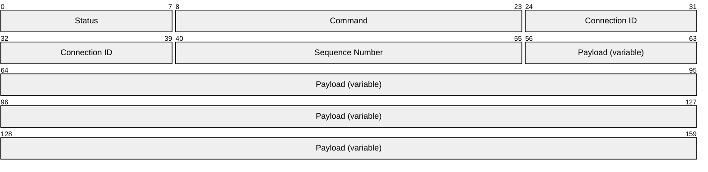
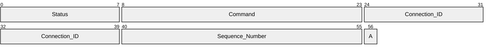
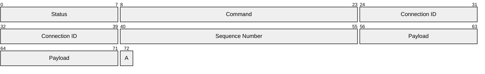
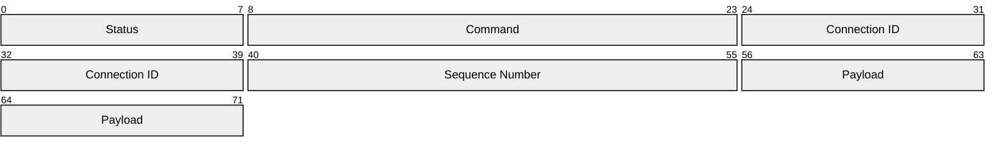
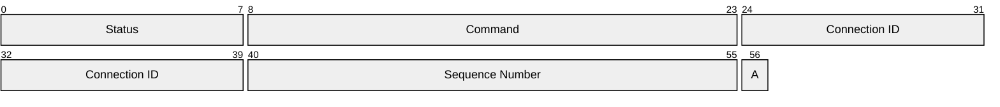

# [MS-USBEPD]: USB Protocol: Platform Detection Extensions

Table of Contents

1 Introduction

- [1 Introduction](#Section_1)
  - [1.1 Glossary](#Section_1.1)
  - [1.2 References](#Section_1.2)
    - [1.2.1 Normative References](#Section_1.2.1)
    - [1.2.2 Informative References](#Section_1.2.2)
  - [1.3 Overview](#Section_1.3)
  - [1.4 Relationship to Other Protocols](#Section_1.4)
  - [1.5 Prerequisites/Preconditions](#Section_1.5)
  - [1.6 Applicability Statement](#Section_1.6)
  - [1.7 Versioning and Capability Negotiation](#Section_1.7)
  - [1.8 Vendor-Extensible Fields](#Section_1.8)
  - [1.9 Standards Assignments](#Section_1.9)

2 Messages

- [2 Messages](#Section_2)
  - [2.1 Transport](#Section_2.1)
  - [2.2 Message Syntax](#Section_2.2)
    - [2.2.1 Common Message Header](#Section_2.2.1)
    - [2.2.2 Device Registration Message](#Section_2.2.2)
    - [2.2.3 Platform Information Message](#Section_2.2.3)

3 Protocol Details

- [3 Protocol Details](#Section_3)
  - [3.1 Host and Device Details](#Section_3.1)
    - [3.1.1 Abstract Data Model](#Section_3.1.1)
    - [3.1.2 Timers](#Section_3.1.2)
    - [3.1.3 Initialization](#Section_3.1.3)
    - [3.1.4 Higher-Layer Triggered Events](#Section_3.1.4)
    - [3.1.5 Message Processing Events and Sequencing Rules](#Section_3.1.5)
    - [3.1.6 Timer Events](#Section_3.1.6)
    - [3.1.7 Other Local Events](#Section_3.1.7)

4 Protocol Examples

- [4 Protocol Examples](#Section_4)

5 Security

- [5 Security](#Section_5)
  - [5.1 Security Considerations for Implementers](#Section_5.1)
  - [5.2 Index of Security Parameters](#Section_5.2)

6 Appendix A: Product Behavior

- [6 Appendix A: Product Behavior](#Section_6)

7 Change Tracking

- [7 Change Tracking](#Section_7)

For the legal notice and IP terms, see [LEGAL.md](../LEGAL.md).
Last updated: 1/26/2026.
See [Revision History](#revision-history) for full version history.

# 1 Introduction

The USB Protocol: Platform Detection Extensions protocol extends the USB 3.2 protocol to allow USB 1.1, 2.0, 3.0, 3.1 and 3.2 devices that support Microsoft OS Descriptors to query a USB Host’s platform to detect what platform they are currently connected to. If the USB device and the Host system that it is connected to support the USB Platform Detection Protocol then the USB device can take advantage of more detailed driver and firmware compatibility and the special features the Host has to offer.

Sections 1.5, 1.8, 1.9, 2, and 3 of this specification are normative. All other sections and examples in this specification are informative.

## 1.1 Glossary

This document uses the following terms:

**device**: Any UPnP-enabled device.

**driver**: Software that allows applications to interact with a hardware device by using abstract/high-level constructs.

**universal serial bus (USB)**: An external bus that supports Plug and Play installation. It allows devices to be connected and disconnected without shutting down or restarting the computer.

**MAY, SHOULD, MUST, SHOULD NOT, MUST NOT:** These terms (in all caps) are used as defined in [[RFC2119]](https://go.microsoft.com/fwlink/?LinkId=90317). All statements of optional behavior use either MAY, SHOULD, or SHOULD NOT.

## 1.2 References

Links to a document in the Microsoft Open Specifications library point to the correct section in the most recently published version of the referenced document. However, because individual documents in the library are not updated at the same time, the section numbers in the documents may not match. You can confirm the correct section numbering by checking the [Errata](https://go.microsoft.com/fwlink/?linkid=850906).

### 1.2.1 Normative References

We conduct frequent surveys of the normative references to assure their continued availability. If you have any issue with finding a normative reference, please contact [dochelp@microsoft.com](mailto:dochelp@microsoft.com). We will assist you in finding the relevant information.

[MSLEARN-OS10Desc] Microsoft Corporation, "Microsoft OS 1.0 Descriptors Specification", July 2007, [https://learn.microsoft.com/en-us/windows-hardware/drivers/usbcon/microsoft-os-1-0-descriptors-specification](https://go.microsoft.com/fwlink/?linkid=2344002)

[MSLEARN-OS20Desc] Microsoft Corporation, "Microsoft OS 2.0 Descriptors Specification", July 2018, [https://learn.microsoft.com/en-us/windows-hardware/drivers/usbcon/microsoft-os-2-0-descriptors-specification](https://go.microsoft.com/fwlink/?linkid=2261963)

**Note** Accept the License Agreement to download the file.

[RFC2119] Bradner, S., "Key words for use in RFCs to Indicate Requirement Levels", BCP 14, RFC 2119, March 1997, [https://www.rfc-editor.org/info/rfc2119](https://go.microsoft.com/fwlink/?LinkId=90317)

[USB-IF-SPC32] USB-IF, "Document Library", Universal Serial Bus 3.2 Specification Revision 1.1 - June 2022, [https://www.usb.org/documents](https://go.microsoft.com/fwlink/?linkid=2262134)

**Note** Search: USB 3.2, Category: Specification, and Technology: USB 3.2

### 1.2.2 Informative References

None.

## 1.3 Overview

The USB Protocol Platform Detection Extensions protocol is based on the USB 3.2 Protocol [[USB-IF-SPC32]](https://go.microsoft.com/fwlink/?linkid=2262134) and Microsoft OS Descriptors protocol specified in [[MSLEARN-OS10Desc]](https://go.microsoft.com/fwlink/?linkid=2344002) and [[MSLEARN-OS20Desc]](https://go.microsoft.com/fwlink/?linkid=2261963). It is a protocol that allows [**universal serial bus (USB)**](#gt_universal-serial-bus-usb) [**devices**](#gt_device) (1.1, 2.0, 3.0, 3.1 and 3.2) to query a USB Host’s platform to detect what platform they are currently connected to. This is to provide more detailed [**driver**](#gt_driver) and firmware compatibility for various USB Hosts that the USB device can be used with.<1>

This protocol also allows USB devices to detect if they are not on a specific platform. If that platform is known to implement the USB Protocol Extensions for Platform Detection and the Host system that the USB device is connected to does not implement the USB Platform Detection Protocol, then the Host is not one of the known systems, instead it is a different unknown system.

A USB input device, for example, can have a custom driver on several operating systems that allows it take advantage of certain features not included in the standard USB input protocols that are supported by all USB Hosts. Such a device can use the USB Platform Detection Extensions protocol to determine which Host USB platform the device is connected to. Based on the result the USB device can alter its behavior to either expect a custom driver or to behave as a standard USB device for which the OS does not provide a driver.

## 1.4 Relationship to Other Protocols

The USB Protocol: Platform Detection Extensions protocol is an extension of the existing USB 3.2 Protocol Specification ([[USB-IF-SPC32]](https://go.microsoft.com/fwlink/?linkid=2262134)) and Microsoft OS Descriptors Specification. This protocol uses the OS Descriptor’s driver Compatible ID to opt into support for the USB Platform Detection Extension by a USB device. This protocol also makes extensive use of USB channel Control Transfer outlined in the USB 3.2 Specification. Therefore, basic familiarity is assumed with the USB 3.2 Protocol Specification and the Microsoft OS Descriptors specification.

## 1.5 Prerequisites/Preconditions

The Platform Detection extensions to the USB 3.2 protocol require that the [**USB**](#gt_universal-serial-bus-usb) [**device**](#gt_device) fully enumerate with the USB host. For more details about this process, see the USB 3.2 specification [[USB-IF-SPC32]](https://go.microsoft.com/fwlink/?linkid=2262134) enumeration section 9.1.2.

This protocol is also required to implement the Microsoft OS Descriptors protocol, and to specify a Compatible ID of ”PLATDE”. For more details about this process, see the Microsoft OS Descriptor specification specified in [[MSLEARN-OS10Desc]](https://go.microsoft.com/fwlink/?linkid=2344002) and [[MSLEARN-OS20Desc]](https://go.microsoft.com/fwlink/?linkid=2261963) Compatible ID descriptor subsection.

## 1.6 Applicability Statement

This protocol is only intended to be used by [**USB**](#gt_universal-serial-bus-usb) [**devices**](#gt_device) connecting to an unknown USB Host for which they wish to detect what is the specific operating system or platform Host.

This protocol is not intended to be a replacement for USB device functionality or re-define any aspect of the Microsoft OS Descriptors protocol for which this protocol extends. Rather it intends to define a specific Compatible ID and its functions to allow a USB device to detect its Host’s platform.

## 1.7 Versioning and Capability Negotiation

None.

## 1.8 Vendor-Extensible Fields

None.

## 1.9 Standards Assignments

None.

# 2 Messages

## 2.1 Transport

USB Protocol: Platform Detection Extensions protocol uses the USB 3.2 specifications' [**USB**](#gt_universal-serial-bus-usb) control channel exclusively for transport of the protocol-specific messages ([[USB-IF-SPC32]](https://go.microsoft.com/fwlink/?linkid=2262134)).

The platform detection protocol uses two aspects of control channel transfers to create a send receive reply set of command messages. As per the USB 3.2 specification, control transfers are always initiated by the host. The host MUST first send a specific command message to the device, and then immediately afterwards request a reply from the device. The host MUST continue to request a reply for at least 900 ms until the device sends 1 or more bytes on endpoint 0.

Note that the device needs to send the entire payload in a single endpoint 0 transaction after the host receives any transmission that uses 1 or more bytes. It will no longer request a response on endpoint 0.

The host MUST specify a USB Control Channel Message ID of 0xE0 for Host to Device Request messages, and the host MUST specify a USB Control Channel Message ID of 0xE1 for Device to Host Response messages.

The wValue is also used in this protocol. A wValue is a value in the USB control channel message header. The host MAY specify any value in wValue, and unless otherwise specified by this protocol document, the device MUST reply with the same wValue that the host sends. Unless otherwise specified, wValue has no meaning.

## 2.2 Message Syntax

The following sections define the composition of USB messages used by the USB Protocol: Platform Detection Extensions protocol.

### 2.2.1 Common Message Header

All [**USB**](#gt_universal-serial-bus-usb) control pipe messages use the following common header.

**Status (1 byte):** An 8-bit valid USB transaction status.

**Command (2 bytes):** A 16-bit Command ID, specified by this protocol.

**Connection ID (2 bytes):** A 16-bit ID assigned by the Host for the duration of a USB enumeration session to uniquely identify specific platform detection negotiations.

**Sequence Number (2 bytes):** A 16-bit unsigned integer that represents the number of times a specific command message has been sent. The Host and Device MUST increment this number from an initial value of one and the Host and Device MUST overflow from 0xFFFF to 0x0001 without passing through zero (0x0000).

**Payload (variable):** Message specific data if any for the associated **Command**.

**Bit Numbering**

In this protocol all multibyte values are sent as little-endian even on big-endian Host or Device architectures. Implementers should take care to ensure that they decode any messages over the wire into the appropriate endianness for their target platform.

### 2.2.2 Device Registration Message

The Device Registration message is a send-receive-reply message sent by the host after enumeration. The host MUST send this message within 800 ms of enumeration. Otherwise, the device can assume that the host does not support the platform detection protocol.

**Message 1 of 2: Host to Device Registration Message**

The initial registration message from the host to the device. This message lets the device know it requests to perform platform detection and, when ACK’d by the device, confirms to the host that the platform can now be sent along with the version of the protocol that the device can use. Both the host and device MUST support at least version 1.

Note that the host MUST set wValue in the USB control channel header of this message to the maximum protocol version that the host supports.

**Status (1 byte):** A valid USB transaction status. The host MUST specify ACK (0x1) to acknowledge**.**

**Command (2 bytes):** The 16-bit device registration Command ID, the host MUST specify 0x0001.

**Connection ID (2 bytes):** A 16-bit ID assigned by the host for the duration of a USB enumeration session to uniquely identify specific platform detection negotiations.

**Sequence Number (2 bytes):** A 16-bit unsigned integer that represents the number of times a specific command message has been sent. The host and device MUST increment this number from an initial value of one and the host and device MUST overflow from 0xFFFF to 0x0001 without passing through zero (0x0000).

**A-Payload (0):** Empty, zero bytes. Followed by EOM: End of Message.

**Message 2 of 2: Device to Host Registration Message**

The device MUST send this message within 500 ms of receiving the device registration message from the host. Otherwise, the host can assume that the device is defective and terminate power to the device’s USB port.

**Status (1 byte):** A valid USB transaction status that is represented by ACK (0x01) or NAK (0x00). For a NAK (negative acknowledgement) failure, the message is retried as per the USB 3.2 specification [[USB-IF-SPC32]](https://go.microsoft.com/fwlink/?linkid=2262134).

**Command (2 bytes):** The 16-bit device registration Command ID, the device MUST specify 0x0001.

**Connection ID (2 bytes):** A 16-bit ID assigned by the host for the duration of a USB enumeration session to uniquely identify specific platform detection negotiations. The device MUST use the **Connection ID** specified by the host in the preceding registration message.

**Sequence Number (2 bytes):** A 16-bit unsigned integer that represents the number of times a specific command message has been sent. The host and device MUST increment this number from an initial value of one and the host and device MUST overflow from 0xFFFF to 0x0001 without passing through zero (0x0000).

**Payload (2 bytes):** Contains the 16-bit version number that the device selects to use for the duration of this session or connection. The device MUST select a payload smaller than the maximum version that the host supports as it is specified in wValue in Message 1 of 2 header of this send receive reply message transaction.

**A - EOM (0):** Empty, zero bytes. Followed by EOM: End of Message.

### 2.2.3 Platform Information Message

The Platform Information Message is a send-receive-reply message sent by the host. The host MUST send this message after Device Registration messages have been ACK’d by the [**device**](#gt_device).

**Message 1 of 2: Host to Device Platform Information Message**

The Platform Information message from the host to the device. This message provides the platform ID to the device to allow a USB device to detect its host’s platform.

**Status (1 byte):** A valid [**USB**](#gt_universal-serial-bus-usb) transaction status. In this case, the host MUST specify ACK (0x1).

**Command (2 bytes):** The 16-bit device registration Command ID, the host MUST specify 0x0002.

**Connection ID (2 bytes):** A 16-bit ID assigned by the host for the duration of a USB enumeration session to uniquely identify specific platform detection negotiations.

**Sequence Number (2 bytes):** A 16-bit unsigned integer that represents the number of times a specific command message has been sent. The host and device MUST increment this number from an initial value of one and the host and device MUST overflow from 0xFFFF to 0x0001 without passing through zero (0x0000).

**Payload (2 bytes):** A 16-bit platform ID<2> in little-endian format that is defined in the following table. Followed by EOM: End of Message. Note that this is version 1 of this table. Future versions of the protocol may update this table and can include expansion into the reserved values.

| Platform ID | Meaning |
| --- | --- |
| 0x0000 | Reserved, this value MUST NOT be used by either host or device for any reason. |
| 0x0001 | Windows 10 operating system |
| 0x0002 | Windows 11 operating system and later |
| 0x0003 | Windows 10 IOT Core |
| 0x0004 | Windows 11 IOT or later |
| 0x0005 | Windows Server 2016 operating system, Windows Server 2019 operating system, or Windows Server 2022 operating system |
| 0x0006 | Windows Server 2025 operating system and later |
| 0x0007 | Xbox console, Xbox One and later |
| 0x0008 | Microsoft OneCore based operating system |
| 0x0009 | Other operating systems not better described by one of the above IDs |
| 0x000A-0xFFFF | Reserved for future expansion, the Host MUST NOT send this platform value. |

**Message 2 of 2: Device to Host Platform Information Message**

The device MUST send this message within 500 ms of receiving the host’s Platform Information message. Otherwise, the host can assume that the device is defective and terminate power to the device’s USB port.

**Status (1 byte):** A valid USB transaction status that is represented by ACK (0x01) or NAK (0x00). For a NAK (negative acknowledgement) failure, the message is retried as per the USB 3.2 specification.

**Command (2 bytes):** The 16-bit device registration Command ID, the host MUST specify 0x0002.

**Connection ID (2 bytes):** A 16-bit ID assigned by the host for the duration of a USB enumeration session to uniquely identify specific platform detection negotiations. The device MUST use the **Connection ID** specified by the host in the preceding registration message.

**Sequence Number (2 bytes):** A 16-bit unsigned integer that represents the number of times a specific command message has been sent. The host and device MUST increment this number from an initial value of one and the host and device MUST overflow from 0xFFFF to 0x0001 without passing through zero (0x0000).

**A - Payload (0):** Empty, zero bytes. Followed by EOM: End of Message.

# 3 Protocol Details

## 3.1 Host and Device Details

The [**USB**](#gt_universal-serial-bus-usb) platform detection protocol re-uses the specified roles of USB Host and USB Device from the USB 3.2 Specification, [[USB-IF-SPC32]](https://go.microsoft.com/fwlink/?linkid=2262134).

**Host Details**

The Host follows the roles of the USB Host as specified in the USB 3.2 specification. In the platform detection extensions, the Host initiates both USB control channel messages with send-receive-reply message semantics.

**Device Details**

The Device follows the roles of the USB Device as specified in the USB 3.2 specification. In the platform detection extensions, the Device replies to both USB control channel messages with send-receive-reply message semantics.

### 3.1.1 Abstract Data Model

None.

### 3.1.2 Timers

None.

### 3.1.3 Initialization

None.

### 3.1.4 Higher-Layer Triggered Events

None.

### 3.1.5 Message Processing Events and Sequencing Rules

None.

### 3.1.6 Timer Events

None.

### 3.1.7 Other Local Events

None.

# 4 Protocol Examples

Consider the example of a Contoso USB device that would like to load a special driver that takes advantage of unique features only present on Windows Server 2016 operating system and later.

First the Device will enumerate with the Host as described in the USB 3.2 specification ([[USB-IF-SPC32]](https://go.microsoft.com/fwlink/?linkid=2262134)), after enumeration the Host can request a device Compatible ID via the Microsoft OS 2.0 Descriptors protocol ([[MSLEARN-OS20Desc]](https://go.microsoft.com/fwlink/?linkid=2261963)). In our example the Contoso [**USB**](#gt_universal-serial-bus-usb) [**device**](#gt_device) specified the “PLATDET” USB Compatible ID from the Host.

As a result, the Windows Server 2016 and later Host sends a platform detection registration message to the device to confirm that the Host does indeed support USB platform detections.

When the Contoso USB device does not receive a reply in the timeframe specified in this protocol it assumes the platform is not one that supports USB platform detection, and the device can choose to renumerate, or exercise normal functionality as specified in the USB 3.2 specification.

However, if the Contoso USB device does receive a registration message within the timeframe, then it sends a valid reply with the ACK (0x1) status set meaning it acknowledges the receipt of the registration and it does support USB platform detection.

The Host will then continue to send Platform Information messages to the device until the device sends an ACK status reply at which point no further platform detection messages are sent. If the platform specified is Windows Server 2016 or later, the device will re-enumerate with a special USB descriptor that makes use of Windows Server specific features.

Otherwise, the device will renumerate in its default USB mode suitable for all non-Windows server platforms.

# 5 Security

## 5.1 Security Considerations for Implementers

Implementers of the USB Platform Detection extensions protocol should take care to validate the size of the USB control transactions to ensure they meet or exceed the specified messages' size in this protocol.

Note that per the USB 3.2 specification USB Hosts or devices can add any number of bytes to the end of a control transfer message, as a result implementations MUST not fail if they receive too much data, only too little data.

## 5.2 Index of Security Parameters

None.

# 6 Appendix A: Product Behavior

The information in this specification is applicable to the following Microsoft products or supplemental software. References to product versions include updates to those products.

The terms "earlier" and "later", when used with a product version, refer to either all preceding versions or all subsequent versions, respectively. The term "through" refers to the inclusive range of versions. Applicable Microsoft products are listed chronologically in this section.

**Windows Client**

- Windows 11, version 24H2 operating system
**Windows Server**

- Windows Server 2025 operating system
**Xbox**

- Xbox One
- Xbox One S
- Xbox One X
- Xbox Series S
- Xbox Series X
Exceptions, if any, are noted in this section. If an update version, service pack or Knowledge Base (KB) number appears with a product name, the behavior changed in that update. The new behavior also applies to subsequent updates unless otherwise specified. If a product edition appears with the product version, behavior is different in that product edition.

Unless otherwise specified, any statement of optional behavior in this specification that is prescribed using the terms "SHOULD" or "SHOULD NOT" implies product behavior in accordance with the SHOULD or SHOULD NOT prescription. Unless otherwise specified, the term "MAY" implies that the product does not follow the prescription.

<1> Section 1.3: This is an in-box Windows component WDM driver that sends USB control pipe messages to implement this protocol. It may include Windows Desktop, Windows Server, Xbox or even non-Microsoft operating systems that also implement both the USB Platform Detection Protocol and the Microsoft OS Descriptors.

Xbox One, Xbox One S, Xbox One X, Xbox Series S, and Xbox Series X do not support Microsoft OS 2.0 Descriptors specification specified in [[MSLEARN-OS20Desc]](https://go.microsoft.com/fwlink/?linkid=2261963).

<2> Section 2.2.3: Other platforms can contact Microsoft to obtain a valid platform ID in the USB Platform Detection Protocol ID namespace, contact [dochelp@microsoft.com](mailto:dochelp@microsoft.com).

# 7 Change Tracking

This section identifies changes that were made to this document since the last release. Changes are classified as Major, Minor, or None.

The revision class **Major** means that the technical content in the document was significantly revised. Major changes affect protocol interoperability or implementation. Examples of major changes are:

- A document revision that incorporates changes to interoperability requirements.
- A document revision that captures changes to protocol functionality.
The revision class **Minor** means that the meaning of the technical content was clarified. Minor changes do not affect protocol interoperability or implementation. Examples of minor changes are updates to clarify ambiguity at the sentence, paragraph, or table level.

The revision class **None** means that no new technical changes were introduced. Minor editorial and formatting changes may have been made, but the relevant technical content is identical to the last released version.

The changes made to this document are listed in the following table. For more information, please contact [dochelp@microsoft.com](mailto:dochelp@microsoft.com).

| Section | Description | Revision class |
| --- | --- | --- |
| [1.2.1](#Section_1.2.1) Normative References | 30566 : Added a new normative reference to [MSLEARN-OS10Desc]. | Major |
| [1.3](#Section_1.3) Overview | 30566 : Added support for Microsoft OS 1.0 Descriptors specifications including the USB variant details. | Major |
| 1.3 Overview | 30566 : Added a product behavior note that Xbox products do not support the Microsoft OS 2.0 Descriptors specification. | Major |
| [1.4](#Section_1.4) Relationship to Other Protocols | 30566 : Added support for Microsoft OS 1.0 Descriptors specification. | Major |
| [1.5](#Section_1.5) Prerequisites/Preconditions | 30566 : Added support for Microsoft OS 1.0 Descriptors specification. | Major |
| [1.6](#Section_1.6) Applicability Statement | 30566 : Added support for Microsoft OS 1.0 Descriptors specification. | Major |
| [6](#Section_6) Appendix A: Product Behavior | 30566 : Added Xbox products. | Major |

## Revision History

| Date | Version | Revision Class | Comments |
| --- | --- | --- | --- |
| 4/23/2024 | 1.0 | New | Released new document. |
| 7/29/2024 | 2.0 | Major | Significantly changed the technical content. |
| 1/26/2026 | 3.0 | Major | Significantly changed the technical content. |
