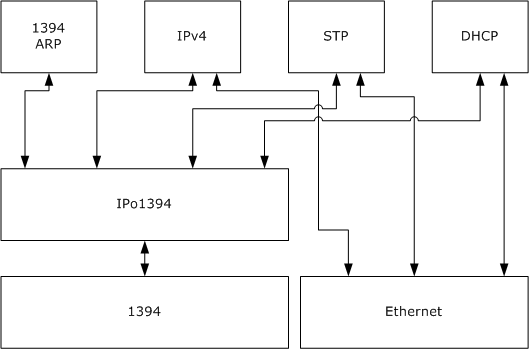
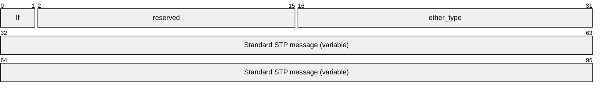
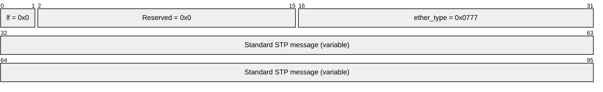
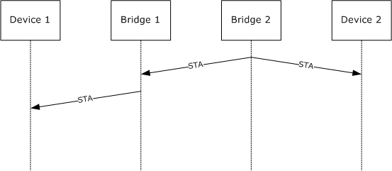

# [MS-V4OF]: IPv4 Over IEEE 1394 Protocol Extensions

Table of Contents

1 Introduction

- [1 Introduction](#Section_1)
  - [1.1 Glossary](#Section_1.1)
  - [1.2 References](#Section_1.2)
    - [1.2.1 Normative References](#Section_1.2.1)
    - [1.2.2 Informative References](#Section_1.2.2)
  - [1.3 Overview](#Section_1.3)
  - [1.4 Relationship to Other Protocols](#Section_1.4)
  - [1.5 Prerequisites/Preconditions](#Section_1.5)
  - [1.6 Applicability Statement](#Section_1.6)
  - [1.7 Versioning and Capability Negotiation](#Section_1.7)
  - [1.8 Vendor-Extensible Fields](#Section_1.8)
  - [1.9 Standards Assignments](#Section_1.9)

2 Messages

- [2 Messages](#Section_2)
  - [2.1 Transport](#Section_2.1)
  - [2.2 Message Syntax](#Section_2.2)
    - [2.2.1 STP Packet](#Section_2.2.1)

3 Protocol Details

- [3 Protocol Details](#Section_3)
  - [3.1 Common Details](#Section_3.1)
    - [3.1.1 Abstract Data Model](#Section_3.1.1)
    - [3.1.2 Timers](#Section_3.1.2)
    - [3.1.3 Initialization](#Section_3.1.3)
    - [3.1.4 Higher-Layer Triggered Events](#Section_3.1.4)
      - [3.1.4.1 Sending a UNICAST IPv4 Datagram](#Section_3.1.4.1)
      - [3.1.4.2 Sending a MULTICAST IPv4 Datagram](#Section_3.1.4.2)
      - [3.1.4.3 Sending an STP Packet](#Section_3.1.4.3)
    - [3.1.5 Message Processing Events and Sequencing Rules](#Section_3.1.5)
      - [3.1.5.1 Receiving an STP Packet](#Section_3.1.5.1)
      - [3.1.5.2 Receiving a MULTICAST 1394 Frame](#Section_3.1.5.2)
      - [3.1.5.3 Receiving an Unrecognized Message](#Section_3.1.5.3)
    - [3.1.6 Timer Events](#Section_3.1.6)
    - [3.1.7 Other Local Events](#Section_3.1.7)

4 Protocol Examples

- [4 Protocol Examples](#Section_4)

5 Security

- [5 Security](#Section_5)
  - [5.1 Security Considerations for Implementers](#Section_5.1)
  - [5.2 Index of Security Parameters](#Section_5.2)

6 Appendix A: Product Behavior

- [6 Appendix A: Product Behavior](#Section_6)

7 Change Tracking

- [7 Change Tracking](#Section_7)

For the legal notice and IP terms, see [LEGAL.md](../LEGAL.md).
Last updated: 6/1/2017.
See [Revision History](#revision-history) for full version history.

# 1 Introduction

The IPv4 Over IEEE 1394 (IPo1394) protocol is described by the Internet Engineering Task Force (IETF), and is specified in [RFC2734]. The IPo1394 protocol specifies the necessary methods, data structures, and codes to send IPv4 datagrams over IEEE 1394 links (as specified in [IEEE1394]). Specifically, the protocol describes packet formats, encapsulation methods for IPv4 datagrams, the Address Resolution Protocol (ARP) (1394 ARP), and the Multicast Channel Allocation Protocol (MCAP).

IPo1394 protocol does not support sending Spanning Tree Algorithm and Protocol (STP) frames and bridging. This document specifies an extension to the IPv4 Over IEEE 1394 (IPo1394) protocol to support bridging in networked environments. This document also clarifies the implementation details of [RFC2734] where necessary.

Sections 1.5, 1.8, 1.9, 2, and 3 of this specification are normative. All other sections and examples in this specification are informative.

## 1.1 Glossary

This document uses the following terms:

**Extended Unique Identifier - 48 (EUI-48)**: A 48-bit number defined by the IEEE as a concatenation of a 24-bit Organizationally Unique Identifier (OUI) value administered by the IEEE Registration Authority, and a 24-bit extension identifier assigned by the organization with that OUI assignment.

**Extended Unique Identifier - 64 (EUI-64)**: A 64-bit number defined by the IEEE as a concatenation of the 24-bit Organizationally Unique Identifier (OUI) value administered by the IEEE Registration Authority, and a 40-bit extension identifier assigned by the organization with that OUI assignment.

**MAY, SHOULD, MUST, SHOULD NOT, MUST NOT:** These terms (in all caps) are used as defined in [[RFC2119]](https://go.microsoft.com/fwlink/?LinkId=90317). All statements of optional behavior use either MAY, SHOULD, or SHOULD NOT.

## 1.2 References

Links to a document in the Microsoft Open Specifications library point to the correct section in the most recently published version of the referenced document. However, because individual documents in the library are not updated at the same time, the section numbers in the documents may not match. You can confirm the correct section numbering by checking the [Errata](http://msdn.microsoft.com/en-us/library/dn781092.aspx).

### 1.2.1 Normative References

We conduct frequent surveys of the normative references to assure their continued availability. If you have any issue with finding a normative reference, please contact [dochelp@microsoft.com](mailto:dochelp@microsoft.com). We will assist you in finding the relevant information.

[IEEE1394] Institute of Electrical and Electronics Engineers, "IEEE Standard for a High Performance Serial Bus - Description", IEEE Std 1394, 1995, [http://standards.ieee.org/reading/ieee/std_public/description/busarch/1394-1995_desc.html](https://go.microsoft.com/fwlink/?LinkId=89900)

[IEEE802.1D] Institute of Electrical and Electronics Engineers, "IEEE Standards for Information Technology - Telecommunications and Information Exchange Between Systems - Local and Metropolitan Area Networks - Common Specifications - Part 3: Media Access Control (MAC) Bridges - Description", ANSI/IEEE Std 802.1D, 1998, [http://standards.ieee.org/getieee802/download/802.1D-2004.pdf](https://go.microsoft.com/fwlink/?LinkId=89907)

[RFC2119] Bradner, S., "Key words for use in RFCs to Indicate Requirement Levels", BCP 14, RFC 2119, March 1997, [http://www.rfc-editor.org/rfc/rfc2119.txt](https://go.microsoft.com/fwlink/?LinkId=90317)

[RFC2131] Droms, R., "Dynamic Host Configuration Protocol", RFC 2131, March 1997, [http://www.ietf.org/rfc/rfc2131.txt](https://go.microsoft.com/fwlink/?LinkId=90318)

[RFC2734] Johansson, P., "IPv4 over IEEE 1394", RFC 2734, December 1999, [http://www.ietf.org/rfc/rfc2734.txt](https://go.microsoft.com/fwlink/?LinkId=90377)

[RFC2855] Fujisawa, K., "DHCP for IEEE 1394", RFC 2855, June 2000, [http://www.ietf.org/rfc/rfc2855.txt](https://go.microsoft.com/fwlink/?LinkId=90391)

[RFC791] Postel, J., Ed., "Internet Protocol: DARPA Internet Program Protocol Specification", RFC 791, September 1981, [http://www.rfc-editor.org/rfc/rfc791.txt](https://go.microsoft.com/fwlink/?LinkId=392659)

### 1.2.2 Informative References

[IEEE802.3] Institute of Electrical and Electronics Engineers, "Part 3: Carrier Sense Multiple Access with Collision Detection (CSMA/CD) Access Method and Physical Layer Specifications - Description", IEEE Std 802.2, 2002, [http://standards.ieee.org/getieee802/download/802.3-2002.pdf](https://go.microsoft.com/fwlink/?LinkId=89911)

[WindowsBridge1] Microsoft Corporation, "Windows XP Bridging and Media Support for Home Networking", [http://technet.microsoft.com/en-us/library/bb457038(TechNet.10).aspx](https://go.microsoft.com/fwlink/?LinkId=90565)

[WindowsBridge2] Microsoft Corporation, "Network Bridge", January 2005, [http://technet2.microsoft.com/WindowsServer/en/Library/8c6c4acb-49db-4d8a-844f-1fe31c4b2ded1033.mspx](https://go.microsoft.com/fwlink/?LinkId=90566)

## 1.3 Overview

The IPv4 over IEEE 1394 protocol (IPo1394) is used to transport IPv4 (as specified in [[RFC791]](https://go.microsoft.com/fwlink/?LinkId=392659)) datagrams over the high Performance Serial Bus (as specified in [[IEEE1394]](https://go.microsoft.com/fwlink/?LinkId=89900)). The primary use of the IPv4 over IEEE 1394 protocol, as specified in [[RFC2734]](https://go.microsoft.com/fwlink/?LinkId=90377), is to connect two devices via a 1394 bus and to allow sending and receiving of IP traffic across the 1394 bus.

The IPv4 Over IEEE 1394 Protocol Extensions specified in this document allow IPo1394 to be used in bridged network environments. The following figure depicts an example scenario where two networks are bridged—one network that uses the IPo1394 protocol, and the other that uses the Ethernet protocol. The bridge allows Device 1 to communicate with Device 2 as if they were on the same link. Bridging is specified in [[IEEE802.1D]](https://go.microsoft.com/fwlink/?LinkId=89907). The prevention of loops requires the ability to transmit Spanning Tree Algorithm and Protocol (STP) frames (as specified in [IEEE802.1D] sections 8 and 9) over the bridged media to support the Spanning Tree Algorithm (STA) in the bridge. However, the IPo1394 protocol, as specified in [RFC2734], does not support sending STP frames.

The extension specified in this document provides a means for STP frames to be sent over IPo1394 and simply defines a way for STP to be encapsulated over 1394. This extension introduces no new state or bridging behavior.

Figure 1: IPo1394 in environment where the IPo1394 network is bridged to an Ethernet network

## 1.4 Relationship to Other Protocols

IPv4 Over IEEE 1394 (IPo1394) Protocol relates to other protocols only insofar as those protocols run over IPv4, which in turn can run over IPo1394. The extensions specified in this document do not affect other protocols.

The following figure depicts IPo1394 and its relationship to the other higher and lower-layer protocols mentioned in this document. Sending and receiving 1394 Address Resolution Protocol (ARP) and IPv4 datagrams request and response packets over IPo1394 is specified in [[RFC2734]](https://go.microsoft.com/fwlink/?LinkId=90377).

Sending and receiving Spanning Tree Algorithm and Protocol (STP) packets over IPo1394 is specified in this document. The IPo1394 extension supports the transmitting and receiving of STP packets and is used by the STP protocol, as specified in [[IEEE802.1D]](https://go.microsoft.com/fwlink/?LinkId=89907) sections 8 and 9. STP is implemented in the bridge component and is used to detect and prevent network loops.<1>

Figure 2: Protocol stack showing IPo1394 and its relationship to other protocols

Sending and receiving Dynamic Host Configuration Protocol (DHCP) packets, as specified in [[RFC2131]](https://go.microsoft.com/fwlink/?LinkId=90318), over IPo1394 is specified in [[RFC2855]](https://go.microsoft.com/fwlink/?LinkId=90391). IPo1394 uses a different link-layer addressing method than conventional 802.3/Ethernet. For more information, see [[IEEE802.3]](https://go.microsoft.com/fwlink/?LinkId=89911). This implies that the use of some fields in DHCP packets has to be clarified to achieve interoperability between implementations of IPo1394 and DHCP. DHCP for IEEE 1394, as specified in [RFC2855], specifies the IPo1394 use of these fields in DHCP packets.<2>

## 1.5 Prerequisites/Preconditions

The IPv4 Over IEEE 1394 Protocol Extensions do not add any new prerequisites or preconditions beyond those specified in [[RFC2734]](https://go.microsoft.com/fwlink/?LinkId=90377).

## 1.6 Applicability Statement

The extension described herein does not change the applicability of the IPo1394 protocol, with one notable exception. IPo1394, as specified in [[RFC2734]](https://go.microsoft.com/fwlink/?LinkId=90377), does not support bridging. The extension described in this document allows bridging to operate in a network that contains one or more 1394 links.<3>

## 1.7 Versioning and Capability Negotiation

None.

## 1.8 Vendor-Extensible Fields

The IPv4 Over IEEE 1394 Protocol Extensions do not introduce any new vendor-extensible fields beyond those specified in [[RFC2734]](https://go.microsoft.com/fwlink/?LinkId=90377) section 10.

## 1.9 Standards Assignments

The new value of 0x0777 for **ether_type**, as specified in [Spanning Tree Algorithm and Protocol (STP) packet (section 2.2.1)](#Section_2.2.1), was chosen by Microsoft but is not yet reserved by the IEEE Registration Authority.

# 2 Messages

The following sections specify how IPv4 Over IEEE 1394 Protocol Extensions messages are transported and gives details on the message syntax.

## 2.1 Transport

The IPo1394 transport, as specified in [[RFC2734]](https://go.microsoft.com/fwlink/?LinkId=90377), is not changed by this protocol extension.

## 2.2 Message Syntax

Except as specified in the [Spanning Tree Algorithm and Protocol (STP) packet (section 2.2.1)](#Section_2.2.1), the message syntax for the IPo1394 protocol remains unchanged from the base protocol as specified in [[RFC2734]](https://go.microsoft.com/fwlink/?LinkId=90377) section 4.2.

### 2.2.1 STP Packet

The Spanning Tree Algorithm and Protocol (STP) (as specified in [[IEEE802.1D]](https://go.microsoft.com/fwlink/?LinkId=89907) sections 8 and 9) is used to detect network loops. The extension specified in this document extends IPo1394 to support the transmission and reception of the STP packet. The actual network loop detection is performed by STP—a higher-layer protocol—as specified in [IEEE802.1D] sections 8 and 9.

As shown below, an STP message on 1394 contains a standard IPo1394 header (the **lf**, **reserved**, and **ether_type** fields), followed by a standard STP message.

**lf (2 bits):** This field MUST specify the relative position of the link fragment within the IP datagram, as specified in [[RFC2734]](https://go.microsoft.com/fwlink/?LinkId=90377) section 4.2.

**reserved (14 bits):** This field MUST be used as specified in [RFC2734] section 4.2. It MUST be set to 0. This field MUST be ignored in a received packet.

**ether_type (2 bytes):** The possible values for this field MUST be one of the following:

| Value | Meaning |
| --- | --- |
| 0x0800 | The rest of the packet is an IPv4 datagram, as specified in [RFC2734]. |
| 0x0806 | The rest of the packet is an 1394 ARP message, as specified in [RFC2734]. |
| 0x8861 | The rest of the packet is a Multicast Channel Allocation Protocol (MCAP) message, as specified in [RFC2734]. |
| 0x0777 | The rest of the packet is an STP packet, as specified in [IEEE802.1D]. This value was added by Microsoft to indicate that an STP packet follows. |

Received packets with an **ether_type** other than one of the above values are dropped.

**Standard STP message (variable):** A standard STP message.

# 3 Protocol Details

As specified in [[RFC2734]](https://go.microsoft.com/fwlink/?LinkId=90377), IPo1394 is a point-to-point protocol used for transmitting IPv4 datagrams over an IEEE 1394 high-performance serial bus.

## 3.1 Common Details

### 3.1.1 Abstract Data Model

No additional state is required beyond that in the base protocol, as specified in [[RFC2734]](https://go.microsoft.com/fwlink/?LinkId=90377).<4>

### 3.1.2 Timers

No new timers are required beyond those in the base protocol, as specified in [[RFC2734]](https://go.microsoft.com/fwlink/?LinkId=90377).<5>

### 3.1.3 Initialization

The Spanning Tree Algorithm and Protocol (STP) is unchanged from what is specified in [[IEEE802.1D]](https://go.microsoft.com/fwlink/?LinkId=89907) section 9, but because it expects [**EUI-48**](#gt_extended-unique-identifier-48-eui-48) addresses (as Ethernet uses), it is necessary to explain how it uses addresses on 1394 media.

STP specifies how to generate a 64-bit [**Extended Unique Identifier - 64 (EUI-64)**](#gt_extended-unique-identifier-64-eui-64) (as specified in [IEEE802.1D] section 9) which is used as the bridge ID, from an EUI-48. 1394 uses an EUI-64 value (as specified in [[IEEE1394]](https://go.microsoft.com/fwlink/?LinkId=89900) section 8.3.2.5.7.1) instead of an EUI-48 value. As a result, at initialization time, IPo1394 SHOULD generate an EUI-48 by using any local algorithm that generates a value that is unique on the subnet, for use by STP when it needs to construct a bridge ID.<6>

No additional initialization is required beyond that in the base protocol, as specified in [[RFC2734]](https://go.microsoft.com/fwlink/?LinkId=90377).<7>

### 3.1.4 Higher-Layer Triggered Events

No additional higher-layer triggered events exist beyond those in the base protocol, as specified in [[RFC2734]](https://go.microsoft.com/fwlink/?LinkId=90377). The behavior of the existing higher-layer triggered events is as specified in sections [3.1.4.1](#Section_3.1.4.1) and [3.1.4.2](#Section_3.1.4.2).

#### 3.1.4.1 Sending a UNICAST IPv4 Datagram

When IPv4 (as specified in [[RFC791]](https://go.microsoft.com/fwlink/?LinkId=392659)) transmits a unicast IPv4 datagram, the behavior is unchanged from what is specified in [[RFC2734]](https://go.microsoft.com/fwlink/?LinkId=90377) section 7.<8>

#### 3.1.4.2 Sending a MULTICAST IPv4 Datagram

An implementation of IPv4 over IEEE 1394 MAY use "multicast transmit" (as specified in [[RFC2734]](https://go.microsoft.com/fwlink/?LinkId=90377) sections 9 and 9.1) to send a multicast IPv4 datagram, or it MAY use the "IP Broadcast" to send a multicast IPv4 datagram on the BROADCAST_CHANNEL, as specified in [RFC2734] section 8.<9>

#### 3.1.4.3 Sending an STP Packet

IPo1394 MUST encapsulate the STP packet with the IPo1394 encapsulation header, as specified in [[RFC2734]](https://go.microsoft.com/fwlink/?LinkId=90377) section 4.2, and MUST set the value 0x0777 in the **ether_type** field present in the encapsulation header. The STP protocol is unchanged from what is specified in [[IEEE802.1D]](https://go.microsoft.com/fwlink/?LinkId=89907) section 9.

On Ethernet media, STP packets are sent to the Bridge Group Address (as specified in [IEEE802.1D] section 9). When transmitted over 1394, STP packets MUST be sent on the 1394 broadcast channel (as specified in [RFC2734] section 8).

### 3.1.5 Message Processing Events and Sequencing Rules

Except as noted in this section, the message processing and sequencing rules are unchanged from the base protocol, as specified in [[RFC2734]](https://go.microsoft.com/fwlink/?LinkId=90377).

#### 3.1.5.1 Receiving an STP Packet

IPo1394 MUST correctly recognize the STP packet by recognizing the **ether_type** value in the packet encapsulation header that has a value of 0x0777. The STP packet format is specified in section [2.2.1](#Section_2.2.1). After receiving the STP packet, the IPo1394 protocol passes it up to the STP layer, which implements the network loop detection logic, as specified in [[IEEE802.1D]](https://go.microsoft.com/fwlink/?LinkId=89907).

#### 3.1.5.2 Receiving a MULTICAST 1394 Frame

More information on the IPo1394 implementation of multicast frames is specified in [[RFC2734]](https://go.microsoft.com/fwlink/?LinkId=90377) section 9.<10>

#### 3.1.5.3 Receiving an Unrecognized Message

The rules for processing an unrecognized message are unchanged from what is specified in [[RFC2734]](https://go.microsoft.com/fwlink/?LinkId=90377) via [[RFC791]](https://go.microsoft.com/fwlink/?LinkId=392659). Specifically, an unrecognized message is dropped.

### 3.1.6 Timer Events

[[RFC2734]](https://go.microsoft.com/fwlink/?LinkId=90377) specifies the 1394 ARP request/response packet format but it does not describe a sequencing mechanism.<11>

### 3.1.7 Other Local Events

When a new IP address is acquired, the same actions are taken that are specified in section [3.1.3](#Section_3.1.3).

There are no other local events that affect the IPo1394 protocol.

# 4 Protocol Examples

The following figure shows a scenario where Device 1 is connected to Bridge 1 via IPo1394. Bridge 1 is connected to Bridge 2 via IPo1394, and Bridge 2 is connected to Device 2 via Ethernet.

Figure 3: Scenario of four devices connected in a network

Consider the scenario outlined in the previous figure. Assume that all devices have already acquired their IP addresses, and Bridge 1 and Bridge 2 implement the spanning tree algorithm (as specified in [[IEEE802.1D]](https://go.microsoft.com/fwlink/?LinkId=89907) section 8 and 9) for loop detection and termination. Also, assume that Bridge 2 is not yet connected to Device 2.

- At initialization time, the IPo1394 components of Bridge 1 and Bridge 2 report link-layer addresses of their 1394 interfaces up to higher-layer protocols. In this example, both Bridge 1 and Bridge 2 report an [**EUI-48**](#gt_extended-unique-identifier-48-eui-48) that has the Locally Administered bit set and the remaining bits generated randomly. The Spanning Tree Algorithm Protocol (STP), being one of the higher-layer protocols, uses the addresses of each interface to generate a Bridge Identifier, as specified in [IEEE802.1D] section 8.5.3.7. Bridge 1 has only 1394 interfaces, so the Bridge Identifier is constructed from the EUI-48 on the lowest numbered interface (as specified in [IEEE802.1D] section 7.12.5). Similarly, Bridge 2 also constructs a Bridge Identifier from the address of its lowest numbered interface, which in the example is its Ethernet interface.
- The Ethernet cable is first plugged into Bridge 2. This media change triggers the STP implementation to send an STP packet on both interfaces in Bridge 2, as specified in [IEEE802.1D] section 9. Therefore, the packet that appears on the 1394 cable looks like the following: Bridge 2 sends an STP packet on both interfaces—one using Ethernet to Device 2 and the other using IPo1394 to Bridge 1. The format of the packet sent from Bridge 2 to Bridge 1 via IPo1394 follows:

The preceding packet is sent on the 1394 broadcast channel, and the Bridge Identifier used by STP is the one generated from its Ethernet media access control (MAC) address.

- Bridge 1 receives the packet and delivers it up to the STP component.
- Based on STP details, the STP component on Bridge 1 then decides to send an STP packet on the 1394 cable toward Device 1. The packet that appears on the 1394 cable looks the same as in the preceding diagram, but the STP message is a new STP message, and the Bridge Identifier used by STP is based on the random EUI-48 generated for the 1394 cable toward Device 1. This packet is sent on the 1394 broadcast channel.
- Device 1 receives the STP packet via IPo1394. Because Device 1 is not a bridge, and is not running STP, there is no STP component to deliver the packet up to, and the packet is ignored.
The following figure shows the sequence of packets exchanged in this example.

Figure 4: Sequence of packets exchanged

# 5 Security

The following sections specify security considerations for implementers of the IPv4 Over IEEE 1394 Protocol Extensions.

## 5.1 Security Considerations for Implementers

The basic IPv4 over IEEE 1394 protocol (IPo1394) has no security mechanism. This document does not add any security to IPo1394. The protocol extension described in this document does not introduce new security risks nor does it provide any security mechanisms.

## 5.2 Index of Security Parameters

None.

# 6 Appendix A: Product Behavior

The information in this specification is applicable to the following Microsoft products or supplemental software. References to product versions include released service packs.

- Windows XP operating system
- Windows Server 2003 operating system
Exceptions, if any, are noted below. If a service pack or Quick Fix Engineering (QFE) number appears with the product version, behavior changed in that service pack or QFE. The new behavior also applies to subsequent service packs of the product unless otherwise specified. If a product edition appears with the product version, behavior is different in that product edition.

Unless otherwise specified, any statement of optional behavior in this specification that is prescribed using the terms "SHOULD" or "SHOULD NOT" implies product behavior in accordance with the SHOULD or SHOULD NOT prescription. Unless otherwise specified, the term "MAY" implies that the product does not follow the prescription.

<1> Section 1.4: For more information about the bridge component and its use of STP, see the Windows XP product documentation in [[WindowsBridge1]](https://go.microsoft.com/fwlink/?LinkId=90565) and the Windows Server operating system TechCenter documentation in [[WindowsBridge2]](https://go.microsoft.com/fwlink/?LinkId=90566).

<2> Section 1.4: The Microsoft Windows implementation of IPo1394 uses a 1-byte pseudo-random number for the 'client identifier' option field used in DHCP messages, as specified in [[RFC2855]](https://go.microsoft.com/fwlink/?LinkId=90391) section 3.

<3> Section 1.6: The IPo1394 protocol, as specified in [[RFC2734]](https://go.microsoft.com/fwlink/?LinkId=90377) and this document, is implemented in Windows XP and Windows Server 2003.

<4> Section 3.1.1: On a Windows implementation of 1394 ARP (as specified in [RFC2734] section 5), a table of outstanding ARP requests is used. Each entry in the table contains an IP address, a retransmission count, a retransmission timer, and an expiration timer, as specified in section [3.1.2](#Section_3.1.2).

There is also a cache of previously resolved ARP requests, so that transmission of subsequent IPv4 datagrams does not require additional ARP requests to be sent. Each entry in the ARP cache contains an IP address, unique_ID, unicast_FIFO_hi, and unicast_FIFO_lo, as specified in [RFC2734] section 5.

<5> Section 3.1.2: [RFC2734] does not explicitly mention any timers. However, to implement 1394 ARP (as specified in [RFC2734] section 5) Windows uses two timers.

- A 60-second retransmission timer per entry in the outstanding ARP request table.
- A 4-minute expiration timer per entry in the ARP cache.
<6> Section 3.1.3: The Windows implementation of IPo1394 uses a pseudo-random [**EUI-48**](#gt_extended-unique-identifier-48-eui-48) value with the Locally Administered bit set in the EUI-48 that is given to and used by STP (as specified in [[IEEE802.1D]](https://go.microsoft.com/fwlink/?LinkId=89907) section 9) to generate the bridge ID.

<7> Section 3.1.3: At initialization time, when Windows 1394 ARP first acquires an address, it performs duplicate address detection by sending a gratuitous ARP for its own address (as is common practice on Ethernet). If another node responds to this request, the address is not used.

<8> Section 3.1.4.1: [RFC2734] section 7 specifies multiple ways of transmitting IPv4 unicast datagrams. The Windows implementation of IPo1394 sends unicast IPv4 datagrams by using transaction code 0x01 (asynchronous block write packet), as specified in [RFC2734] section 7.

<9> Section 3.1.4.2: The Windows implementation of IPo1394 uses "IP broadcast" for the multicast transmit. Specifically, any higher-layer initiated multicast traffic is transmitted by IPo1394 on the BROADCAST_CHANNEL, as specified in [RFC2734] section 8.

<10> Section 3.1.5.2: The Windows implementation of IPo1394 implements the "multicast receive" as specified in relation to the Multicast Channel Allocation Protocol (MCAP), as specified in [RFC2734] section 9.3.

<11> Section 3.1.6: In Windows implementations when a retransmission timer expires for an entry in the outstanding ARP request table, IPo1394 first checks whether an ARP cache entry already exists for the associated IP address.

- If no ARP cache entry exists: IPo1394 checks whether the retransmission count for the entry in the retransmission table is less than 4. If it is less than 4, the retransmission count field is incremented and a new ARP request packet is sent. If it is not less than 4, the entry in the retransmission table is deleted.
- If an ARP cache entry exists: The ARP cache entry is deleted, and the entry in the retransmission table is also deleted.
The ARP cache entry expiration timer and the events that it triggers are used when a device hardware address is already resolved from a given IP address. The goal is to confirm that the given IP address still resolves to the same device hardware address after four minutes of successful device hardware address resolution. The events described below are used to achieve this goal.

When an ARP cache entry expiration timer expires, IPo1394 transmits an ARP request packet in an attempt to refresh the hardware address field for that ARP cache entry, adds an entry to the outstanding ARP request table, and starts the retransmission timer.

# 7 Change Tracking

No table of changes is available. The document is either new or has had no changes since its last release.

## Revision History

| Date | Version | Revision Class | Comments |
| --- | --- | --- | --- |
| 3/2/2007 | 1.0 | Major | Updated and revised the technical content. |
| 4/3/2007 | 1.1 | Minor | Clarified the meaning of the technical content. |
| 5/11/2007 | 2.0 | Major | New format |
| 6/1/2007 | 2.0.1 | Editorial | Changed language and formatting in the technical content. |
| 7/3/2007 | 2.0.2 | Editorial | Changed language and formatting in the technical content. |
| 8/10/2007 | 2.0.3 | Editorial | Changed language and formatting in the technical content. |
| 9/28/2007 | 3.0 | Major | Updated and revised the technical content. |
| 10/23/2007 | 3.0.1 | Editorial | Changed language and formatting in the technical content. |
| 1/25/2008 | 3.0.2 | Editorial | Changed language and formatting in the technical content. |
| 3/14/2008 | 4.0 | Major | Updated and revised the technical content. |
| 6/20/2008 | 4.0.1 | Editorial | Changed language and formatting in the technical content. |
| 7/25/2008 | 4.0.2 | Editorial | Changed language and formatting in the technical content. |
| 8/29/2008 | 4.0.3 | Editorial | Changed language and formatting in the technical content. |
| 10/24/2008 | 4.1 | Minor | Clarified the meaning of the technical content. |
| 12/5/2008 | 4.2 | Minor | Clarified the meaning of the technical content. |
| 1/16/2009 | 4.2.1 | Editorial | Changed language and formatting in the technical content. |
| 2/27/2009 | 4.2.2 | Editorial | Changed language and formatting in the technical content. |
| 4/10/2009 | 4.2.3 | Editorial | Changed language and formatting in the technical content. |
| 5/22/2009 | 4.2.4 | Editorial | Changed language and formatting in the technical content. |
| 7/2/2009 | 4.2.5 | Editorial | Changed language and formatting in the technical content. |
| 8/14/2009 | 4.2.6 | Editorial | Changed language and formatting in the technical content. |
| 9/25/2009 | 4.2.7 | Editorial | Changed language and formatting in the technical content. |
| 11/6/2009 | 4.2.8 | Editorial | Changed language and formatting in the technical content. |
| 12/18/2009 | 4.2.9 | Editorial | Changed language and formatting in the technical content. |
| 1/29/2010 | 4.2.10 | Editorial | Changed language and formatting in the technical content. |
| 3/12/2010 | 4.2.11 | Editorial | Changed language and formatting in the technical content. |
| 4/23/2010 | 4.2.12 | Editorial | Changed language and formatting in the technical content. |
| 6/4/2010 | 4.2.13 | Editorial | Changed language and formatting in the technical content. |
| 7/16/2010 | 4.2.13 | None | No changes to the meaning, language, or formatting of the technical content. |
| 8/27/2010 | 4.2.13 | None | No changes to the meaning, language, or formatting of the technical content. |
| 10/8/2010 | 4.2.13 | None | No changes to the meaning, language, or formatting of the technical content. |
| 11/19/2010 | 4.2.13 | None | No changes to the meaning, language, or formatting of the technical content. |
| 1/7/2011 | 4.2.13 | None | No changes to the meaning, language, or formatting of the technical content. |
| 2/11/2011 | 4.2.13 | None | No changes to the meaning, language, or formatting of the technical content. |
| 3/25/2011 | 4.2.13 | None | No changes to the meaning, language, or formatting of the technical content. |
| 5/6/2011 | 4.2.13 | None | No changes to the meaning, language, or formatting of the technical content. |
| 6/17/2011 | 4.3 | Minor | Clarified the meaning of the technical content. |
| 9/23/2011 | 4.3 | None | No changes to the meaning, language, or formatting of the technical content. |
| 12/16/2011 | 5.0 | Major | Updated and revised the technical content. |
| 3/30/2012 | 5.0 | None | No changes to the meaning, language, or formatting of the technical content. |
| 7/12/2012 | 6.0 | Major | Updated and revised the technical content. |
| 10/25/2012 | 6.0 | None | No changes to the meaning, language, or formatting of the technical content. |
| 1/31/2013 | 6.0 | None | No changes to the meaning, language, or formatting of the technical content. |
| 8/8/2013 | 6.0 | None | No changes to the meaning, language, or formatting of the technical content. |
| 11/14/2013 | 6.0 | None | No changes to the meaning, language, or formatting of the technical content. |
| 2/13/2014 | 6.0 | None | No changes to the meaning, language, or formatting of the technical content. |
| 5/15/2014 | 6.0 | None | No changes to the meaning, language, or formatting of the technical content. |
| 6/30/2015 | 6.0 | None | No changes to the meaning, language, or formatting of the technical content. |
| 10/16/2015 | 6.0 | None | No changes to the meaning, language, or formatting of the technical content. |
| 7/14/2016 | 6.0 | None | No changes to the meaning, language, or formatting of the technical content. |
| 6/1/2017 | 6.0 | None | No changes to the meaning, language, or formatting of the technical content. |
