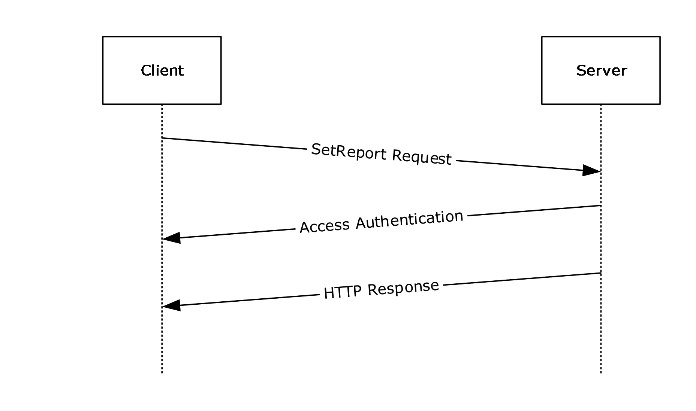

# [MS-VAPR]: Virtual Application Publishing and Reporting (App-V) Protocol

Table of Contents

1 Introduction

- [1 Introduction](#Section_1)
  - [1.1 Glossary](#Section_1.1)
  - [1.2 References](#Section_1.2)
    - [1.2.1 Normative References](#Section_1.2.1)
    - [1.2.2 Informative References](#Section_1.2.2)
  - [1.3 Overview](#Section_1.3)
  - [1.4 Relationship to Other Protocols](#Section_1.4)
  - [1.5 Prerequisites/Preconditions](#Section_1.5)
  - [1.6 Applicability Statement](#Section_1.6)
  - [1.7 Versioning and Capability Negotiation](#Section_1.7)
  - [1.8 Vendor-Extensible Fields](#Section_1.8)
  - [1.9 Standards Assignments](#Section_1.9)

2 Messages

- [2 Messages](#Section_2)
  - [2.1 Transport](#Section_2.1)
  - [2.2 Common Data Types](#Section_2.2)
    - [2.2.1 Namespaces](#Section_2.2.1)
    - [2.2.2 HTTP Headers](#Section_2.2.2)
      - [2.2.2.1 Content-Type](#Section_2.2.2.1)
      - [2.2.2.2 Cache-Control](#Section_2.2.2.2)
    - [2.2.3 URI Parameters](#Section_2.2.3)
    - [2.2.4 Complex Types](#Section_2.2.4)
    - [2.2.5 Simple Types](#Section_2.2.5)
    - [2.2.6 Attributes](#Section_2.2.6)
    - [2.2.7 Groups](#Section_2.2.7)
    - [2.2.8 Attribute Groups](#Section_2.2.8)
    - [2.2.9 Data Structures](#Section_2.2.9)

3 Protocol Details

- [3 Protocol Details](#Section_3)
  - [3.1 GetPackage Details](#Section_3.1)
    - [3.1.1 Abstract Data Model](#Section_3.1.1)
    - [3.1.2 Timers](#Section_3.1.2)
    - [3.1.3 Initialization](#Section_3.1.3)
    - [3.1.4 Higher-Layer Triggered Events](#Section_3.1.4)
    - [3.1.5 Message Processing Events and Sequencing Rules](#Section_3.1.5)
      - [3.1.5.1 Publishing Action](#Section_3.1.5.1)
        - [3.1.5.1.1 GET](#Section_3.1.5.1.1)
          - [3.1.5.1.1.1 Request Body](#Section_3.1.5.1.1.1)
          - [3.1.5.1.1.2 Response Body](#Section_3.1.5.1.1.2)
          - [3.1.5.1.1.3 Processing Details](#Section_3.1.5.1.1.3)
    - [3.1.6 Timer Events](#Section_3.1.6)
    - [3.1.7 Other Local Events](#Section_3.1.7)
  - [3.2 SetReport Details](#Section_3.2)
    - [3.2.1 Abstract Data Model](#Section_3.2.1)
    - [3.2.2 Timers](#Section_3.2.2)
    - [3.2.3 Initialization](#Section_3.2.3)
    - [3.2.4 Higher-Layer Triggered Events](#Section_3.2.4)
    - [3.2.5 Message Processing Events and Sequencing Rules](#Section_3.2.5)
      - [3.2.5.1 Set Report Action](#Section_3.2.5.1)
        - [3.2.5.1.1 POST](#Section_3.2.5.1.1)
          - [3.2.5.1.1.1 Request Body](#Section_3.2.5.1.1.1)
          - [3.2.5.1.1.2 Response Body](#Section_3.2.5.1.1.2)
          - [3.2.5.1.1.3 Processing Details](#Section_3.2.5.1.1.3)
    - [3.2.6 Timer Events](#Section_3.2.6)
    - [3.2.7 Other Local Events](#Section_3.2.7)

4 Protocol Examples

- [4 Protocol Examples](#Section_4)
  - [4.1 GetPackage Sequence](#Section_4.1)
  - [4.2 SetReport Sequence](#Section_4.2)

5 Security

- [5 Security](#Section_5)
  - [5.1 Security Considerations for Implementers](#Section_5.1)
  - [5.2 Index of Security Parameters](#Section_5.2)

6 Appendix A: Full XML Schema

- [6 Appendix A: Full XML Schema](#Section_6)
  - [6.1 GetPackage Schema](#Section_6.1)
  - [6.2 SetReport Schema](#Section_6.2)

7 Appendix B: Product Behavior

- [7 Appendix B: Product Behavior](#Section_7)

8 Change Tracking

- [8 Change Tracking](#Section_8)

For the legal notice and IP terms, see [LEGAL.md](../LEGAL.md).
Last updated: 4/23/2024.
See [Revision History](#revision-history) for full version history.

# 1 Introduction

The Virtual Application Publishing and Reporting Protocol enables a protocol client to discover virtual application packages available to a user or machine. It also allows the protocol client to collect and send data about the operating system, virtual applications on that client and their usage to the protocol server.

Sections 1.5, 1.8, 1.9, 2, and 3 of this specification are normative. All other sections and examples in this specification are informative.

## 1.1 Glossary

This document uses the following terms:

**Augmented Backus-Naur Form (ABNF)**: A modified version of Backus-Naur Form (BNF), commonly used by Internet specifications. ABNF notation balances compactness and simplicity with reasonable representational power. ABNF differs from standard BNF in its definitions and uses of naming rules, repetition, alternatives, order-independence, and value ranges. For more information, see [[RFC5234]](https://go.microsoft.com/fwlink/?LinkId=123096).

**Coordinated Universal Time (UTC)**: A high-precision atomic time standard that approximately tracks Universal Time (UT). It is the basis for legal, civil time all over the Earth. Time zones around the world are expressed as positive and negative offsets from UTC. In this role, it is also referred to as Zulu time (Z) and Greenwich Mean Time (GMT). In these specifications, all references to UTC refer to the time at UTC-0 (or GMT).

**domain account**: A stored set of attributes representing a principal used to authenticate a user or machine to an Active Directory domain.

**fully qualified domain name (FQDN)**: An unambiguous domain name that gives an absolute location in the Domain Name System's (DNS) hierarchy tree, as defined in [[RFC1035]](https://go.microsoft.com/fwlink/?LinkId=90264) section 3.1 and [[RFC2181]](https://go.microsoft.com/fwlink/?LinkId=127732) section 11.

**globally unique identifier (GUID)**: A term used interchangeably with universally unique identifier (UUID) in Microsoft protocol technical documents (TDs). Interchanging the usage of these terms does not imply or require a specific algorithm or mechanism to generate the value. Specifically, the use of this term does not imply or require that the algorithms described in [[RFC4122]](https://go.microsoft.com/fwlink/?LinkId=90460) or [[C706]](https://go.microsoft.com/fwlink/?LinkId=89824) must be used for generating the [**GUID**](#gt_globally-unique-identifier-guid). See also universally unique identifier (UUID).

**HTTP 1.1**: Hypertext Transfer Protocol -- HTTP/1.1 [[RFC2616]](https://go.microsoft.com/fwlink/?LinkId=90372)

**HTTP GET**: An HTTP method for retrieving a resource, as described in [RFC2616].

**HTTP OK**: An [**HTTP**](#gt_hypertext-transfer-protocol-http) response with status code 200, as described in [RFC2616] section 6.1.1.

**HTTP POST**: An HTTP method, as described in [RFC2616].

**Hypertext Transfer Protocol (HTTP)**: An application-level protocol for distributed, collaborative, hypermedia information systems (text, graphic images, sound, video, and other multimedia files) on the World Wide Web.

**Hypertext Transfer Protocol Secure (HTTPS)**: An extension of HTTP that securely encrypts and decrypts web page requests. In some older protocols, "Hypertext Transfer Protocol over Secure Sockets Layer" is still used (Secure Sockets Layer has been deprecated). For more information, see [[SSL3]](https://go.microsoft.com/fwlink/?LinkId=90534) and [[RFC5246]](https://go.microsoft.com/fwlink/?LinkId=129803).

**server-relative URL**: A relative URL that does not specify a scheme or host, and assumes a base URI of the root of the host, as described in [[RFC3986]](https://go.microsoft.com/fwlink/?LinkId=90453).

**SMB share**: A share that is accessed via the SMB access protocols.

**Transmission Control Protocol (TCP)**: A protocol used with the Internet Protocol (IP) to send data in the form of message units between computers over the Internet. TCP handles keeping track of the individual units of data (called packets) that a message is divided into for efficient routing through the Internet.

**Uniform Resource Identifier (URI)**: A string that identifies a resource. The URI is an addressing mechanism defined in Internet Engineering Task Force (IETF) Uniform Resource Identifier (URI): Generic Syntax [RFC3986].

**MAY, SHOULD, MUST, SHOULD NOT, MUST NOT:** These terms (in all caps) are used as defined in [[RFC2119]](https://go.microsoft.com/fwlink/?LinkId=90317). All statements of optional behavior use either MAY, SHOULD, or SHOULD NOT.

## 1.2 References

Links to a document in the Microsoft Open Specifications library point to the correct section in the most recently published version of the referenced document. However, because individual documents in the library are not updated at the same time, the section numbers in the documents may not match. You can confirm the correct section numbering by checking the [Errata](https://go.microsoft.com/fwlink/?linkid=850906).

### 1.2.1 Normative References

We conduct frequent surveys of the normative references to assure their continued availability. If you have any issue with finding a normative reference, please contact [dochelp@microsoft.com](mailto:dochelp@microsoft.com). We will assist you in finding the relevant information.

[MS-DTYP] Microsoft Corporation, "[Windows Data Types](../MS-DTYP/MS-DTYP.md)".

[RFC2119] Bradner, S., "Key words for use in RFCs to Indicate Requirement Levels", BCP 14, RFC 2119, March 1997, [https://www.rfc-editor.org/info/rfc2119](https://go.microsoft.com/fwlink/?LinkId=90317)

[RFC2616] Fielding, R., Gettys, J., Mogul, J., et al., "Hypertext Transfer Protocol -- HTTP/1.1", RFC 2616, June 1999, [https://www.rfc-editor.org/info/rfc2616](https://go.microsoft.com/fwlink/?LinkId=90372)

[RFC4234] Crocker, D., Ed., and Overell, P., "Augmented BNF for Syntax Specifications: ABNF", RFC 4234, October 2005, [https://www.rfc-editor.org/info/rfc4234](https://go.microsoft.com/fwlink/?LinkId=90462)

### 1.2.2 Informative References

[AppVCGOptPkg] Microsoft Corporation, "How to Use Optional Packages in Connection Groups", [https://learn.microsoft.com/en-us/microsoft-desktop-optimization-pack/appv-v5/how-to-use-optional-packages-in-connection-groups](https://go.microsoft.com/fwlink/?LinkId=733598)

[AppVCG] Microsoft Corporation, "Managing Connection Groups", [https://learn.microsoft.com/en-us/microsoft-desktop-optimization-pack/appv-v5/managing-connection-groups](https://go.microsoft.com/fwlink/?LinkId=733597)

[AppVDCF] Microsoft Corporation, "About App-V 5.0 Dynamic Configuration", [https://learn.microsoft.com/en-us/microsoft-desktop-optimization-pack/appv-v5/about-app-v-50-dynamic-configuration](https://go.microsoft.com/fwlink/?LinkId=733600)

## 1.3 Overview

The Virtual Application Publishing and Reporting Protocol is used to identify the virtual applications that a user is entitled to so that these applications can be downloaded and installed on the user's machine. It is also used to report virtual application usage information to the server so that usage information across multiple users can be aggregated to infer broad virtual application usage patterns across an organization.

## 1.4 Relationship to Other Protocols

This protocol depends on [**HTTP**](#gt_hypertext-transfer-protocol-http) as specified in [[RFC2616]](https://go.microsoft.com/fwlink/?LinkId=90372). HTTP version 1.1 is used with this protocol.

## 1.5 Prerequisites/Preconditions

This protocol does not provide a mechanism for a client to discover the [**Uniform Resource Identifier (URI)**](#gt_uniform-resource-identifier-uri) of the server. Thus, it is a prerequisite that the client obtain the publishing URI and the reporting URI before this protocol can be used.

## 1.6 Applicability Statement

The Virtual Application Publishing and Reporting Protocol is capable of identifying virtual applications published to a user and the machine. It is also capable of transferring virtual application usage reports to a server.

## 1.7 Versioning and Capability Negotiation

None.

## 1.8 Vendor-Extensible Fields

None.

## 1.9 Standards Assignments

None.

# 2 Messages

## 2.1 Transport

The Virtual Application Publishing and Reporting Protocol uses [**HTTP 1.1**](#gt_http-11) , as specified in [[RFC2616]](https://go.microsoft.com/fwlink/?LinkId=90372), as the transport layer.

A [**Transmission Control Protocol (TCP)**](#gt_transmission-control-protocol-tcp) port has not been reserved for this protocol.

The protocol uses the access authentication functionality of the [**HTTP**](#gt_hypertext-transfer-protocol-http) layer as specified in [RFC2616] section 11.

## 2.2 Common Data Types

### 2.2.1 Namespaces

No namespaces are used in this protocol.

### 2.2.2 HTTP Headers

The Virtual Application Publishing and Reporting Protocol uses existing headers as specified in [[RFC2616]](https://go.microsoft.com/fwlink/?LinkId=90372).

If a client or server receives an [**HTTP**](#gt_hypertext-transfer-protocol-http) header that is not defined in this section, or if the header is not defined in the current context (for example, receiving a request-only header in a response), the header MUST be interpreted as specified in [RFC2616].

When responding to a GetPackage request (section [3.1](#Section_1.3)), the server MUST set the following HTTP header in a successful response.

| Header | Description |
| --- | --- |
| Content-Type | section [2.2.2.1](#Section_2.2.2.1) |
| Cache-Control | section [2.2.2.2](#Section_2.2.2.2) |

#### 2.2.2.1 Content-Type

The Content-Type header is defined only for use in a response message sent to a client in response to a GET request and specifies the type of data that is included in the body of the GET response.

The syntax of the Content-Type header is defined as follows.

Content-Type = "Content-Type: " "text/xml" CRLF

#### 2.2.2.2 Cache-Control

The Cache-Control header is defined only for use in a response message sent to a client in response to a GET request and its behavior is specified in [[RFC2616]](https://go.microsoft.com/fwlink/?LinkId=90372). The protocol server MUST set the value of this header to "no-cache".

### 2.2.3 URI Parameters

The following table summarizes the set of common URI parameters defined by this specification for the GetPackage request.

| URI parameter | Description |
| --- | --- |
| ClientVersion | The version of the protocol client initiating the request. This MUST be four numbers separated by dots where each of the numbers is a value between 0 and 65535. The [**Augmented Backus-Naur Form (ABNF)**](#gt_augmented-backus-naur-form-abnf) syntax as specified in [[RFC4234]](https://go.microsoft.com/fwlink/?LinkId=90462) for this parameter is as follows. ClientVersion = "ClientVersion=" VersionValue1 "." VersionValue2 "." VersionValue3 "." VersionValue4 VersionValue1 = %x00-FFFF VersionValue2 = %x00-FFFF VersionValue3 = %x00-FFFF VersionValue4 = %x00-FFFF |
| ClientOS | The version of the operating system on which the protocol client is running. The Augmented Backus-Naur Form (ABNF) syntax as specified in [RFC4234] for this parameter is as follows. ClientOS = "ClientOS=Windows" ClientServer "_" OSVersion "_" OSBitness ClientServer = "Client" / "Server" OSVersion = OSVersionValueMajor "." OSVersionValueMinor OSVersionValueMajor = %x00-FFFFFFFF OSVersionValueMinor = %x00-FFFFFFFF OSBitness = "x86" / "x64" |

### 2.2.4 Complex Types

None.

### 2.2.5 Simple Types

None.

### 2.2.6 Attributes

None.

### 2.2.7 Groups

None.

### 2.2.8 Attribute Groups

None.

### 2.2.9 Data Structures

None.

# 3 Protocol Details

## 3.1 GetPackage Details

The purpose of the GetPackages request is for the protocol client to get the list of packages from the server. The GetPackages request maps to an [**HTTP GET**](#gt_http-get) request in which the query string parameters passed to the protocol server specify the protocol client's version and the version of the operating system on which the protocol client is running.

### 3.1.1 Abstract Data Model

### 3.1.2 Timers

None.

### 3.1.3 Initialization

None.

### 3.1.4 Higher-Layer Triggered Events

None.

### 3.1.5 Message Processing Events and Sequencing Rules

The protocol server MUST parse the ClientVersion query string parameters into a DWORD64 as described in [MS-DTYP](../MS-DTYP/MS-DTYP.md) section 2.2.12 . It must do so by converting each dot-separated part into a separate 16-bit integer and then shifting the bits so that the leftmost number in the ClientVersion occupies the first sixteen most significant bits of the 64-bit integer, the next number to the right in the ClientVersion occupies the next sixteen most significant bits of the 64-bit integer, and so on.

The protocol server MUST use this 64-bit integer to make sure that it only returns packages whose client version numbers are either less than or equal to the client version computed from the query string parameter or packages whose client version number is zero.

In addition, the protocol server MUST also parse the ClientOS query string parameter and use it to compute the set of packages to return. Only packages that specify compatible OS versions can be returned. Compatible OS version means:

- The processor architecture of the OS specified in the package matches that specified in the ClientOS. If the package does not specify a bitness, then it matches any bitness specified in the ClientOS.
- Any of the other Client OS values, if specified in the package, MUST match the value specified in the ClientOS.
| Resource | Description |
| --- | --- |
| / | Gets the list of virtual application packages from the server. |

The responses to all the methods can result in the following status codes.

| Status code | Reason phrase | Description |
| --- | --- | --- |
| 200 | OK | Returned when the request is completed. |

#### 3.1.5.1 Publishing Action

The resource identifier is configured on the protocol client in an implementation-specific manner.

##### 3.1.5.1.1 GET

The URL specified by the protocol client in the HTTP request line of the GET request identifies a virtual application publishing server endpoint that returns the list of virtual applications to the protocol client.

###### 3.1.5.1.1.1 Request Body

None.

###### 3.1.5.1.1.2 Response Body

The response body is an XML document that lists the virtual applications for the client along with the locations of the virtual applications. The XML response has the following schema.

<?xml version="1.0" encoding="utf-8"?>

<xs:schema attributeFormDefault="unqualified" elementFormDefault="qualified" xmlns:xs="http://www.w3.org/2001/XMLSchema">

<xs:element name="Publishing">

<xs:complexType>

<xs:sequence>

<xs:element name="Packages" minOccurs="0">

<xs:complexType>

<xs:sequence>

<xs:element maxOccurs="unbounded" name="Package">

<xs:complexType>

<xs:sequence minOccurs="0">

<xs:element minOccurs="0" name="DeploymentConfiguration">

<xs:complexType>

<xs:attribute name="Timestamp" type="xs:dateTime" use="required" />

<xs:attribute name="Path" type="xs:string" use="required" />

<xs:attribute name="ConfigurationId" type="xs:unsignedShort" use="required" />

</xs:complexType>

</xs:element>

<xs:element minOccurs="0" name="UserConfiguration">

<xs:complexType>

<xs:attribute name="Conflict" type="xs:boolean" use="required" />

<xs:attribute name="Timestamp" type="xs:dateTime" use="required" />

<xs:attribute name="Path" type="xs:string" use="required" />

<xs:attribute name="ConfigurationId" type="xs:unsignedShort" use="required" />

</xs:complexType>

</xs:element>

</xs:sequence>

<xs:attribute name="PackageUrl" type="xs:string" use="required" />

<xs:attribute name="VersionId" type="xs:string" use="required" />

<xs:attribute name="PackageId" type="xs:string" use="required" />

</xs:complexType>

</xs:element>

</xs:sequence>

</xs:complexType>

</xs:element>

<xs:element name="Groups" minOccurs="0">

<xs:complexType>

<xs:sequence>

<xs:element name="Group">

<xs:complexType>

<xs:sequence>

<xs:element maxOccurs="unbounded" name="Package">

<xs:complexType>

<xs:attribute name="VersionId" type="xs:string" use="required" />

<xs:attribute name="PackageId" type="xs:string" use="required" />

<xs:attribute name="VersionOptional" type="xs:boolean" use="required" />

<xs:attribute name="PackageOptional" type="xs:boolean" use="required" />

</xs:complexType>

</xs:element>

</xs:sequence>

<xs:attribute name="VersionId" type="xs:string" use="required" />

<xs:attribute name="Name" type="xs:string" use="required" />

<xs:attribute name="Priority" type="xs:unsignedByte" use="required" />

<xs:attribute name="GroupId" type="xs:string" use="required" />

</xs:complexType>

</xs:element>

</xs:sequence>

</xs:complexType>

</xs:element>

</xs:sequence>

<xs:attribute name="Protocol" type="xs:decimal" use="required" />

</xs:complexType>

</xs:element>

</xs:schema>

**Publishing:** The root element that contains the publishing information.

**Protocol:** The protocol in use. Value MUST be "2.0".

**Packages:** The collection of packages that the protocol client can use. This element is present only if there are packages to be published to the user.

**Package:** Information about one package that the protocol client can use.

**Package.DeploymentConfiguration:** The deployment configuration for the package.

**Package.DeploymentConfiguration.ConfigurationId:** A number that MUST increase each time the deployment configuration for the package is updated on the server.

**Package.DeploymentConfiguration.Path:** A [**Server-relative URL**](#gt_server-relative-url) to the deployment configuration file described in [[AppVDCF]](https://go.microsoft.com/fwlink/?LinkId=733600). The protocol client issues an [**HTTP GET**](#gt_http-get) request to this URL (after appending this value to the base server URL) to retrieve the deployment configuration file.

**Package.DeploymentConfiguration.Timestamp:** The [**UTC**](#gt_coordinated-universal-time-utc) time when the configuration file was last updated on the protocol server.

**Package.UserConfiguration:** The dynamic user configuration file described in ([AppVDCF]) for the package.

**Package.UserConfiguration.ConfigurationId:** A number that MUST increase each time the user configuration for the package is updated on the server.

**Package.UserConfiguration.Conflict:** A boolean value that is set to true if there is a configuration conflict; otherwise, false.

**Package.UserConfiguration.Path:** A Server-relative URL to the dynamic user configuration file described in [AppVDCF]. The protocol client issues an HTTP GET request to this URL (after appending this value to the base server URL) to retrieve the user configuration file.

**Package.UserConfiguration.Timestamp:** The UTC time when the configuration file was last updated on the protocol server.

**Package.PackageId:** The ID for the package in the form of a [**GUID**](#gt_globally-unique-identifier-guid) without the curly braces.

**Package.VersionId:** The version of the package in the form of a GUID without the curly braces.

**Package.PackageUrl:** The location of the virtual package. This MUST be an [**SMB share**](#gt_smb-share) or [**HTTP**](#gt_hypertext-transfer-protocol-http) or [**HTTPS**](#gt_hypertext-transfer-protocol-secure-https) location.

**Publishing.Groups:** The set of connection groups (described in [[AppVCG]](https://go.microsoft.com/fwlink/?LinkId=733597)) being published by the protocol server to the client. This element is present only if there are connection groups to be published to the user.

**Publishing.Groups.Group:** Details of one connection group (described in [AppVCG]) being published by the protocol server to the client.

**Publishing.Groups.Group.GroupId:** The ID of the connection group (described in [AppVCG]) in the form of a GUID without the curly braces.

**Publishing.Groups.Group.VersionId:** The version of the package in the form of a GUID without the curly braces.

**Publishing.Groups.Group.Priority:** The priority of the connection group (described in [AppVCG]) in case of a conflict.

**Publishing.Groups.Group.Name:** A user-friendly name for the connection group (described in [AppVCG]) .

**Publishing.Groups.Group.Package:** The set of packages being published as part of this connection group (described in [AppVCG]) by the protocol server to the client.

**Publishing.Groups.Group.Package.PackageId:** The ID for the package in the form of a GUID without the curly braces.

**Publishing.Groups.Group.Package.VersionId:** The version of the package in the form of a GUID without the curly braces.

**Publishing.Groups.Group.Package.PackageOptional:** Specifies whether the package is an optional package (as described in [[AppVCGOptPkg]](https://go.microsoft.com/fwlink/?LinkId=733598))

**Publishing.Groups.Group.Package.VersionOptional:** Specifies whether the connection group (described in [AppVCG]) requires a specific version of the package or any version.

###### 3.1.5.1.1.3 Processing Details

Virtual Application Publishing and Reporting Servers are expected to use the ClientVersion and ClientOS query string parameters along with the user information obtained from the HTTP authentication functionality to identify virtual applications for that user and the user's operating system and return that information to the protocol client.

### 3.1.6 Timer Events

None.

### 3.1.7 Other Local Events

None.

## 3.2 SetReport Details

The SetReport request enables the protocol client to send a report of the virtual application usage to the protocol server. The SetReport request maps to an [**HTTP POST**](#gt_http-post) request in which the body of the POST request is an XML payload that describes virtual application usage since the last successful SetReport request. The XML payload is UTF-16 encoded and does not contain any processing instruction.

### 3.2.1 Abstract Data Model

None.

### 3.2.2 Timers

None.

### 3.2.3 Initialization

None.

### 3.2.4 Higher-Layer Triggered Events

None.

### 3.2.5 Message Processing Events and Sequencing Rules

The protocol client submits virtual application usage information to the server for recording and reporting. If the server successfully accepts and records this information, it SHOULD return an [**HTTP OK**](#gt_http-ok) status code. If the server is unsuccessful, it can return any HTTP failure code<1>.

| Resource | Description |
| --- | --- |
| / | Records the XML reporting payload received from the client. |

The responses to all the methods can result in the following status codes.

| Status code | Reason phrase | Description |
| --- | --- | --- |
| 200 | OK | Returned when the XML reporting payload is successfully recorded. |

#### 3.2.5.1 Set Report Action

The resource identifier is configured on the protocol client separately.

##### 3.2.5.1.1 POST

The URL specified by the protocol client in the HTTP request line of the POST request identifies a virtual application reporting server endpoint that accepts the virtual application usage information being submitted.

###### 3.2.5.1.1.1 Request Body

The request body has an XML document that describes the virtual applications installed in the protocol client and the usage statistics for each of the applications. The XML schema of the document is as follows.

<?xml version="1.0" encoding="utf-8"?>

<xs:schema attributeFormDefault="unqualified" elementFormDefault="qualified" xmlns:xs="http://www.w3.org/2001/XMLSchema">

<xs:element name="CLIENT_DATA">

<xs:complexType>

<xs:sequence>

<xs:element name="PKG_LIST">

<xs:complexType>

<xs:sequence>

<xs:element maxOccurs="unbounded" name="PKG_DATA">

<xs:complexType>

<xs:attribute name="Guid" type="xs:string" use="required" />

<xs:attribute name="VerGuid" type="xs:string" use="required" />

<xs:attribute name="Name" type="xs:string" use="required" />

<xs:attribute name="Ver" type="xs:string" use="optional" />

<xs:attribute name="Source" type="xs:string" use="optional" />

<xs:attribute name="PctCached" type="xs:unsignedByte" use="optional" />

</xs:complexType>

</xs:element>

</xs:sequence>

</xs:complexType>

</xs:element>

<xs:element name="APP_RECORDS">

<xs:complexType>

<xs:sequence>

<xs:element maxOccurs="unbounded" name="APP_RECORD">

<xs:complexType>

<xs:attribute name="Name" type="xs:string" use="required" />

<xs:attribute name="Ver" type="xs:string" use="required" />

<xs:attribute name="Server" type="xs:string" use="required" />

<xs:attribute name="User" type="xs:string" use="required" />

<xs:attribute name="PackageVersion" type="xs:string" use="required" />

<xs:attribute name="ConnectionGroupVersion" type="xs:string" use="optional" />

<xs:attribute name="Launched" type="xs:dateTime" use="required" />

<xs:attribute name="LaunchStatus" type="xs:string" use="required" />

<xs:attribute name="Shutdown" type="xs:dateTime" use="optional" />

</xs:complexType>

</xs:element>

</xs:sequence>

</xs:complexType>

</xs:element>

</xs:sequence>

<xs:attribute name="Host" type="xs:string" use="required" />

<xs:attribute name="Ver" type="xs:string" use="required" />

<xs:attribute name="ProcessorArch" type="xs:string" use="required" />

<xs:attribute name="OSVer" type="xs:decimal" use="required" />

<xs:attribute name="OSServicePack" type="xs:unsignedByte" use="required" />

<xs:attribute name="OSType" type="xs:string" use="required" />

</xs:complexType>

</xs:element>

</xs:schema>

**CLIENT_DATA:** The root element that contains the virtual application usage being sent from the protocol client.

**CLIENT_DATA.Host:** The [**FQDN**](#gt_fully-qualified-domain-name-fqdn) of the protocol client.

**CLIENT_DATA.Ver:** The version number of the virtual application software running on the protocol client. This MUST be four numbers separated by dots where each of the numbers is a value between 0 and 65535. The [**Augmented Backus-Naur Form (ABNF)**](#gt_augmented-backus-naur-form-abnf) syntax as specified in [[RFC4234]](https://go.microsoft.com/fwlink/?LinkId=90462) for this attribute is as follows.

ClientVersion = "ClientVersion=" VersionValue "." VersionValue "." VersionValue "." VersionValue

VersionValue = %x00-FFFF

**CLIENT_DATA.ProcessorArch:** The bitness of the processor on the protocol client. This value MUST be either "x86" or "x64".

**CLIENT_DATA.OSVer:** The major and minor version of the operating system on which the protocol client is running. The Augmented Backus-Naur Form (ABNF) syntax as specified in [RFC4234] for this value is as follows.

ClientOSMajorMinor = OSVersionValueMajor "." OSVersionValueMinor

OSVersion = OSVersionValueMajor "." OSVersionValueMinor

OSVersionValueMajor = %x00-FFFFFFFF

OSVersionValueMinor = %x00-FFFFFFFF

**CLIENT_DATA.OSServicePack:** The version number of the latest service pack installed on the protocol client<2>.

**CLIENT_DATA.OSType:** If the operating system installed on the protocol client is a client version, this value is set to "Client". If the operating system installed on the protocol client is a server version, the value of this attribute is set to "Server".<3>

**CLIENT_DATA.PKG_LIST:** The list of virtual applications and connection groups (described in [[AppVCG]](https://go.microsoft.com/fwlink/?LinkId=733597)) installed on the protocol client.

**CLIENT_DATA.PKG_LIST.PKG_DATA:** One virtual application or connection group (described in [AppVCG]) installed on the protocol client.

**CLIENT_DATA.PKG_LIST.PKG_DATA.Guid:** The ID for the package or connection group (described in [AppVCG]) in the form of a [**GUID**](#gt_globally-unique-identifier-guid) including the curly braces.

**CLIENT_DATA.PKG_LIST.PKG_DATA.VerGuid:** The version of the package or connection group (described in [AppVCG] in the form of a GUID including the curly braces.

**CLIENT_DATA.PKG_LIST.PKG_DATA.Name:** The user-friendly name of the package or connection group (described in [AppVCG]).

**CLIENT_DATA.PKG_LIST.PKG_DATA.Ver:** The optional user-friendly version of the package. The Augmented Backus-Naur Form (ABNF) syntax as specified in [RFC4234] for this value is:

PackageVersion = Ver "." Ver "." Ver "." Ver

**CLIENT_DATA.PKG_LIST.PKG_DATA.Source:** The location where the virtual package was installed from. The location is an [**HTTP**](#gt_hypertext-transfer-protocol-http) or [**HTTPS**](#gt_hypertext-transfer-protocol-secure-https) URL or [**SMB share**](#gt_smb-share).

**CLIENT_DATA.PKG_LIST.PKG_DATA.PctCached:** The percentage of the virtual application cached on the protocol client.

**CLIENT_DATA.APP_RECORDS:** The virtual applications used since the last successful SetReport call.

**CLIENT_DATA.APP_RECORDS.APP_RECORD.Name:** The user-friendly name of the application.

**CLIENT_DATA.APP_RECORDS.APP_RECORD.Ver**: The optional user-friendly version of the package. The Augmented Backus-Naur Form (ABNF) syntax as specified in [RFC4234] for this value is as follows.

PackageVersion = Ver1 "." Ver2 "." Ver3 "." Ver4

Ver1 = %x00-FFFFFFFF

Ver2 = %x00-FFFFFFFF

Ver3 = %x00-FFFFFFFF

Ver4 = %x00-FFFFFFFF

**CLIENT_DATA.APP_RECORDS.APP_RECORD.Server:** The server name from which the protocol client obtained the virtual application package.

**CLIENT_DATA.APP_RECORDS.APP_RECORD.User:** The [**domain account**](#gt_domain-account) that was used to launch the virtual application.

**CLIENT_DATA.APP_RECORDS.APP_RECORD.PackageVersion:** The version of the package (that was launched) in the form of a GUID without the curly braces.

**CLIENT_DATA.APP_RECORDS.APP_RECORD.ConnectionGroupVersion:** The version of the connection group (described in [AppVCG]) that the package belongs to in the form of a GUID without the curly braces. Note that this attribute need not be included if the launched package does not belong to a connection group.

**CLIENT_DATA.APP_RECORDS.APP_RECORD.Launched:** The [**UTC**](#gt_coordinated-universal-time-utc) time when the virtual application was launched.<4>

**CLIENT_DATA.APP_RECORDS.APP_RECORD.LaunchStatus**: An implementation-specific status code that indicates the result of launching the virtual application. The Augmented Backus-Naur Form (ABNF) syntax as specified in [RFC4234] for this value is as follows.

LaunchStatus = Status1 "-" Status2

Status1 = %x00-FFFFFFFF

Status2 = %x00-FFFFFFFF

**CLIENT_DATA.APP_RECORDS.APP_RECORD.Shutdown: T**he UTC time when the virtual application was shut down.<5> This attribute need not be included when not reporting a process shutdown.

###### 3.2.5.1.1.2 Response Body

None

###### 3.2.5.1.1.3 Processing Details

Virtual Application Reporting and Publishing servers are expected to accept the virtual application usage information from the client and store it in a form that can be accessed later to understand virtual application usage patterns.

### 3.2.6 Timer Events

None.

### 3.2.7 Other Local Events

None.

# 4 Protocol Examples

## 4.1 GetPackage Sequence

The following sequence occurs between a client and a server during a GetPackage request.

- The client sends a GetPackage request.
- If the server requires the client to be authenticated, the server and client access authentication HTTP headers as specified in [[RFC2616]](https://go.microsoft.com/fwlink/?LinkId=90372) section 11.
- If authentication is not required, or if authentication has succeeded, the server responds with a "200 OK" [**HTTP**](#gt_hypertext-transfer-protocol-http) response along with the response payload as described in section [3.1](#Section_1.3).
- The client closes the HTTP connection to the server.

Figure 1: GetPackage message sequence

## 4.2 SetReport Sequence

The following sequence occurs between a client and a server during a SetReport request.

- The client sends a SetReport request.
- If the server requires the client to be authenticated, the server and client access authentication HTTP headers as specified in [[RFC2616]](https://go.microsoft.com/fwlink/?LinkId=90372) section 11.
- If authentication is not required, or if authentication has succeeded, the server responds with a "200 OK" [**HTTP**](#gt_hypertext-transfer-protocol-http) response as described in section section [3.2](#Section_3.2).
- The client closes the HTTP connection to the server.

Figure 2: SetReport message sequence

# 5 Security

## 5.1 Security Considerations for Implementers

The protocol is vulnerable to information disclosure if an unauthorized client queries for packages available to a user. An unauthorized client can also upload incorrect usage statistics to the SetReport protocol server. To eliminate this attack, the protocol uses the access authentication functionality of the HTTP layer as specified in [RFC2616] section 11.

## 5.2 Index of Security Parameters

# 6 Appendix A: Full XML Schema

## 6.1 GetPackage Schema

<?xml version="1.0" encoding="utf-8"?>

<xs:schema attributeFormDefault="unqualified" elementFormDefault="qualified" xmlns:xs="http://www.w3.org/2001/XMLSchema">

<xs:element name="Publishing">

<xs:complexType>

<xs:sequence>

<xs:element name="Packages">

<xs:complexType>

<xs:sequence>

<xs:element maxOccurs="unbounded" name="Package">

<xs:complexType>

<xs:sequence minOccurs="0">

<xs:element minOccurs="0" name="DeploymentConfiguration">

<xs:complexType>

<xs:attribute name="Timestamp" type="xs:dateTime" use="required" />

<xs:attribute name="Path" type="xs:string" use="required" />

<xs:attribute name="ConfigurationId" type="xs:unsignedShort" use="required" />

</xs:complexType>

</xs:element>

<xs:element minOccurs="0" name="UserConfiguration">

<xs:complexType>

<xs:attribute name="Conflict" type="xs:boolean" use="required" />

<xs:attribute name="Timestamp" type="xs:dateTime" use="required" />

<xs:attribute name="Path" type="xs:string" use="required" />

<xs:attribute name="ConfigurationId" type="xs:unsignedShort" use="required" />

</xs:complexType>

</xs:element>

</xs:sequence>

<xs:attribute name="PackageUrl" type="xs:string" use="required" />

<xs:attribute name="VersionId" type="xs:string" use="required" />

<xs:attribute name="PackageId" type="xs:string" use="required" />

</xs:complexType>

</xs:element>

</xs:sequence>

</xs:complexType>

</xs:element>

<xs:element name="Groups">

<xs:complexType>

<xs:sequence>

<xs:element name="Group">

<xs:complexType>

<xs:sequence>

<xs:element maxOccurs="unbounded" name="Package">

<xs:complexType>

<xs:attribute name="VersionId" type="xs:string" use="required" />

<xs:attribute name="PackageId" type="xs:string" use="required" />

<xs:attribute name="VersionOptional" type="xs:boolean" use="required" />

<xs:attribute name="PackageOptional" type="xs:boolean" use="required" />

</xs:complexType>

</xs:element>

</xs:sequence>

<xs:attribute name="VersionId" type="xs:string" use="required" />

<xs:attribute name="Name" type="xs:string" use="required" />

<xs:attribute name="Priority" type="xs:unsignedByte" use="required" />

<xs:attribute name="GroupId" type="xs:string" use="required" />

</xs:complexType>

</xs:element>

</xs:sequence>

</xs:complexType>

</xs:element>

</xs:sequence>

<xs:attribute name="Protocol" type="xs:decimal" use="required" />

</xs:complexType>

</xs:element>

</xs:schema>

## 6.2 SetReport Schema

<?xml version="1.0" encoding="utf-8"?>

<xs:schema attributeFormDefault="unqualified" elementFormDefault="qualified" xmlns:xs="http://www.w3.org/2001/XMLSchema">

<xs:element name="CLIENT_DATA">

<xs:complexType>

<xs:sequence>

<xs:element name="PKG_LIST">

<xs:complexType>

<xs:sequence>

<xs:element maxOccurs="unbounded" name="PKG_DATA">

<xs:complexType>

<xs:attribute name="Guid" type="xs:string" use="required" />

<xs:attribute name="VerGuid" type="xs:string" use="required" />

<xs:attribute name="Name" type="xs:string" use="required" />

<xs:attribute name="Ver" type="xs:string" use="optional" />

<xs:attribute name="Source" type="xs:string" use="optional" />

<xs:attribute name="PctCached" type="xs:unsignedByte" use="optional" />

</xs:complexType>

</xs:element>

</xs:sequence>

</xs:complexType>

</xs:element>

<xs:element name="APP_RECORDS">

<xs:complexType>

<xs:sequence>

<xs:element maxOccurs="unbounded" name="APP_RECORD">

<xs:complexType>

<xs:attribute name="Name" type="xs:string" use="required" />

<xs:attribute name="Ver" type="xs:string" use="required" />

<xs:attribute name="Server" type="xs:string" use="required" />

<xs:attribute name="User" type="xs:string" use="required" />

<xs:attribute name="PackageVersion" type="xs:string" use="required" />

<xs:attribute name="ConnectionGroupVersion" type="xs:string" use="required" />

<xs:attribute name="Launched" type="xs:dateTime" use="required" />

<xs:attribute name="LaunchStatus" type="xs:string" use="required" />

<xs:attribute name="Shutdown" type="xs:dateTime" use="required" />

</xs:complexType>

</xs:element>

</xs:sequence>

</xs:complexType>

</xs:element>

</xs:sequence>

<xs:attribute name="Host" type="xs:string" use="required" />

<xs:attribute name="Ver" type="xs:string" use="required" />

<xs:attribute name="ProcessorArch" type="xs:string" use="required" />

<xs:attribute name="OSVer" type="xs:decimal" use="required" />

<xs:attribute name="OSServicePack" type="xs:unsignedByte" use="required" />

<xs:attribute name="OSType" type="xs:string" use="required" />

</xs:complexType>

</xs:element>

</xs:schema>

# 7 Appendix B: Product Behavior

The information in this specification is applicable to the following Microsoft products or supplemental software. References to product versions include updates to those products.

- Windows 10 v1607 operating system
- Windows 11 operating system
- Windows Server 2016 operating system
- Windows Server 2019 operating system
- Windows Server 2022 operating system
- Windows Server 2025 operating system
Exceptions, if any, are noted in this section. If an update version, service pack or Knowledge Base (KB) number appears with a product name, the behavior changed in that update. The new behavior also applies to subsequent updates unless otherwise specified. If a product edition appears with the product version, behavior is different in that product edition.

Unless otherwise specified, any statement of optional behavior in this specification that is prescribed using the terms "SHOULD" or "SHOULD NOT" implies product behavior in accordance with the SHOULD or SHOULD NOT prescription. Unless otherwise specified, the term "MAY" implies that the product does not follow the prescription.

<1> Section 3.2.5: Because the Microsoft Application Virtualization Client misinterprets an HTTP Temporary Redirect (307) response as success and deletes its copy of the reporting data, it is recommended that protocol servers avoid sending this response to the Microsoft Application Virtualization Client.

<2> Section 3.2.5.1.1.1: In Windows, this value is returned from the wServicePackMajor field of the structure returned by GetVersionEx().

<3> Section 3.2.5.1.1.1: In Windows, this value is returned from the wProductType field of the structure returned by GetVersionEx().

<4> Section 3.2.5.1.1.1: In Windows this is obtained by using the GetSystemTime() API.

<5> Section 3.2.5.1.1.1: In Windows this is obtained by using the GetSystemTime() API.

# 8 Change Tracking

This section identifies changes that were made to this document since the last release. Changes are classified as Major, Minor, or None.

The revision class **Major** means that the technical content in the document was significantly revised. Major changes affect protocol interoperability or implementation. Examples of major changes are:

- A document revision that incorporates changes to interoperability requirements.
- A document revision that captures changes to protocol functionality.
The revision class **Minor** means that the meaning of the technical content was clarified. Minor changes do not affect protocol interoperability or implementation. Examples of minor changes are updates to clarify ambiguity at the sentence, paragraph, or table level.

The revision class **None** means that no new technical changes were introduced. Minor editorial and formatting changes may have been made, but the relevant technical content is identical to the last released version.

The changes made to this document are listed in the following table. For more information, please contact [dochelp@microsoft.com](mailto:dochelp@microsoft.com).

| Section | Description | Revision class |
| --- | --- | --- |
| [7](#Section_7) Appendix B: Product Behavior | Added Windows Server 2025 to the list of applicable products. | Major |

## Revision History

| Date | Version | Revision Class | Comments |
| --- | --- | --- | --- |
| 7/14/2016 | 1.0 | New | Released new document. |
| 6/1/2017 | 2.0 | Major | Significantly changed the technical content. |
| 9/15/2017 | 3.0 | Major | Significantly changed the technical content. |
| 12/1/2017 | 3.0 | None | No changes to the meaning, language, or formatting of the technical content. |
| 9/12/2018 | 4.0 | Major | Significantly changed the technical content. |
| 4/7/2021 | 5.0 | Major | Significantly changed the technical content. |
| 6/25/2021 | 6.0 | Major | Significantly changed the technical content. |
| 4/23/2024 | 7.0 | Major | Significantly changed the technical content. |
