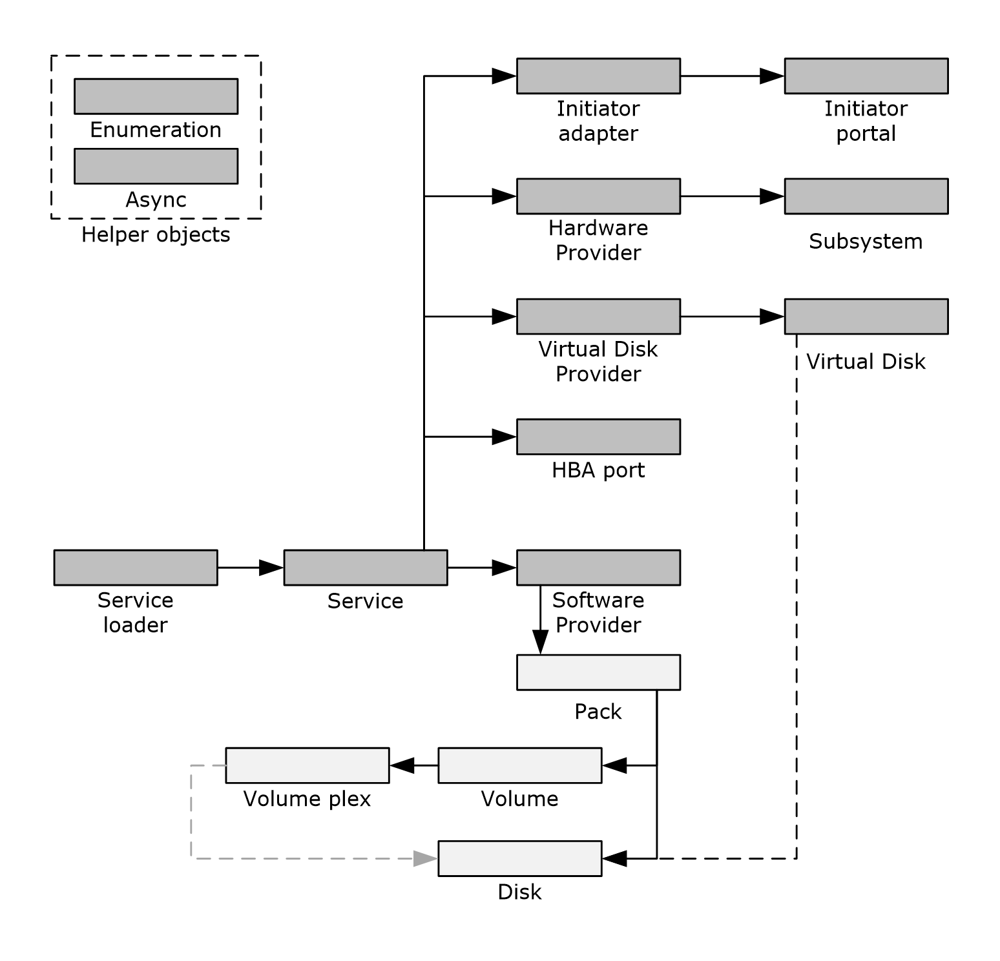
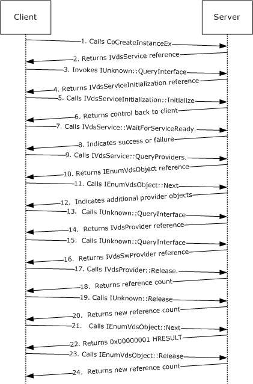
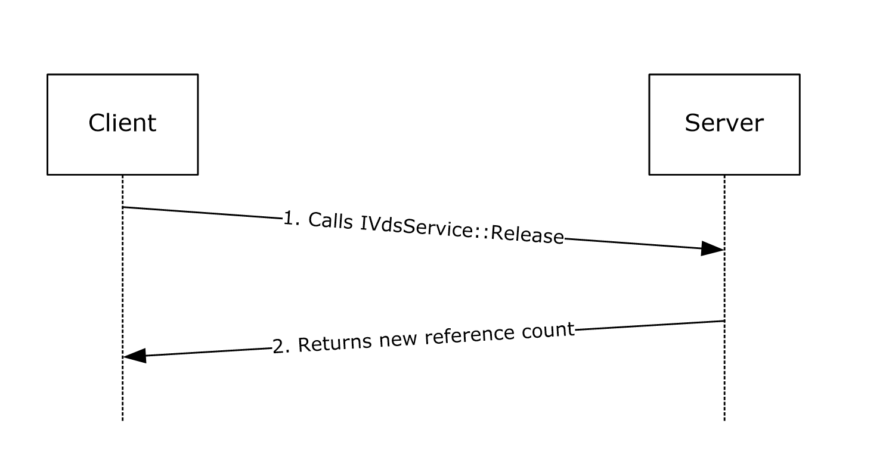
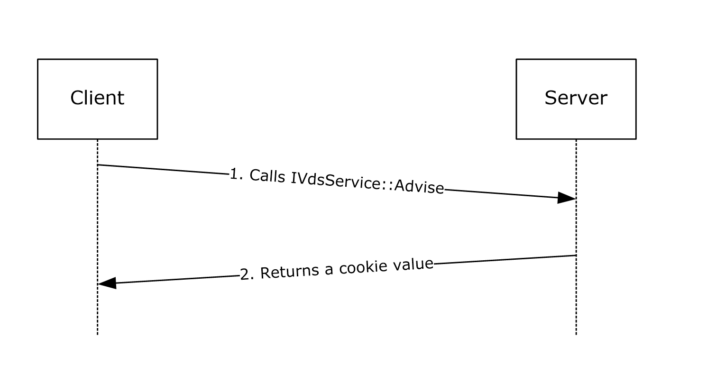
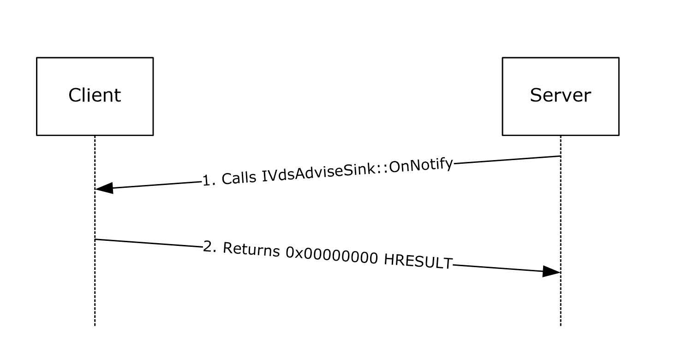
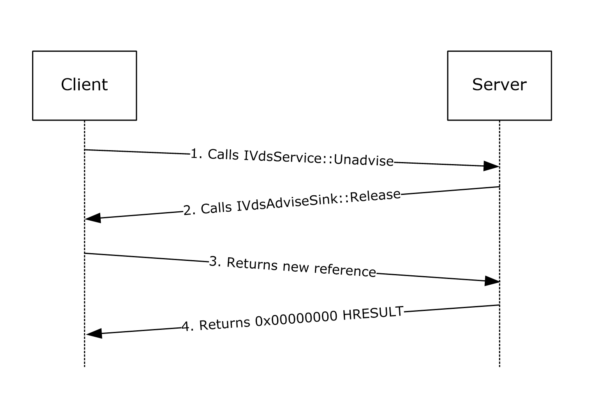
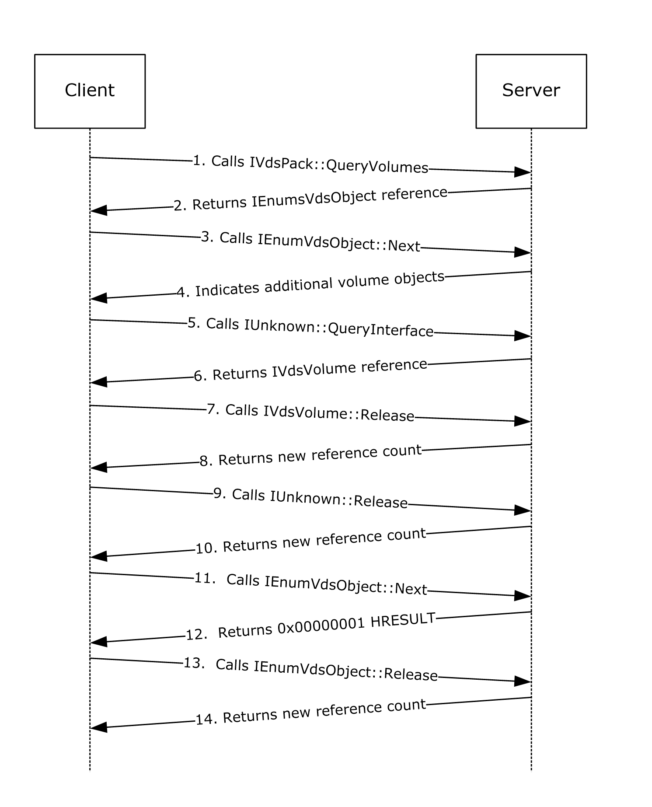
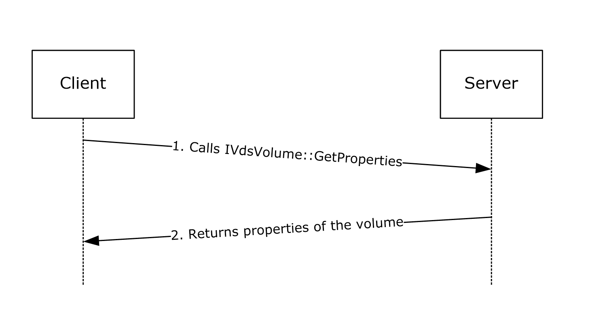
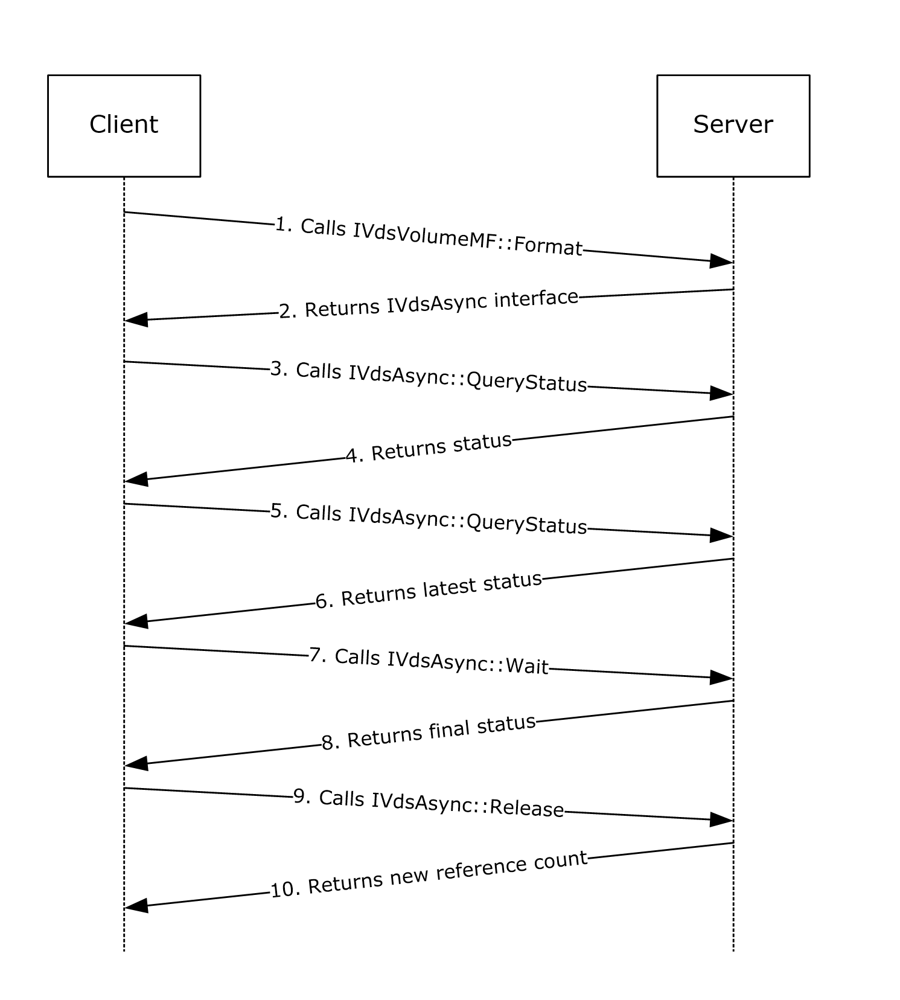

# [MS-VDS]: Virtual Disk Service (VDS) Protocol

Table of Contents

1 Introduction

- [1 Introduction](#Section_1)
  - [1.1 Glossary](#Section_1.1)
  - [1.2 References](#Section_1.2)
    - [1.2.1 Normative References](#Section_1.2.1)
    - [1.2.2 Informative References](#Section_1.2.2)
  - [1.3 Overview](#Section_1.3)
  - [1.4 Relationship to Other Protocols](#Section_1.4)
  - [1.5 Prerequisites and Preconditions](#Section_1.5)
  - [1.6 Applicability Statement](#Section_1.6)
  - [1.7 Versioning and Capability Negotiation](#Section_1.7)
  - [1.8 Vendor-Extensible Fields](#Section_1.8)
  - [1.9 Standards Assignments](#Section_1.9)

2 Messages

- [2 Messages](#Section_2)
  - [2.1 Transport](#Section_2.1)
  - [2.2 Message Syntax](#Section_2.2)
    - [2.2.1 Common Data Types](#Section_2.2.1)
      - [2.2.1.1 Data Types](#Section_2.2.1.1)
        - [2.2.1.1.1 ULONGLONG](#Section_2.2.1.1.1)
        - [2.2.1.1.2 DWORD](#Section_2.2.1.1.2)
        - [2.2.1.1.3 VDS_OBJECT_ID](#Section_2.2.1.1.3)
        - [2.2.1.1.4 VDS_LUN_INFORMATION](#Section_2.2.1.1.4)
        - [2.2.1.1.5 ACCESS_MASK](#Section_2.2.1.1.5)
      - [2.2.1.2 Enumerations](#Section_2.2.1.2)
        - [2.2.1.2.1 VDS_HEALTH](#Section_2.2.1.2.1)
        - [2.2.1.2.2 VDS_NOTIFICATION_TARGET_TYPE](#Section_2.2.1.2.2)
        - [2.2.1.2.3 VDS_RECOVER_ACTION](#Section_2.2.1.2.3)
        - [2.2.1.2.4 VDS_ASYNC_OUTPUT_TYPE](#Section_2.2.1.2.4)
        - [2.2.1.2.5 VDS_STORAGE_BUS_TYPE](#Section_2.2.1.2.5)
        - [2.2.1.2.6 VDS_STORAGE_IDENTIFIER_CODE_SET](#Section_2.2.1.2.6)
        - [2.2.1.2.7 VDS_STORAGE_IDENTIFIER_TYPE](#Section_2.2.1.2.7)
        - [2.2.1.2.8 VDS_INTERCONNECT_ADDRESS_TYPE](#Section_2.2.1.2.8)
        - [2.2.1.2.9 VDS_FILE_SYSTEM_TYPE](#Section_2.2.1.2.9)
        - [2.2.1.2.10 VDS_FILE_SYSTEM_FLAG](#Section_2.2.1.2.10)
        - [2.2.1.2.11 VDS_FILE_SYSTEM_PROP_FLAG](#Section_2.2.1.2.11)
        - [2.2.1.2.12 VDS_FILE_SYSTEM_FORMAT_SUPPORT_FLAG](#Section_2.2.1.2.12)
        - [2.2.1.2.13 VDS_DISK_EXTENT_TYPE](#Section_2.2.1.2.13)
        - [2.2.1.2.14 VDS_PARTITION_STYLE](#Section_2.2.1.2.14)
        - [2.2.1.2.15 VDS_PARTITION_FLAG](#Section_2.2.1.2.15)
        - [2.2.1.2.16 VDS_VOLUME_TYPE](#Section_2.2.1.2.16)
        - [2.2.1.2.17 VDS_TRANSITION_STATE](#Section_2.2.1.2.17)
        - [2.2.1.2.18 VDS_FORMAT_OPTION_FLAGS](#Section_2.2.1.2.18)
        - [2.2.1.2.19 VDS_DISK_FLAG](#Section_2.2.1.2.19)
        - [2.2.1.2.20 VDS_DISK_STATUS](#Section_2.2.1.2.20)
        - [2.2.1.2.21 VDS_LUN_RESERVE_MODE](#Section_2.2.1.2.21)
        - [2.2.1.2.22 VDS_VOLUME_STATUS](#Section_2.2.1.2.22)
        - [2.2.1.2.23 VDS_VOLUME_FLAG](#Section_2.2.1.2.23)
      - [2.2.1.3 Structures](#Section_2.2.1.3)
        - [2.2.1.3.1 VDS_SERVICE_NOTIFICATION](#Section_2.2.1.3.1)
        - [2.2.1.3.2 VDS_PACK_NOTIFICATION](#Section_2.2.1.3.2)
        - [2.2.1.3.3 VDS_DISK_NOTIFICATION](#Section_2.2.1.3.3)
        - [2.2.1.3.4 VDS_VOLUME_NOTIFICATION](#Section_2.2.1.3.4)
        - [2.2.1.3.5 VDS_PARTITION_NOTIFICATION](#Section_2.2.1.3.5)
        - [2.2.1.3.6 VDS_DRIVE_LETTER_NOTIFICATION](#Section_2.2.1.3.6)
        - [2.2.1.3.7 VDS_FILE_SYSTEM_NOTIFICATION](#Section_2.2.1.3.7)
        - [2.2.1.3.8 VDS_MOUNT_POINT_NOTIFICATION](#Section_2.2.1.3.8)
        - [2.2.1.3.9 VDS_NOTIFICATION](#Section_2.2.1.3.9)
        - [2.2.1.3.10 VDS_ASYNC_OUTPUT](#Section_2.2.1.3.10)
        - [2.2.1.3.11 VDS_PARTITION_INFO_MBR](#Section_2.2.1.3.11)
        - [2.2.1.3.12 VDS_PARTITION_INFO_GPT](#Section_2.2.1.3.12)
        - [2.2.1.3.13 VDS_STORAGE_IDENTIFIER](#Section_2.2.1.3.13)
        - [2.2.1.3.14 VDS_STORAGE_DEVICE_ID_DESCRIPTOR](#Section_2.2.1.3.14)
        - [2.2.1.3.15 VDS_INTERCONNECT](#Section_2.2.1.3.15)
        - [2.2.1.3.16 VDS_LUN_INFORMATION](#Section_2.2.1.3.16)
        - [2.2.1.3.17 VDS_FILE_SYSTEM_PROP](#Section_2.2.1.3.17)
        - [2.2.1.3.18 VDS_FILE_SYSTEM_FORMAT_SUPPORT_PROP](#Section_2.2.1.3.18)
        - [2.2.1.3.19 VDS_DISK_EXTENT](#Section_2.2.1.3.19)
        - [2.2.1.3.20 VDS_PARTITION_PROP](#Section_2.2.1.3.20)
        - [2.2.1.3.21 VDS_INPUT_DISK](#Section_2.2.1.3.21)
        - [2.2.1.3.22 CREATE_PARTITION_PARAMETERS](#Section_2.2.1.3.22)
        - [2.2.1.3.23 VIRTUAL_STORAGE_TYPE](#Section_2.2.1.3.23)
    - [2.2.2 Interface-Specific Data Types](#Section_2.2.2)
      - [2.2.2.1 IVdsService Data Types](#Section_2.2.2.1)
        - [2.2.2.1.1 Data Types](#Section_2.2.2.1.1)
          - [2.2.2.1.1.1 MAX_FS_NAME_SIZE](#Section_2.2.2.1.1.1)
        - [2.2.2.1.2 Enumerations](#Section_2.2.2.1.2)
          - [2.2.2.1.2.1 VDS_OBJECT_TYPE](#Section_2.2.2.1.2.1)
          - [2.2.2.1.2.2 VDS_SERVICE_FLAG](#Section_2.2.2.1.2.2)
          - [2.2.2.1.2.3 VDS_QUERY_PROVIDER_FLAG](#Section_2.2.2.1.2.3)
          - [2.2.2.1.2.4 VDS_DRIVE_LETTER_FLAG](#Section_2.2.2.1.2.4)
        - [2.2.2.1.3 Structures](#Section_2.2.2.1.3)
          - [2.2.2.1.3.1 VDS_SERVICE_PROP](#Section_2.2.2.1.3.1)
          - [2.2.2.1.3.2 VDS_DRIVE_LETTER_PROP](#Section_2.2.2.1.3.2)
          - [2.2.2.1.3.3 VDS_FILE_SYSTEM_TYPE_PROP](#Section_2.2.2.1.3.3)
      - [2.2.2.2 IVdsServiceSAN Data Types](#Section_2.2.2.2)
        - [2.2.2.2.1 Enumerations](#Section_2.2.2.2.1)
          - [2.2.2.2.1.1 VDS_SAN_POLICY](#Section_2.2.2.2.1.1)
      - [2.2.2.3 IVdsServiceIscsi Data Types](#Section_2.2.2.3)
        - [2.2.2.3.1 Structures](#Section_2.2.2.3.1)
          - [2.2.2.3.1.1 VDS_ISCSI_SHARED_SECRET](#Section_2.2.2.3.1.1)
      - [2.2.2.4 IVdsHbaPort Data Types](#Section_2.2.2.4)
        - [2.2.2.4.1 Enumerations](#Section_2.2.2.4.1)
          - [2.2.2.4.1.1 VDS_HBAPORT_TYPE](#Section_2.2.2.4.1.1)
          - [2.2.2.4.1.2 VDS_HBAPORT_STATUS](#Section_2.2.2.4.1.2)
          - [2.2.2.4.1.3 VDS_HBAPORT_SPEED_FLAG](#Section_2.2.2.4.1.3)
          - [2.2.2.4.1.4 VDS_PATH_STATUS](#Section_2.2.2.4.1.4)
        - [2.2.2.4.2 Structures](#Section_2.2.2.4.2)
          - [2.2.2.4.2.1 VDS_WWN](#Section_2.2.2.4.2.1)
          - [2.2.2.4.2.2 VDS_HBAPORT_PROP](#Section_2.2.2.4.2.2)
      - [2.2.2.5 IVdsIscsiInitiatorAdapter Data Types](#Section_2.2.2.5)
        - [2.2.2.5.1 Structures](#Section_2.2.2.5.1)
          - [2.2.2.5.1.1 VDS_ISCSI_INITIATOR_ADAPTER_PROP](#Section_2.2.2.5.1.1)
      - [2.2.2.6 IVdsIscsiInitiatorPortal Data Types](#Section_2.2.2.6)
        - [2.2.2.6.1 Enumerations](#Section_2.2.2.6.1)
          - [2.2.2.6.1.1 VDS_IPADDRESS_TYPE](#Section_2.2.2.6.1.1)
        - [2.2.2.6.2 Structures](#Section_2.2.2.6.2)
          - [2.2.2.6.2.1 VDS_IPADDRESS](#Section_2.2.2.6.2.1)
          - [2.2.2.6.2.2 VDS_ISCSI_INITIATOR_PORTAL_PROP](#Section_2.2.2.6.2.2)
      - [2.2.2.7 IVdsProvider Data Types](#Section_2.2.2.7)
        - [2.2.2.7.1 Enumerations](#Section_2.2.2.7.1)
          - [2.2.2.7.1.1 VDS_PROVIDER_TYPE](#Section_2.2.2.7.1.1)
          - [2.2.2.7.1.2 VDS_PROVIDER_FLAG](#Section_2.2.2.7.1.2)
        - [2.2.2.7.2 Structures](#Section_2.2.2.7.2)
          - [2.2.2.7.2.1 VDS_PROVIDER_PROP](#Section_2.2.2.7.2.1)
      - [2.2.2.8 IVdsPack Data Types](#Section_2.2.2.8)
        - [2.2.2.8.1 Enumerations](#Section_2.2.2.8.1)
          - [2.2.2.8.1.1 VDS_PACK_STATUS](#Section_2.2.2.8.1.1)
          - [2.2.2.8.1.2 VDS_PACK_FLAG](#Section_2.2.2.8.1.2)
        - [2.2.2.8.2 Structures](#Section_2.2.2.8.2)
          - [2.2.2.8.2.1 VDS_PACK_PROP](#Section_2.2.2.8.2.1)
      - [2.2.2.9 IVdsDisk Data Types](#Section_2.2.2.9)
        - [2.2.2.9.1 Structures](#Section_2.2.2.9.1)
          - [2.2.2.9.1.1 VDS_DISK_PROP](#Section_2.2.2.9.1.1)
      - [2.2.2.10 IVdsDisk3 Data Types](#Section_2.2.2.10)
        - [2.2.2.10.1 Enumerations](#Section_2.2.2.10.1)
          - [2.2.2.10.1.1 VDS_DISK_OFFLINE_REASON](#Section_2.2.2.10.1.1)
        - [2.2.2.10.2 Structures](#Section_2.2.2.10.2)
          - [2.2.2.10.2.1 VDS_DISK_PROP2](#Section_2.2.2.10.2.1)
          - [2.2.2.10.2.2 VDS_DISK_FREE_EXTENT](#Section_2.2.2.10.2.2)
      - [2.2.2.11 IVdsAdvancedDisk Data Types](#Section_2.2.2.11)
        - [2.2.2.11.1 Structures](#Section_2.2.2.11.1)
          - [2.2.2.11.1.1 CHANGE_ATTRIBUTES_PARAMETERS](#Section_2.2.2.11.1.1)
      - [2.2.2.12 IVdsAdvancedDisk2 Data Types](#Section_2.2.2.12)
        - [2.2.2.12.1 Structures](#Section_2.2.2.12.1)
          - [2.2.2.12.1.1 CHANGE_PARTITION_TYPE_PARAMETERS](#Section_2.2.2.12.1.1)
      - [2.2.2.13 IVdsAdvancedDisk3 Data Types](#Section_2.2.2.13)
        - [2.2.2.13.1 Structures](#Section_2.2.2.13.1)
          - [2.2.2.13.1.1 VDS_ADVANCEDDISK_PROP](#Section_2.2.2.13.1.1)
      - [2.2.2.14 IVdsVolume Data Types](#Section_2.2.2.14)
        - [2.2.2.14.1 Structures](#Section_2.2.2.14.1)
          - [2.2.2.14.1.1 VDS_VOLUME_PROP](#Section_2.2.2.14.1.1)
      - [2.2.2.15 IVdsVolume2 Data Types](#Section_2.2.2.15)
        - [2.2.2.15.1 Structures](#Section_2.2.2.15.1)
          - [2.2.2.15.1.1 VDS_VOLUME_PROP2](#Section_2.2.2.15.1.1)
      - [2.2.2.16 IVdsVolumeMF Data Types](#Section_2.2.2.16)
        - [2.2.2.16.1 Data Types](#Section_2.2.2.16.1)
          - [2.2.2.16.1.1 MAX_PATH](#Section_2.2.2.16.1.1)
        - [2.2.2.16.2 Structures](#Section_2.2.2.16.2)
          - [2.2.2.16.2.1 VDS_REPARSE_POINT_PROP](#Section_2.2.2.16.2.1)
      - [2.2.2.17 IVdsVolumePlex Data Types](#Section_2.2.2.17)
        - [2.2.2.17.1 Enumeration](#Section_2.2.2.17.1)
          - [2.2.2.17.1.1 VDS_VOLUME_PLEX_TYPE](#Section_2.2.2.17.1.1)
          - [2.2.2.17.1.2 VDS_VOLUME_PLEX_STATUS](#Section_2.2.2.17.1.2)
        - [2.2.2.17.2 Structures](#Section_2.2.2.17.2)
          - [2.2.2.17.2.1 VDS_VOLUME_PLEX_PROP](#Section_2.2.2.17.2.1)
      - [2.2.2.18 IVdsVdProvider Data Types](#Section_2.2.2.18)
        - [2.2.2.18.1 Enumerations](#Section_2.2.2.18.1)
          - [2.2.2.18.1.1 CREATE_VIRTUAL_DISK_FLAG](#Section_2.2.2.18.1.1)
        - [2.2.2.18.2 Structures](#Section_2.2.2.18.2)
          - [2.2.2.18.2.1 VDS_CREATE_VDISK_PARAMETERS](#Section_2.2.2.18.2.1)
      - [2.2.2.19 IVdsVDisk Data Types](#Section_2.2.2.19)
        - [2.2.2.19.1 Enumerations](#Section_2.2.2.19.1)
          - [2.2.2.19.1.1 VDS_VDISK_STATE](#Section_2.2.2.19.1.1)
          - [2.2.2.19.1.2 OPEN_VIRTUAL_DISK_FLAG](#Section_2.2.2.19.1.2)
          - [2.2.2.19.1.3 DEPENDENT_DISK_FLAG](#Section_2.2.2.19.1.3)
          - [2.2.2.19.1.4 VIRTUAL_DISK_ACCESS_MASK](#Section_2.2.2.19.1.4)
        - [2.2.2.19.2 Structures](#Section_2.2.2.19.2)
          - [2.2.2.19.2.1 VDS_VDISK_PROPERTIES](#Section_2.2.2.19.2.1)
      - [2.2.2.20 IVdsOpenVDisk Data Types](#Section_2.2.2.20)
        - [2.2.2.20.1 Enumerations](#Section_2.2.2.20.1)
          - [2.2.2.20.1.1 ATTACH_VIRTUAL_DISK_FLAG](#Section_2.2.2.20.1.1)
          - [2.2.2.20.1.2 DETACH_VIRTUAL_DISK_FLAG](#Section_2.2.2.20.1.2)
          - [2.2.2.20.1.3 COMPACT_VIRTUAL_DISK_FLAG](#Section_2.2.2.20.1.3)
          - [2.2.2.20.1.4 MERGE_VIRTUAL_DISK_FLAG](#Section_2.2.2.20.1.4)
          - [2.2.2.20.1.5 EXPAND_VIRTUAL_DISK_FLAG](#Section_2.2.2.20.1.5)
    - [2.2.3 Error Codes](#Section_2.2.3)

3 Protocol Details

- [3 Protocol Details](#Section_3)
  - [3.1 Interfaces](#Section_3.1)
    - [3.1.1 Enumeration Object Interfaces](#Section_3.1.1)
      - [3.1.1.1 IEnumVdsObject Interface](#Section_3.1.1.1)
    - [3.1.2 Callback Object Interfaces](#Section_3.1.2)
      - [3.1.2.1 IVdsAdviseSink Interface](#Section_3.1.2.1)
    - [3.1.3 Asynchronous Operation Object Interfaces](#Section_3.1.3)
      - [3.1.3.1 IVdsAsync Interface](#Section_3.1.3.1)
    - [3.1.4 Service Loader Interfaces](#Section_3.1.4)
      - [3.1.4.1 IVdsServiceLoader Interface](#Section_3.1.4.1)
    - [3.1.5 Service Object Interfaces](#Section_3.1.5)
      - [3.1.5.1 IVdsService Interface](#Section_3.1.5.1)
      - [3.1.5.2 IVdsServiceInitialization Interface](#Section_3.1.5.2)
      - [3.1.5.3 IVdsServiceUninstallDisk Interface](#Section_3.1.5.3)
      - [3.1.5.4 IVdsServiceHba Interface](#Section_3.1.5.4)
      - [3.1.5.5 IVdsServiceIscsi Interface](#Section_3.1.5.5)
      - [3.1.5.6 IVdsServiceSAN Interface](#Section_3.1.5.6)
      - [3.1.5.7 IVdsServiceSw Interface](#Section_3.1.5.7)
    - [3.1.6 HBA Port Object Interfaces](#Section_3.1.6)
      - [3.1.6.1 IVdsHbaPort Interface](#Section_3.1.6.1)
    - [3.1.7 Initiator Adapter Object Interfaces](#Section_3.1.7)
      - [3.1.7.1 IVdsIscsiInitiatorAdapter Interface](#Section_3.1.7.1)
    - [3.1.8 Initiator Portal Object Interfaces](#Section_3.1.8)
      - [3.1.8.1 IVdsIscsiInitiatorPortal Interface](#Section_3.1.8.1)
    - [3.1.9 Provider Object Interfaces](#Section_3.1.9)
      - [3.1.9.1 IVdsProvider Interface](#Section_3.1.9.1)
      - [3.1.9.2 IVdsSwProvider Interface](#Section_3.1.9.2)
      - [3.1.9.3 IVdsHwProvider Interface](#Section_3.1.9.3)
      - [3.1.9.4 IVdsVdProvider Interface](#Section_3.1.9.4)
    - [3.1.10 Subsystem Object Interfaces](#Section_3.1.10)
      - [3.1.10.1 IVdsSubSystemImportTarget Interface](#Section_3.1.10.1)
    - [3.1.11 Pack Object Interfaces](#Section_3.1.11)
      - [3.1.11.1 IVdsPack Interface](#Section_3.1.11.1)
      - [3.1.11.2 IVdsPack2 Interface](#Section_3.1.11.2)
    - [3.1.12 Disk Object Interfaces](#Section_3.1.12)
      - [3.1.12.1 IVdsDisk Interface](#Section_3.1.12.1)
      - [3.1.12.2 IVdsDisk2 Interface](#Section_3.1.12.2)
      - [3.1.12.3 IVdsDisk3 Interface](#Section_3.1.12.3)
      - [3.1.12.4 IVdsAdvancedDisk Interface](#Section_3.1.12.4)
      - [3.1.12.5 IVdsAdvancedDisk2 Interface](#Section_3.1.12.5)
      - [3.1.12.6 IVdsAdvancedDisk3 Interface](#Section_3.1.12.6)
      - [3.1.12.7 IVdsCreatePartitionEx Interface](#Section_3.1.12.7)
      - [3.1.12.8 IVdsDiskOnline Interface](#Section_3.1.12.8)
      - [3.1.12.9 IVdsDiskPartitionMF Interface](#Section_3.1.12.9)
      - [3.1.12.10 IVdsDiskPartitionMF2 Interface](#Section_3.1.12.10)
      - [3.1.12.11 IVdsRemovable Interface](#Section_3.1.12.11)
    - [3.1.13 Volume Object Interfaces](#Section_3.1.13)
      - [3.1.13.1 IVdsVolume Interface](#Section_3.1.13.1)
      - [3.1.13.2 IVdsVolume2 Interface](#Section_3.1.13.2)
      - [3.1.13.3 IVdsVolumeMF Interface](#Section_3.1.13.3)
      - [3.1.13.4 IVdsVolumeMF2 Interface](#Section_3.1.13.4)
      - [3.1.13.5 IVdsVolumeMF3 Interface](#Section_3.1.13.5)
      - [3.1.13.6 IVdsVolumeShrink Interface](#Section_3.1.13.6)
      - [3.1.13.7 IVdsVolumeOnline Interface](#Section_3.1.13.7)
    - [3.1.14 Volume Plex Object Interfaces](#Section_3.1.14)
      - [3.1.14.1 IVdsVolumePlex Interface](#Section_3.1.14.1)
    - [3.1.15 Virtual Disk Object Interfaces](#Section_3.1.15)
      - [3.1.15.1 IVdsVDisk Interface](#Section_3.1.15.1)
      - [3.1.15.2 IVdsOpenVDisk Interface](#Section_3.1.15.2)
  - [3.2 Common Details](#Section_3.2)
    - [3.2.1 Abstract Data Model](#Section_3.2.1)
      - [3.2.1.1 Method Invocation](#Section_3.2.1.1)
        - [3.2.1.1.1 Method Sequencing Requirements](#Section_3.2.1.1.1)
        - [3.2.1.1.2 Storage Object Relationships](#Section_3.2.1.1.2)
      - [3.2.1.2 Service and Providers](#Section_3.2.1.2)
      - [3.2.1.3 Packs](#Section_3.2.1.3)
      - [3.2.1.4 Disks](#Section_3.2.1.4)
      - [3.2.1.5 Volumes](#Section_3.2.1.5)
      - [3.2.1.6 Virtual Disks](#Section_3.2.1.6)
      - [3.2.1.7 File Systems, Drive Letters, and Access Paths](#Section_3.2.1.7)
    - [3.2.2 Timers](#Section_3.2.2)
    - [3.2.3 Initialization](#Section_3.2.3)
    - [3.2.4 Message Processing Events and Sequencing Rules](#Section_3.2.4)
    - [3.2.5 Timer Events](#Section_3.2.5)
    - [3.2.6 Other Local Events](#Section_3.2.6)
  - [3.3 Client Details](#Section_3.3)
    - [3.3.1 Abstract Data Model](#Section_3.3.1)
      - [3.3.1.1 Notification Callback Objects](#Section_3.3.1.1)
    - [3.3.2 Timers](#Section_3.3.2)
    - [3.3.3 Initialization](#Section_3.3.3)
    - [3.3.4 Message Processing Events and Sequencing Rules](#Section_3.3.4)
      - [3.3.4.1 Processing Server Replies to Method Calls](#Section_3.3.4.1)
      - [3.3.4.2 Processing Notifications Sent from the Server to the Client](#Section_3.3.4.2)
      - [3.3.4.3 IVdsAdviseSink Methods](#Section_3.3.4.3)
        - [3.3.4.3.1 IVdsAdviseSink::OnNotify (Opnum 3)](#Section_3.3.4.3.1)
    - [3.3.5 Timer Events](#Section_3.3.5)
    - [3.3.6 Other Local Events](#Section_3.3.6)
  - [3.4 Server Details](#Section_3.4)
    - [3.4.1 Abstract Data Model](#Section_3.4.1)
      - [3.4.1.1 Service Object](#Section_3.4.1.1)
      - [3.4.1.2 Storage Management Objects](#Section_3.4.1.2)
      - [3.4.1.3 Enumeration of Objects](#Section_3.4.1.3)
      - [3.4.1.4 Notification Callback Objects](#Section_3.4.1.4)
      - [3.4.1.5 Asynchronous Tasks](#Section_3.4.1.5)
    - [3.4.2 Timers](#Section_3.4.2)
    - [3.4.3 Initialization](#Section_3.4.3)
      - [3.4.3.1 Storage Management Objects](#Section_3.4.3.1)
      - [3.4.3.2 Notification Callback Objects](#Section_3.4.3.2)
    - [3.4.4 Higher-Layer Triggered Events](#Section_3.4.4)
    - [3.4.5 Message Processing Events and Sequencing Rules](#Section_3.4.5)
      - [3.4.5.1 Sequencing Rules](#Section_3.4.5.1)
        - [3.4.5.1.1 Adding Pack Objects for Dynamic Providers](#Section_3.4.5.1.1)
        - [3.4.5.1.2 Removing Pack Objects for Dynamic Providers](#Section_3.4.5.1.2)
        - [3.4.5.1.3 Adding Disk Objects](#Section_3.4.5.1.3)
        - [3.4.5.1.4 Removing Disk Objects](#Section_3.4.5.1.4)
        - [3.4.5.1.5 Adding Volume Objects](#Section_3.4.5.1.5)
        - [3.4.5.1.6 Removing Volume Objects](#Section_3.4.5.1.6)
        - [3.4.5.1.7 Adding Virtual Disk Objects](#Section_3.4.5.1.7)
        - [3.4.5.1.8 Removing Virtual Disk Objects](#Section_3.4.5.1.8)
        - [3.4.5.1.9 Handling Asynchronous Tasks](#Section_3.4.5.1.9)
      - [3.4.5.2 Message Processing Details](#Section_3.4.5.2)
        - [3.4.5.2.1 IEnumVdsObject Methods](#Section_3.4.5.2.1)
          - [3.4.5.2.1.1 IEnumVdsObject::Next (Opnum 3)](#Section_3.4.5.2.1.1)
          - [3.4.5.2.1.2 IEnumVdsObject::Skip (Opnum 4)](#Section_3.4.5.2.1.2)
          - [3.4.5.2.1.3 IEnumVdsObject::Reset (Opnum 5)](#Section_3.4.5.2.1.3)
          - [3.4.5.2.1.4 IEnumVdsObject::Clone (Opnum 6)](#Section_3.4.5.2.1.4)
        - [3.4.5.2.2 IVdsAsync Methods](#Section_3.4.5.2.2)
          - [3.4.5.2.2.1 IVdsAsync::Cancel (Opnum 3)](#Section_3.4.5.2.2.1)
          - [3.4.5.2.2.2 IVdsAsync::Wait (Opnum 4)](#Section_3.4.5.2.2.2)
          - [3.4.5.2.2.3 IVdsAsync::QueryStatus (Opnum 5)](#Section_3.4.5.2.2.3)
        - [3.4.5.2.3 IVdsServiceLoader Methods](#Section_3.4.5.2.3)
          - [3.4.5.2.3.1 IVdsServiceLoader::LoadService (Opnum 3)](#Section_3.4.5.2.3.1)
        - [3.4.5.2.4 IVdsService Methods](#Section_3.4.5.2.4)
          - [3.4.5.2.4.1 IVdsService::IsServiceReady (Opnum 3)](#Section_3.4.5.2.4.1)
          - [3.4.5.2.4.2 IVdsService::WaitForServiceReady (Opnum 4)](#Section_3.4.5.2.4.2)
          - [3.4.5.2.4.3 IVdsService::GetProperties (Opnum 5)](#Section_3.4.5.2.4.3)
          - [3.4.5.2.4.4 IVdsService::QueryProviders (Opnum 6)](#Section_3.4.5.2.4.4)
          - [3.4.5.2.4.5 IVdsService::QueryUnallocatedDisks (Opnum 8)](#Section_3.4.5.2.4.5)
          - [3.4.5.2.4.6 IVdsService::GetObject (Opnum 9)](#Section_3.4.5.2.4.6)
          - [3.4.5.2.4.7 IVdsService::QueryDriveLetters (Opnum 10)](#Section_3.4.5.2.4.7)
          - [3.4.5.2.4.8 IVdsService::QueryFileSystemTypes (Opnum 11)](#Section_3.4.5.2.4.8)
          - [3.4.5.2.4.9 IVdsService::Reenumerate (Opnum 12)](#Section_3.4.5.2.4.9)
          - [3.4.5.2.4.10 IVdsService::Refresh (Opnum 13)](#Section_3.4.5.2.4.10)
          - [3.4.5.2.4.11 IVdsService::CleanupObsoleteMountPoints (Opnum 14)](#Section_3.4.5.2.4.11)
          - [3.4.5.2.4.12 IVdsService::Advise (Opnum 15)](#Section_3.4.5.2.4.12)
          - [3.4.5.2.4.13 IVdsService::Unadvise (Opnum 16)](#Section_3.4.5.2.4.13)
          - [3.4.5.2.4.14 IVdsService::Reboot (Opnum 17)](#Section_3.4.5.2.4.14)
          - [3.4.5.2.4.15 IVdsService::SetFlags (Opnum 18)](#Section_3.4.5.2.4.15)
          - [3.4.5.2.4.16 IVdsService::ClearFlags (Opnum 19)](#Section_3.4.5.2.4.16)
        - [3.4.5.2.5 IVdsServiceInitialization Methods](#Section_3.4.5.2.5)
          - [3.4.5.2.5.1 IVdsServiceInitialization::Initialize (Opnum 3)](#Section_3.4.5.2.5.1)
        - [3.4.5.2.6 IVdsServiceUninstallDisk Methods](#Section_3.4.5.2.6)
          - [3.4.5.2.6.1 IVdsServiceUninstallDisk::GetDiskIdFromLunInfo (Opnum 3)](#Section_3.4.5.2.6.1)
          - [3.4.5.2.6.2 IVdsServiceUninstallDisk::UninstallDisks (Opnum 4)](#Section_3.4.5.2.6.2)
        - [3.4.5.2.7 IVdsServiceHba Methods](#Section_3.4.5.2.7)
          - [3.4.5.2.7.1 IVdsServiceHba::QueryHbaPorts (Opnum 3)](#Section_3.4.5.2.7.1)
        - [3.4.5.2.8 IVdsServiceIscsi Methods](#Section_3.4.5.2.8)
          - [3.4.5.2.8.1 IVdsServiceIscsi::GetInitiatorName (Opnum 3)](#Section_3.4.5.2.8.1)
          - [3.4.5.2.8.2 IVdsServiceIscsi::QueryInitiatorAdapters (Opnum 4)](#Section_3.4.5.2.8.2)
          - [3.4.5.2.8.3 IVdsServiceIscsi::SetInitiatorSharedSecret (Opnum 8)](#Section_3.4.5.2.8.3)
        - [3.4.5.2.9 IVdsServiceSAN Methods](#Section_3.4.5.2.9)
          - [3.4.5.2.9.1 IVdsServiceSAN::GetSANPolicy (Opnum 3)](#Section_3.4.5.2.9.1)
          - [3.4.5.2.9.2 IVdsServiceSAN::SetSANPolicy (Opnum 4)](#Section_3.4.5.2.9.2)
        - [3.4.5.2.10 IVdsServiceSw Methods](#Section_3.4.5.2.10)
          - [3.4.5.2.10.1 IVdsServiceSw::GetDiskObject (Opnum 3)](#Section_3.4.5.2.10.1)
        - [3.4.5.2.11 IVdsHbaPort Methods](#Section_3.4.5.2.11)
          - [3.4.5.2.11.1 IVdsHbaPort::GetProperties (Opnum 3)](#Section_3.4.5.2.11.1)
          - [3.4.5.2.11.2 IVdsHbaPort::SetAllPathStatuses (Opnum 4)](#Section_3.4.5.2.11.2)
        - [3.4.5.2.12 IVdsIscsiInitiatorAdapter Methods](#Section_3.4.5.2.12)
          - [3.4.5.2.12.1 IVdsIscsiInitiatorAdapter::GetProperties (Opnum 3)](#Section_3.4.5.2.12.1)
          - [3.4.5.2.12.2 IVdsIscsiInitiatorAdapter::QueryInitiatorPortals (Opnum 4)](#Section_3.4.5.2.12.2)
        - [3.4.5.2.13 IVdsIscsiInitiatorPortal Methods](#Section_3.4.5.2.13)
          - [3.4.5.2.13.1 IVdsIscsiInitiatorPortal::GetProperties (Opnum 3)](#Section_3.4.5.2.13.1)
          - [3.4.5.2.13.2 IVdsIscsiInitiatorPortal::GetInitiatorAdapter (Opnum 4)](#Section_3.4.5.2.13.2)
        - [3.4.5.2.14 IVdsProvider Methods](#Section_3.4.5.2.14)
          - [3.4.5.2.14.1 IVdsProvider::GetProperties (Opnum 3)](#Section_3.4.5.2.14.1)
        - [3.4.5.2.15 IVdsSwProvider Methods](#Section_3.4.5.2.15)
          - [3.4.5.2.15.1 IVdsSwProvider::QueryPacks (Opnum 3)](#Section_3.4.5.2.15.1)
          - [3.4.5.2.15.2 IVdsSwProvider::CreatePack (Opnum 4)](#Section_3.4.5.2.15.2)
        - [3.4.5.2.16 IVdsHwProvider Methods](#Section_3.4.5.2.16)
          - [3.4.5.2.16.1 IVdsHwProvider::QuerySubSystems (Opnum 3)](#Section_3.4.5.2.16.1)
        - [3.4.5.2.17 IVdsVdProvider Methods](#Section_3.4.5.2.17)
          - [3.4.5.2.17.1 IVdsVdProvider::QueryVDisks (Opnum 3)](#Section_3.4.5.2.17.1)
          - [3.4.5.2.17.2 IVdsVdProvider::CreateVDisk (Opnum 4)](#Section_3.4.5.2.17.2)
          - [3.4.5.2.17.3 IVdsVdProvider::AddVDisk (Opnum 5)](#Section_3.4.5.2.17.3)
          - [3.4.5.2.17.4 IVdsVdProvider::GetDiskFromVDisk (Opnum 6)](#Section_3.4.5.2.17.4)
          - [3.4.5.2.17.5 IVdsVdProvider::GetVDiskFromDisk (Opnum 7)](#Section_3.4.5.2.17.5)
        - [3.4.5.2.18 IVdsSubSystemImportTarget Methods](#Section_3.4.5.2.18)
          - [3.4.5.2.18.1 IVdsSubSystemImportTarget::GetImportTarget (Opnum 3)](#Section_3.4.5.2.18.1)
          - [3.4.5.2.18.2 IVdsSubSystemImportTarget::SetImportTarget (Opnum 4)](#Section_3.4.5.2.18.2)
        - [3.4.5.2.19 IVdsPack Methods](#Section_3.4.5.2.19)
          - [3.4.5.2.19.1 IVdsPack::GetProperties (Opnum 3)](#Section_3.4.5.2.19.1)
          - [3.4.5.2.19.2 IVdsPack::GetProvider (Opnum 4)](#Section_3.4.5.2.19.2)
          - [3.4.5.2.19.3 IVdsPack::QueryVolumes (Opnum 5)](#Section_3.4.5.2.19.3)
          - [3.4.5.2.19.4 IVdsPack::QueryDisks (Opnum 6)](#Section_3.4.5.2.19.4)
          - [3.4.5.2.19.5 IVdsPack::CreateVolume (Opnum 7)](#Section_3.4.5.2.19.5)
          - [3.4.5.2.19.6 IVdsPack::AddDisk (Opnum 8)](#Section_3.4.5.2.19.6)
          - [3.4.5.2.19.7 IVdsPack::MigrateDisks (Opnum 9)](#Section_3.4.5.2.19.7)
          - [3.4.5.2.19.8 IVdsPack::RemoveMissingDisk (Opnum 11)](#Section_3.4.5.2.19.8)
          - [3.4.5.2.19.9 IVdsPack::Recover (Opnum 12)](#Section_3.4.5.2.19.9)
        - [3.4.5.2.20 IVdsPack2 Methods](#Section_3.4.5.2.20)
          - [3.4.5.2.20.1 IVdsPack2::CreateVolume2 (Opnum 3)](#Section_3.4.5.2.20.1)
        - [3.4.5.2.21 IVdsDisk Methods](#Section_3.4.5.2.21)
          - [3.4.5.2.21.1 IVdsDisk::GetProperties (Opnum 3)](#Section_3.4.5.2.21.1)
          - [3.4.5.2.21.2 IVdsDisk::GetPack (Opnum 4)](#Section_3.4.5.2.21.2)
          - [3.4.5.2.21.3 IVdsDisk::GetIdentificationData (Opnum 5)](#Section_3.4.5.2.21.3)
          - [3.4.5.2.21.4 IVdsDisk::QueryExtents (Opnum 6)](#Section_3.4.5.2.21.4)
          - [3.4.5.2.21.5 IVdsDisk::ConvertStyle (Opnum 7)](#Section_3.4.5.2.21.5)
          - [3.4.5.2.21.6 IVdsDisk::SetFlags (Opnum 8)](#Section_3.4.5.2.21.6)
          - [3.4.5.2.21.7 IVdsDisk::ClearFlags (Opnum 9)](#Section_3.4.5.2.21.7)
        - [3.4.5.2.22 IVdsDisk2 Methods](#Section_3.4.5.2.22)
          - [3.4.5.2.22.1 IVdsDisk2::SetSANMode (Opnum 3)](#Section_3.4.5.2.22.1)
        - [3.4.5.2.23 IVdsDisk3 Methods](#Section_3.4.5.2.23)
          - [3.4.5.2.23.1 IVdsDisk3::GetProperties2 (Opnum 3)](#Section_3.4.5.2.23.1)
          - [3.4.5.2.23.2 IVdsDisk3::QueryFreeExtents (Opnum 6)](#Section_3.4.5.2.23.2)
        - [3.4.5.2.24 IVdsAdvancedDisk Methods](#Section_3.4.5.2.24)
          - [3.4.5.2.24.1 IVdsAdvancedDisk::GetPartitionProperties (Opnum 3)](#Section_3.4.5.2.24.1)
          - [3.4.5.2.24.2 IVdsAdvancedDisk::QueryPartitions (Opnum 4)](#Section_3.4.5.2.24.2)
          - [3.4.5.2.24.3 IVdsAdvancedDisk::CreatePartition (Opnum 5)](#Section_3.4.5.2.24.3)
          - [3.4.5.2.24.4 IVdsAdvancedDisk::DeletePartition (Opnum 6)](#Section_3.4.5.2.24.4)
          - [3.4.5.2.24.5 IVdsAdvancedDisk::ChangeAttributes (Opnum 7)](#Section_3.4.5.2.24.5)
          - [3.4.5.2.24.6 IVdsAdvancedDisk::AssignDriveLetter (Opnum 8)](#Section_3.4.5.2.24.6)
          - [3.4.5.2.24.7 IVdsAdvancedDisk::DeleteDriveLetter (Opnum 9)](#Section_3.4.5.2.24.7)
          - [3.4.5.2.24.8 IVdsAdvancedDisk::GetDriveLetter (Opnum 10)](#Section_3.4.5.2.24.8)
          - [3.4.5.2.24.9 IVdsAdvancedDisk::FormatPartition (Opnum 11)](#Section_3.4.5.2.24.9)
          - [3.4.5.2.24.10 IVdsAdvancedDisk::Clean (Opnum 12)](#Section_3.4.5.2.24.10)
        - [3.4.5.2.25 IVdsAdvancedDisk2 Methods](#Section_3.4.5.2.25)
          - [3.4.5.2.25.1 IVdsAdvancedDisk2::ChangePartitionType (Opnum 3)](#Section_3.4.5.2.25.1)
        - [3.4.5.2.26 IVdsAdvancedDisk3 Methods](#Section_3.4.5.2.26)
          - [3.4.5.2.26.1 IVdsAdvancedDisk3::GetProperties (Opnum 3)](#Section_3.4.5.2.26.1)
          - [3.4.5.2.26.2 IVdsAdvancedDisk3::GetUniqueId (Opnum 4)](#Section_3.4.5.2.26.2)
        - [3.4.5.2.27 IVdsCreatePartitionEx Methods](#Section_3.4.5.2.27)
          - [3.4.5.2.27.1 IVdsCreatePartitionEx::CreatePartitionEx (Opnum 3)](#Section_3.4.5.2.27.1)
        - [3.4.5.2.28 IVdsDiskOnline Methods](#Section_3.4.5.2.28)
          - [3.4.5.2.28.1 IVdsDiskOnline::Online (Opnum 3)](#Section_3.4.5.2.28.1)
          - [3.4.5.2.28.2 IVdsDiskOnline::Offline (Opnum 4)](#Section_3.4.5.2.28.2)
        - [3.4.5.2.29 IVdsDiskPartitionMF Methods](#Section_3.4.5.2.29)
          - [3.4.5.2.29.1 IVdsDiskPartitionMF::GetPartitionFileSystemProperties (Opnum 3)](#Section_3.4.5.2.29.1)
          - [3.4.5.2.29.2 IVdsDiskPartitionMF::GetPartitionFileSystemTypeName (Opnum 4)](#Section_3.4.5.2.29.2)
          - [3.4.5.2.29.3 IVdsDiskPartitionMF::QueryPartitionFileSystemFormatSupport (Opnum 5)](#Section_3.4.5.2.29.3)
          - [3.4.5.2.29.4 IVdsDiskPartitionMF::FormatPartitionEx (Opnum 6)](#Section_3.4.5.2.29.4)
        - [3.4.5.2.30 IVdsDiskPartitionMF2 Methods](#Section_3.4.5.2.30)
          - [3.4.5.2.30.1 IVdsDiskPartitionMF2::FormatPartitionEx2 (Opnum 3)](#Section_3.4.5.2.30.1)
        - [3.4.5.2.31 IVdsRemovable Methods](#Section_3.4.5.2.31)
          - [3.4.5.2.31.1 IVdsRemovable::QueryMedia (Opnum 3)](#Section_3.4.5.2.31.1)
          - [3.4.5.2.31.2 IVdsRemovable::Eject (Opnum 4)](#Section_3.4.5.2.31.2)
        - [3.4.5.2.32 IVdsVolume Methods](#Section_3.4.5.2.32)
          - [3.4.5.2.32.1 IVdsVolume::GetProperties (Opnum 3)](#Section_3.4.5.2.32.1)
          - [3.4.5.2.32.2 IVdsVolume::GetPack (Opnum 4)](#Section_3.4.5.2.32.2)
          - [3.4.5.2.32.3 IVdsVolume::QueryPlexes (Opnum 5)](#Section_3.4.5.2.32.3)
          - [3.4.5.2.32.4 IVdsVolume::Extend (Opnum 6)](#Section_3.4.5.2.32.4)
          - [3.4.5.2.32.5 IVdsVolume::Shrink (Opnum 7)](#Section_3.4.5.2.32.5)
          - [3.4.5.2.32.6 IVdsVolume::AddPlex (Opnum 8)](#Section_3.4.5.2.32.6)
          - [3.4.5.2.32.7 IVdsVolume::BreakPlex (Opnum 9)](#Section_3.4.5.2.32.7)
          - [3.4.5.2.32.8 IVdsVolume::RemovePlex (Opnum 10)](#Section_3.4.5.2.32.8)
          - [3.4.5.2.32.9 IVdsVolume::Delete (Opnum 11)](#Section_3.4.5.2.32.9)
          - [3.4.5.2.32.10 IVdsVolume::SetFlags (Opnum 12)](#Section_3.4.5.2.32.10)
          - [3.4.5.2.32.11 IVdsVolume::ClearFlags (Opnum 13)](#Section_3.4.5.2.32.11)
        - [3.4.5.2.33 IVdsVolume2 Methods](#Section_3.4.5.2.33)
          - [3.4.5.2.33.1 IVdsVolume2::GetProperties2 (Opnum 3)](#Section_3.4.5.2.33.1)
        - [3.4.5.2.34 IVdsVolumeMF Methods](#Section_3.4.5.2.34)
          - [3.4.5.2.34.1 IVdsVolumeMF::GetFileSystemProperties (Opnum 3)](#Section_3.4.5.2.34.1)
          - [3.4.5.2.34.2 IVdsVolumeMF::Format (Opnum 4)](#Section_3.4.5.2.34.2)
          - [3.4.5.2.34.3 IVdsVolumeMF::AddAccessPath (Opnum 5)](#Section_3.4.5.2.34.3)
          - [3.4.5.2.34.4 IVdsVolumeMF::QueryAccessPaths (Opnum 6)](#Section_3.4.5.2.34.4)
          - [3.4.5.2.34.5 IVdsVolumeMF::QueryReparsePoints (Opnum 7)](#Section_3.4.5.2.34.5)
          - [3.4.5.2.34.6 IVdsVolumeMF::DeleteAccessPath (Opnum 8)](#Section_3.4.5.2.34.6)
          - [3.4.5.2.34.7 IVdsVolumeMF::Mount (Opnum 9)](#Section_3.4.5.2.34.7)
          - [3.4.5.2.34.8 IVdsVolumeMF::Dismount (Opnum 10)](#Section_3.4.5.2.34.8)
          - [3.4.5.2.34.9 IVdsVolumeMF::SetFileSystemFlags (Opnum 11)](#Section_3.4.5.2.34.9)
          - [3.4.5.2.34.10 IVdsVolumeMF::ClearFileSystemFlags (Opnum 12)](#Section_3.4.5.2.34.10)
        - [3.4.5.2.35 IVdsVolumeMF2 Methods](#Section_3.4.5.2.35)
          - [3.4.5.2.35.1 IVdsVolumeMF2::GetFileSystemTypeName (Opnum 3)](#Section_3.4.5.2.35.1)
          - [3.4.5.2.35.2 IVdsVolumeMF2::QueryFileSystemFormatSupport (Opnum 4)](#Section_3.4.5.2.35.2)
          - [3.4.5.2.35.3 IVdsVolumeMF2::FormatEx (Opnum 5)](#Section_3.4.5.2.35.3)
        - [3.4.5.2.36 IVdsVolumeMF3 Methods](#Section_3.4.5.2.36)
          - [3.4.5.2.36.1 IVdsVolumeMF3::QueryVolumeGuidPathnames (Opnum 3)](#Section_3.4.5.2.36.1)
          - [3.4.5.2.36.2 IVdsVolumeMF3::FormatEx2 (Opnum 4)](#Section_3.4.5.2.36.2)
          - [3.4.5.2.36.3 IVdsVolumeMF3::OfflineVolume (Opnum 5)](#Section_3.4.5.2.36.3)
        - [3.4.5.2.37 IVdsVolumeShrink Methods](#Section_3.4.5.2.37)
          - [3.4.5.2.37.1 IVdsVolumeShrink::QueryMaxReclaimableBytes (Opnum 3)](#Section_3.4.5.2.37.1)
          - [3.4.5.2.37.2 IVdsVolumeShrink::Shrink (Opnum 4)](#Section_3.4.5.2.37.2)
        - [3.4.5.2.38 IVdsVolumeOnline Methods](#Section_3.4.5.2.38)
          - [3.4.5.2.38.1 IVdsVolumeOnline::Online (Opnum 3)](#Section_3.4.5.2.38.1)
        - [3.4.5.2.39 IVdsVolumePlex Methods](#Section_3.4.5.2.39)
          - [3.4.5.2.39.1 IVdsVolumePlex::GetProperties (Opnum 3)](#Section_3.4.5.2.39.1)
          - [3.4.5.2.39.2 IVdsVolumePlex::GetVolume (Opnum 4)](#Section_3.4.5.2.39.2)
          - [3.4.5.2.39.3 IVdsVolumePlex::QueryExtents (Opnum 5)](#Section_3.4.5.2.39.3)
          - [3.4.5.2.39.4 IVdsVolumePlex::Repair (Opnum 6)](#Section_3.4.5.2.39.4)
        - [3.4.5.2.40 IVdsVDisk Methods](#Section_3.4.5.2.40)
          - [3.4.5.2.40.1 IVdsVDisk::Open (Opnum 3)](#Section_3.4.5.2.40.1)
          - [3.4.5.2.40.2 IVdsVDisk::GetProperties (Opnum 4)](#Section_3.4.5.2.40.2)
          - [3.4.5.2.40.3 IVdsVDisk::GetHostVolume (Opnum 5)](#Section_3.4.5.2.40.3)
          - [3.4.5.2.40.4 IVdsVDisk::GetDeviceName (Opnum 6)](#Section_3.4.5.2.40.4)
        - [3.4.5.2.41 IVdsOpenVDisk Methods](#Section_3.4.5.2.41)
          - [3.4.5.2.41.1 IVdsOpenVDisk::Attach (Opnum 3)](#Section_3.4.5.2.41.1)
          - [3.4.5.2.41.2 IVdsOpenVDisk::Detach (Opnum 4)](#Section_3.4.5.2.41.2)
          - [3.4.5.2.41.3 IVdsOpenVDisk::DetachAndDelete (Opnum 5)](#Section_3.4.5.2.41.3)
          - [3.4.5.2.41.4 IVdsOpenVDisk::Compact (Opnum 6)](#Section_3.4.5.2.41.4)
          - [3.4.5.2.41.5 IVdsOpenVDisk::Merge (Opnum 7)](#Section_3.4.5.2.41.5)
          - [3.4.5.2.41.6 IVdsOpenVDisk::Expand (Opnum 8)](#Section_3.4.5.2.41.6)
    - [3.4.6 Timer Events](#Section_3.4.6)
    - [3.4.7 Other Local Events](#Section_3.4.7)
      - [3.4.7.1 Disk Pack Arrival (Dynamic Disks)](#Section_3.4.7.1)
      - [3.4.7.2 Disk Pack Removal (Dynamic Disks)](#Section_3.4.7.2)
      - [3.4.7.3 Pack Modification](#Section_3.4.7.3)
      - [3.4.7.4 Disk Arrival](#Section_3.4.7.4)
      - [3.4.7.5 Disk Removal](#Section_3.4.7.5)
      - [3.4.7.6 Disk Modification](#Section_3.4.7.6)
      - [3.4.7.7 Volume Arrival](#Section_3.4.7.7)
      - [3.4.7.8 Volume Removal](#Section_3.4.7.8)
      - [3.4.7.9 Volume Modification](#Section_3.4.7.9)
      - [3.4.7.10 File System Modification](#Section_3.4.7.10)
      - [3.4.7.11 Mount Point Change](#Section_3.4.7.11)
      - [3.4.7.12 Drive Letter Assignment](#Section_3.4.7.12)
      - [3.4.7.13 Drive Letter Removal](#Section_3.4.7.13)
      - [3.4.7.14 Media Arrival](#Section_3.4.7.14)
      - [3.4.7.15 Media Removal](#Section_3.4.7.15)

4 Protocol Examples

- [4 Protocol Examples](#Section_4)
  - [4.1 VDS Sessions](#Section_4.1)
    - [4.1.1 Starting Sessions](#Section_4.1.1)
    - [4.1.2 Ending Sessions](#Section_4.1.2)
  - [4.2 VDS Client Notifications](#Section_4.2)
    - [4.2.1 Registering for Notifications](#Section_4.2.1)
    - [4.2.2 Receiving Notifications](#Section_4.2.2)
    - [4.2.3 Unregistering for Notifications](#Section_4.2.3)
  - [4.3 Querying Enumerations of VDS Objects](#Section_4.3)
  - [4.4 Retrieving the Properties and IDs of VDS Objects](#Section_4.4)
  - [4.5 Performing Asynchronous Tasks](#Section_4.5)
  - [4.6 Sample IVdsAdviseSink::OnNotify Implementation](#Section_4.6)

5 Security

- [5 Security](#Section_5)
  - [5.1 Security Considerations for Implementers](#Section_5.1)
  - [5.2 Index of Security Parameters](#Section_5.2)

6 Appendix A: Full IDL

- [6 Appendix A: Full IDL](#Section_6)

7 Appendix B: Product Behavior

- [7 Appendix B: Product Behavior](#Section_7)

8 Change Tracking

- [8 Change Tracking](#Section_8)

For the legal notice and IP terms, see [LEGAL.md](../LEGAL.md).
Last updated: 9/16/2024.
See [Revision History](#revision-history) for full version history.

# 1 Introduction

The Virtual Disk Service (VDS) Remote Protocol is a set of Distributed Component Object Model (DCOM) interfaces for managing the configuration of disk storage on a computer. The Virtual Disk Service Remote Protocol deals with detailed low-level operating system and storage concepts.

The Virtual Disk Service Remote Protocol is used to programmatically enumerate and configure disks, volumes, host bus adapter (HBA) ports, and iSCSI initiators on remote computers. This protocol supersedes the Disk Management Remote Protocol, specified in [MS-DMRP](../MS-DMRP/MS-DMRP.md).

Sections 1.5, 1.8, 1.9, 2, and 3 of this specification are normative. All other sections and examples in this specification are informative.

## 1.1 Glossary

This document uses the following terms:

**active partition**: A [**partition**](#gt_partition) on a [**master boot record (MBR)**](#gt_master-boot-record-mbr) [**disk**](#gt_disk) that becomes the [**system partition**](#gt_system-partition) at system startup if the basic input/output system (BIOS) is configured to select that [**disk**](#gt_disk) for startup. An [**MBR**](#gt_master-boot-record-mbr) [**disk**](#gt_disk) can have exactly one active partition. The active partition is stored in the [**partition table**](#gt_partition-table) on the [**disk**](#gt_disk). [**GUID partitioning table (GPT)**](#gt_guid-partition-table-gpt) [**disks**](#gt_disk) do not have active partitions. See also [**master boot record (MBR)**](#gt_master-boot-record-mbr), [**system partition**](#gt_system-partition), and [**partition table**](#gt_partition-table).

**active volume**: For [**volumes**](#gt_volume) that consist of single [**partitions**](#gt_partition), [**active volume**](#gt_active-volume) is synonymous with [**active partition**](#gt_active-partition). For [**volumes**](#gt_volume) that consist of multiple [**partitions**](#gt_partition), [**active volume**](#gt_active-volume) refers to a [**volume**](#gt_volume) in which one of the [**partitions**](#gt_partition) is an [**active partition**](#gt_active-partition) (generally mirrored [**volumes**](#gt_volume) because [**partitions**](#gt_partition) on striped volumes or [**RAID-5**](#gt_raid-5) [**volumes**](#gt_volume) do not have complete copies of volume data). See also [**active partition**](#gt_active-partition).

**allocation unit size**: The size (expressed in bytes) of the units used by the [**file system**](#gt_file-system) to allocate space on a disk for the file syste] used by the [**volume**](#gt_volume). The size, in bytes, has to be a power of two and has to be a multiple of the size of the sectors on the disk. Typical allocation unit sizes of most file systems range from 512 bytes to 64 KB.

**attach**: To create and expose a [**disk**](#gt_disk) device object for a [**virtual disk**](#gt_virtual-disk) on the operating system. For example, when a user creates a [**virtual disk**](#gt_virtual-disk), a [**virtual disk file**](#gt_virtual-disk-file) is allocated as the [**backing store**](#gt_backing-store) for the [**virtual disk**](#gt_virtual-disk). However, creating the [**virtual disk**](#gt_virtual-disk) does not cause an operating system [**disk**](#gt_disk) object to be created and exposed; [**attaching**](#gt_attach) does this.

**backing store**: The [**virtual disk file**](#gt_virtual-disk-file) that stores the data for a [**virtual disk**](#gt_virtual-disk).

**basic disk**: A disk on which each [**volume**](#gt_volume) can be composed of exclusively one [**partition**](#gt_partition).

**basic provider**: A virtual disk service (VDS) provider that manages basic disks.

**BitLocker**: BitLocker Drive Encryption. A Microsoft-developed feature appearing in Windows Vista operating system that provides encryption for an entire [**volume**](#gt_volume).

**boot configuration file**: A file that contains a list of paths to boot partitions. On architectures featuring the [**Extensible Firmware Interface (EFI)**](#gt_extensible-firmware-interface-efi), the [**boot configuration file**](#gt_boot-configuration-file) can be stored on other nonvolatile media, such as nonvolatile random access memory (NVRAM). On all other architectures, it resides in the system partition.

**boot loader**: An architecture-specific file that loads the operating system on the [**boot partition**](#gt_boot-partition) as specified by the [**boot configuration file**](#gt_boot-configuration-file).

**boot partition**: A [**partition**](#gt_partition) containing the operating system.

**boot volume**: See [**boot partition**](#gt_boot-partition).

**bus**: Computer hardware to which peripheral devices can be connected. Messages are sent between the CPU and the peripheral devices using the [**bus**](#gt_bus). Examples of [**bus**](#gt_bus) types include SCSI, [**USB**](#gt_universal-serial-bus-usb), and 1394.

**Challenge-Handshake Authentication Protocol (CHAP)**: A protocol for user authentication to a remote resource. For more information, see [[RFC1994]](https://go.microsoft.com/fwlink/?LinkId=90305) and [[RFC2759]](https://go.microsoft.com/fwlink/?LinkId=90379).

**cluster**: A group of computers that are able to dynamically assign resource tasks among nodes in a group.

**Cluster Shared Volume File System (CSVFS)**: Cluster Shared Volume File System is a technology that simplifies configuration and management of clustered virtual machines by enabling multiple clustered virtual machines to use the same [**LUN**](#gt_logical-unit-number-lun) while still allowing independent failover capability.

**cluster size**: See [**allocation unit size**](#gt_allocation-unit-size).

**Compact Disc File System (CDFS)**: A file system used for storing files on CD-ROMs.

**Component Object Model (COM)**: An object-oriented programming model that defines how objects interact within a single process or between processes. In [**COM**](#gt_component-object-model-com), clients have access to an object through interfaces implemented on the object. For more information, see [MS-DCOM](../MS-DCOM/MS-DCOM.md).

**crash dump file**: A file that can be created by an operating system when an unrecoverable fault occurs. This file contains the contents of memory at the time of the crash and can be used to debug the problem creator.

**cylinder**: The set of disk tracks that appear in the same location on each platter of a disk.

**detach**: To delete a [**virtual disk**](#gt_virtual-disk) object from the operating system. See [**attach**](#gt_attach).

**differencing chain**: The set of [**virtual disks**](#gt_virtual-disk) defined by a [**differencing disk**](#gt_differencing-disk) and its parent or parents. For example, consider a scenario in which [**differencing disk**](#gt_differencing-disk) A's parent is [**differencing disk**](#gt_differencing-disk) B, and [**differencing disk**](#gt_differencing-disk) B's parent is [**virtual disk**](#gt_virtual-disk) C. In this example, [**disks**](#gt_disk) A, B, and C create a [**differencing chain**](#gt_differencing-chain) where [**disk**](#gt_disk) A is the child and [**disks**](#gt_disk) B and C are both parents.

**differencing disk**: The current state of a [**virtual disk**](#gt_virtual-disk) represented as a set of modified blocks storing differences from the parent [**virtual disk**](#gt_virtual-disk). A [**differencing disk**](#gt_differencing-disk) is not independent; it depends on the parent [**virtual disk**](#gt_virtual-disk) to be fully functional. A [**differencing disk**](#gt_differencing-disk) can be the parent to another [**differencing disk**](#gt_differencing-disk). See also [**differencing chain**](#gt_differencing-chain).

**disk**: A persistent storage device that can include physical hard disks, removable disk units, optical drive units, and [**logical unit numbers (LUNs)**](#gt_logical-unit-number-lun) unmasked to the system.

**disk extent**: A contiguous set of one or more disk sectors. A disk extent can be used as a partition or part of a volume, or it can be free, which indicates that it is not in use or that it might be unusable for creating partitions or volumes.

**disk group**: In the context of [**dynamic disks**](#gt_dynamic-disk), this term describes a logical grouping of disks.

**disk pack**: See [**disk group**](#gt_disk-group).

**disk quorum**: The minimum number of [**disks**](#gt_disk) in a [**disk group**](#gt_disk-group) that is required to enable the [**online**](#gt_online) status of a [**disk group**](#gt_disk-group). A [**disk quorum**](#gt_disk-quorum) is defined as n/2 + 1, where n is the total number of [**disks**](#gt_disk) in the group. A [**disk quorum**](#gt_disk-quorum) prevents [**disk groups**](#gt_disk-group) from gaining [**online**](#gt_online) status on more than one computer.

**disk signature**: A unique identifier for a disk. For a [**master boot record (MBR)**](#gt_master-boot-record-mbr)-formatted disk, this identifier is a 4-byte value stored at the end of the [**MBR**](#gt_master-boot-record-mbr), which is located in sector 0 on the disk. For a [**GUID partitioning table (GPT)**](#gt_guid-partition-table-gpt)-formatted disk, this value is a [**GUID**](#gt_globally-unique-identifier-guid) stored in the [**GPT**](#gt_guid-partition-table-gpt) disk header at the beginning of the disk.

**disk type**: A disk that is hardware-specific. A disk can only communicate with the CPU using a bus of matching type. Examples of bus types include SCSI, USB, and 1394.

**Distributed Component Object Model (DCOM)**: The Microsoft Component Object Model (COM) specification that defines how components communicate over networks, as specified in [MS-DCOM].

**drive letter**: One of the 26 alphabetical characters A-Z, in uppercase or lowercase, that is assigned to a volume. Drive letters serve as a namespace through which data on the volume can be accessed. A volume with a drive letter can be referred to with the drive letter followed by a colon (for example, C:).

**dynamic disk**: A disk on which volumes can be composed of more than one partition on disks of the same pack, as opposed to basic disks where a partition and a volume are equivalent.

**dynamic provider**: A [**Virtual Disk Service (VDS)**](#gt_virtual-disk-service-vds) provider that manages dynamic disks.

**dynamic volume**: A volume on a dynamic disk.

**EUI-64**: The IEEE-defined 64-bit extended unique identifier ([**EUI-64**](#gt_eui-64)). [**EUI-64**](#gt_eui-64) is a concatenation of the 24-bit company_id value by the IEEE Registration Authority and a 40-bit extension identifier that is assigned by the organization with that company_id assignment. For more information, see [[EUI64]](https://go.microsoft.com/fwlink/?LinkId=89861).

**extended partition**: A construct that is used to partition a disk into logical units. A disk can have up to four primary [**partitions**](#gt_partition) or up to three primary [**partitions**](#gt_partition) and one extended [**partition**](#gt_partition). The extended [**partition**](#gt_partition) can be further subdivided into multiple logical drives.

**Extensible Firmware Interface (EFI)**: A system developed by Intel designed to replace the BIOS. It is responsible for bootstrapping the operating system on [**GUID**](#gt_globally-unique-identifier-guid) partitioning table disks.

**FAT file system**: A [**file system**](#gt_file-system) used to organize and manage files. The [**file allocation table (FAT)**](#gt_file-allocation-table-fat) is a data structure that the operating system creates when a [**volume**](#gt_volume) is formatted by using [**FAT**](#gt_file-allocation-table-fat) or [**FAT32**](#gt_6508b992-aee3-43e5-93a7-1de08f7e28d5) [**file systems**](#gt_file-system). The operating system stores information about each file in the [**FAT**](#gt_file-allocation-table-fat) so that it can retrieve the file later.

**FAT32 file system**: A derivative of the [**file allocation table (FAT)**](#gt_file-allocation-table-fat) file system. [**FAT32**](#gt_6508b992-aee3-43e5-93a7-1de08f7e28d5) supports smaller cluster sizes and larger [**volumes**](#gt_volume) than [**FAT**](#gt_file-allocation-table-fat), which results in more efficient space allocation on [**FAT32**](#gt_6508b992-aee3-43e5-93a7-1de08f7e28d5) [**volumes**](#gt_volume). [**FAT32**](#gt_6508b992-aee3-43e5-93a7-1de08f7e28d5) uses 32-bit addressing.

**fault-tolerant**: The ability of computer hardware or software to ensure data integrity when hardware failures occur. Fault-tolerant features appear in many server operating systems and include mirrored volumes and RAID-5 volumes. A fault-tolerant volume maintains more than one copy of the volume's data. In the event of disk failure, a copy of the data is still available.

**fiber channel bus**: A [**bus**](#gt_bus) technology that uses optical fiber for communication.

**file allocation table (FAT)**: A data structure that the operating system creates when a volume is formatted by using [**FAT**](#gt_file-allocation-table-fat) or [**FAT32**](#gt_6508b992-aee3-43e5-93a7-1de08f7e28d5) [**file systems**](#gt_file-system). The operating system stores information about each file in the [**FAT**](#gt_file-allocation-table-fat) so that it can retrieve the file later.

**file system**: A set of data structures for naming, organizing, and storing files in a [**volume**](#gt_volume). [**NTFS**](#gt_nt-file-system-ntfs), [**FAT**](#gt_file-allocation-table-fat), and [**FAT32**](#gt_6508b992-aee3-43e5-93a7-1de08f7e28d5) are examples of file system types.

**file system label**: A non-unique string of characters that the [**file system**](#gt_file-system) assigns to the [**volume**](#gt_volume), as specified by the user when formatting the [**volume**](#gt_volume).

**foreign**: A dynamic disk group that is not part of a machine's primary disk group. The term foreign denotes "foreign to this machine". Foreign disk and foreign disk groups are not online. This means that these disks are not permitted to be configured and no data input/output (I/O) to the disks or the [**volumes**](#gt_volume) on the disks is permitted.

**format**: To submit a command for a [**volume**](#gt_volume) to write metadata to the disk, which is used by the [**file system**](#gt_file-system) to organize the data on the disk. A volume is [**formatted**](#gt_format) with a specific [**file system**](#gt_file-system).

**free space**: Space on a disk not in use by any [**volumes**](#gt_volume), primary partitions, or logical drives.

**full-volume encryption**: Encryption of the entire volume, including user files, system files, swap files, and hibernation files.

**globally unique identifier (GUID)**: A term used interchangeably with [**universally unique identifier (UUID)**](#gt_universally-unique-identifier-uuid) in Microsoft protocol technical documents (TDs). Interchanging the usage of these terms does not imply or require a specific algorithm or mechanism to generate the value. Specifically, the use of this term does not imply or require that the algorithms described in [[RFC4122]](https://go.microsoft.com/fwlink/?LinkId=90460) or [[C706]](https://go.microsoft.com/fwlink/?LinkId=89824) have to be used for generating the GUID. See also universally unique identifier (UUID).

**GUID partition table (GPT)**: A disk-partitioning scheme that is used by the Extensible Firmware Interface (EFI). [**GPT**](#gt_guid-partition-table-gpt) offers more advantages than [**master boot record (MBR)**](#gt_master-boot-record-mbr) partitioning because it allows up to 128 [**partitions**](#gt_partition) per disk, provides support for [**volumes**](#gt_volume) up to 18 exabytes in size, allows primary and backup [**partition tables**](#gt_partition-table) for redundancy, and supports unique disk and partition IDs through the use of [**globally unique identifiers (GUIDs)**](#gt_globally-unique-identifier-guid). Disks with [**GPT**](#gt_guid-partition-table-gpt) schemes are referred to as [**GPT**](#gt_guid-partition-table-gpt) disks.

**hard disk**: A peripheral device that provides persistent data storage and does not have removable media.

**host bus adapter (HBA)**: A hardware device that adapts the signals of one electronic interface to another.

**HRESULT**: An integer value that indicates the result or status of an operation. A particular HRESULT can have different meanings depending on the protocol using it. See [MS-ERREF](#Section_2.2.3) section 2.1 and specific protocol documents for further details.

**import target**: An [**iSCSI target**](#gt_iscsi-target) with which the [**LUNs**](#gt_logical-unit-number-lun) being imported to the [**subsystem**](#gt_subsystem) are associated.

**interface**: A specification in a [**Component Object Model (COM)**](#gt_component-object-model-com) server that describes how to access the methods of a class. For more information, see [MS-DCOM].

**Interface Definition Language (IDL)**: The International Standards Organization (ISO) standard language for specifying the [**interface**](#gt_interface) for remote procedure calls. For more information, see [C706] section 4.

**Internet SCSI (iSCSI)**: For terms related to [**iSCSI**](#gt_internet-scsi-iscsi), see [[RFC3720]](https://go.microsoft.com/fwlink/?LinkId=90443).

**iSCSI initiator**: A client of a SCSI [**interface**](#gt_interface). An iSCSI initiator issues SCSI commands to request services from components, which are logical units of a server known as a "target". For more information, see [RFC3720] section 1.

**iSCSI initiator adapter**: The hardware that allows an [**iSCSI initiator**](#gt_iscsi-initiator) to communicate with other computers on the network. For more information, see [RFC3720] section 9.1.

**iSCSI initiator portal**: The component of an [**iSCSI initiator**](#gt_iscsi-initiator) that has a TCP/IP network address and that can be used by an iSCSI node in that network entity for the connections in one of its [**iSCSI sessions**](#gt_iscsi-session). For more information, see [RFC3720] section 3.4.

**iSCSI session**: A group of TCP connections that link an [**iSCSI initiator**](#gt_iscsi-initiator) with a target. For more information, see [RFC3720] section 3.4.

**iSCSI target**: A server of a SCSI [**interface**](#gt_interface), or a logical unit of a server that responds to SCSI command requests from an [**iSCSI initiator**](#gt_iscsi-initiator) for servers that contain multiple SCSI target ports, device servers, and associated logical units. For more information, see [RFC3720] section 1.

**Logical Disk Manager (LDM)**: A subsystem of Windows that manages dynamic disks. Dynamic disks contain a master boot record (MBR) at the beginning of the disk, one [**LDM**](#gt_logical-disk-manager-ldm) partition, and an [**LDM**](#gt_logical-disk-manager-ldm) database at the end. The [**LDM**](#gt_logical-disk-manager-ldm) database contains partitioning information used by the [**LDM**](#gt_logical-disk-manager-ldm).

**Logical Disk Manager Administrative Service**: The part of Disk Management Services that implements the [**disk**](#gt_disk) and [**volume**](#gt_volume) management operations (see [[MSDN-VOLMAN]](https://go.microsoft.com/fwlink/?LinkId=90154)). Disk Management Services provides support for [**disk**](#gt_disk) and [**volume**](#gt_volume) management operations and monitors [**disk**](#gt_disk) arrivals and removals and other changes in the storage subsystem.

**logical unit number (LUN)**: A number that is used to identify a disk on a given disk controller.

**master boot record (MBR)**: Metadata such as the partition table, the disk signature, and the executable code for initiating the operating system boot process that is located on the first sector of a disk. Disks that have [**MBRs**](#gt_master-boot-record-mbr) are referred to as [**MBR**](#gt_master-boot-record-mbr) disks. [**GUID partitioning table (GPT)**](#gt_guid-partition-table-gpt) disks, instead, have unused dummy data in the first sector where the [**MBR**](#gt_master-boot-record-mbr) would normally be.

**Metadata partition**: A group of MetadataObjects that are identified by a GUID and are contained in a single metadata store. The MetadataObjects from one Metadata partition cannot reference or contain MetadataObjects from another Metadata partition.

**mirrored volume**: A fault-tolerant volume that maintains two or more copies of the volume's data. In the event that a disk is lost, at least one copy of the volume's data remains and can be accessed.

**mount point**: See mounted folder.

**NT file system (NTFS)**: A proprietary Microsoft file system. For more information, see [[MSFT-NTFS]](https://go.microsoft.com/fwlink/?LinkId=90200).

**NULL GUID**: A [**GUID**](#gt_globally-unique-identifier-guid) of all zeros.

**offline**: An operational state applicable to [**volumes**](#gt_volume) and disks. In the offline state, the [**volume**](#gt_volume) or disk is unavailable for data input/output (I/O) or configuration.

**online**: An operational state applicable to [**volumes**](#gt_volume) and disks. In the online state, the volume or disk is available for data input/output (I/O) or configuration.

**opnum**: An operation number or numeric identifier that is used to identify a specific [**remote procedure call (RPC)**](#gt_remote-procedure-call-rpc) method or a method in an interface. For more information, see [C706] section 12.5.2.12 or [MS-RPCE](../MS-RPCE/MS-RPCE.md).

**pack**: See [**disk group**](#gt_disk-group).

**page file or paging file**: A file that is used by operating systems for managing virtual memory.

**partition**: In the context of hard disks, a logical region of a hard disk. A hard disk can be subdivided into one or more partitions.

**partition table**: An area of a disk that is used to store metadata information about the [**partitions**](#gt_partition) on the disk. See also, [**GUID partitioning table (GPT)**](#gt_guid-partition-table-gpt).

**partition type**: A value indicating the [**partition's**](#gt_partition) intended use, or indicating the type of file system on the [**partition**](#gt_partition). For example, [**partition**](#gt_partition) type 0x07 indicates that the [**partition**](#gt_partition) is formatted with the NTFS file system. Original equipment manufacturers can designate a [**partition**](#gt_partition) type of 0x12 to indicate that manufacturer-specific data is stored on the [**partition**](#gt_partition).

**path**: When referring to a file path on a file system, a hierarchical sequence of folders. When referring to a connection to a storage device, a connection through which a machine can communicate with the storage device.

**plex**: See [**volume plex**](#gt_volume-plex).

**quick format**: A formatting that does not zero the data sectors on the volume at the time the file system metadata is created.

**RAID column**: A [**RAID**](#gt_redundant-arrays-of-independent-disks-raid) construct for organizing disks and volumes.

**RAID-0**: A [**RAID**](#gt_redundant-arrays-of-independent-disks-raid) volume that stripes its data across multiple [**RAID columns**](#gt_raid-column). Also called a striped volume.

**RAID-1**: See [**mirrored volume**](#gt_mirrored-volume).

**RAID-5**: A fault-tolerant volume that maintains the volume's data across multiple [**RAID columns**](#gt_raid-column). Fault tolerance is provided by writing parity data for each stripe. In the event that one disk encounters a fault, that disk's data can be reconstructed using the parity data located on the other disks.

**read-only**: An attribute of storage media that denotes that the media is not available to be written.

**redundant arrays of independent disks (RAID)**: A set of disk-organization techniques that is designed to achieve high-performance storage access and availability.

**reference count**: An integer value that is used to keep track of a Component Object Model (COM) object. When an object is created, its reference count is set to 1. Every time an interface is bound to the object, its reference count is incremented; when the interface connection is destroyed, the reference count is decremented. The object is destroyed when the reference count reaches zero. All interfaces to that object are then invalid.

**region**: See [**disk extent**](#gt_disk-extent).

**remote procedure call (RPC)**: A communication protocol used primarily between client and server. The term has three definitions that are often used interchangeably: a runtime environment providing for communication facilities between computers (the RPC runtime); a set of request-and-response message exchanges between computers (the RPC exchange); and the single message from an RPC exchange (the RPC message). For more information, see [C706].

**removable media**: Any type of storage that is not permanently attached to the computer. A persistent storage device stores its data on media. If the media can be removed from the device, the media is considered removable. For example, a floppy disk drive uses removable media.

**reparse point**: An attribute that can be added to a file to store a collection of user-defined data that is opaque to [**NTFS**](#gt_nt-file-system-ntfs) or ReFS. If a file that has a reparse point is opened, the open will normally fail with STATUS_REPARSE, so that the relevant file system filter driver can detect the open of a file associated with (owned by) this reparse point. At that point, each installed filter driver can check to see if it is the owner of the reparse point, and, if so, perform any special processing required for a file with that reparse point. The format of this data is understood by the application that stores the data and the file system filter that interprets the data and processes the file. For example, an encryption filter that is marked as the owner of a file's reparse point could look up the encryption key for that file. A file can have (at most) 1 reparse point associated with it. For more information, see [MS-FSCC](../MS-FSCC/MS-FSCC.md).

**Resilient File System (ReFS)**: The Resilient File System is a file system that provides maximum data availability, scalability, and data integrity despite hardware or software failures. ReFS is frequently used together with [**Storage Spaces**](#gt_storage-spaces).

**RPC protocol sequence**: A character string that represents a valid combination of a [**remote procedure call (RPC)**](#gt_remote-procedure-call-rpc) protocol, a network layer protocol, and a transport layer protocol, as described in [C706] and [MS-RPCE].

**SCSI name string identifier**: An identifier string that is used to identify a [**SCSI bus**](#gt_3bfde62c-c276-4263-9612-9e89133154fd) device. For more information, see [[SPC-3]](https://go.microsoft.com/fwlink/?LinkId=90528).

**sector**: The smallest addressable unit of a disk.

**secure digital (SD) bus**: A computer bus that transfers data between a host controller and a secure digital card, which is a non-volatile memory card format commonly used in a portable device.

**shadow copy**: A duplicate of data held on a [**volume**](#gt_volume) at a well-defined instant in time.

**shared secret**: A piece of data that is known only to the security principal and an authenticating authority; for example, a user and a domain controller. It is used to prove the principal's identity. A password is a common example of a shared secret. Also called a "secret key".

**small computer system interface (SCSI) bus**: A standard for connecting peripheral devices to a computer. A [**SCSI bus**](#gt_3bfde62c-c276-4263-9612-9e89133154fd) is an implementation of this standard.

**snapshot**: The point in time at which a [**shadow copy**](#gt_shadow-copy) of a [**volume**](#gt_volume) is made.

**Storage Spaces**: Storage Spaces enables virtualization of storage by grouping industry-standard disks into storage pools, and then allocating storage from the available capacity in the storage pools.

**subsystem**: A storage device that coordinates and controls the operation of one or more [**disk**](#gt_disk) drives.

**super floppy**: A high-capacity floppy [**disk**](#gt_disk). A [**super floppy**](#gt_super-floppy) layout is one in which there is no [**MBR**](#gt_master-boot-record-mbr), so there is no [**partition table**](#gt_partition-table). The entire [**disk**](#gt_disk) (from start to end) is one giant [**partition**](#gt_partition).

**system partition**: A partition that contains the boot loader needed to invoke the operating system on the boot partition. A system partition also has to be an active partition. It can be, but is not required to be, the same partition as the boot partition.

**system volume**: For [**volumes**](#gt_volume) that consist of single [**partitions**](#gt_partition), [**system volume**](#gt_system-volume) is synonymous with [**system partition**](#gt_system-partition). For [**volumes**](#gt_volume) that consist of multiple [**partitions**](#gt_partition), [**system volume**](#gt_system-volume) refers to a [**volume**](#gt_volume) in which one of the [**partitions**](#gt_partition) is a [**system partition**](#gt_system-partition) (generally [**mirrored volumes**](#gt_mirrored-volume), because [**partitions**](#gt_partition) on striped or [**RAID-5**](#gt_raid-5) [**volumes**](#gt_volume) do not have complete copies of volume data). See also [**system partition**](#gt_system-partition).

**track**: Any of the concentric circles on a disk platter over which a magnetic head (used for reading and writing data on the disk) passes while the head is stationary but the disk is spinning. A track is subdivided into sectors, upon which data is read and written.

**Transmission Control Protocol (TCP)**: A protocol used with the Internet Protocol (IP) to send data in the form of message units between computers over the Internet. TCP handles keeping track of the individual units of data (called packets) that a message is divided into for efficient routing through the Internet.

**unallocated disk**: A disk that is visible to the local machine but is not formatted with a recognized partitioning format such as [**master boot record (MBR)**](#gt_master-boot-record-mbr) or [**GUID partitioning table (GPT)**](#gt_guid-partition-table-gpt).

**Universal Disk Format (UDF)**: A type of file system for storing files on optical media.

**universal serial bus (USB)**: An external bus that supports Plug and Play installation. It allows devices to be connected and disconnected without shutting down or restarting the computer.

**universally unique identifier (UUID)**: A 128-bit value. UUIDs can be used for multiple purposes, from tagging objects with an extremely short lifetime, to reliably identifying very persistent objects in cross-process communication such as client and server interfaces, manager entry-point vectors, and [**RPC**](#gt_remote-procedure-call-rpc) objects. UUIDs are highly likely to be unique. UUIDs are also known as [**globally unique identifiers (GUIDs)**](#gt_globally-unique-identifier-guid) and these terms are used interchangeably in the Microsoft protocol technical documents (TDs). Interchanging the usage of these terms does not imply or require a specific algorithm or mechanism to generate the UUID. Specifically, the use of this term does not imply or require that the algorithms described in [RFC4122] or [C706] has to be used for generating the UUID.

**user-defined function (UDF)**: A function that is coded in a Microsoft Visual Basic for Applications (VBA) module, macro sheet, add-in, or Excel Linked Library (XLL). A UDF can be used in formulas to return values to a worksheet, similar to built-in functions.

**VDS**: Virtual Disk Service (VDS) Protocol.

**VDS object**: An instance of a class that exposes one or more [**DCOM**](#gt_distributed-component-object-model-dcom) [**interfaces**](#gt_interface) to query or configure the [**VDS**](#gt_virtual-disk-service-vds) service, the operating system device (such as a [**disk**](#gt_disk) or [**volume**](#gt_volume)), or the concept (such as a software provider) that the object represents. Each object has an associated type that indicates the type of device or concept that it represents. Unless otherwise indicated, the term "object" refers to a [**VDS object**](#gt_vds-object).

**virtual disk**: A [**disk**](#gt_disk) that does not have a physical mechanical counterpart to it, and is not exposed as a hardware array LUN. It is a [**disk**](#gt_disk) that uses a file to store its data. When this file is exposed to the operating system as a [**disk**](#gt_disk) device, the exposed [**disk**](#gt_disk) device emulates and, for all intents and purposes, behaves like a physical [**disk**](#gt_disk).

**virtual disk file**: The file that is the [**backing store**](#gt_backing-store) for a [**virtual disk**](#gt_virtual-disk). This file can be exposed to an operating system as a [**disk**](#gt_disk) device. The exposed disk device is referred to as a virtual disk.

**virtual disk provider**: A [**VDS object**](#gt_vds-object) that allows query and management of [**virtual disks**](#gt_virtual-disk) on a system.

**Virtual Disk Service (VDS)**: If the term is used as a noun, [**VDS**](#gt_virtual-disk-service-vds) refers to the service component that runs on the server. If [**VDS**](#gt_virtual-disk-service-vds) is used as an adjective, it refers to the protocol that is specified in this document (which the service uses to communicate with clients).

**Virtual Disk Service (VDS) session**: The point at which a client receives an instance of the VDS service object until the point at which it releases it. Unless otherwise indicated, the term session refers to a VDS session.

**virtual hard disk**: Same as a [**virtual disk**](#gt_virtual-disk).

**volume**: A group of one or more partitions that forms a logical region of storage and the basis for a file system. A [**volume**](#gt_volume) is an area on a storage device that is managed by the file system as a discrete logical storage unit. A partition contains at least one [**volume**](#gt_volume), and a volume can exist on one or more partitions.

**volume label**: See [**file system label**](#gt_file-system-label).

**volume manager**: A system component that manages communication and data transfer between applications and disks.

**volume plex**: A member of a [**volume**](#gt_volume) that represents a complete copy of data stored. For instance, mirrored volumes have more than one plex.

**volume plex member**: A [**RAID**](#gt_redundant-arrays-of-independent-disks-raid) construct for organizing [**disks**](#gt_disk) and [**volumes**](#gt_volume). Also called a [**RAID column**](#gt_raid-column).

**Windows Event log**: An audit trail created by Windows instrumentation manifest to monitor the health of the operating system and to help troubleshoot issues when they arise. The event logs can be browsed and managed by Windows Event Viewer.

**Windows Preinstallation Environment (Windows PE)**: A minimal Windows system environment that provides limited services. It provides the minimum set of features that are required to run the operating system setup, perform system recovery, access and install operating systems from the network, script basic repetitive tasks, and validate hardware.

**MAY, SHOULD, MUST, SHOULD NOT, MUST NOT:** These terms (in all caps) are used as defined in [[RFC2119]](https://go.microsoft.com/fwlink/?LinkId=90317). All statements of optional behavior use either MAY, SHOULD, or SHOULD NOT.

## 1.2 References

Links to a document in the Microsoft Open Specifications library point to the correct section in the most recently published version of the referenced document. However, because individual documents in the library are not updated at the same time, the section numbers in the documents may not match. You can confirm the correct section numbering by checking the [Errata](https://go.microsoft.com/fwlink/?linkid=850906).

### 1.2.1 Normative References

We conduct frequent surveys of the normative references to assure their continued availability. If you have any issue with finding a normative reference, please contact [dochelp@microsoft.com](mailto:dochelp@microsoft.com). We will assist you in finding the relevant information.

[HBAAPI] Storage Networking Industry Association, "Common HBA API", T11 Document 02-149v0, March 2002, [https://standards.incits.org/apps/group_public/documents.php?page=3](https://go.microsoft.com/fwlink/?LinkId=89878)

[IEC60908] International Electrotechnical Commission, "Audio Recording - Compact Disc Digital Audio System", IEC 60908 Ed. 2.0, 1999.

[MS-CHAP] Microsoft Corporation, "[Extensible Authentication Protocol Method for Microsoft Challenge Handshake Authentication Protocol (CHAP)](../MS-CHAP/MS-CHAP.md)".

[MS-DCOM] Microsoft Corporation, "[Distributed Component Object Model (DCOM) Remote Protocol](../MS-DCOM/MS-DCOM.md)".

[MS-DMRP] Microsoft Corporation, "[Disk Management Remote Protocol](../MS-DMRP/MS-DMRP.md)".

[MS-DTYP] Microsoft Corporation, "[Windows Data Types](#Section_2.2.2.1.1)".

[MS-ERREF] Microsoft Corporation, "[Windows Error Codes](#Section_2.2.3)".

[MS-RPCE] Microsoft Corporation, "[Remote Procedure Call Protocol Extensions](../MS-RPCE/MS-RPCE.md)".

[RFC2119] Bradner, S., "Key words for use in RFCs to Indicate Requirement Levels", BCP 14, RFC 2119, March 1997, [https://www.rfc-editor.org/info/rfc2119](https://go.microsoft.com/fwlink/?LinkId=90317)

[SPC-3] International Committee on Information Technology Standards, "SCSI Primary Commands - 3 (SPC-3)", Project T10/1416-D, May 2005, [http://www.t10.org/cgi-bin/ac.pl?t=f&f=/spc3r23.pdf](https://go.microsoft.com/fwlink/?LinkId=90528)

**Note** Fill out guest access form, sign in, or purchase the standard to access the file.

### 1.2.2 Informative References

[ANSI-131-1994] American National Standards Institute, "Information Systems - Small Computer Systems Interface-2 (SCSI-2)", ANSI INCITS 131-1994 (R1999), [https://webstore.ansi.org/RecordDetail.aspx?sku=INCITS+131-1994%5bS2013%5d](https://go.microsoft.com/fwlink/?LinkId=90512)

**Note** There is a charge to download the specification.

[ANSI-289-1996] American National Standards Institute, "Fibre Channel - Fabric Generic Requirements (FC-FG)", ANSI INCITS 289-1996 (R2001), 2001, [http://webstore.ansi.org/RecordDetail.aspx?sku=ANSI+INCITS+289-1996+(R2001)](https://go.microsoft.com/fwlink/?LinkId=193114)

**Note** There is a charge to download the specification.

[ANSI/INCITS-397-2005] ANSI, "AT Attachment with Packet Interface - 7", (ATA/ATAPI-7) Volumes 1-3, [https://webstore.ansi.org/RecordDetail.aspx?sku=ANSI+INCITS+397-2005+(R2015)+Package](https://go.microsoft.com/fwlink/?LinkId=208130)

**Note** There is a charge to download the specification.

[ANSI/INCITS-451-2008] ANSI, "AT Attachment-8 - ATA/ATAPI Architecture Model (ATA8-AAM)", [https://webstore.ansi.org/RecordDetail.aspx?sku=INCITS+451-2008%5BR2013%5D](https://go.microsoft.com/fwlink/?LinkId=208131)

**Note** There is a charge to download the specification.

[ANSI/INCITS-457-2010] ANSI, "Serial Attached SCSI - 2 (SAS-2)", [https://www.t10.org/members/w_sas2.htm](https://go.microsoft.com/fwlink/?LinkId=208133)

**Note** There is a charge to download the specification.

[C706] The Open Group, "DCE 1.1: Remote Procedure Call", C706, August 1997, [https://publications.opengroup.org/c706](https://go.microsoft.com/fwlink/?LinkId=89824)

**Note** Registration is required to download the document.

[ECMA-119] ECMA International, "Volume and File Structure of CDROM for Information Interchange", ECMA-119, December 1987, [http://www.ecma-international.org/publications/files/ECMA-ST/Ecma-119.pdf](https://go.microsoft.com/fwlink/?LinkId=208348)

[IEEE-SSA] Judd, I.D., Murfet, P.J, Palmer, M. J., "Serial Storage Architecture", IBM J. RES. DEVFU.OP. Volume 40, Issue:6, November 1996, [https://ieeexplore.ieee.org/document/5389403/](https://go.microsoft.com/fwlink/?LinkId=208136)

**Note** There is a charge to download this document.

[IEEE1394-2008] Institute of Electrical and Electronics Engineers, "IEEE Standard for a High Performance Serial Bus - Description", IEEE Std 1394, October 2008, [http://standards.ieee.org/findstds/standard/1394-2008.html](https://go.microsoft.com/fwlink/?LinkId=89900)

**Note** There is a charge to download the specification.

[JEDEC-MO227-A] JEDEC, "Registration - 13 Pin Full Size MultiMediaCard (MMC) Outline - MMCplus 32 x 24 x 1.4 mm. RL-PLGA/MMCplus", September 2006, [http://www.jedec.org/](https://go.microsoft.com/fwlink/?LinkId=208756)

[KB102873] Microsoft Corporation, "BOOT.INI and ARC Path Naming Conventions and Usage", February 2002, [https://jeffpar.github.io/kbarchive/kb/102/Q102873/](https://go.microsoft.com/fwlink/?LinkId=208754)

[MSDN-CoCreateInstanceEx] Microsoft Corporation, "CoCreateInstanceEx", [http://msdn.microsoft.com/en-us/library/ee488519.aspx](https://go.microsoft.com/fwlink/?LinkId=208352)

[MSDN-CoCreateInstance] Microsoft Corporation, "CoCreateInstance", [http://msdn.microsoft.com/en-us/library/ee488147.aspx](https://go.microsoft.com/fwlink/?LinkId=208350)

[MSDN-CompactVirtualDisk] Microsoft Corporation, "CompactVirtualDisk function", [http://msdn.microsoft.com/en-us/library/dd323655(v=VS.85).aspx](https://go.microsoft.com/fwlink/?LinkId=208355)

[MSDN-DISKMAN] Microsoft Corporation, "Disk Management", [http://msdn.microsoft.com/en-us/library/aa363978.aspx](https://go.microsoft.com/fwlink/?LinkId=89992)

[MSDN-EFFS] Microsoft Corporation, "Extended FAT File System", [http://msdn.microsoft.com/en-us/library/aa914353.aspx](https://go.microsoft.com/fwlink/?LinkId=208354)

[MSDN-ExpandVirtualDisk] Microsoft Corporation, "ExpandVirtualDisk function", [http://msdn.microsoft.com/en-us/library/dd323664(v=VS.85).aspx](https://go.microsoft.com/fwlink/?LinkId=208356)

[MSDN-MergeVirtualDisk] Microsoft Corporation, "MergeVirtualDisk function", [http://msdn.microsoft.com/en-us/library/dd323676(v=VS.85).aspx](https://go.microsoft.com/fwlink/?LinkId=208357)

[MSDN-PARTITIONINFO] Microsoft Corporation, "PARTITION_INFORMATION_EX structure", [http://msdn.microsoft.com/en-us/library/aa365448.aspx](https://go.microsoft.com/fwlink/?LinkId=90059)

[MSDN-SDDLforDevObj] Microsoft Corporation, "SDDL for Device Objects", [http://msdn.microsoft.com/en-us/library/ff563667.aspx](https://go.microsoft.com/fwlink/?LinkId=114214)

[MSDN-SetVirtualDiskInfo] Microsoft Corporation, "SetVirtualDiskInformation function", [http://msdn.microsoft.com/en-us/library/dd323685(v=VS.85).aspx](https://go.microsoft.com/fwlink/?LinkId=208358)

[MSDN-STC] Microsoft Corporation, "Storage Technologies Collection", March 2003, [http://technet2.microsoft.com/WindowsServer/en/Library/616e5e77-958b-42f0-a87f-ba229ccd81721033.mspx](https://go.microsoft.com/fwlink/?LinkId=90139)

[MSDN-STRGEDEVNUM] Microsoft Corporation, "STORAGE_DEVICE_NUMBER structure", [http://msdn.microsoft.com/en-us/library/bb968801(VS.85).aspx](https://go.microsoft.com/fwlink/?LinkId=208346)

[MSDN-VIRTDSKACCMSK] Microsoft Corporation, "VIRTUAL_DISK_ACCESS_MASK enumeration", [https://learn.microsoft.com/en-us/windows/win32/api/virtdisk/ne-virtdisk-virtual_disk_access_mask-r1](https://go.microsoft.com/fwlink/?LinkId=208359)

[MSFT-WSM/WEDWNK] Microsoft Corporation, "Windows security model for driver developers", [https://learn.microsoft.com/en-us/windows-hardware/drivers/driversecurity/windows-security-model](https://go.microsoft.com/fwlink/?LinkId=208360)

[OSTA-UDFS] Optical Storage Technology Association, "Universal Disk Format Specification", version 2.60, March 2005, [http://www.osta.org/specs/pdf/udf260.pdf](https://go.microsoft.com/fwlink/?LinkId=208349)

[SATA-3.0] SATA, "Serial ATA Revision 3.0", Gold Revision, 2009, [http://www.sata-io.org/technology/6Gbdetails.asp](https://go.microsoft.com/fwlink/?LinkId=208135)

## 1.3 Overview

The [**Virtual Disk Service (VDS)**](#gt_virtual-disk-service-vds) Remote Protocol is a set of Distributed Component Object Model (DCOM) interfaces for managing the configuration of disk storage on a computer. VDS provides a mechanism for remote configuration of [**disks**](#gt_disk), [**partitions**](#gt_partition), [**volumes**](#gt_volume), and [**iSCSI initiators**](#gt_iscsi-initiator) on a server. Through the Virtual Disk Service Remote Protocol, a client can change the configuration of disks into partitions, partitions into volumes, and volumes into [**file systems**](#gt_file-system). The protocol also enables clients to obtain notifications of changes to these storage objects.

In the Virtual Disk Service Remote Protocol, two entities are involved: the server, whose storage is configured, and the client, which accesses and requests changes to the server storage configuration.

The Virtual Disk Service Remote Protocol is expressed as a set of [**DCOM**](#gt_distributed-component-object-model-dcom) [**interfaces**](#gt_interface). For a server, this protocol implements support for the DCOM interface in order to manage storage. For a client, this protocol invokes method calls on the interface in order to perform disk and volume configuration tasks on the server.<1>

Although this specification outlines the basic concepts that you need to know, this specification assumes that you are familiar with these technologies. For information about storage, disk, and volume concepts, see [[MSDN-STC]](https://go.microsoft.com/fwlink/?LinkId=90139) and [[MSDN-PARTITIONINFO]](https://go.microsoft.com/fwlink/?LinkId=90059); for information on disk management, see [[MSDN-DISKMAN]](https://go.microsoft.com/fwlink/?LinkId=89992).

## 1.4 Relationship to Other Protocols

The Virtual Disk Service Remote Protocol relies on DCOM [MS-DCOM](../MS-DCOM/MS-DCOM.md), which uses [**remote procedure call (RPC)**](#gt_remote-procedure-call-rpc) as its transport.

The Virtual Disk Service Remote Protocol was designed to replace the Disk Management Remote Protocol [MS-DMRP](../MS-DMRP/MS-DMRP.md) for storage management tasks.

## 1.5 Prerequisites and Preconditions

The Virtual Disk Service Remote Protocol is implemented over [**DCOM**](#gt_distributed-component-object-model-dcom) [MS-DCOM](../MS-DCOM/MS-DCOM.md) and [**RPC**](#gt_remote-procedure-call-rpc) [MS-RPCE](../MS-RPCE/MS-RPCE.md). As a result, it has DCOM prerequisites, as being common to DCOM and RPC interfaces.

The Virtual Disk Service Remote Protocol assumes that a client has obtained the name of a server that supports this protocol suite before the protocol is invoked. The protocol also assumes that the client has sufficient security privileges to configure [**disks**](#gt_disk) and [**volumes**](#gt_volume) on the server.

An operating system on which an implementation of the Virtual Disk Service Remote Protocol runs needs the ability to dynamically requery the list of storage devices and [**mount points**](#gt_mount-point) that are available during run time. See sections [3.4.5.2.4.10](#Section_3.4.5.2.4.10) and [3.4.5.2.4.11](#Section_3.4.5.2.4.11).

## 1.6 Applicability Statement

The Virtual Disk Service Remote Protocol applies when an application needs to remotely configure [**disks**](#gt_disk), [**volumes**](#gt_volume), and [**iSCSI initiators**](#gt_iscsi-initiator). Applications MAY<2> also use DMRP ([MS-DMRP](../MS-DMRP/MS-DMRP.md)) to perform logical functions that are similar to those that the VDS Remote Protocol performs.

## 1.7 Versioning and Capability Negotiation

Supported Transports: The Virtual Disk Service Remote Protocol uses the DCOM Remote Protocol ([MS-DCOM](../MS-DCOM/MS-DCOM.md)), which in turn uses [**RPC**](#gt_remote-procedure-call-rpc) over [**TCP**](#gt_transmission-control-protocol-tcp) as its only transport, see section [2.1](#Section_2.1).

Protocol Version: The Virtual Disk Service Remote Protocol comprises a set of [**DCOM**](#gt_distributed-component-object-model-dcom) interfaces, which are all version 0.0. The following interfaces are common to all storage management: [IEnumVdsObject](#Section_3.4.5.2.1.2), [IVdsAdviseSink](#Section_3.1.2.1), [IVdsAsync](#Section_3.4.5.2.2.3), [IVdsService](#Section_3.4.5.2.3.1), and [IVdsServiceInitialization](#Section_3.1.5.2).<3>

Functionality Negotiation: The client negotiates for a specified set of server functionality by specifying the [**UUID**](#gt_universally-unique-identifier-uuid) that corresponds to the necessary RPC interface by means of [**COM**](#gt_component-object-model-com) IUnknown::QueryInterface when binding to the server. Certain interfaces are implemented by only specific objects on the server, see section [3.4.1.2](#Section_3.4.1.2).

Security and Authentication Methods: See [MS-DCOM] and [MS-RPCE](../MS-RPCE/MS-RPCE.md).

## 1.8 Vendor-Extensible Fields

The Virtual Disk Service Remote Protocol does not define any vendor-extensible fields.

Unless otherwise specified, all methods MUST return zero or a non-error [**HRESULT**](#gt_hresult) ([MS-ERREF](#Section_2.2.3)) to indicate success or return an implementation-specific nonzero error code to indicate failure. For the HRESULT values predefined by the Virtual Disk Service Remote Protocol, see section [2.2.3](#Section_2.2.3).

The Virtual Disk Service Remote Protocol uses HRESULTs, which are vendor-extensible. Vendors are free to choose their own values for HRESULTs; however, the C bit (0x20000000) MUST be set as specified in [MS-ERREF] to indicate that it is a customer code.

## 1.9 Standards Assignments

The following table shows private assignments for the Virtual Disk Service Remote Protocol.

| Parameter | Value | Reference |
| --- | --- | --- |
| [**RPC**](#gt_remote-procedure-call-rpc) interface [**UUID**](#gt_universally-unique-identifier-uuid) for IEnumVdsObject | 118610B7-8D94-4030-B5B8-500889788E4E | None |
| RPC interface UUID for IVdsAdviseSink | 8326CD1D-CF59-4936-B786-5EFC08798E25 | None |
| RPC interface UUID for IVdsAsync | D5D23B6D-5A55-4492-9889-397A3C2D2DBC | None |
| RPC interface UUID for IVdsServiceLoader | E0393303-90D4-4A97-AB71-E9B671EE2729 | None |
| RPC interface UUID for IVdsService | 0818A8EF-9BA9-40D8-A6F9-E22833CC771E | None |
| RPC interface UUID for IVdsServiceInitialization | 4AFC3636-DB01-4052-80C3-03BBCB8D3C69 | None |
| RPC interface UUID for IVdsServiceSw | 15fc031c-0652-4306-b2c3-f558b8f837e2 | None |
| RPC interface UUID for IVdsProvider | 10C5E575-7984-4E81-A56B-431F5F92AE42 | None |
| RPC interface UUID for IVdsSwProvider | 9AA58360-CE33-4F92-B658-ED24B14425B8 | None |
| RPC interface UUID for IVdsHwProvider | D99BDAAE-B13A-4178-9FDB-E27F16B4603E | None |
| RPC interface UUID for IVdsSubSystemImportTarget | 83BFB87F-43FB-4903-BAA6-127F01029EEC | None |
| RPC interface UUID for IVdsPack | 3B69D7F5-9D94-4648-91CA-79939BA263BF | None |
| RPC interface UUID for IVdsDisk | 07E5C822-F00C-47A1-8FCE-B244DA56FD06 | None |
| RPC interface UUID for IVdsAdvancedDisk | 6E6F6B40-977C-4069-BDDD-AC710059F8C0 | None |
| RPC interface UUID for IVdsCreatePartitionEx | 9882F547-CFC3-420B-9750-00DFBEC50662 | None |
| RPC interface UUID for IVdsDiskPartitionMF | 538684E0-BA3D-4BC0-ACA9-164AFF85C2A9 | None |
| RPC interface UUID for IVdsRemovable | 0316560B-5DB4-4ED9-BBB5-213436DDC0D9 | None |
| RPC interface UUID for IVdsVolume | 88306BB2-E71F-478C-86A2-79DA200A0F11 | None |
| RPC interface UUID for IVdsVolumeMF | EE2D5DED-6236-4169-931D-B9778CE03DC6 | None |
| RPC interface UUID for IVdsVolumeShrink | D68168C9-82A2-4F85-B6E9-74707C49A58F | None |
| RPC interface UUID for IVdsVolumeOnline | 1BE2275A-B315-4F70-9E44-879B3A2A53F2 | None |
| RPC interface UUID for IVdsVolumePlex | 4DAA0135-E1D1-40F1-AAA5-3CC1E53221C3 | None |
| RPC interface UUID for IVdsPack2 | 13B50BFF-290A-47DD-8558-B7C58DB1A71A | None |
| RPC interface UUID for IVdsDisk2 | 40F73C8B-687D-4A13-8D96-3D7F2E683936 | None |
| RPC interface UUID for IVdsAdvancedDisk2 | 9723F420-9355-42DE-AB66-E31BB15BEEAC | None |
| RPC interface UUID for IVdsAdvancedDisk3 | 3858C0D5-0F35-4BF5-9714-69874963BC36 | None |
| RPC interface UUID for IVdsVolumeMF2 | 4DBCEE9A-6343-4651-B85F-5E75D74D983C | None |
| RPC interface UUID for IVdsServiceUninstallDisk | B6B22DA8-F903-4BE7-B492-C09D875AC9DA | None |
| RPC interface UUID for IVdsServiceHba | 0AC13689-3134-47C6-A17C-4669216801BE | None |
| RPC interface UUID for IVdsServiceIscsi | 14FBE036-3ED7-4E10-90E9-A5FF991AFF01 | None |
| RPC interface UUID for IVdsHbaPort | 2ABD757F-2851-4997-9A13-47D2A885D6CA | None |
| RPC interface UUID for IVdsIscsiInitiatorAdapter | B07FEDD4-1682-4440-9189-A39B55194DC5 | None |
| RPC interface UUID for IVdsIscsiInitiatorPortal | 38A0A9AB-7CC8-4693-AC07-1F28BD03C3DA | None |
| [**COM**](#gt_component-object-model-com) class UUID for service object class Used to create a VDS session (section [4.1.1](#Section_4.1.1)) | 7D1933CB-86F6-4A98-8628-01BE94C9A575 | None |
| RPC interface UUID for IVdsVdProvider | B481498C-8354-45F9-84A0-0BDD2832A91F | None |
| RPC interface UUID for IVdsVDisk | 1E062B84-E5E6-4B4B-8A25-67B81E8F13E8 | None |
| RPC interface UUID for IVdsOpenDisk | 75C8F324-F715-4FE3-A28E-F9011B61A4A1 | None |
| RPC interface UUID for IVdsDiskPartitionMF2 | 9CBE50CA-F2D2-4BF4-ACE1-96896B729625 | None |
| RPC interface UUID for IVdsVolumeMF3 | 6788FAF9-214E-4B85-BA59-266953616E09 | None |
| RPC interface UUID for IVdsDisk3 | 8F4B2F5D-EC15-4357-992F-473EF10975B9 | None |
| RPC interface UUID for IVdsVolume2 | 72AE6713-DCBB-4A03-B36B-371F6AC6B53D | None |
| Microsoft Virtual Disk Provider Vendor Identifier VIRTUAL_STORAGE_TYPE_VENDOR_MICROSOFT | EC984AEC-A0F9-47E9-901F-71415A66345B | None |

# 2 Messages

The following sections specify how Virtual Disk Service Remote Protocol messages are transported and also specify VDS Remote Protocol message syntax.

## 2.1 Transport

The Virtual Disk Service Remote Protocol uses the DCOM Remote Protocol, as specified in [MS-DCOM](../MS-DCOM/MS-DCOM.md), as its transport. On its behalf, the DCOM Remote Protocol uses the following [**RPC protocol sequence**](#gt_rpc-protocol-sequence): [**RPC**](#gt_remote-procedure-call-rpc) over TCP, as defined in [MS-RPCE](../MS-RPCE/MS-RPCE.md).

To access an interface, the client requests a [**DCOM**](#gt_distributed-component-object-model-dcom) connection to its object [**UUID**](#gt_universally-unique-identifier-uuid) endpoint on the server, as specified in section [1.9](#Section_1.9).

The RPC version number for all interfaces is 0.0.

An implementation of the Virtual Disk Service Remote Protocol MUST configure its DCOM implementation or underlying RPC transport with the RPC_C_AUTHN_LEVEL_PKT_PRIVACY security parameter.<4>

The Virtual Disk Service Remote Protocol interfaces make use of the underlying DCOM security framework and rely on it for access control. DCOM differentiates between launch and access. An implementation of the Virtual Disk Service Remote Protocol MAY differentiate between launch and access permission, and MAY impose different authorization requirements for each interface.<5>

## 2.2 Message Syntax

The following sections specify Virtual Disk Service Remote Protocol message syntax. Unless otherwise stated, all data types and messages for the Virtual Disk Service Remote Protocol MUST be supported.

All enumeration structures contain a zero value defined as VDS_XXX_UNKNOWN. The zero values in the enumerations are never valid as an input parameter. They are only used as an output parameter.

### 2.2.1 Common Data Types

#### 2.2.1.1 Data Types

##### 2.2.1.1.1 ULONGLONG

The ULONGLONG data type is defined in [MS-DTYP](#Section_2.2.2.1.1).

##### 2.2.1.1.2 DWORD

The DWORD data type is defined in [MS-DTYP](#Section_2.2.2.1.1).

##### 2.2.1.1.3 VDS_OBJECT_ID

The VDS_OBJECT_ID data type defines the [**VDS object**](#gt_vds-object) identifier as a [**GUID**](#gt_globally-unique-identifier-guid) for Virtual Disk Service Remote Protocol storage objects.

This type is declared as follows:

typedef GUID VDS_OBJECT_ID;

##### 2.2.1.1.4 VDS_LUN_INFORMATION

| Constant/value | Description |
| --- | --- |
| VDS_LUN_INFORMATION 0x00000001 | Defines the current version of the VDS_LUN_INFORMATION structure. |

##### 2.2.1.1.5 ACCESS_MASK

The ACCESS_MASK data type is defined in [MS-DTYP](#Section_2.2.2.1.1) section 2.4.3.

#### 2.2.1.2 Enumerations

##### 2.2.1.2.1 VDS_HEALTH

The VDS_HEALTH enumeration defines the possible health states of the storage objects in the Virtual Disk Service Remote Protocol. The storage objects are [**packs**](#gt_pack), [**volumes**](#gt_volume), [**volume plexes**](#gt_volume-plex) and [**disks**](#gt_disk).

typedef enum _VDS_HEALTH

{

VDS_H_UNKNOWN = 0x00000000,

VDS_H_HEALTHY = 0x00000001,

VDS_H_REBUILDING = 0x00000002,

VDS_H_STALE = 0x00000003,

VDS_H_FAILING = 0x00000004,

VDS_H_FAILING_REDUNDANCY = 0x00000005,

VDS_H_FAILED_REDUNDANCY = 0x00000006,

VDS_H_FAILED_REDUNDANCY_FAILING = 0x00000007,

VDS_H_FAILED = 0x00000008

} VDS_HEALTH;

**VDS_H_UNKNOWN:** The health of the object cannot be determined.

**VDS_H_HEALTHY:** The object indicates [**online**](#gt_online) status. If the object is a disk, the disk is not missing, [**dynamic disk**](#gt_dynamic-disk) log and configuration files are synchronized, and the disk is free of input/output errors. If the object is a [**LUN**](#gt_logical-unit-number-lun) or volume, all [**plexes**](#gt_plex) (mirrored, simple, spanned, and striped) and columns ([**RAID-5**](#gt_raid-5)) are active. For a volume, VDS_H_HEALTHY implies no disks containing volume extents have IO errors. For a LUN, VDS_H_HEALTHY implies no drives containing LUN extents have IO errors.

**VDS_H_REBUILDING:** The volume is resynchronizing all plexes, or a striped with parity (RAID-5) plex is regenerating the parity.

**VDS_H_STALE:** The object configuration is stale.

**VDS_H_FAILING:** The object is failing but still working. For example, a volume with failing health might produce occasional input/output errors from which it can still recover.

**VDS_H_FAILING_REDUNDANCY:** One or more plexes have errors, but the object is working and all plexes are online.

**VDS_H_FAILED_REDUNDANCY:** One or more plexes have failed, but at least one plex is working.

**VDS_H_FAILED_REDUNDANCY_FAILING:** The last working plex is failing.

**VDS_H_FAILED:** The object has failed. Any object with a failed health status also has a failed object status.

##### 2.2.1.2.2 VDS_NOTIFICATION_TARGET_TYPE

The VDS_NOTIFICATION_TARGET_TYPE enumeration defines the set of valid target types (subjects) of a Virtual Disk Service Remote Protocol notification.

typedef enum _VDS_NOTIFICATION_TARGET_TYPE

{

VDS_NTT_UNKNOWN = 0x00000000,

VDS_NTT_PACK = 0x0000000A,

VDS_NTT_VOLUME = 0x0000000B,

VDS_NTT_DISK = 0x0000000D,

VDS_NTT_PARTITION = 0x0000003C,

VDS_NTT_DRIVE_LETTER = 0x0000003D,

VDS_NTT_FILE_SYSTEM = 0x0000003E,

VDS_NTT_MOUNT_POINT = 0x0000003F,

VDS_NTT_SERVICE = 0x000000C8

} VDS_NOTIFICATION_TARGET_TYPE;

**VDS_NTT_UNKNOWN:** Notification is of an unknown type.

**VDS_NTT_PACK:** Notification refers to a [**pack**](#gt_pack).

**VDS_NTT_VOLUME:** Notification refers to a [**volume**](#gt_volume).

**VDS_NTT_DISK:** Notification refers to a [**disk**](#gt_disk).

**VDS_NTT_PARTITION:** Notification refers to a [**partition**](#gt_partition).

**VDS_NTT_DRIVE_LETTER:** Notification refers to a [**drive letter**](#gt_drive-letter).

**VDS_NTT_FILE_SYSTEM:** Notification refers to a [**file system**](#gt_file-system).

**VDS_NTT_MOUNT_POINT:** Notification refers to a [**mount point**](#gt_mount-point).

**VDS_NTT_SERVICE:** Notification refers to the Virtual Disk Service.<6>

##### 2.2.1.2.3 VDS_RECOVER_ACTION

The VDS_RECOVER_ACTION enumeration defines the set of valid client actions to be taken in response to a notification with target type VDS_NTT_SERVICE.

typedef enum _VDS_RECOVER_ACTION

{

VDS_RA_UNKNOWN = 0,

VDS_RA_REFRESH = 1,

VDS_RA_RESTART = 2

} VDS_RECOVER_ACTION;

**VDS_RA_UNKNOWN:** Client action to be taken is unknown.

**VDS_RA_REFRESH:** Client action to be taken is to call the [IVdsService::Refresh (section 3.4.5.2.4.10)](#Section_3.4.5.2.4.10) method.

**VDS_RA_RESTART:** Client action to be taken is to restart the service.

##### 2.2.1.2.4 VDS_ASYNC_OUTPUT_TYPE

The VDS_ASYNC_OUTPUT_TYPE enumeration defines the types of operation information that the [VDS_ASYNC_OUTPUT](#Section_2.2.1.3.10) structure returns.

typedef enum _VDS_ASYNC_OUTPUT_TYPE

{

VDS_ASYNCOUT_UNKNOWN = 0,

VDS_ASYNCOUT_CREATEVOLUME = 1,

VDS_ASYNCOUT_EXTENDVOLUME = 2,

VDS_ASYNCOUT_SHRINKVOLUME = 3,

VDS_ASYNCOUT_ADDVOLUMEPLEX = 4,

VDS_ASYNCOUT_BREAKVOLUMEPLEX = 5,

VDS_ASYNCOUT_REMOVEVOLUMEPLEX = 6,

VDS_ASYNCOUT_REPAIRVOLUMEPLEX = 7,

VDS_ASYNCOUT_RECOVERPACK = 8,

VDS_ASYNCOUT_REPLACEDISK = 9,

VDS_ASYNCOUT_CREATEPARTITION = 10,

VDS_ASYNCOUT_CLEAN = 11,

VDS_ASYNCOUT_CREATELUN = 50,

VDS_ASYNCOUT_FORMAT = 101,

VDS_ASYNCOUT_CREATE_VDISK = 200,

VDS_ASYNCOUT_SURFACE_VDISK = 201,

VDS_ASYNCOUT_COMPACT_VDISK = 202,

VDS_ASYNCOUT_MERGE_VDISK = 203,

VDS_ASYNCOUT_EXPAND_VDISK = 204

} VDS_ASYNC_OUTPUT_TYPE;

**VDS_ASYNCOUT_UNKNOWN:** Information is about an unknown type of operation.

**VDS_ASYNCOUT_CREATEVOLUME:** Information is about creating a [**volume**](#gt_volume).

**VDS_ASYNCOUT_EXTENDVOLUME:** Information is about extending the size of a volume.

**VDS_ASYNCOUT_SHRINKVOLUME:** Information is about shrinking the size of a volume.

**VDS_ASYNCOUT_ADDVOLUMEPLEX:** Information is about adding a [**volume plex**](#gt_volume-plex).

**VDS_ASYNCOUT_BREAKVOLUMEPLEX:** Information is about breaking a volume plex.

**VDS_ASYNCOUT_REMOVEVOLUMEPLEX:** Information is about removing a volume plex.

**VDS_ASYNCOUT_REPAIRVOLUMEPLEX:** Information is about repairing a volume plex.

**VDS_ASYNCOUT_RECOVERPACK:** Information is about recovering a [**pack**](#gt_pack).

**VDS_ASYNCOUT_REPLACEDISK:** Information is about replacing a [**disk**](#gt_disk).

**VDS_ASYNCOUT_CREATEPARTITION:** Information is about creating a [**partition**](#gt_partition).

**VDS_ASYNCOUT_CLEAN:** Information is about cleaning a disk.

**VDS_ASYNCOUT_CREATELUN:** Information is about creating a LUN.

**VDS_ASYNCOUT_FORMAT:** Information is about formatting a [**file system**](#gt_file-system).

**VDS_ASYNCOUT_CREATE_VDISK:** Information is about creating a [**virtual disk**](#gt_virtual-disk).

**VDS_ASYNCOUT_SURFACE_VDISK:** Information is about [**attaching**](#gt_attach) a virtual disk.

**VDS_ASYNCOUT_COMPACT_VDISK:** Information is about compacting a virtual disk.

**VDS_ASYNCOUT_MERGE_VDISK:** Information is about merging a virtual disk.

**VDS_ASYNCOUT_EXPAND_VDISK:** Information is about expanding a virtual disk.

##### 2.2.1.2.5 VDS_STORAGE_BUS_TYPE

The VDS_STORAGE_BUS_TYPE enumeration defines the type of [**bus**](#gt_bus) on which a [**disk**](#gt_disk) resides.

typedef enum _VDS_STORAGE_BUS_TYPE

{

VDSBusTypeUnknown = 0x00000000,

VDSBusTypeScsi = 0x00000001,

VDSBusTypeAtapi = 0x00000002,

VDSBusTypeAta = 0x00000003,

VDSBusType1394 = 0x00000004,

VDSBusTypeSsa = 0x00000005,

VDSBusTypeFibre = 0x00000006,

VDSBusTypeUsb = 0x00000007,

VDSBusTypeRAID = 0x00000008,

VDSBusTypeiScsi = 0x00000009,

VDSBusTypeSas = 0x0000000A,

VDSBusTypeSata = 0x0000000B,

VDSBusTypeSd = 0x0000000C,

VDSBusTypeMmc = 0x0000000D,

VDSBusTypeMax = 0x0000000E,

VDSBusTypeVirtual = 0x0000000E,

VDSBusTypeFileBackedVirtual = 0x0000000F,

VDSBusTypeSpaces = 0x00000010,

VDSBusTypeMaxReserved = 0x0000007F

} VDS_STORAGE_BUS_TYPE;

**VDSBusTypeUnknown:** Bus type is unknown.

**VDSBusTypeScsi:** Disk resides on a [**SCSI bus**](#gt_3bfde62c-c276-4263-9612-9e89133154fd).

**VDSBusTypeAtapi:** Disk resides on an AT Attachment Packet Interface (ATAPI) bus. For more information on this bus type, see [[ANSI/INCITS-397-2005]](https://go.microsoft.com/fwlink/?LinkId=208130).

**VDSBusTypeAta:** Disk resides on an AT Attached (ATA) bus. For more information on this bus type, see [[ANSI/INCITS-451-2008]](https://go.microsoft.com/fwlink/?LinkId=208131).

**VDSBusType1394:** Disk resides on an IEEE 1394 bus. For more information, see [[IEEE1394-2008]](https://go.microsoft.com/fwlink/?LinkId=89900).

**VDSBusTypeSsa:** Disk resides on a serial storage architecture (SSA) bus. For more information on this bus type, see [[IEEE-SSA]](https://go.microsoft.com/fwlink/?LinkId=208136).

**VDSBusTypeFibre:** Disk resides on a [**fiber channel bus**](#gt_fiber-channel-bus).

**VDSBusTypeUsb:** Disk resides on a [**universal serial bus (USB)**](#gt_universal-serial-bus-usb).

**VDSBusTypeRAID:** Disk resides on a [**RAID**](#gt_redundant-arrays-of-independent-disks-raid) bus.

**VDSBusTypeiScsi:** Disk resides on an [**iSCSI**](#gt_internet-scsi-iscsi) bus.

**VDSBusTypeSas:** Disk resides on a Serial Attached SCSI (SAS) bus. For more information on this bus type, see [[ANSI/INCITS-457-2010]](https://go.microsoft.com/fwlink/?LinkId=208133).

**VDSBusTypeSata:** Disk resides on a Serial ATA (SATA) bus. For more information on this bus type, see [[SATA-3.0]](https://go.microsoft.com/fwlink/?LinkId=208135).

**VDSBusTypeSd:** Disk resides on a [**secure digital (SD) bus**](#gt_secure-digital-sd-bus).

**VDSBusTypeMmc:** Indicates a multimedia card (MMC) bus type. For more information about multimedia cards, which are a flash memory card standard, see [[JEDEC-MO227-A]](https://go.microsoft.com/fwlink/?LinkId=208756).

**VDSBusTypeMax:** Maximum bus type value. Note that this value does not identify a particular bus type; rather, it serves as an end value of the enumeration.<7>

**VDSBusTypeVirtual:** The disk SHOULD**<8>** reside on a virtual bus

**VDSBusTypeFileBackedVirtual:** Disk is backed by a file.

**VDSBusTypeSpaces:** The disk SHOULD**<9>** be backed by [**Storage Spaces**](#gt_storage-spaces).

**VDSBusTypeMaxReserved:** Maximum reserved bus type value. Bus type values below this range are reserved.

##### 2.2.1.2.6 VDS_STORAGE_IDENTIFIER_CODE_SET

The VDS_STORAGE_IDENTIFIER_CODE_SET enumeration defines the code set that is used by the storage device identifier, as specified in [[SPC-3]](https://go.microsoft.com/fwlink/?LinkId=90528)

typedef enum _VDS_STORAGE_IDENTIFIER_CODE_SET

{

VDSStorageIdCodeSetReserved = 0x00000000,

VDSStorageIdCodeSetBinary = 0x00000001,

VDSStorageIdCodeSetAscii = 0x00000002,

VDSStorageIdCodeSetUtf8 = 0x00000003

} VDS_STORAGE_IDENTIFIER_CODE_SET;

**VDSStorageIdCodeSetReserved:** This value is reserved by the SPC-3 standard and is not used.

**VDSStorageIdCodeSetBinary:** The identifier contains binary values.

**VDSStorageIdCodeSetAscii:** The identifier contains ASCII values.

**VDSStorageIdCodeSetUtf8:** The identifier contains UTF-8 values.

##### 2.2.1.2.7 VDS_STORAGE_IDENTIFIER_TYPE

The VDS_STORAGE_IDENTIFIER_TYPE enumeration defines the types of storage device identifiers, as specified in [[SPC-3]](https://go.microsoft.com/fwlink/?LinkId=90528).

typedef enum _VDS_STORAGE_IDENTIFIER_TYPE

{

VDSStorageIdTypeVendorSpecific = 0x00000000,

VDSStorageIdTypeVendorId = 0x00000001,

VDSStorageIdTypeEUI64 = 0x00000002,

VDSStorageIdTypeFCPHName = 0x00000003,

VDSStorageIdTypePortRelative = 0x00000004,

VDSStorageIdTypeTargetPortGroup = 0x00000005,

VDSStorageIdTypeLogicalUnitGroup = 0x00000006,

VDSStorageIdTypeMD5LogicalUnitIdentifier = 0x00000007,

VDSStorageIdTypeScsiNameString = 0x00000008

} VDS_STORAGE_IDENTIFIER_TYPE;

**VDSStorageIdTypeVendorSpecific:** Storage identifier is vendor-specific.

**VDSStorageIdTypeVendorId:** Storage identifier is a vendor identifier.

**VDSStorageIdTypeEUI64:** Storage identifier is a 64-bit [**extended unique identifier (EUI-64)**](#gt_eui-64).

**VDSStorageIdTypeFCPHName:** Storage identifier is a Fibre Channel Physical and Signaling Interface (FC-PH) identifier.

**VDSStorageIdTypePortRelative:** Storage identifier is a relative target port identifier.

**VDSStorageIdTypeTargetPortGroup:** Storage identifier is a target port group number.

**VDSStorageIdTypeLogicalUnitGroup:** Storage identifier is a logical unit group number.

**VDSStorageIdTypeMD5LogicalUnitIdentifier:** Storage identifier is an MD5 [**logical unit number (LUN)**](#gt_logical-unit-number-lun).

**VDSStorageIdTypeScsiNameString:** Storage identifier is an [**SCSI name string identifier**](#gt_scsi-name-string-identifier).

##### 2.2.1.2.8 VDS_INTERCONNECT_ADDRESS_TYPE

The VDS_INTERCONNECT_ADDRESS_TYPE enumeration defines the set of valid address types of a physical interconnect.

typedef enum _VDS_INTERCONNECT_ADDRESS_TYPE

{

VDS_IA_UNKNOWN = 0x00000000,

VDS_IA_FCFS = 0x00000001,

VDS_IA_FCPH = 0x00000002,

VDS_IA_FCPH3 = 0x00000003,

VDS_IA_MAC = 0x00000004,

VDS_IA_SCSI = 0x00000005

} VDS_INTERCONNECT_ADDRESS_TYPE;

**VDS_IA_UNKNOWN:** This value is reserved.

**VDS_IA_FCFS:** Address type is first come, first served.

**VDS_IA_FCPH:** Address type is FC-PH. For more information, see [[ANSI-289-1996]](https://go.microsoft.com/fwlink/?LinkId=193114).

**VDS_IA_FCPH3:** Address type is FC-PH-3. For more information, see [ANSI-289-1996].

**VDS_IA_MAC:** Address type is media access control (MAC).

**VDS_IA_SCSI:** Address type is SCSI.

##### 2.2.1.2.9 VDS_FILE_SYSTEM_TYPE

The VDS_FILE_SYSTEM_TYPE enumeration defines the set of valid types for a [**file system**](#gt_file-system).

typedef enum _VDS_FILE_SYSTEM_TYPE

{

VDS_FST_UNKNOWN = 0x00000000,

VDS_FST_RAW = 0x00000001,

VDS_FST_FAT = 0x00000002,

VDS_FST_FAT32 = 0x00000003,

VDS_FST_NTFS = 0x00000004,

VDS_FST_CDFS = 0x00000005,

VDS_FST_UDF = 0x00000006,

VDS_FST_EXFAT = 0x00000007,

VDS_FST_CSVFS = 0x00000008,

VDS_FST_REFS = 0x00000009

} VDS_FILE_SYSTEM_TYPE;

**VDS_FST_UNKNOWN:** The file system is unknown.

**VDS_FST_RAW:** The file system is raw.

**VDS_FST_FAT:** The file system is a [**FAT file system**](#gt_fat-file-system).

**VDS_FST_FAT32:** The file system is [**FAT32**](#gt_6508b992-aee3-43e5-93a7-1de08f7e28d5).

**VDS_FST_NTFS:** The file system is the [**NTFS**](#gt_nt-file-system-ntfs) file system.

**VDS_FST_CDFS:** The file system is the [**Compact Disc File System (CDFS)**](#gt_compact-disc-file-system-cdfs).

**VDS_FST_UDF:** The file system is [**Universal Disk Format (UDF)**](#gt_universal-disk-format-udf).

**VDS_FST_EXFAT:** The file system is Extended File Allocation Table (ExFAT). For more information, see [[MSDN-EFFS]](https://go.microsoft.com/fwlink/?LinkId=208354).

**VDS_FST_CSVFS<10>:** The file system is [**Cluster Shared Volume File System (CSVFS)**](#gt_cluster-shared-volume-file-system-csvfs).

**VDS_FST_REFS<11>:** The file system is [**Resilient File System (ReFS)**](#gt_resilient-file-system-refs).

##### 2.2.1.2.10 VDS_FILE_SYSTEM_FLAG

The VDS_FILE_SYSTEM_FLAG enumeration defines the set of valid flags for a [**file system**](#gt_file-system) [**format**](#gt_format) type.

If more than one flag is specified, the file system type supports all the file system allocation sizes that are specified. However, a specific file system on a volume does not have multiple allocation sizes at the same time.

typedef enum _VDS_FILE_SYSTEM_FLAG

{

VDS_FSF_SUPPORT_FORMAT = 0x00000001,

VDS_FSF_SUPPORT_QUICK_FORMAT = 0x00000002,

VDS_FSF_SUPPORT_COMPRESS = 0x00000004,

VDS_FSF_SUPPORT_SPECIFY_LABEL = 0x00000008,

VDS_FSF_SUPPORT_MOUNT_POINT = 0x00000010,

VDS_FSF_SUPPORT_REMOVABLE_MEDIA = 0x00000020,

VDS_FSF_SUPPORT_EXTEND = 0x00000040,

VDS_FSF_ALLOCATION_UNIT_512 = 0x00010000,

VDS_FSF_ALLOCATION_UNIT_1K = 0x00020000,

VDS_FSF_ALLOCATION_UNIT_2K = 0x00040000,

VDS_FSF_ALLOCATION_UNIT_4K = 0x00080000,

VDS_FSF_ALLOCATION_UNIT_8K = 0x00100000,

VDS_FSF_ALLOCATION_UNIT_16K = 0x00200000,

VDS_FSF_ALLOCATION_UNIT_32K = 0x00400000,

VDS_FSF_ALLOCATION_UNIT_64K = 0x00800000,

VDS_FSF_ALLOCATION_UNIT_128K = 0x01000000,

VDS_FSF_ALLOCATION_UNIT_256K = 0x02000000

} VDS_FILE_SYSTEM_FLAG;

**VDS_FSF_SUPPORT_FORMAT:** If set, the file system format type supports format.

**VDS_FSF_SUPPORT_QUICK_FORMAT:** If set, the file system format type supports [**quick format**](#gt_quick-format).

**VDS_FSF_SUPPORT_COMPRESS:** If set, the file system format type supports file compression.

**VDS_FSF_SUPPORT_SPECIFY_LABEL:** If set, the file system format type supports [**file system labels**](#gt_file-system-label).

**VDS_FSF_SUPPORT_MOUNT_POINT:** If set, the file system format type supports [**mount points**](#gt_mount-point).

**VDS_FSF_SUPPORT_REMOVABLE_MEDIA:** If set, the file system format type supports [**removable media**](#gt_removable-media).

**VDS_FSF_SUPPORT_EXTEND:** If set, the file system format type supports extending [**volumes**](#gt_volume).

**VDS_FSF_ALLOCATION_UNIT_512:** If set, the file system format supports allocation units of 512 bytes.

**VDS_FSF_ALLOCATION_UNIT_1K:** If set, the file system format type supports allocation units of 1 kilobyte.

**VDS_FSF_ALLOCATION_UNIT_2K:** If set, the file system format type supports allocation units of 2 kilobytes.

**VDS_FSF_ALLOCATION_UNIT_4K:** If set, the file system format type supports allocation units of 4 kilobytes.

**VDS_FSF_ALLOCATION_UNIT_8K:** If set, the file system format type supports allocation units of 8 kilobytes.

**VDS_FSF_ALLOCATION_UNIT_16K:** If set, the file system format type supports allocation units of 16 kilobytes.

**VDS_FSF_ALLOCATION_UNIT_32K:** If set, the file system format type supports allocation units of 32 kilobytes.

**VDS_FSF_ALLOCATION_UNIT_64K:** If set, the file system format type supports allocation units of 64 kilobytes.

**VDS_FSF_ALLOCATION_UNIT_128K:** If set, the file system format type supports allocation units of 128 kilobytes.

**VDS_FSF_ALLOCATION_UNIT_256K:** If set, the file system format type supports allocation units of 256 kilobytes.

##### 2.2.1.2.11 VDS_FILE_SYSTEM_PROP_FLAG

The VDS_FILE_SYSTEM_PROP_FLAG enumeration defines the set of fields for a [**file system**](#gt_file-system). A value that accepts these flags SHOULD have the following flag set.

typedef enum _VDS_FILE_SYSTEM_PROP_FLAG

{

VDS_FPF_COMPRESSED = 0x00000001

} VDS_FILE_SYSTEM_PROP_FLAG;

**VDS_FPF_COMPRESSED:** If set, the file system supports file compression.

##### 2.2.1.2.12 VDS_FILE_SYSTEM_FORMAT_SUPPORT_FLAG

The VDS_FILE_SYSTEM_FORMAT_SUPPORT_FLAG enumeration defines the properties of [**file systems**](#gt_file-system) that are supported for formatting [**volumes**](#gt_volume).<12>

typedef enum _VDS_FILE_SYSTEM_FORMAT_SUPPORT_FLAG

{

VDS_FSS_DEFAULT = 0x00000001,

VDS_FSS_PREVIOUS_REVISION = 0x00000002,

VDS_FSS_RECOMMENDED = 0x00000004

} VDS_FILE_SYSTEM_FORMAT_SUPPORT_FLAG;

**VDS_FSS_DEFAULT:** The file system is the default file system for [**formatting**](#gt_format) the volume.

**VDS_FSS_PREVIOUS_REVISION:** The revision of the file system is not the latest revision that is supported for formatting the volume.

**VDS_FSS_RECOMMENDED:** The file system is the recommended file system for formatting the volume.

##### 2.2.1.2.13 VDS_DISK_EXTENT_TYPE

The VDS_DISK_EXTENT_TYPE enumeration defines the set of valid types for a [**disk extent**](#gt_disk-extent).

typedef enum _VDS_DISK_EXTENT_TYPE

{

VDS_DET_UNKNOWN = 0x00000000,

VDS_DET_FREE = 0x00000001,

VDS_DET_DATA = 0x00000002,

VDS_DET_OEM = 0x00000003,

VDS_DET_ESP = 0x00000004,

VDS_DET_MSR = 0x00000005,

VDS_DET_LDM = 0x00000006,

VDS_DET_UNUSABLE = 0x00007FFF

} VDS_DISK_EXTENT_TYPE;

**VDS_DET_UNKNOWN:** The extent belongs to an unknown [**partition type**](#gt_partition-type).

**VDS_DET_FREE:** The extent belongs to an area of [**free space**](#gt_free-space).

**VDS_DET_DATA:** The extent belongs to a [**volume**](#gt_volume).

**VDS_DET_OEM:** The extent belongs to an OEM [**partition**](#gt_partition).

**VDS_DET_ESP:** The extent belongs to an [**Extensible Firmware Interface (EFI)**](#gt_extensible-firmware-interface-efi) [**system partition**](#gt_system-partition).

**VDS_DET_MSR:** The extent belongs to a Microsoft Reserved (MSR) partition.

**VDS_DET_LDM:** The extent belongs to a [**disk**](#gt_disk) management [**metadata partition**](#gt_metadata-partition).

**VDS_DET_UNUSABLE:** The extent belongs to an area of unusable space.

##### 2.2.1.2.14 VDS_PARTITION_STYLE

The VDS_PARTITION_STYLE enumeration defines the styles of [**partitions**](#gt_partition).

typedef enum _VDS_PARTITION_STYLE

{

VDS_PST_UNKNOWN = 0x00000000,

VDS_PST_MBR = 0x00000001,

VDS_PST_GPT = 0x00000002

} VDS_PARTITION_STYLE;

**VDS_PST_UNKNOWN:** The partition format is unknown.

**VDS_PST_MBR:** The partition format is [**master boot record (MBR)**](#gt_master-boot-record-mbr).

**VDS_PST_GPT:** The partition format is [**GUID partitioning table (GPT)**](#gt_guid-partition-table-gpt).

##### 2.2.1.2.15 VDS_PARTITION_FLAG

The VDS_PARTITION_FLAG enumeration defines flags that describe [**partitions**](#gt_partition). A value that accepts these flags MUST have the following flag set or MUST have the value set to 0 if the flag is not applicable to a given partition.

typedef enum _VDS_PARTITION_FLAG

{

VDS_PTF_SYSTEM = 0x00000001

} VDS_PARTITION_FLAG;

**VDS_PTF_SYSTEM:** Value that indicates that the partition is a [**system partition**](#gt_system-partition).

##### 2.2.1.2.16 VDS_VOLUME_TYPE

The VDS_VOLUME_TYPE enumeration defines the set of valid types for a [**volume**](#gt_volume) object.

typedef enum _VDS_VOLUME_TYPE

{

VDS_VT_UNKNOWN = 0x00000000,

VDS_VT_SIMPLE = 0x0000000A,

VDS_VT_SPAN = 0x0000000B,

VDS_VT_STRIPE = 0x0000000C,

VDS_VT_MIRROR = 0x0000000D,

VDS_VT_PARITY = 0x0000000E

} VDS_VOLUME_TYPE;

**VDS_VT_UNKNOWN:** The status of the volume is unknown.

**VDS_VT_SIMPLE:** The volume type is simple: it is composed of extents from exactly one [**disk**](#gt_disk).

**VDS_VT_SPAN:** The volume type is spanned: it is composed of extents from more than one disk.

**VDS_VT_STRIPE:** The volume type is striped, which is equivalent to [**RAID-0**](#gt_raid-0).

**VDS_VT_MIRROR:** The volume type is mirrored, which is equivalent to [**RAID-1**](#gt_raid-1).

**VDS_VT_PARITY:** The volume type is striped with parity, which accounts for [**RAID**](#gt_redundant-arrays-of-independent-disks-raid) levels 3, 4, 5, and 6.

##### 2.2.1.2.17 VDS_TRANSITION_STATE

The VDS_TRANSITION_STATE enumeration defines the set of valid transition state values for a [**VDS object**](#gt_vds-object).

typedef enum _VDS_TRANSITION_STATE

{

VDS_TS_UNKNOWN = 0x00000000,

VDS_TS_STABLE = 0x00000001,

VDS_TS_EXTENDING = 0x00000002,

VDS_TS_SHRINKING = 0x00000003,

VDS_TS_RECONFIGING = 0x00000004

} VDS_TRANSITION_STATE;

**VDS_TS_UNKNOWN:** The transition state of the object cannot be determined.

**VDS_TS_STABLE:** The object is stable. No configuration activity is currently in progress.

**VDS_TS_EXTENDING:** The object is being extended.

**VDS_TS_SHRINKING:** The object is being shrunk.

**VDS_TS_RECONFIGING:** The object is being automatically reconfigured.

##### 2.2.1.2.18 VDS_FORMAT_OPTION_FLAGS

The VDS_FORMAT_OPTION_FLAGS enumeration defines the set of valid [**format**](#gt_format) option values.

typedef enum _VDS_FORMAT_OPTION_FLAGS

{

VDS_FSOF_NONE = 0x00000000,

VDS_FSOF_FORCE = 0x00000001,

VDS_FSOF_QUICK = 0x00000002,

VDS_FSOF_COMPRESSION = 0x00000004,

VDS_FSOF_DUPLICATE_METADATA = 0x00000008

} VDS_FORMAT_OPTION_FLAGS;

**VDS_ESOF_NONE:** No format options are specified.

**VDS_ESOF_FORCE:** Determines whether the format is forced, regardless of whether the [**volume**](#gt_volume) is in use.

**VDS_ESOF_QUICK:** Determines whether a [**file system**](#gt_file-system) is quick formatted. A quick format does not verify each [**sector**](#gt_sector) on the volume.

**VDS_ESOF_COMPRESSION:** Determines whether a file system is created with compression enabled.

**VDS_ESOF_DUPLICATE_METADATA:** Determines whether the metadata is duplicated ([**UDF**](#gt_user-defined-function-udf) file system only).

##### 2.2.1.2.19 VDS_DISK_FLAG

The VDS_DISK_FLAG enumeration defines the properties of a [**disk**](#gt_disk).

typedef enum _VDS_DISK_FLAG

{

VDS_DF_AUDIO_CD = 0x1,

VDS_DF_HOTSPARE = 0x2,

VDS_DF_RESERVE_CAPABLE = 0x4,

VDS_DF_MASKED = 0x8,

VDS_DF_STYLE_CONVERTIBLE = 0x10,

VDS_DF_CLUSTERED = 0x20,

VDS_DF_READ_ONLY = 0x40,

VDS_DF_SYSTEM_DISK = 0x80,

VDS_DF_BOOT_DISK = 0x100,

VDS_DF_PAGEFILE_DISK = 0x200,

VDS_DF_HIBERNATIONFILE_DISK = 0x400,

VDS_DF_CRASHDUMP_DISK = 0x800,

VDS_DF_HAS_ARC_PATH = 0x1000,

VDS_DF_DYNAMIC = 0x2000,

VDS_DF_BOOT_FROM_DISK = 0x4000,

VDS_DF_CURRENT_READ_ONLY = 0x8000

} VDS_DISK_FLAG;

**VDS_DF_AUDIO_CD:** The disk is an audio CD, as specified in [IEC60908].

**VDS_DF_HOTSPARE:** The disk is a hot spare.

**VDS_DF_RESERVE_CAPABLE:** The disk can be reserved for a host.

**VDS_DF_MASKED:** The disk is currently hidden from the host.

**VDS_DF_STYLE_CONVERTIBLE:** The disk is convertible between the [**MBR**](#gt_master-boot-record-mbr) [**partition**](#gt_partition) format and the [**GPT**](#gt_guid-partition-table-gpt) partition format.

**VDS_DF_CLUSTERED:** The disk is [**clustered**](#gt_cluster).

**VDS_DF_READ_ONLY:** The disk [**read-only**](#gt_read-only) attribute is set.

**VDS_DF_SYSTEM_DISK:** The disk contains the [**system volume**](#gt_system-volume).

**VDS_DF_BOOT_DISK:** The disk contains the [**boot volume**](#gt_boot-volume).

**VDS_DF_PAGEFILE_DISK:** The disk contains the paging file on one of its volumes.

**VDS_DF_HIBERNATIONFILE_DISK:** The disk contains the hibernation file on one of its volumes.

**VDS_DF_CRASHDUMP_DISK:** The disk is configured to contain a crash-dump file on one of its volumes.

**VDS_DF_HAS_ARC_PATH:** The disk has an Advanced RISC Computing (ARC) [**path**](#gt_path) specified in the BIOS. For information on ARC paths, see [[KB102873]](https://go.microsoft.com/fwlink/?LinkId=208754).

**VDS_DF_DYNAMIC:** The disk is a logical disk manager [**dynamic disk**](#gt_dynamic-disk).

**VDS_DF_BOOT_FROM_DISK:** Indicates the disk from which the machine will boot. Note that this is BIOS disk 0 on the MBR, not the current system volume disk. For example, if the machine boots to [**Windows PE**](#gt_windows-preinstallation-environment-windows-pe), this flag is set on BIOS disk 0. For [**EFI**](#gt_extensible-firmware-interface-efi) machines, this flag is set on a disk containing the EFI [**system partition**](#gt_system-partition) used to boot the machine.

**VDS_DF_CURRENT_READ_ONLY:** Indicates that the disk is in a read-only state. If this flag is not set, the disk is read/write. Unlike the VDS_DF_READ_ONLY flag, which is used to indicate the disk's read-only attribute maintained by the operating system, this flag reflects the actual disk state. This flag cannot be set by using the [IVdsDisk::SetFlags](#Section_3.4.5.2.21.6) method or cleared by using the [IVdsDisk::ClearFlags](#Section_3.4.5.2.21.7) method.

The disk will be in a read-only state if its read-only attribute is set. However, a disk can be in a read-only state even if its read-only attribute is not set, if the underlying hardware is read-only. For example, if the [**LUN**](#gt_logical-unit-number-lun) is in read-only state or if the disk is a [**virtual hard disk**](#gt_virtual-hard-disk) that resides on a [**volume**](#gt_volume) that is read-only, the underlying hardware is read-only and therefore the disk is in a read-only state.

##### 2.2.1.2.20 VDS_DISK_STATUS

The VDS_DISK_STATUS enumeration defines the status of a [**disk**](#gt_disk).

typedef enum _VDS_DISK_STATUS

{

VDS_DS_UNKNOWN = 0x00000000,

VDS_DS_ONLINE = 0x00000001,

VDS_DS_NOT_READY = 0x00000002,

VDS_DS_NO_MEDIA = 0x00000003,

VDS_DS_OFFLINE = 0x00000004,

VDS_DS_FAILED = 0x00000005,

VDS_DS_MISSING = 0x00000006

} VDS_DISK_STATUS;

**VDS_DS_UNKNOWN:** The disk status is unknown.

**VDS_DS_ONLINE:** The disk is [**online**](#gt_online).

**VDS_DS_NOT_READY:** The disk is not ready.

**VDS_DS_NO_MEDIA:** The disk has no media.

**VDS_DS_OFFLINE:** The disk is [**offline**](#gt_offline). Offline disks have no [**volume**](#gt_volume) devices exposed.

**VDS_DS_FAILED:** The disk failed.

**VDS_DS_MISSING:** The disk is missing; it is no longer available to the operating system.

##### 2.2.1.2.21 VDS_LUN_RESERVE_MODE

The VDS_LUN_RESERVE_MODE enumeration defines the sharing mode of a [**disk**](#gt_disk).

typedef enum _VDS_LUN_RESERVE_MODE

{

VDS_LRM_NONE = 0x00000000,

VDS_LRM_EXCLUSIVE_RW = 0x00000001,

VDS_LRM_EXCLUSIVE_RO = 0x00000002,

VDS_LRM_SHARED_RO = 0x00000003,

VDS_LRM_SHARED_RW = 0x00000004

} VDS_LUN_RESERVE_MODE;

**VDS_LRM_NONE:** The disk has no assigned sharing mode.

**VDS_LRM_EXCLUSIVE_RW:** The disk is reserved for exclusive access.

**VDS_LRM_EXCLUSIVE_RO:** The disk is available for read access.

**VDS_LRM_SHARED_RO:** The disk is available for shared read access.

**VDS_LRM_SHARED_RW:** The disk is available for shared read/write access.

##### 2.2.1.2.22 VDS_VOLUME_STATUS

The VDS_VOLUME_STATUS enumeration defines the set of object status values for a [**volume**](#gt_volume).

typedef enum _VDS_VOLUME_STATUS

{

VDS_VS_UNKNOWN = 0x00000000,

VDS_VS_ONLINE = 0x00000001,

VDS_VS_NO_MEDIA = 0x00000003,

VDS_VS_OFFLINE = 0x00000004,

VDS_VS_FAILED = 0x00000005

} VDS_VOLUME_STATUS;

**VDS_VS_UNKNOWN:** The status of the volume is unknown.

**VDS_VS_ONLINE:** The volume is available.

**VDS_VS_NO_MEDIA:** The volume belongs to a [**removable media**](#gt_removable-media) device, such as a CD-ROM or DVD-ROM drive, but the device does not currently have media in the drive.

**VDS_VS_OFFLINE:** When this status is set, it (1) indicates that no path names for the volume are available for use by applications, and (2) prevents READ and READ|WRITE handles to the volume device being opened. When a volume transitions to this state, calls to open a new handle against the volume device fail, but any in-progress I/O against the volume will complete before all I/O to the volume is stopped.<13>

**VDS_VS_FAILED:** The volume is unavailable.

##### 2.2.1.2.23 VDS_VOLUME_FLAG

The VDS_VOLUME_FLAG enumeration defines the set of valid flags for a [**volume**](#gt_volume) object.

typedef enum _VDS_VOLUME_FLAG

{

VDS_VF_SYSTEM_VOLUME = 0x00000001,

VDS_VF_BOOT_VOLUME = 0x00000002,

VDS_VF_ACTIVE = 0x00000004,

VDS_VF_READONLY = 0x00000008,

VDS_VF_HIDDEN = 0x00000010,

VDS_VF_CAN_EXTEND = 0x00000020,

VDS_VF_CAN_SHRINK = 0x00000040,

VDS_VF_PAGEFILE = 0x00000080,

VDS_VF_HIBERNATION = 0x00000100,

VDS_VF_CRASHDUMP = 0x00000200,

VDS_VF_INSTALLABLE = 0x00000400,

VDS_VF_LBN_REMAP_ENABLED = 0x00000800,

VDS_VF_FORMATTING = 0x00001000,

VDS_VF_NOT_FORMATTABLE = 0x00002000,

VDS_VF_NTFS_NOT_SUPPORTED = 0x00004000,

VDS_VF_FAT32_NOT_SUPPORTED = 0x00008000,

VDS_VF_FAT_NOT_SUPPORTED = 0x00010000,

VDS_VF_NO_DEFAULT_DRIVE_LETTER = 0x00020000,

VDS_VF_PERMANENTLY_DISMOUNTED = 0x00040000,

VDS_VF_PERMANENT_DISMOUNT_SUPPORTED = 0x00080000,

VDS_VF_SHADOW_COPY = 0x00100000,

VDS_VF_FVE_ENABLED = 0x00200000,

VDS_VF_DIRTY = 0x00400000,

VDS_VF_REFS_NOT_SUPPORTED = 0x00800000

} VDS_VOLUME_FLAG;

**VDS_VF_SYSTEM_VOLUME:** If set, the volume is a [**system volume**](#gt_system-volume). It contains the [**boot loader**](#gt_boot-loader) that is used to invoke the operating system on the [**boot volume**](#gt_boot-volume).

**VDS_VF_BOOT_VOLUME:** If set, the volume is a boot volume that contains the operating system.

**VDS_VF_ACTIVE:** If set, the volume is an [**active volume**](#gt_active-volume). It can become the system volume at system startup if the BIOS is configured to select that [**disk**](#gt_disk) for startup.

**VDS_VF_READONLY:** If set, the volume can be read from but not written to.

**VDS_VF_HIDDEN:** If set, the volume does not automatically get assigned [**mount points**](#gt_mount-point) or [**drive letters**](#gt_drive-letter) that can be used to access the volume.

**VDS_VF_CAN_EXTEND:** If set, the volume size can be extended.

**VDS_VF_CAN_SHRINK:** If set, the volume size can be reduced.

**VDS_VF_PAGEFILE:** If this flag is set, the volume contains a [**page file**](#gt_d359150b-3c93-451c-a6b4-e77255c9f212).

**VDS_VF_HIBERNATION:** If set, the volume holds the files that are used when the system hibernates.

**VDS_VF_CRASHDUMP:** If set, the volume acts as a crash-dump device.

**VDS_VF_INSTALLABLE:** If set, callers can use the volume to install an operating system.

**VDS_VF_LBN_REMAP_ENABLED:** If set, [**VDS**](#gt_virtual-disk-service-vds) can dynamically change the position of the volume on the disk. This flag is not valid for basic and [**dynamic volumes**](#gt_dynamic-volume) and is only supported by some third-party [**volume managers**](#gt_volume-manager).

**VDS_VF_FORMATTING:** If set, the volume is being [**formatted**](#gt_format).

**VDS_VF_NOT_FORMATTABLE:** If set, the volume cannot be formatted.

**VDS_VF_NTFS_NOT_SUPPORTED:** If set, the volume does not support the [**NTFS**](#gt_nt-file-system-ntfs) file system but can support other [**file systems**](#gt_file-system).

**VDS_VF_FAT32_NOT_SUPPORTED:** If set, the volume does not support [**FAT32**](#gt_6508b992-aee3-43e5-93a7-1de08f7e28d5).

**VDS_VF_FAT_NOT_SUPPORTED:** If set, the volume does not support [**FAT**](#gt_file-allocation-table-fat).

**VDS_VF_NO_DEFAULT_DRIVE_LETTER:** If set, the operating system does not automatically assign a drive letter when the volume is created or a disk containing existing volumes is connected to the operating system. When cleared, the operating system assigns a drive letter to the volume. Callers can set and clear this flag. For basic [**GPT**](#gt_guid-partition-table-gpt) volumes and [**dynamic disk**](#gt_dynamic-disk) volumes, assigning or removing a drive letter toggles this flag.<14>

The flag is set by default for dynamic disk and basic GPT disk volumes.

**VDS_VF_PERMANENTLY_DISMOUNTED:** If set, the volume is unavailable and requires a mount-point assignment. VDS sets this flag after the caller invokes the [IVdsVolumeMF::Dismount](#Section_3.4.5.2.34.8) method, setting the *bForce* and *bPermanent* parameters to TRUE.

**VDS_VF_PERMANENT_DISMOUNT_SUPPORTED:** If set, the volume supports *bPermanent* for the IVdsVolumeMF::Dismount method. This flag cannot be set or cleared by the client. This flag is set by the server if it applies.

**VDS_VF_SHADOW_COPY:** If set, the volume is a [**shadow copy**](#gt_shadow-copy) of another volume. This flag is set when the [**snapshot**](#gt_snapshot) is taken, and it is cleared when the snapshot is broken from the original volume. The **VDS_VF_SHADOW_COPY** flag is an indication for software-like file system filter drivers (for example, antivirus) to avoid attaching to the volume. Applications can use the attribute to differentiate snapshots from production volumes. Applications that create a Fast Recovery, in which a shadow copy [**LUN**](#gt_logical-unit-number-lun) is made into a non-snapshot by clearing the read-only and hidden bit, will need to clear this bit as well.

**VDS_VF_FVE_ENABLED:** The volume is encrypted with [**full-volume encryption**](#gt_full-volume-encryption).<15>

**VDS_VF_DIRTY<16>:** The volume's dirty bit is set.

**VDS_VF_REFS_NOT_SUPPORTED<17>:** The volume does not support ReFS.

**VDS_VF_HIDDEN, VDF_VF_READ_ONLY**, **VDS_VF_SHADOW_COPY**, and **VDS_VF_NO_DEFAULT_DRIVE_LETTER** are set as follows:

- **Dynamic disk volumes** - The flag is per volume. **VDS_VF_NO_DEFAULT_DRIVE_LETTER** is set at volume creation. <18>The flag toggles when drive letters are assigned or removed, and can also be set or cleared using any of the Set/ClearFlags methods.
- **MBR basic disk volumes** - The flag is applied to all volumes created on the disk after the flag is set. It is set per disk for basic [**MBR**](#gt_master-boot-record-mbr) disks, not per volume. The flag is only set or cleared if an explicit call is made to the [IVdsVolume::SetFlags (section 3.4.5.2.32.10)](#Section_3.4.5.2.21.6) and [IVdsVolume::ClearFlag (section 3.4.5.2.32.11)](#Section_3.4.5.2.32.11) methods, respectively. For example, the **VDS_VF_NO_DEFAULT_DRIVE_LETTER** flag is not toggled as drive letters are assigned to or removed from specific volumes.
- **GPT basic disk volumes** - The flag is per volume, data [**partitions**](#gt_partition) only. **VDS_VF_NO_DEFAULT_DRIVE_LETTER** is set at volume creation and toggled when drive letters are assigned or removed (by VDS).

#### 2.2.1.3 Structures

##### 2.2.1.3.1 VDS_SERVICE_NOTIFICATION

The VDS_ SERVICE _NOTIFICATION structure provides information about state changes to the service object.<19>

typedef struct _VDS_SERVICE_NOTIFICATION {

ULONG ulEvent;

VDS_RECOVER_ACTION action;

} VDS_SERVICE_NOTIFICATION;

**ulEvent:** The type of service notification; it MUST be set to the following value.

| Value | Meaning |
| --- | --- |
| VDS_NF_SERVICE_OUT_OF_SYNC 0x0000012D | The service's cache has become inconsistent or the service has encountered an error requiring client action. |

**action:** The type of action required by the client to return the service to a functioning, consistent state; it MUST be one of the following values.

| Value | Meaning |
| --- | --- |
| VDS_RA_UNKNOWN 0x00000000 | The client corrective action is unknown. |
| VDS_RA_REFRESH 0x00000001 | The client corrective action is to call the [IVdsService::Refresh (section 3.4.5.2.4.10)](#Section_3.4.5.2.4.10) method. |
| VDS_RA_RESTART 0x00000002 | The client corrective action is to restart the service. |

##### 2.2.1.3.2 VDS_PACK_NOTIFICATION

The VDS_PACK_NOTIFICATION structure provides information about a [**pack**](#gt_pack) notification.

typedef struct _VDS_PACK_NOTIFICATION {

unsigned long ulEvent;

VDS_OBJECT_ID packId;

} VDS_PACK_NOTIFICATION;

**ulEvent:** The type of pack notification; it MUST be one of the following values.

| Value | Meaning |
| --- | --- |
| VDS_NF_PACK_ARRIVE 0x00000001 | The pack was newly created. |
| VDS_NF_PACK_DEPART 0x00000002 | The pack was deleted. |
| VDS_NF_PACK_MODIFY 0x00000003 | The pack was modified. |

**packId:** The [**VDS object**](#gt_vds-object) ID of the pack object to which the notification refers.

##### 2.2.1.3.3 VDS_DISK_NOTIFICATION

The VDS_DISK_NOTIFICATION structure provides information about a [**disk**](#gt_disk) notification.

typedef struct _VDS_DISK_NOTIFICATION {

unsigned long ulEvent;

VDS_OBJECT_ID diskId;

} VDS_DISK_NOTIFICATION;

**ulEvent:** The type of disk notification; it MUST be one of the following values.

| Value | Meaning |
| --- | --- |
| VDS_NF_DISK_ARRIVE 0x00000008 | The disk has become visible to the operating system. |
| VDS_NF_DISK_DEPART 0x00000009 | The disk is no longer visible to the operating system. |
| VDS_NF_DISK_MODIFY 0x0000000A | The disk or its properties were modified. |

**diskId:** The [**VDS object**](#gt_vds-object) ID of the disk object to which the notification refers.

##### 2.2.1.3.4 VDS_VOLUME_NOTIFICATION

The VDS_VOLUME_NOTIFICATION structure provides information about a [**volume**](#gt_volume) change notification.

typedef struct _VDS_VOLUME_NOTIFICATION {

unsigned long ulEvent;

VDS_OBJECT_ID volumeId;

VDS_OBJECT_ID plexId;

unsigned long ulPercentCompleted;

} VDS_VOLUME_NOTIFICATION;

**ulEvent:** Determines the volume event for which an application will be notified; it MUST be one of the following values.

| Value | Meaning |
| --- | --- |
| VDS_NF_VOLUME_ARRIVE 0x00000004 | A new volume is visible to the operating system. |
| VDS_NF_VOLUME_DEPART 0x00000005 | An existing volume is no longer visible to the operating system. |
| VDS_NF_VOLUME_MODIFY 0x00000006 | The volume was modified. |
| VDS_NF_VOLUME_REBUILDING_PROGRESS 0x00000007 | A fault tolerant volume is being regenerated or resynchronized. |

**volumeId:** The [**VDS object**](#gt_vds-object) ID of the volume object to which the notification refers.

**plexId:** The VDS object ID of a [**volume plex**](#gt_volume-plex) object to which the notification refers, if any. [**VDS**](#gt_virtual-disk-service-vds) applies this identifier during the rebuild operation, which can execute on multiple [**plexes**](#gt_plex) at different rates.

**ulPercentCompleted:** The percentage of completion for the operation. Valid values range from 0-100.

##### 2.2.1.3.5 VDS_PARTITION_NOTIFICATION

The VDS_PARTITION_NOTIFICATION structure provides information about a [**partition**](#gt_partition) notification.

typedef struct _VDS_PARTITION_NOTIFICATION {

unsigned long ulEvent;

VDS_OBJECT_ID diskId;

ULONGLONG ullOffset;

} VDS_PARTITION_NOTIFICATION;

**ulEvent:** Determines the partition event for which an application will be notified; it MUST be one of the following values.

| Value | Meaning |
| --- | --- |
| VDS_NF_PARTITION_ARRIVE 0x0000000B | A new partition is visible to the operating system. |
| VDS_NF_PARTITION_DEPART 0x0000000C | An existing partition is no longer visible to the operating system. |
| VDS_NF_PARTITION_MODIFY 0x0000000D | An existing partition changed. |

**diskId:** The [**VDS object**](#gt_vds-object) ID of the [**disk**](#gt_disk) object containing the partition that triggered the event.

**ullOffset:** The byte offset of the partition from the beginning of the disk.

##### 2.2.1.3.6 VDS_DRIVE_LETTER_NOTIFICATION

The VDS_DRIVE_LETTER_NOTIFICATION structure provides information about a [**drive letter**](#gt_drive-letter) notification.

typedef struct _VDS_DRIVE_LETTER_NOTIFICATION {

unsigned long ulEvent;

WCHAR wcLetter;

VDS_OBJECT_ID volumeId;

} VDS_DRIVE_LETTER_NOTIFICATION;

**ulEvent:** Determines the drive-letter event for which an application will be notified; it MUST be one of the following values.

| Value | Meaning |
| --- | --- |
| VDS_NF_DRIVE_LETTER_FREE 0x000000C9 | The drive letter is no longer in use. |
| VDS_NF_DRIVE_LETTER_ASSIGN 0x000000CA | The drive letter has been assigned to a [**volume**](#gt_volume). |

**wcLetter:** The drive letter that triggered the event, as a single uppercase or lowercase alphabetical (A-Z) Unicode character.

**volumeId:** The [**VDS object**](#gt_vds-object) ID of the volume object to which the drive letter is assigned. If the drive letter is freed, the volume identifier is GUID_NULL.

##### 2.2.1.3.7 VDS_FILE_SYSTEM_NOTIFICATION

The VDS_FILE_SYSTEM_NOTIFICATION structure provides information about a [**file system**](#gt_file-system) notification.

typedef struct _VDS_FILE_SYSTEM_NOTIFICATION {

unsigned long ulEvent;

VDS_OBJECT_ID volumeId;

DWORD dwPercentCompleted;

} VDS_FILE_SYSTEM_NOTIFICATION;

**ulEvent:** Determines the file system event for which an application will be notified; it MUST be one of the following values.

| Value | Meaning |
| --- | --- |
| VDS_NF_FILE_SYSTEM_MODIFY 0x000000CB | A [**volume**](#gt_volume) received a new label, or a file system was extended or shrunk; does not include a change to the file system compression flags. |
| VDS_NF_FILE_SYSTEM_FORMAT_PROGRESS 0x000000CC | A file system is being [**formatted**](#gt_format). |

**volumeId:** The [**VDS object**](#gt_vds-object) ID of the volume object containing the file system that triggered the event.

**dwPercentCompleted:** The completed format progress as a percentage of the whole.

##### 2.2.1.3.8 VDS_MOUNT_POINT_NOTIFICATION

The VDS_MOUNT_POINT_NOTIFICATION structure provides information about a [**mount point**](#gt_mount-point) change notification.

typedef struct _VDS_MOUNT_POINT_NOTIFICATION {

unsigned long ulEvent;

VDS_OBJECT_ID volumeId;

} VDS_MOUNT_POINT_NOTIFICATION;

**ulEvent:** Determines the mount point event for which an application will be notified; it MUST be the following value.

| Value | Meaning |
| --- | --- |
| VDS_NF_MOUNT_POINTS_CHANGE 0x000000CD | The mount point changed. |

**volumeId:** The [**VDS object**](#gt_vds-object) ID of the [**volume**](#gt_volume) object containing the mount point that triggered the event.

##### 2.2.1.3.9 VDS_NOTIFICATION

The VDS_NOTIFICATION structure provides information about a notification.

typedef struct _VDS_NOTIFICATION {

VDS_NOTIFICATION_TARGET_TYPE objectType;

[switch_is(objectType)] union {

[case(VDS_NTT_PACK)]

VDS_PACK_NOTIFICATION Pack;

[case(VDS_NTT_DISK)]

VDS_DISK_NOTIFICATION Disk;

[case(VDS_NTT_VOLUME)]

VDS_VOLUME_NOTIFICATION Volume;

[case(VDS_NTT_PARTITION)]

VDS_PARTITION_NOTIFICATION Partition;

[case(VDS_NTT_DRIVE_LETTER)]

VDS_DRIVE_LETTER_NOTIFICATION Letter;

[case(VDS_NTT_FILE_SYSTEM)]

VDS_FILE_SYSTEM_NOTIFICATION FileSystem;

[case(VDS_NTT_MOUNT_POINT)]

VDS_MOUNT_POINT_NOTIFICATION MountPoint;

[case(VDS_NTT_SERVICE)]

VDS_SERVICE_NOTIFICATION Service;

};

} VDS_NOTIFICATION;

**objectType:** A value defined in the [VDS_NOTIFICATION_TARGET_TYPE](#Section_2.2.1.2.2) enumeration that describes the type of notification.

**Pack:** A [VDS_PACK_NOTIFICATION](#Section_2.2.1.3.2) structure that describes a [**pack**](#gt_pack) change.

**Disk:** A [VDS_DISK_NOTIFICATION](#Section_2.2.1.3.3) structure that describes a [**disk**](#gt_disk) change.

**Volume:** A [VDS_VOLUME_NOTIFICATION](#Section_2.2.1.3.4) structure that describes a [**volume**](#gt_volume) change.

**Partition:** A [VDS_PARTITION_NOTIFICATION](#Section_2.2.1.3.5) structure that describes a [**partition**](#gt_partition) change.

**Letter:** A [VDS_DRIVE_LETTER_NOTIFICATION](#Section_2.2.1.3.6) structure that describes a [**drive letter**](#gt_drive-letter) change.

**FileSystem:** A [VDS_FILE_SYSTEM_NOTIFICATION](#Section_2.2.1.3.7) structure that describes a [**file system**](#gt_file-system) change.

**MountPoint:** A [VDS_MOUNT_POINT_NOTIFICATION](#Section_2.2.1.3.8) structure that describes a [**mount point**](#gt_mount-point) change.

**Service:** A [VDS_SERVICE_NOTIFICATION](#Section_2.2.1.3.1) structure that provides information about a state change to the service object.

##### 2.2.1.3.10 VDS_ASYNC_OUTPUT

The VDS_ASYNC_OUTPUT structure provides information from a completed asynchronous operation.

typedef struct _VDS_ASYNC_OUTPUT {

VDS_ASYNC_OUTPUT_TYPE type;

[switch_is(type)] union {

[case(VDS_ASYNCOUT_CREATEPARTITION)]

struct _cp {

ULONGLONG ullOffset;

VDS_OBJECT_ID volumeId;

} cp;

[case(VDS_ASYNCOUT_CREATEVOLUME)]

struct _cv {

IUnknown* pVolumeUnk;

} cv;

[case(VDS_ASYNCOUT_BREAKVOLUMEPLEX)]

struct _bvp {

IUnknown* pVolumeUnk;

} bvp;

[case(VDS_ASYNCOUT_SHRINKVOLUME)]

struct _sv {

ULONGLONG ullReclaimedBytes;

} sv;

[case(VDS_ASYNCOUT_CREATE_VDISK)]

struct _cvd {

IUnknown* pVDiskUnk;

} cvd;

[default] ;

};

} VDS_ASYNC_OUTPUT;

**type:** A value from the [VDS_ASYNC_OUTPUT_TYPE](#Section_2.2.1.2.4) enumeration that indicates the type of operation information.

**cp:** The cp structure provides information about a newly created [**partition**](#gt_partition).

**ullOffset:** The byte offset of the partition from the beginning of the [**disk**](#gt_disk).

**volumeId:** The [**VDS object**](#gt_vds-object) ID of the associated [**volume**](#gt_volume) object, if the partition is a volume.

**cv:** The cv structure provides information about a newly created volume.

**pVolumeUnk:** A pointer to the IUnknown interface of the newly created volume.

**bvp:** The bvp structure provides information about a volume after a [**plex**](#gt_plex) is broken.

**pVolumeUnk:** A pointer to the IUnknown interface of the volume that was broken off.

**sv:** The sv structure provides information about a volume shrink operation.

**ullReclaimedBytes:** The number of bytes that the volume shrink operation reclaimed.

**cvd:** The cvd structure provides information about a newly created [**virtual disk**](#gt_virtual-disk).

**pVDiskUnk:** A pointer to the IUnknown interface of the newly created virtual disk.

##### 2.2.1.3.11 VDS_PARTITION_INFO_MBR

The VDS_PARTITION_INFO_MBR structure provides information about an [**MBR**](#gt_master-boot-record-mbr) [**partition**](#gt_partition).

typedef struct _VDS_PARTITION_INFO_MBR {

byte partitionType;

boolean bootIndicator;

boolean recognizedPartition;

DWORD hiddenSectors;

} VDS_PARTITION_INFO_MBR;

**partitionType:** The byte value indicating the [**partition type**](#gt_partition-type).<20>

**bootIndicator:** A Boolean value that indicates whether the partition is bootable.

**recognizedPartition:** A Boolean value that indicates whether the partition will be exposed as a volume.

**hiddenSectors:** The number of [**sectors**](#gt_sector) between the start of the partition and the partition's first usable area.

##### 2.2.1.3.12 VDS_PARTITION_INFO_GPT

The VDS_PARTITION_INFO_GPT structure provides information about a [**partition**](#gt_partition) in a [**GPT**](#gt_guid-partition-table-gpt).

typedef struct _VDS_PARTITION_INFO_GPT {

GUID partitionType;

GUID partitionId;

ULONGLONG attributes;

WCHAR name[36];

} VDS_PARTITION_INFO_GPT;

**partitionType:** A [**GUID**](#gt_globally-unique-identifier-guid) indicating the [**partition type**](#gt_partition-type).<21>

**partitionId:** The GUID of the partition.

**attributes:** The attributes of the partition; they can have a combination of the following values.

| Value | Meaning |
| --- | --- |
| GPT_ATTRIBUTE_PLATFORM_REQUIRED 0x0000000000000001 | Partition is required for the platform to function properly.<22> |
| GPT_BASIC_DATA_ATTRIBUTE_READ_ONLY 0x1000000000000000 | Partition cannot be written to but can be read from. Used only with the basic data partition type. |
| GPT_BASIC_DATA_ATTRIBUTE_SHADOW_COPY 0x2000000000000000 | Partition is a shadow copy. Used only with the basic data partition type. |
| GPT_BASIC_DATA_ATTRIBUTE_HIDDEN 0x4000000000000000 | Partition is hidden and will not be mounted. Used only with the basic data partition type. |
| GPT_BASIC_DATA_ATTRIBUTE_NO_DRIVE_LETTER 0x8000000000000000 | Partition does not receive a [**drive letter**](#gt_drive-letter) by default when moving the [**disk**](#gt_disk) to another machine. Used only with the basic data partition type. |

**name:** Null-terminated Unicode name of the partition.

##### 2.2.1.3.13 VDS_STORAGE_IDENTIFIER

The VDS_STORAGE_IDENTIFIER structure provides information about a storage identifier.

typedef struct _VDS_STORAGE_IDENTIFIER {

VDS_STORAGE_IDENTIFIER_CODE_SET m_CodeSet;

VDS_STORAGE_IDENTIFIER_TYPE m_Type;

unsigned long m_cbIdentifier;

[size_is(m_cbIdentifier)] byte* m_rgbIdentifier;

} VDS_STORAGE_IDENTIFIER;

**m_CodeSet:** Value from the [VDS_STORAGE_IDENTIFIER_CODE_SET](#Section_2.2.1.2.6) enumeration that defines the code set of the storage identifier.

**m_Type:** Value from the [VDS_STORAGE_IDENTIFIER_TYPE](#Section_2.2.1.2.7) enumeration that defines the type of the storage identifier.

**m_cbIdentifier:** Length of the m_rgbIdentifier identifier in bytes.

**m_rgbIdentifier:** Value of the storage identifier. These identifiers depend on both the code set and the type.

##### 2.2.1.3.14 VDS_STORAGE_DEVICE_ID_DESCRIPTOR

The VDS_STORAGE_DEVICE_ID_DESCRIPTOR structure provides information about a device identification descriptor.

typedef struct _VDS_STORAGE_DEVICE_ID_DESCRIPTOR {

unsigned long m_version;

unsigned long m_cIdentifiers;

[size_is(m_cIdentifiers)] VDS_STORAGE_IDENTIFIER* m_rgIdentifiers;

} VDS_STORAGE_DEVICE_ID_DESCRIPTOR;

**m_version:** The version number of the VDS_STORAGE_DEVICE_ID_DESCRIPTOR structure as specified by the device manufacturer and in [[SPC-3]](https://go.microsoft.com/fwlink/?LinkId=90528).

**m_cIdentifiers:** The number of elements in the m_rgIdentifiers array.

**m_rgIdentifiers:** The array of [VDS_STORAGE_IDENTIFIER](#Section_2.2.1.3.13) structures that contain the storage identifier information.

##### 2.2.1.3.15 VDS_INTERCONNECT

The VDS_INTERCONNECT structure defines the address data of a physical interconnect, as specified in [[SPC-3]](https://go.microsoft.com/fwlink/?LinkId=90528).

typedef struct _VDS_INTERCONNECT {

VDS_INTERCONNECT_ADDRESS_TYPE m_addressType;

unsigned long m_cbPort;

[size_is(m_cbPort)] byte* m_pbPort;

unsigned long m_cbAddress;

[size_is(m_cbAddress)] byte* m_pbAddress;

} VDS_INTERCONNECT;

**m_addressType:** A [VDS_INTERCONNECT_ADDRESS_TYPE](#Section_2.2.1.2.8) structure that stores the address type of the interconnect.

**m_cbPort:** The size, in bytes, of the interconnect address data for the [**LUN**](#gt_logical-unit-number-lun) port to which **m_pbPort** refers.

**m_pbPort:** A pointer to the interconnect address data for the LUN port.

**m_cbAddress:** The size, in bytes, of the interconnect address data for the LUN to which **m_pbAddress** refers.

**m_pbAddress:** A pointer to the interconnect address data for the LUN.

##### 2.2.1.3.16 VDS_LUN_INFORMATION

The VDS_LUN_INFORMATION structure provides information about a SCSI-2 device. For information about a SCSI-2 device, see [[ANSI-131-1994]](https://go.microsoft.com/fwlink/?LinkId=90512).

typedef struct _VDS_LUN_INFORMATION

{

unsigned long m_version;

byte m_DeviceType;

byte m_DeviceTypeModifier;

long m_bCommandQueuing;

VDS_STORAGE_BUS_TYPE m_BusType;

[string] char * m_szVendorId;

[string] char * m_szProductId;

[string] char * m_szProductRevision;

[string] char * m_szSerialNumber;

GUID m_diskSignature;

VDS_STORAGE_DEVICE_ID_DESCRIPTOR m_deviceIdDescriptor;

unsigned long m_cInterconnects;

[size_is(m_cInterconnects)] VDS_INTERCONNECT * m_rgInterconnects;

} VDS_LUN_INFORMATION;

**m_version:** The version number of the VDS_LUN_INFORMATION structure. As of the current version of this protocol, this value is always VER_VDS_LUN_INFORMATION (0x00000001).

**m_DeviceType:** The SCSI-2 device type of the device, as specified in [[SPC-3]](https://go.microsoft.com/fwlink/?LinkId=90528).

**m_DeviceTypeModifier:** The SCSI-2 device type modifier, if any, as specified in [SPC-3].

**m_bCommandQueuing:** A Boolean value that indicates whether the device supports multiple outstanding commands.

**m_BusType:** A value from the [VDS_STORAGE_BUS_TYPE](#Section_2.2.1.2.5) enumeration that indicates the [**bus**](#gt_bus) type of the device.

**m_szVendorId:** The null-terminated vendor identification Unicode string of the device. This value is NULL if no vendor ID exists.

**m_szProductId:** The null-terminated product identification Unicode string of the device. This value is NULL if no product ID exists.

**m_szProductRevision:** The null-terminated product revision Unicode string of the device. This value is NULL if no product revision information exists.

**m_szSerialNumber:** The null-terminated serial number of the device. This value is NULL if no serial number exists.

**m_diskSignature:** The [**disk signature**](#gt_disk-signature) of the [**disk**](#gt_disk).

**m_deviceIdDescriptor:** A [VDS_STORAGE_DEVICE_ID_DESCRIPTOR](#Section_2.2.1.3.14) structure that contains the identification descriptor of the device.

**m_cInterconnects:** The number of elements in the m_rgInterconnects array.

**m_rgInterconnects:** Any array of [VDS_INTERCONNECT](#Section_2.2.1.3.15) structures that describe the physical interconnects to the device.

##### 2.2.1.3.17 VDS_FILE_SYSTEM_PROP

The VDS_FILE_SYSTEM_PROP structure provides information about the properties of a [**file system**](#gt_file-system).

typedef struct _VDS_FILE_SYSTEM_PROP {

VDS_FILE_SYSTEM_TYPE type;

VDS_OBJECT_ID volumeId;

unsigned long ulFlags;

ULONGLONG ullTotalAllocationUnits;

ULONGLONG ullAvailableAllocationUnits;

unsigned long ulAllocationUnitSize;

[string] WCHAR* pwszLabel;

} VDS_FILE_SYSTEM_PROP,

*PVDS_FILE_SYSTEM_PROP;

**type:** A [VDS_FILE_SYSTEM_TYPE](#Section_2.2.1.2.9) value that provides information about the type of the file system.

**volumeId:** The [**VDS object**](#gt_vds-object) ID of the [**volume**](#gt_volume) object on which the file system resides.

**ulFlags:** The combination of any values, by using the bitwise OR operator, that are defined in the [VDS_FILE_SYSTEM_PROP_FLAG](#Section_2.2.1.2.11) enumeration.

**ullTotalAllocationUnits:** The total number of allocation units on the file system.

**ullAvailableAllocationUnits:** The number of allocation units available on the file system.

**ulAllocationUnitSize:** The size of the [**allocation units**](#gt_allocation-unit-size) in use by the file system.

**pwszLabel:** A null-terminated Unicode label of the file system.

##### 2.2.1.3.18 VDS_FILE_SYSTEM_FORMAT_SUPPORT_PROP

The VDS_FILE_SYSTEM_FORMAT_SUPPORT_PROP structure provides information about [**file systems**](#gt_file-system) that are supported for [**formatting**](#gt_format) [**volumes**](#gt_volume).<23>

typedef struct _VDS_FILE_SYSTEM_FORMAT_SUPPORT_PROP {

unsigned long ulFlags;

unsigned short usRevision;

unsigned long ulDefaultUnitAllocationSize;

unsigned long rgulAllowedUnitAllocationSizes[32];

WCHAR wszName[32];

} VDS_FILE_SYSTEM_FORMAT_SUPPORT_PROP,

*PVDS_FILE_SYSTEM_FORMAT_SUPPORT_PROP;

**ulFlags:** The combination of any values, by using the bitwise OR operator, that are defined in the [VDS_FILE_SYSTEM_FORMAT_SUPPORT_FLAG](#Section_2.2.1.2.12) enumeration.

**usRevision:** A 16-bit, binary-coded decimal number that indicates the file system version, if any. The first two (most significant) digits (8-bits) indicate the major version while the last two (least significant) digits (8-bits) indicate the minor version. For example, a value that has a bit pattern of 00000010 01010000 (0x0250 in hexadecimal) represents version 2.50; 0x1195 represents version 11.95, and so on.

**ulDefaultUnitAllocationSize:** The default [**allocation unit size**](#gt_allocation-unit-size), in bytes, that the file system uses for formatting the volume. This value MUST be a power of 2 and MUST also appear in **rgulAllowedUnitAllocationSizes**.

**rgulAllowedUnitAllocationSizes:** A zero-terminated array of allocation unit sizes, in bytes, that the file system supports for formatting the volume. An array is not zero-terminated if the array contains 32 elements. Each of the values in the array MUST be a power of 2.

**wszName:** A null-terminated Unicode wide-character string that indicates the name of the file system.

##### 2.2.1.3.19 VDS_DISK_EXTENT

The VDS_DISK_EXTENT structure provides information about a [**disk extent**](#gt_disk-extent).

typedef struct _VDS_DISK_EXTENT {

VDS_OBJECT_ID diskId;

VDS_DISK_EXTENT_TYPE type;

ULONGLONG ullOffset;

ULONGLONG ullSize;

VDS_OBJECT_ID volumeId;

VDS_OBJECT_ID plexId;

unsigned long memberIdx;

} VDS_DISK_EXTENT,

*PVDS_DISK_EXTENT;

**diskId:** The [**VDS object**](#gt_vds-object) ID of the [**disk**](#gt_disk) object on which the extent resides.

**type:** The value from the [VDS_DISK_EXTENT_TYPE](#Section_2.2.1.2.13) enumeration that indicates the type of the extent.

**ullOffset:** The byte offset of the disk extent from the beginning of the disk.

**ullSize:** The size, in bytes, of the extent.

**volumeId:** The VDS object ID of the [**volume**](#gt_volume) object to which the extent belongs, if any.

**plexId:** The VDS object ID of the [**volume plex**](#gt_volume-plex) object to which the extent belongs, if it belongs to a volume.

**memberIdx:** The zero-based index of the [**volume plex member**](#gt_volume-plex-member) to which the extent belongs, if it belongs to a volume plex.

##### 2.2.1.3.20 VDS_PARTITION_PROP

The VDS_PARTITION_PROP structure provides information about [**partition**](#gt_partition) properties.

typedef struct _VDS_PARTITION_PROP {

VDS_PARTITION_STYLE PartitionStyle;

unsigned long ulFlags;

unsigned long ulPartitionNumber;

ULONGLONG ullOffset;

ULONGLONG ullSize;

[switch_is(PartitionStyle)] union {

[case(VDS_PST_MBR)]

VDS_PARTITION_INFO_MBR Mbr;

[case(VDS_PST_GPT)]

VDS_PARTITION_INFO_GPT Gpt;

[default] ;

};

} VDS_PARTITION_PROP;

**PartitionStyle:** The value from the [VDS_PARTITION_STYLE](#Section_2.2.1.2.14) enumeration that describes the partition format of the [**disk**](#gt_disk) where the partition resides.

**ulFlags:** The combination of any values, by using the bitwise OR operator, from the [VDS_PARTITION_FLAG](#Section_2.2.1.2.15) enumeration describing the partition.

**ulPartitionNumber:** The one-based index number of the partition that the operating system assigns.

**ullOffset:** The byte offset of the partition from the beginning of the disk.

**ullSize:** The size of the partition, in bytes.

**Mbr:** A [VDS_PARTITION_INFO_MBR](#Section_2.2.1.3.11) structure that describes the [**MBR**](#gt_master-boot-record-mbr) partition.

**Gpt:** A [VDS_PARTITION_INFO_GPT](#Section_2.2.1.3.12) structure that describes the [**GPT**](#gt_guid-partition-table-gpt) partition.

##### 2.2.1.3.21 VDS_INPUT_DISK

The VDS_INPUT_DISK structure provides information about a [**disk**](#gt_disk) for [**volume**](#gt_volume) creation and modification.

typedef struct _VDS_INPUT_DISK {

VDS_OBJECT_ID diskId;

ULONGLONG ullSize;

VDS_OBJECT_ID plexId;

unsigned long memberIdx;

} VDS_INPUT_DISK;

**diskId:** The [**VDS object**](#gt_vds-object) ID of the disk object.

**ullSize:** The size of the disk to use, in bytes.

**plexId:** When extending a volume, the VDS object ID of the [**plex**](#gt_plex) object to which the disk will be added. A volume can only be extended by extending all members of all plexes in the same operation. This member is used when extending any volume and ignored when creating a volume or repairing a [**RAID-5**](#gt_raid-5) volume.

**memberIdx:** The zero-based member index of the disk to which the extent belongs. Either specify a memberIdx for all disks or specify it for none. [**VDS**](#gt_virtual-disk-service-vds) uses disks with the same memberIdx in the order they appear in the array. For example, the first disk in the array is always used first, even if it does not have the lowest index. This member is ignored when repairing a RAID-5 volume.

##### 2.2.1.3.22 CREATE_PARTITION_PARAMETERS

The [CREATE_PARTITION_PARAMETERS](#Section_2.2.1.3.22) structure provides information about [**partition**](#gt_partition) properties.

typedef struct _CREATE_PARTITION_PARAMETERS {

VDS_PARTITION_STYLE style;

[switch_is(style)] union {

[case(VDS_PST_MBR)]

struct {

byte partitionType;

boolean bootIndicator;

} MbrPartInfo;

[case(VDS_PST_GPT)]

struct {

GUID partitionType;

GUID partitionId;

ULONGLONG attributes;

WCHAR name[24];

} GptPartInfo;

[default] ;

};

} CREATE_PARTITION_PARAMETERS;

**style:** A value from the [VDS_PARTITION_STYLE](#Section_2.2.1.2.14) enumeration that describes the [**disk**](#gt_disk) partition format.

**MbrPartInfo:** Contains information for an [**MBR**](#gt_master-boot-record-mbr) partition.

**partitionType:** The byte value that indicates the [**partition type**](#gt_partition-type) to create.

**bootIndicator:** A Boolean value that indicates whether the partition is bootable.

**GptPartInfo:** Contains information about a [**GPT**](#gt_guid-partition-table-gpt) partition.

**partitionType:** A [**GUID**](#gt_globally-unique-identifier-guid) that indicates the partition type to create.<24>

**partitionId:** The GUID of the partition.

**attributes:** A bitwise OR operator of attributes that is used to create the partition; it can have a combination of the following values.

| Value | Meaning |
| --- | --- |
| GPT_ATTRIBUTE_PLATFORM_REQUIRED 0x0000000000000001 | A partition is required for the platform to function properly.<25> |
| GPT_BASIC_DATA_ATTRIBUTE_READ_ONLY 0x1000000000000000 | The partition can be read from, but not written to. Used only with the basic data partition type. |
| GPT_BASIC_DATA_ATTRIBUTE_HIDDEN 0x4000000000000000 | The partition is hidden and is not mounted. Used only with the basic data partition type. |
| GPT_BASIC_DATA_ATTRIBUTE_NO_DRIVE_LETTER 0x8000000000000000 | The partition does not receive a [**drive letter**](#gt_drive-letter) by default when moving the disk to another computer. Used only with the basic data partition type. |

**name:** The null-terminated Unicode name of the partition.

##### 2.2.1.3.23 VIRTUAL_STORAGE_TYPE

The VIRTUAL_STORAGE_TYPE structure specifies the device and vendor of the [**virtual disk**](#gt_virtual-disk).<26>

typedef struct _VIRTUAL_STORAGE_TYPE {

ULONG DeviceId;

GUID VendorId;

} VIRTUAL_STORAGE_TYPE;

**DeviceId:** The virtual disk type. It can have one of the following values.

| Value | Meaning |
| --- | --- |
| VIRTUAL_STORAGE_TYPE_DEVICE_UNKNOWN 0 | The virtual disk type is unknown. |
| VIRTUAL_STORAGE_TYPE_DEVICE_ISO 1 | The virtual disk is an ISO image (.iso) file. For more information, see [[ECMA-119]](https://go.microsoft.com/fwlink/?LinkId=208348) and [[OSTA-UDFS]](https://go.microsoft.com/fwlink/?LinkId=208349). |
| VIRTUAL_STORAGE_TYPE_DEVICE_VHD 2 | The virtual disk is a virtual [**hard disk**](#gt_hard-disk) (.vhd) file. |

**VendorId:** A GUID that uniquely identifies the virtual disk vendor.

### 2.2.2 Interface-Specific Data Types

#### 2.2.2.1 IVdsService Data Types

This section lists data types that are used exclusively by methods in the [IVdsService](#Section_3.4.5.2.3.1) interface.

##### 2.2.2.1.1 Data Types

###### 2.2.2.1.1.1 MAX_FS_NAME_SIZE

| Constant/value | Description |
| --- | --- |
| MAX_FS_NAME_SIZE 0x00000008 | The MAX_FS_NAME_SIZE defines the maximum character length of a [**file system**](#gt_file-system) name. |

##### 2.2.2.1.2 Enumerations

###### 2.2.2.1.2.1 VDS_OBJECT_TYPE

The VDS_OBJECT_TYPE enumeration defines the set of valid [**VDS object**](#gt_vds-object) types.

typedef enum _VDS_OBJECT_TYPE

{

VDS_OT_UNKNOWN = 0x00000000,

VDS_OT_PROVIDER = 0x00000001,

VDS_OT_PACK = 0x0000000A,

VDS_OT_VOLUME = 0x0000000B,

VDS_OT_VOLUME_PLEX = 0x0000000C,

VDS_OT_DISK = 0x0000000D,

VDS_OT_HBAPORT = 0x0000005A,

VDS_OT_INIT_ADAPTER = 0x0000005B,

VDS_OT_INIT_PORTAL = 0x0000005C,

VDS_OT_ASYNC = 0x00000064,

VDS_OT_ENUM = 0x00000065,

VDS_OT_VDISK = 0x000000C8,

VDS_OT_OPEN_VDISK = 0x000000C9

} VDS_OBJECT_TYPE;

**VDS_OT_UNKNOWN:** The object has an unknown type.

**VDS_OT_PROVIDER:** The object is a provider.

**VDS_OT_PACK:** The object is a [**pack**](#gt_pack) (a [**disk group**](#gt_disk-group)).

**VDS_OT_VOLUME:** The object is a [**volume**](#gt_volume).

**VDS_OT_VOLUME_PLEX:** The object is a [**plex**](#gt_plex) of a volume.

**VDS_OT_DISK:** The object is a [**disk**](#gt_disk).

**VDS_OT_HBAPORT:** The object is an [**HBA**](#gt_host-bus-adapter-hba) port.

**VDS_OT_INIT_ADAPTER:** The object is an [**iSCSI initiator adapter**](#gt_iscsi-initiator-adapter).

**VDS_OT_INIT_PORTAL:** The object is an [**iSCSI initiator portal**](#gt_iscsi-initiator-portal).

**VDS_OT_ASYNC:** The object maintains the status of an asynchronous VDS operation.

**VDS_OT_ENUM:** The object is an enumerator that contains an enumeration of other VDS objects.

**VDS_OT_VDISK:** The object is a virtual disk.

**VDS_OT_OPEN_VDISK:** The object represents an open [**virtual disk**](#gt_virtual-disk) (an OpenVirtualDisk object).

###### 2.2.2.1.2.2 VDS_SERVICE_FLAG

The VDS_SERVICE_FLAG enumeration defines the properties of the service.

typedef enum _VDS_SERVICE_FLAG

{

VDS_SVF_SUPPORT_DYNAMIC = 0x00000001,

VDS_SVF_SUPPORT_FAULT_TOLERANT = 0x00000002,

VDS_SVF_SUPPORT_GPT = 0x00000004,

VDS_SVF_SUPPORT_DYNAMIC_1394 = 0x00000008,

VDS_SVF_CLUSTER_SERVICE_CONFIGURED = 0x00000010,

VDS_SVF_AUTO_MOUNT_OFF = 0x00000020,

VDS_SVF_OS_UNINSTALL_VALID = 0x00000040,

VDS_SVF_EFI = 0x00000080,

VDS_SVF_SUPPORT_MIRROR = 0x00000100,

VDS_SVF_SUPPORT_RAIDS = 0x00000200,

VDS_SVF_SUPPORT_REFS = 0x00000400L

} VDS_SERVICE_FLAG;

**VDS_SVF_SUPPORT_DYNAMIC:** The server supports [**dynamic disks**](#gt_dynamic-disk).

**VDS_SVF_SUPPORT_FAULT_TOLERANT:** The server supports [**fault-tolerant**](#gt_fault-tolerant) [**disks**](#gt_disk).

**VDS_SVF_SUPPORT_GPT:** The server supports the [**GPT**](#gt_guid-partition-table-gpt) [**partition**](#gt_partition) format.

**VDS_SVF_SUPPORT_DYNAMIC_1394:** The server supports dynamic disks that use the IEEE 1394 interface for the host bus adapter connection. For more information on IEEE 1394, see [[IEEE1394-2008]](https://go.microsoft.com/fwlink/?LinkId=89900).

**VDS_SVF_CLUSTER_SERVICE_CONFIGURED:** The server is running on a [**cluster**](#gt_cluster).

**VDS_SVF_AUTO_MOUNT_OFF:** The server will not automatically mount disks.

**VDS_SVF_OS_UNINSTALL_VALID:** The server has an uninstall image to which it can roll back.

**VDS_SVF_EFI:** The computer starts an [**EFI**](#gt_extensible-firmware-interface-efi) from a GPT partition.

**VDS_SVF_SUPPORT_MIRROR:** The server supports [**mirrored volumes**](#gt_mirrored-volume) (RAID-1).

**VDS_SVF_SUPPORT_RAIDS:** The server supports striped with parity volumes (RAID-5).

**VDS_SVF_SUPPORT_REFS<27>:** The server supports the [**ReFS**](#gt_resilient-file-system-refs).

###### 2.2.2.1.2.3 VDS_QUERY_PROVIDER_FLAG

The VDS_QUERY_PROVIDER_FLAG enumeration defines the set of valid flags for provider query operations. Callers can query for hardware providers, software providers, or both.<28>

typedef enum _VDS_QUERY_PROVIDER_FLAG

{

VDS_QUERY_SOFTWARE_PROVIDERS = 0x1,

VDS_QUERY_HARDWARE_PROVIDERS = 0x2,

VDS_QUERY_VIRTUALDISK_PROVIDERS = 0x4

} VDS_QUERY_PROVIDER_FLAG;

**VDS_QUERY_SOFTWARE_PROVIDERS:** If set, the operation queries for software providers.

**VDS_QUERY_HARDWARE_PROVIDERS:** If set, the operation queries for hardware providers.

**VDS_QUERY_VIRTUALDISK_PROVIDERS:** If set, the operation queries for [**virtual disk providers**](#gt_virtual-disk-provider).

###### 2.2.2.1.2.4 VDS_DRIVE_LETTER_FLAG

The VDS_DRIVE_LETTER_FLAG enumeration defines the set of valid flags for a [**drive letter**](#gt_drive-letter).

typedef enum _VDS_DRIVE_LETTER_FLAG

{

VDS_DLF_NON_PERSISTENT = 0x00000001

} VDS_DRIVE_LETTER_FLAG;

**VDS_DLF_NON_PERSISTENT:** If set, the drive letter no longer appears after the computer is restarted.

##### 2.2.2.1.3 Structures

###### 2.2.2.1.3.1 VDS_SERVICE_PROP

The VDS_SERVICE_PROP structure provides information about the properties of a service.

typedef struct _VDS_SERVICE_PROP {

[string] WCHAR* pwszVersion;

unsigned long ulFlags;

} VDS_SERVICE_PROP;

**pwszVersion:** The version of [**VDS**](#gt_virtual-disk-service-vds); a human-readable, null-terminated Unicode string. This string can be any human-readable, null-terminated Unicode value.<29>

**ulFlags:** A combination of any values, by using the bitwise OR operator, that is defined in the [VDS_SERVICE_FLAG](#Section_2.2.2.1.2.2) enumeration.

###### 2.2.2.1.3.2 VDS_DRIVE_LETTER_PROP

The VDS_DRIVE_LETTER_PROP structure provides information about a [**drive letter**](#gt_drive-letter) .

typedef struct _VDS_DRIVE_LETTER_PROP {

WCHAR wcLetter;

VDS_OBJECT_ID volumeId;

unsigned long ulFlags;

long bUsed;

} VDS_DRIVE_LETTER_PROP,

*PVDS_DRIVE_LETTER_PROP;

**wcLetter:** The drive letter as a single uppercase or lowercase alphabetical (A-Z) Unicode character.

**volumeId:** The [**VDS object**](#gt_vds-object) ID of the [**volume**](#gt_volume) object to which the drive letter is assigned. If the drive letter is not assigned to any volume, the value MUST be GUID_NULL.

**ulFlags:** The combination of any values, by using a bitwise OR operator, that is defined in the [VDS_DRIVE_LETTER_FLAG](#Section_2.2.2.1.2.4) enumeration.

**bUsed:** A Boolean value that indicates whether the drive letter is already in use.

###### 2.2.2.1.3.3 VDS_FILE_SYSTEM_TYPE_PROP

The VDS_FILE_SYSTEM_TYPE_PROP structure provides information about a [**file system**](#gt_file-system) format.<30>

typedef struct _VDS_FILE_SYSTEM_TYPE_PROP {

VDS_FILE_SYSTEM_TYPE type;

WCHAR wszName[8];

unsigned long ulFlags;

unsigned long ulCompressionFlags;

unsigned long ulMaxLabelLength;

[string] WCHAR* pwszIllegalLabelCharSet;

} VDS_FILE_SYSTEM_TYPE_PROP,

*PVDS_FILE_SYSTEM_TYPE_PROP;

**type:** A value from the [VDS_FILE_SYSTEM_TYPE](#Section_2.2.1.2.9) enumeration that indicates the file system [**format**](#gt_format) type.

**wszName:** A null-terminated Unicode name of the file system format, for example, [**NTFS**](#gt_nt-file-system-ntfs) or [**FAT32**](#gt_6508b992-aee3-43e5-93a7-1de08f7e28d5).

**ulFlags:** A combination of any values, by using a bitwise OR operator, that are defined in the [VDS_FILE_SYSTEM_FLAG](#Section_2.2.1.2.10) enumeration.

**ulCompressionFlags:** A bitwise OR operator of any allocation units that are defined in the [VDS_FILE_SYSTEM_PROP_FLAG](#Section_2.2.1.2.11) enumeration.

**ulMaxLabelLength:** The maximum allowable length of a label for the file system format.

**pwszIllegalLabelCharSet:** A null-terminated sequence of Unicode characters that are not allowed in the label of the file system format.

#### 2.2.2.2 IVdsServiceSAN Data Types

This section lists data types that are used exclusively by methods in the IVdsServiceSAN interface.

##### 2.2.2.2.1 Enumerations

###### 2.2.2.2.1.1 VDS_SAN_POLICY

The VDS_SAN_POLICY enumeration defines the set of valid SAN policy values.

typedef enum _VDS_SAN_POLICY

{

VDS_SP_UNKNOWN = 0x0,

VDS_SP_ONLINE = 0x1,

VDS_SP_OFFLINE_SHARED = 0x2,

VDS_SP_OFFLINE = 0x3,

VDS_SP_OFFLINE_INTERNAL = 0x4,

VDS_SP_MAX = 0x5

} VDS_SAN_POLICY;

**VDS_SP_UNKNOWN:** The SAN policy is unknown.

**VDS_SP_ONLINE:** All newly discovered [**disks**](#gt_disk) are brought [**online**](#gt_online) and made WRITABLE. If the disk is [**offline**](#gt_offline), no [**volume**](#gt_volume) devices are exposed for the disk. If the disk is online, the volume devices for the disk are exposed. WRITABLE is the normal state for a disk. A disk can also be made READONLY. If the disk is READONLY, disk data and metadata can be read, but writes to the disk will fail.

**VDS_SP_OFFLINE_SHARED:** All newly discovered disks not residing on a shared bus are brought online and made WRITABLE. If the disk is offline, no volume devices are exposed for the disk. If the disk is online, the volume devices for the disk are exposed. WRITABLE is the normal state for a disk. A disk can also be made READONLY. If the disk is READONLY, disk data and metadata can be read, but writes to the disk will fail.

**VDS_SP_OFFLINE:** All newly discovered disks remain offline and READONLY. If the disk is offline, no volume devices are exposed for the disk. If the disk is online, the volume devices for the disk are exposed. WRITABLE is the normal state for a disk. A disk can also be made READONLY. If the disk is READONLY, disk data and metadata can be read, but writes to the disk will fail.

**VDS_SP_OFFLINE_INTERNAL:<31>** All newly discovered internal disks remain offline and READONLY. If the disk is offline, no volume devices are exposed for the disk. If the disk is online, the volume devices for the disk are exposed. WRITABLE is the normal state for a disk. A disk can also be made READONLY. If the disk is READONLY, disk data and metadata can be read, but writes to the disk will fail.

**VDS_SP_MAX:<32>** Denotes the maximum acceptable value for this type. VDS_SP_MAX - 1, ('4'), is the maximum acceptable value.

#### 2.2.2.3 IVdsServiceIscsi Data Types

This section lists data types that the [IVdsServiceIscsi](#Section_3.4.5.2.8) methods of the [IVdsServiceIscsi](#Section_3.4.5.2.8) interface use exclusively.

##### 2.2.2.3.1 Structures

###### 2.2.2.3.1.1 VDS_ISCSI_SHARED_SECRET

The VDS_ISCSI_SHARED_SECRET structure defines the [**Challenge-Handshake Authentication Protocol (CHAP)**](#gt_challenge-handshake-authentication-protocol-chap), as specified in [MS-CHAP](../MS-CHAP/MS-CHAP.md), [**shared secret**](#gt_shared-secret) for an [**iSCSI initiator**](#gt_iscsi-initiator).

typedef struct _VDS_ISCSI_SHARED_SECRET {

[size_is(ulSharedSecretSize)] unsigned char* pSharedSecret;

unsigned long ulSharedSecretSize;

} VDS_ISCSI_SHARED_SECRET;

**pSharedSecret:** A pointer to an array of bytes that contains the secret.

**ulSharedSecretSize:** The number of bytes contained in the array that **pSharedSecret** references. Bytes MUST be at least 12 and less than or equal to 16.<33> If a shared secret of size less than 12 bytes is used, the server does not return an error. However, the operation will not complete.

#### 2.2.2.4 IVdsHbaPort Data Types

This section lists data types that the [IVdsHbaPort](#Section_3.4.5.2.11.2) methods of the [IVdsHbaPort](#Section_3.4.5.2.11.2) interface use exclusively.

##### 2.2.2.4.1 Enumerations

###### 2.2.2.4.1.1 VDS_HBAPORT_TYPE

The VDS_HBAPORT_TYPE enumeration defines the set of valid types for an [**HBA**](#gt_host-bus-adapter-hba) port. These types correspond to the HBA_PORTTYPE values, as specified in [[HBAAPI]](https://go.microsoft.com/fwlink/?LinkId=89878). These values are used in the type member of the [VDS_HBAPORT_PROP](#Section_2.2.2.4.2.2) structure.<34>

typedef enum _VDS_HBAPORT_TYPE

{

VDS_HPT_UNKNOWN = 0x00000001,

VDS_HPT_OTHER = 0x00000002,

VDS_HPT_NOTPRESENT = 0x00000003,

VDS_HPT_NPORT = 0x00000005,

VDS_HPT_NLPORT = 0x00000006,

VDS_HPT_FLPORT = 0x00000007,

VDS_HPT_FPORT = 0x00000008,

VDS_HPT_EPORT = 0x00000009,

VDS_HPT_GPORT = 0x0000000A,

VDS_HPT_LPORT = 0x00000014,

VDS_HPT_PTP = 0x00000015

} VDS_HBAPORT_TYPE;

**VDS_HPT_UNKNOWN:** The port type is unknown.

Corresponding HBA_PORTTYPE value: HBA_PORTTYPE_UNKNOWN

**VDS_HPT_OTHER:** The port type is another (undefined) type.

Corresponding HBA_PORTTYPE value: HBA_PORTTYPE_OTHER

**VDS_HPT_NOTPRESENT:** The port type is not present.

Corresponding HBA_PORTTYPE value: HBA_PORTTYPE_NOTPRESENT

**VDS_HPT_NPORT:** The port type is a fabric.

Corresponding HBA_PORTTYPE value: HBA_PORTTYPE_NPORT

**VDS_HPT_NLPORT:** The port type is a public loop.

Corresponding HBA_PORTTYPE value: HBA_PORTTYPE_NLPORT

**VDS_HPT_FLPORT:** The port type is a fabric on a loop.

Corresponding HBA_PORTTYPE value: HBA_PORTTYPE_FLPORT

**VDS_HPT_FPORT:** The port type is a fabric port.

Corresponding HBA_PORTTYPE value: HBA_PORTTYPE_FPORT

**VDS_HPT_EPORT:** The port type is a fabric expansion port.

Corresponding HBA_PORTTYPE value: HBA_PORTTYPE_EPORT

**VDS_HPT_GPORT:** The port type is a generic fabric port.

Corresponding HBA_PORTTYPE value: HBA_PORTTYPE_GPORT

**VDS_HPT_LPORT:** The port type is a private loop.

Corresponding HBA_PORTTYPE value: HBA_PORTTYPE_LPORT

**VDS_HPT_PTP:** The port type is point-to-point.

Corresponding HBA_PORTTYPE value: HBA_PORTTYPE_PTP

###### 2.2.2.4.1.2 VDS_HBAPORT_STATUS

The VDS_HBAPORT_STATUS enumeration defines the set of valid statuses for an [**HBA**](#gt_host-bus-adapter-hba) port. These values are used in the status member of the [VDS_HBAPORT_PROP](#Section_2.2.2.4.2.2) structure. These states correspond to the HBA_PORTSTATE values, as specified in [[HBAAPI]](https://go.microsoft.com/fwlink/?LinkId=89878).<35>

typedef enum _VDS_HBAPORT_STATUS

{

VDS_HPS_UNKNOWN = 0x00000001,

VDS_HPS_ONLINE = 0x00000002,

VDS_HPS_OFFLINE = 0x00000003,

VDS_HPS_BYPASSED = 0x00000004,

VDS_HPS_DIAGNOSTICS = 0x00000005,

VDS_HPS_LINKDOWN = 0x00000006,

VDS_HPS_ERROR = 0x00000007,

VDS_HPS_LOOPBACK = 0x00000008

} VDS_HBAPORT_STATUS;

**VDS_HPS_UNKNOWN:** The HBA port status is unknown.

Corresponding HBA_PORTSTATE value: HBA_PORTSTATE_UNKNOWN

**VDS_HPS_ONLINE:** The HBA port is operational.

Corresponding HBA_PORTSTATE value: HBA_PORTSTATE_ONLINE

**VDS_HPS_OFFLINE:** The HBA port was set [**offline**](#gt_offline) by a user.

Corresponding HBA_PORTSTATE value: HBA_PORTSTATE_OFFLINE

**VDS_HPS_BYPASSED:** The HBA port is bypassed.

Corresponding HBA_PORTSTATE value: HBA_PORTSTATE_BYPASSED

**VDS_HPS_DIAGNOSTICS:** The HBA port is in diagnostics mode.

Corresponding HBA_PORTSTATE value: HBA_PORTSTATE_DIAGNOSTICS

**VDS_HPS_LINKDOWN:** The HBA port link is down.

Corresponding HBA_PORTSTATE value: HBA_PORTSTATE_LINKDOWN

**VDS_HPS_ERROR:** The HBA port has an error.

Corresponding HBA_PORTSTATE value: HBA_PORTSTATE_ERROR

**VDS_HPS_LOOPBACK:** The HBA port is loopback.

Corresponding HBA_PORTSTATE value: HBA_PORTSTATE_LOOPBACK

###### 2.2.2.4.1.3 VDS_HBAPORT_SPEED_FLAG

The VDS_HBAPORT_SPEED_FLAG enumeration type defines the set of valid flags for determining the speeds that an [**HBA**](#gt_host-bus-adapter-hba) port supports. These values are used in the ulPortSpeed member of the VDS_HBAPORT_PROP structure. These flags correspond to the HBA_PORTSPEED flags, as specified in [[HBAAPI]](https://go.microsoft.com/fwlink/?LinkId=89878).<36>

typedef enum _VDS_HBAPORT_SPEED_FLAG

{

VDS_HSF_UNKNOWN = 0x00000000,

VDS_HSF_1GBIT = 0x00000001,

VDS_HSF_2GBIT = 0x00000002,

VDS_HSF_10GBIT = 0x00000004,

VDS_HSF_4GBIT = 0x00000008,

VDS_HSF_NOT_NEGOTIATED = 0x00008000

} VDS_HBAPORT_SPEED_FLAG;

**VDS_HSF_UNKNOWN:** The HBA port speed is unknown.

Corresponding HBA_PORTSPEED value: HBA_PORTSPEED_UNKNOWN

**VDS_HSF_1GBIT:** The HBA port supports a transfer rate of 1 gigabit per second.

Corresponding HBA_PORTSPEED value: HBA_PORTSPEED_1GBIT

**VDS_HSF_2GBIT:** The HBA port supports a transfer rate of 2 gigabits per second.

Corresponding HBA_PORTSPEED value: HBA_PORTSPEED_2GBIT

**VDS_HSF_10GBIT:** The HBA port supports a transfer rate of 10 gigabits per second.

Corresponding HBA_PORTSPEED value: HBA_PORTSPEED_10GBIT

**VDS_HSF_4GBIT:** The HBA port supports a transfer rate of 4 gigabits per second.

Corresponding HBA_PORTSPEED value: HBA_PORTSPEED_4GBIT

**VDS_HSF_NOT_NEGOTIATED:** The HBA port speed has not been established.

Corresponding HBA_PORTSPEED value: HBA_PORTSPEED_NOT_NEGOTIATED

###### 2.2.2.4.1.4 VDS_PATH_STATUS

The VDS_PATH_STATUS enumeration defines the set of status values for a [**path**](#gt_path) to a storage device.

typedef enum _VDS_PATH_STATUS

{

VDS_MPS_UNKNOWN = 0x00000000,

VDS_MPS_ONLINE = 0x00000001,

VDS_MPS_FAILED = 0x00000005,

VDS_MPS_STANDBY = 0x00000007

} VDS_PATH_STATUS;

**VDS_MPS_UNKNOWN:** The status of the path is unknown.

**VDS_MPS_ONLINE:** The path is available.

**VDS_MPS_FAILED:** The path is unavailable.

**VDS_MPS_STANDBY:** The path is on standby; it is available but will not be used unless other paths fail.

##### 2.2.2.4.2 Structures

###### 2.2.2.4.2.1 VDS_WWN

The VDS_WWN structure defines a worldwide name (WWN). This structure corresponds to the HBA_WWN structure, as specified in [[HBAAPI]](https://go.microsoft.com/fwlink/?LinkId=89878), which also defines the WWN term.<37>

typedef struct _VDS_WWN {

unsigned char rguchWwn[8];

} VDS_WWN;

**rguchWwn:** An array of 8 bytes that specifies the 64-bit WWN value. The first element of the array is the most significant byte of the WWN, and the most significant bit of that byte is the most significant bit of the WWN.

###### 2.2.2.4.2.2 VDS_HBAPORT_PROP

The VDS_HBAPORT_PROP structure defines the properties of an [**HBA**](#gt_host-bus-adapter-hba) port.<38>

typedef struct _VDS_HBAPORT_PROP {

VDS_OBJECT_ID id;

VDS_WWN wwnNode;

VDS_WWN wwnPort;

VDS_HBAPORT_TYPE type;

VDS_HBAPORT_STATUS status;

unsigned long ulPortSpeed;

unsigned long ulSupportedPortSpeed;

} VDS_HBAPORT_PROP;

**id:** The [**VDS object**](#gt_vds-object) ID of the HBA port object.

**wwnNode:** The node WWN for the HBA port.

**wwnPort:** The port WWN of the HBA port.

**type:** The type of the HBA port that [VDS_HBAPORT_TYPE](#Section_2.2.2.4.1.1) enumerates.

**status:** The status of the HBA port that [VDS_HBAPORT_STATUS](#Section_2.2.2.4.1.2) enumerates.

**ulPortSpeed:** The speed of the HBA port that [VDS_HBAPORT_SPEED_FLAG](#Section_2.2.2.4.1.3) enumerates. Only one bit can be set in this bitmask.

**ulSupportedPortSpeed:** The combination of values, by using a bitwise OR operator, from the VDS_HBAPORT_SPEED_FLAG enumeration that describes the set of supported speeds of the HBA port.

#### 2.2.2.5 IVdsIscsiInitiatorAdapter Data Types

This section lists data types that are used exclusively by the [IVdsIscsiInitiatorAdapter](#Section_3.4.5.2.12.2) methods of the [IVdsIscsiInitiatorAdapter](#Section_3.4.5.2.12.2) interface.

##### 2.2.2.5.1 Structures

###### 2.2.2.5.1.1 VDS_ISCSI_INITIATOR_ADAPTER_PROP

The VDS_ISCSI_INITIATOR_ADAPTER_PROP structure defines the properties of an [**iSCSI initiator adapter**](#gt_iscsi-initiator-adapter).<39>

typedef struct _VDS_ISCSI_INITIATOR_ADAPTER_PROP {

VDS_OBJECT_ID id;

[string] WCHAR* pwszName;

} VDS_ISCSI_INITIATOR_ADAPTER_PROP;

**id:** The [**VDS object**](#gt_vds-object) ID of the initiator adapter object.

**pwszName:** A human-readable, null-terminated Unicode string that is the name of the initiator adapter.

#### 2.2.2.6 IVdsIscsiInitiatorPortal Data Types

This section lists data types that are used exclusively by the [IVdsIscsiInitiatorPortal](#Section_3.1.8.1) methods of the [IVdsIscsiInitiatorPortal](#Section_3.1.8.1) interface.

##### 2.2.2.6.1 Enumerations

###### 2.2.2.6.1.1 VDS_IPADDRESS_TYPE

The VDS_IPADDRESS_TYPE enumeration defines the set of valid types for an IP address. These type values are used in the type member of the [VDS_IPADDRESS](#Section_2.2.2.6.2.1) structure.<40>

typedef enum _VDS_IPADDRESS_TYPE

{

VDS_IPT_TEXT = 0x00000000,

VDS_IPT_IPV4 = 0x00000001,

VDS_IPT_IPV6 = 0x00000002,

VDS_IPT_EMPTY = 0x00000003

} VDS_IPADDRESS_TYPE;

**VDS_IPT_TEXT:** The IP address is a text string.

**VDS_IPT_IPV4:** The IP address is an IPv4 address.

**VDS_IPT_IPV6:** The IP address is an IPv6 address.

**VDS_IPT_EMPTY:** An IP address is not specified.

##### 2.2.2.6.2 Structures

###### 2.2.2.6.2.1 VDS_IPADDRESS

The VDS_IPADDRESS structure defines an IP address and port.<41>

typedef struct _VDS_IPADDRESS {

VDS_IPADDRESS_TYPE type;

unsigned long ipv4Address;

unsigned char ipv6Address[16];

unsigned long ulIpv6FlowInfo;

unsigned long ulIpv6ScopeId;

WCHAR wszTextAddress[256 + 1];

unsigned long ulPort;

} VDS_IPADDRESS;

**type:** The type of address as enumerated by [VDS_IPADDRESS_TYPE](#Section_2.2.2.6.1.1).

**ipv4Address:** If the type member is VDS_IPT_IPV4, this member contains the binary IPv4 address in network byte order. The field 3 (last octet) byte value is contained in bits 0 through 7. The byte value for field 2 is contained in bits 8 through 15. The byte value for field 1 is contained in bits 16 through 23. The byte value for field 0 is contained in bits 24 through 31. Otherwise, this value is ignored.

**ipv6Address:** If the type member is VDS_IPT_IPV6, this member contains the binary IPv6 address in network byte order. Otherwise, this value is ignored.

**ulIpv6FlowInfo:** If the type member is VDS_IPT_IPV6, this member contains the flow information as defined in IPv6. Otherwise, this value is ignored.

**ulIpv6ScopeId:** If the type member is VDS_IPT_IPV6, this member contains the scope ID as defined in IPv6. Otherwise, this value is ignored.

**wszTextAddress:** If the type member is VDS_IPT_TEXT, this member contains the null-terminated Unicode text address, which is either a DNS address, an IPv4 dotted address, or an IPv6 hexadecimal address. Otherwise, this value is ignored.

**ulPort:** If the type member is VDS_IPT_IPV4, VDS_IPT_IPV6, or VDS_IPT_TEXT, this member contains the TCP port number. Otherwise, this value is ignored.

###### 2.2.2.6.2.2 VDS_ISCSI_INITIATOR_PORTAL_PROP

The VDS_ISCSI_INITIATOR_PORTAL_PROP structure defines the properties of an [**iSCSI initiator portal**](#gt_iscsi-initiator-portal).<42>

typedef struct _VDS_ISCSI_INITIATOR_PORTAL_PROP {

VDS_OBJECT_ID id;

VDS_IPADDRESS address;

unsigned long ulPortIndex;

} VDS_ISCSI_INITIATOR_PORTAL_PROP;

**id:** The [**VDS object**](#gt_vds-object) ID of the initiator portal object.

**address:** The IP address and port of the portal.

**ulPortIndex:** The port index that the [**iSCSI initiators**](#gt_iscsi-initiator) service assigned to the portal.

#### 2.2.2.7 IVdsProvider Data Types

This section lists data types that are used exclusively by the [IVdsProvider](#Section_3.1.9.1) methods.

##### 2.2.2.7.1 Enumerations

###### 2.2.2.7.1.1 VDS_PROVIDER_TYPE

The VDS_PROVIDER_TYPE enumeration defines the set of valid types for a provider.

typedef enum _VDS_PROVIDER_TYPE

{

VDS_PT_UNKNOWN = 0x00000000,

VDS_PT_SOFTWARE = 0x00000001,

VDS_PT_HARDWARE = 0x00000002,

VDS_PT_VIRTUALDISK = 0x00000003,

VDS_PT_MAX = 0x00000004

} VDS_PROVIDER_TYPE;

**VDS_PT_UNKNOWN:** The type is neither a software nor a hardware provider.

**VDS_PT_SOFTWARE:** The type indicates a program that is responsible for [**volume**](#gt_volume) management.

**VDS_PT_HARDWARE:** The type indicates a program that is responsible for aspects of hardware storage management.

**VDS_PT_VIRTUALDISK:** The type indicates a program that is responsible for aspects of hardware storage management.

**VDS_PT_MAX:** Denotes the maximum acceptable value for this type. VDS_PT_MAX - 1, ('3'), is the maximum acceptable value.

###### 2.2.2.7.1.2 VDS_PROVIDER_FLAG

The VDS_PROVIDER_FLAG enumeration defines the set of valid flags for a provider object.

typedef enum _VDS_PROVIDER_FLAG

{

VDS_PF_DYNAMIC = 0x00000001,

VDS_PF_INTERNAL_HARDWARE_PROVIDER = 0x00000002,

VDS_PF_ONE_DISK_ONLY_PER_PACK = 0x00000004,

VDS_PF_ONE_PACK_ONLINE_ONLY = 0x00000008,

VDS_PF_VOLUME_SPACE_MUST_BE_CONTIGUOUS = 0x00000010,

VDS_PF_SUPPORT_MIRROR = 0x00000020,

VDS_PF_SUPPORT_RAID5 = 0x00000040,

VDS_PF_SUPPORT_DYNAMIC_1394 = 0x20000000,

VDS_PF_SUPPORT_FAULT_TOLERANT = 0x40000000,

VDS_PF_SUPPORT_DYNAMIC = 0x80000000

} VDS_PROVIDER_FLAG;

**VDS_PF_DYNAMIC:** If set, all [**disks**](#gt_disk) that the current provider manages are dynamic. This flag MUST be set only by a [**dynamic provider**](#gt_dynamic-provider). By definition, dynamic providers manage only [**dynamic disks**](#gt_dynamic-disk).

**VDS_PF_INTERNAL_HARDWARE_PROVIDER:** Reserved for internal use.

**VDS_PF_ONE_DISK_ONLY_PER_PACK:** If set, the provider supports single [**disk packs**](#gt_disk-pack) only. Typically, the [**basic provider**](#gt_basic-provider) sets this flag to simulate a disk pack that has one disk.

**VDS_PF_ONE_PACK_ONLINE_ONLY:** If set, the dynamic provider supports [**online**](#gt_online) status for only one [**pack**](#gt_pack) at a time.

**VDS_PF_VOLUME_SPACE_MUST_BE_CONTIGUOUS:** If set, all [**volumes**](#gt_volume) that this provider manages MUST have contiguous space. This flag applies to the basic provider only.

**VDS_PF_SUPPORT_MIRROR:** If set, the provider supports mirrored volumes (RAID-1).

**VDS_PF_SUPPORT_RAID5:** If set, the provider supports striped with parity volumes (RAID-5).

**VDS_PF_SUPPORT_DYNAMIC_1394:** If set, the provider supports IEEE 1394 dynamic disks. This flag MUST be set only by the dynamic provider on systems that support IEEE 1394 dynamic disks.

**VDS_PF_SUPPORT_FAULT_TOLERANT:** If set, the provider supports [**fault-tolerant**](#gt_fault-tolerant) disks. This flag MUST be set only by the dynamic provider on systems that support fault-tolerant volumes.

**VDS_PF_SUPPORT_DYNAMIC:** If set, the provider supports managing dynamic disks. This flag MUST be set only by the dynamic provider on systems that support dynamic disks.

##### 2.2.2.7.2 Structures

###### 2.2.2.7.2.1 VDS_PROVIDER_PROP

The VDS_PROVIDER_PROP structure provides information about provider properties.

typedef struct _VDS_PROVIDER_PROP {

VDS_OBJECT_ID id;

[string] WCHAR* pwszName;

GUID guidVersionId;

[string] WCHAR* pwszVersion;

VDS_PROVIDER_TYPE type;

unsigned long ulFlags;

unsigned long ulStripeSizeFlags;

short sRebuildPriority;

} VDS_PROVIDER_PROP;

**id:** The [**VDS object**](#gt_vds-object) ID of the provider object.

**pwszName:** The null-terminated Unicode name of the provider.

**guidVersionId:** The version [**GUID**](#gt_globally-unique-identifier-guid) of the provider. This GUID MUST be unique to each version of the provider.

**pwszVersion:** The null-terminated Unicode version string of the provider. The convention for this string is <major version number>.<minor version number>.

**type:** A value from the [VDS_PROVIDER_TYPE](#Section_2.2.2.7.1.1) enumeration that indicates the provider type.

**ulFlags:** A combination of any values, by using a bitwise OR operator, from the [VDS_PROVIDER_FLAG](#Section_2.2.2.7.1.2) enumeration.

**ulStripeSizeFlags:** Stripe size that the provider supports, which MUST be a power of 2. Each bit in the 32-bit integer represents a size that the provider supports. For example, if the nth bit is set, the provider supports a stripe size of 2^n. This parameter is used only for software providers. The basic provider sets this value to zero and the dynamic provider sets this value to 64K.

**sRebuildPriority:** The rebuild priority of all [**volumes**](#gt_volume) that the provider manages. It specifies the regeneration order when a mirrored or [**RAID-5**](#gt_raid-5) volume requires rebuilding. Priority levels MUST be from 0 through 15. A higher value indicates a higher priority. This parameter is used only for software providers and does not apply to the [**basic provider**](#gt_basic-provider).

#### 2.2.2.8 IVdsPack Data Types

This section lists the data types that are used exclusively by the [IVdsPack](#Section_3.4.5.2.19.1) methods.

##### 2.2.2.8.1 Enumerations

###### 2.2.2.8.1.1 VDS_PACK_STATUS

The VDS_PACK_STATUS enumeration defines the set of object status values for a [**disk pack**](#gt_disk-pack).

typedef enum _VDS_PACK_STATUS

{

VDS_PS_UNKNOWN = 0x00000000,

VDS_PS_ONLINE = 0x00000001,

VDS_PS_OFFLINE = 0x00000004

} VDS_PACK_STATUS;

**VDS_PS_UNKNOWN:** The status of the disk pack cannot be determined.

**VDS_PS_ONLINE:** The disk pack is available.

**VDS_PS_OFFLINE:** The disk pack is unavailable; the [**disks**](#gt_disk) are not accessible.

###### 2.2.2.8.1.2 VDS_PACK_FLAG

The VDS_PACK_FLAG enumeration defines the set of valid flags for a [**disk pack**](#gt_disk-pack) object.

typedef enum _VDS_PACK_FLAG

{

VDS_PKF_FOREIGN = 0x00000001,

VDS_PKF_NOQUORUM = 0x00000002,

VDS_PKF_POLICY = 0x00000004,

VDS_PKF_CORRUPTED = 0x00000008,

VDS_PKF_ONLINE_ERROR = 0x00000010

} VDS_PACK_FLAG;

**VDS_PKF_FOREIGN:** If set, an external disk pack is eligible for [**online**](#gt_online) status.

**VDS_PKF_NOQUORUM:** If set, a dynamic disk pack lacks the required [**disk quorum**](#gt_disk-quorum).

**VDS_PKF_POLICY:** If set, management policy forbids the disk pack from gaining online status.

**VDS_PKF_CORRUPTED:** If set, a disk pack contains a [**disk**](#gt_disk) that has a corrupted [**LDM**](#gt_logical-disk-manager-ldm) database.

**VDS_PKF_ONLINE_ERROR:** If set, a disk pack with sufficient disk quorum failed to achieve online status due to an error.

##### 2.2.2.8.2 Structures

###### 2.2.2.8.2.1 VDS_PACK_PROP

The VDS_PACK_PROP structure provides information about the properties of a [**disk pack**](#gt_disk-pack).

typedef struct _VDS_PACK_PROP {

VDS_OBJECT_ID id;

[string] WCHAR* pwszName;

VDS_PACK_STATUS status;

unsigned long ulFlags;

} VDS_PACK_PROP,

*PVDS_PACK_PROP;

**id:** The [**VDS object**](#gt_vds-object) ID of the disk pack object.

**pwszName:** The null-terminated Unicode name of the disk pack. If the [**pack**](#gt_pack) has no name, this pointer is set to NULL.

**status:** The value from the [VDS_PACK_STATUS](#Section_2.2.2.8.1.1) enumeration that indicates the status of the disk pack.

**ulFlags:** A combination of any values, by using a bitwise OR operator, of the disk pack flags that are defined in the [VDS_PACK_FLAG](#Section_2.2.2.8.1.2) enumeration. ulFlags can be 0 if none of the VDS_PACK_FLAG values apply.

#### 2.2.2.9 IVdsDisk Data Types

This section lists data types that are used exclusively by the [IVdsDisk](#Section_3.1.12.10) methods.

##### 2.2.2.9.1 Structures

###### 2.2.2.9.1.1 VDS_DISK_PROP

The VDS_DISK_PROP structure provides the properties of a [**disk**](#gt_disk).

typedef struct _VDS_DISK_PROP {

VDS_OBJECT_ID id;

VDS_DISK_STATUS status;

VDS_LUN_RESERVE_MODE ReserveMode;

VDS_HEALTH health;

DWORD dwDeviceType;

DWORD dwMediaType;

ULONGLONG ullSize;

unsigned long ulBytesPerSector;

unsigned long ulSectorsPerTrack;

unsigned long ulTracksPerCylinder;

unsigned long ulFlags;

VDS_STORAGE_BUS_TYPE BusType;

VDS_PARTITION_STYLE PartitionStyle;

[switch_is(PartitionStyle)] union {

[case(VDS_PST_MBR)]

DWORD dwSignature;

[case(VDS_PST_GPT)]

GUID DiskGuid;

[default] ;

};

[string] WCHAR* pwszDiskAddress;

[string] WCHAR* pwszName;

[string] WCHAR* pwszFriendlyName;

[string] WCHAR* pwszAdaptorName;

[string] WCHAR* pwszDevicePath;

} VDS_DISK_PROP,

*PVDS_DISK_PROP;

**id:** The [**VDS object**](#gt_vds-object) ID of the disk object.

**status:** The value from the [VDS_DISK_STATUS](#Section_2.2.1.2.20) enumeration that indicates the disk status.

**ReserveMode:** The value from the [VDS_LUN_RESERVE_MODE](#Section_2.2.1.2.21) enumeration that indicates the sharing mode of the disk.

**health:** The value from the [VDS_HEALTH](#Section_2.2.1.2.1) enumeration that indicates the health of the disk.

**dwDeviceType:** The device type of the disk. Note that this value refers to the [**disk type**](#gt_disk-type) and not the drive type. Thus, if there is CD media in a DVD/CD drive, it is identified as FILE_DEVICE_CD_ROM; however, DVD media in the same drive is identified as FILE_DEVICE_DVD. This field can have the following values.

| Value | Meaning |
| --- | --- |
| FILE_DEVICE_CD_ROM 0x00000002 | The device is a CD-ROM. |
| FILE_DEVICE_DISK 0x00000007 | The device is a hard disk or removable device. |
| FILE_DEVICE_DVD 0x00000033 | The device is a DVD. |

**dwMediaType:** The media type of the disk; it can have the following values.

| Value | Meaning |
| --- | --- |
| Unknown 0x00000000 | The disk media type is unknown. |
| RemovableMedia 0x0000000B | The disk media is removable. |
| FixedMedia 0x0000000C | The disk media is fixed. |

**ullSize:** The size of the disk, in bytes.

**ulBytesPerSector:** The size of the [**sectors**](#gt_sector) for the disk, in bytes.

**ulSectorsPerTrack:** The number of sectors per [**track**](#gt_track) on the disk.

**ulTracksPerCylinder:** The number of tracks per [**cylinder**](#gt_cylinder) on the disk.

**ulFlags:** The combination of any values, by using a bitwise OR operator, that are defined in the [VDS_DISK_FLAG](#Section_2.2.1.2.19) enumeration. This field can be zero if none of the VDS_DISK_FLAG values apply.

**BusType:** The value from the [VDS_STORAGE_BUS_TYPE](#Section_2.2.1.2.5) enumeration that indicates the type of [**bus**](#gt_bus) where the disk resides.

**PartitionStyle:** The value from the [VDS_PARTITION_STYLE](#Section_2.2.1.2.14) enumeration that indicates the [**partitioning**](#gt_partition) format of the disk.

**dwSignature:** The [**MBR**](#gt_master-boot-record-mbr) [**disk signature**](#gt_disk-signature) of the disk.

**DiskGuid:** The [**GUID**](#gt_globally-unique-identifier-guid) in the [**GPT**](#gt_guid-partition-table-gpt) that identifies the disk.

**pwszDiskAddress:** The null-terminated Unicode address of the disk, if the disk uses a SCSI-like address; otherwise, NULL. If present, a client can use this property to determine the port number, bus, target number, and LUN of the disk.

**pwszName:** The null-terminated Unicode name that the operating system uses to identify the disk. If present, a client can use this property to determine the disk's PNP device number. This is the number obtained from the DeviceNumber member of STORAGE_DEVICE_NUMBER (see [[MSDN-STRGEDEVNUM]](https://go.microsoft.com/fwlink/?LinkId=208346)). For a [**hard disk**](#gt_hard-disk), this name has the format \\?\PhysicalDriveN, where N signifies the device number of the disk. For a DVD/CD drive, this name has the format \\?\CdRomN, where N signifies the device number of the DVD/CD drive. A client can use this property to identify the disk.

**pwszFriendlyName:** The null-terminated Unicode friendly (human-readable) name of the disk as assigned by the operating system. This property MAY be NULL. If present, a client can use this property to display a human-readable name of the disk.

**pwszAdaptorName:** The null-terminated Unicode name that the operating system assigns to the adapter to which the disk is attached. This property MAY be NULL. If present, a client can use this property to display the adapter name of the disk.

**pwszDevicePath:** The null-terminated Unicode device path that the operating system uses to identify the device for the disk. This property MAY be NULL. If present, a client can use this property to display the device path of the disk. This string is used to load the property page information for a disk.

#### 2.2.2.10 IVdsDisk3 Data Types

This section lists data types that are used exclusively by the **IVdsDisk3** methods.

##### 2.2.2.10.1 Enumerations

###### 2.2.2.10.1.1 VDS_DISK_OFFLINE_REASON

The VDS_DISK_OFFLINE_REASON enumeration defines the reason for the [**disk**](#gt_disk) to be kept [**offline**](#gt_offline).

typedef enum _VDS_DISK_OFFLINE_REASON

{

VDSDiskOfflineReasonNone = 0,

VDSDiskOfflineReasonPolicy = 1,

VDSDiskOfflineReasonRedundantPath = 2,

VDSDiskOfflineReasonSnapshot = 3,

VDSDiskOfflineReasonCollision = 4,

VDSDiskOfflineReasonResourceExhaustion = 5,

VDSDiskOfflineReasonWriteFailure = 6,

VDSDiskOfflineReasonDIScan = 7

} VDS_DISK_OFFLINE_REASON;

**VDSDiskOfflineReasonNone:** The reason is unknown.

**VDSDiskOfflineReasonPolicy:** The disk is offline because of the SAN policy.

**VDSDiskOfflineReasonRedundantPath:** The disk is offline because it was determined that the disk is a redundant [**path**](#gt_path) to another disk that is [**online**](#gt_online).

**VDSDiskOfflineReasonSnapshot:** The disk is offline because it is a [**snapshot**](#gt_snapshot) disk.

**VDSDiskOfflineReasonCollision:** The disk is offline because its [**disk signature**](#gt_disk-signature) is the same as the disk signature of another disk that is online.

**VDSDiskOfflineReasonResourceExhaustion<43>:** The disk is offline because of lack of capacity.

**VDSDiskOfflineReasonWriteFailure<44>:** The disk is offline because of critical write failures.

**VDSDiskOfflineReasonDIScan<45>:** The disk is offline because a data integrity scan is required.

##### 2.2.2.10.2 Structures

###### 2.2.2.10.2.1 VDS_DISK_PROP2

The VDS_DISK_PROP2 structure provides the properties of a [**disk**](#gt_disk).

typedef struct _VDS_DISK_PROP2 {

VDS_OBJECT_ID id;

VDS_DISK_STATUS status;

VDS_LUN_RESERVE_MODE ReserveMode;

VDS_HEALTH health;

DWORD dwDeviceType;

DWORD dwMediaType;

ULONGLONG ullSize;

unsigned long ulBytesPerSector;

unsigned long ulSectorsPerTrack;

unsigned long ulTracksPerCylinder;

unsigned long ulFlags;

VDS_STORAGE_BUS_TYPE BusType;

VDS_PARTITION_STYLE PartitionStyle;

[switch_is(PartitionStyle)] union {

[case(VDS_PST_MBR)]

DWORD dwSignature;

[case(VDS_PST_GPT)]

GUID DiskGuid;

[default] ;

};

[string] WCHAR *pwszDiskAddress;

[string] WCHAR *pwszName;

[string] WCHAR *pwszFriendlyName;

[string] WCHAR *pwszAdaptorName;

[string] WCHAR *pwszDevicePath;

[string] WCHAR *pwszLocationPath;

} VDS_DISK_PROP2,

*PVDS_DISK_PROP2;

**id:** The [**VDS object**](#gt_vds-object) ID of the disk object.

**status:** The value from the [VDS_DISK_STATUS](#Section_2.2.1.2.20) enumeration that indicates the disk status.

**ReserveMode:** The value from the [VDS_LUN_RESERVE_MODE](#Section_2.2.1.2.21) enumeration that includes the sharing mode of the disk.

**health:** The value from the [VDS_HEALTH](#Section_2.2.1.2.1) enumeration that indicates the health of the disk.

**dwDeviceType:** The device type of the disk. Note that this [**volume**](#gt_volume) refers to the [**disk type**](#gt_disk-type) and not the drive type. Thus, if there is CD media in a DVD/CD drive, it is identified as FILE_DEVICE_CD_ROM; however, DVD media in the same drive is identified as FILE_DEVICE_DVD. This field can have the following values.

| Value | Meaning |
| --- | --- |
| FILE_DEVICE_CD_ROM 0x00000002 | The device is a CD-ROM. |
| FILE_DEVICE_DISK 0x00000007 | The device is a [**hard disk**](#gt_hard-disk) or removable device. |
| FILE_DEVICE_DVD 0x00000033 | The device is a DVD. |

**dwMediaType:** The media type of the disk. It can have the following values.

| Value | Meaning |
| --- | --- |
| Unknown 0x00000000 | The disk media type is unknown. |
| RemovableMedia 0x0000000B | The disk is [**removable media**](#gt_removable-media). |
| FixedMedia 0x0000000C | The disk media is fixed. |

**ullSize:** The size of the disk, in bytes.

**ulBytesPerSector:** The size of the [**sectors**](#gt_sector) for the disk, in bytes.

**ulSectorsPerTrack:** The number of sectors per [**track**](#gt_track) on the disk.

**ulTracksPerCylinder:** The number of tracks per [**cylinder**](#gt_cylinder) on the disk.

**ulFlags:** The combination of any values, by using a bitwise OR operator, that are defined in the [VDS_DISK_FLAG](#Section_2.2.1.2.19) enumeration.

**BusType:** The value from the [VDS_STORAGE_BUS_TYPE](#Section_2.2.1.2.5) enumeration that indicates the type of [**bus**](#gt_bus) where the disk resides.

**PartitionStyle:** The value from the [VDS_PARTITION_STYLE](#Section_2.2.1.2.14) enumeration that indicates the [**partitioning**](#gt_partition) [**format**](#gt_format) of the disk.

**dwSignature:** The [**MBR**](#gt_master-boot-record-mbr) [**disk signature**](#gt_disk-signature) of the disk.

**DiskGuid:** The [**GUID**](#gt_globally-unique-identifier-guid) in the [**GPT**](#gt_guid-partition-table-gpt) that identifies the disk.

**pwszDiskAddress:** The null-terminated Unicode address of the disk, if the disk uses a SCSI-like address. Otherwise, NULL. If present, a client can use this property to determine the port number, bus, target number, and [**LUN**](#gt_logical-unit-number-lun) of the disk.

**pwszName:** The null-terminated Unicode name that the operating system uses to identify the disk. If present, a client can use this property to determine the disk's PNP device number. For a hard disk, this name has the format \\?\PhysicalDriveN; where N signifies the device number of the disk. For a DVD/CD drive, this name has the format \\?\CdRomN; where N signifies the device number of the DVD/CD drive. A client can use this property to identify the disk.

**pwszFriendlyName:** The null-terminated Unicode friendly (human-readable) name of the disk as assigned by the operating system. This property MAY be NULL. If present, a client can use this property to display a human-readable name of the disk.

**pwszAdaptorName:** The null-terminated Unicode name that the operating system assigns to the adapter to which the disk is attached. This property MAY be NULL. If present, a client can use this property to display the adapter name of the disk.

**pwszDevicePath:** The null-terminated Unicode device path that the operating system uses to identify the device for the disk. This property MAY be NULL. If present, a client can use this property to display the device path of the disk. This string is used to load the property page information for a disk.

**pwszLocationPath:** This string is built from a combination of the *DEVPKEY_Device_LocationPaths* value for the disk's adapter, the bus type, and the SCSI address. The DEVPKEY_Device_LocationPaths property represents the location of a device instance in the device tree.

The following table shows examples of location paths built for various bus/disk types.

| Bus/disk type | Location path |
| --- | --- |
| IDE\ATA\PATA\SATA | PCIROOT(0)#PCI(0100)#ATA(C01T03L00) |
| SCSI | PCIROOT(0)#PCI(1C00)#PCI(0000)#SCSI(P00T01L01) |
| SAS | PCIROOT(1)#PCI(0300)#SAS(P00T03L00) |
| PCI RAID | PCIROOT(0)#PCI(0200)#PCI(0003)#PCI(0100)#RAID(P02T00L00) |

###### 2.2.2.10.2.2 VDS_DISK_FREE_EXTENT

The **VDS_DISK_FREE_EXTENT** structure provides information about a disk extent associated with free space on the disk.

typedef struct _VDS_DISK_FREE_EXTENT {

VDS_OBJECT_ID diskId;

ULONGLONG ullOffset;

ULONGLONG ullSize;

} VDS_DISK_FREE_EXTENT,

*PVDS_DISK_FREE_EXTENT;

**diskId:** The VDS object ID of the disk object on which the extent resides.

**ullOffset:** The byte offset of the disk extent from the beginning of the disk.

**ullSize:** The size, in bytes, of the extent.

#### 2.2.2.11 IVdsAdvancedDisk Data Types

This section lists data types that are used exclusively by the [IVdsAdvancedDisk](#Section_3.4.5.2.24.10) methods.

##### 2.2.2.11.1 Structures

###### 2.2.2.11.1.1 CHANGE_ATTRIBUTES_PARAMETERS

The CHANGE_ATTRIBUTES_PARAMETERS structure describes the attributes to change on a [**partition**](#gt_partition).

typedef struct _CHANGE_ATTRIBUTES_PARAMETERS {

VDS_PARTITION_STYLE style;

[switch_is(style)] union {

[case(VDS_PST_MBR)]

struct {

boolean bootIndicator;

} MbrPartInfo;

[case(VDS_PST_GPT)]

struct {

ULONGLONG attributes;

} GptPartInfo;

[default] ;

};

} CHANGE_ATTRIBUTES_PARAMETERS;

**style:** The value from the [VDS_PARTITION_STYLE](#Section_2.2.1.2.14) enumeration that describes the partition format of the [**disk**](#gt_disk). If the disk partitioning format is [**MBR**](#gt_master-boot-record-mbr), the only value that can be changed is the *bootIndicator*. If the disk partitioning format is [**GPT**](#gt_guid-partition-table-gpt), the only value that can be changed is the GPT attribute.

**MbrPartInfo:** Contains information for an MBR partition.

**bootIndicator:** The Boolean value that indicates whether the partition is bootable.

**GptPartInfo:** Contains information for a partition in a GPT.

**attributes:** The bitwise OR operator of attributes to change; it can have a combination of the following values.

| Value | Meaning |
| --- | --- |
| GPT_ATTRIBUTE_PLATFORM_REQUIRED 0x0000000000000001 | Partition is required for the platform to function properly.<46> |
| GPT_BASIC_DATA_ATTRIBUTE_READ_ONLY 0x1000000000000000 | The partition can be read from but not written to. Used only with the basic data [**partition type**](#gt_partition-type). |
| GPT_BASIC_DATA_ATTRIBUTE_HIDDEN 0x4000000000000000 | The partition is hidden and is not mounted. Used only with the basic data partition type. |
| GPT_BASIC_DATA_ATTRIBUTE_NO_DRIVE_LETTER 0x8000000000000000 | The partition does not receive a [**drive letter**](#gt_drive-letter) by default when moving the disk to another machine. Used only with the basic data partition type. |

#### 2.2.2.12 IVdsAdvancedDisk2 Data Types

This section lists data types that are used exclusively by the [IVdsAdvancedDisk2](#Section_2.2.2.12) methods.

##### 2.2.2.12.1 Structures

###### 2.2.2.12.1.1 CHANGE_PARTITION_TYPE_PARAMETERS

The CHANGE_PARTITION_TYPE_PARAMETERS structure describes parameters to use when changing a [**partition type**](#gt_partition-type).<47>

typedef struct _CHANGE_PARTITION_TYPE_PARAMETERS {

VDS_PARTITION_STYLE style;

[switch_is(style)] union {

[case(VDS_PST_MBR)]

struct {

byte partitionType;

} MbrPartInfo;

[case(VDS_PST_GPT)]

struct {

GUID partitionType;

} GptPartInfo;

[default] ;

};

} CHANGE_PARTITION_TYPE_PARAMETERS;

**style:** A value from the VDS_PARITION_STYLE enumeration that describes the [**disk**](#gt_disk) [**partition**](#gt_partition) format.

**MbrPartInfo:** Contains information for an [**MBR**](#gt_master-boot-record-mbr) partition.

**partitionType:** The byte value indicating the partition type to change the partition to.

**GptPartInfo:** Contains information for the partition of a [**GPT**](#gt_guid-partition-table-gpt).

**partitionType:** The [**GUID**](#gt_globally-unique-identifier-guid) indicating the partition type to change the partition to.<48>

#### 2.2.2.13 IVdsAdvancedDisk3 Data Types

This section lists data types that are used exclusively by the [IVdsAdvancedDisk3](#Section_3.1.12.6) methods.

##### 2.2.2.13.1 Structures

###### 2.2.2.13.1.1 VDS_ADVANCEDDISK_PROP

The **VDS_ADVANCEDDISK_PROP** structure<49> provides the properties of a disk.

typedef struct _VDS_ADVANCEDDISK_PROP

{

[string] LPWSTR pwszId;

[string] LPWSTR pwszPathname;

[string] LPWSTR pwszLocation;

[string] LPWSTR pwszFriendlyName;

[string] LPWSTR pswzIdentifier;

USHORT usIdentifierFormat;

ULONG ulNumber;

[string] LPWSTR pwszSerialNumber;

[string] LPWSTR pwszFirmwareVersion;

[string] LPWSTR pwszManufacturer;

[string] LPWSTR pwszModel;

ULONGLONG ullTotalSize;

ULONGLONG ullAllocatedSize;

ULONG ulLogicalSectorSize;

ULONG ulPhysicalSectorSize;

ULONG ulPartitionCount;

VDS_DISK_STATUS status;

VDS_HEALTH health;

VDS_STORAGE_BUS_TYPE BusType;

VDS_PARTITION_STYLE PartitionStyle;

[switch_is(PartitionStyle)] union

{

[case(VDS_PST_MBR)]

DWORD dwSignature;

[case(VDS_PST_GPT)]

GUID DiskGuid;

[default];

};

ULONG ulFlags;

DWORD dwDeviceType;

} VDS_ADVANCEDDISK_PROP, *PVDS_ADVANCEDDISK_PROP;

**pwszId:** The null-terminated Unicode device path that the operating system uses to identify the device for the disk. This property MAY be NULL. If present, a client can use this property to display the device path of the disk.

**pwszPathname:** The null-terminated Unicode device path that the operating system uses to identify the device for the disk. This property MAY be NULL. If present, a client can use this property to display the device path of the disk.

**pwszLocation:** This string is built from a combination of the DEVPKEY_Device_LocationPaths value for the disk's adapter, the bus type, and the SCSI address. The DEVPKEY_Device_LocationPaths property represents the location of a device instance in the device tree.

The following table shows examples of location paths built for various bus/disk types.

| Bus/disk type | Location path |
| --- | --- |
| IDE\ATA\PATA\SATA | PCIROOT(0)#PCI(0100)#ATA(C01T03L00) |
| SCSI | PCIROOT(0)#PCI(1C00)#PCI(0000)#SCSI(P00T01L01) |
| SAS | PCIROOT(1)#PCI(0300)#SAS(P00T03L00) |
| PCI RAID | PCIROOT(0)#PCI(0200)#PCI(0003)#PCI(0100)#RAID(P02T00L00) |

**pwszFriendlyName:** The null-terminated Unicode friendly (human-readable) name of the disk as assigned by the operating system. This property MAY be NULL. If present, a client can use this property to display a human-readable name of the disk.

**pswzIdentifier:** The VPD 0x83 Identifier for the disk.

**usIdentifierFormat:** The VPD 0x83 Identifier for the disk.

**ulNumber:** The device number of the disk.

**pwszSerialNumber:** The null-terminated serial number of the device. This value is NULL if no serial number exists.

**pwszFirmwareVersion:** The firmware version number as specified by the device manufacturer. This value is NULL if no firmware version exists.

**pwszManufacturer:** The null-terminated name of the device manufacturer. This value is NULL if no manufacturer name exists.

**pwszModel:** The model as specified by the device manufacturer. This value is NULL if no model name exists.

**ullTotalSize:** The size of the disk, in bytes.

**ullAllocatedSize:** The allocated size of the disk, in bytes. It is the total size minus the total size of free extents on the disk.

**ulLogicalSectorSize:** The size of the logical sectors for the disk, in bytes This can be different from physical in the case of 512 emulated devices.

**ulPhysicalSectorSize:** The size of the physical sectors for the disk, in bytes.

**ulPartitionCount:** The number of partitions on the disk.

**status:** The value from the VDS_DISK_STATUS enumeration that indicates the disk status.

**health:** The value from the VDS_HEALTH enumeration that indicates the health of the disk.

**BusType:** The value from the VDS_STORAGE_BUS_TYPE enumeration that indicates the type of bus where the disk resides.

**PartitionStyle:** The value from the VDS_PARTITION_STYLE enumeration that indicates the partitioning format of the disk.

**ulFlags:** The combination of any values, by using a bitwise OR operator, that are defined in the VDS_DISK_FLAG enumeration.

**dwDeviceType:** The device type of the disk. Note that this volume refers to the disk type and not the drive type. Thus, if there is CD media in a DVD/CD drive, it is identified as FILE_DEVICE_CD_ROM; however, DVD media in the same drive is identified as FILE_DEVICE_DVD. This field can have the following values.

| Value | Meaning |
| --- | --- |
| FILE_DEVICE_CD_ROM 0x00000002 | The device is a CD-ROM. |
| FILE_DEVICE_DISK 0x00000007 | The device is a hard disk or removable device. |
| FILE_DEVICE_DVD 0x00000033 | The device is a DVD. |

#### 2.2.2.14 IVdsVolume Data Types

This section lists data types that are used exclusively by the [IVdsVolume](#Section_3.4.5.2.37.1) methods.

##### 2.2.2.14.1 Structures

###### 2.2.2.14.1.1 VDS_VOLUME_PROP

The VDS_VOLUME_PROP structure that provides the properties of a [**volume**](#gt_volume).

typedef struct _VDS_VOLUME_PROP {

VDS_OBJECT_ID id;

VDS_VOLUME_TYPE type;

VDS_VOLUME_STATUS status;

VDS_HEALTH health;

VDS_TRANSITION_STATE TransitionState;

ULONGLONG ullSize;

unsigned long ulFlags;

VDS_FILE_SYSTEM_TYPE RecommendedFileSystemType;

[string] WCHAR* pwszName;

} VDS_VOLUME_PROP,

*PVDS_VOLUME_PROP;

**id:** The [**VDS object**](#gt_vds-object) ID of the volume object.

**type:** The value from the [VDS_VOLUME_TYPE](#Section_2.2.1.2.16) enumeration that defines the type of the volume.

**status:** The value from the [VDS_VOLUME_STATUS](#Section_2.2.1.2.22) enumeration that defines the status of the volume.

**health:** The value from the [VDS_HEALTH](#Section_2.2.1.2.1) enumeration that defines the health of the volume.

**TransitionState:** The value from the [VDS_TRANSITION_STATE](#Section_2.2.1.2.17) enumeration that defines the configuration stability of the volume.

**ullSize:** The size of the volume, in bytes.

**ulFlags:** The combination of any values by using the bitwise OR operator of volume flags from the [VDS_VOLUME_FLAG](#Section_2.2.1.2.23) enumeration.

**RecommendedFileSystemType:** The value from the [VDS_FILE_SYSTEM_TYPE](#Section_2.2.1.2.9) enumeration that defines the recommended [**file system**](#gt_file-system) type for the volume.

**pwszName:** The null-terminated Unicode name that the operating system uses to identify the volume.

#### 2.2.2.15 IVdsVolume2 Data Types

This section lists data types that are used exclusively by the **IVdsVolume2** methods.

##### 2.2.2.15.1 Structures

###### 2.2.2.15.1.1 VDS_VOLUME_PROP2

The VDS_VOLUME_PROP2 structure provides the properties of a volume.

typedef struct _VDS_VOLUME_PROP2 {

VDS_OBJECT_ID id;

VDS_VOLUME_TYPE type;

VDS_VOLUME_STATUS status;

VDS_HEALTH health;

VDS_TRANSITION_STATE TransitionState;

ULONGLONG ullSize;

unsigned long ulFlags;

VDS_FILE_SYSTEM_TYPE RecommendedFileSystemType;

ULONG cbUniqueId;

[string] WCHAR* pwszName;

[size_is(cbUniqueId)] BYTE* pUniqueId;

} VDS_VOLUME_PROP2,

*PVDS_VOLUME_PROP2;

**id:** The VDS object ID of the [**volume**](#gt_volume) object.

**type:** The value from the [VDS_VOLUME_TYPE](#Section_2.2.1.2.16) enumeration that defines the type of the volume.

**status:** The value from the [VDS_VOLUME_STATUS](#Section_2.2.1.2.22) enumeration that defines the status of the volume.

**health:** The value from the [VDS_HEALTH](#Section_2.2.1.2.1) enumeration that defines the health of the volume.

**TransitionState:** The value from the [VDS_TRANSITION_STATE](#Section_2.2.1.2.17) enumeration that defines the configuration stability of the volume.

**ullSize:** The size of the volume, in bytes.

**ulFlags:** The combination of any values, by using the bitwise OR operator, of volume flags from the [VDS_VOLUME_FLAG](#Section_2.2.1.2.23) enumeration.

**RecommendedFileSystemType:** The value from the [VDS_FILE_SYSTEM_TYPE](#Section_2.2.1.2.9) enumeration that defines the recommended [**file system**](#gt_file-system) type for the volume.

**cbUniqueId:** Count of **bytes** for **pUniqueId**.

**pwszName:** The null-terminated Unicode name that the operating system uses to identify the volume.

**pUniqueId:** A **byte** array containing the volume's unique id.

#### 2.2.2.16 IVdsVolumeMF Data Types

This section lists data types that are used exclusively by the [IVdsVolumeMF](#Section_3.4.5.2.35.1) methods.

##### 2.2.2.16.1 Data Types

###### 2.2.2.16.1.1 MAX_PATH

| Constant/value | Description |
| --- | --- |
| MAX_PATH 0x00000104 | The maximum character length of a [**path**](#gt_path). |

##### 2.2.2.16.2 Structures

###### 2.2.2.16.2.1 VDS_REPARSE_POINT_PROP

The VDS_REPARSE_POINT_PROP structure defines the [**reparse point**](#gt_reparse-point) properties of the [**mount point**](#gt_mount-point) to a [**volume**](#gt_volume) object.

typedef struct VDS_REPARSE_POINT_PROP {

VDS_OBJECT_ID SourceVolumeId;

[string] WCHAR* pwszPath;

} VDS_REPARSE_POINT_PROP,

*PVDS_REPARSE_POINT_PROP;

**SourceVolumeId:** The [**VDS object**](#gt_vds-object) ID of the volume object that the reparse point refers to.

**pwszPath:** The null-terminated Unicode path of the reparse point. The [**path**](#gt_path) does not contain a [**drive letter**](#gt_drive-letter); for example, "\mount".

#### 2.2.2.17 IVdsVolumePlex Data Types

This section lists data types that are used exclusively by the [IVdsVolumePlex](#Section_3.4.5.2.39.3) methods.

##### 2.2.2.17.1 Enumeration

###### 2.2.2.17.1.1 VDS_VOLUME_PLEX_TYPE

The VDS_VOLUME_PLEX_TYPE enumeration defines the set of valid types for a [**volume plex**](#gt_volume-plex).

typedef enum _VDS_VOLUME_PLEX_TYPE

{

VDS_VPT_UNKNOWN = 0x00000000,

VDS_VPT_SIMPLE = 0x0000000A,

VDS_VPT_SPAN = 0x0000000B,

VDS_VPT_STRIPE = 0x0000000C,

VDS_VPT_PARITY = 0x0000000E

} VDS_VOLUME_PLEX_TYPE;

**VDS_VPT_UNKNOWN:** The volume plex type is unknown.

**VDS_VPT_SIMPLE:** The [**plex**](#gt_plex) type is simple; it is composed of extents from exactly one [**disk**](#gt_disk).

**VDS_VPT_SPAN:** The plex type is spanned; it is composed of extents from more than one disk.

**VDS_VPT_STRIPE:** The plex type is striped, which is equivalent to [**RAID-0**](#gt_raid-0).

**VDS_VPT_PARITY:** The plex type is striped with parity, which accounts for [**RAID**](#gt_redundant-arrays-of-independent-disks-raid) levels 3, 4, 5, and 6.

###### 2.2.2.17.1.2 VDS_VOLUME_PLEX_STATUS

The VDS_VOLUME_PLEX_STATUS enumeration defines the set of object status values for a [**volume plex**](#gt_volume-plex).

typedef enum _VDS_VOLUME_PLEX_STATUS

{

VDS_VPS_UNKNOWN = 0x00000000,

VDS_VPS_ONLINE = 0x00000001,

VDS_VPS_NO_MEDIA = 0x00000003,

VDS_VPS_FAILED = 0x00000005

} VDS_VOLUME_PLEX_STATUS;

**VDS_VPS_UNKNOWN:** The status of the volume plex is unknown.

**VDS_VPS_ONLINE:** The volume plex is available.

**VDS_VPS_NO_MEDIA:** The volume plex has no media.

**VDS_VPS_FAILED:** The volume plex is unavailable.

##### 2.2.2.17.2 Structures

###### 2.2.2.17.2.1 VDS_VOLUME_PLEX_PROP

The VDS_VOLUME_PLEX_PROP structure provides information about the properties of a [**volume plex**](#gt_volume-plex).

typedef struct _VDS_VOLUME_PLEX_PROP {

VDS_OBJECT_ID id;

VDS_VOLUME_PLEX_TYPE type;

VDS_VOLUME_PLEX_STATUS status;

VDS_HEALTH health;

VDS_TRANSITION_STATE TransitionState;

ULONGLONG ullSize;

unsigned long ulStripeSize;

unsigned long ulNumberOfMembers;

} VDS_VOLUME_PLEX_PROP,

*PVDS_VOLUME_PLEX_PROP;

**id:** The [**GUID**](#gt_globally-unique-identifier-guid) of the [**plex**](#gt_plex) object.

**type:** The plex type that is enumerated by [VDS_VOLUME_PLEX_TYPE](#Section_2.2.2.17.1.1). The type of the plex need not match that of the [**volume**](#gt_volume) to which it belongs. For example, a mirrored [**RAID-1**](#gt_raid-1) volume can be composed of plexes that are simple (composed of extents from exactly one [**disk**](#gt_disk)).

**status:** The status of the plex object that is enumerated by [VDS_VOLUME_PLEX_STATUS](#Section_2.2.2.17.1.2). The status of the plex need not match that of the volume to which it belongs. For example, a volume plex can have a failed status (VDS_VPS_FAILED), but if the volume is [**fault-tolerant**](#gt_fault-tolerant) and its other plexes are [**online**](#gt_online) (VDS_VPS_ONLINE), the volume will still be online (VDS_VS_ONLINE).

**health:** Value from the [VDS_HEALTH](#Section_2.2.1.2.1) enumeration that defines the health of the volume. The health of the plex need not match that of the volume to which it belongs. For instance, a volume's plex can have failed health (VDS_H_FAILED), but if the volume is a mirror volume (RAID-1) and its other plexes are healthy (VDS_H_HEALTHY), the volume will have failed redundancy health (VDS_H_FAILED_REDUNDANCY).

**TransitionState:** Value from the [VDS_TRANSITION_STATE](#Section_2.2.1.2.17) enumeration that defines the configuration stability of the plex. The TransitionState of the plex matches the TransitionState of the volume to which it belongs.

**ullSize:** The size of the plex, in bytes. The size can be equal to, or greater than, that of the volume to which it belongs. The plex cannot be smaller than the volume.

**ulStripeSize:** The stripe interleave size, in bytes. This member applies only for plexes of type VDS_VPT_STRIPE (striped) and VDS_VPT_PARITY (striped with parity).

**ulNumberOfMembers:** The number of members ([**RAID columns**](#gt_raid-column)) in the volume plex.

#### 2.2.2.18 IVdsVdProvider Data Types

This section lists data types that are used exclusively by methods in the [IVdsVdProvider (section 3.1.9.4)](#Section_3.4.5.2.17) interface.

##### 2.2.2.18.1 Enumerations

###### 2.2.2.18.1.1 CREATE_VIRTUAL_DISK_FLAG

The CREATE_VIRTUAL_DISK_FLAG enumeration defines the properties of a [**virtual disk**](#gt_virtual-disk) that is being created.

typedef enum _CREATE_VIRTUAL_DISK_FLAG

{

CREATE_VIRTUAL_DISK_FLAG_NONE = 0x0,

CREATE_VIRTUAL_DISK_FLAG_FULL_PHYSICAL_ALLOCATION = 0x1

} CREATE_VIRTUAL_DISK_FLAG;

**CREATE_VIRTUAL_DISK_FLAG_NONE:** Indicates to the server that no flags have been specified. CREATE_VIRTUAL_DISK_FLAG_NONE specifies that a [**virtual disk file**](#gt_virtual-disk-file) will be allocated as the [**backing store**](#gt_backing-store) for the virtual disk and that this file will automatically increase in size to accommodate the allocated data.

A virtual disk created using the CREATE_ VIRTUAL_DISK_FLAG_NONE flag has a virtual disk file backing store that at any given time is as large as the actual data written to it, plus the size of the header and footer. As more data is written, the virtual disk file automatically increases in size.

For example, if the CREATE_VIRTUAL_DISK_FLAG_NONE flag is used to create a virtual disk that is 2 gigabytes in size, the initial size of the virtual disk file backing store can only be 2 megabytes. As data is written to this disk, the virtual disk file backing store increases in size, with a maximum size of 2 gigabytes.

**CREATE_VIRTUAL_DISK_FLAG_FULL_PHYSICAL_ALLOCATION:** Specifies that the server preallocates all physical space necessary for the virtual size of the virtual disk. A fixed size virtual disk file will be allocated as the backing store for the virtual disk. For example, creating a fixed size virtual disk that is 2 gigabytes in size using this flag will result in a virtual disk file that is approximately 2 gigabytes in size.

##### 2.2.2.18.2 Structures

###### 2.2.2.18.2.1 VDS_CREATE_VDISK_PARAMETERS

The VDS_CREATE_VDISK_PARAMETERS structure contains the parameters to be used when a [**virtual disk**](#gt_virtual-disk) is created.

typedef struct _VDS_CREATE_VDISK_PARAMETERS {

GUID UniqueId;

ULONGLONG MaximumSize;

ULONG BlockSizeInBytes;

ULONG SectorSizeInBytes;

[string] LPWSTR pParentPath;

[string] LPWSTR pSourcePath;

} VDS_CREATE_VDISK_PARAMETERS,

*PVDS_CREATE_VDISK_PARAMETERS;

**UniqueId:** A unique and non-zero GUID value to be assigned to the virtual disk.

**MaximumSize:** The maximum virtual size, in bytes, of the virtual disk object.

**BlockSizeInBytes:** The internal block size, in bytes, of the virtual disk object. If the virtual disk object being created is a [**differencing disk**](#gt_differencing-disk), this value MUST be 0. If the virtual disk object being created is not a differencing disk, setting this value to 0 causes the virtual disk object being created to use the default block size.<50>

**SectorSizeInBytes:** Internal sector size, in bytes, of the virtual disk object. This value MUST be set to 512 (CREATE_VIRTUAL_DISK_PARAMETERS_DEFAULT_SECTOR_SIZE).

**pParentPath:** A null-terminated wide-character string containing an optional path to a parent virtual disk object. This member associates the new virtual [**hard disk**](#gt_hard-disk) with an existing virtual hard disk. Used when creating a differencing disk. The differencing disk gets its size from its parent.

A differencing disk represents the current state of the virtual disk as a set of modified blocks in comparison to a parent disk. A differencing disk is not independent; it depends on the parent disk to be fully functional. A differencing disk MUST be created using the CREATE_VIRTUAL_DISK_FLAG_NONE flag. The parent disk can be created using either the CREATE_VIRTUAL_DISK_FLAG_NONE or CREATE_VIRTUAL_DISK_FLAG_FULL_PHYSICAL_ALLOCATION flag. The parent disk can be another differencing disk.

**pSourcePath:** A null-terminated wide-character string containing an optional path to a source of data to be copied to the new virtual hard disk. When *pSourcePath* is specified, data from the input [**virtual disk file**](#gt_virtual-disk-file) is copied block for block from the input virtual disk file to the created virtual disk file. There is no parent-child relationship established.

#### 2.2.2.19 IVdsVDisk Data Types

This section lists data types that are used exclusively by methods in the [IVdsVDisk](#Section_3.4.5.2.40.1) interface.

##### 2.2.2.19.1 Enumerations

###### 2.2.2.19.1.1 VDS_VDISK_STATE

The VDS_VDISK_STATE enumeration describes the state of a [**virtual disk**](#gt_virtual-disk).

typedef enum _VDS_VDISK_STATE

{

VDS_VST_UNKNOWN = 0,

VDS_VST_ADDED,

VDS_VST_OPEN,

VDS_VST_ATTACH_PENDING,

VDS_VST_ATTACHED_NOT_OPEN,

VDS_VST_ATTACHED,

VDS_VST_DETACH_PENDING,

VDS_VST_COMPACTING,

VDS_VST_MERGING,

VDS_VST_EXPANDING,

VDS_VST_DELETED,

VDS_VST_MAX

} VDS_VDISK_STATE;

**VDS_VST_UNKNOWN:** VDS was not able to identify the [**disk's**](#gt_disk) current status.

**VDS_VST_ADDED:** The virtual disk is added to the service's list of objects.

**VDS_VST_OPEN:** The virtual disk has been added to the service's list of objects, and the [**virtual disk file**](#gt_virtual-disk-file) has been opened using [IVdsVDisk::Open](#Section_3.4.5.2.40.1).

**VDS_VST_ATTACH_PENDING:** The virtual disk has been added to the service's list of objects, the virtual disk file has been opened using IVdsVDisk::Open, and the virtual disk is in the process of being [**attached**](#gt_attach).

**VDS_VST_ATTACHED_NOT_OPEN:** The virtual disk has been added to the service's list of objects and the virtual disk is attached, but the virtual disk file is not open.

**VDS_VST_ATTACHED:** The virtual disk has been added to the service's list of objects, the virtual disk file has been opened using IVdsVDisk::Open, and the virtual disk is attached.

**VDS_VST_DETACH_PENDING:** The virtual disk has been added to the service's list of objects, the virtual disk file has been opened using IVdsVDisk::Open, and the virtual disk is in the process of being [**detached**](#gt_01bb6a9d-fdc8-4f50-86fc-6be3ac327119).

**VDS_VST_COMPACTING:** The virtual disk has been added to the service's list of objects, the virtual disk file has been opened using IVdsVDisk::Open, and the virtual disk is being compacted.

**VDS_VST_MERGING:** The virtual disk has been added to the service's list of objects, the virtual disk file has been opened using IVdsVDisk::Open, and the virtual disk is being merged.

**VDS_VST_EXPANDING:** The virtual disk has been added to the service's list of objects, the virtual disk file has been opened using IVdsVDisk::Open, and the virtual disk is being expanded.

**VDS_VST_DELETED:** The virtual disk has been deleted.

**VDS_VST_MAX:** Denotes the maximum acceptable value for this type. VDS_VST_MAX - 1 is the maximum acceptable value.

When the service has been made aware of a virtual disk, the state is set to VDS_VST_ADDED. In order to perform any operations on the virtual disk such as attaching it, detaching it, merging, compacting, or expanding, the virtual disk file is opened using IVdsVDisk::Open. Once the virtual disk is opened, its state transitions to VDS_VST_OPEN.

Attach: To attach a virtual disk, the virtual disk object is first added to the service's list of objects and its state is set to VDS_VS_ADDED. Next IVdsVDisk::Open MUST be called against the virtual disk, and the state transitions to VDS_VST_OPEN. When the attach operation is initiated against the virtual disk, the state of the virtual disk transitions to VDS_VST_ATTACH_PENDING. The virtual disk remains in this state until the operating system disk object corresponding to the virtual disk has been instantiated. Once this object is instantiated, the virtual disk object's state transitions to VDS_VST_ATTACHED. The [IVdsOpenVDisk](#Section_3.4.5.2.41.5) interface is then released, the OpenVirtualDisk object is removed, and the state transitions to VDS_VST_ATTACHED_NOT_OPEN.

Detach: To detach a virtual disk, the virtual disk object is first added to the service's list of objects and its state is set to VDS_VST_ADDED. Next IVdsVDisk::Open MUST be called against the virtual disk, and the state transitions to VDS_VST_OPEN. When the detach operation is initiated against the virtual disk, the state of the virtual disk transitions to VDS_VST_DETACH_PENDING. The virtual disk remains in this state until the operating system disk object corresponding to the virtual disk has been removed. Once this object is removed, the virtual disk object's state transitions to VDS_VST_OPEN. The IVdsOpenVDisk interface is then released, the OpenVirtualDisk object is removed, and the state transitions to VDS_VST_ADDED.

**Compact:** A compact operation is performed against either an attached virtual disk or a detached virtual disk. To compact a virtual disk, the virtual disk object is first added to the service's list of objects and its state is set to VDS_VST_ADDED.

To compact a detached virtual disk, IVdsVDisk::Open MUST be called against the virtual disk, and the state transitions to VDS_VST_OPEN. When the compact operation is initiated against the virtual disk, the state transitions to VDS_VST_COMPACTING. Once the compact operation has completed, the state then transitions back to VDS_VST_OPEN. The IVdsOpenVDisk interface is then released, the OpenVirtualDisk object is removed, and the new state is VDS_VST_ADDED.

An attached virtual disk for which there is no OpenVirtualDisk object will have the state VDS_VST_ATTACHED_NOT_OPEN. To compact an attached virtual disk, IVdsVDisk::Open MUST be called against the virtual disk, and the state transitions to VDS_VST_ATTACHED. When the compact operation is initiated against the virtual disk, the state transitions to VDS_VST_COMPACTING. Once the compact operation has completed, the state then transitions back to VDS_VST_ATTACHED. The IVdsOpenVDisk interface is then released, the OpenVirtualDisk object is removed, and the new state is VDS_VST_ATTACHED_NOT_OPEN.

Merge or Expand: Merge and expand operate on detached virtual disks. To merge or expand a virtual disk, the virtual disk object is first added to the service's list of objects and its state is set to VDS_VS_ADDED. Next IVdsVDisk::Open MUST be called against the virtual disk, and the state transitions to VDS_VST_OPEN. When the merge or expand operation is initiated against the virtual disk, the state of the virtual disk transitions to VDS_VST_MERGING or VDS_VST_EXPANDING. Once the merge or expand operation has completed, the state then transitions back to VDS_VST_OPEN. The IVdsOpenVDisk interface is then released, the OpenVirtualDisk object is removed, and the new state is VDS_VST_ADDED.

###### 2.2.2.19.1.2 OPEN_VIRTUAL_DISK_FLAG

The OPEN_VIRTUAL_DISK_FLAG enumeration defines flags that are used to open a [**virtual disk**](#gt_virtual-disk) object.

typedef enum _OPEN_VIRTUAL_DISK_FLAG

{

OPEN_VIRTUAL_DISK_FLAG_NONE = 0x0,

OPEN_VIRTUAL_DISK_FLAG_NO_PARENTS = 0x1,

OPEN_VIRTUAL_DISK_FLAG_BLANK_FILE = 0x2,

OPEN_VIRTUAL_DISK_FLAG_BOOT_DRIVE = 0x4

} OPEN_VIRTUAL_DISK_FLAG;

**OPEN_VIRTUAL_DISK_FLAG_NONE:** Indicates that no flag has been specified.

**OPEN_VIRTUAL_DISK_FLAG_NO_PARENTS:** Applicable only to differencing type virtual disks. Opens the backing store without opening the [**backing store**](#gt_backing-store) for any [**differencing chain**](#gt_differencing-chain) parents.

**OPEN_VIRTUAL_DISK_FLAG_BLANK_FILE:** Opens the backing store as an empty file without performing virtual disk verification.

**OPEN_VIRTUAL_DISK_FLAG_BOOT_DRIVE:** This flag MUST not be used by VDS virtual disk providers or their clients.<51>

###### 2.2.2.19.1.3 DEPENDENT_DISK_FLAG

The DEPENDENT_DISK_FLAG enumeration contains [**virtual disk**](#gt_virtual-disk) dependency information flags.

typedef enum _DEPENDENT_DISK_FLAG

{

DEPENDENT_DISK_FLAG_NONE = 0x0,

DEPENDENT_DISK_FLAG_MULT_BACKING_FILES = 0x1,

DEPENDENT_DISK_FLAG_FULLY_ALLOCATED = 0x2,

DEPENDENT_DISK_FLAG_READ_ONLY = 0x4,

DEPENDENT_DISK_FLAG_REMOTE = 0x8,

DEPENDENT_DISK_FLAG_SYSTEM_VOLUME = 0x10,

DEPENDENT_DISK_FLAG_SYSTEM_VOLUME_PARENT = 0x20,

DEPENDENT_DISK_FLAG_REMOVABLE = 0x40,

DEPENDENT_DISK_FLAG_NO_DRIVE_LETTER = 0x80,

DEPENDENT_DISK_FLAG_PARENT = 0x100,

DEPENDENT_DISK_FLAG_NO_HOST_DISK = 0x200,

DEPENDENT_DISK_FLAG_PERMANENT_LIFETIME = 0x400

} DEPENDENT_DISK_FLAG;

**DEPENDENT_DISK_FLAG_NONE:** No flags specified. Use system defaults.

**DEPENDENT_DISK_FLAG_MULT_BACKING_FILES:** Multiple files backing the virtual disk.

**DEPENDENT_DISK_FLAG_FULLY_ALLOCATED:** Fully allocated virtual disk.

**DEPENDENT_DISK_FLAG_READ_ONLY:** Read-only virtual disk.

**DEPENDENT_DISK_FLAG_REMOTE:** The backing file of the virtual disk is not on a local physical [**disk**](#gt_disk).

**DEPENDENT_DISK_FLAG_SYSTEM_VOLUME:** Reserved.

**DEPENDENT_DISK_FLAG_SYSTEM_VOLUME_PARENT:** The backing file of the virtual disk is on the system [**volume**](#gt_volume).

**DEPENDENT_DISK_FLAG_REMOVABLE:** The backing file of the virtual disk is on a removable physical disk.

**DEPENDENT_DISK_FLAG_NO_DRIVE_LETTER:** Drive letters are not automatically assigned to the volumes on the virtual disk.

**DEPENDENT_DISK_FLAG_PARENT:** The virtual disk is a parent in a differencing chain.

**DEPENDENT_DISK_FLAG_NO_HOST_DISK:** The virtual disk is not surfaced on (attached to) the local host. For example, it is attached to a guest virtual machine.

**DEPENDENT_DISK_FLAG_PERMANENT_LIFETIME:** The lifetime of the virtual disk is not tied to any application or process.

###### 2.2.2.19.1.4 VIRTUAL_DISK_ACCESS_MASK

The VIRTUAL_DISK_ACCESS_MASK enumeration contains the bit mask for specifying access rights to a virtual [**hard disk**](#gt_hard-disk) (VHD).

typedef enum _VIRTUAL_DISK_ACCESS_MASK

{

VIRTUAL_DISK_ACCESS_SURFACE_RO = 0x00010000,

VIRTUAL_DISK_ACCESS_SURFACE_RW = 0x00020000,

VIRTUAL_DISK_ACCESS_UNSURFACE = 0x00040000,

VIRTUAL_DISK_ACCESS_GET_INFO = 0x00080000,

VIRTUAL_DISK_ACCESS_CREATE = 0x00100000,

VIRTUAL_DISK_ACCESS_METAOPS = 0x00200000,

VIRTUAL_DISK_ACCESS_READ = 0x000d0000,

VIRTUAL_DISK_ACCESS_ALL = 0x003f0000,

VIRTUAL_DISK_ACCESS_WRITABLE = 0x00320000

} VIRTUAL_DISK_ACCESS_MASK;

**VIRTUAL_DISK_ACCESS_SURFACE_RO:** Open the VHD for [**read-only**](#gt_read-only) surfacing (attaching) access. The caller MUST have READ access to the [**virtual disk**](#gt_virtual-disk) image file. If used in a request to open a VHD that is already open, the other handles are limited to either VIRTUAL_DISK_ACCESS_UNSURFACE or VIRTUAL_DISK_ACCESS_GET_INFO access; otherwise, the open request with this flag will fail.

**VIRTUAL_DISK_ACCESS_SURFACE_RW:** Open the VHD for read-write surfacing (attaching) access. The caller MUST have (READ | WRITE) access to the virtual disk image file. If used in a request to open a VHD that is already open, the other handles are limited to either VIRTUAL_DISK_ACCESS_UNSURFACE or VIRTUAL_DISK_ACCESS_GET_INFO access; otherwise, the open request with this flag will fail. If the VHD is part of a differencing chain, the [**disk**](#gt_disk) number for this request cannot be less than the *ReadWriteDepth* specified during the prior open request for that differencing chain.

**VIRTUAL_DISK_ACCESS_UNSURFACE:** Open the VHD to allow unsurfacing (detaching) of a surfaced (attached) VHD. The caller MUST have (FILE_READ_ATTRIBUTES | FILE_READ_DATA) access to the virtual disk image file.

**VIRTUAL_DISK_ACCESS_GET_INFO:** Open the VHD for retrieval of information. The caller MUST have READ access to the virtual disk image file.

**VIRTUAL_DISK_ACCESS_CREATE:** Open the VHD for creation.

**VIRTUAL_DISK_ACCESS_METAOPS:** Open the VHD to perform offline metaoperations. For information on the offline metaoperations, see [[MSDN-CompactVirtualDisk]](https://go.microsoft.com/fwlink/?LinkId=208355), [[MSDN-ExpandVirtualDisk]](https://go.microsoft.com/fwlink/?LinkId=208356), [[MSDN-MergeVirtualDisk]](https://go.microsoft.com/fwlink/?LinkId=208357), [[MSDN-SetVirtualDiskInfo]](https://go.microsoft.com/fwlink/?LinkId=208358), and [[MSDN-VIRTDSKACCMSK]](https://go.microsoft.com/fwlink/?LinkId=208359). The caller MUST have (READ | WRITE) access to the virtual disk image file, up to *ReadWriteDepth* if working with a differencing chain. If the VHD is part of a differencing chain, the backing store (host [**volume**](#gt_volume)) is opened in read/write exclusive mode up to *ReadWriteDepth*.

**VIRTUAL_DISK_ACCESS_READ:** Reserved.

**VIRTUAL_DISK_ACCESS_ALL:** Allows unrestricted access to the VHD. The caller MUST have unrestricted access rights to the virtual disk image file.

**VIRTUAL_DISK_ACCESS_WRITABLE:** Reserved.

##### 2.2.2.19.2 Structures

###### 2.2.2.19.2.1 VDS_VDISK_PROPERTIES

The VDS_VDISK_PROPERTIES structure defines the properties of a [**virtual disk**](#gt_virtual-disk).

typedef struct _VDS_VDISK_PROPERTIES {

VDS_OBJECT_ID Id;

VDS_VDISK_STATE State;

VIRTUAL_STORAGE_TYPE VirtualDeviceType;

ULONGLONG VirtualSize;

ULONGLONG PhysicalSize;

[string] LPWSTR pPath;

[string] LPWSTR pDeviceName;

DEPENDENT_DISK_FLAG DiskFlag;

BOOL bIsChild;

[string] LPWSTR pParentPath;

} VDS_VDISK_PROPERTIES,

*PVDS_VDISK_PROPERTIES;

**Id:** A unique VDS-specific session identifier of the [**disk**](#gt_disk).

**State:** A [VDS_VDISK_STATE](#Section_2.2.2.19.1.1) enumeration value that specifies the virtual disk state.

**VirtualDeviceType:** A pointer to a [VIRTUAL_STORAGE_TYPE](#Section_2.2.1.3.23) structure that specifies the storage device type of the virtual disk.

**VirtualSize:** The size, in bytes, of the virtual disk.

**PhysicalSize:** The on-disk size, in bytes, of the virtual [**hard disk**](#gt_hard-disk) backing file.

**pPath:** A null-terminated wide-character string containing the name and directory path of the backing file for the virtual hard disk.

**pDeviceName:** A null-terminated wide-character string containing the name and device path of the disk device object for the volume where the virtual hard disk resides.

**DiskFlag:** Type of virtual disk that uses values from the [DEPENDENT_DISK_FLAG (section 2.2.2.19.1.3)](#Section_2.2.2.19.1.3) enumeration.

**bIsChild:** A Boolean value that specifies if the virtual disk is a child virtual disk.

**pParentPath:** A null-terminated wide-character string containing an optional [**path**](#gt_path) to the parent virtual disk.

#### 2.2.2.20 IVdsOpenVDisk Data Types

This section lists data types that are used exclusively by methods in the [IVdsOpenVDisk](#Section_3.4.5.2.41.5) interface.

##### 2.2.2.20.1 Enumerations

###### 2.2.2.20.1.1 ATTACH_VIRTUAL_DISK_FLAG

The ATTACH_VIRTUAL_DISK_FLAG enumeration defines options for attaching a [**virtual disk**](#gt_virtual-disk).

typedef enum _ATTACH_VIRTUAL_DISK_FLAG

{

ATTACH_VIRTUAL_DISK_FLAG_NONE = 0x00000000,

ATTACH_VIRTUAL_DISK_FLAG_READ_ONLY = 0x00000001,

ATTACH_VIRTUAL_DISK_FLAG_NO_DRIVE_LETTER = 0x00000002,

ATTACH_VIRTUAL_DISK_FLAG_PERMANENT_LIFETIME = 0x00000004,

ATTACH_VIRTUAL_DISK_FLAG_NO_LOCAL_HOST = 0x00000008,

} ATTACH_VIRTUAL_DISK_FLAG;

**ATTACH_VIRTUAL_DISK_FLAG_NONE:** Indicates that no flag has been specified. This flag implies that the operating system [**disk**](#gt_disk) device created when the virtual disk is [**attached**](#gt_attach) will be read\write.

**ATTACH_VIRTUAL_DISK_FLAG_READ_ONLY:** Attaches the operating system disk device created when the virtual disk is attached as [**read-only**](#gt_read-only).

**ATTACH_VIRTUAL_DISK_FLAG_NO_DRIVE_LETTER:** If this flag is set, no drive letters are assigned to the disk's volumes.

**ATTACH_VIRTUAL_DISK_FLAG_PERMANENT_LIFETIME:** MUST NOT be used by virtual disk providers or their clients.<52>

**ATTACH_VIRTUAL_DISK_FLAG_NO_LOCAL_HOST:** Specifies that the operating system disk device created when the virtual disk is attached will not be exposed to the local system, but rather to a virtual machine running on the local system.

###### 2.2.2.20.1.2 DETACH_VIRTUAL_DISK_FLAG

The DETACH_VIRTUAL_DISK_FLAG enumeration defines options for detaching a [**virtual disk**](#gt_virtual-disk).

typedef enum _DETACH_VIRTUAL_DISK_FLAG

{

DETACH_VIRTUAL_DISK_FLAG_NONE = 0x00000000

} DETACH_VIRTUAL_DISK_FLAG;

**DETACH_VIRTUAL_DISK_FLAG_NONE:** Indicates that no flag has been specified. Currently, this is the only flag defined.

###### 2.2.2.20.1.3 COMPACT_VIRTUAL_DISK_FLAG

The COMPACT_VIRTUAL_DISK_FLAG enumeration defines options for compacting a [**virtual disk**](#gt_virtual-disk).

typedef enum _COMPACT_VIRTUAL_DISK_FLAG

{

COMPACT_VIRTUAL_DISK_FLAG_NONE = 0x00000000

} COMPACT_VIRTUAL_DISK_FLAG;

**COMPACT_VIRTUAL_DISK_FLAG_NONE:** Indicates that no flag has been specified. Currently, this is the only flag defined.

###### 2.2.2.20.1.4 MERGE_VIRTUAL_DISK_FLAG

The MERGE_VIRTUAL_DISK_FLAG enumeration defines options for merging a [**virtual disk**](#gt_virtual-disk).

typedef enum _MERGE_VIRTUAL_DISK_FLAG

{

MERGE_VIRTUAL_DISK_FLAG_NONE = 0x00000000

} MERGE_VIRTUAL_DISK_FLAG;

**MERGE_VIRTUAL_DISK_FLAG_NONE:** Indicates that no flag has been specified. Currently, this is the only flag defined.

###### 2.2.2.20.1.5 EXPAND_VIRTUAL_DISK_FLAG

The EXPAND_VIRTUAL_DISK_FLAG enumeration defines options for expanding a [**virtual disk**](#gt_virtual-disk).

typedef enum _EXPAND_VIRTUAL_DISK_FLAG

{

EXPAND_VIRTUAL_DISK_FLAG_NONE = 0x00000000

} EXPAND_VIRTUAL_DISK_FLAG;

**EXPAND_VIRTUAL_DISK_FLAG_NONE:** Indicates that no flag has been specified. Currently, this is the only flag defined.

### 2.2.3 Error Codes

The following [**HRESULT**](#gt_hresult) return codes are defined by the Virtual Disk Service Remote Protocol and, together with the HRESULTs specified in [MS-ERREF](#Section_2.2.3), SHOULD be returned by the server to indicate additional information about the result of a method call or about the reason a call failed. If the result is an error rather than simple status information, the most significant bit of the HRESULT is set.

| Return value/code | Description |
| --- | --- |
| 0x80042400 VDS_E_NOT_SUPPORTED | The operation is not supported by the object. |
| 0x80042401 VDS_E_INITIALIZED_FAILED | VDS or the provider failed to initialize. |
| 0x80042402 VDS_E_INITIALIZE_NOT_CALLED | VDS did not call the hardware provider's initialization method. |
| 0x80042403 VDS_E_ALREADY_REGISTERED | The provider is already registered. |
| 0x80042404 VDS_E_ANOTHER_CALL_IN_PROGRESS | A concurrent second call is made on an object before the first call is completed. |
| 0x80042405 VDS_E_OBJECT_NOT_FOUND | The specified object was not found. |
| 0x80042406 VDS_E_INVALID_SPACE | The specified space is neither free nor valid. |
| 0x80042407 VDS_E_PARTITION_LIMIT_REACHED | No more partitions can be created on the specified disk. |
| 0x80042408 VDS_E_PARTITION_NOT_EMPTY | The extended partition is not empty. |
| 0x80042409 VDS_E_OPERATION_PENDING | The operation is still in progress. |
| 0x8004240A VDS_E_OPERATION_DENIED | The operation is not permitted on the specified disk, partition, or volume. |
| 0x8004240B VDS_E_OBJECT_DELETED | The object no longer exists. |
| 0x8004240C VDS_E_CANCEL_TOO_LATE | The operation can no longer be canceled. |
| 0x8004240D VDS_E_OPERATION_CANCELED | The operation has already been canceled. |
| 0x8004240E VDS_E_CANNOT_EXTEND | The file system does not support extending this volume. |
| 0x8004240F VDS_E_NOT_ENOUGH_SPACE | There is not enough space to complete the operation. |
| 0x80042410 VDS_E_NOT_ENOUGH_DRIVE | There are not enough free disk drives in the subsystem to complete the operation. |
| 0x80042411 VDS_E_BAD_COOKIE | The cookie was not found. |
| 0x80042412 VDS_E_NO_MEDIA | There is no removable media in the drive. |
| 0x80042413 VDS_E_DEVICE_IN_USE | The device is currently in use. |
| 0x80042414 VDS_E_DISK_NOT_EMPTY | The disk contains partitions or volumes. |
| 0x80042415 VDS_E_INVALID_OPERATION | The specified operation is not valid. |
| 0x80042416 VDS_E_PATH_NOT_FOUND | The specified path was not found. |
| 0x80042417 VDS_E_DISK_NOT_INITIALIZED | The specified disk has not been initialized. |
| 0x80042418 VDS_E_NOT_AN_UNALLOCATED_DISK | The specified disk is not an unallocated disk. |
| 0x80042419 VDS_E_UNRECOVERABLE_ERROR | An unrecoverable error occurred. The service MUST shut down. |
| 0x0004241A VDS_S_DISK_PARTIALLY_CLEANED | The clean operation was not a full clean or was canceled before it could be completed. |
| 0x8004241B VDS_E_DMADMIN_SERVICE_CONNECTION_FAILED | The provider failed to connect to the [**Logical Disk Manager Administrative service**](#gt_logical-disk-manager-administrative-service). |
| 0x8004241C VDS_E_PROVIDER_INITIALIZATION_FAILED | The provider failed to initialize. |
| 0x8004241D VDS_E_OBJECT_EXISTS | The object already exists. |
| 0x8004241E VDS_E_NO_DISKS_FOUND | No disks were found on the target machine. |
| 0x8004241F VDS_E_PROVIDER_CACHE_CORRUPT | The cache for a provider is corrupt. |
| 0x80042420 VDS_E_DMADMIN_METHOD_CALL_FAILED | A method call to the Logical Disk Manager Administrative service failed. |
| 0x00042421 VDS_S_PROVIDER_ERROR_LOADING_CACHE | The provider encountered errors while loading the cache. For more information, see the [**Windows Event Log**](#gt_windows-event-log). |
| 0x80042422 VDS_E_PROVIDER_VOL_DEVICE_NAME_NOT_FOUND | The device form of the volume pathname could not be retrieved. |
| 0x80042423 VDS_E_PROVIDER_VOL_OPEN | Failed to open the volume device |
| 0x80042424 VDS_E_DMADMIN_CORRUPT_NOTIFICATION | A corrupt notification was sent from the Logical Disk Manager Administrative service. |
| 0x80042425 VDS_E_INCOMPATIBLE_FILE_SYSTEM | The file system is incompatible with the specified operation. |
| 0x80042426 VDS_E_INCOMPATIBLE_MEDIA | The media is incompatible with the specified operation. |
| 0x80042427 VDS_E_ACCESS_DENIED | Access is denied. A VDS operation MUST run under the Backup Operator or Administrators group account. |
| 0x80042428 VDS_E_MEDIA_WRITE_PROTECTED | The media is write-protected. |
| 0x80042429 VDS_E_BAD_LABEL | The [**volume label**](#gt_volume-label) is not valid. |
| 0x8004242A VDS_E_CANT_QUICK_FORMAT | The volume cannot be quick-formatted. |
| 0x8004242B VDS_E_IO_ERROR | An I/O error occurred during the operation. |
| 0x8004242C VDS_E_VOLUME_TOO_SMALL | The volume size is too small. |
| 0x8004242D VDS_E_VOLUME_TOO_BIG | The volume size is too large. |
| 0x8004242E VDS_E_CLUSTER_SIZE_TOO_SMALL | The cluster size is too small. |
| 0x8004242F VDS_E_CLUSTER_SIZE_TOO_BIG | The cluster size is too large. |
| 0x80042430 VDS_E_CLUSTER_COUNT_BEYOND_32BITS | The number of clusters is too large to be represented as a 32-bit integer. |
| 0x80042431 VDS_E_OBJECT_STATUS_FAILED | The component that the object represents has failed and is unable to perform the requested operation. |
| 0x80042432 VDS_E_VOLUME_INCOMPLETE | The volume is incomplete. |
| 0x80042433 VDS_E_EXTENT_SIZE_LESS_THAN_MIN | The specified extent size is too small. |
| 0x00042434 VDS_S_UPDATE_BOOTFILE_FAILED | The operation was successful, but VDS failed to update the boot options in the Boot Configuration Data (BCD) store or boot.ini file. |
| 0x00042436 VDS_S_BOOT_PARTITION_NUMBER_CHANGE | The boot partition's partition number will change as a result of the operation. |
| 0x80042436 VDS_E_BOOT_PARTITION_NUMBER_CHANGE | The boot partition's partition number will change as a result of the migration operation. |
| 0x80042437 VDS_E_NO_FREE_SPACE | The specified disk does not have enough free space to complete the operation. |
| 0x80042438 VDS_E_ACTIVE_PARTITION | An [**active partition**](#gt_active-partition) was detected on the selected disk, and it is not the active partition that was used to boot the active operating system. |
| 0x80042439 VDS_E_PARTITION_OF_UNKNOWN_TYPE | The partition information cannot be read. |
| 0x8004243A VDS_E_LEGACY_VOLUME_FORMAT | A partition with an unknown type was detected on the specified disk. |
| 0x8004243B VDS_E_NON_CONTIGUOUS_DATA_PARTITIONS | The selected GPT disk contains two basic data partitions that are separated by an OEM partition. |
| 0x8004243C VDS_E_MIGRATE_OPEN_VOLUME | A volume on the specified disk could not be opened. |
| 0x8004243D VDS_E_VOLUME_NOT_ONLINE | The volume is not online. |
| 0x8004243E VDS_E_VOLUME_NOT_HEALTHY | The volume is failing or has failed. |
| 0x8004243F VDS_E_VOLUME_SPANS_DISKS | The volume spans multiple disks. |
| 0x80042440 VDS_E_REQUIRES_CONTIGUOUS_DISK_SPACE | The volume consists of multiple disk extents. The operation failed because it requires the volume to consist of a single disk extent. |
| 0x80042441 VDS_E_BAD_PROVIDER_DATA | A provider returned bad data. |
| 0x80042442 VDS_E_PROVIDER_FAILURE | A provider failed to complete an operation. |
| 0x00042443 VDS_S_VOLUME_COMPRESS_FAILED | The file system was formatted successfully but could not be compressed. |
| 0x80042444 VDS_E_PACK_OFFLINE | The pack is offline. |
| 0x80042445 VDS_E_VOLUME_NOT_A_MIRROR | The volume is not a mirror. |
| 0x80042446 VDS_E_NO_EXTENTS_FOR_VOLUME | No extents were found for the volume. |
| 0x80042447 VDS_E_DISK_NOT_LOADED_TO_CACHE | The migrated disk failed to load to the cache. |
| 0x80042448 VDS_E_INTERNAL_ERROR | VDS encountered an internal error. For more information, see the Windows Event Log. |
| 0x8004244A VDS_E_PROVIDER_TYPE_NOT_SUPPORTED | The method call is not supported for the specified provider type. |
| 0x8004244B VDS_E_DISK_NOT_ONLINE | One or more of the specified disks are not online. |
| 0x8004244C VDS_E_DISK_IN_USE_BY_VOLUME | One or more extents of the disk are already being used by the volume. |
| 0x0004244D VDS_S_IN_PROGRESS | The asynchronous operation is in progress. |
| 0x8004244E VDS_E_ASYNC_OBJECT_FAILURE | Failure initializing the asynchronous object. |
| 0x8004244F VDS_E_VOLUME_NOT_MOUNTED | The volume is not mounted. |
| 0x80042450 VDS_E_PACK_NOT_FOUND | The pack was not found. |
| 0x80042451 VDS_E_IMPORT_SET_INCOMPLETE | An attempt was made to import a subset of the disks in the foreign pack. |
| 0x80042452 VDS_E_DISK_NOT_IMPORTED | A disk in the import's source pack was not imported. |
| 0x80042453 VDS_E_OBJECT_OUT_OF_SYNC | The reference to the object might be stale. |
| 0x80042454 VDS_E_MISSING_DISK | The specified disk could not be found. |
| 0x80042455 VDS_E_DISK_PNP_REG_CORRUPT | The provider's list of PnP registered disks has become corrupted. |
| 0x80042456 VDS_E_LBN_REMAP_ENABLED_FLAG | The provider does not support the VDS_VF_LBN REMAP_ENABLED volume flag. |
| 0x80042457 VDS_E_NO_DRIVELETTER_FLAG | The provider does not support the VDS_VF_NO DRIVELETTER volume flag. |
| 0x80042458 VDS_E_REVERT_ON_CLOSE | The *bRevertOnClose* parameter can only be set to TRUE if the VDS_VF_HIDDEN, VDS_VF_READONLY, VDS_VF_NO_DEFAULT_DRIVE_LETTER, or VDS_VF_SHADOW_COPY volume flag is set in the *ulFlags* parameter. For more information, see [IVdsVolume::SetFlags](#Section_3.4.5.2.21.6). |
| 0x80042459 VDS_E_REVERT_ON_CLOSE_SET | Some volume flags are already set. The software clears these flags first, then calls IVdsVolume::SetFlags again, specifying TRUE for the bRevertOnClose parameter. |
| 0x8004245A VDS_E_IA64_BOOT_MIRRORED_TO_MBR | Not used. The boot volume has been mirrored on a GPT disk to an MBR disk. The machine will not be bootable from the secondary plex. |
| 0x0004245A VDS_S_IA64_BOOT_MIRRORED_TO_MBR | The boot volume has been mirrored on a GPT disk to an MBR disk. The machine will not be bootable from the secondary plex. |
| 0x0004245B VDS_S_UNABLE_TO_GET_GPT_ATTRIBUTES | Unable to retrieve the GPT attributes for this volume, (hidden, read only and no drive letter). |
| 0x8004245C VDS_E_VOLUME_TEMPORARILY_DISMOUNTED | The volume is already dismounted temporarily. |
| 0x8004245D VDS_E_VOLUME_PERMANENTLY_DISMOUNTED | The volume is already permanently dismounted. It cannot be dismounted temporarily until it becomes mountable. |
| 0x8004245E VDS_E_VOLUME_HAS_PATH | The volume cannot be dismounted permanently because it still has an access path. |
| 0x8004245F VDS_E_TIMEOUT | The operation timed out. |
| 0x80042460 VDS_E_REPAIR_VOLUMESTATE | The volume plex cannot be repaired. The volume and plex MUST be online, and MUST not be healthy or rebuilding. |
| 0x80042461 VDS_E_LDM_TIMEOUT | The operation timed out in the Logical Disk Manager Administrative service. Retry the operation. |
| 0x80042462 VDS_E_REVERT_ON_CLOSE_MISMATCH | The flags to be cleared do not match the flags that were set previously when the IVdsVolume::SetFlags method was called with the bRevertOnClose parameter set to TRUE. |
| 0x80042463 VDS_E_RETRY | The operation failed. Retry the operation. |
| 0x80042464 VDS_E_ONLINE_PACK_EXISTS | The operation failed, because an online pack object already exists. |
| 0x00042465 VDS_S_EXTEND_FILE_SYSTEM_FAILED | The volume was extended successfully but the file system failed to extend. |
| 0x80042466 VDS_E_EXTEND_FILE_SYSTEM_FAILED | The file system failed to extend. |
| 0x00042467 VDS_S_MBR_BOOT_MIRRORED_TO_GPT | The boot volume has been mirrored on an MBR disk to a GPT disk. The machine will not be bootable from the secondary plex. |
| 0x80042468 VDS_E_MAX_USABLE_MBR | Only the first 2TB are usable on large MBR disks. Cannot create partitions beyond the 2TB mark, nor convert the disk to dynamic. |
| 0x00042469 VDS_S_GPT_BOOT_MIRRORED_TO_MBR | The boot volume on a GPT disk has been mirrored to an MBR disk. The new plex cannot be used to boot the computer. |
| 0x80042500 VDS_E_NO_SOFTWARE_PROVIDERS_LOADED | There are no software providers loaded. |
| 0x80042501 VDS_E_DISK_NOT_MISSING | The disk is not missing. |
| 0x80042502 VDS_E_NO_VOLUME_LAYOUT | The volume's layout could not be retrieved. |
| 0x80042503 VDS_E_CORRUPT_VOLUME_INFO | The volume's driver information is corrupted. |
| 0x80042504 VDS_E_INVALID_ENUMERATOR | The enumerator is corrupted |
| 0x80042505 VDS_E_DRIVER_INTERNAL_ERROR | An internal error occurred in the volume management driver. |
| 0x80042507 VDS_E_VOLUME_INVALID_NAME | The volume name is not valid. |
| 0x00042508 VDS_S_DISK_IS_MISSING | The disk is missing and not all information could be returned. |
| 0x80042509 VDS_E_CORRUPT_PARTITION_INFO | The disk's partition information is corrupted. |
| 0x0004250A VDS_S_NONCONFORMANT_PARTITION_INFO | The disk's partition information does not conform to what is expected on a dynamic disk. The disk's partition information is corrupted. |
| 0x8004250B VDS_E_CORRUPT_EXTENT_INFO | The disk's extent information is corrupted. |
| 0x8004250C VDS_E_DUP_EMPTY_PACK_GUID | An empty pack already exists. Release the existing empty pack before creating another empty pack. |
| 0x8004250D VDS_E_DRIVER_NO_PACK_NAME | The volume management driver did not return a pack name. Internal driver error. |
| 0x0004250E VDS_S_SYSTEM_PARTITION | Warning: There was a failure while checking for the system partition. |
| 0x8004250F VDS_E_BAD_PNP_MESSAGE | The PNP service sent a corrupted notification to the provider. |
| 0x80042510 VDS_E_NO_PNP_DISK_ARRIVE | No disk arrival notification was received. |
| 0x80042511 VDS_E_NO_PNP_VOLUME_ARRIVE | No volume arrival notification was received. |
| 0x80042512 VDS_E_NO_PNP_DISK_REMOVE | No disk removal notification was received. |
| 0x80042513 VDS_E_NO_PNP_VOLUME_REMOVE | No volume removal notification was received. |
| 0x80042514 VDS_E_PROVIDER_EXITING | The provider is exiting. |
| 0x80042515 VDS_E_EXTENT_EXCEEDS_DISK_FREE_SPACE | The specified disk extent size is larger than the amount of free disk space. |
| 0x80042516 VDS_E_MEMBER_SIZE_INVALID | The specified plex member size is not valid. |
| 0x00042517 VDS_S_NO_NOTIFICATION | No volume arrival notification was received. The software might need to call [IVdsService::Refresh](#Section_3.4.5.2.4.10). |
| 0x00042518 VDS_S_DEFAULT_PLEX_MEMBER_IDS | Defaults have been used for the member ids or plex ids. |
| 0x80042519 VDS_E_INVALID_DISK | The specified disk is not valid. |
| 0x8004251A VDS_E_INVALID_PACK | The specified disk pack is not valid. |
| 0x8004251B VDS_E_VOLUME_ON_DISK | This operation is not allowed on disks with volumes. |
| 0x8004251C VDS_E_DRIVER_INVALID_PARAM | The driver returned an invalid parameter error. |
| 0x8004251D VDS_E_TARGET_PACK_NOT_EMPTY | The target pack is not empty. |
| 0x8004251E VDS_E_CANNOT_SHRINK | The file system does not support shrinking this volume. |
| 0x8004251F VDS_E_MULTIPLE_PACKS | Specified disks are not all from the same pack. |
| 0x80042520 VDS_E_PACK_ONLINE | This operation is not allowed on online packs. The pack MUST be offline. |
| 0x80042521 VDS_E_INVALID_PLEX_COUNT | The plex count for the volume MUST be greater than zero. |
| 0x80042522 VDS_E_INVALID_MEMBER_COUNT | The member count for the volume MUST be greater than zero. |
| 0x80042523 VDS_E_INVALID_PLEX_ORDER | The plex indexes MUST start at zero and increase monotonically. |
| 0x80042524 VDS_E_INVALID_MEMBER_ORDER | The member indexes MUST start at zero and increase monotonically. |
| 0x80042525 VDS_E_INVALID_STRIPE_SIZE | The stripe size in bytes MUST be a power of 2 for striped and RAID-5 volume types and zero for all other volume types. |
| 0x80042526 VDS_E_INVALID_DISK_COUNT | The number of disks specified is not valid for this operation. |
| 0x80042527 VDS_E_INVALID_EXTENT_COUNT | An invalid number of extents was specified for at least one disk. |
| 0x80042528 VDS_E_SOURCE_IS_TARGET_PACK | The source and target packs MUST be distinct. |
| 0x80042529 VDS_E_VOLUME_DISK_COUNT_MAX_EXCEEDED | The specified number of disks is too large. VDS imposes a 32-disk limit on spanned, striped, and striped with parity (RAID-5) volumes. |
| 0x8004252A VDS_E_CORRUPT_NOTIFICATION_INFO | The driver's notification information is corrupt. |
| 0x8004252C VDS_E_INVALID_PLEX_GUID | GUID_NULL is not a valid plex GUID. |
| 0x8004252D VDS_E_DISK_NOT_FOUND_IN_PACK | The specified disks do not belong to the same pack. |
| 0x8004252E VDS_E_DUPLICATE_DISK | The same disk was specified more than once. |
| 0x8004252F VDS_E_LAST_VALID_DISK | The operation cannot be completed because there is only one valid disk in the pack. |
| 0x80042530 VDS_E_INVALID_SECTOR_SIZE | All disks holding extents for a given volume MUST have the same valid sector size. |
| 0x80042531 VDS_E_ONE_EXTENT_PER_DISK | A single disk cannot contribute to multiple members or multiple plexes of the same volume. |
| 0x80042532 VDS_E_INVALID_BLOCK_SIZE | Neither the volume stripe size nor the disk sector size was found to be non-zero. |
| 0x80042533 VDS_E_PLEX_SIZE_INVALID | The size of the volume plex is invalid. |
| 0x80042534 VDS_E_NO_EXTENTS_FOR_PLEX | No extents were found for the plex. |
| 0x80042535 VDS_E_INVALID_PLEX_TYPE | The plex type is invalid. |
| 0x80042536 VDS_E_INVALID_PLEX_BLOCK_SIZE | The plex block size MUST be nonzero. |
| 0x80042537 VDS_E_NO_HEALTHY_DISKS | All of the disks involved in the operation are either missing or failed. |
| 0x80042538 VDS_E_CONFIG_LIMIT | The Logical Disk Management database is full and no more volumes or disks can be configured. |
| 0x80042539 VDS_E_DISK_CONFIGURATION_CORRUPTED | The disk configuration data is corrupted. |
| 0x8004253A VDS_E_DISK_CONFIGURATION_NOT_IN_SYNC | The disk configuration is not in sync with the in-memory configuration. |
| 0x8004253B VDS_E_DISK_CONFIGURATION_UPDATE_FAILED | One or more disks failed to be updated with the new configuration. |
| 0x8004253C VDS_E_DISK_DYNAMIC | The disk is already dynamic. |
| 0x8004253D VDS_E_DRIVER_OBJECT_NOT_FOUND | The object was not found in the driver cache. |
| 0x8004253E VDS_E_PARTITION_NOT_CYLINDER_ALIGNED | The disk layout contains partitions which are not cylinder aligned. |
| 0x8004253F VDS_E_DISK_LAYOUT_PARTITIONS_TOO_SMALL | The disk layout contains partitions which are less than the minimum required size. |
| 0x80042540 VDS_E_DISK_IO_FAILING | The IO to the disk is failing. |
| 0x80042541 VDS_E_DYNAMIC_DISKS_NOT_SUPPORTED | Dynamic disks are not supported by this operating system or server configuration. Dynamic disks are not supported on clusters. |
| 0x80042542 VDS_E_FAULT_TOLERANT_DISKS_NOT_SUPPORTED | The fault tolerant disks are not supported by this operating system. |
| 0x80042543 VDS_E_GPT_ATTRIBUTES_INVALID | Invalid GPT attributes were specified. |
| 0x80042544 VDS_E_MEMBER_IS_HEALTHY | The member is not stale or detached. |
| 0x80042545 VDS_E_MEMBER_REGENERATING | The member is regenerating. |
| 0x80042546 VDS_E_PACK_NAME_INVALID | The pack name is invalid. |
| 0x80042547 VDS_E_PLEX_IS_HEALTHY | The plex is not stale or detached. |
| 0x80042548 VDS_E_PLEX_LAST_ACTIVE | The last healthy plex cannot be removed. |
| 0x80042549 VDS_E_PLEX_MISSING | The plex is missing. |
| 0x8004254A VDS_E_MEMBER_MISSING | The member is missing. |
| 0x8004254B VDS_E_PLEX_REGENERATING | The plex is regenerating. |
| 0x8004254D VDS_E_UNEXPECTED_DISK_LAYOUT_CHANGE | An unexpected layout change occurred external to the volume manager. |
| 0x8004254E VDS_E_INVALID_VOLUME_LENGTH | The volume length is invalid. |
| 0x8004254F VDS_E_VOLUME_LENGTH_NOT_SECTOR_SIZE_MULTIPLE | The volume length is not a multiple of the sector size. |
| 0x80042550 VDS_E_VOLUME_NOT_RETAINED | The volume does not have a retained partition association. |
| 0x80042551 VDS_E_VOLUME_RETAINED | The volume already has a retained partition association. |
| 0x80042553 VDS_E_ALIGN_BEYOND_FIRST_CYLINDER | The specified alignment is beyond the first cylinder. |
| 0x80042554 VDS_E_ALIGN_NOT_SECTOR_SIZE_MULTIPLE | The specified alignment is not a multiple of the sector size. |
| 0x80042555 VDS_E_ALIGN_NOT_ZERO | The specified [**partition type**](#gt_partition-type) cannot be created with a non-zero alignment. |
| 0x80042556 VDS_E_CACHE_CORRUPT | The service's cache has become corrupt. |
| 0x80042557 VDS_E_CANNOT_CLEAR_VOLUME_FLAG | The specified volume flag cannot be cleared. |
| 0x80042558 VDS_E_DISK_BEING_CLEANED | The operation is not allowed on a disk that is in the process of being cleaned. |
| 0x80042559 VDS_E_DISK_NOT_CONVERTIBLE | The specified disk is not convertible. CDROMs and DVDs are examples of disk that are not convertible. |
| 0x8004255A VDS_E_DISK_REMOVEABLE | The operation is not supported on removable media. |
| 0x8004255B VDS_E_DISK_REMOVEABLE_NOT_EMPTY | The operation is not supported on a non-empty removable disk. |
| 0x8004255C VDS_E_DRIVE_LETTER_NOT_FREE | The specified drive letter is not free to be assigned. |
| 0x8004255D VDS_E_EXTEND_MULTIPLE_DISKS_NOT_SUPPORTED | Extending the volume onto multiple disks is not supported by this provider. |
| 0x8004255E VDS_E_INVALID_DRIVE_LETTER | The specified drive letter is not valid. |
| 0x8004255F VDS_E_INVALID_DRIVE_LETTER_COUNT | The specified number of drive letters to retrieve is not valid. |
| 0x80042560 VDS_E_INVALID_FS_FLAG | The specified file system flag is not valid. |
| 0x80042561 VDS_E_INVALID_FS_TYPE | The specified file system is not valid. |
| 0x80042562 VDS_E_INVALID_OBJECT_TYPE | The specified object type is not valid. |
| 0x80042563 VDS_E_INVALID_PARTITION_LAYOUT | The specified partition layout is invalid. |
| 0x80042564 VDS_E_INVALID_PARTITION_STYLE | VDS only supports MBR or GPT partition style disks. |
| 0x80042565 VDS_E_INVALID_PARTITION_TYPE | The specified partition type is not valid for this operation. |
| 0x80042566 VDS_E_INVALID_PROVIDER_CLSID | The specified provider clsid cannot be a NULL GUID. |
| 0x80042567 VDS_E_INVALID_PROVIDER_ID | The specified provider id cannot be a NULL GUID. |
| 0x80042568 VDS_E_INVALID_PROVIDER_NAME | The specified provider name is invalid. |
| 0x80042569 VDS_E_INVALID_PROVIDER_TYPE | The specified provider type is invalid. |
| 0x8004256A VDS_E_INVALID_PROVIDER_VERSION_GUID | The specified provider version GUID cannot be a NULL GUID. |
| 0x8004256B VDS_E_INVALID_PROVIDER_VERSION_STRING | The specified provider version string is invalid. |
| 0x8004256C VDS_E_INVALID_QUERY_PROVIDER_FLAG | The specified query provider flag is invalid. |
| 0x8004256D VDS_E_INVALID_SERVICE_FLAG | The specified service flag is invalid. |
| 0x8004256E VDS_E_INVALID_VOLUME_FLAG | The specified volume flag is invalid. |
| 0x8004256F VDS_E_PARTITION_NOT_OEM | The operation is only supported on an OEM, ESP, or unknown partition. |
| 0x80042570 VDS_E_PARTITION_PROTECTED | Cannot delete a protected partition without the force protected parameter set, (see *bForceProtected* parameter in [IVdsAdvancedDisk::DeletePartition](#Section_3.4.5.2.24.4)). |
| 0x80042571 VDS_E_PARTITION_STYLE_MISMATCH | The specified partition style is not the same as the disk's partition style. |
| 0x80042572 VDS_E_PROVIDER_INTERNAL_ERROR | An internal error has occurred in the provider. |
| 0x80042573 VDS_E_SHRINK_SIZE_LESS_THAN_MIN | The specified shrink size is less than the minimum shrink size allowed. |
| 0x80042574 VDS_E_SHRINK_SIZE_TOO_BIG | The specified shrink size is too large and will cause the volume to be smaller than the minimum volume size. |
| 0x80042575 VDS_E_UNRECOVERABLE_PROVIDER_ERROR | An unrecoverable error occurred in a provider. The service MUST be shut down to regain full functionality. |
| 0x80042576 VDS_E_VOLUME_HIDDEN | Cannot assign a mount point to a hidden volume. |
| 0x00042577 VDS_S_DISMOUNT_FAILED | Failed to dismount the volume after setting the volume flags. |
| 0x00042578 VDS_S_REMOUNT_FAILED | Failed to remount the volume after setting the volume flags. |
| 0x80042579 VDS_E_FLAG_ALREADY_SET | Cannot set the specified flag as revert-on-close because it is already set. For more information, see the *bRevertOnClose* parameter of IVdsVolume::SetFlags. |
| 0x0004257A VDS_S_RESYNC_NOTIFICATION_TASK_FAILED | Failure. If the volume is a mirror volume or a raid5 volume, no resynchronization notifications will be sent. |
| 0x8004257B VDS_E_DISTINCT_VOLUME | The input volume id cannot be the id of the volume that is the target of the operation. |
| 0x8004257C VDS_E_VOLUME_NOT_FOUND_IN_PACK | The specified volumes do not belong to the same pack. |
| 0x8004257D VDS_E_PARTITION_NON_DATA | The specified partition is a not a primary or logical volume. |
| 0x8004257E VDS_E_CRITICAL_PLEX | The specified plex is the current system or boot plex. |
| 0x8004257F VDS_E_VOLUME_SYNCHRONIZING | The operation cannot be completed because the volume is synchronizing. |
| 0x80042580 VDS_E_VOLUME_REGENERATING | The operation cannot be completed because the volume is regenerating. |
| 0x00042581 VDS_S_VSS_FLUSH_AND_HOLD_WRITES | Failed to flush and hold Volume Snapshot Service writes. |
| 0x00042582 VDS_S_VSS_RELEASE_WRITES | Failed to release Volume Snapshot Service writes. |
| 0x00042583 VDS_S_FS_LOCK | Failed to obtain a file system lock. |
| 0x80042584 VDS_E_READONLY | The volume is read only. |
| 0x80042585 VDS_E_INVALID_VOLUME_TYPE | The volume type is invalid for this operation. |
| 0x80042586 VDS_E_BAD_BOOT_DISK | The boot disk experienced failures when the driver attempted to online the pack. |
| 0x80042587 VDS_E_LOG_UPDATE | The driver failed to update the log on at least one disk. |
| 0x80042588 VDS_E_VOLUME_MIRRORED | This operation is not supported on a mirrored volume. |
| 0x80042589 VDS_E_VOLUME_SIMPLE_SPANNED | The operation is only supported on simple or spanned volumes. |
| 0x8004258A VDS_E_NO_VALID_LOG_COPIES | This pack has no valid log copies. |
| 0x0004258B VDS_S_PLEX_NOT_LOADED_TO_CACHE | This plex is present in the driver, but has not yet been loaded to the provider cache. A volume modified notification will be sent by the service once the plex has been loaded to the provider cache. |
| 0x8004258B VDS_E_PLEX_NOT_LOADED_TO_CACHE | This plex is present in the driver, but has not yet been loaded to the provider cache. A volume modified notification will be sent by the service once the plex has been loaded to the provider cache. |
| 0x8004258C VDS_E_PARTITION_MSR | The operation is not supported on MSR partitions. |
| 0x8004258D VDS_E_PARTITION_LDM | The operation is not supported on LDM partitions. |
| 0x0004258E VDS_S_WINPE_BOOTENTRY | The boot entries cannot be updated automatically on WinPE. It might be necessary to manually update the boot entry for any installed operating systems. |
| 0x8004258F VDS_E_ALIGN_NOT_A_POWER_OF_TWO | The alignment is not a power of two. |
| 0x80042590 VDS_E_ALIGN_IS_ZERO | The alignment is zero. |
| 0x80042591 VDS_E_SHRINK_IN_PROGRESS | A defragmentation or volume shrink operation is already in progress. Only one of these operations can run at a time. |
| 0x80042592 VDS_E_CANT_INVALIDATE_FVE | BitLocker encryption could not be disabled for the volume. |
| 0x80042593 VDS_E_FS_NOT_DETERMINED | The default file system could not be determined. |
| 0x80042595 VDS_E_DISK_NOT_OFFLINE | This disk is already online. |
| 0x80042596 VDS_E_FAILED_TO_ONLINE_DISK | The online operation failed. |
| 0x80042597 VDS_E_FAILED_TO_OFFLINE_DISK | The offline operation failed. |
| 0x80042598 VDS_E_BAD_REVISION_NUMBER | The operation could not be completed because the specified revision number is not supported. |
| 0x80042599 VDS_E_SHRINK_USER_CANCELLED | The shrink operation was canceled by the user. |
| 0x8004259A VDS_E_SHRINK_DIRTY_VOLUME | The volume selected for shrink might be corrupted. Use a file system repair utility to fix the corruption problem and then try to shrink the volume again. |
| 0x00042700 VDS_S_NAME_TRUNCATED | The name was set successfully but had to be truncated. |
| 0x80042701 VDS_E_NAME_NOT_UNIQUE | The specified name is not unique. |
| 0x00042702 VDS_S_STATUSES_INCOMPLETELY_SET | At least one path's status was not successfully set due to a nonfatal error (for example, the status conflicts with the current load balance policy). |
| 0x80042703 VDS_E_ADDRESSES_INCOMPLETELY_SET | At least one portal's tunnel address, which is the address of a portal that is running IPsec in tunnel mode, is not set successfully. |
| 0x80042705 VDS_E_SECURITY_INCOMPLETELY_SET | At least one portal's security settings are not set successfully. |
| 0x80042706 VDS_E_TARGET_SPECIFIC_NOT_SUPPORTED | The initiator service does not support setting target-specific shared secrets. |
| 0x80042707 VDS_E_INITIATOR_SPECIFIC_NOT_SUPPORTED | The target does not support setting initiator-specific shared secrets. |
| 0x80042708 VDS_E_ISCSI_LOGIN_FAILED | Another operation is in progress. This operation cannot proceed until the previous operations are complete. |
| 0x80042709 VDS_E_ISCSI_LOGOUT_FAILED | The attempt to log out from the specified [**iSCSI session**](#gt_iscsi-session) failed. |
| 0x8004270A VDS_E_ISCSI_SESSION_NOT_FOUND | VDS could not find a session matching the specified [**iSCSI target**](#gt_iscsi-target). |
| 0x8004270B VDS_E_ASSOCIATED_LUNS_EXIST | LUNs are associated with this target. All LUNs MUST be disassociated from this target before the target can be deleted. |
| 0x8004270C VDS_E_ASSOCIATED_PORTALS_EXIST | Portals are associated with this portal group. All portals MUST be disassociated from this portal group before the portal group can be deleted. |
| 0x8004270D VDS_E_NO_DISCOVERY_DOMAIN | The initiator does not exist in an iSNS discovery domain. |
| 0x8004270E VDS_E_MULTIPLE_DISCOVERY_DOMAINS | The initiator exists in more than one iSNS discovery domain. |
| 0x8004270F VDS_E_NO_DISK_PATHNAME | The disk's path could not be retrieved. Some operations on the disk might fail. |
| 0x80042710 VDS_E_ISCSI_LOGOUT_INCOMPLETE | At least one iSCSI session logout operation did not complete successfully. |
| 0x80042711 VDS_E_NO_VOLUME_PATHNAME | The path could not be retrieved for one or more volumes. |
| 0x80042712 VDS_E_PROVIDER_CACHE_OUTOFSYNC | The provider's cache is not in sync with the driver cache. |
| 0x80042713 VDS_E_NO_IMPORT_TARGET | No import target was set for the subsystem. |
| 0x00042714 VDS_S_ALREADY_EXISTS | The object already exists. |
| 0x00042715 VDS_S_PROPERTIES_INCOMPLETE | Some, but not all, of the properties were successfully retrieved. Note that there are many possible reasons for failing to retrieve all properties, including device removal. |
| 0x00042800 VDS_S_ISCSI_SESSION_NOT_FOUND_PERSISTENT_LOGIN_REMOVED | VDS could not find any sessions matching the specified iSCSI target, but one or more persistent logins were found and removed. |
| 0x00042801 VDS_S_ISCSI_PERSISTENT_LOGIN_MAY_NOT_BE_REMOVED | If a persistent login was set up for the target, it possibly was not removed. Check the iSCSI Initiator Control Panel to remove it if necessary. |
| 0x00042802 VDS_S_ISCSI_LOGIN_ALREAD_EXISTS | The attempt to log in to the iSCSI target failed because the session already exists. |
| 0x80042803 VDS_E_UNABLE_TO_FIND_BOOT_DISK | Volume disk extent information could not be retrieved for the boot volume. |
| 0x80042804 VDS_E_INCORRECT_BOOT_VOLUME_EXTENT_INFO | More than two disk extents were reported for the boot volume. This is a system error. |
| 0x80042805 VDS_E_GET_SAN_POLICY | A driver error was reported when getting the SAN policy. |
| 0x80042806 VDS_E_SET_SAN_POLICY | A driver error was reported when setting the SAN policy. |
| 0x80042807 VDS_E_BOOT_DISK | Disk attributes cannot be changed on the boot disk. |
| 0x00042808 VDS_S_DISK_MOUNT_FAILED | One or more of the volumes on the disk could not be mounted, possibly because it was already mounted. |
| 0x00042809 VDS_S_DISK_DISMOUNT_FAILED | One or more of the volumes on the disk could not be dismounted, possibly because it was already dismounted. |
| 0x8004280A VDS_E_DISK_IS_OFFLINE | The operation cannot be performed on a disk that is offline. |
| 0x8004280B VDS_E_DISK_IS_READ_ONLY | The operation cannot be performed on a disk that is read-only. |
| 0x8004280C VDS_E_PAGEFILE_DISK | The operation cannot be performed on a disk that contains a pagefile volume. |
| 0x8004280D VDS_E_HIBERNATION_FILE_DISK | The operation cannot be performed on a disk that contains a hibernation file volume. |
| 0x8004280E VDS_E_CRASHDUMP_DISK | The operation cannot be performed on a disk that contains a crashdump file volume. |
| 0x8004280F VDS_E_UNABLE_TO_FIND_SYSTEM_DISK | A system error occurred while retrieving the system disk information. |
| 0x80042810 VDS_E_INCORRECT_SYSTEM_VOLUME_EXTENT_INFO | Multiple disk extents reported for the system volume - system error. |
| 0x80042811 VDS_E_SYSTEM_DISK | Disk attributes cannot be changed on the current system disk or BIOS disk 0. |
| 0x80042812 VDS_E_VOLUME_SHRINK_FVE_LOCKED | The volume could not be shrunken because it is locked by BitLocker. Unlock the volume and try again. |
| 0x80042813 VDS_E_VOLUME_SHRINK_FVE_CORRUPT | The volume could not be shrunken because it is locked due to a BitLocker error. Use BitLocker tools to recover the volume and try again. |
| 0x80042814 VDS_E_VOLUME_SHRINK_FVE_RECOVERY | The volume could not be shrunken because it is marked for BitLocker recovery. Use BitLocker tools to recover the volume and try again. |
| 0x80042815 VDS_E_VOLUME_SHRINK_FVE | The volume could not be shrunken because it is encrypted by BitLocker and Fveapi.dll could not be loaded to determine its status. For this operation to succeed, Fveapi.dll MUST be available in %SystemRoot%\System32\. |
| 0x80042816 VDS_E_SHRINK_OVER_DATA | The SHRINK operation against the selected LUN cannot be completed. Completing the operation using the specified parameters will overwrite volumes containing user data. |
| 0x80042817 VDS_E_INVALID_SHRINK_SIZE | The SHRINK operation against the selected LUN cannot be completed. The specified size is greater than the size of the LUN. |
| 0x80042818 VDS_E_LUN_DISK_MISSING | The SHRINK operation against the selected LUN cannot be completed. The current state of the disk associated with the LUN is MISSING. |
| 0x80042819 VDS_E_LUN_DISK_FAILED | The SHRINK operation against the selected LUN cannot be completed. The current state of the disk associated with the LUN is FAILED. |
| 0x8004281A VDS_E_LUN_DISK_NOT_READY | The SHRINK operation against the selected LUN cannot be completed. The current state of the disk associated with the LUN is NOT READY. |
| 0x8004281B VDS_E_LUN_DISK_NO_MEDIA | The SHRINK operation against the selected LUN cannot be completed. The current state of the disk associated with the LUN is NO MEDIA. |
| 0x8004281C VDS_E_LUN_NOT_READY | The SHRINK operation against the selected LUN cannot be completed. The current state of the LUN is NOT READY. |
| 0x8004281D VDS_E_LUN_OFFLINE | The SHRINK operation against the selected LUN cannot be completed. The current state of the LUN is OFFLINE. |
| 0x8004281E VDS_E_LUN_FAILED | The SHRINK operation against the selected LUN cannot be completed. The current state of the LUN is FAILED. |
| 0x8004281F VDS_E_VOLUME_EXTEND_FVE_LOCKED | The volume could not be extended because it is locked by BitLocker. Unlock the volume and retry the operation. |
| 0x80042820 VDS_E_VOLUME_EXTEND_FVE_CORRUPT | The volume could not be extended because it is locked due to a BitLocker error. Use BitLocker tools to recover the volume and retry the operation. |
| 0x80042821 VDS_E_VOLUME_EXTEND_FVE_RECOVERY | The volume could not be extended because it is marked for BitLocker recovery. Use BitLocker tools to recover the volume and retry the operation. |
| 0x80042822 VDS_E_VOLUME_EXTEND_FVE | The volume could not be extended because it is encrypted by BitLocker and Fveapi.dll could not be loaded to determine its status. For this operation to succeed, Fveapi.dll MUST be available in %SystemRoot%\System32\. |
| 0x80042823 VDS_E_SECTOR_SIZE_ERROR | The sector size MUST be non-zero, a power of 2, and less than the maximum sector size. |
| 0x80042900 VDS_E_INITIATOR_ADAPTER_NOT_FOUND | The initiator adapter was not found. For calls to GetPathInfo(), the initiator adapter is associated with the path end point. |
| 0x80042901 VDS_E_TARGET_PORTAL_NOT_FOUND | The target portal was not found. For calls to GetPathInfo(), the target portal is associated with the path end point. |
| 0x80042902 VDS_E_INVALID_PORT_PATH | The path returned for the port is invalid. Either it has an incorrect port type specified, or, the HBA port properties structure is NULL. |
| 0x80042903 VDS_E_INVALID_ISCSI_TARGET_NAME | An invalid iSCSI target name was returned from the provider. |
| 0x80042904 VDS_E_SET_TUNNEL_MODE_OUTER_ADDRESS | Call to set the [**iSCSI**](#gt_internet-scsi-iscsi) tunnel mode outer address failed. |
| 0x80042905 VDS_E_ISCSI_GET_IKE_INFO | Call to get the iSCSI IKE info failed. |
| 0x80042906 VDS_E_ISCSI_SET_IKE_INFO | Call to set the iSCSI IKE info failed. |
| 0x80042907 VDS_E_SUBSYSTEM_ID_IS_NULL | The provider returned a NULL subsystem identification string. |
| 0x80042908 VDS_E_ISCSI_INITIATOR_NODE_NAME | Failed to get the [**iSCSI initiator**](#gt_iscsi-initiator) node name. |
| 0x80042909 VDS_E_ISCSI_GROUP_PRESHARE_KEY | Failed to set iSCSI group pre-shared key. |
| 0x8004290A VDS_E_ISCSI_CHAP_SECRET | Failed to set iSCSI initiator CHAP secret. |
| 0x8004290B VDS_E_INVALID_IP_ADDRESS | An invalid IP address was encountered. |
| 0x8004290C VDS_E_REBOOT_REQUIRED | A reboot is required before any further operations are initiated. Without a reboot, machine behavior and machine state are undefined for any further operations. |
| 0x8004290D VDS_E_VOLUME_GUID_PATHNAME_NOT_ALLOWED | Volume GUID pathnames are not valid input to this method. |
| 0x8004290E VDS_E_BOOT_PAGEFILE_DRIVE_LETTER | Assigning or removing drive letters on the current boot or pagefile volume is not allowed. |
| 0x8004290F VDS_E_DELETE_WITH_CRITICAL | Delete is not allowed on the current boot, system, pagefile, crashdump or hibernation volume. |
| 0x80042910 VDS_E_CLEAN_WITH_DATA | The FORCE parameter, (see the *bForce* parameter in [IVdsAdvancedDisk::Clean](#Section_3.4.5.2.24.10)), MUST be set to TRUE in order to clean a disk that contains a data volume. |
| 0x80042911 VDS_E_CLEAN_WITH_OEM | The FORCE parameter, (see the *bForceOEM* parameter in IVdsAdvancedDisk::Clean), MUST be set to TRUE in order to clean a disk that contains an OEM volume. |
| 0x80042912 VDS_E_CLEAN_WITH_CRITICAL | Clean is not allowed on the disk containing the current boot, system, pagefile, crashdump or hibernation volume. |
| 0x80042913 VDS_E_FORMAT_CRITICAL | Format is not allowed on the current boot, system, pagefile, crashdump or hibernation volume. |
| 0x80042914 VDS_E_NTFS_FORMAT_NOT_SUPPORTED | The NTFS file system format is not supported on this volume. |
| 0x80042915 VDS_E_FAT32_FORMAT_NOT_SUPPORTED | The FAT32 file system format is not supported on this volume. |
| 0x80042916 VDS_E_FAT_FORMAT_NOT_SUPPORTED | The FAT file system format is not supported on this volume. |
| 0x80042917 VDS_E_FORMAT_NOT_SUPPORTED | The volume is not formattable. |
| 0x80042918 VDS_E_COMPRESSION_NOT_SUPPORTED | The specified file system does not support compression. |
| 0x80042919 VDS_E_VDISK_NOT_OPEN | The virtual disk object has not been opened yet. |
| 0x8004291A VDS_E_VDISK_INVALID_OP_STATE | The requested operation cannot be performed on the virtual disk object, because it is not in a state that permits it. |
| 0x8004291B VDS_E_INVALID_PATH | The path returned for the LUN is invalid. It has an incorrect path type specified. |
| 0x8004291C VDS_E_INVALID_ISCSI_PATH | The path returned for the LUN is invalid. Either it has an incorrect path type specified, or, the initiator portal properties structure is NULL. |
| 0x8004291D VDS_E_SHRINK_LUN_NOT_UNMASKED | The SHRINK operation against the selected LUN cannot be completed. The LUN is not unmasked to the local server. |
| 0x8004291E VDS_E_LUN_DISK_READ_ONLY | The SHRINK operation against the selected LUN cannot be completed. The current state of the disk associated with the LUN is READ ONLY. |
| 0x8004291F VDS_E_LUN_UPDATE_DISK | The operation against the selected LUN completed, but there was a failure updating the status of the disk associated with the LUN. Call REFRESH to retry the status update for the disk. |
| 0x80042920 VDS_E_LUN_DYNAMIC | The SHRINK operation against the selected LUN cannot be completed. The current state of the disk associated with the LUN is DYNAMIC. |
| 0x80042921 VDS_E_LUN_DYNAMIC_OFFLINE | The SHRINK operation against the selected LUN cannot be completed. The current state of the disk associated with the LUN is DYNAMIC OFFLINE. |
| 0x80042922 VDS_E_LUN_SHRINK_GPT_HEADER | The SHRINK operation against the selected LUN cannot be completed. The disk has the GPT partitioning format. The specified new LUN size does not allow space for a new GPT backup header to be created. Please increase the resulting LUN size. |
| 0x80042923 VDS_E_MIRROR_NOT_SUPPORTED | Mirrored volumes are not supported by this operating system. |
| 0x80042924 VDS_E_RAID5_NOT_SUPPORTED | RAID-5 volumes are not supported by this operating system. |
| 0x80042925 VDS_E_DISK_NOT_CONVERTIBLE_SIZE | The specified disk is not convertible because the size is less than the minimum size required for GPT disks. |
| 0x80042926 VDS_E_OFFLINE_NOT_SUPPORTED | The volume does not support offlining. |
| 0x80042927 VDS_E_VDISK_PATHNAME_INVALID | The pathname for a virtual disk MUST be fully qualified. |
| 0x80042928 VDS_E_EXTEND_TOO_MANY_CLUSTERS | The volume cannot be extended because the number of clusters will exceed the maximum number of clusters supported by the file system. |
| 0x80042929 VDS_E_EXTEND_UNKNOWN_FILESYSTEM | The volume cannot be extended because the volume does not contain a recognized file system. |
| 0x8004292A VDS_E_SHRINK_UNKNOWN_FILESYSTEM | The volume cannot be shrunken because the volume does not contain a recognized file system. |
| 0x8004292B VDS_E_VD_DISK_NOT_OPEN | The requested operation requires that the virtual disk be opened. |
| 0x8004292C VDS_E_VD_DISK_IS_EXPANDING | The requested operation cannot be performed while the virtual disk is expanding. |
| 0x8004292D VDS_E_VD_DISK_IS_COMPACTING | The requested operation cannot be performed while the virtual disk is compacting. |
| 0x8004292E VDS_E_VD_DISK_IS_MERGING | The requested operation cannot be performed while the virtual disk is merging. |
| 0x8004292F VDS_E_VD_IS_ATTACHED | The requested operation cannot be performed while the virtual disk is attached. |
| 0x80042930 VDS_E_VD_DISK_ALREADY_OPEN | The virtual disk is already open and cannot be opened a second time. Please close all clients that have opened the virtual disk and retry. |
| 0x80042931 VDS_E_VD_DISK_ALREADY_EXPANDING | The virtual disk is already in the process of expanding. |
| 0x80042932 VDS_E_VD_ALREADY_COMPACTING | The virtual disk is already in the process of compacting. |
| 0x80042933 VDS_E_VD_ALREADY_MERGING | The virtual disk is already in the process of merging. |
| 0x80042934 VDS_E_VD_ALREADY_ATTACHED | The virtual disk is already attached. |
| 0x80042935 VDS_E_VD_ALREADY_DETACHED | The virtual disk is already detached. |
| 0x80042936 VDS_E_VD_NOT_ATTACHED_READONLY | The requested operation requires that the virtual disk be attached read only. |
| 0x80042937 VDS_E_VD_IS_BEING_ATTACHED | The requested operation cannot be performed while the virtual disk is being attached. |
| 0x80042938 VDS_E_VD_IS_BEING_DETACHED | The requested operation cannot be performed while the virtual disk is being detached. |
| 0x00044244 VDS_S_ACCESS_PATH_NOT_DELETED | The access paths on the volume is not deleted. |

# 3 Protocol Details

The following sections specify details of the VDS Remote Protocol, including abstract data models, interface method syntax, and message processing rules.

## 3.1 Interfaces

All [**VDS**](#gt_virtual-disk-service-vds) interfaces that are listed in this section inherit the IUnknown interface. For all VDS interfaces, method [**opnum**](#gt_opnum) field values start with 3; opnum values 0, 1, and 2 represent the IUnknown::QueryInterface, IUnknown::AddRef, and IUnknown::Release methods, respectively. For more details, see [MS-DCOM](../MS-DCOM/MS-DCOM.md) section 3.1.1.5.8.

The interfaces in this section are listed in the following order:

- Generic object interfaces: [Enumeration Object Interfaces (section 3.1.1)](#Section_3.1.1) through [Asynchronous Operation Object Interfaces (section 3.1.3)](#Section_3.1.3).
- Service object interfaces: [Service Object Interfaces (section 3.1.5)](#Section_3.1) through [HBA Port Object Interfaces (section 3.1.6)](#Section_3.1).
- Provider interfaces: [Provider Object Interfaces (section 3.1.9)](#Section_3.1.9).
- Pack interfaces: [Pack Object Interfaces (section 3.1.11)](#Section_3.1.11).
- Disk interfaces: [Disk Object Interfaces (section 3.1.12)](#Section_3.1).
- Volume interfaces: [Volume Object Interfaces (section 3.1.13)](#Section_3.1.13).
- Volume plex interfaces: [Volume Plex Object Interfaces (section 3.1.14)](#Section_3.1).
This order reflects the logical hierarchy of objects in VDS, see section [3.4.1](#Section_3.4.1).

To retrieve the interfaces of a specific object, call the QueryInterface method on the [**DCOM**](#gt_distributed-component-object-model-dcom) IUnknown interfaces of the object as defined in [MS-DCOM] section 3.1.1.5.8.

Unless otherwise specified, all methods MUST return zero or a nonerror HRESULT ([MS-ERREF](#Section_2.2.3)) on success, or an implementation-specific nonzero error code on failure. For more details on the HRESULT values predefined by the Virtual Disk Service Remote Protocol see section [2.2.3](#Section_2.2.3).

Unless otherwise specified, client implementations of this protocol MUST NOT take any action on an error code, but rather, return the error to the invoking application.

The set of required and optional interfaces is organized into five groups. Group 1 is the required set of interfaces. Groups 2 through 6 are optional sets of interfaces.<53>

If one interface from an optional group is implemented, all interfaces in that group MUST be implemented.

The groups form an additive set: Group 1 is required. If one interface from group 2 is implemented, all interfaces in group 1 and group 2 are implemented. If one interface from group 3 is implemented, that implies that all interfaces in groups 1, 2, and 3 are implemented.

Group 1

| Parameter | Value | Additive set of interfaces that MUST be implemented |
| --- | --- | --- |
| RPC interface UUID for IEnumVdsObject | 118610B7-8D94-4030-B5B8-500889788E4E | Group 1 |
| RPC interface UUID for IVdsAdviseSink | 8326CD1D-CF59-4936-B786-5EFC08798E25 | Group 1 |
| RPC interface UUID for IVdsAsync | D5D23B6D-5A55-4492-9889-397A3C2D2DBC | Group 1 |
| RPC interface UUID for IVdsServiceLoader | E0393303-90D4-4A97-AB71-E9B671EE2729 | Group 1 |
| RPC interface UUID for IVdsService | 0818A8EF-9BA9-40D8-A6F9-E22833CC771E | Group 1 |
| RPC interface UUID for IVdsServiceInitialization | 4AFC3636-DB01-4052-80C3-03BBCB8D3C69 | Group 1 |
| RPC interface UUID for IVdsProvider | 10C5E575-7984-4E81-A56B-431F5F92AE42 | Group 1 |
| RPC interface UUID for IVdsSwProvider | 9AA58360-CE33-4F92-B658-ED24B14425B8 | Group 1 |
| RPC interface UUID for IVdsHwProvider | D99BDAAE-B13A-4178-9FDB-E27F16B4603E | Group 1 |
| RPC interface UUID for IVdsPack | 3B69D7F5-9D94-4648-91CA-79939BA263BF | Group 1 |
| RPC interface UUID for IVdsDisk | 07E5C822-F00C-47A1-8FCE-B244DA56FD06 | Group 1 |
| RPC interface for UUID for IVdsAdvancedDisk | 6E6F6B40-977C-4069-BDDD-AC710059F8C0 | Group 1 |
| RPC interface UUID for IVdsRemovable | 0316560B-5DB4-4ED9-BBB5-213436DDC0D9 | Group 1 |
| RPC interface UUID for IVdsVolume | 88306BB2-E71F-478C-86A2-79DA200A0F11 | Group 1 |
| RPC interface UUID for IVdsVolumeMF | EE2D5DED-6236-4169-931D-B9778CE03DC6 | Group 1 |
| RPC interface UUID for IVdsVolumePlex | 4DAA0135-E1D1-40F1-AAA5-3CC1E53221C3 | Group 1 |
| COM class UUID for the VDS service object class Used to create a VDS session (see section [4.1.1](#Section_4.1.1)) | 7D1933CB-86F6-4A98-8628-01BE94C9A575 | Group 1 |

Group 2

| Parameter | Value | Additive set of interfaces that MUST be implemented |
| --- | --- | --- |
| RPC interface UUID for IVdsCreatePartitionEx | 9882F547-CFC3-420B-9750-00DFBEC50662 | Groups 1-2 |
| RPC interface UUID for IVdsServiceUninstallDisk | B6B22DA8-F903-4BE7-B492-C09D875AC9DA | Groups 1-2 |
| RPC interface UUID for IVdsSubSystemImportTarget | 83BFB87F-43FB-4903-BAA6-127F01029EEC | Groups 1-2 |
| RPC interface UUID for IVdsServiceHba | 0AC13689-3134-47C6-A17C-4669216801BE | Groups 1-2 |
| RPC interface UUID for IVdsServiceIscsi | 14FBE036-3ED7-4E10-90E9-A5FF991AFF01 | Groups 1-2 |
| RPC interface UUID for IVdsHbaPort | 2ABD757F-2851-4997-9A13-47D2A885D6CA | Groups 1-2 |
| RPC interface UUID for IVdsIscsiInitiatorAdapter | B07FEDD4-1682-4440-9189-A39B55194DC5 | Groups 1-2 |
| RPC interface UUID for IVdsIscsiInitiatorPortal | 38A0A9AB-7CC8-4693-AC07-1F28BD03C3DA | Groups 1-2 |

Group 3

| Parameter | Value | Additive set of interfaces that MUST be implemented |
| --- | --- | --- |
| RPC interface UUID for IVdsPack2 | 13B50BFF-290A-47DD-8558-B7C58DB1A71A | Groups 1-3 |
| RPC interface UUID for IVdsDisk2 | 40F73C8B-687D-4A13-8D96-3D7F2E683936 | Groups 1-3 |
| RPC interface UUID for IVdsAdvancedDisk2 | 9723F420-9355-42DE-AB66-E31BB15BEEAC | Groups 1-3 |
| RPC interface UUID for IVdsVolumeMF2 | 4DBCEE9A-6343-4651-B85F-5E75D74D983C | Groups 1-3 |
| RPC interface UUID for IVdsDiskPartitionMF | 538684E0-BA3D-4BC0-ACA9-164AFF85C2A9 | Groups 1-3 |
| RPC interface UUID for IVdsVolumeShrink | D68168C9-82A2-4F85-B6E9-74707C49A58F | Groups 1-3 |
| - | - | - |

Group 4

| Parameter | Value | Additive set of interfaces that MUST be implemented |
| --- | --- | --- |
| RPC interface UUID for IVdsServiceSAN | FC5D23E8-A88B-41A5-8DE0-2D2F73C5A630 | Groups 1-4 |
| RPC interface UUID for IVdsDiskOnline | 90681B1D-6A7F-48E8-9061-31B7AA125322 | Groups 1-4 |

Group 5

| Parameter | Value | Additive set of interfaces that MUST be implemented |
| --- | --- | --- |
| RPC interface UUID for IVdsDiskPartitionMF2 | 9CBE50CA-F2D2-4BF4-ACE1-96896B729625 | Groups 1-5 |
| RPC interface UUID for IVdsVolumeMF3 | 6788FAF9-214E-4B85-BA59-266953616E09 | Groups 1-5 |
| RPC interface UUID for IVdsDisk3 | 8F4B2F5D-EC15-4357-992F-473EF10975B9 | Groups 1-5 |
| RPC interface UUID for IVdsVolume2 | 72AE6713-DCBB-4A03-B36B-371F6AC6B53D | Groups 1-5 |
| Microsoft Virtual Disk Provider Vendor Identifier VIRTUAL_STORAGE_TYPE_VENDOR_MICROSOFT | EC984AEC-A0F9-47E9-901F-71415A66345B | Groups 1-5 |
| RPC interface UUID for IVdsVdProvider | B481498C-8354-45F9-84A0-0BDD2832A91F | Groups 1-5 |
| RPC interface UUID for IVdsVDisk | 1E062B84-E5E6-4B4B-8A25-67B81E8f13E8 | Groups 1-5 |
| RPC interface UUID for IVdsOpenVDisk | 75C8F324-F715-4FE3-A28E-F9011B61A4A1 | Groups 1-5 |
| RPC interface UUID for IVdsVolumeOnline | 1BE2275A-B315-4F70-9E44-879B3A2A53F2 | Groups 1-5 |

Group 6<54>

| Parameter | Value | Additive set of interfaces that MUST be implemented |
| --- | --- | --- |
| RPC interface UUID for IVdsServiceSw | 15fc031c-0652-4306-b2c3-f558b8f837e2 | Groups 1-6 |
| RPC interface UUID for IVdsAdvancedDisk3 | 3858C0D5-0F35-4BF5-9714-69874963BC36 | Groups 1-6 |

### 3.1.1 Enumeration Object Interfaces

This section includes interfaces that are used to interact with enumeration objects (enum objects) on the server.

Enumeration objects are returned from methods of other interfaces and are used to enumerate through a set of [**VDS objects**](#gt_vds-object) of a specified type. The type of object that is enumerated depends on the interface and method from which the enumeration object was returned.

Objects can be [**HBA**](#gt_host-bus-adapter-hba) ports, initiator adapters, initiator portals, providers, [**packs**](#gt_pack), [**disks**](#gt_disk), [**volumes**](#gt_volume), or [**volume plexes**](#gt_volume-plex).

#### 3.1.1.1 IEnumVdsObject Interface

The IEnumVdsObject interface enumerates through a set of [**VDS objects**](#gt_vds-object).

The [**UUID**](#gt_universally-unique-identifier-uuid) for this interface is {118610B7-8D94-4030-B5B8-500889788E4E}.

The IEnumVdsObject methods are specified in section [3.4.5.2.1](#Section_3.4.5.2.19.1).

Methods in RPC Opnum Order

| Method | Description |
| --- | --- |
| [Next](#Section_3.4.5.2.1.1) | Returns a specified number of objects in the enumeration. It begins from the current point. Opnum: 3 |
| [Skip](#Section_92247c9ab1054fdfa02c145cfb84444e) | Skips a specified number of objects in the enumeration. Opnum: 4 |
| [Reset](#Section_75b2c09937f44118ad038a60a806989e) | Resets the enumerator to the beginning of the collection. Opnum: 5 |
| [Clone](#Section_3242b4400bec4eb3899d0e058c702e8e) | Creates a new enumeration that has the same state as the current enumeration. Opnum: 6 |

All methods MUST NOT throw exceptions.

### 3.1.2 Callback Object Interfaces

This section includes interfaces that the server uses to interact with the callback object on the client.

#### 3.1.2.1 IVdsAdviseSink Interface

The client implements the IVdsAdviseSink interface in order to receive notification of [**VDS object**](#gt_vds-object) changes.

The [**UUID**](#gt_universally-unique-identifier-uuid) for this interface is {8326CD1D-CF59-4936-B786-5EFC08798E25}.

[IVdsAdviseSink](#Section_3.1.2.1) methods are specified in section 3.3.4.3.

Methods in RPC Opnum Order

| Method | Description |
| --- | --- |
| [OnNotify](#Section_3.3.4.3.1) | Passes notifications from [**VDS**](#gt_virtual-disk-service-vds) to applications. Opnum: 3 |

All methods MUST NOT throw exceptions.

### 3.1.3 Asynchronous Operation Object Interfaces

This section includes interfaces that are used to interact with asynchronous operation objects (async objects) on the server.

#### 3.1.3.1 IVdsAsync Interface

The IVdsAsync interface manages asynchronous operations. Methods that initiate asynchronous operations return a pointer to an IVdsAsync interface, allowing the caller to optionally cancel, wait for, or query the status of the asynchronous operation.

The [**UUID**](#gt_universally-unique-identifier-uuid) for this interface is {D5D23B6D-5A55-4492-9889-397A3C2D2DBC}.

The IVdsAsync methods are specified in section [3.4.5.2.2](#Section_3.4.5.2.21.6).

Methods in RPC Opnum Order

| Method | Description |
| --- | --- |
| [Cancel](#Section_bcfa4332f02b400d9b54fa775dbf1c81) | Cancels the asynchronous operation. Opnum: 3 |
| [Wait](#Section_3.4.5.2.2.2) | Blocks and returns when the asynchronous operation has either finished successfully or failed. Opnum: 4 |
| [QueryStatus](#Section_3.4.5.2.2.3) | Retrieves the status of the asynchronous operation. Opnum: 5 |

All methods MUST NOT throw exceptions.

### 3.1.4 Service Loader Interfaces

This section includes the interfaces that are used to load VDS service objects on the server.

#### 3.1.4.1 IVdsServiceLoader Interface

Servers implement the IVdsServiceLoader interface, which can be used by clients to load the VDS service object on remote machines.

The [**UUID**](#gt_universally-unique-identifier-uuid) for this interface is {E0393303-90D4-4A97-AB71-E9B671EE2729}.

The IVdsServiceLoader methods are specified in section [3.4.5.2.3](#Section_3.4.5.2.37.1).

All methods MUST NOT throw exceptions.

Methods in RPC Opnum Order

| Method | Description |
| --- | --- |
| [LoadService](#Section_3.4.5.2.3.1) | Loads the VDS service on the machine that is specified by an input parameter and returns a pointer to the [IVdsService interface](#Section_3.4.5.2.3.1). Opnum: 3 |

### 3.1.5 Service Object Interfaces

This section includes interfaces that are used to interact with the [**VDS**](#gt_virtual-disk-service-vds) service object on the server.

#### 3.1.5.1 IVdsService Interface

Servers implement the IVdsService interface in order to support storage management.

The [**UUID**](#gt_universally-unique-identifier-uuid) for this interface is {0818A8EF-9BA9-40D8-A6F9-E22833CC771E}.

The IVdsService methods are specified in section [3.4.5.2.4](#Section_3.4.5.2.4.5). A method is not listed for [**opnum**](#gt_opnum) 7 because the Virtual Disk Service Remote Protocol does not use it. Attempting to call a method with opnum 7 can result in NDR raising a RPC_X_BAD_STUB_DATA exception. For more details, see [MS-DCOM](../MS-DCOM/MS-DCOM.md).

Methods in RPC Opnum Order

| Method | Description |
| --- | --- |
| [IsServiceReady](#Section_3.4.5.2.4.1) | Determines whether a service is finished initializing. Opnum: 3 |
| [WaitForServiceReady](#Section_3.4.5.2.4.2) | Waits for [**VDS**](#gt_virtual-disk-service-vds) initialization to complete and then returns the status of the VDS initialization in the [**HRESULT**](#gt_hresult). Opnum: 4 |
| [GetProperties](#Section_3.4.5.2.19.1) | Retrieves the properties of the service that is represented by the object that exposes this interface and method. Opnum: 5 |
| [QueryProviders](#Section_3.4.5.2.4.4) | Enumerates the providers of the server. Opnum: 6 |
| Opnum07NotUsedOnWire | Reserved for local use. Opnum: 7 |
| [QueryUnallocatedDisks](#Section_f952f2f8be1e4667ac58f3ce845a0fb4) | Enumerates the [**unallocated disks**](#gt_unallocated-disk) on the server. Opnum: 8 |
| [GetObject](#Section_3.4.5.2.4.6) | Retrieves an IUnknown pointer to a specified object. Opnum: 9 |
| [QueryDriveLetters](#Section_3.4.5.2.4.7) | Enumerates the [**drive letters**](#gt_drive-letter) of the server. Opnum: 10 |
| [QueryFileSystemTypes](#Section_e412c475fe434707a160eb051cc8b1b7) | Returns property details for all [**file systems**](#gt_file-system) that are known to VDS. Opnum: 11 |
| [Reenumerate](#Section_a78a8aa9234e4c14bdce528b8dfcdfe8) | Discovers newly added and newly removed [**disks**](#gt_disk) and returns the status of the operation in the HRESULT. Opnum: 12 |
| [Refresh](#Section_3.4.5.2.4.10) | Refreshes the ownership and layout of disks on the server. Opnum: 13 |
| [CleanupObsoleteMountPoints](#Section_3.4.5.2.4.11) | Removes any [**mount points**](#gt_mount-point) that point to [**volumes**](#gt_volume) that no longer exist. Opnum: 14 |
| [Advise](#Section_3.4.5.2.4.12) | Registers a notification callback with the server. Clients pass the callback object to the server to receive notifications. Opnum: 15 |
| [Unadvise](#Section_3.4.5.2.4.13) | Unregisters a client from notification of changes to storage objects by the server. Opnum: 16 |
| [Reboot](#Section_25cd747bfafb4a0b81d87a58ca121498) | Restarts the computer on which the server is running. Opnum: 17 |
| [SetFlags](#Section_5dc2fafb69ec4d97a86317512bcb2f75) | Assigns property flags to the server. Opnum: 18 |
| [ClearFlags](#Section_f276c425a9d7466fa3e43c98d2d21018) | Clears property flags from the service. Opnum: 19 |

All methods MUST NOT throw exceptions.

In the previous table, the term "Reserved for local use" means that the client MUST NOT send the opnum, and the server behavior is undefined because it does not affect interoperability.

#### 3.1.5.2 IVdsServiceInitialization Interface

The IVdsServiceInitialization interface is implemented by [**VDS**](#gt_virtual-disk-service-vds) and is used by clients to start initialization of the service.

The [**UUID**](#gt_universally-unique-identifier-uuid) for this interface is {4AFC3636-DB01-4052-80C3-03BBCB8D3C69}.

The IVdsServiceInitialization methods are specified in section [3.4.5.2.5](#Section_3.4.5.2.5).

Methods in RPC Opnum Order

| Method | Description |
| --- | --- |
| [Initialize](#Section_3.3.3) | Starts the initialization of the server. Opnum: 3 |

All methods MUST NOT throw exceptions.

**Note** If the [IVdsServiceLoader::LoadService](#Section_3.4.5.2.3.1) method is used to instantiate the server, there is no need to QueryInterface for the **IVdsServiceInitialization** interface, or to call IVdsServiceInitialization::Initialize. See section 3.4.5.2.3.1.

#### 3.1.5.3 IVdsServiceUninstallDisk Interface

The service object implements the IVdsServiceUninstallDisk interface in order to provide a way to query [**VDS**](#gt_virtual-disk-service-vds) for [**disks**](#gt_disk) that correspond to particular [**LUN**](#gt_logical-unit-number-lun) information structures and to remove these disks and the [**volumes**](#gt_volume) wholly or partially contained in them.

The [**UUID**](#gt_universally-unique-identifier-uuid) for this interface is {B6B22DA8-F903-4BE7-B492-C09D875AC9DA}.

The IVdsServiceUninstallDisk methods are specified in section [3.4.5.2.6](#Section_3.4.5.2.6).<55>

Methods in RPC Opnum Order

| Method | Description |
| --- | --- |
| [GetDiskIdFromLunInfo](#Section_3.4.5.2.6.1) | Retrieves the [**VDS object**](#gt_vds-object) ID of a disk that corresponds to a specified LUN information structure. Opnum: 3 |
| [UninstallDisks](#Section_3.4.5.2.6.2) | Uninstalls a specific set of disks when it is given a list of the VDS object IDs for the disks. Opnum: 4 |

All methods MUST NOT throw exceptions.

#### 3.1.5.4 IVdsServiceHba Interface

The IVdsServiceHba interface provides a method to query [**HBA**](#gt_host-bus-adapter-hba) ports on the server.<56>

The [**UUID**](#gt_universally-unique-identifier-uuid) for this interface is {0AC13689-3134-47C6-A17C-4669216801BE}.

The IVdsServiceHba methods are specified in section [3.4.5.2.7](#Section_3.4.5.2.7).

Methods in RPC Opnum Order

| Method | Description |
| --- | --- |
| [QueryHbaPorts](#Section_ad487ff91029487fbc94cc84b46b2c3c) | Returns an [IEnumVdsObject](#Section_3.4.5.2.1.2) enumeration object that contains a list of the HBA ports that are known to [**VDS**](#gt_virtual-disk-service-vds) on the system. Opnum: 3 |

All methods MUST NOT throw exceptions.

#### 3.1.5.5 IVdsServiceIscsi Interface

The IVdsServiceIscsi interface provides methods to interact with the [**iSCSI initiators**](#gt_iscsi-initiator) service on the server. It includes the ability to set [**CHAP**](#gt_challenge-handshake-authentication-protocol-chap) security settings and to log in to targets.<57>

The [**UUID**](#gt_universally-unique-identifier-uuid) for this interface is {14FBE036-3ED7-4E10-90E9-A5FF991AFF01}.

The IVdsServiceIscsi methods are specified in section [3.4.5.2.8](#Section_3.4.5.2.8). No methods with [**opnums**](#gt_opnum) 5, 6, 7, and 9 are listed because the Virtual Disk Service Remote Protocol does not use them.

Methods in RPC Opnum Order

| Method | Description |
| --- | --- |
| [GetInitiatorName](#Section_562321fd80a64d2b846e78a6680f5014) | Returns the [**iSCSI**](#gt_internet-scsi-iscsi) name of the local initiator service. Opnum: 3 |
| [QueryInitiatorAdapters](#Section_c9e3a45c88a4412fb12a8b7eb661a209) | Returns an object that enumerates the [**iSCSI initiator adapters**](#gt_iscsi-initiator-adapter) of the initiator. Opnum: 4 |
| Opnum05NotUsedOnWire | Reserved for local use. Opnum: 5 |
| Opnum06NotUsedOnWire | Reserved for local use. Opnum: 6 |
| Opnum07NotUsedOnWire | Reserved for local use. Opnum: 7 |
| [SetInitiatorSharedSecret](#Section_d9179d8cece64e8198ed2fcca7ff6c25) | Sets the initiator CHAP [**shared secret**](#gt_shared-secret) that is used for mutual CHAP authentication, when the initiator authenticates the target. Opnum: 8 |
| Opnum09NotUsedOnWire | Reserved for local use. Opnum: 9 |

In the preceding table, the phrase "Reserved for local use" means that the client MUST NOT send the opnum, and the server behavior is undefined because it does not affect interoperability.

All methods MUST NOT throw exceptions.

#### 3.1.5.6 IVdsServiceSAN Interface

Servers implement the IvdsServiceSAN interface in order to support storage management.

The UUID for this interface is {FC5D23E8-A88B-41A5-8DE0-2D2F73C5A630}.

The IvdsServiceSAN methods are specified in section [3.4.5.2.9](#Section_3.4.5.2.9.1).

Methods in RPC Opnum Order

| Method | Description |
| --- | --- |
| [GetSANPolicy](#Section_3.4.5.2.9.1) | Returns the current SAN policy. Opnum: 3 |
| [SetSANPolicy](#Section_3.4.5.2.9.2) | Sets the SAN policy. Opnum: 4 |

All methods MUST NOT throw exceptions.

#### 3.1.5.7 IVdsServiceSw Interface

Servers implement the IVdsServiceSw interface<58> in order to support storage management.

The UUID for this interface is {15fc031c-0652-4306-b2c3-f558b8f837e2}.

The IvdsServiceSAN methods are specified in section [3.4.5.2.10](#Section_3.4.5.2.10.1).

Methods in RPC Opnum Order

| Method | Description |
| --- | --- |
| [GetDiskObject](#Section_688219840f1e4949ac5fcc2c829ee6c5) | Returns the disk for the given PnP Device ID string. Opnum: 3 |

All methods MUST NOT throw exceptions.

### 3.1.6 HBA Port Object Interfaces

This section includes the interfaces that are used to interact with [**HBA**](#gt_host-bus-adapter-hba) port objects on the server.

#### 3.1.6.1 IVdsHbaPort Interface

The IVdsHbaPort interface provides methods to query and interact with [**HBA**](#gt_host-bus-adapter-hba) ports on the server.<59>

The [**UUID**](#gt_universally-unique-identifier-uuid) for this interface is {2ABD757F-2851-4997-9A13-47D2A885D6CA}.

The IVdsHbaPort methods are specified in section [3.4.5.2.11](#Section_3.4.5.2.11.2).

Methods in RPC Opnum Order

| Method | Description |
| --- | --- |
| [GetProperties](#Section_00377f4176444f1487b8f3653579e371) | Retrieves the properties of the HBA port that is represented by the object exposing this interface and method. Opnum: 3 |
| [SetAllPathStatuses](#Section_65be25f1dd6d4610a5370f454a221f0c) | Sets the statuses of all paths that originate from the HBA port to a specified status. Opnum: 4 |

All methods MUST NOT throw exceptions.

### 3.1.7 Initiator Adapter Object Interfaces

This section includes interfaces that are used to interact with [**iSCSI initiator adapter**](#gt_iscsi-initiator-adapter) objects on the server.

#### 3.1.7.1 IVdsIscsiInitiatorAdapter Interface

The IVdsIscsiInitiatorAdapter interface provides methods to query and interact with [**iSCSI initiator adapters**](#gt_iscsi-initiator-adapter) on the server.<60>

The [**UUID**](#gt_universally-unique-identifier-uuid) for this interface is {B07FEDD4-1682-4440-9189-A39B55194DC5}.

The IVdsIscsiInitiatorAdapter methods are specified in section [3.4.5.2.12](#Section_3.4.5.2.12.2). No methods are listed with [**opnums**](#gt_opnum) 5 and 6 because the Virtual Disk Service Remote Protocol does not use them.

Methods in RPC Opnum Order

| Method | Description |
| --- | --- |
| [GetProperties](#Section_b9e330a73eda458abed22ddf4fe024eb) | Retrieves the properties of the initiator adapter that is represented by the object exposing this interface and method. Opnum: 3 |
| [QueryInitiatorPortals](#Section_2ee439afc79d436eaa43b83444107fa2) | Returns an object that enumerates the [**iSCSI initiator portals**](#gt_iscsi-initiator-portal) of the initiator adapter. Opnum: 4 |
| Opnum05NotUsedOnWire | Reserved for local use. Opnum: 5 |
| Opnum06NotUsedOnWire | Reserved for local use. Opnum: 6 |

In the preceding table, the phrase "Reserved for local use" means that the client MUST NOT send the opnum, and the server behavior is undefined<61> because it does not affect interoperability.

All methods MUST NOT throw exceptions.

### 3.1.8 Initiator Portal Object Interfaces

This section includes interfaces that are used to interact with [**iSCSI initiator portal**](#gt_iscsi-initiator-portal) objects on the server.

#### 3.1.8.1 IVdsIscsiInitiatorPortal Interface

The IVdsIscsiInitiatorPortal interface provides methods to query and interact with [**iSCSI initiator portals**](#gt_iscsi-initiator-portal) on the server.<62>

The [**UUID**](#gt_universally-unique-identifier-uuid) for this interface is {38A0A9AB-7CC8-4693-AC07-1F28BD03C3DA}.

The IVdsIscsiInitiatorPortal methods are specified in section [3.4.5.2.13](#Section_3.1.8.1). No methods with [**opnums**](#gt_opnum) 5, 6, and 7 are listed because the Virtual Disk Service Remote Protocol does not use them.

Methods in RPC Opnum Order

| Method | Description |
| --- | --- |
| [GetProperties](#Section_5ce167ece3f645d7b0a5141b4ada2064) | Retrieves the properties of the initiator portal that is represented by the object that exposes this interface and method. Opnum: 3 |
| [GetInitiatorAdapter](#Section_d40751aecbda44669f4dc4f583822a94) | Returns the initiator adapter to which the initiator portal belongs. Opnum: 4 |
| Opnum05NotUsedOnWire | Reserved for local use. Opnum: 5 |
| Opnum06NotUsedOnWire | Reserved for local use. Opnum: 6 |
| Opnum07NotUsedOnWire | Reserved for local use. Opnum: 7 |

In the preceding table, the phrase "Reserved for local use" means that the client MUST NOT send the opnum, and the server behavior is undefined because it does not affect interoperability.

All methods MUST NOT throw exceptions.

### 3.1.9 Provider Object Interfaces

This section includes interfaces that are used to interact with provider objects on the server.

#### 3.1.9.1 IVdsProvider Interface

Providers implement the IVdsProvider interface in order to support provider management.

The [**UUID**](#gt_universally-unique-identifier-uuid) for this interface is {10C5E575-7984-4E81-A56B-431F5F92AE42}.

The IVdsProvider methods are specified in section [3.4.5.2.14](#Section_3.1.9.1).

Methods in RPC Opnum Order

| Method | Description |
| --- | --- |
| [GetProperties](#Section_3cf3dc5da06f41a0ba207fd071163359) | Retrieves the properties of the provider that is represented by the object exposing this interface and method. Opnum: 3 |

All methods MUST NOT throw exceptions.

#### 3.1.9.2 IVdsSwProvider Interface

Software providers implement the IVdsSwProvider interface in order to support management of [**disk packs**](#gt_disk-pack).

The [**UUID**](#gt_universally-unique-identifier-uuid) for this interface is {9AA58360-CE33-4F92-B658-ED24B14425B8}.

The IVdsSwProvider methods are specified in section [3.4.5.2.15](#Section_3.4.5.2.15).

Methods in RPC Opnum Order

| Method | Description |
| --- | --- |
| [QueryPacks](#Section_a12599802ab744539af74d72f7b9f1f8) | Retrieves the provider disk packs. Opnum: 3 |
| [CreatePack](#Section_eaeb38a7933243e2ad5b3d88ee77c744) | Creates a disk pack. Opnum: 4 |

All methods MUST NOT throw exceptions.

#### 3.1.9.3 IVdsHwProvider Interface

Hardware providers implement the IVdsHwProvider interface to support management of [**subsystems**](#gt_subsystem).

The [**UUID**](#gt_universally-unique-identifier-uuid) for this interface is {D99BDAAE-B13A-4178-9FDB-E27F16B4603E}.

The IVdsHwProvider methods are specified in section [3.4.5.2.16](#Section_3.4.5.2.16.1).

All methods MUST NOT throw exceptions.

Methods in RPC Opnum Order

| Method | Description |
| --- | --- |
| [QuerySubSystems](#Section_3.4.5.2.16.1) | Retrieves the subsystems that are managed by the provider. Opnum: 3 |
| Opnum04NotUsedOnWire | Reserved for local use. Opnum: 4 |
| Opnum05NotUsedOnWire | Reserved for local use. Opnum: 5 |

#### 3.1.9.4 IVdsVdProvider Interface

[**Virtual disk**](#gt_virtual-disk) providers implement the IVdsVdProvider interface in order to support management of virtual disks.

The [**UUID**](#gt_universally-unique-identifier-uuid) for this interface is {B481498C-8354-45F9-84A0-0BDD2832A91F}.

The [IVdsVdProvider](#Section_3.4.5.2.17) methods are specified in section 3.4.5.2.17.

Methods in RPC Opnum Order

| Method | Description |
| --- | --- |
| [QueryVDisks](#Section_3.4.5.2.17.1) | Returns a list of the virtual disks that are managed by the provider. Opnum: 3 |
| [CreateVDisk](#Section_3.4.5.2.17.2) | Defines a [**virtual hard disk**](#gt_virtual-hard-disk) by creating a virtual disk file [**backing store**](#gt_backing-store) and adds a virtual hard disk object to the provider. Does NOT instantiate an operating system [**disk**](#gt_disk) device. Opnum: 4 |
| [AddVDisk](#Section_3.4.5.2.17.3) | Adds a virtual disk object for the specified virtual disk file to the provider and returns an [IVdsVDisk](#Section_3.4.5.2.40.1) interface pointer to it. Opnum: 5 |
| [GetDiskFromVDisk](#Section_dd2e22ab4631481fa3aa07f4b30a4d81) | Returns an [IVdsDisk](#Section_3.4.5.2.40.1) interface pointer for a virtual disk object given an IVdsVDisk interface pointer. The virtual disk MUST be [**attached**](#gt_attach). Opnum: 6 |
| [GetVDiskFromDisk](#Section_3.4.5.2.17.5) | Returns an IVdsVDisk interface pointer for the virtual disk object given an IVdsDisk interface pointer. The virtual disk MUST be attached. Opnum: 7 |

All methods MUST NOT throw exceptions.

### 3.1.10 Subsystem Object Interfaces

This section includes interfaces that are used to interact with [**subsystem**](#gt_subsystem) objects on the server.

#### 3.1.10.1 IVdsSubSystemImportTarget Interface

The IVdsSubSystemImportTarget interface is implemented by a [**subsystem**](#gt_subsystem) object to manage the [**import targets**](#gt_import-target) for the subsystem.

The [**UUID**](#gt_universally-unique-identifier-uuid) for the interface is {83BFB87F-43FB-4903-BAA6-127F01029EEC}.

The IVdsSubSystemImportTarget methods are specified in section [3.4.5.2.18](#Section_3.4.5.2.18.2).

All methods MUST NOT throw exceptions.

Methods in RPC Opnum Order

| Method | Description |
| --- | --- |
| [GetImportTarget](#Section_e1df0dad690c434e8fad1cdf4199ba15) | Retrieves the import targets for the subsystem. Opnum: 3 |
| [SetImportTarget](#Section_7b3558e22d5141809faf5e576ec8da55) | Sets the import targets for the subsystem. Opnum: 4 |

### 3.1.11 Pack Object Interfaces

This section includes interfaces that are used to interact with [**disk pack**](#gt_disk-pack) objects on the server.

#### 3.1.11.1 IVdsPack Interface

The IVdsPack interface is implemented by [**disk pack**](#gt_disk-pack) objects to support management of disk packs. Attempting to call a method with [**opnum**](#gt_opnum) 10 can result in NDR raising an RPC_X_BAD_STUB_DATA exception. For more details, see [MS-DCOM](../MS-DCOM/MS-DCOM.md).

The [**UUID**](#gt_universally-unique-identifier-uuid) for this interface is {3B69D7F5-9D94-4648-91CA-79939BA263BF}.

The IVdsPack methods are specified in section [3.4.5.2.19](#Section_3.4.5.2.19.1). No method with opnum 10 is listed because it is not used by this protocol.

Methods in RPC Opnum Order

| Method | Description |
| --- | --- |
| [GetProperties](#Section_69ff6b18ee3e4d4190d3088927f856f1) | Retrieves the properties of the disk pack that is represented by the object exposing this interface and method. Opnum: 3 |
| [GetProvider](#Section_ace828847fb143699f86cd0c8f13ff89) | Retrieves the provider to which the disk pack belongs. Opnum: 4 |
| [QueryVolumes](#Section_3.4.5.2.19.3) | Retrieves the [**volumes**](#gt_volume) of a disk pack. Opnum: 5 |
| [QueryDisks](#Section_3.4.5.2.19.4) | Retrieves the [**disks**](#gt_disk) of a disk pack. Opnum: 6 |
| [CreateVolume](#Section_3.4.5.2.19.5) | Creates a volume in a disk pack. Opnum: 7 |
| [AddDisk](#Section_3.4.5.2.19.6) | Initializes a disk that has no defined [**partitioning**](#gt_partition) format and adds it to the disk pack. Opnum: 8 |
| [MigrateDisks](#Section_3.4.5.2.19.7) | Migrates a set of disks from one [**pack**](#gt_pack) to another pack. Opnum: 9 |
| Opnum10NotUsedOnWire | Reserved for local use. Opnum: 10 |
| [RemoveMissingDisk](#Section_3.4.5.2.19.8) | Removes the specified missing disk from a disk pack. Opnum: 11 |
| [Recover](#Section_37f60ef92ecf40c5a6a62d6767b56a03) | Restores a disk pack to a healthy state. Opnum: 12 |

In the preceding table, the phrase "Reserved for local use" means that the client MUST NOT send the opnum, and the server behavior is undefined because it does not affect interoperability.

All methods MUST NOT throw exceptions.

#### 3.1.11.2 IVdsPack2 Interface

The IVdsPack2 interface is implemented by [**disk pack**](#gt_disk-pack) objects to support creating [**volumes**](#gt_volume) that are aligned to a particular byte-size boundary.

The [**UUID**](#gt_universally-unique-identifier-uuid) for this interface is {13B50BFF-290A-47DD-8558-B7C58DB1A71A}.

The IVdsPack2 methods are specified in section [3.4.5.2.20](#Section_3.4.5.2.20.1).

Methods in RPC Opnum Order

| Method | Description |
| --- | --- |
| [CreateVolume2](#Section_3.4.5.2.20.1) | Creates a volume in a disk pack with an optional alignment parameter. Opnum: 3 |

All methods MUST NOT throw exceptions.

### 3.1.12 Disk Object Interfaces

This section includes interfaces that are used to interact with [**disk**](#gt_disk) objects on the server.

#### 3.1.12.1 IVdsDisk Interface

The IVdsDisk interface is implemented by [**disk**](#gt_disk) objects in order to support disk management.

The [**UUID**](#gt_universally-unique-identifier-uuid) for this interface is {07E5C822-F00C-47A1-8FCE-B244DA56FD06}.

The IVdsDisk methods are specified in section [3.4.5.2.21](#Section_3.1.12.10).

Methods in RPC Opnum Order

| Method | Description |
| --- | --- |
| [GetProperties](#Section_3.4.5.2.21.1) | Retrieves the properties of the disk that is represented by the object exposing this interface and method. Opnum: 3 |
| [GetPack](#Section_fd3fe889f9c94170b6e092e591b6cf87) | Retrieves the [**disk pack**](#gt_disk-pack) to which the disk belongs. Opnum: 4 |
| [GetIdentificationData](#Section_3.4.5.2.21.3) | Retrieves information that uniquely identifies a disk. Opnum: 5 |
| [QueryExtents](#Section_3.4.5.2.21.4) | Enumerates the extents of a disk. Opnum: 6 |
| [ConvertStyle](#Section_468598d7ea704e509e14f6f46ad09ed8) | Converts the [**partitioning**](#gt_partition) format of a disk. This method is not implemented for removable disks. Opnum: 7 |
| [SetFlags](#Section_3.4.5.2.21.6) | Sets the read-only flag of a disk. This method is not implemented for removable disks. Opnum: 8 |
| [ClearFlags](#Section_3.4.5.2.21.7) | Clears the read-only flag of a disk. This method is not implemented for removable disks. Opnum: 9 |

All methods MUST NOT throw exceptions.

#### 3.1.12.2 IVdsDisk2 Interface

The IVdsDisk2 interface is implemented by [**disk**](#gt_disk) objects in order to support bringing disks [**online**](#gt_online) and [**offline**](#gt_offline).

The [**UUID**](#gt_universally-unique-identifier-uuid) for this interface is {40F73C8B-687D-4A13-8D96-3D7F2E683936}.

The IVdsDisk2 methods are specified in section [3.4.5.2.22](#Section_3.4.5.2.22.1).

Methods in RPC Opnum Order

| Method | Description |
| --- | --- |
| [SetSANMode](#Section_9fd7428fe3c94a8eb111ae261ef68e1b) | Sets the SAN mode of a disk to either offline ([**read-only**](#gt_read-only) mode) or online (read/write mode). Opnum: 3 |

All methods MUST NOT throw exceptions.

#### 3.1.12.3 IVdsDisk3 Interface

The IVdsDisk3 interface is implemented by [**disk**](#gt_disk) objects in order to support disk management.

The [**UUID**](#gt_universally-unique-identifier-uuid) for this interface is {8F4B2F5D-EC15-4357-992F-473EF10975B9}.

The IVdsDisk3 methods are specified in section [3.4.5.2.23.1](#Section_3.4.5.2.23.1).

Methods in RPC Opnum Order

| Method | Description |
| --- | --- |
| GetProperties2 | Retrieves the properties of the disk that is represented by the object exposing this interface and method. Adds the **pwszLocationPath** member to the disk properties. Opnum: 3 |
| [QueryFreeExtents](#Section_3.4.5.2.23.2) | Retrieves the list of free extents for a disk. Opnum: 4 |

All methods MUST NOT throw exceptions.

#### 3.1.12.4 IVdsAdvancedDisk Interface

The IVdsAdvancedDisk interface is implemented by [**disk**](#gt_disk) objects in order to support advanced disk management.

The [**UUID**](#gt_universally-unique-identifier-uuid) for this interface is {6E6F6B40-977C-4069-BDDD-AC710059F8C0}.

The IVdsAdvancedDisk methods are specified in section [3.4.5.2.24](#Section_3.4.5.2.24.10).

Methods in RPC Opnum Order

| Method | Description |
| --- | --- |
| [GetPartitionProperties](#Section_3.4.5.2.24.1) | Retrieves the properties of a [**partition**](#gt_partition) on the disk at a specified byte offset. Opnum: 3 |
| [QueryPartitions](#Section_3.4.5.2.24.2) | Enumerates a disk's partitions. Opnum: 4 |
| [CreatePartition](#Section_3.4.5.2.24.3) | Creates a partition on a disk at a specified byte offset. Opnum: 5 |
| [DeletePartition](#Section_3.4.5.2.24.4) | Deletes a partition from the disk at a specified byte offset. This method is not implemented for removable disks. Opnum: 6 |
| [ChangeAttributes](#Section_3.4.5.2.24.5) | Changes the attributes of the partition at byte offset ullOffset on the disk. Opnum: 7 |
| [AssignDriveLetter](#Section_3.4.5.2.24.6) | Assigns a [**drive letter**](#gt_drive-letter) to an existing OEM, ESP, or unknown partition. This method is not implemented for removable disks. Opnum: 8 |
| [DeleteDriveLetter](#Section_d8046621ed904ba48287d1ee08b3aa6b) | Deletes a drive letter that is assigned to an OEM, ESP, or unknown partition. Opnum: 9 |
| [GetDriveLetter](#Section_3.4.5.2.24.8) | Retrieves the drive letter of a partition on the disk at a specified byte offset. This method is not implemented for removable disks. Opnum: 10 |
| [FormatPartition](#Section_3.4.5.2.24.9) | [**Formats**](#gt_format) an existing OEM, ESP, or unknown partition. This method is not implemented for removable disks. Opnum: 11 |
| [Clean](#Section_7ec515f4b7bf46e0baedf449e0d84b1f) | Cleans a disk.<63> Opnum: 12 |

All methods MUST NOT throw exceptions.

#### 3.1.12.5 IVdsAdvancedDisk2 Interface

The IVdsAdvancedDisk2 interface is implemented by [**disk**](#gt_disk) objects in order to support changing [**partition types**](#gt_partition-type).

The [**UUID**](#gt_universally-unique-identifier-uuid) for this interface is {9723F420-9355-42DE-AB66-E31BB15BEEAC}.

The IVdsAdvancedDisk2 methods are specified in section [3.4.5.2.25](#Section_2.2.2.12).

Methods in RPC Opnum Order

| Method | Description |
| --- | --- |
| [ChangePartitionType](#Section_3.4.5.2.25.1) | Changes the partition type on the disk at a specified byte offset. Opnum: 3 |

All methods MUST NOT throw exceptions.

#### 3.1.12.6 IVdsAdvancedDisk3 Interface

The [IVdsAdvancedDisk3](#Section_3.1.12.6) interface<64> is implemented by disk objects in order to return VDS_ADVANCEDDISK_PROP structures and unique ID values.

The UUID for this interface is {3858C0D5-0F35-4BF5-9714-69874963BC36}.

The IVdsAdvancedDisk3 methods are specified in section 3.4.5.2.26

Methods in RPC Opnum Order

| Method | Description |
| --- | --- |
| [GetProperties](#Section_ac3c1b7952d541bbbb793a04d8705cb4) | Retrieves the properties of the disk that is represented by the object exposing this interface and method. Opnum: 3 |
| [GetUniqueId](#Section_0d19439218114784bd849c01fa434bb2) | Retrieves the device path that the operating system uses to identify this disk. Opnum: 4 |

All methods MUST NOT throw exceptions.

#### 3.1.12.7 IVdsCreatePartitionEx Interface

The IVdsCreatePartitionEx interface is implemented by the [**disk**](#gt_disk) object in order to support creating [**partitions**](#gt_partition) that are aligned to a particular byte size boundary.

The [**UUID**](#gt_universally-unique-identifier-uuid) for this interface is {9882F547-CFC3-420B-9750-00DFBEC50662}.

The IVdsCreatePartitionEx methods are specified in section [3.4.5.2.27](#Section_3.4.5.2.27).

Methods in RPC Opnum Order

| Method | Description |
| --- | --- |
| [CreatePartitionEx](#Section_3.4.5.2.27.1) | Creates a partition on a disk at a specified byte offset, with an optional alignment parameter. Opnum: 3 |

All methods MUST NOT throw exceptions.

#### 3.1.12.8 IVdsDiskOnline Interface

The IvdsDiskOnline interface is implemented by [**disk**](#gt_disk) objects in order to support [**onlining**](#gt_online) or [**offlining**](#gt_offline) a disk.

The UUID for this interface is {90681B1D-6A7F-48E8-9061-31B7AA125322}.

The IvdsDiskOnline methods are specified in section 3.1.12.8.

Methods in RPC Opnum Order

| Method | Description |
| --- | --- |
| [Online](#Section_1d810062a58e4f0b8c518bdda50263b4) | Brings the disk to the online state. An online disk exposes the [**volumes**](#gt_volume) on that disk. Opnum: 3 |
| [Offline](#Section_73dc79b4647e4573b71b48c4204580d4) | Brings the disk to the offline state. An offline disk does not expose any volumes. Opnum: 4 |

All methods MUST NOT throw exceptions.

#### 3.1.12.9 IVdsDiskPartitionMF Interface

The IVdsDiskPartitionMF interface is implemented by [**disk**](#gt_disk) objects in order to support [**file system**](#gt_file-system) management on [**partitions**](#gt_partition). This interface is not implemented for removable disks.

The [**UUID**](#gt_universally-unique-identifier-uuid) for this interface is {538684E0-BA3D-4BC0-ACA9-164AFF85C2A9}.

The IVdsDiskPartitionMF methods are specified in section [3.4.5.2.29](#Section_3.4.5.2.29.1).

Methods in RPC Opnum Order

| Method | Description |
| --- | --- |
| [GetPartitionFileSystemProperties](#Section_3.4.5.2.29.1) | Returns property details about the file system on a partition on the disk at a specified byte offset. Opnum: 3 |
| [GetPartitionFileSystemTypeName](#Section_3.4.5.2.29.2) | Retrieves the name of the file system on a partition on a disk at a specified byte offset. Opnum: 4 |
| [QueryPartitionFileSystemFormatSupport](#Section_3.4.5.2.29.3) | Retrieves the properties of the file systems that are supported for [**formatting**](#gt_format) a partition on the disk at a specified byte offset. Opnum: 5 |
| [FormatPartitionEx](#Section_3.4.5.2.29.4) | Formats an existing OEM, ESP, or unknown partition. Opnum: 6 |

All methods MUST NOT throw exceptions.

#### 3.1.12.10 IVdsDiskPartitionMF2 Interface

The IVdsDiskPartitionMF2 interface is implemented by [**disk**](#gt_disk) objects in order to support [**file system**](#gt_file-system) management on [**partitions**](#gt_partition). This interface adds support for [**UDF**](#gt_user-defined-function-udf) metadata duplication.

The [**UUID**](#gt_universally-unique-identifier-uuid) for this interface is {9CBE50CA-F2D2-4BF4-ACE1-96896B729625}.

The IVdsDiskPartitionMF2 methods are specified in section [3.4.5.2.30](#Section_3.4.5.2.30).

Methods in RPC Opnum Order

| Method | Description |
| --- | --- |
| [FormatPartitionEx2](#Section_3.4.5.2.30.1) | [**Formats**](#gt_format) an existing OEM, ESP, or unknown partition. Adds support for UDF file system metadata duplication. Opnum: 3 |

All methods MUST NOT throw exceptions.

#### 3.1.12.11 IVdsRemovable Interface

The IVdsRemovable interface is implemented by [**disk**](#gt_disk) objects in order to support management of [**removable media**](#gt_removable-media). The methods on this interface are only implemented for removable disks.

The [**UUID**](#gt_universally-unique-identifier-uuid) for this interface is {0316560B-5DB4-4ED9-BBB5-213436DDC0D9}.

The IVdsRemovable methods are specified in section [3.4.5.2.31](#Section_3.4.5.2.31).

Methods in RPC Opnum Order

| Method | Description |
| --- | --- |
| [QueryMedia](#Section_08fed55ce1fa494699f04f2d1b01a9ba) | Identifies the media in the drive. Opnum: 3 |
| [Eject](#Section_b8dfa5d054a14c2a98dd58d4808c7c6a) | Ejects the media in the drive. Opnum: 4 |

All methods MUST NOT throw exceptions.

### 3.1.13 Volume Object Interfaces

This section includes interfaces that are used to interact with [**volume**](#gt_volume) objects on the server.

#### 3.1.13.1 IVdsVolume Interface

The IVdsVolume interface provides methods to manage [**volumes**](#gt_volume).

The [**UUID**](#gt_universally-unique-identifier-uuid) for this interface is {88306BB2-E71F-478C-86A2-79DA200A0F11}.

The IVdsVolume methods are specified in section [3.4.5.2.32](#Section_3.4.5.2.37.1).

All methods MUST NOT throw exceptions.

Methods in RPC Opnum Order

| Method | Description |
| --- | --- |
| [GetProperties](#Section_3.4.5.2.32.1) | Retrieves the properties of the volume that is represented by the object exposing this interface and method. Opnum: 3 |
| [GetPack](#Section_c02bd58c2e474b5095aac58a5cce2d34) | Retrieves the [**disk pack**](#gt_disk-pack) to which the volume belongs. Opnum: 4 |
| [QueryPlexes](#Section_8a5d7779917d44b08f711a6d2484c46e) | Enumerates the [**plexes**](#gt_plex) of a volume. Opnum: 5 |
| [Extend](#Section_3.4.5.2.32.4) | Expands the size of the current volume by adding [**disk extents**](#gt_disk-extent) to each member of each plex. Opnum: 6 |
| [Shrink](#Section_37d8954a5878414f9dff045b3323cc33) | Reduces the size of the volume and all plexes and returns the released extents to [**free space**](#gt_free-space). Opnum: 7 |
| [AddPlex](#Section_3.4.5.2.32.6) | Adds a volume as a plex to the current volume. Opnum: 8 |
| [BreakPlex](#Section_3.4.5.2.32.7) | Removes a specified plex from the current volume. Opnum: 9 |
| [RemovePlex](#Section_3.4.5.2.32.8) | Removes a specified plex from a volume. The last plex of a volume cannot be removed. Opnum: 10 |
| [Delete](#Section_fa0973ca6d6b431cb5b48bbeffc4e458) | Deletes all plexes in a volume. This method is not implemented for removable disks. Opnum: 11 |
| [SetFlags](#Section_3.4.5.2.21.6) | Assigns flags to a volume. This method is not implemented for removable disks. Opnum: 12 |
| [ClearFlags](#Section_002b61212e6d4334864abe59ecbb8a07) | Clears flags from a volume. This method is not implemented for removable disks. Opnum: 13 |

#### 3.1.13.2 IVdsVolume2 Interface

The IVdsVolume2 interface provides methods to manage [**volumes**](#gt_volume).

The [**UUID**](#gt_universally-unique-identifier-uuid) for this interface is {72AE6713-DCBB-4A03-B36B-371F6AC6B53D}.

The IVdsVolume2 methods are specified in section [3.4.5.2.33](#Section_3.4.5.2.33.1).

Methods in RPC Opnum Order

| Method | Description |
| --- | --- |
| [GetProperties2](#Section_3.4.5.2.33.1) | Retrieves the properties of the volume that is represented by the object exposing this interface and method. Opnum: 3 |

#### 3.1.13.3 IVdsVolumeMF Interface

The IVdsVolumeMF interface is implemented by [**volume**](#gt_volume) objects in order to support [**file system**](#gt_file-system) management.

The [**UUID**](#gt_universally-unique-identifier-uuid) for this interface is {EE2D5DED-6236-4169-931D-B9778CE03DC6}.

The IVdsVolumeMF methods are specified in section [3.4.5.2.34](#Section_3.4.5.2.35.1).

Methods in RPC Opnum Order

| Method | Description |
| --- | --- |
| [GetFileSystemProperties](#Section_c1895dbcc0514fad85002e2005b81187) | Returns property details about the file system on the current volume. Opnum: 3 |
| [Format](#Section_3.4.5.2.34.2) | [**Formats**](#gt_format) a file system on the current volume. Opnum: 4 |
| [AddAccessPath](#Section_fabddc66b15544259344e7cbe6715140) | Adds an access [**path**](#gt_path) to the current volume. Opnum: 5 |
| [QueryAccessPaths](#Section_3.4.5.2.34.4) | Returns a list of access paths and a [**drive letter**](#gt_drive-letter) as a single case-insensitive Unicode character, if one exists, for the current volume. Opnum: 6 |
| [QueryReparsePoints](#Section_3.4.5.2.34.5) | Returns all [**reparse points**](#gt_reparse-point) for the current volume. Opnum: 7 |
| [DeleteAccessPath](#Section_3.4.5.2.34.6) | Removes the access path from the current volume. Opnum: 8 |
| [Mount](#Section_3.4.7.11) | Mounts a volume. Opnum: 9 |
| [Dismount](#Section_3.4.5.2.34.8) | Dismounts a mounted volume. Opnum: 10 |
| [SetFileSystemFlags](#Section_ec8c16302f494861a4c8a0de955437b8) | Sets the file system flags. Opnum: 11 |
| [ClearFileSystemFlags](#Section_4d93832fd5144c4fae39e34f4c6b7de8) | Clears the file system flags. Opnum: 12 |

All methods MUST NOT throw exceptions.

#### 3.1.13.4 IVdsVolumeMF2 Interface

The IVdsVolumeMF2 interface is implemented by [**volume**](#gt_volume) objects in order to support additional [**file system**](#gt_file-system) management functionality.

The [**UUID**](#gt_universally-unique-identifier-uuid) for this interface is {4DBCEE9A-6343-4651-B85F-5E75D74D983C}.

The [IVdsVolumeMF2](#Section_3.4.5.2.35.1) methods are specified in section 3.4.5.2.35.

Methods in RPC Opnum Order

| Method | Description |
| --- | --- |
| [GetFileSystemTypeName](#Section_a2c116ce37fa4ec1a95173a9ac235d2c) | Retrieves the name of the file system on a volume. Opnum: 3 |
| [QueryFileSystemFormatSupport](#Section_3.4.5.2.35.2) | Retrieves the properties of the file systems that are supported for [**formatting**](#gt_format) a volume. Opnum: 4 |
| [FormatEx](#Section_3.4.5.2.35.3) | Formats a file system on a volume. Opnum: 5 |

All methods MUST NOT throw exceptions.

#### 3.1.13.5 IVdsVolumeMF3 Interface

The IVdsVolumeMF3 interface is implemented by [**volume**](#gt_volume) objects in order to support additional file system management functionality.

The [**UUID**](#gt_universally-unique-identifier-uuid) for this interface is {6788FAF9-214E-4B85-BA59-266953616E09}.

The IVdsVolumeMF3 methods are specified in section [3.4.5.2.36](#Section_3.4.5.2.36.2).

Methods in RPC Opnum Order

| Method | Description |
| --- | --- |
| [QueryVolumeGuidPathnames](#Section_7710d42a8427415ea8f6795d66a3c8bd) | Retrieves the volume [**GUID**](#gt_globally-unique-identifier-guid) path names associated with a volume. Opnum: 3 |
| [FormatEx2](#Section_3.4.5.2.36.2) | [**Formats**](#gt_format) a file system on a volume. Opnum: 4 |
| [OfflineVolume](#Section_4dc888bcb56647a6aeebeb6b5108b5a6) | [**Offlines**](#gt_offline) a volume. Opnum: 5 |

All methods MUST NOT throw exceptions.

#### 3.1.13.6 IVdsVolumeShrink Interface

The IVdsVolumeShrink interface is implemented by the [**volume**](#gt_volume) objects in order to support volume shrinking.

The [**UUID**](#gt_universally-unique-identifier-uuid) for this interface is {D68168C9-82A2-4F85-B6E9-74707C49A58F}.

The IVdsVolumeShrink methods are specified in section [3.4.5.2.37](#Section_3.4.5.2.37.1).

Methods in RPC Opnum Order

| Method | Description |
| --- | --- |
| [QueryMaxReclaimableBytes](#Section_221269d2b95149ff9678ea6de5812fbd) | Retrieves the maximum number of bytes that can be reclaimed from the current volume. Opnum: 3 |
| [Shrink](#Section_db646d4609204c25ad8292e3d24a4f26) | Shrinks the volume and all [**plexes**](#gt_plex) and returns the released extents. Opnum: 4 |

All methods MUST NOT throw exceptions.

#### 3.1.13.7 IVdsVolumeOnline Interface

The IVdsVolumeOnline interface is implemented by the [**volume**](#gt_volume) objects in order to support bringing single volumes [**online**](#gt_online).

The [**UUID**](#gt_universally-unique-identifier-uuid) for this interface is {1BE2275A-B315-4f70-9E44-879B3A2A53F2}.

The IVdsVolumeOnline methods are specified in section [3.4.5.2.38](#Section_3.4.5.2.38).

Methods in RPC Opnum Order

| Method | Description |
| --- | --- |
| [Online](#Section_de784807fe444f0ab76fbcba5dd0d339) | Brings the volume online. Opnum: 3 |

All methods MUST NOT throw exceptions.

### 3.1.14 Volume Plex Object Interfaces

This section includes interfaces that are used to interact with [**volume plex**](#gt_volume-plex) objects on the server.

#### 3.1.14.1 IVdsVolumePlex Interface

The IVdsVolumePlex interface is implemented by [**volume plex**](#gt_volume-plex) objects in order to support volume plex management.

The [**UUID**](#gt_universally-unique-identifier-uuid) for this interface is {4DAA0135-E1D1-40F1-AAA5-3CC1E53221C3}.

The IVdsVolumePlex methods are specified in section [3.4.5.2.39](#Section_3.4.5.2.39.3).

Methods in RPC Opnum Order

| Method | Description |
| --- | --- |
| [GetProperties](#Section_3.4.5.2.39.1) | Retrieves the properties of the volume plex that are represented by the object exposing this interface and method. Opnum: 3 |
| [GetVolume](#Section_68607e1a5b534e33af0d6e1bcde0816b) | Retrieves the [**volume**](#gt_volume) that the volume plex belongs to. Opnum: 4 |
| [QueryExtents](#Section_3.4.5.2.39.3) | Returns all extents for the current [**plex**](#gt_plex). Opnum: 5 |
| [Repair](#Section_3.4.5.2.39.4) | Repairs a [**fault-tolerant**](#gt_fault-tolerant) volume plex by moving defective members to good [**disks**](#gt_disk). Opnum: 6 |

All methods MUST NOT throw exceptions.

### 3.1.15 Virtual Disk Object Interfaces

#### 3.1.15.1 IVdsVDisk Interface

The IVdsVDisk interface is implemented by the [**virtual disk**](#gt_virtual-disk) objects to support virtual disk management.

The [**UUID**](#gt_universally-unique-identifier-uuid) for this interface is {1E062B84-E5E6-4B4B-8A25-67B81E8F13E8}.

The IVdsVDisk methods are specified in section [3.4.5.2.40](#Section_3.4.5.2.40.2).

Methods in RPC Opnum Order

| Method | Description |
| --- | --- |
| [Open](#Section_3.4.5.2.40.1) | Opens a handle to the specified virtual disk file and returns an [IVdsOpenVDisk](#Section_3.4.5.2.41.5) interface pointer to the object that represents the opened handle. Opnum: 3 |
| [GetProperties](#Section_3.4.5.2.40.2) | Returns [**disk**](#gt_disk) property information for the [**volume**](#gt_volume) where the virtual disk resides. Opnum: 4 |
| [GetHostVolume](#Section_3.4.5.2.40.3) | Returns an interface pointer to the volume object for the volume where the virtual disk resides. Opnum: 5 |
| [GetDeviceName](#Section_3.4.5.2.40.4) | Returns the device name for the volume where the virtual disk resides. Opnum: 6 |

All methods MUST NOT throw exceptions.

#### 3.1.15.2 IVdsOpenVDisk Interface

The IVdsOpenVDisk interface is implemented by the [**virtual disk**](#gt_virtual-disk) objects to support virtual disk management.

The [**UUID**](#gt_universally-unique-identifier-uuid) for this interface is {75C8F324-F715-4FE3-A28E-F9011B61A4A1}.

The IVdsOpenVDisk methods are specified in section [3.4.5.2.41](#Section_3.4.5.2.41.5).

Methods in RPC Opnum Order

| Method | Description |
| --- | --- |
| [Attach](#Section_3.4.5.2.41.1) | Creates an operating system [**disk**](#gt_disk) device for a virtual disk. Opnum: 3 |
| [Detach](#Section_3.4.5.2.41.3) | Removes the operating system disk device associated with the virtual disk. Opnum: 4 |
| [DetachAndDelete](#Section_3.4.5.2.41.3) | Removes the operating system disk device associated with the virtual disk and deletes any [**backing store**](#gt_backing-store) files. Opnum: 5 |
| [Compact](#Section_3.4.5.2.41.4) | Reduces the physical size of the virtual disk's backing store file. Opnum: 6 |
| [Merge](#Section_3.4.5.2.41.5) | Causes all blocks in a child [**differencing disk**](#gt_differencing-disk) to be moved into the parent. Opnum: 7 |
| [Expand](#Section_3.4.5.2.41.6) | Increases the size of a virtual disk's backing store (the [**virtual disk file**](#gt_virtual-disk-file)). Opnum: 8 |

All methods MUST NOT throw exceptions.

## 3.2 Common Details

### 3.2.1 Abstract Data Model

This section describes a conceptual model of possible data organization that an implementation maintains to participate in this protocol. The described organization is provided to facilitate the explanation of how the protocol behaves. This document does not mandate that implementations adhere to this model as long as their external behavior is consistent with that described in this document.

#### 3.2.1.1 Method Invocation

##### 3.2.1.1.1 Method Sequencing Requirements

Some method calls require no prerequisite calls against the server; they simply query for information or pass in parameters that are constructed by the client.

In general, the prerequisite call is to an object enumeration method, which retrieves information about a specific set of storage objects, such as [**volumes**](#gt_volume) or [**disks**](#gt_disk). Information that the object enumeration method returns is then used to supply input parameters for subsequent calls. Calls with such prerequisites are grouped in the next section by storage object type.

##### 3.2.1.1.2 Storage Object Relationships

This section describes the hierarchy of interfaces and objects that the Virtual Disk Service Remote Protocol uses and the relationships between those objects.

Figure 1: Relationships between VDS remote protocol objects

Service Loader and Service: The first interface the client obtains is the [IVdsServiceLoader](#Section_3.4.5.2.3.1) interface. The client invokes IVdsServiceLoader::LoadService to load the [**VDS**](#gt_virtual-disk-service-vds) service on the specified machine. The server responds with an [IVdsService](#Section_3.4.5.2.3.1) interface for the VDS service that is loaded.

Service and Providers: The client invokes [IVdsService::QueryProviders](#Section_3.4.5.2.4.4) to obtain a list of providers. The server responds with an [IEnumVdsObject](#Section_3.4.5.2.1.2) interface, which enumerates a list of IUnknown interfaces, one for each provider that is available on the server. The client invokes QueryInterface on the IUnknown interface to retrieve a IVdsSwProvider or IVdsProvider interface on the provider object.

Service and Subsystems: The client invokes IVdsService::QueryProviders with the flag VDS_QUERY_HARDWARE_PROVIDERS to obtain a list of VDS hardware providers. The server responds with an IEnumVdsObject interface, which enumerates a list of IUnknown interfaces, one for each hardware provider that is available on the server. The client invokes QueryInterface on the IUnknown interface to retrieve an [IVdsHwProvider](#Section_3.1.9.3) interface on the provider object. The client invokes [IVdsHwProvider::QuerySubSystems](#Section_3.4.5.2.16.1) to obtain a list of subsystems. The server responds with an IEnumVdsObject interface, which enumerates a list of IUnknown interfaces, one for each subsystem that is available on the server. The client invokes QueryInterface on the IUnknown interface to retrieve an [IVdsSubSystemImportTarget](#Section_3.1.10.1) interface.

Virtual Disk Providers and Virtual Disks: Similar to hardware-providers, the client invokes IVdsService::QueryProviders with the flag VDS_QUERY_VIRTUALDISK_PROVIDERS to obtain a list of VDS [**virtual disk**](#gt_virtual-disk) providers, each of which implement an [IVdsVdProvider](#Section_3.4.5.2.17) interface. The client invokes the IUnknown QueryInterface method to retrieve an IVdsVdProvider interface on the virtual disk provider object. The client then invokes [IVdsVdProvider::QueryVDisks](#Section_3.4.5.2.17.1) to obtain a list of virtual disks that the provider maintains. The server responds with a IEnumVdsObject interface, which enumerates a list of IUnknown interfaces, one for each virtual disk. The client invokes IUnknown::QueryInterface to retrieve an [IVdsVDisk](#Section_3.4.5.2.40.1) interface on the virtual disk object.

Service and [**Unallocated Disks**](#gt_unallocated-disk): The client invokes IVdsService::QueryUnallocatedDisks to obtain a list of disks that do not have a recognized disk partitioning [**format**](#gt_format). The server responds with an IEnumVdsObject interface, which enumerates a list of IUnknown interfaces, one for each unallocated disk that is available on the server. The client invokes IUnknown::QueryInterface to retrieve an [IVdsDisk](#Section_3.4.5.2.40.1), [IVdsDisk2](#Section_3.4.5.2.22.1), [IVdsDisk3](#Section_3.4.5.2.23.2), [IVdsAdvancedDisk](#Section_3.4.5.2.24.10), [IVdsAdvancedDisk2](#Section_2.2.2.12), [IVdsAdvancedDisk3](#Section_3.1.12.6), [IVdsDiskPartitionMF](#Section_3.1.12.10), [IVdsDiskPartitionMF2](#Section_3.1.12.10), [IVdsCreatePartitionEx](#Section_3.4.5.2.27.1), [IvdsDiskOnline,](#Section_3.4.5.2.28) or [IVdsRemovable](#Section_3.1.12.11) interface on the disk object.

Service and Disks: The client invokes IUnknown::QueryInterface on the IVdsService interface to retrieve the [IVdsServiceUninstallDisk](#Section_3.4.5.2.6) interface. The client invokes [IVdsServiceUninstallDisk::UninstallDisks](#Section_3.4.5.2.6.2) to uninstall one or more disks that are installed on the server. See section [3.2.1.4](#Section_3.2.1.4). The client invokes IUnknown::QueryInterface on the IVdsService interface to retrieve the [IVdsServiceSAN](#Section_2.2.2.2) interface. The client invokes [IVdsServiceSAN::GetSANPolicy](#Section_3.4.5.2.9.1) to query the current SAN policy setting, and [IVdsServiceSAN::SetSANPolicy](#Section_3.4.5.2.9.2) to set the SAN policy.

Service and File System Types: The client invokes IVdsService::QueryFileSystemTypes to obtain a list of the [**file system**](#gt_file-system) types that are available for use in formatting volumes. The server returns a list of [VDS_FILE_SYSTEM_TYPE_PROP](#Section_2.2.2.1.3.3) structures.

Service and [**Drive Letters**](#gt_drive-letter): The client invokes IVdsService::QueryDriveLetters to obtain a list of drive letters on the system. The server returns a list of [VDS_DRIVE_LETTER_PROP](#Section_2.2.2.1.3.2) structures; the **bUsed** member indicates whether the drive letter is in use.

Service and [**HBA**](#gt_host-bus-adapter-hba) Ports: The client invokes IUnknown::QueryInterface on the IVdsService interface to retrieve the IVdsServiceHba interface. The client invokes IVdsServiceHba::QueryHbaPorts to obtain a list of the HBA ports that are connected to the server. The server responds with an IEnumVdsObject interface, which enumerates a list of IUnknown interfaces, one for each HBA port that is connected to the machine. The client invokes IUnknown::QueryInterface to retrieve an [IVdsHbaPort](#Section_3.4.5.2.11.2) interface on the HBA port object.

Service and Initiator Adapters: The client invokes IUnknown::QueryInterface on the IVdsService interface to retrieve the IVdsServiceIscsi interface. The client invokes IVdsServiceIscsi::QueryInitiatorAdapters to obtain a list of the [**iSCSI initiator adapters**](#gt_iscsi-initiator-adapter) that are connected to the server. The server responds with an IEnumVdsObject interface, which enumerates a list of IUnknown interfaces, one for each initiator adapter that is connected to the machine. The client invokes IUnknown::QueryInterface to retrieve an [IVdsIscsiInitiatorAdapter](#Section_3.4.5.2.12.2) interface on the initiator adapter object.

Service and Initiator Portals: The client invokes IVdsIscsiInitiatorAdapter::QueryInitiatorPortals to obtain a list of the [**iSCSI initiator portals**](#gt_iscsi-initiator-portal) that the initiator adapter maintains. The server responds with an IEnumVdsObject interface, which enumerates a list of IUnknown interfaces, one for each initiator portal. The client invokes IUnknown::QueryInterface to retrieve an [IVdsIscsiInitiatorPortal](#Section_3.1.8.1) interface on the initiator portal object.

Providers and Packs: The client invokes IVdsSwProvider::QueryPacks to obtain a list of the [**packs**](#gt_pack) that the provider maintains. The server responds with an IEnumVdsObject interface, which enumerates a list of IUnknown interfaces, one for each pack. The client invokes IUnknown::QueryInterface to retrieve an [IVdsPack](#Section_3.4.5.2.19.1) or [IVdsPack2](#Section_3.4.5.2.20.1) interface on the pack object.

Packs and Disks: The client invokes IVdsPack::QueryDisks to obtain a list of the disks in the pack. The server responds with an IEnumVdsObject interface, which enumerates a list of IUnknown interfaces, one for each disk in the pack. The client invokes IUnknown::QueryInterface to retrieve an IVdsDisk, IVdsDisk2, IVdsDisk3, IVdsAdvancedDisk, IVdsAdvancedDisk2, IVdsAdvancedDisk3,IVdsDiskPartitionMF, IVdsDiskPartitionMF2, IVdsCreatePartitionEx, IvdsDiskOnline, or IVdsRemovable interface on the disk object.

Packs and Volumes: The client invokes [IVdsPack::QueryVolumes](#Section_3.4.5.2.19.3) to obtain a list of the volumes in the pack. The server responds with an IEnumVdsObject interface, which enumerates a list of IUnknown interfaces, one for each volume in the pack. The client invokes IUnknown::QueryInterface to retrieve an [IVdsVolume](#Section_3.4.5.2.37.1), IVdsVolume2, [IVdsVolumeOnline](#Section_3.4.5.2.38), or [IVdsVolumeShrink](#Section_3.4.5.2.37.1) interface on the volume object.

Volumes and [**Plexes**](#gt_plex): The client invokes IVdsVolume::QueryPlexes to obtain a list of the plexes for a volume. The server responds with an IEnumVdsObject interface, which enumerates a list of IUnknown interfaces, one for each plex that is associated with the volume. The client invokes IUnknown::QueryInterface to retrieve an [IVdsVolumePlex](#Section_3.4.5.2.39.3) interface on the plex object.

Plexes and Extents: The client invokes [IVdsVolumePlex::QueryExtents](#Section_3.4.5.2.39.3) to obtain a list of the extents for a specified plex. The server returns a list of [VDS_DISK_EXTENT](#Section_2.2.1.3.19) structures, one for each extent in use by the plex.

Volumes and Drive Letters: The client invokes [IVdsService::QueryDriveLetters](#Section_3.4.5.2.4.7) to obtain a list of drive letters on the system. The server returns a list of VDS_DRIVE_LETTER_PROP structures; the **volumeId** member indicates the volume that is associated with the drive letter.

Volumes and [**Reparse Points**](#gt_reparse-point): For the IVdsVolume interface, the client invokes IUnknown::QueryInterface to retrieve an IVdsVolumeMF interface. The client then invokes [IVdsVolumeMF::QueryReparsePoints](#Section_3.4.5.2.34.5) to obtain a list of [**mount points**](#gt_mount-point) on the volume. The server returns a list of [VDS_REPARSE_POINT_PROP](#Section_2.2.2.16.2.1) structures; the **SourceVolumeId** member indicates the mounted volume. For example, for drive D mounted to C:\MountD, drive D is the mounted volume.

Volumes and Access Paths: The client invokes IUnknown::QueryInterface to retrieve an IVdsVolumeMF interface. The client then invokes [IVdsVolumeMF::QueryAccessPaths](#Section_3.4.5.2.34.4) to obtain a list of user mode [**path**](#gt_path) names for the volume. The server returns a list of drive letters and mount points for the volume. For drive D mounted to C:\MountD, drive D is the mounted volume and C:\MountD is the mount point.

Volumes and Supported File System Formats: The client invokes IUnknown::QueryInterface to retrieve an [IVdsVolumeMF2](#Section_3.4.5.2.35.1) interface. The client invokes [IVdsVolumeMF2::QueryFileSystemFormatSupport](#Section_3.4.5.2.35.2) to obtain a list of file systems that are supported for the volume. The server returns a list of [VDS_FILE_SYSTEM_FORMAT_SUPPORT_PROP](#Section_2.2.1.3.18) structures, one for each file system that is supported on the volume.

Disks and Extents: The client invokes [IVdsDisk::QueryExtents](#Section_3.4.5.2.21.4) to obtain a list of the extents for a specified disk. The server returns a list of VDS_DISK_EXTENT structures, one for each extent on the disk. Alternatively, the client invokes [IVdsDisk3::QueryFreeExtents](#Section_3.4.5.2.23.2) to obtain a list of the free extents for a specified disk. The server returns a list of [VDS_DISK_FREE_EXTENT](#Section_2.2.2.10.2.2) structures, one for each extent on the disk that is associated with free space on the disk.

For a VDS_DISK_EXTENT or VDS_DISK_FREE_EXTENT that describes a [**disk extent**](#gt_disk-extent), a client maps the extent to its disk by obtaining a list of [VDS_DISK_PROP](#Section_2.2.2.9.1.1) or [VDS_DISK_PROP2](#Section_2.2.2.10.2.1) structures. The client obtains this list by invoking [IVdsPack::QueryDisks](#Section_3.4.5.2.19.4) followed by [IVdsDisk::GetProperties](#Section_3.4.5.2.21.1) or [IVdsDisk3::GetProperties2](#Section_3.4.5.2.23.1) for each disk. The server returns a VDS_DISK_PROP structure from IVdsDisk::GetProperties or a VDS_DISK_PROP2 structure from IVdsDisk3::GetProperties2. The client matches the **VDS_DISK_EXTENT::diskId** or **VDS_DISK_FREE_EXTENT::diskId** member to the **VDS_DISK_PROP::id** or **VDS_DISK_PROP2::id** member.

Disks and [**partitions**](#gt_partition): The client invokes IUnknown::QueryInterface to obtain the IVdsAdvancedDisk interface. The client invokes [IVdsAdvancedDisk::QueryPartitions](#Section_3.4.5.2.24.2) to obtain a list of the partitions for a specified disk. The server returns a list of [VDS_PARTITION_PROP](#Section_2.2.1.3.22) structures, one for each partition on the disk.

Extents and Volumes: For a VDS_DISK_EXTENT that describes a disk extent, a client maps the extent to its volume by obtaining a list of [VDS_VOLUME_PROP](#Section_2.2.2.14.1.1) structures. The client obtains this list by invoking IVdsPack::QueryVolumes, followed by [IVdsVolume::GetProperties](#Section_3.4.5.2.32.1) or [IVdsVolume2::GetProperties2](#Section_3.4.5.2.33.1) for each volume. The server returns a VDS_VOLUME_PROP structure from IVdsVolume::GetProperties or a [VDS_VOLUME_PROP2](#Section_2.2.2.15.1.1) structure from IVdsVolume2::GetProperties2. The client matches the VDS_DISK_EXTENT::**volumeId** member to the VDS_VOLUME_PROP::**id** or VDS_VOLUME_PROP2::**id** member.

Extents and Plexes: For a VDS_DISK_EXTENT that describes a disk extent, a client maps the extent to its [**volume plex**](#gt_volume-plex) by obtaining a list of [VDS_VOLUME_PLEX_PROP](#Section_2.2.2.17.2.1) structures. The client obtains this list by invoking IVdsVolume::QueryPlexes, followed by [IVdsVolumePlex::GetProperties](#Section_3.4.5.2.39.1) for each plex. The server returns a VDS_VOLUME_PLEX_PROP structure from IVdsVolumePlex::GetProperties or IVdsVolume2::GetProperties2. The client matches the VDS_DISK_EXTENT::plexId member to the VDS_VOLUME_PLEX_PROP::id member.

Volumes and File Systems: For a [VDS_FILE_SYSTEM_PROP](#Section_2.2.1.3.17) structure that describes a file system, a client maps the file system to a volume by obtaining a list of VDS_VOLUME_PROP structures. The client invokes IVdsPack::QueryVolumes, followed by IVdsVolume::GetProperties for each volume. The server returns a VDS_VOLUME_PROP structure from IVdsVolume::GetProperties or IVdsVolume2::GetProperties2. The client matches the VDS_FILE_SYSTEM_PROP::**volumeId** member to the VDS_VOLUME_PROP::**id** or VDS_VOLUME_PROP2::**id** member.

Volumes and Drive Letters: For a VDS_DRIVE_LETTER_PROP structure that describes a drive letter, a client maps the drive letter to a volume by obtaining a list of VDS_VOLUME_PROP structures. The client invokes IVdsPack::QueryVolumes, followed by IVdsVolume::GetProperties or IVdsVolume2::GetProperties2 for each volume. The server returns a VDS_VOLUME_PROP structure from IVdsVolume::GetProperties or a VDS_VOLUME_PROP2 structure from IVdsVolume2::GetProperties2. The client matches the VDS_DRIVE_LETTER_PROP::**volumeId** member to the VDS_VOLUME_PROP::**id** or VDS_VOLUME_PROP2::**id** member.

#### 3.2.1.2 Service and Providers

[IVdsService::GetObject](#Section_3.4.5.2.4.6): "XXX" is a placeholder for provider, [**pack**](#gt_pack), [**disk**](#gt_disk), [**virtual disk**](#gt_virtual-disk), [**volume**](#gt_volume), [**volume plex**](#gt_volume-plex), or [**HBA**](#gt_host-bus-adapter-hba) port. Prior to invoking GetObject, the client invokes QueryXXXs on interfaces that have a QueryXXXs method. The server responds with an [IEnumVdsObject](#Section_3.4.5.2.1.2) interface, which enumerates a list of IUnknown interfaces, one for each object that is associated with the enumeration. The client invokes IUnknown::QueryInterface to retrieve an IVdsXXX interface on the object. The client invokes IVdsXXX::GetProperties to retrieve the object ID. The client passes this returned value as the *id* input parameter to the GetObject method. IVdsXXX::GetProperties returns this value as the [VDS_PROVIDER_PROP](#Section_2.2.2.7.2.1) **id** member, [VDS_PACK_PROP](#Section_2.2.2.8.2.1) **id** member, [VDS_DISK_PROP](#Section_2.2.2.9.1.1) **id** member, [VDS_VDISK_PROPERTIES](#Section_2.2.2.19.2.1) **Id** member, [VDS_VOLUME_PROP](#Section_2.2.2.14.1.1) **id** member, [VDS_VOLUME_PLEX_PROP](#Section_2.2.2.17.2.1) **id** member, or [VDS_HBAPORT_PROP](#Section_2.2.2.4.2.2) **id** member. The client can cache the object IDs for the lifetime of the object; it can later be used to retrieve an interface to the object without having to cache the interface to the object itself, or having to enumerate and find the object every time it needs the object.

[IVdsService::Advise](#Section_3.4.5.2.4.12): Prior to invoking Advise, the client calls [IVdsService::WaitForServiceReady](#Section_3.4.5.2.4.2) or polls by using IVdsService::IsServiceReady successfully. The client invokes IVdsService::Advise to retrieve the client identification value parameter. The client passes the client identification value as the *dwCookie* input parameter to the [Unadvise](#Section_3.4.5.2.4.13) method.

IVdsService::Unadvise: Prior to invoking Unadvise, the client invokes IVdsService::Advise to retrieve the client identification value. The client passes the client identification value as the *dwCookie* input parameter to the Unadvise method.

#### 3.2.1.3 Packs

[IVdsPack::CreateVolume](#Section_3.4.5.2.19.5): Prior to invoking CreateVolume, the client invokes [IVdsDisk::GetProperties](#Section_3.4.5.2.21.1) or [IVdsDisk3::GetProperties2](#Section_3.4.5.2.23.1) to retrieve the [**disk**](#gt_disk) ID parameter. The client passes this returned value as the [VDS_INPUT_DISK](#Section_2.2.1.3.21)::**diskId** input parameter to the CreateVolume method. CreateVolume takes an array of one or more VDS_INPUT_DISK structures, and IVdsDisk::GetProperties or IVdsDisk3::GetProperties2 is called once for each disk in this array. IVdsDisk::GetProperties and IVdsDisk3::GetProperties2 return this value as the [VDS_DISK_PROP](#Section_2.2.2.9.1.1)::**id** or [VDS_DISK_PROP2](#Section_2.2.2.10.2.1)::**id** output parameter.

[IVdsPack::AddDisk](#Section_3.4.5.2.19.6): Prior to invoking AddDisk, the client invokes IVdsDisk::GetProperties or IVdsDisk3::GetProperties2 to retrieve the disk ID parameter. The client passes this returned value as the *DiskId* input parameter to the AddDisk method. IVdsDisk::GetProperties and IVdsDisk3::GetProperties2 return this value as the *id* output parameter.

[IVdsPack::MigrateDisks](#Section_3.4.5.2.19.7): Prior to invoking MigrateDisks, the client invokes IVdsDisk::GetProperties for each disk in the input array, to retrieve the list of disk id parameters. The client passes this returned value as the *pDiskArray* input parameter to the MigrateDisks method. IVdsDisk::GetProperties returns this value as the VDS_DISK_PROP::id output parameter.

Prior to invoking MigrateDisks, the client invokes IVdsPack::GetProperties to retrieve the target [**pack**](#gt_pack) ID parameter. The client passes this returned value as the *TargetPack* input parameter to the MigrateDisks method. IVdsPack::GetProperties returns this value as the [VDS_PACK_PROP::id](#Section_2.2.2.8.2.1) output parameter.

[IVdsPack::RemoveMissingDisk](#Section_3.4.5.2.19.8): Prior to invoking RemoveMissingDisk, the client invokes IVdsDisk::GetProperties to retrieve the disk ID parameter. The client passes this returned value as the *DiskId* input parameter to the RemoveMissingDisk method. IVdsDisk::GetProperties and IVdsDisk3::GetProperties2 return this value as the VDS_DISK_PROP::**id** or VDS_DISK_PROP2::**id** output parameter.

[IVdsPack2::CreateVolume2](#Section_3.4.5.2.20.1): CreateVolume2 has the same call sequence description as IVdsPack::CreateVolume.

#### 3.2.1.4 Disks

[IVdsAdvancedDisk::GetPartitionProperties](#Section_3.4.5.2.24.1): Prior to invoking GetPartitionProperties, the client invokes [IVdsDisk::QueryExtents](#Section_3.4.5.2.21.4) or [IVdsVolumePlex::QueryExtents](#Section_3.4.5.2.39.3) to retrieve the offset parameter. The client passes this returned value as the *ullOffset* input parameter to the GetPartitionProperties method. IVdsDisk::QueryExtents or IVdsVolumePlex::QueryExtents returns this value as the [VDS_DISK_EXTENT](#Section_2.2.1.3.19)::**ullOffset** output parameter.

[IVdsAdvancedDisk::CreatePartition](#Section_3.4.5.2.24.3): Prior to invoking CreatePartition, the client invokes IVdsDisk::QueryExtents , [IVdsDisk3::QueryFreeExtents](#Section_3.4.5.2.23.2), or IVdsVolumePlex::QueryExtents to retrieve the free [**disk extents**](#gt_disk-extent). Using the list of free disk extents, the client can calculate an offset and size for the new [**partition**](#gt_partition). The client passes these calculated values as the *ullOffset* and *ullSize* input parameters to the CreatePartition method. IVdsDisk::QueryExtents returns a list of VDS_DISK_EXTENT structures as an output parameter. These structures contain the offset and size of the free extent as VDS_DISK_EXTENT::**ullOffset** and VDS_DISK_EXTENT::**ullSize**. IVdsDisk3::QueryFreeExtents, and IVdsVolumePlex::QueryExtents return a list of [VDS_DISK_FREE_EXTENT](#Section_2.2.2.10.2.2) structures as an output parameter. These structures contain the offset and size of the free extent as **VDS_DISK_FREE_EXTENT::ullOffset** and **VDS_DISK_FREE_EXTENT::ullSize**.

Prior to invoking CreatePartition, the client invokes IVdsAdvancedDisk::GetPartitionProperties to retrieve the [**partition type**](#gt_partition-type) (partition style) for the [**disk**](#gt_disk). The client passes this value as the [CREATE_PARTITION_PARAMETERS](#Section_2.2.1.3.22)::**style** input parameter to the CreatePartition method. [IVdsAdvancedDisk](#Section_3.4.5.2.24.10)::GetPartitionProperties returns this value as the [VDS_PARTITION_PROP](#Section_2.2.1.3.22)::**PartitionStyle** structure member.

Prior to invoking CreatePartition, the client invokes [IVdsPack::AddDisk](#Section_3.4.5.2.19.6) to set the partitioning [**format**](#gt_format) for the disk if the disk is not initialized.

[IVdsAdvancedDisk::DeletePartition](#Section_3.4.5.2.24.4): Prior to invoking DeletePartition, the client invokes IVdsAdvancedDisk::GetPartitionProperties, IVdsDisk::QueryExtents, or IVdsVolumePlex::QueryExtents to retrieve the offset parameter. The client passes this returned value as the *ullOffset* input parameter to the DeletePartition method. If an invalid offset is passed to this method, it will fail. IVdsDisk::QueryExtents or IVdsVolumePlex::QueryExtents returns this value as the VDS_DISK_EXTENT::**ullOffset** output parameter. IVdsAdvancedDisk::GetPartitionProperties returns this value as the VDS_PARTITION_PROP::**ullOffset** output parameter.

[IVdsAdvancedDisk::ChangeAttributes](#Section_3.4.5.2.24.5): ChangeAttributes has the same call sequence description as DeletePartition.

[IVdsAdvancedDisk::AssignDriveLetter](#Section_3.4.5.2.24.6): AssignDriveLetter has the same call sequence description as DeletePartition.

[IVdsAdvancedDisk::GetDriveLetter](#Section_3.4.5.2.24.8): GetDriveLetter has the same call sequence description as DeletePartition.

[IVdsAdvancedDisk::FormatPartition](#Section_3.4.5.2.24.9): For call sequencing related to the *ullOffset* input parameter, see the description for IVdsAdvancedDisk::DeletePartition. For call sequencing, see sections [3.2.1.1.2](#Section_3.2.1.1.2), [3.4.1.4](#Section_3.4.1.4), [3.4.1.5](#Section_3.4.1.5), and [4.5](#Section_3.4.1.5).

[IVdsAdvancedDisk2::ChangePartitionType](#Section_3.4.5.2.25.1): For call sequencing related to the *ullOffset* input parameter, see the description for IVdsAdvancedDisk::FormatPartition.

Prior to invoking ChangePartitionType, the client invokes IVdsAdvancedDisk::GetPartitionProperties to retrieve the partition type for the disk. The client passes this value as the [CHANGE_PARTITION_TYPE_PARAMETERS](#Section_2.2.2.12.1.1)::**style** input parameter to the ChangePartitionType method. IVdsAdvancedDisk::GetPartitionProperties returns this value as the VDS_PARTITION_PROP::**PartitionStyle** structure member.

[IVdsCreatePartitionEx::CreatePartitionEx](#Section_3.4.5.2.27.1): IVdsCreatePartitionEx has the same call sequence description as IVdsAdvancedDisk::CreatePartition.

[IVdsServiceUninstallDisk::GetDiskIdFromLunInfo](#Section_3.4.5.2.6.1): Prior to invoking GetDiskIdFromLunInfo, the client invokes [IVdsDisk::GetIdentificationData](#Section_3.4.5.2.21.3) to retrieve the [**logical unit number (LUN)**](#gt_logical-unit-number-lun) information for the disk. The client passes this returned value as the *pLunInfo* input parameter to the GetDiskIdFromLunInfo method. IVdsDisk::GetIdentificationData returns this value as the *pLunInfo* output parameter.

[IVdsServiceUninstallDisk::UninstallDisks](#Section_3.4.5.2.6.2): Prior to invoking UninstallDisks, the client invokes [IVdsDisk::GetProperties](#Section_3.4.5.2.21.1) or [IVdsDisk3::GetProperties2](#Section_3.4.5.2.23.1) for each disk in the input array, to retrieve the list of disk IDs. The client passes this returned value as the *pDiskIdArray* input parameter to the UninstallDisks method. IVdsDisk::GetProperties and IVdsDisk3::GetProperties2 return this value as the [VDS_DISK_PROP](#Section_2.2.2.9.1.1)::**id** or [VDS_DISK_PROP2](#Section_2.2.2.10.2.1)::**id** output parameter.

#### 3.2.1.5 Volumes

[IVdsVolume::Extend](#Section_3.4.5.2.32.4): Prior to invoking Extend, the client invokes [IVdsDisk::GetProperties](#Section_3.4.5.2.21.1) or [IVdsDisk3::GetProperties2](#Section_3.4.5.2.23.1) for each [**disk**](#gt_disk) in the input array in order to retrieve the list of disk IDs. The client passes this returned value as the *pInputDiskArray* input parameter to the Extend method. IVdsDisk::GetProperties and IVdsDisk3::GetProperties2 return this value as the [VDS_DISK_PROP](#Section_2.2.2.9.1.1)::**id** or [VDS_DISK_PROP2](#Section_2.2.2.10.2.1)::**id** output parameter.

[IVdsVolume::AddPlex](#Section_3.4.5.2.32.6): Prior to invoking AddPlex, the client invokes [IVdsVolume::GetProperties](#Section_3.4.5.2.32.1) or [IVdsVolume2::GetProperties2](#Section_3.4.5.2.33.1) to retrieve the [**volume**](#gt_volume) ID. The client passes this returned value as the VolumeId input parameter to the AddPlex method. IVdsVolume::GetProperties or IVdsVolume2::GetProperties2 returns this value as the [VDS_VOLUME_PROP](#Section_2.2.2.17.2.1)::**id** or [VDS_VOLUME_PROP2](#Section_2.2.2.15.1.1)::**id** output parameter. For more details, see section [3.2.1.1.2](#Section_3.2.1.1.2).

[IVdsVolume::BreakPlex](#Section_3.4.5.2.32.7): Prior to invoking BreakPlex, the client invokes [IVdsVolumePlex::GetProperties](#Section_3.4.5.2.39.1) to retrieve the [**plex**](#gt_plex) ID. The client passes this returned value as the *plexId* input parameter to the BreakPlex method. IVdsVolumePlex::GetProperties returns this value as the VDS_VOLUME_PLEX_PROP::**id** output parameter. For more details, see section 3.2.1.1.2.

[IVdsVolume::RemovePlex](#Section_3.4.5.2.32.8): RemovePlex has the same call sequence description as IVdsVolume::BreakPlex.

[IVdsVolumePlex::Repair](#Section_3.4.5.2.39.4): Repair has the same call sequence description as IVdsVolume::Extend.

#### 3.2.1.6 Virtual Disks

[IVdsOpenVDisk::Attach](#Section_3.4.5.2.41.1): Prior to invoking Attach, the client invokes [IVdsVdProvider::QueryVDisks](#Section_3.4.5.2.17.1) or [IVdsVdProvider::CreateVDisk](#Section_3.4.5.2.17.2) or [IVdsVdProvider::AddVDisk](#Section_3.4.5.2.17.3) to retrieve the [**virtual disk**](#gt_virtual-disk) object. Then the client invokes [IVdsVDisk::Open](#Section_3.4.5.2.40.1) to retrieve the OpenVirtualDisk object.

[IVdsOpenVDisk::Detach](#Section_3.4.5.2.41.3): Prior to invoking Detach, the client invokes IVdsVdProvider::QueryVDisks or [IVdsVdProvider::GetVDiskFromDisk](#Section_3.4.5.2.17.5) to retrieve an interface pointer to the virtual disk object to detach. Then the client invokes IVdsVDisk::Open to retrieve the OpenVirtualDisk object.

[IVdsOpenVDisk::DetachAndDelete](#Section_3.4.5.2.41.3): DetachAndDelete has the same call sequence description as IVdsOpenVDisk::Detach.

[IVdsOpenVDisk::Compact](#Section_3.4.5.2.41.4): Compact can be done on an [**attached**](#gt_attach) virtual disk or on a [**detached**](#gt_01bb6a9d-fdc8-4f50-86fc-6be3ac327119) virtual disk. Calling Compact on a detached virtual disk has the same call sequence description as IVdsOpenVDisk::Attach. Calling Compact on an attached virtual disk has the same call sequence as IVdsOpenVDisk::Detach.

[IVdsOpenVDisk::Merge](#Section_3.4.5.2.41.5): Merge has the same call sequence description as IVdsOpenVDisk::Attach.

[IVdsOpenVDisk::Expand](#Section_3.4.5.2.41.6): Expand has the same call sequence description as IVdsOpenVDisk::Attach.

IVdsVDisk::Open: Prior to invoking Open, the client invokes IVdsVdProvider::QueryVDisks, IVdsVdProvider::GetVDiskFromDisk, or IVdsVdProvider::AddVDisk to retrieve an interface pointer to the virtual disk object to open.

[IVdsVDisk::GetProperties](#Section_3.4.5.2.40.2): GetProperties has the same call sequence description as IVdsVDisk::Open.

[IVdsVDisk::GetHostVolume](#Section_3.4.5.2.40.3): GetHostVolume has the same call sequence description as IVdsVDisk::Open.

[IVdsVDisk::GetDeviceName](#Section_3.4.5.2.40.4): GetDeviceName has the same call sequence description as IVdsVDisk::Open.

#### 3.2.1.7 File Systems, Drive Letters, and Access Paths

[IVdsVolumeMF::Format](#Section_3.4.5.2.34.2) and [IVdsVolumeMF3::FormatEx2](#Section_3.4.5.2.36.2): For call sequencing related to the *type* input parameter, see "Service and File System Types" in section [3.2.1.1.2](#Section_3.2.1.1.2).

[IVdsVolumeMF::DeleteAccessPath](#Section_3.4.5.2.34.6): For call sequencing related to the *pwszPath* input parameter, see "Volumes and Access Paths" and "Volumes and Drive Letters" in section 3.2.1.1.2.

[IVdsVolumeMF2::FormatEx](#Section_3.4.5.2.35.3) and IVdsVolumeMF3::FormatEx2: Prior to invoking IVdsVolumeMF2::FormatEx or IVdsVolumeMF3::FormatEx2, the client invokes [IVdsDiskPartitionMF::QueryPartitionFileSystemFormatSupport](#Section_3.4.5.2.29.3) or [IVdsVolumeMF2::QueryFileSystemFormatSupport](#Section_3.4.5.2.35.2) to retrieve the list of supported [**file system**](#gt_file-system) type names and the associated file system version number. The client passes these returned values as the *pwszFileSystemTypeName* and *usFileSystemRevision* input parameters to the FormatEx method. IVdsDiskPartitionMF::QueryPartitionFileSystemFormatSupport and IVdsVolumeMF2::QueryFileSystemFormatSupport return these values as the [VDS_FILE_SYSTEM_FORMAT_SUPPORT_PROP](#Section_2.2.1.3.18)::**wszName** and VDS_FILE_SYSTEM_FORMAT_SUPPORT_PROP::**usRevision** output parameters.

[IVdsDiskPartitionMF::GetPartitionFileSystemProperties](#Section_3.4.5.2.29.1): GetPartitionFileSystemProperties has the same call sequencing description as [IVdsAdvancedDisk::DeletePartition](#Section_3.4.5.2.24.4).

[IVdsDiskPartitionMF::GetPartitionFileSystemTypeName](#Section_3.4.5.2.29.2): GetPartitionFileSystemTypeName has the same call sequencing description as IVdsAdvancedDisk::DeletePartition.

IVdsDiskPartitionMF::QueryPartitionFileSystemFormatSupport: QueryPartitionFileSystemFormatSupport has the same call sequencing description as IVdsAdvancedDisk::DeletePartition.

[IVdsDiskPartitionMF::FormatPartitionEx](#Section_3.4.5.2.29.4) and [IVdsDiskPartitionMF2::FormatPartitionEx2](#Section_3.4.5.2.30.1): For call sequencing related to the *ullOffset* input parameter, see the preceding description for IVdsAdvancedDisk::DeletePartition. For call sequencing related to the *pwszFileSystemTypeName* and *usFileSystemRevision* input parameters, see the description for IVdsVolumeMF2::FormatEx and IVdsVolumeMF3::FormatEx2.

### 3.2.2 Timers

None.

### 3.2.3 Initialization

None.

### 3.2.4 Message Processing Events and Sequencing Rules

None.

### 3.2.5 Timer Events

None.

### 3.2.6 Other Local Events

None.

## 3.3 Client Details

### 3.3.1 Abstract Data Model

The client MUST maintain the following information for use in queries and commands to the server.

#### 3.3.1.1 Notification Callback Objects

Clients can register callback objects in order to receive [**VDS**](#gt_virtual-disk-service-vds) event notifications from the server. For more details and an example of how clients can do this, see section [4.2](#Section_4.2).

For each client notification callback object that is registered with the server, the client MUST maintain the following information:

**Cookie:** A unique 32-bit value that identifies the callback and that is maintained until the callback object is unregistered.

- The cookie is assigned by the server and returned to the client so that the client can use it to later unregister the callback.
- The client MUST NOT change the cookie.
- When the client unregisters a callback, it MUST use the cookie that the server gave to it when it originally registered the callback.

### 3.3.2 Timers

None.

### 3.3.3 Initialization

A client initializes by creating an [**RPC**](#gt_remote-procedure-call-rpc) binding handle to the [IVdsServiceLoader](#Section_3.4.5.2.3.1) interface. For more details on how to get a client-side RPC binding handle for an IVdsServiceLoader interface, see [MS-DCOM](../MS-DCOM/MS-DCOM.md) section 3.2.4.

After the client obtains the IVdsServiceLoader interface, the client MUST invoke [IVdsServiceLoader::LoadService](#Section_3.4.5.2.3.1) on the interface to retrieve the [IVdsService](#Section_3.4.5.2.3.1) interface.

If the IVdsService interface was NOT obtained by calling IVdsServiceLoader::LoadService, the client MUST invoke IUnknown::QueryInterface to retrieve the [IVdsServiceInitialization](#Section_3.1.5.2) interface. If the IVdsService interface was obtained by calling CoCreateInstance (see [[MSDN-CoCreateInstance]](https://go.microsoft.com/fwlink/?LinkId=208350)) on the [**VDS**](#gt_virtual-disk-service-vds) server with the class [**GUID**](#gt_globally-unique-identifier-guid) of the VDS service, then the client MUST:

- Invoke IUnknown::QueryInterface on the interface to retrieve the IVdsServiceInitialization interface.
- After the client obtains the IVdsServiceInitialization interface, the client MUST invoke the [IVdsServiceInitialization::Initialize](#Section_3.3.3) method on the interface before invoking any other method.
All the clients MUST then do one of the following before invoking any other methods:

- Invoke [IVdsService::WaitForServiceReady](#Section_3.4.5.2.4.2) and wait for it to return with a success code.
- Invoke [IVdsService::IsServiceReady](#Section_3.4.5.2.4.1) in a loop until this method returns a success code.

### 3.3.4 Message Processing Events and Sequencing Rules

#### 3.3.4.1 Processing Server Replies to Method Calls

After the client receives a reply from the server in response to a method call, the client MUST validate the return code. Return codes from all method calls are [**HRESULTs**](#gt_hresult). If the HRESULT indicates success, the client can assume that any output parameters are present and valid.

Certain calls need to be performed in sequence. For example, where method A is a prerequisite call for method B, the client will pass output parameters from method A as input parameters to method B, as described in section [3.2.1.1.1](#Section_3.2.1.1.1). If method B is called, then the client retains A's output parameters until B completes.

The client MUST release any [**DCOM**](#gt_distributed-component-object-model-dcom) interfaces that the server returns when the client no longer needs them.

#### 3.3.4.2 Processing Notifications Sent from the Server to the Client

The client SHOULD choose to implement the [IVdsAdviseSink](#Section_3.1.2.1) interface in order to receive notification from the server of changes to the storage objects on the server. Notifications are sent to the client for creating, deleting, and modifying storage objects. The client can choose to take other action based on these notifications. The client can also choose to ignore notifications from the server.

Notifications that are related to storage object modification indicate a state change, such as when a [**disk**](#gt_disk) status changes from VDS_DS_ONLINE to VDS_DS_FAILED, or when a [**volume**](#gt_volume) length changes because of a call to [IVdsVolume::Extend](#Section_3.4.5.2.32.4).

#### 3.3.4.3 IVdsAdviseSink Methods

##### 3.3.4.3.1 IVdsAdviseSink::OnNotify (Opnum 3)

The OnNotify method passes notifications from [**VDS**](#gt_virtual-disk-service-vds) to applications.

HRESULT OnNotify(

[in, range(1,100)] long lNumberOfNotifications,

[in, size_is(lNumberOfNotifications)]

VDS_NOTIFICATION* pNotificationArray

);

**lNumberOfNotifications:** The number of notifications that are specified in *pNotificationArray*. This parameter MUST be a value from 1 through 100.

**pNotificationArray:** An array of [VDS_NOTIFICATION](#Section_2.2.1.3.9) structures.

**Return Values:** The method MUST return zero or a non-error [**HRESULT**](#gt_hresult) (as specified in [MS-ERREF](#Section_2.2.3)) to indicate success or return an implementation-specific nonzero error code to indicate failure. For the HRESULT values predefined by the Virtual Disk Service Remote Protocol, see section [2.2.3](#Section_2.2.3).

### 3.3.5 Timer Events

None.

### 3.3.6 Other Local Events

None.<65>

## 3.4 Server Details

Unless otherwise specified, all methods MUST return zero or a non-error [**HRESULT**](#gt_hresult) (as specified in [MS-ERREF](#Section_2.2.3)) to indicate success, or return an implementation-specific nonzero error code to indicate failure. For the HRESULT values predefined by the Virtual Disk Service Remote Protocol, see section [2.2.3](#Section_2.2.3).

### 3.4.1 Abstract Data Model

The server maintains the following information to use in responding to client queries and commands. Unless otherwise specified, zero indicates success.

This section describes a conceptual model of possible data organization that an implementation maintains to participate in this protocol. The described organization is provided to facilitate the explanation of how the protocol behaves. This document does not mandate that implementations adhere to this model as long as their external behavior is consistent with that described in this document.

#### 3.4.1.1 Service Object

The service object exposes [**DCOM**](#gt_distributed-component-object-model-dcom) interfaces for retrieving and interacting with all storage management objects. The service object:

- Implements [IVdsService](#Section_3.4.5.2.3.1) and [IVdsServiceInitialization](#Section_3.1.5.2) interfaces.
- Implements [IVdsServiceUninstallDisk](#Section_3.4.5.2.6), [IVdsServiceHba](#Section_3.4.5.2.7), [IVdsServiceSAN](#Section_2.2.2.2), and [IVdsServiceIscsi](#Section_3.4.5.2.8) interfaces.<66>
- Maintains a value that indicates the ready state of the service. The service-ready state values are "not ready", "ready", or "failed". When an object is created, this value will be "not ready". When the service is finished initializing, this value will be changed to "ready". After the value is "ready", it will not change.

#### 3.4.1.2 Storage Management Objects

The server maintains a list of the following [**VDS objects**](#gt_vds-object):

- [**HBA**](#gt_host-bus-adapter-hba) Port
- The server maintains an object for each HBA port on the system.
- Each HBA port object exposes [**DCOM**](#gt_distributed-component-object-model-dcom) interfaces for querying information from an HBA port on the system.
- Each HBA port object implements the [IVdsHbaPort](#Section_3.4.5.2.11.2) interface.
- Initiator Adapter
- The server maintains an object for each initiator adapter on the system.
- Each initiator adapter object exposes DCOM interfaces for querying information from an [**iSCSI initiator adapter**](#gt_iscsi-initiator-adapter) on the system.
- Each initiator adapter object implements the [IVdsIscsiInitiatorAdapter](#Section_3.4.5.2.12.2) interface.
- Initiator Portal
- The server maintains an object for each initiator portal on the system.
- Each initiator portal object exposes DCOM interfaces for querying information from an [**iSCSI initiator portal**](#gt_iscsi-initiator-portal) on the system.
- Each initiator portal object implements the [IVdsIscsiInitiatorPortal](#Section_3.1.8.1) interface.
- Each initiator portal object maintains a pointer to the initiator adapter object to which it belongs.
- Software Provider
- The server maintains an object for each provider on the system.
- The [**basic provider**](#gt_basic-provider) is for managing [**basic disks**](#gt_basic-disk).
- The [**dynamic provider**](#gt_dynamic-provider) is for managing [**dynamic disks**](#gt_dynamic-disk).
- Each software provider object exposes DCOM interfaces for managing storage objects ([**packs**](#gt_pack), [**volumes**](#gt_volume), [**plexes**](#gt_plex), and [**disks**](#gt_disk)) on the system.
- Each software provider object implements the [IVdsProvider](#Section_3.1.9.1) and [IVdsSwProvider](#Section_3.4.5.2.15) interfaces.
- Hardware Provider
- The server maintains an object for each hardware provider on the system.
- Each hardware provider object exposes DCOM interfaces for managing [**subsystems**](#gt_subsystem).
- Each hardware provider object implements the IVdsProvider and [IVdsHwProvider](#Section_3.1.9.3) interfaces.
- Virtual Disk Provider
- The server maintains an object for each hardware provider on the system.
- Each [**virtual disk**](#gt_virtual-disk) provider object exposes DCOM interfaces for managing virtual disks.
- Each hardware provider object implements the IVdsProvider and [IVdsVdProvider](#Section_3.4.5.2.17) interfaces.
- Subsystem
- The server maintains an object for each subsystem on the system.
- Each subsystem object exposes DCOM interfaces for managing the subsystem.
- Each subsystem object implements the [IVdsSubSystemImportTarget](#Section_3.1.10.1) interface.
- Pack
- The server maintains an object for each pack on the system.
- Each pack object exposes DCOM interfaces for managing a logical group of disks and the volumes that they contain.
- Each pack object implements the [IVdsPack](#Section_3.4.5.2.19.1) interface.
- Each pack object implements the [IVdsPack2](#Section_3.4.5.2.20.1) interface.
- Each pack object maintains a pointer to the software provider object to which it belongs.
- Disk
- The server maintains an object for each disk on the system.
- Each disk object exposes DCOM interfaces for managing a disk, which can include physical [**hard disks**](#gt_hard-disk), removable disk units, optical drive units, and the [**LUNs**](#gt_logical-unit-number-lun) that are unmasked to the system.
- Each disk object implements the [IVdsDisk](#Section_3.4.5.2.40.1) and [IVdsAdvancedDisk](#Section_3.4.5.2.24.10) interfaces.
- If the disk is removable, the disk object implements the [IVdsRemovable](#Section_3.1.12.11) interface; otherwise, the IVdsRemovable interface is not implemented.
- If the disk is a removable drive with no media, the disk object sets its status to VDS_DS_NO_MEDIA and the values for **ulBytesPerSector**, **ulSectorsPerTrack**, **ulTracksPerCylinder**, and **ullSize** to zero.
- Each disk object implements the [IVdsDisk2](#Section_3.4.5.2.22.1), [IVdsDisk3](#Section_3.4.5.2.23.2), [IVdsAdvancedDisk2](#Section_2.2.2.12), [IVdsAdvancedDisk3](#Section_3.1.12.6), [IVdsCreatePartitionEx](#Section_3.4.5.2.27.1), [IVdsDiskPartitionMF](#Section_3.1.12.10), [IVdsDiskPartitionMF2](#Section_3.1.12.10), and [IvdsDiskOnline](#Section_3.4.5.2.28) interfaces.
- Each disk object--if the disk is basic or dynamic--maintains a pointer to the pack object to which it belongs.
- Volume
- The server maintains an object for each volume on the system.
- Each volume object exposes DCOM interfaces for managing a volume, which is a logical unit of storage that exists over [**regions**](#gt_region) of one or more disks that belong to the same pack.
- Each volume object implements the [IVdsVolume](#Section_3.4.5.2.37.1), [IVdsVolume2](#Section_3.4.5.2.33.1), [IVdsVolumeMF](#Section_3.1.12.10), [IVdsVolumeMF2](#Section_3.4.5.2.35.1), [IVdsVolumeMF3](#Section_3.4.5.2.36.3), [IVdsVolumeShrink](#Section_3.4.5.2.37.1), and [IVdsVolumeOnline](#Section_3.4.5.2.38) interfaces.
- Each volume object maintains a pointer to the pack object to which it belongs.
- [**Removable media**](#gt_removable-media) drives contain one volume, and the volume is associated with the drive. If there is no media in the drive, the status of the volume is set to VDS_VS_NO_MEDIA and **ullsize** is set to zero.<67>
- [**Volume Plex**](#gt_volume-plex)
- The server maintains an object for each volume plex on the system.
- Each volume plex object exposes DCOM interfaces for managing a volume plex, which represents a complete copy of the data that is stored on a [**mirrored volume**](#gt_mirrored-volume).
- Each volume plex object implements the [IVdsVolumePlex](#Section_3.4.5.2.39.3) interface.
- The volume object on a removable media drive contains one volume plex, and the volume plex is associated with the drive. If there is no media in the drive, the status of the volume plex is set to VDS_VPS_NO_MEDIA and **ullsize** is set to zero.
- Each volume plex object maintains a pointer to the volume object to which it belongs.
- Virtual Disk
- The server maintains an object for each [**attached**](#gt_attach) virtual disk on the system.
- The server maintains an object for each virtual disk that has been created using [IVdsVdProvider::CreateVDisk](#Section_3.4.5.2.17.2) after the server starts, or has been added to the server's cache using [IVdsVdProvider::AddVDisk](#Section_3.4.5.2.17.3).
- Each virtual disk object exposes DCOM interfaces for managing a virtual disk.
- Each virtual disk object implements the [IVdsVDisk](#Section_3.4.5.2.40.1) interface.
- When a virtual disk is opened, it MUST create an object to represent the open virtual disk (an OpenVirtualDisk object), which MUST implement the [IVdsOpenVDisk](#Section_3.4.5.2.41.5) interface.
- Each attached virtual disk object maintains an association with an actual disk (basic, dynamic, or [**unallocated disk**](#gt_unallocated-disk)) that has been exposed to the system as a result of attaching the virtual disk.
Each VDS object maintains the following information:

[**VDS**](#gt_virtual-disk-service-vds) Object Identifier: A unique identifier of type [VDS_OBJECT_ID](#Section_2.2.1.1.3).

- The server generates these identifiers at run time.
- The server MUST NOT assign two objects to the same identifier.
- The server MUST NOT change the identifier for the entire duration of a [**VDS session**](#gt_d7afdb2c-7cf8-45d2-bc44-55a3a1e62a97) or until the object is removed from the list. A VDS session is defined to be from the point at which a client receives a pointer to the service object, to the point at which the client releases all references to it.
- The server facilitates ID-based object retrieval.
Object Type: A value of type [VDS_OBJECT_TYPE](#Section_2.2.2.1.2.1), which indicates the type of device that the object represents.

- When a VDS object is created, the server assigns its corresponding object type:
- HBA port: VDS_OT_HBAPORT
- Initiator adapter: VDS_OT_INIT_ADAPTER
- Initiator portal: VDS_OT_INIT_PORTAL
- Provider: VDS_OT_PROVIDER
- Pack: VDS_OT_PACK
- Disk: VDS_OT_DISK
- Volume: VDS_OT_VOLUME
- Volume plex: VDS_OT_VOLUME_PLEX
- Virtual disk: VDS_OT_VDISK
- Virtual disk that has been opened: VDS_OT_OPEN_VDISK
The objects can be used by more than one VDS session at a time. Objects can be added or removed as a result of client requests or events that the operating system triggers, such as when a disk is no longer being reported by its [**bus**](#gt_bus), or when the disk's bus reports a new disk.

If objects are removed while a client still has references to them, the server MUST return a value of VDS_E_OBJECT_DELETED ([**HRESULT**](#gt_hresult) of 0x8004240bL) whenever the client attempts to access the object interface methods.

#### 3.4.1.3 Enumeration of Objects

All [**VDS objects**](#gt_vds-object) that are listed in [Storage Management Objects](#Section_3.4.1.2)--except for the service object--are returned by means of enumeration objects. For an example of how these objects are created and used, see section [4.3](#Section_4.3).

When the client calls a method to request an enumeration, the server creates an enumeration object that implements the [IEnumVdsObject](#Section_3.4.5.2.1.2) interface and returns the interface pointer to the client to allow it to enumerate through the requested objects. The server maintains this object until the client releases all references to the interface. For each enumeration object, the server maintains the following information:

Objects Being Enumerated: A list of pointers to the VDS objects being enumerated.

- When the enumeration object is created, the server populates this list with the objects to return, dictated by the particular specification of the method that the client calls.
- The server does not list the same object more than once.
- After the list is populated, the server does not reorder the entries in the list.
- If a new VDS object is added to the server, the server does not add the object to the list of objects being enumerated.
- If a VDS object is removed from the server, the server does not remove the object from the list of objects being enumerated. If the client later accesses the removed object, the server returns VDS_E_OBJECT_DELETED whenever the client attempts to access the object interface methods.
Index: A value that keeps track of which object to return next to the client, when the client requests more objects from the enumeration.

- When the enumeration object is created, this value is initialized to the index of the first VDS object (whether this is 0, 1, or any other value is an implementation detail) in the list of objects being enumerated.
- If the client requests a certain number of objects from the enumeration by means of the IEnumVdsObject::Next (Opnum 3) method, the server returns the requested number of pointers to the objects in the list, starting at the current index value. However, if the server reaches the end of the list, the server returns the remaining pointers to the objects in the list, and indicates the actual number of objects that are returned to the client and the return code of S_FALSE. The server increments the index by the number of objects that are returned to the client.
- If the client requests to skip a certain number of objects in the enumeration by means of the IEnumVdsObject::Skip (Opnum 4) method, the server increments the index by that number.
- If the index goes past the end of the list, all subsequent requests for more objects from the enumeration will return zero pointers and a return code of S_FALSE until the enumeration is reset.
- If the client calls the IEnumVdsObject::Reset (Opnum 5) method, the server sets the index back to the first object in the list.

#### 3.4.1.4 Notification Callback Objects

Clients can register callback objects in order to receive [**VDS**](#gt_virtual-disk-service-vds) event notifications from the server. (For more details and for an example of how clients can do this, see section [4.2](#Section_4.2).)

For each client notification callback object that is registered with the server, the server maintains the following information in its list of callback objects:

Cookie: A unique 32-bit value that identifies the callback and that is maintained until the callback object is unregistered.

- The cookie is assigned by the server and returned to the client so that the client can use it to later unregister the callback.
- The server does not change the identifier and does not assign it to another callback object until the original callback object is unregistered.
Callback Object Interface: A pointer to the [IVdsAdviseSink](#Section_3.1.2.1) interface that is implemented by the callback object that is used to receive notifications from the server.

- Whenever a notification needs to be sent to the client, the server calls the IVdsAdviseSink::OnNotify (Opnum 3) method of the object in order to notify it of the event.

#### 3.4.1.5 Asynchronous Tasks

Certain tasks in [**VDS**](#gt_virtual-disk-service-vds) can be long-running. The methods that trigger these tasks are asynchronous and have an [IVdsAsync](#Section_3.4.5.2.2.3) interface pointer as an output parameter. When the client calls a method that initiates these tasks, the server creates an async object that implements the IVdsAsync interface and returns the [**interface**](#gt_interface) pointer to the client in order for it to monitor the task status. (For more details and for examples of how async objects can be used, see section [4.5](#Section_3.4.1.5).) The server maintains this object until the client releases all references to the interface.

For each async object, the server maintains the following information:

Async Output Type: A value of type [VDS_ASYNC_OUTPUT_TYPE](#Section_2.2.1.2.4) that indicates the type of task that the async object is monitoring.

- The server assigns this value when the object is created, and the server does not change it.
Percent Completed: An integer from 0 through 100, which indicates the percentage of progress for the task being completed.

- This value is initialized to 0 when the object is created.
- If the task can be subdivided into meaningful progress milestones, the server updates this value after each milestone is passed.
- The value always increases whenever the value is updated unless the task fails, in which case, the server sets the value to 0.
- If the task is successfully completed, the server sets the value to 100.
- When the client calls the IVdsAsync::QueryStatus (Opnum 5) method, the server returns this value in the value that the *pulPercentCompleted* output parameter references.
Signal State: A Boolean value that indicates whether the task is still in progress (FALSE); or if the task has finished, whether it finished successfully or unsuccessfully (TRUE).

- This value is initialized to FALSE when the object is created.
- The server changes the signal state to TRUE when the task fails or when the task successfully completes.
- If the signal state is TRUE, the server does not change the signal state back to FALSE.
- If the signal state is FALSE and the client calls the IVdsAsync::Wait (Opnum 4) method, the server blocks the call until the signal state is changed to TRUE, at which point the server unblocks the call and return the results of the task.
- If the signal state is TRUE and the client calls the IVdsAsync::Wait (Opnum 4) method, the server returns the results of the task immediately.
Return Code: The server returns to the client the [**HRESULT**](#gt_hresult) value that indicates the final result of the task after it completes.

- The server sets this value when the task fails or when the task successfully completes.
Task-Specific Return Values: Certain tasks need to return information or pointers to objects when they complete.

- If a task (determined by VDS_ASYNC_OUTPUT_TYPE) returns such values, the server returns these values to the client by means of the [VDS_ASYNC_OUTPUT](#Section_2.2.1.3.10) structure that the IVdsAsync::Wait (Opnum 4) method returns after the task is successfully completed.

### 3.4.2 Timers

None.

### 3.4.3 Initialization

During initialization of the Virtual Disk Service Remote Protocol, the service MUST start enumerating storage objects on the system and assign unique [**VDS object**](#gt_vds-object) IDs to these objects, as specified in section [3.4.1.2](#Section_3.4.1.2).

The server MUST NOT report different identifiers for the same object within one server session to the same or to different VDS clients. The VDS object IDs are generated at server startup and when a new object arrives. These IDs are not persistent across server instantiations; if the service is stopped and restarted, new VDS object IDs will be generated.

If service initialization has not started when the client calls the IVdsServiceInitialization::Initialize (Opnum 3) (section [3.4.5.2.5.1)](#Section_3.3.3) method, the service MUST start initializing.

#### 3.4.3.1 Storage Management Objects

The server creates a service object and returns its interface pointer to the client that is requesting the service. The server initializes an empty list of storage management objects and populates it with provider objects that correspond to the installed providers on the system (the [**basic**](#gt_basic-provider) and [**dynamic providers**](#gt_dynamic-provider) and also the [**virtual disk**](#gt_virtual-disk) provider). The server MUST assign each provider object a unique [VDS_OBJECT_ID](#Section_2.2.1.1.3).

The server populates the list of storage management objects on the system. For more details about how each [**disk**](#gt_disk) object is added for the basic provider, which also populates the associated [**pack**](#gt_pack) and [**volume**](#gt_volume) objects, see section [3.4.5.1.3](#Section_3.4.5.1.3). For more details about how each pack object is added for the dynamic provider, see section [3.4.5.1.1](#Section_3.4.5.1.1). For more details about how each disk object is added, see section 3.4.5.1.3. For more details about how each volume is added, which also populates the associated [**volume plex**](#gt_volume-plex) object, see section [3.4.5.1.5](#Section_3.4.5.1.5). For more details about how each virtual disk object or opened virtual disk object is added, see section [3.4.5.1.7](#Section_3.4.5.1.7).

The server also queries for the [**HBA**](#gt_host-bus-adapter-hba) ports that are discoverable by using the HBA API, as well as the [**iSCSI initiator adapters**](#gt_iscsi-initiator-adapter) and [**iSCSI initiator portals**](#gt_iscsi-initiator-portal) that are discoverable by using the [**iSCSI initiator**](#gt_iscsi-initiator), if they are available on the system. The service object MUST create a corresponding HBA port, an initiator adapter, and initiator portal objects, and assign each of these objects a unique VDS_OBJECT_ID. For an initiator portal object, the server MUST set its initiator adapter pointer to the initiator adapter object that corresponds to the initiator adapter that contains the initiator portal. The server MUST add these objects to the list of storage management objects.

After initialization is complete, the server MUST set the service object's service-ready state to "ready". If initialization fails, the server MUST set the service object's service-ready state to "failed".

#### 3.4.3.2 Notification Callback Objects

The server initializes an empty list of callback objects.

### 3.4.4 Higher-Layer Triggered Events

None.

### 3.4.5 Message Processing Events and Sequencing Rules

#### 3.4.5.1 Sequencing Rules

##### 3.4.5.1.1 Adding Pack Objects for Dynamic Providers

The server MUST maintain a list of detected [**dynamic disk**](#gt_dynamic-disk) [**packs**](#gt_pack). When the server discovers a new pack (either during initialization or when a new pack arrives after initialization), it MUST create a corresponding pack object and MUST assign it a unique [VDS_OBJECT_ID](#Section_2.2.1.1.3).

The server MUST set the pack object's provider pointer to the provider object that corresponds to the [**dynamic provider**](#gt_dynamic-provider). The server MUST add the pack object to the list of storage management objects. For each callback object that is registered in the list of callback objects, the server MUST call the callback object's IVdsAdviseSink::OnNotify (Opnum 3) method with a [VDS_NOTIFICATION](#Section_2.2.1.3.9) structure that has the following attributes:

- objectType member is VDS_NTT_PACK.
- Pack member is a [VDS_PACK_NOTIFICATION](#Section_2.2.1.3.2) that has the following attributes:
- ulEvent is VDS_NF_PACK_ARRIVE.
- packId is the VDS_OBJECT_ID of the pack object that was added.

##### 3.4.5.1.2 Removing Pack Objects for Dynamic Providers

The server MUST maintain a list of detected [**dynamic disk**](#gt_dynamic-disk) [**packs**](#gt_pack). When the server discovers that a pack was removed, it MUST remove the corresponding pack object from the list of storage management objects. For each callback object that is registered in the list of callback objects, the server MUST call the IVdsAdviseSink::OnNotify (Opnum 3) method for the callback object with a [VDS_NOTIFICATION](#Section_2.2.1.3.9) structure that has the following attributes:

- objectType member set to VDS_NTT_PACK.
- Pack member set to a [VDS_PACK_NOTIFICATION](#Section_2.2.1.3.2) that has the following attributes:
- ulEvent set to VDS_NF_PACK_DEPART.
- packId set to the [VDS_OBJECT_ID](#Section_2.2.1.1.3) of the pack object that was removed.

##### 3.4.5.1.3 Adding Disk Objects

The server MUST maintain a list of detected [**disks**](#gt_disk). When the server discovers a new disk (either during initialization or when a new disk arrives after initialization), it checks whether it is a basic disk, a [**dynamic disk**](#gt_dynamic-disk), or [**unallocated**](#gt_unallocated-disk) (neither).

[**Basic Disk**](#gt_basic-disk): If the disk is a basic disk, the server MUST first create a [**pack**](#gt_pack) object and assign it a unique [VDS_OBJECT_ID](#Section_2.2.1.1.3). The server MUST set the provider pointer of the pack object to the provider object that corresponds to the [**basic provider**](#gt_basic-provider). The server MUST add the pack object to the list of storage management objects. For each callback object that is registered in the list of callback objects, the server MUST call the callback object's [IVdsAdviseSink::OnNotify](#Section_3.3.4.3.1) method with a [VDS_NOTIFICATION](#Section_2.2.1.3.9) structure that has the following attributes:

- **objectType** member is VDS_NTT_PACK.
- Pack member is a [VDS_PACK_NOTIFICATION](#Section_2.2.1.3.2) that has the following attributes:
- **ulEvent** is VDS_NF_PACK_ARRIVE.
- **packId** is the VDS_OBJECT_ID of the pack object that was added.
The server MUST create a corresponding disk object and MUST assign it a unique VDS_OBJECT_ID. The server MUST set the disk object's pack pointer to the pack object that was created. The server MUST add the disk object to the list of storage management objects.

The server then looks for all [**volumes**](#gt_volume) that are contained on the disk. If the disk is a [**removable media**](#gt_removable-media) drive, it MUST contain one (and only one) volume that is associated with the drive itself, rather than with the media. If the disk is not a removable media drive, each [**partition**](#gt_partition) on the disk that is not an [**extended partition**](#gt_extended-partition) can be considered a volume.

For each volume on the disk, the server MUST create a corresponding volume object and MUST assign it a unique VDS_OBJECT_ID. The server MUST set the volume object's pack pointer to the pack object that was created. The server MUST add the volume object to the list of storage management objects.

For each callback object that is registered in the list of callback objects, the server MUST call the callback object's IVdsAdviseSink::OnNotify method with a VDS_NOTIFICATION structure that has the following attributes:

- **objectType** member is VDS_NTT_DISK.
- Disk member is a [VDS_DISK_NOTIFICATION](#Section_2.2.1.3.3) that has the following attributes:
- **ulEvent** is VDS_NF_DISK_ARRIVE.
- **diskId** is the VDS_OBJECT_ID of the disk object that was added.
Next, if the disk is not a removable media drive, for each partition on the disk (whether or not they are considered volumes), for each callback object that is registered in the list of callback objects, the server MUST call the callback object's IVdsAdviseSink::OnNotify method with a VDS_NOTIFICATION structure that has the following attributes:

- **objectType** member is VDS_NTT_PARTITION.
- Partition member is a [VDS_PARTITION_NOTIFICATION](#Section_2.2.1.3.5) that has the following attributes:
- **ulEvent** is VDS_NF_PARTITION_ARRIVE.
- diskId is the VDS_OBJECT_ID of the disk object that was added.
- **ullOffset** is the byte offset at which the partition starts on the disk.
Finally, for each volume on the disk, for each callback object that is registered in the list of callback objects, the server MUST call the callback object's IVdsAdviseSink::OnNotify method with a VDS_NOTIFICATION structure that has the following attributes:

- **objectType** member is VDS_NTT_VOLUME.
- **Volume** member is a [VDS_VOLUME_NOTIFICATION](#Section_2.2.1.3.4) that has the following attributes:
- **ulEvent** is VDS_NF_VOLUME_ARRIVE.
- **volumeId** is the VDS_OBJECT_ID of the volume object.
- **plexId** SHOULD be GUID_NULL, but it is not relevant when **ulEvent** is VDS_NF_VOLUME_ARRIVE.
- **ulPercentCompleted** needs to be in the range from 0-100 and is implementation-specific; however, it is not relevant when **ulEvent** is VDS_NF_VOLUME_ARRIVE.
Dynamic Disk: If the disk is a dynamic disk, the server MUST create a corresponding disk object and MUST assign it a unique VDS_OBJECT_ID. The server MUST set the disk object's pack pointer to the pack object that corresponds to the pack that the disk belongs to.

Note that for dynamic disks, pack object creation occurs separately from disk object creation. This behavior is different from basic disks, where pack objects are created when the disk object is created, because on basic providers, packs can have only one disk. For details on pack object creation for dynamic disk packs, see section [3.4.5.1.1](#Section_3.4.5.1.1).

The server MUST add the disk object to the list of storage management objects. Then, for each callback object that is registered in the list of callback objects, the server MUST call the callback object's IVdsAdviseSink::OnNotify method with a VDS_NOTIFICATION structure that has the following attributes:

- **objectType** member is VDS_NTT_DISK.
- **Disk** member is a VDS_DISK_NOTIFICATION that has the following attributes:
- **ulEvent** is VDS_NF_DISK_ARRIVE.
- **diskId** is the VDS_OBJECT_ID of the disk object that was added.
Unallocated Disk: If the disk is an unallocated disk, the server MUST create a corresponding disk object and MUST assign it a unique VDS_OBJECT_ID. The server MUST add the disk object to the list of storage management objects. Then, for each callback object that is registered in the list of callback objects, the server MUST call the callback object's IVdsAdviseSink::OnNotify method with a VDS_NOTIFICATION structure that has the following attributes:

- **objectType** member is VDS_NTT_DISK.
- **Disk** member is a VDS_DISK_NOTIFICATION that has the following attributes:
- **ulEvent** is VDS_NF_DISK_ARRIVE.
- **diskId** is the VDS_OBJECT_ID of the disk object that was added.

##### 3.4.5.1.4 Removing Disk Objects

The server MUST maintain a list of detected [**disks**](#gt_disk). When the server discovers that a disk was removed, it MUST remove the corresponding disk object from the list of storage management objects. For each callback object that is registered in the list of callback objects, the server MUST call the callback object's IVdsAdviseSink::OnNotify (Opnum 3) method with a [VDS_NOTIFICATION](#Section_2.2.1.3.9) structure that has the following attributes:

- **objectType** member is VDS_NTT_DISK.
- **disk** member is a [VDS_DISK_NOTIFICATION](#Section_2.2.1.3.3) that has the following attributes:
- **ulEvent** is VDS_NF_DISK_DEPART.
- **diskId** is the [VDS_OBJECT_ID](#Section_2.2.1.1.3) of the disk object that was removed.
If the disk being removed is a [**basic disk**](#gt_basic-disk), the [**pack**](#gt_pack) that the disk belongs to is also removed. In this case, the server MUST remove the corresponding pack object from the list of storage management objects. Then, for each callback object that is registered in the list of callback objects, the server MUST call the callback object's IVdsAdviseSink::OnNotify (Opnum 3) method with a VDS_NOTIFICATION structure that has the following attributes:

- **objectType** member is VDS_NTT_PACK.
- **pack** member is a [VDS_PACK_NOTIFICATION](#Section_2.2.1.3.2) that has the following attributes:
- **ulEvent** is VDS_NF_PACK_DEPART.
- **packId** is the VDS_OBJECT_ID of the pack object that was removed.

##### 3.4.5.1.5 Adding Volume Objects

The server MUST maintain a list of detected [**volumes**](#gt_volume). When the server discovers a new volume (either during initialization or when a new volume arrives after initialization), it checks whether the volume resides on a [**basic disk**](#gt_basic-disk) or on one or more [**dynamic disks**](#gt_dynamic-disk).

Basic Disk: If the volume is on a basic disk, the server MUST create a corresponding volume object and MUST assign it a unique [VDS_OBJECT_ID](#Section_2.2.1.1.3). The server MUST set the volume object's [**pack**](#gt_pack) pointer to the pack object that corresponds to the pack to which the [**disk**](#gt_disk) on which the volume is contained belongs. The server MUST add the volume object to the list of storage management objects.

For each callback object that is registered in the list of callback objects, the server MUST call the callback object's IVdsAdviseSink::OnNotify (Opnum 3) method with a [VDS_NOTIFICATION](#Section_2.2.1.3.9) structure that has the following attributes:

- **objectType** member is VDS_NTT_VOLUME.
- **volume** member is a [VDS_VOLUME_NOTIFICATION](#Section_2.2.1.3.4) that has the following attributes:
- **ulEvent** is VDS_NF_VOLUME_ARRIVE.
- **volumeId** is the VDS_OBJECT_ID of the volume object that was added.
Dynamic Disk: If the volume is on dynamic disks, the server MUST create a corresponding volume object and MUST assign it a unique VDS_OBJECT_ID. The server MUST set the volume object's pack pointer to the pack object that corresponds to the pack the volume belongs to. The server MUST add the volume object to the list of storage management objects.

For each [**volume plex**](#gt_volume-plex) on the volume, the server MUST create a corresponding volume plex object and MUST assign it a unique VDS_OBJECT_ID. The server MUST set the volume plex object's volume pointer to the volume object that was created. The server MUST add the volume plex object to the list of storage management objects.

Finally, for each callback object that is registered in the list of callback objects, the server MUST call the callback object's IVdsAdviseSink::OnNotify (Opnum 3) method with a VDS_NOTIFICATION structure that has the following attributes:

- **objectType** member is VDS_NTT_VOLUME.
- **volume** member is a VDS_VOLUME_NOTIFICATION that has the following attributes:
- **ulEvent** is VDS_NF_VOLUME_ARRIVE.
- **volumeId** is the VDS_OBJECT_ID of the volume object that was added.
- **plexId** SHOULD be GUID_NULL, but this is not relevant when **ulEvent** is VDS_NF_VOLUME_ARRIVE.
- **ulPercentCompleted** needs to be from 0 to 100 and is implementation-specific, but it is not relevant when **ulEvent** is VDS_NF_VOLUME_ARRIVE.

##### 3.4.5.1.6 Removing Volume Objects

The server MUST maintain a list of detected [**volumes**](#gt_volume). When the server discovers that a volume was removed, it MUST remove the corresponding volume object from the list of storage management objects.

If the volume is a [**dynamic disk**](#gt_dynamic-disk), the server MUST remove the [**volume plex**](#gt_volume-plex) objects that correspond to the volume's volume plex from the list of storage management objects.

For each callback object that is registered in the list of callback objects, the server MUST call the callback object's IVdsAdviseSink::OnNotify (Opnum 3) method with a [VDS_NOTIFICATION](#Section_2.2.1.3.9) structure that has the following attributes:

- **objectType** member is VDS_NTT_VOLUME.
- The **volume** member is a [VDS_VOLUME_NOTIFICATION](#Section_2.2.1.3.4) that has the following attributes:
- **ulEvent** is VDS_NF_VOLUME_DEPART.
- **volumeId** is the [VDS_OBJECT_ID](#Section_2.2.1.1.3) of the volume object that was removed.
- **plexId** SHOULD be GUID_NULL, but it is not relevant when **ulEvent** is VDS_NF_VOLUME_DEPART.
- **ulPercentCompleted** needs to be from 0-100 and is implementation-specific; however, it is not relevant when **ulEvent** is VDS_NF_VOLUME_DEPART.

##### 3.4.5.1.7 Adding Virtual Disk Objects

The server MUST maintain a list of [**virtual disks**](#gt_virtual-disk). Virtual disks can be added directly by a client using the [IVdsVdProvider::AddVDisk (section 3.4.5.2.17.3)](#Section_3.4.5.2.17.3) method. The server MUST also detect whether a [**basic**](#gt_basic-provider), [**dynamic**](#gt_dynamic-disk), or [**unallocated disk**](#gt_unallocated-disk) is a virtual disk and create a corresponding virtual disk object for it. The mechanism of detection is implementation-specific.<68>

The server MUST also maintain a list of OpenVirtualDisk objects. An OpenVirtualDisk object is created when a client calls [IVdsVDisk::Open](#Section_3.4.5.2.40.1).

##### 3.4.5.1.8 Removing Virtual Disk Objects

The server MUST maintain a list of [**virtual disks**](#gt_virtual-disk). Virtual disks SHOULD be removed when all of the clients release their reference to the virtual disk object. The server MUST also detect whether the [**basic**](#gt_basic-provider), [**dynamic**](#gt_dynamic-disk), or [**unallocated disk**](#gt_unallocated-disk) that has been removed is a virtual disk and remove the corresponding virtual disk object. The mechanism of detection is implementation-specific.<69>

The server MUST also maintain a list of OpenVirtualDisk objects. An OpenVirtualDisk object can be removed when all the clients release their reference to the OpenVirtualDisk object.

##### 3.4.5.1.9 Handling Asynchronous Tasks

When the client calls a method that initiates a task that returns an async object, the server MUST create an async object that implements the [IVdsAsync](#Section_3.4.5.2.2.3) interface and return the [**interface**](#gt_interface) pointer to the client to allow it to monitor the task's status. For examples of how async objects can be used, see section [4.5](#Section_3.4.1.5).

If the task has completed successfully and the client calls the [IVdsAsync::Wait](#Section_3.4.5.2.2.2) method on the async object, the server MUST return the following task-specific return values to the client by means of the [VDS_ASYNC_OUTPUT](#Section_2.2.1.3.10) structure returned by the method. The return values are determined by the async output type:

- VDS_ASYNCOUT_CREATEPARTITION:
- The byte offset at which the [**partition**](#gt_partition) was created (returned in the cp.ullOffset member).
- The [VDS_OBJECT_ID](#Section_2.2.1.1.3) of the associated [**volume**](#gt_volume) if the partition is a volume (returned in the cp.volumeId member).
- VDS_ASYNCOUT_CREATEVOLUME:
- The IUnknown pointer of the volume object created (returned in the cv.pVolumeUnk member).
- VDS_ASYNCOUT_BREAKVOLUMEPLEX:
- The IUnknown pointer of the volume object that resulted when the [**volume plex**](#gt_volume-plex) was broken from the original volume (returned in the bvp.pVolumeUnk member).
- VDS_ASYNCOUT_SHRINKVOLUME:
- The number of bytes reclaimed by the shrink operation (returned in the sv.ullReclaimedBytes member).
- VDS_ASYNCOUT_CREATE_VDISK:
- The IUnknown pointer of the [**virtual disk**](#gt_virtual-disk) object created (returned in the **cvd.pVDiskUnk** member).
If the async output type is none of the preceding or if the task did not complete successfully, no data other than the return code of the operation MAY be returned. This means that if the task fails before the method call returns to the client, the method will return an error code and MAY not return the IVdsAsync interface.

If the task fails after the method call has returned to the client but before the task has completed, the IVdsAsync interface will return an error code and MAY not contain any other information.

#### 3.4.5.2 Message Processing Details

Before processing the methods that are listed in the following sections, the server SHOULD obtain identity and authorization information about the client from the underlying [**DCOM**](#gt_distributed-component-object-model-dcom) or [**RPC**](#gt_remote-procedure-call-rpc) runtime. The server does this in order to verify that the client has sufficient permissions to create, modify, or delete the object as appropriate. These methods SHOULD impose an authorization policy decision before performing the function. The suggested minimum requirement is that the caller has permission to create, modify, or delete the object as appropriate.<70>

If any method is called before the server returns success from either the IVdsService::IsServiceReady (Opnum 3) method or the IVdsService::WaitForServiceReady (Opnum 4) method, the VDS_E_INITIALIZED_FAILED value is returned.

If parameter validation fails, the server MUST immediately fail the operation, returning a vendor-specific error as its response to the client.

##### 3.4.5.2.1 IEnumVdsObject Methods

The server MUST maintain the enumeration object until the client releases all references to the interface.

###### 3.4.5.2.1.1 IEnumVdsObject::Next (Opnum 3)

The Next method returns a specified number of objects in the enumeration. It begins from the current point.

[helpstring("method Next")] HRESULT Next(

[in] unsigned long celt,

[out, size_is(celt), length_is(*pcFetched)]

IUnknown** ppObjectArray,

[out] unsigned long* pcFetched

);

**celt:** The number of elements to retrieve from the enumeration.

**ppObjectArray:** A pointer to an array of IUnknown interfaces. The size of this array MUST be equal to *celt*. If successfully completed, it receives an array of the IUnknown interfaces of the next objects in the enumeration; the number of elements in this array MUST be equal in size to the value of *pcFetched*. Callers MUST release each IUnknown interface that is received.

**pcFetched:** A pointer to a variable that, upon successful completion, receives the number of elements that are successfully received in *ppObjectArray*.

**Return Values:** The method MUST return zero or a non-error [**HRESULT**](#gt_hresult) (as specified in [MS-ERREF](#Section_2.2.3)) to indicate success or return an implementation-specific nonzero error code to indicate failure. For the HRESULT values predefined by the Virtual Disk Service Remote Protocol, see section [2.2.3](#Section_2.2.3).

If S_FALSE is returned, the client MUST check the value that *pcFetched* references and not access more than the number of elements returned in *ppObjectArray*.

When the server receives this message, it MUST validate the following parameters:

- Verify that *ppObjectArray* is not NULL.
- Verify that *pcFetched* is not NULL.
The server MUST perform the following:

- If the number of objects from the current index to the end of the enumeration is greater than or equal to the number of objects being requested in *celt*:
- Populate the IUnknown pointers in *ppObjectArray* with the next IUnknown pointers (the amount of which *celt* specifies) in the enumeration that is starting from the current index.
- Set the value that *pcFetched* references to *celt*.
- Increment the current index by *celt*.
- Return an HRESULT that indicates failure or success.
- If the number of objects from the current index to the end of the enumeration is less than the number of objects being requested in *celt*:
- Populate the IUnknown pointers in *ppObjectArray* with the next IUnknown pointers in the enumeration. Start from the current index to the end of the enumeration.
- Set the value that *pcFetched* references to the number of objects that were populated in *ppObjectArray*.
- Increment the current index by the number of objects that were populated in *ppObjectArray*.
- Return S_FALSE (HRESULT of 0x00000001) if successful, or any non-zero error for failure.
- If the current index is already past the list of objects in the enumeration, set the value that *pcFetched* references to 0 and return S_FALSE (HRESULT of 0x00000001) if successful, or any non-zero error for failure.

###### 3.4.5.2.1.2 IEnumVdsObject::Skip (Opnum 4)

The Skip method skips a specified number of objects in the enumeration.

[helpstring("method Skip")] HRESULT Skip(

[in] unsigned long celt

);

**celt:** The number of objects to skip.

**Return Values:** The method MUST return zero or a non-error [**HRESULT**](#gt_hresult) (as specified in [MS-ERREF](#Section_2.2.3)) to indicate success or return an implementation-specific nonzero error code to indicate failure. For the HRESULT values predefined by the Virtual Disk Service Remote Protocol, see section [2.2.3](#Section_2.2.3).

If S_FALSE is returned, the enumeration has ended and the client MUST either stop enumerating or reset the enumeration back to the beginning.

When the server receives this message, it MUST perform the following:

- If the number of objects from the current index to the end of the enumeration is greater than or equal to the number in *celt*, increment the current index by *celt* and return an HRESULT that indicates failure or success.
- If the number of objects from the current index to the end of the enumeration is less than the number of objects that *celt* requested, increment the current index by the number of objects from the current index to the end of the enumeration and return S_FALSE (HRESULT of 0x00000001) if successful.
- If the current index is already past the list of objects in the enumeration, return S_FALSE (HRESULT of 0x00000001) if successful.

###### 3.4.5.2.1.3 IEnumVdsObject::Reset (Opnum 5)

The Reset method resets the enumerator to the beginning of the collection.

[helpstring("method Reset")] HRESULT Reset();

This method has no parameters.

**Return Values:** The method MUST return zero or a non-error [**HRESULT**](#gt_hresult) (as specified in [MS-ERREF](#Section_2.2.3)) to indicate success or return an implementation-specific nonzero error code to indicate failure. For the HRESULT values predefined by the Virtual Disk Service Remote Protocol, see section [2.2.3](#Section_2.2.3).

When the server receives this message, it MUST set the current index to the beginning of the enumeration and return an HRESULT that indicates failure or success.

###### 3.4.5.2.1.4 IEnumVdsObject::Clone (Opnum 6)

The Clone method creates a new enumeration that has the same state as the current enumeration.

[helpstring("method Clone")] HRESULT Clone(

[out] IEnumVdsObject** ppEnum

);

**ppEnum:** A pointer to an [IEnumVdsObject](#Section_3.4.5.2.1.2) interface that, if successfully completed, receives the IEnumVdsObject interface of the cloned enumeration. Callers MUST release the interface that is received when they are done with it.

**Return Values:** The method MUST return zero or a non-error [**HRESULT**](#gt_hresult) (as specified in [MS-ERREF](#Section_2.2.3)) to indicate success or return an implementation-specific nonzero error code to indicate failure. For the HRESULT values predefined by the Virtual Disk Service Remote Protocol, see section [2.2.3](#Section_2.2.3).

When the server receives this message, it MUST validate the parameter:

- Verify that *ppEnum* is not NULL.
The server MUST perform the following:

- Create a new enumeration object that implements the IEnumVdsObject interface. Then set the pointer that *ppEnum* references to the interface.
- Set the list of objects in the new enumeration object to equal the list of objects in this enumeration.
- Set the current index in the new enumeration to equal the current index in this enumeration.
- Return an HRESULT that indicates failure or success.

##### 3.4.5.2.2 IVdsAsync Methods

###### 3.4.5.2.2.1 IVdsAsync::Cancel (Opnum 3)

The Cancel method cancels the asynchronous operation.

HRESULT Cancel();

This method has no parameters.

**Return Values:** The method MUST return zero or a non-error [**HRESULT**](#gt_hresult) (as specified in [MS-ERREF](#Section_2.2.3)) to indicate success or return an implementation-specific nonzero error code to indicate failure. For the HRESULT values predefined by the Virtual Disk Service Remote Protocol, see section [2.2.3](#Section_2.2.3).

When the server receives this message, it MUST attempt to cancel the asynchronous operation and return an HRESULT that indicates failure or success. If the server succeeds in canceling the operation, it MUST set the signal state of the async object to TRUE and set the return code to VDS_E_OPERATION_CANCELED.

The server MAY set the percentage completed to 0. If the server is unable to cancel the operation, it MUST return VDS_E_CANCEL_TOO_LATE or VDS_E_NOT_SUPPORTED and leave the signal state of the async object and percentage completed as is.

###### 3.4.5.2.2.2 IVdsAsync::Wait (Opnum 4)

The Wait method blocks and returns when the asynchronous operation has either finished successfully or failed.

HRESULT Wait(

[out] HRESULT* pHrResult,

[out] VDS_ASYNC_OUTPUT* pAsyncOut

);

**pHrResult:** A pointer to a variable which, if the Wait method successfully completes, receives the returned [**HRESULT**](#gt_hresult).

**pAsyncOut:** A pointer to a [VDS_ASYNC_OUTPUT](#Section_2.2.1.3.10) structure that, if the asynchronous operation is successfully completed, receives extra information about the operation, if any information exists. Multiple methods from other interfaces also return async objects. Consult the method that returned the async object to determine what extra information to return, if any. If the asynchronous operation fails, **pAsyncOut** MAY be left as is without returning any value.

**Return Values:** The method MUST return zero or a non-error HRESULT (as specified in [MS-ERREF](#Section_2.2.3)) to indicate success or return an implementation-specific nonzero error code to indicate failure. For the HRESULT values predefined by the Virtual Disk Service Remote Protocol, see section [2.2.3](#Section_2.2.3).

The HRESULT that *pHrResult* references MUST return zero to indicate success, or an implementation-specific nonzero error code to indicate failure of the asynchronous operation that is associated with the IVdsAsync object.

When the server receives this message, it MUST validate the following parameters:

- Verify that **pHrResult** is not NULL.
- Verify that **pAsyncOut** is not NULL.
The server MUST perform the following:

- Wait for the asynchronous operation to complete.
- If the server implements a maximum amount of time to wait for an asynchronous operation to complete, and that maximum time is exceeded, then the server MUST return VDS_E_TIMEOUT. The maximum amount of time is implementation-specific.
- Set the **pHrResult** output parameter for the operation based on the return code for the asynchronous operation.
- If the asynchronous operation has successfully completed, set the **pAsyncOut** output parameter fields based on the operation type. If the asynchronous operation has failed, this parameter can be left uninitialized.
- Return an HRESULT that indicates success or failure for the Wait method.

###### 3.4.5.2.2.3 IVdsAsync::QueryStatus (Opnum 5)

The QueryStatus method retrieves the status of the asynchronous operation.

HRESULT QueryStatus(

[out] HRESULT* pHrResult,

[out] unsigned long* pulPercentCompleted

);

**pHrResult:** A pointer to a variable that receives the [**HRESULT**](#gt_hresult) that signals the current state of the asynchronous operation.

**pulPercentCompleted:** A pointer to a variable that receives the completion percentage of the asynchronous operation. If the asynchronous operation is in progress, the value MUST be between 0 and 99. If the operation has finished, the value MUST be 100. If the progress of the operation cannot be estimated, the value MUST be 0.

**Return Values:** The method MUST return zero or a non-error HRESULT (as specified in [MS-ERREF](#Section_2.2.3)) to indicate success or return an implementation-specific nonzero error code to indicate failure. For the HRESULT values predefined by the Virtual Disk Service Remote Protocol, see section [2.2.3](#Section_2.2.3).

When the server receives this message, it MUST validate the following parameters:

- Verify that **pHrResult** is not NULL.
- Verify that **pulPercentCompleted** is not NULL.
The server MUST perform the following:

- Set the **pHrResult** output parameter based on the return code for the asynchronous operation. If the asynchronous operation is still in progress, this parameter MUST be set to VDS_E_OPERATION_PENDING (HRESULT of 0x00042409).
- Set the **pulPercentCompleted** output parameter based on the completion percentage of the asynchronous operation.
- Return an HRESULT that indicates success or failure for the QueryStatus method.

##### 3.4.5.2.3 IVdsServiceLoader Methods

###### 3.4.5.2.3.1 IVdsServiceLoader::LoadService (Opnum 3)

The LoadService method is used by client applications to load the [**VDS**](#gt_virtual-disk-service-vds) service on a remote machine.

HRESULT LoadService(

[in, unique, string] LPWSTR pwszMachineName,

[out] IVdsService** ppService

);

**pwszMachineName:** A pointer to a string that contains the name of the machine on which the VDS service is loaded.

**ppService:** A pointer to the [IVdsService](#Section_3.4.5.2.3.1) interface that, if successfully completed, returns the IVdsService interface to the VDS service that runs on the machine represented by *pwszMachineName*.

**Return Values:** The method MUST return zero or a non-error [**HRESULT**](#gt_hresult) (as specified in [MS-ERREF](#Section_2.2.3)) to indicate success or return an implementation-specific nonzero error code to indicate failure. For the HRESULT values predefined by the Virtual Disk Service Remote Protocol, see section [2.2.3](#Section_2.2.3).

When the server receives this message, it MUST validate the following parameter:

- Verify that *ppService* is not NULL.
The server MUST:

- Load the VDS service on the computer specified by *pwszMachineName* parameter.
- QueryInterface for the **IVdsServiceInitialization** interface.
- Call the [IVdsServiceInitialization::Initialize](#Section_3.3.3) method, passing the *pwszMachineName* parameter input to this method.
- Point *ppService* to the IVdsService interface for the VDS service that is loaded.
- Return an HRESULT that indicates failure or success.
The server object that is created when this method is called MUST implement only these interfaces:

- **IVdsService**
- **IVdsServiceHba**
- **IVdsServiceIscsi**
- **IVdsServiceUninstallDisk**
- **IVdsServiceSAN**

##### 3.4.5.2.4 IVdsService Methods

###### 3.4.5.2.4.1 IVdsService::IsServiceReady (Opnum 3)

The IsServiceReady method determines whether a service is finished initializing. Until the service initialization completes, an application SHOULD NOT call any method other than [GetProperties](#Section_3.4.5.2.19.1).<71>

HRESULT IsServiceReady();

This method has no parameters.

**Return Values:** The method MUST return zero or a non-error [**HRESULT**](#gt_hresult) (as specified in [MS-ERREF](#Section_2.2.3)) to indicate success, or return an implementation-specific nonzero error code to indicate failure. For the HRESULT values predefined by the Virtual Disk Service Remote Protocol, see section [2.2.3](#Section_2.2.3).

###### 3.4.5.2.4.2 IVdsService::WaitForServiceReady (Opnum 4)

The WaitForServiceReady method waits for [**VDS**](#gt_virtual-disk-service-vds) initialization to complete and returns the status of the VDS initialization in the [**HRESULT**](#gt_hresult).

HRESULT WaitForServiceReady();

This method has no parameters.

**Return Values:** The method MUST return zero to indicate success or the error code VDS_E_INITIALIZED_FAILED if the service-ready state is "failed".

Upon receiving this message, if the service-ready state is or becomes "failed", the server MUST return VDS_E_INITIALIZED_FAILED (HRESULT of 0x80042401). The server MUST block the call until the service-ready state is "ready", after which it MUST return success (HRESULT of 0x00000000).

###### 3.4.5.2.4.3 IVdsService::GetProperties (Opnum 5)

The GetProperties method retrieves the properties of the service that is represented by the object that exposes this interface and method.

HRESULT GetProperties(

[out] VDS_SERVICE_PROP* pServiceProp

);

**pServiceProp:** A pointer to a [VDS_SERVICE_PROP](#Section_2.2.2.1.3.1) structure that, if the operation is successfully completed, receives the properties of the service.

**Return Values:** The method MUST return zero or a non-error [**HRESULT**](#gt_hresult) (as specified in [MS-ERREF](#Section_2.2.3)) to indicate success, or return an implementation-specific nonzero error code to indicate failure. For the HRESULT values predefined by the Virtual Disk Service Remote Protocol, see section [2.2.3](#Section_2.2.3).

When the server receives this message, it MUST validate the following parameter:

- Verify that *pServiceProp* is not NULL.
The server MUST populate the VDS_SERVICE_PROP structure that *pServiceProp* references with the properties of the server and return an HRESULT that indicates failure or success.

###### 3.4.5.2.4.4 IVdsService::QueryProviders (Opnum 6)

The QueryProviders method enumerates the providers of the server.

HRESULT QueryProviders(

[in] DWORD masks,

[out] IEnumVdsObject** ppEnum

);

**masks:** The combination of any values, by using a bitwise OR operator, that the [VDS_QUERY_PROVIDER_FLAG](#Section_2.2.2.1.2.3) enumeration defines. The values that are set in the mask specify the types of providers to return.

**ppEnum:** A pointer to an [IEnumVdsObject](#Section_3.4.5.2.1.2) interface that, if successfully completed, receives the IEnumVdsObject interface of the object that contains an enumeration of provider objects on the server. Callers MUST release the interface that is received when they are done with it.

**Return Values:** The method MUST return zero or a non-error [**HRESULT**](#gt_hresult) (as specified in [MS-ERREF](#Section_2.2.3)) to indicate success, or return an implementation-specific nonzero error code to indicate failure. For the HRESULT values predefined by the Virtual Disk Service Remote Protocol, see section [2.2.3](#Section_2.2.3).

When the server receives this message, it MUST validate the following parameter:

- Verify that *ppEnum* is not NULL.
The server MUST point *ppEnum* to an IEnumVdsObject interface that contains the enumeration of provider objects in the list of cached storage management objects, as specified in section [3.4.1.3](#Section_2.2.2.17.1), and return an HRESULT that indicates failure or success.

###### 3.4.5.2.4.5 IVdsService::QueryUnallocatedDisks (Opnum 8)

The QueryUnallocatedDisks method enumerates the [**unallocated disks**](#gt_unallocated-disk) on the server.

HRESULT QueryUnallocatedDisks(

[out] IEnumVdsObject** ppEnum

);

**ppEnum:** A pointer to an [IEnumVdsObject](#Section_3.4.5.2.1.2) interface that, if the operation is successfully completed, receives the IEnumVdsObject interface of the object that contains an enumeration of [**disk**](#gt_disk) objects that correspond to unallocated disks on the server. Callers MUST release the interface that is received when they are done with it.

**Return Values:** The method MUST return zero or a non-error [**HRESULT**](#gt_hresult) (as specified in [MS-ERREF](#Section_2.2.3)) to indicate success, or return an implementation-specific nonzero error code to indicate failure. For the HRESULT values predefined by the Virtual Disk Service Remote Protocol, see section [2.2.3](#Section_2.2.3).

When the server receives this message, it MUST validate the following parameter:

- Verify that *ppEnum* is not NULL.
The server MUST point *ppEnum* to an IEnumVdsObject interface that contains the enumeration of unallocated disk objects in the list of cached storage management objects, as specified in section [3.4.1.3](#Section_2.2.2.17.1), and return an HRESULT indicating failure or success.

###### 3.4.5.2.4.6 IVdsService::GetObject (Opnum 9)

The GetObject method retrieves an IUnknown pointer to a specified object.

HRESULT GetObject(

[in] VDS_OBJECT_ID ObjectId,

[in] VDS_OBJECT_TYPE type,

[out] IUnknown** ppObjectUnk

);

**ObjectId:** The [**GUID**](#gt_globally-unique-identifier-guid) of the desired object.

**type:** The object type that [VDS_OBJECT_TYPE](#Section_2.2.2.1.2.1) enumerates. All object types are valid except VDS_OT_UNKNOWN, VDS_OT_PROVIDER, VDS_OT_ASYNC, and VDS_OT_ENUM.

**ppObjectUnk:** A pointer to an IUnknown interface that, if the operation is successfully completed, receives an IUnknown interface of the object. Callers MUST release the interface that is received when they are done with it.

**Return Values:** The method MUST return zero or a non-error [**HRESULT**](#gt_hresult) (as specified in [MS-ERREF](#Section_2.2.3)) to indicate success, or return an implementation-specific nonzero error code to indicate failure. For the HRESULT values predefined by the Virtual Disk Service Remote Protocol, see section [2.2.3](#Section_2.2.3).

When the server receives this message, it MUST validate the following parameter:

- Verify that *ppObjectUnk* is not NULL.
The server MUST point *ppObjectUnk* to an IUnknown interface of the object in the list of cached storage management objects that match the [**VDS object**](#gt_vds-object) identifier that *ObjectId* specifies and the object type that is specified by type. The server MUST then return an HRESULT indicating failure or success.

If the object cannot be found in the server cache, then the server MUST return VDS_E_OBJECT_NOT_FOUND.

###### 3.4.5.2.4.7 IVdsService::QueryDriveLetters (Opnum 10)

The QueryDriveLetters method enumerates the [**drive letters**](#gt_drive-letter) of the server.

HRESULT QueryDriveLetters(

[in] WCHAR wcFirstLetter,

[in] DWORD count,

[out, size_is(count)] VDS_DRIVE_LETTER_PROP* pDriveLetterPropArray

);

**wcFirstLetter:** The first drive letter to query as a single uppercase or lowercase alphabetical (A-Z) Unicode character.

**count:** The total number of drive letters to retrieve, beginning with the letter that *wcFirstLetter* specifies. This MUST also be the number of elements in the *pDriveLetterPropArray*. It MUST NOT exceed the total number of drive letters between the letter in *wcFirstLetter* and the last possible drive letter (Z), inclusive.

**pDriveLetterPropArray:** An array of [VDS_DRIVE_LETTER_PROP](#Section_2.2.2.1.3.2) structures that, if the operation is successfully completed, receives the array of drive letter properties.

**Return Values:** The method MUST return zero or a non-error [**HRESULT**](#gt_hresult) (as specified in [MS-ERREF](#Section_2.2.3)) to indicate success, or return an implementation-specific nonzero error code to indicate failure. For the HRESULT values predefined by the Virtual Disk Service Remote Protocol, see section [2.2.3](#Section_2.2.3).

When the server receives this message, it MUST validate the following parameters:

- Verify that *wcFirstLetter* is an uppercase or lowercase alphabetical character (A-Z) in Unicode format.
- Verify that the count does not exceed the total number of drive letters between the letter in *wcFirstLetter* and the last possible drive letter (Z), inclusive.
- Verify that *pDriveLetterPropArray* is not NULL.
The server MUST populate the VDS_DRIVE_LETTER_PROP structure that *pDriveLetterPropArray* references with information about each drive letter that is requested. The server MUST then return an HRESULT indicating failure or success.

###### 3.4.5.2.4.8 IVdsService::QueryFileSystemTypes (Opnum 11)

The QueryFileSystemTypes method returns property details for all [**file systems**](#gt_file-system) that are known to [**VDS**](#gt_virtual-disk-service-vds).

HRESULT QueryFileSystemTypes(

[out, size_is(,*plNumberOfFileSystems)]

VDS_FILE_SYSTEM_TYPE_PROP** ppFileSystemTypeProps,

[out] long* plNumberOfFileSystems

);

**ppFileSystemTypeProps:** A pointer to an array of [VDS_FILE_SYSTEM_TYPE_PROP](#Section_2.2.2.1.3.3) structures that, if the operation is successfully completed, receives the array of file system type properties.

**plNumberOfFileSystems:** A pointer to a variable that, if the operation is successfully completed, receives the total number of elements returned in *ppFileSystemTypeProps*.

**Return Values:** The method MUST return zero or a non-error [**HRESULT**](#gt_hresult) (as specified in [MS-ERREF](#Section_2.2.3)) to indicate success, or return an implementation-specific nonzero error code to indicate failure. For the HRESULT values predefined by the Virtual Disk Service Remote Protocol, see section [2.2.3](#Section_2.2.3).

When the server receives this message, it MUST validate the following parameters:

- Verify that *ppFileSystemTypeProps* is not NULL.
- Verify that *plNumberOfFileSystems* is not NULL.
The server MUST point *ppFileSystemTypeProps* to an array of VDS_FILE_SYSTEM_TYPE_PROP structures containing information about each file system that VDS is aware of, point *plNumberOfFileSystems* to the size of the array, and return an HRESULT indicating failure or success.<72>

###### 3.4.5.2.4.9 IVdsService::Reenumerate (Opnum 12)

The Reenumerate method discovers newly added and newly removed [**disks**](#gt_disk) and returns the status of the operation in the [**HRESULT**](#gt_hresult).

HRESULT Reenumerate();

This method has no parameters.

**Return Values:** The method MUST return zero or a non-error HRESULT (as specified in [MS-ERREF](#Section_2.2.3)) to indicate success, or return an implementation-specific nonzero error code to indicate failure. For the HRESULT values predefined by the Virtual Disk Service Remote Protocol, see section [2.2.3](#Section_2.2.3).

When the server receives this message, it MUST issue a request to all [**buses**](#gt_bus) on the machine. The request causes the buses to report any new devices, or devices no longer present, to the operating system. The server MUST also return an HRESULT indicating failure or success.

###### 3.4.5.2.4.10 IVdsService::Refresh (Opnum 13)

The Refresh method refreshes the ownership and layout of [**disks**](#gt_disk) on the server.

HRESULT Refresh();

This method has no parameters.

**Return Values:** The method MUST return zero or a non-error [**HRESULT**](#gt_hresult) (as specified in [MS-ERREF](#Section_2.2.3)) to indicate success, or return an implementation-specific nonzero error code to indicate failure. For the HRESULT values predefined by the Virtual Disk Service Remote Protocol, see section [2.2.3](#Section_2.2.3).

When the server receives this message, it MUST requery the list of storage devices from the operating system, refresh its list of storage management objects based on the result of the requery, and return an HRESULT indicating failure or success.

| Result of requery | Action server MUST take |
| --- | --- |
| New [**pack**](#gt_pack) found | Add pack to list; see section [3.4.5.1.1](#Section_3.4.5.1.1) |
| New disk found | Add disk to list; see section [3.4.5.1.3](#Section_3.4.5.1.3) |
| New [**volume**](#gt_volume) found | Add volume to list; see section [3.4.5.1.5](#Section_3.4.5.1.5) |
| Pack currently in list not found | Remove pack from list; see section [3.4.5.1.2](#Section_3.4.5.1.2) |
| Disk currently in list not found | Remove disk from list; see section [3.4.5.1.4](#Section_3.4.5.1.4) |
| Volume currently in list not found | Remove volume from list; see section [3.4.5.1.6](#Section_3.4.5.1.6) |

###### 3.4.5.2.4.11 IVdsService::CleanupObsoleteMountPoints (Opnum 14)

The CleanupObsoleteMountPoints method removes any [**mount points**](#gt_mount-point) that point to [**volumes**](#gt_volume) that no longer exist.

HRESULT CleanupObsoleteMountPoints();

This method has no parameters.

**Return Values:** The method MUST return zero or a non-error [**HRESULT**](#gt_hresult) (as specified in [MS-ERREF](#Section_2.2.3)) to indicate success, or return an implementation-specific nonzero error code to indicate failure. For the HRESULT values predefined by the Virtual Disk Service Remote Protocol, see section [2.2.3](#Section_2.2.3).

When the server receives this message, it MUST requery the assigned mount points from the operating system, remove mount points from the operating system if they are assigned to volumes that no longer exist, and return an HRESULT indicating failure or success.

###### 3.4.5.2.4.12 IVdsService::Advise (Opnum 15)

The Advise method registers a notification callback with the server. Clients pass the callback object to the server to receive notifications.

HRESULT Advise(

[in] IVdsAdviseSink* pSink,

[out] DWORD* pdwCookie

);

**pSink:** A pointer to an [IVdsAdviseSink](#Section_3.1.2.1) interface of the callback object to register with the server for notification of object changes.

**pdwCookie:** A pointer to a variable that, if the operation is successfully completed, receives a unique cookie value that the client can later use to unregister the callback object from receiving notification changes from the service. For details about how to register callback objects, see section [3.3.1.1](#Section_3.4.1.4).

**Return Values:** The method MUST return zero or a non-error [**HRESULT**](#gt_hresult) (as specified in [MS-ERREF](#Section_2.2.3)) to indicate success, or return an implementation-specific nonzero error code to indicate failure. For the HRESULT values predefined by the Virtual Disk Service Remote Protocol, see section [2.2.3](#Section_2.2.3).

When the server receives this message, it MUST validate the following parameters:

- Verify that *pSink* is not NULL.
- Verify that *pdwCookie* is not NULL.
The server MUST perform the following:

- Point *pdwCookie* to a unique cookie value that is associated with the IVdsAdviseSink interface that *pSink* specifies.
- Add the IVdsAdviseSink interface that *pSink* specifies to the list of callback objects.
- Return an HRESULT indicating failure or success.

###### 3.4.5.2.4.13 IVdsService::Unadvise (Opnum 16)

The Unadvise method unregisters a client from being notified by the server of changes to storage objects.

HRESULT Unadvise(

[in] DWORD dwCookie

);

**dwCookie:** The cookie value generated when the [IVdsAdviseSink](#Section_3.1.2.1) interface was registered.

**Return Values:** The method MUST return zero or a non-error [**HRESULT**](#gt_hresult) (as specified in [MS-ERREF](#Section_2.2.3)) to indicate success, or return an implementation-specific nonzero error code to indicate failure. For the HRESULT values predefined by the Virtual Disk Service Remote Protocol, see section [2.2.3](#Section_2.2.3).

When the server receives this message, it MUST validate the following parameter:

- Verify that *dwCookie* corresponds to a callback object in the list of callback objects.
- Remove the IVdsAdviseSink interface that pSink specifies from the list of callback objects.
The server MUST return an HRESULT indicating failure or success.

###### 3.4.5.2.4.14 IVdsService::Reboot (Opnum 17)

The Reboot method restarts the computer on which the server is running.<73>

HRESULT Reboot();

This method has no parameters.

**Return Values:** The method MUST return zero or a non-error [**HRESULT**](#gt_hresult) (as specified in [MS-ERREF](#Section_2.2.3)) to indicate success, or return an implementation-specific nonzero error code to indicate failure. For the HRESULT values predefined by the Virtual Disk Service Remote Protocol, see section [2.2.3](#Section_2.2.3).

When the server receives this message, it MUST send a request to the operating system to restart the computer and return an HRESULT indicating failure or success.

###### 3.4.5.2.4.15 IVdsService::SetFlags (Opnum 18)

The SetFlags method assigns property flags to the server.

HRESULT SetFlags(

[in] unsigned long ulFlags

);

**ulFlags:** A value from the [VDS_SERVICE_FLAG](#Section_2.2.2.1.2.2) enumeration. Only the VDS_SVF_AUTO_MOUNT_OFF flag is valid for this method.

**Return Values:** The method MUST return zero or a nonerror [**HRESULT**](#gt_hresult) (as specified in [MS-ERREF](#Section_2.2.3)) to indicate success, or return an implementation-specific nonzero error code to indicate failure. For the HRESULT values predefined by the Virtual Disk Service Remote Protocol, see section [2.2.3](#Section_2.2.3).

When the server receives this message, it MUST validate the following parameter:

- Verify that *ulFlags* does not contain any flags that the parameter specification disallows.
The server MUST attempt to set the service flags that *ulFlags* specifies and return an HRESULT indicating failure or success.

###### 3.4.5.2.4.16 IVdsService::ClearFlags (Opnum 19)

The ClearFlags method clears property flags from the service.

HRESULT ClearFlags(

[in] unsigned long ulFlags

);

**ulFlags:** A value from the [VDS_SERVICE_FLAG](#Section_2.2.2.1.2.2) enumeration. Only the VDS_SVF_AUTO_MOUNT_OFF flag is valid for this method.

**Return Values:** The method MUST return zero or a non-error [**HRESULT**](#gt_hresult) (as specified in [MS-ERREF](#Section_2.2.3)) to indicate success, or return an implementation-specific nonzero error code to indicate failure. For the HRESULT values predefined by the Virtual Disk Service Remote Protocol, see section [2.2.3](#Section_2.2.3).

When the server receives this message, it MUST validate the following parameter:

- Verify that *ulFlags* does not contain any flags that the parameter specification disallows.
The server MUST attempt to clear the service flags that *ulFlags* specifies and return an HRESULT indicating failure or success.

##### 3.4.5.2.5 IVdsServiceInitialization Methods

###### 3.4.5.2.5.1 IVdsServiceInitialization::Initialize (Opnum 3)

The Initialize method starts the initialization of the server.

HRESULT Initialize(

[in, unique, string] WCHAR* pwszMachineName

);

**pwszMachineName:** Reserved; this parameter is not used.

**Return Values:** The method MUST return zero or a non-error [**HRESULT**](#gt_hresult) (as specified in [MS-ERREF](#Section_2.2.3)) to indicate success, or return an implementation-specific nonzero error code to indicate failure. For the HRESULT values predefined by the Virtual Disk Service Remote Protocol, see section [2.2.3](#Section_2.2.3).

When the server receives this message, it MUST initialize the server and return a success value (HRESULT of 0x00000000) if the operation is successful, or VDS_E_INITIALIZED_FAILED (HRESULT of 0x80042401) if the operation failed. For more details about initialization, see section [3.4.3](#Section_3.4.3).

If the [IVdsServiceLoader::LoadService](#Section_3.4.5.2.3.1) method is used to instantiate the server, there is no need to QueryInterface for the [IVdsServiceInitialization](#Section_3.1.5.2) interface, or to call IVdsServiceInitialization::Initialize. See IVdsServiceLoader::LoadService.

##### 3.4.5.2.6 IVdsServiceUninstallDisk Methods

###### 3.4.5.2.6.1 IVdsServiceUninstallDisk::GetDiskIdFromLunInfo (Opnum 3)

The GetDiskIdFromLunInfo method retrieves the [**VDS object**](#gt_vds-object) ID of a [**disk**](#gt_disk) that corresponds to a specified [**LUN**](#gt_logical-unit-number-lun) information structure.

HRESULT GetDiskIdFromLunInfo(

[in] VDS_LUN_INFORMATION* pLunInfo,

[out] VDS_OBJECT_ID* pDiskId

);

**pLunInfo:** A pointer to a [VDS_LUN_INFORMATION](#Section_2.2.1.1.4) structure that stores the disk's LUN information.

**pDiskId:** A pointer to a [VDS_OBJECT_ID](#Section_2.2.1.1.3) structure that, if the operation is successfully completed, receives the VDS object ID of the disk object that corresponds to the LUN information that *pLunInfo* specifies.

**Return Values:** The method MUST return zero or a non-error [**HRESULT**](#gt_hresult) (as specified in [MS-ERREF](#Section_2.2.3)) to indicate success, or return an implementation-specific nonzero error code to indicate failure. For the HRESULT values predefined by the Virtual Disk Service Remote Protocol, see section [2.2.3](#Section_2.2.3).

When the server receives this message, it MUST validate the following parameters:

- Verify that *pLunInfo* is not NULL.
- Verify that *pDiskId* is not NULL.
The server MUST set *pDiskId* to the VDS object identifier of the disk that matches the LUN information that *pLunInfo* specifies, and return an HRESULT that indicates failure or success.

###### 3.4.5.2.6.2 IVdsServiceUninstallDisk::UninstallDisks (Opnum 4)

The UninstallDisks method uninstalls a specific set of [**disks**](#gt_disk) when it is given a list of the [**VDS object**](#gt_vds-object) IDs for the disks. All volumes that are contained wholly or partially on the disks are also uninstalled, and the obsolete [**mount points**](#gt_mount-point) are removed.

HRESULT UninstallDisks(

[in, size_is(ulCount)] VDS_OBJECT_ID* pDiskIdArray,

[in] unsigned long ulCount,

[in] boolean bForce,

[out] boolean* pbReboot,

[out, size_is(ulCount)] HRESULT* pResults

);

**pDiskIdArray:** A pointer to an array of [VDS_OBJECT_ID](#Section_2.2.1.1.3) structures that store the VDS object IDs of the disks to be uninstalled.

**ulCount:** The number of disks that are specified in *pDiskIdArray*.

**bForce:** A Boolean that determines whether the [**volume**](#gt_volume) dismount is forced.

**pbReboot:** A pointer to a Boolean that, if the operation is successfully completed, indicates whether the user is required to reboot the remote machine to complete the uninstall process.

**pResults:** A pointer to an array of [**HRESULT**](#gt_hresult) values that, if the operation is successfully completed, receives an HRESULT for each disk uninstall request. There MUST be one HRESULT value in the array for each disk in *pDiskIdArray*. If any disk fails to uninstall properly, the error code for that failure is received in the corresponding entry in *pResults*.

**Return Values:** The method MUST return zero or a non-error HRESULT (as specified in [MS-ERREF](#Section_2.2.3)) to indicate success, or return an implementation-specific nonzero error code to indicate failure. For the HRESULT values predefined by the Virtual Disk Service Remote Protocol, see section [2.2.3](#Section_2.2.3).

When the server receives this message, it MUST validate the following parameters:

- Verify that *pDiskIdArray* is not NULL.
- Verify that *pbReboot* is not NULL.
- Verify that *pResults* is not NULL.
The server MUST perform the following:

- For each VDS object identifier in the specified **pDiskIdArray**, lock and dismount all volumes that have extents on the disk. If the value of the Boolean that bForce references is specified as TRUE, continue to the next steps, even if the lock or dismount operation fails.
- For each VDS object identifier in the specified **pDiskIdArray**, take offline (if possible) and uninstall all volumes that have extents on the disk. For details on removing volumes, see section [3.4.5.1.6](#Section_3.4.5.1.6).
- If the volume uninstalls require a reboot to take full effect, set the value of the Boolean that **pbReboot** references to TRUE; otherwise, FALSE.
- For each VDS object identifier in the specified *pDiskIdArray*, uninstall the disk that corresponds to the identifier. Set the status of each disk operation to the corresponding value in the array that *pResults* specifies. For more details on removing disk objects, see section [3.4.5.1.4](#Section_3.4.5.1.4).
- If the disk uninstalls require a restart to take full effect, set the value of the Boolean that *pbReboot* references to TRUE; otherwise, FALSE.
- Clean up any obsolete drive letters and mount points for the volumes that have been uninstalled.
- Return success (HRESULT of 0x00000000) if successful.

##### 3.4.5.2.7 IVdsServiceHba Methods

###### 3.4.5.2.7.1 IVdsServiceHba::QueryHbaPorts (Opnum 3)

The QueryHbaPorts method returns an [IEnumVdsObject](#Section_3.4.5.2.1.2) enumeration object that contains a list of the [**HBA**](#gt_host-bus-adapter-hba) ports that are known to [**VDS**](#gt_virtual-disk-service-vds) on the system.

HRESULT QueryHbaPorts(

[out] IEnumVdsObject** ppEnum

);

**ppEnum:** A pointer to an IEnumVdsObject interface that, if the operation is successfully completed, receives the IEnumVdsObject interface of the object that contains an enumeration of the HBA port objects on the server. Callers MUST release the interface when they are done with it.

**Return Values:** The method MUST return zero or a non-error [**HRESULT**](#gt_hresult) (as specified in [MS-ERREF](#Section_2.2.3)) to indicate success, or return an implementation-specific nonzero error code to indicate failure. For the HRESULT values predefined by the Virtual Disk Service Remote Protocol, see section [2.2.3](#Section_2.2.3).

When the server receives this message, it MUST validate the following parameter:

- Verify that *ppEnum* is not NULL.
The server MUST point *ppEnum* to an IEnumVdsObject interface that contains the enumeration of the HBA port objects in the list of cached storage management objects, as specified in section [3.4.1.3](#Section_2.2.2.17.1), and return an HRESULT indicating failure or success.

##### 3.4.5.2.8 IVdsServiceIscsi Methods

###### 3.4.5.2.8.1 IVdsServiceIscsi::GetInitiatorName (Opnum 3)

The GetInitiatorName method returns the [**iSCSI**](#gt_internet-scsi-iscsi) name of the initiator service.

HRESULT GetInitiatorName(

[out, string] WCHAR** ppwszIscsiName

);

**ppwszIscsiName:** A pointer that, if the operation is successfully completed, receives a null-terminated Unicode string with the iSCSI name.

**Return Values:** The method MUST return zero or a non-error [**HRESULT**](#gt_hresult) (as specified in [MS-ERREF](#Section_2.2.3)) to indicate success, or return an implementation-specific nonzero error code to indicate failure. For the HRESULT values predefined by the Virtual Disk Service Remote Protocol, see section [2.2.3](#Section_2.2.3).

When the server receives this message, it MUST validate the following parameter:

- Verify that *ppwszIscsiName* is not NULL.
The server MUST set *ppwszIscsiName* to point to a string that contains the iSCSI name of the [**iSCSI initiator**](#gt_iscsi-initiator) on the system and return an HRESULT indicating failure or success.

###### 3.4.5.2.8.2 IVdsServiceIscsi::QueryInitiatorAdapters (Opnum 4)

The QueryInitiatorAdapters method returns an object that enumerates the [**iSCSI initiator adapters**](#gt_iscsi-initiator-adapter) of the initiator.

HRESULT QueryInitiatorAdapters(

[out] IEnumVdsObject** ppEnum

);

**ppEnum:** A pointer to an [IEnumVdsObject](#Section_3.4.5.2.1.2) interface that, if the operation is successfully completed, receives the IEnumVdsObject interface of the object that contains an enumeration of initiator adapter objects on the server. Callers MUST release the interface when they are done with it.

**Return Values:** The method MUST return zero or a non-error [**HRESULT**](#gt_hresult) (as specified in [MS-ERREF](#Section_2.2.3)) to indicate success, or return an implementation-specific nonzero error code to indicate failure. For the HRESULT values predefined by the Virtual Disk Service Remote Protocol, see section [2.2.3](#Section_2.2.3).

When the server receives this message, it MUST validate the following parameter:

- Verify that *ppEnum* is not NULL.
The server MUST point *ppEnum* to an IEnumVdsObject interface that contains the enumeration of iSCSI initiator adapter objects in the list of cached storage management objects, as specified in section [3.4.1.3](#Section_2.2.2.17.1), and return an HRESULT indicating failure or success.

###### 3.4.5.2.8.3 IVdsServiceIscsi::SetInitiatorSharedSecret (Opnum 8)

The SetInitiatorSharedSecret method sets the initiator [**CHAP**](#gt_challenge-handshake-authentication-protocol-chap) [**shared secret**](#gt_shared-secret) ([MS-CHAP](../MS-CHAP/MS-CHAP.md)) that is used for mutual CHAP authentication when the initiator authenticates the target.<74>

HRESULT SetInitiatorSharedSecret(

[in, unique] VDS_ISCSI_SHARED_SECRET* pInitiatorSharedSecret,

[in] VDS_OBJECT_ID targetId

);

**pInitiatorSharedSecret:** A pointer to a [VDS_ISCSI_SHARED_SECRET](#Section_2.2.2.3.1.1) structure that contains the CHAP shared secret that is used for mutual CHAP authentication when the initiator authenticates the target.

**targetId:** This parameter is reserved and not used by the protocol. Callers MUST pass in GUID_NULL. Callers MUST pass in GUID_NULL.

**Return Values:** The method MUST return zero or a non-error [**HRESULT**](#gt_hresult) (as specified in [MS-ERREF](#Section_2.2.3)) to indicate success, or return an implementation-specific nonzero error code to indicate failure. For the HRESULT values predefined by the Virtual Disk Service Remote Protocol, see section [2.2.3](#Section_2.2.3).

When the server receives this message, it MUST validate the following parameters:

- Verify that *pInitiatorSharedSecret* is not NULL.
- Verify that *targetId* is GUID_NULL.
The server MUST set the CHAP shared secret that *pInitiatorSharedSecret* specifies in the [**iSCSI initiator**](#gt_iscsi-initiator) and return an HRESULT indicating failure or success.

##### 3.4.5.2.9 IVdsServiceSAN Methods

###### 3.4.5.2.9.1 IVdsServiceSAN::GetSANPolicy (Opnum 3)

The GetSANPolicy method returns the current SAN policy setting.

HRESULT GetSANPolicy(

[out] VDS_SAN_POLICY* pSanPolicy

);

**pSanPolicy:** A pointer to a [VDS_SAN_POLICY (section 2.2.2.2.1.1)](#Section_2.2.2.2.1.1) structure that, if the operation is successfully completed, receives the SAN policy setting's current value.

**Return Values:** The method MUST return zero or a non-error [**HRESULT**](#gt_hresult), as specified in [MS-ERREF](#Section_2.2.3), to indicate success or return an implementation-specific nonzero error code to indicate failure. For the HRESULT values predefined by the Virtual Disk Service Remote Protocol, see section [2.2.3](#Section_2.2.3).

When the server receives this message, it MUST validate the following parameter:

- Verify that *pSanPolicy* is not NULL.
The server MUST populate the VDS_SAN_POLICY structure that *pSanPolicy* references with the current SAN policy setting's value, and return an HRESULT that indicates failure or success.

###### 3.4.5.2.9.2 IVdsServiceSAN::SetSANPolicy (Opnum 4)

The SetSANPolicy method sets the SAN policy value.

HRESULT SetSANPolicy(

[in] VDS_SAN_POLICY SanPolicy

);

**SanPolicy:** A [VDS_SAN_POLICY (section 2.2.2.2.1.1)](#Section_2.2.2.2.1.1) structure that, if the operation is successfully completed, is used to set the new value for the SAN policy.

**Return Values:** The method MUST return zero or a non-error [**HRESULT**](#gt_hresult), as specified in [MS-ERREF](#Section_2.2.3), to indicate success or return an implementation-specific nonzero error code to indicate failure. For the HRESULT values predefined by the Virtual Disk Service Remote Protocol, see section [2.2.3](#Section_2.2.3).

When the server receives this message, it MUST set the SAN policy for the machine to the value indicated in the VDS_SAN_POLICY structure that *SanPolicy* references, and return an HRESULT that indicates failure or success.

##### 3.4.5.2.10 IVdsServiceSw Methods

###### 3.4.5.2.10.1 IVdsServiceSw::GetDiskObject (Opnum 3)

The GetDiskObject method<75> returns the disk for the given PnP Device ID string.

HRESULT GetDiskObject(

[in, string] LPCWSTR pwszDeviceID,

[out] IUnknown** ppDiskUnk

);

**pwszDeviceID:** The null-terminated Unicode device path that the operating system uses to identify the device for the disk.

**ppDiskUnk:** A pointer to a variable that receives an **IUnknown** interface pointer. Callers MUST release the interface pointer when it is no longer needed by calling the **IUnknown::Release** method.

**Return Values:** The method MUST return zero or a non-error [**HRESULT**](#gt_hresult), as specified in [MS-ERREF](#Section_2.2.3), to indicate success or return an implementation-specific nonzero error code to indicate failure. For the HRESULT values predefined by the Virtual Disk Service Remote Protocol, see section [2.2.3](#Section_2.2.3).

When the server receives this message, it MUST validate the following parameters:

- Verify that pwszDeviceID is not NULL.
- Verify that ppDiskUnk is not NULL.
The server MUST find the cached disk object that corresponds to the passed in unique PNP Device ID string. If the disk object is found, the server MUST set the *ppDiskUnk* to point to it, and return S_OK. If the corresponding disk object is not found, the server MUST return VDS_E_OBJECT_NOT_FOUND.

##### 3.4.5.2.11 IVdsHbaPort Methods

###### 3.4.5.2.11.1 IVdsHbaPort::GetProperties (Opnum 3)

The GetProperties method retrieves the properties of the [**HBA**](#gt_host-bus-adapter-hba) port that the object exposing this interface and method represents.

HRESULT GetProperties(

[out] VDS_HBAPORT_PROP* pHbaPortProp

);

**pHbaPortProp:** A pointer to a [VDS_HBAPORT_PROP](#Section_2.2.2.4.2.2) structure that, if the operation is successfully completed, receives the properties of the HBA port.

**Return Values:** The method MUST return zero or a non-error [**HRESULT**](#gt_hresult) (as specified in [MS-ERREF](#Section_2.2.3)) to indicate success, or return an implementation-specific nonzero error code to indicate failure. For the HRESULT values predefined by the Virtual Disk Service Remote Protocol, see section [2.2.3](#Section_2.2.3).

When the server receives this message, it MUST validate the following parameter:

- Verify that *pHbaPortProp* is not NULL.
The server MUST populate the VDS_HBAPORT_PROP structure that *pHbaPortProp* references with the properties of the HBA port, and return an HRESULT that indicates failure or success. For details on the VDS_HBAPORT_PROP structure, see section 2.2.2.4.2.2.

###### 3.4.5.2.11.2 IVdsHbaPort::SetAllPathStatuses (Opnum 4)

The SetAllPathStatuses method sets the statuses of all paths that originate from the [**HBA**](#gt_host-bus-adapter-hba) port to a specified status.

HRESULT SetAllPathStatuses(

[in] VDS_PATH_STATUS status

);

**status:** The status, as defined by [VDS_PATH_STATUS](#Section_2.2.2.4.1.4), to assign to the [**paths**](#gt_path).

**Return Values:** The method MUST return zero or a non-error [**HRESULT**](#gt_hresult) (as specified in [MS-ERREF](#Section_2.2.3)) to indicate success, or return an implementation-specific nonzero error code to indicate failure.<76> For the HRESULT values predefined by the Virtual Disk Service Remote Protocol, see section [2.2.3](#Section_2.2.3).

##### 3.4.5.2.12 IVdsIscsiInitiatorAdapter Methods

###### 3.4.5.2.12.1 IVdsIscsiInitiatorAdapter::GetProperties (Opnum 3)

The GetProperties method retrieves the properties of the initiator adapter that is represented by the object exposing this interface and method.

HRESULT GetProperties(

[out] VDS_ISCSI_INITIATOR_ADAPTER_PROP* pInitiatorAdapterProp

);

**pInitiatorAdapterProp:** A pointer to a [VDS_ISCSI_INITIATOR_ADAPTER_PROP](#Section_2.2.2.5.1.1) structure (section 2.2.2.5.1.1) that, if the operation is successfully completed, receives the properties of the initiator adapter.

**Return Values:** The method MUST return zero or a non-error [**HRESULT**](#gt_hresult) (as specified in [MS-ERREF](#Section_2.2.3)) to indicate success, or return an implementation-specific nonzero error code to indicate failure. For the HRESULT values predefined by the Virtual Disk Service Remote Protocol, see section [2.2.3](#Section_2.2.3).

When the server receives this message, it MUST validate the following parameter:

- Verify that *pInitiatorAdapterProp* is not NULL.
The server MUST populate the VDS_ISCSI_INITIATOR_ADAPTER_PROP structure (section 2.2.2.5.1.1) that *pInitiatorAdapterProp* references with the properties of the [**iSCSI initiator adapter**](#gt_iscsi-initiator-adapter) and return an HRESULT indicating failure or success.

###### 3.4.5.2.12.2 IVdsIscsiInitiatorAdapter::QueryInitiatorPortals (Opnum 4)

The QueryInitiatorPortals method returns an object that enumerates the [**iSCSI initiator portals**](#gt_iscsi-initiator-portal) of the initiator adapter.

HRESULT QueryInitiatorPortals(

[out] IEnumVdsObject** ppEnum

);

**ppEnum:** A pointer to an [IEnumVdsObject](#Section_3.4.5.2.1.2) interface that, if the operation is successfully completed, receives the IEnumVdsObject interface of the object containing an enumeration of initiator portal objects in the initiator adapter. Callers MUST release the interface when they are done with it.

**Return Values:** The method MUST return zero or a nonerror [**HRESULT**](#gt_hresult) (as specified in [MS-ERREF](#Section_2.2.3)) to indicate success, or return an implementation-specific nonzero error code to indicate failure. For the HRESULT values predefined by the Virtual Disk Service Remote Protocol, see section [2.2.3](#Section_2.2.3).

When the server receives this message, it MUST validate the parameters:

- Verify that *ppEnum* is not NULL.
The server MUST point *ppEnum* to an IEnumVdsObject interface that contains the enumeration of iSCSI initiator portal objects in the list of cached storage management objects that have their initiator adapter pointer set to this initiator adapter object. The server MUST then return an HRESULT indicating failure or success.

##### 3.4.5.2.13 IVdsIscsiInitiatorPortal Methods

###### 3.4.5.2.13.1 IVdsIscsiInitiatorPortal::GetProperties (Opnum 3)

The GetProperties method retrieves the properties of the initiator portal that the object exposing this interface and method represents.

HRESULT GetProperties(

[out] VDS_ISCSI_INITIATOR_PORTAL_PROP* pInitiatorPortalProp

);

**pInitiatorPortalProp:** A pointer to a [VDS_ISCSI_INITIATOR_PORTAL_PROP](#Section_2.2.2.6.2.2) structure (section 2.2.2.6.2.2) that, if the operation is successfully completed, receives the properties of the initiator portal.

**Return Values:** The method MUST return zero or a non-error [**HRESULT**](#gt_hresult) (as specified in [MS-ERREF](#Section_2.2.3)) to indicate success, or return an implementation-specific nonzero error code to indicate failure. For the HRESULT values predefined by the Virtual Disk Service Remote Protocol, see section [2.2.3](#Section_2.2.3).

When the server receives this message, it MUST validate the following parameter:

- Verify that *pInitiatorPortalProp* is not NULL.
The server MUST populate the VDS_ISCSI_INITIATOR_PORTAL_PROP structure (section 2.2.2.6.2.2) that *pInitiatorPortalProp* references with the properties of the [**iSCSI initiator portal**](#gt_iscsi-initiator-portal) and then return an HRESULT indicating failure or success.

###### 3.4.5.2.13.2 IVdsIscsiInitiatorPortal::GetInitiatorAdapter (Opnum 4)

The GetInitiatorAdapter method returns the initiator adapter to the initiator portal it belongs to.

HRESULT GetInitiatorAdapter(

[out] IVdsIscsiInitiatorAdapter** ppInitiatorAdapter

);

**ppInitiatorAdapter:** A pointer to an [IVdsIscsiInitiatorAdapter](#Section_3.4.5.2.12.2) interface that, if the operation is successfully completed, receives the IVdsIscsiInitiatorAdapter interface of the initiator adapter object that the initiator portal belongs to. Callers MUST release the interface when they are done with it.

**Return Values:** The method MUST return zero or a non-error [**HRESULT**](#gt_hresult) (as specified in [MS-ERREF](#Section_2.2.3)) to indicate success, or return an implementation-specific nonzero error code to indicate failure. For the HRESULT values predefined by the Virtual Disk Service Remote Protocol, see section [2.2.3](#Section_2.2.3).

When the server receives this message, it MUST validate the following parameter:

- Verify that *ppInitiatorAdapter* is not NULL.
The server MUST point *ppInitiatorAdapter* to an IVdsIscsiInitiatorAdapter interface of the initiator adapter object that the initiator portal object's initiator adapter pointer refers to. The server MUST then return an HRESULT indicating failure or success.

##### 3.4.5.2.14 IVdsProvider Methods

###### 3.4.5.2.14.1 IVdsProvider::GetProperties (Opnum 3)

The GetProperties method retrieves the properties of the provider that the object exposing this interface and method represents.

HRESULT GetProperties(

[out] VDS_PROVIDER_PROP* pProviderProp

);

**pProviderProp:** A pointer to a [VDS_PROVIDER_PROP](#Section_2.2.2.7.2.1) structure (section 2.2.2.7.2.1) that, if the operation is successfully completed, receives the properties of the provider.

**Return Values:** The method MUST return zero or a non-error [**HRESULT**](#gt_hresult) (as specified in [MS-ERREF](#Section_2.2.3)) to indicate success, or return an implementation-specific nonzero error code to indicate failure. For the HRESULT values predefined by the Virtual Disk Service Remote Protocol, see section [2.2.3](#Section_2.2.3).

When the server receives this message, it MUST validate the following parameter:

- Verify that *pProviderProp* is not NULL.
The server MUST populate the VDS_PROVIDER_PROP structure (section 2.2.2.7.2.1) that *pProviderProp* references with the properties of the provider. It MUST then return an HRESULT indicating failure or success.

##### 3.4.5.2.15 IVdsSwProvider Methods

###### 3.4.5.2.15.1 IVdsSwProvider::QueryPacks (Opnum 3)

The QueryPacks method retrieves the provider [**disk packs**](#gt_disk-pack).

HRESULT QueryPacks(

[out] IEnumVdsObject** ppEnum

);

**ppEnum:** A pointer to an [IEnumVdsObject](#Section_3.4.5.2.1.2) interface that, if the operation is successfully completed, receives the IEnumVdsObject interface of the object containing an enumeration of [**pack**](#gt_pack) objects in the provider. Callers MUST release the interface when they are done with it.

**Return Values:** The method MUST return zero or a non-error [**HRESULT**](#gt_hresult) (as specified in [MS-ERREF](#Section_2.2.3)) to indicate success, or return an implementation-specific nonzero error code to indicate failure. For the HRESULT values predefined by the Virtual Disk Service Remote Protocol, see section [2.2.3](#Section_2.2.3).

When the server receives this message, it MUST validate the following parameter:

- Verify that *ppEnum* is not NULL.
The server MUST point *ppEnum* to an IEnumVdsObject interface that contains the enumeration of pack objects in the list of cached storage management objects that have their provider pointer set to this provider object. The server MUST then return an HRESULT indicating failure or success. For details on enumeration objects, see section [3.4.1.3](#Section_2.2.2.17.1).

###### 3.4.5.2.15.2 IVdsSwProvider::CreatePack (Opnum 4)

The CreatePack method creates a [**disk pack**](#gt_disk-pack).

HRESULT CreatePack(

[out] IVdsPack** ppPack

);

**ppPack:** A pointer to an [IVdsPack](#Section_3.4.5.2.19.1) interface that, if the operation is successfully completed, receives the IVdsPack interface of the newly created disk pack. Callers MUST release the interface when they are done with it.

**Return Values:** The method MUST return zero or a non-error [**HRESULT**](#gt_hresult) (as specified in [MS-ERREF](#Section_2.2.3)) to indicate success, or return an implementation-specific nonzero error code to indicate failure. For the HRESULT values predefined by the Virtual Disk Service Remote Protocol, see section [2.2.3](#Section_2.2.3).

When the server receives this message, it MUST validate the following parameter:

- Verify that *ppPack* is not NULL.
The server MUST perform the following:

- Create a new [**pack**](#gt_pack) object that implements the IVdsPack interface and assign it a unique [VDS_OBJECT_ID](#Section_2.2.1.1.3).
- Set the provider pointer of the disk pack object to this provider object.
- Add the pack object to the list of storage management objects.
- For each callback object that is registered in the list of callback objects, call the IVdsAdviseSink::OnNotify (Opnum 3) method of the callback object with a VDS_NOTIFICATION structure that has the following attributes:
- **objectType** member is VDS_NTT_PACK.
- **Pack** member is a VDS_PACK_NOTIFICATION with the following attributes:
- **ulEvent** is VDS_NF_PACK_ARRIVE.
- **packId** is the VDS_OBJECT_ID of the pack object that was added.
- Set the pointer that *ppPack* references to the IVdsPack interface of the pack object.
- Return an HRESULT indicating failure or success.

##### 3.4.5.2.16 IVdsHwProvider Methods

###### 3.4.5.2.16.1 IVdsHwProvider::QuerySubSystems (Opnum 3)

The QuerySubSystems method retrieves the [**subsystems**](#gt_subsystem) that are managed by the provider.

HRESULT QuerySubSystems(

[out] IEnumVdsObject** ppEnum

);

**ppEnum:** A pointer to an [IEnumVdsObject](#Section_3.4.5.2.1.2) interface. If the operation is successfully completed, the pointer receives the IEnumVdsObject interface of the object, which contains an enumeration of subsystem objects in the provider. Callers MUST release the interface when they are finished with it.

**Return Values:** The method MUST return zero or a non-error [**HRESULT**](#gt_hresult) (as specified in [MS-ERREF](#Section_2.2.3)) to indicate success, or return an implementation-specific nonzero error code to indicate failure. For the HRESULT values predefined by the Virtual Disk Service Remote Protocol, see section [2.2.3](#Section_2.2.3).

When the server receives this message, it MUST validate the following parameter:

- Verify that *ppEnum* is not NULL.
The server MUST point *ppEnum* to an IEnumVdsObject interface that contains the enumeration of subsystem objects in the list of cached storage management objects that have their provider pointer set to this provider object. The server MUST then return an HRESULT to indicate failure or success. For details on enumeration objects, see section [3.4.1.3](#Section_2.2.2.17.1).

##### 3.4.5.2.17 IVdsVdProvider Methods

###### 3.4.5.2.17.1 IVdsVdProvider::QueryVDisks (Opnum 3)

The QueryVDisks method returns a list of [**virtual disks**](#gt_virtual-disk) that are managed by the provider.

HRESULT QueryVDisks(

[out] IEnumVdsObject** ppEnum

);

**ppEnum:** A pointer to an [IEnumVdsObject (section 3.1.1.1)](#Section_3.4.5.2.1.2) interface. If the operation is successfully completed, the pointer receives the IEnumVdsObject interface of the object, which contains an enumeration of virtual disk objects in the provider. Callers MUST release the interface when they are finished with it.

**Return Values:** The method MUST return zero or a nonerror [**HRESULT**](#gt_hresult) (as specified in [MS-ERREF](#Section_2.2.3)) to indicate success, or return an implementation-specific nonzero error code to indicate failure. For the HRESULT values predefined by the Virtual Disk Service Remote Protocol, see section [2.2.3](#Section_2.2.3).

When the server receives this message, it MUST validate the following parameter:

- Verify that *ppEnum* is not NULL.
The server MUST point *ppEnum* to an IEnumVdsObject interface that contains the enumeration of virtual disk objects in the list of cached storage management objects that have their provider pointer set to this provider object. The server MUST then return an HRESULT to indicate failure or success.

For details on enumeration objects, see section [2.2.2.18.1](#Section_2.2.2.18.1).

###### 3.4.5.2.17.2 IVdsVdProvider::CreateVDisk (Opnum 4)

The CreateVDisk method defines a new [**virtual disk**](#gt_virtual-disk). This method creates a virtual disk file to be used as the [**backing store**](#gt_backing-store) for the virtual disk.

HRESULT CreateVDisk(

[in] PVIRTUAL_STORAGE_TYPE VirtualDeviceType,

[in, string] LPWSTR pPath,

[in, string, unique] LPWSTR pStringSecurityDescriptor,

[in] CREATE_VIRTUAL_DISK_FLAG Flags,

[in] ULONG ProviderSpecificFlags,

[in] ULONG Reserved,

[in] PVDS_CREATE_VDISK_PARAMETERS pCreateDiskParameters,

[in, out, unique] IVdsAsync** ppAsync

);

**VirtualDeviceType:** Pointer to a [VIRTUAL_STORAGE_TYPE (section 2.2.1.3.23)](#Section_2.2.1.3.23) structure that specifies the type of virtual [**hard disk**](#gt_hard-disk) to be created.

**pPath:** A NULL-terminated wide-character string containing the name and directory path for the backing file to be created for the virtual hard disk.

**pStringSecurityDescriptor:** A NULL-terminated wide-character string containing the security descriptor to be applied to the virtual disk. Security descriptors MUST be in the Security Descriptor Definition Language (see [[MSDN-SDDLforDevObj]](https://go.microsoft.com/fwlink/?LinkId=114214)).<77> If this parameter is NULL, the security descriptor in the caller's access token (see [[MSFT-WSM/WEDWNK]](https://go.microsoft.com/fwlink/?LinkId=208360)) MUST be used.

**Flags:** Bitmask of flags specifying how the virtual disk is to be created.

**ProviderSpecificFlags:** A bitmask of flags that are specific to the type of virtual hard disk that is being surfaced. These flags are provider-specific.<78>

**Reserved:** The parameter is reserved for future use and MAY be zero.<79>

**pCreateDiskParameters:** Pointer to a [VDS_CREATE_VDISK_PARAMETERS (section 2.2.2.18.2.1)](#Section_2.2.2.18.2.1) structure that contains the virtual hard disk creation parameters.

**ppAsync:** A pointer to an [IVdsAsync (section 3.1.3.1)](#Section_3.4.5.2.2.3) interface that, if the operation is successfully completed, receives the IVdsAsync interface to monitor and control this operation. Callers MUST release the interface when they are done with it.

**Return Values:** The method MUST return zero to indicate success, or return an implementation-specific nonzero error code to indicate failure. For the [**HRESULT**](#gt_hresult) values predefined by the Virtual Disk Service Remote Protocol, see section [2.2.3](#Section_2.2.3).

When the server receives this message, it MUST validate the following parameters:

- Verify that *VirtualDeviceType* is not NULL.
- Verify that *pPath* is not NULL.
- Verify that *pStringSecurityDescriptor* is not NULL.
- Verify that if there are multiple flags, the *Flags* correspond to a bitwise OR of one or more flags specified in the [CREATE_VIRTUAL_DISK_FLAG (section 2.2.2.18.1.1)](#Section_2.2.2.18.1.1) enumeration; otherwise it is just the one flag.
- Verify that *ppAsync* is not NULL.
The server MUST perform the following:

- Create a new async object implementing the IVdsAsync interface with an output type of VDS_ASYNCOUT_CREATE_VDISK and set the pointer *ppAsync* references to the interface.
- Return an HRESULT indicating failure or success. Any errors encountered up through this point in processing the operation are returned in this HRESULT.
The server MUST then perform the following in sequence. Errors generated in this sequence of steps are returned in the pHrResult parameter to the IVdsAsync::Wait or IVdsAsyncQueryStatus methods.

- Pass the method parameters to the operating system to create the virtual disk.
- Set the return code in the async object to an HRESULT indicating failure or success.
- If the task completed successfully, set the percentage completed value in the async object to 100.
- Set the signal state in the async object to TRUE.
At any point in the preceding sequence--before the percentage completed value in the async object is 100--the server MUST update the percentage completed value if progress has been made.

###### 3.4.5.2.17.3 IVdsVdProvider::AddVDisk (Opnum 5)

The AddVDisk method creates a [**virtual disk**](#gt_virtual-disk) object representing the specified virtual disk and adds it to the list of virtual disks managed by the provider. This method returns an [IVdsVDisk (section 3.1.15.1)](#Section_3.4.5.2.40.1) interface pointer to the specified virtual disk object.

HRESULT AddVDisk(

[in] PVIRTUAL_STORAGE_TYPE VirtualDeviceType,

[in, string] LPWSTR pPath,

[out] IVdsVDisk** ppVDisk

);

**VirtualDeviceType:** A pointer to a [VIRTUAL_STORAGE_TYPE (section 2.2.1.3.23)](#Section_2.2.1.3.23) structure that specifies the type of virtual [**hard disk**](#gt_hard-disk) to open.

**pPath:** A NULL-terminated wide-character string containing the fully qualified pathname for the virtual disk's backing file.

**ppVDisk:** A pointer to a variable that, if the operation is successfully completed, receives an IVdsVDisk interface pointer to the newly created virtual disk object. Callers MUST release the interface pointer when it is no longer needed by calling the **IUnknown::Release** method.

**Return Values:** The method MUST return zero or a nonerror [**HRESULT**](#gt_hresult) (as specified in [MS-ERREF](#Section_2.2.3)) to indicate success, or return an implementation-specific nonzero error code to indicate failure. For the HRESULT values predefined by the Virtual Disk Service Remote Protocol, see section [2.2.3](#Section_2.2.3).

When the server receives this message, it MUST validate the following parameters:

- Verify that *VirtualDeviceType* is not NULL.
- Verify that *pPath* is not NULL.
- Verify that *ppVDisk* is not NULL.
The server MUST then perform the following in sequence:

- Search its cached virtual disk objects for an object whose file name matches the input *pPath*. If such an object does not exist, create a new virtual disk cache object that implements the IVdsVDisk interface and assign it a unique [VDS_OBJECT_ID (section 2.2.1.1.3)](#Section_2.2.1.1.3).
- Point *ppVDisk* to an IVdsVDisk interface of the virtual disk object found or created and return an HRESULT indicating success.

###### 3.4.5.2.17.4 IVdsVdProvider::GetDiskFromVDisk (Opnum 6)

The GetDiskFromVDisk method returns an [IVdsDisk (section 3.1.12.1)](#Section_3.4.5.2.40.1) interface pointer for a [**virtual disk**](#gt_virtual-disk) given an [IVdsVDisk (section 3.1.15.1)](#Section_3.4.5.2.40.1) interface pointer.

HRESULT GetDiskFromVDisk(

[in] IVdsVDisk* pVDisk,

[out] IVdsDisk** ppDisk

);

**pVDisk:** The IVdsVDisk interface pointer for the virtual disk.

**ppDisk:** Pointer to a variable that receives an IVdsDisk interface pointer. Callers MUST release the interface pointer when it is no longer needed by calling the **IUnknown::Release** method.

**Return Values:** The method MUST return zero or a non-error [**HRESULT**](#gt_hresult) (as specified in [MS-ERREF](#Section_2.2.3)) to indicate success, or return an implementation-specific nonzero error code to indicate failure. For the HRESULT values predefined by the Virtual Disk Service Remote Protocol, see section [2.2.3](#Section_2.2.3).

When the server receives this message, it MUST validate the following parameters:

- Verify that *pVDisk* is not NULL.
- Verify that *ppDisk* is not NULL.
The server MUST find the cached [**disk**](#gt_disk) object that corresponds to the passed in virtual disk. If the disk object is found, the server MUST set *ppDisk* to point to it, and return an S_OK. If the corresponding disk object is not found, the server MUST return the HRESULT error VDS_E_OBJECT_NOT_FOUND. Note that the virtual disk MUST be [**attached**](#gt_attach).

###### 3.4.5.2.17.5 IVdsVdProvider::GetVDiskFromDisk (Opnum 7)

The GetVDiskFromDisk method returns an [IVdsVDisk (section 3.1.15.1)](#Section_3.4.5.2.40.1) interface pointer for the [**virtual disk**](#gt_virtual-disk) given an [IVdsDisk (section 3.1.12.1)](#Section_3.4.5.2.40.1) interface pointer.

HRESULT GetVDiskFromDisk(

[in] IVdsDisk* pDisk,

[out] IVdsVDisk** ppVDisk

);

**pDisk:** The IVdsDisk interface pointer to a [**disk**](#gt_disk).

**ppVDisk:** Pointer to a variable that receives an IVdsVDisk interface pointer. Callers MUST release the interface pointer when it is no longer needed by calling the **IUnknown::Release** method.

**Return Values:** The method MUST return zero or a non-error [**HRESULT**](#gt_hresult) (as specified in [MS-ERREF](#Section_2.2.3)) to indicate success, or return an implementation-specific nonzero error code to indicate failure. For the HRESULT values predefined by the Virtual Disk Service Remote Protocol, see section [2.2.3](#Section_2.2.3).

When the server receives this message, it MUST validate the following parameters:

- Verify that *pDisk* is not NULL.
- Verify that *ppVDisk* is not NULL.
The server MUST find the cached virtual disk object that corresponds to the passed in disk. If the virtual disk object is found, the server MUST set *ppVDisk* to point to it and return an S_OK. If the corresponding disk object is not found, the server MUST return the HRESULT error VDS_E_OBJECT_NOT_FOUND. Note that the virtual disk MUST be [**attached**](#gt_attach).

##### 3.4.5.2.18 IVdsSubSystemImportTarget Methods

###### 3.4.5.2.18.1 IVdsSubSystemImportTarget::GetImportTarget (Opnum 3)

The GetImportTarget method retrieves the name of the [**import target**](#gt_import-target) to associate with the [**LUNs**](#gt_logical-unit-number-lun) being imported on the [**subsystem**](#gt_subsystem).

HRESULT GetImportTarget(

[out, string] LPWSTR* ppwszIscsiName

);

**ppwszIscsiName:** A pointer to a string that contains the name of the import target of the subsystem. Callers MUST free the memory that is allocated for the string when they are finished with it.

**Return Values:** The method MUST return zero or a non-error [**HRESULT**](#gt_hresult) (as specified in [MS-ERREF](#Section_2.2.3)) to indicate success, or return an implementation-specific nonzero error code to indicate failure. For the HRESULT values predefined by the Virtual Disk Service Remote Protocol, see section [2.2.3](#Section_2.2.3).

When the server receives this message, it MUST validate the following parameter:

- Verify that *ppwszIscsiName* is not NULL.
The server MUST point *ppwszIscsiName* to a string that contains the name of the import target of the subsystem. The server MUST then return an HRESULT to indicate failure or success.

###### 3.4.5.2.18.2 IVdsSubSystemImportTarget::SetImportTarget (Opnum 4)

The SetImportTarget method sets the name of the [**import target**](#gt_import-target) to associate with the [**LUNs**](#gt_logical-unit-number-lun) being imported on the [**subsystem**](#gt_subsystem).

HRESULT SetImportTarget(

[in, unique, string] LPWSTR pwszIscsiName

);

**pwszIscsiName:** A string that contains the name of the import target of the subsystem.

**Return Values:** The method MUST return zero or a non-error [**HRESULT**](#gt_hresult) (as specified in [MS-ERREF](#Section_2.2.3)) to indicate success, or return an implementation-specific nonzero error code to indicate failure. For the HRESULT values predefined by the Virtual Disk Service Remote Protocol, see section [2.2.3](#Section_2.2.3).

When the server receives this message, it MUST validate the following parameter:

- Verify that *pwszIscsiName* is not NULL.
The server MUST set the name of the import target of the subsystem to the string that is specified by *ppwszIscsiName*. The server MUST then return an HRESULT to indicate failure or success.

##### 3.4.5.2.19 IVdsPack Methods

###### 3.4.5.2.19.1 IVdsPack::GetProperties (Opnum 3)

The GetProperties method retrieves the properties of the [**disk pack**](#gt_disk-pack) that the object exposing this interface and method represents.

HRESULT GetProperties(

[out] VDS_PACK_PROP* pPackProp

);

**pPackProp:** A pointer to a [VDS_PACK_PROP](#Section_2.2.2.8.2.1) structure (section 2.2.2.8.2.1) that, if the operation is successfully completed, receives the properties of the pack.

**Return Values:** The method MUST return zero or a non-error [**HRESULT**](#gt_hresult) (as specified in [MS-ERREF](#Section_2.2.3)) to indicate success, or return an implementation-specific nonzero error code to indicate failure. For the HRESULT values predefined by the Virtual Disk Service Remote Protocol, see section [2.2.3](#Section_2.2.3).

When the server receives this message, it MUST validate the following parameter:

- Verify that *pPackProp* is not NULL.
The server MUST populate the VDS_PACK_PROP structure (section 2.2.2.8.2.1) that *pPackProp* references with the properties of the [**pack**](#gt_pack). It MUST then return an HRESULT indicating failure or success.

###### 3.4.5.2.19.2 IVdsPack::GetProvider (Opnum 4)

The GetProvider method retrieves the provider that the [**disk pack**](#gt_disk-pack) belongs to.

HRESULT GetProvider(

[out] IVdsProvider** ppProvider

);

**ppProvider:** A pointer to an [IVdsProvider](#Section_3.1.9.1) interface that, if the operation is successfully completed, receives the IVdsProvider interface of the provider object that the [**pack**](#gt_pack) belongs to. Callers MUST release the interface when they are done with it.

**Return Values:** The method MUST return zero or a non-error [**HRESULT**](#gt_hresult) (as specified in [MS-ERREF](#Section_2.2.3)) to indicate success, or return an implementation-specific nonzero error code to indicate failure. For the HRESULT values predefined by the Virtual Disk Service Remote Protocol, see section [2.2.3](#Section_2.2.3).

When the server receives this message, it MUST validate the following parameter:

- Verify that *ppProvider* is not NULL.
The server MUST point *ppProvider* to an IVdsProvider interface of the provider object that the pack object's provider pointer refers to. The server MUST then return an HRESULT indicating failure or success.

###### 3.4.5.2.19.3 IVdsPack::QueryVolumes (Opnum 5)

The QueryVolumes method retrieves the [**volumes**](#gt_volume) of a [**disk pack**](#gt_disk-pack).

HRESULT QueryVolumes(

[out] IEnumVdsObject** ppEnum

);

**ppEnum:** A pointer to an [IEnumVdsObject](#Section_3.4.5.2.1.2) interface that, if the operation is successfully completed, receives the IEnumVdsObject interface of the object that contains an enumeration of volume objects in the [**pack**](#gt_pack). Callers MUST release the interface when they are done with it.

**Return Values:** The method MUST return zero or a non-error [**HRESULT**](#gt_hresult) (as specified in [MS-ERREF](#Section_2.2.3)) to indicate success, or return an implementation-specific nonzero error code to indicate failure. For the HRESULT values predefined by the Virtual Disk Service Remote Protocol, see section [2.2.3](#Section_2.2.3).

When the server receives this message, it MUST validate the following parameter:

- Verify that *ppEnum* is not NULL.
The server MUST point *ppEnum* to an IEnumVdsObject interface that contains the enumeration of volume objects in the list of cached storage management objects that have their pack pointer set to this pack object. The server MUST then return an HRESULT indicating failure or success. For details on enumeration objects, see section [3.4.1.3](#Section_2.2.2.17.1).

###### 3.4.5.2.19.4 IVdsPack::QueryDisks (Opnum 6)

The QueryDisks method retrieves the [**disks**](#gt_disk) of a [**disk pack**](#gt_disk-pack).

HRESULT QueryDisks(

[out] IEnumVdsObject** ppEnum

);

**ppEnum:** A pointer to an [IEnumVdsObject](#Section_3.4.5.2.1.2) interface that, if the operation is successfully completed, receives the IEnumVdsObject interface of the object containing an enumeration of disk objects in the [**pack**](#gt_pack). Callers MUST release the interface when they are done with it.

**Return Values:** The method MUST return zero or a non-error [**HRESULT**](#gt_hresult) (as specified in [MS-ERREF](#Section_2.2.3)) to indicate success, or return an implementation-specific nonzero error code to indicate failure. For the HRESULT values predefined by the Virtual Disk Service Remote Protocol, see section [2.2.3](#Section_2.2.3).

When the server receives this message, it MUST validate the following parameter:

- Verify that **ppEnum** is not NULL.
The server MUST point **ppEnum** to an IEnumVdsObject interface that contains the enumeration of disk objects in the list of cached storage management objects that have their pack pointer set to this pack object. The server MUST then return an HRESULT indicating failure or success. For details on enumeration, see section [3.4.1.3](#Section_2.2.2.17.1).

###### 3.4.5.2.19.5 IVdsPack::CreateVolume (Opnum 7)

The CreateVolume method creates a [**volume**](#gt_volume) in a [**disk pack**](#gt_disk-pack).

HRESULT CreateVolume(

[in] VDS_VOLUME_TYPE type,

[in, size_is(lNumberOfDisks)] VDS_INPUT_DISK* pInputDiskArray,

[in] long lNumberOfDisks,

[in] unsigned long ulStripeSize,

[out] IVdsAsync** ppAsync

);

**type:** A value from the [VDS_VOLUME_TYPE](#Section_2.2.1.2.16) enumeration that indicates the type of volume to create.

**pInputDiskArray:** An array of [VDS_INPUT_DISK](#Section_2.2.1.3.21) structures that indicate the [**disks**](#gt_disk) on which to create the volume.<80>

**lNumberOfDisks:** The number of elements in **pInputDiskArray**.

**ulStripeSize:** The stripe size of the new volume.<81>

**ppAsync:** A pointer to an [IVdsAsync](#Section_3.4.5.2.2.3) interface that, if the operation is successfully completed, receives the IVdsAsync interface to monitor and control this operation. Callers MUST release the interface when they are done with it. If the IVdsAsync::Wait (Opnum 4) method is called on the interface, the interfaces returned in the [VDS_ASYNC_OUTPUT](#Section_2.2.1.3.10) structure MUST be released as well. For details on handling asynchronous tasks, see section [3.4.5.1.9](#Section_3.4.5.1.9).

**Return Values:** The method MUST return zero or a non-error [**HRESULT**](#gt_hresult) (as specified in [MS-ERREF](#Section_2.2.3)) to indicate success, or return an implementation-specific nonzero error code to indicate failure. For the HRESULT values predefined by the Virtual Disk Service Remote Protocol, see section [2.2.3](#Section_2.2.3).

When the server receives this message, it MUST validate the following parameters:

- Verify that **pInputDiskArray** is not NULL.
- Verify that the specified disk(s) belong to the given pack.
- Verify that **ppAsync** is not NULL.
The server MUST perform the following:

- Verify that the volume size that is specified using the array of VDS_INPUT_DISK structures is greater than zero. The requested size of the volume is equal to the sum of the **ullSize** members of each element in the array of VDS_INPUT_DISK structures. If the volume size is not greater than zero, then the server MUST return VDS_E_EXTENT_SIZE_LESS_THAN_MIN.
- For each VDS_INPUT_DISK structure in the *pInputDiskArray* parameter, verify that the value of the **ullSize** field does not exceed the amount of free space on the given disk. If the volume is being created within a dynamic disk pack and if this requirement is not met, then the server MUST return VDS_E_EXTENT_EXCEEDS_DISK_FREE_SPACE. If the volume is being created in a basic disk pack and if this requirement is not being met, then the server MUST return VDS_E_NOT_ENOUGH_SPACE.
- Create a new async object implementing the IVdsAsync interface with an output type of VDS_ASYNCOUT_CREATEVOLUME and set the pointer that **ppAsync** references to the interface.
- Return an HRESULT indicating failure or success. Any errors encountered up until this point in processing the CreateVolume operation are returned in this HRESULT.
The server MUST then perform the following in sequence. Errors generated in this sequence of steps are returned in the **pHrResult** parameter to the [IVdsAsync::Wait](#Section_3.4.5.2.2.2) or IVdsAsyncQueryStatus methods.

- Create a new volume that uses the parameters that are specified for this method.
- If the volume creation resulted in the renumbering of existing [**partitions**](#gt_partition) on a boot disk, the server MUST update the [**boot configuration file**](#gt_boot-configuration-file) with the new partition numbering.
- Create a new volume object that corresponds to the new volume, implement the [IVdsVolume](#Section_3.4.5.2.37.1) interface, and assign it a unique [VDS_OBJECT_ID](#Section_2.2.1.1.3).
- Set the volume object's [**pack**](#gt_pack) pointer to this pack object.
- Create new volume plex objects that correspond to the new volume plexes, implement the IVdsVolumePlex interface, and assign it a unique VDS_OBJECT_ID.
- Set the volume plex object's volume pointer to this volume object.
- Add the volume plex object to the list of storage management objects.
- Add the volume object to the list of storage management objects.
- Set the task-specific return values in the async object to return the values that are associated with VDS_ASYNCOUT_CREATEVOLUME. See section 3.4.5.1.9.
- Set the return code in the async object to an HRESULT indicating failure or success.
- If the server tried to update the boot configuration file but failed, the return code MUST be set to VDS_S_UPDATE_BOOTFILE_FAILED (HRESULT of 0x80042434).
- If the task completed successfully, set the percentage completed value in the async object to 100.
- Set the signal state in the async object to TRUE.
- For each callback object registered in the list of callback objects, call the callback object's IVdsAdviseSink::OnNotify (Opnum 3) method with a [VDS_NOTIFICATION](#Section_2.2.1.3.9) structure with the following attributes:
- **objectType** member is VDS_NTT_VOLUME.
- **Volume** member is a [VDS_VOLUME_NOTIFICATION](#Section_2.2.1.3.4) with the following attributes:
- **ulEvent** is VDS_NF_VOLUME_ARRIVE.
- **volumeId** is the VDS_OBJECT_ID of the volume object that was added.
- **plexId** SHOULD be GUID_NULL, but it is not relevant when **ulEvent** is VDS_NF_VOLUME_ARRIVE.
- **ulPercentCompleted** ranges from 0-100; however, it is not relevant when **ulEvent** is VDS_NF_VOLUME_ARRIVE.
The server MUST update the percentage completed value periodically during the preceding sequence. How often the percentage completed is updated, and at what point in the sequence, is implementation-specific.

###### 3.4.5.2.19.6 IVdsPack::AddDisk (Opnum 8)

This method initializes a [**disk**](#gt_disk) that has no [**partitioning**](#gt_partition) format defined, and then adds the disk to the [**disk pack**](#gt_disk-pack). AddDisk cannot redefine the partitioning format on a disk.<82>

HRESULT AddDisk(

[in] VDS_OBJECT_ID DiskId,

[in] VDS_PARTITION_STYLE PartitionStyle,

[in] long bAsHotSpare

);

**DiskId:** The [**VDS object**](#gt_vds-object) ID of the disk object.

**PartitionStyle:** A value from the [VDS_PARTITION_STYLE](#Section_2.2.1.2.14) enumeration that indicates the partition format.

**bAsHotSpare:** The Virtual Disk Service Remote Protocol does not support this parameter; callers MUST set it to FALSE.

**Return Values:** The method MUST return zero or a non-error [**HRESULT**](#gt_hresult) (as specified in [MS-ERREF](#Section_2.2.3)) to indicate success, or return an implementation-specific nonzero error code to indicate failure. For the HRESULT values predefined by the Virtual Disk Service Remote Protocol, see section [2.2.3](#Section_2.2.3).

When the server receives this message, it MUST validate the following parameters:

- Verify that **DiskId** belongs to a disk object in the list of storage management objects corresponding to an [**unallocated disk**](#gt_unallocated-disk).
- Verify that **PartitionStyle** is a valid partitioning format.
The server MUST add the disk having a [VDS_OBJECT_ID](#Section_2.2.1.1.3) specified by **DiskId** to this [**pack**](#gt_pack), initialize the partitioning format of the disk based on the value of the **PartitionStyle** parameter, set the disk object's pack pointer to this pack object, and return an HRESULT indicating failure or success.

###### 3.4.5.2.19.7 IVdsPack::MigrateDisks (Opnum 9)

The MigrateDisks method migrates a set of [**disks**](#gt_disk) from one [**pack**](#gt_pack) to another pack.<83>

HRESULT MigrateDisks(

[in, size_is(lNumberOfDisks)] VDS_OBJECT_ID* pDiskArray,

[in] long lNumberOfDisks,

[in] VDS_OBJECT_ID TargetPack,

[in] long bForce,

[in] long bQueryOnly,

[out, size_is(lNumberOfDisks)] HRESULT* pResults,

[out] long* pbRebootNeeded

);

**pDiskArray:** A pointer to an array of [**VDS object**](#gt_vds-object) IDs--one for each disk object that corresponds to the disks to migrate.

**lNumberOfDisks:** The number of disks specified in pDiskArray.

**TargetPack:** The VDS object ID of the pack object.

**bForce:** A Boolean that determines whether disk migration is forced. When the client makes the call to migrate disks, the provider(s) that owns the disks is notified by the server that the disks are about to be migrated. The provider(s) can respond to this notification with an error.

If this parameter is set to a nonzero value, the migration operation will continue. If the parameter is set to zero and the provider(s) owning the disks responds to the notification with an error, the call to migrate the disks will fail.

**bQueryOnly:** A Boolean that determines whether the disk migration will actually happen.

**pResults:** A pointer to an array of [**HRESULT**](#gt_hresult) values that, if the operation is successfully completed, receives the HRESULTs returned by each disk migration request. There MUST be one HRESULT value in the array for each disk in pDiskArray. If any of the disks fail to migrate properly, the specific error code for that failure is received in the corresponding entry in pResults.

**pbRebootNeeded:** A pointer to a Boolean that, if the operation is successfully completed, receives an indication of whether the user needs to reboot the remote machine in order to complete the migration process.

**Return Values:** The method MUST return zero or a non-error HRESULT (as specified in [MS-ERREF](#Section_2.2.3)) to indicate success, or return an implementation-specific nonzero error code to indicate failure. For the HRESULT values predefined by the Virtual Disk Service Remote Protocol, see section [2.2.3](#Section_2.2.3).

The HRESULTs in the array that pResults references return zero to indicate success or an implementation-specific nonzero error code if the migration operation on the associated disk fails.

**ERROR_SUCCESS** (0x00000000)

When the server receives this message, it MUST validate the following parameters:

- Verify that **pDiskArray** is not NULL.
- Verify that **pResults** is not NULL.
- Verify that **pbRebootNeeded** is not NULL.
The server MUST perform the following:

- If this method is called against a [**dynamic disk**](#gt_dynamic-disk) which contains [**volume**](#gt_volume) extents, and the target pack is a [**basic disk**](#gt_basic-disk) pack, then this method MUST return VDS_E_DISK_NOT_EMPTY.<84>
- For each VDS object identifier in the specified pDiskArray, migrate the disk that corresponds to the identifier to this pack. Set the status of each migrate operation to the corresponding value in the array that pResults specifies.
- For each successfully migrated disk, set the disk object's pack pointer to this pack object.
- If the disk migrations require a restart to take full effect, set the value of the Boolean that **pbRebootNeeded** references to TRUE; otherwise, FALSE.
- Return an HRESULT indicating failure or success; also return an HRESULT for each disk that is involved in the migration by using the pResults output parameter.
The server MAY perform the following:

- For each callback object that is registered in the list of callback objects, call the callback object's [IVdsAdviseSink::OnNotify (section 3.3.4.3.1)](#Section_3.3.4.3.1) method by using a [VDS_NOTIFICATION (section 2.2.1.3.9)](#Section_2.2.1.3.9) structure that has the following attributes:
- **objectType** member is the value VDS_NTT_PACK.
- **Pack** member is a [VDS_PACK_NOTIFICATION (section 2.2.1.3.2)](#Section_2.2.1.3.2) structure that has the following attributes:
- **ulEvent** is the value VDS_NF_PACK_MODIFY.
- **packId** is the [VDS_OBJECT_ID (section 2.2.1.1.3)](#Section_2.2.1.1.3) value of this pack object.

###### 3.4.5.2.19.8 IVdsPack::RemoveMissingDisk (Opnum 11)

The IVdsPack::RemoveMissingDisk method removes the specified missing [**disk**](#gt_disk) from a [**disk pack**](#gt_disk-pack). This method only applies to dynamic disks. At least one dynamic disk needs to be present to enumerate missing disks.

HRESULT RemoveMissingDisk(

[in] VDS_OBJECT_ID DiskId

);

**DiskId:** The [**VDS object**](#gt_vds-object) ID of the disk object to remove.

**Return Values:** The method MUST return zero or a non-error [**HRESULT**](#gt_hresult) (as specified in [MS-ERREF](#Section_2.2.3)) to indicate success, or return an implementation-specific nonzero error code to indicate failure. For the HRESULT values predefined by the Virtual Disk Service Remote Protocol, see section [2.2.3](#Section_2.2.3).

When the server receives this message, it MUST validate the parameters:

- Verify that **DiskId** belongs to a disk object in the list of storage management objects that correspond to a disk that is missing. The missing disk has its [**pack**](#gt_pack) pointer set to this pack object.
- If this method is called against a disk which contains data [**volume**](#gt_volume) extents, then this method MUST return VDS_E_DISK_NOT_EMPTY.
For each callback object that is registered in the list of callback objects, call the callback object's [IVdsAdviseSink::OnNotify (section 3.3.4.3.1)](#Section_3.3.4.3.1) method by using a [VDS_NOTIFICATION (section 2.2.1.3.9)](#Section_2.2.1.3.9) structure that has the following attributes:

- **objectType** member is the value VDS_NTT_PACK.
- **Pack** member is a [VDS_PACK_NOTIFICATION (section 2.2.1.3.2)](#Section_2.2.1.3.2) structure that has the following attributes:
- **ulEvent** is the value VDS_NF_PACK_MODIFY.
- **packId** is the [VDS_OBJECT_ID (section 2.2.1.1.3)](#Section_2.2.1.1.3) value of this pack object.
The server MUST remove the disk having a VDS_OBJECT_ID that is specified by **DiskId** to this pack, remove the corresponding disk object from the list of storage management objects, and return an HRESULT indicating failure or success.<85>

###### 3.4.5.2.19.9 IVdsPack::Recover (Opnum 12)

The Recover method restores a [**disk pack**](#gt_disk-pack) to a healthy state. This method is not supported on [**basic disk**](#gt_basic-disk) packs or the INVALID dynamic disk pack (the value of [VDS_PACK_PROP](#Section_2.2.2.8.2.1)::pwszName is INVALID for this pack). The INVALID dynamic disk pack contains dynamic disks that have failed to be joined to the owning pack because there are errors or data corruption has occurred.

HRESULT Recover(

[out] IVdsAsync** ppAsync

);

**ppAsync:** A pointer to an [IVdsAsync](#Section_3.4.5.2.2.3) interface that, if the operation is successfully completed, receives the IVdsAsync interface to monitor and control this operation. Callers MUST release the interface when they are done with it.

**Return Values:** The method MUST return zero or a non-error [**HRESULT**](#gt_hresult) (as specified in [MS-ERREF](#Section_2.2.3)) to indicate success, or return an implementation-specific nonzero error code to indicate failure. For the HRESULT values predefined by the Virtual Disk Service Remote Protocol, see section [2.2.3](#Section_2.2.3).

When the server receives this message, it MUST validate the following parameter:

- Verify that **ppAsync** is not NULL.
The server MUST perform the following:

- Create a new async object implementing the IVdsAsync interface with an output type of VDS_ASYNCOUT_RECOVERPACK and set the pointer **ppAsync** references to the interface.
- Return an HRESULT indicating failure or success. Any errors encountered up through this point in processing the operation are returned in this HRESULT.
The server MUST then perform the following in sequence. Errors generated in this sequence of steps are returned in the pHrResult parameter to the IVdsAsync::Wait or IVdsAsyncQueryStatus methods.

- For all [**disks**](#gt_disk) in the [**pack**](#gt_pack), attempt to bring the disk back to a healthy state. For all disks in the invalid pack, attempt to bring the disk back to a healthy state and rejoin it to its proper pack. Attempt to resync any mirrored [**volumes**](#gt_volume), and regenerate any [**RAID-5**](#gt_raid-5) volumes that are in the [**online**](#gt_online) pack.
- Set the return code in the async object to an HRESULT indicating failure or success.
- If the task completed successfully, set the percentage completed value in the async object to 100.
- Set the signal state in the async object to TRUE.
- If changes are made to the pack as a result of the call to recover, then for each callback object that is registered in the list of callback objects, call the callback object's [IVdsAdviseSink::OnNotify (section 3.3.4.3.1)](#Section_3.3.4.3.1) method by using a [VDS_NOTIFICATION (section 2.2.1.3.9)](#Section_2.2.1.3.9) structure that has the following attributes:
- **objectType** member is the value VDS_NTT_PACK.
- **Pack** member is a [VDS_PACK_NOTIFICATION (section 2.2.1.3.2)](#Section_2.2.1.3.2) structure that has the following attributes:
- **ulEvent** is the value VDS_NF_PACK_MODIFY.
- **packId** is the [VDS_OBJECT_ID (section 2.2.1.1.3)](#Section_2.2.1.1.3) value of this pack object.
- If the method call results in RAID-5 or [**mirrored volumes**](#gt_mirrored-volume) being regenerated or resynchronized, the server MUST send progress notifications to the client as follows.
For each callback object that is registered in the list of callback objects, call the callback object's IVdsAdviseSink::OnNotify method by using a VDS_NOTIFICATION structure that has the following attributes:

- **objectType** member is VDS_NTT_VOLUME.
- **Volume** member is a [VDS_VOLUME_NOTIFICATION (section 2.2.1.3.4)](#Section_2.2.1.3.4) structure that has the following attributes:
- **ulEvent** is the value VDS_NF_VOLUME_REBUILDING_PROGRESS.
- **volumeId** is the VDS_OBJECT_ID value of this volume object being regenerated or resynchronized.
- **plexId** is the VDS_OBJECT_ID value of the [**plex**](#gt_plex) object being regenerated or resynchronized.
- **ulPercentCompleted** is a number between 0 and 100 indicating regeneration or resynchronization progress.
The server MUST update the percentage completed value periodically during the preceding sequence. How often the percentage completed is updated, and at what point in the sequence, is implementation-specific.

##### 3.4.5.2.20 IVdsPack2 Methods

###### 3.4.5.2.20.1 IVdsPack2::CreateVolume2 (Opnum 3)

The CreateVolume2 method creates a [**volume**](#gt_volume) in a [**disk pack**](#gt_disk-pack) with an optional alignment parameter.

HRESULT CreateVolume2(

[in] VDS_VOLUME_TYPE type,

[in, size_is(lNumberOfDisks)] VDS_INPUT_DISK* pInputDiskArray,

[in] long lNumberOfDisks,

[in] unsigned long ulStripeSize,

[in] unsigned long ulAlign,

[out] IVdsAsync** ppAsync

);

**type:** A value from the [VDS_VOLUME_TYPE](#Section_2.2.1.2.16) enumeration that indicates the type of volume to create.

**pInputDiskArray:** An array of [VDS_INPUT_DISK](#Section_2.2.1.3.21) structures that indicate the [**disks**](#gt_disk) on which to create the volume.<86>

**lNumberOfDisks:** The number of elements in **pInputDiskArray**.

**ulStripeSize:** The stripe size, in bytes, of the new volume.<87>

**ulAlign:** The number of bytes for the volume alignment. If zero is specified, the server determines the alignment value based on the size of the disk on which the volume is created.<88>

**ppAsync:** A pointer to an [IVdsAsync](#Section_3.4.5.2.2.3) interface that, if the operation is successfully completed, receives the IVdsAsync interface to monitor and control this operation. Callers MUST release the interface when they are done with it. If the IVdsAsync::Wait (Opnum 4) method is called on the interface, the interfaces returned in the [VDS_ASYNC_OUTPUT](#Section_2.2.1.3.10) structure MUST be released as well. For details on handling asynchronous tasks, see section [3.4.5.1.9](#Section_3.4.5.1.9).

**Return Values:** The method MUST return zero or a non-error [**HRESULT**](#gt_hresult) (as specified in [MS-ERREF](#Section_2.2.3)) to indicate success, or return an implementation-specific nonzero error code to indicate failure. For the HRESULT values predefined by the Virtual Disk Service Remote Protocol, see section [2.2.3](#Section_2.2.3).

IVdsPack2::CreateVolume2 has the same sequencing rules as IVdsPack::CreateVolume (Opnum 7), as specified in section [3.4.5.2.19.5](#Section_3.4.5.2.19.5).

##### 3.4.5.2.21 IVdsDisk Methods

###### 3.4.5.2.21.1 IVdsDisk::GetProperties (Opnum 3)

The GetProperties method retrieves the properties of the [**disk**](#gt_disk) that the object exposing this interface and method represents.

HRESULT GetProperties(

[out] VDS_DISK_PROP* pDiskProperties

);

**pDiskProperties:** A pointer to a [VDS_DISK_PROP](#Section_2.2.2.9.1.1) structure that, if the operation is successfully completed, receives the properties of the disk.

**Return Values:** The method MUST return zero or a non-error [**HRESULT**](#gt_hresult) (as specified in [MS-ERREF](#Section_2.2.3)) to indicate success, or return an implementation-specific nonzero error code to indicate failure. For the HRESULT values predefined by the Virtual Disk Service Remote Protocol, see section [2.2.3](#Section_2.2.3).

When the server receives this message, it MUST validate the following parameter:

- Verify that **pDiskProperties** is not NULL.
The server MUST populate the VDS_DISK_PROP structure that **pDiskProperties** references with the properties of the disk; it MUST then return an HRESULT indicating failure or success.

###### 3.4.5.2.21.2 IVdsDisk::GetPack (Opnum 4)

The GetPack method retrieves the [**disk pack**](#gt_disk-pack) that the [**disk**](#gt_disk) belongs to.

HRESULT GetPack(

[out] IVdsPack** ppPack

);

**ppPack:** A pointer to an [IVdsPack](#Section_3.4.5.2.19.1) interface that, if the operation is successfully completed, receives the IVdsPack interface of the [**pack**](#gt_pack) object that the disk belongs to. Callers MUST release the interface when they are done with it.

**Return Values:** The method MUST return zero or a non-error [**HRESULT**](#gt_hresult) (as specified in [MS-ERREF](#Section_2.2.3)) to indicate success, or return an implementation-specific nonzero error code to indicate failure. For the HRESULT values predefined by the Virtual Disk Service Remote Protocol, see section [2.2.3](#Section_2.2.3).

When the server receives this message, it MUST validate the following parameter:

- Verify that **ppPack** is not NULL.
The server MUST point **ppPack** to an IVdsPack interface of the pack object that the disk object's pack pointer refers to, and then return an HRESULT indicating failure or success.

If the disk has no [**partition**](#gt_partition) format (it is not formatted as either MBR or GPT), then there is no associated pack and this method MUST return VDS_E_DISK_NOT_INITIALIZED.

###### 3.4.5.2.21.3 IVdsDisk::GetIdentificationData (Opnum 5)

The GetIdentificationData method retrieves information that uniquely identifies a [**disk**](#gt_disk).

HRESULT GetIdentificationData(

[out] VDS_LUN_INFORMATION* pLunInfo

);

**pLunInfo:** A pointer to a [VDS_LUN_INFORMATION](#Section_2.2.1.1.4) structure that, if the operation is successfully completed, receives the [**LUN**](#gt_logical-unit-number-lun) information for the disk.

**Return Values:** The method MUST return zero or a non-error [**HRESULT**](#gt_hresult) (as specified in [MS-ERREF](#Section_2.2.3)) to indicate success, or return an implementation-specific nonzero error code to indicate failure. For the HRESULT values predefined by the Virtual Disk Service Remote Protocol, see section [2.2.3](#Section_2.2.3).

When the server receives this message, it MUST validate the following parameter:

- Verify that **pLunInfo** is not NULL.
The server MUST populate the VDS_LUN_INFORMATION structure that **pLunInfo** references with the LUN information that uniquely identifies the disk; it MUST then return an HRESULT indicating failure or success.

###### 3.4.5.2.21.4 IVdsDisk::QueryExtents (Opnum 6)

The QueryExtents method enumerates a [**disk's**](#gt_disk) extents.

HRESULT QueryExtents(

[out, size_is(,*plNumberOfExtents)]

VDS_DISK_EXTENT** ppExtentArray,

[out] long* plNumberOfExtents

);

**ppExtentArray:** A pointer to an array of [VDS_DISK_EXTENT](#Section_2.2.1.3.19) structures that, if the operation is successfully completed, receives the array of disk extent properties.

**plNumberOfExtents:** A pointer to a variable that, if the operation is successfully completed, receives the total number of elements in **ppExtentArray**.

**Return Values:** The method MUST return zero or a non-error [**HRESULT**](#gt_hresult) (as specified in [MS-ERREF](#Section_2.2.3)) to indicate success, or return an implementation-specific nonzero error code to indicate failure. For the HRESULT values predefined by the Virtual Disk Service Remote Protocol, see section [2.2.3](#Section_2.2.3).

**Note** Free extents are not returned for CD/DVD or [**super floppy**](#gt_super-floppy) devices.

When the server receives this message, it MUST validate the following parameters:

- Verify that **ppExtentArray** is not NULL.
- Verify that **plNumberOfExtents** is not NULL.
The server MUST point **ppExtentArray** to an array of VDS_DISK_EXTENT structures containing information about each [**disk extent**](#gt_disk-extent) on the disk, point **plNumberOfExtents** to the number of elements in the array, and return an HRESULT indicating failure or success.

For removable media drives, the server MUST set the value of **volumeId** and **plexId** in the VDS_DISK_EXTENT structure to the VDS_OBJECT_ID of the [**volume**](#gt_volume) and [**volume plex**](#gt_volume-plex) object associated with the drive.

For removable media drives with no media, the server MUST return a single extent of type VDS_DET_UNKNOWN with the values of **ullOffset** and **ullSize** set to 0.

###### 3.4.5.2.21.5 IVdsDisk::ConvertStyle (Opnum 7)

The ConvertStyle method converts a [**disk's**](#gt_disk) [**partitioning**](#gt_partition) [**format**](#gt_format).

HRESULT ConvertStyle(

[in] VDS_PARTITION_STYLE NewStyle

);

**NewStyle:** A value from the [VDS_PARTITION_STYLE](#Section_2.2.1.2.14) enumeration that indicates the new partitioning format.

**Return Values:** The method MUST return zero or a non-error [**HRESULT**](#gt_hresult) (as specified in [MS-ERREF](#Section_2.2.3)) to indicate success, or return an implementation-specific nonzero error code to indicate failure. For the HRESULT values predefined by the Virtual Disk Service Remote Protocol, see section [2.2.3](#Section_2.2.3).

**Note** This method is not valid for CD/DVD or [**super floppy**](#gt_super-floppy) devices.

When the server receives this message, it MUST convert the disk's partitioning format to the style **NewStyle** specifies and then return an HRESULT indicating failure or success.

A [**dynamic disk**](#gt_dynamic-disk) cannot be converted between [**GPT**](#gt_guid-partition-table-gpt) and [**MBR**](#gt_master-boot-record-mbr) partitioning styles. The dynamic disk MUST be converted to a [**basic disk**](#gt_basic-disk), at which point it can be converted between partitioning styles. Clients cannot change the partitioning style on a disk with volumes. Clients cannot change the partitioning style on a disk that contains the system, boot, pagefile, crashdump, or hibernation volumes.

If this method is called against a disk which contains [**volume**](#gt_volume) or partition extents, then this method MUST return VDS_E_DISK_NOT_EMPTY.<89>

###### 3.4.5.2.21.6 IVdsDisk::SetFlags (Opnum 8)

The SetFlags method sets the read-only flag of a disk.<90>

HRESULT SetFlags(

[in] unsigned long ulFlags

);

**ulFlags:** MUST be set to VDS_DF_READ_ONLY.

**Return Values:** The method MUST return zero or a non-error [**HRESULT**](#gt_hresult) (as specified in [MS-ERREF](#Section_2.2.3)) to indicate success, or return an implementation-specific nonzero error code to indicate failure. For the HRESULT values predefined by the Virtual Disk Service Remote Protocol, see section [2.2.3](#Section_2.2.3).

**Note** This method cannot be used against CD/DVD or [**super floppy**](#gt_super-floppy) devices.

This method MUST return an HRESULT failure for OS boot disk, system disk, pagefile disk, hibernation file disk and crash dump disk.

When the server receives this message, it MUST validate the following parameter:

- Verify that the **ulFlags** parameter is VDS_DF_READ_ONLY.
The server MUST perform the following in sequence:

- Set the read-only attribute of the disk.
- For each callback object that is registered in the list of callback objects, call the callback object's IVdsAdviseSink::OnNotify (Opnum 3) method by using a [VDS_NOTIFICATION](#Section_2.2.1.3.9) structure that has the following attributes:
- **objectType** member is VDS_NTT_DISK.
- **Disk** member is a [VDS_DISK_NOTIFICATION](#Section_2.2.1.3.3) that has the following attributes:
- **ulEvent** is VDS_NF_DISK_MODIFY.
- **diskId** is the VDS_OBJECT_ID of this disk object.
- Return an HRESULT indicating failure or success.

###### 3.4.5.2.21.7 IVdsDisk::ClearFlags (Opnum 9)

The ClearFlags method clears the read-only flag of a disk.<91>

HRESULT ClearFlags(

[in] unsigned long ulFlags

);

**ulFlags:** MUST be set to VDS_DF_READ_ONLY.

**Return Values:** The method MUST return zero or a non-error [**HRESULT**](#gt_hresult) (as specified in [MS-ERREF](#Section_2.2.3)) to indicate success, or return an implementation-specific nonzero error code to indicate failure. For the HRESULT values predefined by the Virtual Disk Service Remote Protocol, see section [2.2.3](#Section_2.2.3).

**Note** This method is not valid for CD/DVD or [**super floppy**](#gt_super-floppy) devices.

This method MUST return an HRESULT failure for OS boot disk, system disk, pagefile disk, hibernation file disk, and crash dump disk.

When the server receives this message, it MUST validate the following parameter:

- Verify that the **ulFlags** parameter is VDS_DF_READ_ONLY.
The server MUST perform the following in sequence:

- Clear the read-only attribute of the disk.
- For each callback object that is registered in the list of callback objects, call the callback object's IVdsAdviseSink::OnNotify (Opnum 3) method by using a [VDS_NOTIFICATION](#Section_2.2.1.3.9) structure that has the following attributes:
- **objectType** member is VDS_NTT_DISK.
- **Disk** member is a [VDS_DISK_NOTIFICATION](#Section_2.2.1.3.3) that has the following attributes:
- **ulEvent** is VDS_NF_DISK_MODIFY.
- **diskId** is the VDS_OBJECT_ID of this disk object.
- Return an HRESULT indicating failure or success.

##### 3.4.5.2.22 IVdsDisk2 Methods

###### 3.4.5.2.22.1 IVdsDisk2::SetSANMode (Opnum 3)

The SetSANMode method sets the SAN mode of a [**disk**](#gt_disk) to either [**offline**](#gt_offline) or [**online**](#gt_online). A disk that is offline exposes no volume devices for partitions or volumes with extents on that disk. A disk can be REAONLY or READWRITE independent of the offline or online setting.

HRESULT SetSANMode(

[in] long bEnable

);

**bEnable:** A Boolean value that indicates whether to set the disk to either online or offline.

**Return Values:** The method MUST return zero or a non-error [**HRESULT**](#gt_hresult) (as specified in [MS-ERREF](#Section_2.2.3)) to indicate success, or return an implementation-specific nonzero error code to indicate failure. For the HRESULT values predefined by the Virtual Disk Service Remote Protocol, see section [2.2.3](#Section_2.2.3).

**ERROR_SUCCESS** (0x00000000)

When the server receives this message, it MUST set the SAN mode of the disk to offline or online, as specified by **bEnable**, and then return an HRESULT indicating failure or success.<92><93>

##### 3.4.5.2.23 IVdsDisk3 Methods

###### 3.4.5.2.23.1 IVdsDisk3::GetProperties2 (Opnum 3)

The GetProperties2 method retrieves the properties of the [**disk**](#gt_disk) that the object exposing this interface and method represents.

HRESULT GetProperties2(

[out] VDS_DISK_PROP2* pDiskProperties

);

**pDiskProperties:** A pointer to a [VDS_DISK_PROP2 (section 2.2.2.10.2.1)](#Section_2.2.2.10.2.1) structure that, if the operation is successfully completed, receives the properties of the disk.

**Return Values:** The method MUST return zero or a non-error [**HRESULT**](#gt_hresult) (as specified in [MS-ERREF](#Section_2.2.3)) to indicate success, or return an implementation-specific nonzero error code to indicate failure. For the HRESULT values predefined by the Virtual Disk Service Remote Protocol, see section [2.2.3](#Section_2.2.3).

When the server receives this message, it MUST validate the following parameter:

- Verify that *pDiskProperties* is not NULL.
The server MUST populate the VDS_DISK_PROP2 structure that *pDiskProperties* references with the properties of the disk and return an **HRESULT** that indicates failure or success.

###### 3.4.5.2.23.2 IVdsDisk3::QueryFreeExtents (Opnum 6)

The QueryFreeExtents method enumerates a disk's free extents.Returns all free extents on the disk and aligns them to the alignment value supplied in the *ulAlign* parameter. If there is no alignment value supplied, QueryFreeExtents aligns the free extents based on the default alignment values.

HRESULT QueryFreeExtents(

[in] ULONG ulAlign,

[out, size_is(,*plNumberOfFreeExtents)]

VDS_DISK_FREE_EXTENT **ppFreeExtentArray,

[out] LONG *plNumberOfFreeExtents

);

**ulAlign:** The alignment value. If *ulAlign* is 0, the default alignment value is used.

**ppFreeExtentArray:** Pointer to an array of [VDS_DISK_FREE_EXTENT](#Section_2.2.2.10.2.2) structures that, if the operation is successful, receives the array of disk extent structures.

**plNumberOfFreeExtents:** Pointer to a variable that, if the operation is successfully completed, receives the total number of elements in *ppFreeExtentArray*.

**Return Values:** QueryFreeExtents MUST return zero to indicate success, or an implementation-specific, nonzero error code to indicate failure.

Free extents are not returned for CD/DVD, or [**super floppy**](#gt_super-floppy) devices.

If the disk has no [**partition**](#gt_partition) format (it is not formatted as either MBR or GPT), then this method MUST return VDS_E_DISK_NOT_INITIALIZED.

When the server receives this message, it MUST validate the following parameters:

- Verify that the *ppFreeExtentArray* parameter is not NULL.
- Verify that the *plNumberOfFreeExtents* parameter is not NULL.
The server MUST point *ppFreeExtentArray* to an array of VDS_DISK_FREE_EXTENT structures that contain information about each disk extent on the disk, point *plNumberOfFreeExtents* to the number of elements in the array, and return an HRESULT indicating failure or success.

##### 3.4.5.2.24 IVdsAdvancedDisk Methods

###### 3.4.5.2.24.1 IVdsAdvancedDisk::GetPartitionProperties (Opnum 3)

The GetPartitionProperties method retrieves the properties of a [**partition**](#gt_partition) on the [**disk**](#gt_disk) at a specified byte offset.

HRESULT GetPartitionProperties(

[in] ULONGLONG ullOffset,

[out] VDS_PARTITION_PROP* pPartitionProp

);

**ullOffset:** The byte offset of the partition, from the beginning of the disk. This offset MUST be the offset of a start of a partition.

**pPartitionProp:** A pointer to a [VDS_PARTITION_PROP](#Section_2.2.1.3.22) structure that, if the operation is successfully completed, receives the properties of the partition.

**Return Values:** The method MUST return zero or a non-error [**HRESULT**](#gt_hresult) (as specified in [MS-ERREF](#Section_2.2.3)) to indicate success, or return an implementation-specific nonzero error code to indicate failure. For the HRESULT values predefined by the Virtual Disk Service Remote Protocol, see section [2.2.3](#Section_2.2.3).

**Note** This method is not valid for CD/DVD or [**super floppy**](#gt_super-floppy) devices.

When the server receives this message, it MUST validate the following parameter:

- Verify that **pPartitionProp** is not NULL.
The server MUST populate the VDS_PARTITION_PROP structure that **pPartitionProp** references with the properties of the partition at the byte offset from the beginning of the disk that **ullOffset** specifies. The server MUST then return an HRESULT indicating failure or success. For details on VDS_PARTITION_PROP, see section 2.2.1.3.20.

###### 3.4.5.2.24.2 IVdsAdvancedDisk::QueryPartitions (Opnum 4)

The QueryPartitions method enumerates a [**disk's**](#gt_disk) [**partitions**](#gt_partition).

HRESULT QueryPartitions(

[out, size_is(,*plNumberOfPartitions)]

VDS_PARTITION_PROP** ppPartitionPropArray,

[out] long* plNumberOfPartitions

);

**ppPartitionPropArray:** A pointer to an array of [VDS_PARTITION_PROP](#Section_2.2.1.3.22) structures that, if the operation is successfully completed, receives the array of properties.

**plNumberOfPartitions:** A pointer to a variable that, if the operation is successfully completed, receives the total number of elements in **ppPartitionPropArray** partition.

**Return Values:** The method MUST return zero or a non-error [**HRESULT**](#gt_hresult) (as specified in [MS-ERREF](#Section_2.2.3)) to indicate success, or return an implementation-specific nonzero error code to indicate failure. For the HRESULT values predefined by the Virtual Disk Service Remote Protocol, see section [2.2.3](#Section_2.2.3).

**Note** This method is not valid for CD/DVD or [**super floppy**](#gt_super-floppy) devices. These devices do not support [**partition tables**](#gt_partition-table).

When the server receives this message, it MUST validate the following parameters:

- Verify that **ppPartitionPropArray** is not NULL.
- Verify that **plNumberOfPartitions** is not NULL.
The server MUST point **ppPartitionPropArray** to an array of VDS_PARTITION_PROP structures that contains information about each partition on the disk, point **plNumberOfPartitions** to the number of elements in the array, and then return an HRESULT indicating failure or success.

If the disk has no partition format (it is not formatted as either MBR or GPT), then there are no partitions and this method MUST return VDS_E_DISK_NOT_INITIALIZED.

###### 3.4.5.2.24.3 IVdsAdvancedDisk::CreatePartition (Opnum 5)

The CreatePartition method creates a partition on a disk at a specified byte offset.

HRESULT CreatePartition(

[in] ULONGLONG ullOffset,

[in] ULONGLONG ullSize,

[in] CREATE_PARTITION_PARAMETERS* para,

[out] IVdsAsync** ppAsync

);

**ullOffset:** MUST be the byte offset from the beginning of the disk at which to create the new partition.

The partition is created at or beyond the *ullOffset* such that the offset is divisible by the default alignment value of the disk. The offset value returned in the server's partition notification, after CreatePartition is successful, reflects the rounded-up value.

**ullSize:** MUST be the size of the new partition, in bytes.

**para:** MUST be a pointer to a [CREATE_PARTITION_PARAMETERS](#Section_2.2.1.3.22) structure that describes the new partition to create.

**ppAsync:** MUST be a pointer to an [IVdsAsync](#Section_3.4.5.2.2.3) interface that, upon successful completion, receives the IVdsAsync interface to monitor and control this operation. Callers MUST release the interface received when they are done with it. If the [IVdsAsync::Wait](#Section_3.4.5.2.2.2) method is called on the interface, the interfaces returned in the VDS_ASYNC_OUTPUT structure MUST be released as well.

**Return Values:** The method MUST return zero or a non-error [**HRESULT**](#gt_hresult) (as specified in [MS-ERREF](#Section_2.2.3)) to indicate success, or return an implementation-specific nonzero error code to indicate failure. For the HRESULT values predefined by the Virtual Disk Service Remote Protocol, see section [2.2.3](#Section_2.2.3).<94>

**Note** Creating or deleting partitions on dynamic disks is not supported.

**Note** This method is not valid on CD/DVD or [**super floppy**](#gt_super-floppy) devices. These devices do not support partition tables.

When the server receives this message, it MUST validate the following parameters:

- Verify that para is not NULL.
- Verify that ppAsync is not NULL.
The server MUST perform the following:

- If the partition cannot be created because there is not enough free space on the specified [**disk**](#gt_disk), then the server MUST return VDS_E_NOT_ENOUGH_SPACE.
- Create a new async object implementing the IVdsAsync interface with an output type of VDS_ASYNCOUT_CREATEPARTITION and set the pointer that **ppAsync** references to the interface.
- Return an HRESULT indicating failure or success. Any errors encountered up through this point in processing the operation are returned in this HRESULT.
The server MUST then perform the following in sequence. Errors generated in this sequence of steps are returned in the pHrResult parameter to the IVdsAsync::Wait or IVdsAsyncQueryStatus methods.

- Create a new partition following the parameters specified to the method.
- If the partition creation resulted in the renumbering of existing [**partitions**](#gt_partition) on a boot disk, the server MUST update the [**boot configuration file**](#gt_boot-configuration-file) with the new partition numbering.
- Set the task-specific return values in the async object to return the values associated with VDS_ASYNCOUT_CREATEPARTITION. For details on asynchronous tasks, see section [3.4.5.1.9](#Section_3.4.5.1.9).
- Set the return code in the async object to an HRESULT indicating failure or success.
- If the server was required to update the boot configuration file but failed, the return code MUST be set to VDS_S_UPDATE_BOOTFILE_FAILED (HRESULT of 0x80042434).
- If the task was completed successfully, set the percentage completed value in the async object to 100.
- Set the signal state in the async object to TRUE.
- For each callback object that is registered in the list of callback objects, call the callback object's IVdsAdviseSink::OnNotify (Opnum 3) method by using a [VDS_NOTIFICATION](#Section_2.2.1.3.9) structure that has the following attributes:
- objectType member is VDS_NTT_PARTITION.
- Partition member is a VDS_PARTITION_NOTIFICATION that has the following attributes:
- ulEvent is VDS_NF_PARTITION_ARRIVE.
- diskId is the VDS_OBJECT_ID of the disk object that corresponds to the disk on which the partition was added.
- ullOffset is the byte offset at which the partition starts on the disk.
- If the partition is created on a [**removable media**](#gt_removable-media) disk, for each callback object that is registered in the list of callback objects, call the callback object's IVdsAdviseSink::OnNotify (Opnum 3) method by using a VDS_NOTIFICATION structure that has the following attributes:
- **objectType** member is VDS_NTT_VOLUME.
- **Volume** member is a [VDS_VOLUME_NOTIFICATION](#Section_2.2.1.3.4) that has the following attributes:
- **ulEvent** is VDS_NF_VOLUME_ARRIVE.
- **volumeId** is the [VDS_OBJECT_ID](#Section_2.2.1.1.3) of the [**volume**](#gt_volume) object corresponding to the removable media drive.
- **plexId** is NULL GUID, but it is not relevant when ulEvent is VDS_NF_VOLUME_ARRIVE.
- **ulPercentCompleted** ranges from 0-100; however, it is not relevant when ulEvent is VDS_NF_VOLUME_ARRIVE.
- For each callback object that is registered in the list of callback objects, call the callback object's IVdsAdviseSink::OnNotify (Opnum 3) method by using a VDS_NOTIFICATION structure that has the following attributes:
- **objectType** member is VDS_NTT_DISK.
- **Disk** member is a [VDS_DISK_NOTIFICATION](#Section_2.2.1.3.3) that has the following attributes:
- **ulEvent** is VDS_NF_DISK_MODIFY.
- **diskId** is the VDS_OBJECT_ID of this disk object.
The server MUST update the percentage completed value periodically during the preceding sequence. How often the percentage completed is updated, and at what point in the sequence, is implementation-specific.

###### 3.4.5.2.24.4 IVdsAdvancedDisk::DeletePartition (Opnum 6)

The DeletePartition method deletes a [**partition**](#gt_partition) from the [**disk**](#gt_disk) at a specified byte offset.

HRESULT DeletePartition(

[in] ULONGLONG ullOffset,

[in] long bForce,

[in] long bForceProtected

);

**ullOffset:** The byte offset of the partition, from the beginning of the disk. This offset MUST be the offset at the start of a partition.

**bForce:** A Boolean that determines whether the partition deletion is forced. If this parameter is set to a nonzero value, calls to lock and dismount any file system on the partition that fail are ignored. If this parameter is set to zero and any file systems on the partition failed to be locked or dismounted, the server returns VDS_E_DEVICE_IN_USE.

**bForceProtected:** A Boolean value that determines whether deletion of a protected partition will be forced.<95>

**Return Values:** The method MUST return zero or a non-error [**HRESULT**](#gt_hresult) (as specified in [MS-ERREF](#Section_2.2.3)) to indicate success, or return an implementation-specific nonzero error code to indicate failure. For the HRESULT values predefined by the Virtual Disk Service Remote Protocol, see section [2.2.3](#Section_2.2.3).

**Note** Creating or deleting partitions on dynamic disks is not supported.

**Note** This method is not valid for CD/DVD or [**super floppy**](#gt_super-floppy) devices. These devices do not support [**partition tables**](#gt_partition-table).

**ERROR_SUCCESS** (0x00000000)

When the server receives this message, it MUST perform the following:

- Attempt to get exclusive access to the partition. If the server fails to get exclusive access to the partition, and the *bForce* parameter is not set to a non-zero value, then the server MUST return VDS_E_DEVICE_IN_USE.
- Delete the partition following the parameters specified to the method.
- If deleting the partition removed a [**volume**](#gt_volume), remove the corresponding volume object from the list of storage management objects. For each callback object that is registered in the list of callback objects, call the callback object's [IVdsAdviseSink::OnNotify](#Section_3.3.4.3.1) method by using a [VDS_NOTIFICATION](#Section_2.2.1.3.9) structure that has the following attributes:
- **objectType** member is VDS_NTT_VOLUME.
- **Volume** member is a VDS_VOLUME_NOTIFICATION that has the following attributes:
- **ulEvent** is VDS_NF_VOLUME_DEPART.
- **volumeId** is the VDS_OBJECT_ID of the volume object that was removed.
- **plexId** is NULL GUID, but it is not relevant when ulEvent is VDS_NF_VOLUME_DEPART.
- **ulPercentCompleted** range is 0-100 and is implementation specific; however, it is not relevant when ulEvent is VDS_NF_VOLUME_DEPART.
- For each callback object that is registered in the list of callback objects, call the callback object's IVdsAdviseSink::OnNotify method by using a VDS_NOTIFICATION structure that has the following attributes:
- **objectType** member is VDS_NTT_PARTITION.
- Partition member is a [VDS_PARTITION_NOTIFICATION](#Section_2.2.1.3.5) that has the following attributes:
- **ulEvent** is VDS_NF_PARTITION_DEPART.
- **diskId** is the VDS_OBJECT_ID of the disk object corresponding to the disk from which the partition was deleted.
- **ullOffset** is the byte offset at which the partition started on the disk.
- For each callback object that is registered in the list of callback objects, call the callback object's IVdsAdviseSink::OnNotify method by using a VDS_NOTIFICATION structure that has the following attributes:
- **objectType** member is VDS_NTT_DISK.
- **Disk** member is a [VDS_DISK_NOTIFICATION](#Section_2.2.1.3.3) that has the following attributes:
- **ulEvent** is VDS_NF_DISK_MODIFY.
- **diskId** is the VDS_OBJECT_ID of this disk object.
- Return an HRESULT indicating failure or success.

###### 3.4.5.2.24.5 IVdsAdvancedDisk::ChangeAttributes (Opnum 7)

The ChangeAttributes method changes the attributes of the [**partition**](#gt_partition) at byte offset *ullOffset* on the [**disk**](#gt_disk).

HRESULT ChangeAttributes(

[in] ULONGLONG ullOffset,

[in] CHANGE_ATTRIBUTES_PARAMETERS* para

);

**ullOffset:** The byte offset of the partition, from the beginning of the disk. This offset MUST be the offset of the start of a partition.

**para:** A pointer to a [CHANGE_ATTRIBUTES_PARAMETERS](#Section_2.2.2.11.1.1) structure that describes the attributes to change.

**Return Values:** The method MUST return zero or a non-error [**HRESULT**](#gt_hresult) (as specified in [MS-ERREF](#Section_2.2.3)) to indicate success, or return an implementation-specific nonzero error code to indicate failure. For the HRESULT values predefined by the Virtual Disk Service Remote Protocol, see section [2.2.3](#Section_2.2.3).

**Note** This method is not valid on CD/DVD or [**super floppy**](#gt_super-floppy) devices. These devices do not support [**partition tables**](#gt_partition-table).

When the server receives this message, it MUST validate the following parameters:

- Verify that **para** is not NULL.
- Verify that the partition format in input parameter **para** matches the current partition format of the disk.
The server MUST perform the following:

- Change the attributes of the partition following the parameters specified to the method. If the disk partitioning format is MBR, the only value that can be changed is the bootIndicator. If the disk partitioning format is GPT, the only value that can be changed is the GPT attributes. The disk partitioning format cannot be changed using this method. For details on changing partition attributes, see section 2.2.2.11.1.1.
- If attributes on the partition were successfully changed, for each callback object that is registered in the list of callback objects, call the callback object's IVdsAdviseSink::OnNotify (Opnum 3) method by using a [VDS_NOTIFICATION](#Section_2.2.1.3.9) structure that has the following attributes:
- **objectType** member is VDS_NTT_PARTITION.
- **Partition** member is a [VDS_PARTITION_NOTIFICATION](#Section_2.2.1.3.5) that has the following attributes:
- **ulEvent** is VDS_NF_PARTITION_MODIFY.
- **diskId** is the VDS_OBJECT_ID of the disk object corresponding to the disk on which the partition attribute was modified.
- **ullOffset** is the byte offset where the partition started on the disk.<96>
- If attributes on the partition were successfully changed, and a [**volume**](#gt_volume) exists on the partition, for each callback object registered in the list of callback objects, call the callback object's IVdsAdviseSink::OnNotify (Opnum 3) method by using a VDS_NOTIFICATION structure that has the following attributes:
- **objectType** member is VDS_NTT_VOLUME.
- **Volume** member is a [VDS_VOLUME_NOTIFICATION](#Section_2.2.1.3.4) that has the following attributes:
- **ulEvent** is VDS_NF_VOLUME_MODIFY.
- **volumeId** is the VDS_OBJECT_ID of this volume object.
- **plexId** is NULL GUID, but it is not relevant when ulEvent is VDS_NF_VOLUME_MODIFY.
- **ulPercentCompleted** range is 0-100 and is implementation specific; however, it is not relevant when ulEvent is VDS_NF_VOLUME_MODIFY.
- Return an HRESULT indicating failure or success.

###### 3.4.5.2.24.6 IVdsAdvancedDisk::AssignDriveLetter (Opnum 8)

The AssignDriveLetter method assigns a [**drive letter**](#gt_drive-letter) to an existing OEM, ESP, or unknown [**partition**](#gt_partition).

HRESULT AssignDriveLetter(

[in] ULONGLONG ullOffset,

[in] WCHAR wcLetter

);

**ullOffset:** The byte offset of the partition, from the beginning of the [**disk**](#gt_disk). This offset MUST be the offset of a start of a partition.

**wcLetter:** The drive letter to assign, as a single uppercase or lowercase alphabetical (A-Z) Unicode character.

**Return Values:** The method MUST return zero or a non-error [**HRESULT**](#gt_hresult) (as specified in [MS-ERREF](#Section_2.2.3)) to indicate success, or return an implementation-specific nonzero error code to indicate failure. For the HRESULT values predefined by the Virtual Disk Service Remote Protocol, see section [2.2.3](#Section_2.2.3).

When the server receives this message, it MUST validate the following parameters:

- Verify that the partition at the byte offset specified by *ullOffset* does not have a [**volume**](#gt_volume) existing on it.
- Verify that the drive letter specified by *wcLetter* is not already used.
The server MUST assign the drive letter to the partition and return an HRESULT indicating failure or success.

###### 3.4.5.2.24.7 IVdsAdvancedDisk::DeleteDriveLetter (Opnum 9)

The DeleteDriveLetter method deletes a [**drive letter**](#gt_drive-letter) that is assigned to an OEM, ESP, or unknown [**partition**](#gt_partition).

HRESULT DeleteDriveLetter(

[in] ULONGLONG ullOffset,

[in] WCHAR wcLetter

);

**ullOffset:** The byte offset of the partition from the beginning of the [**disk**](#gt_disk). This offset MUST be the offset of a start of a partition.

**wcLetter:** The drive letter to delete as a single uppercase or lowercase alphabetical (A-Z) Unicode character.

**Return Values:** The method MUST return zero or a non-error [**HRESULT**](#gt_hresult) (as specified in [MS-ERREF](#Section_2.2.3)) to indicate success, or return an implementation-specific nonzero error code to indicate failure. For the HRESULT values predefined by the Virtual Disk Service Remote Protocol, see section [2.2.3](#Section_2.2.3).

When the server receives this message, it MUST validate the following parameters:

- Verify that the partition at the byte offset that is specified by *ullOffset* does not have a [**volume**](#gt_volume) existing on it.
- Verify that the partition is using the drive letter specified by *wcLetter*.
The server MUST delete the drive letter from the partition and return an HRESULT indicating failure or success.

###### 3.4.5.2.24.8 IVdsAdvancedDisk::GetDriveLetter (Opnum 10)

The GetDriveLetter method retrieves the [**drive letter**](#gt_drive-letter) of an OEM, ESP, or unknown [**partition**](#gt_partition) on the [**disk**](#gt_disk) at a specified byte offset.

HRESULT GetDriveLetter(

[in] ULONGLONG ullOffset,

[out] WCHAR* pwcLetter

);

**ullOffset:** The byte offset of the partition, from the beginning of the disk. This offset MUST be the offset of a start of a partition.

**pwcLetter:** A pointer to a Unicode character that will receive an uppercase or lowercase alphabetical (A-Z) drive letter for the partition at byte offset *ullOffset*.

**Return Values:** The method MUST return zero or a non-error [**HRESULT**](#gt_hresult) (as specified in [MS-ERREF](#Section_2.2.3)) to indicate success, or return an implementation-specific nonzero error code to indicate failure. For the HRESULT values predefined by the Virtual Disk Service Remote Protocol, see section [2.2.3](#Section_2.2.3).

**ERROR_SUCCESS** (0x00000000)

When the server receives this message, it MUST validate the following parameters:

- Verify that the partition at the byte offset that is specified by *ullOffset* does not have a [**volume**](#gt_volume) existing on it.
- Verify that the partition has a drive letter.
- Verify that the partition is an OEM, ESP, or unknown partition.
- Verify that *pwcLetter* is not NULL.
The server MUST set a value referenced by *pwcLetter* with the drive letter of the partition and return an HRESULT indicating failure or success.

###### 3.4.5.2.24.9 IVdsAdvancedDisk::FormatPartition (Opnum 11)

The FormatPartition method [**formats**](#gt_format) an existing OEM, ESP, or unknown [**partition**](#gt_partition).

HRESULT FormatPartition(

[in] ULONGLONG ullOffset,

[in] VDS_FILE_SYSTEM_TYPE type,

[in, string] WCHAR* pwszLabel,

[in] DWORD dwUnitAllocationSize,

[in] long bForce,

[in] long bQuickFormat,

[in] long bEnableCompression,

[out] IVdsAsync** ppAsync

);

**ullOffset:** The byte offset of the partition, from the beginning of the disk. This offset MUST be the offset of a start of a partition.

**type:** A file system type that is enumerated by [VDS_FILE_SYSTEM_TYPE](#Section_2.2.1.2.9). Clients that want to format by using [**file systems**](#gt_file-system) that are not enumerated by VDS_FILE_SYSTEM_TYPE (section 2.2.1.2.9) can use the [IVdsDiskPartitionMF::FormatPartionEx (section 3.4.5.2.29.4)](#Section_3.4.5.2.29.4) or [IVdsDiskPartitionMF2::FormatPartitionEx2](#Section_3.4.5.2.30.1) methods.

**pwszLabel:** A null-terminated Unicode string representing the partition label. The maximum label size is file system-dependent.

**dwUnitAllocationSize:** The size, in bytes, of the allocation unit for the file system. The value MUST be a power of 2. Allocation unit range is file system-dependent.

**bForce:** A Boolean that determines whether the format is forced, regardless of whether the partition is in use.

**bQuickFormat:** A Boolean that determines whether a file system is [**quick formatted**](#gt_quick-format). A quick format does not verify each [**sector**](#gt_sector) on the [**volume**](#gt_volume).

**bEnableCompression:** A Boolean that determines whether a file system is created with compression enabled.<97>

**ppAsync:** A pointer to an [IVdsAsync](#Section_3.4.5.2.2.3) interface that, if the operation is successfully completed, receives the IVdsAsync interface to monitor and control this operation. Callers MUST release the interface when they are done with it.

**Return Values:** The method MUST return zero or a non-error [**HRESULT**](#gt_hresult) (as specified in [MS-ERREF](#Section_2.2.3)) to indicate success, or return an implementation-specific nonzero error code to indicate failure. For the HRESULT values predefined by the Virtual Disk Service Remote Protocol, see section [2.2.3](#Section_2.2.3).

**Note** This method is not valid on CD/DVD or [**super floppy**](#gt_super-floppy) devices. These devices do not support [**partition tables**](#gt_partition-table).

**ERROR_SUCCESS** (0x00000000)

When the server receives this message, it MUST validate the following parameter:

- Verify that *ppAsync* is not NULL.
The server MUST perform the following:

- Create a new async object implementing the IVdsAsync interface by using an output type of VDS_ASYNCOUT_FORMAT and set the pointer that *ppAsync* references to the interface.
- Return an HRESULT indicating failure or success. Any errors encountered up through this point in processing the FormatPartition operation are returned in this HRESULT.
The server MUST perform the following. Errors generated in this sequence of steps are returned in the **pHrResult** parameter to the [IVdsAsync::Wait](#Section_3.4.5.2.2.2) or IVdsAsyncQueryStatus methods.

- If the operating system is unable to format the device with the file system type specified using the *type* parameter, then this method MUST return VDS_E_INCOMPATIBLE_FILE_SYSTEM.
- If the target device\media is write-protected, then this method MUST return VDS_E_MEDIA_WRITE_PROTECTED.
- If the *pwszLabel* parameter is incompatible with the file system type specified using the *type* parameter, then the server MUST return VDS_E_BAD_LABEL.
- If the specified file system type has a minimum volume size requirement, and that requirement is not met, then the server MUST return VDS_E_VOLUME_TOO_SMALL.
- If the specified file system type has a maximum volume size requirement, and that requirement is not met, then the server MUST return VDS_E_VOLUME_TOO_BIG.
- If the specified file system type has a minimum or maximum [**cluster size**](#gt_cluster-size) requirement, and that requirement is not met, then the server MUST return VDS_E_CLUSTER_SIZE_TOO_SMALL or VDS_E_CLUSTER_SIZE_TOO_BIG, respectively.
- If the specified file system type has a maximum [**cluster**](#gt_cluster) count requirement, and that requirement is not met, then the server MUST return VDS_E_CLUSTER_COUNT_BEYOND_32BITS.
The server MUST update the percentage completed value periodically during the following sequence, and send progress notifications to all clients. How often the percentage completed is updated, and at what point in the sequence, is implementation specific. To send progress notifications to the clients:

- For each callback object registered in the list of callback objects, call the callback object's IVdsAdviseSink::OnNotify (Opnum 3) method with a [VDS_NOTIFICATION](#Section_2.2.1.3.9) structure with the following attributes:
- **objectType** member is VDS_NTT_FILE_SYSTEM.
- **FileSystem** member is a [VDS_FILE_SYSTEM_NOTIFICATION](#Section_2.2.1.3.7) with the following attributes:
- **ulEvent** is VDS_NF_FILE_SYSTEM_FORMAT_PROGRESS.
- **volumeId** is set to GUID_NULL.
- **dwPercentCompleted** is the percentage completed value.
The server MUST then perform the following in sequence:

- Format the partition following the parameters specified to the method.
- If TRUE is specified for **bEnableCompression** and the file system being formatted supports compression, compress the file system after formatting is complete.<98>
- Set the return code in the async object to an HRESULT indicating failure or success.
- If the server tried to compress the file system after formatting it and failed, the return code MUST be set to VDS_S_VOLUME_COMPRESS_FAILED--an HRESULT of 0x00042443.
- If the task completed successfully, set the percentage completed value in the async object to 100.
- Set the signal state in the async object to TRUE.

###### 3.4.5.2.24.10 IVdsAdvancedDisk::Clean (Opnum 12)

The Clean method cleans a disk.

HRESULT Clean(

[in] long bForce,

[in] long bForceOEM,

[in] long bFullClean,

[out] IVdsAsync** ppAsync

);

**bForce:** A Boolean value that indicates whether the cleaning operation will be forced. If set, the method attempts to clean the disk, even if data volumes or ESP [**partitions**](#gt_partition) are present.

**bForceOEM:** A Boolean value that indicates whether the cleaning operation of an OEM partition will be forced. If the disk contains an OEM partition, but **bForceOEM** is not set, the operation SHOULD fail. If the value is set, the method attempts to clean the disk, even if OEM partitions are present.<99>

**bFullClean:** A Boolean value specifying whether the cleaning operation removes all the data from the disk.

**ppAsync:** A pointer to an [IVdsAsync](#Section_3.4.5.2.2.3) interface that, if the operation is successfully completed, receives the IVdsAsync interface to monitor and control this operation. Callers MUST release the interface when they are done with it.

**Return Values:** The method MUST return zero or a non-error [**HRESULT**](#gt_hresult) (as specified in [MS-ERREF](#Section_2.2.3)) to indicate success, or return an implementation-specific nonzero error code to indicate failure. For the HRESULT values predefined by the Virtual Disk Service Remote Protocol, see section [2.2.3](#Section_2.2.3).

**Note** This method is not valid on CD/DVD devices.

When the server receives this message, it MUST validate the following parameter:

- Verify that **ppAsync** is not NULL.
The server MUST perform the following:

- If this method is called against a disk which contains data [**volume**](#gt_volume) extents or an EFI [**system partition**](#gt_system-partition) (an ESP), and the *bForce* flag is not set, then this method returns VDS_E_DISK_NOT_EMPTY for a dynamic disk.<100>
- If this method is called against a disk which contains a protected OEM partition, and the *bForceOEM* flag is not set, then this method MUST return VDS_E_DISK_NOT_EMPTY for a dynamic disk.<101>
- Create a new async object implementing the IVdsAsync interface with an output type of VDS_ASYNCOUT_CLEAN and set the pointer referenced by *ppAsync* to the interface.
- Return an HRESULT indicating failure or success. Any errors encountered up through this point in processing the operation are returned in this HRESULT.
The server MUST then perform the following in sequence. Errors generated in this sequence of steps are returned in the pHrResult parameter to the IVdsAsync::Wait or IVdsAsyncQueryStatus methods.

- Clean the disk, removing all partition information, following the parameters specified to the method.
- Set the return code in the async object to an HRESULT indicating failure or success.
- If TRUE was specified for *bFullClean*, but the server could not clean particular [**sectors**](#gt_sector), the return code MUST be set to VDS_S_DISK_PARTIALLY_CLEANED.
- If the task was completed successfully, set the percentage completed value in the async object to 100.
- Set the signal state in the async object to TRUE.
- If the disk is a [**removable media**](#gt_removable-media) disk, for each callback object registered in the list of callback objects, call the callback object's IVdsAdviseSink::OnNotify (Opnum 3) method with a VDS_NOTIFICATION structure with the following attributes:
- **objectType** member is VDS_NTT_VOLUME.
- **Volume** member is a [VDS_VOLUME_NOTIFICATION](#Section_2.2.1.3.4) with the following attributes:
- **ulEvent** is VDS_NF_VOLUME_DEPART.
- **volumeId** is the VDS_OBJECT_ID of the volume object corresponding to the removable media drive.
- **plexId** is NULL GUID, but it is not relevant when ulEvent is VDS_NF_VOLUME_DEPART.
- **ulPercentCompleted** range is 0-100 and is implementation specific; however, it is not relevant when ulEvent is VDS_NF_VOLUME_DEPART.
- For each callback object registered in the list of callback objects, call the callback object's IVdsAdviseSink::OnNotify (Opnum 3) method with a [VDS_NOTIFICATION](#Section_2.2.1.3.9) structure with the following attributes:
- **objectType** member is VDS_NTT_DISK.
- **Disk** member is a [VDS_DISK_NOTIFICATION](#Section_2.2.1.3.3) with the following attributes:
- **ulEvent** is VDS_NF_DISK_DEPART.
- **diskId** is the [VDS_OBJECT_ID](#Section_2.2.1.1.3) of this [**disk**](#gt_disk) object.
The server MUST update the percentage completed value periodically during the preceding sequence. How often the percentage completed is updated, and at what point in the sequence, is implementation-specific.

The server MAY allow the clean operation to be canceled through the IVdsAsync interface.<102>

##### 3.4.5.2.25 IVdsAdvancedDisk2 Methods

###### 3.4.5.2.25.1 IVdsAdvancedDisk2::ChangePartitionType (Opnum 3)

The ChangePartitionType method changes the [**partition type**](#gt_partition-type) on the [**disk**](#gt_disk) at a specified byte offset.

HRESULT ChangePartitionType(

[in] ULONGLONG ullOffset,

[in] long bForce,

[in] CHANGE_PARTITION_TYPE_PARAMETERS* para

);

**ullOffset:** The byte offset of the [**partition**](#gt_partition), from the beginning of the disk. This offset MUST be the offset of a start of a partition.

**bForce:** A Boolean value that indicates whether a change will be forced even if the volume cannot be locked for exclusive access. When *bForce* is false, ChangePartitionType MUST lock and dismount the volume before changing the partition type. If *bForce* is true, the volume MUST be dismounted and the change MUST be made even if the locking of the volume fails.

**para:** A pointer to a [CHANGE_PARTITION_TYPE_PARAMETERS](#Section_2.2.2.12.1.1) structure that contains the partition type that the partition at the location specified by *ullOffset* is changed to.

**Return Values:** The method MUST return zero or a non-error [**HRESULT**](#gt_hresult) (as specified in [MS-ERREF](#Section_2.2.3)) to indicate success, or return an implementation-specific nonzero error code to indicate failure. For the HRESULT values predefined by the Virtual Disk Service Remote Protocol, see section [2.2.3](#Section_2.2.3).

**Note** This method is not valid for CD/DVD or [**super floppy**](#gt_super-floppy) devices. These devices do not support [**partition tables**](#gt_partition-table).

**ERROR_SUCCESS** (0x00000000)

When the server receives this message, it MUST validate the following parameter:

- Verify that para is not NULL.
The server MUST perform the following:

- Change the partition type following the parameters specified to the method.
- If a [**volume**](#gt_volume) exists on the partition, for each callback object registered in the list of callback objects, call the callback object's [IVdsAdviseSink::OnNotify](#Section_3.3.4.3.1) method with a VDS_NOTIFICATION structure with the following attributes:
- **objectType** member is VDS_NTT_VOLUME.
- **Volume** member is a VDS_VOLUME_NOTIFICATION with the following attributes:
- **ulEvent** is VDS_NF_VOLUME_MODIFY.
- **volumeId** is the VDS_OBJECT_ID of this volume object.
- **plexId** is NULL GUID, but it is not relevant when ulEvent is VDS_NF_VOLUME_MODIFY.
- **ulPercentCompleted** range is 0-100 and is implementation-specific; however, it is not relevant when ulEvent is VDS_NF_VOLUME_MODIFY.
- Return an HRESULT indicating failure or success.
**Note** If the client changes the partition type from a recognized partition type (a type that indicates the partition will be exposed as a volume) to a nonrecognized partition type, the volume associated with the partition will be removed, and the normal volume removal notifications will be sent. Conversely, if the client changes a partition's partition type from a nonrecognized partition type to a recognized partition type, a new volume object will be created, and the normal notifications associated with volume arrivals will be sent.

##### 3.4.5.2.26 IVdsAdvancedDisk3 Methods

###### 3.4.5.2.26.1 IVdsAdvancedDisk3::GetProperties (Opnum 3)

The GetProperties method<103> retrieves the properties of the disk that the object exposing this interface and method represents.

HRESULT GetProperties(

[out] VDS_ADVANCEDDISK_PROP *pAdvDiskProp

);

**pAdvDiskProp:** A pointer to a [VDS_ADVANCEDDISK_PROP](#Section_2.2.2.13.1.1) structure that receives the properties of the disk.

**Return Values:** The method MUST return zero or a non-error [**HRESULT**](#gt_hresult), as specified in [MS-ERREF](#Section_2.2.3), to indicate success or return an implementation-specific nonzero error code to indicate failure. For the HRESULT values predefined by the Virtual Disk Service Remote Protocol, see section [2.2.3](#Section_2.2.3).

When the server receives this message, it MUST validate the following parameter:

- Verify that *pAdvDiskProperties* is not NULL.
The server MUST populate the **VDS_ADVANCEDDISK_PROP** structure that the *pAdvDiskProperties* parameter references with the properties of the disk and return an HRESULT that indicates success or failure.

###### 3.4.5.2.26.2 IVdsAdvancedDisk3::GetUniqueId (Opnum 4)

The GetUniqueId method<104> retrieves the device path that the operating system uses to identify the disk.

HRESULT GetUniqueId(

[out, string] LPWSTR* ppwszId

);

**ppwszId:** A pointer to a null-terminated Unicode device path that the operating system uses to identify the device for the disk.

**Return Values:** The method MUST return zero or a non-error [**HRESULT**](#gt_hresult), as specified in [MS-ERREF](#Section_2.2.3), to indicate success or return an implementation-specific nonzero error code to indicate failure. For the HRESULT values predefined by the Virtual Disk Service Remote Protocol, see section [2.2.3](#Section_2.2.3).

When the server receives this message, it MUST validate the following parameter:

- Verify that *ppwszId* is not NULL.
The server MUST set the *ppwszId* parameter to the address of a null-terminated Unicode string and then return an HRESULT that indicates success or failure.

##### 3.4.5.2.27 IVdsCreatePartitionEx Methods

###### 3.4.5.2.27.1 IVdsCreatePartitionEx::CreatePartitionEx (Opnum 3)

The CreatePartitionEx method creates a [**partition**](#gt_partition) on a [**disk**](#gt_disk) at a specified byte offset, with an optional alignment parameter.

HRESULT CreatePartitionEx(

[in] ULONGLONG ullOffset,

[in] ULONGLONG ullSize,

[in] unsigned long ulAlign,

[in] CREATE_PARTITION_PARAMETERS* para,

[out] IVdsAsync** ppAsync

);

**ullOffset:** The byte offset from the beginning of the disk where the new partition will be created. If *ulAlign* is not zero, the offset MUST fall within the first [**cylinder**](#gt_cylinder) for an [**MBR**](#gt_master-boot-record-mbr) disk ([**GPT**](#gt_guid-partition-table-gpt) disks do not have this restriction).

**ullSize:** The size of the new partition, in bytes.<105>

**ulAlign:** The number of bytes for [**volume**](#gt_volume) alignment. The offset specified in **ullOffset** will be rounded up or down to an alignment boundary. If zero is specified, the server will base the alignment value on the size of the disk on which the volume is created.<106>

**para:** A pointer to a [CREATE_PARTITION_PARAMETERS](#Section_2.2.1.3.22) structure that describes the new partition to create.

**ppAsync:** A pointer to an [IVdsAsync](#Section_3.4.5.2.2.3) interface that, if the operation is successfully completed, receives the IVdsAsync interface to monitor and control this operation. Callers MUST release the interface when they are done with it. If the [IVdsAsync::Wait](#Section_3.4.5.2.2.2) method is called on the interface, the interfaces returned in the [VDS_ASYNC_OUTPUT](#Section_2.2.1.3.10) structure MUST be released as well. For details on asynchronous tasks, see section [3.4.5.1.9](#Section_3.4.5.1.9).

**Return Values:** The method MUST return zero or a non-error [**HRESULT**](#gt_hresult) (as specified in [MS-ERREF](#Section_2.2.3)) to indicate success, or return an implementation-specific nonzero error code to indicate failure. For the HRESULT values predefined by the Virtual Disk Service Remote Protocol, see section [2.2.3](#Section_2.2.3).

**Note** Creating or deleting partitions on dynamic disks is not supported.

**Note** This method is not valid on CD/DVD or [**super floppy**](#gt_super-floppy) devices. These devices do not support [**partition tables**](#gt_partition-table).

**ERROR_SUCCESS** (0x00000000)

When the server receives this message, it MUST validate the following parameters:

- Verify that *para* is not NULL.
- Verify that *ppAsync* is not NULL.
The server MUST perform the following:

- If the partition cannot be created because there is not enough [**free space**](#gt_free-space) on the specified disk, then the server MUST return VDS_E_NOT_ENOUGH_SPACE.
- Create a new async object implementing the IVdsAsync interface with an output type of VDS_ASYNCOUT_CREATEPARTITION and set the pointer *ppAsync* references to the interface.
- Return an HRESULT indicating failure or success. Any errors encountered up through this point in processing the operation are returned in this HRESULT.
The server MUST then perform the following in sequence. Errors generated in this sequence of steps are returned in the pHrResult parameter to the IVdsAsync::Wait or IVdsAsyncQueryStatus methods.

- Create a new partition following the parameters specified to the method.
- If the partition creation resulted in the renumbering of existing partitions on a boot disk, the server MUST update the [**boot configuration file**](#gt_boot-configuration-file) with the new partition numbering.
- Set the task-specific return values in the async object to return the values associated with VDS_ASYNCOUT_CREATEPARTITION (as specified in section 3.4.5.1.9).
- Set the return code in the async object to an HRESULT indicating failure or success.
- If the server was required to update the boot configuration file but failed, the return code MUST be set to VDS_S_UPDATE_BOOTFILE_FAILED (HRESULT of 0x80042434).
- If the task completed successfully, set the percentage completed value in the async object to 100.
- Set the signal state in the async object to TRUE.
- For each callback object registered in the list of callback objects, call the callback object's [IVdsAdviseSink::OnNotify](#Section_3.3.4.3.1) method with a VDS_NOTIFICATION structure with the following attributes:
- objectType member is VDS_NTT_PARTITION.
- Partition member is a VDS_PARTITION_NOTIFICATION with the following attributes:
- ulEvent is VDS_NF_PARTITION_ARRIVE.
- diskId is the VDS_OBJECT_ID of the disk object corresponding to the disk on which the partition was added.
- ullOffset is the byte offset at which the partition starts on the disk.
- If the partition is created on a [**removable media**](#gt_removable-media) disk, for each callback object registered in the list of callback objects, call the callback object's IVdsAdviseSink::OnNotify method with a VDS_NOTIFICATION structure with the following attributes:
- objectType member is VDS_NTT_VOLUME.
- Volume member is a VDS_VOLUME_NOTIFICATION with the following attributes:
- ulEvent is VDS_NF_VOLUME_ARRIVE.
- volumeId is the VDS_OBJECT_ID of the volume object corresponding to the removable media drive.
- **plexId** is NULL GUID, but it is not relevant when ulEvent is VDS_NF_VOLUME_ARRIVE.
- **ulPercentCompleted** range is 0-100 and is implementation-specific; however, it is not relevant when ulEvent is VDS_NF_VOLUME_ARRIVE.
- For each callback object registered in the list of callback objects, call the callback object's IVdsAdviseSink::OnNotify method with a [VDS_NOTIFICATION](#Section_2.2.1.3.9) structure with the following attributes:
- objectType member is VDS_NTT_DISK.
- **Disk** member is a [VDS_DISK_NOTIFICATION](#Section_2.2.1.3.3) with the following attributes:
- **ulEvent** is VDS_NF_DISK_MODIFY.
- **diskId** is the VDS_OBJECT_ID of this disk object.
The server MUST update the percentage completed value periodically during the preceding sequence. How often the percentage completed is updated, and at what point in the sequence, is implementation-specific.

##### 3.4.5.2.28 IVdsDiskOnline Methods

###### 3.4.5.2.28.1 IVdsDiskOnline::Online (Opnum 3)

The Online method brings a [**disk**](#gt_disk) to the [**online**](#gt_online) state. An online disk exposes [**volume**](#gt_volume) devices to those volumes that have associated extents on the given disk.

HRESULT Online(void);

This method has no parameters.

**Return Values:** The method MUST return zero or a non-error [**HRESULT**](#gt_hresult), as specified in [MS-ERREF](#Section_2.2.3), to indicate success or return an implementation-specific nonzero error code to indicate failure. For the HRESULT values predefined by the Virtual Disk Service Remote Protocol, see section [2.2.3](#Section_2.2.3).

**ERROR_SUCCESS(0x00000000)**

The server MUST bring the disk to the online state by creating volume objects for any volumes with associated extents on the given disk. The server MUST then return an HRESULT indicating failure or success. For details on the [VDS_FILE_SYSTEM_PROP](#Section_2.2.1.3.17) structure, see 2.2.1.3.17.

###### 3.4.5.2.28.2 IVdsDiskOnline::Offline (Opnum 4)

The Offline method brings a [**disk**](#gt_disk) to the [**offline**](#gt_offline) state. An offline disk exposes no [**volume**](#gt_volume) devices.

HRESULT Offline(void);

This method has no parameters.

**Return Values:** The method MUST return zero or a non-error [**HRESULT**](#gt_hresult), as specified in [MS-ERREF](#Section_2.2.3), to indicate success or return an implementation-specific nonzero error code to indicate failure. For the HRESULT values predefined by the Virtual Disk Service Remote Protocol, see section [2.2.3](#Section_2.2.3).

**ERROR_SUCCESS(0x00000000)**

The server MUST bring the disk to the offline state by removing the volume objects for any volumes with associated extents on the given disk. The server MUST send volume removal notifications for any volume objects that are removed as a result of bringing the disk to an offline state. The server MUST then return an HRESULT indicating failure or success. For details on the [VDS_FILE_SYSTEM_PROP](#Section_2.2.1.3.17) structure, see 2.2.1.3.17.

##### 3.4.5.2.29 IVdsDiskPartitionMF Methods

###### 3.4.5.2.29.1 IVdsDiskPartitionMF::GetPartitionFileSystemProperties (Opnum 3)

The GetPartitionFileSystemProperties method returns property details about the [**file system**](#gt_file-system) on a [**disk**](#gt_disk) [**partition**](#gt_partition) at a specified byte offset. This method is only supported on OEM, ESP, recovery, and unknown partitions.

HRESULT GetPartitionFileSystemProperties(

[in] ULONGLONG ullOffset,

[out] VDS_FILE_SYSTEM_PROP* pFileSystemProp

);

**ullOffset:** The byte offset of the partition from the beginning of the disk. This MUST be the offset at the start of a partition.

**pFileSystemProp:** A pointer to a [VDS_FILE_SYSTEM_PROP](#Section_2.2.1.3.17) structure that, if the operation is successfully completed, receives the properties of the file system on the partition.

**Return Values:** The method MUST return zero or a non-error [**HRESULT**](#gt_hresult) (as specified in [MS-ERREF](#Section_2.2.3)) to indicate success, or return an implementation-specific nonzero error code to indicate failure. For the HRESULT values predefined by the Virtual Disk Service Remote Protocol, see section [2.2.3](#Section_2.2.3).

**Note** This method is not valid on CD/DVD or [**super floppy**](#gt_super-floppy) devices. These devices do not support [**partition tables**](#gt_partition-table).

**ERROR_SUCCESS** (0x00000000)

When the server receives this message, it MUST validate the following parameter:

- Verify that *pFileSystemProp* is not NULL.
- Verify that the partition at offset ullOffset is an OEM, ESP, recovery, or unknown partition.
The server MUST populate the VDS_FILE_SYSTEM_PROP structure that *pFileSystemProp* references with the properties of the file system on the partition at the byte offset from the beginning of the disk that *ullOffset* specifies. The server MUST then return an HRESULT indicating failure or success. For details on the VDS_FILE_SYSTEM_PROP structure, see section 2.2.1.3.17.

###### 3.4.5.2.29.2 IVdsDiskPartitionMF::GetPartitionFileSystemTypeName (Opnum 4)

The GetPartitionFileSystemTypeName method retrieves the name of the [**file system**](#gt_file-system) on a [**disk**](#gt_disk) [**partition**](#gt_partition) at a specified byte offset. This method is only supported on OEM, ESP, recovery, and unknown partitions.

HRESULT GetPartitionFileSystemTypeName(

[in] ULONGLONG ullOffset,

[out, string] WCHAR** ppwszFileSystemTypeName

);

**ullOffset:** The byte offset of the partition from the beginning of the disk. This MUST be the offset at the start of a partition.

**ppwszFileSystemTypeName:** A pointer that, if the operation is successfully completed, receives a null-terminated Unicode string with the file system name.

**Return Values:** The method MUST return zero or a non-error [**HRESULT**](#gt_hresult) (as specified in [MS-ERREF](#Section_2.2.3)) to indicate success, or return an implementation-specific nonzero error code to indicate failure. For the HRESULT values predefined by the Virtual Disk Service Remote Protocol, see section [2.2.3](#Section_2.2.3).

**Note** This method is not valid on CD/DVD or [**super floppy**](#gt_super-floppy) devices. These devices do not support [**partition tables**](#gt_partition-table).

When the server receives this message, it MUST validate the following parameter:

- Verify that **ppwszFileSystemTypeName** is not NULL.
- Verify that the partition at offset ullOffset is an OEM, ESP, recovery, or unknown partition.
The server MUST point **ppwszFileSystemTypeName** to a string containing the file system name on the partition at the byte offset from the beginning of the disk that *ullOffset* specifies and then return an HRESULT indicating failure or success.

###### 3.4.5.2.29.3 IVdsDiskPartitionMF::QueryPartitionFileSystemFormatSupport (Opnum 5)

The QueryPartitionFileSystemFormatSupport method retrieves the properties of the [**file systems**](#gt_file-system) that support [**formatting**](#gt_format) a [**disk**](#gt_disk) [**partition**](#gt_partition) at a specified byte offset. This method is only supported on OEM, ESP, recovery, and unknown partitions.

**Note** This method is not valid on CD/DVD or [**super floppy**](#gt_super-floppy) devices. These devices do not support [**partition tables**](#gt_partition-table).

HRESULT QueryPartitionFileSystemFormatSupport(

[in] ULONGLONG ullOffset,

[out, size_is(,*plNumberOfFileSystems)]

VDS_FILE_SYSTEM_FORMAT_SUPPORT_PROP** ppFileSystemSupportProps,

[out] long* plNumberOfFileSystems

);

**ullOffset:** The byte offset of the partition from the beginning of the disk. This MUST be the offset at the start of a partition.

**ppFileSystemSupportProps:** A pointer to an array of [VDS_FILE_SYSTEM_FORMAT_SUPPORT_PROP](#Section_2.2.1.3.18) structures which, if the operation completes successfully, receives an array of properties of each supported file system.

**plNumberOfFileSystems:** A pointer to a variable which, if the operation completes successfully, receives the total number of elements returned in **ppFileSystemSupportProps**.

**Return Values:** The method MUST return zero or a non-error [**HRESULT**](#gt_hresult) (as specified in [MS-ERREF](#Section_2.2.3)) to indicate success, or return an implementation-specific nonzero error code to indicate failure. For the HRESULT values predefined by the Virtual Disk Service Remote Protocol, see section [2.2.3](#Section_2.2.3).<107>

**ERROR_SUCCESS** (0x00000000)

When the server receives this message, it MUST validate the following parameters:

- Verify that **ppFileSystemSupportProps** is not NULL.
- Verify that **plNumberOfFileSystems** is not NULL.
- Verify that the partition at offset ullOffset is an OEM, ESP, recovery, or unknown partition.
The server MUST point **ppFileSystemSupportProps** to an array of VDS_FILE_SYSTEM_FORMAT_SUPPORT_PROP structures containing information about each file system that supports formatting a partition at the byte offset from the beginning of the disk that *ullOffset* specifies. The server MUST then point **plNumberOfFileSystems** to the size of the array and then return an HRESULT indicating failure or success.

###### 3.4.5.2.29.4 IVdsDiskPartitionMF::FormatPartitionEx (Opnum 6)

The FormatPartitionEx method [**formats**](#gt_format) an existing OEM, ESP, or unknown [**partition**](#gt_partition). This method is only supported on OEM, ESP, recovery, and unknown partitions.

HRESULT FormatPartitionEx(

[in] ULONGLONG ullOffset,

[in, unique, string] WCHAR* pwszFileSystemTypeName,

[in] unsigned short usFileSystemRevision,

[in] unsigned long ulDesiredUnitAllocationSize,

[in, unique, string] WCHAR* pwszLabel,

[in] long bForce,

[in] long bQuickFormat,

[in] long bEnableCompression,

[out] IVdsAsync** ppAsync

);

**ullOffset:** The byte offset of the partition from the beginning of the [**disk**](#gt_disk). This MUST be the offset at the start of a partition.

**pwszFileSystemTypeName:** A null-terminated Unicode string that contains the name of the [**file system**](#gt_file-system) with which to format the partition.

**usFileSystemRevision:** A 16-bit, binary-coded decimal number that indicates the revision of the file system, if any. The first two (most significant) digits (8-bits) indicate the major revision while the last two (least significant) digits (8-bits) indicate the minor revision (for example, 0x0250 represents revision 2.50).

**ulDesiredUnitAllocationSize:** The size, in bytes, of the allocation unit for the file system. The value MUST be a power of 2. If the value is 0, a default allocation unit determined by the file system type is used. The allocation unit range is file system-dependent.

**pwszLabel:** The null-terminated Unicode string to assign to the new file system. The maximum label size is file system-dependent.

**bForce:** A Boolean that determines whether a file system format is forced, even if the partition is in use.

**bQuickFormat:** A Boolean that determines whether a file system is [**quick formatted**](#gt_quick-format). A quick format does not verify each [**sector**](#gt_sector) on the [**volume**](#gt_volume).

**bEnableCompression:** A Boolean that determines whether a file system is created with compression enabled.<108>

**ppAsync:** A pointer to an [IVdsAsync](#Section_3.4.5.2.2.3) interface that, if the operation is successfully completed, receives the IVdsAsync interface to monitor and control this operation. Callers MUST release the interface when they are done with it.

**Return Values:** The method MUST return zero or a non-error [**HRESULT**](#gt_hresult) (as specified in [MS-ERREF](#Section_2.2.3)) to indicate success, or return an implementation-specific nonzero error code to indicate failure. For the HRESULT values predefined by the Virtual Disk Service Remote Protocol, see section [2.2.3](#Section_2.2.3).

**Note** This method is not valid on CD/DVD or [**super floppy**](#gt_super-floppy) devices. These devices do not support [**partition table**](#gt_partition-table).

**ERROR_SUCCESS** (0x00000000)

When the server receives this message, it MUST validate the following parameter:

- Verify that **ppAsync** is not NULL.
- Verify that the partition at offset ullOffset is an OEM, ESP, recovery, or unknown partition.
- Create a new async object implementing the IVdsAsync interface with an output type of VDS_ASYNCOUT_FORMAT and set the pointer **ppAsync** references to the interface.
- Return an HRESULT indicating failure or success. Any errors encountered up through this point in processing the FormatPartitionEx operation are returned in this HRESULT.
The server MUST perform the following. Errors generated in this sequence of steps are returned in the *pHrResult* parameter to the [IVdsAsync::Wait](#Section_3.4.5.2.2.2) or IVdsAsyncQueryStatus methods.

- If the operating system is unable to format the device using the file system type that is specified using the *type* parameter, then this method MUST return VDS_E_INCOMPATIBLE_FILE_SYSTEM.
- If the target device\media is write-protected, then this method MUST return VDS_E_MEDIA_WRITE_PROTECTED.
- If the *pwszLabel* parameter is incompatible with the file system type specified using the *type* parameter, then the server MUST return VDS_E_BAD_LABEL.
- If the specified file system type has a minimum volume size requirement, and that requirement is not met, then the server MUST return VDS_E_VOLUME_TOO_SMALL.
- If the specified file system type has a maximum volume size requirement, and that requirement is not met, then the server MUST return VDS_E_VOLUME_TOO_BIG.
- If the specified file system type has a minimum or maximum [**cluster size**](#gt_cluster-size) requirement, and that requirement is not met, then the server MUST return VDS_E_CLUSTER_SIZE_TOO_SMALL or VDS_E_CLUSTER_SIZE_TOO_BIG, respectively.
- If the specified file system type has a maximum [**cluster**](#gt_cluster) count requirement, and that requirement is not met, then the server MUST return VDS_E_CLUSTER_COUNT_BEYOND_32BITS.
The server MUST update the percentage completed value periodically during the following sequence, and send progress notifications to all clients. How often the percentage completed is updated, and at what point in the sequence, is implementation specific. To send progress notifications to the clients:

- For each callback object registered in the list of callback objects, call the callback object's IVdsAdviseSink::OnNotify (Opnum 3) method with a [VDS_NOTIFICATION](#Section_2.2.1.3.9) structure with the following attributes:
- **objectType** member is VDS_NTT_FILE_SYSTEM.
- **FileSystem** member is a [VDS_FILE_SYSTEM_NOTIFICATION](#Section_2.2.1.3.7) with the following attributes:
- **ulEvent** is VDS_NF_FILE_SYSTEM_FORMAT_PROGRESS.
- **volumeId** is set to GUID_NULL.
- **dwPercentCompleted** is the percentage completed value.
The server MUST then perform the following in sequence:

- Format the partition following the parameters specified to the method.
- If TRUE is specified for *bEnableCompression* and the file system being formatted supports compression, compress the file system after formatting is complete.<109>
- Set the return code in the async object to an HRESULT indicating failure or success.
- If the server was required to compress the file system after formatting but could not, the return code MUST be set to VDS_S_VOLUME_COMPRESS_FAILED (HRESULT of 0x00042443).
- If the task completed successfully, set the percentage completed value in the async object to 100.
- Set the signal state in the async object to TRUE.

##### 3.4.5.2.30 IVdsDiskPartitionMF2 Methods

###### 3.4.5.2.30.1 IVdsDiskPartitionMF2::FormatPartitionEx2 (Opnum 3)

The FormatPartitionEx2 method [**formats**](#gt_format) an existing OEM, ESP, or unknown [**partition**](#gt_partition). This method is only supported on OEM, ESP, recovery, and unknown partitions.

HRESULT FormatPartitionEx2(

[in] ULONGLONG ullOffset,

[in, unique, string] LPWSTR pwszFileSystemTypeName,

[in] unsigned short usFileSystemRevision,

[in] unsigned long ulDesiredUnitAllocationSize,

[in, unique, string] LPWSTR pwszLabel,

[in] DWORD Options,

[out] IVdsAsync **ppAsync

);

**ullOffset:** The byte offset of the partition from the beginning of the [**disk**](#gt_disk). This MUST be the offset at the start of a partition.

**pwszFileSystemTypeName:** A null-terminated Unicode string that contains the name of the [**file system**](#gt_file-system) with which to format the partition.

**usFileSystemRevision:** A 16-bit, binary-coded decimal number that indicates the revision of the file system, if any. The first two (most significant) digits (8-bits) indicate the major revision while the last two (least significant) digits (8-bits) indicate the minor revision (for example, 0x0250 represents version 2.50).

**ulDesiredUnitAllocationSize:** The size, in bytes, of the allocation unit for the file system. The value MUST be a power of 2. If the value is 0, a default allocation unit determined by the file system type is used. The allocation unit range is file system-dependent.

**pwszLabel:** The null-terminated Unicode string to assign to the new file system. The maximum label size is file system-dependent.

**Options:** The combination of any values, by using a bitwise OR operator, that are defined in the [VDS_FORMAT_OPTION_FLAGS](#Section_2.2.1.2.18) enumeration.

**ppAsync:** A pointer to an [IVdsAsync](#Section_3.4.5.2.2.3) [**interface**](#gt_interface) that, if the operation is successfully completed, receives the IVdsAsync interface pointer to monitor and control this operation. Callers MUST release the interface when they are done with it.

**Return Values:** The method MUST return zero or a non-error [**HRESULT**](#gt_hresult) (as specified in [MS-ERREF](#Section_2.2.3)) to indicate success, or return an implementation-specific nonzero error code to indicate failure. For the HRESULT values predefined by the Virtual Disk Service Remote Protocol, see section [2.2.3](#Section_2.2.3).

**Note** This method is not valid on CD/DVD or [**super floppy**](#gt_super-floppy) devices. These devices do not support [**partition tables**](#gt_partition-table).

When the server receives this message, it MUST validate the following parameters:

- Verify that *ppAsync* is not NULL.
- Verify that the partition at offset *ullOffset* is an OEM, ESP, recovery, or unknown partition.
The server MUST perform the following:

- Create a new async object implementing the IVdsAsync interface with an output type of VDS_ASYNCOUT_FORMAT and set the pointer *ppAsync* references to the interface.
- Return an HRESULT indicating failure or success. Any errors encountered up through this point in processing the FormatPartitionEx2 operation are returned in this HRESULT.
The server MUST perform the following. Errors generated in this sequence of steps are returned in the **pHrResult** parameter to the [IVdsAsync::Wait](#Section_3.4.5.2.2.2) or IVdsAsyncQueryStatus methods.

- If the operating system is unable to format the device with the file system type specified using the *type* parameter, then this method MUST return VDS_E_INCOMPATIBLE_FILE_SYSTEM.
- If the target device\media is write-protected, then this method MUST return VDS_E_MEDIA_WRITE_PROTECTED.
- If the *pwszLabel* parameter is incompatible with the file system type specified using the *type* parameter, then the server MUST return VDS_E_BAD_LABEL.
- If the specified file system type has a minimum [**volume**](#gt_volume) size requirement and that requirement is not met, then the server MUST return VDS_E_VOLUME_TOO_SMALL.
- If the specified file system type has a maximum volume size requirement and that requirement is not met, then the server MUST return VDS_E_VOLUME_TOO_BIG.
- If the specified file system type has a minimum or maximum [**cluster size**](#gt_cluster-size) requirement and that requirement is not met, then the server MUST return VDS_E_CLUSTER_SIZE_TOO_SMALL or VDS_E_CLUSTER_SIZE_TOO_BIG, respectively.
- If the specified file system type has a maximum [**cluster**](#gt_cluster) count requirement and that requirement is not met, then the server MUST return VDS_E_CLUSTER_COUNT_BEYOND_32BITS.
The server MUST update the percentage completed value periodically during the following sequence, and send progress notifications to all clients. How often the percentage completed is updated, and at what point in the sequence, is implementation specific. To send progress notifications to the clients:

- For each callback object registered in the list of callback objects, call the callback object's IVdsAdviseSink::OnNotify (Opnum 3)method with a [VDS_NOTIFICATION](#Section_2.2.1.3.9) structure with the following attributes:
- **objectType** member is VDS_NTT_FILE_SYSTEM.
- **FileSystem** member is a [VDS_FILE_SYSTEM_NOTIFICATION](#Section_2.2.1.3.7) with the following attributes:
- **ulEvent** is VDS_NF_FILE_SYSTEM_FORMAT_PROGRESS.
- **volumeId** is set to GUID_NULL.
- **dwPercentCompleted** is the percentage completed value.
The server MUST then perform the following in sequence:

- Format the partition following the parameters specified to the method.
- If VDS_FSOF_COMPRESSION is specified and the file system being formatted supports compression, compress the file system after formatting is complete.<110>
- Set the return code in the async object to an HRESULT indicating failure or success.
- If the server was required to compress the file system after formatting but could not, the return code MUST be set to VDS_S_VOLUME_COMPRESS_FAILED (HRESULT of 0x00042443).
- If the task completed successfully, set the percentage completed value in the async object to 100.
- Set the signal state in the async object to TRUE.

##### 3.4.5.2.31 IVdsRemovable Methods

###### 3.4.5.2.31.1 IVdsRemovable::QueryMedia (Opnum 3)

The QueryMedia method identifies the media in the drive.

HRESULT QueryMedia();

This method has no parameters.

**Return Values:** The method MUST return zero or a non-error [**HRESULT**](#gt_hresult) (as specified in [MS-ERREF](#Section_2.2.3)) to indicate success, or return an implementation-specific nonzero error code to indicate failure. For the HRESULT values predefined by the Virtual Disk Service Remote Protocol, see section [2.2.3](#Section_2.2.3).

**ERROR_SUCCESS** (0x00000000)

When the server receives this message, it MUST perform the following:

- Refresh any cached [**disk**](#gt_disk) and [**volume**](#gt_volume) properties of the [**removable media**](#gt_removable-media) drive.
- If the disk properties ([VDS_DISK_PROP](#Section_2.2.2.9.1.1) values) for the media have changed, for each callback object registered in the list of callback objects, call the callback object's [IVdsAdviseSink::OnNotify](#Section_3.3.4.3.1) method with a [VDS_NOTIFICATION](#Section_2.2.1.3.9) structure with the following attributes:
- **objectType** member is VDS_NTT_DISK.
- **Disk** member is a [VDS_DISK_NOTIFICATION](#Section_2.2.1.3.3) with the following attributes:
- **ulEvent** is VDS_NF_DISK_MODIFY.
- **diskId** is the [VDS_OBJECT_ID](#Section_2.2.1.1.3) of this disk object.
- If the volume properties ([VDS_VOLUME_PROP](#Section_2.2.2.14.1.1) values) for the media have changed, for each callback object registered in the list of callback objects, call the callback object's IVdsAdviseSink::OnNotify method with a VDS_NOTIFICATION structure with the following attributes:
- **objectType** member is VDS_NTT_VOLUME.
- **Volume** member is a VDS_VOLUME_NOTIFICATION with the following attributes:
- **ulEvent** is VDS_NF_VOLUME_MODIFY.
- **volumeId** is the VDS_OBJECT_ID of the volume object corresponding to the removable media drive.
- **plexId** is NULL GUID, but it is not relevant when ulEvent is VDS_NF_VOLUME_MODIFY.
- **ulPercentCompleted** range is 0-100 and is implementation-specific; however, it is not relevant when ulEvent is VDS_NF_VOLUME_MODIFY.
- Return an HRESULT indicating failure or success.

###### 3.4.5.2.31.2 IVdsRemovable::Eject (Opnum 4)

The Eject method ejects the media in the drive.

HRESULT Eject();

This method has no parameters.

**Return Values:** The method MUST return zero or a non-error [**HRESULT**](#gt_hresult) (as specified in [MS-ERREF](#Section_2.2.3)) to indicate success, or return an implementation-specific nonzero error code to indicate failure. For the HRESULT values predefined by the Virtual Disk Service Remote Protocol, see section [2.2.3](#Section_2.2.3).

When the server receives this message, it MUST perform the following:

- Attempt to eject the media in the [**removable media**](#gt_removable-media) drive.
- For each callback object that is registered in the list of callback objects, call the callback object's IVdsAdviseSink::OnNotify (Opnum 3) method with a [VDS_NOTIFICATION](#Section_2.2.1.3.9) structure with the following attributes:
- **objectType** member is VDS_NTT_VOLUME.
- **Volume** member is a [VDS_VOLUME_NOTIFICATION](#Section_2.2.1.3.4) with the following attributes:
- **ulEvent** is VDS_NF_VOLUME_MODIFY.
- **volumeId** is the [VDS_OBJECT_ID](#Section_2.2.1.1.3) of the [**volume**](#gt_volume) object corresponding to the removable media drive.
- **plexId** is [**NULL GUID**](#gt_null-guid), but it is not relevant when ulEvent is VDS_NF_VOLUME_MODIFY.
- **ulPercentCompleted** is from 0-100 and is implementation-specific; however, it is not relevant when ulEvent is VDS_NF_VOLUME_MODIFY.
- If media was present in the drive, for each callback object that is registered in the list of callback objects, the server MUST call the callback object's [IVdsAdviseSink::OnNotify](#Section_3.3.4.3.1) method by using a VDS_NOTIFICATION structure that has the following attributes:
- **objectType** member is VDS_NTT_DISK.
- **Disk** member is [VDS_DISK_NOTIFICATION](#Section_2.2.1.3.3) that has the following attributes:
- **ulEvent** is VDS_NF_DISK_MODIFY.
- **diskId** is the VDS_OBJECT_ID of the [**disk**](#gt_disk) object corresponding to the removable media drive.
- Return an HRESULT indicating failure or success.

##### 3.4.5.2.32 IVdsVolume Methods

###### 3.4.5.2.32.1 IVdsVolume::GetProperties (Opnum 3)

The GetProperties method retrieves the properties of the [**volume**](#gt_volume) that is represented by the object exposing this interface and method.

HRESULT GetProperties(

[out] VDS_VOLUME_PROP* pVolumeProperties

);

**pVolumeProperties:** A pointer to a [VDS_VOLUME_PROP](#Section_2.2.2.14.1.1) structure that, if the operation is successfully completed, receives the properties of the volume.

**Return Values:** The method MUST return zero or a non-error [**HRESULT**](#gt_hresult) (as specified in [MS-ERREF](#Section_2.2.3)) to indicate success, or return an implementation-specific nonzero error code to indicate failure. For the HRESULT values predefined by the Virtual Disk Service Remote Protocol, see section [2.2.3](#Section_2.2.3).

When the server receives this message, it MUST validate the following parameter:

- Verify that **pVolumeProperties** is not NULL.
The server MUST populate the VDS_VOLUME_PROP structure that **pVolumeProperties** references with the properties of the volume, and then return an HRESULT indicating failure or success. For details on VDS_VOLUME_PROP, see section 2.2.2.14.1.1.

###### 3.4.5.2.32.2 IVdsVolume::GetPack (Opnum 4)

The GetPack method retrieves the [**disk pack**](#gt_disk-pack) to which the [**volume**](#gt_volume) belongs.

HRESULT GetPack(

[out] IVdsPack** ppPack

);

**ppPack:** A pointer to an *IVdsPack* interface that, if the operation is successfully completed, receives the *IVdsPack* interface of the [**pack**](#gt_pack) object to which the volume belongs. Callers MUST release the interface when they are done with it.

**Return Values:** The method MUST return zero or a non-error [**HRESULT**](#gt_hresult) (as specified in [MS-ERREF](#Section_2.2.3)) to indicate success, or return an implementation-specific nonzero error code to indicate failure. For the HRESULT values predefined by the Virtual Disk Service Remote Protocol, see section [2.2.3](#Section_2.2.3).

When the server receives this message, it MUST validate the following parameter:

- Verify that **ppPack** is not NULL.
The server MUST point **ppPack** to an *IVdsPack* interface of the pack object that the volume object's pack pointer refers to. It MUST then return an HRESULT indicating failure or success.

###### 3.4.5.2.32.3 IVdsVolume::QueryPlexes (Opnum 5)

The QueryPlexes method enumerates the [**plexes**](#gt_plex) of a [**volume**](#gt_volume).

HRESULT QueryPlexes(

[out] IEnumVdsObject** ppEnum

);

**ppEnum:** A pointer to an [IEnumVdsObject](#Section_3.4.5.2.1.2) interface that, if the operation is successfully completed, receives the IEnumVdsObject interface of the object that contains an enumeration of [**volume plex**](#gt_volume-plex) objects in the volume. Callers MUST release the interface when they are done with it.

**Return Values:** The method MUST return zero or a non-error [**HRESULT**](#gt_hresult) (as specified in [MS-ERREF](#Section_2.2.3)) to indicate success, or return an implementation-specific nonzero error code to indicate failure. For the HRESULT values predefined by the Virtual Disk Service Remote Protocol, see section [2.2.3](#Section_2.2.3).

When the server receives this message, it MUST validate the following parameter:

- Verify that **ppEnum** is not NULL.
The server MUST point **ppEnum** to an IEnumVdsObject interface that contains the enumeration of volume plex objects in the list of cached storage management objects that have their volume pointer set to this volume object, as specified in section [3.4.1.3](#Section_2.2.2.17.1). The server MUST then return an HRESULT indicating failure or success.

###### 3.4.5.2.32.4 IVdsVolume::Extend (Opnum 6)

The Extend method expands the size of the current [**volume**](#gt_volume) by adding [**disk extents**](#gt_disk-extent) to each member of each [**plex**](#gt_plex).

HRESULT Extend(

[in, unique, size_is(lNumberOfDisks)]

VDS_INPUT_DISK* pInputDiskArray,

[in] long lNumberOfDisks,

[out] IVdsAsync** ppAsync

);

**pInputDiskArray:** A pointer to an array of [VDS_INPUT_DISK](#Section_2.2.1.3.21) structures that describe the disk extents to add to the volume--one structure for each [**disk**](#gt_disk). Callers SHOULD specify the member index for all the disk extents together with the Extend method, unless the volume has only one plex with only one member.

**lNumberOfDisks:** The number of elements in *pInputDiskArrray*.<111>

**ppAsync:** A pointer to an [IVdsAsync](#Section_3.4.5.2.2.3) interface that, if the operation is successfully completed, receives the IVdsAsync interface to monitor and control this operation. Callers MUST release the [**interface**](#gt_interface) when they are done with it.

**Return Values:** The method MUST return zero or a non-error [**HRESULT**](#gt_hresult) (as specified in [MS-ERREF](#Section_2.2.3)) to indicate success, or return an implementation-specific nonzero error code to indicate failure. For the HRESULT values predefined by the Virtual Disk Service Remote Protocol, see section [2.2.3](#Section_2.2.3).

When the server receives this message, it MUST validate the following parameters:

- Verify that *pInputDiskArray* is not NULL.
- Verify that *ppAsync* is not NULL.
The server MUST perform the following:

- If the volume's file system does not support extend operations, then this method MUST return VDS_E_CANNOT_EXTEND. For example, on operating systems where both volumes are [**formatted**](#gt_format) with the [**NTFS**](#gt_nt-file-system-ntfs) file system, volumes that have no file system formatting will return this error.
- For each VDS_INPUT_DISK structure in the *pInputDiskArray* parameter, verify that the value of the **ullSize** field does not exceed the amount of [**free space**](#gt_free-space) on the given disk. If the volume is being created within a [**dynamic disk**](#gt_dynamic-disk) [**pack**](#gt_pack) and if this requirement is not met, then the server MUST return VDS_E_EXTENT_EXCEEDS_DISK_FREE_SPACE. If the volume is being created within a [**basic disk**](#gt_basic-disk) pack and if this requirement is not met, then the server MUST return VDS_E_NOT_ENOUGH_SPACE.
- Create a new async object implementing the IVdsAsync interface with an output type of VDS_ASYNCOUT_EXTENDVOLUME and set the pointer *ppAsync* references to the interface.
- Return an HRESULT indicating failure or success. Any errors encountered up through this point in processing the operation are returned in this HRESULT.
The server MUST then perform the following in sequence. Errors generated in this sequence of steps are returned in the pHrResult parameter to the IVdsAsync::Wait or IVdsAsyncQueryStatus methods.

- Extend the volume following the parameters specified to the method.
- If the volume's size is changed, then for each callback object registered in the list of callback objects, call the callback object's [IVdsAdviseSink::OnNotify (section 3.3.4.3.1)](#Section_3.3.4.3.1) method with a [VDS_NOTIFICATION (section 2.2.1.3.9)](#Section_2.2.1.3.9) structure with the following attributes:
- **objectType** member is VDS_NTT_VOLUME.
- Volume member is a VDS_VOLUME_NOTIFICATION with the following attributes:
- **ulEvent** is VDS_NF_VOLUME_MODIFY.
- **volumeId** is the VDS_OBJECT_ID of this volume object.
- **plexId** is NULL GUID, but it is not relevant when ulEvent is VDS_NF_VOLUME_MODIFY.
- **ulPercentCompleted** range is 0-100 and is implementation-specific; however, it is not relevant when ulEvent is VDS_NF_VOLUME_MODIFY.
- The [**file system**](#gt_file-system) on the volume MAY<112> need to be extended to fill the newly extended volume.
- If the file system on the volume supports extension, for example, the NTFS or RAW file system, extend the file system to fill the newly extended volume. If no **VDS_VOLUME_MODIFIED** notification was sent during the previous steps because the volume's size is not changed and if the file system's size is changed, then for each callback object registered in the list of callback objects, call the callback object's IVdsAdviseSink::OnNotify method with a VDS_NOTIFICATION structure with the following attributes:
- **objectType** member is VDS_NTT_FILE_SYSTEM.
- The **Filesystem** member is a [VDS_FILE_SYSTEM_NOTIFICATION](#Section_2.2.1.3.7) with the following attributes:
- **ulEvent** is VDS_NF_FILE_SYSTEM_MODIFY.
- **volumeId** is the VDS_OBJECT_ID of this volume object.
- Set the return code in the async object to an HRESULT indicating failure or success.
- If the task completed successfully, set the percentage completed value in the async object to 100.<113>
- Set the signal state in the async object to TRUE.
The server MUST update the percentage completed value periodically during the preceding sequence. How often the percentage completed is updated, and at what point in the sequence, is implementation-specific.

###### 3.4.5.2.32.5 IVdsVolume::Shrink (Opnum 7)

The Shrink method reduces the size of the [**volume**](#gt_volume) and all [**plexes**](#gt_plex) and returns the released extents to [**free space**](#gt_free-space).<114>

HRESULT Shrink(

[in] ULONGLONG ullNumberOfBytesToRemove,

[out] IVdsAsync** ppAsync

);

**ullNumberOfBytesToRemove:** The number of bytes by which to shrink the volume.

**ppAsync:** A pointer to an [IVdsAsync](#Section_3.4.5.2.2.3) interface that, if the operation is successfully completed, receives the IVdsAsync interface to monitor and control this operation. Callers MUST release the interface when they are done with it.

**Return Values:** The method MUST return zero or a non-error [**HRESULT**](#gt_hresult) (as specified in [MS-ERREF](#Section_2.2.3)) to indicate success, or return an implementation-specific nonzero error code to indicate failure. For the HRESULT values predefined by the Virtual Disk Service Remote Protocol, see section [2.2.3](#Section_2.2.3).

When the server receives this message, it MUST validate the following parameter:

- Verify that *ppAsync* is not NULL.<115>
The server MUST perform the following:

- Create a new async object implementing the IVdsAsync interface with an output type of VDS_ASYNCOUT_SHRINKVOLUME and set the pointer *ppAsync* references to the interface.
- Return an HRESULT indicating failure or success. Any errors encountered up through this point in processing the operation are returned in this HRESULT.
The server MUST then perform the following in sequence. Errors generated in this sequence of steps are returned in the pHrResult parameter to the IVdsAsync::Wait or IVdsAsyncQueryStatus methods.

- The [**file system**](#gt_file-system) <116> MAY need to shrink, if the file system on the volume supports shrinking, following the parameters specified to the method.
- Shrink the volume following the parameters specified to the method.
- For each callback object registered in the list of callback objects, call the callback object's [IVdsAdviseSink::OnNotify()](#Section_3.3.4.3.1) method with a [VDS_NOTIFICATION](#Section_2.2.1.3.9) structure with the following attributes:
- objectType member is VDS_NTT_VOLUME.
- The volume member is a [VDS_VOLUME_NOTIFICATION](#Section_2.2.1.3.4) with the following attributes:
- **ulEvent** is VDS_NF_VOLUME_MODIFY.
- **volumeId** is the [VDS_OBJECT_ID](#Section_2.2.1.1.3) of this volume object.
- **plexId** is NULL GUID, but it is not relevant when ulEvent is VDS_NF_VOLUME_MODIFY.
- **ulPercentCompleted** range is 0-100 and is implementation-specific; however, it is not relevant when ulEvent is VDS_NF_VOLUME_MODIFY.
- Set the return code in the async object to an HRESULT indicating failure or success.
- If the task completed successfully, set the percentage completed value in the async object to 100.<117>
- Set the signal state in the async object to TRUE.
The server MUST update the percentage completed value periodically during the preceding sequence. How often the percentage completed is updated, and at what point in the sequence, is implementation-specific.

###### 3.4.5.2.32.6 IVdsVolume::AddPlex (Opnum 8)

The AddPlex method adds a [**volume**](#gt_volume) as a [**plex**](#gt_plex) to the current volume.

HRESULT AddPlex(

[in] VDS_OBJECT_ID VolumeId,

[out] IVdsAsync** ppAsync

);

**VolumeId:** The [**VDS object**](#gt_vds-object) ID of the volume object to add as a plex.

**ppAsync:** A pointer to an [IVdsAsync](#Section_3.4.5.2.2.3) interface that, if the operation is successfully completed, receives the IVdsAsync interface to monitor and control this operation. Callers MUST release the interface when they are done with it.

**Return Values:** The method MUST return zero or a non-error [**HRESULT**](#gt_hresult) (as specified in [MS-ERREF](#Section_2.2.3)) to indicate success, or return an implementation-specific nonzero error code to indicate failure. For the HRESULT values predefined by the Virtual Disk Service Remote Protocol, see section [2.2.3](#Section_2.2.3).

When the server receives this message, it MUST validate the following parameters:

- Verify that the volume corresponding to the [VDS_OBJECT_ID](#Section_2.2.1.1.3) that VolumeId specifies has only one volume plex.
- Verify that **ppAsync** is not NULL.
If the volume resides on a basic disk, the server MUST return VDS_E_NOT_SUPPORTED (HRESULT of 0x80042400).

The server MUST perform the following:

- Verify that the size of the volume specified using the *VolumeId* parameter has a size that is greater than, or equal to, the size of the volume to which the plex is being added. If the size of the volume specified using the *VolumeId* parameter is less than the size of the volume to which a plex is being added, then the server MUST return VDS_E_VOLUME_TOO_SMALL.
- Verify that the volume specified using the *VolumeId* parameter has no extents located on [**disks**](#gt_disk) that contain extents belonging to the volume to which the plex is being added. If the volume specified using the *VolumeId* parameter fails this requirement, then the server MUST return VDS_E_DISK_IN_USE_BY_VOLUME.
- Create a new async object implementing the IVdsAsync interface with an output type of VDS_ASYNCOUT_ADDVOLUMEPLEX and set the pointer that *ppAsync* references to the interface.
- Return an HRESULT indicating failure or success. Any errors encountered up through this point in processing the operation are returned in this HRESULT.
The server MUST then perform the following in sequence. Errors generated in this sequence of steps are returned in the pHrResult parameter to the IVdsAsync::Wait or IVdsAsyncQueryStatus methods.

- Add the [**volume plex**](#gt_volume-plex) of the volume corresponding to the VDS_OBJECT_ID that VolumeId specifies as a volume plex to this volume.
- Set the volume plex's volume pointer to this volume object.
- Remove the volume object corresponding to the VDS_OBJECT_ID that VolumeId specifies from the list of storage management objects.
- Set the return code in the async object to an HRESULT indicating failure or success.
- If the task completed successfully, set the percentage completed value in the async object to 100.
- Set the signal state in the async object to TRUE.
The server MUST update the percentage completed value periodically during the preceding sequence. How often the percentage completed is updated, and at what point in the sequence, is implementation-specific.

###### 3.4.5.2.32.7 IVdsVolume::BreakPlex (Opnum 9)

The BreakPlex method removes a specified [**plex**](#gt_plex) from the current [**volume**](#gt_volume). The interface pointer for the new volume object can be retrieved by calling [IVdsAsync::Wait](#Section_3.4.5.2.2.2) through the *ppAsync* parameter. The [VDS_ASYNC_OUTPUT](#Section_2.2.1.3.10) structure that is returned contains the volume object interface pointer in the bvp.pVolumeUnk member.

HRESULT BreakPlex(

[in] VDS_OBJECT_ID plexId,

[out] IVdsAsync** ppAsync

);

**plexId:** The [**GUID**](#gt_globally-unique-identifier-guid) of the plex to be broken.

**ppAsync:** A pointer to an [IVdsAsync](#Section_3.4.5.2.2.3) interface that, if the operation is successfully completed, receives the IVdsAsync interface to monitor and control this operation. Callers MUST release the interface when they are done with it. If the IVdsAsync::Wait method is called on the interface, the interfaces returned in the VDS_ASYNC_OUTPUT structure MUST be released as well. For details on asynchronous tasks, see section [3.4.5.1.9](#Section_3.4.5.1.9).

**Return Values:** The method MUST return zero or a non-error [**HRESULT**](#gt_hresult) (as specified in [MS-ERREF](#Section_2.2.3)) to indicate success, or return an implementation-specific nonzero error code to indicate failure. For the HRESULT values predefined by the Virtual Disk Service Remote Protocol, see section [2.2.3](#Section_2.2.3).

When the server receives this message, it MUST validate the following parameter:

- Verify that **ppAsync** is not NULL.
The server MUST perform the following:

- Create a new async object implementing the IVdsAsync interface with an output type of VDS_ASYNCOUT_BREAKVOLUMEPLEX and set the pointer that **ppAsync** references to the interface.
- Return an HRESULT indicating failure or success. Any errors encountered up through this point in processing the operation are returned in this HRESULT.
If the volume resides on a basic disk, the server MUST return VDS_E_NOT_SUPPORTED (HRESULT of 0x80042400).

The server MUST then perform the following in sequence. Errors generated in this sequence of steps are returned in the pHrResult parameter to the IVdsAsync::Wait or IVdsAsyncQueryStatus methods.

- Break the [**volume plex**](#gt_volume-plex) corresponding to the [VDS_OBJECT_ID](#Section_2.2.1.1.3) that **PlexId** specifies for this volume.
- Create a new volume object that corresponds to the new volume, implements the [IVdsVolume](#Section_3.4.5.2.37.1) interface, and assigns it a unique VDS_OBJECT_ID.
- Set the new volume object's [**pack**](#gt_pack) pointer to the pack object that this volume's pack pointer references.
- Add the new volume object to the list of storage management objects.
- Set the volume plex's volume pointer to the new volume object. Set the task-specific return values in the async object to return the values that are associated with VDS_ASYNCOUT_BREAKVOLUMEPLEX (as specified in section 3.4.5.1.9).
- Set the return code in the async object to an HRESULT indicating failure or success.
- If the task completed successfully, set the percentage completed value in the async object to 100.
- Set the signal state in the async object to TRUE.
The server MUST update the percentage completed value periodically during the preceding sequence. How often the percentage completed is updated, and at what point in the sequence, is implementation-specific.

###### 3.4.5.2.32.8 IVdsVolume::RemovePlex (Opnum 10)

The RemovePlex method removes a specified [**plex**](#gt_plex) from a [**volume**](#gt_volume). The last plex of a volume cannot be removed.

HRESULT RemovePlex(

[in] VDS_OBJECT_ID plexId,

[out] IVdsAsync** ppAsync

);

**plexId:** The [**VDS object**](#gt_vds-object) ID of the [**volume plex**](#gt_volume-plex) object to remove.

**ppAsync:** A pointer to an [IVdsAsync](#Section_3.4.5.2.2.3) interface that, if the operation is successfully completed, receives the IVdsAsync interface to monitor and control this operation. Callers MUST release the interface when they are done with it.

**Return Values:** The method MUST return zero or a non-error [**HRESULT**](#gt_hresult) (as specified in [MS-ERREF](#Section_2.2.3)) to indicate success, or return an implementation-specific nonzero error code to indicate failure. For the HRESULT values predefined by the Virtual Disk Service Remote Protocol, see section [2.2.3](#Section_2.2.3).

When the server receives this message, it MUST validate the following parameter:

- Verify that **ppAsync** is not NULL.
The server MUST perform the following:

- Create a new async object implementing the IVdsAsync interface with an output type of VDS_ASYNCOUT_REMOVEVOLUMEPLEX and set the pointer that **ppAsync** references to the interface.
- If the volume resides on a basic disk, the server MUST return VDS_E_NOT_SUPPORTED (HRESULT of 0x80042400).
- Return an HRESULT indicating failure or success. Any errors encountered up through this point in processing the operation are returned in this HRESULT.
The server MUST then perform the following in sequence. Errors generated in this sequence of steps are returned in the pHrResult parameter to the IVdsAsync::Wait or IVdsAsyncQueryStatus methods.

- Remove the volume plex that corresponds to the [VDS_OBJECT_ID](#Section_2.2.1.1.3) **PlexId** specifies from this volume.
- Remove the corresponding volume plex object from the list of storage management objects.
- Set the return code in the async object to an HRESULT indicating failure or success.
- If the task completed successfully, set the percentage completed value in the async object to 100.
- Set the signal state in the async object to TRUE.
The server MUST update the percentage completed value periodically during the preceding sequence. How often the percentage completed is updated, and at what point in the sequence, is implementation-specific.

###### 3.4.5.2.32.9 IVdsVolume::Delete (Opnum 11)

The Delete method deletes all [**plexes**](#gt_plex) in a [**volume**](#gt_volume).<118>

HRESULT Delete(

[in] long bForce

);

**bForce:** A Boolean that determines whether all plexes in a volume are deleted when the volume is in use.

**Return Values:** The method MUST return zero or a non-error [**HRESULT**](#gt_hresult) (as specified in [MS-ERREF](#Section_2.2.3)) to indicate success, or return an implementation-specific nonzero error code to indicate failure. For the HRESULT values predefined by the Virtual Disk Service Remote Protocol, see section [2.2.3](#Section_2.2.3).

**ERROR_SUCCESS** (0x00000000)

When the server receives this message, it MUST perform the following:

- Attempt to get exclusive access to the volume. If the server fails to get exclusive access to the volume, and the *bForce* parameter is not set to true, then the server MUST return VDS_E_DEVICE_IN_USE.
- Delete all [**volume plexes**](#gt_volume-plex) in the volume. Remove the corresponding volume plex objects from the list of storage management objects.<119>
- Remove this volume object from the list of storage management objects.
- For each callback object that is registered in the list of callback objects, call the callback object's [IVdsAdviseSink::OnNotify()](#Section_3.3.4.3.1) method with a [VDS_NOTIFICATION](#Section_2.2.1.3.9) structure with the following attributes:
- objectType member is VDS_NTT_VOLUME.
- Volume member is a [VDS_VOLUME_NOTIFICATION](#Section_2.2.1.3.4) with the following attributes:
- **ulEvent** is VDS_NF_VOLUME_DEPART.
- **volumeId** is the [VDS_OBJECT_ID](#Section_2.2.1.1.3) of this volume.
- **plexId** is NULL GUID, but it is not relevant when ulEvent is VDS_NF_VOLUME_DEPART.
- **ulPercentCompleted** range is 0-100 and is implementation-specific; however, it is not relevant when ulEvent is VDS_NF_VOLUME_DEPART.
- If the volume resided on a [**basic disk**](#gt_basic-disk), for each callback object that is registered in the list of callback objects, call the callback object's IVdsAdviseSink::OnNotify() method with a VDS_NOTIFICATION structure with the following attributes:
- objectType member is VDS_NTT_PARTITION.
- Partition member is a VDS_PARTITION_NOTIFICATION with the following attributes:
- ulEvent is VDS_NF_PARTITION_DEPART.
- diskId is the VDS_OBJECT_ID of the [**disk**](#gt_disk) object on which the volume resided.
- ullOffset is the byte offset at which the volume's partition started on the disk.
- If the volume resides on a basic disk and if the partition the volume resides on is the last remaining partition in an [**extended partition**](#gt_extended-partition), delete the extended partition as well. Then for each callback object registered in the list of callback objects, call the callback object's IVdsAdviseSink::OnNotify() method with a VDS_NOTIFICATION structure with the following attributes:
- objectType member is VDS_NTT_PARTITION.
- Partition member is a [VDS_PARTITION_NOTIFICATION](#Section_2.2.1.3.5) with the following attributes:
- ulEvent is VDS_NF_PARTITION_DEPART.
- diskId is the VDS_OBJECT_ID of the disk object on which the extended partition resided.
- ullOffset is the byte offset at which the extended partition started on the disk.
- If the volume resided on a basic disk, for each callback object registered in the list of callback objects, call the callback object's IVdsAdviseSink::OnNotify() method with a VDS_NOTIFICATION structure with the following attributes:
- **objectType** member is VDS_NTT_DISK.
- **Disk** member is a [VDS_DISK_NOTIFICATION](#Section_2.2.1.3.3) with the following attributes:
- **ulEvent** is VDS_NF_DISK_MODIFY.
- **diskId** is the VDS_OBJECT_ID of the disk object on which the volume resided.
- Return an HRESULT indicating failure or success.

###### 3.4.5.2.32.10 IVdsVolume::SetFlags (Opnum 12)

The SetFlags method assigns flags to a [**volume**](#gt_volume).<120>

HRESULT SetFlags(

[in] unsigned long ulFlags,

[in] long bRevertOnClose

);

**ulFlags:** The combination of any values, by using a bitwise OR operator, that are defined in the [VDS_VOLUME_FLAG](#Section_2.2.1.2.23) enumeration.<121>

**bRevertOnClose:** A Boolean that determines whether the flags SHOULD<122> be temporarily set. If they are temporarily set, VDS_VF_READONLY, VDS_VF_HIDDEN, VDS_VF_NO_DEFAULT_DRIVE_LETTER, and VDS_VF_SHADOW_COPY are the only valid flags that can be set, and the server reverts the flags after the client releases its last reference to the volume object.

**Return Values:** The method MUST return zero or a non-error [**HRESULT**](#gt_hresult) (as specified in [MS-ERREF](#Section_2.2.3)) to indicate success, or return an implementation-specific nonzero error code to indicate failure. For the HRESULT values predefined by the Virtual Disk Service Remote Protocol, see section [2.2.3](#Section_2.2.3).

When the server receives this message, it MUST validate the following parameters:

- Verify that **ulFlags** contains only those valid flags defined in the VDS_VOLUME_FLAG enumeration. If **bRevertOnClose** is set, then verify that **ulFlags** only contains VDS_VF_READONLY, VDS_VF_HIDDEN, VDS_VF_NO_DEFAULT_DRIVE_LETTER, and/or VDS_VF_SHADOW_COPY.
- If **bRevertOnClose** is set, verify that the volume object does not have flags that were previously set with **bRevertOnClose** and are yet to be reverted on close.
- If **bRevertOnClose** is not set:
- Verify that the flags being set do not contain a flag that was previously set with **bRevertOnClose** and is yet to be reverted on close.
- Verify that *ulFlags* only contains VDS_VF_HIDDEN, VDS_VF_READONLY, VDS_VF_NO_DEFAULT_DRIVE_LETTER, VDS_VF_SHADOW_COPY, and/or VDS_VF_INSTALLABLE.<123>
The server MUST perform the following:

- If the *ulFlags* parameter specifies that the VDS_VF_READONLY or VDS_VF_HIDDEN flags be set on a volume located on an [**MBR**](#gt_master-boot-record-mbr) [**disk**](#gt_disk), and that disk contains a critical volume, such as the system, [**boot**](#gt_boot-volume), hibernation, [**page file**](#gt_d359150b-3c93-451c-a6b4-e77255c9f212), or [**crash dump**](#gt_59753484-3bf5-4af6-9994-0eefce680541) volumes, then the server MUST fail this method and return VDS_E_OPERATION_DENIED.
- Set the volume flags specified by **ulFlags**.
- If **bRevertOnClose** is set, the server MUST be prepared to automatically revert the volume flags if a client releases the last reference to the volume object.
- For each callback object registered in the list of callback objects, call the callback object's [IVdsAdviseSink::OnNotify()](#Section_3.3.4.3.1) method with a [VDS_NOTIFICATION](#Section_2.2.1.3.9) structure with the following attributes:
- **objectType** member is VDS_NTT_VOLUME.
- **Volume** member is a [VDS_VOLUME_NOTIFICATION](#Section_2.2.1.3.4) with the following attributes:
- **ulEvent** is VDS_NF_VOLUME_MODIFY.
- **volumeId** is the [VDS_OBJECT_ID](#Section_2.2.1.1.3) of this volume object.
- **plexId** is NULL GUID, but it is not relevant when ulEvent is VDS_NF_VOLUME_MODIFY.
- **ulPercentCompleted** range is 0-100 and is implementation-specific; however, it is not relevant when ulEvent is VDS_NF_VOLUME_MODIFY.
- Return an HRESULT indicating failure or success.

###### 3.4.5.2.32.11 IVdsVolume::ClearFlags (Opnum 13)

The ClearFlags method clears flags from a [**volume**](#gt_volume).<124>

HRESULT ClearFlags(

[in] unsigned long ulFlags

);

**ulFlags:** The combination of any values, by using the bitwise OR operator, that are defined in the [VDS_VOLUME_FLAG](#Section_2.2.1.2.23) enumeration.<125>

**Return Values:** The method MUST return zero or a non-error [**HRESULT**](#gt_hresult) (as specified in [MS-ERREF](#Section_2.2.3)) to indicate success, or return an implementation-specific nonzero error code to indicate failure. For the HRESULT values predefined by the Virtual Disk Service Remote Protocol, see section [2.2.3](#Section_2.2.3).

When the server receives this message, it MUST validate the following parameters:

- Verify that **ulFlags** contains only valid flags defined in the VDS_VOLUME_FLAG enumeration.
- If volume flags were set previously by calling [SetFlags](#Section_3.4.5.2.21.6) with **bRevertOnClose** set, and those flags have not yet been reverted, verify that the flags that **ulFlags** specifies are exactly the same as the flags set by a call to SetFlags.
The server MUST perform the following:

- Clear the volume flags that **ulFlags** specifies. If the flags being cleared were set temporarily by calling SetFlags with **bRevertOnClose** set, and those flags had not yet been reverted, the server SHOULD NOT revert the flags automatically when a client releases the last reference to the volume object or dismounts the volume.
- For each callback object that is registered in the list of callback objects, call the [IVdsAdviseSink::OnNotify()](#Section_3.3.4.3.1) method of the callback object by using a [VDS_NOTIFICATION](#Section_2.2.1.3.9) structure that has the following attributes:
- **objectType** member is VDS_NTT_VOLUME.
- **Volume** member is a [VDS_VOLUME_NOTIFICATION](#Section_2.2.1.3.4) that has the following attributes:
- **ulEvent** is VDS_NF_VOLUME_MODIFY.
- **volumeId** is the [VDS_OBJECT_ID](#Section_2.2.1.1.3) of this volume object.
- **plexId** is NULL GUID, but it is not relevant when ulEvent is VDS_NF_VOLUME_MODIFY.
- **ulPercentCompleted** range is 0-100 and is implementation-specific; however, it is not relevant when ulEvent is VDS_NF_VOLUME_MODIFY.
- Return an HRESULT indicating failure or success.

##### 3.4.5.2.33 IVdsVolume2 Methods

###### 3.4.5.2.33.1 IVdsVolume2::GetProperties2 (Opnum 3)

The GetProperties2 method retrieves the properties of the [**volume**](#gt_volume) that is represented by the object exposing this interface and method.

HRESULT GetProperties2(

[out] VDS_VOLUME_PROP2 *pVolumeProperties

);

**pVolumeProperties:** A pointer to a [VDS_VOLUME_PROP2 (section 2.2.2.15.1.1)](#Section_2.2.2.15.1.1) structure that, if the operation is successfully completed, receives the properties of the volume.

**Return Values:** The method MUST return zero or a non-error HRESULT (as specified in [MS-ERREF](#Section_2.2.3)) to indicate success, or return an implementation-specific nonzero error code to indicate failure. For the [**HRESULT**](#gt_hresult) values predefined by the Virtual Disk Service Remote Protocol, see section [2.2.3](#Section_2.2.3).

When the server receives this message, it MUST validate the following parameter:

- Verify that *pVolumeProperties* is not NULL.
The server MUST populate the VDS_VOLUME_PROP2 structure that *pVolumeProperties* references with the properties of the volume, and return an HRESULT indicating failure or success.

##### 3.4.5.2.34 IVdsVolumeMF Methods

###### 3.4.5.2.34.1 IVdsVolumeMF::GetFileSystemProperties (Opnum 3)

The GetFileSystemProperties method returns property details about the [**file system**](#gt_file-system) on the current [**volume**](#gt_volume).

HRESULT GetFileSystemProperties(

[out] VDS_FILE_SYSTEM_PROP* pFileSystemProp

);

**pFileSystemProp:** A pointer to a [VDS_FILE_SYSTEM_PROP](#Section_2.2.1.3.17) structure that, if the operation is successfully completed, receives the properties of the file system on the volume.

**Return Values:** The method MUST return zero or a non-error [**HRESULT**](#gt_hresult) (as specified in [MS-ERREF](#Section_2.2.3)) to indicate success, or return an implementation-specific nonzero error code to indicate failure. For the HRESULT values predefined by the Virtual Disk Service Remote Protocol, see section [2.2.3](#Section_2.2.3).

When the server receives this message, it MUST validate the following parameter:

- Verify that **pFileSystemProp** is not NULL.
The server MUST populate the VDS_FILE_SYSTEM_PROP structure (as specified in section 2.2.1.3.17) that **pFileSystemProp** references by using the properties of the file system on the volume. The server MUST then return an HRESULT indicating failure or success.

If the volume is associated with a removable device and there is no media present, then this method MUST return VDS_E_NO_MEDIA.

If the volume is in the OFFLINE state, then this method SHOULD<126> return VDS_E_VOLUME_NOT_ONLINE.

If the user level access granted to the thread that makes this method call does not have sufficient privileges, then this method MUST convert the Win32 error ERROR_ACCESS_DENIED to an HRESULT and return the result to the calling application.

###### 3.4.5.2.34.2 IVdsVolumeMF::Format (Opnum 4)

The Format method [**formats**](#gt_format) a [**file system**](#gt_file-system) on the current [**volume**](#gt_volume).

HRESULT Format(

[in] VDS_FILE_SYSTEM_TYPE type,

[in, string] WCHAR* pwszLabel,

[in] DWORD dwUnitAllocationSize,

[in] long bForce,

[in] long bQuickFormat,

[in] long bEnableCompression,

[out] IVdsAsync** ppAsync

);

**type:** A file system type that is enumerated by [VDS_FILE_SYSTEM_TYPE](#Section_2.2.1.2.9). Clients that format by using file systems that are not enumerated by VDS_FILE_SYSTEM_TYPE can use the [IVdsVolumeMF2::FormatEx](#Section_3.4.5.2.35.3) method.

**pwszLabel:** A null-terminated Unicode label to assign to the new file system. The maximum label size is file system-dependent.

**dwUnitAllocationSize:** The size, in bytes, of the allocation unit for the file system. The value MUST be a power of 2. The allocation unit range is file system-dependent.

**bForce:** A Boolean that determines whether the format is forced, even if the volume is in use.

**bQuickFormat:** A Boolean that determines whether a file system is [**quick format**](#gt_quick-format). A quick format does not verify each [**sector**](#gt_sector) on the volume.

**bEnableCompression:** A Boolean that determines whether a file system is created with compression enabled.<127>

**ppAsync:** A pointer to an [IVdsAsync](#Section_3.4.5.2.2.3) interface that, if the operation is successfully completed, receives the IVdsAsync interface to monitor and control this operation. Callers MUST release the interface when they are done with it.

**Return Values:** The method MUST return zero or a non-error [**HRESULT**](#gt_hresult) (as specified in [MS-ERREF](#Section_2.2.3)) to indicate success, or return an implementation-specific nonzero error code to indicate failure. For the HRESULT values predefined by the Virtual Disk Service Remote Protocol, see section [2.2.3](#Section_2.2.3).

When the server receives this message, it MUST validate the following parameter:

- Verify that **ppAsync** is not NULL.
If parameter validation fails, the server MUST fail the operation immediately, returning a vendor-specific error as its response to the client.

The server MUST perform the following:

- Create a new async object implementing the IVdsAsync interface with an output type of VDS_ASYNCOUT_FORMAT and set the pointer referenced by **ppAsync** to the interface.
- Return an HRESULT indicating failure or success. Any errors encountered up through this point in processing the FormatPartition operation are returned in this HRESULT.
The server MUST perform the following. Errors generated in this sequence of steps are returned in the pHrResult parameter to the IVdsAsync::Wait or IVdsAsyncQueryStatus methods.

- Attempt to get exclusive access to the volume. If the server fails to get exclusive access to the volume, and the *bForce* parameter is not set to a non-zero value, then the server MUST return VDS_E_DEVICE_IN_USE.
- If the operating system is unable to format the device using the file system type specified using the *type* parameter, then this method MUST return VDS_E_INCOMPATIBLE_FILE_SYSTEM.
- If the target device\media is write-protected, then this method MUST return VDS_E_MEDIA_WRITE_PROTECTED.
- If the *pwszLabel* parameter is incompatible with the file system type that is specified using the *type* parameter, then the server MUST return VDS_E_BAD_LABEL.
- If the specified file system type has a minimum volume size requirement, and that requirement is not met, then the server MUST return VDS_E_VOLUME_TOO_SMALL.
- If the specified file system type has a maximum volume size requirement, and that requirement is not met, then the server MUST return VDS_E_VOLUME_TOO_BIG.
- If the specified file system type has a minimum or maximum [**cluster size**](#gt_cluster-size) requirement, and that requirement is not met, then the server MUST return VDS_E_CLUSTER_SIZE_TOO_SMALL or VDS_E_CLUSTER_SIZE_TOO_BIG, respectively.
- If the specified file system type has a maximum [**cluster**](#gt_cluster) count requirement, and that requirement is not met, then the server MUST return VDS_E_CLUSTER_COUNT_BEYOND_32BITS.
The server MUST update the percentage completed value periodically during the following sequence, and send progress notifications to all clients. How often the percentage completed is updated, and at what point in the sequence, is implementation specific. To send progress notifications to the clients:

- For each callback object registered in the list of callback objects, call the callback object's IVdsAdviseSink::OnNotify (Opnum 3) method with a [VDS_NOTIFICATION](#Section_2.2.1.3.9) structure with the following attributes:
- **objectType** member is VDS_NTT_FILE_SYSTEM.
- **FileSystem** member is a [VDS_FILE_SYSTEM_NOTIFICATION](#Section_2.2.1.3.7) with the following attributes:
- **ulEvent** is VDS_NF_FILE_SYSTEM_FORMAT_PROGRESS.
- **volumeId** is the [VDS_OBJECT_ID](#Section_2.2.1.1.3) of the volume object
- **dwPercentCompleted** is the percentage completed value.
The server MUST then perform the following in sequence. Errors generated in this sequence of steps are returned in the pHrResult parameter to the IVdsAsync::Wait or IVdsAsyncQueryStatus methods.

- Format the volume following the parameters specified to the method.
- For each callback object registered in the list of callback objects, call the callback object's [IVdsAdviseSink::OnNotify()](#Section_3.3.4.3.1) method with a VDS_NOTIFICATION structure with the following attributes:
- objectType member is VDS_NTT_VOLUME.
- Volume member is a [VDS_VOLUME_NOTIFICATION](#Section_2.2.1.3.4) with the following attributes:
- **ulEvent** is VDS_NF_VOLUME_MODIFY.
- **volumeId** is the VDS_OBJECT_ID of this volume object.
- **plexId** is NULL GUID, but it is not relevant when ulEvent is VDS_NF_VOLUME_MODIFY.
- **ulPercentCompleted** range is 0-100 and is implementation-specific; however, it is not relevant when ulEvent is VDS_NF_VOLUME_MODIFY.
- If TRUE is specified for **bEnableCompression** and the file system being formatted supports compression, compress the file system after formatting is complete.<128>
- Set the return code in the async object to an HRESULT indicating failure or success.
- If the server tried to compress the file system after formatting but failed, the return code MUST be set to VDS_S_VOLUME_COMPRESS_FAILED (HRESULT of 0x00042443).
- If the task completed successfully, set the percentage completed value in the async object to 100.
- Set the signal state in the async object to TRUE.

###### 3.4.5.2.34.3 IVdsVolumeMF::AddAccessPath (Opnum 5)

The AddAccessPath method adds an access [**path**](#gt_path) to the current [**volume**](#gt_volume).<129>

HRESULT AddAccessPath(

[in, max_is(MAX_PATH - 1), string]

WCHAR* pwszPath

);

**pwszPath:** A null-terminated Unicode string that indicates the access path. A trailing backslash MUST be included if the access path is a [**drive letter**](#gt_drive-letter) (for example, "F:\").

**Return Values:** The method MUST return zero or a non-error [**HRESULT**](#gt_hresult) (as specified in [MS-ERREF](#Section_2.2.3)) to indicate success, or return an implementation-specific nonzero error code to indicate failure. For the HRESULT values predefined by the Virtual Disk Service Remote Protocol, see section [2.2.3](#Section_2.2.3).

When the server receives this message, it MUST validate the following parameter:

- Verify that **pwszPath** is not NULL.
The server MUST then perform the following in sequence:<130>

- Add the access path to the volume.
- If the server determines that a mounted folder path name was added to the volume, for each callback object that is registered in the list of callback objects, the server MUST call the callback object's [IVdsAdviseSink::OnNotify()](#Section_3.3.4.3.1) method by using a [VDS_NOTIFICATION](#Section_2.2.1.3.9) structure that has the following attributes:
- **objectType** member is VDS_NTT_MOUNT_POINT.
- **MountPoint** member is a [VDS_MOUNT_POINT_NOTIFICATION](#Section_2.2.1.3.8) with the following attributes:
- **ulEvent** is VDS_NF_MOUNT_POINTS_CHANGE.
- **volumeId** is the [VDS_OBJECT_ID](#Section_2.2.1.1.3) of the volume object whose mount point was assigned.<131>
- If the server determines that a drive letter was added to the volume, for each callback object that is registered in the list of callback objects, the server MUST call the callback object's IVdsAdviseSink::OnNotify() method by using a VDS_NOTIFICATION structure that has the following attributes:
- **objectType** member is VDS_NTT_DRIVE_LETTER.
- **Letter** member is a [VDS_DRIVE_LETTER_NOTIFICATION](#Section_2.2.1.3.6) that has the following attributes:
- **ulEvent** is VDS_NF_DRIVE_LETTER_ASSIGN.
- **wcLetter** is the drive letter that was assigned to the volume.
- **volumeId** is the VDS_OBJECT_ID of the volume object whose drive letter was assigned.
- Return an HRESULT indicating failure or success.

###### 3.4.5.2.34.4 IVdsVolumeMF::QueryAccessPaths (Opnum 6)

The QueryAccessPaths method returns a list of access [**paths**](#gt_path) and a [**drive letter**](#gt_drive-letter) as a single case-insensitive Unicode character, if one exists, for the current [**volume**](#gt_volume).

HRESULT QueryAccessPaths(

[out, string, size_is(,*plNumberOfAccessPaths)]

LPWSTR** pwszPathArray,

[out] long* plNumberOfAccessPaths

);

**pwszPathArray:** A pointer to an array of strings that, if the operation is successfully completed, receives the array of access paths.

**plNumberOfAccessPaths:** A pointer to a variable that, if the operation is successfully completed, receives the total number of elements returned in **pwszPathArray**.

**Return Values:** The method MUST return zero or a non-error [**HRESULT**](#gt_hresult) (as specified in [MS-ERREF](#Section_2.2.3)) to indicate success, or return an implementation-specific nonzero error code to indicate failure. For the HRESULT values predefined by the Virtual Disk Service Remote Protocol, see section [2.2.3](#Section_2.2.3).

When the server receives this message, it MUST validate the following parameters:

- Verify that **pwszPathArray** is not NULL.
- Verify that **plNumberOfAccessPaths** is not NULL.
If parameter validation fails, the server MUST fail the operation immediately, returning a vendor-specific error as its response to the client.

The server MUST point **pwszPathArray** to an array of strings that contains the access paths to the volume, point **plNumberOfAccessPaths** to the size of the array, and return an HRESULT indicating failure or success.

###### 3.4.5.2.34.5 IVdsVolumeMF::QueryReparsePoints (Opnum 7)

The QueryReparsePoints method returns all [**reparse points**](#gt_reparse-point) for the current [**volume**](#gt_volume).

HRESULT QueryReparsePoints(

[out, size_is(,*plNumberOfReparsePointProps)]

VDS_REPARSE_POINT_PROP** ppReparsePointProps,

[out] long* plNumberOfReparsePointProps

);

**ppReparsePointProps:** A pointer to an array of [VDS_REPARSE_POINT_PROP](#Section_2.2.2.16.2.1) structures that, if the operation is successfully completed, receives the array of reparse point properties.

**plNumberOfReparsePointProps:** A pointer to a variable that, if the operation is successfully completed, receives the total number of elements returned in **ppReparsePointPorps**.

**Return Values:** The method MUST return zero or a non-error [**HRESULT**](#gt_hresult) (as specified in [MS-ERREF](#Section_2.2.3)) to indicate success, or return an implementation-specific nonzero error code to indicate failure. For the HRESULT values predefined by the Virtual Disk Service Remote Protocol, see section [2.2.3](#Section_2.2.3).

When the server receives this message, it MUST validate the following parameters:

- Verify that **ppReparsePointProps** is not NULL.
- Verify that **plNumberOfReparsePointProps** is not NULL.
The server MUST point **ppReparsePointProps** to an array of VDS_REPARSE_POINT_PROP structures that contain information about each reparse point on the volume, point **plNumberOfReparsePointProps** to the size of the array, and return an HRESULT indicating failure or success.

###### 3.4.5.2.34.6 IVdsVolumeMF::DeleteAccessPath (Opnum 8)

The DeleteAccessPath method removes the access [**path**](#gt_path) from the current [**volume**](#gt_volume).

HRESULT DeleteAccessPath(

[in, max_is(MAX_PATH - 1), string]

WCHAR* pwszPath,

[in] long bForce

);

**pwszPath:** A Unicode string indicating the access path, for example, "C:\myfolder\mydocuments".

**bForce:** A Boolean that determines whether an access is deleted unconditionally, even if the volume is in use. This parameter is meaningful only when the access path is a [**drive letter**](#gt_drive-letter).

**Return Values:** The method MUST return zero or a non-error [**HRESULT**](#gt_hresult) (as specified in [MS-ERREF](#Section_2.2.3)) to indicate success, or return an implementation-specific nonzero error code to indicate failure. For the HRESULT values predefined by the Virtual Disk Service Remote Protocol, see section [2.2.3](#Section_2.2.3).

When the server receives this message, it MUST validate the following parameters:

- Verify that **pwszPath** is not NULL.
- Verify that the access path that **pwszPath** specifies is an access point to the volume.
The server MUST then perform the following in sequence:<132>

- Attempt to get exclusive access to the volume. If the server fails to get exclusive access to the volume, and the *bForce* parameter is not set to a non-zero value, then the server MUST return VDS_E_DEVICE_IN_USE.
- Delete the access point from the volume.
- If the server determines that a mount point was removed from the volume, for each callback object that is registered in the list of callback objects, the server MUST call the callback object's [IVdsAdviseSink::OnNotify()](#Section_3.3.4.3.1) method by using a [VDS_NOTIFICATION](#Section_2.2.1.3.9) structure that has the following attributes:
- **objectType** member is VDS_NTT_MOUNT_POINT.
- **MountPoint** member is a [VDS_MOUNT_POINT_NOTIFICATION](#Section_2.2.1.3.8) with the following attributes:
- **ulEvent** is VDS_NF_MOUNT_POINTS_CHANGE.
- **volumeId** is the [VDS_OBJECT_ID](#Section_2.2.1.1.3) of the volume object whose mount point was removed.
- If the server determines that a drive letter was removed from the volume, for each callback object that is registered in the list of callback objects, the server MUST call the callback object's IVdsAdviseSink::OnNotify() method by using a VDS_NOTIFICATION structure that has the following attributes:
- **objectType** member is VDS_NTT_DRIVE_LETTER.
- **Letter** member is a [VDS_DRIVE_LETTER_NOTIFICATION](#Section_2.2.1.3.6) that has the following attributes:
- **ulEvent** is VDS_NF_DRIVE_LETTER_FREE.
- **wcLetter** is the drive letter that was removed from the volume.
- **volumeId** is the VDS_OBJECT_ID of the volume object whose drive letter was removed.
- Return an HRESULT indicating failure or success.

###### 3.4.5.2.34.7 IVdsVolumeMF::Mount (Opnum 9)

The Mount method mounts a [**volume**](#gt_volume).

HRESULT Mount();

This method has no parameters.

**Return Values:** The method MUST return zero or a non-error [**HRESULT**](#gt_hresult) (as specified in [MS-ERREF](#Section_2.2.3)) to indicate success, or return an implementation-specific nonzero error code to indicate failure. For the HRESULT values predefined by the Virtual Disk Service Remote Protocol, see section [2.2.3](#Section_2.2.3).

When the server receives the message, it MUST perform the following in sequence:

- If the volume was dismounted permanently, bring the volume online.
- Mount the volume.
- Return an HRESULT indicating failure or success.

###### 3.4.5.2.34.8 IVdsVolumeMF::Dismount (Opnum 10)

The Dismount method dismounts a mounted [**volume**](#gt_volume).

HRESULT Dismount(

[in] long bForce,

[in] long bPermanent

);

**bForce:** A Boolean that determines whether the current volume is dismounted unconditionally, even if the volume is in use.

**bPermanent:** A Boolean that determines whether a volume MUST be dismounted permanently by taking the volume offline after dismounting it.

**Return Values:** The method MUST return zero or a non-error [**HRESULT**](#gt_hresult) (as specified in [MS-ERREF](#Section_2.2.3)) to indicate success, or return an implementation-specific nonzero error code to indicate failure. For the HRESULT values predefined by the Virtual Disk Service Remote Protocol, see section [2.2.3](#Section_2.2.3).

When the server receives this message, it MUST validate the following:

- Attempt to get exclusive access to the volume. If the server fails to get exclusive access to the volume, and the *bForce* parameter is not set to a non-zero value, then the server MUST return VDS_E_DEVICE_IN_USE.
- Verify that the volume is not currently temporarily dismounted.
- If **bPermanent** is set, verify that the volume supports permanent dismount by checking the volume flag VDS_VF_PERMANENT_DISMOUNT_SUPPORTED.
- If **bPermanent** is set, verify that the volume does not have any access paths.
- If **bPermanent** is not set, verify that the volume is not currently permanently dismounted.
The server MUST then perform the following in sequence:

- Dismount the volume.
- If **bForce** is set, force the dismount, even if the volume is in use.
- If **bPermanent** is set, take the volume offline.<133>
- Return an HRESULT indicating failure or success.

###### 3.4.5.2.34.9 IVdsVolumeMF::SetFileSystemFlags (Opnum 11)

The SetFileSystemFlags method sets the [**file system**](#gt_file-system) flags.

HRESULT SetFileSystemFlags(

[in] unsigned long ulFlags

);

**ulFlags:** Callers MUST set the VDS_FPF_COMPRESSED flag.

**Return Values:** The method MUST return zero or a non-error [**HRESULT**](#gt_hresult) (as specified in [MS-ERREF](#Section_2.2.3)) to indicate success, or return an implementation-specific nonzero error code to indicate failure. For the HRESULT values predefined by the Virtual Disk Service Remote Protocol, see section [2.2.3](#Section_2.2.3).

When the server receives this message, it MUST validate the following:

- Verify that ulFlags does not contain any flags other than VDS_FPF_COMPRESSED.
The server MUST set the file system flags specified by **ulFlags** and return an HRESULT indicating failure or success.

###### 3.4.5.2.34.10 IVdsVolumeMF::ClearFileSystemFlags (Opnum 12)

The ClearFileSystemFlags method clears the [**file system**](#gt_file-system) flags.

HRESULT ClearFileSystemFlags(

[in] unsigned long ulFlags

);

**ulFlags:** Callers MUST clear the VDS_FPF_COMPRESSED flag.

**Return Values:** The method MUST return zero or a non-error [**HRESULT**](#gt_hresult) (as specified in [MS-ERREF](#Section_2.2.3)) to indicate success, or return an implementation-specific nonzero error code to indicate failure. For the HRESULT values predefined by the Virtual Disk Service Remote Protocol, see section [2.2.3](#Section_2.2.3).

When the server receives this message, it MUST validate the following parameter:

- Verify that **ulFlags** does not contain any flags other than VDS_FPF_COMPRESSED.
The server MUST clear the file system flags that **ulFlags** specifies and return an HRESULT indicating failure or success.

##### 3.4.5.2.35 IVdsVolumeMF2 Methods

###### 3.4.5.2.35.1 IVdsVolumeMF2::GetFileSystemTypeName (Opnum 3)

The GetFileSystemTypeName method retrieves the name of the [**file system**](#gt_file-system) on a [**volume**](#gt_volume).

HRESULT GetFileSystemTypeName(

[out, string] WCHAR** ppwszFileSystemTypeName

);

**ppwszFileSystemTypeName:** A pointer that, if the operation is successfully completed, receives a null-terminated Unicode string with the file system name.

**Return Values:** The method MUST return zero or a non-error [**HRESULT**](#gt_hresult) (as specified in [MS-ERREF](#Section_2.2.3)) to indicate success, or return an implementation-specific nonzero error code to indicate failure. For the HRESULT values predefined by the Virtual Disk Service Remote Protocol, see section [2.2.3](#Section_2.2.3).

When the server receives this message, it MUST validate the following parameter:

- Verify that **ppwszFileSystemTypeName** is not NULL.
The server MUST point **ppwszFileSystemTypeName** to a string that contains the name of the file system on the volume, and then return an HRESULT indicating failure or success.

###### 3.4.5.2.35.2 IVdsVolumeMF2::QueryFileSystemFormatSupport (Opnum 4)

The QueryFileSystemFormatSupport method retrieves the properties of the [**file systems**](#gt_file-system) that are supported for [**formatting**](#gt_format) a [**volume**](#gt_volume).

HRESULT QueryFileSystemFormatSupport(

[out, size_is(,*plNumberOfFileSystems)]

VDS_FILE_SYSTEM_FORMAT_SUPPORT_PROP** ppFileSystemSupportProps,

[out] long* plNumberOfFileSystems

);

**ppFileSystemSupportProps:** A pointer to an array of [VDS_FILE_SYSTEM_FORMAT_SUPPORT_PROP](#Section_2.2.1.3.18) structures which, if the operation completes successfully, receives an array of properties of each supported file-system.

**plNumberOfFileSystems:** A pointer to a variable which, if the operation completes successfully, receives the total number of elements returned in **ppFileSystemSupportProps**.

**Return Values:** The method MUST return zero or a non-error [**HRESULT**](#gt_hresult) (as specified in [MS-ERREF](#Section_2.2.3)) to indicate success, or return an implementation-specific nonzero error code to indicate failure. For the HRESULT values predefined by the Virtual Disk Service Remote Protocol, see section [2.2.3](#Section_2.2.3).

When the server receives this message, it MUST validate the following parameters:

- Verify that **ppFileSystemSupportProps** is not NULL.
- Verify that **plNumberOfFileSystems** is not NULL.
The server MUST point **ppFileSystemSupportProps** to an array of VDS_FILE_SYSTEM_FORMAT_SUPPORT_PROP structures that contains information about each file system that is supported for formatting the volume, point **plNumberOfFileSystems** to the size of the array, and return an HRESULT indicating failure or success.

###### 3.4.5.2.35.3 IVdsVolumeMF2::FormatEx (Opnum 5)

The FormatEx method [**formats**](#gt_format) a [**file system**](#gt_file-system) on a [**volume**](#gt_volume).

HRESULT FormatEx(

[in, unique, string] WCHAR* pwszFileSystemTypeName,

[in] unsigned short usFileSystemRevision,

[in] unsigned long ulDesiredUnitAllocationSize,

[in, unique, string] WCHAR* pwszLabel,

[in] long bForce,

[in] long bQuickFormat,

[in] long bEnableCompression,

[out] IVdsAsync** ppAsync

);

**pwszFileSystemTypeName:** A null-terminated Unicode string that contains the name of the file systems to format the volume with.

**usFileSystemRevision:** A 16-bit, binary-coded decimal number that indicates the revision of the file system, if any. The first two (most significant) digits (8-bits) indicate the major revision, and the last two (least significant) digits (8-bits) indicate the minor revision.

**Note** 0x0250 represents revision 2.50.

**ulDesiredUnitAllocationSize:** The size, in bytes, of the [**allocation unit**](#gt_allocation-unit-size) for the file system. The value MUST be a power of 2. If the value is 0, a default allocation unit that is determined by the file system type is used. The allocation unit range is file system-dependent.

**pwszLabel:** A null-terminated Unicode string to assign to the new file system. The maximum label size is file system-dependent.

**bForce:** A Boolean that determines whether a file system format is forced, even if the volume is in use.

**bQuickFormat:** A Boolean that determines whether a file system is quick formatted. A quick format does not verify each [**sector**](#gt_sector) on the volume.

**bEnableCompression:** A Boolean that determines whether a file system is created with compression enabled.<134>

**ppAsync:** A pointer to an [IVdsAsync](#Section_3.4.5.2.2.3) interface that, if the operation is successfully completed, receives the IVdsAsync interface to monitor and control this operation. Callers MUST release the interface when they are done with it.

**Return Values:** The method MUST return zero or a non-error [**HRESULT**](#gt_hresult) (as specified in [MS-ERREF](#Section_2.2.3)) to indicate success, or return an implementation-specific nonzero error code to indicate failure. For the HRESULT values predefined by the Virtual Disk Service Remote Protocol, see section [2.2.3](#Section_2.2.3).

When the server receives this message, it MUST validate the following parameter:

- Verify that **ppAsync** is not NULL.
The server MUST perform the following:

- Create a new async object that implements the IVdsAsync interface with an output type of VDS_ASYNCOUT_FORMAT and then set the pointer that **ppAsync** references to the interface.
- Return an HRESULT indicating failure or success. Any errors encountered up through this point in processing the operation are returned in this HRESULT.
The server MUST perform the following. Errors generated in this sequence of steps are returned in the pHrResult parameter to the IVdsAsync::Wait or IVdsAsyncQueryStatus methods.

- Attempt to get exclusive access to the volume. If the server fails to get exclusive access to the volume, and the *bForce* parameter is not set to a non-zero value, then the server MUST return VDS_E_DEVICE_IN_USE.
- If the operating system is unable to format the device by using the file system type that is specified using the *type* parameter, then this method MUST return VDS_E_INCOMPATIBLE_FILE_SYSTEM.
- If the target device\media is write-protected, then this method MUST return VDS_E_MEDIA_WRITE_PROTECTED.
- If the *pwszLabel* parameter is incompatible with the file system type specified using the *type* parameter, then the server MUST return VDS_E_BAD_LABEL.
- If the specified file system type does not support [**quick formatting**](#gt_quick-format), then the server MUST return VDS_E_CANT_QUICK_FORMAT.
- If the specified file system type has a minimum volume size requirement, and that requirement is not met, then the server MUST return VDS_E_VOLUME_TOO_SMALL.
- If the specified file system type has a maximum volume size requirement, and that requirement is not met, then the server MUST return VDS_E_VOLUME_TOO_BIG.
- If the specified file system type has a minimum or maximum [**cluster size**](#gt_cluster-size) requirement, and that requirement is not met, then the server MUST return VDS_E_CLUSTER_SIZE_TOO_SMALL or VDS_E_CLUSTER_SIZE_TOO_BIG, respectively.
- If the specified file system type has a maximum [**cluster**](#gt_cluster) count requirement, and that requirement is not met, then the server MUST return VDS_E_CLUSTER_COUNT_BEYOND_32BITS.
The server MUST update the percentage completed value periodically during the following sequence, and send progress notifications to all clients. How often the percentage completed is updated, and at what point in the sequence, is implementation specific. To send progress notifications to the clients:

- For each callback object registered in the list of callback objects, call the callback object's IVdsAdviseSink::OnNotify (Opnum 3) method with a [VDS_NOTIFICATION](#Section_2.2.1.3.9) structure with the following attributes:
- **objectType** member is VDS_NTT_FILE_SYSTEM.
- **FileSystem** member is a [VDS_FILE_SYSTEM_NOTIFICATION](#Section_2.2.1.3.7) with the following attributes:
- **ulEvent** is VDS_NF_FILE_SYSTEM_FORMAT_PROGRESS.
- **volumeId** is the [VDS_OBJECT_ID](#Section_2.2.1.1.3) of the volume object
- **dwPercentCompleted** is the percentage completed value.
The server MUST then perform the following in sequence:

- Format the volume following the parameters specified to the method.
- For each callback object that is registered in the list of callback objects, call the callback object's [IVdsAdviseSink::OnNotify()](#Section_3.3.4.3.1) method by using a VDS_NOTIFICATION structure that has the following attributes:
- **objectType** member is VDS_NTT_VOLUME.
- volume member is a [VDS_VOLUME_NOTIFICATION](#Section_2.2.1.3.4) with the following attributes:
- **ulEvent** is VDS_NF_VOLUME_MODIFY.
- **volumeId** is the VDS_OBJECT_ID of this volume object.
- **plexId** is NULL GUID, but it is not relevant when ulEvent is VDS_NF_VOLUME_MODIFY.
- **ulPercentCompleted** range is 0-100 and is implementation-specific; however, it is not relevant when ulEvent is VDS_NF_VOLUME_MODIFY.
- If TRUE is specified for **bEnableCompression** and the file system being formatted (1) supports compression, compress the file system after formatting (1) is complete.<135>
- Set the return code in the async object to an HRESULT indicating failure or success.
- If the server tried to compress the file systems after formatting but failed, the return code MUST be set to VDS_S_VOLUME_COMPRESS_FAILED (HRESULT of 0x00042443).
- If the task completed successfully, set the percentage completed value in the async object to 100.
- Set the signal state in the async object to TRUE.

##### 3.4.5.2.36 IVdsVolumeMF3 Methods

###### 3.4.5.2.36.1 IVdsVolumeMF3::QueryVolumeGuidPathnames (Opnum 3)

The QueryVolumeGuidPathnames method returns a [**volume's**](#gt_volume) volume [**GUID**](#gt_globally-unique-identifier-guid) path names.

HRESULT QueryVolumeGuidPathnames(

[out, string, size_is(,*pulNumberOfPaths)]

LPWSTR** pwszPathArray,

[out] ULONG* pulNumberOfPaths

);

**pwszPathArray:** Returns an array of null-terminated Unicode strings; one string for each volume GUID path name associated with the volume.

**pulNumberOfPaths:** Returns the number of volume GUID path names returned in *pwszPathArray*.

**Return Values:** The method MUST return zero or a non-error HRESULT (as specified in [MS-ERREF](#Section_2.2.3)) to indicate success, or return an implementation-specific nonzero error code to indicate failure. For the [**HRESULT**](#gt_hresult) values predefined by the Virtual Disk Service Remote Protocol, see section [2.2.3](#Section_2.2.3).

When the server receives this message, it MUST validate the following parameter:

- Verify that *pwszPathArray* is not NULL.
- Verify that *pulNumberOfPaths* is not NULL.
The server MUST then perform the following:

- Allocate a buffer to hold the volume GUID path names associated with the volume, and initialize *pwszPathArray* with the address of the buffer.
- Populate the output buffer with the volume GUID path names. Set the value of *pulNumberOfPaths* to the number of the volume GUID path names being returned.
- Return an HRESULT indicating failure or success.

###### 3.4.5.2.36.2 IVdsVolumeMF3::FormatEx2 (Opnum 4)

The FormatEx2 method [**formats**](#gt_format) a [**file system**](#gt_file-system) on a [**volume**](#gt_volume).

HRESULT FormatEx2(

[in, unique, string] LPWSTR pwszFileSystemTypeName,

[in] USHORT usFileSystemRevision,

[in] ULONG ulDesiredUnitAllocationSize,

[in, unique, string] LPWSTR pwszLabel,

[in] DWORD Options,

[out] IVdsAsync** ppAsync

);

**pwszFileSystemTypeName:** A null-terminated Unicode string that contains the name of the file systems to format the volume with.

**usFileSystemRevision:** A 16-bit, binary-coded decimal number that indicates the revision of the file system, if any. The first two (most significant) digits (8 bits) indicate the major revision, and the last two (least significant) digits (8 bits) indicate the minor revision. For example, 0x0250 represents revision 2.50.

**ulDesiredUnitAllocationSize:** The size, in bytes, of the allocation unit for the file system. The value MUST be a power of 2. If the value is 0, a default allocation unit that is determined by the file system type is used. The allocation unit range is file system-dependent.

**pwszLabel:** A null-terminated Unicode string to assign to the new file system. The maximum label size is file system-dependent.

**Options:** The combination of any values, by using a bitwise OR operator, that are defined in the [VDS_FORMAT_OPTION_FLAGS](#Section_2.2.1.2.18) enumeration.

**ppAsync:** A pointer to an [IVdsAsync](#Section_3.4.5.2.2.3) interface that, if the operation is successfully completed, receives the IVdsAsync interface to monitor and control this operation. Callers MUST release the interface when they are done with it.

**Return Values:** The method MUST return zero or a non-error HRESULT (as specified in [MS-ERREF](#Section_2.2.3)) to indicate success, or return an implementation-specific nonzero error code to indicate failure. For the [**HRESULT**](#gt_hresult) values predefined by the Virtual Disk Service Remote Protocol, see section [2.2.3](#Section_2.2.3).

When the server receives this message, it MUST validate the following parameter:

- Verify that *ppAsync* is not NULL.
- Create a new async object that implements the IVdsAsync interface with an output type of VDS_ASYNCOUT_FORMAT, and then set the pointer that *ppAsync* references to the interface.
- Return an HRESULT indicating failure or success. Any errors encountered up through this point in processing the operation are returned in this HRESULT.
The server MUST then perform the following. Errors generated in this sequence of steps are returned in the pHrResult parameter to the IVdsAsync::Wait or IVdsAsyncQueryStatus methods.

- Attempt to get exclusive access to the volume. If the server fails to get exclusive access to the volume, and the VDS_FSOF_FORCE flag in the *Options* parameter is not set to true, then the server MUST return VDS_E_DEVICE_IN_USE.
- If the operating system is unable to format the device using the file system type specified using the *type* parameter, then this method MUST return VDS_E_INCOMPATIBLE_FILE_SYSTEM.
- If the target device\media is write-protected, then this method MUST return VDS_E_MEDIA_WRITE_PROTECTED.
- If the *pwszLabel* parameter is incompatible with the file system type specified using the *type* parameter, then the server MUST return VDS_E_BAD_LABEL.
- If the specified file system type does not support [**quick formatting**](#gt_quick-format), then the server MUST return VDS_E_CANT_QUICK_FORMAT.
- If the specified file system type has a minimum volume size requirement, and that requirement is not met, then the server MUST return VDS_E_VOLUME_TOO_SMALL.
- If the specified file system type has a maximum volume size requirement, and that requirement is not met, then the server MUST return VDS_E_VOLUME_TOO_BIG.
- If the specified file system type has a minimum or maximum [**cluster size**](#gt_cluster-size) requirement, and that requirement is not met, then the server MUST return VDS_E_CLUSTER_SIZE_TOO_SMALL or VDS_E_CLUSTER_SIZE_TOO_BIG, respectively.
- If the specified file system type has a maximum [**cluster**](#gt_cluster) count requirement, and that requirement is not met, then the server MUST return VDS_E_CLUSTER_COUNT_BEYOND_32BITS.
The server MUST update the percentage completed value periodically during the following sequence, and send progress notifications to all clients. How often the percentage completed is updated, and at what point in the sequence, is implementation specific. To send progress notifications to the clients:

- For each callback object registered in the list of callback objects, call the callback object's IVdsAdviseSink::OnNotify (Opnum 3) method with a [VDS_NOTIFICATION](#Section_2.2.1.3.9) structure with the following attributes:
- **objectType** member is VDS_NTT_FILE_SYSTEM.
- **FileSystem** member is a [VDS_FILE_SYSTEM_NOTIFICATION](#Section_2.2.1.3.7) with the following attributes:
- **ulEvent** is VDS_NF_FILE_SYSTEM_FORMAT_PROGRESS.
- **volumeId** is the [VDS_OBJECT_ID](#Section_2.2.1.1.3) of the volume object
- **dwPercentCompleted** is the percentage completed value.
The server MUST perform the following in sequence:

- Format the volume following the parameters specified to the method.
- For each callback object that is registered in the list of callback objects, call the callback object's [IVdsAdviseSink::OnNotify](#Section_3.3.4.3.1) (Opnum 3) method by using a VDS_NOTIFICATION structure that has the following attributes:
- The **objectType** member is VDS_NTT_VOLUME.
- The **Volume** member is a [VDS_VOLUME_NOTIFICATION](#Section_2.2.1.3.4) with the following attributes:
- **ulEvent** is VDS_NF_VOLUME_MODIFY.
- **volumeId** is the VDS_OBJECT_ID of this volume object.
- If VDS_FSOF_COMPRESSION is specified and the file system being formatted supports compression, compress the file system after formatting is complete.<136>
- Set the return code in the async object to an HRESULT indicating failure or success.
- If the server tried to compress the file systems after formatting but failed, the return code MUST be set to VDS_S_VOLUME_COMPRESS_FAILED (HRESULT of 0x00042443).
- If the task completed successfully, set the percentage-completed value in the async object to 100.
- Set the signal state in the async object to TRUE.

###### 3.4.5.2.36.3 IVdsVolumeMF3::OfflineVolume (Opnum 5)

The OfflineVolume method offlines a [**volume**](#gt_volume). An [**offline**](#gt_offline) volume will fail data IO. The volume can be opened for configuration.

HRESULT OfflineVolume(void);

This method has no parameters.

**Return Values:** The method MUST return zero or a non-error HRESULT (as specified in [MS-ERREF](#Section_2.2.3)) to indicate success, or return an implementation-specific nonzero error code to indicate failure. For the [**HRESULT**](#gt_hresult) values predefined by the Virtual Disk Service Remote Protocol, see section [2.2.3](#Section_2.2.3).

When the server receives this message, it MUST put the volume into the offline state.

##### 3.4.5.2.37 IVdsVolumeShrink Methods

###### 3.4.5.2.37.1 IVdsVolumeShrink::QueryMaxReclaimableBytes (Opnum 3)

The QueryMaxReclaimableBytes method retrieves the maximum number of bytes that can be reclaimed from the current [**volume**](#gt_volume).

HRESULT QueryMaxReclaimableBytes(

[out] ULONGLONG* pullMaxNumberOfReclaimableBytes

);

**pullMaxNumberOfReclaimableBytes:** A pointer to a variable that, if the operation is successfully completed, receives the maximum number of bytes that can be reclaimed from the current volume. This number is always a multiple of the [**file system**](#gt_file-system) [**cluster size**](#gt_cluster-size), which is in turn a multiple of the [**disk**](#gt_disk) [**sector**](#gt_sector) size.

**Return Values:** The method MUST return zero or a non-error [**HRESULT**](#gt_hresult) (as specified in [MS-ERREF](#Section_2.2.3)) to indicate success, or return an implementation-specific nonzero error code to indicate failure. For the HRESULT values predefined by the Virtual Disk Service Remote Protocol, see section [2.2.3](#Section_2.2.3).

When the server receives this message, it MUST validate the following parameter:

- Verify that **pullMaxNumberOfReclaimableBytes** is not NULL.
The server MUST set values that **pullMaxNumberOfReclaimableBytes** references with the maximum number of bytes that can be reclaimed from the volume and then return an HRESULT indicating failure or success.

###### 3.4.5.2.37.2 IVdsVolumeShrink::Shrink (Opnum 4)

The Shrink method shrinks the [**volume**](#gt_volume) and all [**plexes**](#gt_plex), and then returns the released extents. The Shrink method compacts the files toward the beginning of the volume, creating [**free space**](#gt_free-space) at the end of the volume. The Shrink method also truncates the [**file system**](#gt_file-system), reducing its size, and then truncates the [**partition**](#gt_partition) or [**dynamic volume**](#gt_dynamic-volume).

HRESULT Shrink(

[in] ULONGLONG ullDesiredNumberOfReclaimableBytes,

[in] ULONGLONG ullMinNumberOfReclaimableBytes,

[out] IVdsAsync** ppAsync

);

**ullDesiredNumberOfReclaimableBytes:** The desired number of bytes to be reclaimed from the volume. The method SHOULD attempt to reclaim the desired number of bytes as specified by this parameter. If it is unable to do so, it SHOULD attempt to reclaim a size smaller than **ullDesiredNumberOfReclaimableBytes** but greater than or equal to **ullMinNumberOfReclaimableBytes**. Additionally **ullMinNumberOfReclaimableBytes** MUST be at least 1048576 bytes (1 MB). The actual number of bytes reclaimed is always a multiple of the file system cluster size, which is in turn a multiple of the disk sector size.

**ullMinNumberOfReclaimableBytes:** The minimum number of bytes to be reclaimed from the volume. If the method cannot reclaim at least the minimum number of bytes as specified by this parameter, the method MUST fail and MUST NOT reclaim any bytes.

**ppAsync:** A pointer to an [IVdsAsync](#Section_3.4.5.2.2.3) interface that, if the operation is successfully completed, receives the IVdsAsync interface to monitor and control this operation. Callers MUST release the interface when they are done with it.

**Return Values:** The method MUST return zero or a non-error [**HRESULT**](#gt_hresult) (as specified in [MS-ERREF](#Section_2.2.3)) to indicate success, or return an implementation-specific nonzero error code to indicate failure. For the HRESULT values predefined by the Virtual Disk Service Remote Protocol, see section [2.2.3](#Section_2.2.3).

When the server receives this message, it MUST validate the following parameter:

- Verify that **ppAsync** is not NULL.<137>
- Verify that **ullDesiredNumberOfReclaimableBytes** is not zero.
- Verify that **ullDesiredNumberOfReclaimableBytes** is greater than or equal to **ullMinNumberOfReclaimableBytes**.
The server MUST perform the following:

- Create a new async object implementing the IVdsAsync interface with an output type of VDS_ASYNCOUT_SHRINKVOLUME and set the pointer **ppAsync** references to the interface.
- Return an HRESULT indicating failure or success. Any errors encountered up through this point in processing the operation are returned in this HRESULT.
The server MUST then perform the following in sequence. Errors generated in this sequence of steps are returned in the pHrResult parameter to the IVdsAsync::Wait or IVdsAsyncQueryStatus methods.

- The file system <138> needs to shrink, if the file system on the volume supports shrinking following the parameters specified to the method.
- Shrink the volume and all its plexes following the parameters specified to the method.
- Release the extents that have been reclaimed and mark them as free extents.
- For each callback object that is registered in the list of callback objects, call the callback object's [IVdsAdviseSink::OnNotify()](#Section_3.3.4.3.1) method by using a [VDS_NOTIFICATION](#Section_2.2.1.3.9) structure that has the following attributes:
- **objectType** member is VDS_NTT_VOLUME.
- **Volume** member is a [VDS_VOLUME_NOTIFICATION](#Section_2.2.1.3.4) with the following attributes:
- **ulEvent** is VDS_NF_VOLUME_MODIFY.
- **volumeId** is the [VDS_OBJECT_ID](#Section_2.2.1.1.3) of this volume object.
- **plexId** is NULL GUID, but it is not relevant when ulEvent is VDS_NF_VOLUME_MODIFY.
- **ulPercentCompleted** range is 0-100 and is implementation-specific; however, it is not relevant when ulEvent is VDS_NF_VOLUME_MODIFY.
- Set the return code in the async object to an HRESULT indicating failure or success.
- If the task completed successfully, set the percentage completed value in the async object to 100.
- Set the signal state in the async object to TRUE.
The server MUST update the percentage completed value periodically during the preceding sequence. How often the percentage completed is updated, and at what point in the sequence, is implementation-specific.

##### 3.4.5.2.38 IVdsVolumeOnline Methods

###### 3.4.5.2.38.1 IVdsVolumeOnline::Online (Opnum 3)

The Online method attempts to recover a [**dynamic disk**](#gt_dynamic-disk) [**volume**](#gt_volume) that is experiencing errors or failed redundancy. This method will attempt to bring the volume's [VDS_HEALTH (section 2.2.1.2.1)](#Section_2.2.1.2.1) member value to VDS_H_HEALTHY.

HRESULT Online();

This method has no parameters.

**Return Values:** The method MUST return zero or a non-error [**HRESULT**](#gt_hresult) (as specified in [MS-ERREF](#Section_2.2.3)) to indicate success, or return an implementation-specific nonzero error code to indicate failure. For the HRESULT values predefined by the Virtual Disk Service Remote Protocol, see section [2.2.3](#Section_2.2.3).

When the server receives this message, it MUST attempt to bring the volume [**online**](#gt_online) and then return an HRESULT indicating failure or success.

##### 3.4.5.2.39 IVdsVolumePlex Methods

###### 3.4.5.2.39.1 IVdsVolumePlex::GetProperties (Opnum 3)

The GetProperties method retrieves the properties of the [**volume plex**](#gt_volume-plex) that are represented by the object exposing this interface and method.

HRESULT GetProperties(

[out] VDS_VOLUME_PLEX_PROP* pPlexProperties

);

**pPlexProperties:** A pointer to a [VDS_VOLUME_PLEX_PROP](#Section_2.2.2.17.2.1) structure that, if the operation is successfully completed, receives the properties of the volume plex.

**Return Values:** The method MUST return zero or a non-error [**HRESULT**](#gt_hresult) (as specified in [MS-ERREF](#Section_2.2.3)) to indicate success, or return an implementation-specific nonzero error code to indicate failure. For the HRESULT values predefined by the Virtual Disk Service Remote Protocol, see section [2.2.3](#Section_2.2.3).

When the server receives this message, it MUST validate the following parameter:

- Verify that **pPlexProperties** is not NULL.
The server MUST populate the VDS_VOLUME_PLEX_PROP structure that **pPlexProperties** references with the properties of the volume plex, and then return an HRESULT indicating failure or success. For details on the VDS_VOLUME_PLEX_PROP structure, see ssection 2.2.2.17.2.1.

###### 3.4.5.2.39.2 IVdsVolumePlex::GetVolume (Opnum 4)

The GetVolume method retrieves the [**volume**](#gt_volume) that the [**volume plex**](#gt_volume-plex) belongs to.

HRESULT GetVolume(

[out] IVdsVolume** ppVolume

);

**ppVolume:** A pointer to an [IVdsVolume](#Section_3.4.5.2.37.1) interface that, if the operation is successfully completed, receives the IVdsVolume interface of the volume object that the volume plex belongs to. Callers MUST release the interface when they are done with it.

**Return Values:** The method MUST return zero or a non-error [**HRESULT**](#gt_hresult) (as specified in [MS-ERREF](#Section_2.2.3)) to indicate success, or return an implementation-specific nonzero error code to indicate failure. For the HRESULT values predefined by the Virtual Disk Service Remote Protocol, see section [2.2.3](#Section_2.2.3).

When the server receives this message, it MUST validate the following parameter:

- Verify that **ppVolume** is not NULL.
The server MUST point **ppVolume** to an IVdsVolume interface of the volume object that the volume plex object's volume pointer refers. The server MUST then return an HRESULT indicating failure or success.

###### 3.4.5.2.39.3 IVdsVolumePlex::QueryExtents (Opnum 5)

The QueryExtents method returns all extents for the current [**plex**](#gt_plex).

HRESULT QueryExtents(

[out, size_is(,*plNumberOfExtents)]

VDS_DISK_EXTENT** ppExtentArray,

[out] long* plNumberOfExtents

);

**ppExtentArray:** A pointer to an array of [VDS_DISK_EXTENT](#Section_2.2.1.3.19) structures that, if the operation is successfully completed, receives the array of [**disk extent**](#gt_disk-extent) properties.

**plNumberOfExtents:** A pointer to a variable that, if the operation is successfully completed, receives the total number of elements in **ppExtentArray**.

**Return Values:** The method MUST return zero or a non-error [**HRESULT**](#gt_hresult) (as specified in [MS-ERREF](#Section_2.2.3)) to indicate success, or return an implementation-specific nonzero error code to indicate failure. For the HRESULT values predefined by the Virtual Disk Service Remote Protocol, see section [2.2.3](#Section_2.2.3).

When the server receives this message, it MUST validate the following parameters:

- Verify that **ppExtentArray** is not NULL.
- Verify that **plNumberOfExtents** is not NULL.
The server MUST point **ppExtentArray** to an array of VDS_DISK_EXTENT structures that contain information about each disk extent on the [**volume plex**](#gt_volume-plex), point **plNumberOfExtents** to the size of the array, and then return an HRESULT indicating failure or success.

For removable media drives, the server MUST set the value of **diskId** in the VDS_DISK_EXTENT structure to the [VDS_OBJECT_ID](#Section_2.2.1.1.3) of the drive associated with the plex object.

For a removable media drive with no media, the server MUST return a single extent of type VDS_DET_UNKNOWN with values of **ullOffset** and **ullSize** set to 0.

###### 3.4.5.2.39.4 IVdsVolumePlex::Repair (Opnum 6)

The Repair method repairs a [**fault-tolerant**](#gt_fault-tolerant) [**volume plex**](#gt_volume-plex) by moving defective members to good [**disks**](#gt_disk). Only [**plexes**](#gt_plex) that are [**RAID-5**](#gt_raid-5), striped with parity, can be repaired with this method.

HRESULT Repair(

[in, size_is(lNumberOfDisks)] VDS_INPUT_DISK* pInputDiskArray,

[in] long lNumberOfDisks,

[out] IVdsAsync** ppAsync

);

**pInputDiskArray:** An array of [VDS_INPUT_DISK](#Section_2.2.1.3.21) structures that describe the replacement disks. Only **diskId** and **ullSize** SHOULD be specified in each VDS_INPUT_DISK element. Only one new disk can be passed to this method at a time.

**lNumberOfDisks:** The number of elements in **pInputDiskArray**. Only one new disk can be passed to this method at a time.

**ppAsync:** A pointer to an [IVdsAsync](#Section_3.4.5.2.2.3) interface that, if the operation is successfully completed, receives the IVdsAsync interface to monitor and control this operation. Callers MUST release the interface when they are done with it. If the [Wait](#Section_3.4.5.2.2.2) method is called on the interface, the [**interface**](#gt_interface) returned in the [VDS_ASYNC_OUTPUT](#Section_2.2.1.3.10) structure MUST be released as well. For details on asynchronous tasks, see section [3.4.5.1.9](#Section_3.4.5.1.9).

**Return Values:** The method MUST return zero or a non-error [**HRESULT**](#gt_hresult) (as specified in [MS-ERREF](#Section_2.2.3)) to indicate success, or return an implementation-specific nonzero error code to indicate failure. For the HRESULT values predefined by the Virtual Disk Service Remote Protocol, see section [2.2.3](#Section_2.2.3).

**ERROR_SUCCESS** (0x00000000)

When the server receives this message, it MUST validate the following parameters:

- Verify that the volume plex is RAID-5.
- Verify that **pInputDiskArray** is not NULL.
- Verify that **ppAsync** is not NULL.
If the [**volume**](#gt_volume) resides on a [**basic disk**](#gt_basic-disk), the server MUST return VDS_E_NOT_SUPPORTED (HRESULT of 0x80042400) or E_NOTIMPL (HRESULT of 0x80004001, which means that the method is not implemented).

The server MUST perform the following:

- Verify that the disks specified using the *pInputDiskArray* parameter have no extents belonging to the volume that is being repaired. If the *pInputDiskArray* parameter fails this requirement, then the server MUST return VDS_E_DISK_IN_USE_BY_VOLUME.
- Create a new async object implementing the IVdsAsync interface with an output type of VDS_ASYNCOUT_REPAIRVOLUMEPLEX and set the pointer that **ppAsync** references to the interface.
- Return an HRESULT indicating failure or success. Any errors encountered up through this point in processing the operation are returned in this HRESULT.
The server MUST then perform the following in sequence. Errors generated in this sequence of steps are returned in the pHrResult parameter to the IVdsAsync::Wait or IVdsAsyncQueryStatus methods.

- Repair the volume plex corresponding to the [VDS_OBJECT_ID](#Section_2.2.1.1.3) that **PlexId** specifies from this volume by moving defective members to good disks.
- Set the return code in the async object to an HRESULT indicating failure or success.
- If the task completed successfully, set the percentage completed value in the async object to 100.
- Set the signal state in the async object to TRUE.
The server MUST update the percentage completed value periodically during the preceding sequence. How often the percentage completed is updated, and at what point in the sequence, is implementation-specific.

##### 3.4.5.2.40 IVdsVDisk Methods

###### 3.4.5.2.40.1 IVdsVDisk::Open (Opnum 3)

The Open method opens a handle to the specified [**virtual disk**](#gt_virtual-disk) file and returns an [IVdsOpenVDisk (section 3.1.15.2)](#Section_3.4.5.2.41.5) interface pointer to an object representing the open virtual disk (an OpenVirtualDisk object). Release the IVdsOpenVDisk interface to close the handle to the virtual disk.

HRESULT Open(

[in] VIRTUAL_DISK_ACCESS_MASK AccessMask,

[in] OPEN_VIRTUAL_DISK_FLAG Flags,

[in] ULONG ReadWriteDepth,

[out] IVdsOpenVDisk** ppOpenVDisk

);

**AccessMask:** A [VIRTUAL_DISK_ACCESS_MASK (section 2.2.2.19.1.4)](#Section_2.2.1.1.5) structure that contains the set of access rights to be applied to the opened virtual disk.

**Flags:** A bitmask of [OPEN_VIRTUAL_DISK_FLAG (section 2.2.2.19.1.2)](#Section_2.2.2.19.1.2) flags specifying how the virtual disk is to be opened.

**ReadWriteDepth:** This is applicable only to [**differencing**](#gt_differencing-disk) type virtual disks. The number of [**backing stores**](#gt_backing-store) (files) to open read/write. This count includes the child. The remaining stores in the [**differencing chain**](#gt_differencing-chain) MUST be opened as [**read-only**](#gt_read-only). For example, given a differencing disk with two parents (diskA is the differencing disk whose parent is diskB, and since diskB is a differencing disk, it has a parent which is diskC), entering '2' for this parameter will open the differencing disk (diskA) and the parent used to create this differencing disk (diskB) as read-write. In this case, diskB is also a differencing disk and its parent (diskC) is opened as read-only.

**ppOpenVDisk:** A pointer to a variable that, if the operation is successfully completed, receives an IVdsOpenVDisk interface pointer to the newly opened virtual disk object. Callers MUST release the interface pointer when it is no longer needed by calling the **IUnknown::Release** method.

**Return Values:** The method MUST return zero to indicate success, or return an implementation-specific nonzero error code to indicate failure.

When the server receives this message, it MUST validate the following parameters:

- Verify that *ppOpenVDisk* is not NULL.
The server MUST then perform the following in sequence:

- Pass the input parameters to the operating system to open the virtual disk file.
- If the operating system failed to open the file, return an implementation-specific error code. Otherwise, if the file was successfully opened, the server MUST:
- Mark the state of the object that implements [IVdsVDisk](#Section_3.4.5.2.40.2) as "open". For details, see section [2.2.2.19.1.1](#Section_2.2.2.19.1.1).
- Create an object that implements the IVdsOpenVDisk [**interface**](#gt_interface) to represent the virtual disk file in the open state.
- Point *ppOpenVDisk* to an IVdsOpenVDisk interface of the virtual disk object created and return an HRESULT indicating success.

###### 3.4.5.2.40.2 IVdsVDisk::GetProperties (Opnum 4)

The GetProperties method returns details of the [**virtual disk**](#gt_virtual-disk).

HRESULT GetProperties(

[out] PVDS_VDISK_PROPERTIES pDiskProperties

);

**pDiskProperties:** Receives a pointer to a [VDS_VDISK_PROPERTIES (section 2.2.2.19.2.1)](#Section_2.2.2.19.2.1) structure containing the [**disk**](#gt_disk) property information.

**Return Values:** The method MUST return zero or a non-error [**HRESULT**](#gt_hresult) (as specified in [MS-ERREF](#Section_2.2.3)) to indicate success, or return an implementation-specific nonzero error code to indicate failure. For the HRESULT values predefined by the Virtual Disk Service Remote Protocol, see section [2.2.3](#Section_2.2.3).

When the server receives this message, it MUST validate the following parameters:

- Verify that *pDiskProperties* is not NULL.
The server MUST perform the following:

- Fill all the fields of VDS_VDISK_PROPERTIES.
- Return an HRESULT indicating failure or success.

###### 3.4.5.2.40.3 IVdsVDisk::GetHostVolume (Opnum 5)

The GetHostVolume method returns an interface pointer to the volume object for the volume on which the [**virtual disk**](#gt_virtual-disk) backing store file resides.<139>

HRESULT GetHostVolume(

[out] IVdsVolume** ppVolume

);

**ppVolume:** Pointer to a variable that receives an [IVdsVolume (section 3.1.13.1)](#Section_3.4.5.2.37.1) interface pointer for the volume. Callers MUST release the interface pointer when it is no longer needed by calling the **IUnknown::Release** method.

**Return Values:** The method MUST return zero or a non-error [**HRESULT**](#gt_hresult) (as specified in [MS-ERREF](#Section_2.2.3)) to indicate success, or return an implementation-specific nonzero error code to indicate failure. For the HRESULT values predefined by the Virtual Disk Service Remote Protocol, see section [2.2.3](#Section_2.2.3).

When the server receives this message, it MUST validate the following parameters:

- Verify that *ppVolume* is not NULL.
The server MUST perform the following:

- Search all software providers for the [**volume**](#gt_volume) object on which the virtual disk file resides.
- If the volume object is found, *ppVolume* MUST be set to the IVdsVolume interface exposed by the volume and MUST return the value of zero; if the volume object is not found, then the server MUST return the HRESULT error VDS_E_OBJECT_NOT_FOUND.

###### 3.4.5.2.40.4 IVdsVDisk::GetDeviceName (Opnum 6)

The GetDeviceName method returns the device name of the [**disk**](#gt_disk).

HRESULT GetDeviceName(

[out, string] LPWSTR* ppDeviceName

);

**ppDeviceName:** A pointer to a variable that receives the device name of the disk.

**Return Values:** The method MUST return zero to indicate success, or return an implementation-specific nonzero error code to indicate failure.

When the server receives this message, it MUST validate the following parameter:

- Verify that *ppDeviceName* is not NULL.
The server MUST perform the following:

- If the [**virtual disk**](#gt_virtual-disk) is an attached state, *ppDeviceName* MUST be set to the device name of the disk associated with the virtual disk. For details on the attached state of a virtual disk, see VDS_VDISK_STATE section [2.2.2.19.1.1](#Section_2.2.2.19.1.1).
- If the virtual disk is not in an attached state, *ppDeviceName* MUST be set to NULL.
- Return an HRESULT indicating failure or success.

##### 3.4.5.2.41 IVdsOpenVDisk Methods

###### 3.4.5.2.41.1 IVdsOpenVDisk::Attach (Opnum 3)

The Attach method creates an operating system disk device for a [**virtual disk**](#gt_virtual-disk).

HRESULT Attach(

[in, unique] LPWSTR pStringSecurityDescriptor,

[in] ATTACH_VIRTUAL_DISK_FLAG Flags,

[in] ULONG ProviderSpecificFlags,

[in] ULONG TimeoutInMs,

[out] IVdsAsync** ppAsync

);

**pStringSecurityDescriptor:** A NULL-terminated wide-character string containing the security descriptor to be applied to the virtual disk.<140> If this parameter is NULL, the security descriptor in the caller's access token MUST be used.

**Flags:** A bitmask of [ATTACH_VIRTUAL_DISK_FLAG (section 2.2.2.20.1.1)](#Section_2.2.2.20.1.1) enumeration values specifying virtual disk attaching options.

**ProviderSpecificFlags:** A bitmask of flags that are specific to the type of virtual disk that is being surfaced. These flags are provider-specific.<141>

**TimeoutInMs:** The length of time, in milliseconds, before this method MAY<142> return after waiting for the virtual disk to be surfaced completely. If this parameter is zero, the method returns immediately without waiting for the [**disk**](#gt_disk) to be surfaced. If this parameter is INFINITE, the method does not return until the surfacing operation is complete. If this parameter is set to a value other than zero or INFINITE and the time-out value is reached, the method guarantees that the disk is not surfaced after the operation is complete.

**ppAsync:** A pointer to an [IVdsAsync (section 3.1.3.1)](#Section_3.4.5.2.2.3) [**interface**](#gt_interface) that, if the operation is successfully completed, receives the IVdsAsync interface to monitor and control this operation. Callers MUST release the interface when they are done with it.

**Return Values:** This method MUST return zero to indicate success, or return an implementation-specific nonzero error code to indicate failure.

When the server receives this message, it MUST validate the following parameters:

- Verify that *ppAsync* is not NULL.
The server MUST perform the following:

- Create a new async object implementing the IVdsAsync interface with an output type of VDS_ASYNCOUT_ATTACH_VDISK and set the pointer *ppAsync* to the interface.
- Return an HRESULT indicating failure or success. Any errors encountered up through this point in processing the operation are returned in this HRESULT.
The server MUST then perform the following in sequence. Errors generated in this sequence of steps are returned in the pHrResult parameter to the IVdsAsync::Wait or IVdsAsyncQueryStatus methods.

- Pass the input parameters to the operating system to attach the virtual disk.
- Set the return code in the async object to an HRESULT indicating failure or success of the operating system. If the task completed successfully, set the percentage-completed value in the async object to 100.
- Set the signal state in the async object to TRUE.
At any point in the preceding sequence, before the percentage-completed value in the async object is 100, the server MUST update the percentage-completed value if forward progress is made during the compact operation.

###### 3.4.5.2.41.2 IVdsOpenVDisk::Detach (Opnum 4)

The Detach method removes the operating system disk device that represents a [**virtual disk**](#gt_virtual-disk).

HRESULT Detach(

[in] DETACH_VIRTUAL_DISK_FLAG Flags,

[in] ULONG ProviderSpecificFlags

);

**Flags:** A [DETACH_VIRTUAL_DISK_FLAG (section 2.2.2.20.1.2)](#Section_2.2.2.20.1.2) enumeration value that specifies how the virtual disk is to be detached.

**ProviderSpecificFlags:** Flags specific to the type of virtual disk being detached.<143>

**Return Values:** The method MUST return zero to indicate success, or return an implementation-specific nonzero error code to indicate failure.

When the server receives this message, it MUST validate the following parameters:

- Verify that *Flags* contains a bitwise OR of values from the DETACH_VIRTUAL_DISK_FLAG enumeration.
The server MUST then perform the following in sequence:

- Pass the input parameters to the operating system to detach the [**disk**](#gt_disk).
- Return any success or failure based on the operating system's response.

###### 3.4.5.2.41.3 IVdsOpenVDisk::DetachAndDelete (Opnum 5)

The DetachAndDelete method removes the operating system disk device that represents a [**virtual disk**](#gt_virtual-disk) and deletes any [**backing store**](#gt_backing-store) file.

HRESULT DetachAndDelete(

[in] DETACH_VIRTUAL_DISK_FLAG Flags,

[in] ULONG ProviderSpecificFlags

);

**Flags:** A [DETACH_VIRTUAL_DISK_FLAG (section 2.2.2.20.1.2)](#Section_2.2.2.20.1.2) enumeration value that specifies how the virtual disk is to be detached.

**ProviderSpecificFlags:** Flags specific to the type of virtual disk being detached.<144>

**Return Values:** The method MUST return zero to indicate success, or return an implementation-specific nonzero error code to indicate failure.

When the server receives this message, it MUST validate the following parameters:

- Verify that *Flags* contains a bitwise OR of values from the DETACH_VIRTUAL_DISK_FLAG enumeration.
The server MUST then perform the following in sequence:

- Pass the input parameters to the operating system to detach the [**disk**](#gt_disk).
- Delete the file associated with the virtual disk.
- Return any success or a failure if either the detach or the delete failed.

###### 3.4.5.2.41.4 IVdsOpenVDisk::Compact (Opnum 6)

The Compact method reduces the size of the [**virtual disk file**](#gt_virtual-disk-file) (the [**backing store**](#gt_backing-store)). This requires that the [**virtual disk**](#gt_virtual-disk) be [**detached**](#gt_01bb6a9d-fdc8-4f50-86fc-6be3ac327119). Compact is applicable only to [**differencing**](#gt_differencing-disk) type virtual disks and virtual disks created using CREATE_VIRTUAL_DISK_FLAG_NONE. The Compact method does not change the size of the virtual disk.

HRESULT Compact(

[in] COMPACT_VIRTUAL_DISK_FLAG Flags,

[in] ULONG Reserved,

[out] IVdsAsync** ppAsync

);

**Flags:** A [COMPACT_VIRTUAL_DISK_FLAG (section 2.2.2.20.1.3)](#Section_2.2.2.20.1.3) enumeration value that specifies how the virtual disk is to be compacted.

**Reserved:** This parameter is reserved for system use and MUST be ignored.

**ppAsync:** A pointer to an [IVdsAsync (section 3.1.3.1)](#Section_3.4.5.2.2.3) interface that if the operation is successfully completed receives the IVdsAsync interface to monitor and control this operation. Callers MUST release the interface when they are done with it.

**Return Values:** The method MUST return zero to indicate success, or return an implementation-specific nonzero error code to indicate failure.

When the server receives this message, it MUST validate the following parameters:

- Verify that *Flags* is a bitwise OR of values from the COMPACT_VIRTUAL_DISK_FLAG enumeration.
- Verify that *ppAsync* is not NULL.
The server MUST perform the following:

- Create a new async object implementing the IVdsAsync interface with an output type of VDS_ASYNCOUT_COMPACT_VDISK and set the pointer *ppAsync* to the interface.
- Return an HRESULT indicating failure or success. Any errors encountered up through this point in processing the operation are returned in this HRESULT.
The server MUST then perform the following in sequence. Errors generated in this sequence of steps are returned in the pHrResult parameter to the IVdsAsync::Wait or IVdsAsyncQueryStatus methods.

- Pass the input parameters to the operating system to compact the [**disk**](#gt_disk).
- Set the return code in the async object to an HRESULT indicating failure or success of the operating system.
- If the task completed successfully, set the percentage completed value in the async object to 100.
- Set the signal state in the async object to TRUE.
At any point in the preceding sequence--before the percentage completed value in the async object is 100--the server MUST update the percentage completed value if forward progress is made during the compact operation.

###### 3.4.5.2.41.5 IVdsOpenVDisk::Merge (Opnum 7)

This method is applicable only to differencing type virtual disks. The Merge method moves all data blocks from a differencing virtual disk into its parent virtual disk. Merging a virtual disk requires that the virtual disk be detached during the operation. Both the virtual disk and its parent are opened READ|WRITE using the IVdsVDisk::Open method called against the virtual disk with an appropriate value for the ReadWriteDepth, as described later in this section.<145>

For example, to merge a differencing disk that is a child of a single parent disk into that parent disk, call the [IVdsVDisk::Open](#Section_3.4.5.2.40.1) method on the child disk with the *ReadWriteDepth* parameter set to the value 2. This value opens both disks with the READ and WRITE flags set, which is necessary for disks to be merged with subsequent call to the IVdsOpenVDisk::Merge method.

HRESULT Merge(

[in] MERGE_VIRTUAL_DISK_FLAG Flags,

[in] ULONG MergeDepth,

[out] IVdsAsync** ppAsync

);

**Flags:** A [MERGE_VIRTUAL_DISK_FLAG (section 2.2.2.20.1.4)](#Section_2.2.2.20.1.4) enumeration value that specifies how the [**virtual disk**](#gt_virtual-disk) is to be merged.

**MergeDepth:** Number of parent backing store files in the differencing chain to be updated. For example, if *MergeDepth* has a value of 1, the data blocks from the given [**differencing disk**](#gt_differencing-disk) are moved into its parent. If the given differencing disk's parent is also a differencing disk, (in other words the given disk is diskA, its parent is diskB, and diskB's parent is diskC), and the *MergeDepth* parameter value is 2, the data blocks from the given differencing disk (diskA) are moved into its parent (diskB), and then its parent's (diskB's) data blocks are moved into its parent (diskC).<146>

**ppAsync:** A pointer to an [IVdsAsync (section 3.1.3.1)](#Section_3.4.5.2.2.3) interface that, if the operation is successfully completed, receives the IVdsAsync interface to monitor and control this operation. Callers MUST release the interface when they are done with it.

**Return Values:** The method MUST return zero to indicate success, or return an implementation-specific nonzero error code to indicate failure.

When the server receives this message, it MUST validate the following parameters:

- Verify that *Flags* is a bitwise OR of values from the MERGE_VIRTUAL_DISK_FLAG enumeration.
- Verify that *ppAsync* is not NULL.
The server MUST perform the following:

- Create a new async object implementing the IVdsAsync interface with an output type of VDS_ASYNCOUT_MERGE_VDISK and set the pointer *ppAsync* to the interface.
- Return an HRESULT indicating failure or success. Any errors encountered up through this point in processing the operation are returned in this HRESULT.
The server MUST then perform the following in sequence. Errors generated in this sequence of steps are returned in the pHrResult parameter to the IVdsAsync::Wait or IVdsAsyncQueryStatus methods.

- Pass the input parameters to the operating system to merge the [**disk**](#gt_disk) with its parents.
- Set the return code in the async object to an HRESULT indicating failure or success of the operating system.
- If the task completed successfully, set the percentage completed value in the async object to 100.
- Set the signal state in the async object to TRUE.
At any point in the preceding sequence before the percentage completed value in the async object is 100, the server MUST update the percentage completed value if forward progress is made during the merge operation.

###### 3.4.5.2.41.6 IVdsOpenVDisk::Expand (Opnum 8)

The Expand method increases the size of a [**virtual disk**](#gt_virtual-disk). Expanding a virtual disk requires that the virtual disk be detached during the operation. The virtual disk file is opened with READ|WRITE privileges using the [IVdsVDisk::Open](#Section_3.4.5.2.40.1) method.<147>

HRESULT Expand(

[in] EXPAND_VIRTUAL_DISK_FLAG Flags,

[in] ULONGLONG NewSize,

[out] IVdsAsync** ppAsync

);

**Flags:** An [EXPAND_VIRTUAL_DISK_FLAG (section 2.2.2.20.1.5)](#Section_2.2.2.20.1.5) enumeration value that specifies how the virtual disk is to be compacted.

**NewSize:** The desired size, in bytes, of the expanded virtual disk.

**ppAsync:** A pointer to an [IVdsAsync (section 3.1.3.1)](#Section_3.4.5.2.2.3) interface that, if the operation is successfully completed, receives the IVdsAsync interface to monitor and control this operation. Callers MUST release the interface when they are done with it.

**Return Values:** The method MUST return zero to indicate success, or return an implementation-specific nonzero error code to indicate failure.

When the server receives this message, it MUST validate the following parameters:

- Verify that *Flags* is a bitwise OR of values from the EXPAND_VIRTUAL_DISK_FLAG enumeration.
- Verify that *ppAsync* is not NULL.
The server MUST perform the following:

- Create a new async object implementing the IVdsAsync interface with an output type of VDS_ASYNCOUT_EXPAND_VDISK and set the pointer *ppAsync* to the interface.
- Return an HRESULT indicating failure or success. Any errors encountered up through this point in processing the operation are returned in this HRESULT.
The server MUST then perform the following in sequence. Errors generated in this sequence of steps are returned in the pHrResult parameter to the IVdsAsync::Wait or IVdsAsyncQueryStatus methods.

- Pass the input parameters to the operating system to expand the [**disk**](#gt_disk).
- Set the return code in the async object to an HRESULT indicating failure or success of the operating system.
- If the task completed successfully, set the percentage completed value in the async object to 100.
- Set the signal state in the async object to TRUE.
At any point in the preceding sequence before the percentage completed value in the async object is 100, the server MUST update the percentage completed value if forward progress is made during the expand operation.

### 3.4.6 Timer Events

None.

### 3.4.7 Other Local Events

The server SHOULD<148> track changes in the storage configuration of the computer. These changes can be due to hardware failures, the administrator changing the hardware configuration, or the administrator configuring storage objects by using tools such as [**disk**](#gt_disk), [**volume**](#gt_volume), [**pack**](#gt_pack), [**partition**](#gt_partition), [**drive letter**](#gt_drive-letter), and [**file system**](#gt_file-system) arrivals, removals, and modifications.<149>

**Note** If the server does not track changes in storage configuration, clients MAY be unable to perform configuration operations such as the ones that are specified in this section.

#### 3.4.7.1 Disk Pack Arrival (Dynamic Disks)

When the server detects that a new [**disk pack**](#gt_disk-pack) on the system has [**dynamic disks**](#gt_dynamic-disk), the server MUST add a disk pack object for it. For details on how to add the [**pack**](#gt_pack) object, see section [3.4.5.1.1](#Section_3.4.5.1.1).

#### 3.4.7.2 Disk Pack Removal (Dynamic Disks)

When the server detects that a [**disk pack**](#gt_disk-pack) with [**dynamic disks**](#gt_dynamic-disk) was removed from the system, the server MUST remove the corresponding [**pack**](#gt_pack) object. For details on how to remove the pack object, see section [3.4.5.1.2](#Section_3.4.5.1.2).

#### 3.4.7.3 Pack Modification

When the server detects that a [**pack**](#gt_pack) was modified, for each callback object that is registered in the list of callback objects, the server MUST call the callback object's [IVdsAdviseSink::OnNotify (section 3.3.4.3.1)](#Section_3.3.4.3.1) method by using a [VDS_NOTIFICATION (section 2.2.1.3.9)](#Section_2.2.1.3.9) structure that has the following attributes:

- *objectType* member is VDS_NTT_PACK.
- *Pack* member is a [VDS_PACK_NOTIFICATION (section 2.2.1.3.2)](#Section_2.2.1.3.2) with the following attributes:
- *ulEvent* is VDS_NF_PACK_MODIFY.
- *packId* is the [VDS_OBJECT_ID (section 2.2.1.1.3)](#Section_2.2.1.1.3) of the pack object.

#### 3.4.7.4 Disk Arrival

When the server detects a new [**disk**](#gt_disk) connected to the system, the server MUST add a disk object for it. For information on how to add a disk object, see section [3.4.5.1.3](#Section_3.4.5.1.3).

#### 3.4.7.5 Disk Removal

When the server detects that a [**disk**](#gt_disk) was disconnected from the system, the server MUST remove the corresponding disk object. For details on how to remove a disk object, see section [3.4.5.1.4](#Section_3.4.5.1.4).

#### 3.4.7.6 Disk Modification

When the server detects that a [**disk**](#gt_disk) was modified, for each callback object that is registered in the list of callback objects, the server MUST call the callback object's [IVdsAdviseSink::OnNotify (section 3.3.4.3.1)](#Section_3.3.4.3.1) method by using a [VDS_NOTIFICATION (section 2.2.1.3.9)](#Section_2.2.1.3.9) structure that has the following attributes:

- *objectType* member is VDS_NTT_DISK.
- *Disk* member is a [VDS_DISK_NOTIFICATION (section 2.2.1.3.3)](#Section_2.2.1.3.3) with the following attributes:
- *ulEvent* is VDS_NF_DISK_MODIFY.
- *diskId* is the [VDS_OBJECT_ID (section 2.2.1.1.3)](#Section_2.2.1.1.3) of the disk object.

#### 3.4.7.7 Volume Arrival

When the server detects a new [**volume**](#gt_volume) on the system, the server MUST add a volume object for it. For information on how to add a volume object, see section [3.4.5.1.5](#Section_3.4.5.1.5).

#### 3.4.7.8 Volume Removal

When the server detects that a [**volume**](#gt_volume) was removed from the system, the server MUST remove the corresponding volume object. For details on how to remove a volume object, see section [3.4.5.1.6](#Section_3.4.5.1.6).

#### 3.4.7.9 Volume Modification

When the server detects that a [**volume**](#gt_volume) was modified, for each callback object that is registered in the list of callback objects, the server MUST call the callback object's [IVdsAdviseSink::OnNotify (section 3.3.4.3.1)](#Section_3.3.4.3.1) method by using a [VDS_NOTIFICATION (section 2.2.1.3.9)](#Section_2.2.1.3.9) structure that has the following attributes:

- *objectType* member is VDS_NTT_VOLUME.
- *Volume* member is a [VDS_VOLUME_NOTIFICATION (section 2.2.1.3.4)](#Section_2.2.1.3.4) with the following attributes:
- **ulEvent** is VDS_NF_VOLUME_MODIFY.
- **volumeId** is the [VDS_OBJECT_ID (section 2.2.1.1.3)](#Section_2.2.1.1.3) of the volume object.
- **plexId** SHOULD be GUID_NULL, but it is not relevant when **ulEvent** is VDS_NF_VOLUME_MODIFY.
- **ulPercentCompleted** needs to be from 0 to 100 and is implementation-specific, but it is not relevant when **ulEvent** is VDS_NF_VOLUME_MODIFY.

#### 3.4.7.10 File System Modification

When the server detects that a [**volume**](#gt_volume) was [**formatted**](#gt_format), for each callback object that is registered in the list of callback objects, the server MUST call the callback object's [IVdsAdviseSink::OnNotify() (section 3.3.4.3.1)](#Section_3.3.4.3.1) method by using a [VDS_NOTIFICATION (section 2.2.1.3.9)](#Section_2.2.1.3.9) structure that has the following attributes:

- **objectType** member is VDS_NTT_FILE_SYSTEM.
- **FileSystem** member is a [VDS_FILE_SYSTEM_NOTIFICATION (section 2.2.1.3.7)](#Section_2.2.1.3.7) with the following attributes:
- **ulEvent** is VDS_NF_FILE_SYSTEM_MODIFY.
- **volumeId** is the [VDS_OBJECT_ID (section 2.2.1.1.3)](#Section_2.2.1.1.3) of the volume object whose [**file system**](#gt_file-system) was formatted.
- **dwPercentCompleted** is not relevant when ulEvent is VDS_NF_FILE_SYSTEM_MODIFY but its value needs to be from 0 to 100.

#### 3.4.7.11 Mount Point Change

When the server detects that a [**volume's**](#gt_volume) [**mount point**](#gt_mount-point) has changed, for each callback object that is registered in the list of callback objects, the server MUST call the callback object's [IVdsAdviseSink::OnNotify() (section 3.3.4.3.1)](#Section_3.3.4.3.1) method by using a [VDS_NOTIFICATION (section 2.2.1.3.9)](#Section_2.2.1.3.9) structure that has the following attributes:

- **objectType** member is VDS_NTT_MOUNT_POINT.
- **MountPoint** member is a [VDS_MOUNT_POINT_NOTIFICATION (section 2.2.1.3.8)](#Section_2.2.1.3.8) with the following attributes:
- **ulEvent** is VDS_NF_MOUNT_POINTS_CHANGE.
- **volumeId** is the [VDS_OBJECT_ID (section 2.2.1.1.3)](#Section_2.2.1.1.3) of the volume object whose mount point was changed.

#### 3.4.7.12 Drive Letter Assignment

When the server detects that a [**drive letter**](#gt_drive-letter) is assigned to a [**volume**](#gt_volume), for each callback object that is registered in the list of callback objects, the server MUST call the callback object's [IVdsAdviseSink::OnNotify() (section 3.3.4.3.1)](#Section_3.3.4.3.1) method by using a [VDS_NOTIFICATION (section 2.2.1.3.9)](#Section_2.2.1.3.9) structure that has the following attributes:

- **objectType** member is VDS_NTT_DRIVE_LETTER.
- **Letter** member is a [VDS_DRIVE_LETTER_NOTIFICATION (section 2.2.1.3.6)](#Section_2.2.1.3.6) that has the following attributes:
- **ulEvent** is VDS_NF_DRIVE_LETTER_ASSIGN.
- **wcLetter** is the drive letter that was assigned to the volume.
- **volumeId** is the [VDS_OBJECT_ID (section 2.2.1.1.3)](#Section_2.2.1.1.3) of the volume object whose drive letter was assigned.

#### 3.4.7.13 Drive Letter Removal

When the server detects that a [**drive letter**](#gt_drive-letter) was removed from a [**volume**](#gt_volume), for each callback object that is registered in the list of callback objects, the server MUST call the callback object's [IVdsAdviseSink::OnNotify() (section 3.3.4.3.1)](#Section_3.3.4.3.1) method by using a [VDS_NOTIFICATION (section 2.2.1.3.9)](#Section_2.2.1.3.9) structure with the following attributes:

- **objectType** member is VDS_NTT_DRIVE_LETTER.
- **Letter** member is a [VDS_DRIVE_LETTER_NOTIFICATION (section 2.2.1.3.6)](#Section_2.2.1.3.6) that has the following attributes:
- **ulEvent** is VDS_NF_DRIVE_LETTER_FREE.
- **wcLetter** is the drive letter that was removed from the volume.
- **volumeId** is the [VDS_OBJECT_ID (section 2.2.1.1.3)](#Section_2.2.1.1.3) of the volume object whose drive letter was removed.

#### 3.4.7.14 Media Arrival

When the server detects that media was inserted into a [**removable media**](#gt_removable-media) drive, for each callback object that is registered in the list of callback objects, the server MUST call the callback object's [IVdsAdviseSink::OnNotify() (section 3.3.4.3.1)](#Section_3.3.4.3.1) method by using a [VDS_NOTIFICATION (section 2.2.1.3.9)](#Section_2.2.1.3.9) structure with the following attributes:

- **objectType** member is VDS_NTT_VOLUME.
- **Volume** member is a [VDS_VOLUME_NOTIFICATION (section 2.2.1.3.4)](#Section_2.2.1.3.4) that has the following attributes:
- **ulEvent** is VDS_NF_VOLUME_MODIFY.
- **volumeId** is the [VDS_OBJECT_ID (section 2.2.1.1.3)](#Section_2.2.1.1.3) of the [**volume**](#gt_volume) object corresponding to the removable media drive.
- **plexId** SHOULD be GUID_NULL, but it is not relevant when **ulEvent** is VDS_NF_VOLUME_MODIFY.
- **ulPercentCompleted** needs to be from 0 to 100 and is implementation-specific, but it is not relevant when **ulEvent** is VDS_NF_VOLUME_MODIFY.
Then, for each callback object that is registered in the list of callback objects, the server MUST call the callback object's IVdsAdviseSink::OnNotify() method by using a VDS_NOTIFICATION structure with the following attributes:

- **objectType** member is VDS_NTT_DISK.
- **Disk** member is a [VDS_DISK_NOTIFICATION (section 2.2.1.3.3)](#Section_2.2.1.3.3) that has the following attributes:
- **ulEvent** is VDS_NF_DISK_MODIFY.
- **diskId** is the VDS_OBJECT_ID of the [**disk**](#gt_disk) object corresponding to the removable media drive.

#### 3.4.7.15 Media Removal

When the server detects that media was ejected from a [**removable media**](#gt_removable-media) drive, for each callback object that is registered in the list of callback objects, the server MUST call the callback object's [IVdsAdviseSink::OnNotify() (section 3.3.4.3.1)](#Section_3.3.4.3.1) method by using a [VDS_NOTIFICATION (section 2.2.1.3.9)](#Section_2.2.1.3.9) structure with the following attributes:

- **objectType** member is VDS_NTT_VOLUME.
- **Volume** member is a [VDS_VOLUME_NOTIFICATION (section 2.2.1.3.4)](#Section_2.2.1.3.4) with the following attributes:
- **ulEvent** is VDS_NF_VOLUME_MODIFY.
- **volumeId** is the [VDS_OBJECT_ID (section 2.2.1.1.3)](#Section_2.2.1.1.3) of the [**volume**](#gt_volume) object corresponding to the removable media drive.
- **plexId** SHOULD be GUID_NULL, but it is not relevant when **ulEvent** is VDS_NF_VOLUME_MODIFY.
- **ulPercentCompleted** needs to be from 0 to 100 and is implementation-specific, but it is not relevant when **ulEvent** is VDS_NF_VOLUME_MODIFY.
Then, if media was present in the drive, for each callback object that is registered in the list of callback objects, the server MUST call the callback object's IVdsAdviseSink::OnNotify() method by using a VDS_NOTIFICATION structure that has the following attributes:

- **objectType** member is VDS_NTT_DISK.
- **Disk** member is a [VDS_DISK_NOTIFICATION (section 2.2.1.3.3)](#Section_2.2.1.3.3) that has the following attributes:
- **ulEvent** is VDS_NF_DISK_MODIFY.
- **diskId** is the VDS_OBJECT_ID of the [**disk**](#gt_disk) object corresponding to the removable media drive.

# 4 Protocol Examples

The following sections provide examples of how a Virtual Disk Service Remote Protocol client and server communicate in common scenarios.

A [**VDS**](#gt_virtual-disk-service-vds) client typically performs these operations in the following order:

- Starts the [**VDS session**](#gt_d7afdb2c-7cf8-45d2-bc44-55a3a1e62a97).
- Registers for notifications.
- Receives notifications.
- Enumerates the [**VDS object**](#gt_vds-object).
- Retrieves properties of the VDS object.
- Performs tasks.
- Unregisters for notifications.
- Ends the VDS session.

## 4.1 VDS Sessions

### 4.1.1 Starting Sessions

The following is an example of a client starting a [**VDS session**](#gt_d7afdb2c-7cf8-45d2-bc44-55a3a1e62a97) by retrieving an instance of the [**VDS**](#gt_virtual-disk-service-vds) service object.

Figure 2: Client starting a VDS session by retrieving an instance of the VDS service object

- The client requests the creation of a VDS session by calling CoCreateInstanceEx (see [[MSDN-CoCreateInstanceEx]](https://go.microsoft.com/fwlink/?LinkId=208352)) with the class [**UUID**](#gt_universally-unique-identifier-uuid) of the VDS service in order to create an instance of the [**VDS object**](#gt_vds-object) on the server.
- The server returns a reference to the [IVdsService](#Section_3.4.5.2.3.1) interface.
- The client invokes the interface's **IUnknown::QueryInterface** method to request for the [IVdsServiceInitialization](#Section_3.1.5.2) interface.
- The server returns a reference to the IVdsServiceInitialization interface.
- The client calls the [IVdsServiceInitialization::Initialize](#Section_3.3.3) method.
- The server begins initializing the service and returns control back to the client.
- The client calls the [IVdsService::WaitForServiceReady](#Section_3.4.5.2.4.2) method.
- The server replies to the client with an [**HRESULT**](#gt_hresult) indicating whether the service initialization was successful. If the VDS service initialization is successful (HRESULT of 0x00000000), the client can request virtual [**disk**](#gt_disk) management operations to the server through the methods in the IVdsService interface.
- The client initiates the enumeration of providers by calling the [IVdsService::QueryProviders](#Section_3.4.5.2.4.4) method.
- Upon successful execution of the IVdsService::QueryProviders method, the server creates an enumeration object and returns a reference to an [IEnumVdsObject](#Section_3.4.5.2.1.2) interface.
- The client can call [IEnumVdsObject::Next](#Section_3.4.5.2.1.1) to retrieve the next provider in the enumeration.
- Upon receiving the IEnumVdsObject::Next request, the server looks for the next provider object in the enumeration. If there is a provider object in the enumeration, the server returns an HRESULT of 0x00000000 and a reference to the IUnknown interface to the client. If the server reaches the end of the enumeration, the server returns a HRESULT of 0x00000001.
- If the server returns a zero disk, the client invokes the interface's IUnknown::QueryInterface method to request for the object's [IVdsProvider](#Section_3.1.9.1) interface.
- The server returns a HRESULT of 0x00000000 and a reference to the IVdsProvider interface to the client. The client can access the provider information through the IVdsProvider interface.
- If the client wants to query the objects in the provider, the client invokes the interface's IUnknown::QueryInterface method to request for the object's [IVdsSwProvider](#Section_3.4.5.2.15) interface.
- The server returns a HRESULT of 0x00000000 and a reference to the IVdsSwProvider interface to the client. The client can enumerate the objects in the provider through the IVdsProvider interface.
- When a client no longer needs the IVdsProvider interface, the client releases the reference to the interface by calling IVdsProvider::Release.
- The server returns a new [**reference count**](#gt_reference-count) for IVdsProvider::Release.
- The client also needs to release the reference to the IUnknown interface by calling IUnknown::Release.
- The server returns a new reference count for IUnknown::Release.
- The client can call IEnumVdsObject::Next again for the next provider in the enumeration.
- If the server reaches the end of the enumeration, the server returns a HRESULT of 0x00000001.
- The client no longer needs the IEnumVdsObject interface; therefore, it calls IEnumVdsObject::Release to release the reference.
- The server returns a new reference count for IEnumVdsObject.

### 4.1.2 Ending Sessions

The following figure shows an example of a client ending a [**VDS session**](#gt_d7afdb2c-7cf8-45d2-bc44-55a3a1e62a97).

Figure 3: Client ending a VDS session

- The client releases the reference to the [IVdsService](#Section_3.4.5.2.3.1) interface by invoking IVdsService::Release.
- The server returns the new [**reference count**](#gt_reference-count) for the IVdsService interface.

## 4.2 VDS Client Notifications

### 4.2.1 Registering for Notifications

The following figure shows an example of a client that registers to receive notifications from a server.

Figure 4: Client registering to receive notifications from a server

- The client requests registration by calling the [IVdsService::Advise](#Section_3.4.5.2.4.12) method and by passing an [IVdsAdviseSink](#Section_3.4.5.2.2.3) interface as a parameter.
- The server returns a cookie value that uniquely identifies the client registration. The client can later use the cookie value to unregister for notifications.

### 4.2.2 Receiving Notifications

The following figure shows an example of what happens when one or more [**VDS**](#gt_virtual-disk-service-vds) events are triggered.

Figure 5: VDS event triggered

- For each callback that was registered, the server calls [IVdsAdviseSink::OnNotify()](#Section_3.3.4.3.1) with an array of [VDS_NOTIFICATION](#Section_2.2.1.3.9) structures that describe the events that were triggered.
- The client returns an [**HRESULT**](#gt_hresult) of 0x00000000 to acknowledge the notification.

### 4.2.3 Unregistering for Notifications

The following figure shows an example of a client that cancels a previous registration for a notification.

Figure 6: Client canceling previous registration for notification

- The client requests unregistration by calling the [IVdsService::Unadvise](#Section_3.4.5.2.4.13) method and passing the cookie value that was received during registration.
- The server determines that the cookie value matches a registered [IVdsAdviseSink](#Section_3.4.5.2.2.3) interface and invokes the IVdsAdviseSink::Release method to release its reference.
- The client returns the new [**reference count**](#gt_reference-count) for the IVdsAdviseSink interface.
- The server returns an [**HRESULT**](#gt_hresult) of 0x00000000 in response to an IVdsService::Unadvise call from the client to acknowledge that the registration is canceled. The server can reuse the cookie value in the future.

## 4.3 Querying Enumerations of VDS Objects

Most [**VDS objects**](#gt_vds-object) are retrievable only through an enumeration via the [IVdsPack](#Section_3.4.5.2.19.1) interface. The following figure shows an example of a client enumerating [**volume**](#gt_volume) objects belonging to a [**disk pack**](#gt_disk-pack).

Figure 7: Client enumerating volume objects belonging to a disk pack

- The client initiates the enumeration of volumes by calling the [IVdsPack::QueryVolumes](#Section_3.4.5.2.19.3) method.
- Upon successful execution of the IVdspack::QueryVolumes method, the server creates an enumeration object and returns a reference to an [IEnumVdsObject](#Section_3.4.5.2.1.2) interface.
- The client can call [IEnumVdsObject::Next](#Section_3.4.5.2.1.1) for the next object in the enumeration that it wants to retrieve.
- Upon receiving the IEnumVdsObject::Next request, the server looks for the next volume object in the enumeration. If one exists, then the server returns an [**HRESULT**](#gt_hresult) of 0x00000000 and a reference to the IUnknown interface to the client. If the server reaches the end of the enumeration, the server returns an HRESULT of 0x00000001.
- Assuming the server returned a zero HRESULT, the client invokes the interface's IUnknown::QueryInterface method to request for the object's [IVdsVolume](#Section_3.4.5.2.37.1) interface.
- The server returns an HRESULT of 0x00000000 and a reference to the IVdsVolume interface to the client. The client can access the volume information through the IVdsVolume interface.
- When a client no longer needs the IVdsVolume interface, the client releases the reference to the interface by calling IVdsVolume::Release.
- The server returns a new [**reference count**](#gt_reference-count) for IVdsVolume::Release.
- The client also needs to release the reference to the IUnknown interface by calling IUnknown::Release.
- The server returns a new reference count for IUnknown::Release.
- The client can call IEnumVDsObject::Next again for the next object in the enumeration.
- When the server reaches the end of the enumeration, the server returns an HRESULT of 0x00000001.
- The client no longer needs the IEnumVdsObject interface, so it calls IEnumVdsObject::Release to release the reference.
- The server returns a new reference count for IEnumVdsObject.
All other VDS objects that are retrievable via enumeration can be retrieved using similar steps.

## 4.4 Retrieving the Properties and IDs of VDS Objects

After an object is retrieved, a common task is to look for the [**VDS object**](#gt_vds-object) ID, which uniquely identifies the object and is located in the object's properties structure.

The following figure shows how to retrieve the properties of a [**volume**](#gt_volume) object, if one exists. For information on how to retrieve a reference to a volume object, see section [4.3](#Section_4.3).

Figure 8: Retrieving the properties of a volume object

- The client calls the [IVdsVolume::GetProperties](#Section_3.4.5.2.32.1) method, passing in a reference to a [VDS_VOLUME_PROP](#Section_2.2.2.14.1.1) structure in which to store the properties.
- After successful execution of IVdsVolume::GetProperties, the server returns the properties of the volume, which includes its VDS object ID in the client-provided VDS_VOLUME_PROP structure.
After successful execution of the IVdsVolume::GetProperties request, which returns a filled VDS_VOLUME_PROP structure, the client can inspect any members of that structure.

The properties of other VDS objects can be retrieved by using similar steps.

## 4.5 Performing Asynchronous Tasks

The Virtual Disk Service Remote Protocol exposes certain potentially long-running configuration tasks. Such tasks can be performed asynchronously. The following figure shows an example of an asynchronous task, [**formatting**](#gt_format) a [**volume**](#gt_volume).

Figure 9: Asynchronous task of formatting a volume

- The client requests that a volume be formatted by calling the [IVdsVolumeMF::Format](#Section_3.4.5.2.34.2) method.
- The server acknowledges the format request and returns an [IVdsAsync](#Section_3.4.5.2.2.3) interface that the client can use to monitor progress of the format operation.
- The client checks the current status of the format operation by calling the [IVdsAsync::QueryStatus](#Section_3.4.5.2.2.3) method on the returned IVdsAsync interface.
- The server returns the status of the format operation.
- The client can repeatedly check the status of the format operation by calling the IVdsAsync::QueryStatus method.
- For each IVdsAsync::QueryStatus request, the server returns the latest status of the format operation.
- The client can wait for the format operation to complete by calling the [IVdsAsync::Wait](#Section_3.4.5.2.2.2) method.
- When the format operation completes, the server responds to the IVdsAsync::Wait call by returning the final status of the format.
- The client invokes the IVdsAsync::Release method to release its reference.
- The server returns the new [**reference count**](#gt_reference-count) for the IVdsAsync interface.

## 4.6 Sample IVdsAdviseSink::OnNotify Implementation

The following is a sample IVdsAdviseSink::OnNotify implementation.

STDMETHODIMP CNotification::OnNotify(

__in LONG lNumberOfNotifications,

__in_ecount(lNumberOfNotifications) VDS_NOTIFICATION *pNotificationArray

)

{

HRESULT hr;

WCHAR buffer[50];

ULONGLONG ulEvent;

printf( "Notification Packet Received: %d notifications\n",

lNumberOfNotifications );

for ( int i=0; i<lNumberOfNotifications; i++ )

{

printf( " Notification %d:\n", i+1 );

switch ( pNotificationArray[i].objectType )

{

case VDS_NTT_PACK:

ulEvent = pNotificationArray[i].Pack.ulEvent;

printf( " Event: %s\n",

ulEvent==VDS_NF_PACK_ARRIVE? "Pack Arrival":

ulEvent==VDS_NF_PACK_DEPART? "Pack Depart":

ulEvent==VDS_NF_PACK_MODIFY? "Pack Change":

"Pack Unknown");

StringFromGUID2( pNotificationArray[i].Pack.packId, buffer, 50 );

wprintf( L" Object Id: %s\n", buffer );

break;

case VDS_NTT_VOLUME:

ulEvent = pNotificationArray[i].Volume.ulEvent;

printf( " Event: %s\n",

ulEvent==VDS_NF_VOLUME_ARRIVE? "Volume Arrival":

ulEvent==VDS_NF_VOLUME_DEPART? "Volume Depart":

ulEvent==VDS_NF_VOLUME_MODIFY? "Volume Change":

ulEvent==VDS_NF_VOLUME_REBUILDING_PROGRESS ?

"Volume Rebuild" : "Volume Unknown");

StringFromGUID2( pNotificationArray[i].Volume.volumeId,

buffer, 50 );

wprintf( L" Object Id: %s\n", buffer );

StringFromGUID2( pNotificationArray[i].Volume.plexId, buffer, 50 );

wprintf( L" Plex Id: %s\n", buffer );

printf( " Percent Completed: %d\n",

pNotificationArray[i].Volume.ulPercentCompleted );

break;

case VDS_NTT_DISK:

ulEvent = pNotificationArray[i].Disk.ulEvent;

printf( " Event: %s\n",

ulEvent==VDS_NF_DISK_ARRIVE? "Disk Arrival":

ulEvent==VDS_NF_DISK_DEPART? "Disk Depart":

ulEvent==VDS_NF_DISK_MODIFY? "Disk Change":

"Disk Unknown");

StringFromGUID2( pNotificationArray[i].Disk.diskId, buffer, 50 );

wprintf( L" Object Id: %s\n", buffer );

break;

case VDS_NTT_PARTITION:

ulEvent = pNotificationArray[i].Partition.ulEvent;

printf( " Event: %s\n",

ulEvent==VDS_NF_PARTITION_ARRIVE? "Partition Arrival":

ulEvent==VDS_NF_PARTITION_DEPART? "Partition Depart":

ulEvent==VDS_NF_PARTITION_MODIFY? "Partition Change" :

"Partition Unknown");

StringFromGUID2( pNotificationArray[i].Partition.diskId, buffer,

50 );

wprintf( L" Disk Id: %s\n", buffer );

printf( " Offset: %I64u\n",

pNotificationArray[i].Partition.ullOffset);

break;

case VDS_NTT_DRIVE_LETTER:

ulEvent = pNotificationArray[i].Letter.ulEvent;

printf( " Event: %s\n",

ulEvent==VDS_NF_DRIVE_LETTER_ASSIGN? "Drive Letter Assigned":

ulEvent==VDS_NF_DRIVE_LETTER_FREE? "Drive Letter Freed":

"Drive Letter Unknown");

StringFromGUID2( pNotificationArray[i].Letter.volumeId, buffer,

50 );

wprintf( L" Letter: %c\n",

pNotificationArray[i].Letter.wcLetter );

wprintf( L" Volume Id: %s\n", buffer );

break;

case VDS_NTT_FILE_SYSTEM:

ulEvent = pNotificationArray[i].FileSystem.ulEvent;

printf( " Event: %s\n",

ulEvent==VDS_NF_FILE_SYSTEM_MODIFY? "File System Modify":

ulEvent==VDS_NF_FILE_SYSTEM_FORMAT_PROGRESS? "File System Format":

"File System Unknown" );

if ( ulEvent==VDS_NF_FILE_SYSTEM_FORMAT_PROGRESS )

printf( " %ld Completed.\n",

pNotificationArray[i].FileSystem.dwPercentCompleted

);

StringFromGUID2( pNotificationArray[i].FileSystem.volumeId,

buffer, 50 );

wprintf( L" Volume Id: %s\n", buffer );

break;

case VDS_NTT_MOUNT_POINT:

ulEvent = pNotificationArray[i].MountPoint.ulEvent;

printf( " Event: %s\n",

ulEvent==VDS_NF_MOUNT_POINTS_CHANGE? "Mount Points Change":

"Mount Points Unknown" );

StringFromGUID2( pNotificationArray[i].FileSystem.volumeId, buffer,

50 );

wprintf( L" Volume Id: %s\n", buffer );

break;

case VDS_NTT_SERVICE:

ulEvent = pNotificationArray[i].Service.ulEvent;

printf( " Event: %s\n",

ulEvent==VDS_NF_SERVICE_OUT_OF_SYNC? "Service out-of-sync":

"Service Unknown");

break;

default:

printf( " Unknown object type.\n" );

break;

}

}

return S_OK;

}

# 5 Security

The following sections specify security considerations for implementers of the Virtual Disk Service Remote Protocol.

## 5.1 Security Considerations for Implementers

The Virtual Disk Service Remote Protocol introduces no security considerations except those that apply to DCOM Remote Protocol interfaces, as specified in [MS-DCOM](../MS-DCOM/MS-DCOM.md) section 5.

## 5.2 Index of Security Parameters

None.

# 6 Appendix A: Full IDL

For ease of implementation, the full [**IDL**](#gt_interface-definition-language-idl) is provided here; "ms-dtyp.idl" is the IDL that is in [MS-DTYP](#Section_2.2.2.1.1) section 5.

import "ms-dtyp.idl";

import "ms-dcom.idl";

interface IEnumVdsObject;

interface IVdsAdviseSink;

interface IVdsAsync;

interface IVdsServiceLoader;

interface IVdsService;

interface IVdsServiceInitialization;

interface IVdsServiceUninstallDisk;

interface IVdsServiceHba;

interface IVdsServiceIscsi;

interface IVdsServiceSAN;

interface IVdsServiceSw;

interface IVdsHbaPort;

interface IVdsIscsiInitiatorAdapter;

interface IVdsIscsiInitiatorPortal;

interface IVdsProvider;

interface IVdsSwProvider;

interface IVdsHwProvider;

interface IVdsVdProvider;

interface IVdsSubSystemImportTarget;

interface IVdsPack;

interface IVdsPack2;

interface IVdsDisk;

interface IVdsDisk2;

interface IVdsDisk3;

interface IVdsAdvancedDisk;

interface IVdsAdvancedDisk2;

interface IVdsAdvancedDisk3;

interface IVdsCreatePartitionEx;

interface IVdsDiskOnline;

interface IVdsDiskPartitionMF;

interface IVdsDiskPartitionMF2;

interface IVdsRemovable;

interface IVdsVolume;

interface IVdsVolume2;

interface IVdsVolumeMF;

interface IVdsVolumeMF2;

interface IVdsVolumeMF3;

interface IVdsVolumeShrink;

interface IVdsVolumeOnline;

interface IVdsVolumePlex;

interface IVdsVDisk;

interface IVdsOpenVDisk;

#define MAX_PATH 0x00000104

#define MAX_FS_NAME_SIZE 0x00000008

typedef GUID VDS_OBJECT_ID;

const unsigned long VER_VDS_LUN_INFORMATION = 0x00000001;

typedef enum _VDS_HEALTH

{

VDS_H_UNKNOWN = 0x00000000,

VDS_H_HEALTHY = 0x00000001,

VDS_H_REBUILDING = 0x00000002,

VDS_H_STALE = 0x00000003,

VDS_H_FAILING = 0x00000004,

VDS_H_FAILING_REDUNDANCY = 0x00000005,

VDS_H_FAILED_REDUNDANCY = 0x00000006,

VDS_H_FAILED_REDUNDANCY_FAILING = 0x00000007,

VDS_H_FAILED = 0x00000008

} VDS_HEALTH;

typedef enum _VDS_NOTIFICATION_TARGET_TYPE

{

VDS_NTT_UNKNOWN = 0x00000000,

VDS_NTT_PACK = 0x0000000A,

VDS_NTT_VOLUME = 0x0000000B,

VDS_NTT_DISK = 0x0000000D,

VDS_NTT_PARTITION = 0x0000003C,

VDS_NTT_DRIVE_LETTER = 0x0000003D,

VDS_NTT_FILE_SYSTEM = 0x0000003E,

VDS_NTT_MOUNT_POINT = 0x0000003F,

VDS_NTT_SERVICE = 0x000000C8

} VDS_NOTIFICATION_TARGET_TYPE;

typedef enum _VDS_ASYNC_OUTPUT_TYPE

{

VDS_ASYNCOUT_UNKNOWN = 0,

VDS_ASYNCOUT_CREATEVOLUME = 1,

VDS_ASYNCOUT_EXTENDVOLUME = 2,

VDS_ASYNCOUT_SHRINKVOLUME = 3,

VDS_ASYNCOUT_ADDVOLUMEPLEX = 4,

VDS_ASYNCOUT_BREAKVOLUMEPLEX = 5,

VDS_ASYNCOUT_REMOVEVOLUMEPLEX = 6,

VDS_ASYNCOUT_REPAIRVOLUMEPLEX = 7,

VDS_ASYNCOUT_RECOVERPACK = 8,

VDS_ASYNCOUT_REPLACEDISK = 9,

VDS_ASYNCOUT_CREATEPARTITION = 10,

VDS_ASYNCOUT_CLEAN = 11,

VDS_ASYNCOUT_CREATELUN = 50,

VDS_ASYNCOUT_FORMAT = 101,

VDS_ASYNCOUT_CREATE_VDISK = 200,

VDS_ASYNCOUT_SURFACE_VDISK = 201,

VDS_ASYNCOUT_COMPACT_VDISK = 202,

VDS_ASYNCOUT_MERGE_VDISK = 203,

VDS_ASYNCOUT_EXPAND_VDISK = 204

} VDS_ASYNC_OUTPUT_TYPE;

typedef enum _VDS_STORAGE_BUS_TYPE

{

VDSBusTypeUnknown = 0x00000000,

VDSBusTypeScsi = 0x00000001,

VDSBusTypeAtapi = 0x00000002,

VDSBusTypeAta = 0x00000003,

VDSBusType1394 = 0x00000004,

VDSBusTypeSsa = 0x00000005,

VDSBusTypeFibre = 0x00000006,

VDSBusTypeUsb = 0x00000007,

VDSBusTypeRAID = 0x00000008,

VDSBusTypeiScsi = 0x00000009,

VDSBusTypeSas = 0x0000000A,

VDSBusTypeSata = 0x0000000B,

VDSBusTypeSd = 0x0000000C,

VDSBusTypeMmc = 0x0000000D,

VDSBusTypeMax = 0x0000000E,

VDSBusTypeVirtual = 0x0000000E,

VDSBusTypeFileBackedVirtual = 0x0000000F,

VDSBusTypeSpaces = 0x00000010,

VDSBusTypeMaxReserved = 0x0000007F

} VDS_STORAGE_BUS_TYPE;

typedef enum _VDS_STORAGE_IDENTIFIER_CODE_SET

{

VDSStorageIdCodeSetReserved = 0x00000000,

VDSStorageIdCodeSetBinary = 0x00000001,

VDSStorageIdCodeSetAscii = 0x00000002,

VDSStorageIdCodeSetUtf8 = 0x00000003

} VDS_STORAGE_IDENTIFIER_CODE_SET;

typedef enum _VDS_STORAGE_IDENTIFIER_TYPE

{

VDSStorageIdTypeVendorSpecific = 0x00000000,

VDSStorageIdTypeVendorId = 0x00000001,

VDSStorageIdTypeEUI64 = 0x00000002,

VDSStorageIdTypeFCPHName = 0x00000003,

VDSStorageIdTypePortRelative = 0x00000004,

VDSStorageIdTypeTargetPortGroup = 0x00000005,

VDSStorageIdTypeLogicalUnitGroup = 0x00000006,

VDSStorageIdTypeMD5LogicalUnitIdentifier = 0x00000007,

VDSStorageIdTypeScsiNameString = 0x00000008

} VDS_STORAGE_IDENTIFIER_TYPE;

typedef enum _VDS_INTERCONNECT_ADDRESS_TYPE

{

VDS_IA_UNKNOWN = 0x00000000,

VDS_IA_FCFS = 0x00000001,

VDS_IA_FCPH = 0x00000002,

VDS_IA_FCPH3 = 0x00000003,

VDS_IA_MAC = 0x00000004,

VDS_IA_SCSI = 0x00000005

} VDS_INTERCONNECT_ADDRESS_TYPE;

typedef enum _VDS_FILE_SYSTEM_TYPE

{

VDS_FST_UNKNOWN = 0x00000000,

VDS_FST_RAW = 0x00000001,

VDS_FST_FAT = 0x00000002,

VDS_FST_FAT32 = 0x00000003,

VDS_FST_NTFS = 0x00000004,

VDS_FST_CDFS = 0x00000005,

VDS_FST_UDF = 0x00000006,

VDS_FST_EXFAT = 0x00000007,

VDS_FST_CSVFS = 0x00000008,

VDS_FST_REFS = 0x00000009

} VDS_FILE_SYSTEM_TYPE;

typedef enum _VDS_FILE_SYSTEM_FLAG

{

VDS_FSF_SUPPORT_FORMAT = 0x00000001,

VDS_FSF_SUPPORT_QUICK_FORMAT = 0x00000002,

VDS_FSF_SUPPORT_COMPRESS = 0x00000004,

VDS_FSF_SUPPORT_SPECIFY_LABEL = 0x00000008,

VDS_FSF_SUPPORT_MOUNT_POINT = 0x00000010,

VDS_FSF_SUPPORT_REMOVABLE_MEDIA = 0x00000020,

VDS_FSF_SUPPORT_EXTEND = 0x00000040,

VDS_FSF_ALLOCATION_UNIT_512 = 0x00010000,

VDS_FSF_ALLOCATION_UNIT_1K = 0x00020000,

VDS_FSF_ALLOCATION_UNIT_2K = 0x00040000,

VDS_FSF_ALLOCATION_UNIT_4K = 0x00080000,

VDS_FSF_ALLOCATION_UNIT_8K = 0x00100000,

VDS_FSF_ALLOCATION_UNIT_16K = 0x00200000,

VDS_FSF_ALLOCATION_UNIT_32K = 0x00400000,

VDS_FSF_ALLOCATION_UNIT_64K = 0x00800000,

VDS_FSF_ALLOCATION_UNIT_128K = 0x01000000,

VDS_FSF_ALLOCATION_UNIT_256K = 0x02000000

} VDS_FILE_SYSTEM_FLAG;

typedef enum _VDS_FILE_SYSTEM_PROP_FLAG

{

VDS_FPF_COMPRESSED = 0x00000001

} VDS_FILE_SYSTEM_PROP_FLAG;

typedef enum _VDS_FILE_SYSTEM_FORMAT_SUPPORT_FLAG

{

VDS_FSS_DEFAULT = 0x00000001,

VDS_FSS_PREVIOUS_REVISION = 0x00000002,

VDS_FSS_RECOMMENDED = 0x00000004

} VDS_FILE_SYSTEM_FORMAT_SUPPORT_FLAG;

typedef enum _VDS_DISK_EXTENT_TYPE

{

VDS_DET_UNKNOWN = 0x00000000,

VDS_DET_FREE = 0x00000001,

VDS_DET_DATA = 0x00000002,

VDS_DET_OEM = 0x00000003,

VDS_DET_ESP = 0x00000004,

VDS_DET_MSR = 0x00000005,

VDS_DET_LDM = 0x00000006,

VDS_DET_UNUSABLE = 0x00007FFF

} VDS_DISK_EXTENT_TYPE;

typedef enum _VDS_PARTITION_STYLE

{

VDS_PST_UNKNOWN = 0x00000000,

VDS_PST_MBR = 0x00000001,

VDS_PST_GPT = 0x00000002

} VDS_PARTITION_STYLE;

typedef enum _VDS_PARTITION_FLAG

{

VDS_PTF_SYSTEM = 0x00000001

} VDS_PARTITION_FLAG;

typedef enum _VDS_VOLUME_TYPE

{

VDS_VT_UNKNOWN = 0x00000000,

VDS_VT_SIMPLE = 0x0000000A,

VDS_VT_SPAN = 0x0000000B,

VDS_VT_STRIPE = 0x0000000C,

VDS_VT_MIRROR = 0x0000000D,

VDS_VT_PARITY = 0x0000000E

} VDS_VOLUME_TYPE;

typedef enum _VDS_TRANSITION_STATE

{

VDS_TS_UNKNOWN = 0x00000000,

VDS_TS_STABLE = 0x00000001,

VDS_TS_EXTENDING = 0x00000002,

VDS_TS_SHRINKING = 0x00000003,

VDS_TS_RECONFIGING = 0x00000004

} VDS_TRANSITION_STATE;

typedef enum _VDS_FORMAT_OPTION_FLAGS

{

VDS_FSOF_NONE = 0x00000000,

VDS_FSOF_FORCE = 0x00000001,

VDS_FSOF_QUICK = 0x00000002,

VDS_FSOF_COMPRESSION = 0x00000004,

VDS_FSOF_DUPLICATE_METADATA = 0x00000008

} VDS_FORMAT_OPTION_FLAGS;

typedef enum _VDS_DISK_FLAG

{

VDS_DF_AUDIO_CD = 0x1,

VDS_DF_HOTSPARE = 0x2,

VDS_DF_RESERVE_CAPABLE = 0x4,

VDS_DF_MASKED = 0x8,

VDS_DF_STYLE_CONVERTIBLE = 0x10,

VDS_DF_CLUSTERED = 0x20,

VDS_DF_READ_ONLY = 0x40,

VDS_DF_SYSTEM_DISK = 0x80,

VDS_DF_BOOT_DISK = 0x100,

VDS_DF_PAGEFILE_DISK = 0x200,

VDS_DF_HIBERNATIONFILE_DISK = 0x400,

VDS_DF_CRASHDUMP_DISK = 0x800,

VDS_DF_HAS_ARC_PATH = 0x1000,

VDS_DF_DYNAMIC = 0x2000,

VDS_DF_BOOT_FROM_DISK = 0x4000,

VDS_DF_CURRENT_READ_ONLY = 0x8000

} VDS_DISK_FLAG;

typedef enum _VDS_DISK_STATUS

{

VDS_DS_UNKNOWN = 0x00000000,

VDS_DS_ONLINE = 0x00000001,

VDS_DS_NOT_READY = 0x00000002,

VDS_DS_NO_MEDIA = 0x00000003,

VDS_DS_OFFLINE = 0x00000004,

VDS_DS_FAILED = 0x00000005,

VDS_DS_MISSING = 0x00000006

} VDS_DISK_STATUS;

typedef enum _VDS_LUN_RESERVE_MODE

{

VDS_LRM_NONE = 0x00000000,

VDS_LRM_EXCLUSIVE_RW = 0x00000001,

VDS_LRM_EXCLUSIVE_RO = 0x00000002,

VDS_LRM_SHARED_RO = 0x00000003,

VDS_LRM_SHARED_RW = 0x00000004

} VDS_LUN_RESERVE_MODE;

typedef enum _VDS_VOLUME_STATUS

{

VDS_VS_UNKNOWN = 0x00000000,

VDS_VS_ONLINE = 0x00000001,

VDS_VS_NO_MEDIA = 0x00000003,

VDS_VS_OFFLINE = 0x00000004,

VDS_VS_FAILED = 0x00000005

} VDS_VOLUME_STATUS;

typedef enum _VDS_VOLUME_FLAG

{

VDS_VF_SYSTEM_VOLUME = 0x00000001,

VDS_VF_BOOT_VOLUME = 0x00000002,

VDS_VF_ACTIVE = 0x00000004,

VDS_VF_READONLY = 0x00000008,

VDS_VF_HIDDEN = 0x00000010,

VDS_VF_CAN_EXTEND = 0x00000020,

VDS_VF_CAN_SHRINK = 0x00000040,

VDS_VF_PAGEFILE = 0x00000080,

VDS_VF_HIBERNATION = 0x00000100,

VDS_VF_CRASHDUMP = 0x00000200,

VDS_VF_INSTALLABLE = 0x00000400,

VDS_VF_LBN_REMAP_ENABLED = 0x00000800,

VDS_VF_FORMATTING = 0x00001000,

VDS_VF_NOT_FORMATTABLE = 0x00002000,

VDS_VF_NTFS_NOT_SUPPORTED = 0x00004000,

VDS_VF_FAT32_NOT_SUPPORTED = 0x00008000,

VDS_VF_FAT_NOT_SUPPORTED = 0x00010000,

VDS_VF_NO_DEFAULT_DRIVE_LETTER = 0x00020000,

VDS_VF_PERMANENTLY_DISMOUNTED = 0x00040000,

VDS_VF_PERMANENT_DISMOUNT_SUPPORTED = 0x00080000,

VDS_VF_SHADOW_COPY = 0x00100000,

VDS_VF_FVE_ENABLED = 0x00200000,

VDS_VF_DIRTY = 0x00400000,

VDS_VF_REFS_NOT_SUPPORTED = 0x00800000

} VDS_VOLUME_FLAG;

typedef struct _VDS_PACK_NOTIFICATION

{

unsigned long ulEvent;

VDS_OBJECT_ID packId;

} VDS_PACK_NOTIFICATION;

typedef struct _VDS_DISK_NOTIFICATION

{

unsigned long ulEvent;

VDS_OBJECT_ID diskId;

} VDS_DISK_NOTIFICATION;

typedef struct _VDS_VOLUME_NOTIFICATION

{

unsigned long ulEvent;

VDS_OBJECT_ID volumeId;

VDS_OBJECT_ID plexId;

unsigned long ulPercentCompleted;

} VDS_VOLUME_NOTIFICATION;

typedef struct _VDS_PARTITION_NOTIFICATION

{

unsigned long ulEvent;

VDS_OBJECT_ID diskId;

ULONGLONG ullOffset;

} VDS_PARTITION_NOTIFICATION;

typedef struct _VDS_DRIVE_LETTER_NOTIFICATION

{

unsigned long ulEvent;

WCHAR wcLetter;

VDS_OBJECT_ID volumeId;

} VDS_DRIVE_LETTER_NOTIFICATION;

typedef struct _VDS_FILE_SYSTEM_NOTIFICATION

{

unsigned long ulEvent;

VDS_OBJECT_ID volumeId;

DWORD dwPercentCompleted;

} VDS_FILE_SYSTEM_NOTIFICATION;

typedef struct _VDS_MOUNT_POINT_NOTIFICATION

{

unsigned long ulEvent;

VDS_OBJECT_ID volumeId;

} VDS_MOUNT_POINT_NOTIFICATION;

typedef enum _VDS_RECOVER_ACTION

{

VDS_RA_UNKNOWN = 0,

VDS_RA_REFRESH = 1,

VDS_RA_RESTART = 2

} VDS_RECOVER_ACTION;

typedef struct _VDS_SERVICE_NOTIFICATION

{

ULONG ulEvent;

VDS_RECOVER_ACTION action;

} VDS_SERVICE_NOTIFICATION;

typedef struct _VDS_NOTIFICATION

{

VDS_NOTIFICATION_TARGET_TYPE objectType;

[switch_is(objectType)] union

{

[case(VDS_NTT_PACK)]

VDS_PACK_NOTIFICATION Pack;

[case(VDS_NTT_DISK)]

VDS_DISK_NOTIFICATION Disk;

[case(VDS_NTT_VOLUME)]

VDS_VOLUME_NOTIFICATION Volume;

[case(VDS_NTT_PARTITION)]

VDS_PARTITION_NOTIFICATION Partition;

[case(VDS_NTT_DRIVE_LETTER)]

VDS_DRIVE_LETTER_NOTIFICATION Letter;

[case(VDS_NTT_FILE_SYSTEM)]

VDS_FILE_SYSTEM_NOTIFICATION FileSystem;

[case(VDS_NTT_MOUNT_POINT)]

VDS_MOUNT_POINT_NOTIFICATION MountPoint;

[case(VDS_NTT_SERVICE)]

VDS_SERVICE_NOTIFICATION Service; };

} VDS_NOTIFICATION;

typedef struct _VDS_ASYNC_OUTPUT {

VDS_ASYNC_OUTPUT_TYPE type;

[switch_is(type)] union

{

[case(VDS_ASYNCOUT_CREATEPARTITION)]

struct _cp

{

ULONGLONG ullOffset;

VDS_OBJECT_ID volumeId;

} cp;

[case(VDS_ASYNCOUT_CREATEVOLUME)]

struct _cv

{

IUnknown *pVolumeUnk;

} cv;

[case(VDS_ASYNCOUT_BREAKVOLUMEPLEX)]

struct _bvp

{

IUnknown *pVolumeUnk;

} bvp;

[case(VDS_ASYNCOUT_SHRINKVOLUME)]

struct _sv

{

ULONGLONG ullReclaimedBytes;

} sv;

[case(VDS_ASYNCOUT_CREATE_VDISK)]

struct _cvd

{

IUnknown *pVDiskUnk;

} cvd;

[default];

};

} VDS_ASYNC_OUTPUT;

typedef struct _VDS_PARTITION_INFO_MBR

{

byte partitionType;

boolean bootIndicator;

boolean recognizedPartition;

DWORD hiddenSectors;

} VDS_PARTITION_INFO_MBR;

typedef struct _VDS_PARTITION_INFO_GPT

{

GUID partitionType;

GUID partitionId;

ULONGLONG attributes;

WCHAR name[36];

} VDS_PARTITION_INFO_GPT;

typedef struct _VDS_STORAGE_IDENTIFIER

{

VDS_STORAGE_IDENTIFIER_CODE_SET m_CodeSet;

VDS_STORAGE_IDENTIFIER_TYPE m_Type;

unsigned long m_cbIdentifier;

[size_is(m_cbIdentifier)] byte *m_rgbIdentifier;

} VDS_STORAGE_IDENTIFIER;

typedef struct _VDS_STORAGE_DEVICE_ID_DESCRIPTOR

{

unsigned long m_version;

unsigned long m_cIdentifiers;

[size_is(m_cIdentifiers)] VDS_STORAGE_IDENTIFIER

*m_rgIdentifiers;

} VDS_STORAGE_DEVICE_ID_DESCRIPTOR;

typedef struct _VDS_INTERCONNECT

{

VDS_INTERCONNECT_ADDRESS_TYPE m_addressType;

unsigned long m_cbPort;

[size_is(m_cbPort)] byte *m_pbPort;

unsigned long m_cbAddress;

[size_is(m_cbAddress)] byte *m_pbAddress;

} VDS_INTERCONNECT;

typedef struct _VDS_LUN_INFORMATION

{

unsigned long m_version;

byte m_DeviceType;

byte m_DeviceTypeModifier;

long m_bCommandQueuing;

VDS_STORAGE_BUS_TYPE m_BusType;

[string] char * m_szVendorId;

[string] char * m_szProductId;

[string] char * m_szProductRevision;

[string] char * m_szSerialNumber;

GUID m_diskSignature;

VDS_STORAGE_DEVICE_ID_DESCRIPTOR m_deviceIdDescriptor;

unsigned long m_cInterconnects;

[size_is(m_cInterconnects)] VDS_INTERCONNECT *

m_rgInterconnects;

} VDS_LUN_INFORMATION;

typedef struct _VDS_FILE_SYSTEM_PROP

{

VDS_FILE_SYSTEM_TYPE type;

VDS_OBJECT_ID volumeId;

unsigned long ulFlags;

ULONGLONG ullTotalAllocationUnits;

ULONGLONG ullAvailableAllocationUnits;

unsigned long ulAllocationUnitSize;

[string] WCHAR *pwszLabel;

} VDS_FILE_SYSTEM_PROP, *PVDS_FILE_SYSTEM_PROP;

typedef struct _VDS_FILE_SYSTEM_FORMAT_SUPPORT_PROP

{

unsigned long ulFlags;

unsigned short usRevision;

unsigned long ulDefaultUnitAllocationSize;

unsigned long

rgulAllowedUnitAllocationSizes[32];

WCHAR wszName[32];

} VDS_FILE_SYSTEM_FORMAT_SUPPORT_PROP,

*PVDS_FILE_SYSTEM_FORMAT_SUPPORT_PROP;

typedef struct _VDS_DISK_EXTENT

{

VDS_OBJECT_ID diskId;

VDS_DISK_EXTENT_TYPE type;

ULONGLONG ullOffset;

ULONGLONG ullSize;

VDS_OBJECT_ID volumeId;

VDS_OBJECT_ID plexId;

unsigned long memberIdx;

} VDS_DISK_EXTENT, *PVDS_DISK_EXTENT;

typedef struct _VDS_DISK_FREE_EXTENT

{

VDS_OBJECT_ID diskId;

ULONGLONG ullOffset;

ULONGLONG ullSize;

} VDS_DISK_FREE_EXTENT, *PVDS_DISK_FREE_EXTENT;

typedef struct _VDS_PARTITION_PROP

{

VDS_PARTITION_STYLE PartitionStyle;

unsigned long ulFlags;

unsigned long ulPartitionNumber;

ULONGLONG ullOffset;

ULONGLONG ullSize;

[switch_is(PartitionStyle)] union

{

[case(VDS_PST_MBR)]

VDS_PARTITION_INFO_MBR Mbr;

[case(VDS_PST_GPT)]

VDS_PARTITION_INFO_GPT Gpt;

[default];

};

} VDS_PARTITION_PROP;

typedef struct _VDS_INPUT_DISK

{

VDS_OBJECT_ID diskId;

ULONGLONG ullSize;

VDS_OBJECT_ID plexId;

unsigned long memberIdx;

} VDS_INPUT_DISK;

typedef struct _CREATE_PARTITION_PARAMETERS

{

VDS_PARTITION_STYLE style;

[switch_is(style)] union

{

[case(VDS_PST_MBR)]

struct

{

byte partitionType;

boolean bootIndicator;

} MbrPartInfo;

[case(VDS_PST_GPT)]

struct

{

GUID partitionType;

GUID partitionId;

ULONGLONG attributes;

WCHAR name[24];

} GptPartInfo;

[default];

};

} CREATE_PARTITION_PARAMETERS;

typedef struct _VIRTUAL_STORAGE_TYPE

{

ULONG DeviceId;

GUID VendorId;

} VIRTUAL_STORAGE_TYPE;

typedef enum tag_VDS_PARTITION_STYLE

{

VDS_PARTITION_STYLE_MBR = 0,

VDS_PARTITION_STYLE_GPT = 1,

VDS_PARTITION_STYLE_RAW = 2

} __VDS_PARTITION_STYLE;

//THEEND

typedef enum _VDS_OBJECT_TYPE

{

VDS_OT_UNKNOWN = 0x00000000,

VDS_OT_PROVIDER = 0x00000001,

VDS_OT_PACK = 0x0000000A,

VDS_OT_VOLUME = 0x0000000B,

VDS_OT_VOLUME_PLEX = 0x0000000C,

VDS_OT_DISK = 0x0000000D,

VDS_OT_HBAPORT = 0x0000005A,

VDS_OT_INIT_ADAPTER = 0x0000005B,

VDS_OT_INIT_PORTAL = 0x0000005C,

VDS_OT_ASYNC = 0x00000064,

VDS_OT_ENUM = 0x00000065,

VDS_OT_VDISK = 0x000000C8,

VDS_OT_OPEN_VDISK = 0x000000C9

} VDS_OBJECT_TYPE;

typedef enum _VDS_SERVICE_FLAG

{

VDS_SVF_SUPPORT_DYNAMIC = 0x00000001,

VDS_SVF_SUPPORT_FAULT_TOLERANT = 0x00000002,

VDS_SVF_SUPPORT_GPT = 0x00000004,

VDS_SVF_SUPPORT_DYNAMIC_1394 = 0x00000008,

VDS_SVF_CLUSTER_SERVICE_CONFIGURED = 0x00000010,

VDS_SVF_AUTO_MOUNT_OFF = 0x00000020,

VDS_SVF_OS_UNINSTALL_VALID = 0x00000040,

VDS_SVF_EFI = 0x00000080,

VDS_SVF_SUPPORT_MIRROR = 0x00000100,

VDS_SVF_SUPPORT_RAIDS = 0x00000200,

VDS_SVF_SUPPORT_REFS = 0x00000400L

} VDS_SERVICE_FLAG;

typedef enum _VDS_PROVIDER_TYPE

{

VDS_PT_UNKNOWN = 0x00000000,

VDS_PT_SOFTWARE = 0x00000001,

VDS_PT_HARDWARE = 0x00000002,

VDS_PT_VIRTUALDISK = 0x00000003,

VDS_PT_MAX = 0x00000004

} VDS_PROVIDER_TYPE;

typedef enum _VDS_PROVIDER_FLAG

{

VDS_PF_DYNAMIC = 0x00000001,

VDS_PF_INTERNAL_HARDWARE_PROVIDER = 0x00000002,

VDS_PF_ONE_DISK_ONLY_PER_PACK = 0x00000004,

VDS_PF_ONE_PACK_ONLINE_ONLY = 0x00000008,

VDS_PF_VOLUME_SPACE_MUST_BE_CONTIGUOUS = 0x00000010,

VDS_PF_SUPPORT_MIRROR = 0x00000020,

VDS_PF_SUPPORT_RAID5 = 0x00000040,

VDS_PF_SUPPORT_DYNAMIC_1394 = 0x20000000,

VDS_PF_SUPPORT_FAULT_TOLERANT = 0x40000000,

VDS_PF_SUPPORT_DYNAMIC = 0x80000000

} VDS_PROVIDER_FLAG;

typedef enum _VDS_QUERY_PROVIDER_FLAG

{

VDS_QUERY_SOFTWARE_PROVIDERS = 0x1,

VDS_QUERY_HARDWARE_PROVIDERS = 0x2,

VDS_QUERY_VIRTUALDISK_PROVIDERS = 0x4

} VDS_QUERY_PROVIDER_FLAG;

const unsigned long VDS_NF_PACK_ARRIVE = 0x00000001;

const unsigned long VDS_NF_PACK_DEPART = 0x00000002;

const unsigned long VDS_NF_PACK_MODIFY = 0x00000003;

const unsigned long VDS_NF_VOLUME_ARRIVE = 0x00000004;

const unsigned long VDS_NF_VOLUME_DEPART = 0x00000005;

const unsigned long VDS_NF_VOLUME_MODIFY = 0x00000006;

const unsigned long VDS_NF_VOLUME_REBUILDING_PROGRESS

= 0x00000007;

const unsigned long VDS_NF_DISK_ARRIVE = 0x00000008;

const unsigned long VDS_NF_DISK_DEPART = 0x00000009;

const unsigned long VDS_NF_DISK_MODIFY = 0x0000000A;

const unsigned long VDS_NF_PARTITION_ARRIVE = 0x0000000B;

const unsigned long VDS_NF_PARTITION_DEPART = 0x0000000C;

const unsigned long VDS_NF_PARTITION_MODIFY = 0x0000000D;

const unsigned long VDS_NF_DRIVE_LETTER_FREE = 0x000000C9;

const unsigned long VDS_NF_DRIVE_LETTER_ASSIGN = 0x000000CA;

const unsigned long VDS_NF_FILE_SYSTEM_MODIFY = 0x000000CB;

const unsigned long VDS_NF_FILE_SYSTEM_FORMAT_PROGRESS

= 0x000000CC;

const unsigned long VDS_NF_MOUNT_POINTS_CHANGE = 0x000000CD;

const ULONG VDS_NF_SERVICE_OUT_OF_SYNC = 0x0000012D;

typedef enum _VDS_DRIVE_LETTER_FLAG

{

VDS_DLF_NON_PERSISTENT = 0x00000001

} VDS_DRIVE_LETTER_FLAG;

typedef enum _VDS_PACK_STATUS

{

VDS_PS_UNKNOWN = 0x00000000,

VDS_PS_ONLINE = 0x00000001,

VDS_PS_OFFLINE = 0x00000004

} VDS_PACK_STATUS;

typedef enum _VDS_PACK_FLAG

{

VDS_PKF_FOREIGN = 0x00000001,

VDS_PKF_NOQUORUM = 0x00000002,

VDS_PKF_POLICY = 0x00000004,

VDS_PKF_CORRUPTED = 0x00000008,

VDS_PKF_ONLINE_ERROR = 0x00000010

} VDS_PACK_FLAG;

typedef enum _VDS_DISK_OFFLINE_REASON

{

VDSDiskOfflineReasonNone = 0,

VDSDiskOfflineReasonPolicy = 1,

VDSDiskOfflineReasonRedundantPath = 2,

VDSDiskOfflineReasonSnapshot = 3,

VDSDiskOfflineReasonCollision = 4,

VDSDiskOfflineReasonResourceExhaustion = 5,

VDSDiskOfflineReasonWriteFailure = 6,

VDSDiskOfflineReasonDIScan = 7

} VDS_DISK_OFFLINE_REASON;

typedef enum _VDS_VOLUME_PLEX_TYPE

{

VDS_VPT_UNKNOWN = 0x00000000,

VDS_VPT_SIMPLE = 0x0000000A,

VDS_VPT_SPAN = 0x0000000B,

VDS_VPT_STRIPE = 0x0000000C,

VDS_VPT_PARITY = 0x0000000E

} VDS_VOLUME_PLEX_TYPE;

typedef enum _VDS_VOLUME_PLEX_STATUS

{

VDS_VPS_UNKNOWN = 0x00000000,

VDS_VPS_ONLINE = 0x00000001,

VDS_VPS_NO_MEDIA = 0x00000003,

VDS_VPS_FAILED = 0x00000005

} VDS_VOLUME_PLEX_STATUS;

typedef enum _VDS_IPADDRESS_TYPE

{

VDS_IPT_TEXT = 0x00000000,

VDS_IPT_IPV4 = 0x00000001,

VDS_IPT_IPV6 = 0x00000002,

VDS_IPT_EMPTY = 0x00000003

} VDS_IPADDRESS_TYPE;

typedef enum _VDS_HBAPORT_TYPE

{

VDS_HPT_UNKNOWN = 0x00000001,

VDS_HPT_OTHER = 0x00000002,

VDS_HPT_NOTPRESENT = 0x00000003,

VDS_HPT_NPORT = 0x00000005,

VDS_HPT_NLPORT = 0x00000006,

VDS_HPT_FLPORT = 0x00000007,

VDS_HPT_FPORT = 0x00000008,

VDS_HPT_EPORT = 0x00000009,

VDS_HPT_GPORT = 0x0000000A,

VDS_HPT_LPORT = 0x00000014,

VDS_HPT_PTP = 0x00000015

} VDS_HBAPORT_TYPE;

typedef enum _VDS_HBAPORT_STATUS

{

VDS_HPS_UNKNOWN = 0x00000001,

VDS_HPS_ONLINE = 0x00000002,

VDS_HPS_OFFLINE = 0x00000003,

VDS_HPS_BYPASSED = 0x00000004,

VDS_HPS_DIAGNOSTICS = 0x00000005,

VDS_HPS_LINKDOWN = 0x00000006,

VDS_HPS_ERROR = 0x00000007,

VDS_HPS_LOOPBACK = 0x00000008

} VDS_HBAPORT_STATUS;

typedef enum _VDS_HBAPORT_SPEED_FLAG

{

VDS_HSF_UNKNOWN = 0x00000000,

VDS_HSF_1GBIT = 0x00000001,

VDS_HSF_2GBIT = 0x00000002,

VDS_HSF_10GBIT = 0x00000004,

VDS_HSF_4GBIT = 0x00000008,

VDS_HSF_NOT_NEGOTIATED = 0x00008000

} VDS_HBAPORT_SPEED_FLAG;

typedef enum _VDS_PATH_STATUS

{

VDS_MPS_UNKNOWN = 0x00000000,

VDS_MPS_ONLINE = 0x00000001,

VDS_MPS_FAILED = 0x00000005,

VDS_MPS_STANDBY = 0x00000007

} VDS_PATH_STATUS;

typedef struct VDS_REPARSE_POINT_PROP

{

VDS_OBJECT_ID SourceVolumeId;

[string] WCHAR *pwszPath;

} VDS_REPARSE_POINT_PROP, *PVDS_REPARSE_POINT_PROP;

typedef struct _VDS_DRIVE_LETTER_PROP

{

WCHAR wcLetter;

VDS_OBJECT_ID volumeId;

unsigned long ulFlags;

long bUsed;

} VDS_DRIVE_LETTER_PROP, *PVDS_DRIVE_LETTER_PROP;

// IVdsServiceSAN

typedef enum _VDS_SAN_POLICY

{

VDS_SP_UNKNOWN = 0x0,

VDS_SP_ONLINE = 0x1,

VDS_SP_OFFLINE_SHARED = 0x2,

VDS_SP_OFFLINE = 0x3,

VDS_SP_OFFLINE_INTERNAL = 0x4,

VDS_SP_MAX = 0x5

} VDS_SAN_POLICY;

typedef struct _VDS_FILE_SYSTEM_TYPE_PROP

{

VDS_FILE_SYSTEM_TYPE type;

WCHAR wszName[8];

unsigned long ulFlags;

unsigned long ulCompressionFlags;

unsigned long ulMaxLabelLength;

[string] WCHAR *pwszIllegalLabelCharSet;

} VDS_FILE_SYSTEM_TYPE_PROP, *PVDS_FILE_SYSTEM_TYPE_PROP;

typedef struct _CHANGE_ATTRIBUTES_PARAMETERS

{

VDS_PARTITION_STYLE style; // legal values: MBR or GPT

[switch_is(style)] union

{

[case(VDS_PST_MBR)]

struct

{

boolean bootIndicator;

} MbrPartInfo;

[case(VDS_PST_GPT)]

struct

{

ULONGLONG attributes;

} GptPartInfo;

[default];

};

} CHANGE_ATTRIBUTES_PARAMETERS;

typedef struct _CHANGE_PARTITION_TYPE_PARAMETERS

{

VDS_PARTITION_STYLE style;

[switch_is(style)] union

{

[case(VDS_PST_MBR)]

struct

{

byte partitionType;

} MbrPartInfo;

[case(VDS_PST_GPT)]

struct

{

GUID partitionType;

} GptPartInfo;

[default];

};

} CHANGE_PARTITION_TYPE_PARAMETERS;

typedef struct _VDS_WWN

{

unsigned char rguchWwn[8];

} VDS_WWN;

typedef struct _VDS_IPADDRESS

{

VDS_IPADDRESS_TYPE type;

unsigned long ipv4Address;

unsigned char ipv6Address[16];

unsigned long ulIpv6FlowInfo;

unsigned long ulIpv6ScopeId;

WCHAR wszTextAddress[256 + 1];

unsigned long ulPort;

} VDS_IPADDRESS;

typedef struct _VDS_ISCSI_SHARED_SECRET

{

[size_is(ulSharedSecretSize)] unsigned char *

pSharedSecret;

unsigned long ulSharedSecretSize;

} VDS_ISCSI_SHARED_SECRET;

typedef struct _VDS_SERVICE_PROP

{

[string] WCHAR *pwszVersion;

unsigned long ulFlags;

} VDS_SERVICE_PROP;

typedef struct _VDS_HBAPORT_PROP

{

VDS_OBJECT_ID id;

VDS_WWN wwnNode;

VDS_WWN wwnPort;

VDS_HBAPORT_TYPE type;

VDS_HBAPORT_STATUS status;

unsigned long ulPortSpeed;

unsigned long ulSupportedPortSpeed;

} VDS_HBAPORT_PROP;

typedef struct _VDS_ISCSI_INITIATOR_ADAPTER_PROP

{

VDS_OBJECT_ID id;

[string] WCHAR *pwszName;

} VDS_ISCSI_INITIATOR_ADAPTER_PROP;

typedef struct _VDS_ISCSI_INITIATOR_PORTAL_PROP

{

VDS_OBJECT_ID id;

VDS_IPADDRESS address;

unsigned long ulPortIndex;

} VDS_ISCSI_INITIATOR_PORTAL_PROP;

typedef struct _VDS_PROVIDER_PROP

{

VDS_OBJECT_ID id;

[string] WCHAR *pwszName;

GUID guidVersionId;

[string] WCHAR *pwszVersion;

VDS_PROVIDER_TYPE type;

unsigned long ulFlags;

unsigned long ulStripeSizeFlags;

short sRebuildPriority;

} VDS_PROVIDER_PROP;

typedef struct _VDS_PACK_PROP

{

VDS_OBJECT_ID id;

[string] WCHAR *pwszName;

VDS_PACK_STATUS status;

unsigned long ulFlags;

} VDS_PACK_PROP, *PVDS_PACK_PROP;

typedef struct _VDS_DISK_PROP

{

VDS_OBJECT_ID id;

VDS_DISK_STATUS status;

VDS_LUN_RESERVE_MODE ReserveMode;

VDS_HEALTH health;

DWORD dwDeviceType;

DWORD dwMediaType;

ULONGLONG ullSize;

unsigned long ulBytesPerSector;

unsigned long ulSectorsPerTrack;

unsigned long ulTracksPerCylinder;

unsigned long ulFlags;

VDS_STORAGE_BUS_TYPE BusType;

VDS_PARTITION_STYLE PartitionStyle;

[switch_is(PartitionStyle)] union

{

[case(VDS_PST_MBR)]

DWORD dwSignature;

[case(VDS_PST_GPT)]

GUID DiskGuid;

[default];

};

[string] WCHAR *pwszDiskAddress;

[string] WCHAR *pwszName;

[string] WCHAR *pwszFriendlyName;

[string] WCHAR *pwszAdaptorName;

[string] WCHAR *pwszDevicePath;

} VDS_DISK_PROP, *PVDS_DISK_PROP;

typedef struct _VDS_DISK_PROP2

{

VDS_OBJECT_ID id;

VDS_DISK_STATUS status;

VDS_LUN_RESERVE_MODE ReserveMode;

VDS_HEALTH health;

DWORD dwDeviceType;

DWORD dwMediaType;

ULONGLONG ullSize;

unsigned long ulBytesPerSector;

unsigned long ulSectorsPerTrack;

unsigned long ulTracksPerCylinder;

unsigned long ulFlags;

VDS_STORAGE_BUS_TYPE BusType;

VDS_PARTITION_STYLE PartitionStyle;

[switch_is(PartitionStyle)] union

{

[case(VDS_PST_MBR)]

DWORD dwSignature;

[case(VDS_PST_GPT)]

GUID DiskGuid;

[default];

};

[string] WCHAR *pwszDiskAddress;

[string] WCHAR *pwszName;

[string] WCHAR *pwszFriendlyName;

[string] WCHAR *pwszAdaptorName;

[string] WCHAR *pwszDevicePath;

[string] WCHAR *pwszLocationPath;

} VDS_DISK_PROP2, *PVDS_DISK_PROP2;

typedef struct _VDS_ADVANCEDDISK_PROP

{

[string] LPWSTR pwszId;

[string] LPWSTR pwszPathname;

[string] LPWSTR pwszLocation;

[string] LPWSTR pwszFriendlyName;

[string] LPWSTR pswzIdentifier;

USHORT usIdentifierFormat;

ULONG ulNumber;

[string] LPWSTR pwszSerialNumber;

[string] LPWSTR pwszFirmwareVersion;

[string] LPWSTR pwszManufacturer;

[string] LPWSTR pwszModel;

ULONGLONG ullTotalSize;

ULONGLONG ullAllocatedSize;

ULONG ulLogicalSectorSize;

ULONG ulPhysicalSectorSize;

ULONG ulPartitionCount;

VDS_DISK_STATUS status;

VDS_HEALTH health;

VDS_STORAGE_BUS_TYPE BusType;

VDS_PARTITION_STYLE PartitionStyle;

[switch_is(PartitionStyle)] union

{

[case(VDS_PST_MBR)]

DWORD dwSignature;

[case(VDS_PST_GPT)]

GUID DiskGuid;

[default];

};

ULONG ulFlags;

DWORD dwDeviceType;

} VDS_ADVANCEDDISK_PROP, *PVDS_ADVANCEDDISK_PROP;

typedef struct _VDS_VOLUME_PROP

{

VDS_OBJECT_ID id;

VDS_VOLUME_TYPE type;

VDS_VOLUME_STATUS status;

VDS_HEALTH health;

VDS_TRANSITION_STATE TransitionState;

ULONGLONG ullSize;

unsigned long ulFlags;

VDS_FILE_SYSTEM_TYPE RecommendedFileSystemType;

[string] WCHAR *pwszName;

} VDS_VOLUME_PROP, *PVDS_VOLUME_PROP;

typedef struct _VDS_VOLUME_PROP2

{

VDS_OBJECT_ID id;

VDS_VOLUME_TYPE type;

VDS_VOLUME_STATUS status;

VDS_HEALTH health;

VDS_TRANSITION_STATE TransitionState;

ULONGLONG ullSize;

unsigned long ulFlags;

VDS_FILE_SYSTEM_TYPE RecommendedFileSystemType;

ULONG cbUniqueId;

[string] WCHAR *pwszName;

[size_is(cbUniqueId)] BYTE *pUniqueId;

} VDS_VOLUME_PROP2, *PVDS_VOLUME_PROP2;

typedef struct _VDS_VOLUME_PLEX_PROP

{

VDS_OBJECT_ID id;

VDS_VOLUME_PLEX_TYPE type;

VDS_VOLUME_PLEX_STATUS status;

VDS_HEALTH health;

VDS_TRANSITION_STATE TransitionState;

ULONGLONG ullSize;

unsigned long ulStripeSize;

unsigned long ulNumberOfMembers;

} VDS_VOLUME_PLEX_PROP, *PVDS_VOLUME_PLEX_PROP;

typedef enum _CREATE_VIRTUAL_DISK_FLAG

{

CREATE_VIRTUAL_DISK_FLAG_NONE = 0x0,

CREATE_VIRTUAL_DISK_FLAG_FULL_PHYSICAL_ALLOCATION = 0x1

} CREATE_VIRTUAL_DISK_FLAG;

typedef enum _OPEN_VIRTUAL_DISK_FLAG

{

OPEN_VIRTUAL_DISK_FLAG_NONE = 0x0,

OPEN_VIRTUAL_DISK_FLAG_NO_PARENTS = 0x1,

OPEN_VIRTUAL_DISK_FLAG_BLANK_FILE = 0x2,

OPEN_VIRTUAL_DISK_FLAG_BOOT_DRIVE = 0x4

} OPEN_VIRTUAL_DISK_FLAG;

typedef struct _VDS_CREATE_VDISK_PARAMETERS

{

GUID UniqueId;

ULONGLONG MaximumSize;

ULONG BlockSizeInBytes;

ULONG SectorSizeInBytes;

[string] LPWSTR pParentPath;

[string] LPWSTR pSourcePath;

} VDS_CREATE_VDISK_PARAMETERS, *PVDS_CREATE_VDISK_PARAMETERS;

typedef enum _VDS_VDISK_STATE

{

VDS_VST_UNKNOWN = 0,

VDS_VST_ADDED,

VDS_VST_OPEN,

VDS_VST_ATTACH_PENDING,

VDS_VST_ATTACHED_NOT_OPEN,

VDS_VST_ATTACHED,

VDS_VST_DETACH_PENDING,

VDS_VST_COMPACTING,

VDS_VST_MERGING,

VDS_VST_EXPANDING,

VDS_VST_DELETED,

VDS_VST_MAX

} VDS_VDISK_STATE;

typedef enum _ATTACH_VIRTUAL_DISK_FLAG

{

ATTACH_VIRTUAL_DISK_FLAG_NONE = 0x00000000,

ATTACH_VIRTUAL_DISK_FLAG_READ_ONLY = 0x00000001,

ATTACH_VIRTUAL_DISK_FLAG_NO_DRIVE_LETTER = 0x00000002,

ATTACH_VIRTUAL_DISK_FLAG_PERMANENT_LIFETIME = 0x00000004,

ATTACH_VIRTUAL_DISK_FLAG_NO_LOCAL_HOST = 0x00000008,

} ATTACH_VIRTUAL_DISK_FLAG;

typedef enum _DETACH_VIRTUAL_DISK_FLAG

{

DETACH_VIRTUAL_DISK_FLAG_NONE = 0x00000000

} DETACH_VIRTUAL_DISK_FLAG;

typedef enum _COMPACT_VIRTUAL_DISK_FLAG

{

COMPACT_VIRTUAL_DISK_FLAG_NONE = 0x00000000

} COMPACT_VIRTUAL_DISK_FLAG;

typedef enum _MERGE_VIRTUAL_DISK_FLAG

{

MERGE_VIRTUAL_DISK_FLAG_NONE = 0x00000000

} MERGE_VIRTUAL_DISK_FLAG;

typedef enum _EXPAND_VIRTUAL_DISK_FLAG

{

EXPAND_VIRTUAL_DISK_FLAG_NONE = 0x00000000

} EXPAND_VIRTUAL_DISK_FLAG;

typedef enum _DEPENDENT_DISK_FLAG

{

DEPENDENT_DISK_FLAG_NONE = 0x0,

DEPENDENT_DISK_FLAG_MULT_BACKING_FILES = 0x1,

DEPENDENT_DISK_FLAG_FULLY_ALLOCATED = 0x2,

DEPENDENT_DISK_FLAG_READ_ONLY = 0x4,

DEPENDENT_DISK_FLAG_REMOTE = 0x8,

DEPENDENT_DISK_FLAG_SYSTEM_VOLUME = 0x10,

DEPENDENT_DISK_FLAG_SYSTEM_VOLUME_PARENT = 0x20,

DEPENDENT_DISK_FLAG_REMOVABLE = 0x40,

DEPENDENT_DISK_FLAG_NO_DRIVE_LETTER = 0x80,

DEPENDENT_DISK_FLAG_PARENT = 0x100,

DEPENDENT_DISK_FLAG_NO_HOST_DISK = 0x200,

DEPENDENT_DISK_FLAG_PERMANENT_LIFETIME = 0x400

} DEPENDENT_DISK_FLAG;

typedef struct _VDS_VDISK_PROPERTIES

{

VDS_OBJECT_ID Id;

VDS_VDISK_STATE State;

VIRTUAL_STORAGE_TYPE VirtualDeviceType;

ULONGLONG VirtualSize;

ULONGLONG PhysicalSize;

[string] LPWSTR pPath;

[string] LPWSTR pDeviceName;

DEPENDENT_DISK_FLAG DiskFlag;

BOOL bIsChild;

[string] LPWSTR pParentPath;

} VDS_VDISK_PROPERTIES, *PVDS_VDISK_PROPERTIES;

typedef enum _VIRTUAL_DISK_ACCESS_MASK

{

VIRTUAL_DISK_ACCESS_SURFACE_RO = 0x00010000,

VIRTUAL_DISK_ACCESS_SURFACE_RW = 0x00020000,

VIRTUAL_DISK_ACCESS_UNSURFACE = 0x00040000,

VIRTUAL_DISK_ACCESS_GET_INFO = 0x00080000,

VIRTUAL_DISK_ACCESS_CREATE = 0x00100000,

VIRTUAL_DISK_ACCESS_METAOPS = 0x00200000,

VIRTUAL_DISK_ACCESS_READ = 0x000d0000,

VIRTUAL_DISK_ACCESS_ALL = 0x003f0000,

VIRTUAL_DISK_ACCESS_WRITABLE = 0x00320000

} VIRTUAL_DISK_ACCESS_MASK;

typedef struct _VIRTUAL_STORAGE_TYPE *PVIRTUAL_STORAGE_TYPE;

[

object,

uuid(118610b7-8d94-4030-b5b8-500889788e4e),

pointer_default(unique)

]

interface IEnumVdsObject : IUnknown

{

[helpstring("method Next")]

HRESULT Next(

[in] unsigned long celt,

[out, size_is(celt), length_is(*pcFetched)]

IUnknown **ppObjectArray,

[out] unsigned long *pcFetched

);

[helpstring("method Skip")]

HRESULT Skip(

[in] unsigned long celt

);

[helpstring("method Reset")]

HRESULT Reset();

[helpstring("method Clone")]

HRESULT Clone(

[out] IEnumVdsObject **ppEnum

);

}

[

object,

uuid(8326cd1d-cf59-4936-b786-5efc08798e25),

pointer_default(unique)

]

interface IVdsAdviseSink : IUnknown

{

[helpstring("method OnNotify")]

HRESULT OnNotify(

[in, range(1, 100)] long lNumberOfNotifications,

[in, size_is(lNumberOfNotifications)]

VDS_NOTIFICATION *pNotificationArray

);

}

[

object,

uuid(d5d23b6d-5a55-4492-9889-397a3c2d2dbc),

pointer_default(unique)

]

interface IVdsAsync : IUnknown

{

[helpstring("method Cancel")]

HRESULT Cancel();

[helpstring("method Wait")]

HRESULT Wait(

[out] HRESULT *pHrResult,

[out] VDS_ASYNC_OUTPUT *pAsyncOut

);

[helpstring("method QueryStatus")]

HRESULT QueryStatus(

[out] HRESULT *pHrResult,

[out] unsigned long *pulPercentCompleted

);

}

[

object,

uuid(e0393303-90d4-4a97-ab71-e9b671ee2729),

pointer_default(unique)

]

interface IVdsServiceLoader : IUnknown

{

[helpstring("method LoadService")]

HRESULT LoadService(

[in,unique,string] LPWSTR pwszMachineName,

[out] IVdsService **ppService

);

}

[

object,

uuid(0818a8ef-9ba9-40d8-a6f9-e22833cc771e),

pointer_default(unique)

]

interface IVdsService : IUnknown

{

[helpstring("method IsServiceReady")]

HRESULT IsServiceReady();

[helpstring("method WaitForServiceReady")]

HRESULT WaitForServiceReady();

[helpstring("method GetProperties")]

HRESULT GetProperties(

[out] VDS_SERVICE_PROP *pServiceProp

);

[helpstring("method QueryProviders")]

HRESULT QueryProviders(

[in] DWORD masks,

[out] IEnumVdsObject **ppEnum

);

HRESULT Opnum07NotUsedOnWire(void);

[helpstring("method QueryUnallocatedDisks")]

HRESULT QueryUnallocatedDisks(

[out] IEnumVdsObject **ppEnum

);

[helpstring("method GetObject")]

HRESULT GetObject(

[in] VDS_OBJECT_ID ObjectId,

[in] VDS_OBJECT_TYPE type,

[out] IUnknown **ppObjectUnk

);

[helpstring("method QueryDriveLetters")]

HRESULT QueryDriveLetters(

[in] WCHAR wcFirstLetter,

[in] DWORD count,

[out, size_is(count)]

VDS_DRIVE_LETTER_PROP *pDriveLetterPropArray

);

[helpstring("method QueryFileSystemTypes")]

HRESULT QueryFileSystemTypes(

[out, size_is(,*plNumberOfFileSystems)]

VDS_FILE_SYSTEM_TYPE_PROP

**ppFileSystemTypeProps,

[out] long *plNumberOfFileSystems

);

[helpstring("method Reenumerate")]

HRESULT Reenumerate();

[helpstring("method Refresh")]

HRESULT Refresh();

[helpstring("method CleanupObsoleteMountPoints")]

HRESULT CleanupObsoleteMountPoints();

[helpstring("method Advise")]

HRESULT Advise(

[in] IVdsAdviseSink *pSink,

[out] DWORD *pdwCookie

);

[helpstring("method Unadvise")]

HRESULT Unadvise(

[in] DWORD dwCookie

);

[helpstring("method Reboot")]

HRESULT Reboot();

[helpstring("method SetFlags")]

HRESULT SetFlags(

[in] unsigned long ulFlags

);

[helpstring("method ClearFlags")]

HRESULT ClearFlags(

[in] unsigned long ulFlags

);

}

[

object,

uuid(4afc3636-db01-4052-80c3-03bbcb8d3c69),

pointer_default(unique)

]

interface IVdsServiceInitialization : IUnknown

{

[helpstring("method Initialize")]

HRESULT Initialize(

[in, unique, string] WCHAR *pwszMachineName

);

}

[

object,

uuid(B6B22DA8-F903-4be7-B492-C09D875AC9DA),

pointer_default(unique)

]

interface IVdsServiceUninstallDisk : IUnknown

{

[helpstring("method GetDiskIdFromLunInfo")]

HRESULT GetDiskIdFromLunInfo(

[in] VDS_LUN_INFORMATION *pLunInfo,

[out] VDS_OBJECT_ID *pDiskId

);

[helpstring("method UninstallDisks")]

HRESULT UninstallDisks(

[in, size_is(ulCount)]

VDS_OBJECT_ID *pDiskIdArray,

[in] unsigned long ulCount,

[in] boolean bForce,

[out] boolean *pbReboot,

[out, size_is(ulCount)]

HRESULT *pResults

);

}

[

object,

uuid(0ac13689-3134-47c6-a17c-4669216801be),

pointer_default(unique)

]

interface IVdsServiceHba : IUnknown

{

[helpstring("method QueryHbaPorts")]

HRESULT QueryHbaPorts(

[out] IEnumVdsObject **ppEnum

);

}

[

object,

uuid(14fbe036-3ed7-4e10-90e9-a5ff991aff01),

pointer_default(unique)

]

interface IVdsServiceIscsi : IUnknown

{

[helpstring("method GetInitiatorName")]

HRESULT GetInitiatorName(

[out, string] WCHAR **ppwszIscsiName

);

[helpstring("method QueryInitiatorAdapters")]

HRESULT QueryInitiatorAdapters(

[out] IEnumVdsObject **ppEnum

);

HRESULT Opnum05NotUsedOnWire(void);

HRESULT Opnum06NotUsedOnWire(void);

HRESULT Opnum07NotUsedOnWire(void);

[helpstring("method SetInitiatorSharedSecret")]

HRESULT SetInitiatorSharedSecret(

[in, unique] VDS_ISCSI_SHARED_SECRET

*pInitiatorSharedSecret,

[in] VDS_OBJECT_ID targetId

);

HRESULT Opnum09NotUsedOnWire(void);

}

[

object,

uuid(FC5D23E8-A88B-41a5-8DE0-2D2F73C5A630),

pointer_default(unique)

]

interface IVdsServiceSAN : IUnknown

{

[helpstring("method GetSANPolicy")]

HRESULT GetSANPolicy(

[out] VDS_SAN_POLICY *pSanPolicy

);

[helpstring("method SetSANPolicy")]

HRESULT SetSANPolicy (

[in] VDS_SAN_POLICY SanPolicy

);

}

[

object,

uuid(15fc031c-0652-4306-b2c3-f558b8f837e2),

pointer_default(unique)

]

interface IVdsServiceSw : IUnknown

{

[helpstring("method GetDiskObject")]

HRESULT GetDiskObject(

[in, string] LPCWSTR pwszDeviceID,

[out] IUnknown** ppDiskUnk

);

}

[

object,

uuid(2abd757f-2851-4997-9a13-47d2a885d6ca),

pointer_default(unique)

]

interface IVdsHbaPort : IUnknown

{

[helpstring("method GetProperties")]

HRESULT GetProperties(

[out] VDS_HBAPORT_PROP *pHbaPortProp

);

[helpstring("method SetAllPathStatuses")]

HRESULT SetAllPathStatuses(

[in] VDS_PATH_STATUS status

);

}

[

object,

uuid(b07fedd4-1682-4440-9189-a39b55194dc5),

pointer_default(unique)

]

interface IVdsIscsiInitiatorAdapter : IUnknown

{

[helpstring("method GetProperties")]

HRESULT GetProperties(

[out] VDS_ISCSI_INITIATOR_ADAPTER_PROP

*pInitiatorAdapterProp

);

[helpstring("method QueryInitiatorPortals")]

HRESULT QueryInitiatorPortals(

[out] IEnumVdsObject **ppEnum

);

HRESULT Opnum05NotUsedOnWire(void);

HRESULT Opnum06NotUsedOnWire(void);

}

[

object,

uuid(38a0a9ab-7cc8-4693-ac07-1f28bd03c3da),

pointer_default(unique)

]

interface IVdsIscsiInitiatorPortal : IUnknown

{

[helpstring("method GetProperties")]

HRESULT GetProperties(

[out] VDS_ISCSI_INITIATOR_PORTAL_PROP

*pInitiatorPortalProp

);

[helpstring("method GetInitiatorAdapter")]

HRESULT GetInitiatorAdapter(

[out] IVdsIscsiInitiatorAdapter

**ppInitiatorAdapter

);

HRESULT Opnum05NotUsedOnWire(void);

HRESULT Opnum06NotUsedOnWire(void);

HRESULT Opnum07NotUsedOnWire(void);

}

[

object,

uuid(10c5e575-7984-4e81-a56b-431f5f92ae42),

pointer_default(unique)

]

interface IVdsProvider : IUnknown

{

[helpstring("method GetProperties")]

HRESULT GetProperties(

[out] VDS_PROVIDER_PROP *pProviderProp

);

}

[

object,

uuid(9aa58360-ce33-4f92-b658-ed24b14425b8),

pointer_default(unique)

]

interface IVdsSwProvider : IUnknown

{

[helpstring("method QueryPacks")]

HRESULT QueryPacks(

[out] IEnumVdsObject **ppEnum

);

[helpstring("method CreatePack")]

HRESULT CreatePack(

[out] IVdsPack **ppPack

);

}

[

object,

uuid(d99bdaae-b13a-4178-9fdb-e27f16b4603e),

pointer_default(unique)

]

interface IVdsHwProvider : IUnknown

{

[helpstring("method QuerySubSystems")]

HRESULT QuerySubSystems(

[out] IEnumVdsObject **ppEnum

);

HRESULT Opnum04NotUsedOnWire(void);

HRESULT Opnum05NotUsedOnWire(void);

}

[

object,

uuid(b481498c-8354-45f9-84a0-0bdd2832a91f),

pointer_default(unique)

]

interface IVdsVdProvider : IUnknown

{

[helpstring("method QueryVDisks")]

HRESULT QueryVDisks(

[out] IEnumVdsObject** ppEnum

);

[helpstring("method CreateVDisk")]

HRESULT CreateVDisk(

[in] PVIRTUAL_STORAGE_TYPE VirtualDeviceType,

[in, string] LPWSTR pPath,

[in, string, unique] LPWSTR pStringSecurityDescriptor,

[in] CREATE_VIRTUAL_DISK_FLAG Flags,

[in] ULONG ProviderSpecificFlags,

[in] ULONG Reserved,

[in] PVDS_CREATE_VDISK_PARAMETERS pCreateDiskParameters,

[in, out, unique] IVdsAsync** ppAsync

);

[helpstring("method AddVDisk")]

HRESULT AddVDisk(

[in] PVIRTUAL_STORAGE_TYPE VirtualDeviceType,

[in, string] LPWSTR pPath,

[out] IVdsVDisk** ppVDisk

);

HRESULT GetDiskFromVDisk(

[in] IVdsVDisk* pVDisk,

[out] IVdsDisk** ppDisk

);

HRESULT GetVDiskFromDisk(

[in] IVdsDisk* pDisk,

[out] IVdsVDisk** ppVDisk

);

}

[

object,

uuid(83bfb87f-43fb-4903-baa6-127f01029eec),

pointer_default(unique)

]

interface IVdsSubSystemImportTarget : IUnknown

{

[helpstring("method GetImportTarget")]

HRESULT GetImportTarget(

[out,string] LPWSTR *ppwszIscsiName

);

[helpstring("method SetImportTarget")]

HRESULT SetImportTarget(

[in,unique,string] LPWSTR pwszIscsiName

);

}

[

object,

uuid(3b69d7f5-9d94-4648-91ca-79939ba263bf),

pointer_default(unique)

]

interface IVdsPack : IUnknown

{

[helpstring("method GetProperties")]

HRESULT GetProperties(

[out] VDS_PACK_PROP *pPackProp

);

[helpstring("method GetProvider")]

HRESULT GetProvider(

[out] IVdsProvider **ppProvider

);

[helpstring("method QueryVolumes")]

HRESULT QueryVolumes(

[out] IEnumVdsObject **ppEnum

);

[helpstring("method QueryDisks")]

HRESULT QueryDisks(

[out] IEnumVdsObject **ppEnum

);

[helpstring("method CreateVolume")]

HRESULT CreateVolume(

[in] VDS_VOLUME_TYPE type,

[in, size_is(lNumberOfDisks)]

VDS_INPUT_DISK *pInputDiskArray,

[in] long lNumberOfDisks,

[in] unsigned long ulStripeSize,

[out] IVdsAsync **ppAsync

);

[helpstring("method AddDisk")]

HRESULT AddDisk(

[in] VDS_OBJECT_ID DiskId,

[in] VDS_PARTITION_STYLE PartitionStyle,

[in] long bAsHotSpare

);

[helpstring("method MigrateDisks")]

HRESULT MigrateDisks(

[in, size_is(lNumberOfDisks)]

VDS_OBJECT_ID *pDiskArray,

[in] long lNumberOfDisks,

[in] VDS_OBJECT_ID TargetPack,

[in] long bForce,

[in] long bQueryOnly,

[out, size_is(lNumberOfDisks)]

HRESULT *pResults,

[out] long *pbRebootNeeded

);

HRESULT Opnum10NotUsedOnWire(void);

[helpstring("method RemoveMissingDisk")]

HRESULT RemoveMissingDisk(

[in] VDS_OBJECT_ID DiskId

);

[helpstring("method Recover")]

HRESULT Recover(

[out] IVdsAsync **ppAsync

);

}

[

object,

uuid(13B50BFF-290A-47DD-8558-B7C58DB1A71A),

pointer_default(unique)

]

interface IVdsPack2 : IUnknown

{

[helpstring("method CreateVolume2")]

HRESULT CreateVolume2(

[in] VDS_VOLUME_TYPE type,

[in, size_is(lNumberOfDisks)]

VDS_INPUT_DISK *pInputDiskArray,

[in] long lNumberOfDisks,

[in] unsigned long ulStripeSize,

[in] unsigned long ulAlign,

[out] IVdsAsync **ppAsync

);

}

[

object,

uuid(07e5c822-f00c-47a1-8fce-b244da56fd06),

pointer_default(unique)

]

interface IVdsDisk : IUnknown

{

[helpstring("method GetProperties")]

HRESULT GetProperties(

[out] VDS_DISK_PROP *pDiskProperties

);

[helpstring("method GetPack")]

HRESULT GetPack(

[out] IVdsPack **ppPack

);

[helpstring("method GetIdentificationData")]

HRESULT GetIdentificationData(

[out] VDS_LUN_INFORMATION *pLunInfo

);

[helpstring("method QueryExtents")]

HRESULT QueryExtents(

[out, size_is(,*plNumberOfExtents)]

VDS_DISK_EXTENT **ppExtentArray,

[out] long *plNumberOfExtents

);

[helpstring("method ConvertStyle")]

HRESULT ConvertStyle(

[in] VDS_PARTITION_STYLE NewStyle

);

[helpstring("method SetFlags")]

HRESULT SetFlags(

[in] unsigned long ulFlags

);

[helpstring("method ClearFlags")]

HRESULT ClearFlags(

[in] unsigned long ulFlags

);

}

[

object,

uuid(40F73C8B-687D-4a13-8D96-3D7F2E683936),

pointer_default(unique)

]

interface IVdsDisk2 : IUnknown

{

[helpstring("method SetSANMode")]

HRESULT SetSANMode(

[in] long bEnable

);

}

[

object,

uuid(8F4B2F5D-EC15-4357-992F-473EF10975B9),

pointer_default(unique)

]

interface IVdsDisk3 : IUnknown

{

[helpstring("method GetProperties2")]

HRESULT GetProperties2(

[out] VDS_DISK_PROP2 *pDiskProperties

);

[helpstring("method QueryFreeExtents")]

HRESULT QueryFreeExtents(

[in] ULONG ulAlign,

[out, size_is(,*plNumberOfFreeExtents)]

VDS_DISK_FREE_EXTENT **ppFreeExtentArray,

[out] LONG *plNumberOfFreeExtents

);

}

[

object,

uuid(6e6f6b40-977c-4069-bddd-ac710059f8c0),

pointer_default(unique)

]

interface IVdsAdvancedDisk : IUnknown

{

[helpstring("method GetPartitionProperties")]

HRESULT GetPartitionProperties(

[in] ULONGLONG ullOffset,

[out] VDS_PARTITION_PROP *pPartitionProp

);

[helpstring("method QueryPartitions")]

HRESULT QueryPartitions(

[out, size_is(, *plNumberOfPartitions)]

VDS_PARTITION_PROP **ppPartitionPropArray,

[out] long *plNumberOfPartitions

);

[helpstring("method CreatePartition")]

HRESULT CreatePartition(

[in] ULONGLONG ullOffset,

[in] ULONGLONG ullSize,

[in] CREATE_PARTITION_PARAMETERS *para,

[out] IVdsAsync **ppAsync

);

[helpstring("method DeletePartition")]

HRESULT DeletePartition(

[in] ULONGLONG ullOffset,

[in] long bForce,

[in] long bForceProtected

);

[helpstring("method ChangeAttributes")]

HRESULT ChangeAttributes(

[in] ULONGLONG ullOffset,

[in] CHANGE_ATTRIBUTES_PARAMETERS *para

);

[helpstring("method AssignDriveLetter")]

HRESULT AssignDriveLetter(

[in] ULONGLONG ullOffset,

[in] WCHAR wcLetter

);

[helpstring("method DeleteDriveLetter")]

HRESULT DeleteDriveLetter(

[in] ULONGLONG ullOffset,

[in] WCHAR wcLetter

);

[helpstring("method GetDriveLetter")]

HRESULT GetDriveLetter(

[in] ULONGLONG ullOffset,

[out] WCHAR *pwcLetter

);

[helpstring("method FormatPartition")]

HRESULT FormatPartition(

[in] ULONGLONG ullOffset,

[in] VDS_FILE_SYSTEM_TYPE type,

[in, string] WCHAR *pwszLabel,

[in] DWORD dwUnitAllocationSize,

[in] long bForce,

[in] long bQuickFormat,

[in] long bEnableCompression,

[out] IVdsAsync **ppAsync

);

HRESULT Clean(

[in] long bForce,

[in] long bForceOEM,

[in] long bFullClean,

[out] IVdsAsync **ppAsync

);

}

[

object,

uuid(9723f420-9355-42de-ab66-e31bb15beeac),

pointer_default(unique)

]

interface IVdsAdvancedDisk2 : IUnknown

{

[helpstring("method ChangePartitionType")]

HRESULT ChangePartitionType(

[in] ULONGLONG ullOffset,

[in] long bForce,

[in] CHANGE_PARTITION_TYPE_PARAMETERS * para

);

}

[

object,

uuid(3858C0D5-0F35-4BF5-9714-69874963BC36),

pointer_default(unique)

]

interface IVdsAdvancedDisk3 : IUnknown

{

[helpstring("method GetProperties")]

HRESULT GetProperties(

[out] VDS_ADVANCEDDISK_PROP *pAdvDiskProp

);

[helpstring("method GetUniqueId")]

HRESULT GetUniqueId(

[out, string] LPWSTR *ppwszId

);

}

[

object,

uuid(9882f547-cfc3-420b-9750-00dfbec50662),

pointer_default(unique)

]

interface IVdsCreatePartitionEx : IUnknown

{

[helpstring("method CreatePartitionEx")]

HRESULT CreatePartitionEx(

[in] ULONGLONG ullOffset,

[in] ULONGLONG ullSize,

[in] unsigned long ulAlign,

[in] CREATE_PARTITION_PARAMETERS *para,

[out] IVdsAsync **ppAsync

);

}

[

object,

uuid(90681B1D-6A7F-48e8-9061-31B7AA125322),

pointer_default(unique)

]

interface IVdsDiskOnline : IUnknown

{

[helpstring("method Online")]

HRESULT Online( void );

[helpstring("method Offline")]

HRESULT Offline( void );

}

[

object,

uuid(538684e0-ba3d-4bc0-aca9-164aff85c2a9),

pointer_default(unique)

]

interface IVdsDiskPartitionMF : IUnknown

{

[helpstring("method GetPartitionFileSystemProperties")]

HRESULT GetPartitionFileSystemProperties(

[in] ULONGLONG ullOffset,

[out] VDS_FILE_SYSTEM_PROP *pFileSystemProp

);

[helpstring("method GetPartitionFileSystemTypeName")]

HRESULT GetPartitionFileSystemTypeName(

[in] ULONGLONG ullOffset,

[out, string] WCHAR **ppwszFileSystemTypeName

);

[helpstring("method QueryPartitionFileSystemFormatSupport")]

HRESULT QueryPartitionFileSystemFormatSupport(

[in] ULONGLONG ullOffset,

[out, size_is(,*plNumberOfFileSystems)]

VDS_FILE_SYSTEM_FORMAT_SUPPORT_PROP **ppFileSystemSupportProps,

[out] long *plNumberOfFileSystems

);

[helpstring("method FormatPartitionEx")]

HRESULT FormatPartitionEx(

[in] ULONGLONG ullOffset,

[in, unique, string] WCHAR *pwszFileSystemTypeName,

[in] unsigned short usFileSystemRevision,

[in] unsigned long ulDesiredUnitAllocationSize,

[in, unique, string] WCHAR *pwszLabel,

[in] long bForce,

[in] long bQuickFormat,

[in] long bEnableCompression,

[out] IVdsAsync **ppAsync

);

}

[

object,

uuid(9CBE50CA-F2D2-4bf4-ACE1-96896B729625),

pointer_default(unique)

]

interface IVdsDiskPartitionMF2 : IUnknown

{

[helpstring("method FormatPartitionEx2")]

HRESULT FormatPartitionEx2(

[in] ULONGLONG ullOffset,

[in, unique, string] LPWSTR pwszFileSystemTypeName,

[in] unsigned short usFileSystemRevision,

[in] unsigned long ulDesiredUnitAllocationSize,

[in, unique, string] LPWSTR pwszLabel,

[in] DWORD Options,

[out] IVdsAsync **ppAsync

);

}

[

object,

uuid(0316560b-5db4-4ed9-bbb5-213436ddc0d9),

pointer_default(unique)

]

interface IVdsRemovable : IUnknown

{

[helpstring("method QueryMedia")]

HRESULT QueryMedia();

[helpstring("method Eject")]

HRESULT Eject();

}

[

object,

uuid(88306bb2-e71f-478c-86a2-79da200a0f11),

pointer_default(unique)

]

interface IVdsVolume : IUnknown

{

[helpstring("method GetProperties")]

HRESULT GetProperties(

[out] VDS_VOLUME_PROP *pVolumeProperties

);

[helpstring("method GetPack")]

HRESULT GetPack(

[out] IVdsPack **ppPack

);

[helpstring("method QueryPlexes")]

HRESULT QueryPlexes(

[out] IEnumVdsObject **ppEnum

);

[helpstring("method Extend")]

HRESULT Extend(

[in, unique, size_is(lNumberOfDisks)]

VDS_INPUT_DISK *pInputDiskArray,

[in] long lNumberOfDisks,

[out] IVdsAsync **ppAsync

);

[helpstring("method Shrink")]

HRESULT Shrink(

[in] ULONGLONG ullNumberOfBytesToRemove,

[out] IVdsAsync **ppAsync

);

[helpstring("method AddPlex")]

HRESULT AddPlex(

[in] VDS_OBJECT_ID VolumeId,

[out] IVdsAsync **ppAsync

);

[helpstring("BreakPlex")]

HRESULT BreakPlex(

[in] VDS_OBJECT_ID plexId,

[out] IVdsAsync **ppAsync

);

[helpstring("RemovePlex")]

HRESULT RemovePlex(

[in] VDS_OBJECT_ID plexId,

[out] IVdsAsync **ppAsync

);

[helpstring("method Delete")]

HRESULT Delete(

[in] long bForce

);

[helpstring("method SetFlags")]

HRESULT SetFlags(

[in] unsigned long ulFlags,

[in] long bRevertOnClose

);

[helpstring("method ClearFlags")]

HRESULT ClearFlags(

[in] unsigned long ulFlags

);

}

[

object,

uuid(72AE6713-DCBB-4a03-B36B-371F6AC6B53D),

pointer_default(unique)

]

interface IVdsVolume2 : IUnknown

{

[helpstring("method GetProperties2")]

HRESULT GetProperties2(

[out] VDS_VOLUME_PROP2 *pVolumeProperties

);

}

[

object,

uuid(ee2d5ded-6236-4169-931d-b9778ce03dc6),

pointer_default(unique)

]

interface IVdsVolumeMF : IUnknown

{

[helpstring("method queryFileSystemProperties")]

HRESULT GetFileSystemProperties(

[out] VDS_FILE_SYSTEM_PROP *pFileSystemProp

);

[helpstring("method Format")]

HRESULT Format(

[in] VDS_FILE_SYSTEM_TYPE type,

[in, string] WCHAR *pwszLabel,

[in] DWORD dwUnitAllocationSize,

[in] long bForce,

[in] long bQuickFormat,

[in] long bEnableCompression,

[out] IVdsAsync **ppAsync

);

[helpstring("method AddAccessPath")]

HRESULT AddAccessPath(

[in, max_is(MAX_PATH - 1), string] WCHAR

*pwszPath

);

[helpstring("method QueryAccessPaths")]

HRESULT QueryAccessPaths(

[out, string, size_is(, *plNumberOfAccessPaths)]

LPWSTR **pwszPathArray,

[out] long *plNumberOfAccessPaths

);

[helpstring("method QueryReparsePoints")]

HRESULT QueryReparsePoints(

[out, size_is(, *plNumberOfReparsePointProps)]

VDS_REPARSE_POINT_PROP **ppReparsePointProps,

[out] long

*plNumberOfReparsePointProps

);

[helpstring("method DeleteAccessPath")]

HRESULT DeleteAccessPath(

[in, max_is(MAX_PATH - 1), string] WCHAR

*pwszPath,

[in] long bForce

);

[helpstring("method Mount")]

HRESULT Mount();

[helpstring("method Dismount")]

HRESULT Dismount(

[in] long bForce,

[in] long bPermanent

);

[helpstring("method SetFileSystemFlags")]

HRESULT SetFileSystemFlags(

[in] unsigned long ulFlags

);

[helpstring("method ClearFileSystemFlags")]

HRESULT ClearFileSystemFlags(

[in] unsigned long ulFlags

);

}

[

object,

uuid(4dbcee9a-6343-4651-b85f-5e75d74d983c),

pointer_default(unique)

]

interface IVdsVolumeMF2 : IUnknown

{

[helpstring("method GetFileSystemTypeName")]

HRESULT GetFileSystemTypeName(

[out, string] WCHAR **ppwszFileSystemTypeName

);

[helpstring("method QueryFileSystemFormatSupport")]

HRESULT QueryFileSystemFormatSupport(

[out, size_is(,*plNumberOfFileSystems)]

VDS_FILE_SYSTEM_FORMAT_SUPPORT_PROP

**ppFileSystemSupportProps,

[out] long *plNumberOfFileSystems

);

[helpstring("method FormatEx")]

HRESULT FormatEx(

[in, unique, string] WCHAR *pwszFileSystemTypeName,

[in] unsigned short usFileSystemRevision,

[in] unsigned long

ulDesiredUnitAllocationSize,

[in, unique, string] WCHAR *pwszLabel,

[in] long bForce,

[in] long bQuickFormat,

[in] long bEnableCompression,

[out] IVdsAsync **ppAsync

);

}

[

object,

uuid(6788FAF9-214E-4b85-BA59-266953616E09),

pointer_default(unique)

]

interface IVdsVolumeMF3 : IUnknown

{

[helpstring("method QueryVolumeGuidPathnames")]

HRESULT QueryVolumeGuidPathnames (

[out, string, size_is(,*pulNumberOfPaths)] LPWSTR **pwszPathArray,

[out] ULONG *pulNumberOfPaths

);

[helpstring("method FormatEx2")]

HRESULT FormatEx2(

[in, unique, string] LPWSTR pwszFileSystemTypeName,

[in] USHORT usFileSystemRevision,

[in] ULONG ulDesiredUnitAllocationSize,

[in, unique, string] LPWSTR pwszLabel,

[in] DWORD Options,

[out] IVdsAsync **ppAsync

);

[helpstring("method OfflineVolume")]

HRESULT OfflineVolume (

void

);

}

[

object,

uuid(d68168c9-82a2-4f85-b6e9-74707c49a58f),

pointer_default(unique)

]

interface IVdsVolumeShrink : IUnknown

{

[helpstring("method QueryMaxReclaimableBytes")]

HRESULT QueryMaxReclaimableBytes(

[out] ULONGLONG *pullMaxNumberOfReclaimableBytes

);

[helpstring("method Shrink")]

HRESULT Shrink(

[in] ULONGLONG ullDesiredNumberOfReclaimableBytes,

[in] ULONGLONG ullMinNumberOfReclaimableBytes,

[out] IVdsAsync **ppAsync

);

}

[

object,

uuid(1BE2275A-B315-4f70-9E44-879B3A2A53F2),

pointer_default(unique)

]

interface IVdsVolumeOnline : IUnknown

{

[helpstring("method Online")]

HRESULT Online();

}

[

object,

uuid(4daa0135-e1d1-40f1-aaa5-3cc1e53221c3),

pointer_default(unique)

]

interface IVdsVolumePlex : IUnknown

{

[helpstring("method GetProperties")]

HRESULT GetProperties(

[out] VDS_VOLUME_PLEX_PROP *pPlexProperties

);

[helpstring("method GetVolume")]

HRESULT GetVolume(

[out] IVdsVolume **ppVolume

);

[helpstring("method QueryExtents")]

HRESULT QueryExtents(

[out, size_is(, *plNumberOfExtents)]

VDS_DISK_EXTENT **ppExtentArray,

[out] long *plNumberOfExtents

);

[helpstring("method Repair")]

HRESULT Repair(

[in, size_is(lNumberOfDisks)]

VDS_INPUT_DISK *pInputDiskArray,

[in] long lNumberOfDisks,

[out] IVdsAsync **ppAsync

);

}

[

object,

uuid(1e062b84-e5e6-4b4b-8a25-67b81e8f13e8),

pointer_default(unique)

]

interface IVdsVDisk : IUnknown

{

HRESULT Open(

[in] VIRTUAL_DISK_ACCESS_MASK AccessMask,

[in] OPEN_VIRTUAL_DISK_FLAG Flags,

[in] ULONG ReadWriteDepth,

[out] IVdsOpenVDisk** ppOpenVDisk

);

HRESULT GetProperties(

[out] PVDS_VDISK_PROPERTIES pDiskProperties

);

HRESULT GetHostVolume(

[out] IVdsVolume** ppVolume

);

HRESULT GetDeviceName(

[out, string] LPWSTR *ppDeviceName);

}

[

object,

uuid(75c8f324-f715-4fe3-a28e-f9011b61a4a1),

pointer_default(unique)

]

interface IVdsOpenVDisk : IUnknown

{

HRESULT Attach(

[in, unique] LPWSTR pStringSecurityDescriptor,

[in] ATTACH_VIRTUAL_DISK_FLAG Flags,

[in] ULONG ProviderSpecificFlags,

[in] ULONG TimeoutInMs,

[out] IVdsAsync** ppAsync

);

HRESULT Detach(

[in] DETACH_VIRTUAL_DISK_FLAG Flags,

[in] ULONG ProviderSpecificFlags

);

HRESULT DetachAndDelete(

[in] DETACH_VIRTUAL_DISK_FLAG Flags,

[in] ULONG ProviderSpecificFlags

);

HRESULT Compact(

[in] COMPACT_VIRTUAL_DISK_FLAG Flags,

[in] ULONG Reserved,

[out] IVdsAsync** ppAsync

);

HRESULT Merge(

[in] MERGE_VIRTUAL_DISK_FLAG Flags,

[in] ULONG MergeDepth,

[out] IVdsAsync** ppAsync

);

HRESULT Expand(

[in] EXPAND_VIRTUAL_DISK_FLAG Flags,

[in] ULONGLONG NewSize,

[out] IVdsAsync** ppAsync

);

}

# 7 Appendix B: Product Behavior

The information in this specification is applicable to the following Microsoft products or supplemental software. References to product versions include updates to those products.

**Windows Client**

- Windows Vista operating system
- Windows 7 operating system
- Windows 8 operating system
- Windows 8.1 operating system
- Windows 10 operating system
- Windows 11 operating system
**Windows Server**

- Windows Server 2003 operating system
- Windows Server 2003 R2 operating system
- Windows Server 2008 operating system
- Windows Server 2008 R2 operating system
- Windows Server 2012 operating system
- Windows Server 2012 R2 operating system
- Windows Server 2016 operating system
- Windows Server operating system
- Windows Server 2019 operating system
- Windows Server 2022 operating system
- Windows Server 2025 operating system
Exceptions, if any, are noted in this section. If an update version, service pack or Knowledge Base (KB) number appears with a product name, the behavior changed in that update. The new behavior also applies to subsequent updates unless otherwise specified. If a product edition appears with the product version, behavior is different in that product edition.

Unless otherwise specified, any statement of optional behavior in this specification that is prescribed using the terms "SHOULD" or "SHOULD NOT" implies product behavior in accordance with the SHOULD or SHOULD NOT prescription. Unless otherwise specified, the term "MAY" implies that the product does not follow the prescription.

<1> Section 1.3: The VDS Remote Protocol is implemented by the Windows [**Virtual Disk Service (VDS)**](#gt_virtual-disk-service-vds). Windows XP operating system and Windows 2000 operating system do not support VDS, but the Disk Management Remote Protocol [MS-DMRP](../MS-DMRP/MS-DMRP.md) on those operating systems provides a subset of the functionality that VDS provides.

<2> Section 1.6: The VDS Remote Protocol is the preferred protocol to use except on Windows XP and Windows 2000, which do not support [**VDS**](#gt_virtual-disk-service-vds).

<3> Section 1.7: There is no optional support of interfaces, but a server has to implement all interfaces of the targeted operating system to be compliant with it.

The following table lists, by operating system version, the interfaces used when managing [**disks**](#gt_disk) and [**volumes**](#gt_volume).

|  | Supported operating system version | Column 3 | Column 4 | Column 5 | Column 6 | Column 7 |
| --- | --- | --- | --- | --- | --- | --- |
| Interface | Windows Server 2003 | Windows Server 2003 R2 | Windows Vista | Windows Server 2008 | Windows 7/Windows Server 2008 R2 | Windows 8 and later/Windows Server 2012 and later |
| [IVdsProvider](#Section_3.1.9.1) | X | X | X | X | X | X |
| [IVdsSwProvider](#Section_3.4.5.2.15) | X | X | X | X | X | X |
| [IVdsPack](#Section_3.4.5.2.19.1) | X | X | X | X | X | X |
| [IVdsDisk](#Section_3.4.5.2.40.1) | X | X | X | X | X | X |
| [IVdsAdvancedDisk](#Section_3.4.5.2.24.10) | X | X | X | X | X | X |
| [IVdsCreatePartitionEx](#Section_3.4.5.2.27.1) | X | X | X | X | X | X |
| [IVdsRemovable](#Section_3.1.12.11) | X | X | X | X | X | X |
| [IVdsVolume](#Section_3.4.5.2.37.1) | X | X | X | X | X | X |
| IVdsVolume2 | - | - | - | - | X | X |
| [IVdsVolumeMF](#Section_3.1.12.10) | X | X | X | X | X | X |
| [IVdsVolumePlex](#Section_3.4.5.2.39.3) | X | X | X | X | X | X |
| [IVdsServiceUninstallDisk](#Section_3.4.5.2.6) | - | X | X | X | X | X |
| [IVdsPack2](#Section_3.4.5.2.20.1) | - | - | X | X | X | X |
| [IVdsDisk2](#Section_3.4.5.2.22.1) | - | - | X | X | X | X |
| IVdsDisk3 | - | - | - | - | X | X |
| [IVdsAdvancedDisk2](#Section_2.2.2.12) | - | - | X | X | X | X |
| [IVdsAdvancedDisk3](#Section_3.1.12.6) | - | - | - | - | - | X |
| [IVdsDiskPartitionMF](#Section_3.1.12.10) | - | - | X | X | X | X |
| IVdsDiskPartitionMF2 | - | - | - | - | X | X |
| [IVdsVolumeMF2](#Section_3.4.5.2.35.1) | - | - | X | X | X | X |
| IVdsVolumeMF3 | - | - | - | - | X | X |
| [IVdsVolumeShrink](#Section_3.4.5.2.37.1) | - | - | X | X | X | X |
| [IVdsVolumeOnline](#Section_3.4.5.2.38) | - | - | - | - | X | X |
| [IVdsHwProvider](#Section_3.1.9.3) | X | X | X | X | X | X |
| [IVdsServiceLoader](#Section_3.4.5.2.3.1) | X | X | X | X | X | X |
| [IVdsVdProvider](#Section_3.4.5.2.17) | - | - | - | - | X | X |
| [IVdsVDisk](#Section_3.4.5.2.40.1) | - | - | - | - | X | X |
| [IVdsOpenVDisk](#Section_3.4.5.2.41.5) | - | - | - | - | X | X |
| [IVdsServiceSw](#Section_3.4.5.2.10.1) | - | - | - | - | - | X |
| [IVdsSubSystemImportTarget](#Section_3.1.10.1) | - | X | X | X | X | X |

The following list provides a brief overview of the functionality available for managing disks and volumes starting with the initial release of the Virtual Disk Service Remote Protocol in Windows Server 2003:

IVdsAdvancedDisk2 extends IVdsAdvancedDisk with functionality that is related to changing a [**partition type**](#gt_partition-type).

IVdsAdvancedDisk3 contains functionality related to disk properties and unique ID.

IVdsServiceUninstallDisk contains functionality that is related to uninstalling disks and the volumes that are contained on those disks.

IVdsServiceSw contains functionality for mapping a PnP Device ID string to a disk object.

IVdsPack2 extends IVdsPack with functionality that is related to creating aligned volumes.

IVdsDisk2 extends IVdsDisk with functionality that is related to bringing disks online and offline in [**clustered**](#gt_cluster) and other scenarios.

[IVdsDisk3](#Section_3.4.5.2.23.2) extends IVdsDisk with functionality that is related to detecting the BIOS 0 disk or system disk. This allows a client to find the disk that will be used at boot as the system disk (hosts the system [**partition**](#gt_partition) on MBR disks or the ESP for [**GPT**](#gt_guid-partition-table-gpt) disks). Also, IVdsDisk3 extends IVdsDisk with functionality to return the list of free extents associated with a disk and to align those extents. The output of this method is useful as input when creating partitions and volumes.

[IVdsVolume2](#Section_3.4.5.2.33.1) extends IVdsVolume with functionality that is related to volume properties.

IVdsVolumeMF2 extends IVdsVolumeMF with functionality that is related to [**file systems**](#gt_file-system).

[IVdsVolumeMF3](#Section_3.4.5.2.36.3) extends IVdsVolumeMF with functionality that is related to file systems.

IVdsDiskPartitionMF contains functionality that is related to file systems.

[IVdsDiskPartitionMF2](#Section_3.1.12.10) contains a format method that allows the user to specify metadata duplication when formatting as [**UDF**](#gt_user-defined-function-udf).

IVdsVolumeShrink contains functionality that is related to shrinking volumes.

IVdsVolumeOnline contains functionality that is related to bringing volumes back to a healthy state.

[**Interfaces**](#gt_interface) that are used when querying [**HBA**](#gt_host-bus-adapter-hba) and [**iSCSI initiator**](#gt_iscsi-initiator) information.

The following interfaces, used when querying HBA and iSCSI initiator information, are not supported in Windows Server 2003: [IVdsServiceHba](#Section_3.4.5.2.7), [IVdsServiceIscsi](#Section_3.4.5.2.8), [IVdsHbaPort](#Section_3.4.5.2.11.2), [IVdsIscsiInitiatorAdapter](#Section_3.4.5.2.12.2), and [IVdsIscsiInitiatorPortal](#Section_3.1.8.1).

<4> Section 2.1: Windows configures the underlying [**RPC**](#gt_remote-procedure-call-rpc) transport by using the following flags. For more information on the meaning of these flags, see [[C706]](https://go.microsoft.com/fwlink/?LinkId=89824) and [MS-RPCE](../MS-RPCE/MS-RPCE.md).

- RPC_C_AUTHN_LEVEL_PKT_PRIVACY
- RPC_C_IMP_LEVEL_IDENTIFY
- EOAC_SECURE_REFS | EOAC_NO_CUSTOM_MARSHAL
<5> Section 2.1: The authorization constraints in Windows do not vary by operating system release. All interfaces that are described in this document require an access level that corresponds to any of the following Windows security groups:

- Administrators
- Backup Operators
- SYSTEM
- The VDS Remote Protocol works only when the client and the server are on the same domain, or in domains that have a trust relationship with one another.
- The VDS Remote Protocol does NOT work when client and server are on a workgroup; server throws ACCESS_DENIED error.
<6> Section 2.2.1.2.2: Windows does not send this notification under any circumstance.

<7> Section 2.2.1.2.5: Implementations in Windows 8 and Windows Server 2012 interpret this value as VDSBusTypeVirtual.

<8> Section 2.2.1.2.5: This field is not supported in Windows clients and servers Windows Server 2008 R2 and earlier.

<9> Section 2.2.1.2.5: This field is not supported in Windows clients and servers Windows Server 2008 R2 and earlier.

<10> Section 2.2.1.2.9: This field is not supported in Windows clients and servers Windows Server 2008 R2 and earlier.

<11> Section 2.2.1.2.9: This field is not supported in Windows clients and servers Windows Server 2008 R2 and earlier.

<12> Section 2.2.1.2.12: This enumeration type is used only in Windows Vista and Windows Server 2008.

<13> Section 2.2.1.2.22: No Win32 API path names are created. Win32 APIs such as FindFirstVolume and FindNextVolume do not enumerate this volume.

<14> Section 2.2.1.2.23: For Windows Server 2003 and Windows Server 2003 R2, **VDS_VF_NO_DEFAULT_DRIVE_LETTER** cannot be set or cleared on [**dynamic disk**](#gt_dynamic-disk) volumes, and is always enabled. On [**basic disks**](#gt_basic-disk), it is disabled by default, and the flags can only be changed using the [IVdsVolume::SetFlags (section 3.4.5.2.32.10)](#Section_3.4.5.2.21.6) and [IvdsVolume::ClearFlag (section 3.4.5.2.32.11)](#Section_3.4.5.2.32.11) methods. Assigning or removing a [**drive letter**](#gt_drive-letter) does not toggle the flag for basic GPT disks.

<15> Section 2.2.1.2.23: Windows-based client and servers use [**BitLocker**](#gt_bitlocker) [**full-volume encryption**](#gt_full-volume-encryption) except Windows Server 2003 and Windows Server 2003 R2.

<16> Section 2.2.1.2.23: This field is not supported in Windows clients and servers Windows Server 2008 R2 and earlier.

<17> Section 2.2.1.2.23: This field is not supported in Windows clients and servers Windows Server 2008 R2 and earlier.

<18> Section 2.2.1.2.23: The settings for dynamic disk volumes are the same as for basic GPT disks in Windows Vista, Windows Server 2008, Windows 7, and Windows Server 2008 R2.

<19> Section 2.2.1.3.1: This notification is never sent by the Windows implementation of the Virtual Disk Service.

<20> Section 2.2.1.3.11: Windows recognizes the following partition types on [**MBR**](#gt_master-boot-record-mbr) disks and treats all others as OEM partitions (which do not automatically get assigned drive letters except in [**Windows Preinstallation Environment (Windows PE)**](#gt_windows-preinstallation-environment-windows-pe)):

| Value | Meaning |
| --- | --- |
| 0x00 | An unused entry. |
| 0x01 | Partition with 12-bit FAT entries. |
| 0x04 | Partition with 16-bit FAT entries. |
| 0x05 | Extended partition entry. |
| 0x06 | MS-DOS version 4 huge partition. |
| 0x07 | Installable file system (IFS) partition. |
| 0x0B | FAT32 partition. |
| 0x0C | FAT32 partition using extended INT13 services. |
| 0x0E | 16-bit FAT partition using extended INT13 services. |
| 0x0F | Extended partition using extended INT13 services. |
| 0x42 | Logical disk manager (LDM) data partition. |

<21> Section 2.2.1.3.12: Windows recognizes the following partition types on GPT disks.

| Value | Meaning |
| --- | --- |
| {C12A7328-F81F-11D2-BA4B-00A0C93EC93B} | EFI system partition. |
| {E3C9E316-0B5C-4DB8-817D-F92DF00215AE} | MSR space partition; used to reserve space for subsequent use by operating system software. |
| {EBD0A0A2-B9E5-4433-87C0-68B6B72699C7} | A basic data partition. |
| {5808C8AA-7E8F-42E0-85D2-E1E90434CFB3} | [**LDM**](#gt_logical-disk-manager-ldm) metadata partition. |
| {AF9B60A0-1431-4F62-BC68-3311714A69AD} | LDM data partition. |
| {DE94BBA4-06D1-4D40-A16A-BFD50179D6AC} | Microsoft recovery partition. |

<22> Section 2.2.1.3.12: The partition is recognized as an OEM partition and will not be converted to dynamic if the disk is converted to dynamic. The partition will not get a drive letter except in Windows PE.

<23> Section 2.2.1.3.18: This structure is used only in Windows Vista and Windows Server 2008.

<24> Section 2.2.1.3.22: Only the basic data partition type is allowed.

<25> Section 2.2.1.3.22: The partition is recognized as an OEM partition and is not converted to dynamic if the disk is converted to dynamic. The partition does not get a drive letter except in Windows PE.

<26> Section 2.2.1.3.23: The VIRTUAL_STORAGE_TYPE structure is not used in Windows Server 2003, Windows Server 2003 R2, Windows Vista, and Windows Server 2008.

<27> Section 2.2.2.1.2.2: This field is not supported in client and servers Windows Server 2008 R2 and earlier.

<28> Section 2.2.2.1.2.3: VDS_QUERY_HARDWARE_PROVIDERS returns no additional providers when it is used with IVdsService::QueryProviders(Opnum 6) on a Windows installation that has no additional software installed. Third-party providers need to be installed to get hardware providers.

<29> Section 2.2.2.1.3.1: Each version of Windows has its **pwszVersion** string set as follows.

| Version | pwszVersion string |
| --- | --- |
| Windows Server 2003 | 1.0 |
| Windows Server 2003 R2 | 1.1 |
| Windows Vista | 2.0 |
| Windows Server 2008 | 2.1 |
| Windows Server 2008 R2 | 3.0 |
| Windows 7 | 3.0 |
| Windows 8 and later | 4.0 |
| Windows Server 2012 and later | 4.0 |

<30> Section 2.2.2.1.3.3: In Windows Server 2003, Windows Server 2003 R2, Windows Vista, and Windows Server 2008: (1) The first entry's **wszName** field is overwritten with "UDF". The first entry's **wszName** field contains "FAT". (2) The string of illegal label characters for the second entry (the [**FAT32**](#gt_6508b992-aee3-43e5-93a7-1de08f7e28d5) entry), **pwszIllegalLabelCharSet**, is not set and contains an invalid string. (3) The fifth entry's **wszName** field is unset. It is supposed to contain "UDF", but instead contains invalid characters. (4) The third entry's **ulCompressionFlags** field is incorrectly set to 0x000F0000 (the [**NTFS**](#gt_nt-file-system-ntfs) entry).

In Windows, the third entry's **ulCompressionFlags** field is incorrectly set to 0x000F0000 (the NTFS entry).

<31> Section 2.2.2.2.1.1: This field is not supported in Windows clients and servers Windows Server 2008 R2 and earlier.

<32> Section 2.2.2.2.1.1: This field is not supported in Windows clients and servers Windows Server 2008 R2 and earlier.

<33> Section 2.2.2.3.1.1: The VDS_ISCSI_SHARED_SECRET structure is not used in Windows Server 2003.

<34> Section 2.2.2.4.1.1: The VDS_HBAPORT_TYPE enumeration type is not used in Windows Server 2003.

<35> Section 2.2.2.4.1.2: The VDS_HBAPORT_STATUS enumeration type is not used in Windows Server 2003.

<36> Section 2.2.2.4.1.3: The VDS_HBAPORT_SPEED_FLAG enumeration type is not used in Windows Server 2003.

<37> Section 2.2.2.4.2.1: The VDS_WWN structure is not used in Windows Server 2003.

<38> Section 2.2.2.4.2.2: The VDS_HBAPORT_PROP structure is not used in Windows Server 2003.

<39> Section 2.2.2.5.1.1: The VDS_ISCSI_INITIATOR_ADAPTER_PROP structure is not used in Windows Server 2003.

<40> Section 2.2.2.6.1.1: The VDS_IPADDRESS_TYPE enumeration type is not used in Windows Server 2003.

<41> Section 2.2.2.6.2.1: The VDS_IPADDRESS structure is not used in Windows Server 2003.

<42> Section 2.2.2.6.2.2: The VDS_ISCSI_INITIATOR_PORTAL_PROP structure is not used in Windows Server 2003.

<43> Section 2.2.2.10.1.1: This field is not supported in Windows clients and servers Windows Server 2008 R2 and earlier.

<44> Section 2.2.2.10.1.1: This field is not supported in Windows clients and servers Windows Server 2008 R2 and earlier.

<45> Section 2.2.2.10.1.1: This field is not supported in Windows clients and servers Windows Server 2008 R2 and earlier.

<46> Section 2.2.2.11.1.1: The partition is recognized as an OEM partition and is not converted to dynamic if the disk is converted to dynamic. The partition does not get a drive letter except in Windows PE.

<47> Section 2.2.2.12.1.1: The CHANGE_PARTITION_TYPE_PARAMETERS structure is not used in Windows Server 2003 and Windows Server 2003 R2.

<48> Section 2.2.2.12.1.1: Only the basic data partition type is allowed.

<49> Section 2.2.2.13.1.1: This structure is not supported in Windows clients and servers Windows Server 2008 R2 and earlier.

<50> Section 2.2.2.18.2.1: The default block size of 2 megabytes is used.

<51> Section 2.2.2.19.1.2: The kernels use this at boot time to load the system disk when booting from a virtual disk.

<52> Section 2.2.2.20.1.1: This value is available for use by a WIN32 non-VDS API.

<53> Section 3.1: Group 2 is not supported in Windows Server 2003.

Group 3 is not supported in Windows Server 2003 and Windows Server 2003 R2.

Group 4 is not supported in Windows Server 2003, Windows Server 2003 R2, and Windows Vista.

Group 5 is not supported in Windows Server 2003, Windows Server 2003 R2, Windows Vista, and Windows Server 2008.

Group 6 is not supported in Windows Server 2003, Windows Server 2003 R2, Windows Vista, Windows Server 2008, Windows 7, and Windows Server 2008 R2.

<54> Section 3.1: This group is not supported in Windows Server 2003, Windows Server 2003 R2, Windows Vista, and Windows Server 2008.

<55> Section 3.1.5.3: This interface is not supported in Windows Server 2003. If a client attempts to get the interface in Windows Server 2003 by calling IUnknown::QueryInterface, E_NOINTERFACE (0x80004002) is returned.

<56> Section 3.1.5.4: This interface is not supported in Windows Server 2003. If a client attempts to get the interface in Windows Server 2003 by calling IUnknown::QueryInterface, E_NOINTERFACE (0x80004002) is returned.

<57> Section 3.1.5.5: This interface is not supported in Windows Server 2003. If a client attempts to get the interface in Windows Server 2003 by calling IUnknown::QueryInterface, E_NOINTERFACE (0x80004002) is returned. Attempting to call methods with [**opnums**](#gt_opnum) 5, 6, 7, or 9 can result in NDR raising a RPC_X_BAD_STUB_DATA exception. For more information, see [MS-DCOM](../MS-DCOM/MS-DCOM.md).

<58> Section 3.1.5.7: This interface is not supported in Windows Server 2003, Windows Server 2003 R2, Windows Vista, Windows Server 2008, Windows 7, and Windows Server 2008 R2.

<59> Section 3.1.6.1: This interface is not supported in Windows Server 2003. If a client attempts to get the interface in Windows Server 2003 by calling IUnknown::QueryInterface, E_NOINTERFACE (0x80004002) is returned.

<60> Section 3.1.7.1: This interface is not supported in Windows Server 2003. If a client attempts to get the interface in Windows Server 2003 by calling IUnknown::QueryInterface, E_NOINTERFACE (0x80004002) is returned. Attempting to call these methods with opnums 5 or 6 can result in NDR raising an RPC_X_BAD_STUB_DATA exception. For more information, see [MS-DCOM].

<61> Section 3.1.7.1: Gaps in the opnum numbering sequence apply to Windows as follows.

| Opnum | Description |
| --- | --- |
| 05 | Only used locally by Windows, never used remotely. |
| 06 | Only used locally by Windows, never used remotely. |

<62> Section 3.1.8.1: This interface is not supported in Windows Server 2003. If a client attempts to get the interface in Windows Server 2003 by calling IUnknown::QueryInterface, E_NOINTERFACE (0x80004002) is returned. Attempting to call methods with opnums 5, 6, or 7 can result in NDR raising an RPC_X_BAD_STUB_DATA exception. For more information, see [MS-DCOM].

<63> Section 3.1.12.4: This method is not implemented for removable disks in Windows Server 2003.

<64> Section 3.1.12.6: This interface is not supported in Windows Server 2003, Windows Server 2003 R2, Windows Vista, Windows Server 2008, Windows 7, and Windows Server 2008 R2.

<65> Section 3.3.6: When the sequence shown in the following event log entry is executed repeatedly in a program (for example, 200 times) in Windows Server 2008, the client will occasionally encounter the error "0x800706BE". This error mainly comes at AddDisk and sometimes on Wait. In this circumstance, the following entry is recorded in the event log on the server:"====Faulting application vds.exe, version 6.0.6001.18000, time stamp 0x479198cb, faulting module ntdll.dll, version 6.0.6001.18000, time stamp 0x4791adec, exception code 0xc0000005, fault offset 0x000000000001f7fa, process id 0xda4, application start time 0x01c967e37ddea470.====- QueryUnallocatedDisks- CreatePack- AddDisk- Clean- Wait (for clean to complete)"

<66> Section 3.4.1.1: The IVdsServiceUninstallDisk, IVdsServiceHba, and IVdsServiceIscsi interfaces are not available in Windows Server 2003.

<67> Section 3.4.1.2: In Windows, only partitions on hard disks that have the following partition types are considered volumes: 0x01, 0x04, 0x06, 0x07, 0x0B, 0x0C, and 0x0E.

<68> Section 3.4.5.1.7: The operating system allows a disk object to be queried to determine whether it is a [**virtual disk**](#gt_virtual-disk).

<69> Section 3.4.5.1.8: The operating system allows a disk object to be queried to determine whether it is a virtual disk.

<70> Section 3.4.5.2: Windows-based servers enforce authorization checks. For information on the authorization requirements for the various methods, see section [2.1](#Section_2.1). In Windows, the client needs to be a member of the administrator or backup operators groups, or be the local_system account.

<71> Section 3.4.5.2.4.1: In Windows, the [IVdsService::GetProperties](#Section_3.4.5.2.19.1) method will not fail if called before the service has finished initializing, but the data returned is not valid. Client applications wait for the service to finish initializing before making any calls against the service, other than [IVdsService::IsServiceReady](#Section_3.4.5.2.4.1) or [IVdsService::WaitForServiceReady](#Section_3.4.5.2.4.2).

<72> Section 3.4.5.2.4.8: Note the following issues in Windows Server 2003, Windows Server 2003 R2, Windows Vista, Windows Server 2008 R2, and Windows Server 2012: (1) The first entry's **wszName** field is overwritten with "UDF". The first entry's **wszName** field contains "FAT". (2) The string of illegal label characters for the second entry (the FAT32 entry), **pwszIllegalLabelCharSet**, is not set and contains an invalid string. (3) The fifth entry's **wszName** field is left unset. It is supposed to contain "UDF", but instead contains invalid characters.

In Windows, the third entry's **ulCompressionFlags** field is incorrectly set to 0x000F0000 (the NTFS entry).

<73> Section 3.4.5.2.4.14: In Windows Vista and later and in Windows Server 2008 and later this method succeeds only if the client allows the server to impersonate the client's security context. The client does so by changing its impersonation level to RPC_C_IMPL_LEVEL_IMPERSONATE. For more information on the meaning of the RPC_C_IMPL_LEVEL_IMPERSONATE flag, see [C706] and [MS-RPCE] section 2.2.1.1.9.

<74> Section 3.4.5.2.8.3: The Windows implementation of this method always returns VDS_E_TARGET_SPECIFIC_NOT_SUPPORTED (0x80042706) if a target ID is specified.

<75> Section 3.4.5.2.10.1: This method is not supported in Windows Server 2003, Windows Server 2003 R2, Windows Vista, Windows Server 2008, Windows 7, and Windows Server 2008 R2.

<76> Section 3.4.5.2.11.2: This method returns VDS_E_NOT_SUPPORTED.

Windows Server 2003 R2 returns the S_OK status whether or not storage is connected to the ends of the paths.

<77> Section 3.4.5.2.17.2: Windows uses a string in the Security Descriptor Definition Language (SDDL) format.

<78> Section 3.4.5.2.17.2: For the Microsoft virtual [**hard disk**](#gt_hard-disk) provider, this parameter is zero.

<79> Section 3.4.5.2.17.2: Windows 7 and Windows 8 ignore this value.

<80> Section 3.4.5.2.19.5: Windows supports at most 32 disks in a volume. Windows-based servers fail requests that specify more than 32 disks, and Windows clients never submit such requests.

<81> Section 3.4.5.2.19.5: The Windows implementation requires the stripe size to be 65536 if the type is VDS_VT_STRIPE or VDS_VT_PARITY. Other volume types are not striped and the stripe size is 0.

<82> Section 3.4.5.2.19.6: If a GPT disk is added to a basic [**pack**](#gt_pack), the operation automatically creates an MSR partition on the disk, except when the server is running in Windows PE because an administrator might want to create an [**EFI**](#gt_extensible-firmware-interface-efi) [**system partition**](#gt_system-partition) on the disk. The EFI system partition, if present, needs to be the first partition on the disk. If a disk is added to a dynamic pack, the operation does not create an MSR partition.

<83> Section 3.4.5.2.19.7: It is not possible to migrate a basic disk from one basic disk pack to another basic disk pack. A dynamic disk with volumes cannot be converted to a basic disk.

<84> Section 3.4.5.2.19.7: If the server is running on Windows Server 2003 or Windows Server 2003 R2:

- If this method is called to convert a basic disk to a dynamic disk, and there is not enough space on the disk to create the dynamic disk metadata database, then this method returns VDS_E_NO_FREE_SPACE.
- If this method is called to import a set of [**foreign**](#gt_foreign) dynamic disks into the [**online**](#gt_online) pack, and the disks do not all belong to the same foreign pack, then this method returns VDS_E_IMPORT_SET_INCOMPLETE.
- If this method is called to convert a basic disk to a dynamic disk, and the disk contains an [**active partition**](#gt_active-partition) that is not the current active partition, then this method returns VDS_E_ACTIVE_PARTITION.
- If this method is called to convert a basic disk to a dynamic disk, and the disk contains a partition which is of a type not recognized by the Windows operating system, then this method returns VDS_E_PARTITION_OF_UNKNOWN_TYPE.
- If this method is called to convert a basic disk to a dynamic disk, and the disk contains a partition which is part of an FtDisk volume, then this method returns VDS_E_LEGACY_VOLUME_FORMAT.
- If this method is called to convert a basic disk to a dynamic disk, then the disk contains a partition which is either of unknown type, or, which has a type indicating that it is a known OEM partition, and the aforementioned partition is both preceded and followed by data partitions with recognized partition types, method returns VDS_E_NON_CONTIGUOUS_DATA_PARTITIONS.
<85> Section 3.4.5.2.19.8: In Windows Server 2003 and Windows Server 2003 R2, removing a missing disk called against a dynamic disk does two things:

- Removes the disk from the online disk group.
- Reverts the disk to basic.
If the missing disk is in the online disk group and is being converted to basic, both steps are completed. If a missing disk is being removed from the disk group, only step 1 is performed. If the disk is foreign, only step 2 is performed because the disk is not in the online disk group.

<86> Section 3.4.5.2.20.1: This array's size is 32 objects or less, because Windows imposes a limit of 32 disks that can be used with a single volume.

<87> Section 3.4.5.2.20.1: The stripe size is 65,536 if type is VDS_VT_STRIPE or VDS_VT_PARITY; otherwise, stripe size is 0.

<88> Section 3.4.5.2.20.1: In Windows, if zero is specified, the server determines the alignment value that is specified in one of the following registry keys under HKEY_LOCAL_MACHINE\System\CurrentControlSet\Services\vds\Alignment, depending on the size of the disk on which the volume is created. The following default values appear after the operating system is installed and can be overridden by an administrator.

| Value | Meaning |
| --- | --- |
| "Disk Size 4GB" 65536 | Registry Key: LessThan4GB |
| "Disk Size 4 - 8GB" 1048576 | Registry Key: Between4_8GB |
| "Disk Size 8 - 32GB" 1048576 | Registry Key: Between8_32GB |
| "Disk Size > 32GB" 1048576 | Registry Key: GreaterThan32GB |

<89> Section 3.4.5.2.21.5: In Windows Vista and later and in Windows Server 2008 and later if the disk is not convertible because there are data partitions or volumes on the disk or because the disk is removable, VDS_E_DISK_NOT_CONVERTIBLE is returned. Windows 7 and later and Windows Server 2008 R2 and later require that the disk have a minimum size of 128 MB in order for the disk to be converted from the MBR disk partition formatting style to the GPT disk partition formatting style. If the disk meets all other requirements for conversion, and if the disk's size is less than this minimum, the error returned will be VDS_E_DISK_NOT_CONVERTIBLE_SIZE.

<90> Section 3.4.5.2.21.6: Not implemented in Windows clients and servers Windows Vista operating system with Service Pack 1 (SP1) and earlier.

<91> Section 3.4.5.2.21.7: Not implemented in Windows clients and servers Windows Vista SP1 and earlier.

<92> Section 3.4.5.2.22.1: In Windows Server 2008 if this method if called against a basic disk or dynamic disk will fail and will only succeed if the disk has no disk partitioning format. In Windows Vista, this method was added but was superseded by the **IVdsDiskOnline::Online** method in Windows Server 2008.

<93> Section 3.4.5.2.22.1: In Windows Server 2008, if this method is called to either online or offline the disk and the disk is already online or offline, the method returns S_OK or ERROR_SUCCESS (0x00000000). In Windows Server 2008 R2 and later if this method is called to either online or offline the disk and the disk is found to already be online or offline, the method returns VDS_E_DISK_NOT_ONLINE (0x8004244B) or VDS_E_DISK_NOT_OFFLINE (0x80042595), respectively.

<94> Section 3.4.5.2.24.3: In Windows Vista and Windows Server 2008, the offset supplied to this method can be rounded up or down to an alignment boundary.

<95> Section 3.4.5.2.24.4: OEM partitions, EFI system partitions, and MSR partitions are considered protected and cannot be deleted unless **bForceProtected** is specified.

<96> Section 3.4.5.2.24.5: In Windows, the partition size is returned.

<97> Section 3.4.5.2.24.9: In Windows 7 and Windows Server 2008 R2, if the method call is made using FAT, FAT32, or ExFAT file system, and the *bEnableCompression* parameter is TRUE, VDS_E_COMPRESSION_NOT_SUPPORTED is returned. On all other Windows-based clients and servers the parameter is ignored.

<98> Section 3.4.5.2.24.9: In Windows 7 and Windows Server 2008 R2, if the method call is made using FAT, FAT32, or ExFAT file system types, and the *bEnableCompression* parameter is TRUE, VDS_E_COMPRESSION_NOT_SUPPORTED is returned. On all other Windows-based clients and servers the parameter is ignored.

<99> Section 3.4.5.2.24.10: On GPT disks, Windows recognizes any partition with the GPT_ATTRIBUTE_PLATFORM_REQUIRED flag set as an OEM partition. On MBR disks, Windows recognizes the following partition types as OEM partitions.

| Value | Meaning |
| --- | --- |
| 0x12 | EISA partition. |
| 0x27 | Microsoft recovery partition (recognized only in Windows Vista, Windows Server 2008, Windows 7, Windows Server 2008 R2, Windows 8, and Windows Server 2012). |
| 0x84 | Hibernation partition for laptops. |
| 0xA0 | Diagnostic partition on some HP notebooks. |
| 0xDE | Dell partition. |
| 0xFE | IBM IML partition. |

<100> Section 3.4.5.2.24.10: In Windows Server 2008 and earlier this method returns VDS_E_OPERATION_DENIED for a basic disk. Otherwise, this method returns VDS_E_CLEAN_WITH_DATA for a basic disk.

<101> Section 3.4.5.2.24.10: In Windows Server 2008, and earlier this method returns VDS_E_OPERATION_DENIED for a basic disk. Otherwise, this method returns VDS_E_CLEAN_WITH_OEM for a basic disk.

<102> Section 3.4.5.2.24.10: In Windows Vista and Windows Server 2008, clean operations cannot be canceled. The basic provider will return VDS_E_CANCEL_TOO_LATE, and the Dynamic Provider will return VDS_E_NOT_SUPPORTED. For raw disks that belong to neither provider, VDS will return VDS_E_CANCEL_TOO_LATE.

<103> Section 3.4.5.2.26.1: This method is not supported in Windows clients and servers Windows Server 2008 R2 and earlier.

<104> Section 3.4.5.2.26.2: This method is not supported in Windows clients and servers Windows Server 2008 R2 and earlier.

<105> Section 3.4.5.2.27.1: For MBR-formatted disks, partition size is limited to 2^32 [**sectors**](#gt_sector). For example, for a sector size of 512 bytes, there is a 2-terabyte limit for partitions.

<106> Section 3.4.5.2.27.1: In Windows, if zero is specified the server will determine the alignment value specified in one of the following registry keys under HKEY_LOCAL_MACHINE\System\CurrentControlSet\Services\vds\Alignment, depending on the size of the disk on which the volume is created.

The values listed in the following table are the defaults that appear after the operating system is installed and can be overridden by an administrator.

| Bit Range | Field | Description |
| --- | --- | --- |
| Variable | < 4 GB | LessThan4GB 65536 |
| 4 - 8 GB | Between4_8GB | 1048576 |
| 8 - 32 GB | Between8_32GB | 1048576 |
| Variable | > 32 GB | GreaterThan32GB 1048576 |

<107> Section 3.4.5.2.29.3: This method does not return valid values when called with Windows Vista as the client and Windows Server 2008 as the server.

<108> Section 3.4.5.2.29.4: If the method call is made using FAT, FAT32, or ExFAT file system types, and the *bEnableCompression* parameter is TRUE, VDS_E_COMPRESSION_NOT_SUPPORTED will be returned in the return value of this method call. In Windows clients and servers Windows Server 2008 and earlier the parameter is ignored.

<109> Section 3.4.5.2.29.4: If the method call is made using FAT, FAT32, or ExFAT file system types, and the *bEnableCompression* parameter is TRUE, VDS_E_COMPRESSION_NOT_SUPPORTED will be returned in the return value of this method call. In Windows clients and servers Windows Server 2008 and earlier the parameter will be ignored.

<110> Section 3.4.5.2.30.1: If the method is called with an *Options* parameter that includes the VDS_ESOF_COMPRESSION flag and a file system type of FAT, FAT32, or ExFAT, the method will return VDS_E_COMPRESSION_NOT_SUPPORTED. Windows Server 2003, Windows Server 2003 R2, Windows Vista, and Windows Server 2008 ignore this flag in the *Options* parameter. The NTFS file system supports compression.

<111> Section 3.4.5.2.32.4: No more than 32 disks are used with a volume; therefore, this value will not exceed 31.

<112> Section 3.4.5.2.32.4: If the file system on the volume is an NTFS file system, extend the file system to fill the newly extended volume.

<113> Section 3.4.5.2.32.4: In Windows, when the Extend operation has completed successfully, calling [IVdsAsync::QueryStatus](#Section_3.4.5.2.2.3) returns S_OK in the *pHrResult* output parameter but incorrectly returns 0 in the *pulPercentCompleted* output parameter. When the operation has completed successfully, IVdsAsync::QueryStatus is expected to return 100 in the *pulPercentCompleted* output parameter.

<114> Section 3.4.5.2.32.5: Only an NTFS file system or raw volumes support this operation. This method is not implemented in Windows Server 2003 or Windows Server 2003 R2.

<115> Section 3.4.5.2.32.5: The **Shrink** will only work on volumes with an NTFS file system or RAW file systems; otherwise, it returns VDS_E_CANNOT_SHRINK ([**HRESULT**](#gt_hresult) of 0x8004251E).

<116> Section 3.4.5.2.32.5: The NTFS file system supports shrinking, the FAT file systems do not.

<117> Section 3.4.5.2.32.5: In Windows Server 2003 R2 when the Shrink operation has completed successfully, calling IVdsAsync::QueryStatus returns S_OK in the *pHrResult* output parameter but incorrectly returns 0 in the *pulPercentCompleted* output parameter. When the operation has completed successfully, IVdsAsync::QueryStatus is expected to return 100 in the *pulPercentCompleted* output parameter.

<118> Section 3.4.5.2.32.9: In Windows Server 2003, the crash dump and hibernate volumes remain on the [**boot partition**](#gt_boot-partition). After the volume is deleted, VDS tries to delete the volume [**mount points**](#gt_mount-point). If deleting the mount points fails, Delete will return VDS_S_ACCESS_PATH_NOT_DELETED, even though the volume was successfully deleted.

<119> Section 3.4.5.2.32.9: In Windows Server 2003 R2, the volume plex can continue to be available for a few seconds after the volume has been deleted.

<120> Section 3.4.5.2.32.10: In Windows, the server does not allow the setting of the VDS_VF_HIDDEN and VDS_VF_READONLY flags on boot critical volumes, such as the system volume, boot volume, pagefile volume, hibernation volume, and crashdump volume. If the volume is on a basic MBR disk and the disk contains any of the boot critical volumes, the server does not allow the setting of the VDS_VF_HIDDEN and VDS_VF_READONLY flags on the volume.

<121> Section 3.4.5.2.32.10: Windows does not implement the VDS_VF_LBN_REMAP_ENABLED flag on a volume. Windows does not support setting or clearing the VDS_VF_INSTALLABLE flag on basic disk volumes.

<122> Section 3.4.5.2.32.10: If **bRevertOnClose** is set, the server does not dismount the volume. If flags VDS_VF_READONLY and/or VDS_VF_HIDDEN are being set and **bRevertOnClose** is not set, the server dismounts the volume so that the file system is mounted with the new flags when the volume is mounted. Windows Server 2003 and Windows Server 2003 R2 do not follow this behavior.

<123> Section 3.4.5.2.32.10: In Windows, VDS_VF_INSTALLABLE is only valid for dynamic disk volumes.

<124> Section 3.4.5.2.32.11: If the VDS_VF_READONLY and/or VDS_VF_HIDDEN flags are being cleared, the server dismounts the volume so that the file system is mounted with the new flags. If the volume is a boot critical volume, the server will fail to dismount the volume. Windows Server 2003 and Windows Server 2003 R2 do not follow this behavior.

<125> Section 3.4.5.2.32.11: Windows does not implement the VDS_VF_LBN_REMAP_ENABLED flag on a volume. Windows does not support setting or clearing the VDS_VF_INSTALLABLE flag on basic disk volumes.

<126> Section 3.4.5.2.34.1: Windows Server 2008 returns VDS_E_VOLUME_NOT_MOUNTED when the device is offline.

<127> Section 3.4.5.2.34.2: In Windows 7, Windows Server 2008 R2, Windows 8, and Windows Server 2012, if the method call is made using FAT, FAT32, or ExFAT file file system, and the *bEnableCompression* parameter is TRUE, VDS_E_COMPRESSION_NOT_SUPPORTED will be returned in the return value of this method call. On Windows Server 2003, Windows Server 2003 R2, Windows Vista, and Windows Server 2008, the parameter will be ignored.This parameter is ignored if the file system is not an NTFS file system.

<128> Section 3.4.5.2.34.2: In Windows Server 2003, Windows Server 2003 R2, Windows Vista, and Windows Server 2008, the parameter will be ignored. In Windows 7, Windows Server 2008 R2, Windows 8, and Windows Server 2012, if the method call is made using FAT, FAT32, or ExFAT file system types, and the *bEnableCompression* parameter is TRUE, VDS_E_COMPRESSION_NOT_SUPPORTED will be returned in the return value of this method call.

<129> Section 3.4.5.2.34.3: An access path can apply to a drive letter or an empty folder on an NTFS file system.

<130> Section 3.4.5.2.34.3: Due to an inconsistency in the Windows code, only one notification is sent. Rather than sending [VDS_MOUNT_POINT_NOTIFICATION](#Section_2.2.1.3.8) with **ulEvent** as VDS_NF_MOUNT_POINT_CHANGE and [VDS_DRIVE_LETTER_NOTIFICATION](#Section_2.2.1.3.6) with **ulEvent** as VDS_NF_DRIVE_LETTER_FREE, Windows sends VDS_MOUNT_POINT_NOTIFICATION with **ulEvent** VDS_NF_MOUNT_POINT_CHANGE (0x000000CD).

<131> Section 3.4.5.2.34.3: Mounted folder path names cannot be assigned to hidden volumes. A hidden volume is one that is not reported to the Mount Point Manager because: (1) the GPT_BASIC_DATA_ATTRIBUTE_HIDDEN flag is set, (2) the partition type is not recognized, (3) the partition type is a known OEM partition type, or (4) the partition type is either PARTITION_SYSTEM_GUID (an ESP partition) or PARTITION_MSFT_RECOVERY_GUID (a recovery partition).

<132> Section 3.4.5.2.34.6: In Windows, only one notification is sent. Rather than sending VDS_MOUNT_POINT_NOTIFICATION with **ulEvent** as VDS_NF_MOUNT_POINT_CHANGE and VDS_DRIVE_LETTER_NOTIFICATION with **ulEvent** as VDS_NF_DRIVE_LETTER_FREE, Windows sends VDS_MOUNT_POINT_NOTIFICATION with **ulEvent** as VDS_NF_MOUNT_POINT_CHANGE. (0x000000CD).

<133> Section 3.4.5.2.34.8: For Windows Server 2003,Windows Server 2003 R2, Windows Vista, Windows Server 2008: If the volume is offline, the **VDS_VF_PERMANENTLY_DISMOUNTED** flag is set in the **ulFlags** member of the [VDS_VOLUME_PROP (section 2.2.2.14.1.1)](#Section_2.2.2.14.1.1) or [VDS_VOLUME_PROP2 (section 2.2.2.15.1.1)](#Section_2.2.2.15.1.1) structure, but the volume status is not updated to VDS_VS_OFFLINE.

<134> Section 3.4.5.2.35.3: If the method call is made using FAT, FAT32, or ExFAT file system types, and the *bEnableCompression* parameter is TRUE, VDS_E_COMPRESSION_NOT_SUPPORTED will be returned in the return value of this method call. In Windows Server 2003, Windows Server 2003 R2, Windows Vista, and Windows Server 2008, the parameter will be ignored.

<135> Section 3.4.5.2.35.3: If the method call is made using FAT, FAT32, or ExFAT file system types, and the *bEnableCompression* parameter is TRUE, VDS_E_COMPRESSION_NOT_SUPPORTED will be returned in the return value of this method call. In Windows Server 2003, Windows Server 2003 R2, Windows Vista, and Windows Server 2008, the parameter will be ignored.

<136> Section 3.4.5.2.36.2: If the method is called with an *Options* parameter that includes the VDS_ESOF_COMPRESSION flag and a file system type of FAT, FAT32, or ExFAT, the method will return VDS_E_COMPRESSION_NOT_SUPPORTED. Windows Server 2003, Windows Server 2003 R2, Windows Vista, and Windows Server 2008 ignore this flag in the *Options* parameter. The NTFS file system supports compression.

<137> Section 3.4.5.2.37.2: The [Shrink](#Section_db646d4609204c25ad8292e3d24a4f26) method works only on volumes that have NTFS or RAW file systems; otherwise, Shrink returns VDS_E_CANNOT_SHRINK (HRESULT of 0x8004251E).

<138> Section 3.4.5.2.37.2: The NTFS file system supports shrinking; FAT file systems do not.

<139> Section 3.4.5.2.40.3: Windows does not implement the [IVdsVDisk::GetHostVolume](#Section_3.4.5.2.40.3) method.

<140> Section 3.4.5.2.41.1: Windows uses a string in the Security Descriptor Definition Language (SDDL) format.

<141> Section 3.4.5.2.41.1: For the Microsoft [**virtual disk provider**](#gt_virtual-disk-provider), this parameter is 0 or 1. If the parameter is 1, the *pStringSecurityDescriptor* parameter is NULL.

<142> Section 3.4.5.2.41.1: In Windows, TimeoutInMs is not used.

<143> Section 3.4.5.2.41.2: For the Microsoft provider, this is 0.

<144> Section 3.4.5.2.41.3: For the Microsoft provider, this is 0.

<145> Section 3.4.5.2.41.5: In Windows, once the merge operation completes, the given virtual disk is still usable but, once the blocks in the differencing disk have been merged into its parent, the list of changed blocks stored in the differencing disk are duplicates of the same blocks in the parent. It is for this reason that: (1) It is recommended that the given virtual disk be deleted because it is no longer necessary and continuing to use the given disk will waste space; by definition, a differencing virtual disk consists of only the set of blocks that differ from blocks in the parent virtual disk. (2) If a merge operation fails to complete, then the given differencing disk and its children are still valid. (3) Because it is recommended that the given virtual disk be deleted, any differencing virtual disks using the given virtual disk as a parent will become invalid as a result of deleting the given virtual disk.

Also note that once the merge operation has commenced, any other virtual disks using the given disk's parent as a parent become invalid. These disks will fail all operations. The reason for this is that any other virtual disks using the given virtual disk's parent as a parent can have change blocks that conflict with blocks merged into the parent.

To illustrate the above: Given diskA, its parent is diskB, diskB's parent is diskC, and diskX, which also uses diskC as its parent, then once a merge of diskB into diskC is started (some number of blocks have been copied from diskB to diskC), diskX becomes invalid.

<146> Section 3.4.5.2.41.5: For the Microsoft virtual disk provider, the disk has been opened with a *ReadWriteDepth* at least equal to this value.

<147> Section 3.4.5.2.41.6: In Windows, the expand operation invalidates a virtual disk [**differencing chain**](#gt_differencing-chain).

<148> Section 3.4.7: Windows Virtual Disk Service Remote Protocol servers use the Plug and Play subsystem to register with the operating system to receive notifications of changes to the storage device.

<149> Section 3.4.7: When the sequence in the behavior log entry shown here is executed repeatedly in a program (for example, 200 times) on Windows Server 2008, the client will occasionally encounter the error "0x800706BE". This error mainly comes at AddDisk and sometimes on Wait. However, on the server, the following entry is recorded in the event log: "====Faulting application vds.exe, version 6.0.6001.18000, time stamp 0x479198cb, faulting module ntdll.dll, version 6.0.6001.18000, time stamp 0x4791adec, exception code 0xc0000005, fault offset 0x000000000001f7fa, process id 0xda4, application start time 0x01c967e37ddea470.====- QueryUnallocatedDisks- CreatePack- AddDisk- Clean- Wait (for clean to complete)"

# 8 Change Tracking

No table of changes is available. The document is either new or has had no changes since its last release.

## Revision History

| Date | Version | Revision Class | Comments |
| --- | --- | --- | --- |
| 12/18/2006 | 0.1 | New | Version 0.1 release |
| 3/2/2007 | 1.0 | Major | Version 1.0 release |
| 4/3/2007 | 1.1 | Minor | Version 1.1 release |
| 5/11/2007 | 1.2 | Minor | Version 1.2 release |
| 6/1/2007 | 2.0 | Major | Updated and revised the technical content. |
| 7/3/2007 | 3.0 | Major | Added IVdsVolume::SetFlags and IVdsVolume::ClearFlags. |
| 7/20/2007 | 3.0.1 | Editorial | Changed language and formatting in the technical content. |
| 8/10/2007 | 3.0.2 | Editorial | Changed language and formatting in the technical content. |
| 9/28/2007 | 4.0 | Major | Added two interfaces. |
| 10/23/2007 | 4.0.1 | Editorial | Changed language and formatting in the technical content. |
| 11/30/2007 | 4.0.2 | Editorial | Changed language and formatting in the technical content. |
| 1/25/2008 | 4.0.3 | Editorial | Changed language and formatting in the technical content. |
| 3/14/2008 | 5.0 | Major | Corrected CREATE_PARTITION_PARAMETERS structure; assorted editorial revisions. |
| 5/16/2008 | 5.0.1 | Editorial | Changed language and formatting in the technical content. |
| 6/20/2008 | 6.0 | Major | Updated and revised the technical content. |
| 7/25/2008 | 7.0 | Major | Updated and revised the technical content. |
| 8/29/2008 | 8.0 | Major | Updated and revised the technical content. |
| 10/24/2008 | 8.0.1 | Editorial | Changed language and formatting in the technical content. |
| 12/5/2008 | 9.0 | Major | Updated and revised the technical content. |
| 1/16/2009 | 10.0 | Major | Updated and revised the technical content. |
| 2/27/2009 | 11.0 | Major | Updated and revised the technical content. |
| 4/10/2009 | 12.0 | Major | Updated and revised the technical content. |
| 5/22/2009 | 13.0 | Major | Updated and revised the technical content. |
| 7/2/2009 | 14.0 | Major | Updated and revised the technical content. |
| 8/14/2009 | 15.0 | Major | Updated and revised the technical content. |
| 9/25/2009 | 16.0 | Major | Updated and revised the technical content. |
| 11/6/2009 | 16.1 | Minor | Clarified the meaning of the technical content. |
| 12/18/2009 | 16.2 | Minor | Clarified the meaning of the technical content. |
| 1/29/2010 | 16.2.1 | Editorial | Changed language and formatting in the technical content. |
| 3/12/2010 | 17.0 | Major | Updated and revised the technical content. |
| 4/23/2010 | 18.0 | Major | Updated and revised the technical content. |
| 6/4/2010 | 19.0 | Major | Updated and revised the technical content. |
| 7/16/2010 | 20.0 | Major | Updated and revised the technical content. |
| 8/27/2010 | 20.1 | Minor | Clarified the meaning of the technical content. |
| 10/8/2010 | 20.1 | None | No changes to the meaning, language, or formatting of the technical content. |
| 11/19/2010 | 20.1 | None | No changes to the meaning, language, or formatting of the technical content. |
| 1/7/2011 | 20.2 | Minor | Clarified the meaning of the technical content. |
| 2/11/2011 | 21.0 | Major | Updated and revised the technical content. |
| 3/25/2011 | 21.0 | None | No changes to the meaning, language, or formatting of the technical content. |
| 5/6/2011 | 21.0 | None | No changes to the meaning, language, or formatting of the technical content. |
| 6/17/2011 | 21.1 | Minor | Clarified the meaning of the technical content. |
| 9/23/2011 | 21.1 | None | No changes to the meaning, language, or formatting of the technical content. |
| 12/16/2011 | 22.0 | Major | Updated and revised the technical content. |
| 3/30/2012 | 22.0 | None | No changes to the meaning, language, or formatting of the technical content. |
| 7/12/2012 | 23.0 | Major | Updated and revised the technical content. |
| 10/25/2012 | 23.0 | None | No changes to the meaning, language, or formatting of the technical content. |
| 1/31/2013 | 23.0 | None | No changes to the meaning, language, or formatting of the technical content. |
| 8/8/2013 | 24.0 | Major | Updated and revised the technical content. |
| 11/14/2013 | 24.0 | None | No changes to the meaning, language, or formatting of the technical content. |
| 2/13/2014 | 24.0 | None | No changes to the meaning, language, or formatting of the technical content. |
| 5/15/2014 | 24.0 | None | No changes to the meaning, language, or formatting of the technical content. |
| 6/30/2015 | 25.0 | Major | Significantly changed the technical content. |
| 10/16/2015 | 25.0 | None | No changes to the meaning, language, or formatting of the technical content. |
| 7/14/2016 | 26.0 | Major | Significantly changed the technical content. |
| 6/1/2017 | 26.0 | None | No changes to the meaning, language, or formatting of the technical content. |
| 9/15/2017 | 27.0 | Major | Significantly changed the technical content. |
| 9/12/2018 | 28.0 | Major | Significantly changed the technical content. |
| 4/7/2021 | 29.0 | Major | Significantly changed the technical content. |
| 6/25/2021 | 30.0 | Major | Significantly changed the technical content. |
| 4/23/2024 | 31.0 | Major | Significantly changed the technical content. |
| 9/16/2024 | 31.0 | None | No changes to the meaning, language, or formatting of the technical content. |
