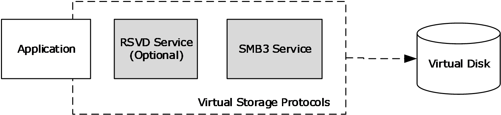
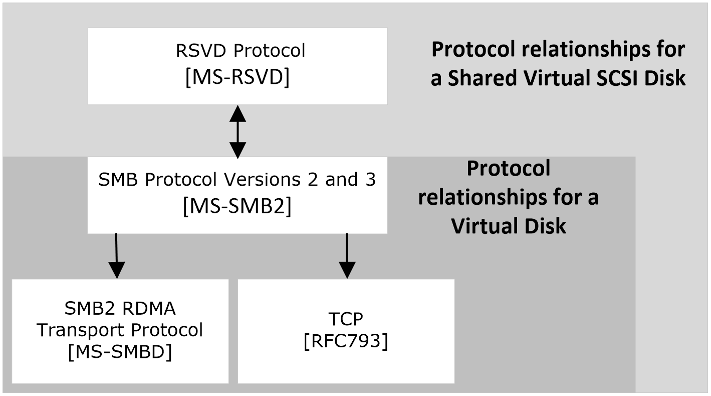
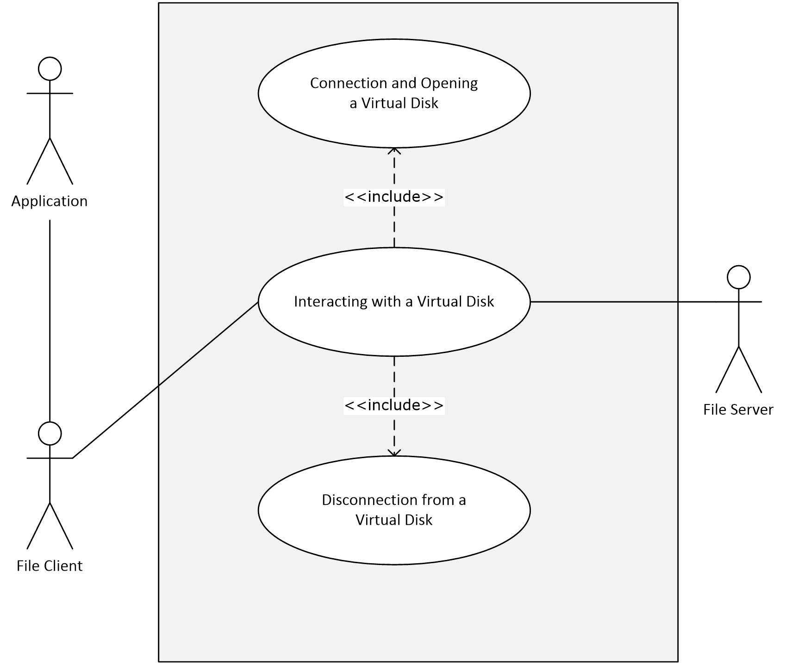
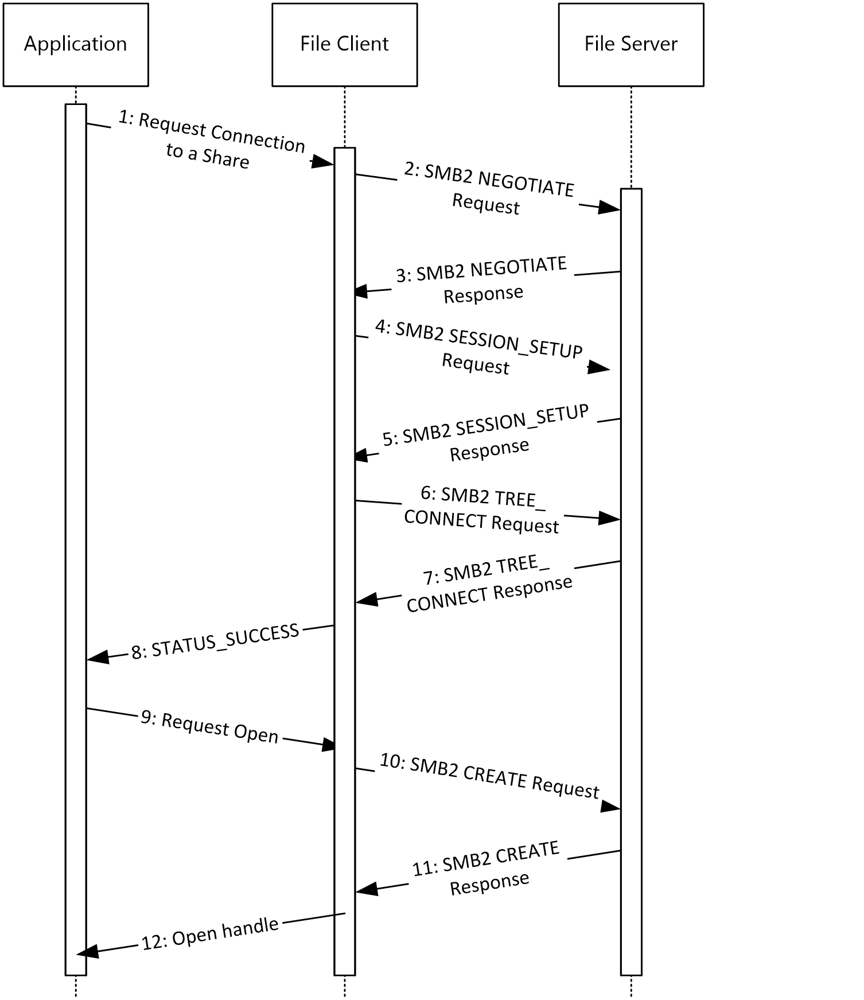
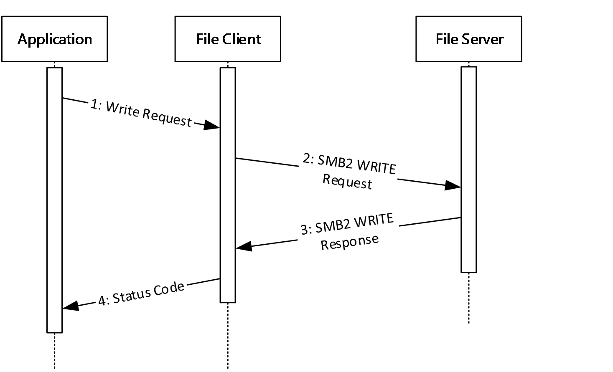
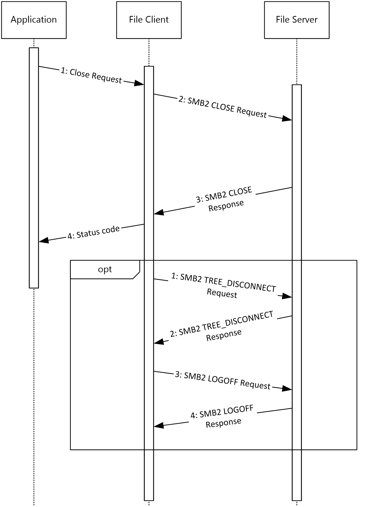
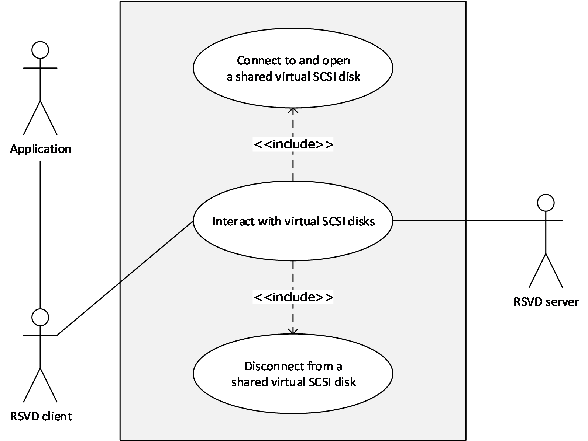
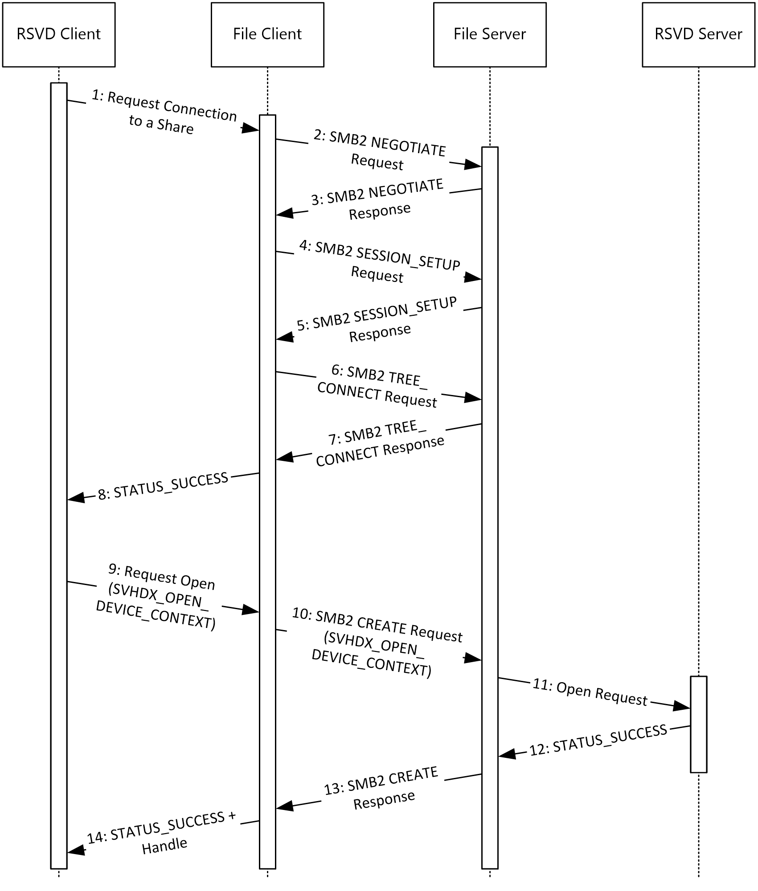
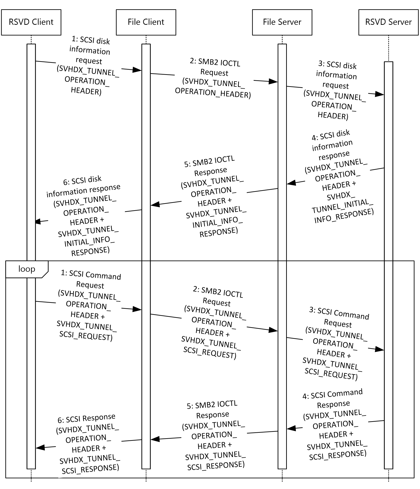
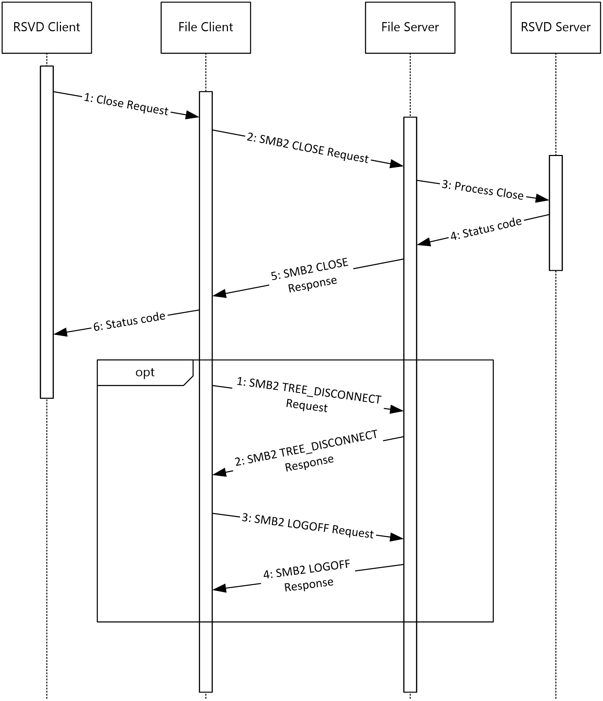

# [MS-VSOD]: Virtual Storage Protocols Overview

Table of Contents

1 Introduction

- [1 Introduction](#Section_1)
  - [1.1 Glossary](#Section_1.1)
  - [1.2 References](#Section_1.2)
  - [1.3 Overview](#Section_1.3)
  - [1.4 Prerequisites/Preconditions](#Section_1.4)

2 Functional Description

- [2 Functional Description](#Section_2)
  - [2.1 Components and Capabilities](#Section_2.1)
  - [2.2 Summary of Protocols](#Section_2.2)
  - [2.3 Protocol Relationships](#Section_2.3)
  - [2.4 Coherency Requirements](#Section_2.4)
  - [2.5 Security](#Section_2.5)
  - [2.6 Additional Considerations](#Section_2.6)

3 Use Cases

- [3 Use Cases](#Section_3)
  - [3.1 Accessing a Virtual Disk File](#Section_3.1)
    - [3.1.1 Connecting and Opening a Virtual Disk](#Section_3.1.1)
      - [3.1.1.1 Success Case Example](#Section_3.1.1.1)
    - [3.1.2 Interacting with a Virtual Disk](#Section_3.1.2)
      - [3.1.2.1 Success Case Example](#Section_3.1.2.1)
    - [3.1.3 Disconnecting from a Virtual Disk](#Section_3.1.3)
      - [3.1.3.1 Success Case Example](#Section_3.1.3.1)
  - [3.2 Accessing a Shared Virtual SCSI Disk](#Section_3.2)
    - [3.2.1 Connecting and Opening a Shared Virtual SCSI Disk](#Section_3.2.1)
      - [3.2.1.1 Success Case Example](#Section_3.2.1.1)
    - [3.2.2 Interacting with a Shared Virtual SCSI Disk](#Section_3.2.2)
      - [3.2.2.1 Success Case Example](#Section_3.2.2.1)
    - [3.2.3 Disconnecting from a Shared Virtual SCSI Disk](#Section_3.2.3)
      - [3.2.3.1 Success Case Example](#Section_3.2.3.1)

4 Product Behavior

- [4 Product Behavior](#Section_4)

5 Change Tracking

- [5 Change Tracking](#Section_5)

For the legal notice and IP terms, see [LEGAL.md](../LEGAL.md).
Last updated: 10/26/2021.
See [Revision History](#revision-history) for full version history.

# 1 Introduction

Virtualizing storage allows for high availability and more efficient use of physical storage space. Virtual files can be hosted either locally or remotely for multiple access. An implementer can also leverage network adapters that have Remote Direct Memory Access (RDMA) capability to provide faster throughput and lower latency and CPU utilization. This document provides an overview of the protocols that support virtual storage and provides examples of their use.

## 1.1 Glossary

This document uses the following terms:

**application**: A participant that is responsible for beginning, propagating, and completing an atomic transaction. An application communicates with a transaction manager in order to begin and complete transactions. An application communicates with a transaction manager in order to marshal transactions to and from other applications. An application also communicates in application-specific ways with a resource manager in order to submit requests for work on resources.

**Authentication Service (AS)**: A service that issues ticket granting tickets (TGTs), which are used for authenticating principals within the realm or domain served by the [**Authentication Service**](#gt_authentication-service).

**file client**: An application that implements client-side file access protocol components and enables the primary actor, the user, to access the shared files on a remote file server.

**file server**: The service or process on a server computer that implements the server-side file access protocol components to enable remote file sharing for the file clients.

**high-availability share**: A share that supports continuous availability of data by storing copies of that data on multiple hosts.

**open**: A runtime object that corresponds to a currently established access to a specific file or a named pipe from a specific client to a specific server, using a specific user security context. Both clients and servers maintain opens that represent active accesses.

**small computer system interface (SCSI)**: A set of standards for physically connecting and transferring data between computers and peripheral devices.

**user**: The real person who has a member account. The user is authenticated by being asked to prove knowledge of the secret password associated with the user name.

**virtual disk**: A disk that does not have a physical mechanical counterpart to it, and is not exposed as a hardware array LUN. It is a disk that uses a file to store its data. When this file is exposed to the operating system as a disk device, the exposed disk device emulates and, for all intents and purposes, behaves like a physical disk.

**virtual disk file**: The file that is the backing store for a [**virtual disk**](#gt_virtual-disk). This file may be exposed to an operating system as a disk device. The exposed disk device is referred to as a [**virtual disk**](#gt_virtual-disk).

## 1.2 References

Links to a document in the Microsoft Open Specifications library point to the correct section in the most recently published version of the referenced document. However, because individual documents in the library are not updated at the same time, the section numbers in the documents may not match. You can confirm the correct section numbering by checking the [Errata](https://go.microsoft.com/fwlink/?linkid=850906).

[MS-AUTHSOD] Microsoft Corporation, "[Authentication Services Protocols Overview](#Section_1.3)".

[MS-RSVD] Microsoft Corporation, "[Remote Shared Virtual Disk Protocol](../MS-RSVD/MS-RSVD.md)".

[MS-SMB2] Microsoft Corporation, "[Server Message Block (SMB) Protocol Versions 2 and 3](../MS-SMB2/MS-SMB2.md)".

[MS-SMBD] Microsoft Corporation, "[SMB2 Remote Direct Memory Access (RDMA) Transport Protocol](../MS-SMBD/MS-SMBD.md)".

## 1.3 Overview

This document provides an overview of the functionality of and relationship among the Virtual Storage protocols, which provide a means for a client to access, read, and write to virtual storage (for example, a [**virtual disk file**](#gt_virtual-disk-file)) on a remote server. Virtual Storage protocols can also provide this functionality to multiple clients by using a shared virtual [**SCSI**](#gt_small-computer-system-interface-scsi) disk.

This document describes the intended functionality of the Virtual Storage protocols and how those protocols interact with each other. It provides examples of some common use cases. It does not restate the processing rules and other details that are specific for each protocol. Those details are described in the specifications for the protocols and data structures that belong to this group.

## 1.4 Prerequisites/Preconditions

There are no prerequisites or preconditions beyond what is already described in [MS-SMB2](../MS-SMB2/MS-SMB2.md) section 1.4, [MS-RSVD](../MS-RSVD/MS-RSVD.md) section 1.4, and [MS-SMBD](../MS-SMBD/MS-SMBD.md) section 1.4.

# 2 Functional Description

The Virtual Storage protocols that are described in this document provide functionality that supports:

- Allowing clients to open a virtual disk file on a remote server message block (SMB) share.
- Reading, writing, or closing of a virtual disk file on a remote SMB share.
- Allowing clients to close a virtual disk file on a remote SMB share.
- Allowing multiple clients to open a shared virtual SCSI disk on a remote share.
- Reading, writing, or closing shared virtual SCSI disk files on the target server.
- Forwarding of raw SCSI commands and receipt of their results.
The following table describes the available methods of accessing the remote virtual disk, and the advantages and limitations of each.

| Method of Accessing Remote Virtual Disk | Advantages | Limitations |
| --- | --- | --- |
| Using Server Message Block (SMB) Protocol Version 3 (SMB3) | Uses commodity storage hardware | Single-user access |
| Using SMB3 when using the SMB2 Remote Direct Memory Access (RDMA) Transport Protocol (SMBDirect) as a transport | Leverages RDMA-capable networks for higher throughputs, lower latencies, and CPU utilization Uses commodity storage hardware | Single-user access |
| Using the Remote Shared Virtual Disk Protocol (RSVD) on top of SMB3 | Multi-user access Uses commodity storage hardware Secure access to files | - |
| Using RSVD on top of SMB3 when using SMBDirect as a transport | Multi-user access Leverages RDMA-capable networks for higher throughputs, lower latencies, and CPU utilization Uses commodity storage Secure access to files | Requires specialized network adapter hardware |
| Using Internet SCSI (iSCSI) to access the remote virtual disk | Multi-user access Uses commodity storage hardware | - |

## 2.1 Components and Capabilities

The primary purpose of this overview document is to describe the interactions among the protocols used to access, read, and write to virtual storage, as shown in the following diagram.

Figure 1: Virtual disk components

**Application**: The primary actor that triggers this use case.

**RSVD service (Optional)**: Used for accessing the shared virtual SCSI disk and sending SCSI commands.

**SMB3 service**: Used for connecting to and interacting with a virtual disk. Also used for connecting to and forwarding RSVD service commands.

## 2.2 Summary of Protocols

The following table summarizes the primary purpose of the Virtual Storage protocols.

| Applicability | Name | Description | Reference |
| --- | --- | --- | --- |
| Connecting to and accessing shared file resources | Server Message Block (SMB) Protocol Versions 2 and 3 | Supports the sharing of file and print resources between machines. | [MS-SMB2](../MS-SMB2/MS-SMB2.md) |
| Accessing virtual disk files via SMB and forwarding SCSI commands | Remote Shared Virtual Disk Protocol | Enables opening, querying, administering, reserving, reading, and writing the virtual disk objects, providing for flexible access by single or multiple consumers. | [MS-RSVD](../MS-RSVD/MS-RSVD.md) |

## 2.3 Protocol Relationships

The following diagram shows the dependencies and relationships of the Virtual Storage protocols to each other and to industry standards.

Figure 2: Protocol relationships

## 2.4 Coherency Requirements

This group of protocols has no special coherency requirements.

## 2.5 Security

When using SMB3 as the transport protocol, message signing ([MS-SMB2](../MS-SMB2/MS-SMB2.md) section 3.2.4.1.1) and encryption ([MS-SMB2](../MS-SMB2/MS-SMB2.md) section 3.2.4.1.8) are available for privacy. For more information about security, see [MS-SMB2](../MS-SMB2/MS-SMB2.md) section 5.

## 2.6 Additional Considerations

There are no additional considerations.

# 3 Use Cases

## 3.1 Accessing a Virtual Disk File

These use cases support accessing the content of a virtual disk that is on a [**high-availability share**](#gt_high-availability-share).

| Method | Use cases |
| --- | --- |
| Using SMB3 to access the remote virtual disk | Connect and disconnect from the virtual disk. Read and write commands to the virtual disk. |

Figure 3: Accessing the content of a virtual disk

### 3.1.1 Connecting and Opening a Virtual Disk

**Goal**

To create a connection and open a virtual disk on an SMB3 share.

**Context of use**

The [**user**](#gt_user) wants access to a [**virtual disk**](#gt_virtual-disk) to access its contents. A connection has to be established to the virtual disk first.

**Actors**

**Application**: The [**application**](#gt_application) is the primary actor that triggers this use case.

**Authentication Service**: The [**Authentication Service (AS)**](#gt_authentication-service) is a supporting actor that is used for authentication purposes.

**File Client**: The [**file client**](#gt_file-client) is a supporting actor that implements client-side protocol components and consumes the file services that are offered by the [**file server**](#gt_file-server).

**File Server**: The file server is a supporting actor and implements server-side protocol components and the file services that are consumed by the file client.

**Preconditions**

The virtual disk has already been created and hosted on an SMB3 share.

The user has located the path of the virtual disk.

The user has permissions to access the virtual disk.

**Main success scenario**

- Trigger: Based on interactions with the user, the application requests that the virtual disk be opened.
- The application requests that the file client make a connection to and open the virtual disk.
- The file client first establishes the connection with the file server, as described in [MS-SMB2](../MS-SMB2/MS-SMB2.md) section 3.2.4.2.
- The file server authenticates the user through the mechanisms described in [MS-AUTHSOD](#Section_1.3).
- If the connection is successful, the file client opens the virtual disk on the file server, as described in [MS-SMB2](../MS-SMB2/MS-SMB2.md) section 3.2.4.3.
- The file server processes the open request, as described in [MS-SMB2](../MS-SMB2/MS-SMB2.md) section 3.3.5.9.
- The file client returns a handle for the virtual disk to the application, as described in [MS-SMB2](../MS-SMB2/MS-SMB2.md) section 3.2.5.7.3.
**Postcondition**

The application can now use the file handle to read and write to the virtual disk.

**Variations**

None.

#### 3.1.1.1 Success Case Example

The following diagram shows the steps required to connect to and open the shared virtual disk.

Figure 4: Connecting and opening a virtual disk

- The application requests that the file client open the share as described in [MS-SMB2](../MS-SMB2/MS-SMB2.md) section 3.2.4.2.
- The file client processes the request and sends an SMB2 NEGOTIATE Request ([MS-SMB2](../MS-SMB2/MS-SMB2.md) section 2.2.3) to the file server to notify the server about the dialects of the SMB2 protocol that the file client understands.
- The file server processes the SMB2 NEGOTIATE Request, as described in [MS-SMB2](../MS-SMB2/MS-SMB2.md) section 3.3.5.3. The file server responds to the file client with an SMB2 NEGOTIATE Response ([MS-SMB2](../MS-SMB2/MS-SMB2.md) section 2.2.4) to notify the file client of the preferred common dialect.
- The file client processes the SMB2 NEGOTIATE Request as described in [MS-SMB2](../MS-SMB2/MS-SMB2.md) section 3.2.5.2. The file client attempts to establish a session with the file server, as described in [MS-SMB2](../MS-SMB2/MS-SMB2.md) section 3.2.4.2.3, by using the SMB2 SESSION_SETUP Request ([MS-SMB2](../MS-SMB2/MS-SMB2.md) section 2.2.5).
- The file server processes the SMB2 SESSION_SETUP Request, as described in [MS-SMB2](../MS-SMB2/MS-SMB2.md) section 3.3.5.5. The file server responds with an SMB2 SESSION_SETUP Response ([MS-SMB2](../MS-SMB2/MS-SMB2.md) section 2.2.6).
- The file client processes the SMB2 SESSION_SETUP Response, as described in [MS-SMB2](../MS-SMB2/MS-SMB2.md) section 3.2.5.3. The file client attempts to establish a tree connection to the file server, as described in [MS-SMB2](../MS-SMB2/MS-SMB2.md) section 3.2.4.2.4, using an SMB2 TREE_CONNECT Request ([MS-SMB2](../MS-SMB2/MS-SMB2.md) section 2.2.9).
- The file server processes the SMB2 TREE_CONNECT request, as described in [MS-SMB2](../MS-SMB2/MS-SMB2.md) section 3.3.5.7. The file server responds with an SMB2 TREE_CONNECT Response, as described in [MS-SMB2](../MS-SMB2/MS-SMB2.md) section 2.2.10.
- The file client processes the SMB2 TREE_CONNECT Response, as described in [MS-SMB2](../MS-SMB2/MS-SMB2.md) section 3.2.5.5, and returns the STATUS_SUCCESS status code to the application.
- Upon success, the application requests that the file client open the virtual disk.
- The file client processes the request, as described in [MS-SMB2](../MS-SMB2/MS-SMB2.md) section 3.2.4.3. The file client constructs an SMB2 CREATE Request that contains an SMB2_CREATE_CONTEXT Request ([MS-SMB2](../MS-SMB2/MS-SMB2.md) section 2.2.13.2).
- The file server processes the SMB2 CREATE Request, as described in [MS-SMB2](../MS-SMB2/MS-SMB2.md) section 3.3.5.9. The file server constructs an SMB2 CREATE Response, as described in [MS-SMB2](../MS-SMB2/MS-SMB2.md) section 3.3.5.9, starting at the “Response Construction” phase.
- The file client processes the SMB2 CREATE Response, as described in [MS-SMB2](../MS-SMB2/MS-SMB2.md) section 3.2.5.7, and returns the open handle to the application.

### 3.1.2 Interacting with a Virtual Disk

**Goal**

To read and write to a virtual disk that is hosted on an SMB3 share.

**Context of use**

The user wants access to a virtual disk to be able to access its contents. A connection has to be established to the virtual disk first.

**Actors**

**Application**: The application is the primary actor that triggers this use case.

**File Client**: The file client is a supporting actor that implements client-side protocol components and consumes the file services that are offered by the file server.

**File Server**: The file server is a supporting actor and implements server-side protocol components and the file services that are consumed by the file client.

**Preconditions**

The application has a valid file handle to the virtual disk, as described in section [3.1.1](#Section_3.1.1).

**Main success scenario**

- Trigger: Based on user interaction or an event, the application sends a read or write command to the virtual disk.
- The application uses the interface described in [MS-SMB2](../MS-SMB2/MS-SMB2.md) section 3.2.4.7 to request the file client write to the virtual disk.
- The file server processes the write, as described in [MS-SMB2](../MS-SMB2/MS-SMB2.md) section 3.3.5.13.
**Postconditions**

Data has been written to the virtual disk.

**Variations**

None.

#### 3.1.2.1 Success Case Example

The following diagram shows the steps required to write to the virtual disk.

Figure 5: Writing to a virtual disk

- The application requests that the file client open the share as described in [MS-SMB2](../MS-SMB2/MS-SMB2.md) section 3.2.4.7.
- The file client processes the request and sends an SMB2 WRITE Request ([MS-SMB2](../MS-SMB2/MS-SMB2.md) section 2.2.21) to the file server.
- The file server processes the request as described in [MS-SMB2](../MS-SMB2/MS-SMB2.md) section 3.3.5.13 and returns an SMB2 WRITE Response ([MS-SMB2](../MS-SMB2/MS-SMB2.md) section 2.2.22) to the file client.
- The file client processes the request as described in [MS-SMB2](../MS-SMB2/MS-SMB2.md) section 3.2.5.12 and returns the status code to the application.

### 3.1.3 Disconnecting from a Virtual Disk

**Goal**

To close the connection to the virtual disk.

**Context of use**

The user no longer needs access to the contents of the virtual disk.

**Actors**

**Application**: The application is the primary actor that triggers this use case.

**File Client**: The file client is a supporting actor that implements client-side protocol components and consumes the file services that are offered by the file server.

**File Server**: The file server is a supporting actor that implements server-side protocol components and the file services that are consumed by the file client.

**Preconditions**

The application has a file handle identifying the virtual disk.

**Main success scenario**

- Trigger: Based on interactions with the user, the application closes the connection to the virtual disk.
- The application uses the interface described in [MS-SMB2](../MS-SMB2/MS-SMB2.md) section 3.2.4.5 to request that the file client close the [**open**](#gt_open) on the virtual disk.
- The file server processes the close, as described in [MS-SMB2](../MS-SMB2/MS-SMB2.md) section 3.3.4.17.
- Optionally, the file client can disconnect from the share.
**Postcondition**

The open to the virtual disk is now closed.

**Variations**

After the file handle is closed, the file client can optionally log off from the share.

#### 3.1.3.1 Success Case Example

The following diagram shows the steps required to close the connection to the virtual disk. Optionally, the file client can log off from the share.

Figure 6: Disconnecting from a virtual disk

The application is required to have a handle to the virtual disk as described in section 3.1.1.

- The application requests that the file client close the connection to the virtual disk. The file client processes the close as described in [MS-SMB2](../MS-SMB2/MS-SMB2.md) section 3.2.4.5.
- The file client sends an SMB2 CLOSE Request to the file server. The file server processes the SMB2 CLOSE Request as described in [MS-SMB2](../MS-SMB2/MS-SMB2.md) section 3.3.5.10.
- The file server sends an SMB2 CLOSE Response, containing the status code returned from the close operation, to the file client.
- The file client processes the SMB2 CLOSE Response, as described in [MS-SMB2](../MS-SMB2/MS-SMB2.md) section 3.2.5.9, and passes the status code to the application.
Optionally, the file client can disconnect from the file server.

- The file client processes the disconnect request as described in [MS-SMB2](../MS-SMB2/MS-SMB2.md) section 3.2.4.22. The file client sends an SMB2 TREE_DISCONNECT Request ([MS-SMB2](../MS-SMB2/MS-SMB2.md) section 2.2.11) to the file server.
- The file server processes the SMB2 TREE_DISCONNECT Request as described in [MS-SMB2](../MS-SMB2/MS-SMB2.md) section 3.3.5.8. The file server sends an SMB2 TREE_DISCONNECT Response ([MS-SMB2](../MS-SMB2/MS-SMB2.md) section 2.2.12) to the file client.
- The file client processes the SMB2 TREE_DISCONNECT Response as described in [MS-SMB2](../MS-SMB2/MS-SMB2.md) section 3.2.5.6. The file client terminates the connection to the file server, as described in [MS-SMB2](../MS-SMB2/MS-SMB2.md) section 3.2.4.23, by sending an SMB2 LOGOFF Request.
- The file server processes the SMB2 LOGOFF Request as described in [MS-SMB2](../MS-SMB2/MS-SMB2.md) section 3.3.5.6 and sends an SMB2 LOGOFF Response to the file client.
- Finally, the file client processes the SMB2 LOGOFF Response as described in [MS-SMB2](../MS-SMB2/MS-SMB2.md) section 3.2.5.4.

## 3.2 Accessing a Shared Virtual SCSI Disk

These use cases support accessing the content of a shared virtual SCSI disk that is on a [**high-availability share**](#gt_high-availability-share).

| Method | Use cases |
| --- | --- |
| Using SMB3 to access the remote virtual disk (optionally use SMBDirect) | Connect and disconnect from the shared virtual disk. Read and write commands to the disk. |

Figure 7: Accessing the content of a shared virtual SCSI disk

### 3.2.1 Connecting and Opening a Shared Virtual SCSI Disk

**Goal**

To create a connection and open a shared virtual SCSI disk on a [**high-availability share**](#gt_high-availability-share) .

**Context of use**

The user wants access to the contents that are on a shared virtual SCSI disk. A connection has to be established to the shared virtual SCI disk first.

**Actors**

**Application**: The application is the primary actor that triggers this use case.

**RSVD Client**: The RSVD client is a supporting actor that both implements the client role and consumes the services that are offered by the RSVD server.

**RSVD Server**: The RSVD server is a supporting actor that implements the server role and services the requests made by the RSVD client.

**Authentication Service**: The [**Authentication Service**](#gt_authentication-service) is a supporting actor that is used for authentication purposes.

**File Client**: The file client is a supporting actor that implements client-side protocol components and consumes the file services that are offered by the file server.

**File Server**: The file server is a supporting actor and implements server-side protocol components and the file services that are consumed by the file client.

**Preconditions**

The shared virtual SCSI disk has already been created.

The user has located the path of the shared virtual SCSI disk.

The user has permissions to access the shared virtual SCSI disk.

**Main success scenario**

- Trigger: Based on interactions with the user, the application requests that the shared virtual SCSI disk be opened.
- The application requests that the RSVD client connects to and opens the shared virtual SCSI disk using the file client, as described in [MS-RSVD](../MS-RSVD/MS-RSVD.md) section 3.1.4.2.
- The file client first establishes the connection with the file server as described in [MS-SMB2](../MS-SMB2/MS-SMB2.md) section 3.2.4.2.
- The file server authenticates the user through the mechanisms described in [MS-AUTHSOD](#Section_1.3).
- If the connection is successful, the file client opens the shared virtual SCSI disk on the file server as described in [MS-SMB2](../MS-SMB2/MS-SMB2.md) section 3.2.4.3.
- When the file server processes the open request, as described in [MS-SMB2](../MS-SMB2/MS-SMB2.md) sections 3.3.5.9 and 3.3.5.9.14, the RSVD server processes the received open request as described in [MS-RSVD](../MS-RSVD/MS-RSVD.md) section 3.2.5.1.
- The RSVD client returns a handle for the shared virtual SCSI disk to the application.
**Postcondition**

The application can now use the file handle to read and write to the shared virtual SCSI disk.

**Variations**

None.

#### 3.2.1.1 Success Case Example

The following diagram shows the steps required to connect to and open the shared virtual SCSI disk.

Figure 8: Connecting and opening a shared virtual SCSI disk

- The RSVD client requests opening a shared virtual SCSI disk as described in [MS-RSVD](../MS-RSVD/MS-RSVD.md) section 3.1.4.2. The RSVD client requests that the file client open the share as described in [MS-SMB2](../MS-SMB2/MS-SMB2.md) section 3.2.4.2.
- The file client processes the request and sends an SMB2 NEGOTIATE Request ([MS-SMB2](../MS-SMB2/MS-SMB2.md) section 2.2.3) to the file server to notify the server about the dialects of the SMB2 protocol that the file client understands.
- The file server processes the SMB2 NEGOTIATE Request, as described in [MS-SMB2](../MS-SMB2/MS-SMB2.md) section 3.3.5.3. The file server responds to the file client with an SMB2 NEGOTIATE Response ([MS-SMB2](../MS-SMB2/MS-SMB2.md) section 2.2.4) to notify the client of the preferred common dialect. The preferred common dialect has to be version 3.0.2 or later.
- The file client processes the SMB2 NEGOTIATE Request as described in [MS-SMB2](../MS-SMB2/MS-SMB2.md) section 3.2.5.2. The file client attempts to establish a session with the file server, as described in [MS-SMB2](../MS-SMB2/MS-SMB2.md) section 3.2.4.2.3, by using the SMB2 SESSION_SETUP Request ([MS-SMB2](../MS-SMB2/MS-SMB2.md) section 2.2.5).
- The file server processes the SMB2 SESSION_SETUP Request, as described in [MS-SMB2](../MS-SMB2/MS-SMB2.md) section 3.3.5.5. The file server responds with an SMB2 SESSION_SETUP Response ([MS-SMB2](../MS-SMB2/MS-SMB2.md) section 2.2.6).
- The file client processes the SMB2 SESSION_SETUP Response, as described in [MS-SMB2](../MS-SMB2/MS-SMB2.md) section 3.2.5.3. The file client attempts to establish a tree connection to the file server, as described in [MS-SMB2](../MS-SMB2/MS-SMB2.md) section 3.2.4.2.4, using an SMB2 TREE_CONNECT Request ([MS-SMB2](../MS-SMB2/MS-SMB2.md) section 2.2.9).
- The file server processes the SMB2 TREE_CONNECT Request, as described in [MS-SMB2](../MS-SMB2/MS-SMB2.md) section 3.3.5.7. The file server responds with an SMB2 TREE_CONNECT Response, as described in [MS-SMB2](../MS-SMB2/MS-SMB2.md) section 2.2.10.
- The file client processes the SMB2 TREE_CONNECT Response, as described in [MS-SMB2](../MS-SMB2/MS-SMB2.md) section 3.2.5.5, and returns STATUS_SUCCESS to the RSVD client.
- Upon success, the RSVD client requests opening the shared virtual SCSI disk by sending the file name of the shared virtual SCSI disk, and an SVHDX_OPEN_DEVICE_CONTEXT structure ([MS-RSVD](../MS-RSVD/MS-RSVD.md) section 2.2.4.12), and requests that the **CreateOptions** field of the SMB2 CREATE Request be set to FILE_NO_INTERMEDIATE_BUFFERING. The values for the SVHDX_OPEN_DEVICE_CONTEXT structure are described in [MS-RSVD](../MS-RSVD/MS-RSVD.md) section 3.1.4.2.
- The file client processes the request, as described in [MS-SMB2](../MS-SMB2/MS-SMB2.md) section 3.2.4.3. The file client constructs an SMB2 CREATE Request that contains an SMB2_CREATE_CONTEXT Request ([MS-SMB2](../MS-SMB2/MS-SMB2.md) section 2.2.13.2). The **Buffer** field of the SMB2_CREATE_CONTEXT will contain the SVHDX_OPEN_DEVICE_CONTEXT structure that was passed in from the RSVD client ([MS-SMB2](../MS-SMB2/MS-SMB2.md) section 2.2.13.2.14).
- The file server processes the SMB2 CREATE Request, as described in [MS-SMB2](../MS-SMB2/MS-SMB2.md) sections 3.3.5.9 and 3.3.5.9.14. If successful, the file server passes the SVHDX_OPEN_DEVICE_CONTEXT structure that is contained in the SMB2_CREATE_CONTEXT Request to the RSVD server.
- The RSVD server processes the open request, as described in [MS-RSVD](../MS-RSVD/MS-RSVD.md) section 3.2.5.1. If successful, the RSVD server returns STATUS_SUCCESS to the file server.
- The file server constructs an SMB2 CREATE Response, as described in [MS-SMB2](../MS-SMB2/MS-SMB2.md) section 3.3.5.9, starting at the “Response Construction” phase.
- The file client processes the SMB2 CREATE Response, as described in [MS-SMB2](../MS-SMB2/MS-SMB2.md) section 3.2.5.7, and returns STATUS_SUCCESS to the RSVD client.
- The RSVD client returns a handle for the opened shared virtual SCSI disk to the calling application.

### 3.2.2 Interacting with a Shared Virtual SCSI Disk

**Goal**

This use case supports sending and receiving SCSI commands to a shared virtual SCSI disk.

**Context of use**

The user interacts with the application, causing information about the shared virtual SCSI disk to be accessed for the contents contained in the shared virtual SCSI disk. Other events can also cause the application to send SCSI commands to the shared virtual SCSI disk.

**Actors**

**Application**: The application is the primary actor that triggers this use case.

**RSVD Client**: The RSVD client is a supporting actor that both implements the client role and consumes the services that are offered by the RSVD server.

**RSVD Server**: The RSVD server is a supporting actor that implements the server role and services the requests made by the RSVD client.

**File Client**: The file client is a supporting actor that implements client-side protocol components and consumes the file services that are offered by the file server.

**File Server**: The file server is a supporting actor and implements server-side protocol components and the file services that are consumed by the file client.

**Preconditions**

The application has a valid file handle to the shared virtual SCSI disk, as described in section [3.2.1](#Section_3.2.1).

**Main success scenario**

- Trigger: Based on user interaction or an event, the application sends a SCSI command to the shared virtual SCSI disk.
- Before sending the first SCSI command, the application queries the shared virtual SCSI disk for information about itself. The application can retrieve this information as described in [MS-RSVD](../MS-RSVD/MS-RSVD.md) section 3.1.4.6.
- The RSVD server processes the request, as described in [MS-RSVD](../MS-RSVD/MS-RSVD.md) section 3.2.5.5.1.
- The application sends a SCSI command to the shared virtual SCSI disk, as described in [MS-RSVD](../MS-RSVD/MS-RSVD.md) section 3.1.4.9.
- The RSVD server processes the SCSI command, as described in [MS-RSVD](../MS-RSVD/MS-RSVD.md) section 3.2.5.5.5, and sends the response from the shared virtual SCSI disk back to the RSVD client.
- The RSVD client passes any error or success data back to the application.
**Postcondition**

The application has received the data it requested from the shared virtual SCSI disk.

**Variations**

None.

#### 3.2.2.1 Success Case Example

The following diagram shows the steps required for the application to send SCSI commands to the shared virtual SCSI disk. The application has to first retrieve the information about the shared virtual SCSI disk before SCSI commands can be sent.

Figure 9: Interacting with a shared virtual SCSI disk

The application is required to have a handle to the shared virtual SCSI disk, as described in section [3.2.1](#Section_3.2.1).

- Before the first SCSI command can be sent, the application has to retrieve the shared virtual SCSI disk’s information. The application calls the RSVD client, providing the handle to the shared virtual SCSI disk that was received in section [3.2.1](#Section_3.2.1) and providing the maximum buffer size the application will accept, as described in [MS-RSVD](../MS-RSVD/MS-RSVD.md) section 3.1.4.6. The RSVD client constructs an SVHDX_TUNNEL_OPERATION_HEADER structure, as described in [MS-RSVD](../MS-RSVD/MS-RSVD.md) section 3.1.4.6. The RSVD client then calls the file client, as described in [MS-SMB2](../MS-SMB2/MS-SMB2.md) section 3.2.4.20.11, providing the handle, the control code of FSCTL_SVHDX_SYNC_TUNNEL_REQUEST, the SVHDX_TUNNEL_OPERATION_HEADER structure ([MS-RSVD](../MS-RSVD/MS-RSVD.md) section 2.2.4.11), and the buffer size.
- The file client processes the request and sends an SMB2 IOCTL Request ([MS-SMB2](../MS-SMB2/MS-SMB2.md) section 2.2.31) to the file server, as described in [MS-SMB2](../MS-SMB2/MS-SMB2.md) section 3.3.5.15.15, with the SVHDX_TUNNEL_OPERATION_HEADER structure in the **Buffer** field and the **MaxOutputResponse** field set to the response buffer size.
- The file server processes the SMB2 IOCTL Request and passes the SVHDX_TUNNEL_OPERATION_HEADER structure, the handle, and the value from the **MaxOutputResponse** field to the RSVD server, as described in [MS-RSVD](../MS-RSVD/MS-RSVD.md) section 3.2.4.
- The RSVD server processes the request, as described in [MS-RSVD](../MS-RSVD/MS-RSVD.md) sections 3.2.5.5 and 3.2.5.5.1. The RSVD server returns an SVHDX_TUNNEL_OPERATION_HEADER structure and an SVHDX_TUNNEL_INITIAL_INFO_RESPONSE structure to the file server containing the response.
- The file server creates an SMB2 IOCTL Response, as described in [MS-SMB2](../MS-SMB2/MS-SMB2.md) section 2.2.32, with the SVHDX_TUNNEL_OPERATION_HEADER and SVHDX_TUNNEL_INITIAL_INFO_RESPONSE structures in the **Buffer** field. The SMB2 IOCTL Response is sent to the file client.
- The file client processes the SMB2 IOCTL Response as described in [MS-SMB2](../MS-SMB2/MS-SMB2.md) section 3.2.5.14.13. The file client sends the response data to the RSVD client as described in [MS-RSVD](../MS-RSVD/MS-RSVD.md) section 3.1.5.5.
- The RSVD client processes the response and sends the status and the shared virtual SCSI disk’s information to the application. With the virtual SCSI disk’s information, the application can now send SCSI commands to the shared virtual SCSI disk.
The application calls the RSVD client as described in [MS-RSVD](../MS-RSVD/MS-RSVD.md) section 3.1.4.9.

- The RSVD client constructs an SVHDX_TUNNEL_OPERATION_HEADER and SVHDX_TUNNEL_SCSI_REQUEST structure. The RSVD client is only a transport for the SCSI commands and doesn’t perform any processing on the application-provided values for the **CDBLength**, **SenseInfoExLength**, **DataIn**, **SrbFlags**, and **CDBBuffer** fields of the SVHDX_TUNNEL_SCSI_REQUEST structure. If the optional fields are not provided by the application, the **DataTransferLength** field is set to zero and the **DataBuffer** field is set to empty. The RSVD client then calls the interface on the file client, described in [MS-SMB2](../MS-SMB2/MS-SMB2.md) section 3.2.4.20.11, and provides the handle and the SVHDX_TUNNEL_OPERATION_HEADER and SVHDX_TUNNEL_SCSI_REQUEST structures.
- The file client processes the request, as described in [MS-SMB2](../MS-SMB2/MS-SMB2.md) section 3.2.4.20.11, and sends and SMB2 IOCTL Request to the file server. The **Buffer** field of the SMB2 IOCTL Request has to contain the SVHDX_TUNNEL_OPERATION_HEADER and SVHDX_TUNNEL_SCSI_REQUEST structures.
- The file server processes the request as described in [MS-SMB2](../MS-SMB2/MS-SMB2.md) section 3.3.5.15.15. The file server passes the SVHDX_TUNNEL_OPERATION_HEADER and SVHDX_TUNNEL_SCSI_REQUEST structures to the RSVD server as described in [MS-RSVD](../MS-RSVD/MS-RSVD.md) section 3.2.4.
- The RSVD server processes the request as described in [MS-RSVD](../MS-RSVD/MS-RSVD.md) sections 3.2.5.5 and 3.2.5.5.5. The RSVD server issues the CDB command contained in the SVHDX_TUNNEL_SCSI_REQUEST structure to the shared virtual SCSI disk. The RSVD server constructs an SVHDX_TUNNEL_OPERATION_HEADER and SVHDX_TUNNEL_SCSI_RESPONSE structure that contains the response to the CDB command from the shared virtual SCSI disk.
- The file server creates an SMB2 IOCTL Response, as described in [MS-SMB2](../MS-SMB2/MS-SMB2.md) section 2.2.32, with the SVHDX_TUNNEL_OPERATION_HEADER and SVHDX_TUNNEL_SCSI_RESPONSE structures in the **Buffer** field. The SMB2 IOCTL Response is then sent to the file client.
- The file client processes the SMB2 IOCTL Response as described in [MS-SMB2](../MS-SMB2/MS-SMB2.md) section 3.2.5.14.13. The file client sends the response data to the RSVD client as described in [MS-RSVD](../MS-RSVD/MS-RSVD.md) section 3.1.5.8.
- The RSVD client processes the response and sends the status and the results of the CDB command to the application.

### 3.2.3 Disconnecting from a Shared Virtual SCSI Disk

**Goal**

To close the connection to the shared virtual SCSI disk.

**Context of use**

The user no longer needs access to the contents of the shared virtual SCSI disk.

**Actors**

**Application**: The application is the primary actor that triggers this use case.

**RSVD Client**: The RSVD client is a supporting actor that both implements the client role and consumes the services that are offered by the RSVD server.

**RSVD Server**: The RSVD server is a supporting actor that implements the server role and services the requests made by the RSVD client.

**File Client**: The file client is a supporting actor that implements client-side protocol components and consumes the file services that are offered by the file server.

**File Server**: The file server is a supporting actor and implements server-side protocol components and the file services that are consumed by the file client.

**Preconditions**

The application has a file handle identifying the shared virtual SCSI disk.

**Main success scenario**

- Trigger: The application receives input from the user indicating that the connection to the shared virtual SCSI disk can be closed.
- The application uses the interface described in [MS-RSVD](../MS-RSVD/MS-RSVD.md) section 3.1.4.3 to close the open on the shared virtual SCSI disk using the file client.
- The file client closes the open as described in [MS-SMB2](../MS-SMB2/MS-SMB2.md) section 3.2.4.5.
- The file server processes the close, as described in [MS-SMB2](../MS-SMB2/MS-SMB2.md) section 3.3.4.17, and causes the RSVD server to close the open as described in [MS-RSVD](../MS-RSVD/MS-RSVD.md) section 3.2.5.2.
- Optionally, the file client can disconnect from the share.
**Postcondition**

The open to the shared virtual SCSI disk is now closed.

**Variations**

After the file handle is closed, the file client can optionally log off from the share.

#### 3.2.3.1 Success Case Example

The following diagram shows the steps required to close the connection to the shared virtual SCSI disk. Optionally, the file client can log off from the share.

Figure 10: Disconnecting from a shared virtual SCSI disk

The application is required to have a handle to the shared virtual SCSI disk as described in section 3.2.1.

- The application requests that the RSVD client close its connection to the shared virtual SCSI disk as described in [MS-RSVD](../MS-RSVD/MS-RSVD.md) section 3.1.4.3. The RSVD client requests that the file client process the close as described in [MS-SMB2](../MS-SMB2/MS-SMB2.md) section 3.2.4.5.
- The file client sends an SMB2 CLOSE Request to the file server. The file server passes the close request to the RSVD server as described in [MS-RSVD](../MS-RSVD/MS-RSVD.md) section 3.2.5.2.
- The RSVD server processes the close request.
- The RSVD server requests that the file server send an SMB2 CLOSE Response, containing the status code returned from the close operation, to the file client.
- The file client processes the SMB2 CLOSE Response, as described in [MS-SMB2](../MS-SMB2/MS-SMB2.md) section 3.2.5.9, and passes the status code to the RSVD client.
- The RSVD client returns the response to the application as described in [MS-RSVD](../MS-RSVD/MS-RSVD.md) section 3.1.5.2.
Optionally, the file client can disconnect from the file server.

- The file client processes the disconnect request as described in [MS-SMB2](../MS-SMB2/MS-SMB2.md) section 3.2.4.22. The file client sends an SMB2 TREE_DISCONNECT Request ([MS-SMB2](../MS-SMB2/MS-SMB2.md) section 2.2.11) to the file server.
- The file server processes the SMB2 TREE_DISCONNECT Request as described in [MS-SMB2](../MS-SMB2/MS-SMB2.md) section 3.3.5.8. The file server then sends an SMB2 TREE_DISCONNECT Response ([MS-SMB2](../MS-SMB2/MS-SMB2.md) section 2.2.12) to the file client.
- The file client processes the SMB2 TREE_DISCONNECT Response as described in [MS-SMB2](../MS-SMB2/MS-SMB2.md) section 3.2.5.6. The file client then terminates the connection to the file server, as described in [MS-SMB2](../MS-SMB2/MS-SMB2.md) section 3.2.4.23, by sending an SMB2 LOGOFF Request.
- The file server processes the SMB2 LOGOFF Request as described in [MS-SMB2](../MS-SMB2/MS-SMB2.md) section 3.3.5.6. The file server then sends an SMB2 LOGOFF Response to the file client.
- Finally, the file client processes the SMB2 LOGOFF Response as described in [MS-SMB2](../MS-SMB2/MS-SMB2.md) section 3.2.5.4.

# 4 Product Behavior

The information in this document is applicable to the following Microsoft products or supplemental software. References to product versions include released service packs:

- Windows 8.1 operating system
- Windows Server 2012 R2 operating system
- Windows 10 operating system
- Windows Server 2016 operating system
- Windows Server operating system
- Windows Server 2019 operating system
- Windows Server 2022 operating system
- Windows 11 operating system

# 5 Change Tracking

This section identifies changes that were made to this document since the last release. Changes are classified as Major, Minor, or None.

The revision class **Major** means that the technical content in the document was significantly revised. Major changes affect protocol interoperability or implementation. Examples of major changes are:

- A document revision that incorporates changes to interoperability requirements.
- A document revision that captures changes to protocol functionality.
The revision class **Minor** means that the meaning of the technical content was clarified. Minor changes do not affect protocol interoperability or implementation. Examples of minor changes are updates to clarify ambiguity at the sentence, paragraph, or table level.

The revision class **None** means that no new technical changes were introduced. Minor editorial and formatting changes may have been made, but the relevant technical content is identical to the last released version.

The changes made to this document are listed in the following table. For more information, please contact [dochelp@microsoft.com](mailto:dochelp@microsoft.com).

| Section | Description | Revision class |
| --- | --- | --- |
| [4](#Section_4) Product Behavior | Updated for this version of Windows client. | Major |

## Revision History

| Date | Version | Revision Class | Comments |
| --- | --- | --- | --- |
| 4/26/2017 | 1.0 | New | Released new document. |
| 6/1/2017 | 1.0 | None | No changes to the meaning, language, or formatting of the technical content. |
| 12/15/2017 | 2.0 | Major | Significantly changed the technical content. |
| 11/5/2018 | 3.0 | Major | Significantly changed the technical content. |
| 6/3/2021 | 4.0 | Major | Significantly changed the technical content. |
| 10/26/2021 | 5.0 | Major | Significantly changed the technical content. |
