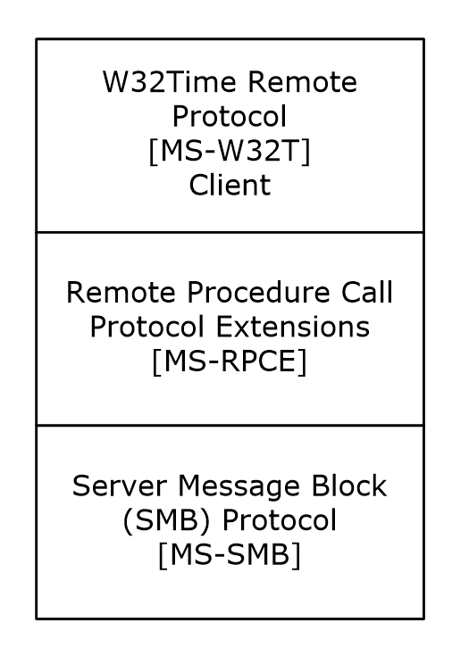
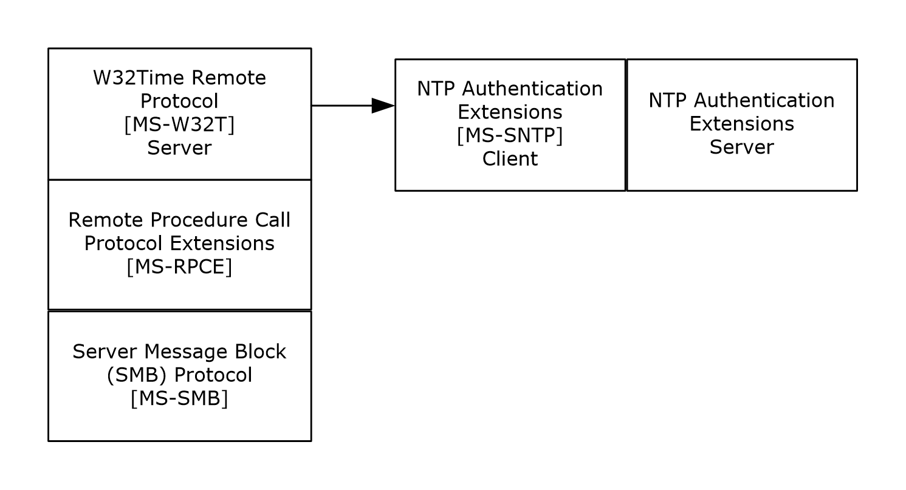

# [MS-W32T]: W32Time Remote Protocol

Table of Contents

1 Introduction

- [1 Introduction](#Section_1)
  - [1.1 Glossary](#Section_1.1)
  - [1.2 References](#Section_1.2)
    - [1.2.1 Normative References](#Section_1.2.1)
    - [1.2.2 Informative References](#Section_1.2.2)
  - [1.3 Overview](#Section_1.3)
  - [1.4 Relationship to Other Protocols](#Section_1.4)
  - [1.5 Prerequisites/Preconditions](#Section_1.5)
  - [1.6 Applicability Statement](#Section_1.6)
  - [1.7 Versioning and Capability Negotiation](#Section_1.7)
  - [1.8 Vendor-Extensible Fields](#Section_1.8)
  - [1.9 Standards Assignments](#Section_1.9)

2 Messages

- [2 Messages](#Section_2)
  - [2.1 Transport](#Section_2.1)
  - [2.2 Common Data Types](#Section_2.2)
    - [2.2.1 W32TIME_PROVIDER_INFO](#Section_2.2.1)
    - [2.2.2 W32TIME_PROVIDER_DATA](#Section_2.2.2)
    - [2.2.3 W32TIME_HARDWARE_PROVIDER_DATA](#Section_2.2.3)
    - [2.2.4 W32TIME_NTP_PROVIDER_DATA](#Section_2.2.4)
    - [2.2.5 W32TIME_NTP_PEER_INFO](#Section_2.2.5)
    - [2.2.6 Source of Time Service Configuration Setting](#Section_2.2.6)
    - [2.2.7 State of Time Service](#Section_2.2.7)
    - [2.2.8 W32TIME_CONFIGURATION_PROVIDER](#Section_2.2.8)
    - [2.2.9 W32TIME_PROVIDER_CONFIG](#Section_2.2.9)
    - [2.2.10 W32TIME_PROVIDER_CONFIG_DATA](#Section_2.2.10)
    - [2.2.11 W32TIME_NTPCLIENT_PROVIDER_CONFIG_DATA](#Section_2.2.11)
    - [2.2.12 W32TIME_NTPSERVER_PROVIDER_CONFIG_DATA](#Section_2.2.12)
    - [2.2.13 W32TIME_CONFIGURATION_INFO](#Section_2.2.13)
    - [2.2.14 W32TIME_CONFIGURATION_BASIC](#Section_2.2.14)
    - [2.2.15 W32TIME_CONFIGURATION_ADVANCED](#Section_2.2.15)
    - [2.2.16 W32TIME_CONFIGURATION_DEFAULT](#Section_2.2.16)
    - [2.2.17 W32TIME_STATUS_INFO](#Section_2.2.17)
    - [2.2.18 W32TIME_ENTRY](#Section_2.2.18)

3 Protocol Details

- [3 Protocol Details](#Section_3)
  - [3.1 Client Details](#Section_3.1)
    - [3.1.1 Abstract Data Model](#Section_3.1.1)
    - [3.1.2 Timers](#Section_3.1.2)
    - [3.1.3 Initialization](#Section_3.1.3)
    - [3.1.4 Higher-Layer Triggered Events](#Section_3.1.4)
      - [3.1.4.1 W32TimeSync](#Section_3.1.4.1)
      - [3.1.4.2 W32TimeGetNetlogonServiceBits](#Section_3.1.4.2)
      - [3.1.4.3 W32TimeQueryProviderStatus](#Section_3.1.4.3)
      - [3.1.4.4 W32TimeQuerySource](#Section_3.1.4.4)
      - [3.1.4.5 W32TimeQueryProviderConfiguration](#Section_3.1.4.5)
      - [3.1.4.6 W32TimeQueryConfiguration](#Section_3.1.4.6)
      - [3.1.4.7 W32TimeQueryStatus](#Section_3.1.4.7)
      - [3.1.4.8 W32TimeLog](#Section_3.1.4.8)
    - [3.1.5 Message Processing Events and Sequencing Rules](#Section_3.1.5)
    - [3.1.6 Timer Events](#Section_3.1.6)
    - [3.1.7 Other Local Events](#Section_3.1.7)
  - [3.2 Server Details](#Section_3.2)
    - [3.2.1 Abstract Data Model](#Section_3.2.1)
      - [3.2.1.1 Time Service Elements](#Section_3.2.1.1)
      - [3.2.1.2 Time Provider Elements](#Section_3.2.1.2)
        - [3.2.1.2.1 NTP Client Provider Elements](#Section_3.2.1.2.1)
      - [3.2.1.3 Time Peer Elements](#Section_3.2.1.3)
    - [3.2.2 Timers](#Section_3.2.2)
    - [3.2.3 Initialization](#Section_3.2.3)
    - [3.2.4 Higher-Layer Triggered Events](#Section_3.2.4)
    - [3.2.5 Message Processing Events and Sequencing Rules](#Section_3.2.5)
      - [3.2.5.1 W32TimeSync (Opnum 0)](#Section_3.2.5.1)
      - [3.2.5.2 W32TimeGetNetlogonServiceBits (Opnum 1)](#Section_3.2.5.2)
      - [3.2.5.3 W32TimeQueryProviderStatus (Opnum 2)](#Section_3.2.5.3)
      - [3.2.5.4 W32TimeQuerySource (Opnum 3)](#Section_3.2.5.4)
      - [3.2.5.5 W32TimeQueryProviderConfiguration (Opnum 4)](#Section_3.2.5.5)
      - [3.2.5.6 W32TimeQueryConfiguration (Opnum 5)](#Section_3.2.5.6)
      - [3.2.5.7 W32TimeQueryStatus (Opnum 6)](#Section_3.2.5.7)
      - [3.2.5.8 W32TimeLog (Opnum 7)](#Section_3.2.5.8)
      - [3.2.5.9 Common Message Processing Details](#Section_3.2.5.9)
        - [3.2.5.9.1 Time Provider Configuration Data Structure Generation](#Section_3.2.5.9.1)
    - [3.2.6 Timer Events](#Section_3.2.6)
    - [3.2.7 Other Local Events](#Section_3.2.7)

4 Protocol Example

- [4 Protocol Example](#Section_4)

5 Security

- [5 Security](#Section_5)
  - [5.1 Security Considerations for Implementers](#Section_5.1)
  - [5.2 Index of Security Parameters](#Section_5.2)

6 Appendix A: Full IDL

- [6 Appendix A: Full IDL](#Section_6)

7 Appendix B: Product Behavior

- [7 Appendix B: Product Behavior](#Section_7)

8 Change Tracking

- [8 Change Tracking](#Section_8)

For the legal notice and IP terms, see [LEGAL.md](../LEGAL.md).
Last updated: 4/23/2024.
See [Revision History](#revision-history) for full version history.

# 1 Introduction

The W32Time Remote Protocol is a [**remote procedure call (RPC)**](#gt_remote-procedure-call-rpc) interface for controlling and monitoring a [**time service**](#gt_time-service) that implements the Network Time Protocol (NTP) Authentication Extensions [MS-SNTP](../MS-SNTP/MS-SNTP.md).

Sections 1.5, 1.8, 1.9, 2, and 3 of this specification are normative. All other sections and examples in this specification are informative.

## 1.1 Glossary

This document uses the following terms:

**authentication level**: A numeric value indicating the level of authentication or message protection that [**remote procedure call (RPC)**](#gt_remote-procedure-call-rpc) will apply to a specific message exchange. For more information, see [[C706]](https://go.microsoft.com/fwlink/?LinkId=89824) section 13.1.2.1 and [MS-RPCE](../MS-RPCE/MS-RPCE.md).

**Coordinated Universal Time (UTC)**: A high-precision atomic time standard that approximately tracks Universal Time (UT). It is the basis for legal, civil time all over the Earth. Time zones around the world are expressed as positive and negative offsets from UTC. In this role, it is also referred to as Zulu time (Z) and Greenwich Mean Time (GMT). In these specifications, all references to UTC refer to the time at UTC-0 (or GMT).

**endpoint**: A client that is on a network and is requesting access to a network access server (NAS).

**error code**: An integer that indicates success or failure. A zero value indicates success; a nonzero value indicates failure.

**fully qualified domain name (FQDN)**: An unambiguous domain name that gives an absolute location in the Domain Name System's (DNS) hierarchy tree, as defined in [[RFC1035]](https://go.microsoft.com/fwlink/?LinkId=90264) section 3.1 and [[RFC2181]](https://go.microsoft.com/fwlink/?LinkId=127732) section 11.

**message identifier**: An index into a message table. A message table is a collection of localizable strings. The message table is stored in the resource section of a dynamic link library.

**Microsoft Interface Definition Language (MIDL)**: The Microsoft implementation and extension of the OSF-DCE Interface Definition Language (IDL). [**MIDL**](#gt_microsoft-interface-definition-language-midl) can also mean the Interface Definition Language (IDL) compiler provided by Microsoft. For more information, see [MS-RPCE].

**Network Data Representation (NDR)**: A specification that defines a mapping from Interface Definition Language (IDL) data types onto octet streams. [**NDR**](#gt_network-data-representation-ndr) also refers to the runtime environment that implements the mapping facilities (for example, data provided to [**NDR**](#gt_network-data-representation-ndr)). For more information, see [MS-RPCE] and [C706] section 14.

**opnum**: An operation number or numeric identifier that is used to identify a specific [**remote procedure call (RPC)**](#gt_remote-procedure-call-rpc) method or a method in an interface. For more information, see [C706] section 12.5.2.12 or [MS-RPCE].

**primary domain controller (PDC)**: A domain controller (DC) designated to track changes made to the accounts of all computers on a domain. It is the only computer to receive these changes directly, and is specialized so as to ensure consistency and to eliminate the potential for conflicting entries in the Active Directory database. A domain has only one [**PDC**](#gt_primary-domain-controller-pdc).

**reliable time source**: A time source that can provide accurate time. It is usually the primary reference with stratum 1 as specified in [[RFC1305]](https://go.microsoft.com/fwlink/?LinkId=90272); for example, a radio clock.

**remote procedure call (RPC)**: A communication protocol used primarily between client and server. The term has three definitions that are often used interchangeably: a runtime environment providing for communication facilities between computers (the RPC runtime); a set of request-and-response message exchanges between computers (the RPC exchange); and the single message from an RPC exchange (the RPC message). For more information, see [C706].

**RPC protocol sequence**: A character string that represents a valid combination of a [**remote procedure call (RPC)**](#gt_remote-procedure-call-rpc) protocol, a network layer protocol, and a transport layer protocol, as described in [C706] and [MS-RPCE].

**Server Message Block (SMB)**: A protocol that is used to request file and print services from server systems over a network. The SMB protocol extends the CIFS protocol with additional security, file, and disk management support. For more information, see [[CIFS]](https://go.microsoft.com/fwlink/?linkid=2109334) and [MS-SMB](../MS-SMB/MS-SMB.md).

**time peer**: A [**time source**](#gt_time-source) with which a [**time provider**](#gt_time-provider) is synchronized. A [**time provider**](#gt_time-provider) can have more than one time peer.

**time provider**: A component that a [**time service**](#gt_time-service) relies on to either obtain accurate time stamps (from network or hardware time sources) or to provide those time stamps to other computers over the network.

**time service**: A system service that implements support for synchronizing a computer's local time with a [**time source**](#gt_time-source).

**time source**: A component that possesses a clock and that makes the clock's time available to other components for synchronization. For more information, see "reference source" in [RFC1305].

**universally unique identifier (UUID)**: A 128-bit value. UUIDs can be used for multiple purposes, from tagging objects with an extremely short lifetime, to reliably identifying very persistent objects in cross-process communication such as client and server interfaces, manager entry-point vectors, and [**RPC**](#gt_remote-procedure-call-rpc) objects. UUIDs are highly likely to be unique. UUIDs are also known as globally unique identifiers (GUIDs) and these terms are used interchangeably in the Microsoft protocol technical documents (TDs). Interchanging the usage of these terms does not imply or require a specific algorithm or mechanism to generate the UUID. Specifically, the use of this term does not imply or require that the algorithms described in [[RFC4122]](https://go.microsoft.com/fwlink/?LinkId=90460) or [C706] must be used for generating the UUID.

**well-known endpoint**: A preassigned, network-specific, stable address for a particular client/server instance. For more information, see [C706].

**Windows Time Service (W32Time)**: A service that supports time synchronization against network and hardware time sources. For more information, see [[WTSREF]](https://go.microsoft.com/fwlink/?LinkId=90586) and [MS-SNTP](../MS-SNTP/MS-SNTP.md).

**MAY, SHOULD, MUST, SHOULD NOT, MUST NOT:** These terms (in all caps) are used as defined in [[RFC2119]](https://go.microsoft.com/fwlink/?LinkId=90317). All statements of optional behavior use either MAY, SHOULD, or SHOULD NOT.

## 1.2 References

Links to a document in the Microsoft Open Specifications library point to the correct section in the most recently published version of the referenced document. However, because individual documents in the library are not updated at the same time, the section numbers in the documents may not match. You can confirm the correct section numbering by checking the [Errata](https://go.microsoft.com/fwlink/?linkid=850906).

### 1.2.1 Normative References

We conduct frequent surveys of the normative references to assure their continued availability. If you have any issue with finding a normative reference, please contact [dochelp@microsoft.com](mailto:dochelp@microsoft.com). We will assist you in finding the relevant information.

[C706] The Open Group, "DCE 1.1: Remote Procedure Call", C706, August 1997, [https://publications.opengroup.org/c706](https://go.microsoft.com/fwlink/?LinkId=89824)

**Note** Registration is required to download the document.

[MS-ERREF] Microsoft Corporation, "[Windows Error Codes](../MS-ERREF/MS-ERREF.md)".

[MS-RPCE] Microsoft Corporation, "[Remote Procedure Call Protocol Extensions](../MS-RPCE/MS-RPCE.md)".

[MS-SMB] Microsoft Corporation, "[Server Message Block (SMB) Protocol](../MS-SMB/MS-SMB.md)".

[MS-SPNG] Microsoft Corporation, "[Simple and Protected GSS-API Negotiation Mechanism (SPNEGO) Extension](../MS-SPNG/MS-SPNG.md)".

[RFC1305] Mills, D. L., "Network Time Protocol (Version 3) Specification, Implementation and Analysis", RFC 1305, March 1992, [https://www.rfc-editor.org/info/rfc1305](https://go.microsoft.com/fwlink/?LinkId=90272)

[RFC2119] Bradner, S., "Key words for use in RFCs to Indicate Requirement Levels", BCP 14, RFC 2119, March 1997, [https://www.rfc-editor.org/info/rfc2119](https://go.microsoft.com/fwlink/?LinkId=90317)

### 1.2.2 Informative References

[MS-SNTP] Microsoft Corporation, "[Network Time Protocol (NTP) Authentication Extensions](../MS-SNTP/MS-SNTP.md)".

[MSFT-WTSFLE] Microsoft Corporation, "FileLogEntries", March 2003, [https://technet.microsoft.com/en-us/library/cc758247(v=ws.10).aspx](https://go.microsoft.com/fwlink/?LinkId=205447)

[NTP-TR9733i] Mills, D., "Clock Discipline Algorithms for the Network Time Protocol Version 4", Table of Contents, March 1997, University of Delaware, [https://www.eecis.udel.edu/~mills/database/reports/allan/securea.pdf](https://go.microsoft.com/fwlink/?LinkId=90237)

[NTP-TR9733] Mills, D., "Clock Discipline Algorithms for the Network Time Protocol Version 4", Contents body, March 1997, University of Delaware, [https://www.eecis.udel.edu/~mills/database/reports/allan/secureb.pdf](https://go.microsoft.com/fwlink/?LinkId=90236)

[WTSREF] Microsoft Corporation, "Windows Time Service Technical Reference", March 2003, [http://technet2.microsoft.com/WindowsServer/en/Library/a0fcd250-e5f7-41b3-b0e8-240f8236e2101033.mspx](https://go.microsoft.com/fwlink/?LinkId=90586)

## 1.3 Overview

The W32Time Remote Protocol is an [**RPC**](#gt_remote-procedure-call-rpc)-based protocol used for controlling and monitoring a [**time service**](#gt_time-service) that implements the Network Time Protocol (NTP) Authentication Extensions specified in [MS-SNTP](../MS-SNTP/MS-SNTP.md).

The client side of the W32Time Remote Protocol is an application that issues method calls on the RPC interface.

The server side of the W32Time Remote Protocol provides methods for controlling and monitoring the client and server instances of the locally hosted NTP Authentication Extensions [MS-SNTP] implementation.<1>

## 1.4 Relationship to Other Protocols

The W32Time Remote Protocol uses [**RPC**](#gt_remote-procedure-call-rpc) over [**Server Message Block (SMB)**](#gt_server-message-block-smb), as specified in [MS-SMB](../MS-SMB/MS-SMB.md), as its transport. The W32Time Remote Protocol is commonly used to control and monitor a [**time service**](#gt_time-service) that implements the NTP Authentication Extensions [MS-SNTP](../MS-SNTP/MS-SNTP.md).

The following diagram illustrates the W32Time Remote Protocol client-side relationships.

Figure 1: Client-side protocol relationships

The following diagram illustrates the W32Time Remote Protocol server-side relationships. The W32Time Remote Protocol server-side protocol requires that a client and server implementation of NTP Authentication Extensions [MS-SNTP] be co-located on the same machine as the W32Time Remote Protocol server implementation (see section [3.2.1](#Section_3.2.1) for details).

Figure 2: Server-side protocol relationships

## 1.5 Prerequisites/Preconditions

This protocol is an [**RPC**](#gt_remote-procedure-call-rpc) interface and therefore has the prerequisites common to RPC interfaces, as specified in [MS-RPCE](../MS-RPCE/MS-RPCE.md).

## 1.6 Applicability Statement

This protocol is applicable wherever there is a need to control or monitor [**time services**](#gt_time-service). The W32Time Remote Protocol does not participate in time synchronization.

## 1.7 Versioning and Capability Negotiation

**Supported Transports:** This protocol uses [**RPC**](#gt_remote-procedure-call-rpc) over [**SMB**](#gt_server-message-block-smb), as specified in [MS-SMB](../MS-SMB/MS-SMB.md), as its only supported transport. For transport details, see section [2.1](#Section_2.1).

**Protocol Version:** This protocol's RPC interface has a single version number of 4.1. This protocol can be extended without altering the version number by adding RPC methods to the interface with [**opnums**](#gt_opnum) lying numerically beyond those defined in this specification. A client determines whether such methods are supported by attempting to invoke the method; if the method is not supported, the RPC server returns an "opnum out of range" error, as specified in [[C706]](https://go.microsoft.com/fwlink/?LinkId=89824) and [MS-ERREF](../MS-ERREF/MS-ERREF.md). For the RPC interface, see [MS-RPCE](../MS-RPCE/MS-RPCE.md).<2>

**Security and Authentication Methods:** For security considerations, see sections [3.1.3](#Section_3.2.3) and [3.2.3](#Section_3.2.3).

## 1.8 Vendor-Extensible Fields

None.

## 1.9 Standards Assignments

| Parameter | Value | Reference |
| --- | --- | --- |
| [**RPC**](#gt_remote-procedure-call-rpc) interface [**universally unique identifier (UUID)**](#gt_universally-unique-identifier-uuid) | 8fb6d884-2388-11d0-8c35-00c04fda2795 | Section [2.1](#Section_2.1) |
| Pipe name | \\PIPE\W32TIME | Section 2.1 |
| Pipe name | \\PIPE\W32TIME_ALT | Section 2.1 |

# 2 Messages

## 2.1 Transport

This protocol MUST use the following [**RPC protocol sequence**](#gt_rpc-protocol-sequence): [**RPC**](#gt_remote-procedure-call-rpc) over named pipes, as specified in [MS-RPCE](../MS-RPCE/MS-RPCE.md) section 2.1.1.2.

This protocol MUST use the following [**well-known endpoints**](#gt_well-known-endpoint). These endpoints are pipe names for RPC over [**SMB**](#gt_server-message-block-smb), as specified in [MS-RPCE] section 2.1.1.2.

- \\PIPE\W32TIME: This [**endpoint**](#gt_endpoint) MUST be used for the unauthenticated RPC interface.
- \\PIPE\W32TIME_ALT: This endpoint MUST be used for the authenticated RPC interface. The authenticated RPC interface allows RPC to negotiate the use of authentication and the [**authentication level**](#gt_authentication-level) on behalf of the client and server, as specified in [MS-RPCE] sections 2.2.2.11 and 5.1.1.<3>
This protocol MUST use the [**UUID**](#gt_universally-unique-identifier-uuid) as specified in section [1.9](#Section_1.9). The RPC version number is 4.1.

## 2.2 Common Data Types

In addition to the [**RPC**](#gt_remote-procedure-call-rpc) base types and definitions specified in [[C706]](https://go.microsoft.com/fwlink/?LinkId=89824) and [MS-RPCE](../MS-RPCE/MS-RPCE.md), the following data types are defined in the [**Microsoft Interface Definition Language (MIDL)**](#gt_microsoft-interface-definition-language-midl) specification for this RPC interface.

The types used in the IDL fragments in the following data type definitions are specified in [MS-RPCE] section 2.2.

### 2.2.1 W32TIME_PROVIDER_INFO

The W32TIME_PROVIDER_INFO structure defines information about a selected [**time provider**](#gt_time-provider) (either an NTP time provider or a hardware time provider).

typedef struct {

unsigned __int32 ulProviderType;

[switch_is(ulProviderType)] W32TIME_PROVIDER_DATA ProviderData;

} W32TIME_PROVIDER_INFO,

*PW32TIME_PROVIDER_INFO;

**ulProviderType:** The type of time provider, which MUST be one of the following values.

All other values are reserved for future use and servers SHOULD NOT send them.

| Value | Meaning |
| --- | --- |
| 0 | NTP time provider |
| 1 | Hardware time provider |

**ProviderData:** A [W32TIME_PROVIDER_DATA](#Section_2.2.2) union that contains information about the time provider.

### 2.2.2 W32TIME_PROVIDER_DATA

The W32TIME_PROVIDER_DATA union selects either an NTP [**time provider**](#gt_time-provider) or a hardware time provider.

typedef

[switch_type(unsigned __int32)]

union {

[case(0)]

W32TIME_NTP_PROVIDER_DATA* pNtpProviderData;

[case(1)]

W32TIME_HARDWARE_PROVIDER_DATA* pHardwareProviderData;

} W32TIME_PROVIDER_DATA;

**pNtpProviderData:** A [W32TIME_NTP_PROVIDER_DATA](#Section_2.2.4) structure that contains information about an NTP time provider.

**pHardwareProviderData:** A [W32TIME_HARDWARE_PROVIDER_DATA](#Section_2.2.3) structure that contains information about a hardware time provider. Examples of hardware time providers include cesium and atomic clocks.

### 2.2.3 W32TIME_HARDWARE_PROVIDER_DATA

The W32TIME_HARDWARE_PROVIDER_DATA structure contains operational information about a hardware [**time provider**](#gt_time-provider), such as a cesium or atomic clock.

typedef struct {

unsigned __int32 ulSize;

unsigned __int32 ulError;

unsigned __int32 ulErrorMsgId;

[string, unique] wchar_t* wszReferenceIdentifier;

} W32TIME_HARDWARE_PROVIDER_DATA,

*PW32TIME_HARDWARE_PROVIDER_DATA;

**ulSize:** The size, in bytes, of this structure.

**ulError:** The **LastError** element value (see section [3.2.1.2](#Section_3.2.1.2)). Because the values transmitted in this field are implementation specific, all nonzero values MUST be treated as equivalent for the purposes of this protocol.<4>

**ulErrorMsgId:** The **LastErrorMessageId** element value (see section 3.2.1.2). The values in this field are implementation-specific. If an implementation receives a value it does not understand, the implementation MUST ignore the value.<5>

**wszReferenceIdentifier:** The Reference Clock Identifier that identifies the [**time source**](#gt_time-source) for this [**time service**](#gt_time-service), as specified in [[RFC1305]](https://go.microsoft.com/fwlink/?LinkId=90272) Appendix A, "NTP Data Format".

### 2.2.4 W32TIME_NTP_PROVIDER_DATA

The W32TIME_NTP_PROVIDER_DATA structure defines the state of an NTP [**time provider**](#gt_time-provider).

typedef struct {

unsigned __int32 ulSize;

unsigned __int32 ulError;

unsigned __int32 ulErrorMsgId;

unsigned __int32 cPeerInfo;

[size_is(cPeerInfo)] PW32TIME_NTP_PEER_INFO pPeerInfo;

} W32TIME_NTP_PROVIDER_DATA,

*PW32TIME_NTP_PROVIDER_DATA;

**ulSize:** The size, in bytes, of this structure.

**ulError:** The **LastError** element value (see section [3.2.1.2](#Section_3.2.1.2)). Because the values transmitted in this field are implementation-specific, all nonzero values MUST be treated as equivalent for protocol purposes.<6>

**ulErrorMsgId:** The **LastErrorMessageId** element value (see section 3.2.1.2). The values in this field are implementation-specific. If an implementation receives a value it does not understand, the implementation MUST ignore the value.<7>

**cPeerInfo:** The number of active [**time peers**](#gt_time-peer) that synchronize with this NTP time provider. This value also indicates the number of structures in **pPeerInfo**.

**pPeerInfo:** The **PeerList** element value (see section 3.2.1.2). A pointer to [W32TIME_NTP_PEER_INFO](#Section_2.2.5) structures representing the time peers with which this time provider is currently synchronizing.

### 2.2.5 W32TIME_NTP_PEER_INFO

The W32TIME_NTP_PEER_INFO structure defines the current state of a [**time peer**](#gt_time-peer) for an NTP [**time provider**](#gt_time-provider).

typedef struct {

unsigned __int32 ulSize;

unsigned __int32 ulResolveAttempts;

unsigned __int64 u64TimeRemaining;

unsigned __int64 u64LastSuccessfulSync;

unsigned __int32 ulLastSyncError;

unsigned __int32 ulLastSyncErrorMsgId;

unsigned __int32 ulValidDataCounter;

unsigned __int32 ulAuthTypeMsgId;

[string, unique] wchar_t* wszUniqueName;

unsigned char ulMode;

unsigned char ulStratum;

unsigned char ulReachability;

unsigned char ulPeerPollInterval;

unsigned char ulHostPollInterval;

} W32TIME_NTP_PEER_INFO,

*PW32TIME_NTP_PEER_INFO;

**ulSize:** The size, in bytes, of this structure.<8>

**ulResolveAttempts:** The **ResolvedAttempts** element value (see section [3.2.1.3](#Section_3.2.1.3)).

**u64TimeRemaining:** The **TimeRemaining** element value (see section 3.2.1.3).

**u64LastSuccessfulSync:** The **LastSuccessfulSync** element value (see section 3.2.1.3).

**ulLastSyncError:** The **LastSyncError** element value (see section 3.2.1.3).

**ulLastSyncErrorMsgId:** The **LastSyncErrorMessageId** element value (see section 3.2.1.3).

**ulValidDataCounter:** The **ValidDataCounter** element value (see section 3.2.1.3).

**ulAuthTypeMsgId:** The **AuthenticationTypeMessageId** element value (see section 3.2.1.3).

**wszUniqueName:** The **PeerName** element value (see section 3.2.1.3).

**ulMode:** This time peer's current NTP association mode, as specified in [[RFC1305]](https://go.microsoft.com/fwlink/?LinkId=90272) section 3.2.1, "Common Variables".

**ulStratum:** This time peer's stratum level, which indicates the distance between this time peer and a reference source. This value is compared with other peers' stratum levels to ensure that a machine closer to a reference source is not synchronized to a machine that is farther away, as specified in [RFC1305] section 2.2, "Network Configurations".

**ulReachability:** An 8-bit shift register that contains this time peer's reachability, as specified in [RFC1305] section 3.2.3, "Peer Variables".

**ulPeerPollInterval:** This time peer's poll interval, expressed as specified in [RFC1305], using units of seconds given as exponents to a power of two. For example, a value of six indicates a minimum interval of 64 seconds.

**ulHostPollInterval:** The interval at which the NTP service provider is polling this time peer, expressed as specified in [RFC1305], using units of seconds given as exponents to a power of two. For example, a value of six indicates a minimum interval of 64 seconds.

### 2.2.6 Source of Time Service Configuration Setting

The configuration setting source values indicate the source from which a configuration setting's value was loaded. These fields are not used to instruct an NTP Authentication Extensions implementation how to load its configuration, but rather to identify how the value of a related field was populated. Fields that utilize these values have no effect on client behavior and are provided as a diagnostic aid.

The following table lists the configuration-setting sources that are available.

| Value | Meaning |
| --- | --- |
| W32TIME_CONFIGURATION_SETTING_UNDEFINED 0x00000000 | The configuration setting is not defined. |
| W32TIME_CONFIGURATION_SETTING_DEFAULT 0x00000001 | The configuration setting is using the value set during initialization. |
| W32TIME_CONFIGURATION_SETTING_LOCAL 0x00000002 | The configuration setting is using the value defined in the local configuration. |
| W32TIME_CONFIGURATION_SETTING_POLICY 0x00000003 | The configuration setting is using the value defined in the remote configuration, such as through Group Policy. |
| W32TIME_CONFIGURATION_SETTING_RESERVED 0x00000004 | The configuration setting is reserved for future use. |

All other values are reserved for future use.

As an example, a client can invoke the [W32TimeQueryConfiguration](#Section_3.1.4.6) method defined in section 3.2.5.6 to retrieve the configuration of an NTP Authentication Extensions implementation. In the [W32TIME_CONFIGURATION_ADVANCED](#Section_2.2.15) structure returned to the caller, the **ulLargePhaseOffset** field contains the value of the **LargePhaseOffset** ADM element (see [MS-SNTP](../MS-SNTP/MS-SNTP.md) section 3.1.1), and the **ulLargePhaseOffsetFlag** field will contain a value from the preceding table that indicated the source from which the value of the **LargePhaseOffset** ADM element was most recently loaded.

### 2.2.7 State of Time Service

The state of the [**time service**](#gt_time-service) represents the current state of the time service in the clock discipline algorithm. For more information on clock discipline algorithms, see [[NTP-TR9733i]](https://go.microsoft.com/fwlink/?LinkId=90237) and [[NTP-TR9733]](https://go.microsoft.com/fwlink/?LinkId=90236) section 4.3.

The clock discipline algorithm is optional and implementation-specific.<9> The following table lists the values that SHOULD be supported.

| Value | Meaning |
| --- | --- |
| UNSET 0x00000000 | The clock is not synchronized. |
| HOLD 0x00000001 | The clock is adjusting the time difference only, not the clock rate. |
| SYNC 0x00000002 | The clock is synchronized. Both the time difference and the clock rate are adjusted. |
| SPIKE 0x00000003 | A spike was detected, but the clock discipline algorithm cannot determine if the clock is no longer synchronized or if the spike was just a network jitter. |

All other values are reserved for future use.

### 2.2.8 W32TIME_CONFIGURATION_PROVIDER

The W32TIME_CONFIGURATION_PROVIDER structure defines the configuration data of an NTP [**time provider**](#gt_time-provider).

typedef struct {

unsigned __int32 ulSize;

unsigned __int32 ulInputProvider;

unsigned __int32 ulEnabled;

[string, unique] wchar_t* wszDllName;

[string, unique] wchar_t* wszProviderName;

unsigned __int32 ulDllNameFlag;

unsigned __int32 ulProviderNameFlag;

unsigned __int32 ulInputProviderFlag;

unsigned __int32 ulEnabledFlag;

PW32TIME_PROVIDER_CONFIG pProviderConfig;

} W32TIME_CONFIGURATION_PROVIDER,

*PW32TIME_CONFIGURATION_PROVIDER;

**ulSize:** The size, in bytes, of this structure.

**ulInputProvider:** An integer that indicates whether the provider is capable of retrieving time samples.

| Value | Meaning |
| --- | --- |
| 0 | Indicates that the provider is not capable of retrieving time samples. |
| 1 | Indicates that the provider is capable of retrieving time samples. |

All other values are reserved for future use.

**ulEnabled:** An integer that indicates whether or not the provider is enabled.

| Value | Meaning |
| --- | --- |
| 0 | Indicates that the provider is disabled. |
| 1 | Indicates that the provider is enabled. |

All other values are reserved for future use.

**wszDllName:** The **ProviderDllName** element value (see section [3.2.1.2](#Section_3.2.1.2)).

**wszProviderName:** The **ProviderName** element value (see section 3.2.1.2)

**ulDllNameFlag:** An integer indicating the source of the configuration setting for **wszDllName**, as specified in section [2.2.6](#Section_2.2.6).

**ulProviderNameFlag:** An integer indicating the source of the configuration setting for **wszProviderName**, as specified in section 2.2.6.

**ulInputProviderFlag:** An integer indicating the source of the configuration setting for **ulInputProvider**, as specified in section 2.2.6.

**ulEnabledFlag:** An integer indicating the source of the configuration setting for **ulEnabled**, as specified in section 2.2.6.

**pProviderConfig:** A pointer to the [W32TIME_PROVIDER_CONFIG](#Section_2.2.9) structure.

### 2.2.9 W32TIME_PROVIDER_CONFIG

The W32TIME_PROVIDER_CONFIG structure defines configuration data for a selected [**time provider**](#gt_time-provider).

typedef struct {

unsigned __int32 ulSize;

unsigned __int32 ulProviderType;

[switch_is(ulProviderType)] PW32TIME_PROVIDER_CONFIG_DATA pProviderConfigData;

} W32TIME_PROVIDER_CONFIG,

*PW32TIME_PROVIDER_CONFIG;

**ulSize:** The size, in bytes, of this structure.

**ulProviderType:** The type of time provider, which MUST be one of the following values.

| Value | Meaning |
| --- | --- |
| W32TIME_NTPCLIENT_PROVIDER_CONFIG_DATA 0x00000000 | NtpClient NTP time provider |
| W32TIME_NTPSERVER_PROVIDER_CONFIG_DATA 0x00000001 | NtpServer NTP time provider |

All other values are reserved for future use.

**pProviderConfigData:** A [W32TIME_PROVIDER_CONFIG_DATA](#Section_2.2.10) union that contains configuration data about the time provider.

### 2.2.10 W32TIME_PROVIDER_CONFIG_DATA

The W32TIME_PROVIDER_CONFIG_DATA union selects either an NtpClient or an NtpServer [**time provider**](#gt_time-provider).

typedef

[switch_type(unsigned __int32)]

union {

[case(0)]

PW32TIME_NTPCLIENT_PROVIDER_CONFIG_DATA pNtpClientProviderConfigData;

[case(1)]

PW32TIME_NTPSERVER_PROVIDER_CONFIG_DATA pNtpServerProviderConfigData;

} W32TIME_PROVIDER_CONFIG_DATA,

*PW32TIME_PROVIDER_CONFIG_DATA;

**pNtpClientProviderConfigData:** A pointer to a [W32TIME_NTPCLIENT_PROVIDER_CONFIG_DATA](#Section_2.2.11) structure that contains configuration data for an NtpClient time provider.

**pNtpServerProviderConfigData:** A pointer to a [W32TIME_NTPSERVER_PROVIDER_CONFIG_DATA](#Section_2.2.12) structure that contains configuration data for an NtpServer time provider.

### 2.2.11 W32TIME_NTPCLIENT_PROVIDER_CONFIG_DATA

The W32TIME_NTPCLIENT_PROVIDER_CONFIG_DATA structure contains configuration data about an NtpClient [**time provider**](#gt_time-provider).

The structure is defined to match the NtpClient time provider's configuration of the [**W32Time**](#gt_windows-time-service-w32time) implementation. Fields in the structure that do not apply to other implementations SHOULD<10> have their corresponding configuration-setting type fields set to W32TIME_CONFIGURATION_SETTING_UNDEFINED.

typedef struct {

unsigned __int32 ulSize;

unsigned __int32 ulAllowNonstandardModeCombinations;

unsigned __int32 ulCrossSiteSyncFlags;

unsigned __int32 ulResolvePeerBackoffMinutes;

unsigned __int32 ulResolvePeerBackoffMaxTimes;

unsigned __int32 ulCompatibilityFlags;

unsigned __int32 ulEventLogFlags;

unsigned __int32 ulLargeSampleSkew;

unsigned __int32 ulSpecialPollInterval;

[string, unique] wchar_t* wszType;

[string, unique] wchar_t* wszNtpServer;

unsigned __int32 ulAllowNonstandardModeCombinationsFlag;

unsigned __int32 ulCrossSiteSyncFlagsFlag;

unsigned __int32 ulResolvePeerBackoffMinutesFlag;

unsigned __int32 ulResolvePeerBackoffMaxTimesFlag;

unsigned __int32 ulCompatibilityFlagsFlag;

unsigned __int32 ulEventLogFlagsFlag;

unsigned __int32 ulLargeSampleSkewFlag;

unsigned __int32 ulSpecialPollIntervalFlag;

unsigned __int32 ulTypeFlag;

unsigned __int32 ulNtpServerFlag;

unsigned __int32 cEntries;

[size_is(cEntries)] PW32TIME_ENTRY pEntries;

} W32TIME_NTPCLIENT_PROVIDER_CONFIG_DATA,

*PW32TIME_NTPCLIENT_PROVIDER_CONFIG_DATA;

**ulSize:** The size, in bytes, of this structure.

**ulAllowNonstandardModeCombinations:** An integer that indicates whether mode combinations that would result in an error action as defined in [[RFC1305]](https://go.microsoft.com/fwlink/?LinkId=90272) Table 5 (Modes and Actions) are allowed.

| Value | Meaning |
| --- | --- |
| 0 | Indicates that mode combinations that would result in an error action are not allowed. |
| 1 | Indicates that mode combinations that would result in an error action are allowed. |

All other values are reserved for future use.

**ulCrossSiteSyncFlags:** The **CrossSiteSyncFlags** element value (see section [3.2.1.2.1](#Section_3.2.1.2.1)).

**ulResolvePeerBackoffMinutes:** The **ResolvePeerBackoffMinutes** element value (see [MS-SNTP](../MS-SNTP/MS-SNTP.md) section 3.1.1).

**ulResolvePeerBackoffMaxTimes:** The **ResolvePeerBackoffMaxTimes** element value (see [MS-SNTP] section 3.1.1).

**ulCompatibilityFlags:** The **CompatibilityFlags** element value (see section 3.2.1.2.1).

**ulEventLogFlags:** The **NTPEventLogFlags** element value (see section 3.2.1.2.1).

**ulLargeSampleSkew:** The **LargeSampleSkew** element value (see section 3.2.1.2.1).

**ulSpecialPollInterval:** An integer that indicates a special poll interval, in seconds, for manual time synchronization.

**wszType:** A case-insensitive, null-terminated string that indicates the time synchronization behavior of the [**time service**](#gt_time-service). The string MUST have one of the allowable values listed for the **TimeSourceType** Abstract Data Model variable described in [MS-SNTP] section 3.1.1.

**wszNtpServer:** A case-insensitive, null-terminated string that indicates a space-delimited list of [**time sources**](#gt_time-source) that the time service can synchronize with. Each time source MUST be in the following form.

<Time Source>[,<Bitwise Flag>]

The "Time Source" MUST be in the form of a [**fully qualified domain name (FQDN)**](#gt_fully-qualified-domain-name-fqdn) or an IP address.

The "Bitwise Flag", if included, MUST be a bitwise OR of zero or more of the following flags.

| Value | Meaning |
| --- | --- |
| SpecialInterval 0x01 | The time service uses the polling interval for this time source, as defined by the value of the **ulSpecialPollInterval** member. |
| UseAsFallbackOnly 0x02 | The time service uses this time source only when all other time sources have failed. |
| SymmetricActive 0x04 | The time service uses the symmetric active mode when communicating with this time source. |
| Client 0x08 | The time service uses the client mode when communicating with this time source. |

Multiple time sources are delineated by a space. For two time sources, the following form would be used.

<Time Source #1>,<Bitwise Flags #1> <Time Source #2>,<Bitwise Flags #2>

**Note** "Bitwise Flags #1" is applied to "Time Source #1", and "Bitwise Flags #2" is applied to "Time Source #2". Each time source listed MUST be unique. There are no uniqueness constraints on how many times a given "Bitwise Flag" can appear in a list of time sources.

**ulAllowNonstandardModeCombinationsFlag:** An integer that indicates the source of the configuration setting for **ulAllowNonstandardModeCombinations**, as specified in section [2.2.6](#Section_2.2.6).

**ulCrossSiteSyncFlagsFlag:** An integer that indicates the source of the configuration setting for **ulCrossSiteSyncFlags**, as specified in section 2.2.6.

**ulResolvePeerBackoffMinutesFlag:** An integer that indicates the source of the configuration setting for **ulResolvePeerBackoffMinutes**, as specified in section 2.2.6.

**ulResolvePeerBackoffMaxTimesFlag:** An integer that indicates the source of the configuration setting for **ulResolvePeerBackoffMaxTimes**, as specified in section 2.2.6.

**ulCompatibilityFlagsFlag:** An integer that indicates the source of the configuration setting for **ulCompatibilityFlags**, as specified in section 2.2.6.

**ulEventLogFlagsFlag:** An integer that indicates the source of the configuration setting for **ulEventLogFlags**, as specified in section 2.2.6.

**ulLargeSampleSkewFlag:** An integer that indicates the source of the configuration setting for **ulLargeSampleSkew**, as specified in section 2.2.6.

**ulSpecialPollIntervalFlag:** An integer that indicates the source of the configuration setting for **ulSpecialPollInterval**, as specified in section 2.2.6.

**ulTypeFlag:** An integer that indicates the source of the configuration setting for **wszType**, as specified in section 2.2.6.

**ulNtpServerFlag:** An integer that indicates the source of the configuration setting for **wszNtpServer**, as specified in section 2.2.6.

**cEntries:** An integer that indicates the number of additional configuration entries in **pEntries**.

**pEntries:** A pointer to [W32TIME_ENTRY](#Section_2.2.18) structures that represent additional configuration entries.

### 2.2.12 W32TIME_NTPSERVER_PROVIDER_CONFIG_DATA

The W32TIME_NTPSERVER_PROVIDER_CONFIG_DATA structure contains configuration data about an NtpServer [**time provider**](#gt_time-provider).

The structure is defined to match the NtpServer time provider's configuration of the [**W32Time**](#gt_windows-time-service-w32time) implementation as described in [[WTSREF]](https://go.microsoft.com/fwlink/?LinkId=90586). Fields in the structure that do not apply to other implementations SHOULD<11> have their corresponding configuration-setting type fields set to W32TIME_CONFIGURATION_SETTING_UNDEFINED.

typedef struct {

unsigned __int32 ulSize;

unsigned __int32 ulAllowNonstandardModeCombinations;

unsigned __int32 ulAllowNonstandardModeCombinationsFlag;

unsigned __int32 ulEventLogFlags;

unsigned __int32 ulEventLogFlagsFlag;

unsigned __int32 cEntries;

[size_is(cEntries)] PW32TIME_ENTRY pEntries;

} W32TIME_NTPSERVER_PROVIDER_CONFIG_DATA,

*PW32TIME_NTPSERVER_PROVIDER_CONFIG_DATA;

**ulSize:** The size, in bytes, of this structure.

**ulAllowNonstandardModeCombinations:** An integer that indicates whether or not nonstandard mode combinations are allowed.

| Value | Meaning |
| --- | --- |
| 0 | Indicates that nonstandard mode combinations are not allowed. |
| 1 | Indicates that nonstandard mode combinations are allowed. |

All other values are reserved for future use.

**ulAllowNonstandardModeCombinationsFlag:** An integer that indicates the source of the configuration setting for **ulAllowNonstandardModeCombinations**, as specified in section [2.2.6](#Section_2.2.6).

**ulEventLogFlags:** An integer that indicates the combination of flags that determines how the time provider logs events into an event log. This MUST be the following value.

| Value | Meaning |
| --- | --- |
| NCELF_LogServerResponseError 0x00000008 | Log an event when the time provider fails to validate a request for authenticated time synchronization. |

All other values are reserved for future use.

**ulEventLogFlagsFlag:** An integer that indicates the source of the configuration setting for **ulEventLogFlags**, as specified in section 2.2.6.

**cEntries:** An integer that indicates the number of additional configuration entries in **pEntries**.

**pEntries:** A pointer to [W32TIME_ENTRY](#Section_2.2.18) structures that represent additional configuration entries.

### 2.2.13 W32TIME_CONFIGURATION_INFO

The W32TIME_CONFIGURATION_INFO structure defines the configuration data of the [**time service**](#gt_time-service).

typedef struct {

unsigned __int32 ulSize;

W32TIME_CONFIGURATION_BASIC basicConfig;

W32TIME_CONFIGURATION_ADVANCED advancedConfig;

W32TIME_CONFIGURATION_DEFAULT defaultConfig;

unsigned __int32 cProviderConfig;

[size_is(cProviderConfig)] PW32TIME_CONFIGURATION_PROVIDER* pProviderConfig;

unsigned __int32 cEntries;

[size_is(cEntries)] PW32TIME_ENTRY pEntries;

} W32TIME_CONFIGURATION_INFO,

*PW32TIME_CONFIGURATION_INFO;

**ulSize:** The size, in bytes, of this structure.

**basicConfig:** The [W32TIME_CONFIGURATION_BASIC](#Section_2.2.14) structure that represents the basic time service configuration data.

**advancedConfig:** The [W32TIME_CONFIGURATION_ADVANCED](#Section_2.2.15) structure that represents the advanced time service configuration data.

**defaultConfig:** The [W32TIME_CONFIGURATION_DEFAULT](#Section_2.2.16) structure that represents the default time service configuration data.

**cProviderConfig:** The number of [**time providers**](#gt_time-provider) that are configured in the time service. This value also indicates the number of structures in **pProviderConfig**.

**pProviderConfig:** An array of [W32TIME_CONFIGURATION_PROVIDER](#Section_2.2.8) structures that represent the configuration data of time providers that are configured in the time service.

**cEntries:** An integer that indicates the number of additional configuration entries in **pEntries**.

**pEntries:** A pointer to [W32TIME_ENTRY](#Section_2.2.18) structures that represent additional configuration entries.

### 2.2.14 W32TIME_CONFIGURATION_BASIC

The W32TIME_CONFIGURATION_BASIC structure defines the basic configuration data of the [**time service**](#gt_time-service).

The structure is defined to match the basic configuration of the [**W32Time**](#gt_windows-time-service-w32time) implementation, as described in [[WTSREF]](https://go.microsoft.com/fwlink/?LinkId=90586). Fields in the structure that are not valid in other implementations SHOULD have their corresponding configuration-setting type fields set to W32TIME_CONFIGURATION_SETTING_UNDEFINED.<12>

typedef struct {

unsigned __int32 ulSize;

unsigned __int32 ulEventLogFlags;

unsigned __int32 ulAnnounceFlags;

unsigned __int32 ulTimeJumpAuditOffset;

unsigned __int32 ulMinPollInterval;

unsigned __int32 ulMaxPollInterval;

unsigned __int32 ulMaxNegPhaseCorrection;

unsigned __int32 ulMaxPosPhaseCorrection;

unsigned __int32 ulMaxAllowedPhaseOffset;

unsigned __int32 ulEventLogFlagsFlag;

unsigned __int32 ulAnnounceFlagsFlag;

unsigned __int32 ulTimeJumpAuditOffsetFlag;

unsigned __int32 ulMinPollIntervalFlag;

unsigned __int32 ulMaxPollIntervalFlag;

unsigned __int32 ulMaxNegPhaseCorrectionFlag;

unsigned __int32 ulMaxPosPhaseCorrectionFlag;

unsigned __int32 ulMaxAllowedPhaseOffsetFlag;

} W32TIME_CONFIGURATION_BASIC,

*PW32TIME_CONFIGURATION_BASIC;

**ulSize:** The size, in bytes, of this structure.

**ulEventLogFlags:** The **EventLogFlags** element value (see section [3.2.1.1](#Section_3.2.1.1)).

**ulAnnounceFlags:** An integer that indicates the combination of flags that determines how the time service advertises itself as a time server. The value MUST be a bitwise OR of zero or more of the following flags.

| Value | Meaning |
| --- | --- |
| Timeserv_Announce_No 0x00000000 | Not a time server. |
| Timeserv_Announce_Yes 0x00000001 | Always advertised as a time server. |
| Timeserv_Announce_Auto 0x00000002 | Advertising as a time server is decided automatically: only when the server is synchronized. |
| Reliable_Timeserv_Announce_Yes 0x00000004 | Always advertised as a reliable time server. |
| Reliable_Timeserv_Announce_Auto 0x00000008 | Advertising as a time server is decided automatically: only when the server is synchronized and is a reliable time server. |

All other values are reserved for future use.

**ulTimeJumpAuditOffset:** The **TimeJumpAuditOffset** element value (see section 3.2.1.1).

**ulMinPollInterval:** An integer that indicates the minimum poll interval of domain time synchronization, expressed as specified in [[RFC1305]](https://go.microsoft.com/fwlink/?LinkId=90272) section 3.2.7, using units of seconds given as exponents to a power of two.

**ulMaxPollInterval:** An integer that indicates the maximum poll interval of domain time synchronization, expressed as specified in [RFC1305] section 3.2.7, using units of seconds given as exponents to a power of two.

**ulMaxNegPhaseCorrection:** The **MaxNegPhaseCorrection** element value (see section 3.2.1.1).

**ulMaxPosPhaseCorrection:** The **MaxPosPhaseCorrection** element value (see section 3.2.1.1).

**ulMaxAllowedPhaseOffset:** The **MaxAllowedPhaseOffset** element value (see section 3.2.1.1).

**ulEventLogFlagsFlag:** An integer that indicates the source of the configuration setting for **ulEventLogFlags**, as specified in section [2.2.6](#Section_2.2.6).

**ulAnnounceFlagsFlag:** An integer that indicates the source of the configuration setting for **ulAnnounceFlags**, as specified in section 2.2.6.

**ulTimeJumpAuditOffsetFlag:** An integer that indicates the source of the configuration setting for **ulTimeJumpAuditOffset**, as specified in section 2.2.6.

**ulMinPollIntervalFlag:** An integer that indicates the source of the configuration setting for **ulMinPollInterval**, as specified in section 2.2.6.

**ulMaxPollIntervalFlag:** An integer that indicates the source of the configuration setting for **ulMaxPollInterval**, as specified in section 2.2.6.

**ulMaxNegPhaseCorrectionFlag:** An integer that indicates the source of the configuration setting for **ulMaxNegPhaseCorrection**, as specified in section 2.2.6.

**ulMaxPosPhaseCorrectionFlag:** An integer that indicates the source of the configuration setting for **ulMaxPosPhaseCorrection**, as specified in section 2.2.6.

**ulMaxAllowedPhaseOffsetFlag:** An integer that indicates the source of the configuration setting for **ulMaxAllowedPhaseOffset**, as specified in section 2.2.6.

### 2.2.15 W32TIME_CONFIGURATION_ADVANCED

The W32TIME_CONFIGURATION_ADVANCED structure defines the advanced configuration data of the [**time service**](#gt_time-service).<13>

The structure is defined to match the advanced configuration of the [**W32Time**](#gt_windows-time-service-w32time) implementation. Fields in the structure that are not valid in other implementations SHOULD have their corresponding configuration-setting type fields set to W32TIME_CONFIGURATION_SETTING_UNDEFINED. For more information on W32Time, see [[WTSREF]](https://go.microsoft.com/fwlink/?LinkId=90586).

typedef struct {

unsigned __int32 ulSize;

unsigned __int32 ulFrequencyCorrectRate;

unsigned __int32 ulPollAdjustFactor;

unsigned __int32 ulLargePhaseOffset;

unsigned __int32 ulSpikeWatchPeriod;

unsigned __int32 ulLocalClockDispersion;

unsigned __int32 ulHoldPeriod;

unsigned __int32 ulPhaseCorrectRate;

unsigned __int32 ulUpdateInterval;

unsigned __int32 ulFrequencyCorrectRateFlag;

unsigned __int32 ulPollAdjustFactorFlag;

unsigned __int32 ulLargePhaseOffsetFlag;

unsigned __int32 ulSpikeWatchPeriodFlag;

unsigned __int32 ulLocalClockDispersionFlag;

unsigned __int32 ulHoldPeriodFlag;

unsigned __int32 ulPhaseCorrectRateFlag;

unsigned __int32 ulUpdateIntervalFlag;

} W32TIME_CONFIGURATION_ADVANCED,

*PW32TIME_CONFIGURATION_ADVANCED;

**ulSize:** The size, in bytes, of this structure.

**ulFrequencyCorrectRate:** The **FrequencyCorrectRate** element value (see section [3.2.1.1](#Section_3.2.1.1)).

**ulPollAdjustFactor:** The **PollAdjustFactor** element value (see section 3.2.1.1).

**ulLargePhaseOffset:** An integer that indicates the threshold that determines whether or not a time sample indicates a spike, in 100-nanosecond units. If the time difference of the time sample is more than the value, the sample indicates a possible spike, in which case the time service changes its state, as specified in section [2.2.7](#Section_2.2.7). For more information on spike detection, see [[NTP-TR9733i]](https://go.microsoft.com/fwlink/?LinkId=90237) and [[NTP-TR9733]](https://go.microsoft.com/fwlink/?LinkId=90236) section 4.

**ulSpikeWatchPeriod:** An integer that indicates the time interval, in seconds, that determines how long the time service watches a spike condition. If time samples constantly indicate spikes in this time interval, the time service becomes unsynchronized, in which case the time service MUST change its state, as described in section 2.2.7. For more information on spike detection, see [NTP-TR9733i] and [NTP-TR9733] section 4.3.

**ulLocalClockDispersion:** An integer that indicates the local clock dispersion, in seconds. The root dispersion is set to this value if the time service runs as a primary server, or if the root dispersion is invalid in the received response. For details on dispersion and root dispersion, see [[RFC1305]](https://go.microsoft.com/fwlink/?LinkId=90272) section 3.2.

**ulHoldPeriod:** An integer that indicates the number of time samples during which the spike detection is disabled when the time service is in the HOLD state, as specified in section 2.2.7. For more information on the HOLD state, see [NTP-TR9733i] and [NTP-TR9733] section 4.3.

**ulPhaseCorrectRate:** The **PhaseCorrectRate** element value (see section 3.2.1.1).

**ulUpdateInterval:** The **UpdateInterval** element value (see section 3.2.1.1).

**ulFrequencyCorrectRateFlag:** An integer that indicates the source of the configuration setting for **ulFrequencyCorrectRate**, as specified in section [2.2.6](#Section_2.2.6).

**ulPollAdjustFactorFlag:** An integer that indicates the source of the configuration setting for **ulPollAdjustFactor**, as specified in section 2.2.6.

**ulLargePhaseOffsetFlag:** An integer that indicates the source of the configuration setting for **ulLargePhaseOffset**, as specified in section 2.2.6.

**ulSpikeWatchPeriodFlag:** An integer that indicates the source of the configuration setting for **ulSpikeWatchPeriod**, as specified in section 2.2.6.

**ulLocalClockDispersionFlag:** An integer that indicates the source of the configuration setting for **ulLocalClockDispersion**, as specified in section 2.2.6.

**ulHoldPeriodFlag:** An integer that indicates the source of the configuration setting for **ulHoldPeriod**, as specified in section 2.2.6.

**ulPhaseCorrectRateFlag:** An integer that indicates the source of the configuration setting for **ulPhaseCorrectRate**, as specified in section 2.2.6.

**ulUpdateIntervalFlag:** An integer that indicates the source of the configuration setting for **ulUpdateInterval**, as specified in section 2.2.6.

### 2.2.16 W32TIME_CONFIGURATION_DEFAULT

The W32TIME_CONFIGURATION_DEFAULT structure defines the default configuration data of the [**time service**](#gt_time-service) as described in [[WTSREF]](https://go.microsoft.com/fwlink/?LinkId=90586).

The structure is defined to match the default configuration of the [**W32Time**](#gt_windows-time-service-w32time) implementation. Fields in the structure that are not valid in other implementations SHOULD have their corresponding configuration-setting type fields set to W32TIME_CONFIGURATION_SETTING_UNDEFINED.<14>

typedef struct {

unsigned __int32 ulSize;

[string, unique] wchar_t* wszFileLogName;

[string, unique] wchar_t* wszFileLogEntries;

unsigned __int32 ulFileLogSize;

unsigned __int32 ulFileLogFlags;

unsigned __int32 ulFileLogNameFlag;

unsigned __int32 ulFileLogEntriesFlag;

unsigned __int32 ulFileLogSizeFlag;

unsigned __int32 ulFileLogFlagsFlag;

} W32TIME_CONFIGURATION_DEFAULT,

*PW32TIME_CONFIGURATION_DEFAULT;

**ulSize:** The size, in bytes, of this structure.

**wszFileLogName:** The **FileLogName** element value (see section [3.2.1.1](#Section_3.2.1.1)).

**wszFileLogEntries:** The **FileLogEntries** element value (see section 3.2.1.1).

**ulFileLogSize:** The **FileLogSize** element value (see section 3.2.1.1).

**ulFileLogFlags:** The **FileLogFlags** element value (see section 3.2.1.1).

**ulFileLogNameFlag:** An integer that indicates the source of the configuration setting for **wszFileLogName**, as specified in section [2.2.6](#Section_2.2.6).

**ulFileLogEntriesFlag:** An integer that indicates the source of the configuration setting for **wszFileLogEntries**, as specified in section 2.2.6.

**ulFileLogSizeFlag:** An integer that indicates the source of the configuration setting for **ulFileLogSize**, as specified in section 2.2.6.

**ulFileLogFlagsFlag:** An integer that indicates the source of the configuration setting for **ulFileLogFlags**, as specified in section 2.2.6.

### 2.2.17 W32TIME_STATUS_INFO

The W32TIME_STATUS_INFO structure defines the current status data of the [**time service**](#gt_time-service).

typedef struct {

unsigned __int32 ulSize;

unsigned __int32 eLeapIndicator;

unsigned __int32 nStratum;

signed __int32 nPollInterval;

unsigned __int32 refidSource;

unsigned __int64 qwLastSyncTicks;

signed __int64 toRootDelay;

unsigned __int64 tpRootDispersion;

signed __int32 nClockPrecision;

[string, unique] wchar_t* wszSource;

signed __int64 toSysPhaseOffset;

unsigned __int32 ulLcState;

unsigned __int32 ulTSFlags;

unsigned __int32 ulClockRate;

unsigned __int32 ulNetlogonServiceBits;

unsigned __int32 eLastSyncResult;

unsigned __int64 tpTimeLastGoodSync;

unsigned __int32 cEntries;

[size_is(cEntries)] PW32TIME_ENTRY pEntries;

} W32TIME_STATUS_INFO,

*PW32TIME_STATUS_INFO;

**ulSize:** The size, in bytes, of this structure.

**eLeapIndicator:** An integer that warns of an impending leap second in the last minute of the current day, as specified in [[RFC1305]](https://go.microsoft.com/fwlink/?LinkId=90272) section 3.2.

**nStratum:** An integer that indicates the stratum level of the local clock in the time service, as specified in [RFC1305] section 3.2.

**nPollInterval:** An integer that indicates the poll interval of the time service, expressed as specified in [RFC1305] section 3.2, using units of seconds given as exponents to a power of two.

**refidSource:** A 32-bit code that identifies the particular reference clock of the [**time source**](#gt_time-source) that the time service is synchronizing with, as specified in [RFC1305] section 3.2.

**qwLastSyncTicks:** The **LastSyncTicks** element value (see section [3.2.1.1](#Section_3.2.1.1)).

**toRootDelay:** A 64-bit signed integer that indicates the total round-trip delay to the primary time source, as specified in [RFC1305] section 3.2, in 100-nanosecond units.

**tpRootDispersion:** A 64-bit unsigned integer that indicates the root dispersion, as specified in [RFC1305] section 3.2, in 100-nanosecond units.

**nClockPrecision:** An integer that indicates the time resolution of the local system clock, expressed in the same format as poll intervals that are specified in [RFC1305] section 3.2, using units of seconds given as exponents to a power of two.

**wszSource:** The **TimeSourceIPAddress** element value (see section 3.2.1.1).

**toSysPhaseOffset:** The **SysPhaseOffset** element value (see section 3.2.1.1).

**ulLcState:** The **CurrentState** element value (see section 3.2.1.1).

**ulTSFlags:** The **TimeSourceFlags** element value (see section 3.2.1.1).

**ulClockRate:** The **ClockRate** element value (see section 3.2.1.1).

**ulNetlogonServiceBits:** An unsigned 32-bit integer that contains information about the functionality that the time service provides, as specified in section [3.2.5.2](#Section_3.1.4.2).

**eLastSyncResult:** An integer that indicates the TimeSync_ReturnResult code, as specified in section [3.2.5.1](#Section_3.1.4.1).

**tpTimeLastGoodSync:** The **TimeLastGoodSync** element value (see section 3.2.1.1).

**cEntries:** The number of additional configuration entries in **pEntries**.

**pEntries:** A pointer to [W32TIME_ENTRY](#Section_2.2.18) structures that represent additional configuration entries.

### 2.2.18 W32TIME_ENTRY

The W32TIME_ENTRY structure defines the general entry as a possible extension to other [**time service**](#gt_time-service) data structures. This structure has no current use.

typedef struct {

unsigned __int32 ulSize;

[string, unique] wchar_t* wszName;

[string, unique] wchar_t* wszValue;

[string, unique] wchar_t* wszHelp;

} W32TIME_ENTRY,

*PW32TIME_ENTRY;

**ulSize:** The size, in bytes, of this structure.

**wszName:** A null-terminated string that indicates the name of the entry.

**wszValue:** A null-terminated string that indicates the value of the entry.

**wszHelp:** A null-terminated string that indicates the display text of the entry.

# 3 Protocol Details

## 3.1 Client Details

### 3.1.1 Abstract Data Model

None.

### 3.1.2 Timers

No protocol timers are required beyond those that [**RPC**](#gt_remote-procedure-call-rpc) uses internally to implement resiliency to network outages, as specified in [MS-RPCE](../MS-RPCE/MS-RPCE.md).

### 3.1.3 Initialization

The client creates an [**RPC**](#gt_remote-procedure-call-rpc) binding handle, as specified in [[C706]](https://go.microsoft.com/fwlink/?LinkId=89824), to the server RPC [**endpoint**](#gt_endpoint) when an RPC method is called. The client can create a separate binding handle for each method invocation, or it can reuse a binding handle for multiple invocations. The client SHOULD create an authenticated RPC binding handle for the best possible security. (Note that this requires establishing the binding to the [**well-known endpoint**](#gt_well-known-endpoint) that supports authentication; for more information on authentication, see section [2.1](#Section_2.1)). If a binding to the authenticated RPC endpoint is unavailable (as specified in [MS-RPCE](../MS-RPCE/MS-RPCE.md) section 3.3.2), the client SHOULD create a binding handle to the unauthenticated RPC endpoint (for more information on backward compatibility, see 2.1).<15>

If an authenticated binding handle is established, the client SHOULD attempt to establish the strongest possible authentication. If this attempt fails but the binding remains valid (that is, the remote RPC implementation server is listening on the authenticated endpoint but does not support the appropriate authentication mechanism), the client can choose to either ignore the error for compatibility or terminate its attempt to invoke the RPC method.<16>

### 3.1.4 Higher-Layer Triggered Events

A client's invocation of each method typically results from local application activity. The local application at the client specifies values for all input parameters. No other higher-layer triggered events are processed.

The following sections provide details about the method invocations.

#### 3.1.4.1 W32TimeSync

Invoking the W32TimeSync method SHOULD cause the [**time service**](#gt_time-service) to immediately request a new time sample from its current [**time source**](#gt_time-source).<17><18><19>The next request for a time sample from the time service to the time source SHOULD occur at the configured frequency from when the call was made to this method.

#### 3.1.4.2 W32TimeGetNetlogonServiceBits

No client-specific events or rules are required.

#### 3.1.4.3 W32TimeQueryProviderStatus

For information about W32TimeQueryProviderStatus, see the following citation in Appendix B: Windows Behavior.<20>

#### 3.1.4.4 W32TimeQuerySource

No client-specific events or rules are required.

#### 3.1.4.5 W32TimeQueryProviderConfiguration

No client-specific events or rules are required.

#### 3.1.4.6 W32TimeQueryConfiguration

No client-specific events or rules are required.

#### 3.1.4.7 W32TimeQueryStatus

No client-specific events or rules are required.

#### 3.1.4.8 W32TimeLog

The client SHOULD change the logging configuration of the [**time service**](#gt_time-service) before invoking this method in order for the time service to update. Otherwise, the same logging configuration is used without update.<21>

### 3.1.5 Message Processing Events and Sequencing Rules

The client SHOULD ignore errors that the [**RPC**](#gt_remote-procedure-call-rpc) server returns and notify the application invoker of the error received in the higher layer. The client SHOULD ignore values that the RPC server returns that are not described or that are described as reserved for future use, as specified in section [2](#Section_2), and the client SHOULD notify the application invoker of invalid values in the higher layer. Otherwise, no special message processing is required on the client beyond the processing required in the underlying RPC protocol.<22>

### 3.1.6 Timer Events

No protocol timer events are required on the client beyond the timers required in the underlying [**RPC**](#gt_remote-procedure-call-rpc) protocol.

### 3.1.7 Other Local Events

No additional local events are used on the client beyond the events maintained in the underlying [**RPC**](#gt_remote-procedure-call-rpc) protocol.

## 3.2 Server Details

### 3.2.1 Abstract Data Model

This section describes a conceptual model of possible data organization that an implementation maintains to participate in this protocol. The described organization is provided to facilitate the explanation of how the protocol behaves. This document does not mandate that implementations adhere to this model as long as their external behavior is consistent with that described in this document.

The server MUST have access to a subset of the client and server abstract data model of the locally hosted NTP Authentication Extensions [MS-SNTP](../MS-SNTP/MS-SNTP.md) implementation, as specified below.

This protocol references the following abstract data model elements from [MS-SNTP] section 3.1.1: **SpecialPollInterval**, **TimeSourceType**, **NtpServer**, **LargePhaseOffset**, **SpikeWatchPeriod**, **HoldPeriod**, **ResolvePeerBackoffMinutes**, and **ResolvePeerBackoffMaxTimes**. This protocol references the following abstract data model elements from [MS-SNTP] section 3.2.1: **AnnounceFlags** and **LocalClockDispersion**.

#### 3.2.1.1 Time Service Elements

The [**time service**](#gt_time-service) implementing this [**RPC**](#gt_remote-procedure-call-rpc) interface MUST maintain the following abstract data elements that describe its capabilities:

**IsTimeServer:** A Boolean flag that indicates whether the time service provides a [**time source**](#gt_time-source) using NTP, as specified in [[RFC1305]](https://go.microsoft.com/fwlink/?LinkId=90272).

**IsReliableTimeServer:** A Boolean flag that indicates whether the time service provides a [**reliable time source**](#gt_reliable-time-source) using NTP, as specified in [RFC1305].

**TimeProviderList:** A list of the [**time providers**](#gt_time-provider) for the time service.

**EventLogFlags**: An unsigned integer that indicates the combination of flags that determines how the time provider logs events into an event log. The value MUST be a bitwise OR of zero or more of the following flags.

| Value | Meaning |
| --- | --- |
| EvtLog_TimeJump 0x00000001 | Log an event when the time service sets the clock directly to adjust the local clock. |
| EvtLog_SourceChange 0x00000002 | Log an event when the time service synchronizes from a different time source. |

All other values are reserved for future use.

**TimeJumpAuditOffset**: An unsigned integer that indicates the time jump audit threshold, in seconds. If the time service adjusts the local clock by setting the clock directly, and the time correction is more than this value, then the time service logs an audit event.

**MaxNegPhaseCorrection**: An unsigned integer that indicates the maximum negative time correction value, in seconds, that the time service is allowed to use to adjust the local clock. If the time difference is negative and is more than this value, the time service discards the time sample. If the value is set to 0xFFFFFFFF, which is a special case, then the time service MUST be allowed to make any correction.

**MaxPosPhaseCorrection**: An unsigned integer that indicates the maximum positive time correction value, in seconds, that the time service is allowed to use to adjust the local clock. If the time difference is positive and is more than this value, the time service discards the time sample. If the value is set to 0xFFFFFFFF, which is a special case, then the time service MUST be allowed to make any correction.

**MaxAllowedPhaseOffset**: An unsigned integer that indicates the maximum time correction value, in seconds, that the time service is allowed to use to adjust the local clock, using the clock rate to skew the clock instead of setting the clock directly. If the time difference is more than this value, the time service MUST set the clock directly without skewing.

**FrequencyCorrectRate**: An unsigned integer that indicates the correction rate that determines how fast the time service adjusts the clock rate as a frequency correction. For more information on clock discipline algorithms, see [[NTP-TR9733i]](https://go.microsoft.com/fwlink/?LinkId=90237) and [[NTP-TR9733]](https://go.microsoft.com/fwlink/?LinkId=90236) section 4.

**PollAdjustFactor**: An unsigned integer that indicates the correction rate that determines how fast the time service adjusts the poll interval. For more information on adjusting the poll interval, see [NTP-TR9733i] and [NTP-TR9733] section 4.

**PhaseCorrectRate**: An unsigned integer that indicates the correction rate that determines how fast the time service adjusts the time difference by skewing the clock as a phase correction. For more information on the correction rate, see [NTP-TR9733i] and [NTP-TR9733] section 4.

**UpdateInterval**: An unsigned integer that indicates the number of clock ticks between each time correction. For more information on clock ticks, see [NTP-TR9733i] and [NTP-TR9733] section 4.

**FileLogName**: A null-terminated string that represents the location of the time service debug log file. The string value is implementation-specific.

**FileLogEntries**: A null-terminated string that represents the debug information that is logged in the time service debug log file. The string value is implementation-specific.<23>

**FileLogSize**: An unsigned integer that indicates the maximum size, in bytes, of the data that the time service can enter into a logging file. If the maximum value is reached, the time service logging MUST wrap around and begin overwriting from the beginning of the file.

**FileLogFlags**: An integer that indicates the time-stamp format of the time service logging. The value MUST be one of the following.

| Value | Meaning |
| --- | --- |
| FL_HumanReadableTimestamps 0x00000000 | Use human-readable time format. |
| FL_NTTimeEpochTimestamps 0x00000001 | Use Windows NT operating system time format. |
| FL_LocalSystemTimestamps 0x00000002 | Use local system format. |

All other values are reserved for future use.

**LastSyncTicks**: A 64-bit, unsigned integer that indicates the most recent time stamp for a successful time synchronization, expressed as the number of 100-nanosecond intervals since midnight January 1, 1601, in [**UTC**](#gt_coordinated-universal-time-utc).

**TimeSourceIPAddress**: A null-terminated string that indicates the name of the time source that the time service is synchronizing with. This string SHOULD be either the [**FQDN**](#gt_fully-qualified-domain-name-fqdn) or the IP address of the time source in the form of a string; for example, "ntp1.nist.gov" or "10.0.0.1".

**SysPhaseOffset**: A 64-bit, signed integer that indicates the current time difference between the local clock of the time service and the clock of its time source, in 100-nanosecond units.

**CurrentState**: An integer that indicates the state of the time service, as specified in section [2.2.7](#Section_2.2.7).

**TimeSourceFlags**: An integer that indicates the flag combination that represents the properties of the time source. The value MUST be a bitwise OR of zero or more of the following flags.

| Value | Meaning |
| --- | --- |
| TSF_Hardware 0x00000001 | Unused. This flag MUST be unset. |
| TSF_Authenticated 0x00000002 | If this flag is set, the authentication extensions described in [MS-SNTP](../MS-SNTP/MS-SNTP.md) are being used by the time source. If the flag is not set, then the authentication extensions are not being used by the time source. |
| TSF_IPv6 0x00000004 | If this flag is set, the time source is synchronized via an IPv6 address. If this flag is not set, then the time source is synchronized via an IPv4 address. |

All other values are reserved for future use.

**ClockRate**: An integer that indicates the current clock rate of the local clock, in units of ticks per second.<24>

**TimeLastGoodSync**: An unsigned 64-bit integer that indicates the time since the time service last performed a successful time synchronization, in 100-nanosecond units.

#### 3.2.1.2 Time Provider Elements

The following elements are defined for each [**time provider**](#gt_time-provider) found in the time provider list. These elements are read-only.

**LastError:** An implementation-specific [**error code**](#gt_error-code) that indicates the status of a time provider. A value of 0 indicates that the time provider is functioning correctly. A nonzero value indicates the time provider's failure.

**LastErrorMessageId:** An implementation specific integer value that maps to a [**message identifier**](#gt_message-identifier) for a message that SHOULD<25> describe the failure indicated in the **LastError** element.

**PeerList:** A list of [**time peers**](#gt_time-peer) with which an NTP time provider is currently synchronizing.

**IsInputProvider:** A Boolean flag that indicates whether the time provider is capable of retrieving time samples. A provider responding to NTP client requests becomes an NTP server, as specified in [[RFC1305]](https://go.microsoft.com/fwlink/?LinkId=90272).

**IsEnabled:** A Boolean flag that indicates whether the time provider is enabled.

**ProviderName:** A null-terminated string that indicates the name of the time provider.

**ProviderDllName:** A null-terminated string that indicates the location of the DLL in which the provider is implemented. The location is represented as the full path of the DLL's file name in the file system.

**IsNonstandardModeCombinationsAllowed:** A Boolean flag that indicates whether nonstandard mode combinations are allowed.

##### 3.2.1.2.1 NTP Client Provider Elements

The following elements are defined for each NTP client [**time provider**](#gt_time-provider) found in the time provider list. These elements are read-only.

**CrossSiteSyncFlags**: An integer indicating the combination of flags that determines how the time service selects its time source inside a domain.<26> The value MUST be one of the following.

| Value | Meaning |
| --- | --- |
| NCCSS_None 0x00000000 | The [**time service**](#gt_time-service) SHOULD NOT select a [**time source**](#gt_time-source) outside the same site as the machine. |
| NCCSS_PdcOnly 0x00000001 | The time service SHOULD select only the [**primary domain controller (PDC)**](#gt_primary-domain-controller-pdc) as its time source. |
| NCCSS_All 0x00000002 | The time service is allowed to select a time source inside or outside the same site as the machine. |

All other values are reserved for future use.

**CompatibilityFlags**: An integer that indicates the combination of flags that determines how the time service validates and accepts a response from its time source. The value MUST be a bitwise OR of zero or more of the following flags.

| Value | Meaning |
| --- | --- |
| DISPERSION_INVALID 0x00000001 | Ignore invalid dispersion check. |
| IGNORE_FUTURE_REFTIMESTAMP 0x00000002 | Ignore reference time-stamp check. |
| AUTODETECT_WIN2K 0x80000000 | Ignore the root dispersion. |
| AUTODETECT_WIN2K_STAGE2 0x40000000 | Ignore the root dispersion by resending a request with a root dispersion of 0xAAAAAAAA. |

All other values are reserved for future use.

**NTPEventLogFlags**: An integer that indicates the combination of flags that determines how the time provider logs events into an event log. The value MUST be a bitwise OR of zero or more of the following flags.

| Value | Meaning |
| --- | --- |
| NCELF_LogReachabilityChanges 0x00000001 | Log an event when reachability for a time source has changed. |
| NCELF_LogIfSampleHasLargeSkew 0x00000002 | Log an event when a large time sample skew is detected. |
| NCELF_LogClientRequestError 0x00000004 | Log an event when the time provider fails to receive its response. |

All other values are reserved for future use.

**LargeSampleSkew**: An integer that indicates the large time sample skew threshold, in seconds. If a time sample has a difference from the time of the local clock that is more than this value, it MUST be considered to be a sample with large skew.

#### 3.2.1.3 Time Peer Elements

The following elements are defined for each time peer found in the **PeerList** of an NTP time provider. These elements are read-only.

**ResolvedAttempts:** An unsigned integer that indicates the number of consecutive times the NTP time provider attempted to resolve this time peer but was not successful. A value of 0 indicates that the last attempt to resolve the peer was successful. Resolution includes [**time source**](#gt_time-source) discovery and [**FQDN**](#gt_fully-qualified-domain-name-fqdn) resolution, as specified in [[RFC1305]](https://go.microsoft.com/fwlink/?LinkId=90272). The value SHOULD NOT<27> wrap around to 0.

**TimeRemaining:** A 64-bit, unsigned integer value that indicates the amount of time remaining until the time provider repolls this time peer, in 100-nanosecond units.

**LastSuccessfulSync:** A 64-bit, unsigned integer value that indicates the amount of time that has passed since this time peer was last successfully synchronized, expressed as the number of 100-nanosecond intervals since midnight January 1, 1601, in [**UTC**](#gt_coordinated-universal-time-utc).

**LastSyncError:** An implementation specific [**error code**](#gt_error-code) that indicates success or failure of the last attempt to synchronize time with this time peer. A value of zero indicates success. A nonzero value indicates failure. All nonzero values MUST be treated as equivalent for the purposes of this protocol.<28>

**LastSyncErrorMessageId:** An unsigned integer that maps to a [**message identifier**](#gt_message-identifier) for a message that SHOULD describe the failure indicated in the **LastSyncError** element. The values in this field are implementation-specific. If an implementation receives a value it does not understand, the implementation MUST ignore the value.<29>

**AuthenticationTypeMessageId:** An unsigned integer that maps to a message identifier for a message that describes the authentication mechanism that this time peer uses for secure NTP communication. For more information on NTP authentication, see [[WTSREF]](https://go.microsoft.com/fwlink/?LinkId=90586) and [MS-SNTP](../MS-SNTP/MS-SNTP.md). The values in this field are implementation-specific. If an implementation receives a value it does not understand, the implementation MUST ignore the value.<30>

**ValidDataCounter:** The number of valid time samples from this time peer that the NTP time provider currently has stored in its database.

**PeerName:** A null terminated string that represents the name of this time peer. This name is for informational or display purposes only and is implementation specific. This element MAY<31> be ignored for protocol purposes.

### 3.2.2 Timers

No protocol timer events are required on the client beyond the timers required in the underlying [**RPC**](#gt_remote-procedure-call-rpc) protocol.

### 3.2.3 Initialization

The server SHOULD<32> listen on both of the [**well-known endpoints**](#gt_well-known-endpoint) defined for this [**RPC**](#gt_remote-procedure-call-rpc) interface. For more information on endpoints, see section [2.1](#Section_2.1).

### 3.2.4 Higher-Layer Triggered Events

None.

### 3.2.5 Message Processing Events and Sequencing Rules

For authenticated [**RPC**](#gt_remote-procedure-call-rpc) over [**SMB**](#gt_server-message-block-smb), the details of method authentication are specific to the underlying RPC implementation, as specified in [[C706]](https://go.microsoft.com/fwlink/?LinkId=89824).<33>

The server SHOULD send the values described in section [2](#Section_2). The server SHOULD NOT send any other values that are not described or that are described as reserved for future use in section 2.

This section specifies the methods for this protocol, in addition to their processing rules.

Methods in RPC Opnum Order

| Method | Description |
| --- | --- |
| [W32TimeSync](#Section_3.1.4.1) | Requests that the [**time service**](#gt_time-service) immediately initiate an attempt to synchronize its time. Opnum: 0 |
| [W32TimeGetNetlogonServiceBits](#Section_3.1.4.2) | Returns information about the functionality the time service provides. Opnum: 1 |
| [W32TimeQueryProviderStatus](#Section_3.1.4.3) | Returns operational information for a specified [**time provider**](#gt_time-provider). Opnum: 2 |
| [W32TimeQuerySource](#Section_3.1.4.4) | Returns the current [**time source**](#gt_time-source) of the time service. Opnum: 3 |
| [W32TimeQueryProviderConfiguration](#Section_3.1.4.5) | Returns configuration data for a specific time provider. Opnum: 4 |
| [W32TimeQueryConfiguration](#Section_3.1.4.6) | Returns the configuration data of the time service. Opnum: 5 |
| [W32TimeQueryStatus](#Section_3.1.4.7) | Returns the service status data of the time service. Opnum: 6 |
| [W32TimeLog](#Section_3.1.4.8) | Requests that the time service update its logging configuration. Opnum: 7 |

Exceptions thrown: No exceptions are thrown beyond those thrown by the underlying RPC protocol [MS-RPCE](../MS-RPCE/MS-RPCE.md).

The RPC methods shown in the following sections are organized in [**opnum**](#gt_opnum) order.

#### 3.2.5.1 W32TimeSync (Opnum 0)

The W32TimeSync method is invoked to request that the [**time service**](#gt_time-service) immediately initiate an attempt to synchronize its time. The [**MIDL**](#gt_microsoft-interface-definition-language-midl) syntax of this method is specified as follows.

unsigned long W32TimeSync(

[in] handle_t hBinding,

[in] unsigned long uWait,

[in] unsigned long ulFlags

);

**hBinding:** [**RPC**](#gt_remote-procedure-call-rpc) primitive binding handle, as specified in [[C706]](https://go.microsoft.com/fwlink/?LinkId=89824) part 3, sections Interface Definition Language and Stubs.

**uWait:** Blocking status of the call. The value MUST be one of the following.

| Value | Meaning |
| --- | --- |
| 0 | Method MUST return RPC_S_OK without waiting for the outcome of time synchronization. In this case, the final outcome of the attempt is not available to the caller. |
| Non-zero 0 < *value* | Method MUST NOT return until time synchronization is complete. The server must block the response to the caller until the attempt at time synchronization is complete, regardless of the status. An implementation can choose to respond to the caller after an implementation-specific timeout occurs.<34> |

**ulFlags:** Time synchronization behaviors.

The following values SHOULD be mutually exclusive. When multiple values are set, the value whose bit is least significant SHOULD take precedence.<35>

**Note** The TimeSyncFlag_SoftResync value MUST NOT be used in conjunction with any other value in the following table.

| Value | Meaning |
| --- | --- |
| TimeSyncFlag_SoftResync 0x00000000 | The time service MUST synchronize itself with the currently available time samples. It MUST NOT poll the network or hardware [**time providers**](#gt_time-provider) for new time data. |
| TimeSyncFlag_HardResync 0x00000001 | The time service MUST discard its old time samples and MUST acquire new samples from the network or hardware time providers. |
| TimeSyncFlag_Rediscover 0x00000004 | Identical to the TimeSyncFlag_HardResync flag, except that the time service MUST attempt to discover new network [**time sources**](#gt_time-source) prior to discarding and reacquiring new time samples. |
| TimeSyncFlag_UpdateAndResync 0x00000008 | Identical to the TimeSyncFlag_Rediscover flag, except that prior to attempting to discover new time sources, the time service MUST update its configuration. |
| TimeSyncFlag_ForceResync 0x00000010 | Identical to the TimeSyncFlag_HardResync flag, except that it causes the processing of the next time sample to ignore any phase correction boundaries imposed by [**W32Time**](#gt_windows-time-service-w32time). |

The following value can be joined in a bitwise OR with the preceding values. If *uWait* is set to zero, the following value MUST be ignored.

| Value | Meaning |
| --- | --- |
| TimeSyncFlag_ReturnResult 0x00000002 | Used only for synchronous calls. If set, the method MUST return one of the following return values. |

**Return Values:** If the TimeSyncFlag_ReturnResult flag is specified, the return value MUST be one of the following specific TimeSync_ReturnResult codes. Otherwise, this method MUST return zero on success or an implementation-specific nonzero [**error code**](#gt_error-code) on failure.<36>

| Return value/code | Description |
| --- | --- |
| 0x00000000 ResyncResult_Success | Synchronization between the time provider and the caller was successful. For asynchronous calls, this result does not guarantee that the server has acquired a new time sample. It merely states that the synchronization attempt has been successfully initiated. |
| 0x00000001 ResyncResult_NoData | The time service could not obtain a new time sample from the time provider. |
| 0x00000002 ResyncResult_StaleData | The time service received data that was time stamped earlier than the last good sample. |
| 0x00000003 ResyncResult_ChangeTooBig | The time service received data in which the time difference from the local clock was too large to trust. |
| 0x00000004 ResyncResult_Shutdown | The time service was shutting down. |

The time service MUST immediately attempt to synchronize time with its time sources, as specified by the flags provided in the method invocation. For more information on the flags, see the *ulFlags* table in this section.<37>

#### 3.2.5.2 W32TimeGetNetlogonServiceBits (Opnum 1)

The W32TimeGetNetlogonServiceBits method returns information about the functionality that the [**time service**](#gt_time-service) provides. The [**MIDL**](#gt_microsoft-interface-definition-language-midl) syntax of this method is specified as follows.

unsigned long W32TimeGetNetlogonServiceBits(

[in] handle_t hBinding

);

**hBinding:** [**RPC**](#gt_remote-procedure-call-rpc) primitive binding handle, as specified in [[C706]](https://go.microsoft.com/fwlink/?LinkId=89824) part 3, sections Interface Definition Language and Stubs.

**Return Values:** This method returns an unsigned 32-bit field that contains information about the functionality that the time service provides. Multiple bits can be set in the return value. Any bits not defined as follows MUST be set to zero by servers and ignored by clients.

| Return value/code | Description |
| --- | --- |
| 0x00000040 DS_TIMESERV_FLAG | The time service provides a [**time source**](#gt_time-source) with which clients can synchronize using NTP, as specified in [[RFC1305]](https://go.microsoft.com/fwlink/?LinkId=90272). |
| 0x00000200 DS_GOOD_TIMESERV_FLAG | The time service provides a [**reliable time source**](#gt_reliable-time-source) with which clients can synchronize using NTP, as specified in [RFC1305]. |

The time service MUST construct a return value that comprises a logical OR of the previously specified flags. In the return value, the bit corresponding to the DS_TIMESERV_FLAG MUST be set to the value of the time service's IsTimeServer data element, and the bit corresponding to the DS_GOOD_TIMESERV_FLAG MUST be set to the value of the time service's IsReliableTimeServer data element.<38>

#### 3.2.5.3 W32TimeQueryProviderStatus (Opnum 2)

The W32TimeQueryProviderStatus method returns operational information for a specified [**time provider**](#gt_time-provider) (either an NTP or a hardware time provider) within the [**time service's**](#gt_time-service) list of time providers.<39> The [**MIDL**](#gt_microsoft-interface-definition-language-midl) syntax of this method is specified as follows.

unsigned long W32TimeQueryProviderStatus(

[in] handle_t hRPCBinding,

[in] unsigned __int32 ulFlags,

[in, string] wchar_t* pwszProvider,

[out, ref] PW32TIME_PROVIDER_INFO* pProviderInfo

);

**hRPCBinding:** [**RPC**](#gt_remote-procedure-call-rpc) primitive binding handle as specified in [[C706]](https://go.microsoft.com/fwlink/?LinkId=89824) part 3, sections Interface Definition Language and Stubs.

**ulFlags:** Reserved. This parameter MUST be set to zero and MUST be ignored on receipt.

**pwszProvider:** Name of the time provider to query. This name is implementation specific.<40>

**pProviderInfo:** A pointer that receives a pointer to a [W32TIME_PROVIDER_INFO](#Section_2.2.1) structure containing operational information for the time provider.

**Return Values:** This method MUST return zero on success; on failure, it returns a nonzero [**error code**](#gt_error-code). The values transmitted in this field are implementation specific. All nonzero values MUST be treated as equivalent for protocol purposes.<41>

When W32TimeQueryProviderStatus is invoked, the server SHOULD examine its **TimeProviderList** to locate the time provider corresponding to the name *pwszProvider*. If the provider cannot be located, the server MUST return ERROR_NOT_FOUND, as specified in [MS-ERREF](../MS-ERREF/MS-ERREF.md); otherwise, the server MUST return the associated time provider information structure, as specified in section 2.2.1, and populate it as follows:

- pProviderInfo.ulProviderType MUST be set to 0.
- pProviderInfo.ProviderData.pNtpProviderData.ulSize MUST be set with the size, in bytes, of the [W32TIME_NTP_PROVIDER_DATA](#Section_2.2.4) structure.
- pProviderInfo.ProviderData.pNtpProviderData.ulError MUST be set to zero if the NTP time provider is functioning correctly; otherwise, it MUST be set to an implementation-specific nonzero unsigned integer value.
- pProviderInfo.ProviderData.pNtpProviderData.ulErrorMsgId MUST be set to an implementation-specific positive integer value that maps to a human-readable message that describes the failure indicated in the pProviderInfo.ProviderData.pNtpProviderData.ulError field.
- pProviderInfo.ProviderData.pNtpProviderData.cPeerInfo MUST be the count of active time peers that synchronize with this NTP time provider.
- For each active time peer to return, the server MUST fill an element in the pProviderInfo.ProviderData.pNtpProviderData.pPeerInfo field according to the following table.
| Bit Range | Field | Description |
| --- | --- | --- |
| Variable | ulSize | The size, in bytes, of the W32TIME_NTP_PEER_INFO structure. |
| Variable | ulResolveAttempts | The **ResolvedAttempts** element value (see section [3.2.1.3](#Section_3.2.1.3)) |
| Variable | u64TimeRemaining | The **TimeRemaining** element value (see section 3.2.1.3) |
| Variable | u64LastSuccessfulSync | The **LastSuccessfulSync** element value (see section 3.2.1.3) |
| Variable | ulLastSyncError | The **LastSyncError** element value (see section 3.2.1.3) |
| Variable | ulLastSyncErrorMsgId | The **LastSyncErrorMessageId** element value (see section 3.2.1.3) |
| Variable | ulValidDataCounter | The **ValidDataCounter** element value (see section 3.2.1.3) |
| Variable | ulAuthTypeMsgId | The **AuthenticationTypeMessageId** element value (see section 3.2.1.3) |
| Variable | wszUniqueName | The **PeerName** element value (see section 3.2.1.3) |
| Variable | ulMode | The current NTP association mode (peer.mode), as specified in [[RFC1305]](https://go.microsoft.com/fwlink/?LinkId=90272) section 3.2.1, "Common Variables". |
| Variable | ulStratum | The stratum (peer.stratum), as specified in [RFC1305] section 3.2.3, "Peer Variables". |
| Variable | ulReachability | The reachability register (peer.reach), as specified in [RFC1305] section 3.2.3, "Peer Variables". |
| Variable | ulPeerPollInterval | The Peer Poll Interval (peer.peerpoll), as specified in [RFC1305] section 3.2.3, "Peer Variables". |
| Variable | ulHostPollInterval | The Host Poll Interval (peer.hostpoll), as specified in [RFC1305] section 3.2.3, "Peer Variables". |

#### 3.2.5.4 W32TimeQuerySource (Opnum 3)

The W32TimeQuerySource method returns the current [**time source**](#gt_time-source) of the [**time service**](#gt_time-service). The [**MIDL**](#gt_microsoft-interface-definition-language-midl) syntax of this method is specified as follows.

unsigned long W32TimeQuerySource(

[in] handle_t hBinding,

[out, string] wchar_t** pwszSource

);

**hBinding:** [**RPC**](#gt_remote-procedure-call-rpc) primitive binding handle, as specified in [[C706]](https://go.microsoft.com/fwlink/?LinkId=89824) part 3, sections Interface Definition Language and Stubs.

**pwszSource:** A pointer to a null-terminated string that is the name of the time source that the time service is synchronizing with. If the time service is not synchronizing with any time source, the string MUST be set to a null-terminated empty string. This string SHOULD be either the [**FQDN**](#gt_fully-qualified-domain-name-fqdn) or the IP address of the time source in the form of a string, for example, "ntp1.nist.gov" or "10.0.0.1".

**Return Values:** This method MUST return 0 on success; on failure, it returns a nonzero [**error code**](#gt_error-code). The values transmitted in this field are implementation specific. All nonzero values MUST be treated as equivalent for the purposes of this protocol.<42>

When W32TimeQuerySource is invoked, the server SHOULD return the current time source of the time service.<43>

#### 3.2.5.5 W32TimeQueryProviderConfiguration (Opnum 4)

The W32TimeQueryProviderConfiguration method returns configuration data for a specific [**time provider**](#gt_time-provider) within the [**time service's**](#gt_time-service) list of time providers.<44> The [**MIDL**](#gt_microsoft-interface-definition-language-midl) syntax of this method is specified as follows.

unsigned long W32TimeQueryProviderConfiguration(

[in] handle_t hBinding,

[in] unsigned __int32 ulFlags,

[in, string] wchar_t* pwszProvider,

[out, ref] PW32TIME_CONFIGURATION_PROVIDER* pConfigurationProviderInfo

);

**hBinding:** [**RPC**](#gt_remote-procedure-call-rpc) primitive binding handle, as specified in [[C706]](https://go.microsoft.com/fwlink/?LinkId=89824) part 3, sections Interface Definition Language and Stubs.

**ulFlags:** Reserved. This parameter MUST be set to zero and MUST be ignored on receipt.

**pwszProvider:** A null-terminated string that is the name of the time provider to query. This name is implementation specific.<45>

**pConfigurationProviderInfo:** A pointer that receives a pointer to a [W32TIME_CONFIGURATION_PROVIDER](#Section_2.2.8) structure containing configuration data for the time provider.

**Return Values:** This method MUST return zero on success; on failure, it returns a nonzero [**error code**](#gt_error-code). The values transmitted in this field are implementation specific. All nonzero values MUST be treated as equivalent for the purposes of this protocol.<46>

When W32TimeQueryProviderConfiguration is invoked, the server SHOULD examine its **TimeProviderList** to locate the time provider corresponding to the name *pwszProvider*. If the provider cannot be located, the server MUST return ERROR_NOT_FOUND, as specified in [MS-ERREF](../MS-ERREF/MS-ERREF.md); otherwise, the server MUST return the associated time provider configuration data structure, as specified in section [3.2.5.9.1](#Section_3.2.5.9.1).

#### 3.2.5.6 W32TimeQueryConfiguration (Opnum 5)

The W32TimeQueryConfiguration method returns the configuration data of the [**time service**](#gt_time-service).<47> The [**MIDL**](#gt_microsoft-interface-definition-language-midl) syntax of this method is specified as follows.

unsigned long W32TimeQueryConfiguration(

[in] handle_t hBinding,

[out, ref] PW32TIME_CONFIGURATION_INFO* pConfigurationInfo

);

**hBinding:** [**RPC**](#gt_remote-procedure-call-rpc) primitive binding handle, as specified in [[C706]](https://go.microsoft.com/fwlink/?LinkId=89824) part 3, sections Interface Definition Language and Stubs.

**pConfigurationInfo:** A pointer that receives a pointer to a [W32TIME_CONFIGURATION_INFO](#Section_2.2.13) structure containing configuration data for the time service.

**Return Values:** This method MUST return 0 on success; on failure, it returns a nonzero [**error code**](#gt_error-code). The values transmitted in this field are implementation specific. All nonzero values MUST be treated as equivalent for the purposes of this protocol.<48>

When W32TimeQueryConfiguration is invoked, the server MUST return the associated time service configuration data structure, as specified in section 2.2.13, and populate it as follows:

- pConfigurationInfo.ulSize MUST be set with the size, in bytes, of the W32TIME_CONFIGURATION_INFO structure.
- pConfigurationInfo.basicConfig.ulSize MUST be set with the size, in bytes, of the W32TIME_CONFIGURATION_BASIC structure.
- pConfigurationInfo.basicConfig.ulEventLogFlags MUST be set to the **EventLogFlags** data element value (section [3.2.1.1](#Section_3.2.1.1)).
- pConfigurationInfo.basicConfig.ulAnnounceFlags MUST be set to the **AnnounceFlags** abstract data model element value (see [MS-SNTP](../MS-SNTP/MS-SNTP.md) section 3.2.1).
- pConfigurationInfo.basicConfig.ulTimeJumpAuditOffset MUST be set to the **TimeJumpAuditOffset** data element value (section 3.2.1.1).
- pConfigurationInfo.basicConfig.ulMinPollInterval MUST be set to Min Polling Interval (NTP.MINPOLL), as specified in [[RFC1305]](https://go.microsoft.com/fwlink/?LinkId=90272) section 3.2.7, "Parameters".
- pConfigurationInfo.basicConfig.ulMaxPollInterval MUST be set to Max Polling Interval (NTP.MAXPOLL), as specified in [RFC1305] section 3.2.7, "Parameters".
- pConfigurationInfo.basicConfig.ulMaxNegPhaseCorrection MUST be set to the **MaxNegPhaseCorrection** data element value (section 3.2.1.1).
- pConfigurationInfo.basicConfig.ulMaxPosPhaseCorrection MUST be set to the **MaxPosPhaseCorrection** data element value (section 3.2.1.1).
- pConfigurationInfo.basicConfig.ulMaxAllowedPhaseOffset MUST be set to the **MaxAllowedPhaseOffset** data element value (section 3.2.1.1).
- pConfigurationInfo.basicConfig.ulEventLogFlagsFlag MUST be set to an integer indicating the type of the configuration setting for **ulEventLogFlags**, as specified in section [2.2.6](#Section_2.2.6).
- pConfigurationInfo.basicConfig.ulAnnounceFlagsFlag MUST be set to an integer indicating the type of the configuration setting for **ulAnnounceFlags**, as specified in section 2.2.6.
- pConfigurationInfo.basicConfig.ulTimeJumpAuditOffsetFlag MUST be set to an integer indicating the type of the configuration setting for **ulTimeJumpAuditOffset**, as specified in section 2.2.6.
- pConfigurationInfo.basicConfig.ulMinPollIntervalFlag MUST be set to an integer indicating the type of the configuration setting for **ulMinPollInterval**, as specified in section 2.2.6.
- pConfigurationInfo.basicConfig.ulMaxPollIntervalFlag MUST be set to an integer indicating the type of the configuration setting for **ulMaxPollInterval**, as specified in section 2.2.6.
- pConfigurationInfo.basicConfig.ulMaxNegPhaseCorrectionFlag MUST be set to an integer indicating the type of the configuration setting for **ulMaxNegPhaseCorrection**, as specified in section 2.2.6.
- pConfigurationInfo.basicConfig.ulMaxPosPhaseCorrectionFlag MUST be set to an integer indicating the type of the configuration setting for **ulMaxPosPhaseCorrection**, as specified in section 2.2.6.
- pConfigurationInfo.basicConfig.ulMaxAllowedPhaseOffsetFlag MUST be set to an integer indicating the type of the configuration setting for **ulMaxAllowedPhaseOffset**, as specified in section 2.2.6.
- pConfigurationInfo.advancedConfig.ulSize MUST be set with the size, in bytes, of the W32TIME_CONFIGURATION_ADVANCED structure.
- pConfigurationInfo.advancedConfig.ulFrequencyCorrectRate MUST be set to the **FrequencyCorrectRate** data element value (section 3.2.1.1).
- pConfigurationInfo.advancedConfig.ulPollAdjustFactor MUST be set to the **PollAdjustFactor** data element value (section 3.2.1.1).
- pConfigurationInfo.advancedConfig.ulLargePhaseOffset MUST be set to the **LargePhaseOffset** data element value (see [MS-SNTP] section 3.1.1).
- pConfigurationInfo.advancedConfig.ulSpikeWatchPeriod MUST be set to the **SpikeWatchPeriod** data element value (see [MS-SNTP] section 3.1.1).
- pConfigurationInfo.advancedConfig.ulLocalClockDispersion MUST be set to Root Dispersion (sys.rootdispersion), as specified in [RFC1305] section 3.2.1, "Common Variables".
- pConfigurationInfo.advancedConfig.ulHoldPeriod MUST be set to the **HoldPeriod** data element value (see [MS-SNTP] section 3.1.1).
- pConfigurationInfo.advancedConfig.ulPhaseCorrectRate MUST be set to the **PhaseCorrectRate** data element value (section 3.2.1.1).
- pConfigurationInfo.advancedConfig.ulUpdateInterval MUST be set to the **UpdateInterval** data element value (section 3.2.1.1).
- pConfigurationInfo.advancedConfig.ulFrequencyCorrectRateFlag MUST be set to an integer indicating the type of the configuration setting for **ulFrequencyCorrectRate**, as specified in section 2.2.6.
- pConfigurationInfo.advancedConfig.ulPollAdjustFactorFlag MUST be set to an integer indicating the type of the configuration setting for **ulPollAdjustFactor**, as specified in section 2.2.6.
- pConfigurationInfo.advancedConfig.ulLargePhaseOffsetFlag MUST be set to an integer indicating the type of the configuration setting for **ulLargePhaseOffset**, as specified in section 2.2.6.
- pConfigurationInfo.advancedConfig.ulSpikeWatchPeriodFlag MUST be set to an integer indicating the type of the configuration setting for **ulSpikeWatchPeriod**, as specified in section 2.2.6.
- pConfigurationInfo.advancedConfig.ulLocalClockDispersionFlag MUST be set to an integer indicating the type of the configuration setting for **ulLocalClockDispersion**, as specified in section 2.2.6.
- pConfigurationInfo.advancedConfig.ulHoldPeriodFlag MUST be set to an integer indicating the type of the configuration setting for **ulHoldPeriod**, as specified in section 2.2.6.
- pConfigurationInfo.advancedConfig.ulPhaseCorrectRateFlag MUST be set to an integer indicating the type of the configuration setting for **ulPhaseCorrectRate**, as specified in section 2.2.6.
- pConfigurationInfo.advancedConfig.ulUpdateIntervalFlag MUST be set to an integer indicating the type of the configuration setting for **ulUpdateInterval**, as specified in section 2.2.6.
- pConfigurationInfo.defaultConfig.ulSize MUST be set with the size, in bytes, of the W32TIME_CONFIGURATION_DEFAULT structure.
- pConfigurationInfo.defaultConfig.wszFileLogName MUST be set to the **FileLogName** data element value (section 3.2.1.1).
- pConfigurationInfo.defaultConfig.wszFileLogEntries MUST be set to the **FileLogEntries** data element value (section 3.2.1.1).
- pConfigurationInfo.defaultConfig.ulFileLogSize MUST be set to the **FileLogSize** data element value (section 3.2.1.1).
- pConfigurationInfo.defaultConfig.ulFileLogFlags MUST be set to the **FileLogFlags** data element value (section 3.2.1.1).
- pConfigurationInfo.defaultConfig.ulFileLogNameFlag MUST be set to an integer indicating the type of the configuration setting for **wszFileLogName**, as specified in section 2.2.6.
- pConfigurationInfo.defaultConfig.ulFileLogEntriesFlag MUST be set to an integer indicating the type of the configuration setting for **wszFileLogEntries**, as specified in section 2.2.6.
- pConfigurationInfo.defaultConfig.ulFileLogSizeFlag MUST be set to an integer indicating the type of the configuration setting for **ulFileLogSize**, as specified in section 2.2.6.
- pConfigurationInfo.defaultConfig.ulFileLogFlagsFlag MUST be set to an integer indicating the type of the configuration setting for **ulFileLogFlags**, as specified in section 2.2.6.
- pConfigurationInfo.cProviderConfig MUST be set with the number of time providers found in the **TimeProviderList** data element (section 3.2.1.1).
- For each time provider in **TimeProviderList**, the server MUST provide a W32TIME_CONFIGURATION_PROVIDER element in pConfigurationInfo.pProviderConfig, as specified in section [3.2.5.9.1](#Section_3.2.5.9.1).
- pConfigurationInfo.cEntries MUST be set to 0.
- pConfigurationInfo.pEntries MUST be set to NULL.

#### 3.2.5.7 W32TimeQueryStatus (Opnum 6)

The W32TimeQueryStatus method returns the service status data of the [**time service**](#gt_time-service).<49> The [**MIDL**](#gt_microsoft-interface-definition-language-midl) syntax of this method is specified as follows.

unsigned long W32TimeQueryStatus(

[in] handle_t hBinding,

[out, ref] PW32TIME_STATUS_INFO* pStatusInfo

);

**hBinding:** [**RPC**](#gt_remote-procedure-call-rpc) primitive binding handle as specified in [[C706]](https://go.microsoft.com/fwlink/?LinkId=89824) part 3, sections Interface Definition Language and Stubs.

**pStatusInfo:** A pointer that receives a pointer to a [W32TIME_STATUS_INFO](#Section_2.2.17) structure containing status data for the time service.

**Return Values:** This method MUST return 0 on success; on failure, it returns a nonzero [**error code**](#gt_error-code). The values transmitted in this field are implementation specific. All nonzero values MUST be treated as equivalent for the purposes of this protocol.<50>

When W32TimeQueryStatus is invoked, the server MUST return the associated time service status data structure, as specified in section 2.2.17, and populate it as follows:

| Bit Range | Field | Description |
| --- | --- | --- |
| Variable | ulSize | The size, in bytes, of the W32TIME_STATUS_INFO structure. |
| Variable | eLeapIndicator | The Leap Indicator (sys.leap), as specified in [[RFC1305]](https://go.microsoft.com/fwlink/?LinkId=90272) section 3.2.1, "Common Variables". |
| Variable | nStratum | The Stratum (sys.stratum), as specified in [RFC1305] section 3.2.1, "Common Variables". |
| Variable | nPollInterval | The Poll Interval (sys.poll), as specified in [RFC1305] section 3.2.1, "Common Variables". |
| Variable | refidSource | The Reference Clock Identifier (sys.refid), as specified in [RFC1305] section 3.2.1, "Common Variables". |
| Variable | qwLastSyncTicks | The **LastSyncTicks** element value (section [3.2.1.1](#Section_3.2.1.1)). |
| Variable | toRootDelay | The Root Delay (sys.rootdelay), as specified in [RFC1305] section 3.2.1, "Common Variables". |
| Variable | tpRootDispersion | The Root Dispersion (sys.rootdispersion), as specified in [RFC1305] section 3.2.1, "Common Variables". |
| Variable | nClockPrecision | The Precision (sys.precision), as specified in [RFC1305] section 3.2.1, "Common Variables". |
| Variable | wszSource | The **TimeSourceIPAddress** element value (section 3.2.1.1). |
| Variable | toSysPhaseOffset | The **SysPhaseOffset** element value (section 3.2.1.1). |
| Variable | ulLcState | The **CurrentState** element value (section 3.2.1.1). |
| Variable | ulTSFlags | The **TimeSourceFlags** element value (section 3.2.1.1). |
| Variable | ulClockRate | The **ClockRate** element value (section 3.2.1.1). |
| An unsigned, 32-bit integer that contains information about the functionality that the time service provides, as specified in section [3.2.5.2](#Section_3.2.5.2). | ulNetlogonServiceBits | - |
| Variable | eLastSyncResult | An integer that indicates the TimeSync_ReturnResult code, as specified in section [3.2.5.1](#Section_3.2.5.1). |
| Variable | tpTimeLastGoodSync | The **TimeLastGoodSync** element value (section 3.2.1.1). |
| Variable | cEntries | 0 |
| Variable | pEntries | NULL |

#### 3.2.5.8 W32TimeLog (Opnum 7)

The W32TimeLog method is invoked to request that the [**time service**](#gt_time-service) update its logging configuration.<51> The logging of the time service is implementation specific.<52>

The [**MIDL**](#gt_microsoft-interface-definition-language-midl) syntax of this method is specified as follows.

unsigned long W32TimeLog(

[in] handle_t hBinding

);

**hBinding:** [**RPC**](#gt_remote-procedure-call-rpc) primitive binding handle, as specified in [[C706]](https://go.microsoft.com/fwlink/?LinkId=89824) part 3, sections Interface Definition Language and Stubs.

**Return Values:** This method MUST return 0 on success; on failure, it returns a nonzero [**error code**](#gt_error-code). The values transmitted in this field are implementation specific. All nonzero values MUST be treated as equivalent for protocol purposes.<53>

When W32TimeLog is invoked, the server SHOULD<54> update its logging behavior based on its implementation-specific logging configuration.

#### 3.2.5.9 Common Message Processing Details

##### 3.2.5.9.1 Time Provider Configuration Data Structure Generation

For a given time provider, its configuration data structure (W32TIME_CONFIGURATION_PROVIDER) is populated as follows:

- **ulSize** MUST be set with the size, in bytes, of the W32TIME_CONFIGURATION_PROVIDER structure.
- **ulInputProvider** MUST be set to 0 if the **IsInputProvider** data element (section [3.2.1.2](#Section_3.2.1.2)) is false; otherwise, it MUST be set to 1.
- **ulEnabled** MUST be set to 0 if the **IsEnabled** data element (section 3.2.1.2) is false; otherwise, it MUST be set to 1.
- **wszDllName** MUST be set to the **ProviderDllName** data element value (section 3.2.1.2).
- **wszProviderName** MUST be set to the **ProviderName** data element value (section 3.2.1.2).
- **ulDllNameFlag** MUST be set to an integer indicating the type of the configuration setting for **wszDllName**, as specified in section [2.2.6](#Section_2.2.6).
- **ulProviderNameFlag** MUST be set to an integer indicating the type of the configuration setting for **wszProviderName**, as specified in section 2.2.6.
- **ulInputProviderFlag** MUST be set to an integer indicating the type of the configuration setting for **ulInputProvider**, as specified in section 2.2.6.
- **ulEnabledFlag** MUST be set to an integer indicating the type of the configuration setting for **ulEnabled**, as specified in section 2.2.6.
- pProviderConfig.ulSize MUST be set with the size, in bytes, of the W32TIME_PROVIDER_CONFIG structure.
- If the **IsInputProvider** data element (section 3.2.1.2) is true then:
- pProviderConfig.ulProviderType MUST be set to 0.
- pProviderConfig.pProviderConfigData.pNtpClientProviderConfigData.ulSize MUST be set with the size, in bytes, of the W32TIME_NTPCLIENT_PROVIDER_CONFIG_DATA structure.
- pProviderConfig.pProviderConfigData.pNtpClientProviderConfigData.ulAllowNonstandardModeCombinations MUST be set to 0 if the **IsNonstandardModeCombinationsAllowed** data element (section 3.2.1.2) is false; otherwise, it MUST be set to 1.
- pProviderConfig.pProviderConfigData.pNtpClientProviderConfigData.ulCrossSiteSyncFlags MUST be set to the **CrossSiteSyncFlags** data element value (section [3.2.1.2.1](#Section_3.2.1.2.1)).
- pProviderConfig.pProviderConfigData.pNtpClientProviderConfigData.ulResolvePeerBackoffMinutes MUST be set to the **ResolvePeerBackoffMinutes** data element value ([MS-SNTP](../MS-SNTP/MS-SNTP.md) section 3.1.1).
- pProviderConfig.pProviderConfigData.pNtpClientProviderConfigData.ulResolvePeerBackoffMaxTimes MUST be set to the **ResolvePeerBackoffMaxTimes** data element value ([MS-SNTP] section 3.1.1).
- pProviderConfig.pProviderConfigData.pNtpClientProviderConfigData.ulCompatibilityFlags MUST be set to the **CompatibilityFlags** data element value (section 3.2.1.2.1).
- pProviderConfig.pProviderConfigData.pNtpClientProviderConfigData.ulEventLogFlags MUST be set to the **NTPEventLogFlags** data element value (section 3.2.1.2.1).
- pProviderConfig.pProviderConfigData.pNtpClientProviderConfigData.ulLargeSampleSkew MUST be set to the **LargeSampleSkew** data element value (section 3.2.1.2.1).
- pProviderConfig.pProviderConfigData.pNtpClientProviderConfigData.ulSpecialPollInterval MUST be set to the **SpecialPollInterval** data element value (see [MS-SNTP] section 3.1.1).
- pProviderConfig.pProviderConfigData.pNtpClientProviderConfigData.wszType MUST be set to the **TimeSourceType** data element value (see [MS-SNTP] section 3.1.1).
- pProviderConfig.pProviderConfigData.pNtpClientProviderConfigData.wszNtpServer MUST be set to the **NtpServer** data element value (see [MS-SNTP] section 3.1.1).
- pProviderConfig.pProviderConfigData.pNtpClientProviderConfigData.ulAllowNonstandardModeCombinationsFlag SHOULD be set to an integer indicating the type of the configuration setting for **ulAllowNonstandardModeCombinations**, as specified in section 2.2.6.
- pProviderConfig.pProviderConfigData.pNtpClientProviderConfigData.ulCrossSiteSyncFlagsFlag SHOULD be set to an integer indicating the type of the configuration setting for **ulCrossSiteSyncFlags**, as specified in section 2.2.6.
- pProviderConfig.pProviderConfigData.pNtpClientProviderConfigData.ulResolvePeerBackoffMinutesFlag SHOULD be set to an integer indicating the type of the configuration setting for **ulResolvePeerBackoffMinutes**, as specified in section 2.2.6.
- pProviderConfig.pProviderConfigData.pNtpClientProviderConfigData.ulResolvePeerBackoffMaxTimesFlag SHOULD be set to an integer indicating the type of the configuration setting for **ulResolvePeerBackoffMaxTimes**, as specified in section 2.2.6.
- pProviderConfig.pProviderConfigData.pNtpClientProviderConfigData.ulCompatibilityFlagsFlag SHOULD be set to an integer indicating the type of the configuration setting for **ulCompatibilityFlags**, as specified in section 2.2.6.
- pProviderConfig.pProviderConfigData.pNtpClientProviderConfigData.ulEventLogFlagsFlag SHOULD be set to an integer indicating the type of the configuration setting for **ulEventLogFlags**, as specified in section 2.2.6.
- pProviderConfig.pProviderConfigData.pNtpClientProviderConfigData.ulLargeSampleSkewFlag SHOULD be set to an integer indicating the type of the configuration setting for **ulLargeSampleSkew**, as specified in section 2.2.6.
- pProviderConfig.pProviderConfigData.pNtpClientProviderConfigData.ulSpecialPollIntervalFlag SHOULD be set to an integer indicating the type of the configuration setting for **ulSpecialPollInterval**, as specified in section 2.2.6.
- pProviderConfig.pProviderConfigData.pNtpClientProviderConfigData.ulTypeFlag SHOULD be set to an integer indicating the type of the configuration setting for **wszType**, as specified in section 2.2.6.
- pProviderConfig.pProviderConfigData.pNtpClientProviderConfigData.ulNtpServerFlag SHOULD be set to an integer indicating the type of the configuration setting for **wszNtpServer**, as specified in section 2.2.6.
- pProviderConfig.pProviderConfigData.pNtpClientProviderConfigData.cEntries MUST be set to 0.
- pProviderConfig.pProviderConfigData.pNtpClientProviderConfigData.pEntries MUST be set to NULL.
- If the **IsInputProvider** data element (section 3.2.1.2) is false then:
- pProviderConfig.ulProviderType MUST be set to 1.
- pProviderConfig.pProviderConfigData.pNtpServerProviderConfigData.ulSize MUST be set with the size, in bytes, of the W32TIME_NTPSERVER_PROVIDER_CONFIG_DATA structure.
- pProviderConfig.pProviderConfigData.pNtpServerProviderConfigData.ulAllowNonstandardModeCombinations MUST be set to 0 if the **IsNonstandardModeCombinationsAllowed** data element (section 3.2.1.2) is false; otherwise, it MUST be set to 1.
- pProviderConfig.pProviderConfigData.pNtpServerProviderConfigData.ulAllowNonstandardModeCombinationsFlag SHOULD be set to an integer indicating the type of the configuration setting for **ulAllowNonstandardModeCombinations**, as specified in section 2.2.6.
- pProviderConfig.pProviderConfigData.pNtpServerProviderConfigData.ulEventLogFlags MUST be set to 0 indicating that events are logged when the time provider fails to validate a request for authenticated time synchronization.
- pProviderConfig.pProviderConfigData.pNtpServerProviderConfigData.ulEventLogFlagsFlag SHOULD be set to an integer indicating the type of the configuration setting for **ulEventLogFlags**, as specified in section 2.2.6.
- pProviderConfig.pProviderConfigData.pNtpServerProviderConfigData.cEntries MUST be set to 0.
- pProviderConfig.pProviderConfigData.pNtpServerProviderConfigData.pEntries MUST be set to NULL.

### 3.2.6 Timer Events

No protocol timer events are required on the client beyond the timers required in the underlying [**RPC**](#gt_remote-procedure-call-rpc) protocol.

### 3.2.7 Other Local Events

No additional local events are used on the client beyond the events maintained in the underlying [**RPC**](#gt_remote-procedure-call-rpc) protocol.

# 4 Protocol Example

This section provides an example of how the W32Time Remote Protocol is used.

- The client obtains the name of a server via an out-of-band mechanism. The client establishes a binding handle to the server at the [**well-known endpoint**](#gt_well-known-endpoint) \\PIPE\W32TIME_ALT and performs the authentication checks, as specified in section [3.1.3](#Section_3.2.3). The client then invokes the [W32TimeGetNetlogonServiceBits](#Section_3.1.4.2) method to query the [**time service**](#gt_time-service) status to check whether the time service provides a [**time source**](#gt_time-source) or a [**reliable time source**](#gt_reliable-time-source).
- The server receives the W32TimeGetNetlogonServiceBits method invocation. In this example, it is assumed that the server allows clients to synchronize time with it by using NTP, as specified in [[RFC1305]](https://go.microsoft.com/fwlink/?LinkId=90272), but that the server is not a reliable time source. In this case, the server returns the value 0x00000040 (DS_TIMESERV_FLAG) to the client.
- The client receives the return value 0x00000040 (DS_TIMESERV_FLAG), which informs the client that the server is a time source but not a reliable one.

# 5 Security

## 5.1 Security Considerations for Implementers

Security considerations for both unauthenticated and authenticated [**RPC**](#gt_remote-procedure-call-rpc) used in this protocol are specified in [MS-RPCE](../MS-RPCE/MS-RPCE.md).

The client fails over to unauthenticated RPC when authenticated RPC fails for backward compatibility, as specified in section [3.1.3](#Section_3.2.3). The unauthenticated RPC is not as secure as authenticated RPC; the client is recommended to either audit or support this automatic failover only when it is explicitly specified.

## 5.2 Index of Security Parameters

| Security Parameter | Section |
| --- | --- |
| Authentication service settings | [3.1.3](#Section_3.2.3) |

# 6 Appendix A: Full IDL

typedef struct {

unsigned __int32 ulSize;

unsigned __int32 ulResolveAttempts;

unsigned __int64 u64TimeRemaining;

unsigned __int64 u64LastSuccessfulSync;

unsigned __int32 ulLastSyncError;

unsigned __int32 ulLastSyncErrorMsgId;

unsigned __int32 ulValidDataCounter;

unsigned __int32 ulAuthTypeMsgId;

[string, unique] wchar_t* wszUniqueName;

unsigned char ulMode;

unsigned char ulStratum;

unsigned char ulReachability;

unsigned char ulPeerPollInterval;

unsigned char ulHostPollInterval;

} W32TIME_NTP_PEER_INFO, *PW32TIME_NTP_PEER_INFO;

typedef struct {

unsigned __int32 ulSize;

unsigned __int32 ulError;

unsigned __int32 ulErrorMsgId;

unsigned __int32 cPeerInfo;

[size_is(cPeerInfo)] PW32TIME_NTP_PEER_INFO pPeerInfo;

} W32TIME_NTP_PROVIDER_DATA, *PW32TIME_NTP_PROVIDER_DATA;

typedef struct {

unsigned __int32 ulSize;

unsigned __int32 ulError;

unsigned __int32 ulErrorMsgId;

[string, unique] wchar_t* wszReferenceIdentifier;

} W32TIME_HARDWARE_PROVIDER_DATA, *PW32TIME_HARDWARE_PROVIDER_DATA;

typedef

[switch_type(unsigned __int32)]

union {

[case(0)] W32TIME_NTP_PROVIDER_DATA* pNtpProviderData;

[case(1)] W32TIME_HARDWARE_PROVIDER_DATA* pHardwareProviderData;

} W32TIME_PROVIDER_DATA;

typedef struct {

unsigned __int32 ulProviderType;

[switch_is(ulProviderType)] W32TIME_PROVIDER_DATA ProviderData;

} W32TIME_PROVIDER_INFO, *PW32TIME_PROVIDER_INFO;

typedef struct {

unsigned __int32 ulSize;

[string, unique] wchar_t* wszName;

[string, unique] wchar_t* wszValue;

[string, unique] wchar_t* wszHelp;

} W32TIME_ENTRY, *PW32TIME_ENTRY;

typedef struct {

unsigned __int32 ulSize;

unsigned __int32 ulAllowNonstandardModeCombinations;

unsigned __int32 ulCrossSiteSyncFlags;

unsigned __int32 ulResolvePeerBackoffMinutes;

unsigned __int32 ulResolvePeerBackoffMaxTimes;

unsigned __int32 ulCompatibilityFlags;

unsigned __int32 ulEventLogFlags;

unsigned __int32 ulLargeSampleSkew;

unsigned __int32 ulSpecialPollInterval;

[string, unique] wchar_t* wszType;

[string, unique] wchar_t* wszNtpServer;

unsigned __int32 ulAllowNonstandardModeCombinationsFlag;

unsigned __int32 ulCrossSiteSyncFlagsFlag;

unsigned __int32 ulResolvePeerBackoffMinutesFlag;

unsigned __int32 ulResolvePeerBackoffMaxTimesFlag;

unsigned __int32 ulCompatibilityFlagsFlag;

unsigned __int32 ulEventLogFlagsFlag;

unsigned __int32 ulLargeSampleSkewFlag;

unsigned __int32 ulSpecialPollIntervalFlag;

unsigned __int32 ulTypeFlag;

unsigned __int32 ulNtpServerFlag;

unsigned __int32 cEntries;

[size_is(cEntries)] PW32TIME_ENTRY pEntries;

} W32TIME_NTPCLIENT_PROVIDER_CONFIG_DATA,

*PW32TIME_NTPCLIENT_PROVIDER_CONFIG_DATA;

typedef struct {

unsigned __int32 ulSize;

unsigned __int32 ulAllowNonstandardModeCombinations;

unsigned __int32 ulAllowNonstandardModeCombinationsFlag;

unsigned __int32 ulEventLogFlags;

unsigned __int32 ulEventLogFlagsFlag;

unsigned __int32 cEntries;

[size_is(cEntries)] PW32TIME_ENTRY pEntries;

} W32TIME_NTPSERVER_PROVIDER_CONFIG_DATA,

*PW32TIME_NTPSERVER_PROVIDER_CONFIG_DATA;

typedef

[switch_type(unsigned __int32)]

union {

[case(0)] PW32TIME_NTPCLIENT_PROVIDER_CONFIG_DATA

pNtpClientProviderConfigData;

[case(1)] PW32TIME_NTPSERVER_PROVIDER_CONFIG_DATA

pNtpServerProviderConfigData;

} W32TIME_PROVIDER_CONFIG_DATA, *PW32TIME_PROVIDER_CONFIG_DATA;

typedef struct {

unsigned __int32 ulSize;

unsigned __int32 ulProviderType;

[switch_is(ulProviderType)]

PW32TIME_PROVIDER_CONFIG_DATA pProviderConfigData;

} W32TIME_PROVIDER_CONFIG, *PW32TIME_PROVIDER_CONFIG;

typedef struct {

unsigned __int32 ulSize;

unsigned __int32 ulEventLogFlags;

unsigned __int32 ulAnnounceFlags;

unsigned __int32 ulTimeJumpAuditOffset;

unsigned __int32 ulMinPollInterval;

unsigned __int32 ulMaxPollInterval;

unsigned __int32 ulMaxNegPhaseCorrection;

unsigned __int32 ulMaxPosPhaseCorrection;

unsigned __int32 ulMaxAllowedPhaseOffset;

unsigned __int32 ulEventLogFlagsFlag;

unsigned __int32 ulAnnounceFlagsFlag;

unsigned __int32 ulTimeJumpAuditOffsetFlag;

unsigned __int32 ulMinPollIntervalFlag;

unsigned __int32 ulMaxPollIntervalFlag;

unsigned __int32 ulMaxNegPhaseCorrectionFlag;

unsigned __int32 ulMaxPosPhaseCorrectionFlag;

unsigned __int32 ulMaxAllowedPhaseOffsetFlag;

} W32TIME_CONFIGURATION_BASIC, *PW32TIME_CONFIGURATION_BASIC;

typedef struct {

unsigned __int32 ulSize;

unsigned __int32 ulFrequencyCorrectRate;

unsigned __int32 ulPollAdjustFactor;

unsigned __int32 ulLargePhaseOffset;

unsigned __int32 ulSpikeWatchPeriod;

unsigned __int32 ulLocalClockDispersion;

unsigned __int32 ulHoldPeriod;

unsigned __int32 ulPhaseCorrectRate;

unsigned __int32 ulUpdateInterval;

unsigned __int32 ulFrequencyCorrectRateFlag;

unsigned __int32 ulPollAdjustFactorFlag;

unsigned __int32 ulLargePhaseOffsetFlag;

unsigned __int32 ulSpikeWatchPeriodFlag;

unsigned __int32 ulLocalClockDispersionFlag;

unsigned __int32 ulHoldPeriodFlag;

unsigned __int32 ulPhaseCorrectRateFlag;

unsigned __int32 ulUpdateIntervalFlag;

} W32TIME_CONFIGURATION_ADVANCED, *PW32TIME_CONFIGURATION_ADVANCED;

typedef struct {

unsigned __int32 ulSize;

[string, unique] wchar_t* wszFileLogName;

[string, unique] wchar_t* wszFileLogEntries;

unsigned __int32 ulFileLogSize;

unsigned __int32 ulFileLogFlags;

unsigned __int32 ulFileLogNameFlag;

unsigned __int32 ulFileLogEntriesFlag;

unsigned __int32 ulFileLogSizeFlag;

unsigned __int32 ulFileLogFlagsFlag;

} W32TIME_CONFIGURATION_DEFAULT, *PW32TIME_CONFIGURATION_DEFAULT;

typedef struct {

unsigned __int32 ulSize;

unsigned __int32 ulInputProvider;

unsigned __int32 ulEnabled;

[string, unique] wchar_t* wszDllName;

[string, unique] wchar_t* wszProviderName;

unsigned __int32 ulDllNameFlag;

unsigned __int32 ulProviderNameFlag;

unsigned __int32 ulInputProviderFlag;

unsigned __int32 ulEnabledFlag;

PW32TIME_PROVIDER_CONFIG pProviderConfig;

} W32TIME_CONFIGURATION_PROVIDER, *PW32TIME_CONFIGURATION_PROVIDER;

typedef struct {

unsigned __int32 ulSize;

W32TIME_CONFIGURATION_BASIC basicConfig;

W32TIME_CONFIGURATION_ADVANCED advancedConfig;

W32TIME_CONFIGURATION_DEFAULT defaultConfig;

unsigned __int32 cProviderConfig;

[size_is(cProviderConfig)]

PW32TIME_CONFIGURATION_PROVIDER* pProviderConfig;

unsigned __int32 cEntries;

[size_is(cEntries)] PW32TIME_ENTRY pEntries;

} W32TIME_CONFIGURATION_INFO, *PW32TIME_CONFIGURATION_INFO;

typedef struct {

unsigned __int32 ulSize;

unsigned __int32 eLeapIndicator;

unsigned __int32 nStratum;

signed __int32 nPollInterval;

unsigned __int32 refidSource;

unsigned __int64 qwLastSyncTicks;

signed __int64 toRootDelay;

unsigned __int64 tpRootDispersion;

signed __int32 nClockPrecision;

[string, unique] wchar_t* wszSource;

signed __int64 toSysPhaseOffset;

unsigned __int32 ulLcState;

unsigned __int32 ulTSFlags;

unsigned __int32 ulClockRate;

unsigned __int32 ulNetlogonServiceBits;

unsigned __int32 eLastSyncResult;

unsigned __int64 tpTimeLastGoodSync;

unsigned __int32 cEntries;

[size_is(cEntries)] PW32TIME_ENTRY pEntries;

} W32TIME_STATUS_INFO, *PW32TIME_STATUS_INFO;

[

uuid(8fb6d884-2388-11d0-8c35-00c04fda2795),

version(4.1),

pointer_default(unique)

]

interface W32Time

{

// Opnum 0

unsigned long

W32TimeSync(

[in] handle_t hBinding,

[in] unsigned long uWait,

[in] unsigned long ulFlags

);

// Opnum 1

unsigned long

W32TimeGetNetlogonServiceBits(

[in] handle_t hBinding

);

// Opnum 2

unsigned long

W32TimeQueryProviderStatus(

[in] handle_t hRPCBinding,

[in] unsigned __int32 ulFlags,

[in, string] wchar_t* pwszProvider,

[out, ref] PW32TIME_PROVIDER_INFO* pProviderInfo

);

// Opnum 3

unsigned long

W32TimeQuerySource(

[in] handle_t hBinding,

[out, string] wchar_t** pwszSource

);

// Opnum 4

unsigned long

W32TimeQueryProviderConfiguration(

[in] handle_t hBinding,

[in] unsigned __int32 ulFlags,

[in, string] wchar_t* pwszProvider,

[out, ref] PW32TIME_CONFIGURATION_PROVIDER*

pConfigurationProviderInfo

);

// Opnum 5

unsigned long

W32TimeQueryConfiguration(

[in] handle_t hBinding,

[out, ref] PW32TIME_CONFIGURATION_INFO* pConfigurationInfo

);

// Opnum 6

unsigned long

W32TimeQueryStatus(

[in] handle_t hBinding,

[out, ref] PW32TIME_STATUS_INFO* pStatusInfo

);

// Opnum 7

unsigned long

W32TimeLog(

[in] handle_t hBinding

);

}

# 7 Appendix B: Product Behavior

The information in this specification is applicable to the following Microsoft products or supplemental software. References to product versions include updates to those products.

The terms "earlier" and "later", when used with a product version, refer to either all preceding versions or all subsequent versions, respectively. The term "through" refers to the inclusive range of versions. Applicable Microsoft products are listed chronologically in this section.

**Windows Client**

- Windows 2000 Professional operating system
- Windows XP operating system
- Windows Vista operating system
- Windows 7 operating system
- Windows 8 operating system
- Windows 8.1 operating system
- Windows 10 operating system
- Windows 11 operating system
**Windows Server**

- Windows 2000 Server operating system
- Windows Server 2003 operating system
- Windows Server 2008 operating system
- Windows Server 2008 R2 operating system
- Windows Server 2012 operating system
- Windows Server 2012 R2 operating system
- Windows Server 2016 operating system
- Windows Server operating system
- Windows Server 2019 operating system
- Windows Server 2022 operating system
- Windows Server 2025 operating system
Exceptions, if any, are noted in this section. If an update version, service pack or Knowledge Base (KB) number appears with a product name, the behavior changed in that update. The new behavior also applies to subsequent updates unless otherwise specified. If a product edition appears with the product version, behavior is different in that product edition.

Unless otherwise specified, any statement of optional behavior in this specification that is prescribed using the terms "SHOULD" or "SHOULD NOT" implies product behavior in accordance with the SHOULD or SHOULD NOT prescription. Unless otherwise specified, the term "MAY" implies that the product does not follow the prescription.

<1> Section 1.3: The [**Windows Time service (W32Time)**](#gt_windows-time-service-w32time) implements the server end of the W32Time Remote Protocol. For more information on W32Time, see [[WTSREF]](https://go.microsoft.com/fwlink/?LinkId=90586).

<2> Section 1.7: Windows [**RPC**](#gt_remote-procedure-call-rpc) returns RPC_S_PROCNUM_OUT_OF_RANGE to notify the client that an RPC method is out of range, as specified in [MS-ERREF](../MS-ERREF/MS-ERREF.md).

<3> Section 2.1: Windows 2000 operating system supports only the unauthenticated RPC interface.

<4> Section 2.2.3: This field can take on any Windows error code value, as specified in [MS-ERREF].

<5> Section 2.2.3: The **ulErrorMsgId** value is used as a [**message identifier**](#gt_message-identifier).

<6> Section 2.2.4: This field can take on any Windows error code value, as specified in [MS-ERREF].

<7> Section 2.2.4: The **ulErrorMsgId** value is used as a message identifier.

<8> Section 2.2.5: Windows implementations of the protocol client ignore this field. Windows implementations of the protocol server set it to the correct value.

<9> Section 2.2.7: Windows 2000 does not implement the W32Time clock discipline algorithm. The clock discipline algorithm uses a phase lock loop (PLL) method to adjust the local clock's time difference and clock rate as phase correction and frequency correction, and it uses a state machine to model the different states of the time adjustment. W32Time supports all the values specified in the possible value table. For more information on clock state machines, see [[NTP-TR9733i]](https://go.microsoft.com/fwlink/?LinkId=90237) and [[NTP-TR9733]](https://go.microsoft.com/fwlink/?LinkId=90236).

<10> Section 2.2.11: The NtpClient [**time provider's**](#gt_time-provider) configuration of W32Time is not implemented in Windows 2000. For more information on W32Time, see [WTSREF].

<11> Section 2.2.12: The NtpServer time provider's configuration of W32Time is not implemented in Windows 2000.

<12> Section 2.2.14: The basic configuration of W32Time is not implemented in Windows 2000.

<13> Section 2.2.15: The advanced configuration of W32Time is not implemented in Windows 2000.

<14> Section 2.2.16: The default configuration of W32Time is not implemented in Windows 2000.

<15> Section 3.1.3: Windows clients create a separate binding handle for every method invocation. The Windows 2000 client supports only RPC binding via unauthenticated RPC, and only attempts to communicate with the unauthenticated [**well-known endpoint**](#gt_well-known-endpoint) (see section [2.1](#Section_2.1)). The clients in Windows XP and Windows Server 2003 attempt an RPC binding to the authenticated RPC [**endpoint**](#gt_endpoint) first. If the authenticated RPC is unavailable (as specified in [MS-RPCE](../MS-RPCE/MS-RPCE.md) section 3.3.2), these clients perform an RPC binding to unauthenticated RPC for backward compatibility with the W32Time implementation when connecting to W32Time on Windows 2000.

Clients determine whether an authenticated RPC binding is available upon method invocation. The Windows implementation creates the binding handle, verifies the security capability of the remote server, and then invokes the method. If the method call fails with RPC_S_SERVER_UNAVAILABLE or RPC_S_UNKNOWN_IF (as specified in [MS-ERREF]), the client attempts to reestablish a binding to the unauthenticated well-known endpoint and retries the method invocation.

<16> Section 3.1.3: For authenticated RPC, the client implementation in Windows XP and later and in Windows Server 2003 and later invokes the rpc__mgmt_inq_princ_name method of the Remote Management Interface, as specified in [[C706]](https://go.microsoft.com/fwlink/?LinkId=89824), and more specifically in the Remote Management Interface Appendix (as specified in [C706] and augmented in [MS-RPCE]) to retrieve the princ_name for the Simple and Protected GSS-API Negotiation (as specified in [MS-SPNG](../MS-SPNG/MS-SPNG.md)) authentication service. This invocation is done prior to each W32Time Remote Protocol method call. If this invocation succeeds, authentication with the remote peer is deemed to be possible, and the RPC runtime is configured to use the SPNEGO security provider (with the RPC_C_AUTHN_GSS_NEGOTIATE and RPC_C_AUTHN_LEVEL_PKT_PRIVACY flags), and the retrieved princ_name for the subsequent RPC method calls to the server. If this invocation fails, the Windows client implementation makes all the RPC method calls without authentication.

W32Time Remote Protocol clients in Windows 2000 do not attempt to negotiate authentication.

<17> Section 3.1.4.1: In Windows releases prior to Windows XP, all applications and implementations available as part of Windows set the *ulFlags* parameter to zero.

<18> Section 3.1.4.1: In the default configuration of a non–domain-joined Windows NTP client, the [W32TimeSync](#Section_3.1.4.1) method results in the higher-layer–triggered use of NTP (as described in [[RFC1305]](https://go.microsoft.com/fwlink/?LinkId=90272)). This occurs because a non–domain-joined Windows NTP client is configured to use NTP by default. For more information on NTP, see [RFC1305].

<19> Section 3.1.4.1: In the default configuration of a domain-joined Windows NTP client, the W32TimeSync method results in the higher-layer–triggered use of NTP with authentication extensions (as described in [MS-SNTP](../MS-SNTP/MS-SNTP.md)). This occurs because a domain-joined Windows NTP client is configured to use NTP Authentication Extensions by default, as outlined in [MS-SNTP] section 1.6. For more information on the Windows implementation of NTP with authentication extensions, see [MS-SNTP].

<20> Section 3.1.4.3: All applications and implementations available as part of Windows set the *ulFlags* parameter to zero.

<21> Section 3.1.4.8: The RPC method [W32TimeLog](#Section_3.1.4.8) is not supported in Windows 2000, Windows XP, and Windows Server 2003. The Windows implementation sets up the logging configuration before invoking this method.

<22> Section 3.1.5: The Windows implementation ignores errors and passes them back to the invoker. The Windows implementation does not check returned values and does not notify the invoker of invalid values. This protocol requests that the RPC engine perform a strict [**network data representation (NDR)**](#gt_network-data-representation-ndr) data consistency check at target level 5.0, as specified in [MS-RPCE] section 3.1.1.5.3.

<23> Section 3.2.1.1: The string syntax is a list of comma-delimited numbers. Valid numbers are from 0 to 300. Numbers can also be represented as a range, such as "0–300". The Windows implementation uses this string to indicate the points of execution in its implementation that it is logging locally. [[MSFT-WTSFLE]](https://go.microsoft.com/fwlink/?LinkId=205447) shows the associated registry key for the storage of the string in the Windows implementation. It also shows what category of information is logged for a subset of the numbers in the string. This subset was published for the administration of the Windows implementation.

<24> Section 3.2.1.1: The Windows clock rate depends on the computer hardware and Windows releases. There are two common values: 100 ticks per second, where each tick is 10 milliseconds, and 64 ticks per second, where each tick is 15.625 milliseconds.

<25> Section 3.2.1.2: This field can take on any Windows error code value, as specified in [MS-ERREF].

<26> Section 3.2.1.2.1: For more information on domain [**time source**](#gt_time-source) discovery, see [MS-SNTP] and [WTSREF].

<27> Section 3.2.1.3: Windows does not cap **ulResolveAttempts** and instead wraps it around to 0.

<28> Section 3.2.1.3: This field can take on any Windows error code value, as specified in [MS-ERREF].

<29> Section 3.2.1.3: In Windows XP and later and in Windows Server 2003 and later, the time provider in W32Time defines the following message identifiers indicating possible time synchronization failure reasons. The failure reasons correspond to message errors, as specified in [RFC1305] section 3.4.4, "Packet Procedure".

| Value | Meaning |
| --- | --- |
| 0x0000005C | The peer is unreachable. |
| 0x0000005E | The time sample was rejected because duplicate time stamps were received from this peer. |
| 0x0000005F | The time sample was rejected because the message was received out of order. |
| 0x00000060 | The time sample was rejected because the peer is not synchronized or because reachability was lost in one or both directions. This value might also indicate that the peer incorrectly sent an NTP request instead of an NTP response. |
| 0x00000061 | The time sample was rejected because the round-trip delay was too large, as specified in [RFC1305] section 3.4.4, test 4 of the "Packet Procedure." |
| 0x00000062 | The time sample was rejected because the packet was not authenticated. |
| 0x00000063 | The time sample was rejected because the peer is not synchronized, or it has been too long since the peer's last synchronization, as specified in [RFC1305], section 3.4.4, test 6 of the "Packet Procedure". |
| 0x00000064 | The time sample was rejected because the peer stratum is less than the host stratum, as specified in [RFC1305] section 3.4.4, test 7 of the "Packet Procedure". |
| 0x00000065 | The time sample was rejected because the packet contains unreasonable root delay or root dispersion values, as specified in [RFC1305] section 3.4.4, test 8 of the "Packet Procedure". |

<30> Section 3.2.1.3: In Windows XP and later and in Windows Server 2003 and later, the time provider in the W32Time defines the following message identifiers indicating possible authentication mechanisms.

| Value | Meaning |
| --- | --- |
| 0x0000005A | NoAuth: NTP without authentication extension |
| 0x0000005B | NtDigest: NTP with authentication extension |

<31> Section 3.2.1.3: This element is transparently passed through to the invoking application. Windows takes no explicit action on it.

<32> Section 3.2.3: W32Time in Windows 2000 supports only unauthenticated RPC over [**SMB**](#gt_server-message-block-smb) and thus listens only on the well-known endpoint \\PIPE\W32TIME. W32Time in Windows XP and later and in Windows Server 2003 and later supports only authenticated RPC over SMB and thus listens only on \\PIPE\W32TIME_ALT. W32Time in Windows XP and Windows Server 2003 does not register any specific authentication mechanism but rather passes RPC_C_AUTHN_GSS_NEGOTIATE to RPC and allows RPC to negotiate security on behalf of the client and server, as specified in [MS-RPCE].

<33> Section 3.2.5: This protocol requires the RPC runtime to perform a strict NDR data consistency check at target level 5.0, as specified in [MS-RPCE] section 3.1.1.5.3.

For authenticated RPC in Windows XP and later and in Windows Server 2003 and later, W32Time performs an additional privilege check for all the methods in the RPC interface. W32Time checks the client's privileges to determine whether the client possesses the privilege to change system time. If the service is unable to perform this check, or if the client does not possess the required privilege, the RPC method fails. By default, members of the built-in Administrators group possess the privilege to change the system time. For details on RPC security callback, see [MS-RPCE].

<34> Section 3.2.5.1: Windows blocks the call by using a local RPC named event.

<35> Section 3.2.5.1: W32Time servers running Windows 2000 ignore this field.

<36> Section 3.2.5.1: If TimeSyncFlag_ReturnResult is not set, this method returns zero on success or any Windows error code value on failure, as specified in [MS-ERREF].

<37> Section 3.2.5.1: W32Time in Windows 2000 ignores the *ulFlags* parameter. The semantics of the invocation of W32TimeSync in Windows 2000 is that of the TimeSyncFlag_HardResync flag. This version does not support TimeSyncFlag_ReturnResult and always returns zero for this method.

<38> Section 3.2.5.2: In Windows 2000, W32Time always sets the DS_TIMESERV_FLAG bit. In Windows XP and later and in Windows Server 2003 and later, W32Time sets the DS_TIMESERV_FLAG bit only if it allows clients to synchronize with it using NTP, as specified in [RFC1305].

<39> Section 3.2.5.3: The RPC method [W32TimeQueryProviderStatus](#Section_3.1.4.3) is not supported in Windows 2000.

<40> Section 3.2.5.3: In Windows XP and later and in Windows Server 2003 and later, W32Time implements two NTP time providers based on NTP, as specified in [RFC1305]. The well-known time provider names that can be passed as the *pwszProvider* parameter are NtpClient and NtpServer. For more information on W32Time, see [WTSREF]. Windows has not implemented a hardware time provider.

<41> Section 3.2.5.3: This field can take on any Windows error code value, as specified in [MS-ERREF].

<42> Section 3.2.5.4: This field can take any Windows error code value, as specified in [MS-ERREF].

<43> Section 3.2.5.4: The RPC method [W32TimeQuerySource](#Section_3.1.4.4) is not supported in Windows 2000, Windows XP, and Windows Server 2003. If the [**time service**](#gt_time-service) synchronizes with a time source, the time source name is either an [**FQDN**](#gt_fully-qualified-domain-name-fqdn) or an IP address. If the time service does not synchronize with a time source, the name of the time source is set to "Local CMOS Clock".

<44> Section 3.2.5.5: The RPC method [W32TimeQueryProviderConfiguration](#Section_3.1.4.5) is not supported in Windows 2000, Windows XP, or Windows Server 2003.

<45> Section 3.2.5.5: Time providers that W32Time supports are described in section 3.2.5.3.

<46> Section 3.2.5.5: This field can take on any Windows error code value, as specified in [MS-ERREF].

<47> Section 3.2.5.6: The RPC method [W32TimeQueryConfiguration](#Section_3.1.4.6) is not supported in Windows 2000 or Windows XP.

<48> Section 3.2.5.6: This field can take on any Windows error code value, as specified in [MS-ERREF].

<49> Section 3.2.5.7: The RPC method [W32TimeQueryStatus](#Section_3.1.4.7) is not supported in Windows 2000 or Windows XP.

<50> Section 3.2.5.7: This field can take on any Windows error code value, as specified in [MS-ERREF].

<51> Section 3.2.5.8: The RPC method W32TimeLog is not supported in Windows 2000 or Windows XP.

<52> Section 3.2.5.8: W32Time performs logging by writing to a text file stored locally on the machine. Logging is done in a circular fashion, meaning that the logging wraps to the top of the file when it reaches the limit. The size, location, and specific entries to log are configured through the registry.

<53> Section 3.2.5.8: This field can take on any Windows error code value, as specified in [MS-ERREF].

<54> Section 3.2.5.8: W32Time updates its logging behavior based on the logging configuration in the Windows registry. For more information on W32Time, see [WTSREF].

# 8 Change Tracking

This section identifies changes that were made to this document since the last release. Changes are classified as Major, Minor, or None.

The revision class **Major** means that the technical content in the document was significantly revised. Major changes affect protocol interoperability or implementation. Examples of major changes are:

- A document revision that incorporates changes to interoperability requirements.
- A document revision that captures changes to protocol functionality.
The revision class **Minor** means that the meaning of the technical content was clarified. Minor changes do not affect protocol interoperability or implementation. Examples of minor changes are updates to clarify ambiguity at the sentence, paragraph, or table level.

The revision class **None** means that no new technical changes were introduced. Minor editorial and formatting changes may have been made, but the relevant technical content is identical to the last released version.

The changes made to this document are listed in the following table. For more information, please contact [dochelp@microsoft.com](mailto:dochelp@microsoft.com).

| Section | Description | Revision class |
| --- | --- | --- |
| [7](#Section_7) Appendix B: Product Behavior | Added Windows Server 2025 to the list of applicable products. | Major |

## Revision History

| Date | Version | Revision Class | Comments |
| --- | --- | --- | --- |
| 3/2/2007 | 1.0 | Major | Updated and revised the technical content. |
| 4/3/2007 | 1.1 | Minor | Clarified the meaning of the technical content. |
| 5/11/2007 | 1.2 | Minor | Clarifications |
| 7/3/2007 | 2.0 | Major | Conversion to unified format; technical changes to W32TimeSync method. |
| 8/10/2007 | 2.0.1 | Editorial | Changed language and formatting in the technical content. |
| 9/28/2007 | 2.0.2 | Editorial | Changed language and formatting in the technical content. |
| 10/23/2007 | 2.0.3 | Editorial | Changed language and formatting in the technical content. |
| 1/25/2008 | 2.1 | Minor | Clarified the meaning of the technical content. |
| 3/14/2008 | 3.0 | Major | Added two fields to the abstract data model. |
| 6/20/2008 | 4.0 | Major | Updated and revised the technical content. |
| 7/25/2008 | 5.0 | Major | Updated and revised the technical content. |
| 8/29/2008 | 5.0.1 | Editorial | Changed language and formatting in the technical content. |
| 10/24/2008 | 5.0.2 | Editorial | Changed language and formatting in the technical content. |
| 12/5/2008 | 6.0 | Major | Updated and revised the technical content. |
| 1/16/2009 | 6.0.1 | Editorial | Changed language and formatting in the technical content. |
| 2/27/2009 | 7.0 | Major | Updated and revised the technical content. |
| 4/10/2009 | 7.0.1 | Editorial | Changed language and formatting in the technical content. |
| 5/22/2009 | 7.0.2 | Editorial | Changed language and formatting in the technical content. |
| 7/2/2009 | 7.1 | Minor | Clarified the meaning of the technical content. |
| 8/14/2009 | 7.1.1 | Editorial | Changed language and formatting in the technical content. |
| 9/25/2009 | 7.2 | Minor | Clarified the meaning of the technical content. |
| 11/6/2009 | 8.0 | Major | Updated and revised the technical content. |
| 12/18/2009 | 8.0.1 | Editorial | Changed language and formatting in the technical content. |
| 1/29/2010 | 8.0.2 | Editorial | Changed language and formatting in the technical content. |
| 3/12/2010 | 8.0.3 | Editorial | Changed language and formatting in the technical content. |
| 4/23/2010 | 9.0 | Major | Updated and revised the technical content. |
| 6/4/2010 | 10.0 | Major | Updated and revised the technical content. |
| 7/16/2010 | 11.0 | Major | Updated and revised the technical content. |
| 8/27/2010 | 12.0 | Major | Updated and revised the technical content. |
| 10/8/2010 | 13.0 | Major | Updated and revised the technical content. |
| 11/19/2010 | 13.0 | None | No changes to the meaning, language, or formatting of the technical content. |
| 1/7/2011 | 14.0 | Major | Updated and revised the technical content. |
| 2/11/2011 | 14.0 | None | No changes to the meaning, language, or formatting of the technical content. |
| 3/25/2011 | 14.0 | None | No changes to the meaning, language, or formatting of the technical content. |
| 5/6/2011 | 14.0 | None | No changes to the meaning, language, or formatting of the technical content. |
| 6/17/2011 | 14.1 | Minor | Clarified the meaning of the technical content. |
| 9/23/2011 | 14.1 | None | No changes to the meaning, language, or formatting of the technical content. |
| 12/16/2011 | 15.0 | Major | Updated and revised the technical content. |
| 3/30/2012 | 15.0 | None | No changes to the meaning, language, or formatting of the technical content. |
| 7/12/2012 | 15.0 | None | No changes to the meaning, language, or formatting of the technical content. |
| 10/25/2012 | 15.0 | None | No changes to the meaning, language, or formatting of the technical content. |
| 1/31/2013 | 15.0 | None | No changes to the meaning, language, or formatting of the technical content. |
| 8/8/2013 | 16.0 | Major | Updated and revised the technical content. |
| 11/14/2013 | 16.0 | None | No changes to the meaning, language, or formatting of the technical content. |
| 2/13/2014 | 16.0 | None | No changes to the meaning, language, or formatting of the technical content. |
| 5/15/2014 | 16.0 | None | No changes to the meaning, language, or formatting of the technical content. |
| 6/30/2015 | 17.0 | Major | Significantly changed the technical content. |
| 10/16/2015 | 17.0 | None | No changes to the meaning, language, or formatting of the technical content. |
| 7/14/2016 | 17.0 | None | No changes to the meaning, language, or formatting of the technical content. |
| 6/1/2017 | 18.0 | Major | Significantly changed the technical content. |
| 9/15/2017 | 19.0 | Major | Significantly changed the technical content. |
| 12/1/2017 | 19.0 | None | No changes to the meaning, language, or formatting of the technical content. |
| 9/12/2018 | 20.0 | Major | Significantly changed the technical content. |
| 4/7/2021 | 21.0 | Major | Significantly changed the technical content. |
| 6/25/2021 | 22.0 | Major | Significantly changed the technical content. |
| 4/23/2024 | 23.0 | Major | Significantly changed the technical content. |
