# [MS-WCCE]: Windows Client Certificate Enrollment Protocol

Table of Contents

1 Introduction

- [1 Introduction](#Section_1)
  - [1.1 Glossary](#Section_1.1)
  - [1.2 References](#Section_1.2)
    - [1.2.1 Normative References](#Section_1.2.1)
    - [1.2.2 Informative References](#Section_1.2.2)
  - [1.3 Overview](#Section_1.3)
    - [1.3.1 High-Level Protocol Operations](#Section_1.3.1)
    - [1.3.2 Concepts](#Section_1.3.2)
      - [1.3.2.1 Key Archival](#Section_1.3.2.1)
      - [1.3.2.2 Key Attestation](#Section_1.3.2.2)
      - [1.3.2.3 Certificate Transparency](#Section_1.3.2.3)
      - [1.3.2.4 Netscape KEYGEN Tag](#Section_1.3.2.4)
      - [1.3.2.5 Sanitizing Common Names](#Section_1.3.2.5)
    - [1.3.3 Information for Certificate Templates](#Section_1.3.3)
      - [1.3.3.1 Template IDs](#Section_1.3.3.1)
      - [1.3.3.2 Implementations Without Templates](#Section_1.3.3.2)
      - [1.3.3.3 Modifying Templates](#Section_1.3.3.3)
      - [1.3.3.4 Permissions on Templates](#Section_1.3.3.4)
  - [1.4 Relationship to Other Protocols](#Section_1.4)
  - [1.5 Prerequisites/Preconditions](#Section_1.5)
  - [1.6 Applicability Statement](#Section_1.6)
  - [1.7 Versioning and Capability Negotiation](#Section_1.7)
  - [1.8 Vendor-Extensible Fields](#Section_1.8)
  - [1.9 Standards Assignments](#Section_1.9)

2 Messages

- [2 Messages](#Section_2)
  - [2.1 Transport](#Section_2.1)
  - [2.2 Common Data Types](#Section_2.2)
    - [2.2.1 BYTE](#Section_2.2.1)
    - [2.2.2 Common Structures](#Section_2.2.2)
      - [2.2.2.1 CACERTBLOB](#Section_2.2.2.1)
      - [2.2.2.2 CERTTRANSBLOB](#Section_2.2.2.2)
        - [2.2.2.2.1 Marshaling Unicode Strings in CERTTRANSBLOB](#Section_2.2.2.2.1)
        - [2.2.2.2.2 Marshaling X.509 Certificates in a CERTTRANSBLOB](#Section_2.2.2.2.2)
        - [2.2.2.2.3 Marshaling an X.509 CRL in a CERTTRANSBLOB](#Section_2.2.2.2.3)
        - [2.2.2.2.4 Marshaling CMS in a CERTTRANSBLOB](#Section_2.2.2.2.4)
        - [2.2.2.2.5 Marshaling CAINFO in CERTTRANSBLOB](#Section_2.2.2.2.5)
        - [2.2.2.2.6 Marshaling Certificate Requests in a CERTTRANSBLOB](#Section_2.2.2.2.6)
        - [2.2.2.2.7 Marshaling CMC in a CERTTRANSBLOB](#Section_2.2.2.2.7)
      - [2.2.2.3 CATRANSPROP](#Section_2.2.2.3)
        - [2.2.2.3.1 Marshaling CATRANSPROP in a CERTTRANSBLOB](#Section_2.2.2.3.1)
      - [2.2.2.4 CAINFO](#Section_2.2.2.4)
      - [2.2.2.5 KeyAttestationStatement](#Section_2.2.2.5)
      - [2.2.2.6 Request Format](#Section_2.2.2.6)
        - [2.2.2.6.1 PKCS #10 Request Format](#Section_2.2.2.6.1)
        - [2.2.2.6.2 CMS Request Format](#Section_2.2.2.6.2)
        - [2.2.2.6.3 CMC Request Format](#Section_2.2.2.6.3)
        - [2.2.2.6.4 Netscape KEYGEN Tag Request Format](#Section_2.2.2.6.4)
          - [2.2.2.6.4.1 CertType](#Section_2.2.2.6.4.1)
          - [2.2.2.6.4.2 Relative Distinguished Name](#Section_2.2.2.6.4.2)
        - [2.2.2.6.5 Null Signature](#Section_2.2.2.6.5)
      - [2.2.2.7 Certificate Request Attributes](#Section_2.2.2.7)
        - [2.2.2.7.1 szOID_OS_VERSION](#Section_2.2.2.7.1)
        - [2.2.2.7.2 szOID_ENROLLMENT_CSP_PROVIDER](#Section_2.2.2.7.2)
        - [2.2.2.7.3 szOID_RENEWAL_CERTIFICATE](#Section_2.2.2.7.3)
        - [2.2.2.7.4 szOID_REQUEST_CLIENT_INFO](#Section_2.2.2.7.4)
        - [2.2.2.7.5 szOID_NT_PRINCIPAL_NAME](#Section_2.2.2.7.5)
        - [2.2.2.7.6 szOID_NTDS_REPLICATION](#Section_2.2.2.7.6)
        - [2.2.2.7.7 szOID_CERT_EXTENSIONS](#Section_2.2.2.7.7)
          - [2.2.2.7.7.1 szOID_ENROLL_CERTTYPE](#Section_2.2.2.7.7.1)
          - [2.2.2.7.7.2 szOID_CERTIFICATE_TEMPLATE](#Section_2.2.2.7.7.2)
          - [2.2.2.7.7.3 Encoding a Certificate Application Policy Extension](#Section_2.2.2.7.7.3)
          - [2.2.2.7.7.4 szOID_NTDS_CA_SECURITY_EXT](#Section_2.2.2.7.7.4)
        - [2.2.2.7.8 szOID_ARCHIVED_KEY_ATTR](#Section_2.2.2.7.8)
        - [2.2.2.7.9 szOID_ENCRYPTED_KEY_HASH](#Section_2.2.2.7.9)
        - [2.2.2.7.10 szENROLLMENT_NAME_VALUE_PAIR](#Section_2.2.2.7.10)
        - [2.2.2.7.11 szOID_ISSUED_CERT_HASH](#Section_2.2.2.7.11)
        - [2.2.2.7.12 szOID_ENROLL_ATTESTATION_STATEMENT](#Section_2.2.2.7.12)
        - [2.2.2.7.13 szOID_ENROLL_EK_INFO](#Section_2.2.2.7.13)
        - [2.2.2.7.14 szOID_ENROLL_KSP_NAME](#Section_2.2.2.7.14)
        - [2.2.2.7.15 szOID_ENROLL_AIK_INFO](#Section_2.2.2.7.15)
      - [2.2.2.8 Response Format](#Section_2.2.2.8)
        - [2.2.2.8.1 CA Response Attributes](#Section_2.2.2.8.1)
          - [2.2.2.8.1.1 szOID_ENROLL_ATTESTATION_CHALLENGE](#Section_2.2.2.8.1.1)
          - [2.2.2.8.1.2 szOID_ENROLL_CAXCHGCERT_HASH](#Section_2.2.2.8.1.2)
          - [2.2.2.8.1.3 szOID_ENROLL_KSP_NAME](#Section_2.2.2.8.1.3)
          - [2.2.2.8.1.4 szOID_ENROLL_ENCRYPTION_ALGORITHM](#Section_2.2.2.8.1.4)
      - [2.2.2.9 Private Key BLOB](#Section_2.2.2.9)
        - [2.2.2.9.1 RSA Private Key BLOB](#Section_2.2.2.9.1)
        - [2.2.2.9.2 BCRYPT RSA Private Key BLOB](#Section_2.2.2.9.2)
        - [2.2.2.9.3 ECDH Private Key BLOB](#Section_2.2.2.9.3)
      - [2.2.2.10 Key Spec](#Section_2.2.2.10)
      - [2.2.2.11 Enterprise PKI Data Structures](#Section_2.2.2.11)
        - [2.2.2.11.1 Certificate Templates Container](#Section_2.2.2.11.1)
        - [2.2.2.11.2 Enrollment Services Container](#Section_2.2.2.11.2)
          - [2.2.2.11.2.1 cn Attribute](#Section_2.2.2.11.2.1)
          - [2.2.2.11.2.2 displayName Attribute](#Section_2.2.2.11.2.2)
          - [2.2.2.11.2.3 certificateTemplates Attribute](#Section_2.2.2.11.2.3)
          - [2.2.2.11.2.4 dNSHostName](#Section_2.2.2.11.2.4)
          - [2.2.2.11.2.5 cACertificate Attribute](#Section_2.2.2.11.2.5)
        - [2.2.2.11.3 NTAuthCertificates Object](#Section_2.2.2.11.3)
        - [2.2.2.11.4 Certification Authorities Container](#Section_2.2.2.11.4)
          - [2.2.2.11.4.1 cn Attribute](#Section_2.2.2.11.4.1)
          - [2.2.2.11.4.2 cACertificate Attribute](#Section_2.2.2.11.4.2)
    - [2.2.3 Certificate Requirements](#Section_2.2.3)
      - [2.2.3.1 Key Recovery Certificate](#Section_2.2.3.1)
    - [2.2.4 Common Error Codes](#Section_2.2.4)
  - [2.3 Directory Service Schema Elements](#Section_2.3)

3 Protocol Details

- [3 Protocol Details](#Section_3)
  - [3.1 Client Role](#Section_3.1)
    - [3.1.1 Client Mode: Basic Enrollment](#Section_3.1.1)
      - [3.1.1.1 Abstract Data Model](#Section_3.1.1.1)
      - [3.1.1.2 Timers](#Section_3.1.1.2)
      - [3.1.1.3 Initialization](#Section_3.1.1.3)
      - [3.1.1.4 Message Processing Events and Sequencing Rules](#Section_3.1.1.4)
        - [3.1.1.4.1 Algorithms](#Section_3.1.1.4.1)
          - [3.1.1.4.1.1 Sanitizing Common Names](#Section_3.1.1.4.1.1)
            - [3.1.1.4.1.1.1 Hashing Processing Rules](#Section_3.1.1.4.1.1.1)
            - [3.1.1.4.1.1.2 Disallowed Characters](#Section_3.1.1.4.1.1.2)
        - [3.1.1.4.2 Processing Rules for the pwszAuthority Parameter](#Section_3.1.1.4.2)
        - [3.1.1.4.3 ICertRequestD::Request and ICertRequestD2::Request2 Processing](#Section_3.1.1.4.3)
          - [3.1.1.4.3.1 New Certificate Requests](#Section_3.1.1.4.3.1)
            - [3.1.1.4.3.1.1 New Certificate Request Using PKCS #10 Request Format](#Section_3.1.1.4.3.1.1)
            - [3.1.1.4.3.1.2 New Certificate Request Using CMS and PKCS #10 Request Formats](#Section_3.1.1.4.3.1.2)
            - [3.1.1.4.3.1.3 New Certificate Request Using CMS and CMC Request Formats](#Section_3.1.1.4.3.1.3)
            - [3.1.1.4.3.1.4 New Certificate Request Using Netscape KEYGEN Request Format](#Section_3.1.1.4.3.1.4)
          - [3.1.1.4.3.2 Renew Certificate Requests](#Section_3.1.1.4.3.2)
            - [3.1.1.4.3.2.1 Renew Certificate Request Using CMS and PKCS #10 Request Formats](#Section_3.1.1.4.3.2.1)
            - [3.1.1.4.3.2.2 Renew Certificate Request Using CMS and CMC Request Formats](#Section_3.1.1.4.3.2.2)
          - [3.1.1.4.3.3 Enroll on Behalf of Certificate Requests](#Section_3.1.1.4.3.3)
            - [3.1.1.4.3.3.1 Abstract Data Model](#Section_3.1.1.4.3.3.1)
            - [3.1.1.4.3.3.2 Enroll on Behalf of Request Using CMS and PKCS #10 Request Formats](#Section_3.1.1.4.3.3.2)
            - [3.1.1.4.3.3.3 Enroll on Behalf of Certificate Request Using CMS and CMC Request Formats](#Section_3.1.1.4.3.3.3)
          - [3.1.1.4.3.4 Certificate Request with Key Attestation](#Section_3.1.1.4.3.4)
            - [3.1.1.4.3.4.1 EK Attestation (Authority and Subject)](#Section_3.1.1.4.3.4.1)
              - [3.1.1.4.3.4.1.1 New Certificate Request with Key Attestation Statement](#Section_3.1.1.4.3.4.1.1)
              - [3.1.1.4.3.4.1.2 Responding to a CA Challenge Message](#Section_3.1.1.4.3.4.1.2)
              - [3.1.1.4.3.4.1.3 Certificate Request with Challenge Response](#Section_3.1.1.4.3.4.1.3)
            - [3.1.1.4.3.4.2 AIK Attestation (Subject Only)](#Section_3.1.1.4.3.4.2)
              - [3.1.1.4.3.4.2.1 New Certificate Request with Key Attestation Statement](#Section_3.1.1.4.3.4.2.1)
          - [3.1.1.4.3.5 Certificate Requests with Certificate Transparency](#Section_3.1.1.4.3.5)
            - [3.1.1.4.3.5.1 New Certificate Request with Certificate Transparency](#Section_3.1.1.4.3.5.1)
            - [3.1.1.4.3.5.2 Signed Certificate Timestamp List Request](#Section_3.1.1.4.3.5.2)
          - [3.1.1.4.3.6 Certificate Requests with Private Key Info](#Section_3.1.1.4.3.6)
            - [3.1.1.4.3.6.1 Certificate Request with a Private Key Using CMC Request Format](#Section_3.1.1.4.3.6.1)
          - [3.1.1.4.3.7 Certificate Request for Certificate Retrieval](#Section_3.1.1.4.3.7)
          - [3.1.1.4.3.8 Certificate Requests in Pre-sign flow](#Section_3.1.1.4.3.8)
            - [3.1.1.4.3.8.1 New Certificate Request for Pre-sign Processing](#Section_3.1.1.4.3.8.1)
            - [3.1.1.4.3.8.2 New Certificate Request After Pre-sign Processing](#Section_3.1.1.4.3.8.2)
        - [3.1.1.4.4 ICertRequestD::GetCACert Request Processing](#Section_3.1.1.4.4)
        - [3.1.1.4.5 ICertRequestD::Ping and ICertRequestD2::Ping2 Request Processing](#Section_3.1.1.4.5)
        - [3.1.1.4.6 ICertRequestD2::GetCAProperty Request Processing](#Section_3.1.1.4.6)
        - [3.1.1.4.7 ICertRequestD2::GetCAPropertyInfo Request Processing](#Section_3.1.1.4.7)
      - [3.1.1.5 Timer Events](#Section_3.1.1.5)
      - [3.1.1.6 Other Local Events](#Section_3.1.1.6)
        - [3.1.1.6.1 Retrieving the Pending Certificate Request](#Section_3.1.1.6.1)
        - [3.1.1.6.2 Submitting Certificate Request](#Section_3.1.1.6.2)
    - [3.1.2 Client Mode: Enrollment Based on Certificate Templates](#Section_3.1.2)
      - [3.1.2.1 Abstract Data Model](#Section_3.1.2.1)
      - [3.1.2.2 Timers](#Section_3.1.2.2)
      - [3.1.2.3 Initialization](#Section_3.1.2.3)
      - [3.1.2.4 Message Processing Events and Sequencing Rules](#Section_3.1.2.4)
        - [3.1.2.4.1 Algorithms](#Section_3.1.2.4.1)
        - [3.1.2.4.2 ICertRequestD::Request and ICertRequestD2::Request2 Processing](#Section_3.1.2.4.2)
          - [3.1.2.4.2.1 Choosing Certificate Request Types](#Section_3.1.2.4.2.1)
          - [3.1.2.4.2.2 Certificate Template Processing Rules](#Section_3.1.2.4.2.2)
            - [3.1.2.4.2.2.1 Processing Rules for Certificate Template Version 1](#Section_3.1.2.4.2.2.1)
              - [3.1.2.4.2.2.1.1 Certificate.Template.flags](#Section_3.1.2.4.2.2.1.1)
              - [3.1.2.4.2.2.1.2 Certificate.Template.pKIExtendedKeyUsage](#Section_3.1.2.4.2.2.1.2)
              - [3.1.2.4.2.2.1.3 Certificate.Template.pKIKeyUsage](#Section_3.1.2.4.2.2.1.3)
              - [3.1.2.4.2.2.1.4 Certificate.Template.pKIMaxIssuingDepth](#Section_3.1.2.4.2.2.1.4)
              - [3.1.2.4.2.2.1.5 Certificate.Template.pKIDefaultKeySpec](#Section_3.1.2.4.2.2.1.5)
              - [3.1.2.4.2.2.1.6 Certificate.Template.pKIDefaultCSPs](#Section_3.1.2.4.2.2.1.6)
              - [3.1.2.4.2.2.1.7 Certificate.Template.pKICriticalExtensions](#Section_3.1.2.4.2.2.1.7)
              - [3.1.2.4.2.2.1.8 Certificate.Template.cn](#Section_3.1.2.4.2.2.1.8)
              - [3.1.2.4.2.2.1.9 Certificate.Template.revision](#Section_3.1.2.4.2.2.1.9)
            - [3.1.2.4.2.2.2 Processing Rules for Certificate Template Versions 2, 3, and 4](#Section_3.1.2.4.2.2.2)
              - [3.1.2.4.2.2.2.1 Certificate.Template.msPKI-Minimal-Key-Size](#Section_3.1.2.4.2.2.2.1)
              - [3.1.2.4.2.2.2.2 Certificate.Template.pKIDefaultCSPs](#Section_3.1.2.4.2.2.2.2)
              - [3.1.2.4.2.2.2.3 Certificate.Template.msPKI-Template-Cert-Template-OID](#Section_3.1.2.4.2.2.2.3)
              - [3.1.2.4.2.2.2.4 Certificate.Template.msPKI-Template-Minor-Revision](#Section_3.1.2.4.2.2.2.4)
              - [3.1.2.4.2.2.2.5 Certificate.Template.msPKI-RA-Application-Policies](#Section_3.1.2.4.2.2.2.5)
              - [3.1.2.4.2.2.2.6 Certificate.Template.msPKI-Certificate-Application-Policy](#Section_3.1.2.4.2.2.2.6)
              - [3.1.2.4.2.2.2.7 Certificate.Template.msPKI-Enrollment-Flag](#Section_3.1.2.4.2.2.2.7)
              - [3.1.2.4.2.2.2.8 Certificate.Template.msPKI-Private-Key-Flag](#Section_3.1.2.4.2.2.2.8)
              - [3.1.2.4.2.2.2.9 Certificate.Template.msPKI-Certificate-Policy](#Section_3.1.2.4.2.2.2.9)
              - [3.1.2.4.2.2.2.10 Certificate.Template.msPKI-Certificate-Name-Flag](#Section_3.1.2.4.2.2.2.10)
          - [3.1.2.4.2.3 Encoding Certificate Template Identifier in the Request](#Section_3.1.2.4.2.3)
      - [3.1.2.5 Timer Events](#Section_3.1.2.5)
      - [3.1.2.6 Other Local Events](#Section_3.1.2.6)
        - [3.1.2.6.1 Creating a Certificate Request Based on a Certificate Template](#Section_3.1.2.6.1)
  - [3.2 Server Role](#Section_3.2)
    - [3.2.1 Server Mode: Standalone CA](#Section_3.2.1)
      - [3.2.1.1 Abstract Data Model](#Section_3.2.1.1)
        - [3.2.1.1.1 Request Table](#Section_3.2.1.1.1)
          - [3.2.1.1.1.1 Request Table Required Data Elements](#Section_3.2.1.1.1.1)
          - [3.2.1.1.1.2 Request Table Optional Data Elements](#Section_3.2.1.1.1.2)
        - [3.2.1.1.2 Signing_Cert Table](#Section_3.2.1.1.2)
        - [3.2.1.1.3 CRL Table](#Section_3.2.1.1.3)
        - [3.2.1.1.4 Configuration List](#Section_3.2.1.1.4)
      - [3.2.1.2 Timers](#Section_3.2.1.2)
      - [3.2.1.3 Initialization](#Section_3.2.1.3)
        - [3.2.1.3.1 CRL Partitioning Configuration Checks](#Section_3.2.1.3.1)
      - [3.2.1.4 Message Processing Events and Sequencing Rules](#Section_3.2.1.4)
        - [3.2.1.4.1 Algorithms](#Section_3.2.1.4.1)
          - [3.2.1.4.1.1 AccountGetInfo Abstract Interface](#Section_3.2.1.4.1.1)
          - [3.2.1.4.1.2 Retrieving Caller Identity Information](#Section_3.2.1.4.1.2)
          - [3.2.1.4.1.3 Retrieving CRLs](#Section_3.2.1.4.1.3)
            - [3.2.1.4.1.3.1 Search Requests for Retrieving CRLs from Active Directory](#Section_3.2.1.4.1.3.1)
              - [3.2.1.4.1.3.1.1 Search Requests](#Section_3.2.1.4.1.3.1.1)
              - [3.2.1.4.1.3.1.2 Bind Requests](#Section_3.2.1.4.1.3.1.2)
        - [3.2.1.4.2 ICertRequestD](#Section_3.2.1.4.2)
          - [3.2.1.4.2.1 ICertRequestD::Request (Opnum 3)](#Section_3.2.1.4.2.1)
            - [3.2.1.4.2.1.1 Verifying the CA Name](#Section_3.2.1.4.2.1.1)
            - [3.2.1.4.2.1.2 Parsing and Verifying pwszAttributes](#Section_3.2.1.4.2.1.2)
            - [3.2.1.4.2.1.3 Requesting Status Inspection](#Section_3.2.1.4.2.1.3)
            - [3.2.1.4.2.1.4 Processing a Request](#Section_3.2.1.4.2.1.4)
              - [3.2.1.4.2.1.4.1 Processing Rules for New Certificate Request](#Section_3.2.1.4.2.1.4.1)
                - [3.2.1.4.2.1.4.1.1 New Certificate Request Using PKCS #10 Request Format](#Section_3.2.1.4.2.1.4.1.1)
                - [3.2.1.4.2.1.4.1.2 New Certificate Request Using CMS and PKCS #10 Request Format](#Section_3.2.1.4.2.1.4.1.2)
                - [3.2.1.4.2.1.4.1.3 New Certificate Request Using CMS and CMC Request Format](#Section_3.2.1.4.2.1.4.1.3)
                - [3.2.1.4.2.1.4.1.4 New Certificate Request Using KEYGEN Request Format](#Section_3.2.1.4.2.1.4.1.4)
              - [3.2.1.4.2.1.4.2 Processing Rules for Renewing a Certificate Request](#Section_3.2.1.4.2.1.4.2)
                - [3.2.1.4.2.1.4.2.1 Renewing a Certificate Request Using CMS and PKCS #10 Request Formats](#Section_3.2.1.4.2.1.4.2.1)
                - [3.2.1.4.2.1.4.2.2 Renewing a Certificate Request Using CMS and CMC Request Format](#Section_3.2.1.4.2.1.4.2.2)
              - [3.2.1.4.2.1.4.3 Processing Rules for Certificate Transparency Requests](#Section_3.2.1.4.2.1.4.3)
                - [3.2.1.4.2.1.4.3.1 Initial Certificate Transparency Request](#Section_3.2.1.4.2.1.4.3.1)
                - [3.2.1.4.2.1.4.3.2 Signed Certificate Timestamp List](#Section_3.2.1.4.2.1.4.3.2)
              - [3.2.1.4.2.1.4.4 Storing Request Parameters in the Request Table](#Section_3.2.1.4.2.1.4.4)
              - [3.2.1.4.2.1.4.5 CA Policy Algorithm](#Section_3.2.1.4.2.1.4.5)
              - [3.2.1.4.2.1.4.6 Generating a Serial Number](#Section_3.2.1.4.2.1.4.6)
                - [3.2.1.4.2.1.4.6.1 Default Serial Numbers](#Section_3.2.1.4.2.1.4.6.1)
                - [3.2.1.4.2.1.4.6.2 Serial Numbers Based on Config_High_Serial_Number](#Section_3.2.1.4.2.1.4.6.2)
                - [3.2.1.4.2.1.4.6.3 Serial Numbers Based on Config_High_Serial_String](#Section_3.2.1.4.2.1.4.6.3)
                - [3.2.1.4.2.1.4.6.4 Creating a Serial Number String](#Section_3.2.1.4.2.1.4.6.4)
              - [3.2.1.4.2.1.4.7 Constructing Certificate](#Section_3.2.1.4.2.1.4.7)
              - [3.2.1.4.2.1.4.8 Signing and Returning the Issued Certificate](#Section_3.2.1.4.2.1.4.8)
                - [3.2.1.4.2.1.4.8.1 Returning the Certificate as a CMS Certificate Response](#Section_3.2.1.4.2.1.4.8.1)
                - [3.2.1.4.2.1.4.8.2 Returning the Certificate as CMC Full PKI Response](#Section_3.2.1.4.2.1.4.8.2)
              - [3.2.1.4.2.1.4.9 CA Exit Algorithm](#Section_3.2.1.4.2.1.4.9)
              - [3.2.1.4.2.1.4.10 Processing Rules for Pre-sign Certificate Requests](#Section_3.2.1.4.2.1.4.10)
                - [3.2.1.4.2.1.4.10.1 New Certificate Request with Pre-sign flag](#Section_3.2.1.4.2.1.4.10.1)
                - [3.2.1.4.2.1.4.10.2 New Certificate Request without Pre-sign flag](#Section_3.2.1.4.2.1.4.10.2)
          - [3.2.1.4.2.2 ICertRequestD::GetCACert (Opnum 4)](#Section_3.2.1.4.2.2)
            - [3.2.1.4.2.2.1 GETCERT_CASIGCERT - 0x00000000](#Section_3.2.1.4.2.2.1)
            - [3.2.1.4.2.2.2 GETCERT_CAXCHGCERT - 0x00000001](#Section_3.2.1.4.2.2.2)
            - [3.2.1.4.2.2.3 GETCERT_CURRENTCRL - 0x6363726C](#Section_3.2.1.4.2.2.3)
            - [3.2.1.4.2.2.4 GETCERT_FILEVERSION - 0x66696C65](#Section_3.2.1.4.2.2.4)
            - [3.2.1.4.2.2.5 GETCERT_CAINFO - 0x696E666F](#Section_3.2.1.4.2.2.5)
            - [3.2.1.4.2.2.6 GETCERT_CANAME - 0x6E616D65](#Section_3.2.1.4.2.2.6)
            - [3.2.1.4.2.2.7 GETCERT_PARENTCONFIG - 0x70617265](#Section_3.2.1.4.2.2.7)
            - [3.2.1.4.2.2.8 GETCERT_POLICYVERSION - 0x706F6C69](#Section_3.2.1.4.2.2.8)
            - [3.2.1.4.2.2.9 GETCERT_PRODUCTVERSION - 0x70726F64](#Section_3.2.1.4.2.2.9)
            - [3.2.1.4.2.2.10 GETCERT_SANITIZEDCANAME - 0x73616E69](#Section_3.2.1.4.2.2.10)
            - [3.2.1.4.2.2.11 GETCERT_SHAREDFOLDER - 0x73686172](#Section_3.2.1.4.2.2.11)
            - [3.2.1.4.2.2.12 GETCERT_CATYPE - 0x74797065](#Section_3.2.1.4.2.2.12)
            - [3.2.1.4.2.2.13 GETCERT_CRLBYINDEX - 0x636C](#Section_3.2.1.4.2.2.13)
            - [3.2.1.4.2.2.14 GETCERT_CACERTBYINDEX - 0x6374](#Section_3.2.1.4.2.2.14)
            - [3.2.1.4.2.2.15 GETCERT_EXITVERSIONBYINDEX - 0x6578](#Section_3.2.1.4.2.2.15)
            - [3.2.1.4.2.2.16 GETCERT_CRLSTATEBYINDEX - 0x736C](#Section_3.2.1.4.2.2.16)
            - [3.2.1.4.2.2.17 GETCERT_CACERTSTATEBYINDEX - 0x7374](#Section_3.2.1.4.2.2.17)
          - [3.2.1.4.2.3 ICertRequestD::Ping (Opnum 5)](#Section_3.2.1.4.2.3)
        - [3.2.1.4.3 ICertRequestD2](#Section_3.2.1.4.3)
          - [3.2.1.4.3.1 ICertRequestD2::Request2 (Opnum 6)](#Section_3.2.1.4.3.1)
            - [3.2.1.4.3.1.1 dwFlags Packed Data Requirements](#Section_3.2.1.4.3.1.1)
            - [3.2.1.4.3.1.2 Requesting Status Inspection](#Section_3.2.1.4.3.1.2)
          - [3.2.1.4.3.2 ICertRequestD2::GetCAProperty (Opnum 7)](#Section_3.2.1.4.3.2)
            - [3.2.1.4.3.2.1 PropID = 0x00000001 (CR_PROP_FILEVERSION) "CA File Version"](#Section_3.2.1.4.3.2.1)
            - [3.2.1.4.3.2.2 PropID = 0x00000002 (CR_PROP_PRODUCTVERSION) "CA Product Version"](#Section_3.2.1.4.3.2.2)
            - [3.2.1.4.3.2.3 PropID = 0x00000003 (CR_PROP_EXITCOUNT) "Exit Count"](#Section_3.2.1.4.3.2.3)
            - [3.2.1.4.3.2.4 PropID = 0x00000004 (CR_PROP_EXITDESCRIPTION) "Exit Description"](#Section_3.2.1.4.3.2.4)
            - [3.2.1.4.3.2.5 PropID = 0x00000005 (CR_PROP_POLICYDESCRIPTION) "Policy Description"](#Section_3.2.1.4.3.2.5)
            - [3.2.1.4.3.2.6 PropID = 0x00000006 (CR_PROP_CANAME) "Certification Authority Name"](#Section_3.2.1.4.3.2.6)
            - [3.2.1.4.3.2.7 PropID = 0x00000007 (CR_PROP_SANITIZEDCANAME) "Sanitized CA Name"](#Section_3.2.1.4.3.2.7)
            - [3.2.1.4.3.2.8 PropID = 0x00000008 (CR_PROP_SHAREDFOLDER) "Shared Folder Path"](#Section_3.2.1.4.3.2.8)
            - [3.2.1.4.3.2.9 PropID = 0x00000009 (CR_PROP_PARENTCA) "Parent CA Name"](#Section_3.2.1.4.3.2.9)
            - [3.2.1.4.3.2.10 PropID = 0x0000000A (CR_PROP_CATYPE) "CA Type"](#Section_3.2.1.4.3.2.10)
            - [3.2.1.4.3.2.11 PropID = 0x0000000B (CR_PROP_CASIGCERTCOUNT) "CA Signature Certificate Count"](#Section_3.2.1.4.3.2.11)
            - [3.2.1.4.3.2.12 PropID = 0x0000000C (CR_PROP_CASIGCERT) "CA Signature Certificate"](#Section_3.2.1.4.3.2.12)
            - [3.2.1.4.3.2.13 PropID = 0x0000000D (CR_PROP_CASIGCERTCHAIN) "CA signing certificate Chain"](#Section_3.2.1.4.3.2.13)
            - [3.2.1.4.3.2.14 PropID = 0x0000000E (CR_PROP_CAXCHGCERTCOUNT) "CA Exchange Certificate Count"](#Section_3.2.1.4.3.2.14)
            - [3.2.1.4.3.2.15 PropID = 0x0000000F (CR_PROP_CAXCHGCERT) "CA Exchange Certificate"](#Section_3.2.1.4.3.2.15)
              - [3.2.1.4.3.2.15.1 Creating a CA Exchange Certificate](#Section_3.2.1.4.3.2.15.1)
            - [3.2.1.4.3.2.16 PropID = 0x00000010 (CR_PROP_CAXCHGCERTCHAIN) "CA Exchange Certificate Chain"](#Section_3.2.1.4.3.2.16)
            - [3.2.1.4.3.2.17 PropID = 0x00000011 (CR_PROP_BASECRL) "Base CRL"](#Section_3.2.1.4.3.2.17)
            - [3.2.1.4.3.2.18 PropID = 0x00000012 (CR_PROP_DELTACRL) "Delta CRL"](#Section_3.2.1.4.3.2.18)
            - [3.2.1.4.3.2.19 PropID = 0x00000013 (CR_PROP_CACERTSTATE) "CA Signing Certificates State"](#Section_3.2.1.4.3.2.19)
            - [3.2.1.4.3.2.20 PropID = 0x00000014 (CR_PROP_CRLSTATE) "CA CRL State"](#Section_3.2.1.4.3.2.20)
            - [3.2.1.4.3.2.21 PropID = 0x00000015 (CR_PROP_CAPROPIDMAX) "Maximum Property ID"](#Section_3.2.1.4.3.2.21)
            - [3.2.1.4.3.2.22 PropID = 0x00000016 (CR_PROP_DNSNAME) "CA Fully Qualified DNS"](#Section_3.2.1.4.3.2.22)
            - [3.2.1.4.3.2.23 PropID = 0x00000017 (CR_PROP_ROLESEPARATIONENABLED) "Role Separated Enabled"](#Section_3.2.1.4.3.2.23)
            - [3.2.1.4.3.2.24 PropID = 0x00000018 (CR_PROP_KRACERTUSEDCOUNT) "Count Of Required KRAs For Archival"](#Section_3.2.1.4.3.2.24)
            - [3.2.1.4.3.2.25 PropID = 0x00000019 (CR_PROP_KRACERTCOUNT) "Count Of Registered KRAs"](#Section_3.2.1.4.3.2.25)
            - [3.2.1.4.3.2.26 PropID = 0x0000001A (CR_PROP_KRACERT) "KRA Certificate"](#Section_3.2.1.4.3.2.26)
            - [3.2.1.4.3.2.27 PropID = 0x0000001B (CR_PROP_KRACERTSTATE) "KRA Certificates State"](#Section_3.2.1.4.3.2.27)
            - [3.2.1.4.3.2.28 PropID = 0x0000001C (CR_PROP_ADVANCEDSERVER) "Advanced Server"](#Section_3.2.1.4.3.2.28)
            - [3.2.1.4.3.2.29 PropID = 0x0000001D (CR_PROP_TEMPLATES) "Configured Certificate Templates"](#Section_3.2.1.4.3.2.29)
            - [3.2.1.4.3.2.30 PropID = 0x0000001E (CR_PROP_BASECRLPUBLISHSTATUS) "Base CRL Publishing Status"](#Section_3.2.1.4.3.2.30)
            - [3.2.1.4.3.2.31 PropID = 0x0000001F (CR_PROP_DELTACRLPUBLISHSTATUS) "Delta CRL Publishing State"](#Section_3.2.1.4.3.2.31)
            - [3.2.1.4.3.2.32 PropID = 0x00000020 (CR_PROP_CASIGCERTCRLCHAIN) "CA Signing Certificate Chain and CRL"](#Section_3.2.1.4.3.2.32)
            - [3.2.1.4.3.2.33 PropID = 0x00000021 (CR_PROP_CAXCHGCERTCRLCHAIN) "CA Exchange Certificate Chain and CRL"](#Section_3.2.1.4.3.2.33)
            - [3.2.1.4.3.2.34 PropID = 0x00000022 (CR_PROP_CACERTSTATUSCODE) "CA Signing Certificate Status"](#Section_3.2.1.4.3.2.34)
            - [3.2.1.4.3.2.35 PropID = 0x00000023 (CR_PROP_CAFORWARDCROSSCERT) "CA Forward Cross Certificate"](#Section_3.2.1.4.3.2.35)
            - [3.2.1.4.3.2.36 PropID = 0x00000024 (CR_PROP_CABACKWARDCROSSCERT) "CA Backward Cross Certificate"](#Section_3.2.1.4.3.2.36)
            - [3.2.1.4.3.2.37 PropID = 0x00000025 (CR_PROP_CAFORWARDCROSSCERTSTATE) "CA Forward Cross Certificate State"](#Section_3.2.1.4.3.2.37)
            - [3.2.1.4.3.2.38 PropID = 0x00000026 (CR_PROP_CABACKWARDCROSSCERTSTATE) "CA Backward Cross Certificate State"](#Section_3.2.1.4.3.2.38)
            - [3.2.1.4.3.2.39 PropID = 0x00000027 (CR_PROP_CACERTVERSION) "CA Signing Certificates Revisions"](#Section_3.2.1.4.3.2.39)
            - [3.2.1.4.3.2.40 PropID = 0x00000028 (CR_PROP_SANITIZEDCASHORTNAME) "CA Sanitized Short Name"](#Section_3.2.1.4.3.2.40)
            - [3.2.1.4.3.2.41 PropID = 0x00000029 (CR_PROP_CERTCDPURLS) "CRL Distribution Points"](#Section_3.2.1.4.3.2.41)
            - [3.2.1.4.3.2.42 PropID = 0x0000002A (CR_PROP_CERTAIAURLS) "Authority Information Access"](#Section_3.2.1.4.3.2.42)
            - [3.2.1.4.3.2.43 PropID = 0x0000002B (CR_PROP_CERTAIAOCSPRLS) "OCSP URLs"](#Section_3.2.1.4.3.2.43)
            - [3.2.1.4.3.2.44 PropID = 0x0000002C (CR_PROP_LOCALENAME) "CA Locale Name"](#Section_3.2.1.4.3.2.44)
            - [3.2.1.4.3.2.45 PropID = 0x0000002D (CR_PROP_SUBJECTTEMPLATE_OIDS) "Subject Template"](#Section_3.2.1.4.3.2.45)
            - [3.2.1.4.3.2.46 PropID = 0x0000002E (CR_PROP_CRLPARTITIONCOUNT) "CRL Partitions Count"](#Section_3.2.1.4.3.2.46)
            - [3.2.1.4.3.2.47 PropID = 0x0000002F (CR_PROP_PARTITIONED_BASECRL) "Partitioned Base CRL"](#Section_3.2.1.4.3.2.47)
            - [3.2.1.4.3.2.48 PropID = 0x00000030 (CR_PROP_PARTITIONED_DELTACRL) "Partitioned Delta CRL"](#Section_3.2.1.4.3.2.48)
            - [3.2.1.4.3.2.49 PropID = 0x00000031 (CR_PROP_PARTITIONED_BASECRLPUBLISHSTATUS) "Partitioned Base CRL Publishing Status"](#Section_3.2.1.4.3.2.49)
            - [3.2.1.4.3.2.50 PropID = 0x00000032 (CR_PROP_ PARTITIONED_DELTACRLPUBLISHSTATUS) "Partitioned Delta CRL Publishing Status"](#Section_3.2.1.4.3.2.50)
          - [3.2.1.4.3.3 ICertRequestD2::GetCAPropertyInfo (Opnum 8)](#Section_3.2.1.4.3.3)
          - [3.2.1.4.3.4 ICertRequestD2::Ping2 (Opnum 9)](#Section_3.2.1.4.3.4)
      - [3.2.1.5 Timer Events](#Section_3.2.1.5)
      - [3.2.1.6 Other Local Events](#Section_3.2.1.6)
    - [3.2.2 Server Mode: Enterprise CA](#Section_3.2.2)
      - [3.2.2.1 Interaction with Active Directory](#Section_3.2.2.1)
        - [3.2.2.1.1 Search Requests for Reading Objects under Enrollment Services or Certificate Templates Container](#Section_3.2.2.1.1)
          - [3.2.2.1.1.1 Search Requests](#Section_3.2.2.1.1.1)
          - [3.2.2.1.1.2 Bind Requests](#Section_3.2.2.1.1.2)
        - [3.2.2.1.2 Search Requests for Querying End Entity Object Attributes](#Section_3.2.2.1.2)
          - [3.2.2.1.2.1 Search Requests](#Section_3.2.2.1.2.1)
          - [3.2.2.1.2.2 Bind Requests](#Section_3.2.2.1.2.2)
        - [3.2.2.1.3 Search Requests for Querying End Entity Object Attributes with an End Entity Provided DC Name](#Section_3.2.2.1.3)
          - [3.2.2.1.3.1 Search Requests](#Section_3.2.2.1.3.1)
          - [3.2.2.1.3.2 Bind Requests](#Section_3.2.2.1.3.2)
        - [3.2.2.1.4 Publishing KRA Certificates](#Section_3.2.2.1.4)
          - [3.2.2.1.4.1 Search Requests](#Section_3.2.2.1.4.1)
          - [3.2.2.1.4.2 Bind Requests](#Section_3.2.2.1.4.2)
        - [3.2.2.1.5 Publishing Issued Certificates](#Section_3.2.2.1.5)
          - [3.2.2.1.5.1 Search Requests](#Section_3.2.2.1.5.1)
          - [3.2.2.1.5.2 Bind Requests](#Section_3.2.2.1.5.2)
        - [3.2.2.1.6 Determining DC Support for Signing](#Section_3.2.2.1.6)
        - [3.2.2.1.7 Converting the LDAP results to HRESULT](#Section_3.2.2.1.7)
      - [3.2.2.2 CA Information in the Active Directory](#Section_3.2.2.2)
      - [3.2.2.3 Abstract Data Model](#Section_3.2.2.3)
        - [3.2.2.3.1 Certificate Templates Replica Table](#Section_3.2.2.3.1)
      - [3.2.2.4 Timers](#Section_3.2.2.4)
      - [3.2.2.5 Initialization](#Section_3.2.2.5)
      - [3.2.2.6 Message Processing Events and Sequencing Rules](#Section_3.2.2.6)
        - [3.2.2.6.1 Algorithms](#Section_3.2.2.6.1)
        - [3.2.2.6.2 ICertRequestD](#Section_3.2.2.6.2)
          - [3.2.2.6.2.1 ICertRequestD::Request (Opnum 3)](#Section_3.2.2.6.2.1)
            - [3.2.2.6.2.1.1 Parsing and Verifying pwszAttributes](#Section_3.2.2.6.2.1.1)
            - [3.2.2.6.2.1.2 Processing a Request](#Section_3.2.2.6.2.1.2)
              - [3.2.2.6.2.1.2.1 Processing Rules for Request on Behalf of a Different Subject](#Section_3.2.2.6.2.1.2.1)
                - [3.2.2.6.2.1.2.1.1 Request on Behalf of Using CMS and PKCS #10 Request Formats](#Section_3.2.2.6.2.1.2.1.1)
                - [3.2.2.6.2.1.2.1.2 Request on Behalf of Using CMS and CMC Request Format](#Section_3.2.2.6.2.1.2.1.2)
              - [3.2.2.6.2.1.2.2 Processing Rules for Requests That Include Private Key Information](#Section_3.2.2.6.2.1.2.2)
              - [3.2.2.6.2.1.2.3 Processing Rules for Renewal Request](#Section_3.2.2.6.2.1.2.3)
              - [3.2.2.6.2.1.2.4 Processing Renewal Request on Behalf of a Different Subject](#Section_3.2.2.6.2.1.2.4)
              - [3.2.2.6.2.1.2.5 Processing Rules for an Initial Key Attestation Request](#Section_3.2.2.6.2.1.2.5)
                - [3.2.2.6.2.1.2.5.1 Processing Rules for Key Attestation Based on Certificates](#Section_3.2.2.6.2.1.2.5.1)
                - [3.2.2.6.2.1.2.5.2 Processing Rules for Key Attestation Based on a Key](#Section_3.2.2.6.2.1.2.5.2)
              - [3.2.2.6.2.1.2.6 Processing Rules for Providing a Challenge Response to an Initial Key Attestation Request](#Section_3.2.2.6.2.1.2.6)
              - [3.2.2.6.2.1.2.7 Processing Rules for a Challenge Response Request](#Section_3.2.2.6.2.1.2.7)
            - [3.2.2.6.2.1.3 Storing Request Parameters in the Request Table](#Section_3.2.2.6.2.1.3)
            - [3.2.2.6.2.1.4 CA Policy Algorithm](#Section_3.2.2.6.2.1.4)
              - [3.2.2.6.2.1.4.1 Verify Configured Certificate Template](#Section_3.2.2.6.2.1.4.1)
              - [3.2.2.6.2.1.4.2 Verify Certificate Template Version](#Section_3.2.2.6.2.1.4.2)
              - [3.2.2.6.2.1.4.3 Verify End Entity Permissions](#Section_3.2.2.6.2.1.4.3)
              - [3.2.2.6.2.1.4.4 Version 1 Certificate Template Server Processing](#Section_3.2.2.6.2.1.4.4)
                - [3.2.2.6.2.1.4.4.1 Flags](#Section_3.2.2.6.2.1.4.4.1)
                - [3.2.2.6.2.1.4.4.2 pKIExpirationPeriod](#Section_3.2.2.6.2.1.4.4.2)
                - [3.2.2.6.2.1.4.4.3 pKIExtendedKeyUsage](#Section_3.2.2.6.2.1.4.4.3)
                - [3.2.2.6.2.1.4.4.4 pKIKeyUsage](#Section_3.2.2.6.2.1.4.4.4)
                - [3.2.2.6.2.1.4.4.5 pKIMaxIssuingDepth](#Section_3.2.2.6.2.1.4.4.5)
                - [3.2.2.6.2.1.4.4.6 pKICriticalExtensions](#Section_3.2.2.6.2.1.4.4.6)
              - [3.2.2.6.2.1.4.5 Version 2, 3, and 4 Certificate Template Server Processing](#Section_3.2.2.6.2.1.4.5)
                - [3.2.2.6.2.1.4.5.1 msPKI-RA-Signature](#Section_3.2.2.6.2.1.4.5.1)
                - [3.2.2.6.2.1.4.5.2 msPKI-Minimal-Key-Size](#Section_3.2.2.6.2.1.4.5.2)
                - [3.2.2.6.2.1.4.5.3 msPKI-RA-Policies](#Section_3.2.2.6.2.1.4.5.3)
                - [3.2.2.6.2.1.4.5.4 msPKI-RA-Application-Policies](#Section_3.2.2.6.2.1.4.5.4)
                - [3.2.2.6.2.1.4.5.5 msPKI-Certificate-Application-Policy](#Section_3.2.2.6.2.1.4.5.5)
                - [3.2.2.6.2.1.4.5.6 msPKI-Enrollment-Flag](#Section_3.2.2.6.2.1.4.5.6)
                - [3.2.2.6.2.1.4.5.7 msPKI-Private-Key-Flag](#Section_3.2.2.6.2.1.4.5.7)
                - [3.2.2.6.2.1.4.5.8 msPKI-Certificate-Policy](#Section_3.2.2.6.2.1.4.5.8)
                - [3.2.2.6.2.1.4.5.9 msPKI-Certificate-Name-Flag](#Section_3.2.2.6.2.1.4.5.9)
              - [3.2.2.6.2.1.4.6 Additional Processing Rules for Certificate Requests](#Section_3.2.2.6.2.1.4.6)
              - [3.2.2.6.2.1.4.7 Enforcing Configured Certificate Templates Issuance](#Section_3.2.2.6.2.1.4.7)
              - [3.2.2.6.2.1.4.8 CT_FLAG_PREVIOUS_APPROVAL_VALIDATE_REENROLLMENT Enforcement Conditions](#Section_3.2.2.6.2.1.4.8)
        - [3.2.2.6.3 ICertRequestD2](#Section_3.2.2.6.3)
          - [3.2.2.6.3.1 ICertRequestD2::GetCAProperty (Opnum 7)](#Section_3.2.2.6.3.1)
            - [3.2.2.6.3.1.1 PropID=0x0000001D (CR_PROP_TEMPLATES) "Configured Certificate Templates"](#Section_3.2.2.6.3.1.1)
            - [3.2.2.6.3.1.2 PropID=0x0000000A (CR_PROP_CATYPE) "CA Type"](#Section_3.2.2.6.3.1.2)
      - [3.2.2.7 Timer Events](#Section_3.2.2.7)
      - [3.2.2.8 Other Local Events](#Section_3.2.2.8)

4 Protocol Examples

- [4 Protocol Examples](#Section_4)

5 Security Considerations

- [5 Security Considerations](#Section_5)
  - [5.1 Security Considerations for Implementers](#Section_5.1)
    - [5.1.1 Keeping Information Secret](#Section_5.1.1)
    - [5.1.2 Generating Keys](#Section_5.1.2)
    - [5.1.3 Entropy Sources](#Section_5.1.3)
    - [5.1.4 Name Selection](#Section_5.1.4)
    - [5.1.5 Name Binding](#Section_5.1.5)
    - [5.1.6 Attribute Definition](#Section_5.1.6)
    - [5.1.7 Attribute Binding](#Section_5.1.7)
    - [5.1.8 Coding Practices](#Section_5.1.8)
    - [5.1.9 Security Consideration Citations](#Section_5.1.9)
    - [5.1.10 Key Archival Security Considerations](#Section_5.1.10)
    - [5.1.11 Data Consistency for Certificate Templates](#Section_5.1.11)

6 Appendix A: Full IDL

- [6 Appendix A: Full IDL](#Section_6)

7 Appendix B: Product Behavior

- [7 Appendix B: Product Behavior](#Section_7)

8 Change Tracking

- [8 Change Tracking](#Section_8)

For the legal notice and IP terms, see [LEGAL.md](../LEGAL.md).
Last updated: 11/21/2025.
See [Revision History](#revision-history) for full version history.

# 1 Introduction

The Windows Client Certificate Enrollment Protocol consists of a set of [**DCOM**](#gt_distributed-component-object-model-dcom) interfaces (as specified in [MS-DCOM](../MS-DCOM/MS-DCOM.md)) that allow clients to request various services from a [**certification authority (CA)**](#gt_certification-authority-ca). These services enable X.509 (as specified in [[X509]](https://go.microsoft.com/fwlink/?LinkId=90590)) [**digital certificate**](#gt_digital-certificate) [**enrollment**](#gt_certificate-enrollment), [**issuance**](#gt_certificate-issuance), [**revocation**](#gt_revocation), and property retrieval.

[**Active Directory**](#gt_active-directory) can be used to store [**domain**](#gt_domain) policies for certificate enrollment. An implementation of the protocol that is specified in this document might retrieve Active Directory [**objects (1)**](#gt_object) and [**attributes**](#gt_attribute) that define these enrollment policies. Because Active Directory is an independent component with its own protocols, the exact process for Active Directory discovery and objects retrieval is covered in [MS-ADTS](../MS-ADTS/MS-ADTS.md).

Familiarity with [**public key infrastructure (PKI)**](#gt_public-key-infrastructure-pki) concepts such as asymmetric and symmetric cryptography, digital certificates, and cryptographic [**key exchange**](#gt_key-exchange) is required for a complete understanding of this specification. In addition, a comprehensive understanding of the [X509] standard is required for a complete understanding of the protocol and its usage. For a comprehensive introduction to cryptography and PKI concepts, see [SCHNEIER]. PKI basics and [**certificate**](#gt_certificate) concepts are as specified in [X509]. For an introduction to [**certificate revocation lists (CRLs)**](#gt_certificate-revocation-list-crl) and revocation concepts, see [[MSFT-CRL]](https://go.microsoft.com/fwlink/?LinkId=90181).

Sections 1.5, 1.8, 1.9, 2, and 3 of this specification are normative. All other sections and examples in this specification are informative.

## 1.1 Glossary

This document uses the following terms:

**access control list (ACL)**: A list of access control entries (ACEs) that collectively describe the security rules for authorizing access to some resource; for example, an object or set of objects.

**Active Directory**: The Windows implementation of a general-purpose [**directory service**](#gt_directory-service-ds), which uses [**LDAP**](#gt_lightweight-directory-access-protocol-ldap) as its primary access protocol. Active Directory stores information about a variety of [**objects**](#gt_object) in the network such as user accounts, computer accounts, groups, and all related credential information used by Kerberos [MS-KILE](../MS-KILE/MS-KILE.md). Active Directory is either deployed as Active Directory Domain Services (AD DS) or Active Directory Lightweight Directory Services (AD LDS), which are both described in [MS-ADOD](../MS-ADOD/MS-ADOD.md): Active Directory Protocols Overview.

**advanced certification authority (CA)**: A [**certification authority (CA)**](#gt_certification-authority-ca) (server role of the Windows Client Certificate Enrollment Protocol) that supports subprotocols 1–6, as specified in [MS-WCCE](#Section_446a0fca7f274436965d191635518466) section 1.3.1.

**AIK public key (AIKPub)**: The public key portion of an Attestation Identity Key's private/public key pair.

**attestation**: A process of establishing some property of a computer platform or of a [**trusted platform module (TPM)**](#gt_trusted-platform-module-tpm) key, in part through TPM cryptographic operations.

**attestation certificate (AIKCert)**: An X.509 certificate, issued by a Privacy-CA ([TCG-Cred] section 2.6), that contains the public portion of an [**Attestation Identity Key**](#gt_attestation-identity-key-aik) signed by a Privacy-CA. It states that the public key is associated with a valid TPM. See [TCG-Cred] section 3.4 for more information.

**Attestation Identity Key (AIK)**: An asymmetric (public/private) key pair that can substitute for the Endorsement Key (EK) as an identity for the [**trusted platform module (TPM)**](#gt_trusted-platform-module-tpm). The private portion of an AIK can never be revealed or used outside the TPM and can only be used inside the TPM for a limited set of operations. Furthermore, it can only be used for signing, and only for limited, TPM-defined operations.

**attribute**: A characteristic of some [**object**](#gt_object) or entity, typically encoded as a name/value pair.

**autoenrollment**: An automated process that performs [**certificate**](#gt_certificate) [**enrollment**](#gt_certificate-enrollment) and renewal. For more information about autoenrollment behavior, see [MS-CERSOD](#Section_1.3).

**backward cross certificate**: Given a set of signing certificates for a specific certificate authority ([**CA**](#gt_certification-authority-ca)), this certificate is a cross certificate created between one of the certificates in the [**CA's**](#gt_certification-authority-ca) set and a certificate that precedes the set certificate (based on the value of the notBefore field), and has a different public-private key pair than the certificate with the set's.

**big-endian**: Multiple-byte values that are byte-ordered with the most significant byte stored in the memory location with the lowest address.

**binary large object (BLOB)**: A collection of binary data stored as a single entity in a database.

**CA exit algorithm**: An optional addition to the [**CA**](#gt_certification-authority-ca) (WCCE server role) functionality. The algorithm is invoked whenever a certificate is issued. The algorithm can perform customer-defined, post-processing functionality such as publishing the certificate to a predefined path or sending an email message about the issued certificate to an administrator.

**CA policy algorithm**: An algorithm that determines whether to issue a certificate for a specified certificate request and defines how that certificate is constructed.

**CA role separation**: The configuration of a [**CA**](#gt_certification-authority-ca) to disallow an administrator [**CA**](#gt_certification-authority-ca) operator from performing multiple roles on a [**CA**](#gt_certification-authority-ca) simultaneously. Role separation is the concept of configuring a [**CA**](#gt_certification-authority-ca) to enhance security by allowing a user to be assigned only a single role, such as auditor, backup manager, administrator, or [**certificate**](#gt_certificate) manager, at one time. Role separation is an optional Common Criteria requirement, as specified in [[CIMC-PP]](https://go.microsoft.com/fwlink/?LinkId=89839).

**certificate**: A certificate is a collection of [**attributes**](#gt_attribute) and extensions that can be stored persistently. The set of attributes in a certificate can vary depending on the intended usage of the certificate. A certificate securely binds a public key to the entity that holds the corresponding private key. A certificate is commonly used for authentication and secure exchange of information on open networks, such as the Internet, extranets, and intranets. Certificates are digitally signed by the issuing [**certification authority (CA)**](#gt_certification-authority-ca) and can be issued for a user, a computer, or a service. The most widely accepted format for certificates is defined by the ITU-T X.509 version 3 international standards. For more information about attributes and extensions, see [[RFC3280]](https://go.microsoft.com/fwlink/?LinkId=90414) and [[X509]](https://go.microsoft.com/fwlink/?LinkId=90590) sections 7 and 8.

**certificate enrollment**: The process of acquiring a [**digital certificate**](#gt_digital-certificate) from a [**certificate authority (CA)**](#gt_certification-authority-ca), which typically requires an end entity to first makes itself known to the CA (either directly, or through a registration authority). This certificate and its associated [**private key**](#gt_private-key) establish a trusted identity for an entity that is using the [**public key**](#gt_public-key)–based services and applications. Also referred to as simply "enrollment".

**certificate issuance**: The granting of a [**digital certificate**](#gt_digital-certificate) to an [**end entity**](#gt_end-entity) by a [**certificate authority (CA)**](#gt_certification-authority-ca) as part of the [**certification**](#gt_certification) process. Sometimes referred to as simply "issuance".

**certificate renewal request**: An enrollment request for a new certificate where the request is signed using an existing certificate. The renewal request can use the key pair from the existing certificate or a new key pair. After the new certificate has been issued, it is meant (but not required) to replace the older certificate (a renewed certificate).

**certificate revocation list (CRL)**: A list of [**certificates**](#gt_certificate) that have been revoked by the [**certification authority (CA)**](#gt_certification-authority-ca) that issued them (that have not yet expired of their own accord). The list has to be cryptographically signed by the CA that issues it. Typically, the certificates are identified by serial number. In addition to the serial number for the revoked certificates, the CRL contains the revocation reason for each certificate and the time the certificate was revoked. As described in [RFC3280], two types of CRLs commonly exist in the industry. Base CRLs keep a complete list of revoked certificates, while delta CRLs maintain only those certificates that have been revoked since the last issuance of a base CRL. For more information, see [X509] section 7.3, [[MSFT-CRL]](https://go.microsoft.com/fwlink/?LinkId=90181), and [RFC3280] section 5.

**certificate template**: A list of attributes that define a blueprint for creating an X.509 [**certificate**](#gt_certificate). It is often referred to in non-Microsoft documentation as a "certificate profile". A [**certificate template**](#gt_certificate-template) is used to define the content and purpose of a [**digital certificate**](#gt_digital-certificate), including issuance requirements (certificate policies), implemented X.509 extensions such as application policies, key usage, or extended key usage as specified in [X509], and enrollment permissions. Enrollment permissions define the rules by which a [**certification authority (CA)**](#gt_certification-authority-ca) will issue or deny certificate requests. In Windows environments, [**certificate templates**](#gt_certificate-template) are stored as [**objects**](#gt_object) in the [**Active Directory**](#gt_active-directory) and used by Microsoft enterprise [**CAs**](#gt_certification-authority-ca).

**certification**: The [**certificate**](#gt_certificate) request and issuance process whereby an end entity first makes itself known to a [**certification authority (CA)**](#gt_certification-authority-ca) (directly, or through a registration authority) through the submission of a certificate enrollment request, prior to that [**CA**](#gt_certification-authority-ca) issuing a [**certificate**](#gt_certificate) or [**certificates**](#gt_certificate) for that end entity.

**certification authority (CA)**: A third party that issues [**public key**](#gt_public-key) [**certificates**](#gt_certificate). Certificates serve to bind public keys to a user identity. Each user and certification authority (CA) can decide whether to trust another user or CA for a specific purpose, and whether this trust is to be transitive. For more information, see [RFC3280].

**common name (CN)**: A string attribute of a [**certificate**](#gt_certificate) that is one component of a [**distinguished name (DN)**](#gt_distinguished-name-dn). In Microsoft Enterprise uses, a CN has to be unique within the forest where it is defined and any forests that share trust with the defining forest. The website or email address of the certificate owner is often used as a common name. Client applications often refer to a [**certification authority (CA)**](#gt_certification-authority-ca) by the CN of its signing certificate.

**container**: An [**object**](#gt_object) in the directory that can serve as the parent for other [**objects**](#gt_object). In the absence of schema constraints, all [**objects**](#gt_object) would be [**containers**](#gt_container). The schema allows only [**objects**](#gt_object) of specific classes to be [**containers**](#gt_container).

**cross certificate**: An [X509] [**digital certificate**](#gt_digital-certificate) issued between two existing independent certification authorities (CAs) for the purpose of extending or constraining [**public key infrastructure (PKI)**](#gt_public-key-infrastructure-pki) [**trust**](#gt_trust) hierarchies. A [**cross certificate**](#gt_cross-certificate) is specified in [X509] section 3.3.21. For an introduction to [**cross certificates**](#gt_cross-certificate) and [**cross certification**](#gt_def5c4bb-8d17-4d7a-bfa7-2bd33064ad98), see [[MSFT-CROSSCERT]](https://go.microsoft.com/fwlink/?LinkId=90182).

**cross-certification**: The [**certificate**](#gt_certificate) issuance process by which two [**certificate authorities (CAs)**](#gt_certification-authority-ca), CA1 and CA2, issue specialized certificates so that any [**relying party (RP)**](#gt_relying-party-rp) that has CA1 in its trust root but not CA2 can link from CA1 to CA2 and thereby validate [**certificates**](#gt_certificate) in the hierarchy under CA2 and make use of those. For more information on cross-certification, see section 3.5 of [RFC3280]. For an introduction to cross-certificates and cross-certification, see [MSFT-CROSSCERT].

**Cryptographic Message Syntax (CMS)**: A public standard that defines how to digitally sign, digest, authenticate, or encrypt arbitrary message content, as specified in [[RFC3852]](https://go.microsoft.com/fwlink/?LinkId=90445).

**cryptographic service provider (CSP)**: A software module that implements cryptographic functions for calling applications that generates digital signatures. Multiple CSPs can be installed. A CSP is identified by a name represented by a NULL-terminated Unicode string.

**digital certificate**: See the "digital certificate definition standard," as described in [X509].

**digital signature**: A message authenticator that is typically derived from a cryptographic operation using an asymmetric algorithm and [**private key**](#gt_private-key). When a symmetric algorithm is used for this purpose, the authenticator is typically called a Message Authentication Code (MAC). In some contexts, the term [**digital signature**](#gt_digital-signature) is used to refer to either type of authenticator; however, in this Windows Client Certificate Enrollment Protocol, the term [**digital signature**](#gt_digital-signature) is used only for authenticators created by asymmetric algorithms. For more information, see [SCHNEIER] chapters 2 and 20.

**directory**: The database that stores information about objects such as users, groups, computers, printers, and the [**directory service**](#gt_directory-service-ds) that makes this information available to users and applications.

**directory object**: An [**Active Directory**](#gt_active-directory) [**object**](#gt_object), which is a specialization of the "object" concept that is described in [MS-ADTS](../MS-ADTS/MS-ADTS.md) section 1 or [MS-DRSR](../MS-DRSR/MS-DRSR.md) section 1, Introduction, under Pervasive Concepts. An [**Active Directory**](#gt_active-directory) [**object**](#gt_object) can be identified by the objectGUID [**attribute**](#gt_attribute) of a dsname according to the matching rules defined in [MS-DRSR] section 5.50, DSNAME. The parent-identifying [**attribute**](#gt_attribute) (not exposed as an [**LDAP**](#gt_lightweight-directory-access-protocol-ldap) [**attribute**](#gt_attribute)) is parent. [**Active Directory**](#gt_active-directory) [**objects**](#gt_object) are similar to [**LDAP**](#gt_lightweight-directory-access-protocol-ldap) entries, as defined in [[RFC2251]](https://go.microsoft.com/fwlink/?LinkId=90325); the differences are specified in [MS-ADTS] section 3.1.1.3.1.

**directory service (DS)**: A service that stores and organizes information about a computer network's users and network shares, and that allows network administrators to manage users' access to the shares. See also [**Active Directory**](#gt_active-directory).

**Distinguished Encoding Rules (DER)**: A method for encoding a data object based on Basic Encoding Rules (BER) encoding but with additional constraints. DER is used to encode X.509 certificates that need to be digitally signed or to have their signatures verified.

**distinguished name (DN)**: A name that uniquely identifies an object by using the [**relative distinguished name (RDN)**](#gt_relative-distinguished-name-rdn) for the object, and the names of container objects and domains that contain the object. The distinguished name (DN) identifies the object and its location in a tree.

**Distributed Component Object Model (DCOM)**: The Microsoft Component Object Model (COM) specification that defines how components communicate over networks, as specified in [MS-DCOM](../MS-DCOM/MS-DCOM.md).

**domain**: A set of users and computers sharing a common namespace and management infrastructure. At least one computer member of the set has to act as a [**domain controller (DC)**](#gt_domain-controller-dc) and host a member list that identifies all members of the domain, as well as optionally hosting the [**Active Directory**](#gt_active-directory) service. The domain controller provides authentication of members, creating a unit of trust for its members. Each domain has an identifier that is shared among its members. For more information, see [MS-AUTHSOD](../MS-AUTHSOD/MS-AUTHSOD.md) section 1.1.1.5 and [MS-ADTS].

**domain controller (DC)**: The service, running on a server, that implements [**Active Directory**](#gt_active-directory), or the server hosting this service. The service hosts the data store for [**objects**](#gt_object) and interoperates with other [**DCs**](#gt_domain-controller-dc) to ensure that a local change to an [**object**](#gt_object) replicates correctly across all [**DCs**](#gt_domain-controller-dc). When [**Active Directory**](#gt_active-directory) is operating as Active Directory Domain Services (AD DS), the [**DC**](#gt_domain-controller-dc) contains full NC replicas of the configuration naming context (config NC), schema naming context (schema NC), and one of the domain NCs in its forest. If the AD DS [**DC**](#gt_domain-controller-dc) is a global catalog server (GC server), it contains partial NC replicas of the remaining domain NCs in its forest. For more information, see [MS-AUTHSOD] section 1.1.1.5.2 and [MS-ADTS]. When [**Active Directory**](#gt_active-directory) is operating as Active Directory Lightweight Directory Services (AD LDS), several AD LDS [**DCs**](#gt_domain-controller-dc) can run on one server. When [**Active Directory**](#gt_active-directory) is operating as AD DS, only one AD DS [**DC**](#gt_domain-controller-dc) can run on one server. However, several AD LDS [**DCs**](#gt_domain-controller-dc) can coexist with one AD DS [**DC**](#gt_domain-controller-dc) on one server. The AD LDS [**DC**](#gt_domain-controller-dc) contains full NC replicas of the config NC and the schema NC in its forest. The domain controller is the server side of Authentication Protocol Domain Support [MS-APDS](../MS-APDS/MS-APDS.md).

**Domain Name System (DNS)**: A hierarchical, distributed database that contains mappings of domain names to various types of data, such as IP addresses. DNS enables the location of computers and services by user-friendly names, and it also enables the discovery of other information stored in the database.

**EK private key (EKPriv)**: The private key portion of an endorsement key's private/public key pair.

**EK public key (EKPub)**: The public key portion of an endorsement key's private/public key pair.

**encryption**: In cryptography, the process of obscuring information to make it unreadable without special knowledge.

**end entity**: The keyholder (person or computer) to whose key or name a particular [**certificate**](#gt_certificate) refers.

**endorsement certificate (EKCert)**: An X.509 certificate issued by a platform manufacturer indicating that the [**trusted platform module (TPM)**](#gt_trusted-platform-module-tpm) with the specified endorsement key was built into a specified computer platform. See [[TCG-Cred]](https://go.microsoft.com/fwlink/?LinkId=301945) section 3.2 for more information.

**endorsement key (EK)**: A Rivest-Shamir-Adleman (RSA) public and private key pair, which is created randomly on the [**trusted platform module (TPM)**](#gt_trusted-platform-module-tpm) at manufacture time and cannot be changed. The private key never leaves the TPM, while the public key is used for [**attestation**](#gt_attestation) and for encryption of sensitive data sent to the TPM. See [TCG-Cred] section 2.4 for more information.

**enhanced key usage (EKU)**: An extension that is a collection of [**object identifiers (OIDs)**](#gt_object-identifier-oid) that indicate the applications that use the [**key**](#gt_key).

**enroll**: To request and acquire a [**digital certificate**](#gt_digital-certificate) from a [**certificate authority (CA)**](#gt_certification-authority-ca). This is typically accomplished through a [**certificate enrollment**](#gt_certificate-enrollment) process.

**Enroll On Behalf Of (EOBO)**: A proxy enrollment process in which one user, typically an administrator, enrolls for a [**certificate**](#gt_certificate) for a second user by using the administrator credentials.

**enrollment agent (EA)**: An entity that can request a [**certificate**](#gt_certificate) on behalf of other entities. For more information, see [**Request On Behalf Of (ROBO)**](#gt_request-on-behalf-of-robo).

**enterprise certificate authority (enterprise CA)**: A [**certificate authority (CA)**](#gt_certification-authority-ca) that is a member of a [**domain**](#gt_domain) and that uses the [**domain's**](#gt_domain) [**Active Directory**](#gt_active-directory) service to store policy, authentication, and other information related to the operation of the [**CA**](#gt_certification-authority-ca). Specifically, the enterprise CA is a server implementation of the Windows Client Certificate Enrollment Protocol that uses the certificate template data structure (see [MS-CRTD](../MS-CRTD/MS-CRTD.md)) in its [**CA policy algorithm**](#gt_ca-policy-algorithm) implementation.

**exchange certificate**: A [**certificate**](#gt_certificate) that can be used for [**encryption**](#gt_encryption) purposes. This [**certificate**](#gt_certificate) can be used by clients to encrypt their private keys as part of their [**certificate**](#gt_certificate) request. In Windows environments, an enterprise [**certificate authority (CA)**](#gt_certification-authority-ca) creates an [**exchange certificate**](#gt_exchange-certificate) periodically (by default, weekly), and returns the [**exchange certificate**](#gt_exchange-certificate) upon request of a client. For more information, see [[MSFT-ARCHIVE]](https://go.microsoft.com/fwlink/?LinkId=90177).

**forward cross certificate**: Given a set of signing certificates for a specific certificate authority ([**CA**](#gt_certification-authority-ca)), this certificate is a cross certificate created between one of the certificates in the [**CA's**](#gt_certification-authority-ca) set and a certificate that follows the set certificate (based on the value of the notBefore field), and has a different public-private key pair than the certificate with the set's.

**fully qualified domain name (FQDN)**: An unambiguous domain name that gives an absolute location in the [**Domain Name System's (DNS)**](#gt_domain-name-system-dns) hierarchy tree, as defined in [[RFC1035]](https://go.microsoft.com/fwlink/?LinkId=90264) section 3.1 and [[RFC2181]](https://go.microsoft.com/fwlink/?LinkId=127732) section 11.

**globally unique identifier (GUID)**: A term used interchangeably with universally unique identifier (UUID) in Microsoft protocol technical documents (TDs). Interchanging the usage of these terms does not imply or require a specific algorithm or mechanism to generate the value. Specifically, the use of this term does not imply or require that the algorithms described in [[RFC4122]](https://go.microsoft.com/fwlink/?LinkId=90460) or [[C706]](https://go.microsoft.com/fwlink/?LinkId=89824) have to be used for generating the GUID. See also universally unique identifier (UUID).

**Interface Definition Language (IDL)**: The International Standards Organization (ISO) standard language for specifying the interface for remote procedure calls. For more information, see [C706] section 4.

**key**: In cryptography, a generic term used to refer to cryptographic data that is used to initialize a cryptographic algorithm. [**Keys**](#gt_key) are also sometimes referred to as keying material.

**key archival**: The process by which the entity requesting the [**certificate**](#gt_certificate) also submits the [**private key**](#gt_private-key) during the process. The [**private key**](#gt_private-key) is encrypted such that only a [**key recovery agent**](#gt_key-recovery-agent-kra) can obtain it, preventing accidental disclosure, but preserving a copy in case the entity is unable or unwilling to decrypt data.

**key archival certificate**: See [**key recovery certificate**](#gt_key-recovery-certificate).

**key attestation**: See [**attestation**](#gt_attestation).

**key exchange**: A synonym for key establishment. The procedure that results in shared secret keying material among different parties. Key agreement and key transport are two forms of [**key exchange**](#gt_key-exchange). For more information, see [[CRYPTO]](https://go.microsoft.com/fwlink/?LinkId=89841) section 1.11, [[SP800-56A]](https://go.microsoft.com/fwlink/?LinkId=90525) section 3.1, and [[IEEE1363]](https://go.microsoft.com/fwlink/?LinkId=89899) section 3.

**key length**: A value specified by a cryptographic module that indicates the length of the [**public-private key pair**](#gt_public-private-key-pair) and [**symmetric keys**](#gt_symmetric-key) that are used within the module. The [**key length**](#gt_key-length) values are expressed in bits. For more information about cryptographic [**key lengths**](#gt_key-length), see [SP800-56A] section 3.1.

**key recovery agent (KRA)**: A user, machine, or registration authority that has enrolled and obtained a [**key recovery certificate**](#gt_key-recovery-certificate). A [**KRA**](#gt_key-recovery-agent-kra) is any entity that possesses a [**KRA**](#gt_key-recovery-agent-kra) [**private key**](#gt_private-key) and [**certificate**](#gt_certificate). For more information on [**KRAs**](#gt_key-recovery-agent-kra) and the archival process, see [MSFT-ARCHIVE].

**key recovery certificate**: A [**certificate**](#gt_certificate) with the unique [**object identifier (OID)**](#gt_object-identifier-oid) in the extended key usage extension for [**key archival**](#gt_key-archival). Also known as [**key archival certificate**](#gt_key-archival-certificate).

**key spec**: Specifies how a given [**private key**](#gt_private-key) is used within a cryptographic module.

**KEYGEN**: An HTML tag defined by Netscape to allow HTML communications with a browser to trigger [**certificate**](#gt_certificate) [**enrollment**](#gt_certificate-enrollment). For more information on usage, see [[HTMLQ-keygen]](https://go.microsoft.com/fwlink/?linkid=2165135) and section 1.3.2.4.

**keyholder**: The entity that holds a [**private key**](#gt_private-key) and is therefore capable of signing and decrypting. The [**keyholder**](#gt_keyholder) of a [**public key**](#gt_public-key) is defined as the [**keyholder**](#gt_keyholder) of the corresponding [**private key**](#gt_private-key).

**Lightweight Directory Access Protocol (LDAP)**: The primary access protocol for [**Active Directory**](#gt_active-directory). Lightweight Directory Access Protocol (LDAP) is an industry-standard protocol, established by the Internet Engineering Task Force (IETF), which allows users to query and update information in a [**directory service (DS)**](#gt_directory-service-ds), as described in [MS-ADTS]. The Lightweight Directory Access Protocol can be either version 2 [[RFC1777]](https://go.microsoft.com/fwlink/?LinkId=90290) or version 3 [[RFC3377]](https://go.microsoft.com/fwlink/?LinkID=91337).

**little-endian**: Multiple-byte values that are byte-ordered with the least significant byte stored in the memory location with the lowest address.

**object**: (1) In [**Active Directory**](#gt_active-directory), an entity consisting of a set of attributes, each attribute with a set of associated values. For more information, see [MS-ADTS]. See also [**directory object**](#gt_directory-object).

(2) In the [**DCOM**](#gt_distributed-component-object-model-dcom) protocol, a software entity that implements one or more object remote protocol (ORPC) interfaces and which is uniquely identified, within the scope of an object exporter, by an object identifier (OID). For more information, see [MS-DCOM].

**object identifier (OID)**: In the Lightweight Directory Access Protocol (LDAP), a sequence of numbers in a format described by [[RFC1778]](https://go.microsoft.com/fwlink/?LinkId=90291). In many LDAP directory implementations, an OID is the standard internal representation of an attribute. In the directory model used in this specification, the more familiar ldapDisplayName represents an attribute.

**object remote procedure call (ORPC)**: A remote procedure call whose target is an interface on an object. The target interface (and therefore the object) is identified by an interface pointer identifier (IPID).

**opnum**: An operation number or numeric identifier that is used to identify a specific remote procedure call (RPC) method or a method in an interface. For more information, see [C706] section 12.5.2.12 or [MS-RPCE](../MS-RPCE/MS-RPCE.md).

**principal**: A unique entity identifiable by a security identifier (SID) that is typically the requester of access to securable [**objects**](#gt_object) or resources. It often corresponds to a human user but can also be a computer or service. It is sometimes referred to as a security principal.

**private key**: One of a pair of keys used in public-key cryptography. The private key is kept secret and is used to decrypt data that has been encrypted with the corresponding public key. For an introduction to this concept, see [CRYPTO] section 1.8 and [IEEE1363] section 3.1.

**pseudo-random number generator (PRNG)**: An algorithm that generates values (numbers, bits, and so on) that give the appearance of being random from the point of view of any known test. If initialized with a true random value (called its "seed"), the output of a cryptographically strong PRNG will have the same resistance to guessing as a true random source.

**public key**: One of a pair of keys used in public-key cryptography. The public key is distributed freely and published as part of a [**digital certificate**](#gt_digital-certificate). For an introduction to this concept, see [CRYPTO] section 1.8 and [IEEE1363] section 3.1.

**public key algorithm**: An asymmetric cipher that uses two cryptographic keys: one for encryption, the public key, and the other for decryption, the private key. In signature and verification, the roles are reversed: public key is used for verification, and private key is used for signature generation. Examples of public key algorithms are described in various standards, including Digital Signature Algorithm (DSA) and Elliptic Curve Digital Signature Algorithm (ECDSA) in FIPS 186-2 ([[FIPS186]](https://go.microsoft.com/fwlink/?LinkId=89869)), RSA in PKCS#1 ([[RFC8017]](https://go.microsoft.com/fwlink/?linkid=2164409)), the National Institute of Standards and Technology (NIST) also published an introduction to public key technology in SP800-32 ([[SP800-32]](https://go.microsoft.com/fwlink/?LinkId=90524) section 5.6).

**public key infrastructure (PKI)**: The laws, policies, standards, and software that regulate or manipulate certificates and public and private keys. In practice, it is a system of [**digital certificates**](#gt_digital-certificate), [**certificate authorities (CAs)**](#gt_certification-authority-ca), and other registration authorities that verify and authenticate the validity of each party involved in an electronic transaction. For more information, see [X509] section 6.

**public-private key pair**: The association of a public key and its corresponding private key when used in cryptography. Also referred to simply as a "key pair". For an introduction to public-private key pairs, see [IEEE1363] section 3.

**registration authority (RA)**: The authority in a [**PKI**](#gt_public-key-infrastructure-pki) that verifies user requests for a digital certificate and indicates to the [**certificate authority (CA)**](#gt_certification-authority-ca) that it is acceptable to issue a [**certificate**](#gt_certificate).

**relative distinguished name (RDN)**: In the [**Active Directory**](#gt_active-directory) directory service, the unique name of a child element relative to its parent in Active Directory. The RDN of a child element combined with the fully qualified domain name (FQDN) of the parent forms the FQDN of the child.

**relying party (RP)**: The entity (person or computer) using information from a certificate in order to make a security decision. Typically, the RP is responsible for guarding some resource and applying access control policies based on information learned from a certificate.

**Request On Behalf Of (ROBO)**: A request process that is used during a proxy [**enrollment**](#gt_certificate-enrollment) process in which one user, typically an administrator, enrolls for a [**certificate**](#gt_certificate) for a second user by using the administrator credentials.

**revocation**: The process of invalidating a certificate. For more details, see [RFC3280] section 3.3.

**Rivest-Shamir-Adleman (RSA)**: A system for public key cryptography. [**RSA**](#gt_rivest-shamir-adleman-rsa) is specified in [RFC8017].

**root CA**: A type of [**certificate authority (CA)**](#gt_certification-authority-ca) that is directly trusted by an end entity, including a relying party; that is, securely acquiring the value of a root CA public key requires some out-of-band steps. This term is not meant to imply that a root CA is necessarily at the top of any hierarchy, simply that the CA in question is trusted directly (as specified in [[RFC2510]](https://go.microsoft.com/fwlink/?LinkId=90362)). A root CA is implemented in software and in Windows, is the topmost CA in a CA hierarchy, and is the trust point for all certificates that are issued by the CAs in the CA hierarchy. If a user, computer, or service trusts a root CA, it implicitly trusts all certificates that are issued by all other CAs in the CA hierarchy. For more information, see [RFC3280].

**root certificate**: A self-signed [**certificate**](#gt_certificate) that identifies the [**public key**](#gt_public-key) of a root [**certification authority (CA)**](#gt_certification-authority-ca) and has been trusted to terminate a certificate chain.

**sanitized name**: The form of a [**certification authority (CA)**](#gt_certification-authority-ca) name that is used in file names (such as for a [**certificate revocation list (CRL)**](#gt_certificate-revocation-list-crl); see [MSFT-CRL] for more information) and in other contexts where character sets are restricted. The process of sanitizing the [**CA**](#gt_certification-authority-ca) name is necessary to remove characters that are illegal for file names, registry key names, or [**distinguished name (DN)**](#gt_distinguished-name-dn) values, or that are illegal for technology-specific reasons.

**SHA-1 hash**: A hashing algorithm as specified in [[FIPS180-2]](https://go.microsoft.com/fwlink/?LinkId=89868) that was developed by the National Institute of Standards and Technology (NIST) and the National Security Agency (NSA).

**signing certificates**: The [**certificate**](#gt_certificate) that represents the identity of an entity (for example, a [**certification authority (CA)**](#gt_certification-authority-ca), a web server or an S/MIME mail author) and is used to verify signatures made by the [**private key**](#gt_private-key) of that entity. For more information, see [RFC3280].

**standalone CA**: A [**certification authority (CA)**](#gt_certification-authority-ca) that is not a member of a [**domain**](#gt_domain). For more information, see [[MSFT-PKI]](https://go.microsoft.com/fwlink/?LinkId=90202).

**standard CA**: A [**CA**](#gt_certification-authority-ca) (server role of the Windows Client Certificate Enrollment Protocol) that supports subprotocols 1–5, as specified in section 1.3.1.

**subordinate CA**: A type of [**CA**](#gt_certification-authority-ca) that is not a [**root CA**](#gt_root-ca) for a [**relying party (RP)**](#gt_relying-party-rp) or for a client. A [**subordinate CA**](#gt_subordinate-ca) is a [**CA**](#gt_certification-authority-ca) whose [**certificate**](#gt_certificate) is signed by some other [**CA**](#gt_certification-authority-ca), as specified in [RFC2510].

**symmetric key**: A secret key used with a cryptographic symmetric algorithm. The key needs to be known to all communicating parties. For an introduction to this concept, see [CRYPTO] section 1.5.

**Triple Data Encryption Standard**: A block cipher that is formed from the Data Encryption Standard (DES) cipher by using it three times.

**trust**: To accept another authority's statements for the purposes of authentication and authorization, especially in the case of a relationship between two domains. If [**domain**](#gt_domain) A trusts [**domain**](#gt_domain) B, [**domain**](#gt_domain) A accepts [**domain**](#gt_domain) B's authentication and authorization statements for [**principals**](#gt_principal) represented by security principal objects in [**domain**](#gt_domain) B; for example, the list of groups to which a particular user belongs. As a noun, a [**trust**](#gt_trust) is the relationship between two [**domains**](#gt_domain) described in the previous sentence.

**trust root**: A collection of root CA keys trusted by the RP. A store within the computer of a relying party that is protected from tampering and in which the root keys of all root CAs are held. Those root keys are typically encoded within self-signed certificates, and the contents of a trust root are therefore sometimes called [**root certificates**](#gt_root-certificate).

**trusted platform module (TPM)**: A component of a trusted computing platform. The TPM stores keys, passwords, and digital certificates. See [[TCG-Architect]](https://go.microsoft.com/fwlink/?LinkId=301944) for more information.

**Universal Naming Convention (UNC)**: A string format that specifies the location of a resource. For more information, see [MS-DTYP](../MS-DTYP/MS-DTYP.md) section 2.2.57.

**user principal name (UPN)**: A user account name (sometimes referred to as the user logon name) and a domain name that identifies the domain in which the user account is located. This is the standard usage for logging on to a Windows domain. The format is: someone@example.com (in the form of an email address). In [**Active Directory**](#gt_active-directory), the userPrincipalName attribute of the account object, as described in [MS-ADTS].

**UTF-16**: A standard for encoding Unicode characters, defined in the Unicode standard, in which the most commonly used characters are defined as double-byte characters. Unless specified otherwise, this term refers to the UTF-16 encoding form specified in [[UNICODE5.0.0/2007]](https://go.microsoft.com/fwlink/?LinkId=154659) section 3.9.

**UTF-8**: A byte-oriented standard for encoding Unicode characters, defined in the Unicode standard. Unless specified otherwise, this term refers to the UTF-8 encoding form specified in [UNICODE5.0.0/2007] section 3.9.

**Windows registry**: The Windows implementation of the registry.

**MAY, SHOULD, MUST, SHOULD NOT, MUST NOT:** These terms (in all caps) are used as defined in [[RFC2119]](https://go.microsoft.com/fwlink/?LinkId=90317). All statements of optional behavior use either MAY, SHOULD, or SHOULD NOT.

## 1.2 References

Links to a document in the Microsoft Open Specifications library point to the correct section in the most recently published version of the referenced document. However, because individual documents in the library are not updated at the same time, the section numbers in the documents may not match. You can confirm the correct section numbering by checking the [Errata](https://go.microsoft.com/fwlink/?linkid=850906).

### 1.2.1 Normative References

We conduct frequent surveys of the normative references to assure their continued availability. If you have any issue with finding a normative reference, please contact [dochelp@microsoft.com](mailto:dochelp@microsoft.com). We will assist you in finding the relevant information.

[C706] The Open Group, "DCE 1.1: Remote Procedure Call", C706, August 1997, [https://publications.opengroup.org/c706](https://go.microsoft.com/fwlink/?LinkId=89824)

**Note** Registration is required to download the document.

[CIMC-PP] National Security Agency (NSA), "Certificate Issuing and Management Components Family of Protection Profiles", Version 1.0, October 2001, [https://www.commoncriteriaportal.org/files/ppfiles/PP_CIMCPP_SL1-4_V1.0.pdf](https://go.microsoft.com/fwlink/?LinkId=89839)

[FIPS140] FIPS PUBS, "Security Requirements for Cryptographic Modules", FIPS PUB 140-2, May 2001, [https://csrc.nist.gov/csrc/media/publications/fips/140/2/final/documents/fips1402.pdf](https://go.microsoft.com/fwlink/?LinkId=89866)

[FIPS186] FIPS PUBS, "Digital Signature Standard (DSS)", FIPS PUB 186-3, June 2009, [https://csrc.nist.gov/csrc/media/publications/fips/186/3/archive/2009-06-25/documents/fips_186-3.pdf](https://go.microsoft.com/fwlink/?LinkId=89869)

[MS-ADA1] Microsoft Corporation, "[Active Directory Schema Attributes A-L](../MS-ADA1/MS-ADA1.md)".

[MS-ADA2] Microsoft Corporation, "[Active Directory Schema Attributes M](../MS-ADA2/MS-ADA2.md)".

[MS-ADA3] Microsoft Corporation, "[Active Directory Schema Attributes N-Z](../MS-ADA3/MS-ADA3.md)".

[MS-ADSC] Microsoft Corporation, "[Active Directory Schema Classes](../MS-ADSC/MS-ADSC.md)".

[MS-ADTS] Microsoft Corporation, "[Active Directory Technical Specification](../MS-ADTS/MS-ADTS.md)".

[MS-CRTD] Microsoft Corporation, "[Certificate Templates Structure](../MS-CRTD/MS-CRTD.md)".

[MS-CSRA] Microsoft Corporation, "[Certificate Services Remote Administration Protocol](../MS-CSRA/MS-CSRA.md)".

[MS-DCOM] Microsoft Corporation, "[Distributed Component Object Model (DCOM) Remote Protocol](../MS-DCOM/MS-DCOM.md)".

[MS-DSSP] Microsoft Corporation, "[Directory Services Setup Remote Protocol](../MS-DSSP/MS-DSSP.md)".

[MS-DTYP] Microsoft Corporation, "[Windows Data Types](../MS-DTYP/MS-DTYP.md)".

[MS-ERREF] Microsoft Corporation, "[Windows Error Codes](../MS-ERREF/MS-ERREF.md)".

[MS-ICPR] Microsoft Corporation, "[ICertPassage Remote Protocol](../MS-ICPR/MS-ICPR.md)".

[MS-KILE] Microsoft Corporation, "[Kerberos Protocol Extensions](../MS-KILE/MS-KILE.md)".

[MS-LSAD] Microsoft Corporation, "[Local Security Authority (Domain Policy) Remote Protocol](../MS-LSAD/MS-LSAD.md)".

[MS-LSAT] Microsoft Corporation, "[Local Security Authority (Translation Methods) Remote Protocol](../MS-LSAT/MS-LSAT.md)".

[MS-NLMP] Microsoft Corporation, "[NT LAN Manager (NTLM) Authentication Protocol](../MS-NLMP/MS-NLMP.md)".

[MS-NRPC] Microsoft Corporation, "[Netlogon Remote Protocol](../MS-NRPC/MS-NRPC.md)".

[MS-RPCE] Microsoft Corporation, "[Remote Procedure Call Protocol Extensions](../MS-RPCE/MS-RPCE.md)".

[MS-WKST] Microsoft Corporation, "[Workstation Service Remote Protocol](../MS-WKST/MS-WKST.md)".

[RFC2119] Bradner, S., "Key words for use in RFCs to Indicate Requirement Levels", BCP 14, RFC 2119, March 1997, [https://www.rfc-editor.org/info/rfc2119](https://go.microsoft.com/fwlink/?LinkId=90317)

[RFC2251] Wahl, M., Howes, T., and Kille, S., "Lightweight Directory Access Protocol (v3)", RFC 2251, December 1997, [https://www.rfc-editor.org/info/rfc2251](https://go.microsoft.com/fwlink/?LinkId=90325)

[RFC2478] Baize, E. and Pinkas, D., "The Simple and Protected GSS-API Negotiation Mechanism", RFC 2478, December 1998, [https://www.rfc-editor.org/info/rfc2478](https://go.microsoft.com/fwlink/?LinkId=90360)

[RFC2527] Chokhani, S. and Ford, W., "Internet X.509 Public Key Infrastructure Certificate Policy and Certification Practices Framework", RFC 2527, March 1999, [https://www.rfc-editor.org/info/rfc2527](https://go.microsoft.com/fwlink/?LinkId=90364)

[RFC2559] Boeyen, S., Howes, T., and Richard, P., "Internet X.509 Public Key Infrastructure Operational Protocols - LDAPv2", RFC 2559, April 1999, [https://www.rfc-editor.org/info/rfc2559](https://go.microsoft.com/fwlink/?LinkId=90368)

[RFC2560] Myers, M., Ankney, R., Malpani, A., Glaperin, S., and Adams, C., "X.509 Internet Public Key Infrastructure Online Certificate Status Protocol - OCSP", RFC 2560, June 1999, [http://www.rfc-editor.org/info/rfc2560](https://go.microsoft.com/fwlink/?LinkId=90369)

[RFC2616] Fielding, R., Gettys, J., Mogul, J., et al., "Hypertext Transfer Protocol -- HTTP/1.1", RFC 2616, June 1999, [https://www.rfc-editor.org/info/rfc2616](https://go.microsoft.com/fwlink/?LinkId=90372)

[RFC2631] Rescorla, E., "Diffie-Hellman Key Agreement Method", Proposed Standard, June 1999, [https://www.rfc-editor.org/info/rfc2631](https://go.microsoft.com/fwlink/?linkid=2164386)

[RFC2785] Zuccherato, R., "Methods for Avoiding the", Small-Subgroup" Attacks on the Diffie-Hellman Key Agreement Method for S/MIME", RFC 2785, March 2000, [https://www.rfc-editor.org/info/rfc2785](https://go.microsoft.com/fwlink/?LinkId=147760)

[RFC2797] Myers, M., Liu, X., Schaad, J., and Weinstein, J., "Certificate Management Messages Over CMS", RFC 2797, April 2000, [http://www.rfc-editor.org/info/rfc2797](https://go.microsoft.com/fwlink/?LinkId=90382)

[RFC2985] Nystrom, M. and Kaliski, B., "PKCS #9: Selected Object Classes and Attribute Types Version 2.0", RFC 2985, November 2000, [https://www.rfc-editor.org/info/rfc2985](https://go.microsoft.com/fwlink/?LinkId=90400)

[RFC2986] Nystrom, M. and Kaliski, B., "PKCS#10: Certificate Request Syntax Specification", RFC 2986, November 2000, [http://www.rfc-editor.org/info/rfc2986](https://go.microsoft.com/fwlink/?LinkId=90401)

[RFC3280] Housley, R., Polk, W., Ford, W., and Solo, D., "Internet X.509 Public Key Infrastructure Certificate and Certificate Revocation List (CRL) Profile", RFC 3280, April 2002, [http://www.rfc-editor.org/info/rfc3280](https://go.microsoft.com/fwlink/?LinkId=90414)

[RFC3852] Housley, R., "Cryptographic Message Syntax (CMS)", RFC 3852, July 2004, [https://www.rfc-editor.org/info/rfc3852](https://go.microsoft.com/fwlink/?LinkId=90445)

[RFC4055] Schaad, J., Kaliski, B., and Housley, Rl, "Additional Algorithms and Identifiers for RSA Cryptography for use in the Internet X.509 Public Key Infrastructure Certificate and Certificate Revocation List (CRL) Profile", RFC 4055, June 2005, [https://www.rfc-editor.org/info/rfc4055](https://go.microsoft.com/fwlink/?LinkID=148402)

[RFC4120] Neuman, C., Yu, T., Hartman, S., and Raeburn, K., "The Kerberos Network Authentication Service (V5)", RFC 4120, July 2005, [https://www.rfc-editor.org/rfc/rfc4120](https://go.microsoft.com/fwlink/?LinkId=90458)

[RFC4262] Santesson, S., "X.509 Certificate Extension for Secure/Multipurpose Internet Mail Extensions (S/MIME) Capabilities", RFC 4262, December 2005, [https://www.rfc-editor.org/info/rfc4262](https://go.microsoft.com/fwlink/?LinkId=90463)

[RFC4523] Zeilenga, K., "Lightweight Directory Access Protocol (LDAP) Schema Definitions for X.509 Certificates", RFC 4523, June 2006, [https://www.rfc-editor.org/info/rfc4523](https://go.microsoft.com/fwlink/?LinkId=90479)

[RFC4646] Phillips, A., and Davis, M., Eds., "Tags for Identifying Languages", BCP 47, RFC 4646, September 2006, [https://www.rfc-editor.org/info/rfc4646](https://go.microsoft.com/fwlink/?LinkId=123591)

[RFC5280] Cooper, D., Santesson, S., Farrell, S., et al., "Internet X.509 Public Key Infrastructure Certificate and Certificate Revocation List (CRL) Profile", RFC 5280, May 2008, [https://www.rfc-editor.org/info/rfc5280](https://go.microsoft.com/fwlink/?LinkId=131034)

[RFC6962] Laurie, B., Langley, A., and Kasper, E., "Certificate Transparency", [https://www.rfc-editor.org/info/rfc6962](https://go.microsoft.com/fwlink/?linkid=867272)

[RFC7292] Moriarty, K., Ed., Nystrom, M., Parkinson, S., et al., "PKCS #12: Personal Information Exchange Syntax v1.1", July 2014, [https://www.rfc-editor.org/info/rfc7292](https://go.microsoft.com/fwlink/?linkid=2164228)

[RFC8017] Moriarty, K., Ed., Kaliski, B., Jonsson, J., and Rusch, A., "PKCS #1: RSA Cryptography Specifications Version 2.2", November 2016, [https://www.rfc-editor.org/info/rfc8017](https://go.microsoft.com/fwlink/?linkid=2164409)

[RFC959] Postel, J., and Reynolds, J., "File Transfer Protocol (FTP)", RFC 959, October 1985, [https://www.rfc-editor.org/info/rfc959](https://go.microsoft.com/fwlink/?LinkId=160200)

[SP800-56A] NIST, "Recommendation for Pair-Wise Key Establishment Schemes Using Discrete Logarithm Cryptography", March 2006, [http://csrc.nist.gov/groups/ST/toolkit/documents/SP800-56Arev1_3-8-07.pdf](https://go.microsoft.com/fwlink/?LinkId=90525)

[TCG-Commands-V2] Trusted Computing Group, "Trusted Platform Module Library Part 3: Commands", Family "2.0", Level 00, Revision 01.16, October, 2014, [https://www.trustedcomputinggroup.org/wp-content/uploads/TPM-Rev-2.0-Part-3-Commands-01.16-code.pdf](https://go.microsoft.com/fwlink/?LinkID=522454)

[TCG-Commands] Trusted Computing Group, "TPM Main Part 3 Commands", Specification Version 1.2, Level 2, Revision 116, March 2011, [http://trustedcomputinggroup.org/wp-content/uploads/TPM-Main-Part-3-Commands_v1.2_rev116_01032011.pdf](https://go.microsoft.com/fwlink/?LinkId=389726)

[TCG-Cred] Trusted Computing Group, "TCG Credential Profiles", Specification Version 1.1, Revision 1.014, May 2007, [http://www.trustedcomputinggroup.org/wp-content/uploads/IWG-Credential_Profiles_V1_R1_14.pdf](https://go.microsoft.com/fwlink/?LinkId=301945)

[TCG-Struct-V2] Trusted Computing Group, "Trusted Platform Module Library Part 2: Structures", Family "2.0", Level 00, Revision 01.16, October, 2014, [http://www.trustedcomputinggroup.org/wp-content/uploads/TPM-Rev-2.0-Part-2-Structures-01.16.pdf](https://go.microsoft.com/fwlink/?LinkId=522455)

[TCG-Struct] Trusted Computing Group, "TPM Main Part 2 TPM Structures", Specification Version 1.2, Revision 116, March 2011, [http://www.trustedcomputinggroup.org/wp-content/uploads/TPM-Main-Part-2-TPM-Structures_v1.2_rev116_01032011.pdf](https://go.microsoft.com/fwlink/?LinkId=301946)

[UNICODE4.0] The Unicode Consortium, "Unicode 4.0.0", [http://www.unicode.org/versions/Unicode4.0.0/](https://go.microsoft.com/fwlink/?LinkId=90552)

[UNICODE] The Unicode Consortium, "The Unicode Consortium Home Page", [http://www.unicode.org/](https://go.microsoft.com/fwlink/?LinkId=90550)

[X509] ITU-T, "Information Technology - Open Systems Interconnection - The Directory: Public-Key and Attribute Certificate Frameworks", Recommendation X.509, August 2005, [http://www.itu.int/rec/T-REC-X.509/en](https://go.microsoft.com/fwlink/?LinkId=90590)

[X660] ITU-T, "Information Technology - Open Systems Interconnection - Procedures for the Operation of OSI Registration Authorities: General Procedures and Top Arcs of the ASN.1 Object Identifier Tree", Recommendation X.660, August 2004, [http://www.itu.int/rec/T-REC-X.660/en](https://go.microsoft.com/fwlink/?LinkId=90592)

[X690] ITU-T, "Information Technology - ASN.1 Encoding Rules: Specification of Basic Encoding Rules (BER), Canonical Encoding Rules (CER) and Distinguished Encoding Rules (DER)", Recommendation X.690, July 2002, [http://www.itu.int/rec/T-REC-X.690/en](https://go.microsoft.com/fwlink/?LinkId=90593)

[X9.62] American National Standards Institute, "Public Key Cryptography for the Financial Services Industry, The Elliptic Curve Digital Signature Algorithm (ECDSA)", ANSI X9.62:2005, November 2005, [https://global.ihs.com/doc_detail.cfm?document_name=ANSI%20X9.62&item_s_key=00325725&rid=IHS](https://go.microsoft.com/fwlink/?LinkId=90596)

**Note** There is a charge to download the specification.

### 1.2.2 Informative References

[CertTransp] Microsoft Corporation, "Introduction of AD CS Certificate Transparency", April 2018, [https://mskb.pkisolutions.com/kb/4093260](https://go.microsoft.com/fwlink/?linkid=2009256)

[HOWARD] Howard, M., "Writing Secure Code", Microsoft Press, 2002, ISBN: 0735617228.

[HTMLQ-keygen] HTML Quick, "KEYGEN ELEMENT", [https://www.htmlquick.com/reference/tags/keygen.html](https://go.microsoft.com/fwlink/?linkid=2165135)

[MS-CERSOD] Microsoft Corporation, "[Certificate Services Protocols Overview](#Section_1.3)".

[MS-EFSR] Microsoft Corporation, "[Encrypting File System Remote (EFSRPC) Protocol](../MS-EFSR/MS-EFSR.md)".

[MSDN-CertEnroll] Microsoft Corporation, "Certificate Enrollment API", [http://msdn.microsoft.com/en-us/library/aa374863.aspx](https://go.microsoft.com/fwlink/?LinkId=100156)

[MSDN-DPAPI] Microsoft Corporation, "Windows Data Protection", October 2001, [https://learn.microsoft.com/en-us/previous-versions/ms995355(v%3Dmsdn.10)](https://go.microsoft.com/fwlink/?LinkId=89993)

[MSDN-ICERTEXIT2] Microsoft Corporation, "ICertExit2 interface", [http://msdn.microsoft.com/en-us/library/aa385022(VS.85).aspx](https://go.microsoft.com/fwlink/?LinkId=110407)

[MSDN-OSVERSIONINFO] Microsoft Corporation, "OSVERSIONINFO structure", [http://msdn.microsoft.com/en-us/library/ms724834.aspx](https://go.microsoft.com/fwlink/?LinkId=106010)

[MSDN-XEnroll] Microsoft Corporation, "Certificate Enrollment Interfaces", [http://msdn.microsoft.com/en-us/library/aa380253.aspx#certificate_enrollment_interfaces](https://go.microsoft.com/fwlink/?LinkId=100157)

[MSDOCS-certreq] Microsoft Corporation, "certreq", command syntax, [https://learn.microsoft.com/en-us/windows-server/administration/windows-commands/certreq_1](https://go.microsoft.com/fwlink/?linkid=2164277)

[MSDOCS-WHfB] Microsoft Corporation, "Windows Hello for Business", [https://learn.microsoft.com/en-us/windows/security/identity-protection/hello-for-business/hello-identity-verification](https://go.microsoft.com/fwlink/?linkid=2112879)

[MSFT-ARCHIVE] Microsoft Corporation, "Key Archival and Management in Windows Server 2003", December 2004, [http://technet.microsoft.com/en-us/library/cc755395(v=ws.10).aspx](https://go.microsoft.com/fwlink/?LinkId=90177)

[MSFT-AUTOENROLLMENT] Microsoft Corporation, "Certificate Autoenrollment in Windows Server 2003", April 2003, [http://technet.microsoft.com/en-us/library/cc778954.aspx](https://go.microsoft.com/fwlink/?LinkId=90178)

[MSFT-CRL] Microsoft Corporation, "Windows XP: Certificate Status and Revocation Checking", June 2017, [https://social.technet.microsoft.com/wiki/contents/articles/4954.windows-xp-certificate-status-and-revocation-checking.aspx](https://go.microsoft.com/fwlink/?LinkId=90181)

[MSFT-CROSSCERT] Microsoft Corporation, "Planning and Implementing Cross-Certification and Qualified Subordination Using Windows Server 2003", [http://technet.microsoft.com/en-us/library/cc787237.aspx](https://go.microsoft.com/fwlink/?LinkId=90182)

[MSFT-CVE-2022-26931] Microsoft Corporation, "Windows Kerberos Elevation of Privilege Vulnerability", CVE-2022-26931 May 10, 2022, [https://msrc.microsoft.com/update-guide/vulnerability/CVE-2022-26931](https://go.microsoft.com/fwlink/?linkid=2194567)

[MSFT-CVE-2022-37976] Microsoft Corporation, "Active Directory Certificate Services Elevation of Privilege Vulnerability", CVE-2022-37976, [https://msrc.microsoft.com/update-guide/vulnerability/CVE-2022-37976](https://go.microsoft.com/fwlink/?linkid=2219940)

[MSFT-EXITMAIL] Microsoft Corporation, "Send e-mail when a certification event occurs", Jan 2005, [http://technet.microsoft.com/en-us/library/cc738001(WS.10).aspx](https://go.microsoft.com/fwlink/?LinkId=104191)

[MSFT-EXIT] Microsoft Corporation, "Configuring the policy and exit modules", Jan 2005, [http://technet2.microsoft.com/windowsserver/en/library/79496bb6-6c2c-4d2d-bffd-aa6421999b341033.mspx?mfr=true](https://go.microsoft.com/fwlink/?LinkId=100630)

[MSFT-MODULES] Microsoft Corporation, "Policy and exit modules", Jan 2005, [http://technet.microsoft.com/en-us/library/72e92b2d-80c1-4d61-9625-e00fbacb61db](https://go.microsoft.com/fwlink/?LinkId=100631)

[MSFT-PKI] Microsoft Corporation, "Best Practices for Implementing a Microsoft Windows Server 2003 Public Key Infrastructure", July 2004, [http://technet2.microsoft.com/WindowsServer/en/library/091cda67-79ec-481d-8a96-03e0be7374ed1033.mspx](https://go.microsoft.com/fwlink/?LinkId=90202)

[MSFT-SHAREDFOLDER] Microsoft Corporation, "Online Enterprise Issuing CAs (CorporateEnt1CA)", [http://technet2.microsoft.com/WindowsServer/en/library/4276821f-162f-4a8d-8441-65302da8d8b71033.mspx](https://go.microsoft.com/fwlink/?LinkId=90207)

[MSKB-5017379] Microsoft Corporation, "September 2022 - KB5017379", [https://support.microsoft.com/en-us/topic/september-20-2022-kb5017379-os-build-17763-3469-preview-50a9b9e2-745d-49df-aaae-19190e10d307](https://go.microsoft.com/fwlink/?linkid=2206555)

[MSKB-5017381] Microsoft Corporation, "September 2022 - KB5017381", September 2022, [https://support.microsoft.com/en-au/topic/september-20-2022-kb5017381-os-build-20348-1070-preview-dc843fea-bccd-4550-9891-a021ae5088f0](https://go.microsoft.com/fwlink/?linkid=2205487)

[OPENSSL] OpenSSL, "Welcome to the OpenSSL Project", 2006, [http://www.openssl.org](https://go.microsoft.com/fwlink/?LinkId=90242)

[RFC2246] Dierks, T., and Allen, C., "The TLS Protocol Version 1.0", RFC 2246, January 1999, [https://www.rfc-editor.org/info/rfc2246](https://go.microsoft.com/fwlink/?LinkId=90324)

[SCHNEIER] Schneier, B., "Applied Cryptography, Second Edition", John Wiley and Sons, 1996, ISBN: 0471117099.

## 1.3 Overview

The Windows Client Certificate Enrollment Protocol is built from two [**DCOM**](#gt_distributed-component-object-model-dcom) interfaces: [ICertRequestD](#Section_3.2.1.4.2) and [ICertRequestD2](#Section_3.2.1.4.3), successive versions. The two DCOM interfaces allow a client to interact with a CA to request a [**certificate**](#gt_certificate) and to obtain certain information about the CA. This document specifies the protocol, the Windows Client Certificate Enrollment Protocol, but also specifies certain elements of the behavior of the client and the CA (the server), because those behaviors are reflected in or influence protocol behavior.

The Windows Client Certificate Enrollment Protocol occurs between one client and one server. However, the client and the server are subject to variation, so the enrollment process can appear very complex. Other machines and services can also interact with the client and/or the server during enrollment, but those interactions depend on the particular variations in use.

Two elements of a server are subject to variation. These elements are independent of each other and independent of the implementation of the Windows Client Certificate Enrollment Protocol stack. This protocol specification refers to these elements as follows:

- [**CA policy algorithm**](#gt_ca-policy-algorithm)
This algorithm determines 1) whether to issue the certificate requested, and 2) how to populate the fields of a certificate that is issued.

- [**CA exit algorithm**](#gt_ca-exit-algorithm)
The optional algorithm that is invoked when a certificate is issued. This algorithm might store a copy of that certificate in one or more repositories, or the algorithm might make a log entry or notify some person of the [**issuance**](#gt_certificate-issuance) of the certificate.

The variants of interest in the CA policy algorithm are as follows:

- Hard-coded
A policy algorithm that performs the same operation on certificate requests regardless of the information specified in the request is called a hard-coded policy algorithm. A simple, hard-coded policy algorithm might issue any certificate that is requested.

- Manual
A policy algorithm that requires human intervention in order to determine whether or not to issue a certificate is called a manual policy algorithm. A simple manual policy algorithm accepts the requester's choice of certificate fields, presents the requested certificate to an administrator, and asks the administrator whether or not to issue the certificate.

- Policy-driven via [**certificate templates**](#gt_certificate-template)
A policy algorithm that determines whether or not to issue certificates based on enrollment policies specified in a certificate template [MS-CRTD](../MS-CRTD/MS-CRTD.md). Each certificate template in a collection of certificate templates describes a kind of certificate with its fields. The security descriptor on the certificate template provides an [**access control list (ACL)**](#gt_access-control-list-acl) that can include the Enroll permission for an individual or, more typically, a group of individuals. A policy algorithm that strictly implements a policy stored as certificate templates is described in section [3.2.2.6.2.1.4](../MS-CRTD/MS-CRTD.md).

**Note** The capability to base certificate policy on user types is not available for a [**standalone CA**](#gt_standalone-ca) since standalone CAs do not support the use of certificate templates.

One aspect of a client subject to variation is whether certificate templates are used to form certificate requests.

### 1.3.1 High-Level Protocol Operations

The high-level operations performed by the Windows Client Certificate Enrollment Protocol are the following:

- Request a new [**certificate**](#gt_certificate) for the client directly from the [**CA**](#gt_certification-authority-ca). (For more information, see section [3.1.1.4.3.1](#Section_3.1.1.4.3.1).) This operation makes one [ICertRequestD::Request](#Section_3.2.1.4.2) or [ICertRequestD2::Request2](#Section_3.2.1.4.3) call from the client to the CA.
- Get a new certificate on behalf of another through a [**Request On Behalf Of (ROBO)**](#gt_request-on-behalf-of-robo) process. The [**registration authority (RA)**](#gt_registration-authority-ra) requests a certificate on behalf of a client – a person (usually) or machine (potentially). For more information, see section [3.1.1.4.3.3](#Section_3.1.1.4.3.3). This operation makes one ICertRequestD::Request or ICertRequestD2::Request2 call from the RA to the CA.
- Renew a certificate in which the client requests a certificate (presumably with a later expiration date) to replace an old certificate that is reaching its end of life (for more information, see section [3.1.1.4.3.2](#Section_3.1.1.4.3.2)). This operation makes one ICertRequestD::Request or ICertRequestD2::Request2 call from the client to the CA.
- Get CA properties in which a client or RA queries the CA for its configuration and state (for more information, see sections [3.1.1.4.4](#Section_3.1.1.4.4), [3.1.1.4.6](#Section_3.1.1.4.6), and [3.1.1.4.7](#Section_3.1.1.4.7)). This operation makes one [ICertRequestD::GetCACert](#Section_3.2.1.4.2) or [ICertRequestD2::GetCAProperty](#Section_3.2.1.4.2) call to the CA.
- Issue a Ping request against a CA in which an [**end entity**](#gt_end-entity) or RA queries the CA to discover availability of the CA service (for more information, see section [3.1.1.4.5](#Section_3.1.1.4.5)). This operation makes one [ICertRequestD::Ping](#Section_3.2.1.4.2) or [ICertRequestD2::Ping2](#Section_3.2.1.4.2) call to the CA.
- Archive a [**private key**](#gt_private-key) where a client uses a [**public key**](#gt_public-key) belonging to the CA to encrypt a copy of the private key corresponding to an [**encryption**](#gt_encryption) certificate and sends that encrypted private key to the CA for archiving. This archiving is an optional subprotocol, with security considerations specified in section [5.1.10](#Section_5). (For more information, see section [3.1.1.4.3.6](#Section_3.1.1.4.3.6).) This operation makes two calls from the client to the CA: ICertRequestD::GetCACert or [ICertRequestD2::GetCAProperty](#Section_3.2.1.4.2) to retrieve the CA [**exchange certificate**](#gt_exchange-certificate), followed by ICertRequestD::Request or ICertRequestD2::Request2 to deliver a certificate request including the encrypted private key.

### 1.3.2 Concepts

The following topics specify concepts and technologies used by the Windows Client Certificate Enrollment Protocol.

#### 1.3.2.1 Key Archival

The Windows Client Certificate Enrollment Protocol allows clients to archive (escrow) a [**private key**](#gt_private-key) with a [**CA**](#gt_certification-authority-ca). Enterprise [**key archival**](#gt_key-archival) policy is communicated by setting the CT_FLAG_REQUIRE_PRIVATE_KEY_ARCHIVAL flag in [**certificate templates**](#gt_certificate-template).

The key archival policy serves two functions:

- Backup-Protects the private key from loss for the benefit of the [**keyholder**](#gt_keyholder).
- Escrow-Prevents the keyholder from keeping the encrypted data secret from the enterprise.
With respect to the first function, key archival policy is allowed. With respect to the second function, key archival policy is required.

The CA's [**exchange certificate**](#gt_exchange-certificate) is used to transport the client's private key for archiving.

It is the responsibility of the CA to protect archived private keys from disclosure to unauthorized parties. How that protection is accomplished is up to the implementer of the CA. For more information on security considerations around key archival, see section [5.1.10](#Section_5). For processing rules concerning key archival, see section [3.2.2.6.2.1.2.2](#Section_3.2.2.6.2.1.2.2).

#### 1.3.2.2 Key Attestation

The [**trusted platform module (TPM)**](#gt_trusted-platform-module-tpm) can be used to create cryptographic public/private [**key pairs**](#gt_public-private-key-pair) in such a way that the [**private key**](#gt_private-key) can never be revealed or used outside the TPM (that is, the [**key**](#gt_key) is non-migratable). This type of key can be used to guarantee that a certain cryptographic operation occurred in the TPM of a particular computer by virtue of the fact that any operation that uses the private key of such a key pair must occur inside that specific TPM.

It can also be useful to be able to cryptographically prove such a property of a key, so that a [**relying party**](#gt_relying-party-rp) can know that any use of the private key must have occurred inside that TPM.

An [**Attestation Identity Key (AIK)**](#gt_attestation-identity-key-aik) is used to provide such a cryptographic proof by signing the properties of the non-migratable key and providing the properties and signature to the [**CA**](#gt_certification-authority-ca) for verification. Since the signature is created using the AIK private key, which can only be used in the TPM that created it, the CA can [**trust**](#gt_trust) that the attested key is truly non-migratable and cannot be used outside that TPM.

A CA needs to know that it can trust an AIK, and that it is not being provided just any key that was created outside a TPM and can be used anywhere. This trust is formed by AIK activation, which is a process defined by the TPM that can be used to transfer trust from a TPM [**endorsement key (EK)**](#gt_endorsement-key-ek) to an AIK.

A TPM EK is another public/private key pair of which the private portion never leaves the TPM, but the EK is the root of the TPM's identity, and should be assumed to be unchangeable. As the root of the TPM's identity, there has to be a way to establish trust in the EK so that CA can have some degree of trust that the private portion of the EK will never be used outside the TPM.

Windows server supports the following methods for establishing trust in a TPM device:

- Trust module key validation where a SHA2 hash of the client-provided [**EK public key (EKPub)**](#gt_ek-public-key-ekpub) or [**AIK public key (AIKPub)**](#gt_aik-public-key-aikpub) is checked against an administrator-managed list. For processing rules, see section [3.2.2.6.2.1.2.5.2](#Section_3.2.2.6.2.1.2.5.2).
- Trust module [**certificate**](#gt_certificate) validation where the chain for the client-provided EK certificate ([[TCG-Cred]](https://go.microsoft.com/fwlink/?LinkId=301945) section 3.2) or AIK certificate is built and verified to chain up to an administrator-selected list of CAs and root CAs. For processing rules, see section [3.2.2.6.2.1.2.5.1](#Section_3.2.2.6.2.1.2.5.1).
- Trust the calling client's assertion that the EKPub is from a TPM. For processing rules, see section [3.2.2.6.2.1.2.5](#Section_3.2.2.6.2.1.2.5).
The Windows Client Certificate Enrollment Protocol allows clients and CAs to perform [**key attestation**](#gt_key-attestation).<1> Enterprise key attestation is communicated by setting either of the following flags in the [**certificate template**](#gt_certificate-template): CT_FLAG_ATTEST_REQUIRED or CT_FLAG_ATTEST_PREFERRED.

#### 1.3.2.3 Certificate Transparency

Per [[RFC6962]](https://go.microsoft.com/fwlink/?linkid=867272), Certificate Transparency is a scheme that allows [**digital certificates**](#gt_digital-certificate) to be issued in a manner that is monitorable and auditable by a compliant operator. Issued certificates are added to publicly available logs either before or after certificate issuance, and these logs can be called on by any application for proof of inclusion.

Any digital certificate issued by Windows Server v1803 operating system<2> can be trivially submitted to a Certificate Transparency Log.

In addition, Windows Server v1803 supports the submission of digital certificates to Certificate Transparency Logs prior to issuance via signed **precertificates**, as defined in [RFC6962]. For processing rules, see sections [3.1.1.4.3.5](#Section_3.1.1.4.3.5) and [3.2.1.4.2.1.4.3](#Section_3.2.1.4.2.1.4.3).

#### 1.3.2.4 Netscape KEYGEN Tag

The Netscape browsers implement their own store mechanism for [**certificates**](#gt_certificate) and [**keys**](#gt_key) and have their own [**enrollment**](#gt_certificate-enrollment) request syntax, using HTTP and HTML.

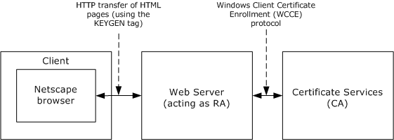

Figure 1: Netscape enrollment

The Windows Client Certificate Enrollment Protocol supports Netscape enrollment, as shown in the preceding figure. The impact on the protocol defined in this specification is that structures defined in "Netscape Extensions for User Key Generation Communicator 4.0 Version" are supported as certificate requests. For more information, see [[HTMLQ-keygen]](https://go.microsoft.com/fwlink/?linkid=2165135).

The process is:

The client machine's (Netscape) browser connects to a web page served by a web server that serves as a registration authority [**RA**](#gt_registration-authority-ra).

- The web page delivered by the web server to the client includes the <[**KEYGEN**](#gt_keygen)> tag. For more information, see [HTMLQ-keygen].
- In response to the <KEYGEN> tag, the browser generates a [**public-private key pair**](#gt_public-private-key-pair) and builds a certificate enrollment request in a format defined by Netscape.
- This request is delivered back to the web server with additional parameters.
- The web server takes those parameters, builds a new request, and sends it to the [**CA**](#gt_certification-authority-ca) using the WCCE protocol, noting in the call that its parameters are in Netscape format (for more information, see sections [2.2.2.6.4](#Section_2.2.2.6.4.2) and [3.1.1.4.3.1.4](#Section_3.1.1.4.3.1.4)).
- The CA returns a certificate in response to that request to the RA (for more information, see section [3.2.2.6.2.1.4](#Section_3.2.2.6.2.1.4)).
- The RA returns the certificate issued in step 6 to the Netscape browser over HTTP.
**Note** Only steps 5 and 6 are specified in this document.

#### 1.3.2.5 Sanitizing Common Names

[**Lightweight Directory Access Protocol (LDAP)**](#gt_lightweight-directory-access-protocol-ldap) limits subelements to a maximum of 64 [[UNICODE]](https://go.microsoft.com/fwlink/?LinkId=90550) characters. Because the Windows Client Certificate Enrollment Protocol uses [**Active Directory**](#gt_active-directory) [MS-ADTS](../MS-ADTS/MS-ADTS.md) to communicate with the [**directory**](#gt_directory) for retrieval and storage of [**certificates**](#gt_certificate) and [**certificate templates**](#gt_certificate-template), objects with longer names (in excess of 64 [UNICODE] characters) necessitates sanitation.

The algorithm for creating a [**sanitized name**](#gt_sanitized-name) is specified in section [3.1.1.4.1.1](#Section_3.1.1.4.1.1).

In the following example, the number sign (#) is replaced by !0023, the percent (%) is replaced by !0025, and the carat symbol (^) is replaced by !005e.

Original Name: 'LongCAName(WithSpeci@#$%^Characters'

Sanitized Name: 'LongCAName!0028WithSpeci@!0023$!0025!005eCharacters'

The algorithm for creating a sanitized name is specified in section 3.1.1.4.1.1.

### 1.3.3 Information for Certificate Templates

When an enterprise operates its [**CA**](#gt_certification-authority-ca) with [**certificate issuance**](#gt_certificate-issuance) that is controlled through [**certificate templates**](#gt_certificate-template), the CA is bound to issue only those [**certificates**](#gt_certificate) that fit a particular template. Each user that requests [**enrollment**](#gt_certificate-enrollment) must have been granted access to the template that is specified in the enrollment request. In this environment, the [**Active Directory**](#gt_active-directory) contains the list of available certificate templates. The [**directory**](#gt_directory) also contains a list of certificate templates for which a given certificate authority can issue certificates.

For information on server processing rules for certificate templates, see section [3.2.2.6.2.1.4.1](#Section_3.2.2.6.2.1.4.1).

#### 1.3.3.1 Template IDs

[**Certificate templates**](#gt_certificate-template) are designed to be stored in [**Active Directory**](#gt_active-directory), although any [**directory**](#gt_directory) accessible by [**LDAP**](#gt_lightweight-directory-access-protocol-ldap) can hold certificate templates.<3>

Certificate templates constitute data that are shared among multiple computers and that therefore might not be current.

To accommodate nonfreshness of certificate templates, the certificate template data structure, as specified in [MS-CRTD](../MS-CRTD/MS-CRTD.md), includes fields that can address freshness. These are:

- **msPKI-Template-Template-OID**: The template's [**OID**](#gt_object-identifier-oid)
- **revision**: The template's major revision number
- **msPKI-Template-Minor-Revision**: The template's minor revision number
If a customer who modifies a template would like to distinguish the new template from the previous one, that customer either can generate a new OID for the modified template, or can give the new template a higher major or minor revision value.<4>

If client software requires a template of a particular revision level or a particular OID, it can request a template by that OID and revision value. The protocol as defined here notifies the client whether the [**CA**](#gt_certification-authority-ca) with which it is communicating has a template of that OID and at least that revision value; otherwise, the protocol returns an error. For more information, see section [3.1.2.4.2.2](#Section_3.1.2.4.2.2) and its subsections.

**Note** The protocol does not guarantee that the client and server implementations connect to the same Active Directory instance to retrieve templates. In addition, [MS-ADTS](../MS-ADTS/MS-ADTS.md) does not guarantee that at any time two instances of Active Directory will be in sync and store the same data. Because of these limitations, the following scenarios are possible:

- Permission changes are available to the client but are not available to the server, and vice versa.
- Template modifications are available to the client but are not available to the server, and vice versa.
Certificate templates were designed to resolve some of the sync issues by allowing the client to identify the version of the certificate template it used when constructing the request. Specifications for the syntax of the template revision can be found in section [2.2.2.7.7.2](#Section_2.2.2.7.7.2).

In case of template version mismatch between the client and the server, the server fails a request that refers to a template with a higher version than the server has in its replica. If the server has a higher version than the one requested, the server uses the highest version available.

#### 1.3.3.2 Implementations Without Templates

If a vendor chooses to implement a [**CA**](#gt_certification-authority-ca) without using templates, as specified in [MS-CRTD](../MS-CRTD/MS-CRTD.md), then the "template names" and "template version number and OID" (as they are called in this document) become merely policy identifiers. It is then up to the vendor of the CA to write the code that maps from these policy identifiers to [**certificate**](#gt_certificate) bodies that correspond to those requests.

#### 1.3.3.3 Modifying Templates

A set of default templates is documented in [MS-CRTD](../MS-CRTD/MS-CRTD.md). However, a customer is free at any time to create new templates, delete existing ones, or modify templates.<5> A template is a normal [**directory object**](#gt_directory-object) accessed through [**LDAP**](#gt_lightweight-directory-access-protocol-ldap). Any new or existing software capable of modifying LDAP objects can be used. By editing [**certificate templates**](#gt_certificate-template), a customer can express custom [**certificate issuance**](#gt_certificate-issuance) policy.

#### 1.3.3.4 Permissions on Templates

A template object in [**Active Directory**](#gt_active-directory) has an [**ACL**](#gt_access-control-list-acl), as does every object in Active Directory. A customer can set those ACLs so that users (or groups of users) have read permission only for templates for [**certificates**](#gt_certificate) (thus, for certificate requests) that are available to those users. In addition, the [**CA**](#gt_certification-authority-ca) enforces a permission, enroll, which is associated with a template object, by honoring a certificate request from a given user only if that user has [**enroll**](#gt_enroll) permission for the template that corresponds to that request.

If a non-Microsoft implementation of the CA wants to avoid using templates but still wants this kind of access control, then it needs to implement that access control in some other manner.

## 1.4 Relationship to Other Protocols

The Windows Client Certificate Enrollment Protocol depends on the Distributed Component Object Model (DCOM) Remote Protocol [MS-DCOM](../MS-DCOM/MS-DCOM.md). The DCOM Remote Protocol is built on top of the Remote Procedure Call Protocol Extensions (RPCE) [MS-RPCE](../MS-RPCE/MS-RPCE.md), and the Windows Client Certificate Enrollment Protocol accesses RPCE directly to obtain certain security settings for the client-to-server connections. The Windows Client Certificate Enrollment Protocol depends on the Netlogon Remote Protocol Specification [MS-NRPC](../MS-NRPC/MS-NRPC.md) for locating the [**domain controller (DC)**](#gt_domain-controller-dc).

The Windows Client Certificate Enrollment Protocol uses the Hypertext Transfer Protocol -- HTTP/1.1 [[RFC2616]](https://go.microsoft.com/fwlink/?LinkId=90372) for retrieving CRLs. When using HTTP, the behavior will be to use HTTP v1.1 (see [RFC2616]) on port 80 unless one of the following cases:

- The URL has a prefix of "https://" in which case it uses port 443.
- A URL explicitly specifies an alternative port, or the processing rule explicitly requests an alternative port.
The HTTP v1.1 behavior is to use persistent connections.

The Windows Client Certificate Enrollment Protocol uses the DCOM Remote Protocol to create and use [**DCOM**](#gt_distributed-component-object-model-dcom) [**object (2)**](#gt_object) references to server objects, as specified in section [2.1](#Section_2.1) of this document and [MS-DCOM] section 3.2.4.1. The Windows Client Certificate Enrollment Protocol also uses the DCOM Remote Protocol to select authentication settings. The specific parameters passed from the Windows Client Certificate Enrollment Protocol to the DCOM Remote Protocol are specified in section 2.1.

Using input from a higher-layer protocol or application, the DCOM Remote Protocol negotiates its authentication method and settings by using the Generic Security Service Application Programming Interface (GSS-API) (as specified in [[RFC2478]](https://go.microsoft.com/fwlink/?LinkId=90360)), and these settings are in turn passed to the activation request and [**object remote procedure calls (ORPC)**](#gt_object-remote-procedure-call-orpc) made by the DCOM client to the DCOM server, as specified in [MS-DCOM] sections 3.2.4.1.1.2 and 3.2.4.2. The following figure shows the layering of the protocol stack.

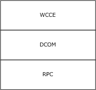

Figure 2: Windows Client Certificate Enrollment protocol stack

Data structures that are defined in the [**certificate template**](#gt_certificate-template) structure specification (see [MS-CRTD](../MS-CRTD/MS-CRTD.md)), can be retrieved over [**LDAP**](#gt_lightweight-directory-access-protocol-ldap), as specified in [[RFC2559]](https://go.microsoft.com/fwlink/?LinkId=90368), and used by the Windows Client Certificate Enrollment Protocol.

The Certificate Services Remote Administration Protocol [MS-CSRA](../MS-CSRA/MS-CSRA.md) is a management protocol for the Windows Client Certificate Enrollment Protocol server. When implemented together Windows Client Certificate Enrollment Protocol shares ADM with Certificate Services Remote Administration Protocol [MS-CSRA] as specified in sections [3.2.1.1](#Section_3.2.1) and [3.2.1.1.3](#Section_3.2.1.1.3).

The ICertPassage Remote Protocol [MS-ICPR](../MS-ICPR/MS-ICPR.md) is another [**certificate enrollment**](#gt_certificate-enrollment) protocol that is built directly on top of the Remote Procedure Call Protocol Extensions (RPCE) [MS-RPCE]. When implemented together the Windows Client Certificate Enrollment Protocol shares some of its ADM with ICertPassage Remote Protocol [MS-ICPR], as specified in [MS-ICPR] 3.1.1 and 3.2.1.

The Encrypting File System Remote (EFSRPC) Protocol [MS-EFSR](../MS-EFSR/MS-EFSR.md) depends on the Windows Client Certificate Enrollment Protocol.

Indirectly, as an example, other protocols that rely on [**certificates**](#gt_certificate) for authentication (such as the Transport Layer Security Protocol (TLS), [[RFC2246]](https://go.microsoft.com/fwlink/?LinkId=90324)) can use this protocol for certificate enrollment and [**issuance**](#gt_certificate-issuance).

## 1.5 Prerequisites/Preconditions

The configuration elements defined in section [3.2.1.1.4](#Section_3.2.1.1.4) are available. Server implementations that also implement the Certificate Services Remote Administration Protocol, specified in [MS-CSRA](../MS-CSRA/MS-CSRA.md), or the ICertPassage Remote Protocol, specified in [MS-ICPR](../MS-ICPR/MS-ICPR.md), use the same configuration data elements, defined in section 3.2.1.1.4 as "public", for those implementations.

## 1.6 Applicability Statement

The Windows Client Certificate Enrollment Protocol is applicable to an environment in which clients benefit from the capability to interact with the [**CA**](#gt_certification-authority-ca) in order to [**enroll**](#gt_enroll) or manage [[X509]](https://go.microsoft.com/fwlink/?LinkId=90590) [**certificates**](#gt_certificate).

## 1.7 Versioning and Capability Negotiation

This document covers versioning issues in the following areas.

- **Interface support**: The Windows Client Certificate Enrollment Protocol uses [**DCOM**](#gt_distributed-component-object-model-dcom) [MS-DCOM](../MS-DCOM/MS-DCOM.md) to determine interface support, as specified in section [3.1.1.4](#Section_3.2.2.6).

## 1.8 Vendor-Extensible Fields

A vendor that implements a customized [**CA policy algorithm**](#gt_ca-policy-algorithm) or [**CA exit algorithm**](#gt_ca-exit-algorithm) MUST NOT return an implementation description identical to the one implemented by Microsoft: "Windows default". The returned value of the implementation description is specified in section [3.2.1.4.3.2.4](#Section_3.2.1.4.3.2.4) and [3.2.1.4.3.2.5](#Section_3.2.1.4.3.2.5).

## 1.9 Standards Assignments

No standards assignments have been received for the Windows Client Certificate Enrollment Protocol described in this document. All values used in these extensions are in private ranges.

The following table contains the Remote Procedure Call (RPC) interface universally unique identifiers (UUIDs) for all the interfaces that are part of the Windows Client Certificate Enrollment Protocol.

| Parameter | Value | Reference |
| --- | --- | --- |
| RPC Interface UUID for ICertRequestD | {d99e6e70-fc88-11d0-b498-00a0c90312f3} | [[C706]](https://go.microsoft.com/fwlink/?LinkId=89824) section A.2.5. |
| RPC Interface UUID for ICertRequestD2 | {5422fd3a-d4b8-4cef-a12e-e87d4ca22e90} | [C706] section A.2.5. |
| CLSID for CCertRequestD (the class [MS-DCOM](../MS-DCOM/MS-DCOM.md) that implements the ICertRequestD and ICertRequestD2 interfaces) | {d99e6e74-fc88-11d0-b498-00a0c90312f3} | [C706] section A.2.5. |

# 2 Messages

The following sections specify how Windows Client Certificate Enrollment Protocol messages are transported and their syntax.

## 2.1 Transport

The Distributed Component Object Model (DCOM) Remote Protocol [MS-DCOM](../MS-DCOM/MS-DCOM.md) is used as the transport protocol.

The Windows Client Certificate Enrollment Protocol uses [**DCOM**](#gt_distributed-component-object-model-dcom) to create and use DCOM [**object (2)**](#gt_object) references to server objects.

Windows Client Certificate Enrollment Protocol clients initialize a connection to the Windows Client Certificate Enrollment Protocol server by creating and executing a DCOM activation request. As a result of this DCOM activation, the Windows Client Certificate Enrollment Protocol client can use the DCOM client to call the methods specified in this document. The activation process is detailed in [MS-DCOM] section 3.2.4.

The RPC version number for all interfaces MUST be 0.0.

[MS-DCOM] section 3.2.4.1 specifies the various elements that an application using DCOM passes to the DCOM client as part of the initial activation request. Below are the values that the Windows Client Certificate Enrollment Protocol sends to the DCOM layer.

General DCOM settings:

- Remote server name the application-supplied remote server name as specified in [MS-DCOM] section 3.2.4.2. The Windows Client Certificate Enrollment Protocol client sends the name of the [**CA**](#gt_certification-authority-ca) server.
- Class identifier (CLSID) of the object requested. This value is implementation-specific.
- Interface identifier(s) (IID) of interface(s) requested (see section [1.9](#Section_1.9)).
Security settings ([MS-DCOM] section 3.2.4.1.1.2):

- Security provider: RPC_C_AUTHN_GSS_NEGOTIATE (9).
- Authentication level: SHOULD be set to RPC_C_AUTHN_LEVEL_PKT_PRIVACY (0x06).
Windows clients typically set the authentication level to RPC_C_AUTHN_LEVEL_PKT_PRIVACY (0x06).<6>

If a certificate authority (CA) server has IF_ENFORCEENCRYPTICERTREQUEST set (section [3.2.1.1.4](#Section_3.2.1.1.4)) and the RPC_C_AUTHN_LEVEL_PKT_PRIVACY (0x06) authentication level ([MS-RPCE](../MS-RPCE/MS-RPCE.md) section 2.2.1.1.8) is not specified by the client for certificate-request operations, the CA MUST deny a connection to the client and return a non-zero error. If a CA server has IF_ENFORCEENCRYPTICERTADMIN set (section 3.2.1.1.4) and the RPC_C_AUTHN_LEVEL_PKT_PRIVACY (0x06) authentication level is not specified by the client for certificate administrative operations, the CA MUST deny a connection to the client and return a non-zero error.<7> <8>

As a result of the security provider and authentication level used, there is a negotiation between the client and server security providers that results in either NTLM, as specified in [MS-NLMP](../MS-NLMP/MS-NLMP.md), or Kerberos, as specified in [[RFC4120]](https://go.microsoft.com/fwlink/?LinkId=90458) and [MS-KILE](../MS-KILE/MS-KILE.md), being used as the authentication method.

- Impersonation level: RPC_C_IMP_LEVEL_IMPERSONATE (3).
This means the server can use the client's security context while acting on behalf of the client, to access local resources such as files on the server.

- Authentication identity and credentials: NULL.
Passing NULL authentication identity and credentials for the RPC_C_AUTHN_GSS_NEGOTIATE security provider means that the [**ORPC**](#gt_object-remote-procedure-call-orpc) call uses the identity and credentials of the higher-layer application.

Default values, as specified in [MS-DCOM], are used for all DCOM inputs not specified above, such as Security Principal Name (SPN), client and prototype context property buffers, and their context property identifiers.

## 2.2 Common Data Types

### 2.2.1 BYTE

A **BYTE** is an 8-bit value. This data type maps to the byte base [**Interface Definition Language (IDL)**](#gt_interface-definition-language-idl) type, as specified in [[C706]](https://go.microsoft.com/fwlink/?LinkId=89824) section 4.2.9.5.

This type is declared as follows:

typedef byte BYTE;

### 2.2.2 Common Structures

This section defines the structures used by the Windows Client Certificate Enrollment Protocol. These structures are used when a [**certificate**](#gt_certificate) request is submitted to the server and as part of the server's response. Use of these structures is specified in section [3.2.1.4](#Section_3.2.1).

All communications of [**binary large objects (BLOBs)**](#gt_binary-large-object-blob) between the client and server use the [CERTTRANSBLOB](#Section_2.2.2.2) data structure (which also takes the acronym BLOB). The CERTTRANSBLOB data structure contains a length and a pointer to a byte array. The type of content, stored in the byte array buffer, depends on the particular call context.

A BLOB contains any one of the following:

- **CATRANSPROP**: A structure used to return information for [**CA**](#gt_certification-authority-ca) properties, as specified in section [2.2.2.3](#Section_2.2.2.3).
- **CAINFO**: A structure that contains basic information on the CA, as specified in section [2.2.2.4](#Section_2.2.2.4).
- An ASN.1 (as specified in [[X690]](https://go.microsoft.com/fwlink/?LinkId=90593))-encoded [**CMS**](#gt_cryptographic-message-syntax-cms) (as specified in [[RFC3852]](https://go.microsoft.com/fwlink/?LinkId=90445)), PKCS #10 (as specified in [[RFC2986]](https://go.microsoft.com/fwlink/?LinkId=90401)), or CMC (as specified in [[RFC2797]](https://go.microsoft.com/fwlink/?LinkId=90382)) request certificate submitted to the CA, as specified in section [2.2.2.6](#Section_2.2.2.6).
- An ASN.1 (as specified in [X690])-encoded CMS with a full certificate chain (as specified in [RFC3852]) or a CMC full [**PKI**](#gt_public-key-infrastructure-pki) response (as specified in [RFC2797]) returned by the CA, as specified in section [2.2.2.8](#Section_2.2.2.8).
- An ASN.1 (as specified in [X690])-encoded X.509 certificate returned by the CA, as specified in section [2.2.2.2.2](#Section_2.2.2.2.2).
- A Unicode (as specified in [[UNICODE4.0]](https://go.microsoft.com/fwlink/?LinkId=90552)) disposition text message returned by the CA, as specified in section [2.2.2.2.1](#Section_2.2.2.2.1).
Data type definitions of HRESULT, BOOL, LONG, wchar_t, and DWORD, used in the following sections, are as specified in [MS-RPCE](../MS-RPCE/MS-RPCE.md), [MS-DTYP](../MS-DTYP/MS-DTYP.md), and [MS-ERREF](../MS-ERREF/MS-ERREF.md).

#### 2.2.2.1 CACERTBLOB

The CACERTBLOB construct consists of serialized elements. Each element is a data structure consisting of a header and its value. The element header consists of the following fields.

| Bit Range | Field | Description |
| --- | --- | --- |
| Variable | Element type | DWORD Identifies the type of the element. |
| Variable | Encoding type | DWORD Specifies the encoding used. |
| Variable | Length | DWORD Specifies the length of the element. |

The following table defines the element types that are possible.

| Element type | Encoding type | Meaning |
| --- | --- | --- |
| FILE_ELEMENT_CERT_TYPE (0x00000020) | X509_ASN_ENCODING (0x00000001) | The element contains ASN.1-encoded X.509 [**certificates**](#gt_certificate), as defined in [[RFC3280]](https://go.microsoft.com/fwlink/?LinkId=90414). |
| CERT_FRIENDLY_NAME_PROP_ID (0x0000000d) | X509_ASN_ENCODING (0x00000001) | A friendly name can be associated with the certificate. The friendly name is specified as a null-terminated Unicode character string. |
| CERT_DESCRIPTION_PROP_ID (0x0000000b) | X509_ASN_ENCODING (0x00000001) | This property allows the user to describe the use for the certificate. |
| CERT_ENHKEY_USAGE_PROP_ID (0x00000009) | X509_ASN_ENCODING (0x00000001) | A specific set of enhanced key usages can be enabled or disabled for a certificate. The ASN.1 representation for [**enhanced key usage (EKU)**](#gt_enhanced-key-usage-eku) is described in [RFC3280] section 4.2.1.13. |
| CERT_CROSS_CERT_DIST_POINTS_PROP_ID (0x00000017) | X509_ASN_ENCODING (0x00000001) | The Cross-Certificate Distribution Points extension can be used to specify the download URL for [**cross certificates**](#gt_cross-certificate) that are associated with a particular certificate. The ASN.1 definition for Cross-Certificate Distribution Points is: CrossCertDistPoints ::= SEQUENCE { syncDeltaTime INTEGER (0..4294967295) OPTIONAL, crossCertDistPointNames CrossCertDistPointNames } CrossCertDistPointNames ::= SEQUENCE OF GeneralNames GeneralNames ::= AltNames For the definition of AltNames, see [RFC3280] section 4.2.1.7, the definition of GeneralNames. |

#### 2.2.2.2 CERTTRANSBLOB

The **CERTTRANSBLOB** structure defines a byte buffer that is used to store [**certificates**](#gt_certificate), request certificates, transmit responses, manipulate [[UNICODE]](https://go.microsoft.com/fwlink/?LinkId=90550) strings, and marshal property values.

typedef struct _CERTTRANSBLOB {

ULONG cb;

[size_is(cb), unique] BYTE* pb;

} CERTTRANSBLOB;

**cb:** Unsigned integer value that MUST contain the length of the buffer pointed to by **pb** in bytes.

**pb:** Byte buffer that MUST contain the binary contents being transported in this CERTTRANSBLOB.

CERTTRANSBLOB is empty when both **cb** and **pb** are set to 0.

The following sections specify marshaling of all supported structures that can be passed in the **pb** Byte buffer of CERTTRANSBLOB.

All instances of CERTTRANSBLOB used by this protocol MUST use one of the marshaling rules described in the following sections.

##### 2.2.2.2.1 Marshaling Unicode Strings in CERTTRANSBLOB

When a [[UNICODE]](https://go.microsoft.com/fwlink/?LinkId=90550) string is returned in the byte array referenced by the **pb** field of a [CERTTRANSBLOB (section 2.2.2.2)](#Section_2.2.2.2) structure, each [UNICODE] character MUST be marshaled in [**little-endian**](#gt_little-endian) format.

##### 2.2.2.2.2 Marshaling X.509 Certificates in a CERTTRANSBLOB

The following table specifies how [[X509]](https://go.microsoft.com/fwlink/?LinkId=90590) [**certificates**](#gt_certificate) are to be returned in the byte array referenced by the **pb** field of a [CERTTRANSBLOB (section 2.2.2.2)](#Section_2.2.2.2) structure.

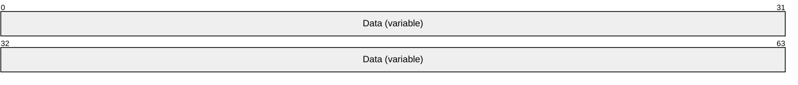

**Data (variable):** This field contains the X.509 certificate (as specified in [X509]), which is encoded by using [**Distinguished Encoding Rules (DER)**](#gt_distinguished-encoding-rules-der), as specified in [[X690]](https://go.microsoft.com/fwlink/?LinkId=90593).

##### 2.2.2.2.3 Marshaling an X.509 CRL in a CERTTRANSBLOB

The following table specifies how an X.509 [**certificate revocation list (CRL)**](#gt_certificate-revocation-list-crl), as specified in [[RFC3280]](https://go.microsoft.com/fwlink/?LinkId=90414), is to be returned in the byte array referenced by the **pb** field of a [CERTTRANSBLOB (section 2.2.2.2)](#Section_2.2.2.2) structure.

**Data (variable):** This field contains an X.509 CRL (as specified in [RFC3280]), which is encoded by using [**DER**](#gt_distinguished-encoding-rules-der), as specified in [[X690]](https://go.microsoft.com/fwlink/?LinkId=90593).

##### 2.2.2.2.4 Marshaling CMS in a CERTTRANSBLOB

The following table specifies how a [**Cryptographic Message Syntax (CMS)**](#gt_cryptographic-message-syntax-cms), as specified in [[RFC3852]](https://go.microsoft.com/fwlink/?LinkId=90445), is to be returned in the byte array that is referenced by the **pb** field of a [CERTTRANSBLOB (section 2.2.2.2)](#Section_2.2.2.2) structure.

**Data (variable):** This field is CMS (as specified in [RFC3852]), which is encoded by using [**DER**](#gt_distinguished-encoding-rules-der), as specified in [[X690]](https://go.microsoft.com/fwlink/?LinkId=90593).

##### 2.2.2.2.5 Marshaling CAINFO in CERTTRANSBLOB

When a [CAINFO (section 2.2.2.4)](#Section_2.2.2.4) structure is returned within the **pb** field of a [CERTTRANSBLOB (section 2.2.2.2)](#Section_2.2.2.2) structure, CAINFO is marshaled by using the same data types and structure as those specified in section 2.2.2.4. All fields MUST be marshaled as [**little-endian**](#gt_little-endian). For more information on supported values of the fields within that structure, see section 2.2.2.4.

##### 2.2.2.2.6 Marshaling Certificate Requests in a CERTTRANSBLOB

The following table specifies how a [**certificate**](#gt_certificate) request is to be returned in the byte array that is referenced by the **pb** field of a [CERTTRANSBLOB](#Section_2.2.2.2) structure.

**Data (variable):** This field is a [**CMS**](#gt_cryptographic-message-syntax-cms) (as specified in [[RFC3852]](https://go.microsoft.com/fwlink/?LinkId=90445)), Public-Key Cryptography Standards (PKCS) #10 (as specified in [[RFC2986]](https://go.microsoft.com/fwlink/?LinkId=90401)), or CMC (as specified in [[RFC2797]](https://go.microsoft.com/fwlink/?LinkId=90382)) request certificate encoded by using [**DER**](#gt_distinguished-encoding-rules-der), as specified in [[X690]](https://go.microsoft.com/fwlink/?LinkId=90593).

##### 2.2.2.2.7 Marshaling CMC in a CERTTRANSBLOB

The following table specifies how a CMC, as specified in [[RFC2797]](https://go.microsoft.com/fwlink/?LinkId=90382), is to be returned in the byte array referenced by the **pb** field of a [CERTTRANSBLOB (section 2.2.2.2)](#Section_2.2.2.2) structure.

**Data (variable):** This field is CMC (as specified in [RFC2797]) encoded by using [**DER**](#gt_distinguished-encoding-rules-der), as specified in [[X690]](https://go.microsoft.com/fwlink/?LinkId=90593).

#### 2.2.2.3 CATRANSPROP

The **CATRANSPROP** structure encapsulates information about a [**CA**](#gt_certification-authority-ca) property. For a list of CA properties, see section [3.2.1.4.3.2](#Section_3.2.1.4.2). An array of these structures is carried in a [CERTTRANSBLOB (section 2.2.2.2)](#Section_2.2.2.2) structure, and is returned by GetCAPropertyInfo, as specified in section [3.2.1.4.3.3](#Section_3.2.1.4.2). Note that this structure does not contain property values themselves; rather, CATRANSPROP contains information about properties.

typedef struct _CATRANSPROP {

LONG lPropID;

BYTE propType;

BYTE Reserved;

USHORT propFlags;

ULONG obwszDisplayName;

} CATRANSPROP;

**lPropID:** Integer value that MUST contain the property identifier. For the list of supported properties, see section 3.2.1.4.3.2.

**propType:** Byte value that MUST contain the data type for the property. Must be one of the following values.

| Value | Meaning |
| --- | --- |
| PROPTYPE_LONG 0x1 | Property type is a signed long integer. |
| PROPTYPE_DATE 0x2 | Property type is a date-time value. |
| PROPTYPE_BINARY 0x3 | Property type is binary data. |
| PROPTYPE_STRING 0x4 | Property type is a string. |

**Reserved:** MUST be set to 0 and ignored upon receipt.

**propFlags:** 16-bit flag field.

| 0 | 1 | 2 | 3 | 4 | 5 | 6 | 7 | 8 | 9 | 1 0 | 1 | 2 | 3 | 4 | 5 |
| --- | --- | --- | --- | --- | --- | --- | --- | --- | --- | --- | --- | --- | --- | --- | --- |
| 0 | 0 | 0 | 0 | 0 | 0 | 0 | 0 | 0 | 0 | 0 | 0 | 0 | 0 | 0 | I |

Where the bits are defined as:

| Value | Description |
| --- | --- |
| I | This bit provides indication that the property is indexed and has multiple values. If this bit is set to 1, then a property is indexed. If the bit is set to 0, then the property is not indexed. |

**obwszDisplayName:** Integer that MUST contain the offset to the string that contains the display name of this property, where the offset begins at the beginning of the byte array referenced by the **pb** field of the containing CERTTRANSBLOB (section 2.2.2.2) structure. The string format MUST be null-terminated [[UNICODE]](https://go.microsoft.com/fwlink/?LinkId=90550). The offset MUST be DWORD-aligned. For marshaling information about this property, see [Marshaling CATRANSPROP in a CERTTRANSBLOB (section 2.2.2.3.1)](#Section_2.2.2.3.1).

##### 2.2.2.3.1 Marshaling CATRANSPROP in a CERTTRANSBLOB

A [CERTTRANSBLOB (section 2.2.2.2)](#Section_2.2.2.2) structure MUST be used to return an array of [CATRANSPROP (section 2.2.2.3)](#Section_2.2.2.3) structures, where the count of array elements is returned in a separate output parameter of the remote procedure call. It MUST also contain a null-terminated Unicode string for each CATRANSPROP (section 2.2.2.3) structure that represents the display name of the [**CA**](#gt_certification-authority-ca) property.

The following tables show the sequence of fields in the byte array referenced by the **pb** field of the CERTTRANSBLOB (section 2.2.2.2) structure when used to transfer an array of CATRANSPROP (section 2.2.2.3) structures and their corresponding data.

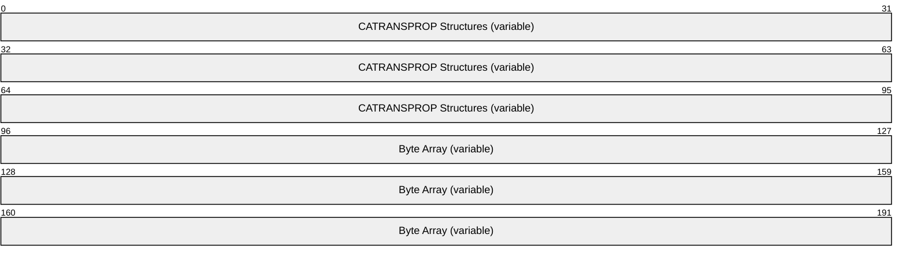

**CATRANSPROP Structures (variable):** An array of CATRANSPROP (section 2.2.2.3) structures each of which is marshaled in the following manner.

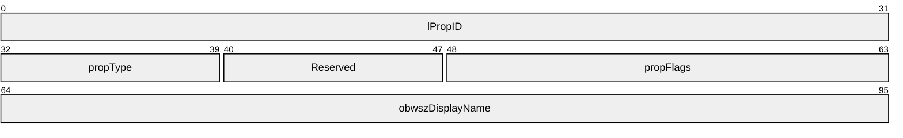

**lPropID (4 bytes):** These 4 bytes indicate the value of the **lPropID** field of the first CATRANSPROP (section 2.2.2.3) structure that is transferred in the CERTTRANSBLOB (section 2.2.2.2) structure. [**Little-endian**](#gt_little-endian) encoding format MUST be used.

**propType (1 byte):** This byte indicates the value of **propType** field of the first CATRANSPROP (section 2.2.2.3) structure that is transferred in the CERTTRANSBLOB (section 2.2.2.2) structure.

**Reserved (1 byte):** MUST be set to 0 and ignored upon receipt.

**propFlags (2 bytes):** These 2 bytes indicate the value of the **propFlags** field of the first CATRANSPROP (section 2.2.2.3) structure that is transferred in the CERTTRANSBLOB (section 2.2.2.2) structure. Little-endian encoding format MUST be used.

**obwszDisplayName (4 bytes):** These 4 bytes indicate the value of the **obwszDisplayName** field of the first CATRANSPROP (section 2.2.2.3) structure that transfers in the CERTTRANSBLOB (section 2.2.2.2) structure. Little-endian encoding format MUST be used. The value of this field indicates an offset from the beginning of the **pb** field to where the data value for this property can be found in the byte array. The value of this field must be DWORD-aligned.

**Byte Array (variable):** Contains the DisplayName data value for all the properties. The data value for one property MUST not overlap with another property's data value. Arbitrary padding can be added before or after data values. Each data value MUST be encoded as a [[UNICODE]](https://go.microsoft.com/fwlink/?LinkId=90550) null-terminated string in little-endian format.

#### 2.2.2.4 CAINFO

The **CAINFO** structure defines a basic informational block that describes a [**CA**](#gt_certification-authority-ca).

typedef struct _CAINFO {

DWORD cbSize;

long CAType;

DWORD cCASignatureCerts;

DWORD cCAExchangeCerts;

DWORD cExitAlgorithms;

long lPropIDMax;

long lRoleSeparationEnabled;

DWORD cKRACertUsedCount;

DWORD cKRACertCount;

DWORD fAdvancedServer;

} CAINFO;

**cbSize:** Unsigned integer value that MUST contain the size of this structure in bytes.

**CAType:** Integer value that SHOULD contain a constant describing the CA type. The value SHOULD be one of the values in the following table.

**Note** The value 0x00000002 MUST NOT be used for this parameter.

| Value | Meaning |
| --- | --- |
| ENUM_ENTERPRISE_ROOTCA 0x00000000 | The CA is an enterprise root (self-signed) CA. For more information, see [[MSFT-PKI]](https://go.microsoft.com/fwlink/?LinkId=90202). |
| ENUM_ENTERPRISE_SUBCA 0x00000001 | The CA is an enterprise [**subordinate CA**](#gt_subordinate-ca). For more information, see [MSFT-PKI]. |
| ENUM_STANDALONE_ROOTCA 0x00000003 | The CA is a stand-alone root (self-signed) CA. For more information, see [MSFT-PKI]. |
| ENUM_STANDALONE_SUBCA 0x00000004 | The CA is a stand-alone subordinate CA. For more information, see [MSFT-PKI]. |
| ENUM_UNKNOWN_CA 0x00000005 | The CA type is unknown. |

**cCASignatureCerts:** Unsigned integer value that SHOULD contain the count of CA [**signing certificates**](#gt_signing-certificates) in the CA. A CA signing certificate contains a [**public key**](#gt_public-key) that is in turn associated with the [**private key**](#gt_private-key) used to sign [**certificates**](#gt_certificate) that are issued by the CA. For more information on CA signing certificates, see [MSFT-PKI].

**cCAExchangeCerts:** Unsigned integer value that SHOULD contain the count of CA [**exchange certificates**](#gt_exchange-certificate) in the CA. CA exchange certificates contain public keys that are used to encrypt requests sent to a CA. For more information, see [[MSFT-ARCHIVE]](https://go.microsoft.com/fwlink/?LinkId=90177).

**cExitAlgorithms:** Unsigned integer value that SHOULD contain the number of [**exit algorithms**](#gt_ca-exit-algorithm) that are installed and active for the CA.

**lPropIDMax:** Integer that SHOULD contain the maximum supported value for the *PropID* parameter in the [ICertRequestD2::GetCAProperty](#Section_3.2.1.4.2) method. For more information on CA properties, see section 3.2.1.4.3.2.

**lRoleSeparationEnabled:** Integer value that SHOULD indicate whether [**CA role separation**](#gt_ca-role-separation) is enabled on the CA. A value of 0 indicates that CA role separation is disabled; a value of 1 indicates that it is enabled.

**cKRACertUsedCount:** Unsigned integer value that SHOULD contain the number of [**key recovery agent (KRA)**](#gt_key-recovery-agent-kra) [**keys**](#gt_key) used to encrypt each archived private key.

**cKRACertCount:** Unsigned integer value that SHOULD contain the number of KRA keys available for the CA to encrypt archived private keys.

**fAdvancedServer:** Unsigned integer value that SHOULD be set to 0 for [**standard CA**](#gt_standard-ca) and 1 for advanced CA. This value is a Boolean value. The CA SHOULD return 0 or 1.

#### 2.2.2.5 KeyAttestationStatement

The KeyAttestationStatement structure is defined as follows:<9>

typedef struct {

UINT32 Magic;

UINT32 Version;

UINT32 Platform;

UINT32 HeaderSize;

UINT32 cbIdBinding;

UINT32 cbKeyAttestation;

UINT32 cbAIKOpaque;

BYTE idBinding[cbIdBinding];

BYTE keyAttestation[cbKeyAttestation];

BYTE aikOpaque[cbAIKOpaque];

} KeyAttestationStatement;

**Magic:** The value MUST be 0x5453414B.

**Version:** The value MUST be 1.

**Platform:** The value MUST be either 1 or 2 indicating the [**TPM**](#gt_trusted-platform-module-tpm) platform.

**HeaderSize:** An integer value denoting the size of the header.

**cbIdBinding:** An integer value denoting the size of the **idBinding** field.

**cbKeyAttestation:** An integer value denoting the size of the **keyAttestation** field.

**cbAIKOpaque:** An integer value denoting the size of the **aikOpaque** field.

**idBinding:** When the **Platform** member equals 1, a byte array containing the signature of a **TPM_IDENTITY_CONTENTS** structure, as defined in [[TCG-Struct]](https://go.microsoft.com/fwlink/?LinkId=301946) section 12.5. When **Platform** equals 2, a byte array containing a concatenation of the following structures:<10>

- A TPM2B_PUBLIC structure defined in [[TCG-Struct-V2]](https://go.microsoft.com/fwlink/?LinkId=522455) section 12.2.5.
- A TPM2B_CREATION_DATA structure defined in [TCG-Struct-V2] section 15.2.
- A TPM2B_ATTEST structure defined in [TCG-Struct-V2] section 10.12.9.
- A TPMT_SIGNATURE structure defined in [TCG-Struct-V2] section 11.3.4.
For information on how this signature is constructed, see the following references:

- When **Platform** equals 1, [[TCG-Commands]](https://go.microsoft.com/fwlink/?LinkId=389726) section 15.1.
- When **Platform** equals 2, [[TCG-Commands-V2]](https://go.microsoft.com/fwlink/?LinkID=522454) section 12.1.
**keyAttestation:** A structure that is defined as follows:

typedef struct {

UINT32 Magic;

UINT32 Platform;

UINT32 HeaderSize;

UINT32 cbKeyAttest;

UINT32 cbSignature;

UINT32 cbKeyBlob;

BYTE keyAttest[cbKeyAttest];

BYTE signature[cbSignature];

BYTE keyBlob[cbKeyBlob];

} keyAttestation;

**Magic:** The value MUST be 0x5344414B.

**Platform:** The value MUST be either 1 or 2 indicating the TPM platform.

**HeaderSize:** An integer value denoting the size of the header.

**cbKeyAttest:** An integer value denoting the size of the **keyAttest** array.

**cbSignature:** An integer value denoting the size of the **signature** array.

**cbKeyBlob:** An integer value denoting the size of the **keyBlob** array.

**keyAttest:** MUST be a TPM_CERTIFY_INFO structure if the **Platform** field equals 1, or a TPM_CERTIFY_INFO2 structure if **Platform** equals 2, as defined in [TCG-Struct] sections 11.1 and 11.2.

**signature:** Contains the signature of the keyAttest array using the [**AIK**](#gt_attestation-identity-key-aik) [**private key**](#gt_private-key).

**keyBlob:** Contains a [**CSP**](#gt_cryptographic-service-provider-csp)-specific opaque format of the attested key.

**aikOpaque:** Contains a CSP-specific opaque format of the AIK private key.

#### 2.2.2.6 Request Format

The Windows Client Certificate Enrollment Protocol is a simple request-response pattern between the client and the server ([**CA**](#gt_certification-authority-ca)). The client MUST send the [**certificate**](#gt_certificate) request by using one of the following ASN.1 encoded message formats: PKCS #10, [**CMS**](#gt_cryptographic-message-syntax-cms), Netscape, or [CMC](#Section_2.2.2.6.3). Each format contains a set of [**attributes**](#gt_attribute) and extensions that describe the request.

This section defines the format for the various client request types. A single ASN.1 encoded request makes up the entire byte buffer of a [CERTTRANSBLOB (section 2.2.2.2)](#Section_2.2.2.2) structure passed to the CA. Detailed processing rules for each of the message formats are specified in section [3.1.1.4](#Section_3.2.2.6).

##### 2.2.2.6.1 PKCS #10 Request Format

Clients use PKCS #10 structures, as specified in [[RFC2986]](https://go.microsoft.com/fwlink/?LinkId=90401), to submit a [**certificate**](#gt_certificate) request to a [**CA**](#gt_certification-authority-ca). A PKCS #10 request can be used by itself or encapsulated within a CMC (as specified in [[RFC2797]](https://go.microsoft.com/fwlink/?LinkId=90382)) or a [**CMS**](#gt_cryptographic-message-syntax-cms) (as specified in [[RFC3852]](https://go.microsoft.com/fwlink/?LinkId=90445)) request.

The following fields are introduced and specified in [RFC2986] section 4 and used by this protocol:

- **CertificationRequest**
- **CertificationRequestInfo**
- **Name**
- **SubjectPublicKeyInfo**
- **Attributes**
- **AlgorithmIdentifier**
For detailed server processing information, see section [3.1.1.4.3.1.1](#Section_3.1.1.4.3.1.1).

##### 2.2.2.6.2 CMS Request Format

Clients use [**CMS**](#gt_cryptographic-message-syntax-cms) structures, as specified in [[RFC3852]](https://go.microsoft.com/fwlink/?LinkId=90445), to submit requests to a [**CA**](#gt_certification-authority-ca).

The following fields are introduced and specified in [RFC3852] sections 4, 5, 6, and 8, and are used by this protocol:

- **ContentType**
- **Version**
- **DigestAlgorithmIdentifiers**
- **ContentInfo**
- **ExtendedCertificateOrCertificate**
- **RevocationInfoChoices**
- **SignerInfos**
- **IssuerAndSerialNumber**
- **Attributes**
- **DigestAlgorithmIdentifiers**
- **EncryptedContentEnvelopedData**
- **RecipientInfos**
- **EncryptedContentInfo**
- **ContentEncryptionAlgorithmIdentifier**
- **EncryptedContent**
- **UnprotectedAttributes**
For processing rules for these fields, see section [3.1.1.4.3.1.2](#Section_3.1.1.4.3.1.2).

##### 2.2.2.6.3 CMC Request Format

Clients use CMC structures that are documented (as specified in [[RFC2797]](https://go.microsoft.com/fwlink/?LinkId=90382)) for [**certificate**](#gt_certificate) requests. A CMC request consists of a [**CMS**](#gt_cryptographic-message-syntax-cms) message with CMC content.

The following fields are specified in section [3](#Section_1.3) and in [RFC2797] (Appendix A) and are used by this protocol:

- **TaggedRequest**
- **TaggedContentInfo**
- **OtherMsg**
- **BodyPartId**
- **AttributeValue**
- **TaggedCertificationRequest**
- **CertReqMsg**
- **BodyPartId**
- **ContentInfo**
**RegInfo**: This field is an octet string that is used as follows in this protocol: It MUST contain zero or more request [**attributes**](#gt_attribute), which MUST take the form of name-value pairs. The name-value pairs MUST be formatted as "Name=Value". An '=' MUST be the separator. An '&' MUST separate adjacent name-value pairs. The string value MUST be encoded as a [**UTF-8**](#gt_utf-8) string and then converted to an octet string.

For processing rules for these fields, see section [3.2.1.4.2.1.3](#Section_3.2.1.4.2.1.3).

##### 2.2.2.6.4 Netscape KEYGEN Tag Request Format

[**Certificate**](#gt_certificate) requests MAY use the Netscape request format, which MUST be the same format that a Netscape 3.x or Network 4.x browser would send to a web server in response to an HTML <[**KEYGEN**](#gt_keygen)> tag (section [1.3.2.4](#Section_1.3.2.4)) after a user fills in the information into the request form that it instantiates.

The data sent in the request string is called a Signed Public Key and Challenge (SPKAC) and MUST be encoded as specified in the following ASN.1 structure example.

PublicKeyAndChallenge ::= SEQUENCE {

spki SubjectPublicKeyInfo,

challenge IA5STRING

}

SignedPublicKeyAndChallenge ::= SEQUENCE {

publicKeyAndChallenge PublicKeyAndChallenge,

signatureAlgorithm AlgorithmIdentifier,

signature BIT STRING

}

Two [**attributes**](#gt_attribute) are associated with a request from a Netscape browser: **CertType** and **rdn**. These attributes MUST be passed along with the Netscape certificate request in the pwszAttributes to [ICertRequestD::Request](#Section_3.2.1.4.2) or [ICertRequestD2::Request2](#Section_3.2.1.4.3) methods. Method specifications are in sections 3.2.1.4.2.1 and 3.2.1.4.3.1.

###### 2.2.2.6.4.1 CertType

The CertType [**attribute**](#gt_attribute) is used to specify the type of the requested [**certificate**](#gt_certificate). The only supported value for a [**KEYGEN**](#gt_keygen) certificate request for this attribute is the string "server". For specifications, see section [2.2.2.7](#Section_3.1.1.4.3.1).

###### 2.2.2.6.4.2 Relative Distinguished Name

The [**relative distinguished name (RDN)**](#gt_relative-distinguished-name-rdn), as specified in [MS-ADTS](../MS-ADTS/MS-ADTS.md) section 3.1.1.1.4, is used to pass the requested values for the **Subject** field in the issued [**certificate**](#gt_certificate) to the [**CA**](#gt_certification-authority-ca).

The RDN MUST be one of the following:

- "C" or "Country" or "2.5.4.6".
- "O" or "Org" or "Organization" or "2.5.4.10".
- "OU" or "OrgUnit" or "OrganizationUnit" or "OrganizationalUnit" or "2.5.4.11".
- "CN" or "CommonName" or "2.5.4.3".
- "L" or "Locality" or "2.5.4.7".
- "S" or "ST" or "State" or "2.5.4.8".
- "T" or "Title" or "2.5.4.12".
- "G" or "GivenName" or "2.5.4.42".
- "I" or "Initials" or "2.5.4.43".
- "SN" or "SurName" or "2.5.4.4".
- "DC" or "DomainComponent" or "0.9.2342.19200300.100.1.25".
- "E" or "Email" or "1.2.840.113549.1.9.1".
- "Street" or "StreetAddress" or "2.5.4.9".
- "UnstructuredName" or "1.2.840.113549.1.9.2".
- "UnstructuredAddress" or " 1.2.840.113549.1.9.8".
- "DeviceSerialNumber" or "2.5.4.5".

##### 2.2.2.6.5 Null Signature

In CMS and CMC certificate request formats, the PKCS #10 request specified in the **TaggedRequest** field (see section 3.2.1.4.2.1.4.1.3) can contain only a null signature with the following signature field values:

**signatureAlgorithm** (see section 4.2, [[RFC2986]](https://go.microsoft.com/fwlink/?LinkId=90401)) would be set to a hashing algorithm such as "Sha256" (OID 2.16.840.1.101.3.4.2.1).

**signature** (see section 4.2, [RFC2986]) contains only the unencrypted hash octets computed over the DER encoded **certificationRequestInfo** component (see section 4.2 of RFC2986) using the hash algorithm specified in the **signatureAlgorithm** field.

Clients can send a PKCS #10 request with a null signature when the PKCS #10 request is specified in the **TaggedRequest** field in the CMS and CMC request formats as specified in sections [3.1.1.4.3.1.3](#Section_3.1.1.4.3.1.3), [3.1.1.4.3.2.2](#Section_3.1.1.4.3.2.2), [3.1.1.4.3.3.3](#Section_3.1.1.4.3.3.3), [3.1.1.4.3.6.1](#Section_3.1.1.4.3.6.1), and [3.2.1.4.2.1.4.1.1](#Section_3.2.1.4.2.1.4.1.1).

If the signature validation fails in section 3.2.1.4.2.1.4.1.1, then the CA MUST also check for a null signature and return a nonzero error to the client only when null signature validation fails as well. CA MUST check for a null signature only when the PKCS#10 request is specified in the CMS and CMC request formats as specified in sections [3.2.1.4.2.1.4.1.3](#Section_3.2.1.4.2.1.4.1.3), [3.2.1.4.2.1.4.2.2](#Section_3.2.1.4.2.1.4.2.2), [3.2.2.6.2.1.2.1.2](#Section_3.2.2.6.2.1.2.1.2), and [3.2.2.6.2.1.2.2](#Section_3.2.2.6.2.1.2.2).

#### 2.2.2.7 Certificate Request Attributes

A [**certificate**](#gt_certificate) request can contain [**attributes**](#gt_attribute). The client uses these attributes to pass additional information to the [**CA**](#gt_certification-authority-ca), and the CA uses these attributes when issuing the certificate.

There are various locations for these attributes:

- For certificate requests based on the PKCS #10 message format, the SHOULD be passed in the **Attributes** field, as specified in [[RFC2986]](https://go.microsoft.com/fwlink/?LinkId=90401).
- For certificate requests based on the [**CMS**](#gt_cryptographic-message-syntax-cms) format, the attributes SHOULD be passed in the **Attributes** field of the inner PKCS #10 certificate request that MUST be passed in the CMS. Details are specified in section [3.1.1.4.3.1.2](#Section_3.1.1.4.3.1.2).
- For certificate requests based on the CMC format, attributes SHOULD be passed in the **Attributes** field of the inner PKCS #10 certificate request that MUST be passed in the CMC. Details are specified in section [3.1.1.4.3.1.3](#Section_3.1.1.4.3.1.3). The attributes specified in section [2.2.2.7.10](#Section_2.2.2.7.10) MAY be passed in the **RegInfo** field of the CMC request. For formatting rules, see section [2.2.2.6.3](#Section_2.2.2.6.3).
In addition, the client can pass the attributes specified in section 2.2.2.7.10 in the *pwszAttributes* parameter for [ICertRequestD::Request](#Section_3.2.1.4.2) and [ICertRequestD2::Request2](#Section_3.2.1.4.3) methods. The format for this parameter is specified in section 3.2.1.4.2.1.

Because the Netscape [**KEYGEN**](#gt_keygen) tag request format does not support passing additional attributes, any request call that uses a Netscape KEYGEN tag request format MUST pass any additional attributes in the *pwszAttributes* parameter for the ICertRequestD::Request and ICertRequestD2::Request2 methods.

For processing rule specifications, see section [3](#Section_1.3).

Each attribute has an [**object identifier (OID)**](#gt_object-identifier-oid) that MUST uniquely identify the attribute and a value. The value MUST be an ASN.1 [**DER**](#gt_distinguished-encoding-rules-der)-encoded value, as specified in [[X690]](https://go.microsoft.com/fwlink/?LinkId=90593). The following sections define the various attributes for this protocol and define their formats.

##### 2.2.2.7.1 szOID_OS_VERSION

OID = 1.3.6.1.4.1.311.13.2.3.

Internal Name: szOID_OS_VERSION.

Description: This [**attribute**](#gt_attribute) specifies the client's operating system version.

Format: The following is the ASN.1 structure for this attribute.

AnyString ::= CHOICE {

numericString NUMERICSTRING, -- tag 0x12 (18)

printableString PRINTABLESTRING, -- tag 0x13 (19)

teletexString TELETEXSTRING, -- tag 0x14 (20)

videotexString VIDEOTEXSTRING, -- tag 0x15 (21)

ia5String IA5STRING, -- tag 0x16 (22)

graphicString GRAPHICSTRING, -- tag 0x19 (25)

visibleString VISIBLESTRING, -- tag 0x1A (26)

generalString GENERALSTRING, -- tag 0x1B (27)

universalString UNIVERSALSTRING, -- tag 0x1C (28)

bmpString BMPSTRING, -- tag 0x1E (30)

} --#public

##### 2.2.2.7.2 szOID_ENROLLMENT_CSP_PROVIDER

OID = 1.3.6.1.4.1.311.13.2.2.

Internal Name: szOID_ENROLLMENT_CSP_PROVIDER.

Description: This [**attribute**](#gt_attribute) MUST specify the [**cryptographic service provider (CSP)**](#gt_cryptographic-service-provider-csp) used to generate the [**key pair**](#gt_public-private-key-pair) on the [**enrollment**](#gt_certificate-enrollment) client.

Format: Following is the ASN.1 format for this attribute.

CSPProvider ::= SEQUENCE {

keySpec_INTEGER,

cspName_BMPSTRING,

signature_BITSTRING

}

##### 2.2.2.7.3 szOID_RENEWAL_CERTIFICATE

OID = 1.3.6.1.4.1.311.13.1.

Internal Name: szOID_RENEWAL_CERTIFICATE.

Description: This [**attribute**](#gt_attribute) MUST be the [**certificate**](#gt_certificate) associated with the [**private key**](#gt_private-key) used to sign a request to renew an existing certificate.

Format: The value of the attribute MUST be the [**DER**](#gt_distinguished-encoding-rules-der), as specified in [[X690]](https://go.microsoft.com/fwlink/?LinkId=90593), encoded certificate.

##### 2.2.2.7.4 szOID_REQUEST_CLIENT_INFO

OID = 1.3.6.1.4.1.311.21.20.

Internal Name: szOID_REQUEST_CLIENT_INFO.

The supported request format for this [**attribute**](#gt_attribute) MUST be only PKCS #10.

Description: Provides information about the client.

Client ID: An integer value that identifies the client application that sent the request. The values 0x1, 0x2, 0x3, 0x4, 0x5, 0x6, 0x7, 0x8, 0x9, and 0x3E8 are reserved and SHOULD NOT be used.<11>

Machine Name: A [**UTF-8**](#gt_utf-8) string representing the name of the machine on which this request is generated.

User Name: A UTF-8 string representing the name of the user who is responsible for creating the request.

Process Name: A UTF-8 string representing the application name that generated the request (for example, "certreq").

Format: The following is the ASN.1 format for this attribute.

SEQUENCE {

clientId INTEGER,

MachineName UTF8STRING,

UserName UTF8STRING,

ProcessName UTF8STRING

}

##### 2.2.2.7.5 szOID_NT_PRINCIPAL_NAME

OID = 1.3.6.1.4.1.311.20.2.3.

Internal Name: szOID_NT_PRINCIPAL_NAME.

Description: Used to encode the [**user principal name (UPN)**](#gt_user-principal-name-upn) as **OtherName** in a subject alternative name (SAN) extension, as specified in [[RFC3280]](https://go.microsoft.com/fwlink/?LinkId=90414) section 4.2.1.7.

Format: UTF8String.

##### 2.2.2.7.6 szOID_NTDS_REPLICATION

OID = 1.3.6.1.4.1.311.25.1.

Internal Name: szOID_NTDS_REPLICATION.

Description: Used to encode the [**directory**](#gt_directory) [**globally unique identifier (GUID)**](#gt_globally-unique-identifier-guid) (see [MS-DTYP](../MS-DTYP/MS-DTYP.md) section 2.3.4) as **OtherName** in a subject alternative name (SAN) extension, as specified in [[RFC3280]](https://go.microsoft.com/fwlink/?LinkId=90414) section 4.2.1.7.

Format: Octet string.

##### 2.2.2.7.7 szOID_CERT_EXTENSIONS

OID = 1.3.6.1.4.1.311.2.1.14.

Internal Name: szOID_CERT_EXTENSIONS.

Description: Provides an array of [**certificate**](#gt_certificate) extensions.

Format: Format is specified in [[RFC2985]](https://go.microsoft.com/fwlink/?LinkId=90400) section 5.4.2.

This field MUST contain zero or more extensions as specified in [[X509]](https://go.microsoft.com/fwlink/?LinkId=90590) section 8.2.2.

In addition, clients can pass these certificate extensions:

- [**Certificate template**](#gt_certificate-template) information. There are two versions for certificate templates: V1 and V2. Certificate template specifications are in [MS-CRTD](../MS-CRTD/MS-CRTD.md). See sections [2.2.2.7.7.1](#Section_2.2.2.7.7.1) and [2.2.2.7.7.2](#Section_2.2.2.7.7.2) for specifics on how to encode these extensions.
- Certificate Application Policies. See section [2.2.2.7.7.3](#Section_2.2.2.7.7.3) for specifics on how to encode this extension.

###### 2.2.2.7.7.1 szOID_ENROLL_CERTTYPE

OID = 1.3.6.1.4.1.311.20.2.

Internal Name: szOID_ENROLL_CERTTYPE.

Description: Contains the [**certificate**](#gt_certificate) name template extension.

Name: The value of the **cn** [**attribute**](#gt_attribute) of a [**certificate template**](#gt_certificate-template) object, as specified in [MS-CRTD](../MS-CRTD/MS-CRTD.md) section 2.1. This extension value MUST be [**DER**](#gt_distinguished-encoding-rules-der)-encoded. The **critical** field for this extension MUST be set to FALSE.

Format: The following is the ASN.1 format for this attribute.

CertificateTemplateName ::= SEQUENCE {

Name UTF8String

}

###### 2.2.2.7.7.2 szOID_CERTIFICATE_TEMPLATE

OID = 1.3.6.1.4.1.311.21.7.

Internal Name: szOID_CERTIFICATE_TEMPLATE.

Description: Contains the information about the template. This extension value MUST be [**DER**](#gt_distinguished-encoding-rules-der)-encoded. The **critical** field for this extension SHOULD be set to FALSE.

TemplateID: The value of the msPKI-Cert-Template-OID [**attribute**](#gt_attribute) of a [**certificate template**](#gt_certificate-template) object, as specified in [MS-CRTD](../MS-CRTD/MS-CRTD.md) section 2.20.

TemplateMajorVersion: The value of the revision attribute of a certificate template object, as specified in [MS-CRTD] section 2.6.

TemplateMinorVersion: The value of the msPKI-Template-Minor-Revision attribute of a certificate template object, as specified in [MS-CRTD] section 2.17.

Format: The following is the ASN.1 format for this attribute.

CertificateTemplateOID ::= SEQUENCE {

templateID OBJECT IDENTIFIER,

templateMajorVersion INTEGER (0..4294967295) OPTIONAL,

templateMinorVersion INTEGER (0..4294967295) OPTIONAL

} --#public

###### 2.2.2.7.7.3 Encoding a Certificate Application Policy Extension

The [**OID**](#gt_object-identifier-oid) for the Certificate Application Policy Extension is "1.3.6.1.4.1.311.21.10". The Certificate Application Policy Extension is encoded as a Certificate Policies extension (as specified in [[RFC3280]](https://go.microsoft.com/fwlink/?LinkId=90414) section 4.2.1.5), with an instance of PolicyInformation for each given OID in which the **policyIdentifier** field is set to the OID and the **policyQualifiers** field is not present.

###### 2.2.2.7.7.4 szOID_NTDS_CA_SECURITY_EXT

OID = 1.3.6.1.4.1.311.25.2.

Internal Name: szOID_NTDS_CA_SECURITY_EXT<12>.

Description: Contains **objectSid** of the Active Directory object whose information is being used to construct the subject information of an issued certificate. The CA MUST consider this extension from request attributes only when the CT_FLAG_ENROLLEE_SUPPLIES_SUBJECT flag is set on the corresponding certificate template object. See section [3.2.2.6.2.1.4.5.9](#Section_3.2.2.6.2.1.4.5.9) for specifics on how the CA processes this extension. This extension value MUST be **DER**-encoded ([[X690]](https://go.microsoft.com/fwlink/?LinkId=90593)). The **critical** field for this extension SHOULD be set to FALSE.

szOID_NTDS_OBJECTSID: 1.3.6.1.4.1.311.25.2.1.

Format: The following is the ASN.1 format ([X690]) for this attribute.

OtherName ::= SEQUENCE {

type-id szOID_NTDS_OBJECTSID,

value octet string }

##### 2.2.2.7.8 szOID_ARCHIVED_KEY_ATTR

OID = 1.3.6.1.4.1.311.21.13.

Internal Name: szOID_ARCHIVED_KEY_ATTR.

Description: The value for the [**attribute**](#gt_attribute) MUST be the encrypted [**private key**](#gt_private-key).

Format: The format MUST be a CMC [**certificate**](#gt_certificate) request (as specified in [[RFC2797]](https://go.microsoft.com/fwlink/?LinkId=90382)), ASN.1 [**DER**](#gt_distinguished-encoding-rules-der) encoded, as specified in [[X690]](https://go.microsoft.com/fwlink/?LinkId=90593). Format for this context is specified in section [3.1.1.4.3.6.1](#Section_3.1.1.4.3.6.1).

##### 2.2.2.7.9 szOID_ENCRYPTED_KEY_HASH

OID = 1.3.6.1.4.1.311.21.21.

Internal Name: szOID_ENCRYPTED_KEY_HASH.

Description: This value MUST be a hash used to identify the client's [**private key**](#gt_private-key).<13> For specific client processing rules, see section [3.1.1.4.3.6.1](#Section_3.1.1.4.3.6.1).

Format: The hash value. This value MUST be encoded as an octet string.

##### 2.2.2.7.10 szENROLLMENT_NAME_VALUE_PAIR

OID = 1.3.6.1.4.1.311.13.2.1

Internal Name: szOID_ENROLLMENT_NAME_VALUE_PAIR.

Description: Additional [**attributes**](#gt_attribute) that SHOULD be used.

Format: This attribute MUST be a collection of zero or more name-value pairs. The following is the ASN.1 format.

EnrollmentNameValuePairs ::= SEQUENCE OF EnrollmentNameValuePair

EnrollmentNameValuePair ::= SEQUENCE {

name BMPSTRING,

value BMPSTRING

} --#public

The following table lists all the values that SHOULD be supported by the [**CA**](#gt_certification-authority-ca). Processing rules for the supported values for this collection MUST be as specified in section [3.2.1.4.2.1.2](#Section_3.2.1.4.2.1.2).

**Note** If a value is in quotes, the value must be exactly as the string within the quote. For example, CertType has only a single possible value, "server".

| Name | Values | Comments | Value example |
| --- | --- | --- | --- |
| CertType | "server" | This attribute MUST be used along with a Netscape [**KEYGEN**](#gt_keygen) request. It MUST define the type of [**certificate**](#gt_certificate) that the client needs. | server |
| CertificateUsage | Comma-delimited OIDs | The request OIDs for use in the ExtendedKeyUsage extension, as specified in [[RFC3280]](https://go.microsoft.com/fwlink/?LinkId=90414) section 4.2.1.13. | 2.5.29.3, 2.5.43.1 |
| ValidityPeriod | "Seconds" or "Minutes" or "Hours" or "Days" or "Weeks" or "Months" or "Years" | The validity period of the request MUST be defined in two values: number and units. For example, number=3 and units=weeks means that the request is for a certificate that will be valid for 3 weeks. This value MUST define the units for the validity period. | Weeks |
| ValidityPeriodUnits | Unsigned integer | This value MUST define the number units used for the validity period. The units are defined in the ValidityPeriod attribute. | 3 |
| ExpirationDate | Date and time | This value MUST define the exact request expiration time of the requested certificate in the format defined in section 3.3 of the [[RFC2616]](https://go.microsoft.com/fwlink/?LinkId=90372).<14> | L"Tue, 21 Nov 2000 01:06:53 GMT" |
| cdc | [**FQDN**](#gt_fully-qualified-domain-name-fqdn) | An [**Active Directory**](#gt_active-directory) server FQDN. | dcmachine.contoso.com |
| rmd | FQDN | The requesting machine FQDN. | mymachine.contoso.com |
| CertificateTemplate | The cn attribute on the Active Directory object that contains the certificate template | This value MUST define the [**certificate template**](#gt_certificate-template) that was used by the client to construct the certificate request. | ContosoAdministrator |
| SAN | Name-value collection | This value MUST contain a collection of one or more name-value pairs for the SubjectAltName extension. The format for the internal collection MUST be: "name1=value1&name2=value". The supported names for this internal name-value collection are: Guid Email FQDN Dn url ipaddress oid upn spn For all these names, the value MAY be any string. In addition to these names, the name MAY be any OID. If it is an OID, the value MUST be encoded as defined in the following table. | 1.2.3.4=user679 &guid=exampleguid &oid=4.3.2.1 &email=user679@contoso.com |
| challenge | Password | This attribute MUST be passed only with a Netscape KEYGEN request format. The value of the attribute MUST be the challenge (password) string associated with the request. For specifications, see section [3.1.1.4.3.1.4](#Section_3.1.1.4.3.1.4). | mypassword |
| requestername | [**Domain**](#gt_domain)\account | The identity of the user whose information MUST be used to construct the subject information of an issued certificate. It is used along with a [**ROBO**](#gt_request-on-behalf-of-robo) for a different subject. Note: Unlike the other attributes in this table, this attribute can be passed only within a request format and cannot be passed using the *pwszAttributes* parameter. | Contoso\tester |
| Other (see section [2.2.2.6.4.2](#Section_2.2.2.6.4.2) for possible values) | See section 2.2.2.6.4.2 for possible values | A valid [**RDN**](#gt_relative-distinguished-name-rdn) string SHOULD be used to pass subject names for a certificate request generated by using the KEYGEN format on a Netscape browser. | US |
| certfile | [**UNC**](#gt_universal-naming-convention-unc) path | The client requests that the server publish the issued certificate to the Universal Naming Convention (UNC) path that is specified in the value for this attribute.<15> | c:\mycert.cer |
| RequestId | ULONG | The request ID of the request that is pending the [**attestation**](#gt_attestation) Challenge Response.<16> | 1, 158, etc. |
| CRLPartitionIndex<17> | ULONG | The index of the CRL partition to which the certificate should be assigned to for the purpose of revocation. This value MUST be less than or equal to the value of Config_CA_CRL_Max_Partitions datum. | 0, 1, 2, etc. |

When the SAN value in the preceding table, which is a list of name-value pairs, includes an [**OID**](#gt_object-identifier-oid) as the name, the value of that OID MUST be encoded in one of the formats in the following table. In the following encoding, the format tag (for example, "{asn}") is a literal string.

Possible SAN values.

| Format | Meaning | Example¹ |
| --- | --- | --- |
| {asn}Base64String | The value is any valid base64 text string. The base64 text string is decoded into binary data, which is then used as the OtherName value. The decoded binary data is expected to already be a valid ASN.1 encoded [**BLOB**](#gt_binary-large-object-blob). | {asn}DApzdHJpbmcxMjM0 |
| {utf8}UTF8String | The value is a text string. The string is ASN.1 encoded into a [**UTF-8**](#gt_utf-8) string and used as the OtherName value. | {utf8}string1234 |
| {octet}Base64String | The value is any valid base64 text string. The base64 text string is decoded into binary. The binary is ASN.1 encoded into an octet string and is used as the OtherName value. | {octet}c3RyaW5nMTIzNA== |
| {octet}{hex}HexadecimalString | The value is a hexadecimal text string with an even number of digits. The hexadecimal text string is decoded into binary. The binary is ASN.1 encoded into an octet string and is used as the OtherName value. | {octet}{hex}12 34 56 78 9a bc de f0 |
| {hex}HexadecimalString | The value is a hexadecimal text string with an even number of digits. The hexadecimal text string is decoded into binary and the binary is used as the OtherName value. The decoded binary is expected to already be a valid ASN.1 encoded BLOB. | {hex}02 02 12 34 |

The string in the Example column refers to a value equal to "string1234" in any one of the formats supported.

Details about various string encodings are specified in [[X690]](https://go.microsoft.com/fwlink/?LinkId=90593).

##### 2.2.2.7.11 szOID_ISSUED_CERT_HASH

OID = 1.3.6.1.4.1.311.21.17.

Internal Name: szOID_ISSUED_CERT_HASH.

Description: This value MUST be a SHA1 hash of the [**end entity**](#gt_end-entity) [**certificate**](#gt_certificate).

Format: The SHA1 hash value of a certificate. This value MUST be encoded as an octet string.

##### 2.2.2.7.12 szOID_ENROLL_ATTESTATION_STATEMENT

OID = 1.3.6.1.4.1.311.21.33

Internal Name: szOID_ENROLL_ATTESTATION_STATEMENT

Description: This [**attribute**](#gt_attribute) is used to send data [**BLOBs**](#gt_binary-large-object-blob) related to [**key attestation**](#gt_key-attestation).

Format: The value MUST include a [KeyAttestationStatement](#Section_2.2.2.5) structure (section 2.2.2.5) encoded as octet string.

##### 2.2.2.7.13 szOID_ENROLL_EK_INFO

OID = 1.3.6.1.4.1.311.21.23.

Internal Name: szOID_ENROLL_EK_INFO

Description: The value of this [**attribute**](#gt_attribute) contains [**endorsement certificates (EKCerts)**](#gt_endorsement-certificate-ekcert) and an [**EKPub**](#gt_ek-public-key-ekpub) from the [**TPM**](#gt_trusted-platform-module-tpm), protected by a [**certificate**](#gt_certificate). A maximum of 3 non-manufacturer EKCerts will be passed. If there is a manufacturer EKCert then it is guaranteed to be supplied as the first EKCert in the sequence after the EKPub (as shown below).

Format: The value of the property is an **EnvelopedData** [**CMS**](#gt_cryptographic-message-syntax-cms) structure ([[RFC3852]](https://go.microsoft.com/fwlink/?LinkId=90445) section 6.1) with one RecipientInfo ([RFC3852] section 6.2). The RecipientInfo is for the CA [**exchange certificate**](#gt_exchange-certificate). The EncryptedContent field MUST be the encrypted form of the following ASN.1 structure, [**DER**](#gt_distinguished-encoding-rules-der) encoded:

EndorsementKeyInfo ::= SEQUENCE SIZE (2..5) OF ANY

The first element of the sequence must be a SubjectPublicKeyInfo ([[RFC2986]](https://go.microsoft.com/fwlink/?LinkId=90401) section 4) for the EKPub.

The second element of the sequence must be the manufacturer certificate, if available. Otherwise, it must contain the zero length NULL tag: 05 00.

If there are any non-manufacturer EKCerts available, then element three up to element five contain individual EKCerts.

The total number of EKCerts cannot exceed three.

##### 2.2.2.7.14 szOID_ENROLL_KSP_NAME

OID = 1.3.6.1.4.1.311.21.25

Internal Name: szOID_ENROLL_KSP_NAME

Description: The value of this [**attribute**](#gt_attribute) contains a cryptographic provider name encoded as a Unicode string. The CA MUST return the cryptographic provider name as an attribute to the full PKCS10 and CMC response used to encrypt the challenge, as specified in section [2.2.2.8.1.1](#Section_2.2.2.8.1.1).

Format: The string value of the cryptographic provider name used by the CA to encrypt the challenge. This value MUST be encoded as a Unicode string.

##### 2.2.2.7.15 szOID_ENROLL_AIK_INFO

OID = 1.3.6.1.4.1.311.21.39

Internal Name: szOID_ENROLL_AIK_INFO

Description: The value of this [**attribute**](#gt_attribute) contains an [**AIKPub**](#gt_aik-public-key-aikpub) and optionally an [**attestation certificate (AIKCert)**](#gt_attestation-certificate-aikcert). A maximum of one AIKCert will be passed.<18>

Format: The value of the property is an **EnvelopedData** [**CMS**](#gt_cryptographic-message-syntax-cms) structure with one RecipientInfo ([[RFC3852]](https://go.microsoft.com/fwlink/?LinkId=90445) section 6.2). The RecipientInfo is for the [**CA**](#gt_certification-authority-ca) [**exchange certificate**](#gt_exchange-certificate). The EncryptedContent field MUST be the encrypted form of the following ASN.1 structure, [**DER**](#gt_distinguished-encoding-rules-der) encoded:

AttestationIdentityKeyInfo ::= SEQUENCE SIZE (1..2) OF ANY

The first element of the sequence must be a SubjectPublicKeyInfo ([[RFC2986]](https://go.microsoft.com/fwlink/?LinkId=90401) section 4) for the AIKPub.

If there is an AIKCert available, then the second element contains an AIKCert.

The total number of AIKCerts cannot exceed one.

#### 2.2.2.8 Response Format

There are two possible response formats:

- [**CMS**](#gt_cryptographic-message-syntax-cms) [**certificate**](#gt_certificate) chain format, as specified in [[RFC3852]](https://go.microsoft.com/fwlink/?LinkId=90445).
The [**CA**](#gt_certification-authority-ca) uses the CMS structures, as specified in [RFC3852], to generate responses to a client's [**certificate enrollment**](#gt_certificate-enrollment) requests. When the CA responds to a certificate request, it returns a CMS that MUST include the issued certificate and MAY return all of the CA certificates in the certificate chain of the issued certificate.

The following fields are specified in [RFC3852] and used by this protocol:

- **ContentType**
- **Version**
- **DigestAlgorithmIdentifiers**
- **ContentInfo**
- **ExtendedCertificateOrCertificate**
- **RevocationInfoChoicesSignerInfos**
- CMC full [**PKI**](#gt_public-key-infrastructure-pki) response, as specified in [[RFC2797]](https://go.microsoft.com/fwlink/?LinkId=90382) section 4.4.
The response format is requested by the client in the *dwFlags* parameter of the [ICertRequestD::Request](#Section_3.2.1.4.2) and [ICertRequestD2::Request2](#Section_3.2.1.4.3) methods, as specified in sections 3.2.1.4.2.1 and 3.2.1.4.3.1.

The following fields are specified in [RFC2797] section 3.1 and are used by this protocol:

- **TaggedAttribute**
- **OtherMsg content**
- **BodyPartId**
- **AttributeValue**
- **ContentInfo**
Processing rules for these fields are specified in sections [3.2.1.4.2.1.4.8.1](#Section_3.2.1.4.2.1.4.8.1) and [3.2.2.6.2.1.4](#Section_3.2.2.6.2.1.4).

##### 2.2.2.8.1 CA Response Attributes

###### 2.2.2.8.1.1 szOID_ENROLL_ATTESTATION_CHALLENGE

OID = 1.3.6.1.4.1.311.21.28

Internal Name: szOID_ENROLL_ATTESTATION_CHALLENGE

Description: The value of this [**attribute**](#gt_attribute) contains a randomly generated secret encrypted by the [**EKPub**](#gt_ek-public-key-ekpub) received in the request.

Format: This value is encoded as an octet string.

###### 2.2.2.8.1.2 szOID_ENROLL_CAXCHGCERT_HASH

OID = 1.3.6.1.4.1.311.21.27

Internal Name: szOID_ENROLL_CAXCHGCERT_HASH

Description: The value of this [**attribute**](#gt_attribute) contains a SHA1 hash of the entire encoded content of a CA [**exchange certificate**](#gt_exchange-certificate). The CA returns it in response to an attested [**key**](#gt_key) enrollment CMC request for the [**end entity**](#gt_end-entity) [**certificate**](#gt_certificate).

Format: The SHA1 hash value of the entire encoded content of a CA exchange certificate. This value MUST be encoded as an octet string.

###### 2.2.2.8.1.3 szOID_ENROLL_KSP_NAME

See Section [2.2.2.7.14](#Section_2.2.2.7.14)

###### 2.2.2.8.1.4 szOID_ENROLL_ENCRYPTION_ALGORITHM

OID = 1.3.6.1.4.1.311.21.29

Internal Name: szOID_ENROLL_ENCRYPTION_ALGORITHM

Description: The value of this [**attribute**](#gt_attribute) contains an algorithm [**OID**](#gt_object-identifier-oid) used to encrypt the enveloped data when responding to the CA Challenge message, as specified in section [3.1.1.4.3.4.2](#Section_3.1.1.4.3.4.2). The CA SHOULD set this attribute to the algorithm OID used to encrypt the szOID_ENROLL_EK_INFO value in section [2.2.2.7.13](#Section_2.2.2.7.13).

Format: The OID identifying the [**encryption**](#gt_encryption) algorithm. This value MUST be encoded as an algorithm identifier.

#### 2.2.2.9 Private Key BLOB

During the archival process, the client sends its [**private key**](#gt_private-key) to the [**CA**](#gt_certification-authority-ca) encrypted to the CA exchange [**key**](#gt_key). The CA decrypts the encrypted [**BLOB**](#gt_binary-large-object-blob) and retrieves the private key BLOB. More details are specified in section [1.3.2.1](#Section_5.1.10).

##### 2.2.2.9.1 RSA Private Key BLOB

The following is the diagram of elements in the [**RSA**](#gt_rivest-shamir-adleman-rsa) [**private key**](#gt_private-key) [**BLOB**](#gt_binary-large-object-blob) that MUST be passed to the [**CA**](#gt_certification-authority-ca).

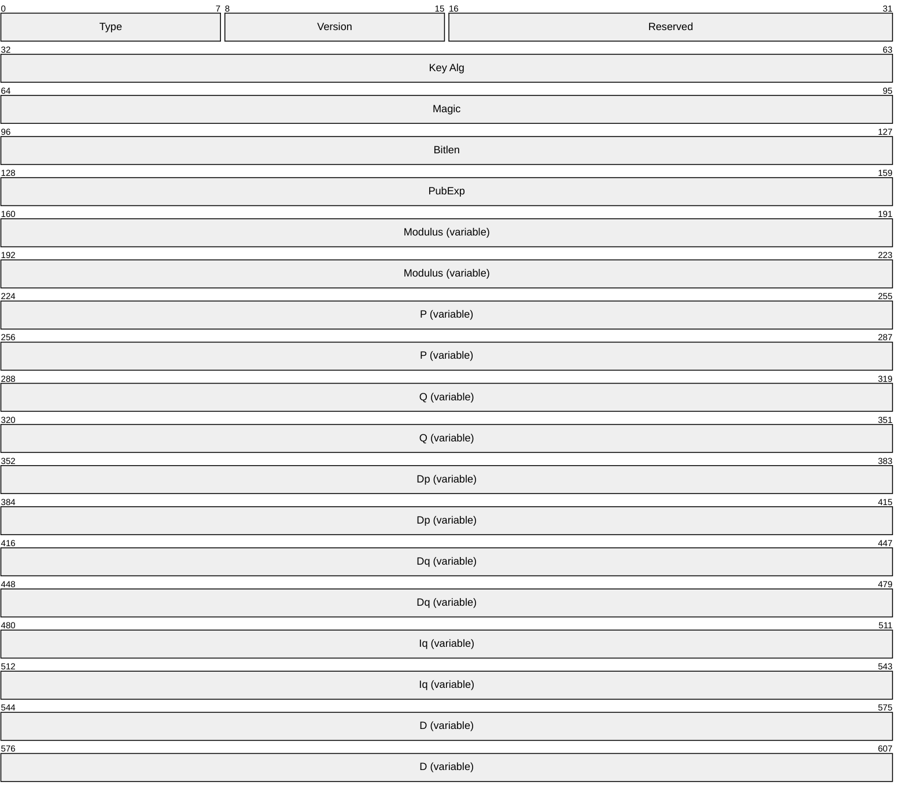

**Type (1 byte):** Length MUST be 1 byte.

This field MUST be set to 0x07.

**Version (1 byte):** Length MUST be 1 byte.

This field MUST be set to 0x02.

**Reserved (2 bytes):** Length MUST be 2 bytes.

This field MUST be set to 0 and ignored upon receipt.

**Key Alg (4 bytes):** Length MUST be 4 bytes.

This field MUST be present as an unsigned integer in [**little-endian**](#gt_little-endian) format.

Value MUST be 0x0000A400 (RSA_KEYX).

**Magic (4 bytes):** Length MUST be 4 bytes.

This field MUST be present as an unsigned integer in little-endian format.

Value MUST be 0x32415352 (RSA2).

**Bitlen (4 bytes):** Length MUST be 4 bytes.

This field MUST be present as an unsigned integer in little-endian format.

The value of this field MUST indicate the number of bits in the Rivest-Shamir-Adleman (RSA) modules. (This is the RSA [**key**](#gt_key) size.)

**PubExp (4 bytes):** Length MUST be 4 bytes.

This field MUST be present as an unsigned integer in little-endian format.

The value of this field MUST be the RSA [**public key**](#gt_public-key) exponent for this key. The client SHOULD set this value to 65,537.

**Modulus (variable):** This field MUST be of length ceil(bl/8), where *bl* is the value of the **Bitlen** field defined in the preceding diagram.

This field MUST be present as a byte string in little-endian format.

The value MUST be the RSA key modulus. The modulus is defined as *p***q*.

**P (variable):** This field MUST be of length ceil(bl/16), where *bl* is the value of the **Bitlen** field defined in the preceding diagram.

This field MUST be present as a byte string in little-endian format.

The value contained in this field MUST be one of the prime number factors of the **modulus** (given in the previous field).

**Q (variable):** This field MUST be of length ceil(bl/16), where *bl* is the value of the **Bitlen** field defined in the preceding diagram.

This field MUST be present as a byte string in little-endian format.

The value MUST be the other prime number factor of the RSA modulus.

**Dp (variable):** This field MUST be of length ceil(bl/16), where *bl* is the value of the **Bitlen** field defined in the preceding diagram.

This field MUST be present as a byte string in little-endian format.

The value of this field MUST be *d* mod (*p*-1), where *d* is the private exponent of this RSA private key.

**Dq (variable):** This field MUST be of length ceil(bl/16), where *bl* is the value of the **Bitlen** field defined in the preceding diagram.

This field MUST be present as a byte string in little-endian format.

The value of this field MUST be *d* mod (*q*-1), where *d* is the private exponent of this RSA private key.

**Iq (variable):** This field MUST be of length ceil(bl/16), where *bl* is the value of the **Bitlen** field defined in the preceding diagram.

This field MUST be present as a byte string in little-endian format.

This field MUST contain the inverse of *q* modulus *p*.

**D (variable):** This field MUST be of length ceil(bl/8), where *bl* is the value of the **Bitlen** field defined in the preceding diagram.

This field MUST be present as a byte string in little-endian format.

The value in this field is the RSA private exponent.

**Note** Ceil(*x*) is the value of *x* rounded up to the closest integer. For example, ceil(1.2) = 2 and ceil(3) = 3.

##### 2.2.2.9.2 BCRYPT RSA Private Key BLOB

The following is the diagram of elements in the [**RSA**](#gt_rivest-shamir-adleman-rsa) [**private key**](#gt_private-key) [**BLOB**](#gt_binary-large-object-blob) that MUST be passed to the [**CA**](#gt_certification-authority-ca).

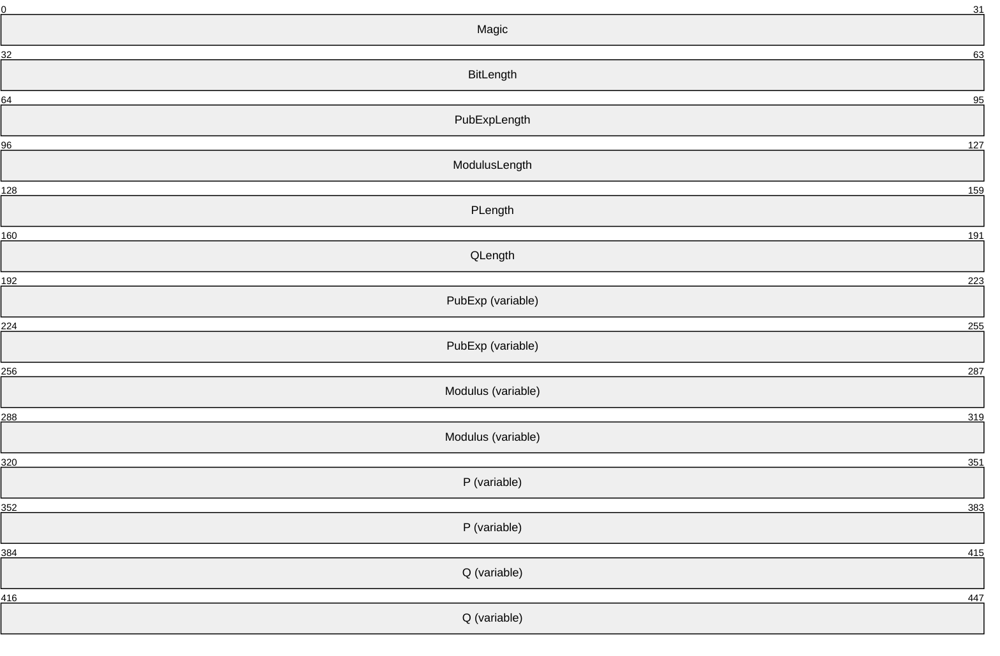

**Magic (4 bytes):** Length MUST be 4 bytes.

This field MUST be present as an unsigned long in [**big-endian**](#gt_big-endian) format.

The value of this field MUST be 0x32415352 (RSA2).

**BitLength (4 bytes):** Length MUST be 4 bytes.

This field MUST be present as an unsigned long in big-endian format.

The value of this field is the size, in bits, of the RSA key.

**PubExpLength (4 bytes):** Length MUST be 4 bytes.

This field MUST be present as an unsigned long in big-endian format.

The value of this field is the size, in bytes, of the RSA key exponent.

**ModulusLength (4 bytes):** Length MUST be 4 bytes.

The field MUST be present as an unsigned long in big-endian format.

The value of this field is the size, in bytes, of the modulus of the key.

**PLength (4 bytes):** Length MUST be 4 bytes.

This field MUST be present as an unsigned long in big-endian format.

The value of this field is the size, in bytes, of the first prime number of the private key.

**QLength (4 bytes):** Length MUST be 4 bytes.

This field MUST be present as an unsigned long in big-endian format.

The value of this field is the size, in bytes, of the second prime number of the private key.

**PubExp (variable):** The exponent of the key with a length defined by **PubExpLength**.

This field MUST be present as a byte string in big-endian format.

**Modulus (variable):** The modulus of the key with a length defined by **ModulusLength**.

This field MUST be present as a byte string in big-endian format.

**P (variable):** The first prime number of the private key with a length defined by **PLength**.

This field MUST be present as a byte string in big-endian format.

**Q (variable):** The second prime number of the private key with a length defined by **QLength**.

This field MUST be present as a byte string in big-endian format.

##### 2.2.2.9.3 ECDH Private Key BLOB

Following is the table of elements in the Elliptic Curve Diffie-Hellman (ECDH) [**private key**](#gt_private-key) [**BLOB**](#gt_binary-large-object-blob) that MUST be passed to the [**CA**](#gt_certification-authority-ca).

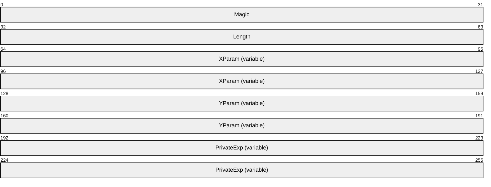

**Magic (4 bytes):** The length of this field MUST be 4 bytes.

This field MUST be an unsigned integer in [**little-endian**](#gt_little-endian) format.

Value MUST specify the type of [**key**](#gt_key) that this BLOB represents. The possible values for this member MUST be one of the following.

| Value | Meaning |
| --- | --- |
| 0x314B4345 | The key is a 256-bit ECDH [**public key**](#gt_public-key). |
| 0x324B4345 | The key is a 256-bit ECDH private key. |
| 0x334B4345 | The key is a 384-bit ECDH public key. |
| 0x344B4345 | The key is a 384-bit ECDH private key. |
| 0x354B4345 | The key is a 521-bit ECDH public key. |
| 0x364B4345 | The key is a 521-bit ECDH private key. |

**Length (4 bytes):** The length of this field MUST be 4 bytes.

This field MUST be an unsigned integer in little-endian format.

Value MUST be the length, in bytes, of the ECDH key.

**XParam (variable):** The length of this field MUST be equal to the **Length** field value.

This field MUST be bytes in little-endian format.

Value MUST be the elliptical curve X parameter.

**YParam (variable):** The length of this field MUST be equal to the **Length** field value.

This field MUST be bytes in little-endian format.

Value MUST be the elliptical curve Y parameter.

**PrivateExp (variable):** The length of this field MUST be equal to the **Length** field value.

This field MUST be bytes in little-endian format.

Value MUST be the elliptical curve private exponent.

#### 2.2.2.10 Key Spec

[**Key spec**](#gt_key-spec) is a flag that specifies how a given [**private key**](#gt_private-key) MUST be used. Key spec must have one of the values in the following table.

| Value | Meaning |
| --- | --- |
| 1 | The [**key**](#gt_key) can be used for [**encryption**](#gt_encryption). |
| 2 | The key can be used for signatures. |

#### 2.2.2.11 Enterprise PKI Data Structures

This section specifies the structure of the [**Active Directory**](#gt_active-directory) [**containers**](#gt_container) and objects that are related to this protocol. The usage of the data that is stored in these data structures is specified in section [3](#Section_1.3).

##### 2.2.2.11.1 Certificate Templates Container

The Certificate Templates [**container**](#gt_container) is stored in [**Active Directory**](#gt_active-directory) under the following location:

"CN=Public Key Services, CN=Services, CN=Configuration, DC=..."

The container contains objects of type pKICertificateTemplate; each of these objects is referred to in this protocol specification as a [**certificate template**](#gt_certificate-template). The structure and the syntax of the object [**attributes**](#gt_attribute) are specified in [MS-CRTD](../MS-CRTD/MS-CRTD.md).

##### 2.2.2.11.2 Enrollment Services Container

The Enrollment Services [**container**](#gt_container) is stored in [**Active Directory**](#gt_active-directory) under the following location:

"CN=Public Key Services, CN=Services, CN=Configuration, DC=..."

The container contains objects of type pKIEnrollmentService. The following [**attributes**](#gt_attribute) of these objects are used by the protocol specified in this protocol specification.

###### 2.2.2.11.2.1 cn Attribute

The cn [**attribute**](#gt_attribute) contains the value of the cn field in the Subject attribute of the [**CA**](#gt_certification-authority-ca) [**signing certificate**](#gt_signing-certificates). The value is not sanitized as specified in [3.1.1.4.1.1](#Section_3.1.1.4.1.1).

###### 2.2.2.11.2.2 displayName Attribute

The displayName [**attribute**](#gt_attribute) contains the value of the cn field in the Subject attribute of the [**CA**](#gt_certification-authority-ca) [**signing certificate**](#gt_signing-certificates). The value is not sanitized.

###### 2.2.2.11.2.3 certificateTemplates Attribute

This [**attribute**](#gt_attribute) contains information for the list of configured [**certificate templates**](#gt_certificate-template) for the [**CA**](#gt_certification-authority-ca) identified by the [**signing certificates**](#gt_signing-certificates) stored in the cACertificate attribute. Each string in the attribute identifies a certificate template and is identical to the value of the cn field ([MS-CRTD](../MS-CRTD/MS-CRTD.md), section 2.1) of one of the pKICertificateTemplate objects.

In this document, this certificate template is referred to as a configured certificate template.

cn: Certificate-Templates

ldapDisplayName: certificateTemplates

attributeId: 1.2.840.113556.1.4.823

attributeSyntax: 2.5.5.12

omSyntax: 64

isSingleValued: FALSE

schemaIdGuid: 2a39c5b1-8960-11d1-aebc-0000f80367c1

systemOnly: FALSE

searchFlags: 0

isMemberOfPartialAttributeSet: TRUE

systemFlags: FLAG_SCHEMA_BASE_OBJECT

###### 2.2.2.11.2.4 dNSHostName

This [**attribute**](#gt_attribute) contains the [**FQDN**](#gt_fully-qualified-domain-name-fqdn) of the computer that hosts the [**CA**](#gt_certification-authority-ca) service:

cn: DNS-Host-Name

dapDisplayName: dNSHostName

attributeId: 1.2.840.113556.1.4.619

attributeSyntax: 2.5.5.12

omSyntax: 64

isSingleValued: TRUE

schemaIdGuid: 72e39547-7b18-11d1-adef-00c04fd8d5cd

systemOnly: FALSE

searchFlags: 0

rangeLower: 0

rangeUpper: 2048

attributeSecurityGuid: 72e39547-7b18-11d1-adef-00c04fd8d5cd

isMemberOfPartialAttributeSet: TRUE

systemFlags: FLAG_SCHEMA_BASE_OBJECT

###### 2.2.2.11.2.5 cACertificate Attribute

The cACertificate [**attribute**](#gt_attribute) is a multivalue Octet String attribute that contains the [**CA**](#gt_certification-authority-ca) [**signing certificate**](#gt_signing-certificates) [**DER**](#gt_distinguished-encoding-rules-der) encoded.

Specifications on the syntax of this attribute can be found in [MS-ADA1](../MS-ADA1/MS-ADA1.md) section 2.95.

##### 2.2.2.11.3 NTAuthCertificates Object

The NTAuthCertificate Object is as follows:

- [**Object (1)**](#gt_object) of type certificationAuthority
- Object with cn=NTAuthCertificates
- Object under the following [**container**](#gt_container).
CN=Public Key Services, CN=Services, CN=Configuration, DC=...

This object contains a [**CA**](#gt_certification-authority-ca) Certificate [**attribute**](#gt_attribute), which is a multivalue Octet String attribute where each one of its value is a [**DER**](#gt_distinguished-encoding-rules-der)-encoded CA [**signing certificate**](#gt_signing-certificates).

Specifications on the syntax of this attribute can be found in [MS-ADA1](../MS-ADA1/MS-ADA1.md) section 2.95.

##### 2.2.2.11.4 Certification Authorities Container

The Certification Authorities container exists under the following [**container**](#gt_container).

CN=Public Key Services, CN=Services, CN=Configuration, DC=...

This container contains an object of type certificationAuthority for each [**root CA**](#gt_root-ca) that the enterprise [**trusts**](#gt_trust).

The following [**attributes**](#gt_attribute) of these objects are used by the protocol.

Specifications on the syntax of this class can be found in [MS-ADSC](../MS-ADSC/MS-ADSC.md) section 2.16.

###### 2.2.2.11.4.1 cn Attribute

The cn [**attribute**](#gt_attribute) contains the value of the cn of the subject field of the [**root CA**](#gt_root-ca) [**certificate**](#gt_certificate) stored in the cACertificate attribute, specified in the following section.

###### 2.2.2.11.4.2 cACertificate Attribute

The cACertificate [**attribute**](#gt_attribute) is a multivalue Octet String attribute that contains the [**root CA**](#gt_root-ca) [**signing certificate**](#gt_signing-certificates) [**DER**](#gt_distinguished-encoding-rules-der) encoded.

Specifications on the syntax of this attribute can be found in [MS-ADA1](../MS-ADA1/MS-ADA1.md) section 2.95.

### 2.2.3 Certificate Requirements

#### 2.2.3.1 Key Recovery Certificate

A [**CA**](#gt_certification-authority-ca) MAY use one or more locally configured and specified [**key**](#gt_key) recovery keys to encrypt the [**private key**](#gt_private-key) of a client, which is submitted to the CA encapsulated in a [**certificate enrollment**](#gt_certificate-enrollment) request.

A [**key recovery certificate**](#gt_key-recovery-certificate) MUST contain the following fields and extensions identified in [[RFC3280]](https://go.microsoft.com/fwlink/?LinkId=90414):

- Version
- Serial Number
- Signature
- notBefore
- notAfter
- Subject
- Issuer
- Subject Public Key Info
- Authority Key Identifier
- Subject Key Identifier
- Authority Information Access
- Key Usage (Key Encipherment = 0x20)
- CDP (CRL Distribution Point)
- Extended Key Usage (Key Recovery OID = szOID_KP_KEY_RECOVERY_AGENT (1.3.6.1.4.1.311.21.6)).<19>

### 2.2.4 Common Error Codes

The following error codes are used by this protocol to indicate specific error conditions. Other error values might be used and are implementation-specific.

| Return value/code | Description |
| --- | --- |
| 0x80070002 ERROR_FILE_NOT_FOUND | The system cannot find the specified file. |
| 0x8007000D ERROR_INVALID_DATA | The data is not valid. |
| 0x80074004 CERTSRV_E_PROPERTY_EMPTY | A required property value is empty. |
| 0x80070057 E_INVALIDARG | The parameter is incorrect. |
| 0x80091004 CRYPT_E_INVALID_MSG_TYPE | The cryptographic message type is not valid. |
| 0x8009200E CRYPT_E_NO_SIGNER | The signed cryptographic message does not have a signer for the specified signer index. |

## 2.3 Directory Service Schema Elements

This protocol accesses the [**directory service**](#gt_directory-service-ds) schema classes and [**attributes**](#gt_attribute) that are listed in the following table. For the syntactic specifications of the following class or class/attribute pairs, refer to Active Directory Domain Services (AD DS) in [MS-ADA1](../MS-ADA1/MS-ADA1.md), [MS-ADA2](../MS-ADA2/MS-ADA2.md), [MS-ADA3](../MS-ADA3/MS-ADA3.md), and [MS-ADSC](../MS-ADSC/MS-ADSC.md).

| Class | Attribute |
| --- | --- |
| certificationAuthority | cACertificate cn |
| Computer | cn distinguishedName dNSHostName objectGuid objectSid |
| msPKI-PrivateKeyRecoveryAgent | cn userCertificate |
| pKIEnrollmentService | certificateTemplates cn displayName dNSHostName |
| pKICertificateTemplate | cn flags ntSecurityDescriptor revision pKICriticalExtensions pKIDefaultCSPs pKIDefaultKeySpec pKIEnrollmentAccess pKIExpirationPeriod pKIExtendedKeyUsage pKIKeyUsage pKIMaxIssuingDepth pKIOverlapPeriod msPKI-Template-Schema-Version msPKI-Template-Minor-Revision msPKI-RA-Signature msPKI-Minimal-Key-Size msPKI-Cert-Template-OID msPKI-Supersede-Templates msPKI-RA-Policies msPKI-RA-Application-Policies msPKI-Certificate-Policy msPKI-Certificate-Application-Policy msPKI-Enrollment-Flag msPKI-Private-Key-Flag msPKI-Certificate-Name-Flag |
| User | cn distinguishedName objectGuid objectSid mail userCertificate userPrincipalName |

# 3 Protocol Details

The Windows Client Certificate Enrollment Protocol is a simple request-response protocol. The client sends a [**certificate**](#gt_certificate) request and the server responds with a signed certificate or a detailed disposition message. The primary usage of this protocol is [**certificate enrollment**](#gt_certificate-enrollment). In almost all cases, the protocol is a single message followed by a single reply. An overview of subprotocols is specified in section [1.3.1](#Section_1.3.1). Many of the [**DCOM**](#gt_distributed-component-object-model-dcom) methods that are specified in section [2](#Section_1.3) are made available for nonprotocol functions, such as diagnostics.

## 3.1 Client Role

The following sections specify implementation modes of the client role:<20>

- Basic Enrollment: Specifies a client that sends an [**enrollment**](#gt_certificate-enrollment) request that is not based on [**certificate templates**](#gt_certificate-template).
- Enrollment based on certificate templates: Specifies a client that sends an enrollment request, based on enterprise policies published in [**Active Directory**](#gt_active-directory), by using certificate templates.

### 3.1.1 Client Mode: Basic Enrollment

The Windows Client Certificate Enrollment Protocol constructs a [**certificate**](#gt_certificate) request as specified in section [2.2.2.6](#Section_2.2.2.6), sends the request to the [**CA**](#gt_certification-authority-ca), and retrieves the issued certificate. After the client has obtained the certificate, the client SHOULD store the certificate and its associated [**private key**](#gt_private-key) for later use by applications running on the client machine.<21>

This section specifies the behavior of a client to this protocol that does not use the [**certificate templates**](#gt_certificate-template).

#### 3.1.1.1 Abstract Data Model

This section describes a conceptual model of data organization that a possible implementation would maintain to participate in this protocol. The described organization is provided to facilitate understanding of how the protocol behaves. This protocol specification does not mandate that implementations adhere to this model as long as their external behavior is consistent with the behavior described in this specification.

The following abstract data model elements are defined:

**Client_HardwareKeyInfo:** Contains one of the following [**DER**](#gt_distinguished-encoding-rules-der)-encoded ASN.1 structures where [**trust**](#gt_trust) module [**public keys**](#gt_public-key) and trust module [**certificates**](#gt_certificate) are initialized from the [**TPM**](#gt_trusted-platform-module-tpm). Trust module public keys MUST be present. Trust module certificates can contain up to 4 certificates.

For syntactical details and semantics in the case of [**EK**](#gt_endorsement-key-ek) [**attestation**](#gt_attestation) (authority and subject) (section [3.1.1.4.3.4.1](#Section_3.1.1.4.3.4.1)), see section [2.2.2.7.13](#Section_2.2.2.7.13). For syntactical details and semantics in the case of [**AIK**](#gt_attestation-identity-key-aik) attestation (subject only) (section [3.1.1.4.3.4.2](#Section_3.1.1.4.3.4.2)), see section [2.2.2.7.15](#Section_2.2.2.7.15).

**Client_KeyAttestationStatement:** Contains the [**CSP**](#gt_cryptographic-service-provider-csp)-specific [KeyAttestationStatement](#Section_2.2.2.5) structure (section 2.2.2.5) that is generated for each TPM [**key**](#gt_key) associated with a certificate request.

**Returned_Request_ID:** A ULONG that contains the request ID created by the CA when it receives a request for a certificate. This value is returned in the *pdwRequestId* parameter of the **ICertRequestD::Request** and **ICertRequestD2::Request2** methods.

#### 3.1.1.2 Timers

None.

#### 3.1.1.3 Initialization

The Windows Client Certificate Enrollment Protocol depends on [**DCOM**](#gt_distributed-component-object-model-dcom) for authentication, as specified in [MS-DCOM](../MS-DCOM/MS-DCOM.md).

#### 3.1.1.4 Message Processing Events and Sequencing Rules

The Windows Client Certificate Enrollment Protocol is based on [**DCOM**](#gt_distributed-component-object-model-dcom) [MS-DCOM](../MS-DCOM/MS-DCOM.md). DCOM provides the capability to obtain the version of an interface. Clients SHOULD use the IRemIUnknown.RemQueryInterface method to determine if the server supports the [ICertRequestD2](#Section_3.2.1.4.3) interface version. If the server supports the ICertRequestD2 interface, clients SHOULD use that interface. <22>If the server does not support ICertRequestD2 interface, clients MUST use the ICertRequestD interface.

The following sections define the processing rules for each of the methods in [ICertRequestD (section 3.2.1.4.2)](#Section_3.2.1.4.2) and ICertRequestD2 (section 3.2.1.4.3). For all methods of this protocol, a returned value of 0 indicates a successful invocation. Unless specified otherwise, any returned non-zero value indicates an error and the client SHOULD NOT rely on any specific value for its processing rules.

##### 3.1.1.4.1 Algorithms

The following section specifies subroutines that are used by the Client Mode: Basic Enrollment protocol role.

###### 3.1.1.4.1.1 Sanitizing Common Names

The [**CNs**](#gt_common-name-cn) of the [**Active Directory**](#gt_active-directory) (as specified in [MS-ADTS](../MS-ADTS/MS-ADTS.md)) objects used by the Windows Client Certificate Enrollment Protocol are created by sanitizing the names of other objects and shortening the [**sanitized name**](#gt_sanitized-name) so that it does not exceed 57 characters, including spaces. The sanitized name MUST NOT exceed 57 characters in length. A name is sanitized by replacing disallowed characters with an exclamation point(!) followed by four hexadecimal values that represent the 16-bit character that is being replaced.

The following rules apply to creating a sanitized CN (short name):

- All disallowed characters in the original name MUST be replaced with the appropriate replacements values as specified in section [3.1.1.4.1.1.2](#Section_3.1.1.4.1.1.2).
- The sanitized name MUST be truncated to no more than 51 characters in total length. The truncated name MUST NOT exceed 51 characters. If an incomplete sanitized character sequence remains at the end of the string (for example, !002 instead of !0023), the incomplete sequence MUST be truncated completely.
- The characters that were removed or truncated from the sanitized string in the preceding bulleted item MUST be hashed according to the rules specified in section [3.1.1.4.1.1.1](#Section_3.1.1.4.1.1.1). The resultant hash MUST be converted to a 5-character string. The string MUST be five characters in total length and MUST be padded with leading zeros on the left to ensure a total length of five characters.
- A minus sign (–) MUST be appended to the truncated sanitized name followed by the 5-character string that contains the hash value.

Hashing Processing Rules

The hash to represent truncated characters is computed by rotating a 16-bit value one bit to the left and adding each character truncated from the full [**CN**](#gt_common-name-cn) (original name) until all of the truncated characters have been exhausted, as shown in the following example hash process rule.

If the string length of the full CN is less than 52 characters in total length, the sanitized short name is the same as the full CN. Otherwise, the string base equals the first 51 characters of the full CN.

The string excess equals characters 52 through the end of the full CN. For each character that is in excess of 51, the following algorithm will be applied to hash the excess characters:

- Hash is initialized with 0.
For each excess character, the following interaction is performed:

- An unsigned, 16-bit integer (LowBit) is calculated by using the following formula: ((0x8000 & Hash)? 1 : 0).
- The value of the hash is recalculated by using the following formula: ((Hash << 1) | LowBit) + [excess character].
- Next, the resultant hash equals the decimal representation of the calculated hash. The hash is left-padded with zeros (0) to ensure that it is five characters in total length. The final, short [**sanitized name**](#gt_sanitized-name) equals the concatenation of the string base plus a minus sign (–) plus the 5-character hash.

Disallowed Characters

The following characters are disallowed and MUST NOT be used. The disallowed characters and their appropriate replacement values are noted in the table.

Characters that MUST NOT be used in a file name are shown in the following table.

A character whose value is less than 0x20 MUST be replaced with !00xx where xx is the hexadecimal value of the character (for example, the value of 0x10 is replaced with !0010). A character whose value is greater than or equal to 0x7F MUST be replaced with !00xx where xx is the hexadecimal value of the character (for example, the value of 0x80 is replaced with !0080).

| Name | Character | Value in !xxxx format |
| --- | --- | --- |
| Exclamation point | ! | !0021 |
| Inch or quotation mark | " | !0022 |
| Number sign | # | !0023 |
| Percent | % | !0025 |
| Ampersand | & | !0026 |
| Apostrophe | ' | !0027 |
| Opening parenthesis | ( | !0028 |
| Closing parenthesis | ) | !0029 |
| Asterisk | * | !002a |
| Plus sign | + | !002b |
| Comma | , | !002c |
| Slash mark | / | !002f |
| Colon | : | !003a |
| Semicolon | ; | !003b |
| Less than sign | < | !003c |
| Equal sign | = | !003d |
| Greater than sign | > | !003e |
| Question mark | ? | !003f |
| Opening bracket | [ | !005b |
| Backslash | \ | !005c |
| Closing bracket | ] | !005d |
| Caret or circumflex | ^ | !005e |
| Grave accent | ` | !0060 |
| Opening brace | { | !007b |
| Pipe or vertical line | \| | !007c |
| Closing brace | } | !007d |

##### 3.1.1.4.2 Processing Rules for the pwszAuthority Parameter

The *pwszAuthority* parameter is a common parameter for each of the methods in this protocol. The following sections describe the client processing rules for this parameter.

The [[UNICODE]](https://go.microsoft.com/fwlink/?LinkId=90550) string in *pwszAuthority* MUST be equal to either the CA [**common name**](#gt_common-name-cn), the CA [**sanitized name**](#gt_sanitized-name), or the CA short sanitized name. The algorithm for sanitizing common names is specified in section [3.1.1.4.1.1](#Section_3.1.1.4.1.1).

**Note** Comparing the CA name in the preceding operations MUST NOT be case-sensitive.

CA name specifications are in section [1.3.2.5](#Section_1.3.2.5).

##### 3.1.1.4.3 ICertRequestD::Request and ICertRequestD2::Request2 Processing

The processing for the [ICertRequestD::Request](#Section_3.2.1.4.2) method and the [ICertRequestD2::Request2](#Section_3.2.1.4.3) method MUST be identical on the client side, except for the handling of the additional *pwszSerialNumber* parameter.

Rules for each argument passed to ICertRequestD::Request and ICertRequestD2::Request2 are as follows.

*pwszAuthority*: The client MUST follow the processing rules for *pwszAuthority* as specified in section [3.1.1.4.2](#Section_3.1.1.4.2).

*dwFlags*: The client MUST set the *dwFlags* parameter as specified in section [3.2.1.4.3.1.1](#Section_3.2.1.4.3.1.1).

*pwszSerialNumber*: For new requests, clients MUST set this parameter to NULL. To retrieve the status on an issued [**certificate**](#gt_certificate), clients MUST set this parameter to the serial number of the issued certificate.

*pdwRequestId*: For new requests, clients MUST set this parameter to 0. To retrieve the status of a pending certificate request, the client MUST set this parameter to the request ID of the pending request.

*pwszAttributes*: The client MAY set the *pwszAttributes* parameter to a string representing a collection of [**attributes**](#gt_attribute) to be applied to the [**enrollment**](#gt_certificate-enrollment) request. For specifications on the format of the string, see section [2.2.2.7](#Section_3.1.1.4.3.1).

*pctbRequest*: The pb member of [CERTTRANSBLOB](#Section_2.2.2.2) MUST be the encoded certificate request, and the cb member MUST be the length in bytes of the encoded certificate request. The Windows Client Certificate Enrollment Protocol can be used as the transport for four types of certificate requests, specified as follows.

The following table shows the various request types and request formats that are used when constructing each certificate request.

| Certificate request types | CMS with PKCS #10 | PKCS #10 | CMS with CMC | Netscape KEYGEN |
| --- | --- | --- | --- | --- |
| New request | Yes | Yes | Yes | Yes |
| Renewal request | Yes | No | Yes | No |
| [**Enroll On Behalf Of (EOBO)**](#gt_enroll-on-behalf-of-eobo) request | Yes | No | Yes | No |
| Key archival request | No | No | Yes | No |
| Initial [**key attestation**](#gt_key-attestation) request | Yes | Yes | Yes | No |

"Yes" indicates that this format is supported for this request type. "No" indicates that this format is not supported by this protocol.

The following sections define the requirement for the certificate request types in the table. Fields that are not defined in the following sections MUST be submitted by using the definitions from the relevant RFC as specified in [[RFC3852]](https://go.microsoft.com/fwlink/?LinkId=90445) for [**CMS**](#gt_cryptographic-message-syntax-cms), [[RFC2797]](https://go.microsoft.com/fwlink/?LinkId=90382) for CMC requests, [[HTMLQ-keygen]](https://go.microsoft.com/fwlink/?linkid=2165135) for Netscape request format, and [[RFC2986]](https://go.microsoft.com/fwlink/?LinkId=90401) for PKCS #10 certificate requests.

*pdwDisposition*: Upon a successful return from an ICertRequestD::Request or ICertRequestD2::Request2 method invocation, the client receives the *pdwDisposition* parameter as an output value.

If this value is 0x00000005 (CR_DISP_UNDER_SUBMISSION), the [**CA**](#gt_certification-authority-ca) has not finished processing the enrollment request and the certificate has not been signed. This request is considered to be pending. See section [3.1.1.4.3.7](#Section_3.1.1.4.3.7) for information about how to retrieve pending requests from a CA.

If the value is any other nonzero value, the server has encountered an error. Unless otherwise specified in this document, the client SHOULD NOT rely on any specific error for its processing rules.

*pctbDispositionMessage*: Upon a successful return from an ICertRequestD::Request or ICertRequestD2::Request2 method invocation, the client receives the *pctbDispositionMessage* parameter as an output value. The client MUST NOT interpret or process this information in any way for anything other than display purposes. If the method encounters an error, the error string associated with the error code is returned. Error codes are specified in [MS-ERREF](../MS-ERREF/MS-ERREF.md). The client SHOULD NOT use the value in this field.

###### 3.1.1.4.3.1 New Certificate Requests

A new [**certificate**](#gt_certificate) request is defined as a certificate request that does not depend upon, and is not associated with, any previous certificate. For new certificate requests, the client MUST use one of the supported request formats when sending the request to the [**CA**](#gt_certification-authority-ca). The exact format is specific to the application making the request.

Before creating a new certificate request, the client MUST generate a new [**public-private key pair**](#gt_public-private-key-pair). This newly generated [**public key**](#gt_public-key) will be the one that is certified by the CA while its associated [**private key**](#gt_private-key) is used to sign the request. For details, see the following sections.

New Certificate Request Using PKCS #10 Request Format

The request MUST be an ASN.1 [**DER**](#gt_distinguished-encoding-rules-der)-encoded PKCS #10 request as specified in [[RFC2986]](https://go.microsoft.com/fwlink/?LinkId=90401). The PKCS #10 ASN.1 structure includes the following fields:

- [**Attributes**](#gt_attribute): This field SHOULD be used to send additional parameters to the [**CA**](#gt_certification-authority-ca).
Section [2.2.2.7](#Section_3.1.1.4.3.1) specifies the required format for each of these attributes. The following [**OIDs**](#gt_object-identifier-oid) identify the attributes that are supported by the protocol:

- szOID_OS_VERSION (1.3.6.1.4.1.311.13.2.3): The client SHOULD use this attribute to specify the version information of the client's operating system in the form of a string. <23> The client SHOULD encode the value of this attribute as a IA5String. The format for this attribute is as specified in section 2.2.2.7.
- szOID_ENROLLMENT_CSP_PROVIDER (1.3.6.1.4.1.311.13.2.2): The client SHOULD use this attribute to specify the [**CSP**](#gt_cryptographic-service-provider-csp) that was used to generate a [**private key**](#gt_private-key). CSP specifications are in section [1.1](#Section_1.1).
- szOID_REQUEST_CLIENT_INFO (1.3.6.1.4.1.311.21.20): Clients SHOULD use this value to pass additional client information such as machine name, user name, and application name. For details see section [2.2.2.7.4](#Section_2.2.2.7.4).
- szOID_CERT_EXTENSIONS (1.3.6.1.4.1.311.2.1.14): The client SHOULD use this value to pass additional [**certificate**](#gt_certificate) extensions that are to be added to the issued certificate.
- szOID_ENROLLMENT_NAME_VALUE_PAIR (1.3.6.1.4.1.311.13.2.1): The client SHOULD use this value to pass additional enrollment information as name-value pair collection. Following are the names that are supported by the protocol and their associated client-processing rules:
- SAN: The client SHOULD use this value to pass a string that defines the requested value for the SubjectAltName extension in the issued certificate. Specifications on possible values for this attribute are in section [3.2.1.4.2.1.2](#Section_3.2.1.4.2.1.2).
- CertificateUsage: The client SHOULD use this value to pass one or more OIDs that define the requested ExtendedKeyUsage extension for the issued certificate, as specified in [[RFC3280]](https://go.microsoft.com/fwlink/?LinkId=90414) section 4.2.1.13.
- ValidityPeriod: The client SHOULD use this value to request the CA to issue the certificate for a specific validity time. For example, if the validity period is three weeks, then the client requests that the issued certificate be valid for three weeks after [**issuance**](#gt_certificate-issuance). If ValidityPeriod is used, the client MUST use it with the ValidityPeriodUnits attribute.
- ValidityPeriodUnits: The client SHOULD use this value to send the count of "ValidityPeriod" for the requested validity period for the issued certificate. The client MUST use this attribute with the ValidityPeriod attribute.
- cdc: The client SHOULD use this value to pass an [**Active Directory**](#gt_active-directory) server [**FQDN**](#gt_fully-qualified-domain-name-fqdn) for the CA to use in case the end entity's information cannot be obtained.
- rmd: The client SHOULD use this value to identify the exact FQDN of the machine object associated with the request.

New Certificate Request Using CMS and PKCS #10 Request Formats

The request MUST be an ASN.1 [**DER**](#gt_distinguished-encoding-rules-der) encoded [**CMS**](#gt_cryptographic-message-syntax-cms) request as specified in [[RFC3852]](https://go.microsoft.com/fwlink/?LinkId=90445). The CMS ASN.1 structure includes the following fields:

- ContentType: This field MUST be the [**OID**](#gt_object-identifier-oid) szOID_PKCS_7_SIGNED (1.2.840.113549.1.7.2, id-signedData).
- Content: This field MUST be a SignedData with the following values for its fields:
- encapContentInfo: This field MUST have the following values for its fields:
- eContentType: This field MUST be OIDszOID_PKCS_7_DATA (1.2.840.113549.1.7.1, id-data).
- eContent: This field MUST be a PKCS #10 [**certificate**](#gt_certificate) request as specified in section [3.1.1.4.3.1.1](#Section_3.1.1.4.3.1.1).
SignerInfos: The request MUST be signed as specified in [RFC3852].

New Certificate Request Using CMS and CMC Request Formats

The request MUST be an ASN.1 [**DER**](#gt_distinguished-encoding-rules-der) encoded [**CMS**](#gt_cryptographic-message-syntax-cms) request (as specified in [[RFC3852]](https://go.microsoft.com/fwlink/?LinkId=90445)), that includes a CMC request (as specified in [[RFC2797]](https://go.microsoft.com/fwlink/?LinkId=90382)). The ASN.1 structure includes the following fields. The client MUST construct an ASN.1 CMC request structure with the following fields:

- TaggedRequest: This field MUST contain exactly one [**certificate**](#gt_certificate) request. The certificaterequest MUST be PKCS #10 as specified in sections [2.2.2.6.1](#Section_2.2.2.6.1), [2.2.2.6.5](#Section_2.2.2.6.5), and [3.1.1.4.3.1.1](#Section_3.1.1.4.3.1.1).
- TaggedAttributes: The client MAY pass additional [**enrollment**](#gt_certificate-enrollment) [**attributes**](#gt_attribute) in the RegInfo attribute as specified in [RFC2797] section 5.12. The semantics for the value of this attribute are identical to the ones that are defined for the *pwszAttributes* parameter for [ICertRequestD::Request](#Section_3.2.1.4.2) and [ICertRequestD2::Request2](#Section_3.2.1.4.3). The format of the value is specified in section [2.2.2.6.3](#Section_2.2.2.6.3).
Client MUST construct CMS (as specified in [RFC3852]) with the following requirements:

- ContentType: This field MUST be the [**OID**](#gt_object-identifier-oid) szOID_PKCS_7_SIGNED (1.2.840.113549.1.7.2, id-signedData).
- Content: This field MUST be a SignedData with the following values for its fields:
- encapContentInfo field: This field MUST have the following values for its fields:
- eContentType: This field MUST be the OID szOID_CT_PKI_DATA (1.3.6.1.5.5.7.12.2, Id-cct-PKIData).
- eContent: This field MUST be the CMC certificate request constructed in the preceding (first) step.
- SignerInfo fields: The first signerInfo MUST use either the subjectKeyIdentifier form of signerInfo, as specified in [RFC2797] section 4.2, or MUST use the No-Signature Signature Mechanism, as specified in [RFC2797] section 3.3.3.1.

New Certificate Request Using Netscape KEYGEN Request Format

The request MUST be compliant with "Netscape Extensions for User Key Generation Communicator 4.0 Version". For specifications, see [[HTMLQ-keygen]](https://go.microsoft.com/fwlink/?linkid=2165135).

Processing rules for the *pwszAttributes* parameter:

- CertType: Client MUST add the CertType [**attribute**](#gt_attribute) to the *pwszAttributes* parameter. The value for this attribute MUST be the string "server".
- rdn value: Client MUST request the subject name information through the rdn attributes. Supported values and their formats MUST be as specified in section [2.2.2.6.4.2](#Section_2.2.2.6.4.2).<24>

###### 3.1.1.4.3.2 Renew Certificate Requests

When sending a [**certificate renewal request**](#gt_certificate-renewal-request), clients MUST use the [**CMS**](#gt_cryptographic-message-syntax-cms) structure with an embedded PKCS #10 [**certificate**](#gt_certificate) request, as specified in [[RFC3852]](https://go.microsoft.com/fwlink/?LinkId=90445) and [[RFC2986]](https://go.microsoft.com/fwlink/?LinkId=90401), or the CMS structure with an embedded CMC request format, as specified in [RFC3852] and [[RFC2797]](https://go.microsoft.com/fwlink/?LinkId=90382). The client MUST follow the requirements specified in the following sections.

The renewal request MUST be done either by using an existing [**public-private key pair**](#gt_public-private-key-pair) associated with the certificate being renewed or by creating a new public-private key pair. See the following sections for details about how those key pairs are used to form a request.

Renew Certificate Request Using CMS and PKCS #10 Request Formats

The request MUST be an ASN.1 [**DER**](#gt_distinguished-encoding-rules-der) encoded [**CMS**](#gt_cryptographic-message-syntax-cms) request as specified in [[RFC3852]](https://go.microsoft.com/fwlink/?LinkId=90445). The CMS ASN.1 structure includes the following fields:

- The client SHOULD construct a request for a new [**certificate**](#gt_certificate) by using the PKCS #10 certificate format as specified in section [3.1.1.4.3.1.1](#Section_3.1.1.4.3.1.1) or section [3.1.1.4.3.4](#Section_3.1.1.4.3.4).<25>
- The client MUST add an [**attribute**](#gt_attribute) to the **Attributes** field in the PKCS #10. The attribute is szOID_RENEWAL_CERTIFICATE (1.3.6.1.4.1.311.13.1) as specified in section [2.2.2.7.3](#Section_2.2.2.7.3). The value for this attribute MUST be an ASN.1 DER encoded certificate to be renewed.
- The client MUST construct a CMS with the following requirements:
- ContentType: This field MUST be the [**OID**](#gt_object-identifier-oid) szOID_RSA_signedData (1.2.840.113549.1.7.2, id-signedData).
- Content: This field MUST be a SignedData with the following values for its fields:
- encapContentInfo: This field MUST have the following values for its fields:
- eContentType: This field MUST be the OID szOID_PKCS_7_DATA (1.2.840.113549.1.7.1, id-data).
- eContent: This field MUST be the new PKCS #10 certificate request constructed in the preceding (first) step.
- Certificates: This field MUST include the certificate to be renewed and that is associated with the [**private key**](#gt_private-key) used to sign the request (the same certificate as the one in the PKCS #10 **Attributes** field specified in the preceding (second) step).
- SignerInfos: The first SignerInfo in the SignerInfos collection MUST use the [**key**](#gt_key) associated with the certificate to be renewed.

Renew Certificate Request Using CMS and CMC Request Formats

The request MUST be an ASN.1 [**DER**](#gt_distinguished-encoding-rules-der) encoded [**CMS**](#gt_cryptographic-message-syntax-cms) request (as specified in [[RFC3852]](https://go.microsoft.com/fwlink/?LinkId=90445)) that includes a CMC request (as specified in [[RFC2797]](https://go.microsoft.com/fwlink/?LinkId=90382)). The ASN.1 structure includes the following fields:

- The client SHOULD construct a request for a new [**certificate**](#gt_certificate) by using the PKCS #10 certificate format as specified in section [2.2.2.6.5](#Section_2.2.2.6.5), [3.1.1.4.3.1.1](#Section_3.1.1.4.3.1.1), or [3.1.1.4.3.4](#Section_3.1.1.4.3.4).<26>
- The client MUST add an [**attribute**](#gt_attribute) to the **Attributes** field in the PKCS #10. The attribute is szOID_RENEWAL_CERTIFICATE (1.3.6.1.4.1.311.13.1) as specified in section [2.2.2.7.3](#Section_2.2.2.7.3). The value for this attribute MUST be the ASN.1 DER encoded certificate to be renewed.
- The client MUST construct a CMC request with the following requirements:
- TaggedRequest: This field MUST contain exactly one certificate request. The certificate request MUST be the PKCS #10 constructed in the first of the preceding steps.
- TaggedAttributes: The client MAY pass additional enrollment attributes in the RegInfo attribute as specified in [RFC2797] section 5.12. The cosemantics for the value of this attribute are identical to the ones that are defined for the *pwszAttributes* parameter for [ICertRequestD::Request](#Section_3.2.1.4.2) and [ICertRequestD2::Request2](#Section_3.2.1.4.3). To read more on the supported attributes, see section 3.1.1.4.3.1.1. The format of the value is specified in section [2.2.2.6.3](#Section_2.2.2.6.3).
- The client MUST construct a CMS with the following requirements:
- ContentType: This field MUST be the [**OID**](#gt_object-identifier-oid) szOID_RSA_signedData (1.2.840.113549.1.7.2, id-signedData).
- Content: This field MUST be a SignedData with the following values for its fields:
- encapContentInfo: This field MUST have the following values for its fields:
- eContentType: This field MUST be the OID szOID_CT_PKI_DATA (1.3.6.1.5.5.7.12.2, Id-cct-PKIData).
- eContent: This field MUST be the CMC certificate request constructed in the preceding (first) step.
- SignerInfos: This collection MUST include at least two SignerInfo structures.
- The first signerInfo MUST either use the subjectKeyIdentifier form of signerInfo, as specified in [RFC2797] section 4.2, or MUST use the No-Signature Signature Mechanism as specified in [RFC2797] section 3.3.3.1.
- The second SignerInfo MUST use the [**key**](#gt_key) associated with the certificate to be renewed.

###### 3.1.1.4.3.3 Enroll on Behalf of Certificate Requests

The [**Enroll On Behalf Of (EOBO)**](#gt_enroll-on-behalf-of-eobo) proxy process is used when the client that sends a [**certificate**](#gt_certificate) request requests a certificate on behalf of another [**end entity**](#gt_end-entity).

When sending a [**ROBO**](#gt_request-on-behalf-of-robo) for another entity, clients MUST use the [**CMS**](#gt_cryptographic-message-syntax-cms) structure with an embedded PKCS #10 certificate request, as specified in [[RFC3852]](https://go.microsoft.com/fwlink/?LinkId=90445) and [[RFC2986]](https://go.microsoft.com/fwlink/?LinkId=90401), or clients MUST use the CMS structure with an embedded CMC request format, as specified in [RFC3852] and [[RFC2797]](https://go.microsoft.com/fwlink/?LinkId=90382). Clients MUST follow the specific requirements defined in the following sections.

Abstract Data Model

This section describes a conceptual model of data organization that a possible implementation would maintain to participate in this protocol. The described organization is provided to facilitate understanding of how the protocol behaves. This protocol specification does not mandate that implementations adhere to this model so long as their external behavior is consistent with the behavior described in this document.

In addition to the data described in section [3.1.1.1](#Section_3.1.1), the client that implements [**ROBO**](#gt_request-on-behalf-of-robo)-requests processing maintains the following data:

- OtherEndEntityRequest
PKCS#10 request constructed as specified in section [3.1.1.4.3.1.1](#Section_3.1.1.4.3.1.1) or section [3.1.1.4.3.4.1.1](#Section_3.1.1.4.3.4.1.1), or [**CMS**](#gt_cryptographic-message-syntax-cms) request constructed as specified in section [3.1.1.4.3.1.3](#Section_3.1.1.4.3.1.3). It is left up to the implementation of the protocol to provide a way for end entities to exchange the requests and store it in this data.<27>

Enroll on Behalf of Request Using CMS and PKCS #10 Request Formats

The request MUST be an ASN.1 [**DER**](#gt_distinguished-encoding-rules-der) encoded [**CMS**](#gt_cryptographic-message-syntax-cms) request as specified in [[RFC3852]](https://go.microsoft.com/fwlink/?LinkId=90445). The CMS ASN.1 structure includes the following fields:

- The client MUST construct a CMS with the following requirements:
- ContentType: This field MUST be the [**OID**](#gt_object-identifier-oid) szOID_RSA_signedData (1.2.840.113549.1.7.2, id-signedData).
- Content: This field MUST be a SignedData with the following values for its fields:
- encapContentInfo: This field MUST have the following values for its fields:
- eContentType: This field MUST be the OID szOID_PKCS_7_DATA (1.2.840.113549.1.7.1, id-data).
- eContent: This field MUST be the PKCS #10 [**certificate**](#gt_certificate) request constructed as specified in the section [3.1.1.4.3.1.1](#Section_3.1.1.4.3.1.1) or section [3.1.1.4.3.4.1.1](#Section_3.1.1.4.3.4.1.1), or retrieved from the OtherEndEntityRequest data.
- Certificates: This field MUST include the certificate that is associated with the [**private key**](#gt_private-key) used to sign the certificate request.
- SignerInfo: The signing MUST be done with the [**key**](#gt_key) associated to the certificate that is passed in the preceding **Certificates** field:
- AuthenticatedAttributes (in the first SignerInfo): This field MUST include the OID szENROLLMENT_NAME_VALUE_PAIR (1.3.6.1.4.1.311.13.2.1) [**attribute**](#gt_attribute). The value of the attribute MUST include the requestername name-value pair. The value of requestername MUST be the requested value for the **Subject** field in the issued certificate.

Enroll on Behalf of Certificate Request Using CMS and CMC Request Formats

The request MUST be an ASN.1 [**DER**](#gt_distinguished-encoding-rules-der) encoded [**CMS**](#gt_cryptographic-message-syntax-cms) message (as specified in [[RFC3852]](https://go.microsoft.com/fwlink/?LinkId=90445)) that includes a CMC request (as specified in [[RFC2797]](https://go.microsoft.com/fwlink/?LinkId=90382)). The ASN.1 structure includes the following fields:

- The client MUST construct a CMC request with the following requirements:
- TaggedRequest: This field MUST contain exactly one [**certificate**](#gt_certificate) request. The certificate request MUST be the PKCS #10 constructed in the preceding step. See also section [2.2.2.6.5](#Section_2.2.2.6.5).
- TaggedAttributes: The client MAY pass additional enrollment [**attributes**](#gt_attribute) in the RegInfo attribute as specified in [RFC2797] section 5.12. The semantics for the value of this attribute are identical to the ones that are defined for the *pwszAttributes* parameter for [ICertRequestD::Request](#Section_3.2.1.4.2) and [ICertRequestD2::Request2](#Section_3.2.1.4.3). Specifications on the supported attributes are in section [3.1.1.4.3.1.1](#Section_3.1.1.4.3.1.1). The format of the value is specified in section [2.2.2.6.3](#Section_2.2.2.6.3). The value of the attribute MUST include the requestername name-value pair. The value of requestername MUST be the requested value for the **Subject** field in the Issued certificate.
- The client MUST construct a CMS with the following requirement:
- ContentType: This field MUST be the [**OID**](#gt_object-identifier-oid) szOID_RSA_signedData (1.2.840.113549.1.7.2, id-signedData).
- Content: This field MUST be a SignedData with the following values for its fields:
- encapContentInfo: This field MUST have the following values for its fields:
- eContentType: This field MUST be the OID szOID_CT_PKI_DATA (1.3.6.1.5.5.7.12.2, Id-cct-PKIData).
- eContent: This field MUST be the CMC certificate request constructed as specified in the section [3.1.1.4.3.1.3](#Section_3.1.1.4.3.1.3) or retrieved from the OtherEndEntityRequest data.
- Certificates: This field MUST include the certificate associated with the [**private key**](#gt_private-key) used to sign the certificate request.
- SignerInfos: This collection MUST include at least two SignerInfo structures.
- The first signerInfo MUST either use the subjectKeyIdentifier form of signerInfo, as specified in [RFC2797] section 4.2, or MUST use the No-Signature Signature Mechanism as specified in [RFC2797] section 3.3.3.1.
- The second SignerInfo MUST be done with the [**key**](#gt_key) associated to the certificate that is passed in the preceding **Certificates** field.

###### 3.1.1.4.3.4 Certificate Request with Key Attestation

**Note** For information on product behavior, see the following product behavior note.<28>

Before the client can submit the request to the CA for [**key attestation**](#gt_key-attestation) purposes, it MUST initialize a secure channel to the CA. To create a secure channel to the CA, the client MUST retrieve the current CA [**key**](#gt_key) [**exchange certificate**](#gt_exchange-certificate), either through a call to **ICertRequestD::GetCACert** (providing the GETCERT_CAXCHGCERT 0x00000001 property identifier (ID) in the fchain parameter) or **ICertRequestD2::GetCAProperty** (providing the CR_PROP_CAXCHGCERT 0x0000000F flag in the PropID parameter). Both methods can be used to retrieve the CA exchange certificate with no preference. Once retrieved, the CA exchange certificate MUST be verified as being [**trusted**](#gt_trust) for the szOID_KP_CA_EXCHANGE [**EKU**](#gt_enhanced-key-usage-eku) or the szOID_KP_PRIVACY_CA EKU before being used further.

The request MUST be an ASN.1 [**DER**](#gt_distinguished-encoding-rules-der)-encoded PKCS10 request [[RFC3852]](https://go.microsoft.com/fwlink/?LinkId=90445) that includes a szOID_ENROLL_EK_INFO or szOID_ENROLL_AIK_INFO [**attribute**](#gt_attribute), an szOID_ENROLL_ATTESTATION_STATEMENT attribute, and an szOID_ENROLL_KSP_NAME attribute. More specifically:

- The client MUST construct an **EnvelopedData** [**CMS**](#gt_cryptographic-message-syntax-cms) structure that complies with the following requirements:
- RecipientInfos: This field MUST reference the CA exchange certificate that contains the [**public key**](#gt_public-key) that is used to encrypt the **Client_HardwareKeyInfo** ADM element. The exact format of RecipientInfos is specified in [RFC3852] section 6.1.
- EncryptedContent: This field MUST be the encrypted form of the **Client_HardwareKeyInfo** ADM element. For [**EK**](#gt_endorsement-key-ek) [**attestation**](#gt_attestation) (authority and subject) (section [3.1.1.4.3.4.1](#Section_3.1.1.4.3.4.1)), the **Client_HardwareKeyInfo** MUST contain the client endorsement key (EK) and [**certificates**](#gt_certificate) ([**EKCerts**](#gt_endorsement-certificate-ekcert)). For [**AIK**](#gt_attestation-identity-key-aik) attestation (subject only) (section [3.1.1.4.3.4.2](#Section_3.1.1.4.3.4.2)), the **Client_HardwareKeyInfo** MUST contain the Attestation Identity Key (AIK) and certificates ([**AIKCerts**](#gt_attestation-certificate-aikcert)).
- The client MUST construct a PKCS #10 request, as specified in section [3.1.1.4.3.1.1](#Section_3.1.1.4.3.1.1) with:
- The szOID_ENROLL_EK_INFO or szOID_ENROLL_AIK_INFO attribute set to the **EnvelopedData** CMS structure that was constructed in the previous step. The szOID_ENROLL_EK_INFO attribute MUST be used if the encrypted **Client_HardwareKeyInfo** contains the client endorsement key (EK) and certificates; that is, when EK attestation (authority and subject) (section 3.1.1.4.3.4.1) is being performed. The szOID_ENROLL_AIK_INFO attribute MUST be used if the encrypted **Client_HardwareKeyInfo** contains the client Attestation Identity Key (AIK) and certificates; that is, when AIK attestation (subject only) (section 3.1.1.4.3.4.2) is being performed.
- The szOID_ENROLL_ATTESTATION_STATEMENT attribute set to the Client_KeyAttestationStatement ADM element.
- The szOID_ENROLL_KSP_NAME attribute set to the [**CSP**](#gt_cryptographic-service-provider-csp) name used to create the private/public [**key pair**](#gt_public-private-key-pair).
**Note** All request formats detailed in the following sections MUST be marshaled by using DER-encoding rules, as specified in [[X690]](https://go.microsoft.com/fwlink/?LinkId=90593), for transmission.

EK Attestation (Authority and Subject)

The client MUST locally generate a [**symmetric key**](#gt_symmetric-key) and MUST use it to encrypt the Client_HardwareKeyInfo ADM element in the request. The client MUST then encrypt the symmetric key by using the [**public key**](#gt_public-key) from the retrieved CA [**exchange certificate**](#gt_exchange-certificate). The encrypted symmetric key MUST then be included in a [**certificate**](#gt_certificate) request, as specified in section [3.1.1.4.3.4](#Section_3.1.1.4.3.4).

New Certificate Request with Key Attestation Statement

The request MUST be an ASN.1 [**DER**](#gt_distinguished-encoding-rules-der)-encoded PKCS10 request [[RFC3852]](https://go.microsoft.com/fwlink/?LinkId=90445) that includes szOID_ENROLL_EK_INFO, szOID_ENROLL_ATTESTATION_STATEMENT, and szOID_ENROLL_KSP_NAME [**attributes**](#gt_attribute). See section [3.1.1.4.3.4](#Section_3.1.1.4.3.4) for details.

Responding to a CA Challenge Message

When the CA receives a [**certificate**](#gt_certificate) request with a [**key attestation**](#gt_key-attestation) statement containing szOID_ENROLL_EK_INFO, as specified in section [3.1.1.4.3.4.1](#Section_3.1.1.4.3.4.1), it SHOULD return a challenge to the client to prove that the client owns the corresponding [**EK private key (EKPriv)**](#gt_ek-private-key-ekpriv), as specified in section [3.2.2.6.2.1.2.6](#Section_3.2.2.6.2.1.2.6).<29> Windows Client Certificate Enrollment protocol SHOULD verify and process the challenge as described below.<30>

- The *pctbCertChain* parameter returned by the **ICertRequestD::Request** method MUST be a CMC full [**PKI**](#gt_public-key-infrastructure-pki) response. This parameter contains the **CAChallenge** as described in section 3.2.2.6.2.1.2.6. Message syntax MUST be as specified in section 3.2.2.6.2.1.2.6.
- The client MUST verify the signature on the **CAChallenge** and MUST validate the CA [**signing certificate**](#gt_signing-certificates) and its chain. The validation MUST be based on chain validation as specified in [[RFC3280]](https://go.microsoft.com/fwlink/?LinkId=90414).
- The client MUST validate the CA [**exchange certificate**](#gt_exchange-certificate) included in the **CAChallenge** and verify that it is a valid exchange certificate (for more information, see [[MSFT-ARCHIVE]](https://go.microsoft.com/fwlink/?LinkId=90177)).
- The client MUST decrypt the secret included in the **CAChallenge** using its [**TPM**](#gt_trusted-platform-module-tpm) and use the result as the secret in the next step. This process is [**CSP**](#gt_cryptographic-service-provider-csp)-specific.
- The client generates enveloped data as described in section [3.1.1.4.3.4.1.3](#Section_3.1.1.4.3.4.1.3) by setting the encrypted content to the secret obtained in the previous step. The client MUST use the [**encryption**](#gt_encryption) algorithm provided in the szOID_ENROLL_ENCRYPTION_ALGORITHM [**attribute**](#gt_attribute) (section [2.2.2.8.1.4](#Section_2.2.2.8.1.4)). The client sets the *pctbRequest* parameter in the **ICertRequestD::Request** method to this enveloped data.
- The client adds the RequestId attribute (section [2.2.2.7.10](#Section_2.2.2.7.10)), constructed from the Returned_Request_ID ADM element, to the *pwszAttributes* parameter of the **ICertRequestD::Request** method.
- The client MUST set the 0x00000500 bit in the *dwFlags* parameter of **ICertRequestD2::Request2**, as described in section [3.2.1.4.3.1.1](#Section_3.2.1.4.3.1.1), to designate the request as containing the response to the **CAChallenge**.

Certificate Request with Challenge Response

The request MUST be an ASN.1 [**DER**](#gt_distinguished-encoding-rules-der)-encoded [**CMS**](#gt_cryptographic-message-syntax-cms) request (as specified in [[RFC3852]](https://go.microsoft.com/fwlink/?LinkId=90445)). The ASN.1 structure includes the following fields:

- RecipientInfos: This field MUST reference the CA [**exchange certificate**](#gt_exchange-certificate) that contains the [**public key**](#gt_public-key) that is used to encrypt the client's [**private key**](#gt_private-key). The exact format of RecipientInfos is specified in [RFC3852] section 6.1.
- EncryptedContent: This field MUST include the secret that the CA has sent (in encrypted format) as described in section [3.2.2.6.2.1.2.6](#Section_3.2.2.6.2.1.2.6).

AIK Attestation (Subject Only)

The client MUST generate a [**symmetric key**](#gt_symmetric-key) locally and MUST use it to encrypt the **Client_HardwareKeyInfo** ADM element in the request. The client MUST then encrypt the symmetric key by using the [**public key**](#gt_public-key) from the retrieved CA [**exchange certificate**](#gt_exchange-certificate). The encrypted symmetric key MUST then be included in a [**certificate**](#gt_certificate) request, as specified in section [3.1.1.4.3.4](#Section_3.1.1.4.3.4).<31>

New Certificate Request with Key Attestation Statement

The request MUST be an ASN.1 [**DER**](#gt_distinguished-encoding-rules-der)-encoded PKCS10 request [[RFC3852]](https://go.microsoft.com/fwlink/?LinkId=90445) that includes szOID_ENROLL_AIK_INFO, szOID_ENROLL_ATTESTATION_STATEMENT, and szOID_ENROLL_KSP_NAME [**attributes**](#gt_attribute).

Subject-only [**attestation**](#gt_attestation) uses only the **keyAttestation** field in the **Client_KeyAttestationStatement** ADM element. The **idBinding** and **aikOpaque** fields are empty.

###### 3.1.1.4.3.5 Certificate Requests with Certificate Transparency

New Certificate Request with Certificate Transparency

A [**certificate**](#gt_certificate) request can be designated for additional Certificate Transparency processing at the server by setting the A flag (0x04000000) in the *dwFlags* parameter of **ICertRequestD2::Request2**, as described in section [3.2.1.4.3.1.1](#Section_3.2.1.4.3.1.1).

Signed Certificate Timestamp List Request

Processing of the server response to a client’s new certificate request with Certificate Transparency flagged for additional Certificate Transparency processing consists of the following.

- After an enrollment client submits a new certificate request with Certificate Transparency, the *pctbCertChain* parameter returned by the **ICertRequestD::Request** method MUST be a Certificate Management Messages over CMS (CMC) [[RFC2797]](https://go.microsoft.com/fwlink/?LinkId=90382), full [**PKI**](#gt_public-key-infrastructure-pki) response as described in section [3.2.1.4.2.1.4.8.2](#Section_3.2.1.4.2.1.4.8.2), and MUST contain the Certificate Transparency **precertificate** [[RFC6962]](https://go.microsoft.com/fwlink/?linkid=867272), rather than an issued end entity certificate.
- The client SHOULD then submit the **precertificate** to a suitable set of Certificate Transparency Logs and construct a **SignedCertificateTimestampList** structure with the results of the submission, as described in [RFC6962]. The client SHOULD return the resulting **SignedCertificateTimestampList** structure to the [**certificate authority (CA)**](#gt_certification-authority-ca) encoded within the *pctbRequest* parameter of the **ICertRequestD::Request** method, as described in [RFC6962].
- The client MUST add the *RequestId* attribute (section [2.2.2.7.10](#Section_2.2.2.7.10)), constructed from the **Returned_Request_ID** ADM element, to the *pwszAttributes* parameter of the **ICertRequestD::Request** method.
- The client MUST set the 0x00000600 bit in the dwFlags parameter of **ICertRequestD2::Request2**, as described in section [3.2.1.4.3.1.1](#Section_3.2.1.4.3.1.1), to designate the request as containing the **SignedCertificateTimestampList**.

###### 3.1.1.4.3.6 Certificate Requests with Private Key Info

Before submitting a request to the [**CA**](#gt_certification-authority-ca) for archiving purposes, the client MUST initialize a secure channel to the CA. To create a secure channel to the CA, the client MUST retrieve the current CA key [**exchange certificate**](#gt_exchange-certificate), either through a call to [ICertRequestD::GetCACert](#Section_3.2.1.4.2) (while providing the GETCERT_CAXCHGCERT 0x00000001 property identifier (ID) in the *fchain* parameter) or a call to [ICertRequestD2::GetCAProperty](#Section_3.2.1.4.2) (while providing the CR_PROP_CAXCHGCERT 0x0000000F flag in the *PropID* parameter). Both methods can be used to retrieve the CA key exchange certificate with no preference.

The client MUST locally generate a [**symmetric key**](#gt_symmetric-key) and MUST use it to encrypt the [**private key**](#gt_private-key) associated with the [**certificate**](#gt_certificate) to be enrolled. The client MUST then encrypt the symmetric key by using the [**public key**](#gt_public-key) from the retrieved CA exchange certificate. The encrypted symmetric key MUST then be included in a certificate request, as specified in section [3.1.1.4.3.6.1](#Section_3.1.1.4.3.6.1).

For more information about the [**key archival**](#gt_key-archival) and recovery process, see [[MSFT-ARCHIVE]](https://go.microsoft.com/fwlink/?LinkId=90177).

When sending a request with an encrypted private key, clients MUST use the [**CMS**](#gt_cryptographic-message-syntax-cms) structure with an embedded CMC request format, which MUST be as specified in [[RFC3852]](https://go.microsoft.com/fwlink/?LinkId=90445) and [[RFC2797]](https://go.microsoft.com/fwlink/?LinkId=90382). The client MUST use [ICertRequestD2::Request2](#Section_3.2.1.4.3) to submit the request and follow the specific requirements specified in the following section.

Certificate Request with a Private Key Using CMC Request Format

The request MUST be an ASN.1 [**DER**](#gt_distinguished-encoding-rules-der)-encoded [**CMS**](#gt_cryptographic-message-syntax-cms) request (as specified in [[RFC3852]](https://go.microsoft.com/fwlink/?LinkId=90445)) that includes a CMC request (as specified in [[RFC2797]](https://go.microsoft.com/fwlink/?LinkId=90382)). The ASN.1 structure includes the following fields:

- The client MUST construct a PKCS #10, as specified in sections [2.2.2.6.5](#Section_2.2.2.6.5) and [3.1.1.4.3.1.1](#Section_3.1.1.4.3.1.1).
- The client MUST construct an **EnvelopedData** CMS structure that complies with the following requirements:
- RecipientInfos: This field MUST reference the [**CA**](#gt_certification-authority-ca) [**exchange certificate**](#gt_exchange-certificate) that contains the [**public key**](#gt_public-key) that is used to encrypt the client [**private key**](#gt_private-key). The exact format of RecipientInfos is specified in [RFC3852] section 6.1.
- EncryptedContent: This field MUST be the encrypted private key (from the public/private [**key pair**](#gt_public-private-key-pair) that is used in the PKCS #10 of the preceding step).
- The client MUST construct a CMC that complies with the following requirements:
- TaggedRequest: This field MUST contain exactly one [**certificate**](#gt_certificate) request. The certificate request MUST be the PKCS #10 constructed in the preceding (first) step.
- TaggedAttributes: This field MUST include the [**key**](#gt_key) hash [**attribute**](#gt_attribute). The [**OID**](#gt_object-identifier-oid) for this attribute is szOID_ENCRYPTED_KEY_HASH (1.3.6.1.4.1.311.21.21). The value for this attribute MUST be the hash of the ASN.1 DER-encoded value of the **EnvelopedData** CMS structure that is created in the preceding (second) step. The hash algorithm MUST be the same as the algorithm used to sign the certificate request itself. The hash value MUST be encoded as an octet string. The client MAY pass additional enrollment attributes in the RegInfo attribute as specified in [RFC2797] section 5.12. The format and semantics for the value of this attribute are identical to the values that are defined for the *pwszAttributes* parameter for [ICertRequestD2::Request2](#Section_3.2.1.4.3). For more information about the supported attributes, see section 3.1.1.4.3.1.1. The client MUST set the Y flag in the *dwFlags* parameter of ICertRequestD2::Request2.
- The client MUST construct a CMS that complies with the following requirements:
- ContentType: This field MUST be the OID szOID_RSA_signedData (1.2.840.113549.1.7.2, id-signedData).
- Content: This field MUST be a SignedData that uses the following values for its fields:
- encapContentInfo: This field MUST have the following values for its fields:
- eContentType: This field MUST be the OID szOID_CT_PKI_DATA (1.3.6.1.5.5.7.12.2, Id-cct-PKIData).
- eContent: This field MUST be the CMC certificate request that is constructed in the preceding (third) step.
- SignerInfo: This CMS certificate request MUST be signed with the private key that is associated with the PKCS #10 certificate request that is constructed in the preceding (first) step. The UnauthenticatedAttributes of the SignerInfo field MUST contain the OID szOID_ARCHIVED_KEY_ATTR (1.3.6.1.4.1.311.21.13) attribute. The value of this attribute is the CMS certificate request that is constructed in the preceding (second) step.
**Note** All the request formats detailed in the following sections MUST be marshaled via DER-encoding rules, as specified in [[X690]](https://go.microsoft.com/fwlink/?LinkId=90593), for transmission.

###### 3.1.1.4.3.7 Certificate Request for Certificate Retrieval

A client retrieves an issued [**certificate**](#gt_certificate) from a [**CA**](#gt_certification-authority-ca) by calling [ICertRequestD::Request](#Section_3.2.1.4.2) and [ICertRequestD2::Request2](#Section_3.2.1.4.3) methods. The call that the client makes does not contain information on a new certificate request; rather, it contains an identifier of the certificate the client wants to retrieve. It has identical semantics for the ICertRequestD::Request (section 3.2.1.4.2.1) and ICertRequestD2::Request2 (section 3.2.1.4.3.1) methods, with the exception of the *pwszSerialNumber* parameter. The client MUST make a call to the same CA that has received the original request.

The client MUST identify the certificate that it wants to retrieve, either by setting the *pwszSerialNumber* to the requested certificate serial number or by setting *pdwRequestId* to the value of the *pdwRequestId* parameter that was returned in a previous call to this function.

*pwszAuthority*: The client MUST follow the processing rules for *pwszAuthority* as specified in section [3.1.1.4.2](#Section_3.1.1.4.2).

*dwFlags*: The client MUST NOT set the RequestType byte of the *dwFlags* parameter (as specified in section [3.2.1.4.3.1.1](#Section_3.2.1.4.3.1.1)). The client SHOULD set the values of the Flags byte in the *dwFlags* parameter (as specified in section 3.2.1.4.3.1.1) as necessary to specify the type of information to be returned.

*pwszSerialNumber*: If *pdwRequestId* is 0, then the client MUST set this parameter to the serial number of the issued certificate that it requests.

*pdwRequestId*: If *pwszSerialNumber* is NULL, the client MUST set this parameter to the request ID of the pending request.

*pwszAttributes*: This parameter MUST be NULL.

*pctbRequest*: This parameter MUST be NULL.

*pdwDisposition*: Upon a successful return from an ICertRequestD::Request or ICertRequestD2::Request2 method invocation, the client receives the *pdwDisposition* parameter as an output value.

If this value is 0x00000005 (CR_DISP_UNDER_SUBMISSION), the CA has not completed processing the [**enrollment**](#gt_certificate-enrollment) request and the certificate has not been signed.

If the value is 0x00000003 (CR_DISP_ISSUED), the CA has issued the certificate.

###### 3.1.1.4.3.8 Certificate Requests in Pre-sign flow

New Certificate Request for Pre-sign Processing

A **certificate** request can be designated for Pre-sign certificate processing<32> at the server by setting the B flag (0x08000000) in the *dwFlags* parameter of **ICertRequestD::Request** or **ICertRequestD2::Request2**, as described in section [3.2.1.4.3.1.1](#Section_3.2.1.4.3.1.1).

New Certificate Request After Pre-sign Processing

Processing at the client after receiving a response for the request with a Pre-sign flag (section [3.1.1.4.3.8.1](#Section_3.1.1.4.3.8.1)) consists of the following:

- After an enrollment client submits a certificate request for a Pre-signed certificate, the *pctbCertChain* parameter returned by the **ICertRequestD::Request** or **ICertRequestD2::Request2** method MUST be a Certificate Management Messages over CMS (CMC) [[RFC2797]](https://go.microsoft.com/fwlink/?LinkId=90382), full **PKI** response as described in section [3.2.1.4.2.1.4.8.2](#Section_3.2.1.4.2.1.4.8.2), and MUST contain the Pre-signed certificate.
- The client SHOULD then validate the Pre-signed certificate for consistency with standards (e.g. [[RFC5280]](https://go.microsoft.com/fwlink/?LinkId=131034)) and other relevant **PKI** requirements. If the validation is successful, the client SHOULD submit another request to the **certificate authority (CA)** without setting the B flag (0x08000000) in the *dwFlags* parameter but adding the RequestId attribute (section [2.2.2.7.10](#Section_2.2.2.7.10)), constructed from the Returned_Request_ID ADM element, to the *pwszAttributes* parameter of the **ICertRequestD::Request** or **ICertRequestD2::Request2**. Otherwise, the client SHOULD call **ICertAdminD::DenyRequest**, as described in [MS-CSRA](../MS-CSRA/MS-CSRA.md) section 3.1.4.1.4, to mark the request as denied.

##### 3.1.1.4.4 ICertRequestD::GetCACert Request Processing

This method returns a [**CA**](#gt_certification-authority-ca) property.

To invoke this method:

*pwszAuthority*: This parameter MUST be set according to the processing rules for *pwszAuthority* as specified in section [3.1.1.4.2](#Section_3.1.1.4.2).

*fchain*: This parameter MUST be set to indicate the CA property preferred. If the client requests a [**certificate**](#gt_certificate) or property for which it is possible to have multiple instances on the CA, the low-order 16 bits MUST contain the index of the certificate to be returned. Details about the *fchain* parameter are specified in section [3.2.1.4.2.2](#Section_3.2.1.4.2).

##### 3.1.1.4.5 ICertRequestD::Ping and ICertRequestD2::Ping2 Request Processing

A client invokes either the [ICertRequestD::Ping](#Section_3.2.1.4.2) or [ICertRequestD2::Ping2](#Section_3.2.1.4.2) method to determine whether the [**CA**](#gt_certification-authority-ca) can be contacted.

To invoke one of these methods, use the following parameter:

*pwszAuthority* (see section [3.1.1.4.2](#Section_3.1.1.4.2)): If the client knows any one of the CA names ([**common name**](#gt_common-name-cn), [**sanitized name**](#gt_sanitized-name), or short name) it SHOULD pass it in this parameter. If the client does not know any of the CA names, it MAY pass a NULL string for this parameter.

Both the ICertRequestD::Ping and ICertRequestD2::Ping2 methods have the same meaning and use. The only difference between the methods is that Ping is a member of the [ICertRequestD](#Section_3.2.1.4.2) interface, and Ping2 is a member of the [ICertRequestD2](#Section_3.2.1.4.3) interface.

##### 3.1.1.4.6 ICertRequestD2::GetCAProperty Request Processing

This method returns a [**CA**](#gt_certification-authority-ca) property.

To invoke this method:

- *pwszAuthority*: The client MUST follow the processing rules for *pwszAuthority*, as specified in section [3.1.1.4.2](#Section_3.1.1.4.2).
- *PropID*: The client MUST pass the ID of the requested property. A list of optional values is specified in section [3.2.1.4.3.2](#Section_3.2.1.4.2).
- *PropIndex*: Values and restrictions MUST be as specified in the parameter requirements table in section 3.2.1.4.3.2.
- *PropType*: Values and restrictions MUST be as specified in the parameter requirements table in section 3.2.1.4.3.2.
The value and format of pctbPropertyValue MUST be as specified in section 3.2.1.4.3.2.

##### 3.1.1.4.7 ICertRequestD2::GetCAPropertyInfo Request Processing

This method retrieves an array of structures that provide information about properties available on the [**CA**](#gt_certification-authority-ca).

To invoke this method:

*pwszAuthority*: The client MUST follow the processing rules for *pwszAuthority*, as specified in section [3.1.1.4.2](#Section_3.1.1.4.2).

On a successful return, the LONG pointed to by pcProperty contains the count of the number of [CATRANSPROP](#Section_2.2.2.3) structures returned in pctbPropInfo. Rules for marshaling multiple CATRANSPROP structures in a [CERTTRANSBLOB](#Section_2.2.2.2) are specified in section [2.2.2.3.1](#Section_2.2.2.3.1).

#### 3.1.1.5 Timer Events

None.

#### 3.1.1.6 Other Local Events

This client can be triggered when an end user starts an application that requires enrollment for an X.509 [**certificate**](#gt_certificate).<33> The following sections describe local events that capture the processing rules when the WCCE client is triggered. Simultaneous invocations of the WCCE client by the higher level code are not supported and the result of such invocations is undefined.

##### 3.1.1.6.1 Retrieving the Pending Certificate Request

This local event allows higher level code to retrieve a [**certificate**](#gt_certificate) for a request that was set to pending by a [**CA**](#gt_certification-authority-ca).

**Input Parameters**:

**CAName**: The name of the CA which processed the original request. The type and value of this parameter is the same as the *pwszAuthority* parameter in the [ICertRequestD::Request (section 3.2.1.4.2.1)](#Section_3.2.1.4.2) method.

**ServerName**: The [**FQDN**](#gt_fully-qualified-domain-name-fqdn) of the server on which the CA specified by the **CAName** is running.

**Flags**: The flags associated with the request. The type and value of this parameter is the same as the *dwFlags* parameter in the ICertRequestD::Request method.

**RequestID**: The identifier used to identify the original request. The type and value of this parameter is the same as the *pdwRequestID* parameter in the ICertRequestD::Request method.

**Output Parameters**:

**Disposition**: Possible values are "Issued", "Pending", or "Error".

**IssuedCertificate**: Contains the requested certificate if it has been issued. The type and value of this parameter is the same as the *pctbEncodedCert* parameter in the ICertRequestD::Request method.

**Processing:**

- Initialize a [**DCOM**](#gt_distributed-component-object-model-dcom) client as specified in section [2.1](#Section_2.1) by using the value of the **ServerName** input parameter as the remote server name setting of the DCOM client. If initialization did not succeed, then set the **Disposition** output parameter to "Error".
- Determine the version of the certificate request interface supported by the server by following the processing rules specified in section [3.1.1.4](#Section_3.2.2.6). If errors were encountered, set the **Disposition** output parameter to "Error".
- If the server supports the [ICertRequestD2 (section 3.2.1.4.3)](#Section_3.2.1.4.3) interface, then
- Retrieve the pending certificate request by invoking [ICertRequestD2::Request2 (section 3.2.1.4.3.1)](#Section_3.2.1.4.3), using the following parameters:
- *pwszAuthority*: set to the value of the **CAName** input parameter.
- *dwFlags*: set to the value of the **Flags** input parameter.
- *pdwRequestId*: set to the value of the **RequestID** input parameter.
- *pwszSerialNumber*: NULL.
- *pwszAttributes*: NULL.
- *pctbRequest*: NULL.
- If the return value of the ICertRequestD2::Request2 method is zero and:
- If ICertRequestD2::Request2 returns *pdwDisposition* with value of CR_DISP_ISSUED, set the **Disposition** output parameter to "Issued".
- If ICertRequestD2::Request2 returns *pdwDisposition* with value of CR_DISP_UNDER_SUBMISSION, set the **Disposition** output parameter to "Pending".
- Else, set the **Disposition** output parameter to "Error".
- If the return value of ICertRequestD::Request method is nonzero, set the **Disposition** output parameter to "Error".
- If **Disposition** equals "Issued", set the **IssuedCertificate** output parameter to the value of the *pctbEncodedCert* returned by ICertRequestD2::Request2.
- If the server does not support the ICertRequestD2 interface, then
- Retrieve the pending certificate request by invoking ICertRequestD::Request, using the following parameters:
- *pwszAuthority*: set to the value of the **CAName** input parameter.
- *dwFlags*: set to the value of the **Flags** input parameter.
- *pdwRequestId*: set to the value of the **RequestID** input parameter.
- *pwszAttributes*: NULL.
- *pctbRequest*: NULL.
- If the return value of the ICertRequestD::Request method is zero and:
- If ICertRequestD::Request returns *pdwDisposition* with value of CR_DISP_ISSUED, set the **Disposition** output parameter to "Issued".
- If ICertRequestD::Request returns *pdwDisposition* with value of CR_DISP_UNDER_SUBMISSION, set the **Disposition** output parameter to "Pending".
- Else, set the **Disposition** output parameter to "Error".
- If the return value of the ICertRequestD::Request method is nonzero, set the **Disposition** output parameter to "Error".
- If **Disposition** equals "Issued", set the **IssuedCertificate** output parameter to the value of the *pctbEncodedCert* returned by ICertRequestD::Request.

##### 3.1.1.6.2 Submitting Certificate Request

This local event allows higher level code to submit a [**certificate**](#gt_certificate) request to a [**CA**](#gt_certification-authority-ca).

**Input Parameters**:

**CAName**: Identical to the *pwszAuthority* parameter in the [ICertRequestD::Request (section 3.2.1.4.2.1)](#Section_3.2.1.4.2) method.

**ServerName**: The [**FQDN**](#gt_fully-qualified-domain-name-fqdn) of the server on which the CA specified by the **CAName** is running.

**Flags**: The flags associated with the request. The type and value of this parameter is the same as the *dwFlags* parameter in the ICertRequestD::Request method.

**Request**: A certificate (1) request. The type and value of this parameter is the same as the *pctbRequest* parameter in the ICertRequestD::Request method.

**Output Parameters**:

**Disposition**: Possible values are "Issued", "Pending", or "Error".

**IssuedCertificate**: Contains the requested certificate, if it has been issued. The type and value of this parameter is the same as the *pctbEncodedCert* parameter in the ICertRequestD::Request method.

**Response**: Contains the CA response if a certificate has been issued. The type and value of this parameter is the same as the *pctbCertChain* parameter in the ICertRequestD::Request method.

**Processing:**

- Initialize a [**DCOM**](#gt_distributed-component-object-model-dcom) client as specified in section [2.1](#Section_2.1) by using the value of the **ServerName** input parameter as the remote server name setting of the DCOM client. If the initialization did not succeed, then set the **Disposition** output parameter to "Error".
- Determine the version of the certificate request interface supported by the server by following the processing rules specified in section [3.1.1.4](#Section_3.2.2.6). If errors were encountered, set the **Disposition** output parameter to "Error".
- If the server supports the [ICertRequestD2 (section 3.2.1.4.3)](#Section_3.2.1.4.3) interface, then
- Submit the certificate request by invoking [ICertRequestD2::Request2 (section 3.2.1.4.3.1)](#Section_3.2.1.4.3), using the following parameters:
- *pwszAuthority*: set to the value of the **CAName** input parameter.
- *dwFlags*: set to the value of the **Flags** input parameter.
- *pdwRequestId*: set to 0.
- *pwszSerialNumber*: NULL
- *pwszAttributes*: NULL
- *pctbRequest*: set to the value of the **Request** input parameter.
- If the return value of the ICertRequestD2::Request2 method is zero and:
- If ICertRequestD2::Request2 returns *pdwDisposition* with value of CR_DISP_ISSUED, set the **Disposition** output parameter to "Issued".
- If ICertRequestD2::Request2 returns *pdwDisposition* with value of CR_DISP_UNDER_SUBMISSION, and if the CA response is not a challenge message (as described in section [3.2.2.6.2.1.2.6](#Section_3.2.2.6.2.1.2.6)), then set the **Disposition** output parameter to "Pending"; otherwise, the client SHOULD invoke the processing rules in section [3.1.1.4.3.4.1.2](#Section_3.1.1.4.3.4.1.2) using the CA response. Perform step 1 again with the Request parameter set to the enveloped data created in section 3.1.1.4.3.4.1.2.<34>
- Else, set the **Disposition** output parameter to "Error".
- If the return value of ICertRequestD::Request method is nonzero, set the **Disposition** output parameter to "Error".
- If **Disposition** equals "Issued", set the **IssuedCertificate** output parameter to the value of the *pctbEncodedCert* and set the **Response** output parameter to the value of the *pctbCertChain* returned by ICertRequestD2::Request2.
- If the server does not support the ICertRequestD2 interface, then
- Submit the certificate request by invoking ICertRequestD::Request, using the following parameters:
- *pwszAuthority*: set to the value of the **CAName** input parameter.
- *dwFlags*: set to the value of the **Flags** input parameter.
- *pdwRequestId*: set to 0.
- *pwszAttributes*: NULL.
- *pctbRequest*: set to the value of the **Request** input parameter.
- If the return value of the ICertRequestD::Request method is zero and:
- If ICertRequestD::Request returns *pdwDisposition* with value of CR_DISP_ISSUED, set the **Disposition** output parameter to "Issued".
- If ICertRequestD::Request returns *pdwDisposition* with value of CR_DISP_UNDER_SUBMISSION, set the **Disposition** output parameter to "Pending".
- Else, set the **Disposition** output parameter to "Error".
- If the return value of the ICertRequestD::Request method is nonzero, set the **Disposition** output parameter to "Error".
- If **Disposition** equals "Issued", set the **IssuedCertificate** output parameter to the value of the *pctbEncodedCert* and set the **Response** output parameter to the value of the *pctbCertChain* returned by ICertRequestD::Request.

### 3.1.2 Client Mode: Enrollment Based on Certificate Templates

This client extends the specification in section [3.1.1](#Section_1.3) and performs [**certificate enrollment**](#gt_certificate-enrollment) in an enterprise environment where the enterprise has specified enrollment policies by using [**certificate templates**](#gt_certificate-template) [MS-CRTD](../MS-CRTD/MS-CRTD.md) and other [**Active Directory**](#gt_active-directory) objects (see section [2.2.2.11](#Section_2.2.2.11.2.5)) and where the client enforces those policies. This mode of use of the Windows Client Certificate Enrollment Protocol is invoked by some client processes, such as the [**autoenrollment**](#gt_autoenrollment) task [MS-CERSOD](#Section_1.3), for each enrollment request.

#### 3.1.2.1 Abstract Data Model

This client defines the following abstract elements in addition to those specified in section [3.1.1.1](#Section_3.1.1).

**Client_Intermediate_CA_Certificates:** A collection of **CACERTBLOB** constructs (section [2.2.2.1](#Section_2.2.2.1)) that contain intermediate CA [**certificates**](#gt_certificate) that are used by clients and servers to build certificate chains. A client and server must validate and verify certificate path information, as specified in [[RFC3280]](https://go.microsoft.com/fwlink/?LinkId=90414) section 6. Details about the requirements for certificate path validation are specified in [RFC3280] section 9.<35>

**Client_Root_CA_Certificates:** A collection of **CACERTBLOB** constructs that contain [**root CA**](#gt_root-ca) certificates that are used by clients and servers to validate certificate chains. A client and server must validate and verify certificate path information, as specified in [RFC3280] section 6. Details about the requirements for certificate path validation are specified in [RFC3280] section 9.<36>

**Client_Current_Version:** An unsigned integer with values between 0 and 15. This ADM element is used to determine whether the current template is supported by the client. If **CT_FLAG_REQUIRE_SAME_KEY_RENEWAL** is implemented (see section [3.1.2.4.2.2.2.8](#Section_3.1.2.4.2.2.2.8) for more details), then this ADM element MUST be set equal to 4. Otherwise, it MUST be set to 15.

The following abstract data represents the subset of values set on a [**certificate template**](#gt_certificate-template) with which this mode is invoked by a caller. The certificate template data structure is defined in [MS-CRTD](../MS-CRTD/MS-CRTD.md). Each element of the Certificate.Template.* data corresponds to a single [**attribute**](#gt_attribute) of a certificate template and shares its type. For example, the **Certificate.Template.flags** datum corresponds to the flags attribute specified in [MS-CRTD] section 2.4 and is an integer.

**Certificate.Template.flags:** Corresponds to flags attribute defined in [MS-CRTD] section 2.4.

**Certificate.Template.pKIExtendedKeyUsage:** Corresponds to the pKIExtendedKeyUsage attribute defined in [MS-CRTD] section 2.12.

**Certificate.Template.pKIKeyUsage:** Corresponds to the pKIKeyUsage attribute defined in [MS-CRTD] section 2.13.

**Certificate.Template.pKIMaxIssuingDepth:** Corresponds to the pKIMaxIssuingDepth attribute defined in [MS-CRTD] section 2.14.

**Certificate.Template.pKIDefaultKeySpec:** Corresponds to the pKIDefaultKeySpec attribute defined in [MS-CRTD] section 2.9.

**Certificate.Template.pKIDefaultCSPs:** Corresponds to the pKIDefaultCSPs attribute defined in [MS-CRTD] section 2.8.

**Certificate.Template.pKICriticalExtensions:** Corresponds to the pKICriticalExtensions attribute defined in [MS-CRTD] section 2.7.

**Certificate.Template.msPKI-RA-Signature:** Corresponds to the msPKI-RA-Signature attribute defined in [MS-CRTD] section 2.18.

**Certificate.Template.msPKI-Minimal-Key-Size:** Corresponds to the msPKI-Minimal-Key-Size attribute defined in [MS-CRTD] section 2.19.

**Certificate.Template.msPKI-Template-Cert-Template-OID:** Corresponds to the msPKI-Cert-Template-OID attribute defined in [MS-CRTD] section 2.20.

**Certificate.Template.msPKI-RA-Policies:** Corresponds to the msPKI-RA-Policies attribute defined in [MS-CRTD] section 2.22.

**Certificate.Template.msPKI-RA-Application-Policies:** Corresponds to the msPKI-RA-Application-Policies attribute defined in [MS-CRTD] section 2.23.

**Certificate.Template.msPKI-Certificate-Application-Policy:** Corresponds to the msPKI-Certificate-Application-Policy attribute defined in [MS-CRTD] section 2.25.

**Certificate.Template.msPKI-Enrollment-Flag:** Corresponds to the msPKI-Enrollment-Flag attribute defined in [MS-CRTD] section 2.26.

**Certificate.Template.msPKI-Private-Key-Flag:** Corresponds to the msPKI-Private-Key-Flag attribute defined in [MS-CRTD] section 2.27.

**Certificate.Template.msPKI-Certificate-Policy:** Corresponds to the msPKI-Certificate-Policy attribute defined in [MS-CRTD] section 2.24.

**Certificate.Template.msPKI-Certificate-Name-Flag:** Corresponds to the msPKI-Certificate-Name-Flag attribute defined in [MS-CRTD] section 2.28.

**Certificate.Template.msPKI-Template-Schema-Version:** Corresponds to the msPKI-Template-Schema-Version attribute defined in [MS-CRTD] section 2.16.

**Certificate.Template.revision:** Corresponds to the revision attribute defined in [MS-CRTD] section 2.6.

**Certificate.Template.msPKI-Template-Minor-Revision:** Corresponds to the msPKI-Template-Minor-Revision attribute defined in [MS-CRTD] section 2.17.

**Certificate.Template.cn:** Corresponds to the cn attribute specified in [MS-CRTD] section 2.1.

The following ADM elements define data needed to construct a certificate request, but not defined within a certificate template. These elements are set by a caller that invokes this client mode.

**IsRenewalRequest:** A Boolean flag indicating if a certificate request is a renewal request.

**CertificateToBeRenewed:** When certificate request is a renewal request, this element contains a certificate that is being renewed as well as its [**private key**](#gt_private-key).

**RACertificates:** A list of certificates and their corresponding private keys to co-sign a certificate request.

#### 3.1.2.2 Timers

None.

#### 3.1.2.3 Initialization

Same as specified in section [3.1.1.3](#Section_3.1.2.3).

#### 3.1.2.4 Message Processing Events and Sequencing Rules

The client implemented according to section [3.1.2](#Section_1.3) differs from the client specified in section [3.1.1](#Section_1.3) in the usage of the following methods:

- [ICertRequestD::Request](#Section_3.2.1.4.2) and [ICertRequestD2::Request2](#Section_3.2.1.4.3)
- [ICertRequestD::GetCACert](#Section_3.2.1.4.2) and [ICertRequestD2::GetCAProperty](#Section_3.2.1.4.2)
The following section specifies the difference between those specifications.

##### 3.1.2.4.1 Algorithms

The Client Mode: Enrollment Based on Certificate Templates protocol role uses the algorithms specified in section [3.1.1.4.1](#Section_3.1.1.4.1.1), and its subsections.

##### 3.1.2.4.2 ICertRequestD::Request and ICertRequestD2::Request2 Processing

Certificate Template Based Enrollment adheres to the specification for this method detailed in section [3.1.1.4.3](#Section_3.1.1.4.3.7) with the exceptions documented in the following sections. It is required that the abstract data elements defined in section [3.1.2.1](#Section_3.1.2) have been initialized using the method specified in section [3.1.2.6.1](#Section_3.1.2.6.1).

###### 3.1.2.4.2.1 Choosing Certificate Request Types

This section describes what type of [**certificate**](#gt_certificate) request is used in different situations.

- If the **IsRenewalRequest** datum is set to false:
- If the **Certificate.Template.msPKI-Template-Schema-Version** datum equals to 1, the client SHOULD create a new certificate request as specified in section [3.1.1.4.3.1.1](#Section_3.1.1.4.3.1.1).
- If the **Certificate.Template.msPKI-Template-Schema-Version** datum is equal to 2, 3, or 4, the client SHOULD<37> create a certificate request as follows:
- If the CT_FLAG_ATTEST_REQUIRED or CT_FLAG_ATTEST_PREFERRED flag under the Certificate.Template.msPKI-Private-Key-Flag datum is set, the client SHOULD create a new certificate request as specified in section [3.1.1.4.3.4.1.1](#Section_3.1.1.4.3.4.1.1) <38>; otherwise, if the CT_FLAG_REQUIRE_PRIVATE_KEY_ARCHIVAL flag under the Certificate.Template.msPKI-Private-Key-Flag datum is set, clients MUST create the [**key archival certificate**](#gt_key-archival-certificate) request as specified in section [3.1.1.4.3.5.1](#Section_3.1.1.4.3.5.1). Otherwise, create a new certificate request as specified in section [3.1.1.4.3.1.3](#Section_3.1.1.4.3.1.3).
- If the RACertificates list is not empty, sign the request created in the previous step with each [**key**](#gt_key) from the RACertificates list and include each certificate associated with those keys in the **certificates** field of the [**CMS**](#gt_cryptographic-message-syntax-cms) message.
- If the **Certificate.Template.msPKI-Template-Schema-Version** datum equals to some other value or has not been set at all, the client SHOULD NOT<39> submit a certificate request.
- If the **IsRenewalRequest** datum is set to true:
- If the **Certificate.Template.msPKI-Template-Schema-Version** datum equals to 1, the client SHOULD create a new certificate request as specified in section [3.1.1.4.3.2.1](#Section_3.1.1.4.3.2.1).
- If the **Certificate.Template.msPKI-Template-Schema-Version** datum is equal to 2, 3, or 4, the client SHOULD<40> create a certificate request as follows:
- The client MUST create a renewal certificate request as specified in section [3.1.1.4.3.2.2](#Section_3.1.1.4.3.2.2).
- The client MUST sign the certificate request with a key from the **CertificateToBeRenewed** datum and include the associated certificate in the **certificates** field of the CMS message.
- If the **RACertificates** list is not empty, the request cannot be processed as a renewal request. Instead, the client MUST create a new certificate request as if the **IsRenewalRequest** datum were set to false.
- If the **Certificate.Template.msPKI-Template-Schema-Version** datum equals to some other value or has not been set at all, the client SHOULD NOT<41> submit a certificate request.

###### 3.1.2.4.2.2 Certificate Template Processing Rules

The client MUST follow the rules identified in this section to create a request based on the abstract data model specified in section [3.1.2.1](#Section_3.1.2).

- Clients MUST adhere to the following rules based on the existence or value of the **Certificate.Template.msPKI-Template-Schema-Version** datum:
- If the **Certificate.Template.msPKI-Template-Schema-Version** datum was not set by the caller, or if the datum has a value of 1, the client MUST adhere to the processing rules as specified in section [3.1.2.4.2.2.1.1](#Section_3.1.2.4.2.2.1.1).
- If the value of the **Certificate.Template.msPKI-Template-Schema-Version** datum is 2, 3, or 4, the client SHOULD adhere to the processing rules as specified in sections 3.1.2.4.2.2.1.1 and [3.1.2.4.2.2.1.2](#Section_3.1.2.4.2.2.1.2).<42>
- The client MUST ignore [**attributes**](#gt_attribute) and flags of a certificate template that are not specified in the following sections.

Processing Rules for Certificate Template Version 1

The following sections contain the client processing rules for all [**certificate**](#gt_certificate) requests.

Certificate.Template.flags

The following processing rules are applied to flags in the **Certificate.Template.flags** datum.

| Flag | Client processing |
| --- | --- |
| 0x00000040 - CT_FLAG_MACHINE_TYPE | If this flag is set, an [**enrollment**](#gt_certificate-enrollment) client MUST NOT send a [**certificate**](#gt_certificate) request based on this template unless the certificate and its associated [**key**](#gt_key) are to be used by the hosting machine. |
| 0x00000080 - CT_FLAG_IS_CA | If this flag is set, an enrollment client MUST request a certificate for a [**CA**](#gt_certification-authority-ca). |
| 0x00000800 - CT_FLAG_IS_CROSS_CA | If this flag is set, an enrollment client MUST request a certificate for [**cross-certifying**](#gt_def5c4bb-8d17-4d7a-bfa7-2bd33064ad98) a CA. For more information on cross certification, see [[MSFT-CROSSCERT]](https://go.microsoft.com/fwlink/?LinkId=90182). |

If the CT_FLAG_IS_CA or CT_FLAG_IS_CROSS_CA flag is set, the client MUST add the Basic Constraints extension (as specified in [[RFC3280]](https://go.microsoft.com/fwlink/?LinkId=90414) section 4.2.1.10) to the certificate request. The **cA** field of the Basic Constraints extension MUST be set to TRUE, and the **pathLenConstraint** field MUST be set as specified in section [3.1.2.4.2.2.1.4](#Section_3.1.2.4.2.2.1.4). This extension MUST be added as a request [**attribute**](#gt_attribute) to the certificate request, as specified in section [2.2.2.7.7](#Section_2.2.2.7.7.1).

Certificate.Template.pKIExtendedKeyUsage

The client MUST create the extended [**key**](#gt_key) usage extension with the keyPurposeId as specified for the **Certificate.Template.pKIExtendedKeyUsage** datum (section 3.1.2.4.2.2.1.2). Specifications on this extension are in [[RFC3280]](https://go.microsoft.com/fwlink/?LinkId=90414) section 4.2.1.13.

This extension MUST be added as a request [**attribute**](#gt_attribute) to the [**certificate**](#gt_certificate) request, as specified in section [2.2.2.7.7](#Section_2.2.2.7.7.1).

Certificate.Template.pKIKeyUsage

The client MUST create the [**key**](#gt_key) usage extension with the bits value as specified in the **Certificate.Template.pKIKeyUsage** datum. Specifications on this extension are in [[RFC3280]](https://go.microsoft.com/fwlink/?LinkId=90414) section 4.2.1.3.

This extension MUST be added as a request [**attribute**](#gt_attribute) to the [**certificate**](#gt_certificate) request, as specified in section [2.2.2.7.7](#Section_2.2.2.7.7.1).

Certificate.Template.pKIMaxIssuingDepth

If a Basic Constraints extension (as specified in [[RFC3280]](https://go.microsoft.com/fwlink/?LinkId=90414) section 4.2.1.10) is being added to the request:

- If the value of the **cA** field of the Basic Constraints extension is TRUE:
- If the value of the **Certificate.Template.pKIMaxIssuingDepth** datum is not equal 0xFFFFFFFF, the client MUST use the value of the **Certificate.Template.pKIMaxIssuingDepth** datum to populate the **pathLenConstraint** field of the Basic Constraints extension.
- If the value of the **Certificate.Template.pKIMaxIssuingDepth** datum is equal to 0xFFFFFFFF, the client MUST NOT include the **pathLenConstraint** field in the Basic Constraints extension.
- If the value of the **cA** field of the Basic Constraints extension is FALSE, the client MUST NOT include the **pathLenConstraint** field in the Basic Constraints extension.
The conditions under which the Basic Constraints extension is added to the request are specified in sections [3.1.2.4.2.2.1.1](#Section_3.1.2.4.2.2.1.1) and [3.1.2.4.2.2.2.7](#Section_3.1.2.4.2.2.2.7).

Certificate.Template.pKIDefaultKeySpec

The **Certificate.Template.pKIDefaultKeySpec** datum SHOULD be used to determine the cryptographic [**key**](#gt_key) information for generating the cryptographic keys used with the [**certificate**](#gt_certificate).<43>

Possible values are specified in section [2.2.2.10](#Section_2.2.2.10).

Certificate.Template.pKIDefaultCSPs

The client SHOULD use the **Certificate.Template.pKIDefaultCSPs** datum to determine the algorithm and the [**key**](#gt_key) size to be used to generate the [**private key**](#gt_private-key) as follows. For more details about the definition of the intNum and strCSP strings used in the processing rules below, see [MS-CRTD](../MS-CRTD/MS-CRTD.md) section 2.8.

- Sort the list by using the intNum value in an ascending order.
- For each item in the list:
- Map the strCSP string to an algorithm name and key size using the table below:
| Bit Range | Field | Description |
| --- | --- | --- |
| Variable | "Microsoft Base Cryptographic Provider" | RSA, 512 [[RFC8017]](https://go.microsoft.com/fwlink/?linkid=2164409) RSA, 512 [RFC8017] |
| Variable | "Microsoft Strong Cryptographic Provider" | RSA, 1024 [RFC8017] RSA, 1024 [RFC8017] |
| Variable | "Microsoft Enhanced Cryptographic Provider" | RSA, 1024 [RFC8017] RSA, 1024 [RFC8017] |
| Variable | "Microsoft AES Cryptographic Provider" | RSA, 1024 [RFC8017] RSA, 1024 [RFC8017] |
| Variable | "Microsoft DSS Cryptographic Provider" | Not available DSA, 1024 [[FIPS186]](https://go.microsoft.com/fwlink/?LinkId=89869) |
| Variable | "Microsoft Base DSS and Diffie-Hellman Cryptographic Provider" | Diffie-Hellman, 512 [[RFC2631]](https://go.microsoft.com/fwlink/?linkid=2164386) DSA, 1024 [FIPS186] |
| Variable | "Microsoft Enhanced DSS and Diffie-Hellman Cryptographic Provider" | Diffie-Hellman, 1024 [RFC2631] DSA, 1024 [FIPS186] |
| Variable | "Microsoft DSS and Diffie-Hellman/Schannel Cryptographic Provider" | Diffie-Hellman, 512 [RFC2631] "Not available" |
| Variable | "Microsoft RSA/Schannel Cryptographic Provider" | RSA, 1024, [RFC8017] "Not available" |

- If the value of the strCSP is not on the list or the value in the table equals "Not available", continue with the next item in the list.
- If the value of the strCSP is on the list, use the mapped algorithm when creating a private key.
- If no algorithm was selected in step 2, use [**RSA**](#gt_rivest-shamir-adleman-rsa) algorithm and generate a 1024-bit key.

Certificate.Template.pKICriticalExtensions

The client MUST mark the extensions listed in the **Certificate.Template.pKICriticalExtensions** datum critical when encoding the extensions in the request. Specifications on the extensions format are in section [2.2.2.7.7](#Section_2.2.2.7.7.1).

Certificate.Template.cn

The client MAY use the value of the **Certificate.Template.cn** datum to encode [**certificate template**](#gt_certificate-template) name as specified in section [2.2.2.7.7.1](#Section_2.2.2.7.7.1).<44>

Certificate.Template.revision

The value of the **Certificate.Template.revision** datum SHOULD <45> be encoded as a **templateMajorVersion** field of the Certificate Template [**OID**](#gt_object-identifier-oid) extension specified in section [2.2.2.7.7.2](#Section_2.2.2.7.7.2).

Processing Rules for Certificate Template Versions 2, 3, and 4

The client MUST adhere to the processing rules as specified in section [3.1.2.4.2.2.1](#Section_3.1.2.4.2.2.1). If the **certificate.Template.msPKI-Template-Schema-Version** datum is set to 2, 3, or 4, the client MUST also adhere to processing rules specified in this section.

Certificate.Template.msPKI-Minimal-Key-Size

The client MUST create the [**key pair**](#gt_public-private-key-pair) with a [**key length**](#gt_key-length) greater than or equal to the value of the **Certificate.Template.msPKI-Minimal-Key-Size** datum. The client MUST ignore the key length derived by processing the [Certificate.Template.pKIDefaultCSPs (section 3.1.2.4.2.2.1.6)](#Section_3.1.2.4.2.2.1.6) datum, as specified in section 3.1.2.4.2.2.1.6.

Certificate.Template.pKIDefaultCSPs

The client SHOULD use the **Certificate.Template.pKIDefaultCSPs** datum to determine the algorithm and the [**key**](#gt_key) size to be used to generate the [**private key**](#gt_private-key) as follows

- If the **certificate.Template.msPKI-Template-Schema-Version** datum equals 0x2:
- Determine the algorithm for the private key, as specified in section [3.1.2.4.2.2.1.6](#Section_3.1.2.4.2.2.1.6).
- Determined the key size, as specified in section [3.1.2.4.2.2.2.1](#Section_3.1.2.4.2.2.2.1).
- If the **certificate.Template.msPKI-Template-Schema-Version** datum equals 0x3:
- Determine the algorithm for the private key by processing the msPKI-Asymmetric-Algorithm property type, as specified in section [3.1.2.4.2.2.2.5](#Section_3.1.2.4.2.2.2.5).
- Determined the key size, as specified in section 3.1.2.4.2.2.2.1.
- If the **certificate.Template.msPKI-Template-Schema-Version** datum equals 0x4 and if CT_FLAG_USE_LEGACY_PROVIDER is set:
- Determine the algorithm for the private key, as specified in section 3.1.2.4.2.2.1.6.
- Determine the key size, as specified in section 3.1.2.4.2.2.2.1.
- If the **certificate.Template.msPKI-Template-Schema-Version** datum equals 0x4 and if CT_FLAG_USE_LEGACY_PROVIDER is not set:
- Determine the algorithm for the private key by processing the msPKI-Asymmetric-Algorithm property type, as specified in section 3.1.2.4.2.2.2.5.
- Determine the key size, as specified in section 3.1.2.4.2.2.2.1.
- If the CT_FLAG_ATTEST_REQUIRED or CT_FLAG_ATTEST_PREFERRED flag under the Certificate.Template.msPKI-Private-Key-Flag datum is set, the client SHOULD initialize the Client_HardwareKeyInfo and Client_KeyAttestationStatement ADM elements using [**CSP**](#gt_cryptographic-service-provider-csp)-specific methods, and the szOID_ENROLL_KSP_NAME [**attribute**](#gt_attribute) containing the CSP name.<46> If initialization failed and CT_FLAG_ATTEST_REQUIRED is set, the client SHOULD NOT submit a [**certificate**](#gt_certificate) request based on this template.<47>

Certificate.Template.msPKI-Template-Cert-Template-OID

The value of the **Certificate.Template.msPKI-Template-Cert-Template-OID** datum MUST be encoded as a **templateID** field of the Certificate Template [**OID**](#gt_object-identifier-oid) extension, as specified in section [2.2.2.7.7.2](#Section_2.2.2.7.7.2).

Certificate.Template.msPKI-Template-Minor-Revision

The value of the **Certificate.Template.msPKI-Template-Minor-Revision** datum MUST be encoded as a **templateMinorVersion** field of the Certificate Template [**OID**](#gt_object-identifier-oid) extension as specified in section [2.2.2.7.7.2](#Section_2.2.2.7.7.2).

Certificate.Template.msPKI-RA-Application-Policies

Clients MUST inspect the value of the **Certificate.Template.msPKI-RA-Application-Policies** datum as specified in [MS-CRTD](../MS-CRTD/MS-CRTD.md) section 2.23. For each property type, the following client processing rules apply:

- msPKI-Asymmetric-Algorithm: If this property type is present, the client MUST use the algorithm specified in this property to generate the [**public-private key pair**](#gt_public-private-key-pair), based on the following table:
| Value | Algorithm |
| --- | --- |
| DH | The Diffie-Hellman [**key exchange**](#gt_key-exchange) algorithm [[RFC2631]](https://go.microsoft.com/fwlink/?linkid=2164386) |
| DS | The [**digital signature**](#gt_digital-signature) algorithm [[FIPS186]](https://go.microsoft.com/fwlink/?LinkId=89869) |
| ECDSA_P256 | Elliptic Curve Digital Signature Algorithm on p-256 curve [FIPS186] |
| ECDSA_P384 | Elliptic Curve Digital Signature Algorithm on p-384 curve [FIPS186] |
| ECDSA_P521 | Elliptic Curve Digital Signature Algorithm on p-521 curve [FIPS186] |
| ECDH_P256 | Elliptic curve Diffie–Hellman on p-256 curve [[SP800-56A]](https://go.microsoft.com/fwlink/?LinkId=90525) |
| ECDH_P384 | Elliptic curve Diffie–Hellman on p-384 curve [SP800-56A] |
| ECDH_P521 | Elliptic curve Diffie–Hellman on p-521 curve [SP800-56A] |
| RSA | The [**RSA**](#gt_rivest-shamir-adleman-rsa) [**public key algorithm**](#gt_public-key-algorithm) [[RFC8017]](https://go.microsoft.com/fwlink/?linkid=2164409) |

If the property type is not present, clients MAY choose defaults based on local policy.<48>

- msPKI-SecurityDescriptor: If this property type is present, the client MUST use the security descriptor (as specified in [MS-DTYP](../MS-DTYP/MS-DTYP.md)) to set the access permissions on the [**private key**](#gt_private-key) corresponding to the [**public key**](#gt_public-key) in the request. If this property type is not present, clients MAY choose defaults based on local policy.<49>
- msPKI-Symmetric-Algorithm: If this property type is present, the client MUST use the algorithm specified in this property to encrypt the private key corresponding to the public key in the request while generating the [**key archival**](#gt_key-archival) [**enrollment**](#gt_certificate-enrollment) request, as specified in section [1.3.2.1](#Section_5.1.10). In addition, the client SHOULD use this algorithm to encrypt the Client_HardwareKeyInfo ADM element as described in section [3.1.1.4.3.4.1.1](#Section_3.1.1.4.3.4.1.1).<50> If this property type is not present, clients MAY choose defaults based on local policy.<51>
- msPKI-Symmetric-Key-Length: If this property type is present, the client MUST use the value specified in this property as the length of the [**symmetric key**](#gt_symmetric-key) used to encrypt the private key while generating the key archival enrollment request, as specified in section 1.3.2.1. If this property type is not present, clients MAY choose defaults based on local policy.<52>
- msPKI-Hash-Algorithm: If this property type is present, the client MUST use the value specified in this property as the hash algorithm while creating the signature of the [**certificate**](#gt_certificate) request. If this property type is not present, clients MAY choose defaults based on local policy.<53>
- msPKI-Key-Usage: This property type MUST<54> be used to determine the cryptographic [**key**](#gt_key) information for generating the cryptographic keys that are used with the certificate. If this property type is not present, clients MAY choose defaults based on local policy.<55>

Certificate.Template.msPKI-Certificate-Application-Policy

The client MUST create the Certificate Application Policy extension as specified in section [2.2.2.7.7.3](#Section_2.2.2.7.7.3), and using the [**OIDs**](#gt_object-identifier-oid) in this abstract datum.

This extension MUST be added as a request [**attribute**](#gt_attribute) to the [**certificate**](#gt_certificate) request. Specifications are in section [2.2.2.7.7](#Section_2.2.2.7.7.1).<56>

Certificate.Template.msPKI-Enrollment-Flag

The following processing rules are applied to flags in the **Certificate.Template.msPKI-Enrollment-Flag** datum.

| Flag | Client processing |
| --- | --- |
| 0x00000001 | CT_FLAG_INCLUDE_SYMMETRIC_ALGORITHMS The client MUST include a Secure/Multipurpose Internet Mail Extensions (S/MIME), as specified in [[RFC4262]](https://go.microsoft.com/fwlink/?LinkId=90463), in the request. Note that although the flag contains the words "SYMMETRIC ALGORITHMS" as part of its name, it specifies only S/MIME extensions. |
| 0x00008000 | CT_FLAG_INCLUDE_BASIC_CONSTRAINTS_FOR_EE_CERTS If this flag is set, the client SHOULD add a Basic Constraints extension (as specified in [[RFC3280]](https://go.microsoft.com/fwlink/?LinkId=90414), section 4.2.1.10) to the [**certificate**](#gt_certificate) request and set the **cA** field to FALSE. The client SHOULD NOT include the **pathLenConstraint** field in the Basic Constraints extension. <57> |

Certificate.Template.msPKI-Private-Key-Flag

The following processing rules are applied to flags in the **Certificate.Template.msPKI-Private-Key-Flag** datum.

| Flag | Client processing |
| --- | --- |
| 0x00000001 CT_FLAG_REQUIRE_PRIVATE_KEY_ARCHIVAL | If all of the following conditions are met: The CT_FLAG_REQUIRE_SAME_KEY_RENEWAL flag (0x00000080) is also set, The **IsRenewalRequest** datum is set to true, The CT_FLAG_EXPORTABLE_KEY (0x00000010) is not set, then the client SHOULD ignore this flag<58>; otherwise, clients MUST create the [**key archival certificate**](#gt_key-archival-certificate) request as specified in section [3.1.1.4.3.5.1](#Section_3.1.1.4.3.5.1). |
| 0x00000010 CT_FLAG_EXPORTABLE_KEY | If this flag is set, clients MUST allow other applications to copy the [**private key**](#gt_private-key) to a PFX (as specified in [[RFC7292]](https://go.microsoft.com/fwlink/?linkid=2164228)) file at a later time. |
| 0x00000020 CT_FLAG_STRONG_KEY_PROTECTION_REQUIRED | If this flag is set, clients MUST use a stronger [**encryption**](#gt_encryption) protocol for the private key.<59> |
| 0x00000040 CT_FLAG_REQUIRE_ALTERNATE_SIGNATURE_ALGORITHM | If this flag is set, the client SHOULD sign PKCS#10 request as follows.<60> For [**RSA**](#gt_rivest-shamir-adleman-rsa) [**keys**](#gt_key), use signature algorithm and ASN structures as specified in section 3 of [[RFC4055]](https://go.microsoft.com/fwlink/?LinkID=148402). For ECC keys, follow algorithm and structures specified in [[X9.62]](https://go.microsoft.com/fwlink/?LinkId=90596). For other algorithms, the client MUST ignore this flag. |
| 0x00000080 CT_FLAG_REQUIRE_SAME_KEY_RENEWAL | If the IsRenewalRequest datum is set, the client SHOULD use the key of the CertificateToBeRenewed ADM datum to generate a [**certificate**](#gt_certificate) request.<61> |
| 0x00000100 CT_FLAG_USE_LEGACY_PROVIDER | This flag instructs the client to generate a public/private key pair as explained in section [3.1.2.4.2.2.1.6](#Section_3.1.2.4.2.2.1.6).<62> If this flag is not set, the public/private key MUST be generated as explained in section [3.1.2.4.2.2.2.5](#Section_3.1.2.4.2.2.2.5). |
| 0x000002000 CT_FLAG_ATTEST_REQUIRED * | This flag instructs the client to generate a certificate request as explained in section [3.1.1.4.3.4.1.1](#Section_3.1.1.4.3.4.1.1). |
| 0x000001000 CT_FLAG_ATTEST_PREFERRED * | This flag instructs the client to generate a certificate request as explained in section 3.1.1.4.3.4.1.1 if the Client_HardwareKeyInfo and Client_KeyAttestationStatement ADM elements are not empty (as described in section [3.1.2.4.2.2.2.2](#Section_3.1.2.4.2.2.2.2)). |
| 0x00200000 CT_FLAG_HELLO_LOGON_KEY * | This flag instructs the client to generate a certificate request for the Windows Hello Logon key. For more information about Windows Hello for Business, see [[MSDOCS-WHfB]](https://go.microsoft.com/fwlink/?linkid=2112879). |

* Support for these flags is specified in the following behavior note.<63>

- If the value of a bitwise AND of **Certificate.Template.msPKI-Private-Key-Flag** and 0x0F000000 is larger than 0x0Y000000, where Y denotes the value of the **Client_Current_Version** ADM element, the client SHOULD NOT [**enroll**](#gt_enroll) for this template.<64>

Certificate.Template.msPKI-Certificate-Policy

The client MUST construct the "certificate policies" extension as specified in [[RFC3280]](https://go.microsoft.com/fwlink/?LinkId=90414) section 4.2.1.5.

For each value in this multiple-value datum, clients encode a PolicyInformation object, where the policyIdentifier MUST contain the value stored in this datum and the PolicyQualifier MUST NOT be present.

This extension MUST be added as a request [**attribute**](#gt_attribute) to the [**certificate**](#gt_certificate) request. Specifications are in section [2.2.2.7.7](#Section_2.2.2.7.7.1).

Certificate.Template.msPKI-Certificate-Name-Flag

The following processing rules are applied to flags in the **Certificate.Template.msPKI-Certificate-Name-Flag** datum.

- If the CT_FLAG_ENROLLEE_SUPPLIES_SUBJECT flag or the CT_FLAG_ENROLLEE_SUPPLIES_SUBJECT_ALT_NAME flag is set, then:
- If the CT_FLAG_OLD_CERT_SUPPLIES_SUBJECT_AND_ALT_NAME flag is set and the enrollment client is creating a renewal request, the client SHOULD <65>:
- Use the value of the **Subject** field to populate the **Name** filed of the PKCS #10 request (see section [3.1.1.4.3.1.1](#Section_3.1.1.4.3.1.1)).
- Add a subject alternative name extension to the [**certificate**](#gt_certificate) extensions [**attribute**](#gt_attribute) [szOID_CERT_EXTENSIONS (section 2.2.2.7.7)](#Section_2.2.2.7.7.1) of the PKCS #10 request (see section 3.1.1.4.3.1.1).
- Otherwise, the client MUST supply subject information in the certificate request in the **Name** field or the subject alternative name extension in the certificate extensions attribute szOID_CERT_EXTENSIONS of the PKCS #10 request (see section 3.1.1.4.3.1.1).
- If neither the CT_FLAG_ENROLLEE_SUPPLIES_SUBJECT flag nor the CT_FLAG_ENROLLEE_SUPPLIES_SUBJECT_ALT_NAME flag is set, the client MUST set the **Subject** field to empty and encode it as a 0 length [**DER**](#gt_distinguished-encoding-rules-der)-encoded sequence.

###### 3.1.2.4.2.3 Encoding Certificate Template Identifier in the Request

Clients MUST identify [**certificate template**](#gt_certificate-template) to the server in one of the following ways:

- The certificate template name as specified in section [3.1.2.4.2.2.1.8](#Section_3.1.2.4.2.2.1.8).
- The certificate template [**OID**](#gt_object-identifier-oid) as specified in section [3.1.2.4.2.2.2.3](#Section_3.1.2.4.2.2.2.3).
- The certificate template name (value of the **Certificate.Template.cn** datum) as an Enrollment-Name-Value pair as specified in section [3.1.1.4.7](#Section_3.1.1.4.7).
- The certificate template name (value of the **Certificate.Template.cn** datum) in the pwszAttributes parameter of [ICertRequestD::Request](#Section_3.2.1.4.2) or [ICertRequestD2::Request2](#Section_3.2.1.4.3) as specified in section 3.2.1.4.3.1.

#### 3.1.2.5 Timer Events

None.

#### 3.1.2.6 Other Local Events

##### 3.1.2.6.1 Creating a Certificate Request Based on a Certificate Template

**Input Parameters**

**Parameter.Certificate.Template.flags:** The type and value of this parameter is the same as the **Certificate.Template.flags** ADM element described in section [3.1.2.1](#Section_3.1.2).

**Parameter.Certificate.Template.pKIExtendedKeyUsage:** The type and value of this parameter is the same as the **Certificate.Template.pKIExtendedKeyUsage** ADM element described in section 3.1.2.1.

**Parameter.Certificate.Template.pKIKeyUsage:** The type and value of this parameter is the same as the **Certificate.Template.pKIKeyUsage** ADM element described in section 3.1.2.1.

**Parameter.Certificate.Template.pKIMaxIssuingDepth:** The type and value of this parameter is the same as the **Certificate.Template.pKIMaxIssuingDepth** ADM element described in section 3.1.2.1.

**Parameter.Certificate.Template.pKIDefaultKeySpec:** The type and value of this parameter is the same as the **Certificate.Template.pKIDefaultKeySpec** ADM element described in section 3.1.2.1.

**Parameter.Certificate.Template.pKIDefaultCSPs:** The type and value of this parameter is the same as the **Certificate.Template.pKIDefaultCSPs** ADM element described in section 3.1.2.1.

**Parameter.Certificate.Template.pKICriticalExtensions:** The type and value of this parameter is the same as the **Certificate.Template.pKICriticalExtensions** ADM element described in section 3.1.2.1.

**Parameter.Certificate.Template.msPKI-RA-Signature:** The type and value of this parameter is the same as the **Certificate.Template.msPKI-RA-Signature** ADM element described in section 3.1.2.1.

**Parameter.Certificate.Template.msPKI-Minimal-Key-Size:** The type and value of this parameter is the same as the **Certificate.Template.msPKI-Minimal-Key-Size** ADM element described in section 3.1.2.1.

**Parameter.Certificate.Template.msPKI-Template-Cert-Template-OID:** The type and value of this parameter is the same as the **Certificate.Template.msPKI-Template-Cert-Template-OID** ADM element described in section 3.1.2.1.

**Parameter.Certificate.Template.msPKI-RA-Policies:** The type and value of this parameter is the same as the **Certificate.Template.msPKI-RA-Policies** ADM element described in section 3.1.2.1.

**Parameter.Certificate.Template.msPKI-RA-Application-Policies:** The type and value of this parameter is the same as the **Certificate.Template.msPKI-RA-Application-Policies** ADM element described in section 3.1.2.1.

**Parameter.Certificate.Template.msPKI-Certificate-Application-Policy:** The type and value of this parameter is the same as the **Certificate.Template.msPKI-Certificate-Application-Policy** ADM element described in section 3.1.2.1.

**Parameter.Certificate.Template.msPKI-Enrollment-Flag:** The type and value of this parameter is the same as the **Certificate.Template.msPKI-Enrollment-Flag** ADM element described in section 3.1.2.1.

**Parameter.Certificate.Template.msPKI-Private-Key-Flag:** The type and value of this parameter is the same as the **Certificate.Template.msPKI-Private-Key-Flag** ADM element described in section 3.1.2.1.

**Parameter.Certificate.Template.msPKI-Certificate-Policy:** The type and value of this parameter is the same as the **Certificate.Template.msPKI-Certificate-Policy** ADM element described in section 3.1.2.1.

**Parameter.Certificate.Template.msPKI-Certificate-Name-Flag:** The type and value of this parameter is the same as the **Certificate.Template.msPKI-Certificate-Name-Flag** ADM element described in section 3.1.2.1.

**Parameter.Certificate.Template.msPKI-Template-Schema-Version:** The type and value of this parameter is the same as the **Certificate.Template.msPKI-Template-Schema-Version** ADM element described in section 3.1.2.1.

**Parameter.Certificate.Template.revision:** The type and value of this parameter is the same as the **Certificate.Template.revision** ADM element described in section 3.1.2.1.

**Parameter.Certificate.Template.msPKI-Template-Minor-Revision:** The type and value of this parameter is the same as the **Certificate.Template.msPKI-Template-Minor-Revision** ADM element described in section 3.1.2.1.

**Parameter.Certificate.Template.cn:** The type and value of this parameter is the same as the **Certificate.Template.cn** ADM element described in section 3.1.2.1.

**Parameter.IsRenewalRequest:** The type and value of this parameter is the same as the **IsRenewalRequest** ADM element described in section 3.1.2.1.

**Parameter.CertificateToBeRenewed:** The type and value of this parameter is the same as the **CertificateToBeRenewed** ADM element described in section 3.1.2.1.

**Parameter.RACertificates:** The type and value of this parameter is the same as the **RACertificates** ADM element described in section 3.1.2.1.

**Output Parameter**

**Request:** A [**certificate**](#gt_certificate) request created based on the [**certificate template**](#gt_certificate-template) settings. The type and value of this parameter is the same as the *pctbRequest* parameter in the [ICertRequestD::Request (section 3.2.1.4.2.1)](#Section_3.2.1.4.2) method.

**Processing**

- Initialize the ADM elements described in section 3.1.2.1 using the input parameters as follows:
| Parameter | Initializes … |
| --- | --- |
| Parameter.Certificate.Template.flags | Certificate.Template.flags |
| Parameter.Certificate.Template.pKIExtendedKeyUsage | Certificate.Template.pKIExtendedKeyUsage |
| Parameter.Certificate.Template.pKIKeyUsage | Certificate.Template.pKIKeyUsage |
| Parameter.Certificate.Template.pKIMaxIssuingDepth | Certificate.Template.pKIMaxIssuingDepth |
| Parameter.Certificate.Template.pKIDefaultKeySpec | Certificate.Template.pKIDefaultKeySpec |
| Parameter.Certificate.Template.pKIDefaultCSPs | Certificate.Template.pKIDefaultCSPs |
| Parameter.Certificate.Template.pKICriticalExtensions | Certificate.Template.pKICriticalExtensions |
| Parameter.Certificate.Template.msPKI-RA-Signature | Certificate.Template.msPKI-RA-Signature |
| Parameter.Certificate.Template.msPKI-Minimal-Key-Size | Certificate.Template.msPKI-Minimal-Key-Size |
| Parameter.Certificate.Template.msPKI-Template-Cert-Template-OID | Certificate.Template.msPKI-Template-Cert-Template-OID |
| Parameter.Certificate.Template.msPKI-RA-Policies | Certificate.Template.msPKI-RA-Policies |
| Parameter.Certificate.Template.msPKI-RA-Application-Policies | Certificate.Template.msPKI-RA-Application-Policies |
| Parameter.Certificate.Template.msPKI-Certificate-Application-Policy | Certificate.Template.msPKI-Certificate-Application-Policy |
| Parameter.Certificate.Template.msPKI-Enrollment-Flag | Certificate.Template.msPKI-Enrollment-Flag |
| Parameter.Certificate.Template.msPKI-Private-Key-Flag | Certificate.Template.msPKI-Private-Key-Flag |
| Parameter.Certificate.Template.msPKI-Certificate-Policy | Certificate.Template.msPKI-Certificate-Policy |
| Parameter.Certificate.Template.msPKI-Certificate-Name-Flag | Certificate.Template.msPKI-Certificate-Name-Flag |
| Parameter.Certificate.Template.msPKI-Template-Schema-Version | Certificate.Template.msPKI-Template-Schema-Version |
| Parameter.Certificate.Template.revision | Certificate.Template.revision |
| Parameter.Certificate.Template.msPKI-Template-Minor-Revision | Certificate.Template.msPKI-Template-Minor-Revision |
| Parameter.Certificate.Template.cn | Certificate.Template.cn |
| Parameter.IsRenewalRequest | IsRenewalRequest |
| Parameter.CertificateToBeRenewed | CertificateToBeRenewed |
| Parameter.RACertificates | RACertificates |

- Determine the request type as specified in section [3.1.2.4.2.1](#Section_3.1.2.4.2.1).
- Create a certificate request as specified in section [3.1.2.4.2.2](#Section_3.1.2.4.2.2).
- Set the Request output parameter to the certificaterequest generated in the previous step.

## 3.2 Server Role

The server implements the interfaces as specified in sections [3.2.1](#Section_3.2.1) and [3.2.2](#Section_1.3) of this protocol specification.

- The server MUST implement a [**CA policy algorithm**](#gt_ca-policy-algorithm) as described in section [3.2.1.4.2.1.4.5](#Section_3.2.1.4.2.1.4.5) or section [3.2.2.6.2.1.4](#Section_3.2.2.6.2.1.4).
- The server MUST implement the [**standalone CA**](#gt_standalone-ca) mode functionality specified in section 3.2.1 (except for section [3.2.1.4.3](#Section_3.2.1.4.3)).
- The server SHOULD implement the ICertRequestD2 interface as specified in section 3.2.1.4.3.<66> See section [1.7](#Section_1.7) on how clients determine what interface is supported by the server.
- The server SHOULD implement [**enterprise certificate authority (enterprise CA)**](#gt_enterprise-certificate-authority-enterprise-ca) mode functionality. If the server implements multiple [**CA**](#gt_certification-authority-ca) modes, then it MUST implement customer selection of a mode.<67>
- The server MAY implement one or more [**CA exit algorithms**](#gt_ca-exit-algorithm) as described in section [3.2.1.4.2.1.4.9](#Section_3.2.1.4.2.1.4.9).
- The server MAY implement [**key archival**](#gt_key-archival), making it an [**advanced CA**](#gt_456bc2c5-d6e8-4ff7-a723-1a08e6d3cf09).<68>
- The server SHOULD return properties on its implementation by implementing [ICertRequestD::GetCACert](#Section_3.2.1.4.2) and [ICertRequestD2::GetCAProperty](#Section_3.2.1.4.2) methods as specified in sections 3.2.1.4.2.2 and 3.2.1.4.3.2, respectively.
The following sections describe the server modes:

- Server Mode: Standalone CA: This mode is a server to the Windows Client Certificate Enrollment Protocol that implements the minimum required server functionality. This mode is specified in section 3.2.1.
- Server Mode: Enterprise CA: This mode is a server to the Windows Client Certificate Enrollment Protocol that integrates with [**Active Directory**](#gt_active-directory) and uses [**certificate templates**](#gt_certificate-template) [MS-CRTD](../MS-CRTD/MS-CRTD.md) for its CA policy algorithm. This mode is specified in section 3.2.2.

### 3.2.1 Server Mode: Standalone CA

#### 3.2.1.1 Abstract Data Model

This section describes a conceptual model of data organization that a possible implementation would maintain to participate in this protocol. The described organization is provided to facilitate understanding of how the protocol behaves. This specification does not mandate that implementations adhere to this model, as long as their external behavior is consistent with the behavior described in this specification.

**CA_DNS_Domain_Name:** The [**fully qualified domain name (FQDN)**](#gt_fully-qualified-domain-name-fqdn) for the [**domain**](#gt_domain) to which the CA belongs. This ADM element is shared with **DomainName.FQDN** ([MS-WKST](../MS-WKST/MS-WKST.md) section 3.2.1.6).

**CA_Client_Name:** A string that contains the CA account name. This ADM element is shared with **ClientName** ([MS-WKST] section 3.2.1.6).

**CA_Account_Name:** A string that contains the security account name under which [**CA**](#gt_certification-authority-ca) is running. For more information on how this ADM is initialized, see section [3.2.1.3](#Section_3.2.1).

**CA_SID:** Contains the SID of the CA account.

**Per_Request:** A collection of ADM elements which are initialized per each [**certificate**](#gt_certificate) request and are only valid during the processing of that request. This collection contains two elements:

**Per_Request.Caller_Account_Name:** A string that contains the caller's account name.

**Per_Request.Caller_SID:** Contains the SID (section 2.4.2), as specified in [MS-DTYP](../MS-DTYP/MS-DTYP.md) section 2.4.2, of the [**end entity**](#gt_end-entity) that requested a certificate from CA.

Note that some of the elements of this section are used by servers implementing the [MS-CSRA](../MS-CSRA/MS-CSRA.md) protocol.

**Note** The abstract interface notation (Public) indicates that this abstract data model element can be directly accessed from outside this protocol.

##### 3.2.1.1.1 Request Table

The Request table is identical to the Request table specified in [MS-CSRA](../MS-CSRA/MS-CSRA.md) section 3.1.1.1.

The table columns of the Request table specified in [MS-CSRA] and used by this protocol are as specified in sections [3.2.1.1.1.1](#Section_3.2.1.1.1.1) and [3.2.1.1.1.2](#Section_3.2.1.1.1.2).

###### 3.2.1.1.1.1 Request Table Required Data Elements

Values for the following elements are required in the [Request table](#Section_3.2.1.1.1):

- Request_Request_ID
- Request_Raw_Request
- Request_Disposition
- Request_Raw_Archived_Key
- Serial_Number

###### 3.2.1.1.1.2 Request Table Optional Data Elements

Values for the following elements of the [Request table](#Section_3.2.1.1.1) SHOULD be maintained by the [**CA**](#gt_certification-authority-ca):

- Request_Raw_Old_Certificate
- Request_Request_Attributes
- Request_Request_Type
- Request_Request_Flags
- Request_Status_Code
- Request_Disposition_Message
- Request_Submitted_When
- Request_Resolved_When
- Request_Requester_Name
- Request_Caller_Name
- Request_Signer_Policies
- Request_Signer_Application_Policies
- Request_Officer
- Request_Distinguished_Name
- Request_Raw_Name
- Request_Country
- Request_Organization
- Request_Org_Unit
- Request_Common_Name
- Request_Locality
- Request_State
- Request_Title
- Request_Given_Name
- Request_Initials
- Request_SurName
- Request_Domain_Component
- Request_Email
- Request_Street_Address
- Request_Unstructured_Name
- Request_Unstructured_Address
- Request_Device_Serial_Number
- Request_Key_Recovery_Hashes
- Request_Attestation_Challenge
- Request_Endorsement_Key_Hash
- Request_Endorsement_Certificate_Hash
- Issuer_Name_Id
- Request_CRL_Partition_Index<69>
- Request_Binary_Linter_Certificate<70>

##### 3.2.1.1.2 Signing_Cert Table

The Signing_Cert table maintains an ordered list of [**CA**](#gt_certification-authority-ca) [**private key**](#gt_private-key) and associated other data, including [**public key**](#gt_public-key) [**certificates**](#gt_certificate). The data is maintained in the following columns.

| Column name | Column description |
| --- | --- |
| Signing_Cert_Certificate (Public) | Contains the CA certificate. |
| Signing_Private_Key (Public) | Contains the private key associated with the CA certificate stored in the **CA_Signing_Cert** column. |
| Signing_Cert_Version_ID (Public) | A unique identifier for the CA [**signing certificate**](#gt_signing-certificates) stored in the **CA_Signing_Cert** column. |
| Signing_Private_Key_Version_ID (Public) | An identifier (not unique) for the private key stored in the **CA_Signing_Private_Key** column. |
| Signing_Forward_Cross_Certificate (Public) | The [**forward cross certificate**](#gt_forward-cross-certificate). This column does not have a value for the last row of the table, or when a certificate stored in the Signing_Cert_Certificate column of this raw and next raw have the same associated [**public-private key pair**](#gt_public-private-key-pair). For more information, see [[MSFT-CROSSCERT]](https://go.microsoft.com/fwlink/?LinkId=90182). |
| Signing_Backward_Cross_Certificate (Public) | The [**backward cross certificate**](#gt_backward-cross-certificate). This column does not have a value for the first raw of the table or when a certificate stored in the Signing_Cert_Certificate column of this raw and previous raw have the same associated public-private key pair. For more information, see [MSFT-CROSSCERT]. |

The Signing_Cert_Certificate in the last row of the Signing_Cert table is the current CA signing certificate.

##### 3.2.1.1.3 CRL Table

The [**CRL**](#gt_certificate-revocation-list-crl) table is identical to the one specified in [MS-CSRA](../MS-CSRA/MS-CSRA.md) section 3.1.1.4. The columns used by this protocol are as follows:

- CRL_Row_Id
- CRL_Name_Id
- CRL_Raw_CRL
- Base_Or_Delta
- CRL_Publish_Status_Code
- Publish_Date
- CRL_Partition_Index<71>

##### 3.2.1.1.4 Configuration List

The following list contains configuration data for the [**CA**](#gt_certification-authority-ca). Server implementations that also implement the Certificate Services Remote Administration protocol specified in [MS-CSRA](../MS-CSRA/MS-CSRA.md) or the ICertPassage Remote Protocol specified in [MS-ICPR](../MS-ICPR/MS-ICPR.md) use the same configuration data elements, defined here as "public", for those implementations. If either Certificate Services Remote Administration Protocol or ICertPassage Remote Protocol or both are also implemented, access to the configuration list from either or both of these protocols SHOULD be serialized.

| Data name | Data description |
| --- | --- |
| Config_CA_KRA_Cert_List (Public) | An indexed list of [**KRA**](#gt_key-recovery-agent-kra) [**certificates**](#gt_certificate). |
| Config_CA_KRA_Cert_Count (Public) | The minimum amount of valid KRA certificates required to archive a [**key**](#gt_key). |
| Config_SKU | Data that specifies the operating system SKU. Possible values are Advanced_SKU and Standard_SKU.<72> |
| Config_Configuration_Directory (Public) | A [**UNC**](#gt_universal-naming-convention-unc) path that can be used to publish server data. |
| Config_Max_Property_ID | An integer that defines the greatest number that a client can pass in the PropID parameter of the **GetCAProperty** method. |
| Config_FQDN | The [**fully qualified domain name (FQDN)**](#gt_fully-qualified-domain-name-fqdn) of the machine hosting the CA service. |
| Config_CA_Role_Separation (Public) | Indicates the role separation state. Possible values are as follows: Role_Separation_Enabled Role_Separation_Disable |
| Config_CA_Parent_DNS (Public) | The FQDN of the parent CA. |
| Config_CA_Exchange_Cert (Public) | List of [**SHA-1 hash**](#gt_sha-1-hash) values of all currently valid CA [**exchange certificates**](#gt_exchange-certificate) used to protect [**private keys**](#gt_private-key) in certificate requests. |
| Current_CA_Exchange_Cert | x.509 certificate that is the current CA exchange certificate. |
| Store_CA_Exchange_Cert | List of x.509 certificates that is the current set of valid CA exchange certificates. |
| Config_CA_CDP_Publish_To_Base (Public) | A list of one or more [**CRL**](#gt_certificate-revocation-list-crl) Publishing Locations to which the CA is configured to publish base CRLs. This data is used in [MS-CSRA]. |
| Config_CA_CDP_Publish_To_Delta (Public) | A list of one or more CRL Publishing Locations to which the CA is configured to publish delta CRLs. This data is used in [MS-CSRA]. |
| Config_CA_CDP_Include_In_Cert (Public) | The list of strings to be added as UNC paths into the CDP extension of all certificates issued, with the key associated with the certificate in the CASigningCert column. CDP is specified in [[RFC3280]](https://go.microsoft.com/fwlink/?LinkId=90414) section 4.2.1.14. |
| Config_CA_CDP_Include_In_CRL_Publish_Locations_Extension (Public) | A list of one or more CRL Publishing Locations that will be included in the Published CRL Locations custom extension of CRLs created by the CA. This data is used in [MS-CSRA]. |
| Config_CA_CDP_Include_In_CRL_Freshest_CRL_Extension (Public) | A list of one or more delta CRL Publishing Locations that will be included in the freshest CRL extension of base CRLs created by the CA. This data is used in [MS-CSRA]. |
| Config_CA_CDP_Include_In_CRL_IDP_Extension (Public) | A list of one or more CRL Publishing Locations that will be included in the Issuing Distribution Point (IDP) CRL extension of CRLs created by the CA. This data is used in [MS-CSRA]. |
| Config_CA_Set_OnlyContainsUserCerts_In_CRL_IDP_Extension (Public) | A Boolean value that indicates whether the OnlyContainsUserCerts bit MUST be set in the IDP extension of the CRLs created by the CA, as defined in section 5.2.5 of [[RFC5280]](https://go.microsoft.com/fwlink/?LinkId=131034).<73> |
| Config_CA_Set_OnlyContainsCACerts_In_CRL_IDP_Extension (Public) | A Boolean value that indicates whether the OnlyContainsCACerts bit MUST be set in the IDP extension of the CRLs created by the CA, as defined in section 5.2.5 of [RFC5280].<74> |
| Config_CA_AIA_Include_In_Cert (Public) | The list of strings to be added as UNC paths into the AIA extension of all certificates issued, with the key associated with the certificate in the CASigningCert column. AIA is specified in [RFC3280] section 4.2.2.1. |
| Config_CA_OCSP_Include_In_Cert (Public) | The list of strings to be added as OCSP paths into the (Authority Information Access) AIA extension of all certificates issued, with the key associated with the certificate in the CASigningCert column. The Online Certificate Status Protocol (OCSP) UNC path is specified in [[RFC2560]](https://go.microsoft.com/fwlink/?LinkId=90369) section 4.2.2.1. |
| Config_File_Version | Stores information on the CA service file. |
| Config_Product_Version (Public) | Stores information on the product hosting the CA service. |
| Config_Database_View_Open (Public) | Indicates whether a caller has opened a view to the database. This data has two possible values: True and False. This data is used by methods specified in [MS-CSRA]. |
| Config_Permissions_CA_Security (Public) | A list of administrator-defined rights of designated [**principals**](#gt_principal) to administer the CA. The CA security information is configured with the **SetCASecurity** method and retrieved with the **GetCASecurity** method specified in [MS-CSRA]. |
| Config_Permissions_Officer_Rights (Public) | A list of administrator-defined rights possessed by each CA officer to approve certificate requests associated with a given set of principles. Officer rights are set with the **SetOfficerRights** method and retrieved with the **GetOfficerRights** method specified in [MS-CSRA]. |
| Config_Permissions_Enrollment_Agent_Rights (Public) | A list of administrator-defined rights possessed by each [**enrollment agent (EA)**](#gt_enrollment-agent-ea) to obtain a certificate, with subject information pertaining to a different principal, from a CA. Enrollment agent is not one of the roles defined in [[CIMC-PP]](https://go.microsoft.com/fwlink/?LinkId=89839). Like Officer rights, Enrollment Agent rights are set with the **SetOfficerRights** method and retrieved with the **GetOfficerRights** method specified in [MS-CSRA]. |
| Config_Base_CRL_Validity_Period (Public) | Contains the validity period of the base CRL. |
| Config_Base_CRL_Overlap_Period (Public) | Contains the overlap period of the base CRL. |
| Config_Delta_CRL_Validity_Period (Public) | Contains the validity period of a delta CRL. |
| Config_Delta_CRL_Overlap_Period (Public) | Contains the overlap period of a delta CRL. |
| Config_CA_Policy_Algorithm_Implementation (Public) | Information on the algorithm that implements the [**CA policy algorithm**](#gt_ca-policy-algorithm). |
| Config_CA_Exit_Algorithm_Implementation_List (Public) | Information on the algorithms that implement the [**CA exit algorithm**](#gt_ca-exit-algorithm). |
| Config_CA_Exit_Count (Public) | The number of exit algorithms registered on the CA. |
| Config_CA_Exit_Description_List | An indexed list that contains a description for all registered CA exit algorithms. |
| Config_CA_Policy_Description | A string that describes the CA policy algorithm. |
| Config_CA_Accept_Request_Attributes_ValidityTime (Public) | A Boolean value that indicates whether the CA accepts request [**attributes**](#gt_attribute) that specify the validity time for the certificate being requested. |
| Config_CA_Accept_Request_Attributes_Extensions (Public) | A Boolean value that indicates whether the CA accepts request attributes that specify certificate [**enhanced key usage (EKU)**](#gt_enhanced-key-usage-eku) extensions to be added to the certificate being requested. |
| Config_CA_Accept_Request_Attributes_SAN (Public) | A Boolean value that indicates whether the CA accepts request attributes that specify the subject alternative name for the certificate being requested. |
| Config_CA_Accept_Request_Attributes_Other (Public) | A Boolean value that indicates whether the CA accepts 'Other' request attribute specified in section [2.2.2.7.10](#Section_2.2.2.7.10). |
| Config_CA_Accept_Request_Attributes_CertPath (Public) | A Boolean value that indicates whether the CA accepts request attributes that specify the subject name for the certificate being requested. |
| Config_CA_Clock_Skew_Minutes (Public) | Contains the number of minutes used in CA calculations to account for differences in system time across machines. |
| Config_CA_No_OCSP_Revocation_Check | A Boolean flag that indicates whether the CA honors the CT_FLAG_ADD_OCSP_NOCHECK flag of the [**certificate template**](#gt_certificate-template), as specified in section [3.2.2.6.2.1.4.5.6](#Section_3.2.2.6.2.1.4.5.6). |
| Config_CA_Allow_RenewOnBehalfOf_Requests (Public) | A Boolean flag that indicates whether the CA allows requests as specified in section [3.2.2.6.2.1.2.4](#Section_3.2.2.6.2.1.2.4). |
| Config_CA_Interface_Flags (Public) | A set of flags which implementers can use to affect server behavior. The defined values are as follows: **IF_NOREMOTEICERTREQUEST**: The CA will not issue any certificates or hold pending any requests for remote users. **IF_NOLOCALICERTREQUEST**: The CA will not issue any certificates or hold pending any requests for local users. **IF_NORPCICERTREQUEST**: The CA will not issue any certificates or hold pending any requests for callers using the ICertPassage interface, as specified in [MS-ICPR] section 3.2.4.1. **IF_NOREMOTEICERTADMIN**: No access to CSRA methods for remote callers. **IF_NOLOCALICERTADMIN**: No access to CSRA methods for local callers. **IF_NOREMOTEICERTADMINBACKUP**: The CA restricts access to the backup-related methods of this protocol for remote callers. **IF_NOLOCALICERTADMINBACKUP**: The CA restricts access to the backup-related methods of this protocol for local callers. **IF_NOSNAPSHOTBACKUP**: The database files cannot be backed up using a mechanism other than the methods of this interface. **IF_ENFORCEENCRYPTICERTREQUEST**: RPC_C_AUTHN_LEVEL_PKT_PRIVACY, as defined in [MS-RPCE](../MS-RPCE/MS-RPCE.md) section 2.2.1.1.8, is to be defined for all RPC connections to the server for certificate-request operations. **IF_ENFORCEENCRYPTICERTADMIN**: RPC_C_AUTHN_LEVEL_PKT_PRIVACY, as defined in [MS-RPCE] section 2.2.1.1.8, is to be defined for all RPC connections to the server for certificate administrative operations (the methods defined in this interface). **IF_ENABLEEXITKEYRETRIEVAL**: Enables an exit algorithm to retrieve the Encrypted private-Key Blob. **IF_ENABLEADMINASAUDITOR**: Only CA administrators can update the CA audit filter settings. |
| Config_High_Serial_Number (Public) | A 4-byte integer used in generating certificate serial numbers. See section [3.2.1.4.2.1.4.6](#Section_3.2.1.4.2.1.4.6) about how certificate serial numbers are generated. |
| Config_High_Serial_String (Public) | A string value used in generating certificate serial numbers. See section 3.2.1.4.2.1.4.6 about how certificate serial numbers are generated. |
| Config_CA_Requests_Disposition (Public) | A 4-byte integer that indicates whether the CA sets all requests to pending, accepts all requests, or denies all requests. The value is the bitwise OR of the following: 0x00000100 (REQDISP_PENDINGFIRST): The CA MUST set all certificate requests to pending. 0x00000001 (REQDISP_ISSUE): The CA MUST issue all certificate requests. 0x00000002 (REQDISP_DENY): The CA MUST deny all certificate requests. |
| Config_CA_LDAP_Flags | A 1-byte integer that indicates which port is used for connecting to LDAP servers and whether to sign the requests sent to the LDAP server or not. The value is the bitwise OR of the following: 0x00000001(LDAPF_SSLENABLE): The CA MUST connect to SSL port of the LDAP server. 0x00000002 (LDAPF_SIGNDISABLE): The CA MUST NOT sign the requests sent to LDAP server. |
| Config_Disable_LDAP_Sign_Encrypt | A flag that indicates whether LDAP queries for CRL retrievals will be signed and encrypted or not. |
| Config_Max_Number_Of_AD_Connections | A 4-byte integer that indicates the maximum number of cached **ADConnection** handles. |
| Config_AD_Connection_Referral | A flag that indicates whether the referral option for **ADConnection** is set to TRUE. |
| Config_Hardware_Key_List_Directories (Public) | A list of zero or more UNC or local file paths, each pointing to a folder that contains a 0-size file where the name of the file is the SHA2 hash of the [**trust**](#gt_trust) module [**public key**](#gt_public-key). The CA has read access to this location. See also [MS-CSRA] section 3.1.1.10. |
| Config_CA_DN_Order_String | A string value that the CA follows to order the RelativeDistinguishedName in the subject as specified in section [3.2.1.4.3.2.45](#Section_3.2.1.4.3.2.45). |
| Config_CertificateTransparency_Enabled | A flag that indicates whether Certificate Transparency processing is enabled at the server. The default value is FALSE (not enabled). |
| Config_CertificateTransparency_Disable_SCTList_Validation | A flag that indicates whether syntactical validation of the **SignedCertificateTimestampList** is validated at the server. The default value is FALSE (not validated). |
| Config_CertificateTransparency_Max_SCTList_Size | A 4-byte integer that indicates the maximum size of the **SignedCertificateTimestampList**, in bytes. The default value is 1024. |
| Config_CertificateTransparency_Info_Extension_Oid | A string value that the CA sets for the **SignedCertificateTimestampList** extension in the issued certificate. The default value is OID szOID_CT_CERT_SCTLIST (1.3.6.1.4.1.11129.2.4.2) [[RFC6962]](https://go.microsoft.com/fwlink/?linkid=867272). |
| Config_PreSignCert_Enabled | A flag that indicates whether Certificate Pre-sign processing is enabled at the server. The default value is FALSE (not enabled). |
| Signing_Dummy_Private_Key | Contains the dummy private key generated with the same [**public key algorithm**](#gt_public-key-algorithm) and key size as the private key of the current CA signing certificate, as specified in section [3.2.1.1.2](#Section_3.2.1.1.2). |
| Config_CRLPartition_Enabled<75> | A flag that indicates whether CRL partitioning is enabled at the server. Defaults to FALSE. |
| Config_CRLPartition_PartitionZero_Exclusive<76> | A flag that indicates whether the partition zero CRL must be treated as exclusive, meaning it contains only the serial numbers of certificates assigned to partition zero. If the flag is set to FALSE, the partition zero CRL includes the serial numbers of all certificates revoked at the CA, regardless of their assigned partition. Defaults to FALSE. |
| Config_CA_CRL_Max_Partitions<77> | A 4-byte integer that indicates the maximum number of CRL partitions configured at the server. Defaults to zero. |
| Config_CA_CRL_Suspended_Partitions<78> | A 4-byte integer that indicates the CRL partition number up to and including which all partitions starting from zero are suspended. Defaults to zero. This value MUST be less than or equal to Config_CA_CRL_Max_Partitions. |
| Config_CA_CRL_Current_Partition<79> | A 4-byte integer that specifies the starting CRL partition for round-robin partition selection (section [3.2.1.4.2.1.4.4](#Section_3.2.1.4.2.1.4.4)) when configured. By default, this setting is not configured. |

#### 3.2.1.2 Timers

The [**CA**](#gt_certification-authority-ca) server uses a [**CRL**](#gt_certificate-revocation-list-crl) retrieval timer to ensure that the response time from the server hosting CRLs does not exceed 15 seconds. The CRL retrieval timer is specified per CRL retrieval request and is used in the processing steps for obtaining a CRL, as specified in section [3.2.1.4.1.3](#Section_3.2.1.4.1.3).

#### 3.2.1.3 Initialization

- Interface Initialization: [**DCOM**](#gt_distributed-component-object-model-dcom) [**object (2)**](#gt_object) and interface initialization is performed by the DCOM object exporter in response to an activation request from the DCOM client. The Windows Client Certificate Enrollment Protocol client calls the DCOM client to initiate the activation request to the server. As a result, the DCOM server returns an object reference to the DCOM client, and the Windows Client Certificate Enrollment Protocol client can use this client object reference to make calls to the Windows Client Certificate Enrollment Protocol server methods specified in this document. The [**CA**](#gt_certification-authority-ca) MUST initializes the object exporter as specified in [MS-DCOM](../MS-DCOM/MS-DCOM.md) section 3.1.1.3. If Config_CA_Interface_Flags contains the values IF_NOREMOTEICERTREQUEST and IF_NOLOCALICERTREQUEST, the CA MUST NOT initialize the object exporter. The details of DCOM object initialization on the server, in response to client activation requests and [**ORPCs**](#gt_object-remote-procedure-call-orpc), are specified in [MS-DCOM] sections 3.1.1.5.1 and 3.1.1.5.4.
- Cryptographic Initialization: The CA MUST have access to the signing and exchange [**private keys**](#gt_private-key). In addition, the CA SHOULD validate the CA [**signing certificate**](#gt_signing-certificates) and its chain. The validation MUST be based on chain validation as specified in [[RFC3280]](https://go.microsoft.com/fwlink/?LinkId=90414).
- Revocation Initialization: The CA SHOULD verify the validity of the last published base and delta CRLs of each partition and publish new ones if required; the behavior MUST be as specified in [RFC3280].
- Configuration Initialization: The CA SHOULD initialize the [Configuration List (section 3.2.1.1.4)](#Section_3.2.1.1.4) as specified in [MS-CSRA](../MS-CSRA/MS-CSRA.md) section 3.1.3.
- The CA SHOULD initialize ADM elements **CA_Account_Name** and **CA_SID** by invoking the processing rules in section [3.2.1.4.1.1](#Section_3.2.1.4.1.1), setting the **CA_Account_Name** equal to the **OutputAccountName** output parameter, and setting the **CA_SID** equal to the **OutputSID** output parameter.

##### 3.2.1.3.1 CRL Partitioning Configuration Checks

The CA MUST perform the following checks when Config_CRLPartition_Enabled is set to TRUE, and it MUST fail to start if any of these checks fail.

- Config_CA_CRL_Max_Partitions value MUST be set to non-zero and MUST be less than or equal to 0xFFFF.
- If Config_CA_CRL_Suspended_Partitions is set to non-zero, it MUST be less than or equal to Config_CA_CRL_Max_Partitions.
- The number of entries in the Signing_Cert Table MUT be less than or equal to 0x10000.
- All the paths configured in Config_CA_CDP_Include_In_Cert, Config_CA_CDP_Publish_To_Base, Config_CA_CDP_Publish_To_Delta, Config_CA_CDP_Include_In_CRL_Publish_Locations_Extension, Config_CA_CDP_Include_In_CRL_Freshest_CRL_Extension, and Config_CA_CDP_Include_In_CRL_IDP_Extension, MUST have <CRLPartitionIndex> in their paths.
- None of the paths configured in Config_CA_CDP_Include_In_Cert, Config_CA_CDP_Publish_To_Base, Config_CA_CDP_Publish_To_Delta, Config_CA_CDP_Include_In_CRL_Publish_Locations_Extension, Config_CA_CDP_Include_In_CRL_Freshest_CRL_Extension, and Config_CA_CDP_Include_In_CRL_IDP_Extension MUST have "ldap:" prefix.
- The Config_CA_CDP_Include_In_CRL_IDP_Extension list MUST contain at least one location.

#### 3.2.1.4 Message Processing Events and Sequencing Rules

The Windows Client Certificate Enrollment Protocol defines the following interfaces for the server role.

| Interface | Meaning |
| --- | --- |
| [ICertRequestD](#Section_3.2.1.4.2) | Defines methods that enable a client to request [**certificates**](#gt_certificate) from a [**certificate authority**](#gt_certification-authority-ca). |
| [ICertRequestD2](#Section_3.2.1.4.3) | Inherits and extends the ICertRequestD interface. |

The return value for each method in these two interfaces is a signed 32-bit value per the definition of HRESULT, as specified in [MS-ERREF](../MS-ERREF/MS-ERREF.md). If the method returns a negative value, the method has failed.

Many of the [**DCOM**](#gt_distributed-component-object-model-dcom) methods defined in this section are made available for non-protocol functions, such as diagnostics.

##### 3.2.1.4.1 Algorithms

In addition to the algorithms specified in section [3.1.1.4.1](#Section_3.1.1.4.1.1) and its subsections, the Server Mode: Standalone[**CA**](#gt_certification-authority-ca) protocol role uses the algorithms in the following sections.

###### 3.2.1.4.1.1 AccountGetInfo Abstract Interface

The AccountGetInfo abstract interface retrieves the name of the user or other security [**principal**](#gt_principal) associated with the current execution context.

**Input Parameters:** None.

**Output Parameters:**

**OutputAccountName:** A string that contains the security account name under which [**CA**](#gt_certification-authority-ca) is running.

**OutputSID:** The SID of the security account name under which CA is running.

**Processing Rules:**

In the following steps, the following local variable is used:

**CallerToken:** A token/authorization context (section 2.5.2). For more information see [MS-DTYP](../MS-DTYP/MS-DTYP.md) section 2.5.2.

- If the CA is running on a computer joined to a [**domain**](#gt_domain):
- Set the **OutputAccountName** output parameter equal to a string that contains the name of the user or other security principal associated with the current execution context of the CA. The string is the concatenation of the **CA_DNS_Domain_Name** ADM element, "\", and the **CA_Client_Name** ADM element.
- Invoke the processing rules specified in [MS-DTYP] section 2.7.3 and store the returned value in **CallerToken**. Set the **OutputSID** output parameter equal to the CallerToken.Sids[CallerToken.UserIndex].
- Else, set the **OutputAccountName** output parameter equal to a legacy account name of the form "Engineering\JSmith" or, in the case of a machine account,"workgroup\ComputerName$". Also, set the **OutputSID** output parameter to NULL.

###### 3.2.1.4.1.2 Retrieving Caller Identity Information

The processing rules in this section return the identity of the caller in the form of {Domain\UserName}, and they also return the SID of the caller.

**Input Parameters:** None.

**Output Parameters:**

**Output_Account_Name:** The caller's account name in the form of <domain netbios name>\<account name> for the caller.

**Output_SID:** The SID of the caller.

**Processing Rules:**

The caller identity is in the form {Domain\UserName}. The domain and UserName are found as follows:

- Call Abstract Interface GetRpcImpersonationAccessToken (section 3.3.3.4.3.1) as specified in [MS-RPCE](../MS-RPCE/MS-RPCE.md) section 3.3.3.4.3.1, passing NULL as a parameter to obtain the token of the current thread as specified in [MS-RPCE] section 3.3.3.4.3.1, and use the output parameter *RpcImpersonationAccessToken* in the following steps.
- Call LsarOpenPolicy (section 3.1.4.2) as specified in [MS-LSAT](../MS-LSAT/MS-LSAT.md) section 3.1.4.2 with the following as input:
- SystemName: NULL.
- DesiredAccess: Contains the bit value 0x00000800 for POLICY_LOOKUP_NAMES.
- Call LsarLookupSids (section 3.1.4.11) as specified in [MS-LSAT] section 3.1.4.11 on the returned PolicyHandle.
- PolicyHandle: The PolicyHandle returned from the aforementioned LsarOpenPolicy.
- SidEnumBuffer: The **SidInfo** part of this structure contains the SID returned from the element RpcImpersonationAccessToken.Sids[RpcImpersonationAccessToken.UserIndex] as specified in [MS-RPCE] section 3.3.3.4.3. The **Entries** part of this structure is set to 1.
- LookupLevel: Set to LsapLookupWksta.
The return values from the LsarLookupSids are as follows:

- ReferencedDomains list: The [**domain**](#gt_domain) name is found in the **Name** field of the **Domains** structure of the list entry whose index matches the DomainIndex of the **Names** structure of the entry in the TranslatedNames list that corresponds to the SID in question.
- TranslatedNames: Contains the UserName in the **Name** field of the **Names** structure of the entry in the list corresponding to the SID in question (from the SidEnumBuffer input list).
- Concatenate the Domain name and UserName returned in previous steps using "\" as Domain\UserName, and store it in the output parameter **Output_ Account_Name**.
- Store the element RpcImpersonationAccessToken.Sids[RpcImpersonationAccessToken.UserIndex] as specified in [MS-RPCE] section 3.3.3.4.3 in the output parameter **Output_SID**.

###### 3.2.1.4.1.3 Retrieving CRLs

The [**CA**](#gt_certification-authority-ca) uses the cRLDistributionPoints extension (specified in [[RFC3280]](https://go.microsoft.com/fwlink/?LinkId=90414) section 4.2.1.14) of the *ParameterCertificate* parameter to retrieve [**CRLs**](#gt_certificate-revocation-list-crl). The CA MUST be able to retrieve the CRLs that are published using HTTP [[RFC2616]](https://go.microsoft.com/fwlink/?LinkId=90372) or [**LDAP**](#gt_lightweight-directory-access-protocol-ldap) [[RFC2251]](https://go.microsoft.com/fwlink/?LinkId=90325). The CA SHOULD NOT support retrieving CRLs that are published using FTP [[RFC959]](https://go.microsoft.com/fwlink/?LinkId=160200).

**Input parameter:** None.

**ParameterCertificate:** The [**certificate**](#gt_certificate) for which the CRL needs to be retrieved.

**Output parameter:** None.

**ParameterCRL:** The retrieved CRL

**Processing rules:**

The CA MUST obtain the CRLs in the following manner:

If the cRLDistributionPoints extension has multiple DistributionPoints, retrieve the CRLs from the cRLDistributionPoints in the order in which they are encoded in the extension. For each DistributionPoint, obtain CRLs by using cRLDistributionPoints extension, as specified in [RFC3280] section 4.2.1.14, of the certificate passed in the *ParameterCertificate* parameter to retrieve CRLs as follows:

- If the URL in cRLDistributionPoints extension is an LDAP URL:
- The CA SHOULD follow the processing rules in section [3.2.1.4.1.3.1](#Section_3.2.1.4.1.3.1) for retrieving CRLs.
- If the retrieval attempt is successful from the current DistributionPoint, set the ParameterCRL output parameter to the retrieved CRL and exit.
- If the retrieval is not successful, move to the next DistributionPoints.
- If the URL in cRLDistributionPoints extension is an HTTP URL:
- The CA MUST initialize the CRL retrieval timer to 15 seconds.
- The CA MUST follow the processing rules in [RFC2616] for retrieval.
- If the retrieval attempt is successful from the current DistributionPoint, set the **ParameterCRL** output parameter to the retrieved CRL, cancel the CRL retrieval timer, and exit.
- If the retrieval is not successful, move to the next DistributionPoints component, cancel the CRL retrieval timer, and go to step 1.
- If the CRL retrieval timer times out before retrieving the CRL from the current DistributionPoint, move to the next DistributionPoint component of the cRLDistributionPoints extension.
- If all DistributionPoints components in cRLDistributionPoints extension have been examined, return empty as the **ParameterCRL** output parameter and exit.

Search Requests for Retrieving CRLs from Active Directory

This type of search request is used to read CRLs from [**Active Directory**](#gt_active-directory) using the [**LDAP**](#gt_lightweight-directory-access-protocol-ldap) URI provided in the DistributionPoint component of the cRLDistributionPoints extension. In the sections that follow, the following local variable is used:

**ActiveDirectory_Connection:** An ADConnection handle (see [MS-ADTS](../MS-ADTS/MS-ADTS.md) section 7.2) for more information about ADConnection.

Search Requests

The [**CA**](#gt_certification-authority-ca) SHOULD perform a search request as follows:

- Invoke the "Initialize ADConnection" task ([MS-ADTS](../MS-ADTS/MS-ADTS.md) section 7.6.1.1) to construct an **ADConnection** handle, with the following parameters:
- *TaskInputTargetName*: The <host> part of the [**LDAP**](#gt_lightweight-directory-access-protocol-ldap) URI in DistributionPoint. If <host> part is not present, set it to NULL.
- *TaskInputPortNumber*: If the port number is provided in the LDAP URI in DistributionPoint URI, use it. Otherwise, use port 389.
Store the created **ADConnection** handle in the **ActiveDirectory_Connection** variable.

- Perform a bind request as specified in section [3.2.1.4.1.3.1.2](#Section_3.2.1.4.1.3.1.2).
- Invoke the "Perform an LDAP Operation on an ADConnection" task ([MS-ADTS] section 7.6.1.6) with the following parameters:
- *TaskInputADConnection*: **ActiveDirectory_Connection**
- *TaskInputRequestMessage*: LDAP SearchRequest message ([[RFC2251]](https://go.microsoft.com/fwlink/?LinkId=90325) section 4.5.1), as follows:
- baseObject: If the baseObject is provided in the LDAP URI in DistributionPoint, use it. If not, set it to EMPTY string.
- scope: Use the provided scope in URI. If not present in URI, set it to baseObject
- filter: Use the provided filter in URI. If not present in URI, use (objectClass=*)
- attributes: Use the provided filter in URI. If not present in URI, set it to NULL
- derefAliases: neverDerefAliases
- typesOnly: FALSE
- *TaskOutputResultMessage*: Upon successful return from the task, this parameter will contain the results of the LDAP search.
- If the *TaskReturnStatus* returned is not 0, then:
- Invoke the "Perform an LDAP Unbind on an ADConnection" task ([MS-ADTS] section 7.6.1.5) with the *TaskInputADConnection* parameter set equal to **ActiveDirectory_Connection**.
- Perform steps 1 and 2 in section 3.2.1.4.1.3.1.2 with the exception that in step 1, use the following parameters:
- *TaskInputOptionName*: LDAP_OPT_GETDSNAME_FLAGS
- *TaskInputOptionValue*: Bitwise OR of the bits A, D, and R defined by [MS-NRPC](../MS-NRPC/MS-NRPC.md) section 3.5.4.3.1
If the *TaskReturnStatus* returned is not 0, convert it to a 4-byte HRESULT value (errors are specified in [MS-ERREF](../MS-ERREF/MS-ERREF.md) section 2.1) by performing the processing rules in section [3.2.2.1.7](#Section_3.2.2.1.7) with the following input parameters:

- **InputReturnStatus**: *TaskReturnStatus*
- **InputResultMessage**: NULL
Return the **OutputHRESULT** output parameter to the client and exit.

- Repeat step 3.
- If the *TaskReturnStatus* returned is not 0, convert it to a 4-byte HRESULT value (errors are specified in [MS-ERREF] section 2.1) by performing the processing rules in section 3.2.2.1.7 with the following input parameters:
- **InputReturnStatus**: *TaskReturnStatus*
- **InputResultMessage**: *TaskOutputResultMessages*

Bind Requests

Bind requests are used to connect and to authenticate the user to an [**LDAP**](#gt_lightweight-directory-access-protocol-ldap) [**directory**](#gt_directory). The CA MUST perform bind requests as follows:

- Invoke the "Setting an LDAP Option on an ADConnection" task ([MS-ADTS](../MS-ADTS/MS-ADTS.md) section 7.6.1.2) once for each of the following pairs of option and value parameters. For each of these, the TaskInputADConnection parameter is the **ActiveDirectory_Connection**.
| TaskInputOptionName | TaskInputOptionValue |
| --- | --- |
| LDAP_OPT_GETDSNAME_FLAGS | Bitwise OR of the bits D and R defined by [MS-NRPC](../MS-NRPC/MS-NRPC.md) section 3.5.4.3.1 |
| LDAP_OPT_SIGN | If Config_Disable_LDAP_Sign_Encrypt is not set, set to TRUE |
| LDAP_OPT_REFFERALS | If Config_AD_Connection_Referral ADM element is FALSE, set to FALSE |
| LDAP_OPT_PROTOCOL_VERSION | 3 |
| LDAP_OPT_ ENCRYPT | If Config_Disable_LDAP_Sign_Encrypt is not set, set to TRUE |
| LDAP_OPT_TIMELIMIT | 15 |

- Invoke the "Establishing an ADConnection" task ([MS-ADTS] section 7.6.1.3) with the following parameters:
*TaskInputADConnection*: **ActiveDirectory_Connection**

- If the *TaskReturnStatus* returned is not 0,
- Repeat step 1 with the following modification:
- *TaskInputOptionName*: LDAP_OPT_GETDSNAME_FLAGS
- *TaskInputOptionValue*: Bitwise OR of the bits A, D and R defined by [MS-NRPC] section 3.5.4.3.1.
- Repeat step 2.
- If the *TaskReturnStatus* returned is not 0, convert it to a 4-byte HRESULT value (errors are specified in [MS-ERREF](../MS-ERREF/MS-ERREF.md) section 2.1) by performing the processing rules in section [3.2.2.1.7](#Section_3.2.2.1.7) with the following input parameters:
- **InputReturnStatus**: *TaskReturnStatus*
- **InputResultMessage**: NULL
Return the **OutputHRESULT** output parameter to the client and exit.

- Invoke the "Performing an LDAP Bind on an ADConnection" task ([MS-ADTS] section 7.6.1.4) with the following parameter:
- *TaskInputADConnection*: **ActiveDirectory_Connection**
If successful, exit.

- If the *TaskReturnStatus* returned is not 0, repeat step 1 with this additional option:
- *TaskInputOptionName*: LDAP_OPT_AUTH_INFO
- *TaskInputOptionValue*:
- bindMethod: SIMPLE ([MS-ADTS] section 5.1.1.1)
- name: NULL
- password: NULL
- Invoke the "Performing an LDAP Bind on an ADConnection" task ([MS-ADTS] section 7.6.1.4) with the following parameters:
- *TaskInputADConnection*: **ActiveDirectory_Connection**
If successful, exit.

- If the *TaskReturnStatus* returned is not 0, repeat step 1 with this additional option:
- *TaskInputOptionName*: LDAP_OPT_PROTOCOL_VERSION
- *TaskInputOptionValue*: 2
- Invoke the "Performing an LDAP Bind on an ADConnection" task ([MS-ADTS] section 7.6.1.4) with the following parameters:
- *TaskInputADConnection*: **ActiveDirectory_Connection**
If successful, exit.

- If the *TaskReturnStatus* returned is not 0, convert it to a 4-byte HRESULT value (errors are specified in [MS-ERREF] section 2.1) by performing the processing rules in section 3.2.2.1.7 with the following input parameters:
- **InputReturnStatus**: *TaskReturnStatus*
- **InputResultMessage**: NULL
Return the **OutputHRESULT** output parameter to the client and exit.

##### 3.2.1.4.2 ICertRequestD

The ICertRequestD [**DCOM**](#gt_distributed-component-object-model-dcom) interface exposes a set of methods that allow the client to request the services provided by the [**CA**](#gt_certification-authority-ca). The ICertRequestD interface MUST inherit the IRemUnknown interface. IRemUnknown is specified in [MS-DCOM](../MS-DCOM/MS-DCOM.md) section 3.1.1.5.6.

The version number for this interface is "1.0". The UUID for this interface is "D99E6E70-FC88-11D0-B498-00A0C90312F3", as specified in [MS-DCOM].

Methods in RPC Opnum Order

| Method | Description |
| --- | --- |
| [Request](#Section_3.2.1.4.2) | Initiates the [**certificate issuance**](#gt_certificate-issuance) process. Opnum: 3 |
| [GetCACert](#Section_3.2.1.4.2) | Returns property values on the CA. Opnum: 4 |
| [Ping](#Section_3.2.1.4.2) | Performs a request response test (ping) to the CA. Opnum: 5 |

**Note** [**Opnums**](#gt_opnum) 0, 1, and 2 are reserved for the IUnknown_QueryInterface, AddRef, and Release methods used by the standard COM IUnknown interface, as specified in [MS-DCOM].

###### 3.2.1.4.2.1 ICertRequestD::Request (Opnum 3)

The Request method initiates the [**certificate issuance**](#gt_certificate-issuance) process.

HRESULT Request(

[in] DWORD dwFlags,

[in, string, unique, range(1, 1536)] wchar_t const * pwszAuthority,

[in, out, ref] DWORD* pdwRequestId,

[out] DWORD* pdwDisposition,

[in, string, unique, range(1, 1536)] wchar_t const * pwszAttributes,

[in, ref] CERTTRANSBLOB const * pctbRequest,

[out, ref] CERTTRANSBLOB* pctbCertChain,

[out, ref] CERTTRANSBLOB* pctbEncodedCert,

[out, ref] CERTTRANSBLOB* pctbDispositionMessage

);

**dwFlags:** This field MUST contain packed data as specified in section [3.2.1.4.3.1.1](#Section_3.2.1.4.3.1.1). The data in this field MUST define the structure of the *pctbRequest* parameter and the expected content in *pctbCertChain*.

**pwszAuthority:** A null-terminated [[UNICODE]](https://go.microsoft.com/fwlink/?LinkId=90550) string that contains the name of the [**CA**](#gt_certification-authority-ca).

**pdwRequestId:** A 32-bit integer value that contains the identifier used to identify the request. Details about processing information are specified in section [3.1.1.4.3](#Section_3.1.1.4.3.7).

**pdwDisposition:** An unsigned integer that identifies the request status for this invocation. The value MUST be one of the following:

- CR_DISP_ISSUED, 0x00000003: The requested [**certificate**](#gt_certificate) was issued.
- CR_DISP_UNDER_SUBMISSION, 0x00000005: The requested certificate was not issued and is now in a pending state waiting for additional processing before it can be issued.
- A nonzero value, excluding 0x00000003 and 0x00000005, indicating an error.
**pwszAttributes:** A null-terminated [UNICODE] string that contains a set of request [**attributes**](#gt_attribute). The parameter contains zero or more request attributes, which MUST be empty or take the form of name/value pairs. The name/value pairs MUST be formatted as "Name:Value". A colon MUST be the separator, and a new line ('\n') MUST separate name/value pairs.

**pctbRequest:** A [CERTTRANSBLOB](#Section_2.2.2.2) structure that contains a certificate request as a raw binary object. This request binary object can be in one of a number of formats. The format used is specified in the *dwFlags* parameter. The syntax of that structure is provided in section [2.2.2.8](#Section_2.2.2.8).

**pctbCertChain:** A CERTTRANSBLOB structure that is empty or contains a simple [**CMS**](#gt_cryptographic-message-syntax-cms) or a CMC full [**PKI**](#gt_public-key-infrastructure-pki) response for the certificate chain issued by the CA based on the request (in the *pctbRequest* parameter) supplied by the caller. The parameter format is as requested by the client in the *dwFlags* parameter. Message syntax MUST be as specified in section 2.2.2.2.

**pctbEncodedCert:** A CERTTRANSBLOB structure that is empty or contains the issued certificate. The returned value MUST be an X509 cert encoded by using [**DER**](#gt_distinguished-encoding-rules-der), as specified in [[X660]](https://go.microsoft.com/fwlink/?LinkId=90592). Message syntax MUST be as specified in section 2.2.2.2.

**pctbDispositionMessage:** A CERTTRANSBLOB structure that contains a null-terminated [UNICODE] string with a message that identifies the status of the request. Message syntax MUST be as specified in section 2.2.2.2.

**Return Values:** The method MUST return zero unless otherwise explicitly stated in this section. The server MUST return errors through the *pdwDisposition* parameter.

This section, and the following sections, describe the processing rules for ICertRequestD::Request and [ICertRequestD2::Request2](#Section_3.2.1.4.3).

The following is an overview of the CA processing rules for these methods:

The CA MUST obtain the [**end entity**](#gt_end-entity) account name and SID by performing the processing rules in section [3.2.1.4.1.2](#Section_3.2.1.4.1.2) and storing the returned **Output_Account_Name** in the **Per_Request.Caller_Account_Name** ADM element and the returned **Output_SID** in **Per_Request.Caller_SID**.

If Config_CA_Interface_Flags contains the value IF_NOREMOTEICERTREQUEST, the server SHOULD return 0x80094011 (CERTSRV_E_ENROLL_DENIED) to the client.<80>

If Config_CA_Interface_Flags contains the value IF_ENFORCEENCRYPTICERTREQUEST and the RPC_C_AUTHN_LEVEL_PKT_PRIVACY authentication level, as defined in [MS-RPCE](../MS-RPCE/MS-RPCE.md) section 2.2.1.1.8, is not specified on the RPC connection from the client, the CA MUST refuse to establish a connection with the client by returning a nonzero error.<81>

- The CA MUST verify the CA name passed in the *pwszAuthority* attribute by invoking the processing rules in section [3.2.1.4.2.1.1](#Section_3.2.1.4.2.1.1) with the *CANameString* input parameter set to the CA name passed in the *pwszAuthority* parameter and the *EmptyNameAllowed* input parameter set to false. If false is returned, the CA MUST return the E_INVALIDARG (0x80070057) error code to the client.
- The CA MUST parse attributes passed in *pwszAttributes* parameter as specified in section [3.2.1.4.2.1.2](#Section_3.2.1.4.2.1.2).
- The CA MUST check if the request is a status inspection as specified in section [3.2.1.4.2.1.3](#Section_3.2.1.4.2.1.3) and process it accordingly if it is. If it is not, it is a new or renewal request and the CA MUST proceed to the following steps.
- If the value of the *pdwRequestId* parameter is 0, the CA MUST process the request [**BLOB**](#gt_binary-large-object-blob) as specified in section [3.2.1.4.2.1.4](#Section_3.2.1.4.2.1.4).
- The CA MUST store the request fields in the Request table as specified in sections [3.2.1.4.2.1.4.4](#Section_3.2.1.4.2.1.4.4) and [3.2.1.4.2.1.4.5](#Section_3.2.1.4.2.1.4.5).
- The CA MUST call its [**CA policy algorithm**](#gt_ca-policy-algorithm) implementation as specified in section 3.2.1.4.2.1.4.5.
- If the CA policy algorithm implementation decided to issue a certificate, then the CA MUST sign the certificate as specified in section 3.2.1.4.2.1.3.
- If the CA policy algorithm implementation decided to issue a certificate, then the CA MUST follow the post processing rules as specified in section 3.2.1.4.2.1.4 and construct the certificate as specified in section [3.2.1.4.2.1.4.7](#Section_3.2.1.4.2.1.4.7).
- The CA MUST set the following values for the out parameters:
- pdwDisposition: If a certificate was issued, then the CA MUST return 0x00000003; if a certificate issuance requires manager approval, then the CA MUST return 0x00000005. If an error was encountered, the CA MUST set the value of this parameter to a non-zero value.
- pctbCertChain: If a certificate was issued, then the CA MUST return the issued certificate and its full chain as constructed in section [3.2.1.4.2.1.4.8](#Section_3.2.1.4.2.1.4.8) in this parameter.
- pctbEncodedCert: If a certificate was issued, then the CA MUST return the issued certificate in this parameter.
- pctbDispositionMessage: In this parameter, the CA SHOULD send additional information in the form of a Unicode string that can be used to troubleshoot the server response.<82>

Verifying the CA Name

**Input Parameter**: None.

**CANameString**: A null terminated [[UNICODE]](https://go.microsoft.com/fwlink/?LinkId=90550) string.

**EmptyNameAllowed**: BOOLEAN (true or false).

**Output Parameter**: BOOLEAN (true or false).

Processing Rules:

- Return true if the *CANameString* parameter equals one of the following:
- The [**CN**](#gt_common-name-cn) [**attribute**](#gt_attribute) of the **Subject** field in the latest CA [**signing certificate**](#gt_signing-certificates) stored in the Signing_Cert_Certificate column in the Signing_Cert datum.
- The sanitized value (as specified in section [3.1.1.4.1.1](#Section_3.1.1.4.1.1)) of the CN attribute of the **Subject** field in the latest CA signing certificate stored in the Signing_Cert_Certificate column in the Signing_Cert datum.
- The short sanitized value (as specified in section 3.1.1.4.1.1) of the CN attribute of the **Subject** field in the latest CA signing certificate stored in the Signing_Cert_Certificate column in the Signing_Cert datum. The algorithm for shortening names is specified in section [3.1.1.4.1.1.1](#Section_3.1.1.4.1.1.1).
- Return true if the *EmptyNameAllowed* is set to true and if the *CANameString* equals one of the following:
- NULL
- L'\0'
- Otherwise, return false.

Parsing and Verifying pwszAttributes

The [**CA**](#gt_certification-authority-ca) MUST parse the [[UNICODE]](https://go.microsoft.com/fwlink/?LinkId=90550) string that is passed in the *pwszAttributes* parameter. The string MUST be a combination of one or more lines separated by '\n'. Each line MUST have the [**attribute**](#gt_attribute) name token, a ':' separator, and the value token.

A line that contains invalid syntax or a missing token MUST be ignored by the CA. Blanks and minus signs before the separator on each line MUST be removed by the receiving CA, even if they appear before or within the name string. Blanks that occur before or after the value string MUST be removed; however, blanks within the value string can remain.

A list of actions follows, which the CA MUST perform for each of the supported attributes. This list contains supported attributes and sample values:

- SAN:type_1=value1[&type_N=value_N]
- Processing: If the Config_CA_Accept_Request_Attributes_SAN data is set to false, the CA MUST ignore this attribute. If the Config_CA_Accept_Request_Attributes_SAN data is set to true, the CA MUST use the values that are defined in this attribute to construct the **SubjectAltName** in the issued [**certificate**](#gt_certificate). **SubjectAltName** MUST be constructed with one or more values specified in the GeneralName structure in [[RFC3280]](https://go.microsoft.com/fwlink/?LinkId=90414) section 4.2.1.7. The CA MUST map the attribute value to a supported type in the GeneralName structure. This attribute supports multiple values separated by the '&' character and prepended by their type and '=' character. The mapping MUST be as illustrated in the following examples:
- Email=sample@contoso.com is mapped to the **rfc822Name** that has the sample@contoso.com value.
- Dns=contoso.com is mapped to a [**FQDN**](#gt_fully-qualified-domain-name-fqdn) that has the contoso.com value.
- dn=CN=xxx,OU=xxx,DC=xxx is mapped to a **directoryName** that has a value of CN=xxx,OU=xxx,DC=xxx.
- url=http://adatum.com/default.html is mapped to a **uniformResourceIdentifier** that has a value of http://adatum.com/default.html.
- ipaddress=172.134.10.134 is mapped to the IPAddress that has the 172.134.10.134 value.
- upn=sample@cpandl.com is mapped to the **otherName** that has an [**OID**](#gt_object-identifier-oid) szOID_NT_PRINCIPAL_NAME (1.3.6.1.4.1.311.20.2.3) and a value of sample@cpandl.com that is encoded as a [**UTF-8**](#gt_utf-8) string.
- oid=2.1.3.3.2 is mapped to the **registeredID** that has the 2.1.3.3.2 value.
- guid=f7c3ac41-b8ce-4fb4-aa58-3d1dc0e36b39 is mapped to the **otherName** that has an OID szOID_NTDS_REPLICATION (1.3.6.1.4.1.311.25.1) and a value of f7c3ac41-b8ce-4fb4-aa58-3d1dc0e36b39 that is encoded as an octet string.
- 1.2.3.4=contoso. The name of this token can be any OID (in this example 1.2.3.4). It is mapped to an **otherName** structure that has the OID 1.2.3.4. The format for the value uses an octet string for the OID and contoso for the value that is encoded as an octet string.
**Note** The **otherName** structure is as specified in [RFC3280] section 4.2.1.7. The **otherName** structure includes an OID and a value.

- CertificateUsage:OID,OID
- Processing: If the Config_CA_Accept_Request_Attributes_Extensions data is set to true, the CA MUST use the OIDs that are passed with this value to construct the ExtendedKeyUsage extension in the issued certificate. The ExtendedKeyUsage extension is specified in [RFC3280] section 4.2.1.13. If the Config_CA_Accept_Request_Attributes_Extensions data is set to false, the CA MUST ignore this attribute.
- ValidityPeriod:Weeks\nValidityPeriodUnits:3
- Processing: If the Config_CA_Accept_Request_Attributes_ValidityTime data is set to true and the ExpirationDate attribute is not present, the CA MUST set the **notAfter** field of the issued certificate equal to the value of the **notBefore** field plus the value of the **ValidityPeriod**.<83> In this sample, the client requests a validity period of three weeks. If the Config_CA_Accept_Request_Attributes_ValidityTime datum is set to false, the CA MUST ignore this attribute.
- ExpirationDate:Tue, 21 Nov 2000 01:06:53 GMT
- Processing: If the Config_CA_Accept_Request_Attributes_ValidityTime data is set to true, the CA MUST set the **notAfter** field of the issued certificate to this value and MUST ignore the **ValidityPeriod**.<84> If the Config_CA_Accept_Request_Attributes_ValidityTime data is set to false, the CA MUST ignore this attribute.
- certfile:c:\mycert.cer
- Processing: If the Config_CA_Accept_Request_Attributes_CertPath data is set to true, the CA MAY<85> publish the issued certificate to the path that is specified in this attribute. If the Config_CA_Accept_Request_Attributes_CertPath datum is set to false, the CA MUST ignore this attribute.
- CertType:server
- Processing: If this attribute is present and the value is "server", the CA MUST add an extension 2.16.840.1.113730.1.1 with a bit string value of 0x01100000 (SSL server). If this attribute is present and the value is not "server", the CA MUST add an extension 2.16.840.1.113730.1.1 by using a bit string value of 0x01000000 (SSL client). If the request is a [**KEYGEN**](#gt_keygen) request and this attribute is not present, the CA MUST add an extension 2.16.840.1.113730.1.1 by using a bit string value of 0x01000000 (SSL client). The Netscape KEYGEN Tag Format is specified in section [2.2.2.6.4](#Section_2.2.2.6.4.2).
- CRLPartitionIndex:number
- Processing: If the Config_CRLPartition_Enabled data is set to TRUE, the CA MUST set this attribute value as the value of Request_CRL_Partition_Index in the Request table. Otherwise, the CA MUST ignore this attribute.
- Other:...
- Processing: If the Config_CA_Accept_Request_Attributes_Other data is set to TRUE and the request is a KEYGEN type, the CA MUST process the string to construct the subject name based on the rdn attribute, as specified in section [3.2.1.4.2.1.4.1.4](#Section_3.2.1.4.2.1.4.1.4). Otherwise, the CA MUST ignore this attribute.

Requesting Status Inspection

If the **pb** field of the pctbRequest parameter is NULL, the client has requested a status inspection of a [**certificate**](#gt_certificate) request. This section describes the rules for processing certificate status requests. If the **pb** field of the pctbRequest parameter is not NULL, the [**CA**](#gt_certification-authority-ca) MUST process the request as a new request as specified in section [3.2.1.4.2.1.4](#Section_3.2.1.4.2.1.4).

The rules for processing the status inspection are as follows:

- If the **pdwRequestId* is 0, the CA MUST fail the request with a non-zero error.
- If *pwszAttributes* is not NULL, the CA MUST look up the record in the request table defined in the section [3.2.1.1.1](#Section_3.2.1.1.1) by matching the serial number of the certificate in *pwszAttributes* parameter with the values in the Serial_Number column. If the lookup failed, the function MUST return the error 0x80094004 (CERTSRV_E_PROPERTY_EMPTY).
- The CA MUST set the value of the *pdwDisposition* parameter by mapping the value of the Request_Disposition column for the located record as described in the table below. The values of the Request_Disposition column are defined in [MS-CSRA](../MS-CSRA/MS-CSRA.md) section 3.1.1.1.1.
| Request_Disposition column value | pdwDisposition value |
| --- | --- |
| foreign certificate | 0 |
| request denied | 2 |
| certificate issued | 3 |
| request pending | 5 |
| certificate revoked | 6 |
| request failed | Non-zero value indicating an error that is not one of the values already defined in this table |

- If the value of the Request_Disposition column is "certificate issued", the CA MUST return the previously issued certificate through the *pctbEncodedCert* parameter as specified in section [3.2.1.4.2.1.4.8](#Section_3.2.1.4.2.1.4.8).
- If the value of the Request_Disposition column is "request denied", the CA SHOULD set the return value to the 0x80094014 (CERTSRV_E_ADMIN_DENIED_REQUEST).<86>

Processing a Request

The [**CA**](#gt_certification-authority-ca) MUST inspect the format of [**certificate**](#gt_certificate) requests. If the requestor sets the RequestType byte of the *dwFlags* parameter to a nonzero value, the RequestType specifies the format of the request (see section [3.2.1.4.3.1.1](#Section_3.2.1.4.3.1.1) for more details). The request can be a PKCS #10, [**CMS**](#gt_cryptographic-message-syntax-cms), [**KEYGEN**](#gt_keygen), or CMC structured request. If the RequestType byte of the *dwFlags* is set to zero, the client relies on CA to determine the request type.

There are two scenarios for requests:

- New certificate request
- Request to renew an existing certificate
The following table describes the different request types and request formats that are used when constructing each certificate request, as indicated in the column heading.

| Request type | CMS with PKCS #10 | PKCS #10 | CMS with CMC | Netscape KeyGen |
| --- | --- | --- | --- | --- |
| New request | Yes | Yes | Yes | Yes |
| Renewal request | Yes | No | Yes | No |

"Yes" indicates that this format is supported for this request type. "No" indicates that this format is not supported by this protocol.

If a certificate request is submitted by using a certificate format that is not supported, or if the type of the request does not match the format denoted by the RequestType byte of the *dwFlags* parameter (see section 3.2.1.4.3.1.1 for more details), the CA MUST return an error code. The error code SHOULD be CRYPT_E_INVALID_MSG_TYPE.

The server MUST apply the rules specified in the following subsections for each one of these request types. To determine the type of the request, the CA MUST perform the following processing rules:

- The received request with a "CMS with PKCS #10" format is a renewal request if it meets all of the requirements specified in section [3.2.1.4.2.1.4.2.1](#Section_3.2.1.4.2.1.4.2.1). Otherwise, it is a new request.
- The received request with a "CMS with CMC" format is a renewal request if it meets all of the requirements specified in section [3.2.1.4.2.1.4.2.2](#Section_3.2.1.4.2.1.4.2.2). Otherwise, it is a new request.
- In all other cases, the received request is a new request.

Processing Rules for New Certificate Request

A new [**certificate**](#gt_certificate) request MUST use one of the following certificate request formats as specified in section [2.2.2.6](#Section_2.2.2.6):

- PKCS #10
- [**CMS**](#gt_cryptographic-message-syntax-cms) with embedded PKCS #10
- CMS with embedded CMC
- [**KEYGEN**](#gt_keygen)
The following sections specify the specific [**CA**](#gt_certification-authority-ca) processing rules for a new certificate request for each one of the preceding formats.

New Certificate Request Using PKCS #10 Request Format

In general, the request MUST be compliant with the information in [[RFC2986]](https://go.microsoft.com/fwlink/?LinkId=90401). The processing rules listed with the following fields MUST be adhered to by the [**CA**](#gt_certification-authority-ca). These are not explicitly specified by [RFC2986]:

- Subject: The CA MUST use the information supplied in this field to construct the **Subject** field, as specified in [[RFC3280]](https://go.microsoft.com/fwlink/?LinkId=90414), in the issued [**certificate**](#gt_certificate).
- SubjectPublicKeyInfo: This field MUST contain the required information on the [**public key**](#gt_public-key) associated with the certificate request. The CA MUST copy this field to the **SubjectPublicKeyInfo** field, as specified in [RFC3280], in the issued certificate. The CA MUST validate the requester possession of the [**key**](#gt_key) by verifying that the signature on the request was computed by using a [**private key**](#gt_private-key) corresponding to the public key info in this field. See section 4.2 in [RFC2986] for more information on certificate request signatures. If the **SubjectPublicKeyInfo** field is not present in the request or signature validation fails, the CA MUST return a nonzero error to the client.
- Attribute: This field MAY be used to send additional parameters to the CA. The CA MUST parse it and use it to construct the issued certificate. The following rules MUST be followed for each one of the supported [**attributes**](#gt_attribute):
- OID = szOID_OS_VERSION (1.3.6.1.4.1.311.13.2.3)
- Description: This attribute MUST define the client's operating system version.
- CA Semantics: The CA MUST ignore the value of this attribute. The CA MUST NOT assume any specific values or value ranges that it receives in this attribute. If this field contains more than one value the CA MUST return 0x8007000D (ERROR_INVALID_DATA) to the client. If the format is not compliant with the requirement specified in section [2.2.2.7](#Section_3.1.1.4.3.1), the CA MUST return a nonzero error to the client.
- OID = szOID_ENROLLMENT_CSP_PROVIDER (1.3.6.1.4.1.311.13.2.2) attribute
- Description: This attribute MUST define the [**CSP**](#gt_cryptographic-service-provider-csp) used to generate the [**key pair**](#gt_public-private-key-pair) on the enrollment client.
- CA Semantics: The CA MUST ignore the value of this attribute. The CA MUST NOT assume any specific values or value ranges that it receives in this attribute. If this field contains more than one value, the CA MUST return 0x8007000D (ERROR_INVALID_DATA) to the client. If the format is not compliant with the requirement specified in section 2.2.2.7, the CA MUST return a nonzero error to the client.
- OID = szOID_REQUEST_CLIENT_INFO (1.3.6.1.4.1.311.21.20)
- Description: Provides information on the client. For details, see section [2.2.2.7.4](#Section_2.2.2.7.4).
- CA Semantics: CA MUST ignore the value of this attribute. The CA MUST NOT assume any specific values or value ranges that it receives in this attribute.
- OID = szOID_CERT_EXTENSIONS (1.3.6.1.4.1.311.2.1.14)
- Description: This [**OID**](#gt_object-identifier-oid) MUST be used to encode an array of extensions into an attribute so that extensions can be included in a PKCS10. CA Semantics are as follows:
- The CA SHOULD add the requested extensions as specified in this value to the issued certificate.<87>
- OID = szOID_ENROLLMENT_NAME_VALUE_PAIR (1.3.6.1.4.1.311.13.2.1)
- Description: Additional attributes that MAY be used for the certificate request. The attributes are identical to the attributes that are defined for the pwszAttributes parameter.
- CA Semantics: The CA behavior for this attribute is identical to the behavior for attributes in the *pwszAttributes* parameter as specified in section [3.2.1.4.2.1.2](#Section_3.2.1.4.2.1.2).

New Certificate Request Using CMS and PKCS #10 Request Format

The request MUST be compliant with the information that is specified in [[RFC3852]](https://go.microsoft.com/fwlink/?LinkId=90445), otherwise the [**CA**](#gt_certification-authority-ca) MUST return a non-zero error. The processing rules listed with the following fields MUST be adhered to by the CA. These are not explicitly specified by [RFC3852]:

- contentType: This field ([RFC3852] section 3) MUST be [**OID**](#gt_object-identifier-oid) szOID_PKCS_7_SIGNED (1.2.840.113549.1.7.2, id-signedData). If it is not, the CA MUST return a non-zero error.
- content: This field is a SignedData structure (as specified in [RFC3852] section 5.1) and has the following requirements for its fields:
- encapContentInfo: This field has the **eContentType** field set to OID szOID_PKCS_7_DATA (1.2.840.113549.1.7.1, id-data) and the **eContent** field contains a PKCS#10 [**certificate**](#gt_certificate) request. If the **eContentType** field is not set to OID szOID_PKCS_7_DATA (1.2.840.113549.1.7.1, id-data) or the **eContent** field does not contain a PKCS#10 certificate request conforming to rules specified in section [3.2.1.4.2.1.4.1.1](#Section_3.2.1.4.2.1.4.1.1), the CA MUST return 0x8007000D (ERROR_INVALID_DATA) to the client.
- signerInfos: The request MUST be signed. If the request is not signed, the CA MUST return 0x8009200E (CRYPT_E_NO_SIGNER) to the client.

New Certificate Request Using CMS and CMC Request Format

The request MUST be compliant with the information that is specified in [[RFC2797]](https://go.microsoft.com/fwlink/?LinkId=90382), otherwise the [**CA**](#gt_certification-authority-ca) MUST return a non-zero error. The processing rules listed with the following fields MUST be adhered to by the CA. These are not explicitly specified by [RFC2797]:

- contentType: This field ([[RFC3852]](https://go.microsoft.com/fwlink/?LinkId=90445) section 3) MUST be [**OID**](#gt_object-identifier-oid) szOID_RSA_signedData (1.2.840.113549.1.7.2, id-signedData). If it is not, the CA MUST return a non-zero error.
- content: The content structure MUST be a **SignedData** structure ([RFC3852] section 5.1). The **SignedData** structure MUST adhere to the following requirements:
- encapContentInfo: This field MUST have the following values for its fields:
- eContentType: This field ([RFC3852] section 5.2) MUST be OID szOID_CT_PKI_DATA (1.3.6.1.5.5.7.12.2, id-cct-PKIData). If not, the CA MUST return a non-zero error.
- eContent: This field MUST be a **PKIData** structure, as specified in [RFC2797] section 3.1. The **PKIData** structure MUST adhere to the following requirements:
- TaggedRequest: This field MUST contain exactly one [**certificate**](#gt_certificate) request. If the contents of this field is not exactly one PKCS #10 certificate request conforming to rules specified in sections [2.2.2.6.5](#Section_2.2.2.6.5) and [3.2.1.4.2.1.4.1.1](#Section_3.2.1.4.2.1.4.1.1), the CA MUST return 0x8007000D (ERROR_INVALID_DATA) to the client.
- TaggedAttribute: This field MAY contain additional enrollment [**attributes**](#gt_attribute). If the field contains the RegInfo attribute (as specified in [RFC2797] section 5.12), processing rules for its value are identical to the ones for the *pwszAttributes* parameter (as specified in section [3.2.1.4.2.1.2](#Section_3.2.1.4.2.1.2)).
- signerInfos: The request MUST be signed. If the request is not signed, the CA MUST return 0x8009200E (CRYPT_E_NO_SIGNER) to the client.

New Certificate Request Using KEYGEN Request Format

The [**certificate**](#gt_certificate) request MUST be compliant with "Netscape Extensions for User Key Generation Communicator 4.0 Version", otherwise the [**CA**](#gt_certification-authority-ca) MUST return a non-zero error. For specifications, see [[HTMLQ-keygen]](https://go.microsoft.com/fwlink/?linkid=2165135). For information on how <KEYGEN> works with a CA, see section [1.3.2.4](#Section_1.3.2.4).

The request MUST contain the following [**attributes**](#gt_attribute) in the *pwszAttributes* parameter:

- challenge ([HTMLQ-keygen] – see ‘Meter’ element): If the challenge string is supplied in the certificate request, the CA MUST verify that the same string (case-sensitive comparison) is supplied in the *pwszAttributes* parameter. The syntax for this attribute is specified in section [2.2.2.7](#Section_3.1.1.4.3.1). If this is not the case, the CA MUST return a non-zero error.
- CertType: The processing rules for this attribute are specified in section [3.2.1.4.2.1.2](#Section_3.2.1.4.2.1.2).
- rdn ([HTMLQ-keygen] - see ‘Meter’ element): This attribute MUST be added to this parameter. If the attribute is not added, the CA MUST return a non-zero error code. If the attribute is present in this parameter, the CA MUST use the value to construct the **Subject** field in the issued certificate. Optional values are specified in section [2.2.2.6.4.2](#Section_2.2.2.6.4.2).

Processing Rules for Renewing a Certificate Request

A request to renew an existing [**certificate**](#gt_certificate) MUST use one of the following formats, as specified in section [2.2.2.6](#Section_2.2.2.6):

- [**CMS**](#gt_cryptographic-message-syntax-cms) with embedded PKCS #10.
- CMS with embedded CMC.
Rules specified in the following sections MUST be used by the [**CA**](#gt_certification-authority-ca) to process the certificate request for each of the preceding formats.

Renewing a Certificate Request Using CMS and PKCS #10 Request Formats

The request MUST be compliant with the information that is specified in [[RFC3852]](https://go.microsoft.com/fwlink/?LinkId=90445), otherwise the [**CA**](#gt_certification-authority-ca) MUST return a nonzero error. The processing rules for the following fields MUST be adhered to the CA but are not specified by [RFC3852].

- ContentType: This field ([RFC3852] section 3) MUST be [**OID**](#gt_object-identifier-oid) szOID_PKCS_7_SIGNED (1.2.840.113549.1.7.2, id-signedData). If not, the CA MUST return a nonzero error.
- Content: MUST have a SignedData structure ([RFC3852] section 5.1). If not, the CA MUST return a nonzero error.
- encapContentInfo: In the **SignedData** field. This field MUST have the following values for its fields:
- eContentType: This field MUST be OID szOID_PKCS_7_DATA (1.2.840.113549.1.7.1, id-data). If not, the CA MUST return a nonzero error.
- eContent: This field MUST be the PKCS #10 [**certificate**](#gt_certificate) request. Processing rules are identical to the ones specified in section [3.2.1.4.2.1.4.1.1](#Section_3.2.1.4.2.1.4.1.1). In addition, the **Attributes** field MUST include the szOID_RENEWAL_CERTIFICATE (1.3.6.1.4.1.311.13.1) [**attribute**](#gt_attribute). If this attribute is not included, the CA assumes that this is a new certificate request and follows the processing rules in section 3.2.1.4.2.1.4.1.1.The value for this attribute MUST be the already issued certificate [**DER**](#gt_distinguished-encoding-rules-der) encoded. If the issued certificate is not included in the value of this attribute, the CA MUST return 0x8009400E (CERTSRV_E_BAD_RENEWAL_CERT_ATTRIBUTE) to the client.
- Certificates: This field MUST include the already-issued certificate that is associated with the [**private key**](#gt_private-key) used to sign the request (the same certificate as the one in the PKCS #10 Attributes that MUST be included in the PKCS #10 attribute specified in the preceding requirement). If this field does not contain the already-issued certificate, the CA MUST return 0x8009400E (CERTSRV_E_BAD_RENEWAL_CERT_ATTRIBUTE) to the client.
- SignerInfo: The signing MUST use the [**key**](#gt_key) associated with the already-issued certificate that is passed in the **Certificates** field, otherwise the CA MUST return a nonzero error to the client.

Renewing a Certificate Request Using CMS and CMC Request Format

The request MUST be compliant with the information specified in [[RFC2797]](https://go.microsoft.com/fwlink/?LinkId=90382), otherwise the [**CA**](#gt_certification-authority-ca) MUST return a non-zero error. The processing rules for the following fields MUST be adhered to by the CA but are not specified by [RFC2797]:

- ContentType: This field MUST be [**OID**](#gt_object-identifier-oid) szOID_RSA_signedData (1.2.840.113549.1.7.2, id-signedData). If not, the CA MUST return a non-zero error.
- Content: The content structure MUST be SignedData. The SignedData structure MUST adhere to the following requirements:
- encapContentInfo: This field MUST have the following values for its fields:
- eContentType: This field MUST be szOID_CT_PKI_DATA (1.3.6.1.5.5.7.12.2, Id-cct-PKIData). If not, the CA MUST return a non-zero error.
- eContent: This field MUST be a PKIData. The PKIData structure MUST adhere to the following requirements:
- TaggedRequest: This field contains a single PKCS #10 [**certificate**](#gt_certificate) request. If the content of this field is not exactly one PKCS #10 certificate request conforming to the rules specified in sections [2.2.2.6.5](#Section_2.2.2.6.5) and [3.2.1.4.2.1.4.1.1](#Section_3.2.1.4.2.1.4.1.1), the CA MUST return 0x8007000D (ERROR_INVALID_DATA) to the client. In addition, the **Attributes** field in the PKCS #10 certificate request MUST include the szOID_RENEWAL_CERTIFICATE (1.3.6.1.4.1.311.13.1) [**attribute**](#gt_attribute). If this attribute is not included, the CA assumes that this is a new certificate request and follows the processing rules in section 3.2.1.4.2.1.4.1.1. The value for this attribute MUST be the already issued certificate [**DER**](#gt_distinguished-encoding-rules-der) encoded. If the issued certificate is not included in the value of this attribute, the CA MUST return 0x8009400E (CERTSRV_E_BAD_RENEWAL_CERT_ATTRIBUTE) to the client.
- TaggedAttribute: This field MAY contain additional [**enrollment**](#gt_certificate-enrollment) attributes. If the field contains the RegInfo attribute (as specified in [RFC2797] section 5.12), processing rules for its value are identical to the ones for the *pwszAttributes* parameter (as specified in section [3.2.1.4.2.1.2](#Section_3.2.1.4.2.1.2)).
- Certificates: This field MUST include the already issued certificate associated with the [**private key**](#gt_private-key) used to sign the request (the same certificate as the one in the PKCS #10 Attributes that MUST be included in the PKCS #10 attribute). If this field does not contain the already issued certificate, the CA MUST return 0x8009400E (CERTSRV_E_BAD_RENEWAL_CERT_ATTRIBUTE) to the client
- SignerInfo: The signing MUST be done with the [**key**](#gt_key) associated to the already issued certificate that is passed in the **Certificates** field.

Processing Rules for Certificate Transparency Requests

A request can be designated for additional Certificate Transparency processing by the client, as specified in section [3.1.1.4.3.5](#Section_3.1.1.4.3.5).

Initial Certificate Transparency Request

In addition to the processing rules defined in section [3.2.1.4.2.1.4](#Section_3.2.1.4.2.1.4), the [**CA**](#gt_certification-authority-ca) MUST perform the following processing on the [**certificate**](#gt_certificate) request:

- If the Config_CertificateTransparency_Enabled flag (section [3.2.1.1.4](#Section_3.2.1.1.4)) is not set, reject the request with a nonzero error.
- Process the request as defined in section [3.2.1.4.2.1.4.1](#Section_3.1.1.4.3.1) and construct a **precertificate** to be returned to the client as specified in section [3.2.1.4.2.1.4.7](#Section_3.2.1.4.2.1.4.7), with the addition of the **precertificate poison extension**, as defined in [[RFC6962]](https://go.microsoft.com/fwlink/?linkid=867272).

Signed Certificate Timestamp List

In addition to the processing rules defined in section [3.2.1.4.2.1.4](#Section_3.2.1.4.2.1.4), the [**CA**](#gt_certification-authority-ca) MUST perform the following processing on the [**certificate**](#gt_certificate) request, which is formatted as described in section [3.1.1.4.3.5](#Section_3.1.1.4.3.5):

- If the Config_CertificateTransparency_Enabled flag is not set, reject the request with a nonzero error.
- The CA MUST look up the relevant request row in the Request Table by using the RequestId [**attribute**](#gt_attribute) (section [2.2.2.7.10](#Section_2.2.2.7.10)) specified in the *pwszAttributes* parameter of the **ICertRequestD::Request** or **ICertRequestD2::Request2** method.
- The CA MUST verify that the Request_Disposition column in the Request table ([MS-CSRA](../MS-CSRA/MS-CSRA.md) section 3.1.1.1.1) is set to "request pending".
- The CA MUST verify that the original requester or caller of the request is the caller for this request.
- If the size of the data in the *pctbRequest* parameter of the **ICertRequestD::Request** call is greater than the size of the Config_CertificateTransparency_Max_SCTList_Size value, reject the request with a nonzero error.
- If Config_CertificateTransparency_Disable_SCTList_Validation is set to FALSE, verify that the syntax of the data in the *pctbRequest* parameter of the **ICertRequestD::Request** call matches the SignedCertificateTimestampList, as defined in [[RFC6962]](https://go.microsoft.com/fwlink/?linkid=867272).
- If the TBSCertificate has been modified from when the **precertificate** was initially issued, as described in section [3.2.1.4.2.1.4.3.1](#Section_3.2.1.4.2.1.4.3.1), the CA MUST fail the request.
- Continue processing the request as described in section [3.2.1.4.2.1.4.1](#Section_3.1.1.4.3.1). To construct the issued end entity certificate, the **precertificate poison extension** MUST be removed from the **precertificate** and a **SignedCertificateTimestampList** extension MUST be added per [RFC6962], where the following applies:
- The extension [**OID**](#gt_object-identifier-oid) MUST be set to the Config_CertificateTransparency_InformationExtension value.
- The extension value MUST be set to the data contents of the *pctbRequest* parameter of the **ICertRequestD::Request** call.

Storing Request Parameters in the Request Table

The [**CA**](#gt_certification-authority-ca) MUST create a new row in the Request table and set the following values:

- Request_Request_ID: Assign a unique value in this column.
- Request_Disposition: Assign the value "request pending".
- Request_Raw_Request: Assign the value of the **pb** field of the **CERTTRANSBLOB** structure contained in the *pctbRequest* parameter.
In addition, the CA MAY store request parameters in the Request table. If the CA decides to store the additional parameters, it MUST follow the processing rules specified in the following table. If the CA fails to store the request parameters in the Request table, the CA MUST return a nonzero error to the client. <88>

| Column name | Processing rules |
| --- | --- |
| Request_Raw_Old_Certificate | If the request is a renewal request, the CA MUST store the X.509 [**certificate**](#gt_certificate) passed in the **Certificates** field of the [**CMS**](#gt_cryptographic-message-syntax-cms) request as specified in [[RFC3852]](https://go.microsoft.com/fwlink/?LinkId=90445) section 5.1. |
| Request_Request_Attributes | The CA MUST store all the request [**attributes**](#gt_attribute) as specified in [2.2.2.7](#Section_3.1.1.4.3.1). |
| Request_Request_Type | The CA MUST store the type of the request as passed in the dwFlags parameter. See section [3.2.1.4.3.1.1](#Section_3.2.1.4.3.1.1) |
| Request_Request_Flags | The CA MUST store additional information on the request process in this column. Specified values are documented in [MS-CSRA](../MS-CSRA/MS-CSRA.md) section 3.1.1.1.2. |
| Request_Status_Code | The CA MUST store the returned value from the call to ICertRequestD::Request or ICertRequestD2::Request2 methods. |
| Request_Submitted_When | The CA MUST store the time the request was received by the CA. |
| Request_Resolved_When | The CA MUST store the time the CA completed the request processing. |
| Request_Requester_Name | The CA MUST store the value of the requestername attribute that is passed in the request. |
| Request_Caller_Name | The value of the **Per_Request.Caller_Account_Name** ADM element. |
| Request_Signer_Policies | The CA MUST store the value of all the [**OIDs**](#gt_object-identifier-oid) stored in the Policy extension of the certificate stored in the Certificate field in the CMS request as specified in [RFC3852] section 5.1. |
| Request_Signer_Application_Policies | The CA MUST store the value of all the OIDs stored in the [**EKU**](#gt_enhanced-key-usage-eku) extension of the certificate stored in the Certificate field in the CMS request as specified in [RFC3852] section 5.1. |
| Request_Officer | The CA MUST store True if the caller name stored in the Request_Requester_Name column is an Officer_Rights as specified in [MS-CSRA]. |
| Request_Distinguished_Name | The CA MUST store the [**distinguished name (DN)**](#gt_distinguished-name-dn) from the Subject field of the certificate request as specified in [[RFC3280]](https://go.microsoft.com/fwlink/?LinkId=90414) section 4.1.2.4. |
| Request_Raw_Name | The CA MUST store the Subject field of the certificate request as specified in [RFC3280] section 4.1.2.4. |
| Request_Country | The CA MUST store the Country attribute from the DN from the Subject of the certificate request as specified in [RFC3280] section 4.1.2.4. |
| Request_Organization | The CA MUST store the Organization attribute from the DN from the Subject of the certificate request as specified in [RFC3280] section 4.1.2.4. |
| Request_Org_Unit | The CA MUST store the Organizational-Unit attribute from the DN from the Subject of the certificate request as specified in [RFC3280] section 4.1.2.4. |
| Request_Common_Name | The CA MUST store the [**common name (CN)**](#gt_common-name-cn) attribute from the DN from the Subject of the certificate request as specified in [RFC3280] section 4.1.2.4. |
| Request_Locality | The CA MUST store the Locality attribute from the DN from the Subject of the certificate request as specified in [RFC3280] section 4.1.2.4. |
| Request_State | The CA MUST store the Province name attribute from the DN from the Subject of the certificate request as specified in [RFC3280] section 4.1.2.4. |
| Request_Title | The CA MUST store the Title attribute from the DN from the Subject of the certificate request as specified in [RFC3280] section 4.1.2.4. |
| Request_Given_Name | The CA MUST store the Given Name attribute from the DN from the Subject of the certificate request as specified in [RFC3280] section 4.1.2.4. |
| Request_Initials | The CA MUST store the Initials attribute from the DN from the Subject of the certificate request as specified in [RFC3280] section 4.1.2.4. |
| Request_SurName | The CA MUST store the Surname attribute from the DN from the Subject of the certificate request as specified in [RFC3280] section 4.1.2.4. |
| Request_Domain_Component | The CA MUST store the Domain Component attribute from the DN from the Subject of the certificate request as specified in [RFC3280] section 4.1.2.4. |
| Request_Email | The CA MUST store the Email Address attribute from the DN from the Subject of the certificate request as specified in [RFC3280] section 4.1.2.4. |
| Request_Street_Address | The CA MUST store the Street Address attribute from the DN from the Subject of the certificate request as specified in [RFC3280] section 4.1.2.4. |
| Request_Unstructured_Name | The CA MUST store the Unstructured Name attribute from the DN from the Subject of the certificate request as specified in [RFC3280] section 4.1.2.4. |
| Request_Unstructured_Address | The CA MUST store the Unstructured Address attribute from the DN from the Subject of the certificate request as specified in [RFC3280] section 4.1.2.4. |
| Request_Device_Serial_Number | The CA MUST store the Device Serial Number attribute from the DN from the Subject of the certificate request as specified in [RFC3280] section 4.1.2.4. |
| Request_Attestation_Challenge | The CA MUST store the AttestationChallenge attribute from the certificate request. |
| Request_Endorsement_Key_Hash | The CA MUST store the SHA2 hash of the [**trust**](#gt_trust) module [**key**](#gt_key) from the certificate request as a hexadecimal string with no spaces. |
| Request_Endorsement_Certificate_Hash | The CA MUST store the SHA2 hash of the trust module certificate used for [**attestation**](#gt_attestation) from the certificate request as a hexadecimal string with no spaces. |
| Issuer_Name_Id | The CA MUST store the **version information** (section [3.2.1.4.3.2.39](#Section_3.2.1.4.3.2.39)) of the current CA **signing certificate** as stored in the Signing_Cert_Certificate datum. |
| Request_CRL_Partition_Index<89> | If Config_CRLPartition_Enabled is set to FALSE, CA MUST store a value of zero for this column. Otherwise: If Config_CA_CRL_Current_Partition is configured: Increment Config_CA_CRL_Current_Partition by 1. If the new value is greater than Config_CA_CRL_Max_Partitions, set Config_CA_CRL_Current_Partition to (Config_CA_CRL_Suspended_Partitions + 1) Store the updated Config_CA_CRL_Current_Partition value as the column value. If Config_CA_CRL_Current_Partition is not configured: Generate a random number between (Config_CA_CRL_Suspended_Partitions + 1) and Config_CA_CRL_Max_Partitions, both inclusive, and store that value as the column value. |

CA Policy Algorithm

The [**CA**](#gt_certification-authority-ca) SHOULD use Config_CA_Policy_Algorithm_Implementation data to obtain the [**CA policy algorithm**](#gt_ca-policy-algorithm). The policy algorithm MUST determine if the [**certificate**](#gt_certificate) should be issued, set to pending, or denied, using the following processing rules:

- If the value of the Config_CA_Requests_Disposition datum has 0x00000100 (REQDISP_PENDINGFIRST) bit set, set the request to pending.
- Else, if the value of the Config_CA_Requests_Disposition datum equals 0x00000001 (REQDISP_ISSUE), issue the certificate
- Else, if the value of the Config_CA_Requests_Disposition datum equals 0x00000002 (REQDISP_DENY), deny the request.
- Else, set the request to pending.
In the Request table row for the current certificate request, the CA MUST set the following values to the values that are returned from the policy algorithm:

- Request_Disposition: If the policy algorithm resulted in the certificate being issued, the CA MUST set the value to "certificate issued". If the policy algorithm resulted in the certificate being pended, the CA MUST set the value to "request pending". If the policy algorithm encountered an error, the CA MUST set the value to "request failed".
- Request_Disposition_Message: The CA SHOULD populate this element with additional information that the licensee considers informative to a human.<90>
Certificates constructed by the policy algorithm MUST satisfy all the processing rules specified in section [3.2.1.4.2.1](#Section_3.2.1.4.2).

The CA SHOULD store some description of the policy algorithm in the Config_CA_Policy_Description data of the Abstract Data Model that can be requested by clients as described in section [3.2.1.4.3.2.5](#Section_3.2.1.4.3.2.5).

Generating a Serial Number

The [**CA**](#gt_certification-authority-ca) SHOULD follow these steps to generate a serial number for a [**certificate**](#gt_certificate). The CA MAY use an alternative algorithm to generate serial numbers. Note that the following steps do not conform to [[RFC3280]](https://go.microsoft.com/fwlink/?LinkId=90414) section 4.1.2.2.

The following numbers are used in processing rules in this section:

**C:** A 4-byte arbitrary integer generated with any pseudo random number generator.

**R:** An 8-byte arbitrary integer generated with any pseudo random number generator.

- If Config_High_Serial_String is not empty, the CA SHOULD<91>:
- Generate a serial number as specified in section [3.2.1.4.2.1.4.6.3](#Section_3.2.1.4.2.1.4.6.3).
- Continue with step 5.
- If Config_High_Serial_Number equals 0xFFFFFFFF, the CA SHOULD<92>:
- Generate a serial number as specified in section [3.2.1.4.2.1.4.6.4](#Section_3.2.1.4.2.1.4.6.4).
- Generate a serial number as specified in section 3.2.1.4.2.1.4.6.3.
- Continue with step 5.
- If Config_High_Serial_Number is not zero, the CA MUST:
- Generate a serial number as specified in section [3.2.1.4.2.1.4.6.2](#Section_3.2.1.4.2.1.4.6.2).
- Continue with step 5.
- The CA MUST generate a serial number as specified in section [3.2.1.4.2.1.4.6.1](#Section_3.2.1.4.2.1.4.6.1).
- Zero the high bit of the high byte of the serial number generated in the preceding steps.
- If the high byte is zero, set it to 0x61. Otherwise, if the high nibble of the high byte is zero XOR the high byte with 0x10.

Default Serial Numbers

- Generate a number **C** defined in section [3.2.1.4.2.1.4.6](#Section_3.2.1.4.2.1.4.6) using any pseudo random number generator.
- Construct a serial number that consists of these parts (from low byte to high):
- Bytes 0-3: The 4-byte [**little-endian**](#gt_little-endian) value of the request ID (the value of the Request_Request_ID column in the Request table generated in section [3.2.1.4.2.1.4.3](#Section_3.2.1.4.2.1.4.3)).
- Bytes 4-5: The 2-byte little-endian value of the zero-based index of the last row of the Signing_Cert table.
- Bytes 6-9: The value of **C** generated at step 1.

Serial Numbers Based on Config_High_Serial_Number

- Generate a number **R** defined in section [3.2.1.4.2.1.4.6](#Section_3.2.1.4.2.1.4.6) using any pseudo random number generator.
- Construct a serial number that consists of these parts (from low byte to high):
- Bytes 0-3: The 4-byte [**little-endian**](#gt_little-endian) value of the request ID (the value of the Request_Request_ID column in the Request table generated in section [3.2.1.4.2.1.4.4](#Section_3.2.1.4.2.1.4.4)).
- Bytes 4-5: The 2-byte little-endian value of the index of the last row of the Signing_Cert table.
- Bytes 6-13: The value of **R** generated at step 1.
- Bytes 14-17: The 4-byte little-endian value of the request ID (the value of the Request_Request_ID column in the Request table generated in section 3.2.1.4.2.1.4.4).
- Byte 18: The low byte of the value in Config_High_Serial_Number datum.

Serial Numbers Based on Config_High_Serial_String

Construct a serial number that consists of these parts (from low byte to high):

- Bytes 0-3: The 4-byte [**little-endian**](#gt_little-endian) value of the request ID (the value of the Request_Request_ID column in the Request table generated in section [3.2.1.4.2.1.4.4](#Section_3.2.1.4.2.1.4.4)).
- Bytes 4-5: The 2-byte little-endian value of the index of the last row of the Signing_Cert table.
- Bytes 6-18: Up to 13 initial bytes of the numeric value of Config_High_Serial_String. To obtain a numeric value, convert the string to a multi-byte integer by interpreting each pair of characters as hexadecimal string representation of a single byte while ignoring any spaces or tabs. The order of bytes in the string is high to low.

Creating a Serial Number String

Follow these steps to create a serial number string:

- Generate a number **R** defined in section [3.2.1.4.2.1.4.6](#Section_3.2.1.4.2.1.4.6) using any pseudo random number generator.
- Convert the number to a string form where each byte is represented in a hexadecimal form by two characters starting from high byte to low. For example, "1f2cd56a8293f8a0".
- Set the value of the Config_High_Serial_String to the string generated in the previous step.
- If the CA implements the Certificate Services Remote Administration Protocol [MS-CSRA](../MS-CSRA/MS-CSRA.md) protocol, write the value generated in step 2 to the OnNextRestart_Config_High_Serial_String persisted datum. If the CA does not implement Certificate Services Remote Administration Protocol [MS-CSRA], write the value to the implementation specific storage.

Constructing Certificate

The [**CA**](#gt_certification-authority-ca) SHOULD add required [**certificate**](#gt_certificate) fields to the certificate as specified in [[RFC3280]](https://go.microsoft.com/fwlink/?LinkId=90414). This specification does not guarantee serial number uniqueness and that deviates from [RFC3280] section 4.1.2.2. The serial number SHOULD be generated as specified in section [3.2.1.4.2.1.4.6](#Section_3.2.1.4.2.1.4.6).

The CA MUST NOT issue a certificate that does not have at least subject name or SAN extension. If after processing the certificate request the CA does not have information to be encoded in subject name or SAN extension, the CA MUST return 0x80094001 (CERTSRV_E_BAD_REQUESTSUBJECT) to the client.

The CA MUST set the **notBefore** field equal to the current time minus the value of the *Config_CA_Clock_Skew_Minutes* data.

The CA also MUST add the following extensions:

- CRL Distribution Point (CDP) Extension
This extension is described in [RFC3280], section 4.2.1.14. The CA MUST construct this extension in the following manner:

- The cRLDistributionPoint MUST consist of a single instance of the DistributionPoint.
- The DistributionPoint MUST have distributionPoint field set with the fullName containing all entries from the Config_CA_CDP_Include_In_Cert data.
- If Config_CRLPartition_Enabled is set to TRUE, the first occurrence of the substring "<CRLPartitionIndex>" in each entry of the Config_CA_CDP_Include_In_Cert data MUST be replaced with "_PartitionXXXXX" where "XXXXX" is the zero padded, 5-digit decimal representation of the Request_CRL_Partition_Index value. If the value of Request_CRL_Partition_Index is zero, the substring <CRLPartitionIndex> MUST be removed completely. For example, if Request_CRL_Partition_Index is 11, then "<CRLPartitionIndex>" will be replaced with "_Partition00011".
- If Config_CA_AIA_Include_In_Cert or Config_CA_OCSP_Include_In_Cert lists are not empty, the CA MUST add the AIA Extension.
This extension is described in [RFC3280], section 4.2.2.1. The CA MUST construct this extension in the following manner:

- The AuthorityInfoAccessSyntax MUST consist of a sequence of AccessDescription elements corresponding to each item in the Config_CA_AIA_Include_In_Cert and Config_CA_OCSP_Include_In_Cert lists.
- For the items from the Config_CA_AIA_Include_In_Cert list, the **accessMethod** field of the AccessDescription structure MUST be set to the [**OID**](#gt_object-identifier-oid) szOID_PKIX_CA_ISSUERS (1.3.6.1.5.5.7.48.2, id-ad-caIssuers).
- For the items from the Config_CA_OCSP_Include_In_Cert list, the **accessMethod** field of the AccessDescription structure MUST be set to the OID szOID_PKIX_OCSP (1.3.6.1.5.5.7.48.1, id-ad-ocsp).

Signing and Returning the Issued Certificate

After constructing the [**certificate**](#gt_certificate), the [**CA**](#gt_certification-authority-ca) MUST sign the certificate with its signing [**key**](#gt_key) stored in the Signing_Private_Key data. Then the CA MUST save the certificate's serial number in the Serial_Number column of the Request table and MUST construct the response defined in the following sections. Note that the response MUST consist only of fields and content specified in the following subsections.

Returning the Certificate as a CMS Certificate Response

If the client did not set the Y flag in the *dwFlags* parameter of [ICertRequestD::Request](#Section_3.2.1.4.2) or [ICertRequestD2::Request2](#Section_3.2.1.4.3), the [**CA**](#gt_certification-authority-ca) MUST use the [**CMS**](#gt_cryptographic-message-syntax-cms) structures that are specified in [[RFC3852]](https://go.microsoft.com/fwlink/?LinkId=90445) for constructing the response structure. If no [**end entity**](#gt_end-entity) [**certificate**](#gt_certificate) is to be returned to the client (due to a failed, pending, or denied request), the CA MUST NOT build a CMS response and MUST return NULL in the *pctbCertChain* parameter. The following are the values for specific fields that the CA MUST set:

- ContentType: szOID_PKCS_7_SIGNED (1.2.840.113549.1.7.2, id-signedData).
- Content: SignedData (as specified in [RFC3852], section 5.1) with the following requirements:
- version: See section [RFC3852], section 5.1.
- digestAlgorithms: Not used.
- encapContentInfo: EncapsulatedContentInfo structure (as specified in [RFC3852], section 5.2) with the **eContentType** set to the [**OID**](#gt_object-identifier-oid) szOID_PKCS_7_DATA (1.2.840.113549.1.7.1, id-data) and the **eContent** field not used.
- certificates: Contains the end entity certificate that has been issued or retrieved, as well as all CA certificates in its chain. If the request is pending with an issued precertificate, the precertificate is returned instead of the end entity certificate. If the request is pending with a pre-signed certificate, the pre-signed certificate from the **Request_Binary_Linter_Certificate** column is returned instead of the end entity certificate.<93>
- crls: If the client passed the X flag in the *dwFlag* parameter, this field MUST contain all current CRLs and delta CRLs for the CAs whose certificates were added to the certificates field. For each certificate in the **certificates** field, the CA SHOULD retrieve the CRL using the processing rules in section [3.2.1.4.1.3](#Section_3.2.1.4.1.3) by setting the *ParameterCertificate* parameter equal to the current certificate and by adding the returned *ParameterCRL* output parameter to the **crls** field.
- signerInfos: Not used.

Returning the Certificate as CMC Full PKI Response

When the client sets the Y flag in the *dwFlags* parameter of [ICertRequestD2::Request2](#Section_3.2.1.4.3), the [**CA**](#gt_certification-authority-ca) MUST return a CMC structure wrapped in the [**CMS**](#gt_cryptographic-message-syntax-cms) message. CMS and CMC are specified in [[RFC3852]](https://go.microsoft.com/fwlink/?LinkId=90445) and [[RFC2797]](https://go.microsoft.com/fwlink/?LinkId=90382) respectively.

The format of the response is a signed CMS message. The following are the values for specific fields that the CA MUST set:

- ContentType: szOID_RSA_signedData (1.2.840.113549.1.7.2, id-signedData).
- Content: szOID_RSA_signedData (1.2.840.113549.1.7.2, id-signedData) with the following requirements:
- version: See [RFC3852], section 5.1.
- digestAlgorithms: See [RFC3852], section 5.1.
- encapContentInfo: See the description of the **encapContentInfo** field later in this section.
- certificates:
- If an [**end entity**](#gt_end-entity) [**certificate**](#gt_certificate) is being returned to the client, the content of this field MUST include the **certificates** field in section [3.2.1.4.2.1.4.8.1](#Section_3.2.1.4.2.1.4.8.1).
- This field MUST include the [**signing certificate**](#gt_signing-certificates) that was used to sign the CMS message.
- This field SHOULD include the CA certificates in the chain of the certificate that was used to sign the CMS message.
- crls: If an end entity certificate is being returned to the client, the content of this field is the same as **crls** field in section 3.2.1.4.2.1.4.8.1. Otherwise this field is not used.
- signerInfos: See the description of the **signerInfos** field later in this section.
**encapContentInfo**

The **encapContentInfo** field is of type EncapsulatedContentInfo, as specified in [RFC3852], section 5.2. The fields of it are populated as follows:

- eContentType: szOID_CT_PKI_RESPONSE (1.3.6.1.5.5.7.12.3, id-cct-PKIResponse).
- eContent: ResponseBody, as specified in [RFC2797], section 3.2.
- controlSequence: Contains the following [**attributes**](#gt_attribute) of type TaggedAttribute (as specified in [RFC2797], section 3.5):
- attribute[0]:
- bodyPartID: 0x1.
- attrType: szOID_CMC_STATUS_INFO (1.3.6.1.5.5.7.7.1, id-cmc-cMCStatusInfo).
- attrValues:
- value[0]: Set to the CMCStatusInfo structure specified in [RFC2797], section 5.1.
- cMCStatus: If the value of the Request_Disposition column for this certificate is "certificate issued", "certificate revoked", or "foreign certificate", this field MUST be set to 0x0. If the value of the Request_Disposition column for this certificate is "request denied" or "request failed", this field MUST be set to 0x2. If the value of the Request_Disposition column for this certificate is "request pending", this field MUST be set to 0x3.
- bodyList: 0x1.
- statusString: A human readable string representing the status of the certificate request, as specified in [RFC2797], section 5.1.
- otherInfo: If cMCStatus equals to 0x3 (pending), this field MUST be set to the structure of type PendInfo (as specified in [RFC2797], section 5.1) with pendToken set to the request ID and pendTime set to the time when CA received the request. For all other values, the **otherInfo** field MUST NOT be included.
- attribute[1]:
- bodyPartID: 0x2.
- attrType: szOID_CMC_ADD_ATTRIBUTES (1.3.6.1.4.1.311.10.10.1). The structure of the CMC Attributes type is identical to the Attributes type specified in [[RFC2986]](https://go.microsoft.com/fwlink/?LinkId=90401), section 4.1.
- attrValues:
- value[0]: The attributes are as specified below.
- attribute[0]: This attribute is included only if an end entity certificate is being returned as a part of this response.
- type: szOID_ISSUED_CERT_HASH (1.3.6.1.4.1.311.21.17) see section [2.2.2.7.10](#Section_2.2.2.7.10).
- values: A single value containing the SHA1 hash of the certificate being issued or retrieved.
- attribute[1]: This attribute is included only if an end entity certificate is being returned as a part of this response and client's [**key**](#gt_key) is being (or has been) archived.
- type: szOID_ENCRYPTED_KEY_HASH (1.3.6.1.4.1.311.21.21) see section [2.2.2.7.9](#Section_2.2.2.7.9).
- values: A single value containing the hash of the archived [**private key**](#gt_private-key). The CA MUST calculate the hash using the same algorithm that client has used when submitting the request. See section [3.2.2.6.2.1.2.2](#Section_3.2.2.6.2.1.2.2) for details.
- cmsSequence: Not used.
- otherMsgSequence: Not used.
**signerInfos**

The signerInfos field MUST be populated with a single SignerInfo structure (as specified in [RFC3852], section 5.3). The fields MUST be populated as follows:

- version: See [RFC3852], section 5.3.
- sid: A IssuerAndSerialNumber type (as specified in [RFC3852], section 10.2.4), with its fields set as follows:
- issuer: The subject name of the CA's signing certificate.
- serialNumber: The serial number of the CA's signing certificate.
- digestAlgorithm: A DigestAlgorithmIdentifier type (as specified in [RFC3852], section 10.1.1). The algorithm MUST be the same as used by the CA for signing end entity certificate.
- signedAttrs: The attributes are as follows.
- attribute[0]:
- attrType: szOID_PKCS_9_CONTENT_TYPE (1.2.840.113549.1.9.3, id-contentType).
- attrValues: A single value set to the [**OID**](#gt_object-identifier-oid) szOID_CT_PKI_RESPONSE (1.3.6.1.5.5.7.12.3, id-cct-PKIResponse).
- attribute[1]:
- attrType: szOID_PKCS_9_MESSAGE_DIGEST (1.2.840.113549.1.9.4, id-messageDigest).
- attrValues: A hash of the CMS payload.
- signatureAlgorithm: Depends on the algorithm of the CA's signing certificate.
- signature: The message signature. The CA MUST use the same key as it used to sign the end entity certificate.
- unsignedAttrs: Not used.

CA Exit Algorithm

The [**CA**](#gt_certification-authority-ca) MAY implement one or more [**CA exit algorithms**](#gt_ca-exit-algorithm). In a Microsoft CA implementation, the CA exit algorithm is implemented via exit modules. Exit modules do not affect the Windows Client Certificate Enrollment Protocol in any way. The exit modules can perform the following tasks:

- If the [**certificate**](#gt_certificate) request contained the **certFile** [**attribute**](#gt_attribute) (specified in section [2.2.2.7.10](#Section_2.2.2.7.10)), the default exit module publishes the issued certificate to the [**UNC**](#gt_universal-naming-convention-unc) path as specified in section 2.2.2.7.10.
- If the CA administrator configured the exit module to send email notifications on [**certificate issuance**](#gt_certificate-issuance) as specified in [[MSFT-EXITMAIL]](https://go.microsoft.com/fwlink/?LinkId=104191), then the exit module sends email notifications.
The exit module can be configured as described in [[MSFT-MODULES]](https://go.microsoft.com/fwlink/?LinkId=100631). It can also be replaced as described in [[MSDN-ICERTEXIT2]](https://go.microsoft.com/fwlink/?LinkId=110407).

If the CA implements exit algorithms, these algorithms SHOULD be stored in the **Config_CA_Exit_Algorithm_Implementation_List** data field, and MUST be triggered by the issuance of a certificate.

The CA SHOULD store the information about the number of CA exit algorithms it implements and their description in Config_CA_Exit_Count and Config_CA_Exit_Description_List respectively. This information can be requested by a client as described in sections [3.2.1.4.3.2.3](#Section_3.2.1.4.3.2.3) and [3.2.1.4.3.2.4](#Section_3.2.1.4.3.2.4).

Processing Rules for Pre-sign Certificate Requests

New Certificate Request with Pre-sign flag

A request can be designated for Pre-sign certificate processing by the client, as specified in section [3.1.1.4.3.8.1](#Section_3.1.1.4.3.8.1). In addition to the processing rules defined in section [3.2.1.4.2.1.4](#Section_3.2.1.4.2.1.4), the [**CA**](#gt_certification-authority-ca) MUST perform the following processing on the certificate request:

- If the Config_PreSignCert_Enabled flag (section [3.2.1.1.4](#Section_3.2.1.1.4)) is not set, reject the request with a nonzero error.
- Otherwise, process the request as defined in section [3.2.1.4.2.1.4.1](#Section_3.1.1.4.3.1) and construct a certificate to be returned to the client as specified in section [3.2.1.4.2.1.4.7](#Section_3.2.1.4.2.1.4.7), however the CA MUST sign the certificate (section [3.2.1.4.2.1.4.8](#Section_3.2.1.4.2.1.4.8)) with its dummy signing key stored in the Signing_Dummy_Private_Key (section 3.2.1.1.4) rather than the real signing key stored in Signing_Private_Key data. The pre-signed certificate MUST be stored in the **Request_Binary_Linter_Certificate** column of the corresponding row in the Request table.<94>

New Certificate Request without Pre-sign flag

The **CA** MUST perform the following processing on every new certificate request that does not have the Pre-sign flag set (section [3.1.1.4.3.8.1](#Section_3.1.1.4.3.8.1)):

The **CA** MUST process the request as defined in section [3.2.1.4.2.1.4.1](#Section_3.1.1.4.3.1) and construct a certificate to be returned to the client as specified in section [3.2.1.4.2.1.4.7](../MS-CSRA/MS-CSRA.md) but the Serial Number (section [3.2.1.4.2.1.4.6](../MS-CSRA/MS-CSRA.md)) and notBefore and notAfter properties MUST be taken from the relevant row in the Request Table ([MS-CSRA](../MS-CSRA/MS-CSRA.md) section 3.1.1.1.1) when all of the following conditions are satisfied:

- The Config_PreSignCert_Enabled flag (section [3.2.1.1.4](#Section_3.2.1.1.4)) is set.
- The RequestId attribute (section [2.2.2.7.10](#Section_2.2.2.7.10)) is specified in the *pwszAttributes* parameter of the **ICertRequestD::Request** or **ICertRequestD2::Request2** method and a corresponding row is found in the Request table.
- The Request_Disposition column of the relevant row in the Request table ([MS-CSRA] section 3.1.1.1.1) is set to "request pending".
- The original requester or caller of the request matches with the caller of this request as well.
- The Request_Request_Type column of the relevant row in the Request table has the B flag (0x08000000) set as described in section [3.2.1.4.3.1.1](#Section_3.2.1.4.3.1.1).
- When all of the above conditions are satisfied the **CA** MUST verify that the *pctbRequest* parameter of the **ICertRequestD::Request** or **ICertRequestD2::Request2** matches with the value stored in Request_Raw_Request column of the relevant row in the Request table. Otherwise, the **CA** MUST reject the request with a nonzero error.

###### 3.2.1.4.2.2 ICertRequestD::GetCACert (Opnum 4)

The GetCACert method returns property values on the [**CA**](#gt_certification-authority-ca). The main use of this method is to enable clients to diagnose issues and the state of the server. In addition, one of the properties returned by this method is required to support the [**advanced CA**](#gt_456bc2c5-d6e8-4ff7-a723-1a08e6d3cf09) functionality (GETCERT_CAXCHGCERT).

HRESULT GetCACert(

[in] DWORD fchain,

[in, string, unique, range(1, 1536)] wchar_t const * pwszAuthority,

[out, ref] CERTTRANSBLOB* pctbOut

);

**fchain:** Specifies the type of information to include in the output parameter.

**pwszAuthority:** Contains the name of the CA.

**pctbOut:** If the function returns success (0) this parameter is a pointer to a [CERTTRANSBLOB](#Section_2.2.2.2) structure containing the returned value.

**Return Values:** For a successful invocation, the CA MUST return 0; otherwise, the CA MUST return a nonzero value.

The processing rules for this method are as follows.

If the server implements the advanced CA functionality, it MUST implement the GETCERT_CAXCHGCERT property specified as follows.

If Config_CA_Interface_Flags contains the value IF_NOREMOTEICERTREQUEST, the server SHOULD return 0x80094011 (CERTSRV_E_ENROLL_DENIED) to the client.<95>

If Config_CA_Interface_Flags contains the value IF_ENFORCEENCRYPTICERTREQUEST and the RPC_C_AUTHN_LEVEL_PKT_PRIVACY authentication level, as defined in [MS-RPCE](../MS-RPCE/MS-RPCE.md) section 2.2.1.1.8, is not specified on the RPC connection from the client, the CA MUST refuse to establish a connection with the client by returning a nonzero error.<96>

- The *fchain* parameter MUST be one of the values in the first table that follows, or the two most significant bytes of fchain MUST be one of the values in the second table that follows.
| Value | Meaning |
| --- | --- |
| GETCERT_CASIGCERT 0x00000000 | The request is for a CA [**signing certificate**](#gt_signing-certificates). |
| GETCERT_CAXCHGCERT 0x00000001 | The request is for a CA [**exchange certificate**](#gt_exchange-certificate). |
| GETCERT_CURRENTCRL 0x6363726C | The request is for the current [**CRL**](#gt_certificate-revocation-list-crl) in ASN.1 format encoded by using [**DER**](#gt_distinguished-encoding-rules-der) for the latest CA signing certificates. |
| GETCERT_FILEVERSION 0x66696C65 | The request is for a string value containing the version number of the CA implementation. |
| GETCERT_CAINFO 0x696E666F | The request is for a specific CA informational block, marshaled as a [CAINFO](#Section_2.2.2.4) structure. |
| GETCERT_CANAME 0x6E616D65 | The request is for the CA name. The CA name is a [[UNICODE]](https://go.microsoft.com/fwlink/?LinkId=90550) string that contains the [**CN**](#gt_common-name-cn) of the CA. |
| GETCERT_PARENTCONFIG 0x70617265 | The request is for the name of the parent CA to the current CA. |
| GETCERT_POLICYVERSION 0x706F6C69 | The request is for the policy algorithm description. |
| GETCERT_PRODUCTVERSION 0x70726F64 | The request is for a string value that contains the product version (build number) of the CA. |
| GETCERT_SANITIZEDCANAME 0x73616E69 | The request is for the CA [**sanitized name**](#gt_sanitized-name). The sanitized name algorithm is specified in section [3.1.1.4.1.1](#Section_3.1.1.4.1.1). |
| GETCERT_SHAREDFOLDER 0x73686172 | The request is for a common shared folder location. The shared folder is a [**UNC**](#gt_universal-naming-convention-unc) path name. This property was implemented for CAs deployed in a network without [**Active Directory**](#gt_active-directory). For more information on implementation and usage for shared folders, see [[MSFT-SHAREDFOLDER]](https://go.microsoft.com/fwlink/?LinkId=90207). |
| GETCERT_CATYPE 0x74797065 | The request is for the CA type. |

The values in the following table define the indexed properties for the *fchain* parameter. The two most significant bytes of *fchain* define the property type, and the two least significant bytes of *fchain* define the index required for these properties.

For example, a property with the value 0x636C0002 is the GETCERT_CRLBYINDEX value with the index value of 0x0002.

| Value | Meaning |
| --- | --- |
| GETCERT_CRLBYINDEX 0x636C | The request is for the CRL at the specified index. The index of the CRL MUST represent the CA certificate that is associated with the CRL. Because each CRL has an index, this method provides the means to retrieve a specific CRL based on its index. The CA Abstract Data Model is specified in section [3.1.1.1](#Section_3.1.1). |
| GETCERT_CACERTBYINDEX 0x6374 | The request is for the CA certificate at the specified index. The index MUST refer to the number of the certificate of the CA. Because each CA certificate has an index, this method provides the means to retrieve a specific certificate based on its index. |
| GETCERT_EXITVERSIONBYINDEX 0x6578 | The request is for the exit algorithm description at the specified index. |
| GETCERT_CRLSTATEBYINDEX 0x736C | The request is for the CRL state at the specified index. |
| GETCERT_CACERTSTATEBYINDEX 0x7374 | The request is for the CA certificate state at the specified index. |

If the value is not one of the preceding specified values, the server MUST return an error, which SHOULD be 0x80070057.

- If *fchain* doesn't equal GETCERT_SANITIZEDCANAME (0x73616E69) or GETCERT_CANAME (0x6E616D65), the server MUST invoke the processing rules in section [3.2.1.4.2.1.1](#Section_3.2.1.4.2.1.1) with the *CANameString* input parameter set to the CA name passed in the *pwszAuthority* parameter and the *EmptyNameAllowed* input parameter set to false. If false is returned, the CA MUST return the E_INVALIDARG (0x80070057) error code to the client.
- Returned data type:
The data type of the value returned depends on the value specified in the *fchain* parameter:

- A [UNICODE] null-terminated string: A [UNICODE] string MUST be returned if *fchain* is equal to one of the following values:
- GETCERT_FILEVERSION
- GETCERT_CANAME
- GETCERT_PARENTCONFIG
- GETCERT_POLICYVERSION
- GETCERT_PRODUCTVERSION
- GETCERT_SANITIZEDCANAME
- GETCERT_SHAREDFOLDER
- GETCERT_EXITVERSIONBYINDEX
Marshaling rules for [UNICODE] strings MUST be as specified in section [2.2.2.2.1](#Section_2.2.2.2.1).

- A CAINFO structure: A CAINFO structure MUST be returned if *fchain* is equal to the following:
GETCERT_CAINFO

Marshaling rules for CAINFO MUST be as specified in section [2.2.2.2.5](#Section_2.2.2.2.5).

- A CRL: A CRL MUST be returned if *fchain* is equal to the following:
GETCERT_CURRENTCRL

GETCERT_CRLBYINDEX

Marshaling rules for a CRL MUST be as specified in section [2.2.2.2.3](#Section_2.2.2.2.3).

- [[X509]](https://go.microsoft.com/fwlink/?LinkId=90590) Certificate: A certificate MUST be returned if *fchain* is equal to the following:
GETCERT_CASIGCERT

GETCERT_CAXCHGCERT

GETCERT_CACERTBYINDEX

Marshaling rules for [X509] certificates MUST be as specified in section [2.2.2.2.2](#Section_2.2.2.2.2).

- Byte array: A byte array MUST be returned if *fchain* is equal to the following:
GETCERT_CRLSTATEBYINDEX

GETCERT_CACERTSTATEBYINDEX

Marshaling: pctbOut MUST be a pointer to a CERTTRANSBLOB structure. The pb member of the structure MUST point to the byte array.

- An unsigned integer: An unsigned integer MUST be returned if *fchain* is equal to the following:
GETCERT_CATYPE

Marshaling: pctbOut MUST be a pointer to a CERTTRANSBLOB structure. The pb member of the structure MUST point to an unsigned integer in [**little-endian**](#gt_little-endian) format.

**Note** The numeric values for these constants are defined in the preceding table.

- Computing the returned values:
- Sections [3.2.1.4.2.2.1](#Section_3.2.1.4.2.2.1) to [3.2.1.4.2.2.12](#Section_3.2.1.4.2.2.12) define the possible values for the *fchain* parameter.
- Sections [3.2.1.4.2.2.13](#Section_3.2.1.4.2.2.13) to [3.2.1.4.2.2.17](#Section_3.2.1.4.2.2.17) define the possible values for the most significant two bytes of the *fchain* parameter.

GETCERT_CASIGCERT - 0x00000000

Processing rules MUST be identical to the ones specified in section [3.2.1.4.3.2](#Section_3.2.1.4.2) for the CR_PROP_CASIGCERT property ID identified in the *PropID* parameter and the number of rows in the Signing_Cert table in the *PropIndex* parameter.

GETCERT_CAXCHGCERT - 0x00000001

The CA SHOULD process this client request identically to one specified in section [3.2.1.4.3.2](#Section_3.2.1.4.2) for the CR_PROP_CAXCHGCERT property ID identified in the *PropID* parameter.<97>

GETCERT_CURRENTCRL - 0x6363726C

Processing rules MUST be identical to the ones specified in section [3.2.1.4.3.2](#Section_3.2.1.4.2) for the CR_PROP_BASECRL property ID identified in the *PropID* parameter and the number of rows in the Signing_Cert table in the *PropIndex* parameter.

GETCERT_FILEVERSION - 0x66696C65

Processing rules MUST be identical to the ones specified in section [3.2.1.4.3.2](#Section_3.2.1.4.2) for the CR_PROP_FILEVERSION property ID identified in the *PropID* parameter.

GETCERT_CAINFO - 0x696E666F

Processing rules MUST be identical to the ones specified in section [3.2.1.4.3.2](#Section_3.2.1.4.2) for the CR_PROP_CATYPE property ID identified in the *PropID* parameter.

GETCERT_CANAME - 0x6E616D65

Processing rules MUST be identical to the ones specified in section [3.2.1.4.3.2](#Section_3.2.1.4.2) for the CR_PROP_CANAME property ID identified in the *PropID* parameter.

GETCERT_PARENTCONFIG - 0x70617265

Processing rules MUST be identical to the ones specified in section [3.2.1.4.3.2](#Section_3.2.1.4.2) for the CR_PROP_PARENTCA property ID identified in the *PropID* parameter.

GETCERT_POLICYVERSION - 0x706F6C69

Processing rules MUST be identical to the ones specified in section [3.2.1.4.3.2](#Section_3.2.1.4.2) for the CR_PROP_POLICYDESCRIPTION property ID identified in the *PropID* parameter.

GETCERT_PRODUCTVERSION - 0x70726F64

Processing rules MUST be identical to the ones specified in section [3.2.1.4.3.2](#Section_3.2.1.4.2) for the CR_PROP_PRODUCTVERSION property ID identified in the *PropID* parameter.

GETCERT_SANITIZEDCANAME - 0x73616E69

Processing rules MUST be identical to the ones specified in section [3.2.1.4.3.2](#Section_3.2.1.4.2) for the CR_PROP_SANITIZEDCANAME property ID identified in the *PropID* parameter.

GETCERT_SHAREDFOLDER - 0x73686172

Processing rules MUST be identical to the ones specified in section [3.2.1.4.3.2](#Section_3.2.1.4.2) for the CR_PROP_SHAREDFOLDER property ID identified in the *PropID* parameter.

GETCERT_CATYPE - 0x74797065

Processing rules MUST be identical to the ones specified in section [3.2.1.4.3.2](#Section_3.2.1.4.2) for the CR_PROP_CATYPE property ID identified in the *PropID* parameter.

GETCERT_CRLBYINDEX - 0x636C

The index for this property MUST be passed in the least significant two bytes of the property value.

Processing rules MUST be identical to the ones specified in section [3.2.1.4.3.2](#Section_3.2.1.4.2) for the CR_PROP_BASECRL property ID identified in the *PropID* parameter.

GETCERT_CACERTBYINDEX - 0x6374

The index for this property MUST be passed in the least significant two bytes of the property value.

Processing rules MUST be identical to the ones specified in section [3.2.1.4.3.2](#Section_3.2.1.4.2) for the CR_PROP_CASIGCERT property ID identified in the *PropID* parameter.

GETCERT_EXITVERSIONBYINDEX - 0x6578

The index for this property MUST be passed in the least significant two bytes of the property value.

Processing rules MUST be identical to the ones specified in section [3.2.1.4.3.2](#Section_3.2.1.4.2) for the CR_PROP_EXITDESCRIPTION property ID identified in the *PropID* parameter.

GETCERT_CRLSTATEBYINDEX - 0x736C

The index for this property MUST be passed in the least significant two bytes of the property value.

Processing rules MUST be identical to the ones specified in section [3.2.1.4.3.2](#Section_3.2.1.4.2) for the CR_PROP_CRLSTATE property ID identified in the *PropID* parameter.

GETCERT_CACERTSTATEBYINDEX - 0x7374

The index for this property MUST be passed in the least significant two bytes of the property value.

Processing rules MUST be identical to the ones specified in section [3.2.1.4.3.2](#Section_3.2.1.4.2) for the CR_PROP_CACERTSTATE property ID identified in the *PropID* parameter.

###### 3.2.1.4.2.3 ICertRequestD::Ping (Opnum 5)

The Ping method performs a request response test (ping) to the [**CA**](#gt_certification-authority-ca).

HRESULT Ping(

[in, string, unique, range(1, 1536)] wchar_t const * pwszAuthority

);

**pwszAuthority:** A null-terminated [[UNICODE]](https://go.microsoft.com/fwlink/?LinkId=90550) string that MUST contain the name of the CA. The CA name MUST be the [**CN**](#gt_common-name-cn) value in the **Subject** field of the CA [**signing certificates**](#gt_signing-certificates) or its [**sanitized name**](#gt_sanitized-name). The sanitized names algorithm is specified in section [3.1.1.4.1.1](#Section_3.1.1.4.1.1).

**Return Values:** For a successful invocation, the CA MUST return 0; otherwise, the CA MUST return a nonzero value.

The processing rules for this method are as follows.

If Config_CA_Interface_Flags contains the value IF_NOREMOTEICERTREQUEST, the server SHOULD return 0x80094011 (CERTSRV_E_ENROLL_DENIED) to the client.<98>

If Config_CA_Interface_Flags contains the value IF_ENFORCEENCRYPTICERTREQUEST and the RPC_C_AUTHN_LEVEL_PKT_PRIVACY authentication level, as defined in [MS-RPCE](../MS-RPCE/MS-RPCE.md) section 2.2.1.1.8, is not specified on the RPC connection from the client, the CA MUST refuse to establish a connection with the client by returning a nonzero error.<99>

Upon receiving this invocation, the CA MUST verify the CA name that is passed in the *pwszAuthority* parameter by invoking the processing rules in section [3.2.1.4.2.1.1](#Section_3.2.1.4.2.1.1) with the *CANameString* input parameter set to the CA name passed in the *pwszAuthority* parameter and the *EmptyNameAllowed* input parameter set to true. If false is returned, the CA MUST return the E_INVALIDARG (0x80070057) error code to the client.

##### 3.2.1.4.3 ICertRequestD2

The ICertRequestD2 interface MUST extend (derive from) the [ICertRequestD](#Section_3.2.1.4.2) interface specified in this protocol specification. The additional functionality provided by ICertRequestD2 includes the following:

- Additional [**CA**](#gt_certification-authority-ca) properties MAY be retrieved from GetCAProperty.
- CA property syntax MAY be retrieved from GetCAPropertyInfo.
The version number for this interface MUST be "1.0". The UUID for this interface MUST be "5422FD3A-D4B8-4CEF-A12E-E87D4CA22E90".

Methods in RPC Opnum Order

| Method | Description |
| --- | --- |
| [Request](#Section_3.2.1.4.2) | Initiates the [**certificate issuance**](#gt_certificate-issuance) process. Opnum: 3 |
| [GetCACert](#Section_3.2.1.4.2) | Returns property values on the CA. Opnum: 4 |
| [Ping](#Section_3.2.1.4.2) | Performs a request response test (ping) to the CA. Opnum: 5 |
| [Request2](#Section_3.2.1.4.3) | The Request2 method requests a [**certificate**](#gt_certificate) from the CA. Opnum: 6 |
| [GetCAProperty](#Section_3.2.1.4.2) | The GetCAProperty method retrieves a property value from the CA. Opnum: 7 |
| [GetCAPropertyInfo](#Section_3.2.1.4.2) | The GetCAPropertyInfo method retrieves a set of property structures from the CA. Opnum: 8 |
| [Ping2](#Section_3.2.1.4.2) | The Ping2 method pings the CA. Opnum: 9 |

**Note** [**Opnums**](#gt_opnum) 0, 1, and 2 are reserved for the IUnknown_QueryInterface, AddRef, and Release methods used by the standard COM IUnknown interface, as specified in [MS-DCOM](../MS-DCOM/MS-DCOM.md).

###### 3.2.1.4.3.1 ICertRequestD2::Request2 (Opnum 6)

The Request2 method requests a [**certificate**](#gt_certificate) from the [**CA**](#gt_certification-authority-ca). It is similar to the [ICertRequestD::Request](#Section_3.2.1.4.2) method, but it has an additional parameter, *pwszSerialNumber*, which is specified as follows.

HRESULT Request2(

[in, string, unique, range(1, 1536)] wchar_t const * pwszAuthority,

[in] DWORD dwFlags,

[in, string, unique, range(1, 64)] wchar_t const * pwszSerialNumber,

[in, out, ref] DWORD* pdwRequestId,

[out] DWORD* pdwDisposition,

[in, string, unique, range(1, 1536)] wchar_t const * pwszAttributes,

[in, ref] CERTTRANSBLOB const * pctbRequest,

[out, ref] CERTTRANSBLOB* pctbFullResponse,

[out, ref] CERTTRANSBLOB* pctbEncodedCert,

[out, ref] CERTTRANSBLOB* pctbDispositionMessage

);

**pwszAuthority:** Identical to the *pwszAuthority* parameter in the ICertRequestD::Request method.

**dwFlags:** Identical to the *dwFlags* parameter in the ICertRequestD::Request method.

**pwszSerialNumber:** A null-terminated [[UNICODE]](https://go.microsoft.com/fwlink/?LinkId=90550) string that specifies a serial number that identifies a certificate. The string MUST specify the serial number as an even number of hexadecimal digits. If necessary, a zero can be prefixed to the number to produce an even number of digits. The string MUST NOT contain more than one leading zero. Information on the serial number is specified in [[RFC3280]](https://go.microsoft.com/fwlink/?LinkId=90414) section 4.1.2.2.

**pdwRequestId:** Identical to the *pdwRequestId* parameter in the ICertRequestD::Request method.

**pdwDisposition:** Identical to the *pdwDisposition* parameter in the ICertRequestD::Request method.

**pwszAttributes:** Identical to the *pwszAttributes* parameter in the ICertRequestD::Request method.

**pctbRequest:** Identical to the *pctbRequest* parameter in the ICertRequestD::Request method.

**pctbFullResponse:** Identical to the *pctbCertChain* parameter in the ICertRequestD::Request method.

**pctbEncodedCert:** Identical to the *pctbEncodedCert* parameter in the ICertRequestD::Request method.

**pctbDispositionMessage:** Identical to the *pctbDispositionMessage* parameter in the ICertRequestD::Request method.

**Return Values:** Identical to the return value of the ICertRequestD::Request method.

The processing rules for this message MUST be the same as for the information that is specified in 3.2.1.4.2.1.

dwFlags Packed Data Requirements

The dwFlags field consists of a set of flags and values that MUST define the *pctbRequest* parameter [**BLOB**](#gt_binary-large-object-blob) and the expected content of the *pctbCertChain* parameter. This field MUST contain packed data specified as follows.

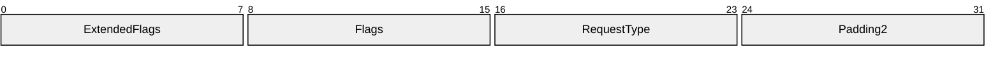

**ExtendedFlags:** This bit-field defines extended options for the server’s request processing.

| 0 | 1 | 2 | 3 | 4 | 5 | 6 | 7 |
| --- | --- | --- | --- | --- | --- | --- | --- |
| 0 | 0 | 0 | 0 | B | A | 0 | 0 |

Where the bits are defined as follows:

|  | Description |
| --- | --- |
| A | If this bit is set, the server MUST process the request as a new Certificate Transparency request, in accordance with section [3.2.1.4.2.1.4.3.1](#Section_3.2.1.4.2.1.4.3.1). |
| B | If this bit is set, the server MUST process the request as a new Pre-sign certificate request, in accordance with section [3.2.1.4.2.1.4.10.1](#Section_3.2.1.4.2.1.4.10.1). |

**Flags (1 byte)**: This bit-field MUST define options for the server's request processing and the response.

| 0 | 1 | 2 | 3 | 4 | 5 | 6 | 7 |
| --- | --- | --- | --- | --- | --- | --- | --- |
| 0 | 0 | Z | 0 | X | Y | 0 | 0 |

Where the bits are defined as follows:

| Value | Description |
| --- | --- |
| X | If this bit is set, the response MUST include the CRLs for all the certificates returned in the pctbCertChain and pctbEncodedCert parameters. |
| Y | If this bit is set, then the response MUST be a CMC full **PKI** response. If it is not set, the response MUST be a CMS. This bit supported by the **ICertRequestD2::Request2** method only. |
| Z | If this bit is set, this is a renewal request on behalf of another user. The processing rules for this type of request are specified in section [3.2.2.6.2.1.2.4](#Section_3.2.2.6.2.1.2.4). |

**RequestType (1 byte):** RequestType MUST define the possible formats of the certificate request submitted in the *pctbRequest* parameter (format types are specified in [[RFC2797]](https://go.microsoft.com/fwlink/?LinkId=90382)).

| Value | Meaning |
| --- | --- |
| 0x00 | The client relies on **CA** to determine the request type. See section [3.2.1.4.2.1.4](#Section_3.2.1.4.2.1.4) for more details. |
| 0x01 | The request format MUST be a PKCS #10 request structure. |
| 0x02 | The request format MUST be a Netscape **KEYGEN** request structure. |
| 0x03 | The request format MUST be a CMS request structure. |
| 0x04 | The request format MUST be a Certificate Management Messages over a CMS (CMC) request structure. |
| 0x05 | The request format MUST be a response to the attestation **CAChallenge**. |
| 0x06 | The request format MUST be a **SignedCertificateTimestampList** structure. |

**Padding2 (1 byte):** This field MUST be set to 0 and ignored upon receipt.

Requesting Status Inspection

The caller of the [ICertRequestD2::Request2](#Section_3.2.1.4.3) can request a status inspection of a [**certificate**](#gt_certificate) request similar to how it is defined in section [3.2.1.4.2.1.4.1.3](#Section_3.2.1.4.2.1.4.1.3). If the **pb** field of the *pctbRequest* parameter is NULL, the client has requested a status inspection of a certificate request and the [**CA**](#gt_certification-authority-ca) MUST follow the rules defined in this section to respond to the request. The rules for processing a status inspection are as follows:

- If the **pdwRequestId* is 0 and *pwszSerialNumber* is NULL, the CA MUST fail the request with a nonzero error.
- If the **pdwRequestId* is nonzero and *pwszSerialNumber* is not NULL, the CA MUST fail the request with a nonzero error.
- If the **pdwRequestId* is nonzero, the CA MUST look up the record in the Request table that is defined in section [3.2.1.1.1](#Section_3.2.1.1.1) by matching the request ID passed in the *pdwRequestId parameter with the values in the Request_RequestID column. If the lookup failed, the function MUST return the error 0x80094004 (CERTSRV_E_PROPERTY_EMPTY).
- If *pwszSerialNumber* is not NULL, the CA MUST look up the record in the Request table that is defined in section 3.2.1.1.1 by matching the serial number of the certificate in the *pwszSerialNumber* parameter with the values in the Serial_Number column. If the lookup failed, the function MUST return the error 0x80094004 (CERTSRV_E_PROPERTY_EMPTY).
- The CA MUST set the value of the *pdwDisposition* parameter by mapping the value of the Request_Disposition column for the located record as described in the table below. The values of the Request_Disposition column are defined in [MS-CSRA](../MS-CSRA/MS-CSRA.md) section 3.1.1.1.1.
| Request_Disposition column value | pdwDisposition value |
| --- | --- |
| foreign certificate | 0 |
| request denied | 2 |
| certificate issued | 3 |
| request pending | 5 |
| certificate revoked | 6 |
| request failed | A nonzero value indicating an error that is not one of the values already defined in this table. |

- If the value of the Request_Disposition column is "certificate issued", the CA MUST return the previously issued certificate through the *pctbEncodedCert* parameter as specified in section [3.2.1.4.2.1.4.8](#Section_3.2.1.4.2.1.4.8).
- If the value of the Request_Disposition column is "request denied", the CA SHOULD set the return value to the 0x80094014 (CERTSRV_E_ADMIN_DENIED_REQUEST).<100>

###### 3.2.1.4.3.2 ICertRequestD2::GetCAProperty (Opnum 7)

The GetCAProperty method retrieves a property value from the [**CA**](#gt_certification-authority-ca).

HRESULT GetCAProperty(

[in, string, unique, range(1, 1536)] wchar_t const * pwszAuthority,

[in] long PropID,

[in] long PropIndex,

[in] long PropType,

[out, ref] CERTTRANSBLOB* pctbPropertyValue

);

**pwszAuthority:** Contains the name of the CA.

**PropID:** An integer value that specifies the property to be returned.

| Property name | Numerical value | Type/Index | Meaning |
| --- | --- | --- | --- |
| CR_PROP_FILEVERSION | 0x00000001 | String | A string that MUST contain the CA version information. |
| CR_PROP_PRODUCTVERSION | 0x00000002 | String | A string that MUST contain the build number of the CA. |
| CR_PROP_EXITCOUNT | 0x00000003 | Long | MUST be the number of exit algorithms registered on the CA. |
| CR_PROP_EXITDESCRIPTION | 0x00000004 | String indexed | A string that MUST contain the name of the exit algorithm identified by the *PropIndex* parameter. |
| CR_PROP_POLICYDESCRIPTION | 0x00000005 | String | A string that MUST contain the description of the policy algorithm on the CA. |
| CR_PROP_CANAME | 0x00000006 | String | A string that MUST contain the [**CN**](#gt_common-name-cn), as specified in [[RFC3280]](https://go.microsoft.com/fwlink/?LinkId=90414), of a CA. |
| CR_PROP_SANITIZEDCANAME | 0x00000007 | String | A string that MUST contain the [**sanitized name**](#gt_sanitized-name) of the CA. More information about sanitized name is specified in section [3.1.1.4.1.1](#Section_3.1.1.4.1.1). |
| CR_PROP_SHAREDFOLDER | 0x00000008 | String | A string that MUST contain the [**UNC**](#gt_universal-naming-convention-unc) path of a folder that contains the CA information and signature [**certificates**](#gt_certificate). |
| CR_PROP_PARENTCA | 0x00000009 | String | A string that MUST contain the name of the parent CA to the current CA. |
| CR_PROP_CATYPE | 0x0000000A | Long | MUST be a [CAINFO](#Section_2.2.2.4) structure that MUST contain the CA type. More information is specified in section [3.2.1.4.3.2.10](#Section_3.2.1.4.3.2.10). |
| CR_PROP_CASIGCERTCOUNT | 0x0000000B | Long | MUST be the number of [**signing certificates**](#gt_signing-certificates) on the CA. |
| CR_PROP_CASIGCERT | 0x0000000C | Binary, indexed | MUST be a binary object that contains a signing certificate identified by the *PropIndex* parameter. |
| CR_PROP_CASIGCERTCHAIN | 0x0000000D | Binary, indexed | MUST be a binary object that contains the certificate chain for a signing certificate identified by the *PropIndex* parameter. |
| CR_PROP_CAXCHGCERTCOUNT | 0x0000000E | Long | MUST be 0x1. |
| CR_PROP_CAXCHGCERT | 0x0000000F | Binary, indexed | MUST be a binary object that contains the CA's current [**exchange certificate**](#gt_exchange-certificate) from the Current_CA_Exchange_Cert datum. The *PropIndex* parameter MUST be 0x0 or 0xFFFFFFFF. |
| CR_PROP_CAXCHGCERTCHAIN | 0x00000010 | Binary, indexed | MUST be a binary object that contains the certificate chain for the CA's current exchange certificate from the Current_CA_Exchange_Cert datum. The *PropIndex* parameter MUST be 0x0 or 0xFFFFFFFF. |
| CR_PROP_BASECRL | 0x00000011 | Binary, indexed | MUST be a base CRL, for a CA signing certificate identified by the *PropIndex* parameter. |
| CR_PROP_DELTACRL | 0x00000012 | Binary, indexed | MUST be a delta CRL, for a CA signing certificate identified by the *PropIndex* parameter. For more information about delta CRLs, see [[MSFT-CRL]](https://go.microsoft.com/fwlink/?LinkId=90181). Additional information is specified in [RFC3280] section 5.2. |
| CR_PROP_CACERTSTATE | 0x00000013 | Long indexed | MUST be a byte array that contains the disposition status of all CA signing certificates. Disposition status is specified in section [3.2.1.4.3.2.19](#Section_3.2.1.4.3.2.19). |
| CR_PROP_CRLSTATE | 0x00000014 | Long indexed | MUST be a byte array that contains the status for all the [**CRLs**](#gt_certificate-revocation-list-crl) of the CA. |
| CR_PROP_CAPROPIDMAX | 0x00000015 | Long | MUST be the maximum property identifier supported by the CA. |
| CR_PROP_DNSNAME | 0x00000016 | String | MUST be the [**fully qualified domain name (FQDN)**](#gt_fully-qualified-domain-name-fqdn) of the computer on which the CA is installed. |
| CR_PROP_ROLESEPARATIONENABLED | 0x00000017 | Long | Indicates whether administrative role separation has been enabled on the CA. A nonzero return value means that role separation has been enabled. Zero means that role separation has not been enabled. |
| CR_PROP_KRACERTUSEDCOUNT | 0x00000018 | Long | MUST be the minimum number of [**KRAs**](#gt_key-recovery-agent-kra) to use when archiving a [**private key**](#gt_private-key). For more information about KRA usage, see [[MSFT-ARCHIVE]](https://go.microsoft.com/fwlink/?LinkId=90177). |
| CR_PROP_KRACERTCOUNT | 0x00000019 | Long | MUST be the maximum number of KRA certificates available on the CA. |
| CR_PROP_KRACERT | 0x0000001A | Binary, indexed | A KRA certificate identified by the *PropIndex* parameter. |
| CR_PROP_KRACERTSTATE | 0x0000001B | Long, indexed | MUST be a byte array that contains the status of the KRA certificates registered with the CA. |
| CR_PROP_ADVANCEDSERVER | 0x0000001C | Long | MUST identify whether the CA operating system is an advanced server platform. |
| CR_PROP_TEMPLATES | 0x0000001D | String | MUST be a collection of name and [**OID**](#gt_object-identifier-oid) pairs that identify the templates supported by a CA. |
| CR_PROP_BASECRLPUBLISHSTATUS | 0x0000001E | Long, indexed | MUST be the publishing status of a signing certificate base CRL identified by the *PropIndex* parameter. |
| CR_PROP_DELTACRLPUBLISHSTATUS | 0x0000001F | Long, indexed | MUST be the publishing status of a signing certificate delta CRL identified by the *PropIndex* parameter. |
| CR_PROP_CASIGCERTCRLCHAIN | 0x00000020 | Binary, indexed | MUST be a binary object that contains the certificate chain for a signing certificate and the CRL for the certificates in the chain identified by the *PropIndex* parameter. |
| CR_PROP_CAXCHGCERTCRLCHAIN | 0x00000021 | Binary, indexed | MUST be a binary object for a chain containing CRLs for the CA's current exchange certificate from the Current_CA_Exchange_Cert datum. The *PropIndex* parameter MUST be 0x00000000 or 0xFFFFFFFF. |
| CR_PROP_CACERTSTATUSCODE | 0x00000022 | Long, indexed | MUST be an HRESULT that identifies the result of certificate validation, as specified in [RFC3280], by the CA for the CA signing certificates identified by the *PropIndex* parameter. |
| CR_PROP_CAFORWARDCROSSCERT | 0x00000023 | Binary, indexed | MUST be a [**forward cross certificate**](#gt_forward-cross-certificate), by index, from a CA. For more information about [**cross certificates**](#gt_cross-certificate), see [[MSFT-CROSSCERT]](https://go.microsoft.com/fwlink/?LinkId=90182). |
| CR_PROP_CABACKWARDCROSSCERT | 0x00000024 | Binary, indexed | MUST be a [**backward cross certificate**](#gt_backward-cross-certificate), by index, from a CA. For more information about cross certificates. |
| CR_PROP_CAFORWARDCROSSCERTSTATE | 0x00000025 | Long, indexed | MUST be a byte array that identifies the status of all backward cross certificates for a CA. |
| CR_PROP_CABACKWARDCROSSCERTSTATE | 0x00000026 | Long, indexed | MUST be a byte array that identifies the disposition status of all forward cross certificates for a CA. |
| CR_PROP_CACERTVERSION | 0x00000027 | Long, indexed | MUST be an indexed 32-bit integer that contains the version number of a CA signing certificate. |
| CR_PROP_SANITIZEDCASHORTNAME | 0x00000028 | String | The property MUST return the sanitized shortened name of the CA. More information about the sanitized name is specified in section 3.1.1.4.1.1. |
| CR_PROP_CERTCDPURLS | 0x00000029 | String, indexed | MUST be a null-terminated [[UNICODE]](https://go.microsoft.com/fwlink/?LinkId=90550) string of the format "String1\nString2\n", where each string (separated by '\n') MUST represent a URI to be part of a CRL Distribution Point (CDP) extension, as specified in [RFC3280] section 4.2.1.14. |
| CR_PROP_CERTAIAURLS | 0x0000002A | String, indexed | MUST be a null-terminated [UNICODE] string of the format "String1\nString2\n", where each string (separated by '\n') MUST represent a URI to be part of Authority Information Access extension, as specified in [RFC3280] section 4.2.2.1. |
| CR_PROP_CERTAIAOCSPRLS | 0x0000002B | String, indexed | MUST be a null-terminated [UNICODE] string of the format "String1\nString2\n", where each string (separated by '\n') MUST represent the OCSP URLs configured on the CA, as specified in [RFC3280] section 4.2.2.1. |
| CR_PROP_LOCALENAME | 0x0000002C | String | MUST be a null-terminated [UNICODE] string in the 'Language-Region' format (as specified in [[RFC4646]](https://go.microsoft.com/fwlink/?LinkId=123591)) that represents the locale of the CA. |
| CR_PROP_SUBJECTTEMPLATE_OIDS | 0x0000002D | String | MUST be a null-terminated [UNICODE] string of the format "OID1\nOID2\n", where each OID (separated by '\n') MUST represent a [**Relative Distinguished Name**](#gt_relative-distinguished-name-rdn) that is in a certificate Subject Distinguished Name. |
| CR_PROP_CRLPARTITIONCOUNT | 0x0000002E | Long | MUST be the maximum number of CRL partitions configured at the CA. |
| CR_PROP_PARTITIONED_BASECRL | 0x0000002F | Binary, indexed | MUST be a base CRL, for a CA signing certificate and partition identified by the *PropIndex* parameter. |
| CR_PROP_PARTITIONED_DELTACRL | 0x00000030 | Binary, indexed | MUST be a delta CRL, for a CA signing certificate and partition identified by the *PropIndex* parameter. |
| CR_PROP_PARTITIONED_BASECRLPUBLISHSTATUS | 0x00000031 | Long, indexed | MUST be the publishing status of a base CRL, for a CA signing certificate and partition identified by the *PropIndex* parameter. |
| CR_PROP_PARTITIONED_DELTACRLPUBLISHSTATUS | 0x00000032 | Long, indexed | MUST be the publishing status of a delta CRL, for a CA signing certificate and partition identified by the *PropIndex* parameter. |

**PropIndex:** This parameter is used as the index to a property that can contain multiple values.

**PropType:** An integer value that specifies the property data type.

| Value | Meaning |
| --- | --- |
| PROPTYPE_LONG 0x00000001 | The property type is a signed long integer or a byte array. |
| PROPTYPE_BINARY 0x00000003 | The property type is binary data. |
| PROPTYPE_STRING 0x00000004 | The property type is a string. |

**pctbPropertyValue:** If the function succeeds, this method returns a [CERTTRANSBLOB](#Section_2.2.2.2) structure in this parameter that contains the property value. If the function fails, the content of this parameter is undefined.

The data type of the value returned depends on the value specified in the *PropType* parameter and the property specified in the *PropID* parameter.

**Return Values:** For a successful invocation, the CA MUST return 0; otherwise, the CA MUST return a nonzero value.

The processing rules for this method are as follows:

If Config_CA_Interface_Flags contains the value IF_NOREMOTEICERTREQUEST, the server SHOULD return 0x80094011 (CERTSRV_E_ENROLL_DENIED) to the client.<101>

If Config_CA_Interface_Flags contains the value IF_ENFORCEENCRYPTICERTREQUEST and the RPC_C_AUTHN_LEVEL_PKT_PRIVACY authentication level, as defined in [MS-RPCE](../MS-RPCE/MS-RPCE.md) section 2.2.1.1.8, is not specified on the RPC connection from the client, the CA MUST refuse to establish a connection with the client by returning a non-zero error.<102>

If the server implements [**advanced CA**](#gt_456bc2c5-d6e8-4ff7-a723-1a08e6d3cf09) functionality, it MUST implement the CR_PROP_CAXCHGCERT property that is specified in section [3.2.1.4.3.2.15](#Section_3.2.1.4.3.2.15).

To return server properties to the client using this method, the server implementation MUST follow the processing rules specified as follows.

- Validate arguments: The server MUST invoke the processing rules in section [3.2.1.4.2.1.1](#Section_3.2.1.4.2.1.1) with the *CANameString* input parameter set to the CA name passed in the *pwszAuthority* parameter and the *EmptyNameAllowed* input parameter set to false. If false is returned, the CA MUST return the E_INVALIDARG (0x80070057) error code to the client.
- Returned server property: The server MUST follow the steps that are specified in section [3.2.1.4.3.2.2](#Section_3.2.1.4.3.2.2).
The following table defines the values that MUST be set for the *PropIndex* and *PropType* parameters for each property value passed via the *PropID* parameter.

| PropID value | PropIndex MUST be | PropType MUST be |
| --- | --- | --- |
| 0x01 | 0x00000000 | 0x00000004 |
| 0x02 | 0x00000000 | 0x00000004 |
| 0x03 | 0x00000000 | 0x00000001 |
| 0x04 | The minimum index is 0. The maximum value is one less than the value stored in the Config_CA_Exit_Count datum. | 0x00000004 |
| 0x05 | 0x00000000 | 0x00000004 |
| 0x06 | 0x00000000 | 0x00000004 |
| 0x07 | 0x00000000 | 0x00000004 |
| 0x08 | 0x00000000 | 0x00000004 |
| 0x09 | 0x00000000 | 0x00000004 |
| 0x0a | 0x00000000 | 0x00000001 |
| 0x0b | 0x00000000 | 0x00000001 |
| 0x0c | The minimum index is 0. The maximum index is one less than the count of rows in the Signing_Cert table. An index of 0xFFFFFFFF is allowed and indicates the maximum valid index. | 0x00000003 |
| 0x0d | The minimum index is 0. The maximum index is one less than the count of rows in the Signing_Cert table. An index of 0xFFFFFFFF is allowed and indicates the maximum valid index. | 0x00000003 |
| 0x0e | 0x00000000 | 0x00000001 |
| 0x0f | 0x00000000. An index of 0xFFFFFFFF is also valid and implies an index of 0x00000000. | 0x00000003 |
| 0x10 | 0x00000000. An index of 0xFFFFFFFF is also valid and implies an index of 0x00000000. | 0x00000003 |
| 0x11 | The minimum index is 0. The maximum index is one less than the count of rows in the Signing_Cert table. An index of 0xFFFFFFFF is allowed and indicates the maximum valid index. | 0x00000003 |
| 0x12 | The minimum index is 0. The maximum index is one less than the count of rows in the Signing_Cert table. An index of 0xFFFFFFFF is allowed and indicates the maximum valid index. | 0x00000003 |
| 0x13 | The minimum index is 0. The maximum index is one less than the count of rows in the Signing_Cert table. | 0x00000001 |
| 0x14 | The minimum index is 0. The maximum index is one less than the count of rows in the Signing_Cert table. | 0x00000001 |
| 0x15 | 0x00000000 | 0x00000001 |
| 0x16 | 0x00000000 | 0x00000004 |
| 0x17 | 0x00000000 | 0x00000001 |
| 0x18 | 0x00000000 | 0x00000001 |
| 0x19 | 0x00000000 | 0x00000001 |
| 0x1a | The minimum index is 0. The maximum index is one less than value of the Config_CA_KRA_Cert_Count datum. | 0x00000003 |
| 0x1b | The minimum index is 0. The maximum index is one less than the value of the Config_CA_KRA_Cert_Count datum. | 0x00000001 |
| 0x1c | 0x00000000 | 0x00000001 |
| 0x1d | 0x00000000 | 0x00000004 |
| 0x1e | The minimum index is 0. The maximum index is one less than the count of rows in the Signing_Cert table. An index of 0xFFFFFFFF is allowed and indicates the maximum valid index. | 0x00000001 |
| 0x1f | The minimum index is 0. The maximum index is one less than the count of rows in the Signing_Cert table. An index of 0xFFFFFFFF is allowed and indicates the maximum valid index. | 0x00000001 |
| 0x20 | The minimum index is 0. The maximum index is one less than the count of rows in the Signing_Cert table. An index of 0xFFFFFFFF is allowed and indicates the maximum valid index. | 0x00000003 |
| 0x21 | 0x00000000 | 0x00000003 |
| 0x22 | The minimum index is 0. The maximum index is one less than the count of rows in the Signing_Cert table. An index of 0xFFFFFFFF is allowed and indicates the maximum valid index. | 0x00000001 |
| 0x23 | The index corresponds to a particular CA signing certificate. Since the last CA signing certificate cannot have a forward cross certificate, the minimum index is 0 and the maximum index is two less than the count of rows in the Signing_Cert table. | 0x00000003 |
| 0x24 | The index corresponds to a particular CA signing certificate. Since the first CA signing certificate cannot have a backward cross certificate, the minimum index is 1 and the maximum index is one less than the count of rows in the Signing_Cert table. | 0x00000003 |
| 0x25 | The index corresponds to a particular CA signing certificate. Since the last CA signing certificate cannot have a forward cross certificate, the minimum index is 0 and the maximum index is two less than the count of rows in the Signing_Cert table. | 0x00000001 |
| 0x26 | The index corresponds to a particular CA signing certificate. Since the first CA signing certificate cannot have a backward cross certificate, the minimum index is 1 and the maximum index is one less than the count of rows in the Signing_Cert table. | 0x00000001 |
| 0x27 | The minimum index is 0. The maximum index is one less than the count of rows in the Signing_Cert table. | 0x00000001 |
| 0x28 | 0x00000000 | 0x00000004 |
| 0x29 | The minimum index is 0. The maximum index is one less than the count of rows in the Signing_Cert table. An index of 0xFFFFFFFF is allowed and indicates the maximum valid index. | 0x00000004 |
| 0x2A | The minimum index is 0. The maximum index is one less than the count of rows in the Signing_Cert table. An index of 0xFFFFFFFF is allowed and indicates the maximum valid index. | 0x00000004 |
| 0x2B | The minimum index is 0. The maximum index is one less than the count of rows in the Signing_Cert table. An index of 0xFFFFFFFF is allowed and indicates the maximum valid index. | 0x00000004 |
| 0x2C | 0x00000000 | 0x00000004 |
| 0x2D | 0x00000000 | 0x00000004 |
| 0x2E | 0x00000000 | 0x00000001 |
| 0x2F | The minimum index is 0. The maximum value in the lower two bytes MUST be one less than the count of rows in the Signing_Cert table. The maximum value in the higher two bytes (obtained by right-shifting *PropIndex* by 16 bits) MUST be equal to Config_CA_CRL_Max_Partitions. An index value of 0xFFFFFFFF is invalid and MUST NOT be used. | 0x00000001 |
| 0x30 | The minimum index is 0. The maximum value in the lower two bytes MUST be one less than the count of rows in the Signing_Cert table. The maximum value in the higher two bytes (obtained by right-shifting *PropIndex* by 16 bits) MUST be equal to Config_CA_CRL_Max_Partitions. An index value of 0xFFFFFFFF is invalid and MUST NOT be used. | 0x00000001 |
| 0x31 | The minimum index is 0. The maximum value in the lower two bytes MUST be one less than the count of rows in the Signing_Cert table. The maximum value in the higher two bytes (obtained by right-shifting *PropIndex* by 16 bits) MUST be equal to Config_CA_CRL_Max_Partitions. An index value of 0xFFFFFFFF is invalid and MUST NOT be used. | 0x00000001 |
| 0x32 | The minimum index is 0. The maximum value in the lower two bytes MUST be one less than the count of rows in the Signing_Cert table. The maximum value in the higher two bytes (obtained by right-shifting *PropIndex* by 16 bits) MUST be equal to Config_CA_CRL_Max_Partitions. An index value of 0xFFFFFFFF is invalid and MUST NOT be used. | 0x00000001 |

When processing the GetCAProperty method, the server MUST determine its behavior based on the requested property ID (*PropID* parameter). All valid property IDs are listed in the preceding table.

The CA MUST return a nonzero error if either of the following conditions is met.

- The value of *PropID* is not listed in the preceding table.
- For a specific *PropID* value, the *PropType* value does not match the required values that are defined in the preceding table.
For a specific non-indexed *PropID* value, the *PropIndex* value does not match the required values that are defined in the preceding table.

For a specific indexed *PropID* value, if the PropIndex value does not match the required values that are defined in the preceding table, the CA MUST return a nonzero error.

The following sections specify the CA behavior of the method for each requested property ID. The returned property MUST be returned to the caller in the *pctbPropertyValue* parameter as a CERTTRANSBLOB structure. The message format for this structure MUST be as specified in section 2.2.2.2 and its subsections.

PropID = 0x00000001 (CR_PROP_FILEVERSION) "CA File Version"

The client has requested the [**CA**](#gt_certification-authority-ca) file version property. If the CA implements the Config_File_Version datum, the CA constructs a [[UNICODE]](https://go.microsoft.com/fwlink/?LinkId=90550) string of the form "w.x.y.z" or "w.x:y.z",<103> where w, x, y, and z MUST be numeric values indicating the version of the CA. If the CA does not implement the Config_File_Version datum, it MUST return a NULL string. The [UNICODE] string MUST be returned through the [CERTTRANSBLOB (section 2.2.2.2)](#Section_2.2.2.2) structure.<104>

Marshaling rules for CERTTRANSBLOB are specified in section 2.2.2.2.

PropID = 0x00000002 (CR_PROP_PRODUCTVERSION) "CA Product Version"

The client has requested the [**CA**](#gt_certification-authority-ca) product version property. If the CA implements the Config_Product_Version datum, the CA constructs a [[UNICODE]](https://go.microsoft.com/fwlink/?LinkId=90550) string of the form "w.x.y.z" or "w.x:y.z",<105> where w, x, y, and z MUST be numeric values indicating the version of the server hosting the CA, which might or might not match the version of the CA returned for the previous property. If the CA does not implement the Config_Product_Version datum, it MUST return a NULL string. The [UNICODE] string MUST be returned through the [CERTTRANSBLOB (section 2.2.2.2)](#Section_2.2.2.2) structure.<106>

Marshaling rules for CERTTRANSBLOB are specified in section 2.2.2.2.

PropID = 0x00000003 (CR_PROP_EXITCOUNT) "Exit Count"

The client has requested the count of exit algorithms installed on the [**CA**](#gt_certification-authority-ca). The CA MUST return the number stored in the Config_CA_Exit_Count datum. The returned value is returned through the **cExitAlgorithms** field of a [CAINFO](#Section_2.2.2.4) structure in the returned [CERTTRANSBLOB (section 2.2.2.2)](#Section_2.2.2.2) structure.<107>

If the CA does not implement the Config_CA_Exit_Count datum or does not implement any exit algorithms, the CA MUST return 0.

Marshaling rules for CERTTRANSBLOB are specified in section 2.2.2.2.

PropID = 0x00000004 (CR_PROP_EXITDESCRIPTION) "Exit Description"

The client has requested the text description for a particular exit algorithm. The client has indicated the particular algorithm by using the PropIndex parameter.

The [**CA**](#gt_certification-authority-ca) MUST return a value that is stored in the Config_CA_Exit_Description_List at the position that is specified by the PropIndex parameter. The value is passed as a [[UNICODE]](https://go.microsoft.com/fwlink/?LinkId=90550) string through a [CERTTRANSBLOB (section 2.2.2.2)](#Section_2.2.2.2) structure. If the index provided by the client is out of range for the Config_CA_Exit_Description_List, the CA MUST return a nonzero error code. The error code SHOULD be ERROR_FILE_NOT_FOUND (0x80070002).

If the CA does not implement the Config_CA_Exit_Description_List, the CA MUST return a null-terminated [UNICODE] string through a CERTTRANSBLOB structure.

Marshaling rules for CERTTRANSBLOB are specified in section 2.2.2.2.<108>

PropID = 0x00000005 (CR_PROP_POLICYDESCRIPTION) "Policy Description"

The client has requested the text description of the policy algorithm.

The [**CA**](#gt_certification-authority-ca) MUST return the value of the Config_CA_Policy_Description datum. The returned value MUST be returned as a [[UNICODE]](https://go.microsoft.com/fwlink/?LinkId=90550) string through a [CERTTRANSBLOB (section 2.2.2.2)](#Section_2.2.2.2) structure.

If the CA does not implement the Config_CA_Policy_Description datum, it MUST return a NULL [UNICODE] string through a CERTTRANSBLOB structure.

Marshaling rules for CERTTRANSBLOB are specified in section [2.2.2.2.1](#Section_2.2.2.2.1).<109>

PropID = 0x00000006 (CR_PROP_CANAME) "Certification Authority Name"

The client has requested the [**common name**](#gt_common-name-cn) of the [**CA**](#gt_certification-authority-ca).

The CA MUST return the value of the CN [**attribute**](#gt_attribute) of the **Subject** field in the CA [**signing certificate**](#gt_signing-certificates) found in the Signing_Cert_Certificate column in the indexed row of the Signing_Cert table specified by the *PropIndex* parameter as a [[UNICODE]](https://go.microsoft.com/fwlink/?LinkId=90550) string, through a [CERTTRANSBLOB (section 2.2.2.2)](#Section_2.2.2.2) structure.

Marshaling rules for the CERTTRANSBLOB structure are specified in section 2.2.2.2.

PropID = 0x00000007 (CR_PROP_SANITIZEDCANAME) "Sanitized CA Name"

The client has requested the [**common name**](#gt_common-name-cn) of the [**certification authority (CA)**](#gt_certification-authority-ca) in the sanitized form. The name of the CA returned in this property is taken from the CN [**attribute**](#gt_attribute) of the **Subject** field in the CA [**signing certificate**](#gt_signing-certificates), and is then sanitized. More information about the Windows sanitizing name algorithm is specified in section [1.3.2.5](#Section_1.3.2.5).

The CA MUST return a sanitized value (as specified in section [3.1.1.4.1.1](#Section_3.1.1.4.1.1)) of the CN attribute of the **Subject** field in the CA signing certificate found in the Signing_Cert_Certificate column in the indexed row of the Signing_Cert table specified by the *PropIndex* parameter as a [[UNICODE]](https://go.microsoft.com/fwlink/?LinkId=90550) string, through a [CERTTRANSBLOB](#Section_2.2.2.2) structure.

Marshaling rules for CERTTRANSBLOB are specified in section 2.2.2.2.

PropID = 0x00000008 (CR_PROP_SHAREDFOLDER) "Shared Folder Path"

The client has requested the [**UNC**](#gt_universal-naming-convention-unc) path that is used as a shared folder for the [**CA**](#gt_certification-authority-ca). If the CA implements the Config_Configuration_Directory data, the CA MUST return its value as a [[UNICODE]](https://go.microsoft.com/fwlink/?LinkId=90550) string, through a [CERTTRANSBLOB (section 2.2.2.2)](#Section_2.2.2.2) structure. If the CA does not implement the Config_Configuration_Directory data, the CA MUST return a nonzero error. The error SHOULD be 0x80070002. For more information about Windows implementation and usage for shared folders, see [[MSFT-SHAREDFOLDER]](https://go.microsoft.com/fwlink/?LinkId=90207).<110>

Marshaling rules for CERTTRANSBLOB are specified in section 2.2.2.2.

PropID = 0x00000009 (CR_PROP_PARENTCA) "Parent CA Name"

The client has requested the name of the parent of the [**CA**](#gt_certification-authority-ca).

If the CA is a [**root CA**](#gt_root-ca), it has no parent and the server MUST return a non-zero error code.

If the CA implements the Config_CA_Parent_DNS datum, then the CA MUST return this name as a [[UNICODE]](https://go.microsoft.com/fwlink/?LinkId=90550) string, through a [CERTTRANSBLOB (section 2.2.2.2)](#Section_2.2.2.2) structure. The format of the name SHOULD be Parent-FQDN + "\" + Parent-CommonName. Otherwise, the CA MUST return an empty string.

Marshaling rules for CERTTRANSBLOB are specified in section 2.2.2.2.

PropID = 0x0000000A (CR_PROP_CATYPE) "CA Type"

The client requested the type of the [**CA**](#gt_certification-authority-ca).

If the CA [**signing certificate**](#gt_signing-certificates) that is stored in the Signing_Cert_Certificate column (section [3.2.1.1.2](#Section_3.2.1.1.2)) is one of the [**root certificate**](#gt_root-certificate) types specified in the following table, the CA MUST return the applicable value, as specified in the table:

| Root certificate type | Value CA MUST return |
| --- | --- |
| Enterprise root certificate | 0x00000000 |
| Enterprise subordinate certificate | 0x00000001 |
| Standalone root certificate | 0x00000003 |
| Standalone subordinate certificate | 0x00000004 |

The CA MUST return its type through the **CAType** field of a [CAINFO (section 2.2.2.4)](#Section_2.2.2.4) structure. The server MUST return the CAINFO structure through a [CERTTRANSBLOB (section 2.2.2.2)](#Section_2.2.2.2) structure.

Marshaling rules for the CERTTRANSBLOB structure are specified in section 2.2.2.2.

PropID = 0x0000000B (CR_PROP_CASIGCERTCOUNT) "CA Signature Certificate Count"

The client has requested the count of signature [**certificates**](#gt_certificate) on the [**CA**](#gt_certification-authority-ca). The CA SHOULD return the count of rows in the Signing_Cert Table. The CA MUST return the count through the **cCASignatureCerts** field of a [CAINFO (section 2.2.2.4)](#Section_2.2.2.4) structure. The CA MUST return the CAINFO (section 2.2.2.4) structure through a [CERTTRANSBLOB (section 2.2.2.2)](#Section_2.2.2.2) structure.

Marshaling rules for CERTTRANSBLOB are specified in section 2.2.2.2.

PropID = 0x0000000C (CR_PROP_CASIGCERT) "CA Signature Certificate"

The client has requested a particular [**signing certificate**](#gt_signing-certificates).

The [**CA**](#gt_certification-authority-ca) SHOULD retrieve the CA [**certificate**](#gt_certificate) from the Signing_Cert_Certificate column in the row indexed by the value of the *PropIndex* parameter. The CA MUST return the signature certificate in X509 format, as specified in [[X660]](https://go.microsoft.com/fwlink/?LinkId=90592). The CA MUST return the value through a [CERTTRANSBLOB (section 2.2.2.2)](#Section_2.2.2.2) structure.

Marshaling rules for the CERTTRANSBLOB structure are specified in section 2.2.2.2.

PropID = 0x0000000D (CR_PROP_CASIGCERTCHAIN) "CA signing certificate Chain"

The client has requested a particular [**signing certificate**](#gt_signing-certificates) and its complete chain. The [**CA**](#gt_certification-authority-ca) SHOULD retrieve the CA [**certificate**](#gt_certificate) from the Signing_Cert_Certificate column in the row indexed by the value of the *PropIndex* parameter. The CA SHOULD return the chain of this certificate as specified in [[RFC3280]](https://go.microsoft.com/fwlink/?LinkId=90414) section 3.2. The CA MUST return the certificate chain through a [CERTTRANSBLOB (section 2.2.2.2)](#Section_2.2.2.2) structure.

Marshaling rules for the CERTTRANSBLOB structure are specified in section 2.2.2.2.

PropID = 0x0000000E (CR_PROP_CAXCHGCERTCOUNT) "CA Exchange Certificate Count"

The client has requested the count of [**exchange certificates**](#gt_exchange-certificate) on the [**CA**](#gt_certification-authority-ca). The CA MUST return 0x1 through the **cCAExchangeCerts** field of a [CAINFO](#Section_2.2.2.4) structure. The CA MUST return the CAINFO structure through a [CERTTRANSBLOB (section 2.2.2.2)](#Section_2.2.2.2) structure. For more information, see [[MSFT-ARCHIVE]](https://go.microsoft.com/fwlink/?LinkId=90177).

Marshaling rules for CERTTRANSBLOB are specified in section 2.2.2.2.

PropID = 0x0000000F (CR_PROP_CAXCHGCERT) "CA Exchange Certificate"

The client has requested the [**CA**](#gt_certification-authority-ca) [**exchange certificate**](#gt_exchange-certificate). The CA MUST follow these processing rules to process the client's request:

- If the *PropIndex* parameter is not equal to 0x0 or 0xFFFFFFFF, return the E_INVALIDARG (0x80070057) error to the client.
- If Current_CA_Exchange_Cert element is NULL, load exchange certificate as follows:
- Clear all contents from the Store_CA_Exchange_Cert list and set it back to NULL
- Read each entry from the Config_CA_Exchange_Cert list. For each entry:
- Retrieve the [**certificate**](#gt_certificate) from the request database by finding the row with Certificate_Hash equal to the Config_CA_Exchange_Cert entry value.
- If the certificate is found and it meets the following criteria, add it to the Store_CA_Exchange_Cert element.
- The certificate is within its validity period.
- The issuer name of the certificate matches the subject name of the current CA [**signing certificate**](#gt_signing-certificates).
- The [**public key**](#gt_public-key) that signed the certificate matches the public key of the current CA signing certificate.
- Populate the Current_CA_Exchange_Cert element with the certificate from Store_CA_Exchange_Cert with the latest **notAfter** date.
- If no entries were found in Config_CA_Exchange_Cert above, or if no certificates met the criteria to be added to Store_CA_Exchange_Cert above, or if Current_CA_Exchange_Cert is not NULL and any of the following is true:
- Current_CA_Exchange_Cert is not within its validity period.
- Current_CA_Exchange_Cert is revoked.
Create a new exchange certificate as specified in section [3.2.1.4.3.2.15.1](#Section_3.2.1.4.3.2.15.1). Then go through the list Store_CA_Exchange_Cert and add the hash value of each certificate, including the new exchange certificate, to the Config_CA_Exchange_Cert list.

- By this point there should be a valid exchange certificate in Current_CA_Exchange_Cert. Return the contents of this datum by marshaling it in a [CERTTRANSBLOB (section 2.2.2.2)](#Section_2.2.2.2) structure as specified in section [2.2.2.2.2](#Section_2.2.2.2.2). Marshaling rules for the CERTTRANSBLOB structure are specified in section 2.2.2.2.

Creating a CA Exchange Certificate

The [**CA**](#gt_certification-authority-ca) MUST perform the following steps to create an [**exchange certificate**](#gt_exchange-certificate).

- Determine the role of the machine that the CA is running on by performing external behavior consistent with locally invoking DsRolerGetPrimaryDomainInformation (specified in [MS-DSSP](../MS-DSSP/MS-DSSP.md) section 3.2.5.1), using the following parameters:
- Set the *hBinding* parameter to NULL.
- Set the *InfoLevel* parameter to DsRolePrimaryDomainInfoBasic.
If the MachineRole field of the returned DomainInfo structure is not equal to DsRole_RoleStandaloneWorkstation or DsRole_RoleStandaloneServer, then perform the following steps.

- Invoke the "Initialize ADConnection" task ([MS-ADTS](../MS-ADTS/MS-ADTS.md) section 7.6.1.1) to construct an **ADConnection** with the following parameters:
- *TaskInputTargetName*: NULL.
- *TaskInputPortNumber*: If the value of the Config_CA_LDAP_Flags datum has 0x0000001 (LDAPF_SSLENABLE) bit set, use port 636. Otherwise, use port 389.
- Invoke the "Setting an LDAP Option on an ADConnection" task ([MS-ADTS] section 7.6.1.2) once for each of the pairs of option and value parameters in the following table. For each of these, the *TaskInputADConnection* parameter is the **ADConnection** handle created in the previous step.
| TaskInputOptionName | TaskInputOptionValue |
| --- | --- |
| LDAP_OPT_GETDSNAME_FLAGS | Bitwise OR of the bits D and R, as defined in [MS-NRPC](../MS-NRPC/MS-NRPC.md) section 3.5.4.3.1 |
| LDAP_OPT_REFFERALS | If Config_AD_Connection_Referral ADM element is FALSE, set to FALSE |
| LDAP_OPT_PROTOCOL_VERSION | 2 |

- If the value of the Config_CA_LDAP_Flags datum does not have the 0x0000002 (LDAPF_SIGNDISABLE) bit set and:
- If after invoking the processing rules that are specified in section [3.2.2.1.6](#Section_3.2.2.1.6) with input parameter **InputADConnectionHandle** set equal to **ActiveDirectory_Connection**, the returned value is TRUE (that is, [**DC**](#gt_domain-controller-dc) supports signing) set LDAP_OPT_SIGN to TRUE.
- Else, if the Config_CA_LDAP_Flags datum does not have the 0x0000001 (LDAPF_SSLENABLE) bit set, return 0x80094013 (CERTSRV_E_DOWNLEVEL_DC_SSL_OR_UPGRADE) to the client and exit.
- Invoke the "Performing an LDAP Bind on an ADConnection" task ([MS-ADTS] section 7.6.1.4) with the following parameter:
*TaskInputADConnection*: The **ADConnection** handle generated in the previous step

If the *TaskReturnStatus* returned is not 0:

- Repeat step 1.2 with the following modification:
- *TaskInputOptionName*: LDAP_OPT_GETDSNAME_FLAGS
- *TaskInputOptionValue*: Bitwise OR of the bits A, D, and R, as defined in [MS-NRPC] section 3.5.4.3.1
- Repeat this step (1.4). If the *TaskReturnStatus* returned is not 0, go to step 2.
- Obtain the [**distinguished name**](#gt_distinguished-name-dn) for the [Certificate Templates Container (section 2.2.2.11.1)](#Section_2.2.2.11.1), as specified in the following steps:
- Invoke the "Perform an LDAP Operation on an ADConnection" task ([MS-ADTS] section 7.6.1.6) with the following parameters:
- TaskInputADConnection: The **ADConnection** handle generated in the previous step
- *TaskInputRequestMessage*: [**LDAP**](#gt_lightweight-directory-access-protocol-ldap) SearchRequest message (see [[RFC2251]](https://go.microsoft.com/fwlink/?LinkId=90325) section 4.5.1), as follows:
- baseObject: distinguished name of the rootDSE object as specified in [MS-ADTS] section 3.1.1.3.2.1
- scope: baseObject
- filter: (objectCategory=*)
- attributes: The CA SHOULD use the following [**attributes**](#gt_attribute):
- configurationNamingContext
- defaultNamingContext
- sizeLimit: 10000
- timeLimit: 120
- derefAliases: neverDerefAliases
- typesOnly: FALSE
- *TaskOutputResultMessage*: Upon successful return from the task, this parameter will contain the results of the LDAP search.
If the *TaskReturnStatus* returned is not 0, go to step 2.

- Build the distinguished name by concatenating the "CN=Certificate Templates,CN=Public Key Services,CN=Services, CN=Configuration" path and the value for **configurationNamingContext** attribute from the previous step.
- Read all objects under the Certificate Templates Container as follows:
Repeat the previous step with the following modifications:

- baseObject: distinguished name of the Certificate Templates Container obtained in the previous step.
- scope: wholeSubtree
- filter: (objectCategory=pKICertificateTemplate)
- attributes: The CA SHOULD use the following attributes:
- cn
- flags
- ntSecurityDescriptor
- revision
- pKICriticalExtensions
- pKIDefaultCSPs
- pKIDefaultKeySpec
- pKIEnrollmentAccess
- pKIExpirationPeriod
- pKIExtendedKeyUsage
- pKIKeyUsage
- pKIMaxIssuingDepth
- pKIOverlapPeriod
- msPKI-Template-Schema-Version
- msPKI-Template-Minor-Revision
- msPKI-RA-Signature
- msPKI-Minimal-Key-Size
- msPKI-Cert-Template-OID
- msPKI-Supersede-Templates
- msPKI-RA-Policies
- msPKI-RA-Application-Policies
- msPKI-Certificate-Policy
- msPKI-Certificate-Application-Policy
- msPKI-Enrollment-Flag
- msPKI-Private-Key-Flag
- msPKI-Certificate-Name-Flag
If the *TaskReturnStatus* returned is not 0, go to step 2.

- If a [**certificate template**](#gt_certificate-template) with a **commonName** attribute equal to "CAExchange" (case-insensitive comparison) was read in the previous step and CA has the permission to [**enroll**](#gt_enroll) for that template (by invoking the processing rules in [Verify End Entity Permissions (section 3.2.2.6.2.1.4.3)](#Section_3.2.2.6.2.1.4.3) with input parameter **Input_ntSecurityDescriptor** set equal to the **ntSecurityDescriptor** attribute of the CAExchange certificate template and **Input_SID** set equal to **CA_SID** ADM element), create the exchange certificate based on the attribute value processing specified in sections [3.2.2.6.2.1.4.4](#Section_3.2.2.6.2.1.4.4) and [3.2.2.6.2.1.4.5](#Section_3.2.2.6.2.1.4.5).
- If an exchange certificate wasn't created in previous steps, create it by adding the following fields and extensions:
- For the Subject of the exchange certificate, a [**common name**](#gt_common-name-cn) attribute is used with a value the same as the value of the common name attribute in the subject information of the CA [**signing certificate**](#gt_signing-certificates) (Signing_Cert_Certificate datum) and appending "-Xchg" to the value. The Issuer field is filled with the same value as the Subject field of the CA signing certificate (Signing_Cert_Certificate datum).
- Key Usage extension with KeyEncipherment bit enabled. The Key Usage extension is specified in [[RFC3280]](https://go.microsoft.com/fwlink/?LinkId=90414) section 4.2.1.3.
- Extended Key Usage extension containing the [**OID**](#gt_object-identifier-oid) szOID_KP_CA_EXCHANGE (1.3.6.1.4.1.311.21.5) as the KeyPurposeId. The Extended Key Usage extension is specified in [RFC3280] section 4.2.1.13.
- Application Policies extension containing the OID szOID_KP_CA_EXCHANGE (1.3.6.1.4.1.311.21.5) as the Application Policy OID. The Application Policies extension is specified in section [2.2.2.7.7.3](#Section_2.2.2.7.7.3).
- Certificate Template Common Name extension with the value of Name as "CAExchange". Encoding a Certificate Template Common Name Extension is specified in section [2.2.2.7.7.1](#Section_2.2.2.7.7.1).
- If the CA signing certificate contains a Certificate Policies extension, add this extension with the same value as in the CA signing certificate (Signing_Cert_Certificate datum). The Certificate Policies extension is specified in [RFC3280] section 4.2.1.5.
- The Authority Key Identifier extension is added with the same value as the Subject Key Identifier extension in the CA signing certificate (Signing_Cert_Certificate datum). If the Subject Key Identifier extension is not found in the CA signing certificate (Signing_Cert_Certificate datum), then the SHA1 hash of the public key of CA signing certificate (Signing_Cert_Certificate datum) is used as the value for the Authority Key Identifier extension. The Authority Key Identifier extension is specified in [RFC3280] section 4.2.1.1.
- The Subject Key Identifier extension is added with the same value as the SHA1 hash of the [**public key**](#gt_public-key) associated with the exchange certificate. The Subject Key Identifier extension is specified in [RFC3280] section 4.2.1.2.
- The Authority Information Access extension is added with the same value the CA returns when ICertRequestD2::GetCAProperty is called for PropID of CR_PROP_CERTAIAURLS and propIndex of 0xFFFFFFFF. See section [3.2.1.4.3.2.42](#Section_3.2.1.4.3.2.42) for details on how this value is computed. The Authority Information Access extension is specified in [RFC3280] section 4.2.2.1.
- The CRL Distribution Point extension is added with the same value the CA returns when ICertRequestD2::GetCAProperty is called for PropID of CR_PROP_CERTCDPURLS and propIndex of 0xFFFFFFFF. See section [3.2.1.4.3.2.43](#Section_3.2.1.4.3.2.43) for details on how this value is computed. The CRL Distribution Point extension is specified in [RFC3280] section 4.2.1.14.
- The value for Valid From field is the date and time when the request for CA exchange certificate was received minus the value of the Config_CA_Clock_Skew_Minutes data. The Valid To field is set to one week later. Valid From and Valid To are specified in [RFC3280] section 4.1.2.5.
- The serial number SHOULD be generated as specified in section [3.2.1.4.2.1.4.6](#Section_3.2.1.4.2.1.4.6) and stored in the Serial Number field. The Serial Number field is specified in [RFC3280] section 4.1.2.2.
- The value for the Signature Algorithm field is the name of the signing algorithm configured at the CA. The Signature Algorithm field is specified in [RFC3280] section 4.1.1.2.
- The value for the Subject Public Key field is the public key associated with the exchange certificate. The Subject Public Key field is specified in [RFC3280] section 4.1.
- Store the created [**certificate**](#gt_certificate) as follows:
- Store the certificate as an entry in the request table.
- Add the x.509 certificate to the Store_CA_Exchange_Cert list of certificates and set it as the Current_CA_Exchange_Cert data element value.
- Delete the list of hash values from the Config_CA_Exchange_Cert datum.
- The CA MUST create a new row in the Request table and set the following values:
- Request_Request_ID: Assign a unique value in this column.
- Request_Disposition: Assign the value "certificate issued".
- Request_Raw_Request: Set to empty.
In addition, the CA SHOULD store the following request parameters in the Request table.

| Column name | Value |
| --- | --- |
| Request_Raw_Old_Certificate | Empty |
| Request_Request_Attributes | Empty |
| Request_Request_Type | Empty |
| Request_Request_Flags | 0x0000000C (The bitwise OR of CR_FLG_CAXCHGCERT flag and CR_FLG_FORCEUTF8 flag. For more details see [MS-CSRA](../MS-CSRA/MS-CSRA.md) section 3.1.1.1.2.) |
| Request_Status_Code | 0x00000000 (The operation completed successfully.) |
| Request_Submitted_When | The time the request for CA exchange server was received by the CA. |
| Request_Resolved_When | The time the CA completed the processing for the CA exchange certificate. |
| Request_Requester_Name | The value of **CA_Account_Name** ADM element. |
| Request_Caller_Name | The value of **Per_Request.Caller_Account_Name** ADM element. |
| Request_Signer_Policies | Empty |
| Request_Signer_Application_Policies | Empty |
| Request_Officer | Empty |
| Request_Distinguished_Name | The distinguished name (DN) from the Subject field of the CA exchange certificate (Config_CA_Exchange_Cert datum). |
| Request_Raw_Name | The Subject field of the CA exchange certificate (Config_CA_Exchange_Cert datum). |
| Request_Country | The Country attribute from the DN from the Subject field of the CA exchange certificate (Config_CA_Exchange_Cert datum). |
| Request_Organization | The Organization attribute from the DN from the Subject field of the CA exchange certificate (Config_CA_Exchange_Cert datum). |
| Request_Org_Unit | The Organizational-Unit attribute from the DN from the Subject field of the CA exchange certificate (Config_CA_Exchange_Cert datum). |
| Request_Common_Name | The Common Name attribute from the DN from the Subject field of the CA exchange certificate (Config_CA_Exchange_Cert datum). |
| Request_Locality | The Locality attribute from the DN from the Subject field of the CA exchange certificate (Config_CA_Exchange_Cert datum). |
| Request_State | The Province name attribute from the DN from the Subject field of the CA exchange certificate (Config_CA_Exchange_Cert datum). |
| Request_Title | The Title attribute from the DN from the Subject field of the CA exchange certificate (Config_CA_Exchange_Cert datum). |
| Request_Given_Name | The Given Name attribute from the DN from the Subject field of the CA exchange certificate (Config_CA_Exchange_Cert datum). |
| Request_Initials | The Initials attribute from the DN from the Subject field of the CA exchange certificate (Config_CA_Exchange_Cert datum). |
| Request_SurName | The Surname attribute from the DN from the Subject field of the CA exchange certificate (Config_CA_Exchange_Cert datum). |
| Request_Domain_Component | The Domain Component attribute from the DN from the Subject field of the CA exchange certificate (Config_CA_Exchange_Cert datum). |
| Request_Email | The Email Address attribute from the DN from the Subject field of the CA exchange certificate (Config_CA_Exchange_Cert datum). |
| Request_Street_Address | The Street Address attribute from the DN from the Subject field of the CA exchange certificate (Config_CA_Exchange_Cert datum). |
| Request_Unstructured_Name | The Unstructured Name attribute from the DN from the Subject field of the CA exchange certificate (Config_CA_Exchange_Cert datum). |
| Request_Unstructured_Address | The Unstructured Address attribute from the DN from the Subject field of the CA exchange certificate (Config_CA_Exchange_Cert datum). |
| Request_Device_Serial_Number | The Device Serial Number attribute from the DN from the Subject field of the CA exchange certificate (Config_CA_Exchange_Cert datum). |

PropID = 0x00000010 (CR_PROP_CAXCHGCERTCHAIN) "CA Exchange Certificate Chain"

The client has requested the [**CA**](#gt_certification-authority-ca) [**exchange certificate**](#gt_exchange-certificate) and its complete chain. The CA MUST follow these processing rules to process the client's request:

- If *PropIndex* parameter is not equal to 0x0 or 0xFFFFFFFF, return the E_INVALIDARG (0x80070057) error to the client.
- Validate that the Current_CA_Exchange_Cert datum contains a current, valid CA exchange certificate by executing steps 2 and 3 in section [3.2.1.4.3.2.15](#Section_3.2.1.4.3.2.15).
- Retrieve the **Issuer_Name_Id** from the request database by finding the row with the Certificate_Hash equal to the Current_CA_Exchange_Cert hash value.
- Find the CA signing certificate corresponding to the Current_CA_Exchange_Cert by looking for an entry in the Signing_Cert table with the **certificate index** (section [3.2.1.4.3.2.39](#Section_3.2.1.4.3.2.39)) matching the lower 16 bits of the **Issuer_Name_Id** value retrieved in step 3 of this procedure.<111>
- Construct a signed [**CMS**](#gt_cryptographic-message-syntax-cms) message with the following fields:
- ContentType: szOID_RSA_signedData (1.2.840.113549.1.7.2, id-signedData).
- Content: SignedData (as specified in [[RFC3852]](https://go.microsoft.com/fwlink/?LinkId=90445), section 5.1) with the following requirements:
- version: See section [RFC3852], section 5.1.
- digestAlgorithms: Same digest algorithm as was used by the CA signing certificate retrieved in step 4 of this procedure to sign the Current_CA_Exchange_Cert.
- encapContentInfo: EncapsulatedContentInfo structure (as specified in [RFC3852], section 5.2) with the **eContentType** set to the [**OID**](#gt_object-identifier-oid) szOID_PKCS_7_DATA (1.2.840.113549.1.7.1, id-data) and the **eContent** field set to the CA's exchange certificate from the Current_CA_Exchange_Cert datum.
- certificates: Contains CA's [**certificate**](#gt_certificate), as retrieved in step 4 of this procedure, and its parent certificates. To obtain parent certificates, the CA SHOULD use Authority Information Access (AIA) extension of its certificate and its parent certificates. The AIA extension is specified in [[RFC3280]](https://go.microsoft.com/fwlink/?LinkId=90414) section 4.2.2.1.
- crls: Not used.
- signerInfos: Not used.
- Return the CMS message through a CERTTRANSBLOB structure (as specified in section [2.2.2.2](#Section_2.2.2.2)). Marshaling rules for the CERTTRANSBLOB structure are specified in section 2.2.2.2.

PropID = 0x00000011 (CR_PROP_BASECRL) "Base CRL"

The client has requested a particular base [**CRL**](#gt_certificate-revocation-list-crl).

If both Config_CRLPartition_Enabled and Config_CRLPartition_PartitionZero_Exclusive are set to TRUE, the CA MUST return E_INVALIDARG, as specified in [MS-ERREF](../MS-ERREF/MS-ERREF.md).

If the [**CA**](#gt_certification-authority-ca) implements the CRL table, then it MUST return the value of the CRL_Raw_CRL datum from the following row:

- The value of the Base_Or_Delta column is equal to Base.
- The value of the CRL_Name_Id is equal to the value of the PropIndex parameter.
- The value of the Publish_Date column is the newest among the rows that meet the preceding criteria.
Otherwise, the CA MUST return an empty [CERTTRANSBLOB (section 2.2.2.2)](#Section_2.2.2.2) structure. The CA MUST return the base CRL in X.509 format, as specified in [[X660]](https://go.microsoft.com/fwlink/?LinkId=90592). The CA MUST return the value through a CERTTRANSBLOB (section 2.2.2.2) structure.

Marshaling rules for the CERTTRANSBLOB structure are specified in section [2.2.2.2.4](#Section_2.2.2.2.4).

PropID = 0x00000012 (CR_PROP_DELTACRL) "Delta CRL"

The client has requested a particular delta [**CRL**](#gt_certificate-revocation-list-crl).

If both Config_CRLPartition_Enabled and Config_CRLPartition_PartitionZero_Exclusive are set to TRUE, the CA MUST return E_INVALIDARG, as specified in [MS-ERREF](../MS-ERREF/MS-ERREF.md).

If the [**CA**](#gt_certification-authority-ca) implements the CRL table, then it MUST return the value of the CRL_Raw_CRL datum from the following row:

- The value of the Base_Or_Delta column is equal to Delta.
- The value of the CRL_Name_Id is equal to the value of the PropIndex parameter.
- The value of the Publish_Date column is the newest among the rows that meet the aforementioned criteria.
Otherwise, the CA MUST return an empty [CERTTRANSBLOB (section 2.2.2.2)](#Section_2.2.2.2) structure. The CA MUST return the delta CRL in X.509 format, as specified in [[X660]](https://go.microsoft.com/fwlink/?LinkId=90592). The CA MUST return the delta CRL through a CERTTRANSBLOB (section 2.2.2.2) structure.

Marshaling rules for the CERTTRANSBLOB structure are specified in section 2.2.2.2.

PropID = 0x00000013 (CR_PROP_CACERTSTATE) "CA Signing Certificates State"

The client has requested the disposition status of all [**CA**](#gt_certification-authority-ca) [**signing certificates**](#gt_signing-certificates).

If the server implements the Signing_Cert Table, it MUST validate all the signing certificates stored in the Signing_Cert_Certificate column.

The server MUST return a byte array that contains the status. The value used MUST be one of the following.

| Value | Meaning |
| --- | --- |
| CA_DISP_INCOMPLETE (0x00) | The signing certificate is incomplete. |
| CA_DISP_ERROR (0x01) | The signing certificate is unavailable. |
| CA_DISP_REVOKED (0x02) | The signing certificate has been revoked. |
| CA_DISP_VALID (0x03) | The signing certificate is valid. |
| CA_DISP_INVALID (0x04) | The signing certificate has expired. |

The CA MUST return the byte array in a [CERTTRANSBLOB (section 2.2.2.2)](#Section_2.2.2.2) structure. The first byte MUST identify the status of the signing certificate in row 1 of the Signing_Cert table, and the second byte MUST identify the status of the signing certificate in the second row of the Signing_Cert table. Subsequent bytes MUST repeat this pattern so that byte n MUST contain the disposition of the signing certificate in row *n*.

PropID = 0x00000014 (CR_PROP_CRLSTATE) "CA CRL State"

The client has requested the [**CA**](#gt_certification-authority-ca) signing certificate status for all [**CRLs**](#gt_certificate-revocation-list-crl).

The CA MUST do the following for each one of the rows in Signing_Cert table:

- The CA MUST evaluate the [**certificate**](#gt_certificate) status stored in the Signing_Cert_Certificate column by building its chain based on the specification defined in [[RFC3280]](https://go.microsoft.com/fwlink/?LinkId=90414).
- If the [**signing certificate**](#gt_signing-certificates) is revoked, the CA MUST return the status CA_DISP_REVOKED.
- If the certificate index (identified by the Signing_Cert_Certificate column) does not match the [**key**](#gt_key) index, the CA MUST return the status CA_DISP_ERROR.
- If the certificate index (identified by Signing_Cert_Certificate column) matches the key (2) index, the CA MUST return the status CA_DISP_VALID.
The CA MUST return a byte array that identifies whether a certificate has been used to publish a CRL. Each byte in the array MUST have one of the values in the following table.

| Value | Meaning |
| --- | --- |
| CA_DISP_ERROR (0x01) | This indexed signing certificate is not associated with the key used to generate the CRL. |
| CA_DISP_REVOKED (0x02) | This indexed signing certificate was revoked and its associated key MUST NOT be used to sign CRLs. |
| CA_DISP_VALID (0x03) | This indexed signing certificate is associated with the key used to sign the last CRL. |
| CA_DISP_INVALID (0x04) | The indexed signing certificate has expired and the associated key MUST NOT be used to sign CRLs. |

The CA MUST return the byte array in a [CERTTRANSBLOB (section 2.2.2.2)](#Section_2.2.2.2) structure. The first byte MUST specify the status of the first signing certificate, and the second byte MUST specify the status of the second signing certificate. Subsequent bytes MUST repeat this pattern.

PropID = 0x00000015 (CR_PROP_CAPROPIDMAX) "Maximum Property ID"

The client has requested to know the maximum value for the *PropID* parameter. If the CA implements the Config_Max_Property_ID data, the [**CA**](#gt_certification-authority-ca) MUST return the value of this data. Otherwise, the CA MUST return the value 0.

The CA MUST return the number through the **lPropIDMax** field of a [CAINFO (section 2.2.2.4)](#Section_2.2.2.4) structure. The CA MUST return the CAINFO (section 2.2.2.4) through a [CERTTRANSBLOB (section 2.2.2.2)](#Section_2.2.2.2) structure.<112>

PropID = 0x00000016 (CR_PROP_DNSNAME) "CA Fully Qualified DNS"

The client has requested to know the [**FQDN**](#gt_fully-qualified-domain-name-fqdn) of the server that hosts the [**CA**](#gt_certification-authority-ca). If the CA implements the Config_FQDN data, then the CA MUST return the value of this data. Otherwise, the CA MUST return an empty string. The CA MUST return the FQDN as a [[UNICODE]](https://go.microsoft.com/fwlink/?LinkId=90550) string through a [CERTTRANSBLOB (section 2.2.2.2)](#Section_2.2.2.2) structure.

Marshaling rules for CERTTRANSBLOB are specified in section 2.2.2.2.

PropID = 0x00000017 (CR_PROP_ROLESEPARATIONENABLED) "Role Separated Enabled"

The client requested to know whether the role separation feature is enabled on the [**CA**](#gt_certification-authority-ca).

If the CA implements the Config_CA_Role_Separation data, the CA must return a value listed in the following table.

| Stored value | CA MUST return |
| --- | --- |
| Role_Separation_Enabled | 1 |
| Role_Separation_Disabled | 0 |

If the CA does not implement this data, the CA MUST return a nonzero error code. The error code SHOULD be E_INVALIDARG (0x80070057).<113>

The CA MUST return the value through the **lRoleSeparationEnabled** field of a [CAINFO (section 2.2.2.4)](#Section_2.2.2.4) structure. The CA MUST return the CAINFO (section 2.2.2.4) through a [CERTTRANSBLOB (section 2.2.2.2)](#Section_2.2.2.2) structure.

Marshaling rules for CERTTRANSBLOB are specified in section 2.2.2.2.

PropID = 0x00000018 (CR_PROP_KRACERTUSEDCOUNT) "Count Of Required KRAs For Archival"

The client has requested to know how many [**KRAs**](#gt_key-recovery-agent-kra) are required to be used when archiving a [**private key**](#gt_private-key) on the [**CA**](#gt_certification-authority-ca).

If the CA implements the Config_CA_KRA_Cert_Count data, then the CA MUST return the value of this data; otherwise, the CA MUST return 0.

The CA MUST return the count through the **cKRACertUsedCount** field of a [CAINFO (section 2.2.2.4)](#Section_2.2.2.4) structure. The CA MUST return the CAINFO (section 2.2.2.4) through a [CERTTRANSBLOB (section 2.2.2.2)](#Section_2.2.2.2) structure.<114>

Marshaling rules for CERTTRANSBLOB are specified in section 2.2.2.2.

PropID = 0x00000019 (CR_PROP_KRACERTCOUNT) "Count Of Registered KRAs"

The client has sent a request for the number of [**KRAs**](#gt_key-recovery-agent-kra) registered and available for the [**CA**](#gt_certification-authority-ca).

If the CA implements the Config_CA_KRA_Cert_List datum, then the CA MUST return the count of items in this list; otherwise, the CA MUST return 0.

The CA MUST return the count through the **cKRACertCount** field of a [CAINFO (section 2.2.2.4)](#Section_2.2.2.4) structure. The CA MUST return the CAINFO (section 2.2.2.4) through a [CERTTRANSBLOB (section 2.2.2.2)](#Section_2.2.2.2) structure. For more information, see [[MSFT-ARCHIVE]](https://go.microsoft.com/fwlink/?LinkId=90177).

Marshaling rules for CERTTRANSBLOB are specified in section 2.2.2.2.

PropID = 0x0000001A (CR_PROP_KRACERT) "KRA Certificate"

The client has requested a particular [**KRA**](#gt_key-recovery-agent-kra) [**certificate**](#gt_certificate). The client MUST specify the required index for the certificate in the Config_CA_KRA_Cert_List through the *PropIndex* parameter. The [**CA**](#gt_certification-authority-ca) SHOULD retrieve the KRA certificate from the Config_CA_KRA_Cert_List list at the specified index. Otherwise, the CA MUST return an empty [CERTTRANSBLOB (section 2.2.2.2)](#Section_2.2.2.2) structure.

The CA MUST return the KRA certificate in X.509 format, as specified in [[X660]](https://go.microsoft.com/fwlink/?LinkId=90592). The CA MUST return the certificate through a CERTTRANSBLOB structure.

Marshaling rules for the CERTTRANSBLOB structure are specified in section 2.2.2.2. If the index provided by the client is out of range for the Config_CA_KRA_Cert_List, the CA MUST return a nonzero error code. The error code SHOULD be 0x80070002 (ERROR_FILE_NOT_FOUND).

PropID = 0x0000001B (CR_PROP_KRACERTSTATE) "KRA Certificates State"

The client has sent a request for the state of all registered [**KRA**](#gt_key-recovery-agent-kra) [**certificates**](#gt_certificate). If the [**CA**](#gt_certification-authority-ca) implements the Config_CA_KRA_Cert_List data, then the CA MUST return a byte array that contains the status for each of the KRAs in the Config_CA_KRA_Cert_List data. The value used MUST be one of the following.

| Value | Meaning |
| --- | --- |
| KRA_DISP_EXPIRED (0x00) | The certificate has expired. |
| KRA_DISP_NOTFOUND (0x01) | The certificate was not found. |
| KRA_DISP_REVOKED (0x02) | The certificate has been revoked. |
| KRA_DISP_VALID (0x03) | The certificate is valid. |
| KRA_DISP_NOTLOADED (0x04) | The certificate is not loaded. |
| KRA_DISP_INVALID (0x05) | The certificate is invalid. |
| KRA_DISP_UNTRUSTED (0x06) | The certificate is not [**trusted**](#gt_trust). |

The CA MUST return the byte array in a [CERTTRANSBLOB (section 2.2.2.2)](#Section_2.2.2.2) structure. The first byte MUST identify the status for the first KRA certificate in the list, and the second byte MUST identify the same for the second KRA certificate. Subsequent bytes MUST repeat this pattern. For more information, see [[MSFT-ARCHIVE]](https://go.microsoft.com/fwlink/?LinkId=90177).

If the CA does not implement the Config_CA_KRA_Cert_List data, the CA MUST return a non-zero error.

PropID = 0x0000001C (CR_PROP_ADVANCEDSERVER) "Advanced Server"

The client requested to know whether the operating system that hosts the [**CA**](#gt_certification-authority-ca) is an advanced server. If the CA implements the Config_SKU data, then it MUST inspect its value: If the value is Advanced_SKU, the CA MUST return 1; if the value is Standard_SKU or if the data is not implemented, the CA MUST return 0.

The CA MUST return this information through the **fAdvancedServer** field of a [CAINFO (section 2.2.2.4)](#Section_2.2.2.4) structure. The CA MUST return the CAINFO (section 2.2.2.4) structure through a [CERTTRANSBLOB (section 2.2.2.2)](#Section_2.2.2.2) structure.

Marshaling rules for the CERTTRANSBLOB (section 2.2.2.2) structure are specified in section 2.2.2.2.

PropID = 0x0000001D (CR_PROP_TEMPLATES) "Configured Certificate Templates"

The client requested to know the list of [**certificate templates**](#gt_certificate-template) that are configured for this [**CA**](#gt_certification-authority-ca).

The server MUST return a string containing the list of templates supported by this CA, with one pair of name and string OID for each template and separated by new lines, as in the format that follows:

"name1\nOID1\nname2\OID2...\nnameN\nOIDN\n\0"

If the template does not have an associated OID (Win2k domain), there will be an empty string in its place.

PropID = 0x0000001E (CR_PROP_BASECRLPUBLISHSTATUS) "Base CRL Publishing Status"

The client requested the publishing status of a particular base [**CRL**](#gt_certificate-revocation-list-crl).

If the [**CA**](#gt_certification-authority-ca) does not implement the CRL_Publish_Flags column in the CRL table data, it MUST return 0. If the CA implements the CRL_Publish_Flags column, it MUST identify the publishing status by specifying a ULONG value that is a bitwise OR of the CPF_BASE flag and one or more of the other values specified in the table in [MS-CSRA](../MS-CSRA/MS-CSRA.md) section 3.1.1.4.1 for the CRL_Publish_Flags element, except for the CPF_DELTA flag, which is never set for this call.

The CA MUST return the publishing status in a [CERTTRANSBLOB (section 2.2.2.2)](#Section_2.2.2.2) structure. The **pb** member of the structure MUST point to a ULONG in [**little-endian**](#gt_little-endian) format that contains the publishing status as defined earlier. The **cb** member MUST contain the length of a ULONG.

PropID = 0x0000001F (CR_PROP_DELTACRLPUBLISHSTATUS) "Delta CRL Publishing State"

The client requested the publishing status of a particular delta [**CRL**](#gt_certificate-revocation-list-crl).

If the CA does not implement the CRL_Publish_Flags column or has not published any Delta CRLs, it MUST return a non-zero error.

If the CA implements the CRL_Publish_Flags column, it MUST identify the publishing status by using a ULONG value that is a bitwise OR of the CPF_DELTA flag and one or more of the other values that are specified in the table in [MS-CSRA](../MS-CSRA/MS-CSRA.md) section 3.1.1.4.1 for the CRL_Publish_Flags element, except for the CPF_BASE flag, which is never set for this call.

The CA MUST return the publishing status in a [CERTTRANSBLOB](#Section_2.2.2.2) structure. The pb member of the structure MUST point to a ULONG in a [**little-endian**](#gt_little-endian) format that contains the publishing status as defined earlier. The cb member MUST contain the length of a ULONG.

The [**revocation**](#gt_revocation) process is specified in [[RFC3280]](https://go.microsoft.com/fwlink/?LinkId=90414).

PropID = 0x00000020 (CR_PROP_CASIGCERTCRLCHAIN) "CA Signing Certificate Chain and CRL"

The client has requested a particular [**signing certificate**](#gt_signing-certificates), its complete chain, and all relevant [**CRLs**](#gt_certificate-revocation-list-crl). The [**CA**](#gt_certification-authority-ca) MUST retrieve the CA [**certificate**](#gt_certificate) from the Signing_Cert_Certificate column in the row indexed by the value of the *PropIndex* parameter. The CA MUST return the chain of this certificate and all associated CRLs in a [**CMS**](#gt_cryptographic-message-syntax-cms) format, as specified in [[X660]](https://go.microsoft.com/fwlink/?LinkId=90592). The CA MUST return the certificate chain through a [CERTTRANSBLOB](#Section_2.2.2.2) structure (as specified in section [2.2.2.2.3](#Section_2.2.2.2.3)).

Marshaling rules for CERTTRANSBLOB are specified in section 2.2.2.2.

PropID = 0x00000021 (CR_PROP_CAXCHGCERTCRLCHAIN) "CA Exchange Certificate Chain and CRL"

The client has requested the [**CA**](#gt_certification-authority-ca) [**exchange certificate**](#gt_exchange-certificate), its complete chain, and all relevant [**CRLs**](#gt_certificate-revocation-list-crl). The CA MUST follow these processing rules to process a client's request:

- If the *PropIndex* parameter is not equal to 0x0 or 0xFFFFFFFF, return the E_INVALIDARG (0x80070057) error to the client.
- Validate that the Current_CA_Exchange_Cert datum contains a current, valid CA exchange certificate by executing steps 2 and 3 in section [3.2.1.4.3.2.15](#Section_3.2.1.4.3.2.15).
- Retrieve the **Issuer_Name_Id** from the request database by finding the row with the Certificate_Hash equal to the Current_CA_Exchange_Cert hash value.
- Find the CA signing certificate corresponding to the Current_CA_Exchange_Cert by looking for an entry in the Signing_Cert table with the **certificate index** (section [3.2.1.4.3.2.39](#Section_3.2.1.4.3.2.39)) matching the lower 16 bits of the **Issuer_Name_Id** value retrieved in step 3 of this procedure.<115>
- Construct a signed [**CMS**](#gt_cryptographic-message-syntax-cms) message with the following fields:
- ContentType: szOID_RSA_signedData (1.2.840.113549.1.7.2, id-signedData).
- Content: SignedData (as specified in [[RFC3852]](https://go.microsoft.com/fwlink/?LinkId=90445) section 5.1) with the following requirements:
- version: See [RFC3852] section 5.1.
- digestAlgorithms: Same digest algorithm as was used by the CA signing certificate retrieved in step 4 of this procedure, to sign the Current_CA_Exchange Cert.
- encapContentInfo: EncapsulatedContentInfo structure (as specified in [RFC3852] section 5.2) with the eContentType set to the [**OID**](#gt_object-identifier-oid) szOID_PKCS_7_DATA (1.2.840.113549.1.7.1) and the eContent field set to the CA's exchange certificate from the Current_CA_Exchange_Cert datum.
- certificates: Contains the CA's [**certificate**](#gt_certificate) retrieved in step 4 of this procedure and its parent certificates. To obtain parent certificates, the CA SHOULD use Authority Information Access (AIA) extension of its certificate and its parent certificates. The AIA extension is specified in [[RFC3280]](https://go.microsoft.com/fwlink/?LinkId=90414) section 4.2.2.1.
- crls: Contains all current CRLs and delta CRLs for the CAs whose certificates were added to the **certificates** field. For each certificate in the **certificates** field, the CA SHOULD retrieve the CRL using the processing rules in section [3.2.1.4.1.3](#Section_3.2.1.4.1.3) by setting the *ParameterCertificate* to be equal to the current certificate.
- signerInfos: Not used.
- Return the CMS message through a CERTTRANSBLOB structure (as specified in section [2.2.2.2](#Section_2.2.2.2)). Marshaling rules for CERTTRANSBLOB are specified in section [2.2.2.2.4](#Section_2.2.2.2.4).

PropID = 0x00000022 (CR_PROP_CACERTSTATUSCODE) "CA Signing Certificate Status"

The client has requested the status of a particular [**CA**](#gt_certification-authority-ca) [**signing certificate**](#gt_signing-certificates). If the PropIndex value of the request is (-1), the client has requested the status of the [**certificate**](#gt_certificate) that has the highest index in the Signing_Cert_Certificate column.

If the CA implements the Signing_Cert_Certificate column, it MUST validate the status of the requested signing certificate that is pointed to by the *PropIndex* parameter. It MUST also return an HRESULT value that identifies the status of the signing certificate. Otherwise, it MUST return an empty [CERTTRANSBLOB (section 2.2.2.2)](#Section_2.2.2.2).

If the certificate validation succeeded, the property value SHOULD be S_OK. If the certificate validation failed, the returned HRESULT value SHOULD indicate the error. Certificate validation SHOULD follow the requirements as specified in [[RFC3280]](https://go.microsoft.com/fwlink/?LinkId=90414).

The CA MUST return the status in a CERTTRANSBLOB structure. The pb member of the structure MUST point to the returned HRESULT value in [**little-endian**](#gt_little-endian) format. The cb member MUST contain the length of a LONG.

Possible values include but are not limited to those in the following table. Other common error codes are specified in [MS-ERREF](../MS-ERREF/MS-ERREF.md).

| Value | Meaning | Section in RFC 3280 |
| --- | --- | --- |
| CRYPT_E_REVOCATION_OFFLINE (0x80092013)_ | The [**revocation**](#gt_revocation) status cannot be checked because the revocation server is offline. | An operational error occurred as specified in sections 3.3, 5.3.1, and 9. |
| CERT_E_EXPIRED (0x800B0101) | A required certificate is not within its validity period. | A time validity check failed as specified in section 4.1.2.5. |
| CERT_E_REVOKED (0x800B010C) | A certificate was explicitly revoked by its issuer. | Revocation of certificates by a CA are uniquely tracked as specified in section 5.1.2.6. |
| CERT_E_CHAINING (0x800B010B) | A certificate chain cannot be built to a [**trusted**](#gt_trust) root authority. | An error occurred while building name chaining, as specified in sections 4.1.2.4 and 6. |
| CERT_E_UNTRUSTEDROOT (0x800B010A) | A certificate chain was processed but terminated in a [**root certificate**](#gt_root-certificate), which is not trusted by the trust provider. | An invalid path validation results in this error as specified in section 6.2. |
| CRYPT_E_NO_REVOCATION_DLL (0x80092011) | No DLL or exported function was found to verify revocation. | An operational error occurred as specified in sections 3.3, 5.3.1, and 9. Specifically, this error code is included to indicate that the revocation library is missing. |
| CRYPT_E_NO_REVOCATION_CHECK (0x80092012) | The revocation status for the certificate cannot be verified. | An operational error occurred as specified in sections 3.3, 5.3.1, and 9. |

PropID = 0x00000023 (CR_PROP_CAFORWARDCROSSCERT) "CA Forward Cross Certificate"

The client has requested a particular [**forward cross certificate**](#gt_forward-cross-certificate). The client MUST specify the required index through the *PropIndex* parameter.

If the [**CA**](#gt_certification-authority-ca) is a [**root CA**](#gt_root-ca), the CA MUST return a non-zero error.

If the server implements the Signing_Forward_Cross_Certificate column, it MUST return the value of this column in the row identified by the value of the *PropIndex* parameter. The CA MUST return the forward cross certificate in X.509 format (as specified in [[X660]](https://go.microsoft.com/fwlink/?LinkId=90592)) marshaled in a CERTTRANSBLOB structure (as specified in section [2.2.2.2.2](#Section_2.2.2.2.2)).

If there is no value stored in the table (see section [3.2.1.1](#Section_3.2.1)), the CA MUST return a non-zero error.

If the index provided by the client is out of range as defined in the table in section [3.2.1.4.3.2](#Section_3.2.1.4.2), the CA MUST return a nonzero error code.

If the server does not implement the Signing_Forward_Cross_Certificate column, the server MUST return an empty CERTTRANSBLOB (as specified in section [2.2.2.2](#Section_2.2.2.2)). Marshaling rules for CERTTRANSBLOB are specified in section 2.2.2.2.

PropID = 0x00000024 (CR_PROP_CABACKWARDCROSSCERT) "CA Backward Cross Certificate"

The client has requested a particular [**backward cross certificate**](#gt_backward-cross-certificate). The client MUST specify the required index through the *PropIndex* parameter.

If the [**CA**](#gt_certification-authority-ca) is a [**root CA**](#gt_root-ca), the CA MUST return a non-zero error code.

If the server implements the Signing_Backward_Cross_Certificate column, it MUST return the value of this column in the row that is identified by the value of the *PropIndex* parameter. The CA MUST return the backward cross certificate in the X.509 format (as specified in [[X660]](https://go.microsoft.com/fwlink/?LinkId=90592)) marshaled in a CERTTRANSBLOB structure (as specified in section [2.2.2.2.2](#Section_2.2.2.2.2)).

If there is no value stored in the table (see section [3.2.1.1](#Section_3.2.1)), the CA MUST return a non-zero error.

If the index provided by the client is out of range as defined in the table in section [3.2.1.4.3.2](#Section_3.2.1.4.3.2), the CA MUST return a non-zero error.

If the server does not implement the Signing_Backward_Cross_Certificate column, the server MUST return an empty [CERTTRANSBLOB](#Section_2.2.2.2). Marshaling rules for CERTTRANSBLOB are specified in section 2.2.2.2.

PropID = 0x00000025 (CR_PROP_CAFORWARDCROSSCERTSTATE) "CA Forward Cross Certificate State"

The client requested the state of all [**forward cross certificates**](#gt_backward-cross-certificate). If the server implements the Signing_Forward_Cross_Certificate column, it MUST return a byte array that MUST contain the status for each one of the forward cross certificates. Otherwise, the server MUST return an empty [CERTTRANSBLOB (section 2.2.2.2)](#Section_2.2.2.2) structure.

The disposition's value SHOULD be one of the following.

| Value | Meaning |
| --- | --- |
| CA_DISP_INCOMPLETE (0x00) | The certificate is incomplete. |
| CA_DISP_ERROR (0x01) | The certificate is unavailable. |
| CA_DISP_REVOKED (0x02) | The certificate has been revoked. |
| CA_DISP_VALID (0x03) | The certificate is valid. |
| CA_DISP_INVALID (0x04) | The certificate has expired. |

The [**CA**](#gt_certification-authority-ca) MUST return the byte array in a CERTTRANSBLOB (section 2.2.2.2) structure. The first byte MUST identify the status for the first forward cross certificate, and the second byte MUST identify the same for the second forward cross certificate. Subsequent bytes MUST repeat this pattern.

The content of the byte array returned in the CERTTRANSBLOB (section 2.2.2.2) structure is best explained by an example. Assume that the client has renewed its CA [**certificates**](#gt_certificate) in the following manner.

CA certificate 0 contains the original [**key**](#gt_key).

CA certificate 1 is created by renewing CA certificate 0 with a new key.

CA certificate 2 is created by renewing CA certificate 1 with the key used to create CA certificate 1. A new key is not used.

CA certificate 3 is created by renewing CA certificate 2 with a new key.

Two forward cross certificates exist, the first from certificate 0 to 1 and the second from certificate 2 to 3. The following table identifies the values of the byte array returned by this property.

| Bit Range | Field | Description |
| --- | --- | --- |
| Variable | 0 | Any Contains the status of the forward cross certificate from CA certificate 0 to CA certificate 1. This can be any value from the preceding disposition table. |
| Variable | 1 | 0x01 Because the CA was renewed by using the same key, there is no forward cross certificate, and the status is unavailable. |
| Variable | 2 | Any Contains the status of the forward cross certificate from CA certificate 2 to CA certificate 3. This can be any value from the preceding disposition table. |
| Variable | 3 | 0x01 The last CA certificate cannot have a forward cross certificate. |

PropID = 0x00000026 (CR_PROP_CABACKWARDCROSSCERTSTATE) "CA Backward Cross Certificate State"

The client requested the state of all [**backward cross certificates**](#gt_backward-cross-certificate). If the server implements the Signing_Backward_Cross_Certificate column, it MUST return a byte array that contains the status for each of the backward cross certificates. Otherwise, the server MUST return an empty [CERTTRANSBLOB (section 2.2.2.2)](#Section_2.2.2.2) structure.

The possible disposition's values SHOULD be a set of values in the following table.

| Value | Meaning |
| --- | --- |
| CA_DISP_INCOMPLETE (0x00) | The certificate is incomplete. |
| CA_DISP_ERROR (0x01) | The certificate is unavailable. |
| CA_DISP_REVOKED (0x02) | The certificate has been revoked. |
| CA_DISP_VALID (0x03) | The certificate is valid. |
| CA_DISP_INVALID (0x04) | The certificate has expired. |

The [**CA**](#gt_certification-authority-ca) MUST return the byte array in a CERTTRANSBLOB structure. The first byte MUST identify the status for the first backward cross certificate, and the second byte MUST identify the same for the second backward cross certificate. Subsequent bytes MUST repeat this pattern.

PropID = 0x00000027 (CR_PROP_CACERTVERSION) "CA Signing Certificates Revisions"

The client has requested the revisions on the [**CA**](#gt_certification-authority-ca) [**signing certificate**](#gt_signing-certificates). If the server implements the Signing_Cert table, it MUST return a ULONG array that identifies the revisions to its signing certificates as specified as follows. Otherwise, the server MUST return an empty CERTTRANSBLOB structure.

The CA MUST return the array in a [CERTTRANSBLOB (section 2.2.2.2)](#Section_2.2.2.2) structure. Each ULONG value in the returned array MUST contain **version information** for a signing certificate in [**little-endian**](#gt_little-endian) format. The upper 16 bits MUST contain a zero-based [**key**](#gt_key) index, and the lower 16 MUST contain a zero-based [**certificate**](#gt_certificate) index.

Example: The CA has renewed its certificates in the following manner:

- Certificate_0 contains the original key.
- Certificate_1 is created by renewing Certificate_0 with a new key.
- Certificate_2 is created by renewing Certificate_1 with the key used to create Certificate_1.
- Certificate_3 is created by renewing Certificate_2 with the key used to create Certificate_1.
- Certificate_4 is created by renewing Certificate_3 with the key used to create Certificate_1.
- Certificate_5 is created by renewing Certificate_4 with a new key.
- Certificate_6 is created by renewing Certificate_5 with the key used to create Certificate_5.
- Certificate_7 is created by renewing Certificate_6 with the key used to create Certificate_5.
- Certificate_8 is created by renewing Certificate_7 with a new key.
This renewal pattern leads to the following ULONG array.

| Index | ULONG | Key index | Certificate index |
| --- | --- | --- | --- |
| 0 | 0x00000000 | 0000 | 0000 |
| 1 | 0x00010001 | 0001 | 0001 |
| 2 | 0x00010002 | 0001 | 0002 |
| 3 | 0x00010003 | 0001 | 0003 |
| 4 | 0x00010004 | 0001 | 0004 |
| 5 | 0x00050005 | 0005 | 0005 |
| 6 | 0x00050006 | 0005 | 0006 |
| 7 | 0x00050007 | 0005 | 0007 |
| 8 | 0x00080008 | 0008 | 0008 |

PropID = 0x00000028 (CR_PROP_SANITIZEDCASHORTNAME) "CA Sanitized Short Name"

The client has requested the [**CN**](#gt_common-name-cn) of the [**CA**](#gt_certification-authority-ca) in the short sanitized form.

The CA MUST return the short sanitized form of the common name for the CA (cn field of the CA [**signing certificate**](#gt_signing-certificates)) as a [[UNICODE]](https://go.microsoft.com/fwlink/?LinkId=90550) string, through a [CERTTRANSBLOB (section 2.2.2.2)](#Section_2.2.2.2) structure.

Marshaling rules for CERTTRANSBLOB are specified in section 2.2.2.2.

PropID = 0x00000029 (CR_PROP_CERTCDPURLS) "CRL Distribution Points"

The client has requested the list of [**CRL**](#gt_certificate-revocation-list-crl) distribution points (CDPs), as specified in [[RFC3280]](https://go.microsoft.com/fwlink/?LinkId=90414) section 4.2.1.14, for a particular [**CA**](#gt_certification-authority-ca) [**certificate**](#gt_certificate). The client MUST specify the required CA certificate through the *PropIndex* parameter.

If the CA does not implement the Config_CA_CDP_Include_In_Cert column, the CA SHOULD return an empty string. If the CA implements the Config_CA_CDP_Include_In_Cert column, the CA MUST construct a string that has a format of "String1\nString2\n" by using the strings that are stored in the CDP data.<116>

The CA MUST return the string as a [[UNICODE]](https://go.microsoft.com/fwlink/?LinkId=90550) string through a [CERTTRANSBLOB (section 2.2.2.2)](#Section_2.2.2.2) structure.

PropID = 0x0000002A (CR_PROP_CERTAIAURLS) "Authority Information Access"

The client has requested the authority information access (AIA) list for a particular [**CA**](#gt_certification-authority-ca) [**certificate**](#gt_certificate). (AIA is specified in [[RFC3280]](https://go.microsoft.com/fwlink/?LinkId=90414) section 4.2.2.1.) The client MUST specify the required CA certificate through the *PropIndex* parameter.

If the CA does not implement the Config_CA_AIA_Include_In_Cert column, the CA MUST return an empty string. If the CA implements the AIA column, the CA SHOULD construct a string that has a format of "String1\nString2\n" by using the strings stored in the AIA data.<117>

PropID = 0x0000002B (CR_PROP_CERTAIAOCSPRLS) "OCSP URLs"

The client has requested the list of Online Certificate Status Protocol (OCSP) URLs, as specified in [[RFC2560]](https://go.microsoft.com/fwlink/?LinkId=90369) section 4.2.2.2.1. OCSP URLs are configured for a particular [**CA**](#gt_certification-authority-ca) [**certificate**](#gt_certificate). The client MUST specify the required CA certificate through the *PropIndex* parameter.

If the CA does not implement the Config_CA_OCSP_Include_In_Cert column, the CA MUST return an empty string. If the CA implements the OCSP column, the CA MUST construct a string that has a format of "String1\nString2\n" by using the strings that are stored in OCSP data.

The CA MUST return the list as a [[UNICODE]](https://go.microsoft.com/fwlink/?LinkId=90550) string through a [CERTTRANSBLOB (section 2.2.2.2)](#Section_2.2.2.2) structure.<118>

PropID = 0x0000002C (CR_PROP_LOCALENAME) "CA Locale Name"

The client has request the locale of the CA. The CA SHOULD return its locale in the "Language-Region" format as specified in the [[RFC4646]](https://go.microsoft.com/fwlink/?LinkId=123591). The CA MUST return it as a [[UNICODE]](https://go.microsoft.com/fwlink/?LinkId=90550) string, through a CERTTRANSBLOB (section [2.2.2.2](#Section_2.2.2.2)) structure.<119>

PropID = 0x0000002D (CR_PROP_SUBJECTTEMPLATE_OIDS) "Subject Template"

The client has requested the **CR_PROP_SUBJECTTEMPLATE_OIDS** property from the [**CA**](#gt_certification-authority-ca) to order the RelativeDistinguishedName ([[RFC3280]](https://go.microsoft.com/fwlink/?LinkId=90414)) in the subject. If the CA does not implement Config_CA_DN_Order_String, then CA MUST return an empty string. If the CA implements **Config_CA_DN_Order_String**, the CA MUST construct a string that has a format of "String1\nString2\n" by converting the strings that are stored in **Config_CA_DN_Order_String** into their respective [**OIDs**](#gt_object-identifier-oid) ([MS-ADTS](../MS-ADTS/MS-ADTS.md) section 3.1.1.4) in string representation.

The CA MUST return the string as a Unicode string through a **CERTTRANSBLOB** (section [2.2.2.2](#Section_2.2.2.2)) structure.<120>

PropID = 0x0000002E (CR_PROP_CRLPARTITIONCOUNT) "CRL Partitions Count"

The client has requested to know the value of Config_CA_CRL_Max_Partitions (section [3.2.1.1.4](#Section_3.2.1.1.4)) configured on CA. If the Config_CRLPartition_Enabled is set to TRUE, the CA MUST return the value of Config_CA_CRL_Max_Partitions. Otherwise, the CA MUST return the value 0.

The CA MUST return the value in a **CERTTRANSBLOB** (section [2.2.2.2](#Section_2.2.2.2)) structure. The **pb** member of the structure MUST point to the value of Config_CA_CRL_Max_Partitions as specified earlier, in little-endian format. The **cb** member MUST contain the length of a ULONG.

Marshaling rules for CERTTRANSBLOB are specified in section 2.2.2.2.

PropID = 0x0000002F (CR_PROP_PARTITIONED_BASECRL) "Partitioned Base CRL"

The client has requested a particular partitioned base CRL.

If Config_CRLPartition_Enabled is set to FALSE, the CA MUST return E_INVALIDARG error.

If the CA implements the CRL table, then it MUST return the value of the CRL_Raw_CRL datum from the following row:

- The value of the Base_Or_Delta column is equal to Base.
- The value of the CRL_Name_Id is equal to the lower two bytes of PropIndex parameter.
- The value of the CRL_Partition_Index is equal to the upper two bytes of PropIndex parameter, that is, the value obtained by right-shifting PropIndex by 16 bits.
- The value of the Publish_Date column is the newest among the rows that meet the preceding criteria.
Otherwise, the CA MUST return an empty **CERTTRANSBLOB** (section [2.2.2.2](#Section_2.2.2.2)) structure. The CA MUST return the base CRL in X.509 format, as specified in [[X660]](https://go.microsoft.com/fwlink/?LinkId=90592). The CA MUST return the value through a CERTTRANSBLOB (section 2.2.2.2) structure.

Marshaling rules for the CERTTRANSBLOB structure are specified in section [2.2.2.2.4](#Section_2.2.2.2.4).

PropID = 0x00000030 (CR_PROP_PARTITIONED_DELTACRL) "Partitioned Delta CRL"

The client has requested a particular partitioned delta CRL.

If Config_CRLPartition_Enabled is set to FALSE, CA MUST return E_INVALIDARG error.

If the CA implements the CRL table, then it MUST return the value of the CRL_Raw_CRL datum from the following row:

- The value of the Base_Or_Delta column is equal to Delta.
- The value of the CRL_Name_Id is equal to the lower two bytes of PropIndex parameter.
- The value of the CRL_Partition_Index is equal to the upper two bytes of PropIndex parameter, that is, the value obtained by right-shifting PropIndex by 16 bits.
- The value of the Publish_Date column is the newest among the rows that meet the preceding criteria.
Otherwise, the CA MUST return an empty **CERTTRANSBLOB** (section [2.2.2.2](#Section_2.2.2.2)) structure. The CA MUST return the base CRL in X.509 format, as specified in [[X660]](https://go.microsoft.com/fwlink/?LinkId=90592). The CA MUST return the value through a **CERTTRANSBLOB** (section 2.2.2.2) structure.

Marshaling rules for the CERTTRANSBLOB structure are specified in section [2.2.2.2.4](#Section_2.2.2.2.4).

PropID = 0x00000031 (CR_PROP_PARTITIONED_BASECRLPUBLISHSTATUS) "Partitioned Base CRL Publishing Status"

The client requested the publishing status of a particular partitioned base CRL.

If Config_CRLPartition_Enabled is set to FALSE, CA MUST return E_INVALIDARG error.

If the CA does not implement the CRL_Publish_Flags column in the CRL table data, it MUST return 0.

If the CA implements the CRL_Publish_Flags column in the CRL table data, then it MUST return the value of the CRL_Publish_Flags datum as the publishing status from the following row:

- The value of the Base_Or_Delta column is equal to Base.
- The value of the CRL_Name_Id is equal to the lower two bytes of *PropIndex* parameter.
- The value of the CRL_Partition_Index is equal to the upper two bytes of *PropIndex* parameter, that is, the value obtained by right-shifting *PropIndex* by 16 bits.
The CA MUST return the publishing status in a **CERTTRANSBLOB** (section [2.2.2.2](#Section_2.2.2.2)) structure. The **pb** member of the structure MUST point to a ULONG in little-endian format that contains the publishing status as defined earlier. The **cb** member MUST contain the length of a ULONG.

PropID = 0x00000032 (CR_PROP_ PARTITIONED_DELTACRLPUBLISHSTATUS) "Partitioned Delta CRL Publishing Status"

The client requested the publishing status of a particular partitioned delta CRL.

If Config_CRLPartition_Enabled is set to FALSE, CA MUST return E_INVALIDARG error.

If the CA does not implement the CRL_Publish_Flags column or has not published any Delta CRLs, it MUST return a non-zero error.

If the CA implements the CRL_Publish_Flags column in the CRL table data, then it MUST return the value of the CRL_Publish_Flags datum as the publishing status from the following row:

- The value of the Base_Or_Delta column is equal to Delta.
- The value of the CRL_Name_Id is equal to the lower two bytes of *PropIndex* parameter.
- The value of the CRL_Partition_Index is equal to the upper two bytes of *PropIndex* parameter, that is, the value obtained by right-shifting *PropIndex* by 16 bits.
The CA MUST return the publishing status in a **CERTTRANSBLOB** (section [2.2.2.2](#Section_2.2.2.2)) structure. The **pb** member of the structure MUST point to a ULONG in little-endian format that contains the publishing status as defined earlier. The **cb** member MUST contain the length of a ULONG.

###### 3.2.1.4.3.3 ICertRequestD2::GetCAPropertyInfo (Opnum 8)

The GetCAPropertyInfo method retrieves a set of property structures from the [**CA**](#gt_certification-authority-ca). The list of properties is specified in section [3.2.1.4.3.2](#Section_3.2.1.4.2).

HRESULT GetCAPropertyInfo(

[in, string, unique, range(1, 1536)] wchar_t const * pwszAuthority,

[out] long* pcProperty,

[out, ref] CERTTRANSBLOB* pctbPropInfo

);

**pwszAuthority:** Contains the name of the CA.

**pcProperty:** An integer value that contains the number of property structures returned.

**pctbPropInfo:** A [CERTTRANSBLOB](#Section_2.2.2.2) structure that contains zero or more [CATRANSPROP](#Section_2.2.2.3) structures. For more information about the CERTTRANSBLOB and CATRANSPROP structures, see Common Structures.

**Return Values:** For a successful invocation, the CA MUST return 0. Otherwise, the CA MUST return a nonzero value.

The processing rules for this method are as follows.

If Config_CA_Interface_Flags contains the value IF_NOREMOTEICERTREQUEST, the server SHOULD return 0x80094011 (CERTSRV_E_ENROLL_DENIED) to the client. <121>

If Config_CA_Interface_Flags contains the value IF_ENFORCEENCRYPTICERTREQUEST and the RPC_C_AUTHN_LEVEL_PKT_PRIVACY authentication level, as defined in [MS-RPCE](../MS-RPCE/MS-RPCE.md) section 2.2.1.1.8, is not specified on the RPC connection from the client, the CA MUST refuse to establish a connection with the client by returning a nonzero error.<122>

When the CA receives this invocation, it MUST verify the CA name that is passed in *pwszAuthority* by invoking the processing rules in section [3.2.1.4.2.1.1](#Section_3.2.1.4.2.1.1) with the *CANameString* input parameter set to the CA name passed in the *pwszAuthority* parameter and the *EmptyNameAllowed* input parameter set to false. If false is returned, the CA MUST return the E_INVALIDARG (0x80070057) error code to the client.

If the CA name validation succeeded, the CA MUST return success (0), MUST construct the returned CA properties information in the *pctbPropInfo* field (as specified in section [2.2.2.3.1](#Section_2.2.2.3.1)), and MUST return the number of CA properties in the *pcProperty* parameter.

###### 3.2.1.4.3.4 ICertRequestD2::Ping2 (Opnum 9)

The Ping2 method pings the [**CA**](#gt_certification-authority-ca).

HRESULT Ping2(

[in, string, unique, range(1, 1536)] wchar_t const * pwszAuthority

);

**pwszAuthority:** Contains the name of the CA.

**Return Values:** For a successful invocation, the CA MUST return 0; otherwise, the CA MUST return a nonzero value.

The processing rules for this request MUST be the same as those specified in section [3.2.1.4.2.3](#Section_3.2.1.4.2).

#### 3.2.1.5 Timer Events

None.

#### 3.2.1.6 Other Local Events

None.

### 3.2.2 Server Mode: Enterprise CA

The [**CA**](#gt_certification-authority-ca) is an implementation of the server mode specified in section [3.2.1](../MS-CRTD/MS-CRTD.md) with a different implementation for its [**CA policy algorithm**](#gt_ca-policy-algorithm) implementation. The CA policy algorithm of this server mode uses the [**certificate template**](#gt_certificate-template) data structure as specified in [MS-CRTD](../MS-CRTD/MS-CRTD.md) for its [**certificate issuance**](#gt_certificate-issuance) policies. Note that unless specified otherwise in the following sections, this server mode is compliant with the specifications documented in 3.2.1.

#### 3.2.2.1 Interaction with Active Directory

This section provides a recommendation for the [**Enterprise CA**](#gt_enterprise-certificate-authority-enterprise-ca) on how to access [**Active Directory**](#gt_active-directory). Server implementations can use an alternative method to read or write the information to the Active Directory that is required for the server processing rules in [3.2.2](#Section_1.3).

The [**CA**](#gt_certification-authority-ca) SHOULD use [**LDAP**](#gt_lightweight-directory-access-protocol-ldap) search and modify operations, as specified in [[RFC2251]](https://go.microsoft.com/fwlink/?LinkId=90325) sections 4.5 and 4.6, to read and write to the Active Directory. The profile of LDAP as implemented by the Active Directory servers ([**DCs**](#gt_domain-controller-dc)) as described in [MS-ADTS](../MS-ADTS/MS-ADTS.md) section 3.1.1.3.

##### 3.2.2.1.1 Search Requests for Reading Objects under Enrollment Services or Certificate Templates Container

This type of search request is used to read objects under [Enrollment Services Container (section 2.2.2.11.2)](#Section_2.2.2.11.2) or [Certificate Templates Container (section 2.2.2.11.1)](#Section_2.2.2.11.1) from the [**LDAP**](#gt_lightweight-directory-access-protocol-ldap) [**directory**](#gt_directory).

**Input Parameters:**

**InputContainer:** Determines which [**container**](#gt_container) is being queried. The possible values are Enrollment Services Container and Certificate Templates Container.

**Output Parameters:**

**CertificateTemplatesandEnrollmentServicesObjects:** The set of objects under Enrollment Services Container or Certificate Templates Container in [**Active Directory**](#gt_active-directory).

**Processing Rules:**

The [**CA**](#gt_certification-authority-ca) MUST perform the processing rules in section [3.2.2.1.1.1](#Section_3.2.2.1.1.1).

In the following sections, the following local variable is used:

**ActiveDirectory_Connection:** An ADConnection handle. For more information, see [MS-ADTS](../MS-ADTS/MS-ADTS.md) section 7.2.

**ContainerDistinguishedName:** A [**distinguished name**](#gt_distinguished-name-dn).

###### 3.2.2.1.1.1 Search Requests

The [**CA**](#gt_certification-authority-ca) SHOULD perform search requests demonstrated in the following figure.

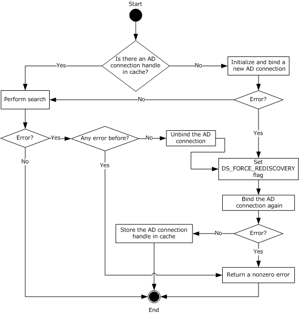

Figure 3: Retrieving ADConnection handle for reading objects under certificate templates and enrollment services containers

The preceding figure describes the algorithm used for retrieving an **ADConnection** handle for reading objects under [**certificate templates**](#gt_certificate-template) and enrollment services [**containers**](#gt_container).

The following steps describe the flow of the preceding figure:

- If the **CertificateTemplatesAndEnrollmentServices_AD_Connection** ADM element is NULL:
- Invoke the "Initialize ADConnection" task ([MS-ADTS](../MS-ADTS/MS-ADTS.md) section 7.6.1.1) to construct an **ADConnection** with the following parameters:
- *TaskInputTargetName*: NULL
- *TaskInputPortNumber*: If the value of the Config_CA_LDAP_Flags datum has 0x0000001 (LDAPF_SSLENABLE) bit set, use port 636. Otherwise, use port 389.
Store the returned **ADConnection** handle in the **ActiveDirectory_Connection** variable.

- Perform a bind request as specified in section [3.2.2.1.1.2](#Section_3.2.2.1.1.2). Store the returned **ADConnection** handle in the **CertificateTemplatesAndEnrollmentServices_AD_Connection** ADM element.
- Obtain the [**distinguished name**](#gt_distinguished-name-dn) for the [Certificate Templates Container (section 2.2.2.11.1)](#Section_2.2.2.11.1) or [Enrollment Services Container (section 2.2.2.11.2)](#Section_2.2.2.11.2) as specified in the following steps:
- Invoke the "Perform an LDAP Operation on an ADConnection" task ([MS-ADTS] section 7.6.1.6) with the following parameters:
- *TaskInputADConnection*: **CertificateTemplatesAndEnrollmentServices_AD_Connection**
- *TaskInputRequestMessage*: [**LDAP**](#gt_lightweight-directory-access-protocol-ldap) SearchRequest message (see [[RFC2251]](https://go.microsoft.com/fwlink/?LinkId=90325) section 4.5.1) as follows:
- baseObject: distinguished name of the rootDSE object, as specified in [MS-ADTS] section 3.1.1.3.2.1
- scope: baseObject
- filter: (objectCategory=*)
- attributes: The CA SHOULD use the following [**attributes**](#gt_attribute):
- **configurationNamingContext**
- **defaultNamingContext**
- sizeLimit: 10000
- timeLimit: 120
- derefAliases: neverDerefAliases
- typesOnly: FALSE
- *TaskOutputResultMessage*: Upon successful return from the task, this parameter will contain the results of the LDAP search.
- If the *TaskReturnStatus* returned in the previous step is not 0, go to step 4.
- If **InputContainer** is equal to Certificate Templates Container, set **ContainerDistinguishedName** equal to the concatenation of "CN=Certificate Templates,CN=Public Key Services,CN=Services, CN=Configuration" path and the value for **configurationNamingContext** attribute from step 2.1.
If **InputContainer** is equal to Enrollment Services Container, set **ContainerDistinguishedName** equal to the concatenation of "CN=Enrollment Services,CN=Public Key Services,CN=Services, CN=Configuration" path and the value for **configurationNamingContext** attribute from step 2.1.

- Read all objects under the Certificate Templates Container or Enrollment Services Container as follows: Repeat step 2.1 with the following modifications:
- baseObject: **ContainerDistinguishedName**
- scope: wholeSubtree
- filter: The CA SHOULD use the following filters:
- If **InputContainer** is equal to Certificate Templates Container: (objectCategory=pKICertificateTemplate).
- If **InputContainer** is equal to Enrollment Services Container: (&(objectCategory=pKIEnrollmentServce)(cn=SomeCA)), where SomeCA is a [**sanitized name**](#gt_sanitized-name), as specified in section [3.1.1.4.1.1](#Section_3.1.1.4.1.1), of the CA.
- attributes: The CA SHOULD use the following attributes:
- If **InputContainer** is equal to Certificate Templates Container:
- cn
- flags
- ntSecurityDescriptor
- revision
- pKICriticalExtensions
- pKIDefaultCSPs
- pKIDefaultKeySpec
- pKIEnrollmentAccess
- pKIExpirationPeriod
- pKIExtendedKeyUsage
- pKIKeyUsage
- pKIMaxIssuingDepth
- pKIOverlapPeriod
- msPKI-Template-Schema-Version
- msPKI-Template-Minor-Revision
- msPKI-RA-Signature
- msPKI-Minimal-Key-Size
- msPKI-Cert-Template-OID
- msPKI-Supersede-Templates
- msPKI-RA-Policies
- msPKI-RA-Application-Policies
- msPKI-Certificate-Policy
- msPKI-Certificate-Application-Policy
- msPKI-Enrollment-Flag
- msPKI-Private-Key-Flag
- msPKI-Certificate-Name-Flag
- If **InputContainer** is equal to Enrollment Services Container:
- certificateTemplates
- cn
- displayName
- dNSHostName
- controls: Sequence of two Control structures, as follows:
- Control
- controlType: LDAP_SERVER_SD_FLAGS_OID_W (see [MS-ADTS] section 3.1.1.3.4.1.11)
- criticality: TRUE
- controlValue:
Flags: DACL_SECURITY_INFORMATION | OWNER_SECURITY_INFORMATION | GROUP_SECURITY_INFORMATION

- Control
- controlType: LDAP_SERVER_PERMISSIVE_MODIFY_OID_W (see [MS-ADTS] section 3.1.1.3.4.1.8)
- criticality: FALSE
- *TaskOutputResultMessage*: Upon successful return from the task, this parameter will contain the results of the LDAP search. Set **CertificateTemplatesandEnrollmentServicesObjects** equal to *TaskOutputResultMessage*
- If the *TaskReturnStatus* returned in step 2 is not 0, then,
- Invoke the "Perform an LDAP Unbind on an ADConnection" task (see [MS-ADTS] section 7.6.1.5) with the *TaskInputADConnection* parameter set to **CertificateTemplatesAndEnrollmentServices_AD_Connection**.
- Repeat step 1.1
- Perform steps 1 and 2 in section 3.2.2.1.1.2 with the exception that in step 1, use the following parameters:
- *TaskInputOptionName*: LDAP_OPT_GETDSNAME_FLAGS
- *TaskInputOptionValue*: Bitwise OR of the bits A, D, and R, as defined in [MS-NRPC](../MS-NRPC/MS-NRPC.md) section 3.5.4.3.1.
If the *TaskReturnStatus* returned is not 0, convert it to a 4-byte HRESULT value (errors are specified in [MS-ERREF](../MS-ERREF/MS-ERREF.md) section 2.1) by performing the processing rules in section [3.2.2.1.7](#Section_3.2.2.1.7) with the following input parameters:

- **InputReturnStatus**: *TaskReturnStatus*
- **InputResultMessage**: *TaskOutputResultMessages*
Return the **OutputHRESULT** output parameter to the client and exit.

- Repeat step 3. If the *TaskReturnStatus* returned is not 0, convert it to a 4-byte HRESULT value (errors are specified in [MS-ERREF] section 2.1) by performing the processing rules in section 3.2.2.1.7 with the following input parameters:
- **InputReturnStatus**: *TaskReturnStatus*
- **InputResultMessage**: *TaskOutputResultMessages*
Return the **OutputHRESULT** output parameter to the client and exit.

###### 3.2.2.1.1.2 Bind Requests

Bind requests are used to connect and to authenticate the user to an [**LDAP**](#gt_lightweight-directory-access-protocol-ldap) [**directory**](#gt_directory). The [**CA**](#gt_certification-authority-ca) MUST perform bind requests as follows:

- Invoke the "Setting an LDAP Option on an ADConnection" task (see [MS-ADTS](../MS-ADTS/MS-ADTS.md) section 7.6.1.2) once for each of the pairs of option and value parameters in the following table. For each of these, the *TaskInputADConnection* parameter is the **ActiveDirectory_Connection**.
| TaskInputOptionName | TaskInputOptionValue |
| --- | --- |
| LDAP_OPT_GETDSNAME_FLAGS | Bitwise OR of the bits J and R, as defined in [MS-NRPC](../MS-NRPC/MS-NRPC.md) section 3.5.4.3.1. |
| LDAP_OPT_REFFERALS | If the **Config_AD_Connection_Referral** ADM element is FALSE, set to FALSE. |
| LDAP_OPT_PROTOCOL_VERSION | 0 |
| LDAP_OPT_TCP_KEEPALIVE | TRUE |
| LDAP_OPT_AUTO_RECONNECT | TRUE |

- If the value of the Config_CA_LDAP_Flags datum does not have the 0x0000002 (LDAPF_SIGNDISABLE) bit set and:
- If after invoking the processing rules that are specified in section [3.2.2.1.6](#Section_3.2.2.1.6) with input parameter **InputADConnectionHandle** set equal to **ActiveDirectory_Connection**, the returned value is TRUE (that is, [**DC**](#gt_domain-controller-dc) supports signing) set LDAP_OPT_SIGN to TRUE.
- Else, if the Config_CA_LDAP_Flags datum does not have the 0x0000001 (LDAPF_SSLENABLE) bit set, return 0x80094013 (CERTSRV_E_DOWNLEVEL_DC_SSL_OR_UPGRADE) to the client and exit.
- Invoke the "Performing an LDAP Bind on an ADConnection" task (see [MS-ADTS] section 7.6.1.4) with the following parameter:
*TaskInputADConnection*: **ActiveDirectory_Connection**

- If the *TaskReturnStatus* returned is not 0:
- Repeat step 1 with the following modification:
- *TaskInputOptionName*: LDAP_OPT_GETDSNAME_FLAGS
- *TaskInputOptionValue*: Bitwise OR of the bits A, J, and R, as defined in [MS-NRPC] section 3.5.4.3.1.
- Repeat step 3.
- If the *TaskReturnStatus* returned is not 0, convert it to a 4-byte HRESULT value (errors are specified in [MS-ERREF](../MS-ERREF/MS-ERREF.md) section 2.1) by performing the processing rules in section [3.2.2.1.7](#Section_3.2.2.1.7) with the following input parameters:
- **InputReturnStatus**: *TaskReturnStatus*
- **InputResultMessage**: NULL
Return the **OutputHRESULT** output parameter to the client and exit.

##### 3.2.2.1.2 Search Requests for Querying End Entity Object Attributes

This type of search request is used to read [**attributes**](#gt_attribute) from user or computer object from the [**LDAP**](#gt_lightweight-directory-access-protocol-ldap) [**directory**](#gt_directory).

**Input Parameters:**

**EndEntityDistinguishedName:** The [**distinguished name**](#gt_distinguished-name-dn) of the user or computer object in [**Active Directory**](#gt_active-directory).

**Output Parameters:**

**EndEntityAttributes:** The set of values of the user object attributes in Active Directory.

**Processing Rules:**

The [**CA**](#gt_certification-authority-ca) MUST perform the processing rules in section [3.2.2.1.2.1](#Section_3.2.2.1.2.1).

In the following sections, the following local variable is used:

**ActiveDirectory_Connection:** An **ADConnection** handle. For more information, see [MS-ADTS](../MS-ADTS/MS-ADTS.md) section 7.2.

###### 3.2.2.1.2.1 Search Requests

The [**CA**](#gt_certification-authority-ca) SHOULD perform search requests demonstrated in the following figure.

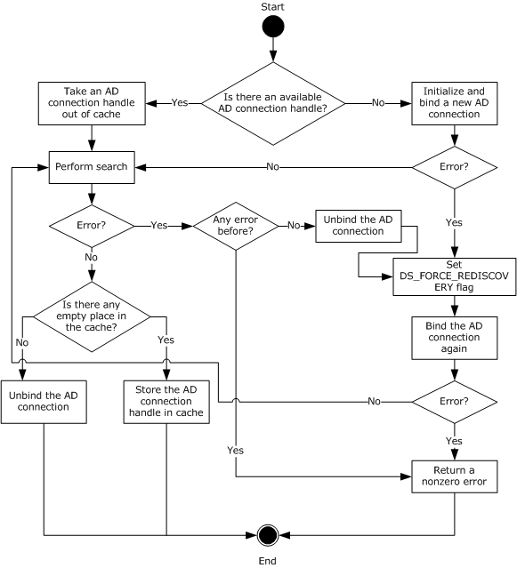

Figure 4: Retrieving an ADConnection handle for reading user or computer object.

The following steps describe the flow of the preceding figure.

- If the **Collection_Of_End_Entity_Object_Query_AD_Connections** ADM has no **ADConnection** handle:
- Invoke the "Initialize ADConnection" task ([MS-ADTS](../MS-ADTS/MS-ADTS.md) section 7.6.1.1) to construct an **ADConnection**, with the following parameter:
- *TaskInputTargetName*: NULL
- *TaskInputPortNumber*: 3268
Store the generated **ADConnection** handle in the **ActiveDirectory_Connection** variable.

- Perform a bind request as specified in section [3.2.2.1.2.2](#Section_3.2.2.1.2.2). Go to step 3.
- Remove from the **Collection_Of_End_Entity_Object_Query_AD_Connections** ADM element the **ADConnection** handle that was added the last, and use it as the **ADConnection** handle in the following steps.
- Invoke the "Perform an LDAP Operation on an ADConnection" task (see [MS-ADTS] section 7.6.1.6) with the following parameters:
- *TaskInputADConnection*: **ActiveDirectory_Connection**
- *TaskInputRequestMessage*: [**LDAP**](#gt_lightweight-directory-access-protocol-ldap) SearchRequest message (see [[RFC2251]](https://go.microsoft.com/fwlink/?LinkId=90325) section 4.5.1), as follows:
- baseObject: **EndEntityDistinguishedName**
- scope: baseObject
- filter: (|(objectCategory=user)(objectCategory=computer))
- attributes: The CA SHOULD use the following [**attributes**](#gt_attribute):
- objectClass
- cn
- dNSHostName
- mail
- objectGUID
- objectSid
- userPrincipalName
- sizeLimit: 10000
- timeLimit: 120 <123>
- derefAliases: neverDerefAliases
- typesOnly: FALSE
- *TaskOutputResultMessage*: Upon successful return from the task, this parameter will contain the results of the LDAP search. Set the output parameter **EndEntityAttributes** equal to *TaskOutputResultMessage*.
- If the *TaskReturnStatus* returned from LDAP search operation in step 3 is not 0, then:
- Invoke the "Perform an LDAP Unbind on an ADConnection" task (see [MS-ADTS] section 7.6.1.5) with the *TaskInputADConnection* parameter set to the **ActiveDirectory_Connection**.
- Repeat step 1.1
- Perform steps 1 and 2 in section 3.2.2.1.2.2 with the exception that in step 1, use the following parameters:
- *TaskInputOptionName*: LDAP_OPT_GETDSNAME_FLAGS
- *TaskInputOptionValue*: Bitwise OR of the bits A, D, J, and R, as defined in [MS-NRPC](../MS-NRPC/MS-NRPC.md) section 3.5.4.3.1
- If the *TaskReturnStatus* returned is not 0, convert it to a 4-byte HRESULT value (errors are specified in [MS-ERREF](../MS-ERREF/MS-ERREF.md) section 2.1) by performing the processing rules in section [3.2.2.1.7](#Section_3.2.2.1.7) with the following input parameters:
- **InputReturnStatus**: *TaskReturnStatus*
- **InputResultMessage**: NULL
Return the **OutputHRESULT** output parameter to the client and exit.

- Repeat step 3. If the *TaskReturnStatus* returned is not 0, convert it to a 4-byte HRESULT value (errors are specified in [MS-ERREF] section 2.1) by performing the processing rules in section 3.2.2.1.7 with the following input parameters:
- **InputReturnStatus**: *TaskReturnStatus*
- **InputResultMessage**: *TaskOutputResultMessages*
Return the **OutputHRESULT** output parameter to the client and exit.

- If the number of **ADConnection** handles in the **Collection_Of_End_Entity_Object_Query_AD_Connections** ADM element is less than **Config_Max_Number_Of_AD_Connections**, add the **ActiveDirectory_Connection** variable to the **Collection_Of_End_Entity_Object_Query_AD_Connections** ADM element.
- Otherwise, invoke the "Perform an LDAP Unbind on an ADConnection" task (see [MS-ADTS] section 7.6.1.5) with the *TaskInputADConnection* parameter set to **ActiveDirectory_Connection**.

###### 3.2.2.1.2.2 Bind Requests

Bind requests are used to connect and to authenticate the user to an [**LDAP**](#gt_lightweight-directory-access-protocol-ldap) [**directory**](#gt_directory). The [**CA**](#gt_certification-authority-ca) MUST perform bind requests as follows:

- Invoke the "Setting an LDAP Option on an ADConnection" task ([MS-ADTS](../MS-ADTS/MS-ADTS.md) section 7.6.1.2) once for each of the pairs of option and value parameters in the following table. For each of these, the *TaskInputADConnection* parameter is the **ActiveDirectory_Connection**.
| TaskInputOptionName | TaskInputOptionValue |
| --- | --- |
| LDAP_OPT_GETDSNAME_FLAGS | Bitwise OR of the bits D, J and R as defined in [MS-NRPC](../MS-NRPC/MS-NRPC.md) section 3.5.4.3.1 |
| LDAP_OPT_SIGN | TRUE |
| LDAP_OPT_REFFERALS | If the **Config_AD_Connection_Referral** ADM element is FALSE, set to FALSE |
| LDAP_OPT_PROTOCOL_VERSION | 2 |

- Invoke the "Performing an LDAP Bind on an ADConnection" task ([MS-ADTS] section 7.6.1.4) with the following parameter:
*TaskInputADConnection*: **ActiveDirectory_Connection**

- If the *TaskReturnStatus* returned is not 0:
- Repeat step 1 with the following modification:
- *TaskInputOptionName*: LDAP_OPT_GETDSNAME_FLAGS
- *TaskInputOptionValue*: Bitwise OR of the bits A, D, J, and R, as defined by [MS-NRPC] section 3.5.4.3.1.
- Repeat step 2.
- If the *TaskReturnStatus* returned is not 0, convert it to a 4-byte HRESULT value (errors are specified in [MS-ERREF](../MS-ERREF/MS-ERREF.md) section 2.1) by performing the processing rules in section [3.2.2.1.7](#Section_3.2.2.1.7) with the following input parameters:
- **InputReturnStatus**: *TaskReturnStatus*
- **InputResultMessage**: NULL
Return the **OutputHRESULT** output parameter to the client and exit.

##### 3.2.2.1.3 Search Requests for Querying End Entity Object Attributes with an End Entity Provided DC Name

This section specifies how to perform a search request against a [**domain controller (DC)**](#gt_domain-controller-dc) specified by the client, as specified in section [3.2.2.6.2.1.1](#Section_3.2.2.6.2.1.1).

**Input Parameters:**

**DCName:** The name of the domain controller (DC) that the client provided to the [**CA**](#gt_certification-authority-ca). This is a null-terminated [**UTF-16**](#gt_utf-16) string that contains a [**fully qualified domain name (FQDN)**](#gt_fully-qualified-domain-name-fqdn) of the domain controller, prefixed with "\\".

**EndEntityDistinguishedName:** The [**distinguished name**](#gt_distinguished-name-dn) of the user or computer object in [**Active Directory**](#gt_active-directory).

**Output Parameters:**

**EndEntityAttributes:** The set of values of the user object [**attributes**](#gt_attribute) in Active Directory.

**Processing Rules:**

The CA MUST perform the processing rules in section [3.2.2.1.3.1](#Section_3.2.2.1.3.1).

In the following sections, the following local variable is used:

**ActiveDirectory_Connection:** An **ADConnection** handle. For more information about **ADConnection** see [MS-ADTS](../MS-ADTS/MS-ADTS.md) section 7.2.

###### 3.2.2.1.3.1 Search Requests

The [**CA**](#gt_certification-authority-ca) SHOULD perform search requests demonstrated in the following figure.<124>

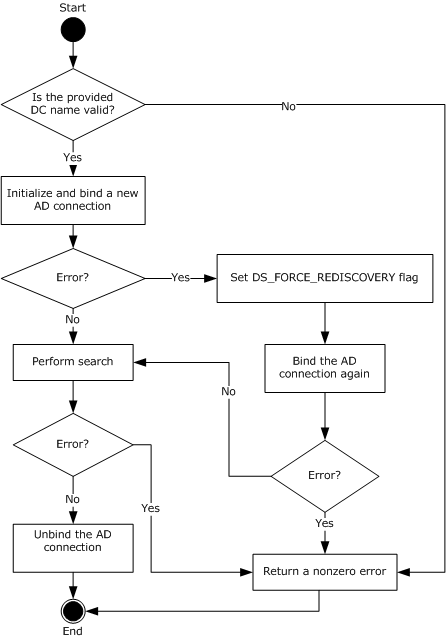

Figure 5: Retrieving an ADConnection handle for reading user or computer object with provided DC name.

The following steps describe the flow of the preceding figure:

- The CA MUST validate the provided [**DC**](#gt_domain-controller-dc) name by performing the following processing rules:
- Perform the processing rules in section [3.2.2.1.2](#Section_3.2.2.1.2) with the following modification: in step 3 of the processing rules in section [3.2.2.1.2.1](#Section_3.2.2.1.2.1) use the following parameters:
- baseObject: NULL
- scope: wholeSubtree
- filter: (&(objectCategory=computer)( servicePrincipalName=HOST/**DCName**)) where **DCName** is the input parameter.
- attributes: The CA SHOULD use the following [**attributes**](#gt_attribute):
- **dNSHostName**
- **serverReferenceBL**
- **servicePrincipalName**
The rest of the parameters and processing rules are the same as in section 3.2.2.1.2.

- Perform the processing rules in section 3.2.2.1.2 with the following modification: in step 3 of the processing rules in section 3.2.2.1.2.1, use the following parameters:
- baseObject: serverReferenceBL attribute value from the previous step
- scope: wholeSubtree
- filter: (objectCategory=nTDSDSA)
- attributes: NULL
The rest of parameters and processing rules are the same as in section 3.2.2.1.2.

- If the previous search request returned exactly one entry, proceed with the rest of the processing rules. Otherwise, return a nonzero error to the client and exit.
- Invoke the "Initialize ADConnection" task ([MS-ADTS](../MS-ADTS/MS-ADTS.md) section 7.6.1.1) to construct an **ADConnection** with the following parameters:
- *TaskInputTargetName*: **DCName**
- *TaskInputPortNumber*: 389
- Store the generated **ADConnection** handle in **ActiveDirectory_Connection** variable.
- Perform a bind request as specified in section [3.2.2.1.3.2](#Section_3.2.2.1.3.2).
- Invoke the "Perform an LDAP Operation on an ADConnection" task ([MS-ADTS] section 7.6.1.6) with the following parameters:
- *TaskInputADConnection*: **ActiveDirectory_Connection**
- *TaskInputRequestMessage*: [**LDAP**](#gt_lightweight-directory-access-protocol-ldap) SearchRequest message (see [[RFC2251]](https://go.microsoft.com/fwlink/?LinkId=90325) section 4.5.1), as follows:
- baseObject: **EndEntityDistinguishedName**
- scope: baseObject
- filter: (|(objectCategory=user)(objectCategory=computer))
- attributes: The CA SHOULD use the following attributes
- objectClass
- cn
- dNSHostName
- mail
- objectGUID
- objectSid
- userPrincipalName
- sizeLimit: 10000
- timeLimit: 120
- derefAliases: neverDerefAliases
- typesOnly: FALSE
- *TaskOutputResultMessage*: Upon successful return from the task, this parameter will contain the results of the LDAP search. Set the output parameter **EndEntityAttributes** equal to *TaskOutputResultMessage*.
- If the *TaskReturnStatus* returned is not 0, convert it to a 4-byte HRESULT value (errors are specified in [MS-ERREF](../MS-ERREF/MS-ERREF.md) section 2.1) by performing the processing rules in section [3.2.2.1.7](#Section_3.2.2.1.7) with the following input parameters:
- **InputReturnStatus**: *TaskReturnStatus*
- **InputResultMessage**: *TaskOutputResultMessages*
Return the **OutputHRESULT** output parameter to the client and exit.

- Invoke the "Perform an LDAP Unbind on an ADConnection" task (see [MS-ADTS] section 7.6.1.5) with the *TaskInputADConnection* parameter set to be equal to **ActiveDirectory_Connection**.

###### 3.2.2.1.3.2 Bind Requests

Bind requests are used to connect and to authenticate the user to an [**LDAP**](#gt_lightweight-directory-access-protocol-ldap) [**directory**](#gt_directory). The [**CA**](#gt_certification-authority-ca) MUST perform bind requests as follows:

- Invoke the "Setting an LDAP Option on an ADConnection" task ([MS-ADTS](../MS-ADTS/MS-ADTS.md) section 7.6.1.2) once for each of the pairs of option and value parameters in the following table. For each of these, the *TaskInputADConnection* parameter is the **ActiveDirectory_Connection**.
| TaskInputOptionName | TaskInputOptionValue |
| --- | --- |
| LDAP_OPT_GETDSNAME_FLAGS | Bitwise OR of the bits J and R, as defined by [MS-NRPC](../MS-NRPC/MS-NRPC.md) section 3.5.4.3.1 |
| LDAP_OPT_SIGN | TRUE |
| LDAP_OPT_REFFERALS | FALSE |

- Invoke the "Performing an LDAP Bind on an ADConnection" task (see [MS-ADTS] section 7.6.1.4) with the following parameters:
*TaskInputADCo*n*nection*: ActiveDirectory_Connection

- If the *TaskReturnStatus* returned is not 0:
- Repeat steps 1 and 2.
- If the *TaskReturnStatus* returned is not 0, convert it to a 4-byte HRESULT value (errors are specified in [MS-ERREF](../MS-ERREF/MS-ERREF.md) section 2.1) by performing the processing rules in section [3.2.2.1.7](#Section_3.2.2.1.7) with the following input parameters:
- **InputReturnStatus**: *TaskReturnStatus*
- **InputResultMessage**: NULL
Return the **OutputHRESULT** output parameter to the client and exit.

##### 3.2.2.1.4 Publishing KRA Certificates

Modify requests are used to write information to the [**LDAP**](#gt_lightweight-directory-access-protocol-ldap) [**directory**](#gt_directory). The [**CA**](#gt_certification-authority-ca) SHOULD perform modify requests to publish [**KRA**](#gt_key-recovery-agent-kra) [**certificates**](#gt_certificate) to user objects in the [**Active Directory**](#gt_active-directory).

**Input Parameters:**

**IssuedCertificate:** The issued certificate to be published to Active Directory.

**Output Parameters:** None

**Processing Rules:**

The CA MUST perform the processing rules that are specified in section [3.2.2.1.4.1](#Section_3.2.2.1.4.1).

In the following sections, the following local variables are used:

**ActiveDirectory_Connection:** An **ADConnection** handle. See [MS-ADTS](../MS-ADTS/MS-ADTS.md) section 7.2 for more information about **ADConnection**.

**Set_Of_Certificates:** A set of certificates.

###### 3.2.2.1.4.1 Search Requests

The [**CA**](#gt_certification-authority-ca) SHOULD perform modify requests as demonstrated in the following figure.

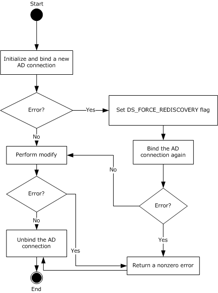

Figure 6: Retrieving an ADConnection handle for publishing KRA certificates to AD

The following steps describe the flow of the preceding figure:

- Invoke the "Initialize ADConnection" task ([MS-ADTS](../MS-ADTS/MS-ADTS.md) section 7.6.1.1) to construct an **ADConnection** with the following parameters:
- *TaskInputTargetName*: NULL
- *TaskInputPortNumber*: If the value of the Config_CA_LDAP_Flags datum has 0x0000001 (LDAPF_SSLENABLE) bit set, use port 636. Otherwise, use port 389.
Store the returned **ADConnection** handle in the **ActiveDirectory_Connection** variable.

- Perform a bind request, as specified in section [3.2.2.1.4.2](#Section_3.2.2.1.4.2).
- Obtain the [**distinguished name (DN)**](#gt_distinguished-name-dn) for the [**KRA**](#gt_key-recovery-agent-kra) [**container**](#gt_container) as specified in the following steps:
- Invoke the "Perform an LDAP Operation on an ADConnection" task ([MS-ADTS] section 7.6.1.6) with the following parameters:
- *TaskInputADConnection*: **ActiveDirectory_Connection**
- *TaskInputRequestMessage*: [**LDAP**](#gt_lightweight-directory-access-protocol-ldap) SearchRequest message (see [[RFC2251]](https://go.microsoft.com/fwlink/?LinkId=90325) section 4.5.1) as follows:
- baseObject: distinguished name (DN) of the rootDSE object, as specified in [MS-ADTS] section 3.1.1.3.2.1
- scope: baseObject
- filter: (objectCategory=*)
- attributes: The CA SHOULD use the following [**attributes**](#gt_attribute):
- **configurationNamingContext**
- **defaultNamingContext**
- sizeLimit: 10000
- timeLimit: 120
- derefAliases: neverDerefAliases
- typesOnly: FALSE
- *TaskOutputResultMessage*: Upon successful return from the task, this parameter will contain the results of the LDAP search.
- If the *TaskReturnStatus* returned is not 0, convert it to a 4-byte HRESULT value (errors are specified in [MS-ERREF](../MS-ERREF/MS-ERREF.md) section 2.1) by performing the processing rules in section [3.2.2.1.7](#Section_3.2.2.1.7) with the following input parameters:
- **InputReturnStatus**: *TaskReturnStatus*
- **InputResultMessage**: *TaskOutputResultMessages*
Return the **OutputHRESULT** output parameter to the client and exit. Also, invoke the "Perform an LDAP Unbind on an ADConnection" task ([MS-ADTS] section 7.6.1.5) with the *TaskInputADConnection* parameter set equal to **ActiveDirectory_Connection**.

- Build the distinguished name (DN) by combining the "CN=KRA, CN=Public Key Services,CN=Services, CN=Configuration" path and the value from step 3.1.
- Verify that the issued [**certificate**](#gt_certificate), passed in as input parameter **IssuedCertificate**, does not already exist under the KRA container as specified in the following steps.
- Invoke the "Perform an LDAP Operation on an ADConnection" task ([MS-ADTS] section 7.6.1.6) with the following parameters:
- *TaskInputADConnection*: **ActiveDirectory_Connection**
- *TaskInputRequestMessage*: LDAP SearchRequest message ([RFC2251] section 4.5.1) as follows:
- baseObject: distinguished name (DN) of the object of the class msPKI-Private-Key-Recovery-Agent stored in the KRA container in the working [**directory**](#gt_directory). DN of the KRA container is obtained in step 3.
- scope: baseObject
- filter: NULL
- attributes: **userCertificate**
- sizeLimit: 10000
- timeLimit: 120
- derefAliases: neverDerefAliases
- typesOnly: FALSE
- *TaskOutputResultMessage*: Upon successful return from the task, this parameter will contain the results of the LDAP search.
Store the returned value for **userCertificate** attribute in the **Set_Of_Certificates** variable.

- If the *TaskReturnStatus* returned is not 0, convert it to a 4-byte HRESULT value (errors are specified in [MS-ERREF] section 2.1) by performing the processing rules in section 3.2.2.1.7 with the following input parameters:
- **InputReturnStatus**: *TaskReturnStatus*
- **InputResultMessage**: *TaskOutputResultMessages*
Return the **OutputHRESULT** output parameter to the client and exit. Also invoke the "Perform an LDAP Unbind on an ADConnection" task ([MS-ADTS] section 7.6.1.5) with the *TaskInputADConnection* parameter set equal to **ActiveDirectory_Connection** and then exit.

- If the certificate in input parameter **IssuedCertificate** does not exist in the **Set_Of_Certificates** variable, add it to this set.
- If any of the certificates in **Set_Of_Certificates** variable has expired for more than 24 hours, remove it from **Set_Of_Certificates**.
- If **Set_Of_Certificates** is not changed as part of step 4.3 and 4.4, go to step 7.
- Invoke the "Perform an LDAP Operation on an ADConnection" task ([MS-ADTS] section 7.6.1.6) with the following parameters:
- *TaskInputADConnection*: **ActiveDirectory_Connection**
- *TaskInputRequestMessage*: An LDAP ModifyRequest (see [RFC2251] section 4.6) as follows:
- object: distinguished name (DN) of the object of the class msPKI-Private-Key-Recovery-Agent stored in the KRA container in the working directory. Distinguished name (DN) of the KRA container is obtained in step 3.
- The modification sequence has one entry, as follows:
- operation: replace
- modification:
- type: **userCertificate**
- vals: **Set_Of_Certificates**
- *TaskOutputResultMessage*: Upon successful return from the task, this parameter will contain the results of the LDAP operation.
- If the *TaskReturnStatus* returned is not 0, convert it to a 4-byte HRESULT value (errors are specified in [MS-ERREF] section 2.1) by performing the processing rules in section 3.2.2.1.7 with the following input parameters:
- **InputReturnStatus**: *TaskReturnStatus*
- **InputResultMessage**: *TaskOutputResultMessages*
Return the **OutputHRESULT** output parameter to the client and exit.

- Invoke the "Perform an LDAP Unbind on an ADConnection" task (see [MS-ADTS] section 7.6.1.5) with the *TaskInputADConnection* parameter set equal to **ActiveDirectory_Connection**.

###### 3.2.2.1.4.2 Bind Requests

Bind requests are used to connect and to authenticate the user to an [**LDAP**](#gt_lightweight-directory-access-protocol-ldap) [**directory**](#gt_directory). The [**CA**](#gt_certification-authority-ca) MUST perform bind requests as follows:

- Invoke the "Setting an LDAP Option on an ADConnection" task ([MS-ADTS](../MS-ADTS/MS-ADTS.md) section 7.6.1.2) once for each of the pairs of option and value parameters in the following table. For each of these, the *TaskInputADConnection* parameter is the **ActiveDirectory_Connection**.
| TaskInputOptionName | TaskInputOptionValue |
| --- | --- |
| LDAP_OPT_GETDSNAME_FLAGS | Bitwise OR of the bits J and R, as defined in [MS-NRPC](../MS-NRPC/MS-NRPC.md) section 3.5.4.3.1. |
| LDAP_OPT_REFFERALS | If the **Config_AD_Connection_Referral** ADM element is FALSE, set to FALSE. |

- If the value of the Config_CA_LDAP_Flags datum does not have the 0x0000002 (LDAPF_SIGNDISABLE) bit set and:
- If after invoking the processing rules that are specified in section [3.2.2.1.6](#Section_3.2.2.1.6) with input parameter **InputADConnectionHandle** set equal to **ActiveDirectory_Connection**, the returned value is TRUE (that is, [**DC**](#gt_domain-controller-dc) supports signing) set LDAP_OPT_SIGN to TRUE.
- Else, if the Config_CA_LDAP_Flags datum does not have the 0x0000001 (LDAPF_SSLENABLE) bit set, return 0x80094013 (CERTSRV_E_DOWNLEVEL_DC_SSL_OR_UPGRADE) to the client and exit.
- Invoke the "Performing an LDAP Bind on an ADConnection" task ([MS-ADTS] section 7.6.1.4) with the following parameter:
*TaskInputADConnection*: **ActiveDirectory_Connection**.

- If the *TaskReturnStatus* returned is not 0:
- Repeat step 1 with the following modification:
- *TaskInputOptionName*: LDAP_OPT_GETDSNAME_FLAGS.
- *TaskInputOptionValue*: Bitwise OR of the bits A, J, and R, as defined in [MS-NRPC] section 3.5.4.3.1.
- Repeat step 3.
- If the *TaskReturnStatus* returned is not 0, convert it to a 4-byte HRESULT value (errors are specified in [MS-ERREF](../MS-ERREF/MS-ERREF.md) section 2.1) by performing the processing rules in section [3.2.2.1.7](#Section_3.2.2.1.7) with the following input parameters:
- **InputReturnStatus**: *TaskReturnStatus*
- **InputResultMessage**: NULL
Return the **OutputHRESULT** output parameter to the client and exit.

##### 3.2.2.1.5 Publishing Issued Certificates

Modify requests are used to write information from the [**LDAP**](#gt_lightweight-directory-access-protocol-ldap) [**directory**](#gt_directory). The [**CA**](#gt_certification-authority-ca) SHOULD perform modify requests to publish issued [**certificates**](#gt_certificate) to [**end entity**](#gt_end-entity) object in the [**Active Directory**](#gt_active-directory).

**Input Parameters:**

**EndEntityDistinguishedName:** The [**distinguished name**](#gt_distinguished-name-dn) of the user or computer object in Active Directory.

**IssuedCertificate:** The issued certificate (1) to be published to Active Directory.

**Output Parameters: None**

**Processing Rules:**

The CA MUST perform the processing rules that are specified in section [3.2.2.1.5.1](#Section_3.2.2.1.5.1).

In the following sections, we use the following local variables:

**ActiveDirectory_Connection:** An **ADConnection** handle (see [MS-ADTS](../MS-ADTS/MS-ADTS.md) section 7.2 for more information about **ADConnection**).

**Set_Of_Certificates:** A set of certificates.

###### 3.2.2.1.5.1 Search Requests

The [**CA**](#gt_certification-authority-ca) SHOULD perform modify requests as demonstrated in the following figure.

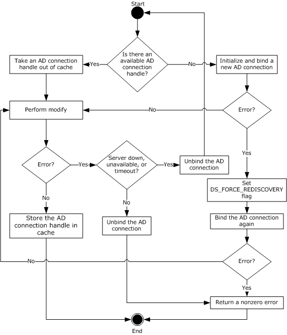

Figure 7: Retrieving an ADConnection handle for publishing issued certificates to a user or computer object

The following steps describe the flow of the preceding figure:

- If the **Collection_of_Certificates_Publication_AD_Connections** ADM has no **ADConnection** element:
- Invoke the "Initialize ADConnection" task ([MS-ADTS](../MS-ADTS/MS-ADTS.md) section 7.6.1.1) to construct an **ADConnection** with the following parameters:
- *TaskInputTargetName*: [**Domain Name System (DNS)**](#gt_domain-name-system-dns) of the [**end entity**](#gt_end-entity) obtained from the [**distinguished name (DN)**](#gt_distinguished-name-dn) of the end entity passed in as input parameter **EndEntityDistinguishedName**.
- *TaskInputPortNumber*: If the value of the Config_CA_LDAP_Flags datum has 0x0000001 (LDAPF_SSLENABLE) bit set, use port 636. Otherwise, use port 389.
Store the returned **ADConnection** handle in the **ActiveDirectory_Connection** variable.

- Perform a bind request, as specified in section [3.2.2.1.5.2](#Section_3.2.2.1.5.2). Go to step 3.
- If the **Collection_of_Certificates_Publication_AD_Connections** ADM has an **ADConnection** handle, remove it from the **Collection_of_Certificates_Publication_AD_Connections** ADM and use it as **ActiveDirectory_Connection** in the following steps.
- Verify that the issued [**certificate**](#gt_certificate), passed in as input parameter **IssuedCertificate**, does not already exist under the user object as specified in the following steps.
- Invoke the "Perform an LDAP Operation on an ADConnection" task ([MS-ADTS] section 7.6.1.6) with the following parameters:
- *TaskInputADConnection*: **ActiveDirectory_Connection**
- *TaskInputRequestMessage*: [**LDAP**](#gt_lightweight-directory-access-protocol-ldap) SearchRequest message (see [[RFC2251]](https://go.microsoft.com/fwlink/?LinkId=90325) section 4.5.1) as follows:
- baseObject: **EndEntityDistinguishedName**
- scope: baseObject
- filter: NULL
- attributes: **userCertificate**
- sizeLimit: 10000
- timeLimit: 120
- derefAliases: neverDerefAliases
- typesOnly: FALSE
- *TaskOutputResultMessage*: Upon successful return from the task, this parameter will contain the results of the LDAP search.
Store the returned value for **userCertificate** [**attribute**](#gt_attribute) in the **Set_Of_Certificates** variable.

- If the *TaskReturnStatus* returned is not 0, convert it to a 4-byte HRESULT value (errors are specified in [MS-ERREF](../MS-ERREF/MS-ERREF.md) section 2.1) by performing the processing rules in section [3.2.2.1.7](#Section_3.2.2.1.7) with the following input parameters:
- **InputReturnStatus**: *TaskReturnStatus*
- **InputResultMessage**: *TaskOutputResultMessages*
Return the **OutputHRESULT** output parameter to the client and exit. Also, invoke the "Perform an LDAP Unbind on an ADConnection" task (see [MS-ADTS] section 7.6.1.5) with the *TaskInputADConnection* parameter set equal **ActiveDirectory_Connection** and then exit.

- If the certificate in input parameter **IssuedCertificate** does not exist in the **Set_Of_Certificates** variable, add it to this set.
- If any of the certificates in **Set_Of_Certificates** variable has expired for more than 24 hours, remove it from **Set_Of_Certificates**.
- If **Set_Of_Certificates** is not changed as part of step 3.3 and 3.4, add the **ActiveDirectory_Connection** to the **Collection_of_Certificates_Publication_AD_Connections** ADM and then exit.
- Invoke the "Perform an LDAP Operation on an ADConnection" task ([MS-ADTS] section 7.6.1.6) with the following parameters:
- *TaskInputADConnection*: **ActiveDirectory_Connection**
- *TaskInputRequestMessage*: An LDAP ModifyRequest (see [RFC2251] section 4.6) as follows:
- Object: **EndEntityDistinguishedName**
- The modification sequence has one entry, as follows:
- operation: replace
- modification:
- type: **userCertificate**
- vals: **Set_Of_Certificates**
- *TaskOutputResultMessage*: Upon successful return from the task, this parameter will contain the results of the LDAP search.
- If the LDAP modify is successful, add the **ActiveDirectory_Connection** to the **Collection_of_Certificates_Publication_AD_Connections** ADM and exit.
- If an error is returned from the LDAP modify indicating that the LDAP server is down, unavailable, or that there is a timeout (that is, the error code LDAP_SERVER_DOWN, indicating the directory server is unreachable), the CA MUST do the following:
- Invoke the "Perform an LDAP Unbind on an ADConnection" task (see [MS-ADTS] section 7.6.1.5) with the *TaskInputADConnection* parameter set to **ActiveDirectory_Connection**.
- Go to step 1.
- If an error is returned from the LDAP modify for reasons not covered in step 6, the CA MUST do the following:
- Invoke the "Perform an LDAP Unbind on an ADConnection" task (see [MS-ADTS] section 7.6.1.5) with the *TaskInputADConnection* parameter set to **ActiveDirectory_Connection**.
- Return a nonzero error to the client and then exit.

###### 3.2.2.1.5.2 Bind Requests

Bind requests are used to connect and to authenticate the user to an [**LDAP**](#gt_lightweight-directory-access-protocol-ldap) [**directory**](#gt_directory). The [**CA**](#gt_certification-authority-ca) MUST perform bind requests as follows:

- Invoke the "Setting an LDAP Option on an ADConnection" task ([MS-ADTS](../MS-ADTS/MS-ADTS.md) section 7.6.1.2) once for each of the pairs of option and value parameters in the following table. For each of these, the *TaskInputADConnection* parameter is the **ActiveDirectory_Connection**.
| TaskInputOptionName | TaskInputOptionValue |
| --- | --- |
| LDAP_OPT_GETDSNAME_FLAGS | Bitwise OR of the bits J and R, as defined in [MS-NRPC](../MS-NRPC/MS-NRPC.md) section 3.5.4.3.1. |
| LDAP_OPT_REFFERALS | If the **Config_AD_Connection_Referral** ADM element is FALSE, set to FALSE. |

- If the value of the Config_CA_LDAP_Flags datum does not have the 0x0000002 (LDAPF_SIGNDISABLE) bit set and:
- If after invoking the processing rules that are specified in section [3.2.2.1.6](#Section_3.2.2.1.6) with input parameter **InputADConnectionHandle** set equal to **ActiveDirectory_Connection**, the returned value is TRUE (that is, [**DC**](#gt_domain-controller-dc) supports signing) set LDAP_OPT_SIGN to TRUE.
- Else, if the Config_CA_LDAP_Flags datum does not have the 0x0000001 (LDAPF_SSLENABLE) bit set, return 0x80094013 (CERTSRV_E_DOWNLEVEL_DC_SSL_OR_UPGRADE) to the client and exit.
- Invoke the "Performing an LDAP Bind on an ADConnection" task ([MS-ADTS] section 7.6.1.4) with the following parameter:
*TaskInputADConnection*: **ActiveDirectory_Connection**.

- If not successful:
- Repeat step 1 with the following modification:
- *TaskInputOptionName*: LDAP_OPT_GETDSNAME_FLAGS.
- *TaskInputOptionValue*: Bitwise OR of the bits A, J, and R, as defined in [MS-NRPC] section 3.5.4.3.1.
- Repeat step 3.
- If the *TaskReturnStatus* returned is not 0, convert it to a 4-byte HRESULT value (errors are specified in [MS-ERREF](../MS-ERREF/MS-ERREF.md) section 2.1) by performing the processing rules in section [3.2.2.1.7](#Section_3.2.2.1.7) with the following input parameters:
- **InputReturnStatus**: *TaskReturnStatus*
- **InputResultMessage**: NULL
Return the **OutputHRESULT** output parameter to the client and exit.

##### 3.2.2.1.6 Determining DC Support for Signing

The processing rules in this section are used to determine whether the [**domain controller (DC)**](#gt_domain-controller-dc) supports signing or not.

**Input Parameters:**

**InputADConnectionHandle:** An **ADConnection** handle (see [MS-ADTS](../MS-ADTS/MS-ADTS.md) section 7.2 for more information about **ADConnection**).

**Output Parameters:**

True or False, depending on whether the DC supports signing or not.

**Processing Rules:**

- Invoke the "Establishing an ADConnection" task ([MS-ADTS] section 7.6.1.3) with the following parameter:
*TaskInputADConnection*: **InputADConnectionHandle**

- If the *TaskReturnStatus* returned is FALSE, return FALSE.
- Invoke the "Perform an LDAP Operation on an ADConnection" task ([MS-ADTS] section 7.6.1.6) with the following parameters:
- *TaskInputADConnection*: **InputADConnectionHandle**
- *TaskInputRequestMessage*: LDAP SearchRequest message ([[RFC2251]](https://go.microsoft.com/fwlink/?LinkId=90325) section 4.5.1) as follows:
- baseObject: NULL
- scope: baseObject
- filter: (objectClass=*)
- attributes: The [**CA**](#gt_certification-authority-ca) SHOULD use the following [**attributes**](#gt_attribute):
- supportedCapabilities
- sizeLimit: 10000
- timeLimit: 120
- derefAliases: neverDerefAliases
- typesOnly: FALSE
- *TaskOutputResultMessage*: Upon successful return from the task, this parameter will contain the results of the LDAP search.
- If the *TaskReturnStatus* returned is not 0, return FALSE.
- If *TaskOutputResultMessage* contains 1.2.840.113556.1.4.1791 (LDAP_CAP_ACTIVE_DIRECTORY_LDAP_INTEG_OID_W), then return TRUE, else return FALSE.

##### 3.2.2.1.7 Converting the LDAP results to HRESULT

The processing rules in this section are used to convert the returned [**LDAP**](#gt_lightweight-directory-access-protocol-ldap) result into an HRESULT (section 2.2.18), as specified in [MS-DTYP](../MS-DTYP/MS-DTYP.md) section 2.2.18.

**Input Parameters:**

**InputReturnStatus:** An LDAP resultCode ([[RFC2251]](https://go.microsoft.com/fwlink/?LinkId=90325) section 4.1.10) returned from the [**directory**](#gt_directory) server in response to the request or an error indicating that the directory server could not be contacted or a timeout has occurred.

**InputResultMessage:** A list of LDAPMessage values ([RFC2251] section 4.1.1) which contains the response from the directory server.

**Output Parameters:**

**OutputHRESULT:** The returned HRESULT value.

**Processing Rules:**

- If the input parameter **InputResultMessages** is set to NULL (as in the case of the Bind task), use the **InputReturnStatus** input parameter. Convert this value to a Win32 error using the conversion specified in [MS-ERREF](../MS-ERREF/MS-ERREF.md) section 2.4, and then convert the Win32 error to HRESULT using the conversion specified in [MS-ERREF] section 2.1.2. Set the output parameter **OutputHRESULT** equal to the returned HRESULT and exit.
- If the input parameter **InputResultMessages.errorMessage** is at least 8 bytes long:
- If each of the first 8 bytes is between '0' and '9' inclusive, or between 'a' and 'f' inclusive, or between 'A' and 'F' inclusive, then use this value as the hexadecimal representation of a Win32 error and then convert the Win32 error to HRESULT using the conversion specified in [MS-ERREF] section 2.1.2. Set output parameter **OutputHRESULT** equal to the returned HRESULT and exit.
- If each of the first 8 bytes is 0, use ERROR_DS_GENERIC_ERROR, as specified in [MS-ERREF] section 2.4, as the Win32 error and then convert the Win32 error to HRESULT using the conversion specified in [MS-ERREF] section 2.1.2. Set the output parameter **OutputHRESULT** equal to the returned HRESULT and exit.
- Otherwise, use the input **InputResultMessages.resultCode**. Convert it to a Win32 error using the conversion specified in [MS-ERREF] section 2.4, and then convert the Win32 error to HRESULT using the conversion specified in [MS-ERREF] section 2.1.2. Set the output parameter **OutputHRESULT** equal to the returned HRESULT and exit.

#### 3.2.2.2 CA Information in the Active Directory

This section specifies the information that is required to exist in the [**Active Directory**](#gt_active-directory) of the client's [**domain**](#gt_domain) for [**Enterprise CA**](#gt_enterprise-certificate-authority-enterprise-ca).

[**Attributes**](#gt_attribute) and [**certificates**](#gt_certificate) in the [**Enrollment**](#gt_certificate-enrollment) service object:

- The object of type pKIEnrollmentService under the following [**container**](#gt_container) where "CN=Configuration, DC=..." is replaced with the value of the **configurationNamingContext** attribute (specified in [MS-ADTS](../MS-ADTS/MS-ADTS.md) section 3.1.1.3.2.1) of the rootDSE object.
"CN=Enrollment Services,CN=Public Key Services,CN=Services,CN=Configuration,DC=..."

- The [**CN**](#gt_common-name-cn) attribute of this object is set to the CN value of the **Subject** field of the [**CA**](#gt_certification-authority-ca) [**signing certificate**](#gt_signing-certificates). The value is bold sanitized as specified in [3.1.1.4.1.1](#Section_3.1.1.4.1.1).
- The **displayName** attribute of this object is set to the CN value of the **Subject** field of the CA signing certificate. The value is not sanitized.
- The **dNSHostName** attribute of this object is set to the [**fully qualified domain name (FQDN)**](#gt_fully-qualified-domain-name-fqdn) of the machine that the CA is running on.
- The **certificateTemplates** attribute of this object is set with the list of names of the [**certificate templates**](#gt_certificate-template) that this CA issues as specified in section [2.2.2.11.2.3](#Section_2.2.2.11.2.3).
- The CA signing certificate is added to the **cACertificate** attribute of that object.
CA signing certificates in the NTAuthCertificates object:

- The object of type certificationAuthority under the following container where "CN=Configuration, DC=..." is replaced with the value of the **configurationNamingContext** attribute (specified in [MS-ADTS] section 3.1.1.3.2.1) of the rootDSE object.
"CN=Public Key Services,CN=Services,CN=Configuration,DC=..."

- The CN of this object is set to NTAuthCertificates.
- All the CA signing certificates are added to the **cACertificate** attribute of that object.
For root enterprise CAs only, the CA signing certificates in the CA object:

- The object of type certificationAuthority under the following container where "CN=Configuration, DC=..." is replaced with the value of the **configurationNamingContext** attribute (specified in [MS-ADTS] section 3.1.1.3.2.1) of the rootDSE object.

"CN=Certification Authorities,CN=Public Key Services,CN=Services,CN=Configuration,DC=..."

- The CN attribute of this object is set to the CN value of the **Subject** field of the CA signing certificate.
- All the CA signing certificates are added to the **cACertificate** attribute of that object.

#### 3.2.2.3 Abstract Data Model

In addition to the tables specified in section [3.2.1](#Section_3.2.1) and maintained by the server, the [**enterprise CA**](#gt_enterprise-certificate-authority-enterprise-ca) maintains the data detailed in the following sections.

**Server_Current_Version:** An unsigned integer with values between 0 and 15. This ADM element is used to determine whether the current template is supported by the server. If CT_FLAG_REQUIRE_SAME_KEY_RENEWAL is implemented (see section [3.2.2.6.2.1.4.5.7](#Section_3.2.2.6.2.1.4.5.7) for more details), then this ADM element MUST be set to 4; otherwise, it MUST be set to 15.

**Collection_Of_End_Entity_Object_Query_AD_Connections:** A collection of **ADConnection** handles whose maximum size SHOULD be set to Config_Max_Number_Of_AD_Connections.<125> Each element of this collection can be used each time the [**CA**](#gt_certification-authority-ca) establishes an [**Active Directory**](#gt_active-directory) connection. This collection is initialized with no element. In order to support multiple simultaneous requests, the CA SHOULD enforce mutual exclusion on read and write operations on the elements of this ADM.

**CertificateTemplatesAndEnrollmentServices_AD_Connection:** An **ADConnection** handle initialized to NULL. In order to support multiple simultaneous requests, the CA SHOULD serialize the access to this ADM element. All Windows Client Certificate Enrollment server implementations serialize access to the ADconnection handle. Other implementations are not required to do this.

**Collection_of_Certificates_Publication_AD_Connections:** A collection of **ADConnection** handles. Each element of this collection can be used each time the CA establishes an Active Directory connection to publish issued [**certificates**](#gt_certificate). This collection is initialized with no element.

See [MS-ADTS](../MS-ADTS/MS-ADTS.md) section 7.2 for more information about **ADConnection**.

##### 3.2.2.3.1 Certificate Templates Replica Table

The server maintains the following table.

| Column name | Column description |
| --- | --- |
| Certificate_Template_Data | Contains the [**certificate template**](#gt_certificate-template) [**attributes**](#gt_attribute) that are documented in [MS-CRTD](../MS-CRTD/MS-CRTD.md). |
| Certificate_Template_IsConfigured | Instructs the [**CA**](#gt_certification-authority-ca) whether it can issue [**certificates**](#gt_certificate), based on this certificate template. Possible values are True and False. |

#### 3.2.2.4 Timers

There are no timers for this protocol.

#### 3.2.2.5 Initialization

In addition to the initialization steps documented in section [3.2.1.3](#Section_3.2.1), the server MUST perform the following initialization steps:

- Reads the list of objects under the [**certificate templates**](#gt_certificate-template) [**container**](#gt_container) in the working [**directory**](#gt_directory), by performing the processing rules specified in section [3.2.2.1.1](#Section_3.2.2.1.1.1) with input parameter **InputContainer** set to Certificate Templates Container.
- For each certificate template in **CertificateTemplatesandEnrollmentServicesObjects** returned in step 1 that does not have a msPKI-Template-Schema-Version [**attribute**](#gt_attribute) or has msPKI-Template-Schema-Version value of 0x1, 0x2, 0x3, or 0x4, the [**CA**](#gt_certification-authority-ca) SHOULD create a new row in the Certificate Templates Replica table, store each certificate template object in a Certificate_Template_Data column, and set the value of the Certificate_Template_IsConfigured to False.<126>
- Reads the list of objects under the enrollment services container in the working directory by performing the processing rules specified in section 3.2.2.1.1 with input parameter **InputContainer** set to Enrollment Services Container.
For each object in **CertificateTemplatesandEnrollmentServicesObjects** returned from section 3.2.2.1.1, the CA MUST look for the object that has the following characteristics:

- The object is of type pKIEnrollmentService as specified in section [2.2.2.11.2](#Section_2.2.2.11.2).
- The value of the cn field is equal to the sanitized value of cn in the subject field of the CA [**signing certificate**](#gt_signing-certificates).
- Looks at the certificateTemplates attribute of the object identified in step 3. This is a multiple-value string and each value of this attribute is a configured certificate template. For each value of this string, the server performs the following steps:
- Compares the value of the string to the value of the cn field for each certificate template that is stored in the Certificate_Template_Data column in the certificate template replica.
- If the values are equal, sets the value of the Certificate_Template_IsConfigured of the same row to True.
If the CA fails to complete any of the initialization steps in this section, the CA MUST continue to receive requests from clients. When the CA receives a request from a client, it MUST reattempt all the initialization steps, and if it still fails to initialize, it MUST return a nonzero error to the client.

#### 3.2.2.6 Message Processing Events and Sequencing Rules

The following sections specify processing rules that the server implements, in addition to those specified in section [3.2.1.4](#Section_3.2.1), or rules where the [**Enterprise CA**](#gt_enterprise-certificate-authority-enterprise-ca) deviates from those specified in section 3.2.1.4. If an interface or method is specified in section 3.2.1.4, but is omitted in this section, the Enterprise CA implements that method or that interface exactly as specified in section 3.2.1.4.

##### 3.2.2.6.1 Algorithms

The Server Mode: [**Enterprise CA**](#gt_enterprise-certificate-authority-enterprise-ca) protocol role uses the algorithms specified in [3.1.1.4.1](#Section_3.1.1.4.1.1), and its subsections, in addition to the algorithms specified in [3.2.1.4.1](#Section_3.2.1.4.1.3).

##### 3.2.2.6.2 ICertRequestD

###### 3.2.2.6.2.1 ICertRequestD::Request (Opnum 3)

The server follows the specifications documented in section [3.2.1.4.2.1](#Section_3.2.1.4.2), with the following exceptions:

- The server MUST support the additional request [**attributes**](#gt_attribute) as specified in section [3.2.2.6.2.1.1](#Section_3.2.2.6.2.1.1).
- The server MUST support the additional request scenarios and their supporting structures as documented in [3.2.2.6.2.1.2](#Section_3.2.2.6.2.1.2).
- The server MUST replace the [**CA policy algorithm**](#gt_ca-policy-algorithm) specified in section [3.2.1.4.2.1.4.5](#Section_3.2.1.4.2.1.4.5) with the one specified in section [3.2.2.6.2.1.4](#Section_3.2.2.6.2.1.4).

Parsing and Verifying pwszAttributes

In addition to the processing rules specified in section [3.2.1.4.2.1.2](#Section_3.2.1.4.2.1.2), the server MUST support the following [**attributes**](#gt_attribute):

- CertificateTemplate:
- Processing: The server MUST use this attribute when processing the request. Specifications are in section [3.2.2.6.2.1.4.1](#Section_3.2.2.6.2.1.4.1).
- cdc:
- Processing: If for any reason the [**CA**](#gt_certification-authority-ca) fails to read information on the requesting [**end entity**](#gt_end-entity) from the working [**directory**](#gt_directory) and the client provided this attribute in the request, it MUST try to read that information from the [**Active Directory**](#gt_active-directory) server by invoking the processing rules in section [3.2.2.1.3](#Section_3.2.2.1.3) (and its subsections) with input parameters **DCName** set to the value of the **cdc** attribute and **EndEntityDistinguishedName** set equal to the requester's [**distinguished name**](#gt_distinguished-name-dn).
- Rmd:
- Processing: The CA SHOULD verify the value of this attribute with the [**FQDN**](#gt_fully-qualified-domain-name-fqdn) for the requestor obtained from the **dNSHostName** attribute of the requester's object in the working directory. The CA MUST obtain the **dNSHostName** attribute by invoking the processing rules in section [3.2.2.1.2](#Section_3.2.2.1.2) with input parameter **EndEntityDistinguishedName** set equal to the requester distinguished name and then retrieving the **dNSHostName** from the returned **EndEntityAttributes** output parameter.

Processing a Request

In addition to the request types specified in section [3.2.1.4.2.1.4](#Section_3.2.1.4.2.1.4), the server MUST support the following types of [**certificate**](#gt_certificate) requests:

- A [**Request On Behalf Of (ROBO)**](#gt_request-on-behalf-of-robo) a different subject.
- A request that includes [**private key**](#gt_private-key) materials.
- A request that includes [**key attestation**](#gt_key-attestation) materials.
- A request that includes challenge response materials.
The following table describes the different request formats for these additional scenarios.

| Request type | CMS with PKCS #10 | PKCS #10 | CMS with CMC | Netscape KEYGEN |
| --- | --- | --- | --- | --- |
| ROBO | Yes | No | Yes | No |
| Key archival request | No | No | Yes | No |
| Initial Key Attestation Request | Yes | Yes | Yes | No |
| Challenge Response | Yes | No | Yes | No |

"Yes" indicates that this format is supported for this request type. "No" indicates that this format is not supported by this protocol.

If a certificate request is submitted using a certificate format that is not supported, the [**CA**](#gt_certification-authority-ca) MUST return an error code. The error code SHOULD be CRYPT_E_INVALID_MSG_TYPE.

The server MUST apply the rules specified in the following sections for each of these request types.

Processing Rules for Request on Behalf of a Different Subject

A [**ROBO**](#gt_request-on-behalf-of-robo) [**certificate**](#gt_certificate) request MUST use one of the following formats as specified in section [3.2.1.4.2.1.4](#Section_3.2.1.4.2.1.4):

- [**CMS**](#gt_cryptographic-message-syntax-cms) with embedded PKCS #10.
- CMS with embedded CMC.
The following are the specific [**CA**](#gt_certification-authority-ca) processing rules for the certificate request for each one of the preceding formats.

If the CA implements Config_Permissions_Enrollment_Agent_Rights data,<127> the CA MUST verify that the [**EA**](#gt_enrollment-agent-ea) that has permissions to request a certificate for the specific end-entity (subject of the certificate being requested) based on the specific template. If the EA does not have the permissions to make a request, the CA MUST return a nonzero error. The error SHOULD be 0x80094009 (CERTSRV_E_RESTRICTEDOFFICER).

Request on Behalf of Using CMS and PKCS #10 Request Formats

The request MUST be compliant with the information that is specified in [[RFC3852]](https://go.microsoft.com/fwlink/?LinkId=90445). The processing rules for the following fields MUST be adhered to by the [**CA**](#gt_certification-authority-ca) but are not specified by [RFC3852]:

- contentType: This field MUST be set to the [**OID**](#gt_object-identifier-oid) szOID_RSA_signedData (1.2.840.113549.1.7.2, id-signedData). If it is not, the CA MUST return a non-zero error.
- content: This field is a **SignedData** structure (as specified in [RFC3852] section 5.1) and has the following requirements for its fields:
- encapContentInfo: This field MUST have the following values for its fields:
- eContentType: This field MUST be set to the OID szOID_PKCS_7_DATA (1.2.840.113549.1.7.1, id-data). If it is not, the CA MUST return a non-zero error.
- eContent: this field MUST be the PKCS #10 [**certificate**](#gt_certificate) request. Processing rules MUST be identical to the ones specified in section [3.2.1.4.2.1.4.1.1](#Section_3.2.1.4.2.1.4.1.1).
- certificates: This field MUST include all the certificates that are associated with the [**private keys**](#gt_private-key) used to sign the certificate request. The certificates MUST have the certificate request agent [**EKU**](#gt_enhanced-key-usage-eku) (1.3.6.1.4.1.311.20.2.1).
- signerInfos: The signing MUST be done with the [**key**](#gt_key) (or keys) associated with the certificate or certificates that are passed in the **certificates** field.
- AuthenticatedAttributes (in the first SignerInfo instance): This field MUST include the OID szENROLLMENT_NAME_VALUE_PAIR (1.3.6.1.4.1.311.13.2.1) [**attribute**](#gt_attribute). The value of the attribute MUST include the requestername name-value pair. The value of the requestername name-value pair MUST be used to construct the Subject field in the issued certificate.

Request on Behalf of Using CMS and CMC Request Format

The request MUST be compliant with the information that is specified in [[RFC2797]](https://go.microsoft.com/fwlink/?LinkId=90382). The processing rules for the following fields MUST be adhered to by the [**CA**](#gt_certification-authority-ca) but are not specified by [RFC2797]:

- contentType: This field MUST be set to the [**OID**](#gt_object-identifier-oid) szOID_RSA_signedData (1.2.840.113549.1.7.2, id-signedData). If it is not, the CA MUST return a non-zero error.
- content: This field is a SignedData structure. If it is not, the CA MUST return a non-zero error.
- encapContentInfo: This field MUST have the following values for its fields:
- eContentType: This field MUST be set to the OID szOID_CT_PKI_DATA (1.3.6.1.5.5.7.12.2, Id-cct-PKIData). If it is not, the CA MUST return a non-zero error.
- eContent: This field MUST be a **PKIData** structure, as specified in [RFC2797] section 3.1. The **PKIData** structure MUST adhere to the following requirements:
- TaggedRequest: This field MUST contain exactly one [**certificate**](#gt_certificate) request. The certificate request MUST be PKCS #10 conforming to rules specified in sections [2.2.2.6.5](#Section_2.2.2.6.5) and [3.2.1.4.2.1.4.1.1](#Section_3.2.1.4.2.1.4.1.1). If it is not, the CA MUST return a non-zero error.
- TaggedAttribute: This field MUST include the RegInfo [**attribute**](#gt_attribute) (as specified in [RFC2797] section 5.12). The RegInfo value MUST include the OID szENROLLMENT_NAME_VALUE_PAIR (1.3.6.1.4.1.311.13.2.1) attribute. The value of the attribute MUST include the requestername name-value pair. The value of the requestername name-value pair MUST be used to construct the Subject field in the issued certificate.
- certificates: This field MUST include all the certificates that are associated with the [**private keys**](#gt_private-key) used to sign the certificate request. The certificates MUST have the certificate request agent [**EKU**](#gt_enhanced-key-usage-eku) (1.3.6.1.4.1.311.20.2.1).
- signerInfos: The signing MUST be done with the [**key**](#gt_key) (or keys) associated with the already issued certificate (or certificates) that are passed in the **certificates** field.

Processing Rules for Requests That Include Private Key Information

A [**certificate**](#gt_certificate) request that includes its associated [**private key**](#gt_private-key) MUST use a [**CMS**](#gt_cryptographic-message-syntax-cms) certificate request with an embedded CMC structure.

The request MUST be compliant with the information that is specified in [[RFC3852]](https://go.microsoft.com/fwlink/?LinkId=90445). The processing rules for the following fields MUST be adhered to by the [**CA**](#gt_certification-authority-ca), but are not specified by [RFC3852].

- contentType: This field MUST be set to the [**OID**](#gt_object-identifier-oid) szOID_RSA_signedData (1.2.840.113549.1.7.2, id-signedData). If it is not, the CA MUST return a non-zero error.
- content: The content structure MUST be SignedData. The SignedData structure MUST adhere to the following requirements:
- encapContentInfo: This field MUST have the following values for its fields:
- eContentType: This field MUST be set to the OID szOID_CT_PKI_DATA (1.3.6.1.5.5.7.12.2, Id-cct-PKIData). If it is not, the CA MUST return a non-zero error.
- eContent: This field MUST be a **PKIData** structure, as specified in [[RFC2797]](https://go.microsoft.com/fwlink/?LinkId=90382) section 3.1. The **PKIData** structure MUST adhere to the following requirements:
- TaggedRequest: This field MUST contain exactly one certificate request. The certificate request MUST be PKCS #10 conforming to rules specified in sections [2.2.2.6.5](#Section_2.2.2.6.5) and [3.2.1.4.2.1.4.1.1](#Section_3.2.1.4.2.1.4.1.1). If it does not, the CA MUST return a non-zero error.
- TaggedAttribute: This field MUST include the [**key**](#gt_key) hash [**attribute**](#gt_attribute). The OID for this attribute is the OID szOID_ENCRYPTED_KEY_HASH (1.3.6.1.4.1.311.21.21), as specified in section [2.2.2.7.9](#Section_2.2.2.7.9). The value for this attribute MUST be the hash of the value of the OID szOID_ARCHIVED_KEY_ATTR (1.3.6.1.4.1.311.21.13) attribute, specified in the subsequent steps. The hash algorithm could be either algorithm used to sign certificate request or SHA1. <128> The hash value MUST be encoded as an octet string. The CA MUST calculate its own hash of the enveloped private key using the same hash algorithm and confirm it matches to the value in this field. If it doesn't, the CA MUST fail the request with a non-zero error.
This field MAY also contain additional enrollment attributes. If the field contains the RegInfo attribute (as specified in [RFC2797] section 5.12), processing rules for its value are identical to the ones for the *pwszAttributes* parameter (as specified in section [3.2.1.4.2.1.2](#Section_3.2.1.4.2.1.2)).

- signerInfos: The **SignerInfo** structure MUST adhere to the following requirements:
- unauthenticatedAttributes: One of the attributes in this field MUST be the OID szOID_ARCHIVED_KEY_ATTR (1.3.6.1.4.1.311.21.13). The value for this attribute MUST be ASN.1 [**DER**](#gt_distinguished-encoding-rules-der) encoded CMS. This CMS MUST have the following structure:
- contentType: This field MUST be the OID szOID_PKCS_7_ENVELOPED (1.2.840.113549.1.7.3, id-envelopedData). If it is not, the CA MUST return a non-zero error.
- content: This field MUST be an **EnvelopedData** structure with the following requirements:
- recipientInfos: This field MUST reference the CA [**exchange certificate**](#gt_exchange-certificate) that contains the [**public key**](#gt_public-key) used for encrypting the private key. Other certificates in this collection SHOULD be ignored.
- encryptedContentInfo: The **encryptedContent** field of the **EncryptedContentInfo** structure includes the private key that is to be sent to the CA encrypted to the public key of the certificate in the Current_CA_Exchange_Cert datum. The format of this private key is specified in section [2.2.2.9](#Section_2.2.2.9). If this private key does not correspond to the public key in the encapsulated PKCS #10 request, the CA MUST return a non-zero error.

Processing Rules for Renewal Request

In addition to the processing rules defined in section [3.2.1.4.2.1.4.2](#Section_3.2.1.4.2.1.4.2), [**Enterprise CA**](#gt_enterprise-certificate-authority-enterprise-ca) MUST validate that the renewal request is based on the same [**certificate template**](#gt_certificate-template) as the [**certificate**](#gt_certificate) being renewed. If certificate templates do not match, the [**CA**](#gt_certification-authority-ca) MUST return a non-zero error.

Processing Renewal Request on Behalf of a Different Subject

The [**CA**](#gt_certification-authority-ca) SHOULD accept renewal requests submitted on behalf of other end entities.<129> The client indicates this type of request by setting 0x00200000 bit of the dwFlags parameter of the Request method.

The following are the rules for processing these types of requests:

- The CA MUST validate the format of the [**certificate**](#gt_certificate) request as specified in sections [3.2.1.4.2.1.4.2](#Section_3.2.1.4.2.1.4.2) and [3.2.2.6.2.1.2.3](#Section_3.2.2.6.2.1.2.3).
- If the CA implements the Config_CA_Allow_RenewOnBehalfOf_Requests datum and it is set to false, the CA MUST return a nonzero error.
- For a renewal request on behalf of others, the [**key**](#gt_key) that signed the request MUST be treated as the authentication of the renewal request, overriding any authentication applied to the message that carries this request. If the CA fails to identify the [**end entity**](#gt_end-entity), it MUST return a nonzero error.
- Once the end entity has been identified in step 3, the CA MUST process the request as if that end-entity has made the call to the Request method and follow the all of the method's applicable processing rules as specified in section [3.2.2.6.2.1](#Section_3.2.2.6.2.1).

Processing Rules for an Initial Key Attestation Request

**Note** For information on product behavior, see the following product behavior note.<130>

In addition to the processing rules defined in section [3.2.1.4.2.1.4](#Section_3.2.1.4.2.1.4), the CA MUST perform the following processing on the [**certificate**](#gt_certificate) request, which is formatted as explained in section [3.1.1.4.3.4](#Section_3.1.1.4.3.4).

- The CA MUST decrypt the encrypted szOID_ENROLL_EK_INFO or szOID_ENROLL_AIK_INFO [**attribute**](#gt_attribute) that contains the **Client_HardwareKeyInfo** ADM element using the current CA [**exchange certificate**](#gt_exchange-certificate) [**private key**](#gt_private-key). The [**encryption**](#gt_encryption) algorithm will be sent back to the client as the szOID_ENROLL_ENCRYPTION_ALGORITHM attribute defined in section [2.2.2.8.1.4](#Section_2.2.2.8.1.4). On failure to decrypt the szOID_ENROLL_EK_INFO or szOID_ENROLL_AIK_INFO attribute, fail with a suitable HRESULT.
- The CA MUST extract the [**trust**](#gt_trust) module [**public key**](#gt_public-key) from the decrypted **Client_HardwareKeyInfo**, verify it can be loaded, and record its SHA-2 hash as a hexadecimal string with no spaces in the EndorsementKeyHash column of the database ([MS-CSRA](../MS-CSRA/MS-CSRA.md) section 3.1.1.1.2).
- The CA performs the following processing.
- The CA SHOULD set the CR_FLG_TRUSTONUSE flag in the Request_Request_Flags column of the Request table ([MS-CSRA] section 3.1.1.1.2).
- The CA SHOULD verify all trust module certificates obtained from the decrypted **Client_HardwareKeyInfo** according to the processing rules in section [3.2.2.6.2.1.2.5.1](#Section_3.2.2.6.2.1.2.5.1).
- The CA SHOULD check that the trust module public key exists in one of the locations listed under the Config_Hardware_Key_List_Directories ADM element according to the processing rules in section [3.2.2.6.2.1.2.5.2](../MS-CSRA/MS-CSRA.md); if it exists, the CA MUST set the CR_FLG_TRUSTEKKEY in the Request_Request_Flags column of the Request table ([MS-CSRA] section 3.1.1.1.2).
- The CA MUST verify the KeyAttestationStatement data stored under the szOID_ENROLL_ATTESTATION_STATEMENT attribute in a [**CSP**](#gt_cryptographic-service-provider-csp)-specific manner; otherwise, fail with an HRESULT indicating that the CA failed to validate the KeyAttestationStatement data.
- The CA MUST verify that the value of the szOID_ENROLL_KSP_NAME attribute is a Unicode string that contains the name of a valid [**TPM**](#gt_trusted-platform-module-tpm) provider.<131>
- If the request contains an szOID_ENROLL_EK_INFO attribute (section [3.1.1.4.3.4.1](#Section_3.1.1.4.3.4.1)), then the CA creates a Challenge message, sends it to the client, and sets the CR_FLG_CHALLENGEPENDING bit in the Request_Request_Flags column, as described in section [3.2.2.6.2.1.2.6](#Section_3.2.2.6.2.1.2.6). If the request contains an szOID_ENROLL_AIK_INFO attribute (section [3.1.1.4.3.4.2](#Section_3.1.1.4.3.4.2)), then the CA sets the CR_FLG_CHALLENGESATISFIED bit in the Request_Request_Flags column.

Processing Rules for Key Attestation Based on Certificates

The CA MUST follow the processing rules for [**key attestation**](#gt_key-attestation) as outlined in section [3.2.2.6.2.1.2.5](#Section_3.2.2.6.2.1.2.5) and below in order to perform key attestation based on [**trusted**](#gt_trust) [**certificates**](#gt_certificate) ([**EKCerts**](#gt_endorsement-certificate-ekcert) or [**AIKCerts**](#gt_attestation-certificate-aikcert)).

- The CA SHOULD verify that there are a maximum of 4 trust module certificates in the Request.
- The CA MUST check that any one of the certificates in the request meets the following criteria:
- It is a valid certificate according to [[RFC5280]](https://go.microsoft.com/fwlink/?LinkId=131034).
- Its [**public key**](#gt_public-key) matches the trust module public key in the request.
- It chains up to a trusted root [RFC5280] in the Endorsement Root store using the Endorsement CA store for intermediate CA certificates.
- If [**revocation**](#gt_revocation) information is available in the certificate, it must be validated for revocation.
- If the request contains the szOID_ENROLL_AIK_INFO [**attribute**](#gt_attribute), the CA MUST also verify the following on the certificate:
- It contains the szOID_KP_TPM_AIK_CERTIFICATE (2.23.133.8.3) [**EKU**](#gt_enhanced-key-usage-eku) [**OID**](#gt_object-identifier-oid).
- Its certificate chain is valid for the szOID_KP_TPM_AIK_CERTIFICATE EKU OID.
- If successful, the CA MUST store the SHA2 hash of the valid trust module certificate as a hexadecimal string with no spaces in the EndorsementCertificateHash column of the Request table ([MS-CSRA](../MS-CSRA/MS-CSRA.md) section 3.1.1.1.2), and the CA MUST set the CR_FLG_TRUSTEKCERT flag in the Request_Request_Flags column to indicate that key attestation succeeded while processing a trusted certificate.

Processing Rules for Key Attestation Based on a Key

The CA MUST follow the processing rules outlined below to perform [**key attestation**](#gt_key-attestation) based on a [**trusted**](#gt_trust) [**public key**](#gt_public-key).

- The CA MUST create a SHA2 hash of the trust module public key as a hexadecimal string with spaces removed.
- For each folder location contained by the **Config_Hardware_Key_List_Directories** ADM element, the CA MUST search for a file with a name matching the SHA2 hash of the public key created in step 1.
**Note** This search SHOULD be case-insensitive.

- If a file is found with the SHA2 hash of the public key as a hexadecimal string with no spaces in step 2, the CA MUST set the CR_FLG_TRUSTEKKEY flag in the Request_Request_Flags column of the Request table ([MS-CSRA](../MS-CSRA/MS-CSRA.md) section 3.1.1.1.2) to indicate that key attestation succeeded on a trusted [**key**](#gt_key).

Processing Rules for Providing a Challenge Response to an Initial Key Attestation Request

If processing for initial [**key attestation**](#gt_key-attestation) request, as specified in section [3.2.2.6.2.1.2.5](#Section_3.2.2.6.2.1.2.5), is successful, the CA MUST create the response as show below:

- The CA MUST generate a random secret of 32 bytes and encrypt the secret into a challenge using the szOID_ENROLL_ATTESTATION_STATEMENT [**attribute**](#gt_attribute).
- The CA MUST encrypt the secret with a current CA [**exchange certificate**](#gt_exchange-certificate) [**private key**](#gt_private-key) and store it in the AttestationChallenge column of the Request table ([MS-CSRA](../MS-CSRA/MS-CSRA.md) section 3.1.1.1.2).
- The CA MUST set the Request_Request_Flags column to CR_FLG_CHALLENGEPENDING as specified in [MS-CSRA] section 3.1.1.1.2.
- The CA MUST send a CMC full [**PKI**](#gt_public-key-infrastructure-pki) response including a CA exchange certificate and its full chain.
- The CA MUST also include additional attributes as specified in section [2.2.2.8.1](#Section_2.2.2.8.1.1) where pdwDisposition is set to request pending (5).

Processing Rules for a Challenge Response Request

If a request of type Challenge Response is received the CA MUST adhere to the following processing rules:

- The CA MUST look up the relevant Request row in the Request Table using the RequestId [**attribute**](#gt_attribute) (section [2.2.2.7.10](#Section_2.2.2.7.10)) specified in the pwszAttributes parameter of **ICertRequestD::Request** or **ICertRequestD2::Request2**.
- The CA MUST verify that the Request_Disposition column in the Request table ([MS-CSRA](../MS-CSRA/MS-CSRA.md) section 3.1.1.1.1) is set to "request pending".
- The CA MUST verify that the original requester or caller of the request is the caller for this request.
- The CA MUST verify that the Request_Request_Flags column in the Request Table is set to CR_FLG_CHALLENGEPENDING and CR_FLG_CHALLENGESATISFIED is not set as specified in [MS-CSRA] section 3.1.1.1.2.
- The CA MUST verify that the KeyAttestationChallenge column still has a challenge and is not set to a single zero byte. If this is true, then after these processing rules are complete (regardless of eventual success or failure), the contents of the KeyAttestationChallenge column MUST be set to a single zero byte to indicate a challenge response has been attempted.
- The CA MUST decrypt the challenge in the response with the current CA exchange [**private key**](#gt_private-key).
- The CA MUST decrypt the challenge in the KeyAttestationChallenge column of the Request table.
- The CA MUST verify that the decrypted challenge from the response matches the decrypted challenge in the database.
- If the above processing is successful, the CA MUST set the Request_Request_Flags column in the Request table to CR_FLG_CHALLENGESATISFIED indicating that challenge verification is satisfied as specified in [MS-CSRA] section 3.1.1.1.2.
- The CA MUST call the [**CA policy algorithm**](#gt_ca-policy-algorithm) to process the request according to section [3.2.2.6.2.1.4](#Section_3.2.2.6.2.1.4).

Storing Request Parameters in the Request Table

Unless specified otherwise in this section, the [**CA**](#gt_certification-authority-ca) MUST store the request parameters as specified in section [3.2.1.4.2.1.4.4](#Section_3.2.1.4.2.1.4.4).

If a request is a [**key archival**](#gt_key-archival) request as specified in section [3.2.2.6.2.1.2.2](#Section_3.2.2.6.2.1.2.2):

- The CA MUST remove the unauthenticated [**attribute**](#gt_attribute) szOID_ARCHIVED_KEY_ATTR (1.3.6.1.4.1.311.21.13) from the outer [**CMS**](#gt_cryptographic-message-syntax-cms) message before saving the request to the Request_Raw_Request column as specified in section 3.2.1.4.2.1.4.4.
- If the CA implements the ICertAdminD2 interface specified in [MS-CSRA](../MS-CSRA/MS-CSRA.md), it MUST follow these steps to archive the client's [**private key**](#gt_private-key) from the szOID_ARCHIVED_KEY_ATTR (1.3.6.1.4.1.311.21.13) attribute:
- If the Config_CA_KRA_Cert_List is empty, return a non-zero error to the client.
- If the Config_CA_KRA_Cert_Count is less than a number of [**certificates**](#gt_certificate) in the Config_CA_KRA_Cert_List, return a non-zero error to the client.
- From the Config_CA_KRA_Cert_List select Config_CA_KRA_Cert_Count number of certificates. These certificates will be used in steps 4 and 6.
- Construct an enveloped CMS message as specified in section 6 of [[RFC3852]](https://go.microsoft.com/fwlink/?LinkId=90445) with the following requirements:
- RecipientInfos: Use certificates selected in step 3.
- EncryptedContent: Encrypt the private key from the szOID_ARCHIVED_KEY_ATTR (1.3.6.1.4.1.311.21.13) attribute of the certificate request.
- Save the message from the previous step in the Request_Raw_Archived_Key column.
- Save the SHA1 hashes of the certificates selected in step 3 by following these steps:
- Convert each hash into a string form by using hexadecimal digits and separating each byte with a space. Use lower case for letters 'a' through 'f'. For example, "01 23 fe dc".
- Concatenate each hash into a single string separating them with a '\n' character.
- Save the resultant string in the Request_Key_Recovery_Hashes column.
- If the CA doesn't implement the ICertAdminD2 interface specified in [MS-CSRA], it MAY archive the client's private key by implementation specific means.
If the request is a [**key attestation**](#gt_key-attestation) request as specified in section [3.2.2.6.2.1.2.5](#Section_3.2.2.6.2.1.2.5), the CA MUST store the request parameters as specified in section 3.2.1.4.2.1.4.3:

- If the request contains an szOID_ENROLL_EK_INFO attribute, then the CA MUST set the CR_FLG_CHALLENGEPENDING bit in the Request_Request_Flags column when key attestation begins and the CR_FLG_CHALLENGESATISFIED bit when key attestation is completed.
If the request contains an szOID_ENROLL_AIK_INFO attribute, then the CA MUST set the CR_FLG_CHALLENGESATISFIED bit in the Request_Request_Flags column when processing is completed.

- Save the SHA2 hash of the [**trust**](#gt_trust) module certificate in the Request_Endorsement_Certificate_Hash column as a hexadecimal string with no spaces.
- If the request is validly formed, set the CR_FLG_TRUSTONUSE flag in the Request_Request_Flags column and store the hash of the [**EK**](#gt_endorsement-key-ek) or [**AIK**](#gt_attestation-identity-key-aik) [**public key**](#gt_public-key) contained in the **Client_HardwareKeyInfo** ADM element as a hexadecimal string with no spaces in the Request_Endorsement_Key_Hash column.
- If [**attestation**](#gt_attestation) processing succeeded according to section [3.2.2.6.2.1.2.5.1](#Section_3.2.2.6.2.1.2.5.1), set the CR_FLG_TRUSTEKCERT flag in the Request_Request_Flags column and store the hash of the succeeding certificate as a hexadecimal string with no spaces in the Request_Endorsement_Certificate_Hash column.
- If attestation processing happened according to section [3.2.2.6.2.1.2.5.2](#Section_3.2.2.6.2.1.2.5.2), set the CR_FLG_TRUSTEKKEY flag in the Request_Request_Flags column.
- If the request contains an szOID_ENROLL_EK_INFO attribute, then the CA MUST save the secret that was encrypted with the CA exchange [**key**](#gt_key) in the Request_Attestation_Challenge column.

CA Policy Algorithm

In addition to the rules specified in section [3.2.1.4.2.1.4.1.3](#Section_3.2.1.4.2.1.4.1.3), the server MUST adhere to the processing rules described in this section and subsections that describe how the [**CA policy algorithm**](#gt_ca-policy-algorithm) has to be implemented using [**certificate templates**](#gt_certificate-template):

- The server MUST verify that the request contains an identifier to a configured certificate template and is for a template configured to be issued by this [**CA**](#gt_certification-authority-ca). See section [3.2.2.6.2.1.4.1](#Section_3.2.2.6.2.1.4.1).
- The server MUST compare the version of the requested certificate template to the version of the certificate template stored in its certificate template table. See section [3.2.2.6.2.1.4.2](#Section_3.2.2.6.2.1.4.2).
- The server MUST verify that the requester has [**enroll**](#gt_enroll) permission on the requested certificate template, by invoking the processing rules in section [Verify End Entity Permissions (section 3.2.2.6.2.1.4.3)](#Section_3.2.2.6.2.1.4.3) with input parameter **Input_ntSecurityDescriptor** set to the **ntSecurityDescriptor** [**attribute**](#gt_attribute) of the certificate template, and **Input_SID** set equal to the **Per_Request.Caller_SID** ADM element.
- The server MUST construct the issued [**certificate**](#gt_certificate). It MUST adhere to the processing rules on the certificate template attributes as specified in section 3.2.2.6.2.1.4.1. If the certificate template object has an msPKI-Template-Schema-Version attribute and it is set to 2, 3, or 4, the CA MUST also adhere to processing rules specified in section 3.2.2.6.2.1.4.2.
The certificate templates data structure is specified in [MS-CRTD](../MS-CRTD/MS-CRTD.md).

Verify Configured Certificate Template

After it receives a request, the server MUST first verify that the request is for a [**certificate**](#gt_certificate) that is based on a configured [**certificate template**](#gt_certificate-template) by performing the following steps:

- The [**CA**](#gt_certification-authority-ca) MUST retrieve the certificate template identifier from the following four optional locations:
- Name: From the CertificateTemplateName structure as specified in section [2.2.2.7.7.1](#Section_2.2.2.7.7.1).
- Name: From the Enrollment-Name-Value pair as specified in section [2.2.2.7.10](#Section_2.2.2.7.10).
- Name: From the pwszAttributes parameter of [ICertRequestD::Request](#Section_3.2.1.4.2) or [ICertRequestD2::Request2](#Section_3.2.1.4.3) as specified in section [3.2.1.4.2.1.2](#Section_3.2.1.4.2.1.2).
- [**OID**](#gt_object-identifier-oid): From the CertificateTemplateOID structure as specified in section [2.2.2.7.7.2](#Section_2.2.2.7.7.2).
- The CA MUST map each of these identifiers to one of the certificate templates in its certificate template table in the following way:
- A name identifier is mapped to the value of the cn [**attribute**](#gt_attribute) of a certificate template object that is stored in the Certificate_Template_Data column.
- An OID identifier is mapped to the value of the msPKI-Cert-Template-OID attribute ([MS-CRTD](../MS-CRTD/MS-CRTD.md) section 2.20) of a certificate template object that is stored in the Certificate_Template_Data column.
- The CA MUST validate that all the certificate template identifiers that are passed in the request are mapped to a single certificate template object. This certificate template is referred to as the certificate template for this request. If there are no certificate template identifiers, the CA MUST return a nonzero error. The error SHOULD be 0x80094800 (CERTSRV_E_UNSUPPORTED_CERT_TYPE). If the certificate template identifiers are mapped to more than one certificate template, the CA MUST return a nonzero error. The error code SHOULD be 0x80094802 (CERTSRV_E_TEMPLATE_CONFLICT).
- The CA MUST verify that the value of the Certificate_Template_IsConfigured column of the identified certificate template is True. If the value is False, the CA MUST fail the request. The error code SHOULD be 0x80094800 (CERTSRV_E_UNSUPPORTED_CERT_TYPE).

Verify Certificate Template Version

The server MUST verify that the version of the [**certificate template**](#gt_certificate-template) that is submitted in the request is not newer than the certificate template that the server stores in its certificate template table. The server MUST perform the following steps:

- If the certificate template does not have the msPKI-Template-Schema-Version [**attribute**](#gt_attribute) or if the attribute exists and its value is 1, the certificate template version is correct and the server MUST continue processing according to the rules specified in section [3.2.2.6.2.1.4](#Section_3.2.2.6.2.1.4).
- If the attribute exists and its value is 2 or 3, the server MUST perform the following steps:
- The server MUST inspect the version information specified in the V2 template extension OID_CERTIFICATE_TEMPLATE "1.3.6.1.4.1.311.21.7" (as specified in section [2.2.2.7.7.2](#Section_2.2.2.7.7.2)). If this extension is not specified in the request, the request is assumed to have (0, 0) as the (major, minor) version for the template.
- If the V2 template extension exists in the request and the specified major version is greater than the value of the revision attribute of the certificate template that is stored in the Certificate_Template_Data column, the request MUST be rejected with a disposition of error code CERTSRV_E_BAD_TEMPLATE_VERSION.
- If the V2 template extension exists in the request and the specified minor version is greater than the value of the msPKI-Template-Minor-Revision attribute of the certificate template that is stored in the Certificate_Template_Data column, the request MUST be rejected with a disposition of error code as CERTSRV_E_BAD_TEMPLATE_VERSION.

Verify End Entity Permissions

**Input Parameters:**

**Input_ntSecurityDescriptor:** The **ntSecurityDescriptor** [**attribute**](#gt_attribute) of the input template.

**Input_SID:** Contains the SID of the [**end entity**](#gt_end-entity) requesting the [**certificate**](#gt_certificate) based on the input template.

**Output Parameters:**

TRUE or FALSE

**Processing Rules:**

The server MUST verify that the requester is allowed to [**enroll**](#gt_enroll) for the identified [**certificate template**](#gt_certificate-template) by following these steps:

- Invoke the processing rules in Determining enrollment permission of an end entity for a template (section 2.5.1) as specified in [MS-CRTD](../MS-CRTD/MS-CRTD.md) section 2.5.1, by setting **Template_ntSecurityDescriptor** equal to **Input_ntSecurityDescriptor**, and **Requester_SID** equal to **Input_SID**.
- If the enrolling entity does not have the Enroll permission, as determined in the previous step, the [**CA**](#gt_certification-authority-ca) MUST reject the request. The returned error code MUST be 0x80094012 (CERTSRV_E_TEMPLATE_DENIED).

Version 1 Certificate Template Server Processing

The following sections describe the required server processing rules for [**attributes**](#gt_attribute) for [**certificate template**](#gt_certificate-template) version 1.

Flags

The following processing rules are applied to flags in this [**attribute**](#gt_attribute).

| Flag | Server processing |
| --- | --- |
| 0x00000040 CT_FLAG_MACHINE_TYPE | If this flag is set and CT_FLAG_ENROLLEE_SUPPLIES_SUBJECT is not set in [msPKI-Certificate-Name-Flag (section 3.2.2.6.2.1.4.5.9)](#Section_3.2.2.6.2.1.4.5.9), and either CT_FLAG_SUBJECT_REQUIRE_COMMON_NAME, CT_FLAG_SUBJECT_REQUIRE_DNS_AS_CN, or CT_FLAG_SUBJECT _ALT_REQUIRE_DNS is set in msPKI-Certificate-Name-Flag, the [**CA**](#gt_certification-authority-ca) MUST require a nonempty value for the **dNSHostName** attribute of the requestor's computer object in the working [**directory**](#gt_directory). For this, the CA MUST invoke the processing rules in section [3.2.2.1.2](#Section_3.2.2.1.2) with input parameter **EndEntityDistinguishedName** set equal to the requester's computer object [**distinguished name**](#gt_distinguished-name-dn) and retrieve the **dNSHostName** attribute from the returned **EndEntityAttributes** output parameter. Also, the CA MUST use the value to construct the Subject field of the issued [**certificate**](#gt_certificate). If the value is empty or if the computer object is not found, the CA MUST reject the request. The returned code SHOULD be 0x8009480F (CERTSRV_E_SUBJECT_DNS_REQUIRED). |
| 0x00000080 CT_FLAG_IS_CA | If this flag is set, a CA MUST set the basic constraint extension and [**key**](#gt_key) usage extension in the certificate to be issued for the request. Specifications are in [[RFC3280]](https://go.microsoft.com/fwlink/?LinkId=90414) sections 4.2.1.3 and 4.2.1.10. The CA MUST set the **cA** field of the Basic Constraints extension to TRUE, and set the **pathLenConstraint** field as specified in section [3.2.2.6.2.1.4.4.5](#Section_3.2.2.6.2.1.4.4.5). |
| 0x00000800 CT_FLAG_IS_CROSS_CA | If this flag is set, a CA MUST set the basic constraint extension and key usage extension in the certificate to be issued for the request. Specifications are in [RFC3280] sections 4.2.1.3 and 4.2.1.10. The CA MUST set the **cA** field of the Basic Constraints extension to TRUE, and the **pathLenConstraint** field MUST be set as specified in section 3.2.2.6.2.1.4.4.5. |
| 0x00001000 CT_FLAG_DONOTPERSISTINDB | If this flag is set and if the certificate has been issued, the CA SHOULD NOT persist the information about the request in the Request table that is specified in section [3.2.1.1.1](#Section_3.2.1.1.1).<132> |

pKIExpirationPeriod

The [**CA**](#gt_certification-authority-ca) MUST issue a [**certificate**](#gt_certificate) with a validity period that does not exceed the period defined by this attribute's value. Additional information on certificate validity period is specified in [[RFC3280]](https://go.microsoft.com/fwlink/?LinkId=90414) section 4.1.2.5.

pKIExtendedKeyUsage

The server MUST add the extended [**key**](#gt_key) usage extension with the [**OID**](#gt_object-identifier-oid) as specified by this [**attribute**](#gt_attribute) to the issued [**certificate**](#gt_certificate). Specifications on this extension are in [[RFC3280]](https://go.microsoft.com/fwlink/?LinkId=90414) section 4.2.1.13.

pKIKeyUsage

The server SHOULD use this [**attribute**](#gt_attribute) from the [**certificate template**](#gt_certificate-template), and use the [**public key algorithm**](#gt_public-key-algorithm) sent in the [**certificate**](#gt_certificate) request, to construct the [**key**](#gt_key) usage extension in the issued certificate. Specifications on this extension are in [[RFC3280]](https://go.microsoft.com/fwlink/?LinkId=90414) section 4.2.1.3.

pKIMaxIssuingDepth

If a Basic Constraints extension (as specified in [[RFC3280]](https://go.microsoft.com/fwlink/?LinkId=90414) section 4.2.1.10) is being added to the [**certificate**](#gt_certificate):

- If the value of the **cA** field of the Basic Constraints extension is TRUE:
- If the value of the pKIMaxIssuingDepth [**attribute**](#gt_attribute) is not equal to 0xFFFFFFFF, the [**CA**](#gt_certification-authority-ca) MUST use the value of the pKIMaxIssuingDepth attribute to populate the **pathLenConstraint** field of the Basic Constraints extension.
- If the value of the pKIMaxIssuingDepth attribute is equal to 0xFFFFFFFF, the CA MUST NOT include the **pathLenConstraint** field in the Basic Constraints extension.
- If the value of the **cA** field of the Basic Constraints extension is FALSE, the CA MUST NOT include the **pathLenConstraint** field in the Basic Constraints extension.
The conditions under which a Basic Constraints extension is added to the certificate are specified in sections [3.2.2.6.2.1.4.4.1](#Section_3.2.2.6.2.1.4.4.1) and [3.2.2.6.2.1.4.5.6](#Section_3.2.2.6.2.1.4.5.6).

pKICriticalExtensions

[**CAs**](#gt_certification-authority-ca) MUST use this [**attribute**](#gt_attribute) to determine which extension is to be marked critical in the [**certificate**](#gt_certificate) for the request that is being processed. Specifications on certificates format and extensions are in [[RFC3280]](https://go.microsoft.com/fwlink/?LinkId=90414) section 4.2.

Version 2, 3, and 4 Certificate Template Server Processing

The following sections describe the required server processing rules for [**attributes**](#gt_attribute) for [**certificate templates**](#gt_certificate-template), versions 2, 3, and 4.

Specifications on certificate template versions are in [MS-CRTD](../MS-CRTD/MS-CRTD.md) section 2.16.

msPKI-RA-Signature

[**CAs**](#gt_certification-authority-ca) that receive a [**certificate**](#gt_certificate) request referring to a template where the msPKI-RA-Signature is nonzero MUST require that the [**private keys**](#gt_private-key) used to sign the request are associated with certificates that meet the requirements of the msPKI-RA-Policies and msPKI-RA-Application-Policies [**attributes**](#gt_attribute).

If the value of this property is non-zero and there are no (additional) signatures in the request, the CA SHOULD return a non-zero error. The error SHOULD be 0x80094809 (CERTSRV_E_SIGNATURE_POLICY_REQUIRED).

If the number of signatures on the certificate request is less than the number defined by this property, the CA SHOULD return a non-zero error. The error SHOULD be 0x8009480A (CERTSRV_E_SIGNATURE_COUNT).

msPKI-Minimal-Key-Size

When receiving a [**certificate**](#gt_certificate) request, a [**CA**](#gt_certification-authority-ca) MUST require that the length of the specified [**public key**](#gt_public-key) be greater than or equal to the value of this property.

If the [**key**](#gt_key) length is less than this value, the CA SHOULD return the disposition as CERTSRV_E_KEY_LENGTH.

msPKI-RA-Policies

If any [**OID**](#gt_object-identifier-oid) present in this [**attribute**](#gt_attribute) doesn't exist in Certificate Policies extension(defined in section 4.2.1.5 of the [[RFC3280]](https://go.microsoft.com/fwlink/?LinkId=90414)) of at least one [**certificate**](#gt_certificate) whose [**private key**](#gt_private-key) was used to sign the certificate request, the [**CA**](#gt_certification-authority-ca) MUST reject the request and return a non-zero error. The error SHOULD be 0x8009480B (CERTSRV_E_SIGNATURE_REJECTED).

msPKI-RA-Application-Policies

If any [**OID**](#gt_object-identifier-oid) in this [**attribute**](#gt_attribute) doesn't exist as a KeyPurposeID in Extended Key Usage extension (defined in section 4.2.1.13 of the [[RFC3280]](https://go.microsoft.com/fwlink/?LinkId=90414)) of at least one [**certificate**](#gt_certificate) whose [**private key**](#gt_private-key) was used to sign the certificate request, the [**CA**](#gt_certification-authority-ca) MUST reject the request and return a non-zero error. The error SHOULD be 0x8009480B (CERTSRV_E_SIGNATURE_REJECTED).

msPKI-Certificate-Application-Policy

A [**CA**](#gt_certification-authority-ca) that processes the request MUST add the [**OIDs**](#gt_object-identifier-oid) specified in this property to the Certificate Application Policy extension, as specified in section [2.2.2.7.7.3](#Section_2.2.2.7.7.3).

msPKI-Enrollment-Flag

The following processing rules are applied to flags in this [**attribute**](#gt_attribute).

| Flag | Client processing |
| --- | --- |
| 0x00000001 CT_FLAG_INCLUDE_SYMMETRIC_ALGORITHMS | The [**CA**](#gt_certification-authority-ca) MUST include an S/MIME extension, as specified in [[RFC4262]](https://go.microsoft.com/fwlink/?LinkId=90463), in the issued [**certificate**](#gt_certificate). |
| 0x00000002 CT_FLAG_PEND_ALL_REQUESTS | If this flag is included in the template, the CA MUST return a pending state response for the certificate request and require a CA manager to approve the request before issuing the certificate. |
| 0x00000004 CT_FLAG_PUBLISH_TO_KRA_CONTAINER | If this flag is included in the template, the CA MUST publish the certificate to the userCertificate attribute of an object of the class msPKI-Private-Key-Recovery-Agent stored in the "CN=KRA, CN=Public Key Services,CN=Services, CN=Configuration" [**container**](#gt_container) in the working [**directory**](#gt_directory) by invoking the processing rules in section [3.2.2.1.4](#Section_3.2.2.1.4) with input parameter **IssuedCertificate** set equal to the issued certificate. The [**CN**](#gt_common-name-cn) of that object MUST be equal to the [**sanitized**](#gt_sanitized-name) short name of the CA. The algorithm for sanitizing names is described in section [3.1.1.4.1.1](#Section_3.1.1.4.1.1). |
| 0x00000008 CT_FLAG_PUBLISH_TO_DS | If this flag is included in the template, the CA MUST append the issued certificate to the userCertificate attribute, as specified in [[RFC4523]](https://go.microsoft.com/fwlink/?LinkId=90479), of the user object in the working directory by invoking the processing rules in section [3.2.2.1.5](#Section_3.2.2.1.5) with input parameter **IssuedCertificate** set equal to the issued certificate and input parameter **EndEntityDistinguishedName** set equal to the requester's user object [**distinguished name**](#gt_distinguished-name-dn). |
| 0x00000040 CT_FLAG_PREVIOUS_APPROVAL_VALIDATE_REENROLLMENT | The CA MUST enforce this flag only for [**certificate renewal requests**](#gt_certificate-renewal-request) and only when the conditions specified in section [3.2.2.6.2.1.4.8](#Section_3.2.2.6.2.1.4.8) are met. If this flag is set in the template: The CA MUST NOT enforce the signature processing rules specified for the following attributes: msPKI-RA-Signature, msPKI-RA-Policies, and msPKI-Application-Policy. The CA MUST ignore the CT_FLAG_PEND_ALL_REQUESTS flag. If the CT_FLAG_ENROLLEE_SUPPLIES_SUBJECT is set and the old certificate, based on which reenrollment is occurring, contains the subject alternative name (SAN) extension, then the same SAN extension MUST be added to the new certificate being issued. |
| 0x00001000 CT_FLAG_ADD_OCSP_NOCHECK | If this flag is set and the following are all true: The CA implements Config_CA_No_OCSP_Revocation_Check datum and it is set to true or the CA doesn't implement this datum. Certificate template's msPKI-Certificate-Application-Policy attribute contains the [**OID**](#gt_object-identifier-oid) szOID_PKIX_KP_OCSP_SIGNING (1.3.6.1.5.5.7.3.9, id-kp-OCSPSigning). The CA SHOULD NOT include the OIDs szOID_AUTHORITY_INFO_ACCESS (1.3.6.1.5.5.7.1.1, id-pe-authorityInfoAccess) and szOID_CRL_DIST_POINTS (2.5.29.31, id-ce-cRLDistributionPoints) extensions and SHOULD add a NULL value extension with the OID szOID_PKIX_OCSP_NOCHECK (1.3.6.1.5.5.7.48.1.5, id-pkix-ocsp-nocheck) to the issued certificate.<133> |
| 0x00004000 CT_FLAG_NOREVOCATIONINFOINISSUEDCERTS | If this flag is set the CA SHOULD NOT include entries from the Config_CA_OCSP_Include_In_Cert list in the OID szOID_AUTHORITY_INFO_ACCESS (1.3.6.1.5.5.7.1.1, id-pe-authorityInfoAccess) extension of the issued certificate and SHOULD NOT include the OID szOID_CRL_DIST_POINTS (2.5.29.31, id-ce-cRLDistributionPoints) extension in the issued certificate.<134> |
| 0x00008000 CT_FLAG_INCLUDE_BASIC_CONSTRAINTS_FOR_EE_CERTS | If this flag is set, the CA SHOULD add a Basic Constraints extension (as specified in [[RFC3280]](https://go.microsoft.com/fwlink/?LinkId=90414) section 4.2.1.10) to the certificate and set the **cA** field to FALSE. The CA SHOULD NOT include the **pathLenConstraint** field in the Basic Constraints extension.<135> |
| 0x00010000 CT_FLAG_ALLOW_PREVIOUS_APPROVAL_KEYBASEDRENEWAL_VALIDATE_REENROLLMENT | The CA MUST enforce this flag only for certificate renewal requests when the CT_FLAG_ENROLLEE_SUPPLIES_SUBJECT and CT_FLAG_PREVIOUS_APPROVAL_VALIDATE_REENROLLMENT flags are also set. If this flag is set on the template, the CA SHOULD NOT enforce the processing rules specified in section [3.2.2.6.2.1.4.3](#Section_3.2.2.6.2.1.4.3).<136> |
| 0x00020000 CT_FLAG_ISSUANCE_POLICIES_FROM_REQUEST | If this flag is set the CA SHOULD apply special processing rules to the **msPKI-Certificate-Policy** attribute as specified in section [3.2.2.6.2.1.4.5.8](#Section_3.2.2.6.2.1.4.5.8).<137> |

msPKI-Private-Key-Flag

The following processing rules are applied to flags in this [**attribute**](#gt_attribute).

| Flag | Client processing |
| --- | --- |
| 0x00000001 CT_FLAG_REQUIRE_PRIVATE_KEY_ARCHIVAL | If this flag is set, the [**CA**](#gt_certification-authority-ca) MUST verify that the [**certificate**](#gt_certificate) request is a [**key archival**](#gt_key-archival) request as specified in section [3.2.2.6.2.1.2.2](#Section_3.2.2.6.2.1.2.2). If this is a renewal request and CT_FLAG_REQUIRE_SAME_KEY_RENEWAL is set, the CA SHOULD ignore this flag.<138> If the request does not comply with the specifications of the key archival request, the CA SHOULD return the following error code: 0x80094804 CERTSRV_E_ARCHIVED_KEY_REQUIRED. |
| 0x00000080 CT_FLAG_REQUIRE_SAME_KEY_RENEWAL | If this flag is set and the request is a renewal request, the CA MUST verify that the [**key**](#gt_key) used in the request matches one of the certificates being renewed. If it does not match, the CA SHOULD return error CERTSRV_E_RENEWAL_BAD_PUBLIC_KEY (0x80094816) to the client.<139> |
| 0x00002000 CT_FLAG_ATTEST_REQUIRED * | If this flag is set and the request contains the [**attestation**](#gt_attestation) data, the CA MUST invoke the key Attestation processing rules specified in section [3.2.2.6.2.1.2.5](#Section_3.2.2.6.2.1.2.5) and its subsections. The CA SHOULD return error CERTSRV_E_KEY_ATTESTATION_(0x8009481AL) to the client if none of the [**key attestation**](#gt_key-attestation) is performed. If flag CT_FLAG_ATTESTATION_WITHOUT_POLICY is not set, the CA MUST add at least one of the [**OIDs**](#gt_object-identifier-oid) in the msPKI-Certificate-Policy attribute indicating key attestation. The CA MUST add OIDs as specified below to the msPKI-CertificatePolicy attribute if key attestation processing rules are performed according to the corresponding processing sections. Processing rules section: 3.2.2.6.2.1.2.5 Add OID: szOID_ENROLL_EKVERIFYCREDS (1.3.6.1.4.1.311.21.32) Processing rules section: [3.2.2.6.2.1.2.5.1](#Section_3.2.2.6.2.1.2.5.1) Add OID: szOID_ENROLL_EKVERIFYCERT (1.3.6.1.4.1.311.21.31) Processing rules section: [3.2.2.6.2.1.2.5.2](#Section_3.2.2.6.2.1.2.5.2) Add OID: szOID_ENROLL_EKVERIFYKEY (1.3.6.1.4.1.311.21.30) |
| 0x00001000 CT_FLAG_ATTEST_PREFERRED * | If this flag is set and the request contains the attestation data, the CA MUST invoke the key attestation processing rules specified in section 3.2.2.6.2.1.2.5 and its subsections. The CA SHOULD not return an error to the client, if none of the key attestation is performed. If flag CT_FLAG_ATTESTATION_WITHOUT_POLICY is not set, the CA MUST add OIDs in the msPKI-Certificate-Policy attribute indicating key attestation. The CA MUST add OIDs as specified below to the msPKI-CertificatePolicy attribute if key attestation processing rules are performed according to the corresponding processing sections. Processing rules section: 3.2.2.6.2.1.2.5 Add OID: szOID_ENROLL_EKVERIFYCREDS (1.3.6.1.4.1.311.21.32) Processing rules section: 3.2.2.6.2.1.2.5.1 Add OID: szOID_ENROLL_EKVERIFYCERT (1.3.6.1.4.1.311.21.31) Processing rules section: 3.2.2.6.2.1.2.5.2 Add OID: szOID_ENROLL_EKVERIFYKEY (1.3.6.1.4.1.311.21.30) |
| 0x00000000 CT_FLAG_ATTEST_NONE * | If this flag is set, the CA MUST NOT add certificate policy OIDs to the msPKI-Certificate-Policy attribute to indicate attestation occurred, and the CA MUST NOT return an error if key attestation failed, even if the request contained key attestation data as specified in section 3.2.2.6.2.1.2.5 and the CA invoked key attestation processing rules. |
| 0x00004000 CT_FLAG_ATTESTATION_WITHOUT_POLICY * | If this flag is set, the CA MUST NOT add the certificate policy OIDs as specified in the CT_FLAG_ATTEST_REQUIRED or CT_FLAG_ATTEST_PREFERRED flags to the msPKI-Certificate-Policy attribute, but the CA SHOULD follow the processing rules specified in section 3.2.2.6.2.1.2.5. |
| 0x00000200 CT_FLAG_EK_TRUST_ON_USE * | If this flag is set, the CA MUST invoke the key attestation processing rules in section 3.2.2.6.2.1.2.5 and the CA MUST base the attestation on valid user credentials. If the CT_FLAG_ATTESTATION_WITHOUT_POLICY flag is not set, the CA MUST add OID szOID_ENROLL_EKVERIFYCREDS "1.3.6.1.4.1.311.21.32" to the certificate policy extension indicating that key attestation has occurred based on valid user credentials. |
| 0x00000400 CT_FLAG_EK_VALIDATE_CERT * | If this flag is set, the CA MUST invoke the key attestation processing rules in section 3.2.2.6.2.1.2.5 and the CA MUST validate the [**trust**](#gt_trust) module certificate according to section 3.2.2.6.2.1.2.5.1. The CA SHOULD return CERTSRV_E_INVALID_EK (0x80094817L) if an error occurs. If the CT_FLAG_ATTESTATION_WITHOUT_POLICY flag is not set, the CA MUST add OID szOID_ENROLL_EKVERIFYCERT "1.3.6.1.4.1.311.21.31" to the certificate policy extension indicating that key attestation has occurred based on a valid trust module certificate. |
| 0x00000800 CT_FLAG_EK_VALIDATE_KEY * | If this flag is set, the CA MUST invoke the key attestation processing rules in section 3.2.2.6.2.1.2.5 and the CA MUST check the trust module [**public key**](#gt_public-key) in the request against the trust module public key list located using Config_Hardware_Key_List_Directories. The entire processing is described in section 3.2.2.6.2.1.2.5.2. If the CT_FLAG_ATTESTATION_WITHOUT_POLICY flag is not set, the CA MUST add OID szOID_ENROLL_EKVERIFYKEY "1.3.6.1.4.1.311.21.30" to the certificate policy extension indicating that key attestation has occurred based on a valid trust module key. |

* Support for these flags is specified in the following behavior note.<140>

- If the value of a bitwise AND of **Certificate.Template.msPKI-Private-Key-Flag** and 0x000F0000 is larger than 0x000Z0000, where Z denotes the value of the **Server_Current_Version** ADM element, the server SHOULD NOT [**enroll**](#gt_enroll) for this template.<141>

msPKI-Certificate-Policy

The [**CA**](#gt_certification-authority-ca) MUST construct a [**certificate**](#gt_certificate) policies extension as specified in [[RFC3280]](https://go.microsoft.com/fwlink/?LinkId=90414) section 4.2.1.5, and the CA MUST use the [**OIDs**](#gt_object-identifier-oid) specified in this [**attribute**](#gt_attribute) in the certificate request as the OIDs in the certificate policy extension of the certificate.

- Let **CurrentCertificateRequestPolicies** be a list of OIDs identifying each certificate policy requested by the client via the [szOID_CERT_EXTENSIONS](#Section_2.2.2.7.7.1) attribute (1.3.6.1.4.1.311.2.1.14) containing a certificate policy extension as defined in [RFC3280] section 4.2.1.5.
- Let **KeyAttestationPolicies** be a list of OIDs identifying each certificate policy verified by the CA according to section [3.2.2.6.2.1.4.5.7](#Section_3.2.2.6.2.1.4.5.7).
**Processing for CurrentCertificateRequestPolicies**

- If CT_FLAG_ISSUANCE_POLICIES_FROM_REQUEST flag of the **msPKI-Enrollment-Flag** attribute is set AND the msPKI-Certificate-Policy attribute is empty AND the **CurrentCertificateRequestCertPolicies** list is not empty, the CA SHOULD return the CERTSRV_E_TEMPLATE_CONFLICT error (0x80094802) to the client.<142>
- For each OID in the msPKI-Certificate-Policy attribute:
- If the CT_FLAG_ISSUANCE_POLICIES_FROM_REQUEST flag of the **msPKI-Enrollment-Flag** attribute is set and the **CurrentCertificateRequestCertPolicies** list does not contain the current OID, the CA SHOULD continue with the next OID.<143>
- Add a certificate policy identified by the current OID to the certificate policy extension of the certificate to be issued.
**Processing When KeyAttestationPolicies Is Not Empty**

- If the **KeyAttestationPolicies** list is not empty, the CA MUST obtain a union between **KeyAttestationPolicies** OIDs and the OIDs in the msPKI-Certificate-Policy attribute. If there are any duplicates, the CA MUST preserve the OID in msPKI-Certificate-Policy and discard the one from **KeyAttestationPolicies**.
- If the CT_FLAG_ISSUANCE_POLICIES_FROM_REQUEST flag of the msPKI-Enrollment-Flag attribute is set and both **KeyAttestationPolicies** and **CurrentCertificateRequestCertPolicies** are not empty, the CA MUST follow the processing rules for **CurrentCertificateRequestCertPolicies** specified earlier in this section. The CA MUST then obtain a union between **KeyAttestationPolicies** OIDs and the OIDs in the msPKI-Certificate-Policy attribute. If there are any duplicates, the CA MUST preserve the OID in msPKI-Certificate-Policy and discard the one from **KeyAttestationPolicies**.

msPKI-Certificate-Name-Flag

The following processing rules are applied to flags in this [**attribute**](#gt_attribute). If the [**CA**](#gt_certification-authority-ca) fails to obtain any data that is required by this section to be stored in the [**certificate**](#gt_certificate), the CA MUST return a nonzero error to the client.

- The CA MUST ignore the CT_FLAG_ENROLLEE_SUPPLIES_SUBJECT_ALT_NAME flag.
- If the CT_FLAG_ENROLLEE_SUPPLIES_SUBJECT flag is not set, then:
- The CA MUST ignore any subject name information provided in the certificate request.
- If the CT_FLAG_SUBJECT_REQUIRE_DIRECTORY_PATH flag is set, then the CA MUST set the **Subject** field of the issued certificate to the requestor's [**DN**](#gt_distinguished-name-dn) from the working [**directory**](#gt_directory)
- If the CT_FLAG_SUBJECT_REQUIRE_DIRECTORY_PATH flag is not set and either the CT_FLAG_SUBJECT_REQUIRE_COMMON_NAME or CT_FLAG_SUBJECT_REQUIRE_DNS_AS_CN flag is set, do the following:
- If the request is for a machine certificate, the CA MUST set the [**CN**](#gt_common-name-cn) of the **Subject** field of the issued certificate with the **dNSHostName** attribute of the requestor's computer object in the working directory. For this, the CA MUST invoke the processing rules in section [3.2.2.1.2](#Section_3.2.2.1.2) with input parameter **EndEntityDistinguishedName** set equal to the requester's computer object distinguished name and retrieve the **dNSHostName** attribute from the returned **EndEntityAttributes** output parameter.
- If the request is for a user certificate, the CA MUST set the **Subject** field of the issued certificate as a DN whose CN component value is attribute obtained from the User **cn** attribute in the working directory. For this, the CA MUST invoke the processing rules in section 3.2.2.1.2 with input parameter **EndEntityDistinguishedName** set equal to the requester's user object distinguished name and retrieve the **cn** attribute from the returned **EndEntityAttributes** output parameter.
- If CT_FLAG_SUBJECT_REQUIRE_EMAIL is set, the CA MUST set the **Subject** field of the issued certificate as a DN whose E component value is obtained from the value of the **mail** attribute of the requestor's user object in the working directory. For this, the CA MUST invoke the processing rules in section 3.2.2.1.2 with input parameter **EndEntityDistinguishedName** set equal to the requester's user object distinguished name and retrieve the **mail** attribute from the returned **EndEntityAttributes** output parameter.
- If the CT_FLAG_NO_SECURITY_EXTENSION flag is not set, the CA MUST add the szOID_NTDS_CA_SECURITY_EXT security extension, as specified in section [2.2.2.7.7.4](#Section_2.2.2.7.7.4), to the issued certificate with the value set to the string format of the **objectSid** attribute obtained from the requestor’s user object in the working directory. For this, the CA MUST invoke the processing rules in section 3.2.2.1.2, with input parameter **EndEntityDistinguishedName** set equal to the requester's user object distinguished name, and retrieve the **objectSid** attribute from the returned **EndEntityAttributes** output parameter.
- If CT_FLAG_ENROLLEE_SUPPLIES_SUBJECT is set, then the CA MUST use the subject and subject alternative name information provided in the certificate request. If no subject name is provided in the request, the CA MUST reject the request.
- If CT_FLAG_ENROLLEE_SUPPLIES_SUBJECT is set and CT_FLAG_NO_SECURITY_EXTENSION is not set, then the CA MUST add the szOID_NTDS_CA_SECURITY_EXT security extension (section 2.2.2.7.7.4) to the issued certificate, that is, if it is provided as an extension in the request.
- If the CT_FLAG_SUBJECT_ALT_REQUIRE_UPN or CT_FLAG_SUBJECT_ALT_REQUIRE_SPN flag is set, the CA MUST add the value of the **userPrincipalName** attribute from the requestor's user object in the working directory to the subject alternative name extension of the issued certificate. For this, the CA MUST invoke the processing rules in section 3.2.2.1.2 with input parameter **EndEntityDistinguishedName** set equal to the requester's user object distinguished name and retrieve the **userPrincipalName** attribute from the returned **EndEntityAttributes** output parameter.
- If the CT_FLAG_SUBJECT_ALT_REQUIRE_EMAIL flag is set, the CA MUST add the value of the **mail** attribute from the requestor's user object in the working directory to the subject alternative name extension of the issued certificate. For this, the CA MUST invoke the processing rules in section 3.2.2.1.2 with input parameter **EndEntityDistinguishedName** set equal to the requester's user object distinguished name and retrieve the **mail** attribute from the returned **EndEntityAttributes** output parameter.
- If the CT_FLAG_SUBJECT_ALT_REQUIRE_DIRECTORY_GUID flag is set, the CA MUST add the value of the **objectGuid** attribute from the requestor's user object in the working directory to the subject alternative name extension of the issued certificate. For this, the CA MUST invoke the processing rules in section 3.2.2.1.2 with input parameter **EndEntityDistinguishedName** set equal to the requester's user object distinguished name and retrieve the **objectGuid** attribute from the returned **EndEntityAttributes** output parameter.
- If the CT_FLAG_SUBJECT_ALT_REQUIRE_DOMAIN_DNS flag is set, the CA SHOULD<144>:
- The CA SHOULD retrieve a handle for the information policy using the **LsarOpenPolicy** method ([MS-LSAD](../MS-LSAD/MS-LSAD.md) section 3.1.4.4.2 ), with the *SystemName* parameter set as the **dNSHostName** attribute from the requestor's computer object, all fields of the *ObjectAttributes* set to NULL, and the *DesiredAccess* parameter set to POLICY_VIEW_LOCAL_INFORMATION.
- The CA SHOULD obtain the requester's computer [**DNS**](#gt_domain-name-system-dns) Domain Information by using the **LsarQueryInformationPolicy** method ([MS-LSAD] section 3.1.4.4.4), with the *PolicyHandle* parameter set to the value obtained in the previous step, and the *InformationClass* parameter set to *PolicyDnsDomainInformation*.
- The CA MUST add the value of the **Name** and **DNSDomainName** field in the returned DNS Domain Information from the previous step, to the subject alternative name extension of the issued certificate.
- If the CT_FLAG_SUBJECT_ALT_REQUIRE_DNS flag is set, the CA MUST add the value of the **dNSHostName** attribute from the requestor's computer object in the working directory to the subject alternative name extension of the issued certificate. For this, the CA MUST invoke the processing rules in section 3.2.2.1.2 with input parameter **EndEntityDistinguishedName** set equal to the requester's computer object distinguished name and retrieve the **dNSHostName** attribute from the returned **EndEntityAttributes** output parameter.

Additional Processing Rules for Certificate Requests

Upon receiving a [**certificate**](#gt_certificate) request, based on the specific value of either a [**certificate template**](#gt_certificate-template) extension (as specified in [2.2.2.7.7](#Section_2.2.2.7.7.1)) in the certificate request or the value of "CertificateTemplate" [**attribute**](#gt_attribute) 1.3.3, the CA MUST apply following processing rules:

- If the value is the same as "SubCA", "CA", or "CrossCA" (case-insensitive comparison), the [**CA**](#gt_certification-authority-ca) MUST add a basic constraint extension in the certificate (to be issued corresponding to the request) with a Boolean value set to true, as specified in [[RFC3280]](https://go.microsoft.com/fwlink/?LinkId=90414) section 4.2.1.10.
- If the value is the same as "ExchangeUser" or "ExchangeUserSignature" (case-insensitive comparison), and the Subject Alternative Name extension (SubjectAltName) is present in the certificate (to be issued corresponding to the request), and if SubjectAltName contains an rfc822Name, then the CA MUST remove any directoryName with only X520CommonName as the RelativeDistinguishedName, as specified in [RFC3280] section 4.2.1.7.

Enforcing Configured Certificate Templates Issuance

If the [**CA**](#gt_certification-authority-ca) uses the [**certificate template**](#gt_certificate-template) identifiers that are supplied in the request to enforce its [**issuance**](#gt_certificate-issuance) and [**enrollment**](#gt_certificate-enrollment) policies, the CA MUST require that the identified certificate template is listed as a configured certificate template under the enrollment services [**container**](#gt_container), as specified in section [2.2.2.11.2](#Section_2.2.2.11.2). The CA MUST adhere to the following rules:

- Locate a pKIEnrollmentService object that has a cn value that is identical to the sanitized cn value of the **Subject** field in the CA [**certificate**](#gt_certificate).
- The certificateTemplates [**attributes**](#gt_attribute) of the object that is located in the preceding step MUST contain a string with a value that is identical to the value of the cn attribute of the certificate templates identified in the request.
- If one or both of these steps fail, the [**enterprise CA**](#gt_enterprise-certificate-authority-enterprise-ca) MUST reject the request.

CT_FLAG_PREVIOUS_APPROVAL_VALIDATE_REENROLLMENT Enforcement Conditions

If the CT_FLAG_PREVIOUS_APPROVAL_VALIDATE_REENROLLMENT flag is set in the template, the CA MUST verify that all the following conditions are satisfied before enforcing the CT_FLAG_PREVIOUS_APPROVAL_VALIDATE_REENROLLMENT flag:

- The old certificate, based on which the reenrollment is occurring, MUST contain the Certificate Template [**OID**](#gt_object-identifier-oid) extension, as specified in section [2.2.2.7.7.2](#Section_2.2.2.7.7.2).
- The TemplateID from the old certificate MUST match the TemplateID of the current template.
- If the CT_FLAG_ENROLLEE_SUPPLIES_SUBJECT flag is set, then the CA MUST verify that subject name is supplied in the request, and that it matches with the subject of the old certificate.
- If the CT_FLAG_ENROLLEE_SUPPLIES_SUBJECT flag is not set, then the old certificate MUST contain the subject alternative name (SubjectAltName) extension.
- If the CT_FLAG_ENROLLEE_SUPPLIES_SUBJECT flag is not set, then the SubjectAltName extension from the old certificate MUST contain either an **rfc822Name** or **otherName** with **OID** szOID_NT_PRINCIPAL_NAME (1.3.6.1.4.1.311.20.2.3).
- If the CT_FLAG_ENROLLEE_SUPPLIES_SUBJECT flag is not set and the SubjectAltName contains **otherName**, then the value of **otherName** MUST match the value of the **userPrincipalName** attribute from the requestor's user object in the working directory.
- If the CT_FLAG_ENROLLEE_SUPPLIES_SUBJECT flag is not set,and the SubjectAltName contains the **rfc822Name**, then the value of **rfc822Name** MUST match the value of the **mail** attribute from the requestor's user object in the working directory.

##### 3.2.2.6.3 ICertRequestD2

###### 3.2.2.6.3.1 ICertRequestD2::GetCAProperty (Opnum 7)

The server MUST comply with the requirements specified in section [3.2.1.4.3.2](#Section_3.2.1.4.2), with the following exceptions:

- If *PropID* is equal to 0x0000001D (CR_PROP_TEMPLATES), the server MUST follow the processing rules as specified in section [3.2.2.6.3.1.1](#Section_3.2.2.6.3.1.1).
- If *PropID* is equal to 0x0000000A (CR_PROP_CATYPE), the server MUST follow the processing rules as specified in section [3.2.2.6.3.1.2](#Section_3.2.2.6.3.1.2).

PropID=0x0000001D (CR_PROP_TEMPLATES) "Configured Certificate Templates"

The client requested to know the list of [**certificate templates**](#gt_certificate-template) that are configured for this [**CA**](#gt_certification-authority-ca).

The CA MUST return the name and [**OID**](#gt_object-identifier-oid) of each certificate template in its certificate template table where the value of the Certificate_Template_IsConfigured is True.

The returned string MUST have the following format:

"TemplateName1\nTemplateOID1\nTemplateName2\nTemplateOID2...\nTemplateNameN\nTemplateOIDN\n\0" where

- TemplateName1 is one of the values of the cn [**attribute**](#gt_attribute) of the certificate template object that is stored in the Certificate_Template_Data column.
- TemplateOID1 is the value of the msPKI-Cert-Template-OID attribute ([MS-CRTD](../MS-CRTD/MS-CRTD.md) section 2.20) of the certificate template stored in the Certificate_Template_Data column.<145>
**Note** If the certificate template does not have the msPKI-Cert-Template-OID attribute, then the value of TemplateOID1 is empty. The CA MUST return the configured certificate template as a [[UNICODE]](https://go.microsoft.com/fwlink/?LinkId=90550) string through a CERTTRANSBLOB (section [2.2.2.2](#Section_2.2.2.2)) structure.

Marshaling rules for CERTTRANSBLOB are specified in section 2.2.2.2.

PropID=0x0000000A (CR_PROP_CATYPE) "CA Type"

The client has requested the type of the [**CA**](#gt_certification-authority-ca):

- If the CA [**signing certificate**](#gt_signing-certificates) that is stored in the Signing_Cert_Certificate column is a [**root certificate**](#gt_root-certificate), the CA MUST return 0x00000000. Otherwise, the CA SHOULD return 0x00000001.
- The CA MUST return its type through the **CAType** field of a [CAINFO (section 2.2.2.4)](#Section_2.2.2.4) structure. The server MUST return the CAINFO structure through a [CERTTRANSBLOB](#Section_2.2.2.2) structure.
Marshaling rules for the CERTTRANSBLOB structure are specified in 2.2.2.2.

#### 3.2.2.7 Timer Events

None.

#### 3.2.2.8 Other Local Events

The server SHOULD monitor whether a change was made to the [**certificate template**](#gt_certificate-template) [**container**](#gt_container) or to its enrollment service object, as identified in section [3.2.2.5](#Section_3.2.2) steps 1 and 3 respectively by using the LDAP_SERVER_NOTIFICATION_OID control specified in [MS-ADTS](../MS-ADTS/MS-ADTS.md) section 3.1.1.3.4.1.9. A change in one of these objects SHOULD trigger the initialization steps documented in section 3.2.2.5.

# 4 Protocol Examples

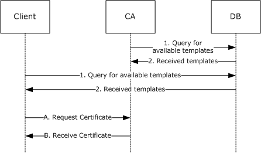

Figure 8: Certificate enrollment

The process of requesting a [**certificate**](#gt_certificate) by citing [**certificate templates**](#gt_certificate-template) is shown in the preceding figure. The certificate request process has two separate phases. The first phase, numbered 1 and 2, occurs for both the client and the server ([**CA**](#gt_certification-authority-ca)), in any order and at any time. In this first step, each asks the DB that holds templates for a list of available templates. The second phase of the process is the request for a certificate, identified A and B in the preceding figure based on a certificate templates that was retrieved from the DB. Because templates are optional, this describes Microsoft code behavior and the behavior of any client and server code that chooses to implement templates as Microsoft does.

# 5 Security Considerations

Any cryptographic protocol has security considerations dealing with [**key**](#gt_key) handling during cryptographic operations and key distribution. A public-key [**certificate**](#gt_certificate), although it is not by itself a protocol, has most of the same security considerations that a cryptographic protocol has—in the sense that a [**public key**](#gt_public-key) certificate is a "message" from the [**CA**](#gt_certification-authority-ca) to the [**relying parties (RPs)**](#gt_relying-party-rp). This "message" is addressed, in effect, to "to whom it may concern". A cryptographic protocol that deals with the transmission, [**issuance**](#gt_certificate-issuance), or other use of a public key certificate therefore has security considerations in two areas: around the protocol itself and around the certificate and its use.

In addition, a certificate binds two or more pieces of information together. In the most common case, that would be a public key and a name. The name in such a certificate has security relevance, and there are security considerations around the use and provisioning of those names. In some certificate forms, there are [**attributes**](#gt_attribute) bound to either a name or a key, and there are security considerations around the use and provisioning of those attributes.

## 5.1 Security Considerations for Implementers

### 5.1.1 Keeping Information Secret

Any cryptographic [**key**](#gt_key) has to be kept secret. Additionally, any function of a secret (such as a key schedule) that an attacker could use to decipher the secret more easily also has to be kept secret.

When a secret must be in the normal memory of a general-purpose computer in order to be used, that secret should be erased (for example, replaced with a constant value, such as 0) as soon as possible after it is used.

A secret might be kept in a specially protected memory where it can be used without being erased. Typically, such memory is found in a hardware security module (HSM). If an HSM is used, it should be as specified in [[FIPS140]](https://go.microsoft.com/fwlink/?LinkId=89866), or the equivalent, at a level consistent with the security requirements of the customer deploying the cryptographic protocol or [**CA**](#gt_certification-authority-ca) that uses the HSM.

### 5.1.2 Generating Keys

Generation of a cryptographic [**key**](#gt_key) requires randomness so that the generated key cannot be guessed by an attacker. Randomness is expressed in terms of entropy, in units of bits. A [**symmetric key**](#gt_symmetric-key) should have as many bits of entropy as there are bits in the key. A public [**key pair**](#gt_public-private-key-pair) should have as many bits of entropy as there are bits in the key minus a small number of bits.

### 5.1.3 Entropy Sources

How entropy is acquired is up to the implementer of any protocol. The literature on measurement of entropy and on methods of harvesting entropy in computer systems is extensive and well known to anyone skilled in the cryptographic art. The best entropy source is probably a properly verified hardware random-bit generator that has circuitry attached to monitor all bits produced and to verify the entropy of the bits, raising an error condition if the hardware starts to malfunction. Such a hardware source of entropy can be used to drive a conditioning function (sometimes called "a whitening function") and might be used to drive a [**pseudo-random number generator (PRNG)**](#gt_pseudo-random-number-generator-prng). If a PRNG is used, it should be compliant with recognized standards, such as FIPS 140-2 Annex C, as specified in [[FIPS140]](https://go.microsoft.com/fwlink/?LinkId=89866).

### 5.1.4 Name Selection

Human beings use names from an ID [**certificate**](#gt_certificate) to refer to end entities. When the [**relying party (RP)**](#gt_relying-party-rp) is a human being and that human makes a security decision based on the name from an ID certificate, that name should be clear and unambiguous to the human RP. It is the responsibility of the [**CA**](#gt_certification-authority-ca) (or the human administering the CA or associated [**RA**](#gt_registration-authority-ra)) to choose (or approve) the name for an ID certificate.

### 5.1.5 Name Binding

A [**CA**](#gt_certification-authority-ca) has the responsibility to bind a name to a [**key**](#gt_key) within an ID [**certificate**](#gt_certificate) and to do so with a proper level of care. In commercial CAs, this is called "certification practices". The actual [**certification**](#gt_certification) practices required in any deployment of a CA depend on the security requirements of the various [**RPs**](#gt_relying-party-rp) that will use these certificates. However, each deployment of a CA should establish the security requirements of its RPs and the appropriate certification practices. The [**trust root**](#gt_trust-root) on an RP should list only those CA root keys ([**root certificates**](#gt_root-certificate)) that meet the RP's security requirements.

### 5.1.6 Attribute Definition

When a [**certificate**](#gt_certificate) binds an [**attribute**](#gt_attribute) to either a [**key**](#gt_key) or a name, if that attribute is to be used by a human [**RP**](#gt_relying-party-rp) in making a security decision, the presentation of that attribute to the human has to be clear and unambiguous.

### 5.1.7 Attribute Binding

When [**attributes**](#gt_attribute) are bound to either a [**key**](#gt_key) or a name, some authority is responsible for making that assignment of attributes. In any given deployment, it is important that the authority empowered to assign the attributes be consistent with the security requirements of the [**RPs**](#gt_relying-party-rp) that will use these attribute assignments. Because this varies on a per-deployment basis, this document cannot specify either these security requirements or the selection of attribute authorities. However, each deployment should establish security requirements of RPs and, for each attribute, should establish the list of authorities empowered to assign that attribute.

Different attributes frequently have different lists of authorities. When the attribute is carried in a [**certificate**](#gt_certificate), the issuer of the certificate carrying that attribute should be on the list of authorities for that attribute. This might imply the use of multiple certificates for carrying attributes. Alternatively, when attributes are held in a [**directory**](#gt_directory) (such as [**Active Directory**](#gt_active-directory)), the list of authorities for an attribute should be reflected in the [**ACL**](#gt_access-control-list-acl) for that directory entry.

### 5.1.8 Coding Practices

Any implementation of a protocol exposes code to inputs from attackers. Such code has to be developed according to secure coding and development practices to avoid buffer overflows, denial-of-service (DOS) attacks, escalation of privilege, and disclosure of information. For an introduction to these concepts, secure development best practices, and common errors, see [HOWARD].

### 5.1.9 Security Consideration Citations

Implementers of this protocol should be aware of the following security considerations:

- A secure communications channel should exist between the client and server that might require an out-of-band [**trust**](#gt_trust) initialization process, such as [**DCOM**](#gt_distributed-component-object-model-dcom) (as specified in [MS-DCOM](../MS-DCOM/MS-DCOM.md)) or TLS (as specified in [[RFC2246]](https://go.microsoft.com/fwlink/?LinkId=90324)).
- A client or server should follow generally accepted principles of secure [**key**](#gt_key) management, as specified in [[RFC3280]](https://go.microsoft.com/fwlink/?LinkId=90414) section 9. For an introduction to these generally accepted principles, see [SCHNEIER] and [HOWARD].
- A client or server should not archive or escrow a signing key. Details are specified in [[RFC2797]](https://go.microsoft.com/fwlink/?LinkId=90382) section 9.
- Clients should verify the [**public key**](#gt_public-key) of the server prior to submission of a [**private key**](#gt_private-key) for archival or escrow. Details are specified in [RFC2797] section 9.
- [**Certificate enrollment**](#gt_certificate-enrollment) clients and [**CAs**](#gt_certification-authority-ca) that support the Diffie-Hellman algorithm for the certificate's [**key pair**](#gt_public-private-key-pair) should validate cryptographic parameters prior to issuing or accepting [**certificates**](#gt_certificate). Details are specified in [[RFC2785]](https://go.microsoft.com/fwlink/?LinkId=147760). Windows enrollment clients and CAs do not support Diffie-Hellman in the certificate requests.
- A CA and [**RA**](#gt_registration-authority-ra) should take care to validate the binding of a client identity to a public key. Details are specified in [RFC3280] section 9. An introduction on CA practices of binding an identity to a public key is specified in [[RFC2527]](https://go.microsoft.com/fwlink/?LinkId=90364).
- A client and server should validate and verify certificate path information, as specified in [RFC3280] section 6. Details about the requirement for certificate path validation are specified in [RFC3280] section 9.
- A client and server should validate and verify the freshness of [**revocation**](#gt_revocation) information of all [**digital certificates**](#gt_digital-certificate) prior to usage, trust, or [**encryption**](#gt_encryption), as specified in [RFC3280] section 6.3. Details about the requirement for revocation freshness are specified in [RFC3280] section 9.
- A CA must encode the [**DN**](#gt_distinguished-name-dn) in the subject field of a CA certificate identically to the DN in the issuer field in certificates issued by that CA. Details are specified in [RFC3280] section 9.
- A client or server should follow all security considerations discussed throughout [[RFC3852]](https://go.microsoft.com/fwlink/?LinkId=90445) and [[RFC2986]](https://go.microsoft.com/fwlink/?LinkId=90401), as neither normative reference has a specific security section.
- A client and server should use an authentication session between client and server to mitigate DOS attacks, as specified in [MS-DCOM]. For more information on generic DOS mitigation techniques, see [HOWARD].
- A client and server should consider security issues regarding [**PKI**](#gt_public-key-infrastructure-pki) or certificate repositories. For example, security considerations regarding [**LDAP**](#gt_lightweight-directory-access-protocol-ldap) repositories are as specified in [[RFC2559]](https://go.microsoft.com/fwlink/?LinkId=90368) section 10.

### 5.1.10 Key Archival Security Considerations

[**Key archival**](#gt_key-archival) is for decryption [**keys**](#gt_key) only. The purpose of key archival is the prevention of loss of data. Just as backup preserves the bits of a file, key archival permits recovery of decryption keys. Because a decryption key inherits the security value of everything it can decrypt, this key has to be protected from disclosure strongly enough to withstand an attack by an attacker motivated by that accumulated value.

In the protocol specified here, a private decryption key is protected in transit by being encrypted with a key (the exchange key) belonging to the [**CA**](#gt_certification-authority-ca). The CA must then (through any manner deemed appropriate by the vendor and/or customer of that CA) do the following:

- Protect its own decryption key from disclosure (because the exchange key acquires the sum of value of all of the keys transmitted by using it).
- Protect any archived [**private keys**](#gt_private-key) from disclosure.
- Protect any archived private keys from loss or destruction.
- Make some process available by which a private key can be restored to its owner (including some human-to-human process by which the proper owner of the private key is authenticated).
How the CA chooses to meet these requirements is not addressed in this document. In the Microsoft CA implementation, a private key offered for archival, is decrypted on receipt and then re-encrypted in multiple [**KRA**](#gt_key-recovery-agent-kra) keys. The resulting encrypted key [**BLOBs**](#gt_binary-large-object-blob) are then stored in multiple backup copies. This redundancy meets the third requirement listed above. The recovery process is entirely manual and is a function of the enterprise within which the CA is deployed.

### 5.1.11 Data Consistency for Certificate Templates

It is not possible to achieve all three of the desirable properties of a distributed system:

- Data consistency.
- Application availability.
- Tolerance of network partitions.
Because network partitions are unavoidable, the implementer must sacrifice either data consistency or application availability in the system design.

The Microsoft [**CA**](#gt_certification-authority-ca) and the client code that requests [**certificates**](#gt_certificate) have chosen to provide application availability and sacrifice data consistency, if a conflict arises. This shows up in a variety of design decisions—including, in particular, the caching of [**certificate templates**](#gt_certificate-template).

The design of these systems places data consistency after network partitions are healed. The amount of time needed to reach consistency can be significant (perhaps several hours or days).

If the use of an old certificate template would create a security flaw for the user of this system, methods exist that let the user identify whether the template is up-to-date and, if necessary, retrieve the current template.

When making a request for a certificate to match a particular template, the user can request that template not only by [**CN**](#gt_common-name-cn) but also by [**OID**](#gt_object-identifier-oid) and by revision number.

The user can, in critical cases, define a new OID for the new template, and retire certificates that were built according to the previous OID. In less-critical cases, the user can wait for [**Active Directory**](#gt_active-directory) propagation, as is normal for anything else stored in Active Directory and can expect changes to become fully distributed sometime during that wait period.

# 6 Appendix A: Full IDL

For ease of implementation, the full [**interface definition language (IDL)**](#gt_interface-definition-language-idl) is provided here, where "ms-dcom.idl" is the IDL as specified in [MS-DCOM](../MS-DCOM/MS-DCOM.md) section 6.

import "ms-dcom.idl";

typedef byte BYTE;

typedef struct _CERTTRANSBLOB {

ULONG cb;

[size_is(cb), unique] BYTE *pb;

} CERTTRANSBLOB;

typedef struct _CATRANSPROP {

LONG lPropID;

BYTE propType;

BYTE Reserved;

USHORT propFlags;

ULONG obwszDisplayName;

} CATRANSPROP;

typedef struct _CAINFO {

DWORD cbSize;

long CAType;

DWORD cCASignatureCerts;

DWORD cCAExchangeCerts;

DWORD cExitAlgorithms;

long lPropIDMax;

long lRoleSeparationEnabled;

DWORD cKRACertUsedCount;

DWORD cKRACertCount;

DWORD fAdvancedServer;

} CAINFO;

[

object,

uuid(d99e6e70-fc88-11d0-b498-00a0c90312f3),

helpstring("ICertRequest DCOM Interface"),

pointer_default(unique)

]

interface ICertRequestD: IUnknown

{

HRESULT Request(

[in] DWORD dwFlags,

[in, string, unique, range(1, 1536)] wchar_t const *pwszAuthority,

[in, out, ref] DWORD *pdwRequestId,

[out] DWORD *pdwDisposition,

[in, string, unique, range(1, 1536)] wchar_t const *pwszAttributes,

[in, ref] CERTTRANSBLOB const *pctbRequest,

[out, ref] CERTTRANSBLOB *pctbCertChain,

[out, ref] CERTTRANSBLOB *pctbEncodedCert,

[out, ref] CERTTRANSBLOB *pctbDispositionMessage

);

HRESULT GetCACert(

[in] DWORD fchain,

[in, string, unique, range(1, 1536)] wchar_t const *pwszAuthority,

[out, ref] CERTTRANSBLOB *pctbOut

);

HRESULT Ping(

[in, string, unique, range(1, 1536)] wchar_t const *pwszAuthority

);

};

[

object,

uuid(5422fd3a-d4b8-4cef-a12e-e87d4ca22e90),

helpstring("ICertRequest2 DCOM Interface"),

pointer_default(unique)

]

interface ICertRequestD2: ICertRequestD

{

HRESULT Request2(

[in, string, unique, range(1, 1536)] wchar_t const *pwszAuthority,

[in] DWORD dwFlags,

[in, string, unique, range(1, 64)] wchar_t const *pwszSerialNumber,

[in, out, ref] DWORD *pdwRequestId,

[out] DWORD *pdwDisposition,

[in, string, unique, range(1, 1536)] wchar_t const *pwszAttributes,

[in, ref] CERTTRANSBLOB const *pctbRequest,

[out, ref] CERTTRANSBLOB *pctbFullResponse,

[out, ref] CERTTRANSBLOB *pctbEncodedCert,

[out, ref] CERTTRANSBLOB *pctbDispositionMessage

);

HRESULT GetCAProperty(

[in, string, unique, range(1, 1536)] wchar_t const *pwszAuthority,

[in] long PropID,

[in] long PropIndex,

[in] long PropType,

[out, ref] CERTTRANSBLOB *pctbPropertyValue

);

HRESULT GetCAPropertyInfo(

[in, string, unique, range(1, 1536)] wchar_t const *pwszAuthority,

[out] long *pcProperty,

[out, ref] CERTTRANSBLOB *pctbPropInfo

);

HRESULT Ping2(

[in, string, unique, range(1, 1536)] wchar_t const *pwszAuthority

);

};

# 7 Appendix B: Product Behavior

The information in this specification is applicable to the following Microsoft products or supplemental software. References to product versions include updates to those products.

The terms "earlier" and "later", when used with a product version, refer to either all preceding versions or all subsequent versions, respectively. The term "through" refers to the inclusive range of versions. Applicable Microsoft products are listed chronologically in this section.

The following tables show the relationships between Microsoft product versions or supplemental software and the roles they perform.

| Windows Client Releases | Server Role | Client Role |
| --- | --- | --- |
| Windows 2000 Professional operating system | No | Yes |
| Windows XP operating system | No | Yes |
| Windows Vista operating system | No | Yes |
| Windows 7 operating system | No | Yes |
| Windows 8 operating system | No | Yes |
| Windows 8.1 operating system | No | Yes |
| Windows 10 operating system | No | Yes |
| Windows 11 operating system | No | Yes |

| Windows Server Releases | Server Role | Client Role |
| --- | --- | --- |
| Windows 2000 Server operating system | Yes | Yes |
| Windows Server 2003 operating system | Yes | Yes |
| Windows Server 2008 operating system | Yes | Yes |
| Windows Server 2008 R2 operating system | Yes | Yes |
| Windows Server 2012 operating system | Yes | Yes |
| Windows Server 2012 R2 operating system | Yes | Yes |
| Windows Server 2016 operating system | Yes | Yes |
| Windows Server operating system | Yes | Yes |
| Windows Server 2019 operating system | Yes | Yes |
| Windows Server 2022 operating system | Yes | Yes |
| Windows Server 2025 operating system | Yes | Yes |

Exceptions, if any, are noted in this section. If an update version, service pack or Knowledge Base (KB) number appears with a product name, the behavior changed in that update. The new behavior also applies to subsequent updates unless otherwise specified. If a product edition appears with the product version, behavior is different in that product edition.

Unless otherwise specified, any statement of optional behavior in this specification that is prescribed using the terms "SHOULD" or "SHOULD NOT" implies product behavior in accordance with the SHOULD or SHOULD NOT prescription. Unless otherwise specified, the term "MAY" implies that the product does not follow the prescription.

<1> Section 1.3.2.2: Windows 8.1 and later and Windows Server 2012 R2 and later support [**key attestation**](#gt_key-attestation).

<2> Section 1.3.2.3: Windows Server v1803 operating system and later support Certificate Transparency processing. The Certificate Transparency feature is also supported in Windows Server 2016 via the instructions provided in [[CertTransp]](https://go.microsoft.com/fwlink/?linkid=2009256).

<3> Section 1.3.3.1: **Certificate templates** were first introduced with the release of Windows 2000 Server. The Active Directory schema for this release defined a new class named **pKICertificateTemplate** (as specified in [MS-ADSC](../MS-ADSC/MS-ADSC.md) section 2.222) and the unique attributes for this class. It was technically possible to modify the attributes of these pKICertificateTemplate objects, but such modifications were not supported by Microsoft. The attributes were not documented.

One of the requirements for the release of Windows Server 2003 was to support [**attribute**](#gt_attribute) modifications. To meet this requirement, a schema change was introduced that defined the following new attributes for the **pKICertificateTemplate** class.

- **msPKI-Template-Schema-Version**: This attribute defines the **pKICertificateTemplate** class version and instructs the client and server as to those processing rules that apply to the object. For example, certificate template version 2 is a **pKICertificateTemplate** object where the value of **msPKI-Template-Schema-Version** is 2.
- **msPKI-Template-Minor-Version**: With this attribute, the certificate template revision number has two parts (revision and **msPKI-Template-Minor-Version**). It can be used to identify the minimum revision required in an Windows Client Certificate Enrollment Protocol request.
In addition to the schema change, a new certificate template extension was introduced that can be added to a certificate request and can be used by clients to request a specific revision of a certificate template. For more information, see [2.2.2.7.7.2](#Section_2.2.2.7.7.2).

<4> Section 1.3.3.1: The MMC Certificate Templates snap-in that ships with applicable Windows Server releases automatically increments the minor revision value with each modification of a certificate template.

<5> Section 1.3.3.3: Microsoft offers an MMC snap-in to allow a customer to modify templates. However, the customer is not prohibited from using any other application to modify templates.

<6> Section 2.1: Windows XP sets the authentication level to RPC_C_AUTHN_LEVEL_PKT_INTEGRITY (0x05).

<7> Section 2.1: By default, [**CAs**](#gt_certification-authority-ca) on Windows Server 2012 operating system and later have IF_ENFORCEENCRYPTICERTREQUEST and IF_ENFORCEENCRYPTICERTADMIN auth levels set.

<8> Section 2.1: The operating systems specified in [[MSFT-CVE-2022-37976]](https://go.microsoft.com/fwlink/?linkid=2219940), each with their related KB article download installed, require that clients MUST connect with the RPC_C_AUTHN_LEVEL_PKT_PRIVACY authentication level or the connection to the CA server will be denied, regardless of the IF_ENFORCEENCRYPTICERTADMIN or IF_ENFORCEENCRYPTICERTREQUEST setting.

<9> Section 2.2.2.5: Windows 8.1 and later and Windows Server 2012 R2 and later support key attestation.

<10> Section 2.2.2.5: Windows 8.1 and later and Windows Server 2012 R2 and later support [[TCG-Struct-V2]](https://go.microsoft.com/fwlink/?LinkId=522455).

<11> Section 2.2.2.7.4: Windows implementations set the value of the Client ID as follows:

| Values for client application sending the request | Column 2 | Column 3 |
| --- | --- | --- |
| **Value** | **Internal name** | **Meaning** |
| 0 | ClientIdNone | No information about the client application. |
| 1 | ClientIdXEnroll2003 | The client application in XEnroll.dll shipped with Windows Server 2003. |
| 2 | ClientIdAutoEnroll2003 | The client application in the Windows [**autoenrollment**](#gt_autoenrollment) service shipped with Windows Server 2003. |
| 3 | ClientIdWizard2003 | The client application in the enrollment wizard shipped with Windows Server 2003. |
| 4 | ClientIdCertReq2003 | The client application in certreq.exe shipped with Windows Server 2003. |
| 5 | ClientIdDefaultRequest | The client application that uses Windows Vista and later enrollment classes. |
| 6 | ClientIdAutoEnroll | The client application in the Windows autoenrollment service shipped with Windows Vista and later. |
| 7 | ClientIdRequestWizard | The client application in the enrollment wizard shipped with Windows Vista and later. |
| 8 | ClientIdEOBO | The client application that makes [**Enroll On Behalf Of (EOBO)**](#gt_enroll-on-behalf-of-eobo) requests. |
| 9 | ClientIdCertReq | The client application in certreq.exe shipped with Windows Vista, Windows 7, Windows 8, Windows 8.1, and Windows 10. |
| 1000 | ClientIdUserStart | The client application is not adequately described by the preceding entries. |

<12> Section 2.2.2.7.7.4: This security extension is supported by the operating systems specified in [[MSFT-CVE-2022-26931]](https://go.microsoft.com/fwlink/?linkid=2194567), each with its related KB article download installed.

<13> Section 2.2.2.7.9: In Windows 2000 operating system, Windows XP, and Windows Server 2003, the hash algorithm used is always set to SHA1. In Windows Vista and later and in Windows Server 2008 and later, the hash algorithm is defined by the certificate template that is used for [**enrollment**](#gt_certificate-enrollment). For more information, see section [3.2.2.6.2.1.4.5.4](#Section_3.2.2.6.2.1.4.5.4).

<14> Section 2.2.2.7.10: Windows 2000, Windows XP, and Windows Server 2003 do not support the "ExpirationDate" value for the [**OID**](#gt_object-identifier-oid) szENROLLMENT_NAME_VALUE_PAIR (1.3.6.1.4.1.311.13.2.1).

<15> Section 2.2.2.7.10: To enable this feature for the Microsoft CA, follow the instructions as specified in [[MSFT-EXIT]](https://go.microsoft.com/fwlink/?LinkId=100630).

Windows Server 2003 and later ignore the value of this attribute and instead copy the certificate to the following location:"%system%\certsrv\certenroll". The file name is the request ID with a '.cer' extension.

<16> Section 2.2.2.7.10: The RequestId attribute is available in Windows Server 2012 R2 and Windows Server 2016 only.

<17> Section 2.2.2.7.10: This attribute and the associated functionality are available in Windows Server 2019 and later versions of the Windows OS after installing the September (9B) Windows update.

<18> Section 2.2.2.7.15: Support for szOID_ENROLL_AIK_INFO is included in Windows 10, Windows Server 2016, Windows Server operating system, and in Windows Server 2019 and later.

<19> Section 2.2.3.1: Applicable Windows Server releases use [**key recovery certificates**](#gt_key-recovery-certificate) that contain the following X.509v3 extensions that are specific to such releases:

- Application Policies (Policy Identifier = Key Recovery Agent)
- Certificate Template Name
- Certificate Template Information
[Key recovery certificates](#Section_2.2.3.1), when issued by a Windows [**enterprise CA**](#gt_enterprise-certificate-authority-enterprise-ca), are automatically written to the configuration [**container**](#gt_container) of [**Active Directory**](#gt_active-directory). The actual certificates are published to the userCertificate attribute (as specified in [[RFC4523]](https://go.microsoft.com/fwlink/?LinkId=90479)) of the [**KRA**](#gt_key-recovery-agent-kra) object when issued to a member of the [**domain**](#gt_domain) administrators group in Active Directory.

<20> Section 3.1: Microsoft implements multiple clients of this protocol, including:

- Certificates snap-in for the Microsoft Management Console (MMC)
- Certreq.exe tool (see [[MSDOCS-certreq]](https://go.microsoft.com/fwlink/?linkid=2164277) for more information)
- Certificate Autoenrollment (see [[MSFT-AUTOENROLLMENT]](https://go.microsoft.com/fwlink/?LinkId=90178) for more information).
<21> Section 3.1.1: Windows clients implement an abstraction layer on top of the interfaces specified in this document. Windows 2000, Windows XP, and Windows Server 2003 support the interfaces documented in [[MSDN-XEnroll]](https://go.microsoft.com/fwlink/?LinkId=100157). Windows 2000, Windows XP, and Windows Server 2003 do not support the interfaces documented in [[MSDN-CertEnroll]](https://go.microsoft.com/fwlink/?LinkId=100156).

<22> Section 3.1.1.4: Windows 2000 clients do not obtain a supported interface version from the server and always use the [ICertRequestD](#Section_3.2.1.4.2) interface.

<23> Section 3.1.1.4.3.1.1: Windows clients use the OS version structure defined in [[MSDN-OSVERSIONINFO]](https://go.microsoft.com/fwlink/?LinkId=106010) to create a string in the format "A.B.C.D", where the A is the value of the **dwMajorVersion** field, B is the value of the **dwMinorVersion** field, C is the value of the **dwBuildNumber** field, and D is the value of the **dwPlatformId**. All numbers are represented in the decimal format. For example, the string "6.1.7600.2" represents Windows Server 2008 R2.

<24> Section 3.1.1.4.3.1.4: This format was designed by Netscape, and there are no Microsoft tools to create a request in this format. To construct a certificate request using this format, the SPKAC tool can be used (for more information, see [[OPENSSL]](https://go.microsoft.com/fwlink/?LinkId=90242)).

<25> Section 3.1.1.4.3.2.1: Windows 8.1 and later and Windows Server 2012 R2 and later support the processing rules in section [3.1.1.4.3.4](#Section_3.1.1.4.3.4).

<26> Section 3.1.1.4.3.2.2: Windows 8.1 and later and Windows Server 2012 R2 and later support the processing rules in section 3.1.1.4.3.4.

<27> Section 3.1.1.4.3.3.1: The Microsoft client allows importing a request file during the enrollment implemented in the certificates snap-in for the MMC in Windows Vista and later and in Windows Server 2008 and later; and during web enrollment in Windows 2000, Windows XP, and Windows Server 2003.

<28> Section 3.1.1.4.3.4: Windows 8.1 and later and Windows Server 2012 R2 and later support key attestation.

<29> Section 3.1.1.4.3.4.1.2: Only Windows Server 2012 R2, Windows Server 2016, Windows Server operating system, and Windows Server 2019 and later support this behavior.

<30> Section 3.1.1.4.3.4.1.2: Windows 8.1 and later and Windows Server 2012 R2 and later support these processing rules.

<31> Section 3.1.1.4.3.4.2: Support for [**AIK**](#gt_attestation-identity-key-aik) Attestation (subject only) is included in Windows 10, Windows Server 2016, Windows Server operating system, and in Windows Server 2019 and later.

<32> Section 3.1.1.4.3.8.1: Pre-sign certificate processing is supported by the operating systems specified in [[MSKB-5017379]](https://go.microsoft.com/fwlink/?linkid=2206555) and [[MSKB-5017381]](https://go.microsoft.com/fwlink/?linkid=2205487), each with its related KB article download installed.

<33> Section 3.1.1.6: Windows Certificate MMC snap-in has a command to trigger this client.

<34> Section 3.1.1.6.2: Windows 8.1 and later and Windows Server 2012 R2 and later support this behavior.

<35> Section 3.1.2.1: In the Windows implementation, the **Client_Intermediate_CA_Certificates** collection is stored in the [**Windows registry**](#gt_windows-registry) using the following registry path:

HKEY_LOCAL_MACHINE\Software\Microsoft\SystemCertificates\CA\Certificates\

A unique registry key for each intermediate CA certificate is added using the thumbprint of the certificate as the key name. Each element in **Client_Intermediate_CA_Certificates** is the [**BLOB**](#gt_binary-large-object-blob) value under the corresponding [**key**](#gt_key) (stored as a binary type).

<36> Section 3.1.2.1: In the Windows implementation, the **Client_Root_CA_Certificates** collection is stored in the Windows registry using the following registry path:

HKEY_LOCAL_MACHINE\Software\Microsoft\SystemCertificates\Root\Certificates\

A unique registry key for each [**root CA**](#gt_root-ca) certificate is added using the thumbprint of the certificate as the key name. Each element in **Client_Root_CA_Certificates** is the BLOB value under the corresponding key (stored as a binary type).

<37> Section 3.1.2.4.2.1: Windows 2000 does not support certificate templates with these versions. Windows XP and Windows Server 2003 do not support certificate templates that have the **Certificate.Template.msPKI-Template-Schema-Version** datum equal to 3. Windows Vista, Windows Server 2008, Windows 7, and Windows Server 2008 R2 do not support certificate templates that have the **Certificate.Template.msPKI-Template-Schema-Version** datum equal to 4.

<38> Section 3.1.2.4.2.1: Windows 8.1 and later and Windows Server 2012 R2 and later support this flag.

<39> Section 3.1.2.4.2.1: Windows 2000 does not process the **Certificate.Template.msPKI-Template-Schema-Version** datum and treats all templates with a **Certificate.Template.msPKI-Template-Schema-Version** datum less than 100 as templates that have the **Certificate.Template.msPKI-Template-Schema-Version** datum set to 1. Windows XP treats templates with the **Certificate.Template.msPKI-Template-Schema-Version** datum set to 0 the same as templates with **Certificate.Template.msPKI-Template-Schema-Version** datum set to 1.

<40> Section 3.1.2.4.2.1: Windows 2000 does not support certificate templates with these versions. Windows XP and Windows Server 2003 do not support certificate templates that have the **Certificate.Template.msPKI-Template-Schema-Version** datum equal to 3. Windows Vista, Windows Server 2008, Windows 7, and Windows Server 2008 R2 do not support certificate templates that have the **Certificate.Template.msPKI-Template-Schema-Version** datum equal to 4.

<41> Section 3.1.2.4.2.1: Windows 2000 does not process the **Certificate.Template.msPKI-Template-Schema-Version** datum and treats all templates with a **Certificate.Template.revision** datum less than 100 as templates that have the **Certificate.Template.msPKI-Template-Schema-Version** datum set to 1. Windows XP treats templates with the **Certificate.Template.msPKI-Template-Schema-Version** datum set to 0 the same as templates with **Certificate.Template.msPKI-Template-Schema-Version** datum set to 1.

<42> Section 3.1.2.4.2.2: The Microsoft Certificate Services client uses the following values for the **Certificate.Template.msPKI-Template-Schema-Version** datum:

- When the datum does not exist: Windows can use this certificate template.
- When the value = 1: Windows can use this certificate template.
- When the value = 2: Windows XP, Windows Server 2003, and Windows Vista and later and Windows Server 2008 and later can use this certificate template.
- When the value = 3: Windows 2000, Windows XP, and Windows Server 2003 cannot use this certificate template.
- When the value = 4: Windows 8 and later and Windows Server 2012 and later can use this certificate template.
- For other values, existing Windows clients ignore the certificate template.
<43> Section 3.1.2.4.2.2.1.5: The Microsoft Certificate Services client uses this flag with the [**cryptographic service provider (CSP)**](#gt_cryptographic-service-provider-csp) when creating the cryptographic keys.

<44> Section 3.1.2.4.2.2.1.8: Windows XP and later and Windows Server 2003 and later create this extension only if the **Certificate.Template.msPKI-Template-Schema-Version** datum equals 1 or is not initialized with any value.

<45> Section 3.1.2.4.2.2.1.9: Windows 2000 does not add certificate template OID extension as an attribute of the request.

<46> Section 3.1.2.4.2.2.2.2: Windows 8.1 and later and Windows Server 2012 R2 and later support these flags.

<47> Section 3.1.2.4.2.2.2.2: Windows 8.1 and later and Windows Server 2012 R2 and later support this behavior.

<48> Section 3.1.2.4.2.2.2.5: Windows clients default to [**RSA**](#gt_rivest-shamir-adleman-rsa).

<49> Section 3.1.2.4.2.2.2.5: Windows clients default to set Read permissions on the key associated with the [**certificate**](#gt_certificate) request for the entity sending the certificate request.

<50> Section 3.1.2.4.2.2.2.5: Windows 8.1 and later and Windows Server 2012 R2 and later support this behavior.

<51> Section 3.1.2.4.2.2.2.5: Windows clients default to [**Triple Data Encryption Standard**](#gt_triple-data-encryption-standard).

<52> Section 3.1.2.4.2.2.2.5: Windows clients default to 168.

<53> Section 3.1.2.4.2.2.2.5: Windows clients defaults to SHA1.

<54> Section 3.1.2.4.2.2.2.5: The Microsoft client uses the msPKI-Key-Usage value with the cryptographic service provider (CSP) when creating the cryptographic keys.

<55> Section 3.1.2.4.2.2.2.5: Windows clients default to all key usages.

<56> Section 3.1.2.4.2.2.2.6: CryptoAPI, a Windows cryptographic application programming interface, creates a union of the values in the Extended Key Usage and Application Policy extensions. The combined union will be used as the extended key usages for the certificate as specified in [[RFC3280]](https://go.microsoft.com/fwlink/?LinkId=90414) section 4.2.1.5.

<57> Section 3.1.2.4.2.2.2.7: Windows 7 and later and Windows Server 2008 R2 and later support this flag.

<58> Section 3.1.2.4.2.2.2.8: Windows 8 and later and Windows Server 2012 and later ignore this flag.

<59> Section 3.1.2.4.2.2.2.8: Windows uses the Data Protection API (DPAPI) to protect [**private keys**](#gt_private-key). For more information, see [[MSDN-DPAPI]](https://go.microsoft.com/fwlink/?LinkId=89993).

<60> Section 3.1.2.4.2.2.2.8: Windows 2000, Windows XP, and Windows Server 2003 do not support this flag.

<61> Section 3.1.2.4.2.2.2.8: Windows 8 and later and Windows Server 2012 and later support this flag.

<62> Section 3.1.2.4.2.2.2.8: Windows 8 and later and Windows Server 2012 and later support this flag.

<63> Section 3.1.2.4.2.2.2.8: Windows 8.1 and later and Windows Server 2012 R2 and later support this flag.

<64> Section 3.1.2.4.2.2.2.8: Windows 8 and later and Windows Server 2012 and later implement the **Client_Current_Version** ADM element.

<65> Section 3.1.2.4.2.2.2.10: Windows 2000, Windows XP, Windows Server 2003, Windows Vista, and Windows Server 2008 ignore the CT_FLAG_OLD_CERT_SUPPLIES_SUBJECT_AND_ALT_NAME flag.

<66> Section 3.2: Windows 2000 Server doesn't implement ICertRequestD2 interface.

<67> Section 3.2: All Microsoft CAs implement selection among the CA modes during setup.

<68> Section 3.2: CAs that run on Windows Server 2003 Datacenter Edition operating system, Windows Server 2003 Enterprise Edition operating system, Windows Server 2008 Datacenter operating system, and Windows Server 2008 Enterprise operating system implement [**key archival**](#gt_key-archival). CAs that run on Windows Server 2003 Standard Edition operating system and on Windows Server 2008 and later do not implement key archival.

<69> Section 3.2.1.1.1.2: This element and the associated functionality are available in Windows Server 2019 and later versions of the Windows OS after installing the September (9B) Windows update.

<70> Section 3.2.1.1.1.2: This functionality is available in Windows Server 2022 and later OS versions after installing August (8B) Windows update. However, the fix is currently disabled and will be enabled starting with the November (11B) or later Windows updates.

<71> Section 3.2.1.1.3: This column and the associated functionality are available in Windows Server 2019 and later versions of the Windows OS after installing the September (9B) Windows update.

<72> Section 3.2.1.1.4: Windows clients use this CA property for diagnostics information only on the operating system that hosts the CA. The Windows Client Certificate Enrollment Protocol does not depend on the value of this property.

CAs running on Windows Server 2003 Enterprise Edition, Windows Server 2003 Datacenter Edition, Windows Server 2008 Enterprise operating system, and Windows Server 2008 Datacenter operating system support key archival and are considered "advanced server". Windows Server 2003 Standard Edition and Windows Server 2008 and later CAs are considered "standard server".

<73> Section 3.2.1.1.4: This functionality is available in Windows Server 2022 after installing the August (8B) update. However, the fix is currently disabled and will be enabled starting with the January 2026 (2026.01B) or later Windows updates.

<74> Section 3.2.1.1.4: This functionality is available in Windows Server 2022 after installing the August (8B) update. However, the fix is currently disabled and will be enabled starting with the January 2026 (2026.01B) or later Windows updates.

<75> Section 3.2.1.1.4: This configuration and the associated functionality are available in Windows Server 2019 and later versions of the Windows OS after installing the September (9B) Windows update.

<76> Section 3.2.1.1.4: This configuration and the associated functionality are available in Windows Server 2019 and later versions of the Windows OS after installing the September (9B) Windows update.

<77> Section 3.2.1.1.4: This configuration and the associated functionality are available in Windows Server 2019 and later versions of the Windows OS after installing the September (9B) Windows update.

<78> Section 3.2.1.1.4: This configuration and the associated functionality are available in Windows Server 2019 and later versions of the Windows OS after installing the September (9B) Windows update.

<79> Section 3.2.1.1.4: This configuration and the associated functionality are available in Windows Server 2019 and later versions of the Windows OS after installing the September (9B) Windows update.

<80> Section 3.2.1.4.2.1: Windows 2000 does not return an error.

<81> Section 3.2.1.4.2.1: The operating systems specified in [MSFT-CVE-2022-37976], each with their related KB article download installed, require that clients MUST connect with the RPC_C_AUTHN_LEVEL_PKT_PRIVACY authentication level or the connection to the CA server will be denied, regardless of the IF_ENFORCEENCRYPTICERTREQUEST (section [3.2.1.1.4](#Section_3.2.1.1.4)) setting.

<82> Section 3.2.1.4.2.1: If pdwDisposition was request failed (1, or an error code from [MS-ERREF](../MS-ERREF/MS-ERREF.md)), the disposition messages include the following:

- Error archiving private key.
- Error parsing request.
- Error verifying request signature or [**signing certificate**](#gt_signing-certificates).
- Resubmitted by {domain\name}, where {domain\name} is replaced with the user name of the caller if the request was submitted by using the ResubmitRequest method of [MS-CSRA](../MS-CSRA/MS-CSRA.md).
If pdwDisposition was request denied (2), the disposition messages include the following:

- Denied by {domain\name}, where {domain\name} is replaced with the user name of the caller if the request was submitted by using the DenyRequest method of [MS-CSRA].
- Denied by policy module.
- Denied by policy module, combined with a descriptive error message such as: "Renewing a certificate with the 'xyz' Certificate Template failed because the renewal overlap period is longer than the certificate validity period."
- Requested by {domain\name}, where {domain\name} is replaced with the user name of the caller if the request was formerly in a pending state and was issued by using the ResubmitRequest method of [MS-CSRA].
If pdwDisposition was certificate issued (3), the disposition messages include the following:

- Requested by {domain\name} where {domain\name} is replaced with the user name of the caller.
- Issued.
- Issued, combined with a descriptive informational message from the policy algorithm.
- Resubmitted by {domain\name}, where {domain\name} is replaced with the user name of the caller if the request was formerly in a pending state and was issued by using the ResubmitRequest method of [MS-CSRA].
If pdwDisposition was request pending (5), the disposition messages include the following:

- Taken under submission.
- Taken under submission, combined with an informational message from the policy algorithm.
- The disposition message contains text in the system language of the server.
<83> Section 3.2.1.4.2.1.2: The **ExpirationDate** value of the OID szENROLLMENT_NAME_VALUE_PAIR (1.3.6.1.4.1.311.13.2.1) is supported in Windows Vista and later and in Windows Server 2008 and later.

<84> Section 3.2.1.4.2.1.2: The **ExpirationDate** value of *the OID szENROLLMENT_NAME_VALUE_PAIR* (1.3.6.1.4.1.311.13.2.1) is supported in Windows Vista and later and in Windows Server 2008 and later.

<85> Section 3.2.1.4.2.1.2: Only a Windows 2000 CA publishes the certificate to the location that is provided by the requestor through this attribute.

<86> Section 3.2.1.4.2.1.3: Windows 2000, Windows Server 2003, and Windows Server 2008 CAs will set this value to 0 in this case.

<87> Section 3.2.1.4.2.1.4.1.1: Microsoft [**standalone CAs**](#gt_standalone-ca) will not add a requested extension to the certificate unless it is configured as allowed locally by the administrator. By default when the CA is installed, the following extensions are allowed:

- 1.2.840.113549.1.9.15 - SMIME Capabilities
- 1.3.6.1.4.1.311.21.1 - CA Version
- 1.3.6.1.4.1.311.21.2 - Previous CA Certificate Hash
- 2.5.29.15 - Key Usage
- 1.3.6.1.4.1.311.10.9.1 - Cross-Certificate Distribution Points
- 1.3.6.1.4.1.311.20.2 - Certificate Template Name (Certificate Type)
- 1.3.6.1.4.1.311.21.7 - Certificate Template Information
- 1.3.6.1.4.1.311.21.10 - Application Policies
- 1.3.6.1.4.1.311.21.11 - Application Policy Mappings
- 1.3.6.1.4.1.311.21.12 - Application Policy Constraints
- 2.5.29.17 - Subject Alternative Name
- 2.5.29.30 - Name Constraints
- 2.5.29.32 - Certificate Policies
- 2.5.29.33 - Policy Mappings
- 2.5.29.36 - Policy Constraints
- 2.5.29.37 - Enhanced Key Usage
<88> Section 3.2.1.4.2.1.4.4: A Windows CA stores these additional values in the Request table.

<89> Section 3.2.1.4.2.1.4.4: This column and the associated functionality are available in Windows Server 2019 and later versions of the Windows OS after installing the September (9B) Windows update.

<90> Section 3.2.1.4.2.1.4.5: If the disposition was Error (30), the disposition messages include the following:

- Error archiving private key.
- Error parsing request.
- Error verifying request signature or signing certificate.
- Resubmitted by {domain\name}, where {domain\name} is replaced with the user name of the caller if the request was submitted by using the ResubmitRequest method of [MS-CSRA].
If the disposition was Denied (31), the disposition messages include the following:

- Denied by {domain\name}, where {domain\name} is replaced with the user name of the caller if the request was submitted by using the DenyRequest method of [MS-CSRA].
- Denied by policy module.
- Denied by policy module, combined with a descriptive error message such as "Renewing a certificate with the 'xyz' Certificate Template failed because the renewal overlap period is longer than the certificate validity period."
- Requested by {domain\name}, where {domain\name} is replaced with the user name of the caller if the request was formerly in a pending state and was issued by using the ResubmitRequest method of [MS-CSRA].
If the disposition was Issued (20), the disposition messages include the following:

- Requested by {domain\name} where {domain\name} is replaced with the user name of the caller.
- Issued.
- Issued, combined with a descriptive informational message from the policy algorithm.
- Resubmitted by {domain\name}, where {domain\name} is replaced with the user name of the caller if the request was formerly in a pending state and was issued by using the ResubmitRequest method of [MS-CSRA].
If the disposition was Pending (9), the disposition messages include the following:

- Taken under submission.
- Taken under submission, combined with an informational message from the policy algorithm.
- The disposition message will contain text in the system language of the server.
<91> Section 3.2.1.4.2.1.4.6: All applicable Windows Server releases support this behavior, with exception of Windows 2000.

<92> Section 3.2.1.4.2.1.4.6: All applicable Windows Server releases support this behavior, with exception of Windows 2000.

<93> Section 3.2.1.4.2.1.4.8.1: This functionality is available in Windows Server 2022 and later OS versions after installing August (8B) Windows update. However, the fix is currently disabled and will be enabled starting with the November (11B) or later Windows updates.

<94> Section 3.2.1.4.2.1.4.10.1: This functionality is available in Windows Server 2022 and later OS versions after installing August (8B) Windows update. However, the fix is currently disabled and will be enabled starting with the November (11B) or later Windows updates.

<95> Section 3.2.1.4.2.2: Windows 2000 does not return an error.

<96> Section 3.2.1.4.2.2: The operating systems specified in [MSFT-CVE-2022-37976], each with their related KB article download installed, require that clients MUST connect with the RPC_C_AUTHN_LEVEL_PKT_PRIVACY authentication level or the connection to the CA server will be denied, regardless of the IF_ENFORCEENCRYPTICERTREQUEST (section 3.2.1.1.4) setting.

<97> Section 3.2.1.4.2.2.2: Applicable Windows Server releases implement this property, with exception of Windows 2000.

<98> Section 3.2.1.4.2.3: Windows 2000 does not return an error.

<99> Section 3.2.1.4.2.3: The operating systems specified in [MSFT-CVE-2022-37976], each with their related KB article download installed, require that clients MUST connect with the RPC_C_AUTHN_LEVEL_PKT_PRIVACY authentication level or the connection to the CA server will be denied, regardless of the IF_ENFORCEENCRYPTICERTREQUEST (section 3.2.1.1.4) setting.

<100> Section 3.2.1.4.3.1.2: Windows 2000, Windows Server 2003, and Windows Server 2008 CAs will set this value to 0 in this case.

<101> Section 3.2.1.4.3.2: Windows 2000 does not return an error.

<102> Section 3.2.1.4.3.2: The operating systems specified in [MSFT-CVE-2022-37976], each with their related KB article download installed, require that clients MUST connect with the RPC_C_AUTHN_LEVEL_PKT_PRIVACY authentication level or the connection to the CA server will be denied, regardless of the IF_ENFORCEENCRYPTICERTREQUEST (section 3.2.1.1.4) setting.

<103> Section 3.2.1.4.3.2.1: The format of the string is "w.x:y.z" in all applicable Windows Server releases, with the exception of Windows Server 2016, Windows Server operating system, and Windows Server 2019 and later.

<104> Section 3.2.1.4.3.2.1: This string is based on the file version attribute of the certsrv.exe file. For example, in Windows Server 2003, the string is "5.2:3790.0" and in Windows Server 2003 operating system with Service Pack 1 (SP1), the string is "5.2:3790.1830". The string might change to represent servicing changes to the CA binaries.

<105> Section 3.2.1.4.3.2.2: The format of the string is "w.x:y.z" in all applicable Windows Server releases, with the exception of Windows Server 2016, Windows Server operating system, and Windows Server 2019 and later.

<106> Section 3.2.1.4.3.2.2: This string is based on the product version attribute of the certsrv.exe file. For example, in Windows Server 2003, the string is "5.2:3790.0" and in Windows Server 2003 with SP1, the string is "5.2:3790.1830". The string might change to represent servicing changes to the server product.

<107> Section 3.2.1.4.3.2.3: By default, the Microsoft CA returns the value 1 for this CA property.

<108> Section 3.2.1.4.3.2.4: By default, if the requested index is 0, a Microsoft CA returns the value "Windows default".

<109> Section 3.2.1.4.3.2.5: By default, a Windows CA returns the value "Windows default".

<110> Section 3.2.1.4.3.2.8: In Windows 2000 Server and Windows Server 2003 CAs, the Shared Folder feature is disabled and can be enabled through the CA setup wizard. If the feature is enabled, the folder contains a file named "certsrv.txt".

In Windows Server 2008 and later, the Shared Folder feature is also disabled, but it cannot be enabled through the CA setup wizard. If Windows Server 2003 CA has the shared folder enabled and is upgraded to the Windows Server 2008 CA, the folder remains shared.

The "Certsrv.txt" file provides limited ability to publish information about CAs. With the introduction of Active Directory in Windows 2000 Server, the benefit of storing CA information in a shared folder was minimized and use of the technique became rare.

The "Certsrv.txt" file contains one or more lines of text that identifies the location of CAs. Each line has the following form.

**Note** Line breaks have been added to improve readability. They do not exist in the file.

CASanitizedCN,

CASanitizedOU,

CASanitizedO,

CASanitizedL,

CASanitizedS,

CASanitizedC,

CAFullDNSMachineName\CASanitizedCommonName,

ExchangeCertName,

SignatureCertName,

Description

Each field in the preceding string is described in the following table. Optional fields that are not populated contain quotation marks (""). All but the first and seventh fields are optional.

| Bit Range | Field | Description |
| --- | --- | --- |
| Variable | CASanitizedCN | The sanitized [**CN**](#gt_common-name-cn) from the CA certificate subject. |
| Variable | CASanitizedOU | Optional. The sanitized OU from the CA certificate subject. |
| Variable | CASanitizedO | Optional. The sanitized O from the CA certificate subject. |
| Variable | CASanitizedL | Optional. The sanitized L from the CA certificate subject. |
| Variable | CASanitizedS | Optional. The sanitized S from the CA certificate subject. |
| Variable | CASanitizedC | Optional. The sanitized C from the CA certificate subject. |
| A configuration string that contains the CA [**Domain Name System (DNS)**](#gt_domain-name-system-dns) name and the sanitized common name. | CAFullDNSMachineName\ CASanitizedCommonName | - |
| Optional. The file name of the CA [**exchange certificate**](#gt_exchange-certificate). This field is never used and the value is empty. | ExchangeCertName | - |
| Optional. The file name of the CA signing certificate. For the first CA signing certificate only, this is stored in the %windir%\System32\CertSrv\CertEnroll [**directory**](#gt_directory). | SignatureCertName | - |
| Variable | Description | Optional. This is the CA description. If specified, this is the sanitized CN from the CA certificate subject. |

For more information about [**sanitized names**](#gt_sanitized-name), see section [1.3.2.5](#Section_1.3.2.5).

The shared folder can also contain the additional files specified as follows:

- CA signing certificates: The certificate files are encoded by using [**DER**](#gt_distinguished-encoding-rules-der), and the naming convention is "CAComputerDNSName_CASanitizedName(CertIndex).crt". Because the CertIndex value is based on CA certificate renewal, no index value is present for the first certificate.
- Certificate request files: [**Subordinate CAs**](#gt_subordinate-ca) copy the certificate request file to this folder. This file contains data on the certificate that the subordinate CA requests from its parent CA. The file is encoded by using DER, and the naming convention is "CAComputerDNSName_CASanitizedName(CertIndex).req". Because the CertIndex value is based on CA certificate renewal, no index value is present for the first certificate.
**Note** No Windows-based clients depend on these certificates being stored in the shared folder.

<111> Section 3.2.1.4.3.2.16: In some cases, the CA signing certificate with "certificate index" zero could be returned instead of the actual signing certificate that issued Current_CA_Exchange_Cert.This behavior can be automatically fixed by restarting the certificate service whenever a new exchange certificate is created.

<112> Section 3.2.1.4.3.2.21: Windows Server 2003 returns the value 40. Windows Server 2008 returns the value 43, Windows Server 2008 R2 returns the value 44, and Windows Server 2012 and later return the value 45.

<113> Section 3.2.1.4.3.2.23: Microsoft Windows 2000, Windows Server 2003, and Windows Server 2008 CAs do not implement **CR_PROP_ROLESEPARATIONENABLED** property and always return E_INVALIDARG (0x80070057).

<114> Section 3.2.1.4.3.2.24: For more information on the Windows implementation for KRAs and key archival, see [[MSFT-ARCHIVE]](https://go.microsoft.com/fwlink/?LinkId=90177).

<115> Section 3.2.1.4.3.2.33: In some cases, the CA signing certificate with "certificate index" zero could be returned instead of the actual signing certificate that issued Current_CA_Exchange_Cert. This behavior can be automatically fixed by restarting the certificate service whenever a new exchange certificate is created.

<116> Section 3.2.1.4.3.2.41: Windows 2000 and Windows Server 2003 CAs do not implement this property and always return 0x80070057 (E_INVALIDARG).

<117> Section 3.2.1.4.3.2.42: Windows 2000 and Windows Server 2003 CAs do not implement this property and always return 0x80070057 (E_INVALIDARG).

<118> Section 3.2.1.4.3.2.43: Windows 2000 and Windows Server 2003 CAs do not implement this property and always return 0x80070057 (E_INVALIDARG).

<119> Section 3.2.1.4.3.2.44: This property is supported by Windows Server 2008 R2 and later.

<120> Section 3.2.1.4.3.2.45: The CT_FLAG_ISSUANCE_POLICIES_FROM_REQUEST flag is supported by Windows 8 and later clients.

<121> Section 3.2.1.4.3.3: In Windows Server 2003 and later the error is E_ACCESSDENIED (0x80000009). Windows 2000 does not return an error.

<122> Section 3.2.1.4.3.3: The operating systems specified in [MSFT-CVE-2022-37976], each with their related KB article download installed, require that clients MUST connect with the RPC_C_AUTHN_LEVEL_PKT_PRIVACY authentication level or the connection to the CA server will be denied, regardless of the IF_ENFORCEENCRYPTICERTREQUEST (section 3.2.1.1.4) setting.

<123> Section 3.2.2.1.2.1: Windows 2000 operating system Service Pack 1 (SP1) and Windows 2000 operating system Service Pack 2 (SP2) set the timeLimit to 300.

<124> Section 3.2.2.1.3.1: Windows 2000 does not support this feature.

<125> Section 3.2.2.3: In Windows 2000, the maximum size of Collection_Of_End_Entity_Object_Query_AD_Connections is always one.

<126> Section 3.2.2.5: Windows 2000 Server only supports templates that do not have msPKI-Template-Schema-Version, or that have msPKI-Template-Schema-Version set to 0x1. Windows Server 2003 only supports templates that do not have msPKI-Template-Schema-Version, or that have msPKI-Template-Schema-Version set to 0x1 or 0x2. Windows Server 2008 and Windows Server 2008 R2 CAs only support templates that do not have msPKI-Template-Schema-Version or that have msPKI-Template-Schema-Version set to 0x1, 0x2, or 0x3.

<127> Section 3.2.2.6.2.1.2.1: Windows Server 2008 and later CAs implement this data.

<128> Section 3.2.2.6.2.1.2.2: Windows 2000 and Windows Server 2003 CAs only attempt to calculate the SHA1 hash.

<129> Section 3.2.2.6.2.1.2.4: These types of requests are supported by Windows Server 2008 R2 and later.

<130> Section 3.2.2.6.2.1.2.5: Windows 8.1 and later and Windows Server 2012 R2 and later support key attestation.

<131> Section 3.2.2.6.2.1.2.5: In the Windows implementation, the value of this string is "Microsoft Platform Crypto Provider".

<132> Section 3.2.2.6.2.1.4.4.1: Windows Server 2008 R2 and later support this flag.

<133> Section 3.2.2.6.2.1.4.5.6: Windows Server 2008 and later support this flag.

<134> Section 3.2.2.6.2.1.4.5.6: Windows Server 2008 R2 and later support this flag.

<135> Section 3.2.2.6.2.1.4.5.6: Windows Server 2008 R2 and later support this flag.

<136> Section 3.2.2.6.2.1.4.5.6: Windows Server 2012 and later support this flag.

<137> Section 3.2.2.6.2.1.4.5.6: Windows Server 2012 and later support this flag.

<138> Section 3.2.2.6.2.1.4.5.7: Flag CT_FLAG_REQUIRE_SAME_KEY_RENEWAL is supported by Windows Server 2012 and later.

<139> Section 3.2.2.6.2.1.4.5.7: This flag is supported by Windows Server 2012 and later.

<140> Section 3.2.2.6.2.1.4.5.7: These flags are supported only in Windows Server 2012 R2 and later.

<141> Section 3.2.2.6.2.1.4.5.7: Windows Server 2012 and later implement the **Server_Current_Version** ADM element.

<142> Section 3.2.2.6.2.1.4.5.8: The CT_FLAG_ISSUANCE_POLICIES_FROM_REQUEST flag is supported by Windows Server 2012 and later.

<143> Section 3.2.2.6.2.1.4.5.8: The CT_FLAG_ISSUANCE_POLICIES_FROM_REQUEST flag is supported by Windows Server 2012 and later.

<144> Section 3.2.2.6.2.1.4.5.9: Windows Server 2008 and later support the CT_FLAG_SUBJECT_ALT_REQUIRE_DOMAIN_DNS flag.

<145> Section 3.2.2.6.3.1.1: The format of the returned value depends on the Active Directory schema.

For a [**DC**](#gt_domain-controller-dc) running with a Windows Server 2003 Active Directory schema, a Windows Server 2008, Windows Server 2008 R2, Windows Server 2012, or Windows Server 2012 R2 Active Directory Domain Services (AD DS) schema, or Windows Server 2016 Active Directory Domain Services (AD DS) schema, or Windows Server operating system Active Directory Domain Services (AD DS) schema, or a Windows Server 2019 and later Active Directory Domain Services (AD DS) schema:

If the DC is running with a Windows Server 2003 Active Directory schema and at least one Windows Server 2003, Enterprise Edition CA has been installed in the forest, the string returned in the pctbPropertyValue parameter contains the name (cn attribute of the certificate template) and OID (msPKI-Cert-Template-OID) attribute of the certificate template of each configured certificate template and has the following format:

TemplateName1\nTemplateOID1\nTemplateName2\nTemplateOID2\...

**Note** All certificate templates are represented with their OID and name regardless of the certificate template version.

For a DC running with a Windows 2000 Server Active Directory schema:

If the DC is running with a Windows 2000 Server Active Directory schema or if no Windows Server 2003, Enterprise Edition CA has been installed in the forest, the string returned in the pctbPropertyValue parameter contains the names (cn attribute of the certificate template) of the configured certificate template and has the following format:

TemplateName1\n\nTemplateName2\n\nTemplateName3\n\...

# 8 Change Tracking

This section identifies changes that were made to this document since the last release. Changes are classified as Major, Minor, or None.

The revision class **Major** means that the technical content in the document was significantly revised. Major changes affect protocol interoperability or implementation. Examples of major changes are:

- A document revision that incorporates changes to interoperability requirements.
- A document revision that captures changes to protocol functionality.
The revision class **Minor** means that the meaning of the technical content was clarified. Minor changes do not affect protocol interoperability or implementation. Examples of minor changes are updates to clarify ambiguity at the sentence, paragraph, or table level.

The revision class **None** means that no new technical changes were introduced. Minor editorial and formatting changes may have been made, but the relevant technical content is identical to the last released version.

The changes made to this document are listed in the following table. For more information, please contact [dochelp@microsoft.com](mailto:dochelp@microsoft.com).

| Section | Description | Revision class |
| --- | --- | --- |
| [3.2.1.4.3.2](#Section_3.2.1.4.2) ICertRequestD2::GetCAProperty (Opnum 7) | 30551 : Extended the tables for PropID values, and the PropIndex and PropType values. | Major |

## Revision History

| Date | Version | Revision Class | Comments |
| --- | --- | --- | --- |
| 2/22/2007 | 0.01 | New | Version 0.01 release |
| 6/1/2007 | 1.0 | Major | Updated and revised the technical content. |
| 7/3/2007 | 1.0.1 | Editorial | Changed language and formatting in the technical content. |
| 7/20/2007 | 1.1 | Minor | Clarified the meaning of the technical content. |
| 8/10/2007 | 1.1.1 | Editorial | Changed language and formatting in the technical content. |
| 9/28/2007 | 1.2 | Minor | Clarified the meaning of the technical content. |
| 10/23/2007 | 2.0 | Major | Updated and revised the technical content. |
| 11/30/2007 | 3.0 | Major | Updated and revised the technical content. |
| 1/25/2008 | 4.0 | Major | Updated and revised the technical content. |
| 3/14/2008 | 5.0 | Major | Updated and revised the technical content. |
| 5/16/2008 | 6.0 | Major | Updated and revised the technical content. |
| 6/20/2008 | 7.0 | Major | Updated and revised the technical content. |
| 7/25/2008 | 7.1 | Minor | Clarified the meaning of the technical content. |
| 8/29/2008 | 8.0 | Major | Updated and revised the technical content. |
| 10/24/2008 | 9.0 | Major | Updated and revised the technical content. |
| 12/5/2008 | 10.0 | Major | Updated and revised the technical content. |
| 1/16/2009 | 11.0 | Major | Updated and revised the technical content. |
| 2/27/2009 | 12.0 | Major | Updated and revised the technical content. |
| 4/10/2009 | 13.0 | Major | Updated and revised the technical content. |
| 5/22/2009 | 14.0 | Major | Updated and revised the technical content. |
| 7/2/2009 | 15.0 | Major | Updated and revised the technical content. |
| 8/14/2009 | 16.0 | Major | Updated and revised the technical content. |
| 9/25/2009 | 17.0 | Major | Updated and revised the technical content. |
| 11/6/2009 | 18.0 | Major | Updated and revised the technical content. |
| 12/18/2009 | 19.0 | Major | Updated and revised the technical content. |
| 1/29/2010 | 20.0 | Major | Updated and revised the technical content. |
| 3/12/2010 | 21.0 | Major | Updated and revised the technical content. |
| 4/23/2010 | 22.0 | Major | Updated and revised the technical content. |
| 6/4/2010 | 23.0 | Major | Updated and revised the technical content. |
| 7/16/2010 | 24.0 | Major | Updated and revised the technical content. |
| 8/27/2010 | 25.0 | Major | Updated and revised the technical content. |
| 10/8/2010 | 26.0 | Major | Updated and revised the technical content. |
| 11/19/2010 | 27.0 | Major | Updated and revised the technical content. |
| 1/7/2011 | 28.0 | Major | Updated and revised the technical content. |
| 2/11/2011 | 29.0 | Major | Updated and revised the technical content. |
| 3/25/2011 | 30.0 | Major | Updated and revised the technical content. |
| 5/6/2011 | 31.0 | Major | Updated and revised the technical content. |
| 6/17/2011 | 31.1 | Minor | Clarified the meaning of the technical content. |
| 9/23/2011 | 32.0 | Major | Updated and revised the technical content. |
| 12/16/2011 | 33.0 | Major | Updated and revised the technical content. |
| 3/30/2012 | 33.0 | None | No changes to the meaning, language, or formatting of the technical content. |
| 7/12/2012 | 34.0 | Major | Updated and revised the technical content. |
| 10/25/2012 | 35.0 | Major | Updated and revised the technical content. |
| 1/31/2013 | 35.0 | None | No changes to the meaning, language, or formatting of the technical content. |
| 8/8/2013 | 36.0 | Major | Updated and revised the technical content. |
| 11/14/2013 | 37.0 | Major | Updated and revised the technical content. |
| 2/13/2014 | 38.0 | Major | Updated and revised the technical content. |
| 5/15/2014 | 38.0 | None | No changes to the meaning, language, or formatting of the technical content. |
| 6/30/2015 | 39.0 | Major | Significantly changed the technical content. |
| 10/16/2015 | 39.0 | None | No changes to the meaning, language, or formatting of the technical content. |
| 7/14/2016 | 40.0 | Major | Significantly changed the technical content. |
| 6/1/2017 | 40.0 | None | No changes to the meaning, language, or formatting of the technical content. |
| 9/15/2017 | 41.0 | Major | Significantly changed the technical content. |
| 12/1/2017 | 41.0 | None | No changes to the meaning, language, or formatting of the technical content. |
| 3/16/2018 | 42.0 | Major | Significantly changed the technical content. |
| 9/12/2018 | 43.0 | Major | Significantly changed the technical content. |
| 10/1/2020 | 44.0 | Major | Significantly changed the technical content. |
| 4/7/2021 | 45.0 | Major | Significantly changed the technical content. |
| 6/25/2021 | 46.0 | Major | Significantly changed the technical content. |
| 10/6/2021 | 47.0 | Major | Significantly changed the technical content. |
| 9/20/2023 | 48.0 | Major | Significantly changed the technical content. |
| 4/23/2024 | 49.0 | Major | Significantly changed the technical content. |
| 5/12/2025 | 50.0 | Major | Significantly changed the technical content. |
| 7/28/2025 | 50.0 | None | No changes to the meaning, language, or formatting of the technical content. |
| 8/11/2025 | 51.0 | Major | Significantly changed the technical content. |
| 8/25/2025 | 52.0 | Major | Significantly changed the technical content. |
| 11/21/2025 | 53.0 | Major | Significantly changed the technical content. |
