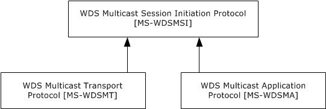
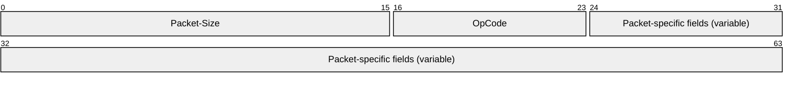
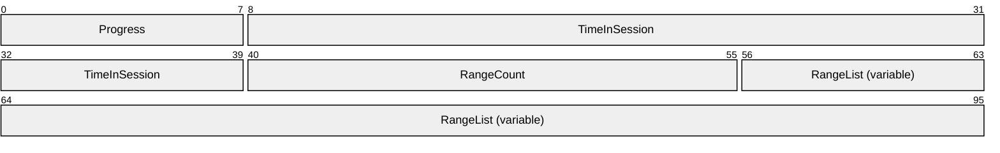
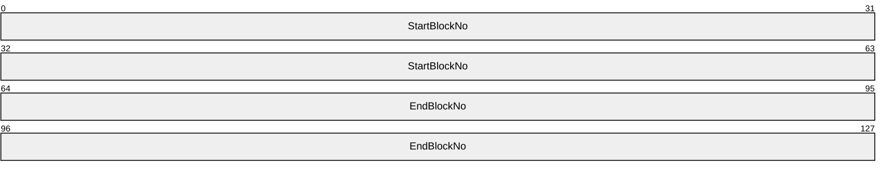
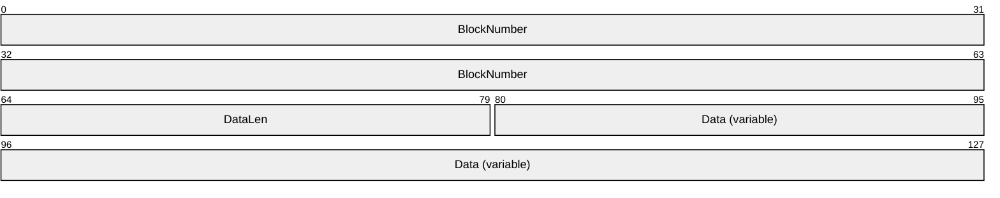
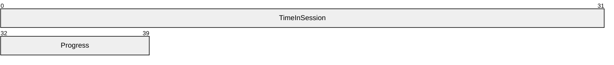
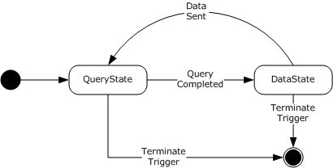
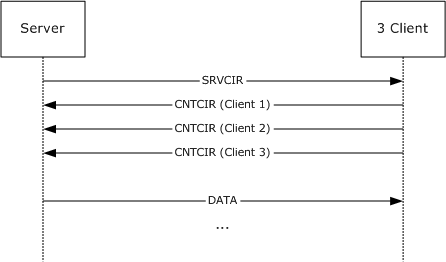

# [MS-WDSMA]: Windows Deployment Services Multicast Application Protocol

Table of Contents

1 Introduction

- [1 Introduction](#Section_1)
  - [1.1 Glossary](#Section_1.1)
  - [1.2 References](#Section_1.2)
    - [1.2.1 Normative References](#Section_1.2.1)
    - [1.2.2 Informative References](#Section_1.2.2)
  - [1.3 Overview](#Section_1.3)
  - [1.4 Relationship to Other Protocols](#Section_1.4)
  - [1.5 Prerequisites/Preconditions](#Section_1.5)
  - [1.6 Applicability Statement](#Section_1.6)
  - [1.7 Versioning and Capability Negotiation](#Section_1.7)
  - [1.8 Vendor-Extensible Fields](#Section_1.8)
  - [1.9 Standards Assignments](#Section_1.9)

2 Messages

- [2 Messages](#Section_2)
  - [2.1 Transport](#Section_2.1)
  - [2.2 Message Syntax](#Section_2.2)
    - [2.2.1 Packet Header](#Section_2.2.1)
    - [2.2.2 SRVCIR Packet](#Section_2.2.2)
    - [2.2.3 CNTCIR Packet](#Section_2.2.3)
      - [2.2.3.1 Range List](#Section_2.2.3.1)
    - [2.2.4 DATA Packet](#Section_2.2.4)
    - [2.2.5 PROGRESS Packet](#Section_2.2.5)

3 Protocol Details

- [3 Protocol Details](#Section_3)
  - [3.1 Server Details](#Section_3.1)
    - [3.1.1 Abstract Data Model](#Section_3.1.1)
    - [3.1.2 Timers](#Section_3.1.2)
    - [3.1.3 Initialization](#Section_3.1.3)
    - [3.1.4 Higher-Layer Triggered Events](#Section_3.1.4)
    - [3.1.5 Message Processing Events and Sequencing Rules](#Section_3.1.5)
      - [3.1.5.1 Query State](#Section_3.1.5.1)
        - [3.1.5.1.1 POLLACK Trigger](#Section_3.1.5.1.1)
      - [3.1.5.2 Data State](#Section_3.1.5.2)
        - [3.1.5.2.1 Data Empty Trigger](#Section_3.1.5.2.1)
      - [3.1.5.3 Status Trigger](#Section_3.1.5.3)
      - [3.1.5.4 Terminate Trigger](#Section_3.1.5.4)
    - [3.1.6 Timer Events](#Section_3.1.6)
      - [3.1.6.1 Query Timer](#Section_3.1.6.1)
    - [3.1.7 Other Local Events](#Section_3.1.7)
  - [3.2 Client Details](#Section_3.2)
    - [3.2.1 Abstract Data Model](#Section_3.2.1)
    - [3.2.2 Timers](#Section_3.2.2)
    - [3.2.3 Initialization](#Section_3.2.3)
    - [3.2.4 Higher-Layer Triggered Events](#Section_3.2.4)
    - [3.2.5 Message Processing Events and Sequencing Rules](#Section_3.2.5)
      - [3.2.5.1 DATA Trigger](#Section_3.2.5.1)
      - [3.2.5.2 Query Cache Trigger](#Section_3.2.5.2)
      - [3.2.5.3 QCC Trigger](#Section_3.2.5.3)
      - [3.2.5.4 POLL Trigger](#Section_3.2.5.4)
    - [3.2.6 Timer Events](#Section_3.2.6)
    - [3.2.7 Other Local Events](#Section_3.2.7)

4 Protocol Examples

- [4 Protocol Examples](#Section_4)

5 Security

- [5 Security](#Section_5)
  - [5.1 Security Considerations for Implementers](#Section_5.1)
  - [5.2 Index of Security Parameters](#Section_5.2)

6 Appendix A: Product Behavior

- [6 Appendix A: Product Behavior](#Section_6)

7 Change Tracking

- [7 Change Tracking](#Section_7)

For the legal notice and IP terms, see [LEGAL.md](../LEGAL.md).
Last updated: 4/23/2024.
See [Revision History](#revision-history) for full version history.

# 1 Introduction

WDS Multicast Application Protocol is a single server, multiple client protocol.

The protocol uses the WDS Multicast Transport Protocol [MS-WDSMT](#Section_2.1) for transmission of content to multiple clients. The protocol relies on services provided by the WDS Multicast Transport Protocol [MS-WDSMT] to ensure all pieces of content are delivered to all clients in a [**multicast**](#gt_multicast) session.

The protocol allows clients to join the multicast session at any point during the lifetime of the multicast session, and still be able to get all pieces of the content.

Sections 1.5, 1.8, 1.9, 2, and 3 of this specification are normative. All other sections and examples in this specification are informative.

## 1.1 Glossary

This document uses the following terms:

**block number**: The content is divided into equal blocks. The first block is assigned a value of 1, and each successive block is incrementally assigned the next higher value.

**multicast**: The ability of a transport protocol, such as User Datagram Protocol (UDP), to deliver messages to a group of recipients simultaneously without duplication of message unless the link to recipients is split.

**network byte order**: The order in which the bytes of a multiple-byte number are transmitted on a network, most significant byte first (in big-endian storage). This may or may not match the order in which numbers are normally stored in memory for a particular processor.

**MAY, SHOULD, MUST, SHOULD NOT, MUST NOT:** These terms (in all caps) are used as defined in [[RFC2119]](https://go.microsoft.com/fwlink/?LinkId=90317). All statements of optional behavior use either MAY, SHOULD, or SHOULD NOT.

## 1.2 References

Links to a document in the Microsoft Open Specifications library point to the correct section in the most recently published version of the referenced document. However, because individual documents in the library are not updated at the same time, the section numbers in the documents may not match. You can confirm the correct section numbering by checking the [Errata](https://go.microsoft.com/fwlink/?linkid=850906).

### 1.2.1 Normative References

We conduct frequent surveys of the normative references to assure their continued availability. If you have any issue with finding a normative reference, please contact [dochelp@microsoft.com](mailto:dochelp@microsoft.com). We will assist you in finding the relevant information.

[MS-WDSMSI] Microsoft Corporation, "[Windows Deployment Services Multicast Session Initiation Protocol](../MS-WDSMSI/MS-WDSMSI.md)".

[MS-WDSMT] Microsoft Corporation, "[Windows Deployment Services Multicast Transport Protocol](#Section_2.1)".

[RFC2119] Bradner, S., "Key words for use in RFCs to Indicate Requirement Levels", BCP 14, RFC 2119, March 1997, [https://www.rfc-editor.org/info/rfc2119](https://go.microsoft.com/fwlink/?LinkId=90317)

### 1.2.2 Informative References

None.

## 1.3 Overview

WDS Multicast Application Protocol uses the WDS Multicast Transport Protocol [MS-WDSMT](#Section_2.1) to deliver all pieces of the content to all clients in a [**multicast**](#gt_multicast) session.

When the first client joins the multicast session, the WDS Multicast Transport Protocol notifies the WDS Multicast Application Protocol using a trigger. After such a Trigger is received, the WDS Multicast Application Protocol uses the steps below to ensure delivery of all pieces of content to the clients in the multicast session:

- The WDS Multicast Application Protocol server sends packets using the WDS Multicast Transport Protocol to query all clients for the block ranges that each client is missing from the content. The WDS Multicast Application Protocol on each client, on receiving such a packet, returns a reply to the server with the list of block ranges that the client is missing. The WDS Multicast Application Protocol on the server-side receives all replies from clients via the WDS Multicast Transport Protocol.
- WDS Multicast Application Protocol on the server-side sends the missing pieces to all clients using WDS Multicast Transport Protocol.
- After all missing pieces have been transmitted, WDS Multicast Application Protocol on the server starts over from step 1.

## 1.4 Relationship to Other Protocols

The WDS Multicast Application Protocol is established via the WDS Multicast Session Initiation Protocol [MS-WDSMSI](../MS-WDSMSI/MS-WDSMSI.md).

The WDS Multicast Application Protocol uses the WDS Multicast Transport Protocol [MS-WDSMT](#Section_2.1) as its transport to send the pieces of content to all clients in the multicast session.

The following diagram specifies the relationship among the WDS Multicast Application Protocol and other protocols:

Figure 1: Relationship among the WDS Multicast Application Protocol and associated protocols

## 1.5 Prerequisites/Preconditions

The protocol relies on the WDS Multicast Session Initiation Protocol [MS-WDSMSI](../MS-WDSMSI/MS-WDSMSI.md) to provide each client with the details of the content and parameters required for the WDS Multicast Transport Protocol [MS-WDSMT](#Section_2.1).

The protocol assumes that the WDS Multicast Session Initiation Protocol has created and initialized instances of the WDS Multicast Application Protocol and the WDS Multicast Transport Protocol.

## 1.6 Applicability Statement

The WDS Multicast Application Protocol is applicable when an application has to download content from a server using a multicast session.

## 1.7 Versioning and Capability Negotiation

This protocol does not have any explicit versioning negotiation.

## 1.8 Vendor-Extensible Fields

This protocol does not have any vendor-extensible fields.

## 1.9 Standards Assignments

None.

# 2 Messages

## 2.1 Transport

The packet contents for the WDS Multicast Application Protocol MUST be specified in [**network byte order**](#gt_network-byte-order) unless noted otherwise.

The WDS Multicast Application Protocol uses the WDS Multicast Transport Protocol [MS-WDSMT](#Section_2.1) for transport of the content to all clients in the [**multicast**](#gt_multicast) session.

## 2.2 Message Syntax

### 2.2.1 Packet Header

Each packet of the WDS Multicast Application Protocol MUST specify the packet header as follows:

**Packet-Size (2 bytes):** Specifies the total length of the packet in bytes.

**OpCode (1 byte):** A unique numeric value that is assigned to each packet of WDS Multicast Application Protocol and is used to identify the format for the rest of the packet.

**Packet-specific fields (variable):** Based on the **OpCode** field of the packet header, additional fields can be specified for each **OpCode** as shown in the following table:

| OpCode | Meaning |
| --- | --- |
| WDSMC_PKTYPE_SRV_CIR 0x01 | Section [2.2.2](#Section_2.2.2) |
| WDSMC_PKTYPE_CNT_CIR 0x02 | Section [2.2.3](#Section_2.2.3) |
| WDSMC_PKTYPE_SRV_DATA 0x03 | Section [2.2.4](#Section_2.2.4) |
| WDSMC_PKTYPE_CNT_PROGRESS 0x04 | Section [2.2.5](#Section_2.2.5) |

### 2.2.2 SRVCIR Packet

This packet is sent by the server to all clients using the **POLL Trigger** provided by the WDS Multicast Transport Protocol.

This packet does not specify any additional fields except those specified for the packet header (section [2.2.1](#Section_2.2.1)).

### 2.2.3 CNTCIR Packet

This packet is sent by the client in response to the SRVCIR Packet (section [2.2.2](#Section_2.2.2)) and is delivered to the server by the **POLLACK Trigger** from the WDS Multicast Transport Protocol.

**Progress (1 byte):** MUST be set to a numeric value ranging from 0–100 specifying the percentage of the blocks of content that have been received by client.

**TimeInSession (4 bytes):** MUST be set to the number of seconds elapsed since the client joined the [**multicast**](#gt_multicast) session.

**RangeCount (2 bytes):** MUST be set to the number of block ranges of the content that the client is currently missing and that are specified in the **RangeList** field. The maximum number of ranges MUST NOT exceed 64. If the number of missing ranges on the client exceeds 64, then the client MUST send only the first 64 block ranges.

**RangeList (variable):** MUST be set to the block ranges of content that the client is missing as specified in section [2.2.3.1](#Section_2.2.3.1). The count of ranges specified MUST match the count specified by the **RangeCount** field.

#### 2.2.3.1 Range List

This field specifies an array of block ranges of content that the client is missing. Each element of the array MUST specify the range as follows:

**StartBlockNo (8 bytes):** MUST be set to the starting BlockNumber of the range of [**block numbers**](#gt_block-number) missing for the content.

**EndBlockNo (8 bytes):** MUST be set to the ending BlockNumber of the range of block numbers missing for the content.

### 2.2.4 DATA Packet

**BlockNumber (8 bytes):** MUST be set to the unique [**block number**](#gt_block-number) for the data being sent for the content.

**DataLen (2 bytes):** MUST be set to the length in bytes of the payload included in the **Data** field.

**Data (variable):** MUST be set to the data read from the content.

### 2.2.5 PROGRESS Packet

**TimeInSession (4 bytes):** MUST be set to the number of seconds elapsed since the client joined the [**multicast**](#gt_multicast) session.

**Progress (1 byte):** MUST be set to a numeric value ranging from 0-100 specify the percentage of the Blocks of Content that have been received by client.

# 3 Protocol Details

## 3.1 Server Details

This section specifies the WDS Multicast Application Protocol behavior for the server.

The following state diagram shows the lifetime of the protocol on the server:

Figure 2: Server state diagram

### 3.1.1 Abstract Data Model

This section describes a conceptual model of possible data organization that an implementation maintains to participate in this protocol. The described organization is provided to facilitate the explanation of how the protocol behaves. This document does not mandate that implementations adhere to this model as long as their external behavior is consistent with that described in this document.

**SessionState:** Specifies the current state for the [**multicast**](#gt_multicast) session as defined below.

| State | Description |
| --- | --- |
| QueryState | The WDS Multicast Application Protocol is actively querying the clients for block ranges of content that each client is missing. |
| DataState | The WDS Multicast Application Protocol is sending the data for missing block ranges discovered during the search in the QueryState. |

At initialization, the SessionState MUST be set to QueryState on initialization.

**BlockSize:** Specifies the block size to use to send data to the clients. The value is provided by the WDS Multicast Session Initiation Protocol [MS-WDSMSI](../MS-WDSMSI/MS-WDSMSI.md).

**MissingBlockRanges:** Specifies an array of missing block ranges that MUST be constructed from the CNTCIR packets (section [2.2.3](#Section_2.2.3)) received from the clients as specified in section [3.1.6.1](#Section_3.1.6.1). Each element of the array has the following two elements:

**StartBlockNo:** Specifies the starting [**block number**](#gt_block-number) for the missing block range.

**EndBlockNo:** Specifies the ending block number for the missing block range.

**ClientCNTCIRPackets:** Specifies the list of CNTCIR packets (section 2.2.3) received from the clients while the server is in the QueryState.

### 3.1.2 Timers

| Timer | Description |
| --- | --- |
| Query Timer | The timeout for this timer is provided by the WDS Multicast Transport Protocol in response to **POLL Trigger**. |

### 3.1.3 Initialization

Server MUST be initialized for **QueryState** and MUST start processing as specified in section [3.1.5.1](#Section_3.1.5.1).

### 3.1.4 Higher-Layer Triggered Events

None.

### 3.1.5 Message Processing Events and Sequencing Rules

The WDS Multicast Application Protocol drives the processing based on lower-layer triggered events generated by the WDS Multicast Transport Protocol [MS-WDSMT](#Section_2.1).

The following table specifies the lower-layer triggered events generated by the WDS Multicast Transport Protocol and their respective processing:

| Lower-layer triggered events | Processing description |
| --- | --- |
| POLLACK trigger | Section [3.1.5.1.1](#Section_3.1.5.1.1) |
| Status trigger | Section [3.1.5.3](#Section_3.1.5.3) |
| Data Empty trigger | Section [3.1.5.2.1](#Section_3.1.5.2.1) |
| Terminate trigger | Section [3.1.5.4](#Section_3.1.5.4) |

#### 3.1.5.1 Query State

Server MUST remove all packets stored in **ClientCNTCIRPackets** (section [3.1.1](#Section_3.2.1)).

Server MUST construct a SRVCIR packet (section [2.2.2](#Section_2.2.2)) and MUST send the packet using **POLL Trigger** to the WDS Multicast Transport Protocol. The timeout value provided by **POLL Trigger** MUST be used to set the expiry time for the **Query Timer**.

##### 3.1.5.1.1 POLLACK Trigger

POLLACK Trigger MUST provide the payload received from the client. Server MUST validate that the payload specifies a CNTCIR packet as specified in section [2.2.3](#Section_2.2.3) and MUST add the packet to **ClientCNTCIRPackets** (section [3.1.1](#Section_3.2.1)).

#### 3.1.5.2 Data State

The server MUST start from the first [**block number**](#gt_block-number) of the first block range specified by **MissingBlockRanges** (section [3.1.1](#Section_3.2.1)) and MUST process for each block number as specified below:

- The server MUST compute the offset into the content as follows:
**BlockOffset** = **BlockNumber** x **BlockSize** (section 3.1.1)

- The server MUST read the bytes of data from the content at offset specified by **BlockOffset**. The number of bytes read MUST be equal to the **BlockSize** (section 3.1.1), unless the read operation reaches to the last byte of the content in which case there will be fewer bytes read.
- The server MUST construct a DATA packet and set the fields of the DATA packet as specified below:
**BlockNumber**: MUST be set to the **BlockNumber**.

**DataLen**: MUST be set to the number of bytes of data read from the content.

**Data**: MUST be set the bytes of data read from the content.

- The server MUST send the **Data Trigger** to the WDS Multicast Transport Protocol providing the constructed DATA packet.
Server MUST wait for the **Data Empty Trigger** from the WDS Multicast Transport Protocol.

##### 3.1.5.2.1 Data Empty Trigger

Server MUST ignore **Data Empty Trigger** when **SessionState** (section [3.1.1](#Section_3.2.1)) is not set to **DataState**.

Otherwise, server MUST change the **SessionState** (section 3.1.1) to **QueryState** and MUST continue processing as specified in section [3.1.5.1](#Section_3.1.5.1).

#### 3.1.5.3 Status Trigger

**Status Trigger** MUST provide the payload received from client. Server MUST validate that the payload specifies a PROGRESS packet (section [2.2.5](#Section_2.2.5)).

#### 3.1.5.4 Terminate Trigger

When Terminate Trigger is received, server MUST shut down the WDS Multicast Application Protocol.

### 3.1.6 Timer Events

#### 3.1.6.1 Query Timer

If the **ClientCNTCIRPackets** (section [3.1.1](#Section_3.2.1)) is empty, the server MUST continue processing as specified in section [3.1.5.1](#Section_3.1.5.1).

If the **ClientCNTCIRPackets** is not empty, the server MUST remove all entries stored in **MissingBlockRanges** (section 3.1.1). The server MUST merge block ranges specified by CNTCIR packets stored in **ClientCNTCIRPacket** and store the merged block ranges list into **MissingBlockRanges**.

To merge the block ranges, the server MUST first eliminate the CNTCIR packet (section [2.2.3](#Section_2.2.3)) as follows:

- Find the CNTCIR packet which has the highest value for the **TimeInSession** field (section 2.2.3).
- Delete all such CNTCIR packets in the **ClientCNTCIRPackets** (section where the **TimeInSession** field specifies that the client joined after 30 seconds of the oldest client.
Server MUST construct a merged list of missing block ranges from the remaining CNTCIR packets in **ClientCNTCIRPackets** and set the **MissingBlockRanges** to the merged list.

The merged list MUST NOT have any overlapping block ranges and MUST be in ascending order.

Server MUST change the **SessionState** (section 3.1.1) to **DataState** and MUST disable **Query Timer** and continue processing as specified in section [3.1.5.2](#Section_1.3).

### 3.1.7 Other Local Events

None.

## 3.2 Client Details

### 3.2.1 Abstract Data Model

This section describes a conceptual model of possible data organization that an implementation maintains to participate in this protocol. The described organization is provided to facilitate the explanation of how the protocol behaves. This document does not mandate that implementations adhere to this model as long as their external behavior is consistent with that described in this document.

**TotalBlocks:** Specifies the number of blocks in the content. This value is provided by the WDS Multicast Session Initiation Protocol [MS-WDSMSI](../MS-WDSMSI/MS-WDSMSI.md).

**MissingBlocksBitmap:** An array of bits where the size of the array is set to the value of **TotalBlocks**. Each bit in the array is initialized to 0. When a DATA packet (section [2.2.4](#Section_2.2.4)) is received for a specified [**block number**](#gt_block-number), the bit at that index is changed to 1. The array uses a 1-based index.

**BlockSize:** Specifies the number of bytes of content data sent in each DATA packet. This value is provided by the WDS Multicast Session Initiation Protocol.

**MaxCacheSize:** Specifies the maximum number of bytes of DATA packets that can be processed by a client before the WDS Multicast Transport Protocol [MS-WDSMT](#Section_2.1) stops sending the **DATA** trigger, and the protocol MUST wait for a **Cache Done** trigger from the WDS Multicast Application Protocol. The default maximum number of bytes is 2097152.

**JoinTime:** MUST be set to local time (in seconds) on initialization.

### 3.2.2 Timers

None.

### 3.2.3 Initialization

On initialization client MUST wait for packets to arrive from the server using the Lower-Layered Triggered Events as specified in section [3.2.5](#Section_3.2.5).

### 3.2.4 Higher-Layer Triggered Events

None.

### 3.2.5 Message Processing Events and Sequencing Rules

The client processes the Lower-Layered Triggered Events from the WDS Multicast Transport Protocol, as specified in the following sections.

#### 3.2.5.1 DATA Trigger

The client MUST validate that the payload provided by the DATA Trigger specifies the DATA packet as per section [2.2.4](#Section_2.2.4). The client MUST check the value of the bit at the index specified by the **BlockNumber** field of the DATA packet in **MissingBlocksBitmap** (section [3.2.1](#Section_3.2.1)). If the value is set to one, then the client MUST ignore the DATA packet and stop further processing.

If the bit value is not set to one, the client MUST set the bit to one and MUST send the **Cache Done Trigger** to the WDS Multicast Transport Protocol [MS-WDSMT](#Section_2.1) specifying the size of the DATA packet.

The client MUST check whether all bits of **MissingBlocksBitmap** (section 3.2.1) are now set to one. If so then the download of Content has completed and the client MUST terminate.

#### 3.2.5.2 Query Cache Trigger

The client MUST reply to the trigger by providing the **MaxCacheSize** value (section [3.2.1](#Section_3.2.1)).

#### 3.2.5.3 QCC Trigger

When the **QCC Trigger** is received, the client MUST construct the PROGRESS packet (section [2.2.5](#Section_2.2.5)) and set the fields of the packet as specified below:

**TimeInSession**: MUST be set to (Local Time in Seconds – **JoinTime**) (section [3.2.1](#Section_3.2.1)).

**Progress**: MUST be set to the percentage of bits that are set to zero in MissingBlocksBitmap (section 3.2.1).

The client MUST provide the constructed packet in reply to the **QCC Trigger**.

#### 3.2.5.4 POLL Trigger

When a POLL Trigger is received, the client MUST construct a CNTCIR packet (section [2.2.3](#Section_2.2.3)) and set the fields of the packet as follows:

**TimeInSession**: MUST be set to (Local Time in Seconds – **JoinTime** (section [3.2.1](#Section_3.2.1)) ).

**Progress**: MUST be set to the percentage of bits that are set to zero in **MissingBlocksBitmap** (section 3.2.1) and MUST be in range 0-100.

**RangeList**: The server MUST go through the **MissingBlocksBitmap** (section 3.2.1) to find the ranges of blocks that are missing (such blocks will have the respective bit set to zero) and MUST add all such missing ranges to the **RangeList** field. The number of ranges added MUST NOT exceed the limit specified in section [2.2.3.1](#Section_2.2.3.1).

**RangeCount**: MUST be set to the ranges specified by the **RangeList**.

Client MUST provide the constructed packet in reply to **POLL Trigger**.

### 3.2.6 Timer Events

None.

### 3.2.7 Other Local Events

None.

# 4 Protocol Examples

The following diagram specifies a server querying 3 clients and sending DATA packets:

Figure 3: Client-server interaction

# 5 Security

## 5.1 Security Considerations for Implementers

The WDS Multicast Application Protocol relies on the WDS Multicast Transport Protocol [MS-WDSMT](#Section_2.1) to provide security.

## 5.2 Index of Security Parameters

None.

# 6 Appendix A: Product Behavior

The information in this specification is applicable to the following Microsoft products or supplemental software. References to product versions include updates to those products.

- Windows Server 2008 operating system
- Windows Server 2008 R2 operating system
- Windows Server 2012 operating system
- Windows Server 2012 R2 operating system
- Windows Server 2016 operating system
- Windows Server operating system
- Windows Server 2019 operating system
- Windows Server 2022 operating system
- Windows Server 2025 operating system
Exceptions, if any, are noted in this section. If an update version, service pack or Knowledge Base (KB) number appears with a product name, the behavior changed in that update. The new behavior also applies to subsequent updates unless otherwise specified. If a product edition appears with the product version, behavior is different in that product edition.

Unless otherwise specified, any statement of optional behavior in this specification that is prescribed using the terms "SHOULD" or "SHOULD NOT" implies product behavior in accordance with the SHOULD or SHOULD NOT prescription. Unless otherwise specified, the term "MAY" implies that the product does not follow the prescription.

# 7 Change Tracking

This section identifies changes that were made to this document since the last release. Changes are classified as Major, Minor, or None.

The revision class **Major** means that the technical content in the document was significantly revised. Major changes affect protocol interoperability or implementation. Examples of major changes are:

- A document revision that incorporates changes to interoperability requirements.
- A document revision that captures changes to protocol functionality.
The revision class **Minor** means that the meaning of the technical content was clarified. Minor changes do not affect protocol interoperability or implementation. Examples of minor changes are updates to clarify ambiguity at the sentence, paragraph, or table level.

The revision class **None** means that no new technical changes were introduced. Minor editorial and formatting changes may have been made, but the relevant technical content is identical to the last released version.

The changes made to this document are listed in the following table. For more information, please contact [dochelp@microsoft.com](mailto:dochelp@microsoft.com).

| Section | Description | Revision class |
| --- | --- | --- |
| [6](#Section_6) Appendix A: Product Behavior | Added Windows Server 2025 to the list of applicable products. | Major |

## Revision History

| Date | Version | Revision Class | Comments |
| --- | --- | --- | --- |
| 4/10/2009 | 0.1 | Major | First Release. |
| 5/22/2009 | 0.1.1 | Editorial | Changed language and formatting in the technical content. |
| 7/2/2009 | 0.1.2 | Editorial | Changed language and formatting in the technical content. |
| 8/14/2009 | 0.1.3 | Editorial | Changed language and formatting in the technical content. |
| 9/25/2009 | 0.1.4 | Editorial | Changed language and formatting in the technical content. |
| 11/6/2009 | 0.1.5 | Editorial | Changed language and formatting in the technical content. |
| 12/18/2009 | 0.2 | Minor | Clarified the meaning of the technical content. |
| 1/29/2010 | 0.2.1 | Editorial | Changed language and formatting in the technical content. |
| 3/12/2010 | 0.3 | Minor | Clarified the meaning of the technical content. |
| 4/23/2010 | 0.3.1 | Editorial | Changed language and formatting in the technical content. |
| 6/4/2010 | 0.3.2 | Editorial | Changed language and formatting in the technical content. |
| 7/16/2010 | 0.3.2 | None | No changes to the meaning, language, or formatting of the technical content. |
| 8/27/2010 | 0.3.2 | None | No changes to the meaning, language, or formatting of the technical content. |
| 10/8/2010 | 0.3.2 | None | No changes to the meaning, language, or formatting of the technical content. |
| 11/19/2010 | 0.3.2 | None | No changes to the meaning, language, or formatting of the technical content. |
| 1/7/2011 | 0.3.2 | None | No changes to the meaning, language, or formatting of the technical content. |
| 2/11/2011 | 0.3.2 | None | No changes to the meaning, language, or formatting of the technical content. |
| 3/25/2011 | 0.3.2 | None | No changes to the meaning, language, or formatting of the technical content. |
| 5/6/2011 | 0.3.2 | None | No changes to the meaning, language, or formatting of the technical content. |
| 6/17/2011 | 0.4 | Minor | Clarified the meaning of the technical content. |
| 9/23/2011 | 0.4 | None | No changes to the meaning, language, or formatting of the technical content. |
| 12/16/2011 | 1.0 | Major | Updated and revised the technical content. |
| 3/30/2012 | 1.0 | None | No changes to the meaning, language, or formatting of the technical content. |
| 7/12/2012 | 1.0 | None | No changes to the meaning, language, or formatting of the technical content. |
| 10/25/2012 | 1.0 | None | No changes to the meaning, language, or formatting of the technical content. |
| 1/31/2013 | 1.0 | None | No changes to the meaning, language, or formatting of the technical content. |
| 8/8/2013 | 2.0 | Major | Updated and revised the technical content. |
| 11/14/2013 | 2.0 | None | No changes to the meaning, language, or formatting of the technical content. |
| 2/13/2014 | 3.0 | Major | Updated and revised the technical content. |
| 5/15/2014 | 3.0 | None | No changes to the meaning, language, or formatting of the technical content. |
| 6/30/2015 | 4.0 | Major | Significantly changed the technical content. |
| 10/16/2015 | 4.0 | None | No changes to the meaning, language, or formatting of the technical content. |
| 7/14/2016 | 4.0 | None | No changes to the meaning, language, or formatting of the technical content. |
| 6/1/2017 | 4.0 | None | No changes to the meaning, language, or formatting of the technical content. |
| 9/15/2017 | 5.0 | Major | Significantly changed the technical content. |
| 9/12/2018 | 6.0 | Major | Significantly changed the technical content. |
| 4/7/2021 | 7.0 | Major | Significantly changed the technical content. |
| 4/23/2024 | 8.0 | Major | Significantly changed the technical content. |
