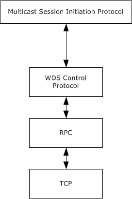
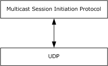
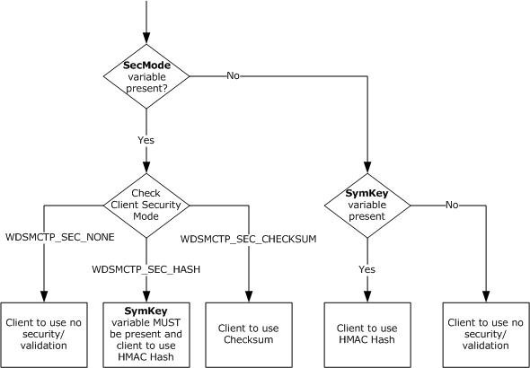
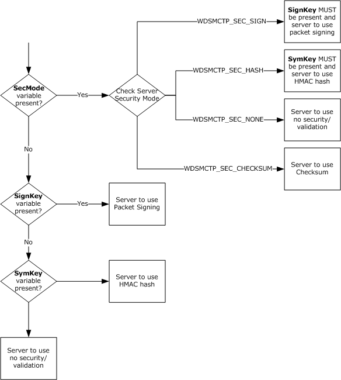
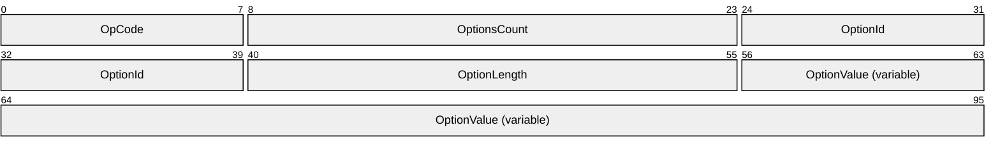

# [MS-WDSMSI]: Windows Deployment Services Multicast Session Initiation Protocol

Table of Contents

1 Introduction

- [1 Introduction](#Section_1)
  - [1.1 Glossary](#Section_1.1)
  - [1.2 References](#Section_1.2)
    - [1.2.1 Normative References](#Section_1.2.1)
    - [1.2.2 Informative References](#Section_1.2.2)
  - [1.3 Overview](#Section_1.3)
  - [1.4 Relationship to Other Protocols](#Section_1.4)
    - [1.4.1 Using the WDS Control Protocol](#Section_1.4.1)
    - [1.4.2 Using UDP](#Section_1.4.2)
  - [1.5 Prerequisites/Preconditions](#Section_1.5)
  - [1.6 Applicability Statement](#Section_1.6)
  - [1.7 Versioning and Capability Negotiation](#Section_1.7)
  - [1.8 Vendor-Extensible Fields](#Section_1.8)
  - [1.9 Standards Assignments](#Section_1.9)

2 Messages

- [2 Messages](#Section_2)
  - [2.1 Transport](#Section_2.1)
  - [2.2 Message Syntax](#Section_2.2)
    - [2.2.1 WDSMC_OP_INITIATE OpCode](#Section_2.2.1)
      - [2.2.1.1 Determine Client Security Mode](#Section_2.2.1.1)
      - [2.2.1.2 Determine Server Security Mode](#Section_2.2.1.2)
    - [2.2.2 Session Initiation Packets for UDP](#Section_2.2.2)
      - [2.2.2.1 Multicast Session Initiation Request Packet](#Section_2.2.2.1)
      - [2.2.2.2 Multicast Session Initiation Reply Packet](#Section_2.2.2.2)
      - [2.2.2.3 Multicast Session Initiation Error Packet](#Section_2.2.2.3)

3 Protocol Details

- [3 Protocol Details](#Section_3)
  - [3.1 Server Details](#Section_3.1)
    - [3.1.1 Abstract Data Model](#Section_3.1.1)
      - [3.1.1.1 Registered Content Provider Configuration](#Section_3.1.1.1)
      - [3.1.1.2 Registered Multicast Namespaces Configuration](#Section_3.1.1.2)
      - [3.1.1.3 WDS Server Configuration](#Section_3.1.1.3)
    - [3.1.2 Timers](#Section_3.1.2)
    - [3.1.3 Initialization](#Section_3.1.3)
    - [3.1.4 Higher-Layer Triggered Events](#Section_3.1.4)
    - [3.1.5 Message Processing Events and Sequencing Rules](#Section_3.1.5)
      - [3.1.5.1 Supported Security Modes](#Section_3.1.5.1)
        - [3.1.5.1.1 Pre-OS Client](#Section_3.1.5.1.1)
      - [3.1.5.2 WDSMC_OP_INITIATE](#Section_3.1.5.2)
      - [3.1.5.3 Over UDP](#Section_3.1.5.3)
    - [3.1.6 Timer Events](#Section_3.1.6)
    - [3.1.7 Other Local Events](#Section_3.1.7)

4 Protocol Examples

- [4 Protocol Examples](#Section_4)
  - [4.1 WDS Multicast Session Initiation Protocol over WDS Control Protocol](#Section_4.1)

5 Security

- [5 Security](#Section_5)
  - [5.1 Security Considerations for Implementers](#Section_5.1)
  - [5.2 Index of Security Parameters](#Section_5.2)

6 Appendix A: Product Behavior

- [6 Appendix A: Product Behavior](#Section_6)

7 Change Tracking

- [7 Change Tracking](#Section_7)

For the legal notice and IP terms, see [LEGAL.md](../LEGAL.md).
Last updated: 4/23/2024.
See [Revision History](#revision-history) for full version history.

# 1 Introduction

The Multicast Session Initiation Protocol specifies communication between a client and a Windows Deployment Services server to initiate a Multicast Session. It is a client/server protocol which specifies two mechanisms for the client to request initiation of a Multicast Session from the server.

Sections 1.5, 1.8, 1.9, 2, and 3 of this specification are normative. All other sections and examples in this specification are informative.

## 1.1 Glossary

This document uses the following terms:

**Client Security Mode**: Specifies the mechanism used by the client to add validation information to each packet sent by the client to the server using the WDS Multicast Transport Protocol.

**Configuration String**: A Unicode string that is used by multicast namespace to instruct the content provider about the content required to be exposed.

**content**: Identified by a unique name under a given multicast namespace. The [**content metadata**](#gt_content-metadata) cannot change during the lifetime of a multicast session, and is required to allow random access to the data.

**Content Metadata**: Specifies an opaque binary data that is associated with the content.

**Content Provider**: A module that is loaded by the server and is responsible for providing access to the data for the content under a multicast namespace.

**Endpoint GUID**: Set of relevant services provided by a Service Provider are grouped together and as a whole identified by a unique Endpoint GUID.

**globally unique identifier (GUID)**: A term used interchangeably with universally unique identifier (UUID) in Microsoft protocol technical documents (TDs). Interchanging the usage of these terms does not imply or require a specific algorithm or mechanism to generate the value. Specifically, the use of this term does not imply or require that the algorithms described in [[RFC4122]](https://go.microsoft.com/fwlink/?LinkId=90460) or [[C706]](https://go.microsoft.com/fwlink/?LinkId=89824) must be used for generating the [**GUID**](#gt_globally-unique-identifier-guid). See also universally unique identifier (UUID).

**multicast**: The ability of a transport protocol, such as User Datagram Protocol (UDP), to deliver messages to a group of recipients simultaneously without duplication of message unless the link to recipients is split.

**multicast address**: A recipient that subscribes to the network address to receive packets sent using Multicast UDP. In a multicast address scenario, a packet is sent once by the sender and is delivered to all subscribers.

**multicast namespace**: Hosts multiple content that are available to clients using multicast sessions. Identification by a unique name is required. All content under a multicast namespace is available for transmission over multicast transmission.

**Multicast Session**: A session setup by the server to transmit content to multiple clients using the WDS Multicast Application Protocol and the WDS Multicast Transport Protocol.

**RSA Key**: A public/private key pair generated using RSA algorithm. The private key is used to sign the packets for the WDS Multicast Transport Protocol and the public key is used by clients to validate the signatures.

**security identifier (SID)**: An identifier for security principals that is used to identify an account or a group. Conceptually, the [**SID**](#gt_security-identifier-sid) is composed of an account authority portion (typically a domain) and a smaller integer representing an identity relative to the account authority, termed the relative identifier (RID). The [**SID**](#gt_security-identifier-sid) format is specified in [MS-DTYP](../MS-DTYP/MS-DTYP.md) section 2.4.2; a string representation of [**SIDs**](#gt_security-identifier-sid) is specified in [MS-DTYP] section 2.4.2 and [MS-AZOD](../MS-AZOD/MS-AZOD.md) section 1.1.1.2.

**Security Mode**: Specifies the mechanism used by server and clients to validate the packets sent using the WDS Multicast Transport Protocol.

**Server Security Mode**: Specifies the mechanism used by server to add validation information to each packet sent by server to clients using the WDS Multicast Transport Protocol.

**WDS server**: A Windows Deployment Services (WDS) server that communicates with clients by using the WDS OS Deployment Protocol to aid in deployment of an OS image on a client machine. Clients also communicate to a WDS server to request initiation/setup of multicast sessions for content available in multicast namespace on server.A WDS server provides an extensible mechanism to allow service providers to provide services to clients.

**MAY, SHOULD, MUST, SHOULD NOT, MUST NOT:** These terms (in all caps) are used as defined in [[RFC2119]](https://go.microsoft.com/fwlink/?LinkId=90317). All statements of optional behavior use either MAY, SHOULD, or SHOULD NOT.

## 1.2 References

Links to a document in the Microsoft Open Specifications library point to the correct section in the most recently published version of the referenced document. However, because individual documents in the library are not updated at the same time, the section numbers in the documents may not match. You can confirm the correct section numbering by checking the [Errata](https://go.microsoft.com/fwlink/?linkid=850906).

### 1.2.1 Normative References

We conduct frequent surveys of the normative references to assure their continued availability. If you have any issue with finding a normative reference, please contact [dochelp@microsoft.com](mailto:dochelp@microsoft.com). We will assist you in finding the relevant information.

[MS-DTYP] Microsoft Corporation, "[Windows Data Types](../MS-DTYP/MS-DTYP.md)".

[MS-ERREF] Microsoft Corporation, "[Windows Error Codes](../MS-ERREF/MS-ERREF.md)".

[MS-WDSC] Microsoft Corporation, "[Windows Deployment Services Control Protocol](../MS-WDSC/MS-WDSC.md)".

[MS-WDSMT] Microsoft Corporation, "[Windows Deployment Services Multicast Transport Protocol](#Section_2.1)".

[RFC2104] Krawczyk, H., Bellare, M., and Canetti, R., "HMAC: Keyed-Hashing for Message Authentication", RFC 2104, February 1997, [https://www.rfc-editor.org/info/rfc2104](https://go.microsoft.com/fwlink/?LinkId=90314)

[RFC2119] Bradner, S., "Key words for use in RFCs to Indicate Requirement Levels", BCP 14, RFC 2119, March 1997, [https://www.rfc-editor.org/info/rfc2119](https://go.microsoft.com/fwlink/?LinkId=90317)

### 1.2.2 Informative References

None.

## 1.3 Overview

A typical interaction between client and server involves the following:

- The client has already obtained the following information.
- Name or IP address of server.
- Name of [**multicast namespace**](#gt_multicast-namespace).
- Name of the [**content**](#gt_content) in multicast namespace.
- The client uses the Multicast Session Initiation Protocol to request content in the multicast namespace be set up for delivery using [**multicast**](#gt_multicast) transmission.
- On receiving the request, the server sets up the [**multicast session**](#gt_multicast-session) for the specified content in the multicast namespace and sends the details of the multicast session to the client.

## 1.4 Relationship to Other Protocols

The Multicast Session Initiation Protocol specifies two mechanisms for clients to request initiation of a multicast session. One uses the WDS Control Protocol, and the other uses UDP. Both are described in the following subsections.

### 1.4.1 Using the WDS Control Protocol

The Multicast Session Initiation Protocol uses the WDS Control Protocol to send a request to the server, which allows the user identity to be transported to the server with the request. The following diagram illustrates the relationship of the Multicast Session Initiation Protocol and how it relates to the WDS Control Protocol.

Figure 1: Protocol relationships

### 1.4.2 Using UDP

The clients can use UDP as a transport to send requests to a server<1>, but this limits all requests to being unauthenticated. The following diagram illustrates the relationship of the Multicast Session Initiation Protocol and the UDP Protocol.

Figure 2: WDSMSI relationship to UDP

## 1.5 Prerequisites/Preconditions

The WDS Multicast Session Initiation Protocol assumes the client has obtained the following:

- Name or IP address of the server.
- Name of the [**multicast namespace**](#gt_multicast-namespace).
- Name of the [**content**](#gt_content) in the multicast namespace.
- Authentication requirements for the content.
If the server requires a user identity to control access to the content, then the client MUST use the WDS Multicast Session Initiation Protocol over the WDS Control Protocol; otherwise the client MAY use the Multicast Session Initiation Protocol over UDP.

The content MAY have associated [**content metadata**](#gt_content-metadata), which clients MUST understand in order to consume the content. The server is responsible for transporting the content metadata from server to clients but treats it as opaque binary data.

An agreement MUST exist between the multicast namespace and the [**content provider**](#gt_content-provider) on the format of the [**configuration string**](#gt_configuration-string), which is used by the multicast namespace to instruct the content provider to expose the appropriate content for the multicast namespace.

## 1.6 Applicability Statement

This protocol is applicable when a client is required to download [**content**](#gt_content) from a server using [**multicast session**](#gt_multicast-session), and uses the WDS Multicast Session Initiation Protocol to request that the server set up the content for delivery over the multicast session.

## 1.7 Versioning and Capability Negotiation

This document covers versioning issues in the following areas.

- Supported Transports: This protocol can be implemented on top of the WDS Control Protocol and the User Datagram Protocol (UDP).
- Security and Authentication Methods: The WDS Multicast Session Initiation Protocol over the WDS Control Protocol supports authentication. The security requirements are specified in section [2.2](#Section_1.3).
- Localization: The protocol does not support localization, and as such acts as a pass-through for all strings.
- Capability Negotiation: The protocol does explicit capability negotiations for certain Endpoint [**GUID**](#gt_globally-unique-identifier-guid) and OpCodes as specified in the following section.
| Capability | Section |
| --- | --- |
| WDSMC_OP_INITIATE | Section [2.2.1](#Section_2.2.1) |

## 1.8 Vendor-Extensible Fields

The protocol does not provide any vendor-extensible fields.

This protocol uses Win32 error codes as defined in [MS-ERREF](../MS-ERREF/MS-ERREF.md) section 2.2. Vendors SHOULD reuse those values with their indicated meaning. Choosing any other value runs the risk of a collision in the future.

## 1.9 Standards Assignments

| Parameter | Value | Reference |
| --- | --- | --- |
| Multicast Session Initiation Endpoint GUID | 6f13a317-3687-4b54-81a5-504daa9062fa | [MS-WDSC](../MS-WDSC/MS-WDSC.md) (section 2.1.2) |
| Multicast Session Initiation UDP Port | 5041 | None. |

# 2 Messages

## 2.1 Transport

The Multicast Session Initiation Protocol over the WDS Control Protocol MUST use the byte-order as specified in [MS-WDSC](../MS-WDSC/MS-WDSC.md).

The Multicast Session Initiation Protocol over UDP MUST use network-byte-order unless noted otherwise.

## 2.2 Message Syntax

[**WDS servers**](#gt_security-mode) MUST support the following OpCodes under Multicast Session Initiation [**Endpoint GUID**](#gt_endpoint-guid), as specified in [MS-WDSC](../MS-WDSC/MS-WDSC.md) (section 2.1.2).

| OpCode | Authentication Requirements | Description |
| --- | --- | --- |
| WDSMC_OP_INITIATE 0x00000006 | Authenticated | This OpCode is used by clients to request that the server set up specified [**content**](#gt_content) for delivery using [**multicast session**](#gt_multicast-session). |

The [**WDS server**](#gt_wds-server) MAY support incoming requests on UDP Port as specified in section [1.9](#Section_1.9).<2>

### 2.2.1 WDSMC_OP_INITIATE OpCode

The client uses this OpCode under the Multicast Session Initiation Endpoint GUID to request setup of content for delivery using [**multicast**](#gt_multicast) session.

The request packet MUST include the following variables.

**Namespace** (WDSCPL_VAR_WSTRING as specified in [MS-WDSC](../MS-WDSC/MS-WDSC.md) section 2.2.1.3.2.1): MUST be set to the name of the multicast namespace.

**Content** (WDSCPL_VAR_WSTRING as specified in [MS-WDSC] section 2.2.1.3.2.1): MUST be set to the name of content under the [**multicast namespace**](#gt_multicast-namespace).

**Client** (WDSCPL_VAR_WSTRING as specified in [MS-WDSC] section 2.2.1.3.2.1): MUST be set to the machine name of the client. The maximum character length for the machine name MUST NOT exceed 16 characters including the null character.

The request packet MAY include the following variables.

**Cap** (WDSCPL_VAR_ULONG as specified in [MS-WDSC] section 2.2.1.3.2.1): Specifies a bitwise value of the following flags:<3>

| Flag | Description |
| --- | --- |
| WDSMC_CLIENT_CAP_CHECKSUM 0x00000001 | Specifies that clients support checksum handling for packets using the WDS Multicast Transport Protocol. |
| WDSMC_CLIENT_CAP_IPV6 0x00000002 | Specifies that clients support the IPv6 protocol and is capable of receiving multicast packets using the IPv6 protocol for the WDS Multicast Transport Protocol. |
| WDSMC_CLIENT_CAP_BOOT_DEVICE 0x00000004 | Specifies that the client is operating in a pre-OS environment. |

The reply packet MUST include the following variables.

**TpMcAddress.Port** (WDSCPL_VAR_ULONG as specified in [MS-WDSC] section 2.2.1.3.2.1): MUST be set to the UDP port being used by [**multicast session**](#gt_multicast-session) to send packets using multicast.

**TpMcAddress.Address** (WDSCPL_VAR_BLOB as specified in [MS-WDSC] section 2.2.1.3.2.1): MUST be set to the multicast IP address being used by the multicast session and MUST be specified in network byte order.

For a multicast session using an IPv4 [**multicast address**](#gt_multicast-address), this variable MUST be set to 4 bytes specifying the IPv4 multicast address.

For a multicast session using an IPv6 multicast address, this variable MUST be set to 16 bytes specifying the IPv6 multicast address.

**TpUniAddress.Port** (WDSCPL_VAR_ULONG as specified in [MS-WDSC] section 2.2.1.3.2.1): MUST be set to the same value as specified for the **TpMcAddress.Port** variable.

**TpUniAddress.Address** (WDSCPL_VAR_BLOB as specified in [MS-WDSC] section 2.2.1.3.2.1): MUST be set to the IP address of the network interface card being used by multicast session on the server and MUST be specified in network byte order.

For a multicast session using an IPv4 address, this variable MUST be set to 4 bytes specifying the IPv4 address.

For a multicast session using an IPv6 address, this variable MUST be set to 16 bytes specifying the IPv6 address.

**SessionId** (WDSCPL_VAR_ULONG as specified in [MS-WDSC] section 2.2.1.3.2.1): MUST be set to a numeric value that uniquely identifies the multicast session on the server.

**ContentSize** (WDSCPL_VAR_ULONG64 as specified in [MS-WDSC] section 2.2.1.3.2.1): MUST be set to the total size of the content, in bytes.

**BlockSize** (WDSCPL_VAR_ULONG as specified in [MS-WDSC] section 2.2.1.3.2.1): [**content**](#gt_content) is divided into equal-sized blocks of data by WDS Multicast Transport Protocol. This variable specifies the size of each block in bytes. The last block of data for content MAY be smaller in size because the total size of content MAY NOT be equally divisible by the **BlockSize**.

**TotalBlocks** (WDSCPL_VAR_ULONG64 as specified in [MS-WDSC] section 2.2.1.3.2.1): MUST be set to the total number of blocks that the content has been divided into.

**ContentMetadata** (WDSCPL_VAR_BLOB as specified in [MS-WDSC] section 2.2.1.3.2.1): Specifies any metadata associated with the content. If the content does not have any associated metadata, then this variable MUST be set to zero length.

The reply packet MAY include the following variables.

**SymKey** (WDSCPL_VAR_BLOB as specified in [MS-WDSC] section 2.2.1.3.2.1): Specifies the shared cryptographic key to use to compute and/or validate the hash of the packets using the Hash Message Authentication Code (HMAC) algorithm ([[RFC2104]](https://go.microsoft.com/fwlink/?LinkId=90314)) specified by the **HMACAlgId** variable for WDS Multicast Transport Protocol [MS-WDSMT](#Section_2.1).

When this variable is specified, **HashAlgId** and **HMACAlgId** variables MUST be specified as well.

Section [2.2.1.1](#Section_5) specifies the rules to determine the [**client security mode**](#gt_client-security-mode) and section [2.2.1.2](#Section_5) specifies the rules to determine the server security mode.

**SignKey** (WDSCPL_VAR_BLOB as specified in [MS-WDSC] section 2.2.1.3.2.1): Specifies the public [**RSA key**](#gt_rsa-key) to use to validate the signature of packets sent by server.

Section 2.2.1.1 specifies the rules to determine the client security mode and section 2.2.1.2 specifies the rules to determine the server security mode.

**HashAlgId** (WDSCPL_VAR_ULONG as specified in [MS-WDSC] section 2.2.1.3.2.1): Specifies the Hashing algorithm to use to compute the hash for packets.

**HMACAlgId** (WDSCPL_VAR_ULONG as specified in [MS-WDSC] section 2.2.1.3.2.1): HMAC algorithm to use to compute the HMAC hash for the packets.

**SecMode** (WDSCPL_VAR_ULONG as specified in [MS-WDSC] section 2.2.1.3.2.1): The value for variable has the following format:<4>

When this variable is specified in the reply packet, it controls the mechanism used by the client and server to validate packets before further processing. The values for client security mode and server security mode MUST be set to one of the following for each.

| Security Mode | Description |
| --- | --- |
| WDSMCTP_SEC_NONE 0x0000 | Specifies that packets MUST not include any security/validation information. |
| WDSMCTP_SEC_HASH 0x0001 | Specifies that packets MUST use the specified hash algorithm for the packet. |
| WDSMCTP_SEC_SIGN 0x0002 | Specifies that packet MUST be signed. |
| WDSMCTP_SEC_CHECKSUM 0x0003 | Specifies that packet MUST include the checksum for the packet. |

**UserSid** (WDSCPL_VAR_BLOB): MUST be set to the [**security identifier**](#gt_security-identifier-sid), as specified in [MS-DTYP](../MS-DTYP/MS-DTYP.md) section 2.4.2, of the user.<5>

#### 2.2.1.1 Determine Client Security Mode

The following flowchart specifies the logic to be followed by the client to determine the [**client security mode**](#gt_client-security-mode) for the WDS Multicast Transport Protocol, as specified in [MS-WDSMT](#Section_2.1).

Figure 3: Client security mode flowchart

#### 2.2.1.2 Determine Server Security Mode

The following flowchart specifies the logic to be followed by the client to determine the [**server security mode**](#gt_server-security-mode) for WDS Multicast Transport Protocol, as specified in [MS-WDSMT](#Section_2.1).

Figure 4: Server security mode flowchart

### 2.2.2 Session Initiation Packets for UDP

The WDS Multicast Session Initiation Protocol over UDP uses a single packet format. The packet format supports options and depending on the type of packet, a different set of options are specified in the packet.

The format for all packets is as follows.

**OpCode (1 byte):** MUST be set to the type of packet as specified below.

| OpCode | Meaning |
| --- | --- |
| WDSMCSE_OP_REQUEST 0x01 | Multicast Session Initiation Request Packet. Section [2.2.2.1](#Section_2.2.2.1) specifies options that MUST be specified. |
| WDSMCSE_OP_REPLY 0x02 | Multicast Session Initiation Reply Packet. Section [2.2.2.2](#Section_2.2.2.2) specifies options that MUST be specified. |

**OptionsCount (2 bytes):** MUST be set to the number of Options specified in the packet.

The set of these three fields, **OptionId**, **OptionLength**, and **OptionValue**, are used to specify value for each option.

**OptionId (2 bytes):** Specifies a numeric value that uniquely identifies the option.

**OptionLength (2 bytes):** Specifies the length, in bytes, for the value of the option.

**OptionValue (variable):** Specifies the value for the option. The length for this field is specified by the **OptionLength** field.

#### 2.2.2.1 Multicast Session Initiation Request Packet

This packet is sent by the client to server on the UDP port specified in section [1.9](#Section_1.9). This packet is used to request the server to set up specified content for delivery using [**multicast**](#gt_multicast) session.

The format for this packet is specified in section [2.2.2](#Section_2.2.2). The request packet MUST include the Options specified below.

| Option Id | Description |
| --- | --- |
| WDSMCSE_OPT_NAMESPACE 0x0601 | Specifies the name for multicast namespace. The value MUST be a Unicode string with the individual characters of the string specified in little-endian format. The last character of the Unicode string MUST be a null character. |
| WDSMCSE_OPT_CONTENT 0x0602 | Specifies the name for content under a multicast namespace. The value MUST be a Unicode string with individual characters of the string specified in little-endian format. The last character for the value MUST be a null character. |
| WDSMCSE_OPT_MAC_ADDRESS 0x050C | Specifies the MAC address of the network interface card being used by the client to communicate with server. |

The request packet MAY specify the following Options:<6>

| Option Id | Description |
| --- | --- |
| WDSMCSE_OPT_IPV6_CAPABLE 0x010D | A single-byte value that MUST be set to 1 if the client is capable of receiving multicast packets using the IPv6 protocol; otherwise the value MUST be set to zero. |

If a request packet does not specify WDSMCSE_OPT_IPV6_CAPABLE option, the server MUST assume that the client is not capable of receiving IPv6 multicast packets.

#### 2.2.2.2 Multicast Session Initiation Reply Packet

The server sends this packet in response to Multicast Session Initiation Request Packet when the requested content has been set up for delivery using [**multicast session**](#gt_multicast-session). The reply packet MUST be sent using the UDP port specified in section [1.9](#Section_1.9) by the server. If an error occurs that prevents the server from setting up the content for delivery using multicast session, then the server sends the reply packet as specified in section [2.2.2.3](#Section_2.2.2.3).

The format for this packet is specified in section [2.2.2](#Section_2.2.2). The packet MUST include the options specified below.

| Option Id | Description |
| --- | --- |
| WDSMCSE_OPT_MULTICAST_ADDR 0x0503 | Specifies the [**multicast**](#gt_multicast) IP address for the multicast session. The value MUST specify a 4-byte address for an IPv4 [**multicast address**](#gt_multicast-address), and a 16-byte address for an IPv6 multicast address. |
| WDSMCSE_OPT_SERVER_ADDR 0x0504 | Specifies the IP address of the network interface card being used by the multicast session. The value MUST specify a 4-byte address for an IPv4 address and a 16-byte address for an IPv6 address. |
| WDSMCSE_OPT_MULTICAST_PORT 0x0205 | MUST be set to the UDP port being used by the multicast session to transmit packets to the multicast address specified by the **WDSMCSE_OPT_MULTICAST_ADDR** field. The value MUST be a 2-byte unsigned numeric value. |
| WDSMCSE_OPT_SERVER_PORT 0x0206 | MUST be set to the same value as the **WDSMCSE_OPT_MULTICAST_PORT** field. |
| WDSMCSE_OPT_CONTENT_SIZE 0x0407 | Specifies the total size, in bytes, for the content. The value is a 64-bit unsigned numeric value. |
| WDSMCSE_OPT_BLOCK_SIZE 0x0309 | Content is divided into equal blocks of data by the WDS Multicast Transport Protocol. This variable specifies the size of each block in bytes. The last block of data for content MAY be smaller in size because the size of content MAY NOT be fully divisible by the **WDSMCSE_OPT_BLOCK_SIZE** field. The value is a 32-bit unsigned numeric value. |
| WDSMCSE_OPT_TOTAL_BLOCKS 0x0408 | MUST be set to the total number of blocks the content has been divided into. The value is a 64-bit unsigned numeric value. |
| WDSMCSE_OPT_SESSION_ID 0x030A | MUST be set to a numeric value that uniquely identifies the multicast session on the server. The value is a 32-bit unsigned numeric value. |

#### 2.2.2.3 Multicast Session Initiation Error Packet

This packet is sent by the server in response to the Multicast Session Initiation Request Packet if an error occurs that prevents the server from setting up the [**Multicast Session**](#gt_multicast-session) for the requested content.

The format for this packet is specified in section [2.2.2](#Section_2.2.2). The request packet MUST include the options specified below.

| Option Id | Description |
| --- | --- |
| WDSMCSE_OPT_ERROR 0x030B | MUST be set to the Win32 error code that prevented the server from setting up the Multicast Session. The value MUST be a 32 bit numeric value. |

# 3 Protocol Details

## 3.1 Server Details

This section specifies the WDS Deployment Protocol behavior for [**WDS server**](#gt_wds-server).

### 3.1.1 Abstract Data Model

This section describes a conceptual model of possible data organization that an implementation maintains to participate in this protocol. The described organization is provided to facilitate the explanation of how the protocol behaves. This document does not mandate that implementations adhere to this model as long as their external behavior is consistent with that described in this document.

Registered content providers: Specifies a list of [**content providers**](#gt_content-provider) registered with the [**WDS server**](#gt_wds-server). Each registered content provider has configuration data associated with it, as specified in section [3.1.1.1](#Section_3.1.1.1).

Registered multicast namespaces: Specifies the collection of [**multicast namespaces**](#gt_multicast-namespace) that are registered on the server and are available for clients. Each Registered multicast namespace has configuration data associated with it, as specified in section [3.1.1.2](#Section_3.1.1.2).

WDS serverconfiguration: Configuration information for the server, in persistent storage, in the form of (name, value) pairs. The list of configuration parameters are specified in section [3.1.1.3](#Section_3.1.1.3).

#### 3.1.1.1 Registered Content Provider Configuration

The following properties are stored for each registered [**content provider**](#gt_content-provider) in persistent storage.

**Name**: Specifies a unique name for the content provider.

**ModulePath**: Specifies the path to the module for the content provider.

**AllowUnauthenticated**: A Boolean value which, when set to TRUE (0x00000001), specifies that the content provider allows unauthenticated clients to request content using the WDS Multicast Session Initiation Protocol over UDP.

#### 3.1.1.2 Registered Multicast Namespaces Configuration

The following properties are stored in persistent storage for each registered [**multicast namespace**](#gt_multicast-namespace).

**Name**: Specifies a unique name for the multicast namespace.

**ContentProvider**: Specifies the name for the [**content provider**](#gt_content-provider) that will be providing information and data for [**contents**](#gt_content) available using the multicast namespace.

**ConfigurationString**: Specifies a configuration string that instructs the content provider about the types of content to make available for the multicast namespace.

#### 3.1.1.3 WDS Server Configuration

The following properties are stored for [**WDS server**](#gt_wds-server) configuration.

**AllowUDP**: A Boolean value that, when set to TRUE (0x00000001), specifies that the server MUST listen for WDS Multicast Session Initiation Protocol packets on the UDP port (section [1.9](#Section_1.9)).

**ServerSecurityMode**: A numeric value that specifies the [**server security mode**](#gt_server-security-mode) (section [2.2.1](#Section_2.2.1)). Section [3.1.5.1](#Section_3.1.5.1) specifies the list of supported [**security mode**](#gt_security-mode).

**ClientSecurityMode**: A numeric value that specifies the [**client security mode**](#gt_client-security-mode) (section 2.2.1). Section 3.1.5.1 specifies the list of supported security modes.

**SignKey**: An RSA public/private key pair that is used by the server if the **ServerSecurityMode** field is set to WDSMCTP_SEC_SIGN.

**HashKey**: A cryptographic key that is used by the server when **ServerSecurityMode** is set to WDSMCTP_SEC_HASH or WDSMCTP_SEC_SIGN. This key is also used by the client when the **ClientSecurityMode** field is set to WDSMCTP_SEC_HASH.

**HashAlgId**: A numeric value that specifies the Cryptographic Hash algorithm to use if security mode is set to WDSMCTP_SEC_HASH or WDSMCTP_SEC_SIGN.

**HMACAlgId**: A numeric value that specifies the Cryptographic HMAC algorithm to use if security mode is set to WDSMCTP_SEC_HASH.

### 3.1.2 Timers

None.

### 3.1.3 Initialization

On initialization, the [**WDS server**](#gt_wds-server) MUST register a Multicast Session Initiation Endpoint GUID as specified in section [1.9](#Section_1.9). If **AllowUDP** (section [3.1.1.2](#Section_3.1.1.2)) is set to TRUE (0x00000001), the server MUST also listen for incoming packets on the UDP port specified in section 1.9.

The server MUST read information for all registered content providers, along with the associated registered content provider configuration (section [3.1.1.1](#Section_3.1.1.1)) for each, and MUST initialize each content provider.

In order to initialize each [**multicast**](#gt_multicast) namespace, the server MUST follow the steps below.

- Read the collection of registered multicast namespaces and associated registered multicast namespace configuration (section 3.1.1.2) for each.
- Validate that the **ContentProvider** (section 3.1.1.2) exists and is initialized.
- Provide the **ConfigurationString** (section 3.1.1.2) to the content provider so appropriate content can be made available for the multicast namespace.
The server MUST also validate that the [**security modes**](#gt_security-mode) specified by the **ServerSecurityMode** field and the **ClientSecurityMode** field are valid as specified in section [3.1.5.1](#Section_3.1.5.1).

### 3.1.4 Higher-Layer Triggered Events

None.

### 3.1.5 Message Processing Events and Sequencing Rules

#### 3.1.5.1 Supported Security Modes

The server MUST support the following combination of [**security modes**](#gt_security-mode).

| Pre-OS Client | Server Security Mode | Client Security Mode |
| --- | --- | --- |
| Yes | WDSMCTP_SEC_CHECKSUM | WDSMCTP_SEC_CHECKSUM |
| No | WDSMCTP_SEC_SIGN | WDSMCTP_SEC_HASH |
| No | WDSMCTP_SEC_HASH | WDSMCTP_SEC_HASH |
| No | WDSMCTP_SEC_CHECKSUM | WDSMCTP_SEC_CHECKSUM |
| No | WDSMCTP_SEC_NONE | WDSMCTP_SEC_NONE |

##### 3.1.5.1.1 Pre-OS Client

The server MUST assume that the client is running in a pre-OS environment if a request packet is received using the UDP port.

For requests received using the WDS Control Protocol, as specified in [MS-WDSC](../MS-WDSC/MS-WDSC.md), the server MUST assume that the client is running in pre-OS environment if the **Cap** variable specifies the WDSMC_CLIENT_CAP_BOOT_DEVICE flag.

#### 3.1.5.2 WDSMC_OP_INITIATE

This OpCode is used by clients to request set up of content under a [**multicast namespace**](#gt_multicast-namespace) for delivery using [**multicast session**](#gt_multicast-session).

The server MUST follow the steps in the following section for setting up the content for delivery using multicast session.

- MUST match the value of **Namespace** variable to the **Name** property (section [3.1.1.1](#Section_3.1.1.1)) of registered multicast namespaces.
- MUST query the content provider identified by **ContentProvider** property (section [3.1.1.2](#Section_3.1.1.2)) for the content specified by the **Content** variable in the request packet to validate that client has access to [**content**](#gt_content).
If the request packet includes the **Cap** variable, and it specifies WDSMC_CLIENT_CAP_IPV6, then if the server is capable of setting up multicast session for IPv6, the server MUST setup the multicast session using IPv6; otherwise, the server MUST set up the multicast session using IPv4.

If the client is running in a pre-OS environment (section [3.1.5.1.1](#Section_3.1.5.1.1)), the server MUST set both the server and [**client security modes**](#gt_client-security-mode) to WDSMCTP_SEC_CHECKSUM for the multicast session.

If the client is not running in a pre-OS environment, the server MUST set the [**security modes**](#gt_security-mode) as specified for the **ServerSecurityMode** and **ClientSecurityMode** fields (section [3.1.1.3](#Section_3.1.1.3)) for the multicast session. The server MUST provide both the **SignKey** and **HashKey** fields to the multicast session if required by security modes.

The server MUST query the multicast session and add the following variables to the reply packet.

**TpMcAddress.Port**,**TpMcAddress.Address**, **TpUniAddress.Port**, **TpUniAddress.Address**, **SessionId**, **BlockSize**, **TotalBlocks**, **ContentSize**

The server MUST query the associated content provider for any metadata associated with the content, and add it to the reply packet using the **ContentMetadata** variable. If no metadata exists for the content, the server MUST not add the **ContentMetadata** variable to the reply packet.

The server MUST validate that when server or client security mode is set to WDSMCTP_SEC_CHECKSUM, the request packet MUST include the **Cap** variable. **Cap** MUST specify the WDSMC_CLIENT_CAP_CHECKSUM.

If the [**server security mode**](#gt_server-security-mode) being used by the multicast session is WDSMCTP_SEC_SIGN, then the server MUST:

- add the **SignKey** field (section 3.1.1.3) to the reply packet, using the value of the **SignKey** variable
- add the **SymKey** field (section 3.1.1.3) to the reply packet, using the value of the **SymKey** variable.
If the security mode (either client or server) being used by multicast session is WDSMCTP_SEC_HASH, then the server MUST add the following to the reply packet:

- the **HashKey** field (section 3.1.1.3) to the reply packet using the **SymKey** variable.
- the **HashAlgId** field (section 3.1.1.3) to the reply packet using the **HashAlgId** variable.
- the **HMACAlgId** field (section 3.1.1.3) to the reply packet using the **HMACAlgId** variable.
The server MUST construct the security mode (section [2.2.1](#Section_2.2.1)) and add it to the reply packet using the **SecMode** variable.

The server MUST get the user security identifier and add it to the reply packet using the **UserSid** variable.

#### 3.1.5.3 Over UDP

The Multicast Session Initiation Request Packet is received by the server on the UDP port specified in section [1.9](#Section_1.9).

The server MUST validate that the request packet specifies WDSMCSE_OPT_NAMESPACE, WDSMCSE_OPT_CONTENT and WDSMCSE_OPT_MAC_ADDRESS options.

The server:

MUST match the value of the **Namespace** variable to the **Name** property (section [3.1.1.1](#Section_3.1.1.1)) of registered multicast namespaces.

MUST verify that **AllowUnauthenticated** (section 3.1.1.1) is set to TRUE (0x00000001).

MUST query the content provider identified by the **ContentProvider** property (section [3.1.1.2](#Section_3.1.1.2)) for the content specified by the **Content** variable in the request packet, in order to validate that the client is allowed access to content.

If the request packet specifies WDSMCSE_OPT_IPV6_CAPABLE, and it is set to 1, and the server is capable of setting up multicast session for IPv6, then the server MUST set up the multicast session using IPv6; otherwise the server MUST set up the multicast session using IPv4.

The server MUST set the server and [**client security modes**](#gt_client-security-mode) to WDSMCTP_SEC_CHECKSUM.

The server MUST query the multicast session and add the following options to the reply packet:

WDSMCSE_OPT_MULTICAST_ADDR, WDSMCSE_OPT_MULTICAST_PORT, WDSMCSE_OPT_SERVER_ADDR, WDSMCSE_OPT_SERVER_PORT, WDSMCSE_OPT_CONTENT_SIZE, WDSMCSE_OPT_TOTAL_BLOCKS, WDSMCSE_OPT_BLOCK_SIZE, WDSMCSE_OPT_SESSION_ID.

### 3.1.6 Timer Events

When using the WDS Multicast Session Initiation Protocol over UDP, the client MUST wait for 1 second for the reply from the server before sending the request packet again.

### 3.1.7 Other Local Events

None.

# 4 Protocol Examples

## 4.1 WDS Multicast Session Initiation Protocol over WDS Control Protocol

The Request Packet includes following variables.

**Namespace** (**WDSCPL_VAR_WSTRING**): "WDS:default/install.wim/1"

**Content** (**WDSCPL_VAR_WSTRING**): "install.wim"

**Client** (**WDSCPL_VAR_WSTRING**): "TestMachine"

**Cap** (**WDSCPL_VAR_ULONG**): 0x00000003 (WDSMC_CLIENT_CAP_CHECKSUM | WDSMC_CLIENT_CAP_IPV6)

The reply packet includes the following variables.

**TpMcAddress.Port** (**WDSCPL_VAR_ULONG**): 0x0000FA84

**TpMcAddress.Address** (**WDSCPL_VAR_BLOB**): EF00006F

**TpUniAddress.Port** (**WDSCPL_VAR_ULONG**): 0x0000FA84

**TpUniAddress.Address** (**WDSCPL_VAR_BLOB**): C0A800C8

**ContentSize** (**WDSCPL_VAR_ULONG64**): 0x00000000EF8B56EC

**TotalBlocks** (**WDSCPL_VAR_ULONG64**): 0x6FB00

**BlockSize** (**WDSCPL_VAR_ULONG**): 0x00002251

**SessionId** (**WDSCPL_VAR_ULONG**): 0x6D19EE7E

**SymKey** (**WDSCPL_VAR_BLOB**): 0802000003660000180000002F15F82AE0683EF79E6D62A70BDC519D2A3246E0FDB354E9

**SymKey** (**WDSCPL_VAR_BLOB**): 0802000003660000180000002F15F82AE0683EF79E6D62A70BDC519D2A3246E0FDB354E9

**UserSid** (**WDSCPL_VAR_BLOB**): 0105000000000005150000006BE79ECE8F2C9599DC2F39DCF4010000

**HMACAlgId** (**WDSCPL_VAR_ULONG**): 0x00008009

**HashAlgId** (**WDSCPL_VAR_ULONG**): 0x0000800C

**SecMode** (**WDSCPL_VAR_ULONG**): 0x00010001

# 5 Security

## 5.1 Security Considerations for Implementers

None.

## 5.2 Index of Security Parameters

| Security Parameter | Section |
| --- | --- |
| Endpoint GUID, OpCodes, and Security | Section [2.2](#Section_1.3) |

# 6 Appendix A: Product Behavior

The information in this specification is applicable to the following Microsoft products or supplemental software. References to product versions include updates to those products.

- Windows Server 2008 operating system
- Windows Server 2008 R2 operating system
- Windows Server 2012 operating system
- Windows Server 2012 R2 operating system
- Windows Server 2016 operating system
- Windows Server operating system
- Windows Server 2019 operating system
- Windows Server 2022 operating system
- Windows Server 2025 operating system
Exceptions, if any, are noted in this section. If an update version, service pack or Knowledge Base (KB) number appears with a product name, the behavior changed in that update. The new behavior also applies to subsequent updates unless otherwise specified. If a product edition appears with the product version, behavior is different in that product edition.

Unless otherwise specified, any statement of optional behavior in this specification that is prescribed using the terms "SHOULD" or "SHOULD NOT" implies product behavior in accordance with the SHOULD or SHOULD NOT prescription. Unless otherwise specified, the term "MAY" implies that the product does not follow the prescription.

<1> Section 1.4.2: Windows Server 2008 R2 operating system supports the WDS Multicast Session Initiation Protocol using UDP.

<2> Section 2.2: Windows Server 2008 R2, Windows Server 2012, and Windows Server 2012 R2 listen for incoming requests on the UDP port.

<3> Section 2.2.1: Windows 7 operating system, Windows 8 operating system, and Windows 8.1 operating system send the **Cap** variable.

<4> Section 2.2.1: Windows Server 2008 R2, Windows Server 2012, and Windows Server 2012 R2 send the **SecMode** variable.

<5> Section 2.2.1: Windows Server 2008 R2, Windows Server 2012, and Windows Server 2012 R2 send the **UserSid** variable in the reply packet.

<6> Section 2.2.2.1: Windows clients do not send this Option.

# 7 Change Tracking

This section identifies changes that were made to this document since the last release. Changes are classified as Major, Minor, or None.

The revision class **Major** means that the technical content in the document was significantly revised. Major changes affect protocol interoperability or implementation. Examples of major changes are:

- A document revision that incorporates changes to interoperability requirements.
- A document revision that captures changes to protocol functionality.
The revision class **Minor** means that the meaning of the technical content was clarified. Minor changes do not affect protocol interoperability or implementation. Examples of minor changes are updates to clarify ambiguity at the sentence, paragraph, or table level.

The revision class **None** means that no new technical changes were introduced. Minor editorial and formatting changes may have been made, but the relevant technical content is identical to the last released version.

The changes made to this document are listed in the following table. For more information, please contact [dochelp@microsoft.com](mailto:dochelp@microsoft.com).

| Section | Description | Revision class |
| --- | --- | --- |
| [6](#Section_6) Appendix A: Product Behavior | Added Windows Server 2025 to the list of applicable products. | Major |

## Revision History

| Date | Version | Revision Class | Comments |
| --- | --- | --- | --- |
| 4/10/2009 | 0.1 | Major | First Release. |
| 5/22/2009 | 0.1.1 | Editorial | Changed language and formatting in the technical content. |
| 7/2/2009 | 0.1.2 | Editorial | Changed language and formatting in the technical content. |
| 8/14/2009 | 0.1.3 | Editorial | Changed language and formatting in the technical content. |
| 9/25/2009 | 0.2 | Minor | Clarified the meaning of the technical content. |
| 11/6/2009 | 0.2.1 | Editorial | Changed language and formatting in the technical content. |
| 12/18/2009 | 0.2.2 | Editorial | Changed language and formatting in the technical content. |
| 1/29/2010 | 0.2.3 | Editorial | Changed language and formatting in the technical content. |
| 3/12/2010 | 0.2.4 | Editorial | Changed language and formatting in the technical content. |
| 4/23/2010 | 0.2.5 | Editorial | Changed language and formatting in the technical content. |
| 6/4/2010 | 0.2.6 | Editorial | Changed language and formatting in the technical content. |
| 7/16/2010 | 0.2.6 | None | No changes to the meaning, language, or formatting of the technical content. |
| 8/27/2010 | 0.2.6 | None | No changes to the meaning, language, or formatting of the technical content. |
| 10/8/2010 | 0.2.6 | None | No changes to the meaning, language, or formatting of the technical content. |
| 11/19/2010 | 0.2.6 | None | No changes to the meaning, language, or formatting of the technical content. |
| 1/7/2011 | 0.2.6 | None | No changes to the meaning, language, or formatting of the technical content. |
| 2/11/2011 | 0.2.6 | None | No changes to the meaning, language, or formatting of the technical content. |
| 3/25/2011 | 0.2.6 | None | No changes to the meaning, language, or formatting of the technical content. |
| 5/6/2011 | 0.2.6 | None | No changes to the meaning, language, or formatting of the technical content. |
| 6/17/2011 | 0.3 | Minor | Clarified the meaning of the technical content. |
| 9/23/2011 | 0.3 | None | No changes to the meaning, language, or formatting of the technical content. |
| 12/16/2011 | 1.0 | Major | Updated and revised the technical content. |
| 3/30/2012 | 1.0 | None | No changes to the meaning, language, or formatting of the technical content. |
| 7/12/2012 | 1.1 | Minor | Clarified the meaning of the technical content. |
| 10/25/2012 | 1.2 | Minor | Clarified the meaning of the technical content. |
| 1/31/2013 | 1.3 | Minor | Clarified the meaning of the technical content. |
| 8/8/2013 | 2.0 | Major | Updated and revised the technical content. |
| 11/14/2013 | 2.0 | None | No changes to the meaning, language, or formatting of the technical content. |
| 2/13/2014 | 2.1 | Minor | Clarified the meaning of the technical content. |
| 5/15/2014 | 2.1 | None | No changes to the meaning, language, or formatting of the technical content. |
| 6/30/2015 | 3.0 | Major | Significantly changed the technical content. |
| 10/16/2015 | 3.0 | None | No changes to the meaning, language, or formatting of the technical content. |
| 7/14/2016 | 3.0 | None | No changes to the meaning, language, or formatting of the technical content. |
| 6/1/2017 | 3.0 | None | No changes to the meaning, language, or formatting of the technical content. |
| 9/15/2017 | 4.0 | Major | Significantly changed the technical content. |
| 9/12/2018 | 5.0 | Major | Significantly changed the technical content. |
| 4/7/2021 | 6.0 | Major | Significantly changed the technical content. |
| 4/23/2024 | 7.0 | Major | Significantly changed the technical content. |
