# [MS-WDSMT]: Windows Deployment Services Multicast Transport Protocol

Table of Contents

<details>
<summary>1 Introduction</summary>

- [1 Introduction](#Section_1)
  - [1.1 Glossary](#Section_1.1)
  - [1.2 References](#Section_1.2)
    - [1.2.1 Normative References](#Section_1.2.1)
    - [1.2.2 Informative References](#Section_1.2.2)
  - [1.3 Overview](#Section_1.3)
  - [1.4 Relationship to Other Protocols](#Section_1.4)
  - [1.5 Prerequisites/Preconditions](#Section_1.5)
  - [1.6 Applicability Statement](#Section_1.6)
  - [1.7 Versioning and Capability Negotiation](#Section_1.7)
  - [1.8 Vendor-Extensible Fields](#Section_1.8)
  - [1.9 Standards Assignments](#Section_1.9)
</details>

<details>
<summary>2 Messages</summary>

- [2 Messages](#Section_2)
  - [2.1 Transport](#Section_2.1)
  - [2.2 Message Syntax](#Section_2.2)
    - [2.2.1 Packet Format](#Section_2.2.1)
    - [2.2.2 Security Header](#Section_2.2.2)
      - [2.2.2.1 Packet Hashing](#Section_2.2.2.1)
      - [2.2.2.2 Packet Signing](#Section_2.2.2.2)
      - [2.2.2.3 Packet Checksum](#Section_2.2.2.3)
    - [2.2.3 Session Header](#Section_2.2.3)
    - [2.2.4 Extended Options](#Section_2.2.4)
    - [2.2.5 JOIN Packet](#Section_2.2.5)
      - [2.2.5.1 WDSMCTP_OPT_CAPABILITIES](#Section_2.2.5.1)
    - [2.2.6 JOINACK Packet](#Section_2.2.6)
    - [2.2.7 QCC Packet](#Section_2.2.7)
    - [2.2.8 QCR Packet](#Section_2.2.8)
      - [2.2.8.1 In Response to JOINACK](#Section_2.2.8.1)
      - [2.2.8.2 In Response to QCC](#Section_2.2.8.2)
      - [2.2.8.3 Voluntary Response](#Section_2.2.8.3)
      - [2.2.8.4 Extended Options](#Section_2.2.8.4)
    - [2.2.9 POLL Packet](#Section_2.2.9)
    - [2.2.10 POLLACK Packet](#Section_2.2.10)
    - [2.2.11 LEAVE Packet](#Section_2.2.11)
    - [2.2.12 KICK Packet](#Section_2.2.12)
      - [2.2.12.1 ClientList](#Section_2.2.12.1)
    - [2.2.13 DEMOTE Packet](#Section_2.2.13)
    - [2.2.14 SPM Packet](#Section_2.2.14)
    - [2.2.15 ACK Packet](#Section_2.2.15)
    - [2.2.16 ODATA Packet](#Section_2.2.16)
    - [2.2.17 RDATA Packet](#Section_2.2.17)
    - [2.2.18 NACK Packet](#Section_2.2.18)
      - [2.2.18.1 NACK RangeList](#Section_2.2.18.1)
    - [2.2.19 NCF Packet](#Section_2.2.19)
      - [2.2.19.1 NCF RangeList](#Section_2.2.19.1)
</details>

<details>
<summary>3 Protocol Details</summary>

- [3 Protocol Details](#Section_3)
  - [3.1 Server Details](#Section_3.1)
    - [3.1.1 Abstract Data Model](#Section_3.1.1)
      - [3.1.1.1 Multicast Session Configuration](#Section_3.1.1.1)
      - [3.1.1.2 Client List](#Section_3.1.1.2)
      - [3.1.1.3 Data State Configuration](#Section_3.1.1.3)
      - [3.1.1.4 Protocol Parameters](#Section_3.1.1.4)
      - [3.1.1.5 QCC State Configuration](#Section_3.1.1.5)
    - [3.1.2 Timers](#Section_3.1.2)
    - [3.1.3 Initialization](#Section_3.1.3)
    - [3.1.4 Higher-Layer Triggered Events](#Section_3.1.4)
    - [3.1.5 Message Processing Events and Sequencing Rules](#Section_3.1.5)
      - [3.1.5.1 Packet Processing](#Section_3.1.5.1)
        - [3.1.5.1.1 Packet Validation](#Section_3.1.5.1.1)
      - [3.1.5.2 Processing a JOIN Packet](#Section_3.1.5.2)
        - [3.1.5.2.1 Adding a Client to the Pending Client List](#Section_3.1.5.2.1)
        - [3.1.5.2.2 Sending a JOINACK Packet](#Section_3.1.5.2.2)
        - [3.1.5.2.3 Receiving a QCR Packet](#Section_3.1.5.2.3)
      - [3.1.5.3 Processing a LEAVE Packet](#Section_3.1.5.3)
      - [3.1.5.4 Processing a POLL Trigger](#Section_3.1.5.4)
      - [3.1.5.5 Processing a POLLACK Packet](#Section_3.1.5.5)
      - [3.1.5.6 Processing a KICK Trigger](#Section_3.1.5.6)
        - [3.1.5.6.1 Sending a KICK Packet](#Section_3.1.5.6.1)
      - [3.1.5.7 Processing QCC State](#Section_3.1.5.7)
        - [3.1.5.7.1 Entering QCC State](#Section_3.1.5.7.1)
        - [3.1.5.7.2 Leaving QCC State](#Section_3.1.5.7.2)
        - [3.1.5.7.3 Sending a QCC Packet and InState QCC Timer](#Section_3.1.5.7.3)
      - [3.1.5.8 Processing a QCR Packet](#Section_3.1.5.8)
      - [3.1.5.9 Processing Data State](#Section_3.1.5.9)
        - [3.1.5.9.1 Entering DataState](#Section_3.1.5.9.1)
        - [3.1.5.9.2 Leaving DataState](#Section_3.1.5.9.2)
        - [3.1.5.9.3 Sending an SPM Packet](#Section_3.1.5.9.3)
        - [3.1.5.9.4 Processing a Data Trigger](#Section_3.1.5.9.4)
        - [3.1.5.9.5 Processing an ACK Packet](#Section_3.1.5.9.5)
        - [3.1.5.9.6 Processing a NACK Packet](#Section_3.1.5.9.6)
          - [3.1.5.9.6.1 Identifying a New Master Client](#Section_3.1.5.9.6.1)
        - [3.1.5.9.7 Updating an ODATA Packet](#Section_3.1.5.9.7)
        - [3.1.5.9.8 Sending an RDATA Packet](#Section_3.1.5.9.8)
      - [3.1.5.10 Processing the Demote Trigger](#Section_3.1.5.10)
        - [3.1.5.10.1 Sending a DEMOTE Packet](#Section_3.1.5.10.1)
    - [3.1.6 Timer Events](#Section_3.1.6)
      - [3.1.6.1 JoinAck Timer](#Section_3.1.6.1)
      - [3.1.6.2 Client Cleanup Timer](#Section_3.1.6.2)
      - [3.1.6.3 Kick Timer](#Section_3.1.6.3)
      - [3.1.6.4 InState QCC Timer](#Section_3.1.6.4)
      - [3.1.6.5 OutState QCC Timer](#Section_3.1.6.5)
      - [3.1.6.6 SPM Timer](#Section_3.1.6.6)
      - [3.1.6.7 Cleanup Data List Timer](#Section_3.1.6.7)
      - [3.1.6.8 Demote Timer](#Section_3.1.6.8)
      - [3.1.6.9 Inactivity Timer](#Section_3.1.6.9)
    - [3.1.7 Other Local Events](#Section_3.1.7)
  - [3.2 Client Details](#Section_3.2)
    - [3.2.1 Abstract Data Model](#Section_3.2.1)
      - [3.2.1.1 Multicast Session Configuration](#Section_3.2.1.1)
      - [3.2.1.2 Protocol Parameters](#Section_3.2.1.2)
      - [3.2.1.3 Data Configuration](#Section_3.2.1.3)
        - [3.2.1.3.1 Missing ODATA List](#Section_3.2.1.3.1)
          - [3.2.1.3.1.1 Update Start of List](#Section_3.2.1.3.1.1)
          - [3.2.1.3.1.2 Update End of List](#Section_3.2.1.3.1.2)
          - [3.2.1.3.1.3 Received ODATA Packet](#Section_3.2.1.3.1.3)
          - [3.2.1.3.1.4 Highest Continuous Received ODATASeqNo](#Section_3.2.1.3.1.4)
    - [3.2.2 Timers](#Section_3.2.2)
    - [3.2.3 Initialization](#Section_3.2.3)
    - [3.2.4 Higher-Layer Triggered Events](#Section_3.2.4)
    - [3.2.5 Message Processing Events and Sequencing Rules](#Section_3.2.5)
      - [3.2.5.1 Messages Processing](#Section_3.2.5.1)
      - [3.2.5.2 Packet Validation](#Section_3.2.5.2)
      - [3.2.5.3 Joining the Multicast Session](#Section_3.2.5.3)
        - [3.2.5.3.1 Join Timer Expiry](#Section_3.2.5.3.1)
        - [3.2.5.3.2 JOINACK Reply](#Section_3.2.5.3.2)
      - [3.2.5.4 Leaving](#Section_3.2.5.4)
        - [3.2.5.4.1 Higher-Layer Triggered Events](#Section_3.2.5.4.1)
        - [3.2.5.4.2 Inactivity Timer Expiry](#Section_3.2.5.4.2)
        - [3.2.5.4.3 Sending LEAVE Packet](#Section_3.2.5.4.3)
      - [3.2.5.5 Processing JOINACK](#Section_3.2.5.5)
      - [3.2.5.6 Processing POLL](#Section_3.2.5.6)
        - [3.2.5.6.1 Poll Timer Expiry](#Section_3.2.5.6.1)
      - [3.2.5.7 Processing QCC Packet](#Section_3.2.5.7)
        - [3.2.5.7.1 QCC Timer Expiry](#Section_3.2.5.7.1)
      - [3.2.5.8 Force QCC Timer Expiry](#Section_3.2.5.8)
      - [3.2.5.9 Processing SPM Packet](#Section_3.2.5.9)
      - [3.2.5.10 Updating Loss Report](#Section_3.2.5.10)
        - [3.2.5.10.1 Loss Report for SPM](#Section_3.2.5.10.1)
        - [3.2.5.10.2 Loss Report for ODATA/RDATA](#Section_3.2.5.10.2)
      - [3.2.5.11 Sending an ACK Packet](#Section_3.2.5.11)
      - [3.2.5.12 NACK Management](#Section_3.2.5.12)
        - [3.2.5.12.1 NACK Timer Expiry](#Section_3.2.5.12.1)
        - [3.2.5.12.2 Sending Zero NACK](#Section_3.2.5.12.2)
      - [3.2.5.13 Processing an ODATA Packet](#Section_3.2.5.13)
      - [3.2.5.14 Processing an RDATA Packet](#Section_3.2.5.14)
      - [3.2.5.15 Processing a KICK Packet](#Section_3.2.5.15)
      - [3.2.5.16 Processing a DEMOTE Packet](#Section_3.2.5.16)
      - [3.2.5.17 Query Cache Trigger](#Section_3.2.5.17)
      - [3.2.5.18 Cache Done Trigger](#Section_3.2.5.18)
      - [3.2.5.19 Processing an NCF Packet](#Section_3.2.5.19)
    - [3.2.6 Timer Events](#Section_3.2.6)
    - [3.2.7 Other Local Events](#Section_3.2.7)
</details>

<details>
<summary>4 Protocol Examples</summary>

- [4 Protocol Examples](#Section_4)
</details>

<details>
<summary>5 Security</summary>

- [5 Security](#Section_5)
  - [5.1 Security Considerations for Implementers](#Section_5.1)
  - [5.2 Index of Security Parameters](#Section_5.2)
</details>

<details>
<summary>6 Appendix A: Product Behavior</summary>

- [6 Appendix A: Product Behavior](#Section_6)
</details>

<details>
<summary>7 Change Tracking</summary>

- [7 Change Tracking](#Section_7)
</details>

For the legal notice and IP terms, see [LEGAL.md](../LEGAL.md).
Last updated: 4/23/2024.
See [Revision History](#revision-history) for full version history.

<a id="Section_1"></a>
# 1 Introduction

The WDS Multicast Transport Protocol is a multiple clients/single server protocol.

The protocol, in conjunction with the WDS Multicast Application Protocol, as specified in [MS-WDSMA](../MS-WDSMA/MS-WDSMA.md) allows transmission of content to multiple clients using [**multicast**](#gt_multicast) UDP. The protocol provides a best effort mechanism for delivery of data to all clients.

The protocol provides mechanisms to allow clients to join a multicast session at any point during the lifetime of a multicast session and still be able to download content completely.

Sections 1.5, 1.8, 1.9, 2, and 3 of this specification are normative. All other sections and examples in this specification are informative.

<a id="Section_1.1"></a>
## 1.1 Glossary

This document uses the following terms:

<a id="gt_little-endian"></a>
**little-endian**: Multiple-byte values that are byte-ordered with the least significant byte stored in the memory location with the lowest address.

<a id="gt_multicast"></a>
**multicast**: The ability of a transport protocol, such as User Datagram Protocol (UDP), to deliver messages to a group of recipients simultaneously without duplication of message unless the link to recipients is split.

<a id="gt_multicast-address"></a>
**multicast address**: A recipient that subscribes to the network address to receive packets sent using Multicast UDP. In a multicast address scenario, a packet is sent once by the sender and is delivered to all subscribers.

<a id="gt_unicast-address"></a>
**Unicast Address**: An address that uniquely identifies a host on the network; any packets sent to the address are delivered to a single host.

**MAY, SHOULD, MUST, SHOULD NOT, MUST NOT:** These terms (in all caps) are used as defined in [[RFC2119]](https://go.microsoft.com/fwlink/?LinkId=90317). All statements of optional behavior use either MAY, SHOULD, or SHOULD NOT.

<a id="Section_1.2"></a>
## 1.2 References

Links to a document in the Microsoft Open Specifications library point to the correct section in the most recently published version of the referenced document. However, because individual documents in the library are not updated at the same time, the section numbers in the documents may not match. You can confirm the correct section numbering by checking the [Errata](https://go.microsoft.com/fwlink/?linkid=850906).

<a id="Section_1.2.1"></a>
### 1.2.1 Normative References

We conduct frequent surveys of the normative references to assure their continued availability. If you have any issue with finding a normative reference, please contact [dochelp@microsoft.com](mailto:dochelp@microsoft.com). We will assist you in finding the relevant information.

[MS-WDSMA] Microsoft Corporation, "[Windows Deployment Services Multicast Application Protocol](../MS-WDSMA/MS-WDSMA.md)".

[MS-WDSMSI] Microsoft Corporation, "[Windows Deployment Services Multicast Session Initiation Protocol](../MS-WDSMSI/MS-WDSMSI.md)".

[RFC2104] Krawczyk, H., Bellare, M., and Canetti, R., "HMAC: Keyed-Hashing for Message Authentication", RFC 2104, February 1997, [https://www.rfc-editor.org/info/rfc2104](https://go.microsoft.com/fwlink/?LinkId=90314)

[RFC2119] Bradner, S., "Key words for use in RFCs to Indicate Requirement Levels", BCP 14, RFC 2119, March 1997, [https://www.rfc-editor.org/info/rfc2119](https://go.microsoft.com/fwlink/?LinkId=90317)

<a id="Section_1.2.2"></a>
### 1.2.2 Informative References

None.

<a id="Section_1.3"></a>
## 1.3 Overview

The WDS Multicast Transport Protocol, in conjunction with WDS Multicast Application Protocol, allows transmission of data from a single server to multiple clients using the [**multicast**](#gt_multicast) feature of the User Datagram Protocol (UDP). The client follows the steps outlined in the following procedure to download the content using multicast session.

- The client has obtained the details of multicast session using WDS Multicast Session Initiation Protocol.
- The client joins the multicast session.
- WDS Multicast Application Protocol, as specified in [MS-WDSMA](../MS-WDSMA/MS-WDSMA.md) on the server asks the client, using WDS Multicast Transport Protocol, for portions of the content the client is missing.
- WDS Multicast Application Protocol uses WDS Multicast Transport Protocol to send all missing pieces of the content to the client.
- When client has received all pieces of the content, it leaves the multicast session.
<a id="Section_1.4"></a>
## 1.4 Relationship to Other Protocols

The WDS Multicast Transport Protocol uses the User Datagram Protocol as a transport and in return, the WDS Multicast Application Protocol, as specified in [MS-WDSMA](../MS-WDSMA/MS-WDSMA.md), uses this protocol as a transport to send the content to all clients in the multicast session. The following diagram illustrates the relationship of the WDS Multicast Transport Protocol with other protocols.


Figure 1: Relationship to other protocols

<a id="Section_1.5"></a>
## 1.5 Prerequisites/Preconditions

The protocol assumes that the client has obtained the unicast and multicast IP addresses, security modes and cryptographic keys, and details for the content by using the WDS Multicast Session Initiation Protocol.

The client supports the security mode and cryptographic algorithms required to validate received packets and to construct packets for sending to the server.

<a id="Section_1.6"></a>
## 1.6 Applicability Statement

This protocol is applicable when an application requires content from a server using [**multicast**](#gt_multicast).

<a id="Section_1.7"></a>
## 1.7 Versioning and Capability Negotiation

This document covers versioning issues in the following areas.

- Supported Transports: This protocol only supports UDP as transport.
- Security and Authentication Methods: The protocol supports Hash Message Authentication Code (HMAC) packet hashing ([[RFC2104]](https://go.microsoft.com/fwlink/?LinkId=90314)), packet signing, and checksums; this information is communicated to clients using the WDS Multicast Session Initiation Protocol, as specified in [MS-WDSMSI](../MS-WDSMSI/MS-WDSMSI.md).
- Localization: The protocol does not have any support for localization, and acts as a pass-through for string data.
<a id="Section_1.8"></a>
## 1.8 Vendor-Extensible Fields

None.

<a id="Section_1.9"></a>
## 1.9 Standards Assignments

None.

<a id="Section_2"></a>
# 2 Messages

<a id="Section_2.1"></a>
## 2.1 Transport

The WDS Multicast Transport Protocol MUST use network byte order unless noted otherwise.

The clients MUST send all packets to the [**unicast address**](#gt_unicast-address) of the server. The clients MUST NOT send any packets to the [**multicast address**](#gt_multicast-address).

<a id="Section_2.2"></a>
## 2.2 Message Syntax

<a id="Section_2.2.1"></a>
### 2.2.1 Packet Format

All packets for the WDS Multicast Transport Protocol MUST follow the format specified in the following section.


Figure 2: Common packet format

**Security Header**: MUST be specified for all packets as specified in section [2.2.2](#Section_2.2.2).

**Session Header**: MUST be specified for all packets as specified in section [2.2.3](#Section_2.2.3).

**Packet-specific Section**: MUST specify the fields for the type of packet being constructed. The OpCode for the packet is specified in the **Session Header** (section 2.2.3); required fields for the OpCode are specified in this section.

**Extended Options**: The format for extended options is specified in section [2.2.4](#Section_2.2.4).

<a id="Section_2.2.2"></a>
### 2.2.2 Security Header

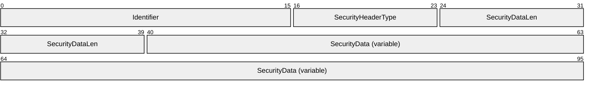

**Identifier (2 bytes):** The first byte MUST be set to character "W" and second byte MUST be set to character "D".

**SecurityHeaderType (1 byte):** MUST be set to the type of security/validation information provided by the Security Header. It MUST be set to a value from the following table.

| Value | Meaning |
| --- | --- |
| WDSMCTP_SECHDR_NONE 0x00 | No security/validation information provided by the Security Header. |
| WDSMCTP_SECHDR_HASH 0x01 | The Security Header specifies an HMAC Hash for the packet as specified in section [2.2.2.1](#Section_2.2.2.1). |
| WDSMCTP_SECHDR_SIGN 0x02 | The Security Header specifies the Signature for the packet as specified in section [2.2.2.2](#Section_2.2.2.2). |
| WDSMCTP_SECHDR_CHECKSUM 0x03 | The Security Header specifies the Checksum for the packet as specified in section [2.2.2.3](#Section_2.2.2.3). |

**SecurityDataLen (2 bytes):** MUST be set to the length in bytes for the SecurityData field.

**SecurityData (variable):** The following table specifies the type of information specified by the SecurityData field.

| Value | Meaning |
| --- | --- |
| WDSMCTP_SECHDR_NONE 0x00 | SecurityDataLen MUST be set to zero and the **SecurityData** field MUST NOT be specified. |
| WDSMCTP_SECHDR_HASH 0x01 | The **SecurityData** field specifies the HMAC Hash for the packet. The HMAC Hash MUST be computed as specified in section 2.2.2.1. |
| WDSMCTP_SECHDR_SIGN 0x02 | The **SecurityData** field specifies the Signature for the packet. The Signature MUST be computed as specified in section 2.2.2.2. |
| WDSMCTP_SECHDR_CHECKSUM 0x03 | The **SecurityData** field MUST specify the 32-bit Checksum for the packet. The Checksum MUST be computed as specified in section 2.2.2.3. |

<a id="Section_2.2.2.1"></a>
#### 2.2.2.1 Packet Hashing

The Hash for the packet is computed after the packet has been fully constructed and before the **SecurityData** field is updated. The Hash MUST be computed using the Session Header, Packet-specific Section and Extended Options. The computation for the Hash of the packet MUST NOT include the Security Header.

The Hash MUST be calculated for the packet using the cryptographic algorithm specified by **HashAlgId** in [MS-WDSMSI](../MS-WDSMSI/MS-WDSMSI.md) section 2.2.1.

The resulting Hash MUST be used along with the HashKey Cryptographic Key (defined in [MS-WDSMSI] section 3.1.1.3) and the **HMACAlgId** cryptographic algorithm (defined in [MS-WDSMSI] section 3.1.1.3) to compute the HMAC Hash for the packet.

The resulting HMAC Hash for the packet MUST be treated as binary data, and a network byte order transformation MUST NOT be performed.

<a id="Section_2.2.2.2"></a>
#### 2.2.2.2 Packet Signing

The Signature for the packet is computed after the packet has been fully constructed and before the **SecurityData** field is updated. The Signature MUST be computed using the Session Header, Packet-specific Section, and Extended Options. The computation for the Signature of the packet MUST NOT include the Security Header.

The Hash for the packet MUST be computed using the cryptographic algorithm specified by **HashAlgId** in [MS-WDSMSI](../MS-WDSMSI/MS-WDSMSI.md) section 2.2.1.

The computed Hash for the packet MUST be signed by the Private RSA Key (defined in [MS-WDSMSI].

The resulting Signature for the packet MUST be treated as a binary data, and a network byte order transformation MUST NOT be performed.

<a id="Section_2.2.2.3"></a>
#### 2.2.2.3 Packet Checksum

The Checksum for the packet is computed after the packet has been fully constructed and before the **SecurityData** field is updated. The Checksum MUST be computed using the Session Header, Packet-specific Section and Extended Options. The computation for the Checksum of the packet MUST NOT include the Security Header.

The Checksum is computed by initializing the unsigned 32-bit **PacketChecksum** variable to zero and adding each byte of the packet to the **PacketChecksum** variable starting from the Session Header of the fully constructed packet.

Once all bytes have been added to the variable **PacketChecksum**, all bits of the value are inverted.

Finally, the value of **PacketChecksum** is transformed to network byte order and added to the Security Header.

<a id="Section_2.2.3"></a>
### 2.2.3 Session Header

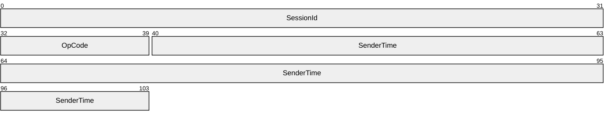

**SessionId (4 bytes):** MUST be set to the Session Id as returned by the server (specified in [MS-WDSMSI](../MS-WDSMSI/MS-WDSMSI.md) section 2.2.1).

**OpCode (1 byte):** MUST be set to the OpCode for the packet as specified in the following sections.

| Value | Meaning |
| --- | --- |
| WDSMCTP_OP_SPM 0x01 | Section [2.2.14](#Section_2.2.14) |
| WDSMCTP_OP_JOIN 0x02 | Section [2.2.5](#Section_2.2.5) |
| WDSMCTP_OP_JOINACK 0x03 | Section [2.2.6](#Section_2.2.6) |
| WDSMCTP_OP_QCC 0x04 | Section [2.2.7](#Section_2.2.7) |
| WDSMCTP_OP_QCR 0x05 | Section [2.2.8](#Section_2.2.8) |
| WDSMCTP_OP_ODATA 0x06 | Section [2.2.16](#Section_2.2.16) |
| WDSMCTP_OP_RDATA 0x07 | Section [2.2.17](#Section_2.2.17) |
| WDSMCTP_OP_ACK 0x08 | Section [2.2.15](#Section_2.2.15) |
| WDSMCTP_OP_NACK 0x09 | Section [2.2.18](#Section_2.2.18) |
| WDSMCTP_OP_NCF 0x0A | Section [2.2.19](#Section_2.2.19) |
| WDSMCTP_OP_LEAVE 0x0B | Section [2.2.11](#Section_2.2.11) |
| WDSMCTP_OP_POLL 0x0C | Section [2.2.9](#Section_2.2.9) |
| WDSMCTP_OP_POLLACK 0x0D | Section [2.2.10](#Section_2.2.10) |
| WDSMCTP_OP_KICK 0x0E | Section [2.2.12](#Section_2.2.12) |
| WDSMCTP_OP_DEMOTE 0x0F | Section [2.2.13](#Section_2.2.13) |

**SenderTime (8 bytes):** MUST be set to the time on the sender machine, in millisecond granularity.

<a id="Section_2.2.4"></a>
### 2.2.4 Extended Options

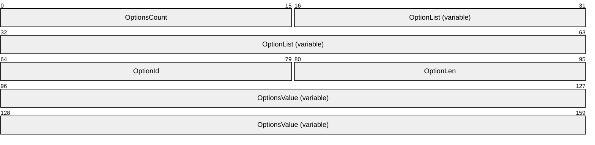

**OptionsCount (2 bytes):** MUST be set to the number of Extended Options specified in the **OptionList** field.

**OptionList (variable):** Specifies an array of Extended Options. The count of Extended Options in this field MUST match the value specified by the **OptionsCount** field. As specified in the following section, each individual element of the array MUST specify three fields to fully describe an Extended Option: **OptionId**, **OptionLen** and **OptionValue**:

**OptionId (2 bytes):** MUST be set to the unique ID assigned to the Extended Option.

**OptionLen (2 bytes):** MUST be set to the length, in bytes, for the **OptionValue**.

**OptionsValue (variable):** MUST be set to the value for the Extended Option. The length in bytes for this field is specified by the **OptionLen** field.

<a id="Section_2.2.5"></a>
### 2.2.5 JOIN Packet

This packet MUST be the first packet sent by the client to the server when the client joins a [**multicast**](#gt_multicast) session. The packet is sent to the unicast address of the server.

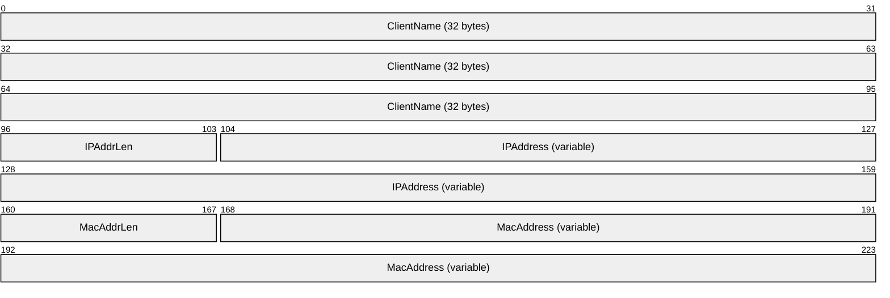

**ClientName (32 bytes):** MUST be set to the name of the client machine and MUST be specified as a Unicode string. Each individual character of the Unicode string MUST be in [**little-endian**](#gt_little-endian) format. The last character of the value MUST be a null character. If the machine name takes less than 32 bytes (including the null character), then the remaining bytes MAY be set to zero and MUST be ignored by the server.

**IPAddrLen (1 byte):** MUST be set to the length, in bytes, for the IP address of the network interface card being used by the client to communicate with the server. For an IPv4 address, this field MUST be set to 4 bytes and for an IPv6 address, this field MUST be set to 16 bytes.

**IPAddress (variable):** MUST be set to the IP address of the network interface card being used by client to communicate with server. The length in bytes for this field is specified by the IPAddrLen field.

**MacAddrLen (1 byte):** MUST be set to the length, in byte, for the MAC address of the network interface card being used by client to communicate with server.

**MacAddress (variable):** MUST be set to the MAC address of the network interface card being used by client to communicate with server. The length, in bytes, for this field is specified by the MacAddrLen field.

The client MAY send the following Extended Options as defined in section [2.2.4](#Section_2.2.4).

| Extended Option | Description |
| --- | --- |
| WDSMCTP_OPT_USER_SID 0x0504 | The client MAY send this Extended Option.<1> The value MUST be set to the User Security Identifier, as specified in [MS-DTYP], (section 2.4.2), that uniquely identifies the User. |
| WDSMCTP_OPT_CAPABILITIES 0x0505 | The client MAY send this Extended Option. See section [2.2.5.1](#Section_2.2.5.1) for more details.<2> |

<a id="Section_2.2.5.1"></a>
#### 2.2.5.1 WDSMCTP_OPT_CAPABILITIES

This Extended Option is used to communicate optional capabilities of the client. If the JOIN packet does not specify this Extended Option, then the server MUST assume that the client does not support any optional capabilities.

The value for this Extended Option is a byte array, where each element of the array specifies a numeric value used to identify optional capabilities supported by client. If a numeric value for specific capability is not specified for the Extended Option value, then the server MUST assume that the client does not support it.

The following list specifies the optional capabilities that MAY be supported by clients.

| Optional Capability | Description |
| --- | --- |
| WDSMCTP_CAP_MULTISTREAM 0x01 | The client MAY specify this capability. When specified, it means that client supports demotion to a lower speed multicast session if the server determines that the client is slow.<3> |

<a id="Section_2.2.6"></a>
### 2.2.6 JOINACK Packet

This packet is sent by the server to the client in response to a JOIN packet. This packet MUST be sent to the client address only.

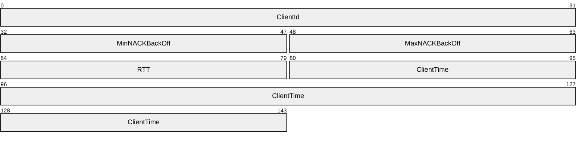

**ClientId (4 bytes):** MUST be set to a unique numeric value that is assigned to the client by the server, and MUST be used by the client in all future communication with the server whenever a packet requires a ClientId.

**MinNACKBackOff (2 bytes):** Specifies the minimum time in milliseconds that a client MUST wait before sending a NACK packet to server. This value is ignored by the client that is designated as the Master Client for the multicast session.

**MaxNACKBackOff (2 bytes):** Specifies maximum time in milliseconds that the client MAY wait before sending a NACK packet to server.

**RTT (2 bytes):** If a multicast session is already in progress, and the server is already communicating to a Master Client, then this field specifies the current round trip time in millisecond granularity for the current Master Client. Otherwise this field MUST be set to zero.

**ClientTime (8 bytes):** MUST be set to the value of the **SenderTime** field from the JOIN packet's session header.

This packet does not have any Extended Options.

<a id="Section_2.2.7"></a>
### 2.2.7 QCC Packet

This packet is sent by the server to the [**multicast**](#gt_multicast) address. All clients in the multicast session MUST reply back to the server using the QCR packet.

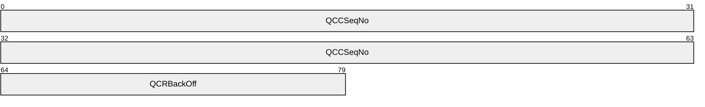

**QCCSeqNo (8 bytes):** MUST be set to an 8-byte numeric value, which is incremented by one with every successive QCC packet. The value for the first QCC packet sent by the server MUST be set to 1.

**QCRBackOff (2 bytes):** Specifies maximum wait time in millisecond granularity. Clients MUST wait for a random time between 0 and **QCRBackOff** before sending a QCR packet to the server.

This packet does not have any Extended Options.

<a id="Section_2.2.8"></a>
### 2.2.8 QCR Packet

This packet is sent by clients to the unicast address of the server.

The client sends a QCR packet for the following reasons.

| Client sends QCR for: | Description |
| --- | --- |
| In response to JOINACK packet | Section [2.2.8.1](#Section_2.2.8.1) |
| In response to QCC packet | Section [2.2.8.2](#Section_2.2.8.2) |
| Voluntary response | Section [2.2.8.3](#Section_2.2.8.3) |

<a id="Section_2.2.8.1"></a>
#### 2.2.8.1 In Response to JOINACK

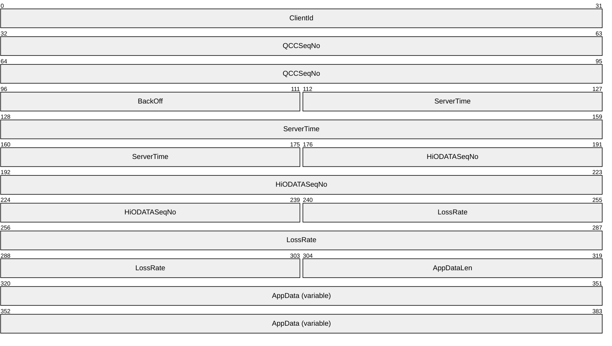

**ClientId (4 bytes):** Specifies the unique ID assigned to the client by the server using the JOINACK packet (section [2.2.6](#Section_2.2.6)).

**QCCSeqNo (8 bytes):** MUST be set to zero.

**BackOff (2 bytes):** MUST be set to zero.

**ServerTime (8 bytes):** MUST be set to **SenderTime** from JOINACK packet.

**HiODATASeqNo (8 bytes):** MUST be set to zero.

**LossRate (8 bytes):** MUST be set to zero.

**AppDataLen (2 bytes):** Specifies the length in bytes for **AppData** field and MUST be set to zero.

**AppData (variable):** MUST NOT be specified.

The Extended Options for QCR packet are specified in section [2.2.8.4](#Section_2.2.8.4).

<a id="Section_2.2.8.2"></a>
#### 2.2.8.2 In Response to QCC


**ClientId (4 bytes):** Specifies the unique ID assigned to the client by the server using the JOINACK packet (section [2.2.6](#Section_2.2.6)).

**QCCSeqNo (8 bytes):** MUST be set to the **QCCSeqNo** as specified in the QCC packet.

**BackOff (2 bytes):** MUST be set to the time in milliseconds that the client waited after receiving the QCC packet and before sending the QCR packet.

**ServerTime (8 bytes):** MUST be set to **SenderTime** from the QCC packet.

**HiODATASeqNo (8 bytes):** MUST be set to the highest ODATASeqNo from the ODATA or RDATA packet received by the client. If the client has not received any ODATA or RDATA packet, then this field MUST be set to zero.

**LossRate (8 bytes):** MUST be set to the loss rate for the client.

**AppDataLen (2 bytes):** MUST be set to the length, in bytes, for the **AppData** field.

**AppData (variable):** Specifies the Application Data provided by the WDS Multicast Application Protocol, as specified in [MS-WDSMA](../MS-WDSMA/MS-WDSMA.md). The protocol acts as transport for the Application Data and MUST NOT define the structure for it.

The Extended Options for QCR packet are specified in section [2.2.8.4](#Section_2.2.8.4).

<a id="Section_2.2.8.3"></a>
#### 2.2.8.3 Voluntary Response

The client MUST set the fields of the voluntary QCR packet as follows.


**ClientId (4 bytes):** Specifies the unique ID assigned to the client by the server using the JOINACK packet (section [2.2.6](#Section_2.2.6)).

**QCCSeqNo (8 bytes):** MUST be set to zero.

**BackOff (2 bytes):** MUST be set to zero.

**ServerTime (8 bytes):** MUST be set to zero.

**HiODATASeqNo (8 bytes):** MUST be set to the highest **ODATASeqNo** from the ODATA or RDATA packet received by client. If the client has not received an ODATA or RDATA packet, then this field MUST be set to zero.

**LossRate (8 bytes):** MUST be set to the loss rate for the client.

**AppDataLen (2 bytes):** MUST be set to the length, in bytes, for the **AppData** field.

**AppData (variable):** Specifies the Application Data provided by the WDS Multicast Application Protocol, as specified in [MS-WDSMA](../MS-WDSMA/MS-WDSMA.md). The protocol acts as transport for the Application Data and MUST NOT define the structure for it.

The Extended Options for QCR packet are specified in section [2.2.8.4](#Section_2.2.8.4).

<a id="Section_2.2.8.4"></a>
#### 2.2.8.4 Extended Options

The client MAY send the following Extended Options in a QCR packet.

| Extended Option | Description |
| --- | --- |
| WDSMCTP_OPT_CPU_UTIL 0x0101 | The client MAY send this option.<4> The value for this Extended Option is a single-byte value ranging from 0 to 100 and specifies the percentage of CPU utilization on the client machine. |
| WDSMCTP_OPT_MEM_UTIL 0x0102 | The client MAY send this option.<5> The value for this Extended Option is a single-byte value ranging from 0 to 100 and specifies the percentage of physical memory in use on the client machine. |
| WDSMCTP_OPT_NET_UTIL 0x0103 | The client MAY send this option.<6> The value for this Extended Option is a single-byte value ranging from 0 to 100 and specifies the percentage of network utilization of the network interface card being used by the client to communicate with the server. |

<a id="Section_2.2.9"></a>
### 2.2.9 POLL Packet

This packet is sent by the server on explicit instructions from the WDS Multicast Application Protocol, as specified in [MS-WDSMA](../MS-WDSMA/MS-WDSMA.md). This packet is sent on the multicast address. All clients participating in a multicast session MUST reply using a POLLACK packet (section [2.2.10](#Section_2.2.10)).

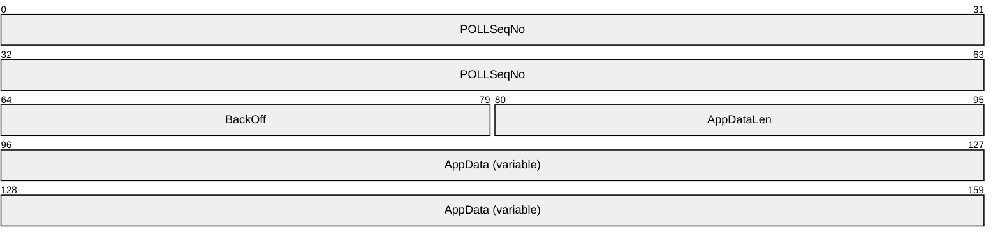

**POLLSeqNo (8 bytes):** MUST be set to an 8-byte numeric value which is incremented by 1 with every successive POLL packet. The value for the first POLL packet sent by the server MUST be set to 1.

**BackOff (2 bytes):** Specifies maximum time in millisecond granularity. The client MUST wait for a random time between 0 and **BackOff** before sending the data specified by **AppData** to the WDS Multicast Application Protocol, as specified in [MS-WDSMA].

**AppDataLen (2 bytes):** Specifies the length, in bytes, for the **AppData** field.

**AppData (variable):** Specifies the Application Data provided by the WDS Multicast Application Protocol, as specified in [MS-WDSMA]. The protocol acts solely as transport for the Application Data and MUST NOT define the structure for it.

<a id="Section_2.2.10"></a>
### 2.2.10 POLLACK Packet

This packet is sent by the client in response to the POLL packet and is sent to the Unicast Address of the server.

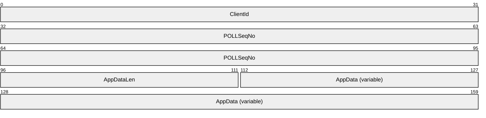

**ClientId (4 bytes):** Specifies the unique ID assigned to the client by the server using the JOINACK packet (section [2.2.6](#Section_2.2.6)).

**POLLSeqNo (8 bytes):** MUST be set to the **POLLSeqNo** from the POLL packet that triggered the reply.

**AppDataLen (2 bytes):** MUST be set to the length, in bytes, for the **AppData** field.

**AppData (variable):** MUST be set to the Application Data provided by the WDS Multicast Application Protocol, as specified in [MS-WDSMA](../MS-WDSMA/MS-WDSMA.md).

This packet does not have any Extended Options.

<a id="Section_2.2.11"></a>
### 2.2.11 LEAVE Packet

This packet MUST be sent by the client before it leaves the multicast session. The packet MUST be sent to the Unicast address of the server.

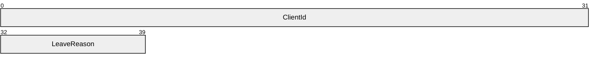

**ClientId (4 bytes):** Specifies the unique ID assigned to the client by the server using the JOINACK packet (section [2.2.6](#Section_2.2.6)).

**LeaveReason (1 byte):** MUST be set to a numeric value specifying the reason for leaving the session. The following table specifies the possible reasons.

| Value | Meaning |
| --- | --- |
| WDSMCTP_LEAVE_REASON_COMPLETE 0x00 | MUST be set when the client has fully downloaded the content and no longer requires access to the multicast session. |
| WDSMCTP_LEAVE_REASON_CANCELLED 0x01 | MUST be set when a user or administrative action on the client caused the client to remove itself from the multicast session before it could fully download the content. |
| WDSMCTP_LEAVE_REASON_INACTIVE 0x02 | MUST be set if the client is leaving the multicast session because the client failed to receive any packets. |

This packet does not have any Extended Options.

<a id="Section_2.2.12"></a>
### 2.2.12 KICK Packet

This packet is sent by the server on multicast address and is used to instruct selected clients to remove themselves from the [**multicast**](#gt_multicast) session.

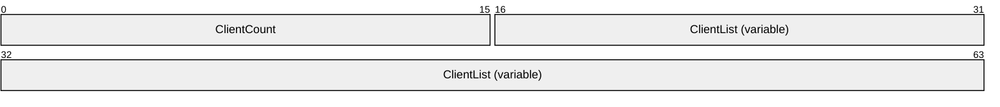

**ClientCount (2 bytes):** MUST be set to the number of clients that have been instructed to remove themselves from the session.

**ClientList (variable):** MUST be set to an array specifying the list of clients that have been instructed to remove themselves from the multicast session. The count of elements in the array MUST match the count specified by the **ClientCount** field. The format for each element of the array is specified in section [2.2.12.1](#Section_2.2.12.1).

<a id="Section_2.2.12.1"></a>
#### 2.2.12.1 ClientList

The format for each element of the array specified in a **ClientList** field is as follows.

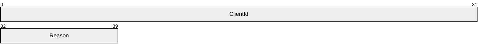

**ClientId (4 bytes):** MUST be set to the unique ID of the client being instructed to remove itself from the multicast session.

**Reason (1 byte):** MUST be set to the reason for removing the client from the session. The following table specifies the list of valid reasons.

| Value | Meaning |
| --- | --- |
| WDSMCTP_KICK_REASON_POLICY_NOT_MET 0x00 | MUST be set when the client fails to meet any of the server policy settings. |
| WDSMCTP_KICK_REASON_FALLBACK 0x01 | MUST be set to instruct the client to remove itself from the multicast session and use alternate means to get the required data. |
| WDSMCTP_KICK_REASON_FAIL 0x02 | MUST be set to instruct the client to remove itself from the multicast session; if this option is set, the client MUST NOT try any alternate means to get the required data. |

<a id="Section_2.2.13"></a>
### 2.2.13 DEMOTE Packet

This packet is sent by the server on multicast address and is used to instruct selected clients to remove themselves from the multicast session and join a multicast session that is operating at a lower maximum speed.

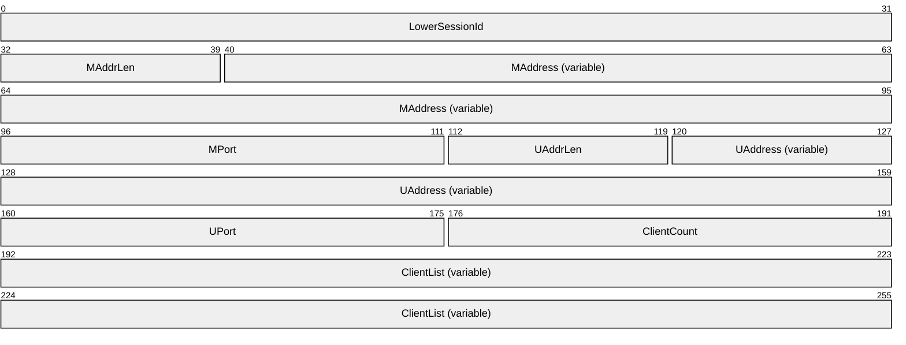

**LowerSessionId (4 bytes):** MUST be set to the unique ID of the multicast session that clients MUST join after leaving the current multicast session.

**MAddrLen (1 byte):** MUST be set to the length, in bytes, of the **MAddress** field.

**MAddress (variable):** MUST be set to the multicast address of the multicast session that clients MUST join after leaving the current multicast session.

**MPort (2 bytes):** MUST be set to the UDP port for the multicast address specified by **MAddress**.

**UAddrLen (1 byte):** MUST be set to the length, in bytes, of the **UAddress** field.

**UAddress (variable):** MUST be set to the unicast address of the multicast session that clients MUST join after leaving the current multicast session.

**UPort (2 bytes):** MUST be set to the UDP port for the unicast address specified by **UAddress**.

**ClientCount (2 bytes):** MUST be set to the number of clients that have been instructed to leave the current multicast session.

**ClientList (variable):** MUST be set to an array of 32-bit values with each element specifying the unique ID of a client. The size of this field MUST be equal to arithmetic multiplication of **ClientCount** times 4 (32-bit).

Each DEMOTE packet MUST NOT specify more than 250 clients in each DEMOTE packet. If the server is to instruct more than 250 clients, it MUST send multiple DEMOTE packets.

The multicast session specified using **LowerSessionId** MUST use the same security mode, cryptographic algorithms, and cryptographic keys as in use by the current multicast session.

This packet does not specify any Extended Options.

<a id="Section_2.2.14"></a>
### 2.2.14 SPM Packet

This packet is sent by the server on [**multicast**](#gt_multicast) address and provides status of the multicast session.

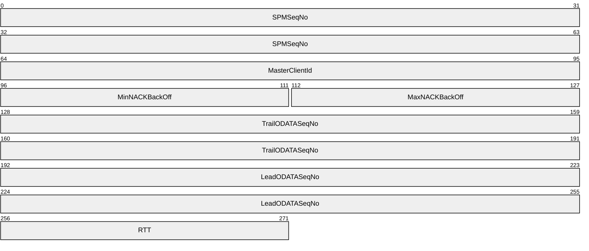

**SPMSeqNo (8 bytes):** MUST be set to an 8-byte numeric value that is incremented by 1 with each successive SPM packet. The value for the first SPM packet sent by the server MUST be set to 1.

**MasterClientId (4 bytes):** MUST be set to a numeric value specifying the unique ID of the client that is to act as the Master Client and MUST reply using an ACK packet.

**MinNACKBackOff (2 bytes):** Specifies minimum time in milliseconds that the client MUST wait before sending a NACK packet to server. The Master Client MUST NOT use the **MinNACKBackOff** field, and MUST immediately send a NACK packet if packet loss is detected.

**MaxNACKBackOff (2 bytes):** Specifies maximum time in milliseconds that the client MAY wait before sending a NACK packet to server.

**TrailODATASeqNo (8 bytes):** MUST specify the lowest ODATASeqNo for ODATA packet that is available to clients for retransmission. The clients MAY send a NACK packet to the server for any ODATA packet in range from **TrailODATASeqNo** and **LeadODataSeqNo** (inclusive) and the server MAY send the requested packets as RDATA packets.

**LeadODATASeqNo (8 bytes):** MUST specify the highest ODATASeqNo for the ODATA packet that has been sent by server.

**RTT (2 bytes):** MUST be set to the round trip time in milliseconds for the Master Client.

This packet does not have any Extended Options.

<a id="Section_2.2.15"></a>
### 2.2.15 ACK Packet

This packet is sent by client in response to ODATA, RDATA and SPM packets. The packet is sent to the unicast address of the server.

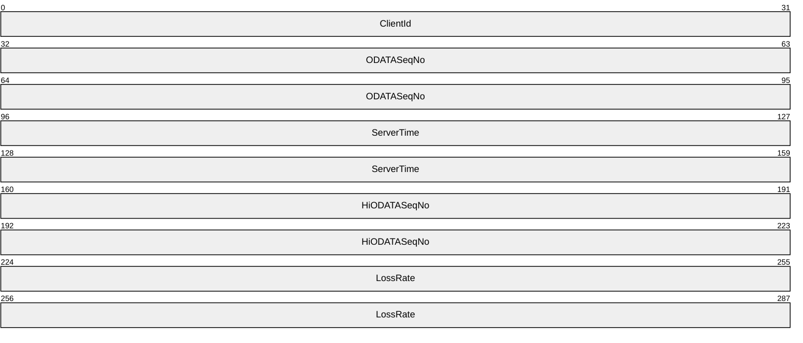

**ClientId (4 bytes):** Specifies the unique ID assigned to the client by the server using the JOINACK packet (section [2.2.6](#Section_2.2.6)).

**ODATASeqNo (8 bytes):** MUST be set to the ODATASeqNo that represents the last packet sequence number for which the client acknowledges having received all ODATA packets.

**ServerTime (8 bytes):** MUST be set to **SenderTime** from an SPM, ODATA or RDATA packet (whichever triggered the ACK packet).

**HiODATASeqNo (8 bytes):** MUST be set to the highest **ODATASeqNo** for ODATA packets seen by the client.

**LossRate (8 bytes):** MUST be set to the loss rate for the client.

This packet does not have any Extended Options.

<a id="Section_2.2.16"></a>
### 2.2.16 ODATA Packet

This packet is sent by the server on multicast address and is used to send data provided by the WDS Multicast Application Protocol, as specified in [MS-WDSMA](../MS-WDSMA/MS-WDSMA.md).

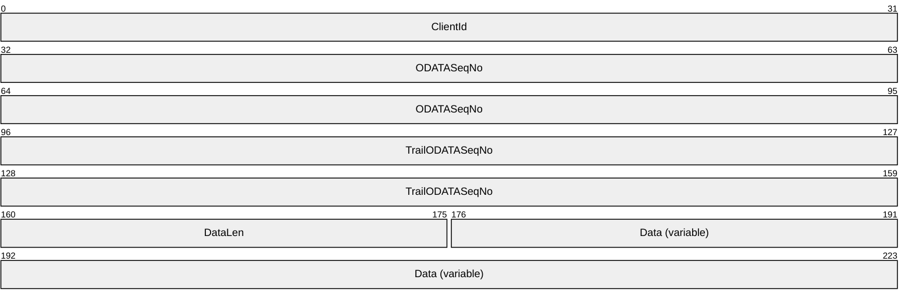

**ClientId (4 bytes):** MUST be set to the unique ID of the client that MUST send an ACK packet for this ODATA packet.

**ODATASeqNo (8 bytes):** MUST be set to an 8-byte numeric value that is incremented by one with each successive ODATA packet. The **ODATASeqNo** for the first packet sent by multicast session MUST be set to 1.

**TrailODATASeqNo (8 bytes):** MUST specify the lowest **ODATASeqNo** for an ODATA packet that is available to clients for retransmission. The clients MAY send a NACK packet to the server for any ODATA packet in the range from **TrailODATASeqNo** and **LeadODataSeqNo** (inclusive), and the server MAY send the requested packets as RDATA packets.

**DataLen (2 bytes):** MUST be set to the length, in bytes, for the **Data** field.

**Data (variable):** MUST be set to the data provided by the WDS Multicast Application Protocol, as specified in [MS-WDSMA].

The server MAY send the following Extended Options as defined in section [2.2.4](#Section_2.2.4).

| Extended Option | Description |
| --- | --- |
| WDSMCTP_OPT_ODATA_FW_LEAD_SEQ_NO 0x0406 | The server MAY send this Extended Option.<7> The value of this option MUST be a sequence number greater than or equal to **MCTrailODATASeqNo** and less than or equal to **MCLeadODATASeqNo** as described in [3.1.1.3](#Section_3.1.1.3). |

<a id="Section_2.2.17"></a>
### 2.2.17 RDATA Packet

This packet is sent by the server on the multicast address, and is used to retransmit data that has already been sent using ODATA packets.


**ClientId (4 bytes):** MUST be set to the unique ID of the client that is supposed to send an ACK packet for this ODATA packet.

**ODATASeqNo (8 bytes):** MUST be set to an 8-byte numeric value of the ODATA packet which is being retransmitted using the RDATA packet.

**TrailODATASeqNo (8 bytes):** MUST specify the lowest **ODATASeqNo** for an ODATA packet that is available to clients for retransmission. The clients MAY send a NACK packet to the server for any ODATA packet in the range from **TrailODATASeqNo** to **LeadODataSeqNo** (inclusive), and the server MAY send the requested packets as RDATA packets.

**DataLen (2 bytes):** MUST be set to the length, in bytes, of the **Data** field.

**Data (variable):** MUST be set to the data provided by the WDS Multicast Application Protocol, as specified in [MS-WDSMA](../MS-WDSMA/MS-WDSMA.md).

This packet does not have any Extended Options.

<a id="Section_2.2.18"></a>
### 2.2.18 NACK Packet

This packet is sent by the client to request retransmission of an ODATA packet using an RDATA packet. The packet is sent to the unicast address of server.

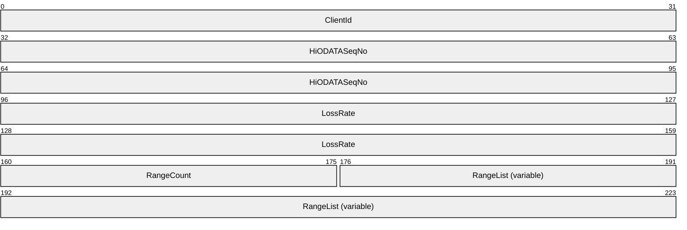

**ClientId (4 bytes):** Specifies the unique ID assigned to the client by the server using the JOINACK packet (section [2.2.6](#Section_2.2.6)).

**HiODATASeqNo (8 bytes):** MUST be set to the highest ODATASeqNo for ODATA packets seen by the client.

**LossRate (8 bytes):** MUST be set to the loss rate for the client.

**RangeCount (2 bytes):** Specifies the number of ranges for ODATA packets that the client did not receive. Each range is specified using a pair of (**StartSeqNo**, **EndSeqNo**) fields.

**RangeList (variable):** MUST be set to an array of ODATA ranges as specified in section [2.2.18.1](#Section_2.2.18.1). The count of elements in the array MUST match the count specified using **RangeCount** field.

This packet does not have any Extended Options.

<a id="Section_2.2.18.1"></a>
#### 2.2.18.1 NACK RangeList

Each element of the array MUST be specified as follows.

```mermaid
packet-beta
  0-63: "StartODATASeqNo"
  64-127: "EndODATASeqNo"
```

**StartODATASeqNo (8 bytes):** MUST be set to the first **ODATASeqNo** for the range of ODATA packets that the client did not receive.

**EndODATASeqNo (8 bytes):** MUST be set to the last **ODATASeqNo** for the range of ODATA packets that the client did not receive.

<a id="Section_2.2.19"></a>
### 2.2.19 NCF Packet

The NCF packet is sent by the server in response to a NACK packet, and specifies the list of ODATA ranges that server will be sending using RDATA packets. This packet is sent to the multicast address.

```mermaid
packet-beta
  0-15: "RangeCount"
  16-63: "RangeList (variable)"
```

**RangeCount (2 bytes):** MUST be set to the number of ODATASeqNo ranges specified in the **RangeList** field.

**RangeList (variable):** MUST be set to an array of ODATA ranges as specified in section [2.2.19.1](#Section_2.2.19.1). The count of elements in the array MUST match the count specified using the **RangeCount** field.

This packet does not have any Extended Options.

<a id="Section_2.2.19.1"></a>
#### 2.2.19.1 NCF RangeList

Each element of the array MUST be specified as follows.

```mermaid
packet-beta
  0-63: "StartODATASeqNo"
  64-127: "EndODATASeqNo"
```

**StartODATASeqNo (8 bytes):** MUST be set to the first **ODATASeqNo** field for the range of ODATA packets that the server MAY send as RDATA packets.

**EndODATASeqNo (8 bytes):** MUST be set to the last **ODATASeqNo** for the range of ODATA packets that the server MAY send as RDATA packets.

<a id="Section_3"></a>
# 3 Protocol Details

<a id="Section_3.1"></a>
## 3.1 Server Details

This section specifies the WDS Multicast Transport Protocol behavior for the WDS Server.

The following state diagram shows the lifetime of the protocol on the server.


Figure 3: Server state diagram

<a id="Section_3.1.1"></a>
### 3.1.1 Abstract Data Model

This section describes a conceptual model of possible data organization that an implementation maintains to participate in this protocol. The described organization is provided to facilitate the explanation of how the protocol behaves. This document does not mandate that implementations adhere to this model as long as their external behavior is consistent with that described in this document.

Multicast Session Configuration: Configuration information for a [**multicast**](#gt_multicast) session, stored in temporary storage in the form of a (name, value) pair. The list of metadata information is specified in section [3.1.1.1](#Section_3.1.1.1).

Protocol Parameters: Configuration information that specifies parameters for the WDS Multicast Transport Protocol. The parameters are specified in section 3.1.1.1.

Active Client List: Information for each client in a multicast session, stored in temporary storage in the form of a (name, value) pair. The list of information kept for each client is specified in section [3.1.1.2](#Section_3.1.1.2).

Pending Client List: Information for each client that is in the process of joining a Multicast Session, stored in the form of a (name, value) pair. This list shares the same structure as specified for the Active Client List and is specified in section 3.1.1.2.

Kick Client List: Information for each client that has been removed from the multicast session, stored in the form of a (name, value) pair. The list shares the same structure as specified for the Active Client List, and is specified in section 3.1.1.2.

Demoted Client List: Information for each client that has been demoted to a lower speed multicast session, stored in the form of a (name, value) pair. The list shares the same structure as specified for the Active Client List, as specified in section 3.1.1.2.

QCC State Configuration: Configuration information for the QCC State for a multicast session, stored in temporary storage in the form of a (name, value) pair. The list of metadata information is specified in section [3.1.1.5](#Section_3.1.1.5).

Data State Configuration: Configuration information for the Data State of a multicast session, stored in temporary storage in the form of a (name, value) pair. The list of metadata information is specified in section [3.1.1.3](#Section_3.1.1.3).

<a id="Section_3.1.1.1"></a>
#### 3.1.1.1 Multicast Session Configuration

The following properties are stored for WDS server configuration.

**SessionState:** Specifies the current state for the [**multicast**](#gt_multicast) session as defined in the following section.

| State | Description |
| --- | --- |
| PreStartState | The multicast session has been set up and is waiting for first client to join. The multicast session is set to this state on initialization. |
| QCCState | The multicast session is actively querying for available clients in the multicast session, and is seeking a client to use as a Master Client for the multicast session. |
| DataState | The multicast session has designated a client as the Master Client and is sending data provided by the WDS Multicast Application Protocol. |

SessionState MUST be set to **PreStartState** on initialization.

**Multicast Address:** A multicast IP address and UDP port assigned to the multicast session by the server. The WDS Multicast Session Initiation Protocol, as specified in [MS-WDSMSI](../MS-WDSMSI/MS-WDSMSI.md), provides the multicast address for use by multicast session.

**Unicast Address:** An IP address of the network interface card and a UDP port being used by the multicast session to communicate to clients. The WDS Multicast Session Initiation Protocol, as specified in [MS-WDSMSI], provides the unicast address for use by the multicast session.

**SessionId:** An ID assigned to the multicast session by the server; MUST be unique across all multicast sessions on the server. The WDS Multicast Session Initiation Protocol, as specified in [MS-WDSMSI], provides the session ID for use by the multicast session.

**NextClientId:** A 32-bit numeric value that specifies the ID to assign to the next client that joins the multicast session; MUST be set to a random 32-bit value on initialization.

**Server Security Mode:** Specifies the security mode for packets sent by the server. The WDS Multicast Session Initiation Protocol, as specified in [MS-WDSMSI], provides the server security mode.

**Client Security Mode:** Specifies the security mode for packets sent by the client. The WDS Multicast Session Initiation Protocol, as specified in [MS-WDSMSI], provides the client security mode.

**NextPollSeqNo:** A 64-bit value that specifies the **SPMSeqNo** field to use for next SPM packet sent by the server. MUST be set to 1 on initialization.

<a id="Section_3.1.1.2"></a>
#### 3.1.1.2 Client List

The following properties are stored for WDS server configuration.

The following list specifies the information that is kept for each client in the multicast session. The maximum number of clients on the list is 200.

**IPAddress**: Specifies the IP address of the network interface card being used by the client to communicate to the server.

**UDPPort**: Specifies the UDP port being used by the client to send packets to the unicast address of server.

**ClientTime**: Specifies the value of the **SenderTime** field from the JOIN packet sent by client.

**LastUpdate**: Specifies the local time on the server in millisecond granularity when the last update was received from the client using the QCR packet.

**RTT**: Specifies the last known round trip time for the client.

**ClientId**: Specifies the unique ID assigned to the client by the server.

**SupportsDemote**: Specifies whether the client supports being demoted to a lower speed multicast session. MUST be set to FALSE (0x00000000) on initialization.

**KickReason**: Specifies the reason for kicking the client from multicast session and MUST be set to WDSMCTP_KICK_REAON_POLICY_FAIL on initialization.

**JoinAckSendCount**: Specifies the number of JOINACK packets sent to the client. MUST be set to zero on initialization.

**QCRReceived**: A Boolean value that is set to TRUE (0x00000001) when a QCR packet is received from the client when the server is in **QCCState**. MUST be set to FALSE (0x00000000) on initialization.

<a id="Section_3.1.1.3"></a>
#### 3.1.1.3 Data State Configuration

**MinNACKBackOff**: Specifies the time, in milliseconds, that a client MUST wait after detecting a packet loss and before sending a NACK packet. This parameter is ignored by the Master Client. MUST be set to 1 on initialization.

**MaxNACKBackOff**: Specifies the maximum time, in milliseconds, that a client MAY wait after detecting packet loss and before sending a NACK packet. MUST be set to 1 on initialization.

**MCRTT**: Specifies the current round trip time for the Master Client. MUST be set to 1 on initialization.

**MasterClientId**: Specifies the Client Id of the client that MUST send an ACK packet for each ODATA, RDATA, and SPM packet. MUST be set to 0 on initialization.

**NextSPMSeqNo**: Specifies the SPMSeqNo number for the next SPM packet. MUST be set to 1 on initialization.

**SPMCount**: Specifies the number of SPM packets that have been sent without receiving an ACK packet from the Master Client. MUST be set to 0 on initialization.

**NextODATASeqNo**: Specifies the **ODATASeqNo** for the next ODATA packet. MUST be set to 1 on initialization.

**MCTrailODATASeqNo**: Specifies the **ODATASeqNo** that has been acknowledged by the Master Client using the ACK packet. MUST be set to zero on initialization.

**MCLeadODATASeqNo**: Specifies the highest **ODATASeqNo** that has been sent by server. MUST be set to zero on initialization.

**MCLossRate**: Specifies the loss rate for the Master Client. MUST be set to zero on initialization.

**CurrentWindowSize**: Specifies the maximum number of ODATA packets that the server can send without waiting for ACK packet for each. MUST be set to 1 on initialization.

**Data Packet List**: Specifies a list which is used to store ODATA packets. The list is always in sorted order where the head of the list specifies the lowest ODATASeqNo packet and the tail of the list specifies the highest ODATASeqNo packet. The following additional information is kept for each packet in the list.

- **CreationTime**: Specifies the local time on the server when the ODATA packet is added to list.
- **LastSendTime**: Specifies the local time on the server when the ODATA packet is sent to the clients.
<a id="Section_3.1.1.4"></a>
#### 3.1.1.4 Protocol Parameters

**InactivityTimeout**: Specifies the time, in milliseconds, that the server MUST wait without receiving any packet from the client before terminating the multicast session. The default value is 300,000 ms.

**JoinAckToQCRTimeout**: Specifies the time, in milliseconds, that the server MUST wait for a QCR packet after sending a JOINACK packet. The default value is 500 ms.

**MaxJoinAckSends**: Specifies the maximum number of JOINACK packets that the server MUST send when no QCR packet is received from the client. The default value is 3.

**PollBackOff**: Specifies the maximum time, in milliseconds, that a client MAY wait before replying to the POLL packet. The default value is 200 ms.

**KickInterval**: Specifies the interval, in milliseconds, at which the KICK packets are sent until all required clients have removed themselves from the multicast session. The default value is 15,000 ms.

**NoClientQCCInterval**: Specifies the maximum time, in milliseconds, that the server MUST wait for a QCR packet after sending a QCC packet when there are no clients in the multicast session. The default value is 500 ms.

**QCCInterval**: Specifies the interval at which QCC packets are sent on a regular basis when the server is not operating in QCC State.

**ClientDeadTimeout**: Specifies the time, in milliseconds, that the server uses to assume a client as removed from the multicast session if the client fails to reply to any QCC packets. The default value is 60,000 ms.

**SPMInterval**: Specifies the minimum time to wait for an ACK packet after sending an SPM packet. Default value is 220 ms.

**CleanupDataListInterval**: Specifies the interval at which the packets stored in Data Packet List (section [3.1.1.3](#Section_3.1.1.3)) are deleted. The default value is 200 ms.

**MaxNoResponseSPM**: Specifies the maximum number of SPM packets to send without receiving an ACK packet from the Master Client. The default value is 5.

**ExpMaxWindowSize**: Specifies that the server MUST exponentially grow the **CurrentWindowSize** up to the value specified by this parameter.

**MaxWindowSize**: Specifies that server MUST linearly grow the **CurrentWindowSize** up to the value specified by this parameter once the **CurrentWindowSize** has reached the **ExpMaxWindowSize** value.

**DemoteInterval**: Specifies the interval, in milliseconds, at which the DEMOTE packets are sent. The default value is 500 ms.

<a id="Section_3.1.1.5"></a>
#### 3.1.1.5 QCC State Configuration

**NextQCCSeqNo**: Specifies the **QCCSeqNo** field for the next QCC packet to be sent by the server. The value is initialized to 1.

**WaitTime**: Specifies the timeout to use for the InState QCC Timer when the multicast session state is set to the **QCCState** field. MUST be set to 1 on initialization.

<a id="Section_3.1.2"></a>
### 3.1.2 Timers

| Timer | Description |
| --- | --- |
| Inactivity Timer | The timeout for this timer is specified by the *InactivityTimeout* parameter (section [3.1.1.4](#Section_3.1.1.4)). |
| JoinAck Timer | The default value for this timer is specified by *JoinAckToQCRTimeout* (section 3.1.1.4). |
| Client Cleanup Timer | The default value for this timer is specified by *DeadClientTimeout* (section 3.1.1.4). |
| InState QCC Timer | The timeout for this timer is computed by the server as specified (section [3.1.5.7.3](#Section_3.1.5.7.3)). |
| OutState QCC Timer | The timeout for this timer is specified by the *QCCInterval* parameter (section 3.1.1.4). |
| SPM Timer | The timeout for this timer is computed by the server as specified (section [3.1.5.9.3](#Section_3.1.5.9.3)). |
| Cleanup Data List Timer | The timeout for this timer is specified by the *CleanupDataListInterval* parameter (section 3.1.1.4). |

<a id="Section_3.1.3"></a>
### 3.1.3 Initialization

The multicast session on initialization MUST configure the TCP/IP stack to listen for incoming UDP packets as specified by the [**unicast address**](#gt_unicast-address) (section [3.1.1.1](#Section_3.1.1.1)).

The Inactivity Timer MUST be initialized with the default timeout value as specified in section [3.1.2](#Section_3.1.2).

The Client Cleanup Timer is a recurring timer that MUST be initialized with the default timeout value as specified in section 3.1.2.

<a id="Section_3.1.4"></a>
### 3.1.4 Higher-Layer Triggered Events

The multicast session is initialized when a client requests content using the WDS Multicast Session Initiation Protocol for delivery, as specified in [MS-WDSMA](../MS-WDSMA/MS-WDSMA.md).

An administrator action can cause a kick trigger to be sent, causing the multicast session to remove a client from the multicast session. The kick trigger MUST be processed as specified in section [3.1.5.6](#Section_3.1.5.6).

An administrator action can cause a demote trigger to be sent, causing the multicast session to demote a client to a lower speed multicast session. Demote triggers are processed as specified in section [3.1.5.10](#Section_3.1.5.10).

The WDS Multicast Application Protocol, as specified in [MS-WDSMA], can cause a POLL trigger to ask the WDS Multicast Transport Protocol to send a payload to all clients using a POLL packet. The POLL trigger is processed as specified in section [3.1.5.4](#Section_3.1.5.4).

The WDS Multicast Application Protocol, as specified in [MS-WDSMA], can cause a data trigger in order to provide a data payload to be sent using this same protocol. The data trigger is processed as specified in section [3.1.5.9.4](#Section_3.1.5.9.4).

<a id="Section_3.1.5"></a>
### 3.1.5 Message Processing Events and Sequencing Rules

<a id="Section_3.1.5.1"></a>
#### 3.1.5.1 Packet Processing

A multicast session is initialized to be in PreStartState (section [3.1.1.1](#Section_3.1.1.1)). In PreStartState, the server MUST NOT send any packets and MUST wait until the first client joins (section [3.1.5.2](#Section_3.1.5.2)) the multicast session; at which point the **SessionState** (section 3.1.1.1) is changed to QCCState.

When **SessionState** (section 3.1.1.1) is set to QCCState, the server MUST process as specified in section [3.1.5.7](#Section_3.1.5.7). The server moves from QCCState to DataState when a client has been selected as the master client for the multicast session.

When **SessionState** (section 3.1.1.1) is set to DataState, the server sends the data payload provided by the WDS Multicast Application Protocol to the clients, as specified in [MS-WDSMA](../MS-WDSMA/MS-WDSMA.md). When the server stops receiving replies from the Master Client, the server changes the **SessionState** (section 3.1.1.1) to QCCState to force the choice of a new client as the master client.

The server MUST accept and process packets received from clients on [**unicast address**](#gt_unicast-address) (section 3.1.1.1) during the lifetime of the multicast session.

For each packet received from a client, the server MUST validate the packet as specified in section [3.1.5.1.1](#Section_3.1.5.1.1)and MUST ignore all packets that are not properly constructed.

Whenever a packet is received from a client, the server MUST reset the Inactivity Timer (section [3.1.2](#Section_3.1.2)) and set its timeout value back to the value specified in section 3.1.2.

The WDS Multicast Transport Protocol causes lower-layered triggered events to the WDS Multicast Application Protocol ([MS-WDSMA]) as the following specifies:

| Trigger | Description |
| --- | --- |
| POLLACK Trigger | Section [3.1.5.5](#Section_3.1.5.5) |
| Status Trigger | Section [3.1.5.8](#Section_3.1.5.8) |
| Data Empty Trigger | Section [3.1.6.7](#Section_3.1.6.7) |
| Terminate Trigger | Section [3.1.6.9](#Section_3.1.6.9) |

The server MUST process the packet based on the OpCode (section [2.2.3](#Section_2.2.3)) as specified below.

| OpCode | Description |
| --- | --- |
| WDSMCTP_OP_JOIN 0x02 | Section 3.1.5.2 |
| WDSMCTP_OP_QCR 0x05 | Section 3.1.5.8 |
| WDSMCTP_OP_LEAVE 0x0B | Section [3.1.5.3](#Section_3.1.5.3) |
| WDSMCTP_OP_POLLACK 0x0C | Section 3.1.5.5 |
| WDSMCTP_OP_ACK 0x08 | Section [3.1.5.9.5](#Section_3.1.5.9.5) |
| WDSMCTP_OP_NACK 0x09 | Section [3.1.5.9.6](#Section_3.1.5.9.6) |

When the Inactivity Timer (section 3.1.2) expires (which happens when the server does not receive packets from any clients for the time specified in section 3.1.2), the server MUST terminate the multicast session.

<a id="Section_3.1.5.1.1"></a>
##### 3.1.5.1.1 Packet Validation

The information specified in the Security Header (section [2.2.2](#Section_2.2.2)) MUST match the client security mode (section [3.1.1.1](#Section_3.1.1.1)).

If the client security mode (section 3.1.1.1) is set to WDSMCTP_SEC_HASH, the server MUST compute the HMAC Hash of the packet (section [2.2.2.1](#Section_2.2.2.1)), and the HMAC Hash specified in the Security Header of packet MUST match the value computed by the server.

If the client security mode (section 3.1.1.1) is set to WDSMCTP_SEC_CHECKSUM, the server MUST compute the Checksum of the packet (section [2.2.2.3](#Section_2.2.2.3)) and the Checksum specified in the Security Header of the packet MUST match the value computed by the server.

If the client security mode (section 3.1.1.1) is set to *WDSMCTP_SEC_NONE*, then the packet MUST NOT have any security/validation information.

The server MUST validate that the **SessionId** (section [2.2.3](#Section_2.2.3)) matches the **SessionId** (section 3.1.1.1).

Based on the **OpCode** field in the Session Header (section 2.2.3), the server MUST validate that all fields required for the packet are specified as per section [2.2](#Section_2.2).

<a id="Section_3.1.5.2"></a>
#### 3.1.5.2 Processing a JOIN Packet

When a JOIN packet is received from client, the server MUST add a record of the client to the Pending Client List (section [3.1.5.2.1](#Section_3.1.5.2.1)). The server MUST send a JOINACK packet (section [3.1.5.2.2](#Section_3.1.5.2.2)) to the client and MUST wait for a QCR packet (section [3.1.5.2.3](#Section_3.1.5.2.3)) to be returned. When a QCR packet is received, the server MUST move the entry for the client from the Pending Client List (section [3.1.1.2](#Section_3.1.1.2)) to the Active Client List, and MUST destroy the instance of JoinAck Timer created for the client.

The server MUST create an instance of JoinAck Timer for the client, and MUST configure the JoinAck Timer to expire after a timeout specified by the *JoinAckToQCRTimeout* parameter (section [3.1.1.4](#Section_3.1.1.4)).

<a id="Section_3.1.5.2.1"></a>
##### 3.1.5.2.1 Adding a Client to the Pending Client List

The server MUST add a new record into the Pending Client List (section [3.1.1.2](#Section_3.1.1.2)) and set the attributes of the entry as specified below.

**IPAddress**: MUST be set to the source IP address of the UDP packet sent by the client for its JOIN packet (section [2.2.5](#Section_2.2.5)).

**UDPPort**: MUST be set to the source port of the UDP packet sent by the client for the JOIN packet.

**ClientTime**: MUST be set to value of the **SenderTime** field of the JOIN packet.

**LastUpdate**: MUST be set to the local time on the server, in millisecond granularity.

**ClientId**: MUST be set to the value of **NextClientId** field (section [3.1.1.1](#Section_3.1.1.1)), after which the value of **NextClientId** MUST be incremented by one.

**SupportsDemote**: If the JOIN packet specifies the WDSMCTP_OPT_CAPABILITIES Extended Option (section [2.2.5.1](#Section_2.2.5.1)), and the value for the Extended Option specifies WDSMCTP_CAP_MULTISTREAM (section 2.2.5.1), then this parameter MUST be set to TRUE (0x00000001); otherwise, it MUST be set to FALSE (0x00000000).

All remaining parameters for this record MUST be set to values specified for initialization in section 3.1.1.2 before it is added to the list.

<a id="Section_3.1.5.2.2"></a>
##### 3.1.5.2.2 Sending a JOINACK Packet

When sending a JOINACK packet, the server MUST set the fields of the JOINACK packet as specified below.

**ClientId**: MUST be set to the value of the **ClientId** field from the entry for the client in the Pending Client List (section [3.1.1.2](#Section_3.1.1.2)).

**MinNACKBackOff**: MUST be set to the **MinNACKBackOff** field (section [3.1.1.3](#Section_3.1.1.3)).

**MaxNACKBackOff**: MUST be set to the **MaxNACKBackOff** field (section 3.1.1.3).

**RTT**: MUST be set to the **MCRTT** (section 3.1.1.3).

**ClientTime**: MUST be set to the **ClientTime** from the client's entry in the Pending Client List (section 3.1.1.2).

The server MUST send the JOINACK packet to the **IPAddress** field and **UDPPort** field (section 3.1.1.2) specified in the client's entry in the Pending Client List.

<a id="Section_3.1.5.2.3"></a>
##### 3.1.5.2.3 Receiving a QCR Packet

When a QCR packet (section [2.2.8.1](#Section_2.2.8.1)) is received, the server MUST move the entry for the client from the Pending Client List (section [3.1.1.2](#Section_3.1.1.2)) to the Active Client List (section 3.1.1.2), and MUST destroy the instance of JoinAck Timer created for the client.

The server MUST update the entry for the client in Active Client List (section 3.1.1.2) as specified below.

**RTT**: Calculated as: (Local Time on Server – **ServerTime** field from QCR packet).

**LastUpdate**: Local Time on Server.

The server MUST send a Status Trigger to the WDS Multicast Application Protocol, as specified in [MS-WDSMA](../MS-WDSMA/MS-WDSMA.md), to communicate the payload specified in the QCR packet, using the **AppData** and **AppDataLen** fields (section [2.2.8](#Section_2.2.8)).

If **SessionState** (section [3.1.1.1](#Section_3.1.1.1)) is set to PreStartState, the server MUST change it to QCCState.

<a id="Section_3.1.5.3"></a>
#### 3.1.5.3 Processing a LEAVE Packet

When a LEAVE packet is received, the server MUST remove the entry for the client from the Active Client List (section [3.1.1.2](#Section_3.1.1.2)), using the **ClientId** field (section [2.2.11](#Section_2.2.11)) of the LEAVE packet to identify the client. If a client entry matching the **ClientId** is not found in Active Client List (section 3.1.1.2), the server MUST check and remove the entry from the Kick Client List (section 3.1.1.2).

<a id="Section_3.1.5.4"></a>
#### 3.1.5.4 Processing a POLL Trigger

The server MUST construct the POLL packet as specified in section [2.2.9](#Section_2.2.9) and set the fields of the packet as specified below.

**PollSeqNo**: MUST be set to the value of the **NextPollSeqNo** (section [3.1.1.1](#Section_3.1.1.1)), and then increment the **NextPollSeqNo** by one.

**BackOff**: MUST be set to the value of **PollBackOff** (section [3.2.1.2](#Section_3.2.1.2)).

**AppData** and **AppDataLen**: MUST be set to the payload provided by the POLL Trigger from the WDS Multicast Application Protocol, as specified in [MS-WDSMA](../MS-WDSMA/MS-WDSMA.md).

The server MUST send the constructed POLL packet to the multicast address (section 3.1.1.1).

The server MUST provide the value of **PollBackOff** to the WDS Multicast Application Protocol in response to the POLL Trigger, as specified in [MS-WDSMA].

<a id="Section_3.1.5.5"></a>
#### 3.1.5.5 Processing a POLLACK Packet

The server MUST validate that the **POLLSeqNo** field (section [2.2.10](#Section_2.2.10)) in the POLLACK packet matches the value (**NextPollSeqNo** – 1) (section [3.1.1.1](#Section_3.1.1.1)).

The protocol MUST send a POLLACK Trigger to the WDS Multicast Application Protocol, as specified in [MS-WDSMA](../MS-WDSMA/MS-WDSMA.md), to communicate that the payload has been received in the packet in the **AppData** and **AppDataLen** fields.

<a id="Section_3.1.5.6"></a>
#### 3.1.5.6 Processing a KICK Trigger

The KICK Trigger MUST provide the **ClientId** and a **Reason** fields for removing the client from the Active Client List (section [3.1.1.2](#Section_3.1.1.2)).

The server MUST move the entry for the client from the Active Client List to the Kick Client List.

The server MUST set the **KickReason** (section 3.1.1.2) to the reason specified by the Kick Trigger.

If the Kick Timer is not actively waiting for a timeout, the server MUST:

Immediately send a KICK packet as specified in section [3.1.5.6.1](#Section_3.1.5.6.1).

Configure the Kick Timer to expire at the interval specified by **KickInterval** (section [3.2.1.2](#Section_3.2.1.2)).

<a id="Section_3.1.5.6.1"></a>
##### 3.1.5.6.1 Sending a KICK Packet

The server MUST construct the KICK packet as specified in section [2.2.12](#Section_2.2.12).

The server MUST add information for all clients on the Kick Client List (section [3.1.1.2](#Section_3.1.1.2)) to the KICK packet. If the count of clients exceeds the maximum specified in section 3.1.1.2, then the server MUST construct multiple KICK packets.

The server MUST send all constructed KICK packets to the multicast address (section [3.1.1.1](#Section_3.1.1.1)).

<a id="Section_3.1.5.7"></a>
#### 3.1.5.7 Processing QCC State

The server enters QCC state in order to find a client that can be used as a Master Client for the multicast session. The server sends a QCC packet (section [2.2.7](#Section_2.2.7)) to the multicast address (section [3.1.1.1](#Section_3.1.1.1)) and waits for clients to reply using the QCR packet (section [2.2.8.2](#Section_2.2.8.2)). When replies from clients have been received, the server MUST pick a client with the highest round trip time and MUST designate this client as the Master Client. When the Master Client has been chosen, the server MUST change the **SessionState** (section 3.1.1.1) to DataState.

When no QCR packet (section 2.2.8.2) reply is received in response to the QCC packet (section 2.2.7), the server MUST continue to transmit the QCC packet (section 2.2.7) until a reply is received.

The server MUST start by setting the InState QCC Timer to expire using a relatively short timeout, and MUST continue to increase the timeout for InState QCC Timer when no reply is received.

When entering this state, server MUST proceed as specified in section [3.1.5.7.1](#Section_3.1.5.7.1).

When leaving this state, server MUST proceed as specified in section [3.1.5.7.2](#Section_3.1.5.7.2).

<a id="Section_3.1.5.7.1"></a>
##### 3.1.5.7.1 Entering QCC State

The server MUST set **WaitTime** (section [3.1.1.5](#Section_3.1.1.5)) to 1.

The server MUST send a QCC packet, and set up the InState QCC Timer as specified in section [3.1.5.7.3](#Section_3.1.5.7.3).

<a id="Section_3.1.5.7.2"></a>
##### 3.1.5.7.2 Leaving QCC State

The server MUST disable the InState QCC Timer.

<a id="Section_3.1.5.7.3"></a>
##### 3.1.5.7.3 Sending a QCC Packet and InState QCC Timer

The server MUST set **QCRReceived** (section [3.1.1.2](#Section_3.1.1.2)) for all entries in the Active Client List (section 3.1.1.2) to FALSE (0x00000000).

The server MUST construct a QCC packet (section [2.2.7](#Section_2.2.7)), set the **QCCSeqNo** to the value of **NextQCCSeqNo** (section [3.1.1.5](#Section_3.1.1.5)) and increment the value of **NextQCCSeqNo** by 1.

Server MUST set **WaitTime** (section 3.1.1.5) as follows:

- If there are client entries in the Active Client List (section 3.1.1.2), then **WaitTime** MUST be set to allow 1 millisecond for each client.
- If there are no client entries in the Active Client List (section 3.1.1.2), then **WaitTime** MUST be set to a value by doubling the previous value of **WaitTime**. The final value of **WaitTime** MUST NOT exceed the value specified by **NoClientQCCInterval** (section [3.2.1.2](#Section_3.2.1.2)).
The server MUST find the largest value for **RTT** among all entries in the Active Client List (section 3.1.1.2) and add this value to **WaitTime** (section 3.1.1.5).

The server MUST set the **QCRBackOff** (section 2.2.7) in the constructed QCC packet to the computed value of **WaitTime** (section 3.1.1.5).

The server MUST send the constructed QCC packet to the **multicast address** (section [3.1.1.1](#Section_3.1.1.1)) of the multicast session.

The server MUST set the **InState QCC Timer** (section [3.1.2](#Section_3.1.2)) to expire after the time specified by **WaitTime** (section 3.1.1.5).

<a id="Section_3.1.5.8"></a>
#### 3.1.5.8 Processing a QCR Packet

If the **QCCSeqNo** field (section [2.2.8](#Section_2.2.8)) of the QCR packet is set to zero, and there exists an entry in the Pending Client List (section [3.1.1.2](#Section_3.1.1.2)) for the client identified by the **ClientId** field (section 2.2.8) of the QCR packet, then the packet MUST be processed as specified in section [3.1.5.2.3](#Section_3.1.5.2.3).

Otherwise, the server MUST validate that the **QCCSeqNo** field (section 2.2.8) of the QCR packet is either zero or set to (**NextQCCSeqNo** – 1) (section [3.1.1.5](#Section_3.1.1.5)). The server MUST find an entry for the client using the **ClientId** field (section 2.2.8) of the QCR packet in the Active Client List (section 3.1.1.2), Demoted Client List (section 3.1.1.2) or Kick Client List (section 3.1.1.2) and update the entry as follows:

**LastUpdate**: MUST be set to the local time of server.

**RTT**: MUST be set to the time calculated by subtracting the **ServerTime** (section 2.2.8) from the current local time on server.

**QCRReceived**: MUST be set to TRUE (0x00000001).

The server MUST send a Status Trigger to the WDS Multicast Application Protocol, as specified in [MS-WDSMA](../MS-WDSMA/MS-WDSMA.md), to communicate the payload specified in the QCR packet, using the **AppData** and **AppDataLen** fields (section 2.2.8).

<a id="Section_3.1.5.9"></a>
#### 3.1.5.9 Processing Data State

The server enters the Data state when a client has been designated as Master Client in QCC state.

When in Data state, the server MUST:

- Send QCC packets at regular intervals as specified in section [3.1.6.5](#Section_3.1.6.5).
- Send SPM packets at regular intervals as specified in section [3.1.5.9.3](#Section_3.1.5.9.3).
When entering this state, the server MUST proceed as specified in section [3.1.5.9.1](#Section_3.1.5.9.1).

When leaving this state, the server MUST proceed as specified in section [3.1.5.9.2](#Section_3.1.5.9.2).

<a id="Section_3.1.5.9.1"></a>
##### 3.1.5.9.1 Entering DataState

The server:

- MUST set **SPMCount** (section [3.1.1.3](#Section_3.1.1.3)) to zero.
- MUST set Cleanup Data List Timer (section [3.1.2](#Section_3.1.2)) to expire in the time specified by **CleanupDataListInterval** (section [3.2.1.2](#Section_3.2.1.2)).
- MUST set OutState QCC Timer to expire after the time specified by **QCCInterval** (section 3.2.1.2).
- MUST send an SPM packet and Update SPM Timer as specified in section [3.1.5.9.3](#Section_3.1.5.9.3).
<a id="Section_3.1.5.9.2"></a>
##### 3.1.5.9.2 Leaving DataState

The server MUST disable the SPM Timer, Cleanup Data List Timer and OutState QCC Timer.

<a id="Section_3.1.5.9.3"></a>
##### 3.1.5.9.3 Sending an SPM Packet

The server MUST update the **MinNACKBackOff** field (section [3.1.1.3](#Section_3.1.1.3)) as follows:

- **MinNACKBackOff** = MAX( RTT for Master Client x 2, 1 )
The server MUST update the **MaxNACKBackOff** field (section 3.1.1.3) as follows:

- **MaxNACKBackOff** = MAX( **MinNACKBackOff** + (Total Clients in Client List) / 5, 1 )
The server MUST construct an SPM packet (section [2.2.14](#Section_2.2.14)) and set the fields of the packet as specified below.

- **SPMSeqNo**: MUST be set to **NextSPMfSeqNo** (section 3.1.1.3) and the value of **NextSPMSeqNo** MUST be incremented by one.
- **MasterClientId**: MUST be set to **MasterClientId** (section 3.1.1.3).
- **MinNACKBackOff**: MUST be set to **MinNACKBackOff** (section 3.1.1.3).
- **MaxNACKBackOff**: MUST be set to **MaxNACKBackOff** (section 3.1.1.3).
- **TrailODATASeqNo**: MUST set to the **ODATASeqNo** of the ODATA packet stored at the head of the Data Packet List (section 3.1.1.3).
- **LeadODATASeqNo**: MUST set to the **HiODATASeqNo** (section 3.1.1.3).
- **RTT**: MUST be set to **MCRTT** (section [3.1.1.5](#Section_3.1.1.5)).
Once the SPM packet has been constructed, the server:

- MUST send the constructed SPM packet to the multicast address (section [3.1.1.1](#Section_3.1.1.1)) of the multicast session.
- MUST increment the **SPMCount** (section 3.1.1.3) by one.
- MUST set the SPM Timer to expire in **SPMInterval** (section [3.2.1.2](#Section_3.2.1.2)), or to 4 times the round trip time for the Master Client, whichever is larger.
<a id="Section_3.1.5.9.4"></a>
##### 3.1.5.9.4 Processing a Data Trigger

The server MUST construct an ODATA packet (section [2.2.16](#Section_2.2.16)) and set the fields of the ODATA packet as follows.

- **ClientId**: MUST be set to the **MasterClientId** field (section [3.1.1.3](#Section_3.1.1.3)).
- **ODATASeqNo**: MUST be set to the **NextODATASeqNo** (section 3.1.1.3) and the value of **NextODATASeqNo** MUST be increment by one.
- **TrailODATASeqNo**: MUST be set to the **ODATASeqNo** of the ODATA packet stored at the head of the Data Packet List (section 3.1.1.3). If the Data Packet List is empty, this field MUST be set to same value as the **ODATA** field.
- **DataLen**: MUST be set to the length in bytes, for the Data Payload provided by the WDS Multicast Application Protocol, as specified in [MS-WDSMA](../MS-WDSMA/MS-WDSMA.md),.
- **Data**: MUST be set to the Data Payload provided by the WDS Multicast Application Protocol.
The server MUST add the ODATA packet to the tail of the Data Packet List, set **CreationTime** to the local time of the server, and MUST set all other attributes of the entry to their initialization values as specified in section 3.1.1.3.

<a id="Section_3.1.5.9.5"></a>
##### 3.1.5.9.5 Processing an ACK Packet

An ACK packet is sent by the Master Client for each of ODATA, RDATA and SPM packets. The server MUST NOT accept an ACK packet if the **ClientId** field (section [2.2.15](#Section_2.2.15)) of the ACK packet does not match the **MasterClientId** (section [3.1.1.3](#Section_3.1.1.3)). The server MUST NOT accept an ACK packet if the **ODATASeqNo** field (section 2.2.15) of the ACK packet is not within the range specified by **MCTrailODATASeqNo** and **MCLeadODATASeqNo** (section 3.1.1.3).

The server MUST:

- Set **SPMCount** (section 3.1.1.3) to zero.
- Set **MCRTT** (section 3.1.1.3) to the round trip time for the Master Client by subtracting the **ServerTime** field (section 2.2.15) from the current local time on server.
- Set **MCLossRate** (section 3.1.1.3) to (**LossRate** field / 10000000000000000) (section 2.2.15) of ACK packet.
The server MUST compute the number of packets being acknowledged by the Master Client as follows.

**PacketsAcknowledged** = **ODATASeqNo** from ACK packet – **MCTrailODATASeqNo**

The server MUST update **CurrentWindowSize** (section 3.1.1.3) as specified below when the value of **CurrentWindowSize** is less than ExpMaxWindowSize (section [3.1.1.4](#Section_3.1.1.4)):

**CurrentWindowSize** = MIN(**CurrentWindowSize** + ( **PacketsAcknowledged** x 2 ), **ExpMaxWindowSize** )

When the value of **CurrentWindowSize** (section 3.1.1.3) is within the range specified by **ExpMaxWindowSize** (section 3.1.1.4) and **MaxWindowSize** (section 3.1.1.4), then the server MUST update the **CurrentWindowSize** (section 3.1.1.3) as follows.

**CurrentWindowSize** = MIN(**CurrentWindowSize** + **PacketsAcknowledged**, **MaxWindowSize** )

The server MUST set **MCTrailODATASeqNo** (section 3.1.1.3) to **ODATASeqNo** field (section [2.2.16](#Section_2.2.16)) of ACK packet.

If Data Packet List (section 3.1.1.3) is empty or **MCLeadODATASeqNo** (section 3.1.1.3) is equal to the **ODATASeqNo** of the ODATA packet at the tail of Data Packet List (section 3.1.1.3), then the server MUST stop further processing.

The server MUST calculate the number of ODATA packets that have been sent and are not acknowledged by Master Client as follows.

**InFlightPackets** = ( **MCLeadODATASeqNo** – **MCTrailODATASeqNo** )

If **InFlightPackets** is more than or equal to **CurrentWindowSize** (section 3.1.1.3), then the server MUST stop further processing.

The server MUST calculate the number of ODATA packets that can be sent as follows.

**PacketCount** = **CurrentWindowSize** – **InFlightPackets**

The server MUST start from the entry in Data Packet List (section 3.1.1.3) with **ODATASeqNo** being (**MCLeadODATASeqNo** + 1) (section 3.1.1.3) and MUST send the count of ODATA packets as specified by **PacketCount**. Each ODATA packet MUST be updated as specified in section [3.1.5.9.7](#Section_3.1.5.9.7)before sending the packet to the multicast address (section [3.2.1.1](#Section_3.2.1.1)).

The server MUST add the number of ODATA packets that have been sent to **MCLeadODATASeqNo** (section 3.1.1.3).

<a id="Section_3.1.5.9.6"></a>
##### 3.1.5.9.6 Processing a NACK Packet

The server MUST set **MCLossRate** (section [3.1.1.3](#Section_3.1.1.3)) to ( **LossRate** field / 10000000000000000 ) (section [2.2.18](#Section_2.2.18)) of the NACK packet if the **ClientId** field (section 2.2.18) of the NACK packet matches the **MasterClientId** (section 3.1.1.3).

If the **ClientId** field (section 2.2.18) of the NACK packet does not match the **MasterClientId** (section 3.1.1.3), then the server MUST proceed as specified in section [3.1.5.9.6.1](#Section_3.1.5.9.6.1).

The server MUST update **CurrentWindowSize** (section 3.1.1.3) as follows.

**CurrentWindowSize** = MAX( **CurrentWindowSize** x 0.75, 2 )

The server MUST construct an NCF packet (section [2.2.19](#Section_2.2.19)) and set the **RangeList** (section [2.2.19.1](#Section_2.2.19.1)) specified by the NACK packet into the NCF packet. The server MUST send the NCF packet to multicast address (section [3.1.1.1](#Section_3.1.1.1)).

The server MUST go through each **ODATASeqNo** range specified by **RangeList** field (section 2.2.19.1) of the NACK packet and process them as specified below:

- If an ODATA packet for the **ODATASeqNo** of the range does not exist in the Data Packet List (section 3.1.1.3), then the server MUST skip the **ODATASeqNo** and move on to the next **ODATASeqNo**.
- If the **LastSendTime** of the ODATA packet entry in Data Packet List (section 3.1.1.3) specifies that the packet has been transmitted within a time equal to four times the round-trip of the Master Client (4 x MCRTT (section 3.1.1.3)), then the server MUST skip the **ODATASeqNo** and move on to the next **ODATASeqNo**.
- The server MUST construct an RDATA packet (section [3.1.5.9.8](#Section_3.1.5.9.8)) and send it to multicast address (section 3.1.1.1).
- The server MUST set the **LastSendTime** for the entry in Data Packet List (section 3.1.1.3) to the server's local time.
<a id="Section_3.1.5.9.6.1"></a>
###### 3.1.5.9.6.1 Identifying a New Master Client

The server MUST find the entry for the client in the Active Client List (section [3.1.1.2](#Section_3.1.1.2)) using the **ClientId** field of the NACK packet (section [2.2.18](#Section_2.2.18)), and MUST compute the throughput of the client as follows.

Throughput of Client = 1 / Mclient

where Mclient is:

Mclient = ( (**RTT** of Client ) / 1000 ) x SQRT( **LossRate** ) x ( 1 + 9 x **LossRate** x ( 1 + 32 x **LossRate** x **LossRate** )

The server MUST calculate the throughput of the Master Client as follows.

Throughput of Master Client = 1 / Mmasterclient

where Mmasterclient is:

Mmasterclient = ( **MCRTT** / 1000 ) x SQRT( **MCLossRate** ) x ( 1 + 9 x **MCLossRate** x ( 1 + 32 x **MCLossRate** x **MCLossRate** )

If Throughput of Client is less than 75% of Throughput of Master Client, then the server MUST switch the Master Client as follows.

Server MUST set **MasterClientId** to the value of the **ClientId** field (section NACK Packet) of the NACK packet.

Server MUST set **MCLossRate** to the value of the **LossRate** field (section NACK Packet) of the NACK packet.

<a id="Section_3.1.5.9.7"></a>
##### 3.1.5.9.7 Updating an ODATA Packet

The server MUST update the following fields of the ODATA packet (section [2.2.16](#Section_2.2.16)) before sending the packet to the multicast address (section [3.1.1.1](#Section_3.1.1.1)):

**ClientId**: MUST be set to **MasterClientId** (section [3.1.1.3](#Section_3.1.1.3)).

**TrailODATASeqNo**: MUST be set to the **ODATASeqNo** of the ODATA packet stored at the head of the Data Packet List (section 3.1.1.3).

<a id="Section_3.1.5.9.8"></a>
##### 3.1.5.9.8 Sending an RDATA Packet

ODATA and RDATA packets have same packet format and are differentiated only by the **OpCode** field in the Session Header (section [2.2.3](#Section_2.2.3)).

The server MUST duplicate the ODATA packet, update the fields of the ODATA packet as specified in section [3.1.5.9.7](#Section_3.1.5.9.7), and MUST set the **OpCode** in Session Header (section 2.2.3) to WDSMCTP_OP_RDATA.

The server MUST send each RDATA packet to [**multicast address**](#gt_multicast-address) (section [3.1.1.1](#Section_3.1.1.1)).

<a id="Section_3.1.5.10"></a>
#### 3.1.5.10 Processing the Demote Trigger

The Demote Trigger MUST provide the **ClientId** of the client to demote. If a multicast session exists on the server that is operating at a lower speed, the server MUST obtain the multicast IP, unicast IP, and Session Id of that multicast session. If no such multicast session exists, the server MUST start a new [**multicast**](#gt_multicast) session.

The server MUST remove the entry for the client from Active Client List (section [3.1.1.2](#Section_3.1.1.2)) and add it to the Demoted Client List (section 3.1.1.2).

If the Demote Timer is not actively waiting for timer expiration, then the server MUST:

Immediately send a DEMOTE packet as specified in section [3.1.5.10.1](#Section_3.1.5.10.1).

Set the Demote Timer to expire after the time specified by **DemoteInterval** (section [3.2.1.2](#Section_3.2.1.2)).

<a id="Section_3.1.5.10.1"></a>
##### 3.1.5.10.1 Sending a DEMOTE Packet

The server MUST construct the DEMOTE packet (section [2.2.13](#Section_2.2.13)) and add information for all clients in the Demoted Client List (section [3.1.1.2](#Section_3.1.1.2)). If the number of clients exceeds the limit specified in section 2.2.13, the server MUST construct multiple DEMOTE packets.

The server MUST send all DEMOTE packets to the multicast address (section [3.1.1.1](#Section_3.1.1.1)).

<a id="Section_3.1.6"></a>
### 3.1.6 Timer Events

<a id="Section_3.1.6.1"></a>
#### 3.1.6.1 JoinAck Timer

If the **JoinAckSendCount** (section [3.1.1.2](#Section_3.1.1.2)) matches the **MaxJoinAckSends** (section [3.2.1.2](#Section_3.2.1.2)) parameter, then the server MUST:

- destroy the instance of the **JoinAck Timer** field created for the client,
- remove the entry for the client from Pending Client List (section 3.1.1.2), and
- stop further processing.
Otherwise, the server MUST send a JOINACK packet (section [3.1.5.2.2](#Section_3.1.5.2.2)) and use the **JoinAckSendCount** (section 3.1.1.2) parameter to keep track of the number of JOINACK packets sent to the client.

The server MUST configure the instance of JoinAck Timer to expire again at interval specified by **JoinAckToQCRTimeout** (section 3.2.1.2).

<a id="Section_3.1.6.2"></a>
#### 3.1.6.2 Client Cleanup Timer

The server MUST go through each entry in the Active Client List (section [3.1.1.2](#Section_3.1.1.2)) and Kick Client List (section 3.1.1.2) and MUST remove all entries for clients where the ( Local Time on Server – **LastUpdate** (section 3.1.1.2) ) is more than **DeadClientTimeout** (section [3.2.1.2](#Section_3.2.1.2)).

<a id="Section_3.1.6.3"></a>
#### 3.1.6.3 Kick Timer

The server MUST disable the Kick Timer if the Kick Client List (section [3.1.1.2](#Section_3.1.1.2)) is empty.

Otherwise, the server MUST send the KICK packet as specified in section [3.1.5.6.1](#Section_3.1.5.6.1). The server MUST also configure Kick Timer to expire after the interval specified by **KickInterval** (section [3.2.1.2](#Section_3.2.1.2)).

<a id="Section_3.1.6.4"></a>
#### 3.1.6.4 InState QCC Timer

The server MUST go through all entries in Active Client List (section [3.1.1.2](#Section_3.1.1.2)) and MUST find an entry where **QCRReceived** is set to TRUE (0x00000001) and the **RTT** is the highest for the entry among all entries where **QCRReceived** is set to TRUE (0x00000001). If such an entry is found, server MUST set **MasterClientId** (section [3.1.1.3](#Section_3.1.1.3)) to the **ClientId** (section 3.1.1.2) and process as specified in section [3.1.5.7.2](#Section_3.1.5.7.2).

When no entries have **QCRReceived** set to TRUE (0x00000001), then server MUST process as specified in section [3.1.5.7.3](#Section_3.1.5.7.3).

<a id="Section_3.1.6.5"></a>
#### 3.1.6.5 OutState QCC Timer

The server MUST construct a QCC packet (section [2.2.7](#Section_2.2.7)) and set the **QCCSeqNo** to **NextQCCSeqNo** (section [3.1.1.5](#Section_3.1.1.5)), and MUST increment the value of **NextQCCSeqNo** by one.

The server MUST compute the value for **QCRBackOff** field of the QCC packet as follows:

**QCRBackOff** = MAX( **QCCInterval** (section [3.2.1.2](#Section_3.2.1.2)), Count of entries in Active Client List (section [3.1.1.2](#Section_3.1.1.2)) ) + (Highest **RTT** among all entries in Active Client List (section 3.1.1.2) )

The server MUST send the QCC packet to multicast address (section [3.1.1.1](#Section_3.1.1.1)).

The server MUST set the OutState QCC Timer to expire at computed value for **QCRBackOff**.

<a id="Section_3.1.6.6"></a>
#### 3.1.6.6 SPM Timer

If **SPMCount** (section [3.1.1.3](#Section_3.1.1.3)) matches the value specified by **MaxNoResponseSPM** (section [3.2.1.2](#Section_3.2.1.2)), then the server MUST change the state to **QCCState**. Otherwise, the server MUST send an SPM packet and update SPM Timer as specified in section [3.1.5.9.3](#Section_3.1.5.9.3).

<a id="Section_3.1.6.7"></a>
#### 3.1.6.7 Cleanup Data List Timer

The server MUST start from the head of the Data Packet List (section [3.1.1.3](#Section_3.1.1.3)), moving towards the tail of the list, and remove all ODATA packets from list which match the following criteria:

**CreationTime** (section 3.1.1.3) older than 1000 milliseconds and

the **ODATASeqNo** of the ODATA packet is lower than **MCTrailODATASeqNo** (section 3.1.1.3).

If ODATA packets have been removed from the Data Packet List (section [3.1.1.5](#Section_3.1.1.5)) then the server MUST:

- Send an SPM packet as specified in section [3.1.5.9.3](#Section_3.1.5.9.3).
- Send a Data Empty Trigger to WDS Multicast Application Protocol.
The server MUST reset the Cleanup Data List Timer to expire in **CleanUpDataListInterval** (section [3.2.1.2](#Section_3.2.1.2)).

<a id="Section_3.1.6.8"></a>
#### 3.1.6.8 Demote Timer

The server MUST disable the Demote Timer if the Demoted Client List (section [3.1.1.2](#Section_3.1.1.2)) is empty.

Otherwise, server MUST send the DEMOTE packet as specified in section [3.1.5.10.1](#Section_3.1.5.10.1). The server MUST also configure Demote Timer to expire after the interval specified by **DemoteInterval** (section [3.1.1.4](#Section_3.1.1.4)).

<a id="Section_3.1.6.9"></a>
#### 3.1.6.9 Inactivity Timer

The server MUST terminate the WDS Multicast Transport Protocol and MUST send a Terminate Trigger to WDS Multicast Application Protocol.

<a id="Section_3.1.7"></a>
### 3.1.7 Other Local Events

None.

<a id="Section_3.2"></a>
## 3.2 Client Details

This section specifies the WDS Multicast Transport Protocol behavior for the client.

<a id="Section_3.2.1"></a>
### 3.2.1 Abstract Data Model

This section describes a conceptual model of possible data organization that an implementation maintains to participate in this protocol. The described organization is provided to facilitate the explanation of how the protocol behaves. This document does not mandate that implementations adhere to this model as long as their external behavior is consistent with that described in this document.

**Multicast Session Configuration:** Configuration information for WDS Multicast Transport Protocol that is stored in temporary storage in the form of (name, value) pairs. The list of metadata information is specified in section [3.2.1.1](#Section_3.2.1.1).

**Protocol Parameters:** Configuration information that specifies the parameters for the WDS Multicast Transport Protocol and are specified in section [3.2.1.2](#Section_3.2.1.2).

**Data Configuration:** Configuration information used to keep track of ODATA and RDATA packets received from server. The list of metadata information is specified in section [3.2.1.3](#Section_3.2.1.3).

<a id="Section_3.2.1.1"></a>
#### 3.2.1.1 Multicast Session Configuration

**SessionState:** Specifies the current state of the multicast session and MUST be set to one of the states **JoinState** or **RegularState**. MUST be set to **JoinState** on initialization.

**Multicast Address:** Specifies the multicast IP and UDP port assigned to multicast session. The clients subscribe to the specified multicast IP address to receive packets sent by the server on the multicast IP address. This parameter is communicated to the client using WDS Multicast Session Initiation Protocol.

**Server Address:** Specifies the unicast IP and UDP port of the server. The client MUST send all packets to the **Server Address**. This parameter is communicated to the client using WDS Multicast Session Initiation Protocol.

**Local Address:** Specifies the UDP port and IP address of the network interface card being used by the client to communicate to server.

**SessionId**: An Id assigned to the WDS Multicast Transport Protocol by the server and is communicated to client using WDS Multicast Session Initiation Protocol.

**ClientId:** Specifies the unique ID assigned to the client by the server using JOINACK packet.

**Server Security Mode:** Specifies the security mode (section [2.2.2](#Section_2.2.2)) being used for packets sent by the server. This parameter is communicated to the client using WDS Multicast Session Initiation Protocol.

**Client Security Mode:** Specifies the security mode (section 2.2.2) the client MUST use for packets sent by the client. This parameter is communicated to the client using WDS Multicast Session Initiation Protocol.

**LastPOLLSeqNo:** Specifies the **POLLSeqNo** from the latest POLL packet received from the server. The parameter MUST be set to zero on initialization.

**LastPOLLPacket:** Specifies the latest POLL packet received from the server.

**LastQCCSeqNo:** Specifies the **QCCSeqNo** from the latest QCC packet received by the client. The parameter MUST be set to zero on initialization.

**LastQCCPacket:** Specifies the latest QCC packet received from the server.

**QCCRecvTime:** Specifies the time in millisecond granularity when the latest QCC packet was received from server.

<a id="Section_3.2.1.2"></a>
#### 3.2.1.2 Protocol Parameters

**InactivityTimeout:** Specifies time in milliseconds the client MUST wait without getting any packet from server before terminating the WDS Multicast Transport Protocol on the client. The default value is 30,000 ms.

**JoinInterval:** Specifies time in milliseconds for the interval at which the JOIN packet is sent by the client to the server when no JOINACK packet is received. The default value is 500 ms.

**MaxLeaveDelay:** Specifies the maximum time in milliseconds a client MAY wait before sending a LEAVE packet to server. The default value is 200 ms.

**ForceQCCInterval:** Specifies the time in milliseconds the client MUST wait for the server to send a QCC packet so a QCR reply can be sent. If no QCC packet is received from the server within the time specified by this parameter, then the client MUST send a QCR packet. The default value is 20,000 ms.

<a id="Section_3.2.1.3"></a>
#### 3.2.1.3 Data Configuration

**MinNACKBackOff:** Specifies the time in milliseconds a client MUST wait after detecting an ODATA packet loss and before sending a NACK packet. This value is ignored by the Master Client.

**MaxNACKBackOff:** Specifies the maximum time in milliseconds a client MUST wait after detecting an ODATA packet loss and before sending a NACK packet.

**LossRate:** Specifies the Loss Rate for the client. MUST be initialized to zero on initialization.

**FirstODATASeqNo:** Specifies the **ODATASeqNo** for the first ODATA packet received by client or the first non-zero **LeadODATASeqNo** from the SPM packet. MUST be set to zero on initialization.

**HiODATASeqNo:** Specifies the highest **ODATASeqNo** for all ODATA packets received by client. MUST be set to zero on initialization.

**HiLossODATASeqNo:** Specifies the highest **ODATASeqNo** up to which LossRate has been calculated. MUST be set to zero on initialization.

**TrailODATASeqNo:** Specifies the value of **TrailODATASeqNo** field from the latest SPM, ODATA, or RDATA packet. MUST be set to zero on initialization.

**LeadODATASeqNo:** Specifies the value of **LeadODATASeqNo** field from latest SPM packet or **ODATASeqNo** from latest ODATA or RDATA packet if it is greater than the existing value of **LeadODATASeqNo**.

**LastSPMSeqNo:** Specifies the **SPMSeqNo** from the latest SPM packet received from server. MUST be set to zero on initialization.

**MasterClientId:** Specifies the **ClientId** field from the latest SPM, ODATA, or RDATA packet, whichever has been received the latest. MUST be set to zero on initialization.

**MCRTT:** Specifies the round trip to the server for the Master Client. This value is reported by SPM packet. MUST be set to zero on initialization.

**LastRDATATime:** Specifies the local time of client when latest RDATA packet has been received. MUST be set to zero on initialization.

**MaxAppCacheSize:** Specifies maximum number of bytes of payload that can be passed to WDS Multicast Application Protocol. MUST be set to zero on initialization.

**CurrentAppCacheSize:** Specifies number of bytes of payload that has been passed to WDS Multicast Application Protocol. MUST be set to zero on initialization.

**Missing ODATA List:** Specifies a list of ODATA packet ranges that the client is missing. Section [3.2.1.3.1](#Section_3.2.1.3.1) specifies the parameters for **Missing ODATA List**.

<a id="Section_3.2.1.3.1"></a>
##### 3.2.1.3.1 Missing ODATA List

**StartODATASeqNo**: **Missing ODATA List** is tracking missing ODATA packets starting from this **ODATASeqNo**. MUST be set to zero on initialization.

**EndODATASeqNo**: **Missing ODATA List** is tracking missing ODATA packets up to and including this **ODATASeqNo**. MUST be set to zero on initialization.

**RangeList:** Specifies a list of **ODATASeqNo** ranges that the client is missing. Each element of the list specifies the range using (**StartSeqNo**, **EndSeqNo**) for missing ODATA packets.

**RangeList** MUST be kept in sorted order such that the **EndSeqNo** of the previous entry MUST be less than the **StartSeqNo** of the current entry.

**RangeList** MUST NOT have duplicate or overlapping **ODATASeqNo** ranges.

If there are two consecutive ranges in **RangeList** such that the **StartSeqNo** of the current entry is equal to (**EndSeqNo** + 1) of the previous entry, the two ranges MUST be merged into a single continuous entry.

MUST be set to empty **RangeList** on initialization.

**Missing ODATA List** MUST support the following operations:

| Operation | Description |
| --- | --- |
| Update Start Of List | Section [3.2.1.3.1.1](#Section_3.2.1.3.1.1) |
| Update End Of List | Section [3.2.1.3.1.2](#Section_3.2.1.3.1.2) |
| Received ODATA Packet | Section [3.2.1.3.1.3](#Section_3.2.1.3.1.3) |
| Highest Continuous Received ODATASeqNo | Section [3.2.1.3.1.4](#Section_3.2.1.3.1.4) |

<a id="Section_3.2.1.3.1.1"></a>
###### 3.2.1.3.1.1 Update Start of List

For this operation, **Missing ODATA List** is provided with a new starting ODATASeqNo (**NewStartODATASeqNo**) and the list MUST update itself to remove information for any missing ODATA ranges that fall below the specified **NewStartODATASeqNo**.

If **NewStartODATASeqNo** is less than **StartODATASeqNo** then the client MUST stop processing.

To perform this operation, the client MUST start from the first element of the **RangeList** and iterate over each performing the steps specified below:

- When the **EndSeqNo** of the range is less than **NewStartODATASeqNo**, the range MUST be deleted.
- When **NewStartODATASeqNo** is within the **StartSeqNo** and **EndSeqNo** of the range, then the range MUST be updated to set the **StartSeqNo** of the range to **NewStartODATASeqNo**. The client MUST stop further processing of elements of **RangeList**.
- When **NewStartODATASeqNo** is less than **StartSeqNo** of the range, then the client MUST stop further processing of the elements of **RangeList**.
The client MUST set **StartODATASeqNo** to **NewStartODATASeqNo**. If **EndODATASeqNo** is less than the new value of **StartODATASeqNo** it MUST be updated to the value of **StartODATASeqNo**.

<a id="Section_3.2.1.3.1.2"></a>
###### 3.2.1.3.1.2 Update End of List

For this operation, **Missing ODATA List** is provided with the new ending ODATASeqNo (**NewEndODATASeqNo**). The list MUST update itself to start tracking missing ODATA packets up to and including the **NewEndODATASeqNo**.

If **NewEndODATASeqNo** is less than **EndODATASeqNo**, then the client MUST stop processing.

If the **RangeList** is not empty, the client MUST get the last element of the **RangeList**; if the **EndSeqNo** of the entry matches the **EndODATASeqNo**, then this entry MUST be updated to set the **EndSeqNo** to **NewEndODATASeqNo**.Otherwise, the client MUST add a new entry at the end of the list, and set the range to (**EndODATASeqNo** + 1, **NewEndODATASeqNo**).

The client MUST set **EndODATASeqNo** to **NewEndODATASeqNo**.

<a id="Section_3.2.1.3.1.3"></a>
###### 3.2.1.3.1.3 Received ODATA Packet

This operation is used to update the **Missing ODATA List** when an ODATA or RDATA packet is received. For this operation, **Missing ODATA List** is provided with the ODATASeqNo (**RecvODATASeqNo**) of the received ODATA or RDATA packet.

To perform this operation, the client MUST start from the first element of the **RangeList** and iterate over each entry in the list, performing the following steps on each entry:

- If **RecvODATASeqNo** is less than the **StartSeqNo** of the range, then the client MUST stop further processing of the elements of the **RangeList**.
- If the **StartSeqNo** and **EndSeqNo** of the range specify the same value, and that value matches the **RecvODATASeqNo** then the client MUST delete the entry for the range from the **RangeList** and MUST stop further processing of the elements of the **RangeList**.
- If **StartSeqNo** of the range matches the **RecvODATASeqNo** then the client MUST increment the value of **StartSeqNo** by one and MUST stop further processing of the elements of the **RangeList**.
- If **EndSeqNo** of the range matches the **RecvODATASeqNo**, then the client MUST decrement the value of the **EndSeqNo** by one and MUST stop further processing of the elements of the **RangeList**.
- If the **RecvODATASeqNo** is within the range specified by **StartSeqNo** and **EndSeqNo** (excluding the values of **StartSeqNo** and **EndSeqNo**), then the client MUST insert a new entry after the current entry, set the range in the current entry to (**StartSeqNo**, **RecvODATASeqNo** – 1), and set the newly inserted entry after the current entry to (**RecvODATASeqNo** + 1, **EndSeqNo**). The client MUST stop further processing of the elements of **RangeList**.
<a id="Section_3.2.1.3.1.4"></a>
###### 3.2.1.3.1.4 Highest Continuous Received ODATASeqNo

This operation returns the highest ODATASeqNo up to which all ODATA packets have been received.

To perform this operation, the client MUST perform the steps below:

- If **RangeList** is empty, then the client MUST return the value of **EndODATASeqNo.**
- If the **RangeList** is not empty, the client MUST get the first entry in the **RangeList** and return the value (**StartSeqNo** – 1).
<a id="Section_3.2.2"></a>
### 3.2.2 Timers

| Timer | Description |
| --- | --- |
| Inactivity Timer | The default value is specified in section [3.2.1.2](#Section_3.2.1.2) by **InactivityTimeout** parameter. |
| Join Timer | The default value is specified in section 3.2.1.2 by **JoinInterval** parameter. |
| Poll Timer | The timeout for this timer is controlled by POLL packet sent by the server and the procedure is specified in section [3.2.5.6](#Section_3.2.5.6). |
| QCC Timer | The timeout for this timer is controlled by QCC packet sent by the server and the procedure is specified in section [3.2.5.7](#Section_3.2.5.7). |
| Force QCC Timer | The default is specified in section 3.2.1.2 by **ForceQCCInterval** parameter. |
| NACK Timer | The timeout for this timer is computed by client as specified in section [3.2.5.12](#Section_3.2.5.12). |

<a id="Section_3.2.3"></a>
### 3.2.3 Initialization

The client MUST bind to any available UDP port to receive and send UDP packets to the server and set **Local Address** (section [3.2.1.1](#Section_3.2.1.1)) to that address.

The client MUST send Query Cache Trigger (section [3.2.5.17](#Section_3.2.5.17)) to WDS Multicast Application Protocol.

Inactivity Timer MUST be initialized with a timeout value as specified in section [3.2.2](#Section_3.2.2).

The client MUST start communication with server as specified in section [3.2.5.3](#Section_3.2.5.3).

<a id="Section_3.2.4"></a>
### 3.2.4 Higher-Layer Triggered Events

[MS-WDSMA](../MS-WDSMA/MS-WDSMA.md) WDS Multicast Application Protocol MAY instruct the WDS Multicast Transport Protocol to terminate at any point by sending a Terminate Trigger, which MUST be processed as specified in section [3.2.5.4.1](#Section_3.2.5.4.1).

WDS Multicast Application Protocol, as specified in [MS-WDSMA], MUST send a Cache Done Trigger when it has completed processing the payload provided by WDS Multicast Transport Protocol using DATA Trigger, and MUST be processed as specified in section [3.2.5.18](#Section_3.2.5.18).

<a id="Section_3.2.5"></a>
### 3.2.5 Message Processing Events and Sequencing Rules

<a id="Section_3.2.5.1"></a>
#### 3.2.5.1 Messages Processing

Higher Layered Trigger Events (section [3.2.4](#Section_3.2.4)) MUST be processed as specified below:

| Trigger | Description |
| --- | --- |
| Terminate Trigger | Section 3.2.4 |
| Cache Done Trigger | Section [3.2.5.18](#Section_3.2.5.18) |

The client MUST process Timers as specified below:

| Timer | Description |
| --- | --- |
| Inactivity Timer | Section [3.2.5.4.2](#Section_3.2.5.4.2) |
| Join Timer | Section [3.2.5.3.1](#Section_3.2.5.3.1) |
| Poll Timer | Section [3.2.5.6.1](#Section_3.2.5.6.1) |
| QCC Timer | Section [3.2.5.7.1](#Section_3.2.5.7.1) |
| Force QCC Timer | Section [3.2.5.8](#Section_3.2.5.8) |
| NACK Timer | Section [3.2.5.12.1](#Section_3.2.5.12.1) |

Packets received from the server MUST be validated as specified in section [3.2.5.2](#Section_3.2.5.2). The client MUST reset the Inactivity Timer to expire in the time specified in section [3.2.2](#Section_3.2.2) whenever a packet is received from server.

When in **JoinState** (section [3.1.1.1](#Section_3.1.1.1)), the client MUST process the received packets as specified below and MUST ignore all other packets:

| Packet | Description |
| --- | --- |
| JOINACK Packet | Section [3.2.5.3.2](#Section_3.2.5.3.2) |

When in **RegularState**, client MUST process the received packets as specified below:

| Packet | Description |
| --- | --- |
| JOINACK | Section [3.2.5.5](#Section_3.2.5.5) |
| QCC | Section [3.2.5.7](#Section_3.2.5.7) |
| POLL | Section [3.2.5.6](#Section_3.2.5.6) |
| ODATA | Section [3.2.5.13](#Section_3.2.5.13) |
| RDATA | Section [3.2.5.14](#Section_3.2.5.14) |
| NCF | Section [3.2.5.19](#Section_3.2.5.19) |
| SPM | Section [3.2.5.9](#Section_3.2.5.9) |
| KICK | Section [3.2.5.15](#Section_3.2.5.15) |
| DEMOTE | Section [3.2.5.16](#Section_3.2.5.16) |

| Trigger | Description |
| --- | --- |
| Query Cache Trigger | Section [3.2.5.17](#Section_3.2.5.17) |
| POLL Trigger | Section 3.2.5.6.1 |
| QCC Trigger | Section 3.2.5.7.1 & Section 3.2.5.8 |
| DATA Trigger | Section 3.2.5.13 |

<a id="Section_3.2.5.2"></a>
#### 3.2.5.2 Packet Validation

The information specified in Security Header (section [2.2.2](#Section_2.2.2)) MUST match the **server security mode** (section [3.1.1.1](#Section_3.1.1.1)).

If the **server security mode** (section 3.1.1.1) is set to WDSMCTP_SEC_HASH, the client MUST compute the HMAC Hash of the packet (section [2.2.2.1](#Section_2.2.2.1)), and the HMAC Hash specified in the Security Header of packet MUST match the value computed by the client.

If the **server security mode** (section 3.1.1.1) is set to WDSMCTP_SEC_SIGN, the client MUST use the RSA Public Key provided by WDS Multicast Session Initiation Protocol, as specified in [MS-WDSMSI](../MS-WDSMSI/MS-WDSMSI.md), to validate Signature of the packet.

If the **server security mode** (section 3.1.1.1) is set to WDSMCTP_SEC_CHECKSUM, the client MUST compute the Checksum of the packet (section [2.2.2.3](#Section_2.2.2.3)), and the Checksum specified in the Security Header of the packet MUST match the value computed by client.

If the **server security mode** (section 3.1.1.1) is set to WDSMCTP_SEC_NONE, then the packet MUST NOT have any security/validation information.

The **SessionId** field in **Session Header** (section [2.2.3](#Section_2.2.3)) MUST match the **SessionId** (section 3.1.1.1).

Based on the **OpCode** field in **Session Header** (section 2.2.3), the client MUST validate remaining fields of the packet as specified in section [2.2](#Section_2.2).

<a id="Section_3.2.5.3"></a>
#### 3.2.5.3 Joining the Multicast Session

The client MUST construct a JOIN packet (section [2.2.5](#Section_2.2.5)) and set the fields of the packet as specified below:

- **IPAddrLen:** MUST be set to the length in bytes of the IP address as specified by **Local Address** (section [3.2.1.1](#Section_3.2.1.1)).
- **IPAddress:** MUST be set to the IP address as specified by **Local Address** (section 3.2.1.1).
The client MUST set remaining fields as specified in section 2.2.5.

The client MAY<8> add WDSMCTP_OPT_USER_SID Extended Option (section 2.2.5) to the JOIN packet when **UserSid** variable is specified in the reply from WDS Multicast Session Initiation Protocol.

The client MAY<9> add WDSMCTP_OPT_CAPABILITIES Extended Option (section [2.2.5.1](#Section_2.2.5.1)) set to WDSMCTP_CAP_MULTISTREAM in the JOIN packet.

The client MUST send the packet to the **Server Address** (section 3.2.1.1), and set the Join Timer to expire after a timeout specified in section [3.2.2](#Section_3.2.2).

<a id="Section_3.2.5.3.1"></a>
##### 3.2.5.3.1 Join Timer Expiry

When Join Timer expires, client MUST send JOIN packet as specified in section [3.2.5.3](#Section_3.2.5.3).

<a id="Section_3.2.5.3.2"></a>
##### 3.2.5.3.2 JOINACK Reply

The client MUST set **ClientId** (section [3.2.1.1](#Section_3.2.1.1)) to the **ClientId** field (section [2.2.6](#Section_2.2.6)) from the JOINACK packet.

The client MUST set **MinNACKBackOff** (section [3.2.1.3](#Section_3.2.1.3)) to **MinNACKBackOff** field from JOINACK packet.

The client MUST set **MaxNACKBackOff** (section 3.2.1.3) to **MaxNACKBackOff** field from JOINACK packet.

The client MUST construct QCR packet (section [2.2.8](#Section_2.2.8)) and set the fields of the QCR packet as specified below:

- **ClientId:** MUST be set to the **ClientId** (section 3.2.1.1).
- MUST set all remaining fields as specified in section [2.2.8.1](#Section_2.2.8.1).
The client can optionally add the Extended Options specified in section [2.2.8.4](#Section_2.2.8.4).

The client MUST send the constructed QCR packet to **Server Address** (section 3.2.1.1).

The client MUST disable the Join Timer (section [3.1.2](#Section_3.1.2)).

The client MUST change the **SessionState** to **RegularState** (section 3.2.1.1).

The client MUST set the Force QCC Timer to expire in time specified by section [3.2.2](#Section_3.2.2).

<a id="Section_3.2.5.4"></a>
#### 3.2.5.4 Leaving

<a id="Section_3.2.5.4.1"></a>
##### 3.2.5.4.1 Higher-Layer Triggered Events

The Higher-Layered Triggered Events MUST provide a reason to the client for leaving the Multicast Session. The client MUST send a LEAVE packet as specified in section [2.2.11](#Section_2.2.11).

<a id="Section_3.2.5.4.2"></a>
##### 3.2.5.4.2 Inactivity Timer Expiry

The client MUST send a LEAVE packet as specified in section [2.2.11](#Section_2.2.11), with a reason of WDSMCTP_LEAVE_REASON_CANCELLED

<a id="Section_3.2.5.4.3"></a>
##### 3.2.5.4.3 Sending LEAVE Packet

If **MaxNACKBackOff** (section [3.2.1.3](#Section_3.2.1.3)) is non-zero, then the client MUST wait for a random time between zero and **MaxNACKBackOff** (section 3.2.1.3) before sending a LEAVE packet.

If **MaxNACKBackOff** (section 3.2.1.3) is zero, the client MUST wait for a random time up to the maximum time specified by **MaxLeaveDelay** (section [3.2.1.2](#Section_3.2.1.2)) before sending a LEAVE packet.

The client MUST send the LEAVE packet to **Server Address** (section [3.2.1.1](#Section_3.2.1.1)).

<a id="Section_3.2.5.5"></a>
#### 3.2.5.5 Processing JOINACK

When the client receives a JOINACK packet in **RegularState** (section [3.2.1.1](#Section_3.2.1.1)), the client MUST assume that the QCR packet sent in response to JOINACK (section [3.2.5.3.2](#Section_3.2.5.3.2)) is lost and MUST proceed as specified in section 3.2.5.3.2.

<a id="Section_3.2.5.6"></a>
#### 3.2.5.6 Processing POLL

If the **POLLSeqNo** from the POLL packet (section [2.2.9](#Section_2.2.9)) is less than or equal to the **LastPOLLSeqNo** (section [3.2.1.1](#Section_3.2.1.1)), then such a packet MUST be rejected by client.

The client MUST set **LastPOLLSeqNo** (section 3.2.1.1) to the **POLLSeqNo** from the POLL packet (section 2.2.9).

The client MUST set **LastPOLLPacket** (section 3.2.1.1) to the POLL packet (section 2.2.9) received from server.

The client MUST set the Poll Timer (section [3.2.2](#Section_3.2.2)) timeout to a random value between 0 and **BackOff** (section 2.2.9).

<a id="Section_3.2.5.6.1"></a>
##### 3.2.5.6.1 Poll Timer Expiry

The client MUST send a POLL Trigger to [MS-WDSMA](../MS-WDSMA/MS-WDSMA.md) WDS Multicast Application Protocol providing the **AppData** and **AppDataLen** from the **LastPOLLPacket** (section [3.2.1.1](#Section_3.2.1.1)).

The response from the POLL Trigger MUST be packaged in the POLLACK packet, and the fields of POLLACK packet MUST be set as specified below:

- **ClientId**: MUST be set to **ClientId** (section 3.2.1.1).
- **POLLSeqNo**: MUST be set to **LastPOLLSeqNo** (section 3.2.1.1).
- **AppDataLen**: MUST be set to the length in bytes for the payload provided by [MS-WDSMA] WDS Multicast Application Protocol in response to the Trigger.
- **AppData**: MUST be set to the payload provided by WDS Multicast Application Protocol in response to the Trigger.
The POLLACK packet MUST be sent to the **Server Address** (section 3.2.1.1).

<a id="Section_3.2.5.7"></a>
#### 3.2.5.7 Processing QCC Packet

If the **QCCSeqNo** from QCC packet (section [2.2.7](#Section_2.2.7)) is less than or equal to the **LastQCCSeqNo** (section [3.2.1.1](#Section_3.2.1.1)) then the packet MUST be rejected by client.

The client MUST set **LastQCCSeqNo** (section 3.2.1.1) to **QCCSeqNo** from the QCC packet (section 2.2.7).

The client MUST set **QCCRecvTime** (section 3.2.1.1) to the local time of client.

The client MUST set **LastQCCPacket** (section 3.2.1.1) to the QCC packet received from server.

The client MUST set QCC Timer (section [3.2.2](#Section_3.2.2)) to expire after a random time which MUST be between zero and **QCRBackOff** (section 2.2.7).

<a id="Section_3.2.5.7.1"></a>
##### 3.2.5.7.1 QCC Timer Expiry

The client MUST send a QCC Trigger to WDS Multicast Application Protocol to get the payload for QCR packet. The client MUST construct the QCR packet and set the fields as specified below:

- **ClientId**: MUST be set to **ClientId** (section [3.2.1.1](#Section_3.2.1.1)).
- **QCCSeqNo**: MUST be set to **LastQCCSeqNo** (section 3.2.1.1).
- **BackOff**: MUST be set as follows:
- = ( Local Time on Client – **QCCRecvTime** (section 3.2.1.1) )
- **ServerTime**: MUST be set to **SenderTime** from the **LastQCCPacket** (section 3.2.1.1).
- **HiODATASeqNo**: MUST be set to **HiODATASeqNo** (section [3.2.1.3](#Section_3.2.1.3)).
- **LossRate**: MUST be set to ( **LossRate** x 10000000000000000 ) (section 3.2.1.3).
- **AppDataLen**: MUST set to length in bytes of the payload provided by WDS Multicast Application Protocol in response to the Trigger.
- **AppData**: MUST be set to the payload provided by WDS Multicast Application Protocol in response to the Trigger.
The client can optionally add the Extended Options specified in section [2.2.8.4](#Section_2.2.8.4).

The client MUST send the constructed QCR packet to **Server Address** (section 3.2.1.1).

The client MUST reset the **Force QCC Timer** to timeout as specified in section [3.2.2](#Section_3.2.2).

<a id="Section_3.2.5.8"></a>
#### 3.2.5.8 Force QCC Timer Expiry

The client MUST send a QCC Trigger to WDS Multicast Application Protocol to get the payload for QCR packet. The client MUST construct the QCR packet and set the fields as specified below:

- **ClientId**: MUST be set to **ClientId** (section [3.2.1.1](#Section_3.2.1.1)).
- **HiODATASeqNo**: MUST be set to **HiODATASeqNo** (section [3.2.1.3](#Section_3.2.1.3)).
- **LossRate**: MUST be set to ( **LossRate** x 10000000000000000 ) (section 3.2.1.3).
- **AppDataLen**: MUST set to length in bytes of the payload provided by WDS Multicast Application Protocol, as specified in [MS-WDSMA](../MS-WDSMA/MS-WDSMA.md), in response to the Trigger.
- **AppData**: MUST be set to the payload provided by WDS Multicast Application Protocol in response to the Trigger.
The client can optionally add the Extended Options specified in section [2.2.8.4](#Section_2.2.8.4).

The remaining fields MUST be set as specified in section [2.2.8.3](#Section_2.2.8.3).

The client MUST send the constructed QCR packet to **Server Address** (section 3.2.1.1).

The client MUST reset the Force QCC Timer to timeout as specified in section [3.2.2](#Section_3.2.2).

<a id="Section_3.2.5.9"></a>
#### 3.2.5.9 Processing SPM Packet

If the SPMSeqNo from the SPM packet is less than or equal to **LastSPMSeqNo** (section [3.2.1.3](#Section_3.2.1.3)), then the client MUST reject such a packet.

The client MUST set **LastSPMSeqNo** (section 3.2.1.3) to **SPMSeqNo** from SPM packet (section [2.2.14](#Section_2.2.14)).

The client MUST set **MasterClientId** (section 3.2.1.3) to **MasterClientId** from SPM packet (section 2.2.14).

The client MUST set **TrailODATASeqNo** (section 3.2.1.3) to **TrailODATASeqNo** from SPM packet (section 2.2.14).

The client MUST set **LeadODATASeqNo** (section 3.2.1.3) to **LeadODATASeqNo** from SPM packet (section 2.2.14).

The client MUST set **MinNACKBackOff** (section 3.2.1.3) to **MinNACKBackOff** from SPM packet (section 2.2.14).

The client MUST set **MaxNACKBackOff** (section 3.2.1.3) to **MaxNACKBackOff** from SPM packet (section 2.2.14).

The client MUST set **MCRTT** (section 3.2.1.3) to **RTT** from SPM packet (section 2.2.14).

If **FirstODATASeqNo** (section 3.2.1.3) is zero, client MUST set it to **LeadODATASeqNo** from SPM packet.

The client MUST update **LossRate** (section 3.2.1.3) as specified in section [3.2.5.10](#Section_3.2.5.10).

The client MUST update **HiODATASeqNo** (section 3.2.1.3) as follows:

= MAX( **HiODATASeqNo**, **TrailODATASeqNo** from SPM packet )

The client MUST update **Missing ODATA List** (section [3.2.1.3.1](#Section_3.2.1.3.1)) using Update Start of List (section [3.2.1.3.1.1](#Section_3.2.1.3.1.1)) and providing **TrailODATASeqNo** from SPM packet as the new start of list.

The client MUST update **Missing ODATA List** (section 3.2.1.3.1) using Update End of List (section [3.2.1.3.1.2](#Section_3.2.1.3.1.2)) and providing **LeadODATASeqNo** from the SPM packet as new end for list.

The client MUST identify missing ODATA packets and setup NACK packets as specified in section [3.2.5.12](#Section_3.2.5.12).

The client MUST send an ACK as specified in section [3.2.5.11](#Section_3.2.5.11).

<a id="Section_3.2.5.10"></a>
#### 3.2.5.10 Updating Loss Report

The client MUST stop processing if **FirstODATASeqNo** (section [3.2.1.3](#Section_3.2.1.3)) is set to zero.

The client MUST update **LossReport** (section 3.2.1.3) in response to SPM packet as specified in section [3.2.5.10.1](#Section_3.2.5.10.1).

The client MUST update **LossReport** (section 3.2.1.3) in response to RDATA and ODATA as specified in section [3.2.5.10.2](#Section_3.2.5.10.2).

<a id="Section_3.2.5.10.1"></a>
##### 3.2.5.10.1 Loss Report for SPM

The client MUST use the following algorithm to update the **LossRate** (section [3.2.1.3](#Section_3.2.1.3)):

FOR Index = **HiLossODATASeqNo** + 1 TO **LeadODATASeqNo** from SPM Packet

**LossRate** = ( (500 / 65536) * **LossRate** ) + ( 1 – ( 500 / 65536 ) )

END FOR LOOP

The client MUST set **HiLossODATASeqNo** (section 3.2.1.3) to **LeadODATASeqNo** from SPM packet.

<a id="Section_3.2.5.10.2"></a>
##### 3.2.5.10.2 Loss Report for ODATA/RDATA

The client MUST use the algorithm given below:

FOR Index = **HiLossODATASeqNo** + 1 TO **ODATASeqNo** from ODATA or RDATA

**LossRate** = ( (500 / 65536) * **LossRate** ) + ( 1 – ( 500 / 65536 ) )

END FOR LOOP

The client MUST further update **LossRate** (section [3.2.1.3](#Section_3.2.1.3)) as follows:

**LossRate** = ( 500 / 65536 ) * **LossRate**

The client MUST update **HiLossODATASeqNo** (section 3.2.1.3) as follows:

**HiLossODATASeqNo** = MAX( **HiLossODATASeqNo**, **ODATASeqNo** from ODATA or RDATA packet )

<a id="Section_3.2.5.11"></a>
#### 3.2.5.11 Sending an ACK Packet

The client MUST NOT sent ACK packet if **MasterClientId** (section [3.2.1.3](#Section_3.2.1.3)) is not equal to **ClientId** (section [3.2.1.1](#Section_3.2.1.1)).

The client MUST construct an ACK packet (section [2.2.15](#Section_2.2.15)) and set the fields as specified below:

- **ClientId**: MUST be set to **ClientId** (section 3.2.1.1).
- **ODATASeqNo**: MUST be set to ODATASeqNo as specified in section [3.2.1.3.1.4](#Section_3.2.1.3.1.4).
- **ServerTime**: MUST be set to **SenderTime** field from SPM, ODATA, or RDATA packet whichever triggered sending of ACK packet.
- **HiODATASeqNo**: MUST be set to **HiODATASeqNo** (section 3.2.1.3).
- **LossRate**: MUST be set to ( **LossRate** x 10000000000000000 ) (section 3.2.1.3).
The ACK packet MUST be sent to **Server Address** (section 3.2.1.1).

<a id="Section_3.2.5.12"></a>
#### 3.2.5.12 NACK Management

If the **RangeList** (section [3.2.1.3.1](#Section_3.2.1.3.1)) is empty or [NACK Timer](#Section_3.2.2) is still active, then the client MUST stop processing.

The client MUST setup the NACK Timer to expire with a timeout as specified below:

- If **MasterClientId** (section [3.2.1.3](#Section_3.2.1.3)) matches the **ClientId** (section [3.2.1.1](#Section_3.2.1.1)) then timeout MUST be zero.
- Otherwise, client MUST generate a random value in range **MinNACKBackOff** (section 3.2.1.3) and **MaxNACKBackOff** (section 3.2.1.3) and setup the NACK Timer with it.
<a id="Section_3.2.5.12.1"></a>
##### 3.2.5.12.1 NACK Timer Expiry

If the **RangeList** (section [3.2.1.3.1](#Section_3.2.1.3.1)) is empty the client MUST stop processing.

The client MUST construct NACK packet as specified in section [2.2.18](#Section_2.2.18) and MUST set the fields of the packet as follows:

- **ClientId:** MUST be set to **ClientId** (section [3.2.1.3](#Section_3.2.1.3)).
- **HiODATASeqNo:** MUST be set to **HiODATASeqNo** (section 3.2.1.3).
- **LossRate:** MUST be set to ( **LossRate** x 10000000000000000 ) (section 3.2.1.3).
- **RangeCount:** MUST be set to number of entries in **RangeList** (section 3.2.1.3).
- **RangeList:** MUST set to the **RangeList** (section 3.2.1.3).
The client MUST send the NACK packet to the **Server Address** (section [3.2.1.1](#Section_3.2.1.1)).

The client MUST generate a random value between **MinNACKBackOff** (section 3.2.1.3) and **MaxNACKBackOff** (section 3.2.1.3), and MUST set the timeout for NACK Timer (section [3.2.2](#Section_3.2.2)) to it.

<a id="Section_3.2.5.12.2"></a>
##### 3.2.5.12.2 Sending Zero NACK

The client MUST construct a NACK packet (section [2.2.18](#Section_2.2.18)) and set the packet fields as follows:

- **ClientId:** MUST be set to **ClientId** (section [3.2.1.3](#Section_3.2.1.3)).
- **HiODATASeqNo:** MUST be set to **HiODATASeqNo** (section 3.2.1.3).
- **LossRate:** MUST be set to **LossRate** (section 3.2.1.3).
- **RangeCount:** MUST be set to zero.
- **RangeList:** MUST set to an empty list.
The client MUST send the NACK packet to the **Server Address** (section [3.2.1.1](#Section_3.2.1.1)).

<a id="Section_3.2.5.13"></a>
#### 3.2.5.13 Processing an ODATA Packet

If the **ODATASeqNo** of ODATA packet is less than **FirstODATASeqNo** (section [3.2.1.3](#Section_3.2.1.3)) and **FirstODATASeqNo** (section 3.2.1.3) is a non-zero value, then the client MUST ignore the packet.

The client MUST set **MasterClientId** (section 3.2.1.3) to **ClientId** field (section [2.2.16](#Section_2.2.16)) of ODATA packet.

The client MUST set **TrailODATASeqNo** (section 3.2.1.3) to **TrailODATASeqNo** field (section 2.2.16) of ODATA packet.

The client MUST set **LeadODATASeqNo** (section 3.2.1.3) as follows:

**LeadODATASeqNo** = MAX( **ODATASeqNo** from ODATA packet, **LeadODATASeqNo** )

The client MUST set the **HiODATASeqNo** (section 3.2.1.3) as follows:

**HiODATASeqNo** = MAX( **HiODATASeqNo**, **ODATASeqNo** from ODATA packet )

The client MUST update the **LossRate** (section 3.2.1.3) as specified in section [3.2.5.10](#Section_3.2.5.10).

The client MUST update Missing ODATA List (section [3.2.1.3.1](#Section_3.2.1.3.1)) using Update Start of List (section [3.2.1.3.1.1](#Section_3.2.1.3.1.1)) and providing **TrailODATASeqNo** from ODATA packet as the new start of list.

The client MUST update Missing ODATA List (section 3.2.1.3.1) using Update End of List (section [3.2.1.3.1.2](#Section_3.2.1.3.1.2)) and providing **ODATASeqNo** from the ODATA packet as new end for list.

The client MUST update Missing ODATA List (section 3.2.1.3.1) using Received ODATA Packet (section [3.2.1.3.1.3](#Section_3.2.1.3.1.3)) and providing the **ODATASeqNo** of the ODATA packet.

The client MUST identify missing ODATA packets and setup NACK packets as specified in section [3.2.5.12](#Section_3.2.5.12).

The client MUST send an ACK as specified in section [3.2.5.11](#Section_3.2.5.11) if the WDSMCTP_OPT_ODATA_FW_LEAD_SEQ_NO Extended Option is not present. If the WDSMCTP_OPT_ODATA_FW_LEAD_SEQ_NO Extended Option is present, then the client MUST send an ACK only if the value of the option is greater than or equal to **ODataSeqNo** of the ODATA packet. If the WDSMCTP_OPT_ODATA_FW_LEAD_SEQ_NO Extended Option is present and the value of the option is less than **ODataSeqNo**, then the client SHOULD NOT<10> send an ACK packet.

If the value of (**MaxAppCacheSize** – **CurrentAppCacheSize**) (as per section 3.2.1.3) is less than the **AppDataLen** field of ODATA packet, then the client MUST send a NACK packet as specified in section [3.2.5.12.2](#Section_3.2.5.12.2). Otherwise the client MUST send a **DATA Trigger** to [MS-WDSMA](../MS-WDSMA/MS-WDSMA.md) WDS Multicast Application Protocol providing the payload specified by **AppData** and **AppDataLen** (section 2.2.16) fields of ODATA packet, and then MUST add the value of **AppDataLen** field to **CurrentAppCacheSize** (section 3.2.1.3).

<a id="Section_3.2.5.14"></a>
#### 3.2.5.14 Processing an RDATA Packet

The client MUST set **LastRDATATime** (section [3.2.1.3](#Section_3.2.1.3)) to the local time on client.

The client MUST process RDATA exactly like an ODATA packet, as specified in section [3.2.5.13](#Section_3.2.5.13).

<a id="Section_3.2.5.15"></a>
#### 3.2.5.15 Processing a KICK Packet

The client MUST iterate through the list of **ClientList** fields (section [2.2.12](#Section_2.2.12)) looking for an entry that matches the **ClientId** (section [3.2.1.1](#Section_3.2.1.1)). If such an entry is found, client MUST terminate the Multicast Session.

<a id="Section_3.2.5.16"></a>
#### 3.2.5.16 Processing a DEMOTE Packet

The client MUST iterate though **ClientList** fields (section [2.2.18](#Section_2.2.18)) looking for an entry that matches the **ClientId** (section [3.2.1](#Section_3.2.1)). If such an entry is found, client MUST send a LEAVE packet as specified in section [3.2.5.4.3](#Section_3.2.5.4.3), with the LeaveReason being WDSMCTP_LEAVE_REASON_CANCELLED. After the packet is sent, the client MUST:

- Set **SessionId** (section 3.2.1) to **LowerSessionId** field (section 2.2.18) of DEMOTE packet.
- Set **Multicast Address** (section 3.2.1) to **MAddress** and **MPort** fields (section 2.2.18) of DEMOTE packet.
- Set **Server Address** (section 3.2.1) to **UAddress** and **UPort** fields (section 2.2.18) of DEMOTE packet.
- Set all remaining parameters specified in section 3.2.1 to the value specified for initialization.
- Set **SessionState** (section 3.2.1) to **JoinState**.
<a id="Section_3.2.5.17"></a>
#### 3.2.5.17 Query Cache Trigger

The client MUST send a Query Cache Trigger to [MS-WDSMA](../MS-WDSMA/MS-WDSMA.md) WDS Multicast Application Protocol to query the maximum number of bytes of payload that can be passed to it. The response MUST be stored in **MaxAppCacheSize** (section [3.2.1.3](#Section_3.2.1.3)).

<a id="Section_3.2.5.18"></a>
#### 3.2.5.18 Cache Done Trigger

[MS-WDSMA](../MS-WDSMA/MS-WDSMA.md) WDS Multicast Application Protocol MUST provide the number of bytes of data that has been processed when sending this trigger. The client MUST subtract the specified number of bytes from the **CurrentAppCacheSize** (section [3.2.1.3](#Section_3.2.1.3)).

<a id="Section_3.2.5.19"></a>
#### 3.2.5.19 Processing an NCF Packet

The client MUST ignore all NCF packets.

<a id="Section_3.2.6"></a>
### 3.2.6 Timer Events

Section [3.2.5.1](#Section_3.2.5.1) specifies the actions taken when each Timer expires.

<a id="Section_3.2.7"></a>
### 3.2.7 Other Local Events

None.

<a id="Section_4"></a>
# 4 Protocol Examples

None.

<a id="Section_5"></a>
# 5 Security

<a id="Section_5.1"></a>
## 5.1 Security Considerations for Implementers

<a id="Section_5.2"></a>
## 5.2 Index of Security Parameters

| Security Parameter | Section |
| --- | --- |
| None. | - |

<a id="Section_6"></a>
# 6 Appendix A: Product Behavior

The information in this specification is applicable to the following Microsoft products or supplemental software. References to product versions include updates to those products.

- Windows Server 2008 operating system
- Windows Server 2008 R2 operating system
- Windows Server 2012 operating system
- Windows Server 2012 R2 operating system
- Windows Server 2016 operating system
- Windows Server operating system
- Windows Server 2019 operating system
- Windows Server 2022 operating system
- Windows Server 2025 operating system
Exceptions, if any, are noted in this section. If an update version, service pack or Knowledge Base (KB) number appears with a product name, the behavior changed in that update. The new behavior also applies to subsequent updates unless otherwise specified. If a product edition appears with the product version, behavior is different in that product edition.

Unless otherwise specified, any statement of optional behavior in this specification that is prescribed using the terms "SHOULD" or "SHOULD NOT" implies product behavior in accordance with the SHOULD or SHOULD NOT prescription. Unless otherwise specified, the term "MAY" implies that the product does not follow the prescription.

<1> Section 2.2.5: In Windows 7 operating system,Windows Server 2012, and Windows Server 2012 R2, if the WDS Multicast Session Initiation Protocol, as specified in [MS-WDSMSI](../MS-WDSMSI/MS-WDSMSI.md), provides a User SID, then the client sends the same value using WDSMCTP_OPT_USER_SID Extended Option.

<2> Section 2.2.5: Windows 7, Windows Server 2012, and Windows Server 2012 R2 always send WDSMCTP_OPT_CAPABILITIES Extended Option.

<3> Section 2.2.5.1: Windows 7, Windows Server 2012, and Windows Server 2012 R2 always set WDSMCTP_CAP_MULTISTREAM.

<4> Section 2.2.8.4: Windows 7, Windows Server 2012, and Windows Server 2012 R2 send the WDSMCTP_OPT_CPU_UTIL Extended Option.

<5> Section 2.2.8.4: Windows 7, Windows Server 2012, and Windows Server 2012 R2 send WDSMCTP_OPT_MEM_UTIL Extended Option.

<6> Section 2.2.8.4: Windows 7, Windows Server 2012, and Windows Server 2012 R2 send WDSMCTP_OPT_NET_UTIL Extended Option.

<7> Section 2.2.16: Windows Server 2012 and Windows Server 2012 R2 send the WDSMCTP_OPT_ODATA_FW_LEAD_SEQ_NO Extended Option.

<8> Section 3.2.5.3: In Windows 7, Windows Server 2012, and Windows Server 2012 R2, if the WDS Multicast Session Initiation Protocol, as specified in [MS-WDSMSI], provides a User SID, then the client sends the same value using DSMCTP_OPT_USER_SID Extended Option.

<9> Section 3.2.5.3: Windows 7, Windows Server 2012, and Windows Server 2012 R2 always send the WDSMCTP_OPT_CAPABILITIES Extended Option.

<10> Section 3.2.5.13: Windows Server 2012 and Windows Server 2012 R2 WDS clients process the WDSMCTP_OPT_ODATA_FW_LEAD_SEQ_NO Extended Option per this recommendation.

<a id="Section_7"></a>
# 7 Change Tracking

This section identifies changes that were made to this document since the last release. Changes are classified as Major, Minor, or None.

The revision class **Major** means that the technical content in the document was significantly revised. Major changes affect protocol interoperability or implementation. Examples of major changes are:

- A document revision that incorporates changes to interoperability requirements.
- A document revision that captures changes to protocol functionality.
The revision class **Minor** means that the meaning of the technical content was clarified. Minor changes do not affect protocol interoperability or implementation. Examples of minor changes are updates to clarify ambiguity at the sentence, paragraph, or table level.

The revision class **None** means that no new technical changes were introduced. Minor editorial and formatting changes may have been made, but the relevant technical content is identical to the last released version.

The changes made to this document are listed in the following table. For more information, please contact [dochelp@microsoft.com](mailto:dochelp@microsoft.com).

| Section | Description | Revision class |
| --- | --- | --- |
| [6](#Section_6) Appendix A: Product Behavior | Added Windows Server 2025 to the list of applicable products. | Major |

<a id="revision-history"></a>

## Revision History

| Date | Version | Revision Class | Comments |
| --- | --- | --- | --- |
| 4/10/2009 | 0.1 | Major | First Release. |
| 5/22/2009 | 0.1.1 | Editorial | Changed language and formatting in the technical content. |
| 7/2/2009 | 0.1.2 | Editorial | Changed language and formatting in the technical content. |
| 8/14/2009 | 0.1.3 | Editorial | Changed language and formatting in the technical content. |
| 9/25/2009 | 0.2 | Minor | Clarified the meaning of the technical content. |
| 11/6/2009 | 0.2.1 | Editorial | Changed language and formatting in the technical content. |
| 12/18/2009 | 0.2.2 | Editorial | Changed language and formatting in the technical content. |
| 1/29/2010 | 0.2.3 | Editorial | Changed language and formatting in the technical content. |
| 3/12/2010 | 0.3 | Minor | Clarified the meaning of the technical content. |
| 4/23/2010 | 0.3.1 | Editorial | Changed language and formatting in the technical content. |
| 6/4/2010 | 0.3.2 | Editorial | Changed language and formatting in the technical content. |
| 7/16/2010 | 0.3.2 | None | No changes to the meaning, language, or formatting of the technical content. |
| 8/27/2010 | 0.3.2 | None | No changes to the meaning, language, or formatting of the technical content. |
| 10/8/2010 | 0.3.2 | None | No changes to the meaning, language, or formatting of the technical content. |
| 11/19/2010 | 0.3.2 | None | No changes to the meaning, language, or formatting of the technical content. |
| 1/7/2011 | 0.3.2 | None | No changes to the meaning, language, or formatting of the technical content. |
| 2/11/2011 | 0.3.2 | None | No changes to the meaning, language, or formatting of the technical content. |
| 3/25/2011 | 0.3.2 | None | No changes to the meaning, language, or formatting of the technical content. |
| 5/6/2011 | 0.3.2 | None | No changes to the meaning, language, or formatting of the technical content. |
| 6/17/2011 | 0.4 | Minor | Clarified the meaning of the technical content. |
| 9/23/2011 | 0.4 | None | No changes to the meaning, language, or formatting of the technical content. |
| 12/16/2011 | 1.0 | Major | Updated and revised the technical content. |
| 3/30/2012 | 2.0 | Major | Updated and revised the technical content. |
| 7/12/2012 | 2.0 | None | No changes to the meaning, language, or formatting of the technical content. |
| 10/25/2012 | 2.1 | Minor | Clarified the meaning of the technical content. |
| 1/31/2013 | 2.1 | None | No changes to the meaning, language, or formatting of the technical content. |
| 8/8/2013 | 3.0 | Major | Updated and revised the technical content. |
| 11/14/2013 | 3.0 | None | No changes to the meaning, language, or formatting of the technical content. |
| 2/13/2014 | 4.0 | Major | Updated and revised the technical content. |
| 5/15/2014 | 4.0 | None | No changes to the meaning, language, or formatting of the technical content. |
| 6/30/2015 | 5.0 | Major | Significantly changed the technical content. |
| 10/16/2015 | 5.0 | None | No changes to the meaning, language, or formatting of the technical content. |
| 7/14/2016 | 5.0 | None | No changes to the meaning, language, or formatting of the technical content. |
| 6/1/2017 | 5.0 | None | No changes to the meaning, language, or formatting of the technical content. |
| 9/15/2017 | 6.0 | Major | Significantly changed the technical content. |
| 12/1/2017 | 6.0 | None | No changes to the meaning, language, or formatting of the technical content. |
| 9/12/2018 | 7.0 | Major | Significantly changed the technical content. |
| 4/7/2021 | 8.0 | Major | Significantly changed the technical content. |
| 4/23/2024 | 9.0 | Major | Significantly changed the technical content. |
