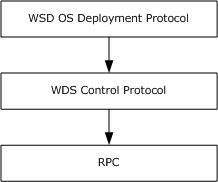

# [MS-WDSOSD]: Windows Deployment Services Operation System Deployment Protocol

Table of Contents

1 Introduction

- [1 Introduction](#Section_1)
  - [1.1 Glossary](#Section_1.1)
  - [1.2 References](#Section_1.2)
    - [1.2.1 Normative References](#Section_1.2.1)
    - [1.2.2 Informative References](#Section_1.2.2)
  - [1.3 Overview](#Section_1.3)
  - [1.4 Relationship to Other Protocols](#Section_1.4)
  - [1.5 Prerequisites/Preconditions](#Section_1.5)
  - [1.6 Applicability Statement](#Section_1.6)
  - [1.7 Versioning and Capability Negotiation](#Section_1.7)
  - [1.8 Vendor-Extensible Fields](#Section_1.8)
  - [1.9 Standards Assignments](#Section_1.9)

2 Messages

- [2 Messages](#Section_2)
  - [2.1 Transport](#Section_2.1)
  - [2.2 Message Syntax](#Section_2.2)
    - [2.2.1 WDS_OP_LOG_INIT](#Section_2.2.1)
    - [2.2.2 WDS_OP_LOG_MSG](#Section_2.2.2)
      - [2.2.2.1 WDS_LOG_TYPE_CLIENT_ERROR](#Section_2.2.2.1)
      - [2.2.2.2 WDS_LOG_TYPE_CLIENT_STARTED](#Section_2.2.2.2)
      - [2.2.2.3 WDS_LOG_TYPE_CLIENT_FINISHED](#Section_2.2.2.3)
      - [2.2.2.4 WDS_LOG_TYPE_CLIENT_IMAGE_SELECTED](#Section_2.2.2.4)
      - [2.2.2.5 WDS_LOG_TYPE_CLIENT_APPLY_STARTED](#Section_2.2.2.5)
      - [2.2.2.6 WDS_LOG_TYPE_CLIENT_APPLY_FINISHED](#Section_2.2.2.6)
      - [2.2.2.7 WDS_LOG_TYPE_CLIENT_UNATTEND_MODE](#Section_2.2.2.7)
      - [2.2.2.8 WDS_LOG_TYPE_CLIENT_TRANSFER_START](#Section_2.2.2.8)
      - [2.2.2.9 WDS_LOG_TYPE_CLIENT_TRANSFER_END](#Section_2.2.2.9)
      - [2.2.2.10 WDS_LOG_TYPE_CLIENT_TRANSFER_DOWNGRADE](#Section_2.2.2.10)
      - [2.2.2.11 WDS_LOG_TYPE_CLIENT_DOMAINJOINERROR](#Section_2.2.2.11)
      - [2.2.2.12 WDS_LOG_TYPE_CLIENT_POST_ACTIONS_START](#Section_2.2.2.12)
      - [2.2.2.13 WDS_LOG_TYPE_CLIENT_POST_ACTIONS_END](#Section_2.2.2.13)
      - [2.2.2.14 WDS_LOG_TYPE_CLIENT_APPLY_STARTED_2](#Section_2.2.2.14)
      - [2.2.2.15 WDS_LOG_TYPE_CLIENT_APPLY_FINISHED_2](#Section_2.2.2.15)
      - [2.2.2.16 WDS_LOG_TYPE_CLIENT_DOMAINJOINERROR2](#Section_2.2.2.16)
      - [2.2.2.17 WDS_LOG_TYPE_CLIENT_DRIVER_PACKAGE_NOT_ACCESSIBLE](#Section_2.2.2.17)
      - [2.2.2.18 WDS_LOG_TYPE_CLIENT_OFFLINE_DRIVER_INJECTION_START](#Section_2.2.2.18)
      - [2.2.2.19 WDS_LOG_TYPE_CLIENT_OFFLINE_DRIVER_INJECTION_END](#Section_2.2.2.19)
      - [2.2.2.20 WDS_LOG_TYPE_CLIENT_OFFLINE_DRIVER_INJECTION_FAILURE](#Section_2.2.2.20)
      - [2.2.2.21 WDS_LOG_TYPE_CLIENT_IMAGE_SELECTED2](#Section_2.2.2.21)
      - [2.2.2.22 WDS_LOG_TYPE_CLIENT_IMAGE_SELECTED3](#Section_2.2.2.22)
    - [2.2.3 WDS_OP_GET_CLIENT_UNATTEND](#Section_2.2.3)
    - [2.2.4 WDS_OP_GET_UNATTEND_VARIABLES](#Section_2.2.4)
    - [2.2.5 WDS_OP_GET_DOMAIN_JOIN_INFORMATION](#Section_2.2.5)
    - [2.2.6 WDS_OP_IMG_ENUMERATE](#Section_2.2.6)
    - [2.2.7 DDP_OP_GET_MACHINE_DRIVER_PACKAGES](#Section_2.2.7)
    - [2.2.8 Architecture](#Section_2.2.8)
    - [2.2.9 WDSDCMGR_OP_QUERY_METADATA](#Section_2.2.9)
    - [2.2.10 WDS_OP_RESET_BOOT_PROGRAM](#Section_2.2.10)
  - [2.3 Directory Service Schema Elements](#Section_2.3)

3 Protocol Details

- [3 Protocol Details](#Section_3)
  - [3.1 Server Details](#Section_3.1)
    - [3.1.1 Abstract Data Model](#Section_3.1.1)
      - [3.1.1.1 WDS Server Configuration](#Section_3.1.1.1)
      - [3.1.1.2 Computers in Active Directory Domain](#Section_3.1.1.2)
      - [3.1.1.3 Users in the Active Directory Domain](#Section_3.1.1.3)
      - [3.1.1.4 Machine Naming Policy](#Section_3.1.1.4)
    - [3.1.2 Timers](#Section_3.1.2)
    - [3.1.3 Initialization](#Section_3.1.3)
    - [3.1.4 Higher-Layer Triggered Events](#Section_3.1.4)
    - [3.1.5 Message Processing Events and Sequencing Rules](#Section_3.1.5)
      - [3.1.5.1 WDS_OP_LOG_INIT](#Section_3.1.5.1)
      - [3.1.5.2 WDS_OP_LOG_MSG](#Section_3.1.5.2)
      - [3.1.5.3 WDS_OP_GET_CLIENT_UNATTEND](#Section_3.1.5.3)
      - [3.1.5.4 WDS_OP_GET_UNATTEND_VARIABLES](#Section_3.1.5.4)
      - [3.1.5.5 WDS_OP_GET_DOMAIN_JOIN_INFORMATION](#Section_3.1.5.5)
        - [3.1.5.5.1 Computer Object Exists](#Section_3.1.5.5.1)
        - [3.1.5.5.2 Computer Object Does Not Exist](#Section_3.1.5.5.2)
      - [3.1.5.6 WDS_OP_IMG_ENUMERATE](#Section_3.1.5.6)
        - [3.1.5.6.1 Without CLIENT_CAP_SUPPORT_V2](#Section_3.1.5.6.1)
        - [3.1.5.6.2 With CLIENT_CAP_SUPPORT_V2](#Section_3.1.5.6.2)
        - [3.1.5.6.3 Without CLIENT_CAP_SUPPORT_VHDX](#Section_3.1.5.6.3)
        - [3.1.5.6.4 With CLIENT_CAP_SUPPORT_VHDX](#Section_3.1.5.6.4)
      - [3.1.5.7 DDP_OP_GET_MACHINE_DRIVER_PACKAGES](#Section_3.1.5.7)
      - [3.1.5.8 WDSDCMGR_OP_QUERY_METADATA](#Section_3.1.5.8)
      - [3.1.5.9 WDS_OP_RESET_BOOT_PROGRAM](#Section_3.1.5.9)
    - [3.1.6 Timer Events](#Section_3.1.6)
    - [3.1.7 Other Local Events](#Section_3.1.7)
  - [3.2 Client Details](#Section_3.2)
    - [3.2.1 Abstract Data Model](#Section_3.2.1)
      - [3.2.1.1 Client Configuration](#Section_3.2.1.1)
    - [3.2.2 Timers](#Section_3.2.2)
    - [3.2.3 Initialization](#Section_3.2.3)
      - [3.2.3.1 Initialize Logging](#Section_3.2.3.1)
      - [3.2.3.2 Initialize Deployment Agent Metadata](#Section_3.2.3.2)
      - [3.2.3.3 Status Message: Client Started](#Section_3.2.3.3)
    - [3.2.4 Higher-Layer Triggered Events](#Section_3.2.4)
    - [3.2.5 Message Processing Events and Sequencing Rules](#Section_3.2.5)
      - [3.2.5.1 Getting Unattended Instructions for Deployment Agent](#Section_3.2.5.1)
      - [3.2.5.2 Getting Credentials](#Section_3.2.5.2)
      - [3.2.5.3 Getting List of Images](#Section_3.2.5.3)
      - [3.2.5.4 Transferring Selected OS Image](#Section_3.2.5.4)
      - [3.2.5.5 Applying Selected OS Image](#Section_3.2.5.5)
      - [3.2.5.6 Driver Injection](#Section_3.2.5.6)
      - [3.2.5.7 Deployed OS Unattend and Domain Join](#Section_3.2.5.7)
        - [3.2.5.7.1 Computer Account Exists](#Section_3.2.5.7.1)
        - [3.2.5.7.2 Computer Account Does Not Exist](#Section_3.2.5.7.2)
      - [3.2.5.8 Finishing Up](#Section_3.2.5.8)
      - [3.2.5.9 Error Handling](#Section_3.2.5.9)
    - [3.2.6 Timer Events](#Section_3.2.6)
    - [3.2.7 Other Local Events](#Section_3.2.7)

4 Protocol Examples

- [4 Protocol Examples](#Section_4)
  - [4.1 Getting Transaction ID and Log Level](#Section_4.1)
  - [4.2 Client Started Status Message](#Section_4.2)
  - [4.3 Get Deployment Agent Unattend](#Section_4.3)
  - [4.4 Enumerating OS Images](#Section_4.4)
  - [4.5 Getting Unattend Variables For OS Deployment In Unattended Mode](#Section_4.5)
  - [4.6 Getting Domain Join Information](#Section_4.6)
  - [4.7 Initializing Deployment Agent Metadata](#Section_4.7)

5 Security

- [5 Security](#Section_5)
  - [5.1 Security Considerations for Implementers](#Section_5.1)
  - [5.2 Index of Security Parameters](#Section_5.2)

6 Appendix A: Product Behavior

- [6 Appendix A: Product Behavior](#Section_6)

7 Change Tracking

- [7 Change Tracking](#Section_7)

For the legal notice and IP terms, see [LEGAL.md](../LEGAL.md).
Last updated: 4/23/2024.
See [Revision History](#revision-history) for full version history.

# 1 Introduction

The Windows Deployment Services (WDS) OS Deployment Protocol specifies services exposed by the WDS server which are used by the clients to deploy an operating system (OS) on a machine. It is a client/server protocol which uses the Windows Deployment Services Control Protocol to communicate.

Sections 1.5, 1.8, 1.9, 2, and 3 of this specification are normative. All other sections and examples in this specification are informative.

## 1.1 Glossary

This document uses the following terms:

**Active Directory**: The Windows implementation of a general-purpose directory service, which uses LDAP as its primary access protocol. [**Active Directory**](#gt_active-directory) stores information about a variety of objects in the network such as user accounts, computer accounts, groups, and all related credential information used by Kerberos [MS-KILE](../MS-KILE/MS-KILE.md). [**Active Directory**](#gt_active-directory) is either deployed as [**Active Directory Domain Services (AD DS)**](#gt_active-directory-domain-services-ad-ds) or Active Directory Lightweight Directory Services (AD LDS), which are both described in [MS-ADOD](../MS-ADOD/MS-ADOD.md): Active Directory Protocols Overview.

**Active Directory domain**: A [**domain**](#gt_domain) hosted on [**Active Directory**](#gt_active-directory). For more information, see [MS-ADTS](../MS-ADTS/MS-ADTS.md).

**Active Directory Domain Services (AD DS)**: A directory service (DS) implemented by a domain controller (DC). The DS provides a data store for objects that is distributed across multiple DCs. The DCs interoperate as peers to ensure that a local change to an object replicates correctly across DCs. AD DS is a deployment of [**Active Directory**](#gt_active-directory) [MS-ADTS].

**client machine GUID**: Each client machine is assigned a unique GUID by the machine manufacturer and is stored in the SMBIOS of the client machine as per [[DMTF-DSP0134]](https://go.microsoft.com/fwlink/?LinkId=144120).

**deployed OS**: An operating system (OS) image that has been deployed/installed on the client machine.

**deployment agent**: An application on the client machine that communicates with WDS server and deploys an OS image on the client machine.

**deployment agent unattend**: Unattended instructions that provide input for all or some steps performed by the deployment agent. If unattended instructions do not provide input for certain steps, the deployment agent asks the user for input.

**domain**: A set of users and computers sharing a common namespace and management infrastructure. At least one computer member of the set has to act as a domain controller (DC) and host a member list that identifies all members of the domain, as well as optionally hosting the [**Active Directory**](#gt_active-directory) service. The domain controller provides authentication of members, creating a unit of trust for its members. Each domain has an identifier that is shared among its members. For more information, see [MS-AUTHSOD](../MS-AUTHSOD/MS-AUTHSOD.md) section 1.1.1.5 and [MS-ADTS].

**domain join**: A process to configure a machine to join an Active Directory domain and assume the identity assigned to it by the domain controller.

**driver**: Software that allows applications to interact with a hardware device by using abstract/high-level constructs.

**driver package**: A collection of the files needed to successfully load a driver. This includes the device information (.inf) file, the catalog file, and all of the binaries that are copied by the .inf file. Multiple drivers packaged together for deployment purposes.

**Endpoint GUID**: Set of relevant services provided by a Service Provider are grouped together and as a whole identified by a unique Endpoint GUID.

**globally unique identifier (GUID)**: A term used interchangeably with universally unique identifier (UUID) in Microsoft protocol technical documents (TDs). Interchanging the usage of these terms does not imply or require a specific algorithm or mechanism to generate the value. Specifically, the use of this term does not imply or require that the algorithms described in [[RFC4122]](https://go.microsoft.com/fwlink/?LinkId=90460) or [[C706]](https://go.microsoft.com/fwlink/?LinkId=89824) must be used for generating the [**GUID**](#gt_globally-unique-identifier-guid). See also universally unique identifier (UUID).

**image group**: Each image group has a unique name and an ACL to specify users who are allowed to deploy OS images from the image group. An image group can contain multiple OS image containers.

**little-endian**: Multiple-byte values that are byte-ordered with the least significant byte stored in the memory location with the lowest address.

**machine naming policy**: Specifies a naming scheme that is used to generate a name for the machine.

**multicast namespace**: Hosts multiple content that are available to clients using multicast sessions. Identification by a unique name is required. All content under a multicast namespace is available for transmission over multicast transmission.

**multicast transmission**: The ability of server to send OS image container files using the multicast feature of the User Datagram Protocol (UDP).

**OS deployment process**: Set of operations that must be performed by the deployment agent to prepare and deploy an OS image on client machine. It also includes steps that are performed by a deployed OS to bring the OS to a functioning state. Each step in the process might require input from the user.

**OS image**: Set of files required to deploy/install an Operating System on a machine. Each OS image is in either Virtual Hard Drive (VHD) or Windows Imaging (WIM) format. Each OS image also has associated OS image metadata.

**OS Image Container**: Single or multiple files that contain one or more OS images. Each OS image is identified by a unique numeric value in an OS image container.

**OS Image Language**: An OS image supports multiple locales and at deployment time any supported locale can be chosen for deployment.

**OS Image Metadata**: Set of attributes that specifies the properties of an OS image.

**OS Image Unattend**: Unattended instructions that provide input for some or all steps performed by the Deployed OS to bring OS to a functioning state. If Unattended instructions do not provide input for certain steps, Deployed OS asks user for input.

**Remote Installation (REMINST) Share**: A disk share that all WDS servers are required to create on initialization.

**Status Message**: Client sends status update messages to WDS server during deployment of an OS image on client machine. Each status message includes the severity and description.

**Unattend Variable**: A placeholder in the Unattended Instructions that is replaced by a value during OS Deployment Process.

**Unattended Instructions**: Set of instructions that enable Deployment Agent and Deployed OS to operate in Unattended Mode.

**Unattended Mode**: Same as Unattended Operation.

**Unicode string**: A Unicode 8-bit string is an ordered sequence of 8-bit units, a Unicode 16-bit string is an ordered sequence of 16-bit code units, and a Unicode 32-bit string is an ordered sequence of 32-bit code units. In some cases, it could be acceptable not to terminate with a terminating null character. Unless otherwise specified, all [**Unicode strings**](#gt_unicode-string) follow the UTF-16LE encoding scheme with no Byte Order Mark (BOM).

**VHD Image**: An OS image packaged in the Virtual Hard Disk (VHD) format.

**WDS server**: A Windows Deployment Services (WDS) server that communicates with clients by using the WDS OS Deployment Protocol to aid in deployment of an OS image on a client machine. Clients also communicate to a WDS server to request initiation/setup of multicast sessions for content available in multicast namespace on server.A WDS server provides an extensible mechanism to allow service providers to provide services to clients.

**WIM Image**: An OS image packaged in Windows Imaging (WIM) file format.

**MAY, SHOULD, MUST, SHOULD NOT, MUST NOT:** These terms (in all caps) are used as defined in [[RFC2119]](https://go.microsoft.com/fwlink/?LinkId=90317). All statements of optional behavior use either MAY, SHOULD, or SHOULD NOT.

## 1.2 References

Links to a document in the Microsoft Open Specifications library point to the correct section in the most recently published version of the referenced document. However, because individual documents in the library are not updated at the same time, the section numbers in the documents may not match. You can confirm the correct section numbering by checking the [Errata](https://go.microsoft.com/fwlink/?linkid=850906).

### 1.2.1 Normative References

We conduct frequent surveys of the normative references to assure their continued availability. If you have any issue with finding a normative reference, please contact [dochelp@microsoft.com](mailto:dochelp@microsoft.com). We will assist you in finding the relevant information.

[MS-ADA1] Microsoft Corporation, "[Active Directory Schema Attributes A-L](../MS-ADA1/MS-ADA1.md)".

[MS-ADA2] Microsoft Corporation, "[Active Directory Schema Attributes M](../MS-ADA2/MS-ADA2.md)".

[MS-ADA3] Microsoft Corporation, "[Active Directory Schema Attributes N-Z](../MS-ADA3/MS-ADA3.md)".

[MS-ADLS] Microsoft Corporation, "[Active Directory Lightweight Directory Services Schema](../MS-ADLS/MS-ADLS.md)".

[MS-ADSC] Microsoft Corporation, "[Active Directory Schema Classes](../MS-ADSC/MS-ADSC.md)".

[MS-ERREF] Microsoft Corporation, "[Windows Error Codes](../MS-ERREF/MS-ERREF.md)".

[MS-WDSC] Microsoft Corporation, "[Windows Deployment Services Control Protocol](../MS-WDSC/MS-WDSC.md)".

[RFC2119] Bradner, S., "Key words for use in RFCs to Indicate Requirement Levels", BCP 14, RFC 2119, March 1997, [https://www.rfc-editor.org/info/rfc2119](https://go.microsoft.com/fwlink/?LinkId=90317)

[RFC4122] Leach, P., Mealling, M., and Salz, R., "A Universally Unique Identifier (UUID) URN Namespace", RFC 4122, July 2005, [https://www.rfc-editor.org/info/rfc4122](https://go.microsoft.com/fwlink/?LinkId=90460)

[RFC5234] Crocker, D., Ed., and Overell, P., "Augmented BNF for Syntax Specifications: ABNF", STD 68, RFC 5234, January 2008, [https://www.rfc-editor.org/info/rfc5234](https://go.microsoft.com/fwlink/?LinkId=123096)

### 1.2.2 Informative References

None.

## 1.3 Overview

The [**deployment agent**](#gt_deployment-agent) uses the WDS OS Deployment Protocol (WDSOSD) to request information concerning deployment of an [**OS image**](#gt_os-image) on the client system. This information includes instructions for deploying an OS with or without user interaction, available OS images on the server, reporting of current status of the client, and joining of an [**Active Directory domain**](#gt_active-directory-domain) at the end of the deployment process.

A typical interaction between client and server involves the following steps (for brevity, only the core steps for OS deployment are included below).

- The client has already obtained the name or IP address of the [**WDS server**](#gt_wds-server).
- The deployment agent queries the WDS server if it should perform the [**OS deployment process**](#gt_os-deployment-process) in [**unattended mode**](#gt_unattended-mode), along with [**unattended instructions**](#gt_unattended-instructions) for the deployment agent, if applicable.
- The client obtains user credentials and requests the server to enumerate the OS images available to the client.
- Once an OS image is selected, the client proceeds to download the relevant files, and deploys the OS image on the client machine.
- The client queries the server as to whether the client machine is to join an Active Directory domain, and applies the policy depending on the answer.
- The client enumerates all devices installed on the client machine and requests applicable [**driver packages**](#gt_driver-package) from the server, and then proceeds to configure the [**deployed OS**](#gt_deployed-os) using the driver package returned by the server.

## 1.4 Relationship to Other Protocols

The WDS OS Deployment Protocol relies on the Windows Deployment Services Control Protocol as transport. It uses the WDS Control Protocol to send and receive replies.

The following diagram illustrates the relationship of the WDS OS Deployment Protocol and how it relates to the WDS Control Protocol.

Figure 1: Protocol relationships (WDS OS Deployment Protocol to WDS Control Protocol)

## 1.5 Prerequisites/Preconditions

This protocol is implemented on top of the WDS Control Protocol, and therefore has the prerequisites identified in [MS-WDSC](../MS-WDSC/MS-WDSC.md).

The WDS OS Deployment Protocol assumes that the client has obtained the name or IP address of the server that supports this protocol.

The [**deployment agent**](#gt_deployment-agent) supports the [**OS images**](#gt_os-image) available on the server and is responsible for deploying and installing the OS image from an [**OS image container**](#gt_os-image-container) to the client machine.

The deployment agent and [**WDS server**](#gt_wds-server) have an agreement on the format of the [**deployment agent unattend**](#gt_deployment-agent-unattend), if applicable.

The WDS server and [**deployed OS**](#gt_deployed-os) have an agreement on the format of the deployed OS unattend.

The deployment agent can process replacement variables for the deployed OS unattend.

The deployment agent is capable of configuring the deployed OS to join a specific [**Active Directory domain**](#gt_active-directory-domain), if applicable.

## 1.6 Applicability Statement

This protocol is applicable when an application deploys an OS on a client machine.

## 1.7 Versioning and Capability Negotiation

This document covers versioning issues in the following areas:

- Supported transports: This protocol uses the Windows Deployment Services Control Protocol for transport as specified in section [2](#Section_2).
- Protocol versions: The protocol supports multiple [**Endpoint GUIDs**](#gt_endpoint-guid) and opcodes as specified in section [2.1](#Section_2.1).
- Security and authentication methods: The security requirements for each Endpoint GUID and opcode are defined in [2.2](#Section_1.3).
- Localization: The protocol acts as a pass-through for all strings; no support for localization is built into the protocol.
- Capability negotiation: The protocol does explicit capability negotiation for certain Endpoint GUIDs and opcodes as specified in the following section.
| Capability | Section |
| --- | --- |
| WDS_OP_IMG_ENUMERATE | Section [2.2.6](#Section_2.2.6) |

## 1.8 Vendor-Extensible Fields

This protocol uses Win32 error codes as defined in [MS-ERREF](../MS-ERREF/MS-ERREF.md) section 2.2. Vendors SHOULD reuse those values with their indicated meaning. Choosing any other value runs the risk of a collision in the future.

## 1.9 Standards Assignments

| Parameter | Value | Reference |
| --- | --- | --- |
| OS Deployment Endpoint GUID | d8deeb5a-effd-43b2-99fc-1a8a5921c227 | [MS-WDSC](../MS-WDSC/MS-WDSC.md) (section 2.1.2) |
| Dynamic Driver Provisioning Endpoint GUID | 1a927394-352e-4553-ae3f-7cf4aafca620 | [MS-WDSC] (section 2.1.2) |
| Deployment Agent Metadata Endpoint GUID | 1044dfb7-a36b-40c3-92bb-ac4152187cb3 | [MS-WDSC] (section 2.1.2) |

# 2 Messages

## 2.1 Transport

The protocol MUST use the [**Endpoint GUIDs**](#gt_endpoint-guid) as specified in [MS-WDSC], (section 2.1.2).

Each opcode under the Endpoint GUID requires an authenticated and/or unauthenticated client request. Opcodes are defined in the section immediately following.

## 2.2 Message Syntax

The WDS OS Deployment Protocol MUST support the following opcodes under the OS deployment [**Endpoint GUID**](#gt_endpoint-guid).

| Opcode | Authentication requirements | Description |
| --- | --- | --- |
| WDS_OP_IMG_ENUMERATE 0x00000002 | Authenticated | Enumerate and return the list of [**OS images**](#gt_os-image) available to client machine. See section [2.2.6](#Section_2.2.6). |
| WDS_OP_LOG_INIT 0x00000003 | Authenticated and Unauthenticated | Provides a unique Transaction ID and severity level for [**status message**](#gt_status-message)s that MUST be logged by the client. See section [2.2.1](#Section_2.2.1). |
| WDS_OP_LOG_MSG 0x00000004 | Authenticated and Unauthenticated | Logs a status message on the server, specifying status update from client. See section [2.2.2](#Section_2.2.2). |
| WDS_OP_GET_CLIENT_UNATTEND 0x00000005 | Authenticated and Unauthenticated | Queries the server for [**deployment agent unattend**](#gt_deployment-agent-unattend). See section [2.2.3](#Section_2.2.3). |
| WDS_OP_GET_UNATTEND_VARIABLES 0x00000006 | Authenticated | Queries the server for values for variables to be consumed for [**deployed OS**](#gt_deployed-os) Unattend. See section [2.2.4](#Section_2.2.4). |
| WDS_OP_GET_DOMAIN_JOIN_INFORMATION 0x00000007 | Authenticated | Queries the server to find out if the client SHOULD join a [**domain**](#gt_domain), and the details of the domain to be joined. See section [2.2.5](#Section_2.2.5). |
| WDS_OP_RESET_BOOT_PROGRAM 0x00000008 | Authenticated | Sent by the client to notify the server that the deployment is complete and therefore the server SHOULD reset the PXE boot program selected for the client if appropriate per server policy. Thus, the client will not attempt to boot from the network after the client next reboots. For more details about the booting process, see section [2.2.10](#Section_2.2.10). |

The WDS OS Deployment Protocol MAY<1> support the dynamic [**driver**](#gt_driver) provisioning Endpoint GUID. If supported, the dynamic driver provisioning Endpoint GUID MUST support the following opcodes.

| Opcode | Authentication requirements | Description |
| --- | --- | --- |
| DDP_OP_GET_MACHINE_DRIVER_PACKAGES 0x000000C8 | Authenticated | Queries the server for [**driver packages**](#gt_driver-package) that match the devices that are installed on the client machines. |

The WDS OS Deployment Protocol MAY<2> support the deployment agent metadata Endpoint GUID. If supported, the deployment agent metadata Endpoint GUID MUST support the following opcodes.

| Opcode | Authentication requirements | Description |
| --- | --- | --- |
| WDSDCMGR_OP_QUERY_METADATA 0x00000002 | Authenticated or Unauthenticated | Queries the server for deployment agent metadata. |

### 2.2.1 WDS_OP_LOG_INIT

This opcode is used to initialize logging and to obtain a unique Transaction ID that is used later to send [**status message**](#gt_status-message)s generated by the [**deployment agent**](#gt_deployment-agent) to the server.

The request packet from client MUST include the following variables:

**VERSION** (**WDSCPL_VAR_ULONG**): MUST be set to 1.

The reply packet from the server MUST include the following variables:

**VERSION** (**WDSCPL_VAR_ULONG**): MUST be set to 1.

**LOGLEVEL** (**WDSCPL_VAR_ULONG**): The enumeration specifies the severity for status messages that MUST be logged by the client. Each severity level MUST include lower severity level status messages.

This variable MUST be set to a value as given in the following table.

| Log Level | Description |
| --- | --- |
| WDS_LOG_LEVEL_DISABLED 0x00000000 | The client MUST NOT log any status messages. |
| WDS_LOG_LEVEL_ERROR 0x00000001 | The client MUST log all status messages for failure conditions. |
| WDS_LOG_LEVEL_WARNING 0x00000002 | The client MUST log all status messages for warning and failure conditions. |
| WDS_LOG_LEVEL_INFO 0x00000003 | The client MUST log all status messages for informational, warning, and failure conditions. |

**TRANSACTION_ID** (**WDSCPL_VAR_WSTRING**): MUST be set to the string value that is used by the client in *WDS_OP_LOG_MSG* opcode (section [2.2.2](#Section_2.2.2)) to send status messages to the server.

### 2.2.2 WDS_OP_LOG_MSG

This opcode is used to send a [**status message**](#gt_status-message) to the server. The client MUST log status messages that have been requested by the server (section [2.2.1](#Section_2.2.1)).

To log a status message, the client MUST send the variables listed in the following section. Depending on the type of status message being logged, it MAY require additional variables which are listed in separate sections for each status message.

The request packet MUST include the following variables:

**VERSION** (**WDSCPL_VAR_ULONG**): MUST be set to 1.

**MESSAGE_TYPE** (**WDSCPL_VAR_ULONG**):

Specifies the type of status message being logged. MUST be set to a value from the following table.

| Message type | Log level | Additional variables section |
| --- | --- | --- |
| WDS_LOG_TYPE_CLIENT_ERROR 0x00000001 | WDS_LOG_LEVEL_ERROR | Section [2.2.2.1](#Section_2.2.2.1) |
| WDS_LOG_TYPE_CLIENT_STARTED 0x00000002 | WDS_LOG_LEVEL_INFO | Section [2.2.2.2](#Section_2.2.2.2) |
| WDS_LOG_TYPE_CLIENT_FINISHED 0x00000003 | WDS_LOG_LEVEL_INFO | Section [2.2.2.3](#Section_2.2.2.3) |
| WDS_LOG_TYPE_CLIENT_IMAGE_SELECTED 0x00000004 | WDS_LOG_LEVEL_INFO | Section [2.2.2.4](#Section_2.2.2.4) |
| WDS_LOG_TYPE_CLIENT_APPLY_STARTED 0x00000005 | WDS_LOG_LEVEL_INFO | Section [2.2.2.5](#Section_2.2.2.5) |
| WDS_LOG_TYPE_CLIENT_APPLY_FINISHED 0x00000006 | WDS_LOG_LEVEL_INFO | Section [2.2.2.6](#Section_2.2.2.6) |
| WDS_LOG_TYPE_CLIENT_GENERIC_MESSAGE 0x00000007 | WDS_LOG_LEVEL_ERROR | This status message is not used by the client. |
| WDS_LOG_TYPE_CLIENT_UNATTEND_MODE 0x00000008 | WDS_LOG_LEVEL_INFO | Section [2.2.2.7](#Section_2.2.2.7) |
| WDS_LOG_TYPE_CLIENT_TRANSFER_START 0x00000009 | WDS_LOG_LEVEL_INFO | Section [2.2.2.8](#Section_2.2.2.8) |
| WDS_LOG_TYPE_CLIENT_TRANSFER_END 0x0000000A | WDS_LOG_LEVEL_INFO | Section [2.2.2.9](#Section_2.2.2.9) |
| WDS_LOG_TYPE_CLIENT_TRANSFER_DOWNGRADE 0x0000000B | WDS_LOG_LEVEL_INFO | Section [2.2.2.10](#Section_2.2.2.10) |
| WDS_LOG_TYPE_CLIENT_DOMAINJOINERROR 0x0000000C | WDS_LOG_LEVEL_ERROR | Section [2.2.2.11](#Section_2.2.2.11) |
| WDS_LOG_TYPE_CLIENT_POST_ACTIONS_START 0x0000000D | WDS_LOG_LEVEL_INFO | Section [2.2.2.12](#Section_2.2.2.12) |
| WDS_LOG_TYPE_CLIENT_POST_ACTIONS_END 0x0000000E | WDS_LOG_LEVEL_INFO | Section [2.2.2.13](#Section_2.2.2.13) |
| WDS_LOG_TYPE_CLIENT_APPLY_STARTED_2 0x0000000F | WDS_LOG_LEVEL_INFO | Section [2.2.2.14](#Section_2.2.2.14) |
| WDS_LOG_TYPE_CLIENT_APPLY_FINISHED_2 0x00000010 | WDS_LOG_LEVEL_INFO | Section [2.2.2.15](#Section_2.2.2.15) |
| WDS_LOG_TYPE_CLIENT_DOMAINJOINERROR_2 0x00000011 | WDS_LOG_LEVEL_ERROR | Section [2.2.2.16](#Section_2.2.2.16) |
| WDS_LOG_TYPE_CLIENT_DRIVER_PACKAGE_NOT_ACCESSIBLE 0x00000012 | WDS_LOG_LEVEL_WARNING | Section [2.2.2.17](#Section_2.2.2.17) |
| WDS_LOG_TYPE_CLIENT_OFFLINE_DRIVER_INJECTION_START 0x00000013 | WDS_LOG_LEVEL_INFO | Section [2.2.2.18](#Section_2.2.2.18) |
| WDS_LOG_TYPE_CLIENT_OFFLINE_DRIVER_INJECTION_END 0x00000014 | WDS_LOG_LEVEL_INFO | Section [2.2.2.19](#Section_2.2.2.19) |
| WDS_LOG_TYPE_CLIENT_OFFLINE_DRIVER_INJECTION_FAILURE 0x00000015 | WDS_LOG_LEVEL_WARNING | Section [2.2.2.20](#Section_2.2.2.20) |
| WDS_LOG_TYPE_CLIENT_IMAGE_SELECTED2 0x00000016 | WDS_LOG_LEVEL_INFO | Section [2.2.2.21](#Section_2.2.2.21) |

**ARCHITECTURE** (**WDSCPL_VAR_ULONG**): MUST be set to the processor architecture of the client machine as specified in the [2.2.8](#Section_2.2.8) section.

**CLIENT_ADDRESS** (**WDSCPL_VAR_WSTRING**): MUST be set to the IP address of the network interface card being used by the client to communicate with [**WDS server**](#gt_wds-server).

**CLIENT_UUID** (**WDSCPL_VAR_WSTRING**): MUST be set to the [**client machine GUID**](#gt_client-machine-guid).

**CLIENT_MAC** (**WDSCPL_VAR_WSTRING**): MUST set to the MAC address of the network interface card being used by the client to communicate with the WDS server.

**TRANSACTION_ID** (**WDSCPL_VAR_WSTRING**): MUST set to the Transaction ID as returned by the server in reply to *WDS_OP_LOG_INIT*, and specified in section 2.2.1.

#### 2.2.2.1 WDS_LOG_TYPE_CLIENT_ERROR

This [**status message**](#gt_status-message) is logged by the client when it encounters a fatal error condition and is unable to continue. The request packet MUST specify the following variables in addition to variables specified in section [3.1.5.2](#Section_3.1.5.2).

**MESSAGE** (**WDSCPL_VAR_WSTRING**): MUST specify the description of the fatal error.

#### 2.2.2.2 WDS_LOG_TYPE_CLIENT_STARTED

This [**status message**](#gt_status-message) is logged when the client has initialized successfully and is ready to go through the [**OS deployment process**](#gt_os-deployment-process). The request packet MUST specify the following variables in addition to variables specified in section [3.1.5.2](#Section_3.1.5.2).

**VER_CLIENT_AUTO** (**WDSCPL_VAR_WSTRING**): MUST be set to the version of the client.

**VER_OS_AUTO** (**WDSCPL_VAR_WSTRING**): MUST be set to the version of the OS being used to deploy the new OS on the client machine.

#### 2.2.2.3 WDS_LOG_TYPE_CLIENT_FINISHED

This [**status message**](#gt_status-message) is logged when the client has finished the deployment of the OS on the client machine.

This status message does not require any additional variables.

#### 2.2.2.4 WDS_LOG_TYPE_CLIENT_IMAGE_SELECTED

This [**status message**](#gt_status-message) is logged when the client has selected an [**OS image**](#gt_os-image) for deployment. The request packet MUST specify the following variables in addition to variables specified in section [3.1.5.2](#Section_3.1.5.2).

**IMAGE_NAME** (**WDSCPL_VAR_STRING**): MUST be set to the name of the OS image selected by the client.

**IMAGE_GROUP** (**WDSCPL_VAR_WSTRING**): MUST be set to the name of the [**image group**](#gt_image-group) containing the selected OS image.

The client MUST first try to log the status message using *WDS_LOG_TYPE_CLIENT_IMAGE_SELECTED2* (section [2.2.2.21](#Section_2.2.2.21)) and on failure MUST fall back to using this status message.

#### 2.2.2.5 WDS_LOG_TYPE_CLIENT_APPLY_STARTED

This [**status message**](#gt_status-message) is logged when the client has started the installation/deployment of the selected [**OS image**](#gt_os-image) to the client machine.

The client MUST first try to log the status message using *WDS_LOG_TYPE_CLIENT_APPLY_STARTED_2* (section [2.2.2.14](#Section_2.2.2.14)) and on failure MUST fall back to using this status message.

This status message does not require any additional variables.

#### 2.2.2.6 WDS_LOG_TYPE_CLIENT_APPLY_FINISHED

This [**status message**](#gt_status-message) is logged when the client has finished the installation/deployment of the selected [**OS image**](#gt_os-image) to the client machine.

The client MUST first try to log the status message using *WDS_LOG_TYPE_CLIENT_APPLY_FINISHED_2* (section [2.2.2.15](#Section_2.2.2.15)) and on failure MUST fall back to using this status message.

This status message does not require any additional variables.

#### 2.2.2.7 WDS_LOG_TYPE_CLIENT_UNATTEND_MODE

This [**status message**](#gt_status-message) is logged to specify if the [**deployment agent**](#gt_deployment-agent) is operating in [**unattended mode**](#gt_unattended-mode). The request packet MUST specify the following variables in addition to variables specified in section [2.2.2](#Section_2.2.2).

**UNATTEND_MODE** (**WDSCPL_VAR_ULONG**): MUST be set to 1 if client is operating in unattended mode; otherwise, MUST be set to zero.

#### 2.2.2.8 WDS_LOG_TYPE_CLIENT_TRANSFER_START

This [**status message**](#gt_status-message) is logged when the client is starting the download of the files for an [**OS image container**](#gt_os-image-container) that contains the selected [**OS image**](#gt_os-image). The request packet MUST specify the following variables in addition to variables specified in section [2.2.2](#Section_2.2.2).

**IMAGE_NAME** (**WDSCPL_VAR_WSTRING**): MUST be set to the name of the OS image selected by the client.

**IMAGE_GROUP** (**WDSCPL_VAR_WSTRING**): MUST be set to the name of the [**image group**](#gt_image-group) containing the selected OS image.

**NAMESPACE_NAME** (**WDSCPL_VAR_WSTRING**): MUST be set to the [**multicast namespace**](#gt_multicast-namespace) being used by the client to download the OS image container files.

#### 2.2.2.9 WDS_LOG_TYPE_CLIENT_TRANSFER_END

This [**status message**](#gt_status-message) is logged when the client has completed the download of the [**OS image container**](#gt_os-image-container) that contains the selected [**OS image**](#gt_os-image). The request packet MUST specify the following variables in addition to variables specified in section [2.2.2](#Section_2.2.2).

**IMAGE_NAME** (**WDSCPL_VAR_WSTRING**): MUST be set to the name of the OS image selected by the client.

**IMAGE_GROUP** (**WDSCPL_VAR_WSTRING**): MUST be set to the name of the [**image group**](#gt_image-group) containing the selected OS image.

**NAMESPACE_NAME** (**WDSCPL_VAR_WSTRING**): MUST be set to the [**multicast namespace**](#gt_multicast-namespace) being used by the client to download the OS image.

#### 2.2.2.10 WDS_LOG_TYPE_CLIENT_TRANSFER_DOWNGRADE

This [**status message**](#gt_status-message) is logged when the client fails to download the [**OS image container**](#gt_os-image-container) that contains the selected [**OS image**](#gt_os-image) using [**multicast transmission**](#gt_multicast-transmission), and is now using an alternate mechanism<3> to download the OS image container files. The request packet MUST specify the following variables in addition to variables specified in section [2.2.2](#Section_2.2.2).

**IMAGE_NAME** (**WDSCPL_VAR_WSTRING**): MUST be set to the name of the OS image selected by the client.

**IMAGE_GROUP** (**WDSCPL_VAR_WSTRING**): MUST be set to the name of the [**image group**](#gt_image-group) containing the selected OS image.

**NAMESPACE_NAME** (**WDSCPL_VAR_WSTRING**): MUST be set to the [**multicast namespace**](#gt_multicast-namespace) being used by the client to download the OS image.

#### 2.2.2.11 WDS_LOG_TYPE_CLIENT_DOMAINJOINERROR

This [**status message**](#gt_status-message) is logged when the client encounters an error while configuring the [**deployed OS**](#gt_deployed-os) to join an [**Active Directory domain**](#gt_active-directory-domain). The request packet MUST specify the following variables in addition to the variables specified in section [2.2.2](#Section_2.2.2).

**MACHINE_NAME** (**WDSCPL_VAR_WSTRING**): MUST be set to the computer object name used to configure the deployed OS for the domain join.

**MACHINE_OU** (**WDSCPL_VAR_WSTRING**): MUST be set to the organizational unit in [**Active Directory**](#gt_active-directory) used to configure the deployed OS for the [**domain join**](#gt_domain-join).

The client MUST first try to log the status message using *WDS_LOG_TYPE_CLIENT_DOMAINJOINERROR2* (section [2.2.2.16](#Section_2.2.2.16)) and on failure MUST fall back to using this status message.

#### 2.2.2.12 WDS_LOG_TYPE_CLIENT_POST_ACTIONS_START

This [**status message**](#gt_status-message) is logged when the client is starting to process the [**OS image unattend**](#gt_os-image-unattend).

This status message does not require any additional variables.

#### 2.2.2.13 WDS_LOG_TYPE_CLIENT_POST_ACTIONS_END

This [**status message**](#gt_status-message) is logged after the client has completed processing of the [**OS image unattend**](#gt_os-image-unattend).

This status message does not require any additional variables.

#### 2.2.2.14 WDS_LOG_TYPE_CLIENT_APPLY_STARTED_2

This [**status message**](#gt_status-message) is logged when the client is starting the download of the files for an [**OS image container**](#gt_os-image-container) that contains the selected [**OS image**](#gt_os-image). The request packet MUST specify the following variables in addition to variables specified in section [2.2.2](#Section_2.2.2).

The [**WDS server**](#gt_wds-server) MAY NOT<4> support this status message. The client MUST first try to log this status message, and on failure MUST fall back to using *WDS_LOG_TYPE_CLIENT_APPLY_STARTED* (section [2.2.2.5](#Section_2.2.2.5)).

**IMAGE_NAME** (**WDSCPL_VAR_WSTRING**): MUST be set to the name of the OS image selected by the client.

**IMAGE_GROUP** (**WDSCPL_VAR_WSTRING**): MUST be set to the name of the [**image group**](#gt_image-group) containing the selected OS image.

#### 2.2.2.15 WDS_LOG_TYPE_CLIENT_APPLY_FINISHED_2

This [**status message**](#gt_status-message) is logged when the client has finished applying the selected [**OS image**](#gt_os-image) to the client machine. The request packet MUST specify the following variables in addition to variables specified in section [2.2.2](#Section_2.2.2).

The [**WDS server**](#gt_wds-server) MAY NOT<5> support this status message. The client MUST first try to log this status message and on failure MUST fall back to using *WDS_LOG_TYPE_CLIENT_APPLY_FINISHED* (section [2.2.2.3](#Section_2.2.2.3)).

**IMAGE_NAME** (**WDSCPL_VAR_WSTRING**): MUST be set to the name of the OS image selected by the client.

**IMAGE_GROUP** (**WDSCPL_VAR_WSTRING**): MUST be set to the name of the [**image group**](#gt_image-group) containing the selected OS image.

#### 2.2.2.16 WDS_LOG_TYPE_CLIENT_DOMAINJOINERROR2

This [**status message**](#gt_status-message) is logged when the client encounters a fatal error while configuring the [**deployed OS**](#gt_deployed-os) to join an [**Active Directory domain**](#gt_active-directory-domain). The request packet MUST specify the following variables in addition to variables specified in section [2.2.2](#Section_2.2.2).

**MACHINE_NAME** (**WDSCPL_VAR_WSTRING**): MUST be set to the computer object name that was used to configure the deployed OS image for joining a domain.

**MACHINE_OU** (**WDSCPL_VAR_WSTRING**): MUST be set to the organizational unit in [**Active Directory**](#gt_active-directory) that was used to configure the deployed OS image for joining the domain.

**ERROR_CODE** (**WDSCPL_VAR_ULONG**): MUST be set to the Win32 error code for the failed operation ([MS-ERREF](../MS-ERREF/MS-ERREF.md)).

The [**WDS server**](#gt_wds-server) MAY NOT support this status message. The client MUST try to log this status message and on failure MUST fall back to using WDS_LOG_TYPE_CLIENT_DOMAINJOINERROR (section [2.2.2.11](#Section_2.2.2.11)).

#### 2.2.2.17 WDS_LOG_TYPE_CLIENT_DRIVER_PACKAGE_NOT_ACCESSIBLE

This [**status message**](#gt_status-message) is logged when the client is not able to access the [**driver package**](#gt_driver-package) files required to configure the [**deployed OS**](#gt_deployed-os) to use a specific driver package. The request packet MUST specify the following variables in addition to variables specified in section [2.2.2](#Section_2.2.2).

**DRIVER_PACKAGE_NAME** (**WDSCPL_VAR_WSTRING**): MUST be set to the name of the failed driver package.

**ERROR_CODE** (**WDSCPL_VAR_ULONG**): MUST be set to the Win32 error code of the failed operation ([MS-ERREF](../MS-ERREF/MS-ERREF.md)).

The [**WDS server**](#gt_wds-server) MAY NOT<6> support this status message.

#### 2.2.2.18 WDS_LOG_TYPE_CLIENT_OFFLINE_DRIVER_INJECTION_START

This [**status message**](#gt_status-message) is logged when the client is starting to configure the [**deployed OS**](#gt_deployed-os) to use specific [**driver packages**](#gt_driver-package).

The [**WDS server**](#gt_wds-server) MAY NOT<7> support this status message.

This status message does not require any additional variables.

#### 2.2.2.19 WDS_LOG_TYPE_CLIENT_OFFLINE_DRIVER_INJECTION_END

This [**status message**](#gt_status-message) is logged when the client has finished configuring the [**deployed OS**](#gt_deployed-os) to use specific [**driver packages**](#gt_driver-package).

The [**WDS server**](#gt_wds-server) MAY NOT<8> support this status message.

This status message does not require any additional variables.

#### 2.2.2.20 WDS_LOG_TYPE_CLIENT_OFFLINE_DRIVER_INJECTION_FAILURE

This [**status message**](#gt_status-message) is logged when the client is not able to configure the [**deployed OS**](#gt_deployed-os) to use a specific [**driver package**](#gt_driver-package). The request packet MUST specify the following variables in addition to variables specified in section [2.2.2](#Section_2.2.2).

**DRIVER_PACKAGE_NAME** (**WDSCPL_VAR_WSTRING**): MUST be set to the name of the failed driver package.

**ERROR_CODE** (**WDSCPL_VAR_ULONG**): MUST be set to the Win32 error code of the failed operation ([MS-ERREF](../MS-ERREF/MS-ERREF.md)).

The [**WDS server**](#gt_wds-server) MAY NOT support this status message.<9>

#### 2.2.2.21 WDS_LOG_TYPE_CLIENT_IMAGE_SELECTED2

The [**status message**](#gt_status-message) is logged when the client has selected an [**OS image**](#gt_os-image) for deployment. The request packet MUST specify the following variables in addition to variables specified in section [2.2.2](#Section_2.2.2).

**IMAGE_NAME** (**WDSCPL_VAR_WSTRING**): MUST be set to the name of the OS image selected by the client.

**IMAGE_GROUP** (**WDSCPL_VAR_WSTRING**): MUST be set to the name of the [**image group**](#gt_image-group) containing the selected OS image.

**IMAGE LANGUAGE** (**WDSCPL_VAR_WSTRING**): MUST set to the [**OS image language**](#gt_os-image-language) selected by the client for the selected OS image.

The [**WDS server**](#gt_wds-server) MAY NOT<10> support this status message. The client MUST first try to log using this status message and on failure MUST fall back to using *WDS_LOG_TYPE_CLIENT_IMAGE_SELECTED* (section [2.2.2.4](#Section_2.2.2.4)).

#### 2.2.2.22 WDS_LOG_TYPE_CLIENT_IMAGE_SELECTED3

The [**status message**](#gt_status-message) is logged when the client has selected an [**OS image**](#gt_os-image) for deployment. The request packet MUST specify the following variables in addition to variables specified in section [2.2.2](#Section_2.2.2).

**IMAGE_NAME (WDSCPL_VAR_WSTRING):** MUST be set to the name of the OS image selected by the client.

**IMAGE_GROUP (WDSCPL_VAR_WSTRING):** MUST be set to the name of the [**image group**](#gt_image-group) containing the selected OS image.

**IMAGE LANGUAGE (WDSCPL_VAR_WSTRING):** MUST set to the OS image language selected by the client for the selected OS image.

**IMAGE ARCHITECTURE (WDSCPL_VAR_ULONG):** MUST be set to the architecture supported by the image that was selected in terms of the architecture codes specified in section [2.2.8](#Section_2.2.8).

The [**WDS server**](#gt_wds-server) MAY NOT<11> support this status message. The client MUST first try to log on using this status message and on failure MUST fall back to using WDS_LOG_TYPE_CLIENT_IMAGE_SELECTED2 (section [2.2.2.21](#Section_2.2.2.21)).

### 2.2.3 WDS_OP_GET_CLIENT_UNATTEND

This opcode is used to query for [**unattended instructions**](#gt_unattended-instructions) for the [**deployment agent**](#gt_deployment-agent).

The client MUST send the following variables to the server:

**VERSION** (**WDSCPL_VAR_ULONG**): MUST be set to 1.

**ARCHITECTURE** (**WDSCPL_VAR_ULONG**): MUST be set to the processor architecture of the client machine as specified in section [2.2.8](#Section_2.2.8).

**CLIENT_MAC** (**WDSCPL_VAR_WSTRING**): MUST be set to a string representation of the hardware address of the network interface card being used by the client to communicate with the [**WDS server**](#gt_wds-server). This string MUST use valid formatting, in the same format as the ABNF specification for the **CLIENT_GUID** variable.

**CLIENT_GUID** (**WDSCPL_VAR_WSTRING**): MUST be set to a string representation of the client's machine identifier, either the DHCP_UUID or DHCPv6 DUID.<12> The format of this string is given by the following ABNF specification, as specified in [[RFC5234]](https://go.microsoft.com/fwlink/?LinkId=123096):

client-guid = short-mac / dashed-mac / raw-guid / formatted-guid / duid-ll / duid-llt / duid-uuid / duid

digit = "0" / "1" / "2" / "3" / "4" / "5" / "6" / "7" / "8" / "9"

hex-digit = "a" / "b" / "c" / "d" / "e" / "f" / digit

short-mac = 12hex-digit

dashed-mac = 5( 2hex-digit "-" ) 2hex-digit

raw-guid = 32hex-digit

formatted-guid = ("{" guid-body "}") / guid-body

guid-body = 8hex-digit "-" 4hex-digit "-" 4hex-digit "-" 4hex-digit "-" 12hex-digit

duid-llt = "00-01-00-01-" 9( 2hex-digit "-" ) 2hex-digit

duid-ll = "00-03-00-01-" 5( 2hex-digit "-" ) 2hex-digit

duid-uuid = "00-04-" 15( 2hex-digit "-" ) 2hex-digit

duid = "[" *( 2hex-digit "-" ) 2hex-digit "]"

The reply from the server MUST set the following variables:

**VERSION (WDSCPL_VAR_ULONG):** MUST be set to 1.

**FLAGS** (**WDSCPL_VAR_ULONG**):

The value for the **FLAGS** variable is a bitwise OR of the following values:

| Flag | Description |
| --- | --- |
| WdsCliClientUnattendPresent 0x00000001 | MUST be set if the server provided unattended instructions for the deployment agent. If this flag is set, the reply packet MUST also include the **CLIENT_UNATTEND** variable. |
| WdsCliClientUnattendOverride 0x00000002 | When set, this flag specifies that unattended instructions for the [**deployed OS**](#gt_deployed-os) that are present locally on the client machine MUST override the unattended instructions for the deployed OS that are provided by the server. |

**CLIENT_UNATTEND** (**WDSCPL_VAR_BLOB**): This variable specifies unattended instructions that are used by the deployment agent to operate in [**unattended mode**](#gt_unattended-mode). This variable MUST be present if the **WdsCliClientUnattendPresent** flag is specified for the FLAGS variable.

**FIRMWARE (WDSCPL_VAR_BYTE)**: This variable specifies the firmware type of the client. This variable SHOULD<13> be present to explicitly specify the firmware type of the client. The value of the FIRMWARE variable MUST be one of the following values:

| Firmware Type | Description |
| --- | --- |
| WdsCliClientFirmwareTypePcat 0x00000000 | MUST be set to indicate the client’s active firmware type is a PC/AT-compatible BIOS. |
| WdsCliClientFirmwareTypeUefi 0x00000001 | MUST be set to indicate the client’s active firmware type is EFI or UEFI. |

### 2.2.4 WDS_OP_GET_UNATTEND_VARIABLES

This opcode is used to retrieve a list of values for [**unattend variables**](#gt_unattend-variable) that MAY be present in [**deployed OS**](#gt_deployed-os) unattend. The returned values are used to replace unattend variables in deployed OS unattend.

The request packet MUST include the following variables:

VERSION (WDSCPL_VAR_ULONG): MUST be set to 1.

**CLIENT_MAC** (**WDSCPL_VAR_WSTRING**): MUST be specified in the same manner as defined for **CLIENT_MAC** in WDS_OP_GET_CLIENT_UNATTEND, as specified in section [2.2.3](#Section_2.2.3).

**CLIENT_GUID** (**WDSCPL_VAR_WSTRING**): MUST be specified in the same manner as defined for **CLIENT_GUID** in WDS_OP_GET_CLIENT_UNATTEND, as specified in section 2.2.3.

The reply packet from the server MUST include the following:

**VERSION (WDSCPL_VAR_ULONG):** MUST be set to 1.

**MACHINENAME** (**WDSCPL_VAR_WSTRING**): For client machines that have a computer object in the [**Active Directory domain**](#gt_active-directory-domain), this variable MUST be set to the value of the **samAccountName** attribute, after stripping any leading dollar sign characters from the attribute value.

This variable MUST be set to an empty string if no computer object exists.

**MACHINEDOMAIN** (**WDSCPL_VAR_WSTRING**): For client machines that have a computer object in the Active Directory domain, this variable MUST be set to the name of the Active Directory domain; otherwise, this variable MUST be set to an empty string.

**ORGNAME** (**WDSCPL_VAR_WSTRING**): MUST be the name of the organization.

**TIMEZONE** (**WDSCPL_VAR_WSTRING**): MUST be set to the time zone configured on the server.

### 2.2.5 WDS_OP_GET_DOMAIN_JOIN_INFORMATION

This opcode is used to query policy for joining the [**deployed OS**](#gt_deployed-os) to an [**Active Directory domain**](#gt_active-directory-domain).

The request packet MUST include the following variables:

**VERSION (WDSCPL_VAR_ULONG):** MUST be set to 1.

**CLIENT_MAC** (**WDSCPL_VAR_WSTRING**): MUST be specified in the same manner as defined for **CLIENT_MAC** in WDS_OP_GET_CLIENT_UNATTEND as specified in section [2.2.3](#Section_2.2.3).

**CLIENT_GUID** (**WDSCPL_VAR_WSTRING**): MUST be specified in the same manner as defined for **CLIENT_GUID** in WDS_OP_GET_CLIENT_UNATTEND as specified in section 2.2.3.

The reply packet from the server MUST include the following:

**VERSION** (**WDSCPL_VAR_ULONG**): MUST be set to 1.

**FLAGS** (**WDSCPL_VAR_ULONG**):

The value for this variable is a bitwise OR of the following flags:

| Flag | Description |
| --- | --- |
| WdsCliFlagJoinDomain 0x00000001 | MUST be set if the client is required to join an Active Directory domain. The client MUST NOT join a [**domain**](#gt_domain) if this flag is absent. |
| WdsCliFlagAccountExists 0x00000002 | MUST be set if a computer object for the client machine already exists in Active Directory domain. |
| WdsCliFlagPrestageUsingMac 0x00000004 | Only used when a computer object for the client machine does not exist in the Active Directory domain. When this flag is set, the client MUST use the MAC address of the network interface card being used to communicate with the [**WDS server**](#gt_wds-server) for the **netbootGUID** attribute when creating a computer object for the client machine in Active Directory domain. When this flag is not set, the client MUST use the [**client machine GUID**](#gt_client-machine-guid) instead. |
| WdsCliFlagResetBootProgram 0x00000100 | When this flag is set, the client MUST reset the client’s boot program, either directly through [**Active Directory**](#gt_active-directory) or through WDS_OP_RESET_BOOT_PROGRAM. When the **MACHINEDN** variable is specified and is not the empty string, the client MUST reset the client’s boot program directly by deleting the value for the netbootMachineFilePath attribute for the computer object in the Active Directory domain. When the **MACHINEDN** variable is not specified or is specified to be the empty string, the client MUST reset the client’s boot program through WDS_OP_RESET_BOOT_PROGRAM. When this flag is set, the client MUST delete the value for netbootMachineFilePath attribute for the computer object in Active Directory domain. |

**MACHINEOU** (**WDSCPL_VAR_WSTRING**): This variable is set to an empty string if the client machine has a computer object in Active Directory domain.

For a client machine that does not have a computer object in Active Directory domain, this variable specifies the organizational unit in the Active Directory domain where the computer object for the client machine MUST be created.

**MACHINENAME** (**WDSCPL_VAR_WSTRING**): For a client machine that has a computer object in Active Directory domain, this variable is set to the value of the **samAccountName** attribute of the computer object after stripping any leading dollar sign characters from the attribute value.

For a client machine that does not have a computer object in the Active Directory domain, this variable is set to the [**machine naming policy**](#gt_machine-naming-policy) that MUST be used by the client to generate a unique computer object name for the client machine.

**MACHINEDOMAIN** (**WDSCPL_VAR_WSTRING**): For a client machine that has a computer object in the Active Directory domain, this variable is set to the name of the Active Directory domain where the computer object for the client machine exists.

For a client machine that does not have a computer object in the Active Directory domain, this variable is set to an empty string.

**MACHINEDN** (**WDSCPL_VAR_WSTRING**): For a client machine that has a computer object (account) in the Active Directory domain, this variable is set to the distinguished name of the computer object for the client machine.

For a client machine that does not have a computer object in the Active Directory domain, this variable is set to an empty string.

**FIRSTNAME** (**WDSCPL_VAR_WSTRING**): This variable is set to the first name of the user identity being used to communicate with WDS server.

**LASTNAME** (**WDSCPL_VAR_WSTRING**): This variable is set to the last name of the user identity being used to communicate with the WDS server.

### 2.2.6 WDS_OP_IMG_ENUMERATE

This opcode is used to enumerate all [**OS images**](#gt_os-image) available on the server and accessible to the client.

The request packet MUST include the following:

**VERSION** (**WDSCPL_VAR_ULONG**): MUST be set to 1.

The request packet MAY<14> include the following:

**CC** (**WDSCPL_VAR_ULONG**): This variable is used to specify the capabilities of the client. The value for this parameter is a bitwise OR of the following:

| Flag | Description |
| --- | --- |
| CLIENT_CAP_SUPPORT_V2 0x00000001 | MUST be set if the client supports the version 2.0 format that is used to return information for each OS image. |
| CLIENT_CAP_SUPPORT_VHDX 0x00000002 | MUST be set if the client is capable of deploying OS images in the VHDX format.<15> |

If the client used WDSDCMGR_OP_QUERY_METADATA to get deployment agent metadata from the server as specified in section [2.2.9](#Section_3.1.5.8), the client SHOULD<16> include this in the request packet in the following variables:

**IMDC** (**WDSCPL_VAR_ULONG**): MUST specify the same value specified by the Metadata.Count variable in the server's response to WDSDCMGR_OP_QUERY_METADATA.

The md_index in the following variable is a placeholder and is replaced by a value of zero in order to generate the variable name for the first variable, and incremented for subsequent variables up to (IMDC - 1). In this manner the request packet MUST include IMDC instances of the following variable:

**IMD[md_index]** (**WDSCPL_VAR_WSTRING**): MUST specify the same values specified by the Metadata.Entry[index] variables in the same order in the server's response to WDSDCMGR_OP_QUERY_METADATA.

The reply packet from the server MUST include the following variables:

**VERSION (WDSCPL_VAR_ULONG):** MUST be set to 1.

The following variables MAY be present in the reply packet:

**OPTIONS** (**WDSCPL_VAR_ULONG**): The value for this variable is a bitwise OR of the following:

| Flag | Description |
| --- | --- |
| WdsCliFlagEnumFilterVersion 0x00000001 | MAY be set to instruct the client to display only the OS images that exactly match the version of the OS currently running on the client machine and being used for deployment. |
| WdsCliFlagEnumFilterFirmware 0x00000002 | MAY be set to instruct the client to display only the OS images for selection that match the firmware type of the client machine. |

**SC** (**WDSCPL_VAR_ULONG**): If the request packet specifies the **CC** variable, and the server supports at least one of the capabilities specified by the client, then the reply packet MUST include this variable. The value for this variable is a bitwise OR of the following:

| Flag | Description |
| --- | --- |
| SERVER_CAP_SUPPORT_V2 0x00000001 | MUST be set if the client specifies the **CC** variable with the CLIENT_CAP_SUPPORT_V2 flag set, and the server supports the version 2.0 format for returning the list of OS images. |
| SERVER_CAP_SUPPORT_VHDX 0x00000002 | MUST be set if the client specifies the **CC** variable with the CLIENT_CAP_SUPPORT_VHDX flag set and the CLIENT_CAP_SUPPORT_V2 flag set, and the server supports the version 2.0 format for returning the list of OS images, and the server supports deploying OS images in the VHDX format.<17> |

If the reply packet does not have an **SC** variable, or the value for the variable does not have the SERVER_CAP_SUPPORT_V2 flag set, then information for each OS image available to the client is available as follows:<18>

**XML_index (WDSCPL_VAR_WSTRING):** MUST be set to the [**OS image metadata**](#gt_os-image-metadata).

**PATH_index** (**WDSCPL_VAR_WSTRING**): MUST be set to the relative path of the [**OS image container**](#gt_os-image-container) file on [**WDS server**](#gt_wds-server).<19>

**GROUP_index** (**WDSCPL_VAR_WSTRING**): MUST be set to the [**image group**](#gt_image-group) to which the OS image belongs.

**INDEX_index** (**WDSCPL_VAR_ULONG**): MUST be set to the unique numeric index of the OS image in the OS image container.

**NAMESPACE_index** (**WDSCPL_VAR_WSTRING**): MAY<20> be present in a reply packet; MUST be set to the [**multicast namespace**](#gt_multicast-namespace) that MAY be available and can provide the files for the OS image container using [**multicast transmission**](#gt_multicast-transmission). If multicast transmission is not available, this variable MUST be set to an empty string.

**RESOURCEFILEPATH_index** (**WDSCPL_VAR_WSTRING**): MAY be present in a reply packet.<21> For an OS image container that uses two files to package OS images, this variable is set to the relative path of the second file for the OS image container.<22>

If the OS image container only has one file, this variable is set to the same value as the **PATH_index** variable.

**NAMESPACE_SIZE_index** (**WDSCPL_VAR_ULONG64**): MAY<23> be present; MUST be set to the estimated number of bytes that the client has to download using multicast transmission in order to fully download the OS image container onto the client machine.

To retrieve information for all OS images from the reply packet, the client MUST substitute an index with a value of 1 and retrieve all variables for the first OS image. The client MUST increment the index for each iteration and continue to retrieve information for subsequent OS images until the variables generated by using the next index value are not found in the reply packet.

If the reply packet specifies the SC variable and it has SERVER_CAP_SUPPORT_V2 flag set<24>, then information for each OS image available to the client is available as follows:

**IL.Type[index]** (**WDSCPL_VAR_ULONG**): MUST be set to the type of OS image as specified in the following table:

| Image type | Description |
| --- | --- |
| DEP_IMAGE_VHD 0x00000001 | MUST be set for OS images of type [**VHD Image**](#gt_vhd-image). |
| DEP_IMAGE_WIM 0x00000002 | MUST be set for OS images of type [**WIM Image**](#gt_wim-image). |
| DEP_IMAGE_VHDX 0x00000003 | MUST be set for OS images of type VHDX image. If the server does not specify the SC variable with the SERVER_CAP_SUPPORT_VHDX flag, the server MUST NOT specify any instances of DEP_IMAGE_VHDX in the reply packet.<25> |

**IL.Xml[index] (WDSCPL_VAR_WSTRING):** MUST be set to the OS image metadata.

**IL.Path[index]** (**WDSCPL_VAR_WSTRING**): MUST set to the relative path of the OS image container file on WDS server.<26>

**IL.ResPath[index]** (**WDSCPL_VAR_WSTRING**): For OS image containers that have more than one file, this parameter specifies the second file for the OS image container.<27>

**IL.Group[index]** (**WDSCPL_VAR_WSTRING**): MUST be set to the image group the OS image belongs to.

**IL.Index[index]** (**WDSCPL_VAR_ULONG**): MUST be set to the unique numeric index of the OS image in the OS image container.

**IL.NS[index] (WDSCPL_VAR_WSTRING):** MUST be set to the multicast namespace that MAY be available and can provide the files for the OS image container using multicast transmission.

**IL.NSCS[index] (WDSCPL_VAR_ULONG64):** MUST be set to the estimated number of bytes that the client has to download using multicast transmission in order to fully download the OS image container on the client machine.

**IL.ExFlags[index]** (**WDSCPL_VAR_ULONG**): The value for this variable is a bitwise OR the flags as specified in the following table:

| Flag | Description |
| --- | --- |
| EX_FLAG_SPARSE_FILE 0x00000001 | This flag indicates that the [**deployment agent**](#gt_deployment-agent) MUST NOT use the sparse file feature of the file system when downloading the OS image container files from the WDS server using multicast transmission. |

**IL.DepFiles[index].Cnt** (**WDSCPL_VAR_ULONG**): MUST be set to the total number of files for an OS image container.

**IL.DepFiles[index].VL[file_index]** (**WDSCPL_VAR_WSTRING**): MUST be set to the relative path of the files on WDS server.<28>

To retrieve all dependent files for an OS image container, the client must substitute file_index with a value of zero and retrieve the value for the resulting variable. The client MUST continue to increment the file_index up to (DepFiles[index].Cnt - 1) to retrieve all files.

**IL.MdGuid[index]** (**WDSCPL_VAR_BLOB**): MAY<29> be specified by the server to indicate a unique identifier for the OS image. If this variable is specified, it MUST be a 16-byte value storing a GUID that was assigned by the server to the OS image and that uniquely identifies the OS image among other OS images in the image store.

### 2.2.7 DDP_OP_GET_MACHINE_DRIVER_PACKAGES

This opcode is used by the clients to get [**driver packages**](#gt_driver-package) that enable the [**deployed OS**](#gt_deployed-os) to recognize and configure devices installed on the client machine.

The request packet MUST include the following variables:

**MA** (**WDSCPL_VAR_BLOB**): MUST be set to the MAC address of the network interface card being used by the client to communicate with the server.

**DpF** (**WDSCSL_VAR_ULONG**):

This variable is a bitwise OR of the following flags:

| Flag | Description |
| --- | --- |
| WDSDDP_DRVPKG_DETAIL_DRIVERS 0x00000001 | Specifies that all matching driver packages MUST include the list of [**drivers**](#gt_driver) in the driver package. |
| WDSDDP_DRVPKG_DETAIL_FILES 0x00000002 | Specifies that all matching driver packages MUST include the list of files for the driver packages. |

The following variables are used to specify the deployed OS information:

**IMDG** (**WDSCPL_VAR_BLOB**): If the deployed OS was chosen from among those OS images returned by the server in the reply from WDS_OP_IMG_ENUMERATE as specified in section [2.2.6](#Section_2.2.6), and the server specified the variable IL.MdGuid[index] for that OS image, then the client SHOULD specify that value in the IMDG variable.

**Mi.TOSI.OSVM** (**WDSCPL_VAR_ULONG**): MUST be set to the major version of the deployed OS.

**Mi.TOSI.OSVMn** (**WDSCPL_VAR_ULONG**): MUST be set to the minor version of the deployed OS.

**Mi.TOSI.Bn** (**WDSCPL_VAR_ULONG**): MUST be set to the build number of the deployed OS.

**Mi.TOSI.Sb** (**WDSCPL_VAR_ULONG**): MUST be set to the service pack build number of the deployed OS.

**Mi.TOSI.Ar** (**WDSCPL_VAR_ULONG**): MUST be set to the architecture of the deployed OS as specified in section [2.2.8](#Section_2.2.8).

**Mi.TOSI.Ed** (**WDSCPL_VAR_WSTRING**): MUST be set to the edition of the deployed OS.

**Mi.TOSI.Lp.Cnt** (**WDSCPL_VAR_ULONG**): MUST be set to the total number of language packs available in the deployed OS.

**Mi.TOSI.Lp.VL[index]** (**WDSCPL_VAR_WSTRING**): MUST be set to the list of language packs available in the deployed OS. The client MUST generate variables for each language pack by replacing the index in the variable name with a value of zero for the first entry and continue to increment the index for subsequent entries up (Mi.TOSI.Cnt - 1).

Values for the following variables are extracted from the SMBIOS of the client machine:

**Mi.SMBI.MR** (**WDSCPL_VAR_WSTRING**): MUST be set to the manufacturer of the client machine.

**Mi.SMBI.BD** (**WDSCPL_VAR_WSTRING**): MUST be set to the BIOS vendor of the client machine.

**Mi.SMBI.BV** (**WDSCPL_VAR_WSTRING**): MUST be set to the BIOS version.

**Mi.SMBI.CU** (**WDSCPL_VAR_WSTRING**): MUST be set to the [**client machine GUID**](#gt_client-machine-guid).

**Mi.SMBI.MO** (**WDSCPL_VAR_WSTRING**): MAY<30> be set to the model of the client machine.

**Mi.SMBI.CS.Cnt** (**WDSCPL_VAR_ULONG**): MUST be set to the total number of chassis types that are specified in the SMBIOS of the client machine.

**Mi.SMBI.CS.VL[index]** (**WDSCPL_VAR_ULONG**): MUST be set to the list of chassis types as specified in the SMBIOS of the client machine. The client MUST generate variables for each chassis type by replacing the index in the variable name with a value of zero for first entry and continue to increment index for subsequent entries up to (**Mi.SMBI.CS.Cnt** - 1).

The following variables specify details for each device that is installed on the client machine.

**Mi.D.Cnt** (**WDSCPL_VAR_ULONG**): MUST be set to the total number of devices installed on the client machine.

For the following variables, the variable name is generated for each device by replacing the index with a value of zero for first device, and incremented for each iteration and new variable names generated up to (Mi.D.Cnt - 1).

**Mi.D.VL[index].N** (**WDSCPL_VAR_WSTRING**): MUST be set to the name of the device.

**Mi.D.VL[index].D** (**WDSCPL_VAR_WSTRING**): MUST be set to the description of the device.

**Mi.D.VL[index].I** (**WDSCPL_VAR_WSTRING**): MUST be set to the instance ID of the device.

**Mi.D.VL[index].H.Cnt** (**WDSCPL_VAR_ULONG**): MUST be set to the total number of hardware IDs for the device.

**Mi.D.VL[index].H.VL[hw_index]** (**WDSCPL_VAR_WSTRING**): MUST be set to the list of hardware IDs for the device. The variable name for hardware ID is generated by replacing the hw_index with a value of zero for the first entry and incremented for subsequent entries up to (Mi.D.VL[index].Cnt).

**Mi.D.VL[index].C.Cnt** (**WDSCPL_VAR_ULONG**): MUST be set to the total number of compatible IDs for the device.

**Mi.D.VL[index].C.VL[cp_index]** (**WDSCPL_VAR_WSTRING**): MUST be set to the list of compatible IDs for the device. The variable name for each compatible ID is generated by replacing the cp_index in the variable name with a value of zero for the first entry and incrementing it by one for subsequent entries up to (Mi.D.VL[index].C.Cnt - 1).

If the client used WDSDCMGR_OP_QUERY_METADATA to get deployment agent metadata from the server as specified in section [2.2.9](#Section_3.1.5.8), the client SHOULD<31> include this in the request packet in the following variables:

**MDC** (**WDSCPL_VAR_ULONG**): MUST specify the same value specified by the **Metadata.Count** variable in the server's response to WDSDCMGR_OP_QUERY_METADATA.

The md_index in the following variable is a placeholder and is replaced by a value of zero in order to generate the variable name for the first variable, and incremented for subsequent variables up to (**MDC** - 1). In this manner the request packet MUST include **MDC** instances of the following variable:

**MD[md_index]** (**WDSCPL_VAR_WSTRING**): MUST specify the same values specified by the **Metadata.Entry[index]** variables in the same order in the server's response to WDSDCMGR_OP_QUERY_METADATA.

The reply packet from the server MUST include the following variables:

**DpC** (**WDSCPL_VAR_ULONG**): MUST be set to the number of driver packages returned by the server.

The index in the following variables is a placeholder, and is replaced by a value of zero in order to generate variable names for the first driver package, and incremented for subsequent driver packages up to (DpC - 1).

**Dp.ID[index]** (**WDSCPL_VAR_BLOB**): MUST be set to the 128-bit unique identifier for the driver package.

**Dp.NM[index]** (**WDSCPL_VAR_WSTRING**): MUST be set to the friendly name for the driver package.

**Dp.EN[index]** (**WDSCPL_VAR_ULONG**): MUST be set to 1.

**Dp.IP[index]** (**WDSCPL_VAR_WSTRING**): MUST be set to the network path of the .inf file (INF) for the driver package.

**Dp.PP[index]** (**WDSCPL_VAR_WSTRING**): MUST be set to the network path for the folder containing all files required for the driver package.

**Dp.CG[index]** (**WDSCPL_VAR_BLOB**): MUST be set to a 128-bit value specifying the class of the driver package.

**Dp.PN[index]** (**WDSCPL_VAR_WSTRING**): MUST be set to the provider of the driver package.

**Dp.AR[index]** (**WDSCPL_VAR_ULONG**): MUST be set to the processor architecture supported by the driver package (section 2.2.8).

**Dp.LN[index]** (**WDSCPL_VAR_WSTRING**): MUST be set to the locale supported by the driver package.

**Dp.SG[index]** (**WDSCPL_VAR_ULONG**): MUST be set to 1 for driver packages that are signed; otherwise, MUST be set to 0.

**Dp.VTS[index]** (**WDSCPL_VAR_ULONG64**): MUST be set to the date the driver package was published. The time is a 64-bit value representing the number of 100-nanosecond intervals since January 1, 1601 (UTC).

**Dp.FG[index]** (**WDSCPL_VAR_ULONG**):

The value is a bitwise OR of the following flags:

| Flag | Description |
| --- | --- |
| WDSDDP_DRVPKG_DETAIL_DRIVERS 0x00000001 | Specifies that the reply packet includes the list of drivers in the driver package. |
| WDSDDP_DRVPKG_DETAIL_FILES 0x00000002 | Specifies that the reply packet includes the list of files required for the driver package. |

**Dp.V[index]** (**WDSCPL_VAR_ULONG**): MUST be set to the version of the driver package.

**Dp.Da[index]** (**WDSCPL_VAR_ULONG64**): MUST be set to the time when the driver package was added to the server by administrator. The time is a 64-bit value representing the number of 100-nanosecond intervals since January 1, 1601 (UTC).

If the **Dp.FG[index]** variable specifies the WDSDDP_DRVPKG_DETAIL_DRIVERS flag, then the details of each driver MUST be specified using the following variables:

Dp.DL[index].Cnt (WDSCPL_VAR_ULONG): MUST be set to the total number of drivers in the driver package.

The details for each driver MUST be specified using the following variables. The variables names for each driver are generated by replacing the drv_index with a value of zero for the first driver and incremented for each subsequent driver up to (Dp.DL[index].Cnt - 1).

**Dp.DL[index].DL[drv_index].DN** (**WDSCPL_VAR_WSTRING**): MUST be set to the hardware description of the driver.

**Dp.DL[index].DL[drv_index].MR** (**WDSCPL_VAR_WSTRING**): MUST be set to the manufacturer of the driver.

**Dp.DL[index].DL[drv_index].HID** (**WDSCPL_VAR_WSTRING**): MUST be set to the hardware ID of device supported by driver.

**Dp.DL[index].DL[drv_index].CID.Cnt** (**WDSCPL_VAR_ULONG**): MUST be set to the total number of compatible IDs supported by the driver.

**Dp.DL[index].DL[drv_index].CID.VL[cid_index]** (**WDSCPL_VAR_WSTRING**): MUST be set to the list of compatible IDs supported by the driver. The variable names for each compatible ID is generated by replacing cid_index with a value of zero for the first compatible ID and incremented for each subsequent entry up to (Dp.DL[index].CID.Cnt - 1).

**Dp.DL[index].DL[drv_index].EID.Cnt** (**WDSCPL_VAR_ULONG**): MUST be set to the total number of exclude IDs that driver does not support.

**Dp.DL[index].DL[drv_index].EID.VL[eid_index]** (**WDSCPL_VAR_WSTRING**): MUST be set to the list of exclude IDs that are not supported by the driver. The variable names for each exclude ID is generated by replaced eid_index with a value of zero for the first exclude ID and incremented for each subsequent entry up to (Dp.DL[index].EID.Cnt - 1).

If the **Dp.FG[index]** variable specifies the WDSDDP_DRVPKG_DETAIL_FILES flag, then the details of files required for driver package must be specified using the following variables:

**Dp.DL[index].FL.Cnt** (**WDSCPL_VAR_ULONG**): MUST be set to the total number of files required by the driver package.

**Dp.DL[index].FL.VL[fl_index].SF** (**WDSCPL_VAR_WSTRING**): MUST be set to the network path for each file that is required by the driver package. The variable name for each file is generated by replacing the fl_index in the variable name with a value of zero for the first file and incremented for subsequent entries up to (Dp.DL[index].FL.Cnt - 1).

### 2.2.8 Architecture

The processor architecture of the client machine MUST be set to one of the following:

| Architecture type | Description |
| --- | --- |
| PROCESSOR_ARCHITECTURE_AMD64 0x00000009 | MUST be set for processors capable of an x64 instruction set. |
| PROCESSOR_ARCHITECTURE_INTEL 0x00000000 | MUST be set for processors that support an x86 instruction set only. |
| PROCESSOR_ARCHITECTURE_IA64 0x00000006 | MUST be set for processors that support an IA64 instruction set.<32> |
| PROCESSOR_ARCHITECTURE_ARM64 0x0000000B | MUST be set for processors that support an ARM64 instruction set.<33> |
| PROCESSOR_ARCHITECTURE_ARM 0x00000005 | MUST be set for processors that support an ARM instruction set.<34> |

### 2.2.9 WDSDCMGR_OP_QUERY_METADATA

This opcode is used by the clients to get deployment agent metadata from the server, which is used to customize the deployment behavior of the deployment agent.

The request packet MUST include the following variables:

**Metadata.Count (WDSCPL_VAR_ULONG)**: MUST be set to the number of deployment agent metadata entries in the request.

The index in the following variable is a placeholder and is replaced by a value of zero in order to generate the variable name for the first variable, and incremented for subsequent variables up to (**Metadata.Count** - 1). The request packet MUST include **Metadata.Count** instances of the following variable:

**Metadata.Entry[index] (WDSCPL_VAR_WSTRING)**: MUST be a 16-bit [**little-endian**](#gt_little-endian) Unicode string in the format specified by the following ABNF specification, as specified in [[RFC5234]](https://go.microsoft.com/fwlink/?LinkId=123096).

entry = identifier [filter] "=" value

identifier-start = "a" / "b" / "c" / "d" / "e" / "f" / "g" / "h" / "i" / "j" / "k" / "l" / "m" / "n" / "o" / "p" / "q" / "r" / "s" / "t" / "u" / "v" / "w" / "x" / "y" / "z"

identifier = identifier-start *("." / identifier-start)

filter = "[" operator [";" set-specifier] [";" match-group] "]"

operator = "equal" / "notequal" / "greaterthan" / "lessthan" / "lessthanorequal" / "greaterthanorequal" / "matchespattern" / "notmatchespattern"

set-specifier = "allof" "atleastoneof"

match-group = "matchgroup" "=" 1*identifier-start

value = string-value / bool-value / time-value / integer-value / version-value / guid-value / binary-value

string-value = (%x22 %x22) / (%x22 string-body %x22) / (%x27 string-body %x27)

string-body = 1*string-element

string-element = %x1-21 / %x23-26 / %x28-5b / %x5d-ff / (%x5c %x5c) / (%x5c %x22) / (%x5c %x27)

bool-value = "true" / "false"

digit = "0" / "1" / "2" / "3" / "4" / "5" / "6" / "7" / "8" / "9"

hex-digit = "a" / "b" / "c" / "d" / "e" / "f" / digit

time-value = 1*digit "/" 1*digit "/" 1*digit [1*digit ":" 1*digit ":" 1*digit ["." 1*digit]]

integer-value = ["-"] 1*digit ; MUST specify a valid 64-bit signed integer

version-value = version-number "." version-number "." version-number "." version-number

version-number = digit / 2digit / 3digit / ( [ %x31-35 ] 4*digit ) / ( "64" 3digit ) / ( "65" %x30-34 2digit ) / ( "655" %x30-32 digit ) / ( "6553" %x30-35 )

guid-value = ("{" guid-body "}") / guid-body

guid-body = 8hex-digit "-" 4hex-digit "-" 4hex-digit "-" 4hex-digit "-" 12hex-digit

binary-value = "[" 2hex-digit *("-" 2hex-digit) "]"

The response packet MUST include the following variables:

**Metadata.Count (WDSCPL_VAR_ULONG)**: MUST be set to the number of deployment agent metadata entries in the reply.

The index in the following variable is a placeholder and is replaced by a value of zero in order to generate the variable name for the first variable, and incremented for subsequent variables up to (**Metadata.Count** - 1). In this manner the reply packet MUST include **Metadata.Count** instances of the following variable:

**Metadata.Entry[index] (WDSCPL_VAR_WSTRING)**: MUST be a 16-bit little-endian Unicode string in the format specified by the preceding ABNF specification.

### 2.2.10 WDS_OP_RESET_BOOT_PROGRAM

The WDS_OP_RESET_BOOT_PROGRAM opcode is used by the client to notify the server that the deployment is complete, and therefore the server SHOULD reset the PXE boot program selected for the client, if appropriate per server policy, so that the client will not attempt to boot from the network after the client next reboots.

The request packet MUST include the following variables:

**VERSION** (**WDSCPL_VAR_ULONG**): MUST be set to 1.

**CLIENT_MAC** (**WDSCPL_VAR_WSTRING**): MUST be specified in the same manner as defined for **CLIENT_MAC** in WDS_OP_GET_CLIENT_UNATTEND, as specified in section [2.2.3](#Section_2.2.3).

**CLIENT_GUID** (**WDSCPL_VAR_WSTRING**): MUST be specified in the same manner as defined for **CLIENT_GUID** in WDS_OP_GET_CLIENT_UNATTEND, as specified in section 2.2.3.

There are no additional variables defined for the server's reply.

## 2.3 Directory Service Schema Elements

The protocol accesses the Directory Service schema classes and attributes listed in the following table.

For the syntactic specifications of the following Computer Class pairs, refer either to:

[**Active Directory Domain Services (AD DS)**](#gt_active-directory-domain-services-ad-ds) ([MS-ADA1](../MS-ADA1/MS-ADA1.md), [MS-ADA2](../MS-ADA2/MS-ADA2.md), [MS-ADA3](../MS-ADA3/MS-ADA3.md), and [MS-ADSC](../MS-ADSC/MS-ADSC.md)), or to Active Directory Lightweight Directory Services (AD LDS) ([MS-ADLS](../MS-ADLS/MS-ADLS.md)).

| Class | Attribute |
| --- | --- |
| **Computer** | **samAccountName** **netbootGUID** **netbootMachineFilePath** **netbootMirrorDataFile** |
| **User** | **samAccountName** **givenName** **sn** |

The Directory Service schema classes and attributes listed in the following table are mentioned in [MS-ADA3] but are relevant only in server-to-server Windows Deployment Services protocols, and are not covered in this document.

| Class | Attribute |
| --- | --- |
| **serviceConnectionPoint** | **netbootAnswerOnlyValidClients** **netbootAnswerRequests** **netbootNewMachineNamingPolicy** **netbootNewMachineOU** **netbootServer** **netbootSCPBL** |

# 3 Protocol Details

## 3.1 Server Details

This section specifies the WDS OS Deployment Protocol behavior for [**WDS server**](#gt_wds-server).

### 3.1.1 Abstract Data Model

This section describes a conceptual model of possible data organization that an implementation maintains to participate in this protocol. The described organization is provided to facilitate the explanation of how the protocol behaves. This document does not mandate that implementations adhere to this model as long as their external behavior is consistent with that described in this document.

**image group:** Collection of [**OS images**](#gt_os-image) grouped under an image group. Each [**image group**](#gt_image-group) is identified by a unique name, and access to OS images in the image group is controlled by image group access control list.

**image group access control list:** An access control list that specifies which client identities have read permissions for the image group.

**image store:** Collection of image groups. All files and folders for image groups and OS images in an image group are made available by the server using a network share<35>

**WDS server configuration:** Configuration information for a server, in persistent storage, in the form of (name, value) pairs. The list of metadata information can be found in section [3.1.1.1](#Section_3.2.1.1).

**driver package store:** Persistent storage where files and metadata for each [**driver package**](#gt_driver-package) is stored. All files for driver packages are made available by the server using a network share<36>

**status messages log:** A persistent storage where all [**status message**](#gt_status-message)s received from clients are stored.

**deployment agent unattend store:** A persistent storage where [**unattended instructions**](#gt_unattended-instructions) for the [**deployment agent**](#gt_deployment-agent) for each processor architecture are stored.

**computers in active directory domain:** Configuration information for each client machine is stored in the [**Active Directory domain**](#gt_active-directory-domain).

**users in active directory domain:** Configuration information for each user is stored in the Active Directory domain.

**computers in a custom computer data store:** Configuration information for each client machine can be stored in a custom data store remotely on the server machine, or locally on the server machine, in a format other than the Active Directory domain.

#### 3.1.1.1 WDS Server Configuration

The following properties are stored for the [**WDS server**](#gt_wds-server) configuration.

**ClientLoggingLevel:** A numeric value that specifies the types of [**status message**](#gt_status-message)s the client MUST log during the [**OS deployment process**](#gt_os-deployment-process).

**OrganizationName:** Specifies the business name of the organization.

TimeZone: Specifies the time zone configured on the server.

**NewMachinesJoinDomain:** A Boolean value that, when set to True, specifies that all client machines that do not have a computer object in the [**Active Directory domain**](#gt_active-directory-domain) MUST join the Active Directory domain. A value of False specifies that such client machines MUST NOT join an Active Directory domain.

**NewMachineNamingPolicy:** Specifies the naming scheme to use to generate the name for the client machines ([Machine Naming Policy](#Section_3.1.1.4) section).

**NewMachineOU:** Specifies the distinguished name of the organizational unit (OU) in the Active Directory domain where client machines that do not have a computer object in the Active Directory domain MUST create the computer object.

**PrestageUsingMAC:** A Boolean value that, when set to True, specifies that all client machines that do not have a computer object in Active Directory domain MUST set the netbootGUID attribute of the computer object to the MAC address of the network interface card being used by the client to communicate with the server. When set to False, this value specifies that the [**client machine GUID**](#gt_client-machine-guid) MUST be used for the netbootGUID attribute of the computer object.

**ResetBootProgram:** A Boolean value that, when set to True, specifies that the client MUST delete the value of the netbootMachineFilePath attribute of the computer object. When set to False, the client MUST NOT take any action.

**ImageFilterOnVersion:** A Boolean value that, when set to True, specifies that the client MUST display [**OS images**](#gt_os-image) where the version of the OS image exactly matches the version of the OS being used by the client for deployment. When set to False, the client MUST NOT do any filtering based on versions.

**ImageFilterOnFirmware:** A Boolean value that, when set to True, specifies that the client MUST display OS images where the firmware type of the OS image exactly matches the firmware type of the client machine. When set to False, the client MUST NOT filter OS images based on firmware type.

**OSImageUnattendOverride:** A Boolean value that, when set to True, specifies that the [**unattended instructions**](#gt_unattended-instructions) for the [**deployed OS**](#gt_deployed-os) present on the client machine MUST override any unattended instructions for the deployed OS provided by the server. When set to False, the unattended instructions provided by the server MUST be used.

#### 3.1.1.2 Computers in Active Directory Domain

The server uses the MAC address or the [**client machine GUID**](#gt_client-machine-guid) to find the computer object in [**Active Directory Domain**](#gt_active-directory-domain) for each client. The server uses the LDAP search filter as follows to search for the computer object for the client machine.

(&(objectClass=Computer)(|(netbootGUID=<MAC Address>)(netbootGUID=<client machine GUID>)))

If more than one matching computer object is found, the server uses the first matching computer object.

MachineName: Any dollar sign characters at the end of the value for **samAccountName** attribute are removed, and the resulting value is used as machine name for the client machine.

**netbootMirrorDataFile**: This attribute is used to store multiple values in the following format:

<key-1>=<value-1>; <key-2>=<value-2>;...; <key-N>=<value-N>;

DeploymentAgentUnattend: Specifies the relative path to the file containing [**unattended instructions**](#gt_unattended-instructions) for [**deployment agent**](#gt_deployment-agent). The value is stored in **netbootMirrorDataFile** attribute using the **WdsUnattendFilePath** key. If the key is missing from **netbootMirrorDataFile**, or the value is set to an empty string, then it MUST be treated as if there is no unattended instruction for the deployment agent.

JoinDomain: Specifies whether the client machine MUST join an Active Directory domain. The value is stored in the **netbootMirrorDataFile** attribute using the **DomainJoin** key. The value is a numeric value which is set to zero to indicate that the client machine MUST NOT join the Active Directory domain; a nonzero value indicates that the client machine MUST join the Active Directory domain. If this key is missing from the **netbootMirrorDataFile** attribute, it MUST be treated as being set to a nonzero value.

#### 3.1.1.3 Users in the Active Directory Domain

The server uses the user name of the authenticated user to find the user object in [**Active Directory domain**](#gt_active-directory-domain). The server uses the following LDAP search filter to find the user account.

(&(objectClass=User)(samAccountName=<User Name>$))

FirstName: The **givenName** attribute specifies the first name of the user.

LastName: The **sn** attribute specifies the last name of the user.

#### 3.1.1.4 Machine Naming Policy

The [**machine naming policy**](#gt_machine-naming-policy) is used to generate a unique name for the client machine so that it can join an [**Active Directory domain**](#gt_active-directory-domain). A machine naming policy consists of alphanumeric characters, and has variables embedded in it. The variables are replaced with actual values to generate a unique name for the client machine.

The following variables MUST be supported.

| Variable | Description |
| --- | --- |
| %[0][length]First | Replaced with the first name of the user. |
| %[0][length]Last | Replaced with the last name of the user. |
| %[0][length]Username | Replaced with the user name of the user. |
| %[0][length]MAC | Replaced with the MAC address of the network interface card being used by the client machine to communicate with the [**WDS server**](#gt_wds-server). |
| %[0][length]# | Replaced with an incremental number. |

Variable names MUST be treated as case-insensitive.

The fields inside square brackets [] are optional.

If a percentage (%) character is followed by zero, then a numeric value for length MUST be specified.

The length field specifies the maximum number of characters to be used for the variable value, counting the characters from left to right. If the length of the value for a variable is larger than the length specified by the length field, it MUST be trimmed to the length specified by length. If the length of the value for a variable is smaller than length, then the actual value for the variable is used.

If the percentage (%) character is followed by zero, and the length of the value for a variable is smaller than the length, then the value MUST be left-padded with zeros to increase the length of value to length.

If neither zero nor length is specified following the percentage (%) character, then the actual value for the variable is used.

### 3.1.2 Timers

None.

### 3.1.3 Initialization

On initialization, the [**WDS server**](#gt_wds-server) MUST register the OS deployment [**Endpoint GUID**](#gt_endpoint-guid) as specified in section [2.1](#Section_2.1). The WDS server MAY<37> register the dynamic [**driver**](#gt_driver) provisioning Endpoint GUID as specified in section 2.1. The WDS server MAY<38> register the deployment agent metadata Endpoint GUID as specified in section 2.1.

### 3.1.4 Higher-Layer Triggered Events

None.

### 3.1.5 Message Processing Events and Sequencing Rules

All request packets received by the [**WDS server**](#gt_wds-server) MUST meet the authentication requirement for the [**Endpoint GUID**](#gt_endpoint-guid) and opcode, as specified in section [2.2](#Section_1.3).

#### 3.1.5.1 WDS_OP_LOG_INIT

This opcode is used by the client to obtain the Log Level and the unique Transaction ID.

The server MUST validate that all required variables are specified in the request packet.

The server MUST generate a unique [**GUID**](#gt_globally-unique-identifier-guid) (as defined in [[RFC4122]](https://go.microsoft.com/fwlink/?LinkId=90460)) and return it as the **TRANSACTION_ID** after conversion to a [**Unicode string**](#gt_unicode-string). The server MUST set the *LOGLEVEL* variable to **ClientLoggingLevel** as specified in section [3.1.1.1](#Section_3.2.1.1).

#### 3.1.5.2 WDS_OP_LOG_MSG

This opcode is used by the clients to send [**status message**](#gt_status-message)s to the server.

The server MUST validate that all required variables are specified in the request packet.

The server MAY<39> validate that the log level for the status message being logged is consistent with **ClientLoggingLevel** as specified in section [3.1.1.1](#Section_3.2.1.1). The server MUST validate that all required variables for the status message are specified, and add the status message to the status messages log.

#### 3.1.5.3 WDS_OP_GET_CLIENT_UNATTEND

This opcode is used to query for [**unattended instructions**](#gt_unattended-instructions) for the [**deployment agent**](#gt_deployment-agent).

The server MUST validate that all required variables are specified in the request packet.

The server MUST follow the following steps to determine if there are unattended instructions for the deployment agent:

The server MUST search for a matching computer object in the [**Active Directory domain**](#gt_active-directory-domain) as specified in section [3.1.1.2](#Section_3.1.1.2).

If a computer object is found and the **DeploymentAgentUnattend** attribute (section 3.1.1.2) specifies a relative path to a file for the deployment agent, the server MUST read the contents of the file and set the **CLIENT_UNATTEND** variable to the contents.

If a computer object is not found or the **DeploymentAgentUnattend** attribute does not specify a relative path to a file, then the server MUST check the [**deployment agent unattend**](#gt_deployment-agent-unattend) store for unattended instructions for the architecture specified by the client using the **ARCHITECTURE** variable. If unattended instructions are found, the server MUST set the **CLIENT_UNATTEND** variable to it.

If the **FIRMWARE** variable is present, the server MAY use the value of the FIRMWARE variable to select more specific unattended instructions from the deployment agent's unattend store for the architecture and firmware types, by using both the **ARCHITECTURE** and **FIRMWARE** variables together.<40> In this case, the server MUST set the **CLIENT_UNATTEND** variable to these unattended instructions.

If unattended instructions are found, the **FLAGS** variable MUST be set to include the WdsCliClientUnattendPresent flag.

If the **OSImageUnattendOverride** (section [3.1.1.1](#Section_3.2.1.1)) is set to TRUE, then the FLAGS variable MUST also include the WdsCliClientUnattendOverride flag.

#### 3.1.5.4 WDS_OP_GET_UNATTEND_VARIABLES

This opcode is used to retrieve a list of values for the [**unattend variables**](#gt_unattend-variable) that MAY be present in [**deployed OS**](#gt_deployed-os) unattend. The returned values are used to replace unattend variables in deployed OS unattend.

The server MUST validate that all required variables are specified in the request packet.

The server MUST search for a matching computer object in the [**Active Directory domain**](#gt_active-directory-domain), as specified in section [3.1.1.2](#Section_3.1.1.2). If the computer object is found, the server MUST set the following variables in the reply packet:

The **MACHINENAME** variable MUST be set to the **MachineName** attribute, as specified in section 3.1.1.2.

The **MACHINEDOMAIN** variable MUST be set to the name of the Active Directory domain.

If a computer object does not exist in the Active Directory domain, the server MUST set **MACHINENAME** and **MACHINEDOMAIN** to the empty string.

The **TIMESIZE** variable MUST be set to **TimeZone** as specified in section [3.1.1.1](#Section_3.2.1.1).

The **ORGNAME** variable MUST be set to **OrganizationName** as specified in section 3.1.1.1.

#### 3.1.5.5 WDS_OP_GET_DOMAIN_JOIN_INFORMATION

This opcode is used to query policy for joining the [**deployed OS**](#gt_deployed-os) to an [**Active Directory domain**](#gt_active-directory-domain).

The server MUST validate that all required variables are specified in the request packet.

The server MUST search for a user account in the Active Directory domain (section [3.1.1.3](#Section_3.1.1.3)) and MUST set the following variables:

**FIRSTNAME** variable to **FirstName** attribute (section 3.1.1.3).

**LASTNAME** variable to **LastName** attribute (section 3.1.1.3).

The server MUST search for a computer object in the Active Directory domain for the client machine, as specified in section [3.1.1.2](#Section_3.1.1.2). If a computer object is found, the server MUST follow the steps in section 3.1.1.2; otherwise, the server MUST follow steps in section 3.1.1.2.

##### 3.1.5.5.1 Computer Object Exists

The server MUST set the **FLAGS** variable as follows:

- MUST include WdsCliFlagsAccountExists.
- MUST include WdsCliFlagJoinDomain if the **JoinDomain** attribute (section [3.1.1.2](#Section_3.1.1.2)) is set to a nonzero value.
- MUST include WdsCliFlagResetBootProgram if ResetBootProgram is set to TRUE (section [3.1.1.1](#Section_3.2.1.1)).
Remaining variables MUST be set as follows:

- MUST set the **MACHINEOU** variable to a null string.
- MUST set the **MACHINENAME** variable to the value of the **MachineName** attribute (section 3.1.1.2).
If the computer object information exists in an [**Active Directory Domain**](#gt_active-directory-domain):

- MUST set the **MACHINEDOMAIN** to the name of the Active Directory domain.
- MUST set the **MACHINEDN** to the Distinguished Name of the computer object in the Active Directory domain.
Otherwise, the computer object information exists in a custom computer data store, and the values of the **MACHINEDOMAIN** and **MACHINEDN** MUST be an empty string.

##### 3.1.5.5.2 Computer Object Does Not Exist

The server MUST set the FLAGS variable as follows:

- MUST include WdsCliFlagJoinDomain if NewMachinesJoinDomain is set to TRUE (section [3.1.1.1](#Section_3.2.1.1)).
- MUST include WdsCliFlagPrestageUsingMAC if PrestageUsingMAC is set to TRUE (section 3.1.1.1).
The server MUST set the remaining variables as follows:

- MUST set **MACHINEOU** to NewMachineOU (section 3.1.1.1).
- MUST set **MACHINENAME** to NewMachineNamingPolicy (section 3.1.1.1).
- MUST set **MACHINEDOMAIN** to a null string.
- MUST set **MACHINEDN** to a null string.

#### 3.1.5.6 WDS_OP_IMG_ENUMERATE

WDS_OP_IMG_ENUMERATE is used to enumerate all [**OS images**](#gt_os-image) that are available on the server and accessible to the client.

The server MUST validate that all required variables are specified in the request packet.

The server MUST set the **OPTIONS** variable as follows in the reply packet:

MUST include WdsCliFlagEnumFilterVersion if ImageFilterOnVersion is set to TRUE (section [3.1.1.1](#Section_3.2.1.1)).

MUST include WdsCliFlagEnumFilterFirmware if ImageFilterOnFirmware is set to TRUE (section 3.1.1.1).

If the request packet specifies a **CC** variable, and the **CC** variable has the CLIENT_CAP_SUPPORT_V2 flag set, then the request is further processed as specified in section [3.1.5.6.2](#Section_3.1.5.6.2); otherwise, it is processed as specified in section [3.1.5.6.1](#Section_3.1.5.6.1).

##### 3.1.5.6.1 Without CLIENT_CAP_SUPPORT_V2

The server MUST only return [**OS images**](#gt_os-image) that can be fully described using the version 1.0 format.<41> The server MUST enumerate all [**image groups**](#gt_image-group) in the image store, and MUST ensure that the user identity has access to the image group, based on the image group access control list. The server MUST enumerate all supported OS images in each image group, and add information for each OS image, as described in section [2.2.6](#Section_2.2.6).

##### 3.1.5.6.2 With CLIENT_CAP_SUPPORT_V2

The server MUST add an **SC** variable to the reply packet, and include the SERVER_CAP_SUPPORT_V2 flag. The server MUST return all [**OS images**](#gt_os-image) that can be fully described using the version 2.0 format <42> The server MUST enumerate all [**image groups**](#gt_image-group) in the image store and ensure that the user identity has access to the image groups, based on the image groups access control list. The server MUST enumerate all OS images in each image group, and add information for each, as described in section [2.2.6](#Section_2.2.6).

##### 3.1.5.6.3 Without CLIENT_CAP_SUPPORT_VHDX

The server MUST NOT return any OS images in the VHDX format.

##### 3.1.5.6.4 With CLIENT_CAP_SUPPORT_VHDX

The server MUST add an SC variable to the reply packet that contains SERVER_CAP_SUPPORT_VHDX if and only if the client also specified CLIENT_CAP_SUPPORT_V2. In this case the server is permitted to return all [**OS images**](#gt_os-image) in VHDX format.<43> The server MUST enumerate all VHDX images in all [**image groups**](#gt_image-group) in the image store and ensure that the user identity has access to the image groups, based on the image groups' access control list. The server MUST enumerate all OS images in each image group, and add information for each image, as described in section [2.2.6](#Section_2.2.6).

#### 3.1.5.7 DDP_OP_GET_MACHINE_DRIVER_PACKAGES

This opcode is used by the clients to get [**driver packages**](#gt_driver-package) for devices installed on the client machine.

The server MUST validate that the client has specified all required variables.

The server MUST extract details of each device installed on the client machine and search for a matching driver package in the driver package store. If no match is found, then the server MUST skip the unmatched device and continue to attempt to match the remaining devices.

The server MUST add details of all matching driver packages to the reply packet.

#### 3.1.5.8 WDSDCMGR_OP_QUERY_METADATA

This opcode is used by the clients to get deployment agent metadata that can be used to customize the behavior of the [**deployment agent**](#gt_deployment-agent). The server uses the deployment agent metadata store to determine the deployment agent metadata that can be sent in the reply packet, based on the deployment agent metadata specified by the client in the request packet.

The server MUST validate that the client has specified all required variables.

The server MUST validate that all deployment agent metadata strings match the format specified in section [2.2.9](#Section_3.1.5.8).

The server MUST add all required variables to the reply packet.

#### 3.1.5.9 WDS_OP_RESET_BOOT_PROGRAM

The WDS_OP_RESET_BOOT_PROGRAM opcode is used by the client to notify the server that the deployment is complete, and the server SHOULD therefore reset the PXE boot program selected for the client, if appropriate per server policy, so that the client will not attempt to boot from the network after the client next reboots.

The server MUST validate that the client has specified all required variables.

The server MUST use the **CLIENT_MAC** and **CLIENT_GUID** variables to locate the Computer Object in the custom computer data store.

The server MUST delete the attribute in the custom computer data store that corresponds to the boot program, similar to netbootMachineFilePath in Active Directory.

### 3.1.6 Timer Events

None.

### 3.1.7 Other Local Events

None.

## 3.2 Client Details

This section specifies the WDS OS Deployment Protocol behavior for clients.

### 3.2.1 Abstract Data Model

This section describes a conceptual model of possible data organization that an implementation maintains to participate in this protocol. The described organization is provided to facilitate the explanation of how the protocol behaves. This document does not mandate that implementations adhere to this model as long as their external behavior is consistent with that described in this document.

**OSImageUnattend**: [**unattended instructions**](#gt_unattended-instructions) for [**deployed OS**](#gt_deployed-os) that MAY be present on the client machine.

**Client Configuration**: A temporary storage mechanism where the client stores the configuration information.

**Client Metadata**: Temporary storage which records the deployment agent metadata in the server's response to the WDSDCMGR_OP_QUERY_METADATA opcode. This is a list of strings in the format specified by the ABNF grammar given in section [2.2.9](#Section_3.1.5.8). The list is initially empty.

#### 3.2.1.1 Client Configuration

The following properties are stored for the [**WDS server**](#gt_wds-server) configuration.

**LogTransactionId**: A unique Transaction ID that is returned by the *WDS_OP_LOG_INIT* opcode (section [2.2.1](#Section_2.2.1)).

**LogLevel**: Specifies the severity level for the [**status message**](#gt_status-message)s that MUST be sent to the server (section 2.2.1).

**UnattendFlags**: Specifies a set of flags that are returned by *WDS_OP_GET_CLIENT_UNATTEND* (section [2.2.3](#Section_2.2.3)).

**DeploymentAgentUnattend**: [**Unattended Instructions**](#gt_unattended-instructions) returned by *WDS_OP_GET_CLIENT_UNATTEND* (section 2.2.3).

**SelectedOSImage**: An [**OS image**](#gt_os-image) that is selected for deployment on the client machine.

### 3.2.2 Timers

None.

### 3.2.3 Initialization

#### 3.2.3.1 Initialize Logging

The client MUST initialize logging using the opcode specified in [2.2.1](#Section_2.2.1).

The value of the TRANSACTION_ID variable in the reply packet MUST be stored in LogTransactionID (section [3.2.1.1](#Section_3.2.1.1)).

The value of the LOGLEVEL variable in the reply packet MUST be stored in LogLevel (section 3.2.1.1).

#### 3.2.3.2 Initialize Deployment Agent Metadata

The client MAY<44> initialize deployment agent metadata using the WDSDCMGR_OP_QUERY_METADATA opcode, if the server has made the deployment agent metadata [**Endpoint GUID**](#gt_endpoint-guid) available.

The list of entries specified by the **Metadata.Entry[index]** variables in the servers reply is stored in Client Metadata.

The deployment agent can use the deployment agent metadata in Client Metadata to customize or extend the functionality of the deployment agent.

#### 3.2.3.3 Status Message: Client Started

The client MUST send WDS_LOG_TYPE_CLIENT_STARTED using [2.2.2](#Section_2.2.2), if allowed by LogLevel (section [3.2.1.1](#Section_3.2.1.1)).

### 3.2.4 Higher-Layer Triggered Events

None.

### 3.2.5 Message Processing Events and Sequencing Rules

#### 3.2.5.1 Getting Unattended Instructions for Deployment Agent

The client MUST query the server for [**unattended instructions**](#gt_unattended-instructions) for the [**deployment agent**](#gt_deployment-agent) using the *WDS_OP_GET_CLIENT_UNATTEND* opcode (section [2.2.3](#Section_2.2.3)).

The client MUST set **UnattendFlags** (section [3.2.1.1](#Section_3.2.1.1)) to the value of the **FLAGS** variable in the reply packet.

If **UnattendFlags** specifies the WdsCliClientUnattendPresent flag, the client MUST set DeploymentAgentUnattend (section 3.2.1.1) to the value of the **CLIENT_UNATTEND** variable.

The client MUST log the [**status message**](#gt_status-message) as follows if allowed by **LogLevel** (section 3.2.1.1):

- If the client has been provided unattended instructions, it MUST log a WDS_LOG_TYPE_CLIENT_UNATTEND_MODE status message.
- The client MAY log the same status message when no unattended instructions are provided.<45>

#### 3.2.5.2 Getting Credentials

The client MUST get user credentials that are to be used for authentication to the server. If the DeploymentAgentUnattend (section [3.2.1.1](#Section_3.2.1.1)) specifies user credentials, then the [**deployment agent**](#gt_deployment-agent) MUST NOT prompt the user for credentials.

#### 3.2.5.3 Getting List of Images

The client MUST query for a list of [**OS images**](#gt_os-image) that are available to the client using WDS_OP_IMG_ENUMERATE (section [2.2.6](#Section_2.2.6)).

If DeploymentAgentUnattend (section [3.2.1.1](#Section_3.2.1.1)) specifies an OS image that is to be deployed, the [**deployment agent**](#gt_deployment-agent) MUST automatically select the specified OS image. No user input MUST be required.

If DeploymentAgentUnattend (section 3.2.1.1) does not specify an OS image for deployment, the deployment agent MUST present all available OS images to the user and wait for the user to make a selection.

The SelectedOSImage (section 3.2.1.1) MUST be set to the OS images selected for deployment (either automatically or by user input).

If LogLevel allows logging, the client MUST log the WDS_LOG_TYPE_CLIENT_IMAGE_SELECTED3 status message. If an attempt to log WDS_LOG_TYPE_CLIENT_IMAGE_SELECTED3 fails, the client MUST try again using the WDS_LOG_TYPE_CLIENT_IMAGE_SELECTED2 status message. If an attempt to log fails, the client MUST try again using the WDS_LOG_TYPE_CLIENT_IMAGE_SELECTED status message.

#### 3.2.5.4 Transferring Selected OS Image

If **LogLevel** (section [3.2.1.1](#Section_3.2.1.1)) allows logging, the client MUST log a WDS_LOG_TYPE_CLIENT_TRANSFER_START [**status message**](#gt_status-message).

The client MUST try to download the SelectedOSImage (section 3.2.1.1) files using [**Multicast Transmission**](#gt_multicast-transmission).

If [**OS image container**](#gt_os-image-container) files are not available via Multicast Transmission, the client MUST fall back to using an alternate mechanism<46> and MUST log a WDS_LOG_TYPE_CLIENT_TRANSFER_DOWNGRADE status message if allowed by LogLevel (section 3.2.1.1).

If LogLevel (section 3.2.1.1) allows logging, the client MUST log a WDS_LOG_TYPE_CLIENT_TRANSFER_END status message when the download has completed.

#### 3.2.5.5 Applying Selected OS Image

If **LogLevel** (section [3.2.1.1](#Section_3.2.1.1)) allows logging, the client MUST log a WDS_LOG_TYPE_CLIENT_APPLY_STARTED_2 [**status message**](#gt_status-message). If the attempt to log the message fails, the client MUST log a WDS_LOG_TYPE_CLIENT_APPLY_STARTED status message.

The client MUST process the [**OS image container**](#gt_os-image-container) files for SelectedOSImage (section 3.2.1.1) and deploy them to the client machine.

When the OS has been deployed, and if **LogLevel** (section 3.2.1.1) allows logging, the client MUST log a WDS_LOG_TYPE_CLIENT_APPLY_FINISHED_2 status message. If the attempt to log the message fails, the client MUST log a WDS_LOG_TYPE_CLIENT_APPLY_FINISHED status message.

#### 3.2.5.6 Driver Injection

If **LogLevel** (section [3.2.1.1](#Section_3.2.1.1)) allows logging, the client MUST log a WDS_LOG_TYPE_CLIENT_OFFLINE_DRIVER_INJECTION_START [**status message**](#gt_status-message).

The client MUST query and send a list of all devices installed on the client machine to the server using WDS_OP_GET_MACHINE_DRIVER_PACKAGES (section [2.2.7](#Section_2.2.7)).

For each [**driver package**](#gt_driver-package) that is returned by the server, the client MUST configure the [**deployed OS**](#gt_deployed-os) to use the driver package.

The client MUST log a WDS_LOG_TYPE_CLIENT_DRIVER_PACKAGE_NOT_ACCESSIBLE status message if the files for the driver package are not accessible, and if LogLevel (section 3.2.1.1) allows it.

The client MUST log a WDS_LOG_TYPE_CLIENT_OFFLINE_DRIVER_INJECTION_FAILURE status message if it encounters a failure configuring the deployed OS for the driver package, and LogLevel (section 3.2.1.1) allows it.

If **LogLevel** (section 3.2.1.1) allows logging, the client MUST log a WDS_LOG_TYPE_CLIENT_OFFLINE_DRIVER_INJECTION_END status message.

#### 3.2.5.7 Deployed OS Unattend and Domain Join

If **LogLevel** (section [3.2.1.1](#Section_3.2.1.1)) allows logging, the client MUST log a WDS_LOG_TYPE_CLIENT_POST_ACTIONS_START [**status message**](#gt_status-message).

The client MUST get [**domain join**](#gt_domain-join) information from the server using WDS_OP_GET_DOMAIN_JOIN_INFORMATION (section [2.2.5](#Section_2.2.5)).

If the FLAGS variable in the reply packet includes the WdsCliJoinDomain flag, and if WdsCliFlagsAccountExists is also specified, the client MUST follow the steps in section [3.1.5.5.1](#Section_3.1.5.5.1) ; otherwise the client MUST follow steps in section [3.1.5.5.2](#Section_3.1.5.5.2).

If the client fails to configure the [**deployed OS**](#gt_deployed-os) to join an [**Active Directory domain**](#gt_active-directory-domain), and if allowed by **LogLevel**), the client MUST log a WDS_LOG_TYPE_CLIENT_DOMAINJOINERROR2 status message. If the attempt to log the status message fails, the client MUST log a WDS_LOG_TYPE_CLIENT_DOMAINJOINERROR status message.

The client MUST query the server for [**unattended instructions**](#gt_unattended-instructions) for the deployed OS. The WDS OS Deployment Protocol does not provide a mechanism for obtaining the unattended instructions for the deployed OS. A contract MUST exist between client and server on how this information is communicated.

If unattended instructions for the deployed OS exists, the client MUST query for [**unattend variables**](#gt_unattend-variable) for unattended instructions for the deployed OS, using WDS_OP_GET_UNATTEND_VARIABLES (section [2.2.4](#Section_2.2.4)), and MUST perform variable replacement for unattended instructions for the deployed OS. The client MUST also configure the deployed OS to use the unattended instructions.

If **LogLevel** allows logging, the client MUST log a WDS_LOG_TYPE_CLIENT_POST_ACTIONS_ENDstatus message.

##### 3.2.5.7.1 Computer Account Exists

If the **FLAGS** variable specifies WdsCliFlagResetBootProgram, the **MACHINEDN** variable is specified, and the value of the **MACHINEDN** variable is not the empty string, the client MUST delete the value of the **netbootMachineFilePath** attribute in the computer object specified by **MACHINEDN**.

If the **FLAGS** variable specifies WdsCliFlagResetBootProgram, and the **MACHINEDN** variable is not specified or the value of the **MACHINEDN** variable is the empty string, the client MUST reset the boot program by using WDS_OP_RESET_BOOT_PROGRAM.

##### 3.2.5.7.2 Computer Account Does Not Exist

The client MUST generate a unique name for the client machine using the [**machine naming policy**](#gt_machine-naming-policy) (section [3.1.1.4](#Section_3.1.1.4)) specified using the **MACHINENAME** variable, and MUST create a computer object in [**Active Directory domain**](#gt_active-directory-domain) in Organizational Unit specified by **MACHINEOU** variable.

If **FLAGS** variable specifies WdsCliFlagsPrestageUsingMAC, the client MUST set the netbootGUID attribute of the computer object to the MAC address of the network interface card being used to communicate with server; otherwise this attribute MUST be set to the [**client machine GUID**](#gt_client-machine-guid).

#### 3.2.5.8 Finishing Up

If **LogLevel** (section [3.2.1.1](#Section_3.2.1.1)) allows logging, the client MUST log a WDS_LOG_TYPE_CLIENT_FINISHED [**status message**](#gt_status-message).

#### 3.2.5.9 Error Handling

When the client encounters a fatal error and is unable to continue, it MUST log a WDS_LOG_TYPE_CLIENT_ERROR [**status message**](#gt_status-message), if allowed by **LogLevel** (section [3.2.1.1](#Section_3.2.1.1)).

### 3.2.6 Timer Events

None.

### 3.2.7 Other Local Events

None.

# 4 Protocol Examples

## 4.1 Getting Transaction ID and Log Level

The variables required for getting Transaction ID and Log Level are shown in this example.

Variables in request packet:

**VERSION** (**WDSCPL_VAR_ULONG**): 0x00000001

Variables in reply packet:

**VERSION** (**WDSCPL_VAR_ULONG**): 0x00000001

**LOGLEVEL** (**WDSCPL_VAR_ULONG**): 0x00000003 (WDS_LOG_LEVEL_INFO)

**TRANSACTION_ID** (**WDSCPL_VAR_WSTRING**): 'c990a222-1c8a-420b-9c37-9af1b6971a43'

## 4.2 Client Started Status Message

The variables required for a "client started" status message are shown in this example.

Variables in request packet:

**VERSION** (**WDSCPL_VAR_ULONG**): 0x00000001

**MESSAGE_TYPE** (**WDSCPL_VAR_ULONG**): 0x00000002 (WDS_LOG_TYPE_CLIENT_STARTED)

**ARCHITECTURE** (**WDSCPL_VAR_ULONG**): 0x00000004 (PROCESSOR_ARCHITECTURE_AMD64)

**TRANSACTION_ID** (**WDSCPL_VAR_WSTRING**): 'c990a222-1c8a-420b-9c37-9af1b6971a43'

**CLIENT_ADDRESS** (**WDSCPL_VAR_WSTRING**): '192.168.0.250'

**CLIENT_MAC** (**WDSCPL_VAR_WSTRING**): '001122334455'

**CLIENT_UUID** (**WDSCPL_VAR_WSTRING**): '11223344556677578058C2C04F503931'

**VER_CLIENT**_AUTO (**WDSCPL_VAR_WSTRING**): '6.0.6001.18000'

**VER_OS_AUTO** (**WDSCPL_VAR_WSTRING**): '6.0.6001.18000'

## 4.3 Get Deployment Agent Unattend

The variables and values required for a get deployment agent unattend transaction are shown in this example.

Variables in request packet:

**VERSION** (**WDSCPL_VAR_ULONG**): 0x00000001

**ARCHITECTURE** (**WDSCPL_VAR_ULONG**): 0x00000004 (PROCESSOR_ARCHITECTURE_AMD64)

**CLIENT_MAC** (**WDSCPL_VAR_WSTRING**): '001122334455'

**CLIENT_GUID** (**WDSCPL_VAR_WSTRING**): '11223344556677578058C2C04F503931'

Variables in reply packet:

**VERSION** (**WDSCPL_VAR_ULONG**): 0x00000001

**FLAGS** (**WDSCPL_VAR_ULONG**): 0x00000000

## 4.4 Enumerating OS Images

The enumerating OS images request packet that follows does not include a **CC** variable, so the reply from the server uses v1.00 format to return information for each OS image.

Variables in request packet:

**VERSION** (**WDSCPL_VAR_ULONG**): 0x00000001

Variables in reply packet:

**VERSION** (**WDSCPL_VAR_ULONG**): 0x00000001

**OPTIONS** (**WDSCPL_VAR_ULONG**): 0x00000003 (WdsCliFlagEnumFilterVersion | WdsCliFlagEnumFilterFirmware)

**XML_1** (**WDSCPL_VAR_WSTRING**):

<IMAGE INDEX="1"> <DIRCOUNT>11893</DIRCOUNT> <FILECOUNT>59718</FILECOUNT> <TOTALBYTES>12496772072</TOTALBYTES> <CREATIONTIME> <HIGHPART>0x01C89B07</HIGHPART> <LOWPART>0x0AF84640</LOWPART> </CREATIONTIME> <LASTMODIFICATIONTIME> <HIGHPART>0x01C8FE43</HIGHPART> <LOWPART>0x88FAAA20</LOWPART> </LASTMODIFICATIONTIME> <WINDOWS> <ARCH>9</ARCH> <PRODUCTNAME>Microsoft Windows Operating System</PRODUCTNAME> <EDITIONID>Business</EDITIONID> <HAL>acpiapic</HAL> <PRODUCTTYPE>WinNT</PRODUCTTYPE> <PRODUCTSUITE>Terminal Server</PRODUCTSUITE> <LANGUAGES> <LANGUAGE>en-US</LANGUAGE> <DEFAULT>en-US</DEFAULT> </LANGUAGES> <VERSION> <MAJOR>6</MAJOR> <MINOR>1</MINOR> <BUILD>6587</BUILD> <SPBUILD>1</SPBUILD> </VERSION> <SYSTEMROOT>WINDOWS</SYSTEMROOT> </WINDOWS> <NAME>[MC] Windows Vista BUSINESS</NAME> <DESCRIPTION>[MC] Windows Vista BUSINESS</DESCRIPTION> <FLAGS>BUSINESS</FLAGS> <DISPLAYNAME>Windows 7 Business</DISPLAYNAME> <DISPLAYDESCRIPTION>Windows 7 Business</DISPLAYDESCRIPTION> </IMAGE>

**PATH_1 (WDSCPL_VAR_WSTRING):** '\Images\Default\install.wim'

**GROUP_1 (WDSCPL_VAR_WSTRING):** 'Default'

**INDEX_1 (WDSCPL_VAR_ULONG):** 0x00000001

NAMESPACE_1 (WDSCPL_VAR_WSTRING): 'WDS:Default/install.wim/1' NAMESPACE_SIZE_1 (WDSCPL_VAR_ULONG64): 0x00000000EF8B56EC RESOURCEFILEPATH_1 (WDSCPL_VAR_WSTRING): '\Images\Default\install.wim' XML_2 (WDSCPL_VAR_WSTRING): 1186059293118768057570x01C89B060xE5C3AF02 </CREATIONTIME> <LASTMODIFICATIONTIME> <HIGHPART>0x01C89B23</HIGHPART> <LOWPART>0x9A94438C</LOWPART> </LASTMODIFICATIONTIME> <WINDOWS> <ARCH>9</ARCH> <PRODUCTNAME>Microsoft Windows Operating System</PRODUCTNAME> <HAL>acpiapic</HAL> <PRODUCTTYPE>WinNT</PRODUCTTYPE> <PRODUCTSUITE>Terminal Server</PRODUCTSUITE> <LANGUAGES> <LANGUAGE>en-US</LANGUAGE> <DEFAULT>en-US</DEFAULT> </LANGUAGES> <VERSION> <MAJOR>6</MAJOR> <MINOR>1</MINOR> <BUILD>6587</BUILD> <SPBUILD>1</SPBUILD> </VERSION> <SYSTEMROOT>WINDOWS</SYSTEMROOT> </WINDOWS> <NAME>Windows Vista HOMEBASIC</NAME> <DESCRIPTION>Windows Vista HOMEBASIC</DESCRIPTION> <FLAGS>HOMEBASIC</FLAGS> <DISPLAYNAME>Windows 7 HomeBasic</DISPLAYNAME> <DISPLAYDESCRIPTION>Windows 7 HomeBasic</DISPLAYDESCRIPTION> </IMAGE>

**PATH_2 (WDSCPL_VAR_WSTRING):** '\Images\Default\install.wim'

**GROUP_2 (WDSCPL_VAR_WSTRING):** 'Default'

**INDEX_2 (WDSCPL_VAR_ULONG):** 0x00000002

**NAMESPACE_2 (WDSCPL_VAR_WSTRING):** ''

**NAMESPACE_SIZE_2 (WDSCPL_VAR_ULONG64):** 0x00000000EF8B56EC

**RESOURCEFILEPATH_2 (WDSCPL_VAR_WSTRING):** '\Images\Default\install.wim'

## 4.5 Getting Unattend Variables For OS Deployment In Unattended Mode

The variables required for getting [**unattend variables**](#gt_unattend-variable) for OS deployment in [**unattended mode**](#gt_unattended-mode) are shown in this example.

Variables in request packet:

**VERSION** (**WDSCPL_VAR_ULONG**): 0x00000001

**CLIENT_MAC** (**WDSCPL_VAR_WSTRING**): '001122334455'

**CLIENT_GUID** (**WDSCPL_VAR_WSTRING**): '11223344556677578058C2C04F503931'

Variables in reply packet:

**VERSION** (**WDSCPL_VAR_ULONG**): 0x00000001

**MACHINENAME** (**WDSCPL_VAR_WSTRING**): 'administrator2'

**MACHINEDOMAIN** (**WDSCPL_VAR_WSTRING**): 'contoso.com'

**ORGNAME** (**WDSCPL_VAR_WSTRING**): 'Contoso Corp.'

**TIMEZONE** (**WDSCPL_VAR_WSTRING**): 'Pacific Standard Time'

## 4.6 Getting Domain Join Information

The variables required for getting [**domain join**](#gt_domain-join) information are shown in this example.

Variables in request packet:

**VERSION** (**WDSCPL_VAR_ULONG**): 0x00000001

**CLIENT_MAC** (**WDSCPL_VAR_WSTRING**): '001122334455'

**CLIENT_GUID** (**WDSCPL_VAR_WSTRING**): '11223344556677578058C2C04F503931'

Variables in reply packet:

**VERSION** (**WDSCPL_VAR_ULONG**): 0x00000001

**FLAGS** (**WDSCPL_VAR_ULONG**): 0x00000003 (WdsCliFlagJoinDomain | WdsCliFlagAccountExists)

**MACHINEOU** (**WDSCPL_VAR_WSTRING**): ''

**MACHINENAME** (**WDSCPL_VAR_WSTRING**): 'administrator2'

**MACHINEDOMAIN** (**WDSCPL_VAR_WSTRING**): 'contoso.com'

**MACHINEDN** (**WDSCPL_VAR_WSTRING**): 'CN=administrator2,CN=Computers,DC=contoso,DC=com'

**FIRSTNAME** (**WDSCPL_VAR_WSTRING**): 'John'

**LASTNAME** (**WDSCPL_VAR_WSTRING**): 'Smith'

## 4.7 Initializing Deployment Agent Metadata

The variables required for initializing deployment agent metadata are shown in this example.

Variables in the request packet:

**Metadata.Count** (**WDSCPL_VAR_ULONG**): 3

**Metadata.Entry0** (**WDSCPL_VAR_WSTRING**): WDS.Request.Type='Image'

**Metadata.Entry1** (**WDSCPL_VAR_WSTRING**): WDS.Device.Request=true

**Metadata.Entry2** (**WDSCPL_VAR_WSTRING**): WDS.Device.MAC={00000000-0000-0000-0000-012345ABCDEF}

Variables in the reply packet:

**Metadata.Count** (**WDSCPL_VAR_ULONG**): 5

**Metadata.Entry0** (**WDSCPL_VAR_WSTRING**): WDS.Object.Type='Image'

**Metadata.Entry1** (**WDSCPL_VAR_WSTRING**): WDS.BINLSVC.ProposedName='foo'

**Metadata.Entry2** (**WDSCPL_VAR_WSTRING**): WDS.Device.MAC={00000000-0000-0000-0000-012345ABCDEF}

**Metadata.Entry3** (**WDSCPL_VAR_WSTRING**): WDS.BINLVSC.JoinRights=0

**Metadata.Entry4** (**WDSCPL_VAR_WSTRING**): WDS.BINLSVC.JoinDomain=TRUE

# 5 Security

## 5.1 Security Considerations for Implementers

The unattended instructions for the deployment agent MAY contain user credentials. This information is transmitted to the client over an unauthenticated channel.

## 5.2 Index of Security Parameters

| Security parameter | Section |
| --- | --- |
| Endpoint GUIDs, opcodes, and security | [2.1](#Section_2.1) section |

# 6 Appendix A: Product Behavior

The information in this specification is applicable to the following Microsoft products or supplemental software. References to product versions include updates to those products.

The terms "earlier" and "later", when used with a product version, refer to either all preceding versions or all subsequent versions, respectively. The term "through" refers to the inclusive range of versions. Applicable Microsoft products are listed chronologically in this section.

- Windows Server 2003 operating system with Service Pack 1 (SP1)
- Windows Server 2003 operating system with Service Pack 2 (SP2)
- Windows Server 2008 operating system
- Windows Server 2008 R2 operating system
- Windows Server 2012 operating system
- Windows Server 2012 R2 operating system
- Windows Server 2016 operating system
- Windows Server operating system
- Windows Server 2019 operating system
- Windows Server 2022 operating system
- Windows Server 2025 operating system
Exceptions, if any, are noted in this section. If an update version, service pack or Knowledge Base (KB) number appears with a product name, the behavior changed in that update. The new behavior also applies to subsequent updates unless otherwise specified. If a product edition appears with the product version, behavior is different in that product edition.

Unless otherwise specified, any statement of optional behavior in this specification that is prescribed using the terms "SHOULD" or "SHOULD NOT" implies product behavior in accordance with the SHOULD or SHOULD NOT prescription. Unless otherwise specified, the term "MAY" implies that the product does not follow the prescription.

<1> Section 2.2: Windows Server 2003 operating system and Windows Server 2008 do not support the dynamic driver provisioning Endpoint GUID.

<2> Section 2.2: Windows Server 2003, Windows Server 2008, and Windows Server 2008 R2 WDS Servers do not support the deployment agent metadata Endpoint GUID.

<3> Section 2.2.2.10: Applicable Windows Server releases use the Server Message Block (SMB) protocol to copy the files for the OS image container for the selected OS image.

<4> Section 2.2.2.14: Windows Server 2003 does not support this status message.

<5> Section 2.2.2.15: Windows Server 2003 does not support this status message.

<6> Section 2.2.2.17: Windows Server 2003 and Windows Server 2008 do not support this status message.

<7> Section 2.2.2.18: Windows Server 2003 and Windows Server 2008 do not support this status message.

<8> Section 2.2.2.19: Windows Server 2003 and Windows Server 2008 do not support this status message.

<9> Section 2.2.2.20: Windows Server 2003 and Windows Server 2008 do not support this status message.

<10> Section 2.2.2.21: Windows Server 2003 and Windows Server 2008 do not support this status message.

<11> Section 2.2.2.22: Windows Server 2003, Windows Server 2008 and Windows Server 2008 R2 do not support this status message. This status message is sent by Windows Server 2012 and later WDS clients.

<12> Section 2.2.3: The Windows Server 2012 and later WDS server is capable of storing OS images in the VHDX format, and enumerating these for clients that specify CLIENT_CAP_SUPPORT_VHDX.

<13> Section 2.2.3: The Windows Server 2012 and later WDS clients specify an appropriate value for the FIRMWARE variable.

<14> Section 2.2.6: Windows Server 2003 and Windows Server 2008 do not set the CC variable.

<15> Section 2.2.6: The Windows Server 2003, Windows Server 2008, and Windows Server 2008 R2 WDS servers and clients do not support OS images in the VHDX format.

<16> Section 2.2.6: The Windows Server 2003, Windows Server 2008, and Windows Server 2008 R2 WDS clients do not echo back deployment agent metadata in the WDS_OP_IMG_ENUMERATE request packet.

<17> Section 2.2.6: The Windows Server 2003, Windows Server 2008, and Windows Server 2008 R2 WDS servers and clients do not support OS images in the VHDX format.

<18> Section 2.2.6: Applicable Windows Server releases return [**WIM images**](#gt_wim-image) only if the **SC** variable is absent from the reply packet, or the value for the **SC** variable does not have the SERVER_CAP_SUPPORT_V2 flag set.

<19> Section 2.2.6: Applicable Windows Server releases set the PATH_index variable to a path relative to the [**REMINST share**](#gt_e268ee05-b463-4df2-9e21-1782c8a6b3eb) on the server for the WIM Image file.

<20> Section 2.2.6: Windows Server 2003 does not return a **NAMESPACE_index** variable. If this variable is missing, the client must assume that server does not support [**multicast transmission**](#gt_multicast-transmission).

<21> Section 2.2.6: Windows Server 2003 do not set the **RESOURCEFILEPATH_index** variable. If this variable is missing from the reply packet, the client MUST assume the name of the WIM image resource file to be Res.RWM and must assume that it resides in the same folder as the WIM image file.

<22> Section 2.2.6: Windows Server 2008 R2 and later set the RESOURCEFILEPATH_index to a path relative to the REMINST share on server for WIM image resource file.

<23> Section 2.2.6: Windows Server 2003 does not set the NAMESPACE_SIZE_index variable.

<24> Section 2.2.6: Windows Server 2003 and Windows Server 2008 do not support v2.0 format for returning available OS images.

<25> Section 2.2.6: The Windows Server 2003, Windows Server 2008, and Windows Server 2008 R2 WDS servers and clients do not support OS images in the VHDX format.

<26> Section 2.2.6: Windows Server 2008 R2 and later set the IL.PATH[index] variable to a path relative to the REMINST share on the server for the WIM Image file or [**VHD Image**](#gt_vhd-image) file depending on the type of OS image.

<27> Section 2.2.6: Windows Server 2008 R2 and later set the **IL.ResPath[index]** variable to an empty string for VHD images. For WIM images, this variable is set to the path relative to the REMINST share on server for WIM image Resource file (if present) or WIM image file (if the WIM image Resource file is not present).

<28> Section 2.2.6: Windows Server 2008 R2 and later set the **IL.DepFiles[index].VL[file_index]** variable list to the list of paths relative to the REMINST share on server.

<29> Section 2.2.6: The Windows Server 2003, Windows Server 2008, and Windows Server 2008 R2 WDS servers do not specify the IL.MdGuid[index] variable.

<30> Section 2.2.7: The Windows Server 2003, Windows Server 2008, and Windows Server 2008 R2 WDS servers and clients do not support the Mi.SMBI.MO variable.

<31> Section 2.2.7: The Windows Server 2003, Windows Server 2008, and Windows Server 2008 R2 WDS clients will not echo back deployment agent metadata in the DDP_OP_GET_MACHINE_DRIVER_PACKAGES request packet.

<32> Section 2.2.8: The IA64 processor architecture is only supported by Windows Server v1709 operating system and earlier.

<33> Section 2.2.8: The ARM64 processor architecture is not supported by Windows Server v1709 and earlier.

<34> Section 2.2.8: The ARM processor architecture is not supported by Windows Server 2003, Windows Server 2008, and Windows Server 2008 R2.

<35> Section 3.1.1: The server uses the Images folder under a network share named REMINST to share the image store.

<36> Section 3.1.1: The server uses the Drivers folder under a network share named REMINST to share the [**driver package**](#gt_driver-package) store.

<37> Section 3.1.3: Windows Server 2003 and Windows Server 2008 WDS servers do not support the dynamic driver provisioning metadata [**Endpoint GUID**](#gt_endpoint-guid).

<38> Section 3.1.3: Windows Server 2003, Windows Server 2008, and Windows Server 2008 R2 WDS servers do not support the deployment agent metadata Endpoint GUID.

<39> Section 3.1.5.2: The Log Level for a status message being logged is not validated against **ClientLoggingLevel** as specified in section [3.1.1.1](#Section_3.2.1.1).

<40> Section 3.1.5.3: The Windows Server 2012 and later WDS server selects unattended instructions specific to the client firmware type when the FIRMWARE variable is specified by the client.

<41> Section 3.1.5.6.1: Applicable Windows Server releases return only WIM images when using the version 1.0 format.

<42> Section 3.1.5.6.2: Applicable Windows Server releases return WIM images and VHD images using the version 2.0 format.

<43> Section 3.1.5.6.4: Windows Server 2003, Windows Server 2008, and Windows Server 2008 R2 are not capable of storing OS images in the VHDX format, or enumerating these for clients that specify CLIENT_CAP_SUPPORT_VHDX.

<44> Section 3.2.3.2: Windows Server 2003, Windows Server 2008, and Windows Server 2008 R2 WDS clients will not check for the presence of the deployment agent metadata Endpoint GUID.

<45> Section 3.2.5.1: WDS_LOG_TYPE_CLIENT_UNATTEND_MODE is only logged when unattended instructions are provided to the client.

<46> Section 3.2.5.4: Uses SMB to download the [**OS image container**](#gt_os-image-container) files.

# 7 Change Tracking

This section identifies changes that were made to this document since the last release. Changes are classified as Major, Minor, or None.

The revision class **Major** means that the technical content in the document was significantly revised. Major changes affect protocol interoperability or implementation. Examples of major changes are:

- A document revision that incorporates changes to interoperability requirements.
- A document revision that captures changes to protocol functionality.
The revision class **Minor** means that the meaning of the technical content was clarified. Minor changes do not affect protocol interoperability or implementation. Examples of minor changes are updates to clarify ambiguity at the sentence, paragraph, or table level.

The revision class **None** means that no new technical changes were introduced. Minor editorial and formatting changes may have been made, but the relevant technical content is identical to the last released version.

The changes made to this document are listed in the following table. For more information, please contact [dochelp@microsoft.com](mailto:dochelp@microsoft.com).

| Section | Description | Revision class |
| --- | --- | --- |
| [6](#Section_6) Appendix A: Product Behavior | Added Windows Server 2025 to the list of applicable products. | Major |

## Revision History

| Date | Version | Revision Class | Comments |
| --- | --- | --- | --- |
| 5/22/2009 | 0.1 | Major | First Release. |
| 7/2/2009 | 0.1.1 | Editorial | Changed language and formatting in the technical content. |
| 8/14/2009 | 0.1.2 | Editorial | Changed language and formatting in the technical content. |
| 9/25/2009 | 0.2 | Minor | Clarified the meaning of the technical content. |
| 11/6/2009 | 0.2.1 | Editorial | Changed language and formatting in the technical content. |
| 12/18/2009 | 1.0 | Major | Updated and revised the technical content. |
| 1/29/2010 | 1.0.1 | Editorial | Changed language and formatting in the technical content. |
| 3/12/2010 | 1.0.2 | Editorial | Changed language and formatting in the technical content. |
| 4/23/2010 | 1.0.3 | Editorial | Changed language and formatting in the technical content. |
| 6/4/2010 | 1.1 | Minor | Clarified the meaning of the technical content. |
| 7/16/2010 | 1.1 | None | No changes to the meaning, language, or formatting of the technical content. |
| 8/27/2010 | 1.1 | None | No changes to the meaning, language, or formatting of the technical content. |
| 10/8/2010 | 1.1 | None | No changes to the meaning, language, or formatting of the technical content. |
| 11/19/2010 | 1.1 | None | No changes to the meaning, language, or formatting of the technical content. |
| 1/7/2011 | 1.1 | None | No changes to the meaning, language, or formatting of the technical content. |
| 2/11/2011 | 1.1 | None | No changes to the meaning, language, or formatting of the technical content. |
| 3/25/2011 | 1.1 | None | No changes to the meaning, language, or formatting of the technical content. |
| 5/6/2011 | 1.1 | None | No changes to the meaning, language, or formatting of the technical content. |
| 6/17/2011 | 1.2 | Minor | Clarified the meaning of the technical content. |
| 9/23/2011 | 1.2 | None | No changes to the meaning, language, or formatting of the technical content. |
| 12/16/2011 | 2.0 | Major | Updated and revised the technical content. |
| 3/30/2012 | 3.0 | Major | Updated and revised the technical content. |
| 7/12/2012 | 3.0 | None | No changes to the meaning, language, or formatting of the technical content. |
| 10/25/2012 | 3.0 | None | No changes to the meaning, language, or formatting of the technical content. |
| 1/31/2013 | 3.0 | None | No changes to the meaning, language, or formatting of the technical content. |
| 8/8/2013 | 4.0 | Major | Updated and revised the technical content. |
| 11/14/2013 | 4.0 | None | No changes to the meaning, language, or formatting of the technical content. |
| 2/13/2014 | 4.0 | None | No changes to the meaning, language, or formatting of the technical content. |
| 5/15/2014 | 4.0 | None | No changes to the meaning, language, or formatting of the technical content. |
| 6/30/2015 | 5.0 | Major | Significantly changed the technical content. |
| 7/14/2016 | 5.0 | None | No changes to the meaning, language, or formatting of the technical content. |
| 6/1/2017 | 5.0 | None | No changes to the meaning, language, or formatting of the technical content. |
| 9/15/2017 | 6.0 | Major | Significantly changed the technical content. |
| 3/16/2018 | 7.0 | Major | Significantly changed the technical content. |
| 9/12/2018 | 8.0 | Major | Significantly changed the technical content. |
| 4/7/2021 | 9.0 | Major | Significantly changed the technical content. |
| 4/23/2024 | 10.0 | Major | Significantly changed the technical content. |
