# [MS-WINSRA]: Windows Internet Naming Service (WINS) Replication and Autodiscovery Protocol

Table of Contents

1 Introduction

- [1 Introduction](#Section_1)
  - [1.1 Glossary](#Section_1.1)
  - [1.2 References](#Section_1.2)
    - [1.2.1 Normative References](#Section_1.2.1)
    - [1.2.2 Informative References](#Section_1.2.2)
  - [1.3 Overview](#Section_1.3)
  - [1.4 Relationship to Other Protocols](#Section_1.4)
  - [1.5 Prerequisites/Preconditions](#Section_1.5)
  - [1.6 Applicability Statement](#Section_1.6)
  - [1.7 Versioning and Capability Negotiation](#Section_1.7)
  - [1.8 Vendor-Extensible Fields](#Section_1.8)
  - [1.9 Standards Assignments](#Section_1.9)

2 Messages

- [2 Messages](#Section_2)
  - [2.1 Transport](#Section_2.1)
  - [2.2 Message Syntax](#Section_2.2)
    - [2.2.1 Replication Partner AutoDiscovery Message](#Section_2.2.1)
    - [2.2.2 Common Replication Message Header](#Section_2.2.2)
    - [2.2.3 Association Start Request Message](#Section_2.2.3)
    - [2.2.4 Association Start Response Message](#Section_2.2.4)
    - [2.2.5 Association Stop Request Message](#Section_2.2.5)
    - [2.2.6 Owner-Version Map Request Message](#Section_2.2.6)
    - [2.2.7 Owner-Version Map Response Message](#Section_2.2.7)
      - [2.2.7.1 Owner Record](#Section_2.2.7.1)
    - [2.2.8 Update Notification Message](#Section_2.2.8)
    - [2.2.9 Name Records Request Message](#Section_2.2.9)
    - [2.2.10 Name Records Response Message](#Section_2.2.10)
      - [2.2.10.1 Name Record](#Section_2.2.10.1)
        - [2.2.10.1.1 Address Record for a Special Group or Multihomed Machine](#Section_2.2.10.1.1)
          - [2.2.10.1.1.1 Owner and Member IPv4 Address](#Section_2.2.10.1.1.1)

3 Protocol Details

- [3 Protocol Details](#Section_3)
  - [3.1 Common Details](#Section_3.1)
    - [3.1.1 Abstract Data Model](#Section_3.1.1)
      - [3.1.1.1 Name Record](#Section_3.1.1.1)
      - [3.1.1.2 Version](#Section_3.1.1.2)
    - [3.1.2 Timers](#Section_3.1.2)
    - [3.1.3 Initialization](#Section_3.1.3)
    - [3.1.4 Higher-Layer Triggered Events](#Section_3.1.4)
    - [3.1.5 Processing Events and Sequencing Rules](#Section_3.1.5)
      - [3.1.5.1 Association Setup and Shutdown between Replication Partners](#Section_3.1.5.1)
    - [3.1.6 Timer Events](#Section_3.1.6)
    - [3.1.7 Other Local Events](#Section_3.1.7)
  - [3.2 Pull Partner Details](#Section_3.2)
    - [3.2.1 Abstract Data Model](#Section_3.2.1)
    - [3.2.2 Timers](#Section_3.2.2)
    - [3.2.3 Initialization](#Section_3.2.3)
    - [3.2.4 Higher-Layer Triggered Events](#Section_3.2.4)
    - [3.2.5 Processing Events and Sequencing Rules](#Section_3.2.5)
      - [3.2.5.1 Standard Pull Replication](#Section_3.2.5.1)
      - [3.2.5.2 Push Notification Triggered Pull Replication](#Section_3.2.5.2)
      - [3.2.5.3 Data Verification Pull Replication](#Section_3.2.5.3)
      - [3.2.5.4 Updating Time Stamps During Pull Replication](#Section_3.2.5.4)
      - [3.2.5.5 Name Conflict Resolution During Pull Replication](#Section_3.2.5.5)
    - [3.2.6 Timer Events](#Section_3.2.6)
    - [3.2.7 Other Local Events](#Section_3.2.7)
  - [3.3 Push Partner Details](#Section_3.3)
    - [3.3.1 Abstract Data Model](#Section_3.3.1)
    - [3.3.2 Timers](#Section_3.3.2)
    - [3.3.3 Initialization](#Section_3.3.3)
    - [3.3.4 Higher-Layer Triggered Events](#Section_3.3.4)
    - [3.3.5 Processing Events and Sequencing Rules](#Section_3.3.5)
      - [3.3.5.1 Sending Push Notifications](#Section_3.3.5.1)
      - [3.3.5.2 Processing Pull Replication Requests](#Section_3.3.5.2)
    - [3.3.6 Timer Events](#Section_3.3.6)
    - [3.3.7 Other Local Events](#Section_3.3.7)
  - [3.4 Replication Partner Autodiscovery Details](#Section_3.4)
    - [3.4.1 Abstract Data Model](#Section_3.4.1)
    - [3.4.2 Timers](#Section_3.4.2)
    - [3.4.3 Initialization](#Section_3.4.3)
    - [3.4.4 Higher-Layer Triggered Events](#Section_3.4.4)
    - [3.4.5 Processing Events and Sequencing Rules](#Section_3.4.5)
    - [3.4.6 Timer Events](#Section_3.4.6)
    - [3.4.7 Other Local Events](#Section_3.4.7)

4 Protocol Examples

- [4 Protocol Examples](#Section_4)
  - [4.1 Merging Owner-Version Maps from Different Partners](#Section_4.1)
  - [4.2 Pull Replication without Persistent Association](#Section_4.2)
  - [4.3 Propagation of Push Notification with Persistent Association](#Section_4.3)

5 Security

- [5 Security](#Section_5)
  - [5.1 Security Considerations for Implementers](#Section_5.1)
  - [5.2 Index of Security Parameters](#Section_5.2)

6 Appendix A: Product Behavior

- [6 Appendix A: Product Behavior](#Section_6)

7 Change Tracking

- [7 Change Tracking](#Section_7)

For the legal notice and IP terms, see [LEGAL.md](../LEGAL.md).
Last updated: 4/23/2024.
See [Revision History](#revision-history) for full version history.

# 1 Introduction

[**Windows Internet Name Service (WINS)**](#gt_windows-internet-name-service-wins) is the Microsoft implementation of [**NetBIOS Name Server (NBNS)**](#gt_netbios-name-server-nbns), a name server for [**NetBIOS names**](#gt_netbios-name).

NBNS supports resolution of NetBIOS names to IPv4 addresses. The NBNS database is distributed. Networks normally have more than one NBNS server to help improve availability and scalability of NetBIOS name service. The mappings registered by the clients on one server are replicated across all NBNS servers for consistent [**NetBIOS name resolution**](#gt_netbios-name-resolution). This document specifies the replication protocol while the [[RFC1001]](https://go.microsoft.com/fwlink/?LinkId=90260) and [[RFC1002]](https://go.microsoft.com/fwlink/?LinkId=90261) specify the [**NetBT**](#gt_e1af1a23-e07b-4946-99ab-74c9e7e4d907) protocol.

Sections 1.5, 1.8, 1.9, 2, and 3 of this specification are normative. All other sections and examples in this specification are informative.

## 1.1 Glossary

This document uses the following terms:

**active**: The state of a [**name record**](#gt_name-record), in which it has been registered but not released.

**active record**: A [**name record**](#gt_name-record) that has been registered but not released.

**b-node**: A NetBT node configured to use broadcast NetBIOS name queries for name registration and resolution.

**domain**: A set of users and computers sharing a common namespace and management infrastructure. At least one computer member of the set has to act as a domain controller (DC) and host a member list that identifies all members of the domain, as well as optionally hosting the Active Directory service. The domain controller provides authentication of members, creating a unit of trust for its members. Each domain has an identifier that is shared among its members. For more information, see [MS-AUTHSOD](../MS-AUTHSOD/MS-AUTHSOD.md) section 1.1.1.5 and [MS-ADTS](../MS-ADTS/MS-ADTS.md).

**dynamic record**: A [**name record**](#gt_name-record) that is created through [**NetBT**](#gt_e1af1a23-e07b-4946-99ab-74c9e7e4d907) name registration by a client.

**extinction interval**: The interval at which released names are changed to the tombstone state.

**extinction timeout**: This is also known as Tombstone timeout. Extinct (or tombstone) records that are older than [**extinction timeout**](#gt_extinction-timeout) are removed from the database.

**host name**: The name of a host on a network that is used for identification and access purposes by humans and other computers on the network.

**Internet Protocol security (IPsec)**: A framework of open standards for ensuring private, secure communications over Internet Protocol (IP) networks through the use of cryptographic security services. IPsec supports network-level peer authentication, data origin authentication, data integrity, data confidentiality (encryption), and replay protection.

**little-endian**: Multiple-byte values that are byte-ordered with the least significant byte stored in the memory location with the lowest address.

**local record**: Local record is a name record that is owned by the local NBNS server.

**migration on**: Migration on is a setting to ease the process of making a b-node an h-node, p-node, or m-node (NetBT client). If set, the static nature of unique names changes in that these records are now treated as pseudo-static.

**m-node**: A NetBT node type that uses a mix of b-node and p-node communications to register and resolve NetBIOS names. M-node first uses broadcast resolution; then, if necessary, it uses a server query.

**multicast interval**: The interval for sending NBNS replication partner AutoDiscovery message.

**name record**: The [**NetBIOS name**](#gt_netbios-name)-to-IPv4 address mapping.

**name server**: The server that resolves names for hosts by providing [**NetBIOS name**](#gt_netbios-name)-to-IPv4 address mappings.

**NBNS AutoDiscovery**: A mechanism with which an NBNS server dynamically detects other NBNS servers in an administrative domain.

**NBNS pull partner**: A NetBIOS name server that requests new [**NBNS**](#gt_netbios-name-server-nbns) [**name records**](#gt_name-record) ([**replicas**](#gt_replica)) from its partner.

**NBNS push partner**: A push partner is an NBNS server that pushes or notifies other NBNS servers (those configured as a pull partner) of the need to replicate their name records.

**NBNS replication partner**: An [**NBNS server**](#gt_netbios-name-server-nbns) that is configured or discovered as a partner to exchange the [**NBNS**](#gt_netbios-name-server-nbns) database.

**NetBIOS**: A particular network transport that is part of the LAN Manager protocol suite. [**NetBIOS**](#gt_netbios) uses a broadcast communication style that was applicable to early segmented local area networks. A protocol family including name resolution, datagram, and connection services. For more information, see [[RFC1001]](https://go.microsoft.com/fwlink/?LinkId=90260) and [[RFC1002]](https://go.microsoft.com/fwlink/?LinkId=90261).

**NetBIOS name**: A 16-byte address that is used to identify a [**NetBIOS**](#gt_netbios) resource on the network. For more information, see [RFC1001] and [RFC1002].

**NetBIOS name resolution**: The process of resolving a NetBIOS name to an IPv4 address.

**NetBIOS Name Server (NBNS)**: A server that stores NetBIOS name-to-IPv4 address mappings and that resolves NetBIOS names for NBT-enabled hosts. A server running the Windows Internet Name Service (WINS) is the Microsoft implementation of an NBNS.

**NetBIOS node type**: The transport mechanism used to resolve NetBIOS names (broadcast, multicast, or unicast).

**NetBIOS over TCP/IP (NBT)**: A feature that allows [**NetBIOS**](#gt_netbios) to be used over the TCP/IP protocol, as defined in [RFC1001] and [RFC1002].

**normal group**: A group of hosts that does not have an associated address. It is assumed to be valid on any subnet.

**owner NBNS server**: An [**NBNS server**](#gt_netbios-name-server-nbns) that handles the name registration of a client and so owns the mapping for that client. An owner NBNS server is also referred to by the term owner WINS server.

**p-node**: When using p-node NetBIOS name resolution, broadcasts are not used for name registration or NetBIOS name resolution. Instead, all systems register themselves with a NetBIOS Name Server (NBNS) upon startup. The NBNS is responsible for mapping computer names to IPv4 addresses and making sure that no duplicate names are registered on the network.

**released record**: A [**name record**](#gt_name-record) that has been explicitly released through a name release request; or a [**name record**](#gt_name-record) that a client has failed to refresh by name within the renewal interval.

**replica**: [**NBNS**](#gt_netbios-name-server-nbns) database [**name records**](#gt_name-record) (name-to-IPv4 address mapping) replicated from other [**NBNS servers**](#gt_netbios-name-server-nbns).

**special group**: A group of hosts that have a single name. When a name registration is received for a special group, the actual address rather than the limited broadcast address is stored in the group. When a name query is received for such a group, the IPv4 addresses that have not timed out are returned.

**static mapping or record**: A manually created entry in the database of a NBNS server.

**static record**: A manually created entry in the database of a [**NBNS server**](#gt_netbios-name-server-nbns).

**tombstone**: A marker that is used to represent an item that has been deleted. A tombstone is used to track deleted items and prevent their reintroduction into the synchronization community.

**tombstoned record**: Tombstoned record or tombstoned name record is a released name record that is not re-registered or refreshed by the client within the extinction interval waiting to be deleted.

**Windows Internet Name Service (WINS)**: A name service for the NetBIOS protocol, particularly designed to ease transition to a TCP/IP based network. An implementation of an [**NBNS server**](#gt_netbios-name-server-nbns).

**MAY, SHOULD, MUST, SHOULD NOT, MUST NOT:** These terms (in all caps) are used as defined in [[RFC2119]](https://go.microsoft.com/fwlink/?LinkId=90317). All statements of optional behavior use either MAY, SHOULD, or SHOULD NOT.

## 1.2 References

Links to a document in the Microsoft Open Specifications library point to the correct section in the most recently published version of the referenced document. However, because individual documents in the library are not updated at the same time, the section numbers in the documents may not match. You can confirm the correct section numbering by checking the [Errata](https://go.microsoft.com/fwlink/?linkid=850906).

### 1.2.1 Normative References

We conduct frequent surveys of the normative references to assure their continued availability. If you have any issue with finding a normative reference, please contact [dochelp@microsoft.com](mailto:dochelp@microsoft.com). We will assist you in finding the relevant information.

[IANAPORT] IANA, "Service Name and Transport Protocol Port Number Registry", [https://www.iana.org/assignments/service-names-port-numbers/service-names-port-numbers.xhtml](https://go.microsoft.com/fwlink/?LinkId=89888)

[MS-DTYP] Microsoft Corporation, "[Windows Data Types](../MS-DTYP/MS-DTYP.md)".

[RFC1001] Network Working Group, "Protocol Standard for a NetBIOS Service on a TCP/UDP Transport: Concepts and Methods", RFC 1001, March 1987, [https://www.rfc-editor.org/info/rfc1001](https://go.microsoft.com/fwlink/?LinkId=90260)

[RFC1002] Network Working Group, "Protocol Standard for a NetBIOS Service on a TCP/UDP Transport: Detailed Specifications", STD 19, RFC 1002, March 1987, [https://www.rfc-editor.org/info/rfc1002](https://go.microsoft.com/fwlink/?LinkId=90261)

[RFC1700] Reynolds, J. and Postel, J., "Assigned Numbers", STD 2, RFC 1700, October 1994, [https://www.rfc-editor.org/info/rfc1700](https://go.microsoft.com/fwlink/?LinkId=90285)

[RFC2119] Bradner, S., "Key words for use in RFCs to Indicate Requirement Levels", BCP 14, RFC 2119, March 1997, [https://www.rfc-editor.org/info/rfc2119](https://go.microsoft.com/fwlink/?LinkId=90317)

### 1.2.2 Informative References

[MS04-045] Microsoft Corporation, Security Bulletin MS04-045, "Vulnerability in WINS Could Allow Remote Code Execution (870763)", December 2004, [https://learn.microsoft.com/en-us/security-updates/SecurityBulletins/2004/ms04-045](https://go.microsoft.com/fwlink/?LinkId=96670)

## 1.3 Overview

The [**Windows Internet Naming Service**](#gt_windows-internet-name-service-wins) is the Microsoft implementation of a [**NetBIOS Name Server**](#gt_netbios-name-server-nbns). An NBNS server resolves [**NetBIOS names**](#gt_netbios-name) to the IPv4 addresses that have been registered for that name via the mechanisms specified in [[RFC1002]](https://go.microsoft.com/fwlink/?LinkId=90261).

To facilitate service scalability and availability, the database that NBNS uses needs to be synchronized between NBNS servers.

In the example below, the flow is as follows:

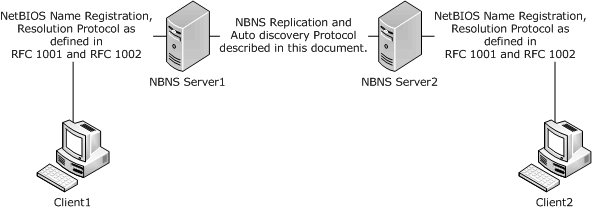

Figure 1: NBNS protocol and message flow

- [**NetBIOS**](#gt_netbios) applications can register one or more names. In order to request a name, the client node sends a Name Registration Request to the NBNS server. The NBNS server accepts or rejects the name registration by issuing a Positive or Negative Name Registration Response to the requesting node. In the example shown above, Client1 and Client2 dynamically register their [**host names**](#gt_host-name) by sending a "Name Registration Request" to NBNS Server1 and NBNS server2 respectively using the NetBT protocol [RFC1002].
- NBNS server1 and NBNS server2 synchronize their databases as described in this document.
- As per [RFC1002], Client1 queries the NBNS Server1 for the IPv4 address of Client2.
- As per [RFC1002], NBNS Server1 responds with the IPv4 address of Client2.
To facilitate the distribution of the mappings registered with each NBNS server, servers replicate their local mappings to other NBNS servers within the same administrative [**domain**](#gt_domain) by using the NBNS Replication. To simplify the configuration of this replication process, the NBNS server can implement the replication AutoDiscovery Protocol, which enables dynamic discovery of servers.

A [**name record**](#gt_name-record) maps a name to an IPv4 address(es). However, additional information about each mapping is maintained to aid in record expiration and conflict resolution. For example, each record consists of the following information (see section [2.2.10.1](#Section_2.2.10.1.1) for more information):

- NetBIOS name
- IPv4 address
- Flags associated with the record. The flags contain the following information:
- How the name record was created.
- NetBIOS node type.
- Whether the record is local or [**replica**](#gt_replica).
- The state of the name record is active or released.
NBNS servers that replicate name records are called replication partners. There are two replication mechanisms, pull or push replication. A push partner is an NBNS server that pushes or notifies other NBNS servers of the need to synchronize their database, while a pull partner is an NBNS server that requests new NBNS database name records (replicas) from its partner.

Replication is always handled via record versioning. The replication partner only requests information that has a higher version than that of the information it already has for a given record; this approach limits the amount of data two NBNS servers need to share to remain in-sync.

NBNS servers perform the pull operation either at configured time intervals or in response to an update notification from a push replication partner.

The pull replication operation involves four distinct phases as specified below.

- **AutoDiscovery:** This is an optional phase of the replication where the NBNS servers send the NBNS_UP messages to discover each other. If AutoDiscovery is disabled, the partners are configured by an administrator. Once the servers discover each other, they then move to the next phase of the pull replication by setting up an association.
- **Association Setup:** In this phase the NBNS server establishes a TCP connection on port 42 and then sends an [Association Start Request](#Section_2.2.3) packet to its partners to initiate replication, and in turn receives their [Association Start Responses](#Section_2.2.4). Once the handshake of the Request/Response is complete, the association is complete.
- **Partner/Record Identification:** Before pulling records from a replication partner, NBNS needs to determine the range of records it needs to pull for each of the record owners. Each NBNS server sends a request packet (the [Owner-Version Map Request Packet](#Section_2.2.6)) over the association. The replication partner responds with a response packet that contains information about the owner (IPv4 address) and the version number of the records in its database. This information about the owner and the version number of a record is referred to as the owner-version map.
- **Database synchronization:** Once the NBNS server retrieves complete maps from the remote partner, it determines for which of the owners the partner has more up-to-date name records by comparing the local and remote version numbers pertaining to the respective owner. For each of the owners for which the remote partner has a more recent view of its records, these records are requested in [Name Records Request Packet](#Section_3.1.1.1).
The remote server responds with the [Name Records Response Packet](#Section_3.1.1.1) that contains the records requested. When all the Name Records Requests have been satisfied, the pull replication is complete.

A push replication partner is an NBNS server that pushes or notifies other NBNS servers (those configured to use it as a pull replication partner) of the need to replicate their database entries at a configured interval. Push replication has four phases; phases 1, 2 and 4 are identical. Phase 3 (Partner/Record Identification) is different and explained in the paragraph below.

Before pushing records to a replication partner, NBNS has to determine the range of records to push for each of the record owners. The NBNS server uses update notification messages to notify partners of changes in the NBNS database, sending an update notification packet to the partner. The update notification packet notifies the partner with the information describing its database.

## 1.4 Relationship to Other Protocols

[**NBNS**](#gt_netbios-name-server-nbns) server-to-server replication uses TCP as the transport for its replication messages, as specified in section [3.1](#Section_3.1). NBNS also uses UDP as the transport for its discovery messages, as specified in section [2.1](#Section_2.1).

[**NetBT**](#gt_e1af1a23-e07b-4946-99ab-74c9e7e4d907) protocol, as specified in [[RFC1001]](https://go.microsoft.com/fwlink/?LinkId=90260) and [[RFC1002]](https://go.microsoft.com/fwlink/?LinkId=90261), is dependent on the NBNS server-to-server replication protocol for consistent [**NetBIOS name resolution**](#gt_netbios-name-resolution).

The NBNS replication and AutoDiscovery protocol is only for use by NetBT clients.

## 1.5 Prerequisites/Preconditions

The prerequisites for [**NBNS**](#gt_netbios-name-server-nbns) server-to-server communication to begin are:

- [**NBNS AutoDiscovery**](#gt_nbns-autodiscovery) has to be enabled or partners have to be configured (IPv4 address of the replication partner).
- UDP and TCP connectivity (for example, if UDP packets are dropped, the nodes will not be able to discover each other automatically).
- The clients support [**NetBT**](#gt_e1af1a23-e07b-4946-99ab-74c9e7e4d907).

## 1.6 Applicability Statement

This protocol is appropriate for replicating ([**NBNS**](#gt_netbios-name-server-nbns) server-to-NBNS server only) name records in a multi-NBNS server environment.

The packet fields are transmitted in network-byte order unless otherwise specified.

## 1.7 Versioning and Capability Negotiation

The [**NBNS**](#gt_netbios-name-server-nbns) server supports version negotiation via the [Association Start Request](#Section_2.2.3) and [Association Start Response](#Section_2.2.4) messages, and implementations can use the communicated version to infer capabilities.

The Association Start Request and Association Start Response messages contain a major number and a minor number that are used to communicate versions of the implementation.

Two associated NBNS servers need to use the same major version for the Association Setup phase to succeed, as specified in section 2.2.3. The only version number that needs to be supported by all implementations is 2. The NBNS server uses the minor version field to negotiate the persistent association, as specified in section [3.3.5.1](#Section_3.3.5.1). The lowest version number that needs to be supported by all implementations is 1, as specified in section 2.2.3.<1>

## 1.8 Vendor-Extensible Fields

None.

## 1.9 Standards Assignments

| Parameter | Value | Reference |
| --- | --- | --- |
| Host [**Name Server**](#gt_name-server) | TCP Port 42 | [[RFC1700]](https://go.microsoft.com/fwlink/?LinkId=90285) |
| Microsoft [**WINS**](#gt_windows-internet-name-service-wins) | TCP Port 1512 | [[IANAPORT]](https://go.microsoft.com/fwlink/?LinkId=89888) |

# 2 Messages

The following sections specify how Windows Internet Naming Service (WINS) Replication and Autodiscovery Protocol messages are transported and common WINS data types. This protocol references commonly used data types, as defined in [MS-DTYP](../MS-DTYP/MS-DTYP.md).

## 2.1 Transport

[**NBNS**](#gt_netbios-name-server-nbns) replication protocol MUST be transported by TCP. By default NBNS server SHOULD listen on port 42, and it MUST be configurable. [**NBNS replication partner**](#gt_nbns-replication-partner) AutoDiscovery MUST be transported by UDP. All the NBNS servers to be AutoDiscovered MUST listen on the multicast address 224.0.1.24. By default, NBNS servers SHOULD be listening on port 42 for AutoDiscovery messages.<2>

## 2.2 Message Syntax

All the integers in the messages are in the network order except where noted. All IPv4 addresses are IPv4 addresses in network order except where noted.

### 2.2.1 Replication Partner AutoDiscovery Message

[**NBNS**](#gt_netbios-name-server-nbns) Replication Partner AutoDiscovery Message is used to announce that a NBNS server is running and functional, or to announce that a NBNS server is shutting down. The following diagram shows the NBNS Replication Partner AutoDiscovery Message.

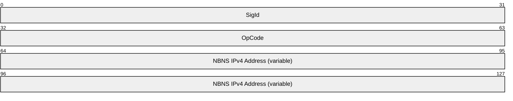

**SigId (4 bytes):** An unsigned 32-bit integer indicating that this message is a NBNS Replication Partner AutoDiscovery Message. It is in [**little-endian**](#gt_little-endian) byte order. The valid range is 0x0000ABCD to 0x0000ABCF inclusive. A packet with SigId outside this range MUST be discarded upon receipt. When sending a packet, only 0x0000ABCD MUST be used. Other values are reserved.

**OpCode (4 bytes):** An unsigned 32-bit integer. It is in little-endian byte order.

The following are the possible values for the OpCode:

| Value | Meaning |
| --- | --- |
| 0x00000000 | NBNS server MUST announce that it is present and functional using this OpCode. |
| 0x00000001 | NBNS server MUST announce that it is shutting down using this OpCode. |

Other OpCodes MUST be treated as 0x00000001 upon receipt.

**NBNS IPv4 Address (variable):** These fields are a list of all the IPv4 addresses configured on the NBNS server in big-endian byte order. If any IPv4 address is 0.0.0.0, this IPv4 address and all the IPv4 addresses after it MUST be ignored.<3>

### 2.2.2 Common Replication Message Header

All the [**NBNS**](#gt_netbios-name-server-nbns) replication messages in the following sections have the same Common Replication Message Header as shown in the diagram below.

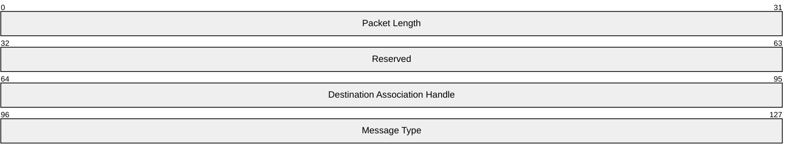

**Packet Length (4 bytes):** An unsigned 32-bit integer denoting the length in bytes of the Common Replication Message Header and the message body but not including the **Packet Length** field itself.

**Reserved (4 bytes):** An unsigned 32-bit integer. This field is not used and MUST be ignored upon receipt.

**Destination Association Handle (4 bytes):** An unsigned 32-bit integer that identifies the association on the receiving machine. This value comes from the **Sender Association Handle** field of the [Association Start Response Message](#Section_2.2.4), as specified in section 2.2.4. The only exception is in the [Association Start Request Message](#Section_2.2.3), as specified in section 2.2.3, where **Destination Association Handle** is set to 0.

**Message Type (4 bytes):** An unsigned 32-bit integer. The Message Type value depends on the specific message type as shown in the table below.

| Value | Meaning |
| --- | --- |
| 0x00000000 | Association Start Request Message |
| 0x00000001 | Association Start Response Message |
| 0x00000002 | [Association Stop Request Message](#Section_2.2.5) |
| 0x00000003 | [Owner-Version Map Request Message](#Section_2.2.6), [Owner-Version Map Response Message](#Section_2.2.7), [Update Notification Message](#Section_2.2.8), [Name Records Request Message](#Section_3.1.1.1), and [Name Records Response Message](#Section_3.1.1.1) |

### 2.2.3 Association Start Request Message

An Association Start Request Message is used to request the establishment of an association. The following diagram shows the Association Start Request Message including the [Common Replication Message Header](#Section_2.2.2).

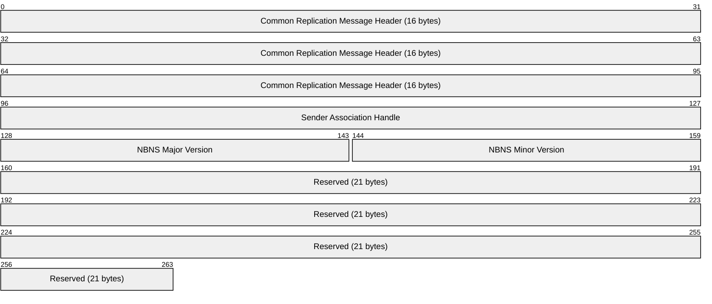

**Common Replication Message Header (16 bytes):** The Common Replication Message Header, as specified in section 2.2.2. The **Packet Length** field MUST be 41. Because this is the first message, the sender does not know the association handle value on the receiving machine. The **Destination Association Handle** field MUST be set to 0 and ignored upon receipt. The **Message Type** field MUST be set to 0.

**Sender Association Handle (4 bytes):** An unsigned 32-bit integer that uniquely identifies this association on the machine that sends this Association Start Request Message.

**NBNS Major Version (2 bytes):** An unsigned 16-bit integer. It is the major version of [**NBNS**](#gt_netbios-name-server-nbns) on the sender machine. It MUST be set to 2. If the major version is not set to 2, then the packet MUST be silently discarded.

**NBNS Minor Version (2 bytes):** An unsigned 16-bit integer. It is the minor version of NBNS on the sender machine. Currently defined values are 1 and 5. Other values MUST NOT be sent. If other values are received then they MUST be treated as if the closest lower valid version has been received.<4>

**Reserved (21 bytes):** 21 bytes to pad the packet length to 41 bytes. It MUST be ignored upon receipt.

### 2.2.4 Association Start Response Message

After receiving an [Association Start Request Message](#Section_2.2.3), a [**NBNS**](#gt_netbios-name-server-nbns) server sends back an Association Start Response Message if it accepts the association request. The following diagram shows the Association Start Response Message.

**Common Replication Message Header (16 bytes):** The [Common Replication Message Header](#Section_2.2.2), as specified in section 2.2.2. The **Packet Length** field MUST be 41. The **Message Type** field MUST be set to 1. If the field is not 1, the association is not set up.

**Sender Association Handle (4 bytes):** An unsigned 32-bit integer that uniquely identifies this association on the machine that sends this Association Start Response Message.

**NBNS Major Version (2 bytes):** An unsigned 16-bit integer. It is the major version of NBNS on the sender machine. It MUST be set to 2. If the major version is not set to 2, then the packet MUST be silently discarded.

**NBNS Minor Version (2 bytes):** An unsigned 16-bit integer. It is the minor version of NBNS on the sender machine.

**Reserved (21 bytes):** 21 bytes to pad the packet length to 41 bytes. It MUST be ignored upon receipt.

### 2.2.5 Association Stop Request Message

An Association Stop Request Message is used to request the shutdown of an association. The following diagram shows the Association Stop Request Message.

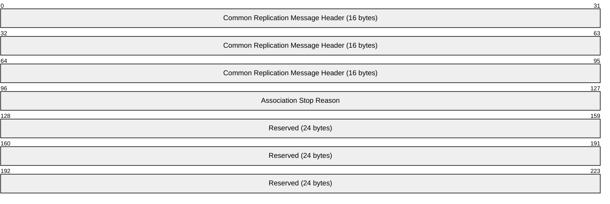

**Common Replication Message Header (16 bytes):** The [Common Replication Message Header](#Section_2.2.2) as specified in section 2.2.2. The **Packet Length** field MUST be 40. **Message Type** field MUST be set to 2.

**Association Stop Reason (4 bytes):** An unsigned 32-bit integer denoting the reason for stopping the association.

| Value | Meaning |
| --- | --- |
| 0x00000000 | The association stopped normally. |
| 0x00000004 | The association stopped due to some error condition. |

Other values are reserved and MUST NOT be sent. If other values are received then they MUST be ignored.

**Reserved (24 bytes):** A 24-byte reserved field that SHOULD be set to 0. It MUST be ignored upon receipt.<5>

### 2.2.6 Owner-Version Map Request Message

An Owner-Version Map Request Message is used to request the [**NBNS push partner**](#gt_nbns-push-partner) to send the owner-version map to its database. The following diagram shows the Owner-Version Map Request Message including the common header.

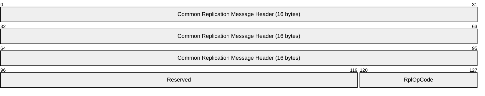

**Common Replication Message Header (16 bytes):** The [Common Replication Message Header](#Section_2.2.2), as specified in section 2.2.2. The **Packet Length** field MUST be 16. **Message Type** field MUST be set to 3.

**Reserved (3 bytes):** An unsigned 24-bit integer. It MUST be set to 0 and ignored upon receipt.

**RplOpCode (1 byte):** The replication operation code for the message. It is an unsigned 8-bit integer that MUST be set to 0x00.

### 2.2.7 Owner-Version Map Response Message

An Owner-Version Map Response Message reports the owner-version map of the [**NBNS**](#gt_netbios-name-server-nbns) server. The following diagram shows the Owner-Version Map Response Message.

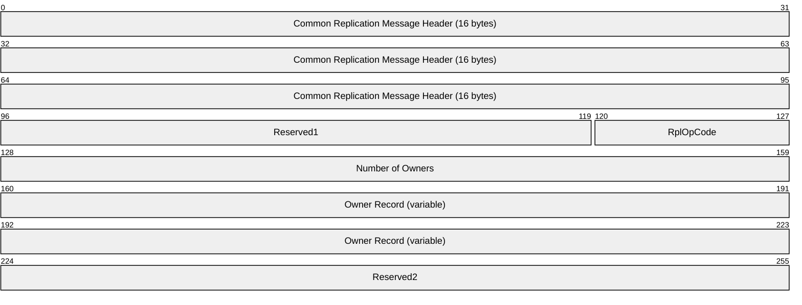

**Common Replication Message Header (16 bytes):** The [Common Replication Message Header](#Section_2.2.2), as specified in section 2.2.2. **Message Type** field MUST be set to 3.

**Reserved1 (3 bytes):** An unsigned 24-bit integer. It MUST be set to 0 and ignored upon receipt.

**RplOpCode (1 byte):** The replication operation code for the message. It is an unsigned 8-bit integer that MUST be set to 0x01.

**Number of Owners (4 bytes):** An unsigned 32-bit integer that denotes the number of [Owner Records](#Section_2.2.7.1) in the Owner Record field.

**Owner Record (variable):** The Owner Record field shows the owner NBNS server information, as specified in section 2.2.7.1.

**Reserved2 (4 bytes):** An unsigned 32-bit integer. It MUST be set to 0x00000000 and ignored upon receipt.

#### 2.2.7.1 Owner Record

The following diagram shows the format of each Owner Record field. If [**NBNS**](#gt_netbios-name-server-nbns) changes its IPv4 address, it SHOULD use the new IPv4 address in [Owner-Version Map Response](#Section_2.2.7) and [Update Notification](#Section_2.2.8) messages.<6>

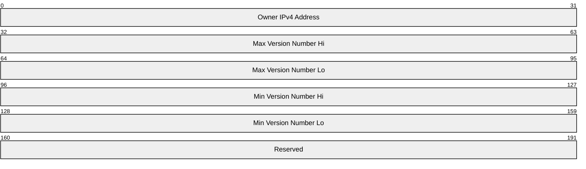

**Owner IPv4 Address (4 bytes):** The IPv4 address of the owner NBNS server.

**Max Version Number Hi (4 bytes):** The high 32-bit integer of the unsigned 64-bit maximum version number of [**name record**](#gt_name-record) owned by the owner NBNS server.

**Max Version Number Lo (4 bytes):** The low 32-bit integer of the unsigned 64-bit maximum version number of name record owned by the owner NBNS server.

**Min Version Number Hi (4 bytes):** The high 32-bit integer of the unsigned 64-bit minimum version number of name record owned by the owner NBNS server.

**Min Version Number Lo (4 bytes):** The low 32-bit integer of the unsigned 64-bit minimum version number of name record owned by the owner NBNS server.

**Reserved (4 bytes):** An unsigned 32-bit integer. It MUST be set to 0x00000001 and ignored upon receipt.

### 2.2.8 Update Notification Message

An [**NBNS push partner**](#gt_nbns-push-partner) sends an Update Notification Message to advertise its owner-version map to the [**NBNS pull partner**](#gt_nbns-pull-partner). The Update Notification Message format is shown in the following diagram.

**Common Replication Message Header (16 bytes):** The [Common Replication Message Header](#Section_2.2.2) as specified in section 2.2.2. **Message Type** field MUST be set to 3.

**Reserved (3 bytes):** An unsigned 24-bit integer. It MUST be set to 0 and ignored upon receipt.

**RplOpCode (1 byte):** An unsigned 8-bit integer.

| Value | Meaning |
| --- | --- |
| 0x04 | Update notification without persistent connection. The receiving server MUST NOT propagate the notification to the other [**NBNS replication partner**](#gt_nbns-replication-partner). |
| 0x05 | Update notification without persistent connection. The receiving server SHOULD propagate the notification to the other NBNS replication partner. |
| 0x08 | Update notification with persistent connection. The receiving server MUST NOT propagate the notification to the other NBNS replication partner. |
| 0x09 | Update notification with persistent connection. The receiving server SHOULD propagate the notification to the other NBNS replication partner. |

Other values MUST NOT be sent for this message. If received, the packets are silently discarded.

**Number of Owners (4 bytes):** An unsigned 32-bit integer that denotes the number of Owner Records in the Owner Record field.

**Owner Record (variable):** The Owner Record field shows the owner [**NBNS**](#gt_netbios-name-server-nbns) server information, as specified in section [2.2.7.1](#Section_2.2.7.1).

**Initiator IPv4 Address (4 bytes):** The Update Notification Message can be propagated from machine to machine. This is the IPv4 address of the NBNS server that generates the original Update Notification Message.

### 2.2.9 Name Records Request Message

A Name Records Request Message is used to request the [**name records**](#gt_name-record) from an [**NBNS push partner**](#gt_nbns-push-partner). The following diagram shows the Name Records Request Message.<7>

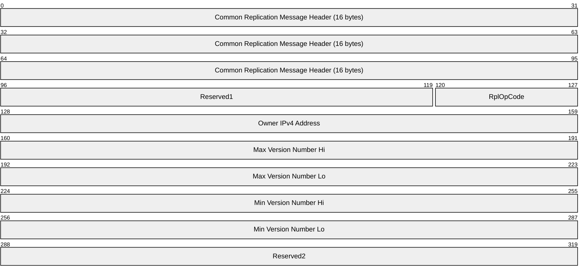

**Common Replication Message Header (16 bytes):** The [Common Replication Message Header](#Section_2.2.2) as specified in section 2.2.2. The **Packet Length** field MUST be 40. **Message Type** field MUST be set to 3.

**Reserved1 (3 bytes):** An unsigned 24-bit integer. It MUST be set to 0 and ignored upon receipt.

**RplOpCode (1 byte):** An unsigned 8-bit integer. The replication operation code for the message. It MUST be set to 0x02.

**Owner IPv4 Address (4 bytes):** The IPv4 address of the owner [**NBNS**](#gt_netbios-name-server-nbns) server. The sender is requesting name records owned by this NBNS server.

**Max Version Number Hi (4 bytes):** The high 32-bit integer of the unsigned 64-bit maximum version number of name records owned by the owner NBNS server.

**Max Version Number Lo (4 bytes):** The low 32-bit integer of the unsigned 64-bit maximum version number of name records owned by the owner NBNS server.

**Min Version Number Hi (4 bytes):** The high 32-bit integer of the unsigned 64-bit minimum version number of name records owned by the owner NBNS server.

**Min Version Number Lo (4 bytes):** The low 32-bit integer of the unsigned 64-bit minimum version number of name records owned by the owner NBNS server.

**Reserved2 (4 bytes):** An unsigned 32-bit integer. This field is not used and MUST be ignored upon receipt.

### 2.2.10 Name Records Response Message

A Name Records Response Message is used to send the [**name records**](#gt_name-record) to the [**NBNS pull partner**](#gt_nbns-pull-partner). The following diagram shows the Name Records Response Message.

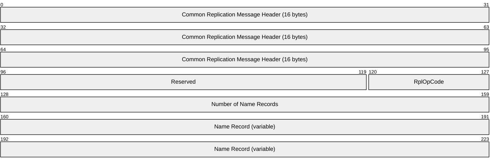

**Common Replication Message Header (16 bytes):** The [Common Replication Message Header](#Section_2.2.2), as specified in section 2.2.2. The **Message Type** field MUST be set to 3.

**Reserved (3 bytes):** An unsigned 24-bit integer. It MUST be set to 0 and ignored upon receipt.

**RplOpCode (1 byte):** An unsigned 8-bit integer. The replication operation code for the message. It MUST be set to 3.

**Number of Name Records (4 bytes):** An unsigned 32-bit integer. The number of name records in the Name Record field.

**Name Record (variable):** Each **Name Record** contains the information of one name in the [**NBNS**](#gt_netbios-name-server-nbns) server database. The length of a name record is variable, but it MUST be 4-byte aligned, as specified in section [2.2.10.1](#Section_2.2.10.1.1).

#### 2.2.10.1 Name Record

The following diagram shows the format of a Name Record.

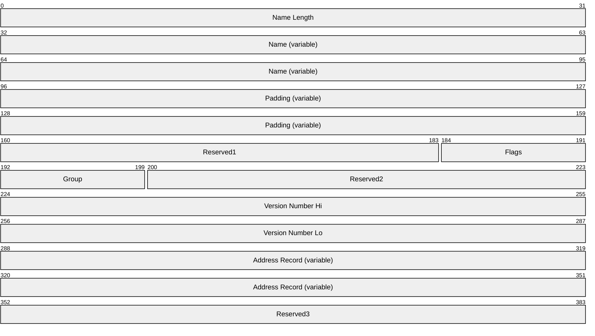

**Name Length (4 bytes):** An unsigned 32-bit integer that gives the length of the name, in bytes, including the terminating 0x00 byte.<8>

**Name (variable):** Name terminates with a 0x00 byte. It can include a [**NetBIOS**](#gt_netbios) scope identifier, as specified in [[RFC1001]](https://go.microsoft.com/fwlink/?LinkId=90260). The maximum length of the **Name** field is 255 bytes including the 0x00 byte. If no NetBIOS scope is included, then the length of the name is 17 including the 0x00 byte.

**Padding (variable):** If the **Name** field is 4-byte aligned, then the **Padding** field is 4 bytes in size. If the **Name** field is not 4-byte aligned, then the **Padding** field is of a size that achieves 4-byte alignment with the **Name** field. This field MUST be ignored upon receipt.

**Reserved1 (3 bytes):** An unsigned 24-bit integer. It MUST be set to 0 and MUST be ignored upon receipt.

**Flags (1 byte):** A byte providing various properties of the name. The following table specifies the details of the properties and the corresponding bits.

| Bit Range | Field | Description |
| --- | --- | --- |
| How the [**name record**](#gt_name-record) was created in its owner [**NBNS**](#gt_netbios-name-server-nbns) server. | 7 (S flag) | 0 The name record was created through [**NetBT**](#gt_e1af1a23-e07b-4946-99ab-74c9e7e4d907) name registration by a client. It is called a [**dynamic record**](#gt_dynamic-record). |
| The name record was added by an administrator into the NBNS server through a management utility. It is called a [**static record**](#gt_static-record). | - | - 1 |
| [**NetBIOS node type**](#gt_netbios-node-type) of the machine that the name corresponds to. | 6–5 (NT flag) | 0 [**b-node**](#gt_b-node), as defined in [RFC1001]. |
| [**p-node**](#gt_p-node), as defined in [RFC1001]. | - | - 1 |
| [**m-node**](#gt_m-node), as defined in [RFC1001]. | - | - 2 |
| Variable | - | - 3 Reserved; if received MUST be treated as opaque data. |
| Whether this record is local or [**replica**](#gt_replica). | 4 (L flag) | 0 This record is a [**local record**](#gt_local-record). That is, the name record is owned by the sending server. |
| Variable | - | - 1 This record is a replica. That is, the name record is not owned by the sending server, but by another NBNS server. |
| Variable | 3–2 (ST flag) | The state of the name record (see section [3.1.1.1](#Section_3.1.1.1) for more information). 0 Active. States of a name record are defined in section 3.1.1.1. |
| [**Tombstoned record**](#gt_tombstoned-record). | - | - 2 |
| Variable | - | - Other values MUST NOT be used. If received, then it MUST be treated as opaque data. |
| Variable | 1–0 (ET flag) | Entry type of the name record. 0 Unique name. One unique name has only one IPv4 address. |
| [**Normal group**](#gt_normal-group) name. A normal group name does not contain multiple members. A normal group name always resolves to the limited broadcast address (255.255.255.255) for NetBT query of the normal group name. | - | - 1 |
| [**Special group**](#gt_special-group) name. NBNS server special group names can contain multiple member addresses as in the group name, as defined in [RFC1001]. | - | - 2 |
| Variable | - | - 3 Multihomed machine name. This is a name for a machine that has several network interfaces, and thus has several IPv4 addresses. |

**Group (1 byte):** An unsigned byte shows whether the name record is a group name or a unique name.

| Value | Meaning |
| --- | --- |
| Unique name 0x00 | When ET in the Flags field is 0 (unique name) or 3 (multihomed machine), Group MUST be set to 0. |
| Group name 1 | When ET in the Flags field is 1 (normal group) or 2 (special group), Group MUST be set to 1. |
| Reserved 2 — 255 | These values MUST NOT be used. If received, MUST be treated as 1. |

**Reserved2 (3 bytes):** An unsigned 24-bit integer. It MUST be set to 0 and MUST be ignored upon receipt.

**Version Number Hi (4 bytes):** The higher 32-bit of the unsigned 64-bit integer version number of the name record.

**Version Number Lo (4 bytes):** The lower 32-bit of the unsigned 64-bit integer version number of the name record.

**Address Record (variable):** This field contains the address information for the name record. If the ET flag in the Flags field is 0 (unique name) or 1 (normal group), then the Address Record is an IPv4 address for the name. If the ET flag in the Flags field is 2 (special group) or 3 (multihomed machine), then the [Address Record](#Section_2.2.10.1.1) format is specified in the following section.

**Reserved3 (4 bytes):** An unsigned 32-bit integer. It MUST be set to 0xFFFFFFFF and MUST be ignored upon receipt.

##### 2.2.10.1.1 Address Record for a Special Group or Multihomed Machine

The following diagram shows the format of the Address Record for a Special Group or Multihomed Machine.

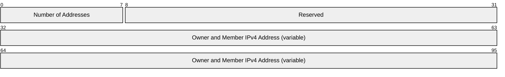

**Number of Addresses (1 byte):** An unsigned 8-bit integer specifying the number of addresses in the Address Record.

**Reserved (3 bytes):** A 3-byte field. It MUST be ignored upon receipt.

**Owner and Member IPv4 Address (variable):** An array of [Owner and Member IPv4 Address](#Section_2.2.10.1.1.1).

###### 2.2.10.1.1.1 Owner and Member IPv4 Address

The following diagram shows the format of the Owner and Member IPv4 Address.

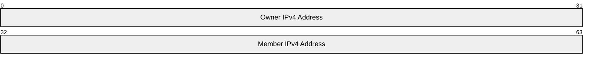

**Owner IPv4 Address (4 bytes):** The IPv4 address of the [**NBNS**](#gt_netbios-name-server-nbns) server that owns the Member IPv4 Address.

**Member IPv4 Address (4 bytes):** The IPv4 address for the [**name record**](#gt_name-record).

# 3 Protocol Details

The following sections specify details of the [Windows Internet Naming Service (WINS) Replication and Autodiscovery Protocol](#Section_1), including abstract data models, interface method syntax, and message processing rules.

## 3.1 Common Details

### 3.1.1 Abstract Data Model

This section describes a conceptual model of possible data organization that an implementation maintains to participate in this protocol. The described organization is provided to explain how the protocol behaves. This document does not mandate that implementations adhere to this model as long as their external behavior is consistent with that described in this document.

An [**NBNS server**](#gt_netbios-name-server-nbns) needs to maintain the following data structures:

- **Name record**: Name record is a data structure that holds name, IPv4 address, its owner's IPv4, and so on. (see section [3.1.1.1](#Section_3.1.1.1) for more information).
- **Name records collection**: This is a collection of all records that are either registered by this NBNS server or obtained by replication.
- **Owner-Version map**: This is a map of each NBNS owner to the highest version of record from that owner present in the name records collection. This map is used to determine if the NBNS server has to pull records from its partners and if so, the range of records to obtain.
- **Global Version Counter**: This is a 64-bit unsigned integer that is used to track the version that will be given to the next record that will be updated.

#### 3.1.1.1 Name Record

Each [**name record**](#gt_name-record) logically contains the following information:

- Name
- IPv4 addresses
- Flags, including the state of the record.
- [**Owner NBNS server**](#gt_owner-nbns-server)
- Version number
The Flags include the state of the name record. A name record can be in three states: [**active**](#gt_active), [**released**](#gt_1815ac10-7182-4840-aa4d-53aea8840325), and [**tombstone**](#gt_tombstone).

#### 3.1.1.2 Version

Whenever a [**name record**](#gt_name-record) is updated that needs to be replicated, the [**NBNS**](#gt_netbios-name-server-nbns) server increments the global version counter and updates the version field of the Name Record with the current value of the global version counter. Such changes occur when:

- The name record is newly registered.
- The name record transitions back to [**active**](#gt_active) state from [**released**](#gt_1815ac10-7182-4840-aa4d-53aea8840325) or [**tombstone**](#gt_tombstone) state.
- The name transitions into tombstone state.
- The name record is a [**replica**](#gt_replica) but is refreshed locally.
- The name record has a change of address due to a refresh.
- The administrator changes the address of a [**static**](#gt_ef084f89-1d44-4be7-b402-f35e2bd929f6) name record.
- A new address is added to the name record (in case of a [**special group**](#gt_special-group) or multihomed entry). This can be due to a local registration or because of replication of an address owned by another NBNS server (for a special group or multihomed entry).
The version number of name records MUST be monotonically increasing. The name records (including version numbers) MUST be committed to stable storage so that the version can be monotonically increased between reboots. After the NBNS service is restarted, the new version number MUST be greater than the last version number before the service shutdown.

The version number and state of name records that are owned by other NBNS servers are replicated to the local NBNS server, and are not directly changed unless the client corresponding to the record updates it at the local NBNS server. When this happens, the record—and in case of a special group or multihomed record, the address registered by the client—becomes owned by the local NBNS server.

### 3.1.2 Timers

Scavenger timer: A timer that is used to periodically update the state of the [**name records**](#gt_name-record). This timer uses renewal interval, [**extinction interval**](#gt_extinction-interval), and [**extinction timeout**](#gt_extinction-timeout) values in doing so. These values MUST be configurable. <9>

### 3.1.3 Initialization

The replication protocol is initialized when the [**NBNS service**](#gt_netbios-name-server-nbns) starts up. A TCP socket is opened to listen on port 42, as specified in section [2.1](#Section_2.1).

And optionally, a UDP socket is opened to listen on port 42 for AutoDiscovery, as specified in section [3.4.3](#Section_3.4.3).

### 3.1.4 Higher-Layer Triggered Events

See the Higher-Layer Triggered Events sections of [pull](#Section_85de3ead025f4074a0d87b5789e031ab) and [push](#Section_c35ffab583004abab72d57c39f7eb86a) role details.

### 3.1.5 Processing Events and Sequencing Rules

#### 3.1.5.1 Association Setup and Shutdown between Replication Partners

Before an [**NBNS push partner**](#gt_nbns-push-partner) and an [**NBNS pull partner**](#gt_nbns-pull-partner) can exchange replication information, an association MUST be set up. An association corresponds to a TCP connection. It can be persistent or non-persistent. A non-persistent association MUST not be used for more than one push or pull operation. A persistent association, once set up, is used for multiple request and response operations.

If persistent connections are used, then one association is set up between each push and pull relation. Suppose server A is the pull partner and server B is the push partner. One association will be set up between the two servers. The push notification (for example, [Update Notification](#Section_2.2.8) message) from B to A, and the pull request (for example, [Name Records Request](#Section_3.1.1.1) message) will use the same association. If server A and server B are configured as both pull and push partners of each other, two associations will be set up between the two servers because there are two pull/push relationships between the servers.

An association is uniquely identified on a machine with an association handle, which is an unsigned 32-bit integer. When setting up a new association, the sender generates an association handle, and sends it inside an [Association Start Request](#Section_2.2.3) message's **Sender Association Handle** field. The receiver machine also generates an association handle, and sends it inside an [Association Start Response](#Section_2.2.4) message in the **Sender Association Handle** field. Now both the machines know the association handle value on the other machine. The association handle on the other machine MUST be included in the common header of every replication message as the **Destination Association Handle** field.

To shut down an association, the requester machine sends an [Association Stop Request](#Section_2.2.5). The receiver MUST NOT send any response message. Both machines MUST close the TCP socket.

Persistent associations are not shut down during normal operation after they are set up. Upon the [**NBNS service**](#gt_netbios-name-server-nbns) stop, no Association Stop Request message is sent. The NBNS server just closes the TCP socket.

NBNS servers SHOULD accept association from servers that are not configured as replication partners.

### 3.1.6 Timer Events

When scavenger timers expire, the name records owned by the local [**NBNS server**](#gt_netbios-name-server-nbns) are examined:

- If the [**name record**](#gt_name-record) is in [**active**](#gt_active) state, and if more than the renewal interval has passed since its registration and last name refresh, whichever is later, then the state is changed to [**released**](#gt_1815ac10-7182-4840-aa4d-53aea8840325).
- If the name record is in released state, and if it has been in released state for more than the extinction interval, then its state is changed to [**tombstone**](#gt_tombstone) state, and it gets a new version number.
- If the name record is in tombstone state, and if it has been in tombstone state for more than the [**extinction timeout**](#gt_extinction-timeout), then the name record is deleted.
The following shows state diagram of the name records:

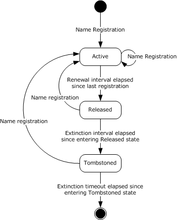

Figure 2: State diagram on name records

All the name records owned by other NBNS servers SHOULD also be examined and processed as follows (their state and version are not changed):

- If the record has been in tombstone state for more than extinction timeout, then the name record is deleted.
- For active name records, they may become stale and thus need to be verified periodically as specified in section [3.2.5.3](#Section_3.2.5.3).

### 3.1.7 Other Local Events

None.

## 3.2 Pull Partner Details

### 3.2.1 Abstract Data Model

This section describes a conceptual model of possible data organization that an implementation maintains to participate in this protocol. The described organization is provided to facilitate the explanation of how the protocol behaves. This document does not mandate that implementations adhere to this model as long as their external behavior is consistent with that described in this document.

The abstract data model is the same as in section [3.1.1](#Section_3.1.1).

### 3.2.2 Timers

**Pull timer:** A timer that is used to periodically perform pull replication from the push partners. This period is called the Pull interval.

**Data verification timer:** A timer that is used to periodically perform database validation. This period is called the Verify interval.

The pull timer and data verification timer MUST be used by the pull partners. The timer periods MUST be configurable.

### 3.2.3 Initialization

Initialization is specified in section [3.1.3](#Section_3.1.3). No additional initialization for the pull partner is needed.

### 3.2.4 Higher-Layer Triggered Events

[**NBNS server**](#gt_netbios-name-server-nbns) implementation SHOULD provide a manual mechanism for triggering pull replications.

### 3.2.5 Processing Events and Sequencing Rules

A pull replication happens in following situations:

- Standard Pull Replication: Standard pull replication can be triggered in following ways:
- Initial pull replication that happens when the [**NBNS server**](#gt_netbios-name-server-nbns) is starting up.
- Pull timer expiration.
- Manual pull replication that happens when the administrator initiates pull replication.
- Push replication triggered.
- Data verification pull replication, as specified in section [3.2.5.3](#Section_3.2.5.3).

#### 3.2.5.1 Standard Pull Replication

Standard Pull Replication happens via the following steps:

- **Setting up association**: The pull partner sets up an association with each of the push partners. If persistent association is enabled and an association with a push partner was set up by a previous replication operation, then this step is skipped for that push partner.
- **Exchanging Owner-Version Maps**: The pull partner sends an [Owner-Version Map Request](#Section_2.2.6) message to a push partner, and then waits for the [Owner-Version Map Response](#Section_2.2.7) message. The pull partner does this one by one for all the push partners. If any error happens during the process, the association between the pull partner and the push partner is stopped. The pull partner just skips this push partner and continues to the next push partner.
The Owner-Version Map Response message from a push partner contains every [**NBNS server**](#gt_netbios-name-server-nbns) that owns a name record on the push partner, as well as the maximum and minimum version number of name records that the NBNS server owns, as specified in section [2.2.7.1](#Section_2.2.7.1).

- **Merging Owner-Version Maps**: After the pull partner has finished contacting all push partners, it merges all the owner-version maps, to generate a single owner-version map as follows:
- The minimal versions in the Owner-Version Map responses are ignored and only the maximum versions are kept. The pull partner keeps the map of owner to maximum version for every push partner.
- The pull partner merges all the maps. If an owner appears in several maps, then the highest version number of all the maximum version numbers for this owner is kept. This merge also includes the local map from the pull partner itself.
See section [4.1](#Section_4.1) for an example of merging the owner-version map from different partners.

- **Obtain Name Records**: The pull partner identifies the push partner that has the latest [name records](#Section_3.1.1.1) for each owner and sends the [Name Records Request](#Section_3.1.1.1) for each owner to the specific partner, and gets the [Name Records Response](#Section_3.1.1.1). The pull partner MUST NOT send request messages if it already has the latest name records for an owner.
The **Min Version Number** field in the request message is set to the highest locally known version number for the owner plus 1. The Max Version Number is set to the max version number from the merged map. Push partner MUST not send name records in released state when responding with a Name Records Response message.

If any error happens during the process, the association between the pull partner and the push partner is stopped. The pull partner skips this push partner and continues to the next push partner.

- **Update local database**: After the pull partner has received a response for each owner, it adds the replicated name records to its local database of name records. In this operation, name conflicts can occur. See section [3.2.5.5](#Section_3.2.5.5) for name conflict resolution.

#### 3.2.5.2 Push Notification Triggered Pull Replication

Push notification triggered pull replication happens in following stages:

- Association setup: Push partner sets up a new association if persistent associations are not used or if persistent association is not present. If persistent associations are used and an existing association is present, this step is skipped.
- Update notification: Push partner sends an [Update Notification](#Section_2.2.8) message to the pull partner. The Update Notification message carries the owner-version map on the push partner. After receiving this message, the pull partner merges the map with its own local owner-version map following the same procedure as specified in section [3.2.5.1](#Section_3.2.5.1). Once the merged map is created, the pull partner finds out for which owner the push partner has newer name records.
- If no persistent association exists previously, and it is set up for the first time in step 1, the partner pull server will set up a new association by sending an association request message after it receives the update notification message. The push partner has to respond to this association start request message by sending an association start response message. After the association is set up, the pull partner will use this new association to send name record request messages. All subsequent persistent replications will happen with this newly set-up association.
- Obtain Name Records: For each owner, the pull partner sends a [Name Records Request](#Section_3.1.1.1) message to the push partner to retrieve the name records. The push partner responds to Name Records Request with [Name Records Response](#Section_3.1.1.1) message. The pull partner adds the returned name records to its local database of name records.
- Update local database: After the pull partner has received a response for each owner, it adds the replicated name records to its local database of name records. In this operation, name conflicts can occur. See section [3.2.5.5](#Section_3.2.5.5) for name conflict resolution.

#### 3.2.5.3 Data Verification Pull Replication

Data verification pull replication can be initiated manually or via a database verification timer. Data verification pull replication happens in the following phases:

- Association setup: The pull partner goes through all the owner [**NBNS servers**](#gt_netbios-name-server-nbns) one by one. All the [**active**](#gt_active) [**name records**](#gt_name-record) owned by the owner NBNS server to be verified are scanned and the maximum version number is determined. Then a NBNS server is selected and an association is set up with it. If the owner NBNS server is one of the configured push partners, then the association will be with the push partner. If the owner NBNS server is not configured as a push partner, and if the configuration allows data verification with non-partner NBNS servers, then the association will be with the owner NBNS server. If the owner NBNS server is not configured as a push partner, and if the configuration only allows verification with push partners, then the association will be with a randomly selected push partner. No persistent association is used in data verification pull replication.
- Obtain Name Records: The pull partner then sends a [Name Records Request](#Section_3.1.1.1) message. The minimum version number in a Name Records Request message is 1, and the maximum version number is the highest version number of all active name records owned by the owner NBNS server.
- Update local database: Once the [Name Records Response](#Section_3.1.1.1) message is received, the pull partner updates all the name records in its database owned by the owner. If any name records are not found in the response message, it is deleted from the local name record database.
An NBNS server MUST stop data verification, if during data verification it retrieves the maximum number of records per verification;<10> it SHOULD continue the verification during the next expiration of the database verification timer.

If data verification pull replication is manually initiated, all owner NBNS servers will be verified. The data verification is not subject to the maximum number of records limitation.

#### 3.2.5.4 Updating Time Stamps During Pull Replication

The timestamps are updated only if the replicated entry is going to replace the existing entry. The replicated entry can have only two states: Active or Tombstone.

- If the replicated entry is in active state then the time stamp is updated with "local time + VerifyInterval".
- If the replicated entry is in Tombstone state then the time stamp is updated with "localtime + TombStoneTimeOut".
The VerifyInterval and TombstoneTimeOut are as per the configured values of the WINS server at the time of conflict resolution.

#### 3.2.5.5 Name Conflict Resolution During Pull Replication

When the pull partner gets a new name record from the push partner, the same name might already exist in the local database. In this case the name conflict has to be resolved. In some cases, an existing [**name record**](#gt_name-record) is updated with the new version, which is obtained by incrementing the current version by 1. If the new record is a unique name, the conflict is resolved through the following logic:

- For records that have the same owner, new records replace existing ones.
- If the [**migration on**](#gt_migration-on) is off, existing [**static records**](#gt_static-record) are not overwritten by [**dynamic records**](#gt_dynamic-record).
- When an [**NBNS**](#gt_netbios-name-server-nbns) server sends a [**NetBT**](#gt_e1af1a23-e07b-4946-99ab-74c9e7e4d907) name challenge to the client, if it sees a positive response, it will ignore the new record. If it does not see a positive response, it will replace the existing record.
- Unique name [**active records**](#gt_active-record) will not be overwritten by another unique name record in [**released**](#gt_1815ac10-7182-4840-aa4d-53aea8840325) or [**tombstoned**](#gt_tombstone) states.
Specific details on the replication flow control are provided in the following flow charts.

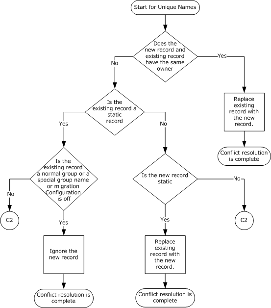

Figure 3: Flow chart for replication flow control

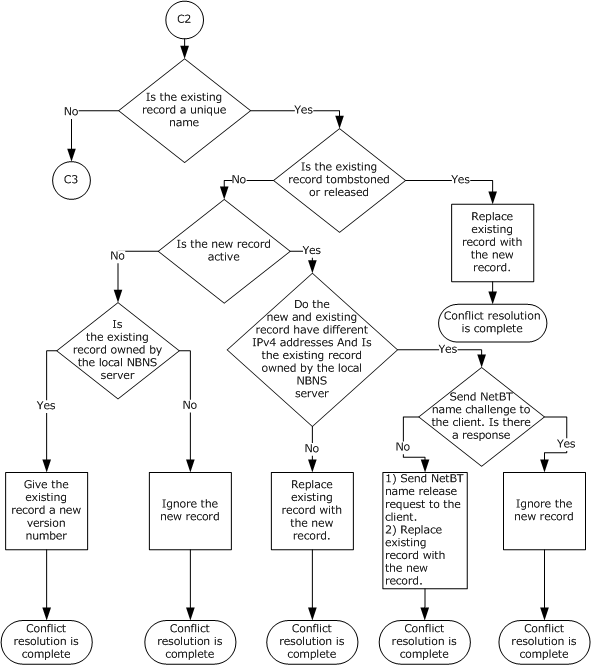

Figure 4: Flow chart C2

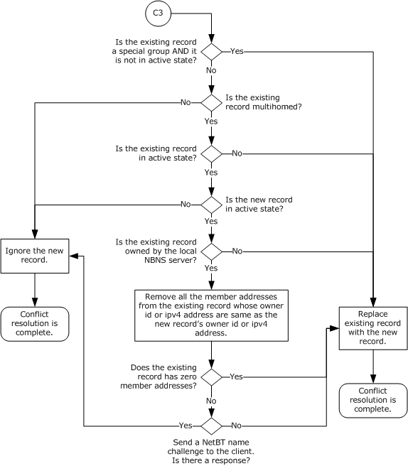

Figure 5: Flow chart C3

If the replicated name record is a normal group, a special group, or a multihomed machine name, the name conflict is resolved through the following logic.

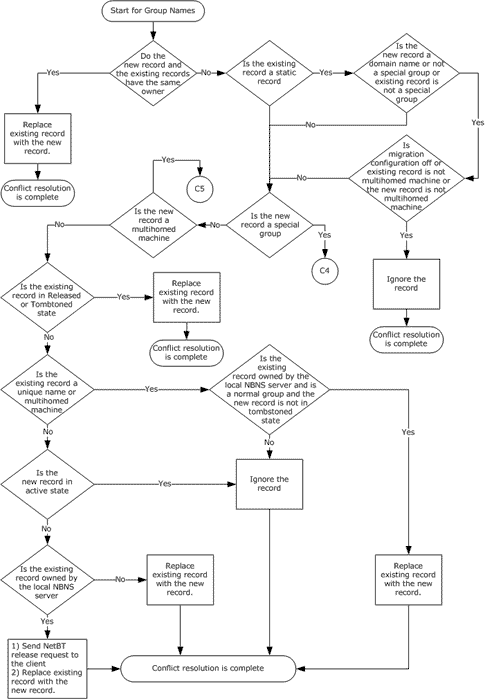

Figure 6: Flow chart for special name conflict resolution

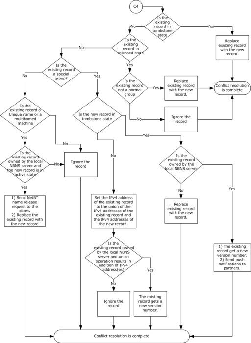

Figure 7: Flow chart C4

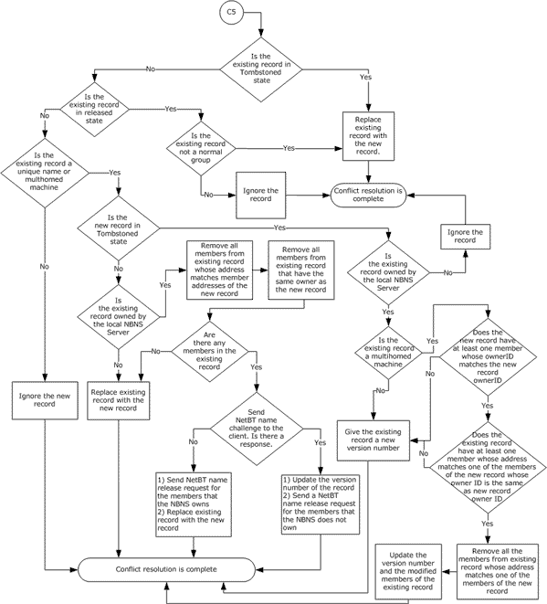

Figure 8: Flow chart C5

### 3.2.6 Timer Events

When the pull timer expires, a standard pull replication is performed. When the operation completes, the pull timer is restarted so that the pull replication is performed periodically.

### 3.2.7 Other Local Events

None.

## 3.3 Push Partner Details

### 3.3.1 Abstract Data Model

This section describes the data organization model for this protocol. The described organization is provided to facilitate the explanation of how the protocol behaves. This document does not mandate that implementations adhere to this model as long as their external behavior is consistent with that described in this document.

The data model is comprised of the name records and the flags described in section [3.1.1](#Section_3.1.1).

### 3.3.2 Timers

None.

### 3.3.3 Initialization

Initialization is specified in section [3.1.3](#Section_3.1.3).

### 3.3.4 Higher-Layer Triggered Events

The administrator can manually start push replication (for example, sending [Update Notification](#Section_2.2.8) messages to pull partners).

### 3.3.5 Processing Events and Sequencing Rules

A push partner performs two replication tasks. It sends out push notifications, which are [Update Notification](#Section_2.2.8) messages, to its pull partners and also processes pull requests from the pull partners.

#### 3.3.5.1 Sending Push Notifications

[Update Notification](#Section_2.2.8) messages are sent out in the following situations:

- The administrator requests the [**WINS**](#gt_windows-internet-name-service-wins) server to send a push notification to a specific pull partner. The administrator has two options:
- The administrator can request the pull partner to propagate the notification to their pull partners.
- The administrator does not request the pull partner to propagate the notification.
- The NBNS server can be configured with the following two options to notify its pull partners with an update notification:
- The server is configured to send out push notification whenever a name record address is changed.
- The server is configured to send out push notification only after a configured number of name record updates are reached.
- The server can propagate a push notification from its push partner to its pull partners. In this situation, the server gets an Update Notification message (with **RplOpCode** 5 or 9) from one of its push partners. It then does a pull replication with this push partner. If one or more [**name records**](#gt_name-record) are obtained, and the server is configured to allow the propagation of push notifications, then it sends an Update Notification message to each of its pull partners. If the push partner from which it received the push notification is also configured as a pull partner, the message MUST NOT be sent to this push/pull partner to avoid notification loops.
There are two types of Update Notification messages. One type requests the receiving pull partners to propagate the notification to their pull partners. The RplOpCode field is set to 5 (without persistent association) or 9 (with persistent association) in the message, as specified in section 2.2.8. The NBNS server sends out these message types in situation 1a, 2a, and 3 listed above. The other type of message does not request propagation of the notification. The RplOpCode field is set to 4 (without persistent association) or 8 (with persistent association) in the message. This type of message is sent in situation 1b and 2b listed above, as specified in section 2.2.8. Before sending an Update Notification message to a pull partner, the push partner MUST ensure that an association with the pull partner is set up. If the two machines are configured to use persistent association, and an association is already set up before the operation, then this association is used.

After the association is set up, the push partner creates the owner-version map, which maps an owner to the maximum version number and minimum version number of name records owned by the owner server. The map is included in the Update Notification message and sent to the pull partner. Which owners are included in the message are decided as follows:

If the notification is not for propagation, then all the owners known to the push partners are included in the message.

If the notification is for propagation and is initiated from the local machine, then only the local machine as an owner is sent in the map.

If the push partner is propagating a push notification, then the map only includes the original initiator of the push notification as the owner. The original initiator is passed in the **Initiator IPv4 Address** field in the Update Notification message through the propagation.

To prevent the push notifications from overwhelming the partners, the server MAY throttle the notifications.<11>

#### 3.3.5.2 Processing Pull Replication Requests

The push partner processes two pull replication request messages: [Owner-Version Map Request](#Section_2.2.6) and [Name Records Request](#Section_3.1.1.1).

Upon receiving an Owner-Version Map Request message from a configured pull partner, the push partner finds all the owners of name records, including itself, in the database, and finds the maximum and minimum version number of the name records for each owner server. Then the push partner sends the information in the [Owner-Version Map Response](#Section_2.2.7) message.

If the request message comes from a machine that is not configured as a pull partner, then the operation depends on the configuration. If the push partner is configured to allow replication with other servers not configured as replication partners, then a Owner-Version Map Response message is sent. Otherwise, the association is shut down.

Each Name Records Request message requests the name records with the version number between Min Version Number and Max Version Number owned by a specific owner server. Upon receiving a Name Records Request message from a configured pull partner, the push partner searches all its name records for the ones that satisfy the request. It then sends back the name records (static and dynamic) in the [Name Records Response](#Section_3.1.1.1) message. If the request message comes from a machine that is not configured as a pull partner, then only dynamic name records are included in the Name Records Response message.

### 3.3.6 Timer Events

None.

### 3.3.7 Other Local Events

A push notification is also a result of name record update events and propagation of push notifications from other servers. See bullet points 2a, 2b, and 3 in section [3.3.5.1](#Section_3.3.5.1).

## 3.4 Replication Partner Autodiscovery Details

### 3.4.1 Abstract Data Model

None.

### 3.4.2 Timers

Multicast timer: A timer that is used to periodically send [Replication Partner AutoDiscovery messages](#Section_2.2.1). The default value of the timer is 40 minutes.

### 3.4.3 Initialization

An [**NBNS**](#gt_netbios-name-server-nbns) server joins the multicast group address 224.0.1.24 at service startup. It accepts multicast messages at the configured UDP port, as specified in section [2.1](#Section_2.1).

An NBNS server supporting replication can be configured as a listener and MUST be a sender of AutoDiscovery packets. An NBNS server configured to support AutoDiscovery MUST be a listener.

### 3.4.4 Higher-Layer Triggered Events

None.

### 3.4.5 Processing Events and Sequencing Rules

A [Replication Partner AutoDiscovery message](#Section_2.2.1) with an OpCode of 0 is sent to the multicast group at the service startup time and also periodically while the [**NBNS**](#gt_netbios-name-server-nbns) server is running. It announces that the NBNS server is up and operational. The NBNS server also sends a Replication Partner AutoDiscovery message with OpCode 1 to the multicast group just before the service stops. A Replication Partner AutoDiscovery message contains all the IPv4 addresses of the server's NIC to which the NBNS service is bound. The NBNS server SHOULD add an 0.0.0.0 address to the end of the list of addresses.

When an NBNS server receives a Replication Partner AutoDiscovery message, it checks whether it is configured to discover partners. If not, the packet is discarded. After validation of the message, the NBNS server extracts all the IPv4 addresses in the message. If an address is 0.0.0.0, this address and all the addresses after it are ignored. If the OpCode field is 0, then all the IPv4 addresses are added as both pull and push partners. These partners are called self-discovered partners. If the OpCode field is not 0, then any self-discovered partner with an IPv4 address in the message is no longer considered as a replication partner.

### 3.4.6 Timer Events

The intervals for sending [Replication Partner AutoDiscovery messages](#Section_2.2.1) is controlled by the multicast interval. This interval SHOULD be configurable.<12>

### 3.4.7 Other Local Events

None.

# 4 Protocol Examples

The following sections describe several operations as used in common scenarios to illustrate the functioning of the Windows Internet Naming Service (WINS) Replication and Autodiscovery Protocol.

## 4.1 Merging Owner-Version Maps from Different Partners

When an [**NBNS**](#gt_netbios-name-server-nbns) server has received [Owner-Version Map Response messages](#Section_2.2.7) from its push partners, it merges the maps to determine the partner that has the latest version for an owner, and what the range of versions on the partner are. Below is an example. Suppose that the pull partner with IPv4 address IPa has two push partners: push partner1 with IPv4 address IPb, and push partner 2 with IPv4 address IPc. The pull partner currently knows the owners with the following IPv4 addresses: IPa (itself), IPb (push partner 1), IPc (push partner 2), and IPd (a nonpartner replicated from push partner 1). The owner and maximum version table on the pull partner might look like the following table.

| Owner IPv4 address | Maximum version number |
| --- | --- |
| IPa | 1023 |
| IPb | 521 |
| IPc | 643 |
| IPd | 758 |

The owner and maximum version map from push partner 1 might look like the following table.

| Owner IPv4 address | Maximum version number |
| --- | --- |
| IPa | 764 |
| IPb | 900 |
| IPc | 326 |
| IPd | 958 |

The owner and maximum version map from push partner 2 might look like the following table.

| Owner IPv4 address | Maximum version number |
| --- | --- |
| IPa | 679 |
| IPb | 745 |
| IPc | 1329 |
| IPe | 453 |

The merged table looks like the following. Note that now the pull partner gets to know a new NBNS server (IPe) through push partner 2.

| Owner IPv4 address | Maximum version number | Partner with the maximum version number |
| --- | --- | --- |
| IPa | 1023 | self |
| IPb | 900 | Partner 1 |
| IPc | 1329 | Partner 2 |
| IPd | 958 | Partner 1 |
| IPe | 453 | Partner 2 |

After obtaining the merged owner-version the preceding table, the pull partner sends a [Name Records Request message](#Section_3.1.1.1) to the push partners to actually get the name records. The following table shows the messages to be sent.

| Owner | Push partner to send message to | Minimum version in the request | Maximum version in the request |
| --- | --- | --- | --- |
| IPb | Push partner 1 | 522 | 900 |
| IPc | Push partner 2 | 644 | 1329 |
| IPd | Push partner 1 | 759 | 958 |
| IPe | Push partner 2 | 1 | 453 |

## 4.2 Pull Replication without Persistent Association

The figure in this section shows the sequence of messages of a standard pull replication. It is assumed that persistent association is not used so the association needs to be set up and shut down before and after the replication.

First, the pull partner [**NBNS**](#gt_netbios-name-server-nbns) server 1 establishes a TCP connection with the push partner NBNS server 2 and sends an [Association Start Request message](#Section_2.2.3). NBNS server 2 accepts the request by sending an [Association Start Response message](#Section_2.2.4) to NBNS server 1.

Then NBNS server 1 sends an [Owner-Version Map Request](#Section_2.2.6) to NBNS server 2 to discover the owner-version map on NBNS server 2. NBNS server 2 sends back its owner-version map to NBNS server 1 in an [Owner-Version Map Response message](#Section_2.2.7).

After examining the NBNS server 2's owner-version map, NBNS server 1 decides that there are newer name records on NBNS server 2 to be replicated. NBNS server 1 finds out the version range to retrieve and sends a [Name Records Request message](#Section_3.1.1.1) to NBNS server 2. NBNS server 2 sends the name records in a [Name Records Response message](#Section_3.1.1.1).

Finally NBNS server 1 sends an [Association Stop Request](#Section_2.2.5) to NBNS server 2 to tear down the association. The sender closes the TCP connection as soon as it sends the Association Stop Request.

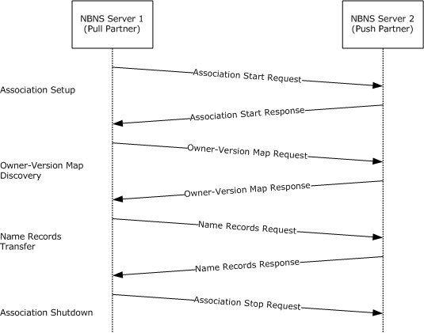

Figure 9: Example of a pull replication without persistent association

## 4.3 Propagation of Push Notification with Persistent Association

The following figure shows the sequence of messages involved in propagating a push notification. [**NBNS**](#gt_netbios-name-server-nbns) server 1 is a push partner of NBNS server 2, which is also a push partner of NBNS server 3. It is assumed that persistent associations are used and have existed between the servers before the operation starts.

Suppose that the administrator on NBNS server 1 starts a push notification to NBNS server 2 with propagation. Upon the administrator's request, NBNS server 1 sends an [Update Notification message](#Section_2.2.8) to NBNS server 2.

Upon receiving the message, NBNS server 2 sends a [Name Records Request message](#Section_3.1.1.1) to NBNS server 1, and gets the updated name records from NBNS server 1 in the [Name Records Response message](#Section_3.1.1.1).

After NBNS server 2 has processed the name records, it sends an Update Notification message to NBNS server 3, which will again do the same as NBNS server 2 has done to replicate the name records.

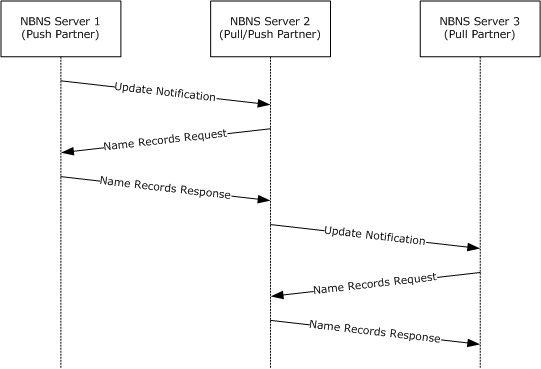

Figure 10: Example of propagation of push notification with persistent association

# 5 Security

The following sections specify security considerations for implementers of the Windows Internet Naming Service (WINS) Replication and Autodiscovery Protocol.

## 5.1 Security Considerations for Implementers

No security is provided by the Windows Internet Naming Service (WINS) Replication and Autodiscovery Protocol. Therefore, there is no guarantee that an [**NBNS**](#gt_netbios-name-server-nbns) server is talking to a nonmalicious partner. Any use requiring a security assurance needs to be upgraded to use IPsec-based authentication and encryption between all [**NBNS partners**](#gt_nbns-replication-partner).

With autodiscovery enabled, there is no verification of the associations with the partners. Any malicious NBNS server can be discovered and can lead to information disclosure. To prevent the attack on the NBNS server, turn off automatic discovery so that rogue servers do not become partners.

Denial of service attacks can be launched by malicious NBNS partners on the NBNS server on the TCP port 42 by bombarding it with Association Start, Association Stop, Version-Map Requests, and Name Record Requests messages. The following are the recommendations to secure the replication protocol:

- Block TCP port 42 at the firewall or on the host from nonpartners. This will help prevent systems that are behind that firewall from being attacked.
- Use [**IPsec**](#gt_internet-protocol-security-ipsec) communication to secure the traffic between NBNS server replication partners.
See [[MS04-045]](https://go.microsoft.com/fwlink/?LinkId=96670) for more information.

## 5.2 Index of Security Parameters

The Windows Internet Naming Service (WINS) Replication and Autodiscovery Protocol does not have security parameters.

# 6 Appendix A: Product Behavior

The information in this specification is applicable to the following Microsoft products or supplemental software. References to product versions include updates to those products.

The terms "earlier" and "later", when used with a product version, refer to either all preceding versions or all subsequent versions, respectively. The term "through" refers to the inclusive range of versions. Applicable Microsoft products are listed chronologically in this section.

- Windows NT 4.0 operating system
- Windows 2000 Server operating system
- Windows Server 2003 operating system
- Windows Server 2008 operating system
- Windows Server 2008 R2 operating system
- Windows Server 2012 operating system
- Windows Server 2012 R2 operating system
- Windows Server 2016 operating system
- Windows Server operating system
- Windows Server 2019 operating system
- Windows Server 2022 operating system
- Windows Server 2025 operating system
Exceptions, if any, are noted in this section. If an update version, service pack or Knowledge Base (KB) number appears with a product name, the behavior changed in that update. The new behavior also applies to subsequent updates unless otherwise specified. If a product edition appears with the product version, behavior is different in that product edition.

Unless otherwise specified, any statement of optional behavior in this specification that is prescribed using the terms "SHOULD" or "SHOULD NOT" implies product behavior in accordance with the SHOULD or SHOULD NOT prescription. Unless otherwise specified, the term "MAY" implies that the product does not follow the prescription.

<1> Section 1.7: WINS server on Windows NT Server 4.0 operating system sets the minor version number to 1 in the [Association Start Request](#Section_2.2.3) and [Association Start Response](#Section_2.2.4) messages. It does not support persistent association.

Windows 2000 Server and later set the minor version number to 5 in Association Start Request and Association Start Response messages. They support persistent association, as specified in section [3.3.5.1](#Section_3.3.5.1).

<2> Section 2.1: A Microsoft [**NBNS**](#gt_netbios-name-server-nbns) server can only use the same port number for all the following ports:

- TCP port number the NBNS server listens on.
- TCP port number on the remote [**NBNS replication partner**](#gt_nbns-replication-partner) to connect to.
- UDP port number the NBNS server listens on for AutoDiscovery packets.
- UDP port number on remote server to send AutoDiscovery packets to.
<3> Section 2.2.1: If the last IPv4 address is not complete (that is, its length is smaller than 32-bit) in the received packet, Microsoft NBNS server ignores this last IPv4 address. Microsoft NBNS server Windows NT Server 4.0 and later add an IPv4 address 0.0.0.0 to the end of the list of IPv4 addresses.

<4> Section 2.2.3: The minor number depends on the Windows version:

- 1 for Windows NT 4.0
- 5 for Windows 2000 Server and later.
<5> Section 2.2.5: Microsoft [**WINS**](#gt_windows-internet-name-service-wins) server does not initialize the Reserved field to 0.

<6> Section 2.2.7.1: On Windows NT 4.0, the NBNS sends the old IPv4 address in Owner-Version Map Response and Update Notification messages.

<7> Section 2.2.9: If the Name Records Request message comes from a machine that is not a replication partner, a WINS server on Windows Server 2003 and later only sends dynamic name records in the Name Records Response message. WINS server on Windows NT 4.0 and Windows 2000 Server sends both dynamic and static name records.

<8> Section 2.2.10.1: If the **Name Length** field in a name record in a [Name Records Response message](#Section_3.1.1.1) is larger than 255, which is invalid for NetBIOS name, then

- On Windows NT 4.0, the name will be accepted.
- On Windows 2000 Server and later, the Name Records Response message will be considered invalid, and all the records in it will be ignored.
<9> Section 3.1.2: These counters are configurable on all Windows platforms and their values are determined as described below:

Refresh or Renewal Interval:

- If the value is not configured, it is set to six days (6*24*60*60).
- It is recommended that the configured value be greater than 40 minutes (2400); otherwise, it is set to 2400.
Tombstone or Extinction Interval:

- It is recommended that the configured value of this parameter be greater than the minimum of Refresh Interval and four days. Otherwise, it is set to the minimum of Refresh Interval and four days.
TombStone or Extinction Timeout:

- It is recommended that the configured value of this parameter be greater than the Refresh Interval. Otherwise, it is set to the Refresh Interval value.
<10> Section 3.2.5.3: The maximum number of records to be verified is configurable on all Windows platforms and is set to 30000 by default.

<11> Section 3.3.5.1: Microsoft NBNS server throttles failed push notification operations. If communication with a pull partner fails more than twice in the last 5 minutes, then the push partner will not attempt a push notification with this pull partner.

<12> Section 3.4.6: The [**multicast interval**](#gt_multicast-interval) can never be smaller than 40 minutes.

# 7 Change Tracking

This section identifies changes that were made to this document since the last release. Changes are classified as Major, Minor, or None.

The revision class **Major** means that the technical content in the document was significantly revised. Major changes affect protocol interoperability or implementation. Examples of major changes are:

- A document revision that incorporates changes to interoperability requirements.
- A document revision that captures changes to protocol functionality.
The revision class **Minor** means that the meaning of the technical content was clarified. Minor changes do not affect protocol interoperability or implementation. Examples of minor changes are updates to clarify ambiguity at the sentence, paragraph, or table level.

The revision class **None** means that no new technical changes were introduced. Minor editorial and formatting changes may have been made, but the relevant technical content is identical to the last released version.

The changes made to this document are listed in the following table. For more information, please contact [dochelp@microsoft.com](mailto:dochelp@microsoft.com).

| Section | Description | Revision class |
| --- | --- | --- |
| [6](#Section_6) Appendix A: Product Behavior | Added Windows Server 2025 to the list of applicable products. | Major |

## Revision History

| Date | Version | Revision Class | Comments |
| --- | --- | --- | --- |
| 8/10/2007 | 1.0 | Major | Version 1.0 release |
| 9/28/2007 | 1.0.1 | Editorial | Changed language and formatting in the technical content. |
| 10/23/2007 | 2.0 | Major | Revised Windows Behavior sections. |
| 1/25/2008 | 2.0.1 | Editorial | Changed language and formatting in the technical content. |
| 3/14/2008 | 2.0.2 | Editorial | Changed language and formatting in the technical content. |
| 6/20/2008 | 2.0.3 | Editorial | Changed language and formatting in the technical content. |
| 7/25/2008 | 2.0.4 | Editorial | Changed language and formatting in the technical content. |
| 8/29/2008 | 3.0 | Major | Updated and revised the technical content. |
| 10/24/2008 | 3.0.1 | Editorial | Changed language and formatting in the technical content. |
| 12/5/2008 | 4.0 | Major | Updated and revised the technical content. |
| 1/16/2009 | 5.0 | Major | Updated and revised the technical content. |
| 2/27/2009 | 5.1 | Minor | Clarified the meaning of the technical content. |
| 4/10/2009 | 5.2 | Minor | Clarified the meaning of the technical content. |
| 5/22/2009 | 6.0 | Major | Updated and revised the technical content. |
| 7/2/2009 | 6.0.1 | Editorial | Changed language and formatting in the technical content. |
| 8/14/2009 | 6.0.2 | Editorial | Changed language and formatting in the technical content. |
| 9/25/2009 | 6.1 | Minor | Clarified the meaning of the technical content. |
| 11/6/2009 | 6.1.1 | Editorial | Changed language and formatting in the technical content. |
| 12/18/2009 | 7.0 | Major | Updated and revised the technical content. |
| 1/29/2010 | 7.0.1 | Editorial | Changed language and formatting in the technical content. |
| 3/12/2010 | 8.0 | Major | Updated and revised the technical content. |
| 4/23/2010 | 8.0.1 | Editorial | Changed language and formatting in the technical content. |
| 6/4/2010 | 8.0.2 | Editorial | Changed language and formatting in the technical content. |
| 7/16/2010 | 8.0.2 | None | No changes to the meaning, language, or formatting of the technical content. |
| 8/27/2010 | 9.0 | Major | Updated and revised the technical content. |
| 10/8/2010 | 9.1 | Minor | Clarified the meaning of the technical content. |
| 11/19/2010 | 9.1 | None | No changes to the meaning, language, or formatting of the technical content. |
| 1/7/2011 | 9.1 | None | No changes to the meaning, language, or formatting of the technical content. |
| 2/11/2011 | 9.1 | None | No changes to the meaning, language, or formatting of the technical content. |
| 3/25/2011 | 9.1 | None | No changes to the meaning, language, or formatting of the technical content. |
| 5/6/2011 | 9.1 | None | No changes to the meaning, language, or formatting of the technical content. |
| 6/17/2011 | 9.2 | Minor | Clarified the meaning of the technical content. |
| 9/23/2011 | 9.2 | None | No changes to the meaning, language, or formatting of the technical content. |
| 12/16/2011 | 9.2 | None | No changes to the meaning, language, or formatting of the technical content. |
| 3/30/2012 | 9.2 | None | No changes to the meaning, language, or formatting of the technical content. |
| 7/12/2012 | 9.2 | None | No changes to the meaning, language, or formatting of the technical content. |
| 10/25/2012 | 9.2 | None | No changes to the meaning, language, or formatting of the technical content. |
| 1/31/2013 | 9.2 | None | No changes to the meaning, language, or formatting of the technical content. |
| 8/8/2013 | 10.0 | Major | Updated and revised the technical content. |
| 11/14/2013 | 10.0 | None | No changes to the meaning, language, or formatting of the technical content. |
| 2/13/2014 | 10.0 | None | No changes to the meaning, language, or formatting of the technical content. |
| 5/15/2014 | 10.0 | None | No changes to the meaning, language, or formatting of the technical content. |
| 6/30/2015 | 11.0 | Major | Significantly changed the technical content. |
| 7/14/2016 | 11.0 | None | No changes to the meaning, language, or formatting of the technical content. |
| 6/1/2017 | 11.0 | None | No changes to the meaning, language, or formatting of the technical content. |
| 9/15/2017 | 12.0 | Major | Significantly changed the technical content. |
| 9/12/2018 | 13.0 | Major | Significantly changed the technical content. |
| 4/7/2021 | 14.0 | Major | Significantly changed the technical content. |
| 4/23/2024 | 15.0 | Major | Significantly changed the technical content. |
