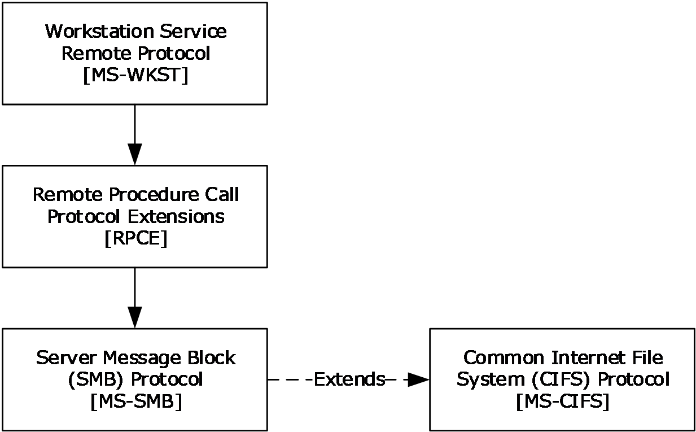
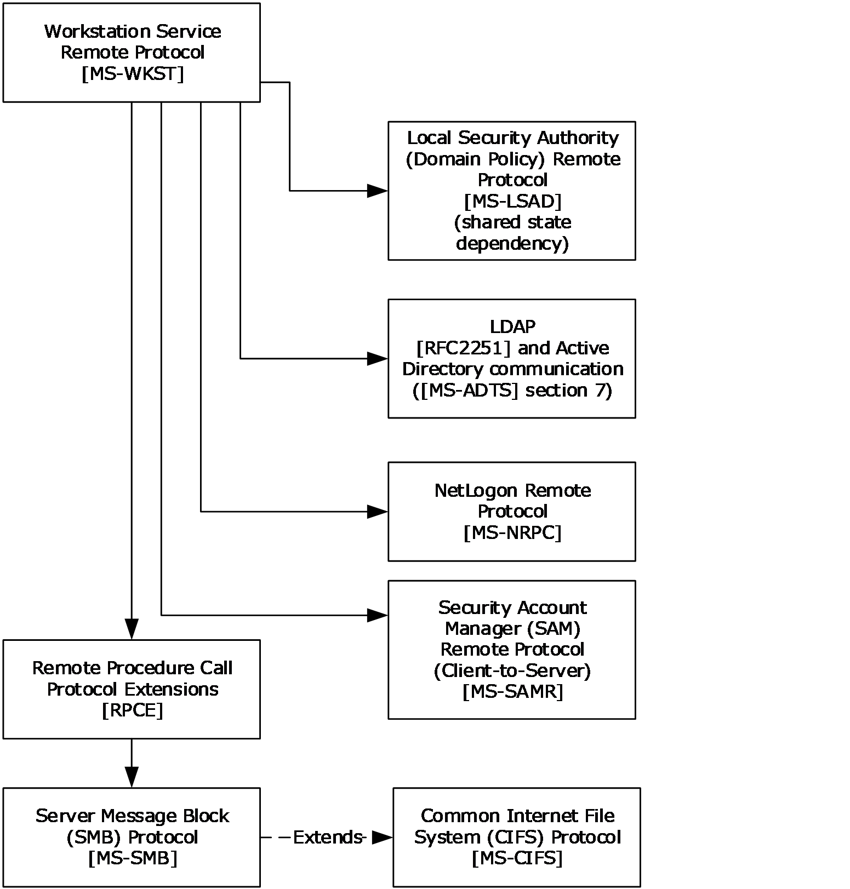
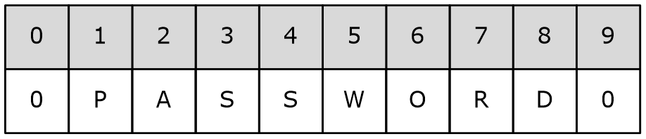
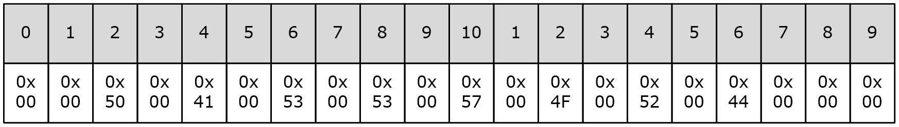
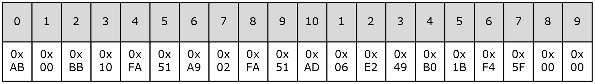
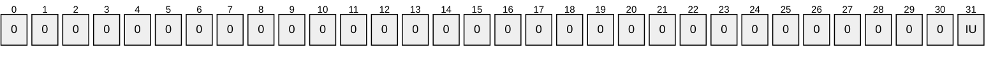
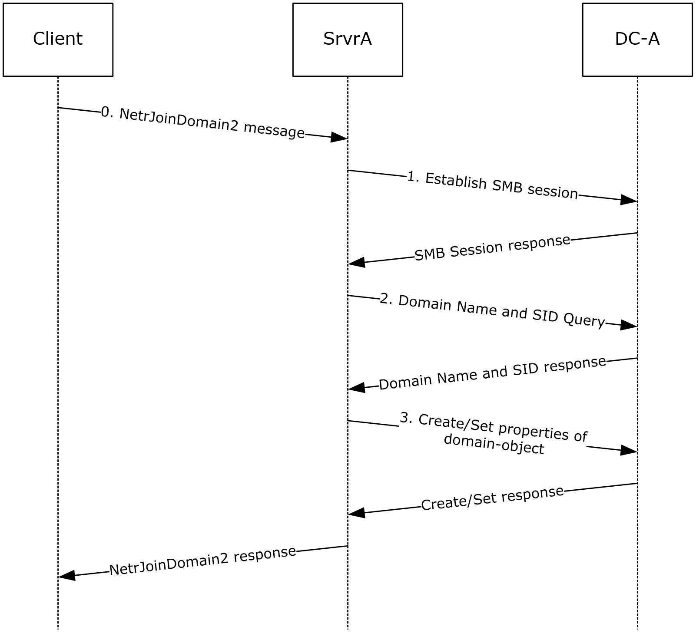

# [MS-WKST]: Workstation Service Remote Protocol

Table of Contents

1 Introduction

- [1 Introduction](#Section_1)
  - [1.1 Glossary](#Section_1.1)
  - [1.2 References](#Section_1.2)
    - [1.2.1 Normative References](#Section_1.2.1)
    - [1.2.2 Informative References](#Section_1.2.2)
  - [1.3 Overview](#Section_1.3)
  - [1.4 Relationship to Other Protocols](#Section_1.4)
  - [1.5 Prerequisites/Preconditions](#Section_1.5)
  - [1.6 Applicability Statement](#Section_1.6)
  - [1.7 Versioning and Capability Negotiation](#Section_1.7)
  - [1.8 Vendor-Extensible Fields](#Section_1.8)
  - [1.9 Standards Assignments](#Section_1.9)

2 Messages

- [2 Messages](#Section_2)
  - [2.1 Transport](#Section_2.1)
  - [2.2 Message Syntax](#Section_2.2)
    - [2.2.1 Constants](#Section_2.2.1)
      - [2.2.1.1 JOIN_MAX_PASSWORD_LENGTH](#Section_2.2.1.1)
      - [2.2.1.2 JOIN_OBFUSCATOR_LENGTH](#Section_2.2.1.2)
      - [2.2.1.3 MAX_PREFERRED_LENGTH](#Section_2.2.1.3)
    - [2.2.2 Data Types](#Section_2.2.2)
      - [2.2.2.1 WKSSVC_IDENTIFY_HANDLE](#Section_2.2.2.1)
      - [2.2.2.2 WKSSVC_IMPERSONATE_HANDLE](#Section_2.2.2.2)
      - [2.2.2.3 handle_t](#Section_2.2.2.3)
    - [2.2.3 Enumerations](#Section_2.2.3)
      - [2.2.3.1 NETSETUP_JOIN_STATUS](#Section_2.2.3.1)
      - [2.2.3.2 NETSETUP_NAME_TYPE](#Section_2.2.3.2)
      - [2.2.3.3 NET_COMPUTER_NAME_TYPE](#Section_2.2.3.3)
    - [2.2.4 Unions](#Section_2.2.4)
      - [2.2.4.1 WKSTA_INFO](#Section_2.2.4.1)
      - [2.2.4.2 USE_INFO](#Section_2.2.4.2)
    - [2.2.5 Structures](#Section_2.2.5)
      - [2.2.5.1 WKSTA_INFO_100](#Section_2.2.5.1)
      - [2.2.5.2 WKSTA_INFO_101](#Section_2.2.5.2)
      - [2.2.5.3 WKSTA_INFO_102](#Section_2.2.5.3)
      - [2.2.5.4 WKSTA_INFO_502](#Section_2.2.5.4)
      - [2.2.5.5 WKSTA_INFO_1013](#Section_2.2.5.5)
      - [2.2.5.6 WKSTA_INFO_1018](#Section_2.2.5.6)
      - [2.2.5.7 WKSTA_INFO_1046](#Section_2.2.5.7)
      - [2.2.5.8 WKSTA_TRANSPORT_INFO_0](#Section_2.2.5.8)
      - [2.2.5.9 WKSTA_USER_INFO_0](#Section_2.2.5.9)
      - [2.2.5.10 WKSTA_USER_INFO_1](#Section_2.2.5.10)
      - [2.2.5.11 STAT_WORKSTATION_0](#Section_2.2.5.11)
      - [2.2.5.12 WKSTA_USER_INFO_0_CONTAINER](#Section_2.2.5.12)
      - [2.2.5.13 WKSTA_USER_INFO_1_CONTAINER](#Section_2.2.5.13)
      - [2.2.5.14 WKSTA_USER_ENUM_STRUCT](#Section_2.2.5.14)
      - [2.2.5.15 WKSTA_TRANSPORT_INFO_0_CONTAINER](#Section_2.2.5.15)
      - [2.2.5.16 WKSTA_TRANSPORT_ENUM_STRUCT](#Section_2.2.5.16)
      - [2.2.5.17 JOINPR_USER_PASSWORD](#Section_2.2.5.17)
      - [2.2.5.18 JOINPR_ENCRYPTED_USER_PASSWORD](#Section_2.2.5.18)
        - [2.2.5.18.1 Password Encoding](#Section_2.2.5.18.1)
        - [2.2.5.18.2 Initializing JOINPR_USER_PASSWORD](#Section_2.2.5.18.2)
        - [2.2.5.18.3 Encryption and Decryption](#Section_2.2.5.18.3)
        - [2.2.5.18.4 Password Decoding](#Section_2.2.5.18.4)
      - [2.2.5.19 JOINPR_ENCRYPTED_USER_PASSWORD_AES](#Section_2.2.5.19)
        - [2.2.5.19.1 Password Encoding](#Section_2.2.5.19.1)
        - [2.2.5.19.2 Session Key](#Section_2.2.5.19.2)
        - [2.2.5.19.3 Encrypt Key and MAC Key](#Section_2.2.5.19.3)
        - [2.2.5.19.4 Encrypt Encoded Password](#Section_2.2.5.19.4)
        - [2.2.5.19.5 Decrypt JOINPR_ENCRYPTED_USER_PASSWORD_AES](#Section_2.2.5.19.5)
      - [2.2.5.20 UNICODE_STRING](#Section_2.2.5.20)
      - [2.2.5.21 NET_COMPUTER_NAME_ARRAY](#Section_2.2.5.21)
      - [2.2.5.22 USE_INFO_0](#Section_2.2.5.22)
      - [2.2.5.23 USE_INFO_1](#Section_2.2.5.23)
      - [2.2.5.24 USE_INFO_2](#Section_2.2.5.24)
      - [2.2.5.25 USE_INFO_3](#Section_2.2.5.25)
      - [2.2.5.26 USE_INFO_0_CONTAINER](#Section_2.2.5.26)
      - [2.2.5.27 USE_INFO_1_CONTAINER](#Section_2.2.5.27)
      - [2.2.5.28 USE_INFO_2_CONTAINER](#Section_2.2.5.28)
      - [2.2.5.29 USE_ENUM_STRUCT](#Section_2.2.5.29)
  - [2.3 Directory Service Schema Elements](#Section_2.3)

3 Protocol Details

- [3 Protocol Details](#Section_3)
  - [3.1 wkssvc Client Details](#Section_3.1)
    - [3.1.1 Abstract Data Model](#Section_3.1.1)
    - [3.1.2 Timers](#Section_3.1.2)
    - [3.1.3 Initialization](#Section_3.1.3)
    - [3.1.4 Message Processing Events and Sequencing Rules](#Section_3.1.4)
    - [3.1.5 Timer Events](#Section_3.1.5)
    - [3.1.6 Other Local Events](#Section_3.1.6)
  - [3.2 wkssvc Server Details](#Section_3.2)
    - [3.2.1 Abstract Data Model](#Section_3.2.1)
      - [3.2.1.1 Access Control Abstract Data Model](#Section_3.2.1.1)
      - [3.2.1.2 Computer Name Abstract Data Model](#Section_3.2.1.2)
      - [3.2.1.3 OtherDomains Name Abstract Data Model](#Section_3.2.1.3)
      - [3.2.1.4 Transport Information Abstract Data Model](#Section_3.2.1.4)
      - [3.2.1.5 Mapped Abstract Data Model Elements](#Section_3.2.1.5)
      - [3.2.1.6 Domain Membership Abstract Data Model](#Section_3.2.1.6)

For the legal notice and IP terms, see [LEGAL.md](../LEGAL.md).
Last updated: 4/23/2024.
See [Revision History](#revision-history) for full version history.

[3.2.1.6.1 Interaction with the [MS-LSAD] Data Model 51](#_Toc164819278)

[3.2.1.7 UseEntry Information](#Section_3.2.1.7)
[3.2.1.8 Connection Information Abstract Data Model](#Section_3.2.1.8)
[3.2.2 Timers](#Section_3.2.2)
[3.2.3 Initialization](#Section_3.2.3)
[3.2.4 Message Processing Events and Sequencing Rules](#Section_3.2.4)
[3.2.4.1 NetrWkstaGetInfo (Opnum 0)](#Section_3.2.4.1)
[3.2.4.2 NetrWkstaSetInfo (Opnum 1)](#Section_3.2.4.2)
[3.2.4.3 NetrWkstaUserEnum (Opnum 2)](#Section_3.2.4.3)
[3.2.4.4 NetrWkstaTransportEnum (Opnum 5)](#Section_3.2.4.4)
[3.2.4.5 NetrWkstaTransportAdd (Opnum 6)](#Section_3.2.4.5)
[3.2.4.6 NetrWkstaTransportDel (Opnum 7)](#Section_3.2.4.6)
[3.2.4.7 NetrUseAdd (Opnum 8)](#Section_3.2.4.7)
[3.2.4.8 NetrUseGetInfo (Opnum 9)](#Section_3.2.4.8)
[3.2.4.9 NetrUseDel (Opnum 10)](#Section_3.2.4.9)
[3.2.4.10 NetrUseEnum (Opnum 11)](#Section_3.2.4.10)
[3.2.4.11 NetrWorkstationStatisticsGet (Opnum 13)](#Section_3.2.4.11)
[3.2.4.12 NetrGetJoinInformation (Opnum 20)](#Section_3.2.4.12)
[3.2.4.13 NetrJoinDomain2 (Opnum 22)](#Section_3.2.4.13)
[3.2.4.13.1 Common Message Processing](#Section_3.2.4.13.1)
[3.2.4.13.2 State Changes Required for Domain Join](#Section_3.2.4.13.2)
[3.2.4.13.3 Domain Join Specific Message Processing](#Section_3.2.4.13.3)
[3.2.4.13.4 Workgroup Join Specific Message Processing](#Section_3.2.4.13.4)
[3.2.4.14 NetrUnjoinDomain2 (Opnum 23)](#Section_3.2.4.14)
[3.2.4.15 NetrRenameMachineInDomain2 (Opnum 24)](#Section_3.2.4.15)
[3.2.4.16 NetrValidateName2 (Opnum 25)](#Section_3.2.4.16)
[3.2.4.17 NetrGetJoinableOUs2 (Opnum 26)](#Section_3.2.4.17)
[3.2.4.18 NetrAddAlternateComputerName (Opnum 27)](#Section_3.2.4.18)
[3.2.4.19 NetrRemoveAlternateComputerName (Opnum 28)](#Section_3.2.4.19)
[3.2.4.20 NetrSetPrimaryComputerName (Opnum 29)](#Section_3.2.4.20)
[3.2.4.21 NetrEnumerateComputerNames (Opnum 30)](#Section_3.2.4.21)
[3.2.4.22 NetrJoinDomain3 (Opnum 31)](#Section_3.2.4.22)
[3.2.4.22.1 Common Message Processing](#Section_3.2.4.22.1)
[3.2.4.22.2 State Changes Required for Domain Join](#Section_3.2.4.22.2)
[3.2.4.23 NetrUnjoinDomain3 (Opnum 32)](#Section_3.2.4.23)
[3.2.4.24 NetrRenameMachineInDomain3 (Opnum 33)](#Section_3.2.4.24)
[3.2.4.25 NetrValidateName3 (Opnum 34)](#Section_3.2.4.25)
[3.2.4.26 NetrAddAlternateComputerName2 (Opnum 35)](#Section_3.2.4.26)
[3.2.4.27 NetrRemoveAlternateComputerName2 (Opnum 36)](#Section_3.2.4.27)
[3.2.4.28 NetrSetPrimaryComputerName2 (Opnum 37)](#Section_3.2.4.28)
[3.2.4.29 Common Message Processing](#Section_3.2.4.29)
[3.2.4.29.1 Query Computer Account DN for the Local Machine](#Section_3.2.4.29.1)
[3.2.4.29.2 LDAP Bind](#Section_3.2.4.29.2)
[3.2.4.29.3 LDAP Unbind](#Section_3.2.4.29.3)
[3.2.4.29.4 Computer Account Update over SAMR](#Section_3.2.4.29.4)
[3.2.4.29.5 Update Display Name Using SAMR](#Section_3.2.4.29.5)
[3.2.4.29.6 StartImpersonatingClient](#Section_3.2.4.29.6)
[3.2.4.29.7 StopImpersonatingClient](#Section_3.2.4.29.7)
[3.2.5 Timer Events](#Section_3.2.5)
[3.2.6 Other Local Events](#Section_3.2.6)
[3.2.6.1 WkstaQueryOtherDomains Event](#Section_3.2.6.1)
[3.2.6.2 WkstaAddOtherDomains Event](#Section_3.2.6.2)
[3.2.6.3 Administrator Requests Redirection to Be Paused](#Section_3.2.6.3)
[3.2.6.4 Administrator Requests Redirection to Be Resumed](#Section_3.2.6.4)
[4 Protocol Examples](#Section_4)
[4.1 NetrWkstaGetInfo Example](#Section_4.1)
[4.2 NetrWkstaUserEnum Example](#Section_4.2)
[4.3 NetrJoinDomain2 Example](#Section_4.3)
[5 Security](#Section_5)
[5.1 Security Considerations for Implementers](#Section_5.1)
[5.2 Entropy Sources](#Section_5.2)
[6 Appendix A: Full IDL](#Section_6)
[7 Appendix B: Product Behavior](#Section_7)
[8 Change Tracking](#Section_8)

# 1 Introduction

The Workstation Service Remote Protocol is used to perform tasks on a computer remotely on a network, including:

- Configuring properties and behavior of a [**Server Message Block**](#gt_server-message-block-smb) [**network redirector**](#gt_network-redirector) (SMB network redirector).
- Managing [**domain**](#gt_domain) membership and [**computer names**](#gt_computer-name).
- Gathering information, such as the number of enabled transport protocols and the number of currently logged-on users.
This protocol is based on the Remote Procedure Call (RPC) protocol [[C706]](https://go.microsoft.com/fwlink/?LinkId=89824) [MS-RPCE](../MS-RPCE/MS-RPCE.md).

Sections 1.5, 1.8, 1.9, 2, and 3 of this specification are normative. All other sections and examples in this specification are informative.

## 1.1 Glossary

This document uses the following terms:

**access control entry (ACE)**: An entry in an access control list (ACL) that contains a set of user rights and a [**security identifier (SID)**](#gt_security-identifier-sid) that identifies a principal for whom the rights are allowed, denied, or audited.

**account domain**: A [**domain**](#gt_domain), identified by a [**security identifier (SID)**](#gt_security-identifier-sid), that is the [**SID**](#gt_security-identifier-sid) namespace for which a given machine is authoritative. The [**account domain**](#gt_account-domain) is the same as the primary domain for a [**domain controller (DC)**](#gt_domain-controller-dc) and is its default [**domain**](#gt_domain). For a machine that is joined to a [**domain**](#gt_domain), the [**account domain**](#gt_account-domain) is the [**SID**](#gt_security-identifier-sid) namespace defined by the local Security Accounts Manager [MS-SAMR](#Section_5).

**Active Directory**: The Windows implementation of a general-purpose [**directory service**](#gt_directory-service-ds), which uses [**LDAP**](#gt_lightweight-directory-access-protocol-ldap) as its primary access protocol. [**Active Directory**](#gt_active-directory) stores information about a variety of objects in the network such as user accounts, computer accounts, groups, and all related credential information used by Kerberos [MS-KILE](../MS-KILE/MS-KILE.md). [**Active Directory**](#gt_active-directory) is either deployed as Active Directory Domain Services (AD DS) or Active Directory Lightweight Directory Services (AD LDS), which are both described in [MS-ADOD](#Section_1.3): Active Directory Protocols Overview.

**active user**: A user that is currently authenticated on a computer.

**administrator**: A user who has complete and unrestricted access to the computer or [**domain**](#gt_domain).

**anonymous session**: A session created for an anonymous user.

**ASCII**: The American Standard Code for Information Interchange (ASCII) is an 8-bit character-encoding scheme based on the English alphabet. ASCII codes represent text in computers, communications equipment, and other devices that work with text. ASCII refers to a single 8-bit ASCII character or an array of 8-bit ASCII characters with the high bit of each character set to zero.

**authentication**: (1) The ability of one entity to determine the identity of another entity.

(2) The act of proving an identity to a server while providing key material that binds the identity to subsequent communications.

**browser server**: An entity that maintains or could be elected to maintain information about other servers and [**domains**](#gt_domain).

**built-in domain**: The [**security identifier (SID)**](#gt_security-identifier-sid) namespace defined by the fixed [**SID**](#gt_security-identifier-sid) S-1-5-32. Contains groups that define roles on a local machine such as Backup Operators.

**cleartext**: In cryptography, [**cleartext**](#gt_cleartext) is the form of a message (or data) that is transferred or stored without cryptographic protection.

**client**: A computer on which the remote procedure call (RPC) client is executing.

**client side**: The initiating end of the protocol.

**computer name**: The [**DNS**](#gt_domain-name-system-dns) or NetBIOS name.

**directory service (DS)**: A service that stores and organizes information about a computer network's users and network shares, and that allows network administrators to manage users' access to the shares. See also [**Active Directory**](#gt_active-directory).

**distinguished name (DN)**: In the [**Active Directory**](#gt_active-directory) directory service, the unique identifier of an object in [**Active Directory**](#gt_active-directory), as described in [MS-ADTS](../MS-ADTS/MS-ADTS.md) and [[RFC2251]](https://go.microsoft.com/fwlink/?LinkId=90325).

**domain**: A set of users and computers sharing a common namespace and management infrastructure. At least one computer member of the set has to act as a [**domain controller (DC)**](#gt_domain-controller-dc) and host a member list that identifies all members of the domain, as well as optionally hosting the [**Active Directory**](#gt_active-directory) service. The domain controller provides [**authentication (2)**](#gt_authentication) of members, creating a unit of trust for its members. Each domain has an identifier that is shared among its members. For more information, see [MS-AUTHSOD](../MS-AUTHSOD/MS-AUTHSOD.md) section 1.1.1.5 and [MS-ADTS].

**domain client**: A client computer that is joined to a domain. The domain client can be a client or a server that offers other services to its clients. When the domain client acts as a supplicant to another domain client, the supplicant is referred to as a domain client in a workstation role and the latter as a domain client in a server role.

**domain controller (DC)**: The service, running on a server, that implements [**Active Directory**](#gt_active-directory), or the server hosting this service. The service hosts the data store for objects and interoperates with other [**DCs**](#gt_domain-controller-dc) to ensure that a local change to an object replicates correctly across all [**DCs**](#gt_domain-controller-dc). When [**Active Directory**](#gt_active-directory) is operating as Active Directory Domain Services (AD DS), the [**DC**](#gt_domain-controller-dc) contains full NC replicas of the configuration naming context (config NC), schema naming context (schema NC), and one of the domain NCs in its forest. If the AD DS [**DC**](#gt_domain-controller-dc) is a global catalog server (GC server), it contains partial NC replicas of the remaining domain NCs in its forest. For more information, see [MS-AUTHSOD] section 1.1.1.5.2 and [MS-ADTS]. When [**Active Directory**](#gt_active-directory) is operating as Active Directory Lightweight Directory Services (AD LDS), several AD LDS [**DCs**](#gt_domain-controller-dc) can run on one server. When [**Active Directory**](#gt_active-directory) is operating as AD DS, only one AD DS [**DC**](#gt_domain-controller-dc) can run on one server. However, several AD LDS [**DCs**](#gt_domain-controller-dc) can coexist with one AD DS [**DC**](#gt_domain-controller-dc) on one server. The AD LDS [**DC**](#gt_domain-controller-dc) contains full NC replicas of the config NC and the schema NC in its forest. The domain controller is the server side of Authentication Protocol Domain Support [MS-APDS](../MS-APDS/MS-APDS.md).

**domain join**: A process to configure a machine to join an Active Directory domain and assume the identity assigned to it by the domain controller.

**domain name**: (1) The name given by an administrator to a collection of networked computers that share a common directory. Part of the domain naming service naming structure, domain names consist of a sequence of name labels separated by periods.

(2) A domain name or a [**NetBIOS name**](#gt_netbios-name) that identifies a [**domain**](#gt_domain).

**Domain Name System (DNS)**: A hierarchical, distributed database that contains mappings of [**domain names (1)**](#gt_45a1c9f1-0263-49a8-97c7-7aca1a99308c) to various types of data, such as IP addresses. DNS enables the location of computers and services by user-friendly names, and it also enables the discovery of other information stored in the database.

**domain object**: A unit of data storage in a [**domain**](#gt_domain) that is maintained and made available to [**domain**](#gt_domain) members by a [**domain controller (DC)**](#gt_domain-controller-dc).

**domain prefix**: A [**security identifier (SID)**](#gt_security-identifier-sid) of a [**domain**](#gt_domain) without the relative identifier (RID) portion. The domain prefix refers to the issuing authority [**SID**](#gt_security-identifier-sid). For example, the domain prefix of S-1-5-21-397955417-626881126-188441444-1010 is S-1-5-21-397955417-626881126-188441444.

**endpoint**: A network-specific address of a remote procedure call (RPC) server process for remote procedure calls. The actual name and type of the endpoint depends on the [**RPC**](#gt_remote-procedure-call-rpc) protocol sequence that is being used. For example, for RPC over TCP (RPC Protocol Sequence ncacn_ip_tcp), an endpoint might be TCP port 1025. For RPC over Server Message Block (RPC Protocol Sequence ncacn_np), an endpoint might be the name of a [**named pipe**](#gt_named-pipe). For more information, see [[C706]](https://go.microsoft.com/fwlink/?LinkId=89824).

**fully qualified domain name (FQDN)**: (1) An unambiguous domain name that gives an absolute location in the [**Domain Name System's (DNS)**](#gt_domain-name-system-dns) hierarchy tree, as defined in [[RFC1035]](https://go.microsoft.com/fwlink/?LinkId=90264) section 3.1 and [[RFC2181]](https://go.microsoft.com/fwlink/?LinkId=127732) section 11.

(2) In [**Active Directory**](#gt_active-directory), a [**fully qualified domain name (FQDN) (1)**](#gt_1769aec9-237e-44ed-9014-1abb3ec6de6e) that identifies a [**domain**](#gt_domain).

**globally unique identifier (GUID)**: A term used interchangeably with [**universally unique identifier (UUID)**](#gt_universally-unique-identifier-uuid) in Microsoft protocol technical documents (TDs). Interchanging the usage of these terms does not imply or require a specific algorithm or mechanism to generate the value. Specifically, the use of this term does not imply or require that the algorithms described in [[RFC4122]](https://go.microsoft.com/fwlink/?LinkId=90460) or [C706] must be used for generating the [**GUID**](#gt_globally-unique-identifier-guid). See also [**universally unique identifier (UUID)**](#gt_universally-unique-identifier-uuid).

**Group Policy**: A mechanism that allows the implementer to specify managed configurations for users and computers in an [**Active Directory**](#gt_active-directory) service environment.

**handle**: Any token that can be used to identify and access an object such as a device, file, or a window.

**Hash-based Message Authentication Code (HMAC)**: A mechanism for message [**authentication (2)**](#gt_authentication) using cryptographic hash functions. HMAC can be used with any iterative cryptographic hash function (for example, MD5 and SHA-1) in combination with a secret shared key. The cryptographic strength of HMAC depends on the properties of the underlying hash function.

**Interface Definition Language (IDL)**: The International Standards Organization (ISO) standard language for specifying the interface for remote procedure calls. For more information, see [C706] section 4.

**Internet host name**: The name of a host as defined in [[RFC1123]](https://go.microsoft.com/fwlink/?LinkId=90268) section 2.1, with the extensions described in [MS-HNDS](../MS-HNDS/MS-HNDS.md).

**Lightweight Directory Access Protocol (LDAP)**: The primary access protocol for [**Active Directory**](#gt_active-directory). Lightweight Directory Access Protocol (LDAP) is an industry-standard protocol, established by the Internet Engineering Task Force (IETF), which allows users to query and update information in a [**directory service (DS)**](#gt_directory-service-ds), as described in [MS-ADTS]. The Lightweight Directory Access Protocol can be either version 2 [[RFC1777]](https://go.microsoft.com/fwlink/?LinkId=90290) or version 3 [[RFC3377]](https://go.microsoft.com/fwlink/?LinkID=91337).

**little-endian**: Multiple-byte values that are byte-ordered with the least significant byte stored in the memory location with the lowest address.

**Local Security Authority (LSA)**: A protected subsystem that authenticates and logs users onto the local system. [**LSA**](#gt_local-security-authority-lsa) also maintains information about all aspects of local security on a system, collectively known as the local security policy of the system.

**machine account**: An account that is associated with individual client or server machines in an [**Active Directory**](#gt_active-directory) domain.

**Microsoft Interface Definition Language (MIDL)**: The Microsoft implementation and extension of the OSF-DCE [**Interface Definition Language (IDL)**](#gt_interface-definition-language-idl). [**MIDL**](#gt_microsoft-interface-definition-language-midl) can also mean the [**Interface Definition Language (IDL)**](#gt_interface-definition-language-idl) compiler provided by Microsoft. For more information, see [MS-RPCE](../MS-RPCE/MS-RPCE.md).

**named pipe**: A named, one-way, or duplex pipe for communication between a pipe server and one or more pipe clients.

**naming context (NC)**: An [**NC**](#gt_naming-context-nc) is a set of objects organized as a tree. It is referenced by a DSName. The [**DN**](#gt_distinguished-name-dn) of the DSName is the distinguishedName attribute of the tree root. The [**GUID**](#gt_globally-unique-identifier-guid) of the DSName is the objectGUID attribute of the tree root. The [**security identifier (SID)**](#gt_security-identifier-sid) of the DSName, if present, is the objectSid attribute of the tree root; for Active Directory Domain Services (AD DS), the [**SID**](#gt_security-identifier-sid) is present if and only if the [**NC**](#gt_naming-context-nc) is a domain naming context (domain NC). [**Active Directory**](#gt_active-directory) supports organizing several [**NCs**](#gt_naming-context-nc) into a tree structure.

**NetBIOS**: A particular network transport that is part of the LAN Manager protocol suite. [**NetBIOS**](#gt_netbios) uses a broadcast communication style that was applicable to early segmented local area networks. A protocol family including name resolution, datagram, and connection services. For more information, see [[RFC1001]](https://go.microsoft.com/fwlink/?LinkId=90260) and [[RFC1002]](https://go.microsoft.com/fwlink/?LinkId=90261).

**NetBIOS name**: A 16-byte address that is used to identify a [**NetBIOS**](#gt_netbios) resource on the network. For more information, see [RFC1001] and [RFC1002].

**Netlogon**: The Netlogon Remote Protocol, as specified in [MS-NRPC](../MS-NRPC/MS-NRPC.md).

**Network Data Representation (NDR)**: A specification that defines a mapping from [**Interface Definition Language (IDL)**](#gt_interface-definition-language-idl) data types onto octet streams. [**NDR**](#gt_network-data-representation-ndr) also refers to the runtime environment that implements the mapping facilities (for example, data provided to [**NDR**](#gt_network-data-representation-ndr)). For more information, see [MS-RPCE] and [C706] section 14.

**network redirector**: A software component on a connected computer that handles requests for remote files and printer operations.

**NT hash**: An MD4- or MD5-based cryptographic hash of a clear text password. For more information, see [MS-NLMP](../MS-NLMP/MS-NLMP.md) section 3.3.1 (NTOWFv1, NTLM v1 Authentication), for a normative definition.

**opnum**: An operation number or numeric identifier that is used to identify a specific [**remote procedure call (RPC)**](#gt_remote-procedure-call-rpc) method or a method in an interface. For more information, see [C706] section 12.5.2.12 or [MS-RPCE].

**organizational unit (OU)**: An [**Active Directory**](#gt_active-directory) object contained within a [**domain**](#gt_domain), into which users, groups, computers, and other organizational units can be placed. An organizational unit provides a facility to classify and differentiate objects in a directory structure such as [**LDAP**](#gt_lightweight-directory-access-protocol-ldap).

**original equipment manufacturer (OEM) character**: An 8-bit encoding used in MS-DOS and Windows operating systems to associate a sequence of bits with specific characters. The [**ASCII**](#gt_ascii) character set maps the letters, numerals, and specified punctuation and control characters to the numbers from 0 to 127. The term "code page" is used to refer to extensions of the [**ASCII**](#gt_ascii) character set that map specified characters and symbols to the numbers from 128 to 255. These code pages are referred to as OEM character sets. For more information, see [[MSCHARSET]](https://go.microsoft.com/fwlink/?LinkId=89944).

**original equipment manufacturer (OEM) character set**: A character encoding used where the mappings between characters is dependent upon the code page configured on the machine, typically by the manufacturer.

**plaintext**: In cryptography, ordinary readable text before it is encrypted into ciphertext, or after it has been decrypted.

**pseudo-random number generator (PRNG)**: An algorithm that generates values (numbers, bits, and so on) that give the appearance of being random from the point of view of any known test. If initialized with a true random value (called its "seed"), the output of a cryptographically strong PRNG will have the same resistance to guessing as a true random source.

**read-only domain controller (RODC)**: A [**domain controller (DC)**](#gt_domain-controller-dc) that does not accept originating updates. Additionally, an [**RODC**](#gt_read-only-domain-controller-rodc) does not perform outbound replication. An RODC cannot be the primary domain controller (PDC) for its domain.

**registry**: A local system-defined database in which applications and system components store and retrieve configuration data. It is a hierarchical data store with lightly typed elements that are logically stored in tree format. Applications use the registry API to retrieve, modify, or delete registry data. The data stored in the registry varies according to the version of the operating system.

**remote procedure call (RPC)**: A communication protocol used primarily between client and server. The term has three definitions that are often used interchangeably: a runtime environment providing for communication facilities between computers (the RPC runtime); a set of request-and-response message exchanges between computers (the RPC exchange); and the single message from an RPC exchange (the RPC message). For more information, see [C706].

**routable protocol**: A communications protocol that allows packets to be forwarded from one network to another.

**RPC protocol sequence**: A character string that represents a valid combination of a [**remote procedure call (RPC)**](#gt_remote-procedure-call-rpc) protocol, a network layer protocol, and a transport layer protocol, as described in [C706] and [MS-RPCE].

**RPC transport**: The underlying network services used by the remote procedure call (RPC) runtime for communications between network nodes. For more information, see [C706] section 2.

**salt**: An additional random quantity, specified as input to an encryption function that is used to increase the strength of the encryption.

**schema**: The set of attributes and object classes that govern the creation and update of objects.

**security context**: An abstract data structure that contains authorization information for a particular [**security principal**](#gt_security-principal) in the form of a Token/Authorization Context (see [MS-DTYP](#Section_2.2.2) section 2.5.2). A server uses the authorization information in a [**security context**](#gt_security-context) to check access to requested resources. A [**security context**](#gt_security-context) also contains a key identifier that associates mutually established cryptographic keys, along with other information needed to perform secure communication with another security principal.

**security descriptor**: A data structure containing the security information associated with a securable object. A [**security descriptor**](#gt_security-descriptor) identifies an object's owner by its [**security identifier (SID)**](#gt_security-identifier-sid). If access control is configured for the object, its [**security descriptor**](#gt_security-descriptor) contains a discretionary access control list (DACL) with [**SIDs**](#gt_security-identifier-sid) for the [**security principals**](#gt_security-principal) who are allowed or denied access. Applications use this structure to set and query an object's security status. The [**security descriptor**](#gt_security-descriptor) is used to guard access to an object as well as to control which type of auditing takes place when the object is accessed. The [**security descriptor**](#gt_security-descriptor) format is specified in [MS-DTYP] section 2.4.6; a string representation of [**security descriptors**](#gt_security-descriptor), called SDDL, is specified in [MS-DTYP] section 2.5.1.

**Security Descriptor Definition Language (SDDL)**: The format used to specify a [**security descriptor**](#gt_security-descriptor) as a text string, specified in [MS-DTYP] section 2.5.1.

**security identifier (SID)**: An identifier for [**security principals**](#gt_security-principal) that is used to identify an account or a group. Conceptually, the [**SID**](#gt_security-identifier-sid) is composed of an account authority portion (typically a [**domain**](#gt_domain)) and a smaller integer representing an identity relative to the account authority, termed the relative identifier (RID). The [**SID**](#gt_security-identifier-sid) format is specified in [MS-DTYP] section 2.4.2; a string representation of [**SIDs**](#gt_security-identifier-sid) is specified in [MS-DTYP] section 2.4.2 and [MS-AZOD](../MS-AZOD/MS-AZOD.md) section 1.1.1.2.

**security principal**: An identity that can be used to regulate access to resources, as specified in [MS-AUTHSOD] section 1.1.1.1. A [**security principal**](#gt_security-principal) can be a user, a computer, or a group that represents a set of users.

**server**: (1) A computer on which the [**remote procedure call (RPC)**](#gt_remote-procedure-call-rpc) server is executing.

(2) A replicating machine that sends replicated files to a partner (client). The term "server" refers to the machine acting in response to requests from partners that want to receive replicated files.

**Server Message Block (SMB)**: A protocol that is used to request file and print services from server systems over a network. The SMB protocol extends the CIFS protocol with additional security, file, and disk management support. For more information, see [[CIFS]](https://go.microsoft.com/fwlink/?linkid=2109334) and [MS-SMB](../MS-SMB/MS-SMB.md).

**server side**: The receiving end of the protocol.

**service principal name (SPN)**: The name a client uses to identify a service for mutual [**authentication**](#gt_authentication). (For more information, see [[RFC1964]](https://go.microsoft.com/fwlink/?LinkId=90304) section 2.1.1.) An [**SPN**](#gt_service-principal-name-spn) consists of either two parts or three parts, each separated by a forward slash ('/'). The first part is the service class, the second part is the host name, and the third part (if present) is the service name. For example, "ldap/dc-01.fabrikam.com/fabrikam.com" is a three-part [**SPN**](#gt_service-principal-name-spn) where "ldap" is the service class name, "dc-01.fabrikam.com" is the host name, and "fabrikam.com" is the service name. See [[SPNNAMES]](https://go.microsoft.com/fwlink/?LinkId=90532) for more information about [**SPN**](#gt_service-principal-name-spn) format and composing a unique [**SPN**](#gt_service-principal-name-spn).

**shared secret**: A piece of data that is known only to the [**security principal**](#gt_security-principal) and an authenticating authority; for example, a user and a domain controller. It is used to prove the principal's identity. A password is a common example of a shared secret. Also called a "secret key".

**SMB connection**: A transport connection between a [**Server Message Block (SMB)**](#gt_server-message-block-smb) client and an [**SMB**](#gt_server-message-block-smb) server. The [**SMB connection**](#gt_smb-connection) is assumed to provide reliable in-order message delivery semantics. An [**SMB connection**](#gt_smb-connection) can be established over any available [**SMB**](#gt_server-message-block-smb) transport that is supported by both the [**SMB**](#gt_server-message-block-smb) client and the [**SMB**](#gt_server-message-block-smb) server, as specified in [MS-CIFS](../MS-CIFS/MS-CIFS.md).

**SMB session**: An authenticated user connection established between an [**SMB**](#gt_server-message-block-smb) client and an [**SMB**](#gt_server-message-block-smb) server over an [**SMB connection**](#gt_smb-connection). There can be multiple active [**SMB sessions**](#gt_smb-session) over a single [**SMB connection**](#gt_smb-connection). The Uid field in the [**SMB**](#gt_server-message-block-smb) packet header distinguishes the various sessions.

**standard user**: A user that does not have administrative rights defined in its token and is a member of the users group. Users are prevented from making accidental or intentional system-wide changes but can perform normal daily computer tasks.

**Stock Keeping Unit (SKU)**: A unique identifier for a distinct product or service that is used as a source of revenue. For example, a SKU can represent a retail product such as software that is sold through a channel, a subscription program, or an online service such as MSDN.

**Transmission Control Protocol (TCP)**: A protocol used with the Internet Protocol (IP) to send data in the form of message units between computers over the Internet. TCP handles keeping track of the individual units of data (called packets) that a message is divided into for efficient routing through the Internet.

**Unicode**: A character encoding standard developed by the Unicode Consortium that represents almost all of the written languages of the world. The [**Unicode**](#gt_unicode) standard [[UNICODE5.0.0/2007]](https://go.microsoft.com/fwlink/?LinkId=154659) provides three forms (UTF-8, UTF-16, and UTF-32) and seven schemes (UTF-8, UTF-16, UTF-16 BE, UTF-16 LE, UTF-32, UTF-32 LE, and UTF-32 BE).

**universally unique identifier (UUID)**: A 128-bit value. UUIDs can be used for multiple purposes, from tagging objects with an extremely short lifetime, to reliably identifying very persistent objects in cross-process communication such as client and server interfaces, manager entry-point vectors, and [**RPC**](#gt_remote-procedure-call-rpc) objects. UUIDs are highly likely to be unique. UUIDs are also known as [**globally unique identifiers (GUIDs)**](#gt_globally-unique-identifier-guid) and these terms are used interchangeably in the Microsoft protocol technical documents (TDs). Interchanging the usage of these terms does not imply or require a specific algorithm or mechanism to generate the UUID. Specifically, the use of this term does not imply or require that the algorithms described in [RFC4122] or [C706] must be used for generating the UUID.

**user name**: A unique name that identifies a specific user account. The user name of an account is unique among the other group names and user names within its own domain or workgroup.

**UTF-16**: A standard for encoding Unicode characters, defined in the Unicode standard, in which the most commonly used characters are defined as double-byte characters. Unless specified otherwise, this term refers to the UTF-16 encoding form specified in [UNICODE5.0.0/2007] section 3.9.

**UTF-8**: A byte-oriented standard for encoding Unicode characters, defined in the Unicode standard. Unless specified otherwise, this term refers to the UTF-8 encoding form specified in [UNICODE5.0.0/2007] section 3.9.

**well-known endpoint**: A preassigned, network-specific, stable address for a particular client/server instance. For more information, see [C706].

**Windows Time Service (W32Time)**: A service that supports time synchronization against network and hardware time sources. For more information, see [[WTSREF]](https://go.microsoft.com/fwlink/?LinkId=90586) and [MS-SNTP](../MS-SNTP/MS-SNTP.md).

**writable domain controller (writable DC)**: Synonymous with [**domain controller (DC)**](#gt_domain-controller-dc), as distinct from an [**RODC**](#gt_read-only-domain-controller-rodc).

**MAY, SHOULD, MUST, SHOULD NOT, MUST NOT:** These terms (in all caps) are used as defined in [[RFC2119]](https://go.microsoft.com/fwlink/?LinkId=90317). All statements of optional behavior use either MAY, SHOULD, or SHOULD NOT.

## 1.2 References

Links to a document in the Microsoft Open Specifications library point to the correct section in the most recently published version of the referenced document. However, because individual documents in the library are not updated at the same time, the section numbers in the documents may not match. You can confirm the correct section numbering by checking the [Errata](https://go.microsoft.com/fwlink/?linkid=850906).

### 1.2.1 Normative References

We conduct frequent surveys of the normative references to assure their continued availability. If you have any issue with finding a normative reference, please contact [dochelp@microsoft.com](mailto:dochelp@microsoft.com). We will assist you in finding the relevant information.

[C706] The Open Group, "DCE 1.1: Remote Procedure Call", C706, August 1997, [https://publications.opengroup.org/c706](https://go.microsoft.com/fwlink/?LinkId=89824)

**Note** Registration is required to download the document.

[FIPS186-2] FIPS PUBS, "Digital Signature Standard (DSS)", FIPS PUB 186-2, January 2000, [https://csrc.nist.gov/csrc/media/publications/fips/186/2/archive/2001-10-05/documents/fips186-2-change1.pdf](https://go.microsoft.com/fwlink/?LinkId=168870)

[MS-ADA1] Microsoft Corporation, "[Active Directory Schema Attributes A-L](../MS-ADA1/MS-ADA1.md)".

[MS-ADA2] Microsoft Corporation, "[Active Directory Schema Attributes M](../MS-ADA2/MS-ADA2.md)".

[MS-ADA3] Microsoft Corporation, "[Active Directory Schema Attributes N-Z](../MS-ADA3/MS-ADA3.md)".

[MS-ADSC] Microsoft Corporation, "[Active Directory Schema Classes](../MS-ADSC/MS-ADSC.md)".

[MS-ADTS] Microsoft Corporation, "[Active Directory Technical Specification](../MS-ADTS/MS-ADTS.md)".

[MS-BRWSA] Microsoft Corporation, "[Common Internet File System (CIFS) Browser Auxiliary Protocol](../MS-BRWSA/MS-BRWSA.md)".

[MS-BRWS] Microsoft Corporation, "[Common Internet File System (CIFS) Browser Protocol](../MS-BRWS/MS-BRWS.md)".

[MS-CIFS] Microsoft Corporation, "[Common Internet File System (CIFS) Protocol](../MS-CIFS/MS-CIFS.md)".

[MS-DRSR] Microsoft Corporation, "[Directory Replication Service (DRS) Remote Protocol](../MS-DRSR/MS-DRSR.md)".

[MS-DTYP] Microsoft Corporation, "[Windows Data Types](#Section_2.2.2)".

[MS-ERREF] Microsoft Corporation, "[Windows Error Codes](../MS-ERREF/MS-ERREF.md)".

[MS-LSAD] Microsoft Corporation, "[Local Security Authority (Domain Policy) Remote Protocol](#Section_5)".

[MS-LSAT] Microsoft Corporation, "[Local Security Authority (Translation Methods) Remote Protocol](#Section_5)".

[MS-NRPC] Microsoft Corporation, "[Netlogon Remote Protocol](../MS-NRPC/MS-NRPC.md)".

[MS-RPCE] Microsoft Corporation, "[Remote Procedure Call Protocol Extensions](../MS-RPCE/MS-RPCE.md)".

[MS-SAMR] Microsoft Corporation, "[Security Account Manager (SAM) Remote Protocol (Client-to-Server)](#Section_5)".

[MS-SMB2] Microsoft Corporation, "[Server Message Block (SMB) Protocol Versions 2 and 3](../MS-SMB2/MS-SMB2.md)".

[MS-SMB] Microsoft Corporation, "[Server Message Block (SMB) Protocol](../MS-SMB/MS-SMB.md)".

[MS-SRVS] Microsoft Corporation, "[Server Service Remote Protocol](../MS-SRVS/MS-SRVS.md)".

[NIS] Sun Microsystems, Inc., "System Administration Guide: Naming and Directory Services (DNS, NIS, and LDAP)", [https://docs.oracle.com/cd/E19253-01/816-4556/](https://go.microsoft.com/fwlink/?LinkId=90234)

[RFC1001] Network Working Group, "Protocol Standard for a NetBIOS Service on a TCP/UDP Transport: Concepts and Methods", RFC 1001, March 1987, [https://www.rfc-editor.org/info/rfc1001](https://go.microsoft.com/fwlink/?LinkId=90260)

[RFC1035] Mockapetris, P., "Domain Names - Implementation and Specification", STD 13, RFC 1035, November 1987, [https://www.rfc-editor.org/info/rfc1035](https://go.microsoft.com/fwlink/?LinkId=90264)

[RFC1321] Rivest, R., "The MD5 Message-Digest Algorithm", RFC 1321, April 1992, [https://www.rfc-editor.org/info/rfc1321](https://go.microsoft.com/fwlink/?LinkId=90275)

[RFC1777] Yeong, W., Howes, T., and Kille, S., "Lightweight Directory Access Protocol", RFC 1777, March 1995, [https://www.rfc-editor.org/info/rfc1777](https://go.microsoft.com/fwlink/?LinkId=90290)

[RFC2119] Bradner, S., "Key words for use in RFCs to Indicate Requirement Levels", BCP 14, RFC 2119, March 1997, [https://www.rfc-editor.org/info/rfc2119](https://go.microsoft.com/fwlink/?LinkId=90317)

[RFC2251] Wahl, M., Howes, T., and Kille, S., "Lightweight Directory Access Protocol (v3)", RFC 2251, December 1997, [https://www.rfc-editor.org/info/rfc2251](https://go.microsoft.com/fwlink/?LinkId=90325)

[RFC2252] Wahl, M., Coulbeck, A., Howes, T., and Kille, S., "Lightweight Directory Access Protocol (v3): Attribute Syntax Definitions", RFC 2252, December 1997, [https://www.rfc-editor.org/info/rfc2252](https://go.microsoft.com/fwlink/?LinkId=90326)

[RFC2253] Wahl, M., Kille, S., and Howe, T., "Lightweight Directory Access Protocol (v3): UTF-8 String Representation of Distinguished Names", RFC 2253, December 1997, [https://www.rfc-editor.org/info/rfc2253](https://go.microsoft.com/fwlink/?LinkId=90327)

[RFC3629] Yergeau, F., "UTF-8, A Transformation Format of ISO 10646", STD 63, RFC 3629, November 2003, [https://www.rfc-editor.org/info/rfc3629](https://go.microsoft.com/fwlink/?LinkId=90439)

[RFC4086] Eastlake III, D., Schiller, J., and Crokcer, S., "Randomness Requirements for Security", BCP 106, RFC 4086, June 2005, [https://www.rfc-editor.org/info/rfc4086](https://go.microsoft.com/fwlink/?LinkId=90456)

[RFC4868] Kelly, S., and Frankel, S., "Using HMAC-SHA-256, HMAC-SHA-384, and HMAC-SHA-512 with IPsec", RFC 4868, May 2007, [https://www.rfc-editor.org/info/rfc4868](https://go.microsoft.com/fwlink/?LinkId=140657)

[SCHNEIER] Schneier, B., "Applied Cryptography, Second Edition", John Wiley and Sons, 1996, ISBN: 0471117099, [http://www.wiley.com/WileyCDA/WileyTitle/productCd-0471117099.html](https://go.microsoft.com/fwlink/?LinkId=817338)

[WTSREF] Microsoft Corporation, "Windows Time Service Technical Reference", March 2003, [http://technet2.microsoft.com/WindowsServer/en/Library/a0fcd250-e5f7-41b3-b0e8-240f8236e2101033.mspx](https://go.microsoft.com/fwlink/?LinkId=90586)

### 1.2.2 Informative References

[FIPS140] FIPS PUBS, "Security Requirements for Cryptographic Modules", FIPS PUB 140-2, May 2001, [https://csrc.nist.gov/csrc/media/publications/fips/140/2/final/documents/fips1402.pdf](https://go.microsoft.com/fwlink/?LinkId=89866)

[IEEE802.1X] Institute of Electrical and Electronics Engineers, "IEEE Standard for Local and Metropolitan Area Networks - Port-Based Network Access Control", IEEE Std 802.1X-2004, [https://ieeexplore.ieee.org/document/1438730](https://go.microsoft.com/fwlink/?LinkId=89910)

**Note** Subscripton login or purchase to download the PDF

[MS-ADOD] Microsoft Corporation, "[Active Directory Protocols Overview](#Section_1.3)".

[MS-CERSOD] Microsoft Corporation, "[Certificate Services Protocols Overview](#Section_1.3)".

[MSFT-AUTOENROLLMENT] Microsoft Corporation, "Certificate Autoenrollment in Windows Server 2003", April 2003, [http://technet.microsoft.com/en-us/library/cc778954.aspx](https://go.microsoft.com/fwlink/?LinkId=90178)

[MSFT-CVE-2022-21924] Microsoft Corporation, "Workstation Service Remote Protocol Security Feature Bypass Vulnerability", CVE-2022-21924, January 11, 2022, [https://msrc.microsoft.com/update-guide/vulnerability/CVE-2022-21924](https://go.microsoft.com/fwlink/?linkid=2184383)

[PIPE] Microsoft Corporation, "Named Pipes", [http://msdn.microsoft.com/en-us/library/aa365590.aspx](https://go.microsoft.com/fwlink/?LinkId=90247)

[RFC819] Su, Z.S. and Postel, J., "The Domain Naming Convention for Internet User Applications", RFC 819, August 1982, [https://www.rfc-editor.org/info/rfc819](https://go.microsoft.com/fwlink/?LinkId=90495)

[WININTERNALS] Russinovich, M., and Solomon, D., "Microsoft Windows Internals, Fourth Edition", Microsoft Press, 2005, ISBN: 0735619174.

## 1.3 Overview

The Workstation Service Remote Protocol is designed for remotely querying and configuring certain aspects of an [**SMB**](#gt_server-message-block-smb) [**network redirector**](#gt_network-redirector) on a remote computer. For example, an implementer can use this protocol to query the computer name or major and minor version numbers of the operating system running on a remote computer.

An implementer can also use the protocol to configure the behavior of an SMB network redirector. For example, an implementer can use this protocol to configure the following:

- The number of seconds the SMB network redirector maintains an inactive [**SMB connection**](#gt_smb-connection) to a remote computer's resource before closing it.
- The number of simultaneous network commands that can be sent to the SMB network redirector.
- The number of seconds the SMB network redirector waits before disconnecting an inactive [**SMB session**](#gt_smb-session).
The protocol is also designed to enumerate all the users currently logged onto a remote computer, and to enumerate the transport protocols currently enabled for use by the SMB network redirector on a remote computer. When enumerating currently logged-on users or transport protocols, the protocol does not guarantee that all logged-on users or transport protocols are enumerated. The protocol also does not guarantee that the enumerated users or transport protocols are not duplicated.

The protocol can also be used to manage [**domain**](#gt_domain) membership and the [**computer names**](#gt_computer-name) of a computer on a network. For example, this protocol can be used to configure the following:

- The primary name of a computer
- Alternate names of a computer
- The domain membership of a computer
This is an RPC-based protocol. This protocol contains no protocol-specific state that is stored across protocol messages and only operates on state accessible through other protocols and local services. Some methods manipulate the server state and the state at a [**domain controller (DC)**](#gt_domain-controller-dc) during message processing. This state is not part of this protocol but is exposed by other protocols.

This is a simple request-response protocol. For every method call that the [**server (2)**](#gt_434b0234-e970-4e8c-bdfa-e16a30d96703) receives, it executes the method and returns a completion. The [**client**](#gt_client) simply returns the completion status to the caller. Each method call is independent of any previous method call.

## 1.4 Relationship to Other Protocols

The Workstation Service Remote Protocol is dependent on the [**Remote Procedure Call (RPC)**](#gt_remote-procedure-call-rpc) **Protocol Extensions** [MS-RPCE](../MS-RPCE/MS-RPCE.md) and [**Server Message Block (SMB)**](#gt_server-message-block-smb) **Protocol** [MS-SMB](../MS-SMB/MS-SMB.md) for its transport. This protocol uses RPC over [**named pipes**](#gt_named-pipe) (section [2.1](#Section_2.1)), and named pipes use SMB.<1><2>

The client-side protocol relationships are illustrated in the following diagram:

Figure 1: Client-side protocol relationships among the Workstation Service Remote Protocol and supporting protocols

The server-side protocol relationships are illustrated in the following diagram:

Figure 2: Server relationships among the Workstation Service Remote Protocol and supporting protocols

The server dependency on the [**Local Security Authority (LSA)**](#gt_local-security-authority-lsa) **(Domain Policy) Remote Protocol** [MS-LSAD](#Section_5) shown in the figure is a shared-state dependency resulting from the Workstation Service Remote Protocol depending on **Access Check Algorithm Pseudocode** ([MS-DTYP](#Section_2.2.2) section 2.5.3.2), which in turn depends on the state in that protocol. This protocol also depends on additional state that is maintained by the LSA (Domain Policy) Remote Protocol (section [3.2.1.6.1](../MS-LSAD/MS-LSAD.md)).

The Workstation Service Remote Protocol server uses SMB to create [**SMB sessions**](#gt_smb-session) and to establish and reuse [**authenticated (2)**](#gt_authentication) and unauthenticated connections ([MS-SMB] section 3.2.4.2).

The server invokes the [**domain join**](#gt_domain-join) and unjoin tasks (sections [3.2.4.13](#Section_3.2.4.13.2) and [3.2.4.14](#Section_3.2.4.14)), and it depends on [**LDAP**](#gt_lightweight-directory-access-protocol-ldap) [[RFC2251]](https://go.microsoft.com/fwlink/?LinkId=90325) and [**Active Directory**](#gt_active-directory) communication ([MS-ADTS](../MS-ADTS/MS-ADTS.md) section 7) for querying and updating objects.

The Workstation Service Remote Protocol server also depends on:

- Shared abstract data model (ADM) elements (sections [3.2.1.3](#Section_3.2.1.3) and [3.2.1.6](#Section_3.2.1.6)).
- Read/write access to the **domain-secret** state variable in Active Directory ([MS-ADTS] section 6.4.1). In [**Netlogon**](#gt_netlogon) it is called the [**shared secret**](#gt_shared-secret) ([MS-NRPC](../MS-NRPC/MS-NRPC.md) section 3.1.1).
- The data model for account representation in the domain ([MS-ADTS] section 6.4.2).
- The **DsrGetDcNameEx2** method ([MS-NRPC] section 3.5.4.3.1) for [**DC**](#gt_domain-controller-dc)-location functionality.
- The **Security Account Manager (SAM) Remote Protocol (Client-to-Server)** [MS-SAMR](#Section_5) for performing updates to the computer account (section [3.2.4.29.4](#Section_3.2.4.29.4)).
No other protocol depends on the Workstation Service Remote Protocol.

## 1.5 Prerequisites/Preconditions

The Workstation Service Remote Protocol is an [**RPC**](#gt_remote-procedure-call-rpc) interface and, as a result, has the prerequisites [MS-RPCE](../MS-RPCE/MS-RPCE.md) common to RPC interfaces.

It is assumed that a Workstation Service Remote Protocol [**client**](#gt_client) has obtained the name of a remote computer that supports the Workstation Service Remote Protocol before this protocol is called.

The client is expected to know the names of the transport protocols that can be enabled for use by the [**SMB**](#gt_server-message-block-smb) [**network redirector**](#gt_network-redirector) on a remote computer.

## 1.6 Applicability Statement

This protocol is only appropriate for querying and configuring an [**SMB**](#gt_server-message-block-smb) [**network redirector**](#gt_network-redirector) on a remote computer or enumerating the currently logged-on users on a remote computer.

This protocol is not appropriate for enumeration of large numbers of logged-on users or transport protocols, because it provides no guarantees that those enumerations are consistent.

## 1.7 Versioning and Capability Negotiation

There are no versioning issues for this protocol.

## 1.8 Vendor-Extensible Fields

This protocol uses Win32 error codes. These values are taken from the error number space specified in [MS-ERREF](../MS-ERREF/MS-ERREF.md). Vendors SHOULD<3> reuse those values with their indicated meaning. Choosing any other value runs the risk of a collision in the future.

## 1.9 Standards Assignments

| Parameter | Value | Reference |
| --- | --- | --- |
| [**RPC**](#gt_remote-procedure-call-rpc) Interface [**UUID**](#gt_universally-unique-identifier-uuid) | {6BFFD098-A112-3610-9833-46C3F87E345A} | [[C706]](https://go.microsoft.com/fwlink/?LinkId=89824) |
| Pipe name | \PIPE\wkssvc | [MS-SMB](../MS-SMB/MS-SMB.md) |

# 2 Messages

## 2.1 Transport

The Workstation Service Remote Protocol MUST use the following [**RPC protocol sequence**](#gt_rpc-protocol-sequence): [**RPC**](#gt_remote-procedure-call-rpc) over [**SMB**](#gt_server-message-block-smb) ([MS-RPCE](../MS-RPCE/MS-RPCE.md) section 2.1.1.2).

The Workstation Service Remote Protocol MUST use the following [**well-known endpoint**](#gt_well-known-endpoint). The [**endpoint**](#gt_endpoint) is the pipe name [[PIPE]](https://go.microsoft.com/fwlink/?LinkId=90247) for RPC over SMB:

\PIPE\wkssvc

The [**client**](#gt_client) MUST set an impersonation level for the creation of the above pipe to either IDENTIFICATION or IMPERSONATION (section [2.2.2](#Section_2.2.2)).

This is the only protocol that is supported for this endpoint.

This protocol MUST use the [**UUID**](#gt_universally-unique-identifier-uuid) (section [1.9](#Section_1.9)). The RPC version number is 1.0.

This protocol allows any user to establish a connection to the RPC [**server (2)**](#gt_434b0234-e970-4e8c-bdfa-e16a30d96703). The server uses the underlying RPC protocol to retrieve the identity of the caller that made the method call ([MS-RPCE] section 3.3.3.4.3, second bullet). The server SHOULD<4> use this identity to perform method-specific access checks (section [3.2.4](#Section_3.2.4)).

## 2.2 Message Syntax

In addition to [**RPC**](#gt_remote-procedure-call-rpc) base types [[C706]](https://go.microsoft.com/fwlink/?LinkId=89824), [MS-RPCE](../MS-RPCE/MS-RPCE.md), and [MS-DTYP](#Section_2.2.2), the following data types are defined in the [**Microsoft Interface Definition Language (MIDL)**](#gt_microsoft-interface-definition-language-midl) specification for this RPC interface.

### 2.2.1 Constants

#### 2.2.1.1 JOIN_MAX_PASSWORD_LENGTH

| Constant/value | Description |
| --- | --- |
| JOIN_MAX_PASSWORD_LENGTH 256 | The size, in 16-bit characters, of the [**cleartext**](#gt_cleartext) password buffer in a **JOINPR_USER_PASSWORD** structure (section [2.2.5.17](#Section_2.2.5.17)). |

#### 2.2.1.2 JOIN_OBFUSCATOR_LENGTH

| Constant/value | Description |
| --- | --- |
| JOIN_OBFUSCATOR_LENGTH 8 | The size, in bytes, of the unencrypted [**salt**](#gt_salt) value in a **JOINPR_USER_PASSWORD** structure (section [2.2.5.17](#Section_2.2.5.17)). |

#### 2.2.1.3 MAX_PREFERRED_LENGTH

| Constant/value | Description |
| --- | --- |
| MAX_PREFERRED_LENGTH 0xFFFFFFFF | The value of the *PreferredMaximumLength* parameter that is used in the **NetrWkstaUserEnum**, **NetrWkstaTransportEnum**, and **NetrUseEnum** methods (sections [3.2.4.3](#Section_3.2.4.3), [3.2.4.4](#Section_3.2.4.4), and [3.2.4.10](#Section_3.2.4.10)) to indicate that the [**server (2)**](#gt_434b0234-e970-4e8c-bdfa-e16a30d96703) MUST allocate the amount of memory required to return all the requested data. |

### 2.2.2 Data Types

#### 2.2.2.1 WKSSVC_IDENTIFY_HANDLE

This type is declared as follows:

typedef [handle] wchar_t* WKSSVC_IDENTIFY_HANDLE;

A null-terminated [**Unicode**](#gt_unicode) string that identifies the remote computer on which to execute the method. The [**client**](#gt_client) MUST set the impersonation level to **SECURITY_IDENTIFICATION** ([MS-RPCE](../MS-RPCE/MS-RPCE.md) section 2.2.1.1.10) for the [**RPC**](#gt_remote-procedure-call-rpc) connection that refers to this [**handle**](#gt_handle).

#### 2.2.2.2 WKSSVC_IMPERSONATE_HANDLE

This type is declared as follows:

typedef [handle] wchar_t* WKSSVC_IMPERSONATE_HANDLE;

A null-terminated [**Unicode**](#gt_unicode) string that identifies the remote computer on which to execute the method. The [**client**](#gt_client) MUST set the impersonation level to **SECURITY_IMPERSONATION** ([MS-RPCE](../MS-RPCE/MS-RPCE.md) section 2.2.1.1.10) for the [**RPC**](#gt_remote-procedure-call-rpc) connection that refers to this [**handle**](#gt_handle).

#### 2.2.2.3 handle_t

A concrete type for an [**RPC**](#gt_remote-procedure-call-rpc) binding [**handle**](#gt_handle) ([[C706]](https://go.microsoft.com/fwlink/?LinkId=89824) section 4.2.9.7 and [MS-DTYP](#Section_2.2.2) section 2.1.3). The [**client**](#gt_client) MUST set the impersonation level to **SECURITY_IMPERSONATION** ([MS-RPCE](../MS-RPCE/MS-RPCE.md) section 2.2.1.1.10) for the RPC connection that refers to this handle.

### 2.2.3 Enumerations

#### 2.2.3.1 NETSETUP_JOIN_STATUS

The **NETSETUP_JOIN_STATUS** enumeration specifies details about the [**domain**](#gt_domain) join status of a machine.

typedef enum _NETSETUP_JOIN_STATUS

{

NetSetupUnknownStatus = 0,

NetSetupUnjoined,

NetSetupWorkgroupName,

NetSetupDomainName

} NETSETUP_JOIN_STATUS,

*PNETSETUP_JOIN_STATUS;

**NetSetupUnknownStatus:** Domain join status of the machine is unknown.

**NetSetupUnjoined:** Machine is not joined to a domain or to a workgroup.

**NetSetupWorkgroupName:** Machine is joined to a workgroup.

**NetSetupDomainName:** Machine is joined to a domain.

#### 2.2.3.2 NETSETUP_NAME_TYPE

The **NETSETUP_NAME_TYPE** enumeration specifies the types of validation that can be performed for a [**computer name**](#gt_computer-name), workgroup name, or [**domain name (2)**](#gt_45a1c9f1-0263-49a8-97c7-7aca1a99308c).

typedef enum _NETSETUP_NAME_TYPE

{

NetSetupUnknown = 0,

NetSetupMachine,

NetSetupWorkgroup,

NetSetupDomain,

NetSetupNonExistentDomain,

NetSetupDnsMachine

} NETSETUP_NAME_TYPE,

*PNETSETUP_NAME_TYPE;

**NetSetupUnknown:** Reserved.

**NetSetupMachine:** Verify that the name is valid as a [**NetBIOS**](#gt_netbios) computer name and that it is not in use.

**NetSetupWorkgroup:** Verify that the name is valid as a workgroup name.

**NetSetupDomain:** Verify that the name is valid as a NetBIOS domain name and that a [**domain**](#gt_domain) with that name exists.

**NetSetupNonExistentDomain:** Verify that the name is valid as a NetBIOS domain name and that a domain with that name does not exist.

**NetSetupDnsMachine:** Verify that the name is valid as a DNS computer name.

#### 2.2.3.3 NET_COMPUTER_NAME_TYPE

The **NET_COMPUTER_NAME_TYPE** enumeration specifies the types of names that can be enumerated for a computer using the **NetrEnumerateComputerNames** method (section [3.2.4.21](#Section_3.2.4.21)).

typedef enum _NET_COMPUTER_NAME_TYPE

{

NetPrimaryComputerName = 0,

NetAlternateComputerNames,

NetAllComputerNames,

NetComputerNameTypeMax

} NET_COMPUTER_NAME_TYPE,

*PNET_COMPUTER_NAME_TYPE;

**NetPrimaryComputerName:** Query the primary name of a computer.

**NetAlternateComputerNames:** Query the alternate names of a computer.

**NetAllComputerNames:** Query all names of a computer.

**NetComputerNameTypeMax:** Maximum number of name types.

### 2.2.4 Unions

#### 2.2.4.1 WKSTA_INFO

The **WKSTA_INFO** union specifies details about a computer. This union is used by the methods **NetrWkstaGetInfo** (section [3.2.4.1](#Section_3.2.4.1)) and **NetrWkstaSetInfo** (section [3.2.4.2](#Section_3.2.4.2)).

typedef

[switch_type(unsigned long)]

union _WKSTA_INFO {

[case(100)]

LPWKSTA_INFO_100 WkstaInfo100;

[case(101)]

LPWKSTA_INFO_101 WkstaInfo101;

[case(102)]

LPWKSTA_INFO_102 WkstaInfo102;

[case(502)]

LPWKSTA_INFO_502 WkstaInfo502;

[case(1013)]

LPWKSTA_INFO_1013 WkstaInfo1013;

[case(1018)]

LPWKSTA_INFO_1018 WkstaInfo1018;

[case(1046)]

LPWKSTA_INFO_1046 WkstaInfo1046;

[default] ;

} WKSTA_INFO,

*PWKSTA_INFO,

*LPWKSTA_INFO;

**WkstaInfo100:** Details about the computer environment (section [2.2.5.1](#Section_2.2.4.1))

**WkstaInfo101:** Details about the computer environment (section [2.2.5.2](#Section_2.2.5.2)).

**WkstaInfo102:** Details about the computer environment (section [2.2.5.3](#Section_2.2.4.1)).

**WkstaInfo502:** Details about the computer environment (section [2.2.5.4](#Section_2.2.5.4)).

**WkstaInfo1013:** Details about the state of the [**SMB**](#gt_server-message-block-smb) [**network redirector**](#gt_network-redirector) (section [2.2.5.5](#Section_2.2.5.2)).

**WkstaInfo1018:** Details about the state of the SMB network redirector (section [2.2.5.6](#Section_2.2.5.2)).

**WkstaInfo1046:** Details about the state of the SMB network redirector (section [2.2.5.7](#Section_2.2.5.7)).

#### 2.2.4.2 USE_INFO

The **USE_INFO** union specifies details about the connection between a machine on which the workstation service is running and a shared resource. This union is used by the methods **NetrUseAdd** (section [3.2.4.7](#Section_3.2.4.7)) and **NetrUseGetInfo** (section [3.2.4.8](#Section_3.2.4.8)).

typedef

[switch_type(unsigned long)]

union _USE_INFO {

[case(0)]

LPUSE_INFO_0 UseInfo0;

[case(1)]

LPUSE_INFO_1 UseInfo1;

[case(2)]

LPUSE_INFO_2 UseInfo2;

[case(3)]

LPUSE_INFO_3 UseInfo3;

[default] ;

} USE_INFO,

*PUSE_INFO,

*LPUSE_INFO;

**UseInfo0:** Details about a connection (section [2.2.5.22](#Section_2.2.5.22)).

**UseInfo1:** Details about a connection (section [2.2.5.23](#Section_2.2.5.23)).

**UseInfo2:** Details about a connection (section [2.2.5.24](#Section_2.2.5.24)).

**UseInfo3:** Details about a connection (section [2.2.5.25](#Section_2.2.5.25)).

### 2.2.5 Structures

#### 2.2.5.1 WKSTA_INFO_100

The **WKSTA_INFO_100** structure specifies details about a computer environment, including platform-specific information, the names of the [**domain**](#gt_domain) and local computer, and the operating system.

typedef struct _WKSTA_INFO_100 {

unsigned long wki100_platform_id;

[string] wchar_t* wki100_computername;

[string] wchar_t* wki100_langroup;

unsigned long wki100_ver_major;

unsigned long wki100_ver_minor;

} WKSTA_INFO_100,

*PWKSTA_INFO_100,

*LPWKSTA_INFO_100;

**wki100_platform_id:** The type of operating system. This MUST be one of the following values.

| Value | Meaning |
| --- | --- |
| 0x0000012C | DOS (300 decimal) |
| 0x00000190 | OS2 (400 decimal) |
| 0x000001F4 | Windows: (500 decimal) |
| 0x00000258 | OSF: (600 decimal) |
| 0x000002BC | VMS: (700 decimal) |

**wki100_computername:** A null-terminated, [**Internet host name**](#gt_internet-host-name) or [**NetBIOS name**](#gt_netbios-name) [[RFC1001]](https://go.microsoft.com/fwlink/?LinkId=90260) of the local computer.

**wki100_langroup:** A null-terminated, [**fully qualified domain name (FQDN) (2)**](#gt_1769aec9-237e-44ed-9014-1abb3ec6de6e) of the domain to which the computer belongs.

**wki100_ver_major:** The major version number of the operating system running on the computer.

**wki100_ver_minor:** The minor version number of the operating system running on the computer.

#### 2.2.5.2 WKSTA_INFO_101

The **WKSTA_INFO_101** structure specifies details about a computer environment, including platform-specific information, the names of the [**domain**](#gt_domain) and local computer, and the operating system.

typedef struct _WKSTA_INFO_101 {

unsigned long wki101_platform_id;

[string] wchar_t* wki101_computername;

[string] wchar_t* wki101_langroup;

unsigned long wki101_ver_major;

unsigned long wki101_ver_minor;

[string] wchar_t* wki101_lanroot;

} WKSTA_INFO_101,

*PWKSTA_INFO_101,

*LPWKSTA_INFO_101;

**wki101_platform_id:** The type of operating system (section [2.2.5.1](#Section_2.2.4.1)).

**wki101_computername:** A null-terminated, [**Internet host name**](#gt_internet-host-name) or [**NetBIOS name**](#gt_netbios-name) [[RFC1001]](https://go.microsoft.com/fwlink/?LinkId=90260) of the local computer.

**wki101_langroup:** A null-terminated, [**fully qualified domain name (FQDN) (2)**](#gt_1769aec9-237e-44ed-9014-1abb3ec6de6e) of the domain to which the computer belongs.

**wki101_ver_major:** The major version number of the operating system running on the computer.

**wki101_ver_minor:** The minor version number of the operating system running on the computer.

**wki101_lanroot:** A value that is not used and MUST be returned as NULL by the [**server (2)**](#gt_434b0234-e970-4e8c-bdfa-e16a30d96703).

#### 2.2.5.3 WKSTA_INFO_102

The **WKSTA_INFO_102** structure specifies details about a computer environment, including platform-specific information, the names of the [**domain**](#gt_domain) and local computer, the operating system, and the logged-on users.

typedef struct _WKSTA_INFO_102 {

unsigned long wki102_platform_id;

[string] wchar_t* wki102_computername;

[string] wchar_t* wki102_langroup;

unsigned long wki102_ver_major;

unsigned long wki102_ver_minor;

[string] wchar_t* wki102_lanroot;

unsigned long wki102_logged_on_users;

} WKSTA_INFO_102,

*PWKSTA_INFO_102,

*LPWKSTA_INFO_102;

**wki102_platform_id:** The type of operating system (section [2.2.5.1](#Section_2.2.4.1)).

**wki102_computername:** A null-terminated, [**Internet host name**](#gt_internet-host-name) or [**NetBIOS name**](#gt_netbios-name) [[RFC1001]](https://go.microsoft.com/fwlink/?LinkId=90260) of the local computer.

**wki102_langroup:** A null-terminated, [**fully qualified domain name (FQDN) (2)**](#gt_1769aec9-237e-44ed-9014-1abb3ec6de6e) of the domain to which the computer belongs.

**wki102_ver_major:** The major version number of the operating system running on the computer.

**wki102_ver_minor:** The minor version number of the operating system running on the computer.

**wki102_lanroot:** A value that is not used and MUST be returned as NULL by the [**server (2)**](#gt_434b0234-e970-4e8c-bdfa-e16a30d96703).

**wki102_logged_on_users:** The number of users who are currently active on the computer.

#### 2.2.5.4 WKSTA_INFO_502

The **WKSTA_INFO_502** structure specifies details about a computer environment.

typedef struct _WKSTA_INFO_502 {

unsigned long wki502_char_wait;

unsigned long wki502_collection_time;

unsigned long wki502_maximum_collection_count;

unsigned long wki502_keep_conn;

unsigned long wki502_max_cmds;

unsigned long wki502_sess_timeout;

unsigned long wki502_siz_char_buf;

unsigned long wki502_max_threads;

unsigned long wki502_lock_quota;

unsigned long wki502_lock_increment;

unsigned long wki502_lock_maximum;

unsigned long wki502_pipe_increment;

unsigned long wki502_pipe_maximum;

unsigned long wki502_cache_file_timeout;

unsigned long wki502_dormant_file_limit;

unsigned long wki502_read_ahead_throughput;

unsigned long wki502_num_mailslot_buffers;

unsigned long wki502_num_srv_announce_buffers;

unsigned long wki502_max_illegal_datagram_events;

unsigned long wki502_illegal_datagram_event_reset_frequency;

int wki502_log_election_packets;

int wki502_use_opportunistic_locking;

int wki502_use_unlock_behind;

int wki502_use_close_behind;

int wki502_buf_named_pipes;

int wki502_use_lock_read_unlock;

int wki502_utilize_nt_caching;

int wki502_use_raw_read;

int wki502_use_raw_write;

int wki502_use_write_raw_data;

int wki502_use_encryption;

int wki502_buf_files_deny_write;

int wki502_buf_read_only_files;

int wki502_force_core_create_mode;

int wki502_use_512_byte_max_transfer;

} WKSTA_INFO_502,

*PWKSTA_INFO_502,

*LPWKSTA_INFO_502;

**wki502_char_wait:** Any value when sent, and MUST be ignored on receipt.

**wki502_collection_time:** Any value when sent, and MUST be ignored on receipt.

**wki502_maximum_collection_count:** Any value when sent, and MUST be ignored on receipt.

**wki502_keep_conn:** The number of seconds the [**SMB**](#gt_server-message-block-smb) [**network redirector**](#gt_network-redirector) maintains an inactive [**SMB connection**](#gt_smb-connection) to a remote computer’s resource before closing it.

**wki502_max_cmds:** The number of simultaneous network commands that can be sent to the SMB network redirector.

**wki502_sess_timeout:** The number of seconds the [**server (2)**](#gt_434b0234-e970-4e8c-bdfa-e16a30d96703) waits before disconnecting an inactive session.

**wki502_siz_char_buf:** Any value when sent, and MUST be ignored on receipt.

**wki502_max_threads:** Any value when sent, and MUST be ignored on receipt.

**wki502_lock_quota:** Any value when sent, and MUST be ignored on receipt.

**wki502_lock_increment:** Any value when sent, and MUST be ignored on receipt.

**wki502_lock_maximum:** Any value when sent, and MUST be ignored on receipt.

**wki502_pipe_increment:** Any value when sent, and MUST be ignored on receipt.

**wki502_pipe_maximum:** Any value when sent, and MUST be ignored on receipt.

**wki502_cache_file_timeout:** Any value when sent, and MUST be ignored on receipt.

**wki502_dormant_file_limit:** The maximum number of file or printer handles the SMB network redirector can continue to keep open, even after the application has closed the corresponding [**handle**](#gt_handle).

**wki502_read_ahead_throughput:** Any value when sent, and MUST be ignored on receipt.

**wki502_num_mailslot_buffers:** Any value when sent, and MUST be ignored on receipt.

**wki502_num_srv_announce_buffers:** Any value when sent, and MUST be ignored on receipt.

**wki502_max_illegal_datagram_events:** Any value when sent, and MUST be ignored on receipt.

**wki502_illegal_datagram_event_reset_frequency:** Any value when sent, and MUST be ignored on receipt.

**wki502_log_election_packets:** Any value when sent, and MUST be ignored on receipt.

**wki502_use_opportunistic_locking:** Any value when sent, and MUST be ignored on receipt.

**wki502_use_unlock_behind:** Any value when sent, and MUST be ignored on receipt.

**wki502_use_close_behind:** Any value when sent, and MUST be ignored on receipt.

**wki502_buf_named_pipes:** Any value when sent, and MUST be ignored on receipt.

**wki502_use_lock_read_unlock:** Any value when sent, and MUST be ignored on receipt.

**wki502_utilize_nt_caching:** Any value when sent, and MUST be ignored on receipt.

**wki502_use_raw_read:** Any value when sent, and MUST be ignored on receipt.

**wki502_use_raw_write:** Any value when sent, and MUST be ignored on receipt.

**wki502_use_write_raw_data:** Any value when sent, and MUST be ignored on receipt.

**wki502_use_encryption:** Any value when sent, and MUST be ignored on receipt.

**wki502_buf_files_deny_write:** Any value when sent, and MUST be ignored on receipt.

**wki502_buf_read_only_files:** Any value when sent, and MUST be ignored on receipt.

**wki502_force_core_create_mode:** Any value when sent, and MUST be ignored on receipt.

**wki502_use_512_byte_max_transfer:** Any value when sent, and MUST be ignored on receipt.

The **wki502_keep_conn**, **wki502_max_cmds**, **wki502_sess_timeout**, and **wki502_dormant_file_limit** are the only values the server (2) can use to configure the redirector. The server MUST store all the values and return the existing values upon a client’s request.

#### 2.2.5.5 WKSTA_INFO_1013

The **WKSTA_INFO_1013** structure specifies details about the state of the [**SMB**](#gt_server-message-block-smb) [**network redirector**](#gt_network-redirector).

typedef struct _WKSTA_INFO_1013 {

unsigned long wki1013_keep_conn;

} WKSTA_INFO_1013,

*PWKSTA_INFO_1013,

*LPWKSTA_INFO_1013;

**wki1013_keep_conn:** The number of seconds the SMB network redirector maintains an inactive [**SMB connection**](#gt_smb-connection) to a remote computer’s resource before closing it.

#### 2.2.5.6 WKSTA_INFO_1018

The **WKSTA_INFO_1018** structure specifies details about the state of the [**SMB**](#gt_server-message-block-smb) [**network redirector**](#gt_network-redirector).

typedef struct _WKSTA_INFO_1018 {

unsigned long wki1018_sess_timeout;

} WKSTA_INFO_1018,

*PWKSTA_INFO_1018,

*LPWKSTA_INFO_1018;

**wki1018_sess_timeout:** The number of seconds the [**server (2)**](#gt_434b0234-e970-4e8c-bdfa-e16a30d96703) MUST wait before disconnecting an inactive session.

#### 2.2.5.7 WKSTA_INFO_1046

The **WKSTA_INFO_1046** structure specifies details about the state of the [**SMB**](#gt_server-message-block-smb) [**network redirector**](#gt_network-redirector).

typedef struct _WKSTA_INFO_1046 {

unsigned long wki1046_dormant_file_limit;

} WKSTA_INFO_1046,

*PWKSTA_INFO_1046,

*LPWKSTA_INFO_1046;

**wki1046_dormant_file_limit:** The maximum number of file or printer handles the SMB network redirector can continue to keep open, even after the application has closed the corresponding [**handle**](#gt_handle).

#### 2.2.5.8 WKSTA_TRANSPORT_INFO_0

The **WKSTA_TRANSPORT_INFO_0** structure specifies details about the network transport protocol that the [**SMB**](#gt_server-message-block-smb) [**network redirector**](#gt_network-redirector) uses.

typedef struct _WKSTA_TRANSPORT_INFO_0 {

unsigned long wkti0_quality_of_service;

unsigned long wkti0_number_of_vcs;

[string] wchar_t* wkti0_transport_name;

[string] wchar_t* wkti0_transport_address;

unsigned long wkti0_wan_ish;

} WKSTA_TRANSPORT_INFO_0,

*PWKSTA_TRANSPORT_INFO_0,

*LPWKSTA_TRANSPORT_INFO_0;

**wkti0_quality_of_service:** Unused. Any value when sent, and MUST be ignored on receipt.

**wkti0_number_of_vcs:** The current number of remote connections using this transport protocol.

**wkti0_transport_name:** The null-terminated, implementation-specific<5> name of the device that implements the transport protocol.

**wkti0_transport_address:** The null-terminated, implementation-specific<6> string that represents the address of the transport protocol.

**wkti0_wan_ish:** Whether the transport protocol is a [**routable protocol**](#gt_routable-protocol). If set to TRUE, this is a routable protocol. If set to FALSE, this is not a routable protocol.

#### 2.2.5.9 WKSTA_USER_INFO_0

The **WKSTA_USER_INFO_0** structure contains the name of a user who is currently active on the computer.

typedef struct _WKSTA_USER_INFO_0 {

[string] wchar_t* wkui0_username;

} WKSTA_USER_INFO_0,

*PWKSTA_USER_INFO_0,

*LPWKSTA_USER_INFO_0;

**wkui0_username:** Null-terminated name of a user<7> who is currently active on the computer. Multiple users can be currently active on a computer; this is the name of any such user.

#### 2.2.5.10 WKSTA_USER_INFO_1

The **WKSTA_USER_INFO_1** structure contains user information as it pertains to a specific computer.

typedef struct _WKSTA_USER_INFO_1 {

[string] wchar_t* wkui1_username;

[string] wchar_t* wkui1_logon_domain;

[string] wchar_t* wkui1_oth_domains;

[string] wchar_t* wkui1_logon_server;

} WKSTA_USER_INFO_1,

*PWKSTA_USER_INFO_1,

*LPWKSTA_USER_INFO_1;

**wkui1_username:** A null-terminated name of a user who is currently active on the computer.

**wkui1_logon_domain:** A null-terminated name of the [**domain**](#gt_domain) to which the user belongs.

**wkui1_oth_domains:** Null-terminated, [**NetBIOS**](#gt_netbios) names of other domains browsed by the computer, according to the **OtherDomains Name Abstract Data Model** (section [3.2.1.3](#Section_3.2.1.3)).

**wkui1_logon_server:** A null-terminated, NetBIOS name of the [**server (2)**](#gt_434b0234-e970-4e8c-bdfa-e16a30d96703) that [**authenticated (2)**](#gt_authentication) the user.

#### 2.2.5.11 STAT_WORKSTATION_0

The **STAT_WORKSTATION_0** structure contains statistical details about the [**SMB**](#gt_server-message-block-smb) [**network redirector**](#gt_network-redirector).

typedef struct _STAT_WORKSTATION_0 {

LARGE_INTEGER StatisticsStartTime;

LARGE_INTEGER BytesReceived;

LARGE_INTEGER SmbsReceived;

LARGE_INTEGER PagingReadBytesRequested;

LARGE_INTEGER NonPagingReadBytesRequested;

LARGE_INTEGER CacheReadBytesRequested;

LARGE_INTEGER NetworkReadBytesRequested;

LARGE_INTEGER BytesTransmitted;

LARGE_INTEGER SmbsTransmitted;

LARGE_INTEGER PagingWriteBytesRequested;

LARGE_INTEGER NonPagingWriteBytesRequested;

LARGE_INTEGER CacheWriteBytesRequested;

LARGE_INTEGER NetworkWriteBytesRequested;

unsigned long InitiallyFailedOperations;

unsigned long FailedCompletionOperations;

unsigned long ReadOperations;

unsigned long RandomReadOperations;

unsigned long ReadSmbs;

unsigned long LargeReadSmbs;

unsigned long SmallReadSmbs;

unsigned long WriteOperations;

unsigned long RandomWriteOperations;

unsigned long WriteSmbs;

unsigned long LargeWriteSmbs;

unsigned long SmallWriteSmbs;

unsigned long RawReadsDenied;

unsigned long RawWritesDenied;

unsigned long NetworkErrors;

unsigned long Sessions;

unsigned long FailedSessions;

unsigned long Reconnects;

unsigned long CoreConnects;

unsigned long Lanman20Connects;

unsigned long Lanman21Connects;

unsigned long LanmanNtConnects;

unsigned long ServerDisconnects;

unsigned long HungSessions;

unsigned long UseCount;

unsigned long FailedUseCount;

unsigned long CurrentCommands;

} STAT_WORKSTATION_0,

*PSTAT_WORKSTATION_0,

*LPSTAT_WORKSTATION_0;

**StatisticsStartTime:** The time that statistics collection started. The value MUST be stored as the number of seconds elapsed since 00:00:00, January 1, 1970 GMT.

**BytesReceived:** The total number of bytes the SMB network redirector has received.

**SmbsReceived:** The total number of SMB messages that the SMB network redirector has received.

**PagingReadBytesRequested:** If applicable to the [**server (2)**](#gt_434b0234-e970-4e8c-bdfa-e16a30d96703), an implementation-specific value; otherwise, it MUST be set to zero.

**NonPagingReadBytesRequested:** If applicable to the server, an implementation-specific value; otherwise, it MUST be set to zero.

**CacheReadBytesRequested:** If applicable to the server, an implementation-specific value; otherwise, it MUST be set to zero.

**NetworkReadBytesRequested:** If applicable to the server, an implementation-specific value; otherwise, it MUST be set to zero.

**BytesTransmitted:** The total number of bytes that the SMB network redirector has transmitted.

**SmbsTransmitted:** The total number of SMB messages that the SMB network redirector has transmitted.

**PagingWriteBytesRequested:** If applicable to the server, an implementation-specific value; otherwise, it MUST be set to zero.

**NonPagingWriteBytesRequested:** If applicable to the server, an implementation-specific value; otherwise, it MUST be set to zero.

**CacheWriteBytesRequested:** If applicable to the server, an implementation-specific value; otherwise, it MUST be set to zero.

**NetworkWriteBytesRequested:** If applicable to the server, an implementation-specific value; otherwise, it MUST be set to zero.

**InitiallyFailedOperations:** The total number of network operations that have failed to start.

**FailedCompletionOperations:** The total number of network operations that have failed to complete.

**ReadOperations:** The total number of read operations that the SMB network redirector has initiated.

**RandomReadOperations:** If applicable to the server, an implementation-specific value; otherwise, it MUST be set to zero.

**ReadSmbs:** The total number of read requests that the SMB network redirector has sent to remote computers.

**LargeReadSmbs:** The total number of read requests greater than twice the size of the remote computer’s negotiated buffer size that the SMB network redirector has sent to remote computers.

**SmallReadSmbs:** The total number of read requests that are less than one-quarter the size of the remote computer’s negotiated buffer size that the SMB network redirector has sent to remote computers.

**WriteOperations:** The total number of write operations that the SMB network redirector has initiated.

**RandomWriteOperations:** If applicable to the server, an implementation-specific value; otherwise, it MUST be set to zero.

**WriteSmbs:** The total number of write requests that the SMB network redirector has sent to remote computers.

**LargeWriteSmbs:** The total number of write requests that are greater than twice the size of the remote computer’s negotiated buffer size and that the SMB network redirector has sent to remote computers.

**SmallWriteSmbs:** The total number of write requests that are less than one-quarter the size of the remote computer’s negotiated buffer size and that the SMB network redirector has sent to remote computers ([MS-CIFS](../MS-CIFS/MS-CIFS.md) section 3.2.4.15).

**RawReadsDenied:** The total number of raw read requests made by the SMB network redirector that have been denied by the remote computer. This field MAY<8> be ignored.

**RawWritesDenied:** The total number of raw write requests made by the SMB network redirector that have been denied by the remote computer. This field MAY<9> be ignored.

**NetworkErrors:** The total number of network errors that the SMB network redirector has received.

**Sessions:** The total number of remote [**SMB sessions**](#gt_smb-session) that the SMB network redirector has established.

**FailedSessions:** The number of times that the SMB network redirector has attempted to create an SMB session but failed.

**Reconnects:** The total number of [**SMB connections**](#gt_smb-connection) that have failed.

**CoreConnects:** The total number of SMB connections to remote computers supporting the PCNET1 dialect that have succeeded ([MS-CIFS] section 3.2.4.2.2).

**Lanman20Connects:** The total number of SMB connections that have succeeded to remote computers supporting the LM1.2X002 dialect.

**Lanman21Connects:** The total number of SMB connections that have succeeded to remote computers supporting the LANMAN2.1 dialect.

**LanmanNtConnects:** The total number of SMB connections that have succeeded to remote computers supporting the NTLANMAN dialect.

**ServerDisconnects:** The number of times that a remote computer has disconnected the SMB network redirector.

**HungSessions:** The total number of SMB sessions that have timed out due to lack of response from the remote computer.

**UseCount:** The total number of SMB connections that the SMB network redirector has established.

**FailedUseCount:** The total number of failed SMB connections for the SMB network redirector.

**CurrentCommands:** The number of current requests that the SMB network redirector has completed.

#### 2.2.5.12 WKSTA_USER_INFO_0_CONTAINER

The **WKSTA_USER_INFO_0_CONTAINER** structure contains a value that indicates the number of entries that the **NetrWkstaUserEnum** method (section [3.2.4.3](#Section_3.2.4.3)) returns, as well as a pointer to the buffer.

typedef struct _WKSTA_USER_INFO_0_CONTAINER {

unsigned long EntriesRead;

[size_is(EntriesRead)] LPWKSTA_USER_INFO_0 Buffer;

} WKSTA_USER_INFO_0_CONTAINER,

*PWKSTA_USER_INFO_0_CONTAINER,

*LPWKSTA_USER_INFO_0_CONTAINER;

**EntriesRead:** The number of entries that the method returns.

**Buffer:** The names of the user accounts logged onto the remote computer.

#### 2.2.5.13 WKSTA_USER_INFO_1_CONTAINER

The **WKSTA_USER_INFO_1_CONTAINER** structure contains a value that indicates the number of entries that the **NetrWkstaUserEnum** method (section [3.2.4.3](#Section_3.2.4.3)) returns, as well as a pointer to the buffer.

typedef struct _WKSTA_USER_INFO_1_CONTAINER {

unsigned long EntriesRead;

[size_is(EntriesRead)] LPWKSTA_USER_INFO_1 Buffer;

} WKSTA_USER_INFO_1_CONTAINER,

*PWKSTA_USER_INFO_1_CONTAINER,

*LPWKSTA_USER_INFO_1_CONTAINER;

**EntriesRead:** The number of entries that the method returns.

**Buffer:** Details about the user accounts logged onto the remote computer.

#### 2.2.5.14 WKSTA_USER_ENUM_STRUCT

The **WKSTA_USER_ENUM_STRUCT** structure is used by the **NetrWkstaUserEnum** method (section [3.2.4.3](#Section_3.2.4.3)) to encapsulate the *_WKSTA_USER_ENUM_UNION* union.

typedef struct _WKSTA_USER_ENUM_STRUCT {

unsigned long Level;

[switch_is(Level)] union _WKSTA_USER_ENUM_UNION {

[case(0)]

LPWKSTA_USER_INFO_0_CONTAINER Level0;

[case(1)]

LPWKSTA_USER_INFO_1_CONTAINER Level1;

[default] ;

} WkstaUserInfo;

} WKSTA_USER_ENUM_STRUCT,

*PWKSTA_USER_ENUM_STRUCT,

*LPWKSTA_USER_ENUM_STRUCT;

**Level:** The information level of the data, which determines the type of structure that the method returns. It MUST be one of the following values.

| Value | Meaning |
| --- | --- |
| 0x00000000 | Specifies the **WKSTA_USER_INFO_0_CONTAINER** structure (section [2.2.5.12](#Section_2.2.5.9)). |
| 0x00000001 | Specifies the **WKSTA_USER_INFO_1_CONTAINER** structure (section [2.2.5.13](#Section_2.2.5.13)). |

**WkstaUserInfo:** A **WKSTA_USER_INFO_0_CONTAINER** structure or a **WKSTA_USER_INFO_1_CONTAINER** structure.

#### 2.2.5.15 WKSTA_TRANSPORT_INFO_0_CONTAINER

The **WKSTA_TRANSPORT_INFO_0_CONTAINER** structure is used by the **NetrWkstaTransportEnum** method (section [3.2.4.4](#Section_3.2.4.4)) to specify the number of entries and a pointer to the base **WKSTA_TRANSPORT_INFO_0** structure (section [2.2.5.8](#Section_2.2.5.8)) that the method returns.

typedef struct _WKSTA_TRANSPORT_INFO_0_CONTAINER {

unsigned long EntriesRead;

[size_is(EntriesRead)] LPWKSTA_TRANSPORT_INFO_0 Buffer;

} WKSTA_TRANSPORT_INFO_0_CONTAINER,

*PWKSTA_TRANSPORT_INFO_0_CONTAINER,

*LPWKSTA_TRANSPORT_INFO_0_CONTAINER;

**EntriesRead:** The number of entries that the method returns.

**Buffer:** A pointer to the array of **WKSTA_TRANSPORT_INFO_0** structures that specify details about transport protocols.

#### 2.2.5.16 WKSTA_TRANSPORT_ENUM_STRUCT

The **WKSTA_TRANSPORT_ENUM_STRUC**T structure is used by the **NetrWkstaTransportEnum** method (section [3.2.4.4](#Section_3.2.4.4)). The *Level* parameter in the submitted structure determines the information level of the data that the method returns.

typedef struct _WKSTA_TRANSPORT_ENUM_STRUCT {

unsigned long Level;

[switch_is(Level)] union _WKSTA_TRANSPORT_ENUM_UNION {

[case(0)]

LPWKSTA_TRANSPORT_INFO_0_CONTAINER Level0;

[default] ;

} WkstaTransportInfo;

} WKSTA_TRANSPORT_ENUM_STRUCT,

*PWKSTA_TRANSPORT_ENUM_STRUCT,

*LPWKSTA_TRANSPORT_ENUM_STRUCT;

**Level:** The data’s information level, which MUST be set to zero.

**WkstaTransportInfo:** A pointer to a **WKSTA_TRANSPORT_INFO_0_CONTAINER** structure (section [2.2.5.15](#Section_2.2.5.15)).

#### 2.2.5.17 JOINPR_USER_PASSWORD

The **JOINPR_USER_PASSWORD** structure represents a decrypted password in the **Buffer** member of a **JOINPR_ENCRYPTED_USER_PASSWORD** structure (section [2.2.5.18](#Section_2.2.5.18.2)).

typedef struct _JOINPR_USER_PASSWORD {

unsigned char Obfuscator[JOIN_OBFUSCATOR_LENGTH];

wchar_t Buffer[JOIN_MAX_PASSWORD_LENGTH];

unsigned long Length;

} JOINPR_USER_PASSWORD,

*PJOINPR_USER_PASSWORD;

**Obfuscator:** An array of unsigned characters that contains a [**salt**](#gt_salt), which is filled with random bytes by the caller.

**Buffer:** A [**cleartext**](#gt_cleartext) string of no more than **JOIN_MAX_PASSWORD_LENGTH** (section [2.2.1.1](#Section_2.2.1.1)) [**UTF-16**](#gt_utf-16) characters in [**little-endian**](#gt_little-endian) order. The start of the string MUST be **Length** number of bytes from the end of the buffer. The unused portion of the buffer contains indeterminate values.

**Length:** An unsigned integer, in little-endian order, that specifies the length in bytes of the cleartext string in the **Buffer** member.

#### 2.2.5.18 JOINPR_ENCRYPTED_USER_PASSWORD

The **JOINPR_ENCRYPTED_USER_PASSWORD** structure is the container for a password during the encoding, encryption, decryption and decoding process.

typedef struct _JOINPR_ENCRYPTED_USER_PASSWORD {

unsigned char Buffer[JOIN_OBFUSCATOR_LENGTH + (JOIN_MAX_PASSWORD_LENGTH * sizeof(wchar_t)) + sizeof(unsigned long)];

} JOINPR_ENCRYPTED_USER_PASSWORD,

*PJOINPR_ENCRYPTED_USER_PASSWORD;

**Buffer:** An array of bytes that contains a **JOINPR_USER_PASSWORD** structure (section [2.2.5.17](#Section_2.2.5.17)).

The sections that follow specify the encoding, encryption, decryption, and decoding of a password. (Encoding and encryption are performed by the [**client**](#gt_client), but their explanations are included for completeness and to facilitate the reader's understanding of [**server (2)**](#gt_434b0234-e970-4e8c-bdfa-e16a30d96703) message processing.) The server decrypts and decodes a **Buffer** structure to extract the [**cleartext**](#gt_cleartext) password.

The encoding, encryption, decryption, and decoding of a password requires the following steps:

- Encoding the cleartext password (section [2.2.5.18.1](#Section_2.2.5.18.1)).
- Initializing **JOINPR_USER_PASSWORD** with the result of step 1 (section [2.2.5.18.2](#Section_2.2.5.18.2)).
- Initializing **JOINPR_ENCRYPTED_USER_PASSWORD.Buffer** with the encrypted result of step 2, and subsequently decrypting **JOINPR_ENCRYPTED_USER_PASSWORD.Buffer** (section [2.2.5.18.3](#Section_2.2.5.18.3)).
- Decoding the result of step 3, as a **JOINPR_USER_PASSWORD** structure, to recover the cleartext password (section [2.2.5.18.4](#Section_2.2.5.18.4)).

##### 2.2.5.18.1 Password Encoding

The implementer MUST use the following algorithm to encode the password. However, the implementer MAY use alternate data structures as long as the resulting value is the same.

First, the [**cleartext**](#gt_cleartext) password represented as a [**Unicode**](#gt_unicode) string in [**little-endian**](#gt_little-endian) format is encoded using the following sequence:

*PasswordLength*: The number of characters in the cleartext password.

*EncodedPassword*: A buffer of length ((*PasswordLength* + 2) * 2) bytes.

*Seed*: A single byte.

The buffer *EncodedPassword* MUST be initialized such that every bit is zero.

*Seed* MUST be equal to a nonzero value of 8 bits chosen at random.

Copy the cleartext password into the buffer *EncodedPassword* beginning at the third byte (zero-based index of 2).

The third byte (zero-based index 2) of the buffer *EncodedPassword* is set to the bitwise XOR of the existing third byte and the bitwise OR value of *Seed* combined with 0x43.

For each subsequent byte I, beginning at index 3, it MUST be set equal to the result of *EncodedPassword*[I] combined using bitwise XOR with the result of a bitwise XOR operation of *EncodedPassword*[I-1] with the value of *Seed*. This operation MUST be completed for all subsequent bytes except the last two bytes of *EncodedPassword*.

The first byte of the buffer *EncodedPassword* MUST be equal to the value of *Seed*.

The second byte of the buffer *EncodedPassword* MUST be equal to 0.

The following is an example of the preceding algorithm:

- *PasswordLength* is the number of characters in the cleartext password.
- *EncodedPassword* is a zero-initialized buffer of ((*PasswordLength* + 2) * 2) bytes.
- The *Seed* is set to a nonzero value chosen at random, 0xAB in this example.
- Copy the cleartext password (which is a Unicode string in little-endian format) into *EncodedPassword* beginning at the third byte (zero-based index of 2). In this example, the cleartext password is "PASSWORD".
Then the buffer, *EncodedPassword*, interpreted as an array of double byte characters, or wchar_t, could be represented graphically as:

Figure 3: EncodedPassword characters

Then the buffer, *EncodedPassword*, interpreted as an array of bytes, where each element is depicted as a hexadecimal 8-bit value, could be represented graphically as:

Figure 4: EncodedPassword buffer

The third byte is set as follows.

*EncodedPassword*[2] = *EncodedPassword*[2] XOR (*Seed* OR 0x43)

Subsequent bytes, except for the last two, are set as follows:

*EncodedPassword*[I] = *EncodedPassword*[I] XOR (*EncodedPassword*[I-1] XOR *Seed*)

In this way, the caller communicates the *Seed* necessary for decoding Buffer at the [**server (2)**](#gt_434b0234-e970-4e8c-bdfa-e16a30d96703) during message processing.

Each iteration of the encoding algorithm applied to the encoding buffer follows.

00 00 50 00 41 00 53 00 53 00 57 00 4F 00 52 00 44 00 00 00

00 00 BB 00 41 00 53 00 53 00 57 00 4F 00 52 00 44 00 00 00

00 00 BB 10 41 00 53 00 53 00 57 00 4F 00 52 00 44 00 00 00

00 00 BB 10 FA 00 53 00 53 00 57 00 4F 00 52 00 44 00 00 00

00 00 BB 10 FA 51 53 00 53 00 57 00 4F 00 52 00 44 00 00 00

00 00 BB 10 FA 51 A9 00 53 00 57 00 4F 00 52 00 44 00 00 00

00 00 BB 10 FA 51 A9 02 53 00 57 00 4F 00 52 00 44 00 00 00

00 00 BB 10 FA 51 A9 02 FA 00 57 00 4F 00 52 00 44 00 00 00

00 00 BB 10 FA 51 A9 02 FA 51 57 00 4F 00 52 00 44 00 00 00

00 00 BB 10 FA 51 A9 02 FA 51 AD 00 4F 00 52 00 44 00 00 00

00 00 BB 10 FA 51 A9 02 FA 51 AD 06 4F 00 52 00 44 00 00 00

00 00 BB 10 FA 51 A9 02 FA 51 AD 06 E2 00 52 00 44 00 00 00

00 00 BB 10 FA 51 A9 02 FA 51 AD 06 E2 49 52 00 44 00 00 00

00 00 BB 10 FA 51 A9 02 FA 51 AD 06 E2 49 B0 00 44 00 00 00

00 00 BB 10 FA 51 A9 02 FA 51 AD 06 E2 49 B0 1B 44 00 00 00

00 00 BB 10 FA 51 A9 02 FA 51 AD 06 E2 49 B0 1B f4 00 00 00

00 00 BB 10 FA 51 A9 02 FA 51 AD 06 E2 49 B0 1B f4 5F 00 00

Finally set the first byte equal to the *Seed* and the second byte to 0.

AB 00 BB 10 FA 51 A9 02 FA 51 AD 06 E2 49 B0 1B F4 5F 00 00

The encoding is complete. The example buffer would look like the following:

Figure 5: EncodedPassword complete

##### 2.2.5.18.2 Initializing JOINPR_USER_PASSWORD

An *EncodedPassword* is packed into the **JOINPR_USER_PASSWORD** structure (section [2.2.5.17](#Section_2.2.5.17)) as follows:

- **JOINPR_USER_PASSWORD.Obfuscator** is initialized with **JOIN_OBFUSCATOR_LENGTH** (section [2.2.1.2](#Section_2.2.1.2)) bytes of random data.
- **JOINPR_USER_PASSWORD.Buffer** is initialized with the value of *EncodedPassword*. The start of the string *EncodedPassword* MUST be **JOIN_USER_PASSWORD.Length** bytes from the end of the buffer. Any remaining bits MUST be initialized with random data.
- **JOINPR_USER_PASSWORD.Length** is initialized with the number of bytes in *EncodedPassword*.

##### 2.2.5.18.3 Encryption and Decryption

The algorithm that encrypts the **JOINPR_USER_PASSWORD** structure (section [2.2.5.17](#Section_2.2.5.17)), beginning at **JOINPR_USER_PASSWORD.Buffer** and including **JOINPR_USER_PASSWORD.Length**, is specified by the following pseudocode. **JOINPR_USER_PASSWORD.Obfuscator** MUST NOT be encrypted, because it [**salts**](#gt_salt) the shared secret session key used for encryption and decryption.

CALL MD5Init(md5context)

CALL MD5Update(md5context, user-session-key, 16)

CALL MD5Update(md5context, JOINPR_USER_PASSWORD.Obfuscator, 8)

CALL MD5Final(md5context)

CALL rc4_key(rc4key, 16, md5context.digest)

CALL rc4(rc4key, 516, encrypted-buffer)

The **Buffer** member of **JOINPR_ENCRYPTED_USER_PASSWORD** structure (section [2.2.5.18](#Section_2.2.5.18.2)) is initialized with the encrypted **JOINPR_USER_PASSWORD**.

The symbolic elements of the pseudocode are defined as follows:

- **MD5Init**, **MD5Update**, and **MD5Final** are predicates/functions [[RFC1321]](https://go.microsoft.com/fwlink/?LinkId=90275).
- *md5Context* is a variable of type **MD5_CTX** [RFC1321].
- **rc4_key** and **rc4** are functions/predicates [[SCHNEIER]](https://go.microsoft.com/fwlink/?LinkId=817338).
- *rc4key* is a variable of type **RC4_KEYSTRUCT** [SCHNEIER].
- *encrypted-buffer* is the size of **JOINPR_USER_PASSWORD.Buffer** and **JOINPR_USER_PASSWORD.Length**, which is ((**JOIN_MAX_PASSWORD_LENGTH** (section [2.2.1.1](#Section_2.2.1.1)) * sizeof(wchar_t)) + sizeof(unsigned long)) bytes.
- *user-session-key* is a 16-byte value obtained from the 16-byte [**SMB**](#gt_server-message-block-smb) session key ([MS-SMB](../MS-SMB/MS-SMB.md) section 3.2.1.3).

##### 2.2.5.18.4 Password Decoding

Prior to decoding, decrypt the encrypted portion of the **JOINPR_USER_PASSWORD** structure (section [2.2.5.17](#Section_2.2.5.17)).

The implementer MUST use the following algorithm to decode the password. However, the implementer MAY use alternate data structures, so long as the result is the same.

The [**cleartext**](#gt_cleartext) password represented as a [**Unicode**](#gt_unicode) string is decoded using the following sequence:

*PasswordLength*: The number of characters in the cleartext password.

*EncodedPassword*: A buffer of length **JOINPR_USER_PASSWORD.Length** bytes.

*Seed*: A single byte.

*I*: An unsigned integer used to index the bytes of the buffer *EncodedPassword*.

The buffer *EncodedPassword* MUST be initialized such that every bit is zero.

*PasswordLength* MUST be equal to (**JOINPR_USER_PASSWORD.Length** / 2) -1.

*EncodedPassword* MUST be equal to the last **JOINPR_USER_PASSWORD.Length** bytes of **JOINPR_USER_PASSWORD.Buffer**.

*Seed* MUST be equal to the first byte of *EncodedPassword*.

*I* MUST be **JOINPR_USER_PASSWORD.Length** -1.

For the initial value of *I* and all preceding values of *I* > 1, *EncodedPassword*[*I*-1] is the result of *EncodedPassword*[*I*-1] combined using a bitwise **XOR** operator with the result of a bitwise **XOR** operation of *EncodedPassword*[*I*-2] with the value of Seed.

*EncodedPassword*[0] is the result of 0x43 combined using a bitwise **XOR** operator with the value of *Seed*.

Then the buffer beginning at *EncodedPassword*[2], interpreted as an array of double byte characters, or wchar_t, is the cleartext password.

#### 2.2.5.19 JOINPR_ENCRYPTED_USER_PASSWORD_AES

The **JOINPR_ENCRYPTED_USER_PASSWORD_AES** structure is the container for a password during the encoding, encryption, decryption, and decoding process.<10>

typedef struct _JOINPR_ENCRYPTED_USER_PASSWORD_AES {

UCHAR AuthData[64];

UCHAR Salt[16];

[range(0, MAX_PASSWORDBLOB_SIZE)] ULONG cbCipher;

[size_is(cbCipher)] PUCHAR Cipher;

} JOINPR_ENCRYPTED_USER_PASSWORD_AES,

*PJOINPR_ENCRYPTED_USER_PASSWORD_AES;

**AuthData**: 64 bytes, the [**HMAC**](#gt_hash-based-message-authentication-code-hmac).

**Salt**: A 16 byte [**salt**](#gt_salt).

**cbCipher**: Length, in bytes, of the **Cipher** field.

**Cipher**: Encrypted password.

The following sections will demonstrate how to encrypt and encode a password and SMB session key into a **JOINPR_ENCRYPTED_USER_PASSWORD_AES**.

##### 2.2.5.19.1 Password Encoding

The clear text of the password should be encoded following the process in section [2.2.5.18.1](#Section_2.2.5.18.1).

##### 2.2.5.19.2 Session Key

This is the first 16 bytes of the cryptographic key for this authenticated context. If the cryptographic key is less than 16 bytes, it is right-padded with zero bytes (see [MS-SMB2](../MS-SMB2/MS-SMB2.md) section 3.3.1.8).

##### 2.2.5.19.3 Encrypt Key and MAC Key

The following variables and values are used in calculating the **EncryptKey** and **HMACKey** values.

| Constant/value | Description |
| --- | --- |
| versionbyte 0x01 | Version identifier. |
| versionbyte_len 1 | Version identifier length. |
| WKST_AES_256_ALG "AEAD-AES-256-CBC-HMAC-SHA512" | A NULL terminated ANSI string. |
| WKST_AES256_ENC_KEY_STRING "Microsoft WKST encryption key AEAD-AES-256-CBC-HMAC-SHA512 16" | A NULL terminated ANSI string. |
| WKST_AES256_MAC_KEY_STRING "Microsoft WKST MAC key AEAD-AES-256-CBC-HMAC-SHA512 16" | A NULL terminated ANSI string. |
| WKST_AES256_ENC_KEY_STRING_LENGTH sizeof(WKST_AES256_ENC_KEY_STRING) (62) | The length of WKST_AES256_ENC_KEY_STRING, including the null terminator. |
| WKST_AES256_MAC_KEY_STRING_LENGTH sizeof(WKST_AES256_MAC_KEY_STRING) (55) | The length of WKST_AES256_MAC_KEY_STRING, including the null terminator. |

**EncryptKey** and **MACKey** are calculated as follows:

**EncryptKey** := HMAC-SHA-512(**SessionKey**, WKST_AES256_ENC_KEY_STRING)

**MACKey** := HMAC-SHA-512(**SessionKey**, WKST_AES256_MAC_KEY_STRING)

Note that the **SessionKey** is calculated as in section [2.2.5.19.2](#Section_2.2.5.19.2). See [[RFC4868]](https://go.microsoft.com/fwlink/?LinkId=140657) for details of the HMAC-SHA-512 algorithm.

##### 2.2.5.19.4 Encrypt Encoded Password

Encrypt the encoded password as follows:

**Salt** := Randomly generated 16 bytes

**Encoded_Plaintext**:= EncodedPasswordlength (4 bytes) + EncodedPassword.

**Cipher** := AES-CBC( **EncryptKey**[0:256], **IV**, **Encoded_Plaintext**)

**AuthData** := HMAC-SHA-512(**MACKey**, **Cipher**+**Salt**+ **versionbyte** + **versionbyte_len**)

Note that the **Salt** value is used as the initialization vector (IV). The **MACKey** is calculated in section [2.2.5.19.3](#Section_2.2.5.19.3).

Note that **EncryptKey** is truncated to 32 bytes and the entire 64-byte **MACKey** is used.

##### 2.2.5.19.5 Decrypt JOINPR_ENCRYPTED_USER_PASSWORD_AES

When the server receives a **JOINPR_ENCRYPTED_USER_PASSWORD_AES**, the first steps are preparing the EncryptKey and MACKey values as in section [2.2.5.19.3](#Section_2.2.5.19.3).

Then the server should verify that **AuthData** is correct by calculating **AuthData** and then comparing that value with the **AuthData** value in **JOINPR_ENCRYPTED_USER_PASSWORD_AES.**

EncodedPassword := De-AES-CBC(EncryptKey[0:256], IV(Salt), Cipher).

The decoded password is the same as in section [2.2.5.18.4](#Section_2.2.5.18.4).

#### 2.2.5.20 UNICODE_STRING

The **UNICODE_STRING** structure specifies a [**Unicode**](#gt_unicode) string.

typedef struct _UNICODE_STRING {

unsigned short Length;

unsigned short MaximumLength;

[size_is(MaximumLength / 2), length_is((Length) / 2)]

unsigned short* Buffer;

} UNICODE_STRING,

*PUNICODE_STRING;

**Length:** The length, in bytes, of the string pointed to by the **Buffer** member, not including the terminating null character, if any. This value MUST be a multiple of 2.

**MaximumLength:** The total size, in bytes, of the **Buffer**. If this value is not a multiple of 2, the [**server (2)**](#gt_434b0234-e970-4e8c-bdfa-e16a30d96703) MUST decrement this value by 1. This value MUST NOT be less than **Length**.

**Buffer:** The Unicode [**UTF-8**](#gt_utf-8) string. If the **MaximumLength** value is greater than zero, this field MUST contain a non-null character. **Buffer** can contain a terminating null character.

#### 2.2.5.21 NET_COMPUTER_NAME_ARRAY

The **NET_COMPUTER_NAME_ARRAY** structure specifies the number of names associated with a computer and a buffer containing the names.

typedef struct _NET_COMPUTER_NAME_ARRAY {

unsigned long EntryCount;

[size_is(EntryCount)] PUNICODE_STRING ComputerNames;

} NET_COMPUTER_NAME_ARRAY,

*PNET_COMPUTER_NAME_ARRAY;

**EntryCount:** The number of entries that the method call returns.

**ComputerNames:** The names as an array of **UNICODE_STRING** structures (section [2.2.5.20](#Section_2.2.5.20)) that are associated with a machine.

#### 2.2.5.22 USE_INFO_0

The **USE_INFO_0** structure specifies details about the connection between a machine on which the workstation service is running and a shared resource.

typedef struct _USE_INFO_0 {

[string] wchar_t* ui0_local;

[string] wchar_t* ui0_remote;

} USE_INFO_0,

*PUSE_INFO_0,

*LPUSE_INFO_0;

**ui0_local:** A pointer to a string that contains the device name (for example, drive E or LPT1) being redirected to the shared resource.

**ui0_remote:** A pointer to a string that contains the share name of the remote resource being accessed. The string MUST be in the following form: "*\\servername\sharename"*.

#### 2.2.5.23 USE_INFO_1

The **USE_INFO_1** structure specifies details about the connection between a machine on which the workstation service is running and a shared resource, including connection status and connection type.

typedef struct _USE_INFO_1 {

[string] wchar_t* ui1_local;

[string] wchar_t* ui1_remote;

[string] wchar_t* ui1_password;

unsigned long ui1_status;

unsigned long ui1_asg_type;

unsigned long ui1_refcount;

unsigned long ui1_usecount;

} USE_INFO_1,

*PUSE_INFO_1,

*LPUSE_INFO_1;

**ui1_local:** A pointer to a string that contains the device name (for example, drive E or LPT1) being redirected to the shared resource.

**ui1_remote:** A pointer to a string that contains the share name of the remote resource being accessed. The string MUST be in the following form: "*\\servername\sharename"*.

**ui1_password:** A pointer to a string that contains the password needed to establish a session between a machine on which the workstation service is running and a server.

**ui1_status:** The current status of the connection, which MUST contain one of the following values:

| Value/code | Meaning |
| --- | --- |
| USE_OK 0x00000000 | The connection is valid. |
| USE_PAUSED 0x00000001 | Paused by local workstation. |
| USE_SESSLOST 0x00000002 | Disconnected. |
| USE_NETERR 0x00000003 | A network error occurred. |
| USE_CONN 0x00000004 | The connection is being made. |
| USE_RECONN 0x00000005 | Reconnecting. |

**ui1_asg_type:** The type of remote resource being accessed, which MUST contain one of the following values:

| Value/code | Meaning |
| --- | --- |
| USE_WILDCARD 0xFFFFFFFF | Matches the type of the server’s shared resources. Wildcards can be used only with the **NetrUseAdd** function (section [3.2.4.7](#Section_3.2.4.7)), and only when the **ui1_local** member is NULL. |
| USE_DISKDEV 0x00000000 | Disk device. |
| USE_SPOOLDEV 0x00000001 | Spooled printer. |
| USE_CHARDEV 0x00000002 | Serial device. |
| USE_IPC 0x00000003 | Inter process communication (IPC). |

**ui1_refcount:** The number of files, directories, and other processes that can be opened on the remote resource.

**ui1_usecount:** The number of explicit connections (with a device name) or implicit UNC connections (without the device name) that are established with the resource.

#### 2.2.5.24 USE_INFO_2

The **USE_INFO_2** structure specifies details about the connection between a machine on which the workstation service is running and a shared resource, including user name and domain name.

typedef struct _USE_INFO_2 {

USE_INFO_1 ui2_useinfo;

[string] wchar_t* ui2_username;

[string] wchar_t* ui2_domainname;

} USE_INFO_2,

*PUSE_INFO_2,

*LPUSE_INFO_2;

**ui2_useinfo:** A pointer to the **USE_INFO_1** structure (section [2.2.5.23](#Section_2.2.5.23)) that the method returns.

**ui2_username:** A pointer to a string that contains the name of the user who initiated the connection.

**ui2_domainname:** A pointer to a string that contains the domain name of the remote resource.

#### 2.2.5.25 USE_INFO_3

The **USE_INFO_3** structure specifies details about the connection between a machine on which the workstation service is running and a shared resource, including user name and domain name.

typedef struct _USE_INFO_3 {

USE_INFO_2 ui3_ui2;

ULONG ui3_flags;

} USE_INFO_3,

*PUSE_INFO_3,

*LPUSE_INFO_3;

**ui3_ui2:** A pointer to the **USE_INFO_2** structure (section [2.2.5.24](#Section_2.2.5.24)) that the method returns.

**ui3_flags:** A reserved field that the client MUST set to zero, and the server MUST ignore on receipt.

#### 2.2.5.26 USE_INFO_0_CONTAINER

The **USE_INFO_0_CONTAINER** structure contains a value that indicates the number of entries that the **NetrUseEnum** method (section [3.2.4.10](#Section_3.2.4.10)) returns, as well as a pointer to the buffer.

typedef struct _USE_INFO_0_CONTAINER {

unsigned long EntriesRead;

LPUSE_INFO_0 Buffer;

} USE_INFO_0_CONTAINER,

*PUSE_INFO_0_CONTAINER,

*LPUSE_INFO_0_CONTAINER;

**EntriesRead:** The number of entries that the method returns.

**Buffer:** Details about the connection between a device and a shared resource.

#### 2.2.5.27 USE_INFO_1_CONTAINER

The **USE_INFO_1_CONTAINER** structure contains a value that indicates the number of entries that the **NetrUseEnum** method (section [3.2.4.10](#Section_3.2.4.10)) returns, as well as a pointer to the buffer.

typedef struct _USE_INFO_1_CONTAINER {

unsigned long EntriesRead;

LPUSE_INFO_1 Buffer;

} USE_INFO_1_CONTAINER,

*PUSE_INFO_1_CONTAINER,

*LPUSE_INFO_1_CONTAINER;

**EntriesRead:** The number of entries that the method returns.

**Buffer:** Details about the connection between a machine on which the workstation service is running and a shared resource.

#### 2.2.5.28 USE_INFO_2_CONTAINER

The **USE_INFO_2_CONTAINER** structure contains a value that indicates the number of entries that the **NetrUseEnum** method (section [3.2.4.10](#Section_3.2.4.10)) returns, as well as a pointer to the buffer.

typedef struct _USE_INFO_2_CONTAINER {

unsigned long EntriesRead;

LPUSE_INFO_2 Buffer;

} USE_INFO_2_CONTAINER,

*PUSE_INFO_2_CONTAINER,

*LPUSE_INFO_2_CONTAINER;

**EntriesRead:** The number of entries that the method returns.

**Buffer:** Details about the connection between a machine on which the workstation service is running and a shared resource.

#### 2.2.5.29 USE_ENUM_STRUCT

The **USE_ENUM_STRUCT** structure is used by the **NetrUseEnum** method (section [3.2.4.10](#Section_3.2.4.10)) to encapsulate the _USE_ENUM_UNION union.

typedef struct _USE_ENUM_STRUCT {

DWORD Level;

[switch_is(Level)] union _USE_ENUM_UNION {

[case(0)]

LPUSE_INFO_0_CONTAINER Level0;

[case(1)]

LPUSE_INFO_1_CONTAINER Level1;

[case(2)]

LPUSE_INFO_2_CONTAINER Level2;

[default];

} UseInfo;

} USE_ENUM_STRUCT,

*PUSE_ENUM_STRUCT,

*LPUSE_ENUM_STRUCT;

**Level:** A value that specifies the information level of the data. This parameter MUST be one of the following values.

| Value | Meaning |
| --- | --- |
| 0x00000000 | The **UseInfo** buffer is a **USE_INFO_0** structure (section [2.2.5.22](#Section_2.2.5.22)). |
| 0x00000001 | The **UseInfo** buffer is a **USE_INFO_1** structure (section [2.2.5.23](#Section_2.2.5.23)). |
| 0x00000002 | The **UseInfo** buffer is a **USE_INFO_2** structure (section [2.2.5.24](#Section_2.2.5.24)). |

**UseInfo:** A buffer containing any one of the **USE_INFO_0**, **USE_INFO_1**, or **USE_INFO_2** structures.

## 2.3 Directory Service Schema Elements

The Workstation Service Remote Protocol accesses the [**directory service (DS)**](#gt_directory-service-ds) [**schema**](#gt_schema) classes and attributes that are listed in the following table. For the syntactic specifications of the <Class> or <Class> <Attribute> pairs, refer to [MS-ADSC](../MS-ADSC/MS-ADSC.md), [MS-ADA1](../MS-ADA1/MS-ADA1.md), [MS-ADA2](../MS-ADA2/MS-ADA2.md), and [MS-ADA3](../MS-ADA3/MS-ADA3.md).

| Class | Attribute |
| --- | --- |
| **computer** ([MS-ADSC] section 2.21) | **DNSHostName** ([MS-ADA1] section 2.185) **msDS-AdditionalDnsHostName** ([MS-ADA2] section 2.215) **displayName** ([MS-ADA1] section 2.175) **objectClass** ([MS-ADA3] section 2.40) |
| **securityPrincipal** ([MS-ADSC] section 2.249) | **sAMAccountName** ([MS-ADA3] section 2.222) **displayName** ([MS-ADA1] section 2.175) **objectClass** ([MS-ADA3] section 2.40) |
| **user** ([MS-ADSC] section 2.269) | **servicePrincipalName** ([MS-ADA3] section 2.253) **unicodePwd** ([MS-ADA3] section 2.332) **userAccountControl** ([MS-ADA3] section 2.342) **displayName** ([MS-ADA1] section 2.175) **objectClass** ([MS-ADA3] section 2.40) |
| **organizationalUnit** ([MS-ADSC] section 2.218) | All |

# 3 Protocol Details

The methods comprising this [**RPC**](#gt_remote-procedure-call-rpc) interface MUST all return 0x00000000 on success, and a non-zero, implementation-specific error code on failure. Unless otherwise specified in the following sections, a server implementation of this protocol can choose any non-zero Win32 error value to signify an error condition, as discussed in section [1.8](#Section_1.8). The [**client**](#gt_client) side of the Workstation Service Remote Protocol MUST NOT interpret returned error codes. The [**client side**](#gt_client-side) of the protocol MUST simply return error codes to the invoking application without taking any protocol action.

Note that the terms client side and [**server side**](#gt_server-side) refer to the initiating and receiving ends of the protocol, respectively, rather than to client or [**server (2)**](#gt_434b0234-e970-4e8c-bdfa-e16a30d96703) versions of an operating system. These methods MUST all behave the same regardless of whether the server side of the protocol is running in a client or server version of an operating system.

## 3.1 wkssvc Client Details

### 3.1.1 Abstract Data Model

No abstract data model (ADM) is required.

### 3.1.2 Timers

No protocol timers are required beyond those used internally by the [**RPC**](#gt_remote-procedure-call-rpc) to implement resiliency to network outages [MS-RPCE](../MS-RPCE/MS-RPCE.md).

### 3.1.3 Initialization

The [**client**](#gt_client) MUST create an [**RPC**](#gt_remote-procedure-call-rpc) connection to the remote computer (section [2.1](#Section_2.1)).

### 3.1.4 Message Processing Events and Sequencing Rules

No sequence of method calls is imposed on this protocol.

When a method completes, the values that the [**RPC**](#gt_remote-procedure-call-rpc) returns MUST be returned unmodified to the upper layer.

The [**client**](#gt_client) MUST ignore errors that the RPC [**server (2)**](#gt_434b0234-e970-4e8c-bdfa-e16a30d96703) returns and notify the application invoker of the error received in the higher layer. Otherwise, no special message processing is required on the client beyond the processing required in the underlying RPC protocol.

### 3.1.5 Timer Events

There are no timer events.

### 3.1.6 Other Local Events

There are no local events.

## 3.2 wkssvc Server Details

### 3.2.1 Abstract Data Model

This section describes a conceptual model of possible data organization that an implementation maintains to participate in this protocol. The described organization is provided to facilitate the explanation of how the protocol behaves. This specification does not mandate that implementations adhere to this model as long as their external behavior is consistent with that described in this specification.

A [**server (2)**](#gt_434b0234-e970-4e8c-bdfa-e16a30d96703) implementing this [**RPC**](#gt_remote-procedure-call-rpc) interface contains several logical elements: an [**SMB**](#gt_server-message-block-smb) [**network redirector**](#gt_network-redirector), one or more network protocol transports, a list of users (and associated [**domain**](#gt_domain) information) who are using the server, and names that identify the server on the network.

One or more network protocol transports are associated with an SMB network redirector. A transport is a protocol that is logically the layer below the redirector and provides reliable delivery of redirector messages.

Transports can be dynamically enabled and disabled from a redirector. A transport MUST be enabled for a redirector before the redirector can transmit messages through the transport. A transport has an implementation-specific name; transport names are unique on a per-computer basis.

Users are logical entities that make use of a computer. A server maintains a list of users who are currently active on it. This is referred to as the "user list". Users can be logical members of a domain; in that case, associated with each logical user is the domain of which the user is a member.

The server abstract data model (ADM) is defined as follows:

**DormantFileLimit:** The maximum number of file or printer handles the SMB network redirector can keep open after the application has closed its handle.

**IsWorkstationPaused:** A Boolean that, if set, indicates that redirection for the printer share and serial communications devices is paused.

**Keep_Connection:** The number of seconds the [**SMB connection**](#gt_smb-connection) keeps active.

**Max_Commands:** The number of simultaneous network commands that can be sent to the SMB network redirector.

**Platform_Id:** The type of operating system running on the computer.

**Session_TimeOut:** The number of seconds that the server waits before disconnecting an inactive session.

**UseTable:** A table of use entries, indexed by **UseEntry.UserToken** (section [3.2.1.7](#Section_3.2.1.7)).

**Ver_Major:** The major version number of the operating system running on the computer.

**Ver_Minor:** The minor version number of the operating system running on the computer.

#### 3.2.1.1 Access Control Abstract Data Model

**Access Rights**: The access rights defined by this protocol are specified by the bit settings in the following table.

| Name | Value | Informative Summary |
| --- | --- | --- |
| WKSTA_NETAPI_CHANGE_CONFIG | 0x1 | Granted to [**security principals**](#gt_security-principal) that are allowed to make changes to the state of the [**server (2)**](#gt_434b0234-e970-4e8c-bdfa-e16a30d96703) during message processing. For example, members of the [**Administrators**](#gt_administrator) group are granted this access right. |
| WKSTA_NETAPI_QUERY | 0x2 | Granted to security principals that are allowed to query the state of the server during message processing. For example, [**authenticated (2)**](#gt_authentication) users are granted this access right. |

**NetSecurityDescriptor**: A [**security descriptor**](#gt_security-descriptor) that is used for the verification of access security during message processing. If present, this security descriptor MUST NOT be changed. Its value can be expressed as follows in [**Security Descriptor Definition Language (SDDL)**](#gt_security-descriptor-definition-language-sddl).<11>

O:NSG:NSD:(A;;%x3;;;SY)(A;;%x3;;;BA)(A;;%x2;;;AU)

The **rights** field in each **NetSecurityDescriptor** [**access control entry (ACE)**](#gt_access-control-entry-ace) string uses the values defined in **Access Rights**. The value of the **NetSecurityDescriptor** expresses the following information: this object is owned by the network service; this object has the network service as its primary group; local system and built-in administrator accounts are granted query and change rights to this object; authenticated (2) users are granted query rights to this object.

**Method Access Control Algorithm**: During message processing, the server implementing this protocol MUST perform access security verification on the caller's identity using the following steps:

- The server impersonates the client by invoking the **StartImpersonatingClient** task (section [3.2.4.29.6](#Section_3.2.4.29.6)). If this operation fails, the access check algorithm fails and the server returns an error.
- The server retrieves the client's impersonation token ([MS-RPCE](../MS-RPCE/MS-RPCE.md) section 3.3.3.4.3.1). If this operation fails, the access check algorithm fails. The server continues executing at step 4 and returns an error.
- The server invokes the **Access Check Algorithm Pseudocode** algorithm ([MS-DTYP](#Section_2.2.2) section 2.5.3.2). For this protocol, the input parameters of that algorithm are mapped as follows:
- *SecurityDescriptor*: This is the **NetSecurityDescriptor** specified previously in this section. If the security descriptor does not exist, the client is automatically granted access.
- *Token*: This is the token of the client, as retrieved in step 2.
- *Access Request mask*: This is specified by each method's message processing logic and MUST be one or more of the **Access Rights** specified previously in this section.
- *Object Tree*: This parameter MUST be NULL.
- *PrincipalSelfSubst SID*: This parameter MUST be NULL.
- The server stops impersonating the client by invoking the **StopImpersonatingClient** task (section [3.2.4.29.7](#Section_3.2.4.29.7)).
- The server returns the results of the algorithm (from either step 2 or 3).

#### 3.2.1.2 Computer Name Abstract Data Model

**ComputerName (Public)**: The [**domain**](#gt_domain) client MUST know the name of the computer upon which it is executing, in a form that can be resolved by the underlying network infrastructure. The **ComputerName** element is conceptually the same as the "hostname" element used in other standards; specifically, the name by which the computer can be referenced. The **ComputerName** element contains the following elements. Either or both of these elements might be present, depending on the configuration. The value of at least one of these elements MUST NOT be NULL.

**ComputerName.FQDN (Public):** Refers to the canonical, [**fully qualified domain name (FQDN) (2)**](#gt_1769aec9-237e-44ed-9014-1abb3ec6de6e) of the computer, and MUST NOT be an alias (such as a Create an Alias (CNAME) record in [**DNS**](#gt_domain-name-system-dns)) to another name.

**ComputerName.NetBIOS (Public):** The [**NetBIOS name**](#gt_netbios-name) of the computer. The **ComputerName.NetBIOS** element is used for holding the NetBIOS name of the computer, and it is a Unicode UTF-8 string [[RFC3629]](https://go.microsoft.com/fwlink/?LinkId=90439) of 15 characters or fewer. The NetBIOS name of the computer is the same as the unqualified name of the computer—for an example, see use of "simple-name" [[RFC819]](https://go.microsoft.com/fwlink/?LinkId=90495)—if the name fits within the NetBIOS naming constraints. If the simple name does not meet the requirements of NetBIOS host names, the transformation from simple name to NetBIOS name is implementation-specific.

A host participating in this system is not required to implement NetBIOS to interact correctly with other services in the system, but a flat, unqualified name for the computer or host MUST be used. For clarity, that is referred to as the NetBIOS name, even if the implementation does not use NetBIOS.

**alternate-computer-names**: A list of tuples containing:

- **NetBIOS**: An alternate NetBIOS name of the computer.
- **FQDN**: An alternate [**Internet host name**](#gt_internet-host-name) of the computer.
The list of **alternate-computer-names** MAY<12> be empty.

#### 3.2.1.3 OtherDomains Name Abstract Data Model

**OtherDomains:** Specifies a list of [**NetBIOS names**](#gt_netbios-name) of domains browsed by the computer. Each name MUST be at most 15 characters in length and MUST NOT contain trailing spaces or NetBIOS suffix ([MS-BRWS](../MS-BRWS/MS-BRWS.md) section 2.1.1). The names in the **OtherDomains** list MUST be separated by spaces.

This element is shared with the Common Internet File System (CIFS) Browser Protocol [MS-BRWS] and the Common Internet File System (CIFS) Browser Auxiliary Protocol [MS-BRWSA](../MS-BRWSA/MS-BRWSA.md) through the **WkstaQueryOtherDomains** event (section [3.2.6.1](../MS-BRWS/MS-BRWS.md)).

**OtherDomainsInitialization:** Contains the list of NetBIOS names of [**domains**](#gt_domain) to be browsed by the computer. This list SHOULD<13> be empty.

This element is set locally by a principal with administrator privileges.

#### 3.2.1.4 Transport Information Abstract Data Model

The [**server (2)**](#gt_434b0234-e970-4e8c-bdfa-e16a30d96703) data model for transport information is defined as follows:

**TransportList:** A list of transports the workstation service is active on. Each transport MUST have the following properties:

**Transport.**Address: The address of the transport.

**Transport.Name:** The name of the transport.

**Transport.VC_Count:** The number of clients that are communicating with the server using this protocol.

**Transport.Wannish:** A Boolean value that indicates whether the transport is routable.

#### 3.2.1.5 Mapped Abstract Data Model Elements

**DomainNameNetBIOS**: the [**NetBIOS name**](#gt_netbios-name) of the domain that the machine is joined to, or the name of the workgroup; this ADM element is the same as **DomainName.NetBIOS** (section [3.2.1.6](#Section_3.2.1.6)).

**DomainNameFQDN**: the [**FQDN (2)**](#gt_1769aec9-237e-44ed-9014-1abb3ec6de6e) of the domain that the machine is joined to; this ADM element is the same as **DomainName.FQDN** (section 3.2.1.6).

**ComputerNameNetBIOS**: the NetBIOS name of the machine; this ADM element is the same as **ComputerName.NetBIOS** (section [3.2.1.2](#Section_3.2.1.2)).

**ComputerNameFQDN**: the FQDN of the machine; this ADM element is the same as **ComputerName.FQDN** (section 3.2.1.2).

#### 3.2.1.6 Domain Membership Abstract Data Model

The server must maintain the following data in a persistent store. The following elements are shared in a read-write mode with [**domain client**](#gt_domain-client) administrators. These elements must be shared in a read-only mode with other protocols on the domain client unless otherwise specified.

**DomainName (Public)**: The server MUST know the name of the domain to which it belongs. **DomainName** contains the following elements:

- **DomainName.FQDN (Public)**: The [**fully qualified domain name (FQDN) (2)**](#gt_1769aec9-237e-44ed-9014-1abb3ec6de6e).<14> For [**Active Directory**](#gt_active-directory)–style domains, this is the flat [**NetBIOS**](#gt_netbios) name of the domain. When the server is not joined to a domain, **DomainName.FQDN** is set to NULL.
- **DomainName.NetBIOS (Public)**: The NetBIOS name of the domain. When the computer is not joined to a domain, **DomainName.NetBIOS** is set to the NetBIOS name of the workgroup the server is associated with
**DomainSid (Public)**: The server MUST preserve the [**security identifier (SID)**](#gt_security-identifier-sid) of the domain to which it belongs. This SID is used later as part of the authorization process. If the server has never been joined to a domain, or was previously joined and then unjoined, this value is empty.

**DomainGuid (Public)**: The server MUST preserve the [**GUID**](#gt_globally-unique-identifier-guid) of the domain to which it belongs. If the server has never been joined to a domain, or was previously joined and then unjoined, this value is empty.

**ForestNameFQDN (Public)**: The server MUST preserve the canonical FQDN of the forest that contains **DomainName**. If the server has never been joined to a domain, or was previously joined and then unjoined, this value is empty.

**SiteName (Public)**: The server can retain the site that it has determined either through administrative configuration or dynamic discovery. Preserving the site name allows the domain client to use the site in the process of finding a "near" domain controller (DC) during the location process (assuming that the site of the domain client does not shift often as might be the case, for example, for a business traveler using a laptop). Domain client implementations SHOULD incorporate site awareness and preserve the name of the site.

**ClientName (Public)**: The domain client MUST know its own name as the domain knows it. This corresponds to the sAMAccountName attribute of the object in the directory. The **ClientName** can be populated from configuration (for example, a service or machine name), or from human interaction.

**Password (Public)**: The domain client must know the password credentials associated with the account object for **ClientName** in the directory.

The preceding elements provide the basis for how the domain client invokes the protocols used when communicating with the [**DC**](#gt_domain-controller-dc). They must be persisted in an implementation-dependent way when the domain client is not interactive. That is, if the domain client is acting on behalf of a user, it is possible to prompt the user for this information. If the domain client is acting on behalf of a service or set of services (for example, a server), the implementation must store these values in a way that allows the domain client to retrieve them.

##### Interaction with the [MS-LSAD] Data Model

When the [**domain client**](#gt_domain-client) is running the [**Local Security Authority (LSA)**](#gt_local-security-authority-lsa), access to its public ADM elements MUST be implemented ([MS-LSAD](#Section_5) section 3.1.1.10). The following ADM elements (section [3.2.1.6](../MS-LSAD/MS-LSAD.md)) are considered to be owned by that protocol.

| Domain interaction elements | [MS-LSAD] elements |
| --- | --- |
| **DomainName.NetBIOS** | The **Name** member of the **LSAPR_POLICY_DNS_DOMAIN_INFO** structure ([MS-LSAD] section 2.2.4.14), which represents the **DNS Domain Information** ADM element ([MS-LSAD] section 3.1.1.1). |
| **DomainName.FQDN** | The **DnsDomainName** member of the LSAPR_POLICY_DNS_DOMAIN_INFO structure, which represents the **DNS Domain Information** ADM element. |
| **DomainSid** | The **Sid** member of the LSAPR_POLICY_DNS_DOMAIN_INFO structure, which represents the **DNS Domain Information** ADM element. |
| **DomainGuid** | The **DomainGuid** member of the LSAPR_POLICY_DNS_DOMAIN_INFO structure, which represents the **DNS Domain Information** ADM element. |
| **ForestNameFQDN** | The **DnsForestName** member of the LSAPR_POLICY_DNS_DOMAIN_INFO structure, which represents the **DNS Domain Information** ADM element. |

#### 3.2.1.7 UseEntry Information

**UseEntry.UserToken:** A token that represents the identity of the client or the user that created **UseEntry**.

**UseEntry.ConnectionTable:** A list of connections established between a workstation and a server on behalf of a user, each entry of which is specified in the **Connection Information Abstract Data Model** (section [3.2.1.8](#Section_3.2.1.8)).

#### 3.2.1.8 Connection Information Abstract Data Model

**Connection**: An array of connections established between a workstation and a server.

- **Connection.local**: The device name (for example, drive E or LPT1) being redirected to the shared resource.
- **Connection.remote**: The name of the remote share.
- **Connection.status**: The current status of the connection.
- **Connection.asgtype**: The type of remote resource being accessed.
- **Connection.refcount**: The number of files, directories, and other processes that are open on the remote resource.
- **Connection.username**: The name of the user who initiated the connection.
- **Connection.usecount**: The number of explicit connections (with a local device name) or implicit UNC connections (without a local device name) that are established with the share.
- **Connection.domain**: The domain name associated with the user name.
- **Connection.context**: The context handle associated with the connection.

### 3.2.2 Timers

This protocol requires no timers.

### 3.2.3 Initialization

Section [2.1](#Section_2.1) specifies the parameters necessary to initialize the [**RPC**](#gt_remote-procedure-call-rpc) protocol.

The [**server (2)**](#gt_434b0234-e970-4e8c-bdfa-e16a30d96703) SHOULD initialize the **OtherDomains** ADM element based on the **OtherDomainsInitialization** element (section [3.2.1.3](#Section_3.2.1.3)).

The server MUST enable advertising of the workstation service by invoking [MS-SRVS](../MS-SRVS/MS-SRVS.md) section 3.1.6.12, passing SV_TYPE_WORKSTATION as the input parameter.

The initialization of the server ADM (section [3.2.1](#Section_3.2.1)) is defined as follows:

**Connection:** Set to empty.

**DormantFileLimit:** Set to an implementation-defined value.<15>

**IsWorkstationPaused:** Set to FALSE.

**Keep_Connection:** Set to an implementation-defined value.<16>

**Max_Commands:** Set to an implementation-defined value.<17>

**Platform_Id:** Set to an implementation-defined value.<18>

**Session_TimeOut:** Set to an implementation-defined value.<19>

**UseTable:** Set to empty.

**Ver_Major:** Set to an implementation-defined value.<20>

**Ver_Minor:** Set to an implementation-defined value.<21>

The server SHOULD initialize the **TransportList** ADM element based on the list of network interfaces on the system. The initialization of the transport information model (section [3.2.1.4](#Section_3.2.1.4)) is defined as follows:

**Transport.Address:** Set to an implementation-defined value.<22>

**Transport.Name:** Set to an implementation-defined value.<23>

**Transport.VC_Count:** Set to an implementation-defined value.<24>

**Transport.Wannish:** Set to an implementation-defined value.<25>

### 3.2.4 Message Processing Events and Sequencing Rules

This protocol requires the following:

- The [**RPC**](#gt_remote-procedure-call-rpc) runtime MUST perform a strict [**network data representation (NDR)**](#gt_network-data-representation-ndr) data consistency check at target level 6.0 ([MS-RPCE](../MS-RPCE/MS-RPCE.md) section 3.1.1.5.3.3).
- The RPC runtime MUST reject a NULL unique or full pointer with a nonzero conformant value ([MS-RPCE] section 3.1.1.5.3.3.1.2).
Methods that accept any of the following types of handles as parameters MUST return an implementation specific error to the caller, if the impersonation level for the RPC connection that refers to the [**handle**](#gt_handle) is not set to **SECURITY_IDENTIFICATION** ([MS-RPCE] section 2.2.1.1.10):

- **WKSSVC_IDENTIFY_HANDLE** (section [2.2.2.1](#Section_2.2.2.1))
- **WKSSVC_IMPERSONATE_HANDLE** (section [2.2.2.2](#Section_2.2.2.2))
- **handle_t** (section [2.2.2.3](#Section_2.2.2.3))
The [**server (2)**](#gt_434b0234-e970-4e8c-bdfa-e16a30d96703) SHOULD<26> enforce security measures to verify that the caller has the required permissions to execute the methods in this protocol. Specifications for determining the identity of the caller for performing an access check are in [MS-RPCE] section 3.3.3.1.3.

The following methods make up the **wkssvc** interface.

| Method | Description |
| --- | --- |
| **NetrWkstaGetInfo** (section [3.2.4.1](#Section_3.2.4.1)) | Returns details about the configuration of a workstation. Opnum: 0 |
| **NetrWkstaSetInfo** (section [3.2.4.2](#Section_3.2.4.2)) | Configures the permanent settings for a workstation. Opnum: 1 |
| **NetrWkstaUserEnum** (section [3.2.4.3](#Section_3.2.4.3)) | Lists details about all users currently logged onto a workstation. Opnum: 2 |
| Opnum3NotUsedOnWire | Reserved for local use. Opnum: 3 |
| Opnum4NotUsedOnWire | Reserved for local use. Opnum: 4 |
| **NetrWkstaTransportEnum** (section [3.2.4.4](#Section_3.2.4.4)) | Returns details about the settings of the [**network redirector**](#gt_network-redirector). Opnum: 5 |
| **NetrWkstaTransportAdd** (section [3.2.4.5](#Section_3.2.4.5)) | Binds the transport to the network redirector. Opnum: 6 |
| **NetrWkstaTransportDel** (section [3.2.4.6](#Section_3.2.4.6)) | Unbinds the transport from the network redirector. Opnum: 7 |
| **NetrUseAdd** (section [3.2.4.7](#Section_3.2.4.7)) | Establishes a connection between the workstation server and an SMB server. Opnum: 8 |
| **NetrUseGetInfo** (section [3.2.4.8](#Section_3.2.4.8)) | Retrieves details from a remote workstation about a connection to a shared resource on an SMB server. Opnum: 9 |
| **NetrUseDel** (section [3.2.4.9](#Section_3.2.4.9)) | Disconnects the connection between the workstation server and an SMB server. Opnum: 10 |
| **NetrUseEnum** (section [3.2.4.10](#Section_3.2.4.10)) | Returns details about the connections between the workstation server and an SMB server. Opnum: 11 |
| Opnum12NotUsedOnWire | Reserved for local use. Opnum: 12 |
| **NetrWorkstationStatisticsGet** (section [3.2.4.11](#Section_3.2.4.11)) | Retrieves workstation statistics. Opnum: 13 |
| Opnum14NotUsedOnWire | Reserved for local use. Opnum: 14 |
| Opnum15NotUsedOnWire | Reserved for local use. Opnum: 15 |
| Opnum16NotUsedOnWire | Reserved for local use. Opnum: 16 |
| Opnum17NotUsedOnWire | Reserved for local use. Opnum: 17 |
| Opnum18NotUsedOnWire | Reserved for local use. Opnum: 18 |
| Opnum19NotUsedOnWire | Reserved for local use. Opnum: 19 |
| **NetrGetJoinInformation** (section [3.2.4.12](#Section_3.2.4.12)) | Retrieves join-status details for a specified computer. Opnum: 20 |
| Opnum21NotUsedOnWire | Reserved for local use. Opnum: 21 |
| **NetrJoinDomain2** (section [3.2.4.13](#Section_3.2.4.13.2)) | Uses encrypted credentials to join a computer to a workgroup or [**domain**](#gt_domain). Opnum: 22 |
| **NetrUnjoinDomain2** (section [3.2.4.14](#Section_3.2.4.14)) | Uses encrypted credentials to unjoin a computer from a workgroup or domain. Opnum: 23 |
| **NetrRenameMachineInDomain2** (section [3.2.4.15](#Section_3.2.4.15)) | Uses encrypted credentials to rename a computer in a domain. Opnum: 24 |
| **NetrValidateName2** (section [3.2.4.16](#Section_3.2.4.16)) | Uses encrypted credentials to verify the validity of a computer, workgroup, or domain name. Opnum: 25 |
| **NetrGetJoinableOUs2** (section [3.2.4.17](#Section_3.2.4.17)) | Uses encrypted credentials to retrieve a list of [**organizational units (OUs)**](#gt_organizational-unit-ou) for account creation. Opnum: 26 |
| **NetrAddAlternateComputerName** (section [3.2.4.18](#Section_3.2.4.18)) | Adds an alternate name for a specified server. Opnum: 27 |
| **NetrRemoveAlternateComputerName** (section [3.2.4.19](#Section_3.2.4.19)) | Removes an alternate name for a specified server. Opnum: 28 |
| **NetrSetPrimaryComputerName** (section [3.2.4.20](#Section_3.2.4.20)) | Sets the primary [**computer name**](#gt_computer-name) for a specified server. Opnum: 29 |
| **NetrEnumerateComputerNames** (section [3.2.4.21](#Section_3.2.4.21)) | Returns a list of computer names for a specified server. Opnum: 30 |

In the preceding table, the term "Reserved for local use" means that the [**client**](#gt_client) MUST NOT send the [**opnum**](#gt_opnum), and the server behavior is undefined<27> because it does not affect interoperability.

All methods MUST NOT throw exceptions.

**Note** All methods that establish [**SMB sessions**](#gt_smb-session) in the course of message processing MUST close such sessions immediately prior to returning, by providing the server name and the [**security principal**](#gt_security-principal) for each session that is being closed ([MS-SMB2](../MS-SMB2/MS-SMB2.md) section 3.2.4.23), unless otherwise stated. All methods that establish [**SMB share connections**](#gt_smb-connection) in the course of message processing MUST close such share connections immediately prior to returning, by providing the server name, the share name, and each security principal that is requesting the share be closed ([MS-SMB2] section 3.2.4.22), unless otherwise stated.<28>

#### 3.2.4.1 NetrWkstaGetInfo (Opnum 0)

The **NetrWkstaGetInfo** method returns details about the configuration of a remote computer, including the [**computer name**](#gt_computer-name) and major and minor version numbers of the operating system.

unsigned long NetrWkstaGetInfo(

[in, string, unique] WKSSVC_IDENTIFY_HANDLE ServerName,

[in] unsigned long Level,

[out, switch_is(Level)] LPWKSTA_INFO WkstaInfo

);

**ServerName:** A **WKSSVC_IDENTIFY_HANDLE** structure (section [2.2.2.1](#Section_2.2.2.1)) that identifies the [**server (2)**](#gt_434b0234-e970-4e8c-bdfa-e16a30d96703). The [**client**](#gt_client) MUST map this structure to an [**RPC**](#gt_remote-procedure-call-rpc) binding [**handle**](#gt_handle) ([[C706]](https://go.microsoft.com/fwlink/?LinkId=89824) sections 4.3.5 and 5.1.5.2). The server MUST ignore this parameter.

**Level:** The information level of the data. This parameter MUST be one of the following values.

| Value | Meaning |
| --- | --- |
| 0x00000064 | Details are returned in a **WKSTA_INFO_100** structure (section [2.2.5.1](#Section_2.2.4.1)). |
| 0x00000065 | Details are returned in a **WKSTA_INFO_101** structure (section [2.2.5.2](#Section_2.2.5.2)). |
| 0x00000066 | Details are returned in a **WKSTA_INFO_102** structure (section [2.2.5.3](#Section_2.2.4.1)). |
| 0x000001F6 | Details are returned in a **WKSTA_INFO_502** structure (section [2.2.5.4](#Section_2.2.5.4)). |

**WkstaInfo:** A pointer to the buffer that receives the data. The format of this data depends on the value of the *level* parameter.

**Return Values:** When the message processing result meets the description in column two of the following table, this method MUST return one of the following values ([MS-ERREF](../MS-ERREF/MS-ERREF.md) section 2.2).

| Value/code | Meaning |
| --- | --- |
| NERR_Success 0x00000000 | The operation completed successfully. |
| ERROR_ACCESS_DENIED 0x00000005 | The caller does not have the permissions to perform the operation. |
| ERROR_INVALID_LEVEL 0x0000007C | The information level is invalid. |

The response of the server depends on the value of the *Level* parameter. If the *Level* parameter is not equal to one of the valid values, the server MUST fail the call and return ERROR_INVALID_LEVEL.

The server SHOULD<29> enforce security measures to verify that the caller has the required permissions to execute this routine. If the server enforces security measures, and the caller does not have the required credentials, the server MUST fail the call and return ERROR_ACCESS_DENIED. Specifications for determining the identity of the caller for the purpose of performing an access check are in [MS-RPCE](../MS-RPCE/MS-RPCE.md) section 3.3.3.1.3.

If the *Level* parameter equals 0x00000064, the server MUST fill in the **WKSTA_INFO_100** structure **WkstaInfo100** member (section [2.2.4.1](#Section_2.2.4.1)) of the *WkstaInfo* parameter as follows:

- **wki100_computername** is set to **ComputerNameNetBIOS** (section [3.2.1.5](#Section_3.2.1.5))
- **wki100_langroup** is set to **DomainNameFQDN** (section 3.2.1.5)
- **wki100_platform_id** is set to **Platform_Id** (section [3.2.1](#Section_3.2.1))
- **wki100_ver_major** is set to **Ver_Major** (section 3.2.1)
- **wki100_ver_minor** is set to **Ver_Minor** (section 3.2.1)
If the *Level* parameter equals 0x00000065, the server MUST fill in the **WKSTA_INFO_101** structure **WkstaInfo101** member (section 2.2.4.1) of the *WkstaInfo* parameter as follows:

- **wki101_computername** is set to **ComputerNameNetBIOS**
- **wki101_langroup** is set to **DomainNameFQDN**
- **wki101_platform_id** is set to **Platform_Id**
- **wki101_ver_major** is set to **Ver_Major**
- **wki101_ver_minor** is set to **Ver_Minor**
- **wki101_lanroot** is set to NULL
If the *Level* parameter equals 0x00000066, the server MUST fill in the **WKSTA_INFO_102** structure **WkstaInfo102** member (section 2.2.4.1) of the *WkstaInfo* parameter as follows:

- **wki102_computername** is set to **ComputerNameNetBIOS**
- **wki102_langroup** is set to **DomainNameFQDN**
- **wki102_platform_id** is set to **Platform_Id**
- **wki102_ver_major** is set to **Ver_Major**
- **wki102_ver_minor** is set to **Ver_Minor**
- **wki102_lanroot** is set to NULL
- **wki102_logged_on_users** is set to the number of users who are currently active on the computer
If the *Level* parameter equals 0x000001F6, the server MUST set values in the **WKSTA_INFO_502** structure **WkstaInfo502** member (section 2.2.4.1) specified by the *WkstaInfo* parameter from elements of the ADM (section 3.2.1) as follows:

- **wki502_keep_conn** is set to **Keep_Connection**
- **wki502_max_cmds** is set to **Max_Commands**
- **wki502_sess_timeout** is set to **Session_TimeOut**
- **wki502_dormant_file_limit** MAY<30> be set to **DormantFileLimit**

#### 3.2.4.2 NetrWkstaSetInfo (Opnum 1)

The **NetrWkstaSetInfo** method configures a remote computer according to the information structure passed in the call.

unsigned long NetrWkstaSetInfo(

[in, string, unique] WKSSVC_IDENTIFY_HANDLE ServerName,

[in] unsigned long Level,

[in, switch_is(Level)] LPWKSTA_INFO WkstaInfo,

[in, out, unique] unsigned long* ErrorParameter

);

**ServerName:** A **WKSSVC_IDENTIFY_HANDLE** structure (section [2.2.2.1](#Section_2.2.2.1)) that identifies the [**server (2)**](#gt_434b0234-e970-4e8c-bdfa-e16a30d96703). The [**client**](#gt_client) MUST map this structure to an [**RPC**](#gt_remote-procedure-call-rpc) binding [**handle**](#gt_handle) ([[C706]](https://go.microsoft.com/fwlink/?LinkId=89824) sections 4.3.5 and 5.1.5.2). The server MUST ignore this parameter.

**Level:** The information level of the data. This parameter SHOULD be one of the following values.

| Value | Meaning |
| --- | --- |
| 0x000001F6 | The *WkstaInfo* parameter points to a **WKSTA_INFO_502** structure (section [2.2.5.4](#Section_2.2.5.4)). |
| 0x000003F5 | The *WkstaInfo* parameter points to a **WKSTA_INFO_1013** structure (section [2.2.5.5](#Section_2.2.5.2)). |
| 0x000003FA | The *WkstaInfo* parameter points to a **WKSTA_INFO_1018** structure (section [2.2.5.6](#Section_2.2.5.2)). |
| 0x00000416 | The *WkstaInfo* parameter points to a **WKSTA_INFO_1046** structure (section [2.2.5.7](#Section_2.2.5.7)). |

**WkstaInfo:** A pointer to a buffer that specifies the data. The format of this data depends on the value of the *Level* parameter.

**ErrorParameter:** A pointer to a value that receives an unsigned 32-bit integer. This parameter is meaningful only if the method returns ERROR_INVALID_PARAMETER and *Level* is equal to one of the values in the preceding table.

The *ErrorParameter* value corresponds to the member of the **WKSTA_INFO** structure (section [2.2.4.1](#Section_2.2.4.1)) specified by the *WkstaInfo* parameter, which caused the ERROR_INVALID_PARAMETER error.

**Return Values:** When the message processing result meets the description in column two of the following table, this method MUST return one of the following values ([MS-ERREF](../MS-ERREF/MS-ERREF.md) section 2.2).

| Value/code | Meaning |
| --- | --- |
| NERR_Success 0x00000000 | The operation completed successfully. |
| ERROR_ACCESS_DENIED 0x00000005 | Access is denied. |
| ERROR_INVALID_PARAMETER 0x00000057 | One of the function parameters is not valid. |

Any other return value MUST conform to the error code requirements in **Protocol Details** (section [3](#Section_1.3)).

If the *Level* parameter value is not valid, the server MUST fail the call as follows.

**Note** All value ranges are inclusive.

| Invalid level value | Failure processing |
| --- | --- |
| 0x00000000--0x000001F5, 0x000001F7--0x000003F4, 0x000003F6--0x000003F9, 0x000003FB--0x00000415 0x00000417--0xFFFFFFFF | The server SHOULD return ERROR_INVALID_LEVEL.<31> |

Otherwise, if the *Level* parameter equals 0x000001F6, the server MUST store values from the **WKSTA_INFO_502** structure **WkstaInfo502** member (section 2.2.4.1) specified by the *WkstaInfo* parameter into elements of the ADM (section [3.2.1](#Section_3.2.1)) as follows:

- **wki502_keep_conn** stored in **Keep_Connection**
- **wki502_max_cmds** stored in **Max_Commands**
- **wki502_sess_timeout** stored in **Session_TimeOut**
- **wki502_dormant_file_limit** stored in **DormantFileLimit**
If the *Level* parameter equals 0x000003F5, the server MUST store values from the **WKSTA_INFO_1013** structure **WkstaInfo1013** member (section 2.2.4.1) of the *WkstaInfo* parameter into elements of the ADM, as follows:

- **wki1013_keep_conn** stored in **Keep_Connection**.
If the *Level* parameter equals 0x000003FA, the server MUST store values from the **WKSTA_INFO_1018** structure **WkstaInfo1018** member (section 2.2.4.1) of the *WkstaInfo* parameter into elements of the ADM, as follows:

- **wki1018_sess_timeout** stored in **Session_TimeOut**.
If the *Level* parameter equals 0x00000416, the server MUST store values from the **WKSTA_INFO_1046** structure **WkstaInfo1046** member (section 2.2.4.1) of the *WkstaInfo* parameter into elements of the ADM, as follows:

- **wki1046_dormant_file_limit** stored in **DormantFileLimit**.
The server MUST validate the values stored from members of **WKSTA_INFO** structures specified by the *WkstaInfo* parameter. If this validation fails, a value SHOULD be returned in the *ErrorParameter* parameter according to the following table.<32>

For Level value 0x000001F6:

| Member | Valid Range | ErrorParameter Value Returned |
| --- | --- | --- |
| wki502_char_wait | This field is not used. The sender SHOULD initialize it to any value between 0-65535. The receiver SHOULD ignore this field. | 0x0000000A |
| wki502_collection_time | This field is not used. The sender SHOULD initialize it to any value between 0-65535000. The receiver SHOULD ignore this field. | 0x0000000B |
| wki502_maximum_collection_count | This field is not used. The sender SHOULD initialize it to any value between 0-65535. The receiver SHOULD ignore this field. | 0x0000000C |
| wki502_keep_conn | 1 - 65535 | 0x0000000D |
| wki502_max_cmds | 50 - 65535 | 0x00000000 |
| wki502_sess_timeout | 60 - 65535 | 0x00000012 |
| wki502_siz_char_buf | This field is not used. The sender SHOULD initialize it to any value between 64-4096. The receiver SHOULD ignore this field. | 0x00000017 |
| wki502_max_threads | This field is not used. The sender SHOULD initialize it to any value between 1-256. The receiver SHOULD ignore this field. | 0x00000021 |
| wki502_lock_quota | This field is not used. The sender SHOULD initialize it to any value between 0-0xFFFFFFFF. The receiver SHOULD ignore this field. | 0x00000029 |
| wki502_lock_increment | This field is not used. The sender SHOULD initialize it to any value between 0-0xFFFFFFFF. The receiver SHOULD ignore this field. | 0x0000002A |
| wki502_lock_maximum | This field is not used. The sender SHOULD initialize it to any value between 0-0xFFFFFFFF. The receiver SHOULD ignore this field. | 0x0000002B |
| wki502_pipe_increment | This field is not used. The sender SHOULD initialize it to any value between 0-0xFFFFFFFF. The receiver SHOULD ignore this field. | 0x0000002C |
| wki502_pipe_maximum | This field is not used. The sender SHOULD initialize it to any value between 0-0xFFFFFFFF. The receiver SHOULD ignore this field. | 0x0000002D |
| wki502_cache_file_timeout | 0 - 0xFFFFFFFF | 0x0000002F |
| wki502_dormant_file_limit | 1 - 0xFFFFFFFF | 0x0000002E |
| wki502_read_ahead_throughput | This field is not used. The sender SHOULD initialize it to any value between 0-0xFFFFFFFF. The receiver SHOULD ignore this field. | 0x0000003E |
| wki502_num_mailslot_buffers | This field is not used. The sender MAY initialize it to any value. The receiver SHOULD ignore this field. | Not in use. |
| wki502_num_srv_announce_buffers | This field is not used. The sender MAY initialize it to any value. The receiver SHOULD ignore this field. | Not in use. |
| wki502_max_illegal_datagram_events | This field is not used. The sender MAY initialize it to any value. The receiver SHOULD ignore this field. | Not in use. |
| wki502_illegal_datagram_event_reset_frequency | This field is not used. The sender MAY initialize it to any value. The receiver SHOULD ignore this field. | Not in use. |
| wki502_log_election_packets | This field is not used. The sender MAY initialize it to any value. The receiver SHOULD ignore this field. | Not in use. |
| wki502_use_opportunistic_locking | This field is not used. The sender SHOULD initialize it to 0. The receiver SHOULD ignore this field. | 0x00000030 |
| wki502_use_unlock_behind | This field is not used. The sender SHOULD initialize it to 0. The receiver SHOULD ignore this field. | 0x00000031 |
| wki502_use_close_behind | This field is not used. The sender SHOULD initialize it to 0. The receiver SHOULD ignore this field. | 0x00000032 |
| wki502_buf_named_pipes | This field is not used. The sender SHOULD initialize it to 0. The receiver SHOULD ignore this field. | 0x00000033 |
| wki502_use_lock_read_unlock | This field is not used. The sender SHOULD initialize it to 0. The receiver SHOULD ignore this field. | 0x00000034 |
| wki502_utilize_nt_caching | This field is not used. The sender SHOULD initialize it to 0. The receiver SHOULD ignore this field. | 0x00000035 |
| wki502_use_raw_read | This field is not used. The sender SHOULD initialize it to 0. The receiver SHOULD ignore this field. | 0x00000036 |
| wki502_use_raw_write | This field is not used. The sender SHOULD initialize it to 0. The receiver SHOULD ignore this field. | 0x00000037 |
| wki502_use_write_raw_data | This field is not used. The sender SHOULD initialize it to 0. The receiver SHOULD ignore this field. | 0x00000038 |
| wki502_use_encryption | This field is not used. The sender SHOULD initialize it to 0. The receiver SHOULD ignore this field. | 0x00000039 |
| wki502_buf_files_deny_write | This field is not used. The sender SHOULD initialize it to 0. The receiver SHOULD ignore this field. | 0x0000003A |
| wki502_buf_read_only_files | This field is not used. The sender SHOULD initialize it to 0. The receiver SHOULD ignore this field. | 0x0000003B |
| wki502_force_core_create_mode | This field is not used. The sender SHOULD initialize it to 0. The receiver SHOULD ignore this field. | 0x0000003C |
| wki502_use_512_byte_max_transfer | This field is not used. The sender SHOULD initialize it to 0. The receiver SHOULD ignore this field. | 0x0000003D |

For Level value 0x000003F5

| Member | Valid Range | ErrorParameter Value Returned |
| --- | --- | --- |
| wki1013_keep_conn | 1-65535 | 0x0000000D |

For Level value 0x000003FA:

| Member | Valid Range | ErrorParameter Value Returned |
| --- | --- | --- |
| wki1018_sess_timeout | 60-65535 | 0x00000012 |

For Level value 0x00000416:

| Member | Valid Range | ErrorParameter Value Returned |
| --- | --- | --- |
| wki1046_dormant_file_limit | 1-0xFFFFFFFF | 0x0000002E |

The server SHOULD<33> enforce security measures to verify that the caller has the required permissions to execute this routine. If the server enforces security measures, and the caller does not have the required credentials, the server MUST fail the call with ERROR_ACCESS_DENIED. Specifications for determining the identity of the caller for the purpose of performing an access check are in [MS-RPCE](../MS-RPCE/MS-RPCE.md) section 3.3.3.1.3.

#### 3.2.4.3 NetrWkstaUserEnum (Opnum 2)

The **NetrWkstaUserEnum** method returns details about users who are currently active on a remote computer.

unsigned long NetrWkstaUserEnum(

[in, string, unique] WKSSVC_IDENTIFY_HANDLE ServerName,

[in, out] LPWKSTA_USER_ENUM_STRUCT UserInfo,

[in] unsigned long PreferredMaximumLength,

[out] unsigned long* TotalEntries,

[in, out, unique] unsigned long* ResumeHandle

);

**ServerName:** A **WKSSVC_IDENTIFY_HANDLE** structure (section [2.2.2.1](#Section_2.2.2.1)) that identifies the [**server (2)**](#gt_434b0234-e970-4e8c-bdfa-e16a30d96703). The [**client**](#gt_client) MUST map this structure to an [**RPC**](#gt_remote-procedure-call-rpc) binding [**handle**](#gt_handle) ([[C706]](https://go.microsoft.com/fwlink/?LinkId=89824) sections 4.3.5 and 5.1.5.2). The server MUST ignore this parameter.

**UserInfo:** A pointer to the buffer to receive the data. The data MUST be returned as a **WKSTA_USER_ENUM_STRUCT** structure (section [2.2.5.14](#Section_2.2.5.14)) that contains a **Level** member that specifies the type of structure to return.

**PreferredMaximumLength:** The number of bytes to allocate for the return data.

**TotalEntries:** The total number of entries that could have been enumerated if the buffer were big enough to hold all the entries.

**ResumeHandle:** A pointer that, if specified, and if this method returns ERROR_MORE_DATA, MUST receive an implementation-specific value<34> that can be passed in subsequent calls to this method, to continue with the enumeration of currently logged-on users.

If this parameter is NULL or points to zero, the enumeration MUST start from the beginning of the list of currently logged-on users.

**Return Values:** When the message processing result matches the description in column two of the following table, this method MUST return one of the following values ([MS-ERREF](../MS-ERREF/MS-ERREF.md) section 2.2). The most common error codes are listed in the following table.

| Value/code | Meaning |
| --- | --- |
| NERR_Success 0x00000000 | The operation completed successfully. |
| ERROR_ACCESS_DENIED 0x00000005 | Access is denied. |
| ERROR_INVALID_LEVEL 0x0000007C | The information level is invalid. |
| ERROR_MORE_DATA 0x000000EA | More entries are available. The *UserInfo* buffer was not large enough to contain all the entries. |

Any other return value MUST conform to the error code requirements in **Protocol Details** (section [3](#Section_1.3)).

The server (2) SHOULD<35> enforce security measures to verify that the caller has the required permissions to execute this routine. If the server enforces security measures, and the caller does not have the required credentials, the server MUST fail the call with ERROR_ACCESS_DENIED. Specifications for determining the identity of the caller for the purpose of performing an access check are in [MS-RPCE](../MS-RPCE/MS-RPCE.md) section 3.3.3.1.3.

If the **Level** member of the **WKSTA_USER_ENUM_STRUCT** structure passed in the *UserInfo* parameter does not equal 0x00000000 or 0x00000001, the server MUST fail the call.

If the **Level** member equals 0x00000000, the server MUST return an array of the names of users currently logged on the computer by filling the **WKSTA_USER_INFO_0_CONTAINER** structure (section 2.2.5.14) in the **WkstaUserInfo** field of the *UserInfo* parameter.

If the **Level** member equals 0x00000001, the server MUST return an array of the names and [**domain**](#gt_domain) details of each user currently logged on the computer, and a list of **OtherDomains** (section [3.2.1.3](#Section_3.2.1.3)) in the computer.

If the *PreferredMaximumLength* parameter equals **MAX_PREFERRED_LENGTH** (section [2.2.1.3](#Section_2.2.1.3)), the server MUST return all the requested data. Otherwise, if the *PreferredMaximumLength* is insufficient to hold all the entries, then the server MUST return the maximum number of entries that fit in the *UserInfo* buffer and return ERROR_MORE_DATA.

The following rules specify processing of the *ResumeHandle* parameter:

- If the *ResumeHandle* parameter is either NULL or points to 0x00000000, the enumeration MUST start from the beginning of the list of the currently logged on users.<36>
- If the *ResumeHandle* parameter points to a non-zero value, the server MUST continue enumeration based on the value of *ResumeHandle*. The server is not required to maintain any state between calls to the NetrWkstaUserEnum method.
- If the client specifies a *ResumeHandle*, and if the server returns ERROR_MORE_DATA, the server MUST set the value to which *ResumeHandle* points to an implementation-specific value that allow the server to continue with this enumeration on a subsequent call to this method, with the same value for *ResumeHandle*.
The server is not required to maintain any state between calls to the NetrWkstaUserEnum method. If the server returns NERR_Success or ERROR_MORE_DATA, it MUST set the *TotalEntries* parameter to equal the total number of entries that could have been enumerated from the current resume position.

#### 3.2.4.4 NetrWkstaTransportEnum (Opnum 5)

The **NetrWkstaTransportEnum** method provides details about the transport protocols currently enabled for use by the [**SMB**](#gt_server-message-block-smb) [**network redirector**](#gt_network-redirector) on a remote computer.

unsigned long NetrWkstaTransportEnum(

[in, string, unique] WKSSVC_IDENTIFY_HANDLE ServerName,

[in, out] LPWKSTA_TRANSPORT_ENUM_STRUCT TransportInfo,

[in] unsigned long PreferredMaximumLength,

[out] unsigned long* TotalEntries,

[in, out, unique] unsigned long* ResumeHandle

);

**ServerName:** A **WKSSVC_IDENTIFY_HANDLE** structure (section [2.2.2.1](#Section_2.2.2.1)) that identifies the [**server (2)**](#gt_434b0234-e970-4e8c-bdfa-e16a30d96703). The [**client**](#gt_client) MUST map this structure to an [**RPC**](#gt_remote-procedure-call-rpc) binding [**handle**](#gt_handle) ([[C706]](https://go.microsoft.com/fwlink/?LinkId=89824) sections 4.3.5 and 5.1.5.2). The server MUST ignore this parameter.

**TransportInfo:** A pointer to a buffer that receives a **WKSTA_TRANSPORT_ENUM_STRUCT** structure (section [2.2.5.16](#Section_2.2.5.16)), which contains a **Level** member that MUST be set to zero.

**PreferredMaximumLength:** The number of bytes to allocate for the return data.

**TotalEntries:** The total number of entries that could have been enumerated from the current resume position. This field can be set to any value when sent and MUST be ignored on receipt.

**ResumeHandle:** A pointer that, if specified, and if this method returns NERR_BufTooSmall, MUST receive an implementation-specific value<37> that can be passed in subsequent calls to this method, to continue with the enumeration of currently enabled transport protocols.

If this parameter is NULL or points to zero, the enumeration MUST start from the beginning of the list of currently enabled transport protocols.

**Return Values:** When the message processing result matches the description in column two of the following table, this method MUST return one of the following values ([MS-ERREF](../MS-ERREF/MS-ERREF.md) section 2.2).

| Value/code | Meaning |
| --- | --- |
| NERR_Success 0x00000000 | The operation completed successfully. |
| ERROR_ACCESS_DENIED 0x00000005 | Access is denied. |
| ERROR_INVALID_LEVEL 0x0000007C | The information level is invalid. |
| NERR_BufTooSmall 0x0000084B | More entries are available. The *TransportInfo* buffer was not large enough to contain all the entries. |

Any other return value MUST conform to the error code requirements in **Protocol Details** (section [3](#Section_1.3)).

The server SHOULD<38> enforce security measures to verify that the caller has the required permissions to execute this routine. If the server enforces security measures, and the caller does not have the required credentials, the server MUST fail the call with ERROR_ACCESS_DENIED. Specifications for determining the identity of the caller for the purpose of performing an access check are in [MS-RPCE](../MS-RPCE/MS-RPCE.md) section 3.3.3.1.3.

For any other conditions, this method MUST return any other value, and the client MUST treat all other values the same.

If the **Level** member in the **WKSTA_TRANSPORT_ENUM_STRUCT** structure passed in the *TransportInfo* parameter does not equal 0x00000000, the server MUST fail the call.

If the **Level** member is 0x00000000, the server MUST return an array of details about the transport protocols currently enabled for use by the SMB network redirector by filling the **WKSTA_TRANSPORT_INFO_0_CONTAINER** structure **WkstaTransportInfo** member (section [2.2.5.15](#Section_2.2.5.15)) of the *TransportInfo* parameter for each transport in **TransportList** (section [3.2.1.4](#Section_3.2.1.4)), as follows:

- **wkti0_transport_address** set to **Transport.Address**
- **wkti0_transport_name** set to **Transport.Name**
- **wkti0_number_of_vcs** set to **Transport.VC_Count**
- **wkti0_wan_ish** set to **Transport.Wannish**
If the *PreferredMaximumLength* parameter equals **MAX_PREFERRED_LENGTH** (section [2.2.1.3](#Section_2.2.1.3)), the server MUST return all the requested data. If the *PreferredMaximumLength* is insufficient to hold all the entries, the server MUST return the maximum number of entries that fit in the *TransportInfo* buffer and return NERR_BufTooSmall.

The following rules specify processing of the *ResumeHandle* parameter:

- If the *ResumeHandle* parameter is either NULL or points to 0x00000000, the enumeration MUST start from the beginning of the list of the currently enabled transport protocols. <39>
- If the *ResumeHandle* parameter is nonzero, the server MUST begin enumeration based on the value of *ResumeHandle*. The server is not required to maintain any state between calls invoking the **NetrWkstaTransportEnum** method.
- If the client specified a *ResumeHandle*, and if the server returns NERR_BufTooSmall, the server MUST set *ResumeHandle* to an implementation-specific value that allows the server to continue with this enumeration on a subsequent call to this method, using the same value for *ResumeHandle*.
The server is not required to maintain any state between calls to the **NetrWkstaTransportEnum** method. If the server returns NERR_Success, it MUST set the *TotalEntries* parameter to equal the total number of entries that could have been enumerated from the current resume position. If the server returns NERR_BufTooSmall, it SHOULD set the *TotalEntries* value to the total number of entries that could have been enumerated from the current resume position.<40>

#### 3.2.4.5 NetrWkstaTransportAdd (Opnum 6)

The **NetrWkstaTransportAdd** method enables the [**SMB**](#gt_server-message-block-smb) [**network redirector**](#gt_network-redirector) to use a transport protocol on a remote computer.

unsigned long NetrWkstaTransportAdd(

[in, string, unique] WKSSVC_IDENTIFY_HANDLE ServerName,

[in] unsigned long Level,

[in] LPWKSTA_TRANSPORT_INFO_0 TransportInfo,

[in, out, unique] unsigned long* ErrorParameter

);

**ServerName:** A **WKSSVC_IDENTIFY_HANDLE** structure (section [2.2.2.1](#Section_2.2.2.1)) that identifies the [**server (2)**](#gt_434b0234-e970-4e8c-bdfa-e16a30d96703). The [**client**](#gt_client) MUST map this structure to an [**RPC**](#gt_remote-procedure-call-rpc) binding [**handle**](#gt_handle) ([[C706]](https://go.microsoft.com/fwlink/?LinkId=89824) sections 4.3.5 and 5.1.5.2). The server MUST ignore this parameter.

**Level:** The information level of the data. *Level* is set to zero, meaning the *TransportInfo* parameter points to a **WKSTA_TRANSPORT_INFO_0** structure (section [2.2.5.8](#Section_2.2.5.8)).

**TransportInfo:** A pointer to a **WKSTA_TRANSPORT_INFO_0** structure.

**ErrorParameter:** A pointer to a value that receives the index, starting at 0, of the first member of the **WKSTA_TRANSPORT_INFO_0** structure that causes the function to return ERROR_INVALID_PARAMETER. If this parameter is NULL, the index is not returned on error.

**Return Values:** When the message processing result meets the description in column two of the following table, this method MUST return one of the following values ([MS-ERREF](../MS-ERREF/MS-ERREF.md) section 2.2).

| Value/code | Meaning |
| --- | --- |
| NERR_Success 0x00000000 | The operation completed successfully. |
| ERROR_ACCESS_DENIED 0x00000005 | Access is denied. |
| ERROR_INVALID_PARAMETER 0x00000057 | One of the function parameters is not valid. |
| ERROR_INVALID_LEVEL 0x0000007C | The information level is invalid. |

Any other return value MUST conform to the error code requirements in **Protocol Details** (section [3](#Section_1.3)).

If the *Level* parameter is not equal to zero, the server MUST fail the call and return ERROR_INVALID_LEVEL.

If the server does not support this method then it SHOULD be processed as follows.

If any of the input parameters are invalid, the server SHOULD return ERROR_INVALID_PARAMETER. Otherwise, it SHOULD<41> return NERR_Success.

The server SHOULD<42> enforce security measures to verify that the caller has authorization to execute this routine. If the server enforces security measures and the caller does not have the required credentials, the server SHOULD fail the call with ERROR_ACCESS_DENIED. Specifications for determining the identity of the caller for the purpose of performing an access check are in [MS-RPCE](../MS-RPCE/MS-RPCE.md) section 3.3.3.1.3.

The *TransportInfo* parameter specifies details about the transport protocol that is to be enabled. If any of the input parameters are invalid, the server MUST return ERROR_INVALID_PARAMETER. If the caller has passed the *ErrorParameter* parameter, the server MUST return the zero-based index of the first member of the structure the *TransportInfo* parameter points to that was invalid.

If this method call is successful, the server MUST store values from members of the **WKSTA_TRANSPORT_INFO_0** structure passed in the *TransportInfo* parameter into the ADM elements for each transport in **TransportList** (section [3.2.1.4](#Section_3.2.1.4)) as follows:

- **wkti0_transport_address** stored in **Transport.Address**
- **wkti0_transport_name** stored in **Transport.Name**
- **wkti0_number_of_vcs** stored in **Transport.VC_Count**
- **wkti0_wan_ish** stored in **Transport.Wannish**

#### 3.2.4.6 NetrWkstaTransportDel (Opnum 7)

The **NetrWkstaTransportDel** method disables the use of a transport protocol by the [**SMB**](#gt_server-message-block-smb) [**network redirector**](#gt_network-redirector) on a remote computer. The transport can be re-enabled by calling the **NetrWkstaTransportAdd** method (section [3.2.4.5](#Section_3.2.4.5)).

unsigned long NetrWkstaTransportDel(

[in, string, unique] WKSSVC_IDENTIFY_HANDLE ServerName,

[in, string, unique] wchar_t* TransportName,

[in] unsigned long ForceLevel

);

**ServerName:** A **WKSSVC_IDENTIFY_HANDLE** structure (section [2.2.2.1](#Section_2.2.2.1)) that identifies the server. The [**client**](#gt_client) MUST map this structure to an [**RPC**](#gt_remote-procedure-call-rpc) binding [**handle**](#gt_handle) ([[C706]](https://go.microsoft.com/fwlink/?LinkId=89824) sections 4.3.5 and 5.1.5.2). The server MUST ignore this parameter.

**TransportName:** A pointer to a string that specifies the name of the transport protocol to disconnect from the SMB network redirector.

**ForceLevel:** The action to take if there are handles open to files or printers using the transport protocol. This parameter MUST be one of the following values:

| Value/code | Meaning |
| --- | --- |
| USE_NOFORCE 0x00000000 | Do not disconnect or close the open handles if open handles are using the transport protocol. |
| USE_FORCE 0x00000001 | Same as 0x00000000 (USE_NOFORCE); do not disconnect or close the open handles if open handles are using the transport protocol. |
| USE_LOTS_OF_FORCE 0x00000002 | Forcefully close any open handles and disable the specified transport protocol from the SMB network redirector. |

**Return Values:** When the message processing result meets the description in column two of the following table, this method MUST return one of the following values ([MS-ERREF](../MS-ERREF/MS-ERREF.md) section 2.2).

| Value/code | Meaning |
| --- | --- |
| NERR_Success 0x00000000 | The operation completed successfully. |
| ERROR_ACCESS_DENIED 0x00000005 | Access is denied. |
| ERROR_INVALID_PARAMETER 0x00000057 | One of the function parameters is invalid. |
| ERROR_OPEN_FILES 0x00002401 | There are open files, or printer handles are using the transport protocol pending on this connection. |
| ERROR_DEVICE_IN_USE 0x00002404 | The device or open directory handle is using the transport protocol and cannot be disconnected. |

If the *ForceLevel* parameter does not equal 0x00000000, 0x00000001, or 0x00000002, the server MUST fail the call with ERROR_INVALID_PARAMETER. If the *ForceLevel* parameter is 0x00000000 or 0x00000001 and any open directory handle is using the transport protocol provided in the *TransportName* field, the server MUST fail the call with ERROR_DEVICE_IN_USE. If the *ForceLevel* parameter is 0x00000000 or 0x00000001 and any open files or printer handles are using the transport protocol provided in the *TransportName* field, fail the call with ERROR_OPEN_FILES.

If the server does not support this method, it SHOULD<43> return NERR_Success if the *ForceLevel* parameter is valid. If the server does support this method, it MUST be processed as follows.

The server SHOULD<44> enforce security measures to verify that the caller has the required permissions to execute this routine. If the server enforces security measures and the caller does not have the required credentials, the server MUST fail the call with ERROR_ACCESS_DENIED. Specifications for determining the identity of the caller for the purpose of performing an access check are in ([MS-RPCE](../MS-RPCE/MS-RPCE.md) section 3.3.3.1.3.

If any open file or printer handles are using the transport protocol that this call is trying to disable, the server behavior MUST depend on the value of the *ForceLevel* parameter. If the *ForceLevel* parameter is 0x00000000 or 0x00000001, the server MUST fail the call. If the *ForceLevel* parameter is 0x00000002, the server MUST forcefully close all open handles and disable the transport protocol.

If this method call is successful, the server MUST remove this protocol from its list of currently enabled transport protocols.

#### 3.2.4.7 NetrUseAdd (Opnum 8)

The **NetrUseAdd** method establishes a connection between the workstation server and an SMB server. Workstation servers SHOULD NOT allow this method to be invoked remotely<45> and SHOULD return ERROR_CALL_NOT_IMPLEMENTED.

unsigned long NetrUseAdd(

[in, string, unique] WKSSVC_IMPERSONATE_HANDLE ServerName,

[in] unsigned long Level,

[in, switch_is(Level)] LPUSE_INFO InfoStruct,

[in, out, unique] unsigned long* ErrorParameter

);

**ServerName:** A **WKSSVC_IMPERSONATE_HANDLE** structure (section [2.2.2.2](#Section_2.2.2.2)) that identifies the [**server (2)**](#gt_434b0234-e970-4e8c-bdfa-e16a30d96703). The [**client**](#gt_client) MUST map this structure to an [**RPC**](#gt_remote-procedure-call-rpc) binding handle ([[C706]](https://go.microsoft.com/fwlink/?LinkId=89824) sections 4.3.5 and 5.1.5.2). The server MUST ignore this parameter.

**Level:** A value that specifies the information level of the data. This parameter MUST be one of the following values; otherwise, the server MUST fail the call with an ERROR_INVALID_LEVEL code.

| Value | Meaning |
| --- | --- |
| 0x00000000 | The buffer is a **USE_INFO_0** structure (section [2.2.5.22](#Section_2.2.5.22)). |
| 0x00000001 | The buffer is a **USE_INFO_1** structure (section [2.2.5.23](#Section_2.2.5.23)). |
| 0x00000002 | The buffer is a **USE_INFO_2** structure (section [2.2.5.24](#Section_2.2.5.24)). |
| 0x00000003 | The buffer is a **USE_INFO_3** structure (section [2.2.5.25](#Section_2.2.5.25)). |

**InfoStruct:** A pointer to the buffer that specifies the data. The format of this data depends on the value of the *Level* parameter.

**ErrorParameter:** A pointer to a value that receives an unsigned 32-bit integer. This parameter is meaningful only if the method returns ERROR_INVALID_PARAMETER.

**Return Values:** When the message processing result meets the description in the right-hand column of the following table, this method MUST return one of the following values ([MS-ERREF](../MS-ERREF/MS-ERREF.md) section 2.2).

| Value/code | Meaning |
| --- | --- |
| NERR_Success 0x00000000 | The operation completed successfully. |
| ERROR_ACCESS_DENIED 0x00000005 | Access is denied. |
| ERROR_INVALID_PARAMETER 0x00000057 | One of the function parameters is not valid. |
| ERROR_INVALID_LEVEL 0x0000007C | The information level is invalid. |
| ERROR_CALL_NOT_IMPLEMENTED 0x00000078 | This function is not supported on this system. |

The server SHOULD<46> enforce security measures to verify that the caller has the required permissions to execute this routine. If the server enforces security measures and the caller does not have the required credentials, the server SHOULD fail the call with ERROR_ACCESS_DENIED. Specifications for determining the identity of the caller for the purpose of performing an access check are in [MS-RPCE](../MS-RPCE/MS-RPCE.md) section 3.3.3.1.3.

The *Level* parameter determines the type of structure that the client has used to specify details about the new connection. The value MUST be 0, 1, 2, or 3. If the *Level* parameter is not equal to one of the valid values, the server MUST fail the call with an ERROR_INVALID_LEVEL error code.

- If the *Level* parameter is 0x00000000, the Buffer parameter points to a **USE_INFO_0** structure.
- If the *Level* parameter is 0x00000001, the Buffer parameter points to a **USE_INFO_1** structure.
- If the *Level* parameter is 0x00000002, the Buffer parameter points to a **USE_INFO_2** structure.
- If the *Level* parameter is 0x00000003, the Buffer parameter points to a **USE_INFO_3** structure.
The server MUST verify the **InfoStruct** elements as follows:

- If ui*_remote is not a UNC path format, the server MUST fail the call with ERROR_INVALID_PARAMETER. If ui*_remote is a UNC path format, it MUST canonicalize the ui*_remote path ([MS-SRVS](../MS-SRVS/MS-SRVS.md) section 3.1.4.33).
- If ui*_local is not NULL, the server MUST canonicalize ui*_local and verify the device name format based on ui*_asg_type.
- If ui*_asg_type is USE_WILDCARD or USE_IPC, the server MUST fail the call with ERROR_INVALID_PARAMETER.
- If ui*_asg_type is USE_DISKDEV, ui*_local MUST be in the form "<drive name>:". Otherwise, the server MUST fail the call with ERROR_INVALID_PARAMETER.
- If ui*_asg_type is USE_SPOOLDEV, ui*_local MUST be in the form "LPTn:" or "PRN:". Otherwise, the server MUST fail the call with ERROR_INVALID_PARAMETER.
- If ui*_asg_type is USE_CHARDEV, ui*_local MUST be in the form "COMn:" or "AUX:". Otherwise, the server MUST fail the call with ERROR_INVALID_PARAMETER.
- If the *Level* parameter value is greater than or equal to 2 and ui*_username, ui*_password, and ui*_domainname are NULL, the server MUST attempt to establish a null session ([MS-CIFS](../MS-CIFS/MS-CIFS.md) section 3.2.4.2.4). If the *Level* parameter value is greater than or equal to 2 and ui*_username, ui*_password, and ui*_domainname are not NULL, the server MUST canonicalize the user name, password, and domain name ([MS-SRVS] section 3.1.4.33).
- If the length of ui*_password is greater than 65, the server MUST fail the call with ERROR_INVALID_PARAMETER.
The server MUST ensure that the remaining steps are executed atomically with respect to other callers performing queries or updates to the **UseTable** and **Connection** tables.

If **IsWorkstationPaused** is TRUE, the server MUST verify the format of ui*_local. If ui*_local is prefixed with "PRN" or "COM", the server MUST fail the call with an ERROR_REDIR_PAUSED error code. Otherwise, the server MUST invoke the events specified in [MS-CIFS] section 3.4.4.10, passing the following as the parameters: name of the server in the ui*_remote field, name of the share in ui*_remote, and user credentials associated with ui*_username constructed from ui*_username, ui*_domainname, and ui*_password.

If the CIFS server returns STATUS_SUCCESS, the server MUST verify the remote resource type and local device type.

If the CIFS server returns the remote resource type "unknown" and ui*_remote is in the form "\\server\IPC$" or "\\server\pipe", the server MUST treat the remote resource type as a "named pipe". If the CIFS server returns the remote resource type "unknown" and ui*_remote is NOT of the form "\\server\IPC$" or "\\server\pipe", the server MUST treat the remote resource type as a "disk share".

If the remote resource type does not match a local device type, the server MUST fail the call with ERROR_INVALID_PARAMETER. If the remote resource type matches a local device type, the server MUST initialize a new connection and add it to the **Connection** table. The connection MUST be initialized as follows:

- **Connection.local** is set to the canonicalized ui*_local name.
- **Connection.remote** is set to the canonicalized ui*_remote path name.
- **Connection.status** is set to the caller-supplied ui*_status.
- **Connection.asgtype** is set to the caller-supplied ui*_asg_type.
- **Connection.refcount** is set to the caller-supplied ui*_refcount.
- **Connection.username** is set to ui*_username.
- **Connection.usecount** is set to ui*_usecount.
- **Connection.domain** is set to ui*_domainname.
- **Connection.context** is set to the **ClientGenericContext** structure returned by the CIFS server ([MS-CIFS] section 3.4.4.10).
The server MUST invoke the event to impersonate the client ([MS-RPCE] section 3.3.3.4.3.1), passing NULL as input parameter. If this event fails, the server MUST return an error. If the event returns UserToken, the server MUST look in **UseTable** for an entry where UserToken matches **UseEntry.UserToken**. If no entry is found, the server MUST create a new entry in **UseTable** and insert a new connection entry in **UseEntry.ConnectionTable**. The server MUST invoke the event to end the client impersonation ([MS-RPCE] section 3.3.3.4.3.3) and return NERR_Success to the caller.

If the CIFS server returns a failure, the server MUST invoke the event to end the client impersonation ([MS-RPCE] section 3.3.3.4.3.3) and fail the call with the status code received from the event.

#### 3.2.4.8 NetrUseGetInfo (Opnum 9)

The **NetrUseGetInfo** method retrieves details from a remote workstation about a connection to a shared resource on an SMB server. The server SHOULD NOT allow this method to be invoked remotely<47> and SHOULD return ERROR_CALL_NOT_IMPLEMENTED.

unsigned long NetrUseGetInfo(

[in, string, unique] WKSSVC_IMPERSONATE_HANDLE ServerName,

[in, string] wchar_t* UseName,

[in] unsigned long Level,

[out, switch_is(Level)] LPUSE_INFO InfoStruct

);

**ServerName:** A **WKSSVC_IMPERSONATE_HANDLE** structure (section [2.2.2.2](#Section_2.2.2.2)) that identifies the [**server (2)**](#gt_434b0234-e970-4e8c-bdfa-e16a30d96703). The [**client**](#gt_client) MUST map this structure to an [**RPC**](#gt_remote-procedure-call-rpc) binding handle ([[C706]](https://go.microsoft.com/fwlink/?LinkId=89824) sections 4.3.5 and 5.1.5.2). The server MUST ignore this parameter.

**UseName:** A pointer to a string that specifies the local device name or shared resource name for which to return information.

**Level:** A value that specifies the information level of the data. This parameter MUST be one of the following values; otherwise, the server MUST fail the call with an ERROR_INVALID_LEVEL code.

| Value | Meaning |
| --- | --- |
| 0x00000000 | The buffer is a **USE_INFO_0** structure (section [2.2.5.22](#Section_2.2.5.22)). |
| 0x00000001 | The buffer is a **USE_INFO_1** structure (section [2.2.5.23](#Section_2.2.5.23)). |
| 0x00000002 | The buffer is a **USE_INFO_2** structure (section [2.2.5.24](#Section_2.2.5.24)). |
| 0x00000003 | The buffer is a **USE_INFO_3** structure (section [2.2.5.25](#Section_2.2.5.25)). |

**InfoStruct:** A pointer to the buffer that specifies the data. The format of this data depends on the value of the *Level* parameter.

**Return Values:** When the message processing result meets the description in the right-hand column of the following table, this method MUST return one of the following values ([MS-ERREF](../MS-ERREF/MS-ERREF.md) section 2.2).

| Value/code | Meaning |
| --- | --- |
| NERR_Success 0x00000000 | The operation completed successfully. |
| ERROR_ACCESS_DENIED 0x00000005 | Access is denied. |
| ERROR_INVALID_PARAMETER 0x00000057 | One of the function parameters is not valid. |
| ERROR_INVALID_LEVEL 0x0000007C | The information level is invalid. |
| NERR_UseNotFound 0x000008CA | The network connection could not be found. |

The server SHOULD<48> enforce security measures to verify that the caller has the required permissions to execute this routine. If the server enforces security measures and the caller does not have the required credentials, the server MUST fail the call with ERROR_ACCESS_DENIED. Specifications for determining the identity of the caller for the purpose of performing an access check are in [MS-RPCE](../MS-RPCE/MS-RPCE.md) section 3.3.3.1.3.

The *UseName* parameter specifies the local device name or shared resource name for which to return information. The server MUST canonicalize *UseName* ([MS-SRVS](../MS-SRVS/MS-SRVS.md) section 3.1.4.33). This MUST be a nonempty, null-terminated UTF-16 string; otherwise, the server MUST fail the call with an ERROR_INVALID_PARAMETER error code.

The server MUST ensure that the remaining steps are executed atomically with respect to other callers performing queries or updates to the **UseTable** and **Connection** tables.

The server invokes the event to impersonate the client ([MS-RPCE] section 3.3.3.4.3.1) passing in NULL as input parameter. If this event fails, the server MUST return an error. If the event returns UserToken, the server MUST look in **UseTable** for an entry where **UseEntry.UserToken** matches UserToken. If no match is found, the server MUST fail the call with a NERR_UseNotFound error code.

If a match is found and *UseName* is a UNC path type, the server MUST locate the connection where *UseName* matches **Connection.remote**. If *UseName* is a local device name, the server MUST locate a **UseEntry.ConnectionTable** where *UseName* matches **Connection.local**. If no match is found, the server MUST fail the call with a NERR_UseNotFound error code. If a matching connection is found, the server MUST return details about the connection on the remote workstation.

The server MUST fill the return structures as follows:

- If the **Level** member is 0, the server MUST return details about the connection by filling the **USE_INFO_0_CONTAINER** structure (section [2.2.5.26](#Section_2.2.5.26)) in the **Buffer** field of the *InfoStruct* parameter as follows. **USE_INFO_0_CONTAINER** contains an array of **USE_INFO_0** structures.
- **ui0_local** set to **Connection.local**
- **ui0_remote** set to **Connection.Remote**
- If the **Level** member is 1, the server MUST return details about the connection by filling the **USE_INFO_1_CONTAINER** structure (section [2.2.5.27](#Section_2.2.5.27)) in the **Buffer** field of the *InfoStruct* parameter as follows. **USE_INFO_1_CONTAINER** contains an array of **USE_INFO_1** structures.
- **ui1_local** set to **Connection.local**
- **ui1_remote** set to **Connection.remote**
- **ui1_password** set to NULL
- **ui1_status** set to **Connection.status**
- **ui1_asg_type** set to **Connection.asgtype**
- **ui1_refcount** set to **Connection.refcount**
- **ui1_usecount** set to **Connection.usecount**
- If the **Level** member is 2 or 3, the server MUST return details about the connection by filling the **USE_INFO_2_CONTAINER** structure (section [2.2.5.28](#Section_2.2.5.28)) in the **Buffer** field of the *InfoStruct* parameter as follows. **USE_INFO_2_CONTAINER** contains an array of **USE_INFO_2** structures.
- **ui2_local** set to **Connection.local**
- **ui2_remote** set to **Connection.remote**
- **ui2_password** set to NULL
- **ui2_status** set to **Connection.status**
- **ui2_asg_type** set to **Connection.asgtype**
- **ui2_refcount** set to **Connection.refcount**
- **ui2_usecount** set to **Connection.usecount**
- **ui2_username** set to **Connection.username**
- **ui2_domainname** set to **Connection.domain**
The server MUST invoke the event to end the client impersonation ([MS-RPCE] section 3.3.3.4.3.3).

#### 3.2.4.9 NetrUseDel (Opnum 10)

The **NetrUseDel** function terminates a connection from the workstation server to a shared resource on an SMB server. The server SHOULD NOT<49> allow this method to be invoked remotely and SHOULD return ERROR_CALL_NOT_IMPLEMENTED.

unsigned long NetrUseDel(

[in, string, unique] WKSSVC_IMPERSONATE_HANDLE ServerName,

[in, string] wchar_t* UseName,

[in] unsigned long ForceLevel

);

**ServerName:** A **WKSSVC_IMPERSONATE_HANDLE** structure (section [2.2.2.2](#Section_2.2.2.2)) that identifies the [**server (2)**](#gt_434b0234-e970-4e8c-bdfa-e16a30d96703). The [**client**](#gt_client) MUST map this structure to an [**RPC**](#gt_remote-procedure-call-rpc) binding handle ([[C706]](https://go.microsoft.com/fwlink/?LinkId=89824) sections 4.3.5 and 5.1.5.2). The server MUST ignore this parameter.

**UseName:** A pointer to a string that specifies the local device name or shared resource name for which to return information.

**ForceLevel:** The level of force to use in deleting the connection. This parameter MUST be one of the following values; otherwise, the server MUST fail the call with an ERROR_INVALID_LEVEL error code.

| Value/code | Meaning |
| --- | --- |
| USE_NOFORCE 0x00000000 | Do not disconnect the connection if open files exist on the connection. |
| USE_FORCE 0x00000001 | Same as 0x00000000 (USE_NOFORCE); do not disconnect the connection if open files exist on the connection. |
| USE_LOTS_OF_FORCE 0x00000002 | Close any open files and disconnect the connection. |

**Return Values:** When the message processing result meets the description in the right-hand column of the following table, this method MUST return one of the following values ([MS-ERREF](../MS-ERREF/MS-ERREF.md) section 2.2).

| Value/code | Meaning |
| --- | --- |
| NERR_Success 0x00000000 | The operation completed successfully. |
| ERROR_ACCESS_DENIED 0x00000005 | Access is denied. |
| ERROR_INVALID_PARAMETER 0x00000057 | One of the function parameters is not valid. |
| ERROR_INVALID_LEVEL 0x0000007C | The force level is invalid. |
| ERROR_DEVICE_IN_USE 0x00002404 | The connection handle is in use and cannot be disconnected. |
| ERROR_REDIR_PAUSED 0x00000048 | Remote access to the specified printer or serial communications device has been paused. |

The server SHOULD<50> enforce security measures to verify that the caller has the required permissions to execute this routine. If the server enforces security measures and the caller does not have the required credentials, the server MUST fail the call with ERROR_ACCESS_DENIED. Specifications for determining the identity of the caller for the purpose of performing an access check are in [MS-RPCE](../MS-RPCE/MS-RPCE.md) section 3.3.3.1.3.

The *UseName* parameter specifies the local device name or shared resource name for which to delete a tree connection. The server MUST canonicalize *UseName* ([MS-SRVS](../MS-SRVS/MS-SRVS.md) section 3.1.4.33). This MUST be a nonempty, null-terminated UTF-16 string; otherwise, the server MUST fail the call with an ERROR_INVALID_PARAMETER error code.

The server MUST ensure that the remaining steps are executed atomically with respect to other callers performing queries or updates to the **UseTable** and **Connection** tables.

The server MUST invoke the event to impersonate the client ([MS-RPCE] section 3.3.3.4.3.1), passing in NULL as input parameter. If this event fails, the server MUST return an error. If the event returns UserToken, the server MUST look in **UseTable** for the user where **UseEntry.UserToken** matches UserToken. If no match is found, the server MUST fail the call with a NERR_UseNotFound error code.

If a match is found and *UseName* is a UNC path type, the server MUST locate a **UseEntry.ConnectionTable** where *UseName* matches **Connection.remote**. If *UseName* is a local device name, the server MUST locate a **UseEntry.ConnectionTable** table where *UseName* matches **Connection.local**. If no match is found, the server MUST fail the call with a NERR_UseNotFound error code.

If a matching connection is found and **IsWorkstationPaused** is TRUE, the server MUST verify the format of **Connection.local**. If **Connection.local** is prefixed with "PRN" or "COM", the server MUST fail the call with an ERROR_REDIR_PAUSED error code. If a matching connection is found and **IsWorkstationPaused** is FALSE, the server MUST disconnect the connection with the server by invoking the event specified in [MS-CIFS](../MS-CIFS/MS-CIFS.md) section 3.4.4.11, providing the **Connection context** handle and *ForceLevel* as input parameters.

If the CIFS server returns a failure, the server MUST fail the call with the status code ERROR_DEVICE_IN_USE.

If the CIFS server returns STATUS_SUCCESS, the server MUST delete the connection in **UseEntry.ConnectionTable** where *UseName* matches **Connection.remote** and return NERR_Success to the caller.

If **UseEntry.ConnectionTable** is empty, the server MUST remove the **UseEntry** for the user, where **UseEntry.UserToken** matches UserToken.

The server MUST invoke the event to end the client impersonation ([MS-RPCE] section 3.3.3.4.3.3).

#### 3.2.4.10 NetrUseEnum (Opnum 11)

The **NetrUseEnum** method lists open connections between a workstation server and a remote SMB server. The server SHOULD NOT allow this method to be invoked remotely<51> and SHOULD return ERROR_CALL_NOT_IMPLEMENTED.

unsigned long NetrUseEnum(

[in, string, unique] WKSSVC_IDENTIFY_HANDLE ServerName,

[in, out] LPUSE_ENUM_STRUCT InfoStruct,

[in] unsigned long PreferredMaximumLength,

[out] unsigned long* TotalEntries,

[in, out, unique] unsigned long* ResumeHandle

);

**ServerName:** A **WKSSVC_IDENTIFY_HANDLE** structure (section [2.2.2.1](#Section_2.2.2.1)) that identifies the [**server (2)**](#gt_434b0234-e970-4e8c-bdfa-e16a30d96703). The [**client**](#gt_client) MUST map this structure to an [**RPC**](#gt_remote-procedure-call-rpc) binding handle ([[C706]](https://go.microsoft.com/fwlink/?LinkId=89824) sections 4.3.5 and 5.1.5.2). The server MUST ignore this parameter.

**InfoStruct:** The **USE_ENUM_STRUCT** structure (section [2.2.5.29](#Section_2.2.5.29)) contains a *Level* parameter that indicates the type of structure to return.

| Value | Meaning |
| --- | --- |
| 0x00000000 | Specifies a local device name and the share name of a remote resource. |
| 0x00000001 | Specifies details about the connection between a local device and a shared resource, including connection status and connection type. |
| 0x00000002 | Specifies details about the connection between a local device and a shared resource, including connection status, connection type, user name, and domain name. |

**PreferredMaximumLength:** The number of bytes to allocate for the return data.

**TotalEntries:** The total number of entries that could have been enumerated if the buffer were big enough to hold all the entries.

**ResumeHandle:** A pointer that, if specified and if this method returns ERROR_MORE_DATA, MUST receive an implementation-specific value that can be passed in subsequent calls to this method in order to continue with the enumeration of currently logged-on users.

If this parameter is NULL or points to zero, the enumeration MUST start from the beginning of the list of currently logged-on users.

**Return Values:** The method returns 0x00000000 (NERR_Success) to indicate success; otherwise, it returns a nonzero error code. The method can take any specific error code value ([MS-ERREF](../MS-ERREF/MS-ERREF.md) section 2.2). The most common error codes are listed in the following table.

| Value/code | Meaning |
| --- | --- |
| NERR_Success 0x00000000 | The client request succeeded. |
| ERROR_INVALID_LEVEL 0x0000007C | The system call level is not correct. |
| ERROR_MORE_DATA 0x000000EA | The client request succeeded. More entries are available. Not all entries could be returned in the buffer size that is specified by *PreferredMaximumLength*. |
| ERROR_NOT_ENOUGH_MEMORY 0x00000008 | Not enough storage is available to process this command. |
| NERR_BufTooSmall 0x0000084B | The client request succeeded. More entries are available. The buffer size that is specified by *PreferredMaximumLength* was too small to fit even a single entry. |

The server SHOULD<52> enforce security measures to verify that the caller has the required permissions to execute this routine. If the server enforces security measures and the caller does not have the required credentials, the server MUST fail the call with ERROR_ACCESS_DENIED. Specifications for determining the identity of the caller for the purpose of performing an access check are in [MS-RPCE](../MS-RPCE/MS-RPCE.md) section 3.3.3.1.3.

The *InfoStruct* parameter has a **Level** member. The value of **Level** MUST be 0, 1, or 2. If the Level member is not equal to one of the valid values, the server MUST fail the call with an ERROR_INVALID_LEVEL error code.

The server MUST invoke the event to impersonate the client ([MS-RPCE] section 3.3.3.4.3.1), passing in NULL as input parameter. If this event fails, the server MUST return an error. If the event returns UserToken, the server MUST look in the **UseTable** for the user where **UseEntry.UserToken** matches UserToken. If no match is found, the server MUST set the value of *TotalEntries* to 0 and return a NERR_Success.

If a matching UserToken is found for the user in **UseTable**, the server MUST enumerate connections in **UseEntry.ConnectionTable** and fill the return structures as follows:

- If the **Level** member is 0, the server MUST return details about the connection by filling the **USE_INFO_0_CONTAINER** structure (section [2.2.5.26](#Section_2.2.5.26)) in the **Buffer** field of the *InfoStruct* parameter as follows. **USE_INFO_0_CONTAINER** contains an array of **USE_INFO_0** structures (section [2.2.5.22](#Section_2.2.5.22)).
- **ui0_local** set to **Connection.local**
- **ui0_remote** set to **Connection.remote**
- If the **Level** member is 1, the server MUST return details about the connection by filling the **USE_INFO_1_CONTAINER** structure (section [2.2.5.27](#Section_2.2.5.27)) in the **Buffer** field of the *InfoStruct* parameter as follows. The **USE_INFO_1_CONTAINER** structure contains an array of **USE_INFO_1** structures (section [2.2.5.23](#Section_2.2.5.23)).
- **ui1_local** set to **Connection.local**
- **ui1_remote** set to **Connection.remote**
- **ui1_password** set to NULL
- **ui1_status** set to **Connection.status**
- **ui1_asg_type** set to **Connection.asgtype**
- **ui1_refcount** set to **Connection.refcount**
- **ui1_usecount** set to **Connection.useCount**
- If the **Level** member is 2, the server MUST return details about the connection by filling the **USE_INFO_2_CONTAINER** structure (section [2.2.5.28](#Section_2.2.5.28)) in the **Buffer** field of the *InfoStruct* parameter as follows. **USE_INFO_2_CONTAINER** contains an array of **USE_INFO_2** structures (section [2.2.5.24](#Section_2.2.5.24)).
- **ui2_local** set to **Connection.local**
- **ui2_remote** set to **Connection.remote**
- **ui2_password** set to NULL
- **ui2_status** set to **Connection.status**
- **ui2_asg_type** set to **Connection.asgtype**
- **ui2_refcount** set to **Connection.refcount**
- **ui2_usecount** set to **Connection.useCount**
- **ui2_domainname** set to **Connection.domain**
If the *PreferredMaximumLength* parameter equals **MAX_PREFERRED_LENGTH** (section [2.2.1.3](#Section_2.2.1.3)), the server MUST return all the requested data. If *PreferredMaximumLength* is insufficient to hold all the entries, the server MUST return the maximum number of entries that fit in the *InfoStruct* buffer and return NERR_BufTooSmall.

The following rules specify processing of the *ResumeHandle* parameter:

- If the *ResumeHandle* parameter either is NULL or points to 0x00000000, the enumeration MUST start from the beginning of the list of the currently established connections.
- If the *ResumeHandle* parameter is nonzero, the server MUST begin enumeration based on the value of *ResumeHandle*. The server is not required to maintain any state between calls invoking the **NetrUseEnum** method.
- If the client specified *ResumeHandle* and if the server returns NERR_BufTooSmall, the server MUST set *ResumeHandle* to an implementation-specific value<53> that allow the server to continue with this enumeration on a subsequent call to this method, using the same value for *ResumeHandle*.
The server is not required to maintain any state between calls to the **NetrUseEnum** method. If the server returns NERR_Success, it MUST set the *TotalEntries* parameter to equal the total number of entries that could have been enumerated from the current resume position. If the server returns NERR_BufTooSmall, it SHOULD set the *TotalEntries* value to the total number of entries that could have been enumerated from the current resume position.

The server MUST invoke the event to end the client impersonation ([MS-RPCE] section 3.3.3.4.3.3).

#### 3.2.4.11 NetrWorkstationStatisticsGet (Opnum 13)

The **NetrWorkstationStatisticsGet** method returns various statistics about the [**SMB**](#gt_server-message-block-smb) [**network redirector**](#gt_network-redirector) on a remote computer.

unsigned long NetrWorkstationStatisticsGet(

[in, string, unique] WKSSVC_IDENTIFY_HANDLE ServerName,

[in, string, unique] wchar_t* ServiceName,

[in] unsigned long Level,

[in] unsigned long Options,

[out] LPSTAT_WORKSTATION_0* Buffer

);

**ServerName:** A **WKSSVC_IDENTIFY_HANDLE** structure (section [2.2.2.1](#Section_2.2.2.1)) that identifies the [**server (2)**](#gt_434b0234-e970-4e8c-bdfa-e16a30d96703). The [**client**](#gt_client) MUST map this structure to an [**RPC**](#gt_remote-procedure-call-rpc) binding [**handle**](#gt_handle) ([[C706]](https://go.microsoft.com/fwlink/?LinkId=89824) sections 4.3.5 and 5.1.5.2). The server MUST ignore this parameter.

**ServiceName:** A pointer to a string specifying the name of the workstation service. This value MUST be ignored on receipt.

**Level:** The information level of the data. This value MUST be zero.

**Options:** This value MUST be zero.

**Buffer:** A pointer to a **STAT_WORKSTATION_0** structure (section [2.2.5.11](#Section_2.2.5.11)) that contains the statistical information.

**Return Values:** When the message processing result matches the description in column two of the following table, this method MUST return one of the following values ([MS-ERREF](../MS-ERREF/MS-ERREF.md) section 2.2).

| Value/code | Meaning |
| --- | --- |
| NERR_Success 0x00000000 | The operation completed successfully. |
| ERROR_ACCESS_DENIED 0x00000005 | Access is denied. |
| ERROR_INVALID_LEVEL 0x0000007C | The information level is invalid. |
| ERROR_INVALID_PARAMETER 0x00000057 | One of the function parameters is invalid. |

If the *Level* parameter does not equal 0x00000000, the server MUST fail the call and return ERROR_INVALID_LEVEL.

If the *Options* parameter does not equal 0x00000000, the server MUST fail the call and return ERROR_INVALID_PARAMETER. The server SHOULD<54> enforce security measures to verify that the caller has the required permissions to execute this routine. If the server enforces security measures and the caller does not have the required credentials, the server MUST fail the call and return ERROR_ACCESS_DENIED.

The server MUST fill in all the members of the **STAT_WORKSTATION_0** structure that the *Buffer* parameter points to with the corresponding statistics about the SMB network redirector.

Some members of the **STAT_WORKSTATION_0** structure (section 2.2.5.11) are implementation-specific values<55> that indicate certain performance characteristics of an operating system and do not apply to all servers. If a member value does not apply to the server, it MUST be set to zero.

#### 3.2.4.12 NetrGetJoinInformation (Opnum 20)

The **NetrGetJoinInformation** method retrieves details about the workgroup or [**domain**](#gt_domain) to which the specified computer is joined.

unsigned long NetrGetJoinInformation(

[in, string, unique] WKSSVC_IMPERSONATE_HANDLE ServerName,

[in, out, string] wchar_t** NameBuffer,

[out] PNETSETUP_JOIN_STATUS BufferType

);

**ServerName:** A **WKSSVC_IMPERSONATE_HANDLE** structure (section [2.2.2.2](#Section_2.2.2.2)) that specifies the [**server (2)**](#gt_434b0234-e970-4e8c-bdfa-e16a30d96703). The [**client**](#gt_client) MUST map this structure to an [**RPC**](#gt_remote-procedure-call-rpc) binding [**handle**](#gt_handle) ([[C706]](https://go.microsoft.com/fwlink/?LinkId=89824) sections 4.3.5 and 5.1.5.2). The server MUST ignore this parameter.

**NameBuffer:** A pointer to the address of the buffer that receives the name of the domain or workgroup to which the computer is joined, and that also specifies the [**computer name**](#gt_computer-name) as input. The server MUST ignore this parameter on input.

**BufferType:** A pointer to a value from the **NETSETUP_JOIN_STATUS** enumeration (section [2.2.3.1](#Section_2.2.3.1)) that specifies the status of a workstation.

**Return Values:** When the message processing result meets the description in column two of the following table, this method MUST return one of the following values ([MS-ERREF](../MS-ERREF/MS-ERREF.md) section 2.2).

| Value/code | Meaning |
| --- | --- |
| NERR_Success 0x00000000 | The operation completed successfully. |
| ERROR_ACCESS_DENIED 0x00000005 | Access is denied. |
| RPC_S_PROTSEQ_NOT_SUPPORTED 0x000006A7 | The [**RPC protocol sequence**](#gt_rpc-protocol-sequence) is not supported. |

Any other return value MUST conform to the error code requirements in **Protocol Details** (section [3](#Section_1.3)).

The following statements define the sequence of message-processing operations.

- The server (2) MUST retrieve the RPC protocol sequence used for the current call ([MS-RPCE](../MS-RPCE/MS-RPCE.md) section 3.1.3.4.1), specifying the server binding handle maintained by the RPC runtime ([C706] section 6.2.1). If that RPC protocol sequence is not **NCACN_NP**, the server SHOULD return **RPC_S_PROTSEQ_NOT_SUPPORTED**.<56>
- The server MUST check that the caller has been granted access rights using the algorithm in the **Access Control Abstract Data Model** (section [3.2.1.1](#Section_3.2.1.1)), with *Access Request mask* initialized to **WKSTA_NETAPI_QUERY**; if not, the server MUST return ERROR_ACCESS_DENIED.
- The server MUST impersonate the client by invoking the **StartImpersonatingClient** task (section [3.2.4.29.6](#Section_3.2.4.29.6)). If this operation fails, the server MUST return an error.
- The server MUST compute the response in the following way.
- If **DomainNameFQDN** (section [3.2.1.5](#Section_3.2.1.5)) is set to NULL, *BufferType* is set to NetSetupUnjoined, and *NameBuffer* is set to NULL.
- Else if **DomainSid** is set to NULL, *BufferType* is set to **NetSetupWorkgroupName** (section 2.2.3.1) and *NameBuffer* is set to **DomainNameNetBIOS** (section 3.2.1.5).
- Else *BufferType* is set to **NetSetupDomainName** (section 2.2.3.1) and *NameBuffer* is set to **DomainNameFQDN**.
- The server MUST stop impersonating the client by invoking the **StopImpersonatingClient** task (section [3.2.4.29.7](#Section_3.2.4.29.7)).
If no errors occur, the server MUST return NERR_Success.

#### 3.2.4.13 NetrJoinDomain2 (Opnum 22)

The **NetrJoinDomain2** method uses encrypted credentials to join a computer to a [**domain**](#gt_domain) or a workgroup.<57>

For high-level, informative discussions about [**domain controller**](#gt_domain-controller-dc) location and [**domain join**](#gt_domain-join) and unjoin, see [MS-ADOD](#Section_1.3) sections 2.7.7 and 3.1. For more information, see the example in section [4.3](#Section_4.3).

unsigned long NetrJoinDomain2(

[in] handle_t RpcBindingHandle,

[in, string, unique] wchar_t* ServerName,

[in, string] wchar_t* DomainNameParam,

[in, string, unique] wchar_t* MachineAccountOU,

[in, string, unique] wchar_t* AccountName,

[in, unique] PJOINPR_ENCRYPTED_USER_PASSWORD Password,

[in] unsigned long Options

);

**RpcBindingHandle:** An [**RPC**](#gt_remote-procedure-call-rpc) binding [**handle**](#gt_handle) [[C706]](https://go.microsoft.com/fwlink/?LinkId=89824).

**ServerName:** This parameter has no effect on message processing in any environment. The client MUST set this parameter to a value that resolves to the IP protocol layer destination address of the RPC packets it transmits ([MS-RPCE](../MS-RPCE/MS-RPCE.md) section 2.1.1.2). The [**server (2)**](#gt_434b0234-e970-4e8c-bdfa-e16a30d96703) MUST ignore this parameter.

**DomainNameParam:** A pointer to a string that specifies the [**domain name (2)**](#gt_45a1c9f1-0263-49a8-97c7-7aca1a99308c) or workgroup name to join, and optionally the domain controller machine name within the domain. This parameter MUST NOT be NULL.

If the string specifies the name of the preferred domain controller to perform the join operation, the string MUST be of the form *DomainNameToJoin*\*MachineName*, where *DomainNameToJoin* is the domain to join, "\" is a delimiter, and *MachineName* is the name of the domain controller to perform the join operation. In all cases, the *DomainNameToJoin* portion of this parameter MUST be either the [**NetBIOS name**](#gt_netbios-name) of the domain or the [**fully qualified domain name (FQDN) (2)**](#gt_1769aec9-237e-44ed-9014-1abb3ec6de6e) of the domain. If the *MachineName* is passed, it MUST be either the NetBIOS name of the domain controller or the [**Internet host name**](#gt_internet-host-name) of the domain controller. The format of *DomainNameToJoin* places no constraint on the format of *MachineName* and vice versa; thus, each of the following permutations are accepted:

- NetBIOS name\NetBIOS name
- NetBIOS name\Internet host name
- FQDN (2)\NetBIOS name
**MachineAccountOU:** A pointer to a string that contains [[RFC1777]](https://go.microsoft.com/fwlink/?LinkId=90290) the format name of the [**organizational unit (OU)**](#gt_organizational-unit-ou) directory object under which the [**machine account**](#gt_machine-account) directory object is created. This parameter is optional. If specified, this string MUST contain the full path; for example, OU=testOU,DC=domain,DC=Domain,DC=com.

**AccountName:** A pointer to a string that specifies an account name in the domain *DomainNameParam* to use when connecting to a domain controller. This parameter is optional. If this parameter is NULL, the caller's account name MUST be used. If this parameter is specified, the format MUST be one of the following:

- <NetBIOSDomainName>\<UserName>
- <FullyQualifiedDNSDomainName>\<UserName>
- <UserName>@<FullyQualifiedDNSDomainName>
**Password:** A pointer to a **JOINPR_ENCRYPTED_USER_PASSWORD** structure (section [2.2.5.18](#Section_2.2.5.18.2)) that specifies the encrypted password to use with the *AccountName* parameter. Sections [3.2.4.13.1](#Section_3.2.4.13.1) and [3.2.4.13.3](#Section_3.2.4.13.3) specify the processing of this parameter.

**Options:** A 32-bit bitfield that specifies modifications to default server (2) behavior in message processing.<58>

| Value/code | Meaning |
| --- | --- |
| NETSETUP_JOIN_DOMAIN 0x00000001 | Joins the computer to a domain. The default action is to join the computer to a workgroup. |
| NETSETUP_ACCT_CREATE 0x00000002 | Creates the account on the domain. The name is the persisted abstract state **ComputerNameNetBIOS** (section [3.2.1.5](#Section_3.2.1.5)) unless this behavior is altered by another option such as NETSETUP_JOIN_WITH_NEW_NAME. |
| NETSETUP_ACCT_DELETE 0x00000004 | Disables the old account when the join operation occurs on a computer that is already joined to a domain. **Important** This flag is neither supported nor tested for use with **NetrJoinDomain2**; therefore, its use is not specified in any message processing. |
| NETSETUP_DOMAIN_JOIN_IF_JOINED 0x00000020 | Allows a join to a new domain even if the computer is already joined to a domain. |
| NETSETUP_JOIN_UNSECURE 0x00000040 | Performs an unsecured join. It MUST be used only in conjunction with the NETSETUP_MACHINE_PWD_PASSED flag. |
| NETSETUP_MACHINE_PWD_PASSED 0x00000080 | Indicates that the *Password* parameter SHOULD<59> specify the password for the machine joining the domain. This flag is valid for unsecured joins, which are indicated by setting the NETSETUP_JOIN_UNSECURE flag, or for read-only joins, which are indicated by setting the NETSETUP_JOIN_READONLY flag. If this flag is set, the value of *Password* determines the value stored for the computer password during the join process. |
| NETSETUP_DEFER_SPN_SET 0x00000100 | Indicates that the [**service principal name (SPN)**](#gt_service-principal-name-spn) and the **DnsHostName** properties on the computer SHOULD NOT<60> be updated at this time, but instead SHOULD<61> be updated during a subsequent call to **NetrRenameMachineInDomain2** (section [3.2.4.15](#Section_3.2.4.15)). |
| NETSETUP_JOIN_DC_ACCOUNT 0x00000200 | Indicates that the join SHOULD<62> be allowed if an existing account exists and it is a domain controller account.<63> |
| NETSETUP_JOIN_WITH_NEW_NAME 0x00000400 | Indicates that the join SHOULD<64>occur using the new [**computer name**](#gt_computer-name). |
| NETSETUP_JOIN_READONLY 0x00000800 | Specifies that the join SHOULD<65> be performed in a read-only manner against an existing account object. This option is intended to enable the server to join a domain using a read-only domain controller. |
| NETSETUP_INSTALL_INVOCATION 0x00040000 | Indicates that the protocol method was invoked during installation. |

**Return Values:** When the message processing result meets the description in column two of the following table, this method MUST return one of the following values ([MS-ERREF](../MS-ERREF/MS-ERREF.md) section 2.2).

| Value/code | Meaning |
| --- | --- |
| NERR_Success 0x00000000 | The operation completed successfully. |
| ERROR_FILE_NOT_FOUND 0x00000002 | The object was not found. |
| ERROR_ACCESS_DENIED 0x00000005 | Access is denied. |
| ERROR_NOT_SUPPORTED 0x00000032 | The request is not supported. |
| ERROR_INVALID_PASSWORD 0x00000056 | The specified network password is not correct. |
| ERROR_INVALID_PARAMETER 0x00000057 | The parameter is incorrect. |
| ERROR_PASSWORD_RESTRICTION 0x0000052D | Unable to update the password. The value provided for the new password does not meet the length, complexity, or history requirements of the domain. |
| ERROR_LOGON_FAILURE 0x0000052E | Logon failure: unknown user name or bad password. |
| ERROR_NONE_MAPPED 0x00000534 | The account was not found. |
| ERROR_INVALID_DOMAIN_ROLE 0x0000054A | The name of a domain controller was provided in the *DomainNameParam* parameter, and validation of that domain controller failed. Validation is specified in the message-processing steps for the section "Domain Join" later. |
| ERROR_NO_SUCH_DOMAIN 0x0000054B | The specified domain either does not exist or could not be contacted. |
| RPC_S_PROTSEQ_NOT_SUPPORTED 0x000006A7 | The [**RPC protocol sequence**](#gt_rpc-protocol-sequence) is not supported. |
| RPC_S_CALL_IN_PROGRESS 0x000006FF | A remote procedure call is already in progress.<66> |
| NERR_UserExists 0x000008B0 | The user account already exists. |
| NERR_SetupAlreadyJoined 0x00000A83 | This computer is already joined to a domain. |
| NERR_SetupDomainController 0x00000A85 | This computer is a domain controller and cannot be unjoined from a domain. |
| NERR_InvalidWorkgroupName 0x00000A87 | The specified workgroup name is invalid. |

Any other return value MUST conform to the error code requirements in **Protocol Details** (section [3](#Section_1.3)).

Message processing for the **NetrJoinDomain2** method specifies the behavior of joining either a domain or a workgroup. The behavior of this method is covered in the following subsections:

- Section 3.2.4.13.1 specifies the message processing that is common to both domain and workgroup joins.
- Section [3.2.4.13.2](#Section_3.2.4.13.2) specifies the state transition associated with a domain join.
- Section 3.2.4.13.3 specifies the message processing that is involved in a domain join.
- Section [3.2.4.13.4](#Section_3.2.4.13.4) specifies the message processing that is involved in a workgroup join.
Several password data elements are involved in message processing for the **NetrJoinDomain2** method, and they are distinguished as follows:

*Password*: A parameter to this method, either the password corresponding to the *AccountName* that is used to [**authenticate (2)**](#gt_authentication) at the domain controller or the password used for the computer account. The bits in the *Options* parameter determine how *Password* is used. This element is distinct from the [**client**](#gt_client) data model element **Password** that is defined in section [3.2.1.6](#Section_3.2.1.6).

*PasswordString*: The [**Unicode**](#gt_unicode) [**UTF-8**](#gt_utf-8) string that corresponds to the [**plaintext**](#gt_plaintext) form of the password in *Password*. This variable is relevant to sections 3.2.4.13.1 and 3.2.4.13.3.

*ComputerPasswordString*: The [**ASCII**](#gt_ascii) string that contains the plaintext form of the password for the computer account. This variable is relevant to section 3.2.4.13.3.

##### 3.2.4.13.1 Common Message Processing

The following statements pertain to all message processing:

- The [**server (2)**](#gt_434b0234-e970-4e8c-bdfa-e16a30d96703) MUST ignore any flags set in the *Options* parameter that it does not support.<67><68><69>
- Unless otherwise noted, if the server encounters an error during message processing, the following actions are specified:
- The server SHOULD revert any state changes made.
- The server MUST stop message processing.
- The server MUST return the error to the caller.
The following ordered statements specify the sequence of message processing operations:

- The server MUST retrieve the [**RPC protocol sequence**](#gt_rpc-protocol-sequence) used for the current call ([MS-RPCE](../MS-RPCE/MS-RPCE.md) section 3.1.3.4.1), specifying the server binding [**handle**](#gt_handle) maintained by the [**RPC**](#gt_remote-procedure-call-rpc) runtime ([[C706]](https://go.microsoft.com/fwlink/?LinkId=89824) section 6.2.1). If that RPC protocol sequence is not **NCACN_NP**, the server SHOULD return **RPC_S_PROTSEQ_NOT_SUPPORTED**.<70>
- The server MUST check that the caller has been granted access rights using the algorithm in the **Access Control Abstract Data Model** (section [3.2.1.1](#Section_3.2.1.1)), with *Access Request mask* initialized to **WKSTA_NETAPI_CHANGE_CONFIG**; if not, the server MUST return ERROR_ACCESS_DENIED.
- If *Password* is NULL, *PasswordString* MUST be NULL. Otherwise, the server MUST decrypt and decode the *Password* (section [2.2.5.18](#Section_2.2.5.18.2)). *PasswordString* MUST be equal to the decrypted and decoded value. The decrypted buffer is represented as **JOINPR_USER_PASSWORD** (section [2.2.5.17](#Section_2.2.5.17)). The value of the Length member MUST be less than 513; otherwise, message processing is stopped, and the server MUST return ERROR_INVALID_PASSWORD.
- The server MUST impersonate the client by invoking the **StartImpersonatingClient** task (section [3.2.4.29.6](#Section_3.2.4.29.6)). If this operation fails, the server MUST return an error.
- If the value of the *DomainNameParam* parameter is NULL, the server MUST stop message processing and return ERROR_INVALID_PARAMETER. Otherwise, message processing continues.
- The server SHOULD return ERROR_NOT_SUPPORTED if the server does not support processing of this message.<71>
- If the server that is processing the message is a [**domain controller**](#gt_domain-controller-dc), the server MUST stop message processing and return NERR_SetupDomainController. Otherwise, message processing continues.
- If *Options* does not have the **NETSETUP_JOIN_DOMAIN** bit set, the server MUST continue processing this message (section [3.2.4.13.4](#Section_3.2.4.13.4)); otherwise, the server MUST process the message (section [3.2.4.13.3](#Section_3.2.4.13.3)).

##### 3.2.4.13.2 State Changes Required for Domain Join

A computer is said to be joined to a domain if a certain state exists on the computer and in the domain NC. See the specific state requirements that MUST occur both locally and in the domain NC at a [**domain controller (DC)**](#gt_domain-controller-dc) (sections [3.2.1.2](../MS-ADTS/MS-ADTS.md), [3.2.1.5](../MS-ADTS/MS-ADTS.md), and [MS-ADTS](../MS-ADTS/MS-ADTS.md) section 6.4).

The state changes referenced above appear in the sequence of message processing steps later in this specification but are listed here to aid the reader. To understand the domain join process, the following normative description identifies the state manipulation performed during message processing to affect the state changes required for a computer to join a domain.

The server MUST persist in the machine:

- The **domain-name** state variable ([MS-ADTS] section 6.4.1) and the [**domain prefix**](#gt_domain-prefix) for the [**account domain**](#gt_account-domain) of the DC, as queried by the server from the DC. The server MUST store these values in the local **DomainName** and **DomainSid** elements (section [3.2.1.6](../MS-ADTS/MS-ADTS.md)), respectively.
- The **domain-secret** state variable ([MS-ADTS] section 6.4).
The server MUST persist in the domain:

- A computer account object with the following [**LDAP**](#gt_lightweight-directory-access-protocol-ldap) attributes.<72> See [[RFC2252]](https://go.microsoft.com/fwlink/?LinkId=90326) and [[RFC2253]](https://go.microsoft.com/fwlink/?LinkId=90327) for more information about LDAP.
| LDAP attribute name | Value |
| --- | --- |
| userAccountControl ([MS-ADA3](../MS-ADA3/MS-ADA3.md) section 2.342) | The USER_WORKSTATION_TRUST_ACCOUNT bit is set, and the USER_ACCOUNT_DISABLED bit is not set ([MS-SAMR](#Section_5) section 2.2.1.12). See the userAccountControl mapping table ([MS-SAMR] section 3.1.5.14.2) for details on the mapping of these bits in the LDAP protocol. |
| sAMAccountName ([MS-ADA3] section 2.222) | The value of machine-account-name ([MS-ADTS] section 6.4.1). This is **ComputerNameNetBIOS** (section 3.2.1.5) suffixed with a "$" character. |
| unicodePwd ([MS-ADA3] section 2.332) | The value of **domain-secret** state variable ([MS-ADTS] section 6.4.1). Protocols that expose this attribute persist the [**NT hash**](#gt_nt-hash) of **domain-secret** ([MS-SAMR] section 3.1.5.10). |
| dNSHostName ([MS-ADA1](../MS-ADA1/MS-ADA1.md) section 2.185) | The value of **ComputerNameFQDN** (section 3.2.1.5). |
| servicePrincipalName ([MS-ADA3] section 2.253) | Two values in the message processing sequence in section [3.2.4.13.3](#Section_3.2.4.13.3): A [**DNS**](#gt_domain-name-system-dns)-based [**SPN**](#gt_service-principal-name-spn). A [**NetBIOS**](#gt_netbios)-based SPN for the computer joining the domain. |

##### 3.2.4.13.3 Domain Join Specific Message Processing

The following definitions are used in the specification of message processing that follows.

- *DomainNameString*: A [**Unicode**](#gt_unicode) [**UTF-8**](#gt_utf-8) string with the same properties specified for the parameter *DomainNameParam*.
- *DomainControllerString*: A UTF-8 string that contains the name of a [**domain controller**](#gt_domain-controller-dc) in the [**domain**](#gt_domain) that the [**server (2)**](#gt_434b0234-e970-4e8c-bdfa-e16a30d96703) is joining.
- *DomainObject*: An object in the domain database ([MS-ADTS](../MS-ADTS/MS-ADTS.md) section 6.4).
- *MachineAccountOUString*: A UTF-8 string that contains the [**organizational unit (OU)**](#gt_organizational-unit-ou) in the directory for the machine account.
- *ComputerAccountString*: A UTF-8 string that contains the value stored in the sAMAccountName attribute of the computer object in the domain database.
- *DNSComputerNameString*: A UTF-8 string that contains the Internet host name of the computer.
- *Spn1*: A UTF-8 string that contains a DNS-based [**SPN**](#gt_service-principal-name-spn) for the computer joining the domain.
- *Spn2*: A UTF-8 string that contains a NetBIOS-based SPN for the computer joining the domain.
The following statements define the sequence of message-processing operations:

- If the **NETSETUP_MACHINE_PWD_PASSED** bit is set in *Options*, and the **NETSETUP_JOIN_UNSECURE** bit is not set in *Options*, the server MUST return ERROR_INVALID_PARAMETER. Otherwise, message processing continues.
- If the **NETSETUP_MACHINE_PWD_PASSED** bit is set in *Options*, and *AccountName* is not NULL, the server MUST return ERROR_INVALID_PARAMETER. Otherwise, message processing continues.
- If the **NETSETUP_MACHINE_PWD_PASSED** bit is set in *Options*, and either *Password* is NULL or the length of the *PasswordString* is zero, the server MUST return ERROR_PASSWORD_RESTRICTION. Otherwise, message processing continues.
- If the **NETSETUP_MACHINE_PWD_PASSED** bit is set in *Options*, the value of *PasswordString* MUST be copied to the value of *ComputerPasswordString*, and *PasswordString* MUST be set to NULL.
- If the **NETSETUP_JOIN_READONLY** bit is set in *Options*, and the **NETSETUP_MACHINE_PWD_PASSED** bit is not set in *Options*, the server MUST return ERROR_INVALID_PARAMETER. Otherwise, message processing continues.
- If the **NETSETUP_JOIN_READONLY** bit is set in *Options*, and the **NETSETUP_ACCT_CREATE** bit is set in *Options*, the server MUST return ERROR_INVALID_PARAMETER. Otherwise, message processing continues.
- If the **NETSETUP_JOIN_READONLY** bit is set in *Options*, the server MUST perform all subsequent message processing as if **NETSETUP_DEFER_SPN_SET** and **NETSETUP_JOIN_UNSECURE** bits were set in Options.
- If the server processing the message is already joined to a domain, and the **NETSETUP_DOMAIN_JOIN_IF_JOINED** bit is not set in *Options*, the server MUST return NERR_SetupAlreadyJoined. Otherwise, message processing continues.
- If *DomainNameString* contains the character "\", *DomainNameString* MUST be truncated such that the value of *DomainNameString* is equal to the substring of *DomainNameString* that ends prior to the first "\" character, and *DomainControllerString* MUST be equal to the substring beginning after the first "\" character. This is the name of the target domain controller as specified by the caller.
The specified domain controller MUST be validated by invoking the **DsrGetDcNameEx2** method ([MS-NRPC](../MS-NRPC/MS-NRPC.md) section 3.5.4.3.1) on the DomainControllerString computer, specifying the following parameters:

- *ComputerName* = *DomainControllerString*
- *AccountName* = NULL
- *AllowableAccountControlBits* = 0
- *DomainName* = *DomainNameString*
- *SiteName* = 0
- *Flags*: If the **NETSETUP_JOIN_READONLY** bit is set in *Options*, *Flags* = (B | R); otherwise, *Flags* = B | J | R
If the call succeeds and DomainControllerInfo->DomainControllerName matches DomainControllerString, execution continues at step 8.

If the call fails, or the returned domain controller name does not match DomainControllerString, the server MUST invoke the **DsrGetDcNameEx2** method ([MS-NRPC] section 3.5.4.3.1) on the DomainControllerString computer, specifying the following parameters:

- *ComputerName* = *DomainControllerString*
- *AccountName* = NULL
- *AllowableAccountControlBits* = 0
- *DomainName* = *DomainNameString*
- *SiteName* = 0
- *Flags*: If the **NETSETUP_JOIN_READONLY** bit is set in *Options*, *Flags* = (B | S); otherwise, *Flags* = B | J | S
If the call fails, the server MUST stop message processing and return ERROR_NO_SUCH_DOMAIN. If the call succeeds and DomainControllerInfo->DomainControllerName matches DomainControllerString, execution continues at step 8. Otherwise, the server MUST stop message processing and return ERROR_INVALID_DOMAIN_ROLE.

- If *DomainControllerString* was not initialized in the preceding step, the server MUST locate a domain controller for the domain in *DomainNameString*, and *DomainControllerString* MUST be set to the string name of the located domain controller. The same parameter values that are shown above are used except that the *ComputerName* parameter is set to NULL.
- The **SiteName** ADM element SHOULD be updated with the client site name information that was returned as part of the call to **DsrGetDcNameEx2**.
- *DomainNameString* MUST be a validated [**domain name (2)**](#gt_45a1c9f1-0263-49a8-97c7-7aca1a99308c). The validation process is specified in section [3.2.4.16](#Section_3.2.4.16), where *NameType* is **NetSetupDomain** from the **NETSETUP_NAME_TYPE** enumeration (section [2.2.3.2](#Section_2.2.3.2)). If this validation fails, the server MUST stop message processing and return the error specified in the validation process.
- If **ComputerNameNetBIOS** (section [3.2.1.5](#Section_3.2.1.5)) is identical to *DomainNameString*, the server MUST return ERROR_INVALID_DOMAINNAME. Otherwise, message processing continues.
- If the NETSETUP_MACHINE_PWD_PASSED bit is set in *Options*, the server MUST attempt to establish an [**authenticated (2)**](#gt_authentication) [**SMB**](#gt_server-message-block-smb) session with the domain controller named by the value of *DomainControllerString*. The client identity and authorization details that were used when establishing the SMB session are retrieved from [**RPC**](#gt_remote-procedure-call-rpc) ([MS-RPCE](../MS-RPCE/MS-RPCE.md) sections 2.2.1.1.10 and 3.3.3.4.3).
- If the NETSETUP_MACHINE_PWD_PASSED bit is set in *Options*, and the session fails to be established in the previous step with a non-authentication failure, the server MUST stop message processing and return the error. If the session fails to be established for some other reason, the server MUST attempt to establish an [**anonymous session**](#gt_anonymous-session). If an error occurs, the server MUST stop message processing and return that error. Otherwise, message processing continues.
- If the NETSETUP_MACHINE_PWD_PASSED bit is not set in *Options*, the server MUST establish an authenticated (2) SMB session with the domain controller named by the value of *DomainControllerString*. The credentials that are supplied during authentication are those in *PasswordString*, and the [**security context**](#gt_security-context) that is established MUST be that of *AccountName*. If an error occurs, the server MUST stop message processing and return that error. Otherwise, message processing continues.
- The SMB session that was established in the previous steps and the security context associated with it MUST be used for any higher-layer RPC calls made to the domain controller over the SMB NCACN_NP protocol sequence ([MS-RPCE] section 2.1.1.2 and [MS-SMB](../MS-SMB/MS-SMB.md) section 3.2.4.2.4).
- The server MUST query the domain controller for its domain name and [**SID**](#gt_security-identifier-sid) ([MS-LSAD](#Section_5) section 3.1.4.4.3).<73>
- The server MUST store the values queried in the previous step in the local **DomainName** and **DomainSid** elements (section [3.2.1.6](#Section_3.2.1.6)).
- If the NETSETUP_MACHINE_PWD_PASSED bit is not set in *Options*, and either the NETSETUP_WIN9X_UPGRADE bit or the NETSETUP_JOIN_UNSECURE bit is set in *Options*, *ComputerPasswordString* is the first 14 characters of **ComputerName.NetBIOS** in lowercase.
- If the NETSETUP_MACHINE_PWD_PASSED bit is not set in *Options*, and neither the NETSETUP_WIN9X_UPGRADE bit nor the NETSETUP_JOIN_UNSECURE bit is set in *Options*, *ComputerPasswordString* is an ASCII string of randomly chosen characters. Each character's ASCII code MUST be between 32 and 122 inclusive. When randomly generating a password string, the server MUST generate 120 characters. Each character SHOULD be generated using the algorithm in [[FIPS186-2]](https://go.microsoft.com/fwlink/?LinkId=168870) Appendix 3.1 and [[RFC4086]](https://go.microsoft.com/fwlink/?LinkId=90456).<74>
- The server MUST store the value of *ComputerPasswordString* locally for consumption by security-provider services when authenticating the computer. The stored password MUST be maintained by the Netlogon Protocol [MS-NRPC] in the **Password** ADM element (section 3.2.1.6).
- If the value of the *MachineAccountOU* parameter is not NULL, the value of *MachineAccountOUString* MUST equal *MachineAccountOU*. If the value of *MachineAccountOU* is NULL, *MachineAccountOUString* MUST equal the value specified by the well-known object identified by the [**GUID**](#gt_globally-unique-identifier-guid) with value GUID_COMPUTERS_CONTAINER_W ([MS-ADTS] section 6.1.1.4).
- If the [[RFC1777]](https://go.microsoft.com/fwlink/?LinkId=90290)-format name of the organizational unit (OU) where the object exists, as specified by the value of *MachineAccountOUString*, cannot be found in the domain database, the server MUST return ERROR_FILE_NOT_FOUND. Otherwise, message processing continues.
- *ComputerAccountString* MUST be set to the UTF-8 string consisting of **ComputerNameNetBIOS** suffixed with a "$" character.
- *DNSComputerNameString* MUST equal the UTF-8 string **ComputerNameFQDN**.(section 3.2.1.5)
- *Spn1* MUST be a UTF-8 string equal to the concatenation of "HOST/" and the value of *DNSComputerNameString*.
- *Spn2* MUST be a UTF-8 string equal to the concatenation of "HOST/" and the value of *ComputerAccountString*.
- If the NETSETUP_ACCT_CREATE bit is set in *Options*, the server MUST create the [**domain object**](#gt_domain-object) in the domain *DomainNameParam* at *DomainControllerString*. Manipulation of the domain computer object state is exposed through LDAP protocols ([[RFC2252]](https://go.microsoft.com/fwlink/?LinkId=90326), [[RFC2253]](https://go.microsoft.com/fwlink/?LinkId=90327), and [MS-SAMR](#Section_5)). If the domain object already exists in an organizational unit (OU) ([MS-ADSC](../MS-ADSC/MS-ADSC.md) section 2.218) that is different from the one in *MachineAccountOU*, the server MUST stop message processing and return NERR_UserExists. If the domain object already exists but the *MachineAccountOU* is NULL or refers to the organizational unit (OU) of the domain object, the server MUST return NERR_Success. Otherwise, message processing continues.
- If the NETSETUP_ACCT_CREATE bit is not set in *Options* and the domain object does not already exist in the domain *DomainNameParam* at the domain controller, the server MUST stop message processing and return ERROR_NONE_MAPPED. Otherwise, message processing continues.
- If the NETSETUP_ACCT_CREATE bit is not set in *Options*, and either the NETSETUP_WIN9X_UPGRADE bit or the NETSETUP_JOIN_UNSECURE bit is set in *Options*, the server MUST send a request to the Netlogon Remote Protocol on the local computer to perform Netlogon authentication with the domain controllers. This is to validate that the value of *ComputerPasswordString* persisted locally equals the value of the password on the domain object in the [**LDAP**](#gt_lightweight-directory-access-protocol-ldap) attribute unicodePwd. If the authentication fails, the server MUST stop message processing and return ERROR_LOGON_FAILURE. Otherwise, message processing continues. For more information about Netlogon authentication between domain-joined computers and domain controllers, see [MS-NRPC].
- If the **NETSETUP_JOIN_READONLY** bit is not set in *Options*, the following LDAP attributes on *DomainObject* MUST be set to the values shown in the table. The security context provided to the LDAP protocol is *AccountName* and the credential is *PasswordString*. For details about attributes and attribute names, see [MS-ADTS]. For details about LDAP, see [RFC2252] and [RFC2253].
| LDAP attribute name | Value |
| --- | --- |
| userAccountControl ([MS-ADA3](../MS-ADA3/MS-ADA3.md) section 2.342) | The USER_WORKSTATION_TRUST_ACCOUNT bit is set and the USER_ACCOUNT_DISABLED bit is not set. See the userAccountControl mapping table ([MS-SAMR] section 3.1.5.14.2) for details about the mapping of these bits in the LDAP protocol. |
| sAMAccountName ([MS-ADA3] section 2.222) | The value of ComputerAccountString. |
| unicodePwd ([MS-ADA3] section 2.332) | The value of ComputerPasswordString. Protocols that expose this attribute persist the [**NT hash**](#gt_nt-hash) of the ComputerPasswordString ([MS-SAMR] section 3.1.5.10). |

- The following LDAP attributes on *DomainObject* MUST be set to the values shown in the table unless the NETSETUP_DEFER_SPN_SET bit is set in *Options*.
| LDAP attribute name | Value |
| --- | --- |
| dNSHostName ([MS-ADA1](../MS-ADA1/MS-ADA1.md) section 2.185) | The value of *DNSComputerNameString*. |
| servicePrincipalName ([MS-ADA3] section 2.253) | Two values: *Spn1* *Spn2* |

- The server MUST configure the local Netlogon Remote Protocol [MS-NRPC] so that it is aware of being joined to a domain with the name *DomainNameParam*.
- The server MUST configure the local [**Windows Time Service (W32Time)**](#gt_windows-time-service-w32time) [[WTSREF]](https://go.microsoft.com/fwlink/?LinkId=90586) so that it is aware of being joined to a domain.
- The server SHOULD store the value *DNSComputerNameString* locally so that the DNS service registers name records for the local computer [[NIS]](https://go.microsoft.com/fwlink/?LinkId=90234).<75>
- The server SHOULD add the Domain Admins group to the local administrators group and the Domain Users group to the local users groups ([MS-SAMR] section 3.1.4.2).
- The server MUST apply all state changes (section [3.2.4.13.2](#Section_3.2.4.13.2)).
- The server MUST stop impersonating the client by invoking the **StopImpersonatingClient** task (section [3.2.4.29.7](#Section_3.2.4.29.7)).
If no errors occur, the server MUST return NERR_Success.

##### 3.2.4.13.4 Workgroup Join Specific Message Processing

The following statements define the sequence of message processing operations.

- If the [**server (2)**](#gt_434b0234-e970-4e8c-bdfa-e16a30d96703) processing the message is already joined to a [**domain**](#gt_domain), the server MUST return NERR_SetupAlreadyJoined. Otherwise, message processing continues.
- The *DomainNameParam* parameter MUST be validated as a valid workgroup name. The validation process is specified in section [3.2.4.16](#Section_3.2.4.16), where *NameType* is **NetSetupWorkgroup** from the **NETSETUP_NAME_TYPE** enumeration (section [2.2.3.2](#Section_2.2.3.2)). If this validation fails, the server MUST return the error specified in the preceding validation process.
- The server's ADM elements in section [3.2.1.6](#Section_3.2.1.6) MUST be set as follows:
- **DomainName.NetBIOS** = *DomainNameParam*
- **DomainName.FQDN** = **NULL**
- **DomainGuid** = **NULL**
- **DomainSid** = **NULL**
- The server MUST configure the local Netlogon Remote Protocol [MS-NRPC](../MS-NRPC/MS-NRPC.md) so that it is aware of being joined to a workgroup by the name of *DomainNameParam*.
- The server MUST configure the local [**W32Time**](#gt_windows-time-service-w32time) [[WTSREF]](https://go.microsoft.com/fwlink/?LinkId=90586) so that it is aware of being joined to a workgroup.
- The server MUST stop impersonating the client by invoking the **StopImpersonatingClient** task (section [3.2.4.29.7](#Section_3.2.4.29.7)).
If no errors occur, the server MUST return NERR_Success.

#### 3.2.4.14 NetrUnjoinDomain2 (Opnum 23)

The **NetrUnjoinDomain2** method uses encrypted credentials to unjoin a computer from a workgroup or [**domain**](#gt_domain).<76>

unsigned long NetrUnjoinDomain2(

[in] handle_t RpcBindingHandle,

[in, string, unique] wchar_t* ServerName,

[in, string, unique] wchar_t* AccountName,

[in, unique] PJOINPR_ENCRYPTED_USER_PASSWORD Password,

[in] unsigned long Options

);

**RpcBindingHandle:** An [**RPC**](#gt_remote-procedure-call-rpc) binding [**handle**](#gt_handle) [[C706]](https://go.microsoft.com/fwlink/?LinkId=89824).

**ServerName:** This parameter has no effect on message processing in any environment. The client MUST set this parameter to a value that resolves to the IP destination address of the RPC packets it transmits ([MS-RPCE](../MS-RPCE/MS-RPCE.md) section 2.1.1.2). The [**server (2)**](#gt_434b0234-e970-4e8c-bdfa-e16a30d96703) MUST ignore this parameter.

**AccountName:** A pointer to a string that specifies the account name in the joined domain to use when connecting to a [**domain controller**](#gt_domain-controller-dc). This parameter is optional. If this parameter is NULL, the caller's account name MUST be used.

**Password:** An optional pointer to a **JOINPR_ENCRYPTED_USER_PASSWORD** structure (section [2.2.5.18](#Section_2.2.5.18.2)) that specifies the encrypted password to use with the *AccountName* parameter. If this parameter is NULL, the caller's [**security context**](#gt_security-context) MUST be used.

**Options:** A 32-bit bitfield specifying modifications to default message processing behavior.

| Value/code | Meaning |
| --- | --- |
| NETSETUP_ACCT_DELETE 0x00000004 | Disables the account when the unjoin operation occurs. |
| NETSETUP_IGNORE_UNSUPPORTED_FLAGS 0x10000000 | The server ignores undefined flags when this bit is set.<77> This option is present to allow for the addition of new optional values in the future. |

**Return Values:** When the message processing result meets the description in column two of the following table, this method MUST return one of the following values ([MS-ERREF](../MS-ERREF/MS-ERREF.md) section 2.2).

| Value/code | Meaning |
| --- | --- |
| NERR_Success 0x00000000 | The operation completed successfully. |
| ERROR_ACCESS_DENIED 0x00000005 | Access is denied. |
| ERROR_INVALID_PASSWORD 0x00000056 | The specified network password is not correct. |
| ERROR_INVALID_PARAMETER 0x00000057 | One of the function parameters is not valid. |
| ERROR_INVALID_FLAGS 0x000003EC | Invalid option flags are specified. |
| RPC_S_PROTSEQ_NOT_SUPPORTED 0x000006A7 | The [**RPC protocol sequence**](#gt_rpc-protocol-sequence) is not supported. |
| NERR_SetupNotJoined 0x00000A84 | This computer is not currently joined to a domain. |
| NERR_SetupDomainController 0x00000A85 | This computer is a domain controller and cannot be unjoined from a domain. |

Any other return value MUST conform to the error code requirements in **Protocol Details** (section [3](#Section_1.3)).

Unless otherwise noted, if the server encounters an error during message processing, the server SHOULD revert any state changes made, MUST stop message processing, and MUST return the error to the caller.<78>

The following definitions are used in the specification of message processing that follows.

- *DomainControllerString*: A UTF-8 string containing the name of a domain controller in the domain to which the server is joined.
- *DomainObject*: An object in the domain database ([MS-ADTS](../MS-ADTS/MS-ADTS.md) section 6.4) having the value of **ComputerNameNetBIOS** (section [3.2.1.5](../MS-ADTS/MS-ADTS.md)) suffixed with a "$" character for the **SamAccountName** attribute.
- *PasswordString*: A [**UTF-8**](#gt_utf-8) string that contains a password in [**cleartext**](#gt_cleartext).
The following statements define the sequence of message processing operations.

- The server MUST retrieve the RPC protocol sequence used for the current call ([MS-RPCE] section 3.1.3.4.1), specifying the server binding handle maintained by the RPC runtime ([C706] section 6.2.1). If that RPC protocol sequence is not **NCACN_NP**, the server SHOULD return **RPC_S_PROTSEQ_NOT_SUPPORTED**.<79>
- The server MUST check that the caller has been granted access rights using the algorithm in the **Access Control Abstract Data Model** (section [3.2.1.1](#Section_3.2.1.1)), with *Access Request mask* initialized to **WKSTA_NETAPI_CHANGE_CONFIG**; if not, the server MUST return ERROR_ACCESS_DENIED.
- If *Password* is NULL, *PasswordString* MUST be NULL. Otherwise, the server MUST decrypt and decode the *Password* (section 2.2.5.18). *PasswordString* MUST equal the decrypted and decoded value. The decrypted buffer is represented as a **JOINPR_USER_PASSWORD** structure (section [2.2.5.17](#Section_2.2.5.17)). The value of the **Length** member MUST be less than 513; otherwise, message processing is stopped, and the server MUST return ERROR_INVALID_PASSWORD.
- The server MUST impersonate the client by invoking the **StartImpersonatingClient** task (section [3.2.4.29.6](#Section_3.2.4.29.6)). If this operation fails, the server MUST return an error.
- The server MUST stop message processing and return NERR_SetupNotJoined if **DomainSid** (section [3.2.1.6](#Section_3.2.1.6)) is NULL.
- If any bits other than NETSETUP_ACCT_DELETE are set in *Options*, the server MUST check the NETSETUP_IGNORE_UNSUPPORTED_FLAGS bit. If it is not set, the server MUST stop message processing and return ERROR_INVALID_FLAGS. Otherwise, message processing continues.
- The server MUST stop message processing and return NERR_SetupDomainController if the server processing the message is a domain controller. Otherwise, message processing continues.
- The server MUST locate a domain controller in the joined domain. *DomainControllerString* MUST be equal to the string name of the located domain controller.
- The server MUST establish an [**authenticated (2)**](#gt_authentication) SMB session with the domain controller named by the value of *DomainControllerString*. The credentials that are supplied during authentication are those in *PasswordString*, and the security context that is established MUST be that of *AccountName*. If an error occurs, the server MUST stop message processing and return that error. Otherwise, message processing continues.
- The SMB session established in the previous step and the security context associated with it MUST be used for any higher layer RPC calls made to the domain controller over the SMB **NCACN_NP** protocol sequence ([MS-SMB](../MS-SMB/MS-SMB.md) section 3.2.4.2.4).
- The server MUST configure the local Net Logon Remote Protocol [MS-NRPC](../MS-NRPC/MS-NRPC.md) so that it is aware of no longer being joined to a domain.
- The server MUST configure the local [**W32Time**](#gt_windows-time-service-w32time) [[WTSREF]](https://go.microsoft.com/fwlink/?LinkId=90586) so that it is aware of no longer being joined to a domain.
- The server MUST set **DomainSid** to NULL.
- The server MUST delete the persisted password that was stored previously in the **Password** ADM element when processing a **NetrJoinDomain2** message.
- If the NETSETUP_ACCT_DELETE bit is set in *Options*, the server MUST update the *DomainObject* **userAccountControl** attribute by setting the USER_ACCOUNT_DISABLED bit. See the userAccountControl Mapping Table ([MS-SAMR](#Section_5) section 3.1.5.14.2) for details on the mapping of these bits in LDAP.
The security context provided to LDAP is *AccountName*, and the credential is *PasswordString*. For details on attributes and attribute names, see [MS-ADTS]. For details on LDAP, see [[RFC2252]](https://go.microsoft.com/fwlink/?LinkId=90326) and [[RFC2253]](https://go.microsoft.com/fwlink/?LinkId=90327).

- The server MUST configure the Certificate Auto Enrollment Service ([[MSFT-AUTOENROLLMENT]](https://go.microsoft.com/fwlink/?LinkId=90178) and [MS-CERSOD](#Section_1.3) section 2.1.2.2.2) so that it is aware of no longer being joined to a domain.
- The server MUST configure the local Net Logon Remote Protocol [MS-NRPC] such that it is aware of no longer being joined to a domain.
- The server SHOULD store the Internet host name locally such that the DNS service unregisters name records for the local computer [[NIS]](https://go.microsoft.com/fwlink/?LinkId=90234).[<80>](#Appendix_A_80)
- The server SHOULD remove the domain admins group from the local administrators group, and the server SHOULD remove the domain users group from the local users groups [MS-SAMR].
- The server MUST set the following ADM elements (section 3.2.1.6) to NULL: **ClientName**, **DomainName**, **DomainSid**, **ForestNameFQDN**, **DomainGuid**, **SiteName**, and **Password**.
- The server MUST stop impersonating the client by invoking the **StopImpersonatingClient** task (section [3.2.4.29.7](#Section_3.2.4.29.7)).
If no errors occur, the server MUST return NERR_Success.

#### 3.2.4.15 NetrRenameMachineInDomain2 (Opnum 24)

The **NetrRenameMachineInDomain2** method uses encrypted credentials to change the locally persisted variable **ComputerNameNetBIOS** (section [3.2.1.5](#Section_3.2.1.5)) and to optionally rename the computer account for a server currently in a [**domain**](#gt_domain), without first removing the computer from the domain and then adding it back.[<81>](#Appendix_A_81)

unsigned long NetrRenameMachineInDomain2(

[in] handle_t RpcBindingHandle,

[in, string, unique] wchar_t* ServerName,

[in, string, unique] wchar_t* MachineName,

[in, string, unique] wchar_t* AccountName,

[in, unique] PJOINPR_ENCRYPTED_USER_PASSWORD Password,

[in] unsigned long Options

);

**RpcBindingHandle:** An [**RPC**](#gt_remote-procedure-call-rpc) binding [**handle**](#gt_handle) [[C706]](https://go.microsoft.com/fwlink/?LinkId=89824).

**ServerName:** This parameter has no effect on message processing in any environment. The client MUST set this parameter to a value that resolves to the IP protocol layer destination address of the RPC packets it transmits ([MS-RPCE](../MS-RPCE/MS-RPCE.md) section 2.1.1.2). The [**server (2)**](#gt_434b0234-e970-4e8c-bdfa-e16a30d96703) MUST ignore this parameter.

**MachineName:** A pointer to a string that specifies the new [**computer name**](#gt_computer-name). This parameter is optional. If this parameter is NULL, the current machine name is used.

**AccountName:** A pointer to a string that specifies an account name in the joined domain to use when connecting to a [**domain controller**](#gt_domain-controller-dc). This parameter is optional. If this parameter is NULL, the caller's account name is used.

**Password:** An optional pointer to a **JOINPR_ENCRYPTED_USER_PASSWORD** structure (section [2.2.5.18](#Section_2.2.5.18.2)) that specifies the encrypted password to use with the *AccountName* parameter. If this parameter is NULL, the caller's [**security context**](#gt_security-context) MUST be used.

**Options:** A 32-bit bitfield that specifies modifications to default server behavior in message processing.

| Value/code | Meaning |
| --- | --- |
| NETSETUP_ACCT_CREATE 0x00000002 | Renames the computer account in the domain. If this flag is not set, the computer name is changed locally but no changes are made to the computer account in the domain. |
| NETSETUP_DNS_NAME_CHANGES_ONLY 0x00001000 | Limits any updates to [**DNS**](#gt_domain-name-system-dns)-based names only. |

**Return Values:** When the message processing result meets the description in column two of the following table, this method MUST return one of the following values ([MS-ERREF](../MS-ERREF/MS-ERREF.md) section 2.2).

| Value/code | Meaning |
| --- | --- |
| NERR_Success 0x00000000 | The operation completed successfully. |
| ERROR_ACCESS_DENIED 0x00000005 | Access is denied. |
| ERROR_NOT_SUPPORTED 0x00000032 | The request is not supported. |
| ERROR_INVALID_PASSWORD 0x00000056 | The specified network password is not correct. |
| ERROR_INVALID_PARAMETER 0x00000057 | The parameter is incorrect. |
| RPC_S_PROTSEQ_NOT_SUPPORTED 0x000006A7 | The [**RPC protocol sequence**](#gt_rpc-protocol-sequence) is not supported. |
| NERR_SetupNotJoined 0x00000A84 | This computer is not currently joined to a domain. |
| NERR_SetupDomainController 0x00000A85 | This computer is a domain controller and cannot be renamed.[<82>](#Appendix_A_82) |

Any other return value MUST conform to the error code requirements in **Protocol Details** (section [3](#Section_1.3)).

Unless otherwise noted, if the server encounters an error during message processing, the server SHOULD revert any state changes made, MUST stop message processing, and MUST return the error to the caller.[<83>](#Appendix_A_83)

The following definitions are used in the specification of message processing that follows:

- *DomainControllerString*: A [**UTF-8**](#gt_utf-8) string that contains the name of a domain controller in the domain to which the server is joined.
- *NewComputerAccountString*: A UTF-8 string that contains the value to be stored in the samAccountName attribute of the server's computer account in the domain database.
- *ComputerNameString*: A UTF-8 string that contains the new [**NetBIOS name**](#gt_netbios-name) of the server.
- *DNSComputerNameString*: A UTF-8 string that contains the new [**Internet host name**](#gt_internet-host-name) of the server.
- *Spn1*: A UTF-8 string.
- *Spn2*: A UTF-8 string.
- *PasswordString*: A UTF-8 string that contains a password in [**cleartext**](#gt_cleartext).
- *DomainControllerConnection*: An ADCONNECTION_HANDLE ([MS-DTYP](#Section_2.2.2) section 2.2.2) to a domain controller.
- *LdapResultMessages*: A list of LDAPMessage ([[RFC2251]](https://go.microsoft.com/fwlink/?LinkId=90325)) containing results from an operation performed on DomainControllerConnection.
- *ComputerAccountDN*: A UTF-8 string that contains the [**distinguished name (DN)**](#gt_distinguished-name-dn) of the computer account.
The following statements define the sequence of message processing operations.

- The server (2) MUST retrieve the RPC protocol sequence used for the current call ([MS-RPCE] section 3.1.3.4.1) specifying the server binding handle maintained by the RPC runtime ([C706] section 6.2.1). If that RPC protocol sequence is not **NCACN_NP**, the server SHOULD return **RPC_S_PROTSEQ_NOT_SUPPORTED**.[<84>](#Appendix_A_84)
- The server MUST check that the caller has been granted access rights using the algorithm in the **Access Control Abstract Data Model** (section [3.2.1.1](#Section_3.2.1.1)), with *Access Request mask* initialized to **WKSTA_NETAPI_CHANGE_CONFIG**; if not, the server MUST return ERROR_ACCESS_DENIED.
- The server MUST impersonate the client by invoking the **StartImpersonatingClient** task (section [3.2.4.29.6](#Section_3.2.4.29.6)). If this operation fails, the server MUST return an error.
- If *Password* is NULL then *PasswordString* MUST be NULL. Otherwise, the server MUST decrypt and decode the *Password* (section 2.2.5.18). *PasswordString* MUST be equal to the decrypted and decoded value. The decrypted buffer is represented as a **JOINPR_USER_PASSWORD** structure (section [2.2.5.17](#Section_2.2.5.17)). The value of the **Length** member MUST be less than 513; otherwise, message processing is stopped, and the server MUST return ERROR_INVALID_PASSWORD.
- If the server is not a domain controller, or is not a member of a domain, the server MUST fail the call with NERR_SetupNotJoined. Otherwise, message processing continues.
- If the server is an [**RODC**](#gt_read-only-domain-controller-rodc) ([MS-DRSR](../MS-DRSR/MS-DRSR.md) section 5.7), the server MUST fail the call with ERROR_NOT_SUPPORTED. Otherwise, message processing continues.
- If the *Options* parameter does not contain **NETSETUP_ACCT_CREATE**, the server MUST apply the new name locally, updating **ComputerNameNetBIOS** so that other protocols on the server can operate using the new name. If this operation fails, the server MUST return an implementation-specific error and stop message processing. If the operation is successful, the server MUST stop message processing and return successfully.
- If the *Options* parameter contains **NETSETUP_ACCT_CREATE**, the server MUST continue message processing.
- The server MUST convert[<85>](#Appendix_A_85) the name in the *MachineName* parameter to a string NetBIOS name. This conversion MUST match with the conversion used in Netlogon Remote Protocol. *ComputerNameString* MUST equal the resulting value. *NewComputerAccountString* MUST equal the resulting value concatenated with the "$" character.
- The server MUST use the security context associated with the credentials provided in the *AccountName* and *Password* parameters to perform the rest of the remote operations.
- The server MUST locate a writable domain controller for the domain to which the server is joined, by invoking the **DsrGetDcNameEx2** method on the local [MS-NRPC](../MS-NRPC/MS-NRPC.md) server specifying the following parameters:
- *ComputerName* = NULL
- *AccountName* = **ComputerNameNetBIOS**
- *AllowableAccountControlBits* = ADS_UF_WORKSTATION_TRUST_ACCOUNT | ADS_UF_SERVER_TRUST_ACCOUNT ([MS-ADTS](../MS-ADTS/MS-ADTS.md) section 2.2.16)
- *DomainName* = **DomainNameFQDN** (section 3.2.1.5)
- *DomainGuid* = NULL
- *SiteName* = NULL
- *Flags* = (J | B) ([MS-NRPC] section 3.5.4.3.1)
If the DsrGetDcNameEx2 method fails, the server MUST retry the call specifying the following parameters:

- *ComputerName* = NULL
- *AccountName* = NULL
- *AllowableAccountControlBits* = 0
- *DomainName* = **DomainNameFQDN**
- *DomainGuid* = NULL
- *SiteName* = NULL
- *Flags* = (J | B) ([MS-NRPC] section 3.5.4.3.1)
If both calls fail, the method MUST fail.

Otherwise, DomainControllerString MUST equal the string name of the returned writable domain controller.

- If the NETSETUP_DNS_NAME_CHANGES_ONLY bit is not set in *Options*, the server MUST make the following attribute update:
- samAccountName updated to equal NewComputerAccountString.
- *DNSComputerNameString* is the concatenation of *ComputerNameString* and the DNS suffix on the server.<86>
- *Spn1* is the concatenation of "HOST/" with *DNSComputerNameString*.
- *Spn2* is the concatenation of "HOST/" with *ComputerNameString*.
- The server invokes **LDAP Bind** (section [3.2.4.29.2](#Section_3.2.4.29.2)) with the following parameters:
- *DomainControllerBindTarget*: DomainControllerString
- *AccountNameForBind*: AccountName
- *PasswordForBind*: PasswordString
- *Encrypt*: FALSE
- *DisallowReferrals*: FALSE
The result is stored in DomainControllerConnection.

- The server invokes **Query Computer Account DN for the Local Machine** (section [3.2.4.29.1](#Section_3.2.4.29.1)), specifying DomainControllerString for the *DomainControllerQueryTarget* parameter, storing the result in ComputerAccountDN.
- The server invokes the "Performing an LDAP Operation on an ADConnection" task of [MS-ADTS] section 7.6.1.6 with the following parameters:
- *TaskInputADConnection*: DomainControllerConnection
- *TaskInputRequestMessage*: [**LDAP**](#gt_lightweight-directory-access-protocol-ldap) modifyRequest message [RFC2251] section 4.6 as follows:
- Object: ComputerAccountDN
- The modification sequence has two list entries, set as follows:
- First list entry
- operation: replace
- modification:
- type: DnsHostName
- vals: DNSComputerNameString
- Second list entry
- operation: replace
- modification:
- type: ServicePrincipalName
- vals: Spn1 and Spn2
- *TaskOutputResultMessages*: LDAPResultMessages
- The server invokes **LDAP Unbind** (section [3.2.4.29.3](#Section_3.2.4.29.3)), with ADConnectionToUnbind set to DomainControllerConnection.
- If any of these updates fail, the server MUST fail the request and return the error from the writable domain controller.
- The server MUST invoke "Update Display Name using SAMR" (section [3.2.4.29.5](#Section_3.2.4.29.5)), specifying the following parameters:
- *DomainController*: *DomainControllerString*
- *MachineName*: *NewComputerNameString*
The result of this operation MUST be ignored.

- The server MUST apply the new name locally, updating **ComputerNameNetBIOS** so that other protocols on the server can operate using the new name.
- The server MUST stop impersonating the client by invoking the **StopImpersonatingClient** task (section [3.2.4.29.7](#Section_3.2.4.29.7)).
If no errors occur, the server MUST return NERR_Success.

#### 3.2.4.16 NetrValidateName2 (Opnum 25)

The **NetrValidateName**2 method verifies the validity of a computer, workgroup, or [**domain name (2)**](#gt_45a1c9f1-0263-49a8-97c7-7aca1a99308c).<87>

unsigned long NetrValidateName2(

[in] handle_t RpcBindingHandle,

[in, string, unique] wchar_t* ServerName,

[in, string] wchar_t* NameToValidate,

[in, string, unique] wchar_t* AccountName,

[in, unique] PJOINPR_ENCRYPTED_USER_PASSWORD Password,

[in] NETSETUP_NAME_TYPE NameType

);

**RpcBindingHandle:** An [**RPC**](#gt_remote-procedure-call-rpc) binding [**handle**](#gt_handle) [[C706]](https://go.microsoft.com/fwlink/?LinkId=89824).

**ServerName:** This parameter has no effect on message processing in any environment. The client MUST set this parameter to a value that resolves to the IP protocol layer destination address of the RPC packets it transmits ([MS-RPCE](../MS-RPCE/MS-RPCE.md) section 2.1.1.2). The [**server (2)**](#gt_434b0234-e970-4e8c-bdfa-e16a30d96703) MUST ignore this parameter.

**NameToValidate:** A pointer to a string that specifies the name to validate, according to its type.

**AccountName:** The server SHOULD ignore this parameter.

**Password:** The server SHOULD ignore this parameter.

**NameType:** Specifies the type of validation to perform (section [2.2.3.2](#Section_2.2.3.2)).

**Return Values:** When the message processing result matches the description in column 2 of the following table, this method MUST return one of the following values ([MS-ERREF](../MS-ERREF/MS-ERREF.md) section 2.2).

| Value/code | Meaning |
| --- | --- |
| NERR_Success 0x00000000 | The operation completed successfully. |
| ERROR_ACCESS_DENIED 0x00000005 | Access is denied. |
| ERROR_DUP_NAME 0x00000034 | The connection was denied because a duplicate name exists on the network. |
| ERROR_INVALID_PASSWORD 0x00000056 | The specified network password is incorrect. |
| ERROR_INVALID_PARAMETER 0x00000057 | The parameter is incorrect. |
| ERROR_INVALID_NAME 0x0000007B | The file name, directory name, or volume label syntax is incorrect. |
| ERROR_INVALID_DOMAINNAME 0x000004BC | The format of the specified domain name (2) is invalid. |
| ERROR_NO_SUCH_DOMAIN 0x0000054B | The specified [**domain**](#gt_domain) either does not exist or could not be contacted. |
| RPC_S_PROTSEQ_NOT_SUPPORTED 0x000006A7 | The [**RPC protocol sequence**](#gt_rpc-protocol-sequence) is not supported. |
| NERR_InvalidComputer 0x0000092F | This [**computer name**](#gt_computer-name) is invalid. |
| NERR_InvalidWorkgroupName 0x00000A87 | The specified workgroup name is invalid. |
| DNS_ERROR_NON_RFC_NAME 0x00002554 | The [**Internet host name**](#gt_internet-host-name) does not comply with RFC specifications. |
| DNS_ERROR_INVALID_NAME_CHAR 0x00002558 | The Internet host name contains an invalid character. |
| RPC_E_REMOTE_DISABLED 0x8001011C | Remote calls are not allowed for this process. |

Any other return value MUST conform to the error code requirements in **Protocol Details** (section [3](#Section_1.3)).

The following definition is used in the specification of message processing that follows.

- *PasswordString*: A [**Unicode**](#gt_unicode) [**UTF-8**](#gt_utf-8) string containing a password in [**cleartext**](#gt_cleartext).
The following statements define the sequence of message processing operations.

- The server MUST retrieve the RPC protocol sequence used for the current call ([MS-RPCE] section 3.1.3.4.1), specifying the server binding handle maintained by the RPC runtime ([C706] section 6.2.1). If that RPC protocol sequence is not **NCACN_NP**, the server SHOULD return **RPC_S_PROTSEQ_NOT_SUPPORTED**.<88>
- The server SHOULD<89> stop message processing and return an implementation-specific error if the caller is not local. Specifications for determining if the caller is local are in [MS-RPCE].
- The server MUST check that the caller has been granted access rights using the algorithm in the **Access Control Abstract Data Model** (section [3.2.1.1](#Section_3.2.1.1)), with *Access Request mask* initialized to **WKSTA_NETAPI_QUERY**; if not, the server MUST return ERROR_ACCESS_DENIED.
- The server MUST impersonate the client by invoking the **StartImpersonatingClient** task (section [3.2.4.29.6](#Section_3.2.4.29.6)). If this operation fails, the server MUST return an error.
- If *Password* is NULL then *PasswordString* MUST be NULL. Otherwise, the server MUST decrypt and decode the *Password* (section [2.2.5.18](#Section_2.2.5.18.2)). *PasswordString* MUST equal the decrypted and decoded value. The decrypted buffer is represented as a **JOINPR_USER_PASSWORD** structure (section [2.2.5.17](#Section_2.2.5.17)). The value of the **Length** member MUST be less than 513; otherwise, message processing is stopped, and the server MUST return ERROR_INVALID_PASSWORD.
- If *NameType* is *NetSetupUnknown* the server MUST stop message processing and return ERROR_INVALID_PARAMETER.
- First, the method MUST perform syntactic validation of the name as follows. For all types of validation except the **NetSetupDnsMachine** type, the syntactic validation is performed on the name expressed in the [**OEM character set**](#gt_3240e34e-920e-40ac-a672-342ac34a5e22).
**NetSetupWorkgroup**

- The length of the name MUST NOT be less than 1 or greater than 15 characters, inclusive.
- The name MUST NOT contain characters that have any one of the following octal values:
001, 002, 003, 004, 005, 006, 007, 010, 011, 012, 013, 014,

015, 016, 017, 020, 021, 022, 023, 024, 025, 026, 027, 030,

031, 032, 033, 034, 035, 036, 037

- The name MUST NOT contain any of the following characters:
" / \ [ ] : | < > + = ; , ?

- The name MUST NOT consist entirely of the dot and space characters.
NERR_InvalidWorkgroupName MUST be returned if the check fails unless the conditions of this type are being checked as part of another type, which specifies alternate error return behavior.

**NetSetupMachine**

All conditions for the **NetSetupWorkgroup** type apply for this type. Additionally:

- The name MUST NOT contain an asterisk (*).
- The first character and the last character of the name MUST NOT be the space character.
NERR_InvalidComputer MUST be returned if the check fails.

**NetSetupDomain**

- The name MUST NOT consist entirely of the dot and space characters.
ERROR_INVALID_NAME MUST be returned if this condition is violated.

All conditions for the **NetSetupWorkgroup** type apply for this type. If the checks for **NetSetupWorkgroup** fail, all conditions for the **NetSetupDnsMachine** apply for this type.

**NetSetupNonExistentDomain**

All conditions for the **NetSetupDomain** type apply for this type. Additionally:

- The name MUST contain only characters [[RFC1035]](https://go.microsoft.com/fwlink/?LinkId=90264).
DNS_ERROR_NON_RFC_NAME MUST be returned if this restriction is violated.

**NetSetupDnsMachine**

The validation [RFC1035] is performed in the following order. Specifically, the name MUST NOT:

- Contain characters that have any one of the following octal values:
001, 002, 003, 004, 005, 006, 007, 010, 011, 012, 013, 014,

015, 016, 017, 020, 021, 022, 023, 024, 025, 026, 027, 030,

031, 032, 033, 034, 035, 036, 037

- Be longer than 255 octets.
- Contain a label longer than 63 octets.
- Contain two or more consecutive dots.
- Begin with a dot.
ERROR_INVALID_NAME MUST be returned if any condition in this group is violated.

- Contain a space.
- Contain any of the following characters:
{ | } ~ [ \ ] ^ ' : ; < = > ? @ ! " # $ % ^ ` ( ) + / , *

DNS_ERROR_INVALID_NAME_CHAR MUST be returned if any condition in this group is violated.

- Second, after validating the name syntactically, the method MUST perform the following verification for the respective types of validation:
**NetSetupWorkgroup**

- The name MUST NOT be the name of the server receiving this call. NERR_InvalidWorkgroupName MUST be returned if this condition is violated.
- The name MUST be valid for registration as a [**NetBIOS**](#gt_netbios) group name [[RFC1001]](https://go.microsoft.com/fwlink/?LinkId=90260).<90> If the name is not valid then ERROR_INVALID_PARAMETER MUST be returned.
**NetSetupMachine**

- The name MUST be valid for registration as a NetBIOS unique name [RFC1001]. Otherwise, the server MUST return NERR_InvalidComputer.
- The name MUST NOT be in use by a computer accessible on the network except for the server receiving this call. ERROR_DUP_NAME MUST be returned if this condition is violated.<91>
**NetSetupDomain**

- The name MUST differ from the name of the [**built-in domain**](#gt_built-in-domain), "BUILTIN" (**Builtin Domain Principal View**, [MS-LSAT](#Section_5) section 3.1.1.1.3); the comparison MUST be case-insensitive. NERR_InvalidComputer MUST be returned if this condition is violated.
- The name MUST be a name of an existing domain. ERROR_NO_SUCH_DOMAIN MUST be returned if this condition is not satisfied.<92>
**NetSetupNonExistentDomain**

- The name MUST differ from the name of the built-in domain, "BUILTIN" (**Builtin Domain Principal View**); the comparison MUST be case-insensitive. NERR_InvalidComputer MUST be returned if this condition is violated.
- The name MUST NOT be a name of an existing domain accessible on the network. ERROR_DUP_NAME MUST be returned if this condition is not satisfied.<93>
- The server MUST stop impersonating the client by invoking the **StopImpersonatingClient** task (section [3.2.4.29.7](#Section_3.2.4.29.7)).
If no errors occur, the server MUST return NERR_Success.

#### 3.2.4.17 NetrGetJoinableOUs2 (Opnum 26)

The **NetrGetJoinableOUs2** method returns a list of [**organizational units (OUs)**](#gt_organizational-unit-ou) in which the user can create an object.<94>

unsigned long NetrGetJoinableOUs2(

[in] handle_t RpcBindingHandle,

[in, string, unique] wchar_t* ServerName,

[in, string] wchar_t* DomainNameParam,

[in, string, unique] wchar_t* AccountName,

[in, unique] PJOINPR_ENCRYPTED_USER_PASSWORD Password,

[in, out] unsigned long* OUCount,

[out, string, size_is(, *OUCount)]

wchar_t*** OUs

);

**RpcBindingHandle:** An [**RPC**](#gt_remote-procedure-call-rpc) binding [**handle**](#gt_handle) [[C706]](https://go.microsoft.com/fwlink/?LinkId=89824).

**ServerName:** This parameter has no effect on message processing in any environment. The client MUST set this parameter to a value that resolves to the IP protocol layer destination address of the RPC packets it transmits ([MS-RPCE](../MS-RPCE/MS-RPCE.md) section 2.1.1.2). The [**server (2)**](#gt_434b0234-e970-4e8c-bdfa-e16a30d96703) MUST ignore this parameter.

**DomainNameParam:** A pointer to a string that specifies the root [**domain**](#gt_domain) under which the method searches for OUs. This parameter is also the domain of the account that the *AccountName* parameter is in.

**AccountName:** A pointer to a string that specifies the account name to use when connecting to a [**domain controller**](#gt_domain-controller-dc). This parameter is optional. If this parameter is NULL, the caller's account name MUST be used.

**Password:** An optional pointer to a **JOINPR_ENCRYPTED_USER_PASSWORD** structure (section [2.2.5.18](#Section_2.2.5.18.2)) that specifies the encrypted password to use with the *AccountName* parameter. If the *AccountName* parameter is NULL, the caller's [**security context**](#gt_security-context) MUST be used, and this parameter MUST be ignored.

**OUCount:** A pointer to the count of OUs that the method returns. The server MUST ignore this parameter on input.

**OUs:** A pointer to a pointer of size *OUCount* to a block of strings that are the joinable OUs that the method returns.

**Return Values:** When the message processing result matches the description in column two of the following table, this method MUST return one of the following values ([MS-ERREF](../MS-ERREF/MS-ERREF.md) section 2.2).

| Value/code | Meaning |
| --- | --- |
| NERR_Success 0x00000000 | The operation completed successfully. |
| ERROR_ACCESS_DENIED 0x00000005 | Access is denied. |
| ERROR_NOT_ENOUGH_MEMORY 0x00000008 | Not enough storage is available to process this command. |
| ERROR_INVALID_PARAMETER 0x00000057 | A parameter is incorrect.<95> |
| RPC_S_PROTSEQ_NOT_SUPPORTED 0x000006A7 | The [**RPC protocol sequence**](#gt_rpc-protocol-sequence) is not supported. |
| NERR_InvalidAPI 0x0000085E | The requested API is not supported on domain controllers. |
| NERR_DefaultJoinRequired 0x00000A86 | The destination domain controller does not support creating machine accounts in OUs. |

Any other return value MUST conform to the error code requirements in **Protocol Details** (section [3](#Section_1.3)).

The following definitions are used in the specification of message processing that follows.

- *PasswordString*: A [**Unicode**](#gt_unicode) [**UTF-8**](#gt_utf-8) string containing a password in [**cleartext**](#gt_cleartext).
- *DomainControllerString*: A UTF-8 string that contains the name of a domain controller in the domain that the server is joining.
- *DomainControllerConnection*: An ADCONNECTION_HANDLE ([MS-DTYP](#Section_2.2.2) section 2.2.2) to a domain controller.
- *LdapResultMessages*: A list of LDAPMessage ([[RFC2251]](https://go.microsoft.com/fwlink/?LinkId=90325)) containing results from an operation performed on DomainControllerConnection.
- *ComputerAccountDN*: A UTF-8 string that contains the DN of the computer account.
The following statements define the sequence of message processing operations.

- The server MUST retrieve the RPC protocol sequence used for the current call ([MS-RPCE] section 3.1.3.4.1), specifying the server binding handle maintained by the RPC runtime ([C706] section 6.2.1). If that RPC protocol sequence is not **NCACN_NP**, the server SHOULD return **RPC_S_PROTSEQ_NOT_SUPPORTED**.<96>
- The server SHOULD<97> ensure that the caller is local. Specifications for determining that the caller is local are in [MS-RPCE].
- The server MUST check that the caller has been granted access rights using the algorithm in the **Access Control Abstract Data Model** (section [3.2.1.1](#Section_3.2.1.1)), with *Access Request mask* initialized to **WKSTA_NETAPI_QUERY**; if not, the server MUST return ERROR_ACCESS_DENIED.
- The server MUST impersonate the client by invoking the **StartImpersonatingClient** task (section [3.2.4.29.6](#Section_3.2.4.29.6)). If this operation fails, the server MUST return an error.
- If *Password* is NULL then *PasswordString* MUST be NULL. Otherwise, the server MUST decrypt and decode the *Password* (section 2.2.5.18). *PasswordString* MUST equal the decrypted and decoded value. The decrypted buffer is represented as a **JOINPR_USER_PASSWORD** structure (section [2.2.5.17](#Section_2.2.5.17)). The value of the **Length** member MUST be less than 513; otherwise, message processing is stopped, and the server MUST return ERROR_INVALID_ PARAMETER.
- The server SHOULD<98> enforce that this call fails on a domain controller. Otherwise, message processing continues.
- The server MUST locate a domain controller in the domain, by invoking the **DsrGetDcNameEx2** method on the local [MS-NRPC](../MS-NRPC/MS-NRPC.md) server specifying the following parameters:
- *ComputerName* = NULL
- *AccountName* = NULL
- *AllowableAccountControlBits* = 0
- *DomainName* = **DomainNameFQDN** (section [3.2.1.5](#Section_3.2.1.5))
- *DomainGuid* = NULL
- *SiteName* = NULL
- *Flags* = (J | B) ([MS-NRPC] section 3.5.4.3.1).
If a domain controller cannot be located, the method MUST fail. Otherwise, DomainControllerString MUST equal the string name of the returned writable domain controller.

- The server invokes **LDAP Bind** (section [3.2.4.29.2](#Section_3.2.4.29.2)) with the following parameters:
- *DomainControllerBindTarget*: DomainControllerString
- *AccountNameForBind*: AccountName
- *PasswordForBind*: PasswordString
- *Encrypt*: FALSE
If this fails, the server MUST return NERR_DefaultJoinRequired; otherwise, the result is stored in DomainControllerConnection.

- The server invokes the "Performing an LDAP Operation on an ADConnection" task of [MS-ADTS](../MS-ADTS/MS-ADTS.md) section 7.6.1.6 with the following parameters:
- *TaskInputADConnection*: DomainControllerConnection
- *TaskInputRequestMessage*: [**LDAP**](#gt_lightweight-directory-access-protocol-ldap) SearchRequest message [RFC2251] section 4.5.1 as follows:
- baseObject: The root of the default [**naming context (NC)**](#gt_naming-context-nc)
- scope: wholeSubtree
- filter: ObjectClass=OrganizationalUnit
- attributes: AllowedChildClassesEffective
- derefAliases: neverDerefAliases
- typesOnly: FALSE
- *TaskOutputResultMessages*: LDAPResultMessages
- The server MUST process the results returned from the DC in LDAPResultMessages. For each entry (SearchResultEntry, [RFC2251] section 4.5.2) returned by the search in LDAPResultMessages, if the AllowedChildClassesEffective attribute contains the value "computer", the server MUST add the DN of that entry to the results to be returned in OUs as a NULL-terminated string, and increment the value in *OUCount*.
- The server invokes **LDAP Unbind** (section [3.2.4.29.3](#Section_3.2.4.29.3)) with *ADConnectionToUnbind* set to DomainControllerConnection.
- The server MUST stop impersonating the client by invoking the **StopImpersonatingClient** task (section [3.2.4.29.7](#Section_3.2.4.29.7)).
If no errors occur, the server MUST return NERR_Success.

#### 3.2.4.18 NetrAddAlternateComputerName (Opnum 27)

The **NetrAddAlternateComputerName** method adds an alternate name for a specified [**server (2)**](#gt_434b0234-e970-4e8c-bdfa-e16a30d96703).<99>

unsigned long NetrAddAlternateComputerName(

[in] handle_t RpcBindingHandle,

[in, string, unique] wchar_t* ServerName,

[in, string, unique] wchar_t* AlternateName,

[in, string, unique] wchar_t* DomainAccount,

[in, unique] PJOINPR_ENCRYPTED_USER_PASSWORD EncryptedPassword,

[in] unsigned long Reserved

);

**RpcBindingHandle:** An [**RPC**](#gt_remote-procedure-call-rpc) binding [**handle**](#gt_handle) [[C706]](https://go.microsoft.com/fwlink/?LinkId=89824).

**ServerName:** This parameter has no effect on message processing in any environment. The client MUST set this parameter to a value that resolves to the IP protocol layer destination address of the RPC packets it transmits ([MS-RPCE](../MS-RPCE/MS-RPCE.md) section 2.1.1.2). The server MUST ignore this parameter.

**AlternateName:** A pointer to a string that specifies the new alternate name to add. The name MUST be a valid [**DNS**](#gt_domain-name-system-dns) host name [[RFC1035]](https://go.microsoft.com/fwlink/?LinkId=90264).

**DomainAccount:** A pointer to a string that specifies the account name in the [**domain**](#gt_domain) to use when connecting to a [**domain controller**](#gt_domain-controller-dc). This parameter is optional. If this parameter is NULL, the caller's account name MUST be used. If this parameter is specified, the format MUST be one of the following:

- <NetBIOSDomainName>\<UserName>
- <FullyQualifiedDNSDomainName>\<UserName>
- <UserName>@<FullyQualifiedDNSDomainName>
**EncryptedPassword:** An optional pointer to a **JOINPR_ENCRYPTED_USER_PASSWORD** structure (section [2.2.5.18](#Section_2.2.5.18.2)) that specifies the encrypted password to use with the *DomainAccount* parameter. If the *DomainAccount* parameter is NULL, the caller's [**security context**](#gt_security-context) MUST be used, and this parameter MUST be ignored.

**Reserved:** A 32-bit bitfield that SHOULD be set to zero.

Where the bits are defined as:

| Value | Meaning |
| --- | --- |
| IU NET_IGNORE_UNSUPPORTED_FLAGS | If 1, the server MUST ignore the values of the other bits in this field. If 0, the values of the other bits in this field MUST be 0; otherwise, the server MUST return ERROR_INVALID_FLAGS.<100> |

**Return Values:** When the message processing result matches the description in column two of the following table, this method MUST return one of the following values ([MS-ERREF](../MS-ERREF/MS-ERREF.md) section 2.2).

| Value/code | Meaning |
| --- | --- |
| NERR_Success 0x00000000 | The operation completed successfully. |
| ERROR_ACCESS_DENIED 0x00000005 | Access is denied. |
| ERROR_NOT_SUPPORTED 0x00000032 | This method is not supported by this server. |
| ERROR_INVALID_PASSWORD 0x00000056 | The specified network password is incorrect. |
| ERROR_INVALID_PARAMETER 0x00000057 | One of the function parameters is not valid. |
| ERROR_INVALID_NAME 0x0000007B | The file name, directory name, or volume label syntax is incorrect. |
| ERROR_INVALID_FLAGS 0x000003EC | Reserved contains an invalid value. |
| RPC_S_PROTSEQ_NOT_SUPPORTED 0x000006A7 | The [**RPC protocol sequence**](#gt_rpc-protocol-sequence) is not supported. |
| RPC_S_CALL_IN_PROGRESS 0x000006FF | A remote procedure call is already in progress.<101> |
| DNS_ERROR_INVALID_NAME_CHAR 0x00002558 | The [**Internet host name**](#gt_internet-host-name) contains an invalid character. |

Any other return value MUST conform to the error code requirements in **Protocol Details** (section [3](#Section_1.3)).

Unless otherwise noted, if the server encounters an error during message processing, it SHOULD revert any state changes made, MUST stop message processing, and MUST return the error to the caller.<102>

These definitions are used in the specification of message processing that follows.

- *NewAlternateNames*: A new tuple entry for **alternate-computer-names** (section [3.2.1.2](#Section_3.2.1.2)).
- *PasswordString*: A [**UTF-8**](#gt_utf-8) string containing a password in [**cleartext**](#gt_cleartext).
- *DomainControllerString*: A UTF-8 string that contains the name of a domain controller in the domain that the server is joining.
- *DomainControllerConnection*: An ADConnection ([MS-ADTS](../MS-ADTS/MS-ADTS.md) section 7.3) to a domain controller.
- *WritableDomainControllerDN*: A UTF-8 string that contains the DN of the nTDSDSA object ([MS-ADTS] section 6.1.1.2.2.1.2.1.1) for the domain controller named in *DomainControllerString*.
- *ReadOnlyDomainControllerConnection*: An ADConnection ([MS-ADTS] section 7.3) to a read-only domain controller.
- *LdapResultMessages*: A list of LDAPMessage ([[RFC2251]](https://go.microsoft.com/fwlink/?LinkId=90325)) containing results from an operation performed on DomainControllerConnection.
- *ComputerAccountDN*: A UTF-8 string that contains the DN of the computer account.
- *ComputerAccountExtendedDN*: A UTF-8 string that contains the extended DN ([MS-ADTS] section 3.1.1.3.4.1.5) of the computer account.
- *IsRODC*: A Boolean that is TRUE if the server is a read-only domain controller ([MS-DRSR](../MS-DRSR/MS-DRSR.md) section 5.7), and FALSE otherwise.
The following statements define the sequence of message processing operations.

- The server MUST retrieve the RPC protocol sequence used for the current call ([MS-RPCE] section 3.1.3.4.1), specifying the server binding handle maintained by the RPC runtime ([C706] section 6.2.1). If that RPC protocol sequence is not **NCACN_NP**, the server SHOULD return **RPC_S_PROTSEQ_NOT_SUPPORTED**.<103>
- The server MUST check that the caller has been granted access rights using the algorithm in the **Access Control Abstract Data Model** (section [3.2.1.1](#Section_3.2.1.1)), with *Access Request mask* initialized to **WKSTA_NETAPI_CHANGE_CONFIG**; if not, the server MUST return ERROR_ACCESS_DENIED.
- The server SHOULD<104> stop message processing and return ERROR_NOT_SUPPORTED if the server is a [**client**](#gt_client) [**Stock Keeping Unit (SKU)**](#gt_stock-keeping-unit-sku). Otherwise, message processing continues.
- The server invokes **AmIRodc** ([MS-DRSR] section 5.7), storing the result in *IsRODC*.
- If *EncryptedPassword* is NULL or *DomainAccount* is NULL, *PasswordString* MUST be NULL. Otherwise, the server MUST decrypt and decode the *EncryptedPassword* (section 2.2.5.18). *PasswordString* MUST be equal to the decrypted and decoded value. The decrypted buffer is represented as a **JOINPR_USER_PASSWORD** structure (section [2.2.5.17](#Section_2.2.5.17)). The value of the **Length** member MUST be less than 513; otherwise, message processing is stopped, and the server MUST return ERROR_INVALID_PASSWORD.
- The server MUST impersonate the client by invoking the **StartImpersonatingClient** task (section [3.2.4.29.6](#Section_3.2.4.29.6)). If this operation fails, the server MUST return an error.
- The server MUST validate *AlternateName*. The validation [RFC1035] is performed in the following order. Specifically, the name MUST NOT:
- Be longer than 255 octets.
- Contain a label longer than 63 octets.
- Contain two or more consecutive dots.
- Begin with a dot.
- ERROR_INVALID_NAME MUST be returned if any condition in the preceding group is violated. Otherwise, *AlternateName* validation continues. The name MUST NOT:
- Contain a space.
- Contain any of the following characters:
{ | } ~ [ \ ] ^ ' : ; < = > ? @ ! " # $ % ^ ` ( ) + / , *

- DNS_ERROR_INVALID_NAME_CHAR MUST be returned if any condition in the preceding group is violated. Otherwise, *AlternateName* validation continues.
- *NewAlternateNames*.FQDN MUST be equal to *AlternateName*.
- *NewAlternateNames*.NetBIOS MUST be equal to *NewAlternateNames*.FQDN converted to a [**NetBIOS name**](#gt_netbios-name).<105>
- *NewAlternateNames* MUST be appended to the list in **alternate-computer-names** persisted locally such that the set of [**NetBIOS**](#gt_netbios) and Internet host name currently assigned to this computer can be resolved on the network ([[RFC1001]](https://go.microsoft.com/fwlink/?LinkId=90260) and [[NIS]](https://go.microsoft.com/fwlink/?LinkId=90234)). If the append is not successful, steps 11 through 21 are not processed and the server MUST return an error after processing steps 22 and 23.
- If the server is not joined to a domain ([MS-ADTS] section 6.4), proceed to step 22. Otherwise, the server MUST make the following update in the domain.
- The server MUST locate a writable domain controller for the domain to which the computer is joined, by invoking the **DsrGetDcNameEx2** method on the local [MS-NRPC](../MS-NRPC/MS-NRPC.md) server specifying the following parameters:
- *ComputerName* = NULL
- *AccountName* = **ComputerNameNetBIOS** (section [3.2.1.5](#Section_3.2.1.5))
- *AllowableAccountControlBits* = ADS_UF_WORKSTATION_TRUST_ACCOUNT | ADS_UF_SERVER_TRUST_ACCOUNT ([MS-ADTS] section 2.2.16)
- *DomainName* = **DomainNameFQDN** (section 3.2.1.5)
- *DomainGuid* = NULL
- *SiteName* = NULL
- *Flags* = (J | B) ([MS-NRPC] section 3.5.4.3.1).
If a domain controller cannot be located, steps 13 through 21 are not processed and the server MUST return an error after processing steps 22 and 23.

Otherwise, DomainControllerString MUST equal the string name of the returned writable domain controller.

- The server invokes **LDAP Bind** (section [3.2.4.29.2](#Section_3.2.4.29.2)) with the following parameters:
- *DomainControllerBindTarget*: DomainControllerString
- *AccountNameForBind*: AccountName
- *PasswordForBind*: PasswordString
- *Encrypt*: FALSE
- *DisallowReferrals*: TRUE
The result is stored in DomainControllerConnection. If the LDAP bind returns an error, steps 14 through 21 are not processed and the server MUST return the error after processing steps 22 and 23.

- If *IsRODC* is TRUE, the server invokes **LDAP Bind** with the following parameters:
- *DomainControllerBindTarget*: **ComputerNameNetBIOS**
- *AccountNameForBind*: AccountName
- *PasswordForBind*: PasswordString
- *Encrypt*: FALSE
- *DisallowReferrals*: TRUE
The result is stored in *ReadOnlyDomainControllerConnection*. If the LDAP bind returns an error, steps 15 through 19 are not processed and the server MUST return the error after processing steps 20 and 21.

- The server invokes **Query Computer Account DN for the Local Machine** (section [3.2.4.29.1](#Section_3.2.4.29.1)), specifying DomainControllerString for the *DomainControllerQueryTarget* parameter, storing the result in ComputerAccountDN. If the query returns an error, steps 16 through 21 are not processed and the server MUST return the error after processing steps 22 and 23.
- The server invokes the "Performing an LDAP Operation on an ADConnection" task of [MS-ADTS] section 7.6.1.6 with the following parameters:
- *TaskInputADConnection*: DomainControllerConnection
- *TaskInputRequestMessage*: [**LDAP**](#gt_lightweight-directory-access-protocol-ldap) modifyRequest message ([RFC2251] section 4.6) as follows:
- Object: ComputerAccountDN
- The modification sequence has one list entry, set as follows:
- First list entry
- operation: replace
- modification:
- type: msDS-AdditionalDnsHostName
- vals: NewAlternateNames.FQDN
- controls: Sequence of one Control structure, as follows:
- controlType: LDAP_SERVER_PERMISSIVE_MODIFY_OID ([MS-ADTS] section 3.1.1.3.4.1.8)
- criticality: FALSE
- *TaskOutputResultMessages*: LDAPResultMessages
If the LDAP operation returns an error, steps 17 through 21 are not processed and the server MUST return the error after processing steps 22 and 23.

- If *IsRODC* is TRUE, the server invokes the "Performing an LDAP Operation on an ADConnection" task of [MS-ADTS] section 7.6.1.6 with the following parameters:
- *TaskInputADConnection*: DomainControllerConnection
- *TaskInputRequestMessage*: LDAP SearchRequest message ([RFC2251] section 4.5.1) as follows:
- baseObject: DN of the rootDSE (empty string)
- scope: base
- filter: ObjectClass=*
- attributes: dsServiceName
- derefAliases: neverDerefAliases
- typesOnly: FALSE
- *TaskOutputResultMessages*: LDAPResultMessages
The server MUST process the results returned from the DC in LDAPResultMessages. For the entry (SearchResultEntry, [RFC2251] section 4.5.2) returned by the search in LDAPResultMessages, WritableDomainControllerDN MUST equal the value of the attribute dsServiceName. If the LDAP operation is not successful, steps 18 and 19 are not processed and processing continues at step 20.

- If *IsRODC* is TRUE, the server invokes the "Performing an LDAP Operation on an ADConnection" task of [MS-ADTS] section 7.6.1.6 with the following parameters:
- *TaskInputADConnection*: DomainControllerConnection
- *TaskInputRequestMessage*: LDAP SearchRequest message ([RFC2251] section 4.5.1) as follows:
- baseObject: ComputerAccountDN
- scope: base
- filter: ObjectClass=*
- attributes: distinguishedName, serverReferenceBL
- derefAliases: neverDerefAliases
- typesOnly: FALSE
- controls: Sequence of one Control structure, as follows:
- controlType: LDAP_SERVER_EXTENDED_DN_OID ([MS-ADTS] section 3.1.1.3.4.1.5)
- criticality: TRUE
- *TaskOutputResultMessages*: LDAPResultMessages
The server MUST process the results returned from the DC in LDAPResultMessages. For the entry (SearchResultEntry, [RFC2251] section 4.5.2) returned by the search in LDAPResultMessages, ComputerAccountExtendedDN MUST equal the value of the attribute distinguishedName unless distinguishedName contains the character ';'. If ';' is present, ComputerAccountExtendedDN MUST equal distinguishedName truncated at the first occurrence of the character ';', exclusive of the ';' itself. If the LDAP operation returns an error, step 19 is not processed and processing continues at step 20.

- If *IsRODC* is TRUE, the server invokes the "Performing an LDAP Operation on an ADConnection" task of [MS-ADTS] section 7.6.1.6 with the following parameters:
- *TaskInputADConnection*: ReadOnlyDomainControllerConnection
- *TaskInputRequestMessage*: LDAP modifyRequest message ([RFC2251] section 4.6) as follows:
- Object: DN of the rootDSE (empty string)
- The modification sequence has one list entry, set as follows:
- First list entry
- operation: replace
- modification:
- type: replicateSingleObject ([MS-ADTS] section 3.1.1.3.3.18)
- vals: WritableDomainControllerDN:ComputerAccountExtendedDN
- *TaskOutputResultMessages*: LDAPResultMessages
If the LDAP operation returns an error, processing continues as if it had succeeded.

- The server invokes **LDAP Unbind** (section [3.2.4.29.3](#Section_3.2.4.29.3)) with ADConnectionToUnbind set to DomainControllerConnection.
- If *IsRODC* is TRUE, the server invokes **LDAP Unbind** with ADConnectionToUnbind set to ReadOnlyDomainControllerConnection.
- The server MUST stop impersonating the client by invoking the **StopImpersonatingClient** task (section [3.2.4.29.7](#Section_3.2.4.29.7)).
- If an error occurred while processing steps 12 through 16, the server removes *NewAlternateNames* from the list in **alternate-computer-names** persisted locally.
If no errors occur, the server MUST return NERR_Success.

#### 3.2.4.19 NetrRemoveAlternateComputerName (Opnum 28)

The **NetrRemoveAlternateComputerName** method removes an alternate name for a specified [**server (2)**](#gt_434b0234-e970-4e8c-bdfa-e16a30d96703).<106>

unsigned long NetrRemoveAlternateComputerName(

[in] handle_t RpcBindingHandle,

[in, string, unique] wchar_t* ServerName,

[in, string, unique] wchar_t* AlternateName,

[in, string, unique] wchar_t* DomainAccount,

[in, unique] PJOINPR_ENCRYPTED_USER_PASSWORD EncryptedPassword,

[in] unsigned long Reserved

);

**RpcBindingHandle:** An [**RPC**](#gt_remote-procedure-call-rpc) binding [**handle**](#gt_handle) [[C706]](https://go.microsoft.com/fwlink/?LinkId=89824).

**ServerName:** This parameter has no effect on message processing in any environment. The client MUST set this parameter to a value that resolves to the IP protocol layer destination address of the RPC packets it transmits ([MS-RPCE](../MS-RPCE/MS-RPCE.md) section 2.1.1.2). The server MUST ignore this parameter.

**AlternateName:** A pointer to a string that specifies the alternate name to remove. The name MUST be a valid [**DNS**](#gt_domain-name-system-dns) host name [[RFC1035]](https://go.microsoft.com/fwlink/?LinkId=90264).

**DomainAccount:** A pointer to a string that specifies the account name in the [**domain**](#gt_domain) to use when connecting to a [**domain controller**](#gt_domain-controller-dc). This parameter is optional. If this parameter is NULL, the caller's account name MUST be used. If this parameter is specified, the format MUST be one of the following:

- <NetBIOSDomainName>\<UserName>
- <FullyQualifiedDNSDomainName>\<UserName>
- <UserName>@<FullyQualifiedDNSDomainName>
**EncryptedPassword:** An optional pointer to a **JOINPR_ENCRYPTED_USER_PASSWORD** structure (section [2.2.5.18](#Section_2.2.5.18.2)) that specifies the encrypted password to use with the *DomainAccount* parameter. If the *DomainAccount* parameter is NULL, the caller's [**security context**](#gt_security-context) MUST be used, and this parameter MUST be ignored.

**Reserved:** A 32-bit bitfield that SHOULD be set to zero.

Where the bits are defined as:

| Value | Meaning |
| --- | --- |
| IU NET_IGNORE_UNSUPPORTED_FLAGS | If 1, the server MUST ignore the values of the other bits in this field. If 0, the values of the other bits in this field MUST be 0; otherwise, the server MUST return ERROR_INVALID_FLAGS.<107> |

**Return Values:** When the message processing result matches the description in column two of the following table, this method MUST return one of the following values ([MS-ERREF](../MS-ERREF/MS-ERREF.md) section 2.2).

| Value/code | Meaning |
| --- | --- |
| NERR_Success 0x00000000 | The operation completed successfully. |
| ERROR_ACCESS_DENIED 0x00000005 | Access is denied. |
| ERROR_NOT_SUPPORTED 0x00000032 | This method is not supported by this server. |
| ERROR_INVALID_PASSWORD 0x00000056 | The specified network password is not correct. |
| ERROR_INVALID_PARAMETER 0x00000057 | One of the function parameters is not valid. |
| ERROR_INVALID_NAME 0x0000007B | An invalid name parameter is specified. |
| ERROR_INVALID_FLAGS 0x000003EC | The *Reserved* parameter contains an invalid value. |
| ERROR_NOT_FOUND 0x00000490 | *AlternateName* was not found in the current list of alternate names. |
| RPC_S_PROTSEQ_NOT_SUPPORTED 0x000006A7 | The [**RPC protocol sequence**](#gt_rpc-protocol-sequence) is not supported. |
| RPC_S_CALL_IN_PROGRESS 0x000006FF | A remote procedure call is already in progress.<108> |
| DNS_ERROR_INVALID_NAME_CHAR 0x00002558 | The [**Internet host name**](#gt_internet-host-name) contains an invalid character. |

Any other return value MUST conform to the error code requirements in **Protocol Details** (section [3](#Section_1.3)).

Unless otherwise noted, if the server encounters an error during message processing, the server SHOULD revert any state changes made, MUST stop message processing, and MUST return the error to the caller.<109>

The following definitions are used in the specification of message processing that follows.

- *OldAlternateNames*: MUST be a tuple entry for **alternate-computer-names** (section [3.2.1.2](#Section_3.2.1.2)).
- *PasswordString*: A [**UTF-8**](#gt_utf-8) string containing a password in [**cleartext**](#gt_cleartext).
- *DomainControllerString*: A UTF-8 string that contains the name of a domain controller in the domain that the server is joining.
- *DomainControllerConnection*: An ADCONNECTION_HANDLE ([MS-DTYP](#Section_2.2.2) section 2.2.2) to a domain controller.
- *WritableDomainControllerDN*: A UTF-8 string that contains the DN of the nTDSDSA object ([MS-ADTS](../MS-ADTS/MS-ADTS.md) section 6.1.1.2.2.1.2.1.1) for the domain controller named in *DomainControllerString*.
- *ReadOnlyDomainControllerConnection*: An ADConnection ([MS-ADTS] section 7.3) to a read-only domain controller.
- *LdapResultMessages*: A list of LDAPMessage ([[RFC2251]](https://go.microsoft.com/fwlink/?LinkId=90325)) containing results from an operation performed on DomainControllerConnection.
- *ComputerAccountDN*: A UTF-8 string that contains the DN of the computer account.
- *ComputerAccountExtendedDN*: A UTF-8 string that contains the extended DN ([MS-ADTS] section 3.1.1.3.4.1.5) of the computer account.
- *IsRODC*: A Boolean that is TRUE if the server is a read-only domain controller ([MS-DRSR](../MS-DRSR/MS-DRSR.md) section 5.7), and FALSE otherwise.
The following statements define the sequence of message processing operations.

- The server MUST retrieve the RPC protocol sequence used for the current call ([MS-RPCE] section 3.1.3.4.1), specifying the server binding handle maintained by the RPC runtime ([C706] section 6.2.1). If that RPC protocol sequence is not **NCACN_NP**, the server SHOULD return RPC_S_PROTSEQ_NOT_SUPPORTED.<110>
- The server MUST check that the caller has been granted access rights using the algorithm in the **Access Control Abstract Data Model** (section [3.2.1.1](#Section_3.2.1.1)), with *Access Request mask* initialized to **WKSTA_NETAPI_CHANGE_CONFIG**; if not, the server MUST return ERROR_ACCESS_DENIED.
- The server SHOULD<111> return ERROR_NOT_SUPPORTED if the server is a [**client**](#gt_client) [**SKU**](#gt_stock-keeping-unit-sku) configuration.
- The server invokes **AmIRodc** ([MS-DRSR] section 5.7), storing the result in *IsRODC*.
- If *EncryptedPassword* is NULL or *DomainAccount* is NULL, *PasswordString* MUST be NULL. Otherwise, the server MUST decrypt and decode the *EncryptedPassword* (section 2.2.5.18). *PasswordString* MUST equal the decrypted and decoded value. The decrypted buffer is represented as a **JOINPR_USER_PASSWORD** structure (section [2.2.5.17](#Section_2.2.5.17)). The value of the **Length** member MUST be less than 513; otherwise, message processing is stopped, and the server MUST return ERROR_INVALID_PASSWORD.
- The server MUST validate *AlternateName*. The validation [RFC1035] is performed in the following order. Specifically, the name MUST NOT:
- Be longer than 255 octets.
- Contain a label longer than 63 octets.
- Contain two or more consecutive dots.
- Begin with a dot.
- ERROR_INVALID_NAME MUST be returned if any condition in the preceding group is violated. Otherwise, *AlternateName* validation continues. The name MUST NOT:
- Contain a space.
- Contain any of the following characters:
{ | } ~ [ \ ] ^ ' : ; < = > ? @ ! " # $ % ^ ` ( ) + / , *

- DNS_ERROR_INVALID_NAME_CHAR MUST be returned if any condition in the preceding group is violated. Otherwise, *AlternateName* validation continues.
- The server MUST locate the tuple *OldAlternateNames* in **alternate-computer-names**, where *OldAlternateNames*.FQDN MUST equal *AlternateName*.
- *OldAlternateNames*.NetBIOS MUST equal *AlternateName* converted to a [**NetBIOS name**](#gt_netbios-name).<112> If tuple *OldAlternateNames* cannot be found the server MUST return ERROR_NOT_FOUND.
- The server MUST impersonate the client by invoking the **StartImpersonatingClient** task (section [3.2.4.29.6](#Section_3.2.4.29.6)). If this operation fails, the server MUST return an error.
- If *OldAlternateNames* is found, *OldAlternateNames* MUST be removed from the list in **alternate-computer-names** persisted locally so that the set of [**NetBIOS**](#gt_netbios) and Internet host names currently assigned to this computer can be resolved on the network ([[RFC1001]](https://go.microsoft.com/fwlink/?LinkId=90260) and [[NIS]](https://go.microsoft.com/fwlink/?LinkId=90234)). If the removal is not successful, steps 11 through 21 are not processed and the server MUST return an error after processing steps 22 and 23.
- If the server is not joined to a domain ([MS-ADTS] section 6.4), proceed to step 22. Otherwise, the server MUST make the following update in the domain.
- The server MUST locate a writable domain controller for the domain to which the computer is joined, by invoking the **DsrGetDcNameEx2** method on the local [MS-NRPC](../MS-NRPC/MS-NRPC.md) server specifying the following parameters:
- *ComputerName* = NULL
- *AccountName* = **ComputerNameNetBIOS** (section [3.2.1.5](#Section_3.2.1.5))
- *AllowableAccountControlBits* = ADS_UF_WORKSTATION_TRUST_ACCOUNT | ADS_UF_SERVER_TRUST_ACCOUNT ([MS-ADTS] section 2.2.16)
- *DomainName* = **DomainNameFQDN** (section 3.2.1.5)
- *DomainGuid* = NULL
- *SiteName* = NULL
- *Flags* = (J | B) ([MS-NRPC] section 3.5.4.3.1).
If a domain controller cannot be located, steps 13 through 21 are not processed and the server MUST return an error after processing steps 22 and 23.

Otherwise, *DomainControllerString* MUST equal the string name of the returned writable domain controller.

- The server invokes **LDAP Bind** (section [3.2.4.29.2](#Section_3.2.4.29.2)) with the following parameters:
- *DomainControllerBindTarget*: DomainControllerString
- *AccountNameForBind*: AccountName
- *PasswordForBind*: PasswordString
- *Encrypt*: FALSE
- *DisallowReferrals*: TRUE
The result is stored in *DomainControllerConnection*. If the LDAP bind returns an error, steps 14 through 21 are not processed, and the server MUST return the error after processing steps 22 and 23.

- If *IsRODC* is TRUE, the server invokes **LDAP Bind** with the following parameters:
- *DomainControllerBindTarget*: **ComputerNameNetBIOS**
- *AccountNameForBind*: AccountName
- *PasswordForBind*: PasswordString
- *Encrypt*: FALSE
- *DisallowReferrals*: TRUE
The result is stored in *ReadOnlyDomainControllerConnection*. If the LDAP bind is not successful, steps 15 through 21 are not processed and the server MUST return an error after processing steps 22 and 23.

- The server invokes **Query Computer Account DN for the Local Machine** (section [3.2.4.29.1](#Section_3.2.4.29.1)), specifying DomainControllerString for the *DomainControllerQueryTarget* parameter, storing the result in ComputerAccountDN. If the query returns an error, steps 16 through 21 are not processed and the server MUST return the error after processing steps 22 and 23.
- The server invokes the "Performing an LDAP Operation on an ADConnection" task of [MS-ADTS] section 7.6.1.6 with the following parameters:
- *TaskInputADConnection*: DomainControllerConnection
- *TaskInputRequestMessage*: [**LDAP**](#gt_lightweight-directory-access-protocol-ldap) modifyRequest message ([RFC2251] section 4.6) as follows:
- Object: ComputerAccountDN
- The modification sequence has one list entry, set as follows:
- First list entry
- operation: delete
- modification:
- type: msDS-AdditionalDnsHostName
- vals: OldAlternateNames.FQDN
- controls: Sequence of one Control structure, as follows:
- controlType: LDAP_SERVER_PERMISSIVE_MODIFY_OID ([MS-ADTS] section 3.1.1.3.4.1.8)
- criticality: FALSE
- *TaskOutputResultMessages*: LDAPResultMessages
If the LDAP operation returns an error, steps 17 through 21 are not processed and the server MUST return the error after processing steps 22 and 23.

- If *IsRODC* is TRUE, the server invokes the "Performing an LDAP Operation on an ADConnection" task of [MS-ADTS] section 7.6.1.6 with the following parameters:
- *TaskInputADConnection*: DomainControllerConnection
- *TaskInputRequestMessage*: LDAP SearchRequest message ([RFC2251] section 4.5.1) as follows:
- baseObject: DN of the rootDSE (empty string)
- scope: base
- filter: ObjectClass=*
- attributes: dsServiceName
- derefAliases: neverDerefAliases
- typesOnly: FALSE
- *TaskOutputResultMessages*: LDAPResultMessages
The server MUST process the results returned from the DC in LDAPResultMessages. For the entry (SearchResultEntry, [RFC2251] section 4.5.2) returned by the search in LDAPResultMessages, the WritableDomainControllerDN MUST equal the value of the attribute dsServiceName. If the LDAP operation returns an error, steps 18 and 19 are not processed and processing continues at step 20.

- If *IsRODC* is TRUE, the server invokes the "Performing an LDAP Operation on an ADConnection" task of [MS-ADTS] section 7.6.1.6 with the following parameters:
- *TaskInputADConnection*: DomainControllerConnection
- *TaskInputRequestMessage*: LDAP SearchRequest message ([RFC2251] section 4.5.1) as follows:
- baseObject: ComputerAccountDN
- scope: base
- filter: ObjectClass=*
- attributes: distinguishedName, serverReferenceBL
- derefAliases: neverDerefAliases
- typesOnly: FALSE
- controls: Sequence of one Control structure, as follows:
- controlType: LDAP_SERVER_EXTENDED_DN_OID ([MS-ADTS] section 3.1.1.3.4.1.5)
- criticality: TRUE
- *TaskOutputResultMessages*: LDAPResultMessages
The server MUST process the results returned from the DC in LDAPResultMessages. For the entry (SearchResultEntry, [RFC2251] section 4.5.2) returned by the search in LDAPResultMessages, ComputerAccountExtendedDN MUST equal the value of the attribute distinguishedName unless distinguishedName contains the character ';'. If ';' is present, ComputerAccountExtendedDN MUST equal distinguishedName truncated at the first occurrence of the character ';', exclusive of the ';' itself. If the LDAP operation returns an error, step 19 is not processed and processing continues at step 20.

- If *IsRODC* is TRUE, the server invokes the "Performing an LDAP Operation on an ADConnection" task of [MS-ADTS] section 7.6.1.6 with the following parameters:
- *TaskInputADConnection*: ReadOnlyDomainControllerConnection
- *TaskInputRequestMessage*: LDAP modifyRequest message ([RFC2251] section 4.6) as follows:
- Object: DN of the rootDSE (empty string)
- The modification sequence has one list entry, set as follows:
- First list entry
- operation: replace
- modification:
- type: replicateSingleObject ([MS-ADTS] section 3.1.1.3.3.18)
- vals: WritableDomainControllerDN:ComputerAccountExtendedDN
- *TaskOutputResultMessages*: LDAPResultMessages
If the LDAP operation returns an error, processing continues as if it had succeeded.

- The server invokes **LDAP Unbind** (section [3.2.4.29.3](#Section_3.2.4.29.3)) with ADConnectionToUnbind set to DomainControllerConnection.
- If *IsRODC* is TRUE, the server invokes **LDAP Unbind** with ADConnectionToUnbind set to ReadOnlyDomainControllerConnection.
- The server MUST stop impersonating the client by invoking the **StopImpersonatingClient** task (section [3.2.4.29.7](#Section_3.2.4.29.7)).
- If an error occurred while processing steps 12 through 16, the server adds *OldAlternateNames* to the list in **alternate-computer-names** persisted locally.
If no errors occur, the server MUST return NERR_Success.

#### 3.2.4.20 NetrSetPrimaryComputerName (Opnum 29)

The **NetrSetPrimaryComputerName** method sets the primary [**computer name**](#gt_computer-name) for a specified [**server (2)**](#gt_434b0234-e970-4e8c-bdfa-e16a30d96703).<113>

unsigned long NetrSetPrimaryComputerName(

[in] handle_t RpcBindingHandle,

[in, string, unique] wchar_t* ServerName,

[in, string, unique] wchar_t* PrimaryName,

[in, string, unique] wchar_t* DomainAccount,

[in, unique] PJOINPR_ENCRYPTED_USER_PASSWORD EncryptedPassword,

[in] unsigned long Reserved

);

**RpcBindingHandle:** An [**RPC**](#gt_remote-procedure-call-rpc) binding [**handle**](#gt_handle) [[C706]](https://go.microsoft.com/fwlink/?LinkId=89824).

**ServerName:** This parameter has no effect on message processing in any environment. The client MUST set this parameter to a value that resolves to the IP protocol layer destination address of the RPC packets it transmits ([MS-RPCE](../MS-RPCE/MS-RPCE.md) section 2.1.1.2). The server MUST ignore this parameter.

**PrimaryName:** A pointer to a string that specifies the primary computer name to set. The name MUST be a valid [**DNS**](#gt_domain-name-system-dns) host name [[RFC1035]](https://go.microsoft.com/fwlink/?LinkId=90264).

**DomainAccount:** A pointer to a string that specifies the account name in the joined [**domain**](#gt_domain) to use when connecting to a [**domain controller**](#gt_domain-controller-dc). This parameter is optional. If this parameter is NULL, the caller's account name MUST be used. This parameter is not used if the server is not joined to a domain.

- <NetBIOSDomainName>\<UserName>
- <FullyQualifiedDNSDomainName>\<UserName>
- <UserName>@<FullyQualifiedDNSDomainName>
**EncryptedPassword:** An optional pointer to a **JOINPR_ENCRYPTED_USER_PASSWORD** structure (section [2.2.5.18](#Section_2.2.5.18.2)) that specifies the encrypted password to use with the *DomainAccount* parameter. If the *DomainAccount* parameter is NULL, the caller's [**security context**](#gt_security-context) MUST be used, and this parameter MUST be ignored.

**Reserved:** A 32-bit bitfield that SHOULD be set to zero.

Where the bits are defined as:

| Value | Meaning |
| --- | --- |
| IU NET_IGNORE_UNSUPPORTED_FLAGS | If 1, the server MUST ignore the values of the other bits in this field. If 0, the values of the other bits in this field MUST be 0; otherwise, the server MUST return ERROR_INVALID_FLAGS.<114> |

**Return Values:** When the message processing result matches the description in column two of the following table, this method MUST return one of the following values ([MS-ERREF](../MS-ERREF/MS-ERREF.md) section 2.2).

| Value/code | Meaning |
| --- | --- |
| NERR_Success 0x00000000 | The operation completed successfully. |
| ERROR_ACCESS_DENIED 0x00000005 | Access is denied. |
| ERROR_NOT_SUPPORTED 0x00000032 | This method is not supported by this server. |
| ERROR_INVALID_PASSWORD 0x00000056 | The specified network password is incorrect. |
| ERROR_INVALID_PARAMETER 0x00000057 | The parameter is incorrect. |
| 0x0000007B ERROR_INVALID_NAME | An invalid name parameter is specified. |
| ERROR_INVALID_FLAGS 0x000003EC | Reserved contains an invalid value. |
| RPC_S_PROTSEQ_NOT_SUPPORTED 0x000006A7 | The [**RPC protocol sequence**](#gt_rpc-protocol-sequence) is not supported. |
| RPC_S_CALL_IN_PROGRESS 0x000006FF | A remote procedure call is already in progress.<115> |
| NERR_DefaultJoinRequired 0x00000A86 | The destination domain controller does not support creating machine accounts in OUs. |
| DNS_ERROR_INVALID_NAME_CHAR 0x00002558 | The [**Internet host name**](#gt_internet-host-name) contains an invalid character. |

Any other return value MUST conform to the error code requirements in **Protocol Details** (section [3](#Section_1.3)).

Unless otherwise noted, if the server encounters an error during message processing, the server SHOULD revert any state changes made, MUST stop message processing, and MUST return the error to the caller.<116>

The following definitions are used in the specification of message processing that follows.

- *OldAlternateNames*: MUST be a tuple entry for **alternate-computer-names** (section [3.2.1.2](#Section_3.2.1.2)).
- *NewAlternateNames*: MUST be a new tuple entry for **alternate-computer-names**.
- *NetBIOSNameString*: A [**Unicode**](#gt_unicode) [**UTF-8**](#gt_utf-8) string containing the value of *PrimaryName* converted to a [**NetBIOS name**](#gt_netbios-name).
- *I*: Unsigned integer used for indexing **alternate-computer-names**.
- *PasswordString*: A UTF-8 string containing a password in [**cleartext**](#gt_cleartext).
- *DomainControllerString*: A UTF-8 string that contains the name of a domain controller in the domain that the server is joining.
- *DomainControllerConnection*: An ADCONNECTION_HANDLE ([MS-DTYP](#Section_2.2.2) section 2.2.2) to a domain controller.
- *WritableDomainControllerDN*: A UTF-8 string that contains the DN of the nTDSDSA object ([MS-ADTS](../MS-ADTS/MS-ADTS.md) section 6.1.1.2.2.1.2.1.1) for the domain controller named in *DomainControllerString*.
- *ReadOnlyDomainControllerConnection*: An ADConnection ([MS-ADTS] section 7.3) to a read-only domain controller.
- *LdapResultMessages*: A list of LDAPMessage ([[RFC2251]](https://go.microsoft.com/fwlink/?LinkId=90325)) containing results from an operation performed on DomainControllerConnection.
- *ComputerAccountDN*: A UTF-8 string that contains the DN of the computer account.
- *ComputerAccountExtendedDN*: A UTF-8 string that contains the extended DN ([MS-ADTS] section 3.1.1.3.4.1.5) of the computer account.
- *ServerObjectDN*: A UTF-8 string that contains the DN of the nTDSDSA object ([MS-ADTS] section 6.1.1.2.2.1.2.1.1) for the server when the server is an [**RODC**](#gt_read-only-domain-controller-rodc).
- *IsRODC*: A Boolean that is TRUE if the server is a read-only domain controller ([MS-DRSR](../MS-DRSR/MS-DRSR.md) section 5.7), and FALSE otherwise.
The following statements define the sequence of message processing operations.

- The server MUST retrieve the RPC protocol sequence used for the current call ([MS-RPCE] section 3.1.3.4.1), specifying the server binding handle maintained by the RPC runtime ([C706] section 6.2.1). If that RPC protocol sequence is not **NCACN_NP**, the server SHOULD return **RPC_S_PROTSEQ_NOT_SUPPORTED**.<117>
- The server MUST check that the caller has been granted access rights using the algorithm in the **Access Control Abstract Data Model** (section [3.2.1.1](#Section_3.2.1.1)), with *Access Request mask* initialized to **WKSTA_NETAPI_CHANGE_CONFIG**; if not, the server MUST return ERROR_ACCESS_DENIED.
- The server SHOULD<118> return ERROR_NOT_SUPPORTED if the server is a [**client**](#gt_client) [**SKU**](#gt_stock-keeping-unit-sku) configuration.
- The server invokes **AmIRODC** ([MS-DRSR] section 5.7), storing the result in *IsRODC*.
- If *EncryptedPassword* is NULL or *DomainAccount* is NULL, *PasswordString* MUST be NULL. Otherwise, the server MUST decrypt and decode the *EncryptedPassword* (section 2.2.5.18). *PasswordString* MUST equal the decrypted and decoded value. The decrypted buffer is represented as a **JOINPR_USER_PASSWORD** structure (section [2.2.5.17](#Section_2.2.5.17)). The value of the **Length** member MUST be less than 513; otherwise, message processing is stopped, and the server MUST return ERROR_INVALID_PASSWORD.
- The server MUST validate *PrimaryName*. The validation [RFC1035] is performed in the following order. Specifically, the name MUST NOT:
- Be longer than 255 octets.
- Contain a label longer than 63 octets.
- Contain two or more consecutive dots.
- Begin with a dot.
- ERROR_INVALID_NAME MUST be returned if any condition in the preceding group is violated. Otherwise, *PrimaryName* validation continues. The name MUST NOT:
- Contain a space.
- Contain any of the following characters:
{ | } ~ [ \ ] ^ ' : ; < = > ? @ ! " # $ % ^ ` ( ) + / , *

- DNS_ERROR_INVALID_NAME_CHAR MUST be returned if any condition in the preceding group is violated. Otherwise, processing continues.
- The server MUST convert the name in the *PrimaryName* parameter to a string NetBIOS name.<119> This conversion MUST match the conversion used in [MS-NRPC](../MS-NRPC/MS-NRPC.md). *NetBIOSNameString* MUST be equal to this converted value.
- The server MUST locate the tuple in the list of **alternate-computer-names**, where *alternate-computer-names[I]*.FQDN is equal to *PrimaryName* and *alternate-computer-names[I]*.NetBIOS MUST be equal to *NetBIOSNameString*. *OldAlternateNames* MUST be equal to the tuple identified.
- The server MUST impersonate the client by invoking the **StartImpersonatingClient** task (section [3.2.4.29.6](#Section_3.2.4.29.6)). If this operation fails, the server MUST return an error.
- The server MUST remove the tuple located above from the list in **alternate-computer-names** persisted locally.
- *NewAlternateNames*.FQDN MUST be equal to the current **ComputerNameFQDN** (section [3.2.1.5](#Section_3.2.1.5)).
- *NewAlternateNames*.NetBIOS MUST be equal to the current **ComputerNameNetBIOS** (section 3.2.1.5).
- *NewAlternateNames* MUST be appended to the list in **alternate-computer-names** persisted locally.
- The server MUST set **ComputerNameNetBIOS** to equal *NetBIOSNameString*.
- The server MUST set **ComputerNameFQDN** to equal *PrimaryName*.
- The server MUST store the values **ComputerName.NetBIOS**, **ComputerName.FQDN**, and names in **alternate-computer-names** locally so that the set of [**NetBIOS**](#gt_netbios) and Internet host names currently assigned to this computer can be resolved on the network ([[RFC1001]](https://go.microsoft.com/fwlink/?LinkId=90260) and [[NIS]](https://go.microsoft.com/fwlink/?LinkId=90234)). If an error occurs while storing the values, steps 19 through 31 are not processed and the server MUST return the error after processing steps 32 through 34.
- If the server is not joined to a domain ([MS-ADTS] section 6.4), proceed to step 32. Otherwise, the server MUST make the following updates in the domain.
- The server MUST stop the Netlogon Remote Protocol ([MS-NRPC]) if it is running. If an error occurs in this operation, steps 21 through 31 are not processed, and the server MUST return the error after processing steps 32 through 34.
- The server MUST locate a writable domain controller by invoking the **DsrGetDcNameEx2** method on the local [MS-NRPC] server specifying the following parameters:
- *ComputerName* = NULL
- *AccountName* = **ComputerNameNetBIOS**
- *AllowableAccountControlBits* = ADS_UF_WORKSTATION_TRUST_ACCOUNT | ADS_UF_SERVER_TRUST_ACCOUNT ([MS-ADTS] section 2.2.16)
- *DomainName* = **DomainNameFQDN** (section 3.2.1.5)
- *DomainGuid* = NULL
- *SiteName* = NULL
- *Flags* = (J | B) ([MS-NRPC] section 3.5.4.3.1).
If a domain controller cannot be located, steps 22 through 31 are not processed and the server MUST return the error after processing steps 32 through 34.

Otherwise, DomainControllerString MUST equal the string name of the returned writable domain controller.

- The server invokes **LDAP Bind** (section [3.2.4.29.2](#Section_3.2.4.29.2)) with the following parameters:
- *DomainControllerBindTarget*: DomainControllerString
- *AccountNameForBind*: AccountName
- *PasswordForBind*: PasswordString
- *Encrypt*: FALSE
- *DisallowReferrals*: TRUE
The result is stored in DomainControllerConnection. If the LDAP bind returns an error, steps 23 through 31 are not processed and the server MUST return the error after processing steps 32 through 34.

- If *IsRODC* is TRUE, the server invokes **LDAP Bind** with the following parameters:
- *DomainControllerBindTarget*: **ComputerNameNetBIOS**
- *AccountNameForBind*: AccountName
- *PasswordForBind*: PasswordString
- *Encrypt*: FALSE
- *DisallowReferrals*: TRUE
The result is stored in *ReadOnlyDomainControllerConnection*. If the LDAP bind returns an error, steps 24 through 30 are not processed and the server MUST return the error after processing steps 31 through 34.

- The server invokes **Query Computer Account DN for the Local Machine** (section [3.2.4.29.1](#Section_3.2.4.29.1)), specifying DomainControllerString for the *DomainControllerQueryTarget* parameter, storing the result in ComputerAccountDN. If the query returns an error, steps 25 through 29 are not processed and the server MUST return the error after processing steps 30 through 34.
- The server invokes the "Performing an LDAP Operation on an ADConnection" task of [MS-ADTS] section 7.6.1.6 with the following parameters:
- *TaskInputADConnection*: DomainControllerConnection
- *TaskInputRequestMessage*: [**LDAP**](#gt_lightweight-directory-access-protocol-ldap) modifyRequest message ([RFC2251] section 4.6) as follows:
- Object: ComputerAccountDN
- The modification sequence has three list entries, set as follows:
- First list entry
- operation: replace
- modification:
- type: DnsHostName
- vals: **ComputerNameFQDN**
- Second list entry
- operation: add
- modification:
- type: msDS-AdditionalDnsHostName
- vals: NewAlternateNames.FQDN
- Third list entry
- operation: delete
- modification:
- type: msDS-AdditionalDnsHostName
- vals: OldAlternateNames.FQDN
- controls: Sequence of one Control structure, as follows:
- controlType: LDAP_SERVER_PERMISSIVE_MODIFY_OID ([MS-ADTS] section 3.1.1.3.4.1.8)
- criticality: FALSE
- *TaskOutputResultMessages*: LDAPResultMessages
If the LDAP operation returns an error, steps 26 through 29 are not processed and the server MUST return the error after processing steps 30 through 34.

- If *IsRODC* is TRUE, the server invokes the "Performing an LDAP Operation on an ADConnection" task of [MS-ADTS] section 7.6.1.6 with the following parameters:
- *TaskInputADConnection*: DomainControllerConnection
- *TaskInputRequestMessage*: LDAP SearchRequest message ([RFC2251] section 4.5.1) as follows:
- baseObject: DN of the rootDSE (empty string)
- scope: base
- filter: ObjectClass=*
- attributes: dsServiceName
- derefAliases: neverDerefAliases
- typesOnly: FALSE
- *TaskOutputResultMessages*: LDAPResultMessages
The server MUST process the results returned from the DC in LDAPResultMessages. For the entry (SearchResultEntry, [RFC2251] section 4.5.2) returned by the search in LDAPResultMessages, WritableDomainControllerDN MUST equal the value of the attribute **dsServiceName**. If the LDAP operation returns an error, steps 27 through 29 are not processed and processing continues at step 30.

- If *IsRODC* is TRUE, the server invokes the "Performing an LDAP Operation on an ADConnection" task of [MS-ADTS] section 7.6.1.6 with the following parameters:
- *TaskInputADConnection*: DomainControllerConnection
- *TaskInputRequestMessage*: LDAP SearchRequest message ([RFC2251] section 4.5.1) as follows:
- baseObject: ComputerAccountDN
- scope: base
- filter: ObjectClass=*
- attributes: distinguishedName, serverReferenceBL
- derefAliases: neverDerefAliases
- typesOnly: FALSE
- controls: Sequence of one Control structure, as follows:
- controlType: LDAP_SERVER_EXTENDED_DN_OID
- criticality: TRUE
- *TaskOutputResultMessages*: LDAPResultMessages
The server MUST process the results returned from the DC in LDAPResultMessages. For the entry (SearchResultEntry, [RFC2251] section 4.5.2) returned by the search in LDAPResultMessages, ComputerAccountExtendedDN MUST equal the value of the attribute distinguishedName and ServerObjectDN MUST equal the value of the attribute serverReferenceBL, except in cases where the character ';' is present in the attribute. If ';' is present in distinguishedName, ComputerAccountExtendedDN MUST equal distinguishedName truncated at the first occurrence of the character ';', exclusive of the ';' itself. If ';' is present in serverReferenceBL, ServerObjectDN MUST equal serverReferenceBL truncated at the first occurrence of the character ';', exclusive of the ';' itself. If the LDAP operation returns an error, steps 28 and 29 are not processed and processing continues at step 30.

- If *IsRODC* is TRUE, the server invokes the "Performing an LDAP Operation on an ADConnection" task of [MS-ADTS] section 7.6.1.6 with the following parameters:
- *TaskInputADConnection*: ReadOnlyDomainControllerConnection
- *TaskInputRequestMessage*: LDAP modifyRequest message ([RFC2251] section 4.6) as follows:
- Object: DN of the rootDSE (empty string)
- The modification sequence has one list entry, set as follows:
- First list entry
- operation: replace
- modification:
- type: replicateSingleObject ([MS-ADTS] section 3.1.1.3.3.18)
- vals: WritableDomainControllerDN:ComputerAccountExtendedDN
- *TaskOutputResultMessages*: LDAPResultMessages
If the LDAP operation returns an error, step 29 is not processed and processing continues at step 30.

- If *IsRODC* is TRUE, the server invokes the "Performing an LDAP Operation on an ADConnection" task of [MS-ADTS] section 7.6.1.6 with the following parameters:
- *TaskInputADConnection*: ReadOnlyDomainControllerConnection
- *TaskInputRequestMessage*: LDAP modifyRequest message ([RFC2251] section 4.6) as follows:
- Object: DN of the rootDSE (empty string)
- The modification sequence has one list entry, set as follows:
- First list entry
- operation: replace
- modification:
- type: replicateSingleObject ([MS-ADTS] section 3.1.1.3.3.18)
- vals: WritableDomainControllerDN:ServerObjectDN
- *TaskOutputResultMessages*: LDAPResultMessages
If the LDAP operation returns an error, processing continues as if it had succeeded.

- If *IsRODC* is TRUE, the server invokes **LDAP Unbind** (section [3.2.4.29.3](#Section_3.2.4.29.3)) with ADConnectionToUnbind set to ReadOnlyDomainControllerConnection.
- The server invokes **LDAP Unbind** with *ADConnectionToUnbind* set to DomainControllerConnection.
- The server MUST stop impersonating the client by invoking the **StopImpersonatingClient** task (section [3.2.4.29.7](#Section_3.2.4.29.7)).
- If an error occurred while processing steps 18 through 24, the server:
- Removes *NewAlternateNames* from the list in **alternate-computer-names** persisted locally.
- Sets **ComputerNameFQDN** to OldAlternateNames.FQDN.
- Sets **ComputerNameNetBIOS** to OldAlternateNames.NetBIOS.
- Appends *OldAlternateNames* to the list in **alternate-computer-names** persisted locally.
- Stores the values **ComputerName.NetBIOS**, **ComputerName.FQDN**, and names in **alternate-computer-names** locally so that the set of NetBIOS and Internet host names currently assigned to this computer can be resolved on the network ([RFC1001] and [NIS]).
- Invokes the **Computer Account Update over SAMR** task (section [3.2.4.29.4](#Section_3.2.4.29.4)), specifying the following parameters:
- *DomainController* = DomainControllerString
- *CurrentSamAccountName* = *PrimaryName*
- *NewSamAccountName* = **ComputerNameNetBIOS**
- *DomainAccount* = *DomainAccount*
- *DomainAccountPassword* = PasswordString
- The server MUST start the Netlogon Remote Protocol ([MS-NRPC]) if it was stopped in step 20.
If no errors occur, the server MUST return NERR_Success.

#### 3.2.4.21 NetrEnumerateComputerNames (Opnum 30)

The **NetrEnumerateComputerNames** method returns a list of [**computer names**](#gt_computer-name) for a specified [**server (2)**](#gt_434b0234-e970-4e8c-bdfa-e16a30d96703). The results of the query are determined by the type of the name. <120>

unsigned long NetrEnumerateComputerNames(

[in, string, unique] WKSSVC_IMPERSONATE_HANDLE ServerName,

[in] NET_COMPUTER_NAME_TYPE NameType,

[in] unsigned long Reserved,

[out] PNET_COMPUTER_NAME_ARRAY* ComputerNames

);

**ServerName:** A **WKSSVC_IMPERSONATE_HANDLE** structure (section [2.2.2.2](#Section_2.2.2.2)) that specifies the server. The [**client**](#gt_client) MUST map this structure to an [**RPC**](#gt_remote-procedure-call-rpc) binding [**handle**](#gt_handle) ([[C706]](https://go.microsoft.com/fwlink/?LinkId=89824) sections 4.3.5 and 5.1.5.2). The server MUST ignore this parameter.

**NameType:** The type of query issued. See **NET_COMPUTER_NAME_TYPE** (section [2.2.3.3](#Section_2.2.3.3)).

**Reserved:** A 32-bit bitfield that SHOULD be set to zero.

Where the bits are defined as:

| Value | Meaning |
| --- | --- |
| IU NET_IGNORE_UNSUPPORTED_FLAGS | If 1, the server MUST ignore the values of the other bits in this field. If 0, the values of the other bits in this field MUST be 0; otherwise, the server MUST return ERROR_INVALID_FLAGS. <121> |

**ComputerNames:** A pointer to structure containing a list of computer name strings. See **NET_COMPUTER_NAME_ARRAY** (section [2.2.5.21](#Section_2.2.5.21)).

**Return Values:** When the message processing result meets the description in column two of the following table, this method MUST return one of the following values ([MS-ERREF](../MS-ERREF/MS-ERREF.md) section 2.2).

| Value/code | Meaning |
| --- | --- |
| NERR_Success 0x00000000 | The operation completed successfully. |
| ERROR_ACCESS_DENIED 0x00000005 | Access is denied. |
| ERROR_NOT_ENOUGH_MEMORY 0x00000008 | Not enough storage is available to process this command. |
| ERROR_INVALID_PARAMETER 0x00000057 | The parameter is incorrect. |
| ERROR_NOT_SUPPORTED 0x00000032 | This method is not supported by this server. |
| ERROR_INVALID_FLAGS 0x000003EC | Reserved contains an invalid value. |
| RPC_S_PROTSEQ_NOT_SUPPORTED 0x000006A7 | The [**RPC protocol sequence**](#gt_rpc-protocol-sequence) is not supported. |
| RPC_S_CALL_IN_PROGRESS 0x000006FF | A remote procedure call is already in progress. |

Any other return value MUST conform to the error code requirements in **Protocol Details** (section [3](#Section_1.3)).

The following statements define the sequence of message processing operations.

- The server MUST retrieve the RPC protocol sequence used for the current call ([MS-RPCE](../MS-RPCE/MS-RPCE.md) section 3.1.3.4.1), specifying the server binding handle maintained by the RPC runtime ([C706] section 6.2.1). If that RPC protocol sequence is not **NCACN_NP**, the server SHOULD return **RPC_S_PROTSEQ_NOT_SUPPORTED**.<122>
- The server MUST check that the caller has been granted access rights using the algorithm in the **Access Control Abstract Data Model** (section [3.2.1.1](#Section_3.2.1.1)), with *Access Request mask* initialized to **WKSTA_NETAPI_CHANGE_CONFIG**; if not, the server MUST return ERROR_ACCESS_DENIED.
- The server SHOULD<123> return ERROR_NOT_SUPPORTED if the server is a client [**SKU**](#gt_stock-keeping-unit-sku) configuration.
- The server MUST return ERROR_INVALID_PARAMETER if *NameType* is greater than or equal to **NetComputerNameTypeMax**.
- The server MUST impersonate the client by invoking the **StartImpersonatingClient** task (section [3.2.4.29.6](#Section_3.2.4.29.6)). If this operation fails, the server MUST return an error.
- The server MUST initialize the output parameter *ComputerNames* as follows depending on the input query type in *NameType*.
- **NetPrimaryComputerName**:
The server MUST set *ComputerNames.EntryCount* to 1 and initialize the UNICODE_STRING values in *ComputerNames* to **ComputerNameFQDN** (section [3.2.1.5](#Section_3.2.1.5)).

- **NetAlternateComputerNames**:
The server MUST set *ComputerNames.EntryCount* to the number of tuples contained in **alternate-computer-names** (section [3.2.1.2](#Section_3.2.1.2)). For each tuple, I, the server MUST initialize the next available UNICODE_STRING elements in the *ComputerNames* array to equal the values stored in *alternate-computer-names[I]*.FQDN.

- **NetAllComputerNames**:
The server MUST set *ComputerNames.EntryCount* to the number of tuples contained in **alternate-computer-names** + 1. The *ComputerNames* array MUST be initialized to return all the names specified for the **NetPrimaryComputerName** and **NetAlternateComputerNames** input query types.

- The server MUST stop impersonating the client by invoking the **StopImpersonatingClient** task (section [3.2.4.29.7](#Section_3.2.4.29.7)).
If no errors occur, the server MUST return NERR_Success.

#### 3.2.4.22 NetrJoinDomain3 (Opnum 31)

The **NetrJoinDomain3** method uses encrypted credentials to join a computer to a domain or to a workgroup.<124>

For high-level, informative discussions about domain controller location and domain join and unjoin, see [MS-ADOD](#Section_1.3) section 2.7.7 and 3.1. For more information, see the example in section [4.3](#Section_4.3).

unsigned long NetrJoinDomain3(

[in] handle_t RpcBindingHandle,

[in, string, unique] wchar_t* ServerName,

[in, string] wchar_t* DomainNameParam,

[in, string, unique] wchar_t* MachineAccountOU,

[in, string, unique] wchar_t* AccountName,

[in,unique] PJOINPR_ENCRYPTED_USER_PASSWORD_AES Password,

[in] unsigned long Options

);

**RpcBindingHandle:** An [**RPC**](#gt_remote-procedure-call-rpc) binding [**handle**](#gt_handle) [[C706]](https://go.microsoft.com/fwlink/?LinkId=89824).

**ServerName:** This parameter has no effect on message processing in any environment. The client MUST set this parameter to a value that resolves to the IP protocol layer destination address of the RPC packets it transmits ([MS-RPCE](../MS-RPCE/MS-RPCE.md) section 2.1.1.2). The [**server (1)**](#gt_434b0234-e970-4e8c-bdfa-e16a30d96703) MUST ignore this parameter.

**DomainNameParam:** A pointer to a string that specifies the [**domain name (1)**](#gt_45a1c9f1-0263-49a8-97c7-7aca1a99308c) or workgroup name to join, and optionally the domain controller machine name within the domain. This parameter MUST NOT be NULL.

If the string specifies the name of the preferred domain controller to perform the join operation, the string MUST be of the form *DomainNameToJoin*\*MachineName*, where *DomainNameToJoin* is the domain to join, "\" is a delimiter, and *MachineName* is the name of the domain controller to perform the join operation. In all cases, the *DomainNameToJoin* portion of this parameter MUST be either the [**NetBIOS name**](#gt_netbios-name) of the domain or the [**fully qualified domain name (FQDN) (1)**](#gt_1769aec9-237e-44ed-9014-1abb3ec6de6e) of the domain. If the *MachineName* is passed, it MUST be either the NetBIOS name of the domain controller or the [**Internet host name**](#gt_internet-host-name) of the domain controller. The format of *DomainNameToJoin* places no constraint on the format of *MachineName* and vice versa; thus, each of the following permutations are accepted:

- NetBIOS name\NetBIOS name
- NetBIOS name\Internet host name
- FQDN\NetBIOS name
**MachineAccountOU:** A pointer to a string that contains the format name of the [**organizational unit (OU)**](#gt_organizational-unit-ou) directory object under which the [**machine account**](#gt_machine-account) directory object is created (see [[RFC1777]](https://go.microsoft.com/fwlink/?LinkId=90290)). This parameter is optional. If specified, this string MUST contain the full path; for example, OU=testOU,DC=domain,DC=Domain,DC=com.

**AccountName:** A pointer to a string that specifies an account name in the domain *DomainNameParam* to use when connecting to a domain controller. This parameter is optional. If this parameter is NULL, the caller's account name MUST be used. If this parameter is specified, the format MUST be one of the following:

- <NetBIOSDomainName>\<UserName>
- <FullyQualifiedDNSDomainName>\<UserName>
- <UserName>@<FullyQualifiedDNSDomainName>
**Password:** A pointer to a **JOINPR_ENCRYPTED_USER_PASSWORD_AES** structure (section [2.2.5.19](#Section_2.2.5.19)) that specifies the encrypted password to use with the *AccountName* parameter. Sections [3.2.4.13.1](#Section_3.2.4.13.1) and [3.2.4.13.3](#Section_3.2.4.13.3) specify the processing of this parameter.

**Options:** A 32-bit bitfield that specifies modifications to default server behavior in message processing.<125>

| Value/code | Meaning |
| --- | --- |
| NETSETUP_JOIN_DOMAIN 0x00000001 | Joins the computer to a domain. The default action is to join the computer to a workgroup. |
| NETSETUP_ACCT_CREATE 0x00000002 | Creates the account on the domain. The name is the persisted abstract state **ComputerNameNetBIOS** (section [3.2.1.5](#Section_3.2.1.5)) unless this behavior is altered by another option such as NETSETUP_JOIN_WITH_NEW_NAME. |
| NETSETUP_ACCT_DELETE 0x00000004 | Disables the old account when the join operation occurs on a computer that is already joined to a domain. **Important:** This flag is neither supported nor tested for use with **NetrJoinDomain2**; therefore, its use is not specified in any message processing. |
| NETSETUP_DOMAIN_JOIN_IF_JOINED 0x00000020 | Allows a join to a new domain even if the computer is already joined to a domain. |
| NETSETUP_JOIN_UNSECURE 0x00000040 | Performs an unsecured join. It MUST be used only in conjunction with the NETSETUP_MACHINE_PWD_PASSED flag. |
| NETSETUP_MACHINE_PWD_PASSED 0x00000080 | Indicates that the *Password* parameter SHOULD<126> specify the password for the machine joining the domain. This flag is valid for unsecured joins, which are indicated by setting the NETSETUP_JOIN_UNSECURE flag, or for read-only joins, which are indicated by setting the NETSETUP_JOIN_READONLY flag. If this flag is set, the value of *Password* determines the value stored for the computer password during the join process. |
| NETSETUP_DEFER_SPN_SET 0x00000100 | Indicates that the [**service principal name (SPN)**](#gt_service-principal-name-spn) and the **DnsHostName** properties on the computer SHOULD NOT<127> be updated at this time, but instead SHOULD<128> be updated during a subsequent call to **NetrRenameMachineInDomain2** (section [3.2.4.15](#Section_3.2.4.15)). |
| NETSETUP_JOIN_DC_ACCOUNT 0x00000200 | Indicates that the join SHOULD<129> be allowed if an existing account exists and it is a domain controller account.<130> |
| NETSETUP_JOIN_WITH_NEW_NAME 0x00000400 | Indicates that the join SHOULD<131> occur using the new [**computer name**](#gt_computer-name). |
| NETSETUP_JOIN_READONLY 0x00000800 | Specifies that the join SHOULD<132> be performed in a read-only manner against an existing account object. This option is intended to enable the server to join a domain using a read-only domain controller. |
| NETSETUP_INSTALL_INVOCATION 0x00040000 | Indicates that the protocol method was invoked during installation. |

**Return Values:** When the message processing result meets the description in column two of the following table, this method MUST return one of the following values ([MS-ERREF](../MS-ERREF/MS-ERREF.md) section 2.2).

| Value/code | Meaning |
| --- | --- |
| NERR_Success 0x00000000 | The operation completed successfully. |
| ERROR_FILE_NOT_FOUND 0x00000002 | The object was not found. |
| ERROR_ACCESS_DENIED 0x00000005 | Access is denied. |
| ERROR_NOT_SUPPORTED 0x00000032 | The request is not supported. |
| ERROR_INVALID_PASSWORD 0x00000056 | The specified network password is not correct. |
| ERROR_INVALID_PARAMETER 0x00000057 | The parameter is incorrect. |
| ERROR_PASSWORD_RESTRICTION 0x0000052D | Unable to update the password. The value provided for the new password does not meet the length, complexity, or history requirements of the domain. |
| ERROR_LOGON_FAILURE 0x0000052E | Logon failure: unknown username or bad password. |
| ERROR_NONE_MAPPED 0x00000534 | The account was not found. |
| ERROR_INVALID_DOMAIN_ROLE 0x0000054A | The name of a domain controller was provided in the *DomainNameParam* parameter, and validation of that domain controller failed. Validation is specified in the message-processing steps for the section "Domain Join" later. |
| ERROR_NO_SUCH_DOMAIN 0x0000054B | The specified domain either does not exist or could not be contacted. |
| RPC_S_PROTSEQ_NOT_SUPPORTED 0x000006A7 | The [**RPC protocol sequence**](#gt_rpc-protocol-sequence) is not supported. |
| RPC_S_CALL_IN_PROGRESS 0x000006FF | A remote procedure call is already in progress.<133> |
| NERR_UserExists 0x000008B0 | The user account already exists. |
| NERR_SetupAlreadyJoined 0x00000A83 | This computer is already joined to a domain. |
| NERR_SetupDomainController 0x00000A85 | This computer is a domain controller and cannot be unjoined from a domain. |
| NERR_InvalidWorkgroupName 0x00000A87 | The specified workgroup name is invalid. |

Any other return value MUST conform to the error code requirements in **Protocol Details** (section [3](#Section_1.3)).

Message processing for the **NetrJoinDomain3** method specifies the behavior of joining either a domain or a workgroup. The behavior of this method is covered in the following subsections:

- Section [3.2.4.22.1](#Section_3.2.4.22.1) specifies the message processing that is common to both domain and workgroup joins.
- Section [3.2.4.22.2](#Section_3.2.4.22.2) specifies the state transition associated with a domain join.
Several password data elements are involved in message processing for the **NetrJoinDomain3** method, and they are distinguished as follows:

*Password*: A parameter to this method, either the password corresponding to the *AccountName* that is used to [**authenticate (1)**](#gt_authentication) at the domain controller or the password used for the computer account. The bits in the *Options* parameter determine how *Password* is used. This element is distinct from the client data model element **Password** that is defined in section [3.2.1.6](#Section_3.2.1.6).

*PasswordString*: The [**Unicode**](#gt_unicode) [**UTF-8**](#gt_utf-8) string that corresponds to the [**plaintext**](#gt_plaintext) form of the password in *Password*.

*ComputerPasswordString*: The [**ASCII**](#gt_ascii) string that contains the plaintext form of the password for the computer account.

##### 3.2.4.22.1 Common Message Processing

The following statements pertain to all message processing:

- The [**server (1)**](#gt_434b0234-e970-4e8c-bdfa-e16a30d96703) MUST ignore any flags set in the *Options* parameter that it does not support.<134> <135> <136>
- Unless otherwise noted, if the server encounters an error during message processing, the following actions are specified:
- The server SHOULD revert any state changes made.
- The server MUST stop message processing.
- The server MUST return the error to the caller.
The following ordered statements specify the sequence of message processing operations:

- The server MUST retrieve the [**RPC protocol sequence**](#gt_rpc-protocol-sequence) used for the current call ([MS-RPCE](../MS-RPCE/MS-RPCE.md) section 3.1.3.4.1), specifying the server binding [**handle**](#gt_handle) maintained by the [**RPC**](#gt_remote-procedure-call-rpc) runtime ([[C706]](https://go.microsoft.com/fwlink/?LinkId=89824) section 6.2.1). If that RPC protocol sequence is not **NCACN_NP**, the server SHOULD return **RPC_S_PROTSEQ_NOT_SUPPORTED**.<137>
- The server MUST check that the caller has been granted access rights using the algorithm in the **Access Control Abstract Data Model** (section [3.2.1.1](#Section_3.2.1.1)), with *Access Request mask* initialized to **WKSTA_NETAPI_CHANGE_CONFIG**; if not, the server MUST return ERROR_ACCESS_DENIED.
- If *Password* is NULL, *PasswordString* MUST be NULL. Otherwise, the server MUST decrypt and decode the *Password* (sections [2.2.5.18](#Section_2.2.5.18.2) and [2.2.5.19](#Section_2.2.5.19)). *PasswordString* MUST be equal to the decrypted and decoded value. The decrypted buffer is represented as **JOINPR_USER_PASSWORD** (section [2.2.5.17](#Section_2.2.5.17)). The value of the Length member MUST be less than 513; otherwise, message processing is stopped, and the server MUST return ERROR_INVALID_PASSWORD.
- The server MUST impersonate the client by invoking the **StartImpersonatingClient** task (section [3.2.4.29.6](#Section_3.2.4.29.6)). If this operation fails, the server MUST return an error.
- If the value of the *DomainNameParam* parameter is NULL, the server MUST stop message processing and return ERROR_INVALID_PARAMETER. Otherwise, message processing continues.
- The server SHOULD return ERROR_NOT_SUPPORTED if the server does not support processing of this message.<138>
- If the server that is processing the message is a [**domain controller**](#gt_domain-controller-dc), the server MUST stop message processing and return NERR_SetupDomainController. Otherwise, message processing continues.
If *Options* does not have the **NETSETUP_JOIN_DOMAIN** bit set, the server MUST continue processing this message (section [3.2.4.13.4](#Section_3.2.4.13.4)); otherwise, the server MUST process the message (section [3.2.4.13.3](#Section_3.2.4.13.3)).

##### 3.2.4.22.2 State Changes Required for Domain Join

A computer is said to be joined to a domain if a certain state exists on the computer and in the domain NC. See the specific state requirements that MUST occur both locally and in the domain NC at a [**domain controller (DC)**](#gt_domain-controller-dc) (sections [3.2.1.2](../MS-ADTS/MS-ADTS.md), [3.2.1.5](../MS-ADTS/MS-ADTS.md), and ([MS-ADTS](../MS-ADTS/MS-ADTS.md) section 6.4).

The state changes referenced above appear in the sequence of message processing steps later in this specification but are listed here to aid the reader. To understand the domain join process, the following normative description identifies the state manipulation performed during message processing to affect the state changes required for a computer to join a domain.

The server MUST persist in the machine:

- The **domain-name** state variable ([MS-ADTS] section 6.4.1) and the [**domain prefix**](#gt_domain-prefix) for the [**account domain**](#gt_account-domain) of the DC, as queried by the server from the DC. The server MUST store these values in the local **DomainName** and **DomainSid** elements (section [3.2.1.6](../MS-ADTS/MS-ADTS.md)), respectively.
- The **domain-secret** state variable ([MS-ADTS] section 6.4).
The server MUST persist in the domain:

- A computer account object with the following [**LDAP**](#gt_lightweight-directory-access-protocol-ldap) attributes<139>. See [[RFC2252]](https://go.microsoft.com/fwlink/?LinkId=90326) and [[RFC2253]](https://go.microsoft.com/fwlink/?LinkId=90327) for more information about LDAP.
| LDAP attribute name | Value |
| --- | --- |
| userAccountControl ([MS-ADA2](../MS-ADA2/MS-ADA2.md) section 2.351) | The USER_WORKSTATION_TRUST_ACCOUNT bit is set, and the USER_ACCOUNT_DISABLED bit is not set ([MS-SAMR](#Section_5) section 2.2.1.12). See the userAccountControl mapping table ([MS-SAMR] section 3.1.5.14.2) for details on the mapping of these bits in the LDAP protocol. |
| sAMAccountName ([MS-ADA3](../MS-ADA3/MS-ADA3.md) section 2.222) | The value of machine-account-name ([MS-ADTS] section 6.4.1). This is **ComputerNameNetBIOS** (section 3.2.1.5) suffixed with a "$" character. |
| unicodePwd ([MS-ADA3] section 2.332) | The value of **domain-secret** state variable ([MS-ADTS] section 6.4.1). Protocols that expose this attribute persist the [**NT hash**](#gt_nt-hash) of **domain-secret** ([MS-SAMR] section 3.1.5.10). |
| dNSHostName ([MS-ADA1](../MS-ADA1/MS-ADA1.md) section 2.185) | The value of **ComputerNameFQDN** (section 3.2.1.5). |
| servicePrincipalName ([MS-ADA3] section 2.253) | Two values in the message processing sequence in section section [3.2.4.13.3](#Section_3.2.4.13.3): A [**DNS**](#gt_domain-name-system-dns) based [**SPN**](#gt_service-principal-name-spn). A [**NetBIOS**](#gt_netbios) based SPN for the computer joining the domain. |

#### 3.2.4.23 NetrUnjoinDomain3 (Opnum 32)

The **NetrUnjoinDomain3** method uses encrypted credentials to unjoin a computer from a workgroup or [**domain**](#gt_domain).<140>

unsigned long NetrUnjoinDomain3(

[in] handle_t RpcBindingHandle,

[in, string, unique] wchar_t* ServerName,

[in, string, unique] wchar_t* AccountName,

[in, unique] PJOINPR_ENCRYPTED_USER_PASSWORD_AES Password,

[in] unsigned long Options

);

**RpcBindingHandle:** An [**RPC**](#gt_remote-procedure-call-rpc) binding [**handle**](#gt_handle) (see [[C706]](https://go.microsoft.com/fwlink/?LinkId=89824)).

**ServerName:** This parameter has no effect on message processing in any environment. The client MUST set this parameter to a value that resolves to the IP destination address of the RPC packets it transmits ([MS-RPCE](../MS-RPCE/MS-RPCE.md) section 2.1.1.2). The [**server (1)**](#gt_434b0234-e970-4e8c-bdfa-e16a30d96703) MUST ignore this parameter.

**AccountName:** A pointer to a string that specifies the account name in the joined domain to use when connecting to a [**domain controller**](#gt_domain-controller-dc). This parameter is optional. If this parameter is NULL, the caller's account name MUST be used.

**Password:** An optional pointer to a **JOINPR_ENCRYPTED_USER_PASSWORD_AES** structure (section [2.2.5.19](#Section_2.2.5.19)) that specifies the encrypted password to use with the *AccountName* parameter. If this parameter is NULL, the caller's [**security context**](#gt_security-context) MUST be used.

**Options:** A 32-bit bitfield specifying modifications to default message processing behavior.

| Value/code | Meaning |
| --- | --- |
| NETSETUP_ACCT_DELETE 0x00000004 | Disables the account when the unjoin operation occurs. |
| NETSETUP_IGNORE_UNSUPPORTED_FLAGS 0x10000000 | The server ignores undefined flags when this bit is set.<141> This option is present to allow for the addition of future optional values. |

**Return Values:** When the message processing result meets the description in column two of the following table, this method MUST return one of the following values ([MS-ERREF](../MS-ERREF/MS-ERREF.md) section 2.2).

| Value/code | Meaning |
| --- | --- |
| NERR_Success 0x00000000 | The operation completed successfully. |
| ERROR_ACCESS_DENIED 0x00000005 | Access is denied. |
| ERROR_INVALID_PASSWORD 0x00000056 | The specified network password is not correct. |
| ERROR_INVALID_PARAMETER 0x00000057 | One of the function parameters is not valid. |
| ERROR_INVALID_FLAGS 0x000003EC | Invalid option flags are specified. |
| RPC_S_PROTSEQ_NOT_SUPPORTED 0x000006A7 | The [**RPC protocol sequence**](#gt_rpc-protocol-sequence) is not supported. |
| NERR_SetupNotJoined 0x00000A84 | This computer is not currently joined to a domain. |
| NERR_SetupDomainController 0x00000A85 | This computer is a domain controller and cannot be unjoined from a domain. |

Any other return value MUST conform to the error code requirements in **Protocol Details** (section [3](#Section_1.3)).

Unless otherwise noted, if the server encounters an error during message processing, the server SHOULD revert any state changes made, MUST stop message processing, and MUST return the error to the caller.<142>

The following definitions are used in the specification of message processing that follows.

- *DomainControllerString*: A UTF-8 string containing the name of a domain controller in the domain to which the server is joined.
- *DomainObject*: An object in the domain database ([MS-ADTS](../MS-ADTS/MS-ADTS.md) section 6.4) having the value of **ComputerNameNetBIOS** (section [3.2.1.5](../MS-ADTS/MS-ADTS.md)) suffixed with a "$" character for the **SamAccountName** attribute.
- *PasswordString*: A [**UTF-8**](#gt_utf-8) string that contains a password in [**cleartext**](#gt_cleartext).
The following statements define the sequence of message processing operations.

- The server MUST retrieve the RPC protocol sequence used for the current call ([MS-RPCE] section 3.1.3.4.1), specifying the server binding handle maintained by the RPC runtime ([C706] section 6.2.1). If that RPC protocol sequence is not **NCACN_NP**, the server SHOULD return **RPC_S_PROTSEQ_NOT_SUPPORTED**.<143>
- The server MUST check that the caller has been granted access rights using the algorithm in the **Access Control Abstract Data Model** (section [3.2.1.1](#Section_3.2.1.1)), with *Access Request mask* initialized to **WKSTA_NETAPI_CHANGE_CONFIG**; if not, the server MUST return ERROR_ACCESS_DENIED.
- If *Password* is NULL, *PasswordString* MUST be NULL. Otherwise, the server MUST decrypt and decode the *Password* (section 2.2.5.19). *PasswordString* MUST equal the decrypted and decoded value. The decrypted buffer is represented as a **JOINPR_USER_PASSWORD** structure (section [2.2.5.17](#Section_2.2.5.17)). The value of the **Length** member MUST be less than 513; otherwise, message processing is stopped, and the server MUST return ERROR_INVALID_PASSWORD.
- The server MUST impersonate the client by invoking the **StartImpersonatingClient** task (section [3.2.4.29.6](#Section_3.2.4.29.6)). If this operation fails, the server MUST return an error.
- The server MUST stop message processing and return NERR_SetupNotJoined if **DomainSid** (section [3.2.1.6](#Section_3.2.1.6)) is NULL.
- If any bits other than NETSETUP_ACCT_DELETE are set in *Options*, the server MUST check the NETSETUP_IGNORE_UNSUPPORTED_FLAGS bit. If it is not set, the server MUST stop message processing and return ERROR_INVALID_FLAGS. Otherwise, message processing continues.
- The server MUST stop message processing and return NERR_SetupDomainController if the server processing the message is a domain controller. Otherwise, message processing continues.
- The server MUST locate a domain controller in the joined domain. *DomainControllerString* MUST be equal to the string name of the located domain controller.
- The server MUST establish an [**authenticated (1)**](#gt_authentication) SMB session with the domain controller named by the value of *DomainControllerString*. The credentials that are supplied during authentication are those in *PasswordString*, and the security context that is established MUST be that of *AccountName*. If an error occurs, the server MUST stop message processing and return that error. Otherwise, message processing continues.
- The SMB session established in the previous step and the security context associated with it MUST be used for any higher layer RPC calls made to the domain controller over the SMB **NCACN_NP** protocol sequence ([MS-SMB](../MS-SMB/MS-SMB.md) section 3.2.4.2.4).
- The server MUST configure the local Net Logon Remote Protocol ([MS-NRPC](../MS-NRPC/MS-NRPC.md)) so that it is aware of no longer being joined to a domain.
- The server MUST configure the local [**W32Time**](#gt_windows-time-service-w32time) ([[WTSREF]](https://go.microsoft.com/fwlink/?LinkId=90586)) so that it is aware of no longer being joined to a domain.
- The server MUST set **DomainSid** to NULL.
- The server MUST delete the persisted password that was stored previously in the **Password** ADM element when processing a **NetrJoinDomain3** message.
- If the NETSETUP_ACCT_DELETE bit is set in *Options*, the server MUST update the *DomainObject* **userAccountControl** attribute by setting the USER_ACCOUNT_DISABLED bit. See the userAccountControl Mapping Table ([MS-SAMR](#Section_5) section 3.1.5.14.2) for details on the mapping of these bits in LDAP.
The security context provided to LDAP is *AccountName*, and the credential is *PasswordString*. For details on attributes and attribute names, see [MS-ADTS]. For details on LDAP, see [[RFC2252]](https://go.microsoft.com/fwlink/?LinkId=90326) and [[RFC2253]](https://go.microsoft.com/fwlink/?LinkId=90327).

- The server MUST configure the Certificate Auto Enrollment Service ([[MSFT-AUTOENROLLMENT]](https://go.microsoft.com/fwlink/?LinkId=90178) and [MS-CERSOD](#Section_1.3) section 2.1.2.2.2) so that it is aware of no longer being joined to a domain.
- The server MUST configure the local Net Logon Remote Protocol [MS-NRPC] such that it is aware of no longer being joined to a domain.
- The server SHOULD store the Internet host name locally such that the DNS service unregisters name records for the local computer [[NIS]](https://go.microsoft.com/fwlink/?LinkId=90234).<144>
- The server SHOULD remove the domain admins group from the local administrators group, and the server SHOULD remove the domain users group from the local users groups ([MS-SAMR]).
- The server MUST set the following ADM elements (section 3.2.1.6) to NULL: **ClientName**, **DomainName**, **DomainSid**, **ForestNameFQDN**, **DomainGuid**, **SiteName**, and **Password**.
- The server MUST stop impersonating the client by invoking the **StopImpersonatingClient** task (section [3.2.4.29.7](#Section_3.2.4.29.7)).
If no errors occur, the server MUST return NERR_Success.

#### 3.2.4.24 NetrRenameMachineInDomain3 (Opnum 33)

The **NetrRenameMachineInDomain3** method uses encrypted credentials to change the locally persisted variable **ComputerNameNetBIOS** (section [3.2.1.5](#Section_3.2.1.5)) and to optionally rename the computer account for a server currently in a [**domain**](#gt_domain), without first removing the computer from the domain and then adding it back.<145>

unsigned long NetrRenameMachineInDomain3(

[in] handle_t RpcBindingHandle,

[in, string, unique] wchar_t* ServerName,

[in, string, unique] wchar_t* MachineName,

[in, string, unique] wchar_t* AccountName,

[in, unique] PJOINPR_ENCRYPTED_USER_PASSWORD Password,

[in] unsigned long Options

);

**RpcBindingHandle:** An [**RPC**](#gt_remote-procedure-call-rpc) binding [**handle**](#gt_handle) (see [[C706]](https://go.microsoft.com/fwlink/?LinkId=89824)).

**ServerName:** This parameter has no effect on message processing in any environment. The client MUST set this parameter to a value that resolves to the IP protocol layer destination address of the RPC packets it transmits ([MS-RPCE](../MS-RPCE/MS-RPCE.md) section 2.1.1.2). The server MUST ignore this parameter.

**MachineName:** A pointer to a string that specifies the new [**computer name**](#gt_computer-name). This parameter is optional. If this parameter is NULL, the current machine name is used.

**AccountName:** A pointer to a string that specifies an account name in the joined domain to use when connecting to a [**domain controller (DC)**](#gt_domain-controller-dc). This parameter is optional. If this parameter is NULL, the caller's account name is used.

**Password:** An optional pointer to a **JOINPR_ENCRYPTED_USER_PASSWORD_AES** structure (section [2.2.5.19](#Section_2.2.5.19)) that specifies the encrypted password to use with the *AccountName* parameter. If this parameter is NULL, the caller's [**security context**](#gt_security-context) MUST be used.

**Options:** A 32-bit bitfield that specifies modifications to default server behavior in message processing.

| Value/code | Meaning |
| --- | --- |
| NETSETUP_ACCT_CREATE 0x00000002 | Renames the computer account in the domain. If this flag is not set, the computer name is changed locally but no changes are made to the computer account in the domain. |
| NETSETUP_DNS_NAME_CHANGES_ONLY 0x00001000 | Limits any updates to [**DNS**](#gt_domain-name-system-dns)-based names only. |

**Return Values:** When the message processing result meets the description in column two of the following table, this method MUST return one of the following values ([MS-ERREF](../MS-ERREF/MS-ERREF.md) section 2.2).

| Value/code | Meaning |
| --- | --- |
| NERR_Success 0x00000000 | The operation completed successfully. |
| ERROR_ACCESS_DENIED 0x00000005 | Access is denied. |
| ERROR_NOT_SUPPORTED 0x00000032 | The request is not supported. |
| ERROR_INVALID_PASSWORD 0x00000056 | The specified network password is not correct. |
| ERROR_INVALID_PARAMETER 0x00000057 | The parameter is incorrect. |
| RPC_S_PROTSEQ_NOT_SUPPORTED 0x000006A7 | The [**RPC protocol sequence**](#gt_rpc-protocol-sequence) is not supported. |
| NERR_SetupNotJoined 0x00000A84 | This computer is not currently joined to a domain. |
| NERR_SetupDomainController 0x00000A85 | This computer is a domain controller and cannot be renamed.<146> |

Any other return value MUST conform to the error code requirements in **Protocol Details** (section [3](#Section_1.3)).

Unless otherwise noted, if the server encounters an error during message processing, the server SHOULD revert any state changes made, MUST stop message processing, and MUST return the error to the caller.<147>

The following definitions are used in the specification of message processing that follows:

- *DomainControllerString*: A [**UTF-8**](#gt_utf-8) string that contains the name of a domain controller in the domain to which the server is joined.
- *NewComputerAccountString*: A UTF-8 string that contains the value to be stored in the samAccountName attribute of the server's computer account in the domain database.
- *ComputerNameString*: A UTF-8 string that contains the new [**NetBIOS name**](#gt_netbios-name) of the server.
- *DNSComputerNameString*: A UTF-8 string that contains the new [**Internet host name**](#gt_internet-host-name) of the server.
- *Spn1*: A UTF-8 string.
- *Spn2*: A UTF-8 string.
- *PasswordString*: A UTF-8 string that contains a password in [**cleartext**](#gt_cleartext).
- *DomainControllerConnection*: An ADCONNECTION_HANDLE ([MS-DTYP](#Section_2.2.2) section 2.2.2) to a domain controller.
- *LdapResultMessages*: A list of LDAPMessage ([[RFC2251]](https://go.microsoft.com/fwlink/?LinkId=90325)) containing results from an operation performed on DomainControllerConnection.
- *ComputerAccountDN*: A UTF-8 string that contains the [**distinguished name (DN)**](#gt_distinguished-name-dn) of the computer account.
The following statements define the sequence of message processing operations.

- The server MUST retrieve the RPC protocol sequence used for the current call ([MS-RPCE] section 3.1.3.4.1) specifying the server binding handle maintained by the RPC runtime ([C706] section 6.2.1). If that RPC protocol sequence is not **NCACN_NP**, the server SHOULD return **RPC_S_PROTSEQ_NOT_SUPPORTED**.<148>
- The server MUST check that the caller has been granted access rights using the algorithm in the **Access Control Abstract Data Model** (section [3.2.1.1](#Section_3.2.1.1)), with *Access Request mask* initialized to **WKSTA_NETAPI_CHANGE_CONFIG**; if not, the server MUST return ERROR_ACCESS_DENIED.
- The server MUST impersonate the client by invoking the **StartImpersonatingClient** task (section [3.2.4.29.6](#Section_3.2.4.29.6)). If this operation fails, the server MUST return an error.
- If *Password* is NULL then *PasswordString* MUST be NULL. Otherwise, the server MUST decrypt and decode the *Password* (section 2.2.5.19). *PasswordString* MUST be equal to the decrypted and decoded value. The decrypted buffer is represented as a **JOINPR_USER_PASSWORD** structure (section [2.2.5.17](#Section_2.2.5.17)). The value of the **Length** member MUST be less than 513; otherwise, message processing is stopped, and the server MUST return ERROR_INVALID_PASSWORD.
- If the server is not a domain controller, or is not a member of a domain, the server MUST fail the call with NERR_SetupNotJoined. Otherwise, message processing continues.
- If the server is an [**RODC**](#gt_read-only-domain-controller-rodc) ([MS-DRSR](../MS-DRSR/MS-DRSR.md) section 5.7), the server MUST fail the call with ERROR_NOT_SUPPORTED. Otherwise, message processing continues.
- If the *Options* parameter does not contain **NETSETUP_ACCT_CREATE**, the server MUST apply the new name locally, updating **ComputerNameNetBIOS** so that other protocols on the server can operate using the new name. If this operation fails, the server MUST return an implementation-specific error and stop message processing. If the operation is successful, the server MUST stop message processing and return successfully.
- If the *Options* parameter contains **NETSETUP_ACCT_CREATE**, the server MUST continue message processing.
- The server MUST convert<149> the name in the *MachineName* parameter to a string NetBIOS name. This conversion MUST match with the conversion used in Netlogon Remote Protocol. *ComputerNameString* MUST equal the resulting value. *NewComputerAccountString* MUST equal the resulting value concatenated with the "$" character.
- The server MUST use the security context associated with the credentials provided in the *AccountName* and *Password* parameters to perform the rest of the remote operations.
- The server MUST locate a writable domain controller for the domain to which the server is joined, by invoking the **DsrGetDcNameEx2** method on the local [MS-NRPC](../MS-NRPC/MS-NRPC.md) server specifying the following parameters:
- *ComputerName* = NULL
- *AccountName* = **ComputerNameNetBIOS**
- *AllowableAccountControlBits* = ADS_UF_WORKSTATION_TRUST_ACCOUNT | ADS_UF_SERVER_TRUST_ACCOUNT ([MS-ADTS](../MS-ADTS/MS-ADTS.md) section 2.2.16)
- *DomainName* = **DomainNameFQDN** (section 3.2.1.5)
- *DomainGuid* = NULL
- *SiteName* = NULL
- *Flags* = (J | B) ([MS-NRPC] section 3.5.4.3.1)
If the **DsrGetDcNameEx2** method fails, the server MUST retry the call specifying the following parameters:

- *ComputerName* = NULL
- *AccountName* = NULL
- *AllowableAccountControlBits* = 0
- *DomainName* = **DomainNameFQDN**
- *DomainGuid* = NULL
- *SiteName* = NULL
- *Flags* = (J | B) ([MS-NRPC] section 3.5.4.3.1)
If both calls fail, the method MUST fail.

Otherwise, DomainControllerString MUST equal the string name of the returned writable domain controller.

- If the NETSETUP_DNS_NAME_CHANGES_ONLY bit is not set in *Options*, the server MUST make the following attribute update:
- samAccountName updated to equal NewComputerAccountString.
- *DNSComputerNameString* is the concatenation of *ComputerNameString* and the DNS suffix on the server.<150>
- *Spn1* is the concatenation of "HOST/" with *DNSComputerNameString*.
- *Spn2* is the concatenation of "HOST/" with *ComputerNameString*.
- The server invokes **LDAP Bind** (section [3.2.4.29.2](#Section_3.2.4.29.2)) with the following parameters:
- *DomainControllerBindTarget*: DomainControllerString
- *AccountNameForBind*: AccountName
- *PasswordForBind*: PasswordString
- *Encrypt*: FALSE
- *DisallowReferrals*: FALSE
The result is stored in DomainControllerConnection.

- The server invokes **Query Computer Account DN for the Local Machine** (section [3.2.4.29.1](#Section_3.2.4.29.1)), specifying DomainControllerString for the *DomainControllerQueryTarget* parameter, storing the result in ComputerAccountDN.
- The server invokes the "Performing an LDAP Operation on an ADConnection" task of [MS-ADTS] section 7.6.1.6 with the following parameters:
- *TaskInputADConnection*: DomainControllerConnection
- *TaskInputRequestMessage*: [**LDAP**](#gt_lightweight-directory-access-protocol-ldap) modifyRequest message [RFC2251] section 4.6 as follows:
- Object: ComputerAccountDN
- The modification sequence has two list entries, set as follows:
- First list entry
- operation: replace
- modification:
- type: DnsHostName
- vals: DNSComputerNameString
- Second list entry
- operation: replace
- modification:
- type: ServicePrincipalName
- vals: Spn1 and Spn2
- *TaskOutputResultMessages*: LDAPResultMessages
- The server invokes **LDAP Unbind** (section [3.2.4.29.3](#Section_3.2.4.29.3)), with ADConnectionToUnbind set to DomainControllerConnection.
- If any of these updates fail, the server MUST fail the request and return the error from the writable domain controller.
- The server MUST invoke "Update Display Name using SAMR" (section [3.2.4.29.5](#Section_3.2.4.29.5)), specifying the following parameters:
- *DomainController*: *DomainControllerString*
- *MachineName*: *NewComputerNameString*
The result of this operation MUST be ignored.

- The server MUST apply the new name locally, updating **ComputerNameNetBIOS** so that other protocols on the server can operate using the new name.
- The server MUST stop impersonating the client by invoking the **StopImpersonatingClient** task (section [3.2.4.29.7](#Section_3.2.4.29.7)).
If no errors occur, the server MUST return NERR_Success.

#### 3.2.4.25 NetrValidateName3 (Opnum 34)

The **NetrValidateName3** method verifies the validity of a computer, workgroup, or domain name.<151>

unsigned long NetrValidateName3(

[in] handle_t RpcBindingHandle,

[in, string, unique] wchar_t* ServerName,

[in, string] wchar_t* NameToValidate,

[in, string, unique] wchar_t* AccountName,

[in, unique] PJOINPR_ENCRYPTED_USER_PASSWORD_AES Password,

[in] NETSETUP_NAME_TYPE NameType

);

**RpcBindingHandle:** An [**RPC**](#gt_remote-procedure-call-rpc) binding [**handle**](#gt_handle) ([[C706]](https://go.microsoft.com/fwlink/?LinkId=89824)).

**ServerName:** This parameter has no effect on message processing in any environment. The client MUST set this parameter to a value that resolves to the IP protocol layer destination address of the RPC packets it transmits ([MS-RPCE](../MS-RPCE/MS-RPCE.md) section 2.1.1.2). The [**server (1)**](#gt_434b0234-e970-4e8c-bdfa-e16a30d96703) MUST ignore this parameter.

**NameToValidate:** A pointer to a string that specifies the name to validate, according to its type.

**AccountName:** A pointer to a string that specifies an account name in the joined domain to use when connecting to a [**domain controller**](#gt_domain-controller-dc). This parameter is optional. If this parameter is NULL, the caller's account name is used.

**Password:** An optional pointer to a **JOINPR_ENCRYPTED_USER_PASSWORD_AES** structure (section [2.2.5.19](#Section_2.2.5.19)) that specifies the encrypted password to use with the *AccountName* parameter. If this parameter is NULL, the caller's [**security context**](#gt_security-context) MUST be used.

**NameType:** Specifies the type of validation to perform (section [2.2.3.2](#Section_2.2.3.2)).

**Return Values:** When the message processing result matches the description in column 2 of the following table, this method MUST return one of the following values ([MS-ERREF](../MS-ERREF/MS-ERREF.md) section 2.2).

| Value/code | Meaning |
| --- | --- |
| NERR_Success 0x00000000 | The operation completed successfully. |
| ERROR_ACCESS_DENIED 0x00000005 | Access is denied. |
| ERROR_DUP_NAME 0x00000034 | The connection was denied because a duplicate name exists on the network. |
| ERROR_INVALID_PASSWORD 0x00000056 | The specified network password is incorrect. |
| ERROR_INVALID_PARAMETER 0x00000057 | The parameter is incorrect. |
| ERROR_INVALID_NAME 0x0000007B | The file name, directory name, or volume label syntax is incorrect. |
| ERROR_INVALID_DOMAINNAME 0x000004BC | The format of the specified domain name is invalid. |
| ERROR_NO_SUCH_DOMAIN 0x0000054B | The specified [**domain**](#gt_domain) either does not exist or could not be contacted. |
| RPC_S_PROTSEQ_NOT_SUPPORTED 0x000006A7 | The [**RPC protocol sequence**](#gt_rpc-protocol-sequence) is not supported. |
| NERR_InvalidComputer 0x0000092F | This [**computer name**](#gt_computer-name) is invalid. |
| NERR_InvalidWorkgroupName 0x00000A87 | The specified workgroup name is invalid. |
| DNS_ERROR_NON_RFC_NAME 0x00002554 | The [**Internet host name**](#gt_internet-host-name) does not comply with RFC specifications. |
| DNS_ERROR_INVALID_NAME_CHAR 0x00002558 | The Internet host name contains an invalid character. |
| RPC_E_REMOTE_DISABLED 0x8001011C | Remote calls are not allowed for this process. |

Any other return value MUST conform to the error code requirements in **Protocol Details** (section [3](#Section_1.3)).

The following definition is used in the specification of message processing that follows.

- *PasswordString*: A [**Unicode**](#gt_unicode) [**UTF-8**](#gt_utf-8) string containing a password in [**cleartext**](#gt_cleartext).
The following statements define the sequence of message processing operations.

- The server MUST retrieve the RPC protocol sequence used for the current call ([MS-RPCE] section 3.1.3.4.1), specifying the server binding handle maintained by the RPC runtime ([C706] section 6.2.1). If that RPC protocol sequence is not **NCACN_NP**, the server SHOULD return **RPC_S_PROTSEQ_NOT_SUPPORTED**.<152>
- The server SHOULD<153> stop message processing and return an implementation-specific error if the caller is not local. Specifications for determining if the caller is local are in [MS-RPCE].
- The server MUST check that the caller has been granted access rights using the algorithm in the **Access Control Abstract Data Model** (section [3.2.1.1](#Section_3.2.1.1)), with *Access Request mask* initialized to **WKSTA_NETAPI_QUERY**; if not, the server MUST return ERROR_ACCESS_DENIED.
- The server MUST impersonate the client by invoking the **StartImpersonatingClient** task (section [3.2.4.29.6](#Section_3.2.4.29.6)). If this operation fails, the server MUST return an error.
- If *Password* is NULL then *PasswordString* MUST be NULL. Otherwise, the server MUST decrypt and decode the *Password* (section 2.2.5.19). *PasswordString* MUST equal the decrypted and decoded value. The decrypted buffer is represented as a **JOINPR_USER_PASSWORD** structure (section [2.2.5.17](#Section_2.2.5.17)). The value of the **Length** member MUST be less than 513; otherwise, message processing is stopped, and the server MUST return ERROR_INVALID_PASSWORD.
- If *NameType* is *NetSetupUnknown* the server MUST stop message processing and return ERROR_INVALID_PARAMETER.
- First, the method MUST perform syntactic validation of the name as follows. For all types of validation except the **NetSetupDnsMachine** type, the syntactic validation is performed on the name expressed in the [**OEM character set**](#gt_3240e34e-920e-40ac-a672-342ac34a5e22).
**NetSetupWorkgroup**

- The length of the name MUST NOT be less than 1 or greater than 15 characters, inclusive.
- The name MUST NOT contain characters that have any one of the following octal values:
001, 002, 003, 004, 005, 006, 007, 010, 011, 012, 013, 014,

015, 016, 017, 020, 021, 022, 023, 024, 025, 026, 027, 030,

031, 032, 033, 034, 035, 036, 037

- The name MUST NOT contain any of the following characters:
" / \ [ ] : | < > + = ; , ?

- The name MUST NOT consist entirely of the dot and space characters.
NERR_InvalidWorkgroupName MUST be returned if the check fails unless the conditions of this type are being checked as part of another type, which specifies alternate error return behavior.

**NetSetupMachine**

All conditions for the **NetSetupWorkgroup** type apply for this type. Additionally:

- The name MUST NOT contain an asterisk (*).
- The first character and the last character of the name MUST NOT be the space character.
NERR_InvalidComputer MUST be returned if the check fails.

**NetSetupDomain**

- The name MUST NOT consist entirely of the dot and space characters.
ERROR_INVALID_NAME MUST be returned if this condition is violated.

All conditions for the **NetSetupWorkgroup** type apply for this type. If the checks for **NetSetupWorkgroup** fail, all conditions for the **NetSetupDnsMachine** apply for this type.

**NetSetupNonExistentDomain**

All conditions for the **NetSetupDomain** type apply for this type. Additionally:

- The name MUST contain only characters ([[RFC1035]](https://go.microsoft.com/fwlink/?LinkId=90264)).
DNS_ERROR_NON_RFC_NAME MUST be returned if this restriction is violated.

**NetSetupDnsMachine**

The validation ([RFC1035]) is performed in the following order. Specifically, the name MUST NOT:

- Contain characters that have any one of the following octal values:
001, 002, 003, 004, 005, 006, 007, 010, 011, 012, 013, 014,

015, 016, 017, 020, 021, 022, 023, 024, 025, 026, 027, 030,

031, 032, 033, 034, 035, 036, 037

- Be longer than 255 octets.
- Contain a label longer than 63 octets.
- Contain two or more consecutive dots.
- Begin with a dot.
ERROR_INVALID_NAME MUST be returned if any condition in this group is violated.

- Contain a space.
- Contain any of the following characters:
{ | } ~ [ \ ] ^ ' : ; < = > ? @ ! " # $ % ^ ` ( ) + / , *

DNS_ERROR_INVALID_NAME_CHAR MUST be returned if any condition in this group is violated.

- Second, after validating the name syntactically, the method MUST perform the following verification for the respective types of validation:
**NetSetupWorkgroup**

- The name MUST NOT be the name of the server receiving this call. NERR_InvalidWorkgroupName MUST be returned if this condition is violated.
- The name MUST be valid for registration as a [**NetBIOS**](#gt_netbios) group name ([[RFC1001]](https://go.microsoft.com/fwlink/?LinkId=90260)).<154> If the name is not valid then ERROR_INVALID_PARAMETER MUST be returned.
**NetSetupMachine**

- The name MUST be valid for registration as a NetBIOS unique name ([RFC1001]). Otherwise, the server MUST return NERR_InvalidComputer.
- The name MUST NOT be in use by a computer accessible on the network except for the server receiving this call. ERROR_DUP_NAME MUST be returned if this condition is violated.<155>
**NetSetupDomain**

- The name MUST differ from the name of the [**built-in domain**](#gt_built-in-domain), "BUILTIN" (**Builtin Domain Principal View**, [MS-LSAT](#Section_5) section 3.1.1.1.3); the comparison MUST be case-insensitive. NERR_InvalidComputer MUST be returned if this condition is violated.
- The name MUST be a name of an existing domain. ERROR_NO_SUCH_DOMAIN MUST be returned if this condition is not satisfied.<156>
**NetSetupNonExistentDomain**

- The name MUST differ from the name of the built-in domain, "BUILTIN" (**Builtin Domain Principal View**); the comparison MUST be case-insensitive. NERR_InvalidComputer MUST be returned if this condition is violated.
- The name MUST NOT be a name of an existing domain accessible on the network. ERROR_DUP_NAME MUST be returned if this condition is not satisfied.<157>
- The server MUST stop impersonating the client by invoking the **StopImpersonatingClient** task (section [3.2.4.29.7](#Section_3.2.4.29.7)).
If no errors occur, the server MUST return NERR_Success.

#### 3.2.4.26 NetrAddAlternateComputerName2 (Opnum 35)

The **NetrAddAlternateComputerName** method adds an alternate name for a specified server.<158>

unsigned long NetrAddAlternateComputerName2(

[in] handle_t RpcBindingHandle,

[in, string, unique] wchar_t* ServerName,

[in, string, unique] wchar_t* AlternateName,

[in, string, unique] wchar_t* DomainAccount,

[in, unique] PJOINPR_ENCRYPTED_USER_PASSWORD_AES EncryptedPassword,

[in] unsigned long Reserved

);

**RpcBindingHandle:** An [**RPC**](#gt_remote-procedure-call-rpc) binding [**handle**](#gt_handle) ([[C706]](https://go.microsoft.com/fwlink/?LinkId=89824)).

**ServerName:** This parameter has no effect on message processing in any environment. The client MUST set this parameter to a value that resolves to the IP protocol layer destination address of the RPC packets it transmits ([MS-RPCE](../MS-RPCE/MS-RPCE.md) section 2.1.1.2). The server MUST ignore this parameter.

**AlternateName:** A pointer to a string that specifies the new alternate name to add. The name MUST be a valid [**DNS**](#gt_domain-name-system-dns) host name ([[RFC1035]](https://go.microsoft.com/fwlink/?LinkId=90264)).

**DomainAccount:** A pointer to a string that specifies the account name in the [**domain**](#gt_domain) to use when connecting to a [**domain controller**](#gt_domain-controller-dc). This parameter is optional. If this parameter is NULL, the caller's account name MUST be used. If this parameter is specified, the format MUST be one of the following:

- <NetBIOSDomainName>\<UserName>
- <FullyQualifiedDNSDomainName>\<UserName>
- <UserName>@<FullyQualifiedDNSDomainName>
**EncryptedPassword:** An optional pointer to a **JOINPR_ENCRYPTED_USER_PASSWORD_AES** structure (section [2.2.5.19](#Section_2.2.5.19)) that specifies the encrypted password to use with the *DomainAccount* parameter. If the *DomainAccount* parameter is NULL, the caller's [**security context**](#gt_security-context) MUST be used, and this parameter MUST be ignored.

**Reserved:** A 32-bit bitfield that SHOULD be set to zero.

Where the bits are defined as:

| Value | Meaning |
| --- | --- |
| IU NET_IGNORE_UNSUPPORTED_FLAGS | If 1, the server MUST ignore the values of the other bits in this field. If 0, the values of the other bits in this field MUST be 0; otherwise, the server MUST return ERROR_INVALID_FLAGS.<159> |

**Return Values:** When the message processing result matches the description in column two of the following table, this method MUST return one of the following values ([MS-ERREF](../MS-ERREF/MS-ERREF.md) section 2.2).

| Value/code | Meaning |
| --- | --- |
| NERR_Success 0x00000000 | The operation completed successfully. |
| ERROR_ACCESS_DENIED 0x00000005 | Access is denied. |
| ERROR_NOT_SUPPORTED 0x00000032 | This method is not supported by this server. |
| ERROR_INVALID_PASSWORD 0x00000056 | The specified network password is incorrect. |
| ERROR_INVALID_PARAMETER 0x00000057 | One of the function parameters is not valid. |
| ERROR_INVALID_NAME 0x0000007B | The file name, directory name, or volume label syntax is incorrect. |
| ERROR_INVALID_FLAGS 0x000003EC | Reserved contains an invalid value. |
| RPC_S_PROTSEQ_NOT_SUPPORTED 0x000006A7 | The [**RPC protocol sequence**](#gt_rpc-protocol-sequence) is not supported. |
| RPC_S_CALL_IN_PROGRESS 0x000006FF | A remote procedure call is already in progress.<160> |
| DNS_ERROR_INVALID_NAME_CHAR 0x00002558 | The [**Internet host name**](#gt_internet-host-name) contains an invalid character. |

Any other return value MUST conform to the error code requirements in **Protocol Details** (section [3](#Section_1.3)).

Unless otherwise noted, if the server encounters an error during message processing, it SHOULD revert any state changes made, MUST stop message processing, and MUST return the error to the caller.<161>

These definitions are used in the specification of message processing that follows.

- *NewAlternateNames*: A new tuple entry for **alternate-computer-names** (section [3.2.1.2](#Section_3.2.1.2)).
- *PasswordString*: A [**UTF-8**](#gt_utf-8) string containing a password in [**cleartext**](#gt_cleartext).
- *DomainControllerString*: A UTF-8 string that contains the name of a domain controller in the domain that the server is joining.
- *DomainControllerConnection*: An ADConnection ([MS-ADTS](../MS-ADTS/MS-ADTS.md) section 7.3) to a domain controller.
- *WritableDomainControllerDN*: A UTF-8 string that contains the DN of the nTDSDSA object ([MS-ADTS] section 6.1.1.2.2.1.2.1.2) for the domain controller named in *DomainControllerString*.
- *ReadOnlyDomainControllerConnection*: An ADConnection ([MS-ADTS] section 7.3) to a read-only domain controller.
- *LdapResultMessages*: A list of LDAPMessage ([[RFC2251]](https://go.microsoft.com/fwlink/?LinkId=90325)) containing results from an operation performed on DomainControllerConnection.
- *ComputerAccountDN*: A UTF-8 string that contains the DN of the computer account.
- *ComputerAccountExtendedDN*: A UTF-8 string that contains the extended DN ([MS-ADTS] section 3.1.1.3.4.1.5) of the computer account.
- *IsRODC*: A Boolean that is TRUE if the server is a read-only domain controller ([MS-DRSR](../MS-DRSR/MS-DRSR.md) section 5.7), and FALSE otherwise.
The following statements define the sequence of message processing operations.

- The server MUST retrieve the RPC protocol sequence used for the current call ([MS-RPCE] section 3.1.3.4.1), specifying the server binding handle maintained by the RPC runtime ([C706] section 6.2.1). If that RPC protocol sequence is not **NCACN_NP**, the server SHOULD return **RPC_S_PROTSEQ_NOT_SUPPORTED**.<162>
- The server MUST check that the caller has been granted access rights using the algorithm in the **Access Control Abstract Data Model** (section [3.2.1.1](#Section_3.2.1.1)), with *Access Request mask* initialized to **WKSTA_NETAPI_CHANGE_CONFIG**; if not, the server MUST return ERROR_ACCESS_DENIED.
- The server SHOULD<163> stop message processing and return ERROR_NOT_SUPPORTED if the server is a [**client**](#gt_client) [**Stock Keeping Unit (SKU)**](#gt_stock-keeping-unit-sku). Otherwise, message processing continues.
- The server invokes **AmIRodc** ([MS-DRSR] section 5.7), storing the result in *IsRODC*.
- If *EncryptedPassword* is NULL or *DomainAccount* is NULL, *PasswordString* MUST be NULL. Otherwise, the server MUST decrypt and decode the *EncryptedPassword* (section 2.2.5.19). *PasswordString* MUST be equal to the decrypted and decoded value. The decrypted buffer is represented as a **JOINPR_USER_PASSWORD** structure (section [2.2.5.17](#Section_2.2.5.17)). The value of the **Length** member MUST be less than 513; otherwise, message processing is stopped, and the server MUST return ERROR_INVALID_PASSWORD.
- The server MUST impersonate the client by invoking the **StartImpersonatingClient** task (section [3.2.4.29.6](#Section_3.2.4.29.6)). If this operation fails, the server MUST return an error.
- The server MUST validate *AlternateName*. The validation ([RFC1035]) is performed in the following order. Specifically, the name MUST NOT:
- Be longer than 255 octets.
- Contain a label longer than 63 octets.
- Contain two or more consecutive dots.
- Begin with a dot.
- ERROR_INVALID_NAME MUST be returned if any condition in the preceding group is violated. Otherwise, *AlternateName* validation continues. The name MUST NOT:
- Contain a space.
- Contain any of the following characters:
{ | } ~ [ \ ] ^ ' : ; < = > ? @ ! " # $ % ^ ` ( ) + / , *

- DNS_ERROR_INVALID_NAME_CHAR MUST be returned if any condition in the preceding group is violated. Otherwise, *AlternateName* validation continues.
- *NewAlternateNames*.FQDN MUST be equal to *AlternateName*.
- *NewAlternateNames*.NetBIOS MUST be equal to *NewAlternateNames*.FQDN converted to a [**NetBIOS**](#gt_netbios).<164>
- *NewAlternateNames* MUST be appended to the list in **alternate-computer-names** persisted locally such that the set of NetBIOS and Internet host name currently assigned to this computer can be resolved on the network ([[RFC1001]](https://go.microsoft.com/fwlink/?LinkId=90260) and [[NIS]](https://go.microsoft.com/fwlink/?LinkId=90234)). If the append is not successful, steps 11 through 21 are not processed and the server MUST return an error after processing steps 22 and 23.
- If the server is not joined to a domain ([MS-ADTS] section 6.4), proceed to step 22. Otherwise, the server MUST make the following update in the domain.
- The server MUST locate a writable domain controller for the domain to which the computer is joined, by invoking the **DsrGetDcNameEx2** method on the local ([MS-NRPC](../MS-NRPC/MS-NRPC.md)) server specifying the following parameters:
- *ComputerName* = NULL
- *AccountName* = **ComputerNameNetBIOS** (section [3.2.1.5](#Section_3.2.1.5))
- *AllowableAccountControlBits* = ADS_UF_WORKSTATION_TRUST_ACCOUNT | ADS_UF_SERVER_TRUST_ACCOUNT ([MS-ADTS] section 2.2.16)
- *DomainName* = **DomainNameFQDN** (section 3.2.1.5)
- *DomainGuid* = NULL
- *SiteName* = NULL
- *Flags* = (J | B) ([MS-NRPC] section 3.5.4.3.1).
If a domain controller cannot be located, steps 13 through 21 are not processed and the server MUST return an error after processing steps 22 and 23.

Otherwise, DomainControllerString MUST equal the string name of the returned writable domain controller.

- The server invokes **LDAP Bind** (section [3.2.4.29.2](#Section_3.2.4.29.2)) with the following parameters:
- *DomainControllerBindTarget*: DomainControllerString
- *AccountNameForBind*: AccountName
- *PasswordForBind*: PasswordString
- *Encrypt*: FALSE
- *DisallowReferrals*: TRUE
The result is stored in DomainControllerConnection. If the LDAP bind returns an error, steps 14 through 21 are not processed and the server MUST return the error after processing steps 22 and 23.

- If *IsRODC* is TRUE, the server invokes **LDAP Bind** with the following parameters:
- *DomainControllerBindTarget*: **ComputerNameNetBIOS**
- *AccountNameForBind*: AccountName
- *PasswordForBind*: PasswordString
- *Encrypt*: FALSE
- *DisallowReferrals*: TRUE
The result is stored in *ReadOnlyDomainControllerConnection*. If the LDAP bind returns an error, steps 15 through 19 are not processed and the server MUST return the error after processing steps 20 and 21.

- The server invokes **Query Computer Account DN for the Local Machine** (section [3.2.4.29.1](#Section_3.2.4.29.1)), specifying DomainControllerString for the *DomainControllerQueryTarget* parameter, storing the result in ComputerAccountDN. If the query returns an error, steps 16 through 21 are not processed and the server MUST return the error after processing steps 22 and 23.
- The server invokes the "Performing an LDAP Operation on an ADConnection" task of [MS-ADTS] section 7.6.1.6 with the following parameters:
- *TaskInputADConnection*: DomainControllerConnection
- *TaskInputRequestMessage*: [**LDAP**](#gt_lightweight-directory-access-protocol-ldap) modifyRequest message ([RFC2251] section 4.6) as follows:
- Object: ComputerAccountDN
- The modification sequence has one list entry, set as follows:
- First list entry
- operation: replace
- modification:
- type: msDS-AdditionalDnsHostName
- vals: NewAlternateNames.FQDN
- controls: Sequence of one Control structure, as follows:
- controlType: LDAP_SERVER_PERMISSIVE_MODIFY_OID ([MS-ADTS] section 3.1.1.3.4.1.8)
- criticality: FALSE
- *TaskOutputResultMessages*: LDAPResultMessages
If the LDAP operation returns an error, steps 17 through 21 are not processed and the server MUST return the error after processing steps 22 and 23.

- If *IsRODC* is TRUE, the server invokes the "Performing an LDAP Operation on an ADConnection" task of [MS-ADTS] section 7.6.1.6 with the following parameters:
- *TaskInputADConnection*: DomainControllerConnection
- *TaskInputRequestMessage*: LDAP SearchRequest message ([RFC2251] section 4.5.1) as follows:
- baseObject: DN of the rootDSE (empty string)
- scope: base
- filter: ObjectClass=*
- attributes: dsServiceName
- derefAliases: neverDerefAliases
- typesOnly: FALSE
- *TaskOutputResultMessages*: LDAPResultMessages
The server MUST process the results returned from the DC in LDAPResultMessages. For the entry (SearchResultEntry, [RFC2251] section 4.5.2) returned by the search in LDAPResultMessages, WritableDomainControllerDN MUST equal the value of the attribute dsServiceName. If the LDAP operation is not successful, steps 18 and 19 are not processed and processing continues at step 20.

- If *IsRODC* is TRUE, the server invokes the "Performing an LDAP Operation on an ADConnection" task of [MS-ADTS] section 7.6.1.6 with the following parameters:
- *TaskInputADConnection*: DomainControllerConnection
- *TaskInputRequestMessage*: LDAP SearchRequest message ([RFC2251] section 4.5.1) as follows:
- baseObject: ComputerAccountDN
- scope: base
- filter: ObjectClass=*
- attributes: distinguishedName, serverReferenceBL
- derefAliases: neverDerefAliases
- typesOnly: FALSE
- controls: Sequence of one Control structure, as follows:
- controlType: LDAP_SERVER_EXTENDED_DN_OID ([MS-ADTS] section 3.1.1.3.4.1.5)
- criticality: TRUE
- *TaskOutputResultMessages*: LDAPResultMessages
The server MUST process the results returned from the DC in LDAPResultMessages. For the entry (SearchResultEntry, [RFC2251] section 4.5.2) returned by the search in LDAPResultMessages, ComputerAccountExtendedDN MUST equal the value of the attribute distinguishedName unless distinguishedName contains the character ';'. If ';' is present, ComputerAccountExtendedDN MUST equal distinguishedName truncated at the first occurrence of the character ';', exclusive of the ';' itself. If the LDAP operation returns an error, step 19 is not processed and processing continues at step 20.

- If *IsRODC* is TRUE, the server invokes the "Performing an LDAP Operation on an ADConnection" task of [MS-ADTS] section 7.6.1.6 with the following parameters:
- *TaskInputADConnection*: ReadOnlyDomainControllerConnection
- *TaskInputRequestMessage*: LDAP modifyRequest message ([RFC2251] section 4.6) as follows:
- Object: DN of the rootDSE (empty string)
- The modification sequence has one list entry, set as follows:
- First list entry
- operation: replace
- modification:
- type: replicateSingleObject ([MS-ADTS] section 3.1.1.3.3.18)
- vals: WritableDomainControllerDN:ComputerAccountExtendedDN
- *TaskOutputResultMessages*: LDAPResultMessages
If the LDAP operation returns an error, processing continues as if it had succeeded.

- The server invokes **LDAP Unbind** (section [3.2.4.29.3](#Section_3.2.4.29.3)) with ADConnectionToUnbind set to DomainControllerConnection.
- If *IsRODC* is TRUE, the server invokes **LDAP Unbind** with ADConnectionToUnbind set to ReadOnlyDomainControllerConnection.
- The server MUST stop impersonating the client by invoking the **StopImpersonatingClient** task (section [3.2.4.29.7](#Section_3.2.4.29.7)).
- If an error occurred while processing steps 12 through 16, the server removes *NewAlternateNames* from the list in **alternate-computer-names** persisted locally.
If no errors occur, the server MUST return NERR_Success.

#### 3.2.4.27 NetrRemoveAlternateComputerName2 (Opnum 36)

The **NetrRemoveAlternateComputerName** method removes an alternate name for a specified server.<165>

unsigned long NetrRemoveAlternateComputerName2(

[in] handle_t RpcBindingHandle,

[in, string, unique] wchar_t* ServerName,

[in, string, unique] wchar_t* AlternateName,

[in, string, unique] wchar_t* DomainAccount,

[in, unique] PJOINPR_ENCRYPTED_USER_PASSWORD_AES EncryptedPassword,

[in] unsigned long Reserved

);

**RpcBindingHandle:** An [**RPC**](#gt_remote-procedure-call-rpc) binding [**handle**](#gt_handle) ([[C706]](https://go.microsoft.com/fwlink/?LinkId=89824)).

**ServerName:** This parameter has no effect on message processing in any environment. The client MUST set this parameter to a value that resolves to the IP protocol layer destination address of the RPC packets it transmits ([MS-RPCE](../MS-RPCE/MS-RPCE.md) section 2.1.1.2). The server MUST ignore this parameter.

**AlternateName:** A pointer to a string that specifies the alternate name to remove. The name MUST be a valid [**DNS**](#gt_domain-name-system-dns) host name [[RFC1035]](https://go.microsoft.com/fwlink/?LinkId=90264).

**DomainAccount:** A pointer to a string that specifies the account name in the [**domain**](#gt_domain) to use when connecting to a [**domain controller**](#gt_domain-controller-dc). This parameter is optional. If this parameter is NULL, the caller's account name MUST be used. If this parameter is specified, the format MUST be one of the following:

- <NetBIOSDomainName>\<UserName>
- <FullyQualifiedDNSDomainName>\<UserName>
- <UserName>@<FullyQualifiedDNSDomainName>
**EncryptedPassword:** An optional pointer to a **JOINPR_ENCRYPTED_USER_PASSWORD_AES** structure (section [2.2.5.19](#Section_2.2.5.19)) that specifies the encrypted password to use with the *DomainAccount* parameter. If the *DomainAccount* parameter is NULL, the caller's [**security context**](#gt_security-context) MUST be used, and this parameter MUST be ignored.

**Reserved:** A 32-bit bitfield that SHOULD be set to zero.

Where the bits are defined as:

| Value | Meaning |
| --- | --- |
| IU NET_IGNORE_UNSUPPORTED_FLAGS | If 1, the server MUST ignore the values of the other bits in this field. If 0, the values of the other bits in this field MUST be 0; otherwise, the server MUST return ERROR_INVALID_FLAGS.<166> |

**Return Values:** When the message processing result matches the description in column two of the following table, this method MUST return one of the following values ([MS-ERREF](../MS-ERREF/MS-ERREF.md) section 2.2).

| Value/code | Meaning |
| --- | --- |
| NERR_Success 0x00000000 | The operation completed successfully. |
| ERROR_ACCESS_DENIED 0x00000005 | Access is denied. |
| ERROR_NOT_SUPPORTED 0x00000032 | This method is not supported by this server. |
| ERROR_INVALID_PASSWORD 0x00000056 | The specified network password is not correct. |
| ERROR_INVALID_PARAMETER 0x00000057 | One of the function parameters is not valid. |
| ERROR_INVALID_NAME 0x0000007B | An invalid name parameter is specified. |
| ERROR_INVALID_FLAGS 0x000003EC | The *Reserved* parameter contains an invalid value. |
| ERROR_NOT_FOUND 0x00000490 | *AlternateName* was not found in the current list of alternate names. |
| RPC_S_PROTSEQ_NOT_SUPPORTED 0x000006A7 | The [**RPC protocol sequence**](#gt_rpc-protocol-sequence) is not supported. |
| RPC_S_CALL_IN_PROGRESS 0x000006FF | A remote procedure call is already in progress.<167> |
| DNS_ERROR_INVALID_NAME_CHAR 0x00002558 | The [**Internet host name**](#gt_internet-host-name) contains an invalid character. |

Any other return value MUST conform to the error code requirements in **Protocol Details** (section [3](#Section_1.3)).

Unless otherwise noted, if the server encounters an error during message processing, the server SHOULD revert any state changes made, MUST stop message processing, and MUST return the error to the caller.<168>

The following definitions are used in the specification of message processing that follows.

- *OldAlternateNames*: MUST be a tuple entry for **alternate-computer-names** (section [3.2.1.2](#Section_3.2.1.2)).
- *PasswordString*: A [**UTF-8**](#gt_utf-8) string containing a password in [**cleartext**](#gt_cleartext).
- *DomainControllerString*: A UTF-8 string that contains the name of a domain controller in the domain that the server is joining.
- *DomainControllerConnection*: An ADCONNECTION_HANDLE ([MS-DTYP](#Section_2.2.2) section 2.2.2) to a domain controller.
- *WritableDomainControllerDN*: A UTF-8 string that contains the DN of the nTDSDSA object ([MS-ADTS](../MS-ADTS/MS-ADTS.md) section 6.1.1.2.2.1.2.1.1) for the domain controller named in *DomainControllerString*.
- *ReadOnlyDomainControllerConnection*: An ADConnection ([MS-ADTS] section 7.3) to a read-only domain controller.
- *LdapResultMessages*: A list of LDAPMessage ([[RFC2251]](https://go.microsoft.com/fwlink/?LinkId=90325)) containing results from an operation performed on DomainControllerConnection.
- *ComputerAccountDN*: A UTF-8 string that contains the DN of the computer account.
- *ComputerAccountExtendedDN*: A UTF-8 string that contains the extended DN ([MS-ADTS] section 3.1.1.3.4.1.5) of the computer account.
- *IsRODC*: A Boolean that is TRUE if the server is a read-only domain controller ([MS-DRSR](../MS-DRSR/MS-DRSR.md) section 5.7), and FALSE otherwise.
The following statements define the sequence of message processing operations.

- The server MUST retrieve the RPC protocol sequence used for the current call ([MS-RPCE] section 3.1.3.4.1), specifying the server binding handle maintained by the RPC runtime ([C706] section 6.2.1). If that RPC protocol sequence is not **NCACN_NP**, the server SHOULD return RPC_S_PROTSEQ_NOT_SUPPORTED.<169>
- The server MUST check that the caller has been granted access rights using the algorithm in the **Access Control Abstract Data Model** (section [3.2.1.1](#Section_3.2.1.1)), with *Access Request mask* initialized to **WKSTA_NETAPI_CHANGE_CONFIG**; if not, the server MUST return ERROR_ACCESS_DENIED.
- The server SHOULD<170> return ERROR_NOT_SUPPORTED if the server is a client [**SKU**](#gt_stock-keeping-unit-sku) configuration.
- The server invokes **AmIRodc** ([MS-DRSR] section 5.7), storing the result in *IsRODC*.
- If *EncryptedPassword* is NULL or *DomainAccount* is NULL, *PasswordString* MUST be NULL. Otherwise, the server MUST decrypt and decode the *EncryptedPassword* (section 2.2.5.19). *PasswordString* MUST equal the decrypted and decoded value. The decrypted buffer is represented as a **JOINPR_USER_PASSWORD** structure (section [2.2.5.17](#Section_2.2.5.17)). The value of the **Length** member MUST be less than 513; otherwise, message processing is stopped, and the server MUST return ERROR_INVALID_PASSWORD.
- The server MUST validate *AlternateName*. The validation [RFC1035] is performed in the following order. Specifically, the name MUST NOT:
- Be longer than 255 octets.
- Contain a label longer than 63 octets.
- Contain two or more consecutive dots.
- Begin with a dot.
- ERROR_INVALID_NAME MUST be returned if any condition in the preceding group is violated. Otherwise, *AlternateName* validation continues. The name MUST NOT:
- Contain a space.
- Contain any of the following characters:
{ | } ~ [ \ ] ^ ' : ; < = > ? @ ! " # $ % ^ ` ( ) + / , *

- DNS_ERROR_INVALID_NAME_CHAR MUST be returned if any condition in the preceding group is violated. Otherwise, *AlternateName* validation continues.
- The server MUST locate the tuple *OldAlternateNames* in **alternate-computer-names**, where *OldAlternateNames*.FQDN MUST equal *AlternateName*.
- *OldAlternateNames*.NetBIOS MUST equal *AlternateName* converted to a [**NetBIOS name**](#gt_netbios-name).<171> If tuple *OldAlternateNames* cannot be found the server MUST return ERROR_NOT_FOUND.
- The server MUST impersonate the client by invoking the **StartImpersonatingClient** task (section [3.2.4.29.6](#Section_3.2.4.29.6)). If this operation fails, the server MUST return an error.
- If *OldAlternateNames* is found, *OldAlternateNames* MUST be removed from the list in **alternate-computer-names** persisted locally so that the set of [**NetBIOS**](#gt_netbios) and Internet host names currently assigned to this computer can be resolved on the network ([[RFC1001]](https://go.microsoft.com/fwlink/?LinkId=90260) and [[NIS]](https://go.microsoft.com/fwlink/?LinkId=90234)). If the removal is not successful, steps 11 through 21 are not processed and the server MUST return an error after processing steps 22 and 23.
- If the server is not joined to a domain ([MS-ADTS] section 6.4), proceed to step 22. Otherwise, the server MUST make the following update in the domain.
- The server MUST locate a writable domain controller for the domain to which the computer is joined, by invoking the **DsrGetDcNameEx2** method on the local [MS-NRPC](../MS-NRPC/MS-NRPC.md) server specifying the following parameters:
- *ComputerName* = NULL
- *AccountName* = **ComputerNameNetBIOS** (section [3.2.1.5](#Section_3.2.1.5))
- *AllowableAccountControlBits* = ADS_UF_WORKSTATION_TRUST_ACCOUNT | ADS_UF_SERVER_TRUST_ACCOUNT ([MS-ADTS] section 2.2.16)
- *DomainName* = **DomainNameFQDN** (section 3.2.1.5)
- *DomainGuid* = NULL
- *SiteName* = NULL
- *Flags* = (J | B) ([MS-NRPC] section 3.5.4.3.1).
If a domain controller cannot be located, steps 13 through 21 are not processed and the server MUST return an error after processing steps 22 and 23.

Otherwise, *DomainControllerString* MUST equal the string name of the returned writable domain controller.

- The server invokes **LDAP Bind** (section [3.2.4.29.2](#Section_3.2.4.29.2)) with the following parameters:
- *DomainControllerBindTarget*: DomainControllerString
- *AccountNameForBind*: AccountName
- *PasswordForBind*: PasswordString
- *Encrypt*: FALSE
- *DisallowReferrals*: TRUE
The result is stored in *DomainControllerConnection*. If the LDAP bind returns an error, steps 14 through 21 are not processed, and the server MUST return the error after processing steps 22 and 23.

- If *IsRODC* is TRUE, the server invokes **LDAP Bind** with the following parameters:
- *DomainControllerBindTarget*: **ComputerNameNetBIOS**
- *AccountNameForBind*: AccountName
- *PasswordForBind*: PasswordString
- *Encrypt*: FALSE
- *DisallowReferrals*: TRUE
The result is stored in *ReadOnlyDomainControllerConnection*. If the LDAP bind is not successful, steps 15 through 21 are not processed and the server MUST return an error after processing steps 22 and 23.

- The server invokes **Query Computer Account DN for the Local Machine** (section [3.2.4.29.1](#Section_3.2.4.29.1)), specifying DomainControllerString for the *DomainControllerQueryTarget* parameter, storing the result in ComputerAccountDN. If the query returns an error, steps 16 through 21 are not processed and the server MUST return the error after processing steps 22 and 23.
- The server invokes the "Performing an LDAP Operation on an ADConnection" task of [MS-ADTS] section 7.6.1.6 with the following parameters:
- *TaskInputADConnection*: DomainControllerConnection
- *TaskInputRequestMessage*: [**LDAP**](#gt_lightweight-directory-access-protocol-ldap) modifyRequest message ([RFC2251] section 4.6) as follows:
- Object: ComputerAccountDN
- The modification sequence has one list entry, set as follows:
- First list entry
- operation: delete
- modification:
- type: msDS-AdditionalDnsHostName
- vals: OldAlternateNames.FQDN
- controls: Sequence of one Control structure, as follows:
- controlType: LDAP_SERVER_PERMISSIVE_MODIFY_OID ( [MS-ADTS] section 3.1.1.3.4.1.8)
- criticality: FALSE
- *TaskOutputResultMessages*: LDAPResultMessages
If the LDAP operation returns an error, steps 17 through 21 are not processed and the server MUST return the error after processing steps 22 and 23.

- If *IsRODC* is TRUE, the server invokes the "Performing an LDAP Operation on an ADConnection" task of [MS-ADTS] section 7.6.1.6:
- *TaskInputADConnection*: DomainControllerConnection
- *TaskInputRequestMessage*: LDAP SearchRequest message ([RFC2251] section 4.5.1) as follows:
- baseObject: DN of the rootDSE (empty string)
- scope: base
- filter: ObjectClass=*
- attributes: dsServiceName
- derefAliases: neverDerefAliases
- typesOnly: FALSE
- *TaskOutputResultMessages*: LDAPResultMessages
The server MUST process the results returned from the DC in LDAPResultMessages. For the entry (SearchResultEntry, [RFC2251] section 4.5.2) returned by the search in LDAPResultMessages, the WritableDomainControllerDN MUST equal the value of the attribute dsServiceName. If the LDAP operation returns an error, steps 18 and 19 are not processed and processing continues at step 20.

- If *IsRODC* is TRUE, the server invokes the "Performing an LDAP Operation on an ADConnection" task of [MS-ADTS] section 7.6.1.6 with the following parameters:
- *TaskInputADConnection*: DomainControllerConnection
- *TaskInputRequestMessage*: LDAP SearchRequest message ([RFC2251] section 4.5.1) as follows:
- baseObject: ComputerAccountDN
- scope: base
- filter: ObjectClass=*
- attributes: distinguishedName, serverReferenceBL
- derefAliases: neverDerefAliases
- typesOnly: FALSE
- controls: Sequence of one Control structure, as follows:
- controlType: LDAP_SERVER_EXTENDED_DN_OID ([MS-ADTS] section 3.1.1.3.4.1.5)
- criticality: TRUE
- *TaskOutputResultMessages*: LDAPResultMessages
The server MUST process the results returned from the DC in LDAPResultMessages. For the entry (SearchResultEntry, [RFC2251] section 4.5.2) returned by the search in LDAPResultMessages, ComputerAccountExtendedDN MUST equal the value of the attribute distinguishedName unless distinguishedName contains the character ';'. If ';' is present, ComputerAccountExtendedDN MUST equal distinguishedName truncated at the first occurrence of the character ';', exclusive of the ';' itself. If the LDAP operation returns an error, step 19 is not processed and processing continues at step 20.

- If *IsRODC* is TRUE, the server invokes the "Performing an LDAP Operation on an ADConnection" task of [MS-ADTS] section 7.6.1.6 with the following parameters:
- *TaskInputADConnection*: ReadOnlyDomainControllerConnection
- *TaskInputRequestMessage*: LDAP modifyRequest message ([RFC2251] section 4.6) as follows:
- Object: DN of the rootDSE (empty string)
- The modification sequence has one list entry, set as follows:
- First list entry
- operation: replace
- modification:
- type: replicateSingleObject ([MS-ADTS] section 3.1.1.3.3.18)
- vals: WritableDomainControllerDN:ComputerAccountExtendedDN
- *TaskOutputResultMessages*: LDAPResultMessages
If the LDAP operation returns an error, processing continues as if it had succeeded.

- The server invokes **LDAP Unbind** (section [3.2.4.29.3](#Section_3.2.4.29.3)) with ADConnectionToUnbind set to DomainControllerConnection.
- If *IsRODC* is TRUE, the server invokes **LDAP Unbind** with ADConnectionToUnbind set to ReadOnlyDomainControllerConnection.
- The server MUST stop impersonating the client by invoking the **StopImpersonatingClient** task (section [3.2.4.29.7](#Section_3.2.4.29.7)).
- If an error occurred while processing steps 12 through 16, the server adds *OldAlternateNames* to the list in **alternate-computer-names** persisted locally.
If no errors occur, the server MUST return NERR_Success.

#### 3.2.4.28 NetrSetPrimaryComputerName2 (Opnum 37)

The **NetrSetPrimaryComputerName** method sets the primary [**computer name**](#gt_computer-name) for a specified server.<172>

unsigned long NetrSetPrimaryComputerName2(

[in] handle_t RpcBindingHandle,

[in, string, unique] wchar_t* ServerName,

[in, string, unique] wchar_t* PrimaryName,

[in, string, unique] wchar_t* DomainAccount,

[in, unique] PJOINPR_ENCRYPTED_USER_PASSWORD EncryptedPassword,

[in] unsigned long Reserved

);

**RpcBindingHandle:** An [**RPC**](#gt_remote-procedure-call-rpc) binding [**handle**](#gt_handle) ([[C706]](https://go.microsoft.com/fwlink/?LinkId=89824)).

**ServerName:** This parameter has no effect on message processing in any environment. The client MUST set this parameter to a value that resolves to the IP protocol layer destination address of the RPC packets it transmits ([MS-RPCE](../MS-RPCE/MS-RPCE.md) section 2.1.1.2). The server MUST ignore this parameter.

**PrimaryName:** A pointer to a string that specifies the primary computer name to set. The name MUST be a valid [**DNS**](#gt_domain-name-system-dns) host name ([[RFC1035]](https://go.microsoft.com/fwlink/?LinkId=90264).

**DomainAccount:** A pointer to a string that specifies the account name in the joined [**domain**](#gt_domain) to use when connecting to a [**domain controller**](#gt_domain-controller-dc). This parameter is optional. If this parameter is NULL, the caller's account name MUST be used. This parameter is not used if the server is not joined to a domain.

- <NetBIOSDomainName>\<UserName>
- <FullyQualifiedDNSDomainName>\<UserName>
- <UserName>@<FullyQualifiedDNSDomainName>
**EncryptedPassword:** An optional pointer to a **JOINPR_ENCRYPTED_USER_PASSWORD_AES** structure (section [2.2.5.19](#Section_2.2.5.19)) that specifies the encrypted password to use with the *DomainAccount* parameter. If the *DomainAccount* parameter is NULL, the caller's [**security context**](#gt_security-context) MUST be used, and this parameter MUST be ignored.

**Reserved:** A 32-bit bitfield that SHOULD be set to zero.

Where the bits are defined as:

| Value | Meaning |
| --- | --- |
| IU NET_IGNORE_UNSUPPORTED_FLAGS | If 1, the server MUST ignore the values of the other bits in this field. If 0, the values of the other bits in this field MUST be 0; otherwise, the server MUST return ERROR_INVALID_FLAGS.<173> |

**Return Values:** When the message processing result matches the description in column two of the following table, this method MUST return one of the following values ([MS-ERREF](../MS-ERREF/MS-ERREF.md) section 2.2).

| Value/code | Meaning |
| --- | --- |
| NERR_Success 0x00000000 | The operation completed successfully. |
| ERROR_ACCESS_DENIED 0x00000005 | Access is denied. |
| ERROR_NOT_SUPPORTED 0x00000032 | This method is not supported by this server. |
| ERROR_INVALID_PASSWORD 0x00000056 | The specified network password is incorrect. |
| ERROR_INVALID_PARAMETER 0x00000057 | The parameter is incorrect. |
| ERROR_INVALID_NAME 0x0000007B | An invalid name parameter is specified. |
| ERROR_INVALID_FLAGS 0x000003EC | Reserved contains an invalid value. |
| RPC_S_PROTSEQ_NOT_SUPPORTED 0x000006A7 | The [**RPC protocol sequence**](#gt_rpc-protocol-sequence) is not supported. |
| RPC_S_CALL_IN_PROGRESS 0x000006FF | A remote procedure call is already in progress.<174> |
| NERR_DefaultJoinRequired 0x00000A86 | The destination domain controller does not support creating machine accounts in OUs. |
| DNS_ERROR_INVALID_NAME_CHAR 0x00002558 | The [**Internet host name**](#gt_internet-host-name) contains an invalid character. |

Any other return value MUST conform to the error code requirements in **Protocol Details** (section [3](#Section_1.3)).

Unless otherwise noted, if the server encounters an error during message processing, the server SHOULD revert any state changes made, MUST stop message processing, and MUST return the error to the caller.<175>

The following definitions are used in the specification of message processing that follows.

- *OldAlternateNames*: MUST be a tuple entry for **alternate-computer-names** (section [3.2.1.2](#Section_3.2.1.2)).
- *NewAlternateNames*: MUST be a new tuple entry for **alternate-computer-names**.
- *NetBIOSNameString*: A [**UTF-8**](#gt_utf-8) string containing the value of *PrimaryName* converted to a [**NetBIOS name**](#gt_netbios-name).
- *I*: Unsigned integer used for indexing **alternate-computer-names**.
- *PasswordString*: A UTF-8 string containing a password in [**cleartext**](#gt_cleartext).
- *DomainControllerString*: A UTF-8 string that contains the name of a domain controller in the domain that the server is joining.
- *DomainControllerConnection*: An ADCONNECTION_HANDLE ([MS-DTYP](#Section_2.2.2) section 2.2.2) to a domain controller.
- *WritableDomainControllerDN*: A UTF-8 string that contains the DN of the nTDSDSA object ([MS-ADTS](../MS-ADTS/MS-ADTS.md) section 6.1.1.2.2.1.2.1.1) for the domain controller named in *DomainControllerString*.
- *ReadOnlyDomainControllerConnection*: An ADConnection ([MS-ADTS] section 7.3) to a read-only domain controller.
- *LdapResultMessages*: A list of LDAPMessage ([[RFC2251]](https://go.microsoft.com/fwlink/?LinkId=90325)) containing results from an operation performed on DomainControllerConnection.
- *ComputerAccountDN*: A UTF-8 string that contains the DN of the computer account.
- *ComputerAccountExtendedDN*: A UTF-8 string that contains the extended DN ([MS-ADTS] section 3.1.1.3.4.1.5) of the computer account.
- *ServerObjectDN*: A UTF-8 string that contains the DN of the nTDSDSA object ([MS-ADTS] section 6.1.1.2.2.1.2.1.1) for the server when the server is an [**RODC**](#gt_read-only-domain-controller-rodc).
- *IsRODC*: A Boolean that is TRUE if the server is a read-only domain controller ([MS-DRSR](../MS-DRSR/MS-DRSR.md) section 5.7), and FALSE otherwise.
The following statements define the sequence of message processing operations.

- The server MUST retrieve the RPC protocol sequence used for the current call ([MS-RPCE] section 3.1.3.4.1), specifying the server binding handle maintained by the RPC runtime ([C706] section 6.2.1). If that RPC protocol sequence is not **NCACN_NP**, the server SHOULD return **RPC_S_PROTSEQ_NOT_SUPPORTED**.<176>
- The server MUST check that the caller has been granted access rights using the algorithm in the **Access Control Abstract Data Model** (section [3.2.1.1](#Section_3.2.1.1)), with *Access Request mask* initialized to **WKSTA_NETAPI_CHANGE_CONFIG**; if not, the server MUST return ERROR_ACCESS_DENIED.
- The server SHOULD<177> return ERROR_NOT_SUPPORTED if the server is a client [**SKU**](#gt_stock-keeping-unit-sku) configuration.
- The server invokes **AmIRODC** ([MS-DRSR] section 5.7), storing the result in *IsRODC*.
- If *EncryptedPassword* is NULL or *DomainAccount* is NULL, *PasswordString* MUST be NULL. Otherwise, the server MUST decrypt and decode the *EncryptedPassword* (section 2.2.5.19). *PasswordString* MUST equal the decrypted and decoded value. The decrypted buffer is represented as a **JOINPR_USER_PASSWORD** structure (section [2.2.5.17](#Section_2.2.5.17)). The value of the **Length** member MUST be less than 513; otherwise, message processing is stopped, and the server MUST return ERROR_INVALID_PASSWORD.
- The server MUST validate *PrimaryName*. The validation ([RFC1035]) is performed in the following order. Specifically, the name MUST NOT:
- Be longer than 255 octets.
- Contain a label longer than 63 octets.
- Contain two or more consecutive dots.
- Begin with a dot.
- ERROR_INVALID_NAME MUST be returned if any condition in the preceding group is violated. Otherwise, *PrimaryName* validation continues. The name MUST NOT:
- Contain a space.
- Contain any of the following characters:
{ | } ~ [ \ ] ^ ' : ; < = > ? @ ! " # $ % ^ ` ( ) + / , *

- DNS_ERROR_INVALID_NAME_CHAR MUST be returned if any condition in the preceding group is violated. Otherwise, processing continues.
- The server MUST convert the name in the *PrimaryName* parameter to a string NetBIOS name.<178> This conversion MUST match the conversion used in [MS-NRPC](../MS-NRPC/MS-NRPC.md). *NetBIOSNameString* MUST be equal to this converted value.
- The server MUST locate the tuple in the list of **alternate-computer-names**, where *alternate-computer-names[I]*.FQDN is equal to *PrimaryName* and *alternate-computer-names[I]*.NetBIOS MUST be equal to *NetBIOSNameString*. *OldAlternateNames* MUST be equal to the tuple identified.
- The server MUST impersonate the client by invoking the **StartImpersonatingClient** task (section [3.2.4.29.6](#Section_3.2.4.29.6)). If this operation fails, the server MUST return an error.
- The server MUST remove the tuple located above from the list in **alternate-computer-names** persisted locally.
- *NewAlternateNames*.FQDN MUST be equal to the current **ComputerNameFQDN** (section [3.2.1.5](#Section_3.2.1.5)).
- *NewAlternateNames*.NetBIOS MUST be equal to the current **ComputerNameNetBIOS** (section 3.2.1.5).
- *NewAlternateNames* MUST be appended to the list in **alternate-computer-names** persisted locally.
- The server MUST set **ComputerNameNetBIOS** to equal *NetBIOSNameString*.
- The server MUST set **ComputerNameFQDN** to equal *PrimaryName*.
- The server MUST store the values **ComputerName.NetBIOS**, **ComputerName.FQDN**, and names in **alternate-computer-names** locally so that the set of [**NetBIOS**](#gt_netbios) and Internet host names currently assigned to this computer can be resolved on the network ([[RFC1001]](https://go.microsoft.com/fwlink/?LinkId=90260) and [[NIS]](https://go.microsoft.com/fwlink/?LinkId=90234)). If an error occurs while storing the values, steps 19 through 31 are not processed and the server MUST return the error after processing steps 32 through 34.
- If the server is not joined to a domain ([MS-ADTS] section 6.4), proceed to step 32. Otherwise, the server MUST make the following updates in the domain.
- The server MUST stop the Netlogon Remote Protocol [MS-NRPC] if it is running. If an error occurs in this operation, steps 21 through 31 are not processed, and the server MUST return the error after processing steps 32 through 34.
- The server MUST locate a writable domain controller by invoking the **DsrGetDcNameEx2** method on the local [MS-NRPC] server specifying the following parameters:
- *ComputerName* = NULL
- *AccountName* = **ComputerNameNetBIOS**
- *AllowableAccountControlBits* = ADS_UF_WORKSTATION_TRUST_ACCOUNT | ADS_UF_SERVER_TRUST_ACCOUNT ([MS-ADTS] section 2.2.16)
- *DomainName* = **DomainNameFQDN** (section 3.2.1.5)
- *DomainGuid* = NULL
- *SiteName* = NULL
- *Flags* = (J | B) ([MS-NRPC] section 3.5.4.3.1).
If a domain controller cannot be located, steps 22 through 31 are not processed and the server MUST return the error after processing steps 32 through 34.

Otherwise, DomainControllerString MUST equal the string name of the returned writable domain controller.

- The server invokes **LDAP Bind** (section [3.2.4.29.2](#Section_3.2.4.29.2)) with the following parameters:
- *DomainControllerBindTarget*: DomainControllerString
- *AccountNameForBind*: AccountName
- *PasswordForBind*: PasswordString
- *Encrypt*: FALSE
- *DisallowReferrals*: TRUE
The result is stored in DomainControllerConnection. If the LDAP bind returns an error, steps 23 through 31 are not processed and the server MUST return the error after processing steps 32 through 34.

- If *IsRODC* is TRUE, the server invokes **LDAP Bind** with the following parameters:
- *DomainControllerBindTarget*: **ComputerNameNetBIOS**
- *AccountNameForBind*: AccountName
- *PasswordForBind*: PasswordString
- *Encrypt*: FALSE
- *DisallowReferrals*: TRUE
The result is stored in *ReadOnlyDomainControllerConnection*. If the LDAP bind returns an error, steps 24 through 30 are not processed and the server MUST return the error after processing steps 31 through 34.

- The server invokes **Query Computer Account DN for the Local Machine** (section [3.2.4.29.1](#Section_3.2.4.29.1)), specifying DomainControllerString for the *DomainControllerQueryTarget* parameter, storing the result in ComputerAccountDN. If the query returns an error, steps 25 through 29 are not processed and the server MUST return the error after processing steps 30 through 34.
- The server invokes the "Performing an LDAP Operation on an ADConnection" task of [MS-ADTS] section 7.6.1.6 with the following parameters:
- *TaskInputADConnection*: DomainControllerConnection
- *TaskInputRequestMessage*: [**LDAP**](#gt_lightweight-directory-access-protocol-ldap) modifyRequest message ([RFC2251] section 4.6) as follows:
- Object: ComputerAccountDN
- The modification sequence has three list entries, set as follows:
- First list entry
- operation: replace
- modification:
- type: DnsHostName
- vals: **ComputerNameFQDN**
- Second list entry
- operation: add
- modification:
- type: msDS-AdditionalDnsHostName
- vals: NewAlternateNames.FQDN
- Third list entry
- operation: delete
- modification:
- type: msDS-AdditionalDnsHostName
- vals: OldAlternateNames.FQDN
- controls: Sequence of one Control structure, as follows:
- controlType: LDAP_SERVER_PERMISSIVE_MODIFY_OID ([MS-ADTS] section 3.1.1.3.4.1.8)
- criticality: FALSE
- *TaskOutputResultMessages*: LDAPResultMessages
If the LDAP operation returns an error, steps 26 through 29 are not processed and the server MUST return the error after processing steps 30 through 34.

- If *IsRODC* is TRUE, the server invokes the "Performing an LDAP Operation on an ADConnection" task of [MS-ADTS] section 7.6.1.6 with the following parameters:
- *TaskInputADConnection*: DomainControllerConnection
- *TaskInputRequestMessage*: LDAP SearchRequest message ([RFC2251] section 4.5.1) as follows:
- baseObject: DN of the rootDSE (empty string)
- scope: base
- filter: ObjectClass=*
- attributes: dsServiceName
- derefAliases: neverDerefAliases
- typesOnly: FALSE
- *TaskOutputResultMessages*: LDAPResultMessages
The server MUST process the results returned from the DC in LDAPResultMessages. For the entry (SearchResultEntry, [RFC2251] section 4.5.2) returned by the search in LDAPResultMessages, WritableDomainControllerDN MUST equal the value of the attribute **dsServiceName**. If the LDAP operation returns an error, steps 27 through 29 are not processed and processing continues at step 30.

- If *IsRODC* is TRUE, the server invokes the "Performing an LDAP Operation on an ADConnection" task of [MS-ADTS] section 7.6.1.6 with the following parameters:
- *TaskInputADConnection*: DomainControllerConnection
- *TaskInputRequestMessage*: LDAP SearchRequest message ([RFC2251] section 4.5.1) as follows:
- baseObject: ComputerAccountDN
- scope: base
- filter: ObjectClass=*
- attributes: distinguishedName, serverReferenceBL
- derefAliases: neverDerefAliases
- typesOnly: FALSE
- controls: Sequence of one Control structure, as follows:
- controlType: LDAP_SERVER_EXTENDED_DN_OID
- criticality: TRUE
- *TaskOutputResultMessages*: LDAPResultMessages
The server MUST process the results returned from the DC in LDAPResultMessages. For the entry (SearchResultEntry, [RFC2251] section 4.5.2) returned by the search in LDAPResultMessages, ComputerAccountExtendedDN MUST equal the value of the attribute distinguishedName and ServerObjectDN MUST equal the value of the attribute serverReferenceBL, except in cases where the character ';' is present in the attribute. If ';' is present in distinguishedName, ComputerAccountExtendedDN MUST equal distinguishedName truncated at the first occurrence of the character ';', exclusive of the ';' itself. If ';' is present in serverReferenceBL, ServerObjectDN MUST equal serverReferenceBL truncated at the first occurrence of the character ';', exclusive of the ';' itself. If the LDAP operation returns an error, steps 28 and 29 are not processed and processing continues at step 30.

- If *IsRODC* is TRUE, the server invokes the "Performing an LDAP Operation on an ADConnection" task of [MS-ADTS] section 7.6.1.6 with the following parameters:
- *TaskInputADConnection*: ReadOnlyDomainControllerConnection
- *TaskInputRequestMessage*: LDAP modifyRequest message ([RFC2251], section 4.6) as follows:
- Object: DN of the rootDSE (empty string)
- The modification sequence has one list entry, set as follows:
- First list entry
- operation: replace
- modification:
- type: replicateSingleObject ([MS-ADTS] section 3.1.1.3.3.18)
- vals: WritableDomainControllerDN:ComputerAccountExtendedDN
- *TaskOutputResultMessages*: LDAPResultMessages
If the LDAP operation returns an error, step 29 is not processed and processing continues at step 30.

- If *IsRODC* is TRUE, the server invokes the "Performing an LDAP Operation on an ADConnection" task of [MS-ADTS] section 7.6.1.6 with the following parameters:
- *TaskInputADConnection*: ReadOnlyDomainControllerConnection
- *TaskInputRequestMessage*: LDAP modifyRequest message ([RFC2251], section 4.6) as follows:
- Object: DN of the rootDSE (empty string)
- The modification sequence has one list entry, set as follows:
- First list entry
- operation: replace
- modification:
- type: replicateSingleObject ([MS-ADTS] section 3.1.1.3.3.18)
- vals: WritableDomainControllerDN:ServerObjectDN
- *TaskOutputResultMessages*: LDAPResultMessages
If the LDAP operation returns an error, processing continues as if it had succeeded.

- If *IsRODC* is TRUE, the server invokes **LDAP Unbind** (section [3.2.4.29.3](#Section_3.2.4.29.3)) with ADConnectionToUnbind set to ReadOnlyDomainControllerConnection.
- The server invokes **LDAP Unbind** with *ADConnectionToUnbind* set to DomainControllerConnection.
- The server MUST stop impersonating the client by invoking the **StopImpersonatingClient** task (section [3.2.4.29.7](#Section_3.2.4.29.7)).
- If an error occurred while processing steps 18 through 24, the server:
- Removes *NewAlternateNames* from the list in **alternate-computer-names** persisted locally.
- Sets **ComputerNameFQDN** to OldAlternateNames.FQDN.
- Sets **ComputerNameNetBIOS** to OldAlternateNames.NetBIOS.
- Appends *OldAlternateNames* to the list in **alternate-computer-names** persisted locally.
- Stores the values **ComputerName.NetBIOS**, **ComputerName.FQDN**, and names in **alternate-computer-names** locally so that the set of NetBIOS and Internet host names currently assigned to this computer can be resolved on the network ([RFC1001] and [NIS]).
- Invokes the **Computer Account Update over SAMR** task (section [3.2.4.29.4](#Section_3.2.4.29.4)), specifying the following parameters:
- *DomainController* = DomainControllerString
- *CurrentSamAccountName* = *PrimaryName*
- *NewSamAccountName* = **ComputerNameNetBIOS**
- *DomainAccount* = *DomainAccount*
- *DomainAccountPassword* = PasswordString
- The server MUST start the Netlogon Remote Protocol ([MS-NRPC]) if it was stopped in step 20.
If no errors occur, the server MUST return NERR_Success.

#### 3.2.4.29 Common Message Processing

The following sections represent common processing tasks used by several of the above opnums.

##### 3.2.4.29.1 Query Computer Account DN for the Local Machine

This task accepts as input the following:

- DomainControllerQueryTarget: the name of the [**domain controller**](#gt_domain-controller-dc) to query.
Upon success, this task returns the following:

- ComputerAccountDN: A [**UTF-8**](#gt_utf-8) string that contains the DN of the computer account DN for the local machine.
Otherwise, a failure is returned.

This task executes as follows:

- The [**server (2)**](#gt_434b0234-e970-4e8c-bdfa-e16a30d96703) MUST bind to the DRS RPC endpoint ([MS-DRSR](../MS-DRSR/MS-DRSR.md) section 2.1) on DomainControllerQueryTarget.
- The server MUST invoke the **IDL_DRSCrackNames** method ([MS-DRSR] section 4.1.4) with the following parameter values:
- *rpNames* = **DomainNameNetBIOS** (section [3.2.1.5](#Section_3.2.1.5)) "\" **ComputerNameNetBIOS** (section 3.2.1.5)
- *formatOffered* = DS_NT4_ACCOUNT_NAME
- *formatDesired* = DS_FQDN_1779_NAME
- If step 2 succeeds, and only one result was returned, the task sets ComputerAccountDN equal to the DN returned from the **IDL_DRSCrackNames** call, and returns it. Otherwise, the task returns an error.

##### 3.2.4.29.2 LDAP Bind

This task accepts as input the following:

- *DomainControllerBindTarget*: the name of the domain controller to bind to
- *AccountNameForBind*: the account name used for authentication on the bind
- *PasswordForBind*: the password used to [**authenticate (2)**](#gt_authentication) the bind
- *Encrypt*: specifies whether to set LDAP_OPT_ENCRYPT to LDAP_OPT_ON on the returned connection
- *DisallowReferrals*: specifies whether to set LDAP_OPT_REFERRALS to LDAP_OPT_OFF on the returned connection
Upon success, this task returns the following:

- NewADConnection: an ADCONNECTION_HANDLE ([MS-DTYP](#Section_2.2.2) section 2.2.2).
This task executes as follows:

- The server invokes the "Initializing an ADConnection" task of [MS-ADTS](../MS-ADTS/MS-ADTS.md) section 7.6.1.1 with the following parameters:
- *TaskInputTargetName*: DomainControllerBindTarget
- *TaskInputPortNumber*: 389
Upon success, the result is stored in NewADConnection.

- The server invokes the "Setting an LDAP option on an ADConnection" task ([MS-ADTS] section 7.6.1.2) with the following parameters:
- *TaskInputADConnection*: NewADConnection
- *TaskInputOptionName*: LDAP_OPT_AUTH_INFO
- *TaskInputOptionValue*:
- bindMethod: SASL, using the GSS-SPNEGO protocol ([MS-ADTS] section 3.1.1.3.4.5.2)
- name: *AccountNameForBind*
- password: *PasswordForBind*
- The server invokes the "Setting an LDAP option on an ADConnection" task ([MS-ADTS] section 7.6.1.2) with the following parameters:
- *TaskInputADConnection*: NewADConnection
- *TaskInputOptionName*: LDAP_OPT_AREC_EXCLUSIVE
- *TaskInputOptionValue*: TRUE
- If Encrypt is equal to TRUE, the server invokes the "Setting an LDAP option on an ADConnection" task ([MS-ADTS] section 7.6.1.2) with the following parameters:
- *TaskInputADConnection*: NewADConnection
- *TaskInputOptionName*: LDAP_OPT_ENCRYPT
- *TaskInputOptionValue*: LDAP_OPT_ON
- If DisallowReferrals is equal to TRUE, the server invokes the "Setting an LDAP option on an ADConnection" task ([MS-ADTS] section 7.6.1.2) with the following parameters:
- *TaskInputADConnection*: NewADConnection
- *TaskInputOptionName*: LDAP_OPT_REFERRALS
- *TaskInputOptionValue*: LDAP_OPT_OFF
- The server invokes the "Establishing an ADConnection" task ([MS-ADTS] section 7.6.1.3) with the *TaskInputADConnection* parameter set to NewADConnection.
- The server invokes the "Performing an LDAP Bind on an ADConnection" task ([MS-ADTS] section 7.6.1.4) with the *TaskInputADConnection* parameter set to NewADConnection.
- Upon success, NewADConnection is returned to the caller. Otherwise, an error is returned.

##### 3.2.4.29.3 LDAP Unbind

This task accepts as input the following:

- ADConnectionToUnbind: an ADCONNECTION_HANDLE ([MS-DTYP](#Section_2.2.2) section 2.2.2) to unbind.
This task executes as follows:

- The server invokes the "Performing an LDAP Unbind on an ADConnection" task ([MS-ADTS](../MS-ADTS/MS-ADTS.md) section 7.6.1.5) with the *TaskInputADConnection* parameter set to ADConnectionToUnbind.

##### 3.2.4.29.4 Computer Account Update over SAMR

This task accepts as input the following:

- *DomainController*: the name of the domain controller on which to update the computer account.
- *CurrentSamAccountName*: the SAM account name of the computer.
- *NewSamAccountName*: the new SAM account name of the computer.
- *DomainAccount*: the domain account to be used for accessing computer account object in the directory service.
- *DomainAccountPassword*: the password that matches *DomainAccount*.
The following definitions are used in the specification of message processing that follows:

- *LocalSMBSession*: Contains the SMB state for the SMB/CIFS session established to the domain controller.
- *LocalServerHandle*: Contains the RPC context handle representing a SAM RPC server object.
- *LocalDomainHandle*: Contains the RPC context handle representing a [**domain object**](#gt_domain-object).
- *LocalUserHandle*: Contains the RPC context handle representing a user object.
This task executes as follows:

- The server MUST establish an [**authenticated (2)**](#gt_authentication) SMB/CIFS session to the IPC$ share on the *DomainController* domain controller by invoking [MS-CIFS](../MS-CIFS/MS-CIFS.md) section 3.4.4.7, specifying the following parameters:
- ServerName = *DomainController*
- UserCredentials = *DomainAccount* \ *DomainAccountPassword*
Upon success, the server MUST store the result in *LocalSMBSession*.

- The server MUST update the SAM account name with *NewSamAccountName* using the following steps:
- The server MUST bind to the named pipe endpoint \PIPE\samr, as shown in [MS-SAMR](#Section_5) section 2.1.
- The server MUST connect to the SAM RPC server on the domain controller using one of the **SamrConnect** variants. See [MS-SAMR] section 1.7.2 for details about invoking the **SamrConnect** variants in order to determine the version and method supported by the RPC server. See [MS-SAMR] section 3.1.5.1 for using the Open pattern in the SAM interface.
- ServerName = *DomainController*
- DesiredAccess = GENERIC_ALL
Upon success, the server MUST store the result in *LocalServerHandle*.

- The server MUST call **SamrLookupDomainInSamServer** ([MS-SAMR] section 3.1.5.11.1) to retrieve *LocalDomainSID* specifying the following parameters:
- ServerHandle = *LocalServerHandle*
- Name = the name of the local machine
- The server MUST call **SamrOpenDomain** ([MS-SAMR] section 3.1.5.1.5) specifying the following parameters:
- DesiredAccess = GENERIC_ALL
- DomainId = the domain [**security identifier (SID)**](#gt_security-identifier-sid) obtained from prior step
Upon success, the server MUST store the result in *LocalDomainHandle*.

- The server MUST call **SamrLookupNamesInDomain** ([MS-SAMR] section 3.1.5.11.2) specifying the following parameters:
- DomainHandle = *LocalDomainHandle*
- Names = *CurrentSamAccountName*
- The server MUST call **SamrOpenUser** ([MS-SAMR] section 3.1.5.1.9) to obtain a handle to the computer account specifying the following parameters:
- DomainHandle = the domain handle obtained from step 5
- DesiredAccess = 0x0
- UserId = the relative ID obtained from prior step
Upon success, the server MUST store the result in *LocalUserHandle*.

- The server MUST call **SamrSetInformationUser** ([MS-SAMR] section 3.1.5.6.5) specifying the following parameters:
- UserHandle = *LocalUserHandle*
- UserInformationClass = **UserAllInformation** ([MS-SAMR] section 2.2.6.28)
- Buffer = a buffer of type **SAMPR_USER_ALL_INFORMATION** that contains *NewSamAccountName*. See [MS-SAMR] section 2.2.6.6 for structure details.
- Regardless of whether an error was encountered in any of the preceding calls, any SAM RPC domain controller handles opened MUST be closed using **SamrCloseHandle** method ([MS-SAMR] section 3.1.5.13.1).
- The server MUST disconnect the SMB/CIFS session ([MS-CIFS] section 3.2.4.24), specifying *LocalSMBSession*.

##### 3.2.4.29.5 Update Display Name Using SAMR

This task accepts as input the following:

- *DomainController*: the domain controller to perform the update on
- *MachineName*: the name of the machine account to update
This task returns no results to the caller. It executes as follows:

- The server MUST invoke the **SamrConnect5** method on *DomainController*, specifying the following parameters:
- *DesiredAccess*: SAM_SERVER_LOOKUP_DOMAIN | SAM_SERVER_ENUMERATE_DOMAINS
- The server MUST invoke the **SamrOpenDomain** method on *DomainController*, specifying the following parameters:
- *ServerHandle*: The handle obtained in step 1
- *DesiredAccess*: DOMAIN_LOOKUP
- *DomainId*: **DomainSid** (section [3.2.1.6](#Section_3.2.1.6))
- The server MUST invoke the **SamrLookupNamesInDomain** method on *DomainController*, specifying the following parameters:
- *DomainHandle*: The handle obtained in step 2
- *Count*: 1
- *Names*: MachineName
- The server MUST invoke the **SamrOpenUser** method on *DomainController*, specifying the following parameters:
- *DomainHandle*: The handle obtained in step 2
- *DesiredAccess*: USER_READ_GENERAL | USER_WRITE_ACCOUNT
- *UserId*: The ID of the account obtained in step 3
- The server MUST invoke the **SamrQueryInformationUser2** method on *DomainController*, specifying the following parameters:
- *UserHandle*: The handle obtained in step 4
- *UserInformationClass*: **UserAllInformation** ([MS-SAMR](#Section_5) section 2.2.6.28)
- If the **FullName** field of the **SAMPR_USER_ALL_INFORMATION** structure returned in step 5 is equal to *MachineName* using a case-insensitive comparison, the server MUST continue executing at step 8. Otherwise, execution continues at step 7.
- The server MUST invoke the **SamrSetInformationUser2** method on *DomainController*, specifying the following parameters:
- *UserHandle*: The handle obtained in step 4
- *UserInformationClass*: **UserAllInformation** ([MS-SAMR] section 2.2.6.28)
- *Buffer*: A **SAMPR_USER_INFO_BUFFER** structure ([MS-SAMR] section 2.2.6.29), with the **WhichFields** field of the embedded **SAMPR_USER_ALL_INFORMATION** structure set to USER_ALL_FULLNAME ([MS-SAMR] section 2.2.1.8), and the **FullName** field of the same structure set to *MachineName*.
- The server MUST invoke **SamrCloseHandle** on *DomainController*, specifying the user handle obtained in step 4.
- The server MUST invoke **SamrCloseHandle** on *DomainController*, specifying the domain handle obtained in step 2.
- The server MUST invoke **SamrCloseHandle** on *DomainController*, specifying the server handle obtained in step 1.

##### 3.2.4.29.6 StartImpersonatingClient

This task accepts no inputs. It executes as follows:

- The server MUST invoke the **RpcImpersonateClient** abstract interface ([MS-RPCE](../MS-RPCE/MS-RPCE.md) section 3.3.3.4.3.2), specifying NULL for the *BindingHandle* parameter. The result MUST be returned to the caller.

##### 3.2.4.29.7 StopImpersonatingClient

This task accepts no inputs and does not return any results to the caller. It executes as follows:

- The server MUST stop impersonating the client by invoking the **RpcRevertToSelf** abstract interface ([MS-RPCE](../MS-RPCE/MS-RPCE.md) section 3.3.3.4.3.3).

### 3.2.5 Timer Events

No protocol timer events are required on the [**client**](#gt_client) beyond the timers required in the underlying [**RPC transport**](#gt_rpc-transport).

### 3.2.6 Other Local Events

The first two of the following subsections specify local events that are invoked by the [**browser server**](#gt_browser-server) and used by the Common Internet File System (CIFS) Browser Protocol [MS-BRWS](../MS-BRWS/MS-BRWS.md) and the Common Internet File System (CIFS) Browser Auxiliary Protocol [MS-BRWSA](../MS-BRWSA/MS-BRWSA.md).

The final two of the following subsections specify local events to control redirection pause and redirection resume, and can only be invoked by an Administrator.

#### 3.2.6.1 WkstaQueryOtherDomains Event

The calling application requests the list of **OtherDomains** from the [**server (2)**](#gt_434b0234-e970-4e8c-bdfa-e16a30d96703). The calling application provides no parameters, and the server returns the **OtherDomains** list in the **OtherDomains Name Abstract Data Model** (section [3.2.1.3](#Section_3.2.1.3)).

#### 3.2.6.2 WkstaAddOtherDomains Event

The calling application provides a list of [**NetBIOS**](#gt_netbios) domains in the format in the **OtherDomains Name Abstract Data Model** (section [3.2.1.3](#Section_3.2.1.3)). The [**server (2)**](#gt_434b0234-e970-4e8c-bdfa-e16a30d96703) appends entries to the **OtherDomains** list that are not already present.

#### 3.2.6.3 Administrator Requests Redirection to Be Paused

If the administrator requests to pause redirection of printer and serial communication, the server sets **IsWorkstationPaused** to TRUE (section [3.2.1](#Section_3.2.1)).

#### 3.2.6.4 Administrator Requests Redirection to Be Resumed

If administrator requests to resume redirection of printer and serial communication, the server sets **IsWorkstationPaused** to FALSE (section [3.2.1](#Section_3.2.1)).

# 4 Protocol Examples

## 4.1 NetrWkstaGetInfo Example

As an example, the [**client**](#gt_client) calls the **NetrWkstaGetInfo** method (section [3.2.4.1](#Section_3.2.4.1)) on a [**server (2)**](#gt_434b0234-e970-4e8c-bdfa-e16a30d96703) named srvr1.example.com.

NetrWkstaGetInfo (

[in,string,unique] WKSSVC_IDENTIFY_HANDLE ServerName

= "srvr1.example.com",

[in] unsigned long Level = 0x00000064,

[out, switch_is(Level)] LPWKSTA_INFO WkstaInfo

);

On receiving this method the server executes the method locally and returns

(type unsigned long)return_status = NERR_Success

NetrWkstaGetInfo (

[in,string,unique] WKSSVC_IDENTIFY_HANDLE ServerName

= {unchanged},

[in] unsigned long Level = {unchanged},

[out, switch_is(Level)] LPWKSTA_INFO WkstaInfo

= {filled in as shown below}

);

where *WkstaInfo* is set as follows.

typedef struct _WKSTA_INFO_100 {

unsigned long wki100_platform_id = 0x000001F4;

wchar_t* wki100_computername = "srvr1.example.com";

wchar_t* wki100_langroup = "example.com";

unsigned long wki100_ver_major = 0x00000005;

unsigned long wki100_ver_minor = 0x00000000;

} WKSTA_INFO_100, *PWKSTA_INFO_100, *LPWKSTA_INFO_100;

## 4.2 NetrWkstaUserEnum Example

In this example, the [**client**](#gt_client) calls the **NetrWkstaUserEnum** method (section [3.2.4.3](#Section_3.2.4.3)) to enumerate the names of currently logged-on users on a [**server (2)**](#gt_434b0234-e970-4e8c-bdfa-e16a30d96703) named "SrvrA". Five [**active users**](#gt_active-user) are logged onto server "SrvrA".

The client calls **NetrWkstaUserEnum** with *ServerName* equal to "SrvrA" and the **Level** field of the **WKSTA_USER_ENUM_STRUCT** structure (section [2.2.5.14](#Section_2.2.5.14)) passed in the *UserInfo* parameter set to 0x00000000. The client also sets the *PreferredMaximumLength* parameter to 0x00000100 and passes a non-NULL pointer in parameters *TotalEntries* and *ResumeHandle*.

Only the names of the first two logged-on users fit into 0x00000100 bytes. On receiving this method, the server executes the method locally and returns ERROR_MORE_DATA. The server returns the names of the first two logged-on users in the *UserInfo* parameter. It also sets the value of *TotalEntries* to 0x00000005 and *ResumeHandle* to 0x00000120. The value of *ResumeHandle* is implementation-specific.

To continue enumerating the names of logged-on users, the client calls **NetrWkstaUserEnum** with *ServerName* equal to "SrvrA", and the **Level** field of the **WKSTA_USER_ENUM_STRUCT** structure passed in the *UserInfo* parameter set to 0x00000000. The client also sets the *PreferredMaximumLength* parameter to **MAX_PREFERRED_LENGTH** (section [2.2.1.3](#Section_2.2.1.3)) and passes a non-NULL pointer as *TotalEntries*. The client also passes the unchanged value of *ResumeHandle* (0x000000120).

On receiving this method, the server executes the method locally to continue enumeration based on a *ResumeHandle* value of 0x00000120, and returns NERR_Success. The server returns the names of the next three logged-on users in the *UserInfo* parameter. It also sets the value of *TotalEntries* to 0x00000005. The value of *ResumeHandle* is irrelevant.

## 4.3 NetrJoinDomain2 Example

In this example, "SrvrA" is a machine that is not joined to a domain, and there exists a domain with the name "DomainA" and a domain controller of that domain named "DC-A".

A client calls the [**NetrJoinDomain2**](#Section_3.2.4.13.2) method (section 3.2.4.13) on the server named "SrvrA":

unsigned long NetrJoinDomain2(

[in] handle_t RpcBindingHandle,

[in, string, unique] wchar_t* ServerName = { "SrvrA" },

[in, string] wchar_t* DomainName = { "DomainA\DC-A" },

[in, string, unique] wchar_t* MachineAccountOU = { NULL },

[in, string, unique] wchar_t* AccountName = { NULL },

[in, unique] PJOINPR_ENCRYPTED_USER_PASSWORD Password = { NULL },

[in] unsigned long Options = { 0x00000001 }

);

Upon receiving this message, "SrvrA" establishes an SMB session with the domain controller "DC-A", using the credentials presented. In this example, there are no credentials; therefore the session is established as an anonymous session.

The server then queries for the domain_name and security identifier (SID) properties of "DC-A", and stores them locally.

As a last step, "SrvrA" creates a domain-object ([MS-ADTS](../MS-ADTS/MS-ADTS.md) section 6.4.2) for itself, and sets the following attributes:

- sAMAccountName
- userAccountControl
- unicodePwd
- dNSHostName
- servicePrincipalName
The server then responds to the client with the following message:

unsigned long = { 0 }

NetrJoinDomain2(

[in] handle_t RpcBindingHandle,

[in, string, unique] wchar_t* ServerName,

[in, string] wchar_t* DomainName,

[in, string, unique] wchar_t* MachineAccountOU,

[in, string, unique] wchar_t* AccountName,

[in, unique] PJOINPR_ENCRYPTED_USER_PASSWORD Password,

[in] unsigned long Options

);

The following sequence diagram shows the sequence of messages that can be exchanged as a result of a **NetrJoinDomain2** message sent to the server.

Figure 6: NetrJoinDomain2 sequence

The following state changes occur as a part of this message:

- Initial states:
| SrvrA | DC-A |
| --- | --- |
| DomainNameNetBIOS = "Workgroup". DomainSID = NULL. Domain-Secret-Value = NULL. | DomainNameNetBIOS = "DomainA". DomainSID = { SID-Value}. |

- End states:
| SrvrA | DC-A |
| --- | --- |
| DomainNameNetBIOS = "DomainA". DomainSID = {SID-Value}. Domain-Secret-Value = { domain-secret }. | DomainNameNetBIOS = "DomainA". DomainSID = { SID-Value }. A computer account object exists with the following LDAP attributes: userAccountControl = USER_WORKSTATION_TRUST_ACCOUNT. samAccountName = "SrvrA$". unicodePwd = { domain-secret }. dNSHostName = "SrvrA.<DomainA-DNS-Name>. servicePrincipalName = { "HOST/SrvrA", "HOST/SrvrA.<DomainA-DNS-Name>" } |

# 5 Security

## 5.1 Security Considerations for Implementers

As specified in section [2.1](#Section_2.1), this protocol allows any user to connect to the [**server (2)**](#gt_434b0234-e970-4e8c-bdfa-e16a30d96703). Therefore, any security bug in the server implementation could be exploitable. It is recommended that the server implementation enforce security on each method.

There is only one security parameter, Authentication Protocol (section 2.1).

## 5.2 Entropy Sources

How entropy is acquired is up to the implementer of any protocol. The literature on measurement of entropy and on methods of harvesting entropy in computer systems is extensive and well known to anyone skilled in the cryptographic art. Probably the best entropy source is a properly verified hardware random bit generator that has circuitry attached to monitor all bits produced and verify their entropy, raising an error condition if the hardware starts to malfunction. Such a hardware source of entropy can be used to drive a conditioning function (sometimes called a "whitening" function) and might be used to drive a [**pseudo-random number generator (PRNG)**](#gt_pseudo-random-number-generator-prng) that is compliant with recognized standards, such as FIPS 140-2 Annex C [[FIPS140]](https://go.microsoft.com/fwlink/?LinkId=89866).

# 6 Appendix A: Full IDL

For ease of implementation, the full [**IDL**](#gt_interface-definition-language-idl) is provided below, where "ms-dtyp.idl" is the IDL found in [MS-DTYP](#Section_2.2.2) Appendix A.

import "ms-dtyp.idl";

[

uuid(6BFFD098-A112-3610-9833-46C3F87E345A),version(1.0),

pointer_default(unique)

]

interface wkssvc

{

typedef enum _NETSETUP_JOIN_STATUS {

NetSetupUnknownStatus = 0,

NetSetupUnjoined,

NetSetupWorkgroupName,

NetSetupDomainName

} NETSETUP_JOIN_STATUS, *PNETSETUP_JOIN_STATUS;

typedef enum _NETSETUP_NAME_TYPE {

NetSetupUnknown = 0,

NetSetupMachine,

NetSetupWorkgroup,

NetSetupDomain,

NetSetupNonExistentDomain,

NetSetupDnsMachine

} NETSETUP_NAME_TYPE, *PNETSETUP_NAME_TYPE;

typedef enum _NET_COMPUTER_NAME_TYPE {

NetPrimaryComputerName = 0,

NetAlternateComputerNames,

NetAllComputerNames,

NetComputerNameTypeMax

} NET_COMPUTER_NAME_TYPE, *PNET_COMPUTER_NAME_TYPE;

typedef struct _STAT_WORKSTATION_0 {

LARGE_INTEGER StatisticsStartTime;

LARGE_INTEGER BytesReceived;

LARGE_INTEGER SmbsReceived;

LARGE_INTEGER PagingReadBytesRequested;

LARGE_INTEGER NonPagingReadBytesRequested;

LARGE_INTEGER CacheReadBytesRequested;

LARGE_INTEGER NetworkReadBytesRequested;

LARGE_INTEGER BytesTransmitted;

LARGE_INTEGER SmbsTransmitted;

LARGE_INTEGER PagingWriteBytesRequested;

LARGE_INTEGER NonPagingWriteBytesRequested;

LARGE_INTEGER CacheWriteBytesRequested;

LARGE_INTEGER NetworkWriteBytesRequested;

unsigned long InitiallyFailedOperations;

unsigned long FailedCompletionOperations;

unsigned long ReadOperations;

unsigned long RandomReadOperations;

unsigned long ReadSmbs;

unsigned long LargeReadSmbs;

unsigned long SmallReadSmbs;

unsigned long WriteOperations;

unsigned long RandomWriteOperations;

unsigned long WriteSmbs;

unsigned long LargeWriteSmbs;

unsigned long SmallWriteSmbs;

unsigned long RawReadsDenied;

unsigned long RawWritesDenied;

unsigned long NetworkErrors;

unsigned long Sessions;

unsigned long FailedSessions;

unsigned long Reconnects;

unsigned long CoreConnects;

unsigned long Lanman20Connects;

unsigned long Lanman21Connects;

unsigned long LanmanNtConnects;

unsigned long ServerDisconnects;

unsigned long HungSessions;

unsigned long UseCount;

unsigned long FailedUseCount;

unsigned long CurrentCommands;

} STAT_WORKSTATION_0, *PSTAT_WORKSTATION_0, *LPSTAT_WORKSTATION_0;

typedef struct _WKSTA_INFO_100 {

unsigned long wki100_platform_id;

[string] wchar_t* wki100_computername;

[string] wchar_t* wki100_langroup;

unsigned long wki100_ver_major;

unsigned long wki100_ver_minor;

} WKSTA_INFO_100, *PWKSTA_INFO_100, *LPWKSTA_INFO_100;

typedef struct _WKSTA_INFO_101 {

unsigned long wki101_platform_id;

[string] wchar_t* wki101_computername;

[string] wchar_t* wki101_langroup;

unsigned long wki101_ver_major;

unsigned long wki101_ver_minor;

[string] wchar_t* wki101_lanroot;

} WKSTA_INFO_101, *PWKSTA_INFO_101, *LPWKSTA_INFO_101;

typedef struct _WKSTA_INFO_102 {

unsigned long wki102_platform_id;

[string] wchar_t* wki102_computername;

[string] wchar_t* wki102_langroup;

unsigned long wki102_ver_major;

unsigned long wki102_ver_minor;

[string] wchar_t* wki102_lanroot;

unsigned long wki102_logged_on_users;

} WKSTA_INFO_102, *PWKSTA_INFO_102, *LPWKSTA_INFO_102;

typedef struct _WKSTA_INFO_502{

unsigned long wki502_char_wait;

unsigned long wki502_collection_time;

unsigned long wki502_maximum_collection_count;

unsigned long wki502_keep_conn;

unsigned long wki502_max_cmds;

unsigned long wki502_sess_timeout;

unsigned long wki502_siz_char_buf;

unsigned long wki502_max_threads;

unsigned long wki502_lock_quota;

unsigned long wki502_lock_increment;

unsigned long wki502_lock_maximum;

unsigned long wki502_pipe_increment;

unsigned long wki502_pipe_maximum;

unsigned long wki502_cache_file_timeout;

unsigned long wki502_dormant_file_limit;

unsigned long wki502_read_ahead_throughput;

unsigned long wki502_num_mailslot_buffers;

unsigned long wki502_num_srv_announce_buffers;

unsigned long wki502_max_illegal_datagram_events;

unsigned long wki502_illegal_datagram_event_reset_frequency;

int wki502_log_election_packets;

int wki502_use_opportunistic_locking;

int wki502_use_unlock_behind;

int wki502_use_close_behind;

int wki502_buf_named_pipes;

int wki502_use_lock_read_unlock;

int wki502_utilize_nt_caching;

int wki502_use_raw_read;

int wki502_use_raw_write;

int wki502_use_write_raw_data;

int wki502_use_encryption;

int wki502_buf_files_deny_write;

int wki502_buf_read_only_files;

int wki502_force_core_create_mode;

int wki502_use_512_byte_max_transfer;

} WKSTA_INFO_502, *PWKSTA_INFO_502, *LPWKSTA_INFO_502;

typedef struct _WKSTA_INFO_1013 {

unsigned long wki1013_keep_conn;

} WKSTA_INFO_1013, *PWKSTA_INFO_1013, *LPWKSTA_INFO_1013;

typedef struct _WKSTA_INFO_1018 {

unsigned long wki1018_sess_timeout;

} WKSTA_INFO_1018, *PWKSTA_INFO_1018, *LPWKSTA_INFO_1018;

typedef struct _WKSTA_INFO_1046 {

unsigned long wki1046_dormant_file_limit;

} WKSTA_INFO_1046, *PWKSTA_INFO_1046, *LPWKSTA_INFO_1046;

typedef struct _WKSTA_USER_INFO_0 {

[string] wchar_t* wkui0_username;

} WKSTA_USER_INFO_0, *PWKSTA_USER_INFO_0, *LPWKSTA_USER_INFO_0;

typedef struct _WKSTA_USER_INFO_1 {

[string] wchar_t* wkui1_username;

[string] wchar_t* wkui1_logon_domain;

[string] wchar_t* wkui1_oth_domains;

[string] wchar_t* wkui1_logon_server;

} WKSTA_USER_INFO_1, *PWKSTA_USER_INFO_1, *LPWKSTA_USER_INFO_1;

typedef struct _WKSTA_TRANSPORT_INFO_0 {

unsigned long wkti0_quality_of_service;

unsigned long wkti0_number_of_vcs;

[string] wchar_t* wkti0_transport_name;

[string] wchar_t* wkti0_transport_address;

unsigned long wkti0_wan_ish;

} WKSTA_TRANSPORT_INFO_0, *PWKSTA_TRANSPORT_INFO_0,

*LPWKSTA_TRANSPORT_INFO_0;

typedef [handle] wchar_t* WKSSVC_IDENTIFY_HANDLE;

typedef [handle] wchar_t* WKSSVC_IMPERSONATE_HANDLE;

typedef [switch_type(unsigned long)] union _WKSTA_INFO {

[case(100)]

LPWKSTA_INFO_100 WkstaInfo100;

[case(101)]

LPWKSTA_INFO_101 WkstaInfo101;

[case(102)]

LPWKSTA_INFO_102 WkstaInfo102;

[case(502)]

LPWKSTA_INFO_502 WkstaInfo502;

[case(1013)]

LPWKSTA_INFO_1013 WkstaInfo1013;

[case(1018)]

LPWKSTA_INFO_1018 WkstaInfo1018;

[case(1046)]

LPWKSTA_INFO_1046 WkstaInfo1046;

[default]

;

} WKSTA_INFO, *PWKSTA_INFO, *LPWKSTA_INFO;

typedef struct _USE_INFO_0 {

[string] wchar_t* ui0_local;

[string] wchar_t* ui0_remote;

} USE_INFO_0, *PUSE_INFO_0, *LPUSE_INFO_0;

typedef struct _USE_INFO_1 {

[string] wchar_t* ui1_local;

[string] wchar_t* ui1_remote;

[string] wchar_t* ui1_password;

unsigned long ui1_status;

unsigned long ui1_asg_type;

unsigned long ui1_refcount;

unsigned long ui1_usecount;

} USE_INFO_1, *PUSE_INFO_1, *LPUSE_INFO_1;

typedef struct _USE_INFO_2 {

USE_INFO_1 ui2_useinfo;

[string] wchar_t* ui2_username;

[string] wchar_t* ui2_domainname;

} USE_INFO_2, *PUSE_INFO_2, *LPUSE_INFO_2;

typedef struct _USE_INFO_3 {

USE_INFO_2 ui3_ui2;

ULONG ui3_flags;

} USE_INFO_3, *PUSE_INFO_3, *LPUSE_INFO_3;

typedef [switch_type(unsigned long)] union _USE_INFO {

[case(0)]

LPUSE_INFO_0 UseInfo0;

[case(1)]

LPUSE_INFO_1 UseInfo1;

[case(2)]

LPUSE_INFO_2 UseInfo2;

[case(3)]

LPUSE_INFO_3 UseInfo3;

[default]

;

} USE_INFO, *PUSE_INFO, *LPUSE_INFO;

typedef struct _USE_INFO_0_CONTAINER {

unsigned long EntriesRead;

LPUSE_INFO_0 Buffer;

} USE_INFO_0_CONTAINER, *PUSE_INFO_0_CONTAINER, *LPUSE_INFO_0_CONTAINER;

typedef struct _USE_INFO_1_CONTAINER {

unsigned long EntriesRead;

LPUSE_INFO_1 Buffer;

} USE_INFO_1_CONTAINER, *PUSE_INFO_1_CONTAINER, *LPUSE_INFO_1_CONTAINER;

typedef struct _USE_INFO_2_CONTAINER {

unsigned long EntriesRead;

LPUSE_INFO_2 Buffer;

} USE_INFO_2_CONTAINER, *PUSE_INFO_2_CONTAINER, *LPUSE_INFO_2_CONTAINER;

typedef struct _USE_ENUM_STRUCT {

DWORD Level;

[switch_is(Level)] union _USE_ENUM_UNION {

[case(0)]

LPUSE_INFO_0_CONTAINER Level0;

[case(1)]

LPUSE_INFO_1_CONTAINER Level1;

[case(2)]

LPUSE_INFO_2_CONTAINER Level2;

[default]

;

} UseInfo;

} USE_ENUM_STRUCT, *PUSE_ENUM_STRUCT, *LPUSE_ENUM_STRUCT;

#define JOIN_OBFUSCATOR_LENGTH 8

#define JOIN_MAX_PASSWORD_LENGTH 256

#define MAX_PASSWORDBLOB_SIZE (JOIN_OBFUSCATOR_LENGTH + (JOIN_MAX_PASSWORD_LENGTH * sizeof(WCHAR)) + sizeof(ULONG))

typedef struct _JOINPR_ENCRYPTED_USER_PASSWORD_AES {

UCHAR AuthData[64];

UCHAR Salt[16];

[range(0, MAX_PASSWORDBLOB_SIZE)] ULONG cbCipher;

[size_is(cbCipher)] PUCHAR Cipher;

} JOINPR_ENCRYPTED_USER_PASSWORD_AES,

*PJOINPR_ENCRYPTED_USER_PASSWORD_AES;

unsigned long

NetrWkstaGetInfo (

[in,string,unique] WKSSVC_IDENTIFY_HANDLE ServerName,

[in] unsigned long Level,

[out, switch_is(Level)] LPWKSTA_INFO WkstaInfo

);

unsigned long

NetrWkstaSetInfo (

[in,string,unique] WKSSVC_IDENTIFY_HANDLE ServerName,

[in] unsigned long Level,

[in, switch_is(Level)] LPWKSTA_INFO WkstaInfo,

[in,out,unique] unsigned long* ErrorParameter

);

typedef struct _WKSTA_USER_INFO_0_CONTAINER {

unsigned long EntriesRead;

[size_is(EntriesRead)] LPWKSTA_USER_INFO_0 Buffer;

} WKSTA_USER_INFO_0_CONTAINER, *PWKSTA_USER_INFO_0_CONTAINER,

*LPWKSTA_USER_INFO_0_CONTAINER;

typedef struct _WKSTA_USER_INFO_1_CONTAINER {

unsigned long EntriesRead;

[size_is(EntriesRead)] LPWKSTA_USER_INFO_1 Buffer;

} WKSTA_USER_INFO_1_CONTAINER, *PWKSTA_USER_INFO_1_CONTAINER,

*LPWKSTA_USER_INFO_1_CONTAINER;

typedef struct _WKSTA_USER_ENUM_STRUCT {

unsigned long Level;

[switch_is(Level)] union _WKSTA_USER_ENUM_UNION {

[case(0)]

LPWKSTA_USER_INFO_0_CONTAINER Level0;

[case(1)]

LPWKSTA_USER_INFO_1_CONTAINER Level1;

[default]

;

} WkstaUserInfo;

} WKSTA_USER_ENUM_STRUCT,

*PWKSTA_USER_ENUM_STRUCT,

*LPWKSTA_USER_ENUM_STRUCT;

unsigned long

NetrWkstaUserEnum (

[in,string,unique] WKSSVC_IDENTIFY_HANDLE ServerName,

[in,out] LPWKSTA_USER_ENUM_STRUCT UserInfo,

[in] unsigned long PreferredMaximumLength,

[out] unsigned long* TotalEntries,

[in,out,unique] unsigned long* ResumeHandle

);

void Opnum3NotUsedOnWire(void);

void Opnum4NotUsedOnWire(void);

typedef struct _WKSTA_TRANSPORT_INFO_0_CONTAINER {

unsigned long EntriesRead;

[size_is(EntriesRead)] LPWKSTA_TRANSPORT_INFO_0 Buffer;

} WKSTA_TRANSPORT_INFO_0_CONTAINER,

*PWKSTA_TRANSPORT_INFO_0_CONTAINER,

*LPWKSTA_TRANSPORT_INFO_0_CONTAINER;

typedef struct _WKSTA_TRANSPORT_ENUM_STRUCT {

unsigned long Level;

[switch_is(Level)] union _WKSTA_TRANSPORT_ENUM_UNION {

[case(0)]

LPWKSTA_TRANSPORT_INFO_0_CONTAINER Level0;

[default]

;

} WkstaTransportInfo;

} WKSTA_TRANSPORT_ENUM_STRUCT, *PWKSTA_TRANSPORT_ENUM_STRUCT,

*LPWKSTA_TRANSPORT_ENUM_STRUCT;

unsigned long

NetrWkstaTransportEnum (

[in,string,unique] WKSSVC_IDENTIFY_HANDLE ServerName,

[in,out] LPWKSTA_TRANSPORT_ENUM_STRUCT TransportInfo,

[in] unsigned long PreferredMaximumLength,

[out] unsigned long* TotalEntries,

[in,out,unique] unsigned long* ResumeHandle

);

unsigned long

NetrWkstaTransportAdd (

[in,string,unique] WKSSVC_IDENTIFY_HANDLE ServerName,

[in] unsigned long Level,

[in] LPWKSTA_TRANSPORT_INFO_0 TransportInfo,

[in,out,unique] unsigned long* ErrorParameter

);

unsigned long

NetrWkstaTransportDel (

[in,string,unique] WKSSVC_IDENTIFY_HANDLE ServerName,

[in,string,unique] wchar_t* TransportName,

[in] unsigned long ForceLevel

);

unsigned long

NetrUseAdd (

[in, string, unique] WKSSVC_IMPERSONATE_HANDLE ServerName,

[in] unsigned long Level,

[in, switch_is(Level)] LPUSE_INFO InfoStruct,

[in, out, unique] unsigned long* ErrorParameter

);

unsigned long NetrUseGetInfo(

[in, string, unique] WKSSVC_IMPERSONATE_HANDLE ServerName,

[in, string] wchar_t* UseName,

[in] unsigned long Level,

[out, switch_is(Level)] LPUSE_INFO InfoStruct

);

unsigned long

NetrUseDel (

[in, string, unique] WKSSVC_IMPERSONATE_HANDLE ServerName,

[in, string] wchar_t* UseName,

[in] unsigned long ForceLevel

);

unsigned long

NetrUseEnum (

[in, string, unique] WKSSVC_IDENTIFY_HANDLE ServerName,

[in, out] LPUSE_ENUM_STRUCT InfoStruct,

[in] unsigned long PreferredMaximumLength,

[out] unsigned long* TotalEntries,

[in, out, unique] unsigned long* ResumeHandle

);

void Opnum12NotUsedOnWire(void);

unsigned long

NetrWorkstationStatisticsGet(

[in,string,unique] WKSSVC_IDENTIFY_HANDLE ServerName,

[in,string,unique] wchar_t* ServiceName,

[in] unsigned long Level,

[in] unsigned long Options,

[out] LPSTAT_WORKSTATION_0* Buffer

);

void Opnum14NotUsedOnWire(void);

void Opnum15NotUsedOnWire(void);

void Opnum16NotUsedOnWire(void);

void Opnum17NotUsedOnWire(void);

void Opnum18NotUsedOnWire(void);

void Opnum19NotUsedOnWire(void);

unsigned long

NetrGetJoinInformation(

[in,string,unique] WKSSVC_IMPERSONATE_HANDLE ServerName,

[in,out,string] wchar_t** NameBuffer,

[out] PNETSETUP_JOIN_STATUS BufferType

);

void Opnum21NotUsedOnWire(void);

typedef struct _JOINPR_USER_PASSWORD {

unsigned char Obfuscator[JOIN_OBFUSCATOR_LENGTH];

wchar_t Buffer[JOIN_MAX_PASSWORD_LENGTH];

unsigned long Length;

} JOINPR_USER_PASSWORD,

*PJOINPR_USER_PASSWORD;

typedef struct _JOINPR_ENCRYPTED_USER_PASSWORD {

unsigned char Buffer[JOIN_OBFUSCATOR_LENGTH +

(JOIN_MAX_PASSWORD_LENGTH * sizeof(wchar_t)) +

sizeof(unsigned long)];

} JOINPR_ENCRYPTED_USER_PASSWORD,

*PJOINPR_ENCRYPTED_USER_PASSWORD;

typedef struct _UNICODE_STRING {

unsigned short Length;

unsigned short MaximumLength;

[size_is(MaximumLength / 2), length_is((Length) / 2)]

unsigned short* Buffer;

} UNICODE_STRING,

*PUNICODE_STRING;

unsigned long

NetrJoinDomain2(

[in] handle_t RpcBindingHandle,

[in,string,unique] wchar_t* ServerName,

[in,string] wchar_t* DomainNameParam,

[in,string,unique] wchar_t* MachineAccountOU,

[in,string,unique] wchar_t* AccountName,

[in,unique] PJOINPR_ENCRYPTED_USER_PASSWORD Password,

[in] unsigned long Options

);

unsigned long

NetrUnjoinDomain2(

[in] handle_t RpcBindingHandle,

[in,string,unique] wchar_t* ServerName,

[in,string,unique] wchar_t* AccountName,

[in,unique] PJOINPR_ENCRYPTED_USER_PASSWORD Password,

[in] unsigned long Options

);

unsigned long

NetrRenameMachineInDomain2(

[in] handle_t RpcBindingHandle,

[in,string,unique] wchar_t* ServerName,

[in,string,unique] wchar_t* MachineName,

[in,string,unique] wchar_t* AccountName,

[in,unique] PJOINPR_ENCRYPTED_USER_PASSWORD Password,

[in] unsigned long Options

);

unsigned long

NetrValidateName2(

[in] handle_t RpcBindingHandle,

[in,string,unique] wchar_t* ServerName,

[in,string] wchar_t* NameToValidate,

[in,string,unique] wchar_t* AccountName,

[in,unique] PJOINPR_ENCRYPTED_USER_PASSWORD Password,

[in] NETSETUP_NAME_TYPE NameType

);

unsigned long

NetrGetJoinableOUs2(

[in] handle_t RpcBindingHandle,

[in,string,unique] wchar_t* ServerName,

[in,string] wchar_t* DomainNameParam,

[in,string,unique] wchar_t* AccountName,

[in,unique] PJOINPR_ENCRYPTED_USER_PASSWORD Password,

[in,out] unsigned long* OUCount,

[out,string,size_is(,*OUCount)] wchar_t*** OUs

);

unsigned long

NetrAddAlternateComputerName(

[in] handle_t RpcBindingHandle,

[in,string,unique] wchar_t* ServerName,

[in,string,unique] wchar_t* AlternateName,

[in,string,unique] wchar_t* DomainAccount,

[in,unique] PJOINPR_ENCRYPTED_USER_PASSWORD EncryptedPassword,

[in] unsigned long Reserved

);

unsigned long

NetrRemoveAlternateComputerName(

[in] handle_t RpcBindingHandle,

[in,string,unique] wchar_t* ServerName,

[in,string,unique] wchar_t* AlternateName,

[in,string,unique] wchar_t* DomainAccount,

[in,unique] PJOINPR_ENCRYPTED_USER_PASSWORD EncryptedPassword,

[in] unsigned long Reserved

);

unsigned long

NetrSetPrimaryComputerName(

[in] handle_t RpcBindingHandle,

[in,string,unique] wchar_t* ServerName,

[in,string,unique] wchar_t* PrimaryName,

[in,string,unique] wchar_t* DomainAccount,

[in,unique] PJOINPR_ENCRYPTED_USER_PASSWORD EncryptedPassword,

[in] unsigned long Reserved

);

typedef struct _NET_COMPUTER_NAME_ARRAY {

unsigned long EntryCount;

[size_is(EntryCount)] PUNICODE_STRING ComputerNames;

} NET_COMPUTER_NAME_ARRAY, *PNET_COMPUTER_NAME_ARRAY;

unsigned long

NetrEnumerateComputerNames(

[in,string,unique] WKSSVC_IMPERSONATE_HANDLE ServerName,

[in] NET_COMPUTER_NAME_TYPE NameType,

[in] unsigned long Reserved,

[out] PNET_COMPUTER_NAME_ARRAY *ComputerNames

);

unsigned long

NetrJoinDomain3(

[in] handle_t RpcBindingHandle,

[in, string, unique] wchar_t* ServerName,

[in, string] wchar_t* DomainNameParam,

[in, string, unique] wchar_t* MachineAccountOU,

[in, string, unique] wchar_t* AccountName,

[in,unique] PJOINPR_ENCRYPTED_USER_PASSWORD_AES Password,

[in] unsigned long Options

);

unsigned long

NetrUnjoinDomain3(

[in] handle_t RpcBindingHandle,

[in, string, unique] wchar_t* ServerName,

[in, string, unique] wchar_t* AccountName,

[in, unique] PJOINPR_ENCRYPTED_USER_PASSWORD_AES Password,

[in] unsigned long Options

);

unsigned long

NetrRenameMachineInDomain3(

[in] handle_t RpcBindingHandle,

[in, string, unique] wchar_t* ServerName,

[in, string, unique] wchar_t* MachineName,

[in, string, unique] wchar_t* AccountName,

[in, unique] PJOINPR_ENCRYPTED_USER_PASSWORD Password,

[in] unsigned long Options

);

unsigned long

NetrValidateName3(

[in] handle_t RpcBindingHandle,

[in, string, unique] wchar_t* ServerName,

[in, string] wchar_t* NameToValidate,

[in, string, unique] wchar_t* AccountName,

[in, unique] PJOINPR_ENCRYPTED_USER_PASSWORD_AES Password,

[in] NETSETUP_NAME_TYPE NameType

);

unsigned long

NetrAddAlternateComputerName2(

[in] handle_t RpcBindingHandle,

[in, string, unique] wchar_t* ServerName,

[in, string, unique] wchar_t* AlternateName,

[in, string, unique] wchar_t* DomainAccount,

[in, unique] PJOINPR_ENCRYPTED_USER_PASSWORD_AES EncryptedPassword,

[in] unsigned long Reserved

);

unsigned long

NetrRemoveAlternateComputerName2(

[in] handle_t RpcBindingHandle,

[in, string, unique] wchar_t* ServerName,

[in, string, unique] wchar_t* AlternateName,

[in, string, unique] wchar_t* DomainAccount,

[in, unique] PJOINPR_ENCRYPTED_USER_PASSWORD_AES EncryptedPassword,

[in] unsigned long Reserved

);

unsigned long

NetrSetPrimaryComputerName2(

[in] handle_t RpcBindingHandle,

[in, string, unique] wchar_t* ServerName,

[in, string, unique] wchar_t* PrimaryName,

[in, string, unique] wchar_t* DomainAccount,

[in, unique] PJOINPR_ENCRYPTED_USER_PASSWORD EncryptedPassword,

[in] unsigned long Reserved

);

}

# 7 Appendix B: Product Behavior

The information in this specification is applicable to the following Microsoft products or supplemental software. References to product versions include updates to those products.

**Client**

- Windows NT operating system
- Windows 2000 operating system
- Windows XP operating system
- Windows Vista operating system
- Windows 7 operating system
- Windows 8 operating system
- Windows 8.1 operating system
- Windows 10 operating system
- Windows 11 operating system
**Server**

- Windows Server 2003 operating system
- Windows Server 2003 R2 operating system
- Windows Server 2008 operating system
- Windows Server 2008 R2 operating system
- Windows Server 2012 operating system
- Windows Server 2012 R2 operating system
- Windows Server 2016 operating system
- Windows Server operating system
- Windows Server 2019 operating system
- Windows Server 2022 operating system
- Windows Server 2025 operating system
Exceptions, if any, are noted in this section. If an update version, service pack or Knowledge Base (KB) number appears with a product name, the behavior changed in that update. The new behavior also applies to subsequent updates unless otherwise specified. If a product edition appears with the product version, behavior is different in that product edition.

Unless otherwise specified, any statement of optional behavior in this specification that is prescribed using the terms "SHOULD" or "SHOULD NOT" implies product behavior in accordance with the SHOULD or SHOULD NOT prescription. Unless otherwise specified, the term "MAY" implies that the product does not follow the prescription.

<1> Section 1.4: Windows implementations use the **DsrGetDcNameEx2** method of the local Netlogon Remote Protocol server ([MS-NRPC](../MS-NRPC/MS-NRPC.md) section 3.4.5.1.1) to locate a [**domain controller**](#gt_domain-controller-dc) when communication to a domain controller is specified.

<2> Section 1.4: Windows implementations use [**LDAP**](#gt_lightweight-directory-access-protocol-ldap) as a client when queries or modifications to directory objects are specified.

<3> Section 1.8: Windows only uses the values in [MS-ERREF](../MS-ERREF/MS-ERREF.md).

<4> Section 2.1: Windows implementations use the identity of the caller to perform method-specific access checks.

<5> Section 2.2.5.8: Windows server implementations represent the name of the device in the form "\Device\<device_name>", where <device_name> is a local device in the NT namespace. Examples:

- \Device\NetbiosSmb
- \Device\NetBT_Tcpip_{E30E2FF4-044F-403B-9906-8E58FDFAD018}
Note that the names are driver-specific.

<6> Section 2.2.5.8: Windows NT, Windows 2000, Windows Server 2003, and Windows Server 2003 R2 implementations set the *wkti0_transport_address* parameter for the [**NetBIOS**](#gt_netbios) over [**TCP**](#gt_transmission-control-protocol-tcp)/IP (NetBT) transport protocol to a string that represents the IEEE 802.1 Media Access Control (MAC) address [[IEEE802.1X]](https://go.microsoft.com/fwlink/?LinkId=89910) of the transport protocol. The string is formatted as described in IEEE 802.1 but with separator characters removed. For example, the MAC address "00-0F-FE-51-DE-3B" results in the *wkti0_transport_address* string "000FFE51DE3B".

<7> Section 2.2.5.9: In Windows implementations, the account name that was used to [**authenticate (2)**](#gt_authentication) the user on the computer is used as the [**user name**](#gt_user-name).

<8> Section 2.2.5.11: In Windows implementations, the *RawReadsDenied* parameter contains an indeterminate value on send and is ignored on receipt, except on Windows NT, on which the value is undefined.

<9> Section 2.2.5.11: In Windows implementations, the *RawWritesDenied* parameter contains an indeterminate value on send and is ignored on receipt, except on Windows NT, on which the value is undefined.

<10> Section 2.2.5.19: The **JOINPR_ENCRYPTED_USER_PASSWORD_AES** structure is available after the [[MSFT-CVE-2022-21924]](https://go.microsoft.com/fwlink/?linkid=2184383) security update (applies to Windows 7 operating system with Service Pack 1 (SP1) and later, and Windows Server 2008 R2 operating system and later) and is recommended.

<11> Section 3.2.1.1: The **NetSecurityDescriptor** [**security descriptor**](#gt_security-descriptor) is not defined on the following versions of Windows: Windows NT, Windows 2000, Windows XP operating system Service Pack 1 (SP1), and Windows Server 2003 before the release of Windows Server 2003 operating system with Service Pack 1 (SP1).

<12> Section 3.2.1.2: Windows versions implement **alternate-computer-names** (section [3.2.1.2](#Section_3.2.1.2)), except on Windows NT, and Windows 2000, where the default state for this list is empty.

<13> Section 3.2.1.3: Windows versions retrieve **OtherDomainsInitialization**, (section [3.2.1.3](#Section_3.2.1.3)), from the [**registry**](#gt_registry) and return an empty list. Windows 2000, Windows XP, Windows Server 2003, Windows Server 2003 R2, Windows Vista, and Windows Server 2008 servers retrieve **OtherDomainsInitialization** from local registry values.

<14> Section 3.2.1.6: Domains on Windows NT do not have [**DNS**](#gt_domain-name-system-dns) names, so **DomainName.FQDN** is not established in that case.

<15> Section 3.2.3: Windows server implementations initialize this value to 1023. Windows 2000, Windows XP, Windows Server 2003, Windows Server 2003 R2, Windows Vista, and Windows Server 2008 servers initialize this value to 45.

<16> Section 3.2.3: Windows server implementations initialize this value to 600 seconds.

<17> Section 3.2.3: Windows server implementations initialize this value to 50.

<18> Section 3.2.3: Windows server implementations initialize this value to 0x000001F4, which is the value for Windows (section [2.2.5.1](#Section_2.2.4.1)).

<19> Section 3.2.3: Windows server implementations initialize this value to 60 seconds.

<20> Section 3.2.3: Windows server implementations initialize this value to the major version number of the server operating system.

<21> Section 3.2.3: Windows server implementations initialize this value to the minor version number of the server operating system.

<22> Section 3.2.3: Windows server implementations set this to hexadecimal string representation of the 6-byte physical address of the interface.

<23> Section 3.2.3: Windows server implementations use the name of the transport device name associated with the transport specified in the **WKSTA_TRANSPORT_INFO_0** structure (section [2.2.5.8](#Section_2.2.5.8)).

<24> Section 3.2.3: Windows server implementations set this to any value.

<25> Section 3.2.3: Windows server implementations set this to TRUE for NetBIOS transports.

<26> Section 3.2.4: Windows: The underlying security subsystem is used to determine the permissions for the caller.

<27> Section 3.2.4: Gaps in the [**opnum**](#gt_opnum) numbering sequence apply to Windows as follows:

| Opnum | Description |
| --- | --- |
| 3 | Only used locally by Windows, never remotely. |
| 4 | Only used locally by Windows, never remotely. |
| 8 | Only used locally by Windows, never remotely. |
| 9 | Only used locally by Windows, never remotely. |
| 10 | Only used locally by Windows, never remotely. |
| 11 | Only used locally by Windows, never remotely. |
| 12 | Only used locally by Windows, never remotely. |
| 14 | Only used locally by Windows, never remotely. |
| 15 | Only used locally by Windows, never remotely. |
| 16 | Just returns ERROR_NOT_SUPPORTED. It is never used. |
| 17 | Just returns ERROR_NOT_SUPPORTED. It is never used. |
| 18 | Just returns ERROR_NOT_SUPPORTED. It is never used. |
| 19 | Just returns ERROR_NOT_SUPPORTED. It is never used. |
| 21 | Just returns ERROR_NOT_SUPPORTED. It is never used. |

Windows error codes are specified in [MS-ERREF] section 2.2.

<28> Section 3.2.4: Windows implementations do not establish [**SMB sessions**](#gt_smb-session) or [**SMB share connections**](#gt_smb-connection) during message processing, except on Windows NT and Windows 2000.

<29> Section 3.2.4.1: Windows server implementations require that the caller be a member of the [**Administrators**](#gt_administrator) group if the *Level* parameter is equal to 0x00000066 or 0x000001F6. If the caller is not a member of the Administrators group, the [**server (2)**](#gt_434b0234-e970-4e8c-bdfa-e16a30d96703) fails the method with ERROR_ACCESS_DENIED.

<30> Section 3.2.4.1: Windows server implementations set **wki502_dormant_file_limit** to zero, except on Windows NT.

<31> Section 3.2.4.2: Windows server implementations fail the call with ERROR_INVALID_PARAMETER.

<32> Section 3.2.4.2: Windows implementations use the values of these members to configure the [**SMB**](#gt_server-message-block-smb) redirector, except where noted. The server stores the value and returns it when the client requests it.

<33> Section 3.2.4.2: Windows requires that the caller is a member of the Administrators group; otherwise, the server fails the method with ERROR_ACCESS_DENIED.

<34> Section 3.2.4.3: Windows implementations return the zero-based index of the user to be enumerated from the list of currently logged-on users.

<35> Section 3.2.4.3: Windows requires that the caller is a member of the Administrators group.

<36> Section 3.2.4.3: Windows server implementations identify every [**active user**](#gt_active-user) by a logon number. Logon numbers are monotonically increasing in order. Active users are enumerated in increasing order of logon number. *ResumeHandle* stores the logon number of the last user returned to the client. If **NetrWkstaUserEnum** (section [3.2.4.3](#Section_3.2.4.3)) is called with a nonzero *ResumeHandle*, the server only enumerates those active users who have a logon number greater than the *ResumeHandle*.

<37> Section 3.2.4.4: Windows implementations return the zero-based index of the transport protocol to be enumerated from the list of currently enabled transport protocols.

<38> Section 3.2.4.4: Windows server implementations do not enforce this security measure.

<39> Section 3.2.4.4: Windows implementations maintain an array of transport protocols currently enabled for use by the SMB [**network redirector**](#gt_network-redirector). Currently enabled transport protocols are enumerated starting at the beginning of this array. *ResumeHandle* stores the position in this array of the last transport protocol returned to the client. If **NetrWkstaTransportEnum** (section [3.2.4.4](#Section_3.2.4.4)) is called with a non-zero *ResumeHandle*, the server begins enumerating the array from one position ahead of the *ResumeHandle*. If transport protocols are added or deleted from this array in-between calls to **NetrWkstaTransportEnum**, some transports might not be enumerated at all, or some transports might be enumerated multiple times.

<40> Section 3.2.4.4: Windows implementations set the *TotalEntries* value to zero.

<41> Section 3.2.4.5: This method is deprecated on Windows releases. If the *Level* parameter is set to zero and the caller belongs to the Administrators group, Windows server implementations return ERROR_INVALID_FUNCTION without any further processing.

This method is not deprecated on Windows 2000, Windows XP, Windows Server 2003, and Windows Server 2003 R2.

<42> Section 3.2.4.5: Windows NT requires that the caller be a member of the Administrators group.

<43> Section 3.2.4.6: This method is deprecated on Windows releases. If the *ForceLevel* parameter is set to 0x00000000, 0x00000001, or 0x00000002, and the caller belongs to the Administrators group, Windows implementations return ERROR_INVALID_FUNCTION.

This method is not deprecated on Windows 2000, Windows XP, Windows Server 2003, and Windows Server 2003 R2.

<44> Section 3.2.4.6: Windows NT requires that the caller be a member of the Administrators group.

<45> Section 3.2.4.7: Although Windows implementations, expose this RPC call to remote callers, it is called only by processes on the local machine. Windows clients do not issue this RPC call to a remote machine.

<46> Section 3.2.4.7: Windows requires the caller to be a member of either the Administrators or [**standard user**](#gt_standard-user) group.

<47> Section 3.2.4.8: Although Windows server implementations expose this RPC call to remote callers, it is intended to be called only by processes on the local machine. Windows clients do not issue this RPC call to a remote machine.

<48> Section 3.2.4.8: Windows requires the caller to be a member of the Administrators or standard user group.

<49> Section 3.2.4.9: Windows server implementations expose this RPC call to remote callers, but it is intended to be called only by processes on the local machine. Windows clients do not issue this RPC call to a remote machine.

<50> Section 3.2.4.9: Windows callers are members of either the Administrators or standard user group.

<51> Section 3.2.4.10: Windows server implementations expose this RPC call to remote callers, but it is intended to be called only by processes on the local machine. Windows client implementations on do not issue this RPC call to a remote machine.

<52> Section 3.2.4.10: Windows requires the caller to be a member of either the Administrators or standard user group.

<53> Section 3.2.4.10: Windows implementations return the zero-based index of the user to be enumerated from the list of currently logged-on users.

<54> Section 3.2.4.11: Windows requires that the caller is a member of the Administrators or standard user group.

<55> Section 3.2.4.11: Windows implementations use these values as counters for the number of I/Os performed for each type. For information on paging, and the I/O system for background on these values, see [WININTERNALS] chapters 7 and 9.

<56> Section 3.2.4.12: Windows implementations enforce the verification of the proper [**RPC protocol sequence**](#gt_rpc-protocol-sequence), except in the following versions: Windows NT, Windows 2000, and Windows XP without service packs.

<57> Section 3.2.4.13: This method is not available on Windows NT.

<58> Section 3.2.4.13: Besides the values defined in the table in this section, the following option is applicable only to Windows server implementations.

| Value/code | Meaning |
| --- | --- |
| NETSETUP_WIN9X_UPGRADE 0x00000010 | The join operation occurs as part of an upgrade from Windows 95 operating system to Windows NT, Windows 98 operating system to Windows 2000, or Windows Millennium Edition operating system, or Windows XP. |

<59> Section 3.2.4.13: Windows NT and Windows 2000 do not implement this behavior.

<60> Section 3.2.4.13: Windows implementations do not update the **DnsHostName** and [**SPN**](#gt_service-principal-name-spn) properties on the computer during message processing when **NETSETUP_DEFER_SPN_SET** is specified. The values are updated in a subsequent call to **NetrRenameMachineInDomain2** (section [3.2.4.15](#Section_3.2.4.15)).

Windows NT and Windows 2000 do not implement this behavior.

<61> Section 3.2.4.13: Windows implementations do not update the **DnsHostName** and SPN properties on the computer during message processing when **NETSETUP_DEFER_SPN_SET** is specified. The values are updated in a subsequent call to **NetrRenameMachineInDomain2** (section 3.2.4.15).

Windows NT and Windows 2000 do not implement this behavior.

<62> Section 3.2.4.13: Windows implementations continue message processing of a [**domain**](#gt_domain) join when the domain-object already exists, and that object is a domain controller account and **NETSETUP_JOIN_DC_ACCOUNT** is specified.

Windows NT, Windows 2000, Windows XP, Windows Server 2003, and Windows Server 2003 R2 do not implement this behavior.

<63> Section 3.2.4.13: Windows NT, Windows 2000, Windows XP, Windows Server 2003, and Windows Server 2003 R2 implementations do not support **NETSETUP_JOIN_DC_ACCOUNT**.

Windows client implementations pass **NETSETUP_JOIN_DC_ACCOUNT**, which servers on Windows 2000, Windows XP, Windows Server 2003, and Windows Server 2003 R2 ignore. Clients on Windows NT do not support this behavior.

When setting this flag, Windows client implementations locate a domain controller on a server. The location mechanism is specified in the **DsrGetDcNameEx2** method ([MS-NRPC] section 3.5.4.3.1); the flag description for **DS_FULL_SECRET_DOMAIN_6_FLAG** is specified in [MS-ADTS](../MS-ADTS/MS-ADTS.md) section 6.3.3.2.

The use of **DS_FULL_SECRET_DOMAIN_6_FLAG** ensures the location of a domain controller on applicable Windows server implementations. Windows 2000 Server operating system, Windows Server 2003, and Windows Server 2003 R2 server implementations do not support this behavior.

<64> Section 3.2.4.13: Windows implementations use the most recently set [**computer name**](#gt_computer-name) during a domain join when **NETSETUP_JOIN_WITH_NEW_NAME** is specified. Windows NT, Windows 2000, Windows XP, Windows Server 2003, and Windows Server 2003 R2 do not implement this behavior.

In the Windows implementation of a computer rename, a computer is restarted before a new name can be used. This flag allows the new name to be used for a join before a restart. For example, processing a **NetrRenameMachineInDomain2** message (section 3.2.4.15) would change the persisted abstract state **ComputerName** (section 3.2.1.2), but the change would not be effective until after a machine restart. Specifying this flag would cause the join operation to use the new **ComputerName** when joining the domain.

<65> Section 3.2.4.13: Windows NT, Windows 2000, Windows XP, Windows Server 2003, and Windows Server 2003 R2 do not implement this option.

<66> Section 3.2.4.13: Windows implementations indicate that concurrent calls to this method are not supported. Windows NT, Windows 2000, Windows XP, Windows Server 2003, and Windows Server 2003 R2 do not implement this behavior.

<67> Section 3.2.4.13.1: Windows implementations pass **NETSETUP_MACHINE_PWD_PASSED** or **NETSETUP_DEFER_SPN**. This flag is ignored by Windows NT and Windows 2000 implementations.

<68> Section 3.2.4.13.1: Windows implementations define **NETSETUP_IGNORE_UNSUPPORTED_FLAGS** but do not set the flag. This flag is ignored by Windows NT, Windows 2000, and Windows XP server implementations.

<69> Section 3.2.4.13.1: Windows NT, Windows 2000, Windows XP, Windows Server 2003, and Windows Server 2003 R2 do not support **NETSETUP_JOIN_DC_ACCOUNT**.

When setting the **NETSETUP_JOIN_DC_ACCOUNT** flag, clients on Windows server implementations locate a domain controller on other Windows server implementations. Windows NT Server operating system, Windows 2000 Server, Windows Server 2003, and Windows Server 2003 R2 do not support this behavior.

Using the DS_FULL_SECRET_DOMAIN_6_FLAG flag ([MS-ADTS] section 6.3.3.2) ensures locating a domain controller with that version.

<70> Section 3.2.4.13.1: Windows implementations enforce the verification of the proper RPC protocol sequence, except on Windows NT, Windows 2000, Windows XP, Windows XP SP1, and Windows Server 2003 before Windows Server 2003 with SP1. If the server identifies a previous [**RPC**](#gt_remote-procedure-call-rpc) call that is modifying the identity of the machine, the server returns **RPC_S_CALL_IN_PROGRESS**.

<71> Section 3.2.4.13.1: Windows Vista Home Basic and Windows Vista Home Premium implementations return ERROR_NOT_SUPPORTED if this method is invoked.

<72> Section 3.2.4.13.2: Windows implementations find and set the described state through the following sequence:

- The computer account object is created at a [**writable domain controller (writable DC)**](#gt_writable-domain-controller-writable-dc) using the **SamrCreateUser2InDomain** method ([MS-SAMR](#Section_5) section 3.1.5.4.4).
- The LDAP attributes **userAccountControl** and **unicodePwd** ([MS-ADA3](../MS-ADA3/MS-ADA3.md) section 2.342 and [MS-ADA3] section 2.332, respectively) are set using the **SamrSetInformationUser2** method of [MS-SAMR] section 3.1.5.6.4.
- The LDAP attributes **dNSHostName** and **servicePrincipalName** ([MS-ADTS] section 3.1.1.3.2.4 or [MS-ADA1](../MS-ADA1/MS-ADA1.md) section 2.185, and [MS-ADA3] section 2.253, respectively) are set using the LDAP protocol ([[RFC2252]](https://go.microsoft.com/fwlink/?LinkId=90326) and [[RFC2253]](https://go.microsoft.com/fwlink/?LinkId=90327)).
<73> Section 3.2.4.13.3: Windows implementations send an **LsarOpenPolicy2** request to a domain controller and, using the returned policy handle [MS-LSAD](#Section_5), query for the domain name and [**SID**](#gt_security-identifier-sid) by sending an **LsarQueryInformationPolicy2** request for InformationClass **PolicyDnsDomainInformation**, followed by sending an **LsarQueryInformationPolicy** request for InformationClass **PolicyPrimaryDomainInformation**.

<74> Section 3.2.4.13.3: Windows implementations use the algorithm specified in [[FIPS186-2]](https://go.microsoft.com/fwlink/?LinkId=168870) for generating each byte of the machine password. [FIPS186-2] Appendix 3.1 describes a pseudo-random number generator (PRNG) that can use either DES or SHA-1. Windows implementations use a SHA-1–based PRNG to satisfy FIPS 140-2 level 2 cryptographic module certification requirements [[FIPS140]](https://go.microsoft.com/fwlink/?LinkId=89866).

In the PRNG description of [FIPS186-2] Appendix 3.1, G is constructed from SHA-1 with the first parameter as the initial value for the SHA-1 registers, whereas the second parameter is the data input to be hashed.

Integer *b* is replaced with 160.

*XKEY* is determined by a call to an RC4-based PRNG.

The variable *q* is not used in the general-purpose version of [FIPS186-2] (Appendix 6.9 General Purpose Random Number Generation).

*XSEEDj* is also determined by a call to an RC4-based PRNG for every block output by the [FIPS186-2] PRNG.

The variable *m* is the number of blocks that can be output by the [FIPS186-2] PRNG before a non-NULL value is passed to *XSEEDj*. Windows implementations set it to the shortest possible value, which is 1.

<75> Section 3.2.4.13.3: Windows implementations store the Internet host name of the computer locally based on a local, configurable setting, which, by default, is set to store the name.

<76> Section 3.2.4.14: This method is not available on Windows NT.

<77> Section 3.2.4.14: Windows NT, Windows 2000, and Windows XP do not support this flag.

<78> Section 3.2.4.14: Windows implementations save the original state in memory for the duration of message processing before making any changes, and when message processing encounters an error, the original state is restored before returning to the caller. This state is not persisted or retained beyond the processing duration of a call.

Persisted state manipulations are performed using local services or other network protocols as referenced in the message processing section. This is done on a best-effort basis; if an error is encountered during the restoration process, the computer is left in a different state than it was immediately before the call was processed.

<79> Section 3.2.4.14: Windows implementations enforce the verification of the proper RPC protocol sequence, except on Windows NT, Windows 2000, Windows XP, Windows XP SP1, and Windows Server 2003 before Windows Server 2003 with SP1.

<80> Section 3.2.4.14: Windows implementations update the Internet host name of the computer locally based on a local configurable setting, which, by default, is set to store the name.

<81> Section 3.2.4.15: This method is not available on Windows NT.

<82> Section 3.2.4.15: Only Windows 2000 implementations return this error.

<83> Section 3.2.4.15: Windows implementations save the original state in memory for the duration of message processing prior to making any changes, and when message processing encounters an error the original state is restored prior to returning to the caller. This state is not persisted or retained beyond the processing duration of a call.

Persisted state manipulations are performed using local services or other network protocols as referenced in the message processing section. This is done on a best-effort basis: if an error is encountered during the restoration process, the server is left in a state different than it was in immediately prior to the call being processed.

<84> Section 3.2.4.15: Windows implementations enforce the verification of the proper RPC protocol sequence, except on Windows NT, Windows 2000, Windows XP, Windows XP SP1, and Windows Server 2003 before Windows Server 2003 with SP1.

<85> Section 3.2.4.15: Windows uses a syntactic/textual conversion. This conversion limits computer names to be the common subset of the names. Specifically, the name's leftmost label is truncated to 15-bytes of [**OEM characters**](#gt_681188c8-235a-47f5-af29-7fbd0676a6b8) in uppercase.

<86> Section 3.2.4.15: Windows populates the DNS suffix using [**Group Policy**](#gt_group-policy) from the domain. Group Policy updates the following registry key:

- HKLM\Software\Policies\Microsoft\System\DNSclientNV PrimaryDnsSuffix
If this setting is not available, the TCP/IP setting for the domain is queried and is used as the DNS suffix.

If that is not available either, the [**fully qualified domain name (FQDN) (2)**](#gt_1769aec9-237e-44ed-9014-1abb3ec6de6e) of the domain is used as the DNS suffix.

<87> Section 3.2.4.16: This method is not available on Windows NT.

<88> Section 3.2.4.16: Windows implementations enforce the verification of the proper RPC protocol sequence, except on Windows NT, Windows 2000, Windows XP, Windows XP SP1, and Windows Server 2003 before Windows Server 2003 with SP1.

<89> Section 3.2.4.16: Windows implementations verify that the caller is local and return **RPC_E_REMOTE_DISABLED** if not, except on Windows NT, Windows 2000, Windows XP, and Windows XP SP1.

<90> Section 3.2.4.16: Windows implementation: The name is added as a NetBIOS group name. If the operation succeeds, the name is verified as valid; the name [[RFC1001]](https://go.microsoft.com/fwlink/?LinkId=90260) is deleted to undo the addition of the name. Otherwise, the name is not valid; ERROR_INVALID_PARAMETER is returned.

<91> Section 3.2.4.16: Windows implementation: The name is added as a NetBIOS unique name. If the operation succeeds, the name is verified as valid and not in use; the name [RFC1001] is deleted to undo the addition of the name. Otherwise, the name is not valid; ERROR_DUP_NAME is returned if the name [RFC1001] is already in use.

<92> Section 3.2.4.16: Windows implementation: The **DsrGetDcNameEx2** method of the local [MS-NRPC] server is used to verify that a domain controller can be found for the domain. If the locator succeeds in finding any domain controller in the domain, this condition is verified. Otherwise, ERROR_NO_SUCH_DOMAIN is returned.

<93> Section 3.2.4.16: Windows implementation: The **DsrGetDcNameEx2** method of the local [MS-NRPC] server is used to determine if a domain controller can be found for the domain. If the locator finds a domain controller in the domain, ERROR_DUP_NAME is returned. Otherwise, this condition is verified.

<94> Section 3.2.4.17: This method is not available on Windows NT.

<95> Section 3.2.4.17: Windows implementations return this error to indicate that the password is incorrect.

<96> Section 3.2.4.17: Windows implementations enforce the verification of the proper RPC protocol sequence, except on Windows NT, Windows 2000, Windows XP, Windows XP SP1, and Windows Server 2003 before Windows Server 2003 with SP1.

<97> Section 3.2.4.17: Windows implementations verify that the caller is local, except on Windows NT, Windows 2000, Windows XP, and Windows XP SP1.

<98> Section 3.2.4.17: Windows implementations fail this call on a domain controller, and NERR_InvalidAPI is returned.

<99> Section 3.2.4.18: This method is not available on Windows NT and Windows 2000.

<100> Section 3.2.4.18: Windows NT, Windows 2000, and Windows XP implementations do not check the NET_IGNORE_UNSUPPORTED_FLAGS bit.

<101> Section 3.2.4.18: Windows NT, Windows 2000, Windows XP, and Windows Server 2003 do not indicate that concurrent calls to this method are not supported.

<102> Section 3.2.4.18: Windows implementations save the original state in memory for the duration of message processing prior to making any changes, and when message processing encounters an error the original state is restored prior to returning to the caller. This state is not persisted or retained beyond the processing duration of a call. Persisted state manipulations are performed using local services or other network protocols as referenced in the message processing section. This is done on a best-effort basis: if an error is encountered during the restoration process, the computer is left in a different state than it was before the call was processed.

<103> Section 3.2.4.18: Windows implementations enforce the verification of the proper RPC protocol sequence. If the server identifies a previous RPC call that is modifying the identity of the machine, the server returns **RPC_S_CALL_IN_PROGRESS**.

<104> Section 3.2.4.18: Windows clients return ERROR_NOT_SUPPORTED if this method is invoked.

<105> Section 3.2.4.18: Windows uses a syntactic/textual conversion. This conversion limits the names of computers to be the common subset of the names. Specifically, the leftmost label of the name is truncated to 15 bytes of OEM characters in uppercase.

<106> Section 3.2.4.19: This method is not available on Windows NT and Windows 2000.

<107> Section 3.2.4.19: Windows NT, Windows 2000, and Windows XP implementations do not check the NET_IGNORE_UNSUPPORTED_FLAGS bit.

<108> Section 3.2.4.19: Windows implementations indicate that concurrent calls to this method are not supported:

<109> Section 3.2.4.19: Windows implementations save the original state in memory for the duration of message processing prior to making any changes, and when message processing encounters an error, the original state is restored prior to returning to the caller. This state is not persisted or retained beyond the processing duration of a call.

Persisted state manipulations are performed by using local services or other network protocols as referenced in the message processing section. This is done on a best-effort basis: If an error is encountered during the restoration process, the computer is left in a different state than it was before the call was processed.

<110> Section 3.2.4.19: Windows implementations enforce the verification of the proper RPC protocol sequence. If the server identifies a previous RPC call that is modifying the identity of the machine, the server returns **RPC_S_CALL_IN_PROGRESS**.

<111> Section 3.2.4.19: Windows client return ERROR_NOT_SUPPORTED if this method is invoked.

<112> Section 3.2.4.19: Windows uses a syntactic/textual conversion. This conversion limits the names of computers to the common subset of the names. Specifically, the leftmost label of the name is truncated to 15-bytes of OEM characters in uppercase.

<113> Section 3.2.4.20: This method is not available on Windows NT and Windows 2000.

<114> Section 3.2.4.20: Windows NT, Windows 2000, and Windows XP implementations do not check the NET_IGNORE_UNSUPPORTED_FLAGS bit.

<115> Section 3.2.4.20: Windows implementations indicate that concurrent calls to this method are not supported.

<116> Section 3.2.4.20: Windows implementations save the original state in memory for the duration of message processing prior to making any changes, and when message processing encounters an error, the original state is restored prior to returning to the caller. This state is not persisted or retained beyond the processing duration of a call.

Persisted state manipulations are performed by using local services or other network protocols as referenced in the message processing section. This is done on a best-effort basis: If an error is encountered during the restoration process, the computer is left in a different state than it was before the call was processed.

<117> Section 3.2.4.20: Windows implementations enforce the verification of the proper RPC protocol sequence. If the server identifies a previous RPC call that is modifying the identity of the machine, the server returns **RPC_S_CALL_IN_PROGRESS**.

<118> Section 3.2.4.20: Windows clients return **ERROR_NOT_SUPPORTED** if this method is invoked.

<119> Section 3.2.4.20: Windows server implementations use a syntactic/textual conversion. This conversion limits the names of computers to the common subset of the names. Specifically, the leftmost label of the name is truncated to 15 bytes of OEM characters in uppercase.

<120> Section 3.2.4.21: This method is not available on Windows NT and Windows 2000.

<121> Section 3.2.4.21: Windows NT, Windows 2000, and Windows XP implementations do not check the NET_IGNORE_UNSUPPORTED_FLAGS bit.

<122> Section 3.2.4.21: Windows implementations enforce the verification of the proper RPC protocol sequence.

<123> Section 3.2.4.21: When this method is invoked, Windows implementations return **ERROR_NOT_SUPPORTED**.

<124> Section 3.2.4.22: The **NetrJoinDomain3** method is available after the [MSFT-CVE-2022-21924] security update (applies to Windows 7 SP1 and later, and Windows Server 2008 R2 and later) and is recommended.

<125> Section 3.2.4.22: Besides the values defined in the table in this section, the following option is applicable only to Windows server implementations.

| Value/code | Meaning |
| --- | --- |
| NETSETUP_WIN9X_UPGRADE 0x00000010 | The join operation occurs as part of an upgrade from Windows 95 operating system to Windows NT, Windows 98 operating system to Windows 2000, or Windows Millennium Edition operating system, or Windows XP. |

<126> Section 3.2.4.22: Windows NT and Windows 2000 operating system do not implement this behavior.

<127> Section 3.2.4.22: Windows implementations do not update the **DnsHostName** and SPN properties on the computer during message processing when **NETSETUP_DEFER_SPN_SET** is specified. The values are updated in a subsequent call to **NetrRenameMachineInDomain2** (section 3.2.4.15).

<128> Section 3.2.4.22: Windows implementations do not update the **DnsHostName** and SPN properties on the computer during message processing when **NETSETUP_DEFER_SPN_SET** is specified. The values are updated in a subsequent call to **NetrRenameMachineInDomain2** (section 3.2.4.15).

Windows NT and Windows 2000 do not implement this behavior.

<129> Section 3.2.4.22: Windows implementations continue message processing of a domain join when the domain-object already exists, and that object is a domain controller account and **NETSETUP_JOIN_DC_ACCOUNT** is specified.

<130> Section 3.2.4.22: Windows NT, Windows 2000, Windows XP operating system, Windows Server 2003 operating system, and Windows Server 2003 R2 implementations do not support **NETSETUP_JOIN_DC_ACCOUNT**.

Windows client implementations pass **NETSETUP_JOIN_DC_ACCOUNT**, which servers on Windows NT, Windows 2000, Windows XP, Windows Server 2003, and Windows Server 2003 R2 ignore. Clients on Windows NT do not support this behavior.

When setting this flag, Windows client implementations locate a domain controller on a server. The location mechanism is specified in the **DsrGetDcNameEx2** method ([MS-NRPC] section 3.5.4.3.1); the flag description for **DS_FULL_SECRET_DOMAIN_6_FLAG** is specified in [MS-ADTS] section 6.3.3.2.

The use of **DS_FULL_SECRET_DOMAIN_6_FLAG** ensures the location of a domain controller on applicable Windows server implementations. Windows 2000 Server operating system operating system, Windows Server 2003, and Windows Server 2003 R2 implementations do not support this behavior.

<131> Section 3.2.4.22: Windows implementations use the most recently set computer name during a domain join when **NETSETUP_JOIN_WITH_NEW_NAME** is specified. Windows NT, Windows 2000, Windows XP, Windows Server 2003, and Windows Server 2003 R2 do not implement this behavior.

In the Windows implementation of a computer rename, a computer is restarted before a new name can be used. This flag allows the new name to be used for a join before a restart. For example, processing a **NetrRenameMachineInDomain2** message (section 3.2.4.15) would change the persisted abstract state **ComputerName** (section 3.2.1.2), but the change would not be effective until after a machine restart. Specifying this flag would cause the join operation to use the new **ComputerName** when joining the domain.

<132> Section 3.2.4.22: Windows NT, Windows 2000, Windows XP, Windows Server 2003, and Windows Server 2003 R2 do not implement this option.

<133> Section 3.2.4.22: Windows implementations indicate that concurrent calls to this method are not supported. Windows NT, Windows 2000, Windows XP, Windows Server 2003, and Windows Server 2003 R2 do not implement this behavior.

<134> Section 3.2.4.22.1: Windows implementations pass **NETSETUP_MACHINE_PWD_PASSED** or **NETSETUP_DEFER_SPN**. This flag is ignored by Windows NT and Windows 2000 implementations.

<135> Section 3.2.4.22.1: Windows implementations define **NETSETUP_IGNORE_UNSUPPORTED_FLAGS** but do not set the flag. This flag is ignored by Windows NT, Windows 2000, and Windows XP server implementations.

<136> Section 3.2.4.22.1: Windows NT, Windows 2000, Windows XP, Windows Server 2003, and Windows Server 2003 R2 do not support **NETSETUP_JOIN_DC_ACCOUNT**.

When setting the **NETSETUP_JOIN_DC_ACCOUNT** flag, clients on Windows server implementations locate a domain controller on other Windows server implementations. Windows NT Server operating system, Windows 2000 Server, Windows Server 2003, and Windows Server 2003 R2 do not support this behavior.

Using the DS_FULL_SECRET_DOMAIN_6_FLAG flag ([MS-ADTS] section 6.3.3.2) ensures locating a domain controller with that version.

<137> Section 3.2.4.22.1: Windows implementations enforce the verification of the proper RPC protocol sequence, except on Windows NT, Windows 2000, Windows XP, Windows XP SP1, and Windows Server 2003 before Windows Server 2003 with SP1. If the server identifies a previous RPC call that is modifying the identity of the machine, the server returns **RPC_S_CALL_IN_PROGRESS**.

<138> Section 3.2.4.22.1: Windows Vista Home Basic operating system and Windows Vista Home Premium operating system implementations return ERROR_NOT_SUPPORTED if this method is invoked.

<139> Section 3.2.4.22.2: Windows implementations find and set the described state through the following sequence:

- The computer account object is created at a writable domain controller (writable DC) using the **SamrCreateUser2InDomain** method ([MS-SAMR] section 3.1.5.4.4).
- The LDAP attributes **userAccountControl** and **unicodePwd** ([MS-ADA3] section 2.342 and 2.332, respectively) are set using the **SamrSetInformationUser2** method of [MS-SAMR] section 3.1.5.6.4.
- The LDAP attributes **dNSHostName** and **servicePrincipalName** ([MS-ADTS] section 3.1.1.3.2.4 or [MS-ADA1] section 2.185, and [MS-ADA3] section 2.253, respectively) are set using the LDAP protocol ([RFC2252] and [RFC2253]).
<140> Section 3.2.4.23: The **NetrUnJoinDomain3** method is available after the [MSFT-CVE-2022-21924] security update (applies to Windows 7 SP1 and later, and Windows Server 2008 R2 and later) and is recommended.

<141> Section 3.2.4.23: Windows NT, Windows 2000, and Windows XP do not support this flag.

<142> Section 3.2.4.23: Windows implementations save the original state in memory for the duration of message processing before making any changes, and when message processing encounters an error, the original state is restored before returning to the caller. This state is not persisted or retained beyond the processing duration of a call.

Persisted state manipulations are performed using local services or other network protocols as referenced in the message processing section. This is done on a best-effort basis; if an error is encountered during the restoration process, the computer is left in a different state than it was immediately before the call was processed.

<143> Section 3.2.4.23: Windows implementations enforce the verification of the proper RPC protocol sequence, except on Windows NT, Windows 2000, Windows XP, Windows XP SP1, and Windows Server 2003 before Windows Server 2003 with SP1.

<144> Section 3.2.4.23: Windows implementations update the Internet host name of the computer locally based on a local configurable setting, which, by default, is set to store the name.

<145> Section 3.2.4.24: This method is available after the [MSFT-CVE-2022-21924] security update (applies to Windows 7 SP1 and later, and Windows Server 2008 R2 and later) and is recommended.

<146> Section 3.2.4.24: Only Windows 2000 implementations return this error.

<147> Section 3.2.4.24: Windows implementations save the original state in memory for the duration of message processing prior to making any changes, and when message processing encounters an error the original state is restored prior to returning to the caller. This state is not persisted or retained beyond the processing duration of a call.

Persisted state manipulations are performed using local services or other network protocols as referenced in the message processing section. This is done on a best-effort basis: if an error is encountered during the restoration process, the server is left in a state different than it was in immediately prior to the call being processed.

<148> Section 3.2.4.24: Windows implementations enforce the verification of the proper RPC protocol sequence, except on Windows NT, Windows 2000, Windows XP, Windows XP SP1, and Windows Server 2003 before Windows Server 2003 with SP1.

<149> Section 3.2.4.24: Windows uses a syntactic/textual conversion. This conversion limits computer names to be the common subset of the names. Specifically, the name's leftmost label is truncated to 15-bytes of OEM characters in uppercase.

<150> Section 3.2.4.24: Windows populates the DNS suffix using Group Policy from the domain. Group Policy updates the following registry key:

- HKLM\Software\Policies\Microsoft\System\DNSclientNV PrimaryDnsSuffix
If this setting is not available, the TCP/IP setting for the domain is queried and is used as the DNS suffix.

<151> Section 3.2.4.25: This method is available after the [MSFT-CVE-2022-21924] security update (applies to Windows 7 SP1 and later, and Windows Server 2008 R2 and later) and is recommended.

<152> Section 3.2.4.25: Windows implementations enforce the verification of the proper RPC protocol sequence, except on Windows NT, Windows 2000, Windows XP, Windows XP SP1, and Windows Server 2003 before Windows Server 2003 with SP1.

<153> Section 3.2.4.25: Windows implementations verify that the caller is local and return **RPC_E_REMOTE_DISABLED** if not, except on Windows NT, Windows 2000, Windows XP, and Windows XP SP1.

<154> Section 3.2.4.25: Windows implementation: The name is added as a NetBIOS group name. If the operation succeeds, the name is verified as valid; the name [RFC1001] is deleted to undo the addition of the name. Otherwise, the name is not valid; ERROR_INVALID_PARAMETER is returned.

<155> Section 3.2.4.25: Windows implementation: The name is added as a NetBIOS unique name. If the operation succeeds, the name is verified as valid and not in use; the name [RFC1001] is deleted to undo the addition of the name. Otherwise, the name is not valid; ERROR_DUP_NAME is returned if the name [RFC1001] is already in use.

<156> Section 3.2.4.25: Windows implementation: The **DsrGetDcNameEx2** method of the local [MS-NRPC] server is used to verify that a domain controller can be found for the domain. If the locator succeeds in finding any domain controller in the domain, this condition is verified. Otherwise, ERROR_NO_SUCH_DOMAIN is returned.

<157> Section 3.2.4.25: Windows implementation: The **DsrGetDcNameEx2** method of the local [MS-NRPC] server is used to determine if a domain controller can be found for the domain. If the locator finds a domain controller in the domain, ERROR_DUP_NAME is returned. Otherwise, this condition is verified.

<158> Section 3.2.4.26: This method is available after the [MSFT-CVE-2022-21924] security update (applies to Windows 7 SP1 and later, and Windows Server 2008 R2 and later) and is recommended.

<159> Section 3.2.4.26: Windows NT, Windows 2000, and Windows XP implementations do not check the NET_IGNORE_UNSUPPORTED_FLAGS bit.

<160> Section 3.2.4.26: Windows NT, Windows 2000, Windows XP, and Windows Server 2003 do not indicate that concurrent calls to this method are not supported.

<161> Section 3.2.4.26: Windows implementations save the original state in memory for the duration of message processing prior to making any changes, and when message processing encounters an error the original state is restored prior to returning to the caller. This state is not persisted or retained beyond the processing duration of a call. Persisted state manipulations are performed using local services or other network protocols as referenced in the message processing section. This is done on a best-effort basis: if an error is encountered during the restoration process, the computer is left in a different state than it was before the call was processed.

<162> Section 3.2.4.26: Windows implementations enforce the verification of the proper RPC protocol sequence. If the server identifies a previous RPC call that is modifying the identity of the machine, the server returns **RPC_S_CALL_IN_PROGRESS**.

<163> Section 3.2.4.26: Windows clients return ERROR_NOT_SUPPORTED if this method is invoked.

<164> Section 3.2.4.26: Windows uses a syntactic/textual conversion. This conversion limits the names of computers to be the common subset of the names. Specifically, the leftmost label of the name is truncated to 15 bytes of OEM characters in uppercase.

<165> Section 3.2.4.27: This method is available after the [MSFT-CVE-2022-21924] security update (applies to Windows 7 SP1 and later, and Windows Server 2008 R2 and later) and is recommended.

<166> Section 3.2.4.27: Windows NT, Windows 2000, and Windows XP implementations do not check the NET_IGNORE_UNSUPPORTED_FLAGS bit.

<167> Section 3.2.4.27: Windows implementations indicate that concurrent calls to this method are not supported.

<168> Section 3.2.4.27: Windows implementations save the original state in memory for the duration of message processing prior to making any changes, and when message processing encounters an error, the original state is restored prior to returning to the caller. This state is not persisted or retained beyond the processing duration of a call.

<169> Section 3.2.4.27: Windows implementations enforce the verification of the proper RPC protocol sequence. If the server identifies a previous RPC call that is modifying the identity of the machine, the server returns **RPC_S_CALL_IN_PROGRESS**.

<170> Section 3.2.4.27: Windows clients return ERROR_NOT_SUPPORTED if this method is invoked.

<171> Section 3.2.4.27: Windows uses a syntactic/textual conversion. This conversion limits the names of computers to the common subset of the names. Specifically, the leftmost label of the name is truncated to 15-bytes of OEM characters in uppercase.

<172> Section 3.2.4.28: This method is available after the [MSFT-CVE-2022-21924] security update (applies to Windows 7 SP1 and later, and Windows Server 2008 R2 and later) and is recommended.

<173> Section 3.2.4.28: Windows NT, Windows 2000, and Windows XP implementations do not check the NET_IGNORE_UNSUPPORTED_FLAGS bit.

<174> Section 3.2.4.28: Windows implementations indicate that concurrent calls to this method are not supported.

<175> Section 3.2.4.28: Windows implementations save the original state in memory for the duration of message processing prior to making any changes, and when message processing encounters an error, the original state is restored prior to returning to the caller. This state is not persisted or retained beyond the processing duration of a call.

Persisted state manipulations are performed by using local services or other network protocols as referenced in the message processing section. This is done on a best-effort basis: If an error is encountered during the restoration process, the computer is left in a different state than it was before the call was processed.

<176> Section 3.2.4.28: Windows implementations enforce the verification of the proper RPC protocol sequence. If the server identifies a previous RPC call that is modifying the identity of the machine, the server returns **RPC_S_CALL_IN_PROGRESS**.

<177> Section 3.2.4.28: Windows clients return **ERROR_NOT_SUPPORTED** if this method is invoked.

<178> Section 3.2.4.28: Windows server implementations use a syntactic/textual conversion. This conversion limits the names of computers to the common subset of the names. Specifically, the leftmost label of the name is truncated to 15 bytes of OEM characters in uppercase.

# 8 Change Tracking

This section identifies changes that were made to this document since the last release. Changes are classified as Major, Minor, or None.

The revision class **Major** means that the technical content in the document was significantly revised. Major changes affect protocol interoperability or implementation. Examples of major changes are:

- A document revision that incorporates changes to interoperability requirements.
- A document revision that captures changes to protocol functionality.
The revision class **Minor** means that the meaning of the technical content was clarified. Minor changes do not affect protocol interoperability or implementation. Examples of minor changes are updates to clarify ambiguity at the sentence, paragraph, or table level.

The revision class **None** means that no new technical changes were introduced. Minor editorial and formatting changes may have been made, but the relevant technical content is identical to the last released version.

The changes made to this document are listed in the following table. For more information, please contact [dochelp@microsoft.com](mailto:dochelp@microsoft.com).

| Section | Description | Revision class |
| --- | --- | --- |
| [7](#Section_7) Appendix B: Product Behavior | Added Windows Server 2025 to the list of applicable products. | Major |

## Revision History

| Date | Version | Revision Class | Comments |
| --- | --- | --- | --- |
| 10/22/2006 | 0.01 | New | Version 0.01 release |
| 1/19/2007 | 1.0 | Major | Version 1.0 release |
| 3/2/2007 | 1.1 | Minor | Version 1.1 release |
| 4/3/2007 | 1.2 | Minor | Version 1.2 release |
| 5/11/2007 | 1.3 | Minor | Version 1.3 release |
| 6/1/2007 | 1.3.1 | Editorial | Changed language and formatting in the technical content. |
| 7/3/2007 | 2.0 | Major | Updated and revised the technical content. |
| 7/20/2007 | 2.1 | Minor | Revised technical and editorial content based on feedback. |
| 8/10/2007 | 3.0 | Major | Updated and revised the technical content. |
| 9/28/2007 | 3.1 | Minor | Revised technical and editorial content based on feedback. |
| 10/23/2007 | 3.2 | Minor | Made technical and editorial changes based on feedback. |
| 11/30/2007 | 3.3 | Minor | Made technical and editorial changes based on feedback. |
| 1/25/2008 | 3.4 | Minor | Clarified the meaning of the technical content. |
| 3/14/2008 | 4.0 | Major | Updated and revised the technical content. |
| 5/16/2008 | 5.0 | Major | Updated and revised the technical content. |
| 6/20/2008 | 5.1 | Minor | Clarified the meaning of the technical content. |
| 7/25/2008 | 5.2 | Minor | Clarified the meaning of the technical content. |
| 8/29/2008 | 6.0 | Major | Updated and revised the technical content. |
| 10/24/2008 | 7.0 | Major | Updated and revised the technical content. |
| 12/5/2008 | 8.0 | Major | Updated and revised the technical content. |
| 1/16/2009 | 9.0 | Major | Updated and revised the technical content. |
| 2/27/2009 | 9.1 | Minor | Clarified the meaning of the technical content. |
| 4/10/2009 | 9.2 | Minor | Clarified the meaning of the technical content. |
| 5/22/2009 | 10.0 | Major | Updated and revised the technical content. |
| 7/2/2009 | 10.1 | Minor | Clarified the meaning of the technical content. |
| 8/14/2009 | 11.0 | Major | Updated and revised the technical content. |
| 9/25/2009 | 12.0 | Major | Updated and revised the technical content. |
| 11/6/2009 | 13.0 | Major | Updated and revised the technical content. |
| 12/18/2009 | 14.0 | Major | Updated and revised the technical content. |
| 1/29/2010 | 15.0 | Major | Updated and revised the technical content. |
| 3/12/2010 | 16.0 | Major | Updated and revised the technical content. |
| 4/23/2010 | 17.0 | Major | Updated and revised the technical content. |
| 6/4/2010 | 17.1 | Minor | Clarified the meaning of the technical content. |
| 7/16/2010 | 17.2 | Minor | Clarified the meaning of the technical content. |
| 8/27/2010 | 17.3 | Minor | Clarified the meaning of the technical content. |
| 10/8/2010 | 18.0 | Major | Updated and revised the technical content. |
| 11/19/2010 | 18.1 | Minor | Clarified the meaning of the technical content. |
| 1/7/2011 | 18.2 | Minor | Clarified the meaning of the technical content. |
| 2/11/2011 | 19.0 | Major | Updated and revised the technical content. |
| 3/25/2011 | 20.0 | Major | Updated and revised the technical content. |
| 5/6/2011 | 21.0 | Major | Updated and revised the technical content. |
| 6/17/2011 | 21.1 | Minor | Clarified the meaning of the technical content. |
| 9/23/2011 | 21.1 | None | No changes to the meaning, language, or formatting of the technical content. |
| 12/16/2011 | 22.0 | Major | Updated and revised the technical content. |
| 3/30/2012 | 23.0 | Major | Updated and revised the technical content. |
| 7/12/2012 | 23.1 | Minor | Clarified the meaning of the technical content. |
| 10/25/2012 | 24.0 | Major | Updated and revised the technical content. |
| 1/31/2013 | 24.0 | None | No changes to the meaning, language, or formatting of the technical content. |
| 8/8/2013 | 25.0 | Major | Updated and revised the technical content. |
| 11/14/2013 | 25.0 | None | No changes to the meaning, language, or formatting of the technical content. |
| 2/13/2014 | 25.0 | None | No changes to the meaning, language, or formatting of the technical content. |
| 5/15/2014 | 25.0 | None | No changes to the meaning, language, or formatting of the technical content. |
| 6/30/2015 | 26.0 | Major | Significantly changed the technical content. |
| 10/16/2015 | 26.0 | None | No changes to the meaning, language, or formatting of the technical content. |
| 7/14/2016 | 26.1 | Minor | Clarified the meaning of the technical content. |
| 6/1/2017 | 26.1 | None | No changes to the meaning, language, or formatting of the technical content. |
| 9/15/2017 | 27.0 | Major | Significantly changed the technical content. |
| 12/1/2017 | 27.0 | None | No changes to the meaning, language, or formatting of the technical content. |
| 9/12/2018 | 28.0 | Major | Significantly changed the technical content. |
| 4/7/2021 | 29.0 | Major | Significantly changed the technical content. |
| 6/25/2021 | 30.0 | Major | Significantly changed the technical content. |
| 4/29/2022 | 31.0 | Major | Significantly changed the technical content. |
| 9/20/2023 | 31.1 | Minor | Clarified the meaning of the technical content. |
| 4/23/2024 | 32.0 | Major | Significantly changed the technical content. |
