# [MS-WMF]: Windows Metafile Format

Table of Contents

<details>
<summary>1 Introduction</summary>

- [1 Introduction](#Section_1)
  - [1.1 Glossary](#Section_1.1)
  - [1.2 References](#Section_1.2)
    - [1.2.1 Normative References](#Section_1.2.1)
    - [1.2.2 Informative References](#Section_1.2.2)
  - [1.3 Overview](#Section_1.3)
    - [1.3.1 Metafile Structure](#Section_1.3.1)
    - [1.3.2 Graphics Objects](#Section_1.3.2)
    - [1.3.3 Byte Ordering](#Section_1.3.3)
  - [1.4 Relationship to Protocols and Other Structures](#Section_1.4)
  - [1.5 Applicability Statement](#Section_1.5)
  - [1.6 Versioning and Localization](#Section_1.6)
  - [1.7 Vendor-Extensible Fields](#Section_1.7)
</details>

<details>
<summary>2 Structures</summary>

- [2 Structures](#Section_2)
  - [2.1 WMF Constants](#Section_2.1)
    - [2.1.1 WMF Enumerations](#Section_2.1.1)
      - [2.1.1.1 RecordType Enumeration](#Section_2.1.1.1)
      - [2.1.1.2 BinaryRasterOperation Enumeration](#Section_2.1.1.2)
      - [2.1.1.3 BitCount Enumeration](#Section_2.1.1.3)
      - [2.1.1.4 BrushStyle Enumeration](#Section_2.1.1.4)
      - [2.1.1.5 CharacterSet Enumeration](#Section_2.1.1.5)
      - [2.1.1.6 ColorUsage Enumeration](#Section_2.1.1.6)
      - [2.1.1.7 Compression Enumeration](#Section_2.1.1.7)
      - [2.1.1.8 FamilyFont Enumeration](#Section_2.1.1.8)
      - [2.1.1.9 FloodFill Enumeration](#Section_2.1.1.9)
      - [2.1.1.10 FontQuality Enumeration](#Section_2.1.1.10)
      - [2.1.1.11 GamutMappingIntent Enumeration](#Section_2.1.1.11)
      - [2.1.1.12 HatchStyle Enumeration](#Section_2.1.1.12)
      - [2.1.1.13 Layout Enumeration](#Section_2.1.1.13)
      - [2.1.1.14 LogicalColorSpace Enumeration](#Section_2.1.1.14)
      - [2.1.1.15 LogicalColorSpaceV5 Enumeration](#Section_2.1.1.15)
      - [2.1.1.16 MapMode Enumeration](#Section_2.1.1.16)
      - [2.1.1.17 MetafileEscapes Enumeration](#Section_2.1.1.17)
      - [2.1.1.18 MetafileType Enumeration](#Section_2.1.1.18)
      - [2.1.1.19 MetafileVersion Enumeration](#Section_2.1.1.19)
      - [2.1.1.20 MixMode Enumeration](#Section_2.1.1.20)
      - [2.1.1.21 OutPrecision Enumeration](#Section_2.1.1.21)
      - [2.1.1.22 PaletteEntryFlag Enumeration](#Section_2.1.1.22)
      - [2.1.1.23 PenStyle Enumeration](#Section_2.1.1.23)
      - [2.1.1.24 PitchFont Enumeration](#Section_2.1.1.24)
      - [2.1.1.25 PolyFillMode Enumeration](#Section_2.1.1.25)
      - [2.1.1.26 PostScriptCap Enumeration](#Section_2.1.1.26)
      - [2.1.1.27 PostScriptClipping Enumeration](#Section_2.1.1.27)
      - [2.1.1.28 PostScriptFeatureSetting Enumeration](#Section_2.1.1.28)
      - [2.1.1.29 PostScriptJoin Enumeration](#Section_2.1.1.29)
      - [2.1.1.30 StretchMode Enumeration](#Section_2.1.1.30)
      - [2.1.1.31 TernaryRasterOperation Enumeration](#Section_2.1.1.31)
    - [2.1.2 WMF Flags](#Section_2.1.2)
      - [2.1.2.1 ClipPrecision Flags](#Section_2.1.2.1)
      - [2.1.2.2 ExtTextOutOptions Flags](#Section_2.1.2.2)
      - [2.1.2.3 TextAlignmentMode Flags](#Section_2.1.2.3)
      - [2.1.2.4 VerticalTextAlignmentMode Flags](#Section_2.1.2.4)
  - [2.2 WMF Objects](#Section_2.2)
    - [2.2.1 Graphics Objects](#Section_2.2.1)
      - [2.2.1.1 Brush Object](#Section_2.2.1.1)
      - [2.2.1.2 Font Object](#Section_2.2.1.2)
      - [2.2.1.3 Palette Object](#Section_2.2.1.3)
      - [2.2.1.4 Pen Object](#Section_2.2.1.4)
      - [2.2.1.5 Region Object](#Section_2.2.1.5)
    - [2.2.2 Structure Objects](#Section_2.2.2)
      - [2.2.2.1 Bitmap16 Object](#Section_2.2.2.1)
      - [2.2.2.2 BitmapCoreHeader Object](#Section_2.2.2.2)
      - [2.2.2.3 BitmapInfoHeader Object](#Section_2.2.2.3)
      - [2.2.2.4 BitmapV4Header Object](#Section_2.2.2.4)
      - [2.2.2.5 BitmapV5Header Object](#Section_2.2.2.5)
      - [2.2.2.6 CIEXYZ Object](#Section_2.2.2.6)
      - [2.2.2.7 CIEXYZTriple Object](#Section_2.2.2.7)
      - [2.2.2.8 ColorRef Object](#Section_2.2.2.8)
      - [2.2.2.9 DeviceIndependentBitmap Object](#Section_2.2.2.9)
      - [2.2.2.10 LogBrush Object](#Section_2.2.2.10)
      - [2.2.2.11 LogColorSpace Object](#Section_2.2.2.11)
      - [2.2.2.12 LogColorSpaceW Object](#Section_2.2.2.12)
      - [2.2.2.13 PaletteEntry Object](#Section_2.2.2.13)
      - [2.2.2.14 PitchAndFamily Object](#Section_2.2.2.14)
      - [2.2.2.15 PointL Object](#Section_2.2.2.15)
      - [2.2.2.16 PointS Object](#Section_2.2.2.16)
      - [2.2.2.17 PolyPolygon Object](#Section_2.2.2.17)
      - [2.2.2.18 Rect Object](#Section_2.2.2.18)
      - [2.2.2.19 RectL Object](#Section_2.2.2.19)
      - [2.2.2.20 RGBQuad Object](#Section_2.2.2.20)
      - [2.2.2.21 Scan Object](#Section_2.2.2.21)
      - [2.2.2.22 SizeL Object](#Section_2.2.2.22)
  - [2.3 WMF Records](#Section_2.3)
    - [2.3.1 Bitmap Record Types](#Section_2.3.1)
      - [2.3.1.1 META_BITBLT Record](#Section_2.3.1.1)
        - [2.3.1.1.1 With Bitmap](#Section_2.3.1.1.1)
        - [2.3.1.1.2 Without Bitmap](#Section_2.3.1.1.2)
      - [2.3.1.2 META_DIBBITBLT Record](#Section_2.3.1.2)
        - [2.3.1.2.1 With Bitmap](#Section_2.3.1.2.1)
        - [2.3.1.2.2 Without Bitmap](#Section_2.3.1.2.2)
      - [2.3.1.3 META_DIBSTRETCHBLT Record](#Section_2.3.1.3)
        - [2.3.1.3.1 With Bitmap](#Section_2.3.1.3.1)
        - [2.3.1.3.2 Without Bitmap](#Section_2.3.1.3.2)
      - [2.3.1.4 META_SETDIBTODEV Record](#Section_2.3.1.4)
      - [2.3.1.5 META_STRETCHBLT Record](#Section_2.3.1.5)
        - [2.3.1.5.1 With Bitmap](#Section_2.3.1.5.1)
        - [2.3.1.5.2 Without Bitmap](#Section_2.3.1.5.2)
      - [2.3.1.6 META_STRETCHDIB Record](#Section_2.3.1.6)
    - [2.3.2 Control Record Types](#Section_2.3.2)
      - [2.3.2.1 META_EOF Record](#Section_2.3.2.1)
      - [2.3.2.2 META_HEADER Record](#Section_2.3.2.2)
      - [2.3.2.3 META_PLACEABLE Record](#Section_2.3.2.3)
    - [2.3.3 Drawing Record Types](#Section_2.3.3)
      - [2.3.3.1 META_ARC Record](#Section_2.3.3.1)
      - [2.3.3.2 META_CHORD Record](#Section_2.3.3.2)
      - [2.3.3.3 META_ELLIPSE Record](#Section_2.3.3.3)
      - [2.3.3.4 META_EXTFLOODFILL Record](#Section_2.3.3.4)
      - [2.3.3.5 META_EXTTEXTOUT Record](#Section_2.3.3.5)
      - [2.3.3.6 META_FILLREGION Record](#Section_2.3.3.6)
      - [2.3.3.7 META_FLOODFILL Record](#Section_2.3.3.7)
      - [2.3.3.8 META_FRAMEREGION Record](#Section_2.3.3.8)
      - [2.3.3.9 META_INVERTREGION Record](#Section_2.3.3.9)
      - [2.3.3.10 META_LINETO Record](#Section_2.3.3.10)
      - [2.3.3.11 META_PAINTREGION Record](#Section_2.3.3.11)
      - [2.3.3.12 META_PATBLT Record](#Section_2.3.3.12)
      - [2.3.3.13 META_PIE Record](#Section_2.3.3.13)
      - [2.3.3.14 META_POLYLINE Record](#Section_2.3.3.14)
      - [2.3.3.15 META_POLYGON Record](#Section_2.3.3.15)
      - [2.3.3.16 META_POLYPOLYGON Record](#Section_2.3.3.16)
      - [2.3.3.17 META_RECTANGLE Record](#Section_2.3.3.17)
      - [2.3.3.18 META_ROUNDRECT Record](#Section_2.3.3.18)
      - [2.3.3.19 META_SETPIXEL Record](#Section_2.3.3.19)
      - [2.3.3.20 META_TEXTOUT Record](#Section_2.3.3.20)
    - [2.3.4 Object Record Types](#Section_2.3.4)
      - [2.3.4.1 META_CREATEBRUSHINDIRECT Record](#Section_2.3.4.1)
      - [2.3.4.2 META_CREATEFONTINDIRECT Record](#Section_2.3.4.2)
      - [2.3.4.3 META_CREATEPALETTE Record](#Section_2.3.4.3)
      - [2.3.4.4 META_CREATEPATTERNBRUSH Record](#Section_2.3.4.4)
      - [2.3.4.5 META_CREATEPENINDIRECT Record](#Section_2.3.4.5)
      - [2.3.4.6 META_CREATEREGION Record](#Section_2.3.4.6)
      - [2.3.4.7 META_DELETEOBJECT Record](#Section_2.3.4.7)
      - [2.3.4.8 META_DIBCREATEPATTERNBRUSH Record](#Section_2.3.4.8)
      - [2.3.4.9 META_SELECTCLIPREGION Record](#Section_2.3.4.9)
      - [2.3.4.10 META_SELECTOBJECT Record](#Section_2.3.4.10)
      - [2.3.4.11 META_SELECTPALETTE Record](#Section_2.3.4.11)
    - [2.3.5 State Record Types](#Section_2.3.5)
      - [2.3.5.1 META_ANIMATEPALETTE Record](#Section_2.3.5.1)
      - [2.3.5.2 META_EXCLUDECLIPRECT Record](#Section_2.3.5.2)
      - [2.3.5.3 META_INTERSECTCLIPRECT Record](#Section_2.3.5.3)
      - [2.3.5.4 META_MOVETO Record](#Section_2.3.5.4)
      - [2.3.5.5 META_OFFSETCLIPRGN Record](#Section_2.3.5.5)
      - [2.3.5.6 META_OFFSETVIEWPORTORG Record](#Section_2.3.5.6)
      - [2.3.5.7 META_OFFSETWINDOWORG Record](#Section_2.3.5.7)
      - [2.3.5.8 META_REALIZEPALETTE Record](#Section_2.3.5.8)
      - [2.3.5.9 META_RESIZEPALETTE Record](#Section_2.3.5.9)
      - [2.3.5.10 META_RESTOREDC Record](#Section_2.3.5.10)
      - [2.3.5.11 META_SAVEDC Record](#Section_2.3.5.11)
      - [2.3.5.12 META_SCALEVIEWPORTEXT Record](#Section_2.3.5.12)
      - [2.3.5.13 META_SCALEWINDOWEXT Record](#Section_2.3.5.13)
      - [2.3.5.14 META_SETBKCOLOR Record](#Section_2.3.5.14)
      - [2.3.5.15 META_SETBKMODE Record](#Section_2.3.5.15)
      - [2.3.5.16 META_SETLAYOUT Record](#Section_2.3.5.16)
      - [2.3.5.17 META_SETMAPMODE Record](#Section_2.3.5.17)
      - [2.3.5.18 META_SETMAPPERFLAGS Record](#Section_2.3.5.18)
      - [2.3.5.19 META_SETPALENTRIES Record](#Section_2.3.5.19)
      - [2.3.5.20 META_SETPOLYFILLMODE Record](#Section_2.3.5.20)
      - [2.3.5.21 META_SETRELABS Record](#Section_2.3.5.21)
      - [2.3.5.22 META_SETROP2 Record](#Section_2.3.5.22)
      - [2.3.5.23 META_SETSTRETCHBLTMODE Record](#Section_2.3.5.23)
      - [2.3.5.24 META_SETTEXTALIGN Record](#Section_2.3.5.24)
      - [2.3.5.25 META_SETTEXTCHAREXTRA Record](#Section_2.3.5.25)
      - [2.3.5.26 META_SETTEXTCOLOR Record](#Section_2.3.5.26)
      - [2.3.5.27 META_SETTEXTJUSTIFICATION Record](#Section_2.3.5.27)
      - [2.3.5.28 META_SETVIEWPORTEXT Record](#Section_2.3.5.28)
      - [2.3.5.29 META_SETVIEWPORTORG Record](#Section_2.3.5.29)
      - [2.3.5.30 META_SETWINDOWEXT Record](#Section_2.3.5.30)
      - [2.3.5.31 META_SETWINDOWORG Record](#Section_2.3.5.31)
    - [2.3.6 Escape Record Types](#Section_2.3.6)
      - [2.3.6.1 META_ESCAPE Record](#Section_2.3.6.1)
      - [2.3.6.2 ABORTDOC Record](#Section_2.3.6.2)
      - [2.3.6.3 BEGIN_PATH Record](#Section_2.3.6.3)
      - [2.3.6.4 CHECKJPEGFORMAT Record](#Section_2.3.6.4)
      - [2.3.6.5 CHECKPNGFORMAT Record](#Section_2.3.6.5)
      - [2.3.6.6 CLIP_TO_PATH Record](#Section_2.3.6.6)
      - [2.3.6.7 CLOSECHANNEL Record](#Section_2.3.6.7)
      - [2.3.6.8 DOWNLOADFACE Record](#Section_2.3.6.8)
      - [2.3.6.9 DOWNLOADHEADER Record](#Section_2.3.6.9)
      - [2.3.6.10 DRAWPATTERNRECT Record](#Section_2.3.6.10)
      - [2.3.6.11 ENCAPSULATED_POSTSCRIPT Record](#Section_2.3.6.11)
      - [2.3.6.12 END_PATH Record](#Section_2.3.6.12)
      - [2.3.6.13 ENDDOC Record](#Section_2.3.6.13)
      - [2.3.6.14 EPSPRINTING Record](#Section_2.3.6.14)
      - [2.3.6.15 EXTTEXTOUT Record](#Section_2.3.6.15)
      - [2.3.6.16 GETCOLORTABLE Record](#Section_2.3.6.16)
      - [2.3.6.17 GETDEVICEUNITS Record](#Section_2.3.6.17)
      - [2.3.6.18 GETEXTENDEDTEXTMETRICS Record](#Section_2.3.6.18)
      - [2.3.6.19 GETFACENAME Record](#Section_2.3.6.19)
      - [2.3.6.20 GETPAIRKERNTABLE Record](#Section_2.3.6.20)
      - [2.3.6.21 GETPHYSPAGESIZE Record](#Section_2.3.6.21)
      - [2.3.6.22 GETPRINTINGOFFSET Record](#Section_2.3.6.22)
      - [2.3.6.23 GET_PS_FEATURESETTING Record](#Section_2.3.6.23)
      - [2.3.6.24 GETSCALINGFACTOR Record](#Section_2.3.6.24)
      - [2.3.6.25 META_ESCAPE_ENHANCED_METAFILE Record](#Section_2.3.6.25)
      - [2.3.6.26 METAFILE_DRIVER Record](#Section_2.3.6.26)
      - [2.3.6.27 NEWFRAME Record](#Section_2.3.6.27)
      - [2.3.6.28 NEXTBAND Record](#Section_2.3.6.28)
      - [2.3.6.29 PASSTHROUGH Record](#Section_2.3.6.29)
      - [2.3.6.30 POSTSCRIPT_DATA Record](#Section_2.3.6.30)
      - [2.3.6.31 POSTSCRIPT_IDENTIFY Record](#Section_2.3.6.31)
      - [2.3.6.32 POSTSCRIPT_IGNORE Record](#Section_2.3.6.32)
      - [2.3.6.33 POSTSCRIPT_INJECTION Record](#Section_2.3.6.33)
      - [2.3.6.34 POSTSCRIPT_PASSTHROUGH Record](#Section_2.3.6.34)
      - [2.3.6.35 OPENCHANNEL Record](#Section_2.3.6.35)
      - [2.3.6.36 QUERYDIBSUPPORT Record](#Section_2.3.6.36)
      - [2.3.6.37 QUERYESCSUPPORT Record](#Section_2.3.6.37)
      - [2.3.6.38 SETCOLORTABLE Record](#Section_2.3.6.38)
      - [2.3.6.39 SETCOPYCOUNT Record](#Section_2.3.6.39)
      - [2.3.6.40 SETLINECAP Record](#Section_2.3.6.40)
      - [2.3.6.41 SETLINEJOIN Record](#Section_2.3.6.41)
      - [2.3.6.42 SETMITERLIMIT Record](#Section_2.3.6.42)
      - [2.3.6.43 SPCLPASSTHROUGH2 Record](#Section_2.3.6.43)
      - [2.3.6.44 STARTDOC Record](#Section_2.3.6.44)
</details>

<details>
<summary>3 Structure Examples</summary>

- [3 Structure Examples](#Section_3)
  - [3.1 Metafile Design](#Section_3.1)
    - [3.1.1 Device Independence](#Section_3.1.1)
    - [3.1.2 Byte Ordering Example](#Section_3.1.2)
    - [3.1.3 Mapping Modes](#Section_3.1.3)
    - [3.1.4 Managing Objects](#Section_3.1.4)
      - [3.1.4.1 WMF Object Table](#Section_3.1.4.1)
      - [3.1.4.2 Object Scaling](#Section_3.1.4.2)
    - [3.1.5 Playback Device Context](#Section_3.1.5)
    - [3.1.6 Run-Length Encoding (RLE) Compression](#Section_3.1.6)
      - [3.1.6.1 Bitmaps with 4 Bits per Pixel](#Section_3.1.6.1)
      - [3.1.6.2 Bitmaps with 8 Bits per Pixel](#Section_3.1.6.2)
  - [3.2 WMF Metafile Example](#Section_3.2)
    - [3.2.1 META_HEADER Example](#Section_3.2.1)
    - [3.2.2 META_CREATEPENINDIRECT Example](#Section_3.2.2)
    - [3.2.3 META_SELECTOBJECT Example 1](#Section_3.2.3)
    - [3.2.4 META_CREATEBRUSHINDIRECT Example](#Section_3.2.4)
    - [3.2.5 META_SELECTOBJECT Example 2](#Section_3.2.5)
    - [3.2.6 META_RECTANGLE Example](#Section_3.2.6)
    - [3.2.7 META_TEXTOUT Example](#Section_3.2.7)
    - [3.2.8 META_EOF Example](#Section_3.2.8)
</details>

<details>
<summary>4 Security Considerations</summary>

- [4 Security Considerations](#Section_4)
</details>

<details>
<summary>5 Appendix A: Product Behavior</summary>

- [5 Appendix A: Product Behavior](#Section_5)
</details>

<details>
<summary>6 Change Tracking</summary>

- [6 Change Tracking](#Section_6)
</details>

For the legal notice and IP terms, see [LEGAL.md](../LEGAL.md).
Last updated: 4/23/2024.
See [Revision History](#revision-history) for full version history.

<a id="Section_1"></a>
# 1 Introduction

This is a specification of the [**Windows metafile format (WMF)**](#gt_windows-metafile-format-wmf) structure, which can store an image in portable form. The stored image can be rendered by parsing and processing the [**metafile**](#gt_metafile).

A WMF metafile is a series of variable-length records, called WMF records, that contain graphics drawing commands, object definitions and properties. The metafile begins with a header record, which includes the metafile version, its size, and the number of objects it defines. A WMF metafile is "played back" when its records are converted to a format understood by a specific graphics device.

<a id="Section_1.1"></a>
## 1.1 Glossary

This document uses the following terms:

<a id="gt_american-national-standards-institute-ansi-character-set"></a>
**American National Standards Institute (ANSI) character set**: A character set defined by a code page approved by the American National Standards Institute (ANSI). The term "ANSI" as used to signify Windows code pages is a historical reference and a misnomer that persists in the Windows community. The source of this misnomer stems from the fact that the Windows code page 1252 was originally based on an ANSI draft, which became International Organization for Standardization (ISO) Standard 8859-1 [[ISO/IEC-8859-1]](https://go.microsoft.com/fwlink/?LinkId=90689). In Windows, the ANSI character set can be any of the following code pages: 1252, 1250, 1251, 1253, 1254, 1255, 1256, 1257, 1258, 874, 932, 936, 949, or 950. For example, "ANSI application" is usually a reference to a non-[**Unicode**](#gt_unicode) or code-page-based application. Therefore, "ANSI character set" is often misused to refer to one of the character sets defined by a Windows code page that can be used as an active system code page; for example, character sets defined by code page 1252 or character sets defined by code page 950. Windows is now based on [**Unicode**](#gt_unicode), so the use of ANSI character sets is strongly discouraged unless they are used to interoperate with legacy applications or legacy data.

<a id="gt_anti-aliasing"></a>
**anti-aliasing**: The smoothing of the jagged appearance of font characters and lines, which is an artifact of the limited resolution on an output device. The pixels that surround the edges of the character glyph or line are changed to varying shades of color in order to blend the sharp edge into the background.

<a id="gt_ascii"></a>
**ASCII**: The American Standard Code for Information Interchange (ASCII) is an 8-bit character-encoding scheme based on the English alphabet. ASCII codes represent text in computers, communications equipment, and other devices that work with text. ASCII refers to a single 8-bit ASCII character or an array of 8-bit ASCII characters with the high bit of each character set to zero.

<a id="gt_aspect-ratio"></a>
**aspect ratio**: The ratio that is computed by dividing the width of a pixel on a given output device by its height.

<a id="gt_banding"></a>
**banding**: A printing technique in which an application prints an image by dividing it into a number of bands and sending each band to the printer separately.

<a id="gt_baseline"></a>
**baseline**: The imaginary line to which the bottom of the lowercase "x" character in a font [**typeface**](#gt_typeface) is aligned.

<a id="gt_big-endian"></a>
**big-endian**: Multiple-byte values that are byte-ordered with the most significant byte stored in the memory location with the lowest address.

<a id="gt_bitmap"></a>
**bitmap**: A collection of structures that contain a representation of a graphical image, a [**logical palette**](#gt_logical-palette), dimensions and other information.

<a id="gt_bottom-up-bitmap"></a>
**bottom-up bitmap**: A [**bitmap**](#gt_bitmap) with an origin at the bottom-left corner.

<a id="gt_chromaticity"></a>
**chromaticity**: The quality of a color as determined by the magnitudes and relative intensities of its [**red green blue (RGB)**](#gt_red-green-blue-rgb) components in the [**color space**](#gt_color-space).

<a id="gt_ciexyz"></a>
**CIEXYZ**: A widely used device-independent color standard developed by the [**Commission Internationale de l'Éclairage (CIE)**](#gt_commission-internationale-de-leclairage-cie). The CIEXYZ standard is based on color-matching experiments on human observers. No actual device is expected to produce colors in this [**color space**](#gt_color-space). It is used as a means of converting colors from one [**color space**](#gt_color-space) to another. The primary colors in this [**color space**](#gt_color-space) are the abstract colors X, Y, and Z.

<a id="gt_cleartype"></a>
**ClearType**: A font technology developed by Microsoft that can display fractions of pixels of character glyphs and which improves the readability of text on liquid crystal displays (LCDs) and flat-panel monitors.

<a id="gt_clipboard"></a>
**clipboard**: A program provided by the operating system that enables local data transfer between applications by using the cut, copy, and paste operations.

<a id="gt_clipboard-format"></a>
**clipboard format**: An unsigned integer that uniquely identifies the format of a data packet that is stored in a binary large object (BLOB) and can be shared between processes through the operating system clipboard or other means.

<a id="gt_cmyk"></a>
**CMYK**: A [**color space**](#gt_color-space) used for commercial printing and most color computer printers. In theory, cyan, magenta, and yellow (CMY) can print all colors, but inks are not pure and black comes out muddy. The black (K) ink is required for quality black-and-white printing.

<a id="gt_color-profile"></a>
**color profile**: A file that contains information about how to convert colors in the color space and the color gamut of a specific device into a device-independent color space. A device-specific color profile is called a "device profile". For more information on using color and device profiles, see [[MSDN-UDP]](https://go.microsoft.com/fwlink/?LinkId=90151).

<a id="gt_color-space"></a>
**color space**: A system that describes color numerically by mapping color components to a multidimensional coordinate system. The number of dimensions is typically two, three, or four. For example, if colors are expressed as a combination of the three components red, green, and blue, a three-dimensional space can describe all possible colors. Grayscale colors can be mapped to a two-dimensional color space. If transparency is considered a component, four dimensions are appropriate. Also referred to as color model.

<a id="gt_color-table"></a>
**color table**: An array of data that maps pixel values into a [**color space**](#gt_color-space).

<a id="gt_commission-internationale-de-leclairage-cie"></a>
**Commission Internationale de l'Eclairage (CIE)**: An international Commission on Illumination in Vienna, Austria (www.cie.co.at) that sets standards for all aspects of lighting and illumination, including colorimetry, photometry, and the measurement of visible and invisible radiation.

<a id="gt_device-context"></a>
**device context**: A collection of properties and objects that defines a dynamic environment for processes on a device. For graphics output, properties include brush style, line style, text layout, foreground and background colors, and [**mapping mode**](#gt_mapping-mode); and objects include a brush, pen, font, [**palette**](#gt_palette), [**region**](#gt_region), and transform matrix. Multiple device contexts can exist simultaneously, but a single device context specifies the environment for graphics output at a particular point in time.

<a id="gt_device-independent-bitmap-dib"></a>
**device-independent bitmap (DIB)**: A container for bitmapped graphics, which specifies characteristics of the [**bitmap**](#gt_bitmap) such that it can be created using one application and loaded and displayed in another application, while retaining an identical appearance.

<a id="gt_dithering"></a>
**dithering**: A form of digital halftoning.

<a id="gt_encapsulated-postscript-eps"></a>
**encapsulated PostScript (EPS)**: A file of [**PostScript**](#gt_postscript) raw data that describes the appearance of a single page. Although EPS data can describe text, graphics, and images; the primary purpose of an EPS file is to be encapsulated within another [**PostScript**](#gt_postscript) page definition.

<a id="gt_enhanced-metafile-format-emf"></a>
**enhanced metafile format (EMF)**: A file format that supports the device-independent definitions of images.

<a id="gt_font-association"></a>
**font association**: The automatic pairing of a font that contains ideographs with a font that does not contain ideographs. Font association is used to maintain font attributes across changes in locale and allows the user to enter ideographic characters regardless of which font is selected.

<a id="gt_font-embedding"></a>
**font embedding**: The process of attaching a font to a document so that the font can be used wherever the document is used, regardless of whether the font is installed on the system.

<a id="gt_font-mapper"></a>
**font mapper**: An operating system component that maps specified font attributes to available, installed fonts on the system.

<a id="gt_gamma"></a>
**gamma**: A value that describes the way brightness is distributed across the intensity spectrum by a graphics device. Depending on the device, the gamma can have a significant effect on the way colors are perceived. Technically, gamma is an expression of the relationship between input voltage and resulting output intensity. A perfect linear device would have a gamma of 1.0; a monitor or printer typically has a gamma in the range of 1.8 to 2.6, which affects midrange tones. Gamma values are used to implement gamma correction. Typically, separate gamma values are used for each component of a [**color space**](#gt_color-space).

<a id="gt_graphics-device-interface-gdi"></a>
**Graphics Device Interface (GDI)**: An API, supported on 16-bit and 32-bit versions of the operating system, that supports graphics operations and image manipulation on logical graphics objects.

<a id="gt_international-color-consortium-icc"></a>
**International Color Consortium (ICC)**: A group established in 1993 by eight industry vendors for the purpose of creating, promoting, and encouraging the standardization and evolution of an open, vendor-neutral, cross-platform color management system architecture and components. The outcome of this cooperation was the development of the ICC profile specification. Version 4 of the specification is now widely used and has recently been approved as International Standard ISO 15076.

<a id="gt_isotropic"></a>
**isotropic**: Refers to the properties of an image, such as the scaling of logical units to device units, which are the same regardless of the direction (x-axis versus y-axis) that is measured. Contrast with anisotropic.

<a id="gt_joint-photographic-experts-group-jpeg"></a>
**Joint Photographic Experts Group (JPEG)**: A raster graphics file format for displaying high-resolution color graphics. JPEG graphics apply a user-specified compression scheme that can significantly reduce the file sizes of photo-realistic color graphics. A higher level of compression results in lower quality, whereas a lower level of compression results in higher quality. JPEG-format files have a .jpg or .jpeg file name extension.

<a id="gt_little-endian"></a>
**little-endian**: Multiple-byte values that are byte-ordered with the least significant byte stored in the memory location with the lowest address.

<a id="gt_logical-object"></a>
**logical object**: A graphics object that is defined with device-independent parameters, without assuming device specifics, such as color format or resolution.

<a id="gt_logical-palette"></a>
**logical palette**: A [**palette**](#gt_palette) that defines colors as device-independent values. Unlike the [**system palette**](#gt_system-palette), which has predefined, device-specific color definitions, a logical palette contains color values that can be defined entirely by an application. A logical palette entry is mapped to the [**system palette**](#gt_system-palette) entry in order for the custom colors to appear when the application is run.

<a id="gt_mapping-mode"></a>
**mapping mode**: The way in which logical (device-independent) coordinates are mapped to device space (device-specific) coordinates. It also specifies the orientation of the axes and size of the units used for drawing operations.

<a id="gt_metafile"></a>
**metafile**: A sequence of record structures that store an image in an application-independent format. Metafile records contain drawing commands, object definitions, and configuration settings. When a metafile is processed, the stored image can be rendered on a display, output to a printer or plotter, stored in memory, or saved to a file or stream.

<a id="gt_metafilepict"></a>
**METAFILEPICT**: A structure that defines the [**metafile**](#gt_metafile) picture format. [**METAFILEPICT**](#gt_metafilepict) is used for exchanging [**metafile**](#gt_metafile) data through the [**clipboard**](#gt_clipboard). See [[MSDN-METAFILEPICT]](https://go.microsoft.com/fwlink/?LinkId=156856) and [[MSDN-CLIPFORM]](https://go.microsoft.com/fwlink/?LinkId=89971) for further information.

<a id="gt_n-up-printing"></a>
**n-up printing**: The act of arranging multiple logical pages on a physical sheet of paper.

<a id="gt_opentype"></a>
**OpenType**: A [**Unicode**](#gt_unicode)-based font technology that is an extension to [**TrueType**](#gt_truetype) and [**Type 1 font**](#gt_type-1-font) technologies. OpenType allows [**PostScript**](#gt_postscript) and [**TrueType**](#gt_truetype) glyph definitions to reside in a common container format.

<a id="gt_outline-font"></a>
**outline font**: A font that is defined with mathematical equations, which makes it possible for a printer or other output device to generate the characters at any size. In addition to being arbitrarily scalable, the appearance of an outline font improves in proportion to the resolution of an output device. [**TrueType**](#gt_truetype) and [**PostScript**](#gt_postscript) are examples of outline font technology.

<a id="gt_packed-bitmap"></a>
**packed bitmap**: A [**device-independent bitmap (DIB)**](#gt_device-independent-bitmap-dib) in which the bit array immediately follows a BitmapInfoHeader object.

<a id="gt_page-space"></a>
**page space**: A logical coordinate system used for graphics operations. It is determined by the [**mapping mode**](#gt_mapping-mode). Page space is defined with device-independent units, such as pixels.

<a id="gt_palette"></a>
**palette**: An array of values, each element of which contains the definition of a color. The color elements in a palette are often indexed so that clients can refer to the colors, each of which can occupy 24 bits or more, by a number that requires less storage space.

<a id="gt_path"></a>
**path**: A graphics object that is a container for a series of line and curve segments, and [**regions**](#gt_region) in an image.

<a id="gt_pitch"></a>
**pitch**: A property of a font that describes the horizontal density of characters in a font; that is, the number of characters that can fit in a given unit of space. When all the characters in a font have the same width, the font is called "fixed-pitch"; if characters can have various widths, the font is "variable-pitch". Times New Roman is a variable-pitch font; it is easy to see that the characters in the font have different widths. For example, the width of a lowercase "i" is visibly less than the width of an uppercase "W".

<a id="gt_playback-device-context"></a>
**playback device context**: The [**device context**](#gt_device-context) that defines the current graphics state during playback of the [**metafile**](#gt_metafile). Although the data in a [**metafile**](#gt_metafile) can be device-independent, playback is always associated with an output device with specific properties, such as resolution, color support, and so on.

<a id="gt_portable-network-graphics-png"></a>
**Portable Network Graphics (PNG)**: A bitmap graphics file format that uses lossless data compression and supports variable transparency of images (alpha channels) and control of image brightness on different computers (gamma correction). PNG-format files have a .png file name extension.

<a id="gt_postscript"></a>
**PostScript**: A page description language developed by Adobe Systems that is primarily used for printing documents on laser printers. It is the standard for desktop publishing.

<a id="gt_predecessor-change-list-pcl"></a>
**Predecessor Change List (PCL)**: A set of change numbers that specify the latest versions of a messaging object in all replicas that were integrated into the current version. It is used for conflict detection.

<a id="gt_print-job"></a>
**print job**: The rendered page description language (PDL) output data sent to a print device for a particular application or user request.

<a id="gt_printer-control-language-pcl"></a>
**Printer Control Language (PCL)**: A page description language (PDL) developed by Hewlett Packard for its laser and ink-jet printers.

<a id="gt_printer-driver"></a>
**printer driver**: The interface component between the operating system and the printer device. It is responsible for processing the application data into a page description language (PDL) that can be interpreted by the printer device.

<a id="gt_raster-operation"></a>
**raster operation**: The process of combining the bits in a source [**bitmap**](#gt_bitmap) with the bits in a destination [**bitmap**](#gt_bitmap) and in a specified pattern, to achieve a particular graphical output.

<a id="gt_rasterized-font"></a>
**rasterized font**: A font produced with rasterization. Such fonts are not scalable; they define glyph [**bitmaps**](#gt_bitmap) at specific sizes. Because of this, the appearance of rasterized fonts does not improve in proportion to the resolution of an output device. When magnified, the visual quality of a rasterized font decreases significantly compared to a [**vector font**](#gt_vector-font).

<a id="gt_raw-mode"></a>
**raw mode**: Refers to a spool file format that requires no further processing; it is ready to be received by the printer for which the data was formatted.

<a id="gt_red-green-blue-rgb"></a>
**red green blue (RGB)**: An additive color model in which red, green, and blue are combined in various ways to reproduce other colors.

<a id="gt_red-green-blue-rgb"></a>
**red-green-blue (RGB)**: A color model that describes color information in terms of the red (R), green (G), and blue (B) intensities in a color.

<a id="gt_region"></a>
**region**: A graphics object that is nonrectilinear in shape and is defined by an array of scanlines.

<a id="gt_reverse-polish-notation-rpn"></a>
**Reverse Polish Notation (RPN)**: A mathematical notation wherein each operator follows all of its operands. Also known as postfix notation.

<a id="gt_run-length-encoding-rle-compression"></a>
**run-length encoding (RLE) compression**: A form of data compression in which repeated values are represented by a count and a single instance of the value. RLE compression can significantly reduce disk and memory space requirements.

<a id="gt_scanline"></a>
**scanline**: A row of pixels in a [**rasterized**](#gt_e4616703-011e-4bcf-842a-fbd0f778d76c) image or [**bitmap**](#gt_bitmap). Multiple scanlines can be used to define the boundaries and to fill any polygon or shape.

<a id="gt_srgb"></a>
**sRGB**: A standard, predefined [**color space**](#gt_color-space) that is portable across all devices and allows accurate color matching with little overhead. sRGB was developed by Hewlett-Packard and Microsoft and is specified in [[IEC-RGB]](https://go.microsoft.com/fwlink/?LinkId=89893). It is available to users of Windows. Windows NT 3.1 operating system, Windows NT 3.5 operating system, Windows NT 3.51 operating system, Windows 95 operating system, and Windows NT 4.0 operating system: [**sRGB**](#gt_srgb) color management technology is not available.

<a id="gt_stock-object"></a>
**stock object**: A predefined graphics object. Stock objects are standard, commonly used objects, such as a black brush and pen. The set of predefined stock objects is specified in [MS-EMF] section 2.1.31. Stock objects are neither created nor deleted.

<a id="gt_system-palette"></a>
**system palette**: The [**palette**](#gt_palette) that is actually in use to reproduce colors on a device such as a computer screen. A system palette has predefined, device-specific colors that are used by default, so that individual applications do not have to set them up.

<a id="gt_top-down-bitmap"></a>
**top-down bitmap**: A [**bitmap**](#gt_bitmap) with an origin at the upper-left corner.

<a id="gt_tri-stimulus"></a>
**tri-stimulus**: The generation of color using three color components.

<a id="gt_truetype"></a>
**TrueType**: A scalable font technology that renders fonts for both the printer and the screen. Each TrueType font contains its own algorithms for converting printer outlines into screen [**bitmaps**](#gt_bitmap), which means both the outline and [**bitmap**](#gt_bitmap) information is [**rasterized**](#gt_e4616703-011e-4bcf-842a-fbd0f778d76c) from the same font data. The lower-level language embedded within the TrueType font allows great flexibility in its design. Both TrueType and [**Type 1 font**](#gt_type-1-font) technologies are part of the [**OpenType**](#gt_opentype) format.

<a id="gt_twip"></a>
**twip**: A unit of measurement that is used in typesetting and desktop publishing. It equals one-twentieth of a printer's point, or 1/1440 of an inch.

<a id="gt_type-1-font"></a>
**Type 1 font**: A public, standard type format originally developed for use with [**PostScript**](#gt_postscript) printers. Type 1 fonts contain two components—the [**outline font**](#gt_outline-font), used for printing; and the [**bitmap**](#gt_bitmap) font set, used for screen display.

<a id="gt_typeface"></a>
**typeface**: The primary design of a set of printed characters such as Courier, Helvetica, and Times Roman. The terms typeface and font are sometimes used interchangeably. A font is the particular implementation and variation of the typeface such as normal, bold, or italics. The distinguishing characteristic of a typeface is often the presence or absence of serifs.

<a id="gt_unicode"></a>
**Unicode**: A character encoding standard developed by the Unicode Consortium that represents almost all of the written languages of the world. The [**Unicode**](#gt_unicode) standard [[UNICODE5.0.0/2007]](https://go.microsoft.com/fwlink/?LinkId=154659) provides three forms (UTF-8, UTF-16, and UTF-32) and seven schemes (UTF-8, UTF-16, UTF-16 BE, UTF-16 LE, UTF-32, UTF-32 LE, and UTF-32 BE).

<a id="gt_utf-16le-unicode-transformation-format-16-bits-little-endian"></a>
**UTF-16LE (Unicode Transformation Format, 16-bits, little-endian)**: The encoding scheme specified in [UNICODE5.0.0/2007] section 2.6 for encoding Unicode characters as a sequence of 16-bit codes, each encoded as two 8-bit bytes with the least-significant byte first.

<a id="gt_vector-font"></a>
**vector font**: A font that is defined with geometrical primitives such as points, lines, curves, and polygons, which are all based on mathematical equations instead of collections of discrete pixel settings. Vector fonts can be rendered in high quality at arbitrary sizes. [**Outline fonts**](#gt_outline-font) are vector fonts. Contrast with [**rasterized fonts**](#gt_rasterized-font).

<a id="gt_white-point"></a>
**white point**: A set of [**tri-stimulus**](#gt_tri-stimulus) values that define the color "white" in graphics image rendering. Depending on the application, different definitions of white might be needed to produce acceptable results. For example, consider a photograph taken indoors using incandescent lights, which are relatively orange compared to daylight: Defining "white" as daylight will give unacceptable results when attempting to color-correct such a photograph.

<a id="gt_windows-metafile-format-wmf"></a>
**Windows metafile format (WMF)**: A file format used by Windows that supports the definition of images, including a format for clip art in word-processing documents.

<a id="gt_xml-paper-specification-xps"></a>
**XML Paper Specification (XPS)**: An XML-based document format. [**XML Paper Specification (XPS)**](#gt_xml-paper-specification-xps) specifies the set of conventions for the use of XML and other widely available technologies to describe the content and appearance of paginated documents. For more information, see [[MSFT-XMLPAPER]](https://go.microsoft.com/fwlink/?LinkId=90214).

**MAY, SHOULD, MUST, SHOULD NOT, MUST NOT:** These terms (in all caps) are used as defined in [[RFC2119]](https://go.microsoft.com/fwlink/?LinkId=90317). All statements of optional behavior use either MAY, SHOULD, or SHOULD NOT.

<a id="Section_1.2"></a>
## 1.2 References

Links to a document in the Microsoft Open Specifications library point to the correct section in the most recently published version of the referenced document. However, because individual documents in the library are not updated at the same time, the section numbers in the documents may not match. You can confirm the correct section numbering by checking the [Errata](https://go.microsoft.com/fwlink/?linkid=850906).

<a id="Section_1.2.1"></a>
### 1.2.1 Normative References

We conduct frequent surveys of the normative references to assure their continued availability. If you have any issue with finding a normative reference, please contact [dochelp@microsoft.com](mailto:dochelp@microsoft.com). We will assist you in finding the relevant information.

[ISO/IEC-8859-1] International Organization for Standardization, "Information Technology -- 8-Bit Single-Byte Coded Graphic Character Sets -- Part 1: Latin Alphabet No. 1", ISO/IEC 8859-1, 1998, [http://www.iso.org/iso/home/store/catalogue_tc/catalogue_detail.htm?csnumber=28245](https://go.microsoft.com/fwlink/?LinkId=90689)

**Note** There is a charge to download the specification.

[JFIF] Hamilton, E., "JPEG File Interchange Format, Version 1.02", September 1992, [http://www.w3.org/Graphics/JPEG/jfif.txt](https://go.microsoft.com/fwlink/?LinkId=89925)

[MS-DTYP] Microsoft Corporation, "[Windows Data Types](../MS-DTYP/MS-DTYP.md)".

[RFC2083] Boutell, T., et al., "PNG (Portable Network Graphics) Specification Version 1.0", RFC 2083, March 1997, [https://www.rfc-editor.org/info/rfc2083](https://go.microsoft.com/fwlink/?LinkId=90313)

[RFC2119] Bradner, S., "Key words for use in RFCs to Indicate Requirement Levels", BCP 14, RFC 2119, March 1997, [https://www.rfc-editor.org/info/rfc2119](https://go.microsoft.com/fwlink/?LinkId=90317)

[W3C-PNG] World Wide Web Consortium, "Portable Network Graphics (PNG) Specification, Second Edition", November 2003, [http://www.w3.org/TR/PNG](https://go.microsoft.com/fwlink/?LinkId=90562)

<a id="Section_1.2.2"></a>
### 1.2.2 Informative References

[MS-EMF] Microsoft Corporation, "[Enhanced Metafile Format](../MS-EMF/MS-EMF.md)".

[MSDN-CLIPFORM] Microsoft Corporation, "Clipboard Formats", [http://msdn.microsoft.com/en-us/library/ms649013.aspx](https://go.microsoft.com/fwlink/?LinkId=89971)

<a id="Section_1.3"></a>
## 1.3 Overview

<a id="Section_1.3.1"></a>
### 1.3.1 Metafile Structure

[**WMF**](#gt_windows-metafile-format-wmf) specifies structures for defining a graphical image. A WMF [**metafile**](#gt_metafile) contains drawing commands, property definitions, and graphics objects in a series of WMF records. In effect, a WMF metafile is a digital recording of an image, and the recording can be played back to reproduce that image. Because WMF metafiles are application-independent, they can be shared among applications and used for image storage.

Original WMF metafiles were device-specific; that is, the graphical images they contained would only be rendered correctly if played back on the output device for which they were recorded. To overcome this limitation, "placeable" WMF metafiles were developed, which contain an extension to the standard header with information about the placement and scaling of the image.

The following figure illustrates the high-level structures of the original and placeable forms of WMF metafile.

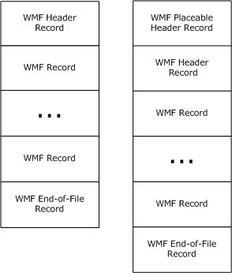

Figure 1: Structures of original and placeable Windows metafiles

The **META_HEADER Record** (section [2.3.2.2](#Section_2.3.2.2)) contains information that defines the characteristics of the metafile, including:

- The type of the metafile
- The version of the metafile
- The size of the metafile
- The number of objects defined in the metafile
- The size of the largest single record in the metafile
The **META_PLACEABLE Record** (section [2.3.2.3](#Section_2.3.2.3)) contains extended information concerning the image, including:

- A bounding rectangle
- Logical unit size, for scaling
- A checksum, for validation
WMF records have a generic format, which is specified in section [2.3](#Section_2.3). Every WMF record contains the following information:

- The record size
- The record function
- Parameters, if any, for the record function
All WMF metafiles are terminated by a **META_EOF Record** (section [2.3.2.1](#Section_2.3.2.1)).

<a id="Section_1.3.2"></a>
### 1.3.2 Graphics Objects

Graphics objects include the brushes, fonts, palettes, pens, and regions, which are used in the drawing and painting operations specified in the records of a [**WMF**](#gt_windows-metafile-format-wmf) [**metafile**](#gt_metafile). They can be defined in metafile records prior to the records that specify their use; that is, they are designed to have a lifetime outside the processing of a particular record and to be reusable during the course of playing back the metafile. The structure of WMF graphics objects is specified in section [2.2.1](#Section_2.2.1).

Throughout this specification, it is assumed that these reusable graphics objects are available when needed for the processing of particular metafile records. This implies that they are stored or managed in some fashion; the store of available objects is referred to in the text as the **WMF Object Table**, which is described in section [3.1.4.1](#Section_3.1.4.1). The exact characteristics of the object store are determined by the particular implementations that parse and write the metafiles.

Records that specify drawing and painting operations can occur in a WMF metafile prior to the definition of any graphics objects. Thus, it is assumed that an initial state exists that specifies default graphics properties of the [**playback device context**](#gt_playback-device-context), including default graphics objects. Information concerning the playback device context is provided in section [3.1.5](#Section_3.1.5).

<a id="Section_1.3.3"></a>
### 1.3.3 Byte Ordering

Data in [**WMF**](#gt_windows-metafile-format-wmf) [**metafile**](#gt_metafile) records is stored in [**little-endian**](#gt_little-endian) format.

Some computer architectures number bytes in a binary word from left to right, which is referred to as [**big-endian**](#gt_big-endian). The byte numbering used for bitfields in this specification is big-endian. Other architectures number the bytes in a binary word from right to left, which is referred to as little-endian. The byte numbering used for enumerations, objects, and records in this specification is little-endian.

Using big-endian and little-endian methods, the number 0x12345678 would be stored as shown in the following.

| Bit Range | Field | Description |
| --- | --- | --- |
| Variable | Big-endian | 0x12 0x34 0x56 0x78 |
| Variable | Little-endian | 0x78 0x56 0x34 0x12 |

<a id="Section_1.4"></a>
## 1.4 Relationship to Protocols and Other Structures

[**WMF**](#gt_windows-metafile-format-wmf) is not dependent on any protocols or other structures. WMF defines a design and layout based on 16-bit operating systems.<1>

On 32-bit systems and for print spooling, it has been replaced by [**EMF**](#gt_enhanced-metafile-format-emf), described in [MS-EMF](../MS-EMF/MS-EMF.md).

<a id="Section_1.5"></a>
## 1.5 Applicability Statement

Structures that are compliant with [**WMF**](#gt_windows-metafile-format-wmf) are portable, application-independent containers for images. The graphics supported in WMF [**metafiles**](#gt_metafile) are applicable to document content representation, including printing and plotting.

<a id="Section_1.6"></a>
## 1.6 Versioning and Localization

This specification covers versioning issues in the following areas:

**Structure Versions**: There is only one version of the WMF structure.

**Localization**: This structure defines no locale-specific processes or data.

<a id="Section_1.7"></a>
## 1.7 Vendor-Extensible Fields

The [**WMF**](#gt_windows-metafile-format-wmf) defines a mechanism for the encapsulation of arbitrary, vendor-defined data. See section [2.3.6.1](#Section_2.3.6.1) for details.

<a id="Section_2"></a>
# 2 Structures

This section specifies the structures used to define the [**WMF**](#gt_windows-metafile-format-wmf), including:

- Enumerations of WMF graphics properties, styles and flags.
- Definitions of WMF graphics and structure objects.
- Specifications of WMF [**metafile**](#gt_metafile) records, by type.
This protocol references commonly used data types as defined in [MS-DTYP](../MS-DTYP/MS-DTYP.md).

<a id="Section_2.1"></a>
## 2.1 WMF Constants

<a id="Section_2.1.1"></a>
### 2.1.1 WMF Enumerations

This section contains enumerations of constant values that are referenced in this specification.

<a id="Section_2.1.1.1"></a>
#### 2.1.1.1 RecordType Enumeration

The **RecordType Enumeration** defines the types of records that can be used in [**WMF**](#gt_windows-metafile-format-wmf) [**metafiles**](#gt_metafile).

typedef enum

{

META_EOF = 0x0000,

META_REALIZEPALETTE = 0x0035,

META_SETPALENTRIES = 0x0037,

META_SETBKMODE = 0x0102,

META_SETMAPMODE = 0x0103,

META_SETROP2 = 0x0104,

META_SETRELABS = 0x0105,

META_SETPOLYFILLMODE = 0x0106,

META_SETSTRETCHBLTMODE = 0x0107,

META_SETTEXTCHAREXTRA = 0x0108,

META_RESTOREDC = 0x0127,

META_RESIZEPALETTE = 0x0139,

META_DIBCREATEPATTERNBRUSH = 0x0142,

META_SETLAYOUT = 0x0149,

META_SETBKCOLOR = 0x0201,

META_SETTEXTCOLOR = 0x0209,

META_OFFSETVIEWPORTORG = 0x0211,

META_LINETO = 0x0213,

META_MOVETO = 0x0214,

META_OFFSETCLIPRGN = 0x0220,

META_FILLREGION = 0x0228,

META_SETMAPPERFLAGS = 0x0231,

META_SELECTPALETTE = 0x0234,

META_POLYGON = 0x0324,

META_POLYLINE = 0x0325,

META_SETTEXTJUSTIFICATION = 0x020A,

META_SETWINDOWORG = 0x020B,

META_SETWINDOWEXT = 0x020C,

META_SETVIEWPORTORG = 0x020D,

META_SETVIEWPORTEXT = 0x020E,

META_OFFSETWINDOWORG = 0x020F,

META_SCALEWINDOWEXT = 0x0410,

META_SCALEVIEWPORTEXT = 0x0412,

META_EXCLUDECLIPRECT = 0x0415,

META_INTERSECTCLIPRECT = 0x0416,

META_ELLIPSE = 0x0418,

META_FLOODFILL = 0x0419,

META_FRAMEREGION = 0x0429,

META_ANIMATEPALETTE = 0x0436,

META_TEXTOUT = 0x0521,

META_POLYPOLYGON = 0x0538,

META_EXTFLOODFILL = 0x0548,

META_RECTANGLE = 0x041B,

META_SETPIXEL = 0x041F,

META_ROUNDRECT = 0x061C,

META_PATBLT = 0x061D,

META_SAVEDC = 0x001E,

META_PIE = 0x081A,

META_STRETCHBLT = 0x0B23,

META_ESCAPE = 0x0626,

META_INVERTREGION = 0x012A,

META_PAINTREGION = 0x012B,

META_SELECTCLIPREGION = 0x012C,

META_SELECTOBJECT = 0x012D,

META_SETTEXTALIGN = 0x012E,

META_ARC = 0x0817,

META_CHORD = 0x0830,

META_BITBLT = 0x0922,

META_EXTTEXTOUT = 0x0a32,

META_SETDIBTODEV = 0x0d33,

META_DIBBITBLT = 0x0940,

META_DIBSTRETCHBLT = 0x0b41,

META_STRETCHDIB = 0x0f43,

META_DELETEOBJECT = 0x01f0,

META_CREATEPALETTE = 0x00f7,

META_CREATEPATTERNBRUSH = 0x01F9,

META_CREATEPENINDIRECT = 0x02FA,

META_CREATEFONTINDIRECT = 0x02FB,

META_CREATEBRUSHINDIRECT = 0x02FC,

META_CREATEREGION = 0x06FF

} RecordType;

**META_EOF:** This record specifies the end of the file, the last record in the metafile.

**META_REALIZEPALETTE:** This record maps entries from the [**logical palette**](#gt_logical-palette) that is defined in the [**playback device context**](#gt_playback-device-context) to the [**system palette**](#gt_system-palette).

**META_SETPALENTRIES:** This record defines [**red green blue (RGB)**](#gt_red-green-blue-rgb) color values in a range of entries in the logical palette that is defined in the playback device context.

**META_SETBKMODE:** This record defines the background [**raster operation**](#gt_raster-operation) mix mode in the playback device context. The background mix mode is the mode for combining pens, text, hatched brushes, and interiors of filled objects with background colors on the output surface.

**META_SETMAPMODE:** This record defines the [**mapping mode**](#gt_mapping-mode) in the playback device context. The mapping mode defines the unit of measure used to transform [**page-space**](#gt_f530f123-858a-4af7-b626-adea0aeaa75a) coordinates into coordinates of the output device, and also defines the orientation of the device's x and y axes.

**META_SETROP2:** This record defines the foreground raster operation mix mode in the playback device context. The foreground mix mode is the mode for combining pens and interiors of filled objects with foreground colors on the output surface.

**META_SETRELABS:** This record is undefined and MUST be ignored.

**META_SETPOLYFILLMODE:** This record defines polygon fill mode in the playback device context for graphics operations that fill polygons.

**META_SETSTRETCHBLTMODE:** This record defines the [**bitmap**](#gt_bitmap) stretching mode in the playback device context.

**META_SETTEXTCHAREXTRA:** This record defines inter-character spacing for text justification in the playback device context. Spacing is added to the white space between each character, including break characters, when a line of justified text is output.

**META_RESTOREDC:** This record restores the playback device context from a previously saved [**device context**](#gt_device-context).

**META_RESIZEPALETTE:** This record redefines the size of the logical palette that is defined in the playback device context.

**META_DIBCREATEPATTERNBRUSH:** This record defines a brush with a pattern specified by a [**device-independent bitmap (DIB)**](#gt_device-independent-bitmap-dib).

**META_SETLAYOUT:** This record defines the layout orientation in the playback device context.<2>

**META_SETBKCOLOR:** This record sets the background color in the playback device context to a specified color, or to the nearest physical color if the device cannot represent the specified color.

**META_SETTEXTCOLOR:** This record defines the text color in the playback device context.

**META_OFFSETVIEWPORTORG:** This record moves the viewport origin in the playback device context by using specified horizontal and vertical offsets.

**META_LINETO:** This record draws a line from the output position that is defined in the playback device context up to, but not including, a specified point.

**META_MOVETO:** This record sets the output position in the playback device context to a specified point.

**META_OFFSETCLIPRGN:** This record moves the clipping [**region**](#gt_region) that is defined in the playback device context by specified offsets.

**META_FILLREGION:** This record fills a region by using a specified brush.

**META_SETMAPPERFLAGS:** This record defines the algorithm that the [**font mapper**](#gt_font-mapper) uses when it maps logical fonts to physical fonts.

**META_SELECTPALETTE:** This record specifies the logical palette in the playback device context.

**META_POLYGON:** This record paints a polygon consisting of two or more vertices connected by straight lines. The polygon is outlined by using the pen and filled by using the brush and polygon fill mode; these are defined in the playback device context.

**META_POLYLINE:** This record draws a series of line segments by connecting the points in a specified array.

**META_SETTEXTJUSTIFICATION:** This record defines the amount of space to add to break characters in a string of justified text.

**META_SETWINDOWORG:** This record defines the output window origin in the playback device context.

**META_SETWINDOWEXT:** This record defines the horizontal and vertical extents of the output window in the playback device context.

**META_SETVIEWPORTORG:** This record defines the viewport origin in the playback device context.

**META_SETVIEWPORTEXT:** This record defines the horizontal and vertical extents of the viewport in the playback device context.

**META_OFFSETWINDOWORG:** This record moves the output window origin in the playback device context by using specified horizontal and vertical offsets.

**META_SCALEWINDOWEXT:** This record scales the horizontal and vertical extents of the output window that is defined in the playback device context by using the ratios formed by specified multiplicands and divisors.

**META_SCALEVIEWPORTEXT:** This record scales the horizontal and vertical extents of the viewport that is defined in the playback device context by using the ratios formed by specified multiplicands and divisors.

**META_EXCLUDECLIPRECT:** This record sets the clipping region that is defined in the playback device context to the existing clipping region minus a specified rectangle.

**META_INTERSECTCLIPRECT:** This record sets the clipping region that is defined in the playback device context to the intersection of the existing clipping region and a specified rectangle.

**META_ELLIPSE:** This record defines an ellipse. The center of the ellipse is the center of a specified bounding rectangle. The ellipse is outlined by using the pen and is filled by using the brush; these are defined in the playback device context.

**META_FLOODFILL:** This record fills an area of the display surface with the brush that is defined in the playback device context.

**META_FRAMEREGION:** This record defines a border around a specified region by using a specified brush.

**META_ANIMATEPALETTE:** This record redefines entries in the logical palette that is defined in the playback device context.

**META_TEXTOUT:** This record outputs a character string at a specified location using the font, background color, and text color; these are defined in the playback device context.

**META_POLYPOLYGON:** This record paints a series of closed polygons. Each polygon is outlined by using the pen and filled by using the brush and polygon fill mode; these are defined in the playback device context. The polygons drawn in this operation can overlap.

**META_EXTFLOODFILL:** This record fills an area with the brush that is defined in the playback device context.

**META_RECTANGLE:** This record paints a rectangle. The rectangle is outlined by using the pen and filled by using the brush; these are defined in the playback device context.

**META_SETPIXEL:** This record sets the pixel at specified coordinates to a specified color.

**META_ROUNDRECT:** This record draws a rectangle with rounded corners. The rectangle is outlined by using the current pen and filled by using the current brush.

**META_PATBLT:** This record paints the specified rectangle by using the brush that is currently selected into the playback device context. The brush color and the surface color or colors are combined using the specified raster operation.

**META_SAVEDC:** This record saves the playback device context for later retrieval.

**META_PIE:** This record draws a pie-shaped wedge bounded by the intersection of an ellipse and two radials. The pie is outlined by using the pen and filled by using the brush; these are defined in the playback device context.

**META_STRETCHBLT:** This record specifies the transfer of a block of pixels according to a raster operation, with possible expansion or contraction.

**META_ESCAPE:** This record makes it possible to access capabilities of a particular printing device that are not directly available through other WMF records.

**META_INVERTREGION:** This record inverts the colors in a specified region.

**META_PAINTREGION:** This record paints a specified region by using the brush that is defined in the playback device context.

**META_SELECTCLIPREGION:** This record specifies the clipping region in the playback device context.

**META_SELECTOBJECT:** This record specifies a graphics object in the playback device context. The new object replaces the previous object of the same type, if one is defined.

**META_SETTEXTALIGN:** This record defines the text-alignment values in the playback device context.

**META_ARC:** This record draws an elliptical arc.

**META_CHORD:** This record draws a chord, which is a region bounded by the intersection of an ellipse and a line segment. The chord is outlined by using the pen and filled by using the brush; these are defined in the playback device context.

**META_BITBLT:** This record specifies the transfer of a block of pixels according to a raster operation.

**META_EXTTEXTOUT:** This record outputs a character string by using the font, background color, and text color; these are defined in the playback device context. Optionally, dimensions can be provided for clipping, opaquing, or both.

**META_SETDIBTODEV:** This record sets a block of pixels using device-independent color data.

**META_DIBBITBLT:** This record specifies the transfer of a block of pixels in device-independent format according to a raster operation.

**META_DIBSTRETCHBLT:** This record specifies the transfer of a block of pixels in device-independent format according to a raster operation, with possible expansion or contraction.

**META_STRETCHDIB:** This record specifies the transfer of color data from a block of pixels in device-independent format according to a raster operation, with possible expansion or contraction.

**META_DELETEOBJECT:** This record deletes a graphics object, which can be a pen, brush, font, region, or [**palette**](#gt_palette).

**META_CREATEPALETTE:** This record defines a logical palette.

**META_CREATEPATTERNBRUSH:** This record defines a brush with a pattern specified by a DIB.

**META_CREATEPENINDIRECT:** This record defines a pen with specified style, width, and color.

**META_CREATEFONTINDIRECT:** This record defines a font with specified characteristics.

**META_CREATEBRUSHINDIRECT:** This record defines a brush with specified style, color, and pattern.

**META_CREATEREGION:** This record defines a region.

The high-order byte of the WMF record type values SHOULD be ignored for all record types except the following:<3>

- **META_BITBLT**
- **META_DIBBITBLT**
- **META_DIBSTRETCHBLT**
- **META_POLYGON**
- **META_POLYLINE**
- **META_SETPALENTRIES**
- **META_STRETCHBLT**
The meanings of the high-order bytes of these record type fields are specified in the respective sections that define them.

A record type is not defined for the WMF header record, because only one can be present as the first record in the metafile.

<a id="Section_2.1.1.2"></a>
#### 2.1.1.2 BinaryRasterOperation Enumeration

The **BinaryRasterOperation Enumeration** section lists the binary raster-operation codes. Raster-operation codes define how [**metafile**](#gt_metafile) processing combines the bits from the selected pen with the bits in the destination [**bitmap**](#gt_bitmap).

Each raster-operation code represents a Boolean operation in which the values of the pixels in the selected pen and the destination bitmap are combined. Following are the two operands used in these operations.

| Operand | Meaning |
| --- | --- |
| P | Selected pen |
| D | Destination bitmap |

Following are the Boolean operators used in these operations.

| Operator | Meaning |
| --- | --- |
| a | Bitwise AND |
| n | Bitwise NOT (inverse) |
| o | Bitwise OR |
| x | Bitwise exclusive OR (XOR) |

All Boolean operations are presented in [**reverse Polish notation**](#gt_reverse-polish-notation-rpn). For example, the following operation replaces the values of the pixels in the destination bitmap with a combination of the pixel values of the pen and the selected brush: DPo.

Each raster-operation code is a 32-bit integer whose high-order word is a Boolean operation index and whose low-order word is the operation code. The 16-bit operation index is a zero-extended, 8-bit value that represents all possible outcomes resulting from the Boolean operation on two parameters (in this case, the pen and destination values). For example, the operation indexes for the DPo and DPan operations are shown in the following list.

| P | D | DPo | DPan |
| --- | --- | --- | --- |
| 0 | 0 | 0 | 1 |
| 0 | 1 | 1 | 1 |
| 1 | 0 | 1 | 1 |
| 1 | 1 | 1 | 0 |

The following enumeration lists the drawing modes and the Boolean operations that they represent.

typedef enum

{

R2_BLACK = 0x0001,

R2_NOTMERGEPEN = 0x0002,

R2_MASKNOTPEN = 0x0003,

R2_NOTCOPYPEN = 0x0004,

R2_MASKPENNOT = 0x0005,

R2_NOT = 0x0006,

R2_XORPEN = 0x0007,

R2_NOTMASKPEN = 0x0008,

R2_MASKPEN = 0x0009,

R2_NOTXORPEN = 0x000A,

R2_NOP = 0x000B,

R2_MERGENOTPEN = 0x000C,

R2_COPYPEN = 0x000D,

R2_MERGEPENNOT = 0x000E,

R2_MERGEPEN = 0x000F,

R2_WHITE = 0x0010

} BinaryRasterOperation;

**R2_BLACK:** 0, Pixel is always 0.

**R2_NOTMERGEPEN:** DPon, Pixel is the inverse of the **R2_MERGEPEN** color.

**R2_MASKNOTPEN:** DPna, Pixel is a combination of the screen color and the inverse of the pen color.

**R2_NOTCOPYPEN:** Pn, Pixel is the inverse of the pen color.

**R2_MASKPENNOT:** PDna, Pixel is a combination of the colors common to both the pen and the inverse of the screen.

**R2_NOT:** Dn, Pixel is the inverse of the screen color.

**R2_XORPEN:** DPx, Pixel is a combination of the colors in the pen or in the screen, but not in both.

**R2_NOTMASKPEN:** DPan, Pixel is the inverse of the **R2_MASKPEN** color.

**R2_MASKPEN:** DPa, Pixel is a combination of the colors common to both the pen and the screen.

**R2_NOTXORPEN:** DPxn, Pixel is the inverse of the **R2_XORPEN** color.

**R2_NOP:** D, Pixel remains unchanged.

**R2_MERGENOTPEN:** DPno, Pixel is a combination of the colors common to both the screen and the inverse of the pen.

**R2_COPYPEN:** P, Pixel is the pen color.

**R2_MERGEPENNOT:** PDno, Pixel is a combination of the pen color and the inverse of the screen color.

**R2_MERGEPEN:** DPo, Pixel is a combination of the pen color and the screen color.

**R2_WHITE:** 1, Pixel is always 1

For a monochrome device, [**WMF**](#gt_windows-metafile-format-wmf) format maps the value 0 to black and the value 1 to white. If an application attempts to draw with a black pen on a white destination by using the available binary [**raster operations**](#gt_raster-operation), the following results occur.

| Raster operation | Result |
| --- | --- |
| **R2_BLACK** | Visible black line |
| **R2_COPYPEN** | Visible black line |
| **R2_MASKNOTPEN** | No visible line |
| **R2_MASKPEN** | Visible black line |
| **R2_MASKPENNOT** | Visible black line |
| **R2_MERGENOTPEN** | No visible line |
| **R2_MERGEPEN** | Visible black line |
| **R2_MERGEPENNOT** | Visible black line |
| **R2_NOP** | No visible line |
| **R2_NOT** | Visible black line |
| **R2_NOTCOPYPEN** | No visible line |
| **R2_NOTMASKPEN** | No visible line |
| **R2_NOTMERGEPEN** | Visible black line |
| **R2_NOTXORPEN** | Visible black line |
| **R2_WHITE** | No visible line |
| **R2_XORPEN** | No visible line |

For a color device, WMF format uses [**RGB**](#gt_red-green-blue-rgb) values to represent the colors of the pen and the destination. An RGB color value is a long integer that contains a red, a green, and a blue color field, each specifying the intensity of the given color. Intensities range from 0 through 255. The values are packed in the three low-order bytes of the long integer. The color of a pen is always a solid color, but the color of the destination can be a mixture of any two or three colors. If an application attempts to draw with a white pen on a blue destination by using the available binary raster operations, the following results occur.

| Raster operation | Result |
| --- | --- |
| **R2_BLACK** | Visible black line |
| **R2_COPYPEN** | Visible white line |
| **R2_MASKNOTPEN** | Visible black line |
| **R2_MASKPEN** | Invisible blue line |
| **R2_MASKPENNOT** | Visible red/green line |
| **R2_MERGENOTPEN** | Invisible blue line |
| **R2_MERGEPEN** | Visible white line |
| **R2_MERGEPENNOT** | Visible white line |
| **R2_NOP** | Invisible blue line |
| **R2_NOT** | Visible red/green line |
| **R2_NOTCOPYPEN** | Visible black line |
| **R2_NOTMASKPEN** | Visible red/green line |
| **R2_NOTMERGEPEN** | Visible black line |
| **R2_NOTXORPEN** | Invisible blue line |
| **R2_WHITE** | Visible white line |
| **R2_XORPEN** | Visible red/green line |

<a id="Section_2.1.1.3"></a>
#### 2.1.1.3 BitCount Enumeration

The **BitCount Enumeration** specifies the number of bits that define each pixel and the maximum number of colors in a [**device-independent bitmap (DIB)**](#gt_device-independent-bitmap-dib).

A DIB is specified by a **DeviceIndependentBitmap (DIB) Object** (section [2.2.2.9](#Section_2.2.2.9)), and its header is a **BitmapInfoHeader Object** (section [2.2.2.3](#Section_2.2.2.3)).

typedef enum

{

BI_BITCOUNT_0 = 0x0000,

BI_BITCOUNT_1 = 0x0001,

BI_BITCOUNT_2 = 0x0004,

BI_BITCOUNT_3 = 0x0008,

BI_BITCOUNT_4 = 0x0010,

BI_BITCOUNT_5 = 0x0018,

BI_BITCOUNT_6 = 0x0020

} BitCount;

**BI_BITCOUNT_0:** The number of bits per pixel is undefined.

The image SHOULD be in either [**JPEG**](#gt_joint-photographic-experts-group-jpeg) or [**PNG**](#gt_portable-network-graphics-png) format.<4> Neither of these formats includes a [**color table**](#gt_color-table), so this value specifies that no color table is present in the **Colors** field of the **DIB Object**. See [[JFIF]](https://go.microsoft.com/fwlink/?LinkId=89925) and [[RFC2083]](https://go.microsoft.com/fwlink/?LinkId=90313) for more information concerning JPEG and PNG compression formats.

**BI_BITCOUNT_1:** The image is specified with two colors.

Each pixel in the [**bitmap**](#gt_bitmap) in the **BitmapBuffer** field of the **DIB Object** is represented by a single bit. If the bit is clear, the pixel is displayed with the color of the first entry in the color table in the **Colors** field; if the bit is set, the pixel has the color of the second entry in the table.

**BI_BITCOUNT_2:** The image is specified with a maximum of 16 colors.

Each pixel in the bitmap in the **BitmapBuffer** field of the **DIB Object** is represented by a 4-bit index into the color table in the **Colors** field, and each byte contains 2 pixels.

**BI_BITCOUNT_3:** The image is specified with a maximum of 256 colors.

Each pixel in the bitmap in the **BitmapBuffer** field of the **DIB Object** is represented by an 8-bit index into the color table in the **Colors** field, and each byte contains 1 pixel.

**BI_BITCOUNT_4:** The image is specified with a maximum of 2^16 colors.

Each pixel in the bitmap in the **BitmapBuffer** field of the **DIB Object** is represented by a 16-bit value.

If the **Compression** field of the **BitmapInfoHeader Object** is BI_RGB, the **Colors** field of the **DIB Object** is NULL. Each **WORD** (defined in [MS-DTYP](../MS-DTYP/MS-DTYP.md) section 2.2.61) in the bitmap represents a single pixel. The relative intensities of red, green, and blue are represented with 5 bits for each color component. The value for blue is in the least significant 5 bits, followed by 5 bits each for green and red. The most significant bit is not used.

If the **Compression** field is set to BI_BITFIELDS, the color table in the **Colors** field contains three **DWORD** (defined in [MS-DTYP] section 2.2.9) color masks that specify the red, green, and blue components, respectively, of each pixel. Each **WORD** in the bitmap represents a single pixel. The color table is used for optimizing colors on palette-based devices, and contains the number of entries specified by the **ColorUsed** field of the **BitmapInfoHeader Object**.

When the **Compression** field is set to BI_BITFIELDS, bits set in each **DWORD** mask MUST be contiguous and SHOULD NOT overlap the bits of another mask.

BI_RGB and BI_BITFIELDS are defined in **Compression Enumeration**, section [2.1.1.7](#Section_2.1.1.7).

**BI_BITCOUNT_5:** The bitmap in the **BitmapBuffer** field of the **DIB Object** has a maximum of 2^24 colors, and the **Colors** field is NULL. Each 3-byte triplet in the bitmap represents the relative intensities of blue, green, and red, respectively, for a pixel.

**BI_BITCOUNT_6:** The bitmap in the **BitmapBuffer** field of the **DIB Object** has a maximum of 2^24 colors.

If the **Compression** field of the **BitmapInfoHeader Object** is set to BI_RGB, the **Colors** field of the **DIB Object** is set to NULL. Each **DWORD** in the bitmap in the **BitmapBuffer** field represents the relative intensities of blue, green, and red, respectively, for a pixel. The high byte in each **DWORD** is not used.

If the **Compression** field is set to BI_BITFIELDS, the color table in the **Colors** field contains three **DWORD** color masks that specify the red, green, and blue components, respectively, of each pixel. Each **DWORD** in the bitmap represents a single pixel. The color table is used for optimizing colors used on palette-based devices and contains the number of entries specified by the **ColorUsed** field of the **BitmapInfoHeader Object**.

When the **Compression** field is set to BI_BITFIELDS, bits set in each **DWORD** mask MUST be contiguous and MUST NOT overlap the bits of another mask. All the bits in the pixel do not need to be used.

BI_RGB and BI_BITFIELDS are specified in the **Compression Enumeration**.

<a id="Section_2.1.1.4"></a>
#### 2.1.1.4 BrushStyle Enumeration

The **BrushStyle Enumeration** specifies the different possible brush types that can be used in graphics operations. For more information, see the specification of the **Brush Object** (section [2.2.1.1](#Section_2.2.1.1)).

typedef enum

{

BS_SOLID = 0x0000,

BS_NULL = 0x0001,

BS_HATCHED = 0x0002,

BS_PATTERN = 0x0003,

BS_INDEXED = 0x0004,

BS_DIBPATTERN = 0x0005,

BS_DIBPATTERNPT = 0x0006,

BS_PATTERN8X8 = 0x0007,

BS_DIBPATTERN8X8 = 0x0008,

BS_MONOPATTERN = 0x0009

} BrushStyle;

**BS_SOLID:** A brush that paints a single, constant color, either solid or dithered.

**BS_NULL:** A brush that does nothing. Using a BS_NULL brush in a graphics operation MUST have the same effect as using no brush at all.<5>

**BS_HATCHED:** A brush that paints a predefined simple pattern, or "hatch", onto a solid background.

**BS_PATTERN:** A brush that paints a pattern defined by a [**bitmap**](#gt_bitmap), which can be a **Bitmap16 Object** (section [2.2.2.1](#Section_2.2.2.1)) or a **DeviceIndependentBitmap Object** (section [2.2.2.9](#Section_2.2.2.9)).

**BS_INDEXED:** Not supported.

**BS_DIBPATTERN:** A pattern brush specified by a [**DIB**](#gt_device-independent-bitmap-dib).

**BS_DIBPATTERNPT:** A pattern brush specified by a DIB.

**BS_PATTERN8X8:** Not supported.

**BS_DIBPATTERN8X8:** Not supported.

**BS_MONOPATTERN:** Not supported.

<a id="Section_2.1.1.5"></a>
#### 2.1.1.5 CharacterSet Enumeration

The **CharacterSet Enumeration** defines the possible sets of character glyphs that are defined in fonts for graphics output.

typedef enum

{

ANSI_CHARSET = 0x00000000,

DEFAULT_CHARSET = 0x00000001,

SYMBOL_CHARSET = 0x00000002,

MAC_CHARSET = 0x0000004D,

SHIFTJIS_CHARSET = 0x00000080,

HANGUL_CHARSET = 0x00000081,

JOHAB_CHARSET = 0x00000082,

GB2312_CHARSET = 0x00000086,

CHINESEBIG5_CHARSET = 0x00000088,

GREEK_CHARSET = 0x000000A1,

TURKISH_CHARSET = 0x000000A2,

VIETNAMESE_CHARSET = 0x000000A3,

HEBREW_CHARSET = 0x000000B1,

ARABIC_CHARSET = 0x000000B2,

BALTIC_CHARSET = 0x000000BA,

RUSSIAN_CHARSET = 0x000000CC,

THAI_CHARSET = 0x000000DE,

EASTEUROPE_CHARSET = 0x000000EE,

OEM_CHARSET = 0x000000FF

} CharacterSet;

**ANSI_CHARSET:** Specifies the English character set.

**DEFAULT_CHARSET:** Specifies a character set based on the current system locale; for example, when the system locale is United States English, the default character set is ANSI_CHARSET.

**SYMBOL_CHARSET:** Specifies a character set of symbols.

**MAC_CHARSET:** Specifies the Apple Macintosh character set.<6>

**SHIFTJIS_CHARSET:** Specifies the Japanese character set.

**HANGUL_CHARSET:** Also spelled "Hangeul". Specifies the Hangul Korean character set.

**JOHAB_CHARSET:** Also spelled "Johap". Specifies the Johab Korean character set.

**GB2312_CHARSET:** Specifies the "simplified" Chinese character set for People's Republic of China.

**CHINESEBIG5_CHARSET:** Specifies the "traditional" Chinese character set, used mostly in Taiwan and in the Hong Kong and Macao Special Administrative Regions.

**GREEK_CHARSET:** Specifies the Greek character set.

**TURKISH_CHARSET:** Specifies the Turkish character set.

**VIETNAMESE_CHARSET:** Specifies the Vietnamese character set.

**HEBREW_CHARSET:** Specifies the Hebrew character set

**ARABIC_CHARSET:** Specifies the Arabic character set

**BALTIC_CHARSET:** Specifies the Baltic (Northeastern European) character set

**RUSSIAN_CHARSET:** Specifies the Russian Cyrillic character set.

**THAI_CHARSET:** Specifies the Thai character set.

**EASTEUROPE_CHARSET:** Specifies a Eastern European character set.

**OEM_CHARSET:** Specifies a mapping to one of the OEM code pages, according to the current system locale setting.

<a id="Section_2.1.1.6"></a>
#### 2.1.1.6 ColorUsage Enumeration

The **ColorUsage Enumeration** specifies whether a [**color table**](#gt_color-table) exists in a [**device-independent bitmap (DIB)**](#gt_device-independent-bitmap-dib) and how to interpret its values.

typedef enum

{

DIB_RGB_COLORS = 0x0000,

DIB_PAL_COLORS = 0x0001,

DIB_PAL_INDICES = 0x0002

} ColorUsage;

**DIB_RGB_COLORS:** The color table contains [**RGB**](#gt_red-green-blue-rgb) values specified by **RGBQuad Objects** (section [2.2.2.20](#Section_2.2.2.20)).

**DIB_PAL_COLORS:** The color table contains 16-bit indices into the current [**logical palette**](#gt_logical-palette) in the [**playback device context**](#gt_playback-device-context).

**DIB_PAL_INDICES:** No color table exists. The pixels in the DIB are indices into the current logical palette in the playback device context.

A DIB is specified by a **DeviceIndependentBitmap Object** (section [2.2.2.9](#Section_2.2.2.9)).

<a id="Section_2.1.1.7"></a>
#### 2.1.1.7 Compression Enumeration

The **Compression Enumeration** specifies the type of compression for a [**bitmap**](#gt_bitmap) image.

typedef enum

{

BI_RGB = 0x0000,

BI_RLE8 = 0x0001,

BI_RLE4 = 0x0002,

BI_BITFIELDS = 0x0003,

BI_JPEG = 0x0004,

BI_PNG = 0x0005,

BI_CMYK = 0x000B,

BI_CMYKRLE8 = 0x000C,

BI_CMYKRLE4 = 0x000D

} Compression;

**BI_RGB:** The bitmap is in uncompressed [**red green blue (RGB)**](#gt_red-green-blue-rgb) format that is not compressed and does not use color masks.

**BI_RLE8:** An [**RGB**](#gt_red-green-blue-rgb) format that uses [**run-length encoding (RLE) compression**](#gt_run-length-encoding-rle-compression) for bitmaps with 8 bits per pixel. The compression uses a 2-byte format consisting of a count byte followed by a byte containing a color index.

**BI_RLE4:** An RGB format that uses RLE compression for bitmaps with 4 bits per pixel. The compression uses a 2-byte format consisting of a count byte followed by two word-length color indexes.

**BI_BITFIELDS:** The bitmap is not compressed, and the color table consists of three **DWORD** (defined in [MS-DTYP](../MS-DTYP/MS-DTYP.md) section 2.2.9) color masks that specify the red, green, and blue components, respectively, of each pixel. This is valid when used with 16 and 32-bits per pixel bitmaps.

**BI_JPEG:** The image is a [**JPEG**](#gt_joint-photographic-experts-group-jpeg) image, as specified in [[JFIF]](https://go.microsoft.com/fwlink/?LinkId=89925). This value SHOULD only be used in certain bitmap operations, such as JPEG pass-through. The application MUST query for the pass-through support, since not all devices support JPEG pass-through. Using non-RGB bitmaps MAY limit the portability of the [**metafile**](#gt_metafile) to other devices. For instance, display device contexts generally do not support this pass-through.

**BI_PNG:** The image is a [**PNG**](#gt_portable-network-graphics-png) image, as specified in [[RFC2083]](https://go.microsoft.com/fwlink/?LinkId=90313). This value SHOULD only be used certain bitmap operations, such as JPEG/PNG pass-through. The application MUST query for the pass-through support, because not all devices support JPEG/PNG pass-through. Using non-RGB bitmaps MAY limit the portability of the metafile to other devices. For instance, display device contexts generally do not support this pass-through.

**BI_CMYK:** The image is an uncompressed [**CMYK**](#gt_cmyk) format.

**BI_CMYKRLE8:** A CMYK format that uses RLE compression for bitmaps with 8 bits per pixel. The compression uses a 2-byte format consisting of a count byte followed by a byte containing a color index.

**BI_CMYKRLE4:** A CMYK format that uses RLE compression for bitmaps with 4 bits per pixel. The compression uses a 2-byte format consisting of a count byte followed by two word-length color indexes.

**Note** A [**bottom-up bitmap**](#gt_bottom-up-bitmap) can be compressed, but a [**top-down bitmap**](#gt_top-down-bitmap) cannot.

See section [3.1.6](#Section_3.1.6) for more information on RLE compression.

<a id="Section_2.1.1.8"></a>
#### 2.1.1.8 FamilyFont Enumeration

The **FamilyFont Enumeration** specifies the font family. Font families describe the look of a font in a general way. They are intended for specifying fonts when the exact [**typeface**](#gt_typeface) desired is not available.

typedef enum

{

FF_DONTCARE = 0x00,

FF_ROMAN = 0x01,

FF_SWISS = 0x02,

FF_MODERN = 0x03,

FF_SCRIPT = 0x04,

FF_DECORATIVE = 0x05

} FamilyFont;

**FF_DONTCARE:** The default font is specified, which is implementation-dependent.

**FF_ROMAN:** Fonts with variable stroke widths, which are proportional to the actual widths of the glyphs, and which have serifs. "MS Serif" is an example.

**FF_SWISS:** Fonts with variable stroke widths, which are proportional to the actual widths of the glyphs, and which do not have serifs. "MS Sans Serif" is an example.

**FF_MODERN:** Fonts with constant stroke width, with or without serifs. Fixed-width fonts are usually modern. "Pica", "Elite", and "Courier New" are examples.

**FF_SCRIPT:** Fonts designed to look like handwriting. "Script" and "Cursive" are examples.

**FF_DECORATIVE:** Novelty fonts. "Old English" is an example.

In a **Font Object** (section [2.2.1.2](#Section_2.2.1.2)), when a **FamilyFont** value is packed into a byte with a **PitchFont Enumeration** (section [2.1.1.24](#Section_2.1.1.24)) value, the result is a **PitchAndFamily Object** (section [2.2.2.14](#Section_2.2.2.14)).

<a id="Section_2.1.1.9"></a>
#### 2.1.1.9 FloodFill Enumeration

The **FloodFill Enumeration** specifies the type of fill operation to be performed.

typedef enum

{

FLOODFILLBORDER = 0x0000,

FLOODFILLSURFACE = 0x0001

} FloodFill;

**FLOODFILLBORDER:** The fill area is bounded by the color specified by the **Color** member. This style is identical to the filling performed by the **META_FLOODFILL Record** (section [2.3.3.7](#Section_2.3.3.7)).

**FLOODFILLSURFACE:** The fill area is bounded by the color that is specified by the **Color** member. Filling continues outward in all directions as long as the color is encountered. This style is useful for filling areas with multicolored boundaries.

<a id="Section_2.1.1.10"></a>
#### 2.1.1.10 FontQuality Enumeration

The **FontQuality Enumeration** specifies how closely the attributes of the logical font match those of the physical font when rendering text.

typedef enum

{

DEFAULT_QUALITY = 0x00,

DRAFT_QUALITY = 0x01,

PROOF_QUALITY = 0x02,

NONANTIALIASED_QUALITY = 0x03,

ANTIALIASED_QUALITY = 0x04,

CLEARTYPE_QUALITY = 0x05

} FontQuality;

**DEFAULT_QUALITY:** Specifies that the character quality of the font does not matter, so **DRAFT_QUALITY** can be used.

**DRAFT_QUALITY:** Specifies that the character quality of the font is less important than the matching of logical attribuetes. For [**rasterized fonts**](#gt_rasterized-font), scaling SHOULD be enabled, which means that more font sizes are available.

**PROOF_QUALITY:** Specifies that the character quality of the font is more important than the matching of logical attributes. For rasterized fonts, scaling SHOULD be disabled, and the font closest in size SHOULD be chosen.

**NONANTIALIASED_QUALITY:** Specifies that [**anti-aliasing**](#gt_anti-aliasing) SHOULD NOT be used when rendering text.<7>

**ANTIALIASED_QUALITY:** Specifies that anti-aliasing SHOULD be used when rendering text, if the font supports it.<8>

**CLEARTYPE_QUALITY:** Specifies that [**ClearType**](#gt_cleartype) anti-aliasing SHOULD be used when rendering text, if the font supports it.<9>

Fonts that do not support ClearType anti-aliasing include [**type 1 fonts**](#gt_type-1-font), [**PostScript**](#gt_postscript) fonts, [**OpenType**](#gt_opentype) fonts without [**TrueType**](#gt_truetype) outlines, rasterized fonts, [**vector fonts**](#gt_vector-font), and device fonts.

<a id="Section_2.1.1.11"></a>
#### 2.1.1.11 GamutMappingIntent Enumeration

The **GamutMappingIntent Enumeration** specifies the relationship between logical and physical colors.<10>

typedef enum

{

LCS_GM_ABS_COLORIMETRIC = 0x00000008,

LCS_GM_BUSINESS = 0x00000001,

LCS_GM_GRAPHICS = 0x00000002,

LCS_GM_IMAGES = 0x00000004

} GamutMappingIntent;

**LCS_GM_ABS_COLORIMETRIC:** Specifies that the [**white point**](#gt_white-point) SHOULD be maintained. Typically used when logical colors MUST be matched to their nearest physical color in the destination **color gamut**.

Intent: Match

[**ICC**](#gt_international-color-consortium-icc) name: Absolute Colorimetric

**LCS_GM_BUSINESS:** Specifies that saturation SHOULD be maintained. Typically used for business charts and other situations in which [**dithering**](#gt_dithering) is not required.

Intent: Graphic

ICC name: Saturation

**LCS_GM_GRAPHICS:** Specifies that a colorimetric match SHOULD be maintained. Typically used for graphic designs and named colors.

Intent: Proof

ICC name: Relative Colorimetric

**LCS_GM_IMAGES:** Specifies that contrast SHOULD be maintained. Typically used for photographs and natural images.

Intent: Picture

ICC name: Perceptual

<a id="Section_2.1.1.12"></a>
#### 2.1.1.12 HatchStyle Enumeration

The **HatchStyle Enumeration** specifies the hatch pattern.

typedef enum

{

HS_HORIZONTAL = 0x0000,

HS_VERTICAL = 0x0001,

HS_FDIAGONAL = 0x0002,

HS_BDIAGONAL = 0x0003,

HS_CROSS = 0x0004,

HS_DIAGCROSS = 0x0005

} HatchStyle;

**HS_HORIZONTAL:** A horizontal hatch.

**HS_VERTICAL:** A vertical hatch.

**HS_FDIAGONAL:** A 45-degree downward, left-to-right hatch.

**HS_BDIAGONAL:** A 45-degree upward, left-to-right hatch.

**HS_CROSS:** A horizontal and vertical cross-hatch.

**HS_DIAGCROSS:** A 45-degree crosshatch.

<a id="Section_2.1.1.13"></a>
#### 2.1.1.13 Layout Enumeration

The **Layout Enumeration** defines options for controlling the direction in which text and graphics are drawn.<11>

typedef enum

{

LAYOUT_LTR = 0x0000,

LAYOUT_RTL = 0x0001,

LAYOUT_BITMAPORIENTATIONPRESERVED = 0x0008

} Layout;

**LAYOUT_LTR:** Sets the default horizontal layout to be left-to-right.

**LAYOUT_RTL:** Sets the default horizontal layout to be right-to-left. Switching to this layout SHOULD cause the mapping mode in the [**playback device context**](#gt_playback-device-context) to become **MM_ISOTROPIC** (section [2.1.1.16](#Section_2.1.1.16)).

**LAYOUT_BITMAPORIENTATIONPRESERVED:** Disables mirroring of bitmaps that are drawn by **META_BITBLT Record** (section [2.3.1.1](#Section_2.3.1.1)) and **META_STRETCHBLT Record** (section [2.3.1.5](#Section_2.3.1.5)) operations, when the layout is right-to-left.

<a id="Section_2.1.1.14"></a>
#### 2.1.1.14 LogicalColorSpace Enumeration

The LogicalColorSpace Enumeration specifies the type of [**color space**](#gt_color-space).<12>

typedef enum

{

LCS_CALIBRATED_RGB = 0x00000000,

LCS_sRGB = 0x73524742,

LCS_WINDOWS_COLOR_SPACE = 0x57696E20

} LogicalColorSpace;

**LCS_CALIBRATED_RGB:** Color values are calibrated [**red green blue (RGB)**](#gt_red-green-blue-rgb) values.

**LCS_sRGB:** The value is an encoding of the [**ASCII**](#gt_ascii) characters "sRGB", and it indicates that the color values are [**sRGB**](#gt_srgb) values.

**LCS_WINDOWS_COLOR_SPACE:** The value is an encoding of the ASCII characters "Win ", including the trailing space, and it indicates that the color values are Windows default color space values.

<a id="Section_2.1.1.15"></a>
#### 2.1.1.15 LogicalColorSpaceV5 Enumeration

The **LogicalColorSpaceV5 Enumeration** is used to specify where to find [**color profile**](#gt_color-profile) information for a **DeviceIndependentBitmap (DIB) Object** (section [2.2.2.9](#Section_2.2.2.9)) that has a header of type **BitmapV5Header Object** (section [2.2.2.5](#Section_2.2.2.5)).<13>

typedef enum

{

LCS_PROFILE_LINKED = 0x4C494E4B,

LCS_PROFILE_EMBEDDED = 0x4D424544

} LogicalColorSpaceV5;

**LCS_PROFILE_LINKED:** The value consists of the string "LINK" from the Windows character set (code page 1252). It indicates that the color profile MUST be linked with the **DIB Object**.

**LCS_PROFILE_EMBEDDED:** The value consists of the string "MBED" from the Windows character set (code page 1252). It indicates that the color profile MUST be embedded in the **DIB Object**.

<a id="Section_2.1.1.16"></a>
#### 2.1.1.16 MapMode Enumeration

The **MapMode Enumeration** defines how logical units are mapped to physical units; that is, assuming that the origins in both the logical and physical coordinate systems are at the same point on the drawing surface, what is the physical coordinate (x',y') that corresponds to logical coordinate (x,y).

For example, suppose the [**mapping mode**](#gt_mapping-mode) is **MM_TEXT**. Given the following definition of that mapping mode, and an origin (0,0) at the top left corner of the drawing surface, logical coordinate (4,5) would map to physical coordinate (4,5) in pixels.

Now suppose the mapping mode is **MM_LOENGLISH**, with the same origin as the previous example. Given the following definition of that mapping mode, logical coordinate (4,-5) would map to physical coordinate (0.04,0.05) in inches.

typedef enum

{

MM_TEXT = 0x0001,

MM_LOMETRIC = 0x0002,

MM_HIMETRIC = 0x0003,

MM_LOENGLISH = 0x0004,

MM_HIENGLISH = 0x0005,

MM_TWIPS = 0x0006,

MM_ISOTROPIC = 0x0007,

MM_ANISOTROPIC = 0x0008

} MapMode;

**MM_TEXT:** Each logical unit is mapped to one device pixel. Positive x is to the right; positive y is down.

**MM_LOMETRIC:** Each logical unit is mapped to 0.1 millimeter. Positive x is to the right; positive y is up.

**MM_HIMETRIC:** Each logical unit is mapped to 0.01 millimeter. Positive x is to the right; positive y is up.

**MM_LOENGLISH:** Each logical unit is mapped to 0.01 inch. Positive x is to the right; positive y is up.

**MM_HIENGLISH:** Each logical unit is mapped to 0.001 inch. Positive x is to the right; positive y is up.

**MM_TWIPS:** Each logical unit is mapped to one twentieth (1/20) of a point. In printing, a point is 1/72 of an inch; therefore, 1/20 of a point is 1/1440 of an inch. This unit is also known as a "[**twip**](#gt_twip)".

Positive x is to the right; positive y is up.

**MM_ISOTROPIC:** Logical units are mapped to arbitrary device units with equally scaled axes; that is, one unit along the x-axis is equal to one unit along the y-axis. The **META_SETWINDOWEXT** (section [2.3.5.30](#Section_2.3.5.30)) and **META_SETVIEWPORTEXT** (section [2.3.5.28](#Section_2.3.5.28)) records specify the units and the orientation of the axes.

The processing application SHOULD make adjustments as necessary to ensure the x and y units remain the same size. For example, when the window extent is set, the viewport SHOULD be adjusted to keep the units [**isotropic**](#gt_isotropic).

**MM_ANISOTROPIC:** Logical units are mapped to arbitrary units with arbitrarily scaled axes.

<a id="Section_2.1.1.17"></a>
#### 2.1.1.17 MetafileEscapes Enumeration

The **MetafileEscapes Enumeration** specifies [**printer driver**](#gt_printer-driver) functionality that might not be directly accessible through [**WMF**](#gt_windows-metafile-format-wmf) records defined in the **RecordType Enumeration** (section [2.1.1.1](#Section_2.1.1.1)).

These values are used by **Escape Record Types** (section [2.3.6](#Section_2.3.6)).

typedef enum

{

NEWFRAME = 0x0001,

ABORTDOC = 0x0002,

NEXTBAND = 0x0003,

SETCOLORTABLE = 0x0004,

GETCOLORTABLE = 0x0005,

FLUSHOUT = 0x0006,

DRAFTMODE = 0x0007,

QUERYESCSUPPORT = 0x0008,

SETABORTPROC = 0x0009,

STARTDOC = 0x000A,

ENDDOC = 0x000B,

GETPHYSPAGESIZE = 0x000C,

GETPRINTINGOFFSET = 0x000D,

GETSCALINGFACTOR = 0x000E,

META_ESCAPE_ENHANCED_METAFILE = 0x000F,

SETPENWIDTH = 0x0010,

SETCOPYCOUNT = 0x0011,

SETPAPERSOURCE = 0x0012,

PASSTHROUGH = 0x0013,

GETTECHNOLOGY = 0x0014,

SETLINECAP = 0x0015,

SETLINEJOIN = 0x0016,

SETMITERLIMIT = 0x0017,

BANDINFO = 0x0018,

DRAWPATTERNRECT = 0x0019,

GETVECTORPENSIZE = 0x001A,

GETVECTORBRUSHSIZE = 0x001B,

ENABLEDUPLEX = 0x001C,

GETSETPAPERBINS = 0x001D,

GETSETPRINTORIENT = 0x001E,

ENUMPAPERBINS = 0x001F,

SETDIBSCALING = 0x0020,

EPSPRINTING = 0x0021,

ENUMPAPERMETRICS = 0x0022,

GETSETPAPERMETRICS = 0x0023,

POSTSCRIPT_DATA = 0x0025,

POSTSCRIPT_IGNORE = 0x0026,

GETDEVICEUNITS = 0x002A,

GETEXTENDEDTEXTMETRICS = 0x0100,

GETPAIRKERNTABLE = 0x0102,

EXTTEXTOUT = 0x0200,

GETFACENAME = 0x0201,

DOWNLOADFACE = 0x0202,

METAFILE_DRIVER = 0x0801,

QUERYDIBSUPPORT = 0x0C01,

BEGIN_PATH = 0x1000,

CLIP_TO_PATH = 0x1001,

END_PATH = 0x1002,

OPENCHANNEL = 0x100E,

DOWNLOADHEADER = 0x100F,

CLOSECHANNEL = 0x1010,

POSTSCRIPT_PASSTHROUGH = 0x1013,

ENCAPSULATED_POSTSCRIPT = 0x1014,

POSTSCRIPT_IDENTIFY = 0x1015,

POSTSCRIPT_INJECTION = 0x1016,

CHECKJPEGFORMAT = 0x1017,

CHECKPNGFORMAT = 0x1018,

GET_PS_FEATURESETTING = 0x1019,

MXDC_ESCAPE = 0x101A,

SPCLPASSTHROUGH2 = 0x11D8

} MetafileEscapes;

**NEWFRAME:** Notifies the printer driver that the application has finished writing to a page.

**ABORTDOC:** Stops processing the current document.

**NEXTBAND:** Notifies the printer driver that the application has finished writing to a band.

**SETCOLORTABLE:** Sets color table values.

**GETCOLORTABLE:** Gets color table values.

**FLUSHOUT:** Causes all pending output to be flushed to the output device.

**DRAFTMODE:** Indicates that the printer driver SHOULD print text only, and no graphics.

**QUERYESCSUPPORT:** Queries a printer driver to determine whether a specific escape function is supported on the output device it drives.

**SETABORTPROC:** Sets the application-defined function that allows a [**print job**](#gt_print-job) to be canceled during printing.

**STARTDOC:** Notifies the printer driver that a new print job is starting.

**ENDDOC:** Notifies the printer driver that the current print job is ending.

**GETPHYSPAGESIZE:** Retrieves the physical page size currently selected on an output device.

**GETPRINTINGOFFSET:** Retrieves the offset from the upper-left corner of the physical page where the actual printing or drawing begins.

**GETSCALINGFACTOR:** Retrieves the scaling factors for the x-axis and the y-axis of a printer.

**META_ESCAPE_ENHANCED_METAFILE:** Used to embed an [**enhanced metafile format (EMF)**](#gt_enhanced-metafile-format-emf) metafile within a WMF [**metafile**](#gt_metafile).

**SETPENWIDTH:** Sets the width of a pen in pixels.

**SETCOPYCOUNT:** Sets the number of copies.

**SETPAPERSOURCE:** Sets the source, such as a particular paper tray or bin on a printer, for output forms.

**PASSTHROUGH:** This record passes through arbitrary data.

**GETTECHNOLOGY:** Gets information concerning graphics technology that is supported on a device.

**SETLINECAP:** Specifies the line-drawing mode to use in output to a device.

**SETLINEJOIN:** Specifies the line-joining mode to use in output to a device.

**SETMITERLIMIT:** Sets the limit for the length of miter joins to use in output to a device.

**BANDINFO:** Retrieves or specifies settings concerning [**banding**](#gt_banding) on a device, such as the number of bands.

**DRAWPATTERNRECT:** Draws a rectangle with a defined pattern.

**GETVECTORPENSIZE:** Retrieves the physical pen size currently defined on a device.

**GETVECTORBRUSHSIZE:** Retrieves the physical brush size currently defined on a device.

**ENABLEDUPLEX:** Enables or disables double-sided (duplex) printing on a device.

**GETSETPAPERBINS:** Retrieves or specifies the source of output forms on a device.

**GETSETPRINTORIENT:** Retrieves or specifies the paper orientation on a device.

**ENUMPAPERBINS:** Retrieves information concerning the sources of different forms on an output device.

**SETDIBSCALING:** Specifies the scaling of [**device-independent bitmaps (DIBs)**](#gt_device-independent-bitmap-dib).

**EPSPRINTING:** Indicates the start and end of an [**encapsulated PostScript (EPS)**](#gt_encapsulated-postscript-eps) section.

**ENUMPAPERMETRICS:** Queries a printer driver for paper dimensions and other forms data.

**GETSETPAPERMETRICS:** Retrieves or specifies paper dimensions and other forms data on an output device.

**POSTSCRIPT_DATA:** Sends arbitrary [**PostScript**](#gt_postscript) data to an output device.

**POSTSCRIPT_IGNORE:** Notifies an output device to ignore PostScript data.

**GETDEVICEUNITS:** Gets the device units currently configured on an output device.

**GETEXTENDEDTEXTMETRICS:** Gets extended text metrics currently configured on an output device.

**GETPAIRKERNTABLE:** Gets the font kern table currently defined on an output device.

**EXTTEXTOUT:** Draws text using the currently selected font, background color, and text color.

**GETFACENAME:** Gets the font face name currently configured on a device.

**DOWNLOADFACE:** Sets the font face name on a device.

**METAFILE_DRIVER:** Queries a printer driver about the support for metafiles on an output device.

**QUERYDIBSUPPORT:** Queries the printer driver about its support for DIBs on an output device.

**BEGIN_PATH:** Opens a [**path**](#gt_path).

**CLIP_TO_PATH:** Defines a clip [**region**](#gt_region) that is bounded by a path. The input MUST be a 16-bit quantity that defines the action to take.

**END_PATH:** Ends a path.

**OPENCHANNEL:** The same as **STARTDOC** specified with a NULL document and output filename, data in [**raw mode**](#gt_raw-mode), and a type of zero.

**DOWNLOADHEADER:** Instructs the printer driver to download sets of PostScript procedures.

**CLOSECHANNEL:** The same as ENDDOC. See OPENCHANNEL.

**POSTSCRIPT_PASSTHROUGH:** Sends arbitrary data directly to a printer driver, which is expected to process this data only when in PostScript mode. See **POSTSCRIPT_IDENTIFY**.<14>

**ENCAPSULATED_POSTSCRIPT:** Sends arbitrary data directly to the printer driver.

**POSTSCRIPT_IDENTIFY:** Sets the printer driver to either PostScript or [**GDI**](#gt_graphics-device-interface-gdi) mode.<15>

**POSTSCRIPT_INJECTION:** Inserts a block of raw data into a PostScript stream. The input MUST be a 32-bit quantity specifying the number of bytes to inject, a 16-bit quantity specifying the injection point, and a 16-bit quantity specifying the page number, followed by the bytes to inject.<16>

**CHECKJPEGFORMAT:** Checks whether the printer supports a [**JPEG**](#gt_joint-photographic-experts-group-jpeg) image.<17>

**CHECKPNGFORMAT:** Checks whether the printer supports a [**PNG**](#gt_portable-network-graphics-png) image.<18>

**GET_PS_FEATURESETTING:** Gets information on a specified feature setting for a PostScript printer driver.<19>

**MXDC_ESCAPE:** Enables applications to write documents to a file or to a printer in [**XML Paper Specification (XPS)**](#gt_xml-paper-specification-xps) format.<20>

**SPCLPASSTHROUGH2:** Enables applications to include private procedures and other arbitrary data in documents.<21>

<a id="Section_2.1.1.18"></a>
#### 2.1.1.18 MetafileType Enumeration

The **MetafileType Enumeration** specifies where the [**metafile**](#gt_metafile) is stored.

typedef enum

{

MEMORYMETAFILE = 0x0001,

DISKMETAFILE = 0x0002

} MetafileType;

**MEMORYMETAFILE:** Metafile is stored in memory.

**DISKMETAFILE:** Metafile is stored on disk.

<a id="Section_2.1.1.19"></a>
#### 2.1.1.19 MetafileVersion Enumeration

The **MetafileVersion Enumeration** defines values that specify support for [**device-independent bitmaps (DIBs)**](#gt_device-independent-bitmap-dib) in [**metafiles**](#gt_metafile).

typedef enum

{

METAVERSION100 = 0x0100,

METAVERSION300 = 0x0300

} MetafileVersion;

**METAVERSION100:** DIBs are not supported.

**METAVERSION300:** DIBs are supported.

<a id="Section_2.1.1.20"></a>
#### 2.1.1.20 MixMode Enumeration

The **MixMode Enumeration** specifies the background mix mode for text, hatched brushes, and other nonsolid pen styles.

typedef enum

{

TRANSPARENT = 0x0001,

OPAQUE = 0x0002

} MixMode;

**TRANSPARENT:** The background remains untouched.

**OPAQUE:** The background is filled with the background color that is currently defined in the [**playback device context**](#gt_playback-device-context) before the text, hatched brush, or pen is drawn.

<a id="Section_2.1.1.21"></a>
#### 2.1.1.21 OutPrecision Enumeration

The **OutPrecision enumeration** defines values for output precision, which is the requirement for the [**font mapper**](#gt_font-mapper) to match specific font parameters, including height, width, character orientation, escapement, [**pitch**](#gt_pitch), and font type.

typedef enum

{

OUT_DEFAULT_PRECIS = 0x00000000,

OUT_STRING_PRECIS = 0x00000001,

OUT_STROKE_PRECIS = 0x00000003,

OUT_TT_PRECIS = 0x00000004,

OUT_DEVICE_PRECIS = 0x00000005,

OUT_RASTER_PRECIS = 0x00000006,

OUT_TT_ONLY_PRECIS = 0x00000007,

OUT_OUTLINE_PRECIS = 0x00000008,

OUT_SCREEN_OUTLINE_PRECIS = 0x00000009,

OUT_PS_ONLY_PRECIS = 0x0000000A

} OutPrecision;

**OUT_DEFAULT_PRECIS:** A value that specifies default behavior.

**OUT_STRING_PRECIS:** A value that is returned when [**rasterized fonts**](#gt_rasterized-font) are enumerated.

**OUT_STROKE_PRECIS:** A value that is returned when [**TrueType**](#gt_truetype) and other [**outline fonts**](#gt_outline-font), and [**vector fonts**](#gt_vector-font) are enumerated.

**OUT_TT_PRECIS:** A value that specifies the choice of a TrueType font when the system contains multiple fonts with the same name.

**OUT_DEVICE_PRECIS:** A value that specifies the choice of a device font when the system contains multiple fonts with the same name.

**OUT_RASTER_PRECIS:** A value that specifies the choice of a rasterized font when the system contains multiple fonts with the same name.

**OUT_TT_ONLY_PRECIS:** A value that specifies the requirement for only TrueType fonts. If there are no TrueType fonts installed in the system, default behavior is specified.

**OUT_OUTLINE_PRECIS:** A value that specifies the requirement for TrueType and other outline fonts.

**OUT_SCREEN_OUTLINE_PRECIS:** A value that specifies a preference for TrueType and other outline fonts.

**OUT_PS_ONLY_PRECIS:** A value that specifies a requirement for only [**PostScript**](#gt_postscript) fonts. If there are no PostScript fonts installed in the system, default behavior is specified.

<a id="Section_2.1.1.22"></a>
#### 2.1.1.22 PaletteEntryFlag Enumeration

The **PaletteEntryFlag Enumeration** specifies how the [**palette**](#gt_palette) entry is used.

typedef enum

{

PC_RESERVED = 0x01,

PC_EXPLICIT = 0x02,

PC_NOCOLLAPSE = 0x04

} PaletteEntryFlag;

**PC_RESERVED:** Specifies that the [**logical palette**](#gt_logical-palette) entry be used for palette animation. This value prevents other windows from matching colors to the palette entry because the color frequently changes. If an unused system-palette entry is available, the color is placed in that entry. Otherwise, the color is not available for animation.

**PC_EXPLICIT:** Specifies that the low-order word of the logical palette entry designates a hardware palette index. This value allows the application to show the contents of the display device palette.

**PC_NOCOLLAPSE:** Specifies that the color be placed in an unused entry in the [**system palette**](#gt_system-palette) instead of being matched to an existing color in the system palette. If there are no unused entries in the system palette, the color is matched normally. Once this color is in the system palette, colors in other logical palettes can be matched to this color.

<a id="Section_2.1.1.23"></a>
#### 2.1.1.23 PenStyle Enumeration

The 16-bit **PenStyle Enumeration** is used to specify different types of pens that can be used in graphics operations.

Various styles can be combined by using a logical OR statement, one from each subsection of Style, EndCap, Join, and Type (Cosmetic).

typedef enum

{

PS_COSMETIC = 0x0000,

PS_ENDCAP_ROUND = 0x0000,

PS_JOIN_ROUND = 0x0000,

PS_SOLID = 0x0000,

PS_DASH = 0x0001,

PS_DOT = 0x0002,

PS_DASHDOT = 0x0003,

PS_DASHDOTDOT = 0x0004,

PS_NULL = 0x0005,

PS_INSIDEFRAME = 0x0006,

PS_USERSTYLE = 0x0007,

PS_ALTERNATE = 0x0008,

PS_ENDCAP_SQUARE = 0x0100,

PS_ENDCAP_FLAT = 0x0200,

PS_JOIN_BEVEL = 0x1000,

PS_JOIN_MITER = 0x2000

} PenStyle;

**PS_COSMETIC:** The pen is cosmetic.

**PS_ENDCAP_ROUND:** Line end caps are round.

**PS_JOIN_ROUND:** Line joins are round.

**PS_SOLID:** The pen is solid.

**PS_DASH:** The pen is dashed.

**PS_DOT:** The pen is dotted.

**PS_DASHDOT:** The pen has alternating dashes and dots.

**PS_DASHDOTDOT:** The pen has dashes and double dots.

**PS_NULL:** The pen is invisible.

**PS_INSIDEFRAME:** The pen is solid. When this pen is used in any drawing record that takes a bounding rectangle, the dimensions of the figure are shrunk so that it fits entirely in the bounding rectangle, taking into account the width of the pen.

**PS_USERSTYLE:** The pen uses a styling array supplied by the user.

**PS_ALTERNATE:** The pen sets every other pixel (this style is applicable only for cosmetic pens).

**PS_ENDCAP_SQUARE:** Line end caps are square.

**PS_ENDCAP_FLAT:** Line end caps are flat.

**PS_JOIN_BEVEL:** Line joins are beveled.

**PS_JOIN_MITER:** Line joins are mitered when they are within the current limit set by the **SETMITERLIMIT Record** (section [2.3.6.42](#Section_2.3.6.42)). A join is beveled when it would exceed the limit.

<a id="Section_2.1.1.24"></a>
#### 2.1.1.24 PitchFont Enumeration

The **PitchFont Enumeration** defines values that are used for specifying characteristics of a font. The values are used to indicate whether the characters in a font have a fixed or variable width, or [**pitch**](#gt_pitch).

typedef enum

{

DEFAULT_PITCH = 0,

FIXED_PITCH = 1,

VARIABLE_PITCH = 2

} PitchFont;

**DEFAULT_PITCH:** The default pitch, which is implementation-dependent.

**FIXED_PITCH:** A fixed pitch, which means that all the characters in the font occupy the same width when output in a string.

**VARIABLE_PITCH:** A variable pitch, which means that the characters in the font occupy widths that are proportional to the actual widths of the glyphs when output in a string. For example, the "i" and space characters usually have much smaller widths than a "W" or "O" character.

In a **Font Object** (section [2.2.1.2](#Section_2.2.1.2)), when a **FamilyFont Enumeration** (section [2.1.1.8](#Section_2.1.1.8)) value is packed into a byte with a **PitchFont** value, the result is a **PitchAndFamily Object** (section [2.2.2.14](#Section_2.2.2.14)).

<a id="Section_2.1.1.25"></a>
#### 2.1.1.25 PolyFillMode Enumeration

The **PolyFillMode Enumeration** specifies the method used for filling a polygon.

typedef enum

{

ALTERNATE = 0x0001,

WINDING = 0x0002

} PolyFillMode;

**ALTERNATE:** Selects alternate mode (fills the area between odd-numbered and even-numbered polygon sides on each scan line).

**WINDING:** Selects winding mode (fills any [**region**](#gt_region) with a nonzero winding value).

<a id="Section_2.1.1.26"></a>
#### 2.1.1.26 PostScriptCap Enumeration

The **PostScriptCap Enumeration** defines line-ending types for use with a [**PostScript**](#gt_postscript) [**printer driver**](#gt_printer-driver).

typedef enum

{

PostScriptNotSet = -2,

PostScriptFlatCap = 0,

PostScriptRoundCap = 1,

PostScriptSquareCap = 2

} PostScriptCap;

**PostScriptNotSet:** Specifies that the line-ending style has not been set and that a default style can be used.<22>

**PostScriptFlatCap:** Specifies that the line ends at the last point. The end is squared off.

**PostScriptRoundCap:** Specifies a circular cap. The center of the circle is the last point in the line. The diameter of the circle is the same as the line width; that is, the thickness of the line.

**PostScriptSquareCap:** Specifies a square cap. The center of the square is the last point in the line. The height and width of the square are the same as the line width; that is, the thickness of the line.

<a id="Section_2.1.1.27"></a>
#### 2.1.1.27 PostScriptClipping Enumeration

The **PostScriptClipping Enumeration** defines functions that can be applied to the clipping [**path**](#gt_path) used for [**PostScript**](#gt_postscript) output.

typedef enum

{

CLIP_SAVE = 0x0000,

CLIP_RESTORE = 0x0001,

CLIP_INCLUSIVE = 0x0002

} PostScriptClipping;

**CLIP_SAVE:** Saves the current PostScript clipping path.

**CLIP_RESTORE:** Restores the PostScript clipping path to the last clipping path that was saved by a previous **CLIP_SAVE** function applied by a **CLIP_TO_PATH Record** (section [2.3.6.6](#Section_2.3.6.6)).

**CLIP_INCLUSIVE:** Intersects the current PostScript clipping path with the current clipping path and saves the result as the new PostScript clipping path.

<a id="Section_2.1.1.28"></a>
#### 2.1.1.28 PostScriptFeatureSetting Enumeration

The **PostScriptFeatureSetting Enumeration** defines values that are used to retrieve information about specific features in a [**PostScript**](#gt_postscript) [**printer driver**](#gt_printer-driver).<23>

typedef enum

{

FEATURESETTING_NUP = 0x00000000,

FEATURESETTING_OUTPUT = 0x00000001,

FEATURESETTING_PSLEVEL = 0x00000002,

FEATURESETTING_CUSTPAPER = 0x00000003,

FEATURESETTING_MIRROR = 0x00000004,

FEATURESETTING_NEGATIVE = 0x00000005,

FEATURESETTING_PROTOCOL = 0x00000006,

FEATURESETTING_PRIVATE_BEGIN = 0x00001000,

FEATURESETTING_PRIVATE_END = 0x00001FFF

} PostScriptFeatureSetting;

**FEATURESETTING_NUP:** Specifies the [**n-up printing**](#gt_n-up-printing) (page layout) setting.

**FEATURESETTING_OUTPUT:** Specifies PostScript driver output options.

**FEATURESETTING_PSLEVEL:** Specifies the language level.

**FEATURESETTING_CUSTPAPER:** Specifies custom paper parameters.

**FEATURESETTING_MIRROR:** Specifies the mirrored output setting.

**FEATURESETTING_NEGATIVE:** Specifies the negative output setting.

**FEATURESETTING_PROTOCOL:** Specifies the output protocol setting.

**FEATURESETTING_PRIVATE_BEGIN:** Specifies the start of a range of values that a driver can use for retrieving data concerning proprietary features.<24>

**FEATURESETTING_PRIVATE_END:** Specifies the end of a range of values that a driver can use for retrieving data concerning proprietary features.<25>

<a id="Section_2.1.1.29"></a>
#### 2.1.1.29 PostScriptJoin Enumeration

The **PostScriptJoin Enumeration** defines line-joining capabilities for use with a [**PostScript**](#gt_postscript) [**printer driver**](#gt_printer-driver).

typedef enum

{

PostScriptNotSet = -2,

PostScriptMiterJoin = 0,

PostScriptRoundJoin = 1,

PostScriptBevelJoin = 2

} PostScriptJoin;

**PostScriptNotSet:** Specifies that the line-joining style has not been set and that a default style can be used.<26>

**PostScriptMiterJoin:** Specifies a mitered join, which produces a sharp or clipped corner.

**PostScriptRoundJoin:** Specifies a circular join, which produces a smooth, circular arc between the lines.

**PostScriptBevelJoin:** Specifies a beveled join, which produces a diagonal corner.

<a id="Section_2.1.1.30"></a>
#### 2.1.1.30 StretchMode Enumeration

The **StretchMode Enumeration** specifies the [**bitmap**](#gt_bitmap) stretching mode, which defines how the system combines rows or columns of a bitmap with existing pixels.

typedef enum

{

BLACKONWHITE = 0x0001,

WHITEONBLACK = 0x0002,

COLORONCOLOR = 0x0003,

HALFTONE = 0x0004

} StretchMode;

**BLACKONWHITE:** Performs a Boolean AND operation by using the color values for the eliminated and existing pixels. If the bitmap is a monochrome bitmap, this mode preserves black pixels at the expense of white pixels.<27>

**WHITEONBLACK:** Performs a Boolean OR operation by using the color values for the eliminated and existing pixels. If the bitmap is a monochrome bitmap, this mode preserves white pixels at the expense of black pixels.<28>

**COLORONCOLOR:** Deletes the pixels. This mode deletes all eliminated lines of pixels without trying to preserve their information.<29>

**HALFTONE:** Maps pixels from the source rectangle into blocks of pixels in the destination rectangle. The average color over the destination block of pixels approximates the color of the source pixels.<30>

After setting the **HALFTONE** stretching mode, the brush origin MUST be set to avoid misalignment artifacts.

<a id="Section_2.1.1.31"></a>
#### 2.1.1.31 TernaryRasterOperation Enumeration

The **TernaryRasterOperation Enumeration** specifies ternary [**raster operation**](#gt_raster-operation) codes, which define how to combine the bits in a source [**bitmap**](#gt_bitmap) with the bits in a destination bitmap.

typedef enum

{

BLACKNESS = 0x00,

DPSOON = 0x01,

DPSONA = 0x02,

PSON = 0x03,

SDPONA = 0x04,

DPON = 0x05,

PDSXNON = 0x06,

PDSAON = 0x07,

SDPNAA = 0x08,

PDSXON = 0x09,

DPNA = 0x0A,

PSDNAON = 0x0B,

SPNA = 0x0C,

PDSNAON = 0x0D,

PDSONON = 0x0E,

PN = 0x0F,

PDSONA = 0x10,

NOTSRCERASE = 0x11,

SDPXNON = 0x12,

SDPAON = 0x13,

DPSXNON = 0x14,

DPSAON = 0x15,

PSDPSANAXX = 0x16,

SSPXDSXAXN = 0x17,

SPXPDXA = 0x18,

SDPSANAXN = 0x19,

PDSPAOX = 0x1A,

SDPSXAXN = 0x1B,

PSDPAOX = 0x1C,

DSPDXAXN = 0x1D,

PDSOX = 0x1E,

PDSOAN = 0x1F,

DPSNAA = 0x20,

SDPXON = 0x21,

DSNA = 0x22,

SPDNAON = 0x23,

SPXDSXA = 0x24,

PDSPANAXN = 0x25,

SDPSAOX = 0x26,

SDPSXNOX = 0x27,

DPSXA = 0x28,

PSDPSAOXXN = 0x29,

DPSANA = 0x2A,

SSPXPDXAXN = 0x2B,

SPDSOAX = 0x2C,

PSDNOX = 0x2D,

PSDPXOX = 0x2E,

PSDNOAN = 0x2F,

PSNA = 0x30,

SDPNAON = 0x31,

SDPSOOX = 0x32,

NOTSRCCOPY = 0x33,

SPDSAOX = 0x34,

SPDSXNOX = 0x35,

SDPOX = 0x36,

SDPOAN = 0x37,

PSDPOAX = 0x38,

SPDNOX = 0x39,

SPDSXOX = 0x3A,

SPDNOAN = 0x3B,

PSX = 0x3C,

SPDSONOX = 0x3D,

SPDSNAOX = 0x3E,

PSAN = 0x3F,

PSDNAA = 0x40,

DPSXON = 0x41,

SDXPDXA = 0x42,

SPDSANAXN = 0x43,

SRCERASE = 0x44,

DPSNAON = 0x45,

DSPDAOX = 0x46,

PSDPXAXN = 0x47,

SDPXA = 0x48,

PDSPDAOXXN = 0x49,

DPSDOAX = 0x4A,

PDSNOX = 0x4B,

SDPANA = 0x4C,

SSPXDSXOXN = 0x4D,

PDSPXOX = 0x4E,

PDSNOAN = 0x4F,

PDNA = 0x50,

DSPNAON = 0x51,

DPSDAOX = 0x52,

SPDSXAXN = 0x53,

DPSONON = 0x54,

DSTINVERT = 0x55,

DPSOX = 0x56,

DPSOAN = 0x57,

PDSPOAX = 0x58,

DPSNOX = 0x59,

PATINVERT = 0x5A,

DPSDONOX = 0x5B,

DPSDXOX = 0x5C,

DPSNOAN = 0x5D,

DPSDNAOX = 0x5E,

DPAN = 0x5F,

PDSXA = 0x60,

DSPDSAOXXN = 0x61,

DSPDOAX = 0x62,

SDPNOX = 0x63,

SDPSOAX = 0x64,

DSPNOX = 0x65,

SRCINVERT = 0x66,

SDPSONOX = 0x67,

DSPDSONOXXN = 0x68,

PDSXXN = 0x69,

DPSAX = 0x6A,

PSDPSOAXXN = 0x6B,

SDPAX = 0x6C,

PDSPDOAXXN = 0x6D,

SDPSNOAX = 0x6E,

PDXNAN = 0x6F,

PDSANA = 0x70,

SSDXPDXAXN = 0x71,

SDPSXOX = 0x72,

SDPNOAN = 0x73,

DSPDXOX = 0x74,

DSPNOAN = 0x75,

SDPSNAOX = 0x76,

DSAN = 0x77,

PDSAX = 0x78,

DSPDSOAXXN = 0x79,

DPSDNOAX = 0x7A,

SDPXNAN = 0x7B,

SPDSNOAX = 0x7C,

DPSXNAN = 0x7D,

SPXDSXO = 0x7E,

DPSAAN = 0x7F,

DPSAA = 0x80,

SPXDSXON = 0x81,

DPSXNA = 0x82,

SPDSNOAXN = 0x83,

SDPXNA = 0x84,

PDSPNOAXN = 0x85,

DSPDSOAXX = 0x86,

PDSAXN = 0x87,

SRCAND = 0x88,

SDPSNAOXN = 0x89,

DSPNOA = 0x8A,

DSPDXOXN = 0x8B,

SDPNOA = 0x8C,

SDPSXOXN = 0x8D,

SSDXPDXAX = 0x8E,

PDSANAN = 0x8F,

PDSXNA = 0x90,

SDPSNOAXN = 0x91,

DPSDPOAXX = 0x92,

SPDAXN = 0x93,

PSDPSOAXX = 0x94,

DPSAXN = 0x95,

DPSXX = 0x96,

PSDPSONOXX = 0x97,

SDPSONOXN = 0x98,

DSXN = 0x99,

DPSNAX = 0x9A,

SDPSOAXN = 0x9B,

SPDNAX = 0x9C,

DSPDOAXN = 0x9D,

DSPDSAOXX = 0x9E,

PDSXAN = 0x9F,

DPA = 0xA0,

PDSPNAOXN = 0xA1,

DPSNOA = 0xA2,

DPSDXOXN = 0xA3,

PDSPONOXN = 0xA4,

PDXN = 0xA5,

DSPNAX = 0xA6,

PDSPOAXN = 0xA7,

DPSOA = 0xA8,

DPSOXN = 0xA9,

D = 0xAA,

DPSONO = 0xAB,

SPDSXAX = 0xAC,

DPSDAOXN = 0xAD,

DSPNAO = 0xAE,

DPNO = 0xAF,

PDSNOA = 0xB0,

PDSPXOXN = 0xB1,

SSPXDSXOX = 0xB2,

SDPANAN = 0xB3,

PSDNAX = 0xB4,

DPSDOAXN = 0xB5,

DPSDPAOXX = 0xB6,

SDPXAN = 0xB7,

PSDPXAX = 0xB8,

DSPDAOXN = 0xB9,

DPSNAO = 0xBA,

MERGEPAINT = 0xBB,

SPDSANAX = 0xBC,

SDXPDXAN = 0xBD,

DPSXO = 0xBE,

DPSANO = 0xBF,

MERGECOPY = 0xC0,

SPDSNAOXN = 0xC1,

SPDSONOXN = 0xC2,

PSXN = 0xC3,

SPDNOA = 0xC4,

SPDSXOXN = 0xC5,

SDPNAX = 0xC6,

PSDPOAXN = 0xC7,

SDPOA = 0xC8,

SPDOXN = 0xC9,

DPSDXAX = 0xCA,

SPDSAOXN = 0xCB,

SRCCOPY = 0xCC,

SDPONO = 0xCD,

SDPNAO = 0xCE,

SPNO = 0xCF,

PSDNOA = 0xD0,

PSDPXOXN = 0xD1,

PDSNAX = 0xD2,

SPDSOAXN = 0xD3,

SSPXPDXAX = 0xD4,

DPSANAN = 0xD5,

PSDPSAOXX = 0xD6,

DPSXAN = 0xD7,

PDSPXAX = 0xD8,

SDPSAOXN = 0xD9,

DPSDANAX = 0xDA,

SPXDSXAN = 0xDB,

SPDNAO = 0xDC,

SDNO = 0xDD,

SDPXO = 0xDE,

SDPANO = 0xDF,

PDSOA = 0xE0,

PDSOXN = 0xE1,

DSPDXAX = 0xE2,

PSDPAOXN = 0xE3,

SDPSXAX = 0xE4,

PDSPAOXN = 0xE5,

SDPSANAX = 0xE6,

SPXPDXAN = 0xE7,

SSPXDSXAX = 0xE8,

DSPDSANAXXN = 0xE9,

DPSAO = 0xEA,

DPSXNO = 0xEB,

SDPAO = 0xEC,

SDPXNO = 0xED,

SRCPAINT = 0xEE,

SDPNOO = 0xEF,

PATCOPY = 0xF0,

PDSONO = 0xF1,

PDSNAO = 0xF2,

PSNO = 0xF3,

PSDNAO = 0xF4,

PDNO = 0xF5,

PDSXO = 0xF6,

PDSANO = 0xF7,

PDSAO = 0xF8,

PDSXNO = 0xF9,

DPO = 0xFA,

PATPAINT = 0xFB,

PSO = 0xFC,

PSDNOO = 0xFD,

DPSOO = 0xFE,

WHITENESS = 0xFF

} TernaryRasterOperation;

**BLACKNESS:**

**Reverse Polish** = 00000042

**Common** = 0

**DPSOON:**

**Reverse Polish** = 00010289

**Common** = DPSoon

**DPSONA:**

**Reverse Polish** = 00020C89

**Common** = DPSona

**PSON:**

**Reverse Polish** = 000300AA

**Common** = PSon

**SDPONA:**

**Reverse Polish** = 00040C88

**Common** = SDPona

**DPON:**

**Reverse Polish** = 000500A9

**Common** = DPon

**PDSXNON:**

**Reverse Polish** = 00060865

**Common** = PDSxnon

**PDSAON:**

**Reverse Polish** = 000702C5

**Common** = PDSaon

**SDPNAA:**

**Reverse Polish** = 00080F08

**Common** = SDPnaa

**PDSXON:**

**Reverse Polish** = 00090245

**Common** = PDSxon

**DPNA:**

**Reverse Polish** = 000A0329

**Common** = DPna

**PSDNAON:**

**Reverse Polish** = 000B0B2A

**Common** = PSDnaon

**SPNA:**

**Reverse Polish** = 000C0324

**Common** = SPna

**PDSNAON:**

**Reverse Polish** = 000D0B25

**Common** = PDSnaon

**PDSONON:**

**Reverse Polish** = 000E08A5

**Common** = PDSonon

**PN:**

**Reverse Polish** = 000F0001

**Common** = Pn

**PDSONA:**

**Reverse Polish** = 00100C85

**Common** = PDSona

**NOTSRCERASE:**

**Reverse Polish** = 001100A6

**Common** = DSon

**SDPXNON:**

**Reverse Polish** = 00120868

**Common** = SDPxnon

**SDPAON:**

**Reverse Polish** = 001302C8

**Common** = SDPaon

**DPSXNON:**

**Reverse Polish** = 00140869

**Common** = DPSxnon

**DPSAON:**

**Reverse Polish** = 001502C9

**Common** = DPSaon

**PSDPSANAXX:**

**Reverse Polish** = 00165CCA

**Common** = PSDPSanaxx

**SSPXDSXAXN:**

**Reverse Polish** = 00171D54

**Common** = SSPxDSxaxn

**SPXPDXA:**

**Reverse Polish** = 00180D59

**Common** = SPxPDxa

**SDPSANAXN:**

**Reverse Polish** = 00191CC8

**Common** = SDPSanaxn

**PDSPAOX:**

**Reverse Polish** = 001A06C5

**Common** = PDSPaox

**SDPSXAXN:**

**Reverse Polish** = 001B0768

**Common** = SDPSxaxn

**PSDPAOX:**

**Reverse Polish** = 001C06CA

**Common** = PSDPaox

**DSPDXAXN:**

**Reverse Polish** = 001D0766

**Common** = DSPDxaxn

**PDSOX:**

**Reverse Polish** = 001E01A5

**Common** = PDSox

**PDSOAN:**

**Reverse Polish** = 001F0385

**Common** = PDSoan

**DPSNAA:**

**Reverse Polish** = 00200F09

**Common** = DPSnaa

**SDPXON:**

**Reverse Polish** = 00210248

**Common** = SDPxon

**DSNA:**

**Reverse Polish** = 00220326

**Common** = DSna

**SPDNAON:**

**Reverse Polish** = 00230B24

**Common** = SPDnaon

**SPXDSXA:**

**Reverse Polish** = 00240D55

**Common** = SPxDSxa

**PDSPANAXN:**

**Reverse Polish** = 00251CC5

**Common** = PDSPanaxn

**SDPSAOX:**

**Reverse Polish** = 002606C8

**Common** = SDPSaox

**SDPSXNOX:**

**Reverse Polish** = 00271868

**Common** = SDPSxnox

**DPSXA:**

**Reverse Polish** = 00280369

**Common** = DPSxa

**PSDPSAOXXN:**

**Reverse Polish** = 002916CA

**Common** = PSDPSaoxxn

**DPSANA:**

**Reverse Polish** = 002A0CC9

**Common** = DPSana

**SSPXPDXAXN:**

**Reverse Polish** = 002B1D58

**Common** = SSPxPDxaxn

**SPDSOAX:**

**Reverse Polish** = 002C0784

**Common** = SPDSoax

**PSDNOX:**

**Reverse Polish** = 002D060A

**Common** = PSDnox

**PSDPXOX:**

**Reverse Polish** = 002E064A

**Common** = PSDPxox

**PSDNOAN:**

**Reverse Polish** = 002F0E2A

**Common** = PSDnoan

**PSNA:**

**Reverse Polish** = 0030032A

**Common** = PSna

**SDPNAON:**

**Reverse Polish** = 00310B28

**Common** = SDPnaon

**SDPSOOX:**

**Reverse Polish** = 00320688

**Common** = SDPSoox

**NOTSRCCOPY:**

**Reverse Polish** = 00330008

**Common** = Sn

**SPDSAOX:**

**Reverse Polish** = 003406C4

**Common** = SPDSaox

**SPDSXNOX:**

**Reverse Polish** = 00351864

**Common** = SPDSxnox

**SDPOX:**

**Reverse Polish** = 003601A8

**Common** = SDPox

**SDPOAN:**

**Reverse Polish** = 00370388

**Common** = SDPoan

**PSDPOAX:**

**Reverse Polish** = 0038078A

**Common** = PSDPoax

**SPDNOX:**

**Reverse Polish** = 0390604

**Common** = SPDnox

**SPDSXOX:**

**Reverse Polish** = 003A0644

**Common** = SPDSxox

**SPDNOAN:**

**Reverse Polish** = 003B0E24

**Common** = SPDnoan

**PSX:**

**Reverse Polish** = 003C004A

**Common** = PSx

**SPDSONOX:**

**Reverse Polish** = 003D18A4

**Common** = SPDSonox

**SPDSNAOX:**

**Reverse Polish** = 003E1B24

**Common** = SPDSnaox

**PSAN:**

**Reverse Polish** = 003F00EA

**Common** = PSan

**PSDNAA:**

**Reverse Polish** = 00400F0A

**Common** = PSDnaa

**DPSXON:**

**Reverse Polish** = 00410249

**Common** = DPSxon

**SDXPDXA:**

**Reverse Polish** = 00420D5D

**Common** = SDxPDxa

**SPDSANAXN:**

**Reverse Polish** = 00431CC4

**Common** = SPDSanaxn

**SRCERASE:**

**Reverse Polish** = 00440328

**Common** = SDna

**DPSNAON:**

**Reverse Polish** = 00450B29

**Common** = DPSnaon

**DSPDAOX:**

**Reverse Polish** = 004606C6

**Common** = DSPDaox

**PSDPXAXN:**

**Reverse Polish** = 0047076A

**Common** = PSDPxaxn

**SDPXA:**

**Reverse Polish** = 00480368

**Common** = SDPxa

**PDSPDAOXXN:**

**Reverse Polish** = 004916C5

**Common** = PDSPDaoxxn

**DPSDOAX:**

**Reverse Polish** = 004A0789

**Common** = DPSDoax

**PDSNOX:**

**Reverse Polish** = 004B0605

**Common** = PDSnox

**SDPANA:**

**Reverse Polish** = 004C0CC8

**Common** = SDPana

**SSPXDSXOXN:**

**Reverse Polish** = 004D1954

**Common** = SSPxDSxoxn

**PDSPXOX:**

**Reverse Polish** = 004E0645

**Common** = PDSPxox

**PDSNOAN:**

**Reverse Polish** = 004F0E25

**Common** = PDSnoan

**PDNA:**

**Reverse Polish** = 00500325

**Common** = PDna

**DSPNAON:**

**Reverse Polish** = 00510B26

**Common** = DSPnaon

**DPSDAOX:**

**Reverse Polish** = 005206C9

**Common** = DPSDaox

**SPDSXAXN:**

**Reverse Polish** = 00530764

**Common** = SPDSxaxn

**DPSONON:**

**Reverse Polish** = 005408A9

**Common** = DPSonon

**DSTINVERT:**

**Reverse Polish** = 00550009

**Common** = Dn

**DPSOX:**

**Reverse Polish** = 005601A9

**Common** = DPSox

**DPSOAN:**

**Reverse Polish** = 000570389

**Common** = DPSoan

**PDSPOAX:**

**Reverse Polish** = 00580785

**Common** = PDSPoax

**DPSNOX:**

**Reverse Polish** = 00590609

**Common** = DPSnox

**PATINVERT:**

**Reverse Polish** = 005A0049

**Common** = DPx

**DPSDONOX:**

**Reverse Polish** = 005B18A9

**Common** = DPSDonox

**DPSDXOX:**

**Reverse Polish** = 005C0649

**Common** = DPSDxox

**DPSNOAN:**

**Reverse Polish** = 005D0E29

**Common** = DPSnoan

**DPSDNAOX:**

**Reverse Polish** = 005E1B29

**Common** = DPSDnaox

**DPAN:**

**Reverse Polish** = 005F00E9

**Common** = DPan

**PDSXA:**

**Reverse Polish** = 00600365

**Common** = PDSxa

**DSPDSAOXXN:**

**Reverse Polish** = 006116C6

**Common** = DSPDSaoxxn

**DSPDOAX:**

**Reverse Polish** = 00620786

**Common** = DSPDoax

**SDPNOX:**

**Reverse Polish** = 00630608

**Common** = SDPnox

**SDPSOAX:**

**Reverse Polish** = 00640788

**Common** = SDPSoax

**DSPNOX:**

**Reverse Polish** = 00650606

**Common** = DSPnox

**SRCINVERT:**

**Reverse Polish** = 00660046

**Common** = DSx

**SDPSONOX:**

**Reverse Polish** = 006718A8

**Common** = SDPSonox

**DSPDSONOXXN:**

**Reverse Polish** = 006858A6

**Common** = DSPDSonoxxn

**PDSXXN:**

**Reverse Polish** = 00690145

**Common** = PDSxxn

**DPSAX:**

**Reverse Polish** = 006A01E9

**Common** = DPSax

**PSDPSOAXXN:**

**Reverse Polish** = 006B178A

**Common** = PSDPSoaxxn

**SDPAX:**

**Reverse Polish** = 006C01E8

**Common** = SDPax

**PDSPDOAXXN:**

**Reverse Polish** = 006D1785

**Common** = PDSPDoaxxn

**SDPSNOAX:**

**Reverse Polish** = 006E1E28

**Common** = SDPSnoax

**PDXNAN:**

**Reverse Polish** = 006F0C65

**Common** = PDXnan

**PDSANA:**

**Reverse Polish** = 00700CC5

**Common** = PDSana

**SSDXPDXAXN:**

**Reverse Polish** = 00711D5C

**Common** = SSDxPDxaxn

**SDPSXOX:**

**Reverse Polish** = 00720648

**Common** = SDPSxox

**SDPNOAN:**

**Reverse Polish** = 00730E28

**Common** = SDPnoan

**DSPDXOX:**

**Reverse Polish** = 00740646

**Common** = DSPDxox

**DSPNOAN:**

**Reverse Polish** = 00750E26

**Common** = DSPnoan

**SDPSNAOX:**

**Reverse Polish** = 00761B28

**Common** = SDPSnaox

**DSAN:**

**Reverse Polish** = 007700E6

**Common** = DSan

**PDSAX:**

**Reverse Polish** = 007801E5

**Common** = PDSax

**DSPDSOAXXN:**

**Reverse Polish** = 00791786

**Common** = DSPDSoaxxn

**DPSDNOAX:**

**Reverse Polish** = 007A1E29

**Common** = DPSDnoax

**SDPXNAN:**

**Reverse Polish** = 007B0C68

**Common** = SDPxnan

**SPDSNOAX:**

**Reverse Polish** = 007C1E24

**Common** = SPDSnoax

**DPSXNAN:**

**Reverse Polish** = 007D0C69

**Common** = DPSxnan

**SPXDSXO:**

**Reverse Polish** = 007E0955

**Common** = SPxDSxo

**DPSAAN:**

**Reverse Polish** = 007F03C9

**Common** = DPSaan

**DPSAA:**

**Reverse Polish** = 008003E9

**Common** = DPSaa

**SPXDSXON:**

**Reverse Polish** = 00810975

**Common** = SPxDSxon

**DPSXNA:**

**Reverse Polish** = 00820C49

**Common** = DPSxna

**SPDSNOAXN:**

**Reverse Polish** = 00831E04

**Common** = SPDSnoaxn

**SDPXNA:**

**Reverse Polish** = 00840C48

**Common** = SDPxna

**PDSPNOAXN:**

**Reverse Polish** = 00851E05

**Common** = PDSPnoaxn

**DSPDSOAXX:**

**Reverse Polish** = 008617A6

**Common** = DSPDSoaxx

**PDSAXN:**

**Reverse Polish** = 008701C5

**Common** = PDSaxn

**SRCAND:**

**Reverse Polish** = 008800C6

**Common** = DSa

**SDPSNAOXN:**

**Reverse Polish** = 00891B08

**Common** = SDPSnaoxn

**DSPNOA:**

**Reverse Polish** = 008A0E06

**Common** = DSPnoa

**DSPDXOXN:**

**Reverse Polish** = 008B0666

**Common** = DSPDxoxn

**SDPNOA:**

**Reverse Polish** = 008C0E08

**Common** = SDPnoa

**SDPSXOXN:**

**Reverse Polish** = 008D0668

**Common** = SDPSxoxn

**SSDXPDXAX:**

**Reverse Polish** = 008E1D7C

**Common** = SSDxPDxax

**PDSANAN:**

**Reverse Polish** = 008F0CE5

**Common** = PDSanan

**PDSXNA:**

**Reverse Polish** = 00900C45

**Common** = PDSxna

**SDPSNOAXN:**

**Reverse Polish** = 00911E08

**Common** = SDPSnoaxn

**DPSDPOAXX:**

**Reverse Polish** = 009217A9

**Common** = DPSDPoaxx

**SPDAXN:**

**Reverse Polish** = 009301C4

**Common** = SPDaxn

**PSDPSOAXX:**

**Reverse Polish** = 009417AA

**Common** = PSDPSoaxx

**DPSAXN:**

**Reverse Polish** = 009501C9

**Common** = DPSaxn

**DPSXX:**

**Reverse Polish** = 00960169

**Common** = DPSxx

**PSDPSONOXX:**

**Reverse Polish** = 0097588A

**Common** = PSDPSonoxx

**SDPSONOXN:**

**Reverse Polish** = 00981888

**Common** = SDPSonoxn

**DSXN:**

**Reverse Polish** = 00990066

**Common** = DSxn

**DPSNAX:**

**Reverse Polish** = 009A0709

**Common** = DPSnax

**SDPSOAXN:**

**Reverse Polish** = 009B07A8

**Common** = SDPSoaxn

**SPDNAX:**

**Reverse Polish** = 009C0704

**Common** = SPDnax

**DSPDOAXN:**

**Reverse Polish** = 009D07A6

**Common** = DSPDoaxn

**DSPDSAOXX:**

**Reverse Polish** = 009E16E6

**Common** = DSPDSaoxx

**PDSXAN:**

**Reverse Polish** = 009F0345

**Common** = PDSxan

**DPA:**

**Reverse Polish** = 00A000C9

**Common** = DPa

**PDSPNAOXN:**

**Reverse Polish** = 00A11B05

**Common** = PDSPnaoxn

**DPSNOA:**

**Reverse Polish** = 00A20E09

**Common** = DPSnoa

**DPSDXOXN:**

**Reverse Polish** = 00A30669

**Common** = DPSDxoxn

**PDSPONOXN:**

**Reverse Polish** = 00A41885

**Common** = PDSPonoxn

**PDXN:**

**Reverse Polish** = 00A50065

**Common** = PDxn

**DSPNAX:**

**Reverse Polish** = 00A60706

**Common** = DSPnax

**PDSPOAXN:**

**Reverse Polish** = 00A707A5

**Common** = PDSPoaxn

**DPSOA:**

**Reverse Polish** = 00A803A9

**Common** = DPSoa

**DPSOXN:**

**Reverse Polish** = 00A90189

**Common** = DPSoxn

**D:**

**Reverse Polish** = 00AA0029

**Common** = D

**DPSONO:**

**Reverse Polish** = 00AB0889

**Common** = DPSono

**SPDSXAX:**

**Reverse Polish** = 00AC0744

**Common** = SPDSxax

**DPSDAOXN:**

**Reverse Polish** = 00AD06E9

**Common** = DPSDaoxn

**DSPNAO:**

**Reverse Polish** = 00AE0B06

**Common** = DSPnao

**DPNO:**

**Reverse Polish** = 00AF0229

**Common** = DPno

**PDSNOA:**

**Reverse Polish** = 00B00E05

**Common** = PDSnoa

**PDSPXOXN:**

**Reverse Polish** = 00B10665

**Common** = PDSPxoxn

**SSPXDSXOX:**

**Reverse Polish** = 00B21974

**Common** = SSPxDSxox

**SDPANAN:**

**Reverse Polish** = 00B30CE8

**Common** = SDPanan

**PSDNAX:**

**Reverse Polish** = 00B4070A

**Common** = PSDnax

**DPSDOAXN:**

**Reverse Polish** = 00B507A9

**Common** = DPSDoaxn

**DPSDPAOXX:**

**Reverse Polish** = 00B616E9

**Common** = DPSDPaoxx

**SDPXAN:**

**Reverse Polish** = 00B70348

**Common** = SDPxan

**PSDPXAX:**

**Reverse Polish** = 00B8074A

**Common** = PSDPxax

**DSPDAOXN:**

**Reverse Polish** = 00B906E6

**Common** = DSPDaoxn

**DPSNAO:**

**Reverse Polish** = 00BA0B09

**Common** = DPSnao

**MERGEPAINT:**

**Reverse Polish** = 00BB0226

**Common** = DSno

**SPDSANAX:**

**Reverse Polish** = 00BC1CE4

**Common** = SPDSanax

**SDXPDXAN:**

**Reverse Polish** = 00BD0D7D

**Common** = SDxPDxan

**DPSXO:**

**Reverse Polish** = 00BE0269

**Common** = DPSxo

**DPSANO:**

**Reverse Polish** = 00BF08C9

**Common** = DPSano

**MERGECOPY:**

**Reverse Polish** = 00C000CA

**Common** = PSa

**SPDSNAOXN:**

**Reverse Polish** = 00C11B04

**Common** = SPDSnaoxn

**SPDSONOXN:**

**Reverse Polish** = 00C21884

**Common** = SPDSonoxn

**PSXN:**

**Reverse Polish** = 00C3006A

**Common** = PSxn

**SPDNOA:**

**Reverse Polish** = 00C40E04

**Common** = SPDnoa

**SPDSXOXN:**

**Reverse Polish** = 00C50664

**Common** = SPDSxoxn

**SDPNAX:**

**Reverse Polish** = 00C60708

**Common** = SDPnax

**PSDPOAXN:**

**Reverse Polish** = 00C707AA

**Common** = PSDPoaxn

**SDPOA:**

**Reverse Polish** = 00C803A8

**Common** = SDPoa

**SPDOXN:**

**Reverse Polish** = 00C90184

**Common** = SPDoxn

**DPSDXAX:**

**Reverse Polish** = 00CA0749

**Common** = DPSDxax

**SPDSAOXN:**

**Reverse Polish** = 00CB06E4

**Common** = SPDSaoxn

**SRCCOPY:**

**Reverse Polish** = 00CC0020

**Common** = S

**SDPONO:**

**Reverse Polish** = 00CD0888

**Common** = SDPono

**SDPNAO:**

**Reverse Polish** = 00CE0B08

**Common** = SDPnao

**SPNO:**

**Reverse Polish** = 00CF0224

**Common** = SPno

**PSDNOA:**

**Reverse Polish** =00D00E0A

**Common** = PSDnoa

**PSDPXOXN:**

**Reverse Polish** = 00D1066A

**Common** = PSDPxoxn

**PDSNAX:**

**Reverse Polish** = 00D20705

**Common** = PDSnax

**SPDSOAXN:**

**Reverse Polish** = 00D307A4

**Common** = SPDSoaxn

**SSPXPDXAX:**

**Reverse Polish** = 00D41D78

**Common** = SSPxPDxax

**DPSANAN:**

**Reverse Polish** = 00D50CE9

**Common** = DPSanan

**PSDPSAOXX:**

**Reverse Polish** = 00D616EA

**Common** = PSDPSaoxx

**DPSXAN:**

**Reverse Polish** = 00D70349

**Common** = DPSxan

**PDSPXAX:**

**Reverse Polish** = 00D80745

**Common** = PDSPxax

**SDPSAOXN:**

**Reverse Polish** = 00D906E8

**Common** = SDPSaoxn

**DPSDANAX:**

**Reverse Polish** = 00DA1CE9

**Common** = DPSDanax

**SPXDSXAN:**

**Reverse Polish** = 00DB0D75

**Common** = SPxDSxan

**SPDNAO:**

**Reverse Polish** = 00DC0B04

**Common** = SPDnao

**SDNO:**

**Reverse Polish** = 00DD0228

**Common** = SDno

**SDPXO:**

**Reverse Polish** = 00DE0268

**Common** = SDPxo

**SDPANO:**

**Reverse Polish** = 00DF08C8

**Common** = SDPano

**PDSOA:**

**Reverse Polish** = 00E003A5

**Common** = PDSoa

**PDSOXN:**

**Reverse Polish** = 00E10185

**Common** = PDSoxn

**DSPDXAX:**

**Reverse Polish** = 00E20746

**Common** = DSPDxax

**PSDPAOXN:**

**Reverse Polish** = 00E306EA

**Common** = PSDPaoxn

**SDPSXAX:**

**Reverse Polish** = 00E40748

**Common** = SDPSxax

**PDSPAOXN:**

**Reverse Polish** = 00E506E5

**Common** = PDSPaoxn

**SDPSANAX:**

**Reverse Polish** = 00E61CE8

**Common** = SDPSanax

**SPXPDXAN:**

**Reverse Polish** = 00E70D79

**Common** = SPxPDxan

**SSPXDSXAX:**

**Reverse Polish** = 00E81D74

**Common** = SSPxDSxax

**DSPDSANAXXN:**

**Reverse Polish** = 00E95CE6

**Common** = DSPDSanaxxn

**DPSAO:**

**Reverse Polish** = 00EA02E9

**Common** = DPSao

**DPSXNO:**

**Reverse Polish** = 00EB0849

**Common** = DPSxno

**SDPAO:**

**Reverse Polish** = 00EC02E8

**Common** = SDPao

**SDPXNO:**

**Reverse Polish** = 00ED0848

**Common** = SDPxno

**SRCPAINT:**

**Reverse Polish** = 00EE0086

**Common** = DSo

**SDPNOO:**

**Reverse Polish** = 00EF0A08

**Common** = SDPnoo

**PATCOPY:**

**Reverse Polish** = 00F00021

**Common** = P

**PDSONO:**

**Reverse Polish** = 00F10885

**Common** = PDSono

**PDSNAO:**

**Reverse Polish** = 00F20B05

**Common** = PDSnao

**PSNO:**

**Reverse Polish** = 00F3022A

**Common** = PSno

**PSDNAO:**

**Reverse Polish** = 00F40B0A

**Common** = PSDnao

**PDNO:**

**Reverse Polish** = 00F50225

**Common** = PDno

**PDSXO:**

**Reverse Polish** = 00F60265

**Common** = PDSxo

**PDSANO:**

**Reverse Polish** = 00F708C5

**Common** = PDSano

**PDSAO:**

**Reverse Polish** = 00F802E5

**Common** = PDSao

**PDSXNO:**

**Reverse Polish** = 00F90845

**Common** = PDSxno

**DPO:**

**Reverse Polish** = 00FA0089

**Common** = DPo

**PATPAINT:**

**Reverse Polish** = 00FB0A09

**Common** = DPSnoo

**PSO:**

**Reverse Polish** = 00FC008A

**Common** = PSo

**PSDNOO:**

**Reverse Polish** = 00FD0A0A

**Common** = PSDnoo

**DPSOO:**

**Reverse Polish** = 00FE02A9

**Common** = DPSoo

**WHITENESS:**

**Reverse Polish** = 00FF0062

**Common** = 1

Each ternary raster operation code represents a Boolean operation in which the values of the pixels in the source, the selected brush, and the destination are combined. Following are the three operands used in these operations.

| Operand | Meaning |
| --- | --- |
| D | Destination bitmap |
| P | Selected brush (also called pattern) |
| S | Source bitmap |

Following are the Boolean operators used in these operations.

| Operator | Meaning |
| --- | --- |
| a | Bitwise AND |
| n | Bitwise NOT (inverse) |
| o | Bitwise OR |
| x | Bitwise exclusive OR (XOR) |

All Boolean operations are presented in [**reverse Polish notation**](#gt_reverse-polish-notation-rpn). For example, the following operation replaces the values of the pixels in the destination bitmap with a combination of the pixel values of the source and brush: PSo. For another example, the following operation combines the values of the pixels in the source and brush with the pixel values of the destination bitmap: DPSoo.

Each raster operation code is a 32-bit integer whose high-order word is a Boolean operation index and whose low-order word is the operation code. The 16-bit operation index is a zero-extended, 8-bit value that represents the result of the Boolean operation on predefined brush, source, and destination values. For example, the operation indexes for the PSo and DPSoo operations are shown in the following list.

| P | S | D | PSo | DPSoo |
| --- | --- | --- | --- | --- |
| 0 | 0 | 0 | 0 | 0 |
| 0 | 0 | 1 | 0 | 1 |
| 0 | 1 | 0 | 1 | 1 |
| 0 | 1 | 1 | 1 | 1 |
| 1 | 0 | 0 | 1 | 1 |
| 1 | 0 | 1 | 1 | 1 |
| 1 | 1 | 0 | 1 | 1 |
| 1 | 1 | 1 | 1 | 1 |

The operation indexes are determined by reading the binary values in a column of the table from the bottom up. For example, in the PSo column, the binary value is 11111100, which is equivalent to 00FC (hexadecimal is implicit for these values), which is the operation index for PSo.

Using this method, DPSoo can be seen to have the operation index 00FE. Operation indexes define the locations of corresponding raster operation codes in the preceding enumeration. The PSo operation is in line 252 (0x00FC) of the enumeration; DPSoo is in line 254 (0x00FE).

The most commonly used raster operations have been given explicit enumeration names, which SHOULD be used; examples are **PATCOPY** and **WHITENESS**.

When the source and destination bitmaps are monochrome, a bit value of 0 represents a black pixel and a bit value of 1 represents a white pixel. When the source and the destination bitmaps are color, those colors are represented with [**red green blue (RGB)**](#gt_red-green-blue-rgb) values.

<a id="Section_2.1.2"></a>
### 2.1.2 WMF Flags

This section contains constant flag values that are referenced in this specification.

<a id="Section_2.1.2.1"></a>
#### 2.1.2.1 ClipPrecision Flags

**ClipPrecision Flags** specify clipping precision, which defines how to clip characters that are partially outside a clipping [**region**](#gt_region). These flags can be combined to specify multiple options.

| Constant/value | Description |
| --- | --- |
| CLIP_DEFAULT_PRECIS 0x00000000 | Specifies that default clipping MUST be used. |
| CLIP_CHARACTER_PRECIS 0x00000001 | This value SHOULD NOT be used. |
| CLIP_STROKE_PRECIS 0x00000002 | This value MAY be returned when enumerating [**rasterized**](#gt_e4616703-011e-4bcf-842a-fbd0f778d76c), [**TrueType**](#gt_truetype) and [**vector fonts**](#gt_vector-font).<31> |
| CLIP_LH_ANGLES 0x00000010 | This value is used to control font rotation, as follows: If set, the rotation for all fonts SHOULD be determined by the orientation of the coordinate system; that is, whether the orientation is left-handed or right-handed. If clear, device fonts SHOULD rotate counterclockwise, but the rotation of other fonts SHOULD be determined by the orientation of the coordinate system. |
| CLIP_TT_ALWAYS 0x00000020 | This value SHOULD NOT<32> be used. |
| CLIP_DFA_DISABLE 0x00000040 | This value specifies that [**font association**](#gt_font-association) SHOULD<33> be turned off. |
| CLIP_EMBEDDED 0x00000080 | This value specifies that [**font embedding**](#gt_font-embedding) MUST be used to render document content; embedded fonts are read-only. |

<a id="Section_2.1.2.2"></a>
#### 2.1.2.2 ExtTextOutOptions Flags

**ExtTextOutOptions Flags** specify various characteristics of the output of text. These flags can be combined to specify multiple options.

| Constant/value | Description |
| --- | --- |
| ETO_OPAQUE 0x0002 | Indicates that the background color that is defined in the [**playback device context**](#gt_playback-device-context) SHOULD be used to fill the rectangle. |
| ETO_CLIPPED 0x0004 | Indicates that the text SHOULD be clipped to the rectangle. |
| ETO_GLYPH_INDEX 0x0010 | Indicates that the string to be output SHOULD NOT require further processing with respect to the placement of the characters, and an array of character placement values SHOULD be provided. This character placement process is useful for fonts in which diacritical characters affect character spacing.<34> |
| ETO_RTLREADING 0x0080 | Indicates that the text MUST be laid out in right-to-left reading order, instead of the default left-to-right order. This SHOULD be applied only when the font that is defined in the playback device context is either Hebrew or Arabic.<35> |
| ETO_NUMERICSLOCAL 0x0400 | Indicates that to display numbers, digits appropriate to the locale SHOULD be used.<36> |
| ETO_NUMERICSLATIN 0x0800 | Indicates that to display numbers, European digits SHOULD be used.<37> |
| ETO_PDY 0x2000 | Indicates that both horizontal and vertical character displacement values SHOULD be provided.<38> |

<a id="Section_2.1.2.3"></a>
#### 2.1.2.3 TextAlignmentMode Flags

**TextAlignmentMode Flags** specify the relationship between a reference point and a bounding rectangle, for text alignment. These flags can be combined to specify multiple options, with the restriction that only one flag can be chosen that alters the drawing position in the [**playback device context**](#gt_playback-device-context).

Horizontal text alignment is performed when the font has a horizontal default [**baseline**](#gt_baseline).

| Constant/value | Description |
| --- | --- |
| TA_NOUPDATECP 0x0000 | The drawing position in the playback device context MUST NOT be updated after each text output call. The reference point MUST be passed to the text output function. |
| TA_LEFT 0x0000 | The reference point MUST be on the left edge of the bounding rectangle. |
| TA_TOP 0x0000 | The reference point MUST be on the top edge of the bounding rectangle. |
| TA_UPDATECP 0x0001 | The drawing position in the playback device context MUST be updated after each text output call. It MUST be used as the reference point. |
| TA_RIGHT 0x0002 | The reference point MUST be on the right edge of the bounding rectangle. |
| TA_CENTER 0x0006 | The reference point MUST be aligned horizontally with the center of the bounding rectangle. |
| TA_BOTTOM 0x0008 | The reference point MUST be on the bottom edge of the bounding rectangle. |
| TA_BASELINE 0x0018 | The reference point MUST be on the baseline of the text. |
| TA_RTLREADING 0x0100 | The text MUST be laid out in right-to-left reading order, instead of the default left-to-right order. This SHOULD be applied only when the font that is defined in the playback device context is either Hebrew or Arabic.<39> |

**TextAlignmentMode** flags specify three different components of text alignment:

- The horizontal position of the reference point is determined by **TA_RIGHT** and **TA_CENTER**; if those bits are clear, the alignment MUST be **TA_LEFT**.
- The vertical position of the reference point is determined by **TA_BOTTOM** and **TA_BASELINE**; if those bits are clear, the alignment MUST be **TA_TOP**.
- Whether to update the output position in the playback device context after text output is determined by **TA_UPDATECP**; if that bit is clear, the position MUST NOT be updated.
This is the reason for defining three different zero values in the enumeration; they represent the default states of the three components of text alignment.

<a id="Section_2.1.2.4"></a>
#### 2.1.2.4 VerticalTextAlignmentMode Flags

**VerticalTextAlignmentMode Flags** specify the relationship between a reference point and a bounding rectangle, for text alignment. These flags can be combined to specify multiple options, with the restriction that only one flag can be chosen that alters the drawing position in the [**playback device context**](#gt_playback-device-context).

Vertical text alignment is performed when the font has a vertical default [**baseline**](#gt_baseline), such as Kanji.

| Constant/value | Description |
| --- | --- |
| VTA_TOP 0x0000 | The reference point MUST be on the top edge of the bounding rectangle. |
| VTA_RIGHT 0x0000 | The reference point MUST be on the right edge of the bounding rectangle. |
| VTA_BOTTOM 0x0002 | The reference point MUST be on the bottom edge of the bounding rectangle. |
| VTA_CENTER 0x0006 | The reference point MUST be aligned vertically with the center of the bounding rectangle. |
| VTA_LEFT 0x0008 | The reference point MUST be on the left edge of the bounding rectangle. |
| VTA_BASELINE 0x0018 | The reference point MUST be on the baseline of the text. |

When the font that is defined in the playback device context has a vertical default baseline, as with Kanji, **VerticalTextAlignmentMode** flags MUST be used instead of **TextAlignmentMode** flags (section [2.1.2.3](#Section_2.1.2.3)) where there exists an equivalent.

Both horizontal and vertical flags are named relative to their respective baselines. Thus, **VTA_LEFT** is the same as **TA_BOTTOM**, because the bottom edge of the bounding rectangle in normal text orientation becomes the left edge of the bounding rectangle with orientation relative to the vertical baseline.

<a id="Section_2.2"></a>
## 2.2 WMF Objects

This section specifies **WMF Objects**, which are grouped into the following categories:

| Name | Section | Description |
| --- | --- | --- |
| Graphics object types | [2.2.1](#Section_2.2.1) | Specify parameters for graphics output. They are part of the [**playback device context**](#gt_playback-device-context) and can persistent over the span of multiple records during the playback of a [**WMF**](#gt_windows-metafile-format-wmf) [**metafile**](#gt_metafile). |
| Structure object types | [2.2.2](#Section_2.2.2) | Specify data structures that are embedded in WMF objects and records. Structure objects, unlike graphics objects, are not explicitly created or deleted; they are components of more complex structures. |

<a id="Section_2.2.1"></a>
### 2.2.1 Graphics Objects

The [**WMF**](#gt_windows-metafile-format-wmf) **Graphics Objects** specify parameters for graphics output. They are explicitly created and deleted by records of the **Object Record Types** (section [2.3.4](#Section_2.3.4)) during the playback of an WMF [**metafile**](#gt_metafile). A particular graphics object becomes part of the **Playback Device Context** (section [3.1.5](#Section_3.1.5)) when it is selected by an appropriate **Object Record Type**, and it is reused in subsequent graphics operations until a different object is selected.

The following types of **Graphics Objects** are defined:

| Name | Section | Description |
| --- | --- | --- |
| Brush | [2.2.1.1](#Section_2.2.1.1) | Specifies a graphics brush for the filling of figures. |
| Font | [2.2.1.2](#Section_2.2.1.2) | Specifies properties that determine the appearance of text, including [**typeface**](#gt_typeface), size, and style. |
| Palette | [2.2.1.3](#Section_2.2.1.3) | Specifies colors as device-independent values, which can be defined entirely by an application. |
| Pen | [2.2.1.4](#Section_2.2.1.4) | Specifies a graphics pen for the drawing of lines. |
| Region | [2.2.1.5](#Section_2.2.1.5) | Specifies line and curve segments that define a shape. |

An implementation is responsible for keeping track of graphics objects during playback of the metafile. An abstract model for managing WMF graphics objects is described in **WMF Object Table** (section [3.1.4.1](#Section_3.1.4.1)).

<a id="Section_2.2.1.1"></a>
#### 2.2.1.1 Brush Object

The **Brush Object** defines the style, color, and pattern of a brush. **Brush Objects** are created by the **META_CREATEBRUSHINDIRECT** (section [2.3.4.1](#Section_2.3.4.1)), **META_CREATEPATTERNBRUSH** (section [2.3.4.4](#Section_2.3.4.4)) and **META_DIBCREATEPATTERNBRUSH** (section [2.3.4.8](#Section_2.3.4.8)) records.

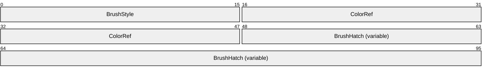

**BrushStyle (2 bytes):** A 16-bit unsigned integer that defines the brush style. The value MUST be an enumeration from the **BrushStyle Enumeration** table (section [2.1.1.4](#Section_2.1.1.4)). For the meanings of the different values, see the following table.

**ColorRef (4 bytes):** A 32-bit field that specifies how to interpret color values in the object defined in the **BrushHatch** field. Its interpretation depends on the value of **BrushStyle**, as explained in the following table.

**BrushHatch (variable):** A variable-size field that contains the brush hatch or pattern data. The content depends on the value of **BrushStyle**, as explained below.

The **BrushStyle** field determines how the **ColorRef** and **BrushHatch** fields SHOULD be interpreted, as specified in the following table.

The following table shows the relationship between the **BrushStyle**, **ColorRef**, and **BrushHatch** fields in a **Brush Object**.

| BrushStyle | ColorRef | BrushHatch |
| --- | --- | --- |
| BS_SOLID | SHOULD be a **ColorRef Object**, specified in section [2.2.2.8](#Section_2.2.2.8). | Not used, and SHOULD be ignored. |
| BS_NULL | SHOULD be ignored. | Not used, and SHOULD be ignored. |
| BS_PATTERN | SHOULD be ignored. | SHOULD be a **Bitmap16 Object**, specified in section [2.2.2.1](#Section_2.2.2.1), which defines the brush pattern. |
| BS_DIBPATTERNPT | SHOULD be a 32-bit **ColorUsage Enumeration** value, specified in section [2.1.1.6](#Section_2.1.1.6); the low-order word specifies the meaning of color values in the [**DIB**](#gt_device-independent-bitmap-dib). | SHOULD be a **DIB Object**, specified in section [2.2.2.9](#Section_2.2.2.9), which defines the brush pattern. |
| BS_HATCHED | SHOULD be a **ColorRef Object**, specified in section 2.2.2.8. | SHOULD be a 16-bit value from the **HatchStyle Enumeration** table, specified in section [2.1.1.12](#Section_2.1.1.12), which defines the brush pattern. |

<a id="Section_2.2.1.2"></a>
#### 2.2.1.2 Font Object

The Font object specifies the attributes of a logical font.

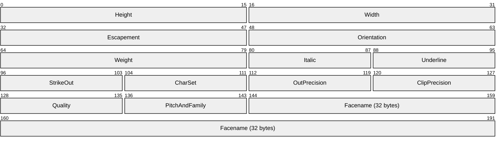

**Height (2 bytes):** A 16-bit signed integer that specifies the height, in logical units, of the font's character cell. The character height is computed as the character cell height minus the internal leading. The [**font mapper**](#gt_font-mapper) SHOULD interpret the height as follows.

| Value | Meaning |
| --- | --- |
| *value* < 0x0000 | The font mapper SHOULD transform this value into device units and match its absolute value against the character height of available fonts. |
| 0x0000 | A default height value MUST be used when creating a physical font. |
| 0x0000 < *value* | The font mapper SHOULD transform this value into device units and match it against the cell height of available fonts. |

For all height comparisons, the font mapper SHOULD find the largest physical font that does not exceed the requested size.<40>

**Width (2 bytes):** A 16-bit signed integer that defines the average width, in logical units, of characters in the font. If **Width** is 0x0000, the [**aspect ratio**](#gt_aspect-ratio) of the device SHOULD be matched against the digitization aspect ratio of the available fonts to find the closest match, determined by the absolute value of the difference.

**Escapement (2 bytes):** A 16-bit signed integer that defines the angle, in tenths of degrees, between the escapement vector and the x-axis of the device. The escapement vector is parallel to the base line of a row of text.

**Orientation (2 bytes):** A 16-bit signed integer that defines the angle, in tenths of degrees, between each character's base line and the x-axis of the device.

**Weight (2 bytes):** A 16-bit signed integer that defines the weight of the font in the range 0 through 1000. For example, 400 is normal and 700 is bold. If this value is 0x0000, a default weight SHOULD be used.

**Italic (1 byte):** A 8-bit Boolean value that specifies the italic attribute of the font.

| Value | Meaning |
| --- | --- |
| FALSE 0x00 | This is not an italic font. |
| TRUE 0x01 | This is an italic font. |

**Underline (1 byte):** An 8-bit Boolean value that specifies the underline attribute of the font.

| Value | Meaning |
| --- | --- |
| FALSE 0x00 | This is not an underline font. |
| TRUE 0x01 | This is an underline font. |

**StrikeOut (1 byte):** An 8-bit Boolean value that specifies the strikeout attribute of the font.

| Value | Meaning |
| --- | --- |
| FALSE 0x00 | This is not a strikeout font. |
| TRUE 0x01 | This is a strikeout font. |

**CharSet (1 byte):** An 8-bit unsigned integer that defines the character set. It SHOULD be set to a value in the **CharacterSet Enumeration** (section [2.1.1.5](#Section_2.1.1.5)).

The DEFAULT_CHARSET value MAY be used to allow the name and size of a font to fully describe the logical font. If the specified font name does not exist, a font in another character set MAY be substituted. The DEFAULT_CHARSET value is set to a value based on the current system locale. For example, when the system locale is United States, it is set to ANSI_CHARSET.

If a [**typeface**](#gt_typeface) name in the **FaceName** field is specified, the CharSet value MUST match the character set of that typeface.

**OutPrecision (1 byte):** An 8-bit unsigned integer that defines the output precision. The output precision defines how closely the output matches the requested font height, width, character orientation, escapement, [**pitch**](#gt_pitch), and font type. It MUST be one of the values from the **OutPrecision Enumeration** (section [2.1.1.21](#Section_2.1.1.21)).

Applications can use the OUT_DEVICE_PRECIS, OUT_RASTER_PRECIS, OUT_TT_PRECIS, and OUT_PS_ONLY_PRECIS values to control how the font mapper selects a font when the operating system contains more than one font with a specified name. For example, if an operating system contains a font named "Symbol" in raster and [**TrueType**](#gt_truetype) forms, specifying OUT_TT_PRECIS forces the font mapper to select the TrueType version. Specifying OUT_TT_ONLY_PRECIS forces the font mapper to select a TrueType font, even if it substitutes a TrueType font of another name.

**ClipPrecision (1 byte):** An 8-bit unsigned integer that defines the clipping precision. The clipping precision defines how to clip characters that are partially outside the clipping [**region**](#gt_region). It MUST be a combination of one or more of the bit settings in the **ClipPrecision Flags** (section [2.1.2.1](#Section_2.1.2.1)).

**Quality (1 byte):** An 8-bit unsigned integer that defines the output quality. The output quality defines how carefully to attempt to match the logical font attributes to those of an actual physical font. It MUST be one of the values in the **FontQuality Enumeration** (section [2.1.1.10](#Section_2.1.1.10)).

**PitchAndFamily (1 byte):** A **PitchAndFamily Object** (section [2.2.2.14](#Section_2.2.2.14)) that defines the pitch and the family of the font. Font families specify the look of fonts in a general way and are intended for specifying fonts when the exact typeface wanted is not available.

**Facename (32 bytes):** A null-terminated string of up to 32 8-bit Latin-1 [[ISO/IEC-8859-1]](https://go.microsoft.com/fwlink/?LinkId=90689) ANSI characters that specifies the typeface name of the font. Any characters following the terminating null are ignored.

<a id="Section_2.2.1.3"></a>
#### 2.2.1.3 Palette Object

The **Palette Object** specifies the colors in a [**logical palette**](#gt_logical-palette).

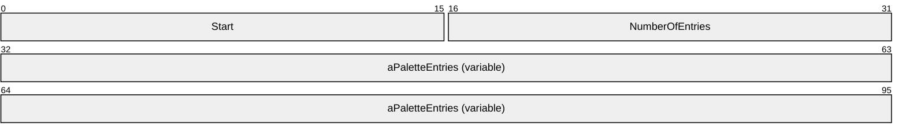

**Start (2 bytes):** A 16-bit unsigned integer that defines the offset into the **Palette Object** when used with the META_SETPALENTRIES and META_ANIMATEPALETTE record types. When used with META_CREATEPALETTE record type, it MUST be 0x0300.

**NumberOfEntries (2 bytes):** A 16-bit unsigned integer that defines the number of objects in **aPaletteEntries**.

**aPaletteEntries (variable):** An array of **NumberOfEntries** 32-bit **PaletteEntry Objects** (section [2.2.2.13](#Section_2.2.2.13)).

<a id="Section_2.2.1.4"></a>
#### 2.2.1.4 Pen Object

The **Pen Object** specifies the style, width, and color of a pen.

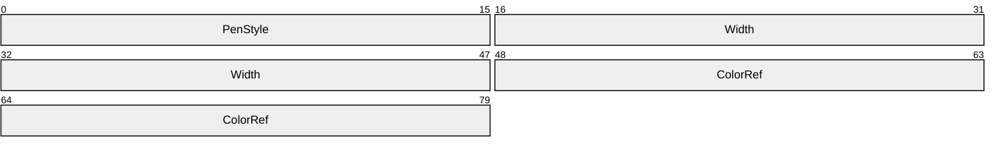

**PenStyle (2 bytes):** A 16-bit unsigned integer that specifies the pen style. The value MUST be defined from the **PenStyle Enumeration** (section [2.1.1.23](#Section_2.1.1.23)) table.

**Width (4 bytes):** A 32-bit **PointS Object** (section [2.2.2.16](#Section_2.2.2.16)) that specifies a point for the object dimensions. The x-coordinate is the pen width. The y-coordinate is ignored.

**ColorRef (4 bytes):** A 32-bit **ColorRef Object** (section [2.2.2.8](#Section_2.2.2.8)) that specifies the pen color value.

<a id="Section_2.2.1.5"></a>
#### 2.2.1.5 Region Object

The **Region Object** defines a potentially non-rectilinear shape defined by an array of [**scanlines**](#gt_scanline).

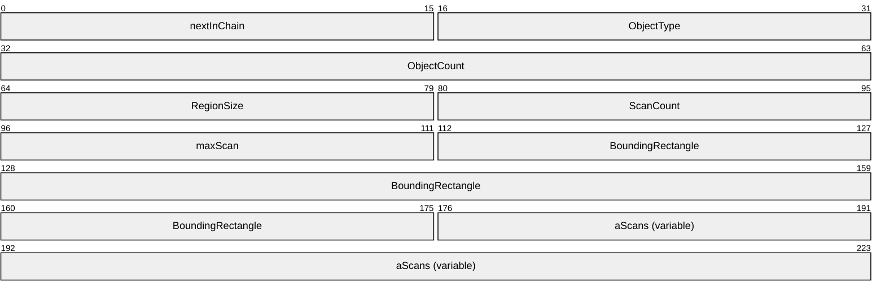

**nextInChain (2 bytes):** A value that MUST be ignored.<41>

**ObjectType (2 bytes):** A 16-bit signed integer that specifies the [**region**](#gt_region) identifier. It MUST be 0x0006.

**ObjectCount (4 bytes):** A value that MUST be ignored.<42>

**RegionSize (2 bytes):** A 16-bit signed integer that defines the size of the region in bytes plus the size of **aScans** in bytes.

**ScanCount (2 bytes):** A 16-bit signed integer that defines the number of scanlines composing the region.

**maxScan (2 bytes):** A 16-bit signed integer that defines the maximum number of points in any one scan in this region.

**BoundingRectangle (8 bytes):** A **Rect Object** (section [2.2.2.18](#Section_2.2.2.18)) that defines the bounding rectangle.

**aScans (variable):** An array of **Scan Objects** (section [2.2.2.21](#Section_2.2.2.21)) that define the scanlines in the region.

<a id="Section_2.2.2"></a>
### 2.2.2 Structure Objects

The [**WMF**](#gt_windows-metafile-format-wmf) **Structure Objects** specify data structures that are embedded in WMF objects and records. Structure objects, unlike graphics objects, are not explicitly created or deleted; they are components of more complex structures.

<a id="Section_2.2.2.1"></a>
#### 2.2.2.1 Bitmap16 Object

The **Bitmap16 Object** specifies information about the dimensions and color format of a [**bitmap**](#gt_bitmap).

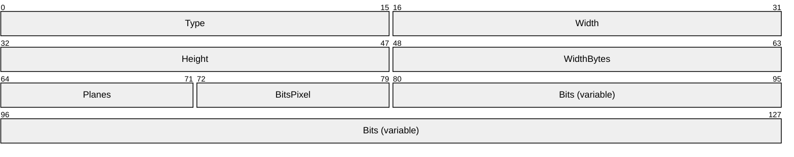

**Type (2 bytes):** A 16-bit signed integer that defines the bitmap type.

**Width (2 bytes):** A 16-bit signed integer that defines the width of the bitmap in pixels.

**Height (2 bytes):** A 16-bit signed integer that defines the height of the bitmap in scan lines.

**WidthBytes (2 bytes):** A 16-bit signed integer that defines the number of bytes per scan line.

**Planes (1 byte):** An 8-bit unsigned integer that defines the number of color planes in the bitmap. The value of this field MUST be 0x01.

**BitsPixel (1 byte):** An 8-bit unsigned integer that defines the number of adjacent color bits on each plane.

**Bits (variable):** A variable length array of bytes that defines the bitmap pixel data. The length of this field in bytes can be computed as follows.

(((Width * BitsPixel + 15) >> 4) << 1) * Height

<a id="Section_2.2.2.2"></a>
#### 2.2.2.2 BitmapCoreHeader Object

The **BitmapCoreHeader Object** contains information about the dimensions and color format of a [**device-independent bitmap (DIB)**](#gt_device-independent-bitmap-dib).<43>

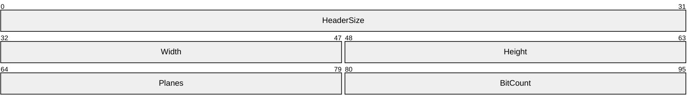

**HeaderSize (4 bytes):** A 32-bit unsigned integer that defines the size of this object, in bytes.

**Width (2 bytes):** A 16-bit unsigned integer that defines the width of the DIB, in pixels.

**Height (2 bytes):** A 16-bit unsigned integer that defines the height of the DIB, in pixels.

**Planes (2 bytes):** A 16-bit unsigned integer that defines the number of planes for the target device. This value MUST be 0x0001.

**BitCount (2 bytes):** A 16-bit unsigned integer that defines the format of each pixel, and the maximum number of colors in the DIB. This value MUST be in the **BitCount Enumeration** (section [2.1.1.3](#Section_2.1.1.3)).

A DIB is specified by a **DeviceIndependentBitmap Object** (section [2.2.2.9](#Section_2.2.2.9)).

<a id="Section_2.2.2.3"></a>
#### 2.2.2.3 BitmapInfoHeader Object

The **BitmapInfoHeader Object** contains information about the dimensions and color format of a [**device-independent bitmap (DIB)**](#gt_device-independent-bitmap-dib).

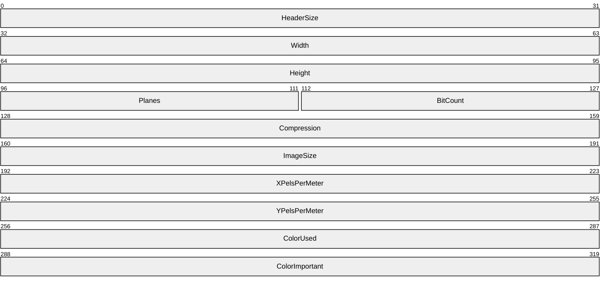

**HeaderSize (4 bytes):** A 32-bit unsigned integer that defines the size of this object, in bytes.

**Width (4 bytes):** A 32-bit signed integer that defines the width of the DIB, in pixels. This value MUST be positive.

This field SHOULD specify the width of the decompressed image file, if the Compression value specifies [**JPEG**](#gt_joint-photographic-experts-group-jpeg) or [**PNG**](#gt_portable-network-graphics-png) format.<44>

**Height (4 bytes):** A 32-bit signed integer that defines the height of the DIB, in pixels. This value MUST NOT be zero.

| Value | Meaning |
| --- | --- |
| 0x00000000 < *value* | If this value is positive, the DIB is a [**bottom-up bitmap**](#gt_bottom-up-bitmap), and its origin is the lower-left corner. This field SHOULD specify the height of the decompressed image file, if the Compression value specifies JPEG or PNG format. |
| *value* < 0x00000000 | If this value is negative, the DIB is a [**top-down bitmap**](#gt_top-down-bitmap), and its origin is the upper-left corner. Top-down bitmaps do not support compression. |

**Planes (2 bytes):** A 16-bit unsigned integer that defines the number of planes for the target device. This value MUST be 0x0001.

**BitCount (2 bytes):** A 16-bit unsigned integer that defines the number of bits that define each pixel and the maximum number of colors in the DIB. This value MUST be in the **BitCount Enumeration** (section [2.1.1.3](#Section_2.1.1.3)).

**Compression (4 bytes):** A 32-bit unsigned integer that defines the compression mode of the DIB. This value MUST be in the **Compression Enumeration** (section [2.1.1.7](#Section_2.1.1.7)).

This value MUST NOT specify a compressed format if the DIB is a top-down bitmap, as indicated by the **Height** value.

**ImageSize (4 bytes):** A 32-bit unsigned integer that defines the size, in bytes, of the image.

If the Compression value is BI_RGB, this value SHOULD be zero and MUST be ignored.<45>

If the Compression value is BI_JPEG or BI_PNG, this value MUST specify the size of the JPEG or PNG image buffer, respectively.

**XPelsPerMeter (4 bytes):** A 32-bit signed integer that defines the horizontal resolution, in pixels-per-meter, of the target device for the DIB.

**YPelsPerMeter (4 bytes):** A 32-bit signed integer that defines the vertical resolution, in pixels-per-meter, of the target device for the DIB.

**ColorUsed (4 bytes):** A 32-bit unsigned integer that specifies the number of indexes in the [**color table**](#gt_color-table) used by the DIB, as follows:

- If this value is zero, the DIB uses the maximum number of colors that correspond to the **BitCount** value.
- If this value is nonzero and the BitCount value is less than 16, this value specifies the number of colors used by the DIB.
- If this value is nonzero and the BitCount value is 16 or greater, this value specifies the size of the color table used to optimize performance of the [**system palette**](#gt_system-palette).
**Note** If this value is nonzero and greater than the maximum possible size of the color table based on the **BitCount** value, the maximum color table size SHOULD be assumed.

**ColorImportant (4 bytes):** A 32-bit unsigned integer that defines the number of color indexes that are required for displaying the DIB. If this value is zero, all color indexes are required.

A DIB is specified by a **DeviceIndependentBitmap Object** (section [2.2.2.9](#Section_2.2.2.9)).

When the array of pixels in the DIB immediately follows the **BitmapInfoHeader**, the DIB is a [**packed bitmap**](#gt_packed-bitmap). In a packed bitmap, the ColorUsed value MUST be either 0x00000000 or the actual size of the color table.

<a id="Section_2.2.2.4"></a>
#### 2.2.2.4 BitmapV4Header Object

The **BitmapV4Header Object** contains information about the dimensions and color format of a [**device-independent bitmap (DIB)**](#gt_device-independent-bitmap-dib). It is an extension of the **BitmapInfoHeader Object** (section [2.2.2.3](#Section_2.2.2.3)).<46>

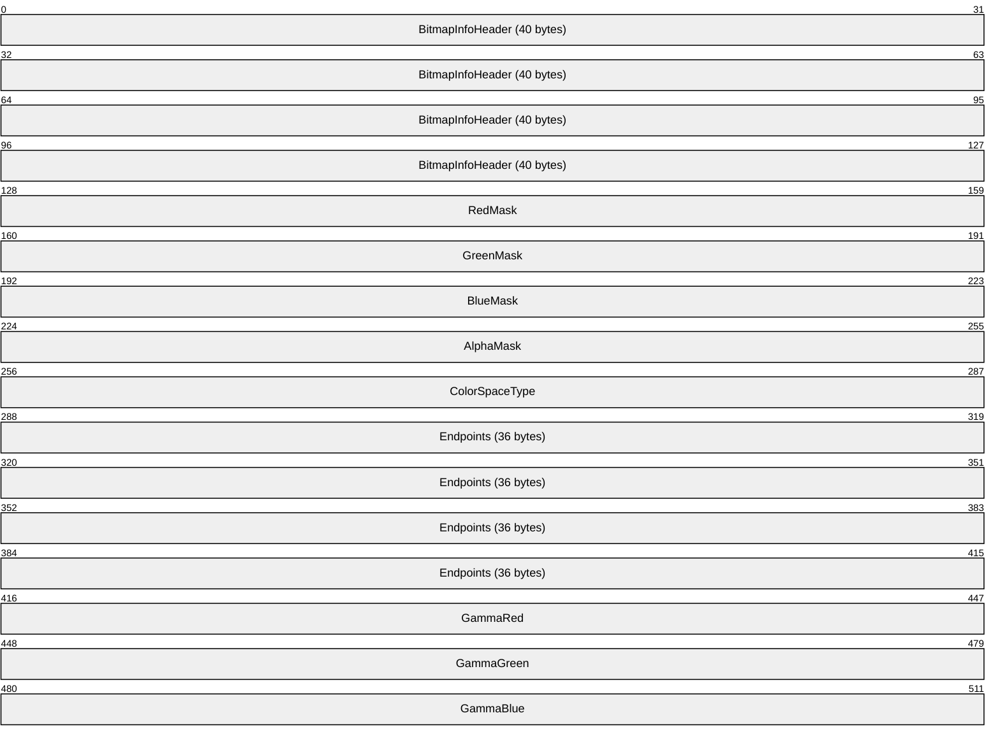

**BitmapInfoHeader (40 bytes):** A **BitmapInfoHeader** object, which defines properties of the DIB.

**RedMask (4 bytes):** A 32-bit unsigned integer that defines the color mask that specifies the red component of each pixel. If the Compression value in the **BitmapInfoHeader** object is not BI_BITFIELDS, this value MUST be ignored.

**GreenMask (4 bytes):** A 32-bit unsigned integer that defines the color mask that specifies the green component of each pixel. If the Compression value in the **BitmapInfoHeader** object is not BI_BITFIELDS, this value MUST be ignored.

**BlueMask (4 bytes):** A 32-bit unsigned integer that defines the color mask that specifies the blue component of each pixel. If the Compression value in the **BitmapInfoHeader** object is not BI_BITFIELDS, this value MUST be ignored.

**AlphaMask (4 bytes):** A 32-bit unsigned integer that defines the color mask that specifies the alpha component of each pixel.

**ColorSpaceType (4 bytes):** A 32-bit unsigned integer that defines the [**color space**](#gt_color-space) of the **DeviceIndependentBitmap Object** (section [2.2.2.9](#Section_2.2.2.9)). If this value is LCS_CALIBRATED_RGB from the **LogicalColorSpace Enumeration** (section [2.1.1.14](#Section_2.1.1.14)), the color values in the DIB are calibrated [**RGB**](#gt_red-green-blue-rgb) values, and the endpoints and [**gamma**](#gt_gamma) values in this structure SHOULD be used to translate the color values before they are passed to the device.

See the **LogColorSpace** (section [2.2.2.11](#Section_2.2.2.11)) and **LogColorSpace ObjectW** (section [2.2.2.12](#Section_2.2.2.12)) objects for details concerning a logical color space.

**Endpoints (36 bytes):** A **CIEXYZTriple Object** (section [2.2.2.7](#Section_2.2.2.7)) that defines the [**CIE**](#gt_commission-internationale-de-leclairage-cie) chromaticity x, y, and z coordinates of the three colors that correspond to the red, green, and blue endpoints for the logical color space associated with the DIB. If the **ColorSpaceType** field does not specify LCS_CALIBRATED_RGB, this field MUST be ignored.

**GammaRed (4 bytes):** A 32-bit fixed point value that defines the toned response curve for red. If the **ColorSpaceType** field does not specify LCS_CALIBRATED_RGB, this field MUST be ignored.

**GammaGreen (4 bytes):** A 32-bit fixed point value that defines the toned response curve for green. If the **ColorSpaceType** field does not specify LCS_CALIBRATED_RGB, this field MUST be ignored.

**GammaBlue (4 bytes):** A 32-bit fixed point value that defines the toned response curve for blue. If the **ColorSpaceType** field does not specify LCS_CALIBRATED_RGB, this field MUST be ignored.

The gamma value format is an unsigned "8.8" fixed-point integer that is then left-shifted by 8 bits. "8.8" means "8 integer bits followed by 8 fraction bits": nnnnnnnnffffffff. Taking the shift into account, the required format of the 32-bit DWORD is: 00000000nnnnnnnnffffffff00000000.

<a id="Section_2.2.2.5"></a>
#### 2.2.2.5 BitmapV5Header Object

The **BitmapV5Header Object** contains information about the dimensions and color format of a [**device-independent bitmap (DIB)**](#gt_device-independent-bitmap-dib). It is an extension of the **BitmapV4Header Object** (section [2.2.2.4](#Section_2.2.2.4)).<47>

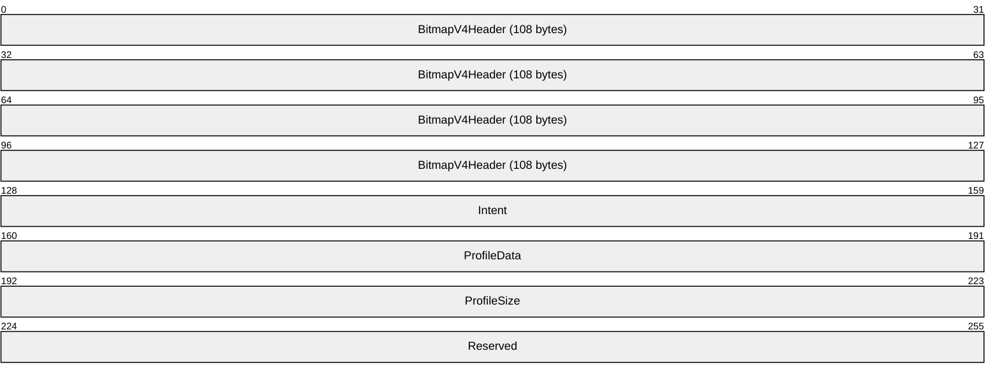

**BitmapV4Header (108 bytes):** A **BitmapV4Header Object**, which defines properties of the **DIB Object** (section [2.2.2.9](#Section_2.2.2.9)).

When it is part of a **BitmapV5Header**, the **ColorSpaceType** field of a **BitmapV4Header** can be a logical [**color space**](#gt_color-space) value in the **LogicalColorSpaceV5 Enumeration** (section [2.1.1.15](#Section_2.1.1.15)).

**Intent (4 bytes):** A 32-bit unsigned integer that defines the rendering intent for the **DIB**. This MUST be a value defined in the **GamutMappingIntent Enumeration** (section [2.1.1.11](#Section_2.1.1.11)).

**ProfileData (4 bytes):** A 32-bit unsigned integer that defines the offset, in bytes, from the beginning of this structure to the start of the [**color profile**](#gt_color-profile) data.

If the color profile is embedded in the **DIB**, **ProfileData** is the offset to the actual color profile; if the color profile is linked, **ProfileData** is the offset to the null-terminated file name of the color profile. This MUST NOT be a Unicode string, but MUST be composed exclusively of characters from the Windows character set (code page 1252).

If the **ColorSpaceType** field in the **BitmapV4Header** does not specify LCS_PROFILE_LINKED or LCS_PROFILE_EMBEDDED, the color profile data SHOULD be ignored.

**ProfileSize (4 bytes):** A 32-bit unsigned integer that defines the size, in bytes, of embedded color profile data.

**Reserved (4 bytes):** A 32-bit unsigned integer that is undefined and SHOULD be ignored.

<a id="Section_2.2.2.6"></a>
#### 2.2.2.6 CIEXYZ Object

The **CIEXYZ Object** defines information about the [**CIEXYZ**](#gt_ciexyz) chromaticity object.

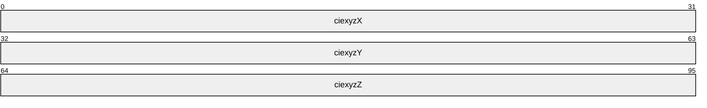

**ciexyzX (4 bytes):** A 32-bit 2.30 fixed point type that defines the x chromaticity value.

**ciexyzY (4 bytes):** A 32-bit 2.30 fixed point type that defines the y chromaticity value.

**ciexyzZ (4 bytes):** A 32-bit 2.30 fixed point type that defines the z chromaticity value.

<a id="Section_2.2.2.7"></a>
#### 2.2.2.7 CIEXYZTriple Object

The **CIEXYZTriple Object** defines information about the **CIEXYZTriple** color object.

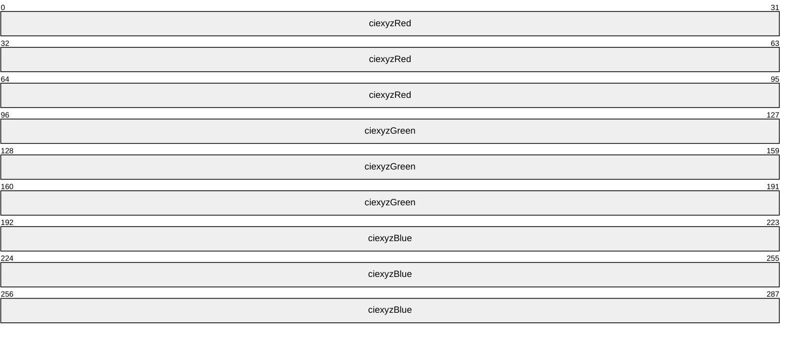

**ciexyzRed (12 bytes):** A 96-bit **CIEXYZ Object** (section [2.2.2.6](#Section_2.2.2.6)) that defines the red chromaticity values.

**ciexyzGreen (12 bytes):** A 96-bit **CIEXYZ Object** that defines the green chromaticity values.

**ciexyzBlue (12 bytes):** A 96-bit **CIEXYZ Object** that defines the blue chromaticity values.

<a id="Section_2.2.2.8"></a>
#### 2.2.2.8 ColorRef Object

The **ColorRef Object** defines the [**RGB**](#gt_red-green-blue-rgb) color.

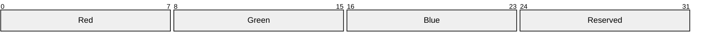

**Red (1 byte):** An 8-bit unsigned integer that defines the relative intensity of red.

**Green (1 byte):** An 8-bit unsigned integer that defines the relative intensity of green.

**Blue (1 byte):** An 8-bit unsigned integer that defines the relative intensity of blue.

**Reserved (1 byte):** An 8-bit unsigned integer that MUST be 0x00.

<a id="Section_2.2.2.9"></a>
#### 2.2.2.9 DeviceIndependentBitmap Object

The **DeviceIndependentBitmap (DIB) Object** defines an image in [**device-independent bitmap (DIB)**](#gt_device-independent-bitmap-dib) format.

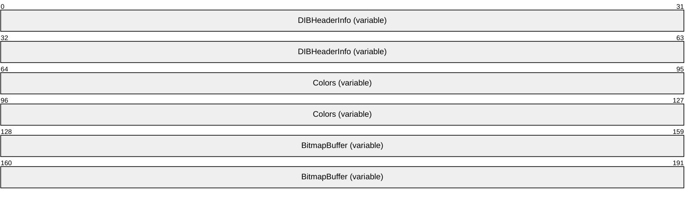

**DIBHeaderInfo (variable):** Either a **BitmapCoreHeader Object** (section [2.2.2.2](#Section_2.2.2.2)) or a **BitmapInfoHeader Object** (section [2.2.2.3](#Section_2.2.2.3)) that specifies information about the image.

The first 32 bits of this field is the **HeaderSize** value. If it is 0x0000000C, then this is a **BitmapCoreHeader**; otherwise, this is a **BitmapInfoHeader**.

**Colors (variable):** An optional array of either [RGBQuad Objects (section 2.2.2.20)](#Section_2.2.2.20) or 16-bit unsigned integers that define a [**color table**](#gt_color-table).

The size and contents of this field SHOULD be determined from the [**metafile**](#gt_metafile) record or object that contains this **DeviceIndependentBitmap Object** and from information in the **DIBHeaderInfo** field. See **ColorUsage Enumeration** (section [2.1.1.6](#Section_2.1.1.6)) and **BitCount Enumeration** (section [2.1.1.3](#Section_2.1.1.3)) for additional details.

**BitmapBuffer (variable):** A buffer containing the image, which is not required to be contiguous with the DIB header, unless this is a [**packed bitmap**](#gt_packed-bitmap).

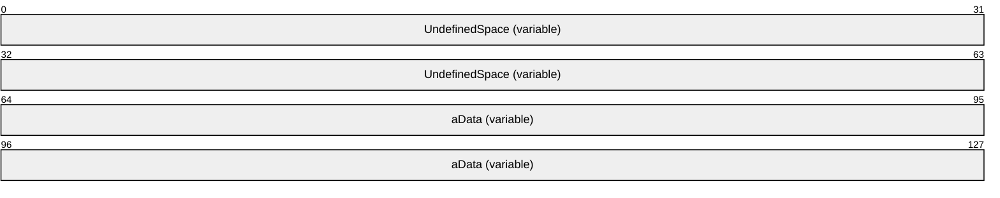

**UndefinedSpace (variable):** An optional field that MUST be ignored. If this DIB is a packed bitmap, this field MUST NOT be present.

**aData (variable):** An array of bytes that define the image.

The size and format of this data is determined by information in the **DIBHeaderInfo** field. If it is a **BitmapCoreHeader**, the size in bytes MUST be calculated as follows:

(((Width * Planes * BitCount + 31) & ~31) / 8) * abs(Height)

This formula SHOULD also be used to calculate the size of **aData** when **DIBHeaderInfo** is a **BitmapInfoHeader Object**, using values from that object, but only if its Compression value is BI_RGB, BI_BITFIELDS, or BI_CMYK.

Otherwise, the size of **aData** MUST be the **BitmapInfoHeader Object** value ImageSize.

<a id="Section_2.2.2.10"></a>
#### 2.2.2.10 LogBrush Object

The **LogBrush Object** defines the style, color, and pattern of a brush. This object is used only in the **META_CREATEBRUSHINDIRECT Record** (section [2.3.4.1](#Section_2.3.4.1)) to create a **Brush Object** (section [2.2.1.1](#Section_2.2.1.1)).

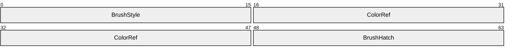

**BrushStyle (2 bytes):** A 16-bit unsigned integer that defines the brush style. This MUST be a value from the **BrushStyle Enumeration** (section [2.1.1.4](#Section_2.1.1.4)). For the meanings of different values, see the following table. The BS_NULL style specifies a brush that has no effect.<48>

**ColorRef (4 bytes):** A 32-bit **ColorRef Object** section [2.2.2.8](#Section_2.2.2.8)) that specifies a color. Its interpretation depends on the value of **BrushStyle**, as explained in the following.

**BrushHatch (2 bytes):** A 16-bit field that specifies the brush hatch type. Its interpretation depends on the value of **BrushStyle**, as explained in the following.

The following table shows the relationship between values in the **BrushStyle**, **ColorRef** and **BrushHatch** fields in a **LogBrush Object**. Only supported brush styles are listed.

| BrushStyle | ColorRef | BrushHatch |
| --- | --- | --- |
| BS_SOLID | SHOULD be a **ColorRef Object**, which determines the color of the brush. | Not used, and SHOULD be ignored. |
| BS_NULL | Not used, and SHOULD be ignored. | Not used, and SHOULD be ignored. |
| BS_PATTERN | Not used, and SHOULD be ignored. | Not used. A solid-color black **Brush Object** SHOULD be created by default.<49> |
| BS_DIBPATTERN | Not used, and SHOULD be ignored. | Not used. A solid-color black **Brush Object** SHOULD be created by default. |
| BS_DIBPATTERNPT | Not used, and SHOULD be ignored. | Not used. A default object, such as a solid-color black **Brush Object**, MAY be created. |
| BS_HATCHED | SHOULD be a **ColorRef Object**, which determines the foreground color of the hatch pattern. | A value from the **HatchStyle Enumeration** (section [2.1.1.12](#Section_2.1.1.12)) that specifies the orientation of lines used to create the hatch. |

<a id="Section_2.2.2.11"></a>
#### 2.2.2.11 LogColorSpace Object

The **LogColorSpace Objec**t specifies a logical [**color space**](#gt_color-space) for the [**playback device context**](#gt_playback-device-context), which can be the name of a [**color profile**](#gt_color-profile) in [**ASCII**](#gt_ascii) characters.

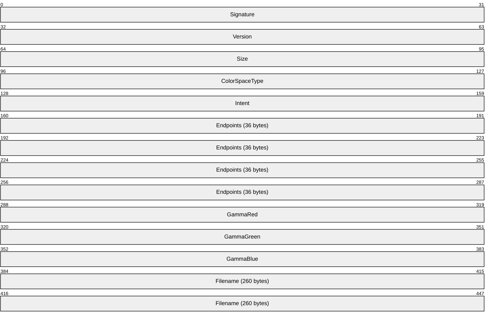

**Signature (4 bytes):** A 32-bit unsigned integer that specifies the signature of color space objects; it MUST be set to the value 0x50534F43, which is the ASCII encoding of the string "PSOC".

**Version (4 bytes):** A 32-bit unsigned integer that defines a version number; it MUST be 0x00000400.

**Size (4 bytes):** A 32-bit unsigned integer that defines the size of this object, in bytes.

**ColorSpaceType (4 bytes):** A 32-bit signed integer that specifies the color space type. It MUST be defined in the **LogicalColorSpace Enumeration** (section [2.1.1.14](#Section_2.1.1.14)). If this value is LCS_sRGB or LCS_WINDOWS_COLOR_SPACE, the [**sRGB**](#gt_srgb) color space MUST be used.

**Intent (4 bytes):** A 32-bit signed integer that defines the gamut mapping intent. It MUST be defined in the **GamutMappingIntent Enumeration** (section [2.1.1.11](#Section_2.1.1.11)).

**Endpoints (36 bytes):** A **CIEXYZTriple Object** (section [2.2.2.7](#Section_2.2.2.7)) that defines the [**CIE**](#gt_commission-internationale-de-leclairage-cie) [**chromaticity**](#gt_chromaticity) x, y, and z coordinates of the three colors that correspond to the [**RGB**](#gt_red-green-blue-rgb) endpoints for the logical color space associated with the [**bitmap**](#gt_bitmap). If the **ColorSpaceType** field does not specify LCS_CALIBRATED_RGB, this field MUST be ignored.

**GammaRed (4 bytes):** A 32-bit fixed point value that defines the toned response curve for red. If the **ColorSpaceType** field does not specify LCS_CALIBRATED_RGB, this field MUST be ignored.

**GammaGreen (4 bytes):** A 32-bit fixed point value that defines the toned response curve for green. If the **ColorSpaceType** field does not specify LCS_CALIBRATED_RGB, this field MUST be ignored.

**GammaBlue (4 bytes):** A 32-bit fixed point value that defines the toned response curve for blue. If the **ColorSpaceType** field does not specify LCS_CALIBRATED_RGB, this field MUST be ignored.

**Filename (260 bytes):** An optional, ASCII charactger string that specifies the name of a file that contains a color profile. If a file name is specified, and the **ColorSpaceType** field is set to LCS_CALIBRATED_RGB, the other fields of this structure SHOULD be ignored.

The **Endpoints**, **GammaRed**, **GammaGreen**, and **GammaBlue** fields are used to specify a logical color space. The **Endpoints** field is a **CIEXYZTriple Object** that contains the x, y, and z values of the RGB endpoint of the color space.

The relation between [**tri-stimulus**](#gt_tri-stimulus) values X,Y,Z and chromaticity values x,y,z is expressed as follows.

x = X/(X+Y+Z)

y = Y/(X+Y+Z)

z = Z/(X+Y+Z)

The **GammaRed**, **GammaGreen**, and **GammaBlue** fields contain values in "8.8 fixed point" format, which is a technique for representing non-integer numbers. Each value consists of a zero-extended 8-bit magnitude followed by an 8-bit fraction, with the combined 16 bits left-shifted by 8 bits. Thus, in 32-bits, the real value N.F is 00000000nnnnnnnnffffffff00000000, where "nnnnnnnn" and "ffffffff" are binary representations of N and F, respectively. For example, for the real number 10.5, nnnnnnnn would be 00001010 (binary 10) and ffffffff would be 00000101 (binary 5), and the complete 32-bit binary value would be 00000000000010100000010100000000, which is the hexadecimal value 0x0A50.

<a id="Section_2.2.2.12"></a>
#### 2.2.2.12 LogColorSpaceW Object

The **LogColorSpaceW Object** specifies a logical [**color space**](#gt_color-space), which can be defined by a [**color profile**](#gt_color-profile) file with a name consisting of [**Unicode**](#gt_unicode) 16-bit characters.


**Signature (4 bytes):** A 32-bit unsigned integer that specifies the signature of color space objects. This MUST be set to the value 0x50534F43, which is the [**ASCII**](#gt_ascii) encoding of the string "PSOC".

**Version (4 bytes):** A 32-bit unsigned integer that defines a version number; it MUST be 0x00000400.

**Size (4 bytes):** A 32-bit unsigned integer that defines the size of this object, in bytes.

**ColorSpaceType (4 bytes):** A 32-bit signed integer that specifies the color space type. It MUST be defined in the **LogicalColorSpace Enumeration** (section [2.1.1.14](#Section_2.1.1.14)). If this value is LCS_sRGB or LCS_WINDOWS_COLOR_SPACE, the [**sRGB**](#gt_srgb) color space MUST be used.

**Intent (4 bytes):** A 32-bit signed integer that defines the gamut mapping intent. It MUST be defined in the **GamutMappingIntent Enumeration** (section [2.1.1.11](#Section_2.1.1.11)).

**Endpoints (36 bytes):** A **CIEXYZTriple Object** (section [2.2.2.7](#Section_2.2.2.7)) that defines the [**CIE**](#gt_commission-internationale-de-leclairage-cie) [**chromaticity**](#gt_chromaticity) x, y, and z coordinates of the three colors that correspond to the [**RGB**](#gt_red-green-blue-rgb) endpoints for the logical color space associated with the [**bitmap**](#gt_bitmap). If the **ColorSpaceType** field does not specify LCS_CALIBRATED_RGB, this field MUST be ignored.

**GammaRed (4 bytes):** A 32-bit fixed point value that defines the toned response curve for red. If the **ColorSpaceType** field does not specify LCS_CALIBRATED_RGB, this field MUST be ignored.

**GammaGreen (4 bytes):** A 32-bit fixed point value that defines the toned response curve for green. If the **ColorSpaceType** field does not specify LCS_CALIBRATED_RGB, this field MUST be ignored.

**GammaBlue (4 bytes):** A 32-bit fixed point value that defines the toned response curve for blue. If the **ColorSpaceType** field does not specify LCS_CALIBRATED_RGB, this field MUST be ignored.

**Filename (520 bytes):** An optional, null-terminated Unicode [**UTF16-LE**](#gt_f25550c9-f84f-4eb2-8156-14794a7e3059) character string, which specifies the name of a file that contains a color profile. If a file name is specified, and the **ColorSpaceType** field is set to LCS_CALIBRATED_RGB, the other fields of this structure SHOULD be ignored.

See the **LogColorSpace Object** (section [2.2.2.11](#Section_2.2.2.11)) for additional details concerning the interpretation of field values of this object.

<a id="Section_2.2.2.13"></a>
#### 2.2.2.13 PaletteEntry Object

The **PaletteEntry Object** defines the color and usage of an entry in a [**palette**](#gt_palette).

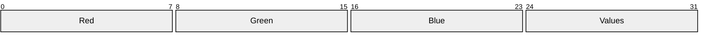

**Red (1 byte):** An 8-bit unsigned integer that defines the red intensity value for the palette entry.

**Green (1 byte):** An 8-bit unsigned integer that defines the green intensity value for the palette entry.

**Blue (1 byte):** An 8-bit unsigned integer that defines the blue intensity value for the palette entry.

**Values (1 byte):** An 8-bit unsigned integer that defines how the palette entry is to be used. The **Values** field MUST be 0x00 or one of the values in the **PaletteEntryFlag Enumeration** (section [2.1.1.22](#Section_2.1.1.22)) table.

<a id="Section_2.2.2.14"></a>
#### 2.2.2.14 PitchAndFamily Object

The **PitchAndFamily Object** specifies the pitch and family properties of a **Font Object** (section [2.2.1.2](#Section_2.2.1.2)). Pitch refers to the width of the characters, and family refers to the general appearance of a font.


**Family (4 bits):** A property of a font that describes its general appearance. This MUST be a value in the **FamilyFont Enumeration** (section [2.1.1.8](#Section_2.1.1.8)).

**Pitch (2 bits):** A property of a font that describes the [**pitch**](#gt_pitch), of the characters. This MUST be a value in the **PitchFont Enumeration** (section [2.1.1.24](#Section_2.1.1.24)).

<a id="Section_2.2.2.15"></a>
#### 2.2.2.15 PointL Object

The **PointL Object** defines the coordinates of a point.

```mermaid
packet-beta
  0-31: "x"
  32-63: "y"
```

**x (4 bytes):** A 32-bit signed integer that defines the horizontal (x) coordinate of the point.

**y (4 bytes):** A 32-bit signed integer that defines the vertical (y) coordinate of the point.

<a id="Section_2.2.2.16"></a>
#### 2.2.2.16 PointS Object

The **PointS Object** defines the x- and y-coordinates of a point.

```mermaid
packet-beta
  0-15: "x"
  16-31: "y"
```

**x (2 bytes):** A 16-bit signed integer that defines the horizontal (x) coordinate of the point.

**y (2 bytes):** A 16-bit signed integer that defines the vertical (y) coordinate of the point.

<a id="Section_2.2.2.17"></a>
#### 2.2.2.17 PolyPolygon Object

The **PolyPolygon Object** defines a series of closed polygons.

```mermaid
packet-beta
  0-15: "NumberOfPolygons"
  16-63: "aPointsPerPolygon (variable)"
  64-127: "aPoints (variable)"
```

**NumberOfPolygons (2 bytes):** A 16-bit unsigned integer that defines the number of polygons in the object.

**aPointsPerPolygon (variable):** A **NumberOfPolygons** array of 16-bit unsigned integers that define the number of points for each polygon in the object.

**aPoints (variable):** An array of **PointS** values that define the coordinates of the polygons. The length of the array is equal to the sum of all 16-bit integers in the **aPointsPerPolygon** array.

<a id="Section_2.2.2.18"></a>
#### 2.2.2.18 Rect Object

The **Rect Object** defines a rectangle.

```mermaid
packet-beta
  0-15: "Left"
  16-31: "Top"
  32-47: "Right"
  48-63: "Bottom"
```

**Left (2 bytes):** A 16-bit signed integer that defines the x-coordinate, in logical coordinates, of the upper-left corner of the rectangle

**Top (2 bytes):** A 16-bit signed integer that defines the y-coordinate, in logical coordinates, of the upper-left corner of the rectangle.

**Right (2 bytes):** A 16-bit signed integer that defines the x-coordinate, in logical coordinates, of the lower-right corner of the rectangle.

**Bottom (2 bytes):** A 16-bit signed integer that defines the y-coordinate, in logical coordinates, of the lower-right corner of the rectangle.

<a id="Section_2.2.2.19"></a>
#### 2.2.2.19 RectL Object

The RectL Object defines a rectangle.

```mermaid
packet-beta
  0-31: "Left"
  32-63: "Top"
  64-95: "Right"
  96-127: "Bottom"
```

**Left (4 bytes):** A 32-bit signed integer that defines the x coordinate, in logical coordinates, of the upper-left corner of the rectangle.

**Top (4 bytes):** A 32-bit signed integer that defines the y coordinate, in logical coordinates, of the upper-left corner of the rectangle.

**Right (4 bytes):** A 32-bit signed integer that defines the x coordinate, in logical coordinates, of the lower-right corner of the rectangle.

**Bottom (4 bytes):** A 32-bit signed integer that defines y coordinate, in logical coordinates, of the lower-right corner of the rectangle.

A rectangle defined with a **RectL Object** is filled up to— but not including—the right column and bottom row of pixels.

<a id="Section_2.2.2.20"></a>
#### 2.2.2.20 RGBQuad Object

The **RGBQuad Object** defines the pixel color values in an uncompressed **DIB Object** (section [2.2.2.9](#Section_2.2.2.9)).

```mermaid
packet-beta
  0-7: "Blue"
  8-15: "Green"
  16-23: "Red"
  24-31: "Reserved"
```

**Blue (1 byte):** An 8-bit unsigned integer that defines the relative intensity of blue.

**Green (1 byte):** An 8-bit unsigned integer that defines the relative intensity of green.

**Red (1 byte):** An 8-bit unsigned integer that defines the relative intensity of red.

**Reserved (1 byte):** An 8-bit unsigned integer that MUST be 0x00.

<a id="Section_2.2.2.21"></a>
#### 2.2.2.21 Scan Object

The **Scan Object** specifies a collection of [**scanlines**](#gt_scanline).

```mermaid
packet-beta
  0-15: "Count"
  16-31: "Top"
  32-47: "Bottom"
  48-111: "ScanLines (variable)"
  112-127: "Count2"
```

**Count (2 bytes):** A 16-bit unsigned integer that specifies the number of horizontal (x-axis) coordinates in the **ScanLines** array. This value MUST be a multiple of 2, since left and right endpoints are required to specify each scanline.

**Top (2 bytes):** A 16-bit unsigned integer that defines the vertical (y-axis) coordinate, in logical units, of the top scanline.

**Bottom (2 bytes):** A 16-bit unsigned integer that defines the vertical (y-axis) coordinate, in logical units, of the bottom scanline.

**ScanLines (variable):** An array of scanlines, each specified by left and right horizontal (x-axis) coordinates of its endpoints.

```mermaid
packet-beta
  0-15: "Left"
  16-31: "Right"
```

**Left (2 bytes):** A 16-bit unsigned integer that defines the horizontal (x-axis) coordinate, in logical units, of the left endpoint of the scanline.

**Right (2 bytes):** A 16-bit unsigned integer that defines the horizontal (x-axis) coordinate, in logical units, of the right endpoint of the scanline.

**Count2 (2 bytes):** A 16-bit unsigned integer that MUST be the same as the value of the **Count** field; it is present to allow upward travel in the structure.

<a id="Section_2.2.2.22"></a>
#### 2.2.2.22 SizeL Object

The **SizeL Object** defines the x- and y-extents of a rectangle.

```mermaid
packet-beta
  0-31: "cx"
  32-63: "cy"
```

**cx (4 bytes):** A 32-bit unsigned integer that defines the x-coordinate of the point.

**cy (4 bytes):** A 32-bit unsigned integer that defines the y-coordinate of the point.

<a id="Section_2.3"></a>
## 2.3 WMF Records

This section specifies the **WMF Records**, which can be grouped into the following general categories.

| Name | Section | Description |
| --- | --- | --- |
| [**Bitmap**](#gt_bitmap) record types | [2.3.1](#Section_2.3.1) | Manage and output bitmaps. |
| Control record types | [2.3.2](#Section_2.3.2) | Define the start and end of a [**WMF**](#gt_windows-metafile-format-wmf) [**metafile**](#gt_metafile). |
| Drawing record types | [2.3.3](#Section_2.3.3) | Perform graphics drawing orders. |
| Object record types | [2.3.4](#Section_2.3.4) | Create and manage graphics objects. |
| State record types | [2.3.5](#Section_2.3.5) | Specify and manage the graphics configuration. |
| Escape record types | [2.3.6](#Section_2.3.6) | Specify extensions to functionality that are not directly available through other records defined in the WMF **RecordType Enumeration** (section [2.1.1.1](#Section_2.1.1.1)). |

During the playback of a WMF metafile, a [**playback device context**](#gt_playback-device-context) exists that can be described as a processing state in which every graphics object and property is defined. In the descriptions of **WMF Records** that follow in this section, an element of the playback device context can be referred to as a "currently selected" graphics object or property. If a graphics object or property that is used in the output operation specified by a record has not been explicitly selected, a default value MUST be used. See **Playback Device Context** (section [3.1.5](#Section_3.1.5)) for more information.

When a WMF metafile is processed, the order in which graphics output is performed MUST be the same as the order of drawing records in the metafile. Thus, a given drawing command is always rendered on top of the renderings of preceding commands.

Implementations MUST ignore records with undocumented or unsupported record types and proceed to process the next valid record.

The following packet definition specifies the generic structure of all **WMF Records** except **Control Record Types** (section 2.3.2).

```mermaid
packet-beta
  0-31: "RecordSize"
  32-47: "RecordFunction"
  48-95: "rdParam (variable)"
```

**RecordSize (4 bytes):** A 32-bit unsigned integer that defines the number of 16-bit **WORD** structures, defined in [MS-DTYP](../MS-DTYP/MS-DTYP.md) section 2.2.61, in the record.

**RecordFunction (2 bytes):** A 16-bit unsigned integer that defines the type of this record. The low-order byte MUST match the low-order byte of one of the values in the **RecordType Enumeration** (section 2.1.1.1).

**rdParam (variable):** An optional place holder that is provided for record-specific fields.

<a id="Section_2.3.1"></a>
### 2.3.1 Bitmap Record Types

This section defines the **Bitmap Record Types**, which specify records that manage and output [**bitmaps**](#gt_bitmap).

The following are the **Bitmap Record Types**.

| Name | Section | Description |
| --- | --- | --- |
| META_BITBLT | [2.3.1.1](#Section_2.3.1.1) | Specifies the transfer of a block of pixels according to a [**raster operation**](#gt_raster-operation). |
| META_DIBBITBLT | [2.3.1.2](#Section_2.3.1.2) | Specifies the transfer of a block of pixels in device-independent format according to a raster operation. |
| META_DIBSTRETCHBLT | [2.3.1.3](#Section_2.3.1.3) | Specifies the transfer of a block of pixels in device-independent format according to a raster operation, with possible expansion or contraction. |
| META_SETDIBTODEV | [2.3.1.4](#Section_2.3.1.4) | Sets a block of pixels in the [**playback device context**](#gt_playback-device-context) using device-independent color data. |
| META_STRETCHBLT | [2.3.1.5](#Section_2.3.1.5) | Specifies the transfer of a block of pixels according to a raster operation, with possible expansion or contraction. |
| META_STRETCHDIB | [2.3.1.6](#Section_2.3.1.6) | Specifies the transfer of color data from a block of pixels in device-independent format according to a raster operation, with possible expansion or contraction. |

<a id="Section_2.3.1.1"></a>
#### 2.3.1.1 META_BITBLT Record

The **META_BITBLT Record** specifies the transfer of a block of pixels according to a [**raster operation**](#gt_raster-operation).The destination of the transfer is the current output [**region**](#gt_region) in the [**playback device context**](#gt_playback-device-context).

There are two forms of **META_BITBLT**, one which specifies a [**bitmap**](#gt_bitmap) as the source, and the other which uses the playback device context as the source. The fields that are the same in the two forms of **META_BITBLT** are defined below. The subsections that follow specify the packet structures of the two forms of **META_BITBLT**.

**RecordSize:** A 32-bit unsigned integer that defines the number of 16-bit **WORD** structures, defined in [MS-DTYP](../MS-DTYP/MS-DTYP.md) section 2.2.61, in the record.

**RecordFunction:** A 16-bit unsigned integer that defines this [**WMF**](#gt_windows-metafile-format-wmf) record type. The low-order byte MUST match the low-order byte of the **RecordType Enumeration** (section [2.1.1.1](#Section_2.1.1.1)) table value META_BITBLT.

**RasterOperation:** A 32-bit unsigned integer that defines how the source pixels, the current brush in the playback device context, and the destination pixels are to be combined to form the new image. This code MUST be one of the values in the **Ternary Raster Operation Enumeration** (section [2.1.1.31](#Section_2.1.1.31)).

**YSrc:** A 16-bit signed integer that defines the y-coordinate, in logical units, of the upper-left corner of the source rectangle.

**XSrc:** A 16-bit signed integer that defines the x-coordinate, in logical units, of the upper-left corner of the source rectangle.

**Height:** A 16-bit signed integer that defines the height, in logical units, of the source and destination rectangles.

**Width:** A 16-bit signed integer that defines the width, in logical units, of the source and destination rectangles.

**YDest:** A 16-bit signed integer that defines the y-coordinate, in logical units, of the upper-left corner of the destination rectangle.

**XDest:** A 16-bit signed integer that defines the x-coordinate, in logical units, of the upper-left corner of the destination rectangle.

The **RecordSize** and **RecordFunction** fields SHOULD be used to differentiate between the two forms of **META_BITBLT**. If the following Boolean expression is TRUE, a source bitmap is not specified in the record.

RecordSize == ((RecordFunction >> 8) + 3)

See section [2.3.1](#Section_2.3.1) for the specification of additional bitmap records.

<a id="Section_2.3.1.1.1"></a>
##### 2.3.1.1.1 With Bitmap

This section specifies the structure of the **META_BITBLT Record** (section [2.3.1.1](#Section_2.3.1.1)) when it contains an embedded [**bitmap**](#gt_bitmap).

Fields not specified in this section are specified in the **META_BITBLT Record** section.

```mermaid
packet-beta
  0-31: "RecordSize"
  32-47: "RecordFunction"
  48-79: "RasterOperation"
  80-95: "YSrc"
  96-111: "XSrc"
  112-127: "Height"
  128-143: "Width"
  144-159: "YDest"
  160-175: "XDest"
  176-223: "Target (variable)"
```

**RecordFunction (2 bytes):** A 16-bit unsigned integer that defines this [**WMF**](#gt_windows-metafile-format-wmf) record type. The low-order byte MUST match the low-order byte of the **RecordType Enumeration** (section [2.1.1.1](#Section_2.1.1.1)) table value META_BITBLT. The high-order byte MUST contain a value equal to the number of 16-bit **WORD** structures, defined in [MS-DTYP](../MS-DTYP/MS-DTYP.md) section 2.2.61, in the record minus the number of **WORDs** in the **RecordSize** and **Target** fields. That is:

RecordSize - (2 + (sizeof(Target)/2))

**Target (variable):** A variable-sized **Bitmap16 Object** (section [2.2.2.1](#Section_2.2.2.1)) that defines source image content. This object MUST be specified, even if the [**raster operation**](#gt_raster-operation) does not require a source.

<a id="Section_2.3.1.1.2"></a>
##### 2.3.1.1.2 Without Bitmap

This section specifies the structure of the **META_BITBLT Record** (section [2.3.1.1](#Section_2.3.1.1)) when it does not contain an embedded source [**bitmap**](#gt_bitmap). The source for this operation is the current [**region**](#gt_region) in the [**playback device context**](#gt_playback-device-context).

Fields not specified in this section are specified in the **META_BITBLT Record** section.

```mermaid
packet-beta
  0-31: "RecordSize"
  32-47: "RecordFunction"
  48-79: "RasterOperation"
  80-95: "YSrc"
  96-111: "XSrc"
  112-127: "Reserved"
  128-143: "Height"
  144-159: "Width"
  160-175: "YDest"
  176-191: "XDest"
```

**RecordFunction (2 bytes):** A 16-bit unsigned integer that defines this [**WMF**](#gt_windows-metafile-format-wmf) record type. The low-order byte MUST match the low-order byte of the **RecordType Enumeration** (section [2.1.1.1](#Section_2.1.1.1)) table value META_BITBLT. The high-order byte MUST contain a value equal to the number of 16-bit **WORD** structures, defined in [MS-DTYP](../MS-DTYP/MS-DTYP.md) section 2.2.61, in the record minus the number of **WORDs** in the **RecordSize** and **RecordFunction** fields. That is:

RecordSize - 3

**Reserved (2 bytes):** This field MUST be ignored.

If the [**raster operation**](#gt_raster-operation) specified in this record requires a source, the processing of this record fails.

<a id="Section_2.3.1.2"></a>
#### 2.3.1.2 META_DIBBITBLT Record

The **META_DIBBITBLT Record** specifies the transfer of a block of pixels in device-independent format according to a [**raster operation**](#gt_raster-operation).

The destination of the transfer is the current output [**region**](#gt_region) in the [**playback device context**](#gt_playback-device-context).

There are two forms of **META_DIBBITBLT**, one which specifies a [**device-independent bitmap (DIB)**](#gt_device-independent-bitmap-dib) as the source, and the other which uses the playback device context as the source. Definitions follow for the fields that are the same in the two forms of **META_DIBBITBLT**. The subsections that follow specify the packet structures of the two forms of **META_DIBBITBLT**.

**RecordSize:** A 32-bit unsigned integer that defines the number of 16-bit **WORD** structures, defined in [MS-DTYP](../MS-DTYP/MS-DTYP.md) section 2.2.61, in the record.

**RecordFunction:** A 16-bit unsigned integer that defines this [**WMF**](#gt_windows-metafile-format-wmf) record type. The low-order byte MUST match the low-order byte of the **RecordType Enumeration** (section [2.1.1.1](#Section_2.1.1.1)) table value META_DIBBITBLT.

**RasterOperation:** A 32-bit unsigned integer that defines how the source pixels, the current brush in the playback device context, and the destination pixels are to be combined to form the new image. This code MUST be one of the values in the **Ternary Raster Operation Enumeration** (section [2.1.1.31](#Section_2.1.1.31)).

**YSrc:** A 16-bit signed integer that defines the y-coordinate, in logical units, of the source rectangle.

**XSrc:** A 16-bit signed integer that defines the x-coordinate, in logical units, of the source rectangle.

**Height:** A 16-bit signed integer that defines the height, in logical units, of the source and destination rectangles.

**Width:** A 16-bit signed integer that defines the width, in logical units, of the source and destination rectangles.

**YDest:** A 16-bit signed integer that defines the y-coordinate, in logical units, of the upper-left corner of the destination rectangle.

**XDest:** A 16-bit signed integer that defines the x-coordinate, in logical units, of the upper-left corner of the destination rectangle.

The **RecordSize** and **RecordFunction** fields SHOULD be used to differentiate between the two forms of **META_DIBBITBLT**. If the following Boolean expression is TRUE, a source DIB is not specified in the record.

RecordSize == ((RecordFunction >> 8) + 3)

See section [2.3.1](#Section_2.3.1) for the specification of additional [**bitmap**](#gt_bitmap) records.

<a id="Section_2.3.1.2.1"></a>
##### 2.3.1.2.1 With Bitmap

This section specifies the structure of the **META_DIBBITBLT Record** (section [2.3.1.2](#Section_2.3.1.2)) when it contains an embedded [**device-independent bitmap (DIB)**](#gt_device-independent-bitmap-dib).

Fields not specified in this section are specified in the **META_DIBBITBLT Record** section.

```mermaid
packet-beta
  0-31: "RecordSize"
  32-47: "RecordFunction"
  48-79: "RasterOperation"
  80-95: "YSrc"
  96-111: "XSrc"
  112-127: "Height"
  128-143: "Width"
  144-159: "YDest"
  160-175: "XDest"
  176-223: "Target (variable)"
```

**RecordFunction (2 bytes):** A 16-bit unsigned integer that defines this [**WMF**](#gt_windows-metafile-format-wmf) record type. The low-order byte MUST match the low-order byte of the **RecordType Enumeration** (section [2.1.1.1](#Section_2.1.1.1)) table value META_DIBBITBLT. The high-order byte MUST contain a value equal to the number of 16-bit **WORD** structures, defined in [MS-DTYP](../MS-DTYP/MS-DTYP.md) section 2.2.61, in the record minus the number of **WORDs** in the **RecordSize** and **Target** fields. That is:

RecordSize - (2 + (sizeof(Target)/2))

**Target (variable):** A variable-sized **DeviceIndependentBitmap Object** (section [2.2.2.9](#Section_2.2.2.9)) that defines image content. This object MUST be specified, even if the [**raster operation**](#gt_raster-operation) does not require a source.

<a id="Section_2.3.1.2.2"></a>
##### 2.3.1.2.2 Without Bitmap

This section specifies the structure of the **META_DIBBITBLT Record** (section [2.3.1.2](#Section_2.3.1.2)) when it does not contain an embedded source [**device-independent bitmap (DIB)**](#gt_device-independent-bitmap-dib). The source for this operation is the current [**region**](#gt_region) in the [**playback device context**](#gt_playback-device-context).

Fields not specified in this section are specified in the **META_DIBBITBLT Record** section.

```mermaid
packet-beta
  0-31: "RecordSize"
  32-47: "RecordFunction"
  48-79: "RasterOperation"
  80-95: "YSrc"
  96-111: "XSrc"
  112-127: "Reserved"
  128-143: "Height"
  144-159: "Width"
  160-175: "YDest"
  176-191: "XDest"
```

**RecordFunction (2 bytes):** A 16-bit unsigned integer that defines this [**WMF**](#gt_windows-metafile-format-wmf) record type. The low-order byte MUST match the low-order byte of the **RecordType Enumeration** (section [2.1.1.1](#Section_2.1.1.1)) table value META_DIBBITBLT. The high-order byte MUST contain a value equal to the number of 16-bit **WORD** structures, defined in [MS-DTYP](../MS-DTYP/MS-DTYP.md) section 2.2.61, in the record minus the number of **WORDs** in the **RecordSize** and **RecordFunction** fields. That is:

RecordSize - 3

**Reserved (2 bytes):** This field MUST be ignored.

If the [**raster operation**](#gt_raster-operation) specified in this record requires a source, the processing of this record fails.

<a id="Section_2.3.1.3"></a>
#### 2.3.1.3 META_DIBSTRETCHBLT Record

The **META_DIBSTRETCHBLT Record** specifies the transfer of a block of pixels in device-independent format according to a [**raster operation**](#gt_raster-operation), with possible expansion or contraction.

The destination of the transfer is the current output [**region**](#gt_region) in the [**playback device context**](#gt_playback-device-context).

There are two forms of **META_DIBSTRETCHBLT**, one which specifies a [**device-independent bitmap (DIB)**](#gt_device-independent-bitmap-dib) as the source, and the other which uses the playback device context as the source. Definitions follow for the fields that are the same in the two forms of **META_DIBSTRETCHBLT**. The subsections that follow specify the packet structures of the two forms of **META_DIBSTRETCHBLT**.

The expansion or contraction is performed according to the stretching mode currently set in the playback device context, which MUST be a value from the **StretchMode Enumeration** (section [2.1.1.30](#Section_2.1.1.30)).

**RecordSize:** A 32-bit unsigned integer that defines the number of 16-bit **WORD** structures, defined in [MS-DTYP](../MS-DTYP/MS-DTYP.md) section 2.2.61, in the record.

**RecordFunction:** A 16-bit unsigned integer that defines this [**WMF**](#gt_windows-metafile-format-wmf) record type. The low-order byte MUST match the low-order byte of the **RecordType Enumeration** (section [2.1.1.1](#Section_2.1.1.1)) table value META_DIBSTRETCHBLT.

**RasterOperation:** A 32-bit unsigned integer that defines how the source pixels, the current brush in the playback device context, and the destination pixels are to be combined to form the new image. This code MUST be one of the values in the **Ternary Raster Operation Enumeration** (section [2.1.1.31](#Section_2.1.1.31)).

**SrcHeight:** A 16-bit signed integer that defines the height, in logical units, of the source rectangle.

**SrcWidth:** A 16-bit signed integer that defines the width, in logical units, of the source rectangle.

**YSrc:** A 16-bit signed integer that defines the y-coordinate, in logical units, of the upper-left corner of the source rectangle.

**XSrc:** A 16-bit signed integer that defines the x-coordinate, in logical units, of the upper-left corner of the source rectangle.

**DestHeight:** A 16-bit signed integer that defines the height, in logical units, of the destination rectangle.

**DestWidth:** A 16-bit signed integer that defines the width, in logical units, of the destination rectangle.

**YDest:** A 16-bit signed integer that defines the y-coordinate, in logical units, of the upper-left corner of the destination rectangle.

**XDest:** A 16-bit signed integer that defines the x-coordinate, in logical units, of the upper-left corner of the destination rectangle.

The **RecordSize** and **RecordFunction** fields SHOULD be used to differentiate between the two forms of **META_DIBSTRETCHBLT**. If the following Boolean expression is TRUE, a source DIB is not specified in the record.

RecordSize == ((RecordFunction >> 8) + 3)

See section [2.3.1](#Section_2.3.1) for the specification of additional [**bitmap**](#gt_bitmap) records.

<a id="Section_2.3.1.3.1"></a>
##### 2.3.1.3.1 With Bitmap

This section specifies the structure of the **META_DIBSTRETCHBLT Record** (section [2.3.1.3](#Section_2.3.1.3)) when it contains an embedded [**device-independent bitmap (DIB)**](#gt_device-independent-bitmap-dib).

Fields not specified in this section are specified in the **META_DIBSTRETCHBLT Recor**d section.

```mermaid
packet-beta
  0-31: "RecordSize"
  32-47: "RecordFunction"
  48-79: "RasterOperation"
  80-95: "SrcHeight"
  96-111: "SrcWidth"
  112-127: "YSrc"
  128-143: "XSrc"
  144-159: "DestHeight"
  160-175: "DestWidth"
  176-191: "YDest"
  192-207: "XDest"
  208-255: "Target (variable)"
```

**RecordFunction (2 bytes):** A 16-bit unsigned integer that defines this [**WMF**](#gt_windows-metafile-format-wmf) record type. The low-order byte MUST match the low-order byte of the **RecordType Enumeration** (section [2.1.1.1](#Section_2.1.1.1)) table value META_DIBSTRETCHBLT. The high-order byte MUST contain a value equal to the number of 16-bit **WORD** structures, defined in [MS-DTYP](../MS-DTYP/MS-DTYP.md) section 2.2.61, in the record minus the number of **WORDs** in the **RecordSize** and **Target** fields. That is:

RecordSize - (2 + (sizeof(Target)/2))

**Target (variable):** A variable-sized **DeviceIndependentBitmap Object** (section [2.2.2.9](#Section_2.2.2.9)) that defines image content. This object MUST be specified, even if the [**raster operation**](#gt_raster-operation) does not require a source.

<a id="Section_2.3.1.3.2"></a>
##### 2.3.1.3.2 Without Bitmap

This section specifies the structure of the **META_DIBSTRETCHBLT Record** (section [2.3.1.3](#Section_2.3.1.3)) when it does not contain an embedded source [**device-independent bitmap (DIB)**](#gt_device-independent-bitmap-dib). The source for this operation is the current [**region**](#gt_region) in the [**playback device context**](#gt_playback-device-context).

Fields not specified in this section are specified in the **META_DIBSTRETCHBLT Record** section.

```mermaid
packet-beta
  0-31: "RecordSize"
  32-47: "RecordFunction"
  48-79: "RasterOperation"
  80-95: "SrcHeight"
  96-111: "SrcWidth"
  112-127: "YSrc"
  128-143: "XSrc"
  144-159: "Reserved"
  160-175: "DestHeight"
  176-191: "DestWidth"
  192-207: "YDest"
  208-223: "XDest"
```

**RecordFunction (2 bytes):** A 16-bit unsigned integer that defines this [**WMF**](#gt_windows-metafile-format-wmf) record type. The low-order byte MUST match the low-order byte of the **RecordType Enumeration** (section [2.1.1.1](#Section_2.1.1.1)) table value META_DIBSTRETCHBLT. The high-order byte MUST contain a value equal to the number of 16-bit **WORD** structures, defined in [MS-DTYP](../MS-DTYP/MS-DTYP.md) section 2.2.61, in the record minus the number of **WORDs** in the **RecordSize** and **RecordFunction** fields. That is:

RecordSize - 3

**Reserved (2 bytes):** This field MUST be ignored.

If the [**raster operation**](#gt_raster-operation) specified in this record requires a source, the processing of this record fails.

<a id="Section_2.3.1.4"></a>
#### 2.3.1.4 META_SETDIBTODEV Record

The **META_SETDIBTODEV Record** sets a block of pixels in the [**playback device context**](#gt_playback-device-context) using device-independent color data.

The source of the color data is a [**DIB**](#gt_device-independent-bitmap-dib).

```mermaid
packet-beta
  0-31: "RecordSize"
  32-47: "RecordFunction"
  48-63: "ColorUsage"
  64-79: "ScanCount"
  80-95: "StartScan"
  96-111: "yDib"
  112-127: "xDib"
  128-143: "Height"
  144-159: "Width"
  160-175: "yDest"
  176-191: "xDest"
  192-255: "DIB (variable)"
```

**RecordSize (4 bytes):** A 32-bit unsigned integer that defines the number of **WORD** structures, defined in [MS-DTYP](../MS-DTYP/MS-DTYP.md) section 2.2.61, in the record.

**RecordFunction (2 bytes):** A 16-bit unsigned integer that defines this [**WMF**](#gt_windows-metafile-format-wmf) record type. The lower byte MUST match the lower byte of the **RecordType Enumeration** (section [2.1.1.1](#Section_2.1.1.1)) table value META_SETDIBTODEV.

**ColorUsage (2 bytes):** A 16-bit unsigned integer that defines whether the **Colors** field of the DIB contains explicit [**RGB**](#gt_red-green-blue-rgb) values or indexes into a [**palette**](#gt_palette). This MUST be one of the values in the **ColorUsage Enumeration** (section [2.1.1.6](#Section_2.1.1.6)).

**ScanCount (2 bytes):** A 16-bit unsigned integer that defines the number of scan lines in the source.

**StartScan (2 bytes):** A 16-bit unsigned integer that defines the starting scan line in the source.

**yDib (2 bytes):** A 16-bit unsigned integer that defines the y-coordinate, in logical units, of the source rectangle.

**xDib (2 bytes):** A 16-bit unsigned integer that defines the x-coordinate, in logical units, of the source rectangle.

**Height (2 bytes):** A 16-bit unsigned integer that defines the height, in logical units, of the source and destination rectangles.

**Width (2 bytes):** A 16-bit unsigned integer that defines the width, in logical units, of the source and destination rectangles.

**yDest (2 bytes):** A 16-bit unsigned integer that defines the y-coordinate, in logical units, of the upper-left corner of the destination rectangle.

**xDest (2 bytes):** A 16-bit unsigned integer that defines the x-coordinate, in logical units, of the upper-left corner of the destination rectangle.

**DIB (variable):** A variable-sized **DeviceIndependentBitmap Object** (section [2.2.2.9](#Section_2.2.2.9)) that is the source of the color data.

The source image in the DIB is specified in one of the following formats:

- An array of pixels with a structure specified by the **ColorUsage** field and information in the **DeviceIndependentBitmap** header.
- A [**JPEG**](#gt_joint-photographic-experts-group-jpeg) image [[JFIF]](https://go.microsoft.com/fwlink/?LinkId=89925).<50>
- A [**PNG**](#gt_portable-network-graphics-png) image [[W3C-PNG]](https://go.microsoft.com/fwlink/?LinkId=90562).<51>
See section [2.3.1](#Section_2.3.1) for the specification of additional [**bitmap**](#gt_bitmap) records.

<a id="Section_2.3.1.5"></a>
#### 2.3.1.5 META_STRETCHBLT Record

The **META_STRETCHBLT Record** specifies the transfer of a block of pixels according to a [**raster operation**](#gt_raster-operation), with possible expansion or contraction.

The destination of the transfer is the current output [**region**](#gt_region) in the [**playback device context**](#gt_playback-device-context).

There are two forms of **META_STRETCHBLT**, one which specifies a [**bitmap**](#gt_bitmap) as the source, and the other which uses the playback device context as the source. Definitions follow for the fields that are the same in the two forms of **META_STRETCHBLT** are defined below. The subsections that follow specify the packet structures of the two forms of **META_STRETCHBLT**.

The expansion or contraction is performed according to the stretching mode currently set in the playback device context, which MUST be a value from the **StretchMode Enumeration** (section [2.1.1.30](#Section_2.1.1.30)).

**RecordSize:** A 32-bit unsigned integer that defines the number of 16-bit **WORD** structures, defined in [MS-DTYP](../MS-DTYP/MS-DTYP.md) section 2.2.61, in the record.

**RecordFunction:** A 16-bit unsigned integer that defines this [**WMF**](#gt_windows-metafile-format-wmf) record type. The low-order byte MUST match the low-order byte of the **RecordType Enumeration** (section [2.1.1.1](#Section_2.1.1.1)) table value META_STRETCHBLT.

**RasterOperation:** A 32-bit unsigned integer that defines how the source pixels, the current brush in the playback device context, and the destination pixels are to be combined to form the new image. This code MUST be one of the values in the **Ternary Raster Operation Enumeration** (section [2.1.1.31](#Section_2.1.1.31)).

**SrcHeight:** A 16-bit signed integer that defines the height, in logical units, of the source rectangle.

**SrcWidth:** A 16-bit signed integer that defines the width, in logical units, of the source rectangle.

**YSrc:** A 16-bit signed integer that defines the y-coordinate, in logical units, of the upper-left corner of the source rectangle.

**XSrc:** A 16-bit signed integer that defines the x-coordinate, in logical units, of the upper-left corner of the source rectangle.

**DestHeight:** A 16-bit signed integer that defines the height, in logical units, of the destination rectangle.

**DestWidth:** A 16-bit signed integer that defines the width, in logical units, of the destination rectangle.

**YDest:** A 16-bit signed integer that defines the y-coordinate, in logical units, of the upper-left corner of the destination rectangle.

**XDest:** A 16-bit signed integer that defines the x-coordinate, in logical units, of the upper-left corner of the destination rectangle.

The **RecordSize** and **RecordFunction** fields SHOULD be used to differentiate between the two forms of **META_STRETCHBLT**. If the following Boolean expression is TRUE, a source bitmap is not specified in the record.

RecordSize == ((RecordFunction >> 8) + 3)

See section [2.3.1](#Section_2.3.1) for the specification of additional bitmap records.

<a id="Section_2.3.1.5.1"></a>
##### 2.3.1.5.1 With Bitmap

This section specifies the structure of the **META_STRETCHBLT Record** (section [2.3.1.5](#Section_2.3.1.5)) when it contains an embedded [**bitmap**](#gt_bitmap).

Fields not specified in this section are specified in the **META_STRETCHBLT Record** section.

```mermaid
packet-beta
  0-31: "RecordSize"
  32-47: "RecordFunction"
  48-79: "RasterOperation"
  80-95: "SrcHeight"
  96-111: "SrcWidth"
  112-127: "YSrc"
  128-143: "XSrc"
  144-159: "DestHeight"
  160-175: "DestWidth"
  176-191: "YDest"
  192-207: "XDest"
  208-255: "Target (variable)"
```

**RecordFunction (2 bytes):** A 16-bit unsigned integer that defines this [**WMF**](#gt_windows-metafile-format-wmf) record type. The low-order byte MUST match the low-order byte of the **RecordType Enumeration** (section [2.1.1.1](#Section_2.1.1.1)) table value META_STRETCHBLT. The high-order byte MUST contain a value equal to the number of 16-bit **WORD** structures, defined in [MS-DTYP](../MS-DTYP/MS-DTYP.md) section 2.2.61, in the record minus the number of **WORDs** in the **RecordSize** and **Target** fields. That is:

RecordSize - (2 + (sizeof(Target)/2))

**Target (variable):** A variable-sized **Bitmap16 Object** (section [2.2.2.1](#Section_2.2.2.1)) that defines source image content. This object MUST be specified, even if the [**raster operation**](#gt_raster-operation) does not require a source.

<a id="Section_2.3.1.5.2"></a>
##### 2.3.1.5.2 Without Bitmap

This section specifies the structure of the **META_STRETCHBLT Record** (section [2.3.1.5](#Section_2.3.1.5)) when it does not contain an embedded source [**bitmap**](#gt_bitmap). The source for this operation is the current [**region**](#gt_region) in the [**playback device context**](#gt_playback-device-context).

Fields not specified in this section are specified in the **META_STRETCHBLT Record** section.

```mermaid
packet-beta
  0-31: "RecordSize"
  32-47: "RecordFunction"
  48-79: "RasterOperation"
  80-95: "SrcHeight"
  96-111: "SrcWidth"
  112-127: "YSrc"
  128-143: "XSrc"
  144-159: "Reserved"
  160-175: "DestHeight"
  176-191: "DestWidth"
  192-207: "YDest"
  208-223: "XDest"
```

**RecordFunction (2 bytes):** A 16-bit unsigned integer that defines this [**WMF**](#gt_windows-metafile-format-wmf) record type. The low-order byte MUST match the low-order byte of the **RecordType Enumeration** (section [2.1.1.1](#Section_2.1.1.1)) table value META_STRETCHBLT. The high-order byte MUST contain a value equal to the number of 16-bit **WORD** structures, defined in [MS-DTYP](../MS-DTYP/MS-DTYP.md) section 2.2.61, in the record minus the number of **WORDs** in the **RecordSize** and **RecordFunction** fields. That is:

RecordSize - 3

**Reserved (2 bytes):** This field MUST be ignored.

If the [**raster operation**](#gt_raster-operation) specified in this record requires a source, the processing of this record fails.

<a id="Section_2.3.1.6"></a>
#### 2.3.1.6 META_STRETCHDIB Record

The **META_STRETCHDIB Record** specifies the transfer of color data from a block of pixels in device-independent format according to a [**raster operation**](#gt_raster-operation), with possible expansion or contraction.

The source of the color data is a [**DIB**](#gt_device-independent-bitmap-dib), and the destination of the transfer is the current output [**region**](#gt_region) in the [**playback device context**](#gt_playback-device-context).

```mermaid
packet-beta
  0-31: "RecordSize"
  32-47: "RecordFunction"
  48-79: "RasterOperation"
  80-95: "ColorUsage"
  96-111: "SrcHeight"
  112-127: "SrcWidth"
  128-143: "YSrc"
  144-159: "XSrc"
  160-175: "DestHeight"
  176-191: "DestWidth"
  192-207: "yDst"
  208-223: "xDst"
  224-287: "DIB (variable)"
```

**RecordSize (4 bytes):** A 32-bit unsigned integer that defines the number of **WORD** structures, defined in [MS-DTYP](../MS-DTYP/MS-DTYP.md) section 2.2.61, in the record.

**RecordFunction (2 bytes):** A 16-bit unsigned integer that defines this [**WMF**](#gt_windows-metafile-format-wmf) record type. The lower byte MUST match the lower byte of the **RecordType Enumeration** (section [2.1.1.1](#Section_2.1.1.1)) table value META_STRETCHDIB.

**RasterOperation (4 bytes):** A 32-bit unsigned integer that defines how the source pixels, the current brush in the playback device context, and the destination pixels are to be combined to form the new image. This code MUST be one of the values in the **Ternary Raster Operation Enumeration** (section [2.1.1.31](#Section_2.1.1.31)).

**ColorUsage (2 bytes):** A 16-bit unsigned integer that defines whether the **Colors** field of the DIB contains explicit [**RGB**](#gt_red-green-blue-rgb) values or indexes into a [**palette**](#gt_palette). This value MUST be in the **ColorUsage Enumeration** (section [2.1.1.6](#Section_2.1.1.6)).

**SrcHeight (2 bytes):** A 16-bit signed integer that defines the height, in logical units, of the source rectangle.

**SrcWidth (2 bytes):** A 16-bit signed integer that defines the width, in logical units, of the source rectangle.

**YSrc (2 bytes):** A 16-bit signed integer that defines the y-coordinate, in logical units, of the source rectangle.

**XSrc (2 bytes):** A 16-bit signed integer that defines the x-coordinate, in logical units, of the source rectangle.

**DestHeight (2 bytes):** A 16-bit signed integer that defines the height, in logical units, of the destination rectangle.

**DestWidth (2 bytes):** A 16-bit signed integer that defines the width, in logical units, of the destination rectangle.

**yDst (2 bytes):** A 16-bit signed integer that defines the y-coordinate, in logical units, of the upper-left corner of the destination rectangle.

**xDst (2 bytes):** A 16-bit signed integer that defines the x-coordinate, in logical units, of the upper-left corner of the destination rectangle.

**DIB (variable):** A variable-sized **DeviceIndependentBitmap Object** (section [2.2.2.9](#Section_2.2.2.9)) that is the source of the color data.

The source image in the DIB is specified in one of the following formats:

- An array of pixels with a structure specified by the **ColorUsage** field and information in the **DeviceIndependentBitmap** header.
- A [**JPEG**](#gt_joint-photographic-experts-group-jpeg) image [[JFIF]](https://go.microsoft.com/fwlink/?LinkId=89925).<52>
- A [**PNG**](#gt_portable-network-graphics-png) image [[W3C-PNG]](https://go.microsoft.com/fwlink/?LinkId=90562).<53>
If the image format is JPEG or PNG, the **ColorUsage** field in this record MUST be set to **DIB_RGB_COLORS**, and the **RasterOperation** field MUST be set to **SRCCOPY**.

See section [2.3.1](#Section_2.3.1) for the specification of additional [**bitmap**](#gt_bitmap) records.

<a id="Section_2.3.2"></a>
### 2.3.2 Control Record Types

This section defines the **Control Record Types**, which specify records that begin and end a [**WMF**](#gt_windows-metafile-format-wmf) [**metafile**](#gt_metafile).

The following are the **Control Record Types**.

| Name | Section | Description |
| --- | --- | --- |
| META_EOF | [2.3.2.1](#Section_2.3.2.1) | Specifies the end of a WMF metafile. |
| META_HEADER | [2.3.2.2](#Section_2.3.2.2) | Specifies the start of a WMF metafile. |
| META_PLACEABLE | [2.3.2.3](#Section_2.3.2.3) | Specifies the start of a placeable WMF metafile. |

<a id="Section_2.3.2.1"></a>
#### 2.3.2.1 META_EOF Record

The **META_EOF Record** indicates the end of the [**WMF**](#gt_windows-metafile-format-wmf) [**metafile**](#gt_metafile).

```mermaid
packet-beta
  0-31: "RecordSize"
  32-47: "RecordFunction"
```

**RecordSize (4 bytes):** A 32-bit unsigned integer that defines the number of 16-bit **WORD** structures, defined in [MS-DTYP](../MS-DTYP/MS-DTYP.md) section 2.2.61, in the record.

**RecordFunction (2 bytes):** A 16-bit unsigned integer that defines the type of this record. For **META_EOF**, this value MUST be 0x0000, as specified in the **RecordType Enumeration** (section [2.1.1.1](#Section_2.1.1.1)) table.

See section [2.3.2](#Section_2.3.2) for the specification of similar records.

<a id="Section_2.3.2.2"></a>
#### 2.3.2.2 META_HEADER Record

The **META_HEADER Record** is the first record in a standard (nonplaceable) [**WMF**](#gt_windows-metafile-format-wmf) [**metafile**](#gt_metafile).

```mermaid
packet-beta
  0-15: "Type"
  16-31: "HeaderSize"
  32-47: "Version"
  48-63: "SizeLow"
  64-79: "SizeHigh"
  80-95: "NumberOfObjects"
  96-127: "MaxRecord"
  128-143: "NumberOfMembers"
```

**Type (2 bytes):** A 16-bit unsigned integer that defines the type of metafile. It MUST be a value in the **MetafileType Enumeration** (section [2.1.1.18](#Section_2.1.1.18)).

**HeaderSize (2 bytes):** A 16-bit unsigned integer that defines the number of 16-bit **WORD** structures, defined in [MS-DTYP](../MS-DTYP/MS-DTYP.md) section 2.2.61, in the header.

**Version (2 bytes):** A 16-bit unsigned integer that defines the metafile version. It MUST be a value in the **MetafileVersion Enumeration** (section [2.1.1.19](#Section_2.1.1.19)).<54>

**SizeLow (2 bytes):** A 16-bit unsigned integer that defines the low-order word of the number of 16-bit **WORD** structures in the entire metafile.

**SizeHigh (2 bytes):** A 16-bit unsigned integer that defines the high-order word of the number of 16-bit **WORD** structures in the entire metafile.

**NumberOfObjects (2 bytes):** A 16-bit unsigned integer that specifies the number of graphics objects that are defined in the entire metafile. These objects include brushes, pens, and the other objects specified in section [2.2.1](#Section_2.2.1).

**MaxRecord (4 bytes):** A 32-bit unsigned integer that specifies the size of the largest record used in the metafile (in 16-bit elements).

**NumberOfMembers (2 bytes):** A 16-bit unsigned integer that is not used. It SHOULD be 0x0000.

See section [2.3.2](#Section_2.3.2) for the specification of similar records.

<a id="Section_2.3.2.3"></a>
#### 2.3.2.3 META_PLACEABLE Record

The **META_PLACEABLE Record** is the first record in a placeable [**WMF**](#gt_windows-metafile-format-wmf) [**metafile**](#gt_metafile), which is an extension to the WMF metafile format.<55> The information in this extension allows the specification of the placement and size of the target image, which makes it adaptable to different output devices.

The **META_PLACEABLE** MUST be the first record of the metafile, located immediately before the **META_HEADER Record** (section [2.3.2.2](#Section_2.3.2.2)).

```mermaid
packet-beta
  0-31: "Key"
  32-47: "HWmf"
  48-111: "BoundingBox"
  112-127: "Inch"
  128-159: "Reserved"
  160-175: "Checksum"
```

**Key (4 bytes):** Identification value that indicates the presence of a placeable metafile header. This value MUST be 0x9AC6CDD7.

**HWmf (2 bytes):** The resource handle to the metafile, when the metafile is in memory. When the metafile is on disk, this field MUST contain 0x0000. This attribute of the metafile is specified in the **Type** field of the **META_HEADER Record**.

**BoundingBox (8 bytes):** The rectangle in the playback context (or simply the destination rectangle), measured in logical units, for displaying the metafile. The size of a logical unit is specified by the **Inch** field. See section [2.2.2.18](#Section_2.2.2.18) for details about the structure of the **BoundingBox** field.

**Inch (2 bytes):** The number of logical units per inch used to represent the image. This value can be used to scale an image.

By convention, an image is considered to be recorded at 1440 logical units ([**twips**](#gt_twip)) per inch. Thus, a value of 720 specifies that the image SHOULD be rendered at twice its normal size, and a value of 2880 specifies that the image SHOULD be rendered at half its normal size.

**Reserved (4 bytes):** A field that is not used and MUST be set to 0x00000000.

**Checksum (2 bytes):** A checksum for the previous 10 16-bit values in the header. This value can be used to determine whether the metafile has become corrupted. The value is calculated by initializing the checksum to zero and then XORing it one at a time with the 10 16-bit values in the header.

See section [2.3.2](#Section_2.3.2) for the specification of similar records.

<a id="Section_2.3.3"></a>
### 2.3.3 Drawing Record Types

This section defines the **Drawing Record Types**, which specify records that perform graphics output. These records use graphics objects and properties specified in the **Playback Device Context** (section [3.1.5](#Section_3.1.5)).

The following are the **Drawing Record Types**.

| Name | Section | Description |
| --- | --- | --- |
| META_ARC | [2.3.3.1](#Section_2.3.3.1) | Draws an elliptical arc. |
| META_CHORD | [2.3.3.2](#Section_2.3.3.2) | Draws a chord. |
| META_ELLIPSE | [2.3.3.3](#Section_2.3.3.3) | Draws an ellipse. |
| META_EXTFLOODFILL | [2.3.3.4](#Section_2.3.3.4) | Fills an area with the brush that is defined in the [**playback device context**](#gt_playback-device-context). |
| META_EXTTEXTOUT | [2.3.3.5](#Section_2.3.3.5) | Outputs a character string with optional opaquing and clipping. |
| META_FILLREGION | [2.3.3.6](#Section_2.3.3.6) | Fills a [**region**](#gt_region) using a specified brush. |
| META_FLOODFILL | [2.3.3.7](#Section_2.3.3.7) | Fills an area of the output surface with the brush that is defined in the playback device context. |
| META_FRAMEREGION | [2.3.3.8](#Section_2.3.3.8) | Draws a border around a specified region using a specified brush. |
| META_INVERTREGION | [2.3.3.9](#Section_2.3.3.9) | Draws a region in which the colors are inverted. |
| META_LINETO | [2.3.3.10](#Section_2.3.3.10) | Draws a line from the drawing position that is defined in the playback device context up to, but not including, a specified position. |
| META_PAINTREGION | [2.3.3.11](#Section_2.3.3.11) | Paints the specified region using the brush that is defined in the playback device context. |
| META_PATBLT | [2.3.3.12](#Section_2.3.3.12) | Paints a specified rectangle by using the brush that is defined in the playback device context. |
| META_PIE | [2.3.3.13](#Section_2.3.3.13) | Draws a pie-shaped wedge bounded by the intersection of an ellipse and two radial lines. |
| META_POLYLINE | [2.3.3.14](#Section_2.3.3.14) | Draws a series of line segments by connecting the points in the specified array. |
| META_POLYGON | [2.3.3.15](#Section_2.3.3.15) | Paints a polygon consisting of two or more vertices connected by straight lines. |
| META_POLYPOLYGON | [2.3.3.16](#Section_2.3.3.16) | Paints a series of closed polygons. |
| META_RECTANGLE | [2.3.3.17](#Section_2.3.3.17) | Paints a rectangle. |
| META_ROUNDRECT | [2.3.3.18](#Section_2.3.3.18) | Paints a rectangle with rounded corners. |
| META_SETPIXEL | [2.3.3.19](#Section_2.3.3.19) | Sets the pixel at specified coordinates to a specified color. |
| META_TEXTOUT | [2.3.3.20](#Section_2.3.3.20) | Outputs a character string. |

<a id="Section_2.3.3.1"></a>
#### 2.3.3.1 META_ARC Record

The **META_ARC Record** draws an elliptical arc.

```mermaid
packet-beta
  0-31: "RecordSize"
  32-47: "RecordFunction"
  48-63: "YEndArc"
  64-79: "XEndArc"
  80-95: "YStartArc"
  96-111: "XStartArc"
  112-127: "BottomRect"
  128-143: "RightRect"
  144-159: "TopRect"
  160-175: "LeftRect"
```

**RecordSize (4 bytes):** A 32-bit unsigned integer that defines the number of **WORD** structures, defined in [MS-DTYP](../MS-DTYP/MS-DTYP.md) section 2.2.61, in the [**WMF**](#gt_windows-metafile-format-wmf) record.

**RecordFunction (2 bytes):** A 16-bit unsigned integer that defines this WMF record type. The lower byte MUST match the lower byte of the **RecordType Enumeration** (section [2.1.1.1](#Section_2.1.1.1)) table value META_ARC.

**YEndArc (2 bytes):** A 16-bit signed integer that defines the y-coordinate, in logical units, of the ending point of the radial line defining the ending point of the arc.

**XEndArc (2 bytes):** A 16-bit signed integer that defines the x-coordinate, in logical units, of the ending point of the radial line defining the ending point of the arc.

**YStartArc (2 bytes):** A 16-bit signed integer that defines the y-coordinate, in logical units, of the ending point of the radial line defining the starting point of the arc.

**XStartArc (2 bytes):** A 16-bit signed integer that defines the x-coordinate, in logical units, of the ending point of the radial line defining the starting point of the arc.

**BottomRect (2 bytes):** A 16-bit signed integer that defines the y-coordinate, in logical units, of the lower-right corner of the bounding rectangle.

**RightRect (2 bytes):** A 16-bit signed integer that defines the x-coordinate, in logical units, of the lower-right corner of the bounding rectangle.

**TopRect (2 bytes):** A 16-bit signed integer that defines the y-coordinate, in logical units, of the upper-left corner of the bounding rectangle.

**LeftRect (2 bytes):** A 16-bit signed integer that defines the x-coordinate, in logical units, of the upper-left corner of the bounding rectangle.

See section [2.3.3](#Section_2.3.3) for the specification of other **Drawing Records**.

<a id="Section_2.3.3.2"></a>
#### 2.3.3.2 META_CHORD Record

The **META_CHORD Record** draws a chord, which is defined by a [**region**](#gt_region) bounded by the intersection of an ellipse with a line segment. The chord is outlined using the pen and filled using the brush that are defined in the [**playback device context**](#gt_playback-device-context).

```mermaid
packet-beta
  0-31: "RecordSize"
  32-47: "RecordFunction"
  48-63: "YRadial2"
  64-79: "XRadial2"
  80-95: "YRadial1"
  96-111: "XRadial1"
  112-127: "BottomRect"
  128-143: "RightRect"
  144-159: "TopRect"
  160-175: "LeftRect"
```

**RecordSize (4 bytes):** A 32-bit unsigned integer that defines the number of **WORD** structures, defined in [MS-DTYP](../MS-DTYP/MS-DTYP.md) section 2.2.61, in the [**WMF**](#gt_windows-metafile-format-wmf) record.

**RecordFunction (2 bytes):** A 16-bit unsigned integer that defines this WMF record type. The lower byte MUST match the lower byte of the **RecordType Enumeration** (section [2.1.1.1](#Section_2.1.1.1)) table value META_CHORD.

**YRadial2 (2 bytes):** A 16-bit signed integer that defines the y-coordinate, in logical coordinates, of the endpoint of the second radial.

**XRadial2 (2 bytes):** A 16-bit signed integer that defines the x-coordinate, in logical coordinates, of the endpoint of the second radial.

**YRadial1 (2 bytes):** A 16-bit signed integer that defines the y-coordinate, in logical coordinates, of the endpoint of the first radial.

**XRadial1 (2 bytes):** A 16-bit signed integer that defines the x-coordinate, in logical coordinates, of the endpoint of the first radial.

**BottomRect (2 bytes):** A 16-bit signed integer that defines the y-coordinate, in logical units, of the lower-right corner of the bounding rectangle.

**RightRect (2 bytes):** A 16-bit signed integer that defines the x-coordinate, in logical units, of the lower-right corner of the bounding rectangle.

**TopRect (2 bytes):** A 16-bit signed integer that defines the y-coordinate, in logical units, of the upper-left corner of the bounding rectangle.

**LeftRect (2 bytes):** A 16-bit signed integer that defines the x-coordinate, in logical units, of the upper-left corner of the bounding rectangle.

See section [2.3.3](#Section_2.3.3) for the specification of other **Drawing Records**.

<a id="Section_2.3.3.3"></a>
#### 2.3.3.3 META_ELLIPSE Record

The **META_ELLIPSE Record** draws an ellipse. The center of the ellipse is the center of the specified bounding rectangle. The ellipse is outlined by using the pen and is filled by using the brush; these are defined in the [**playback device context**](#gt_playback-device-context).

```mermaid
packet-beta
  0-31: "RecordSize"
  32-47: "RecordFunction"
  48-63: "BottomRect"
  64-79: "RightRect"
  80-95: "TopRect"
  96-111: "LeftRect"
```

**RecordSize (4 bytes):** A 32-bit unsigned integer that defines the number of **WORD** structures, defined in [MS-DTYP](../MS-DTYP/MS-DTYP.md) section 2.2.61, in the [**WMF**](#gt_windows-metafile-format-wmf) record.

**RecordFunction (2 bytes):** A 16-bit unsigned integer that defines this WMF record type. The lower byte MUST match the lower byte of the **RecordType Enumeration** (section [2.1.1.1](#Section_2.1.1.1)) table value META_ELLIPSE.

**BottomRect (2 bytes):** A 16-bit signed integer that defines the y-coordinate, in logical units, of the lower-right corner of the bounding rectangle.

**RightRect (2 bytes):** A 16-bit signed integer that defines the x-coordinate, in logical units, of the lower-right corner of the bounding rectangle.

**TopRect (2 bytes):** A 16-bit signed integer that defines the y-coordinate, in logical units, of the upper-left corner of the bounding rectangle.

**LeftRect (2 bytes):** A 16-bit signed integer that defines the x-coordinate, in logical units, of the upper-left corner of the bounding rectangle.

See section [2.3.3](#Section_2.3.3) for the specification of other **Drawing Records**.

<a id="Section_2.3.3.4"></a>
#### 2.3.3.4 META_EXTFLOODFILL Record

The **META_EXTFLOODFILL Record** fills an area with the brush that is defined in the [**playback device context**](#gt_playback-device-context).

```mermaid
packet-beta
  0-31: "RecordSize"
  32-47: "RecordFunction"
  48-63: "Mode"
  64-95: "ColorRef"
  96-111: "Y"
  112-127: "X"
```

**RecordSize (4 bytes):** A 32-bit unsigned integer that defines the number of **WORD** structures, defined in [MS-DTYP](../MS-DTYP/MS-DTYP.md) section 2.2.61, in the [**WMF**](#gt_windows-metafile-format-wmf) record.

**RecordFunction (2 bytes):** A 16-bit unsigned integer that defines this WMF record type. The lower byte MUST match the lower byte of the **RecordType Enumeration** (section [2.1.1.1](#Section_2.1.1.1)) table value META_EXTFLOODFILL.

**Mode (2 bytes):** A 16-bit unsigned integer that defines the fill operation to be performed. This member MUST be one of the values in the **FloodFill Enumeration** (section [2.1.1.9](#Section_2.1.1.9)) table.

**ColorRef (4 bytes):** A 32-bit **ColorRef Object** (section [2.2.2.8](#Section_2.2.2.8)) that defines the color value.

**Y (2 bytes):** A 16-bit signed integer that defines the y-coordinate, in logical units, of the point to be set.

**X (2 bytes):** A 16-bit signed integer that defines the x-coordinate, in logical units, of the point to be set.

See section [2.3.3](#Section_2.3.3) for the specification of other **Drawing Records**.

<a id="Section_2.3.3.5"></a>
#### 2.3.3.5 META_EXTTEXTOUT Record

The **META_EXTTEXTOUT Record** outputs text by using the font, background color, and text color that are defined in the [**playback device context**](#gt_playback-device-context). Optionally, dimensions can be provided for clipping, opaquing, or both.

```mermaid
packet-beta
  0-31: "RecordSize"
  32-47: "RecordFunction"
  48-63: "Y"
  64-79: "X"
  80-95: "StringLength"
  96-111: "fwOpts"
  112-175: "Rectangle (optional)"
  176-223: "String (variable)"
  224-287: "Dx (variable)"
```

**RecordSize (4 bytes):** A 32-bit unsigned integer that defines the number of **WORD** structures, defined in [MS-DTYP](../MS-DTYP/MS-DTYP.md) section 2.2.61, in the [**WMF**](#gt_windows-metafile-format-wmf) record.

**RecordFunction (2 bytes):** A 16-bit unsigned integer that defines this WMF record type. The lower byte MUST match the lower byte of the **RecordType Enumeration** (section [2.1.1.1](#Section_2.1.1.1)1) table value META_EXTTEXTOUT.

**Y (2 bytes):** A 16-bit signed integer that defines the y-coordinate, in logical units, where the text string is to be located.

**X (2 bytes):** A 16-bit signed integer that defines the x-coordinate, in logical units, where the text string is to be located.

**StringLength (2 bytes):** A 16-bit signed integer that defines the length of the string.

**fwOpts (2 bytes):** A 16-bit unsigned integer that defines the use of the application-defined rectangle. This member can be a combination of one or more values in the **ExtTextOutOptions Flags** (section [2.1.2.2](#Section_2.1.2.2)).

**Rectangle (8 bytes):** An optional 8-byte **Rect Object** (section [2.2.2.18](#Section_2.2.2.18)).) When either ETO_CLIPPED, ETO_OPAQUE, or both are specified, the rectangle defines the dimensions, in logical coordinates, used for clipping, opaquing, or both. When neither ETO_CLIPPED nor ETO_OPAQUE is specified, the coordinates in **Rectangle** are ignored.

**String (variable):** A variable-length string that specifies the text to be drawn. The string does not need to be null-terminated, because **StringLength** specifies the length of the string. If the length is odd, an extra byte is placed after it so that the following member (optional **Dx**) is aligned on a 16-bit boundary. The string will be decoded based on the font object currently selected into the playback device context. If a font matching the font object’s specification is not found, the decoding is undefined. If a matching font is found that matches the charset specified in the font object, the string should be decoded with the codepages in the following table.

| CharSet | CodePage ID |
| --- | --- |
| ANSI_CHARSET | 1252 |
| OEM_CHARSET | 437 |
| SHIFTJIS_CHARSET | 932 |
| HANGEUL_CHARSET | 949 |
| JOHAB_CHARSET | 1361 |
| GB2312_CHARSET | 936 |
| CHINESEBIG5_CHARSET | 950 |
| HEBREW_CHARSET | 1255 |
| ARABIC_CHARSET | 1256 |
| GREEK_CHARSET | 1253 |
| TURKISH_CHARSET | 1254 |
| BALTIC_CHARSET | 1257 |
| EASTEUROPE_CHARSET | 1250 |
| RUSSIAN_CHARSET | 1251 |
| THAI_CHARSET | 874 |
| VIETNAMESE_CHARSET | 1258 |
| SYMBOL_CHARSET | 42 |

**Dx (variable):** An optional array of 16-bit signed integers that indicate the distance between origins of adjacent character cells. For example, **Dx**[i] logical units separate the origins of character cell i and character cell i + 1. If this field is present, there MUST be the same number of values as there are characters in the string.

See section [2.3.3](#Section_2.3.3) for the specification of other **Drawing Records**.

<a id="Section_2.3.3.6"></a>
#### 2.3.3.6 META_FILLREGION Record

The **META_FILLREGION Record** fills a [**region**](#gt_region) using a specified brush.

```mermaid
packet-beta
  0-31: "RecordSize"
  32-47: "RecordFunction"
  48-63: "Region"
  64-79: "Brush"
```

**RecordSize (4 bytes):** A 32-bit unsigned integer that defines the number of **WORD** structures, defined in [MS-DTYP](../MS-DTYP/MS-DTYP.md) section 2.2.61, in the [**WMF**](#gt_windows-metafile-format-wmf) record.

**RecordFunction (2 bytes):** A 16-bit unsigned integer that defines this record type. The lower byte MUST match the lower byte of the **RecordType Enumeration** (section [2.1.1.1](#Section_2.1.1.1)) table value META_FILLREGION.

**Region (2 bytes):** A 16-bit unsigned integer used to index into the **WMF Object Table** (section [3.1.4.1](#Section_3.1.4.1)) to get the region to be filled.

**Brush (2 bytes):** A 16-bit unsigned integer used to index into the **WMF Object Table** to get the brush to use for filling the region.

The **WMF Object Table** refers to an indexed table of **WMF Objects** (section [2.2](#Section_2.2)) that are defined in the [**metafile**](#gt_metafile). See section 3.1.4.1 for more information.

See section [2.3.3](#Section_2.3.3) for the specification of other **Drawing Records**.

<a id="Section_2.3.3.7"></a>
#### 2.3.3.7 META_FLOODFILL Record

The **META_FLOODFILL Record** fills an area of the output surface with the brush that is defined in the [**playback device context**](#gt_playback-device-context).

```mermaid
packet-beta
  0-31: "RecordSize"
  32-47: "RecordFunction"
  48-79: "ColorRef"
  80-95: "YStart"
  96-111: "XStart"
```

**RecordSize (4 bytes):** A 32-bit unsigned integer that defines the number of **WORD** structures, defined in [MS-DTYP](../MS-DTYP/MS-DTYP.md) section 2.2.61, in the [**WMF**](#gt_windows-metafile-format-wmf) record.

**RecordFunction (2 bytes):** A 16-bit unsigned integer that defines this WMF record type. The lower byte MUST match the lower byte of the **RecordType Enumeration** (section [2.1.1.1](#Section_2.1.1.1)) table value META_FLOODFILL.

**ColorRef (4 bytes):** A 32-bit **ColorRef Object** (section [2.2.2.8](#Section_2.2.2.8)) that defines the color value.

**YStart (2 bytes):** A 16-bit signed integer that defines the y-coordinate, in logical units, of the point where filling is to start.

**XStart (2 bytes):** A 16-bit signed integer that defines the x-coordinate, in logical units, of the point where filling is to start.

See section [2.3.3](#Section_2.3.3) for the specification of other **Drawing Records**.

<a id="Section_2.3.3.8"></a>
#### 2.3.3.8 META_FRAMEREGION Record

The **META_FRAMEREGION Record** draws a border around a specified [**region**](#gt_region) using a specified brush.

```mermaid
packet-beta
  0-31: "RecordSize"
  32-47: "RecordFunction"
  48-63: "Region"
  64-79: "Brush"
  80-95: "Height"
  96-111: "Width"
```

**RecordSize (4 bytes):** A 32-bit unsigned integer that defines the number of **WORD** structures, defined in [MS-DTYP](../MS-DTYP/MS-DTYP.md) section 2.2.61, in the [**WMF**](#gt_windows-metafile-format-wmf) record.

**RecordFunction (2 bytes):** A 16-bit unsigned integer that defines this WMF record type. The lower byte MUST match the lower byte of the **RecordType Enumeration** (section [2.1.1.1](#Section_2.1.1.1)) table value META_FRAMEREGION.

**Region (2 bytes):** A 16-bit unsigned integer used to index into the **WMF Object Table** (section [3.1.4.1](#Section_3.1.4.1)) to get the region to be framed.

**Brush (2 bytes):** A 16-bit unsigned integer used to index into the **WMF Object Table** to get the Brush to use for filling the region.

**Height (2 bytes):** A 16-bit signed integer that defines the height, in logical units, of the region frame.

**Width (2 bytes):** A 16-bit signed integer that defines the width, in logical units, of the region frame.

The **WMF Object Table** refers to an indexed table of **WMF Objects** (section [2.2](#Section_2.2)) that are defined in the [**metafile**](#gt_metafile). See section 3.1.4.1 for more information.

See section [2.3.3](#Section_2.3.3) for the specification of other **Drawing Records**.

<a id="Section_2.3.3.9"></a>
#### 2.3.3.9 META_INVERTREGION Record

The **META_INVERTREGION Record** draws a [**region**](#gt_region) in which the colors are inverted.

```mermaid
packet-beta
  0-31: "RecordSize"
  32-47: "RecordFunction"
  48-63: "Region"
```

**RecordSize (4 bytes):** A 32-bit unsigned integer that defines the number of **WORD** structures, defined in [MS-DTYP](../MS-DTYP/MS-DTYP.md) section 2.2.61, in the [**WMF**](#gt_windows-metafile-format-wmf) record.

**RecordFunction (2 bytes):** A 16-bit unsigned integer that defines this WMF record type. The lower byte MUST match the lower byte of the **RecordType Enumeration** (section [2.1.1.1](#Section_2.1.1.1)) table value META_INVERTREGION.

**Region (2 bytes):** A 16-bit unsigned integer used to index into the **WMF Object Table** (section [3.1.4.1](#Section_3.1.4.1)) to get the region to be inverted.

The **WMF Object Table** refers to an indexed table of **WMF Objects** (section [2.2](#Section_2.2)) that are defined in the [**metafile**](#gt_metafile). See section 3.1.4.1 for more information.

See section [2.3.3](#Section_2.3.3) for the specification of other **Drawing Records**.

<a id="Section_2.3.3.10"></a>
#### 2.3.3.10 META_LINETO Record

The **META_LINETO Record** draws a line from the drawing position that is defined in the [**playback device context**](#gt_playback-device-context) up to, but not including, the specified point.

```mermaid
packet-beta
  0-31: "RecordSize"
  32-47: "RecordFunction"
  48-63: "Y"
  64-79: "X"
```

**RecordSize (4 bytes):** A 32-bit unsigned integer that defines the number of **WORD** structures, defined in [MS-DTYP](../MS-DTYP/MS-DTYP.md) section 2.2.61, in the [**WMF**](#gt_windows-metafile-format-wmf) record.

**RecordFunction (2 bytes):** A 16-bit unsigned integer that defines this WMF record type. The lower byte MUST match the lower byte of the **RecordType Enumeration** (section [2.1.1.1](#Section_2.1.1.1)) table value META_LINETO.

**Y (2 bytes):** A 16-bit signed integer that defines the vertical component of the drawing destination position, in logical units.

**X (2 bytes):** A 16-bit signed integer that defines the horizontal component of the drawing destination position, in logical units.

See section [2.3.3](#Section_2.3.3) for the specification of other **Drawing Records**.

<a id="Section_2.3.3.11"></a>
#### 2.3.3.11 META_PAINTREGION Record

The **META_PAINTREGION Record** paints the specified [**region**](#gt_region) by using the brush that is defined in the [**playback device context**](#gt_playback-device-context).

```mermaid
packet-beta
  0-31: "RecordSize"
  32-47: "RecordFunction"
  48-63: "Region"
```

**RecordSize (4 bytes):** A 32-bit unsigned integer that defines the number of **WORD** structures, defined in [MS-DTYP](../MS-DTYP/MS-DTYP.md) section 2.2.61, in the [**WMF**](#gt_windows-metafile-format-wmf) record.

**RecordFunction (2 bytes):** A 16-bit unsigned integer that defines this WMF record type. The lower byte MUST match the lower byte of the **RecordType Enumeration** (section [2.1.1.1](#Section_2.1.1.1)) table value META_PAINTREGION.

**Region (2 bytes):** A 16-bit unsigned integer used to index into the **WMF Object Table** (section [3.1.4.1](#Section_3.1.4.1)) to get the region to be painted.

The **WMF Object Table** refers to an indexed table of **WMF Objects** (section [2.2](#Section_2.2)) that are defined in the [**metafile**](#gt_metafile). See section 3.1.4.1 for more information.

See section [2.3.3](#Section_2.3.3) for the specification of other **Drawing Records**.

<a id="Section_2.3.3.12"></a>
#### 2.3.3.12 META_PATBLT Record

The **META_PATBLT Record** paints a specified rectangle using the brush that is defined in the [**playback device context**](#gt_playback-device-context). The brush color and the surface color or colors are combined using the specified [**raster operation**](#gt_raster-operation).

```mermaid
packet-beta
  0-31: "RecordSize"
  32-47: "RecordFunction"
  48-79: "RasterOperation"
  80-95: "Height"
  96-111: "Width"
  112-127: "YLeft"
  128-143: "XLeft"
```

**RecordSize (4 bytes):** A 32-bit unsigned integer that defines the number of **WORD** structures, defined in [MS-DTYP](../MS-DTYP/MS-DTYP.md) section 2.2.61, in the [**WMF**](#gt_windows-metafile-format-wmf) record.

**RecordFunction (2 bytes):** A 16-bit unsigned integer that defines this WMF record type. The lower byte MUST match the lower byte of the **RecordType Enumeration** (section [2.1.1.1](#Section_2.1.1.1)) table value META_PATBLT.

**RasterOperation (4 bytes):** A 32-bit unsigned integer that defines the raster operation code. This code MUST be one of the values in the **TernaryRasterOperation Enumeration** (section [2.1.1.31](#Section_2.1.1.31)) table.

**Height (2 bytes):** A 16-bit signed integer that defines the height, in logical units, of the rectangle.

**Width (2 bytes):** A 16-bit signed integer that defines the width, in logical units, of the rectangle.

**YLeft (2 bytes):** A 16-bit signed integer that defines the y-coordinate, in logical units, of the upper-left corner of the rectangle to be filled.

**XLeft (2 bytes):** A 16-bit signed integer that defines the x-coordinate, in logical units, of the upper-left corner of the rectangle to be filled.

See section [2.3.3](#Section_2.3.3) for the specification of other **Drawing Records**.

<a id="Section_2.3.3.13"></a>
#### 2.3.3.13 META_PIE Record

The **META_PIE Record** draws a pie-shaped wedge bounded by the intersection of an ellipse and two radials. The pie is outlined by using the pen and filled by using the brush that are defined in the [**playback device context**](#gt_playback-device-context).

```mermaid
packet-beta
  0-31: "RecordSize"
  32-47: "RecordFunction"
  48-63: "YRadial2"
  64-79: "XRadial2"
  80-95: "YRadial1"
  96-111: "XRadial1"
  112-127: "BottomRect"
  128-143: "RightRect"
  144-159: "TopRect"
  160-175: "LeftRect"
```

**RecordSize (4 bytes):** A 32-bit unsigned integer that defines the number of **WORD** structures, defined in [MS-DTYP](../MS-DTYP/MS-DTYP.md) section 2.2.61, in the [**WMF**](#gt_windows-metafile-format-wmf) record.

**RecordFunction (2 bytes):** A 16-bit unsigned integer that defines this WMF record type. The lower byte MUST match the lower byte of the **RecordType Enumeration** (section [2.1.1.1](#Section_2.1.1.1)) table value META_PIE.

**YRadial2 (2 bytes):** A 16-bit signed integer that defines the y-coordinate, in logical coordinates, of the endpoint of the second radial.

**XRadial2 (2 bytes):** A 16-bit signed integer that defines the x-coordinate, in logical coordinates, of the endpoint of the second radial.

**YRadial1 (2 bytes):** A 16-bit signed integer that defines the y-coordinate, in logical coordinates, of the endpoint of the first radial.

**XRadial1 (2 bytes):** A 16-bit signed integer that defines the x-coordinate, in logical coordinates, of the endpoint of the first radial.

**BottomRect (2 bytes):** A 16-bit signed integer that defines the y-coordinate, in logical units, of the lower-right corner of the bounding rectangle.

**RightRect (2 bytes):** A 16-bit signed integer that defines the x-coordinate, in logical units, of the lower-right corner of the bounding rectangle.

**TopRect (2 bytes):** A 16-bit signed integer that defines the y-coordinate, in logical units, of the upper-left corner of the bounding rectangle.

**LeftRect (2 bytes):** A 16-bit signed integer that defines the x-coordinate, in logical units, of the upper-left corner of the bounding rectangle.

See section [2.3.3](#Section_2.3.3) for the specification of other **Drawing Records**.

<a id="Section_2.3.3.14"></a>
#### 2.3.3.14 META_POLYLINE Record

The **META_POLYLINE Record** draws a series of line segments by connecting the points in the specified array.

```mermaid
packet-beta
  0-31: "RecordSize"
  32-47: "RecordFunction"
  48-63: "NumberOfPoints"
  64-127: "aPoints (variable)"
```

**RecordSize (4 bytes):** A 32-bit unsigned integer that defines the number of **WORD** structures, defined in [MS-DTYP](../MS-DTYP/MS-DTYP.md) section 2.2.61, in the [**WMF**](#gt_windows-metafile-format-wmf) record.

**RecordFunction (2 bytes):** A 16-bit unsigned integer that defines this WMF record type. The lower byte MUST match the lower byte of the **RecordType Enumeration** (section [2.1.1.1](#Section_2.1.1.1)) table value META_POLYLINE.

**NumberOfPoints (2 bytes):** A 16-bit signed integer that defines the number of points in the array.

**aPoints (variable):** A **NumberOfPoints** array of 32-bit **PointS Object**s (section [2.2.2.16](#Section_2.2.2.16)), in logical units.

See section [2.3.3](#Section_2.3.3) for the specification of other **Drawing Records**.

<a id="Section_2.3.3.15"></a>
#### 2.3.3.15 META_POLYGON Record

The **META_POLYGON Record** paints a polygon consisting of two or more vertices connected by straight lines. The polygon is outlined by using the pen and filled by using the brush and polygon fill mode that are defined in the [**playback device context**](#gt_playback-device-context).

```mermaid
packet-beta
  1-33: "RecordSize"
  34-49: "RecordFunction"
  50-66: "NumberOfPoints"
  67-131: "aPoints (variable)"
```

**RecordSize (4 bytes):** A 32-bit unsigned integer that defines the number of **WORD** structures, defined in [MS-DTYP](../MS-DTYP/MS-DTYP.md) section 2.2.61, in the [**WMF**](#gt_windows-metafile-format-wmf) record.

**RecordFunction (2 bytes):** A 16-bit unsigned integer that defines this WMF record type. The lower byte MUST match the lower byte of the **RecordType Enumeration** (section [2.1.1.1](#Section_2.1.1.1)) table value META_POLYGON.

**NumberOfPoints (2 bytes):** A 16-bit signed integer that defines the number of points in the array. This value must be greater than or equal to 2.

**aPoints (variable):** A **NumberOfPoints** array of 32-bit **PointS Objects** (section [2.2.2.16](#Section_2.2.2.16)), in logical units.

See section [2.3.3](#Section_2.3.3) for the specification of other **Drawing Records**.

<a id="Section_2.3.3.16"></a>
#### 2.3.3.16 META_POLYPOLYGON Record

The **META_POLYPOLYGON Record** paints a series of closed polygons. Each polygon is outlined by using the pen and filled by using the brush and polygon fill mode; these are defined in the [**playback device context**](#gt_playback-device-context). The polygons drawn by this function can overlap.

```mermaid
packet-beta
  0-31: "RecordSize"
  32-47: "RecordFunction"
  48-95: "PolyPolygon (variable)"
```

**RecordSize (4 bytes):** A 32-bit unsigned integer that defines the number of **WORD** structures, defined in [MS-DTYP](../MS-DTYP/MS-DTYP.md) section 2.2.61, in the [**WMF**](#gt_windows-metafile-format-wmf) record.

**RecordFunction (2 bytes):** A 16-bit unsigned integer that defines this WMF record type. The lower byte MUST match the lower byte of the **RecordType Enumeration** (section [2.1.1.1](#Section_2.1.1.1)) table value META_POLYPOLYGON.

**PolyPolygon (variable):** A variable-sized **PolyPolygon Object** (section [2.2.2.17](#Section_2.2.2.17)) that defines the point information.

See section [2.3.3](#Section_2.3.3) for the specification of other **Drawing Records**.

<a id="Section_2.3.3.17"></a>
#### 2.3.3.17 META_RECTANGLE Record

The **META_RECTANGLE Record** paints a rectangle. The rectangle is outlined by using the pen and filled by using the brush that are defined in the [**playback device context**](#gt_playback-device-context).

```mermaid
packet-beta
  0-31: "RecordSize"
  32-47: "RecordFunction"
  48-63: "BottomRect"
  64-79: "RightRect"
  80-95: "TopRect"
  96-111: "LeftRect"
```

**RecordSize (4 bytes):** A 32-bit unsigned integer that defines the number of **WORD** structures, defined in [MS-DTYP](../MS-DTYP/MS-DTYP.md) section 2.2.61, in the [**WMF**](#gt_windows-metafile-format-wmf) record.

**RecordFunction (2 bytes):** A 16-bit unsigned integer that defines this WMF record type. The lower byte MUST match the lower byte of the **RecordType Enumeration** (section [2.1.1.1](#Section_2.1.1.1)) table value META_RECTANGLE.

**BottomRect (2 bytes):** A 16-bit signed integer that defines the y-coordinate, in logical units, of the lower-right corner of the rectangle.

**RightRect (2 bytes):** A 16-bit signed integer that defines the x-coordinate, in logical units, of the lower-right corner of the rectangle.

**TopRect (2 bytes):** A 16-bit signed integer that defines the y-coordinate, in logical units, of the upper-left corner of the rectangle.

**LeftRect (2 bytes):** A 16-bit signed integer that defines the x-coordinate, in logical units, of the upper-left corner of the rectangle.

See section [2.3.3](#Section_2.3.3) for the specification of other **Drawing Records**.

<a id="Section_2.3.3.18"></a>
#### 2.3.3.18 META_ROUNDRECT Record

The **META_ROUNDRECT Record** paints a rectangle with rounded corners. The rectangle is outlined using the pen and filled using the brush, as defined in the [**playback device context**](#gt_playback-device-context).

```mermaid
packet-beta
  0-31: "RecordSize"
  32-47: "RecordFunction"
  48-63: "Height"
  64-79: "Width"
  80-95: "BottomRect"
  96-111: "RightRect"
  112-127: "TopRect"
  128-143: "LeftRect"
```

**RecordSize (4 bytes):** A 32-bit unsigned integer that defines the number of **WORD** structures, defined in [MS-DTYP](../MS-DTYP/MS-DTYP.md) section 2.2.61, in the [**WMF**](#gt_windows-metafile-format-wmf) record.

**RecordFunction (2 bytes):** A 16-bit unsigned integer that defines this WMF record type. The lower byte MUST match the lower byte of the **RecordType Enumeration** (section [2.1.1.1](#Section_2.1.1.1)) table value META_ROUNDRECT.

**Height (2 bytes):** A 16-bit signed integer that defines the height, in logical coordinates, of the ellipse used to draw the rounded corners.

**Width (2 bytes):** A 16-bit signed integer that defines the width, in logical coordinates, of the ellipse used to draw the rounded corners.

**BottomRect (2 bytes):** A 16-bit signed integer that defines the y-coordinate, in logical units, of the lower-right corner of the rectangle.

**RightRect (2 bytes):** A 16-bit signed integer that defines the x-coordinate, in logical units, of the lower-right corner of the rectangle.

**TopRect (2 bytes):** A 16-bit signed integer that defines the y-coordinate, in logical units, of the upper-left corner of the rectangle.

**LeftRect (2 bytes):** A 16-bit signed integer that defines the x-coordinate, in logical units, of the upper-left corner of the rectangle.

See section [2.3.3](#Section_2.3.3) for the specification of other **Drawing Records**.

<a id="Section_2.3.3.19"></a>
#### 2.3.3.19 META_SETPIXEL Record

The **META_SETPIXEL Record** sets the pixel at the specified coordinates to the specified color.

```mermaid
packet-beta
  0-31: "RecordSize"
  32-47: "RecordFunction"
  48-79: "ColorRef"
  80-95: "Y"
  96-111: "X"
```

**RecordSize (4 bytes):** A 32-bit unsigned integer that defines the number of **WORD** structures, defined in [MS-DTYP](../MS-DTYP/MS-DTYP.md) section 2.2.61, in the [**WMF**](#gt_windows-metafile-format-wmf) record.

**RecordFunction (2 bytes):** A 16-bit unsigned integer that defines this WMF record type. The lower byte MUST match the lower byte of the **RecordType Enumeration** (section [2.1.1.1](#Section_2.1.1.1)) table value META_SETPIXEL.

**ColorRef (4 bytes):** A **ColorRef Object** (section [2.2.2.8](#Section_2.2.2.8)) that defines the color value.

**Y (2 bytes):** A 16-bit signed integer that defines the y-coordinate, in logical units, of the point to be set.

**X (2 bytes):** A 16-bit signed integer that defines the x-coordinate, in logical units, of the point to be set.

See section [2.3.3](#Section_2.3.3) for the specification of other **Drawing Records**.

<a id="Section_2.3.3.20"></a>
#### 2.3.3.20 META_TEXTOUT Record

The **META_TEXTOUT Record** outputs a character string at the specified location by using the font, background color, and text color that are defined in the [**playback device context**](#gt_playback-device-context).

```mermaid
packet-beta
  0-31: "RecordSize"
  32-47: "RecordFunction"
  48-63: "StringLength"
  64-127: "String (variable)"
  128-143: "YStart"
  144-159: "XStart"
```

**RecordSize (4 bytes):** A 32-bit unsigned integer that defines the number of **WORD** structures, defined in [MS-DTYP](../MS-DTYP/MS-DTYP.md) section 2.2.61, in the [**WMF**](#gt_windows-metafile-format-wmf) record.

**RecordFunction (2 bytes):** A 16-bit unsigned integer that defines this WMF record type. The lower byte MUST match the lower byte of the **RecordType Enumeration** (section [2.1.1.1](#Section_2.1.1.1)) table value META_TEXTOUT.

**StringLength (2 bytes):** A 16-bit signed integer that defines the length of the string, in bytes, pointed to by **String**.

**String (variable):** The size of this field MUST be a multiple of two. If StringLength is an odd number, then this field MUST be of a size greater than or equal to StringLength + 1. A variable-length string that specifies the text to be drawn. The string does not need to be null-terminated, because **StringLength** specifies the length of the string. The string is written at the location specified by the **XStart** and **YStart** fields. See section [2.3.3.5](#Section_2.3.3.5) for information about the encoding of the field.

**YStart (2 bytes):** A 16-bit signed integer that defines the vertical (y-axis) coordinate, in logical units, of the point where drawing is to start.

**XStart (2 bytes):** A 16-bit signed integer that defines the horizontal (x-axis) coordinate, in logical units, of the point where drawing is to start.

See section [2.3.3](#Section_2.3.3) for the specification of other **Drawing Records**.

<a id="Section_2.3.4"></a>
### 2.3.4 Object Record Types

This section defines the **Object Record Types**, which create and manage the graphics objects specified in the **Playback Device Context** (section [3.1.5](#Section_3.1.5)).

The following are the **Object Record Types**.

| Name | Section | Description |
| --- | --- | --- |
| META_CREATEBRUSHINDIRECT | [2.3.4.1](#Section_2.3.4.1) | Creates a **Brush Object** (section [2.2.1.1](#Section_2.2.1.1)1) from a **LogBrush Object** (section [2.2.2.10](#Section_2.2.2.10)). |
| META_CREATEFONTINDIRECT | [2.3.4.2](#Section_2.3.4.2) | Creates a **Font Object** (section [2.2.1.2](#Section_2.2.1.2)). |
| META_CREATEPALETTE | [2.3.4.3](#Section_2.3.4.3) | Creates a **Palette Object** (section [2.2.1.3](#Section_2.2.1.3)). |
| META_CREATEPATTERNBRUSH | [2.3.4.4](#Section_2.3.4.4) | Creates a **Brush Object** with a pattern specified by a [**bitmap**](#gt_bitmap). |
| META_CREATEPENINDIRECT | [2.3.4.5](#Section_2.3.4.5) | Creates a **Pen Object** (section [2.2.1.4](#Section_2.2.1.4)). |
| META_CREATEREGION | [2.3.4.6](#Section_2.3.4.6) | Creates a **Region Object** (section [2.2.1.5](#Section_2.2.1.5)). |
| META_DELETEOBJECT | [2.3.4.7](#Section_2.3.4.7) | Deletes an existing object. |
| META_DIBCREATEPATTERNBRUSH | [2.3.4.8](#Section_2.3.4.8) | Creates a **Brush Object** with a pattern specified by a [**DIB**](#gt_device-independent-bitmap-dib). |
| META_SELECTCLIPREGION | [2.3.4.9](#Section_2.3.4.9) | Specifies the clipping [**region**](#gt_region) in the [**playback device context**](#gt_playback-device-context) with a specified **Region Object**. |
| META_SELECTOBJECT | [2.3.4.10](#Section_2.3.4.10) | Specifies a graphics object in the playback device context. |
| META_SELECTPALETTE | [2.3.4.11](#Section_2.3.4.11) | Specifies the [**palette**](#gt_palette) in the playback device context with a specified **Palette Object**. |

Whenever a graphics object is created by one of the preceding [**metafile**](#gt_metafile) records, the following actions are implied:

- The object MUST always be assigned the lowest-numbered available index in the **WMF Object Table** (section [3.1.4.1](#Section_3.1.4.1)).
- Subsequent [**WMF**](#gt_windows-metafile-format-wmf) records MUST refer to the object by its assigned **WMF Object Table** index.
- The object MUST NOT be used in drawing operations until a **META_SELECTOBJECT Record** (section 2.3.4.10) is received that specifies the object's index.
- The object MUST remain available for selection until a **META_DELETEOBJECT Record** (section 2.3.4.7) is received that specifies the object's index.
For further information concerning object indexes and the **WMF Object Table**, see **Managing Objects** (section [3.1.4](#Section_3.1.4)).

<a id="Section_2.3.4.1"></a>
#### 2.3.4.1 META_CREATEBRUSHINDIRECT Record

The **META_CREATEBRUSHINDIRECT Record** creates a **Brush Object** (section [2.2.1.1](#Section_2.2.1.1)1) from a **LogBrush Object** (section [2.2.2.10](#Section_2.2.2.10)).

```mermaid
packet-beta
  0-31: "RecordSize"
  32-47: "RecordFunction"
  48-111: "LogBrush"
```

**RecordSize (4 bytes):** A 32-bit unsigned integer that defines the number of **WORD** structures, defined in [MS-DTYP](../MS-DTYP/MS-DTYP.md) section 2.2.61, in the [**WMF**](#gt_windows-metafile-format-wmf) record.

**RecordFunction (2 bytes):** A 16-bit unsigned integer that defines this WMF record type. The lower byte MUST match the lower byte of the **RecordType Enumeration** (section [2.1.1.1)](#Section_2.1.1.1) table value META_CREATEBRUSHINDIRECT.

**LogBrush (8 bytes): LogBrush Object** data that defines the brush to create. The **BrushStyle** field specified in the **LogBrush Object** SHOULD be BS_SOLID, BS_NULL, or BS_HATCHED; otherwise, a default **Brush Object** MAY be created. See the following table for details.

The following table shows the types of **Brush Objects** created by the **META_CREATEBRUSHINDIRECT**, according to the **BrushStyle Enumeration** (section [2.1.1.4](#Section_2.1.1.4)) table value in the **LogBrush Object** specified by the **LogBrush** field.

| BrushStyle | Brush Object created |
| --- | --- |
| BS_SOLID | A solid-color **Brush Object**. |
| BS_NULL | An empty **Brush Object**. |
| BS_PATTERN | A default object, such as a solid-color black **Brush Object**, SHOULD be created.<56> |
| BS_DIBPATTERNPT | Same as preceding BS_PATTERN. |
| BS_HATCHED | A hatched Brush Object. |

See section [2.3.4](#Section_2.3.4) for the specification of other **Object Records**.

<a id="Section_2.3.4.2"></a>
#### 2.3.4.2 META_CREATEFONTINDIRECT Record

The **META_CREATEFONTINDIRECT Record** creates a **Font Object** (section [2.2.1.2](#Section_2.2.1.2)).

```mermaid
packet-beta
  0-31: "RecordSize"
  32-47: "RecordFunction"
  48-95: "Font (variable)"
```

**RecordSize (4 bytes):** A 32-bit unsigned integer that defines the number of **WORD** structures, defined in [MS-DTYP](../MS-DTYP/MS-DTYP.md) section 2.2.61, in the [**WMF**](#gt_windows-metafile-format-wmf) record.

**RecordFunction (2 bytes):** A 16-bit unsigned integer that defines this WMF record type. The lower byte MUST match the lower byte of the **RecordType Enumeration** (section [2.1.1.1](#Section_2.1.1.1)) table value META_CREATEFONTINDIRECT.

**Font (variable): Font Object** data that defines the font to create.

See section [2.3.4](#Section_2.3.4) for the specification of other **Object Records**.

<a id="Section_2.3.4.3"></a>
#### 2.3.4.3 META_CREATEPALETTE Record

The **META_CREATEPALETTE Record** creates a **Palette Object** (section [2.2.1.3](#Section_2.2.1.3)).

```mermaid
packet-beta
  0-31: "RecordSize"
  32-47: "RecordFunction"
  48-95: "Palette (variable)"
```

**RecordSize (4 bytes):** A 32-bit unsigned integer that defines the number of **WORD** structures, defined in [MS-DTYP](../MS-DTYP/MS-DTYP.md) section 2.2.61, in the [**WMF**](#gt_windows-metafile-format-wmf) record.

**RecordFunction (2 bytes):** A 16-bit unsigned integer that defines this WMF record type. The lower byte MUST match the lower byte of the **RecordType Enumeration** (section [2.1.1.1](#Section_2.1.1.1)) table value META_CREATEPALETTE.

**Palette (variable): Palette Object** data that defines the [**palette**](#gt_palette) to create. The **Start** field in the **Palette Object** MUST be set to 0x0300.

See section [2.3.4](#Section_2.3.4) for the specification of other **Object Records**.

<a id="Section_2.3.4.4"></a>
#### 2.3.4.4 META_CREATEPATTERNBRUSH Record

The **META_CREATEPATTERNBRUSH Record** creates a brush object with a pattern specified by a [**bitmap**](#gt_bitmap).<57>

```mermaid
packet-beta
  0-31: "RecordSize"
  32-47: "RecordFunction"
  48-159: "Bitmap16 (14 bytes)"
  160-287: "Reserved (18 bytes)"
  288-351: "Pattern (variable)"
```

**RecordSize (4 bytes):** A 32-bit unsigned integer that defines the number of **WORD** structures, defined in [MS-DTYP](../MS-DTYP/MS-DTYP.md) section 2.2.61, in the [**WMF**](#gt_windows-metafile-format-wmf) record.

**RecordFunction (2 bytes):** A 16-bit unsigned integer that defines this WMF record type. The lower byte MUST match the lower byte of the **RecordType Enumeration** (section [2.1.1.1](#Section_2.1.1.1)) table value META_CREATEPATTERNBRUSH.

**Bitmap16 (14 bytes):** A partial **Bitmap16 Object** (section [2.2.2.1](#Section_2.2.2.1)), which defines parameters for the bitmap that specifies the pattern for the brush. Fields not described below are specified in section 2.2.2.1.

```mermaid
packet-beta
  0-15: "Type"
  16-31: "Width"
  32-47: "Height"
  48-63: "WidthBytes"
  64-71: "Planes"
  72-79: "BitsPixel"
  80-111: "Bits"
```

**Bits (4 bytes):** This field MUST be ignored.

**Reserved (18 bytes):** This field MUST be ignored.

**Pattern (variable):** A variable-length array of bytes that defines the bitmap pixel data that composes the brush pattern. The length of this field, in bytes, can be computed from bitmap parameters as follows.

(((Width * BitsPixel + 15) >> 4) << 1) * Height

The **Width**, **BitsPixel**, and **Height** values are specified in the **Bitmap16** field of this record.

The **BrushStyle Enumeration** (section [2.1.1.4](#Section_2.1.1.4)) table value for the brush object created by this record MUST be BS_PATTERN.

See section [2.3.4](#Section_2.3.4) for the specification of other **Object Records**.

<a id="Section_2.3.4.5"></a>
#### 2.3.4.5 META_CREATEPENINDIRECT Record

The **META_CREATEPENINDIRECT Record** creates a **Pen Object** (section [2.2.1.4](#Section_2.2.1.4)).

```mermaid
packet-beta
  0-31: "RecordSize"
  32-47: "RecordFunction"
  48-127: "Pen"
```

**RecordSize (4 bytes):** A 32-bit unsigned integer that defines the number of **WORD** structures, defined in [MS-DTYP](../MS-DTYP/MS-DTYP.md) section 2.2.61, in the [**WMF**](#gt_windows-metafile-format-wmf) record.

**RecordFunction (2 bytes):** A 16-bit unsigned integer that defines this WMF record type. The lower byte MUST match the lower byte of the **RecordType Enumeration** (section [2.1.1.1](#Section_2.1.1.1)) table value META_CREATEPENINDIRECT.

**Pen (10 bytes): Pen Objec**t data that defines the pen to create.

See section [2.3.4](#Section_2.3.4) for the specification of other **Object Records**.

<a id="Section_2.3.4.6"></a>
#### 2.3.4.6 META_CREATEREGION Record

The **META_CREATEREGION Record** creates a **Region Object** (section [2.2.1.5](#Section_2.2.1.5)).

```mermaid
packet-beta
  0-31: "RecordSize"
  32-47: "RecordFunction"
  48-95: "Region (variable)"
```

**RecordSize (4 bytes):** A 32-bit unsigned integer that defines the number of **WORD** structures, defined in [MS-DTYP](../MS-DTYP/MS-DTYP.md) section 2.2.61, in the [**WMF**](#gt_windows-metafile-format-wmf) record.

**RecordFunction (2 bytes):** A 16-bit unsigned integer that defines this WMF record type. The lower byte MUST match the lower byte of the **RecordType Enumeration** (section [2.1.1.1](#Section_2.1.1.1)) table value META_CREATEREGION.

**Region (variable): Region Object** data that defines the [**region**](#gt_region) to create.

See section [2.3.4](#Section_2.3.4) for the specification of other **object records**.

<a id="Section_2.3.4.7"></a>
#### 2.3.4.7 META_DELETEOBJECT Record

The **META_DELETEOBJECT Record** deletes an object, including the **Bitmap16 Object** (section [2.2.2.1](#Section_2.2.2.1)), **Brush Object** (section [2.2.1.1](#Section_2.2.1.1)), **DeviceIndependentBitmap Object** (section [2.2.2.9](#Section_2.2.2.9)), **Font Object** (section [2.2.1.2](#Section_2.2.1.2)), **Palette Object** (section [2.2.1.3](#Section_2.2.1.3)), **Pen Object** (section [2.2.1.4](#Section_2.2.1.4)), and **Region Object** (section [2.2.1.5](#Section_2.2.1.5)). After the object is deleted, its index in the **WMF Object Table** (section [3.1.4.1](#Section_3.1.4.1)) is no longer valid but is available to be reused.

```mermaid
packet-beta
  0-31: "RecordSize"
  32-47: "RecordFunction"
  48-63: "ObjectIndex"
```

**RecordSize (4 bytes):** A 32-bit unsigned integer that defines the number of **WORD** structures, defined in [MS-DTYP](../MS-DTYP/MS-DTYP.md) section 2.2.61, in the [**WMF**](#gt_windows-metafile-format-wmf) record.

**RecordFunction (2 bytes):** A 16-bit unsigned integer that defines this record type. The lower byte MUST match the lower byte of the **RecordType Enumeration** (section [2.1.1.1](#Section_2.1.1.1)) table value META_DELETEOBJECT.

**ObjectIndex (2 bytes):** A 16-bit unsigned integer used to index into the **WMF Object Table** to get the object to be deleted.

The **WMF Object Table** refers to an indexed table of **WMF Objects** (section [2.2](#Section_2.2)) that are defined in the [**metafile**](#gt_metafile). See section 3.1.4.1 for more information.

See section [2.3.4](#Section_2.3.4) for the specification of other **Object Records**.

<a id="Section_2.3.4.8"></a>
#### 2.3.4.8 META_DIBCREATEPATTERNBRUSH Record

The **META_DIBCREATEPATTERNBRUSH Record** creates a **Brush Object** (section [2.2.1.1](#Section_2.2.1.1)) with a pattern specified by a **DeviceIndependentBitmap (DIB) Object** (section [2.2.2.9](#Section_2.2.2.9)).

```mermaid
packet-beta
  0-31: "RecordSize"
  32-47: "RecordFunction"
  48-63: "Style"
  64-79: "ColorUsage"
  80-127: "Target (variable)"
```

**RecordSize (4 bytes):** A 32-bit unsigned integer that defines the number of **WORD** structures, defined in [MS-DTYP](../MS-DTYP/MS-DTYP.md) section 2.2.61, in the [**WMF**](#gt_windows-metafile-format-wmf) record.

**RecordFunction (2 bytes):** A 16-bit unsigned integer that defines this record type. The lower byte MUST match the lower byte of the **RecordType Enumeration** (section [2.1.1.1](#Section_2.1.1.1)) table value META_DIBCREATEPATTERNBRUSH.

**Style (2 bytes):** A 16-bit unsigned integer that defines the brush style. The legal values for this field are defined as follows: if the value is not BS_PATTERN, BS_DIBPATTERNPT MUST be assumed. These values are specified in the **BrushStyle Enumeration** (section [2.1.1.4](#Section_2.1.1.4)).

**ColorUsage (2 bytes):** A 16-bit unsigned integer that defines whether the **Colors** field of a **DIB Object** contains explicit [**RGB**](#gt_red-green-blue-rgb) values, or indexes into a [**palette**](#gt_palette).

If the **Style** field specifies BS_PATTERN, a **ColorUsage** value of DIB_RGB_COLORS MUST be used regardless of the contents of this field.

If the **Style** field specified anything but BS_PATTERN, this field MUST be one of the values in the **ColorUsage Enumeration** (section [2.1.1.6](#Section_2.1.1.6)).

**Target (variable):** Variable-bit **DIB Object** data that defines the pattern to use in the brush.

The following table shows the types of **Brush Objects** created by the **META_DIBCREATEPATTERNBRUSH Record** (section 2.3.4.8), according to **BrushStyle Enumeration** values.

| BrushStyle | ColorUsage | Brush Object created |
| --- | --- | --- |
| BS_SOLID | Same as the following BS_DIBPATTERNPT. | Same as the following BS_DIBPATTERNPT. |
| BS_NULL | Same as the following BS_DIBPATTERNPT. | Same as the following BS_DIBPATTERNPT. |
| BS_PATTERN | A **ColorUsage Enumeration** value, which SHOULD define how to interpret the logical color values in the brush pattern. | A BS_PATTERN **Brush Object** that SHOULD contain a pattern defined by a **Bitmap16 Object** (section [2.2.2.1](#Section_2.2.2.1)). |
| BS_DIBPATTERNPT | A **ColorUsage Enumeration** value, which SHOULD define how to interpret the logical color values in the brush pattern. | A BS_DIBPATTERNPT **Brush Object** that SHOULD contain a pattern defined by a **DIB Object**. |
| BS_HATCHED | Same as the preceding BS_DIBPATTERNPT. | Same as preceding BS_DIBPATTERNPT. |

See section [2.3.4](#Section_2.3.4) for the specification of other **Object Records**.

<a id="Section_2.3.4.9"></a>
#### 2.3.4.9 META_SELECTCLIPREGION Record

The **META_SELECTCLIPREGION Record** specifies a **Region Object** (section [2.2.1.5](#Section_2.2.1.5)) to be the current clipping [**region**](#gt_region).

```mermaid
packet-beta
  0-31: "RecordSize"
  32-47: "RecordFunction"
  48-63: "Region"
```

**RecordSize (4 bytes):** A 32-bit unsigned integer that defines the number of **WORD** structures, defined in [MS-DTYP](../MS-DTYP/MS-DTYP.md) section 2.2.61, in the [**WMF**](#gt_windows-metafile-format-wmf) record.

**RecordFunction (2 bytes):** A 16-bit unsigned integer that defines this record type. The lower byte MUST match the lower byte of the **RecordType Enumeration** (section [2.1.1.1](#Section_2.1.1.1)) table value META_SELECTCLIPREGION.

**Region (2 bytes):** A 16-bit unsigned integer used to index into the **WMF Object Table** (section [3.1.4.1](#Section_3.1.4.1)) to get the region to be inverted.

The **WMF Object Table** refers to an indexed table of **WMF Objects** (section [2.2](#Section_2.2)) that are defined in the [**metafile**](#gt_metafile). See section 3.1.4.1 for more information.

See section [2.3.4](#Section_2.3.4) for the specification of other **Object Records**.

<a id="Section_2.3.4.10"></a>
#### 2.3.4.10 META_SELECTOBJECT Record

The **META_SELECTOBJECT Record** specifies a graphics object for the [**playback device context**](#gt_playback-device-context). The new object replaces the previous object of the same type, unless if the previous object is a palette object. If the previous object is a **Palette Object** (section [2.2.1.3](#Section_2.2.1.3)), then the **META_SELECTPALETTE Record** (section [2.3.4.11](#Section_2.3.4.11)) MUST be used instead of the **META_SELECTOBJECT Record** (section 2.3.4.10), because the **META_SELECTOBJECT Record** does not support replacing the **Palette Object** type.

```mermaid
packet-beta
  0-31: "RecordSize"
  32-47: "RecordFunction"
  48-63: "ObjectIndex"
```

**RecordSize (4 bytes):** A 32-bit unsigned integer that defines the number of **WORD** structures, defined in [MS-DTYP](../MS-DTYP/MS-DTYP.md) section 2.2.61, in the [**WMF**](#gt_windows-metafile-format-wmf) record.

**RecordFunction (2 bytes):** A 16-bit unsigned integer that defines this record type. The lower byte MUST match the lower byte of the **RecordType Enumeration** (section [2.1.1.1](#Section_2.1.1.1)) table value META_SELECTOBJECT.

**ObjectIndex (2 bytes):** A 16-bit unsigned integer used to index into the **WMF Object Table** (section [3.1.4.1](#Section_3.1.4.1)) to get the object to be selected.

The **WMF Object Table** refers to an indexed table of **WMF Objects** (section [2.2](#Section_2.2)) that are defined in the [**metafile**](#gt_metafile). See section 3.1.4.1 for more information.

See section [2.3.4](#Section_2.3.4) for the specification of other **Object Records**.

<a id="Section_2.3.4.11"></a>
#### 2.3.4.11 META_SELECTPALETTE Record

The **META_SELECTPALETTE Record** defines the current [**logical palette**](#gt_logical-palette) with a specified **Palette Object** (section [2.2.1.3](#Section_2.2.1.3)).

```mermaid
packet-beta
  0-31: "RecordSize"
  32-47: "RecordFunction"
  48-63: "Palette"
```

**RecordSize (4 bytes):** A 32-bit unsigned integer that defines the number of **WORD** structures, defined in [MS-DTYP](../MS-DTYP/MS-DTYP.md) section 2.2.61, in the [**WMF**](#gt_windows-metafile-format-wmf) record.

**RecordFunction (2 bytes):** A 16-bit unsigned integer that defines this WMF record type. The lower byte MUST match the lower byte of the **RecordType Enumeration** (section [2.1.1.1](#Section_2.1.1.1)) table value META_SELECTPALETTE.

**Palette (2 bytes):** A 16-bit unsigned integer used to index into the **WMF Object Table** (section [3.1.4.1](#Section_3.1.4.1)) to get the **Palette Object** to be selected.

The **WMF Object Table** refers to an indexed table of **WMF Objects** (section [2.2](#Section_2.2)) that are defined in the [**metafile**](#gt_metafile). See section 3.1.4.1 for more information.

See section [2.3.4](#Section_2.3.4) for the specification of other **Object Records**.

<a id="Section_2.3.5"></a>
### 2.3.5 State Record Types

This section defines the **State Record Types**, which define and manage the graphics properties specified in the **Playback Device Context** (section [3.1.5](#Section_3.1.5)).

The following are the **State Record Types**.

| Name | Section | Description |
| --- | --- | --- |
| META_ANIMATEPALETTE | [2.3.5.1](#Section_2.3.5.1) | Redefines entries in the [**logical palette**](#gt_logical-palette) that is defined in the [**playback device context**](#gt_playback-device-context) with a specified **Palette Object** (section [2.2.1.3](#Section_2.2.1.3)). |
| META_EXCLUDECLIPRECT | [2.3.5.2](#Section_2.3.5.2) | Sets the clipping [**region**](#gt_region) that is defined in the playback device context to the existing clipping region minus a specified rectangle. |
| META_INTERSECTCLIPRECT | [2.3.5.3](#Section_2.3.5.3) | Sets the clipping region that is defined in the playback device context to the intersection of the existing clipping region and a specified rectangle. |
| META_MOVETO | [2.3.5.4](#Section_2.3.5.4) | Sets the output position in the playback device context to a specified point. |
| META_OFFSETCLIPRGN | [2.3.5.5](#Section_2.3.5.5) | Moves the clipping region that is defined in the playback device context by specified offsets. |
| META_OFFSETVIEWPORTORG | [2.3.5.6](#Section_2.3.5.6) | Moves the viewport origin in the playback device context by specified horizontal and vertical offsets. |
| META_OFFSETWINDOWORG | [2.3.5.7](#Section_2.3.5.7) | Moves the output window origin in the playback device context by specified horizontal and vertical offsets. |
| META_REALIZEPALETTE | [2.3.5.8](#Section_2.3.5.8) | Maps entries from the logical palette that is defined in the playback device context to the [**system palette**](#gt_system-palette). |
| META_RESIZEPALETTE | [2.3.5.9](#Section_2.3.5.9) | Redefines the size of the logical palette that is defined in the playback device context. |
| META_RESTOREDC | [2.3.5.10](#Section_2.3.5.10) | Restores the playback device context from a previously saved [**device context**](#gt_device-context). |
| META_SAVEDC | [2.3.5.11](#Section_2.3.5.11) | Saves the playback device context for later retrieval. |
| META_SCALEVIEWPORTEXT | [2.3.5.12](#Section_2.3.5.12) | Scales the horizontal and vertical extents of the viewport that is defined in the playback device context using the ratios formed by specified multiplicands and divisors. |
| META_SCALEWINDOWEXT | [2.3.5.13](#Section_2.3.5.13) | Scales the horizontal and vertical extents of the output window that is defined in the playback device context using the ratios formed by specified multiplicands and divisors. |
| META_SETBKCOLOR | [2.3.5.14](#Section_2.3.5.14) | Sets the background color in the playback device context to a specified color. |
| META_SETBKMODE | [2.3.5.15](#Section_2.3.5.15) | Sets the background mix mode in the playback device context. |
| META_SETLAYOUT | [2.3.5.16](#Section_2.3.5.16) | Defines the layout orientation in the playback device context. |
| META_SETMAPMODE | [2.3.5.17](#Section_2.3.5.17) | Defines the [**mapping mode**](#gt_mapping-mode) in the playback device context. |
| META_SETMAPPERFLAGS | [2.3.5.18](#Section_2.3.5.18) | Defines the algorithm that the [**font mapper**](#gt_font-mapper) uses when it maps logical fonts to physical fonts. |
| META_SETPALENTRIES | [2.3.5.19](#Section_2.3.5.19) | Defines [**RGB**](#gt_red-green-blue-rgb) color values in a range of entries in the logical palette that is defined in the playback device context. |
| META_SETPOLYFILLMODE | [2.3.5.20](#Section_2.3.5.20) | Defines polygon fill mode in the playback device context for graphics operations that fill polygons. |
| META_SETRELABS | [2.3.5.21](#Section_2.3.5.21) | Undefined and MUST be ignored. |
| META_SETROP2 | [2.3.5.22](#Section_2.3.5.22) | Defines the foreground [**raster operation**](#gt_raster-operation) mixing mode in the playback device context. |
| META_SETSTRETCHBLTMODE | [2.3.5.23](#Section_2.3.5.23) | Defines the [**bitmap**](#gt_bitmap) stretching mode in the playback device context. |
| META_SETTEXTALIGN | [2.3.5.24](#Section_2.3.5.24) | Defines text-alignment values in the playback device context. |
| META_SETTEXTCHAREXTRA | [2.3.5.25](#Section_2.3.5.25) | Defines inter-character spacing for text justification in the playback device context. |
| META_SETTEXTCOLOR | [2.3.5.26](#Section_2.3.5.26) | Defines the text foreground color in the playback device context. |
| META_SETTEXTJUSTIFICATION | [2.3.5.27](#Section_2.3.5.27) | Defines the amount of space to add to break characters in a string of justified text. |
| META_SETVIEWPORTEXT | [2.3.5.28](#Section_2.3.5.28) | Defines the horizontal and vertical extents of the viewport in the playback device context. |
| META_SETVIEWPORTORG | [2.3.5.29](#Section_2.3.5.29) | Defines the viewport origin in the playback device context. |
| META_SETWINDOWEXT | [2.3.5.30](#Section_2.3.5.30) | Defines the horizontal and vertical extents of the output window in the playback device context. |
| META_SETWINDOWORG | [2.3.5.31](#Section_2.3.5.31) | Defines the output window origin in the playback device context. |

<a id="Section_2.3.5.1"></a>
#### 2.3.5.1 META_ANIMATEPALETTE Record

The **META_ANIMATEPALETTE Record** redefines entries in the [**logical palette**](#gt_logical-palette) that is defined in the [**playback device context**](#gt_playback-device-context) with the specified **Palette Object** (section [2.2.1.3](#Section_2.2.1.3)).

```mermaid
packet-beta
  0-31: "RecordSize"
  32-47: "RecordFunction"
  48-95: "Palette (variable)"
```

**RecordSize (4 bytes):** A 32-bit unsigned integer that defines the number of **WORD** structures, defined in [MS-DTYP](../MS-DTYP/MS-DTYP.md) section 2.2.61, in the [**WMF**](#gt_windows-metafile-format-wmf) record.

**RecordFunction (2 bytes):** A 16-bit unsigned integer that defines this WMF record type. The lower byte MUST match the lower byte of the **RecordType Enumeration** (section [2.1.1.1](#Section_2.1.1.1)) table value META_ANIMATEPALETTE.

**Palette (variable):** A variable-sized **Palette Objec**t that specifies a logical palette.

The logical palette that is specified by the **Palette Object** in this record is the source of the [**palette**](#gt_palette) changes, and the logical palette that is currently selected into the playback device context is the destination. Entries in the destination palette with the **PC_RESERVED PaletteEntryFlag Enumeration** (section [2.1.1.22](#Section_2.1.1.22)) set SHOULD be modified by this record, and entries with that flag clear SHOULD NOT be modified. If none of the entries in the destination palette have the **PC_RESERVED** flag set, then this record SHOULD have no effect.

See section [2.3.5](#Section_2.3.5) for the specification of other **State Record Types**.

<a id="Section_2.3.5.2"></a>
#### 2.3.5.2 META_EXCLUDECLIPRECT Record

The **META_EXCLUDECLIPRECT Record** sets the clipping [**region**](#gt_region) in the [**playback device context**](#gt_playback-device-context) to the existing clipping region minus the specified rectangle.

```mermaid
packet-beta
  0-31: "RecordSize"
  32-47: "RecordFunction"
  48-63: "Bottom"
  64-79: "Right"
  80-95: "Top"
  96-111: "Left"
```

**RecordSize (4 bytes):** A 32-bit unsigned integer that defines the number of **WORD** structures, defined in [MS-DTYP](../MS-DTYP/MS-DTYP.md) section 2.2.61, in the [**WMF**](#gt_windows-metafile-format-wmf) record.

**RecordFunction (2 bytes):** A 16-bit unsigned integer that defines this WMF record type. The lower byte MUST match the lower byte of the **RecordType Enumeration** (section [2.1.1.1](#Section_2.1.1.1)) table value META_EXCLUDECLIPRECT.

**Bottom (2 bytes):** A 16-bit signed integer that defines the y-coordinate, in logical units, of the lower-right corner of the rectangle.

**Right (2 bytes):** A 16-bit signed integer that defines the x-coordinate, in logical units, of the lower-right corner of the rectangle.

**Top (2 bytes):** A 16-bit signed integer that defines the y-coordinate, in logical units, of the upper-left corner of the rectangle.

**Left (2 bytes):** A 16-bit signed integer that defines the x-coordinate, in logical units, of the upper-left corner of the rectangle.

See section [2.3.5](#Section_2.3.5) for the specification of other **State Record Types**.

<a id="Section_2.3.5.3"></a>
#### 2.3.5.3 META_INTERSECTCLIPRECT Record

The **META_INTERSECTCLIPRECT Record** sets the clipping [**region**](#gt_region) in the [**playback device context**](#gt_playback-device-context) to the intersection of the existing clipping region and the specified rectangle.

```mermaid
packet-beta
  0-31: "RecordSize"
  32-47: "RecordFunction"
  48-63: "Bottom"
  64-79: "Right"
  80-95: "Top"
  96-111: "Left"
```

**RecordSize (4 bytes):** A 32-bit unsigned integer that defines the number of **WORD** structures, defined in [MS-DTYP](../MS-DTYP/MS-DTYP.md) section 2.2.61, in the [**WMF**](#gt_windows-metafile-format-wmf) record.

**RecordFunction (2 bytes):** A 16-bit unsigned integer that defines this WMF record type. The lower byte MUST match the lower byte of the **RecordType Enumeration** (section [2.1.1.1](#Section_2.1.1.1)) table value META_INTERSECTCLIPRECT.

**Bottom (2 bytes):** A 16-bit signed integer that defines the y-coordinate, in logical units, of the lower-right corner of the rectangle.

**Right (2 bytes):** A 16-bit signed integer that defines the x-coordinate, in logical units, of the lower-right corner of the rectangle.

**Top (2 bytes):** A 16-bit signed integer that defines the y-coordinate, in logical units, of the upper-left corner of the rectangle.

**Left (2 bytes):** A 16-bit signed integer that defines the x-coordinate, in logical units, of the upper-left corner of the rectangle.

See section [2.3.5](#Section_2.3.5) for the specification of other **State Record Types**.

<a id="Section_2.3.5.4"></a>
#### 2.3.5.4 META_MOVETO Record

The **META_MOVETO Record** sets the output position in the [**playback device context**](#gt_playback-device-context) to a specified point.

```mermaid
packet-beta
  0-31: "RecordSize"
  32-47: "RecordFunction"
  48-63: "Y"
  64-79: "X"
```

**RecordSize (4 bytes):** A 32-bit unsigned integer that defines the number of **WORD** structures, defined in [MS-DTYP](../MS-DTYP/MS-DTYP.md) section 2.2.61, in the [**WMF**](#gt_windows-metafile-format-wmf) record.

**RecordFunction (2 bytes):** A 16-bit unsigned integer that defines this WMF record type. The lower byte MUST match the lower byte of the **RecordType Enumeration** (section [2.1.1.1](#Section_2.1.1.1)) table value META_MOVETO.

**Y (2 bytes):** A 16-bit signed integer that defines the y-coordinate, in logical units.

**X (2 bytes):** A 16-bit signed integer that defines the x-coordinate, in logical units.

See section [2.3.5](#Section_2.3.5) for the specification of other **State Record Types**.

<a id="Section_2.3.5.5"></a>
#### 2.3.5.5 META_OFFSETCLIPRGN Record

The **META_OFFSETCLIPRGN Record** moves the clipping [**region**](#gt_region) in the [**playback device context**](#gt_playback-device-context) by the specified offsets.

```mermaid
packet-beta
  0-31: "RecordSize"
  32-47: "RecordFunction"
  48-63: "YOffset"
  64-79: "XOffset"
```

**RecordSize (4 bytes):** A 32-bit unsigned integer that defines the number of **WORD** structures, defined in [MS-DTYP](../MS-DTYP/MS-DTYP.md) section 2.2.61, in the [**WMF**](#gt_windows-metafile-format-wmf) record.

**RecordFunction (2 bytes):** A 16-bit unsigned integer that defines this WMF record type. The lower byte MUST match the lower byte of the **RecordType Enumeration** (section [2.1.1.1](#Section_2.1.1.1)) table value META_OFFSETCLIPRGN.

**YOffset (2 bytes):** A 16-bit signed integer that defines the number of logical units to move up or down.

**XOffset (2 bytes):** A 16-bit signed integer that defines the number of logical units to move left or right.

See section [2.3.5](#Section_2.3.5) for the specification of other **State Record Types**.

<a id="Section_2.3.5.6"></a>
#### 2.3.5.6 META_OFFSETVIEWPORTORG Record

The **META_OFFSETVIEWPORTORG Record** moves the viewport origin in the [**playback device context**](#gt_playback-device-context) by specified horizontal and vertical offsets.

```mermaid
packet-beta
  0-31: "RecordSize"
  32-47: "RecordFunction"
  48-63: "YOffset"
  64-79: "XOffset"
```

**RecordSize (4 bytes):** A 32-bit unsigned integer that defines the number of **WORD** structures, defined in [MS-DTYP](../MS-DTYP/MS-DTYP.md) section 2.2.61, in the [**WMF**](#gt_windows-metafile-format-wmf) record.

**RecordFunction (2 bytes):** A 16-bit unsigned integer that defines this WMF record type. The lower byte MUST match the lower byte of the **RecordType Enumeration** (section [2.1.1.1](#Section_2.1.1.1)) table value META_OFFSETVIEWPORTORG.

**YOffset (2 bytes):** A 16-bit signed integer that defines the vertical offset, in device units.

**XOffset (2 bytes):** A 16-bit signed integer that defines the horizontal offset, in device units.

See section [2.3.5](#Section_2.3.5) for the specification of other **State Record Types**.

<a id="Section_2.3.5.7"></a>
#### 2.3.5.7 META_OFFSETWINDOWORG Record

The **META_OFFSETWINDOWORG Record** moves the output window origin in the [**playback device context**](#gt_playback-device-context) by specified horizontal and vertical offsets.

```mermaid
packet-beta
  0-31: "RecordSize"
  32-47: "RecordFunction"
  48-63: "YOffset"
  64-79: "XOffset"
```

**RecordSize (4 bytes):** A 32-bit unsigned integer that defines the number of **WORD** structures, defined in [MS-DTYP](../MS-DTYP/MS-DTYP.md) section 2.2.61, in the [**WMF**](#gt_windows-metafile-format-wmf) record.

**RecordFunction (2 bytes):** A 16-bit unsigned integer that defines this WMF record type. The lower byte MUST match the lower byte of the **RecordType Enumeration** (section [2.1.1.1](#Section_2.1.1.1)) table value META_OFFSETWINDOWORG.

**YOffset (2 bytes):** A 16-bit signed integer that defines the vertical offset, in device units.

**XOffset (2 bytes):** A 16-bit signed integer that defines the horizontal offset, in device units.

See section [2.3.5](#Section_2.3.5) for the specification of other **State Record Types**.

<a id="Section_2.3.5.8"></a>
#### 2.3.5.8 META_REALIZEPALETTE Record

The **META_REALIZEPALETTE Record** maps entries from the [**logical palette**](#gt_logical-palette) that is defined in the [**playback device context**](#gt_playback-device-context) to the [**system palette**](#gt_system-palette).

```mermaid
packet-beta
  0-31: "RecordSize"
  32-47: "RecordFunction"
```

**RecordSize (4 bytes):** A 32-bit unsigned integer that defines the number of **WORD** structures, defined in [MS-DTYP](../MS-DTYP/MS-DTYP.md) section 2.2.61, in the [**WMF**](#gt_windows-metafile-format-wmf) record.

**RecordFunction (2 bytes):** A 16-bit unsigned integer that defines this WMF record type. The lower byte MUST match the lower byte of the **RecordType Enumeration** (section [2.1.1.1](#Section_2.1.1.1)) table value META_REALIZEPALETTE.

See section [2.3.5](#Section_2.3.5) for the specification of other **State Record Types**.

<a id="Section_2.3.5.9"></a>
#### 2.3.5.9 META_RESIZEPALETTE Record

The **META_RESIZEPALETTE Record** redefines the size of the [**logical palette**](#gt_logical-palette) that is defined in the [**playback device context**](#gt_playback-device-context).

```mermaid
packet-beta
  0-31: "RecordSize"
  32-47: "RecordFunction"
  48-63: "NumberOfEntries"
```

**RecordSize (4 bytes):** A 32-bit unsigned integer that defines the number of **WORD** structures, defined in [MS-DTYP](../MS-DTYP/MS-DTYP.md) section 2.2.61, in the [**WMF**](#gt_windows-metafile-format-wmf) record.

**RecordFunction (2 bytes):** A 16-bit unsigned integer that defines this WMF record type. The lower byte MUST match the lower byte of the **RecordType Enumeration** (section [2.1.1.1](#Section_2.1.1.1)) table value META_RESIZEPALETTE.

**NumberOfEntries (2 bytes):** A 16-bit unsigned integer that defines the number of entries in the logical palette.

See section [2.3.5](#Section_2.3.5) for the specification of other **State Record Types**.

<a id="Section_2.3.5.10"></a>
#### 2.3.5.10 META_RESTOREDC Record

The **META_RESTOREDC Record** restores the [**playback device context**](#gt_playback-device-context) from a previously saved [**device context**](#gt_device-context).

```mermaid
packet-beta
  0-31: "RecordSize"
  32-47: "RecordFunction"
  48-63: "nSavedDC"
```

**RecordSize (4 bytes):** A 32-bit unsigned integer that defines the number of **WORD** structures, defined in [MS-DTYP](../MS-DTYP/MS-DTYP.md) section 2.2.61, in the [**WMF**](#gt_windows-metafile-format-wmf) record.

**RecordFunction (2 bytes):** A 16-bit unsigned integer that defines this WMF record type. The lower byte MUST match the lower byte of the **RecordType Enumeration** (section [2.1.1.1](#Section_2.1.1.1)) table value META_RESTOREDC.

**nSavedDC (2 bytes):** A 16-bit signed integer that defines the saved state to be restored. If this member is positive, **nSavedDC** represents a specific instance of the state to be restored. If this member is negative, **nSavedDC** represents an instance relative to the current state.

See section [3.1.5](#Section_3.1.5) for a description of the state defined by the playback device context.

See section [2.3.5](#Section_2.3.5) for the specification of other **State Record Types**.

<a id="Section_2.3.5.11"></a>
#### 2.3.5.11 META_SAVEDC Record

The **META_SAVEDC Record** saves the [**playback device context**](#gt_playback-device-context) for later retrieval.

```mermaid
packet-beta
  0-31: "RecordSize"
  32-47: "RecordFunction"
```

**RecordSize (4 bytes):** A 32-bit unsigned integer that defines the number of **WORD** structures, defined in [MS-DTYP](../MS-DTYP/MS-DTYP.md) section 2.2.61, in the [**WMF**](#gt_windows-metafile-format-wmf) record.

**RecordFunction (2 bytes):** A 16-bit unsigned integer that defines this WMF record type. The lower byte MUST match the lower byte of the **RecordType Enumeration** (section [2.1.1.1](#Section_2.1.1.1)) table value META_SAVEDC.

See section [3.1.5](#Section_3.1.5) for a description of the state defined by the playback device context.

See section [2.3.5](#Section_2.3.5) for the specification of other **State Record Types**.

<a id="Section_2.3.5.12"></a>
#### 2.3.5.12 META_SCALEVIEWPORTEXT Record

The **META_SCALEVIEWPORTEXT Record** scales the horizontal and vertical extents of the viewport that is defined in the [**playback device context**](#gt_playback-device-context) by using the ratios formed by the specified multiplicands and divisors.

```mermaid
packet-beta
  0-31: "RecordSize"
  32-47: "RecordFunction"
  48-63: "yDenom"
  64-79: "yNum"
  80-95: "xDenom"
  96-111: "xNum"
```

**RecordSize (4 bytes):** A 32-bit unsigned integer that defines the number of **WORD** structures, defined in [MS-DTYP](../MS-DTYP/MS-DTYP.md) section 2.2.61, in the [**WMF**](#gt_windows-metafile-format-wmf) record.

**RecordFunction (2 bytes):** A 16-bit unsigned integer that defines this WMF record type. The lower byte MUST match the lower byte of the **RecordType Enumeration** (section [2.1.1.1](#Section_2.1.1.1)) table value META_SCALEVIEWPORTEXT.

**yDenom (2 bytes):** A 16-bit signed integer that defines the amount by which to divide the result of multiplying the current y-extent by the value of the **yNum** member.

**yNum (2 bytes):** A 16-bit signed integer that defines the amount by which to multiply the current y-extent.

**xDenom (2 bytes):** A 16-bit signed integer that defines the amount by which to divide the result of multiplying the current x-extent by the value of the **xNum** member.

**xNum (2 bytes):** A 16-bit signed integer that defines the amount by which to multiply the current x-extent.

See section [2.3.5](#Section_2.3.5) for the specification of other **State Record Types**.

<a id="Section_2.3.5.13"></a>
#### 2.3.5.13 META_SCALEWINDOWEXT Record

The **META_SCALEWINDOWEXT Record** scales the horizontal and vertical extents of the output window that is defined in the [**playback device context**](#gt_playback-device-context) by using the ratios formed by specified multiplicands and divisors.

```mermaid
packet-beta
  0-31: "RecordSize"
  32-47: "RecordFunction"
  48-63: "yDenom"
  64-79: "yNum"
  80-95: "xDenom"
  96-111: "xNum"
```

**RecordSize (4 bytes):** A 32-bit unsigned integer that defines the number of **WORD** structures, defined in [MS-DTYP](../MS-DTYP/MS-DTYP.md) section 2.2.61, in the [**WMF**](#gt_windows-metafile-format-wmf) record.

**RecordFunction (2 bytes):** A 16-bit unsigned integer that defines this WMF record type. The lower byte MUST match the lower byte of the **RecordType Enumeration** (section [2.1.1.1](#Section_2.1.1.1)) table value META_SCALEWINDOWEXT.

**yDenom (2 bytes):** A 16-bit signed integer that defines the amount by which to divide the result of multiplying the current y-extent by the value of the **yNum** member.

**yNum (2 bytes):** A 16-bit signed integer that defines the amount by which to multiply the current y-extent.

**xDenom (2 bytes):** A 16-bit signed integer that defines the amount by which to divide the result of multiplying the current x-extent by the value of the **xNum** member.

**xNum (2 bytes):** A 16-bit signed integer that defines the amount by which to multiply the current x-extent.

See section [2.3.5](#Section_2.3.5) for the specification of other **State Record Types**.

<a id="Section_2.3.5.14"></a>
#### 2.3.5.14 META_SETBKCOLOR Record

The **META_SETBKCOLOR Record** sets the background color in the [**playback device context**](#gt_playback-device-context) to a specified color, or to the nearest physical color if the device cannot represent the specified color.

```mermaid
packet-beta
  0-31: "RecordSize"
  32-47: "RecordFunction"
  48-79: "ColorRef"
```

**RecordSize (4 bytes):** A 32-bit unsigned integer that defines the number of **WORD** structures, defined in [MS-DTYP](../MS-DTYP/MS-DTYP.md) section 2.2.61, in the [**WMF**](#gt_windows-metafile-format-wmf) record.

**RecordFunction (2 bytes):** A 16-bit unsigned integer that defines this WMF record type. The lower byte MUST match the lower byte of the **RecordType Enumeration** (section [2.1.1.1](#Section_2.1.1.1)) table value META_SETBKCOLOR.

**ColorRef (4 bytes):** A 32-bit **ColorRef Object** (section [2.2.2.8](#Section_2.2.2.8)) that defines the color value.

See section [2.3.5](#Section_2.3.5) for the specification of other **State Record Types**.

<a id="Section_2.3.5.15"></a>
#### 2.3.5.15 META_SETBKMODE Record

The **META_SETBKMODE Record** defines the background [**raster operation**](#gt_raster-operation) mix mode in the [**playback device context**](#gt_playback-device-context). The background mix mode is the mode for combining pens, text, hatched brushes, and interiors of filled objects with background colors on the output surface.

```mermaid
packet-beta
  0-31: "RecordSize"
  32-47: "RecordFunction"
  48-63: "BkMode"
  64-79: "Reserved (optional)"
```

**RecordSize (4 bytes):** A 32-bit unsigned integer that defines the number of **WORD** structures, defined in [MS-DTYP](../MS-DTYP/MS-DTYP.md) section 2.2.61, in the [**WMF**](#gt_windows-metafile-format-wmf) record.

**RecordFunction (2 bytes):** A 16-bit unsigned integer that defines this WMF record type. The lower byte MUST match the lower byte of the **RecordType Enumeration** (section [2.1.1.1](#Section_2.1.1.1)) table value META_SETBKMODE.

**BkMode (2 bytes):** A 16-bit unsigned integer that defines background mix mode. This MUST be one of the values in the **MixMode Enumeration** (section [2.1.1.20](#Section_2.1.1.20)).

**Reserved (2 bytes):** An optional 16-bit field that MUST be ignored.<58>

See section [2.3.5](#Section_2.3.5) for the specification of other **State Record Types**.

<a id="Section_2.3.5.16"></a>
#### 2.3.5.16 META_SETLAYOUT Record

The **META_SETLAYOUT Record** defines the layout orientation in the [**playback device context**](#gt_playback-device-context).<59> The layout orientation determines the direction in which text and graphics are drawn

```mermaid
packet-beta
  0-31: "RecordSize"
  32-47: "RecordFunction"
  48-63: "Layout"
  64-79: "Reserved"
```

**RecordSize (4 bytes):** A 32-bit unsigned integer that defines the number of **WORD** structures, defined in [MS-DTYP](../MS-DTYP/MS-DTYP.md) section 2.2.61, in the [**WMF**](#gt_windows-metafile-format-wmf) record.

**RecordFunction (2 bytes):** A 16-bit unsigned integer that defines this WMF record type. The lower byte MUST match the lower byte of the **RecordType Enumeration** (section [2.1.1.1](#Section_2.1.1.1)) table value META_SETLAYOUT.

**Layout (2 bytes):** A 16-bit unsigned integer that defines the layout of text and graphics. This MUST be one of the values in the **Layout Enumeration** (section [2.1.1.13](#Section_2.1.1.13)).

**Reserved (2 bytes):** A 16-bit field that MUST be ignored.

See section [2.3.5](#Section_2.3.5) for the specification of other **State Record Types**.

<a id="Section_2.3.5.17"></a>
#### 2.3.5.17 META_SETMAPMODE Record

The **META_SETMAPMODE Record** defines the [**mapping mode**](#gt_mapping-mode) in the [**playback device context**](#gt_playback-device-context). The mapping mode defines the unit of measure used to transform page-space units into device-space units, and also defines the orientation of the device's x and y axes.

```mermaid
packet-beta
  0-31: "RecordSize"
  32-47: "RecordFunction"
  48-63: "MapMode"
```

**RecordSize (4 bytes):** A 32-bit unsigned integer that defines the number of **WORD** structures, defined in [MS-DTYP](../MS-DTYP/MS-DTYP.md) section 2.2.61, in the [**WMF**](#gt_windows-metafile-format-wmf) record.

**RecordFunction (2 bytes):** A 16-bit unsigned integer that defines this WMF record type. The lower byte MUST match the lower byte of the **RecordType Enumeration** (section [2.1.1.1](#Section_2.1.1.1)) table value META_SETMAPMODE.

**MapMode (2 bytes):** A 16-bit unsigned integer that defines the mapping mode. This MUST be one of the values enumerated in the **MapMode Enumeration** (section [2.1.1.16](#Section_2.1.1.16)) table.

See section [2.3.5](#Section_2.3.5) for the specification of other **State Record Types**.

<a id="Section_2.3.5.18"></a>
#### 2.3.5.18 META_SETMAPPERFLAGS Record

The **META_SETMAPPERFLAGS Record** defines the algorithm that the [**font mapper**](#gt_font-mapper) uses when it maps logical fonts to physical fonts.

```mermaid
packet-beta
  0-31: "RecordSize"
  32-47: "RecordFunction"
  48-79: "MapperValues"
```

**RecordSize (4 bytes):** A 32-bit unsigned integer that defines the number of **WORD** structures, defined in [MS-DTYP](../MS-DTYP/MS-DTYP.md) section 2.2.61, in the [**WMF**](#gt_windows-metafile-format-wmf) record.

**RecordFunction (2 bytes):** A 16-bit unsigned integer that defines this WMF record type. The lower byte MUST match the lower byte of the **RecordType Enumeration** (section [2.1.1.1](#Section_2.1.1.1)) table value META_SETMAPPERFLAGS.

**MapperValues (4 bytes):** A 32-bit unsigned integer that defines whether the font mapper attempts to match a font [**aspect ratio**](#gt_aspect-ratio) to the current device aspect ratio. If bit zero is set, the mapper selects only matching fonts.

See section [2.3.5](#Section_2.3.5) for the specification of other **State Record Types**.

<a id="Section_2.3.5.19"></a>
#### 2.3.5.19 META_SETPALENTRIES Record

The **META_SETPALENTRIES Record** defines [**RGB**](#gt_red-green-blue-rgb) color values in a range of entries in the [**logical palette**](#gt_logical-palette) that is defined in the [**playback device context**](#gt_playback-device-context).

```mermaid
packet-beta
  0-31: "RecordSize"
  32-47: "RecordFunction"
  48-95: "Palette (variable)"
```

**RecordSize (4 bytes):** A 32-bit unsigned integer that defines the number of **WORD** structures, defined in [MS-DTYP](../MS-DTYP/MS-DTYP.md) section 2.2.61, in the [**WMF**](#gt_windows-metafile-format-wmf) record.

**RecordFunction (2 bytes):** A 16-bit unsigned integer that defines this WMF record type. The lower byte MUST match the lower byte of the **RecordType Enumeration** (section [2.1.1.1](#Section_2.1.1.1)) table value META_SETPALENTRIES.

**Palette (variable):** A **Palette Object** (section [2.2.1.3](#Section_2.2.1.3)), which defines the [**palette**](#gt_palette) information.

The **META_SETPALENTRIES** modifies the logical palette that is currently selected in the playback device context. A **META_SELECTPALETTE Record** (section [2.3.4.11](#Section_2.3.4.11)) MUST have been used to specify that logical palette in the form of a **Palette Object** prior to the occurrence of the **META_SETPALENTRIES** in the [**metafile**](#gt_metafile). A **Palette object** is one of the graphics objects that is maintained in the playback device context during playback of the metafile. See Graphics Objects (section [1.3.2](#Section_1.3.2)) for more information.

See section [2.3.5](#Section_2.3.5) for the specification of other **State Record Types**.

<a id="Section_2.3.5.20"></a>
#### 2.3.5.20 META_SETPOLYFILLMODE Record

The **META_SETPOLYFILLMODE Record** sets polygon fill mode in the [**playback device context**](#gt_playback-device-context) for graphics operations that fill polygons.

```mermaid
packet-beta
  0-31: "RecordSize"
  32-47: "RecordFunction"
  48-63: "PolyFillMode"
  64-79: "Reserved (optional)"
```

**RecordSize (4 bytes):** A 32-bit unsigned integer that defines the number of **WORD** structures, defined in [MS-DTYP](../MS-DTYP/MS-DTYP.md) section 2.2.61, in the [**WMF**](#gt_windows-metafile-format-wmf) record.

**RecordFunction (2 bytes):** A 16-bit unsigned integer that defines this WMF record type. The lower byte MUST match the lower byte of the **RecordType Enumeration** (section [2.1.1.1](#Section_2.1.1.1)) table value META_SETPOLYFILLMODE.

**PolyFillMode (2 bytes):** A 16-bit unsigned integer that defines polygon fill mode. This MUST be one of the values in the **PolyFillMode Enumeration** (section [2.1.1.25](#Section_2.1.1.25)).

**Reserved (2 bytes):** An optional 16-bit field that MUST be ignored.<60>

See section [2.3.5](#Section_2.3.5) for the specification of other **State Record Types**.

<a id="Section_2.3.5.21"></a>
#### 2.3.5.21 META_SETRELABS Record

The **META_SETRELABS Record** is reserved and not supported.

```mermaid
packet-beta
  0-31: "RecordSize"
  32-47: "RecordFunction"
```

**RecordSize (4 bytes):** A 32-bit unsigned integer that defines the number of **WORD** structures, defined in [MS-DTYP](../MS-DTYP/MS-DTYP.md) section 2.2.61, in the [**WMF**](#gt_windows-metafile-format-wmf) record.

**RecordFunction (2 bytes):** A 16-bit unsigned integer that defines this WMF record type. The lower byte MUST match the lower byte of the **RecordType Enumeration** (section [2.1.1.1](#Section_2.1.1.1)) table value META_SETRELABS.

See section [2.3.5](#Section_2.3.5) for the specification of other **State Record Types**.

<a id="Section_2.3.5.22"></a>
#### 2.3.5.22 META_SETROP2 Record

The **META_SETROP2 Record** defines the foreground [**raster operation**](#gt_raster-operation) mix mode in the [**playback device context**](#gt_playback-device-context). The foreground mix mode is the mode for combining pens and interiors of filled objects with foreground colors on the output surface.

```mermaid
packet-beta
  0-31: "RecordSize"
  32-47: "RecordFunction"
  48-63: "DrawMode"
  64-79: "Reserved (optional)"
```

**RecordSize (4 bytes):** A 32-bit unsigned integer that defines the number of **WORD** structures, defined in [MS-DTYP](../MS-DTYP/MS-DTYP.md) section 2.2.61, in the [**WMF**](#gt_windows-metafile-format-wmf) record.

**RecordFunction (2 bytes):** A 16-bit unsigned integer that defines this WMF record type. The lower byte MUST match the lower byte of the **RecordType Enumeration** (section [2.1.1.1](#Section_2.1.1.1)) table value META_SETROP2.

**DrawMode (2 bytes):** A 16-bit unsigned integer that defines the foreground binary raster operation mixing mode. This MUST be one of the values in the **BinaryRasterOperation Enumeration** (section [2.1.1.2](#Section_2.1.1.2)).

**Reserved (2 bytes):** An optional 16-bit field that MUST be ignored.<61>

See section [2.3.5](#Section_2.3.5) for the specification of other **State Record Types**.

<a id="Section_2.3.5.23"></a>
#### 2.3.5.23 META_SETSTRETCHBLTMODE Record

The **META_SETSTRETCHBLTMODE Record** defines the [**bitmap**](#gt_bitmap) stretching mode in the [**playback device context**](#gt_playback-device-context).

```mermaid
packet-beta
  0-31: "RecordSize"
  32-47: "RecordFunction"
  48-63: "StretchMode"
  64-79: "Reserved (optional)"
```

**RecordSize (4 bytes):** A 32-bit unsigned integer that defines the number of **WORD** structures, defined in [MS-DTYP](../MS-DTYP/MS-DTYP.md) section 2.2.61, in the [**WMF**](#gt_windows-metafile-format-wmf) record.

**RecordFunction (2 bytes):** A 16-bit unsigned integer that defines this WMF record type. The lower byte MUST match the lower byte of the **RecordType Enumeration** (section [2.1.1.1](#Section_2.1.1.1)) table value META_SETSTRETCHBLTMODE.

**StretchMode (2 bytes):** A 16-bit unsigned integer that defines bitmap stretching mode. This MUST be one of the values in the **StretchMode Enumeration** (section [2.1.1.30](#Section_2.1.1.30)).

**Reserved (2 bytes):** An optional 16-bit field that MUST be ignored.<62>

See section [2.3.5](#Section_2.3.5) for the specification of other **State Record Types**.

<a id="Section_2.3.5.24"></a>
#### 2.3.5.24 META_SETTEXTALIGN Record

The **META_SETTEXTALIGN Record** defines text-alignment values in the [**playback device context**](#gt_playback-device-context).

```mermaid
packet-beta
  0-31: "RecordSize"
  32-47: "RecordFunction"
  48-63: "TextAlignmentMode"
  64-79: "Reserved (optional)"
```

**RecordSize (4 bytes):** A 32-bit unsigned integer that defines the number of **WORD** structures, defined in [MS-DTYP](../MS-DTYP/MS-DTYP.md) section 2.2.61, in the [**WMF**](#gt_windows-metafile-format-wmf) record.

**RecordFunction (2 bytes):** A 16-bit unsigned integer that defines this WMF record type. The lower byte MUST match the lower byte of the **RecordType Enumeration** (section [2.1.1.1](#Section_2.1.1.1)) table value META_SETTEXTALIGN.

**TextAlignmentMode (2 bytes):** A 16-bit unsigned integer that defines text alignment. This value MUST be a combination of one or more **TextAlignmentMode Flags** (section [2.1.2.3](#Section_2.1.2.3)) for text with a horizontal baseline, and **VerticalTextAlignmentMode Flags** (section [2.1.2.4](#Section_2.1.2.4)) for text with a vertical baseline.

**Reserved (2 bytes):** An optional 16-bit field that MUST be ignored.<63>

See section [2.3.5](#Section_2.3.5) for the specification of other **State Record Types**.

<a id="Section_2.3.5.25"></a>
#### 2.3.5.25 META_SETTEXTCHAREXTRA Record

The **META_SETTEXTCHAREXTRA Record** defines inter-character spacing for text justification in the [**playback device context**](#gt_playback-device-context). Spacing is added to the white space between each character, including break characters, when a line of justified text is output.

```mermaid
packet-beta
  0-31: "RecordSize"
  32-47: "RecordFunction"
  48-63: "CharExtra"
```

**RecordSize (4 bytes):** A 32-bit unsigned integer that defines the number of **WORD** structures, defined in [MS-DTYP](../MS-DTYP/MS-DTYP.md) section 2.2.61, in the [**WMF**](#gt_windows-metafile-format-wmf) record.

**RecordFunction (2 bytes):** A 16-bit unsigned integer that defines this WMF record type. The lower byte MUST match the lower byte of the **RecordType Enumeration** (section [2.1.1.1](#Section_2.1.1.1)) table value META_SETTEXTCHAREXTRA.

**CharExtra (2 bytes):** A 16-bit unsigned integer that defines the amount of extra space, in logical units, to be added to each character. If the current [**mapping mode**](#gt_mapping-mode) is not MM_TEXT, this value is transformed and rounded to the nearest pixel. For details about setting the mapping mode, see **META_SETMAPMODE Record** (section [2.3.5.17](#Section_2.3.5.17)).

See section [2.3.5](#Section_2.3.5) for the specification of other **State Record Types**.

<a id="Section_2.3.5.26"></a>
#### 2.3.5.26 META_SETTEXTCOLOR Record

The **META_SETTEXTCOLOR Record** defines the text foreground color in the [**playback device context**](#gt_playback-device-context).

```mermaid
packet-beta
  0-31: "RecordSize"
  32-47: "RecordFunction"
  48-79: "ColorRef"
```

**RecordSize (4 bytes):** A 32-bit unsigned integer that defines the number of **WORD** structures, defined in [MS-DTYP](../MS-DTYP/MS-DTYP.md) section 2.2.61, in the [**WMF**](#gt_windows-metafile-format-wmf) record.

**RecordFunction (2 bytes):** A 16-bit unsigned integer that defines this WMF record type. The lower byte MUST match the lower byte of the **RecordType Enumeration** (section [2.1.1.1](#Section_2.1.1.1)) table value META_SETTEXTCOLOR.

**ColorRef (4 bytes):** A 32-bit **ColorRef Object** (section [2.2.2.8](#Section_2.2.2.8)) that defines the color value.

See section [2.3.5](#Section_2.3.5) for the specification of other **State Record Types**.

<a id="Section_2.3.5.27"></a>
#### 2.3.5.27 META_SETTEXTJUSTIFICATION Record

The **META_SETTEXTJUSTIFICATION Record** defines the amount of space to add to break characters in a string of justified text.

```mermaid
packet-beta
  0-31: "RecordSize"
  32-47: "RecordFunction"
  48-63: "BreakCount"
  64-79: "BreakExtra"
```

**RecordSize (4 bytes):** A 32-bit unsigned integer that defines the number of **WORD** structures, defined in [MS-DTYP](../MS-DTYP/MS-DTYP.md) section 2.2.61, in the [**WMF**](#gt_windows-metafile-format-wmf) record.

**RecordFunction (2 bytes):** A 16-bit unsigned integer that defines this WMF record type. The lower byte MUST match the lower byte of the **RecordType Enumeration** (section [2.1.1.1](#Section_2.1.1.1)) table value META_SETTEXTJUSTIFICATION.

**BreakCount (2 bytes):** A 16-bit unsigned integer that specifies the number of space characters in the line.

**BreakExtra (2 bytes):** A 16-bit unsigned integer that specifies the total extra space, in logical units, to be added to the line of text. If the current [**mapping mode**](#gt_mapping-mode) is not MM_TEXT, the value identified by the **BreakExtra** member is transformed and rounded to the nearest pixel. For details about setting the mapping mode, see **META_SETMAPMODE Record** (section [2.3.5.17](#Section_2.3.5.17)).

See section [2.3.5](#Section_2.3.5) for the specification of other **State Record Types**.

<a id="Section_2.3.5.28"></a>
#### 2.3.5.28 META_SETVIEWPORTEXT Record

The **META_SETVIEWPORTEXT Record** sets the horizontal and vertical extents of the viewport in the [**playback device context**](#gt_playback-device-context).

```mermaid
packet-beta
  0-31: "RecordSize"
  32-47: "RecordFunction"
  48-63: "Y"
  64-79: "X"
```

**RecordSize (4 bytes):** A 32-bit unsigned integer that defines the number of **WORD** structures, defined in [MS-DTYP](../MS-DTYP/MS-DTYP.md) section 2.2.61, in the [**WMF**](#gt_windows-metafile-format-wmf) record.

**RecordFunction (2 bytes):** A 16-bit unsigned integer that defines this WMF record type. The lower byte MUST match the lower byte of the **RecordType Enumeration** (section [2.1.1.1](#Section_2.1.1.1)) table value META_SETVIEWPORTEXT.

**Y (2 bytes):** A 16-bit signed integer that defines the vertical extent of the viewport in device units.

**X (2 bytes):** A 16-bit signed integer that defines the horizontal extent of the viewport in device units.

See section [2.3.5](#Section_2.3.5) for the specification of other **State Record Types**.

<a id="Section_2.3.5.29"></a>
#### 2.3.5.29 META_SETVIEWPORTORG Record

The **META_SETVIEWPORTORG Record** defines the viewport origin in the [**playback device context**](#gt_playback-device-context).

```mermaid
packet-beta
  0-31: "RecordSize"
  32-47: "RecordFunction"
  48-63: "Y"
  64-79: "X"
```

**RecordSize (4 bytes):** A 32-bit unsigned integer that defines the number **WORD** structures, defined in [MS-DTYP](../MS-DTYP/MS-DTYP.md) section 2.2.61, in the [**WMF**](#gt_windows-metafile-format-wmf) record.

**RecordFunction (2 bytes):** A 16-bit unsigned integer that defines this WMF record type. The lower byte MUST match the lower byte of the **RecordType Enumeration** (section [2.1.1.1](#Section_2.1.1.1)) table value META_SETVIEWPORTORG.

**Y (2 bytes):** A 16-bit signed integer that defines the y-coordinate, in logical units.

**X (2 bytes):** A 16-bit signed integer that defines the x-coordinate, in logical units.

See section [2.3.5](#Section_2.3.5) for the specification of other **State Record Types**.

<a id="Section_2.3.5.30"></a>
#### 2.3.5.30 META_SETWINDOWEXT Record

The **META_SETWINDOWEXT Record** defines the horizontal and vertical extents of the output window in the [**playback device context**](#gt_playback-device-context).

```mermaid
packet-beta
  0-31: "RecordSize"
  32-47: "RecordFunction"
  48-63: "Y"
  64-79: "X"
```

**RecordSize (4 bytes):** A 32-bit unsigned integer that defines the number of **WORD** structures, defined in [MS-DTYP](../MS-DTYP/MS-DTYP.md) section 2.2.61, in the [**WMF**](#gt_windows-metafile-format-wmf) record.

**RecordFunction (2 bytes):** A 16-bit unsigned integer that defines this WMF record type. The lower byte MUST match the lower byte of the **RecordType Enumeration** (section [2.1.1.1](#Section_2.1.1.1)) table value META_SETWINDOWEXT.

**Y (2 bytes):** A 16-bit signed integer that defines the vertical extent of the window in logical units.

**X (2 bytes):** A 16-bit signed integer that defines the horizontal extent of the window in logical units.

See section [2.3.5](#Section_2.3.5) for the specification of other **State Record Types**.

<a id="Section_2.3.5.31"></a>
#### 2.3.5.31 META_SETWINDOWORG Record

The **META_SETWINDOWORG Record** defines the output window origin in the [**playback device context**](#gt_playback-device-context).

```mermaid
packet-beta
  0-31: "RecordSize"
  32-47: "RecordFunction"
  48-63: "Y"
  64-79: "X"
```

**RecordSize (4 bytes):** A 32-bit unsigned integer that defines the number of **WORD** structures, defined in [MS-DTYP](../MS-DTYP/MS-DTYP.md) section 2.2.61, in the [**WMF**](#gt_windows-metafile-format-wmf) record.

**RecordFunction (2 bytes):** A 16-bit unsigned integer that defines this WMF record type. The lower byte MUST match the lower byte of the **RecordType Enumeration** (section [2.1.1.1](#Section_2.1.1.1)) table value META_SETWINDOWORG.

**Y (2 bytes):** A 16-bit signed integer that defines the y-coordinate, in logical units.

**X (2 bytes):** A 16-bit signed integer that defines the x-coordinate, in logical units.

See section [2.3.5](#Section_2.3.5) for the specification of other **State Record Types**.

<a id="Section_2.3.6"></a>
### 2.3.6 Escape Record Types

This section defines the **Escape Record Types**, which specify extensions to [**metafile**](#gt_metafile) functionality. The generic format of all escape records is specified by the **META_ESCAPE Record** (section [2.3.6.1](#Section_2.3.6.1)).

The following are the **Escape Record Types**.

| Name | Section | Description |
| --- | --- | --- |
| ABORTDOC | [2.3.6.2](#Section_2.3.6.2) | Stops processing the current document. |
| BEGIN_PATH | [2.3.6.3](#Section_2.3.6.3) | Opens a [**path**](#gt_path). |
| CHECKJPEGFORMAT | [2.3.6.4](#Section_2.3.6.4) | Determines whether it can handle the given [**JPEG**](#gt_joint-photographic-experts-group-jpeg) image. |
| CHECKPNGFORMAT | [2.3.6.5](#Section_2.3.6.5) | Determines whether it can handle the given [**PNG**](#gt_portable-network-graphics-png) image. |
| CLIP_TO_PATH | [2.3.6.6](#Section_2.3.6.6) | Applies a function to the current [**PostScript**](#gt_postscript) clipping path. |
| CLOSECHANNEL | [2.3.6.7](#Section_2.3.6.7) | Same as **ENDDOC**. |
| DOWNLOADFACE | [2.3.6.8](#Section_2.3.6.8) | Sets the font face name on the output device. |
| DOWNLOADHEADER | [2.3.6.9](#Section_2.3.6.9) | Downloads sets of PostScript procedures. |
| DRAWPATTERNRECT | [2.3.6.10](#Section_2.3.6.10) | Draws a rectangle with a defined pattern. |
| ENCAPSULATED_POSTSCRIPT | [2.3.6.11](#Section_2.3.6.11) | Sends arbitrary [**encapsulated PostScript (EPS)**](#gt_encapsulated-postscript-eps) data directly to the [**printer driver**](#gt_printer-driver). |
| END_PATH | [2.3.6.12](#Section_2.3.6.12) | Ends a path. |
| ENDDOC | [2.3.6.13](#Section_2.3.6.13) | Notifies the printer driver that a new [**print job**](#gt_print-job) is ending. |
| EPSPRINTING | [2.3.6.14](#Section_2.3.6.14) | Indicates the start and end of EPS printing. |
| EXTTEXTOUT | [2.3.6.15](#Section_2.3.6.15) | Draws text using the currently selected font, background color, and text color. |
| GETCOLORTABLE | [2.3.6.16](#Section_2.3.6.16) | Gets [**color table**](#gt_color-table) values from the printer driver. |
| GETDEVICEUNITS | [2.3.6.17](#Section_2.3.6.17) | Gets the device units currently configured on the output device. |
| GETEXTENDEDTEXTMETRICS | [2.3.6.18](#Section_2.3.6.18) | Gets the extended text metrics that are currently configured on the printer driver. |
| GETFACENAME | [2.3.6.19](#Section_2.3.6.19) | Gets the font face name currently configured on the output device. |
| GETPAIRKERNTABLE | [2.3.6.20](#Section_2.3.6.20) | Gets the font kern table currently defined on the output device. |
| GETPHYSPAGESIZE | [2.3.6.21](#Section_2.3.6.21) | Retrieves the physical page size currently selected on the output device. |
| GETPRINTINGOFFSET | [2.3.6.22](#Section_2.3.6.22) | Retrieves the offset from the upper-left corner of the physical page where the actual printing or drawing begins. |
| GET_PS_FEATURESETTING | [2.3.6.23](#Section_2.3.6.23) | Queries the printer driver for information about PostScript features supported on the output device. |
| GETSCALINGFACTOR | [2.3.6.24](#Section_2.3.6.24) | Retrieves the scaling factors for the x-axis and the y-axis of a printer. |
| META_ESCAPE_ENHANCED_METAFILE | [2.3.6.25](#Section_2.3.6.25) | Used to embed an [**EMF**](#gt_enhanced-metafile-format-emf) metafile within a [**WMF**](#gt_windows-metafile-format-wmf) metafile. |
| METAFILE_DRIVER | [2.3.6.26](#Section_2.3.6.26) | Queries the printer driver about its support for metafiles on the output device. |
| NEWFRAME | [2.3.6.27](#Section_2.3.6.27) | Notifies the printer driver that the application has finished writing to a page. |
| NEXTBAND | [2.3.6.28](#Section_2.3.6.28) | Notifies the printer driver that the application has finished writing to a band. |
| PASSTHROUGH | [2.3.6.29](#Section_2.3.6.29) | Passes through arbitrary data to the printer driver. |
| POSTSCRIPT_DATA | [2.3.6.30](#Section_2.3.6.30) | Sends arbitrary PostScript data to the output device. |
| POSTSCRIPT_IDENTIFY | [2.3.6.31](#Section_2.3.6.31) | Sets the printer driver to either PostScript-centric or [**GDI**](#gt_graphics-device-interface-gdi)-centric mode. |
| POSTSCRIPT_IGNORE | [2.3.6.32](#Section_2.3.6.32) | Notifies the output device to ignore PostScript data. |
| POSTSCRIPT_INJECTION | [2.3.6.33](#Section_2.3.6.33) | Inserts a block of raw data into a PostScript stream. |
| POSTSCRIPT_PASSTHROUGH | [2.3.6.34](#Section_2.3.6.34) | Sends arbitrary data directly to a printer driver, which is expected to process this data only when in PostScript mode. |
| OPENCHANNEL | [2.3.6.35](#Section_2.3.6.35) | Acts the same as **STARTDOC**, with a NULL document and output filename, and data in [**raw mode**](#gt_raw-mode). |
| QUERYDIBSUPPORT | [2.3.6.36](#Section_2.3.6.36) | Queries the printer driver about its support for [**DIBs**](#gt_device-independent-bitmap-dib) on the output device. |
| QUERYESCSUPPORT | [2.3.6.37](#Section_2.3.6.37) | Queries the printer driver to determine whether a specific WMF escape function is supported on the output device. |
| SETCOLORTABLE | [2.3.6.38](#Section_2.3.6.38) | Sets color table values. |
| SETCOPYCOUNT | [2.3.6.39](#Section_2.3.6.39) | Sets the number of copies. |
| SETLINECAP | [2.3.6.40](#Section_2.3.6.40) | Specifies the line-ending mode to use in drawing to the output device. |
| SETLINEJOIN | [2.3.6.41](#Section_2.3.6.41) | Specifies the line-joining mode to use in drawing to the output device. |
| SETMITERLIMIT | [2.3.6.42](#Section_2.3.6.42) | Sets the limit for the length of miter joins to use in drawing to the output device. |
| SPCLPASSTHROUGH2 | [2.3.6.43](#Section_2.3.6.43) | Enables documents to include private procedures and other arbitrary data in documents. |
| STARTDOC | [2.3.6.44](#Section_2.3.6.44) | Notifies the printer driver that a new print job is starting. |

<a id="Section_2.3.6.1"></a>
#### 2.3.6.1 META_ESCAPE Record

The **META_ESCAPE Record** specifies extensions to [**WMF**](#gt_windows-metafile-format-wmf) functionality that are not directly available through other records defined in the **RecordType Enumeration** (section [2.1.1.1](#Section_2.1.1.1)). The **MetafileEscapes Enumeration** (section [2.1.1.17](#Section_2.1.1.17)) lists these extensions.

```mermaid
packet-beta
  0-31: "RecordSize"
  32-47: "RecordFunction"
  48-63: "EscapeFunction"
  64-79: "ByteCount"
  80-127: "EscapeData (variable)"
```

**RecordSize (4 bytes):** A 32-bit unsigned integer that defines the number of **WORD** structures, defined in [MS-DTYP](../MS-DTYP/MS-DTYP.md) section 2.2.61, in the record.

**RecordFunction (2 bytes):** A 16-bit unsigned integer that defines this record type. The lower byte MUST match the lower byte of the **RecordType Enumeration** table value META_ESCAPE.

**EscapeFunction (2 bytes):** A 16-bit unsigned integer that defines the escape function. The value MUST be from the **MetafileEscapes Enumeration**.

**ByteCount (2 bytes):** A 16-bit unsigned integer that specifies the size, in bytes, of the **EscapeData** field.

**EscapeData (variable):** An array of bytes of size **ByteCount**.

Every **META_ESCAPE** MUST include a **MetafileEscapes** function specifier, followed by arbitrary data. The data SHOULD NOT contain position-specific data that assumes the location of a particular record within the [**metafile**](#gt_metafile), because one metafile might be embedded within another.

See section [2.3.6](#Section_2.3.6) for the specification of other **Escape Record Types**.

<a id="Section_2.3.6.2"></a>
#### 2.3.6.2 ABORTDOC Record

The **ABORTDOC Record** stops processing the current document and erases everything drawn since the last **STARTDOC Record** (section [2.3.6.44](#Section_2.3.6.44)) was processed.

```mermaid
packet-beta
  0-31: "RecordSize"
  32-47: "RecordFunction"
  48-63: "EscapeFunction"
  64-79: "ByteCount"
```

**RecordSize (4 bytes):** A 32-bit unsigned integer that defines the number of **WORD** structures, defined in [MS-DTYP](../MS-DTYP/MS-DTYP.md) section 2.2.61, in the [**WMF**](#gt_windows-metafile-format-wmf) record.

**RecordFunction (2 bytes):** A 16-bit unsigned integer that defines this record type. The lower byte MUST match the lower byte of the **RecordType Enumeration** (section [2.1.1.1](#Section_2.1.1.1)) table value META_ESCAPE.

**EscapeFunction (2 bytes):** A 16-bit unsigned integer that defines the escape function. The value MUST be 0x0002 (ABORTDOC) from the **MetafileEscapes Enumeration** (section [2.1.1.17](#Section_2.1.1.17)) table.

**ByteCount (2 bytes):** A 16-bit unsigned integer that MUST be 0x0000.

See section [2.3.6](#Section_2.3.6) for the specification of other **Escape Record Types**.

<a id="Section_2.3.6.3"></a>
#### 2.3.6.3 BEGIN_PATH Record

The **BEGIN_PATH Record** opens a [**path**](#gt_path).

```mermaid
packet-beta
  0-31: "RecordSize"
  32-47: "RecordFunction"
  48-63: "EscapeFunction"
  64-79: "ByteCount"
```

**RecordSize (4 bytes):** A 32-bit unsigned integer that defines the number of **WORD** structures, defined in [MS-DTYP](../MS-DTYP/MS-DTYP.md) section 2.2.61, in the [**WMF**](#gt_windows-metafile-format-wmf) record.

**RecordFunction (2 bytes):** A 16-bit unsigned integer that defines this record type. The lower byte MUST match the lower byte of the **RecordType Enumeration** (section [2.1.1.1](#Section_2.1.1.1)) table value META_ESCAPE.

**EscapeFunction (2 bytes):** A 16-bit unsigned integer that defines the escape function. The value MUST be 0x1000 (BEGIN_PATH) from the **MetafileEscapes Enumeration** (section [2.1.1.17](#Section_2.1.1.17)) table.

**ByteCount (2 bytes):** A 16-bit unsigned integer that MUST be 0x0000.

See section [2.3.6](#Section_2.3.6) for the specification of other **Escape Record Types**.

<a id="Section_2.3.6.4"></a>
#### 2.3.6.4 CHECKJPEGFORMAT Record

The **CHECKJPEGFORMAT Record** specifies whether the [**printer driver**](#gt_printer-driver) supports [**JPEG**](#gt_joint-photographic-experts-group-jpeg) image output.

```mermaid
packet-beta
  0-31: "RecordSize"
  32-47: "RecordFunction"
  48-63: "EscapeFunction"
  64-79: "ByteCount"
  80-127: "JPEGBuffer (variable)"
```

**RecordSize (4 bytes):** A 32-bit unsigned integer that defines the number of **WORD** structures, defined in [MS-DTYP](../MS-DTYP/MS-DTYP.md) section 2.2.61, in the record.

**RecordFunction (2 bytes):** A 16-bit unsigned integer that defines this record type. The lower byte MUST match the lower byte of the **RecordType Enumeration** (section [2.1.1.1](#Section_2.1.1.1)) table value META_ESCAPE.

**EscapeFunction (2 bytes):** A 16-bit unsigned integer that defines the escape function. The value MUST be 0x1017 (CHECKJPEGFORMAT) from the **MetafileEscapes Enumeration** (section [2.1.1.17](#Section_2.1.1.17)).

**ByteCount (2 bytes):** A 16-bit unsigned integer that specifies the size, in bytes, of the **JPEGBuffer** field.

**JPEGBuffer (variable):** A buffer of JPEG image data.

See section [2.3.6](#Section_2.3.6) for the specification of other **Escape Record Types**.

<a id="Section_2.3.6.5"></a>
#### 2.3.6.5 CHECKPNGFORMAT Record

The **CHECKPNGFORMAT Record** queries the driver to see if it can handle the given [**PNG**](#gt_portable-network-graphics-png) image and parses the PNG image to determine whether the driver can support it.

```mermaid
packet-beta
  0-31: "RecordSize"
  32-47: "RecordFunction"
  48-63: "EscapeFunction"
  64-79: "ByteCount"
  80-127: "PNGBuffer (variable)"
```

**RecordSize (4 bytes):** A 32-bit unsigned integer that defines the number of **WORD** structures, defined in [MS-DTYP](../MS-DTYP/MS-DTYP.md) section 2.2.61, in the record.

**RecordFunction (2 bytes):** A 16-bit unsigned integer that defines this record type. The lower byte MUST match the lower byte of the **RecordType Enumeration** (section [2.1.1.1](#Section_2.1.1.1)) table value META_ESCAPE.

**EscapeFunction (2 bytes):** A 16-bit unsigned integer that defines the escape function. The value MUST be 0x1018 (CHECKPNGFORMAT) from the **MetafileEscapes Enumeration** (section [2.1.1.17](#Section_2.1.1.17)).

**ByteCount (2 bytes):** A 16-bit unsigned integer that specifies the size, in bytes, of the **PNGBuffer** field.

**PNGBuffer (variable):** A buffer of PNG image data.

See section [2.3.6](#Section_2.3.6) for the specification of other **Escape Record Types**.

<a id="Section_2.3.6.6"></a>
#### 2.3.6.6 CLIP_TO_PATH Record

The **CLIP_TO_PATH Record** applies a function to the current [**PostScript**](#gt_postscript) clipping [**path**](#gt_path).

```mermaid
packet-beta
  0-31: "RecordSize"
  32-47: "RecordFunction"
  48-63: "EscapeFunction"
  64-79: "ByteCount"
  80-95: "ClipFunction"
  96-111: "Reserved1"
```

**RecordSize (4 bytes):** A 32-bit unsigned integer that defines the number of **WORD** structures, defined in [MS-DTYP](../MS-DTYP/MS-DTYP.md) section 2.2.61, in this record. This value MUST be 0x0000000E.

**RecordFunction (2 bytes):** A 16-bit unsigned integer that defines the record type. The lower byte MUST match the lower byte of the **RecordType Enumeration** (section [2.1.1.1](#Section_2.1.1.1)) table value META_ESCAPE.

**EscapeFunction (2 bytes):** A 16-bit unsigned integer that defines the escape function. The value MUST be 0x1001 (CLIP_TO_PATH) from the **MetafileEscapes Enumeration** (section [2.1.1.17](#Section_2.1.1.17)).

**ByteCount (2 bytes):** A 16-bit unsigned integer that specifies the size, in bytes, of the record data that follows. This value MUST be 0x0004.

**ClipFunction (2 bytes):** A 16-bit unsigned integer that defines the function to apply to the PostScript clipping path. This value MUST be a **PostScriptClipping Enumeration** (section [2.1.1.27](#Section_2.1.1.27)) table value.

| Name | Value |
| --- | --- |
| CLIP_SAVE | 0x0000 |
| CLIP_RESTORE | 0x0001 |
| CLIP_INCLUSIVE | 0x0002 |

**Reserved1 (2 bytes):** This value SHOULD be zero and SHOULD be ignored by the client.<64>

See section [2.3.6](#Section_2.3.6) for the specification of other **Escape Record Types**.

<a id="Section_2.3.6.7"></a>
#### 2.3.6.7 CLOSECHANNEL Record

The **CLOSECHANNEL Record** notifies the [**printer driver**](#gt_printer-driver) that the current [**print job**](#gt_print-job) is ending. This is the same function as the **ENDDOC Record** (section [2.3.6.13](#Section_2.3.6.13)). A **CLOSECHANNEL** MUST be preceded by an **OPENCHANNEL Record** (section [2.3.6.35](#Section_2.3.6.35)).

```mermaid
packet-beta
  0-31: "RecordSize"
  32-47: "RecordFunction"
  48-63: "EscapeFunction"
  64-79: "ByteCount"
```

**RecordSize (4 bytes):** A 32-bit unsigned integer that defines the number of **WORD** structures, defined in [MS-DTYP](../MS-DTYP/MS-DTYP.md) section 2.2.61, in the [**WMF**](#gt_windows-metafile-format-wmf) record.

**RecordFunction (2 bytes):** A 16-bit unsigned integer that defines this record type. The low-order byte MUST match the low-order byte of the **RecordType Enumeration** (section [2.1.1.1](#Section_2.1.1.1)) table value META_ESCAPE.

**EscapeFunction (2 bytes):** A 16-bit unsigned integer that defines the escape function. The value MUST be 0x1010 ( CLOSECHANNEL) from the **MetafileEscapes Enumeration** (section [2.1.1.17](#Section_2.1.1.17)) table.

**ByteCount (2 bytes):** A 16-bit unsigned integer that MUST be 0x0000.

See section [2.3.6](#Section_2.3.6) for the specification of other **Escape Record Types**.

<a id="Section_2.3.6.8"></a>
#### 2.3.6.8 DOWNLOADFACE Record

The **DOWNLOADFACE Record** sends the font face.

```mermaid
packet-beta
  0-31: "RecordSize"
  32-47: "RecordFunction"
  48-63: "EscapeFunction"
  64-79: "ByteCount"
```

**RecordSize (4 bytes):** A 32-bit unsigned integer that defines the number of **WORD** structures, defined in [MS-DTYP](../MS-DTYP/MS-DTYP.md) section 2.2.61, in the [**WMF**](#gt_windows-metafile-format-wmf) record.

**RecordFunction (2 bytes):** A 16-bit unsigned integer that defines this record type. The low-order byte MUST match the low-order byte of the **RecordType Enumeration** (section [2.1.1.1](#Section_2.1.1.1)) table value META_ESCAPE.

**EscapeFunction (2 bytes):** A 16-bit unsigned integer that defines the escape function. The value MUST be 0x0202 (DOWNLOADFACE) from the **MetafileEscapes Enumeration** (section [2.1.1.17](#Section_2.1.1.17)) table.

**ByteCount (2 bytes):** A 16-bit unsigned integer that MUST be 0x0000.

See section [2.3.6](#Section_2.3.6) for the specification of other **Escape Record Types**.

<a id="Section_2.3.6.9"></a>
#### 2.3.6.9 DOWNLOADHEADER Record

The **DOWNLOADHEADER Record** instructs the driver to download all sets of [**PostScript**](#gt_postscript) procedures.

```mermaid
packet-beta
  0-31: "RecordSize"
  32-47: "RecordFunction"
  48-63: "EscapeFunction"
  64-79: "ByteCount"
```

**RecordSize (4 bytes):** A 32-bit unsigned integer that defines the number of **WORD** structures, defined in [MS-DTYP](../MS-DTYP/MS-DTYP.md) section 2.2.61, in the [**WMF**](#gt_windows-metafile-format-wmf) record.

**RecordFunction (2 bytes):** A 16-bit unsigned integer that defines this record type. The lower byte MUST match the lower byte of the **RecordType Enumeration** (section [2.1.1.1](#Section_2.1.1.1)) table value META_ESCAPE.

**EscapeFunction (2 bytes):** A 16-bit unsigned integer that defines the escape function. The value MUST be set to 0x100F (DOWNLOADHEADER) from the **MetafileEscapes Enumeration** (section [2.1.1.17](#Section_2.1.1.17)) table.

**ByteCount (2 bytes):** A 16-bit unsigned integer that MUST be 0x0000.

See section [2.3.6](#Section_2.3.6) for the specification of other **Escape Record Types**.

<a id="Section_2.3.6.10"></a>
#### 2.3.6.10 DRAWPATTERNRECT Record

The **DRAWPATTERNRECT Record** draws a rectangle with a defined pattern.

```mermaid
packet-beta
  0-31: "RecordSize"
  32-47: "RecordFunction"
  48-63: "EscapeFunction"
  64-79: "ByteCount"
  80-143: "Position"
  144-207: "Size"
  208-223: "Style"
  224-239: "Pattern"
```

**RecordSize (4 bytes):** A 32-bit unsigned integer that defines the number of **WORD** structures, defined in [MS-DTYP](../MS-DTYP/MS-DTYP.md) section 2.2.61, in the record.

**RecordFunction (2 bytes):** A 16-bit unsigned integer that defines this record type. The lower byte MUST match the lower byte of the **RecordType Enumeration** (section [2.1.1.1](#Section_2.1.1.1)) table value META_ESCAPE.

**EscapeFunction (2 bytes):** A 16-bit unsigned integer that defines the escape function. The value MUST be 0x0019 (DRAWPATTERNRECT) from the **MetafileEscapes Enumeration** (section [2.1.1.17](#Section_2.1.1.17)).

**ByteCount (2 bytes):** A 16-bit unsigned integer that specifies the size, in bytes, of the record data that follows. This MUST be 0x0014.

**Position (8 bytes):** A **PointL Object** (section [2.2.2.15](#Section_2.2.2.15)) that defines the position of the rectangle.

**Size (8 bytes):** A **PointL Object** that defines the dimensions of the rectangle.

**Style (2 bytes):** A 16-bit unsigned integer that defines the style.

**Pattern (2 bytes):** A 16-bit unsigned integer that defines the pattern.

See section [2.3.6](#Section_2.3.6) for the specification of other **Escape Record Types**.

<a id="Section_2.3.6.11"></a>
#### 2.3.6.11 ENCAPSULATED_POSTSCRIPT Record

The **ENCAPSULATED_POSTSCRIPT Record** sends arbitrary [**PostScript**](#gt_postscript) data directly to a [**printer driver**](#gt_printer-driver).

```mermaid
packet-beta
  0-31: "RecordSize"
  32-47: "RecordFunction"
  48-63: "EscapeFunction"
  64-79: "ByteCount"
  80-111: "Size"
  112-143: "Version"
  144-239: "Points (24 bytes)"
  240-287: "Data (variable)"
```

**RecordSize (4 bytes):** A 32-bit unsigned integer that defines the number of **WORD** structures, defined in [MS-DTYP](../MS-DTYP/MS-DTYP.md) section 2.2.61, in the [**WMF**](#gt_windows-metafile-format-wmf) record.

**RecordFunction (2 bytes):** A 16-bit unsigned integer that defines this record type. The low-order byte MUST match the low-order byte of the **RecordType Enumeration** (section [2.1.1.1](#Section_2.1.1.1)) table value META_ESCAPE.

**EscapeFunction (2 bytes):** A 16-bit unsigned integer that defines the escape function. The value MUST be 0x1014 (ENCAPSULATED_POSTSCRIPT) from the **MetafileEscapes Enumeration** (section [2.1.1.17](#Section_2.1.1.17)).

**ByteCount (2 bytes):** A 16-bit unsigned integer that specifies the size, in bytes, of the record data that follows. This value SHOULD be greater than or equal to the value of the **Size** field.<65>

**Size (4 bytes):** A 32-bit unsigned integer that specifies the total size, in bytes, of the **Size**, **Version**, **Points**, and **Data** fields.

**Version (4 bytes):** A 32-bit unsigned integer that defines the PostScript language level.

**Points (24 bytes):** An array of three **PointL Objects** (section [2.2.2.15](#Section_2.2.2.15)) that define the output parallelogram in **28.4 FIX** device coordinates.

**Data (variable):** The PostScript data.

See section [2.3.6](#Section_2.3.6) for the specification of other **Escape Record Types**.

<a id="Section_2.3.6.12"></a>
#### 2.3.6.12 END_PATH Record

The **END_PATH Record** specifies the end of a [**path**](#gt_path).

```mermaid
packet-beta
  0-31: "RecordSize"
  32-47: "RecordFunction"
  48-63: "EscapeFunction"
  64-79: "ByteCount"
```

**RecordSize (4 bytes):** A 32-bit unsigned integer that defines the number of **WORD** structures, defined in [MS-DTYP](../MS-DTYP/MS-DTYP.md) section 2.2.61, in the [**WMF**](#gt_windows-metafile-format-wmf) record.

**RecordFunction (2 bytes):** A 16-bit unsigned integer that defines this record type. The lower byte MUST match the lower byte of the **RecordType Enumeration** (section [2.1.1.1](#Section_2.1.1.1)) table value META_ESCAPE.

**EscapeFunction (2 bytes):** A 16-bit unsigned integer that defines the escape function. The value MUST be 0x1002 (END_PATH) from the **MetafileEscapes Enumeration** (section [2.1.1.17](#Section_2.1.1.17)) table.

**ByteCount (2 bytes):** A 16-bit unsigned integer that MUST be 0x0000.

See section [2.3.6](#Section_2.3.6) for the specification of other **Escape Record Types**.

<a id="Section_2.3.6.13"></a>
#### 2.3.6.13 ENDDOC Record

The **ENDDOC Record** notifies the [**printer driver**](#gt_printer-driver) that the current [**print job**](#gt_print-job) is ending.

```mermaid
packet-beta
  0-31: "RecordSize"
  32-47: "RecordFunction"
  48-63: "EscapeFunction"
  64-79: "ByteCount"
```

**RecordSize (4 bytes):** A 32-bit unsigned integer that defines the number of **WORD** structures, defined in [MS-DTYP](../MS-DTYP/MS-DTYP.md) section 2.2.61, in the [**WMF**](#gt_windows-metafile-format-wmf) record.

**RecordFunction (2 bytes):** A 16-bit unsigned integer that defines this record type. The lower byte MUST match the lower byte of the **RecordType Enumeration** (section [2.1.1.1](#Section_2.1.1.1)) table value META_ESCAPE.

**EscapeFunction (2 bytes):** A 16-bit unsigned integer that defines the escape function. The value MUST be 0x000B (ENDDOC) from the **MetafileEscapes Enumeration** (section [2.1.1.17](#Section_2.1.1.17)) table.

**ByteCount (2 bytes):** A 16-bit unsigned integer that MUST be 0x0000.

See section [2.3.6](#Section_2.3.6) for the specification of other **Escape Record Types**.

<a id="Section_2.3.6.14"></a>
#### 2.3.6.14 EPSPRINTING Record

The **EPSPRINTING Recor**d indicates the start or end of [**Encapsulated PostScript (EPS)**](#gt_encapsulated-postscript-eps) printing.

```mermaid
packet-beta
  0-31: "RecordSize"
  32-47: "RecordFunction"
  48-63: "EscapeFunction"
  64-79: "ByteCount"
  80-95: "SetEpsPrinting"
```

**RecordSize (4 bytes):** A 32-bit unsigned integer that defines the number of **WORD** structures, defined in [MS-DTYP](../MS-DTYP/MS-DTYP.md) section 2.2.61, in the record.

**RecordFunction (2 bytes):** A 16-bit unsigned integer that defines this record type. The lower byte MUST match the lower byte of the **RecordType Enumeration** (section [2.1.1.1](#Section_2.1.1.1)) table value META_ESCAPE.

**EscapeFunction (2 bytes):** A 16-bit unsigned integer that defines the escape function. The value MUST be 0x0021 (EPSPRINTING) from the **MetafileEscapes Enumeration** (section [2.1.1.17](#Section_2.1.1.17)).

**ByteCount (2 bytes):** A 16-bit unsigned integer that specifies the size, in bytes, of the **SetEpsPrinting** field. This MUST be 0x0002.

**SetEpsPrinting (2 bytes):** A 16-bit unsigned integer that indicates the start or end of EPS printing. If the value is nonzero, the start of EPS printing is indicated; otherwise, the end is indicated.

| Value | Meaning |
| --- | --- |
| Start 0x0000 < *value* | The start of EPS printing. |
| End 0x0000 | The end of EPS printing. |

See section [2.3.6](#Section_2.3.6) for the specification of other **Escape Record Types**.

<a id="Section_2.3.6.15"></a>
#### 2.3.6.15 EXTTEXTOUT Record

The **EXTTEXTOUT Record** draws text using the currently selected font, background color, and text color.

```mermaid
packet-beta
  0-31: "RecordSize"
  32-47: "RecordFunction"
  48-63: "EscapeFunction"
  64-79: "ByteCount"
```

**RecordSize (4 bytes):** A 32-bit unsigned integer that defines the number of **WORD** structures, defined in [MS-DTYP](../MS-DTYP/MS-DTYP.md) section 2.2.61, in the [**WMF**](#gt_windows-metafile-format-wmf) record.

**RecordFunction (2 bytes):** A 16-bit unsigned integer that defines this record type. The lower byte MUST match the lower byte of the **RecordType Enumeration** (section [2.1.1.1](#Section_2.1.1.1)) table value META_ESCAPE.

**EscapeFunction (2 bytes):** A 16-bit unsigned integer that defines the escape function. The value MUST be 0x0200 (EXTTEXTOUT) from the **MetafileEscapes Enumeration** (section [2.1.1.17](#Section_2.1.1.17)) table.

**ByteCount (2 bytes):** A 16-bit unsigned integer that MUST be 0x0000.

See section [2.3.6](#Section_2.3.6) for the specification of other **Escape Record Types**.

<a id="Section_2.3.6.16"></a>
#### 2.3.6.16 GETCOLORTABLE Record

The **GETCOLORTABLE Record** gets [**color table**](#gt_color-table) values from the [**printer driver**](#gt_printer-driver).

```mermaid
packet-beta
  0-31: "RecordSize"
  32-47: "RecordFunction"
  48-63: "EscapeFunction"
  64-79: "ByteCount"
  80-95: "Start"
  96-159: "ColorTableBuffer (variable)"
```

**RecordSize (4 bytes):** A 32-bit unsigned integer that defines the number of **WORD** structures, defined in [MS-DTYP](../MS-DTYP/MS-DTYP.md) section 2.2.61, in this record.

**RecordFunction (2 bytes):** A 16-bit unsigned integer that defines the record type. The lower byte MUST match the lower byte of the **RecordType Enumeration** (section [2.1.1.1](#Section_2.1.1.1)) table value META_ESCAPE.

**EscapeFunction (2 bytes):** A 16-bit unsigned integer that defines the escape function. The value MUST be 0x0005 (GETCOLORTABLE) from the **MetafileEscapes Enumeration** (section [2.1.1.17](#Section_2.1.1.17)).

**ByteCount (2 bytes):** A 16-bit unsigned integer that specifies the size, in bytes, of the record data that follows.

**Start (2 bytes):** A 16-bit unsigned integer that defines the offset from the beginning of the record to the start of the color table data in the **ColorTable** field.

**ColorTableBuffer (variable):** A buffer containing the color table that is obtained from the printer driver, which is not required to be contiguous with the static part of the record.

```mermaid
packet-beta
  0-63: "UndefinedSpace (variable)"
  64-127: "ColorTable (variable)"
```

**UndefinedSpace (variable):** An optional field that MUST be ignored.

**ColorTable (variable):** An array of bytes that define the color table. The location of this field within the record is specified by the **Start** field.

See section [2.3.6](#Section_2.3.6) for the specification of other **Escape Record Types**.

<a id="Section_2.3.6.17"></a>
#### 2.3.6.17 GETDEVICEUNITS Record

The **GETDEVICEUNITS Record** gets the current device units.

```mermaid
packet-beta
  0-31: "RecordSize"
  32-47: "RecordFunction"
  48-63: "EscapeFunction"
  64-79: "ByteCount"
```

**RecordSize (4 bytes):** A 32-bit unsigned integer that defines the number of **WORD** structures, defined in [MS-DTYP](../MS-DTYP/MS-DTYP.md) section 2.2.61, in the [**WMF**](#gt_windows-metafile-format-wmf) record.

**RecordFunction (2 bytes):** A 16-bit unsigned integer that defines this record type. The lower byte MUST match the lower byte of the **RecordType Enumeration** (section [2.1.1.1](#Section_2.1.1.1)) table value META_ESCAPE.

**EscapeFunction (2 bytes):** A 16-bit unsigned integer that defines the escape function. The value MUST be 0x002A (GETDEVICEUNITS) from the **MetafileEscapes Enumeration** (section [2.1.1.17](#Section_2.1.1.17)) table.

**ByteCount (2 bytes):** A 16-bit unsigned integer that MUST be 0x0000.

See section [2.3.6](#Section_2.3.6) for the specification of other **Escape Record Types**.

<a id="Section_2.3.6.18"></a>
#### 2.3.6.18 GETEXTENDEDTEXTMETRICS Record

The **GETEXTENDEDTEXTMETRICS Record** gets the extended text metrics that are currently configured on the [**printer driver**](#gt_printer-driver) and applies them to the [**playback device context**](#gt_playback-device-context).

```mermaid
packet-beta
  0-31: "RecordSize"
  32-47: "RecordFunction"
  48-63: "EscapeFunction"
  64-79: "ByteCount"
```

**RecordSize (4 bytes):** A 32-bit unsigned integer that defines the number of **WORD** structures, defined in [MS-DTYP](../MS-DTYP/MS-DTYP.md) section 2.2.61, in the [**WMF**](#gt_windows-metafile-format-wmf) record.

**RecordFunction (2 bytes):** A 16-bit unsigned integer that defines the record type. The lower byte MUST match the lower byte of the **RecordType Enumeration** (section [2.1.1.1](#Section_2.1.1.1)) table value META_ESCAPE.

**EscapeFunction (2 bytes):** A 16-bit unsigned integer that defines the escape function. The value MUST be 0x0100 (GETEXTENDEDTEXTMETRICS) from the **MetafileEscapes Enumeration** (section [2.1.1.17](#Section_2.1.1.17)).

**ByteCount (2 bytes):** A 16-bit unsigned integer that MUST be 0x0000.

See section [2.3.6](#Section_2.3.6) for the specification of other **Escape Record Types**.

<a id="Section_2.3.6.19"></a>
#### 2.3.6.19 GETFACENAME Record

The **GETFACENAME Record** gets the font face name.

```mermaid
packet-beta
  0-31: "RecordSize"
  32-47: "RecordFunction"
  48-63: "EscapeFunction"
  64-79: "ByteCount"
```

**RecordSize (4 bytes):** A 32-bit unsigned integer that defines the number of **WORD** structures, defined in [MS-DTYP](../MS-DTYP/MS-DTYP.md) section 2.2.61, in the [**WMF**](#gt_windows-metafile-format-wmf) record.

**RecordFunction (2 bytes):** A 16-bit unsigned integer that defines this record type. The lower byte MUST match the lower byte of the **RecordType Enumeration** (section [2.1.1.1](#Section_2.1.1.1)) table value META_ESCAPE.

**EscapeFunction (2 bytes):** A 16-bit unsigned integer that defines the escape function. The value MUST be 0x0201 (GETFACENAME) from the **MetafileEscapes Enumeration** (section [2.1.1.17](#Section_2.1.1.17)) table.

**ByteCount (2 bytes):** A 16-bit unsigned integer that MUST be 0x0000.

See section [2.3.6](#Section_2.3.6) for the specification of other **Escape Record Types**.

<a id="Section_2.3.6.20"></a>
#### 2.3.6.20 GETPAIRKERNTABLE Record

The **GETPAIRKERNTABLE Record** gets the font kern table.

```mermaid
packet-beta
  0-31: "RecordSize"
  32-47: "RecordFunction"
  48-63: "EscapeFunction"
  64-79: "ByteCount"
```

**RecordSize (4 bytes):** A 32-bit unsigned integer that defines the number of **WORD** structures, defined in [MS-DTYP](../MS-DTYP/MS-DTYP.md) section 2.2.61, in the [**WMF**](#gt_windows-metafile-format-wmf) record.

**RecordFunction (2 bytes):** A 16-bit unsigned integer that defines this record type. The lower byte MUST match the lower byte of the **RecordType Enumeration** (section [2.1.1.1](#Section_2.1.1.1)) table value META_ESCAPE.

**EscapeFunction (2 bytes):** A 16-bit unsigned integer that defines the escape function. The value MUST be 0x0102 (GETPAIRKERNTABLE) from the **MetafileEscapes Enumeration** (section [2.1.1.17](#Section_2.1.1.17)) table.

**ByteCount (2 bytes):** A 16-bit unsigned integer that MUST be 0x0000.

See section [2.3.6](#Section_2.3.6) for the specification of other **Escape Record Types**.

<a id="Section_2.3.6.21"></a>
#### 2.3.6.21 GETPHYSPAGESIZE Record

The **GETPHYSPAGESIZE Record** retrieves the physical page size and copies it to a specified location.

```mermaid
packet-beta
  0-31: "RecordSize"
  32-47: "RecordFunction"
  48-63: "EscapeFunction"
  64-79: "ByteCount"
```

**RecordSize (4 bytes):** A 32-bit unsigned integer that defines the number of **WORD** structures, defined in [MS-DTYP](../MS-DTYP/MS-DTYP.md) section 2.2.61, in the [**WMF**](#gt_windows-metafile-format-wmf) record.

**RecordFunction (2 bytes):** A 16-bit unsigned integer that defines this record type. The lower byte MUST match the lower byte of the **RecordType Enumeration** (section [2.1.1.1](#Section_2.1.1.1)) table value META_ESCAPE.

**EscapeFunction (2 bytes):** A 16-bit unsigned integer that defines the escape function. The value MUST be 0x000C (GETPHYSPAGESIZE) from the **MetafileEscapes Enumeration** (section [2.1.1.17](#Section_2.1.1.17)) table.

**ByteCount (2 bytes):** A 16-bit unsigned integer that MUST be 0x0000.

See section [2.3.6](#Section_2.3.6) for the specification of other **Escape Record Types**.

<a id="Section_2.3.6.22"></a>
#### 2.3.6.22 GETPRINTINGOFFSET Record

The **GETPRINTINGOFFSET Record** retrieves the offset from the upper-left corner of the physical page where the actual printing or drawing begins.

```mermaid
packet-beta
  0-31: "RecordSize"
  32-47: "RecordFunction"
  48-63: "EscapeFunction"
  64-79: "ByteCount"
```

**RecordSize (4 bytes):** A 32-bit unsigned integer that defines the number of **WORD** structures, defined in [MS-DTYP](../MS-DTYP/MS-DTYP.md) section 2.2.61, in the [**WMF**](#gt_windows-metafile-format-wmf) record.

**RecordFunction (2 bytes):** A 16-bit unsigned integer that defines this record type. The lower byte MUST match the lower byte of the **RecordType Enumeration** (section [2.1.1.1](#Section_2.1.1.1)) table value META_ESCAPE.

**EscapeFunction (2 bytes):** A 16-bit unsigned integer that defines the escape function. The value MUST be 0x000D (GETPRINTINGOFFSET) from the **MetafileEscapes Enumeration** (section [2.1.1.17](#Section_2.1.1.17)) table.

**ByteCount (2 bytes):** A 16-bit unsigned integer that MUST be 0x0000.

See section [2.3.6](#Section_2.3.6) for the specification of other **Escape Record Types**.

<a id="Section_2.3.6.23"></a>
#### 2.3.6.23 GET_PS_FEATURESETTING Record

The **GET_PS_FEATURESETTING Record** is used to query the driver concerning [**PostScript**](#gt_postscript) features.

```mermaid
packet-beta
  0-31: "RecordSize"
  32-47: "RecordFunction"
  48-63: "EscapeFunction"
  64-79: "ByteCount"
  80-111: "Feature"
```

**RecordSize (4 bytes):** A 32-bit unsigned integer that defines the number of **WORD** structures, defined in [MS-DTYP](../MS-DTYP/MS-DTYP.md) section 2.2.61, in the record.

**RecordFunction (2 bytes):** A 16-bit unsigned integer that defines this record type. The lower byte MUST match the lower byte of the **RecordType Enumeration** (section [2.1.1.1](#Section_2.1.1.1)) table value META_ESCAPE.

**EscapeFunction (2 bytes):** A 16-bit unsigned integer that defines the escape function. The value MUST be 0x1019 (GET_PS_FEATURESETTING) from the **MetafileEscapes Enumeratio**n (section [2.1.1.17](#Section_2.1.1.17)).

**ByteCount (2 bytes):** A 16-bit unsigned integer that specifies the size, in bytes, of the **Feature** field. This MUST be 0x0004.

**Feature (4 bytes):** A 32-bit signed integer that identifies the feature setting being queried. Possible values are defined in the **PostScriptFeatureSetting Enumeration** (section [2.1.1.28](#Section_2.1.1.28)).

See section [2.3.6](#Section_2.3.6) for the specification of other **Escape Record Types**.

<a id="Section_2.3.6.24"></a>
#### 2.3.6.24 GETSCALINGFACTOR Record

The **GETSCALINGFACTOR Record** retrieves the scaling factors for the x-axis and the y-axis of a printer.

```mermaid
packet-beta
  0-31: "RecordSize"
  32-47: "RecordFunction"
  48-63: "EscapeFunction"
  64-79: "ByteCount"
```

**RecordSize (4 bytes):** A 32-bit unsigned integer that defines the number of **WORD** structures, defined in [MS-DTYP](../MS-DTYP/MS-DTYP.md) section 2.2.61, in the [**WMF**](#gt_windows-metafile-format-wmf) record.

**RecordFunction (2 bytes):** A 16-bit unsigned integer that defines this record type. The lower byte MUST match the lower byte of the **RecordType Enumeration** (section [2.1.1.1](#Section_2.1.1.1)) table value META_ESCAPE.

**EscapeFunction (2 bytes):** A 16-bit unsigned integer that defines the escape function. The value MUST be 0x000E (GETSCALINGFACTOR) from the **MetafileEscapes Enumeration** (section [2.1.1.17](#Section_2.1.1.17)) table.

**ByteCount (2 bytes):** A 16-bit unsigned integer that MUST be 0x0000.

See section [2.3.6](#Section_2.3.6) for the specification of other **Escape Record Types**.

<a id="Section_2.3.6.25"></a>
#### 2.3.6.25 META_ESCAPE_ENHANCED_METAFILE Record

The **META_ESCAPE_ENHANCED_METAFILE Record** is used to embed an [**EMF**](#gt_enhanced-metafile-format-emf) [**metafile**](#gt_metafile) within a [**WMF**](#gt_windows-metafile-format-wmf) metafile. The EMF metafile is broken up into sections, each represented by one **META_ESCAPE_ENHANCED_METAFILE**.

```mermaid
packet-beta
  0-31: "RecordSize"
  32-47: "RecordFunction"
  48-63: "EscapeFunction"
  64-79: "ByteCount"
  80-111: "CommentIdentifier"
  112-143: "CommentType"
  144-175: "Version"
  176-191: "Checksum"
  192-223: "Flags"
  224-255: "CommentRecordCount"
  256-287: "CurrentRecordSize"
  288-319: "RemainingBytes"
  320-351: "EnhancedMetafileDataSize"
  352-415: "EnhancedMetafileData (variable)"
```

**RecordSize (4 bytes):** A 32-bit unsigned integer that defines the number of **WORD** structures, defined in [MS-DTYP](../MS-DTYP/MS-DTYP.md) section 2.2.61, in the record.

**RecordFunction (2 bytes):** A 16-bit unsigned integer that defines this record type. The lower byte MUST match the lower byte of the **RecordType Enumeration** (section [2.1.1.1](#Section_2.1.1.1)) table value META_ESCAPE.

**EscapeFunction (2 bytes):** A 16-bit unsigned integer that defines the escape function. The value MUST be 0x000F (META_ESCAPE_ENHANCED_METAFILE) from the **MetafileEscapes Enumeration** (section [2.1.1.17](#Section_2.1.1.17)).

**ByteCount (2 bytes):** A 16-bit unsigned integer that specifies the size, in bytes, of the record data that follows. This value MUST be 34 plus the value of the **EnhancedMetafileDataSize** field.

**CommentIdentifier (4 bytes):** A 32-bit unsigned integer that defines this record as a WMF Comment record. This value MUST be 0x43464D57.

**CommentType (4 bytes):** A 32-bit unsigned integer that identifies the type of comment in this record. This value MUST be 0x00000001.

**Version (4 bytes):** A 32-bit unsigned integer that specifies EMF metafile interoperability. This SHOULD be 0x00010000.<66>

**Checksum (2 bytes):** A 16-bit unsigned integer used to validate the correctness of the embedded EMF stream. This value MUST be the one's-complement of the result of applying an XOR operation to all **WORD** structures, defined in [MS-DTYP] section 2.2.61, in the EMF stream.

**Flags (4 bytes):** This 32-bit unsigned integer is unused and MUST be set to zero.

**CommentRecordCount (4 bytes):** A 32-bit unsigned integer that specifies the total number of consecutive **META_ESCAPE_ENHANCED_METAFILE** records that contain the embedded EMF metafile.

**CurrentRecordSize (4 bytes):** A 32-bit unsigned integer that specifies the size, in bytes, of the **EnhancedMetafileData** field. This value MUST be less than or equal to 8,192.

**RemainingBytes (4 bytes):** A 32-bit unsigned integer that specifies the number of bytes in the EMF stream that remain to be processed after this record. Those additional EMF bytes MUST follow in the **EnhancedMetafileData** fields of subsequent **META_ESCAPE_ENHANDED_METAFILE** escape records.

**EnhancedMetafileDataSize (4 bytes):** A 32-bit unsigned integer that specifies the total size of the EMF stream embedded in this sequence of **META_ESCAPE_ENHANCED_METAFILE** records.

**EnhancedMetafileData (variable):** A segment of an EMF file. The bytes in consecutive **META_ESCAPE_ENHANCED_METAFILE** records MUST be concatenated to represent the entire embedded EMF file.

See section [2.3.6](#Section_2.3.6) for the specification of other **Escape Record Types**.

<a id="Section_2.3.6.26"></a>
#### 2.3.6.26 METAFILE_DRIVER Record

The **METAFILE_DRIVER Record** queries the [**printer driver**](#gt_printer-driver) about its support for [**metafiles**](#gt_metafile) on the output device.

```mermaid
packet-beta
  0-31: "RecordSize"
  32-47: "RecordFunction"
  48-63: "EscapeFunction"
  64-79: "ByteCount"
```

**RecordSize (4 bytes):** A 32-bit unsigned integer that defines the number of **WORD** structures, defined in [MS-DTYP](../MS-DTYP/MS-DTYP.md) section 2.2.61, in this record.

**RecordFunction (2 bytes):** A 16-bit unsigned integer that defines the record type. The lower byte MUST match the lower byte of the **RecordType Enumeration** (section [2.1.1.1](#Section_2.1.1.1)) table value META_ESCAPE.

**EscapeFunction (2 bytes):** A 16-bit unsigned integer that defines the escape function. The value MUST be 0x0801 (METAFILE_DRIVER) from the **MetafileEscapes Enumeration** (section [2.1.1.17](#Section_2.1.1.17)).

**ByteCount (2 bytes):** A 16-bit unsigned integer that MUST be 0x0000.

See section [2.3.6](#Section_2.3.6) for the specification of other **Escape Record Types**.

<a id="Section_2.3.6.27"></a>
#### 2.3.6.27 NEWFRAME Record

The **NEWFRAME Record** informs the printer that the application has finished writing to a page.

```mermaid
packet-beta
  0-31: "RecordSize"
  32-47: "RecordFunction"
  48-63: "EscapeFunction"
  64-79: "ByteCount"
```

**RecordSize (4 bytes):** A 32-bit unsigned integer that defines the number of **WORD** structures, defined in [MS-DTYP](../MS-DTYP/MS-DTYP.md) section 2.2.61, in the [**WMF**](#gt_windows-metafile-format-wmf) record.

**RecordFunction (2 bytes):** A 16-bit unsigned integer that defines this record type. The lower byte MUST match the lower byte of the **RecordType Enumeration** (section [2.1.1.1](#Section_2.1.1.1)) table value META_ESCAPE.

**EscapeFunction (2 bytes):** A 16-bit unsigned integer that defines the escape function. The value MUST be 0x0001 (NEWFRAME) from the **MetafileEscapes Enumeration** (section [2.1.1.17](#Section_2.1.1.17)) table.

**ByteCount (2 bytes):** A 16-bit unsigned integer that MUST be 0x0000.

See section [2.3.6](#Section_2.3.6) for the specification of other **Escape Record Types**.

<a id="Section_2.3.6.28"></a>
#### 2.3.6.28 NEXTBAND Record

The **NEXTBAND Record** informs the printer that the application has finished writing to a band.

Band information is no longer used.

```mermaid
packet-beta
  0-31: "RecordSize"
  32-47: "RecordFunction"
  48-63: "EscapeFunction"
  64-79: "ByteCount"
```

**RecordSize (4 bytes):** A 32-bit unsigned integer that defines the number of **WORD** structures, defined in [MS-DTYP](../MS-DTYP/MS-DTYP.md) section 2.2.61, in the [**WMF**](#gt_windows-metafile-format-wmf) record.

**RecordFunction (2 bytes):** A 16-bit unsigned integer that defines this record type. The lower byte MUST match the lower byte of the **RecordType Enumeration** (section [2.1.1.1](#Section_2.1.1.1)) table value META_ESCAPE.

**EscapeFunction (2 bytes):** A 16-bit unsigned integer that defines the escape function. The value MUST be 0x0003 (NEXTBAND) from the **MetafileEscapes Enumeration** (section [2.1.1.17](#Section_2.1.1.17)) table.

**ByteCount (2 bytes):** A 16-bit unsigned integer that MUST be 0x0000.

See section [2.3.6](#Section_2.3.6) for the specification of other **Escape Record Types**.

<a id="Section_2.3.6.29"></a>
#### 2.3.6.29 PASSTHROUGH Record

The **PASSTHROUGH Record** passes through arbitrary data to the [**printer driver**](#gt_printer-driver).

```mermaid
packet-beta
  0-31: "RecordSize"
  32-47: "RecordFunction"
  48-63: "EscapeFunction"
  64-79: "ByteCount"
  80-127: "Data (variable)"
```

**RecordSize (4 bytes):** A 32-bit unsigned integer that defines the number of **WORD** structures, defined in [MS-DTYP](../MS-DTYP/MS-DTYP.md) section 2.2.61, in the record.

**RecordFunction (2 bytes):** A 16-bit unsigned integer that defines this record type. The lower byte MUST match the lower byte of the **RecordType Enumeration** (section [2.1.1.1](#Section_2.1.1.1)) table value META_ESCAPE.

**EscapeFunction (2 bytes):** A 16-bit unsigned integer that defines the escape function. The value MUST be 0x0013 (PASSTHROUGH) from the **MetafileEscapes Enumeration** (section [2.1.1.17](#Section_2.1.1.17)).

**ByteCount (2 bytes):** A 16-bit unsigned integer that specifies the size, in bytes, of the **Data** field.

**Data (variable):** An array of bytes of size **ByteCount**.

See section [2.3.6](#Section_2.3.6) for the specification of other **Escape Record Types**.

<a id="Section_2.3.6.30"></a>
#### 2.3.6.30 POSTSCRIPT_DATA Record

The **POSTSCRIPT_DATA Record** sends arbitrary [**PostScript**](#gt_postscript) data to the [**printer driver**](#gt_printer-driver).

```mermaid
packet-beta
  0-31: "RecordSize"
  32-47: "RecordFunction"
  48-63: "EscapeFunction"
  64-79: "ByteCount"
  80-127: "Data (variable)"
```

**RecordSize (4 bytes):** A 32-bit unsigned integer that defines the number of **WORD** structures, defined in [MS-DTYP](../MS-DTYP/MS-DTYP.md) section 2.2.61, in the record.

**RecordFunction (2 bytes):** A 16-bit unsigned integer that defines this record type. The lower byte MUST match the lower byte of the **RecordType Enumeration** (section [2.1.1.1](#Section_2.1.1.1)) table value META_ESCAPE.

**EscapeFunction (2 bytes):** A 16-bit unsigned integer that defines the escape function. The value MUST be 0x0025 (POSTSCRIPT_DATA) from the **MetafileEscapes Enumeration** (section [2.1.1.17](#Section_2.1.1.17)).

**ByteCount (2 bytes):** A 16-bit unsigned integer that specifies the size, in bytes, of the **Data** field.

**Data (variable):** An array of bytes of size **ByteCount**.

See section [2.3.6](#Section_2.3.6) for the specification of other **Escape Record Types**.

<a id="Section_2.3.6.31"></a>
#### 2.3.6.31 POSTSCRIPT_IDENTIFY Record

The **POSTSCRIPT_IDENTIFY Recor**d sets the [**printer driver**](#gt_printer-driver) to either [**PostScript**](#gt_postscript)-centric or [**GDI**](#gt_graphics-device-interface-gdi)-centric mode.

```mermaid
packet-beta
  0-31: "RecordSize"
  32-47: "RecordFunction"
  48-63: "EscapeFunction"
  64-79: "ByteCount"
  80-127: "Data (variable)"
```

**RecordSize (4 bytes):** A 32-bit unsigned integer that defines the number of **WORD** structures, defined in [MS-DTYP](../MS-DTYP/MS-DTYP.md) section 2.2.61, in the record.

**RecordFunction (2 bytes):** A 16-bit unsigned integer that defines this record type. The lower byte MUST match the lower byte of the **RecordType Enumeration** (section [2.1.1.1](#Section_2.1.1.1)) table value META_ESCAPE.

**EscapeFunction (2 bytes):** A 16-bit unsigned integer that defines the escape function. The value MUST be 0x1005 (POSTSCRIPT_IDENTIFY) from the **MetafileEscapes Enumeration** (section [2.1.1.17](#Section_2.1.1.17)).

**ByteCount (2 bytes):** A 16-bit unsigned integer that specifies the size, in bytes, of the **Data** field.

**Data (variable):** An array of bytes of size **ByteCount**.

**Note** This record MUST be processed before the **STARTDOC Record** (section [2.3.6.44](#Section_2.3.6.44)).

See section [2.3.6](#Section_2.3.6) for the specification of other **Escape Record Types**.

<a id="Section_2.3.6.32"></a>
#### 2.3.6.32 POSTSCRIPT_IGNORE Record

The **POSTSCRIPT_IGNORE Record** informs the device to ignore the [**PostScript**](#gt_postscript) data.

```mermaid
packet-beta
  0-31: "RecordSize"
  32-47: "RecordFunction"
  48-63: "EscapeFunction"
  64-79: "ByteCount"
```

**RecordSize (4 bytes):** A 32-bit unsigned integer that defines the number of **WORD** structures, defined in [MS-DTYP](../MS-DTYP/MS-DTYP.md) section 2.2.61, in the [**WMF**](#gt_windows-metafile-format-wmf) record.

**RecordFunction (2 bytes):** A 16-bit unsigned integer that defines this record type. The lower byte MUST match the lower byte of the **RecordType Enumeration** (section [2.1.1.1](#Section_2.1.1.1)) table value META_ESCAPE.

**EscapeFunction (2 bytes):** A 16-bit unsigned integer that defines the escape function. The value MUST be 0x0026 (POSTSCRIPT_IGNORE) from the **MetafileEscapes Enumeration** (section [2.1.1.17](#Section_2.1.1.17)) table.

**ByteCount (2 bytes):** A 16-bit unsigned integer that MUST be 0x0000.

See section [2.3.6](#Section_2.3.6) for the specification of other **Escape Record Types**.

<a id="Section_2.3.6.33"></a>
#### 2.3.6.33 POSTSCRIPT_INJECTION Record

The **POSTSCRIPT_INJECTION Record** inserts a block of raw data into a [**PostScript**](#gt_postscript) stream. The input MUST be a 32-bit quantity specifying the number of bytes to inject, a 16-bit quantity specifying the injection point, and a 16-bit quantity specifying the page number, followed by the bytes to inject.

```mermaid
packet-beta
  0-31: "RecordSize"
  32-47: "RecordFunction"
  48-63: "EscapeFunction"
  64-79: "ByteCount"
  80-127: "Data (variable)"
```

**RecordSize (4 bytes):** A 32-bit unsigned integer that defines the number of **WORD** structures, defined in [MS-DTYP](../MS-DTYP/MS-DTYP.md) section 2.2.61, in the record.

**RecordFunction (2 bytes):** A 16-bit unsigned integer that defines this record type. The lower byte MUST match the lower byte of the **RecordType Enumeration** (section [2.1.1.1](#Section_2.1.1.1)) table value META_ESCAPE.

**EscapeFunction (2 bytes):** A 16-bit unsigned integer that defines the escape function. The value MUST be 0x1006 (POSTSCRIPT_INJECTION) from the **MetafileEscapes Enumeration** (section [2.1.1.17](#Section_2.1.1.17)).

**ByteCount (2 bytes):** A 16-bit unsigned integer that specifies the size, in bytes, of the **Data** field.

**Data (variable):** An array of bytes of size **ByteCount**.

**Note** This record MUST be processed before a **STARTDOC Record** (section [2.3.6.44](#Section_2.3.6.44)).

See section [2.3.6](#Section_2.3.6) for the specification of other **Escape Record Types**.

<a id="Section_2.3.6.34"></a>
#### 2.3.6.34 POSTSCRIPT_PASSTHROUGH Record

The **POSTSCRIPT_PASSTHROUGH Record** sends arbitrary data directly to the driver. The driver is expected to only process this data when in [**PostScript**](#gt_postscript) mode. For more information, see the **POSTSCRIPT_IDENTIFY** (section [2.3.6.31](#Section_2.3.6.31)) escape record.

```mermaid
packet-beta
  0-31: "RecordSize"
  32-47: "RecordFunction"
  48-63: "EscapeFunction"
  64-79: "ByteCount"
  80-127: "Data (variable)"
```

**RecordSize (4 bytes):** A 32-bit unsigned integer that defines the number of **WORD** structures, defined in [MS-DTYP](../MS-DTYP/MS-DTYP.md) section 2.2.61, in the record.

**RecordFunction (2 bytes):** A 16-bit unsigned integer that defines this record type. The lower byte MUST match the lower byte of the **RecordType Enumeration** (section [2.1.1.1](#Section_2.1.1.1)) table value META_ESCAPE.

**EscapeFunction (2 bytes):** A 16-bit unsigned integer that defines the escape function. The value MUST be 0x1013 (POSTSCRIPT_PASSTHROUGH) from the **MetafileEscapes Enumeration** (section [2.1.1.17](#Section_2.1.1.17)).

**ByteCount (2 bytes):** A 16-bit unsigned integer that specifies the size, in bytes, of the **Data** field.

**Data (variable):** An array of bytes of size **ByteCount**.

See section [2.3.6](#Section_2.3.6) for the specification of other **Escape Record Types**.

<a id="Section_2.3.6.35"></a>
#### 2.3.6.35 OPENCHANNEL Record

The **OPENCHANNEL RECORD** notifies the [**printer driver**](#gt_printer-driver) that a new [**print job**](#gt_print-job) is starting. This is the same function as a **STARTDOC Record** (section [2.3.6.44](#Section_2.3.6.44)) specified with a NULL document and output file name, data in [**raw mode**](#gt_raw-mode), and a type of zero.

```mermaid
packet-beta
  0-31: "RecordSize"
  32-47: "RecordFunction"
  48-63: "EscapeFunction"
  64-79: "ByteCount"
```

**RecordSize (4 bytes):** A 32-bit unsigned integer that defines the number of **WORD** structures, defined in [MS-DTYP](../MS-DTYP/MS-DTYP.md) section 2.2.61, in the [**WMF**](#gt_windows-metafile-format-wmf) record.

**RecordFunction (2 bytes):** A 16-bit unsigned integer that defines this record type. The lower byte MUST match the lower byte of the **RecordType Enumeration** (section [2.1.1.1](#Section_2.1.1.1)) table value META_ESCAPE.

**EscapeFunction (2 bytes):** A 16-bit unsigned integer that defines the escape function. The value MUST be 0x100E (OPENCHANNEL) from the **MetafileEscapes Enumeration** (section [2.1.1.17](#Section_2.1.1.17)) table.

**ByteCount (2 bytes):** A 16-bit unsigned integer that MUST be 0x0000.

See section [2.3.6](#Section_2.3.6) for the specification of other **Escape Record Types**.

<a id="Section_2.3.6.36"></a>
#### 2.3.6.36 QUERYDIBSUPPORT Record

The **QUERYDIBSUPPORT Record** queries the driver about its support for **DIB Objects** (section [2.2.2.9](#Section_2.2.2.9)).

```mermaid
packet-beta
  0-31: "RecordSize"
  32-47: "RecordFunction"
  48-63: "EscapeFunction"
  64-79: "ByteCount"
```

**RecordSize (4 bytes):** A 32-bit unsigned integer that defines the number of **WORD** structures, defined in [MS-DTYP](../MS-DTYP/MS-DTYP.md) section 2.2.61, in the [**WMF**](#gt_windows-metafile-format-wmf) record.

**RecordFunction (2 bytes):** A 16-bit unsigned integer that defines this record type. The lower byte MUST match the lower byte of the **RecordType Enumeration** (section [2.1.1.1](#Section_2.1.1.1)) table value META_ESCAPE.

**EscapeFunction (2 bytes):** A 16-bit unsigned integer that defines the escape function. The value MUST be 0x0C01 (QUERYDIBSUPPORT) from the **MetafileEscapes Enumeration** (section [2.1.1.17](#Section_2.1.1.17)) table.

**ByteCount (2 bytes):** A 16-bit unsigned integer that MUST be 0x0000.

See section [2.3.6](#Section_2.3.6) for the specification of other **Escape Record Types**.

<a id="Section_2.3.6.37"></a>
#### 2.3.6.37 QUERYESCSUPPORT Record

The **QUERYESCSUPPORT Record** queries the [**printer driver**](#gt_printer-driver) to determine whether a specific [**WMF**](#gt_windows-metafile-format-wmf) escape function is supported on the output device.

```mermaid
packet-beta
  0-31: "RecordSize"
  32-47: "RecordFunction"
  48-63: "EscapeFunction"
  64-79: "ByteCount"
  80-95: "Query"
```

**RecordSize (4 bytes):** A 32-bit unsigned integer that defines the number of **WORD** structures, defined in [MS-DTYP](../MS-DTYP/MS-DTYP.md) section 2.2.61, in the record.

**RecordFunction (2 bytes):** A 16-bit unsigned integer that defines this record type. The lower byte MUST match the lower byte of the **RecordType Enumeration** (section [2.1.1.1](#Section_2.1.1.1)) table value META_ESCAPE.

**EscapeFunction (2 bytes):** A 16-bit unsigned integer that defines the escape function. The value MUST be 0x0008 (QUERYESCSUPPORT) from the **MetafileEscapes Enumeration** (section [2.1.1.17](#Section_2.1.1.17)).

**ByteCount (2 bytes):** A 16-bit unsigned integer that specifies the size, in bytes, of the **Query** field. This MUST be 0x0002.

**Query (2 bytes):** A 16-bit unsigned integer that MUST be a value from the **MetafileEscapes Enumeraton**. This record specifies a query of whether this escape is supported.

See section [2.3.6](#Section_2.3.6) for the specification of other **Escape Record Types**.

<a id="Section_2.3.6.38"></a>
#### 2.3.6.38 SETCOLORTABLE Record

The **SETCOLORTABLE Record** sets the color table.

```mermaid
packet-beta
  0-31: "RecordSize"
  32-47: "RecordFunction"
  48-63: "EscapeFunction"
  64-79: "ByteCount"
  80-127: "ColorTable (variable)"
```

**RecordSize (4 bytes):** A 32-bit unsigned integer that defines the number of **WORD** structures, defined in [MS-DTYP](../MS-DTYP/MS-DTYP.md) section 2.2.61, in the record.

**RecordFunction (2 bytes):** A 16-bit unsigned integer that defines this record type. The lower byte MUST match the lower byte of the **RecordType Enumeration** (section [2.1.1.1](#Section_2.1.1.1)) table value META_ESCAPE.

**EscapeFunction (2 bytes):** A 16-bit unsigned integer that defines the escape function. The value MUST be 0x0004 (SETCOLORTABLE) from the **MetafileEscapes Enumeration** (section [2.1.1.17](#Section_2.1.1.17)).

**ByteCount (2 bytes):** A 16-bit unsigned integer that specifies the size, in bytes, of the **ColorTable** field.

**ColorTable (variable):** A **ByteCount** length byte array containing the color table.

See section [2.3.6](#Section_2.3.6) for the specification of other **Escape Record Types**.

<a id="Section_2.3.6.39"></a>
#### 2.3.6.39 SETCOPYCOUNT Record

The **SETCOPYCOUNT Record** sets the number of copies.

```mermaid
packet-beta
  0-31: "RecordSize"
  32-47: "RecordFunction"
  48-63: "EscapeFunction"
  64-79: "ByteCount"
  80-95: "CopyCount"
```

**RecordSize (4 bytes):** A 32-bit unsigned integer that defines the number of **WORD** structures, defined in [MS-DTYP](../MS-DTYP/MS-DTYP.md) section 2.2.61, in the record.

**RecordFunction (2 bytes):** A 16-bit unsigned integer that defines this record type. The lower byte MUST match the lower byte of the **RecordType Enumeration** (section [2.1.1.1](#Section_2.1.1.1)) table value META_ESCAPE.

**EscapeFunction (2 bytes):** A 16-bit unsigned integer that defines the escape function. The value MUST be 0x0011 (SETCOPYCOUNT) from the **MetafileEscapes Enumeration** (section [2.1.1.17](#Section_2.1.1.17)).

**ByteCount (2 bytes):** A 16-bit unsigned integer that specifies the size, in bytes, of the **CopyCount** field. This MUST be 0x0002.

**CopyCount (2 bytes):** A 16-bit unsigned integer that specifies the number of copies to print.

See section [2.3.6](#Section_2.3.6) for the specification of other **Escape Record Types**.

<a id="Section_2.3.6.40"></a>
#### 2.3.6.40 SETLINECAP Record

The **SETLINECAP Record** specifies the type of line-ending to use in subsequent graphics operations.

```mermaid
packet-beta
  0-31: "RecordSize"
  32-47: "RecordFunction"
  48-63: "EscapeFunction"
  64-79: "ByteCount"
  80-111: "Cap"
```

**RecordSize (4 bytes):** A 32-bit unsigned integer that defines the number of **WORD** structures, defined in [MS-DTYP](../MS-DTYP/MS-DTYP.md) section 2.2.61, in the record.

**RecordFunction (2 bytes):** A 16-bit unsigned integer that defines this record type. The low-order byte MUST match the low-order byte of the **RecordType Enumeratio**n (section [2.1.1.1](#Section_2.1.1.1)) table value META_ESCAPE.

**EscapeFunction (2 bytes):** A 16-bit unsigned integer that defines the escape function. The value MUST be 0x0015 (SETLINECAP) from the **MetafileEscapes Enumeration** (section [2.1.1.17](#Section_2.1.1.17)).

**ByteCount (2 bytes):** A 16-bit unsigned integer that specifies the size, in bytes, of the **Cap** field. This MUST be 0x0004.

**Cap (4 bytes):** A 32-bit signed integer that defines the type of line cap. Possible values are specified in the **PostScriptCap Enumeration** (section [2.1.1.26](#Section_2.1.1.26)) table.

See section [2.3.6](#Section_2.3.6) for the specification of other **Escape Record Types**.

<a id="Section_2.3.6.41"></a>
#### 2.3.6.41 SETLINEJOIN Record

The **SETLINEJOIN Record** specifies the type of line-joining to use in subsequent graphics operations.

```mermaid
packet-beta
  0-31: "RecordSize"
  32-47: "RecordFunction"
  48-63: "EscapeFunction"
  64-79: "ByteCount"
  80-111: "Join"
```

**RecordSize (4 bytes):** A 32-bit unsigned integer that defines the number of **WORD** structures, defined in [MS-DTYP](../MS-DTYP/MS-DTYP.md) section 2.2.61, in the record.

**RecordFunction (2 bytes):** A 16-bit unsigned integer that defines this record type. The lower byte MUST match the lower byte of the **RecordType Enumeration** (section [2.1.1.1](#Section_2.1.1.1)) table value META_ESCAPE.

**EscapeFunction (2 bytes):** A 16-bit unsigned integer that defines the escape function. The value MUST be 0x0016 (SETLINEJOIN) from the **MetafileEscapes Enumeratio**n (section [2.1.1.17](#Section_2.1.1.17)).

**ByteCount (2 bytes):** A 16-bit unsigned integer that specifies the size, in bytes, of the **Join** field. This MUST be 0x0004.

**Join (4 bytes):** A 32-bit signed integer that specifies the type of line join. Possible values are specified in **PostScriptJoin Enumeration** (section [2.1.1.29](#Section_2.1.1.29)) table.

See section [2.3.6](#Section_2.3.6) for the specification of other **Escape Record Types**.

<a id="Section_2.3.6.42"></a>
#### 2.3.6.42 SETMITERLIMIT Record

The **SETMITERLIMIT Record** sets the limit for the length of miter joins to use in subsequent graphics operations.

```mermaid
packet-beta
  0-31: "RecordSize"
  32-47: "RecordFunction"
  48-63: "EscapeFunction"
  64-79: "ByteCount"
  80-111: "MiterLimit"
```

**RecordSize (4 bytes):** A 32-bit unsigned integer that defines the number of **WORD** structures, defined in [MS-DTYP](../MS-DTYP/MS-DTYP.md) section 2.2.61, in the record.

**RecordFunction (2 bytes):** A 16-bit unsigned integer that defines this record type. The lower byte MUST match the lower byte of the **RecordType Enumeration** (section [2.1.1.1](#Section_2.1.1.1)) table value META_ESCAPE.

**EscapeFunction (2 bytes):** A 16-bit unsigned integer that defines the escape function. The value MUST be 0x0017 (SETMITERLIMIT) from the **MetafileEscapes Enumeration** (section [2.1.1.17](#Section_2.1.1.17))

**ByteCount (2 bytes):** A 16-bit unsigned integer that specifies the size, in bytes, of the **MiterLimit** field. This MUST be 0x0004.

**MiterLimit (4 bytes):** A 32-bit signed integer that specifies the miter limit.

See section [2.3.6](#Section_2.3.6) for the specification of other **Escape Record Types**.

<a id="Section_2.3.6.43"></a>
#### 2.3.6.43 SPCLPASSTHROUGH2 Record

The **SPCLPASSTHROUGH2 Record** enables documents to include private procedures and other resources to send to the [**printer driver**](#gt_printer-driver).

```mermaid
packet-beta
  0-31: "RecordSize"
  32-47: "RecordFunction"
  48-63: "EscapeFunction"
  64-79: "ByteCount"
  80-111: "Reserved"
  112-127: "Size"
  128-191: "RawData (variable)"
```

**RecordSize (4 bytes):** A 32-bit unsigned integer that defines the number of **WORD** structures, defined in [MS-DTYP](../MS-DTYP/MS-DTYP.md) section 2.2.61, in the record.

**RecordFunction (2 bytes):** A 16-bit unsigned integer that defines this record type. The lower byte MUST match the lower byte of the **RecordType Enumeration** (section [2.1.1.1](#Section_2.1.1.1)) table value META_ESCAPE.

**EscapeFunction (2 bytes):** A 16-bit unsigned integer that defines the escape function. The value MUST be 0x11D8 (SPCLPASSTHROUGH2) from the **MetafileEscapes Enumeration** (section [2.1.1.17](#Section_2.1.1.17)).

**ByteCount (2 bytes):** A 16-bit unsigned integer that specifies the size, in bytes, of the record data that follows.

**Reserved (4 bytes):** A 32-bit unsigned integer that is not used and MUST be ignored.

**Size (2 bytes):** A 16-bit unsigned integer that specifies the size, in bytes, of the **RawData** field.

**RawData (variable):** The **Size**-length byte array of unprocessed private data to send to the printer driver.

See section [2.3.6](#Section_2.3.6) for the specification of other **Escape Record Types**.

<a id="Section_2.3.6.44"></a>
#### 2.3.6.44 STARTDOC Record

The **STARTDOC Record** informs the [**printer driver**](#gt_printer-driver) that a new [**print job**](#gt_print-job) is starting.

```mermaid
packet-beta
  0-31: "RecordSize"
  32-47: "RecordFunction"
  48-63: "EscapeFunction"
  64-79: "ByteCount"
  80-127: "DocName (variable)"
```

**RecordSize (4 bytes):** A 32-bit unsigned integer that defines the number of **WORD** structures, defined in [MS-DTYP](../MS-DTYP/MS-DTYP.md) section 2.2.61, in the record.

**RecordFunction (2 bytes):** A 16-bit unsigned integer that defines this record type. The lower byte MUST match the lower byte of the **RecordType Enumeration** (section [2.1.1.1](#Section_2.1.1.1)) table value META_ESCAPE.

**EscapeFunction (2 bytes):** A 16-bit unsigned integer that defines the escape function. The value MUST be 0x000A (STARTDOC) from the **MetafileEscapes Enumeration** (section [2.1.1.17](#Section_2.1.1.17)).

**ByteCount (2 bytes):** A 16-bit unsigned integer that specifies the size, in bytes, of the **DocName** field. This size MUST be less than 260.

**DocName (variable):** A string of **ByteCount** 8-bit characters that contains the name of the document.

See section [2.3.6](#Section_2.3.6) for the specification of other **Escape Record Types**.

<a id="Section_3"></a>
# 3 Structure Examples

<a id="Section_3.1"></a>
## 3.1 Metafile Design

<a id="Section_3.1.1"></a>
### 3.1.1 Device Independence

[**WMF**](#gt_windows-metafile-format-wmf) [**metafiles**](#gt_metafile) are useful for transferring images between applications. Most applications support the [**clipboard format**](#gt_clipboard-format) associated with metafiles, called [**METAFILEPICT**](#gt_metafilepict) (for more information, see [[MSDN-CLIPFORM]](https://go.microsoft.com/fwlink/?LinkId=89971)). When treated as a single graphics primitive, a metafile is easy to paste into an application without that application needing to know the specific content of the image. An application can store a metafile in global memory or to disk.

The [**mapping mode**](#gt_mapping-mode) of a metafile can be altered during playback. Thus, the image can be scaled arbitrarily, with every component scaling separately, which minimizes the loss of information for the image as a whole, which is not characteristic of [**bitmaps**](#gt_bitmap).

To ensure that metafiles can be transported between different computers and applications, any application that creates a metafile needs to ensure that the metafile is device independent and sizable. The following guidelines help ensure that every metafile can be accepted and manipulated by other applications:

- Set the mapping mode as one of the first records. Some applications only accept metafiles that are in MM_ANISOTROPIC mode.
- Set the **META_SETWINDOWORG** (section [2.3.5.31](#Section_2.3.5.31)) and **META_SETWINDOWEXT** (section [2.3.5.30](#Section_2.3.5.30)) records. Do not use the **META_SETVIEWPORTEXT** (section [2.3.5.28](#Section_2.3.5.28)) or **META_SETVIEWPORTORG** (section [2.3.5.29](#Section_2.3.5.29)) record if the user will be able to resize or change the dimensions of the object.
- Do not use any of the [**region**](#gt_region) records, because they are device dependent.
- Use **META_STRETCHBLT** (section [2.3.1.5](#Section_2.3.1.5)) or **META_STRETCHDIB** (section [2.3.1.6](#Section_2.3.1.6)) instead of **META_BITBLT** (section [2.3.1.1](#Section_2.3.1.1)).
- Terminate the metafile with a **META_EOF Record** (section [2.3.2.1](#Section_2.3.2.1)) (0x0000).
<a id="Section_3.1.2"></a>
### 3.1.2 Byte Ordering Example

The following code snippet illustrates how the use of the [**big-endian**](#gt_big-endian) and [**little-endian**](#gt_little-endian) methods can affect the compatibility of applications.

#include <unistd.h>

#include <sys/stat.h>

#include <fcntl.h>

int main()

{

int buf;

int in;

int nread;

in = open("file.in", O_RDONLY);

nread = read(in, (int *) &buf, sizeof(buf));

printf("First Integer in file.in = %x\n", buf);

exit(0);

}

In the preceding code, if the first integer word stored in the file.in file on a big-endian computer was the hexadecimal number 0x12345678, the resulting output on that computer would be as follows.

% ./test

First Integer in file.in = 12345678

%

If the file.in file were read by the same program running on a little-endian computer, the resulting output would be as follows.

% ./test

First Integer in file.in = 78563412

%

Because of the difference in output, [**metafile**](#gt_metafile) record processing can be implemented so that it can read integers from a file based on the endian method that the output computer uses.

Because metafiles were developed and written with little-endian computers, computers that are big-endian based will have to perform this necessary compensation.

<a id="Section_3.1.3"></a>
### 3.1.3 Mapping Modes

When an application pastes a [**WMF**](#gt_windows-metafile-format-wmf) [**metafile**](#gt_metafile) from a [**clipboard**](#gt_clipboard), the application can determine the size of metafile output. For this to work cleanly between applications, be aware of the following:

- The metafile is responsible for specifying the window part of the [**mapping mode**](#gt_mapping-mode).
- The player of the metafile is responsible for the viewport part of the mapping mode.
To perform a simple playback of the metafile, an application can perform the following initialization before processing records.

- Set the mapping mode to the mode specified in the [**METAFILEPICT**](#gt_metafilepict) structure (for more information, see [[MSDN-CLIPFORM]](https://go.microsoft.com/fwlink/?LinkId=89971)).
- Convert the horizontal and vertical extents of the viewport to logical units, if necessary (see the following).
- Perform scaling computations, if required (see below).
- Set the viewport origin according to the desired placement of the metafile.
If the mapping mode in a metafile is **MM_ANISOTROPIC** or **MM_ISOTROPIC**, coordinate conversion might be required, as mentioned earlier. If the horizontal and vertical extents of the image are given in **MM_HIMETRIC** coordinates, they are converted to pixel values. Before playback, the application sets the viewport origin to the desired location, sets the mapping mode to the specified mode, and computes the viewport extents. If no extents are specified in the METAFILEPICT structure, the application performing the playback can arbitrarily choose a size.

Thus, scaling a metafile that uses the **MM_ANISOTROPIC** or **MM_ISOTROPIC** mapping modes can be performed by changing the viewport extents to the appropriate dimensions before playback. The viewport defines the size of the metafile image.

To scale metafiles that use any other mapping mode, first convert the metafile to use **MM_ANISOTROPIC** mapping mode. The metafile itself does not need to change, but the mapping mode setup does need to be correct before beginning the playback.

<a id="Section_3.1.4"></a>
### 3.1.4 Managing Objects

<a id="Section_3.1.4.1"></a>
#### 3.1.4.1 WMF Object Table

The **WMF Object Table** is a conceptual element of [**WMF**](#gt_windows-metafile-format-wmf) graphics objects management. **Graphics Objects** (section [2.2.1](#Section_2.2.1)) include **Brush Objects** (section [2.2.1.1](#Section_2.2.1.1)), **Font Objects** (section [2.2.1.2](#Section_2.2.1.2)), **Palette Objects** (section [2.2.1.3](#Section_2.2.1.3)), **Pen Objects** (section [2.2.1.4](#Section_2.2.1.4)), and **Region Objects** (section [2.2.1.5](#Section_2.2.1.5)); they can be defined, used, reused, and deleted by records in a WMF [**metafile**](#gt_metafile). This section describes a hypothetical **WMF Object Table** to keep track of graphics objects during the processing of a WMF metafile.

The **WMF Object Table** is simply an array of indexes assigned to graphics object structures defined during the processing of a WMF metafile. The maximum number of indexes needed in a **WMF Object Table** for a given metafile can be computed from the total number of objects defined in the metafile, which is specified by the **NumberOfObjects** field in the WMF **META_HEADER Record** (section [2.3.2.2](#Section_2.3.2.2)). An implementation of the **WMF Object Table** will store and manage that number of objects.

Whenever a graphics object is created by one of the **Object Record Types** listed in section [2.3.4](#Section_2.3.4), the following actions are implied:

- Every object is assigned the lowest available index—that is, the smallest numerical value—in the **WMF Object Table**. This binding happens at object creation, not when the object is used. Moreover, each object table index uniquely refers to an object. Indexes in the **WMF Object Table** always start at 0.
- Subsequent WMF records refer to an object by its assigned **WMF Object Table** index. However, there is no requirement that every object defined in the metafile will be used.
- An object is not used in drawing operations until a **META_SELECTOBJECT Record** (section [2.3.4.10](#Section_2.3.4.10)) is received that specifies its **WMF Object Table** index. This record activates the object and makes it current in the **Playback Device Context** section [3.1.5](#Section_3.1.5)).
- Later in the processing of the metafile, another **META_SELECTOBJECT Record** might be encountered that selects a different object of the same object type into the [**playback device context**](#gt_playback-device-context). When that happens, the previously defined object is not deleted, and its index is not returned to the pool of available indexes.
- When a **META_DELETEOBJECT Record** (section [2.3.4.7](#Section_2.3.4.7)) is received that specifies this object's particular index, the object's resources are released, the binding to its **WMF Object Table** index is ended, and the index value is returned to the pool of available indexes. The index will be reused, if needed, by a subsequent object created by another **Object Record Type** (section 2.3.4) record.
Thus, graphics object creation, use, and deletion depend on the correct order of records during playback to achieve the expected results.

**Note** This specification does not mandate that implementations adhere to the implementation of the **WMF Object Table** presented in this section, as long as the implementation of external behavior is compatible with the behavior described in this specification.

<a id="Section_3.1.4.2"></a>
#### 3.1.4.2 Object Scaling

A [**metafile**](#gt_metafile) that is created by an application and then passed to another application is likely to be scaled. Scaling can alter the desired image in a way that was not anticipated by the originating application, which does not scale the image. Every logical measure defined in a [**logical object**](#gt_logical-object) is scaled before the object is realized into physical form.

For a logical object such as pens, the width is transformed from logical to physical as an x-scalar value. If the metafile is scaled in y but not in x, the pen width is unchanged. If the metafile is scaled in x but not in y, the pen width does scale. Thus, using a pen of width 1 in a metafile results in a pen that is wider (thick and slow) when the metafile is scaled. If a nominal width pen (width of 1 at all times) is wanted, use 0 as the width because it is not affected by [**mapping modes**](#gt_mapping-mode). A 0-width pen is drawn as having a width of 1.

Font sizing is more complicated. The two values that scale in a logical font are the height and the width. Most applications use a width of 0 to define a font, which results in a physical font with a width that was designed for the given height. As the metafile is stretched in x, the font remains the same size. As the metafile is stretched in y, however, the physical font grows bigger and probably wider. In and of itself, this is not bad, but problems arise when the metafile makes assumptions about the width of the font by placing the characters of a text string individually, using **META_EXTTEXTOUT Record** (section [2.3.3.5](#Section_2.3.3.5)) with a width array, or using a **META_TEXTOUT Record** (section [2.3.3.20](#Section_2.3.3.20)) for each character. In either case, the x-placement of each character scales with the metafile, but the font's width does not necessarily scale accordingly, which causes characters to overlap or be widely spaced.

The simplest way to overcome this problem is not to place the characters individually but to use **META_TEXTOUT** (or **META_EXTTEXTOUT** with no width array) to output the whole string. The text string remains intact, but its size can change in relation to the rest of the image when x and y are not scaled identically. Another possibility is to define the font with a nonzero width so that it scales in x as well as in y. However, doing so is problematic, because its [**bitmapped**](#gt_bitmap) fonts might not scale independently in x and y. Scaling a font's width is also possible; unfortunately, any time a font's width is scaled, the look of the [**typeface**](#gt_typeface) changes in ways not necessarily intended by the designers, and a typographically "incorrect" typeface results.

<a id="Section_3.1.5"></a>
### 3.1.5 Playback Device Context

The [**playback device context**](#gt_playback-device-context) is an abstract data structure that defines the state of graphics at any point in time during playback of a [**WMF**](#gt_windows-metafile-format-wmf) [**metafile**](#gt_metafile). The graphics state includes:

- A complete set of **Graphics Objects** (section [2.2.1](#Section_2.2.1)), including a brush, font, palette, pen, and region, which are created and managed by WMF **Object Record Types** (section [2.3.4](#Section_2.3.4)).
- A set of selected **Structure Objects** (section [2.2.2](#Section_2.2.2)), which define parameters of the output surface. These elements of the playback device context are not explicitly created by any record, but they can be modified.
- A vector of graphics properties, which are numerical values that specify modes and parameters for graphics operations.
Although the state defined by the playback device context can be modified by WMF records, there is no guarantee that every graphics object and property will be explicitly initialized by records in a given metafile before any output takes place. Thus, whenever a metafile is played back, it is necessary to define initial conditions consisting of a set of default values for the playback device context. These initial conditions are dependent on multiple factors, including the operating system and the device that is the destination for output.<67>

The following table lists the graphics objects that are defined in the playback device context.

| Graphics object | Created by record(s) | Used by record(s) | Notes |
| --- | --- | --- | --- |
| **Brush Object** (section [2.2.1.1](#Section_2.2.1.1)) | **META_CREATEBRUSHINDIRECT Record** (section [2.3.4.1](#Section_2.3.4.1)) **META_CREATEPATTERNBRUSH Record** (section [2.3.4.4](#Section_2.3.4.4)) **META_DIBCREATEPATTERNBRUSH Record** (section [2.3.4.8](#Section_2.3.4.8)) | **Bitmap Record Types** (section [2.3.1](#Section_2.3.1)), when the [**raster operation**](#gt_raster-operation) involves a brush. **Drawing Record Types** (section [2.3.3](#Section_2.3.3)) that perform area filling. | This object is not used until it is specified in a **META_SELECTOBJECT Record** (section [2.3.4.10](#Section_2.3.4.10)). The default is a solid color brush [**stock object**](#gt_stock-object). |
| **Font Object** (section [2.2.1.2](#Section_2.2.1.2)) | **META_CREATEFONTINDIRECT Recor**d (section [2.3.4.2](#Section_2.3.4.2)) | **META_EXTTEXTOUT Record** (section [2.3.3.5](#Section_2.3.3.5)) **META_TEXTOUT Record** (section [2.3.3.20](#Section_2.3.3.20)) | This object is not used until it is specified in a **META_SELECTOBJECT Record** (section 2.3.4.10). The default is a stock object. |
| **Palette Object** (section [2.2.1.3](#Section_2.2.1.3)) | **META_ANIMATEPALETTE Record** (section [2.3.5.1](#Section_2.3.5.1)) **META_CREATEPALETTE Record** (section [2.3.4.3](#Section_2.3.4.3)) **META_RESIZEPALETTE Record** (section [2.3.5.9](#Section_2.3.5.9)) **META_SETPALENTRIES Record** (section [2.3.5.19](#Section_2.3.5.19)) | **META_REALIZEPALETTE Record** (section [2.3.5.8](#Section_2.3.5.8)) | This object is not used until it is specified in a **META_SELECTPALETTE Record** (section [2.3.4.11](#Section_2.3.4.11)). The default is a stock object. |
| **Pen Object** (section [2.2.1.4](#Section_2.2.1.4)) | **META_CREATEPENINDIRECT Record** (section [2.3.4.5](#Section_2.3.4.5)) | **Drawing Record Types** (section 2.3.3) that perform line drawing. | This object is not used until it is specified in a **META_SELECTOBJECT Record** (section 2.3.4.10). The default is a stock object. |
| **Region Object** (section [2.2.1.5](#Section_2.2.1.5)) | **META_CREATEREGION Record** (section [2.3.4.6](#Section_2.3.4.6)) **META_EXCLUDECLIPRECT Record** (section [2.3.5.2](#Section_2.3.5.2)) **META_INTERSECTCLIPRECT Record** (section [2.3.5.3](#Section_2.3.5.3)) **META_OFFSETCLIPRGN Record** (section [2.3.5.5](#Section_2.3.5.5)) | **Bitmap Record Types** (section 2.3.1) **Drawing Record Types** (section 2.3.3) that allow clipping. | This object is not used until it is specified in a **META_SELECTCLIPREGION Record** (section [2.3.4.9](#Section_2.3.4.9)). The default is the entire drawing surface. |

The following table lists the structure objects that are defined in the playback device context.

| Structure object | Description | Data type | Modified by record(s) |
| --- | --- | --- | --- |
| Background text color | The color used as background for text. | **ColorRef Object** (section [2.2.2.8](#Section_2.2.2.8)) | **META_SETBKCOLOR Record** (section [2.3.5.14](#Section_2.3.5.14)) |
| Drawing position | The (x,y) coordinates of the current drawing position in the output window | **PointS Object** (section [2.2.2.16](#Section_2.2.2.16)) | **META_MOVETO Record** (section [2.3.5.4](#Section_2.3.5.4)) |
| Foreground text color | The color used for text. | **ColorRef Object** (section 2.2.2.8) | **META_SETTEXTCOLOR Record** (section [2.3.5.26](#Section_2.3.5.26)) |
| Output surface | An array of pixels in a device-independent format that correspond to the logical units of the output surface. | **DeviceIndependentBitmap Object** (section [2.2.2.9](#Section_2.2.2.9)) | **Bitmap Record Types** (section 2.3.1) |
| Viewport extent | The horizontal and veritical dimensions of the visible part of the output window | **PointS Object** (section 2.2.2.16) | **META_SCALEVIEWPORTEXT Record** (section [2.3.5.12](#Section_2.3.5.12)) **META_SETVIEWPORTEXT Record** (section [2.3.5.28](#Section_2.3.5.28)) |
| Viewport origin | The (x,y) coordinates of the left, top corner of the visible part of the output window. | **PointS Object** (section 2.2.2.16) | **META_OFFSETVIEWPORTORG Record** (section [2.3.5.6](#Section_2.3.5.6)) **META_SETVIEWPORTORG Record** (section [2.3.5.29](#Section_2.3.5.29)) |
| Window extent | The horizontal and vertical dimensions of the output window on the output surface. | **PointS Object** (section 2.2.2.16) | **META_SCALEWINDOWEXT Record** (section [2.3.5.13](#Section_2.3.5.13)) **META_SETWINDOWEXT Record** (section [2.3.5.30](#Section_2.3.5.30)) |
| Window origin | The (x,y) coordinates of the left, top corner of the output window on the output surface. | **PointS Object** (section 2.2.2.16) | **META_OFFSETWINDOWORG Record** (section [2.3.5.7](#Section_2.3.5.7)) **META_SETWINDOWORG Record** (section [2.3.5.31](#Section_2.3.5.31)) |

The following table lists the graphics properties that are defined in the playback device context.

| Property | Description | Modified by record(s) |
| --- | --- | --- |
| Background mix mode | The mode for combining pens, text, hatched brushes, and interiors of filled objects with background colors on the output surface. | **META_SETBKMODE Record** (section [2.3.5.15](#Section_2.3.5.15)) |
| Break extra space | The total extra space to be added to a line of text for justification. | **META_SETTEXTJUSTIFICATION Record** (section [2.3.5.27](#Section_2.3.5.27)) |
| Font matching mode | A Boolean value that specifies whether the [**font mapper**](#gt_font-mapper) attempts to match a font [**aspect ratio**](#gt_aspect-ratio) to the current device aspect ratio. | **META_SETMAPPERFLAGS Record** (section [2.3.5.18](#Section_2.3.5.18)) |
| Foreground mix mode | The mode for combining pens and interiors of filled objects with foreground colors on the output surface. | **META_SETROP2 Record** (section [2.3.5.22](#Section_2.3.5.22)) |
| Layout mode | The direction in which text and graphics are drawn. | **META_SETLAYOUT Record** (section [2.3.5.16](#Section_2.3.5.16)) |
| Mapping mode | How logical units are mapped to physical units. | **META_SETMAPMODE Record** (section [2.3.5.17](#Section_2.3.5.17)) |
| Polygon fill mode | The method used for filling a polygon. | **META_SETPOLYFILLMODE Record** (section [2.3.5.20](#Section_2.3.5.20)) |
| Stretchblt mode | How the system combines rows or columns of pixels when shrinking a bitmap. | **META_SETSTRETCHBLTMODE Record** (section [2.3.5.23](#Section_2.3.5.23)) |
| Text alignment mode | The relationship between a reference point and a bounding rectangle, for text alignment. | **META_SETTEXTALIGN Record** (section [2.3.5.24](#Section_2.3.5.24)) |
| Text extra space | The amount of extra space to add to each character when writing a line of text. | **META_SETTEXTCHAREXTRA Record** (section [2.3.5.25](#Section_2.3.5.25)) |

**Note** This specification does not mandate that implementations adhere to the implementation of the playback device context presented in this section, as long as the implementation of external behavior is compatible with the behavior described in this specification.

<a id="Section_3.1.6"></a>
### 3.1.6 Run-Length Encoding (RLE) Compression

In general, [**run-length encoding (RLE) compression**](#gt_run-length-encoding-rle-compression) makes it possible to specify an arbitrary number of identical values without a proportional increase in storage requirements. The compressed format usually defines a run count and a value, and expansion amounts to replicating that value a number of times equal to the run count.

Metafile records can contain [**bitmaps**](#gt_bitmap) that are compressed with an enhanced RLE compression algorithm. Compression of bitmaps that are defined with 4 and 8 bits per pixel are described in the sections which follow.

<a id="Section_3.1.6.1"></a>
#### 3.1.6.1 Bitmaps with 4 Bits per Pixel

When the **Compression** field of a **BitmapInfoHeader Object** (section [2.2.2.3](#Section_2.2.2.3)) is **BI_RLE4**, an [**RLE compression**](#gt_run-length-encoding-rle-compression) algorithm is used to compress a 4-bit [**bitmap**](#gt_bitmap). This format specifies encoded and absolute modes, and either mode can occur anywhere in a given bitmap.

Encoded mode involves two bytes. If the first byte of a pair is greater than zero, it specifies the number of consecutive pixels to be drawn using the two color indexes that are contained in the high-order and low-order bits of the second byte.

The first pixel is drawn using the color specified by the high-order 4 bits, the second is drawn using the color in the low-order 4 bits, the third is drawn using the color in the high-order 4 bits, and so on, until all the pixels specified by the first byte have been drawn.

If the first byte of a pair is zero and the second byte is 0x02 or less, the second byte is an escape value that can denote the end of a line, the end of the bitmap, or a relative pixel position, as follows.

| Bit Range | Field | Description |
| --- | --- | --- |
| Variable | 0x00 | End of line |
| Variable | 0x01 | End of bitmap |
| Variable | 0x02 | Delta |

When a delta is specified, the 2 bytes following the escape value contain unsigned values indicating the horizontal and vertical offsets of the next pixel relative to the current position.

In absolute mode, the first byte is zero, and the second byte is a value in the range 0x03 through 0xFF. The second byte contains the number of 4-bit color indexes that follow. Subsequent bytes contain color indexes in their high- and low-order 4 bits, one color index for each pixel. In absolute mode, each run is aligned on a word boundary.

The following example shows the hexadecimal contents of a 4-bit compressed bitmap:

03 04 05 06 00 06 45 56 67 00 04 78 00 02 05 01

04 78 00 00 09 1E 00 01

This bitmap is interpreted as follows:

- 03 04: Encoded mode, specifying 3 pixels with the values 0x0, 0x4, and 0x0.
- 05 06: Encoded mode, specifying 5 pixels with the values 0x0, 0x6, 0x0, 0x6, and 0x0.
- 00 06 45 56 67 00: Absolute mode, specifying 6 pixels with the values 0x4, 0x5, 0x5, 0x6, 0x6, and 0x7, padded to a word boundary.
- 04 78: Encoded mode, specifying 4 pixels with the values 0x7, 0x8, 0x7, and 0x8.
- 00 02 05 01: Encoded mode, specifying a new relative position 5 pixels to the right and one line down.
- 04 78: Encoded mode, specifying 4 pixels with the values 0x7, 0x8, 0x7, and 0x8.
- 00 00: Encoded mode, specifying the end of a line.
- 09 1E: Encoded mode, specifying 9 pixels with the values 0x1, 0xE, 0x1, 0xE, 0x1, 0xE, 0x1, 0xE, and 0x1.
- 00 01: Encoded mode, specifying the end of the bitmap.
Now, suppose the bitmap has a width of 32 pixels and a height of 4 lines, and pixel values that are not specified are 0x00 by default. The resulting expended bitmap would be as follows.

04 00 60 60 45 56 67 78 78 00 00 00 00 00 00 00

00 00 00 00 00 00 00 00 00 00 00 07 87 80 00 00

1E 1E 1E 1E 10 00 00 00 00 00 00 00 00 00 00 00

00 00 00 00 00 00 00 00 00 00 00 00 00 00 00 00

<a id="Section_3.1.6.2"></a>
#### 3.1.6.2 Bitmaps with 8 Bits per Pixel

When the **Compression** field of a **BitmapInfoHeader Object** (section [2.2.2.3](#Section_2.2.2.3)) is **BI_RLE8**, an [**RLE compression**](#gt_run-length-encoding-rle-compression) algorithm is used to compress an 8-bit [**bitmap**](#gt_bitmap). This format specifies encoded and absolute modes, and either mode can occur anywhere in a given bitmap.

Encoded mode involves two bytes. If the first byte of a pair is greater than zero, it specifies the number of consecutive pixels to be drawn using the color index that is contained in the second byte.

If the first byte of a pair is zero and the second byte is 0x02 or less, the second byte is an escape value that can denote the end of a line, the end of the bitmap, or a relative pixel position, as follows.

| Bit Range | Field | Description |
| --- | --- | --- |
| Variable | 0x00 | End of line |
| Variable | 0x01 | End of bitmap |
| Variable | 0x02 | Delta |

When a delta is specified, the 2 bytes following the escape value contain unsigned values indicating the horizontal and vertical offsets of the next pixel relative to the current position.

In absolute mode, the first byte is zero, and the second byte is a value in the range 0x03 through 0xFF. The second byte represents the number of bytes that follow, each of which contains the color index of a single pixel. In absolute mode, each run is aligned on a word boundary.

The following example shows the hexadecimal contents of an 8-bit compressed bitmap.

03 04 05 06 00 03 45 56 67 00 02 78 00 02 05 01

02 78 00 00 09 1E 00 01

This bitmap is interpreted as follows:

- 03 04: Encoded mode, specifying 3 pixels with the value 0x04.
- 05 06: Encoded mode, specifying 5 pixels with the value 0x06.
- 00 03 45 56 67 00: Absolute mode, specifying 3 pixels with the values 0x45, 0x56, and 0x67, padded to a word boundary.
- 02 78: Encoded mode, specifying 2 pixels with the value 0x78.
- 00 02 05 01: Encoded mode, specifying a new relative position 5 pixels to the right and 1 line down.
- 02 78: Encoded mode, specifying 2 pixels with the value 0x78.
- 00 00: Encoded mode, specifying the end of a line.
- 09 1E: Encoded mode, specifying 9 pixels with the value 1E.
- 00 01: Encoded mode, specifying the end of the bitmap.
Now, suppose the bitmap has a width of 32 pixels and a height of 4 lines, and pixel values that are not specified are 0x00 by default. The resulting expended bitmap would be as follows.

04 04 04 06 06 06 06 06 45 56 67 78 78 00 00 00 00 00 00 00 00 00 00 00 00 00 00 00 00 00 00 00

00 00 00 00 00 00 00 00 00 00 00 00 00 00 00 00 00 00 78 78 00 00 00 00 00 00 00 00 00 00 00 00

1E 1E 1E 1E 1E 1E 1E 1E 1E 00 00 00 00 00 00 00 00 00 00 00 00 00 00 00 00 00 00 00 00 00 00 00

00 00 00 00 00 00 00 00 00 00 00 00 00 00 00 00 00 00 00 00 00 00 00 00 00 00 00 00 00 00 00 00

<a id="Section_3.2"></a>
## 3.2 WMF Metafile Example

This section provides an example of a [**metafile**](#gt_metafile) which, when processed, renders the following image.

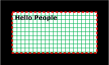

Figure 2: WMF metafile example

The contents of this metafile example are shown in the following in hexadecimal bytes. The far-left column is the byte count; the far-right characters are the interpretation of the bytes in the Latin-1 [**ANSI Character Set**](#gt_100cd8a6-5cb1-4895-9de6-e4a3c224a583), as specified in [[ISO/IEC-8859-1]](https://go.microsoft.com/fwlink/?LinkId=90689). The sections that follow describe the packets that convey this series of bytes.

00000000: 01 00 09 00 00 03 36 00 00 00 02 00 0C 00 00 00 …...6.........

00000010: 00 00 08 00 00 00 FA 02 04 00 00 00 00 00 00 00 ......ú.........

00000020: FF 00 04 00 00 00 2D 01 00 00 07 00 00 00 FC 02 ÿ.....-.......ü.

00000030: 02 00 00 FF 00 FF 04 00 04 00 00 00 2C 01 01 00 ...ÿ.ÿ......,...

00000040: 07 00 00 00 1B 04 46 00 96 00 00 00 00 00 0C 00 ......F.–.......

00000050: 00 00 21 05 0C 00 48 65 6C 6C 6F 20 50 65 6F 70 ..!...Hello Peop

00000060: 6C 65 0A 00 0A 00 03 00 00 00 00 00 le..........

**Note** When a [**WMF**](#gt_windows-metafile-format-wmf) metafile is processed, the order in which graphics are rendered corresponds to the order of records in the metafile. This can create challenges for devices that have layers. For example, [**Printer Command Language (PCL)**](#gt_ffc25745-85c9-40bc-b2d3-f19ab7b48570) defines a graphics layer and a text layer. The text layer in [**PCL**](#gt_printer-control-language-pcl) is always drawn on top of the graphics layer. Thus, when converting from metafile format to PCL, the converter, to generate the correct output, either detects text/graphic overlaps and sends the text down as graphics, or always sends the text as graphics.

The sections that follow provide definitions of the WMF header and records that correspond to this metafile. The **WMF Object Table** (section [3.1.4.1](#Section_3.1.4.1)) refers to an indexed table of **WMF Objects** (section [2.2](#Section_2.2)) that are defined in the metafile.

<a id="Section_3.2.1"></a>
### 3.2.1 META_HEADER Example

This section provides an example of a **META_HEADER Record** (section [2.3.2.2](#Section_2.3.2.2)), which is always the first record in the [**metafile**](#gt_metafile).

00000000: 01 00 09 00 00 03 36 00 00 00 02 00 0C 00 00 00

00000010: 00 00

```mermaid
packet-beta
  0-15: "Type (0x0001)"
  16-31: "HeaderSize (0x0009)"
  32-47: "Version (0x0300)"
  48-79: "Size (0x00000036)"
  80-95: "NumberOfObjects (0x0002)"
  96-127: "MaxRecord (0x0000000C)"
  128-143: "NumberOfMembers (0x0000)"
```

**Type (2 bytes):** 0x0001 specifies the type of metafile from the **MetafileType Enumeration** (section [2.1.1.18](#Section_2.1.1.18)) to be a metafile stored in memory.

**HeaderSize (2 bytes):** 0x0009 specifies the number of **WORD** structures, defined in [MS-DTYP](../MS-DTYP/MS-DTYP.md) section 2.2.61, in this record, which is equivalent to 18 (0x0012) bytes.

**Version (2 bytes):** 0x0300 specifies the metafile version from the **MetafileVersion Enumeration** (section [2.1.1.19](#Section_2.1.1.19)) to be a [**WMF**](#gt_windows-metafile-format-wmf) metafile that supports [**DIBs**](#gt_device-independent-bitmap-dib).

**Size (4 bytes):** 0x00000036 specifies the number of **WORDs** in the entire metafile, which is equivalent to 108 (0x0000006C) bytes.

**NumberOfObjects (2 bytes):** 0x0002 specifies the number of graphics objects that are defined in the metafile.

**MaxRecord (4 bytes):** 0x0000000C specifies the size in **WORDs** of the largest record in the metafile, which is equivalent to 24 (0x00000018) bytes.

**NumberOfMembers (2 bytes):** 0x0000 is not used.

**Note** Based on the value of the **NumberOfObjects** field, a **WMF Object Table** (section [3.1.4.1)](#Section_3.1.4.1) can be created that is large enough for 2 objects.

<a id="Section_3.2.2"></a>
### 3.2.2 META_CREATEPENINDIRECT Example

This section provides an example of a **META_CREATEPENDIRECT Record** (section [2.3.4.5](#Section_2.3.4.5)).

00000010: 08 00 00 00 FA 02 04 00 00 00 00 00 00 00

00000020: FF 00

```mermaid
packet-beta
  0-31: "RecordSize (0x00000008)"
  32-47: "RecordFunction (0x02FA)"
  48-127: "Pen Object"
```

**RecordSize (4 bytes):** 0x00000008 specifies the number of **WORD** structures, defined in [MS-DTYP](../MS-DTYP/MS-DTYP.md) section 2.2.61, in this record, which is equivalent to 16 (0x00000010) bytes.

**RecordFunction (2 bytes):** 0x02FA specifies a **META_CREATEPENINDIRECT** record from the **RecordType Enumeration** (section [2.1.1.1](#Section_2.1.1.1)).

**Pen Object (10 bytes):** A **Pen Object** (section [2.2.1.4](#Section_2.2.1.4)) that defines the pen to create.

```mermaid
packet-beta
  0-15: "PenStyle (0x0004)"
  16-47: "PointS Object"
  48-79: "ColorRef Object"
```

**PenStyle (2 bytes):** 0x0004 specifies the PS_DASHDOTDOT style from the **PenStyle Enumeration** (section [2.1.1.23](#Section_2.1.1.23)).

**PointS Object (4 bytes):** A **PointS Object** (section [2.2.2.16](#Section_2.2.2.16)) that specifies the width of the pen.

```mermaid
packet-beta
  0-15: "x (0x0000)"
  16-31: "y (0x0000)"
```

**x (2 bytes):** 0x0000 specifies the width of the pen to be the default, which is 1 pixel.

**y (2 bytes):** 0x0000 is not used.

**ColorRef Object (4 bytes):** A **ColorRef Object** (section [2.2.2.8](#Section_2.2.2.8)) that specifies a green pen color.

```mermaid
packet-beta
  0-7: "Reserved (0x00)"
  8-15: "Blue (0x00)"
  16-23: "Green (0xFF)"
  24-31: "Red (0x00)"
```

**Reserved (1 byte):** 0x00 is not used.

**Blue (1 byte):** 0x00 specifies no blue.

**Green (1 byte):** 0xFF specifies full intensity of green.

**Red (1 byte):** 0x00 specifies no red.

**Note** The **Pen Object** created by processing this record is assigned index 0 in the **WMF Object Table** (section [3.1.4.1](#Section_3.1.4.1)).

<a id="Section_3.2.3"></a>
### 3.2.3 META_SELECTOBJECT Example 1

This section provides an example of a **META_SELECTOBJECT Record** (section [2.3.4.10](#Section_2.3.4.10)).

00000020: 04 00 00 00 2D 01 00 00

```mermaid
packet-beta
  0-31: "RecordSize (0x00000004)"
  32-47: "RecordFunction (0x012D)"
  48-63: "ObjectIndex (0x0000)"
```

**RecordSize (4 bytes):** 0x00000004 specifies the number of **WORD** structures, defined in [MS-DTYP](../MS-DTYP/MS-DTYP.md) section 2.2.61, in this record, which is equivalent to 8 (0x00000008) bytes.

**RecordFunction (2 bytes):** 0x012D specifies the type of this record from the **RecordType Enumeration** (section [2.1.1.1](#Section_2.1.1.1)) to be **META_SELECTOBJECT**.

**ObjectIndex (2 bytes):** 0x0000 specifies the index in the **WMF Object Table** (section [3.1.4.1](#Section_3.1.4.1)) of the object being selected, which is the **Pen Object** (section [2.2.1.4](#Section_2.2.1.4)) created in the previous record.

<a id="Section_3.2.4"></a>
### 3.2.4 META_CREATEBRUSHINDIRECT Example

This section provides an example of a **META_CREATEBRUSHINDIRECT Record** (section [2.3.4.1](#Section_2.3.4.1)).

00000020: 07 00 00 00 FC 02

00000030: 02 00 00 FF 00 FF 04 00

```mermaid
packet-beta
  0-31: "RecordSize (0x00000007)"
  32-47: "RecordFunction (0x02FC)"
  48-111: "LogBrush Object (0x0000)"
```

**RecordSize (4 bytes):** 0x00000007 specifies the number of **WORD** structures, defined in [MS-DTYP](../MS-DTYP/MS-DTYP.md) section 2.2.61, in this record, which is equivalent to 14 (0x0000000E) bytes.

**RecordFunction (2 bytes):** 0x02FC specifies a **META_CREATEBRUSHINDIRECT** record from the **RecordType Enumeration** (section [2.1.1.1](#Section_2.1.1.1)).

**LogBrush Object (8 bytes):** A **LogBrush Object** (section [2.2.2.10](#Section_2.2.2.10)) that defines the brush to create.

```mermaid
packet-beta
  0-15: "BrushStyle (0x0002)"
  16-47: "ColorRef Object"
  48-63: "BrushHatch (0x0004)"
```

**BrushStyle (2 bytes):** 0x0002 specifies the BS_HATCHED style from the **BrushStyle Enumeration** (section [2.1.1.4](#Section_2.1.1.4)).

**ColorRef Object (4 bytes):** A **ColorRef Object** (section [2.2.2.8](#Section_2.2.2.8)) that specifies a magenta brush color.

```mermaid
packet-beta
  0-7: "Reserved (0x00)"
  8-15: "Blue (0xFF)"
  16-23: "Green (0x00)"
  24-31: "Red (0xFF)"
```

**Reserved (1 byte):** 0x00 is not used.

**Blue (1 byte):** 0xFF specifies full intensity blue.

**Green (1 byte):** 0x00 specifies no green.

**Red (1 byte):** 0xFF specifies full intensity red.

**BrushHatch (2 bytes):** 0x0004 specifies the hatch style from the **HatchStyle Enumeration** (section [2.1.1.12](#Section_2.1.1.12)), a horizontal and vertical cross-hatch.

**Note** The **Brush Object** created by processing this record is assigned index 1 in the **WMF Object Table** (section [3.1.4.1](#Section_3.1.4.1)).

<a id="Section_3.2.5"></a>
### 3.2.5 META_SELECTOBJECT Example 2

This section provides an example of a **META_SELECTOBJECT Record** (section [2.3.4.10](#Section_2.3.4.10)).

00000030: 04 00 00 00 2D 01 01 00

```mermaid
packet-beta
  0-31: "RecordSize (0x00000004)"
  32-47: "RecordFunction (0x012D)"
  48-63: "ObjectIndex (0x0001)"
```

**RecordSize (4 bytes):** 0x00000004 specifies the number of **WORD** structures, defined in [MS-DTYP](../MS-DTYP/MS-DTYP.md) section 2.2.61, in this record, which is equivalent to 8 (0x00000008) bytes.

**RecordFunction (2 bytes):** 0x012D specifies the type of this record from the **RecordType Enumeration** (section [2.1.1.1](#Section_2.1.1.1)) to be **META_SELECTOBJECT**.

**ObjectIndex (2 bytes):** 0x0001 specifies the index in the **WMF Object Table** (section [3.1.4.1](#Section_3.1.4.1)) of the object being selected, which is the **Brush Object** (section [2.2.1.1](#Section_2.2.1.1)) created in the previous record.

<a id="Section_3.2.6"></a>
### 3.2.6 META_RECTANGLE Example

This section provides an example of a **META_RECTANGLE Record** (section [2.3.3.17](#Section_2.3.3.17)).

00000040: 07 00 00 00 1B 04 46 00 96 00 00 00 00 00

```mermaid
packet-beta
  0-31: "RecordSize (0x00000007)"
  32-47: "RecordFunction (0x041B)"
  48-63: "BottomRect (0x0046)"
  64-79: "RightRect (0x0096)"
  80-95: "TopRect (0x0000)"
  96-111: "LeftRect (0x0000)"
```

**RecordSize (4 bytes):** 0x0000007 specifies the number of **WORD** structures, defined in [MS-DTYP](../MS-DTYP/MS-DTYP.md) section 2.2.61, in this record, which is equivalent to 14 (0x0000000E) bytes.

**RecordFunction (2 bytes):** 0x041B defines the type of this record from the **RecordType Enumeration** (section [2.1.1.1](#Section_2.1.1.1)) to be **META_RECTANGLE**.

**BottomRect (2 bytes):** 0x0046 defines the y-coordinate, in logical units, of the lower-right corner of the rectangle.

**RightRect (2 bytes):** 0x0096 defines the x-coordinate, in logical units, of the lower-right corner of the rectangle.

**TopRect (2 bytes):** 0x0000 defines the y-coordinate, in logical units, of the upper-left corner of the rectangle.

**LeftRect (2 bytes):** 0x0000 defines the x-coordinate, in logical units, of the upper-left corner of the rectangle.

<a id="Section_3.2.7"></a>
### 3.2.7 META_TEXTOUT Example

This section provides an example of a **META_TEXTOUT Record** (section [2.3.3.20](#Section_2.3.3.20)).

0000004E: 0C 00

00000050: 00 00 21 05 0C 00 48 65 6C 6C 6F 20 50 65 6F 70

00000060: 6C 65 0A 00 0A 00

```mermaid
packet-beta
  0-31: "RecordSize (0x0000000C)"
  32-47: "RecordFunction (0x0521)"
  48-63: "StringLength (0x000C)"
  64-159: "String "Hello People" (12 bytes)"
  160-175: "YStart (0x000A)"
  176-191: "XStart (0x000A)"
```

**RecordSize (4 bytes):** 0x0000000C specifies the number of **WORD** structures, defined in [MS-DTYP](../MS-DTYP/MS-DTYP.md) section 2.2.61, in this record, which is equivalent to 24 (0x00000018) bytes.

**RecordFunction (2 bytes):** 0x0521 specifies the type of this record from the **RecordType Enumeration** (section [2.1.1.1](#Section_2.1.1.1)) to be **META_TEXTOUT**.

**StringLength (2 bytes):** 0x000C specifies the length of the string in bytes.

**String (12 bytes):** "Hello People" specifies the text to be drawn.

**YStart (2 bytes):** 0x000A specifies the vertical (y-axis) coordinate, in logical units, of the point where drawing is to start.

**XStart (2 bytes):** 0x000A specifies the horizontal (x-axis) coordinate, in logical units, of the point where drawing is to start.

<a id="Section_3.2.8"></a>
### 3.2.8 META_EOF Example

This section provides an example of a **META_EOF Record** (section [2.3.2.1](#Section_2.3.2.1)), which is always the last record in the [**metafile**](#gt_metafile).

00000060: 03 00 00 00 00 00

```mermaid
packet-beta
  0-31: "RecordSize (0x00000003)"
  32-47: "RecordFunction (0x0000"
```

**RecordSize (4 bytes):** 0x00000003 specifies the number of **WORD** structures, defined in [MS-DTYP](../MS-DTYP/MS-DTYP.md) section 2.2.61, in this record, which is equivalent to 6 (0x00000006) bytes.

**RecordFunction (**2 bytes): 0x0000 specifies the type of this record from the **RecordType Enumeration** (section [2.1.1.1](#Section_2.1.1.1)) to be **META_EOF**.

<a id="Section_4"></a>
# 4 Security Considerations

This file format enables third parties to send payloads (such as [**PostScript**](#gt_postscript)) to pass through as executable code.

<a id="Section_5"></a>
# 5 Appendix A: Product Behavior

The information in this specification is applicable to the following Microsoft products or supplemental software. References to product versions include updates to those products.

- Windows NT 3.1 operating system
- Windows NT 3.5 operating system
- Windows NT 3.51 operating system
- Windows 95 operating system
- Windows NT 4.0 operating system
- Windows 98 operating system
- Windows Millennium Edition operating system
- Windows 2000 operating system
- Windows XP operating system
- Windows Server 2003 operating system
- Windows Vista operating system
- Windows Server 2008 operating system
- Windows 7 operating system
- Windows Server 2008 R2 operating system
- Windows 8 operating system
- Windows Server 2012 operating system
- Windows 8.1 operating system
- Windows Server 2012 R2 operating system
- Windows 10 operating system
- Windows Server 2016 operating system
- Windows Server operating system
- Windows Server 2019 operating system
- Windows Server 2022 operating system
- Windows 11 operating system
- Windows Server 2025 operating system
Exceptions, if any, are noted in this section. If an update version, service pack or Knowledge Base (KB) number appears with a product name, the behavior changed in that update. The new behavior also applies to subsequent updates unless otherwise specified. If a product edition appears with the product version, behavior is different in that product edition.

Unless otherwise specified, any statement of optional behavior in this specification that is prescribed using the terms "SHOULD" or "SHOULD NOT" implies product behavior in accordance with the SHOULD or SHOULD NOT prescription. Unless otherwise specified, the term "MAY" implies that the product does not follow the prescription.

<1> Section 1.4: Windows NT 3.1, Windows NT 3.51, Windows NT Server 4.0 operating system, and Windows 95: [**WMF**](#gt_windows-metafile-format-wmf) is used primarily with the **Win16** and **Win32s** APIs.

<2> Section 2.1.1.1: Windows NT 3.1, Windows NT 3.51, Windows 95, Windows NT 4.0, Windows 98, and Windows Millennium Edition: This record type is not supported.

<3> Section 2.1.1.1: For most WMF record types, the high-order byte of the **RecordFunction** field signifies the minimum number of 16-bit parameters, ideally specified in the WMF record; however, the value is not reliable for that purpose.

<4> Section 2.1.1.3: Windows NT 3.1, Windows NT 3.5, Windows NT 3.51, Windows 95, and Windows NT 4.0: Neither [**JPEG**](#gt_joint-photographic-experts-group-jpeg) nor [**PNG**](#gt_portable-network-graphics-png) format is supported.

<5> Section 2.1.1.4: In Windows implementations, **BS_HOLLOW** was added as a duplicate symbolic name for **BS_NULL**, because **BS_NULL** was too easily mistaken for a NULL pointer.

**BS_HOLLOW** is used by an application when [**GDI**](#gt_graphics-device-interface-gdi) requires a non-NULL brush parameter, but the application requires that no brush be used.

<6> Section 2.1.1.5: Windows NT 3.1 and Windows NT 3.51: This value is not supported.

<7> Section 2.1.1.10: Windows NT 3.1, Windows NT 3.5, and Windows NT 3.51: [**Anti-aliasing**](#gt_anti-aliasing) is not supported.

<8> Section 2.1.1.10: Windows NT 3.1, Windows NT 3.5, and Windows NT 3.51: Anti-aliasing is not supported.

<9> Section 2.1.1.10: Windows NT 3.1, Windows NT 3.5, Windows NT 3.51, Windows 95, Windows NT 4.0, Windows 98, Windows Millennium Edition, and Windows 2000: [**ClearType**](#gt_cleartype) is not supported.

<10> Section 2.1.1.11: Windows NT 3.1, Windows NT 3.5, and Windows NT 3.51: This functionality is not supported.

<11> Section 2.1.1.13: Windows NT 3.1, Windows NT 3.5, Windows NT 3.51, Windows 95, Windows NT 4.0, Windows 98, and Windows Millennium Edition: This functionality is not supported.

<12> Section 2.1.1.14: Windows NT 3.1, Windows NT 3.5, and Windows NT 3.51: This functionality is not supported.

<13> Section 2.1.1.15: Windows NT 3.1, Windows NT 3.5, Windows NT 3.51, Windows 95, and Windows NT 4.0: This functionality is not supported.

<14> Section 2.1.1.17: Windows NT 3.1, Windows NT 3.5, Windows NT 3.51, Windows 95, Windows NT 4.0, Windows 98, and Windows Millennium Edition: This functionality is not supported.

<15> Section 2.1.1.17: Windows NT 3.1, Windows NT 3.5, Windows NT 3.51, Windows 95, Windows NT 4.0, Windows 98, and Windows Millennium Edition: This functionality is not supported.

<16> Section 2.1.1.17: Windows NT 3.1, Windows NT 3.5, Windows NT 3.51, Windows 95, Windows NT 4.0, Windows 98, and Windows Millennium Edition: This functionality is not supported.

<17> Section 2.1.1.17: Windows NT 3.1, Windows NT 3.5, Windows NT 3.51, Windows 95, Windows NT 4.0, Windows 98, and Windows Millennium Edition: This functionality is not supported.

<18> Section 2.1.1.17: Windows NT 3.1, Windows NT 3.5, Windows NT 3.51, Windows 95, Windows NT 4.0, Windows 98, and Windows Millennium Edition: This functionality is not supported.

<19> Section 2.1.1.17: Windows NT 3.1, Windows NT 3.5, Windows NT 3.51, Windows 95, Windows NT 4.0, Windows 98, and Windows Millennium Edition: This functionality is not supported.

<20> Section 2.1.1.17: Windows NT 3.1, Windows NT 3.5, Windows NT 3.51, Windows 95, Windows NT 4.0, Windows 98, Windows Millennium Edition, Windows 2000, Windows XP, and Windows Server 2003: This functionality is not supported.

<21> Section 2.1.1.17: Windows NT 3.1, Windows NT 3.5, Windows NT 3.51, Windows 95, Windows NT 4.0, Windows 98, and Windows Millennium Edition: This functionality is not supported.

<22> Section 2.1.1.26: In Windows implementations, the [**PostScript**](#gt_postscript) [**printer driver**](#gt_printer-driver) uses a default line join style of **PostScriptFlatCap**.

<23> Section 2.1.1.28: Windows NT 3.1, Windows NT 3.5, Windows NT 3.51, Windows 95, Windows 98, and Windows Millennium Edition: This functionality is not supported.

<24> Section 2.1.1.28: Windows NT 4.0 and Windows 2000: This functionality is not supported.

<25> Section 2.1.1.28: Windows NT 4.0 and Windows 2000: This functionality is not supported.

<26> Section 2.1.1.29: In Windows implementations, the PostScript printer driver uses a default line join style of **PostScriptMiterJoin**.

<27> Section 2.1.1.30: Windows 95 and Windows 98: The symbolic name "STRETCH_ANDSCANS" is synonymous with this value.

<28> Section 2.1.1.30: Windows 95 and Windows 98: The symbolic name "STRETCH_ORSCANS" is synonymous with this value.

<29> Section 2.1.1.30: Windows 95 and Windows 98: The symbolic name "STRETCH_DELETESCANS" is synonymous with this value.

<30> Section 2.1.1.30: Windows 95 and Windows 98: The symbolic name "STRETCH_HALFTONE" is synonymous with this value.

<31> Section 2.1.2.1: Windows NT 3.1, Windows NT 3.5, Windows NT 3.51, Windows NT 4.0, Windows 2000, and Windows XP: This value is always returned when enumerating fonts.

<32> Section 2.1.2.1: This value is supported in the following Windows versions: Windows NT 3.1, Windows NT 3.5, Windows NT 3.51, Windows 95, Windows NT 4.0, Windows 98, Windows Millennium Edition, Windows 2000, Windows XP, and Windows Server 2003.

<33> Section 2.1.2.1: This value is supported in the following Windows versions: Windows NT 3.1, Windows NT 3.5, Windows NT 3.51, and Windows NT 4.0.

[**Font association**](#gt_font-association) is turned off in Windows 2000, Windows XP, and Windows Server 2003.

<34> Section 2.1.2.2: Windows NT 3.1, Windows NT 3.5, and Windows NT 3.51: This function is not supported.

<35> Section 2.1.2.2: Windows NT 3.1, Windows NT 3.5, and Windows NT 3.51: This function is not supported.

<36> Section 2.1.2.2: Windows NT 3.1, Windows NT 3.5, and Windows NT 3.51: This function is not supported.

<37> Section 2.1.2.2: Windows NT 3.1, Windows NT 3.5, and Windows NT 3.51: This function is not supported.

<38> Section 2.1.2.2: Windows NT 3.1, Windows NT 3.5, Windows NT 3.51, Windows 95, Windows NT 4.0, Windows 98, and Windows Millennium Edition: This function is not supported.

<39> Section 2.1.2.3: Windows NT 3.1, Windows NT 3.5, and Windows NT 3.51: This function is not supported.

<40> Section 2.2.1.2: All Windows versions: mapping the logical font size to the available physical fonts occurs the first time the logical font needs to be used in a drawing operation.

For the MM_TEXT [**mapping mode**](#gt_mapping-mode), the following formula can be used to compute the height of a font with a specified point size.

Height = -MulDiv(PointSize, GetDeviceCaps(hDC, LOGPIXELSY), 72);

<41> Section 2.2.1.5: Windows sets this field to 0x0000.

<42> Section 2.2.1.5: Windows sets this field to an arbitrary value.

<43> Section 2.2.2.2: Although Windows processes **BitmapCoreHeader objects** in [**DIBs**](#gt_device-independent-bitmap-dib), it does not write them to WMF [**metafiles**](#gt_metafile)

<44> Section 2.2.2.3: Windows NT 3.1, Windows NT 3.5, Windows NT 3.51, Windows 95, and Windows NT 4.0: Neither JPEG nor PNG format is supported.

<45> Section 2.2.2.3: Windows implementations might write a nonzero value to this field, but it is ignored when the metafile is parsed.

<46> Section 2.2.2.4: Windows NT 3.1, Windows NT 3.5, and Windows NT 3.51: This structure is not supported.

<47> Section 2.2.2.5: Windows NT 3.1, Windows NT 3.5, Windows NT 3.51, Windows 95, and Windows NT 4.0: This structure is not supported.

<48> Section 2.2.2.10: In Windows implementations, **BS_HOLLOW** was added as a duplicate symbolic name for **BS_NULL**, because **BS_NULL** was too easily mistaken for a NULL pointer.

**BS_HOLLOW** is used by an application when GDI requires a non-NULL brush parameter, but the application requires that no brush be used.

<49> Section 2.2.2.10: In the following Windows versions, a solid-color black brush is not created by default when a **BrushStyle Enumeration** (section [2.1.1.4](#Section_2.1.1.4)) table value of BS_PATTERN or BS_DIBPATTERNPT is present: Windows NT 3.1, Windows NT 3.5, Windows NT 3.51, Windows 95, Windows NT 4.0, Windows 98, Windows Millennium Edition, Windows 2000, Windows XP, and Windows Server 2003.

The default brush creation behavior on these versions of Windows is undefined.

<50> Section 2.3.1.4: Windows NT 3.1, Windows NT 3.5, Windows NT 3.51, Windows 95, and Windows NT 4.0: This format is not supported.

<51> Section 2.3.1.4: Windows NT 3.1, Windows NT 3.5, Windows NT 3.51, Windows 95, and Windows NT 4.0: This format is not supported.

<52> Section 2.3.1.6: Windows NT 3.1, Windows NT 3.5, Windows NT 3.51, Windows 95, and Windows NT 4.0: This format is not supported.

<53> Section 2.3.1.6: Windows NT 3.1, Windows NT 3.5, Windows NT 3.51, Windows 95, and Windows NT 4.0: This format is not supported.

<54> Section 2.3.2.2: Metafiles created by Windows contain the value METAVERSION300.

<55> Section 2.3.2.3: Windows NT 3.1, Windows NT 3.5, Windows NT 3.51, and Windows 95: This feature is not supported.

<56> Section 2.3.4.1: In the following Windows versions, a solid-color black brush is not created by default when a **BrushStyle Enumeration** (section 2.1.1.4) table value of BS_PATTERN or BS_DIBPATTERNPT is present: Windows NT 3.1, Windows NT 3.5, Windows NT 3.51, Windows 95, Windows NT 4.0, Windows 98, Windows Millennium Edition, Windows 2000, Windows XP, and Windows Server 2003.

The default brush creation behavior on these versions of Windows is undefined.

<57> Section 2.3.4.4: The META_CREATEPATTERNBRUSH record type is deprecated. No version of Windows emits this record. Playback implementation of this record in Windows is intended solely for compatibility purposes so that Windows metafiles containing this record can be rendered.

<58> Section 2.3.5.15: Windows NT 3.1, Windows NT 3.5, and Windows NT 3.51 implementations do not write this field to WMF metafiles.

<59> Section 2.3.5.16: Windows NT 3.1, Windows NT 3.5, Windows NT 3.51, and Windows NT 4.0 implementations do not support this record type.

<60> Section 2.3.5.20: Windows NT 3.1, Windows NT 3.5, and Windows NT 3.51 implementations do not write this field to WMF metafiles.

<61> Section 2.3.5.22: Windows NT 3.1, Windows NT 3.5, and Windows NT 3.51 implementations do not write this field to WMF metafiles.

<62> Section 2.3.5.23: Windows NT 3.1, Windows NT 3.5, and Windows NT 3.51 implementations do not write this field to WMF metafiles.

<63> Section 2.3.5.24: Windows NT 3.1, Windows NT 3.5, and Windows NT 3.51 implementations do not write this field to WMF metafiles.

<64> Section 2.3.6.6: Windows 95, Windows 98, and Windows Millennium Edition implementations set this field to the fill mode value (section [2.1.1.25](#Section_2.1.1.25)).

<65> Section 2.3.6.11: Any bytes that exceed the **ByteCount** field are ignored by the client.

<66> Section 2.3.6.25: Windows does not check this value.

<67> Section 3.1.5: Windows applications use the Graphics Device Interface (GDI) to obtain a [**device context**](#gt_device-context) for performing output to a device. When the device context is created, the default values for graphics objects and properties are set up by the system and the driver for the device.

<a id="Section_6"></a>
# 6 Change Tracking

This section identifies changes that were made to this document since the last release. Changes are classified as Major, Minor, or None.

The revision class **Major** means that the technical content in the document was significantly revised. Major changes affect protocol interoperability or implementation. Examples of major changes are:

- A document revision that incorporates changes to interoperability requirements.
- A document revision that captures changes to protocol functionality.
The revision class **Minor** means that the meaning of the technical content was clarified. Minor changes do not affect protocol interoperability or implementation. Examples of minor changes are updates to clarify ambiguity at the sentence, paragraph, or table level.

The revision class **None** means that no new technical changes were introduced. Minor editorial and formatting changes may have been made, but the relevant technical content is identical to the last released version.

The changes made to this document are listed in the following table. For more information, please contact [dochelp@microsoft.com](mailto:dochelp@microsoft.com).

| Section | Description | Revision class |
| --- | --- | --- |
| [5](#Section_5) Appendix A: Product Behavior | Added Windows Server 2025 to the list of applicable products. | Major |

<a id="revision-history"></a>

## Revision History

| Date | Version | Revision Class | Comments |
| --- | --- | --- | --- |
| 2/22/2007 | 0.01 | New | Version 0.01 release |
| 6/1/2007 | 1.0 | Major | Updated and revised the technical content. |
| 7/3/2007 | 1.1 | Minor | Restructured for better usability, technical corrections. |
| 7/20/2007 | 1.2 | Minor | Clarified the meaning of the technical content. |
| 8/10/2007 | 1.3 | Minor | Clarified the meaning of the technical content. |
| 9/28/2007 | 1.3.1 | Editorial | Changed language and formatting in the technical content. |
| 10/23/2007 | 1.4 | Minor | Updated artwork. |
| 11/30/2007 | 1.5 | Minor | Standardized artwork. |
| 1/25/2008 | 1.5.1 | Editorial | Changed language and formatting in the technical content. |
| 3/14/2008 | 2.0 | Major | Abstract data model and Windows version-specific behavior added. |
| 5/16/2008 | 2.0.1 | Editorial | Changed language and formatting in the technical content. |
| 6/20/2008 | 3.0 | Major | Updated and revised the technical content. |
| 7/25/2008 | 3.0.1 | Editorial | Changed language and formatting in the technical content. |
| 8/29/2008 | 3.0.2 | Editorial | Changed language and formatting in the technical content. |
| 10/24/2008 | 4.0 | Major | Sections 1.7 and 2 of this specification are normative. All other sections and examples in this specification are informative. Glossary updated; PitchAndFamily object added. |
| 12/5/2008 | 4.1 | Minor | Clarified the meaning of the technical content. |
| 1/16/2009 | 5.0 | Major | Updated and revised the technical content. |
| 2/27/2009 | 5.1 | Minor | Clarified the meaning of the technical content. |
| 4/10/2009 | 6.0 | Major | Updated and revised the technical content. |
| 5/22/2009 | 7.0 | Major | Updated and revised the technical content. |
| 7/2/2009 | 7.0.1 | Editorial | Changed language and formatting in the technical content. |
| 8/14/2009 | 7.0.2 | Editorial | Changed language and formatting in the technical content. |
| 9/25/2009 | 7.1 | Minor | Clarified the meaning of the technical content. |
| 11/6/2009 | 8.0 | Major | Updated and revised the technical content. |
| 12/18/2009 | 8.1 | Minor | Clarified the meaning of the technical content. |
| 1/29/2010 | 8.1.1 | Editorial | Changed language and formatting in the technical content. |
| 3/12/2010 | 8.2 | Minor | Clarified the meaning of the technical content. |
| 4/23/2010 | 8.2.1 | Editorial | Changed language and formatting in the technical content. |
| 6/4/2010 | 8.3 | Minor | Clarified the meaning of the technical content. |
| 7/16/2010 | 8.4 | Minor | Clarified the meaning of the technical content. |
| 8/27/2010 | 8.5 | Minor | Clarified the meaning of the technical content. |
| 10/8/2010 | 8.5 | None | No changes to the meaning, language, or formatting of the technical content. |
| 11/19/2010 | 8.5 | None | No changes to the meaning, language, or formatting of the technical content. |
| 1/7/2011 | 8.5 | None | No changes to the meaning, language, or formatting of the technical content. |
| 2/11/2011 | 8.5 | None | No changes to the meaning, language, or formatting of the technical content. |
| 3/25/2011 | 8.5 | None | No changes to the meaning, language, or formatting of the technical content. |
| 5/6/2011 | 8.5 | None | No changes to the meaning, language, or formatting of the technical content. |
| 6/17/2011 | 9.0 | Major | Updated and revised the technical content. |
| 9/23/2011 | 9.0 | None | No changes to the meaning, language, or formatting of the technical content. |
| 12/16/2011 | 10.0 | Major | Updated and revised the technical content. |
| 3/30/2012 | 10.0 | None | No changes to the meaning, language, or formatting of the technical content. |
| 7/12/2012 | 10.0 | None | No changes to the meaning, language, or formatting of the technical content. |
| 10/25/2012 | 10.0 | None | No changes to the meaning, language, or formatting of the technical content. |
| 1/31/2013 | 10.0 | None | No changes to the meaning, language, or formatting of the technical content. |
| 8/8/2013 | 11.0 | Major | Updated and revised the technical content. |
| 11/14/2013 | 11.0 | None | No changes to the meaning, language, or formatting of the technical content. |
| 2/13/2014 | 11.0 | None | No changes to the meaning, language, or formatting of the technical content. |
| 5/15/2014 | 11.1 | Minor | Clarified the meaning of the technical content. |
| 6/30/2015 | 12.0 | Major | Significantly changed the technical content. |
| 10/16/2015 | 13.0 | Major | Significantly changed the technical content. |
| 7/14/2016 | 13.1 | Minor | Clarified the meaning of the technical content. |
| 6/1/2017 | 13.1 | None | No changes to the meaning, language, or formatting of the technical content. |
| 9/15/2017 | 14.0 | Major | Significantly changed the technical content. |
| 12/1/2017 | 14.0 | None | No changes to the meaning, language, or formatting of the technical content. |
| 9/12/2018 | 15.0 | Major | Significantly changed the technical content. |
| 4/7/2021 | 16.0 | Major | Significantly changed the technical content. |
| 6/25/2021 | 17.0 | Major | Significantly changed the technical content. |
| 4/23/2024 | 18.0 | Major | Significantly changed the technical content. |
