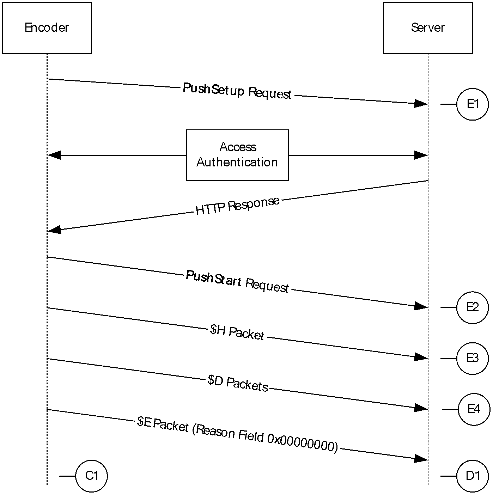
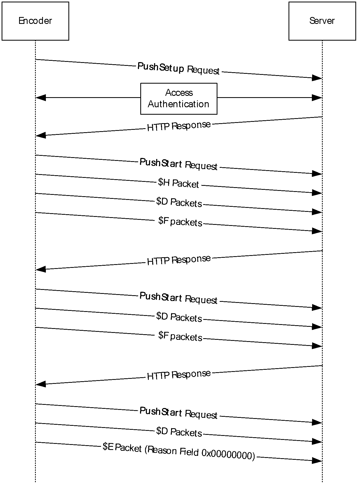
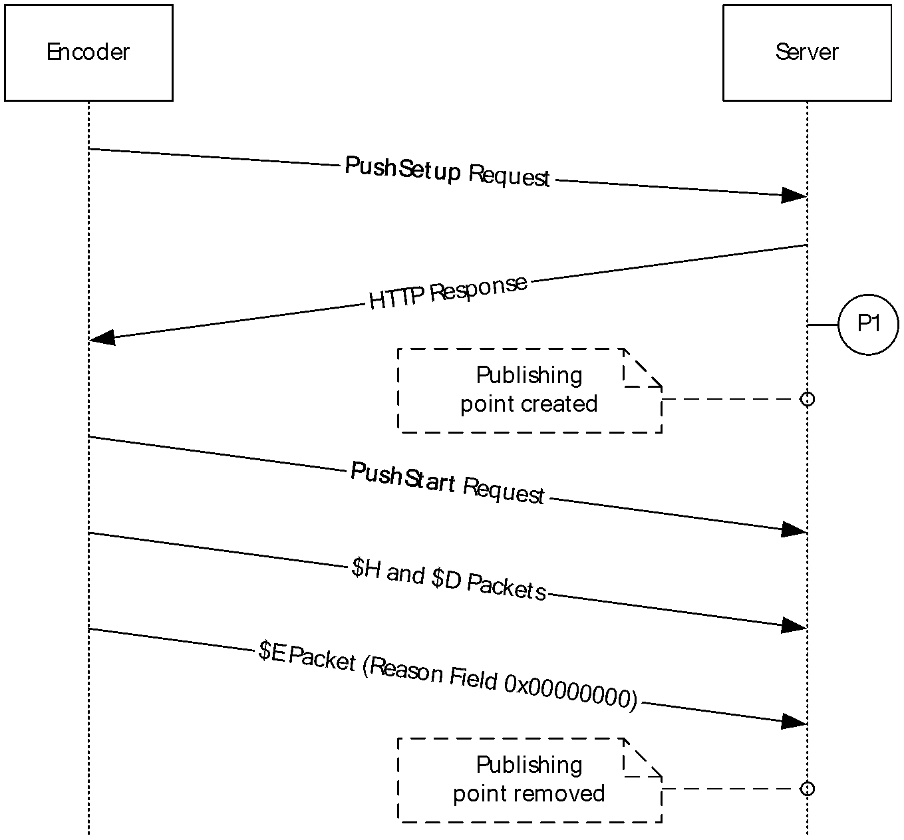
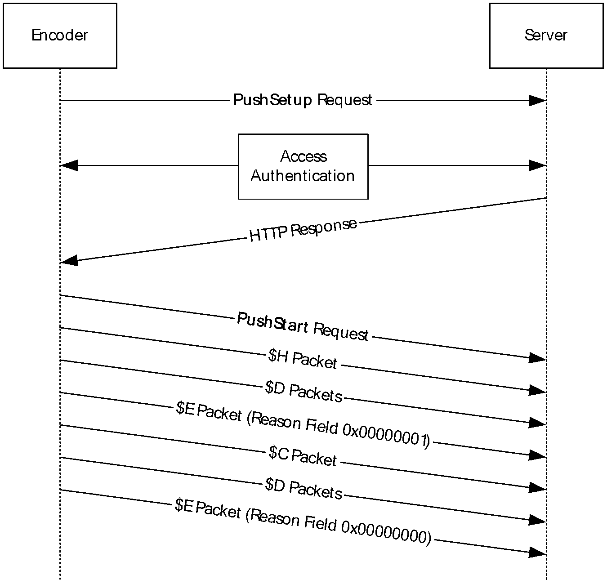
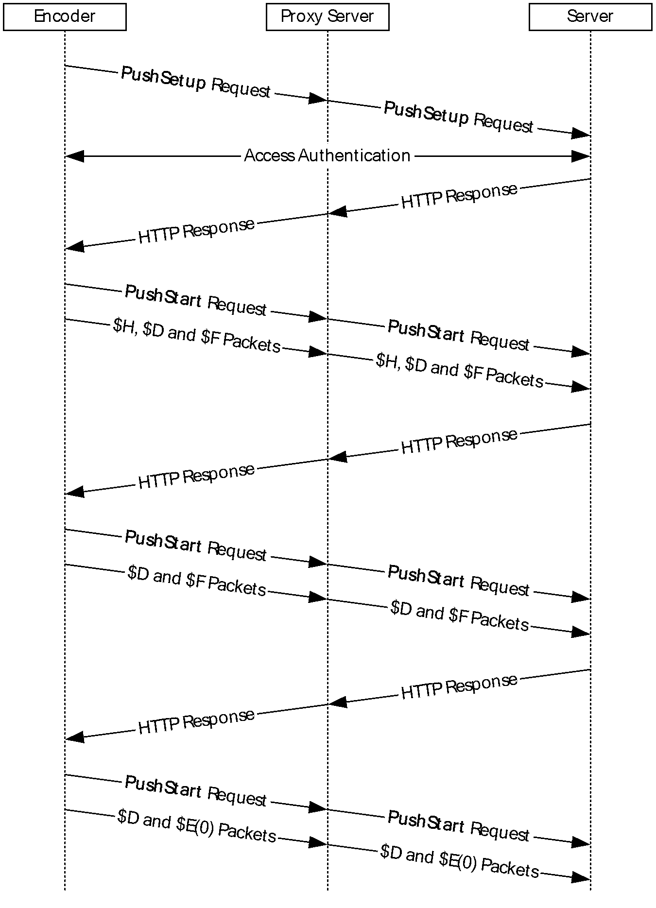
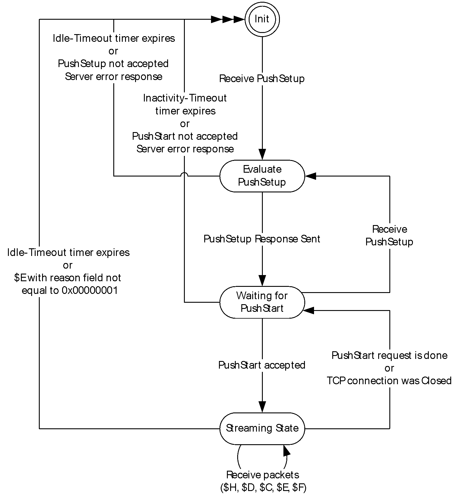
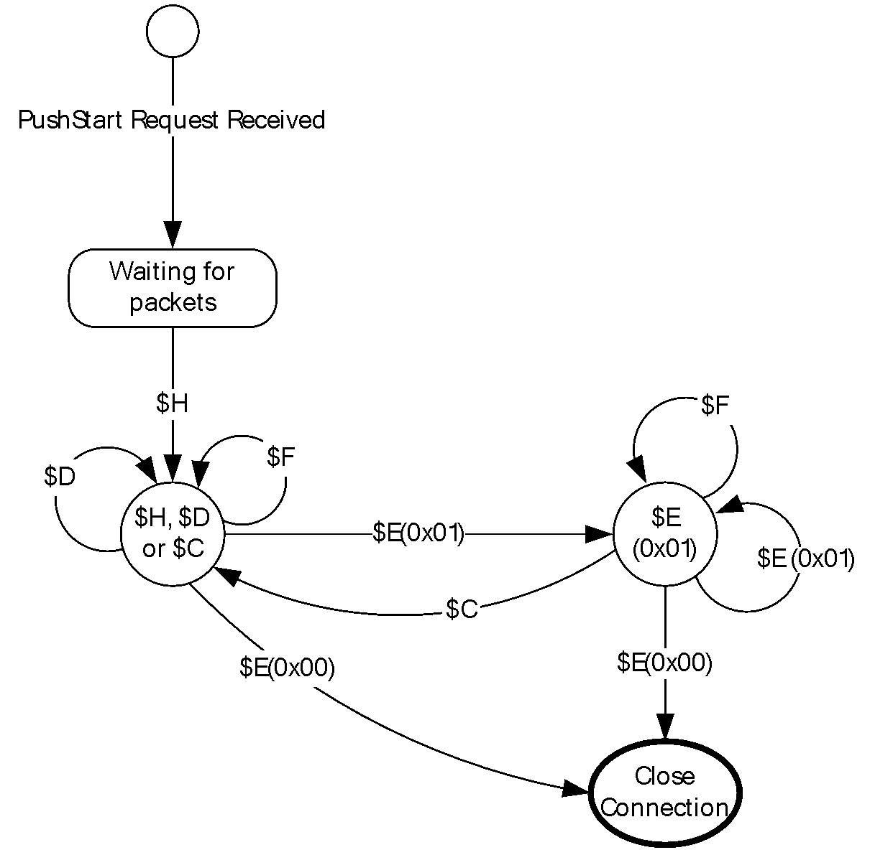
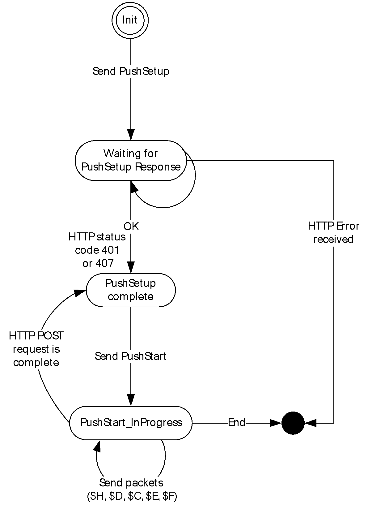
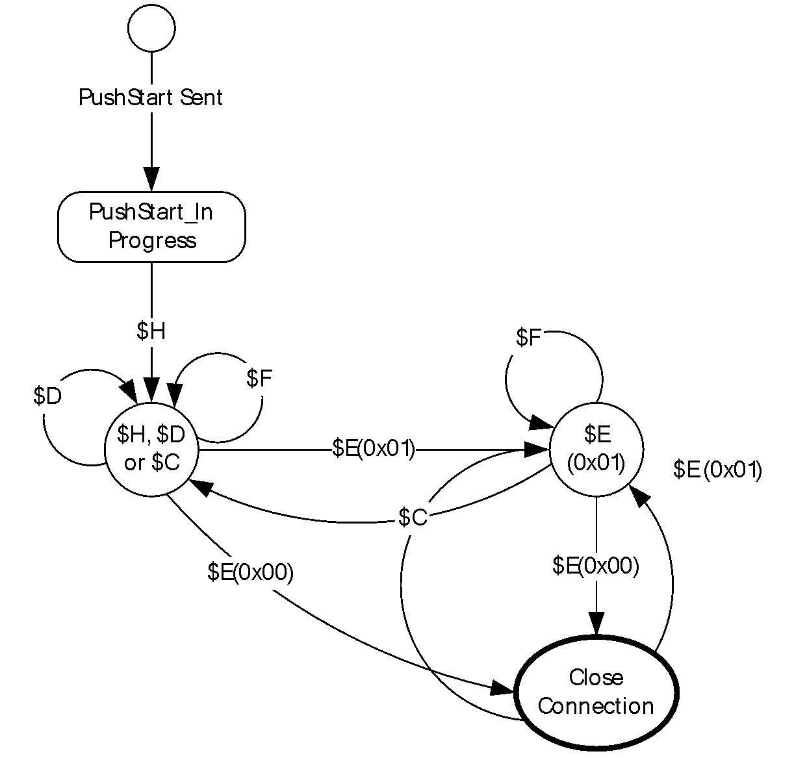

# [MS-WMHTTP]: Windows Media HTTP Push Distribution Protocol

Table of Contents

1 Introduction

- [1 Introduction](#Section_1)
  - [1.1 Glossary](#Section_1.1)
  - [1.2 References](#Section_1.2)
    - [1.2.1 Normative References](#Section_1.2.1)
    - [1.2.2 Informative References](#Section_1.2.2)
  - [1.3 Overview](#Section_1.3)
  - [1.4 Relationship to Other Protocols](#Section_1.4)
  - [1.5 Prerequisites/Preconditions](#Section_1.5)
  - [1.6 Applicability Statement](#Section_1.6)
  - [1.7 Versioning and Capability Negotiation](#Section_1.7)
  - [1.8 Vendor-Extensible Fields](#Section_1.8)
  - [1.9 Standards Assignments](#Section_1.9)

2 Messages

- [2 Messages](#Section_2)
  - [2.1 Transport](#Section_2.1)
  - [2.2 Message Syntax](#Section_2.2)
    - [2.2.1 HTTP Header Fields](#Section_2.2.1)
      - [2.2.1.1 Content-Type](#Section_2.2.1.1)
        - [2.2.1.1.1 application/x-wms-pushsetup](#Section_2.2.1.1.1)
        - [2.2.1.1.2 application/x-wms-pushstart](#Section_2.2.1.1.2)
      - [2.2.1.2 Cache-Control](#Section_2.2.1.2)
      - [2.2.1.3 Cookie](#Section_2.2.1.3)
        - [2.2.1.3.1 push-id](#Section_2.2.1.3.1)
      - [2.2.1.4 Pragma](#Section_2.2.1.4)
        - [2.2.1.4.1 no-cache](#Section_2.2.1.4.1)
        - [2.2.1.4.2 timeout](#Section_2.2.1.4.2)
      - [2.2.1.5 Server](#Section_2.2.1.5)
      - [2.2.1.6 Set-Cookie](#Section_2.2.1.6)
      - [2.2.1.7 Supported](#Section_2.2.1.7)
      - [2.2.1.8 User-Agent](#Section_2.2.1.8)
      - [2.2.1.9 X-Accept-Authentication](#Section_2.2.1.9)
      - [2.2.1.10 X-Accept-Proxy-Authentication](#Section_2.2.1.10)
    - [2.2.2 Request Types](#Section_2.2.2)
      - [2.2.2.1 PushSetup Request](#Section_2.2.2.1)
        - [2.2.2.1.1 Template-URL](#Section_2.2.2.1.1)
        - [2.2.2.1.2 AutoDestroy](#Section_2.2.2.1.2)
      - [2.2.2.2 PushStart Request](#Section_2.2.2.2)
    - [2.2.3 Packet Types](#Section_2.2.3)
      - [2.2.3.1 Common Definitions](#Section_2.2.3.1)
        - [2.2.3.1.1 Framing Header](#Section_2.2.3.1.1)
      - [2.2.3.2 $C (Stream Change Notification)](#Section_2.2.3.2)
      - [2.2.3.3 $D (Data)](#Section_2.2.3.3)
      - [2.2.3.4 $E (End-of-Stream Notification)](#Section_2.2.3.4)
      - [2.2.3.5 $F (Filler)](#Section_2.2.3.5)
      - [2.2.3.6 $H (Header)](#Section_2.2.3.6)

3 Protocol Details

- [3 Protocol Details](#Section_3)
  - [3.1 Client Details](#Section_3.1)
    - [3.1.1 Abstract Data Model](#Section_3.1.1)
    - [3.1.2 Timers](#Section_3.1.2)
    - [3.1.3 Initialization](#Section_3.1.3)
    - [3.1.4 Higher-Layer Triggered Events](#Section_3.1.4)
      - [3.1.4.1 Request to Configure the Server](#Section_3.1.4.1)
        - [3.1.4.1.1 Sending the PushSetup Request](#Section_3.1.4.1.1)
      - [3.1.4.2 Request to Start Streaming Content](#Section_3.1.4.2)
        - [3.1.4.2.1 Sending the PushStart Request](#Section_3.1.4.2.1)
      - [3.1.4.3 ASF Packet Is Available to Send](#Section_3.1.4.3)
      - [3.1.4.4 Notification of the Last Packet](#Section_3.1.4.4)
      - [3.1.4.5 Notification of New ASF Header File](#Section_3.1.4.5)
    - [3.1.5 Message Processing Events and Sequencing Rules](#Section_3.1.5)
      - [3.1.5.1 Receiving a PushSetup Response](#Section_3.1.5.1)
      - [3.1.5.2 Receiving a PushStart Response](#Section_3.1.5.2)
    - [3.1.6 Timer Events](#Section_3.1.6)
    - [3.1.7 Other Local Events](#Section_3.1.7)
      - [3.1.7.1 TCP Connection Is Disconnected](#Section_3.1.7.1)
  - [3.2 Server Details](#Section_3.2)
    - [3.2.1 Abstract Data Model](#Section_3.2.1)
    - [3.2.2 Timers](#Section_3.2.2)
    - [3.2.3 Initialization](#Section_3.2.3)
    - [3.2.4 Higher-Layer Triggered Events](#Section_3.2.4)
      - [3.2.4.1 Administrative Disconnect](#Section_3.2.4.1)
    - [3.2.5 Message Processing Events and Sequencing Rules](#Section_3.2.5)
      - [3.2.5.1 Receiving a PushSetup Request](#Section_3.2.5.1)
      - [3.2.5.2 Receiving a PushStart Request](#Section_3.2.5.2)
        - [3.2.5.2.1 Sending a PushStart Response](#Section_3.2.5.2.1)
      - [3.2.5.3 Receiving an $H Packet](#Section_3.2.5.3)
      - [3.2.5.4 Receiving a $D Packet](#Section_3.2.5.4)
      - [3.2.5.5 Receiving an $E Packet](#Section_3.2.5.5)
      - [3.2.5.6 Receiving a $C Packet](#Section_3.2.5.6)
      - [3.2.5.7 Receiving an $F Packet](#Section_3.2.5.7)
    - [3.2.6 Timer Events](#Section_3.2.6)
      - [3.2.6.1 Idle-Timeout Timer Expires](#Section_3.2.6.1)
      - [3.2.6.2 Inactivity-Timeout Timer Expires](#Section_3.2.6.2)
    - [3.2.7 Other Local Events](#Section_3.2.7)
      - [3.2.7.1 TCP Connection Is Disconnected](#Section_3.2.7.1)

4 Protocol Examples

- [4 Protocol Examples](#Section_4)
  - [4.1 General Push Distribution Sequence](#Section_4.1)
  - [4.2 General Push Distribution Sequence with $F Packets](#Section_4.2)
  - [4.3 Push Distribution with AutoDestroy and Template-URL](#Section_4.3)
  - [4.4 General Push Distribution Sequence with $C Packet](#Section_4.4)
  - [4.5 General Push Distribution Sequence with Server and Proxy Server](#Section_4.5)
  - [4.6 Server Push State Diagram](#Section_4.6)
    - [4.6.1 Expanded Streaming State Diagram](#Section_4.6.1)
  - [4.7 Client Push State Diagram](#Section_4.7)
    - [4.7.1 Expanded PushState_InProgress Diagram](#Section_4.7.1)
  - [4.8 Message Exchange During Push Distribution](#Section_4.8)

5 Security

- [5 Security](#Section_5)
  - [5.1 Security Considerations for Implementers](#Section_5.1)
  - [5.2 Index of Security Parameters](#Section_5.2)

6 Appendix A: Product Behavior

- [6 Appendix A: Product Behavior](#Section_6)

7 Change Tracking

- [7 Change Tracking](#Section_7)

For the legal notice and IP terms, see [LEGAL.md](../LEGAL.md).
Last updated: 4/23/2024.
See [Revision History](#revision-history) for full version history.

# 1 Introduction

The Windows Media HTTP Push Distribution Protocol is based on the Hypertext Transfer Protocol (HTTP) (as specified in [[RFC2616]](https://go.microsoft.com/fwlink/?LinkId=90372)). It is used for transferring real-time multimedia data (for example, audio and video) from a client to a server. The client of the Windows Media HTTP Push Distribution Protocol is likely to be an encoder application, perhaps implemented by using the Windows Media Encoder software development kit (SDK). For more information, see [[WMESDK]](https://go.microsoft.com/fwlink/?LinkId=90569).

Sections 1.5, 1.8, 1.9, 2, and 3 of this specification are normative. All other sections and examples in this specification are informative.

## 1.1 Glossary

This document uses the following terms:

**Advanced Systems Format (ASF)**: An extensible file format that is designed to facilitate streaming digital media data over a network. This file format is used by Windows Media.

**content**: Multimedia data. [**content**](#gt_content) is always in [**ASF**](#gt_advanced-systems-format-asf), for example, a single [**ASF**](#gt_advanced-systems-format-asf) music file or a single [**ASF**](#gt_advanced-systems-format-asf) video file. Data in general. A file that an application accesses. Examples of content include web pages and documents stored on either web servers or SMB file servers.

**encoder**: A device that uses software and/or hardware to encode [**content**](#gt_content).

**little-endian**: Multiple-byte values that are byte-ordered with the least significant byte stored in the memory location with the lowest address.

**playlist**: One or more [**content**](#gt_content) items that are [**streamed**](#gt_streaming) sequentially.

**push (or push distribution)**: A method by which a client initiates and manages the transmission of [**content**](#gt_content) to a server.

**session**: The state maintained by the server when it is [**streaming**](#gt_streaming) [**content**](#gt_content) to a client. If a server-side [**playlist**](#gt_playlist) is used, the same [**session**](#gt_session) is used for all [**content**](#gt_content) in the [**playlist**](#gt_playlist).

**stream**: A sequence of [**ASF**](#gt_advanced-systems-format-asf) media objects ([[ASF]](https://go.microsoft.com/fwlink/?LinkId=89814) section 5.2) that can be selected individually. For example, if a movie has an English and a Spanish soundtrack, each may be encoded in the [**ASF**](#gt_advanced-systems-format-asf) file as a separate [**stream**](#gt_stream). The video data would also be a separate [**stream**](#gt_stream).

**streaming**: The act of transferring [**content**](#gt_content) from a sender to a receiver.

**MAY, SHOULD, MUST, SHOULD NOT, MUST NOT:** These terms (in all caps) are used as defined in [[RFC2119]](https://go.microsoft.com/fwlink/?LinkId=90317). All statements of optional behavior use either MAY, SHOULD, or SHOULD NOT.

## 1.2 References

Links to a document in the Microsoft Open Specifications library point to the correct section in the most recently published version of the referenced document. However, because individual documents in the library are not updated at the same time, the section numbers in the documents may not match. You can confirm the correct section numbering by checking the [Errata](https://go.microsoft.com/fwlink/?linkid=850906).

### 1.2.1 Normative References

We conduct frequent surveys of the normative references to assure their continued availability. If you have any issue with finding a normative reference, please contact [dochelp@microsoft.com](mailto:dochelp@microsoft.com). We will assist you in finding the relevant information.

[ASF] Microsoft Corporation, "Advanced Systems Format Specification", December 2004, [https://download.microsoft.com/download/7/9/0/790fecaa-f64a-4a5e-a430-0bccdab3f1b4/ASF_Specification.doc](https://go.microsoft.com/fwlink/?LinkId=89814)

[MS-DTYP] Microsoft Corporation, "[Windows Data Types](../MS-DTYP/MS-DTYP.md)".

[MS-ERREF] Microsoft Corporation, "[Windows Error Codes](../MS-ERREF/MS-ERREF.md)".

[MS-NLMP] Microsoft Corporation, "[NT LAN Manager (NTLM) Authentication Protocol](../MS-NLMP/MS-NLMP.md)".

[MS-NTHT] Microsoft Corporation, "[NTLM Over HTTP Protocol](../MS-NTHT/MS-NTHT.md)".

[MS-WMSP] Microsoft Corporation, "[Windows Media HTTP Streaming Protocol](../MS-WMSP/MS-WMSP.md)".

[RFC2068] Fielding, R., Gettys, J., Mogul, J., et al., "Hypertext Transfer Protocol -- HTTP/1.1", RFC 2068, January 1997, [https://www.rfc-editor.org/info/rfc2068](https://go.microsoft.com/fwlink/?LinkId=90310)

[RFC2109] Kristol, D., and Montulli, L., "HTTP State Management Mechanism", RFC 2109, February 1997, [https://www.rfc-editor.org/info/rfc2109](https://go.microsoft.com/fwlink/?LinkId=90315)

[RFC2119] Bradner, S., "Key words for use in RFCs to Indicate Requirement Levels", BCP 14, RFC 2119, March 1997, [https://www.rfc-editor.org/info/rfc2119](https://go.microsoft.com/fwlink/?LinkId=90317)

[RFC2616] Fielding, R., Gettys, J., Mogul, J., et al., "Hypertext Transfer Protocol -- HTTP/1.1", RFC 2616, June 1999, [https://www.rfc-editor.org/info/rfc2616](https://go.microsoft.com/fwlink/?LinkId=90372)

[RFC2617] Franks, J., Hallam-Baker, P., Hostetler, J., et al., "HTTP Authentication: Basic and Digest Access Authentication", RFC 2617, June 1999, [https://www.rfc-editor.org/info/rfc2617](https://go.microsoft.com/fwlink/?LinkId=90373)

[RFC3629] Yergeau, F., "UTF-8, A Transformation Format of ISO 10646", STD 63, RFC 3629, November 2003, [https://www.rfc-editor.org/info/rfc3629](https://go.microsoft.com/fwlink/?LinkId=90439)

[RFC3986] Berners-Lee, T., Fielding, R., and Masinter, L., "Uniform Resource Identifier (URI): Generic Syntax", STD 66, RFC 3986, January 2005, [https://www.rfc-editor.org/info/rfc3986](https://go.microsoft.com/fwlink/?LinkId=90453)

[RFC4234] Crocker, D., Ed., and Overell, P., "Augmented BNF for Syntax Specifications: ABNF", RFC 4234, October 2005, [https://www.rfc-editor.org/info/rfc4234](https://go.microsoft.com/fwlink/?LinkId=90462)

[RFC4559] Jaganathan, K., Zhu, L., and Brezak, J., "SPNEGO-based Kerberos and NTLM HTTP Authentication in Microsoft Windows", RFC 4559, June 2006, [https://www.rfc-editor.org/info/rfc4559](https://go.microsoft.com/fwlink/?LinkId=90483)

[WMESDK] Microsoft Corporation, "Windows Media Encoder 9 Series SDK", [https://msdn.microsoft.com/en-us/library/windows/desktop/dd873819(v=vs.85).aspx](https://go.microsoft.com/fwlink/?LinkId=90569)

### 1.2.2 Informative References

None.

## 1.3 Overview

The Windows Media HTTP Push Distribution Protocol is used for transferring real-time multimedia data (for example, audio and video) from a client to a server. [**Push distribution**](#gt_95ed7d89-6099-415d-9b23-d84e5e569591) is ideal for broadcasting company meetings or live presentations. In such scenarios, the client is likely to be an [**encoder**](#gt_encoder) software application, perhaps implemented by using the Windows Media Encoder SDK. For more information, see [[WMESDK]](https://go.microsoft.com/fwlink/?LinkId=90569).

The protocol depends on HTTP for the transfer of all protocol messages, including the transfer of the multimedia data. In this specification, the entity that initiates the HTTP connection is referred to as the client, and the entity that responds to the HTTP connection is referred to as the server. With the Windows Media HTTP Push Distribution Protocol, multimedia data flows from the client to the server—the opposite of other [**streaming**](#gt_streaming) protocols, such as the Windows Media HTTP Streaming Protocol as specified in [MS-WMSP](../MS-WMSP/MS-WMSP.md).

For the purposes of this specification, the terms client and encoder have the same meaning and are used interchangeably.

## 1.4 Relationship to Other Protocols

This protocol depends on HTTP as specified in [[RFC2616]](https://go.microsoft.com/fwlink/?LinkId=90372). Either HTTP version 1.1 or HTTP version 1.0 can be used with this protocol. However the benefits exposed through HTTP version 1.1 might not be available when using HTTP version 1.0.

This protocol also uses headers, packet types, and other components from the Windows Media HTTP Streaming Protocol, as specified in [MS-WMSP](../MS-WMSP/MS-WMSP.md).

## 1.5 Prerequisites/Preconditions

This protocol does not provide a mechanism for a client to discover the URL to the server. Thus, it is a prerequisite that the client obtain a URL to the server before this protocol can be used.

## 1.6 Applicability Statement

This protocol is suitable for "streaming" delivery of broadcast multimedia data. The term [**streaming**](#gt_streaming) means that the data is transmitted at a fixed rate or at a rate that is related to the rate at which the data will be consumed (for example, displayed) by the receiver.

This protocol can also be appropriate if a firewall prevents a communicating entity A (A) from initiating a TCP connection to communicating entity B (B) for the purpose of receiving multimedia data from B. In this situation, the Windows Media HTTP Push Distribution protocol might be appropriate because, in spite of the firewall, it might still be possible for B to initiate a TCP connection to A, and the protocol allows B to transmit multimedia data to A.

If none of the preceding applies, it might be more appropriate to use the Windows Media HTTP Streaming Protocol (as specified in [MS-WMSP](../MS-WMSP/MS-WMSP.md)) to transfer the data instead of using this protocol.

## 1.7 Versioning and Capability Negotiation

This document covers versioning issues in the following areas:

**Supported Transports:** This protocol can be implemented on top of HTTP, as specified in section [2.1](#Section_2.1).

**Protocol Versions:** Clients specify the protocol version by using the [User-Agent](#Section_2.2.1.8) header. Servers specify the protocol version by using the [Server](#Section_2.2.1.5) header.

**Security and Authentication Methods:** This protocol supports the HTTP access authentication, as specified in [[RFC2616]](https://go.microsoft.com/fwlink/?LinkId=90372) section 11. This protocol supports NTLM [MS-NLMP](../MS-NLMP/MS-NLMP.md) authorization but only during PushSetup process. If an implementation requires validating authorization during PushStart process, the preferred authorization is digest.

**Localization:** This specification does not specify any localization-dependent protocol behavior.

**Capability Negotiation:** This protocol does explicit capability negotiation by using the [X-Accept-Authentication](#Section_2.2.1.9) header.

This protocol does not use operating system versioning because operating systems typically include multiple client implementations with different capabilities. Furthermore, the client software components are frequently updated independently of the rest of the operating system. Instead, the protocol versioning mechanism relies on the version number of the software product that is sending the request or the response to be stated on the User-Agent (section 2.2.1.8) and Server (section 2.2.1.5) headers, respectively.

## 1.8 Vendor-Extensible Fields

This protocol uses HRESULTs as specified in [MS-DTYP](../MS-DTYP/MS-DTYP.md). Vendors are free to choose their own values, as long as the C bit (0x20000000) is set, indicating that it is a customer code.

## 1.9 Standards Assignments

None.

# 2 Messages

## 2.1 Transport

The Windows Media HTTP Push Distribution Protocol uses HTTP, as specified in [[RFC2616]](https://go.microsoft.com/fwlink/?LinkId=90372), as the transport layer.

A TCP port has not been reserved for this protocol. TCP port 80 is commonly used because many HTTP proxy servers forward only HTTP traffic that uses port 80.

The protocol uses the access authentication functionality of the HTTP layer. The supported HTTP access authentication schemes are implementation-specific. Clients SHOULD use the [X-Accept-Authentication (section 2.2.1.9)](#Section_2.2.1.9) header to specify the preferred list of authentication schemes. Details about HTTP access authentication are as specified in [RFC2616] section 11.

## 2.2 Message Syntax

This section includes the following:

- [HTTP Header Fields (section 2.2.1)](#Section_2.2.1) specifies the syntax for HTTP headers defined by this protocol.
- [Request Types (section 2.2.2)](#Section_2.2.2) specifies the types of requests that are defined by this protocol and how each request type is mapped to HTTP.
- [Packet Types (section 2.2.3)](#Section_2.2.3) specifies the syntax for the binary packet format that is used in the payloads of the HTTP messages.

### 2.2.1 HTTP Header Fields

The Windows Media HTTP Push Distribution Protocol uses existing headers as specified in [[RFC2616]](https://go.microsoft.com/fwlink/?LinkId=90372) and [MS-WMSP](../MS-WMSP/MS-WMSP.md). Some headers defined by these specifications are further restrained by the Windows Media HTTP Push Distribution Protocol in how they can be used. These additionally restrained headers are defined in this section.

Unless specified otherwise, the headers defined in this specification and any tokens (also called tags or directives) used on those headers are defined for use in both requests and responses.

If a client or server receives an HTTP header that is not defined in this section, or if the header is not defined in the current context (for example, receiving a request-only header in a response), the header MUST be interpreted as specified in [RFC2616].

If a client or server receives an HTTP header defined in this section, and the header contains an unknown token or the token is not defined in the current context (for example, receiving a request-only token in a response), the token MUST be ignored.

This section defines the syntax of the HTTP headers that use the Augmented Backus-Naur Form (ABNF) syntax, as specified in [[RFC4234]](https://go.microsoft.com/fwlink/?LinkId=90462). Any ABNF syntax rules that are not specified in [RFC4234] use the ABNF extensions that are as specified in [RFC2616] or [MS-WMSP].

#### 2.2.1.1 Content-Type

The Content-Type header specifies the type of data that is included in the message payload (that is, the message body of a POST request).

The syntax of the Content-Type header is defined as follows.

Ctype = "application/x-wms-pushsetup" /

"application/x-wms-pushstart"

Content-Type = "Content-Type: " Ctype [";charset=UTF-8"] CRLF

Example: Content-Type: application/x-wms-pushsetup;charset=UTF-8

##### 2.2.1.1.1 application/x-wms-pushsetup

This content-type is used in a POST request to initiate the [**push distribution**](#gt_95ed7d89-6099-415d-9b23-d84e5e569591) [**session**](#gt_session) with a server. For more details, see the definition of the [PushSetup request (section 2.2.2.1)](#Section_2.2.2.1).

##### 2.2.1.1.2 application/x-wms-pushstart

This content-type specifies that the message body of the POST request contains packet types as specified in section [2.2.3](#Section_2.2.3). For more details, see the definition of the [PushStart request (section 2.2.2.2)](#Section_2.2.2.2).

#### 2.2.1.2 Cache-Control

The **Cache-Control** header field is defined only for use in responses sent to a client; However, the header is not used by clients that implement the Windows Media HTTP Push Distribution Protocol.

#### 2.2.1.3 Cookie

The syntax of the Cookie header MUST conform to the format as specified in [[RFC2109]](https://go.microsoft.com/fwlink/?LinkId=90315).

This header is defined for use in requests sent to the server. The Cookie header MUST be specified with a [push-id (section 2.2.1.3.1)](#Section_2.2.1.3.1).

The syntax of the Cookie header is defined as follows.

Cookie = "Cookie: "

push-id ; section 2.2.1.3.1

CRLF

Example: Cookie: push-id=0

##### 2.2.1.3.1 push-id

The value of this cookie, which consists of an array of characters, identifies the [**streaming**](#gt_streaming) [**session**](#gt_session). The session identifier is assigned by the server in the response to the [PushSetup request](#Section_2.2.2.1). The identifier "0" indicates that the client requests the server to create a new session.

The syntax of the push-id cookie is defined as follows.

session-id = 1*VCHAR ; any combination of characters except 0

push-id = "push-id=" ( "0" / session-id )

#### 2.2.1.4 Pragma

The Windows Media HTTP Push Distribution Protocol uses the HTTP Pragma header field to communicate information specific to the operation of the protocol. The Pragma header consists of one or more comma-separated tokens, as specified in [[RFC2616]](https://go.microsoft.com/fwlink/?LinkId=90372) section 14.32.

Details about the handling of error conditions related to Pragma header tokens are as specified in [MS-WMSP](../MS-WMSP/MS-WMSP.md) section 2.2.1.4.

The Pragma header field is defined only for use in responses sent to a client; however, the header is not used by clients that implement the Windows Media HTTP Push Distribution Protocol.

The Pragma header tokens used by the Windows Media HTTP Push Distribution Protocol are defined in the following two sections.

##### 2.2.1.4.1 no-cache

Details about the no-cache token are as specified in [MS-WMSP](../MS-WMSP/MS-WMSP.md) section 2.2.1.4.12.

##### 2.2.1.4.2 timeout

Details about the timeout token are as specified in [MS-WMSP](../MS-WMSP/MS-WMSP.md) section 2.2.1.4.29.

#### 2.2.1.5 Server

The Server header specifies the major and minor version numbers of the software product that is responding to the HTTP request.

This header is defined only for use in responses sent to a client.

Details about the Server header are as specified in [MS-WMSP](../MS-WMSP/MS-WMSP.md) section 2.2.1.5.

#### 2.2.1.6 Set-Cookie

The syntax of the Set-Cookie header MUST conform to the format as specified in [[RFC2109]](https://go.microsoft.com/fwlink/?LinkId=90315).

This header is defined for use in responses sent to a client. The Set-Cookie header MUST be specified with a [push-id (section 2.2.1.3.1)](#Section_2.2.1.3.1).

The syntax of the Set-Cookie header is defined as follows.

Set-Cookie = "Set-Cookie: "

"push-id="

session-id ; section 2.2.1.3.1

CRLF

Example: Set-Cookie: push-id=1234567890

#### 2.2.1.7 Supported

The Supported header is used for specifying features of the protocol that are supported by the server.

This header is defined only for use in responses sent to a client; and none of the features listed by this header are supported in the Windows Media HTTP Push Distribution protocol.

For information about the Supported header, see [MS-WMSP](../MS-WMSP/MS-WMSP.md) section 2.2.1.7.

#### 2.2.1.8 User-Agent

The User-Agent header specifies the major and minor version number of the software product that is sending the HTTP request.

This header is defined only for use in requests sent to a server.

The syntax of the User-Agent header is defined as follows.

major = 1*2DIGIT

minor = 1*2DIGIT ["." 1*4DIGIT "." 1*4DIGIT]

product = ; as defined in section 3.8 of [RFC2616]

user-agent-data = "WMEncoder" "/" major "." minor

*( SP product )

User-Agent= "User-Agent: " user-agent-data CRLF

Example: User-Agent: WMEncoder/11.0.5721.5145

Clients MUST assign the values of the major and minor ABNF syntax elements to one of the values in the table.

| Major | Minor |
| --- | --- |
| 9 | 0 |
| 10 | 0 |
| 11 | 0 |
| 12 | 0 |

#### 2.2.1.9 X-Accept-Authentication

The X-Accept-Authentication header specifies the authentication schemes that the client supports.

Details about the X-Accept-Authentication header are as specified in [MS-WMSP](../MS-WMSP/MS-WMSP.md) section 2.2.1.9.

#### 2.2.1.10 X-Accept-Proxy-Authentication

The X-Accept-Proxy-Authentication header is not used by clients or servers that implement the Windows Media HTTP Push Distribution Protocol.

### 2.2.2 Request Types

The Windows Media HTTP Push Distribution Protocol defines requests that a client can send to a server.

The requests from the client and the corresponding responses from the server are exchanged using HTTP request methods. Each request defined by the Windows Media HTTP Push Distribution Protocol is mapped to the HTTP POST request method.

This section defines the syntax of those requests that use ABNF syntax as specified in [[RFC4234]](https://go.microsoft.com/fwlink/?LinkId=90462). Any ABNF syntax rules that are not specified in [RFC4234] use the ABNF extensions that are specified in [[RFC2616]](https://go.microsoft.com/fwlink/?LinkId=90372) or [MS-WMSP](../MS-WMSP/MS-WMSP.md).

In addition to complying with the ABNF syntax, all requests MUST also include a request line, all of the required headers, and one or more [Pragma](#Section_2.2.1.4) headers with the required Pragma header tokens. In the ABNF syntax for each request type, these components are indicated by the inclusion of "-Line", "-Header-REQ", and "-Token-REQ" in the associated ABNF rule name, respectively.

The following are some common constructions used throughout this section.

HTTP-Header-Types = *(( general-header

/ request-header

/ entity-header ) CRLF )

#### 2.2.2.1 PushSetup Request

The purpose of the PushSetup request is to request permission to start [**streaming**](#gt_streaming) [**Advanced Systems Format (ASF)**](#gt_advanced-systems-format-asf) data packets to the server.

The URL specified by the client in the HTTP request line of the POST request identifies the "publishing point". The concept of a publishing point is similar to that of a broadcast channel. A server might have multiple publishing points, and different publishing points can have different access permissions associated with them. For example, some publishing points require HTTP access authentication (as specified in [[RFC2616]](https://go.microsoft.com/fwlink/?LinkId=90372) section 11). As another example, publishing points can also allow only clients that connect from a specific IP address.

The Windows Media HTTP Push Distribution Protocol allows for publishing points to be created by the PushSetup request. The optional [Template-URL (section 2.2.2.1.1)](#Section_2.2.2.1.1) syntax element in the message body of the POST request specifies the path to an existing publishing point on the server that is to be used as a template when creating the new publishing point.

The client can specify if the server can remove the publishing point after the streaming [**session**](#gt_session) has ended. This removal is performed by using the [AutoDestroy (section 2.2.2.1.2)](#Section_2.2.2.1.2) syntax element in the message body of the POST request.

A server that receives a POST request can identify it as a PushSetup request through the [Content-Type (section 2.2.1.1)](#Section_2.2.1.1) header. The media type specified on the Content-Type header MUST be "application/x-wms-pushsetup".

The syntax of the PushSetup request is defined as follows.

WMS-PushSetup-Request = WMS-PushSetup-Req-Line

WMS-PushSetReq-Headers

CRLF

WMS-PushSetReq-Body

WMS-PushSetup-Req-Line = "POST" SP Request-URI SP HTTP-Version CRLF

WMS-PushSetReq-Headers= *( PushSetReq-Header-REQ

/ PushSetReq-Header-OPT

/ HTTP-Header-Types )

PushSetReq-Header-REQ = Content-Length ; section 14.13 of [RFC2616]

/ Content-Type ; section 2.2.1.1

/ Host ; section 14.23 of [RFC2616]

/ User-Agent ; section 2.2.1.8

PushSetReq-Header-OPT = Authorization ; [RFC2616] section 14.8

/ Cache-Control; [RFC2616] section 14.9

/ Cookie ; section 2.2.1.3

/ Proxy-Authorization ; [RFC2616] section 14.34

/ X-Accept-Authentication ; section 2.2.1.9

WMS-PushSetReq-Body = [ *1Template-Url ; section 2.2.2.1.1

AutoDestroy ] ; section 2.2.2.1.2

The syntax of the PushSetup response is defined as follows:

WMS-PushSetup-Response = Status-Line

WMS-PushSetResp-Headers

WMS-PushSetResp-Headers = *( PushSetResp-Header-REQ

/ PushSetResp-Header-OPT

/ PushSetResp-Pragma

/ HTTP-Header-Types )

PushSetResp-Header-REQ = Cache-Control; section 2.2.1.1 of [MS-WMSP]

/ Server ; section 2.2.1.5

/ Set-Cookie ; section 2.2.1.6

PushSetResp-Header-OPT = Content-Length ; section 14.13 of [RFC2616]

/ Location; [RFC2616] section 14.30

/ Proxy-Authenticate ; [RFC2616] section 14.33

/ Supported ; section 2.2.1.7

/ Via; [RFC2616] section 14.45

/ WWW-Authenticate; [RFC2616] section 14.47

PushSetResp-Pragma = "Pragma: " #PushSetResp-Pragma-Types CRLF

PushSetResp-Pragma-Types = PushSetResp-Token-REQ

/ PushSetResp-Token-OPT

PushSetResp-Token-REQ = no-cache ; section 2.2.1.4.1

PushSetResp-Token-OPT = timeout ; section 2.2.1.4.2

##### 2.2.2.1.1 Template-URL

This directive instructs the server to create a new publishing point that will be identified by using the URL that is specified on the request line of the POST request. The new publishing point SHOULD be created using the same settings as an existing publishing point on the server identified by the path-absolute syntax element.

Exactly which settings are copied from the existing publishing point to the new publishing point is implementation-specific.

If the publishing point identified on the request line of the POST request already exists, the server MUST ignore the Template-URL directive.

The Template-URL directive MUST use ASCII characters. Thus, if the existing publishing point is identified using a string of Unicode characters, those characters MUST first be encoded by using UTF-8, as specified in [[RFC3629]](https://go.microsoft.com/fwlink/?LinkId=90439), and any unsafe characters in the resulting string MUST be encoded using percent-encoding, as specified in [[RFC3986]](https://go.microsoft.com/fwlink/?LinkId=90453) section 2.1.

The syntax of the Template-URL directive is defined as follows.

Template-URL= "Template-URL:" [SP] %x22

path-absolute; section 3.3 of [RFC3986]

%x22 CRLF

Example: Template-URL: "/pub"

##### 2.2.2.1.2 AutoDestroy

This directive requests the server to destroy the publishing point at the end of the [**streaming**](#gt_streaming) [**session**](#gt_session).

A value of 1 means that the server has been requested to remove the publishing point at the end of the streaming session; that is, when the session state is deleted. A value of 0 means that the server has been requested to keep the publishing point for an indefinite amount of time, even after the end of the streaming session. By keeping the publishing point, the client (or possibly a different client) can connect to the server at a later time and start streaming data to the same publishing point.

If the AutoDestroy directive is not specified, the server MUST assume a value of 0.

The syntax of the AutoDestroy directive is defined as follows.

AutoDestroy= "AutoDestroy:" [SP] ("0" / "1") CRLF

Example: AutoDestroy: 1

#### 2.2.2.2 PushStart Request

The purpose of the PushStart request is to [**stream**](#gt_stream) ASF data packets to the server. The message body of the first PushStart request that the client sends after the [PushSetup request](#Section_2.2.2.1) always begins with an [$H (Header)](#Section_2.2.3.6) packet (which contains the ASF file header), which is then followed by the [$D (Data)](#Section_2.2.3.3) packets (each of which contains an ASF data packet). Subsequent PushStart requests can start with either a [$C (Stream Change Notification)](#Section_2.2.3.2) packet or a $D packet.

A server that receives a POST request can identify it as a PushStart request through the [Content-Type (section 2.2.1.1)](#Section_2.2.1.1) header. The media type specified on the Content-Type header MUST be "application/x-wms-pushstart".

The syntax of the PushStart request is defined as follows.

WMS-PushStart-Request = WMS-PushStart-Req-Line

WMS-PushStrtReq-Headers

CRLF

WMS-PushStrtReq-Body

WMS-PushStart-Req-Line = "POST" SP Request-URI SP HTTP-Version CRLF

WMS-PushStrtReq-Headers = *( PushStrtReq-Header-REQ

/ PushStrtReq-Header-OPT

/ HTTP-Header-Types )

PushStrtReq-Header-REQ = Content-Length ; section 14.13 of [RFC2616]

/ Content-Type; section 2.2.1.1

/ Cookie; section 2.2.1.3

/ Host; section 14.23 of [RFC2616]

/ User-Agent; section 2.2.1.8

PushStrtReq-Header-OPT = Authorization ; [RFC2616] section 14.8

/ Cache-Control ; section 2.2.1.1 of [MS-WMSP]

/ Proxy-Authorization ; [RFC2616] section 14.34

/ X-Accept-Authentication; section 2.2.1.9

Playlist-Entry = *<$D Data packet> ; section 2.2.3.3

( 1*<$E EOS packet>; section 2.2.3.4

/ 1*<$F Fill packet> ) ; section 2.2.3.5

WMS-PushStrtReq-Body = *1<$H Header packet>; section 2.2.3.6

Playlist-Entry

*( <$C packet> ; section 2.2.3.2

Playlist-Entry )

The syntax of the PushStart response is defined as follows.

WMS-PushStart-Response = Status-Line

WMS-PushStrtResp-Headers

WMS-PushStrtResp-Headers = *( PushStrtResp-Header-REQ

/ PushStrtResp-Header-OPT

/ PushStrtResp-Pragma

/ HTTP-Header-Types )

PushStrtResp-Header-REQ = Cache-Control; section 2.2.1.1 of [MS-WMSP]

/ Server; section 2.2.1.5

PushStrtResp-Header-OPT = Proxy-Authenticate ; [RFC2616] section 14.33

/ Set-Cookie; section 2.2.1.6

/ Supported ; section 2.2.1.7

/ Via; [RFC2616] section 14.45

/ WWW-Authenticate; [RFC2616] section 14.47

PushStrtResp-Pragma = "Pragma: " #PushStrtResp-Pragma-Types CRLF

PushStrtResp-Pragma-Types = PushStrtResp-Token-REQ

/ PushStrtResp-Token-OPT

PushStrtResp-Token-REQ = no-cache; section 2.2.1.4.1

PushStrtResp-Token-OPT = timeout; section 2.2.1.4.2

### 2.2.3 Packet Types

This section defines the packet types used by the Windows Media HTTP Push Distribution Protocol. The packets appear in the message body of a [PushStart request (section 2.2.2.2)](#Section_2.2.2.2) sent by the client to the server.

All packet types start with a [Framing header (section 2.2.3.1.1)](#Section_2.2.3.1.1). All packet types, except the [$E (End-of-Stream Notification)](#Section_2.2.3.4) packet, are followed by a variable-size field called the **Payload** field. The interpretation of the **Payload** field is specified in the definition of each packet type, when applicable.

The remainder of this section includes the following:

- [Common Definitions](#Section_2.2.3.1) defines data structures and field definitions that are common to multiple packet types.
- The remaining sections describe individual packet types.

#### 2.2.3.1 Common Definitions

All integer fields are transmitted in [**little-endian**](#gt_little-endian) byte order. If a field is set to an invalid value, clients are free to handle that situation in an implementation-specific manner.

##### 2.2.3.1.1 Framing Header

The Framing header is used by all packet types and is used as specified in [MS-WMSP](../MS-WMSP/MS-WMSP.md) section 2.2.3.1.1 with the following additional details.

**B**: This flag MUST always be set to 0.

**PacketLength**: This field MUST be set to the size of the **Payload** field, if any, that follows the Framing header, plus the size of the **Reason** field, if any. Thus, the value of this field MUST be equal to the number of bytes in the packet, which are counted starting from the end of this field.

#### 2.2.3.2 $C (Stream Change Notification)

The $C (Stream Change Notification) packet is used to send the new ASF file header to the server when the client has switched to the next entry in a [**playlist**](#gt_playlist) or otherwise made a change to the ASF file header.

The $C packet MUST start with a [Framing header (section 2.2.3.1.1)](#Section_2.2.3.1.1) with the following additional details.

**PacketID**: This field MUST be set to the character "C" (0x43).

**Reason**: This field MUST be set to 0x00000000.

The variable-size **Payload** field MUST contain the ASF file header. The ASF file header consists of the entire ASF Header Object (as specified in [[ASF]](https://go.microsoft.com/fwlink/?LinkId=89814) section 3.1), plus the 50-byte fixed initial portion of the ASF Data Object (as specified in [ASF] section 5.1). The size of the ASF file header MUST NOT be larger than 65,527 bytes.

#### 2.2.3.3 $D (Data)

The $D (Data) packet is used by the client to transfer an ASF data packet to the server.

The $D packet MUST start with a [Framing header (section 2.2.3.1.1)](#Section_2.2.3.1.1) with the following additional details.

**PacketID**: This field MUST be set to the "D" (0x44) character.

**Reason**: This field MUST NOT be present.

The variable-size **Payload** field MUST contain exactly one complete ASF data packet. If the ASF data packet contains a **Padding Data** field (defined in [[ASF]](https://go.microsoft.com/fwlink/?LinkId=89814) section 5.2.4), that field SHOULD be removed before encapsulating the ASF data packet in the $D packet. If the **Padding Data** field is removed, the **Padding Length** field in the ASF payload parsing information section ([ASF] section 5.2.2) MUST be updated to indicate a nonexistent **Padding Data** field.

#### 2.2.3.4 $E (End-of-Stream Notification)

The $E (End-of-Stream Notification) packet is used by the client to specify that the last [$D (Data)](#Section_2.2.3.3) packet for the [**content**](#gt_content) has been transmitted. The $E packet also specifies whether this was the last content in a [**playlist**](#gt_playlist) or if the server expects to receive a [$C (Stream Change Notification)](#Section_2.2.3.2) packet.

The $E packet is defined as a [Framing header (section 2.2.3.1.1)](#Section_2.2.3.1.1) with the following additional details.

**PacketID**: This field MUST be set to the "E" (0x45) character.

**Reason**: This field MUST be present. The HRESULT code specifies the error, if any, that caused the client to send the $E packet. HRESULT codes that have special meaning in the context of an $E packet are defined in the following table.

| Value | Meaning |
| --- | --- |
| S_OK 0x00000000 | The client has finished streaming, and no more $D packets will be transmitted until the next [PushStart request](#Section_2.2.2.2). |
| S_FALSE 0x00000001 | The client has finished streaming the current playlist entry. Other playlist entries still remain to be streamed. The client will transmit a $C packet when it switches to the next entry. |

Any other HRESULT code has the meaning defined in [MS-ERREF](../MS-ERREF/MS-ERREF.md) section 2.1, except if it is a vendor-assigned HRESULT code, which is indicated by the **C** bit being set to 1 in the HRESULT code. The use of any HRESULT code other than S_FALSE implies that the client has finished streaming and no more $D packets will be transmitted until the next PushStart request.

Unlike other packet types, the $E packet does not have a **Payload** field.

#### 2.2.3.5 $F (Filler)

The purpose of the $F (Filler) packet is to increase the size of the message body of the POST request in order to ensure that the total length of the message body equals the size specified by the client in the Content-Length header (defined in [[RFC2616]](https://go.microsoft.com/fwlink/?LinkId=90372) section 14.13).

The $F packet MUST start with a [Framing header (section 2.2.3.1.1)](#Section_2.2.3.1.1) with the following additional details.

**PacketID**: This field MUST be set to the character "F" (0x46).

**Reason**: This field MUST NOT be present.

The variable-size **Payload** field MUST consist of zero or more padding bytes. The maximum size of this field is 65,531 bytes. Each byte SHOULD be set to 0x00 and MUST be ignored by the server.

#### 2.2.3.6 $H (Header)

The $H (Header) packet is used to send the first ASF file header to the server.

The $H packet MUST start with a [Framing header (section 2.2.3.1.1)](#Section_2.2.3.1.1) with the following additional details.

**PacketID**: This field MUST be set to the character "H" (0x48).

**Reason**: This field MUST NOT be present.

The variable-size **Payload** field MUST contain an ASF file header. The ASF file header consists of the entire ASF Header Object (as specified in [[ASF]](https://go.microsoft.com/fwlink/?LinkId=89814) section 3.1) plus the 50-byte fixed initial portion of the ASF Data Object (as specified in [ASF] section 5.1). The size of the ASF file header MUST NOT be larger than 65,531 bytes.

# 3 Protocol Details

## 3.1 Client Details

### 3.1.1 Abstract Data Model

This section describes a conceptual model of possible data organization that an implementation maintains to participate in this protocol. The described organization is provided to facilitate the explanation of how the protocol behaves. This document does not mandate that implementations adhere to this model as long as their external behavior is consistent with that described in this document.

**Length-Remaining**: An unsigned numerical value that stores the number of bytes that the client has to transmit until it has transmitted the entire message body in the [PushStart request](#Section_2.2.2.2). The initial value of this variable is 0.

**Push-ID**: A string variable that stores the value of the [push-id](#Section_2.2.1.3.1) HTTP cookie. The initial value of this variable is "0".

**UsingProxy**: A flag that is set to 1 if the client is connecting to the server through a proxy server. The initial value of this variable is 0.

**InitialRequest**: A flag that is set to 1 if the client has already connected to the server. The initial value of this variable is 0.

### 3.1.2 Timers

Client implementations MAY implement an additional timer at their discretion to recover from the situation that an HTTP response from the server does not arrive in a timely manner. The expiration time of such a timer is implementation-specific.<1>

### 3.1.3 Initialization

Initialization of the protocol occurs when the higher layer configures the server to receive [**streaming**](#gt_streaming) [**content**](#gt_content). This event is specified in section [3.1.4.1](#Section_3.1.4.1).

The variables specified by the abstract data model MUST initially assume their default values, if any.

### 3.1.4 Higher-Layer Triggered Events

#### 3.1.4.1 Request to Configure the Server

When the higher layer needs to configure the server to receive [**content**](#gt_content), it MUST cause the client to send a [PushSetup request](#Section_2.2.2.1) to the server as detailed in the remainder of this section.

The higher layer MUST provide the URL that will be specified in all requests sent by the client. The URL specifies a "publishing point" on the server, which is the destination of the ASF data packets that the client intends to [**stream**](#gt_stream) to the server.

If the [InitialRequest](#Section_3.1.1) value is 0, then this is the first request that is sent by the client, the client MUST perform the initialization of the protocol as specified in section [3.1.3](#Section_3.1.3), and set the InitialRequest value to 1.

The client MUST then establish a TCP connection to the server, using the IP address and port number obtained by parsing the URL as specified in [[RFC2616]](https://go.microsoft.com/fwlink/?LinkId=90372) section 3.2.2. Use of HTTP proxy servers is permitted, in which case the TCP connection is made to the proxy server specified by the higher layer instead of to the server specified in the URL. If a proxy server is used, the value of the UsingProxy flag in the abstract data model MUST be set to 1.

Next, the client MUST send the PushSetup request to the server, as specified in section [3.1.4.1.1](#Section_3.1.4.1.1).

##### 3.1.4.1.1 Sending the PushSetup Request

The [PushSetup request](#Section_2.2.2.1) MUST adhere to the syntax specified in section 2.2.2.1.

The request sent by the client MUST NOT specify any of the headers and tokens specified in section [2.2.1](#Section_2.2.1) which are defined only for use in responses.

The client MUST specify the [User-Agent (section 2.2.1.8)](#Section_2.2.1.8) header in the request.

The client MUST specify the [Content-Type (section 2.2.1.1)](#Section_2.2.1.1) header.

The client MUST specify the Content-Length header as specified in [[RFC2616]](https://go.microsoft.com/fwlink/?LinkId=90372) section 14.13. Thus, it follows that chunked transfer coding (as specified in [RFC2616] section 3.6.1) MUST NOT be used.

The client SHOULD specify the [X-Accept-Authentication (section 2.2.1.9)](#Section_2.2.1.9) header.<2>

If the client is responding to an HTTP authentication challenge, it MUST include the Authorization header (as specified in [RFC2616] section 14.8) if the challenge is from a server, or the Proxy-Authorization header (as specified in [RFC2616] section 14.34) if the challenge is from a proxy.

**Note** If NTLM is used with HTTP 1.0 it is necessary to include the "Connection: keep-alive" in the request. For details about the usage of the Connection header in HTTP 1.0, see section 19.7.1 in [[RFC2068]](https://go.microsoft.com/fwlink/?LinkId=90310).

The [Cookie](#Section_2.2.1.3) header SHOULD be included in the request. The [push-id](#Section_2.2.1.3.1) cookie MUST be included on the Cookie header, and the value of the cookie MUST be equal to the value of the Push-ID variable.

If the higher layer specifies a "template" publishing point on the server, the name of that publishing point MUST be included by using the [Template-URL (section 2.2.2.1.1)](#Section_2.2.2.1.1) directive in the message body of the POST request (If the publishing point identified by the URL on the HTTP request line does not yet exist, the server might use the Template-URL publishing point as a "template" when creating the publishing point).

If the higher layer requests that the publishing point identified by the URL on the HTTP request line be removed at the end of the [**streaming**](#gt_streaming) [**session**](#gt_session), the message body of the POST request MUST include the [AutoDestroy (section 2.2.2.1.2)](#Section_2.2.2.1.2) directive. If the Template-URL directive is included in the message body, the AutoDestroy directive SHOULD also be included, even if the higher layer does not request the publishing point to be removed.

After sending the request, the client MUST wait for the response to be received. How to process the response is specified in section [3.1.5.1](#Section_3.1.5.1).

#### 3.1.4.2 Request to Start Streaming Content

When a higher layer requests that the [**streaming**](#gt_streaming) of [**content**](#gt_content) starts, it causes the client to send a [PushStart request](#Section_2.2.2.2) to the server.

As a prerequisite for this event, the higher layer MUST already have configured the server to receive content, as specified in section [3.1.4.1](#Section_3.1.4.1), and the client MUST have received a response to the [PushSetup request](#Section_2.2.2.1) indicating that the PushSetup request succeeded (as specified in section [3.1.5.1](#Section_3.1.5.1)), but the client MUST NOT have sent any PushStart requests previously.

The higher layer MUST provide an ASF file header to send to the server. The client MUST encapsulate it in an [$H](#Section_2.2.3.6) packet, according to the rules specified in section 2.2.3.6.

Next, the client MUST send the PushStart request to the server, as specified in section [3.1.4.2.1](#Section_3.1.4.2.1).

Immediately after sending the HTTP request line and the HTTP headers of the PushStart request, the client MUST send the $H packet to the server. Thus, the message body of the PushStart request begins with the $H packet.

##### 3.1.4.2.1 Sending the PushStart Request

If the TCP connection that was used for sending the most recent HTTP request to the server was closed, the client MUST establish a new TCP connection to the server by using the IP address and port number obtained by parsing the URL (this is the same URL that was used for the [PushSetup request](#Section_2.2.2.1)). Using HTTP proxy servers is permitted, in which case the TCP connection is made to the proxy server instead of to the server specified in the URL. If a proxy server is used, the value of the **UsingProxy** flag in the abstract data model MUST be set to 1.

The [PushStart request](#Section_2.2.2.2) MUST adhere to the syntax specified in section 2.2.2.2.

The request sent by the client MUST NOT specify any of the headers and tokens specified in section [2.2.1](#Section_2.2.1) that are defined only for use in responses.

The client MUST specify the [User-Agent (section 2.2.1.8)](#Section_2.2.1.8) header in the request.

The client MUST specify the [Content-Type (section 2.2.1.1)](#Section_2.2.1.1) header.

If the value of the **UsingProxy** variable in the abstract data model is 1, the value of the **Length-Remaining** variable in the abstract data model SHOULD be set to approximately the number of bytes that the client expects to [**stream**](#gt_stream) to the server in a 60-second period. **Length-Remaining** MAY be set to 2147483647, which is the maximum positive value for a 32-bit signed integer. If the duration and size of the stream being encoded and/or transmitted is unknown, then **Length-Remaining** SHOULD be set to 2147483647.

If the value of the **UsingProxy** variable in the abstract data model is 0, the value of the **Length-Remaining** variable SHOULD be set to 2147483647.

Under any circumstances, the value of **Length-Remaining** MUST NOT be set to a value that is less than the size of three maximum-size [$D](#Section_2.2.3.3) packets or less than the maximum size of an [$H](#Section_2.2.3.6) or [$C](#Section_2.2.3.2) packet that the client intends to send plus 4. A maximum-size $D packet is a $D packet where the ASF data packet did not have a **Padding Data** field to remove prior to encapsulation in the $D packet. Details are specified in section 2.2.3.3.

The client MUST specify the Content-Length header (as specified in [[RFC2616]](https://go.microsoft.com/fwlink/?LinkId=90372) section 14.13), and the numerical value specified on that header MUST be equal to the value of the **Length-Remaining** variable. It follows from the use of a Content-Length header that chunked transfer coding (as specified in [RFC2616] section 3.6.1) MUST NOT be used.

The client SHOULD specify the [X-Accept-Authentication (section 2.2.1.9)](#Section_2.2.1.9) header.<3>

If the client is responding to an HTTP authentication challenge, it MUST include the Authorization header (as specified in [RFC2616] section 14.8) if the challenge is from a server, or the Proxy-Authorization header (as specified in [RFC2616] section 14.34) if the challenge is from a proxy.

The [Cookie (section 2.2.1.3)](#Section_2.2.1.3) header MUST be included in the request. The [push-id](#Section_2.2.1.3.1) cookie MUST be included on the Cookie header, and the value of Push-ID variable in the abstract data model MUST be used as the value for that cookie.

Next, the client MUST send the request line and headers of the PushStart request but not the message body.

If a PushStart request has not been previously and successfully sent, then the client MUST send the $H packet at this time, as specified in section [3.1.4.2](#Section_3.1.4.2), and **Length-Remaining** MUST be decreased by the number of bytes in the $H packet.

The client MUST then notify the higher layer that it has sent the PushStart request because the sending of this request might trigger events from the higher layer.

The client MUST then wait for a higher-layer triggered event or for the response to the PushStart request to be received. How to process the response is specified in section [3.1.5.2](#Section_3.1.5.2).

#### 3.1.4.3 ASF Packet Is Available to Send

Notification that an ASF packet is available to send occurs while the client is sending a [PushStart request](#Section_2.2.2.2), as specified in section [3.1.4.2.1](#Section_3.1.4.2.1). At this point, the client has already sent the request line and the HTTP headers of the PushStart request, but has not yet completed sending the message body of the request.

The higher layer MUST provide an ASF data packet to send to the server.

In order to send the ASF packet, the value of the **Length-Remaining** variable in the abstract data model MUST be greater than zero. If the value of the **Length-Remaining** variable is zero, the ASF data packet cannot be accepted at this time, and the higher layer MUST hold on to the ASF data packet (that is, queue it) until **Length-Remaining** becomes greater than zero.

When sending the ASF packet, the client MUST encapsulate it in a [$D](#Section_2.2.3.3) packet, according to the rules specified in section 2.2.3.3.

If the value of **Length-Remaining** is greater than the size of the $D packet, in bytes, plus the size of the [framing header](#Section_2.2.3.1.1), the client MUST send the $D packet to the server and the value of **Length-Remaining** MUST be decreased by the number of bytes in the $D packet.

If the size of the $D packet, in bytes, plus the size of the framing header, is larger than the value of the **Length-Remaining** variable in the abstract data model, the client MUST send an [$F](#Section_2.2.3.5) packet to the server, as specified in section 2.2.3.5. The size of the **Payload** field in the $F packet MUST be equal to the value of **Length-Remaining** minus the framing header, except if **Length-Remaining** is greater than 65535. If **Length-Remaining** is greater than 65535, the client MUST send multiple $F packets, choosing the size of each $F packet such that the sum of all sizes of $F packets equal the value of **Length-Remaining**. The value of **Length-Remaining** MUST then be set to zero.

If the client is sending one or more $F packets, the ASF data packet MUST be returned to the higher layer (that is, queued at the higher layer). Because **Length-Remaining** is zero, the ASF data packet cannot be sent at this time.

If the value of **Length-Remaining** is now equal to zero, the client MUST wait for the response to the PushStart request to be received.

Otherwise, the client MUST wait for either another higher-layer triggered event or for the response to the PushStart request to be received.

How to process the response to the PushStart request is specified in section [3.1.5.2](#Section_3.1.5.2).

#### 3.1.4.4 Notification of the Last Packet

Notification that the last ASF packet has been sent occurs while the client is sending a [PushStart request](#Section_2.2.2.2), as specified in section [3.1.4.2.1](#Section_3.1.4.2.1). At this point, the client has already sent the PushStart request line and the HTTP headers but has not yet completed sending the message body of the request.

The value of the **Length-Remaining** variable in the abstract data model MUST be greater than zero. If the value of the **Length-Remaining** variable is zero, the notification cannot be accepted at this time, and the higher layer MUST hold on to the notification (that is, queue it) until **Length-Remaining** becomes greater than zero.

If the value of **Length-Remaining** is less than eight, the client MUST send an [$F](#Section_2.2.3.5) packet to the server, as specified in section 2.2.3.5. The size of the **Payload** field in the $F packet MUST be equal to four. The value of **Length-Remaining** MUST then be set to zero.

If the client is sending an $F packet, the notification MUST be returned to the higher layer (that is, queued at the higher layer). Because **Length-Remaining** is zero, the notification cannot be processed at this time.

In case the value of **Length-Remaining** is greater than or equal to eight, the client MUST create an [$E](#Section_2.2.3.4) packet.

The higher layer MUST specify if a new ASF file header is forthcoming, that is, if there are additional entries in the server side [**playlist**](#gt_playlist), or if this was the last entry in the playlist, so that the **Reason** field in the $E packet can be filled in correctly.

If the value of **Length-Remaining** is greater than or equal to eight, then the client MUST send the $E packet to the server, and the value of **Length-Remaining** MUST be decreased by eight.

If the $E packet was sent to the server, and the value of the **Reason** field was not equal to 0x00000001 (which means that there is not a new ASF file header forthcoming), then the client SHOULD close the TCP connection to the server. This action also ends the streaming [**session**](#gt_session). All session states SHOULD be deleted and this event MUST be reported to the higher layer.

If the TCP connection to the server is still open, and if the value of Length-Remaining is now equal to zero, the client MUST wait for the response to the PushStart request to be received.

Otherwise, as long as the TCP connection is still open, the client MUST wait for either another higher-layer triggered event or for the response to the PushStart request to be received.

How to process the response to the PushStart request is specified in section [3.1.5.2](#Section_3.1.5.2).

#### 3.1.4.5 Notification of New ASF Header File

As a prerequisite for notification that a new ASF header file is available, the higher layer MUST already have notified the server that it has sent the last ASF data packet for the previous playlist entry, as specified in section [3.1.4.4](#Section_3.1.4.4).

This event occurs while the client is sending a [PushStart request](#Section_2.2.2.2). At this point, the client has already sent the request line and the HTTP headers of the PushStart request, and it has sent an [$E](#Section_2.2.3.4) packet, but it has not yet completed sending the message body of the request.

The value of the **Length-Remaining** variable in the abstract data model MUST be greater than zero. If the value of the **Length-Remaining** variable is zero, the ASF file header cannot be accepted at this time, and the higher layer MUST hold on to the ASF file header (that is, queue it) until **Length-Remaining** becomes greater than zero.

The higher layer MUST provide an ASF file header to send to the server. The client MUST encapsulate it in a [$C](#Section_2.2.3.2) packet, according to the rules specified in section 2.2.3.2.

If the size of the $C packet, in bytes, plus 4, is larger than the value of the **Length-Remaining** variable in the abstract data model, the client MUST send an [$F](#Section_2.2.3.5) packet to the server. The size of the **Payload** field in the $F packet MUST be equal to the value of **Length-Remaining** minus 4, except if **Length-Remaining** is greater than 65535. If **Length-Remaining** is greater than 65535, the client MUST send multiple $F packets, choosing the size of each $F packet such that the sum of all sizes of $F packets equal the value of **Length-Remaining**. The value of **Length-Remaining** MUST then be set to zero.

If the client is sending one or more $F packets, the ASF file header MUST be returned to the higher layer (that is, queued at the higher layer). Because **Length-Remaining** is zero, the ASF file header cannot be sent at this time.

If the value of **Length-Remaining** is greater than zero, the client MUST send the $C packet to the server and the value of **Length-Remaining** MUST be decreased by the number of bytes in the $C packet.

If the value of **Length-Remaining** is now equal to zero, the client MUST wait for the response to the PushStart request to be received.

Otherwise, the client MUST wait for either another higher-layer triggered event or for the response to the PushStart request to be received.

How to process the response to the PushStart request is specified in section [3.1.5.2](#Section_3.1.5.2).

### 3.1.5 Message Processing Events and Sequencing Rules

#### 3.1.5.1 Receiving a PushSetup Response

The client MUST verify that the response adheres to the syntax specified in section [2.2.2.1](#Section_2.2.2.1).

If the HTTP status code in the response is in the range 300 through 305, the server is requesting the client to connect to another server. The client MUST connect to the server specified in the response, by following the rules as specified in [[RFC2616]](https://go.microsoft.com/fwlink/?LinkId=90372) section 10.3. A brief summary of the rules is, if the status code is 305, the URL on the Location header (as specified in [RFC2616] section 14.30) is for a proxy, and the URL that is used in the PushSetup request MUST remain unchanged. For status codes 300 through 304, the URL on the Location header MUST replace the URL used in the PushSetup request. The client MUST close the current TCP connection and establish a new TCP connection to the server or proxy server, as appropriate, depending on the status code. If a proxy server is used, the value of the **UsingProxy** flag in the abstract data model MUST be set to one. Otherwise, it MUST be set to zero. The client MUST then continue by following the steps specified in section [3.1.4.1.1](#Section_3.1.4.1.1).

If the HTTP status code in the response is 401, the server requires access authentication. Status code 407 means that a proxy server requires access authentication. The rules for access authentication, as specified in [RFC2616] section 11, MUST be followed. When the client is ready to resubmit the HTTP request with the authentication credentials that the server requested, the client MUST establish a new TCP connection to the server and send the HTTP request on that connection. When resubmitting the request, the client MUST follow the steps specified in section 3.1.4.1.1.<4>

Otherwise, if the HTTP status code indicates that the request succeeded, the client MUST perform the following steps:

- The client MUST inspect the [Server (section 2.2.1.5)](#Section_2.2.1.5) header in the response. If the Server header is missing or if the server-token parameter on the Server header does not match any of the values used by this protocol (as specified in [MS-WMSP](../MS-WMSP/MS-WMSP.md) section 2.2.1.5), the server is not compatible with the Windows Media HTTP Push Distribution Protocol and is probably a regular HTTP web server. Because this protocol does not interoperate with incompatible servers, this incompatibility MUST be treated as an error and reported as such to the higher layer.
- If the [Set-Cookie (section 2.2.1.6)](#Section_2.2.1.6) header is present in the response, the value of the **Push-ID** variable in the abstract data model MUST be set to the value of the [push-id](#Section_2.2.1.3.1) cookie. Any other cookies that are specified SHOULD be saved for inclusion in the [Cookie](#Section_2.2.1.3) header in subsequent requests.
- If the **Via** header (as specified in [RFC2616] section 14.45) is present in the response, the value of the **UsingProxy** flag in the abstract data model MUST be set to one.
**Note** Proxy servers that only support HTTP 1.0 are not likely to send the **Via** header.

- The client SHOULD keep the TCP connection to the server open, so that it can be used for sending the [PushStart request](#Section_2.2.2.2).
- The client MUST inform the higher layer that the PushSetup request succeeded and that it is now possible to start [**streaming**](#gt_streaming) data to the server. The client MUST wait for a higher-layer triggered event.

#### 3.1.5.2 Receiving a PushStart Response

The client MUST verify that the response adheres to the syntax specified in section [2.2.2.2](#Section_2.2.2.2).

If the HTTP status code in the response is 401, the server requires access authentication. Status code 407 means that a proxy server requires access authentication. The rules for access authentication as specified in [[RFC2616]](https://go.microsoft.com/fwlink/?LinkId=90372) section 11 MUST be followed. If the value of the **Length-Remaining** variable in the abstract data model is greater than zero, the client MUST close the TCP connection. Otherwise, the client SHOULD keep the TCP connection open because it will be needed to resubmit the request. When the client is ready to resubmit the HTTP request with the authentication credentials that the server requested, the HTTP request MUST be sent on the same TCP connection on which the 401 or 407 response was received, unless that TCP connection has been closed. If the TCP connection has been closed, the client MUST establish a new TCP connection to the server and send the HTTP request on that connection. When resubmitting the request, the client MUST follow the steps specified in section [3.1.4.2.1](#Section_3.1.4.2.1).<5>

Otherwise, if the HTTP status code indicates that the request succeeded, the client MUST perform the following steps:

- The client MUST inspect the [Server](#Section_2.2.1.5) header in the response. If the Server header is missing, or if the server-token parameter on the Server header does not match any of the values used by this protocol (as specified in [MS-WMSP](../MS-WMSP/MS-WMSP.md) section 2.2.1.5), the server is not compatible with the Windows Media HTTP Push Distribution Protocol and is probably a regular HTTP web server. Because this protocol does not interoperate with incompatible servers, this incompatibility MUST be treated as an error and reported as such to the higher layer.
- If the [Set-Cookie](#Section_2.2.1.6) header is present in the response, the value of the Push-ID variable in the abstract data model MUST be set to the value of the [push-id](#Section_2.2.1.3.1) cookie. Any other cookies specified SHOULD be saved for inclusion in the [Cookie](#Section_2.2.1.3) header in subsequent requests.
- If the **Via** header (as specified in [RFC2616] section 14.45) is present in the response, the value of the UsingProxy flag in the abstract data model MUST be set to one.
**Note** Proxy servers that only support HTTP 1.0 are not likely to send the **Via** header.

- The client MUST send a [PushStart request](#Section_2.2.2.1) to the server, as specified in section 3.1.4.2.1.

### 3.1.6 Timer Events

None.

### 3.1.7 Other Local Events

#### 3.1.7.1 TCP Connection Is Disconnected

If the TCP connection to the server is disconnected when the client has sent a request (but before it has completely received the response), and it was not the client itself that initiated the disconnection, the client MUST report this as an error to the higher layer.<6>

## 3.2 Server Details

None.

### 3.2.1 Abstract Data Model

This section describes a conceptual model of possible data organization that an implementation maintains to participate in this protocol. The described organization is provided to facilitate the explanation of how the protocol behaves. This document does not mandate that implementations adhere to this model as long as their external behavior is consistent with that described in this document.

**AutoDestroy**: This flag is set to TRUE if the resource identified by the URL in the [PushSetup](#Section_2.2.2.1) or [PushStart](#Section_2.2.2.2) requests (sometimes called "publishing point") is to be deleted at the end of the [**streaming**](#gt_streaming) [**session**](#gt_session). The initial value of this flag is FALSE.

**Push-ID**: This string variable stores an identifier assigned by the server for the current streaming session. The initial value is undefined.

### 3.2.2 Timers

[Idle-Timeout](#Section_3.2.6.1): This timer is used for cleaning up unused [**session**](#gt_session) states during a HTTP [PushStart](#Section_2.2.2.2) interaction. If the client has not sent any new [$H](#Section_2.2.3.6), [$D](#Section_2.2.3.3) and [$C](#Section_2.2.3.2) packets (within the timeout period), then the expiry of this timer allows the server to delete the session state. The minimum allowed value for the time-out period is 10 seconds, and the maximum value is 4,294,967,295 milliseconds. The default value of this timer is 60 seconds.

[Inactivity-Timeout](#Section_3.2.6.2): This timer is used for cleaning up unused session states between PushStart transactions. The Inactivity-Timeout timer determines the amount of time allowed on a per session basis between [PushSetup](#Section_2.2.2.1) and PushStart transactions, and between PushStart transactions. The expiry of this timer allows the server to delete the session state. The minimum allowed value for the time-out period is zero seconds; there is no maximum value. The default value of this timer is 120 seconds.<7>

### 3.2.3 Initialization

Initialization of the protocol occurs when a [PushSetup request](#Section_2.2.2.1) is received and the request did not specify a [push-id](#Section_2.2.1.3.1) cookie on the [Cookie](#Section_2.2.1.3) header or the value of the push-id cookie did not match the value of the **Push-ID** variable.

The variables defined by the abstract data model MUST initially assume their default values. Variables that do not have a default defined MUST be initialized as follows.

The value of the **Push-ID** variable SHOULD be assigned to a random alphanumerical string and MUST NOT exceed 255 characters in length. If the server allows multiple simultaneous [**streaming**](#gt_streaming) [**sessions**](#gt_session), each instance of the protocol state MUST use a different value for the **Push-ID** variable. The **Push-ID** variable MUST NOT be set to the string "0".

The Idle-Timeout timer MUST be started.

If the Inactivity-Timer is already running during the initialization of the protocol, then its state MUST NOT be changed; otherwise, the inactivity timer MUST be stopped.

### 3.2.4 Higher-Layer Triggered Events

#### 3.2.4.1 Administrative Disconnect

This event occurs when the server is receiving the message body of a [PushStart request (section 2.2.2.2)](#Section_2.2.2.2) and the server administrator wants to disconnect a client from the server.

The server MUST [send a PushStart response (section 3.2.5.2.1)](#Section_3.2.5.2.1) with a valid HTTP error status code as specified in [[RFC2616]](https://go.microsoft.com/fwlink/?LinkId=90372). The response MUST be sent immediately; that is, without waiting for the complete message body of the request to be received.

If the value of the **AutoDestroy** flag in the abstract data model is TRUE, the server SHOULD remove the publishing point; that is, the resource identified by the client in the **PushStart request**.

After having sent the response, if any, the server MUST close the TCP connection to the client.

The server MUST delete all [**session**](#gt_session) state.

### 3.2.5 Message Processing Events and Sequencing Rules

#### 3.2.5.1 Receiving a PushSetup Request

The server MUST inspect the [User-Agent](#Section_2.2.1.8) header in the HTTP request. If the User-Agent header is missing, or if the user-agent-data parameter on the User-Agent header does not adhere to the syntax specified in section 2.2.1.8, the client is not compatible with the Windows Media HTTP Push Distribution Protocol and is probably a regular HTTP web client. Because this protocol does not interoperate with incompatible clients, this incompatibility MUST be treated as an error. The server SHOULD respond with a success code, or the server MAY respond to the request with an HTTP error status code, or the server MAY return data that redirects the web client to some other suitable URL.<8>

The server MUST validate that the HTTP request adheres to the syntax for [PushSetup requests (section 2.2.2.1)](#Section_2.2.2.1). If the validation fails, the server MUST respond with a valid HTTP error status code as specified in [[RFC2616]](https://go.microsoft.com/fwlink/?LinkId=90372).

The server MUST check with the higher layer to determine whether the client will be redirected to a different server or to a proxy server (The presence, or absence, of a Via header in the request can be used to determine whether the request was delivered directly by the client or through a proxy server. The Via header is specified in [RFC2616] section 14.45).

If the higher layer indicates that the client shall be redirected to another server, the server MUST respond with status code 302. If the client shall be redirected to a proxy server, the server SHOULD respond with status code 305. In both cases, the URL of the server, or proxy server, MUST be specified on the Location header (as specified in [RFC2616] section 14.30) in the response.

After having sent a response with status codes 302 or 305, the server MUST delete the [**session**](#gt_session) state, if any, and close the TCP connection to the client.

If the higher layer requires the client to authenticate itself, the server MUST process the Authorization header (as specified in [RFC2616] section 14.8) if it is present in the request. If the server is acting as a proxy server, it MUST process the Proxy-Authorization header (as specified in [RFC2616] section 14.34) instead of the Authorization header.<9>

If it is necessary to send an authentication challenge to the client (for example, because the Authorization header was missing or specified incorrect credentials), the server SHOULD use one of the authentication schemes that the client listed on the [X-Accept-Authentication](#Section_2.2.1.9) header in the request, if that header is present. If the X-Accept-Authentication header is not present, then the server MUST use one of the authentication schemes that are enabled for the content.

If the server sends an authentication challenge to the client, it MUST be specified using the WWW-Authenticate header (as specified in [RFC2616] section 14.34), and the status code of the response MUST be 401. If the server is acting as a proxy server, it MUST specify the Proxy-Authenticate header (as specified in [RFC2616] section 14.33) instead of the WWW-Authenticate header, and the status code of the response MUST be 407.<10>

After having sent a response with status codes 401 or 407, if the authentication scheme used in the authentication challenge is NTLM [MS-NTHT](../MS-NTHT/MS-NTHT.md), the server SHOULD NOT close the TCP connection to the client. The Inactivity-Timeout timer MUST be started if it is not already running or MUST be restarted if it is already running.

**Note** If the request is a HTTP 1.0 request and the server is sending an authentication challenge to the client, and the authentication scheme is NTLM, then it is necessary to include the "Connection: keep-alive" header in the response. For details about the usage of the Connection header in HTTP 1.0, see section 19.7.1 in [[RFC2068]](https://go.microsoft.com/fwlink/?LinkId=90310).

If the server is not sending a response with an error status code, and if the request includes a [Cookie](#Section_2.2.1.3) header with a [push-id](#Section_2.2.1.3.1) cookie, and the value of the push-id cookie is not equal to "0", the server MUST load the state that has a Push-ID variable with the same value as the value of the push-id cookie. If the matching state cannot be found, this MUST be treated as an error. The server MUST respond to the client with a valid HTTP error status code as specified in [RFC2616]. If the matching state is found and the server is currently receiving [**streaming**](#gt_streaming) data from the client on another TCP connection (that is, a [PushStart request](#Section_2.2.2.2) is in progress and the $E(0) (section [2.2.3.4)](#Section_2.2.3.4) packet has not been received), this is an error situation. In this case, the server MUST respond to the PushSetup request with a valid HTTP error status code as specified in [RFC2616].

The server MUST check with the higher layer that the URL the client specified in the request is valid. A valid URL might specify a resource that does not yet exist, in which case the message body of the request MUST include the [Template-URL](#Section_2.2.2.1.1) directive that specifies an existing resource that the server is supposed to use as a template when creating the new resource.

If the URL is invalid, this is an error, and the server MUST respond with a valid HTTP error status code as specified in [RFC2616].

If the [AutoDestroy](#Section_2.2.2.1.2) directive is present in the message body, the value of the AutoDestroy flag in the abstract data model MUST be set to TRUE if the directive specified the value 1.

If the server is not sending a response with an error status code (for example, 302 or 305), and if the request does not specify a push-id cookie on a Cookie header, or if the value of the push-id cookie is "0", the server MUST create a new state by performing the initialization procedure as specified in section [3.2.3](#Section_3.2.3).

The [PushSetup](#Section_3.1.5.1) response MUST follow the rules in PushSetup request (section 2.2.2.1).

Because the PushSetup response does not have a message body, the status code in the response SHOULD be 204. The status code MAY be 200.

The response MUST include a [Set-Cookie](#Section_2.2.1.6) header, and the value of the push-id cookie on that header MUST be equal to the value of the Push-ID variable in the abstract data model.

The response sent by the server MUST NOT specify any of the headers and tokens specified in section [2.2.1](#Section_2.2.1) that are defined only for use in requests.

After having sent the response, the TCP connection to the client SHOULD be left open as the client is likely to want to send a PushStart request on the same connection.

The Inactivity-Timeout timer MUST be started if it is not already running or restarted if it is already running.

The server MUST wait for the PushStart request to be received. As soon as the request line and all of the HTTP headers in the PushStart request have been received, the server MUST process the rules as specified in section [3.2.5.2](#Section_3.2.5.2). The server MUST NOT wait for the entire message body of the PushStart request to be received before processing the request.

#### 3.2.5.2 Receiving a PushStart Request

The server MUST validate that the HTTP request line and the HTTP message headers adhere to the syntax for [PushStart requests (section 2.2.2.2)](#Section_2.2.2.2). If the validation fails, the server MUST respond with a valid HTTP error status code as specified in [[RFC2616]](https://go.microsoft.com/fwlink/?LinkId=90372).

If the higher layer requires the client to authenticate itself, the server MUST process the Authorization header (as specified in [RFC2616] section 14.8), if it is present in the request. If the server is acting as a proxy server, it MUST process the Proxy-Authorization header (as specified in [RFC2616] section 14.34) instead of the Authorization header.<11>

**Note** NTLM authentication is not supported in the PushStart request.

If it is necessary to send an authentication challenge to the client (for example, because the Authorization header was missing or specified incorrect credentials), the server MAY use one of the authentication schemes that the client listed on the [X-Accept-Authentication](#Section_2.2.1.9) header in the request, if that header is present.

If the server sends an authentication challenge to the client, it MUST be specified by using the WWW-Authenticate header (as specified in [RFC2616] section 14.47), and the status code of the response MUST be 401. If the server is acting as a proxy server, it MUST specify the Proxy-Authenticate header (as specified in [RFC2616] section 14.33) instead of the WWW-Authenticate header, and the status code of the response MUST be 407.<12>

After having sent a response with status codes 401 or 407 the server SHOULD NOT close the TCP connection to the client. The Idle-Timeout timer MUST be started if it is not already running or restarted if it is already running.

If the server is not sending a response with an error status code, the server MUST load the state that has a **Push-ID** variable with the same value as the value of the [push-id (section 2.2.1.3.1)](#Section_2.2.1.3.1) cookie on the [Cookie](#Section_2.2.1.3) header. If the matching state cannot be found, or if the client did not specify a push-id cookie, this MUST be treated as an error.<13> The server MUST respond to the client with a valid HTTP error status code as specified in [RFC2616]. If the matching state is found and the server is currently receiving [**streaming**](#gt_streaming) data from the client on another TCP connection (that is, a previous PushStart request is still in progress), this is an error situation. In this case, the server MUST respond to the new PushStart request with a valid HTTP error status code as specified in [RFC2616].

The server MUST check with the higher layer that the URL that the client specified in the request is valid. If the URL is invalid, this is an error, and the server MUST respond with a valid HTTP error status code as specified in [RFC2616].

The Idle-Timeout and Inactivity-Timeout timer MUST be stopped.

If the server is sending a response with an error status code, or if the entire message body of the PushStart request has been received, as determined by the Content-Length header (as specified in [RFC2616] section 14.13), the server MUST send a [PushStart](#Section_3.1.5.2) response. How to send a PushStart response is specified in section [3.2.5.2.1](#Section_3.2.5.2.1).

Otherwise, the Idle-Timeout timer MUST be started, and the server MUST wait for a higher-layer triggered event or one of the packet types specified in section [2.2.3](#Section_2.2.3) to be received as part of the HTTP message body. If this is the first PushStart request received for this [**session**](#gt_session), the first packet MUST be an [$H](#Section_2.2.3.6) packet.

How to process a [$C](#Section_2.2.3.2) packet is specified in section [3.2.5.6](#Section_3.2.5.6). How to process a [$D](#Section_2.2.3.3) packet is specified in section [3.2.5.4](#Section_3.2.5.4). How to process an [$E](#Section_2.2.3.4) packet is specified in section [3.2.5.5](#Section_3.2.5.5). How to process an [$F](#Section_2.2.3.5) packet is specified in section [3.2.5.7](#Section_3.2.5.7). How to process an $H packet is specified in section [3.2.5.3](#Section_3.2.5.3).

##### 3.2.5.2.1 Sending a PushStart Response

The PushStart response MUST follow the rules as specified in section [2.2.2.2](#Section_2.2.2.2).

If the response is not intended to convey a particular error status code, the status code in the response SHOULD be 204 because the PushStart response does not have a message body. The status code MAY be 200.

The response SHOULD include a [Set-Cookie](#Section_2.2.1.6) header, and the value of the [push-id](#Section_2.2.1.3.1) cookie on that header MUST be equal to the value of the **Push-ID** variable in the abstract data model.

The response sent by the server MUST NOT specify any of the headers and tokens specified in section [2.2.1](#Section_2.2.1), which are defined only for use in requests.

After having sent the response, if the status code did not indicate an error, the TCP connection to the client SHOULD be left open because the client likely will send another PushStart request on the same connection.

Unless the [**session**](#gt_session) is being terminated, the server MUST stop the Idle-Timeout timer, MUST start the Inactivity-Timeout timer, and MUST wait for a [PushSetup request](#Section_2.2.2.1) or a PushStart request to be received.

How to process a PushSetup request is specified in section [3.2.5.1](#Section_3.2.5.1). If a PushStart request is being received, as soon as the request line and all of the HTTP headers in that request have been received, the server MUST process the rules as specified in section [3.2.5.2](#Section_3.2.5.2). The server MUST NOT wait for the entire message body of the PushStart request to be received before processing the request.

#### 3.2.5.3 Receiving an $H Packet

The server MUST validate that the packet adheres to the syntax for [$H (Header) (section 2.2.3.6)](#Section_2.2.3.6) packets.

The server MUST make the ASF file header available to the higher layer.

If there are no bytes left to receive in the message body of the [PushStart request](#Section_2.2.2.2), the server MUST send a [PushStart](#Section_3.2.5.2.1) response, as is specified in section 3.2.5.2.1.

Otherwise, the server MUST restart the Idle-Timeout timer and MUST wait for a higher-layer triggered event or for a [$D](#Section_2.2.3.3), [$E](#Section_2.2.3.4), or [$F](#Section_2.2.3.5) packet.

How to process a $D packet is specified in section [3.2.5.4](#Section_3.2.5.4). How to process an $E packet is specified in section [3.2.5.5](#Section_3.2.5.5). How to process an $F packet is specified in section [3.2.5.7](#Section_3.2.5.7).

#### 3.2.5.4 Receiving a $D Packet

The server MUST validate that the packet adheres to the syntax for [$D (Data) (section 2.2.3.3)](#Section_2.2.3.3) packets.

The server MUST make the ASF data packet available to the higher layer.

If there are no bytes left to receive in the message body of the [PushStart request](#Section_2.2.2.2), the server MUST send a [PushStart](#Section_3.2.5.2.1) response, as is specified in section 3.2.5.2.1.

Otherwise, the server MUST restart the Idle-Timeout timer and MUST wait for a higher-layer triggered event or for a $D, [$E](#Section_2.2.3.4), or [$F](#Section_2.2.3.5) packet.

How to process an $E packet is specified in section [3.2.5.5](#Section_3.2.5.5). How to process an $F packet is specified in section [3.2.5.7](#Section_3.2.5.7).

#### 3.2.5.5 Receiving an $E Packet

The server MUST validate that the packet adheres to the syntax for [$E (End-of-Stream Notification) (section 2.2.3.4)](#Section_2.2.3.4) packets.

The server MUST report to the higher layer that no more ASF data packets will be received for the current [**playlist**](#gt_playlist) entry.

If the value of the **Reason** field in the $E packet is not 0x00000001, the server MAY close the TCP connection to the client without sending a [PushStart](#Section_3.2.5.2.1) response and MUST delete the [**session**](#gt_session) state. If the value of the **AutoDestroy** flag is TRUE, deleting the session state includes removing the "publishing point", that is, the resource identified by the client in the [PushStart request](#Section_2.2.2.2).

If the value of the **Reason** field in the $E packet is 0x00000001, and if there are no bytes left to receive in the message body of the PushStart request, the server MUST send a PushStart response. How to send a PushStart response is specified in section 3.2.5.2.1.

If the value of the **Reason** field in the $E packet is 0x00000001, and if there are bytes left to receive in the message body of the PushStart request, then the server MUST wait for a higher-layer triggered event or for a [$C](#Section_2.2.3.2), $E, or [$F](#Section_2.2.3.5) packet.

How to process a $C packet is specified in section [3.2.5.6](#Section_3.2.5.6). How to process an $F packet is specified in section [3.2.5.7](#Section_3.2.5.7).<14>

#### 3.2.5.6 Receiving a $C Packet

The server MUST validate that the packet adheres to the syntax for [$C (Stream Change Notification) (section 2.2.3.2)](#Section_2.2.3.2) packets.

The server MUST make the ASF file header available to the higher layer.

If there are no bytes left to receive in the message body of the [PushStart request](#Section_2.2.2.2), the server MUST send a [PushStart](#Section_3.2.5.2.1) response, as is specified in section 3.2.5.2.1.

Otherwise, the server MUST restart the Idle-Timeout timer and MUST wait for a higher-layer triggered event or for a [$D](#Section_2.2.3.3), [$E](#Section_2.2.3.4), or [$F](#Section_2.2.3.5) packet.

How to process a $D packet is specified in section [3.2.5.4](#Section_3.2.5.4). How to process an $E packet is specified in section [3.2.5.5](#Section_3.2.5.5). How to process an $F packet is specified in section [3.2.5.7](#Section_3.2.5.7).

#### 3.2.5.7 Receiving an $F Packet

The server MUST validate that the packet adheres to the syntax for [$F (Filler) (section 2.2.3.5)](#Section_2.2.3.5) packets.

If there are no bytes left to receive in the message body of the [PushStart request](#Section_2.2.2.2), the server MUST send a [PushStart](#Section_3.2.5.2.1) response, as is specified in section 3.2.5.2.1.

Otherwise, the server MUST wait for a higher-layer triggered event or for a [$C](#Section_2.2.3.2), [$D](#Section_2.2.3.3), [$E](#Section_2.2.3.4), or $F packet.

How to process a $C packet is specified in section [3.2.5.6](#Section_3.2.5.6). How to process a $D packet is specified in section [3.2.5.4](#Section_3.2.5.4). How to process an $E packet is specified in section [3.2.5.5](#Section_3.2.5.5).

### 3.2.6 Timer Events

#### 3.2.6.1 Idle-Timeout Timer Expires

If the server is currently receiving a [PushStart request](#Section_2.2.2.2), the server MUST send a [PushStart](#Section_3.2.5.2.1) response with some suitable HTTP status code, such as 408. The response MUST be sent immediately, that is, without waiting for the complete message body of the request to be received. How to send a PushStart response is specified in section 3.2.5.2.1.

If the value of the **AutoDestroy** flag in the abstract data model is TRUE, the server SHOULD remove the "publishing point", that is, the resource identified by the client in the PushStart request.

After having sent the response, if any, the server MUST close the TCP connection to the client.

The server MUST delete all [**session**](#gt_session) state.

#### 3.2.6.2 Inactivity-Timeout Timer Expires

If the value of the **AutoDestroy** flag in the abstract data model is TRUE, the server SHOULD remove the "publishing point", that is, the resource identified by the client in the [PushStart request](#Section_2.2.2.2).

If the server has a TCP connection to the client, the connection MUST be closed.

The server MUST then delete all [**session**](#gt_session) state.

### 3.2.7 Other Local Events

#### 3.2.7.1 TCP Connection Is Disconnected

If the TCP connection to the client is disconnected when the server has started to receive a request but before it has completely received the entire request (including the message body) and it was not the server itself that initiated the disconnection, the server SHOULD NOT treat this as a fatal error. Instead, the Idle-Timeout timer SHOULD be left running, allowing the client to resume the [**streaming**](#gt_streaming) [**session**](#gt_session) if it connects to the server again and sends a new request before the Idle-Timeout timer expires.

If the TCP connection to the client is disconnected between requests (for example, after a [PushStart request](#Section_2.2.2.2)) and its message body has been completely received, the Idle-Timeout timer MUST be stopped and the Inactivity-Timeout timer MUST be started.

# 4 Protocol Examples

## 4.1 General Push Distribution Sequence

The following sequence occurs between a client and a server during a [**push distribution**](#gt_95ed7d89-6099-415d-9b23-d84e5e569591).

- The client sends a [PushSetup request](#Section_2.2.2.1).
- If the server requires the client to be authenticated, the server and client exchange access authentication HTTP headers as specified in [[RFC2616]](https://go.microsoft.com/fwlink/?LinkId=90372) section 11.
**Note** The HTTP exchanges required for authentication are defined by the selected authentication scheme.

- If authentication is not required, or if authentication has succeeded, the server responds with a "204 No Content" HTTP response.
- The client sends a [PushStart request](#Section_2.2.2.2), followed by an [$H](#Section_2.2.3.6) packet and [$D](#Section_2.2.3.3) packets.
- After all $D packets have been sent to the server, the client sends an [$E](#Section_2.2.3.4) packet with the **Reason** field set to 0x00000000 to indicate that the data transfer has been completed. The server then closes the connection after the reception of the $E(0x00000000) packet.
- The client closes the TCP connection to the server. This action also ends the streaming [**session**](#gt_session).
The following figure shows a message sequence with a single PushStart request with timer state changes.

Figure 1: General push distribution sequence with a single PushStart request

The timer events in the preceding diagram are as follows.

- E1: The server starts the Inactivity-Timer.
- E2: The server stops the Inactivity-Timeout timer, and starts the Idle-Timeout timer.
- E3: The server restarts the Idle-Timer.
- E4: The server restarts the Idle-Timer.
- D1: The server deletes the session state, including the timer.
- C1: The client closes the TCP connection.

## 4.2 General Push Distribution Sequence with $F Packets

The following sequence occurs between a client and a server during a [**push distribution**](#gt_95ed7d89-6099-415d-9b23-d84e5e569591).

- The client sends a [PushSetup request](#Section_2.2.2.1).
- If the server requires the client to be authenticated, the server and client exchange access authentication HTTP headers as specified in [[RFC2616]](https://go.microsoft.com/fwlink/?LinkId=90372) section 11.
**Note** The HTTP exchanges required for authentication are defined by the selected authentication scheme.

- If authentication is not required, or if authentication has succeeded, the server responds with a "204 No Content" HTTP response.
- The client sends a [PushStart request](#Section_2.2.2.2), followed by an [$H](#Section_2.2.3.6) packet and [$D](#Section_2.2.3.3) packets.
- The client sends [$F](#Section_2.2.3.5) filler packets to ensure that the total length of the message body equals the size specified by the client in the Content-Length header.
- When the client has sent the amount of data allowed in the PushStart request, the server responds with a "204 No Content" HTTP response. The client then sends a new PushStart request, followed by more $D packets.
- The client sends $F filler packets to ensure that the total length of the message body equals the size specified by the client in the Content-Length header.
- When the client has sent the amount of data allowed in the PushStart request, the server responds with a "204 No Content" HTTP response. The client then sends a new PushStart request, followed by more $D packets.
- After all $D packets have been sent to the server, the client sends an [$E](#Section_2.2.3.4) packet with the **Reason** field set to 0x00000000 to indicate that the data transfer has been completed. The server then closes the connection on receiving the $E(0x00000000) packet.
- The client closes the TCP connection to the server. This action also ends the streaming [**session**](#gt_session).
The following figure shows a message sequence with three PushStart requests. If it is possible for the client to determine that a proxy HTTP server is used when connected to the server, then the client sends Multiple PushStart requests (as specified in section [3.1.4.2.1](#Section_3.1.4.2.1)). Windows clients send a single PushStart request when HTTP proxy servers are not used.

Figure 2: General push distribution sequence with $F packets and multiple PushStart requests

## 4.3 Push Distribution with AutoDestroy and Template-URL

The following sequence occurs between a client and a server during a [**push distribution**](#gt_95ed7d89-6099-415d-9b23-d84e5e569591) when the [AutoDestroy (section 2.2.2.1.2)](#Section_2.2.2.1.2) directive is specified.

**Note** Access authentication has been omitted from this example for brevity.

- The client sends a [PushSetup request](#Section_2.2.2.1), setting the AutoDestroy directive to 1 and setting the Template-URL to a publishing point.
- The server responds with a "204 No Content" HTTP response.
- The publishing point specified in the PushSetup request is created by the server, using the same settings on the server as the existing publishing point specified in the Template_URL.
- The client sends a [PushStart request](#Section_2.2.2.2), followed by an [$H](#Section_2.2.3.6) packet and [$D](#Section_2.2.3.3) packets.
- When the client has sent the amount of data allowed in the PushStart request, the server responds with a "204 No Content" HTTP response. The client then sends a new PushStart request followed by more $D packets.
- After all $D packets have been sent to the server, the client sends an [$E](#Section_2.2.3.4) packet with the **Reason** field set to 0x00000000 to indicate that the data transfer has been completed. The server then closes the connection on receiving the $E(0x00000000) packet.
- The publishing point created in step 3 is removed by the server.
- The client closes the TCP connection to the server. This action also ends the streaming [**session**](#gt_session).
The following diagram shows the sequence described in this example. For simplicity, only a single PushStart request is shown.

Figure 3: Push distribution with AutoDestroy

In the preceding diagram, the P1 callout identifies where the server obtains the settings to use from the publishing point specified in the Template_URL

## 4.4 General Push Distribution Sequence with $C Packet

The following sequence occurs between a client and a server during a push distribution:

- The client sends a [PushSetup request](#Section_2.2.2.1).
- If the server requires the client to be authenticated, the server and client perform HTTP access authentication as specified in [[RFC2616]](https://go.microsoft.com/fwlink/?LinkId=90372) section 11.
**Note** The HTTP exchanges required for authentication are defined by the selected authentication scheme.

If authentication is not required, or if authentication has succeeded, the server responds with a "204 No Content" HTTP response.

- The client sends a [PushStart request](#Section_2.2.2.2), followed by an [$H](#Section_2.2.3.6) packet and [$D](#Section_2.2.3.3) packets.
- After all $D packets have been sent to the server, the client sends an [$E](#Section_2.2.3.4) packet with the **Reason** field set to 0x00000001 to indicate that the data transfer has been completed.
- The [$C](#Section_2.2.3.2) packet is sent to the server to indicate the encoder switched to the next entry in a playlist or otherwise made a change to the ASF file header.
- After the $C packet is sent, the client sends the $D packets for the next entry.
- After all $D packets have been sent to the server, the client sends an $E packet with the **Reason** field set to 0x00000000 to indicate that the data transfer has been completed and closes the connection. Due to the reliable nature of TCP, the client expects that any data that is sent to the server is received.
The following figure shows the sequence described in this example.

Figure 4: General push distribution sequence with $C packet

## 4.5 General Push Distribution Sequence with Server and Proxy Server

The following sequence occurs between a client, a proxy server and a server during a push distribution.

**Note** Proxy servers and their behaviors are not defined by this protocol. For proxy-specific behavior, please see [[RFC2616]](https://go.microsoft.com/fwlink/?LinkId=90372).

- The client sends a [PushSetup request](#Section_2.2.2.1) to the proxy server.
- The proxy server forwards the PushSetup request to the server.
- If the server requires the client to be authenticated, the server and client exchange access authentication HTTP headers through the proxy server as specified in [RFC2616] section 11.
- If authentication is not required, or if authentication has succeeded, the server responds with a "204 No Content" HTTP response.
- The proxy server then responds with a "204 No Content" HTTP response to the client.
- The client sends a [PushStart request](#Section_2.2.2.2), followed by an $H packet and $D packets.
- The proxy server forwards the PushStart request, followed by the $H packet and $D packets.
- The client sends $F filler packets to ensure that the total length of the message body equals the size specified by the client in the Content-Length header.
- The proxy server forwards the $F filler packets to the server.
- When the client has sent the amount of data allowed in the PushStart request, the server responds with a "204 No Content" HTTP response.
- The proxy server forwards the response to the client.
- The client then sends a new PushStart request, followed by more $D packets.
- The proxy server forwards the new PushStart request, followed by more $D packets.
- The client sends $F filler packets to ensure that the total length of the message body equals the size specified by the client in the Content-Length header.
- The proxy server forwards the $F filler packets to the server.
- When the client has sent the amount of data allowed in the PushStart request, the server responds with a "204 No Content" HTTP response.
- The proxy server forwards the response to the client.
- The client then sends a new PushStart request, followed by more $D packets.
- After all $D packets have been sent to the server, the client sends an $E packet with the Reason field set to 0x00000000 to indicate that the data transfer has been completed.
- The proxy server forwards the $E packet to the server.
- The server then closes the connection on receiving the $E(0x00000000) packet.
- The client closes the TCP connection to the proxy server. This action also ends the streaming [**session**](#gt_session).
The following figure shows a message sequence with three PushStart requests going through a proxy server. If it is possible for the client to determine that a proxy HTTP server is used when connected to the server, then the client sends multiple PushStart requests (as specified in section [3.1.4.2.1](#Section_3.1.4.2.1)).

Figure 5: General push distribution sequence with Server and Proxy Server

## 4.6 Server Push State Diagram

The push state diagram reflects the server's states during the push distribution sequence specified in section [4.1](#Section_4.1).

Figure 6: Server push state diagram

All requests illustrated in the diagram are sent by the client to the server in the context of an HTTP request message using the POST method. All server responses are in the context of an HTTP response message.

In response to a [PushSetup request](#Section_2.2.2.1) the server evaluates the request and accepts or denies the request as specified in section [3.2.5.1](#Section_3.2.5.1).

If the Idle-Timeout timer expires, the server closes the TCP connection as specified in section [3.2.6.1](#Section_3.2.6.1).

If accepted, the server responds with a response of request succeeded, and waits to receive a [PushStart request](#Section_2.2.2.2).

If the Inactivity Timeout timer expires, the server shall close the TCP connection as specified in section [3.2.6.2](#Section_3.2.6.2).

After receiving the PushStart request, the server responds with an error or it loads the state that has a Push-ID variable with the same value as the value of the [push-id (section 2.2.1.3.1)](#Section_2.2.1.3.1). If there are no errors, the server begins to process the received packets.

If the PushStart request is done, or the TCP connection is closed, the server will go back to waiting for a PushStart request.

If, while processing the packets, the Idle-Timeout timer expires or the server receives an [$E](#Section_2.2.3.4) packet with the **Reason** field not equal to 0x00000001, then the server closes the [**session**](#gt_session) as specified in section 3.2.6.1. $E packet processing is specified in section [3.2.5.5](#Section_3.2.5.5).

### 4.6.1 Expanded Streaming State Diagram

The expanded streaming state diagram reflects the valid transactions between received packets. This diagram is a more detailed view of the "streaming state" in the server push state diagram in section [4.6](#Section_4.6).

Figure 7: Expanded Streaming State Diagram

In response to receiving the **PushStart** request, the server will wait to process subsequent packets. If this is the initial **PushStart** request, then the server will expect to receive a $H packet. All subsequent **PushStart** requests received by the server will enter the state diagram at the last known state.

If the server receives a $C, $D, or $H packet, the server will expect to receive either a $D, $E, or $F packet. Information on processing the $C packets can be found in section [3.2.5.6](#Section_3.2.5.6). Information on processing the $D packets can be found in section [3.2.5.4](#Section_3.2.5.4). Information on processing the $F packets can be found in section [3.2.5.7](#Section_3.2.5.7).

If the server receives an $E packet with the Reason field not equal to 0x00000001, the server closes the [**session**](#gt_session) as specified in section [3.2.5.5](#Section_3.2.5.5).

If the server receives an $E packet with the Reason field equal to 0x00000001, the server will expect to receive either a $C, $E, or $F packet. Information on processing the $E packets can be found in section 3.2.5.5.

If the server receives an $F packet, the server will expect to receive either a $C, $D, $E, or $F packet. Information on processing the $F packets can be found in section 3.2.5.7.

## 4.7 Client Push State Diagram

The push state diagram reflects the client's states during the push distribution sequence specified in section [4.1](#Section_4.1).

Figure 8: Client push state diagram

All requests illustrated in the diagram are sent by the client to the server in the context of an HTTP request message using the POST method. All server responses are in the context of an HTTP response message.

Following the [PushSetup request](#Section_2.2.2.1), the client verifies that the response adheres to the syntax specified in section [2.2.2.2](#Section_2.2.2.2).

If the response received by the client is a 401 or 407, then authentication is required as specified in section [3.1.5.2](#Section_3.1.5.2). When the client is ready, the client shall resubmit the HTTP request with the authentication credentials that the server requested. In the event the HTTP response indicates an error other than 401 or 407, the [**session**](#gt_session) ends.

After the client has received a successful response from the server, the client evaluates the response, and then send a PushStart request to the server, as specified in section [3.1.4.2.1](#Section_3.1.4.2.1). The client then begins sending packets as specified in section [3.1.4.3](#Section_3.1.4.3).

While the client is in the PushStart_InProgress state, it can receive a notification that the last ASF packet has been sent, as specified in section 3.1.4.2.1. This event causes a transition to the End state.

If the value of the **Length-Remaining** variable (section [3.1.1](#Section_3.1.1)) reaches 0 while the client is in the PushStart_InProgress state, then the client waits for a response to the PushStart request, as specified in section [3.1.4.4](#Section_3.1.4.4). If the client is in PushStart_InProgress state and it receives a response to a PushStart request, then it transitions to the PushSetup Complete state.

### 4.7.1 Expanded PushState_InProgress Diagram

The expanded **PushState_InProgress** diagram reflects the valid transactions between received packets. This diagram is a more detailed view of the "streaming state" in the client push state diagram in section [4.7](#Section_4.7).

Figure 9: Expanded Streaming State Diagram

The client enters the **PushState_InProgress** state in response to sending a **PushStart request**, as specified in section [3.1.4.2](#Section_3.1.4.2).

If a **PushStart request** has not been previously and successfully sent, then the client sends the $H packet at this time, as specified in section 3.1.4.2.

If this is not the first **PushStart request**, then the client will enter this state diagram at the last packet previously sent.

If the client has sent a $C, $D, or $H packet, the client will expect to send either a $D, $E, or $F packet. Information on sending the $C packets can be found in section [3.1.4.5](#Section_3.1.4.5). Information on sending the $D and $F packets can be found in section [3.1.4.3](#Section_3.1.4.3).

If the client sends $E packet with the **Reason** field not equal to 0x00000001, the client closes the [**session**](#gt_session) as specified in section [3.1.4.4](#Section_3.1.4.4). If the client sends an $E packet with the Reason field equal to 0x00000001, the client will expect to send either a $C, $E, or $F packet. Information on sending the $E packets can be found in section 3.1.4.4.

If the client is sending an $F packet, the client will expect to send either a $C, $D, $E, or $F packet. Information on sending the $F packets can be found in section 3.1.4.3.

## 4.8 Message Exchange During Push Distribution

The following example illustrates the exchange of messages between a client and a server during a push distribution. This example does not show the binary object headers, such as $C or $H.

POST /pubPoint HTTP/1.1

Content-Type: application/x-wms-pushsetup

X-Accept-Authentication: Negotiate, NTLM, Digest

User-Agent: WMEncoder/11.0.5721.5145

Host: MediaServer

Content-Length: 16

Cache-Control: no-cache

Cookie: push-id=0

AutoDestroy: 1

HTTP/1.1 401 Unauthorized

Server: Cougar/9.5.5732.6324

WWW-Authenticate: Negotiate

Date: Mon, 01 Jan 2007 17:45:09 GMT

Pragma: no-cache, timeout=60000

Set-Cookie: push-id=4124758405

Supported: com.microsoft.wm.srvppair, com.microsoft.wm.sswitch,

com.microsoft.wm.predstrm, com.microsoft.wm.fastcache,

com.microsoft.wm.startupprofile

Content-Length: 0

POST /pubPoint HTTP/1.1

Content-Type: application/x-wms-pushsetup

X-Accept-Authentication: Negotiate, NTLM, Digest

User-Agent: WMEncoder/11.0.5721.5145

Host: MediaServer

Content-Length: 0

Cache-Control: no-cache

Cookie: push-id=4124758405

Authorization: Negotiate

TlRMTVNTUAABAAAAB4IIogAAAAAAAAAAAAAAAAAAAAAFASgKAAAADw==

HTTP/1.1 401 Unauthorized

Server: Cougar/9.5.5732.6324

WWW-Authenticate: Negotiate

TlRMTVNTUAACAAAADgAOADgAAAAFgoqio8hNyf

74ihkAAAAAAAAAAFgAWABGAAAABgBkFgAAAA9XAE0AUwAyADIAMAA1AAIADgBXAE0AU

wAyADIAMAA1AAEADgBXAE0AUwAyADIAMAA1AAQADgBXAE0AUwAyADIAMAA1AAMADgBXA

E0AUwAyADIAMAA1AAcACABEkqlgclfHAQAAAAA=

Date: Mon, 01 Jan 2007 17:45:16 GMT

Pragma: no-cache, timeout=60000

Set-Cookie: push-id=4124758405

Supported: com.microsoft.wm.srvppair,

com.microsoft.wm.sswitch, com.microsoft.wm.predstrm,

com.microsoft.wm.fastcache, com.microsoft.wm.startupprofile

Content-Length: 0

POST /pubPoint HTTP/1.1

Content-Type: application/x-wms-pushsetup

X-Accept-Authentication: Negotiate, NTLM, Digest

User-Agent: WMEncoder/11.0.5721.5145

Host: MediaServer

Content-Length: 16

Cache-Control: no-cache

Cookie: push-id=4124758405

Authorization: Negotiate

TlRMTVNTUAADAAAAGAAYAIIAAAAYABgAmgAAABAAEABIAAAAGgAaAFgAAAAQABAAcg

AAAAAAAACyAAAABYKIogUBKAoAAAAPQwBSAE0AVQBSAC0AWAAxAEEAZABtAGkAbgBpA

HMAdAByAGEAdABvAHIAQwBSAE0AVQBSAC0AWAAxAOxCYicp6dvUAAAAAAAAAAAAAAAA

AAAAAMBTLr8DoynvziDW1WTSjE40MItgYYsXDA==

AutoDestroy: 1

HTTP/1.1 204 No Content

Server: Cougar/9.5.5732.6324

Content-Length: 0

Date: Mon, 01 Jan 2007 17:45:16 GMT

Pragma: no-cache, timeout=60000

Cache-Control: no-cache

Set-Cookie: push-id=4124758405

Supported: com.microsoft.wm.srvppair, com.microsoft.wm.sswitch,

com.microsoft.wm.predstrm, com.microsoft.wm.fastcache,

com.microsoft.wm.startupprofile

POST /pubPoint HTTP/1.1

Content-Type: application/x-wms-pushstart

X-Accept-Authentication: Negotiate, NTLM, Digest

User-Agent: WMEncoder/11.0.5721.5145

Host: MediaServer

Content-Length: 2147483647

Cache-Control: no-cache

Cookie: push-id=4124758405

HTTP/1.1 204 No Content

Server: Cougar/9.5.5732.6324

Content-Length: 0

Date: Mon, 01 Jan 2007 17:45:20 GMT

Pragma: no-cache, timeout=60000

Cache-Control: no-cache

Set-Cookie: push-id=4124758405

Supported: com.microsoft.wm.srvppair, com.microsoft.wm.sswitch,

com.microsoft.wm.predstrm, com.microsoft.wm.fastcache,

com.microsoft.wm.startupprofile

# 5 Security

## 5.1 Security Considerations for Implementers

The protocol is vulnerable to a [**session**](#gt_session) hijacking attack in which the attacker guesses the value of the [push-id (section 2.2.1.3.1)](#Section_2.2.1.3.1) cookie on the [Set-Cookie](#Section_2.2.1.6) header and the TCP port number used by the client. This approach works because the attacker makes it appear to the server that the TCP connection to the client has been lost. The attacker then establishes its own TCP connection to the server and sends a request with a [Cookie](#Section_2.2.1.3) header by using the victim's push-id value. To mitigate the attack, server implementations use a good random number generator when creating push-id values. Also, if HTTP access authentication is used, the server authenticates access at least once on each new URL or TCP connection, or preferably, on each [PushSetup](#Section_2.2.2.1) and [PushStart](#Section_2.2.2.2) request.

The protocol does not provide support for encryption at the transport level. A client that uses NTLM with mutual authentication risks sending sensitive data to a spurious/malicious server, therefore each implementer needs to validate the server's identity if NTLM is used during the PushStart request.

## 5.2 Index of Security Parameters

| Security parameter | Section |
| --- | --- |
| HTTP access authentication | As specified in section [2.1](#Section_2.1) |

# 6 Appendix A: Product Behavior

The information in this specification is applicable to the following Microsoft products or supplemental software. References to product versions include updates to those products.

The terms "earlier" and "later", when used with a product version, refer to either all preceding versions or all subsequent versions, respectively. The term "through" refers to the inclusive range of versions. Applicable Microsoft products are listed chronologically in this section.

**Windows Client**

- Windows XP operating system
- Windows Vista operating system
- Windows 7 operating system
- Windows 8 operating system
- Windows 8.1 operating system
- Windows 10 operating system
- Windows 11 operating system
**Windows Server**

- Windows Server 2003 operating system
- Windows Server 2008 operating system
- Windows Server 2008 R2 operating system
- Windows Server 2012 operating system
- Windows Server 2012 R2 operating system
- Windows Server 2016 operating system
- Windows Server operating system
- Windows Server 2019 operating system
- Windows Server 2022 operating system
- Windows Server 2025 operating system
Exceptions, if any, are noted in this section. If an update version, service pack or Knowledge Base (KB) number appears with a product name, the behavior changed in that update. The new behavior also applies to subsequent updates unless otherwise specified. If a product edition appears with the product version, behavior is different in that product edition.

Unless otherwise specified, any statement of optional behavior in this specification that is prescribed using the terms "SHOULD" or "SHOULD NOT" implies product behavior in accordance with the SHOULD or SHOULD NOT prescription. Unless otherwise specified, the term "MAY" implies that the product does not follow the prescription.

<1> Section 3.1.2: The Windows implementation of this protocol uses WinInet HTTP API. All WinInet timers assume their default values, except for the timer that expires when a HTTP response has not been received after a certain period of time. That timer is disabled.

<2> Section 3.1.4.1.1: Windows Media Format 9 Series SDK, Windows Media Format 9.5 SDK, Windows Vista and later list support for NTLM authentication (as specified in [MS-NLMP](../MS-NLMP/MS-NLMP.md)) and Digest authentication (as specified in [[RFC2617]](https://go.microsoft.com/fwlink/?LinkId=90373)). Support for SPNEGO-based Kerberos authentication, as specified in [[RFC4559]](https://go.microsoft.com/fwlink/?LinkId=90483), is also listed if this is enabled in Internet Explorer. Although Basic authentication, as specified in [RFC2617], is supported, it is not listed.

<3> Section 3.1.4.2.1: Windows Media Format 9 Series SDK, Windows Media Format 9.5 SDK, Windows Vista and later list support for NTLM authentication (as specified in [MS-NLMP]) and Digest authentication (as specified in [RFC2617]). Support for SPNEGO-based Kerberos authentication, as specified in [RFC4559], is also listed if this is enabled in Windows Internet Explorer. Although Basic authentication (as specified in [RFC2617]) is supported, it is not listed.

<4> Section 3.1.5.1: Windows Media Format 9 Series SDK, Windows Media Format 9.5 SDK, Windows Vista and later support NTLM authentication (as specified in [MS-NLMP]), Basic authentication (as specified in [RFC2617]), Digest authentication (as specified in [RFC2617]), and SPNEGO-based Kerberos authentication (as specified in [RFC4559]).

<5> Section 3.1.5.2: Windows Media Format 9 Series SDK, Windows Media Format 9.5 SDK, Windows Vista and later support NTLM authentication (as specified in [MS-NLMP]), Basic authentication (as specified in [RFC2617]), Digest authentication (as specified in [RFC2617]), and SPNEGO authentication (as specified in [RFC4559]).

<6> Section 3.1.7.1: The Windows encoder displays an error if the connection is prematurely terminated.

<7> Section 3.2.2: Windows specifies the timer to be a random value between 120 and 150 seconds.

<8> Section 3.2.5.1: Windows Media Services will respond to the request with HTTP status code 200, and the message response of the request will contain an ASX file that contains the same URL that the client provided in the request. Because ASX files are understood by Windows Media Player, it is the expectation that the web client will invoke Windows Media Player to parse the ASX file.

<9> Section 3.2.5.1: Windows Media Services support NTLM authentication (as specified in [MS-NLMP]), Digest authentication (as specified in [RFC2617]), and SPNEGO-based Kerberos authentication (as specified in [RFC4559]). Windows Media Services does not support acting as a proxy server for this protocol.

<10> Section 3.2.5.1: Windows Media Services support NTLM authentication (as specified in [MS-NTHT](../MS-NTHT/MS-NTHT.md)), Digest authentication (as specified in [RFC2617]), and SPNEGO-based Kerberos authentication (as specified in [RFC4559]). Windows Media Services does not support acting as a proxy server for this protocol.

<11> Section 3.2.5.2: Windows Media Services support NTLM authentication (as specified in [MS-NLMP]), Digest authentication (as specified in [RFC2617]), and SPNEGO-based Kerberos authentication (as specified in [RFC4559]). Windows Media Services does not support acting as a proxy server for this protocol.

<12> Section 3.2.5.2: Windows Media Services support NTLM authentication (as specified in [MS-NLMP]), Digest authentication (as specified in [RFC2617]), and SPNEGO-based Kerberos authentication (as specified in [RFC4559]). Windows Media Services does not support acting as a proxy server for this protocol.

<13> Section 3.2.5.2: Windows Media Services does not follow the prescribed behavior. Instead, it creates a new state by performing the initialization procedure as specified in section [3.2.3](#Section_3.2.3).

<14> Section 3.2.5.5: Windows Media Services does not send a [PushStart](#Section_3.2.5.2.1) response if the value of the **Reason** field in the [$E](#Section_2.2.3.4) packet is "0x00000001", and if there are no bytes left to receive in the message body.

# 7 Change Tracking

This section identifies changes that were made to this document since the last release. Changes are classified as Major, Minor, or None.

The revision class **Major** means that the technical content in the document was significantly revised. Major changes affect protocol interoperability or implementation. Examples of major changes are:

- A document revision that incorporates changes to interoperability requirements.
- A document revision that captures changes to protocol functionality.
The revision class **Minor** means that the meaning of the technical content was clarified. Minor changes do not affect protocol interoperability or implementation. Examples of minor changes are updates to clarify ambiguity at the sentence, paragraph, or table level.

The revision class **None** means that no new technical changes were introduced. Minor editorial and formatting changes may have been made, but the relevant technical content is identical to the last released version.

The changes made to this document are listed in the following table. For more information, please contact [dochelp@microsoft.com](mailto:dochelp@microsoft.com).

| Section | Description | Revision class |
| --- | --- | --- |
| [6](#Section_6) Appendix A: Product Behavior | Added Windows Server 2025 to the list of applicable products. | Major |

## Revision History

| Date | Version | Revision Class | Comments |
| --- | --- | --- | --- |
| 4/3/2007 | 0.01 | New | Version 0.01 release |
| 7/3/2007 | 1.0 | Major | MLonghorn+90 |
| 7/20/2007 | 1.0.1 | Editorial | Changed language and formatting in the technical content. |
| 8/10/2007 | 1.1 | Minor | Clarified the meaning of the technical content. |
| 9/28/2007 | 1.1.1 | Editorial | Changed language and formatting in the technical content. |
| 10/23/2007 | 1.1.2 | Editorial | Changed language and formatting in the technical content. |
| 11/30/2007 | 1.1.3 | Editorial | Changed language and formatting in the technical content. |
| 1/25/2008 | 1.1.4 | Editorial | Changed language and formatting in the technical content. |
| 3/14/2008 | 1.2 | Minor | Clarified the meaning of the technical content. |
| 5/16/2008 | 2.0 | Major | Updated and revised the technical content. |
| 6/20/2008 | 3.0 | Major | Updated and revised the technical content. |
| 7/25/2008 | 3.1 | Minor | Clarified the meaning of the technical content. |
| 8/29/2008 | 3.2 | Minor | Clarified the meaning of the technical content. |
| 10/24/2008 | 4.0 | Major | Updated and revised the technical content. |
| 12/5/2008 | 4.1 | Minor | Clarified the meaning of the technical content. |
| 1/16/2009 | 5.0 | Major | Updated and revised the technical content. |
| 2/27/2009 | 6.0 | Major | Updated and revised the technical content. |
| 4/10/2009 | 7.0 | Major | Updated and revised the technical content. |
| 5/22/2009 | 8.0 | Major | Updated and revised the technical content. |
| 7/2/2009 | 8.0.1 | Editorial | Changed language and formatting in the technical content. |
| 8/14/2009 | 8.0.2 | Editorial | Changed language and formatting in the technical content. |
| 9/25/2009 | 8.1 | Minor | Clarified the meaning of the technical content. |
| 11/6/2009 | 8.1.1 | Editorial | Changed language and formatting in the technical content. |
| 12/18/2009 | 8.1.2 | Editorial | Changed language and formatting in the technical content. |
| 1/29/2010 | 9.0 | Major | Updated and revised the technical content. |
| 3/12/2010 | 10.0 | Major | Updated and revised the technical content. |
| 4/23/2010 | 10.0.1 | Editorial | Changed language and formatting in the technical content. |
| 6/4/2010 | 10.0.2 | Editorial | Changed language and formatting in the technical content. |
| 7/16/2010 | 10.0.2 | None | No changes to the meaning, language, or formatting of the technical content. |
| 8/27/2010 | 10.1 | Minor | Clarified the meaning of the technical content. |
| 10/8/2010 | 11.0 | Major | Updated and revised the technical content. |
| 11/19/2010 | 11.0 | None | No changes to the meaning, language, or formatting of the technical content. |
| 1/7/2011 | 11.0 | None | No changes to the meaning, language, or formatting of the technical content. |
| 2/11/2011 | 11.0 | None | No changes to the meaning, language, or formatting of the technical content. |
| 3/25/2011 | 11.0 | None | No changes to the meaning, language, or formatting of the technical content. |
| 5/6/2011 | 11.0 | None | No changes to the meaning, language, or formatting of the technical content. |
| 6/17/2011 | 11.1 | Minor | Clarified the meaning of the technical content. |
| 9/23/2011 | 11.1 | None | No changes to the meaning, language, or formatting of the technical content. |
| 12/16/2011 | 12.0 | Major | Updated and revised the technical content. |
| 3/30/2012 | 12.0 | None | No changes to the meaning, language, or formatting of the technical content. |
| 7/12/2012 | 12.0 | None | No changes to the meaning, language, or formatting of the technical content. |
| 10/25/2012 | 12.0 | None | No changes to the meaning, language, or formatting of the technical content. |
| 1/31/2013 | 12.0 | None | No changes to the meaning, language, or formatting of the technical content. |
| 8/8/2013 | 13.0 | Major | Updated and revised the technical content. |
| 11/14/2013 | 13.0 | None | No changes to the meaning, language, or formatting of the technical content. |
| 2/13/2014 | 13.0 | None | No changes to the meaning, language, or formatting of the technical content. |
| 5/15/2014 | 13.0 | None | No changes to the meaning, language, or formatting of the technical content. |
| 6/30/2015 | 14.0 | Major | Significantly changed the technical content. |
| 10/16/2015 | 14.0 | None | No changes to the meaning, language, or formatting of the technical content. |
| 7/14/2016 | 14.0 | None | No changes to the meaning, language, or formatting of the technical content. |
| 6/1/2017 | 14.0 | None | No changes to the meaning, language, or formatting of the technical content. |
| 9/15/2017 | 15.0 | Major | Significantly changed the technical content. |
| 9/12/2018 | 16.0 | Major | Significantly changed the technical content. |
| 4/7/2021 | 17.0 | Major | Significantly changed the technical content. |
| 6/25/2021 | 18.0 | Major | Significantly changed the technical content. |
| 4/23/2024 | 19.0 | Major | Significantly changed the technical content. |
