# [MS-WMI]: Windows Management Instrumentation Remote Protocol

Table of Contents

1 Introduction

- [1 Introduction](#Section_1)
  - [1.1 Glossary](#Section_1.1)
  - [1.2 References](#Section_1.2)
    - [1.2.1 Normative References](#Section_1.2.1)
    - [1.2.2 Informative References](#Section_1.2.2)
  - [1.3 Overview](#Section_1.3)
  - [1.4 Relationship to Other Protocols](#Section_1.4)
  - [1.5 Prerequisites/Preconditions](#Section_1.5)
  - [1.6 Applicability Statement](#Section_1.6)
  - [1.7 Versioning and Capability Negotiation](#Section_1.7)
  - [1.8 Vendor-Extensible Fields](#Section_1.8)
  - [1.9 Standards Assignments](#Section_1.9)

2 Messages

- [2 Messages](#Section_2)
  - [2.1 Transport](#Section_2.1)
  - [2.2 Common Data Types](#Section_2.2)
    - [2.2.1 WQL Query](#Section_2.2.1)
      - [2.2.1.1 WQL Schema and Data Query](#Section_2.2.1.1)
      - [2.2.1.2 WQL Event Query](#Section_2.2.1.2)
    - [2.2.2 CIM Path and Namespace](#Section_2.2.2)
    - [2.2.3 Protocol Return Codes](#Section_2.2.3)
    - [2.2.4 IWbemClassObject Interface](#Section_2.2.4)
      - [2.2.4.1 Prototype Result Object](#Section_2.2.4.1)
      - [2.2.4.2 Extrinsic Events](#Section_2.2.4.2)
    - [2.2.5 WBEM_CHANGE_FLAG_TYPE Enumeration](#Section_2.2.5)
    - [2.2.6 WBEM_GENERIC_FLAG_TYPE Enumeration](#Section_2.2.6)
    - [2.2.7 WBEM_STATUS_TYPE Enumeration](#Section_2.2.7)
    - [2.2.8 WBEM_TIMEOUT_TYPE Enumeration](#Section_2.2.8)
    - [2.2.9 WBEM_QUERY_FLAG_TYPE Enumeration](#Section_2.2.9)
    - [2.2.10 WBEM_BACKUP_RESTORE_FLAGS Enumeration](#Section_2.2.10)
    - [2.2.11 WBEMSTATUS Enumeration](#Section_2.2.11)
    - [2.2.12 WBEM_CONNECT_OPTIONS Enumeration](#Section_2.2.12)
    - [2.2.13 IWbemContext Interface](#Section_2.2.13)
      - [2.2.13.1 IWbemContextBuffer Marshaling Structure](#Section_2.2.13.1)
      - [2.2.13.2 IWbemContextProperty Marshaling Structure](#Section_2.2.13.2)
      - [2.2.13.3 IWbemContextString Marshaling Structure](#Section_2.2.13.3)
      - [2.2.13.4 IWbemContextArray Marshaling Structure](#Section_2.2.13.4)
    - [2.2.14 ObjectArray Structure](#Section_2.2.14)
      - [2.2.14.1 WBEM_DATAPACKET_OBJECT Structure](#Section_2.2.14.1)
      - [2.2.14.2 WBEMOBJECT_CLASS Structure](#Section_2.2.14.2)
      - [2.2.14.3 WBEMOBJECT_INSTANCE Structure](#Section_2.2.14.3)
      - [2.2.14.4 WBEMOBJECT_INSTANCE_NOCLASS Structure](#Section_2.2.14.4)
    - [2.2.15 WBEM_REFRESHED_OBJECT Structure](#Section_2.2.15)
    - [2.2.16 WBEM_INSTANCE_BLOB Enumeration](#Section_2.2.16)
    - [2.2.17 WBEM_INSTANCE_BLOB_TYPE Enumeration](#Section_2.2.17)
    - [2.2.18 RefreshedInstances](#Section_2.2.18)
    - [2.2.19 RefreshedSingleInstance](#Section_2.2.19)
    - [2.2.20 _WBEM_REFRESH_INFO Structure](#Section_2.2.20)
    - [2.2.21 _WBEM_REFRESHER_ID Structure](#Section_2.2.21)
    - [2.2.22 _WBEM_RECONNECT_INFO Structure](#Section_2.2.22)
    - [2.2.23 _WBEM_RECONNECT_RESULTS Structure](#Section_2.2.23)
    - [2.2.24 _WBEM_RECONNECT_TYPE Enumeration](#Section_2.2.24)
    - [2.2.25 WBEM_REFRESH_TYPE Enumeration](#Section_2.2.25)
    - [2.2.26 _WBEM_REFRESH_INFO_NON_HIPERF Structure](#Section_2.2.26)
    - [2.2.27 _WBEM_REFRESH_INFO_REMOTE Structure](#Section_2.2.27)
    - [2.2.28 _WBEM_REFRESH_INFO_UNION Union](#Section_2.2.28)
    - [2.2.29 WMI Locale Formats](#Section_2.2.29)
    - [2.2.30 __SystemSecurity Class](#Section_2.2.30)
      - [2.2.30.1 __SystemSecurity::GetSD](#Section_2.2.30.1)
      - [2.2.30.2 __SystemSecurity::SetSD](#Section_2.2.30.2)
      - [2.2.30.3 RequiresEncryption](#Section_2.2.30.3)
    - [2.2.31 Default System Classes](#Section_2.2.31)
    - [2.2.32 Supported WMI Qualifiers](#Section_2.2.32)

3 Protocol Details

- [3 Protocol Details](#Section_3)
  - [3.1 Server Details](#Section_3.1)
    - [3.1.1 Abstract Data Model](#Section_3.1.1)
      - [3.1.1.1 Delivering Results to Client](#Section_3.1.1.1)
        - [3.1.1.1.1 Synchronous Calls](#Section_3.1.1.1.1)
        - [3.1.1.1.2 Semisynchronous Calls](#Section_3.1.1.1.2)
          - [3.1.1.1.2.1 Semisynchronous Operations Returning Multiple Objects](#Section_3.1.1.1.2.1)
          - [3.1.1.1.2.2 Semisynchronous Operations Returning a Single Object](#Section_3.1.1.1.2.2)
        - [3.1.1.1.3 Asynchronous calls](#Section_3.1.1.1.3)
      - [3.1.1.2 Localization Support](#Section_3.1.1.2)
    - [3.1.2 Timers](#Section_3.1.2)
    - [3.1.3 Initialization](#Section_3.1.3)
    - [3.1.4 Message Processing Events and Sequencing Rules](#Section_3.1.4)
      - [3.1.4.1 IWbemLevel1Login Interface](#Section_3.1.4.1)
        - [3.1.4.1.1 IWbemLevel1Login::EstablishPosition (Opnum 3)](#Section_3.1.4.1.1)
        - [3.1.4.1.2 IWbemLevel1Login::RequestChallenge (Opnum 4)](#Section_3.1.4.1.2)
        - [3.1.4.1.3 IWbemLevel1Login::WBEMLogin (Opnum 5)](#Section_3.1.4.1.3)
        - [3.1.4.1.4 IWbemLevel1Login::NTLMLogin (Opnum 6)](#Section_3.1.4.1.4)
      - [3.1.4.2 IWbemObjectSink Interface Server Details](#Section_3.1.4.2)
        - [3.1.4.2.1 IWbemObjectSink::Indicate (Opnum 3) Server details](#Section_3.1.4.2.1)
        - [3.1.4.2.2 IWbemObjectSink::SetStatus (Opnum 4) Server Details](#Section_3.1.4.2.2)
      - [3.1.4.3 IWbemServices Interface](#Section_3.1.4.3)
        - [3.1.4.3.1 IWbemServices::OpenNamespace (Opnum 3)](#Section_3.1.4.3.1)
        - [3.1.4.3.2 IWbemServices::CancelAsyncCall (Opnum 4)](#Section_3.1.4.3.2)
        - [3.1.4.3.3 IWbemServices::QueryObjectSink (Opnum 5)](#Section_3.1.4.3.3)
        - [3.1.4.3.4 IWbemServices::GetObject (Opnum 6)](#Section_3.1.4.3.4)
        - [3.1.4.3.5 IWbemServices::GetObjectAsync (Opnum 7)](#Section_3.1.4.3.5)
        - [3.1.4.3.6 IWbemServices::PutClass (Opnum 8)](#Section_3.1.4.3.6)
        - [3.1.4.3.7 IWbemServices::PutClassAsync (Opnum 9)](#Section_3.1.4.3.7)
        - [3.1.4.3.8 IWbemServices::DeleteClass (Opnum 10)](#Section_3.1.4.3.8)
        - [3.1.4.3.9 IWbemServices::DeleteClassAsync (Opnum 11)](#Section_3.1.4.3.9)
        - [3.1.4.3.10 IWbemServices::CreateClassEnum (Opnum 12)](#Section_3.1.4.3.10)
        - [3.1.4.3.11 IWbemServices::CreateClassEnumAsync (Opnum 13)](#Section_3.1.4.3.11)
        - [3.1.4.3.12 IWbemServices::PutInstance (Opnum 14)](#Section_3.1.4.3.12)
        - [3.1.4.3.13 IWbemServices::PutInstanceAsync (Opnum 15)](#Section_3.1.4.3.13)
        - [3.1.4.3.14 IWbemServices::DeleteInstance (Opnum 16)](#Section_3.1.4.3.14)
        - [3.1.4.3.15 IWbemServices::DeleteInstanceAsync (Opnum 17)](#Section_3.1.4.3.15)
        - [3.1.4.3.16 IWbemServices::CreateInstanceEnum (Opnum 18)](#Section_3.1.4.3.16)
        - [3.1.4.3.17 IWbemServices::CreateInstanceEnumAsync (Opnum 19)](#Section_3.1.4.3.17)
        - [3.1.4.3.18 IWbemServices::ExecQuery (Opnum 20)](#Section_3.1.4.3.18)
        - [3.1.4.3.19 IWbemServices::ExecQueryAsync (Opnum 21)](#Section_3.1.4.3.19)
        - [3.1.4.3.20 IWbemServices::ExecNotificationQuery (Opnum 22)](#Section_3.1.4.3.20)
        - [3.1.4.3.21 IWbemServices::ExecNotificationQueryAsync (Opnum 23)](#Section_3.1.4.3.21)
        - [3.1.4.3.22 IWbemServices::ExecMethod (Opnum 24)](#Section_3.1.4.3.22)
        - [3.1.4.3.23 IWbemServices::ExecMethodAsync (Opnum 25)](#Section_3.1.4.3.23)
      - [3.1.4.4 IEnumWbemClassObject Interface](#Section_3.1.4.4)
        - [3.1.4.4.1 IEnumWbemClassObject::Reset (Opnum 3)](#Section_3.1.4.4.1)
        - [3.1.4.4.2 IEnumWbemClassObject::Next (Opnum 4)](#Section_3.1.4.4.2)
        - [3.1.4.4.3 IEnumWbemClassObject::NextAsync (Opnum 5)](#Section_3.1.4.4.3)
        - [3.1.4.4.4 IEnumWbemClassObject::Clone (Opnum 6)](#Section_3.1.4.4.4)
        - [3.1.4.4.5 IEnumWbemClassObject::Skip (Opnum 7)](#Section_3.1.4.4.5)
      - [3.1.4.5 IWbemCallResult Interface](#Section_3.1.4.5)
        - [3.1.4.5.1 IWbemCallResult::GetResultObject (Opnum 3)](#Section_3.1.4.5.1)
        - [3.1.4.5.2 IWbemCallResult::GetResultString (Opnum 4)](#Section_3.1.4.5.2)
        - [3.1.4.5.3 IWbemCallResult::GetResultServices (Opnum 5)](#Section_3.1.4.5.3)
        - [3.1.4.5.4 IWbemCallResult::GetCallStatus (Opnum 6)](#Section_3.1.4.5.4)
      - [3.1.4.6 IWbemFetchSmartEnum Interface](#Section_3.1.4.6)
        - [3.1.4.6.1 IWbemFetchSmartEnum::GetSmartEnum (Opnum 3)](#Section_3.1.4.6.1)
      - [3.1.4.7 IWbemWCOSmartEnum Interface](#Section_3.1.4.7)
        - [3.1.4.7.1 IWbemWCOSmartEnum::Next (Opnum 3)](#Section_3.1.4.7.1)
      - [3.1.4.8 IWbemLoginClientID Interface](#Section_3.1.4.8)
        - [3.1.4.8.1 IWbemLoginClientID::SetClientInfo (Opnum 3)](#Section_3.1.4.8.1)
      - [3.1.4.9 IWbemLoginHelper Interface](#Section_3.1.4.9)
        - [3.1.4.9.1 IWbemLoginHelper::SetEvent (Opnum 3)](#Section_3.1.4.9.1)
      - [3.1.4.10 IWbemBackupRestore Interface](#Section_3.1.4.10)
        - [3.1.4.10.1 IWbemBackupRestore::Backup (Opnum 3)](#Section_3.1.4.10.1)
        - [3.1.4.10.2 IWbemBackupRestore::Restore (Opnum 4)](#Section_3.1.4.10.2)
      - [3.1.4.11 IWbemBackupRestoreEx Interface](#Section_3.1.4.11)
        - [3.1.4.11.1 IWbemBackupRestoreEx::Pause (Opnum 5)](#Section_3.1.4.11.1)
        - [3.1.4.11.2 IWbemBackupRestoreEx::Resume (Opnum 6)](#Section_3.1.4.11.2)
      - [3.1.4.12 IWbemRefreshingServices Interface](#Section_3.1.4.12)
        - [3.1.4.12.1 IWbemRefreshingServices::AddObjectToRefresher (Opnum 3)](#Section_3.1.4.12.1)
        - [3.1.4.12.2 IWbemRefreshingServices::AddObjectToRefresherByTemplate (Opnum 4)](#Section_3.1.4.12.2)
        - [3.1.4.12.3 IWbemRefreshingServices::AddEnumToRefresher (Opnum 5)](#Section_3.1.4.12.3)
        - [3.1.4.12.4 IWbemRefreshingServices::RemoveObjectFromRefresher (Opnum 6)](#Section_3.1.4.12.4)
        - [3.1.4.12.5 IWbemRefreshingServices::GetRemoteRefresher (Opnum 7)](#Section_3.1.4.12.5)
        - [3.1.4.12.6 IWbemRefreshingServices::ReconnectRemoteRefresher (Opnum 8)](#Section_3.1.4.12.6)
      - [3.1.4.13 IWbemRemoteRefresher Interface](#Section_3.1.4.13)
        - [3.1.4.13.1 IWbemRemoteRefresher::RemoteRefresh (Opnum 3)](#Section_3.1.4.13.1)
        - [3.1.4.13.2 IWbemRemoteRefresher::StopRefreshing (Opnum 4)](#Section_3.1.4.13.2)
        - [3.1.4.13.3 IWbemRemoteRefresher::Opnum5NotUsedOnWire (Opnum 5)](#Section_3.1.4.13.3)
      - [3.1.4.14 IWbemShutdown Interface](#Section_3.1.4.14)
        - [3.1.4.14.1 IWbemShutdown::Shutdown (Opnum 3)](#Section_3.1.4.14.1)
      - [3.1.4.15 IUnsecuredApartment Interface](#Section_3.1.4.15)
        - [3.1.4.15.1 IUnsecuredApartment::CreateObjectStub (Opnum 3)](#Section_3.1.4.15.1)
      - [3.1.4.16 IWbemUnsecuredApartment Interface](#Section_3.1.4.16)
        - [3.1.4.16.1 IWbemUnsecuredApartment::CreateSinkStub (Opnum 3)](#Section_3.1.4.16.1)
      - [3.1.4.17 Abstract Provider Interface](#Section_3.1.4.17)
        - [3.1.4.17.1 Enumerate Instances of a Given Class](#Section_3.1.4.17.1)
        - [3.1.4.17.2 Enumerate the Subclasses of a Given Class](#Section_3.1.4.17.2)
        - [3.1.4.17.3 Get Properties Within an Instance of a Class](#Section_3.1.4.17.3)
        - [3.1.4.17.4 Get Properties Within a Class](#Section_3.1.4.17.4)
        - [3.1.4.17.5 Update Properties Within an Instance of a Class](#Section_3.1.4.17.5)
        - [3.1.4.17.6 Update Properties Within a Class](#Section_3.1.4.17.6)
        - [3.1.4.17.7 Create an Instance of a Class](#Section_3.1.4.17.7)
        - [3.1.4.17.8 Create a Class](#Section_3.1.4.17.8)
        - [3.1.4.17.9 Delete an Instance of a Class](#Section_3.1.4.17.9)
        - [3.1.4.17.10 Delete a Class](#Section_3.1.4.17.10)
        - [3.1.4.17.11 Execute a Provider's Method](#Section_3.1.4.17.11)
        - [3.1.4.17.12 Cancel an Existing Operation](#Section_3.1.4.17.12)
        - [3.1.4.17.13 Subscribe for Event Notification](#Section_3.1.4.17.13)
        - [3.1.4.17.14 Is Dynamic Class Supported](#Section_3.1.4.17.14)
        - [3.1.4.17.15 Execute Query](#Section_3.1.4.17.15)
      - [3.1.4.18 Namespaces](#Section_3.1.4.18)
        - [3.1.4.18.1 Creating Namespaces](#Section_3.1.4.18.1)
        - [3.1.4.18.2 Reading Namespace Information](#Section_3.1.4.18.2)
        - [3.1.4.18.3 Updating Namespace Information](#Section_3.1.4.18.3)
        - [3.1.4.18.4 Deleting Namespaces](#Section_3.1.4.18.4)
    - [3.1.5 Timer Events](#Section_3.1.5)
    - [3.1.6 Other Local Events](#Section_3.1.6)
      - [3.1.6.1 Indication Event Is Generated](#Section_3.1.6.1)
      - [3.1.6.2 Load Provider](#Section_3.1.6.2)
      - [3.1.6.3 Unload Provider](#Section_3.1.6.3)
  - [3.2 Client Details](#Section_3.2)
    - [3.2.1 Abstract Data Model](#Section_3.2.1)
    - [3.2.2 Timers](#Section_3.2.2)
    - [3.2.3 Initialization](#Section_3.2.3)
    - [3.2.4 Message Processing Events and Sequencing Rules](#Section_3.2.4)
      - [3.2.4.1 IWbemObjectSink Interface Client Details](#Section_3.2.4.1)
        - [3.2.4.1.1 IWbemObjectSink::Indicate Client Details](#Section_3.2.4.1.1)
        - [3.2.4.1.2 IWbemObjectSink::SetStatus Client Details](#Section_3.2.4.1.2)
      - [3.2.4.2 IWbemServices Interface Client Details](#Section_3.2.4.2)
        - [3.2.4.2.1 Sending Events to Server](#Section_3.2.4.2.1)
        - [3.2.4.2.2 Calling Put Interfaces for CIM Objects with Amended Qualifiers](#Section_3.2.4.2.2)
        - [3.2.4.2.3 Deleting Class Objects with Amended Qualifiers](#Section_3.2.4.2.3)
        - [3.2.4.2.4 Invoking Synchronous Methods Returing No Object](#Section_3.2.4.2.4)
        - [3.2.4.2.5 IWbemServices::ExecMethod and IWbemServices::ExecMethodAsync](#Section_3.2.4.2.5)
        - [3.2.4.2.6 Invoking Synchronous Methods Returning Single Object](#Section_3.2.4.2.6)
        - [3.2.4.2.7 Invoking Semisynchronous Methods That Return a Single Object](#Section_3.2.4.2.7)
        - [3.2.4.2.8 Invoking Synchronous and Semisynchronous Operations Returning Multiple Objects](#Section_3.2.4.2.8)
        - [3.2.4.2.9 Invoking Asynchronous Operations](#Section_3.2.4.2.9)
      - [3.2.4.3 IWbemBackupRestore Interface Client Details](#Section_3.2.4.3)
      - [3.2.4.4 IWbemBackupRestoreEx Interface Client Details](#Section_3.2.4.4)
      - [3.2.4.5 IWbemRefreshingServices Interface Client Details](#Section_3.2.4.5)
        - [3.2.4.5.1 IWbemRefreshingServices::AddObjectToRefresher and IWbemRefreshingServices::AddObjectToRefresherByTemplate](#Section_3.2.4.5.1)
        - [3.2.4.5.2 IWbemRefreshingServices::AddEnumToRefresher](#Section_3.2.4.5.2)
        - [3.2.4.5.3 IWbemRefreshingServices::GetRemoteRefresher](#Section_3.2.4.5.3)
        - [3.2.4.5.4 IWbemRefreshingServices::ReconnectRemoteRefresher](#Section_3.2.4.5.4)
      - [3.2.4.6 IUnsecuredApartment Interface Client Details](#Section_3.2.4.6)
      - [3.2.4.7 IWbemUnsecuredApartment Interface Client Details](#Section_3.2.4.7)
      - [3.2.4.8 IWbemShutdown Interface Client Details](#Section_3.2.4.8)
    - [3.2.5 Timer Events](#Section_3.2.5)
    - [3.2.6 Other Local Events](#Section_3.2.6)
      - [3.2.6.1 Shutdown](#Section_3.2.6.1)

4 Protocol Examples

- [4 Protocol Examples](#Section_4)
  - [4.1 Protocol Initialization](#Section_4.1)
    - [4.1.1 Protocol Initialization Trace](#Section_4.1.1)
    - [4.1.2 Example Captures](#Section_4.1.2)
  - [4.2 Synchronous Operations](#Section_4.2)
    - [4.2.1 Synchronous Delivery of a Single Result](#Section_4.2.1)
    - [4.2.2 Synchronous Delivery of Result Sets](#Section_4.2.2)
      - [4.2.2.1 Unoptimized Client and Unoptimized Server](#Section_4.2.2.1)
      - [4.2.2.2 Unoptimized Client and Optimized Server](#Section_4.2.2.2)
      - [4.2.2.3 Optimized Client and Optimized Server](#Section_4.2.2.3)
      - [4.2.2.4 Optimized Client and Unoptimized Server](#Section_4.2.2.4)
    - [4.2.3 Synchronous Delivery Traces](#Section_4.2.3)
      - [4.2.3.1 Synchronous Delivery of IWbemServices ExecQuery and ExecMethod Operations](#Section_4.2.3.1)
      - [4.2.3.2 Synchronous Delivery of IWbemServices PutInstance, DeleteInstance, and CreateInstanceEnum Operations](#Section_4.2.3.2)
  - [4.3 Semisynchronous Operations](#Section_4.3)
    - [4.3.1 Semisynchronous Delivery of a Single Result](#Section_4.3.1)
    - [4.3.2 Semisynchronous Delivery of Result Sets](#Section_4.3.2)
    - [4.3.3 Semisynchronous Delivery Traces](#Section_4.3.3)
      - [4.3.3.1 Semisynchronous Delivery of IWbemServices ExecQuery and ExecMethod Operations](#Section_4.3.3.1)
      - [4.3.3.2 Semisynchronous Delivery of IWbemServices PutInstance, DeleteInstance, and CreateInstanceEnum Operations](#Section_4.3.3.2)
  - [4.4 Asynchronous Delivery of Results](#Section_4.4)
  - [4.5 Optimized Asynchronous Delivery of Results](#Section_4.5)
  - [4.6 Configuring Refreshing Services](#Section_4.6)
  - [4.7 Using the Refresher Interface](#Section_4.7)

5 Security

- [5 Security](#Section_5)
  - [5.1 Security Considerations for Implementers](#Section_5.1)
  - [5.2 Index of Security Parameters](#Section_5.2)

6 Appendix A: Full IDL

- [6 Appendix A: Full IDL](#Section_6)

7 Appendix B: Product Behavior

- [7 Appendix B: Product Behavior](#Section_7)

8 Appendix C: Additional Error Codes

- [8 Appendix C: Additional Error Codes](#Section_8)

9 Appendix D: Enumerating Class Schema

- [9 Appendix D: Enumerating Class Schema](#Section_9)

10 Change Tracking

- [10 Change Tracking](#Section_10)

For the legal notice and IP terms, see [LEGAL.md](../LEGAL.md).
Last updated: 4/23/2024.
See [Revision History](#revision-history) for full version history.

# 1 Introduction

Windows Management Instrumentation (WMI) Remote Protocol is a [**Distributed Component Object Model (DCOM)**](#gt_distributed-component-object-model-dcom), as specified in [MS-DCOM](../MS-DCOM/MS-DCOM.md), a client/server–based framework that provides an open and automated means of systems management. WMI leverages the [**Common Information Model (CIM)**](#gt_common-information-model-cim), as specified in [[DMTF-DSP0004]](https://go.microsoft.com/fwlink/?LinkId=89848), to represent various components of the operating system. CIM is the conceptual model for storing enterprise management information. The information available from CIM is specified by a series of classes and associations, and the elements contained in them (methods, properties, and references). These constructs describe the data available to WMI clients.

Sections 1.5, 1.8, 1.9, 2, and 3 of this specification are normative. All other sections and examples in this specification are informative.

## 1.1 Glossary

This document uses the following terms:

**activation**: In COM, a local mechanism by which a client provides the [**CLSID**](#gt_class-identifier-clsid) of an object class and obtains an object, either an object from that object class or a class factory that is able to create such objects.

**amended qualifier**: A [**qualifier**](#gt_qualifier) whose value can be localized to the desired locale as needed. For example, a description [**qualifier**](#gt_qualifier) can be localized to give the description of the subject in the user's locale.

**asynchronous operation**: An operation executed on the server side. The client continues executing and does not check whether a response is available from the server.

**Augmented Backus-Naur Form (ABNF)**: A modified version of Backus-Naur Form (BNF), commonly used by Internet specifications. ABNF notation balances compactness and simplicity with reasonable representational power. ABNF differs from standard BNF in its definitions and uses of naming rules, repetition, alternatives, order-independence, and value ranges. For more information, see [[RFC5234]](https://go.microsoft.com/fwlink/?LinkId=123096).

**authentication level**: A numeric value indicating the level of authentication or message protection that remote procedure call (RPC) will apply to a specific message exchange. For more information, see [[C706]](https://go.microsoft.com/fwlink/?LinkId=89824) section 13.1.2.1 and [MS-RPCE](../MS-RPCE/MS-RPCE.md).

**CIM class**: A [**CIM object**](#gt_cim-object) that represents a [**CIM class**](#gt_cim-class) definition as a [**CIM object**](#gt_cim-object). It is the template representing a [**manageable entity**](#gt_manageable-entity) with a set of properties and methods.

**CIM database**: A persistent database that holds information about CIM objects and namespaces.

**CIM instance**: An instantiation of a [**CIM class**](#gt_cim-class) representing a [**manageable entity**](#gt_manageable-entity).

**CIM localizable information**: The portion of information in a [**CIM class**](#gt_cim-class) definition that could be language-specific or country-specific.

**CIM method**: An operation describing the behavior of a [**CIM class**](#gt_cim-class) or a [**CIM instance**](#gt_cim-instance). It is generally an action that can be performed against the [**manageable entity**](#gt_manageable-entity) made up of a [**CIM class**](#gt_cim-class).

**CIM namespace**: A logical grouping of a set of [**CIM classes**](#gt_015d0e5e-5166-4987-98b9-9c4128cf55be) designed for the same purpose or sharing a common management objective within the database used to store all [**CIM class**](#gt_cim-class) definitions.

**CIM object**: Refers to a [**CIM class**](#gt_cim-class) or a [**CIM instance**](#gt_cim-instance).

**class identifier (CLSID)**: A [**GUID**](#gt_globally-unique-identifier-guid) that identifies a software component; for instance, a DCOM object class or a COM class.

**client**: Identifies the system that consumes WMI services and initiates DCOM ([MS-DCOM](../MS-DCOM/MS-DCOM.md)) calls to WMI servers.

**Common Information Model (CIM)**: The Distributed Management Task Force (DMTF) model that describes how to represent real-world computer and network objects. CIM uses an object-oriented paradigm, where managed objects are modeled using the concepts of classes and instances. See [[DMTF-DSP0004]](https://go.microsoft.com/fwlink/?LinkId=89848).

**Common Information Model (CIM) class**: A collection of [**Common Information Model (CIM)**](#gt_common-information-model-cim) instances that support the same type, that is, the same CIM properties and [**CIM methods**](#gt_cim-method), as specified in [DMTF-DSP0004].

**Common Information Model (CIM) instance**: Provides values for the [**CIM**](#gt_common-information-model-cim) properties associated with the [**CIM instance's**](#gt_cim-instance) defining [**CIM class**](#gt_cim-class). A [**CIM instance**](#gt_cim-instance) does not carry values for any other [**CIM**](#gt_common-information-model-cim) properties or [**CIM methods**](#gt_cim-method) that are not defined in (or inherited by) its defining [**CIM class**](#gt_cim-class). For more information, see [DMTF-DSP0004].

**Common Information Model (CIM) object**: An object that represents a [**Common Information Model (CIM)**](#gt_common-information-model-cim) object. This can be either a [**CIM class**](#gt_cim-class) or a [**CIM instance**](#gt_cim-instance) of a [**CIM class**](#gt_cim-class).

**Common Information Model (CIM) path**: A string expression locating a class or an instance of a class in the operating system. The [**CIM path**](#gt_775e4b82-5447-4125-b887-b404421e1269) includes the computer name, the namespace, the name of [**CIM class**](#gt_cim-class), and the unique identifier locating the [**CIM class**](#gt_cim-class) or [**CIM instance**](#gt_cim-instance).

**Common Information Model (CIM) property**: Assigns values used to characterize instances of a [**CIM class**](#gt_cim-class). A [**CIM property**](#gt_a95b6b41-8fd2-4d80-8632-1eb34c17a4fe) can be thought of as a pair of Get and Set functions that, when applied to an object, return state and set state, respectively. For more information, see [DMTF-DSP0004].

**Common Information Model (CIM) relative path**: A string expression where elements like the computer and/or the namespace of the [**CIM class**](#gt_cim-class) and/or [**CIM instance**](#gt_cim-instance) are not used.

**Distributed Component Object Model (DCOM)**: The Microsoft Component Object Model (COM) specification that defines how components communicate over networks, as specified in [MS-DCOM].

**dynamic disk**: A disk on which volumes can be composed of more than one partition on disks of the same pack, as opposed to basic disks where a partition and a volume are equivalent.

**empty CIM object**: A data structure conforming to the Windows Management Instrumentation (WMI) serialization model having no properties, method, or derivation.

**extrinsic event**: An event that is generated by a component outside the implementation.

**globally unique identifier (GUID)**: A term used interchangeably with [**universally unique identifier (UUID)**](#gt_universally-unique-identifier-uuid) in Microsoft protocol technical documents (TDs). Interchanging the usage of these terms does not imply or require a specific algorithm or mechanism to generate the value. Specifically, the use of this term does not imply or require that the algorithms described in [[RFC4122]](https://go.microsoft.com/fwlink/?LinkId=90460) or [C706] must be used for generating the [**GUID**](#gt_globally-unique-identifier-guid). See also [**universally unique identifier (UUID)**](#gt_universally-unique-identifier-uuid).

**Interface Definition Language (IDL)**: The International Standards Organization (ISO) standard language for specifying the interface for remote procedure calls. For more information, see [C706] section 4.

**interface pointer**: A pointer to an interface that is implemented by an [MS-DCOM] object.

**intrinsic event**: An event that defines an event generated by the implementation itself.

**language code identifier (LCID)**: A 32-bit number that identifies the user interface human language dialect or variation that is supported by an application or a client computer.

**manageable entity**: A [**Common Information Model (CIM)**](#gt_common-information-model-cim) instance that represents a manageable component of an operating system.

**managed object**: The actual item in the system environment that is accessed by the provider, as described in [DMTF-DSP0004].

**Microsoft Interface Definition Language (MIDL)**: The Microsoft implementation and extension of the OSF-DCE [**Interface Definition Language (IDL)**](#gt_interface-definition-language-idl). [**MIDL**](#gt_microsoft-interface-definition-language-midl) can also mean the [**Interface Definition Language (IDL)**](#gt_interface-definition-language-idl) compiler provided by Microsoft. For more information, see [MS-RPCE].

**opnum**: An operation number or numeric identifier that is used to identify a specific remote procedure call (RPC) method or a method in an interface. For more information, see [C706] section 12.5.2.12 or [MS-RPCE].

**qualifier**: Additional information about a class, property, method or method parameter. For example, an abstract qualifier describes that the class is abstract and cannot have instances, an IN qualifier describes the method parameter is used as input parameter.

**security principal**: A unique entity identifiable through cryptographic means by at least one key. A [**security principal**](#gt_security-principal) often corresponds to a human user but can also be a service offering a resource to other [**security principals**](#gt_security-principal). Sometimes referred to simply as a "principal".

**security provider**: A pluggable security module that is specified by the protocol layer above the remote procedure call (RPC) layer, and will cause the RPC layer to use this module to secure messages in a communication session with the server. The security provider is sometimes referred to as an authentication service. For more information, see [C706] and [MS-RPCE].

**Security Support Provider Interface (SSPI)**: An API that allows connected applications to call one of several security providers to establish authenticated connections and to exchange data securely over those connections. It is equivalent to Generic Security Services (GSS)-API, and the two are on-the-wire compatible.

**semisynchronous operation**: An operation that is executed on the server side while the client is regularly checking to see if there is no response available from the server.

**server**: Used to identify the system that implements WMI services, provides management services, and accepts DCOM ([MS-DCOM]) calls from WMI clients.

**static CIM object**: A [**CIM class**](#gt_cim-class) or instance whose content is stored in the [**CIM database**](#gt_cim-database).

**static mapping or record**: A manually created entry in the database of a NBNS server.

**superclasses and subclasses**: Types of [**Common Information Model (CIM)**](#gt_common-information-model-cim) classes. A subclass is derived from a superclass. The subclasses inherit all features of its superclass but can add new features or redefine existing ones. A superclass is the [**CIM**](#gt_common-information-model-cim) class from which a [**CIM**](#gt_common-information-model-cim) class inherits.

**synchronous operation**: An operation that is executed on the server side while the client is waiting for the response message.

**Unicode character**: Unless otherwise specified, a 16-bit UTF-16 code unit.

**universally unique identifier (UUID)**: A 128-bit value. UUIDs can be used for multiple purposes, from tagging objects with an extremely short lifetime, to reliably identifying very persistent objects in cross-process communication such as client and server interfaces, manager entry-point vectors, and RPC objects. UUIDs are highly likely to be unique. UUIDs are also known as [**globally unique identifiers (GUIDs)**](#gt_globally-unique-identifier-guid) and these terms are used interchangeably in the Microsoft protocol technical documents (TDs). Interchanging the usage of these terms does not imply or require a specific algorithm or mechanism to generate the UUID. Specifically, the use of this term does not imply or require that the algorithms described in [RFC4122] or [C706] must be used for generating the UUID.

**Windows Management Instrumentation (WMI)**: The Microsoft implementation of [**Common Information Model (CIM)**](#gt_common-information-model-cim), as specified in [DMTF-DSP0004]. WMI allows an administrator to manage local and remote machines and models computer and network objects using an extension of the [**CIM**](#gt_common-information-model-cim) standard.

**WMI Query Language (WQL)**: A subset of American National Standards Institute Structured Query Language (ANSI SQL). It differs from the standard SQL in that it retrieves from classes rather than tables and returns [**CIM**](#gt_common-information-model-cim) classes or instances rather than rows. WQL is specified in [MS-WMI](#Section_c476597d4c7647e7a2a4a564fe4bf814) section 2.2.1.

**MAY, SHOULD, MUST, SHOULD NOT, MUST NOT:** These terms (in all caps) are used as defined in [[RFC2119]](https://go.microsoft.com/fwlink/?LinkId=90317). All statements of optional behavior use either MAY, SHOULD, or SHOULD NOT.

## 1.2 References

Links to a document in the Microsoft Open Specifications library point to the correct section in the most recently published version of the referenced document. However, because individual documents in the library are not updated at the same time, the section numbers in the documents may not match. You can confirm the correct section numbering by checking the [Errata](https://go.microsoft.com/fwlink/?linkid=850906).

### 1.2.1 Normative References

We conduct frequent surveys of the normative references to assure their continued availability. If you have any issue with finding a normative reference, please contact [dochelp@microsoft.com](mailto:dochelp@microsoft.com). We will assist you in finding the relevant information.

[C706] The Open Group, "DCE 1.1: Remote Procedure Call", C706, August 1997, [https://publications.opengroup.org/c706](https://go.microsoft.com/fwlink/?LinkId=89824)

**Note** Registration is required to download the document.

[DMTF-DSP0004] Distributed Management Task Force, "Common Information Model (CIM) Infrastructure Specification", DSP0004, version 2.3 final, October 2005, [http://www.dmtf.org/standards/published_documents/DSP0004V2.3_final.pdf](https://go.microsoft.com/fwlink/?LinkId=89848)

[FIPS127] National Institute of Standards and Technology, "Database Language SQL", FIPS PUB 127, June 1993, [https://nvlpubs.nist.gov/nistpubs/Legacy/FIPS/fipspub127-1.pdf](https://go.microsoft.com/fwlink/?LinkId=89865)

[IEEE754] IEEE, "IEEE Standard for Binary Floating-Point Arithmetic", IEEE 754-1985, October 1985, [http://ieeexplore.ieee.org/servlet/opac?punumber=2355](https://go.microsoft.com/fwlink/?LinkId=89903)

[MS-DCOM] Microsoft Corporation, "[Distributed Component Object Model (DCOM) Remote Protocol](../MS-DCOM/MS-DCOM.md)".

[MS-DTYP] Microsoft Corporation, "[Windows Data Types](../MS-DTYP/MS-DTYP.md)".

[MS-ERREF] Microsoft Corporation, "[Windows Error Codes](../MS-ERREF/MS-ERREF.md)".

[MS-LCID] Microsoft Corporation, "[Windows Language Code Identifier (LCID) Reference](../MS-LCID/MS-LCID.md)".

[MS-OAUT] Microsoft Corporation, "[OLE Automation Protocol](../MS-OAUT/MS-OAUT.md)".

[MS-RPCE] Microsoft Corporation, "[Remote Procedure Call Protocol Extensions](../MS-RPCE/MS-RPCE.md)".

[MS-WMIO] Microsoft Corporation, "[Windows Management Instrumentation Encoding Version 1.0 Protocol](../MS-WMIO/MS-WMIO.md)".

[RFC2119] Bradner, S., "Key words for use in RFCs to Indicate Requirement Levels", BCP 14, RFC 2119, March 1997, [https://www.rfc-editor.org/info/rfc2119](https://go.microsoft.com/fwlink/?LinkId=90317)

[RFC4234] Crocker, D., Ed., and Overell, P., "Augmented BNF for Syntax Specifications: ABNF", RFC 4234, October 2005, [https://www.rfc-editor.org/info/rfc4234](https://go.microsoft.com/fwlink/?LinkId=90462)

[UNICODE] The Unicode Consortium, "The Unicode Consortium Home Page", [http://www.unicode.org/](https://go.microsoft.com/fwlink/?LinkId=90550)

### 1.2.2 Informative References

[MSDN-GetSystemDefaultLangID] Microsoft Corporation, "GetSystemDefaultLangID function", [http://msdn.microsoft.com/en-us/library/dd318120(VS.85).aspx](https://go.microsoft.com/fwlink/?LinkId=165531)

[MSDN-OpenEvent] Microsoft Corporation, "OpenEvent function", [http://msdn.microsoft.com/en-us/library/ms684305.aspx](https://go.microsoft.com/fwlink/?LinkId=137274)

[MSDN-QUAL] Microsoft Corporation, "WMI-Specific Qualifiers", [http://msdn.microsoft.com/en-us/library/aa394581.aspx](https://go.microsoft.com/fwlink/?LinkId=212965)

[MSDN-WQL] Microsoft Corporation, "Querying with WQL", [http://msdn.microsoft.com/en-us/library/aa392902.aspx](https://go.microsoft.com/fwlink/?LinkId=90168)

[SysDocCap-WMI] Microsoft Corporation, "[MS-WMOD]-captureALL", Captures associated MS-WMI, November 2016, [https://github.com/microsoft/prot-od-netcaps/tree/master/[MS-WMOD]-captureALL](https://go.microsoft.com/fwlink/?LinkId=207637)

## 1.3 Overview

The Windows Management Instrumentation (WMI) Remote Protocol is used to communicate management data conforming to [**Common Information Model (CIM)**](#gt_common-information-model-cim), as specified in [[DMTF-DSP0004]](https://go.microsoft.com/fwlink/?LinkId=89848). The Windows Management Instrumentation Remote Protocol uses CIM as the conceptual model for representing enterprise management information that can be managed by an administrator. However WMI is not fully compliant with [DMTF-DSP0004]. The exceptions are documented where applicable in the WMI Remote Protocol.

The Windows Management Instrumentation Remote Protocol is implemented as a three-tier architecture, as illustrated in the following figure.

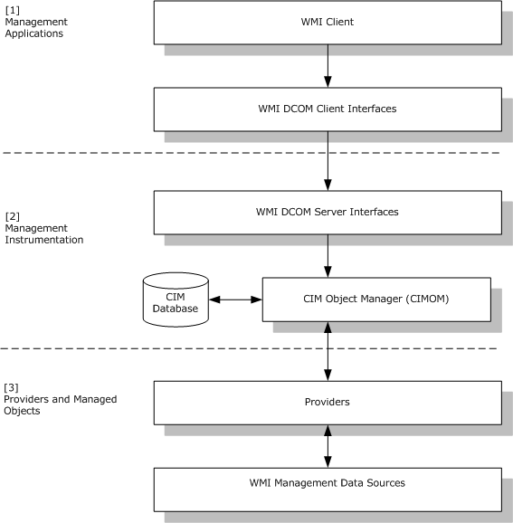

Figure 1: Windows Management Instrumentation Remote Protocol architecture

At layer 3, the Providers are designed to interact locally with WMI Management Data Sources. Providers implement abstract interface as specified in section [3.1.4.17](#Section_3.1.4.17.4). Windows Management Instrumentation Remote Protocol management data sources are designed to interact locally with [**manageable entities**](#gt_manageable-entity). Layer 2 supports the core of the Windows Management Instrumentation Remote Protocol service and is called the CIM Object Manager (CIMOM). CIMOM interacts with CIM database for storing or accessing CIM class and CIM instances that are [**static CIM object**](#gt_static-cim-object); CIM providers for storing or accessing CIM class and CIM instances that are dynamic from the [DMTF-DSP0004]. WMI DCOM Client Interfaces in Layer 1 and WMI DCOM Server Interfaces in Layer 2 implement the [**Distributed Component Object Model**](#gt_distributed-component-object-model-dcom) interfaces (as specified in [MS-DCOM](../MS-DCOM/MS-DCOM.md)]) that are used by the Windows Management Instrumentation Remote Protocol to communicate over the network between Windows Management Instrumentation Remote Protocol [**clients**](#gt_client) and [**servers**](#gt_server). This layer is the only layer that communicates over the network. Network communication is achieved by using the Distributed Component Object Model (DCOM) Remote Protocol and a set of Windows Management Instrumentation Remote Protocol DCOM interfaces, as specified in section [3.1.4](#Section_3.2.4).

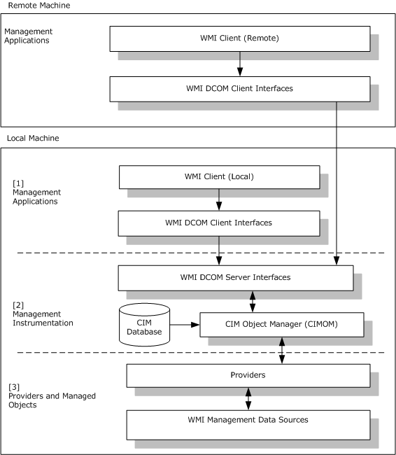

Figure 2: Clients can be local or remote from the server

Windows Management Instrumentation Remote Protocol clients can be local or remote from the server, as illustrated in the preceding figure. In either case, the same set of Windows Management Instrumentation Remote Protocol interfaces is used.

The communication works the same way between clients and server; all interactions between clients and server are made through the DCOM Remote Protocol locally or remotely. Therefore, clients are always acting in a message submission mode through the DCOM Remote Protocol to leverage the Windows Management Instrumentation Remote Protocol interfaces that are implemented on the server side.

The client can call the server in one of the following ways:

- Synchronous calls
- Semisynchronous calls
- Asynchronous calls
The server APIs for synchronous and semisynchronous APIs are the same, but the call is executed synchronously if the flags do not contain WBEM_FLAG_RETURN_IMMEDIATELY. If the flag WBEM_FLAG_RETURN_IMMEDIATELY is specified, the call is executed semisynchronously. Examples of such APIs include [IWbemServices::GetObject (section 3.1.4.3.4)](#Section_3.1.4.3.5), [IWbemServices::PutClass (section 3.1.4.3.6)](#Section_3.1.4.3.7), and so on.

The IWbemServices methods that end with Async are asynchronous counterparts for their synchronous APIs. Example of async APIs are [IWbemServices::GetObjectAsync (section 3.1.4.3.5)](#Section_3.1.4.3.5), [IWbemServices::PutClassAsync (section 3.1.4.3.7)](#Section_3.1.4.3.7), and so on

The management information that is exchanged between clients and server (and server and clients) is transmitted over the network by the Windows Management Instrumentation Remote Protocol as a custom-marshaled payload, as specified in [MS-DCOM] section 2.2.18.6.

The Windows Management Instrumentation Remote Protocol serializes the management information that is transmitted, as specified in [MS-WMIO](../MS-WMIO/MS-WMIO.md). Before reading this Windows Management Instrumentation Remote Protocol document, acquire a working knowledge of the concepts, structures, and communication protocols as specified in [MS-DCOM], [DMTF-DSP0004], and [MS-WMIO]. Namespace security is controlled by using security descriptors, as specified in [MS-DTYP](../MS-DTYP/MS-DTYP.md).

## 1.4 Relationship to Other Protocols

The Windows Management Instrumentation Remote Protocol uses the DCOM Remote Protocol to communicate over the network and to authenticate all requests issued against the infrastructure. The DCOM Remote Protocol is actually the foundation for the Windows Management Instrumentation Remote Protocol and is used to accomplish the following:

- Establish the protocol.
- Secure the communication channel.
- Authenticate clients.
- Implement reliable communication between clients and servers.
This implies that the DCOM Remote Protocol implementation provides and uses all underlying protocols, as specified in [MS-RPCE](../MS-RPCE/MS-RPCE.md), [MS-DCOM](../MS-DCOM/MS-DCOM.md), and [[C706]](https://go.microsoft.com/fwlink/?LinkId=89824).

In addition to DCOM Remote Protocol support, the Windows Management Instrumentation Remote Protocol uses a special encoding, as specified in [MS-WMIO](../MS-WMIO/MS-WMIO.md), to transfer information as specified in [[DMTF-DSP0004]](https://go.microsoft.com/fwlink/?LinkId=89848) over the network.

## 1.5 Prerequisites/Preconditions

The client that uses the protocol possesses valid credentials that are recognized by the server accepting the client requests. The client uses [**security providers**](#gt_security-provider) that recognize such credentials to authenticate to the remote server by using the [**Security Support Provider Interface (SSPI)**](#gt_security-support-provider-interface-sspi), which is supported by the Remote Procedure Call Protocol Extensions, as specified in [MS-RPCE](../MS-RPCE/MS-RPCE.md).

The server system is started with the DCOM Remote Protocol [**activation**](#gt_activation) service fully initialized before the activation request. The client is configured to receive activation requests from the server if it wants to call the service asynchronously, as specified in section [4.4](#Section_4.4).

An implementation of the DCOM Remote Protocol, as specified in [MS-DCOM](../MS-DCOM/MS-DCOM.md), needs to be available.

## 1.6 Applicability Statement

The Windows Management Instrumentation Remote Protocol implementation is designed for managing components that are represented by [**CIM classes**](#gt_015d0e5e-5166-4987-98b9-9c4128cf55be) on remote clients and servers. This protocol is designed to act as a transport for [**CIM**](#gt_common-information-model-cim)-compatible management objects and operations on [**CIM objects**](#gt_cim-object).

## 1.7 Versioning and Capability Negotiation

This document covers versioning issues in the following areas. The Windows Management Instrumentation Remote Protocol does explicit negotiation as follows:

- The client of this protocol uses the mechanism, as specified in [MS-DCOM](../MS-DCOM/MS-DCOM.md) section 1.7, to discover which interfaces are supported by the exported object and to interpret the E_NOINTERFACE result, as specified in [MS-DCOM] section 1.7. The client then adjusts its behavior based on the availability of the requested interface, as specified in sections [3.2.3](#Section_3.2.3) and [3.2.4.2.8](#Section_3.2.4.2.8).
- The protocol uses return codes as a capability discovery mechanism; the client interprets them as a capability negotiation, as specified in section [3.2.4.1.1](#Section_3.2.4.1.1).
- The protocol uses return values and parameters to negotiate the locale capabilities of the server as specified in section 3.2.3.

## 1.8 Vendor-Extensible Fields

In order to extend the [**CIM**](#gt_common-information-model-cim) schema using the Windows Management Instrumentation Remote Protocol, vendors MUST use operations as specified in section [3.1.4.3](#Section_3.1.4.3.13).

This protocol uses HRESULT values as specified in [MS-ERREF](../MS-ERREF/MS-ERREF.md). Vendors can define their own HRESULT values, provided they set the C bit (0x20000000) for each vendor-defined value, indicating that the value is a customer code.

## 1.9 Standards Assignments

There are no standards assignments for this protocol. This protocol uses the following [**class identifiers (CLSIDs)**](#gt_class-identifier-clsid) (as specified in [MS-DCOM](../MS-DCOM/MS-DCOM.md) section 1.9):

- CLSID_WbemLevel1Login ({8BC3F05E-D86B-11D0-A075-00C04FB68820})
- CLSID_WbemBackupRestore ({C49E32C6-BC8B-11D2-85D4-00105A1F8304})
The following [**GUIDs**](#gt_globally-unique-identifier-guid) are used for the interfaces:

- IID_IWbemLevel1Login ({F309AD18-D86A-11d0-A075-00C04FB68820})
- IID_IWbemLoginClientID ({d4781cd6-e5d3-44df-ad94-930efe48a887})
- IID_IWbemLoginHelper ({541679AB-2E5F-11d3-B34E-00104BCC4B4A})
- IID_IWbemServices ({9556DC99-828C-11CF-A37E-00AA003240C7})
- IID_IWbemBackupRestore ({C49E32C7-BC8B-11d2-85D4-00105A1F8304})
- IID_IWbemBackupRestoreEx ({A359DEC5-E813-4834-8A2A-BA7F1D777D76})
- IID_IWbemClassObject ({DC12A681-737F-11CF-884D-00AA004B2E24})
- IID_IWbemContext ({44aca674-e8fc-11d0-a07c-00c04fb68820})

# 2 Messages

The following sections specify how Windows Management Instrumentation Remote Protocol messages are transported and specify Windows Management Instrumentation Remote Protocol message syntax.

## 2.1 Transport

Windows Management Instrumentation Remote Protocol messages MUST be transported via the DCOM Remote Protocol. The Windows Management Instrumentation Remote Protocol objects that are exported by the [**Windows Management Instrumentation (WMI)**](#gt_windows-management-instrumentation-wmi) server MUST be capable of DCOM activation, as specified in [MS-DCOM](../MS-DCOM/MS-DCOM.md) section 3.2.4.1.1.

The client connection MUST be secured at an [**authentication level**](#gt_authentication-level) that is negotiated by the DCOM Remote Protocol infrastructure.

## 2.2 Common Data Types

### 2.2.1 WQL Query

A client has the capability to express a query against a server. This query MUST be expressed in the [**WMI Query Language (WQL)**](#gt_wmi-query-language-wql). WQL is a subset of the American National Standards Institute Structured Query Language, as specified in [[FIPS127]](https://go.microsoft.com/fwlink/?LinkId=89865) and [[MSDN-WQL]](https://go.microsoft.com/fwlink/?LinkId=90168). WQL differs from the standard SQL in that WQL retrieves from classes rather than tables, and returns [**CIM classes**](#gt_015d0e5e-5166-4987-98b9-9c4128cf55be) or [**CIM instances**](#gt_cim-instance) rather than rows. WQL supports a specific semantic designed to query against CIM classes or CIM instances with their related characteristics. Queries MUST be of one of the following 3 forms:

- Schema queries: Queries focused on CIM classes.
- Data queries: Queries focused on CIM instances.
- Event queries: Queries focused on events triggered by state changes of CIM classes or CIM instances. Events triggered on CIM instances can be internal to the infrastructure (intrinsic) or external to the infrastructure (extrinsic). Events can also be timer events.
WQL uses terminologies and concepts, as specified in [[DMTF-DSP0004]](https://go.microsoft.com/fwlink/?LinkId=89848), except as noted below, and requires familiarity with the [**CIM**](#gt_common-information-model-cim) model. The server MUST treat a backslash as an escape character in a WQL query, except within a LIKE clause. The server MUST treat literal strings in WQL data as case-insensitive, contrary to what [DMTF-DSP0004] specifies.

The next section specifies the complete syntax of WQL queries for schema, data, and event queries.

#### 2.2.1.1 WQL Schema and Data Query

The syntax for the WQL schema and data queries is provided in [**Augmented Backus-Naur Form (ABNF)**](#gt_augmented-backus-naur-form-abnf).

; -----------------------------------

; WQL schema and data queries

; -----------------------------------

DATA-WQL =

("SELECT" <PROPERTY-LIST> "FROM" <CLASS-NAME>

<OPTIONAL-SEL-WHERE>)/

("SELECT" ASTERISK "FROM" <CLASS-NAME> <OPTIONAL-SEL-WHERE>)/

("SELECT" ASTERISK "FROM META_CLASS" <OPTIONAL-META-WHERE>)/

("ASSOCIATORS OF {" <OBJECT-REL-PATH> "}"

<OPTIONAL-ASSOC-WHERE>)/

("REFERENCES OF {" <OBJECT-REL-PATH> "}" <OPTIONAL-REF-WHERE>)

PROPERTY-LIST = <PROPERTY-NAME> <PROPERTY-LIST2>

PROPERTY-LIST2 = [COMMA <PROPERTY-LIST>]

OPTIONAL-SEL-WHERE = ["WHERE" <EXPR>]

OPTIONAL-META-WHERE = ["WHERE __THIS ISA" <CLASS-NAME>]

OPTIONAL-ASSOC-WHERE =

["WHERE" [ "AssocClass=" <CLASS-NAME> BLANK ]

[ "RequiredAssocQualifier=" <QUALIFIER-NAME> BLANK ]

[ "RequiredQualifier=" <QUALIFIER-NAME> BLANK ]

[ "ResultClass=" <CLASS-NAME> BLANK ]

[ "ResultRole=" <PROPERTY-NAME> BLANK ]

[ "Role=" <PROPERTY-NAME> BLANK ]

[ "KeysOnly" BLANK ]

[ "ClassDefsOnly" BLANK ]

]

OPTIONAL-REF-WHERE =

["WHERE" [ "RequiredQualifier=" <QUALIFIER-NAME> BLANK ]

[ "ResultClass=" <CLASS-NAME> BLANK ]

[ "Role=" <PROPERTY-NAME> BLANK ]

[ "KeysOnly" BLANK ]

[ "ClassDefsOnly" BLANK ]

]

OBJECT-REL-PATH =

<CLASS-NAME> "=" <TYPED-CONSTANT> <OBJECT-REL-PATH2>

OBJECT-REL-PATH2 =

[COMMA <OBJECT-REL-PATH>]

; -----------------------------------

; Expression

; -----------------------------------

EXPR =

( [OPEN-PARENTHESIS] <PROPERTY-EVALUATION>

<EXPR2> [CLOSE-PARENTHESIS] ) /

( [OPEN-PARENTHESIS] "__CLASS" <EQUIVALENT-OPERATOR>

<CLASS-NAME> <EXPR2> [CLOSE-PARENTHESIS] )

EXPR2 = ( ["OR" [OPEN-PARENTHESIS] <EXPR> [CLOSE-PARENTHESIS] ])/

( ["AND" [OPEN-PARENTHESIS] <EXPR> [CLOSE-PARENTHESIS] ])

PROPERTY-EVALUATION =

( <PROPERTY-NAME> <OPERATOR> <TYPED-CONSTANT> ) /

( <PROPERTY-NAME> <IS-OPERATOR> "NULL" )

OPERATOR = <EQUIVALENT-OPERATOR> /

<COMPARE-OPERATOR>

EQUIVALENT-OPERATOR = "=" / "!=" / "<>"

COMPARE-OPERATOR = "<=" / ">=" / "<" / ">" / "LIKE"

IS-OPERATOR = "IS" / "IS NOT"

; -----------------------------------

; Characters

; -----------------------------------

ALPHA = %x41-5A

DIGIT = %x30-39

COMMA = ","

ASTERISK = "*"

OPEN-PARENTHESIS = "("

CLOSE-PARENTHESIS = ")"

BLANK = " " / "\x09"

DOUBLEUNDERSCORE = %x5f %x5f

STRING-IDENTIFIER = ALPHA *(ALPHA / DIGIT / (*("_") ALPHA / DIGIT))

CLASS-NAME = [DOUBLEUNDERSCORE] <STRING-IDENTIFIER>

PROPERTY-NAME = [DOUBLEUNDERSCORE] <STRING-IDENTIFIER>

QUALIFIER-NAME = <STRING-IDENTIFIER>

TYPED-CONSTANT = INT /

REAL /

UNICODE-STRING /

DATETIME /

BOOL

INT = "[-+]?\d+"

REAL = "[-+]?(\d*\.\d+)|(\d+)"

STRING = ["]([a-z][A-Z]\d)*["]

; DATETIME is specified in section 2.2.1 of [DMTF-DSP0004]

BOOL = "TRUE" / "FALSE"

| Schema objects and keywords | Description |
| --- | --- |
| UNICODE-STRING | A string constant with Unicode characters. This string constant is surrounded by ("") or a (''). |
| CLASS-NAME | Identifies the [**CIM class**](#gt_cim-class) name to be queried. |
| PROPERTY-NAME | Identifies the name of a property of the CIM class. |
| QUALIFIER-NAME | In the context of a [**WQL**](#gt_wmi-query-language-wql) query, QUALIFIER-NAME is an attribute of a PROPERTY-NAME defining the nature of an association with another CIM class. All qualifiers, including any custom-defined qualifier, MUST be supported within the context of a WQL query. |
| DATA-WQL | A string expressing the WQL query. The WQL string uses different WQL reserved keywords to select the type of information desired. |
| SELECT | A keyword expressing the selection of information requested (similar to SQL SELECT). SELECT expresses the CIM class or [**CIM**](#gt_common-information-model-cim) instance to be queried. It MUST be specified when the ASSOCIATORS OF or the REFERENCES OF keyword is not used. It MUST NOT be used when the ASSOCIATORS OF or the REFERENCES OF keyword is used. |
| PROPERTY-LIST | A list of PROPERTY-NAME values. PROPERTY-NAME values in the list MUST be separated by a comma (","). |
| ASTERISK | Requires all properties of a CIM class or a CIM instance. |
| FROM | A keyword that MUST be specified with the SELECT statement to express the CIM class or CIM instance the query MUST be executed against. |
| OPTIONAL-SEL-WHERE | The WHERE statement narrows the scope of a SELECT. |
| OPTIONAL-META-WHERE | The WHERE statement narrows the scope of a SELECT. The WHERE statement followed by the __THIS ISA statement is narrowing the scope of the WQL query to return [**CIM instances**](#gt_cim-instance) according to the following rule: The only CIM instances returned are the instances of the class CLASS-NAME and all the subclasses in CLASS-NAME's class inheritance hierarchy. |
| __CLASS | A keyword referring to the [**CIM object**](#gt_cim-object), indicating the class of the current CIM object. The __CLASS keyword in a WHERE clause only selects CIM instances of derived classes made out of the CLASS-NAME. |
| ASSOCIATORS OF | A keyword that is a WQL statement to locate associated [**CIM classes**](#gt_015d0e5e-5166-4987-98b9-9c4128cf55be) or CIM instances. It MUST NOT be used in combination with the SELECT keyword and the REFERENCES OF keyword. |
| OPTIONAL-ASSOC-WHERE | If the WHERE statement is specified in an ASSOCIATORS OF WQL query, it narrows the scope to one or several characteristics of the association and associated CIM classes. The filter expression can be made of several specific keywords and expressions to validate these characteristics. Each expression MUST be separated by a BLANK character, as specified in the preceding ABNF notation. Each expression MUST NOT be used more than once in a single WQL query. The keyword supported to narrow the scope of an ASSOCIATORS OF query are AssocClass, RequiredAssocQualifier, RequiredQualifier, ResultClass, ResultRole, Role, KeysOnly, and ClassDefsOnly. |
| REFERENCES OF | A keyword that is a WQL statement to locate the CIM classes or CIM instances associating CIM classes or CIM instances. It MUST NOT be used in combination with the SELECT keyword and the ASSOCIATORS OF keyword. |
| OPTIONAL-REF-WHERE | If the WHERE statement is specified in a REFERENCES OF query, it narrows the scope to one or several characteristics of the association and associated classes. The filter expression can be made of several specific keywords and expressions to express these characteristics. Each expression MUST be separated by a BLANK character. Each expression MUST NOT be used more than once in a single WQL query. The keywords supported to narrow the scope of a REFERENCES OF query are RequiredQualifier, ResultClass, Role, KeysOnly, and ClassDefsOnly. |
| OBJECT-REL-PATH | The [**CIM relative path**](#gt_62a80d64-12c1-4cb7-bab5-88fa6b4c5f57) of the CIM class or CIM instance to be queried. It MUST be specified for ASSOCIATORS OF and REFERENCES OF queries. |
| KeysOnly | If the KeysOnly keyword is being used in ASSOCIATORS OF and REFERENCES OF queries, only the key properties of resulting CIM instances MUST be populated. |
| ClassDefsOnly | If the ClassDefsOnly keyword is being used in ASSOCIATORS OF and REFERENCES OF queries only the CIM class definitions of resulting CIM instances MUST be returned. |
| AssocClass | If the AssocClass keyword is being used in ASSOCIATORS OF queries, the resulting CIM instances MUST be associated with association class or CIM instances made out of the CLASS-NAME specified. |
| RequiredAssocQualifier | If the RequiredAssocQualifier keyword is being used in ASSOCIATORS OF queries, the returned CIM instances is associated with the source object through an association class that included the specified qualifier. For example, in the following query: `ASSOCIATORS OF {Win32_LogicalDisk.DeviceID="C:"} WHERE RequiredAssocQualifier = Association` the returned CIM instances is associated with the source object represented by {Win32_LogicalDisk.DeviceID="C:"} through an association class that includes the qualifier "association". |
| RequiredQualifier | If the RequiredQualifier keyword is being used in ASSOCIATORS OF and REFERENCES OF queries, the resulting CIM instances MUST have the CIM qualifier of the given name set. |
| ResultClass | If the ResultClass keyword is being used in ASSOCIATORS OF and REFERENCES OF queries, the resulting CIM instances MUST belong to or be derived from the class specified by CLASS-NAME. |
| Role | If the Role keyword is being used in ASSOCIATORS OF and REFERENCES OF queries, the result MUST only return CIM instances where the role matches the reference [**CIM property**](#gt_a95b6b41-8fd2-4d80-8632-1eb34c17a4fe) name of the association class. |
| ResultRole | If the ResultRole keyword is being used in ASSOCIATORS OF queries, the result MUST only return CIM instances where the role matches the reference CIM property name of the CIM instances. |

| Operator | Description | Applicable Type |
| --- | --- | --- |
| = | Test the equivalence of two values. | string, numeric, reference, datetime |
| != | Test the negated equivalence of two values. | string, numeric, reference, datetime |
| > | Test whether the value of the property is greater than that of the typed-constant. | string, numeric, datetime |
| < | Test whether the value of the property is less than that of the typed-constant. | string, numeric, datetime |
| >= | Test whether the value of the property is greater than or equal to that of the typed-constant. | string, numeric, datetime |
| <= | Test whether the value of the property is less than or equal to that of the typed-constant. | string, numeric, datetime |
| LIKE | Test whether a given character string of the property value matches a specified pattern of the typed-constant. The specified pattern can contain exactly the characters to match, or it can contain meta characters. The table below lists the meta characters. If used with a non-string property, the behavior is the same as the '=' operator, and it tests the equivalence of two values. The use of meta characters mentioned below with a non-string property results in the error WBEM_E_INVALID_QUERY. | string |
| IS | Test whether the value of the property is null. | string, numeric, reference, datetime, object |
| IS NOT | Test whether the value of property is not null. | string, numeric, reference, datetime, object |

If typed-constant is string, the operator MUST perform a case-insensitive lexicographic relation test. If the operator is not applicable to the property type, the server MUST return WBEM_E_INVALID_QUERY.

The following characters have special meaning within a LIKE clause:

| Character | Description |
| --- | --- |
| [ | Any one character within a range specified as a sequence of one or more of the following formats, terminated by a "]": A non-caret followed by "-" or "=" followed by any character except the terminating "]" matches any character in a sequential range of characters. For instance, "[a-f]" or "[a=f]" matches any character from "a" through "f". A non-caret followed by "-" or "=" followed by the terminating "]" matches the two literal characters inside the brackets: the non-caret and the "-" or "=". A caret followed by any character except the terminating "]" matches any character except those in the sequence(s) following the caret, up to the terminating "]". For example, "[^ad-f]" matches anything except an "a", "d", "e", or "f". A caret followed by a closing bracket matches the caret itself: "[^]". Any other character matches the literal character itself. Note that "%", "_", and "[" serve as literals within a bracketed sequence. |
| - | - |
| % | Any string of 0 (zero) or more characters. The following example finds all instances where "Win" is found anywhere in the class name: SELECT * FROM meta_class WHERE __Class LIKE "%Win%" |
| _ | Any one character. Any literal underscore used in the query string MUST be escaped by placing it inside [] (square brackets). |

#### 2.2.1.2 WQL Event Query

The following example shows the syntax for WQL event queries in [**ABNF**](#gt_augmented-backus-naur-form-abnf) notation.

; -----------------------------------

; WQL event queries

; -----------------------------------

EVENT-WQL = "SELECT" <PROPERTY-LIST> "FROM" /

<EVENT-CLASS-NAME> <OPTIONAL-WITHIN> <EVENT-WHERE>

OPTIONAL-WITHIN = ["WITHIN" <INTERVAL>]

INTERVAL = 1*MODULOREAL

EVENT-WHERE = ["WHERE" <EVENT-EXPR>]

EVENT-EXPR = ( (<INSTANCE-STATE> "ISA" <CLASS-NAME> <EXPR2>) /

<EXPR> )

["GROUP WITHIN" <INTERVAL>

( ["BY" [<INSTANCE-STATE> DOT] <PROPERTY-NAME>]

["HAVING" <EXPR>] )]

INSTANCE-STATE = "TARGETINSTANCE" / "PREVIOUSINSTANCE"

; -----------------------------------

; Expression

; -----------------------------------

EXPR =

[OPEN-PARENTHESIS] <PROPERTY-EVALUATION> /

<EXPR2> [CLOSE-PARENTHESIS]

EXPR2 = ( ["OR" [OPEN-PARENTHESIS] <EXPR> /

[CLOSE-PARENTHESIS] ] ) /

( ["AND" [OPEN-PARENTHESIS] <EXPR> /

[CLOSE-PARENTHESIS] ] )

PROPERTY-EVALUATION =

( <PROPERTY-NAME> <OPERATOR> <TYPED-CONSTANT> ) /

( <PROPERTY-NAME> <IS-OPERATOR> "NULL" )

OPERATOR = <EQUIVALENT-OPERATOR> /

<COMPARE-OPERATOR>

EQUIVALENT-OPERATOR = "=" / "!=" / "<>"

COMPARE-OPERATOR = "<=" / ">=" / "<" / ">" / "LIKE"

IS-OPERATOR = "IS" / "IS NOT"

; -----------------------------------

; Characters

; -----------------------------------

ALPHA = %x41-5A

DIGIT = %x30-39

DOT = ","

COMMA = "."

ASTERISK = "*"

OPEN-PARENTHESIS = "("

CLOSE-PARENTHESIS = ")"

STRING-IDENTIFIER = ALPHA *(ALPHA / DIGIT / (*("_") ALPHA / DIGIT))

DOUBLEUNDERSCORE = "__"

CLASS-NAME = [DOUBLEUNDERSCORE] <STRING-IDENTIFIER>

EVENT-CLASS-NAME = [DOUBLEUNDERSCORE] <STRING-IDENTIFIER>

PROPERTY-NAME = [DOUBLEUNDERSCORE] <STRING-IDENTIFIER>

TYPED-CONSTANT = INT /

REAL /

STRING /

DATETIME /

BOOL

INT = "[-+]?\d*"

REAL = "[-+]?\d*(\.\d+)?"

MODULOREAL = "[+]?\d*(\.\d+)?"

STRING = ["]([a-z][A-Z]\d)*["]

; DATETIME is specified in section 2.2.1 of [DMTF-DSP0004]

BOOL = "TRUE" / "FALSE"

| Objects and keywords | Description |
| --- | --- |
| CLASS-NAME | Identifies a [**CIM class**](#gt_cim-class) name to be queried for events. |
| PROPERTY-NAME | Identifies the name of a [**CIM property**](#gt_a95b6b41-8fd2-4d80-8632-1eb34c17a4fe) of a CIM class. |
| EVENT-WQL | A string expressing the WQL event query. The [**WQL**](#gt_wmi-query-language-wql) string uses different WQL reserved keywords to select the type of information wanted. |
| SELECT | A keyword expressing the selection of information requested (similar to SQL SELECT). SELECT expresses the CIM class or [**CIM**](#gt_common-information-model-cim) instance to be queried. It MUST be specified in a WQL event query. |
| PROPERTY-LIST | A list of PROPERTY-NAME values. PROPERTY-NAME values in the list MUST be separated by a comma (","). |
| ASTERISK | Requires all properties of a CIM class or a CIM instance. |
| FROM | A keyword that MUST be specified with the SELECT statement to express the CIM class or CIM instance that the query MUST be run against. |
| EVENT-CLASS-NAME | MUST be specified and MUST be an intrinsic, an extrinsic, or a timer event class. An [**intrinsic event**](#gt_intrinsic-event) class is a class derived from __InstanceOperationEvent, __ClassOperationEvent, or __NamespaceOperationEvent, representing possible intrinsic events. An [**extrinsic event**](#gt_extrinsic-event) class is a class derived from __ExtrinsicEvent, representing possible extrinsic events. A timer event class is a class derived from __TimerEvent event class, representing possible timer events. |
| WITHIN | A keyword indicating the server to poll the system for an event. In case of an intrinsic EVENT-CLASS-NAME, the WITHIN keyword MUST be specified. The WITHIN keyword is optional for extrinsic EVENT-CLASS-NAME. If the WITHIN keyword is specified, the INTERVAL MUST be specified. |
| INTERVAL | INTERVAL specifies the polling interval. It MUST be expressed in seconds. If "WITHIN" is specified, the INTERVAL MUST be specified. |
| EVENT-WHERE | The WHERE statement narrows the scope of a SELECT event query if the EVENT-CLASS-NAME is an extrinsic or timer event CIM class. The WHERE statement MUST be specified to narrow the scope of a SELECT event query if the EVENT-CLASS-NAME is an intrinsic CIM class. |
| INSTANCE-STATE | Indicates the type of instance to be evaluated. INSTANCE-STATE MUST be specified if CLASS-NAME is an intrinsic CIM class. INSTANCE-STATE is optional if CLASS-NAME is an extrinsic CIM class. If specified, INSTANCE-STATE MUST be PREVIOUSINSTANCE (to indicate that the state of the CIM class or CIM instance before the event MUST be evaluated) or TARGETINSTANCE (to indicate that the state of the CIM class or CIM instance after the event MUST be evaluated). |
| ISA | A keyword that MUST be used in combination with the INSTANCE-STATE keyword. It is used as a comparative operator between the INSTANCE-STATE and a CLASS-NAME to reduce the scope of events returned to the [**CIM instances**](#gt_cim-instance) made out of the CLASS-NAME. |
| GROUP WITHIN | If the GROUP WITHIN keyword is used, the INTERVAL MUST be specified. This keyword indicates that all events occurring during the WITHIN INTERVAL period MUST be grouped as one event. |
| HAVING | If the HAVING keyword is specified, it MUST be followed by EXPR to filter the selection of events. This keyword indicates that all events grouped during the GROUP WITHIN period MUST meet the expression specified in EXPR before being returned as one event. |
| BY | A keyword that groups event instances sharing a same value on a specified PROPERTY-NAME. In such a case, events are returned that represent a group of events sharing the same PROPERTY-NAME value. The system MUST return as many events representing a group of events as there are PROPERTY-NAME values. |
| EVENT-EXPR | An expression for filtering [**WMI**](#gt_windows-management-instrumentation-wmi) events. |

### 2.2.2 CIM Path and Namespace

The syntax for CIM path and namespace is provided in [**ABNF**](#gt_augmented-backus-naur-form-abnf) notation.

; -----------------------------------

; CIM PATH

; -----------------------------------

CIMPATH = ( <NAMESPACE-PATH> COLON <OBJECT-PATH> ) /

<OBJECT-PATH>

NAMESPACE-PATH = [<MACHINE-PATH>] NAMESPACE

MACHINE-PATH = BACKSLASH BACKSLASH <MACHINENAME> BACKSLASH

OBJECT-PATH = <CLASS-NAME> [<INSTANCE-KEY>]

INSTANCE-KEY = (EQUAL "@") / DOT <KEY-VALUE-LIST>

KEY-VALUE-LIST = <PROPERTY-NAME> EQUAL

<TYPED-CONSTANT> <KEY-VALUE-LIST2>

KEY-VALUE-LIST2 = [ COMMA KEY-VALUE-LIST ]

CLASS-NAME = [__]<STRING-IDENTIFIER>

PROPERTY-NAME = [__]<STRING-IDENTIFIER>

; -----------------------------------

; NAMESPACE

; -----------------------------------

NAMESPACE = <STRING-IDENTIFIER> <SUB-NAMESPACE>

<SUB-NAMESPACE> = [ BACKSLASH <NAMESPACE> ]

TYPED-CONSTANT = INT /

REAL /

STRING /

DATETIME /

BOOL

INT = "[-+]?\d*"

REAL = "[-+]?\d*(\.\d+)?"

STRING = ["]([a-z][A-Z]\d)*["]

DATETIME =

"(\d\d\d\d)(0\d|1[012])(0\d|[12][0-9]|3[01])([0-1]\d|2[0-3])([0-5]\d)([0-5]\d)[.]\d\d\d\d\d\d[+-]([0-6][02468][0]|7[0-2][0])"

BOOL = "TRUE" / "FALSE"

; -----------------------------------

; Characters

; -----------------------------------

ALPHA = %x41-5A

DIGIT = %x30-39

BACKSLASH = "\"

DOT = "."

STRING-IDENTIFIER = ALPHA *(ALPHA / DIGIT / (*("_") ALPHA / DIGIT))

COLON=":"

MACHINENAME = <STRING-IDENTIFIER> / DOT

| Objects and keywords | Description |
| --- | --- |
| OBJECT-PATH | The path of the [**CIM class**](#gt_cim-class) or [**CIM instance**](#gt_cim-instance) to be referenced. |
| MACHINENAME | The network-identifiable name of the machine where the referenced [**WMI**](#gt_windows-management-instrumentation-wmi) class, instance, or namespace resides. |
| CLASS-NAME | Identifies a CIM class name. |
| INSTANCE-KEY | Uniquely identifies the instance of a given CIM class. |
| KEY-VALUE-LIST | List of property names and their values, separated by a ",". Each property value pair is represented in propertyName=value format. |
| PROPERTY-NAME | Identifies the name of a property of the CIM class. |

### 2.2.3 Protocol Return Codes

Codes that are returned by the protocol are represented as an HRESULT, as specified in [MS-ERREF](../MS-ERREF/MS-ERREF.md) section 2.1.

The HRESULT values that are documented in the following table are interpreted by the protocol through a specific set of interface methods, as specified in sections [3.1.4.3](#Section_3.1.4.3.13), [3.1.4.4.2](#Section_3.1.4.4.2), and [3.2.4.1.1](#Section_3.2.4.1.1).

The severity bit of HRESULT MUST be interpreted as specified in [MS-ERREF] section 2.1. HRESULT errors are not recoverable by the protocol. HRESULT successes, other than the ones specified in the following table, MUST be considered as equal to WBEM_S_NO_ERROR.

| Constant/value | Description |
| --- | --- |
| WBEM_S_NO_ERROR 0x00000000 | The operation was successful. |
| WBEM_S_FALSE 0x00000001 | Either no more [**CIM objects**](#gt_cim-object) are available, the number of returned CIM objects is less than the number requested, or this is the end of an enumeration. |
| WBEM_S_TIMEDOUT 0x00040004 | A call timed out. This is not an error condition. |
| WBEM_S_NEW_STYLE 0x000400FF | The operation was successful and indicates that the receiver of the call is able to receive optimized [IWbemObjectSink::Indicate](#Section_3.1.4.2.1) calls. |

### 2.2.4 IWbemClassObject Interface

The signatures of many methods that are related to the Windows Management Instrumentation Remote Protocol include a parameter to specify an IWbemClassObject [**interface pointer**](#gt_interface-pointer). This parameter MUST be custom marshaled by the DCOM Remote Protocol, as specified in the following table. The IWbemClassObject interface represents a [**WMI**](#gt_windows-management-instrumentation-wmi) object, such as a WMI class or an object instance. All [**CIM objects**](#gt_cim-object) ([**CIM classes**](#gt_015d0e5e-5166-4987-98b9-9c4128cf55be) and [**CIM instances**](#gt_cim-instance)) that are passed during WMI calls between the [client](#Section_1.1) and server are objects of this interface.

| Parameter/source | Value/description |
| --- | --- |
| Interface [**UUID**](#gt_universally-unique-identifier-uuid) | {DC12A681-737F-11CF-884D-00AA004B2E24} |
| Marshaling buffer layout | The buffer representing a [**CIM object**](#gt_cim-object) MUST be encoded using the EncodingUnit object block, as specified in [MS-WMIO](../MS-WMIO/MS-WMIO.md) section 2.2.1. |
| Unmarshaler [**CLSID**](#gt_class-identifier-clsid) | {4590F812-1D3A-11D0-891F-00AA004B2E24} This CLSID MUST represent the unmarshaler CLSID that is supplied by WMI to [**DCOM**](#gt_distributed-component-object-model-dcom) and MUST be sent over the network by DCOM when custom marshaling is implemented. For more information (OBJREF_CUSTOM), see the [MS-DCOM](../MS-DCOM/MS-DCOM.md). |

#### 2.2.4.1 Prototype Result Object

The prototype result object is an [IWbemClassObject (section 2.2.4)](#Section_2.2.4) that is returned when the *lFlags* parameter of the [IWbemServices::ExecQuery (section 3.1.4.3.18)](#Section_3.1.4.3.18) or [IWbemServices::ExecQueryAsync (section 3.1.4.3.19)](#Section_3.1.4.3.19) method includes the WBEM_FLAG_PROTOTYPE flag.

The query returns the [**CIM class**](#gt_cim-class) object that is specified in the CLASS-NAME of the query that is modified to match the query.

If the query specifies **PROPERTY-LIST**, as specified in section [2.2.1.1](#Section_2.2.1.1), the class object is modified to represent the results of the query by removing all the properties that are not specified in the **PROPERTY-LIST** of the query and by adding selected properties with the **Order** qualifier (see the 2nd paragraph following concerning the Order qualifier). In this case, the CIM class is encoded as an IWbemClassObject object, with an ObjectFlags block that contains a 0x10 value that is set as specified in [MS-WMIO](../MS-WMIO/MS-WMIO.md) section 2.2.6. If any key property is removed because it is not specified in **PROPERTY-LIST**, the 0x40 flag is set on **ObjectFlags**.

If the query specifies **ASTERISK**, as specified in section 2.2.1.1, the class object is returned with all the properties added to the **Order** qualifier. In this case, the CIM class is encoded as an IWbemClassObject object and the 0x10 flag is not set in **ObjectFlags**.

The **Order** qualifier (QUALIFIER-NAME attribute set to **Order**, see section 2.2.1.1) is an array of 32-bit signed integers. Each value in the array represents the position of the property in **PROPERTY-LIST** (if **PROPERTY-LIST** is specified) or represents the order in which the property appears in the class (if the query specifies **ASTERISK**). The position is encoded starting from 0.

For example,

select prop1,prop2,prop1 from class1

results in class1 containing only two properties, **prop1** and **prop2**. The **prop1** property is added to an **Order** qualifier that has a value of {0,2}, and the **prop2** property is added to an **Order** qualifier that has a value of {1}.

**Note** The **prop1** property occurs twice in the **PROPERTY-LIST**, at positions 1 and 3, and therefore, has two values {0,2}.

If the query specifies a **PROPERTY-LIST** that does not contain at least one of the following properties, the DerivationList in ClassPart of the CurrentClass, as specified in [MS-WMIO] section 2.2.17, is encoded as empty:

- __DERIVATION
- __SUPERCLASS
- __DYNASTY
Otherwise, the DerivationList in ClassPart of the CurrentClass is encoded in the same way as the actual CIM class that represents the **CLASS-NAME** of the query.

The PropertyLookupTable, NdTable, ValueTable, and ClassHeap in ClassPart of the CurrentClass (as specified in [MS-WMIO] section 2.2.15) are encoded to contain only the selected properties in the query.

Remaining items are encoded in the same way as the CIM class that represents the **CLASS-NAME** that is specified in the query.

#### 2.2.4.2 Extrinsic Events

Extrinsic events are events generated by a component outside the implementation. In [**WMI**](#gt_windows-management-instrumentation-wmi), extrinsic events are represented as instances of a class that is derived from the __ExtrinsicEvent class. If any component wants to generate an event, the component defines a class that is derived from the __ExtrinsicEvent class. Instances of the derived class defined by the component, represented by using [IWbemClassObject (section 2.2.4)](#Section_2.2.4), are used to send events.

__ExtrinsicEvent class is defined by WMI as shown in the following MOF text.

[abstract]

class __SystemClass

{

};

[abstract]

class __IndicationRelated : __SystemClass

{

};

[abstract: DisableOverride ToInstance ToSubClass]

class __Event : __IndicationRelated

{

uint64 TIME_CREATED;

uint8 SECURITY_DESCRIPTOR[];

};

class __ExtrinsicEvent : __Event

{

};

Where TIME_CREATED is the time at which the event is generated, represented as a 64-bit value that represents the number of 100-nanosecond intervals since January 1, 1601 (UTC), and SECURITY_DESCRIPTOR is a security descriptor, as defined in [MS-DTYP](../MS-DTYP/MS-DTYP.md), represented as an array of bytes. The security descriptor MUST specify security for events as specified in section [5.2](#Section_5.2).

### 2.2.5 WBEM_CHANGE_FLAG_TYPE Enumeration

The WBEM_CHANGE_FLAG_TYPE enumeration is used to indicate and update the type of the flag.

typedef [v1_enum] enum tag_WBEM_CHANGE_FLAG_TYPE

{

WBEM_FLAG_CREATE_OR_UPDATE = 0x00,

WBEM_FLAG_UPDATE_ONLY = 0x01,

WBEM_FLAG_CREATE_ONLY = 0x02,

WBEM_FLAG_UPDATE_SAFE_MODE = 0x20,

WBEM_FLAG_UPDATE_FORCE_MODE = 0x40

} WBEM_CHANGE_FLAG_TYPE;

**WBEM_FLAG_CREATE_OR_UPDATE:** This flag causes the put operation to update the class or instance if it does not exist, or to overwrite the class or instance if it exists already.

**WBEM_FLAG_UPDATE_ONLY:** This flag causes the put operation to update the class or instance. The class or instance MUST exist for the call to be successful.

**WBEM_FLAG_CREATE_ONLY:** This flag causes the put operation to create the class or instance. For the call to be successful, the class or instance MUST NOT exist.

**WBEM_FLAG_UPDATE_SAFE_MODE:** This flag allows updates of classes even if there are child classes, as long as the change does not cause any conflicts with child classes. An example of an update that this flag allows is the adding of a new property to the base class that was not previously mentioned in any of the child classes. If the class has instances, the update fails.

**WBEM_FLAG_UPDATE_FORCE_MODE:** This flag forces updates of classes when conflicting child classes exist. An example of an update that this flag forces is when a class qualifier is defined in a child class and the base class tries to add the same qualifier that conflicted with the existing one. In force mode, this conflict is resolved by deleting the conflicting qualifier in the child class.

### 2.2.6 WBEM_GENERIC_FLAG_TYPE Enumeration

The WBEM_GENERIC_FLAG_TYPE enumeration is used to indicate and update the type of the flag.

typedef [v1_enum] enum tag_WBEM_GENERIC_FLAG_TYPE

{

WBEM_FLAG_RETURN_WBEM_COMPLETE = 0x0,

WBEM_FLAG_RETURN_IMMEDIATELY = 0x10,

WBEM_FLAG_FORWARD_ONLY = 0x20,

WBEM_FLAG_NO_ERROR_OBJECT = 0x40,

WBEM_FLAG_SEND_STATUS = 0x80,

WBEM_FLAG_ENSURE_LOCATABLE = 0x100,

WBEM_FLAG_DIRECT_READ = 0x200,

WBEM_MASK_RESERVED_FLAGS = 0x1F000,

WBEM_FLAG_USE_AMENDED_QUALIFIERS = 0x20000,

WBEM_FLAG_STRONG_VALIDATION = 0x100000

} WBEM_GENERIC_FLAG_TYPE;

**WBEM_FLAG_RETURN_WBEM_COMPLETE:** This flag makes the operation synchronous. This is the default behavior and so this flag need not be explicitly specified.

**WBEM_FLAG_RETURN_IMMEDIATELY:** This flag causes the call to return without waiting for the operation to complete. The call result parameter contains the IWbemCallResult object by using the status of the operation that can be retrieved.

**WBEM_FLAG_FORWARD_ONLY:** This flag causes a forward-only enumerator, [IEnumWbemClassObject, (section 3.1.4.4)](#Section_3.1.4.4), to be returned. Forward-only enumerators are typically much faster and use less memory than conventional enumerators; however, they do not allow calls to [IEnumWbemClassObject::Clone](#Section_3.1.4.4.4) or [IEnumWbemClassObject::Reset](#Section_3.1.4.4.1).

**WBEM_FLAG_NO_ERROR_OBJECT:** This flag MUST NOT be set, and MUST be ignored on receipt.

**WBEM_FLAG_SEND_STATUS:** This flag registers a request with WMI to receive intermediate status reports through the client implementation of [IWbemObjectSink::SetStatus](#Section_3.1.4.2.2), if supported by the server implementation.

**WBEM_FLAG_ENSURE_LOCATABLE:** This flag ensures that any returned objects have enough information in them so that system properties, such as __PATH, __RELPATH, and __SERVER,<1> are non-NULL.

**WBEM_FLAG_DIRECT_READ:** This flag causes direct access to the specified class without regard to its parent class or [**subclasses**](#gt_fbb1e623-a709-400d-8d4a-85df94ad58c3).

**WBEM_MASK_RESERVED_FLAGS:** This flag MUST NOT be set, and MUST be ignored on receipt.

**WBEM_FLAG_USE_AMENDED_QUALIFIERS:** If this flag is set, the server retrieves any qualifiers in the [**CIM object**](#gt_cim-object) that can be localized in the current connection's locale. The set of localized qualifiers and the list of locales for which the qualifier is localized are implementation dependent. When the localized information is available, the server retrieves the localized values using the client-preferred locale. If the localized values are not available, the server returns values using the default locale.

The localized [**qualifiers**](#gt_qualifier) or [**amended qualifiers**](#gt_amended-qualifier) are identified by the qualifier flavor as defined in [MS-WMIO](../MS-WMIO/MS-WMIO.md) section 2.2.62.

If this flag is not set, the server does not retrieve any localized qualifiers for the CIM object.

**WBEM_FLAG_STRONG_VALIDATION:** This flag MUST NOT be set, and MUST be ignored on receipt.

### 2.2.7 WBEM_STATUS_TYPE Enumeration

The WBEM_STATUS_TYPE enumeration gives information about the status of the operation.

typedef enum tag_WBEM_STATUS_TYPE

{

WBEM_STATUS_COMPLETE = 0,

WBEM_STATUS_REQUIREMENTS = 0x01,

WBEM_STATUS_PROGRESS = 2

} WBEM_STATUS_TYPE;

**WBEM_STATUS_COMPLETE:** When the WMI operation is completed, WMI calls [IWbemObjectSink::SetStatus](#Section_3.1.4.2.2) with WBEM_STATUS_COMPLETE.

**WBEM_STATUS_REQUIREMENTS:** This flag MUST NOT be set, and MUST be ignored on receipt.

**WBEM_STATUS_PROGRESS:** WMI reports the progress of the operation to IWbemObjectSink::SetStatus with flag WBEM_STATUS_PROGRESS.

### 2.2.8 WBEM_TIMEOUT_TYPE Enumeration

The WBEM_TIMEOUT_TYPE enumeration gives information about the type of time-out for the process.

typedef [v1_enum] enum tag_WBEM_TIMEOUT_TYPE

{

WBEM_NO_WAIT = 0,

WBEM_INFINITE = 0xFFFFFFFF

} WBEM_TIMEOUT_TYPE;

**WBEM_NO_WAIT:** If passed as a time-out parameter to the [IEnumWbemClassObject::Next](#Section_3.1.4.4.2) method, the call returns the available objects, if any, at the time of the call; it does not wait for any more objects.

**WBEM_INFINITE:** If passed as a time-out parameter to IEnumWbemClassObject::Next, the call blocks until objects are available.

### 2.2.9 WBEM_QUERY_FLAG_TYPE Enumeration

The WBEM_QUERY_FLAG_TYPE enumeration gives information about the type of the flag.

typedef [v1_enum] enum tag_WBEM_QUERY_FLAG_TYPE

{

WBEM_FLAG_DEEP = 0,

WBEM_FLAG_SHALLOW = 1,

WBEM_FLAG_PROTOTYPE = 2

} WBEM_QUERY_FLAG_TYPE;

**WBEM_FLAG_DEEP:** If used in [IWbemServices::CreateClassEnum](#Section_3.1.4.3.10) or [IWbemServices::CreateClassEnumAsync](#Section_3.1.4.3.11), the WBEM_FLAG_DEEP constant causes the enumeration to return all the [**subclasses**](#gt_fbb1e623-a709-400d-8d4a-85df94ad58c3) in the hierarchy of a specified class but to not return the class itself.

If used in [IWbemServices::CreateInstanceEnum](#Section_3.1.4.3.17) or [IWbemServices::CreateInstanceEnumAsync](#Section_3.1.4.3.17), this constant causes the enumeration to return the instances of this class and also the instances of subclasses in the hierarchy of the class.

**WBEM_FLAG_SHALLOW:** If used in IWbemServices::CreateClassEnum or IWbemServices::CreateClassEnumAsync, the WBEM_FLAG_SHALLOW constant causes the enumeration to return the immediate subclasses of a specified class.

If used in IWbemServices::CreateInstanceEnum or IWbemServices::CreateInstanceEnumAsync, this constant causes the enumeration to return only the instances of this class and excludes all instances of subclasses.

**WBEM_FLAG_PROTOTYPE:** This flag is used for prototyping. It does not run the query; instead, it returns the [Prototype Result Object](#Section_2.2.4.1) as specified in section 2.2.4.1.

### 2.2.10 WBEM_BACKUP_RESTORE_FLAGS Enumeration

The WBEM_BACKUP_RESTORE_FLAGS enumeration gives information about the backup and restore state of the process.

typedef [v1_enum] enum tag_WBEM_BACKUP_RESTORE_FLAGS

{

WBEM_FLAG_BACKUP_RESTORE_FORCE_SHUTDOWN = 1

} WBEM_BACKUP_RESTORE_FLAGS;

**WBEM_FLAG_BACKUP_RESTORE_FORCE_SHUTDOWN:** While the [**CIM**](#gt_common-information-model-cim) database is being restored, any clients connected to WMI are forcibly disconnected.

### 2.2.11 WBEMSTATUS Enumeration

The WBEMSTATUS enumeration gives information about the status of an operation. If the server encounters an error condition for which this protocol does not explicitly state an error value, the server can return any HRESULT to indicate failure by setting the Severity (S bit) of the HRESULT, as defined in [MS-ERREF](../MS-ERREF/MS-ERREF.md) section 2.1.

The statuses of operations that are not explicitly called out in this document but are part of the associated [**IDL**](#gt_interface-definition-language-idl) are deemed to be local-only and are implementation-specific.

typedef [v1_enum] enum tag_WBEMSTATUS

{

WBEM_S_NO_ERROR = 0x00,

WBEM_S_FALSE = 0x01,

WBEM_S_TIMEDOUT = 0x40004,

WBEM_S_NEW_STYLE = 0x400FF,

WBEM_S_PARTIAL_RESULTS = 0x40010,

WBEM_E_FAILED = 0x80041001,

WBEM_E_NOT_FOUND = 0x80041002,

WBEM_E_ACCESS_DENIED = 0x80041003,

WBEM_E_PROVIDER_FAILURE = 0x80041004,

WBEM_E_TYPE_MISMATCH = 0x80041005,

WBEM_E_OUT_OF_MEMORY = 0x80041006,

WBEM_E_INVALID_CONTEXT = 0x80041007,

WBEM_E_INVALID_PARAMETER = 0x80041008,

WBEM_E_NOT_AVAILABLE = 0x80041009,

WBEM_E_CRITICAL_ERROR = 0x8004100a,

WBEM_E_NOT_SUPPORTED = 0x8004100C,

WBEM_E_PROVIDER_NOT_FOUND = 0x80041011,

WBEM_E_INVALID_PROVIDER_REGISTRATION = 0x80041012,

WBEM_E_PROVIDER_LOAD_FAILURE = 0x80041013,

WBEM_E_INITIALIZATION_FAILURE = 0x80041014,

WBEM_E_TRANSPORT_FAILURE = 0x80041015,

WBEM_E_INVALID_OPERATION = 0x80041016,

WBEM_E_ALREADY_EXISTS = 0x80041019,

WBEM_E_UNEXPECTED = 0x8004101d,

WBEM_E_INCOMPLETE_CLASS = 0x80041020,

WBEM_E_SHUTTING_DOWN = 0x80041033,

E_NOTIMPL = 0x80004001,

WBEM_E_INVALID_SUPERCLASS = 0x8004100D,

WBEM_E_INVALID_NAMESPACE = 0x8004100E,

WBEM_E_INVALID_OBJECT = 0x8004100F,

WBEM_E_INVALID_CLASS = 0x80041010,

WBEM_E_INVALID_QUERY = 0x80041017,

WBEM_E_INVALID_QUERY_TYPE = 0x80041018,

WBEM_E_PROVIDER_NOT_CAPABLE = 0x80041024,

WBEM_E_CLASS_HAS_CHILDREN = 0x80041025,

WBEM_E_CLASS_HAS_INSTANCES = 0x80041026,

WBEM_E_ILLEGAL_NULL = 0x80041028,

WBEM_E_INVALID_CIM_TYPE = 0x8004102D,

WBEM_E_INVALID_METHOD = 0x8004102E,

WBEM_E_INVALID_METHOD_PARAMETERS = 0x8004102F,

WBEM_E_INVALID_PROPERTY = 0x80041031,

WBEM_E_CALL_CANCELLED = 0x80041032,

WBEM_E_INVALID_OBJECT_PATH = 0x8004103A,

WBEM_E_OUT_OF_DISK_SPACE = 0x8004103B,

WBEM_E_UNSUPPORTED_PUT_EXTENSION = 0x8004103D,

WBEM_E_QUOTA_VIOLATION = 0x8004106c,

WBEM_E_SERVER_TOO_BUSY = 0x80041045,

WBEM_E_METHOD_NOT_IMPLEMENTED = 0x80041055,

WBEM_E_METHOD_DISABLED = 0x80041056,

WBEM_E_UNPARSABLE_QUERY = 0x80041058,

WBEM_E_NOT_EVENT_CLASS = 0x80041059,

WBEM_E_MISSING_GROUP_WITHIN = 0x8004105A,

WBEM_E_MISSING_AGGREGATION_LIST = 0x8004105B,

WBEM_E_PROPERTY_NOT_AN_OBJECT = 0x8004105c,

WBEM_E_AGGREGATING_BY_OBJECT = 0x8004105d,

WBEM_E_BACKUP_RESTORE_WINMGMT_RUNNING = 0x80041060,

WBEM_E_QUEUE_OVERFLOW = 0x80041061,

WBEM_E_PRIVILEGE_NOT_HELD = 0x80041062,

WBEM_E_INVALID_OPERATOR = 0x80041063,

WBEM_E_CANNOT_BE_ABSTRACT = 0x80041065,

WBEM_E_AMENDED_OBJECT = 0x80041066,

WBEM_E_VETO_PUT = 0x8004107A,

WBEM_E_PROVIDER_SUSPENDED = 0x80041081,

WBEM_E_ENCRYPTED_CONNECTION_REQUIRED = 0x80041087,

WBEM_E_PROVIDER_TIMED_OUT = 0x80041088,

WBEM_E_NO_KEY = 0x80041089,

WBEM_E_PROVIDER_DISABLED = 0x8004108a,

WBEM_E_REGISTRATION_TOO_BROAD = 0x80042001,

WBEM_E_REGISTRATION_TOO_PRECISE = 0x80042002

} WBEMSTATUS;

**WBEM_S_NO_ERROR:** The operation completed successfully.

**WBEM_S_FALSE:** Either no more [**CIM objects**](#gt_cim-object) are available, the number of returned CIM objects is less than the number requested, or this is the end of an enumeration. This error code is returned from the [IEnumWbemClassObject](#Section_3.1.4.4) and [IWbemWCOSmartEnum](#Section_3.1.4.7) interface methods.

**WBEM_S_TIMEDOUT:** The attempt to establish the connection has expired.

**WBEM_S_NEW_STYLE:** The server supports ObjectArray encoding; see section [3.1.4.2.1](#Section_3.1.4.2.1) for details.

**WBEM_S_PARTIAL_RESULTS:** The server could not return all the objects and/or properties requested.

**WBEM_E_FAILED:** The server has encountered an unknown error while processing the client's request.

**WBEM_E_NOT_FOUND:** The object specified in the path does not exist.

**WBEM_E_ACCESS_DENIED:** The permission required to perform the operation is not helped by the [**security principal**](#gt_security-principal) performing the operation.

**WBEM_E_PROVIDER_FAILURE:** The server has encountered an unknown error while processing the client's request.

**WBEM_E_TYPE_MISMATCH:** The server has found an incorrect data type associated with property or input parameter in client's request.

**WBEM_E_OUT_OF_MEMORY:** The server ran out of memory before completing the operation.

**WBEM_E_INVALID_CONTEXT:** The **IWbemContext** object sent as part of client's request does not contain the required properties.

**WBEM_E_INVALID_PARAMETER:** One or more of the parameters passed to the method is not valid. Methods return this error in any of the following circumstances: (1) a parameter is NULL where a non-NULL value is required, (2) the flags specified in the *lFlags* parameter are not allowed in this method.

**WBEM_E_NOT_AVAILABLE:** The resource is unavailable.

**WBEM_E_CRITICAL_ERROR :** The server has encountered a catastrophic failure and cannot process any client's request.

**WBEM_E_NOT_SUPPORTED:** The attempted operation is not supported.

**WBEM_E_PROVIDER_NOT_FOUND:** The server has encountered an implementation-specific error.

**WBEM_E_INVALID_PROVIDER_REGISTRATION:** The server has encountered an implementation-specific error.

**WBEM_E_PROVIDER_LOAD_FAILURE:** The server has encountered an implementation-specific error.

**WBEM_E_INITIALIZATION_FAILURE:** The server has encountered failure during its initialization.

**WBEM_E_TRANSPORT_FAILURE:** There is a network problem detected in reaching the server.

**WBEM_E_INVALID_OPERATION:** The operation performed is not valid.

**WBEM_E_ALREADY_EXISTS:** When a Put method is called for a [**CIM object**](#gt_cim-object) with the flag WBEM_FLAG_CREATE_ONLY and the object already exists, WBEM_E_ALREADY_EXISTS is returned.

**WBEM_E_UNEXPECTED:** An unspecified error has occurred.

**WBEM_E_INCOMPLETE_CLASS:** The object passed doesn't correspond to any of classes registered with WMI.

**WBEM_E_SHUTTING_DOWN:** The server cannot process the requested operation as it is shutting down.

**E_NOTIMPL:** The attempted operation is not implemented. The value of this element is as specified in [MS-ERREF] section 2.1.

**WBEM_E_INVALID_SUPERCLASS:** When putting a class, the server did not find the parent class specified for the new class to be added.

**WBEM_E_INVALID_NAMESPACE:** When connecting to WMI, the namespace specified is not found.

**WBEM_E_INVALID_OBJECT:** The [**CIM instance**](#gt_cim-instance) passed to the server doesn't have required information.

**WBEM_E_INVALID_CLASS:** The class name is invalid.

**WBEM_E_INVALID_QUERY:** The query sent to the server doesn't semantically conform to the rules specified in section [2.2.1](#Section_2.2.1).

**WBEM_E_INVALID_QUERY_TYPE:** The query language specified is invalid.

**WBEM_E_PROVIDER_NOT_CAPABLE:** The server does not support the requested operation on the given [**CIM class**](#gt_cim-class).

**WBEM_E_CLASS_HAS_CHILDREN:** The class cannot be updated because it has derived classes.

**WBEM_E_CLASS_HAS_INSTANCES:** The class cannot be updated because it has instances.

**WBEM_E_ILLEGAL_NULL:** The server identifies that one of the non-nullable NULL properties was set to NULL in the Put operation.

**WBEM_E_INVALID_CIM_TYPE:** The CIM type specified is not valid.

**WBEM_E_INVALID_METHOD:** The CIM object does not implement the specified method.

**WBEM_E_INVALID_METHOD_PARAMETERS:** One or more of the parameters passed to the [**CIM method**](#gt_cim-method) are not valid.

**WBEM_E_INVALID_PROPERTY:** The property for which the operation is made is no longer present in the CIM database.

**WBEM_E_CALL_CANCELLED:** The server canceled the execution of the request due to resource constraints. The client can try the call again.

**WBEM_E_INVALID_OBJECT_PATH:** The object path is not syntactically valid.

**WBEM_E_OUT_OF_DISK_SPACE:** Insufficient resources on the server to satisfy the client's request.

**WBEM_E_UNSUPPORTED_PUT_EXTENSION:** The server has encountered an implementation-specific error.

**WBEM_E_QUOTA_VIOLATION:** Quota violation.

**WBEM_E_SERVER_TOO_BUSY:** The server cannot complete the operation at this point.

**WBEM_E_METHOD_NOT_IMPLEMENTED:** An attempt was made to execute a method not marked with "implemented" in this class or any of its derived classes.

**WBEM_E_METHOD_DISABLED:** An attempt was made to execute a method marked with "disabled" qualifier in MOF.

**WBEM_E_UNPARSABLE_QUERY:** The query sent to the server doesn't syntactically conform to the rules specified in section 2.2.1.

**WBEM_E_NOT_EVENT_CLASS:** The FROM clause of [WQL Event Query (section 2.2.1.2)](#Section_2.2.1.2) represents a class that is not derived from Event.

**WBEM_E_MISSING_GROUP_WITHIN:** The GROUP BY clause of [**WQL**](#gt_wmi-query-language-wql) query does not have WITHIN specified.

**WBEM_E_MISSING_AGGREGATION_LIST:** The GROUP BY clause was used with aggregation, which is not supported.

**WBEM_E_PROPERTY_NOT_AN_OBJECT:** The GROUP BY clause references an object that is an embedded object without using Dot notation.

**WBEM_E_AGGREGATING_BY_OBJECT:** The GROUP BY clause references an object that is an embedded object without using Dot notation.

**WBEM_E_BACKUP_RESTORE_WINMGMT_RUNNING:** A request for backing up or restoring the [**CIM database**](#gt_cim-database) was sent while the server was using it.

**WBEM_E_QUEUE_OVERFLOW:** The EventQueue on the server has more events than can be consumed by the client.

**WBEM_E_PRIVILEGE_NOT_HELD:** The server could not find the required privilege for performing operations on CIM classes or CIM instances.

**WBEM_E_INVALID_OPERATOR:** An operator in the WQL query is invalid for this property type.

**WBEM_E_CANNOT_BE_ABSTRACT:** The CIM class on the server had the abstract qualifier set to true, while its parent class does not have the abstract qualifier set to false.

**WBEM_E_AMENDED_OBJECT:** A CIM instance with amended qualifier set to true is being updated without WBEM_FLAG_USE_AMENDED_QUALIFIERS flag.

**WBEM_E_VETO_PUT:** The server cannot perform a PUT operation because it is not supported for the given CIM class.

**WBEM_E_PROVIDER_SUSPENDED:** The server has encountered an implementation-specific error.

**WBEM_E_ENCRYPTED_CONNECTION_REQUIRED:** The server has encountered an implementation-specific error.

**WBEM_E_PROVIDER_TIMED_OUT:**

**WBEM_E_NO_KEY:** The IWbemServices::PuInstance or IWbemServices::PutInstanceAsync operation was attempted with no value set for the key properties.

**WBEM_E_PROVIDER_DISABLED:** The server has encountered an implementation-specific error.

**WBEM_E_REGISTRATION_TOO_BROAD:** The server has encountered an implementation-specific error.

**WBEM_E_REGISTRATION_TOO_PRECISE:** The WQL query for intrinsic events for a class issued without a WITHIN clause.

### 2.2.12 WBEM_CONNECT_OPTIONS Enumeration

The WBEM_CONNECT_OPTIONS enumeration gives information about the type of options of the connection.

typedef [v1_enum] enum tag_WBEM_CONNECT_OPTIONS

{

WBEM_FLAG_CONNECT_REPOSITORY_ONLY = 0x40,

WBEM_FLAG_CONNECT_PROVIDERS = 0x100

} WBEM_CONNECT_OPTIONS;

**WBEM_FLAG_CONNECT_REPOSITORY_ONLY:** Reserved for local use.

**WBEM_FLAG_CONNECT_PROVIDERS:** Reserved for local use.<2>

### 2.2.13 IWbemContext Interface

The signatures of many methods that are related to the Windows Management Instrumentation Remote Protocol include a parameter to specify an IWbemContext [**interface pointer**](#gt_interface-pointer). The IWbemContext interface represents an IWbemContext object, which acts as a property bag (a specialized container for properties that store variants) that a client MAY use to store additional information to be used by the server. This information MUST be composed of a property list, the property types, and the assigned property values.

The following properties can be passed as part of any call where IWbemContext is passed as a parameter to the server.<3>

| PropertyName | PropertyType | PropertyValue | Description |
| --- | --- | --- | --- |
| __ProviderArchitecture | VT_I4 | 32 or 64 | Indicates the provider architecture to be used. This parameter directs WMI to choose the specified type of provider, if available. If omitted, WMI is directed to choose the native architecture of the server. |
| __RequiredArchitecture | VT_BOOL | True or False | Indicates whether the requested WMI provider architecture is required. |
| __MI_DESTINATIONOPTIONS_DATA_LOCALE | VT_BSTR | MUST be a locale name in the "MS_xxx" format (see section [2.2.29](#Section_2.2.29). | A locale that indicates the preferred format for culture-specific information such as time and date. |
| __MI_DESTINATIONOPTIONS_UI_LOCALE | VT_BSTR | MUST be a locale name in the "MS_xxx" format (see section 2.2.29. | A locale that indicates the preferred language to use for human-readable strings. |
| __CorrelationId | VT_BSTR | GUID in string form. | This value SHOULD be used in tracing or debugging to group client operation and WMI server tasks related to client operation. |

When used through Windows Management Instrumentation Remote Protocol methods, the IWbemContext parameter MUST be custom marshaled by the DCOM Remote Protocol (see [MS-DCOM](../MS-DCOM/MS-DCOM.md)), as specified in the following list.

| Parameter/source | Value/description |
| --- | --- |
| Interface [**UUID**](#gt_universally-unique-identifier-uuid) | {44ACA674-E8FC-11D0-A07C-00C04FB68820} |
| Marshaling buffer layout | The marshaling buffer has the format of the [IWbemContextBuffer](#Section_2.2.13.1) structure, as specified in section 2.2.13.1. |
| Unmarshaler [**CLSID**](#gt_class-identifier-clsid) | {674B6698-EE92-11D0-AD71-00C04FD8FDFF} This CLSID represents the unmarshaler CLSID that is supplied by the Windows Management Instrumentation Remote Protocol to the DCOM Remote Protocol and MUST be sent over the network by the DCOM Remote Protocol when custom marshaling is implemented. For more information, refer to [MS-DCOM] section 2.2.18.6. |

For the IDL of these two IWbemContext interfaces, see [Appendix A](#Section_6), which contains the full [**IDL**](#gt_interface-definition-language-idl) of the Windows Management Instrumentation Remote Protocol.

All scalar types that are encountered in the following structures MUST be stored in little-endian format.

The IWbemContext interface is marshaled or unmarshaled by using the following data structures.

| Structure | Description |
| --- | --- |
| IWbemContextBuffer Marshaling | Structure requirements for marshaling a buffer. |
| [IWbemContextProperty Marshaling](#Section_2.2.13.2) | Structure requirements for marshaling a property. |
| [IWbemContextString Marshaling](#Section_2.2.13.3) | Structure requirements for marshaling a string. |
| [IWbemContextArray Marshaling](#Section_2.2.13.4) | Structure requirements for marshaling an array. |

The IWbemContext interface pointer is specified as a parameter for many remote methods in WMI. The data structures that are listed here define the wire formats for the data that is used by this protocol.

The integer formats OCTET, UINT16, and UINT32 are encoded as defined in [MS-WMIO](../MS-WMIO/MS-WMIO.md) section 2.2.72.

#### 2.2.13.1 IWbemContextBuffer Marshaling Structure

The IWbemContextBuffer data structure defines the wire format for buffer data that is used by this protocol. Its structure has the following encoding format (defined in [**ABNF**](#gt_augmented-backus-naur-form-abnf) notation as specified in [[RFC4234]](https://go.microsoft.com/fwlink/?LinkId=90462)).

IWbemContextBuffer = NumGuids *GUID NumProps *IWbemContextProperty

- The stream MUST start with a 32-bit integer (**NumGUIDs**, in the following list). The following ABNF represents the number of [**GUIDs**](#gt_globally-unique-identifier-guid) that are present in the next **GuidArray**. GUID is defined in [MS-DTYP](../MS-DTYP/MS-DTYP.md) section 2.3.4.
NumGuids = UINT32

- **NumGuids** MUST be set to 1, MUST be followed by an array of standard GUIDs, and MUST contain **NumGuids** elements. Since the **NumGuids** value is set to 1, only one GUID needs to be present.
- The stream MUST contain a 32-bit integer that represents the property count.
NumProps = UINT32

- The property list MUST immediately follow the property count and MUST be marshaled as a continuous list without padding between properties, as specified in [IWbemContextProperty (section 2.2.13.2)](#Section_2.2.13.2). The number of IWbemContextProperty properties MUST be equal to **NumProps**.

#### 2.2.13.2 IWbemContextProperty Marshaling Structure

The IWbemContextProperty data structure defines the wire format for property data that is used by this protocol. The property is a variable-length structure and has the following structure:

IWbemContextProperty = PropertyName PropertyFlags PropertyType PropertyValue

- **PropertyName** MUST be the name of the property, marshaled as a string in the [IWbemContextString](#Section_2.2.13.3) format specified in 2.2.13.3.
PropertyName = IWbemContextString

- **PropertyFlags** is a 32-bit integer. It MUST be set to 0 and ignored.
PropertyFlags = UINT32

- **PropertyType** is a 16-bit unsigned integer that represents the type of the property.
PropertyType = UINT16

MUST have one of the following values as specified in [MS-OAUT](../MS-OAUT/MS-OAUT.md) section 2.2.7:

- VT_NULL
- VT_I2
- VT_I4
- VT_R4
- VT_R8
- VT_BSTR
- VT_BOOL
- VT_UI1
- VT_UI2
- VT_UI4
- VT_UNKNOWN
- VT_I1
If the value is an array, the listed property types MUST be combined by using the bitwise OR operation with VT_ARRAY (also specified in [MS-OAUT] section 2.2.7).

- **PropertyValue** is marshaled as shown in the following table.
| Property types | Marshaling |
| --- | --- |
| VT_BSTR | MUST be marshaled as an IWbemContextString. |
| VT_IUNKNOWN | MUST be marshaled as a buffer for the [IWbemClassObject](#Section_2.2.4) interface. |
| VT_NULL | MUST be marshaled as an array of size 0. |
| VT_UI1, VT_I1 | MUST be marshaled as an array of 8 bytes with the first byte containing the value of the property. |
| VT_I2, VT_UI2, VT_BOOL | MUST be marshaled as an array of 8 bytes with the first 2 bytes containing the value of the property. |
| VT_I4, VT_UI4 | MUST be marshaled as an array of 8 bytes with the first 4 bytes containing the value of the property. |
| VT_R4 | MUST be marshaled as an array of 8 bytes with the first 4 bytes containing the value of the property, as specified in [[IEEE754]](https://go.microsoft.com/fwlink/?LinkId=89903), a 4-byte floating-point format. |
| VT_R8 | MUST be marshaled in an 8-byte floating-point format as specified in [IEEE754]. |
| VT_ARRAY \| VT_* | MUST be marshaled as an [IWbemContextArray](#Section_2.2.13.4) structure, as specified in 2.2.13.4. |

#### 2.2.13.3 IWbemContextString Marshaling Structure

The IWbemContextString data structure defines the wire format for the string data that is used by this protocol. Strings (property names and VT_BSTR properties values) MUST be represented as a 32-bit character count and followed by a sequence of characters that are encoded in UTF-16, as specified in [[UNICODE]](https://go.microsoft.com/fwlink/?LinkId=90550).

IWbemContextString has the following structure.

IWbemContextString = StringLength *UnicodeCharacter

- StringLength MUST represent the length of the string as a character count.
StringLength = UINT32

UnicodeCharacter = 2OCTET

- StringLength MUST be followed by a sequence of characters encoded with UTF-16, as specified in [UNICODE]. The length of the sequence MUST be equal to **StringLength**. The string MUST NOT have a terminating NIL (0x0000) character.

#### 2.2.13.4 IWbemContextArray Marshaling Structure

The IWbemContextArray data structure defines the wire format for array data that is used by this protocol. IWbemContextArray has the following structure:

IWbemContextArray = ElementCount ElementSize *Elements

- **ElementCount** MUST be an integer that represents the number of elements in the array. ElementCount = UINT32.
- **ElementSize** MUST represent the size of a single element in the array. The size MUST match the size of the elements. ElementSize = UINT32.
- **Elements** is a variable stream of bytes that represent all element values in the array. (Array elements are marshaled in a different representation from nonarray elements.)
Each element MUST be marshaled as an array of bytes that use the following representation.

| Type | Marshaling |
| --- | --- |
| VT_BSTR | MUST be marshaled as an [IWbemContextString](#Section_2.2.13.3). In this case, **ElementSize** SHOULD be set to 4 or 8.<4> |
| VT_IUNKNOWN | MUST be marshaled as an array of bytes that represent a marshaling buffer for the [IWbemClassObject](#Section_2.2.4) interface. In this case, **ElementSize** SHOULD be set to 4 or 8.<5> |
| VT_NULL | MUST be marshaled as 0 bytes. |
| VT_I1, VT_UI1 | MUST be marshaled as 1 byte. |
| VT_I4, VT_UI4 | MUST be marshaled in 4-byte little-endian format. |
| VT_R4 | MUST be marshaled as an array of 8 bytes with the first 4 bytes containing the value of the property, as specified in [[IEEE754]](https://go.microsoft.com/fwlink/?LinkId=89903), in a 4-byte floating-point format. |
| VT_R8 | MUST be marshaled as an 8-byte floating-point format, as specified in [IEEE754]. |
| VT_I2, VT_BOOL, VT_UI2 | MUST be marshaled as a 2-byte little-endian format. |

### 2.2.14 ObjectArray Structure

The ObjectArray structure MUST be used to encode multiple [**CIM objects**](#gt_cim-object) that are returned in response to the [IWbemWCOSmartEnum::Next (section 3.1.4.7.1)](#Section_3.1.4.7.1) method. This structure is also used to encode parameters of the optimized [IWbemObjectSink::Indicate (section 3.1.4.2.1)](#Section_3.1.4.2.1) method.<6> To minimize network bandwidth, a server SHOULD support the ObjectArray structure when an array of CIM objects is sent.

The optimization MUST be achieved by sending the [**CIM class**](#gt_cim-class) information just once at the beginning of the communication for the same class type. Instances of different classes are allowed, in which case only the first instance of every unique class MUST contain the CIM class information for optimization. This CIM class MUST be identified by a randomly generated [**GUID**](#gt_globally-unique-identifier-guid), generated by the server, that that is maintained by both the server and the client for the duration of the method call. The remaining [**CIM instances**](#gt_cim-instance) MUST be sent without the CIM class information. The CIM class definition that is identified by the GUID is used to reconstruct the full CIM instances on the client side.

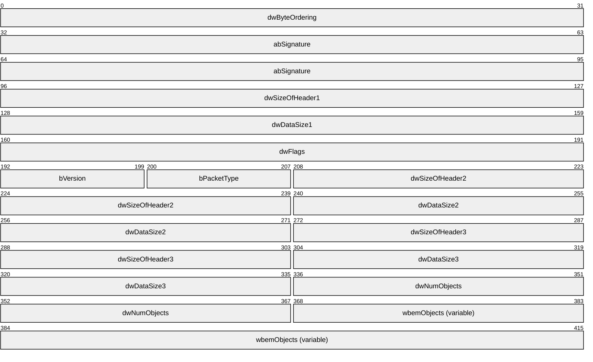
```mermaid
packet-beta
  0-31: "dwByteOrdering"
  32-95: "abSignature"
  96-127: "dwSizeOfHeader1"
  128-159: "dwDataSize1"
  160-191: "dwFlags"
  192-199: "bVersion"
  200-207: "bPacketType"
  208-239: "dwSizeOfHeader2"
  240-271: "dwDataSize2"
  272-303: "dwSizeOfHeader3"
  304-335: "dwDataSize3"
  336-367: "dwNumObjects"
  368-415: "wbemObjects (variable)"
```

**dwByteOrdering (4 bytes):** The byte ordering. It MUST be value 0.

| Value | Meaning |
| --- | --- |
| 0x00000000 | The value when byte ordering is little-endian. |

**abSignature (8 bytes):** MUST be set to {0x57, 0x42, 0x45, 0x4D, 0x44, 0x41, 0x54, 0x41} (a byte array containing the unquoted, unterminated ASCII string "WBEMDATA").

**dwSizeOfHeader1 (4 bytes):** This stores the total size of these fields: **dwByteOrdering**, **abSignature**, **dwSizeofHeader1**, **dwDataSize1**, **dwFlags**, **bVersion**, and **bPacketType**.

The size of the header MUST be 0x0000001A. Data immediately follows the header.

**dwDataSize1 (4 bytes):** MUST indicate the length, in bytes, of the data that follows this header, starting at the **dwSizeOfHeader2** field.

**dwFlags (4 bytes):** The flag value MUST be 0x00000000.

**bVersion (1 byte):** The version number of the header. The version MUST be 1.

**bPacketType (1 byte):** The value of this field is dependent on the call context.

| Value | Meaning |
| --- | --- |
| 0x00000000 | The value in the context of an optimized IWbemObjectSink::Indicate call. |
| 0x00000001 | The value in the context of an optimized IWbemWCOSmartEnum::Next call. |

**dwSizeOfHeader2 (4 bytes):** This stores the size of these fields: **dwSizeofHeader2** and **dwDataSize2**.

This value MUST be 8. Data immediately follows after the field **dwDataSize2**.

**dwDataSize2 (4 bytes):** MUST be the size, in bytes, of the data that follows this field.

**dwSizeOfHeader3 (4 bytes):** This stores the size of these fields: **dwSizeofHeader3**, **dwDataSize3**, and **dwNumObjects**. This value MUST be 12. Data immediately follows after the field **dwNumObjects**.

**dwDataSize3 (4 bytes):** MUST indicate the length of the remaining data, starting at the **wbemObjects** field.

**dwNumObjects (4 bytes):** MUST be the number of CIM objects in the ObjectArray.

**wbemObjects (variable):** The objects array that contains the CIM class definition and CIM instances. These CIM objects MUST be encoded in the [WBEM_DATAPACKET_OBJECT](#Section_2.2.14.1) structure.

#### 2.2.14.1 WBEM_DATAPACKET_OBJECT Structure

The WBEM_DATAPACKET_OBJECT MUST contain the [**CIM class**](#gt_cim-class) definition and [**CIM instances**](#gt_cim-instance).

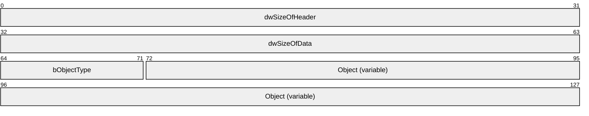
```mermaid
packet-beta
  0-31: "dwSizeOfHeader"
  32-63: "dwSizeOfData"
  64-71: "bObjectType"
  72-127: "Object (variable)"
```

**dwSizeOfHeader (4 bytes):** The size, in bytes, of the WBEM_DATAPACKET_OBJECT header, which MUST be 0x00000009.

**dwSizeOfData (4 bytes):** The size, in bytes, of the data following the WBEM_DATAPACKET_OBJECT header.

**bObjectType (1 byte):** The type of data in the data packet. The type MUST take one of the following specified values.

| Value | Meaning |
| --- | --- |
| 1 | Object is type [WBEMOBJECT_CLASS](#Section_2.2.14.2). Structure contains the complete [**CIM**](#gt_common-information-model-cim) Class definition. |
| 2 | Object is type [WBEMOBJECT_INSTANCE](#Section_2.2.14.4). Structure contains the complete CIM Instance definition. |
| 3 | Object is type [WBEMOBJECT_INSTANCE_NOCLASS](#Section_2.2.14.4). Structure contains CIM Instance without the CIM Class definition. |

**Object (variable):** The [**CIM object**](#gt_cim-object) carried into the WBEM_DATAPACKET_OBJECT, having dwSizeOfData bytes. The embedded CIM object MUST match the selector field **bObjectType**.

#### 2.2.14.2 WBEMOBJECT_CLASS Structure

The WBEMOBJECT_CLASS structure MUST contain a complete [**CIM class**](#gt_cim-class) definition.

```mermaid
packet-beta
  0-31: "dwSizeOfHeader"
  32-63: "dwSizeOfData"
  64-127: "ObjectData (variable)"
```

**dwSizeOfHeader (4 bytes):** The size, in bytes, of the header, which MUST be 0x00000008.

**dwSizeOfData (4 bytes):** The size, in bytes, of the data that follows the header.

**ObjectData (variable):** Contains the string of bytes that represent the CIM class, encoded as EncodingUnitObjectBlock, as specified in [MS-WMIO](../MS-WMIO/MS-WMIO.md) section 2.2.2.

#### 2.2.14.3 WBEMOBJECT_INSTANCE Structure

The WBEMOBJECT_INSTANCE structure MUST contain a complete [**CIM**](#gt_common-information-model-cim) instance.

```mermaid
packet-beta
  0-31: "dwSizeOfHeader"
  32-63: "dwSizeOfData"
  64-159: "classID (16 bytes)"
  160-223: "ObjectData (variable)"
```

**dwSizeOfHeader (4 bytes):** The size, in bytes, of the header, which MUST be 0x00000018.

**dwSizeOfData (4 bytes):** The size, in bytes, of the data that follows the header.

**classID (16 bytes):** The unique identifier of the [**CIM class**](#gt_cim-class) type.

**ObjectData (variable):** Contains the string of bytes that represent the [**CIM instance**](#gt_cim-instance), encoded as EncodingUnitObjectBlock, as specified in [MS-WMIO](../MS-WMIO/MS-WMIO.md) section 2.2.2.

#### 2.2.14.4 WBEMOBJECT_INSTANCE_NOCLASS Structure

The WBEMOBJECT_INSTANCE_NOCLASS structure MUST contain a [**CIM**](#gt_common-information-model-cim) instance without the [**CIM class**](#gt_cim-class) definition.

```mermaid
packet-beta
  0-31: "dwSizeOfHeader"
  32-63: "dwSizeOfData"
  64-159: "classID (16 bytes)"
  160-223: "ObjectData (variable)"
```

**dwSizeOfHeader (4 bytes):** The size, in bytes, of the header, which MUST be 0x00000018.

**dwSizeOfData (4 bytes):** The size, in bytes, of the data that follows the header.

**classID (16 bytes):** The unique identifier of the CIM class type.

**ObjectData (variable):** Contains the string of bytes that represent the [**CIM instance**](#gt_cim-instance), encoded as the EncodingUnitInstanceNoClass object block, as specified in [MS-WMIO](../MS-WMIO/MS-WMIO.md) section 2.2.3. The CIM instance transmitted using EncodingUnitInstanceNoClass does not have a CurrentClass block (as specified in [MS-WMIO] section 2.2.13) to minimize the data transmitted because CurrentClass contains the same data for all the [**CIM instances**](#gt_cim-instance).

The CurrentClass for another instance of the same CIM class is previously sent using the [WBEMOBJECT_INSTANCE](#Section_2.2.14.4) structure. To match the WBEMOBJECT_INSTANCE structure that has the CurrentClass block, the classID specified in WBEMOBJECT_INSTANCE_NOCLASS MUST be matched with the classID of WBEMOBJECT_INSTANCE. If a matching WBEMOBJECT_INSTANCE is found, the CurrentClass block in the WBEMOBJECT_INSTANCE MUST be used to encode or decode EncodingUnitInstanceNoClass. If no matching WBEMOBJECT_INSTANCE is found during decoding, it MUST be treated as an error. If no matching WBEMOBJECT_INSTANCE is found during encoding, the CIM instance MUST be encoded as a WBEMOBJECT_INSTANCE structure.

### 2.2.15 WBEM_REFRESHED_OBJECT Structure

The WBEM_REFRESHED_OBJECT structure MUST be used to encode the results of the remote refreshing service that is returned by the [IWbemRemoteRefresher::RemoteRefresh (section 3.1.4.13.1)](#Section_3.1.4.13.1) interface method.

typedef struct _WBEM_REFRESHED_OBJECT {

long m_lRequestId;

WBEM_INSTANCE_BLOB_TYPE m_lBlobType;

long m_lBlobLength;

[size_is(m_lBlobLength)] byte* m_pbBlob;

} WBEM_REFRESHED_OBJECT;

**m_lRequestId:** MUST contain the request ID.

**m_lBlobType:** MUST represent the type of the [**CIM object**](#gt_cim-object) that is encoded in m_pbBlob as specified in [2.2.17](#Section_2.2.17).

**m_lBlobLength:** MUST represent the length of the m_pbBlob array.

**m_pBlob:** When the *m_lBlobType* parameter is set to WBEM_BLOB_TYPE_ALL, it MUST contain the instance information that is represented in the [RefreshedSingleInstance](#Section_2.2.19) format for a single [IWbemClassObject](#Section_2.2.4) [**interface pointer**](#gt_interface-pointer) being part of the refreshing result.

When *m_lBlobType* is set to WBEM_BLOB_TYPE_ERROR, the *m_lBlobLength* parameter MUST be set to NULL.

When *m_lBlobType* is set to WBEM_BLOB_TYPE_ENUM, it MUST contain the instance information that is represented in the [WBEM_INSTANCE_BLOB](#Section_2.2.16) format for several IWbemClassObject interface pointers being part of the refreshing result.

### 2.2.16 WBEM_INSTANCE_BLOB Enumeration

The WBEM_INSTANCE_BLOB is used to represent the refreshed object or enumeration in the m_pBlob attribute of the [WBEM_REFRESHED_OBJECT](#Section_2.2.15) structure.

```mermaid
packet-beta
  0-31: "Version"
  32-63: "numObjects"
  64-127: "Objects (variable)"
```

**Version (4 bytes):** MUST represent the encoding version. Version MUST be set to 0x00000001.

**numObjects (4 bytes):** MUST represent the number of [**CIM objects**](#gt_cim-object) encoded that are contained in the package.

**Objects (variable):** MUST contain a sequence of [IWbemClassObjects](#Section_2.2.4) of count *numObjects*, with each IWbemClassObject encoded in [RefreshedInstances](#Section_2.2.18) format.

### 2.2.17 WBEM_INSTANCE_BLOB_TYPE Enumeration

The WBEM_INSTANCE_BLOB_TYPE enumeration is used to indicate the type of a [**CIM object**](#gt_cim-object).

typedef [v1_enum] enum _WBEM_INSTANCE_BLOB_TYPE

{

WBEM_BLOB_TYPE_ALL = 2,

WBEM_BLOB_TYPE_ERROR = 3,

WBEM_BLOB_TYPE_ENUM = 4

} WBEM_INSTANCE_BLOB_TYPE;

**WBEM_BLOB_TYPE_ALL:** The object is a single CIM object.

**WBEM_BLOB_TYPE_ERROR:** Represents an error condition. In this case the object is NULL.

**WBEM_BLOB_TYPE_ENUM:** The object is an enumeration of objects of a specific CIM type.

### 2.2.18 RefreshedInstances

The RefreshedInstances packet is contained within the [WBEM_INSTANCE_BLOB](#Section_2.2.16).

```mermaid
packet-beta
  0-31: "blobSize"
  32-95: "Blob (variable)"
```

**blobSize (4 bytes):** MUST represent the length of the blob array.

**Blob (variable):** MUST be a byte stream representing an [IWbemClassObject](#Section_2.2.4) encoded as a [RefreshedSingleInstance](#Section_2.2.19).

### 2.2.19 RefreshedSingleInstance

The RefreshedSingeInstance MUST be encoded as a sequence of bytes representing the following elements of the original [IWbemClassObject](#Section_2.2.4), without any padding:

- InstanceHeap size (encoded as 4 bytes)
- NdTable
- InstanceData
- InstanceQualifierSet
- InstanceHeap
The elements of IWbemClassObject are defined in [MS-WMIO](../MS-WMIO/MS-WMIO.md).

### 2.2.20 _WBEM_REFRESH_INFO Structure

The _WBEM_REFRESH_INFO structure MUST be populated by the Windows Management Instrumentation Remote Protocol service that provides the refresher information. The structure MUST be used to return to information from [IWbemRefreshingServices (section 3.1.4.12)](#Section_3.1.4.12) interface methods.

typedef struct {

long m_lType;

[switch_is(m_lType)] WBEM_REFRESH_INFO_UNION m_Info;

long m_lCancelId;

} _WBEM_REFRESH_INFO;

**m_lType:** MUST be one of the constants specified in [WBEM_REFRESH_TYPE](#Section_2.2.25).

**m_Info:** MUST be one of the [WBEM_REFRESH_INFO_UNION](#Section_2.2.28) types.

**m_lCancelId:** MUST be a unique identifier for the refresher object that is being used to cancel the refreshing object when the refresher object is using [IWbemRemoteRefresher::StopRefreshing (section 3.1.4.13.2)](#Section_3.1.4.13.2).

### 2.2.21 _WBEM_REFRESHER_ID Structure

The _WBEM_REFRESHER_ID structure identifies the client that is requesting refreshing services. The structure MUST be used to return information from [IWbemRefreshingServices (section 3.1.4.12)](#Section_3.1.4.12) interface methods.

typedef struct {

[string] LPSTR m_szMachineName;

DWORD m_dwProcessId;

GUID m_guidRefresherId;

} _WBEM_REFRESHER_ID;

**m_szMachineName:** MUST be the NetBIOS name of the client machine.

**m_dwProcessId :** It MUST be an identifier created by the client and it MUST be unique within the context of the client.<7>

**m_guidRefresherId:** MUST be a client-generated [**GUID**](#gt_globally-unique-identifier-guid).

### 2.2.22 _WBEM_RECONNECT_INFO Structure

The _WBEM_RECONNECT_INFO structure MUST contain the type for the information about the target [**CIM**](#gt_common-information-model-cim) instance.

typedef struct {

long m_lType;

[string] LPCWSTR m_pwcsPath;

} _WBEM_RECONNECT_INFO;

**m_lType:** MUST be one of the [WBEM_RECONNECT_TYPE](#Section_2.2.24) enumeration values.

**m_pwcsPath :** MUST be a [**CIM path**](#gt_775e4b82-5447-4125-b887-b404421e1269) to the remote CIM instance to be added to the refresher.

### 2.2.23 _WBEM_RECONNECT_RESULTS Structure

The _WBEM_RECONNECT_RESULTS structure defines the status of a reconnect operation. The structure MUST be used to return information from [IWbemRefreshingServices (section 3.1.4.12)](#Section_3.1.4.12) interface methods.

typedef struct {

long m_lId;

HRESULT m_hr;

} _WBEM_RECONNECT_RESULTS;

**m_lId:** MUST be a unique identifier for the refresher object used to cancel the refreshing object by using the [IWbemRemoteRefresher::StopRefreshing (section 3.1.4.13.2)](#Section_3.1.4.13.2) interface method.

**m_hr:** MUST be the HRESULT of the reconnect operation.

### 2.2.24 _WBEM_RECONNECT_TYPE Enumeration

The _WBEM_RECONNECT_TYPE enumeration defines possible types of remote [**CIM instances**](#gt_cim-instance). The structure MUST be used to return to information from [IWbemRefreshingServices (section 3.1.4.12)](#Section_3.1.4.12) interface methods.

typedef enum

{

WBEM_RECONNECT_TYPE_OBJECT = 0,

WBEM_RECONNECT_TYPE_ENUM = 1,

WBEM_RECONNECT_TYPE_LAST = 2

} WBEM_RECONNECT_TYPE;

**WBEM_RECONNECT_TYPE_OBJECT:** The refresher MUST connect to refresh an object.

**WBEM_RECONNECT_TYPE_ENUM:** The refresher MUST connect to refresh an enumeration.

**WBEM_RECONNECT_TYPE_LAST:** This member is used only by the server to track the range of values for this enumeration. It MUST NOT be used by the client.

### 2.2.25 WBEM_REFRESH_TYPE Enumeration

The WBEM_REFRESH_TYPE enumeration defines refresh types for the [_WBEM_REFRESH_INFO](#Section_2.2.26) structure.

typedef enum

{

WBEM_REFRESH_TYPE_INVALID = 0,

WBEM_REFRESH_TYPE_REMOTE = 3,

WBEM_REFRESH_TYPE_NON_HIPERF = 6

} WBEM_REFRESH_TYPE;

**WBEM_REFRESH_TYPE_INVALID:** The server uses this value internally. The server MUST NOT return this value.

**WBEM_REFRESH_TYPE_REMOTE:** The **m_Info** member of the _WBEM_REFRESH_INFO structure contains the [_WBEM_REFRESH_INFO_REMOTE](#Section_2.2.27) structure.

**WBEM_REFRESH_TYPE_NON_HIPERF:** The **m_Info** member of the _WBEM_REFRESH_INFO structure contains the [_WBEM_REFRESH_INFO_NON_HIPERF](#Section_2.2.26) structure.

### 2.2.26 _WBEM_REFRESH_INFO_NON_HIPERF Structure

The _WBEM_REFRESH_INFO_NON_HIPERF structure MUST be returned by the server when the requested [**CIM**](#gt_common-information-model-cim) instance cannot be part of the refreshing results.

typedef struct {

[string] wchar_t* m_wszNamespace;

IWbemClassObject* m_pTemplate;

} _WBEM_REFRESH_INFO_NON_HIPERF;

**m_wszNamespace:** MUST be a [**CIM namespace**](#gt_cim-namespace) where enumeration of a given class exists.

**m_pTemplate:** MUST be a pointer to an [IWbemClassObject](#Section_2.2.4) interface, which MUST represent a CIM instance with all properties set to the default values. Default property values are as specified in [MS-WMIO](../MS-WMIO/MS-WMIO.md) section 2.2.26.

### 2.2.27 _WBEM_REFRESH_INFO_REMOTE Structure

The _WBEM_REFRESH_INFO_REMOTE structure MUST be used when the client is on a different computer than the computer on which the WMI service providing the refreshed information resides.

typedef struct {

IWbemRemoteRefresher* m_pRefresher;

IWbemClassObject* m_pTemplate;

GUID m_Guid;

} _WBEM_REFRESH_INFO_REMOTE;

**m_pRefresher:** MUST be a pointer to the IWbemRemoteRefresher interface that the client used to retrieve the refreshed information.

**m_pTemplate:** MUST be a pointer to an [IWbemClassObject](#Section_2.2.4) interface that MUST represent a [**CIM**](#gt_common-information-model-cim) instance with all properties set to the default values as specified in [MS-WMIO](../MS-WMIO/MS-WMIO.md) section 2.2.26.

**m_Guid:** MUST be a [**globally unique identifier (GUID)**](#gt_globally-unique-identifier-guid) created to identify this [_WBEM_REFRESH_INFO](#Section_2.2.26) object.

### 2.2.28 _WBEM_REFRESH_INFO_UNION Union

The _WBEM_REFRESH_INFO_UNION union defines a union of one of the following types: m_Remote, m_NonHiPerf, or m_hres.

typedef

[switch_type(long)]

union {

[case(WBEM_REFRESH_TYPE_REMOTE)]

_WBEM_REFRESH_INFO_REMOTE m_Remote;

[case(WBEM_REFRESH_TYPE_NON_HIPERF)]

_WBEM_REFRESH_INFO_NON_HIPERF m_NonHiPerf;

[case(WBEM_REFRESH_TYPE_INVALID)]

HRESULT m_hres;

} WBEM_REFRESH_INFO_UNION;

**m_Remote:** An m_Remote _WBEM_REFRESH_INFO_REMOTE type.

**m_NonHiPerf:** An m_NonHiPerf _WBEM_REFRESH_INFO_NON_HIPERF type.

**m_hres:** An m_hres HRESULT type.

### 2.2.29 WMI Locale Formats

The client can request data from the WMI server in a client-preferred locale. The format of each locale MUST conform to one of the following:

- "MS_xxx" format, where "xxx" is a string representation of [**LCID**](#gt_language-code-identifier-lcid) in BASE16, which identifies the locale as specified in [MS-LCID](../MS-LCID/MS-LCID.md). For example, to send LCID 1033 (0x409), the string is "MS_409".
- Locale name format as specified in [MS-LCID]. For example, LCID 1033 (0x409) maps to en-US and is passed as "en-US" in this representation.

### 2.2.30 __SystemSecurity Class

The __SystemSecurity class is used to read or modify the security descriptor for a CIM namespace. The class is defined by WMI as shown in the following MOF text.

[singleton: DisableOverride ToInstance ToSubClass]

class __SystemSecurity

{

[Static] uint32 GetSD([out] uint8 sd[]);

[Static] uint32 SetSD([in] uint8 sd[]);

};

#### 2.2.30.1 __SystemSecurity::GetSD

The **GetSD** method gets the security descriptor in the NamespaceConnection of the namespace. This method is called using the [IWbemServices](#Section_3.1.4.3.13) interface as described in section [3.2.4.2.5](#Section_3.2.4.2.5).

void GetSD (

[out] Uint32 sd

);

**sd:** Exchanges a byte array containing a self-relative SECURITY_DESCRIPTOR structure, as defined in [MS-DTYP](../MS-DTYP/MS-DTYP.md) (section 2.4.6).

A return value of 0 indicates success. Any nonzero value indicates failure.<8>

#### 2.2.30.2 __SystemSecurity::SetSD

The **SetSD** method changes the security descriptor in the NamespaceConnection of the namespace. If there is a parent namespace, server MUST add access control entries of the parent to the security descriptor using the following rules.

If the Discretionary Access Control List of the parent security descriptor is not protected, meaning that if the SE_DACL_PROTECTED bit is not set in the parent security descriptor, then execute the following algorithm using the DACL of the parent and child security descriptors.

If the System Access Control List of the parent security descriptor is not protected, meaning that if the SE_SACL_PROTECTED bit is not set in the parent security descriptor, then execute the following algorithm using the SACL of the parent and child security descriptors.

- For each Access Control Entry of parent ACL, if CONTAINER_INHERIT_ACE bit is not set, then ignore this ACE.
- Otherwise, append the parent ACE to the ACL in the child security descriptor. If NO_PROPAGATE_INHERIT_ACE bit is set in the parent ACE, server MUST clear the CONTAINER_INHERIT_ACE bit from the appended ACE.
- If INHERIT_ONLY_ACE bit is set in the parent ACE, server MUST clear this bit from the appended ACE.
This method is called using [IWbemServices](#Section_3.1.4.3.13) interface as described in section [3.2.4.2.5](#Section_3.2.4.2.5).

void SetSD (

[out] Uint32 sd

);

**sd:** Exchanges a byte array containing a self-relative SECURITY_DESCRIPTOR structure, as defined in [MS-DTYP](../MS-DTYP/MS-DTYP.md) (section 2.4.6).

A return value of 0 indicates success. Any nonzero value indicates failure.<9>

#### 2.2.30.3 RequiresEncryption

The **RequiresEncryption** qualifier has a Boolean data type. If the **RequiresEncryption** qualifier is present and set to TRUE for the [__SystemSecurity](#Section_2.2.30.2) singleton instance, the server SHOULD set the **RequiresEncryption** flag for the containing [**CIM namespace**](#gt_cim-namespace). If **RequiresEncryption** is set, the server MUST reject the client request with authentication levels that are not equal to RPC_C_AUTHN_LEVEL_PKT_PRIVACY.<10>

### 2.2.31 Default System Classes

Classes whose names begin with an underscore are termed **system classes**. WMI defines certain system classes as listed as below. MOF representation of each of the class objects can be obtained by using the script specified in [Appendix D: Enumerating Class Schema](#Section_9).

**__SystemClass**: Base class from which for all of the system classes below.

**__SystemSecurity**: Contains methods that let you access and modify the security settings for a namespace as specified in section [2.2.30](#Section_2.2.30.2).

**__IndicationRelated**: Serves as a parent class for all event-related classes.

**__Namespace**: Represents a WMI namespace.

**__PARAMETERS**: Defines the input and output parameters for methods.

**__Event**: An abstract base class that serves as the parent class for all intrinsic and extrinsic events.

**__ExtrinsicEvent**: Serves as a parent class for all user-defined event types, also known as extrinsic events.

**__NamespaceOperationEvent**: A base class for all intrinsic events that relate to a namespace.

**__NamespaceCreationEvent**: Reports a namespace creation event, which is a type of intrinsic event generated when a new namespace is added to the current namespace.

**__NamespaceDeletionEvent**: Reports a namespace deletion event, which is a type of intrinsic event that is generated when a subnamespace is removed from the current namespace.

**__NamespaceModificationEvent**: Reports a namespace modification event, which is a type of intrinsic event that is generated when a namespace is modified.

**__ClassOperationEvent**: A base class for all intrinsic events that relate to a class.

**__ClassCreationEvent**: Represents a class creation event, which is a type of intrinsic event generated when a new class is added to the namespace.

**__ClassDeletionEvent**: Represents a class deletion event, which is a type of intrinsic event generated when a class is removed from the namespace.

**__ClassModificationEvent**: Represents a class modification event, which is a type of intrinsic event generated when a class is changed in the namespace.

**__InstanceOperationEvent**: Serves as a base class for all intrinsic events that relate to an instance.

**__InstanceCreationEvent**: Reports an instance creation event, which is a type of intrinsic event that is generated when a new instance is added to the namespace.

**__InstanceDeletionEvent**: Reports an instance deletion event, which is a type of intrinsic event generated when an instance is deleted from the namespace.

**__InstanceModificationEvent**: Reports an instance modification event, which is a type of intrinsic event generated when an instance changes in the namespace.

**__AggregateEvent**: Represents an event of several individual intrinsic or extrinsic events. WMI generates an instance of **__AggregateEvent** rather than **__Event** when consumers register with the **GROUP WITHIN** clause in their event query.

**__TimerEvent**: Reports an event generated by WMI in response to an event consumer's request for an interval timer event or an absolute timer event.

**__ExtendedStatus**: Used to report detailed status and error information.

### 2.2.32 Supported WMI Qualifiers

The CIM standard [**qualifiers**](#gt_qualifier) supported by WMI are referenced in [[DMTF-DSP0004]](https://go.microsoft.com/fwlink/?LinkId=89848).

The following table lists [**WMI**](#gt_windows-management-instrumentation-wmi)-specific qualifiers described in [[MSDN-QUAL]](https://go.microsoft.com/fwlink/?LinkId=212965) and the processing rules for each of them.

| Qualifier | Description |
| --- | --- |
| CIMType | Data type: **VT_BSTR** Applies to: properties, method parameters This qualifier MUST be created by the server for all properties and method parameters at the time of their creation. Its value MUST contain text describing the type of a property or a method parameter. For CIM_reference properties, the value is "ref:ClassName" where ClassName is the name of the class that the property is a reference of. For embedded objects (of type CIM_Object), the value is "object:EmbedClass" where EmbedClass is the name of the class that the embedded objects is a type of. |
| Amendment | Data type: **Boolean** Applies to: classes Indicates that a class contains amended qualifiers that are localized. |
| ClassContext | Data type: **VT_BSTR** Applies to: classes |
| Dynamic | Data type: **Boolean** Applies to: classes, instances Indicates a class in which instances are created dynamically. |
| Fixed | Data type: **CIM_BOOLEAN** Applies to: instances A client MAY treat the value of this qualifier as a hint that the value of this property cannot change during the lifetime of the instance. |
| InstanceContext | Data type: **VT_BSTR** Applies to: instances The server MUST pass the value of this qualifier to the provider for any processing. |
| Locale | Data type: **VT_BSTR** Applies to: classes or instances A client MAY treat the value of this qualifier as a hint for the locale for the class or instance. See [WMI Locale Formats (section 2.2.29)](#Section_2.2.29). |
| NamespaceSecuritySDDL | Data type: **string array** Applies to: namespace instances<11> See sections [3.1.4.18.1](#Section_3.1.4.18.1) and [3.1.4.18.2](#Section_3.1.4.18.2) for more details. |
| PropertyContext | Data type: **VT_BSTR** Applies to: properties This qualifier value contains provider-specific data related to a class property. The server MUST pass the value of this qualifier to the provider for any processing. |
| Provider | Data type: **VT_BSTR** Applies to: classes |
| RequiresEncryption | Data type: **Boolean** Applies to: namespace instances If set to TRUE, RequiresEncryption marks a namespace so that the client MUST connect with encrypted authentication. Section [2.2.30.3](#Section_2.2.30.3) describes this qualifier in detail. |
| Singleton | Data type: **Boolean** Applies to: classes The server MUST treat a class with this qualifier as having only one instance and if the value is omitted, then it is interpreted as TRUE. |

# 3 Protocol Details

The following sections specify details of the Windows Management Instrumentation Remote Protocol, including abstract data models, interface method syntax, and message processing rules. A client in the context of this specification is a machine that issues a Windows Management Instrumentation Remote Protocol request. The request is issued against a Windows Management Instrumentation Remote Protocol server. In this context, a server is a machine that handles the request issued by the client. Detailed sequence diagrams are as specified in section [4](#Section_1.3).

## 3.1 Server Details

A client in the context of this specification is a machine that issues a Windows Management Instrumentation Remote Protocol request. The request is issued against a Windows Management Instrumentation Remote Protocol server. In this context, a server is a machine that handles the request issued by the client. Detailed sequence diagrams are as specified in section [4](#Section_1.3). However, an overview of a typical protocol sequence is illustrated as follows.

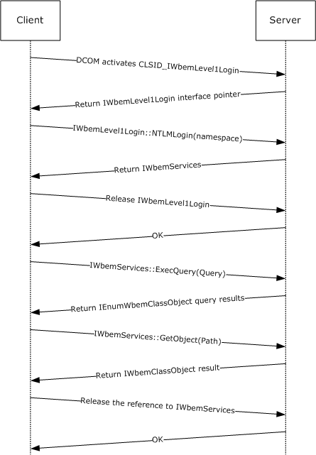

Figure 3: Typical protocol sequence

### 3.1.1 Abstract Data Model

Unless otherwise indicated, each of the following elements is maintained in volatile storage.

The server MUST maintain a security descriptor for each namespace.

The server MUST maintain an **InitSuccess** Boolean value that shows whether all the data structures were initialized successfully.

The server MUST maintain an **EventDropLimit** DWORD value that represents the threshold used for dropping the events on the server.

The server MUST maintain a **MaxRequestLimit** integer value that represents the maximum number of requests the server can handle at a time. This value is implementation-specific.<12>

The server MUST maintain a **CurrentRequestCount** counter that represents the number of IWbemServices calls in progress.

The server SHOULD maintain in persistent storage an **AllowAnonymousCallback** Boolean flag as a global value. The flag indicates whether the server allows anonymous callbacks to the client.

The server SHOULD maintain an **UnsecAppAccessControlDefault** Boolean flag as a global value. The flag indicates whether the server checks for an acceptable authentication level in callbacks.

The server MUST maintain a global **BackupInProgress** flag that indicates whether an IWbemBackupRestore::Backup operation has been triggered by a client and is in progress.

The server MUST maintain a global **RestoreInProgress** flag that indicates whether an IWbemBackupRestore::Restore operation has been triggered by a client and is in progress.

The server MUST maintain a global **IsServerPaused** flag that indicates whether an IWbemBackupRestore::Pause operation has been triggered by a client and is in progress.

The server MUST maintain a global **IsServerShuttingDown** flag that indicates whether the server is in the process of shutting down.

The server MUST maintain a table **NamespaceConnectionTable** in the [**CIM database**](#gt_cim-database), where each entry contains:

**Name:** A string that represents the namespace name.

**Security Descriptor:** The scheme used for initializing the security descriptor is implementation-dependent.<13>

**RequiresEncryption:** A flag that indicates whether a DCOM client request needs the security level set to RPC_C_AUTHN_LEVEL_PKT_PRIVACY.

**ClassTable:** A **ClassTable** (see below) that contains information about the classes in the namespace.

The server MUST maintain the following information:

**EventBindingTable:** A table of bindings, where each binding contains:

**EventFilter:** The WHERE clause of a notification query.

**EventConsumer:** An interface pointer back to the client through which the client is notified of events.

**EventPollingTimer:** A timer that specifies the interval at which WMI will poll the provider responsible for the class for intrinsic events.

**EventGroupingTimer:** A timer that specifies for how long events for a given consumer and filter are to be withheld before being delivered.

**EventQueue:** A collection of events that have occurred and have yet to be dispatched to the Event Consumer.

**EventGroupAggregateQueue:** A collection of **AggregateEvent** events that has yet to be dispatched to the Event Consumer.

**ClientSecurityContext:** Security context of the client.

**PrevInstances:** Array of **IWbemClassObject** objects that are instances of the class in the event filter. This information is used in the generation of intrinsic events.

**IWbemServices:** The object created on the server upon successful completion of IWbemLevel1Login::NTLMLogin. This contains the following:

**ClientPreferredLocales:** Used by the server uses to return localizable information as specified in [3.1.1.2](#Section_3.1.1.2).

**NamespaceConnection reference:** Reference to the **NamespaceConnection** object (which corresponds to the namespace information passed by the client) that is stored in the **NamespaceConnectionTable**.

**GrantedAccess:** The set of access rights (enumerated in section [5.2](#Section_5.2)) that have been granted to the client in this namespace.

**ClassTable:** A table in the CIM database of [**CIM classes**](#gt_015d0e5e-5166-4987-98b9-9c4128cf55be) that are registered within a namespace, where each entry contains:

**ClassDeclaration:** The [**CIM class**](#gt_cim-class) specification as defined in [[DMTF-DSP0004]](https://go.microsoft.com/fwlink/?LinkId=89848).

**DerivedClassTable:** A reference to the parent class entry in the ClassTable.

**InstanceProviderId:** A locally unique string that specifies the provider from which the instances are being returned. This is the same as the value of the [provider] qualifier of the class definition. If the instances are returned from the CIM database rather than a provider, this value MUST be set to NULL.

**ClassInstancesTable:** A list of instances of the given CIM class.

The **ClassTable** MUST include entries defining the system classes in sections [2.2.30](#Section_2.2.30.2) and [2.2.31](#Section_2.2.31). If the server supports the dynamic objects, the server MUST maintain a **ProviderTable** in the CIM database where each entry contains:

**ProviderId:** Unique Id of the provider in the system.

**ProviderEntryPoint:** A pointer to the provider instance that the server is to communicate with.

**IsClassProvider:** A Boolean that is true if the provider creates dynamic CIM classes, or false if it only creates dynamic instances.

**ProviderArchitectureType:** The provider architecture, either 32-bit or 64-bit. **ProviderId** is the same for each **ProviderArchitectureType** value. **ProviderId** and **ProviderArchitectureType** uniquely determine the **ProviderEntryPoint** to be used to forward the calls to a given provider in the system.

**SupportsGet:** A Boolean value that is TRUE if the abstract interface [Get Properties within an Instance of a Class (section 3.1.4.17.3)](#Section_3.1.4.17.3) or [Get Properties within a Class (section 3.1.4.17.4)](#Section_3.1.4.17.4) is supported by the provider. By default, this value is set to FALSE.

**SupportsPut:** A Boolean value that is TRUE if one of the following abstract interfaces is supported by the provider. By default, this value is set to FALSE.

- [Update Properties Within an Instance of a Class (section 3.1.4.17.5)](#Section_3.1.4.17.5)
- [Update Properties Within a Class (section 3.1.4.17.6)](#Section_3.1.4.17.6)
- [Create an Instance of a Class (section 3.1.4.17.7)](#Section_3.1.4.17.7)
- [Create a Class (section 3.1.4.17.8)](#Section_3.1.4.17.8)
**SupportsDelete:** A Boolean value that is TRUE if the abstract interface [Delete an Instance of a Class (section 3.1.4.17.9)](#Section_3.1.4.17.9) or [Delete a Class (section 3.1.4.17.10)](#Section_3.1.4.17.10) is supported by the provider. By default, this value is set to FALSE.

**SupportsEnumerate:** A Boolean value that is TRUE if the abstract interface [Enumerate Instances of a Given Class (section 3.1.4.17.1)](#Section_3.1.4.17.1) or [Enumerate the Subclasses of a Given Class (section 3.1.4.17.2)](#Section_3.1.4.17.2) is supported by the provider. By default, this value is set to FALSE.

**SupportsRefresher:** A Boolean value that is TRUE if the provider supports refreshing the CIM object. By default, this value is set to FALSE.

**EventQueryList:** A list of WQL query strings representing events that can be produced by this provider. See section [3.1.4.3.20](#Section_3.1.4.3.20) for details.

**ResultSetQueries:** A list of WQL query strings; see section [3.1.4](#Section_3.2.4) for details.

**QuerySupportLevels:** An array of strings that present the query capabilities of the provider. The values MUST be the combination of zero or more of the following strings: "WQL:Associators","WQL:V1ProviderDefined","WQL:UnarySelect","WQL:References".<14>

**AsyncOperationTable:** A table to store the information of asynchronous calls (see section [3.1.1.1.3](#Section_3.1.1.1.3)) in progress. Each entry of this table corresponds to one asynchronous call, where each entry contains the following:

**ClientSyncPointer:** A pointer to **IWbemObjectSink** passed as a response handler by the client as part of an asynchronous call. This can be used to identify a client asynchronous call on the server.

**CallbackInProgress:** A Boolean value that is set to TRUE if there is an IWbemObjectSink::Indicate or IWbemObjectSink::SetStatus with a currently-in-progress message. The value is set to FALSE if there is no IWbemObjectSink::Indicate and IWbemObjectSink::SetStatus in progress for the operation. See sections [3.2.4.1.1](#Section_3.2.4.1.1) and [3.2.4.1.2](#Section_3.2.4.1.2) for more details.

**CallCancelled:** A Boolean value that is set to TRUE if the operation is canceled. The initial value of this variable is FALSE.

**SetStatusWithFinalResultCalled:** A Boolean value that is set to TRUE if IWbemObjectSink::SetStatus with a final result is called. The initial value of this variable is FALSE.

**WbemCallResultTable:** A table to store information about pending single-result semisynchronous operations (see section [3.2.4.2.7](#Section_3.2.4.2.7) for a list of single-result semisynchronous operations). Each entry in this table corresponds to one semisynchronous call, where each entry contains the following:

**WbemCallResultPointer:** A pointer to a server-created [IWbemCallResult](#Section_3.1.4.5) object.

**FinalResult:** An HRESULT to store the result status of the call.

**ResultObject:** A pointer to IWbemClassObject to store the result object of the call.

**ResultService:** A pointer to IWbemServices, used to store the result only if this is an IWbemServices::OpenNamespace call.

**ResultString:** A pointer to a string.

**OperationFinished:** A Boolean value to store if the operation is completed. This value is initially set to FALSE.

The following ADM elements are used to store information about semisynchronous calls returning multiple objects (see section [3.2.4.2.8](#Section_3.2.4.2.8) for a list of multiple-result semisynchronous calls).

**SemiSinkResultSetObject:** A structure to store the results of multiple-result semisynchronous calls. One instance of this structure is created for every multiple-result semisynchronous call. The structure contains the following:

**ResultArray:** An array of IWbemClassObjects to store the result objects.

**CurrentTotalCount:** An integer value to store the count of the valid number of array elements.

**OperationFinished:** A Boolean value to store if the operation is completed. This value is initially set to FALSE.

**RefCount:** An integer indicating the count of IEnumWbemClassObject pointers that point to this instance of SemiSinkResultObject. When this count becomes zero, the object is freed.

**Flags:** The *lFlags* parameter value passed in as part of a semisynchronous call.

**FinalResult:** An HRESULT to store the result status of the call.

**ClientSecurityContext:** The security context of the client.

**EnumWbemClassObjectTable:** A table to store information about the pending result of semisynchronous operations. Each entry in this table either corresponds to one semisynchronous call or is a clone of another [IEnumWbemClassObject](#Section_3.1.4.4) instance. Each entry contains the following:

**EnumWbemClassObjectPointer:** A pointer to SemiSinkResultSetObject.

**ResultSetPointer:** A pointer to SemiSinkResultSetObject.

**CurrentIndex:** An integer value pointing to the index of the next object to be given to the client.

**SinkQueue:** A queue to store the information about pending NextAsync calls. Each element of this queue contains the following:

**WbemObjectSinkPointer:** A pointer to the client passed in IWbemObjectSink.

**RemainingRequestCount:** An integer representing the remaining number of objects to be given as part of the callbacks on this sink.

#### 3.1.1.1 Delivering Results to Client

##### 3.1.1.1.1 Synchronous Calls

The server MUST complete the requested operation before returning from the synchronous method call. The status of the operation is returned as return value of the method. On successful execution of the synchronous methods, the server MUST return result object or objects in the out parameter of the method.

##### 3.1.1.1.2 Semisynchronous Calls

The server MUST start the requested operation and MUST return the appropriate response without waiting for the operation to complete. If the requested operation fails to start, the server MUST return an error as a return value of the method and MUST NOT return [IEnumWbemClassObject](#Section_3.1.4.4) or [IWbemCallResult](#Section_3.1.4.5) as an out parameter.

###### 3.1.1.1.2.1 Semisynchronous Operations Returning Multiple Objects

For the requested operation to begin successfully, the server MUST create and return an object of type [IEnumWbemClassObject](#Section_3.1.4.4) for the following methods, and the return value MUST be WBEM_S_NO_ERROR, as specified in section [2.2.11](#Section_2.2.11). When the client calls the methods of IEnumWbemClassObject, the IEnumWbemClassObject method MUST deliver the results of the requested operation. The enumeration of IEnumWbemClassObject MUST return the same result set as the corresponding [**synchronous operation**](#gt_synchronous-operation).

Before returning WBEM_S_NO_ERROR, the server MUST create an instance of the **SemiSinkResultSetObject** ADM element and initialize CurrentTotalCount to zero, OperationFinished to FALSE, and RefCount to 1. The server MUST also copy the *lFlags* parameter of the operation. The server MUST create an entry in **EnumWbemClassObjectTable** for IEnumWbemClassObject by storing a pointer to **SemiSinkResultSetObject** created for this operation in ResultSetPointer. The server initializes CurrentIndex of **EnumWbemClassObjectTable** to start the index of **ResultArray** and stores the security context of the client in **ClientSecurityContext**.

- [IWbemServices::ExecQuery (section 3.1.4.3.18)](#Section_3.1.4.3.18)
- [IWbemServices::CreateInstanceEnum (section 3.1.4.3.16)](#Section_3.1.4.3.17)
- [IWbemServices::CreateClassEnum (section 3.1.4.3.10)](#Section_3.1.4.3.10)
- [IWbemServices::ExecNotificationQuery (section 3.1.4.3.20)](#Section_3.1.4.3.20)
The server stores the results of the operation in **SemiSinkResultSetObject** and tracks the client fetching the results by using the entry in **EnumWbemClassObjectTable**.

The server updates the **SemiSinkResultSetObject EnumWbemClassObjectTable** entry as follows:

- The server MUST store the results of the operation in **ResultArray** as they are available and update **CurrentTotalCount** to reflect the total results.
- The server MUST set **OperationFinished** to TRUE when the operation is finished.
- When the operation is finished, either completed or failed, the server MUST set **FinalResult** with the result code as specified in section 2.2.11 and set **OperationFinished** to TRUE.
- When the client releases the reference to IEnumWbemClassObject, the server MUST delete the **EnumWbemClassObjectTable** entry and decrement **RefCount** by 1 for the **SemiSinkResultSetObject** referenced in **ResultSetPointer**.
- When the **RefCount** of **SemiSinkResultSetObject** is zero, the server MUST free the result stored in **ResultArray** and delete this instance of **SemiSinkResultSetObject**.

###### 3.1.1.1.2.2 Semisynchronous Operations Returning a Single Object

If the requested operation begins successfully, the server MUST return an [IWbemCallResult](#Section_3.1.4.5) object for the following methods, and the return value MUST be WBEM_S_NO_ERROR. When the client calls the methods of IWbemCallResult, IWbemCallResult MUST deliver the result of the requested operation.

Before returning WBEM_S_NO_ERROR, the server MUST create an entry in **WbemCallResultTable** by keeping a reference to IEnumWbemClassObject in **WbemCallResultPointer** and initializing **ResultObject**, **ResultString**, and **ResultService** to NULL. The server MUST set **OperationFinished** to FALSE.

- [IWbemServices::OpenNamespace (section 3.1.4.3.1)](#Section_3.1.4.3.1)
- [IWbemServices::PutInstance (section 3.1.4.3.12)](#Section_3.1.4.3.13)
- [IWbemServices::GetObject (section 3.1.4.3.4)](#Section_3.1.4.3.5)
- [IWbemServices::PutClass (section 3.1.4.3.6)](#Section_3.1.4.3.7)
- [IWbemServices::DeleteClass (section 3.1.4.3.8)](#Section_3.1.4.3.9)
- [IWbemServices::DeleteInstance (section 3.1.4.3.14)](#Section_3.1.4.3.15)
- [IWbemServices::ExecMethod (section 3.1.4.3.22)](#Section_3.1.4.3.22)
The server sets **ResultObject**, **ResultString**, and **ResultService** as the results become available for the respective operations. When an operation is finished, the server MUST set **FinalResult** with the operation result and set **OperationFinished** to TRUE. The server MUST remove the entry for this operation from **WbemCallResultTable** when the client releases its last reference of **IEnumWbemClassObject**.

##### 3.1.1.1.3 Asynchronous calls

The server MUST start the requested operation and MUST return the appropriate response without waiting for the completion of the operation. If starting the requested operation fails, the server MUST return the error as a return value of the method; MUST NOT keep a reference to [IWbemObjectSink](#Section_3.1.4.2.2) (passed as a response handler); and MUST NOT call [IWbemObjectSink::Indicate](#Section_3.1.4.2.1) or [IWbemObjectSink::SetStatus](#Section_3.1.4.2.2).

Section [3.2.4.2.9](#Section_3.2.4.2.9) lists the asynchronous method calls. Before starting an asynchronous operation, the server method MUST create an entry in AsyncOperationTable, storing a reference to the client's IWbemObjectSink in ClientSyncPointer, and set other fields (**CallbackInprogress**, **CallCancelled**, and **SetStatusWithFinalResultCalled**) to FALSE.

For the requested operation to begin successfully, the server MUST return WBEM_S_NO_ERROR, as specified in section [2.2.11](#Section_2.2.11) and MUST keep a reference to IWbemObjectSink passed as a response handler.

The server MUST invoke the IWbemObjectSink::Indicate and IWbemObjectSink::SetStatus methods, as specified in sections [3.2.4.1.1](#Section_3.2.4.1.1) and [3.2.4.1.2](#Section_3.2.4.1.2). If the call to IWbemObjectSink::Indicate or IWbemObjectSink::SetStatus fails, the server MUST cancel the [**asynchronous operation**](#gt_asynchronous-operation).

The server MAY call IWbemObjectSink::SetStatus multiple times when it executes the asynchronous operation in order to report the operation progress,<15> as explicitly requested by a client using a WBEM_SEND_STATUS flag. In this situation, the HRESULT parameter contains the progress information.

Calls made by the server into the client-provided IWbemObjectSink interface SHOULD use an authentication level that is greater than NONE. If that fails, and if the **UnsecAppAccessControlDefault** flag is set to false and **AllowAnonymousCallback** flag is set to true, the server SHOULD retry with an authentication level of NONE.<16> The server MUST try to make the calls by using the machine principal name.

The total number of client operations is limited by **MaxRequestLimit** as described in section [3.1.4.3](#Section_3.1.4.3.13).

#### 3.1.1.2 Localization Support

The [**server**](#gt_server) MUST support storage of [**CIM localizable information**](#gt_cim-localizable-information). The localizable class properties MUST have [**amended qualifiers**](#gt_amended-qualifier) in the MOF class definition.

The server MUST store each class with amended qualifiers as two or more objects:

- A locale-neutral object that contains all properties, with all amended qualifiers stripped.
- A localized object for each supported locale. The class object contains only the properties that have amended qualifiers, and their respective [**qualifiers**](#gt_qualifier). This localized object MUST be stored in a namespace that is a direct child of the namespace (from **NamespaceConnectionTable)** in which a locale-neutral object exists and the name of the namespace MUST be a locale name in the "MS_xxx" format (see section [2.2.29](#Section_2.2.29)).
When the server updates an existing class, it MUST observe the **WBEM_FLAG_USE_AMENDED_QUALIFIERS** flag:

- If the [**client**](#gt_client) specifies the flag, then both locale-neutral and locale-specific objects MUST be updated.
- If the client does not specify the flag, only the locale-neutral object MUST be updated. If the class sent by the client contains amended qualifiers, then the server MUST update the locale-neutral class exactly as requested, rather than removing the amended qualifiers.
When the client creates a new class, the server MUST create the class only in the locale-neutral area (regardless whether **WBEM_FLAG_USE_AMENDED_QUALIFIERS** is set). The amended qualifiers MUST not be stripped.

When the client retrieves a class object and the **WBEM_FLAG_USE_AMENDED_QUALIFIERS** is set, the server MUST merge the locale-neutral and locale-dependent class definitions and present them as one class to the client using the following algorithm.

- Retrieve the locale-neutral class. Then it MUST search for localized class objects, using the list of locales in the **NamespaceConnection** object's **ClientPreferredLocales**. The search for the class is made in the order of the locales in **ClientPreferredLocales**. When the requested class is found in one locale namespace, the server MUST stop looking.
- If present, the localized object MUST be merged with the neutral object (which has priority over any qualifier present in the localized object).
When a client retrieves a class object and the **WBEM_FLAG_USE_AMENDED_QUALIFIERS** flag is not set, the server MUST return the locale-neutral object as-is, without checking for localized definitions. If the locale-neutral class is not found, the server MUST return WBEM_E_NOT_FOUND, regardless of whether **WBEM_FLAG_USE_AMENDED_QUALIFIERS** is specified, even if locale-specific objects exist.

**Note** The class will have amended qualifiers if the class object was originally created without stripping the amended qualifiers.

If a class is annotated with the Amendment qualifier, attempts to create instances of the class MUST fail with a WBEM_E_INVALID_OPERATION error.

When a client deletes a class object and the **WBEM_FLAG_USE_AMENDED_QUALIFIERS** flag is not set, the server MUST delete the locale-neutral object as-is, without checking for localized definitions.

When a client deletes a class object and the **WBEM_FLAG_USE_AMENDED_QUALIFIERS** flag is set, the server MUST fail with a WBEM_E_INVALID_PARAMETER error.

### 3.1.2 Timers

The server MUST use timers to ensure that the conversation between itself and its clients remains active. The Windows Management Instrumentation Remote Protocol uses the following timers:

**Sink timer:** Each [**asynchronous operation**](#gt_asynchronous-operation) has a corresponding timer, which MUST be initialized to 30 seconds when the server calls the client back using [IWbemObjectSink](#Section_3.1.4.2.2). The timer MUST be reset when the call completes.

**Backup timer:** Each [IWbemBackupRestoreEx](#Section_3.1.4.11) has a corresponding timer, which MUST be initialized to 15 minutes when the server receives an [IWbemBackupRestoreEx::Pause](#Section_3.1.4.11.1). The timer MUST be reset when the server receives an [IWbemBackupRestoreEx::Resume](#Section_3.1.4.11.2).

**EventPollingTimer:** This timer tracks the polling interval specified by the **WITHIN** clause of an event query. The timer interval is the number of seconds specified in the query. The minimum value of the polling interval is 0.001 (equivalent to 1 millisecond) and the maximum value is 418937 (0xffffffff/1000).

**EventGroupingTimer:** This timer tracks the grouping interval specified by the **GROUP WITHIN** clause of an event query. The timer interval is the number of seconds specified in the query. The minimum value of the polling interval is 0.001 (equivalent to 1 millisecond) and the maximum value is 418937 (0xffffffff/1000).

### 3.1.3 Initialization

The protocol MUST be initialized after successful [**activation**](#gt_activation) of one of the two interfaces that are registered with the DCOM Remote Protocol infrastructure, as specified in [MS-DCOM](../MS-DCOM/MS-DCOM.md) section 1.9.

All the global flags and other elements mentioned in ADM are volatile unless they are loaded and stored from CIM database. Unless otherwise specified, the updates to the ADM elements directly happen in CIM database.

The server MUST initialize **InitSuccess** to false.

The server MUST initialize **EventDropLimit** to 1000.

The server MUST initialize **MaxRequestLimit** to 5000.

The server MUST initialize **CurrentRequestCount** to 0.

The server MUST initialize UnsecAppAccessControlDefault to false.

The server MUST enumerate the **NamespaceConnectionTable** and ensure that a single __SystemSecurity instance is present in each namespace and matches the namespace's RequiresEncryption flag and security descriptor.

If the server has dynamic CIM classes or CIM instances in the system, the server MUST load each provider of the ProviderTable as described in [3.1.6.2](#Section_3.1.6.2).

The server MUST create an empty **EventBindingTable** object during its initialization. The information kept in this object is volatile and is not persisted during the server's shutdown.

The server MUST initialize the **BackupInProgress** flag to False.

The server MUST initialize the **RestoreInProgress** flag to False.

The server MUST initialize the **IsServerPaused** flag to False.

The server MUST initialize the **IsServerShuttingDown** flag to False.

The server SHOULD initialize **AllowAnonymousCallback** to False. <17>

When the server has successfully initialized the above data structures, it MUST set **InitSuccess** to True.

### 3.1.4 Message Processing Events and Sequencing Rules

The server MUST accept multiple parallel invocations from different clients running under different [**security principals**](#gt_security-principal) that the server impersonates. On each interface, the server MUST support multiple outstanding calls.

The errors returned by the server are not actionable unless explicitly specified in this section. The server MUST perform an access check against all operations and ensure secure access to the results. If the access check fails, the server MUST return WBEM_E_ACCESS_DENIED.

If the impersonation level is not RPC_C_IMPL_LEVEL_IMPERSONATE or RPC_C_IMPL_LEVEL_DELEGATE, the server MUST return WBEM_E_ACCESS_DENIED.

The methods MUST be secured by using access rights as specified in section [5.2](#Section_5.2).

The server MUST treat characters as [**Unicode characters**](#gt_unicode-character) and represent them in 16 bits. This is contrary to the requirement of [[DMTF-DSP0004]](https://go.microsoft.com/fwlink/?LinkId=89848) where the string data type is interpreted as a UCS character.

The server MAY support ordered array types, as specified in the requirement of [DMTF-DSP0004].<18>

If the server detects that the [IWbemClassObject](#Section_2.2.4) that is sent by the client does not conform to [MS-WMIO](../MS-WMIO/MS-WMIO.md) encoding, as specified in section 2.2.4, the [server](#Section_1.1) MUST return an HRESULT that has the S (severity) bit set as specified in [MS-ERREF](../MS-ERREF/MS-ERREF.md). The exact code is implementation-dependent.

If the server is expected to set the value of the output parameter, but the output parameter is set to NULL upon input, the server SHOULD return an error to indicate failure. In this case, the server cannot modify the output parameter.

For all methods, the server MUST enforce that the DCOM security level is at least at the RPC_C_AUTHN_LEVEL_CONNECT level, and SHOULD be RPC_C_AUTHN_LEVEL_PKT_INTEGRITY; the server MUST also evaluate the security principal rights to open a [**CIM namespace**](#gt_cim-namespace).<19> The server MUST fail the operation if the security requirements are not met.

For all [IwbemServices](#Section_3.1.4.3.13) methods, the server MUST verify that the client has been granted the access rights specified in the method description, by testing that those rights are included in **GrantedAccess**.

For all methods, if the server cannot find the **NamespaceConnection** associated with IWbemServices in the **NamespaceConnectionTable** (either because the table no longer contains a row for the namespace or because the **NamespaceConnection** was replaced during IWbemBackupRestore::Restore), the server MUST return WBEM_E_INVALID_NAMESPACE.

For all methods that create, query, update, or delete the [**CIM instances**](#gt_cim-instance), the server MUST obtain **InstanceProviderId** for the given class from the **ClassTable**.

If **InstanceProviderId** is NULL, the server MUST forward the request to the [**CIM**](#gt_common-information-model-cim) database. If **InstanceProviderId** is not NULL, and if the IWbemContext object is passed to the server, WMI MUST obtain the ProviderArchitecture from the IWbemContext object, and use the following algorithm to locate the correct provider.

- If ProviderArchitecture is not present or if IWbemContext object is not passed, then the server MUST find the **ProviderEntryPoint** corresponding to **InstanceProviderId** in the ProviderTable.
- If ProviderArchitecture is present:
- If its value is neither 32 nor 64, the server MUST return WBEM_E_INVALID_PARAMETER.
- If RequiredArchitecture is present and is set to TRUE, the server MUST find the ProviderEntryPoint in ProviderTable corresponding to ProviderArchitecture and InstanceProviderId.
- If RequiredArchitecture is not present or set to FALSE, the server MUST find the **ProviderEntryPoint** in ProviderTable corresponding to ProviderArchitecture and **InstanceProviderId**. If there is no **ProviderEntryPoint** found, the server MUST find **ProviderEntryPoint** for the given **InstanceProviderId** ignoring the ProviderArchitecture.
If the server cannot find **ProviderEntryPoint**, it MUST return WBEM_E_PROVIDER_LOAD_FAILURE. If the **ProviderEntryPoint** is found, the server MUST use the abstract interface defined in [3.1.4.17](#Section_3.1.4.17.4) to communicate with the provider.

For all methods that create, query, update, or delete the [**CIM class**](#gt_cim-class) where **InstanceProviderId** is not zero, the server MUST go through each of the [**WQL**](#gt_wmi-query-language-wql) queries in **ResultSetQueries** and evaluate the WHERE clause. If the expression evaluates to TRUE for the given CIM class (that is, the provider supports the CIM class), then the server MUST proceed with the rest of the processing for the method as specified in the method-specific processing rules in 3.1.4. If FALSE, the server MUST return WBEM_E_PROVIDER_NOT_CAPABLE.

For all methods that query, update, or delete the [**CIM classes**](#gt_015d0e5e-5166-4987-98b9-9c4128cf55be), the server MUST obtain **InstanceProviderId** for the given class from the **ClassTable**. If **InstanceProviderId** is not NULL, and if the IWbemContext object is passed to the server, the server MUST obtain the ProviderArchitecture from IWbemContext object. The same algorithm is used as for CIM instances.

For all methods that query, update, or delete the CIM instances, the server MAY allow the static properties to be modified, contrary to [DMTF-DSP0004] requirements.<20>

If the server cannot find **ProviderEntryPoint**, it MUST return WBEM_E_PROVIDER_LOAD_FAILURE. If the **ProviderEntryPoint** is found, the server MUST use the abstract interface defined in section 3.1.4.17to communicate with the provider.

For all methods where the request is sent to the provider, the provider MAY choose to perform additional authentication or authorization, or perform the operations within the context of security principal in which **ProviderEntryPoint** was called<21>

Specific rules related to creation, deletion, navigation, and persistence of the namespaces are covered as part of section [3.1.4.18](#Section_3.1.4.18.1).

The server SHOULD fail the operation and return WBEM_E_ACCESS_DENIED if the namespace has the **RequiresEncryption** flag set and if the [**DCOM**](#gt_distributed-component-object-model-dcom) security level is lower than RPC_C_AUTHN_LEVEL_PKT_PRIVACY.<22>

The server MAY return WBEM_E_QUOTA_VIOLATION if the number of active IWbemServices objects is more than an implementation-defined limit for a given namespace.<23>

The server MUST fail the operation and return CO_E_SERVER_STOPPING if the **RestoreInProgress** flag is set to True.

The server MUST fail the operation and return WBEM_E_SHUTTING_DOWN if the **IsServerShuttingDown** flag is set to True.

If either of the **BackupInProgress** or **IsServerPaused** flags are set to True, the server MUST buffer the request (unless the request exceeds **MaxRequestLimit** as described in section 3.1.4.3) until both the **BackupInProgress** and **IsServerPaused** flags are set to False before performing the operation.

For all methods that update the CIM class, if CIM class on the server had abstract qualifier set to true, while its parent class does not have abstract qualifier set to false, the server MUST return WBEM_E_CANNOT_BE_ABSTRACT.

For all methods that update [**CIM instance**](#gt_cim-instance), if a CIM instance with amended qualifier set to true is being updated without WBEM_FLAG_USE_AMENDED_QUALIFIERS flag, the server MUST return WBEM_E_AMENDED_OBJECT.

When an IWbemContext object is passed to an IWbemServices method, the following optional parameters could be present:

- If __MI_DESTINATIONOPTIONS_DATA_LOCALE is present:
- The WMI server SHOULD<24> indicate to the WMI v2 provider to use this locale to format the culture-specific information such as date/time format; otherwise, it MUST indicate the first **ClientPreferredLocale**.
- If __MI_DESTINATIONOPTIONS_UI_LOCALE is present:
- The WMI Server SHOULD<25> indicate to the WMI v2 provider to use this locale to determine the display language for human-readable strings; otherwise, it MUST indicate the first **ClientPreferredLocale**.
- If __CorrelationId is present:
- The WMI Server SHOULD<26> store this value and use as part of internal logging.
- The WMI server SHOULD pass this to the provider as part of IWbemContext, and the provider can use this value as part of its own logging.

#### 3.1.4.1 IWbemLevel1Login Interface

The IWbemLevel1Login interface allows a user to connect to the management services interface in a particular namespace. The interface MUST be uniquely identified by the [**UUID**](#gt_universally-unique-identifier-uuid) {F309AD18-D86A-11d0-A075-00C04FB68820}.

Methods in RPC Opnum Order

| Method | Description |
| --- | --- |
| [EstablishPosition](#Section_3.1.4.1.1) | Opnum: 3 |
| [RequestChallenge](#Section_3.1.4.1.2) | Opnum: 4 |
| [WBEMLogin](#Section_3.1.4.1.3) | Opnum: 5 |
| [NTLMLogin](#Section_3.1.4.1.4) | Opnum: 6 |

The object that exports this interface also implements the [IWbemLoginClientID](#Section_3.1.4.8) and [IWbemLoginHelper](#Section_3.1.4.9) interfaces. The IRemUnknown and IRemUnknown2 interfaces, specified in [MS-DCOM](../MS-DCOM/MS-DCOM.md), MUST be used to manage the interfaces exposed by the object. The object MUST be uniquely identified with the [**CLSID**](#gt_class-identifier-clsid) {8BC3F05E-D86B-11D0-A075-00C04FB68820}.

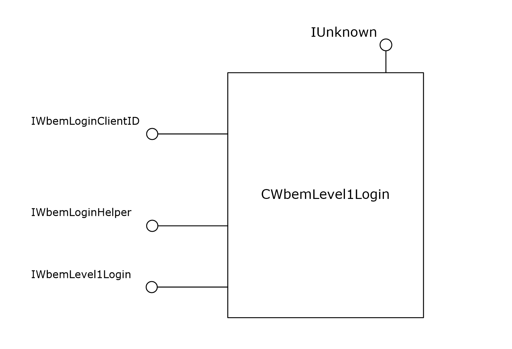

Figure 4: The IWbemLevel1Login interface

##### 3.1.4.1.1 IWbemLevel1Login::EstablishPosition (Opnum 3)

The IWbemLevel1Login::EstablishPosition method does not perform any action. The return value and output parameter are used in locale negotiation as specified in section [3.2.3](#Section_3.2.3).

HRESULT EstablishPosition(

[in, unique, string] wchar_t* reserved1,

[in] DWORD reserved2,

[out] DWORD* LocaleVersion

);

**reserved1:** MUST be set to NULL when sent and MUST be ignored on receipt.

**reserved2:** MUST be set to 0 when sent and MUST be ignored on receipt.

**LocaleVersion:** The server MUST set the value of *LocaleVersion* based on the server behavior when [IWbemLevel1Login::NTLMLogin](#Section_3.1.4.1.4) is passed an unrecognized locale name in the *wszPreferredLocale* parameter:

The return value and *LocaleVersion* are used for Locale capability negotiation before calling IWbemLevel1Login::NTLMLogin, as specified in section 3.2.3.

- If the server ignores an unrecognized locale name in the Locale Name Format, as specified in section [2.2.29](#Section_2.2.29), passed to IWbemLevel1Login::NTLMLogin while all other parameters are valid, and completes the execution of the IWbemLevel1Login::NTLMLogin method, the server MUST set the *LocaleVersion* parameter to 1.
- If the server returns an error for an unrecognized locale name in Locale Name Format, as specified in section 2.2.29, passed to IWbemLevel1Login::NTLMLogin, while all other parameters are valid, the server MUST set the *LocaleVersion* parameter to 0.
**Return Values:** The server MUST return one of the following values, based on server behavior for the *wszPreferredLocale* parameter in IWbemLevel1Login::NTLMLogin.

| Return value/code | Description |
| --- | --- |
| 0x00 WBEM_S_NO_ERROR | The connection was established and no error occurred.<27> |
| 0x80004001 E_NOTIMPL | The attempted operation is not implemented. The value of this element is as specified in [MS-ERREF](../MS-ERREF/MS-ERREF.md) section 2.1.<28> |

##### 3.1.4.1.2 IWbemLevel1Login::RequestChallenge (Opnum 4)

This method does not perform any action.

HRESULT RequestChallenge(

[in, unique, string] wchar_t* reserved1,

[in, unique, string] wchar_t* reserved2,

[out, size_is(16), length_is(16)]

unsigned char* reserved3

);

**reserved1:** MUST be set to NULL when sent and MUST be ignored on receipt.

**reserved2:** MUST be set to NULL when sent and MUST be ignored on receipt.

**reserved3:** MUST be set to NULL when sent and MUST be ignored on receipt.

| Return value/code | Description |
| --- | --- |
| 0x8004100c WBEM_E_NOT_SUPPORTED | The server SHOULD return this value. |

##### 3.1.4.1.3 IWbemLevel1Login::WBEMLogin (Opnum 5)

This method does not perform any action.

HRESULT WBEMLogin(

[in, unique, string] wchar_t* reserved1,

[in, size_is(16), length_is(16), unique]

unsigned char* reserved2,

[in] long reserved3,

[in] IWbemContext* reserved4,

[out] IWbemServices** reserved5

);

**reserved1:** MUST be set to NULL when sent and MUST be ignored on receipt.

**reserved2:** MUST be set to NULL when sent and MUST be ignored on receipt.

**reserved3:** MUST be set to 0 when sent and MUST be ignored on receipt.

**reserved4:** MUST be set to NULL when sent and MUST be ignored on receipt.

**reserved5:** MUST be set to NULL when sent and MUST be ignored on receipt.

| Return value/code | Description |
| --- | --- |
| 0x80004001 E_NOTIMPL | The server SHOULD return this value. |

##### 3.1.4.1.4 IWbemLevel1Login::NTLMLogin (Opnum 6)

The IWbemLevel1Login::NTLMLogin method MUST connect a user to the management services interface in a specified namespace.

HRESULT NTLMLogin(

[in, unique, string] LPWSTR wszNetworkResource,

[in, unique, string] LPWSTR wszPreferredLocale,

[in] long lFlags,

[in] IWbemContext* pCtx,

[out] IWbemServices** ppNamespace

);

**wszNetworkResource:** The string MUST represent the namespace on the server to which the returned [IWbemServices](#Section_3.1.4.3.13) object is associated. This parameter MUST NOT be NULL and MUST match the namespace syntax as specified in section [2.2.2](#Section_2.2.2).

**wszPreferredLocale:** MUST be a pointer to a string that MUST specify the locale values in the preferred order, separated by a comma. If the client does not supply it, the server creates a default list which is implementation-specific.<29> Each locale format SHOULD conform to the WMI locale format, as specified in [WMI Locale Formats (section 2.2.29)](#Section_2.2.29). Any subsequent calls that request [**CIM localizable information**](#gt_cim-localizable-information) ([WBEM_FLAG_USE_AMENDED_QUALIFIERS](#Section_2.2.6)) SHOULD return the localized information in the order of preference if the information is available in the [**LCID**](#gt_language-code-identifier-lcid).<30> The server MUST save this information in **ClientPreferredLocales**.

**lFlags:** MUST be 0. The server SHOULD consider any other value as not valid and return WBEM_E_INVALID_PARAMETER; otherwise, the server behavior is implementation-specific.<31>

**pCtx:** MUST be a pointer to an [IWbemContext](#Section_2.2.13.2) interface, which MUST contain additional information sent by the client. If *pCtx* is NULL, the parameter MUST be ignored.

**ppNamespace:** If the call succeeds, *ppNamespace* MUST return a pointer to an IWbemServices [**interface pointer**](#gt_interface-pointer). This parameter MUST be set to NULL when an error occurs.

**Return Values:** This method MUST return an HRESULT value that MUST indicate the status of the method call. The server MUST return WBEM_S_NO_ERROR, as specified in section [2.2.11](#Section_2.2.11), to indicate the successful completion of the method.

**WBEM_S_NO_ERROR** (0x00)

The server MUST return WBEM_E_INITIALIZATION_FAILURE if **InitSuccess** is false.

The server MUST determine the client's access rights by comparing **RpcImpersonationAccessToken.Sids[UserIndex]** as defined in [MS-RPCE](../MS-RPCE/MS-RPCE.md) section 3.3.3.4.3 against the security descriptor stored in **NamespaceConnection**.

The [**security principal**](#gt_security-principal) that makes the call MUST have WBEM_REMOTE_ENABLE and WBEM_ENABLE access to the namespace; otherwise, WBEM_ACCESS_DENIED MUST be returned.

In response to the IWbemLevel1Login::NTLMLogin method, the server MUST return an IWbemServices interface that corresponds to the *wszNetworkResource* parameter.

The server SHOULD enforce a maximum length for the *wszNetworkResource* parameter, and return WBEM_E_QUOTA_VIOLATION if the limit is exceeded.<32>

When the call succeeds, the server MUST create an **IWbemServices** object. The server MUST store the *wszPreferredLocale* inside the object. The server MUST find the **NamespaceConnection** object for *wszNetworkResource* passed into the **NamespaceConnectionTable**, and store its reference in the **IWbemServices** object. The server MUST return WBEM_E_INVALID_NAMESPACE if the **NamespaceConnection** object cannot be found. The server MUST set **GrantedAccess** to the set of access rights granted to the client by the namespace security descriptor.

All subsequent IWbemServices method invocations that request localized information MUST return the information in the language that is specified in *wszPreferredLocale*. When the preferred locale is NULL, the server SHOULD<33> use implementation-specific logic to decide the locale.

The successful method execution MUST fill the *ppNamespace* parameter with an IWbemServices interface pointer and MUST return WBEM_S_NO_ERROR.

The failed method execution MUST set the output parameter to NULL and MUST return an error in the format specified in section [2.2.3](#Section_2.2.3). If the namespace does not exist, the server MUST return a **WBEM_E_INVALID_NAMESPACE** HRESULT value.

#### 3.1.4.2 IWbemObjectSink Interface Server Details

The IWbemObjectSink interface MUST be implemented by the WMI client if the WMI client uses asynchronous method calls as specified in section [3.2.4.2.9](#Section_3.2.4.2.9). In this case, the WMI client acts as an IWbemObjectSink server. The WMI server acts as an IWbemObjectSink client and invokes the IWbemObjectSink methods to deliver the results (IWbemClassObjects, if any, and the status code) of the IWbemServices method for which this IWbemObjectSink is passed as a response handler.

If the WMI client calls the [IWbemServices::QueryObjectSink](#Section_3.1.4.3.3) method, the IWbemObjectSink interface MUST be implemented by the WMI server and MUST be returned to the client in the *ppResponseHandler* parameter, as specified in section 3.1.4.3.3. In this case, the WMI server acts as an IWbemObjectSink server. The WMI client acts as an IWbemObjectSink client and invokes the IWbemObjectSink methods to deliver the results, that is, IWbemClassObjects that represent the extrinsic events the client wants to deliver to the server.

Because this interface is implemented by the WMI client and the WMI server and called by both, the server in this section refers to the implementer of this interface and the client refers to the caller in a specific scenario.

The IWbemObjectSink interface is a DCOM Remote Protocol (as specified in [MS-DCOM](../MS-DCOM/MS-DCOM.md)) interface. The interface MUST be uniquely identified by UUID {7c857801-7381-11cf-884d-00aa004b2e24}.

Methods in RPC Opnum Order

| Method | Description |
| --- | --- |
| [Indicate](#Section_3.1.4.2.1) | The [**server**](#gt_server) receives the [IWbemClassObject](#Section_2.2.4) interfaces, which are sent in an [ObjectArray](#Section_2.2.14) structure. These objects are the result of an [IWbemServices](#Section_3.1.4.3.13) asynchronous method call that was started with this sink as the response handler. Opnum: 3 |
| [SetStatus](#Section_3.1.4.2.2) | The server receives either a completion status code or information about the progress of the operation that was started with this sink as the response handler. Opnum: 4 |

##### 3.1.4.2.1 IWbemObjectSink::Indicate (Opnum 3) Server details

When the IWbemObjectSink::Indicate method is called, the *apObjArray* parameter MUST contain additional result objects as an array of an IWbemClassObject, sent by the client to the server. The IWbemObjectSink::Indicate method has the following syntax, expressed in [**Microsoft Interface Definition Language (MIDL)**](#gt_microsoft-interface-definition-language-midl).

HRESULT Indicate(

[in] long lObjectCount,

[in, size_is(lObjectCount)] IWbemClassObject** apObjArray

);

**lObjectCount:** MUST be the number of CIM objects in the array of pointers in the ppObjArray parameter.

**apObjArray:** MUST contain an array of result objects sent by the caller.

**Return Values:** This method MUST return an HRESULT value that MUST indicate the status of the method call.

**WBEM_S_NO_ERROR** (0x00)

When the IWbemObjectSink::Indicate method is called for the first time, the server that implements the [ObjectArray](#Section_2.2.14) structure MUST return WBEM_S_NEW_STYLE if the execution of the method succeeds. If a server does not implement the ObjectArray structure, it MUST return WBEM_S_NO_ERROR for successful execution of the method.

If the server implements the ObjectArray structure and WBEM_S_NEW_STYLE is returned during the first call to the IWbemObjectSink::Indicate method, the server MUST support subsequent calls to the IWbemObjectSink::Indicate method by using both the DCOM Remote Protocol marshaling and the ObjectArray structure as specified in section 2.2.14.

##### 3.1.4.2.2 IWbemObjectSink::SetStatus (Opnum 4) Server Details

When the IWbemObjectSink::SetStatus method is called, the parameter MUST contain the result of the operation or the progress status information.

HRESULT SetStatus(

[in] long lFlags,

[in] HRESULT hResult,

[in] BSTR strParam,

[in] IWbemClassObject* pObjParam

);

**lFlags:** Flags that give information about the operation status. The flags MUST be interpreted as specified in the following table.

**Note** The flags are not bit flags and cannot be combined.

| Value | Meaning |
| --- | --- |
| WBEM_STATUS_COMPLETE 0x00000000 | Indicates the end of the [**asynchronous operation**](#gt_asynchronous-operation). |
| WBEM_STATUS_PROGRESS 0x00000002 | Indicates the progress state of the asynchronous operation. |

Any other DWORD value that does not match the condition shown MUST be treated as not valid and an error MUST be returned.

**hResult:** The HRESULT value of the asynchronous operation or notification. This hResult MUST be the same HRESULT that the WMI client gets from the matching [**synchronous operation**](#gt_synchronous-operation) when the WMI client makes an asynchronous request to the WMI server.

**strParam:** If the parameter is NULL, the server MUST ignore the parameter. If the parameter is not NULL, it MUST represent the operational result of the asynchronous operation. The string MUST be the same as the string that is returned from the IWbemCallResult::GetResultString (Opnum 4) method when the operation is executed synchronously.

**pObjParam:** If the parameter is NULL, the server MUST ignore the parameter. If the parameter is not NULL, the object MUST contain additional error information for the asynchronous operation failure.

**Return Values:** This method MUST return an HRESULT value that MUST indicate the status of the method call. The server MUST return [WBEM_S_NO_ERROR](#Section_2.2.11) (specified in section 2.2.11) to indicate the successful completion of the method.

**WBEM_S_NO_ERROR** (0x00)

#### 3.1.4.3 IWbemServices Interface

The IWbemServices interface exposes methods that MUST provide management services to client processes. The implementation MUST implement all methods and return errors if the semantics of the operation cannot be completed. IWbemServices defines the execution scope for all methods implemented on the interface. The initial scope MUST be established by the [IWbemLevel1Login::NTLMLogin](#Section_3.1.4.1.4) call, which returns the [**interface pointer**](#gt_interface-pointer).

Methods in RPC Opnum Order

| Method | Description |
| --- | --- |
| [OpenNamespace](#Section_3.1.4.3.1) | Provides the client with an IWbemServices interface pointer that is scoped to the requested namespace. Opnum: 3 |
| [CancelAsyncCall](#Section_3.1.4.3.2) | Cancels a currently pending asynchronous method call identified by the IWbemObjectSink pointer passed to the initial asynchronous method. Opnum: 4 |
| [QueryObjectSink](#Section_3.1.4.3.3) | Obtains a notification handler that allows the client to send events directly to the server. Opnum: 5 |
| [GetObject](#Section_3.1.4.3.5) | Retrieves a [**CIM class**](#gt_cim-class) or a [**CIM instance**](#gt_cim-instance). Opnum: 6 |
| [GetObjectAsync](#Section_3.1.4.3.5) | Asynchronous version of the IWbemServices::GetObject method. Opnum: 7 |
| [PutClass](#Section_3.1.4.3.7) | Creates a new class or updates an existing class in the namespace associated with the current IWbemServices interface. Opnum: 8 |
| [PutClassAsync](#Section_3.1.4.3.7) | Asynchronous version of the IWbemServices::PutClass method. Opnum: 9 |
| [DeleteClass](#Section_3.1.4.3.9) | Deletes a specified class from the namespace associated with the current IWbemServices interface. Opnum: 10 |
| [DeleteClassAsync](#Section_3645bc464427451cb1b41417b7db735c) | Asynchronous version of the IWbemServices::DeleteClass method. Opnum: 11 |
| [CreateClassEnum](#Section_3.1.4.3.10) | Creates a class enumeration. Opnum: 12 |
| [CreateClassEnumAsync](#Section_3.1.4.3.11) | Asynchronous version of the IWbemServices::CreateClassEnum method. Opnum: 13 |
| [PutInstance](#Section_3.1.4.3.13) | Creates or updates an instance of an existing class. Opnum: 14 |
| [PutInstanceAsync](#Section_3.1.4.3.13) | Asynchronous version of the PutInstance method. Opnum: 15 |
| [DeleteInstance](#Section_3.1.4.3.15) | Deletes an instance of an existing class from the namespace that is pointed to by the IWbemServices interface object that is used to call the method. Opnum: 16 |
| [DeleteInstanceAsync](#Section_0a7bdd3af8344ae6b7c4b7ab7b93b755) | Asynchronous version of the IWbemServices::DeleteInstance method. Opnum: 17 |
| [CreateInstanceEnum](#Section_3.1.4.3.17) | Creates an instance enumeration of all class instances that satisfy the selection criteria. Opnum: 18 |
| [CreateInstanceEnumAsync](#Section_3.1.4.3.17) | Asynchronous version of the IWbemServices::CreateInstanceEnum method. Opnum: 19 |
| [ExecQuery](#Section_3.1.4.3.18) | Returns an enumerable collection of IWbemClassObject interface objects based on a query. Opnum: 20 |
| [ExecQueryAsync](#Section_2a7f47d88b2f4e1b90f3cbcfd8b841af) | Asynchronous version of the IWbemServices::ExecQuery method. Opnum: 21 |
| [ExecNotificationQuery](#Section_3.1.4.3.20) | Server runs a query to receive events when called by a client to request subscription to the events. Opnum: 22 |
| [ExecNotificationQueryAsync](#Section_3.1.4.3.21) | Asynchronous version of the IWbemServices::ExecNotificationQuery method. Opnum: 23 |
| [ExecMethod](#Section_3.1.4.3.22) | Executes a [**CIM method**](#gt_cim-method) implemented by a CIM class or a [**CIM**](#gt_common-information-model-cim) instance retrieved from the IWbemServices interface. Opnum: 24 |
| [ExecMethodAsync](#Section_3.1.4.3.23) | Asynchronous version of the IWbemServices::ExecMethod method. Opnum: 25 |

IWbemServices MUST be a DCOM Remote Protocol interface. The interface MUST be uniquely identified by [**UUID**](#gt_universally-unique-identifier-uuid) {9556dc99-828c-11cf-a37e-00aa003240c7}. The object exporting this interface also implements the [IWbemRefreshingServices](#Section_3.1.4.12) interface, as shown in the following diagram.

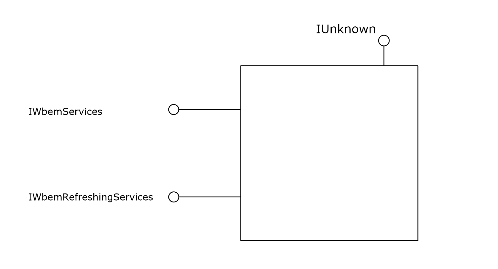

Figure 5: The IWbemServices interface

For all methods, the server MUST increment **CurrentRequestCount** at the start of the method, and decrement it when returning from the method.

If **IsServerPaused** flag is set to True, the server MUST return WBEM_E_SERVER_TOO_BUSY if **CurrentRequestCount** is greater than **MaxRequestLimit**. The class names used in the operations MUST conform to the CLASS-NAME element of the WQL query. The server MUST treat class names in a case-insensitive manner.

##### 3.1.4.3.1 IWbemServices::OpenNamespace (Opnum 3)

The IWbemServices::OpenNamespace method provides the client with an [IWbemServices](#Section_3.1.4.3.13) [**interface pointer**](#gt_interface-pointer) that is scoped to the requested namespace. The specified namespace MUST be a child namespace of the current namespace through which this method is called.

HRESULT OpenNamespace(

[in] const BSTR strNamespace,

[in] long lFlags,

[in] IWbemContext* pCtx,

[out, in, unique] IWbemServices** ppWorkingNamespace,

[out, in, unique] IWbemCallResult** ppResult

);

**strNamespace:** MUST be the [**CIM path**](#gt_775e4b82-5447-4125-b887-b404421e1269) to the target namespace. This parameter MUST NOT be NULL.

**lFlags:** Flags that affect the behavior of the OpenNamespace method. The behavior of each flag MUST be interpreted as follows:

- If this bit is not set, the server MUST make the method call synchronous.
- If this bit is set, the server MUST make the method call semisynchronously.
| Name | Value |
| --- | --- |
| WBEM_FLAG_RETURN_IMMEDIATELY | 0x00000010 |

Any other DWORD value that does not match the preceding condition MUST be treated as invalid.

**pCtx:** This parameter MUST be NULL.

**ppWorkingNamespace:** This parameter MUST NOT be NULL on input when WBEM_FLAG_RETURN_IMMEDIATELY is not set. If the method returns WBEM_S_NO_ERROR, *ppWorkingNamespace* MUST receive a pointer to an IWbemServices interface pointer to the requested namespace.

The output parameter MUST be based on the state of the **lFlags** parameter (whether WBEM_FLAG_RETURN_IMMEDIATELY is set) as listed in the following table.

| Flag state | Success operation | Failure operation |
| --- | --- | --- |
| WBEM_FLAG_RETURN_IMMEDIATELY is not set. | MUST be set to the requested IWbemServices interface. | MUST be set to NULL if the input parameter is not-NULL. |
| WBEM_FLAG_RETURN_IMMEDIATELY is set. | MUST be set to NULL if the input parameter is not-NULL. | MUST be set to NULL if the input parameter is not-NULL. |

**ppResult:** The output parameter MUST be filled according to the state of the **lFlags** parameter (whether WBEM_FLAG_RETURN_IMMEDIATELY is set) as listed in the following table.

| Flag state | Success operation | Failure operation |
| --- | --- | --- |
| WBEM_FLAG_RETURN_IMMEDIATELY is not set. | MUST be set to NULL if the input parameter is not-NULL. | MUST be set to NULL if the input parameter is not-NULL. |
| WBEM_FLAG_RETURN_IMMEDIATELY is set. | MUST be set to the requested IWbemCallResult interface. | MUST be set to NULL if the input parameter is not-NULL. |

This parameter MUST NOT be NULL on input when WBEM_FLAG_RETURN_IMMEDIATELY equals 1. In such a case, it receives a pointer to an [IWbemCallResult](#Section_3.1.4.5) interface pointer.

**Return Values:** This method MUST return an HRESULT value that MUST indicate the status of the method call. The server MUST return WBEM_S_NO_ERROR, as specified in section [2.2.11](#Section_2.2.11), to indicate the successful completion of the method.

**WBEM_S_NO_ERROR** (0x00)

Requirements described in the parameter definitions are checked, and if the requirements are not met, the server returns WBEM_E_INVALID_PARAMETER.

In response to the IWbemServices::OpenNamespace method, the server MUST evaluate whether the *strNamespace* parameter, which is specified in the preceding list, is a child of the namespace that is associated with the current interface pointer. If the requested namespace does not exist as a child namespace, the server MUST return WBEM_E_INVALID_NAMESPACE. If the requested namespace exists as a child namespace of the current interface pointer, the server MUST create another IWbemServices interface pointer associated with this namespace and return WBEM_S_NO_ERROR.

If the method returns a success code, the method MUST fill one of the two output parameters, as indicated by the use of the *lFlags* parameter, which is previously specified.

The successful synchronous method execution MUST fill the *ppWorkingNamespace* parameter with an IWbemServices interface pointer and MUST return WBEM_S_NO_ERROR.

The [**semisynchronous**](#gt_semisynchronous-operation) method execution MUST follow the rules that are specified in section [3.1.1.1.2](#Section_3.1.1.1.2.1).

The failed method execution MUST set the output parameters to NULL and MUST return an error in the format that is specified in section 2.2.11.

If the *ppResult* input parameter is non-NULL, the server MUST deliver the result of the requested operation (regardless whether WBEM_FLAG_RETURN_IMMEDIATELY is set) via the IWbemCallResult, similar to the semisynchronous execution case.

##### 3.1.4.3.2 IWbemServices::CancelAsyncCall (Opnum 4)

The IWbemServices::CancelAsyncCall method cancels a currently pending asynchronous method call identified by the [IWbemObjectSink](#Section_3.1.4.2.2) pointer passed to the initial asynchronous method.

HRESULT CancelAsyncCall(

[in] IWbemObjectSink* pSink

);

**pSink:** MUST be a pointer to the IWbemObjectSink interface object that was passed to the asynchronous method that the client wants to cancel. This parameter MUST NOT be NULL.

**Return Values:** This method MUST return an HRESULT value that MUST indicate the status of the method call. The server MUST return WBEM_S_NO_ERROR (as specified in section [2.2.11](#Section_2.2.11)) to indicate the successful completion of the method.

| Return value/code | Description |
| --- | --- |
| 0x00 WBEM_S_NO_ERROR | Indicates a successful completion to the method call. |

In response to the IWbemServices::CancelAsyncCall method, the server MUST identify and cancel all pending [**asynchronous operations**](#gt_asynchronous-operation) initiated by an asynchronous method execution, such as [IWbemServices::GetObjectAsync](#Section_3.1.4.3.5), which used the *pSink* [**interface pointer**](#gt_interface-pointer) parameter as their response handler. The server MUST return an error if the interface pointer is NULL, and it MUST return an error if the *pSink* parameter is not associated with an entry in AsyncOperationTable.

As part of the IWbemServices::CancelAsyncCall method, the server MUST set the CallCancelled value for this asynchronous operation entry in the AsyncOperationTable to TRUE. Setting CallCancelled to TRUE ensures that no new IWbemObjectSink::Indicate messages or progress messages using IWbemObjectSink::SetStatus are called to the client. If **SetStatusWithFinalResultCalled** is FALSE, the server MUST set **SetStatusWithFinalResultCalled** to TRUE and return the error WBEM_E_CALL_CANCELLED.

The server MUST NOT wait for any response from the client to complete the cancellation to prevent protocol performance degradation.

The successful method execution MUST return WBEM_S_NO_ERROR.

The failed method execution MUST return an error in the format specified in section 2.2.11.

##### 3.1.4.3.3 IWbemServices::QueryObjectSink (Opnum 5)

The QueryObjectSink method obtains a notification handler that allows the client to send events directly to the server.

HRESULT QueryObjectSink(

[in] long lFlags,

[out] IWbemObjectSink** ppResponseHandler

);

**lFlags:** This parameter is not used and its value MUST be 0x0.

**ppResponseHandler:** MUST be a pointer to a QueryObjectSink [**interface pointer**](#gt_interface-pointer) to the notification handler that allows the client to send events directly to the server. This parameter MUST be set to NULL on error.

**Return Values:** This method MUST return an HRESULT value that MUST indicate the status of the method call. The server MUST return WBEM_S_NO_ERROR (specified in section [2.2.11](#Section_2.2.11)) to indicate the successful completion of the method.

**WBEM_S_NO_ERROR** (0x00)

The [**security principal**](#gt_security-principal) that makes the call MUST have WBEM_REMOTE_ENABLE, WBEM_ENABLE, and WBEM_FULL_WRITE accesses to the namespace; otherwise, WBEM_E_ACCESS_DENIED MUST be returned.

In response to the IWbemServices::QueryObjectSink method, the server MUST return an [IWbemObjectSink](#Section_3.1.4.2.2) interface pointer in *ppResponseHandler*. The server MUST return an error if the *ppResponseHandler* is NULL or if it is unable to create the requested interface pointer.

The successful method execution MUST fill the *ppResponseHandler* parameter and MUST return WBEM_S_NO_ERROR.

The failed method execution MUST set the output parameters to NULL and MUST return an error in the format as specified in section 2.2.11.

When extrinsic events are delivered to the server by using [IWbemObjectSink::Indicate](#Section_3.1.4.2.1) as specified in section 3.1.4.2.1, the server MUST send the event objects to all WMI clients whose notification query satisfies the event objects that are delivered through IWbemObjectSink::Indicate and whose security permissions match the security descriptor as specified in section [5.2](#Section_5.2). Refer to section [3.1.6.1](#Section_3.1.6.1) for information on how the result objects are delivered to the client.

The notification query is made by the client to the server by calling [IWbemServices::ExecNotificationQuery](#Section_3.1.4.3.20) or [IWbemServices::ExecNotificationQueryAsync](#Section_3.1.4.3.21). Refer to sections 3.1.4.3.20 and 3.1.4.3.21 for information about how the server processes the client requests for notifications.

##### 3.1.4.3.4 IWbemServices::GetObject (Opnum 6)

The IWbemServices::GetObject method retrieves a [**CIM class**](#gt_cim-class) or a [**CIM instance**](#gt_cim-instance). This method MUST retrieve [**CIM objects**](#gt_cim-object) from the namespace that is associated with the current [IWbemServices](#Section_3.1.4.3.13) interface.

HRESULT GetObject(

[in] const BSTR strObjectPath,

[in] long lFlags,

[in] IWbemContext* pCtx,

[out, in, unique] IWbemClassObject** ppObject,

[out, in, unique] IWbemCallResult** ppCallResult

);

**strObjectPath:** MUST be the [**CIM path**](#gt_775e4b82-5447-4125-b887-b404421e1269) of the [**CIM object**](#gt_cim-object) to be retrieved. If the parameter is NULL, the server MUST return an [**empty CIM Object**](#gt_empty-cim-object).

**lFlags:** Specifies the behavior of the IWbemServices::GetObject method. Flag behavior MUST be interpreted as specified in the following table.

The server MUST allow any combination of zero or more flags from the following table and MUST comply with all the restrictions in a flag description. Any other DWORD value that does not match a flag condition MUST be treated as not valid.

| Value | Meaning |
| --- | --- |
| WBEM_FLAG_USE_AMENDED_QUALIFIERS 0x00020000 | If this bit is not set, the server SHOULD return no [**CIM localizable information**](#gt_cim-localizable-information). If this bit is set, the server SHOULD return CIM localizable information for the CIM object, as specified in section [2.2.6](#Section_2.2.6). |
| WBEM_FLAG_RETURN_IMMEDIATELY 0x00000010 | If this bit is not set, the server MUST make the method call synchronously. If this bit is set, the server MUST make the method call semisynchronously. |
| WBEM_FLAG_DIRECT_READ 0x00000200 | If this bit is set, the server MUST disregard any derived class when it searches the result. If this bit is not set, the server MUST consider the entire class hierarchy when it returns the result. |

**pCtx:** MUST be a pointer to an [IWbemContext](#Section_2.2.13.2) interface, which MUST contain additional information that the client wants to pass for processing to the implementer of the CIM object that is referred to by *strObjectPath*. If the parameter is set to NULL, the server MUST ignore it.

**ppObject:** If the parameter is set to NULL, the server MUST ignore it. In this case, the output parameter MUST be filled according to the state of the **lFlags** parameter (whether WBEM_FLAG_RETURN_IMMEDIATELY is set) as listed in the following table.

| Flag state | Success operation | Failure operation |
| --- | --- | --- |
| WBEM_FLAG_RETURN_IMMEDIATELY is not set. | MUST contain an [IWbemClassObject](#Section_2.2.4) [**interface pointer**](#gt_interface-pointer). | MUST be set to NULL if the input parameter is non-NULL. |
| WBEM_FLAG_RETURN_IMMEDIATELY is set. | MUST be set to NULL if the input parameter is non-NULL. | MUST be set to NULL if the input parameter is non-NULL. |

**ppCallResult:** The output parameter MUST be filled according to the state of the **lFlags** parameter (whether WBEM_FLAG_RETURN_IMMEDIATELY is set) as listed in the following table.

| Flag state | Success operation | Failure operation |
| --- | --- | --- |
| WBEM_FLAG_RETURN_IMMEDIATELY is not set. | MUST be set to NULL if the *ppCallResult* input parameter is non-NULL. | MUST be set to NULL if the *ppCallResult* input parameter is non-NULL. |
| WBEM_FLAG_RETURN_IMMEDIATELY is set. | The *ppCallResult* parameter MUST NOT be NULL upon input. If NULL, the server MUST return WBEM_E_INVALID_PARAMETER. Upon output, the parameter MUST contain the [IWbemCallResult](#Section_3.1.4.5) interface pointer. | MUST be set to NULL if the *ppCallResult* input parameter is non-NULL. |

**Return Values:** This method MUST return an HRESULT that MUST indicate the status of the method call. The HRESULT MUST have the type and values as specified in section [2.2.11](#Section_2.2.11). The server MUST return WBEM_S_NO_ERROR (as specified in section 2.2.11) to indicate the successful completion of the method.

**WBEM_S_NO_ERROR** (0x00)

The [**security principal**](#gt_security-principal) that makes the call MUST have WBEM_REMOTE_ENABLE and WBEM_ENABLE accesses to the namespace; otherwise, WBEM_E_ACCESS_DENIED MUST be returned.

In response to the IWbemServices::GetObject method, the server MUST interpret *strObjectPath* as defined in [[DMTF-DSP0004]](https://go.microsoft.com/fwlink/?LinkId=89848) section 8.5. If the path refers to a class, the server MUST look it up in the **ClassTable**. If found, the server MUST return an object that represents the **ClassDeclaration**. If *strObjectPath* refers to an instance, the server MUST check the **InstanceProviderId** for the class. If **InstanceProviderId** is NULL, then the server MUST look up the CIM database and return the CIM instance. If **InstanceProviderId** is not NULL, then the server MUST find the provider entry corresponding to **InstanceProviderId** in the **ProviderTable**.

- If found:
- If **SupportsGet** is FALSE, the server MUST return WBEM_E_PROVIDER_NOT_CAPABLE.
- Else the server MUST use the abstract interface specified as part of [3.1.4.17](#Section_3.1.4.17.4) to communicate with the provider, and return the appropriate results or the error code.
- If not found, the server MUST return WBEM_E_PROVIDER_NOT_FOUND.
The successful synchronous method execution MUST provide the retrieved IWbemClassObject interface pointer in the *ppObject* parameter and MUST return WBEM_S_NO_ERROR.

The method MUST fail if the CIM object that is referred to by *strObjectPath* does not exist, if the method parameters are not valid as specified in the preceding list, or if the server is unable to execute the method. The failed method execution MUST set the output parameters to NULL and MUST return an error in the format specified in section 2.2.11.

The semisynchronous method execution MUST follow the rules that are specified in section [3.1.1.1.2](#Section_3.1.1.1.2.1).

If a class is marked by a Singleton [**qualifier**](#gt_qualifier), the server MUST treat "Class-Name = @" in the object path as referencing the singleton instance of the class.

##### 3.1.4.3.5 IWbemServices::GetObjectAsync (Opnum 7)

The IWbemServices::GetObjectAsync method is the asynchronous version of the [IWbemServices::GetObject](#Section_3.1.4.3.5) method.

HRESULT GetObjectAsync(

[in] const BSTR strObjectPath,

[in] long lFlags,

[in] IWbemContext* pCtx,

[in] IWbemObjectSink* pResponseHandler

);

**strObjectPath:** MUST be the [**CIM path**](#gt_775e4b82-5447-4125-b887-b404421e1269) of the [**CIM object**](#gt_cim-object) to be retrieved. If this parameter is set to NULL, the server MUST return an [**empty CIM object**](#gt_empty-cim-object).

**lFlags:** Specifies the behavior of the GetObjectAsync method. Flag behavior MUST be interpreted as specified in the following table.

The server MUST accept a combination of zero or more flags from the following table and MUST comply with all the restrictions in a flag description. Any other DWORD value that does not match a flag condition MUST be treated as not valid.

| Value | Meaning |
| --- | --- |
| WBEM_FLAG_USE_AMENDED_QUALIFIERS 0x00020000 | If this bit is not set, the server SHOULD return no [**CIM localizable information**](#gt_cim-localizable-information). If this bit is set, the server SHOULD return CIM localizable information for the CIM object, as specified in section [2.2.6](#Section_2.2.6). |
| WBEM_FLAG_SEND_STATUS 0x00000080 | If this bit is not set, the server MUST make one final [IWbemObjectSink::SetStatus](#Section_3.1.4.2.2) call on the [**interface pointer**](#gt_interface-pointer) that is provided in the *pResponseHandler* parameter. If this bit is set, the server MAY make intermediate IWbemObjectSink::SetStatus calls on the interface pointer prior to call completion. |
| WBEM_FLAG_DIRECT_READ 0x00000200 | If this bit is not set, the implementer MUST consider the entire class hierarchy when it returns the result. If this bit is set, the server MUST disregard any derived class when it searches the result. |

**pCtx:** MUST be a pointer to an [IWbemContext](#Section_2.2.13.2) interface, which MUST contain additional information that the client wants to provide to the server about the CIM object referred to by *strObjectPath*. If *pCtx* is NULL, the parameter MUST be ignored.

**pResponseHandler:** MUST be a pointer to the [IWbemObjectSink](#Section_3.1.4.2.2) interface that is implemented by the caller, where enumeration results are delivered. The parameter MUST NOT be NULL. If the parameter is NULL, the server MUST return WBEM_E_INVALID_PARAMETER.

**Return Values:** This method MUST return an HRESULT value that MUST indicate the status of the method call. The server MUST return WBEM_S_NO_ERROR (specified in section [2.2.11](#Section_2.2.11)) to indicate the successful completion of the method.

**WBEM_S_NO_ERROR** (0x00)

The following validation occurs before an asynchronous operation is started:

The [**security principal**](#gt_security-principal) that makes the call MUST have WBEM_REMOTE_ENABLE and WBEM_ENABLE accesses to the namespace; otherwise, WBEM_E_ACCESS_DENIED MUST be returned.

Requirements mentioned in the parameter definitions are also checked before an asynchronous operation is started.

If successful, the server MUST create a new entry in **AsyncOperationTable** as specified in section [3.1.1.1.3](#Section_3.1.1.1.3).

The following validation happens asynchronously.

In response to IwbemServices::GetObjectAsync method, the server MUST interpret *strObjectPath*as defined in [[DMTF-DSP0004]](https://go.microsoft.com/fwlink/?LinkId=89848) section 8.5. If the path refers to a class, the server MUST look it up in the **ClassTable**. If found, the server MUST return an object that represents the **ClassDeclaration**. If *strObjectPath* refers to an instance, the server MUST check the **InstanceProviderId** for the class. If **InstanceProviderId** is NULL, then the server MUST look up the CIM database and return the CIM instance. If **InstanceProviderId** is not NULL, then the server MUST use the abstract interface specified as part of section [3.1.4.18](#Section_3.1.4.18.1) to communicate with the provider, and find the provider entry corresponding to the **InstanceProviderId** in the **ProviderTable**.

- If found:
- If **SupportsGet** is FALSE, the server MUST return WBEM_E_PROVIDER_NOT_CAPABLE.
- Else, the server MUST use the abstract interface specified in section [3.1.4.17](#Section_3.1.4.17.4) to communicate with the provider, and return the appropriate results or the error code.
- If not found, the server MUST return WBEM_E_PROVIDER_NOT_FOUND.
The method MUST fail if the CIM object that is referred to by *strObjectPath* does not exist, if the method parameters are not valid as specified in the preceding list, or if the server is unable to execute the method. The failed method execution MUST set the output parameters to NULL and MUST return an error in the format specified in section 2.2.11.

If a class is marked by a Singleton qualifier, the server MUST treat "Class-Name = @" in the object path as referencing the singleton instance of the class.

##### 3.1.4.3.6 IWbemServices::PutClass (Opnum 8)

The IWbemServices::PutClass method creates a new class or updates an existing class in the namespace that is associated with the current [IWbemServices](#Section_3.1.4.3.13) interface. The server MUST NOT allow the creation of classes that have names that begin or end with an underscore because those names are reserved for system classes. If the class name does not conform to the CLASS-NAME element defined in [**WQL**](#gt_wmi-query-language-wql), the server MUST return WBEM_E_INVALID_PARAMETER.

HRESULT PutClass(

[in] IWbemClassObject* pObject,

[in] long lFlags,

[in] IWbemContext* pCtx,

[out, in, unique] IWbemCallResult** ppCallResult

);

**pObject:** MUST be a pointer to an [IWbemClassObject](#Section_2.2.4) [**interface pointer**](#gt_interface-pointer) that MUST contain the class information to create a new class or update an existing class. This parameter MUST NOT be NULL.

**lFlags:** Specifies the behavior of the PutClass method. Flag behavior MUST be interpreted as specified in the following table.

The server MUST accept a combination of zero or more flags from the following table and MUST comply with all the restrictions in a flag description. Any other DWORD value that does not match a flag condition MUST be treated as not valid.

| Value | Meaning |
| --- | --- |
| WBEM_FLAG_USE_AMENDED_QUALIFIERS 0x00020000 | If this bit is set, the server SHOULD ignore all the amended qualifiers while it creates or updates the [**CIM class**](#gt_cim-class).<34> If this bit is not set, the server SHOULD include all the qualifiers, including amended qualifiers, while it updates or creates the CIM class. |
| WBEM_FLAG_RETURN_IMMEDIATELY 0x00000010 | If this bit is not set, the server MUST make the method call [**synchronously**](#gt_synchronous-operation). If this bit is set, the server MUST make the method call [**semisynchronously**](#gt_semisynchronous-operation). |
| WBEM_FLAG_UPDATE_ONLY 0x00000001 | The server MUST update a CIM class *pObject* if the CIM class is present. This flag is mutually exclusive with WBEM_FLAG_CREATE_ONLY. If none of these flags are set, the server MUST create or update a CIM class *pObject*. |
| WBEM_FLAG_CREATE_ONLY 0x00000002 | The server MUST create a CIM class *pObject* if the CIM class is not already present. |
| WBEM_FLAG_UPDATE_FORCE_MODE 0x00000040 | The server MUST update the class even if conflicting child classes exist. |
| WBEM_FLAG_UPDATE_SAFE_MODE 0x00000020 | The server MUST update the class as long as the change does not cause any conflicts with existing child classes or instances. This flag is mutually exclusive with WBEM_FLAG_UPDATE_FORCE_MODE. If none of these flags are set, the server MUST update the class if there is no derived class, if there is no instance for that class, or if the class is unchanged. |

**pCtx:** MUST be a pointer to an [IWbemContext](#Section_2.2.13.2) interface, which MUST contain additional information that the client wants to provide to the server about the CIM class that is referred to by the *pObject* parameter. If the *pCtx* parameter is NULL, it MUST be ignored.

**ppCallResult:** If the input parameter is non-NULL, the server MUST return WBEM_S_NO_ERROR and [IWbemCallResult](#Section_3.1.4.5) MUST deliver the result of the requested operation (regardless whether WBEM_FLAG_RETURN_IMMEDIATELY is set). The output parameter MUST be filled according to the state of the *lFlags* parameter (whether WBEM_FLAG_RETURN_IMMEDIATELY is set) as listed in the following table.

| Flag state | Operation Started Successfully | Operation Failed to Start |
| --- | --- | --- |
| WBEM_FLAG_RETURN_IMMEDIATELY is not set. | MUST be set to IWbemCallResult if the input parameter is non-NULL. | MUST be set to NULL if the input parameter is non-NULL. |
| WBEM_FLAG_RETURN_IMMEDIATELY is set. | This parameter MUST NOT be NULL upon input. If NULL, the server MUST return WBEM_E_INVALID_PARAMETER. On output, the parameter MUST contain the IWbemCallResult interface pointer. | MUST be set to NULL if the input parameter is non-NULL. |

If the *ppCallResult* input parameter is NULL and WBEM_FLAG_RETURN_IMMEDIATELY is not set, the server MUST deliver the result of the requested operation synchronously.

**Return Values:** This method MUST return an HRESULT value that MUST indicate the status of the method call. The server MUST return WBEM_S_NO_ERROR (specified in section [2.2.11](#Section_2.2.11)) to indicate the successful completion of the method.

**WBEM_S_NO_ERROR** (0x00)

The [**security principal**](#gt_security-principal) that makes the call MUST have WBEM_REMOTE_ENABLE and WBEM_ENABLE accesses to the namespace; otherwise, WBEM_E_ACCESS_DENIED MUST be returned.

The server MUST first determine whether the class is dynamic or static. If the class exists in the **ClassTable** for the namespace, then it is static when **InstanceProviderId** is NULL and dynamic otherwise. If the class does not exist in the **ClassTable**, then WMI MUST iterate through each entry in **ProviderTable** with **IsClassProvider** set to TRUE, calling the **IsClassSupported** entrypoint (described in section [3.1.4.17.14](#Section_3.1.4.17.14)). If a provider returns TRUE, then the algorithm is terminated and the class is dynamic. Otherwise, the class is static.

If the CIM class being updated is [**dynamic**](#gt_b11172af-9369-448d-9722-444eb52b21cb), the security principal that makes the call MUST have WBEM_WRITE_PROVIDER access to the namespace; otherwise, WBEM_E_ACCESS_DENIED MUST be returned.

If the CIM class being updated is static, the security principal that makes the call MUST have WBEM_FULL_WRITE access to the namespace; otherwise, WBEM_E_ACCESS_DENIED MUST be returned.

The server MUST return WBEM_E_CANNOT_BE_SINGLETON if an attempt is made to mark a class as a singleton that has a nonsingleton [**superclass**](#gt_fbb1e623-a709-400d-8d4a-85df94ad58c3) or a class with key properties.

If the CIM class being created or updated is dynamic, the server MUST obtain **SupportsPut** for the given provider in the **ProviderTable**. If **SupportsPut** is FALSE, the server MUST return WBEM_E_PROVIDER_NOT_CAPABLE.

In response to the IWbemServices::PutClass method, the server MUST evaluate the *pObject* parameter and MUST add or update this class into the current namespace. The method MUST fail if *pObject* represents a read-only class, if the method parameters or their combinations are not valid as specified in this section, or if the server is unable to execute the method. The method MUST fail with WBEM_E_NOT_FOUND if *pObject* property __SUPERCLASS is specified but not found in **ClassTable**.

If a new class is added or an existing class is updated successfully, **ClassTable** MUST be updated with the changes. If *pObject* property __SUPERCLASS is specified, **DerivedClassTable** MUST point to the entry in the **ClassTable** representing the superclass.

If the CIM class referred by *pObject* is a new entry in the **ClassTable**, the server MUST generate a **__ClassCreationEvent** event object upon successful creation of the class.

If the CIM class referred by *pObject* already exists in the **ClassTable** prior to this method call, the server MUST generate a **__ClassModificationEvent** event object upon successfully updating the class information.

The successful synchronous method execution MUST return WBEM_S_NO_ERROR.

The semisynchronous method execution MUST follow the rules that are specified in section [3.1.1.1.2](#Section_3.1.1.1.2.1).

The failed method execution MUST set output parameters to NULL and MUST return an error in the format specified in section 2.2.11.

The server MUST ensure that the value referred by __CLASS conforms to CLASS-NAME in section [2.2.1.1](#Section_2.2.1.1). In addition:

- If the value has an underscore character ("_") as the first character, the server MUST return WBEM_E_INVALID_OPERATION.
- If the value has an underscore character ("_") as the last character prior to NULL, the server MUST return WBEM_E_INVALID_OBJECT.
- The server SHOULD enforce a maximum length for the _CLASS property ([2.2](#Section_2.2)) of the object pointed to by the *pObject* parameter, and return WBEM_E_QUOTA_VIOLATION if the limit is exceeded.<35>

##### 3.1.4.3.7 IWbemServices::PutClassAsync (Opnum 9)

The IWbemServices::PutClassAsync method is the asynchronous version of the [IWbemServices::PutClass](#Section_3.1.4.3.7) method. The PutClassAsync method creates a new class or updates an existing class. The server MUST NOT allow the creation of classes that have names that begin or end with an underscore because those names are reserved for system classes. If the class name does not conform to the CLASS-NAME element defined in WQL, the server MUST return WBEM_E_INVALID_PARAMETER.

HRESULT PutClassAsync(

[in] IWbemClassObject* pObject,

[in] long lFlags,

[in] IWbemContext* pCtx,

[in] IWbemObjectSink* pResponseHandler

);

**pObject:** MUST be a pointer to an [IWbemClassObject](#Section_2.2.4) [**interface pointer**](#gt_interface-pointer) that MUST contain the class information to create a new class or update an existing class. The class that is specified by the parameter MUST have been correctly initialized with all the required property values. This parameter MUST NOT be NULL.

**lFlags:** Specifies the behavior of the PutClassAsync method. Flag behavior MUST be interpreted as specified in the following table.

The server MUST accept a combination of zero or more flags from the following table and MUST comply with all the restrictions in a flag description. Any other DWORD value that does not match a flag condition MUST be treated as not valid.

| Value | Meaning |
| --- | --- |
| WBEM_FLAG_USE_AMENDED_QUALIFIERS 0x00020000 | If this bit is set, the server SHOULD ignore all the amended qualifiers while it creates or updates a [**CIM class**](#gt_cim-class).<36> If this bit is not set, the server SHOULD include all the qualifiers, including amended qualifiers, while it updates or creates a CIM class. |
| WBEM_FLAG_UPDATE_ONLY 0x00000001 | The server MUST update a CIM class *pObject* if the CIM class is present. This flag is mutually exclusive with WBEM_FLAG_CREATE_ONLY. If none of these flags are set, the server MUST create or update a CIM class *pObject*. |
| WBEM_FLAG_CREATE_ONLY 0x00000002 | The server MUST create a CIM class *pObject* if the CIM class is not already present. |
| WBEM_FLAG_UPDATE_FORCE_MODE 0x00000040 | The server MUST forcefully update the class even when conflicting child classes exist. |
| WBEM_FLAG_UPDATE_SAFE_MODE 0x00000020 | The server MUST update the class as long as the change does not cause any conflicts with existing child classes or instances. This flag is mutually exclusive with WBEM_FLAG_UPDATE_FORCE_MODE. If none of these flags are set, the server MUST update the class if there is no derived class, if there is no instance for that class, or if the class is unchanged. |
| WBEM_FLAG_SEND_STATUS 0x00000080 | If this bit is not set, the server MUST make one final [IWbemObjectSink::SetStatus](#Section_3.1.4.2.2) method call on the interface pointer that is provided in the *pResponseHandler* parameter. If this bit is set, the server MAY make intermediate IWbemObjectSink::SetStatus calls on the interface pointer prior to call completion. |

**pCtx:** MUST be a pointer to an [IWbemContext](#Section_2.2.13.2) interface, which MUST contain additional information that the client wants to pass to the server. If the *pCtx* parameter is NULL, the parameter MUST be ignored.

**pResponseHandler:** MUST be a pointer to an [IWbemObjectSink](#Section_3.1.4.2.2) interface object that is implemented by the client of this method. The parameter MUST NOT be NULL.

**Return Values:** This method MUST return an HRESULT value that MUST indicate the status of the method call. The server MUST return WBEM_S_NO_ERROR (specified in section [2.2.11](#Section_2.2.11)) to indicate the successful completion of the method.

**WBEM_S_NO_ERROR** (0x00)

The following validation happens before asynchronous operation is started:

The [**security principal**](#gt_security-principal) that makes the call MUST have WBEM_REMOTE_ENABLE and WBEM_ENABLE accesses to the namespace; otherwise, WBEM_E_ACCESS_DENIED MUST be returned.

Requirements mentioned in the parameter definitions are also checked before starting asynchronous operation.

If successful, the server MUST create a new entry in **AsyncOperationTable** as specified in section [3.1.1.1.3](#Section_3.1.1.1.3).

The following validation happens asynchronously:

The server MUST first determine whether the class is dynamic or static. If the class exists in the **ClassTable** for the namespace, then it is static when **InstanceProviderId** is NULL and dynamic otherwise. If the class does not exist in the **ClassTable**, then WMI MUST iterate through each entry in **ProviderTable** with **IsClassProvider** set to TRUE, calling the **IsClassSupported** entrypoint (described in section [3.1.4.17.14](#Section_3.1.4.17.14)). If a provider returns TRUE, then the algorithm is terminated and the class is dynamic. Otherwise, the class is static.

If the CIM class being updated is [**dynamic**](#gt_b11172af-9369-448d-9722-444eb52b21cb), the security principal that makes the call MUST have WBEM_WRITE_PROVIDER access to the namespace; otherwise, WBEM_E_ACCESS_DENIED MUST be returned.

If the CIM class being updated is static, the security principal that makes the call MUST have WBEM_FULL_WRITE access to the namespace; otherwise, WBEM_E_ACCESS_DENIED MUST be returned.

If the CIM class being created or updated is dynamic, the server MUST obtain **SupportsPut** for the given provider in the **ProviderTable**. If **SupportsPut** is FALSE, the server MUST return WBEM_E_PROVIDER_NOT_CAPABLE.

The server MUST return WBEM_E_CANNOT_BE_SINGLETON if an attempt is made to mark a class as a Singleton that has a nonsingleton superclass or a class with key properties.

In response to the IWbemServices::PutClassAsync method, the server MUST evaluate the *pObject* parameter (previously specified) and it MUST add or update this class into the current namespace. The method MUST fail if *pObject* represents a read-only class, if the method parameters or their combinations are not valid (as previously specified), or if the server is unable to execute the method. The method MUST fail with WBEM_E_NOT_FOUND if *pObject* property __SUPERCLASS is specified but not found in **ClassTable**.

If a new class is added or an existing class is updated, **ClassTable** MUST be updated with the changes. If *pObject* property __SUPERCLASS is specified, **DerivedClassTable** MUST point to the entry in the **ClassTable** representing the SuperClass.

If the CIM class referred by *pObject* is a new entry in the **ClassTable**, the server MUST generate a **__ClassCreationEvent** event object upon successful creation of the class.

If the CIM class referred by *pObject* already exists in the **ClassTable** prior to this method call, the server MUST generate a **__ClassModificationEvent** event object upon successfully updating the class information.

The server MUST ensure that the value referred by __CLASS conforms to CLASS-NAME in [2.2.1.1](#Section_2.2.1.1). In addition:

- If the value has an underscore character ("_") as the first character, the server MUST return WBEM_E_INVALID_OPERATION.
- If the value has an underscore character as the last character prior to NULL, the server MUST return WBEM_E_INVALID_OBJECT.
- The server SHOULD enforce a maximum length for the _CLASS property (see section [2.2](#Section_2.2)) of the object pointed to by the **pObject** parameter, and return WBEM_E_QUOTA_VIOLATION if the limit is exceeded.<37>

##### 3.1.4.3.8 IWbemServices::DeleteClass (Opnum 10)

The IWbemServices::DeleteClass method MUST delete a specified class from the namespace that is associated with the current [IWbemServices](#Section_3.1.4.3.13) interface.

HRESULT DeleteClass(

[in] const BSTR strClass,

[in] long lFlags,

[in] IWbemContext* pCtx,

[out, in, unique] IWbemCallResult** ppCallResult

);

**strClass:** MUST be the name of the class to delete. This parameter MUST NOT be NULL.

**lFlags:** Specifies the behavior of the DeleteClass method. Flag behavior MUST be interpreted as specified in the following table.

| Value | Meaning |
| --- | --- |
| WBEM_FLAG_RETURN_IMMEDIATELY 0x00000010 | If this bit is set, the server MUST make the method call [**semisynchronously**](#gt_semisynchronous-operation). If this bit is not set, the server MUST make the method call [**synchronously**](#gt_synchronous-operation). |

Any other DWORD value that does not match the preceding condition MUST be treated as invalid.

**pCtx:** MUST be a pointer to an [IWbemContext](#Section_2.2.13.2) interface, which MUST contain additional information that the client wants to pass to the server. If pCtx is NULL, the parameter MUST be ignored.

**ppCallResult:** The output parameter MUST be filled according to the state of the **lFlags** parameter (whether WBEM_FLAG_RETURN_IMMEDIATELY is set) as listed in the following table.

| Flag state | Operation Started Successfully | Operation Failed to Start |
| --- | --- | --- |
| WBEM_FLAG_RETURN_IMMEDIATELY is not set. | MUST be set to [IWbemCallResult](#Section_3.1.4.5) if the *ppCallResult* input parameter is non-NULL. | MUST be set to NULL if the *ppCallResult* input parameter is non-NULL. |
| WBEM_FLAG_RETURN_IMMEDIATELY is set. | The *ppCallResult* parameter MUST NOT be NULL upon input. If NULL, the server MUST return WBEM_E_INVALID_PARAMETER. On output, the parameter MUST contain the IWbemCallResult [**interface pointer**](#gt_interface-pointer). | MUST be set to NULL if the *ppCallResult* input parameter is non-NULL. |

**Return Values:** This method MUST return an HRESULT value that MUST indicate the status of the method call. The server MUST return WBEM_S_NO_ERROR (specified in section [2.2.11](#Section_2.2.11)) to indicate the successful completion of the method.

**WBEM_S_NO_ERROR** (0x00)

The [**security principal**](#gt_security-principal) that makes the call MUST have WBEM_REMOTE_ENABLE and WBEM_ENABLE accesses to the namespace; otherwise, WBEM_E_ACCESS_DENIED MUST be returned.

If the CIM class being deleted is [**dynamic**](#gt_b11172af-9369-448d-9722-444eb52b21cb), the security principal that makes the call MUST have WBEM_WRITE_PROVIDER access to the namespace; otherwise, WBEM_E_ACCESS_DENIED MUST be returned.

If the CIM class being deleted is static, the security principal that makes the call MUST have WBEM_FULL_WRITE access to the namespace; otherwise, WBEM_E_ACCESS_DENIED MUST be returned.

If the CIM class being deleted is dynamic, the server MUST obtain **SupportsDelete** for the given provider in the **ProviderTable**. If **SupportsDelete** is FALSE, the server MUST return WBEM_E_PROVIDER_NOT_CAPABLE.

In response to the IWbemServices::DeleteClass method, the server MUST evaluate the *strClass* parameter (specified in this section) and MUST delete the *strClass* parameter from the current namespace. The server MUST delete all the instances of the class and recursively delete all the derived classes. The method MUST fail if the following applies: if *strClass* does not exist; if the method parameters or their combinations are not valid as specified in this section; or if the server is unable to execute the method.

The successful synchronous method execution MUST return WBEM_S_NO_ERROR.

The semisynchronous method execution MUST follow the rules that are specified in section [3.1.1.1.2](#Section_3.1.1.1.2.1).

The failed method execution MUST set output parameters to NULL and MUST return an error in the format specified in section 2.2.11.

If the *ppResult* input parameter is non-NULL, the server MUST deliver the result of the requested operation (regardless whether WBEM_FLAG_RETURN_IMMEDIATELY is set) via the IWbemCallResult, similar to the semisynchronous execution case. If the *ppCallResult* input parameter is NULL and WBEM_FLAG_RETURN_IMMEDIATELY is not set, the server MUST deliver the result of the requested operation synchronously.

If a class is deleted, the corresponding entries for the class and its derived classes MUST be deleted from the **ClassTable**.

The server MUST generate a **__ClassDeletionEvent** event object upon successfully deleting the class information.

The server SHOULD enforce a maximum length for the *strClass* parameter, and return WBEM_E_QUOTA_VIOLATION if the limit is exceeded.<38>

##### 3.1.4.3.9 IWbemServices::DeleteClassAsync (Opnum 11)

The IWbemServices::DeleteClassAsync method is the asynchronous version of the [IWbemServices::DeleteClass](#Section_3.1.4.3.9) method. The DeleteClassAsync method MUST delete a specified class from the namespace.

HRESULT DeleteClassAsync(

[in] const BSTR strClass,

[in] long lFlags,

[in] IWbemContext* pCtx,

[in] IWbemObjectSink* pResponseHandler

);

**strClass:** MUST be the name of the class to delete. This parameter MUST NOT be NULL.

**lFlags:** Specifies the behavior of the DeleteClassAsync method. Flag behavior MUST be interpreted as specified in the following table.

| Value | Meaning |
| --- | --- |
| WBEM_FLAG_SEND_STATUS 0x00000080 | If this bit is not set, the server MUST make one final [IWbemObjectSink::SetStatus](#Section_3.1.4.2.2) call on the [**interface pointer**](#gt_interface-pointer) that is provided in the *pResponseHandler* parameter. If this bit is set, the server MAY make intermediate IWbemObjectSink::SetStatus calls on the interface pointer prior to call completion. |

Any other DWORD value that does not match the preceding condition MUST be treated as not valid.

**pCtx:** MUST be a pointer to an [IWbemContext](#Section_2.2.13.2) interface, which MUST contain additional information that the client wants to pass to the server. If pCtx is NULL, the parameter MUST be ignored.

**pResponseHandler:** MUST be a pointer to an [IWbemObjectSink](#Section_3.1.4.2.2) interface object that is implemented by the client of this method. This parameter MUST NOT be NULL.

**Return Values:** This method MUST return an HRESULT value that MUST indicate the status of the method call. The server MUST return WBEM_S_NO_ERROR (as specified in section [2.2.11](#Section_2.2.11)) to indicate the successful completion of the method.

**WBEM_S_NO_ERROR** (0x00)

The following validation occurs before asynchronous operation is started:

The [**security principal**](#gt_security-principal) that makes the call MUST have WBEM_REMOTE_ENABLE and WBEM_ENABLE accesses to the namespace; otherwise, WBEM_E_ACCESS_DENIED MUST be returned.

The server SHOULD enforce a maximum length for the *strClass* parameter and return WBEM_E_QUOTA_VIOLATION if the limit is exceeded.<39>

The requirements mentioned in the parameter definitions are also checked before starting the asynchronous operation.

If successful, the server MUST create a new entry in **AsyncOperationTable** as specified in section [3.1.1.1.3](#Section_3.1.1.1.3).

The following validation occurs asynchronously:

If the CIM class being deleted is [**dynamic**](#gt_b11172af-9369-448d-9722-444eb52b21cb), the security principal that makes the call MUST have WBEM_WRITE_PROVIDER access to the namespace; otherwise, WBEM_E_ACCESS_DENIED MUST be returned.

If the CIM class being deleted is static, the security principal that makes the call MUST have WBEM_FULL_WRITE access to the namespace; otherwise, WBEM_E_ACCESS_DENIED MUST be returned.

If the CIM class being deleted is dynamic, the server MUST obtain **SupportsDelete** for the given provider in the **ProviderTable**. If **SupportsDelete** is FALSE, the server MUST return WBEM_E_PROVIDER_NOT_CAPABLE.

In response to the IWbemServices::DeleteClassAsync method, the server MUST evaluate the *strClass* parameter (specified in this section) and MUST delete *strClass* from the current namespace. The server MUST delete all the instances of the class and recursively delete all the derived classes. The method MUST fail if the following applies: if *strClass* does not exist; if the method parameters or their combinations are not valid as previously specified; or if the server is unable to execute the method.

If a new class is deleted, the corresponding entries for the class and the derived classes MUST be deleted from the **ClassTable**.

The server MUST generate a **__ClassDeletionEvent** event object upon successfully deleting the class information.

##### 3.1.4.3.10 IWbemServices::CreateClassEnum (Opnum 12)

The IWbemServices::CreateClassEnum method provides a class enumeration. When this method is invoked, the server MUST return all classes that satisfy the selection criteria from the namespace that is associated with the current [IWbemServices](#Section_3.1.4.3.13) interface.

HRESULT CreateClassEnum(

[in] const BSTR strSuperclass,

[in] long lFlags,

[in] IWbemContext* pCtx,

[out] IEnumWbemClassObject** ppEnum

);

**strSuperClass:** MUST specify a [**superclass**](#gt_fbb1e623-a709-400d-8d4a-85df94ad58c3) name. Only classes that are subclasses of this class MUST be returned. If *strSuperClass* is NULL or a zero-length string, all classes in the namespace MUST be included in the result set. The results MUST be filtered by using the *lFlags* parameter. Classes without a base class MUST be considered to be derived from the NULL superclass.

**lFlags:** Flags affect the behavior of the CreateClassEnum method. Flag behavior MUST be interpreted as specified in the following table.

The server MUST allow any combination of zero or more flags from the following table and MUST comply with all the restrictions in a flag description. Any other DWORD value that does not match a flag condition MUST be treated as not valid.

| Value | Meaning |
| --- | --- |
| WBEM_FLAG_USE_AMENDED_QUALIFIERS 0x00020000 | If this bit is not set, the server SHOULD return no [**CIM localizable information**](#gt_cim-localizable-information). If this bit is set, the server SHOULD return CIM localizable information for the [**CIM object**](#gt_cim-object), as specified in section [2.2.6](#Section_2.2.6). |
| WBEM_FLAG_RETURN_IMMEDIATELY 0x00000010 | If this bit is not set, the server MUST make the method call [**synchronously**](#gt_synchronous-operation). If this bit is set, the server MUST make the method call [**semisynchronously**](#gt_semisynchronous-operation). |
| WBEM_FLAG_SHALLOW 0x00000001 | When this bit is not set, the server MUST return all classes that are derived from the requested class and all its subclasses. When this bit is set, the server MUST return only the classes that are directly derived from the requested class. |
| WBEM_FLAG_FORWARD_ONLY 0x00000020 | When this bit is not set, the server MUST return an enumerator that has reset capability. When this bit is set, the server MUST return an enumerator that does not have reset capability, as specified in section [3.1.4.4](#Section_3.1.4.4). |

**pCtx:** MUST be a pointer to an [IWbemContext](#Section_2.2.13.2) interface that MUST contain additional information that the client wants to pass to the server. If the *pCtx* parameter is NULL, it MUST be ignored.

**ppEnum:** MUST receive the pointer to the enumerator that implements the IEnumWbemClassObject interface. This parameter MUST NOT be NULL.

**Return Values:** This method MUST return an HRESULT value that MUST indicate the status of the method call. The server MUST return WBEM_S_NO_ERROR (as specified in section [2.2.11](#Section_2.2.11)) to indicate the successful completion of the method.

**WBEM_S_NO_ERROR** (0x00)

The [**security principal**](#gt_security-principal) that makes the call MUST have WBEM_REMOTE_ENABLE and WBEM_ENABLE accesses to the namespace; otherwise, WBEM_E_ACCESS_DENIED MUST be returned.

If *strSuperClass* is dynamic, the server MUST obtain **SupportsEnumerate** for the given provider in the **ProviderTable**. If **SupportsEnumerate** is FALSE, the server MUST return WBEM_E_PROVIDER_NOT_CAPABLE.

In response to the IWbemServices::CreateClassEnum method, the server MUST evaluate the *strSuperClass* parameter (specified in the preceding list) and MUST return all classes that match the input parameters from the current namespace. The method MUST fail if *strSuperClass* does not exist; if the method parameters or their combinations are not valid as previously specified; or if the server is unable to execute the method.

The successful synchronous method execution MUST fill the *ppEnum* parameter with an IEnumWbemClassObject interface pointer after all classes are collected and MUST return WBEM_S_NO_ERROR.

The semisynchronous method execution MUST follow the rules that are specified in section [3.1.1.1.2](#Section_3.1.1.1.2.1).

The failed method execution MUST set the value that is referenced by the output parameters to NULL and MUST return an error in the format that is specified in section 2.2.11.

The server SHOULD enforce a maximum length for the *strSuperClass* parameter, and return WBEM_E_QUOTA_VIOLATION if the limit is exceeded.<40>

##### 3.1.4.3.11 IWbemServices::CreateClassEnumAsync (Opnum 13)

The IWbemServices::CreateClassEnumAsync method provides an asynchronous class enumeration. When this method is invoked, the server MUST return all classes that satisfy the selection criteria.

HRESULT CreateClassEnumAsync(

[in] const BSTR strSuperclass,

[in] long lFlags,

[in] IWbemContext* pCtx,

[in] IWbemObjectSink* pResponseHandler

);

**strSuperClass:** Specifies a [**superclass**](#gt_fbb1e623-a709-400d-8d4a-85df94ad58c3) name. Only classes that are subclasses of this class MUST be returned. If *strSuperClass* is NULL or a zero-length string, all classes in the namespace MUST be considered in the result set. The results MUST be filtered by using the *lFlags* parameter. Classes without a base class are considered to be derived from the NULL superclass.

**lFlags:** Flags that affect the behavior of the [CreateClassEnum](#Section_3.1.4.3.10) method. Flag behavior MUST be interpreted as specified in the following table.

The server MUST allow any combination of zero or more flags from the following table and MUST comply with all the restrictions in a flag description. Any other DWORD value that does not match a flag condition MUST be treated as not valid.

| Value | Meaning |
| --- | --- |
| WBEM_FLAG_USE_AMENDED_QUALIFIERS 0x00020000 | If this bit is not set, the server SHOULD return no [**CIM localizable information**](#gt_cim-localizable-information). If this bit is set, the server SHOULD return CIM localizable information for the [**CIM object**](#gt_cim-object) as specified in section [2.2.6](#Section_2.2.6). |
| WBEM_FLAG_SEND_STATUS 0x00000080 | If this bit is not set, the server MUST make one final [IWbemObjectSink::SetStatus](#Section_3.1.4.2.2) call on the [**interface pointer**](#gt_interface-pointer) that is provided in the *pResponseHandler* parameter. If this bit is set, the server MAY make intermediate IWbemObjectSink::SetStatus calls on the interface pointer prior to call completion. |
| WBEM_FLAG_SHALLOW 0x00000001 | When this bit is not set, the server MUST return all classes that are derived from the requested class and all its subclasses. When this bit is set, the server MUST only return the classes that are directly derived from the requested class. |

**pCtx:** MUST be a pointer to an [IWbemContext](#Section_2.2.13.2) interface, which MUST contain additional information that the client wants to pass to the server. If *pCtx* is NULL, the parameter MUST be ignored.

**pResponseHandler:** MUST be a pointer to the [IWbemObjectSink](#Section_3.1.4.2.2) that is implemented by the caller, where enumeration results are delivered. The parameter MUST NOT be NULL. In error cases, indicated by the return value, the supplied IWbemObjectSink interface pointer MUST NOT be used. If WBEM_S_NO_ERROR is returned, the user IWbemObjectSink interface pointer MUST be called to indicate the results of the CreateClassEnumAsync operation, as specified later in this section.

**Return Values:** This method MUST return an HRESULT, which MUST indicate the status of the method call. The HRESULT MUST have the type and values as specified in section [2.2.11](#Section_2.2.11). The server MUST return WBEM_S_NO_ERROR (specified in section 2.2.11) to indicate the successful completion of the method.

**WBEM_S_NO_ERROR** (0x00)

The following validation occurs before the asynchronous operation starts:

The [**security principal**](#gt_security-principal) that makes the call MUST have WBEM_REMOTE_ENABLE and WBEM_ENABLE accesses to the namespace; otherwise, WBEM_E_ACCESS_DENIED MUST be returned.

The server SHOULD enforce a maximum length for the *strSuperClass* parameter and return WBEM_E_QUOTA_VIOLATION if the limit is exceeded.<41>

Requirements mentioned in the parameter definitions are also checked before starting the asynchronous operation.

If successful, the server MUST create a new entry in **AsyncOperationTable** as specified in section [3.1.1.1.3](#Section_3.1.1.1.3).

The following validation occurs asynchronously:

If *strSuperClass* is dynamic, the server MUST obtain **SupportsEnumerate** for the given provider in the **ProviderTable**. If **SupportsEnumerate** is FALSE, the server MUST return WBEM_E_PROVIDER_NOT_CAPABLE.

In response to the IWbemServices::CreateClassEnumAsync method, the server MUST evaluate the *strSuperClass* parameter (specified in this section) and MUST return all classes that match the input parameters from the current namespace. The method MUST fail if *strSuperClass* does not exist, if the method parameters or their combinations are not valid as specified earlier in this section, or if the server is unable to execute the method.

##### 3.1.4.3.12 IWbemServices::PutInstance (Opnum 14)

The IWbemServices::PutInstance method creates or updates an instance of an existing class.

The PutInstance method [**opnum**](#gt_opnum) equals 14.

HRESULT PutInstance(

[in] IWbemClassObject* pInst,

[in] long lFlags,

[in] IWbemContext* pCtx,

[out, in, unique] IWbemCallResult** ppCallResult

);

**pInst:** MUST be a pointer to an [IWbemClassObject](#Section_2.2.4) interface object that MUST contain the class instance that the client wants to create or update. This parameter MUST NOT be NULL.

**lFlags:** Flags that affect the behavior of the PutInstance method. Flag behavior MUST be interpreted as specified in the following table.

The server MUST accept a combination of zero or more flags from the following table and MUST comply with all the restrictions in a flag description. Any other DWORD value that does not match a flag condition MUST be treated as not valid.

| Value | Meaning |
| --- | --- |
| WBEM_FLAG_USE_AMENDED_QUALIFIERS 0x00020000 | If this bit is set, the server SHOULD ignore all the amended qualifiers while this method creates or updates a [**CIM instance**](#gt_cim-instance). If this bit is not set, the server SHOULD include all the qualifiers, including amended qualifiers, while this method creates or updates a CIM instance. |
| WBEM_FLAG_RETURN_IMMEDIATELY 0x00000010 | If this bit is not set, the server MUST make the method call synchronously. If this bit is set, the server MUST make the method call semisynchronously. |
| WBEM_FLAG_UPDATE_ONLY 0x00000001 | The server MUST update a CIM instance *pObject* if the [**CIM**](#gt_common-information-model-cim) instance is present. This flag is mutually exclusive with WBEM_FLAG_CREATE_ONLY. If none of these flags are set, the server MUST create or update a CIM instance *pObject*. |
| WBEM_FLAG_CREATE_ONLY 0x00000002 | The server MUST create a CIM instance *pObject* if the CIM instance is not already present. |

**pCtx:** This parameter is optional. The *pCtx* parameter MUST be a pointer to an [IWbemContext](#Section_2.2.13.2) interface object. The *pCtx* parameter indicates whether the client is requesting a partial-instance update or a full-instance update. A partial-instance update modifies a subset of the CIM instance properties. In contrast, a full-instance update modifies all the properties. If NULL, this parameter indicates that the client application is requesting a full-instance update. When *pCtx* is used to perform a partial-instance update, the IWbemContext interface object MUST be filled in with the properties that are specified in the following table. If the IWbemContext interface object does not contain the properties in the table, the method MUST return WBEM_E_INVALID_CONTEXT.

| Property name | Type | Description |
| --- | --- | --- |
| __PUT_EXTENSIONS | VT_BOOL | If this property is set to TRUE, one or more of the other IWbemContext values have been specified. To perform a partial instance update, this property MUST be set to TRUE and the properties that follow MUST be set as specified in their respective descriptions. |
| __PUT_EXT_STRICT_NULLS | VT_BOOL | If this property is set to TRUE, the server MUST force the setting of properties to NULL. This parameter is optional. |
| __PUT_EXT_PROPERTIES | VT_ARRAY \| VT_BSTR | Contains a [**CIM property**](#gt_a95b6b41-8fd2-4d80-8632-1eb34c17a4fe) list to update. The server MUST ignore the properties that are not listed. To perform a partial instance update, the list of properties MUST be specified. |
| __PUT_EXT_ATOMIC | VT_BOOL | If the return code indicates success, all CIM property updates MUST have been successful. On failure, the server MUST revert any changes to the original state for all CIM property that was updated. On failure, not a single change MUST remain. The operation is successful when all properties are updated. |

**ppCallResult:** If the input parameter is non-NULL, the server MUST return WBEM_S_NO_ERROR and [IWbemCallResult](#Section_3.1.4.5) MUST deliver the result of the requested operation (regardless whether WBEM_FLAG_RETURN_IMMEDIATELY is set). The output parameter MUST be filled according to the state of the *lFlags* parameter (whether WBEM_FLAG_RETURN_IMMEDIATELY is set) as listed in the following table.

| Flag state | Operation Started Successfully | Operation Failed to Start |
| --- | --- | --- |
| WBEM_FLAG_RETURN_IMMEDIATELY is not set. | MUST be set to IWbemCallResult if the input parameter is non-NULL. | MUST be set to NULL if the input parameter is non-NULL. |
| WBEM_FLAG_RETURN_IMMEDIATELY is set. | This parameter MUST NOT be NULL upon input. If NULL, the server MUST return WBEM_E_INVALID_PARAMETER. On output, the parameter MUST contain the IWbemCallResult [**interface pointer**](#gt_interface-pointer). | MUST be set to NULL if the input parameter is non-NULL. |

If the *ppCallResult* input parameter is NULL and WBEM_FLAG_RETURN_IMMEDIATELY is not set, the server MUST deliver the result of the requested operation synchronously.

**Return Values:** This method MUST return an HRESULT value that MUST indicate the status of the method call. The server MUST return WBEM_S_NO_ERROR (specified in section [2.2.11](#Section_2.2.11)) to indicate the successful completion of the method.

**WBEM_S_NO_ERROR** (0x00)

The [**security principal**](#gt_security-principal) that makes the call MUST have WBEM_REMOTE_ENABLE and WBEM_ENABLE accesses to the namespace; otherwise, WBEM_E_ACCESS_DENIED MUST be returned.

If the CIM instance being updated is [**dynamic**](#gt_b11172af-9369-448d-9722-444eb52b21cb), the security principal that makes the call MUST have WBEM_WRITE_PROVIDER access to the namespace; otherwise, WBEM_E_ACCESS_DENIED MUST be returned.

If the CIM instance being created or updated is dynamic, the server MUST obtain **SupportsPut** for the corresponding provider in the **ProviderTable**. If **SupportsPut** is FALSE, the server MUST return WBEM_E_PROVIDER_NOT_CAPABLE.

If the CIM instance being updated is static and if the CIM instance is of a class that has a WMI system class as one of the classes in the parent hierarchy, the security principal that makes the call MUST have WBEM_FULL_WRITE access to the namespace; otherwise, WBEM_E_ACCESS_DENIED MUST be returned.

If the CIM instance being updated is static and if the CIM instance is of a class that does not have a WMI system class as one of the classes in the parent hierarchy, the security principal that makes the call MUST have WBEM_PARTIAL_WRITE_REP access to the namespace; otherwise, WBEM_E_ACCESS_DENIED MUST be returned.

If the [**CIM class**](#gt_cim-class) of the instance being created has a parent class that is not abstract, the server MUST fail the operation with WBEM_E_NOT_FOUND. [[DMTF-DSP0004]](https://go.microsoft.com/fwlink/?LinkId=89848) requires that the operation MUST succeed whenth e parent CIM class is abstract.

In response to the IWbemServices::PutInstance method, the server MUST evaluate the *pInst* parameter as specified in this section. It MUST add or update this instance into the current namespace. The method MUST fail if the following applies: if the server does not allow creation of new instances for the *pInst* class or does not allow modification of the instance that is represented by *pInst*; if the method parameters or their combinations are not valid as specified in this section; or if the server is unable to execute the method.

The successful synchronous method execution MUST return WBEM_S_NO_ERROR.

The [**semisynchronous**](#gt_semisynchronous-operation) method execution MUST follow the rules as specified in section [3.1.1.1.2](#Section_3.1.1.1.2.1).

The failed method execution MUST set output parameters to NULL and MUST return an error in the format that is specified in section 2.2.11.

The server SHOULD enforce a maximum length for the __RELPATH system property of the object pointed to by the pInst parameter, and return WBEM_E_QUOTA_VIOLATION if the limit is exceeded.<42>

##### 3.1.4.3.13 IWbemServices::PutInstanceAsync (Opnum 15)

The IWbemServices::PutInstanceAsync method is the asynchronous version of the [PutInstance](#Section_3.1.4.3.13) method. The PutInstanceAsync method creates or updates an instance of an existing class.

HRESULT PutInstanceAsync(

[in] IWbemClassObject* pInst,

[in] long lFlags,

[in] IWbemContext* pCtx,

[in] IWbemObjectSink* pResponseHandler

);

**pInst:** MUST be a pointer to an [IWbemClassObject](#Section_2.2.4) interface object that MUST contain the class instance that the client wants to create or update. This parameter MUST NOT be NULL.

**lFlags:** Flags that affect the behavior of the PutInstanceAsync method. Flag behavior MUST be interpreted as specified in the following table.

The server MUST accept a combination of zero or more flags from the following table and MUST comply with all the restrictions in a flag description. Any other DWORD value that does not comply with this condition MUST be treated as not valid.

| Value | Meaning |
| --- | --- |
| WBEM_FLAG_USE_AMENDED_QUALIFIERS 0x00020000 | If this bit is set, the server SHOULD ignore all the amended qualifiers while this method creates or updates a [**CIM instance**](#gt_cim-instance). If this bit is not set, the server SHOULD include all the qualifiers, including amended qualifiers, while this method creates or updates a CIM instance. |
| WBEM_FLAG_UPDATE_ONLY 0x00000001 | The server MUST update a CIM instance *pObject* if the CIM instance is present. This flag is mutually exclusive with WBEM_FLAG_CREATE_ONLY. If none of these flags are set, the server MUST create or update a CIM instance *pObject*. |
| WBEM_FLAG_CREATE_ONLY 0x00000002 | The server MUST create a CIM instance *pObject* if the CIM instance is not already present. |
| WBEM_FLAG_SEND_STATUS 0x00000080 | If this bit is not set, the server MUST make one final [IWbemObjectSink::SetStatus](#Section_3.1.4.2.2) call on the [**interface pointer**](#gt_interface-pointer) that is provided in the *pResponseHandler* parameter. If this bit is set, the server MAY make intermediate IWbemObjectSink::SetStatus calls on the interface pointer prior to call completion. |

**pCtx:** This parameter is optional. The *pCtx* parameter MUST be a pointer to an [IWbemContext (section 2.2.13)](#Section_2.2.13.2) interface object. The *pCtx* parameter indicates whether the client is requesting a partial-instance update or full-instance update. A partial-instance update modifies a subset of CIM instance properties; a full-instance update modifies all the properties. If NULL, this parameter indicates that the client application is requesting a full-instance update. When *pCtx* is used to perform a partial-instance update, the IWbemContext interface MUST be completed with the properties that are specified in the following table. If the IWbemContext interface object does not contain the properties in the table, the method MUST return WBEM_E_INVALID_CONTEXT.

| Property name | Type | Description |
| --- | --- | --- |
| __PUT_EXTENSIONS | VT_BOOL | If this property is set to TRUE, one or more of the other IWbemContext values have been specified. To perform a partial-instance update, this property MUST be set to TRUE. |
| __PUT_EXT_STRICT_NULLS | VT_BOOL | If this property is set to TRUE, the server MUST force the setting of properties to NULL. This parameter is optional. |
| __PUT_EXT_PROPERTIES | VT_ARRAY \| VT_BSTR | Contains a [**CIM**](#gt_common-information-model-cim) property list to update. The server MUST ignore properties that are not listed. To perform a partial-instance update, the list of properties MUST be specified. |
| __PUT_EXT_ATOMIC | VT_BOOL | If the return code indicates success, all CIM property updates MUST have been successful. On failure, the server MUST revert any changes to the original state for all CIM property updates. On failure, any changes MUST NOT remain. The operation is successful when all properties are updated. |

**pResponseHandler:** MUST be a pointer to an [IWbemObjectSink](#Section_3.1.4.2.2) interface object that is implemented by the client of this method. This parameter MUST NOT be NULL.

**Return Values:** This method MUST return an HRESULT value that MUST indicate the status of the method call. The server MUST return WBEM_S_NO_ERROR (specified in section [2.2.11](#Section_2.2.11)) to indicate the successful completion of the method.

**WBEM_S_NO_ERROR** (0x00)

The following validation occurs before asynchronous operation is started.

The [**security principal**](#gt_security-principal) that makes the call MUST have WBEM_REMOTE_ENABLE and WBEM_ENABLE accesses to the namespace; otherwise, WBEM_E_ACCESS_DENIED MUST be returned.

The server SHOULD enforce a maximum length for the _RELPATH system property of the object pointed to by the *pInst* parameter and return WBEM_E_QUOTA_VIOLATION if the limit is exceeded.<43>

Requirements mentioned in the parameter definitions are also checked before the asynchronous operation is started.

If successful, the server MUST create a new entry in **AsyncOperationTable** as specified in section [3.1.1.1.3](#Section_3.1.1.1.3).

The following validation occurs asynchronously.

If the CIM instance being updated is [**dynamic**](#gt_b11172af-9369-448d-9722-444eb52b21cb), the security principal that makes the call MUST have WBEM_WRITE_PROVIDER access to the namespace; otherwise, WBEM_E_ACCESS_DENIED MUST be returned.

If the CIM instance being updated is static and if the CIM instance is of a class that has a WMI system class as one of the classes in the parent hierarchy, the security principal that makes the call MUST have WBEM_FULL_WRITE access to the namespace; otherwise, WBEM_E_ACCESS_DENIED MUST be returned.

If the CIM instance being updated is static and if the CIM instance is of a class that does not have a WMI system class as one of the classes in the parent hierarchy, the security principal that makes the call MUST have WBEM_PARTIAL_WRITE_REP access to the namespace; otherwise, WBEM_E_ACCESS_DENIED MUST be returned.

If the [**CIM class**](#gt_cim-class) of the instance being created has a parent class that is not abstract, the server MUST fail the operation with WBEM_E_NOT_FOUND. [[DMTF-DSP0004]](https://go.microsoft.com/fwlink/?LinkId=89848) requires that the operation MUST succeed when the parent CIM class is abstract.

If the CIM instance being created or updated is dynamic, the server MUST obtain **SupportsPut** for the corresponding provider in the **ProviderTable**. If **SupportsPut** is FALSE, the server MUST return WBEM_E_PROVIDER_NOT_CAPABLE.

In response to an IWbemServices::PutInstanceAsync method, the server MUST evaluate the *pInst* parameter as specified in this section. It MUST add or update this instance into the current namespace. The method MUST fail if one of the following is true: the server does not allow the creation of new instances for the class of pInst or does not allow modification of the instance that is represented by *pInst*; the method parameters or their combinations are not valid, as specified earlier in this section; or the server is unable to execute the method.

If the instance belongs to the **__Namespace** class, then the server MUST create a new namespace as described in section 3.1.4.3.13.

##### 3.1.4.3.14 IWbemServices::DeleteInstance (Opnum 16)

The IWbemServices::DeleteInstance method deletes an instance of an existing class from the namespace that is pointed to by the [IWbemServices](#Section_3.1.4.3.13) interface object that is used to call the method.

HRESULT DeleteInstance(

[in] const BSTR strObjectPath,

[in] long lFlags,

[in] IWbemContext* pCtx,

[out, in, unique] IWbemCallResult** ppCallResult

);

**strObjectPath:** MUST be the [**CIM path**](#gt_775e4b82-5447-4125-b887-b404421e1269) to the class instance that the client wants to delete. This parameter MUST NOT be NULL. The CIM path MUST contain the class name and the value of the key properties.

**lFlags:** Flags that affect the behavior of the IWbemServices::DeleteInstance method. Flag behavior MUST be interpreted as specified in the following table.

| Value | Meaning |
| --- | --- |
| WBEM_FLAG_RETURN_IMMEDIATELY 0x00000010 | If this bit is not set, the server MUST make the method call [**synchronously**](#gt_synchronous-operation). If this bit is set, the server MUST make the method call [**semisynchronously**](#gt_semisynchronous-operation). |

Any other DWORD value that does not match the preceding condition MUST be treated as invalid.

**pCtx:** MUST be a pointer to an [IWbemContext](#Section_2.2.13.2) interface, which MUST contain additional information that the client wants to pass to the server. If *pCtx* is NULL, the parameter MUST be ignored.

**ppCallResult:** If the input parameter is non-NULL, the server MUST return WBEM_S_NO_ERROR and [IWbemCallResult](#Section_3.1.4.5) MUST deliver the result of the requested operation (regardless whether WBEM_FLAG_RETURN_IMMEDIATELY is set). The output parameter MUST be filled according to the state of the *lFlags* parameter (whether WBEM_FLAG_RETURN_IMMEDIATELY is set) as listed in the following table.

| Flag state | Operation Started Successfully | Operation Failed to Start |
| --- | --- | --- |
| WBEM_FLAG_RETURN_IMMEDIATELY is not set. | MUST be set to IWbemCallResult if the input parameter is non-NULL. | MUST be set to NULL if the input parameter is non-NULL. |
| WBEM_FLAG_RETURN_IMMEDIATELY is set. | This parameter MUST NOT be NULL upon input. If NULL, the server MUST return WBEM_E_INVALID_PARAMETER. On output, the parameter MUST contain the IWbemCallResult [**interface pointer**](#gt_interface-pointer). | MUST be set to NULL if the input parameter is non-NULL. |

If the *ppCallResult* input parameter is NULL and WBEM_FLAG_RETURN_IMMEDIATELY is not set, the server MUST deliver the result of the requested operation synchronously.

**Return Values:** This method MUST return an HRESULT value that MUST indicate the status of the method call. The server MUST return WBEM_S_NO_ERROR (specified in section [2.2.11](#Section_2.2.11)) to indicate the successful completion of the method.

**WBEM_S_NO_ERROR** (0x00)

The [**security principal**](#gt_security-principal) that makes the call MUST have WBEM_REMOTE_ENABLE and WBEM_ENABLE accesses to the namespace; otherwise, WBEM_E_ACCESS_DENIED MUST be returned.

If the CIM instance being updated is [**dynamic**](#gt_b11172af-9369-448d-9722-444eb52b21cb), the security principal that makes the call MUST have WBEM_WRITE_PROVIDER access to the namespace; otherwise, WBEM_E_ACCESS_DENIED MUST be returned.

If the CIM instance being updated is static and if the CIM instance is of a class that has a WMI system class as one of the classes in the parent hierarchy, the security principal that makes the call MUST have WBEM_FULL_WRITE access to the namespace; otherwise, WBEM_E_ACCESS_DENIED MUST be returned.

If the CIM instance being updated is static and if the CIM instance is of a class that does not have a WMI system class as one of the classes in the parent hierarchy, the security principal that makes the call MUST have WBEM_PARTIAL_WRITE_REP access to the namespace; otherwise, WBEM_E_ACCESS_DENIED MUST be returned.

If the CIM instance being deleted is dynamic, the server MUST obtain **SupportsDelete** for the given provider in the **ProviderTable**. If **SupportsDelete** is FALSE, the server MUST return WBEM_E_PROVIDER_NOT_CAPABLE.

In response to the IWbemServices::DeleteInstance method, the server MUST evaluate the *strObjectPath* parameter (as specified in this section) and MUST delete the instance that is identified by *strObjectPath* from the current namespace. The method MUST fail if the following applies: if *strObjectPath* does not exist; if the method parameters or their combinations are not valid as specified in the preceding list; or if the server is unable to execute the method.

The server SHOULD enforce a maximum length for the *strObjectPath* parameter, and return WBEM_E_QUOTA_VIOLATION if the limit is exceeded.<44>

The successful synchronous method execution MUST return WBEM_S_NO_ERROR.

The semisynchronous method execution MUST follow the rules as specified in section [3.1.1.1.2](#Section_3.1.1.1.2.1).

The failed method execution MUST set the output parameters to NULL and MUST return an error in the format specified in section 2.2.11.

##### 3.1.4.3.15 IWbemServices::DeleteInstanceAsync (Opnum 17)

The IWbemServices::DeleteInstanceAsync method is the asynchronous version of the [IWbemServices::DeleteInstance](#Section_3.1.4.3.15) method. The IWbemServices::DeleteInstanceAsync method deletes an instance of an existing class from the namespace that is pointed to by the [IWbemServices](#Section_3.1.4.3.13) interface that is used to call the method.

HRESULT DeleteInstanceAsync(

[in] const BSTR strObjectPath,

[in] long lFlags,

[in] IWbemContext* pCtx,

[in] IWbemObjectSink* pResponseHandler

);

**strObjectPath:** MUST be the [**CIM path**](#gt_775e4b82-5447-4125-b887-b404421e1269) to the class instance that the client wants to delete. This parameter MUST NOT be NULL. The CIM path MUST contain the class name and the value of the key properties.

**lFlags:** Flags that affect the behavior of the IWbemServices::DeleteInstanceAsync method. Flag behavior MUST be interpreted as specified in the following table.

| Value | Meaning |
| --- | --- |
| WBEM_FLAG_SEND_STATUS 0x00000080 | If this bit is not set, the server MUST make one final [IWbemObjectSink::SetStatus](#Section_3.1.4.2.2) call on the [**interface pointer**](#gt_interface-pointer) that is provided in the *pResponseHandler* parameter. If this bit is set, the server MAY make intermediate IWbemObjectSink::SetStatus calls on the interface pointer prior to call completion. |

Any other DWORD value that does not match the preceding condition MUST be treated as invalid.

**pCtx:** MUST be a pointer to an [IWbemContext](#Section_2.2.13.2) interface, which contains additional information that the client wants to pass to the server. If *pCtx* is NULL, the parameter MUST be ignored.

**pResponseHandler:** MUST be a pointer to an [IWbemObjectSink](#Section_3.1.4.2.2) interface object that is implemented by the client of this method. This parameter MUST NOT be NULL.

**Return Values:** This method MUST return an HRESULT value that MUST indicate the status of the method call. The server MUST return WBEM_S_NO_ERROR (specified in section [2.2.11](#Section_2.2.11)) to indicate the successful completion of the method.

**WBEM_S_NO_ERROR** (0x00)

The following validation happens before asynchronous operation is started.

The [**security principal**](#gt_security-principal) that makes the call MUST have WBEM_REMOTE_ENABLE and WBEM_ENABLE accesses to the namespace; otherwise, WBEM_E_ACCESS_DENIED MUST be returned.

The server SHOULD enforce a maximum length for the *strObjectPath* parameter and return WBEM_E_QUOTA_VIOLATION if the limit is exceeded.<45>

The method MUST fail if *strObjectPath* does not exist.

The requirements mentioned in the parameter definitions are also checked before an asynchronous operation is started.

If successful, the server MUST create a new entry in **AsyncOperationTable** as specified in section [3.1.1.1.3](#Section_3.1.1.1.3).

The following validation occurs asynchronously.

If the CIM instance being updated is [**dynamic**](#gt_b11172af-9369-448d-9722-444eb52b21cb), the security principal that makes the call MUST have WBEM_WRITE_PROVIDER access to the namespace; otherwise, WBEM_E_ACCESS_DENIED MUST be returned.

If the CIM instance being updated is static and if the CIM instance is of a class that has a WMI system class as one of the classes in the parent hierarchy, the security principal that makes the call MUST have WBEM_FULL_WRITE access to the namespace; otherwise, WBEM_E_ACCESS_DENIED MUST be returned.

If the CIM instance being updated is static and if the CIM instance is of a class that does not have a WMI system class as one of the classes in the parent hierarchy, the security principal that makes the call MUST have WBEM_PARTIAL_WRITE_REP access to the namespace; otherwise, WBEM_E_ACCESS_DENIED MUST be returned.

If the CIM instance being deleted is dynamic, the server MUST obtain **SupportsDelete** for the given provider in the **ProviderTable**. If **SupportsDelete** is FALSE, the server MUST return WBEM_E_PROVIDER_NOT_CAPABLE.

In response to an IWbemServices::DeleteInstanceAsync method, the server MUST evaluate the *strObjectPath* parameter (as specified in this section) and MUST delete the instance that is identified by *strObjectPath* from the current namespace. The method MUST fail if the following applies: if *strObjectPath* does not exist; if the method parameters or their combinations are not valid as specified in this section; or if the server is unable to execute the method.

##### 3.1.4.3.16 IWbemServices::CreateInstanceEnum (Opnum 18)

The IWbemServices::CreateInstanceEnum method provides an instance enumeration. When this method is invoked, the server MUST return all instances for the specific class in the current namespace.

HRESULT CreateInstanceEnum(

[in] const BSTR strSuperClass,

[in] long lFlags,

[in] IWbemContext* pCtx,

[out] IEnumWbemClassObject** ppEnum

);

**strSuperClass:** MUST contain the name of the [**CIM class**](#gt_cim-class) for which the client wants instances. This parameter MUST NOT be NULL.

**lFlags:** Flags that affect the behavior of the CreateInstanceEnum method. Flag behavior MUST be interpreted as specified in the following table.

The server MUST allow any combination of zero or more flags from the following table and MUST comply with all the restrictions in a flag description. Any other DWORD value that does not match a flag condition MUST be treated as not valid.

| Value | Meaning |
| --- | --- |
| WBEM_FLAG_USE_AMENDED_QUALIFIERS 0x00020000 | If this bit is not set, the server SHOULD return no [**CIM localizable information**](#gt_cim-localizable-information). If this bit is set, the server SHOULD return CIM localizable information for the [**CIM object**](#gt_cim-object), as specified in section [2.2.6](#Section_2.2.6). |
| WBEM_FLAG_RETURN_IMMEDIATELY 0x00000010 | If this bit is not set, the server MUST make the method call [**synchronously**](#gt_synchronous-operation). If this bit is set, the server MUST make the method call [**semisynchronously**](#gt_semisynchronous-operation). |
| WBEM_FLAG_DIRECT_READ 0x00000200 | If this bit is not set, the server MUST consider the entire class hierarchy when it returns the result. If this bit is set, the server MUST disregard any derived class when it searches the result. |
| WBEM_FLAG_SHALLOW 0x00000001 | If this bit is set, the server MUST return instances of the requested class only and MUST exclude instances of classes that are derived from the requested class. If this bit is not set, the server MUST return all instances of the requested class as well as instances of classes that are derived from the requested class. |
| WBEM_FLAG_FORWARD_ONLY 0x00000020 | If this bit is not set, the server MUST return an enumerator that has reset capability. If this bit is set, the server MUST return an enumerator that does not have reset capability, as specified in section [3.1.4.4](#Section_3.1.4.4). |

**pCtx:** MUST be a pointer to an [IWbemContext](#Section_2.2.13.2) interface, which contains additional information that the client wants to pass to the server. If *pCtx* is NULL, the parameter MUST be ignored.

**ppEnum:** MUST receive the pointer to the enumerator that is used to enumerate through the returned class instances, which implements the IEnumWbemClassObject interface. This parameter MUST NOT be NULL.

**Return Values:** This method MUST return an HRESULT value that MUST indicate the status of the method call. The server MUST return the following value (specified in section [2.2.11](#Section_2.2.11)) to indicate the successful completion of the method.

**WBEM_S_NO_ERROR** (0x00)

The [**security principal**](#gt_security-principal) that makes the call MUST have WBEM_ENABLE and WBEM_REMOTE_ENABLE accesses to the namespace; otherwise, WBEM_E_ACCESS_DENIED MUST be returned.

If *strSuperClass* is dynamic, the server MUST obtain **SupportsEnumerate** for the given provider in the **ProviderTable**. If **SupportsEnumerate** is FALSE, the server MUST return WBEM_E_PROVIDER_NOT_CAPABLE.

In response to the IWbemServices::CreateInstanceEnum method, the server MUST evaluate the *strSuperClass* parameter (as specified in this section) and MUST return all instances for the specific class in the current namespace. The method MUST fail if the following applies: if *strSuperClass* does not exist; if the method parameters or their combinations are not valid, as specified in this section; or if the server is unable to execute the method.

The server SHOULD enforce a maximum length for the *strSuperClass* parameter, and return WBEM_E_QUOTA_VIOLATION if the limit is exceeded.<46>

The successful synchronous method execution MUST fill the *ppEnum* parameter with an IEnumWbemClassObject interface pointer after all instances are collected and MUST return WBEM_S_NO_ERROR.

The semisynchronous method execution MUST follow the rules as specified in section [3.1.1.1.2](#Section_3.1.1.1.2.1).

The failed method execution MUST set the value that is referenced by the output parameters to NULL and MUST return an error in the format that is specified in section 2.2.11.

##### 3.1.4.3.17 IWbemServices::CreateInstanceEnumAsync (Opnum 19)

The IWbemServices::CreateInstanceEnumAsync method provides an asynchronous instance enumeration. When this method is invoked, the server MUST return all instances for the specific class in the current namespace.

HRESULT CreateInstanceEnumAsync(

[in] const BSTR strSuperClass,

[in] long lFlags,

[in] IWbemContext* pCtx,

[in] IWbemObjectSink* pResponseHandler

);

**strSuperClass:** MUST contain the name of the [**CIM class**](#gt_cim-class) for which the client wants instances. This parameter MUST NOT be NULL.

**lFlags:** Flags that affect the behavior of the IWbemServices::CreateInstanceEnumAsync method. Flag behavior MUST be interpreted as specified in the following table.

The server MUST allow any combination of zero or more flags from the following table and MUST comply with all the restrictions in a flag description. Any other DWORD value that does not match a flag condition MUST be treated as not valid.

| Value | Meaning |
| --- | --- |
| WBEM_FLAG_USE_AMENDED_QUALIFIERS 0x00020000 | If this bit is not set, the server SHOULD return no [**CIM localizable information**](#gt_cim-localizable-information). If this bit is set, the server SHOULD return CIM localizable information for the [**CIM object**](#gt_cim-object), as specified in section [2.2.6](#Section_2.2.6). |
| WBEM_FLAG_SEND_STATUS 0x00000080 | If this bit is not set the server MUST make one final [IWbemObjectSink::SetStatus](#Section_3.1.4.2.2) call on the [**interface pointer**](#gt_interface-pointer) that is provided in the *pResponseHandler* parameter. If this bit is set, the server MAY make intermediate IWbemObjectSink::SetStatus calls on the interface pointer prior to call completion. |
| WBEM_FLAG_DIRECT_READ 0x00000200 | If this bit is not set, the server MUST consider the entire class hierarchy when it returns the result. If this bit is set, the server MUST disregard any derived class when it searches the result. |
| WBEM_FLAG_SHALLOW 0x00000001 | If this bit is set, the server MUST return instances of the requested class only and MUST exclude instances of classes that are derived from the requested class. If this bit is not set, the server MUST return all instances of the requested class as well as instances of classes that are derived from the requested class. |

**pCtx:** MUST be a pointer to an [IWbemContext](#Section_2.2.13.2) interface, which MUST contain additional information that the client wants to pass to the server. If *pCtx* is NULL, the parameter MUST be ignored.

**pResponseHandler:** MUST be a pointer to the [IWbemObjectSink](#Section_3.1.4.2.2) interface that is implemented by the caller and where enumeration results are delivered. The parameter MUST NOT be NULL.

**Return Values:** This method MUST return an HRESULT value that MUST indicate the status of the method call. The server MUST return WBEM_S_NO_ERROR (as specified in section [2.2.11](#Section_2.2.11)) to indicate the successful completion of the method.

**WBEM_S_NO_ERROR** (0x00)

The following validation happens before asynchronous operation is started.

The [**security principal**](#gt_security-principal) that makes the call MUST have WBEM_ENABLE and WBEM_REMOTE_ENABLE accesses to the namespace; otherwise, WBEM_E_ACCESS_DENIED MUST be returned.

The method MUST fail if *strSuperClass* does not exist.

The server SHOULD enforce a maximum length for the *strSuperClass* parameter and return WBEM_E_QUOTA_VIOLATION if the limit is exceeded.<47>

Requirements mentioned in the parameter definitions are also checked before starting the asynchronous operation.

If successful, the server MUST create a new entry in AsyncOperationTable as specified in section [3.1.1.1.3](#Section_3.1.1.1.3).

The following validation happens asynchronously.

If *strSuperClass* is dynamic, the server MUST obtain **SupportsEnumerate** for the given provider in the **ProviderTable**. If **SupportsEnumerate** is FALSE, the server MUST return WBEM_E_PROVIDER_NOT_CAPABLE.

In response to IWbemServices::CreateInstanceEnumAsync, the server MUST evaluate the *strSuperClass* parameter (as specified in this section) and MUST return all instances for the specified class in the current namespace. The method MUST fail if the following applies: if the method parameters or their combinations are not valid as specified earlier in this section or if the server is unable to execute the method.

##### 3.1.4.3.18 IWbemServices::ExecQuery (Opnum 20)

The IWbemServices::ExecQuery method returns an enumerable collection of [IWbemClassObject](#Section_2.2.4) interface objects based on a query.

HRESULT ExecQuery(

[in] const BSTR strQueryLanguage,

[in] const BSTR strQuery,

[in] long lFlags,

[in] IWbemContext* pCtx,

[out] IEnumWbemClassObject** ppEnum

);

**strQueryLanguage:** MUST be set to "WQL".

**strQuery:** MUST contain the "[**WQL**](#gt_wmi-query-language-wql)" query text as specified in [[UNICODE]](https://go.microsoft.com/fwlink/?LinkId=90550) (UTF-16) and in section [2.2.1](#Section_2.2.1). This parameter MUST NOT be NULL.

**lFlags:** Specifies the behavior of the IWbemServices::ExecQuery method. Flag behavior MUST be interpreted as specified in the following table.

The server MUST allow any combination of zero or more flags from the following table and MUST comply with all the restrictions in a flag description. Any other DWORD value that does not match a flag condition MUST be treated as not valid.

| Value | Meaning |
| --- | --- |
| WBEM_FLAG_USE_AMENDED_QUALIFIERS 0x00020000 | If this bit is not set, the server SHOULD not return [**CIM localizable information**](#gt_cim-localizable-information). If this bit is set, the server SHOULD return CIM localizable information for the [**CIM object**](#gt_cim-object), as specified in section [2.2.6](#Section_2.2.6). |
| WBEM_FLAG_RETURN_IMMEDIATELY 0x00000010 | If this bit is not set, the server MUST make the method call synchronously. If this bit is set, the server MUST make the method call semisynchronously. |
| WBEM_FLAG_DIRECT_READ 0x00000200 | If this bit is not set, the server MUST consider the entire class hierarchy when it returns the result. If this bit is set, the server MUST disregard any derived class when it searches the result. |
| WBEM_FLAG_PROTOTYPE 0x00000002 | If this bit is not set, the server MUST run the query. If this bit is set, the server MUST only return the class schema of the resulting objects. |
| WBEM_FLAG_FORWARD_ONLY 0x00000020 | If this bit is not set, the server MUST return an enumerator that has reset capability. If this bit is set, the server MUST return an enumerator without reset capability, as specified in section [3.1.4.4](#Section_3.1.4.4). |

**pCtx:** MUST be a pointer to an [IWbemContext](#Section_2.2.13.2) interface, which MUST contain additional information that the client wants to pass to the server. If *pCtx* is NULL, the parameter MUST be ignored.

**ppEnum:** MUST receive the pointer to the IEnumWbemClassObject that is used to enumerate through the [**CIM objects**](#gt_cim-object) that are returned for the query result set. This parameter MUST NOT be NULL.

**Return Values:** This method MUST return an HRESULT value that MUST indicate the status of the method call. The server MUST return WBEM_S_NO_ERROR (as specified in section [2.2.11](#Section_2.2.11)) to indicate the successful completion of the method.

**WBEM_S_NO_ERROR** (0x00)

The [**security principal**](#gt_security-principal) that makes the call MUST have WBEM_ENABLE and WBEM_REMOTE_ENABLE accesses to the namespace; otherwise, WBEM_E_ACCESS_DENIED MUST be returned.

In response to IWbemServices::ExecQuery, the server MUST evaluate the *strQuery* and *strQueryLanguage* parameters (as specified in this section) and MUST return all instances that match the provided query. The method MUST fail if the method parameters or their combinations are not valid, as specified earlier in this section, or if the server is unable to execute the method.

The server SHOULD enforce a maximum length for the *strQuery* parameter, and return WBEM_E_QUOTA_VIOLATION if the limit is exceeded.<48>

If the *strQuery* is not syntactically valid or one or more elements in <PROPERTY-LIST> contains undefined properties, the server MUST return WBEM_E_INVALID_QUERY.

If *strQuery* is evaluated successfully, the following processing rules MUST be applied. These rules use the following state variables:

**QueryPropertyList:** A list of properties to be retrieved, from the WQL SELECT query.

**QueryWhereFilter:** The WHERE clause of the query.

- If *strQuery* begins with SELECT, the server MUST do the following:
- Find the **NamespaceConnection** matching the current session.
- Populate the **QueryPropertyList** and **QueryWhereFilter** data from the query.
- Search the **ClassTable** for the class-name specified in the FROM clause and find all the classes in the inheritance hierarchy (through the **DerivedClassTable**).
- For each class:
- If **InstanceProviderId** is not zero:
- Find **QuerySupportLevels** corresponding to the given **ProviderId** in the **ProviderTable**.
- If **QuerySupportLevels** contains "WQL:UnarySelect" or "WQL:V1ProviderDefined", the server MUST call the provider method specified in [3.1.4.17.15](#Section_3.1.4.17.15) by passing the *strQuery*.
- If the results are returned from the provider, then the server MUST skip the remaining steps.
- If the provider returned WBEM_E_PROVIDER_NOT_CAPABLE, the server MUST call the provider method specified in [3.1.4.17.1](#Section_3.1.4.17.1) to obtain the instances of the class.
- If **InstanceProviderId** is zero:
- The server MUST find the instances for the class in **ClassInstancesTable** in the **ClassTable** corresponding to the class.
- Filter the enumerated instances using the **QueryWhereFilter** (see WQL Query (section 2.2.1)).
- From the filtered instances, select only the properties on the **QueryPropertyList** to form the result of the query.
- If *strQuery* begins with ASSOCIATORS OF, the server MUST do the following:
- Find the **NamespaceConnection** matching the current session.
- Populate the **QueryWhereFilter** data from the query.
- Get all the WMI instances matching the object-path in the query.
- From the __CLASS property of each instance, get the class-name of all returned WMI objects.
- Search in the **NamespaceConnection.ClassTable** for those classes with properties of type REF [[DMTF-DSP0004]](https://go.microsoft.com/fwlink/?LinkId=89848) with the class-name matching one of the class names from step 4. Call the resulting list **AssociationClasses**.
- For each **RequiredAssocQualifier** clause in the query, remove from **AssociationClasses** any class not containing the [**qualifier**](#gt_qualifier) value specified with **RequiredAssocQualifier**.
- For each class in **AssociationClasses**:
- If **InstanceProviderId** is not zero:
- Find **QuerySupportLevels** corresponding to the given **ProviderId** in the **ProviderTable**.
- If **QuerySupportLevels** contains "WQL:UnarySelect" or "WQL:V1ProviderDefined", the server MUST call the provider method specified in 3.1.4.17.15 by passing the *strQuery*.
- If the results are returned from the provider, then the server MUST skip the remaining steps.
- If the provider returned WBEM_E_PROVIDER_NOT_CAPABLE, the server MUST call the provider method specified in 3.1.4.17.1 to obtain the instances of the class.
- If **InstanceProviderId** is zero:
- The server MUST find the instances for the class in **ClassInstancesTable** in the **ClassTable** corresponding to the class.
- After all the instances are obtained from the preceding step, select the instances where the REF property matched one of the instances from step 3.
- For each remaining instance, look for all other ref properties in the instance and get the object referenced by them.
- Filter this list of instances using the **QueryWhereFilter**.
- The server SHOULD<49> process the following step. If **KeysOnly** is specified as part of the **QueryWhereFilter**, search the class table again for the classes of the filtered instances and get the list of key properties from **ClassDeclaration** (key properties will have a qualifier 'key'). Select the values of (only) the key properties to form the result of the query.
- If **ClassDefsOnly** is specified as part of the **QueryWhereFilter**, search the **ClassTable** again for the **classDeclaration** of the filtered instances and return the class declaration instead of the instances as the result of the query.
- If *strQuery* begins with **REFERENCES OF**, the server MUST do the following:
- Find the **NamespaceConnection** matching the current session.
- Populate the **QueryWhereFilter** data from the query.
- Get all the [**WMI**](#gt_windows-management-instrumentation-wmi) instances matching the object-path in the query.
- From the __CLASS property, get the class-name of all returned WMI objects.
- Search in the **NamespaceConnection.ClassTable** for those classes with properties of type REF [DMTF-DSP0004] with the class-name matching one of the class names from step 4. Call the resulting list **AssociationClasses**.
- For each class in **AssociationClasses**:
- If **InstanceProviderId** is not zero:
- Find **QuerySupportLevels** corresponding to the given **ProviderId** in the **ProviderTable**.
- If **QuerySupportLevels** contains "WQL:UnarySelect" or "WQL:V1ProviderDefined", the server MUST call the Provider method specified in 3.1.4.17.15 by passing the *strQuery*.
- If the results are returned from the provider, then the server MUST skip the remaining steps.
- If the provider returned WBEM_E_PROVIDER_NOT_CAPABLE, the server MUST call the provider method specified in 3.1.4.17.1 to obtain the instances of the class.
- If **InstanceProviderId** is zero:
- The server MUST find the instances for the class in **ClassInstancesTable** in the **ClassTable** corresponding to the class.
- After all the instances are obtained from the above step, select the instances where the REF property matched one of the instances from step 3.
- Filter this list of instances using the **QueryWhereFilter**.
- The server SHOULD<50> process the following step. If **Keysonly** is specified as part of **QueryWhereFilter**, search the **ClassTable** again for the classes of the filtered instances and get the list of keys from **ClassDeclaration** (key properties will have a qualifier 'key'). Select the values of (only) the key properties to form the result of the query.
- If **classdefsonly** is specified as part of the **QueryWhereFilter**, search the **ClassTable** again for the **ClassDeclaration** of the filtered instances and return the class declaration instead of the instances as the result of the query.
The successful synchronous method execution MUST fill the *ppEnum* parameter with a IEnumWbemClassObject [**interface pointer**](#gt_interface-pointer) after all instances are collected and MUST return WBEM_S_NO_ERROR.

The [**semisynchronous**](#gt_semisynchronous-operation) method execution MUST follow the rules that are specified in section [3.1.1.1.2](#Section_3.1.1.1.2.1).

The failed method execution MUST set the value that is referenced by the output parameters to NULL and MUST return an error in the format specified in section 2.2.11.

##### 3.1.4.3.19 IWbemServices::ExecQueryAsync (Opnum 21)

The IWbemServices::ExecQueryAsync method is the asynchronous version of the [IWbemServices::ExecQuery](#Section_3.1.4.3.18) method. The IWbemServices::ExecQueryAsync method returns an enumerable collection of [IWbemClassObject](#Section_2.2.4) interface objects based on a query.

HRESULT ExecQueryAsync(

[in] const BSTR strQueryLanguage,

[in] const BSTR strQuery,

[in] long lFlags,

[in] IWbemContext* pCtx,

[in] IWbemObjectSink* pResponseHandler

);

**strQueryLanguage:** MUST be set to "WQL".

**strQuery:** MUST contain the [**WQL**](#gt_wmi-query-language-wql) query text as specified in section [2.2.1](#Section_2.2.1). This parameter MUST NOT be NULL.

**lFlags:** Specifies the behavior of the IWbemServices::ExecQueryAsync method. Flag behavior MUST be interpreted as specified in the following table.

The server MUST allow any combination of zero or more flags from the following table and MUST comply with all the restrictions in a flag description. Any other DWORD value that does not match a flag condition MUST be treated as not valid.

| Value | Meaning |
| --- | --- |
| WBEM_FLAG_USE_AMENDED_QUALIFIERS 0x00020000 | If this bit is not set, the server SHOULD not return [**CIM localizable information**](#gt_cim-localizable-information). If this bit is set, the server SHOULD return CIM localizable information for the [**CIM object**](#gt_cim-object), as specified in section [2.2.6](#Section_2.2.6). |
| WBEM_FLAG_SEND_STATUS 0x00000080 | If this bit is not set the server MUST make one final [IWbemObjectSink::SetStatus](#Section_3.1.4.2.2) call on the [**interface pointer**](#gt_interface-pointer) that is provided in the *pResponseHandler* parameter. If this bit is set, the server MAY make intermediate IWbemObjectSink::SetStatus calls on the interface pointer prior to call completion. |
| WBEM_FLAG_PROTOTYPE 0x00000002 | If this bit is not set, the server MUST run the query. If this bit is set, the server MUST only return the class schema of the resulting objects. |
| WBEM_FLAG_DIRECT_READ 0x00000200 | If this bit is not set, the server MUST consider the entire class hierarchy when it returns the result. If this bit is set, the server MUST disregard any derived class when it searches the result. |

**pCtx:** MUST be a pointer to an [IWbemContext](#Section_2.2.13.2) interface, which MUST contain additional information that the client wants to pass to the server. If *pCtx* is NULL, the parameter MUST be ignored.

**pResponseHandler:** MUST be a pointer to the [IWbemObjectSink](#Section_3.1.4.2.2) interface that is implemented by the caller, where enumeration results are delivered. The parameter MUST NOT be NULL.

**Return Values:** This method MUST return an HRESULT value that MUST indicate the status of the method call. The server MUST return WBEM_S_NO_ERROR (as specified in section [2.2.11](#Section_2.2.11)) to indicate the successful completion of the method.

**WBEM_S_NO_ERROR** (0x00)

The following validation happens before asynchronous operation is started.

The [**security principal**](#gt_security-principal) that makes the call MUST have WBEM_ENABLE and WBEM_REMOTE_ENABLE accesses to the namespace; otherwise, WBEM_E_ACCESS_DENIED MUST be returned.

This method MUST fail if *strQueryLanguage* or *strQuery* does not exist.

The server SHOULD enforce a maximum length for the strQuery parameter and return WBEM_E_QUOTA_VIOLATION if the limit is exceeded.<51>

Requirements mentioned in the parameter definitions are also checked before an asynchronous operation is started.

If successful, the server MUST create a new entry in **AsyncOperationTable** as specified in section [3.1.1.1.3](#Section_3.1.1.1.3).

The following validation happens asynchronously.

In response to an IWbemServices::ExecQueryAsync method call, the server MUST evaluate the *strQueryLanguage* and *strQuery* parameters (as specified in this section) and return all instances that match the requested query. The method MUST fail if the method parameters or their combinations are not valid as specified earlier in this section, or if the server is unable to execute the method.

If the *strQuery* is not syntactically valid or one or more elements in <PROPERTY-LIST> contains undefined properties, the server MUST return WBEM_E_INVALID_QUERY.

See IWbemServices::ExecQuery (Opnum 20) (section 3.1.4.3.18) for more details on the processing rules for WQL queries.

##### 3.1.4.3.20 IWbemServices::ExecNotificationQuery (Opnum 22)

The IWbemServices::ExecNotificationQuery method provides a subscription for event notifications. When this method is invoked, the server runs a query to deliver events matching the query. The call is executed [**semisynchronously**](#gt_semisynchronous-operation) and MUST follow the rules that are specified in section [3.1.1.1.2](#Section_3.1.1.1.2.1). The WMI client can poll the returned enumerator for events as they arrive. Releasing the returned enumerator cancels the query.

HRESULT ExecNotificationQuery(

[in] const BSTR strQueryLanguage,

[in] const BSTR strQuery,

[in] long lFlags,

[in] IWbemContext* pCtx,

[out] IEnumWbemClassObject** ppEnum

);

**strQueryLanguage:** MUST be set to "WQL".

**strQuery:** MUST contain the [**WQL**](#gt_wmi-query-language-wql) event-related query text as specified in section [2.2.1](#Section_2.2.1). This parameter MUST NOT be NULL.

**lFlags:** Specifies the behavior of the IWbemServices::ExecNotificationQuery method. Flag behavior MUST be interpreted as specified in the following table.

The server MUST allow any combination of zero or more flags from the following table and MUST comply with all the restrictions in a flag description. Any other DWORD value that does not match a flag condition MUST be treated as not valid.

| Value | Meaning |
| --- | --- |
| WBEM_FLAG_USE_AMENDED_QUALIFIERS 0x00020000 | If this bit is not set, the server SHOULD return no [**CIM localizable information**](#gt_cim-localizable-information). If this bit is set, the server SHOULD return CIM localizable information for the [**CIM object**](#gt_cim-object), as specified in section [2.2.6](#Section_2.2.6). |
| WBEM_FLAG_RETURN_IMMEDIATELY 0x00000010 | If this bit is set, the server MUST make the method call semisynchronously. This flag MUST always be set. |
| WBEM_FLAG_FORWARD_ONLY 0x00000020 | If this bit is set, the server MUST return an enumerator that does not have reset capability, as specified in section [3.1.4.4](#Section_3.1.4.4). This flag MUST always be set. |

**pCtx:** MUST be a pointer to an [IWbemContext](#Section_2.2.13.2) interface, which MUST contain additional information that the client wants to pass to the server. If *pCtx* is NULL, the parameter MUST be ignored.

**ppEnum:** MUST receive the pointer to the IEnumWbemClassObject that is used to enumerate through the [**CIM objects**](#gt_cim-object) that are returned for the query result set. This parameter MUST NOT be NULL.

**Return Values:** This method MUST return an HRESULT value that MUST indicate the status of the method call. The server MUST return WBEM_S_NO_ERROR (as specified in section [2.2.11](#Section_2.2.11)) to indicate the successful completion of the method.

**WBEM_S_NO_ERROR** (0x00)

The [**security principal**](#gt_security-principal) that makes the call MUST have WBEM_ENABLE and WBEM_REMOTE_ENABLE accesses to the namespace; otherwise, WBEM_E_ACCESS_DENIED MUST be returned.

In response to IWbemServices::ExecNotificationQuery, the server MUST evaluate the *strQuery* and *strQueryLanguage* parameters (as specified in this section) and MUST return all events that match the query. The method MUST fail if the method parameters or their combinations are not valid as specified earlier in this section, or if the server is unable to execute the method. Because the stream of events that are returned by the server is not finite, the method IWbemServices::ExecNotificationQuery MUST NOT be executed [**synchronously**](#gt_synchronous-operation). As previously specified, this request MUST fail because the method parameters are not valid.

For each provider in the **ProviderTable** where **EventQueryList** is not empty:

- For each query in **EventQueryList**, the server MUST check whether the instance of a CIM class passed as part of *strQuery* is a logical subset of the query.
If no query is matched, the server MUST return WBEM_E_INVALID_CLASS.

If *strQuery* is evaluated successfully, the server MUST create an entry (row) in the *EventBindingTable*. If *strQuery* includes a **WITHIN** clause, then the server MUST create an EventPollingTimer, set its interval to the number of seconds specified in the WITHIN clause, and start the timer. If *strQuery* includes a **GROUP WITHIN** clause, then the server MUST create an **EventGroupingTimer** and set its interval to the number of seconds specified in the **GROUP WITHIN** clause. The server MUST set **ClientSecurityContext** to RpcImpersonationAccessToken.Sids[UserIndex]). The server response to out-of-range time intervals is implementation-dependent.<52>

If either WITHIN or GROUP WITHIN clause is specified, the server MUST query for the instances of the underlying CIM class (for which the notifications are requested) in the *strQuery* and populate **EventBindingTable.PrevInstances** with the list of instances.

The server MUST delete the row when the client releases all references to the IEnumWbemClassObject Interface returned in ppEnum. If *strQuery* specified an **EventPollingTimer**, the server MUST also cancel the timer. If *strQuery* specified an *EventGroupingTimer*, the server MUST also cancel the timer.

The server SHOULD enforce a maximum length for the *strQuery* parameter, and return WBEM_E_QUOTA_VIOLATION if the limit is exceeded.<53>

If the FROM clause of *strQuery* represents a class that is not derived from __Event, the server MUST return WBEM_E_NOT_EVENT_CLASS.

If the GROUP BY clause of *strQuery* does not have WITHIN specified, the server MUST return WBEM_E_MISSING_GROUP_WITHIN.

If the GROUP BY clause of *strQuery* was used with aggregation that is not supported, the server MUST return WBEM_E_MISSING_AGGREGATION_LIST.

If the GROUP BY clause of *strQuery* references an object that is an embedded object without using Dot notation, the server MUST return WBEM_E_AGGREGATING_BY_OBJECT.

If WITHIN clause is not specified as part of *strQuery* that contains an intrinsic event class, the server MUST return WBEM_E_REGISTRATION_TOO_PRECISE.

If the *strQuery* is not syntactically valid or one or more elements in <PROPERTY-LIST> contains undefined properties, the server MUST return WBEM_E_INVALID_QUERY.

The failed method execution MUST set the value that is referenced by the output parameters to NULL and MUST return an error in the format specified in section 2.2.11.

##### 3.1.4.3.21 IWbemServices::ExecNotificationQueryAsync (Opnum 23)

The IWbemServices::ExecNotificationQueryAsync method is the asynchronous version of the [IWbemServices::ExecNotificationQuery](#Section_3.1.4.3.20) method. The IWbemServices::ExecNotificationQueryAsync method provides subscription for asynchronous event notifications. When this method is invoked, the server performs the same task as the IWbemServices::ExecNotificationQuery method, except that events are supplied to the specified response handler (*pResponseHandler*) until the [IWbemServices::CancelAsyncCall](#Section_3.1.4.3.2) method is called.

HRESULT ExecNotificationQueryAsync(

[in] const BSTR strQueryLanguage,

[in] const BSTR strQuery,

[in] long lFlags,

[in] IWbemContext* pCtx,

[in] IWbemObjectSink* pResponseHandler

);

**strQueryLanguage:** MUST be set to "WQL".

**strQuery:** MUST contain the [**WQL**](#gt_wmi-query-language-wql) event-related query text as specified in section [2.2.1](#Section_2.2.1). This parameter MUST NOT be NULL.

**lFlags:** Specifies the behavior of the IWbemServices::ExecNotificationQueryAsync method. Flag behavior MUST be interpreted as specified in the following table.

The server MUST allow any combination of zero or more flags from the following table and MUST comply with all the restrictions in a flag description. Any other DWORD value that does not match a flag condition MUST be treated as not valid.

| Value | Meaning |
| --- | --- |
| WBEM_FLAG_USE_AMENDED_QUALIFIERS 0x00020000 | If this bit is not set, the server SHOULD return no [**CIM localizable information**](#gt_cim-localizable-information). If this bit is set, the server SHOULD return CIM localizable information. |
| WBEM_FLAG_SEND_STATUS 0x00000080 | This flag is ignored. |

**pCtx:** MUST be a pointer to an [IWbemContext](#Section_2.2.13.2) interface, which MUST contain additional information that the client wants to pass to the server. If *pCtx* is NULL, this parameter MUST be ignored.

**pResponseHandler:** MUST be a pointer to the [IWbemObjectSink](#Section_3.1.4.2.2) interface that is implemented by the caller, where enumeration results are delivered. This parameter MUST NOT be NULL.

**Return Values:** This method MUST return an HRESULT value that MUST indicate the status of the method call. The server MUST return WBEM_S_NO_ERROR, as specified in section [2.2.11](#Section_2.2.11), to indicate the successful completion of the method.

**WBEM_S_NO_ERROR** (0x00)

The following validation occurs before an asynchronous operation is started.

The [**security principal**](#gt_security-principal) that makes the call MUST have WBEM_ENABLE and WBEM_REMOTE_ENABLE accesses to the namespace; otherwise, WBEM_E_ACCESS_DENIED MUST be returned.

This method MUST fail if *strQueryLanguage* or *strQuery* does not exist.

The server SHOULD enforce a maximum length for the *strQuery* parameter and return WBEM_E_QUOTA_VIOLATION if the limit is exceeded.<54>

Requirements mentioned in the parameter definitions are also checked before the asynchronous operation is started.

If successful, the server MUST create a new entry in **AsyncOperationTable** as specified in section [3.1.1.1.3](#Section_3.1.1.1.3).

The following validation happens asynchronously.

In response to IWbemServices::ExecNotificationQueryAsync, the server MUST evaluate the *strQueryLanguage* and *strQuery* parameters (as specified earlier in this section) and MUST start to provide events that match the requested query. The method MUST fail if the method parameters or their combinations are not valid, as specified earlier in this section, or if the server is unable to execute the method.

For each provider in the **ProviderTable** where **EventQueryList** is not empty:

- For each query in **EventQueryList**, the server MUST check whether the instance of a CIM class passed as part of *strQuery* is a logical subset of the query.
If no query is matched, the server MUST return WBEM_E_INVALID_CLASS.

If the FROM clause of *strQuery* represents a class that is not derived from __Event, the server MUST return WBEM_E_NOT_EVENT_CLASS.

If the GROUP BY clause of *strQuery* does not have WITHIN specified, the server MUST return WBEM_E_MISSING_GROUP_WITHIN.

If the GROUP BY clause of *strQuery* was used with aggregation that is not supported, the server MUST return WBEM_E_MISSING_AGGREGATION_LIST.

If the GROUP BY clause of *strQuery* references an object that is an embedded object without using Dot notation, the server MUST return WBEM_E_AGGREGATING_BY_OBJECT.

If WITHIN clause is not specified as part of *strQuery* that contains an intrinsic event class, the server MUST return WBEM_E_REGISTRATION_TOO_PRECISE.

If the *strQuery* is not syntactically valid or one or more elements in <PROPERTY-LIST> contains undefined properties, the server MUST return WBEM_E_INVALID_QUERY.

If method execution succeeds, the server MUST run the notification query until the query is canceled or execution fails. The server MUST NOT call [IWbemObjectSink::SetStatus](#Section_3.1.4.2.2) to send success or operation progress information. When query execution fails, the server MUST call IWbemObjectSink::SetStatus to send the error to the client, and the server MUST release IWbemObjectSink.

If the *strQuery* is evaluated successfully, the server MUST create an entry (row) in the *EventBindingTable*. If *strQuery* includes a **WITHIN** clause, the server MUST create an **EventPollingTimer**, set its interval to the number of seconds specified in the **WITHIN** clause, and start the timer. If *strQuery* includes a **GROUP WITHIN** clause, then the server MUST create an **EventGroupingTimer** and set its interval to the number of seconds specified in the **GROUP WITHIN** clause. The server MUST set **ClientSecurityContext** to RpcImpersonationAccessToken.Sids[UserIndex]. The server response to out-of-range time intervals is implementation-dependent.<55>

If either WITHIN or GROUP WITHIN clause is specified, the server MUST query for the instances of the underlying CIM class (for which the notifications are requested) in the *strQuery* and populate **EventBindingTable.PrevInstances** with the list of instances.

The server MUST delete the row when the client cancels the query. If *strQuery* specified an *EventPollingTimer*, the server MUST also cancel the timer. If *strQuery* specified an *EventGroupingTimer*, the server MUST also cancel the timer.

##### 3.1.4.3.22 IWbemServices::ExecMethod (Opnum 24)

The IWbemServices::ExecMethod method executes a [**CIM method**](#gt_cim-method) that is implemented by a [**CIM class**](#gt_cim-class) or a [**CIM instance**](#gt_cim-instance) that is retrieved from the [IWbemServices](#Section_3.1.4.3.13) interface.

HRESULT ExecMethod(

[in] const BSTR strObjectPath,

[in] const BSTR strMethodName,

[in] long lFlags,

[in] IWbemContext* pCtx,

[in] IWbemClassObject* pInParams,

[out, in, unique] IWbemClassObject** ppOutParams,

[out, in, unique] IWbemCallResult** ppCallResult

);

**strObjectPath:** MUST be the [**CIM path**](#gt_775e4b82-5447-4125-b887-b404421e1269) to the class or instance that implements the method. This parameter MUST NOT be NULL. The CIM path MUST contain the class name and the value of the key properties.

**strMethodName:** MUST be the name of the method to be executed. This parameter MUST NOT be NULL.

**lFlags:** Specifies the behavior of the IWbemServices::ExecMethod method. Flag behavior MUST be interpreted as specified in the following table.

| Value | Meaning |
| --- | --- |
| WBEM_FLAG_RETURN_IMMEDIATELY 0x00000010 | If this bit is not set, the server MUST make the method call [**synchronously**](#gt_synchronous-operation). If this bit is set, the server MUST make the method call [**semisynchronously**](#gt_semisynchronous-operation). |

Any other DWORD value that does not match the preceding condition MUST be treated as invalid.

**pCtx:** MUST be a pointer to an [IWbemContext](#Section_2.2.13.2) interface, which MUST contain additional information that the client wants to pass to the server. If pCtx is NULL, the parameter MUST be ignored.

**pInParams:** MUST be a pointer to an [IWbemClassObject](#Section_2.2.4) [**interface pointer**](#gt_interface-pointer), which MUST contain an instance of input parameter CIM class as defined in [MS-WMIO](../MS-WMIO/MS-WMIO.md) (section 2.3.3), with method parameter values set as properties. This parameter MUST be NULL when the method has no input parameters.

**ppOutParams:** The output parameter MUST be filled according to the state of the **lFlags** parameter (whether WBEM_FLAG_RETURN_IMMEDIATELY is set) as listed in the following table.

| Flag state | Success operation | Failure operation |
| --- | --- | --- |
| WBEM_FLAG_RETURN_IMMEDIATELY is not set. | This parameter MUST NOT be NULL upon input. If NULL, the server MUST return WBEM_E_INVALID_PARAMETER. Upon output, the parameter MUST contain an IWbemClassObject interface pointer. | MUST be set to NULL if the input parameter is non-NULL. |
| WBEM_FLAG_RETURN_IMMEDIATELY is set. | MUST return NULL. | MUST be set to NULL if the input parameter is non-NULL. |

**ppCallResult:** In this situation, the output parameter MUST be filled according to the state of the **lFlags** parameter (whether WBEM_FLAG_RETURN_IMMEDIATELY is set) as listed in the following table.

| Condition | Success operation | Failure operation |
| --- | --- | --- |
| WBEM_FLAG_RETURN_IMMEDIATELY is not set. | MUST be set to [IWbemCallResult](#Section_3.1.4.5) if the *ppCallResult* input parameter is non-NULL. | MUST be set to NULL if the *ppCallResult* input parameter is non-NULL. |
| WBEM_FLAG_RETURN_IMMEDIATELY is set. | The *ppCallResult* parameter MUST NOT be NULL upon input. If NULL, the server MUST return WBEM_E_INVALID_PARAMETER. Upon output, the parameter MUST contain the IWbemCallResult interface pointer. | MUST be set to NULL if the *ppCallResult* input parameter is non-NULL. |

**Return Values:** This method MUST return an HRESULT, which MUST indicate the status of the method call. HRESULT MUST have the type and values as specified in section [2.2.11](#Section_2.2.11). The server MUST return WBEM_S_NO_ERROR (specified in section 2.2.11) to indicate the successful completion of the method.

**WBEM_S_NO_ERROR** (0x00)

The [**security principal**](#gt_security-principal) that makes the call MUST have WBEM_METHOD_EXECUTE and WBEM_REMOTE_ENABLE accesses to the namespace; otherwise, WBEM_E_ACCESS_DENIED MUST be returned.

In response to IWbemServices::ExecMethod, the server MUST evaluate the *strObjectPath* and *strMethodName* parameters (as specified in this section) and MUST execute the method that is identified by *strMethodName* and implemented by the [**CIM object**](#gt_cim-object) that is referred to by *strObjectPath*. The server MUST use the input parameters to the CIM method from the *pInParams* parameter, which is an instance of the input parameter CIM class as defined in [MS-WMIO] (section 2.3.3). The server MUST execute the CIM method and send the output parameters as an instance of the output parameter CIM class as defined in [MS-WMIO] (section 2.3.3). The method MUST fail if the CIM object that is referred to by *strObjectPath* does not exist, if the method parameters are not valid, as specified earlier in this section, or if the server is unable to execute the method.

If the *strMethodName* has "disabled" qualifier set to true, then the server MUST return WBEM_E_METHOD_DISABLED. If the *strMethodName* is not implemented by the CIM class as pointed by the *strObjectPath*, the server MUST return WBEM_E_METHOD_NOT_IMPLEMENTED.

The successful synchronous method execution MUST return the output parameters that are encapsulated in an IWbemClassObject interface pointer in the *ppObject* parameter and MUST return WBEM_S_NO_ERROR.

The semisynchronous method execution MUST follow the rules that are specified in section [3.1.1.1.2](#Section_3.1.1.1.2.1).

The failed method execution MUST set the output parameters to NULL and MUST return an error in the format specified in section 2.2.11.

##### 3.1.4.3.23 IWbemServices::ExecMethodAsync (Opnum 25)

The IWbemServices::ExecMethodAsync method asynchronously executes a [**CIM method**](#gt_cim-method) that is implemented by a [**CIM class**](#gt_cim-class) or a [**CIM instance**](#gt_cim-instance) that is retrieved from the [IWbemServices](#Section_3.1.4.3.13) interface.

HRESULT ExecMethodAsync(

[in] const BSTR strObjectPath,

[in] const BSTR strMethodName,

[in] long lFlags,

[in] IWbemContext* pCtx,

[in] IWbemClassObject* pInParams,

[in] IWbemObjectSink* pResponseHandler

);

**strObjectPath:** MUST be the [**CIM path**](#gt_775e4b82-5447-4125-b887-b404421e1269) to the class or instance that implements the method. This parameter MUST NOT be NULL. The CIM path MUST contain the class name and the value of the key properties.

**strMethodName:** MUST be the name of the method to be executed. This parameter MUST NOT be NULL.

**lFlags:** Specifies the behavior of the ExecMethodAsync method. Flag behavior MUST be interpreted as specified in the following table.

| Value | Meaning |
| --- | --- |
| WBEM_FLAG_SEND_STATUS 0x00000080 | If this bit is not set, the server MUST make just one final [IWbemObjectSink::SetStatus](#Section_3.1.4.2.2) call on the [**interface pointer**](#gt_interface-pointer) that is provided in the *pResponseHandler* parameter. If this bit is set, the server MAY make intermediate IWbemObjectSink::SetStatus calls on the interface pointer prior to call completion. |

Any other DWORD value that does not match the preceding condition MUST be treated as invalid.

**pCtx:** MUST be a pointer to an [IWbemContext](#Section_2.2.13.2) interface, which MUST contain additional information that the client wants to pass to the server. If pCtx is NULL, the parameter MUST be ignored.

**pInParams:** MUST be a pointer to an [IWbemClassObject](#Section_2.2.4) interface pointer, which MUST contain an instance of input parameter CIM class as defined in [MS-WMIO](../MS-WMIO/MS-WMIO.md) (section 2.3.3), with method parameter values set as properties. This parameter MUST be NULL when the method has no input parameters.

**pResponseHandler:** MUST be a pointer to an [IWbemObjectSink](#Section_3.1.4.2.2) interface object that is implemented by the client of this method. This parameter MUST NOT be NULL.

**Return Values:** This method MUST return an HRESULT value that MUST indicate the status of the method call. The server MUST return WBEM_S_NO_ERROR (as specified in section [2.2.11](#Section_2.2.11)) to indicate the successful completion of the method.

**WBEM_S_NO_ERROR** (0x00)

The following validation occurs before asynchronous operation is started.

The [**security principal**](#gt_security-principal) that makes the call MUST have WBEM_METHOD_EXECUTE, WBEM_REMOTE_ENABLE, and WBEM_ENABLE accesses to the namespace; otherwise, WBEM_E_ACCESS_DENIED MUST be returned.

Requirements mentioned in the parameter definitions are also checked before the asynchronous operation is started.

If successful, the server MUST create a new entry in **AsyncOperationTable** as specified in section [3.1.1.1.3](#Section_3.1.1.1.3).

The following validation happens asynchronously.

In response to IWbemServices::ExecMethodAsync, the server MUST evaluate *strObjectPath* and *strMethodName* (as specified in this section) and MUST execute the method that is identified by *strMethodName*, implemented by the *strObjectPath* [**CIM object**](#gt_cim-object). The server MUST use the input parameters to the CIM method from the *pInParams* parameter, which is an instance of the input parameter CIM class as defined in [MS-WMIO] (section 2.3.3). The server MUST execute the CIM method and send the output parameters as an instance of the output parameter CIM class as defined in [MS-WMIO] (section 2.3.3). The method MUST fail if the method parameters or their combinations are not valid, as specified earlier in this section, or if the server is unable to execute the method.

If the *strMethodName* has "disabled" qualifier set to true, then the server MUST return WBEM_E_METHOD_DISABLED. If the *strMethodName* is not implemented by the CIM class as pointed by the *strObjectPath*, the server MUST return WBEM_E_METHOD_NOT_IMPLEMENTED.

#### 3.1.4.4 IEnumWbemClassObject Interface

The IEnumWbemClassObject interface returns results from synchronous and [**semisynchronous**](#gt_semisynchronous-operation) method calls, which can return multiple [**CIM objects**](#gt_cim-object) as result. The interface is implemented by the server. The interface MUST be uniquely identified by [**UUID**](#gt_universally-unique-identifier-uuid) {027947e1-d731-11ce-a357-000000000001}.

Methods in RPC opnum order:

| Method | Description |
| --- | --- |
| [Reset](#Section_3.1.4.4.1) | Causes the server to reset the enumeration sequence to the beginning of the collection of CIM objects. Opnum: 3 |
| [Next](#Section_3.1.4.4.2) | Causes the server to get one or more CIM objects starting at the current position in an enumeration, and to move the current position by the number of CIM objects in the *uCount* parameter. Opnum: 4 |
| [NextAsync](#Section_3.1.4.4.3) | Asynchronous version of the IEnumWbemClassObject::Next method. Opnum: 5 |
| [Clone](#Section_3.1.4.4.4) | Causes the server to make a logical copy of the entire enumerator. Opnum: 6 |
| [Skip](#Section_87d1cfc5604243a1ac48f8d84dad1a2b) | Causes the server to move the current position in an enumeration ahead by a specified number of CIM objects. Opnum: 7 |

An IEnumWbemClassObject interface object MUST be returned by [IWbemServices::CreateClassEnum](#Section_3.1.4.3.10), [IWbemServices::CreateInstanceEnum](#Section_3.1.4.3.17), or [IWbemServices::ExecQuery](#Section_3.1.4.3.18), [IWbemServices::ExecNotificationQuery](#Section_3.1.4.3.20), as specified in [IWbemServices](#Section_3.1.4.3.13) section 3.1.4.3.

The object that exports this interface MUST implement the [IWbemFetchSmartEnum](#Section_3.1.4.6) interface. The IRemUnknown and IRemUnknown2 interfaces, as specified in [MS-DCOM](../MS-DCOM/MS-DCOM.md), MUST be used to manage the interfaces exposed by the object.

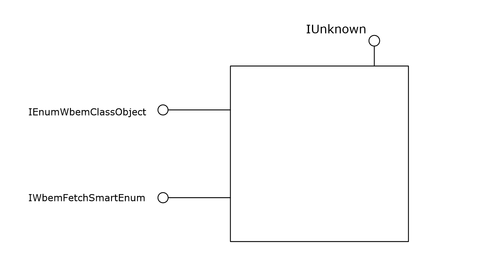

Figure 6: IEnumWbemClassObject interface

##### 3.1.4.4.1 IEnumWbemClassObject::Reset (Opnum 3)

When the IEnumWbemClassObject::Reset method is invoked, the server MUST reset the enumeration sequence to the beginning of the collection of [**CIM objects**](#gt_cim-object).

HRESULT Reset();

This method has no parameters.

**Return Values:** This method MUST return an HRESULT value that MUST indicate the status of the method call. The server MUST return WBEM_S_NO_ERROR (specified in section [2.2.11](#Section_2.2.11)) to indicate the successful completion of the method. If the IEnumWbemClassObject::Reset method is invoked on an enumerator that does not support reset capability, the server MUST return WBEM_E_INVALID_OPERATION.

**WBEM_S_NO_ERROR** (0x00)

The server MUST locate the entry in **EnumWbemClassObjectTable** with **EnumWbemClassObjectPointer** matching [IEnumWbemClassObject](#Section_3.1.4.4).

The server MUST validate that the [**security principal**](#gt_security-principal) that makes the call is the same as the **ClientSecurityContext** of the **SemiSinkResultSetObject** pointed to by the entry in the **EnumWbemClassObjectTable**; otherwise, WBEM_E_ACCESS_DENIED MUST be returned.

In response to the IEnumWbemClassObject::Reset method, the server MUST reset the status of the enumeration (as specified in this section) if the enumerator is not created by using WBEM_FLAG_FORWARD_ONLY by setting the CurrentIndex entry in **EnumWbemClassObjectTable** to start the index of **ResultArray**.

If the enumerator is created by using WBEM_FLAG_FORWARD_ONLY, the server MUST return WBEM_E_INVALID_OPERATION.

A successful method execution MUST return WBEM_S_NO_ERROR.

A failed method execution MUST return an error in the format that is specified in section 2.2.11.

##### 3.1.4.4.2 IEnumWbemClassObject::Next (Opnum 4)

When the IEnumWbemClassObject::Next method is invoked, the server MUST get zero or more [**CIM objects**](#gt_cim-object) starting at the current position in an enumeration. The server MUST also move the current position by the number of CIM objects in the *uCount* parameter. When [IEnumWbemClassObject](#Section_3.1.4.4) is created, the current position MUST be set on the first [**CIM object**](#gt_cim-object) of the collection. The order of the CIM objects that are stored in the enumerator is arbitrary.

HRESULT Next(

[in] long lTimeout,

[in] ULONG uCount,

[out, size_is(uCount), length_is(*puReturned)]

IWbemClassObject** apObjects,

[out] ULONG* puReturned

);

**lTimeout:** MUST be the maximum amount of time, in milliseconds, that the IEnumWbemClassObject::Next method call allows to pass before it times out. If the constant WBEM_INFINITE (0xFFFFFFFF) is specified, the call MUST wait until one or more CIM objects are available. If the value 0x0 (WBEM_NO_WAIT) is specified, the call MUST return the available CIM objects, if any, at the time the call is made, and MUST NOT wait for any more objects.

**uCount:** MUST be the number of requested CIM objects to return.

**apObjects:** MUST be a pointer to an array of [IWbemClassObject](#Section_2.2.4) [**interface pointers**](#gt_interface-pointer). At entry, this parameter MUST NOT be NULL. Upon return by the server, this parameter can be NULL if a failure occurs or if there are no results.

**puReturned:** MUST be a pointer to a ULONG type that receives the number of CIM objects that are returned. When sent by the client, this parameter MUST NOT be NULL. Upon return by the server, this parameter value can be zero if a failure occurs or if there are no results.

**Return Values:** This method MUST return an HRESULT value that MUST indicate the status of the method call. The server MUST return WBEM_S_NO_ERROR (specified in section [2.2.11](#Section_2.2.11)) to indicate the successful completion of the method.

**WBEM_S_NO_ERROR** (0x00)

The server MUST locate the entry in **EnumWbemClassObjectTable** with **EnumWbemClassObjectPointer** matching IEnumWbemClassObject.

The server MUST validate that the [**security principal**](#gt_security-principal) that makes the call is the same as the **ClientSecurityContext** of the **SemiSinkResultSetObject** pointed to by the entry in **EnumWbemClassObjectTable**; otherwise, WBEM_E_ACCESS_DENIED MUST be returned.

In response to the IEnumWbemClassObject::Next method call, the server MUST evaluate the *uCount* and *lTimeout* parameters (as specified in this section) and MUST return the requested number of CIM objects, if any are available. The server MUST perform the operation within the time allowed by *lTimeout*.

If the earlier semisynchronous operation is finished, and if the server does not have the requested number of CIM objects, the server MUST return WBEM_S_FALSE with the available CIM objects; otherwise, WBEM_S_NO_ERROR is returned with the requested number of CIM objects. The current index position pointed to by the **CurrentIndex** entry in **EnumWbemClassObjectTable** MUST be incremented with the number of CIM objects returned.

If the earlier semisynchronous operation is not finished and the server does not have the requested number of CIM objects, the method MUST wait the amount of time in *lTimeout* for the operation to finish or for the availability of the requested number of objects, whichever is earlier. The server MUST fill the output parameters of the method as specified previously. If the number of the remaining CIM objects to be given to the client is less than the number of requested CIM objects, the server MUST return WBEM_S_TIMEDOUT; otherwise, WBEM_S_NO_ERROR is returned. The current index position pointed to by the **CurrentIndex** entry in **EnumWbemClassObjectTable** MUST be incremented with the number of CIM objects returned.

If the original [**semisynchronous operation**](#gt_semisynchronous-operation) fails, the server MUST return the error code that the original method would have returned in its synchronous version.

The failed method execution MUST set the value that is referenced by the output parameters to NULL and MUST return an error in the format that is specified in section 2.2.11.

##### 3.1.4.4.3 IEnumWbemClassObject::NextAsync (Opnum 5)

The IEnumWbemClassObject::NextAsync method is the asynchronous version of the [IEnumWbemClassObject::Next](#Section_3.1.4.4.2) method. It provides controlled asynchronous retrieval of [**CIM objects**](#gt_cim-object) to a sink. The server MUST asynchronously get one or more CIM objects, starting at the current position in an enumeration, and MUST move the current position by the number of CIM objects. When [IEnumWbemClassObject](#Section_3.1.4.4) is created, the current position MUST be set on the first [**CIM object**](#gt_cim-object) of the collection. The order of the CIM objects that are stored in the enumerator is arbitrary.

HRESULT NextAsync(

[in] ULONG uCount,

[in] IWbemObjectSink* pSink

);

**uCount:** MUST be the number of CIM objects being requested.

**pSink:** MUST be a pointer to the [IWbemObjectSink](#Section_3.1.4.2.2) interface, which MUST represent the sink to receive the CIM object. As each batch of CIM objects is requested, they MUST be delivered to the [IWbemObjectSink::Indicate](#Section_3.1.4.2.1) method to which *pSink* points (as specified in section 3.1.4.2.1) and MUST be followed by a final call to the [IWbemObjectSink::SetStatus](#Section_3.1.4.2.2) method to which *pSink* points, as specified in section 3.1.4.2.2. This parameter MUST NOT be NULL. In error cases, indicated by the HRESULT return value, the supplied IWbemObjectSink [**interface pointer**](#gt_interface-pointer) MUST NOT be used by the server.

**Return Values:** This method MUST return an HRESULT value that MUST indicate the status of the method call. The server MUST return WBEM_S_NO_ERROR (specified in section [2.2.11](#Section_2.2.11)) to indicate the successful completion of the method.

**WBEM_S_NO_ERROR** (0x00)

The server MUST locate the entry in **EnumWbemClassObjectTable** with **EnumWbemClassObjectPointer** matching IEnumWbemClassObject.

The server MUST validate that the [**security principal**](#gt_security-principal) that makes the call is the same as the **ClientSecurityContext** of the **SemiSinkResultSetObject** pointed to by the entry in the **EnumWbemClassObjectTable**; otherwise, WBEM_E_ACCESS_DENIED MUST be returned.

The server MUST serialize execution of the IEnumWbemClassObject::Next call and asynchronous execution of the IEnumWbemClassObject::NextAsync call, the [IEnumWbemClassObject::Reset](#Section_3.1.4.4.1) call, and the [IEnumWbemClassObject::Clone](#Section_3.1.4.4.4) call.

In response to IEnumWbemClassObject::NextAsync, the server MUST synchronously evaluate the *uCount* parameter as specified in this section. If the *uCount* parameter value is zero, the server MUST return WBEM_S_FALSE. If the *uCount* parameter value is greater than zero, the server MUST add a record in **SinkQueue** of an entry in **EnumWbemClassObjectTable** for this operation. The new record in **SinkQueue** will store a reference to *pSink* in **WbemObjectSinkPointer** and store the requested count in **RemainingRequestCount**.

The failed method execution MUST return an error in the format specified in section 2.2.11.

If the method succeeds, the server MUST wait asynchronously until either the **SemiSinkResultSetObject** contains **RemainingRequestCount** objects starting at **CurrentIndex**, or its **OperationFinished** flag is set to true, or the enumeration encounters an error. At that time:

- If the enumeration encountered an error, the server MUST deliver the error to the client by calling IWbemObjectSink::SetStatus.
- If the enumeration finished with fewer than the requested number of objects, the server MUST deliver them to the client by calling the IWbemObjectSink::Indicate method and then indicate completion by calling IWbemObjectSink::SetStatus with status WBEM_S_FALSE.
- Otherwise, the server MUST deliver **RemainingRequestCount** objects to the client by calling the IWbemObjectSink::Indicate method and then indicate completion by calling IWbemObjectSink::SetStatus with status WBEM_S_NO_ERROR.
The current index position pointed to by **CurrentIndex** in an entry of **EnumWbemClassObjectTable** MUST be incremented by the number of CIM objects delivered to the client.

Finally, the server MUST remove the entry from **SinkQueue**.

##### 3.1.4.4.4 IEnumWbemClassObject::Clone (Opnum 6)

The IEnumWbemClassObject::Clone method makes a logical copy of the entire enumerator. The cloned enumerator MUST have the same current position as the source enumerator.

HRESULT Clone(

[out] IEnumWbemClassObject** ppEnum

);

**ppEnum:** Upon return, MUST contain a pointer to an [IEnumWbemClassObject](#Section_3.1.4.4) interface [**CIM object**](#gt_cim-object) that is a logical copy of the entire enumerator that made the Clone method call, retaining the current position in an enumeration. This parameter MUST NOT be NULL. When returned by the server, this parameter can be NULL if a failure occurred or if there are no results.

**Return Values:** This method MUST return an HRESULT value that MUST indicate the status of the method call. The server MUST return WBEM_S_NO_ERROR (specified in section [2.2.11](#Section_2.2.11)) to indicate the successful completion of the method.

**WBEM_S_NO_ERROR** (0x00)

The server MUST locate the entry in **EnumWbemClassObjectTable** with **EnumWbemClassObjectPointer** matching the IEnumWbemClassObject.

The server MUST validate that the [**security principal**](#gt_security-principal) that makes the call is the same as the **ClientSecurityContext** of the **SemiSinkResultSetObject** pointed to by the entry in **EnumWbemClassObjectTable**; otherwise, WBEM_E_ACCESS_DENIED MUST be returned.

If the earlier [**semisynchronous operation**](#gt_semisynchronous-operation) is created by using WBEM_FLAG_FORWARD_ONLY, then IEnumWbemClassObject::Clone is not supported and the server MUST return WBEM_E_INVALID_OPERATION.

The server MUST serialize execution of [IEnumWbemClassObject::Next](#Section_3.1.4.4.2) call, asynchronous callbacks related to [IEnumWbemClassObject::NextAsync](#Section_3.1.4.4.3) call, [IEnumWbemClassObject::Reset](#Section_3.1.4.4.1) call, and IEnumWbemClassObject::Clone call.

As part of IEnumWbemClassObject::Clone, the server MUST create a new IEnumWbemClassObject enumerator as follows. Create a new entry in the **EnumWbemClassObjectTable** and store a reference to the newly created enumerator in **EnumWbemClassObjectPointer**. The new entry in **EnumWbemClassObjectTable** will copy the current pointer index value from the earlier enumerator. The new entry **ResultSetPointer** will point to **SemiSinkResultSetObject** that was created as part of an earlier semisynchronous operation and increment the **RefCount** of **SemiSinkResultSetObject** by one.

The successful method execution MUST fill the *ppEnum* parameter with an IEnumWbemClassObject [**interface pointer**](#gt_interface-pointer), as specified in section 3.1.4.4, which MUST be a copy of the source enumerator that retains the current position in an enumeration. The method MUST return WBEM_S_NO_ERROR.

If the original semisynchronous operation fails, the server MUST return the error code that the original method would have returned in its synchronous version.

The failed method execution MUST return an error in the format that is specified in section 2.2.11.

##### 3.1.4.4.5 IEnumWbemClassObject::Skip (Opnum 7)

When the IEnumWbemClassObject::Skip method is invoked, the server MUST move the current position in an enumeration ahead by a specified number of [**CIM objects**](#gt_cim-object).

The IEnumWbemClassObject::Skip method [**opnum**](#gt_opnum) equals 7.

HRESULT Skip(

[in] long lTimeout,

[in] ULONG nCount

);

**lTimeout:** MUST be the maximum amount of time, in milliseconds, that the call to Skip allows to pass before it times out. If the constant WBEM_INFINITE (0xFFFFFFFF) is used, the Skip method call waits until the operation succeeds.

**nCount:** MUST be the number of CIM objects to skip in the enumeration. If this parameter is greater than the number of CIM objects that remain to enumerate, the call MUST skip to the end of the enumeration, and WBEM_S_FALSE MUST be the returned value for the method.

**Return Values:** This method MUST return an HRESULT value that MUST indicate the status of the method call. The server MUST return WBEM_S_NO_ERROR (specified in section [2.2.11](#Section_2.2.11)) to indicate the successful completion of the method.

**WBEM_S_NO_ERROR** (0x00)

The server MUST locate the entry in **EnumWbemClassObjectTable** with **EnumWbemClassObjectPointer** matching [IEnumWbemClassObject](#Section_3.1.4.4).

The server MUST validate that the [**security principal**](#gt_security-principal) that makes the call is the same as the **ClientSecurityContext** of the **SemiSinkResultSetObject** pointed to by the entry in **EnumWbemClassObjectTable**; otherwise, WBEM_E_ACCESS_DENIED MUST be returned.

In response to the IEnumWbemClassObject::Skip method, the server MUST evaluate the *uCount* and *lTimeout* parameters as specified in this section. The server MUST skip the requested number of CIM objects from the result set. The server MUST complete the operation within the time allowed by *lTimeout*. The requested number of CIM objects MUST start from the current index position. The current index position in the enumeration MUST be incremented by the number of CIM objects skipped.

If the earlier semisynchronous operation is finished and the server does not have the requested number of CIM objects to skip, the server MUST return WBEM_S_FALSE by skipping the available CIM objects; otherwise, the server MUST return WBEM_S_NO_ERROR by skipping the requested number of CIM objects. The current index position pointed to by the **CurrentIndex** entry in **EnumWbemClassObjectTable** MUST be incremented with the number of CIM objects skipped.

If the earlier semisynchronous operation is not finished and the server does not have the requested number of CIM objects to skip, this method MUST wait for *lTimeout*, or for the operation to finish, or for availability of the requested number of objects, whichever is earliest. If the number of the remaining CIM objects to be skipped is less than the number requested, the server MUST return WBEM_S_TIMEDOUT; otherwise, the server MUST return WBEM_S_NO_ERROR. The current index position pointed to by the **CurrentIndex** entry in **EnumWbemClassObjectTable** MUST be incremented with the number of CIM objects skipped.

If the original [**semisynchronous operation**](#gt_semisynchronous-operation) fails, the server MUST return the error code that the original method would have returned in its synchronous version.

The failed method execution MUST return an error in the format that is specified in section 2.2.11.

#### 3.1.4.5 IWbemCallResult Interface

The IWbemCallResult interface MUST be used to return call results from [**semisynchronous**](#gt_semisynchronous-operation) calls that return a single [**CIM object**](#gt_cim-object). The interface MUST be implemented by the server. The interface MUST be uniquely identified by [**UUID**](#gt_universally-unique-identifier-uuid) {44aca675-e8fc-11d0-a07c-00c04fb68820}.

Methods in RPC Opnum Order

| Method | Description |
| --- | --- |
| [GetResultObject](#Section_6ac4caa041f843e1b66ea37ddbeaa7bf) | Causes the server to attempt to retrieve a CIM object from a previous semisynchronous call to the [IWbemServices::GetObject](#Section_3.1.4.3.5) method or [IWbemServices::ExecMethod](#Section_3.1.4.3.22) method. Opnum: 3 |
| [GetResultString](#Section_8ee57a15e2b046ccaaae4e4367ac9ac9) | Causes the server to return the assigned [**CIM path**](#gt_775e4b82-5447-4125-b887-b404421e1269) of a [**CIM**](#gt_common-information-model-cim) instance that was created by the [IWbemServices::PutInstance](#Section_3.1.4.3.13) method. Opnum: 4 |
| [GetResultServices](#Section_f0360b51bd584f93aa03fcadd00f443a) | Causes the server to retrieve a pointer to the [IWbemServices](#Section_3.1.4.3.13) interface that results from a semisynchronous call to the [IWbemServices::OpenNamespace](#Section_3.1.4.3.1) method. Opnum: 5 |
| [GetCallStatus](#Section_c25147335d8546b8897def3a020c31fc) | Causes the server to return the status of the current outstanding semisynchronous call. Opnum: 6 |

##### 3.1.4.5.1 IWbemCallResult::GetResultObject (Opnum 3)

When the IWbemCallResult::GetResultObject method is called, the server MUST attempt to retrieve a [**CIM object**](#gt_cim-object) from a previous [**semisynchronous operation**](#gt_semisynchronous-operation) call to the [IWbemServices::GetObject](#Section_3.1.4.3.5) method or the [IWbemServices::ExecMethod](#Section_3.1.4.3.22) method. The entry in **WbemCallResultTable** with **WbemCallResultPointer** pointing to [IWbemCallResult](#Section_3.1.4.5) is used to identify the previous semisynchronous call.

HRESULT GetResultObject(

[in] long lTimeout,

[out] IWbemClassObject** ppResultObject

);

**lTimeout:** MUST be the maximum amount of time, in milliseconds, that the call to the IWbemCallResult::GetResultObject method allows to pass before it times out. If the constant WBEM_INFINITE (0xFFFFFFFF) is used, the GetResultObject method call MUST wait until the operation succeeds. If this parameter is set to 0 and the result object is available at the time of the method call, the object MUST be returned in *ppResultObject* and WBEM_S_NO_ERROR MUST also be returned. If this parameter is set to 0 but the result object is not available at the time of the method call, WBEM_S_TIMEDOUT MUST be returned.

**ppResultObject:** A pointer to a variable that receives a logical copy of the CIM object when the semisynchronous operation is complete. A new CIM object MUST NOT be returned on error. When sent by the client, this parameter value MUST NOT be NULL. Upon return by the server, this parameter value can be NULL if there is a failure or if there are no results. The caller of this method MUST call IWbemClassObject::Release on the returned object when the object is no longer required.

**Return Values:** This method MUST return an HRESULT value that MUST indicate the status of the method call. The server MUST return WBEM_S_NO_ERROR (specified in section [2.2.11](#Section_2.2.11)) to indicate the successful completion of the method.

**WBEM_S_NO_ERROR** (0x00)

The server MUST locate the entry in **WbemCallResultTable** with **WbemCallResultPointer** matching IWbemCallResult.

The IWbemCallResult::GetResultObject method MUST be called on the interface obtained in responses to a previous call to a semisynchronous operation returning an IWbemCallResult interface.

In response to the IWbemCallResult::GetResultObject method, the server MUST wait for the operation to finish by waiting up to *lTimeout* for **OperationFinished** to become TRUE for this operation entry in **WbemCallResultTable**. If the operation is finished successfully in *lTimeout* time, the server MUST return the CIM object in the *ppResultObject* parameter by making a logical copy of **ResultObject**. If the operation is not finished in *lTimeout* time, the server MUST return WBEM_S_TIMEDOUT. The method MUST fail if the method parameters are not valid, as specified earlier in this section, or if the server is unable to execute the method.

The successful method execution MUST fill *ppResultObject* with an [IWbemClassObject](#Section_3.1.4.4) [**interface pointer**](#gt_interface-pointer) and MUST return WBEM_S_NO_ERROR.

If the operation is not finished in *lTimeout* time, this method MUST set the value referenced by the output parameters to NULL and return WBEM_S_TIMEDOUT. The client is allowed to retry the operation.

If the operation fails within *lTimeout* time, the server MUST set the value referenced by the output parameters to NULL and return the error code that the original method would have returned in its synchronous version in the format specified in section 2.2.11.

##### 3.1.4.5.2 IWbemCallResult::GetResultString (Opnum 4)

When the IWbemCallResult::GetResultString method is called, the server MUST return the assigned [**CIM path**](#gt_775e4b82-5447-4125-b887-b404421e1269) of a [**CIM**](#gt_common-information-model-cim) instance that was created by the [IWbemServices::PutInstance](#Section_3.1.4.3.13) method that returned [IWbemCallResult](#Section_3.1.4.5) in the ppCallResult parameter.

HRESULT GetResultString(

[in] long lTimeout,

[out] BSTR* pstrResultString

);

**lTimeout:** MUST be a maximum amount of time, in milliseconds, that the call to GetResultString allows to pass before timing out. If the constant WBEM_INFINITE (0xFFFFFFFF) is used, the GetResultString method call MUST wait until the operation succeeds. This parameter MUST NOT be NULL.

**pstrResultString:** MUST be a pointer to a BSTR value, which MUST contain the CIM path of the [**CIM object**](#gt_cim-object) instance, which MUST lead to the CIM instance that was created using IWbemServices::PutInstance. In case of failure of the [**semisynchronous operation**](#gt_semisynchronous-operation), the returned string MUST be NULL. When sent by the client, this pointer parameter MUST NOT be NULL. If the original operation does not return a string, the returned string MUST be NULL.

**Return Values:** This method MUST return an HRESULT value that MUST indicate the status of the method call. The server MUST return WBEM_S_NO_ERROR (specified in section [2.2.11](#Section_2.2.11)) to indicate the successful completion of the method.

**WBEM_S_NO_ERROR** (0x00)

The server MUST locate the entry in **WbemCallResultTable** with **WbemCallResultPointer** matching IWbemCallResult. The IWbemCallResult::GetResultString method MUST be called on the interface obtained in responses to a previous call to a semisynchronous operation returning an IWbemCallResult interface.

IWbemCallResult::GetResultString MUST be called to obtain the CIM path created after IWbemServices::PutInstance execution. In response to the IWbemCallResult::GetResultString method, the server MUST wait for the operation to finish in *lTimeout* time. The operation is finished when **OperationFinished** is TRUE. If the operation is not finished in *lTimeout* time, the server MUST return WBEM_S_TIMEDOUT. If the operation is finished successfully in *lTimeout* time, the server MUST make a copy of the **ResultString** in **WbemCallResultTable** for this operation and return it in the *pstrResultString* parameter. The method MUST fail if the method parameters are not valid, as specified earlier in this section, or if the server is unable to execute the method. If the operation is finished successfully, and if **ResultString** is set to NULL, the server MUST return WBEM_E_INVALID_OPERATION for this method.

The successful method execution MUST fill *pstrResultString* with a string value of type BSTR and MUST return WBEM_S_NO_ERROR.

The failed method execution sets the value referenced by the output parameters to NULL and MUST return an error in the format specified in section 2.2.11. In case the operation is not completed after lTimeout milliseconds, the server MUST return WBEM_S_TIMEDOUT and MUST allow for further retries to be made.

If the original semisynchronous operation fails, the IWbemCallResult::GetResultString method MUST return the error code that the original method would have returned in its synchronous version.

##### 3.1.4.5.3 IWbemCallResult::GetResultServices (Opnum 5)

When the IWbemCallResult::GetResultServices method is called, the server MUST retrieve a pointer to the [IWbemServices](#Section_3.1.4.3.13) interface that results from a semisynchronous call to the [IWbemServices::OpenNamespace](#Section_3.1.4.3.1) method.

HRESULT GetResultServices(

[in] long lTimeout,

[out] IWbemServices** ppServices

);

**lTimeout:** MUST be the time, in milliseconds, that the call to GetResultServices allows to pass before timing out. If the constant WBEM_INFINITE (0xFFFFFFFF) is used, the Skip method call MUST wait until the operation succeeds.

**ppServices:** MUST be a pointer to the IWbemServices interface that is requested by the original call to IWbemServices::OpenNamespace when that interface becomes available. If the [**semisynchronous operation**](#gt_semisynchronous-operation) fails, the returned parameter MUST be NULL. When sent by the client, this pointer parameter MUST NOT be NULL. If the original operation does not return an [**interface pointer**](#gt_interface-pointer), the returned parameter MUST be NULL.

**Return Values:** This method MUST return an HRESULT value that MUST indicate the status of the method call. The server MUST return WBEM_S_NO_ERROR (specified in section [2.2.11](#Section_2.2.11)) to indicate the successful completion of the method.

**WBEM_S_NO_ERROR** (0x00)

The server MUST locate the entry in **WbemCallResultTable** with WbemCallResultPointer matching [IWbemCallResult](#Section_3.1.4.5). The IWbemCallResult::GetResultServices method MUST be called on the interface that is obtained in response to a previous call to a semisynchronous operation that returns an IWbemCallResult interface.

IWbemCallResult::GetResultServices MUST be called to obtain the IWbemServices interface pointer that is returned by the IWbemServices::OpenNamespace execution. In response to the IWbemCallResult::GetResultServices method, the server MUST wait for the operation to finish in *lTimeout* time. The operation is finished when **OperationFinished** is TRUE. If the operation is not finished in *lTimeout* time, the server MUST return WBEM_S_TIMEDOUT. If the operation is finished successfully in *lTimeout* time, the server MUST return the IWbemServices interface pointer result stored in ResultService of the operation in the *ppServices* parameter. The method MUST fail if the method parameters are not valid, as specified earlier in this section, or if the server is unable to execute the method.

The successful method execution MUST fill the *ppServices* parameter with an IWbemServices interface pointer and MUST return WBEM_S_NO_ERROR.

The failed method execution sets the value that is referenced by the output parameters to NULL and MUST return an error in the format that is specified in section 2.2.11. If the operation does not complete within *lTimeout* milliseconds, the server MUST return WBEM_S_TIMEDOUT and MUST allow for further retries to be made.

If the original semisynchronous operation fails, the IWbemCallResult::GetResultServices method MUST return the error code that the original method would have returned in its synchronous version.

##### 3.1.4.5.4 IWbemCallResult::GetCallStatus (Opnum 6)

When the IWbemCallResult::GetCallStatus method is invoked, the server MUST return the status of the current outstanding semisynchronous call.

HRESULT GetCallStatus(

[in] long lTimeout,

[out] long* plStatus

);

**lTimeout:** MUST be the maximum amount of time, in milliseconds, that the call to GetCallStatus allows to pass before timing out. If the constant WBEM_INFINITE (0xFFFFFFFF) is used, the Skip method call waits until the operation succeeds.

**plStatus:** MUST be the status of a call to an [IWbemServices](#Section_3.1.4.3.13) method if the WBEM_S_NO_ERROR code is returned for this method. When sent by the client, this parameter MUST NOT be NULL. Upon return by the server, this parameter can be NULL if there is a failure or if there are no results.

**Return Values:** This method MUST return an HRESULT value that MUST indicate the status of the method call. The server MUST return WBEM_S_NO_ERROR (specified in section [2.2.11](#Section_2.2.11)) to indicate the successful completion of the method.

**WBEM_S_NO_ERROR** (0x00)

The server MUST locate the entry in **WbemCallResultTable** with **WbemCallResultPointer** matching [IWbemCallResult](#Section_3.1.4.5).

The IWbemCallResult::GetCallStatus method MUST be called on the interface that is obtained in response to a previous call to a [**semisynchronous operation**](#gt_semisynchronous-operation) that returns an IWbemCallResult interface.

In response to an IWbemCallResult::GetCallStatus method, the server MUST wait for the operation to finish in *lTimeout* time. The operation is finished if **OperationFinished** becomes TRUE. If the operation is not finished in *lTimeout* time, the server MUST return WBEM_S_TIMEDOUT. If the operation is finished successfully in *lTimeout* time, the server MUST give the result of the **FinalResult** operation in the *plStatus* parameter. The method MUST fail if the method parameters are not valid, as specified earlier in this section, or if the server is unable to execute the method.

The successful method execution MUST fill *plStatus* with the operation status code of the IWbemServices method operation and MUST return WBEM_S_NO_ERROR.

The failed method execution sets the value that is referenced by the output parameters to NULL and MUST return an error in the format that is specified in section 2.2.11.

#### 3.1.4.6 IWbemFetchSmartEnum Interface

The IWbemFetchSmartEnum interface (an [MS-DCOM](../MS-DCOM/MS-DCOM.md) interface) is a helper interface used to retrieve a network-optimized enumerator interface. The server MUST fail the IRemUnknown::QueryInterface operation if the interface is not implemented by the server.

The IWbemFetchSmartEnum is a DCOM Remote Protocol interface. The interface MUST be uniquely identified by the [**UUID**](#gt_universally-unique-identifier-uuid) {1C1C45EE-4395-11d2-B60B-00104B703EFD}.

Methods in RPC Opnum Order

| Method | Description |
| --- | --- |
| [GetSmartEnum](#Section_3.1.4.6.1) | Retrieves an [IWbemWCOSmartEnum](#Section_3.1.4.7) interface, which is a network-optimized enumerator interface. Opnum: 3 |

##### 3.1.4.6.1 IWbemFetchSmartEnum::GetSmartEnum (Opnum 3)

The IWbemFetchSmartEnum::GetSmartEnum method retrieves an [IWbemWCOSmartEnum (section 3.1.4.7)](#Section_3.1.4.7) interface, which is a network-optimized enumerator interface.

HRESULT GetSmartEnum(

[out] IWbemWCOSmartEnum** ppSmartEnum

);

**ppSmartEnum:** MUST be a pointer to a network-optimized enumerator interface. This parameter MUST NOT be NULL. Upon return by the server, this parameter can be NULL if there is a failure or if there are no results.

**Return Values:** This method MUST return an HRESULT value that MUST indicate the status of the method call. The server MUST return WBEM_S_NO_ERROR (specified in section [2.2.11](#Section_2.2.11)) to indicate the successful completion of the method.

**WBEM_S_NO_ERROR** (0x00)

The server MUST locate the associated [IEnumWbemClassObject](#Section_3.1.4.4) interface pointer in the **EnumWbemClassObjectTable**, and validate that the [**security principal**](#gt_security-principal) that makes the call is the same as the **ClientSecurityContext** of the **SemiSinkResultSetObject** pointed to by the entry in the **EnumWbemClassObjectTable**; otherwise, WBEM_E_ACCESS_DENIED MUST be returned.

In response to the IWbemFetchSmartEnum::GetSmartEnum method, the server MUST return an IWbemWCOSmartEnum interface in the *ppSmartEnum* output parameter.

A successful execution MUST return the IWbemWCOSmartEnum interface in the output parameter and MUST return WBEM_S_NO_ERROR.

The failed method execution MUST set the output parameters to NULL and MUST return an error in the format specified in section 2.2.11.

#### 3.1.4.7 IWbemWCOSmartEnum Interface

The server MUST implement the IWbemWCOSmartEnum interface if it implements [IWbemFetchSmartEnum::GetSmartEnum](#Section_3.1.4.6.1). The IWbemWCOSmartEnum interface is intended to provide an alternate synchronous enumeration of [**CIM objects**](#gt_cim-object) for [IEnumWbemClassObject](#Section_3.1.4.4).

The interface MUST be uniquely identified by [**UUID**](#gt_universally-unique-identifier-uuid) {423EC01E-2E35-11d2-B604-00104B703EFD}.

Methods in RPC Opnum Order

| Method | Description |
| --- | --- |
| [Next](#Section_3.1.4.7.1) | Returns an array of [IWbemClassObject](#Section_2.2.4) [**interface pointers**](#gt_interface-pointer) that are encoded by using the [ObjectArray](#Section_2.2.14) structure for optimization purposes. Opnum: 3 |

##### 3.1.4.7.1 IWbemWCOSmartEnum::Next (Opnum 3)

The IWbemWCOSmartEnum::Next method MUST return an array of [IWbemClassObject](#Section_2.2.4) [**interface pointers**](#gt_interface-pointer) that are encoded by using the [ObjectArray](#Section_2.2.14) structure for optimization purposes. The array of objects that are returned in the ObjectArray structure MUST be identical to the array of [**CIM objects**](#gt_cim-object) that are returned by [IEnumWbemClassObject::Next](#Section_3.1.4.4.2).

HRESULT Next(

[in] REFGUID proxyGUID,

[in] long lTimeout,

[in] ULONG uCount,

[out] ULONG* puReturned,

[out] ULONG* pdwBuffSize,

[out, size_is(,*pdwBuffSize)] byte** pBuffer

);

**proxyGUID:** MUST be a client-generated [**GUID**](#gt_globally-unique-identifier-guid) that MUST identify the client. This parameter MUST NOT be NULL.

**lTimeout:** MUST be the maximum amount of time, in milliseconds, that the Next method call allows to pass before it times out. If the constant WBEM_INFINITE (0xFFFFFFFF) is used, the Skip method call waits until the operation succeeds. This parameter MUST NOT be NULL.

**uCount:** MUST be the number of requested CIM objects. This parameter MUST NOT be NULL.

**puReturned:** MUST be a pointer to a ULONG value that MUST contain the number of CIM objects that are returned by the Next method. This parameter MUST NOT be NULL.

**pdwBuffSize:** MUST be a pointer to a ULONG value that MUST contain the buffer size, in bytes. This parameter MUST NOT be NULL.

**pBuffer:** MUST be a pointer to the byte array that MUST represent the packet. This parameter MUST NOT be NULL. The byte array represents an array of CIM objects that are encoded by using the ObjectArray format as specified in section 2.2.14. When returned by the server, this parameter can be NULL if a failure occurs or if there are no results to return.

**Return Values:** This method MUST return an HRESULT value that MUST indicate the status of the method call. The server MUST return WBEM_S_NO_ERROR (specified in section [2.2.11](#Section_2.2.11)) to indicate the successful completion of the method.

If a failure occurs, the server MUST return an HRESULT whose S (severity) bit is set as specified in [MS-ERREF](../MS-ERREF/MS-ERREF.md) section 2.1. The actual HRESULT value is implementation dependent.

**WBEM_S_NO_ERROR** (0x00)

The IWbemWCOSmartEnum::Next method MUST be called on an [IWbemWCOSmartEnum](#Section_3.1.4.7) interface that is returned by a previous call to [IWbemFetchSmartEnum::GetSmartEnum](#Section_3.1.4.6.1).

The server MUST locate the associated **IEnumWbemClassObject** interface pointer in the **EnumWbemClassObjectTable**, and validate that the [**security principal**](#gt_security-principal) that makes the call is the same as the **ClientSecurityContext** of the **SemiSinkResultSetObject** pointed to by the entry in the **EnumWbemClassObjectTable**; otherwise, WBEM_E_ACCESS_DENIED MUST be returned.

In response to IWbemWCOSmartEnum::Next, the server MUST evaluate the *lTimeout* parameter (as specified in this section) and MUST evaluate the GUID in order to identify the client. The server MUST return the maximum number of CIM objects that are requested by *uCount*.

If the server is unable to return all the requested CIM objects in the requested amount of time, it MUST return WBEM_S_TIMEDOUT. The requested number of CIM objects MUST start from the current index position. The current index position in the enumeration MUST be incremented by the number of returned CIM objects.

On success, the server MUST return data in the *pBuffer* by using an ObjectArray structure as specified in section 2.2.14.

The successful method execution MUST return WBEM_S_NO_ERROR. If the number of remaining CIM objects to be retrieved is less than the number of requested CIM objects, the server MUST return WBEM_S_FALSE. Regardless, the server MUST fill the output parameters of the method as specified in section 2.2.14.

#### 3.1.4.8 IWbemLoginClientID Interface

This interface is not required for the protocol to work.

The interface MUST be uniquely identified by [**UUID**](#gt_universally-unique-identifier-uuid) {d4781cd6-e5d3-44df-ad94-930efe48a887}.

Methods in RPC Opnum Order

| Method | Description |
| --- | --- |
| [SetClientInfo](#Section_3.1.4.8.1) | Passes the client NETBIOS name and a unique client generated number to the server. Opnum: 3 |

##### 3.1.4.8.1 IWbemLoginClientID::SetClientInfo (Opnum 3)

The IWbemLoginClientID::SetClientInfo method MUST pass the client NETBIOS name and a unique client-generated number to the server.

HRESULT SetClientInfo(

[in, unique, string] LPWSTR wszClientMachine,

[in] long lClientProcId,

[in] long lReserved

);

**wszClientMachine:** MUST specify the client NETBIOS name. This parameter MUST NOT be NULL.

**lClientProcId:** Specifies a client-generated number. The server MAY use this for logging purposes.<56>

**lReserved:** This parameter is not used, and its value MUST be NULL.

**Return Values:** This method MUST return an HRESULT value that MUST indicate the status of the method call. The server MUST return WBEM_S_NO_ERROR (specified in section [2.2.11](#Section_2.2.11)) to indicate the successful completion of the method.

In case of failure, the server MUST return an HRESULT whose S (severity) bit is set as specified in [MS-ERREF](../MS-ERREF/MS-ERREF.md) section 2.1. The actual HRESULT value is implementation dependent.

**WBEM_S_NO_ERROR** (0x00)

#### 3.1.4.9 IWbemLoginHelper Interface

The server MUST fail the IRemUnknown::QueryInterface operation if the interface is not implemented by the server. This interface is not required for the protocol to work.

The interface MUST be uniquely identified by [**UUID**](#gt_universally-unique-identifier-uuid) {541679AB-2E5F-11d3-B34E-00104BCC4B4A}.

Methods in RPC Opnum Order

| Method | Description |
| --- | --- |
| [SetEvent](#Section_3.1.4.9.1) | Signals an event on the server with name that MUST be specified as a parameter of the method. Opnum: 3 |

##### 3.1.4.9.1 IWbemLoginHelper::SetEvent (Opnum 3)

The IWbemLoginHelper::SetEvent MUST return WBEM_S_NO_ERROR. The SetEvent method SHOULD NOT perform any action.<57>

The [**opnum**](#gt_opnum) of the SetEvent method equals 3.

HRESULT SetEvent(

[in] LPCSTR sEventToSet

);

**sEventToSet:** MUST contain the name of the event to be signaled. This parameter MUST NOT be NULL.

**Return Values:** This method MUST return an HRESULT value that MUST indicate the status of the method call. The server MUST return WBEM_S_NO_ERROR (specified in section [2.2.11](#Section_2.2.11)) to indicate the successful completion of the method.

If the method fails, the server MUST return an HRESULT whose S (severity) bit is set as specified in [MS-ERREF](../MS-ERREF/MS-ERREF.md) section 2.1. The actual HRESULT value is implementation dependent.

**WBEM_S_NO_ERROR** (0x00)

#### 3.1.4.10 IWbemBackupRestore Interface

The IWbemBackupRestore interface exposes methods that back up and restore the contents of the [**CIM**](#gt_common-information-model-cim) database. The interface MUST be implemented by the server to support backup/restore scenarios. The interface MUST be uniquely identified by [**UUID**](#gt_universally-unique-identifier-uuid) {C49E32C7-BC8B-11d2-85D4-00105A1F8304}.

Methods in RPC Opnum Order

| Method | Description |
| --- | --- |
| [Backup](#Section_2c19599cf1cf4a2aacee1e136026fb74) | Causes the server to back up the contents of the CIM database. Opnum: 3 |
| [Restore](#Section_6c05b64d6caf41e19f28c3f5697bfa61) | Causes the server to restore the contents of the CIM database. Opnum: 4 |

The object exporting this interface MUST also implement the [IWbemBackupRestoreEx](#Section_3.1.4.11) interface. The IRemUnknown and IRemUnknown2 interfaces, as specified in [MS-DCOM](../MS-DCOM/MS-DCOM.md), MUST be used to manage the interfaces exposed by the object. The object MUST be uniquely identified with [**CLSID**](#gt_class-identifier-clsid) {C49E32C6-BC8B-11D2-85D4-00105A1F8304}.

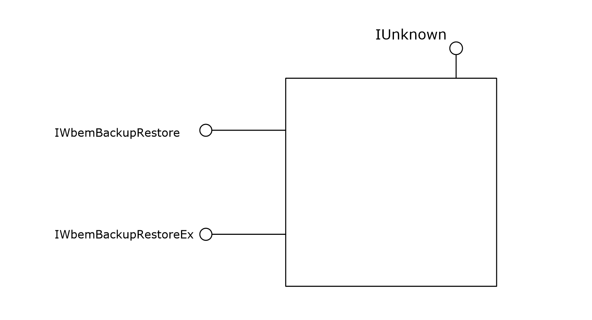

Figure 7: The IWbemBackupRestore interface

##### 3.1.4.10.1 IWbemBackupRestore::Backup (Opnum 3)

On the IWbemBackupRestore::Backup method invocation, the server MUST back up the contents of the [**CIM**](#gt_common-information-model-cim) database.

HRESULT Backup(

[in, string] LPCWSTR strBackupToFile,

[in] long lFlags

);

**strBackupToFile:** MUST be a UTF-16 string, which MUST contain the name of the file to which the CIM database is backed up. This parameter MUST NOT<58> be NULL.

**lFlags:** This parameter is not used, and its value MUST be 0x0.

**Return Values:** This method MUST return an HRESULT value that MUST indicate the status of the method call. The server MUST return WBEM_S_NO_ERROR (specified in section [2.2.11](#Section_2.2.11)) to indicate the successful completion of the method.

In case of failure, the server MUST return an HRESULT whose S (severity) bit is set as specified in [MS-ERREF](../MS-ERREF/MS-ERREF.md) section 2.1. The actual HRESULT value is implementation dependent.

**WBEM_S_NO_ERROR** (0x00)

The IWbemBackupRestore::Backup method MUST be called on the interface that is obtained from the DCOM Remote Protocol [**activation**](#gt_activation) of a CLSID_WbemBackupRestore interface, as specified in this section.

In response to the IWbemBackupRestore::Backup method, the server MUST set the **BackupInProgress** flag to True. The server MUST back up the CIM database in a file that is specified in the *strBackupToFile* parameter. The server SHOULD<59> verify that the [**security principal**](#gt_security-principal) making the call is allowed to back up the CIM database using implementation-specific authorization policy. If the security principal is not authorized, the server MUST return WBEM_E_ACCESS_DENIED.

The Backup operation MUST NOT impact the state of the incoming calls. After the Backup operation is complete, the server MUST set the **BackupInProgress** flag to False.

##### 3.1.4.10.2 IWbemBackupRestore::Restore (Opnum 4)

On the IWbemBackupRestore::Restore method invocation, the server MUST restore the contents of the [**CIM**](#gt_common-information-model-cim) database.

HRESULT Restore(

[in, string] LPCWSTR strRestoreFromFile,

[in] long lFlags

);

**strRestoreFromFile:** MUST be a UTF-16 string that MUST contain the name of the file from which to restore the CIM database. This parameter MUST NOT<60> be NULL.

**lFlags:** Flags that affect the behavior of the Restore method. The flags' behavior MUST be interpreted as specified in the following table.

| Value | Meaning |
| --- | --- |
| WBEM_FLAG_BACKUP_RESTORE_FORCE_SHUTDOWN 0x00000001 | If the bit is not set and if there are any active clients, the server MUST NOT perform the restore. If the bit is set, the server MUST shut down any active clients before performing the restore operation. |

**Return Values:** This method MUST return an HRESULT value that MUST indicate the status of the method call. The server MUST return WBEM_S_NO_ERROR (specified in section [2.2.11](#Section_2.2.11)) to indicate the successful completion of the method.

If the **WBEM_FLAG_BACKUP_RESTORE_FORCE_SHUTDOWN** flag is not set, the server MUST return WBEM_E_INVALID_PARAMETER.

In case of failure, the server MUST return an HRESULT whose S (severity) bit is set as specified in [MS-ERREF](../MS-ERREF/MS-ERREF.md) section 2.1. The actual HRESULT value is implementation dependent.

**WBEM_S_NO_ERROR** (0x00)

In response to the IWbemBackupRestore::Restore method, the server MUST set the **RestoreInProgress** flag to True. The server MUST go through each entry in **NamespaceConnectionTable** and delete the corresponding **NamespaceConnection** object. The server MUST restore the CIM database from the file that is specified in the *strRestoreFromFile* parameter. The server SHOULD<61> verify that the [**security principal**](#gt_security-principal) making the call is allowed to restore the CIM database using implementation-specific authorization policy. If the security principal is not authorized, the server MUST return WBEM_E_ACCESS_DENIED.

The server MUST re-initialize the **NamespaceConnectionTable** with **NamespaceConnection** objects after the CIM database restoration is complete.

After the Restore operation is complete, the server MUST reset the **RestoreInProgress** flag to False.

#### 3.1.4.11 IWbemBackupRestoreEx Interface

The IWbemBackupRestoreEx interface extends the [IWbemBackupRestore](#Section_3.1.4.10) interface and exposes methods that pause and resume the activity in the Windows Management Instrumentation Remote Protocol. These methods are used to provide an alternative solution for backing up the contents of the [**CIM**](#gt_common-information-model-cim) database. The interface MUST be implemented in order to support backup/restore scenarios without stopping the server. The server SHOULD support this interface.<62>

The IWbemBackupRestoreEx interface is a DCOM Remote Protocol interface (as specified in [MS-DCOM](../MS-DCOM/MS-DCOM.md)). The interface MUST be uniquely identified by [**UUID**](#gt_universally-unique-identifier-uuid) {A359DEC5-E813-4834-8A2A-BA7F1D777D76}.

Methods in RPC Opnum Order

| Method | Description |
| --- | --- |
| [Pause](#Section_3.1.4.11.1) | Causes the server to lock the CIM database in a consistent state while it is copied. Opnum: 5 |
| [Resume](#Section_3.1.4.11.2) | Causes the server to unlock the CIM database and resume operations. Opnum: 6 |

##### 3.1.4.11.1 IWbemBackupRestoreEx::Pause (Opnum 5)

On the IWbemBackupRestoreEx::Pause method invocation, the server MUST set the **IsServerPaused** flag to True and MUST persist the [**CIM**](#gt_common-information-model-cim) database in a consistent state.

HRESULT Pause();

This method has no parameters.

**Return Values:** This method MUST return an HRESULT value that MUST indicate the status of the method call. The server MUST return WBEM_S_NO_ERROR (specified in section [2.2.11](#Section_2.2.11)) to indicate the successful completion of the method.

If Pause is called and the **IsServerPaused** flag is set to True, the server MUST return WBEM_E_INVALID_OPERATION. In case of any other failure, the server MUST return an HRESULT whose S (severity) bit is set as specified in [MS-ERREF](../MS-ERREF/MS-ERREF.md) section 2.1. The actual HRESULT value is implementation dependent.

**WBEM_S_NO_ERROR** (0x00)

The IWbemBackupRestoreEx::Pause method MUST be called on the interface that is obtained from the DCOM Remote Protocol [**activation**](#gt_activation) of the CLSID_WbemBackupRestore interface, as specified in this section.

The server MUST NOT reset the backup timer if Pause is called multiple times while the **IsServerPaused** flag is set to True.

##### 3.1.4.11.2 IWbemBackupRestoreEx::Resume (Opnum 6)

On the IWbemBackupRestoreEx::Resume method invocation, the server MUST set the **IsServerPaused** flag to False.

HRESULT Resume();

This method has no parameters.

**Return Values:** This method MUST return an HRESULT value that MUST indicate the status of the method call. The server MUST return a WBEM_S_NO_ERROR (specified in section [2.2.11](#Section_2.2.11)) to indicate the successful completion of the method.

If Resume is called and the **IsServerPaused** flag is set to False, the server MUST return WBEM_E_INVALID_OPERATION.

In case of any other failure, the server MUST return an HRESULT whose S (severity) bit is set as specified in [MS-ERREF](../MS-ERREF/MS-ERREF.md) section 2.1. The actual HRESULT value is implementation dependent.

**WBEM_S_NO_ERROR** (0x00)

#### 3.1.4.12 IWbemRefreshingServices Interface

The IWbemRefreshingServices interface SHOULD<63> be implemented by the server. This interface (an [MS-DCOM](../MS-DCOM/MS-DCOM.md) interface) provides methods that allow clients to get updates of numerous objects in a single DCOM Remote Protocol method invocation; whereas the [IWbemServices](#Section_3.1.4.3.13) interface provides methods that allow clients to get updates on a class or an instance.

The IWbemRefreshingServices interface requires multiple calls to set up the remote refresher; however, after the remote refresher is set up, obtaining updates requires only a single call. The IWbemRefreshingServices interface provides a faster [**CIM**](#gt_common-information-model-cim) instance refreshing service when updated data on CIM instances have to be retrieved multiple times.

This interface MUST be uniquely identified by [**UUID**](#gt_universally-unique-identifier-uuid) {2C9273E0-1DC3-11d3-B364-00105A1F8177}.

Methods in RPC Opnum Order

| Method | Description |
| --- | --- |
| [AddObjectToRefresher](#Section_3.2.4.5.1) | Adds a CIM instance to the list of [**CIM objects**](#gt_cim-object) to be refreshed. Opnum: 3 |
| [AddObjectToRefresherByTemplate](#Section_3.2.4.5.1) | Adds a CIM instance that is identified by its [**CIM object**](#gt_cim-object) instance, to the list of CIM objects to be refreshed. Opnum: 4 |
| [AddEnumToRefresher](#Section_3.2.4.5.2) | Adds all [**CIM instances**](#gt_cim-instance) of the [**CIM class**](#gt_cim-class) name to the list of CIM objects to be refreshed. Opnum: 5 |
| [RemoveObjectFromRefresher](#Section_c040f27dd84b412588026638eae12732) | Removes a CIM instance from the list of CIM instances to be refreshed. Opnum: 6 |
| [GetRemoteRefresher](#Section_3.2.4.5.3) | Retrieves an [IWbemRemoteRefresherinterface](#Section_3.1.4.13.2) pointer. Opnum: 7 |
| [ReconnectRemoteRefresher](#Section_3.2.4.5.4) | Restores a set of CIM instances and enumerations to a server refresher. Opnum: 8 |

##### 3.1.4.12.1 IWbemRefreshingServices::AddObjectToRefresher (Opnum 3)

The IWbemRefreshingServices::AddObjectToRefresher method MUST add a [**CIM**](#gt_common-information-model-cim) instance, which is identified by its [**CIM path**](#gt_775e4b82-5447-4125-b887-b404421e1269), to the list of [**CIM instances**](#gt_cim-instance) that can be refreshed.

HRESULT AddObjectToRefresher(

[in] _WBEM_REFRESHER_ID* pRefresherId,

[in, string] LPCWSTR wszPath,

[in] long lFlags,

[in] IWbemContext* pContext,

[in] DWORD dwClientRefrVersion,

[out] _WBEM_REFRESH_INFO* pInfo,

[out] DWORD* pdwSvrRefrVersion

);

**pRefresherId:** MUST be a pointer to the _WBEM_REFRESHER_ID structure, as specified in section [2.2.21](#Section_2.2.21), which identifies the client that is requesting refreshing services. This parameter MUST NOT be NULL.

**wszPath:** MUST be a string that MUST contain the CIM path of the CIM instance. This parameter MUST NOT be NULL.

**lFlags:** This parameter is not used, and its value SHOULD be 0x0.

**pContext:** MUST be a pointer to an [IWbemContext](#Section_2.2.13.2) interface object, which MUST contain additional information for the server refresher. If pContext is NULL, the parameter MUST be ignored.

**dwClientRefrVersion:** MUST be the version of the client refresher. This value SHOULD<64> be 0x2. The server MUST allow all client versions.

**pInfo:** MUST be an output parameter that MUST return a **_WBEM_REFRESH_INFO** structure, as specified in section [2.2.20](#Section_2.2.26), which MUST contain refresher information about the CIM instance in *wszPath*. It MUST NOT be NULL.

**pdwSvrRefrVersion:** MUST be an output parameter that MUST be the version of the server refresher. The value of this parameter SHOULD be 0x1.

**Return Values:** This method MUST return an HRESULT value that MUST indicate the status of the method call. The server MUST return WBEM_S_NO_ERROR (specified in section [2.2.11](#Section_2.2.11)) to indicate the successful completion of the method.

**WBEM_S_NO_ERROR** (0x00)

The [**security principal**](#gt_security-principal) that makes the call MUST have WBEM_REMOTE_ENABLE and WBEM_ENABLE accesses to the namespace; otherwise, WBEM_E_ACCESS_DENIED MUST be returned.

In response to IWbemRefreshingServices::AddObjectToRefresher, the server MUST evaluate the CIM path to the CIM instance and MUST return information to the client to handle the specific CIM instance as specified in this section.

A successful call to IWbemRefreshingServices::AddObjectToRefresher MUST return WBEM_S_NO_ERROR and MUST fill the output _WBEM_REFRESH_INFO structure as specified in section 2.2.20.

The server MUST locate the **InstanceProviderId** for the instance in *wszPath* using the algorithm in section [3.1.4](#Section_3.2.4). If **InstanceProviderId** is not empty and the provider's **SupportsRefresher** field is TRUE, the server MUST return the **_WBEM_REFRESH_INFO** structure that has an **m_lType** that is set to **_WBEM_REFRESH_INFO_REMOTE**, otherwise returning one with **m_lType** set to **_WBEM_REFRESH_TYPE_NON_HIPERF**.

If the server sets **m_lType** to **_WBEM_REFRESH_INFO_REMOTE**, the server MUST return an [IWbemRemoteRefresher](#Section_3.1.4.13.2) interface pointer in **_WBEM_REFRESH_INFO_REMOTE** that is part of **_WBEM_REFRESH_INFO**.

If the server sets **m_lType** to **_WBEM_REFRESH_TYPE_NON_HIPERF**, the server MUST return a **_WBEM_REFRESH_INFO_NON_HIPERF** structure as part of **_WBEM_REFRESH_INFO**.

In case of failure, the server MUST fill in the _WBEM_REFRESH_INFO structure with 0x0, set its **m_lType** member to WBEM_REFRESH_TYPE_INVALID, and return an HRESULT error in the format that is specified in section 2.2.11.

##### 3.1.4.12.2 IWbemRefreshingServices::AddObjectToRefresherByTemplate (Opnum 4)

The IWbemRefreshingServices::AddObjectToRefresherByTemplate method MUST add a [**CIM**](#gt_common-information-model-cim) instance, which is identified by its [**CIM object**](#gt_cim-object) instance, to the list of [**CIM instances**](#gt_cim-instance) to be refreshed.

The AddObjectToRefresherByTemplate method [**opnum**](#gt_opnum) equals 4.

HRESULT AddObjectToRefresherByTemplate(

[in] _WBEM_REFRESHER_ID* pRefresherId,

[in] IWbemClassObject* pTemplate,

[in] long lFlags,

[in] IWbemContext* pContext,

[in] DWORD dwClientRefrVersion,

[out] _WBEM_REFRESH_INFO* pInfo,

[out] DWORD* pdwSvrRefrVersion

);

**pRefresherId:** MUST be a pointer to the _WBEM_REFRESHER_ID structure, as specified in section [2.2.21](#Section_2.2.21), which identifies the client that is requesting refreshing services. This parameter MUST NOT be NULL.

**pTemplate:** MUST be a pointer to an [IWbemClassObject](#Section_2.2.4) interface CIM instance that MUST be a template for the CIM instances to be refreshed by the refresher. This parameter MUST NOT be NULL.

**lFlags:** This parameter is not used, and its value SHOULD be 0x0.

**pContext:** MUST be a pointer to an [IWbemContext](#Section_2.2.13.2) interface object, which MUST contain additional information for the server refresher. If pContext is NULL, the parameter MUST be ignored.

**dwClientRefrVersion:** MUST be the version of the client refresher. This value SHOULD<65> be 0x2. The server MUST allow all client versions.

**pInfo:** MUST be an output parameter that returns a _WBEM_REFRESH_INFO structure, as specified in section [2.2.20](#Section_2.2.26), which MUST contain refresher information about the CIM instance in *wszPath*. This parameter MUST NOT be NULL.

**pdwSvrRefrVersion:** MUST be an output parameter that MUST be the version of the server refresher. The value of this parameter SHOULD be 0x1.

**Return Values:** This method MUST return an HRESULT value that MUST indicate the status of the method call. The server MUST return WBEM_S_NO_ERROR (specified in section [2.2.11](#Section_2.2.11)) to indicate the successful completion of the method.

**WBEM_S_NO_ERROR** (0x00)

The [**security principal**](#gt_security-principal) that makes the call MUST have WBEM_REMOTE_ENABLE and WBEM_ENABLE accesses to the namespace; otherwise, WBEM_E_ACCESS_DENIED MUST be returned.

In response to IWbemRefreshingServices::AddObjectToRefresherByTemplate, the server MUST evaluate the *pTemplate* parameter that defines the CIM instance, and it MUST return information to the client to handle the specific CIM instance as specified in this section.

A successful call to IWbemRefreshingServices::AddObjectToRefresherByTemplate MUST return WBEM_S_NO_ERROR and MUST fill the output _WBEM_REFRESH_INFO structure, as specified in this section.

The server MUST locate the **InstanceProviderId** for the instance in *wszPath* using the algorithm in section [3.1.4](#Section_3.2.4). If **InstanceProviderId** is not empty and the provider's **SupportsRefresher** field is TRUE, the server MUST return the **_WBEM_REFRESH_INFO** structure that has an **m_lType** set to **_WBEM_REFRESH_INFO_REMOTE**, otherwise returning one with **m_lType** set to _**_WBEM_REFRESH_TYPE_NON_HIPERF**.

If the server sets **m_lType** to **_WBEM_REFRESH_INFO_REMOTE**, the server MUST return an [IWbemRemoteRefresher](#Section_3.1.4.13.2) interface pointer in **_WBEM_REFRESH_INFO_REMOTE** that is part of **_WBEM_REFRESH_INFO**.

If the server sets **m_lType** to **_WBEM_REFRESH_TYPE_NON_HIPERF**, the server MUST return the **_WBEM_REFRESH_TYPE_NON_HIPERF** structure as part of **_WBEM_REFRESH_INFO**.

In case of failure, the server MUST fill in the _WBEM_REFRESH_INFO parameter with 0x0, set its **m_lType** member to WBEM_REFRESH_TYPE_INVALID, and return an error in the format that is specified in section 2.2.11.

##### 3.1.4.12.3 IWbemRefreshingServices::AddEnumToRefresher (Opnum 5)

The IWbemRefreshingServices::AddEnumToRefresher method MUST add all [**CIM instances**](#gt_cim-instance) that are identified by the [**CIM class**](#gt_cim-class) name to the list of CIM instances to be refreshed.

HRESULT AddEnumToRefresher(

[in] _WBEM_REFRESHER_ID* pRefresherId,

[in, string] LPCWSTR wszClass,

[in] long lFlags,

[in] IWbemContext* pContext,

[in] DWORD dwClientRefrVersion,

[out] _WBEM_REFRESH_INFO* pInfo,

[out] DWORD* pdwSvrRefrVersion

);

**pRefresherId:** MUST be a pointer to the _WBEM_REFRESHER_ID structure, as specified in section [2.2.21](#Section_2.2.21), which identifies the client that is requesting refreshing services. This parameter MUST NOT be NULL.

**wszClass:** MUST be a string that MUST contain the enumeration CIM class name. This parameter MUST NOT be NULL.

**lFlags:** This parameter is not used, and its value SHOULD be 0x0.

**pContext:** MUST be a pointer to an [IWbemContext](#Section_2.2.13.2) interface object, which MUST contain additional information for the server refresher. If pContext is NULL, the parameter is ignored.

**dwClientRefrVersion:** MUST be the version of the client refresher. This value SHOULD<66> be 0x2. The server MUST allow all client versions.

**pInfo:** MUST be an output parameter that returns a _WBEM_REFRESH_INFO structure, as specified in section [2.2.20](#Section_2.2.26), which MUST contain refresher information about the [**CIM**](#gt_common-information-model-cim) instance in *wszPath*. This parameter MUST NOT be NULL.

**pdwSvrRefrVersion:** MUST be an output parameter, which MUST be the version of the server refresher. The value of this parameter SHOULD be 0x1.

**Return Values:** This method MUST return an HRESULT value that MUST indicate the status of the method call. The server MUST return WBEM_S_NO_ERROR (specified in section [2.2.11](#Section_2.2.11)) to indicate the successful completion of the method.

**WBEM_S_NO_ERROR** (0x00)

The [**security principal**](#gt_security-principal) that makes the call MUST have WBEM_REMOTE_ENABLE and WBEM_ENABLE accesses to the namespace; otherwise, WBEM_E_ACCESS_DENIED MUST be returned.

In response to IWbemRefreshingServices::AddEnumToRefresher, the server MUST evaluate the *wszClass* parameter, and it MUST return information to the client so that the server knows how to handle the specific class as specified in this section.

This method MUST add all instances of a class, instead of a single instance of a class, as is the case for the [IWbemRefreshingServices::AddObjectToRefresher](#Section_3.2.4.5.1) and [IWbemRefreshingServices::AddObjectToRefresherByTemplate](#Section_3.2.4.5.1) methods.

A successful call to IWbemRefreshingServices::AddEnumToRefresher MUST return WBEM_S_NO_ERROR and MUST fill the output _WBEM_REFRESH_INFO structure as specified in section 2.2.20.

The server MUST locate the **InstanceProviderId** for the class in *wszPath* using the algorithm in section [3.1.4](#Section_3.2.4). If **InstanceProviderId** is not empty and the provider's **SupportsRefresher** field is TRUE, the server MUST return the **_WBEM_REFRESH_INFO** structure that has an **m_lType** that is set to **_WBEM_REFRESH_INFO_REMOTE**, otherwise returning one with **m_lType** set to **_WBEM_REFRESH_TYPE_NON_HIPERF**.

If the server sets **m_lType** to **_WBEM_REFRESH_INFO_REMOTE**, the server MUST return an [IWbemRemoteRefresher](#Section_3.1.4.13.2) interface pointer in **_WBEM_REFRESH_INFO_REMOTE** that is part of **_WBEM_REFRESH_INFO**.

If the server sets **m_lType** to **_WBEM_REFRESH_TYPE_NON_HIPERF**, the server MUST return the **_WBEM_REFRESH_TYPE_NON_HIPERF** structure as part of **_WBEM_REFRESH_INFO**.

In case of failure, the server MUST fill in the _WBEM_REFRESH_INFO structure with 0x0, set **m_lType** to WBEM_REFRESH_TYPE_INVALID, and return an error in the format that is specified in section 2.2.11.

##### 3.1.4.12.4 IWbemRefreshingServices::RemoveObjectFromRefresher (Opnum 6)

The IWbemRefreshingServices::RemoveObjectFromRefresher method MUST remove a [**CIM**](#gt_common-information-model-cim) instance, which is identified by its [**CIM path**](#gt_775e4b82-5447-4125-b887-b404421e1269), from the list of [**CIM instances**](#gt_cim-instance) that can be refreshed.

HRESULT RemoveObjectFromRefresher(

[in] _WBEM_REFRESHER_ID* pRefresherId,

[in] long lId,

[in] long lFlags,

[in] DWORD dwClientRefrVersion,

[out] DWORD* pdwSvrRefrVersion

);

**pRefresherId:** MUST be a pointer to the _WBEM_REFRESHER_ID structure, as specified in section [2.2.21](#Section_2.2.21), that identifies the client that is requesting refreshing services. This parameter MUST NOT be NULL.

**lId:** This parameter MUST be an identifier to the object that is being removed. This parameter MUST NOT be NULL.

**lFlags:** This parameter is not used, and its value SHOULD be 0x0.

**dwClientRefrVersion:** MUST be the version of the client refresher. This value SHOULD<67> be 0x2. The server MUST allow all client versions.

**pdwSvrRefrVersion:** MUST be an output parameter, which MUST be the version of the server refresher. This value SHOULD be 0x1.

**Return Values:** This method MUST return an HRESULT value that MUST indicate the status of the method call. If there are no failures, the server MUST always return WBEM_E_NOT_AVAILABLE.<68>

**WBEM_E_NOT_AVAILABLE** (0x80041009)

In response to IWbemRefreshingServices::RemoveObjectFromRefresher, the server MUST set **pdwSvrRefrVersion** to 0x1 and return WBEM_E_NOT_AVAILABLE.

In case of failure, the server MUST set **pdwSvrRefrVersion** to 1 and MUST return an error in the format specified in section [2.2.11](#Section_2.2.11).

##### 3.1.4.12.5 IWbemRefreshingServices::GetRemoteRefresher (Opnum 7)

The IWbemRefreshingServices::GetRemoteRefresher method MUST return an [IWbemRemoteRefresher](#Section_3.1.4.13.2) [**interface pointer**](#gt_interface-pointer). This pointer is needed by the client to refresh objects and enumerations.

HRESULT GetRemoteRefresher(

[in] _WBEM_REFRESHER_ID* pRefresherId,

[in] long lFlags,

[in] DWORD dwClientRefrVersion,

[out] IWbemRemoteRefresher** ppRemRefresher,

[out] GUID* pGuid,

[out] DWORD* pdwSvrRefrVersion

);

**pRefresherId:** MUST be a pointer to the _WBEM_REFRESHER_ID structure, as specified in section [2.2.21](#Section_2.2.21), that identifies the client that is requesting refreshing services. This parameter MUST NOT be NULL.

**lFlags:** This parameter is not used, and its value SHOULD be 0x0.

**dwClientRefrVersion:** MUST be the version of the client refresher. This value SHOULD<69> be 0x2. The server MUST allow all client versions.

**ppRemRefresher:** MUST be a pointer to an IWbemRemoteRefresher interface pointer that the client can use to call the [IWbemRemoteRefresher::RemoteRefresh](#Section_3.1.4.13.1) method to refresh [**CIM instances**](#gt_cim-instance) and enumerations. This parameter MUST NOT be NULL.

**pGuid:** MUST be an output parameter that MUST be a pointer to a [**GUID**](#gt_globally-unique-identifier-guid) value that MUST identify the returned refresher object. This parameter MUST NOT be NULL.

**pdwSvrRefrVersion:** MUST be an output parameter that MUST be the version of the server refresher. The value of this parameter SHOULD be 0x1.

**Return Values:** This method MUST return an HRESULT value that MUST indicate the status of the method call. The server MUST return WBEM_S_NO_ERROR (specified in section [2.2.11](#Section_2.2.11)) to indicate the successful completion of the method.

In case of failure, the server MUST return an HRESULT whose S (severity) bit is set as specified in [MS-ERREF](../MS-ERREF/MS-ERREF.md) section 2.1. The actual HRESULT value is implementation dependent.

**WBEM_S_NO_ERROR** (0x00)

The [**security principal**](#gt_security-principal) that makes the call MUST have WBEM_REMOTE_ENABLE and WBEM_ENABLE accesses to the namespace; otherwise, WBEM_E_ACCESS_DENIED MUST be returned.

The IWbemRefreshingServices::GetRemoteRefresher method evaluates the *pRefresherID* parameter and MUST return an IWbemRemoteRefresher interface pointer and a GUID that is randomly generated by the server in order to identify this interface pointer. The [IWbemRefreshingServices](#Section_3.1.4.12) interface pointer MUST have the same value as the one initially returned by the [IWbemRefreshingServices::AddObjectToRefresher](#Section_3.2.4.5.1), [IWbemRefreshingServices::AddObjectToRefresherByTemplate](#Section_3.2.4.5.1), or [IWbemRefreshingServices::AddEnumToRefresher](#Section_3.2.4.5.2) method.

A successful call to IWbemRefreshingServices::GetRemoteRefresher MUST return WBEM_S_NO_ERROR and fill the **ppRemRefresher** and **pGuid** fields. The **pdwSvrRefrVersion** field is reserved for future use and MUST be set to 0x1.

The returned IWbemRemoteRefresher interface MUST be used in calls to the IWbemRemoteRefresher::RemoteRefresh and [IWbemRemoteRefresher::StopRefreshing](#Section_3.1.4.13.2) methods.

##### 3.1.4.12.6 IWbemRefreshingServices::ReconnectRemoteRefresher (Opnum 8)

The IWbemRefreshingServices::ReconnectRemoteRefresher method MUST restore a set of [**CIM instances**](#gt_cim-instance) and enumerations that are passed in *apReconnectInfo* to a refresher.

HRESULT ReconnectRemoteRefresher(

[in] _WBEM_REFRESHER_ID* pRefresherId,

[in] long lFlags,

[in] long lNumObjects,

[in] DWORD dwClientRefrVersion,

[in, size_is(lNumObjects)] _WBEM_RECONNECT_INFO* apReconnectInfo,

[in, out, size_is(lNumObjects)]

_WBEM_RECONNECT_RESULTS* apReconnectResults,

[out] DWORD* pdwSvrRefrVersion

);

**pRefresherId:** MUST be a pointer to the _WBEM_REFRESHER_ID structure, as specified in section [2.2.21](#Section_2.2.21), which identifies the client that is requesting refresh services. This parameter MUST NOT be NULL.

**lFlags:** This parameter is not used, and its value SHOULD be 0x0.

**lNumObjects:** MUST be the number of CIM instances that are contained in the *apReconnectInfo* array.

**dwClientRefrVersion:** MUST be the version of the client refresher. This value SHOULD<70> be 0x2. The server MUST allow all client versions.

**apReconnectInfo:** MUST be a pointer to the _WBEM_RECONNECT_INFO structure array (specified in section [2.2.22](#Section_2.2.22)) that contains a type and a [**CIM path**](#gt_775e4b82-5447-4125-b887-b404421e1269) to the refresher objects. This parameter MUST NOT be NULL.

**apReconnectResults:** MUST be a pointer to the _WBEM_RECONNECT_RESULTS structure array, which MUST contain the identifier for each [**CIM**](#gt_common-information-model-cim) instance and enumeration, and the success or failure status of the reconnection. This parameter MUST NOT be NULL.

**pdwSvrRefrVersion:** MUST be an output parameter that is the version of the server refresher. This value SHOULD be 0x1.

**Return Values:** This method MUST return an HRESULT value that MUST indicate the status of the method call. The server MUST return WBEM_S_NO_ERROR, as specified in section [2.2.11](#Section_2.2.11), to indicate the successful completion of the method.

**WBEM_S_NO_ERROR** (0x00)

The [**security principal**](#gt_security-principal) that makes the call MUST have WBEM_REMOTE_ENABLE and WBEM_ENABLE accesses to the namespace; otherwise, WBEM_E_ACCESS_DENIED MUST be returned.

The description of [IWbemRefreshingServices](#Section_3.1.4.12) is specified in IWbemRefreshingServices Interface.

In response to IWbemRefreshingServices::ReconnectRemoteRefresher, the server MUST evaluate the *pRefresherId* and *apReconnectInfo* arrays; and MUST reconnect to the refresher the requested [**CIM objects**](#gt_cim-object) and enumerators that are listed in *apReconnectInfo*, as specified in this section.

If one of the CIM objects cannot be reconnected, the *apReconnectResults* element that corresponds to *apReconnectInfo* MUST be set with an HRESULT return code.

A successful call to IWbemRefreshingServices::ReconnectRemoteRefresher MUST return WBEM_S_NO_ERROR and MUST fill the reconnection status in the *apReconnectResults* array.

In case of failure, the server MUST return an HRESULT value that indicates the status of the method call. If the failure is due to a class that no longer exists, the server MUST return a **WBEM_E_INVALID_CLASS** HRESULT value. If the failure is due to an instance that no longer exists, the server MUST return a **WBEM_E_NOT_FOUND** HRESULT value.

Each array element MUST contain a refresher [**CIM object**](#gt_cim-object) identifier (the m_lId member of _WBEM_RECONNECT_RESULTS) that can be used to cancel the object. The m_lId member MUST be a unique identifier for the refresher object that is used to cancel the refreshing object when the refresher object is using [IWbemRemoteRefresher::StopRefreshing](#Section_3.1.4.13.2).

#### 3.1.4.13 IWbemRemoteRefresher Interface

The IWbemRemoteRefresher interface (an [MS-DCOM](../MS-DCOM/MS-DCOM.md) interface) SHOULD<71> be implemented by the server. The interface MUST be uniquely identified by [**UUID**](#gt_universally-unique-identifier-uuid) {F1E9C5B2-F59B-11d2-B362-00105A1F8177}.

Methods in RPC Opnum Order

| Method | Description |
| --- | --- |
| [RemoteRefresh](#Section_3.1.4.13.1) | Retrieves the updated set of [**CIM instances**](#gt_cim-instance) and enumerations configured by an [IWbemRefreshingServices](#Section_3.1.4.12) [**interface pointer**](#gt_interface-pointer). Opnum: 3 |
| [StopRefreshing](#Section_3.1.4.13.2) | Removes a set of [**CIM**](#gt_common-information-model-cim) instance and enumerations configured by IWbemRefreshingServices interface pointer. Opnum: 4 |
| [Opnum5NotUsedOnWire](#Section_3.1.4.13.3) | This method is reserved for local use and is not used remotely. Opnum: 5 |

##### 3.1.4.13.1 IWbemRemoteRefresher::RemoteRefresh (Opnum 3)

The IWbemRemoteRefresher::RemoteRefresh method MUST return the updated collection of [**CIM instances**](#gt_cim-instance) and enumerations previously configured by the [IWbemRefreshingServices](#Section_3.1.4.12) [**interface pointer**](#gt_interface-pointer).

HRESULT RemoteRefresh(

[in] long lFlags,

[out] long* plNumObjects,

[out, size_is(,*plNumObjects)] WBEM_REFRESHED_OBJECT** paObjects

);

**lFlags:** This parameter is not used, and its value MUST be 0x0.

**plNumObjects:** If successful, *plNumObjects* MUST be a pointer to the number of CIM instances and enumerations that the method returns. It MUST NOT be NULL.

If the method fails, the server MUST set *plNumObjects* to NULL.

**paObjects:** If successful, *paObjects* MUST be a pointer to an array of WBEM_REFRESHED_OBJECT objects specified in section [2.2.15](#Section_2.2.15). The array MUST contain CIM instances and enumerations. It MUST NOT be NULL.

If the method fails, the server MUST set *paObjects* to NULL.

**Return Values:** This method MUST return an HRESULT value that MUST indicate the status of the method call.

The server MUST return WBEM_S_NO_ERROR (specified in section [2.2.11](#Section_2.2.11)) to indicate the successful completion of the method.

**WBEM_S_NO_ERROR** (0x00)

The IWbemRemoteRefresher::RemoteRefresh method MUST be called on the [IWbemRemoteRefresher](#Section_3.1.4.13.2) interface pointer returned as a member of the _WBEM_REFRESH_INFO structure from IWbemRefreshingServices methods or on the interface returned by [IWbemRefreshingServices::GetRemoteRefresher](#Section_3.2.4.5.3) method invocation.

In response to IWbemRemoteRefresher::RemoteRefresh method, the server MUST read the current values of all the [**CIM objects**](#gt_cim-object) previously added to the set of refreshing objects using IWbemRefreshingServices methods. The updated values for all CIM objects MUST be encoded into the output parameter using the format specified in this section.

##### 3.1.4.13.2 IWbemRemoteRefresher::StopRefreshing (Opnum 4)

The IWbemRemoteRefresher::StopRefreshing method MUST remove a set of [**CIM**](#gt_common-information-model-cim) instances or enumerations from the collection previously configured by the [IWbemRefreshingServices](#Section_3.1.4.12) [**interface pointer**](#gt_interface-pointer).

HRESULT StopRefreshing(

[in] long lNumIds,

[in, size_is(lNumIds)] long* aplIds,

[in] long lFlags

);

**lNumIds:** MUST be the number of identifiers in the array of object identifiers in the *aplIds* parameter.

**aplIds:** MUST be an array of object identifiers that MUST identify the [**CIM instances**](#gt_cim-instance) and enumerations to stop refreshing. The object identifier is the m_lCancelId member from the _WBEM_REFRESH_INFO structure that is specified in section [2.2.20](#Section_2.2.26) and MUST be obtained from a previous call to the [IWbemRefreshingServices::AddObjectToRefresher](#Section_3.2.4.5.1), [IWbemRefreshingServices::AddObjectToRefresherByTemplate](#Section_3.2.4.5.1), or [IWbemRefreshingServices::AddEnumToRefresher](#Section_3.2.4.5.2) method specified in section 3.1.4.12.

**lFlags:** This parameter is not used, and its value MUST be 0x0.

**Return Values:** This method MUST return an HRESULT value that MUST indicate the status of the method call. In case of success, the server MUST return WBEM_S_NO_ERROR (as specified in section [2.2.11](#Section_2.2.11)) to indicate the successful completion of the method.

**WBEM_S_NO_ERROR** (0x00)

The IWbemRemoteRefresher::StopRefreshing method MUST be called on the [IWbemRemoteRefresher](#Section_3.1.4.13.2) interface pointer that is returned as a member of the _WBEM_REFRESH_INFO structure from the methods of the IWbemRefreshingServices interface or on the interface that is returned by the [IWbemRefreshingServices::GetRemoteRefresher](#Section_3.2.4.5.3) method invocation.

In response to the IWbemRemoteRefresher::StopRefreshing method, the server MUST remove a list of [**CIM objects**](#gt_cim-object) that were previously added to the set of refreshing objects using the IWbemRefreshingServices methods. The CIM objects MUST be identified by their identifier, the m_lCancelId member of the _WBEM_REFRESH_INFO structure that is returned by a previous IWbemRefreshingServices::AddObjectToRefresher, IWbemRefreshingServices::AddObjectToRefresherByTemplate, or IWbemRefreshingServices::AddEnumToRefresher call.

In case of failure the server MUST return an error in the format specified in section 2.2.11.

##### 3.1.4.13.3 IWbemRemoteRefresher::Opnum5NotUsedOnWire (Opnum 5)

The IWbemRemoteRefresher::Opnum5NotUsedOnWire method MUST return a random GUID that identifies the server object that receives the call.

HRESULT Opnum5NotUsedOnWire(

[in] long lFlags,

[out] GUID* pGuid

);

**lFlags:** This parameter is not used, and its value MUST be 0x0.

**pGuid:** MUST be an output parameter, which MUST be a pointer to a GUID value that MUST identify the server object. This parameter MUST NOT be NULL.<72>

**Return Values:** This method MUST return an HRESULT value that MUST indicate the status of the method call. The server MUST return WBEM_S_NO_ERROR (specified in section [2.2.11](#Section_2.2.11)) to indicate the successful completion of the method.

In case of failure, the server MUST return an HRESULT whose S (severity) bit is set as specified in [MS-ERREF](../MS-ERREF/MS-ERREF.md) section 2.1. The actual HRESULT value is implementation dependent.

#### 3.1.4.14 IWbemShutdown Interface

The IwbemShutdown interface allows the server to notify its subsystems of an impending shutdown. The interface MUST be uniquely identified by the [**UUID**](#gt_universally-unique-identifier-uuid) {F309AD18-D86A-11d0-A075-00C04FB68820}.

| Method | Description |
| --- | --- |
| [Shutdown](#Section_3.2.6.1) | The objects that export this interface MUST be uniquely identified with the [**CLSID**](#gt_class-identifier-clsid) {73E709EA-5D93-4B2E-BBB0-99B7938DA9E4} or CLSID {1F87137D-0E7C-44d5-8C73-4EFFB68962F2}. Opnum: 3 |

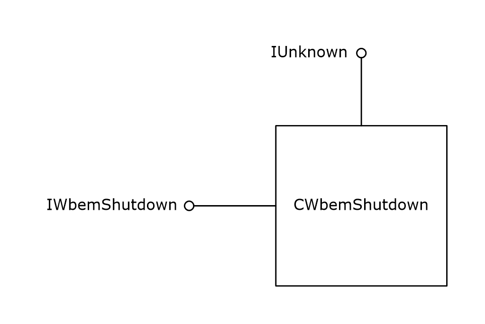

Figure 8: The IWbemShutdown interface

##### 3.1.4.14.1 IWbemShutdown::Shutdown (Opnum 3)

The IWbemShutdown::Shutdown method does not perform any action when called by a remote client.

HRESULT Shutdown(

[in] long reserved1,

[in] ulong reserved2,

[in] IWbemContext* Reserved3

);

**reserved1:** MUST be set to 0 when sent and MUST be ignored on receipt.

**reserved2:** MUST be set to 0 when sent and MUST be ignored on receipt.

**Reserved3:** MUST be set to NULL when sent and MUST be ignored on receipt.

**Return Values:** This method MUST return 0x800706ba RPC Server Unavailable.

#### 3.1.4.15 IUnsecuredApartment Interface

The IUnsecuredApartment interface allows a local client to register a callback for asynchronous remote operations. The interface MUST be uniquely identified by the [**UUID**](#gt_universally-unique-identifier-uuid) {1cfaba8c-1523-11d1-ad79-00c04fd8fdff}.

| Method | Description |
| --- | --- |
| [CreateObjectStub](#Section_9cdad141b7cf48e984c63ad0d2868d1b) | The objects that export this interface MUST be uniquely identified with the [**CLSID**](#gt_class-identifier-clsid) {49bd2028-1523-11d1-ad79-00c04fd8fdff} Opnum: 3 |

Figure 9: The IUnsecuredApartment interface

##### 3.1.4.15.1 IUnsecuredApartment::CreateObjectStub (Opnum 3)

The IUnsecuredApartment::CreateObjectStub method does not perform any action and returns E_UNEXPECTED when called by a remote client.

HRESULT CreateObjectStub(

[in] IUnknown* reserved1,

[out] IUnknown* reserved2

);

**reserved1:** MUST be set to NULL when sent and MUST be ignored on receipt.

**reserved2:** MUST be set to NULL when sent and MUST be ignored on receipt.

**Return Values:** This method MUST return E_UNEXPECTED as specified in [MS-ERREF](../MS-ERREF/MS-ERREF.md) section 2.1.

#### 3.1.4.16 IWbemUnsecuredApartment Interface

The IWbemUnsecuredApartment interface allows a local client to register a callback for asynchronous remote operations. The interface MUST be uniquely identified by the [**UUID**](#gt_universally-unique-identifier-uuid) {31739d04-3471-4cf4-9a7c-57a44ae71956}.

| Method | Description |
| --- | --- |
| [CreateSinkStub](#Section_e9dbf4966e354e18acfa16d3fcc90ab6) | The objects that export this interface MUST be uniquely identified with the CLSID {49bd2028-1523-11d1-ad79-00c04fd8fdff}. Opnum: 3 |

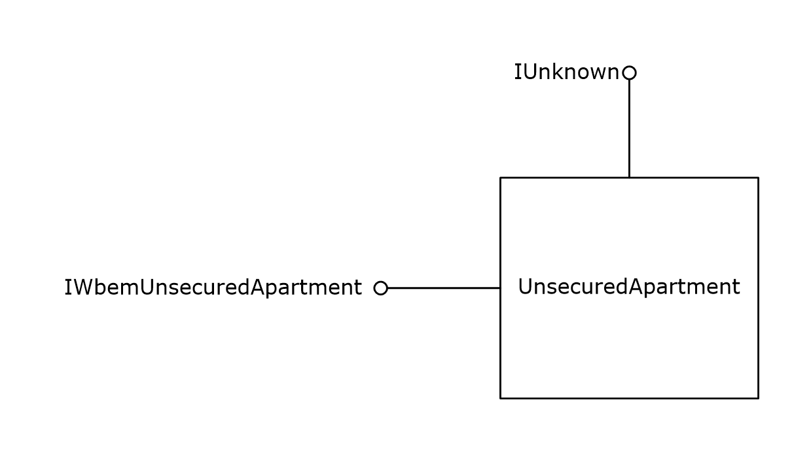

Figure 10: The IWbemUnsecuredApartment interface

##### 3.1.4.16.1 IWbemUnsecuredApartment::CreateSinkStub (Opnum 3)

The IWbemUnsecuredApartment::CreateSinkStub method does not perform any action when called by a remote client.

HRESULT CreateSinkStub(

[in] IWbemObjectSink* reserved1,

[in] dword reserved2,

[in, unique] LPCWSTR reserved3,

[out] IWbemObjectSink** reserved4

);

**reserved1:** MUST be set to NULL when sent and MUST be ignored on receipt.

**reserved2:** MUST be set to 0 when sent and MUST be ignored on receipt.

**reserved3:** MUST be set to NULL when sent and MUST be ignored on receipt.

**reserved4:** MUST be set to NULL when sent and MUST be ignored on receipt.

**Return Values:** This method MUST return E_UNEXPECTED as specified in [MS-ERREF](../MS-ERREF/MS-ERREF.md) section 2.1.

#### 3.1.4.17 Abstract Provider Interface

Below are the details of the interface used between CIM server and the providers. The server uses ProviderEntryPoint stored in ProviderTable for the given provider for performing any operation below. For sending indications or events to the server, the provider MUST trigger [3.1.6.1](#Section_3.1.6.1).

The server MUST perform the following two processing rules for each invocation of each of the methods listed below in this section:

- Prior to the invocation, the server MUST impersonate the client (the security principal of the caller) by invoking the abstract interface **RpcImpersonateClient** as specified in [MS-RPCE](../MS-RPCE/MS-RPCE.md) section 3.3.3.4.3.2, passing in NULL as the *BindingHandle* parameter.
- Following invocation, the server MUST stop impersonating the client prior to returning a status code by invoking the abstract interface **RpcRevertToSelf** as specified in [MS-RPCE] section 3.3.3.4.3.3.
The provider is expected to use those credentials with IMPERSONATE level impersonation for any necessary local access checks and remote network operations.

The server communicates asynchronously with the provider. The server creates the **IWbemObjectSink** object and passes a pointer to the **IWbemObjectSink** object to each of the provider operations through which the provider communicates the results back to the server. The server then forwards the results to the client. The server deletes the **IWbemObjectSink** object after receiving the status of the operation from the provider, or after calling the Cancel operation on the provider if the client canceled the operation.

The WMI v2 provider SHOULD<73> query the WMI server for data locale for each invocation of the method on the provider. The provider SHOULD use this locale for formatting decimals in string format and for representing time and date in string format.

The WMI v2 provider SHOULD<74> query the WMI server for the UI locale for each invocation of the method on the provider. The provider SHOULD use this locale when providing string output.

##### 3.1.4.17.1 Enumerate Instances of a Given Class

The server passes Class name and a pointer to the **IWbemObjectSink** object. The provider communicates the instances through the **IWbemObjectSink::Indicate** method. After all the instances are returned or if there is a failure encountered, the provider sends the final status using **IWbemObjectSink::SetStatus** method.

##### 3.1.4.17.2 Enumerate the Subclasses of a Given Class

The server passes Class name and a pointer to the **IWbemObjectSink** object. The provider communicates the subclasses through the **IWbemObjectSink::Indicate** method. After all the subclasses are returned or if there is a failure encountered, the provider sends the final status using **IWbemObjectSink::SetStatus** method.

##### 3.1.4.17.3 Get Properties Within an Instance of a Class

The server passes class name, the key property values through the **IWbemClassObject** instance, and a pointer to the **IWbemObjectSink** object to the provider. The provider returns the **IWbemClassObject** instance containing the nonkey properties for the given instance through the **IWbemObjectSink::Indicate** method. The provider returns WBEM_E_NOT_FOUND through the **IWbemObjectSink::SetStatus** method if the instance referred by the key properties is not found. On success, the provider sends the final status info using the **IWbemObjectSink::SetStatus** method.

##### 3.1.4.17.4 Get Properties Within a Class

The server passes the class name and a pointer to an **IWbemObjectSink** object to the provider. The provider returns the class metadata through the **IWbemClassObject** instance containing the metadata of the given class, through the **IWbemObjectSink::Indicate** method. The provider returns WBEM_E_NOT_FOUND through the **IWbemObjectSink::SetStatus** method if the class is not found. On success, the provider sends the final status using the **IWbemObjectSink::SetStatus** method.

##### 3.1.4.17.5 Update Properties Within an Instance of a Class

The server passes Class name, instance information through the **IWbemClassObject** instance, and a pointer to the **IWbemObjectSink** object to the provider. The provider applies the changes to the managed object and returns success or failure to the server through **IWbemObjectSink::SetStatus**.

##### 3.1.4.17.6 Update Properties Within a Class

The server passes Class name, updated class metadata through the **IWbemClassObject** instance, and a pointer to the **IWbemObjectSink** object to the provider. The provider applies the changes to the managed object and returns success or failure to the server through **IWbemObjectSink::SetStatus**.

##### 3.1.4.17.7 Create an Instance of a Class

The server passes Class name, instance information through the **IWbemClassObject** instance, and a pointer to the **IWbemObjectSink** object to the provider. The provider applies the changes to the [**managed object**](#gt_managed-object) and returns success or failure to the server through **IWbemObjectSink::SetStatus**.

##### 3.1.4.17.8 Create a Class

The server passes Class name, class metadata through the **IWbemClassObject** instance, and a pointer to **IWbemObjectSink** object to the provider. The provider applies the changes to the [**managed object**](#gt_managed-object) and returns success or failure to the server through **IWbemObjectSink::SetStatus**.

##### 3.1.4.17.9 Delete an Instance of a Class

The server passes class name, instance information through the **IWbemClassObject** instance, and a pointer to the **IWbemObjectSink** object to the provider. The provider applies the changes to the [**managed object**](#gt_managed-object) and returns success or failure to the server through **IWbemObjectSink::SetStatus**.

##### 3.1.4.17.10 Delete a Class

The server passes Class name, class metadata through the **IWbemClassObject** instance, and a pointer to the **IWbemObjectSink** object to the provider. The provider applies the changes to the [**managed object**](#gt_managed-object) and returns success or failure to the server through **IWbemObjectSink::SetStatus**.

##### 3.1.4.17.11 Execute a Provider's Method

The server passes Class name, method name, input parameters to the method through the **IWbemClassObject** instances, and a pointer to the **IWbemObjectSink** object to the provider. Upon success, the provider returns output parameter values as **IWbemClassObject** instances, and a method result (success/failure) to the server through the **IWbemObjectSink::Indicate** method.

**Note** If for a method parameter, the qualifier< IN>/<IN,OUT>/<OUT> is not specified, the server SHOULD<75> consider the parameter as IN,OUT.

##### 3.1.4.17.12 Cancel an Existing Operation

The server passes the pointer to the **IWbemObjectSink** object to the provider. The provider cancels the pending operation corresponding to the given **IWbemObjectSink** object.

##### 3.1.4.17.13 Subscribe for Event Notification

The server passes RpcImpersonationAccessToken.Sids[UserIndex]) and a pointer to the **IWbemObjectSink** object to the provider. The provider performs a security access check on the client's identity, validating that the client has WBEM_RIGHT_SUBSCRIBE permission. If the provider does not want to grant access to the client, it returns WBEM_E_ACCESS_DENIED to the server through **IWbemObjectSink::SetStatus**.

##### 3.1.4.17.14 Is Dynamic Class Supported

The server passes the namespace and class name to the provider. The provider returns TRUE to indicate that it supports operations on this class, or FALSE if not.

##### 3.1.4.17.15 Execute Query

The server passes a [**WQL**](#gt_wmi-query-language-wql) query and a pointer to the **IWbemObjectSink** object. The provider communicates with the matching objects through the [IWbemObjectSink::Indicate (section 3.1.4.2.1)](#Section_3.1.4.2.1) method. After all the matching objects are returned, or if there is a failure encountered, the provider sends the final status using the [IWbemObjectSink::SetStatus (section 3.1.4.2.2)](#Section_3.1.4.2.2) method.

If the provider cannot process the query, then it MUST return WBEM_E_PROVIDER_NOT_CAPABLE.

#### 3.1.4.18 Namespaces

The direct children of a given namespace are represented as instances of the **_Namespace** class within the parent namespace. A client with sufficient privilege can query and modify the child namespaces through operations on the **__Namespace** instances, as described in the following subsections.

The namespaces, their corresponding classes and instances, and subnamespaces and their corresponding classes and instances, MUST be persisted in CIM database.

##### 3.1.4.18.1 Creating Namespaces

When the server receives a request to create a new instance of the **__Namespace** class, the server MUST create a child namespace of the current namespace, using the instance's **Name** field as the name of the new namespace. A corresponding **ClassTable** and CIM database entries MUST be created, defining the system classes specified in section [2.2.31](#Section_2.2.31). The **InstanceProviderId** for each class MUST be set to NULL. A **NamespaceConnection** MUST be created for the new namespace and added to the **NamespaceConnectionTable**. If the new instance includes the **NamespaceSecuritySDDL** qualifier, then the qualifier's value specifies the security descriptor of the namespace in SDDL format; otherwise, the server MUST include an implementation-dependent default value for the qualifier.<76>

If there is a parent namespace, the server MUST add access control entries of the parent to the security descriptor using the algorithm in section [2.2.30.2](#Section_2.2.30.2).

The server MUST generate a **__NamespaceCreationEvent** event object upon successful creation of the namespace.

The server MUST set the namespace's RequiresEncryption flag using the semantics described in section [2.2.30.3](#Section_2.2.30.3).

##### 3.1.4.18.2 Reading Namespace Information

When the server receives a request to get an instance of the **__Namespace** class, the server MUST check for the existence of a child namespace (of the current namespace in the [IWbemServices Interface (section 3.1.4.3)](#Section_3.1.4.3.13)) with the same name, returning WBEM_E_NOT_FOUND if none matches. The **RequiresEncryption** and **NamespaceSecuritySDDL** qualifiers MUST be set to the values of the child namespace's **RequiresEncryption** flag and security descriptor, respectively.

Similarly, when a client enumerates instances of the **__Namespace** class, the server MUST return a set of instances corresponding to the child namespaces of the current namespace.

See [Appendix D: Enumerating Class Schema](#Section_9) for an example.

##### 3.1.4.18.3 Updating Namespace Information

When the server receives a request to put an instance of the **__Namespace** class, the server MUST check for the existence of a child namespace (of the current namespace in the **IWbemServices** interface) with the same name, returning WBEM_E_NOT_FOUND if none matches. The server MUST update the namespace information based on the qualifiers of the received instance, just as during namespace creation (see section [3.1.4.18.1](#Section_3.1.4.18.1) for details).

The server MUST generate a **__NamespaceModificationEvent** event object upon successful modification of the namespace information.

##### 3.1.4.18.4 Deleting Namespaces

When the server receives a request to delete an instance of the **__Namespace** class, the server MUST check for the existence of a child namespace (of the current namespace in the IWbemServices interface) with the same name, returning WBEM_E_NOT_FOUND if none matches. The server MUST delete all classes and instances in the child namespace and all descendants from the CIM database. The server MUST delete the **NamespaceConnection** objects for each of the namespaces in the hierarchy and MUST remove the corresponding entries from **NamespaceConnectionTable**. The server MUST delete the **ClassTable** corresponding to each of the namespaces in the hierarchy.

The server MUST generate a **__NamespaceDeletionEvent** event object upon successful modification of the namespace information.

### 3.1.5 Timer Events

The Windows Management Instrumentation Remote Protocol uses four timers:

**Sink timer:** If the timer expires and the call is not completed, the server MUST cancel the [**asynchronous operation**](#gt_asynchronous-operation) for which the timer expired.

**Backup Timer:** If the timer expires, the server MUST resume operations by simulating [IWbemBackupRestoreEx::Resume](#Section_3.1.4.11.2) and MUST reset the timer to 0.

**EventPollingTimer:** If the timer expires, the server MUST query for the instances of the underlying CIM class (for which the notifications are requested) in the corresponding **EventFilter** in the **EventBindingTable**, and store them in **CurrInstances** (which is array of **IWbemClassObject** objects). The server MUST compare **CurrInstances** to **PrevInstances** already stored in the event.

- If an instance exists only in **CurrInstances** and is not present in **PrevInstances**, and the FROM clause of the **EventFilter** has **__InstanceCreationEvent**, the server MUST prepare an **__InstanceCreationEvent** object with the **TargetInstance** set to new object found in **CurrInstances** array.
- If an instance only exists in **PrevInstances** and is not present in **CurrInstances**, and the FROM clause of the **EventFilter** has **__InstanceDeletionEvent**, the server MUST prepare an **__InstanceDeletionEvent** object with the **TargetInstance** set to old object in **PrevInstances** array.
- If the instance exists in both the arrays, then the server MUST compare the properties of the objects. If they are not same and the FROM clause of the **EventFilter** has **__InstanceModificationEvent**, the server MUST prepare an **__InstanceModificationEvent** object with the **PreviousInstance** set to old object in **PrevInstances** array and the **TargetInstance** set to new object found in **CurrInstances** array.
The server MUST add each of the above events object prepared to the **EventQueue**, deliver the events that have accumulated in the **EventQueue** (ignoring delivery failures), clear the queue, move **CurrInstances** array into **PrevInstances** array, and restart the timer.

**EventGroupingTimer:** If the timer expires, the server MUST

- Follow the same procedure followed for **EventPollingTimer** to create the **__InstanceCreationEvent**, **__InstanceDeletionEvent**, and **__InstanceModificationEvent** events, and add them to **EventGroupAggregateQueue**.
- Examine the events that have accumulated in the **EventGroupAggregateQueue** and discard those that do not match the "HAVING" clause of the filter (if specified).
- Deliver the remaining events to the client, ignoring delivery failures.
- Clear **EventGroupAggregateQueue**.
- Restart the timer.

### 3.1.6 Other Local Events

None.

#### 3.1.6.1 Indication Event Is Generated

The server MUST execute the following algorithm for each row of the **EventBindingTable**.

- Check whether the indication matches the **EventFilter**. If not, then skip to the next row.
- If the SECURITY_DESCRIPTOR property of indication is available, check whether client has access to this indication by Validating the SECURITY_DESCRIPTOR property of the indication against **ClientSecurityContext**. If the client does not have access, the server MUST ignore this indication.
- If an **EventGroupingTimer** exists in this row, search the **EventGroupAggregateQueue** for an event that meets the matching criteria specified in the "BY" clause of the filter (or any event, if no "BY" clause was specified). If no matching event is found, create a new **__AggregateEvent** with a copy of the indication in the *Representative* property and one in the *NumberOfEvents* property; otherwise, increment the event's *NumberOfEvents* property. If the number of rows in the **EventGroupAggregateQueue** is more than **EventDropLimit**, return WBEM_E_QUEUE_OVERFLOW to the client. If the **EventGroupingTimer** is not currently active, then start it.
- Otherwise, if an **EventPollingTimer** exists in this row, then add the indication to the **EventQueue**. If the number of rows in the **EventQueue** is more than **EventDropLimit**, return WBEM_E_QUEUE_OVERFLOW to the client.
- Otherwise, deliver the indication to the client via the **EventConsumer** interface in that row.

#### 3.1.6.2 Load Provider

The server creates a provider instance and passes namespace name, locale ID, ProviderArchitectureType, and a pointer to callback into it. If the provider initialization was successful, the server creates an entry for the given provider in **ProviderTable** with **ProviderEntryPoint** as pointer to the provider instance created above. The server will proceed with the specific client's request upon successful load of the provider. The error encountered during load will be sent to the server, and the server terminates the client's request with WBEM_E_PROVIDER_LOAD_FAILURE.

#### 3.1.6.3 Unload Provider

The server removes the entry for the corresponding provider in **ProviderTable**. The server deletes the provider instance created as part of [3.1.6.2](#Section_3.1.6.2). If an error is encountered during the Unload, it will be returned to the server.

## 3.2 Client Details

### 3.2.1 Abstract Data Model

The client MUST maintain association between _WBEM_REFRESHER_ID and the objects refreshed in respective ID by the server. This information MUST be passed to the server when reconnecting the refresher.

### 3.2.2 Timers

None

### 3.2.3 Initialization

The client MUST activate the [IWbemLevel1Login](#Section_3.1.4.1) interface on the machine that is running the target WMI server by using the CLSID {8BC3F05E-D86B-11D0-A075-00C04FB68820}, as specified in the DCOM Remote Protocol ([MS-DCOM](../MS-DCOM/MS-DCOM.md)). The client SHOULD obtain the [IWbemLoginClientID](#Section_3.1.4.8) interface by using the IRemUnknown and IRemUnknown2 interfaces, [MS-DCOM], on the IWbemLevel1Login interface. If the server returns an error for the IWbemLoginClientID interface, the client MUST ignore the error. If the server returns the IWbemLoginClientID interface, the client SHOULD call the [IWbemLoginClientID::SetClientInfo](#Section_3.1.4.8.1) method to set the client information on the server.<77>

The client SHOULD NOT obtain the [IWbemLoginHelper](#Section_3.1.4.9) interface from IWbemLevel1Login by calling the IRemUnknown and IRemUnknown2 interfaces.<78>

The client MUST call the [IWbemLevel1Login::NTLMLogin](#Section_3.1.4.1.4) method. If the IWbemLevel1Login::NTLMLogin method completes successfully, the *ppNamespace* parameter has an [IWbemServices](#Section_3.1.4.3.13) interface pointer that can be used by the client to call the IWbemServices methods.

If the client has multiple preferred locales or any locale string that does not match the "MS_xxx" format as the *pszPreferredLocale* parameter to IWbemLevel1Login::NTLMLogin, the client MUST determine whether the server supports the locale and filter out unsupported locales before calling IWbemLevel1Login::NTLMLogin. To determine supported locales, the client MUST call [IWbemLevel1Login::EstablishPosition](#Section_3.1.4.1.1) If the return value is E_NOTIMPL, the client MUST choose the first locale that matches the "MS_xxx" format and MUST remove other locales from the string.

If the locale list is empty after unsupported locales are filtered out,<79> the client MUST pass NULL for *pszPreferredLocale*.

### 3.2.4 Message Processing Events and Sequencing Rules

If the client detects that the [IWbemClassObject](#Section_2.2.4) that is returned by the WMI [server](#Section_1.1) does not conform to [MS-WMIO](../MS-WMIO/MS-WMIO.md) encoding, as specified in section 2.2.4, the results MUST be ignored and the requested operation MUST be considered as failed.

For each operation that accepts an **IWbemContext** object, the client SHOULD generate a new, unique request ID, and set the __CorrelationId context option to the request ID.<80>

#### 3.2.4.1 IWbemObjectSink Interface Client Details

The IWbemObjectSink interface is implemented by the WMI client if the WMI client uses asynchronous method calls as specified in section [3.2.4.2.9](#Section_3.2.4.2.9). In this case, the WMI client acts as an IWbemObjectSink server. The WMI server acts as an IWbemObjectSink client. The WMI server MUST invoke the IWbemObjectSink methods to deliver the results (IWbemClassObjects, if any, and the status code) of the IWbemServices method for which this IWbemObjectSink is passed as a response handler, as specified in section [3.1.1.1.3](#Section_3.1.1.1.3).

Because this interface is implemented by the WMI client and the WMI server and invoked by both, the server in this section refers to the implementer of this interface, and client refers to the invoker in a specific scenario.

The IWbemObjectSink interface is implemented by the WMI server and returned to the WMI client in a *ppResponseHandler* parameter, if the WMI client calls the [IWbemServices::QueryObjectSink](#Section_3.1.4.3.3) method. In this case, the WMI server acts as an IWbemObjectSink server. The WMI client acts as an IWbemObjectSink client. The WMI client MUST invoke IWbemObjectSink methods to deliver the results, that is, IWbemClassObjects that represent the extrinsic event the client wants to deliver to the server.

| Method | Description |
| --- | --- |
| [Indicate](#Section_3.2.4.1.1) | Called by the client to return additional results. Opnum: 3 |
| [SetStatus](#Section_3.2.4.1.2) | Called by the client either to indicate the end of an operation or to send status information to the server. Opnum: 4 |

##### 3.2.4.1.1 IWbemObjectSink::Indicate Client Details

If there are no IWbemClassObject results to be reported, the client MUST NOT call the IWbemObjectSink::Indicate method.

Otherwise, the client MUST call the IWbemObjectSink::Indicate method one or more times until the entire IWbemClassObject results are delivered to the server. Each time the IWbemObjectSink::Indicate method is called, a subset of the result is delivered to the server. For a specific set of result objects, the client uses implementation-specific criteria to choose the number and timing of the IWbemObjectSink::Indicate method calls that are used to deliver the result objects.<81>

Clients that implement the [ObjectArray](#Section_2.2.14) structure MUST call IWbemObjectSink::Indicate by using DCOM Remote Protocol marshaling, as specified in [MS-DCOM](../MS-DCOM/MS-DCOM.md), for the first time. If a server returns WBEM_S_NEW_STYLE, the client SHOULD send the remainder of the results by using the ObjectArray structure as specified in section 2.2.14. If the server does not return WBEM_S_NEW_STYLE, the client MUST send the remainder of the results from the IWbemObjectSink::Indicate call by using DCOM Remote Protocol marshaling, as specified in [MS-DCOM], and MUST NOT use the ObjectArray structure.

The following applies when the WMI server acts as an IWbemObjectSink client:

For each asynchronous operation, there MUST be only one call at a time: either IWbemObjectSink::Indicate or IWbemObjectSink::SetStatus. This is ensured by calling IWbemObjectSink::Indicate only if CallbackInProgress is FALSE. Set CallbackInProgress to TRUE before calling IWbemObjectSink::Indicate, and reset it to FALSE after the call is returned. IWbemOjbectSink::Indicate MUST NOT be called if CallCancelled is set to TRUE.

If IWbemObjectSink::Indicate returns an error, the server MUST do the following:

- Set CallCancelled to TRUE in AsyncOperationTable for the entry identified by this IWbemObjectSink.
- Send the final result with WBEM_E_CALL_CANCELLED.
- Remove the entry for this operation in AsyncOperationTable.

##### 3.2.4.1.2 IWbemObjectSink::SetStatus Client Details

The client MUST call the IWbemObjectSink::SetStatus method operation to send the final status of the IWbemServices method operation by passing WBEM_STATUS_COMPLETE as an *lFlags* parameter and the operation return code as an HRESULT parameter. After calling IWbemObjectSink::SetStatus with final status information, the client MUST release the [IWbemObjectSink](#Section_3.1.4.2.2) interface and MUST NOT call any other methods of IWbemObjectSink.

When the reported operation status is success, the client MUST set the *pObjParam* parameter to NULL.

The client MAY call IWbemObjectSink::SetStatus multiple times during the operation execution to report the operation progress.<82> In this case, *lFlags* MUST be set to WBEM_STATUS_PROGRESS and the *hResult* parameter MUST contain the progress information.

When sending operation progress information, the client MAY call IWbemObjectSink::SetStatus any time before final status is sent.

The following applies when the WMI server acts as an IWbemObjectSink client.

For each asynchronous operation, there MUST only be one call at a time of either IWbemObjectSink::Indicate or IWbemObjectSink::SetStatus (for operation progress information). This is ensured by calling IWbemObjectSink::Indicate only if CallbackInProgress is FALSE. Set CallbackInProgress to TRUE before calling operation progress information by IWbemObjectSink::SetStatus, and reset to FALSE after the call returns. Operation progress by IWbemObjectSink::SetStatus MUST NOT be called if CallCancelled is TRUE.

If operation progress information by IWbemObjectSink::SetStatus returns an error, the server MUST do the following:

- Set CallCancelled to TRUE in AsyncOperationTable for the entry identified by this IWbemObjectSink.
- Send the final result with WBEM_E_CALL_CANCELLED.
- Remove the entry for this operation in AsyncOperationTable.

#### 3.2.4.2 IWbemServices Interface Client Details

##### 3.2.4.2.1 Sending Events to Server

If the client wants to send the events to the WMI server, the client MUST call the [IWbemServices::QueryObjectSink](#Section_3.1.4.3.3) method on the [IWbemObjectSink](#Section_3.1.4.2.2) interface that is obtained as specified in section [3.2.3](#Section_3.2.3). When the method execution succeeds, the client gets the IWbemObjectSink interface. The extrinsic events, represented as [IWbemClassObject Prototype Result Object](#Section_2.2.4.1), as specified in 2.2.4.1, MUST be delivered to the server by calling [IWbemObjectSink::Indicate](#Section_3.1.4.2.1).When the client completes delivering the extrinsic events, the client MUST release the IWbemObjectSink.

##### 3.2.4.2.2 Calling Put Interfaces for CIM Objects with Amended Qualifiers

If the client calls the [PutClass](#Section_3.1.4.3.7), [PutClassAsync](#Section_3.1.4.3.7), [PutInstance](#Section_3.1.4.3.13), or [PutInstanceAsync](#Section_3.1.4.3.13) method to update or create a [**CIM Object**](#gt_cim-object) that contains amended qualifiers, the client SHOULD set the WBEM_FLAG_USE_AMENDED_QUALIFIERS flag.

To create a new class with amended qualifiers, the client MUST first separate the class into a locale-neutral class object and a locale-specific class object, with contents as described in section [3.1.1.2](#Section_3.1.1.2). Then the client MUST make multiple calls to **PutClass** or **PutClassAsync**; one to create the locale-neutral class object and one for each supported locale to construct the locale-specific class object. The client SHOULD create the locale-neutral object last.

##### 3.2.4.2.3 Deleting Class Objects with Amended Qualifiers

To delete a class with amended qualifiers, the client MUST delete the locale-neutral class object and the locale-specific class object. The client MUST make multiple calls to **DeleteClass** or **DeleteClassAsync**; one to delete the locale-neutral class object and one for each supported locale to delete the locale-specific class object. The client SHOULD delete the locale-neutral object first.

##### 3.2.4.2.4 Invoking Synchronous Methods Returing No Object

If the client wants to invoke following WMI methods synchronously, the client MUST NOT set WBEM_FLAG_RETURN_IMMEDIATELY when making method calls. When the method completes, the result of the operation is returned as return value. List of methods returning no objects in synchronous mode are

- [IWbemServices::PutInstance](#Section_3.1.4.3.13)
- [IWbemServices::PutClass](#Section_3.1.4.3.7)
- [IWbemServices::DeleteClass](#Section_3.1.4.3.9)
- [IWbemServices::DeleteInstance](#Section_3.1.4.3.15)

##### 3.2.4.2.5 IWbemServices::ExecMethod and IWbemServices::ExecMethodAsync

The client MUST create a [**CIM instance**](#gt_cim-instance) for the input parameter [**CIM class**](#gt_cim-class) defined in [MS-WMIO](../MS-WMIO/MS-WMIO.md) section 2.3.3. The values of the CIM instance properties MUST be set to the values of the input parameters of the method by matching the parameter name to the property name. This CIM instance MUST be passed to [IWbemServices::ExecMethod (section 3.1.4.3.22)](#Section_3.1.4.3.22) or [IWbemServices::ExecMethodAsync (section 3.1.4.3.23)](#Section_3.1.4.3.23) as *pInParams*.

The output parameters from the method invocation will be returned as an instance of output parameter CIM class as defined in [MS-WMIO] section 2.3.3. Depending on how the method is invoked, the resultant object is returned in one of the ways as described in sections [3.2.4.2.6](#Section_3.2.4.2.6), [3.2.4.2.7](#Section_3.2.4.2.7), or [3.2.4.2.9](#Section_3.2.4.2.9).

##### 3.2.4.2.6 Invoking Synchronous Methods Returning Single Object

If the client wants to invoke any of the following WMI methods synchronously, the client MUST NOT set WBEM_FLAG_RETURN_IMMEDIATELY when making method calls. When the method completes successfully, the output parameter contains the result object of the operation. The following table lists the methods and output parameter containing the result object of the operation.

| S.No | Methode name | Output Parameter contatining result object |
| --- | --- | --- |
| 1 | [IWbemServices::OpenNamespace](#Section_3.1.4.3.1) | *ppWorkingNamespace* |
| 2 | [IWbemServices::GetObject](#Section_3.1.4.3.5) | *ppObject* |
| 3 | [IWbemServices::ExecMethod](#Section_3.1.4.3.22) | *ppOutParams* |

When the call to the method fails, the output parameter is NULL.

##### 3.2.4.2.7 Invoking Semisynchronous Methods That Return a Single Object

If the client wants to invoke any of the following WMI methods semisynchronously, the client MUST set WBEM_FLAG_RETURN_IMMEDIATELY when it makes the method calls.

When the method returns success, the [IWbemCallResult](#Section_3.1.4.5) parameter MUST be used to get the result of the actual [**semisynchronous operation**](#gt_semisynchronous-operation). The client MUST call the methods of IWbemCallResult, as specified in the following table, to obtain the results of the semisynchronous operation that is initiated by the client. The client MUST NOT call other methods of IWbemCallResult except as specified in the following table.

| Method | Rule |
| --- | --- |
| [IWbemServices::OpenNamespace](#Section_3.1.4.3.1) | The [IWbemCallResult::GetResultServices](#Section_3.1.4.5.3) method MUST be called to retrieve the [IWbemServices](#Section_3.1.4.3.13) pointer. |
| [IWbemServices::PutInstance](#Section_3.1.4.3.13) | The [IWbemCallResult::GetResultString](#Section_3.1.4.5.2) method MUST be called to obtain the [**CIM path**](#gt_775e4b82-5447-4125-b887-b404421e1269) that was assigned to the [**CIM**](#gt_common-information-model-cim) instance. |
| [IWbemServices::GetObject](#Section_3.1.4.3.5) | The [IWbemCallResult::GetResultObject](#Section_3.1.4.5.1) method MUST be called to retrieve the [**CIM object**](#gt_cim-object). |
| [IWbemServices::PutClass](#Section_3.1.4.3.7) [IWbemServices::DeleteClass](#Section_3.1.4.3.9) [IWbemServices::DeleteInstance](#Section_3.1.4.3.15) | The [IWbemCallResult::GetCallStatus](#Section_3.1.4.5.4) method MUST be called to return the call status. |
| [IWbemServices::ExecMethod](#Section_3.1.4.3.22) | The IWbemCallResult::GetResultObject method MUST be called to retrieve the output parameters. |

When the semisynchronous IWbemServices method fails, the output parameter does not have the IWbemCallResult interface.

##### 3.2.4.2.8 Invoking Synchronous and Semisynchronous Operations Returning Multiple Objects

If the client wants to invoke any of the following WMI methods semisynchronously, the client MUST set WBEM_FLAG_RETURN_IMMEDIATELY when making method calls. If the client wants to invoke any of the following methods synchronously, the client MUST NOT set WBEM_FLAG_RETURN_IMMEDIATELY when making IWbemServices method calls.

The methods returning multiple objects are as follows:

- [IWbemServices::ExecQuery](#Section_3.1.4.3.18)
- [IWbemServices::CreateInstanceEnum](#Section_3.1.4.3.17)
- [IWbemServices::CreateClassEnum](#Section_3.1.4.3.10)
- [IWbemServices::ExecNotificationQuery](#Section_3.1.4.3.20)
When the method execution fails, as indicated by the return value, the output parameter does not have [IEnumWbemClassObject](#Section_3.1.4.4).

When [IWbemServices](#Section_3.1.4.3.13) method execution succeeds, an object of type IEnumWbemClassObject is returned to the client.

The client SHOULD obtain IWbemFetchSmartEnum interface using IRemUnknown and IRemUnknown2 interfaces as specified in [MS-DCOM](../MS-DCOM/MS-DCOM.md), on this IEnumWbemClassObject interface. If client obtains IWbemFetchSmartEnum, the client MUST call IWbemFetchSmartEnum::GetSmartEnum to obtain IWbemWCOSmartEnum. The client SHOULD call [IWbemWCOSmartEnum::Next](#Section_3.1.4.7.1) method repeatedly to retrieve the objects. When IWbemWCOSmartEnum::Next returns WBEM_S_NO_ERROR or WBEM_S_TIMEDOUT, the client SHOULD call [IEnumWbemClassObject::Next](#Section_3.1.4.4.2) again. If IWbemWCOSmartEnum::Next returns an error as specified in [2.2.11](#Section_2.2.11) or returns WBEM_S_FALSE, the client MUST NOT call IWbemWCOSmartEnum::Next again.

If the server returns an error when obtaining IWbemFetchSmartEnum, the client MUST ignore the error and SHOULD call IEnumWbemClassObject::Next method repeatedly to retrieve the objects. When IEnumWbemClassObject::Next returns WBEM_S_NO_ERROR or WBEM_S_TIMEDOUT, the client SHOULD call IEnumWbemClassObject::Next again. If IEnumWbemClassObject::Next returns an error as specified in 2.2.11 or returns WBEM_S_FALSE, the client MUST NOT call IEnumWbemClassObject::Next again.

When the client made a semisynchronous call and subsequent IEnumWbemClassObject::Next or IWbemWCOSmartEnum::Next call returns an error, the client MUST interpret the error as the error of actual [**semisynchronous operation**](#gt_semisynchronous-operation) as though the operation is executed synchronously.

The client MUST NOT call [IEnumWbemClassObject::Reset](#Section_3.1.4.4.1) or [IEnumWbemClassObject::Clone](#Section_3.1.4.4.4), if the IWbemServices method that created the IEnumWbemClassObject is passed WBEM_FLAG_FORWARD_ONLY flag.

If the client wants to start the enumerator from the first object, the client MUST call IEnumWbemClassObject::Reset, if the IWbemServices method that created the IEnumWbemClassObject is not passed WBEM_FLAG_FORWARD_ONLY flag.

If the client wants to create a new enumerator containing the same result set, the client MUST call IEnumWbemClassObject::Clone, if the IWbemServices method that created the IEnumWbemClassObject is not passed WBEM_FLAG_FORWARD_ONLY flag. The client SHOULD use IEnumWbemClassObject created using IEnumWbemClassObject::Clone as another result object by calling IEnumWbemClassObject::Next.

If the client wants to get some results of the operation asynchronously, the client MUST call [IEnumWbemClassObject::NextAsync](#Section_3.1.4.4.3) with the uCount, in this case next uCount result objects are returned in [IWbemObjectSink](#Section_3.1.4.2.2) passed as a parameter to IEnumWbemClassObject::NextAsync.

##### 3.2.4.2.9 Invoking Asynchronous Operations

The methods providing asynchronous behaviors are as follows:

- [IWbemServices::GetObjectAsync (section 3.1.4.3.5)](#Section_3.1.4.3.5)
- [IWbemServices::PutClassAsync (section 3.1.4.3.7)](#Section_3.1.4.3.7)
- [IWbemServices::DeleteClassAsync (section 3.1.4.3.9)](#Section_3.1.4.3.9)
- [IWbemServices::CreateClassEnumAsync (section 3.1.4.3.11)](#Section_3.1.4.3.11)
- [IWbemServices::PutInstanceAsync (section 3.1.4.3.13)](#Section_3.1.4.3.13)
- [IWbemServices::DeleteInstanceAsync (section 3.1.4.3.15)](#Section_3.1.4.3.15)
- [IWbemServices::CreateInstanceEnumAsync (section 3.1.4.3.17)](#Section_3.1.4.3.17)
- [IWbemServices::ExecQueryAsync (section 3.1.4.3.19)](#Section_3.1.4.3.19)
- [IWbemServices::ExecNotificationQueryAsync (section 3.1.4.3.21)](#Section_3.1.4.3.21)
- [IWbemServices::ExecMethodAsync (section 3.1.4.3.23)](#Section_3.1.4.3.23)
If the client wants to invoke any of the above asynchronous methods, the client MUST pass an object implementing [IWbemObjectSink](#Section_3.1.4.2.2) interface to the above method calls as a response handler.

When the method invocation succeeds, the client SHOULD wait for the result of the operation to be returned to the client using [IWbemObjectSink::Indicate](#Section_3.1.4.2.1) and [IWbemObjectSink::SetStatus](#Section_3.1.4.2.2) on the IWbemObjectSink passed to the asynchronous method.

When the [IWbemServices](#Section_3.1.4.3.13) method invocation fails, the result of the operation is returned as a return value of the method.

After the IWbemServices asynchronous method invocation succeeds, if the client wants to cancel the pending [**asynchronous operation**](#gt_asynchronous-operation) the client MUST call [IWbemServices::CancelAsyncCall](#Section_3.1.4.3.2) method. If the client calls IWbemServices::CancelAsyncCall, the client MUST pass the IWbemObjectSink passed to the asynchronous IWbemServices method that is still pending. The client MUST NOT call IWbemServices::CancelAsyncCall from within a call to IWbemObjectSink::Indicate or IWbemObjectSink::SetStatus.

#### 3.2.4.3 IWbemBackupRestore Interface Client Details

If client wants to invoke methods of [IWbemBackupRestore](#Section_3.1.4.10) interface, the client MUST activate IWbemBackupRestore interface on the target WMI server machine using [**CLSID**](#gt_class-identifier-clsid) {C49E32C6-BC8B-11D2-85D4-00105A1F8304} as specified in DCOM remote protocol.

#### 3.2.4.4 IWbemBackupRestoreEx Interface Client Details

If client wants to invoke methods of [IWbemBackupRestoreEx](#Section_3.1.4.11) interface, the client MUST activate IWbemBackupRestoreEx interface on the target WMI server using [**CLSID**](#gt_class-identifier-clsid) {C49E32C6-BC8B-11D2-85D4-00105A1F8304} as specified in DCOM remote protocol. The client MAY obtain IWbemBackupRestoreEx by calling IRemUnknown and IRemUnknown2 interfaces, as specified in [MS-DCOM](../MS-DCOM/MS-DCOM.md), on [IWbemBackupRestore](#Section_3.1.4.10) interface obtained as specified in section 3.1.4.10.

#### 3.2.4.5 IWbemRefreshingServices Interface Client Details

The client MUST obtain [IWbemRefreshingServices](#Section_3.1.4.12) interface, if the client wants to get updates to the objects in an efficient manner. The client MUST obtain IWbemRefreshingServices interface by calling IRemUnknown and IRemUnknown2 on [IWbemServices](#Section_3.1.4.3.13) interface obtained as specified in section [3.2.3](#Section_3.2.3).

The client MUST generate [_WBEM_REFRESHER_ID](#Section_2.2.21) as specified in section 2.2.21. The client MAY call [IWbemRefreshingServices::AddObjectToRefresher](#Section_3.2.4.5.1), [IWbemRefreshingServices::AddObjectToRefresherByTemplate](#Section_3.2.4.5.1) or [IWbemRefreshingServices::AddEnumToRefresher](#Section_3.2.4.5.2) to add multiple objects and enums to the refresher.

##### 3.2.4.5.1 IWbemRefreshingServices::AddObjectToRefresher and IWbemRefreshingServices::AddObjectToRefresherByTemplate

The client MUST pass the _WBEM_REFRESHER_ID that is generated as specified in section [2.2.21](#Section_2.2.21) to the [IWbemRefreshingServices::AddObjectToRefresher](#Section_3.2.4.5.1) and [IWbemRefreshingServices::AddObjectToRefresherByTemplate](#Section_3.2.4.5.1) methods.

When the client calls the IWbemRefreshingServices::AddObjectToRefresher or IWbemRefreshingServices::AddObjectToRefresherByTemplate method with pRefresherId generated by the client, the server returns the refresher information in the _WBEM_REFRESH_INFO structure if the method succeeds.

The client MUST allow all the version numbers that are returned by the server in *pdwSvrRefrVersion*.

If the returned _WBEM_REFRESH_INFO structure contains m_lType as WBEM_REFRESH_TYPE_REMOTE, the m_Info structure contains the _WBEM_REFRESH_INFO_REMOTE structure. The client MUST obtain the IWbemRemoteRefresher from the m_pRefresher in _WBEM_REFRESH_INFO_REMOTE. The client MUST use the [IWbemRemoteRefresher::RemoteRefresh](#Section_3.1.4.13.1) method to get the updated object. If the client wants to remove the particular object from the remote refresher, the client MUST use m_lCancelId, which is returned in _WBEM_REFRESH_INFO, to invoke the [IWbemRemoteRefresher::StopRefreshing](#Section_3.1.4.13.2) method.

If the returned _WBEM_REFRESH_INFO structure contains m_lType as WBEM_REFRESH_TYPE_NON_HIPERF, the client MUST retrieve the CIM instance using [IWbemServices::GetObject](#Section_3.1.4.3.5) or [IWbemServices::GetObjectAsync](#Section_3.1.4.3.5) on the initial [IWbemServices](#Section_3.1.4.3.13) interface.

When the IWbemRefreshingServices::AddObjectToRefresher or IWbemRefreshingServices::AddObjectToRefresherByTemplate method fails, the server does not return the _WBEM_REFRESH_INFO structure.

##### 3.2.4.5.2 IWbemRefreshingServices::AddEnumToRefresher

The client MUST pass the [_WBEM_REFRESHER_ID](#Section_2.2.21) that is generated as specified in section 2.2.21 to the [IWbemRefreshingServices::AddEnumToRefresher](#Section_3.2.4.5.2) method.

When the client calls the IWbemRefreshingServices::AddEnumToRefresher method with *pRefresherId* generated by the client, the server returns the refresher information in the **_WBEM_REFRESH_INFO** structure if the method succeeds.

The client MUST allow all the version numbers that are returned by the server in *pdwSvrRefrVersion*.

If the returned **_WBEM_REFRESH_INFO** structure contains **m_lType** as WBEM_REFRESH_TYPE_REMOTE, the **m_Info** structure contains the **_WBEM_REFRESH_INFO_REMOTE** structure. The client MUST obtain the IWbemRemoteRefresher from the **m_pRefresher** in **_WBEM_REFRESH_INFO_REMOTE**. The client MUST use the [IWbemRemoteRefresher::RemoteRefresh](#Section_3.1.4.13.1) method to get the updated enumeration. The client MUST use m_lCancelId, which is returned in **_WBEM_REFRESH_INFO**, to invoke the [IWbemRemoteRefresher::StopRefreshing](#Section_3.1.4.13.2) method if the client wants to remove the particular enumeration from the remote refresher.

If the returned **_WBEM_REFRESH_INFO** structure contains **m_lType** as WBEM_REFRESH_TYPE_NON_HIPERF, the client MUST retrieve the CIM instances using [IWbemServices::CreateInstanceEnum](#Section_3.1.4.3.17) or [IWbemServices::CreateInstanceEnumAsync](#Section_3.1.4.3.17) on the initial [IWbemServices](#Section_3.1.4.3.13) interface.

When the IWbemRefreshingServices::AddEnumToRefresher method fails, the client MUST NOT use the **_WBEM_REFRESH_INFO** structure.

##### 3.2.4.5.3 IWbemRefreshingServices::GetRemoteRefresher

When invoking the methods of the [IWbemRemoteRefresher](#Section_3.1.4.13.2) interface, if the connection is lost and reported to the client as an RPC disconnect error (as specified in [MS-ERREF](../MS-ERREF/MS-ERREF.md)), the client SHOULD try to reconnect to WMI by obtaining [IWbemServices](#Section_3.1.4.3.13) as specified in section [3.2.3](#Section_3.2.3) and to obtain the IWbemRemoteRefresher interface using the IWbemServices interface as specified in section [3.2.4.5](#Section_3.1.4.12), and SHOULD call the [IWbemRefreshingServices::GetRemoteRefresher](#Section_3.2.4.5.3) method on this interface.

If the IWbemRefreshingServices::GetRemoteRefresher method call succeeds, the client gets a GUID of the remote refresher in the *pGuid* parameter.

The client MUST allow all the version numbers that are returned by the server in the *pdwSvrRefrVersion* parameter.

If the GUID is equal to the GUID that is returned in WBEM_REFRESH_INFO_REMOTE when the remote refresher is first received by calling either [IWbemRefreshingServices::AddEnumToRefresher](#Section_3.2.4.5.2), [IWbemRefreshingServices::AddObjectToRefresher](#Section_3.2.4.5.1), or [IWbemRefreshingServices::AddObjectToRefresherByTemplate](#Section_3.2.4.5.1), the client MUST NOT call [IWbemRefreshingServices::ReconnectRemoteRefresher](#Section_3.2.4.5.4). The client SHOULD call [IWbemRemoteRefresher::RemoteRefresh](#Section_3.1.4.13.1) on the IWbemRemoteRefresher interface, which is obtained by using IWbemRefreshingServices::GetRemoteRefresher to refresh the object. The client MUST NOT call the methods on the IWbemRemoteRefresher interface whose connection is initially lost.

If the GUID is not equal to the GUID that is returned in WBEM_REFRESH_INFO_REMOTE when the remote refresher is first received by calling either IWbemRefreshingServices::AddEnumToRefresher, IWbemRefreshingServices::AddObjectToRefresher or IWbemRefreshingServices::AddObjectToRefresherByTemplate, the client MUST call IWbemRefreshingServices::ReconnectRemoteRefresher to reconnect all the objects to the refresher. The client MUST NOT call methods on the new remote refresher until IWbemRefreshingServices::ReconnectRemoteRefresher is executed successfully. The client MUST NOT call methods on the IWbemRemoteRefresher interface whose connection is lost initially.

If the IWbemRefreshingServices::GetRemoteRefresher method call fails, the client SHOULD retry after allowing a time-out.

##### 3.2.4.5.4 IWbemRefreshingServices::ReconnectRemoteRefresher

The client SHOULD call [IWbemRefreshingServices::ReconnectRemoteRefresher](#Section_3.2.4.5.4) if the [IWbemRemoteRefresher](#Section_3.1.4.13.2) method call failed and the client is attempting to reconnect the remote refresher as specified in section [3.2.4.5.3](#Section_3.2.4.5.3).

The client MUST allow all the version numbers that are returned by the server in *pdwSvrRefrVersion*.

When the method executes successfully, the client MUST validate all _WBEM_RECONNECT_RESULTS to see if any object or enumerator has failed to be added to the refresher.

#### 3.2.4.6 IUnsecuredApartment Interface Client Details

The client MUST NOT activate or QueryInterface for the **IUnsecuredApartment** interface.

#### 3.2.4.7 IWbemUnsecuredApartment Interface Client Details

The client MUST NOT activate or QueryInterface for the IWbemUnsecuredApartment interface.

#### 3.2.4.8 IWbemShutdown Interface Client Details

The client MUST NOT activate or QueryInterface for the IWbemShutdown interface.

### 3.2.5 Timer Events

None.

### 3.2.6 Other Local Events

None.

#### 3.2.6.1 Shutdown

Set the IsServerShuttingDown flag to True.

# 4 Protocol Examples

The following sections describe several operations as used in common scenarios to illustrate the function of the Windows Management Instrumentation Remote Protocol.

## 4.1 Protocol Initialization

The protocol is initiated by the DCOM Remote Protocol [**activation**](#gt_activation) of the [**CLSID**](#gt_class-identifier-clsid) _IWbemLevel1Login.

The examples are performed using the wbemtest utility. Network captures with annotations for a number of examples are available from [[SysDocCap-WMI]](https://go.microsoft.com/fwlink/?LinkId=207637).

The figure below illustrates one possible sequence of steps that the WMI client takes during establishment of connection with WMI server.

For a client application to connect to the WMI service on a remote server, the client application first obtains an [IWbemLevel1Login](#Section_3.1.4.1) [**interface pointer**](#gt_interface-pointer) to the server on the remote computer by using the DCOM activation. The client then obtains IWbemLoginClientID by calling IRemUnknown using IWbemLevel1Login. The client calls [IWbemLoginClientID::SetClientInfo](#Section_3.1.4.8.1). Then the client obtains IWbemLoginHelper by calling IRemUnknown using IWbemLevel1Login. The client calls [IWbemLoginHelper::SetEvent](#Section_3.1.4.9.1) to determine whether the WMI server is running on the same machine. Finally, the client calls the [IWbemLevel1Login::NTLMLogin](#Section_3.1.4.1.4) method to obtain an [IWbemServices](#Section_3.1.4.3.13) interface pointer. The IWbemServices interface pointer is the starting point for all other activities.

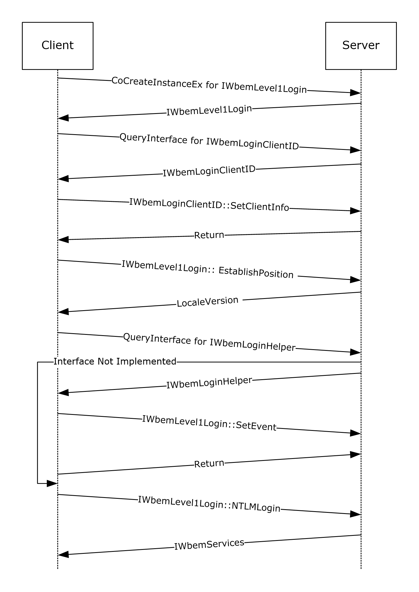

Figure 11: Protocol initialization example

### 4.1.1 Protocol Initialization Trace

This section contains information about the messages exchanged as part of the protocol initialization between SAI-NAV009 (client) and SAI-NAV009-2 (server). The specific trace is taken as part of IWbemServices::ExecQuery call. For brevity, only the relevant traces are shown here.

Client creates a DCOM request to obtain **IWbemLevel1Login** interface:

- DCOM: RemoteCreateInstance Request, DCOM Version=5.7 Causality Id={8E2416FE-0A3F-42BE-A9B0-F30624C94619}

+ HeaderReq: DCOM Version=5.7 Causality Id={8E2416FE-0A3F-42BE-A9B0-F30624C94619}

+ AggregationInterface:

+ ActivationProperties:

Server responds with [IWbemLevel1Login](#Section_3.1.4.1) [**interface pointer**](#gt_interface-pointer) to the client's request:

- DCOM: RemoteCreateInstance Response, ORPCFLOCAL - Local call to this computer

+ HeaderResp: ORPCFLOCAL - Local call to this computer

+ ActivationProperties:

Client performs the QueryInterface for [IWbemLoginClientID](#Section_3.1.4.8) interface from **IWbemLevel1Login** interface pointer:

- DCOM: IRemUnknown2:RemQueryInterface Request, DCOM Version=5.7 Causality Id={8E2416FE-0A3F-42BE-A9B0-F30624C94619}

+ HeaderReq: DCOM Version=5.7 Causality Id={8E2416FE-0A3F-42BE-A9B0-F30624C94619}

QueriedObjectIpId: {0001A407-06C4-0000-A6E3-C870B6019C76}

PublicObjectReferenceCount: 5 (0x5)

NumRequestedIIds: 1 (0x1)

+ Size: 1 Elements

+ InterfaceIds:

Server responds with IwbemLoginClientID interface pointer to the client:

- DCOM: IRemUnknown2:RemQueryInterface Response, ORPCFNULL - No additional information in this packet

+ HeaderResp: ORPCFNULL - No additional information in this packet

+ RemqiresultPtr: Pointer To 0x00020000

+ Size: 1 Elements

+ QueryInterfaceResults:

+ ReturnValue: Success

Client **callsSetClientInfo** method on IwbemLoginClientID interface pointer obtained from the server:

- WMI: IWbemLoginClientID:SetClientInfo Request, ClientMachine=SAI-NAV009 ClientProcId=6420 Reserved=0

+ ClientMachine: SAI-NAV009

+ Pad: 2 Bytes

ClientProcId: 6420 (0x1914)

Reserved: 0 (0x0)

Server responds with WBEM_S_NO_ERROR:

- WMI: IWbemLoginClientID:SetClientInfo Response, ReturnValue=WBEM_S_NO_ERROR

ReturnValue: 0x00000000 - WBEM_S_NO_ERROR - Indicates a successful completion to the method call.

Client calls **EstablishPosition** method on IWbemLevel1Login interface pointer to determine supported locales on the server:

- WMI: IWbemLevel1Login:EstablishPosition Request, Reserved1=NULL Reserved2=0

+ Reserved1: NULL

Pad: 0 Bytes

Reserved2: 0 (0x0)

Server responds with LocalVersion as 1. This means that the server ignores unrecognized locale names in the locale name format:

- WMI: IWbemLevel1Login:EstablishPosition Response, LocaleVersion=1 ReturnValue=WBEM_S_NO_ERROR

LocaleVersion: 1 (0x1)

ReturnValue: 0x00000000 - WBEM_S_NO_ERROR - Indicates a successful completion to the method call.

Client calls **NTLMLogin** method on IWbemLevel1Login interface pointer to obtain [IWbemServices](#Section_3.1.4.3.13) interface pointer for root\cimv2 namespace on sai-nav009-2 (server):

- WMI: IWbemLevel1Login:NTLMLogin Request, NetworkResource=\\sai-nav009-2\root\cimv2 PreferredLocale=en-US,en Flags=0

+ NetworkResource: \\sai-nav009-2\root\cimv2

+ PreferredLocale: en-US,en

+ pad: 2 Bytes

Flags: 0 (0x0)

+ Ctx: NULL

Server responds with IWbemServices interface pointer for **root\cimv2** namespace on **sai-nav009-2 (server)**. Client uses this interface pointer to make synchronous, asynchronous, and semisynchronous operations on the server:

- WMI: IWbemLevel1Login:NTLMLogin Response, ReturnValue=WBEM_S_NO_ERROR

+ Namespace: OBJREFSTANDARD - {9556DC99-828C-11CF-A37E-00AA003240C7}

+ pad: 2 Bytes

ReturnValue: 0x00000000 - WBEM_S_NO_ERROR - Indicates a successful completion to the method call.

### 4.1.2 Example Captures

None.

## 4.2 Synchronous Operations

A [**synchronous operation**](#gt_synchronous-operation) completes when the entire result set is ready on the server. The following sections describe the different scenarios where synchronous operations are applicable.

### 4.2.1 Synchronous Delivery of a Single Result

The [IWbemServices::GetObject](#Section_3.1.4.3.5) and [IWbemServices::ExecMethod](#Section_3.1.4.3.22) methods support synchronous calls returning a single marshaled [IWbemClassObject](#Section_2.2.4) [**interface pointer**](#gt_interface-pointer).

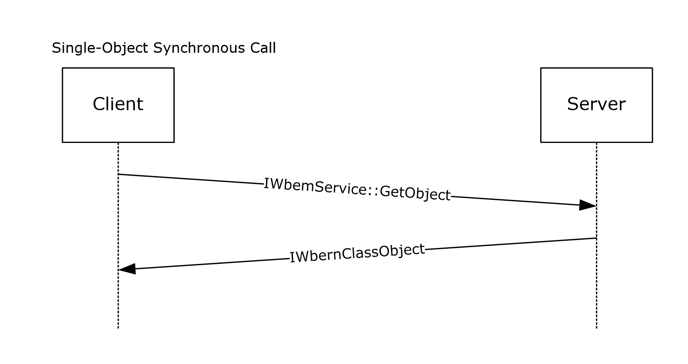

Figure 12: Synchronous delivery of a single result

### 4.2.2 Synchronous Delivery of Result Sets

In this context of operation, there are two kinds of client behavior and two kinds of server behavior, depending in the product version, resulting in four cases of client-server interaction.

The client behaviors are as follows:

- Unoptimized client behavior<83>
- Optimized client behavior<84>
The server behaviors are as follows:

- Unoptimized server behavior<85>
- Optimized server behavior<86>
The resulting client-server interactions are defined in the following sections:

- [Unoptimized Client and Unoptimized Server (section 4.2.2.1)](#Section_4.2.2.4)
- [Unoptimized Client and Optimized Server (section 4.2.2.2)](#Section_4.2.2.2)
- [Optimized Client and Optimized Server (section 4.2.2.3)](#Section_4.2.2.3)
- [Optimized Client and Unoptimized Server (section 4.2.2.4)](#Section_4.2.2.4)

#### 4.2.2.1 Unoptimized Client and Unoptimized Server

The product versions that exhibit unoptimized client behavior and unoptimized server behavior are referenced in section [4.2.2](#Section_1.3).

To make a [**synchronous operation**](#gt_synchronous-operation) from a client to a server, the client uses the [IWbemServices](#Section_3.1.4.3.13) [**interface pointer**](#gt_interface-pointer). The client calls the IWbemServices synchronous methods [IWbemServices::CreateInstanceEnum](#Section_3.1.4.3.17), [IWbemServices::CreateClassEnum](#Section_3.1.4.3.10), and [IWbemServices::ExecQuery](#Section_3.1.4.3.18). In response to the method executed, the server returns an [IEnumWbemClassObject](#Section_3.1.4.4) interface pointer. The client then uses the [IEnumWbemClassObject::Next](#Section_3.1.4.4.2) method to repeatedly retrieve the [IWbemClassObject](#Section_2.2.4) objects from the query result set.

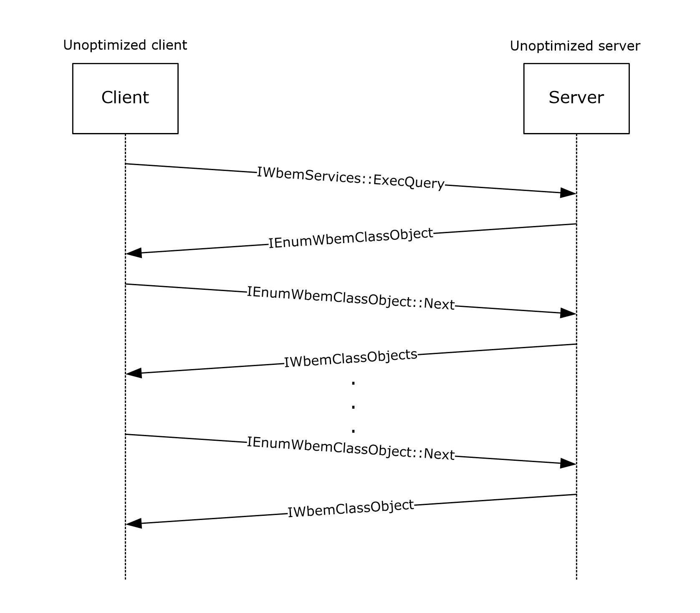

Figure 13: Unoptimized Client and Unoptimized Server

An example capture is given on [[SysDocCap-WMI]](https://go.microsoft.com/fwlink/?LinkId=207637) showing a Windows 2000 Server operating system connecting to a second Windows 2000 Server using wbemtest utility and enumerating the default namespace.

#### 4.2.2.2 Unoptimized Client and Optimized Server

The product versions that exhibit unoptimized client behavior and optimized server behavior are referenced in section [4.2.2](#Section_1.3).

To make a [**synchronous operation**](#gt_synchronous-operation) from a client to a server, the client uses the [IWbemServices](#Section_3.1.4.3.13) [**interface pointer**](#gt_interface-pointer). The client calls the IWbemServices synchronous methods [IWbemServices::CreateInstanceEnum](#Section_3.1.4.3.17), [IWbemServices::CreateClassEnum](#Section_3.1.4.3.10), and [IWbemServices::ExecQuery](#Section_3.1.4.3.18). In response to the method executed, the server returns an [IEnumWbemClassObject](#Section_3.1.4.4) interface pointer. The client then uses the [IEnumWbemClassObject::Next](#Section_3.1.4.4.2) method to repeatedly retrieve the [IWbemClassObject](#Section_2.2.4) objects from the query result set.

The call sequence is the same as that in section [4.2.2.1](#Section_4.2.2.4) because in both cases, the client is unoptimized, and therefore still uses the old mechanism for communication. Sections [4.2.2.3](#Section_4.2.2.3) and [4.2.2.4](#Section_4.2.2.4) explain the call sequences between the newer versions of client and server.

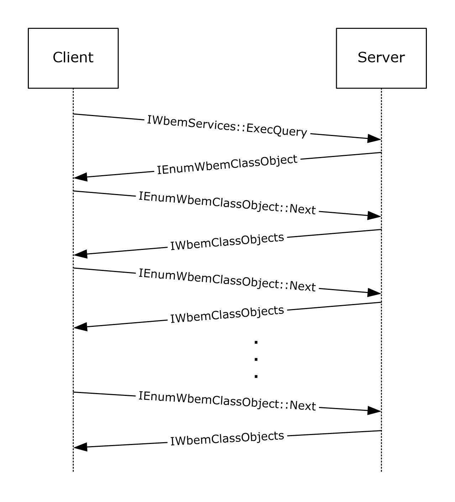

Figure 14: Unoptimized Client and Optimized Server

An example capture is given on [[SysDocCap-WMI]](https://go.microsoft.com/fwlink/?LinkId=207637) showing a Windows 2000 Server connecting to a Windows Server 2008 operating system using the wbemtest utility and enumerating the default namespace.

#### 4.2.2.3 Optimized Client and Optimized Server

The product versions that exhibit optimized client behavior and optimized server behavior are referenced in section [4.2.2](#Section_1.3).

To make a [**synchronous operation**](#gt_synchronous-operation) from a client to a server, the client uses the [IWbemServices](#Section_3.1.4.3.13) [**interface pointer**](#gt_interface-pointer). The client calls the IWbemServices synchronous methods [IWbemServices::CreateInstanceEnum](#Section_3.1.4.3.17), [IWbemServices::CreateClassEnum](#Section_3.1.4.3.10), and [IWbemServices::ExecQuery](#Section_3.1.4.3.18). In response to the method executed, the server returns an IEnumWbemClassObject interface pointer. The client uses IRemUnknown and IRemUnknown2, as specified in [MS-DCOM](../MS-DCOM/MS-DCOM.md), to obtain an [IWbemFetchSmartEnum](#Section_3.1.4.6) interface pointer from the IEnumWbemClassObject interface pointer. The client then calls the [IWbemFetchSmartEnum::GetSmartEnum](#Section_3.1.4.6.1) method to obtain the [IWbemWCOSmartEnum](#Section_3.1.4.7) interface pointer. The client uses the [IWbemWCOSmartEnum::Next](#Section_3.1.4.7.1) method repeatedly to retrieve the [IWbemClassObject](#Section_2.2.4) interface pointers that contains the result set. The results are encoded as an [ObjectArray](#Section_2.2.14) as specified in section 2.2.14.

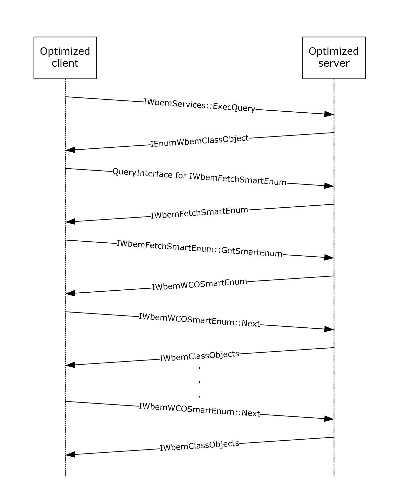

Figure 15: Optimized Client and Optimized Server

An example capture is given on [[SysDocCap-WMI]](https://go.microsoft.com/fwlink/?LinkId=207637) showing a Windows Vista operating system client connecting to Windows Server 2008 using the wbemtest utility and enumerating the default namespace.

#### 4.2.2.4 Optimized Client and Unoptimized Server

The product versions that exhibit optimized client behavior and unoptimized server behavior are referenced in section [4.2.2](#Section_1.3).

To make a [**synchronous operation**](#gt_synchronous-operation) from a client to a server, the client uses the [IWbemServices](#Section_3.1.4.3.13) [**interface pointer**](#gt_interface-pointer). The client calls the IWbemServices synchronous methods [IWbemServices::CreateInstanceEnum](#Section_3.1.4.3.17), [IWbemServices::CreateClassEnum](#Section_3.1.4.3.10), and [IWbemServices::ExecQuery](#Section_3.1.4.3.18). In response to the method executed, the server returns an IEnumWbemClassObject interface pointer. The client uses IRemUnknown and IRemUnknown2, as specified in [MS-DCOM](../MS-DCOM/MS-DCOM.md), to obtain an [IWbemFetchSmartEnum](#Section_3.1.4.6) interface pointer from IEnumWbemClassObject interface pointer. The operation fails because the server is not implementing the IWbemFetchSmartEnum interface. The client falls back to unoptimized client behavior.

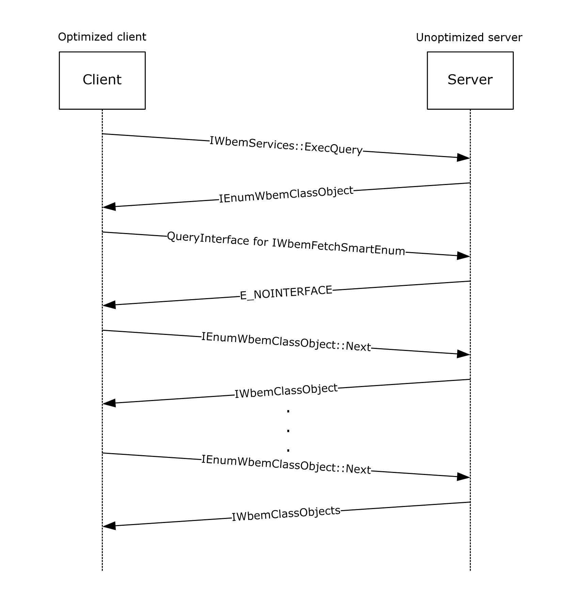

Figure 16: Optimized Client and Unoptimized Server

An example capture is given on [[SysDocCap-WMI]](https://go.microsoft.com/fwlink/?LinkId=207637) showing a Windows 7 operating system client connecting to a Windows 2000 Server using the wbemtest utility and enumerating the default namespace

### 4.2.3 Synchronous Delivery Traces

#### 4.2.3.1 Synchronous Delivery of IWbemServices ExecQuery and ExecMethod Operations

This section contains the information exchanged between SAI-NAV009 (client) and SAI-NAV009-2 (server).

First the client tries to connect to the server and obtains [IwbemServices](#Section_3.1.4.3.13) for namespace **root\cimv2** as outlined in [4.1.1](#Section_4.1.1).

Client calls ExecQuery method on IWbemServices [**interface pointer**](#gt_interface-pointer) with "select * from win32_process where Name='calc.exe'" as strQuery. It is assumed that an instance of calc.exe is running on the server:

- WMI: IWbemServices:ExecQuery Request, Flags=32

+ StrQueryLanguage: WQL

+ StrQuery: select * from win32_process where Name='calc.exe'

+ Pad: 2 Bytes

+ Flags: 32 (0x20)

+ Ctx: NULL

In response to the method executed above, the server returns an IEnumWbemClassObject interface pointer:

- WMI: IWbemServices:ExecQuery Response, ReturnValue=WBEM_S_NO_ERROR

+ Enum: OBJREFSTANDARD - {027947E1-D731-11CE-A357-000000000001}

+ Pad: 2 Bytes

ReturnValue: 0x00000000 - WBEM_S_NO_ERROR - Indicates a successful completion to the method call.

The client uses IRemUnknown and IRemUnknown2, as specified in [MS-DCOM](../MS-DCOM/MS-DCOM.md), to obtain an [IWbemFetchSmartEnum](#Section_3.1.4.6) interface pointer from the IEnumWbemClassObject interface pointer. From this the client knows whether the server is optimized:

- DCOM: IRemUnknown2:RemQueryInterface Request, DCOM Version=5.7 Causality Id={8E2416FE-0A3F-42BE-A9B0-F30624C94619}

+ HeaderReq: DCOM Version=5.7 Causality Id={8E2416FE-0A3F-42BE-A9B0-F30624C94619}

QueriedObjectIpId: {0002E41C-06C4-0000-1F17-07BCF2EEB3F8}

PublicObjectReferenceCount: 5 (0x5)

NumRequestedIIds: 1 (0x1)

+ Size: 1 Elements

+ InterfaceIds:

Server responds with a valid IWbemFetchSmartEnum interface pointer. This means that the server is optimized:

- DCOM: IRemUnknown2:RemQueryInterface Response, ORPCFNULL - No additional information in this packet

+ HeaderResp: ORPCFNULL - No additional information in this packet

+ RemqiresultPtr: Pointer To 0x00020000

+ Size: 1 Elements

+ QueryInterfaceResults:

+ ReturnValue: Success

The client then calls the [IWbemFetchSmartEnum::GetSmartEnum](#Section_3.1.4.6.1) method to obtain the [IWbemWCOSmartEnum](#Section_3.1.4.7) interface pointer:

WMI: IWbemFetchSmartEnum:GetSmartEnum Request

Server responds with a valid IWbemWCOSmartEnum interface pointer:

- WMI: IWbemFetchSmartEnum:GetSmartEnum Response, ReturnValue=WBEM_S_NO_ERROR

+ SmartEnum: OBJREFSTANDARD - {423EC01E-2E35-11D2-B604-00104B703EFD}

+ Pad: 2 Bytes

ReturnValue: 0x00000000 - WBEM_S_NO_ERROR - Indicates a successful completion to the method call.

The client uses the [IWbemWCOSmartEnum::Next](#Section_3.1.4.7.1) method repeatedly to retrieve the [IwbemClassObject](#Section_2.2.4) interface pointers that contains the result set:

- WMI: IWbemWCOSmartEnum:Next Request, Timeout=0 UCount=10

proxyGUID: {7F666EB6-FA61-48E8-8464-224C8E909D22}

Timeout: WBEM_NO_WAIT(Call returns immediately, regardless of whether any objects are available.)

UCount: 10 (0xA)

Server responds with the result set with one win32_process object for calc.exe instance running. The results are encoded as an ObjectArray as specified in section [2.2.14](#Section_2.2.14):

- WMI: IWbemWCOSmartEnum:Next Response, PuReturned=1 BuffSize=9101 ReturnValue=0x00000300 - Unknown Value

PuReturned: 1 (0x1)

BuffSize: 9101 (0x238D)

+ BufferPtrSize: Pointer To 0x00020000, 9101 Elements

+ ObjectArray:

+ Pad: 2 Bytes

ReturnValue: 0x00000300 - Unknown Value

+ msrpc: c/o Continued Response: IWbemWCOSmartEnum(WMIRP) {423EC01E-2E35-11D2-B604-00104B703EFD} Call=0xA Context=0x6 Hint=0xD1C Cancels=0x0 InstanceQuarlifier error: Unknown QualifierType

Client obtains __RELPATH property from IwbemClassObject as \\SAI-NAV009-2\root\cimv2:Win32_Process.Handle="724".

Client makes ExecMethod operation on IWbemServices interface pointer to call terminate() method on win32_process object corresponding to calc.exe instance obtained above. This action terminates the process calc.exe on the server:

- WMI: IWbemServices:ExecMethod Request, Flags=0

+ StrObjectPath: \\SAI-NAV009-2\root\cimv2:Win32_Process.Handle="724"

+ StrMethodName: Terminate

+ Pad: 2 Bytes

Flags: Unknown

+ Ctx: NULL

+ InParams: OBJREFCUSTOM - {DC12A681-737F-11CF-884D-00AA004B2E24}

+ OutParams: NULL

+ CallResult: NULL

Server responds with ResultValue as WBEM_S_NO_ERROR. This means that Terminate method was successfully executed on Win32_Process object:

- WMI: IWbemServices:ExecMethod Response, ReturnValue=WBEM_S_NO_ERROR

+ OutParams: OBJREFCUSTOM - {DC12A681-737F-11CF-884D-00AA004B2E24}

+ CallResult: NULL

Pad: 0 Bytes

ReturnValue: 0x00000000 - WBEM_S_NO_ERROR - Indicates a successful completion to the method call.)

To confirm that calc.exe instance is indeed terminated on the server, client makes the same ExecQuery operation on IWbemServices interface pointer obtained from the server:

+ DCOM: WMI protocol Request, DCOM Version=5.7 Causality Id={8E2416FE-0A3F-42BE-A9B0-F30624C94619}

- WMI: IWbemServices:ExecQuery Request, Flags=32

+ StrQueryLanguage: WQL

+ StrQuery: select * from win32_process where Name='calc.exe'

+ Pad: 2 Bytes

+ Flags: 32 (0x20)

+ Ctx: NULL

In response to the method executed above, the server returns an IEnumWbemClassObject interface pointer:

- WMI: IWbemServices:ExecQuery Response, ReturnValue=WBEM_S_NO_ERROR

+ Enum: OBJREFSTANDARD - {027947E1-D731-11CE-A357-000000000001}

+ Pad: 2 Bytes

ReturnValue: 0x00000000 - WBEM_S_NO_ERROR - Indicates a successful completion to the method call.

The client uses IRemUnknown and IRemUnknown2, as specified in [MS-DCOM], to obtain an IWbemFetchSmartEnum interface pointer from the IEnumWbemClassObject interface pointer. From this the client knows whether the server is optimized:

- DCOM: IRemUnknown2:RemQueryInterface Request, DCOM Version=5.7 Causality Id={8E2416FE-0A3F-42BE-A9B0-F30624C94619}

+ HeaderReq: DCOM Version=5.7 Causality Id={8E2416FE-0A3F-42BE-A9B0-F30624C94619}

QueriedObjectIpId: {0001F82E-06C4-0000-829F-784637EF2774}

PublicObjectReferenceCount: 5 (0x5)

NumRequestedIIds: 1 (0x1)

+ Size: 1 Elements

+ InterfaceIds:

Server responds with a valid IWbemFetchSmartEnum interface pointer. This means that the server is optimized:

- DCOM: IRemUnknown2:RemQueryInterface Response, ORPCFNULL - No additional information in this packet

+ HeaderResp: ORPCFNULL - No additional information in this packet

+ RemqiresultPtr: Pointer To 0x00020000

+ Size: 1 Elements

+ QueryInterfaceResults:

+ ReturnValue: Success

The client then calls the IWbemFetchSmartEnum::GetSmartEnum method to obtain the IWbemWCOSmartEnum interface pointer:

WMI: IWbemFetchSmartEnum:GetSmartEnum Request

Server responds with a valid IWbemWCOSmartEnum interface pointer:

- WMI: IWbemFetchSmartEnum:GetSmartEnum Response, ReturnValue=WBEM_S_NO_ERROR

+ SmartEnum: OBJREFSTANDARD - {423EC01E-2E35-11D2-B604-00104B703EFD}

+ Pad: 2 Bytes

ReturnValue: 0x00000000 - WBEM_S_NO_ERROR - Indicates a successful completion to the method call.

The client uses the IWbemWCOSmartEnum::Next method repeatedly to retrieve the IwbemClassObject interface pointers that contain the result set:

- WMI: IWbemWCOSmartEnum:Next Request, Timeout=0 UCount=10

proxyGUID: {09EFDDA0-3E1E-40E2-B87A-F73895BEAACA}

Timeout: WBEM_NO_WAIT(Call returns immediately, regardless of whether any objects are available.)

UCount: 10 (0xA)

Server responds with the result set this time with no calc.exe instances. This proves that the terminate method was called on win32_process object, and has terminated calc.exe instance on the server:

- WMI: IWbemWCOSmartEnum:Next Response, PuReturned=0 BuffSize=0 ReturnValue=WBEM_S_FALSE

PuReturned: 0 (0x0)

BuffSize: 0 (0x0)

+ BufferPtrSize: Pointer To NULL

Pad: 0 Bytes

ReturnValue: 0x00000001 - WBEM_S_FALSE - Either no more CIM objects are available, the number of returned CIM objects is less than the number requested, or this is the end of an enumeration.

#### 4.2.3.2 Synchronous Delivery of IWbemServices PutInstance, DeleteInstance, and CreateInstanceEnum Operations

This section contains the information exchanged between SAI-NAV009 (client) and SAI-NAV009-2 (server).

On the server machine, the MOF shown below is compiled and made available to WMI.

#pragma namespace("\\\\.\\root\\cimv2\\MyTest")

Class TestWMI

{

[key] uint32 x;

uint32 y;

};

First the client tries to connect to the server and obtains IWbemServices interface pointer for namespace root\cimv2\MyTest as outlined in [4.1.1](#Section_4.1.1). There is initially an instance of a TestWMI Class created on the server with (x=3,y=5).

Client calls PutInstance operation on IWbemServices interface pointer to create another instance of TestWMI class on the server. The instance property values are x=10, y=15:

- WMI: IWbemServices:PutInstance Request, Flags=0

+ Inst: OBJREFCUSTOM - {DC12A681-737F-11CF-884D-00AA004B2E24}

Pad: 0 Bytes

+ Flags: 0 (0x0)

+ Ctx: NULL

+ CallResult: NULL

Server returns WBEM_S_NO_ERROR. This implies that the instance above was successfully created on the server:

- WMI: IWbemServices:PutInstance Response, ReturnValue=WBEM_S_NO_ERROR

+ CallResult: NULL

Pad: 0 Bytes

ReturnValue: 0x00000000 - WBEM_S_NO_ERROR - Indicates a successful completion to the method call.

Client calls CreateInstanceEnum operation on IWbemServices interface pointer:

- WMI: IWbemServices:CreateInstanceEnum Request, Flags=33

+ StrFilter: TestWMI

+ Pad: 2 Bytes

+ Flags: 33 (0x21)

+ Ctx: NULL

In response to the method executed above, the server returns an IEnumWbemClassObject interface pointer:

- WMI: IWbemServices:CreateInstanceEnum Response, ReturnValue=WBEM_S_NO_ERROR

+ Enum: OBJREFSTANDARD - {027947E1-D731-11CE-A357-000000000001}

+ Pad: 2 Bytes

ReturnValue: 0x00000000 - WBEM_S_NO_ERROR - Indicates a successful completion to the method call.

The client uses IRemUnknown and IRemUnknown2, as specified in [MS-DCOM](../MS-DCOM/MS-DCOM.md), to obtain an IWbemFetchSmartEnum interface pointer from the IEnumWbemClassObject interface pointer. From this the client would know if the server is optimized:

- DCOM: IRemUnknown2:RemQueryInterface Request, DCOM Version=5.7 Causality Id={BD28B839-5D20-4435-9852-1FE794070A9C}

+ HeaderReq: DCOM Version=5.7 Causality Id={BD28B839-5D20-4435-9852-1FE794070A9C}

QueriedObjectIpId: {00026021-06C4-0000-9260-C0BCD4C240B3}

PublicObjectReferenceCount: 5 (0x5)

NumRequestedIIds: 1 (0x1)

+ Size: 1 Elements

+ InterfaceIds:

Server responds with a valid IWbemFetchSmartEnum interface pointer. This means that the server is optimized:

- DCOM: IRemUnknown2:RemQueryInterface Response, ORPCFNULL - No additional information in this packet

+ HeaderResp: ORPCFNULL - No additional information in this packet

+ RemqiresultPtr: Pointer To 0x00020000

+ Size: 1 Elements

+ QueryInterfaceResults:

+ ReturnValue: Success

The client then calls the IWbemFetchSmartEnum::GetSmartEnum method to obtain the IWbemWCOSmartEnum interface pointer:

WMI: IWbemFetchSmartEnum:GetSmartEnum Request

Server responds with a valid IWbemWCOSmartEnum interface pointer:

- WMI: IWbemFetchSmartEnum:GetSmartEnum Response, ReturnValue=WBEM_S_NO_ERROR

+ SmartEnum: OBJREFSTANDARD - {423EC01E-2E35-11D2-B604-00104B703EFD}

+ Pad: 2 Bytes

ReturnValue: 0x00000000 - WBEM_S_NO_ERROR - Indicates a successful completion to the method call.

The client uses the IWbemWCOSmartEnum::Next method repeatedly to retrieve the IWbemClassObject interface pointers that contains the result set:

- WMI: IWbemWCOSmartEnum:Next Request, Timeout=0 UCount=10

proxyGUID: {DCFE7B7E-853F-494D-9EAD-FB96164158C1}

Timeout: WBEM_NO_WAIT(Call returns immediately, regardless of whether any objects are available.)

UCount: 10 (0xA)

Server responds with the result set containing 2 TestWMI instances. The instance property values are (x=3,y=5) and (x=10,y=15):

- WMI: IWbemWCOSmartEnum:Next Response, PuReturned=2 BuffSize=410 ReturnValue=WBEM_S_FALSE

PuReturned: 2 (0x2)

BuffSize: 410 (0x19A)

+ BufferPtrSize: Pointer To 0x00020000, 410 Elements

+ ObjectArray:

+ Pad: 2 Bytes

Client calls PutInstance operation on IWbemServices interface pointer on one of the TestWMI class instances (x=10, y=15) to update it to (x=10, y=20):

- WMI: IWbemServices:PutInstance Request, Flags=0

+ Inst: OBJREFCUSTOM - {DC12A681-737F-11CF-884D-00AA004B2E24}

Pad: 0 Bytes

+ Flags: 0 (0x0)

+ Ctx: NULL

+ CallResult: NULL

Server returns WBEM_S_NO_ERROR. This implies that the instance update above was successful on the server:

- WMI: IWbemServices:PutInstance Response, ReturnValue=WBEM_S_NO_ERROR

+ CallResult: NULL

Pad: 0 Bytes

ReturnValue: 0x00000000 - WBEM_S_NO_ERROR - Indicates a successful completion to the method call.

Client calls DeleteInstance operation on IWbemServices interface pointer by providing the strObjectPath as \\SAI-NAV009-2\ROOT\cimv2\MyTest:TestWMI.x=10):

- WMI: IWbemServices:DeleteInstance Request, Flags=0

+ StrObjectPath: \\SAI-NAV009-2\ROOT\cimv2\MyTest:TestWMI.x=10

+ Pad: 2 Bytes

Flags: Unknown

+ Ctx: NULL

+ CallResult: NULL

Server responds with success. This implies that TestWMI instance with key value as x=10 has been successfully deleted from the server:

- WMI: IWbemServices:DeleteInstance Response, ReturnValue=WBEM_S_NO_ERROR

+ CallResult: NULL

Pad: 0 Bytes

ReturnValue: 0x00000000 - WBEM_S_NO_ERROR - Indicates a successful completion to the method call.

Client calls CreateInstanceEnum operation on IWbemServices interface pointer to find out the existing TestWMI instances on the server:

- WMI: IWbemServices:CreateInstanceEnum Request, Flags=33

+ StrFilter: TestWMI

+ Pad: 2 Bytes

+ Flags: 33 (0x21)

+ Ctx: NULL

In response to the method executed above, the server returns an IEnumWbemClassObject interface pointer:

- WMI: IWbemServices:CreateInstanceEnum Response, ReturnValue=WBEM_S_NO_ERROR

+ Enum: OBJREFSTANDARD - {027947E1-D731-11CE-A357-000000000001}

+ Pad: 2 Bytes

ReturnValue: 0x00000000 - WBEM_S_NO_ERROR - Indicates a successful completion to the method call.

The client uses IRemUnknown and IRemUnknown2, as specified in [MS-DCOM], to obtain an IWbemFetchSmartEnum interface pointer from the IEnumWbemClassObject interface pointer. From this the client knows whether the server is optimized:

- DCOM: IRemUnknown2:RemQueryInterface Request, DCOM Version=5.7 Causality Id={BD28B839-5D20-4435-9852-1FE794070A9C}

+ HeaderReq: DCOM Version=5.7 Causality Id={BD28B839-5D20-4435-9852-1FE794070A9C}

QueriedObjectIpId: {00004007-06C4-0000-99C1-96EC7361199B}

PublicObjectReferenceCount: 5 (0x5)

NumRequestedIIds: 1 (0x1)

+ Size: 1 Elements

+ InterfaceIds:

Server responds with a valid IWbemFetchSmartEnum interface pointer. This means that the server is optimized:

- DCOM: IRemUnknown2:RemQueryInterface Response, ORPCFNULL - No additional information in this packet

+ HeaderResp: ORPCFNULL - No additional information in this packet

+ RemqiresultPtr: Pointer To 0x00020000

+ Size: 1 Elements

+ QueryInterfaceResults:

+ ReturnValue: Success

The client then calls the IWbemFetchSmartEnum::GetSmartEnum method to obtain the IWbemWCOSmartEnum interface pointer:

WMI: IWbemFetchSmartEnum:GetSmartEnum Request

Server responds with a valid IWbemWCOSmartEnum interface pointer:

- WMI: IWbemFetchSmartEnum:GetSmartEnum Response, ReturnValue=WBEM_S_NO_ERROR

+ SmartEnum: OBJREFSTANDARD - {423EC01E-2E35-11D2-B604-00104B703EFD}

+ Pad: 2 Bytes

ReturnValue: 0x00000000 - WBEM_S_NO_ERROR - Indicates a successful completion to the method call.

The client uses the IWbemWCOSmartEnum::Next method repeatedly to retrieve the IWbemClassObject interface pointers that contain the result set:

- WMI: IWbemWCOSmartEnum:Next Request, Timeout=0 UCount=10

proxyGUID: {45CE1C5B-9841-4D4E-964D-BD5E03695B47}

Timeout: WBEM_NO_WAIT(Call returns immediately, regardless of whether any objects are available.)

Server responds with the result set containing 1 TestWMI instance (x=3,y=5). This confirms that the other instance with x=10 has been successfully deleted as part of DeleteInstance call.

- WMI: IWbemWCOSmartEnum:Next Response, PuReturned=1 BuffSize=307 ReturnValue=WBEM_S_FALSE

PuReturned: 1 (0x1)

BuffSize: 307 (0x133)

+ BufferPtrSize: Pointer To 0x00020000, 307 Elements

+ ObjectArray:

+ Pad: 1 Bytes

ReturnValue: 0x00000001 - WBEM_S_FALSE - Either no more CIM objects are available, the number of returned CIM objects is less than the number requested, or this is the end of an enumeration.

## 4.3 Semisynchronous Operations

In semisynchronous cases, the call returns before the requested operation completes, and another interface is used to retrieve the operation results. The returned interface depends on the [IWbemServices](#Section_3.1.4.3.13) methods that are invoked by the client. The following sections describe the two different behaviors.

### 4.3.1 Semisynchronous Delivery of a Single Result

The methods returning a single element such as [IWbemServices::OpenNamespace](#Section_3.1.4.3.1), [IWbemServices::GetObject](#Section_3.1.4.3.5), [IWbemServices::PutClass](#Section_3.1.4.3.7), [IWbemServices::DeleteClass](#Section_3.1.4.3.9), [IWbemServices::PutInstance](#Section_3.1.4.3.13), [IWbemServices::DeleteInstance](#Section_3.1.4.3.15), or [IWbemServices::ExecMethod](#Section_3.1.4.3.22) return an [IWbemCallResult](#Section_3.1.4.5) [**interface pointer**](#gt_interface-pointer). To obtain the operation results, the client uses the IWbemCallResult methods.

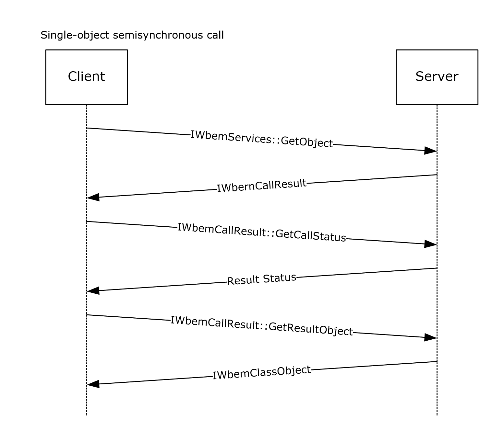

Figure 17: Semisynchronous delivery of a single result

### 4.3.2 Semisynchronous Delivery of Result Sets

The [**semisynchronous operation**](#gt_semisynchronous-operation) uses the same sequence as the synchronous calls, as specified in section [4.2.2](#Section_1.3), to request a result set. However, in semisynchronous cases, the [IEnumWbemClassObject](#Section_3.1.4.4) [**interface pointer**](#gt_interface-pointer) is returned before the result set is available on the server. This is different from the synchronous case, in which the interface pointer is returned only after the result set is available on the server. The IEnumWbemClassObject interface pointer is returned before the result set is available on the server. When the client calls the [IEnumWbemClassObject::Next](#Section_3.1.4.4.2) method, it specifies a time-out within which the server returns the requested results. When one of the previous conditions is satisfied, the call completes.

### 4.3.3 Semisynchronous Delivery Traces

#### 4.3.3.1 Semisynchronous Delivery of IWbemServices ExecQuery and ExecMethod Operations

This section contains the information exchanged between SAI-NAV009 (client) and SAI-NAV009-2 (server).

First the client tries to connect to the server and obtains [IWbemServices](#Section_3.1.4.3.13) for namespace root\cimv2 as outlined in [4.1.1](#Section_4.1.1).

The client calls ExecQuery method on IwbemServices [**interface pointer**](#gt_interface-pointer) with "select * from win32_process where Name='calc.exe'" as strQuery. It is assumed that an instance of calc.exe is running on the server:

- WMI: IWbemServices:ExecQuery Request, Flags=48

+ StrQueryLanguage: WQL

+ StrQuery: select * from win32_process where Name='calc.exe'

+ Pad: 2 Bytes

+ Flags: 48 (0x30)

+ Ctx: NULL

In response to the method executed above, the server returns an [IenumWbemClassObject](#Section_3.1.4.4) interface pointer:

- WMI: IWbemServices:ExecQuery Response, ReturnValue=WBEM_S_NO_ERROR

+ Enum: OBJREFSTANDARD - {027947E1-D731-11CE-A357-000000000001}

+ Pad: 2 Bytes

ReturnValue: 0x00000000 - WBEM_S_NO_ERROR - Indicates a successful completion to the method call.

The client uses IRemUnknown and IRemUnknown2, as specified in [MS-DCOM](../MS-DCOM/MS-DCOM.md), to obtain an [IWbemFetchSmartEnum](#Section_3.1.4.6) interface pointer from the IEnumWbemClassObject interface pointer. From this the client would know if the server is optimized:

- DCOM: IRemUnknown2:RemQueryInterface Request, DCOM Version=5.7 Causality Id={EF414E15-6ACF-408A-BB6E-ECB20DA968D8}

+ HeaderReq: DCOM Version=5.7 Causality Id={EF414E15-6ACF-408A-BB6E-ECB20DA968D8}

QueriedObjectIpId: {0001B004-06C4-0000-712F-83B56A62FA75}

PublicObjectReferenceCount: 5 (0x5)

NumRequestedIIds: 1 (0x1)

+ Size: 1 Elements

+ InterfaceIds:

The server responds with a valid IWbemFetchSmartEnum interface pointer. This means that the server is optimized:

- DCOM: IRemUnknown2:RemQueryInterface Response, ORPCFNULL - No additional information in this packet

+ HeaderResp: ORPCFNULL - No additional information in this packet

+ RemqiresultPtr: Pointer To 0x00020000

+ Size: 1 Elements

+ QueryInterfaceResults:

+ ReturnValue: Success

The client then calls the [IWbemFetchSmartEnum::GetSmartEnum](#Section_3.1.4.6.1) method to obtain the IWbemFetchSmartEnum interface pointer:

WMI: IWbemFetchSmartEnum:GetSmartEnum Request

The server responds with a valid [IWbemWCOSmartEnum](#Section_3.1.4.7) interface pointer:

- WMI: IWbemFetchSmartEnum:GetSmartEnum Response, ReturnValue=WBEM_S_NO_ERROR

+ SmartEnum: OBJREFSTANDARD - {423EC01E-2E35-11D2-B604-00104B703EFD}

+ Pad: 2 Bytes

ReturnValue: 0x00000000 - WBEM_S_NO_ERROR - Indicates a successful completion to the method call.

The client uses the [IWbemWCOSmartEnum::Next](#Section_3.1.4.7.1) method repeatedly to retrieve the [IwbemClassObject](#Section_2.2.4) interface pointers that contain the result set:

- WMI: IWbemWCOSmartEnum:Next Request, Timeout=5000 UCount=10

proxyGUID: {90B8134C-F980-415C-92E3-511819BC3BC5}

Timeout: 5000 ms(0x1388)

UCount: 10 (0xA)

The server responds with the result set with one win32_process object for calc.exe instance running. The results are encoded as an ObjectArray as specified in section [2.2.14](#Section_2.2.14):

- WMI: IWbemWCOSmartEnum:Next Response, PuReturned=1 BuffSize=9104 ReturnValue=0x00000300 - Unknown Value

PuReturned: 1 (0x1)

BuffSize: 9104 (0x2390)

+ BufferPtrSize: Pointer To 0x00020000, 9104 Elements

+ ObjectArray:

+ Pad: 2 Bytes

ReturnValue: 0x00000300 - Unknown Value

+ msrpc: c/o Continued Response: IWbemWCOSmartEnum(WMIRP) {423EC01E-2E35-11D2-B604-00104B703EFD} Call=0xA Context=0x6 Hint=0xD1C Cancels=0x0 InstanceQuarlifier error: Unknown QualifierType

The client obtains __RELPATH property from IwbemClassObject as \\SAI-NAV009-2\root\cimv2:Win32_Process.Handle="2680".

The client makes ExecMethod operation on IWbemServices interface pointer to call terminate() method on Win32_Process object corresponding to calc.exe instance obtained above. [This action terminates the process calc.exe on the server]:

- WMI: IWbemServices:ExecMethod Request, Flags=16

+ StrObjectPath: \\SAI-NAV009-2\root\cimv2:Win32_Process.Handle="2680"

+ StrMethodName: Terminate

+ Pad: 2 Bytes

Flags: WBEM_FLAG_RETURN_IMMEDIATELY - If this bit is not set, the server MUST make the method call synchronously. If this bit is set, the server MUST make the method call semisynchronously.

+ Ctx: NULL

+ InParams: OBJREFCUSTOM - {DC12A681-737F-11CF-884D-00AA004B2E24}

+ OutParams: NULL

+ CallResult: NULL

The server responds with a valid [IWbemCallResult](#Section_3.1.4.5) interface pointer corresponding to the ExecMethod operation above:

- WMI: IWbemServices:ExecMethod Response, ReturnValue=WBEM_S_NO_ERROR

+ OutParams: NULL

+ CallResult: OBJREFSTANDARD - {44ACA675-E8FC-11D0-A07C-00C04FB68820}

+ Pad: 2 Bytes

ReturnValue: 0x00000000 - WBEM_S_NO_ERROR - Indicates a successful completion to the method call.

The client calls GetCallStatus on IWbemCallResult interface pointer to obtain the status of the ExecMethod operation above:

- WMI: IWbemCallResult:GetCallStatus Request, Timeout=5000

Timeout: 5000 ms(0x1388)

The server responds with ReturnValue WBEM_S_NO_ERROR, and the Status as S_OK. This implies that the ExecMethod operation above was successfully executed on the server:

- WMI: IWbemCallResult:GetCallStatus Response, Status=0 ReturnValue=WBEM_S_NO_ERROR

Status: 0 (0x0)

ReturnValue: 0x00000000 - WBEM_S_NO_ERROR - Indicates a successful completion to the method call.

The client calls GetResultObject method on IWbemCallResult interface pointer to get the result object:

- WMI: IWbemCallResult:GetCallStatus Response, Status=0 ReturnValue=WBEM_S_NO_ERROR

Status: 0 (0x0)

ReturnValue: 0x00000000 - WBEM_S_NO_ERROR - Indicates a successful completion to the method call.

The server responds with WBEM_S_NO_ERROR, and an instance of IwbemClassObject that contains the return value from Terminate method above:

- WMI: IWbemCallResult:GetResultObject Response, ReturnValue=WBEM_S_NO_ERROR

+ ResultObject: OBJREFCUSTOM - {DC12A681-737F-11CF-884D-00AA004B2E24}

+ pad: 3 Bytes

ReturnValue: 0x00000000 - WBEM_S_NO_ERROR - Indicates a successful completion to the method call.

To confirm that calc.exe instance is indeed terminated, the client calls ExecQuery method on IWbemServices interface pointer with "select * from win32_process where Name='calc.exe'" as strQuery:

- WMI: IWbemServices:ExecQuery Request, Flags=48

+ StrQueryLanguage: WQL

+ StrQuery: select * from win32_process where Name='calc.exe'

+ Pad: 2 Bytes

+ Flags: 48 (0x30)

+ Ctx: NULL

In response to the method executed above, the server returns an IEnumWbemClassObject interface pointer:

- WMI: IWbemServices:ExecQuery Response, ReturnValue=WBEM_S_NO_ERROR

+ Enum: OBJREFSTANDARD - {027947E1-D731-11CE-A357-000000000001}

+ Pad: 2 Bytes

ReturnValue: 0x00000000 - WBEM_S_NO_ERROR - Indicates a successful completion to the method call.

The client uses IRemUnknown and IRemUnknown2, as specified in [MS-DCOM], to obtain an IWbemFetchSmartEnum interface pointer from the IEnumWbemClassObject interface pointer. From this the client knows whether the server is optimized:

- DCOM: IRemUnknown2:RemQueryInterface Request, DCOM Version=5.7 Causality Id={EF414E15-6ACF-408A-BB6E-ECB20DA968D8}

+ HeaderReq: DCOM Version=5.7 Causality Id={EF414E15-6ACF-408A-BB6E-ECB20DA968D8}

QueriedObjectIpId: {0001942E-06C4-0000-E48B-1633B50E272E}

PublicObjectReferenceCount: 5 (0x5)

NumRequestedIIds: 1 (0x1)

+ Size: 1 Elements

+ InterfaceIds:

The server responds with a valid IWbemFetchSmartEnum interface pointer. This means that the server is optimized:

- DCOM: IRemUnknown2:RemQueryInterface Response, ORPCFNULL - No additional information in this packet

+ HeaderResp: ORPCFNULL - No additional information in this packet

+ RemqiresultPtr: Pointer To 0x00020000

+ Size: 1 Elements

+ QueryInterfaceResults:

+ ReturnValue: Success

The client then calls the IWbemFetchSmartEnum::GetSmartEnum method to obtain the IWbemWCOSmartEnum interface pointer:

WMI: IWbemFetchSmartEnum:GetSmartEnum Request

The server responds with a valid IWbemWCOSmartEnum interface pointer:

- WMI: IWbemFetchSmartEnum:GetSmartEnum Response, ReturnValue=WBEM_S_NO_ERROR

+ SmartEnum: OBJREFSTANDARD - {423EC01E-2E35-11D2-B604-00104B703EFD}

+ Pad: 2 Bytes

ReturnValue: 0x00000000 - WBEM_S_NO_ERROR - Indicates a successful completion to the method call.

The client uses the IWbemWCOSmartEnum::Next method repeatedly to retrieve the IwbemClassObject interface pointers that contain the result set:

- WMI: IWbemWCOSmartEnum:Next Request, Timeout=5000 UCount=10

proxyGUID: {4382C990-EC38-4C41-8A88-A1B14E7DE10B}

Timeout: 5000 ms(0x1388)

UCount: 10 (0xA)

The server responds with the result set this time with no calc.exe instances. (This proves that the terminate method was called and has terminated calc.exe process on the server):

- WMI: IWbemWCOSmartEnum:Next Response, PuReturned=0 BuffSize=0 ReturnValue=WBEM_S_FALSE

PuReturned: 0 (0x0)

BuffSize: 0 (0x0)

+ BufferPtrSize: Pointer To NULL

Pad: 0 Bytes

ReturnValue: 0x00000001 - WBEM_S_FALSE - Either no more CIM objects are available, the number of returned CIM objects is less than the number requested, or this is the end of an enumeration.

#### 4.3.3.2 Semisynchronous Delivery of IWbemServices PutInstance, DeleteInstance, and CreateInstanceEnum Operations

This section contains the information exchanged between SAI-NAV009 (client) and SAI-NAV009-2 (server). The MOF shown below is compiled on the server machine and is made available to WMI.

#pragma namespace("\\\\.\\root\\cimv2\\MyTest")

Class TestWMI

{

[key] uint32 x;

uint32 y;

};

There is initially an instance of TestWMI object created (x=3,y=5).

First the client tries to connect to the server and obtains [IWbemServices](#Section_3.1.4.3.13) [**interface pointer**](#gt_interface-pointer) for namespace **root\cimv2\MyTest** as outlined in [4.1.1](#Section_4.1.1).

Client calls PutInstance operation on IWbemServices interface pointer to create another instance of TestWMI class on the server. The instance property values are x=10, y=15:

- WMI: IWbemWCOSmartEnum:Next Response, PuReturned=0 BuffSize=0 ReturnValue=WBEM_S_FALSE

PuReturned: 0 (0x0)

BuffSize: 0 (0x0)

+ BufferPtrSize: Pointer To NULL

Pad: 0 Bytes

ReturnValue: 0x00000001 - WBEM_S_FALSE - Either no more CIM objects are available, the number of returned CIM objects is less than the number requested, or this is the end of an enumeration.

Server responds with a valid [IWbemCallResult](#Section_3.1.4.5) interface pointer corresponding to the PutInstance operation above:

- WMI: IWbemServices:PutInstance Response, ReturnValue=WBEM_S_NO_ERROR

+ CallResult: OBJREFSTANDARD - {44ACA675-E8FC-11D0-A07C-00C04FB68820}

+ Pad: 2 Bytes

ReturnValue: 0x00000000 - WBEM_S_NO_ERROR - Indicates a successful completion to the method call.

Client calls GetCallStatus on IWbemCallResult interface pointer to obtain the status of PutInstance operation above:

- WMI: IWbemCallResult:GetCallStatus Request, Timeout=5000

Timeout: 5000 ms(0x1388)

Server responds with ReturnValue WBEM_S_NO_ERROR, and the Status as S_OK. This implies that the PutInstance operation above was successfully executed on the server:

- WMI: IWbemCallResult:GetCallStatus Response, Status=0 ReturnValue=WBEM_S_NO_ERROR

Status: 0 (0x0)

ReturnValue: 0x00000000 - WBEM_S_NO_ERROR - Indicates a successful completion to the method call.

Client calls **GetResultObject** method on IWbemCallResult interface pointer to get the result object:

- DCOM: IRemUnknown2:RemRelease Request, DCOM Version=5.7 Causality Id={84EE6C91-3DF6-4B65-95F1-71E440FE05B7}

+ HeaderReq: DCOM Version=5.7 Causality Id={84EE6C91-3DF6-4B65-95F1-71E440FE05B7}

ObjectReferenceCount: 1 (0x1)

+ Size: 1 Elements

+ InterfaceReferences:

Server responds with WBEM_S_NO_ERROR, and an instance of IWbemClassObject that contains the return value from Client's PutInstance operation above:

- DCOM: IRemUnknown2:RemRelease Response, ORPCFNULL - No additional information in this packet

+ HeaderResp: ORPCFNULL - No additional information in this packet

+ ReturnValue: Success

Client calls CreateInstanceEnum operation on IWbemServices interface pointer:

- WMI: IWbemServices:CreateInstanceEnum Request, Flags=49

+ StrFilter: tESTWMI

+ Pad: 2 Bytes

+ Flags: 49 (0x31)

+ Ctx: NULL

In response to the method executed above, the server returns an IEnumWbemClassObject interface pointer:

- WMI: IWbemServices:CreateInstanceEnum Response, ReturnValue=WBEM_S_NO_ERROR

+ Enum: OBJREFSTANDARD - {027947E1-D731-11CE-A357-000000000001}

+ Pad: 2 Bytes

ReturnValue: 0x00000000 - WBEM_S_NO_ERROR - Indicates a successful completion to the method call.

The client uses IEnumWbemClassObject interface pointer, as specified in [MS-DCOM](../MS-DCOM/MS-DCOM.md), to obtain an IWbemFetchSmartEnum interface pointer from the IEnumWbemClassObject interface pointer. From this the client knows that the server is optimized:

- DCOM: IRemUnknown2:RemQueryInterface Request, DCOM Version=5.7 Causality Id={84EE6C91-3DF6-4B65-95F1-71E440FE05B7}

+ HeaderReq: DCOM Version=5.7 Causality Id={84EE6C91-3DF6-4B65-95F1-71E440FE05B7}

QueriedObjectIpId: {0003C027-06EC-0000-6584-686A50EA42DD}

PublicObjectReferenceCount: 5 (0x5)

NumRequestedIIds: 1 (0x1)

+ Size: 1 Elements

+ InterfaceIds:

Server responds with a valid IWbemFetchSmartEnum interface pointer. This means that the server is optimized:

- DCOM: IRemUnknown2:RemQueryInterface Response, ORPCFNULL - No additional information in this packet

+ HeaderResp: ORPCFNULL - No additional information in this packet

+ RemqiresultPtr: Pointer To 0x00020000

+ Size: 1 Elements

+ QueryInterfaceResults:

+ ReturnValue: Success

The client then calls the [IWbemFetchSmartEnum::GetSmartEnum](#Section_3.1.4.6.1) method to obtain the [IWbemWCOSmartEnum](#Section_3.1.4.7):

WMI: IWbemFetchSmartEnum:GetSmartEnum Request

Server responds with a valid IWbemWCOSmartEnum:

- WMI: IWbemFetchSmartEnum:GetSmartEnum Response, ReturnValue=WBEM_S_NO_ERROR

+ SmartEnum: OBJREFSTANDARD - {423EC01E-2E35-11D2-B604-00104B703EFD}

+ Pad: 2 Bytes

ReturnValue: 0x00000000 - WBEM_S_NO_ERROR - Indicates a successful completion to the method call.

The client uses the [IWbemWCOSmartEnum::Next](#Section_3.1.4.7.1) method repeatedly to retrieve the [IwbemClassObject](#Section_2.2.4) interface pointers that contain the result set:

- WMI: IWbemWCOSmartEnum:Next Request, Timeout=5000 UCount=10

proxyGUID: {0889A6FE-0430-433F-AF18-708650793226}

Timeout: 5000 ms(0x1388)

UCount: 10 (0xA)

Server responds with the result set containing 2 TestWMI instances. The instance property values are (x=3,y=5) and (x=10,y=15):

- WMI: IWbemWCOSmartEnum:Next Response, PuReturned=2 BuffSize=410 ReturnValue=WBEM_S_FALSE

PuReturned: 2 (0x2)

BuffSize: 410 (0x19A)

+ BufferPtrSize: Pointer To 0x00020000, 410 Elements

+ ObjectArray:

+ Pad: 2 Bytes

ReturnValue: 0x00000001 - WBEM_S_FALSE - Either no more CIM objects are available, the number of returned CIM objects is less than the number requested, or this is the end of an enumeration.

Client calls DeleteInstance operation on IWbemServices interface pointer by providing the object path of one of the instances (\\SAI-NAV009-2\ROOT\cimv2\MyTest:TestWMI.x=10):

- WMI: IWbemServices:DeleteInstance Request, Flags=16

+ StrObjectPath: \\SAI-NAV009-2\ROOT\cimv2\Mytest:TestWMI.x=10

+ Pad: 2 Bytes

Flags: WBEM_FLAG_RETURN_IMMEDIATELY - If this bit is not set, the server MUST make the method call synchronously.If this bit is set, the server MUST make the method call semisynchronously.

+ Ctx: NULL

+ CallResult: NULL

Server responds with a valid IWbemCallResult interface pointer corresponding to the DeleteInstance operation above:

- WMI: IWbemServices:DeleteInstance Response, ReturnValue=WBEM_S_NO_ERROR

+ CallResult: OBJREFSTANDARD - {44ACA675-E8FC-11D0-A07C-00C04FB68820}

+ Pad: 2 Bytes

ReturnValue: 0x00000000 - WBEM_S_NO_ERROR - Indicates a successful completion to the method call.

Client calls GetCallStatus on IWbemCallResult interface pointer to obtain the status of DeleteInstance operation above:

- WMI: IWbemCallResult:GetCallStatus Request, Timeout=5000

Timeout: 5000 ms(0x1388)

Server responds with ReturnValue WBEM_S_NO_ERROR, and the Status as S_OK. This implies that the DeleteInstance operation above was successfully executed on the server:

- WMI: IWbemCallResult:GetCallStatus Response, Status=0 ReturnValue=WBEM_S_NO_ERROR

Status: 0 (0x0)

ReturnValue: 0x00000000 - WBEM_S_NO_ERROR - Indicates a successful completion to the method call.

Client calls CreateInstanceEnum operation on IWbemServices interface pointer:

- WMI: IWbemServices:CreateInstanceEnum Request, Flags=49

+ StrFilter: TESTWMI

+ Pad: 2 Bytes

+ Flags: 49 (0x31)

+ Ctx: NULL

In response to the method executed above, the server returns an IEnumWbemClassObject interface pointer:

- WMI: IWbemServices:CreateInstanceEnum Response, ReturnValue=WBEM_S_NO_ERROR

+ Enum: OBJREFSTANDARD - {027947E1-D731-11CE-A357-000000000001}

+ Pad: 2 Bytes

ReturnValue: 0x00000000 - WBEM_S_NO_ERROR - Indicates a successful completion to the method call.

The client uses IRemUnknown and IRemUnknown2, as specified in [MS-DCOM], to obtain an IWbemFetchSmartEnum interface pointer from the [IWbemFetchSmartEnum](#Section_3.1.4.6) interface pointer. From this the client knows that the server is optimized:

- DCOM: IRemUnknown2:RemQueryInterface Request, DCOM Version=5.7 Causality Id={84EE6C91-3DF6-4B65-95F1-71E440FE05B7}

+ HeaderReq: DCOM Version=5.7 Causality Id={84EE6C91-3DF6-4B65-95F1-71E440FE05B7}

QueriedObjectIpId: {0001A01D-06EC-0000-2B72-904611092FBE}

PublicObjectReferenceCount: 5 (0x5)

NumRequestedIIds: 1 (0x1)

+ Size: 1 Elements

+ InterfaceIds:

Server responds with a valid IWbemFetchSmartEnum interface pointer. This means that the server is optimized:

- DCOM: IRemUnknown2:RemQueryInterface Response, ORPCFNULL - No additional information in this packet

+ HeaderResp: ORPCFNULL - No additional information in this packet

+ RemqiresultPtr: Pointer To 0x00020000

+ Size: 1 Elements

+ QueryInterfaceResults:

+ ReturnValue: Success

The client then calls the IWbemFetchSmartEnum::GetSmartEnum method to obtain the IWbemWCOSmartEnum interface pointer:

WMI: IWbemFetchSmartEnum:GetSmartEnum Request

Server responds with a valid IWbemWCOSmartEnum interface pointer:

- WMI: IWbemFetchSmartEnum:GetSmartEnum Response, ReturnValue=WBEM_S_NO_ERROR

+ SmartEnum: OBJREFSTANDARD - {423EC01E-2E35-11D2-B604-00104B703EFD}

+ Pad: 2 Bytes

ReturnValue: 0x00000000 - WBEM_S_NO_ERROR - Indicates a successful completion to the method call.

The client uses the IWbemWCOSmartEnum::Next method repeatedly to retrieve the IwbemClassObject interface pointers that contain the result set:

- WMI: IWbemWCOSmartEnum:Next Request, Timeout=5000 UCount=10

proxyGUID: {89AC6869-F7CB-4E5A-973C-0C8E84961240}

Timeout: 5000 ms(0x1388)

UCount: 10 (0xA)

Server responds with the result set containing 1 TestWMI instance (x=3,y=5). This confirms that the other instance with x=10 has been successfully deleted as part of DeleteInstance call:

- WMI: IWbemWCOSmartEnum:Next Response, PuReturned=1 BuffSize=307 ReturnValue=WBEM_S_FALSE

PuReturned: 1 (0x1)

BuffSize: 307 (0x133)

+ BufferPtrSize: Pointer To 0x00020000, 307 Elements

+ ObjectArray:

+ Pad: 1 Bytes

ReturnValue: 0x00000001 - WBEM_S_FALSE - Either no more CIM objects are available, the number of returned CIM objects is less than the number requested, or this is the end of an enumeration.

## 4.4 Asynchronous Delivery of Results

An asynchronous method returns before the requested operation completes. The server continues to execute the request and delivers the results to the client using a response handler when the results are available. The response handler receives the results as they become available. The [IWbemObjectSink::Indicate](#Section_3.1.4.2.1) method is called by the server when a result is found during the operation.

To make an asynchronous query, the client uses the [IWbemServices](#Section_3.1.4.3.13) [**interface pointer**](#gt_interface-pointer) and it passes the [IWbemObjectSink](#Section_3.1.4.2.2) interface when calling an asynchronous method of the IWbemServices interface.

If the asynchronous call returns SUCCESS, the server keeps a reference to the IWbemObjectSink interface pointer. If the server is required to return WMI objects to the client, the server delivers the results through the IWbemObjectSink::Indicate method.

After the delivery of all objects, the server makes a single call to [IWbemObjectSink::SetStatus](#Section_3.1.4.2.2) to indicate that the operation finished, specifying the final status of the operation. After that, the server releases the IWbemObjectSink pointer.

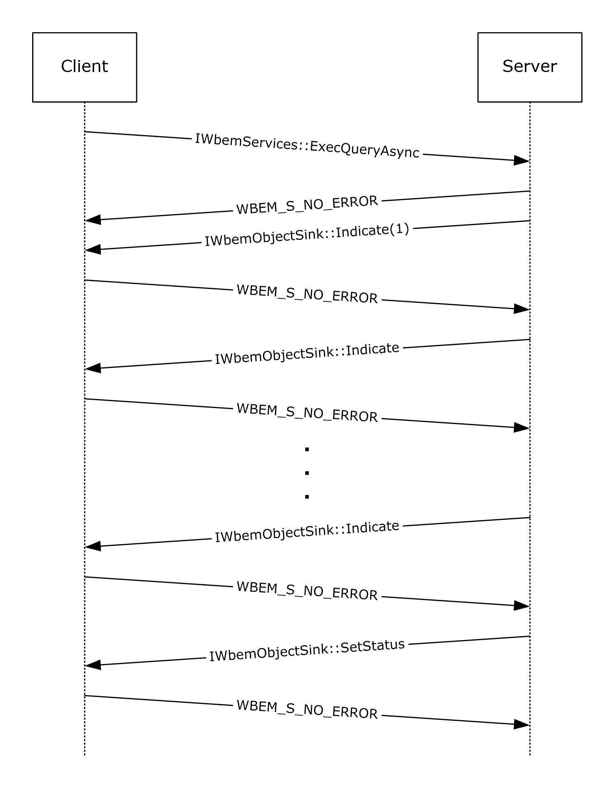

Figure 18: Asynchronous delivery of results

## 4.5 Optimized Asynchronous Delivery of Results

The asynchronous communication is optimized to reduce the network usage by making use of the [ObjectArray](#Section_2.2.14) structure as specified in section 2.2.14.

A client supporting that capability notifies the server by returning 0x400FF (WBEM_S_NEW_STYLE) in the first Indicate operation. A server that does not support the ObjectArray structure interprets this as a success return code, while a server supporting the ObjectArray structure notices the code and sends the rest of the results by using the ObjectArray structure, as specified in section 2.2.14.

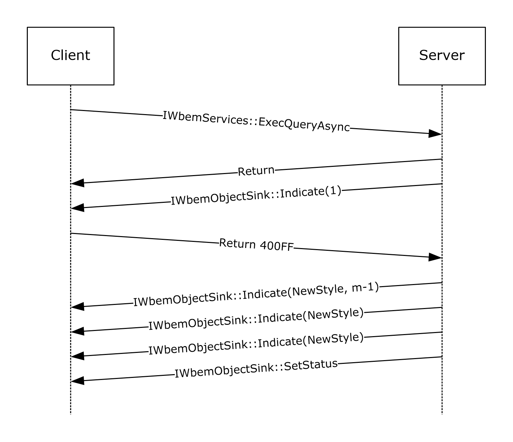

Figure 19: Optimized asynchronous delivery of results

## 4.6 Configuring Refreshing Services

When using the refresher mechanism, a client application that is connected to a remote computer through an [IWbemServices](#Section_3.1.4.3.13) pointer uses the IRemUnknown and IRemUnknown2 interfaces, as specified in [MS-DCOM](../MS-DCOM/MS-DCOM.md), to obtain an [IWbemRefreshingServices](#Section_3.1.4.12) interface, and it adds [**CIM objects**](#gt_cim-object) or enumerators as needed. The following diagram illustrates this behavior.

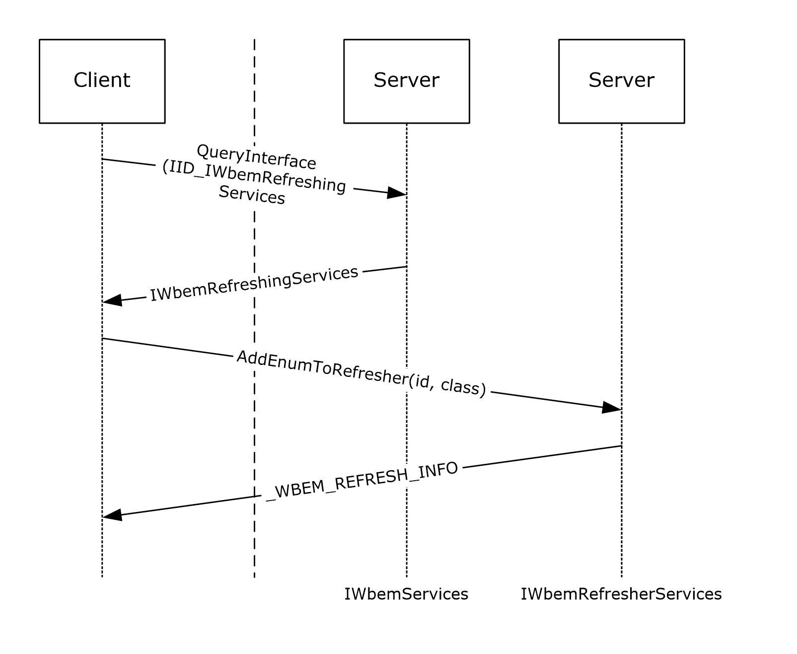

Figure 20: Configuring refreshing services

## 4.7 Using the Refresher Interface

The [IWbemRemoteRefresher](#Section_3.1.4.13.2) [**interface pointer**](#gt_interface-pointer) that is returned from [IWbemRefreshingServices](#Section_3.1.4.12) is used to obtain an updated result set. For the usage of the remote refresher, the client calls the [IWbemRemoteRefresher::RemoteRefresh](#Section_3.1.4.13.1) method when the client needs to get an updated set of data.

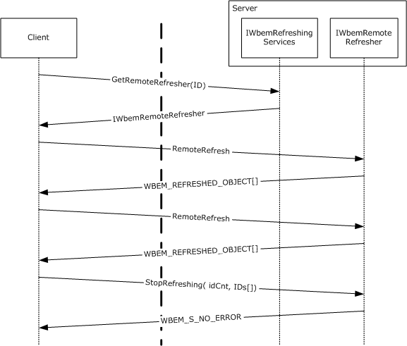

Figure 21: Using the refresher interface

# 5 Security

The following sections specify security considerations for implementers of the Windows Management Instrumentation Remote Protocol.

## 5.1 Security Considerations for Implementers

For all methods, the server MUST enforce that the DCOM security level is at least at the RPC_C_AUTHN_LEVEL_CONNECT level, and SHOULD be at the RPC_C_AUTHN_LEVEL_PKT_INTEGRITY level; the server MUST also evaluate the [**security principal**](#gt_security-principal) rights to open a [**CIM namespace**](#gt_cim-namespace).<87> The server MUST fail the operation if the security requirements are not met.

## 5.2 Index of Security Parameters

The server MUST secure access to each [**CIM namespace**](#gt_cim-namespace) by using security descriptors<88> as specified in [MS-DTYP](../MS-DTYP/MS-DTYP.md).

The server MUST use the [**DCOM**](#gt_distributed-component-object-model-dcom) identity of the caller against the security descriptor of the namespace to grant or deny the access.

The access mask that controls the [**security principal**](#gt_security-principal) rights contains the following specific rights, which are interpreted as specified in the table.

| Constants | Value | Meaning |
| --- | --- | --- |
| WBEM_ENABLE | 0x1 | Grants the security principal read permissions. |
| WBEM_FULL_WRITE | 0x4 | Grants the security principal to write to classes and instances. |
| WBEM_METHOD_EXECUTE | 0x2 | Grants the security principal to execute methods. |
| WBEM_PARTIAL_WRITE_REP | 0x8 | Grants the security principal to update or delete CIM instances that are static. |
| WBEM_REMOTE_ENABLE | 0x20 | Grants the security principal to remotely access the server. |
| WBEM_WRITE_PROVIDER | 0x10 | Grants the security principal to update or delete CIM instances that are [**dynamic**](#gt_b11172af-9369-448d-9722-444eb52b21cb). |
| READ_CONTROL | 0x20000 | Allows the security principal to read the security descriptor of CIM namespace. |
| WRITE_DAC | 0x40000 | Allows the security principal to modify the security descriptor of CIM namespace. |

In order to change the namespace security descriptor, a client MUST use the Windows Management Instrumentation Remote Protocol and the required [**CIM object**](#gt_cim-object) encoding, as specified in [MS-WMIO](../MS-WMIO/MS-WMIO.md). To query or change the security descriptor, the __SystemSecurity class methods GetSD and SetSD defined in section [2.2.30](#Section_2.2.30.2) MUST be used. To manage the namespace security, the __SystemSecurity class MUST be implemented at the top level of every namespace. The GetSD and SetSD methods are invoked as specified in sections [3.1.4.3.22](#Section_3.1.4.3.22) and [3.1.4.3.23](#Section_3.1.4.3.23).

If the event object that is delivered to the WMI server (as specified in [3.2.4.2.1](#Section_3.2.4.2.1)) contains a non-null SECURITY_DESCRIPTOR as specified in [2.2.4.2](#Section_2.2.4.2), the server MUST secure access to the event object by using access controls specified in the security descriptor. The access mask that controls the security principal rights has the following specific rights, which are interpreted as specified in the following table.

| Constants | Value | Meaning |
| --- | --- | --- |
| WBEM_RIGHTS_PUBLISH | 0x80 | Grants the security principal permission to send events to the WMI server as specified in 3.2.4.2.1. |
| WBEM_RIGHT_SUBSCRIBE | 0x40 | Grants the security principal permission to receive the event object using the [IWbemServices::ExecNotificationQuery](#Section_3.1.4.3.20) or [IWbemServices::ExecNotificationQueryAsync](#Section_3.1.4.3.21) method call. If this permission is not granted, the client can make IWbemServices::ExecNotificationQuery or IWbemServices::ExecNotificationQueryAsync calls, but the event is not delivered. |

# 6 Appendix A: Full IDL

For ease of implementation, the full [**IDL**](#gt_interface-definition-language-idl) is provided, where "ms-oaut.idl" is the IDL found in [MS-OAUT](../MS-OAUT/MS-OAUT.md) Appendix A.

import "ms-dtyp.idl";

import "ms-oaut.idl";

typedef GUID *REFGUID;

interface IWbemClassObject;

interface IWbemServices;

interface IWbemObjectSink;

interface IEnumWbemClassObject;

interface IWbemCallResult;

interface IWbemContext;

interface IWbemBackupRestore;

interface IWbemBackupRestoreEx;

interface IWbemLoginClientID;

interface IWbemLevel1Login;

interface IWbemLoginHelper;

[

restricted,

uuid(8BC3F05E-D86B-11d0-A075-00C04FB68820)

]

coclass WbemLevel1Login {

interface IWbemLevel1Login;

};

typedef long HRESULT;

typedef [v1_enum] enum tag_WBEM_QUERY_FLAG_TYPE {

WBEM_FLAG_DEEP = 0,

WBEM_FLAG_SHALLOW = 1,

WBEM_FLAG_PROTOTYPE = 2

} WBEM_QUERY_FLAG_TYPE;

typedef [v1_enum] enum tag_WBEM_CHANGE_FLAG_TYPE {

WBEM_FLAG_CREATE_OR_UPDATE = 0x00,

WBEM_FLAG_UPDATE_ONLY = 0x01,

WBEM_FLAG_CREATE_ONLY = 0x02,

WBEM_FLAG_UPDATE_SAFE_MODE = 0x20,

WBEM_FLAG_UPDATE_FORCE_MODE = 0x40

} WBEM_CHANGE_FLAG_TYPE;

typedef [v1_enum] enum tag_WBEM_CONNECT_OPTIONS {

WBEM_FLAG_CONNECT_REPOSITORY_ONLY = 0x40,

WBEM_FLAG_CONNECT_PROVIDERS = 0x100

} WBEM_CONNECT_OPTIONS;

typedef [v1_enum] enum tag_WBEM_GENERIC_FLAG_TYPE {

WBEM_FLAG_RETURN_WBEM_COMPLETE = 0x0,

WBEM_FLAG_RETURN_IMMEDIATELY = 0x10,

WBEM_FLAG_FORWARD_ONLY = 0x20,

WBEM_FLAG_NO_ERROR_OBJECT = 0x40,

WBEM_FLAG_SEND_STATUS = 0x80,

WBEM_FLAG_ENSURE_LOCATABLE = 0x100,

WBEM_FLAG_DIRECT_READ = 0x200,

WBEM_MASK_RESERVED_FLAGS = 0x1F000,

WBEM_FLAG_USE_AMENDED_QUALIFIERS = 0x20000,

WBEM_FLAG_STRONG_VALIDATION = 0x100000

} WBEM_GENERIC_FLAG_TYPE;

typedef enum tag_WBEM_STATUS_TYPE {

WBEM_STATUS_COMPLETE = 0,

WBEM_STATUS_REQUIREMENTS = 0x01,

WBEM_STATUS_PROGRESS = 2

} WBEM_STATUS_TYPE;

typedef [v1_enum] enum tag_WBEM_TIMEOUT_TYPE {

WBEM_NO_WAIT = 0,

WBEM_INFINITE = 0xFFFFFFFF

} WBEM_TIMEOUT_TYPE;

typedef [v1_enum] enum tag_WBEM_BACKUP_RESTORE_FLAGS {

WBEM_FLAG_BACKUP_RESTORE_FORCE_SHUTDOWN = 1

} WBEM_BACKUP_RESTORE_FLAGS;

typedef [v1_enum] enum tag_WBEMSTATUS {

WBEM_S_NO_ERROR = 0x00,

WBEM_S_FALSE = 0x01,

WBEM_S_TIMEDOUT = 0x40004,

WBEM_S_NEW_STYLE = 0x400FF,

WBEM_S_PARTIAL_RESULTS = 0x40010,

WBEM_E_FAILED = 0x80041001,

WBEM_E_NOT_FOUND = 0x80041002,

WBEM_E_ACCESS_DENIED = 0x80041003,

WBEM_E_PROVIDER_FAILURE = 0x80041004,

WBEM_E_TYPE_MISMATCH = 0x80041005,

WBEM_E_OUT_OF_MEMORY = 0x80041006,

WBEM_E_INVALID_CONTEXT = 0x80041007,

WBEM_E_INVALID_PARAMETER = 0x80041008,

WBEM_E_NOT_AVAILABLE = 0x80041009,

WBEM_E_CRITICAL_ERROR = 0x8004100a,

WBEM_E_NOT_SUPPORTED = 0x8004100C,

WBEM_E_PROVIDER_NOT_FOUND = 0x80041011,

WBEM_E_INVALID_PROVIDER_REGISTRATION = 0x80041012,

WBEM_E_PROVIDER_LOAD_FAILURE = 0x80041013,

WBEM_E_INITIALIZATION_FAILURE = 0x80041014,

WBEM_E_TRANSPORT_FAILURE = 0x80041015,

WBEM_E_INVALID_OPERATION = 0x80041016,

WBEM_E_ALREADY_EXISTS = 0x80041019,

WBEM_E_UNEXPECTED = 0x8004101d,

WBEM_E_INCOMPLETE_CLASS = 0x80041020,

WBEM_E_SHUTTING_DOWN = 0x80041033,

E_NOTIMPL = 0x80004001,

WBEM_E_INVALID_SUPERCLASS = 0x8004100D,

WBEM_E_INVALID_NAMESPACE = 0x8004100E,

WBEM_E_INVALID_OBJECT = 0x8004100F,

WBEM_E_INVALID_CLASS = 0x80041010,

WBEM_E_INVALID_QUERY = 0x80041017,

WBEM_E_INVALID_QUERY_TYPE = 0x80041018,

WBEM_E_PROVIDER_NOT_CAPABLE = 0x80041024,

WBEM_E_CLASS_HAS_CHILDREN = 0x80041025,

WBEM_E_CLASS_HAS_INSTANCES = 0x80041026,

WBEM_E_ILLEGAL_NULL = 0x80041028,

WBEM_E_INVALID_CIM_TYPE = 0x8004102D,

WBEM_E_INVALID_METHOD = 0x8004102E,

WBEM_E_INVALID_METHOD_PARAMETERS = 0x8004102F,

WBEM_E_INVALID_PROPERTY = 0x80041031,

WBEM_E_CALL_CANCELLED = 0x80041032,

WBEM_E_INVALID_OBJECT_PATH = 0x8004103A,

WBEM_E_OUT_OF_DISK_SPACE = 0x8004103B,

WBEM_E_UNSUPPORTED_PUT_EXTENSION = 0x8004103D,

WBEM_E_QUOTA_VIOLATION = 0x8004106c,

WBEM_E_SERVER_TOO_BUSY = 0x80041045,

WBEM_E_METHOD_NOT_IMPLEMENTED = 0x80041055,

WBEM_E_METHOD_DISABLED = 0x80041056,

WBEM_E_UNPARSABLE_QUERY = 0x80041058,

WBEM_E_NOT_EVENT_CLASS = 0x80041059,

WBEM_E_MISSING_GROUP_WITHIN = 0x8004105A,

WBEM_E_MISSING_AGGREGATION_LIST = 0x8004105B,

WBEM_E_PROPERTY_NOT_AN_OBJECT = 0x8004105c,

WBEM_E_AGGREGATING_BY_OBJECT = 0x8004105d,

WBEM_E_BACKUP_RESTORE_WINMGMT_RUNNING = 0x80041060,

WBEM_E_QUEUE_OVERFLOW = 0x80041061,

WBEM_E_PRIVILEGE_NOT_HELD = 0x80041062,

WBEM_E_INVALID_OPERATOR = 0x80041063,

WBEM_E_CANNOT_BE_ABSTRACT = 0x80041065,

WBEM_E_AMENDED_OBJECT = 0x80041066,

WBEM_E_VETO_PUT = 0x8004107A,

WBEM_E_PROVIDER_SUSPENDED = 0x80041081,

WBEM_E_ENCRYPTED_CONNECTION_REQUIRED = 0x80041087,

WBEM_E_PROVIDER_TIMED_OUT = 0x80041088,

WBEM_E_NO_KEY = 0x80041089,

WBEM_E_PROVIDER_DISABLED = 0x8004108a,

WBEM_E_REGISTRATION_TOO_BROAD = 0x80042001,

WBEM_E_REGISTRATION_TOO_PRECISE = 0x80042002

} WBEMSTATUS;

[

restricted,

uuid(674B6698-EE92-11d0-AD71-00C04FD8FDFF)

]

coclass WbemContext

{

interface IWbemContext;

};

[

uuid(9A653086-174F-11d2-B5F9-00104B703EFD)

]

coclass WbemClassObject

{

interface IWbemClassObject;

};

[

uuid(C49E32C6-BC8B-11d2-85D4-00105A1F8304)

]

coclass WbemBackupRestore

{

interface IWbemBackupRestoreEx;

};

#define OPTIONAL in, unique

interface IWbemQualifierSet;

[

local,

restricted,

object,

uuid(dc12a681-737f-11cf-884d-00aa004b2e24)

]

interface IWbemClassObject : IUnknown

{

};

interface IWbemServices;

[

object,

restricted,

uuid(7c857801-7381-11cf-884d-00aa004b2e24)

]

interface IWbemObjectSink : IUnknown

{

HRESULT Indicate(

[in] long lObjectCount,

[in, size_is(lObjectCount)]

IWbemClassObject** apObjArray

);

HRESULT SetStatus(

[in] long lFlags,

[in] HRESULT hResult,

[in] BSTR strParam,

[in] IWbemClassObject* pObjParam

);

};

[

object,

restricted,

uuid(027947e1-d731-11ce-a357-000000000001)

]

interface IEnumWbemClassObject : IUnknown

{

HRESULT Reset();

HRESULT Next(

[in] long lTimeout,

[in] ULONG uCount,

[out, size_is(uCount), length_is(*puReturned)]

IWbemClassObject** apObjects,

[out] ULONG* puReturned

);

HRESULT NextAsync(

[in] ULONG uCount,

[in] IWbemObjectSink* pSink

);

HRESULT Clone(

[out] IEnumWbemClassObject** ppEnum

);

HRESULT Skip(

[in] long lTimeout,

[in] ULONG nCount

);

};

[

object,

restricted,

local,

uuid(44aca674-e8fc-11d0-a07c-00c04fb68820)

]

interface IWbemContext : IUnknown

{

};

[

object,

restricted,

uuid(44aca675-e8fc-11d0-a07c-00c04fb68820)

]

interface IWbemCallResult : IUnknown

{

HRESULT GetResultObject(

[in] long lTimeout,

[out] IWbemClassObject** ppResultObject

);

HRESULT GetResultString(

[in] long lTimeout,

[out] BSTR* pstrResultString

);

HRESULT GetResultServices(

[in] long lTimeout,

[out] IWbemServices** ppServices

);

HRESULT GetCallStatus(

[in] long lTimeout,

[out] long* plStatus

);

};

[

object,

restricted,

uuid(9556dc99-828c-11cf-a37e-00aa003240c7),

pointer_default(unique)

]

interface IWbemServices : IUnknown

{

HRESULT OpenNamespace(

[in] const BSTR strNamespace,

[in] long lFlags,

[in] IWbemContext* pCtx,

[out, in, unique] IWbemServices** ppWorkingNamespace,

[out, in, unique] IWbemCallResult** ppResult

);

HRESULT CancelAsyncCall(

[in] IWbemObjectSink* pSink

);

HRESULT QueryObjectSink(

[in] long lFlags,

[out] IWbemObjectSink** ppResponseHandler

);

HRESULT GetObject(

[in] const BSTR strObjectPath,

[in] long lFlags,

[in] IWbemContext* pCtx,

[out, in, unique] IWbemClassObject** ppObject,

[out, in, unique] IWbemCallResult** ppCallResult

);

HRESULT GetObjectAsync(

[in] const BSTR strObjectPath,

[in] long lFlags,

[in] IWbemContext* pCtx,

[in] IWbemObjectSink* pResponseHandler

);

HRESULT PutClass(

[in] IWbemClassObject* pObject,

[in] long lFlags,

[in] IWbemContext* pCtx,

[out, in, unique] IWbemCallResult** ppCallResult

);

HRESULT PutClassAsync(

[in] IWbemClassObject* pObject,

[in] long lFlags,

[in] IWbemContext* pCtx,

[in] IWbemObjectSink* pResponseHandler

);

HRESULT DeleteClass(

[in] const BSTR strClass,

[in] long lFlags,

[in] IWbemContext* pCtx,

[out, in, unique] IWbemCallResult** ppCallResult

);

HRESULT DeleteClassAsync(

[in] const BSTR strClass,

[in] long lFlags,

[in] IWbemContext* pCtx,

[in] IWbemObjectSink* pResponseHandler

);

HRESULT CreateClassEnum(

[in] const BSTR strSuperclass,

[in] long lFlags,

[in] IWbemContext* pCtx,

[out] IEnumWbemClassObject** ppEnum

);

HRESULT CreateClassEnumAsync(

[in] const BSTR strSuperclass,

[in] long lFlags,

[in] IWbemContext* pCtx,

[in] IWbemObjectSink* pResponseHandler

);

HRESULT PutInstance(

[in] IWbemClassObject* pInst,

[in] long lFlags,

[in] IWbemContext* pCtx,

[out, in, unique] IWbemCallResult** ppCallResult

);

HRESULT PutInstanceAsync(

[in] IWbemClassObject* pInst,

[in] long lFlags,

[in] IWbemContext* pCtx,

[in] IWbemObjectSink* pResponseHandler

);

HRESULT DeleteInstance(

[in] const BSTR strObjectPath,

[in] long lFlags,

[in] IWbemContext* pCtx,

[out, in, unique] IWbemCallResult** ppCallResult

);

HRESULT DeleteInstanceAsync(

[in] const BSTR strObjectPath,

[in] long lFlags,

[in] IWbemContext* pCtx,

[in] IWbemObjectSink* pResponseHandler

);

HRESULT CreateInstanceEnum(

[in] const BSTR strSuperClass,

[in] long lFlags,

[in] IWbemContext* pCtx,

[out] IEnumWbemClassObject** ppEnum

);

HRESULT CreateInstanceEnumAsync(

[in] const BSTR strSuperClass,

[in] long lFlags,

[in] IWbemContext* pCtx,

[in] IWbemObjectSink* pResponseHandler

);

HRESULT ExecQuery(

[in] const BSTR strQueryLanguage,

[in] const BSTR strQuery,

[in] long lFlags,

[in] IWbemContext* pCtx,

[out] IEnumWbemClassObject** ppEnum

);

HRESULT ExecQueryAsync(

[in] const BSTR strQueryLanguage,

[in] const BSTR strQuery,

[in] long lFlags,

[in] IWbemContext* pCtx,

[in] IWbemObjectSink* pResponseHandler

);

HRESULT ExecNotificationQuery(

[in] const BSTR strQueryLanguage,

[in] const BSTR strQuery,

[in] long lFlags,

[in] IWbemContext* pCtx,

[out] IEnumWbemClassObject** ppEnum

);

HRESULT ExecNotificationQueryAsync(

[in] const BSTR strQueryLanguage,

[in] const BSTR strQuery,

[in] long lFlags,

[in] IWbemContext* pCtx,

[in] IWbemObjectSink* pResponseHandler

);

HRESULT ExecMethod(

[in] const BSTR strObjectPath,

[in] const BSTR strMethodName,

[in] long lFlags,

[in] IWbemContext* pCtx,

[in] IWbemClassObject* pInParams,

[out, in, unique] IWbemClassObject** ppOutParams,

[out, in, unique] IWbemCallResult** ppCallResult

);

HRESULT ExecMethodAsync(

[in] const BSTR strObjectPath,

[in] const BSTR strMethodName,

[in] long lFlags,

[in] IWbemContext* pCtx,

[in] IWbemClassObject* pInParams,

[in] IWbemObjectSink* pResponseHandler

);

};

[

object,

restricted,

uuid(C49E32C7-BC8B-11d2-85D4-00105A1F8304)

]

interface IWbemBackupRestore : IUnknown

{

HRESULT Backup(

[in, string] LPCWSTR strBackupToFile,

[in] long lFlags

);

HRESULT Restore(

[in, string] LPCWSTR strRestoreFromFile,

[in] long lFlags

);

};

[

object,

restricted,

uuid(A359DEC5-E813-4834-8A2A-BA7F1D777D76)

]

interface IWbemBackupRestoreEx : IWbemBackupRestore

{

HRESULT Pause();

HRESULT Resume();

};

typedef enum _WBEM_REFR_VERSION_NUMBER {

WBEM_REFRESHER_VERSION = 2

} WBEM_REFR_VERSION_NUMBER;

typedef [v1_enum] enum _WBEM_INSTANCE_BLOB_TYPE {

WBEM_BLOB_TYPE_ALL = 2,

WBEM_BLOB_TYPE_ERROR = 3,

WBEM_BLOB_TYPE_ENUM = 4

} WBEM_INSTANCE_BLOB_TYPE;

typedef struct _WBEM_REFRESHED_OBJECT {

long m_lRequestId;

WBEM_INSTANCE_BLOB_TYPE m_lBlobType;

long m_lBlobLength;

[size_is(m_lBlobLength)] byte* m_pbBlob;

} WBEM_REFRESHED_OBJECT;

[

restricted,

uuid(F1E9C5B2-F59B-11d2-B362-00105A1F8177)

]

interface IWbemRemoteRefresher : IUnknown {

HRESULT RemoteRefresh(

[in] long lFlags,

[out] long* plNumObjects,

[out, size_is(,*plNumObjects)]

WBEM_REFRESHED_OBJECT** paObjects

);

HRESULT StopRefreshing(

[in] long lNumIds,

[in, size_is(lNumIds)] long* aplIds,

[in] long lFlags

);

HRESULT Opnum5NotUsedOnWire(

[in] long lFlags,

[out] GUID* pGuid

);

};

typedef struct {

IWbemRemoteRefresher* m_pRefresher;

IWbemClassObject* m_pTemplate;

GUID m_Guid;

} _WBEM_REFRESH_INFO_REMOTE;

typedef struct {

[string] wchar_t* m_wszNamespace;

IWbemClassObject* m_pTemplate;

} _WBEM_REFRESH_INFO_NON_HIPERF;

typedef enum

{

WBEM_REFRESH_TYPE_INVALID = 0,

WBEM_REFRESH_TYPE_REMOTE = 3,

WBEM_REFRESH_TYPE_NON_HIPERF = 6

}WBEM_REFRESH_TYPE;

typedef [switch_type(long)] union {

[case (WBEM_REFRESH_TYPE_REMOTE)]

_WBEM_REFRESH_INFO_REMOTE m_Remote;

[case (WBEM_REFRESH_TYPE_NON_HIPERF)]

_WBEM_REFRESH_INFO_NON_HIPERF m_NonHiPerf;

[case (WBEM_REFRESH_TYPE_INVALID)]

HRESULT m_hres;

} WBEM_REFRESH_INFO_UNION;

typedef struct {

long m_lType;

[switch_is(m_lType)] WBEM_REFRESH_INFO_UNION m_Info;

long m_lCancelId;

} _WBEM_REFRESH_INFO;

typedef struct {

[string] LPSTR m_szMachineName;

DWORD m_dwProcessId;

GUID m_guidRefresherId;

} _WBEM_REFRESHER_ID;

typedef enum {

WBEM_RECONNECT_TYPE_OBJECT = 0,

WBEM_RECONNECT_TYPE_ENUM = 1,

WBEM_RECONNECT_TYPE_LAST = 2

}WBEM_RECONNECT_TYPE;

typedef struct {

long m_lType;

[string] LPCWSTR m_pwcsPath;

} _WBEM_RECONNECT_INFO;

typedef struct {

long m_lId;

HRESULT m_hr;

} _WBEM_RECONNECT_RESULTS;

[

restricted,

uuid(2C9273E0-1DC3-11d3-B364-00105A1F8177)

]

interface IWbemRefreshingServices : IUnknown

{

HRESULT AddObjectToRefresher(

[in] _WBEM_REFRESHER_ID* pRefresherId,

[in, string] LPCWSTR wszPath,

[in] long lFlags,

[in] IWbemContext* pContext,

[in] DWORD dwClientRefrVersion,

[out] _WBEM_REFRESH_INFO* pInfo,

[out] DWORD* pdwSvrRefrVersion

);

HRESULT AddObjectToRefresherByTemplate(

[in] _WBEM_REFRESHER_ID* pRefresherId,

[in] IWbemClassObject* pTemplate,

[in] long lFlags,

[in] IWbemContext* pContext,

[in] DWORD dwClientRefrVersion,

[out] _WBEM_REFRESH_INFO* pInfo,

[out] DWORD* pdwSvrRefrVersion

);

HRESULT AddEnumToRefresher(

[in] _WBEM_REFRESHER_ID* pRefresherId,

[in, string] LPCWSTR wszClass,

[in] long lFlags,

[in] IWbemContext* pContext,

[in] DWORD dwClientRefrVersion,

[out] _WBEM_REFRESH_INFO* pInfo,

[out] DWORD* pdwSvrRefrVersion

);

HRESULT RemoveObjectFromRefresher(

[in] _WBEM_REFRESHER_ID* pRefresherId,

[in] long lId,

[in] long lFlags,

[in] DWORD dwClientRefrVersion,

[out] DWORD* pdwSvrRefrVersion

);

HRESULT GetRemoteRefresher(

[in] _WBEM_REFRESHER_ID* pRefresherId,

[in] long lFlags,

[in] DWORD dwClientRefrVersion,

[out] IWbemRemoteRefresher** ppRemRefresher,

[out] GUID* pGuid,

[out] DWORD* pdwSvrRefrVersion

);

HRESULT ReconnectRemoteRefresher(

[in] _WBEM_REFRESHER_ID* pRefresherId,

[in] long lFlags,

[in] long lNumObjects,

[in] DWORD dwClientRefrVersion,

[in, size_is(lNumObjects)]

_WBEM_RECONNECT_INFO* apReconnectInfo,

[in, out, size_is(lNumObjects)]

_WBEM_RECONNECT_RESULTS* apReconnectResults,

[out] DWORD* pdwSvrRefrVersion

);

};

[

restricted,

object,

uuid(423EC01E-2E35-11d2-B604-00104B703EFD)

]

interface IWbemWCOSmartEnum : IUnknown

{

HRESULT Next(

[in] REFGUID proxyGUID,

[in] long lTimeout,

[in] ULONG uCount,

[out] ULONG* puReturned,

[out] ULONG* pdwBuffSize,

[out, size_is(,*pdwBuffSize)] byte** pBuffer

);

};

[

restricted,

object,

uuid(1C1C45EE-4395-11d2-B60B-00104B703EFD)

]

interface IWbemFetchSmartEnum : IUnknown

{

HRESULT GetSmartEnum(

[out] IWbemWCOSmartEnum** ppSmartEnum

);

};

[

restricted,

object,

uuid(d4781cd6-e5d3-44df-ad94-930efe48a887)

]

interface IWbemLoginClientID : IUnknown

{

HRESULT SetClientInfo(

[in, unique, string ] LPWSTR wszClientMachine,

[in] long lClientProcId,

[in] long lReserved

);

};

[

object,

restricted,

uuid(F309AD18-D86A-11d0-A075-00C04FB68820),

pointer_default(unique)

]

interface IWbemLevel1Login : IUnknown

{

HRESULT EstablishPosition(

[in, unique, string] wchar_t* reserved1,

[in] DWORD reserved2,

[out] DWORD* LocaleVersion

);

HRESULT RequestChallenge(

[in, unique, string] wchar_t* reserved1,

[in, unique, string] wchar_t* reserved2,

[out, size_is(16), length_is(16)] unsigned char* reserved3

);

HRESULT WBEMLogin(

[in, unique, string] wchar_t* reserved1,

[in, size_is(16), length_is(16), unique]

unsigned char* reserved2,

[in] long reserved3,

[in] IWbemContext* reserved4,

[out] IWbemServices** reserved5

);

HRESULT NTLMLogin(

[in, unique, string] LPWSTR wszNetworkResource,

[in, unique, string] LPWSTR wszPreferredLocale,

[in] long lFlags,

[in] IWbemContext* pCtx,

[out] IWbemServices** ppNamespace

);

};

[

restricted,

object,

uuid(541679AB-2E5F-11d3-B34E-00104BCC4B4A)

]

interface IWbemLoginHelper : IUnknown

{

HRESULT SetEvent(

[in] LPCSTR sEventToSet

);

};

# 7 Appendix B: Product Behavior

The information in this specification is applicable to the following Microsoft products or supplemental software. References to product versions include updates to those products.

The terms "earlier" and "later", when used with a product version, refer to either all preceding versions or all subsequent versions, respectively. The term "through" refers to the inclusive range of versions. Applicable Microsoft products are listed chronologically in this section.

**Windows Client**

- Windows NT 4.0 operating system
- Windows 2000 Professional operating system
- Windows XP operating system
- Windows XP 64-Bit Edition operating system
- Windows Vista operating system
- Windows 7 operating system
- Windows 8 operating system
- Windows 8.1 operating system
- Windows 10 operating system
- Windows 11 operating system
**Windows Server**

- Windows NT Server operating system
- Windows 2000 Server operating system
- Windows Server 2003 operating system
- Windows Server 2003 operating system with Service Pack 2 (SP2)
- Windows Server 2008 operating system
- Windows Server 2008 R2 operating system
- Windows Server 2012 operating system
- Windows Server 2012 R2 operating system
- Windows Server 2016 operating system
- Windows Server operating system
- Windows Server 2019 operating system
- Windows Server 2022 operating system
- Windows Server 2025 operating system
Exceptions, if any, are noted in this section. If an update version, service pack or Knowledge Base (KB) number appears with a product name, the behavior changed in that update. The new behavior also applies to subsequent updates unless otherwise specified. If a product edition appears with the product version, behavior is different in that product edition.

Unless otherwise specified, any statement of optional behavior in this specification that is prescribed using the terms "SHOULD" or "SHOULD NOT" implies product behavior in accordance with the SHOULD or SHOULD NOT prescription. Unless otherwise specified, the term "MAY" implies that the product does not follow the prescription.

<1> Section 2.2.6: The prefix "__" is specific to Windows and is not a [**CIM**](#gt_common-information-model-cim) standard.

<2> Section 2.2.12: Windows interprets the flags as follows:

**WBEM_FLAG_CONNECT_REPOSITORY_ONLY:** The connection is established to operate only on the [**static**](#gt_ef084f89-1d44-4be7-b402-f35e2bd929f6) data (classes and instances) stored in the [**CIM database**](#gt_cim-database). Operations requiring a provider will not be supported on this connection.

**WBEM_FLAG_CONNECT_PROVIDERS:** The connection is established to operate only on the provider.

<3> Section 2.2.13: A Windows client builds the [IWbemContext](#Section_2.2.13.2) object by using a set of specific IWbemContext methods to add, delete, and enumerate properties with their respective values. The IWbemContext methods are not used by the protocol at any time. They are used internally by the client and the server to manage the content of the object.

The following Windows versions support the context properties in the table: Windows XP operating system Service Pack 1 (SP1), Windows Server 2003 operating system with Service Pack 1 (SP1), Windows Vista, Windows Server 2008, Windows 7, and Windows Server 2008 R2 operating system. Prior versions of Windows ignore these values.

<4> Section 2.2.13.4: 32-bit versions of Windows set the value to 4; however, 64-bit versions of Windows set the value to 8.

<5> Section 2.2.13.4: 32-bit versions of Windows set the value to 4; however, 64-bit versions of Windows set the value to 8.

<6> Section 2.2.14: This optimization technique is being used by Windows starting with Windows XP and Windows Server 2003.

<7> Section 2.2.21: Windows uses the **m_dwProcessId** as the process identifier.

<8> Section 2.2.30.1: Windows 2000 Professional and later and Windows Server 2003 and later do not return errors using the return value of the **GetSD** [**CIM method**](#gt_cim-method). Errors are returned as an error in the [IWbemServices interface](#Section_3.1.4.3.13) method call.

<9> Section 2.2.30.2: Windows 2000 Professional and later and Windows Server 2003 and later do not return errors using the return value of the **GetSD** CIM method. Errors are returned as an error in the IWbemServices interface method call.

<10> Section 2.2.30.3: On Windows NT 4.0, Windows 2000 Professional, Windows 2000 Server, Windows Server 2003, Windows XP, and Windows XP SP1, the **RequiresEncryption** qualifier is ignored.

<11> Section 2.2.32: In Windows, the security descriptor of a namespace can be specified explicitly in an MOF file, using the NamespaceSecuritySDDL qualifier. The qualifier is a string in the security descriptor definition language (SDDL) format. If no NamespaceSecuritySDDL qualifier is present, the server initializes the security descriptor for the namespace to the default value.

<12> Section 3.1.1: In Windows, the limit is 5000.

<13> Section 3.1.1: In Windows, the security descriptor of a namespace can be specified explicitly in an MOF file, using the NamespaceSecuritySDDL [**qualifier**](#gt_qualifier). The qualifier is a string in the security descriptor definition language (SDDL) format. If no NamespaceSecuritySDDL qualifier is present, the server initializes the security descriptor for the namespace to the default value.

The security groups refer to the values defined in [MS-DTYP](../MS-DTYP/MS-DTYP.md) section 2.4.2.4.

Starting with Windows Vista, the default security groups are:

- AUTHENTICATED_USERS
- LOCAL_SERVICE
- NETWORK_SERVICE
- BUILTIN_ADMINISTRATORS
In Windows Server 2003, Windows XP, Windows 2000 Server, Windows 2000 Professional, and Windows NT 4.0, the default security groups are:

- BUILTIN_ADMINISTRATORS
- LOCAL_SERVICE
- NETWORK_SERVICE
- EVERYONE
The default access permissions for the AUTHENTICATED_USERS, LOCAL_SERVICE, and NETWORK_SERVICE are:

- WBEM_METHOD_EXECUTE
- WBEM_FULL_WRITE
- WBEM_ENABLE
<14> Section 3.1.1: "WQL:References" is used in Windows NT Server, Windows NT 4.0, and Windows 2000 Server only.

<15> Section 3.1.1.1.3: Windows does not send progress information.

<16> Section 3.1.1.1.3: Windows tries to make the call at the highest [**authentication level**](#gt_authentication-level), RPC_C_AUTHN_PKT_PRIVACY. If UnsecAppAccessControlDefault is set to false, Windows gradually downgrades (decreasing the authentication level by one level at every call) to RPC_C_AUTHN_NONE if the DCOM Remote Protocol (as specified in [MS-DCOM](../MS-DCOM/MS-DCOM.md)) is unable to use the current authentication level. The minimum authentication level for Windows 2000 Professional and Windows 2000 Server is RPC_C_AUTHN_LEVEL_CONNECT. In Windows 2000 Professional and Windows 2000 Server, Windows XP, and Windows Server 2003, the server does not check for the AllowAnonymousCallback flag prior to making anonymous callbacks to the client.

In Windows Vista and later and Windows Server 2008 and later, the AllowAnonymousCallback value will be retrieved from registry location HKLM\SOFTWARE\Microsoft\WBEM\CIMOM\AllowAnonymousCallback. In Windows 2000 Professional and Windows XP, the server does not check for the **UnsecAppAccessControlDefault** flag prior to downgrading the authentication level.

In Windows Server 2003 and later and Windows Vista and later, the UnsecAppAccessControlDefault value will be retrieved from registry location HKLM\Software\Microsoft\WBEM\CIMOM\UnsecAppAccessControlDefault.

<17> Section 3.1.3: In Windows 2000 Professional, Windows 2000 Server, Windows XP, and Windows Server 2003, this value is set to True.

<18> Section 3.1.4: The following Windows versions support ordered array types:

- Windows NT operating system
- Windows NT 4.0
- Windows XP 64-Bit Edition
<19> Section 3.1.4: Windows secures the access to each namespace and accepts only authenticated calls made at least at the RPC_C_AUTHN_LEVEL_CONNECT level. Windows behavior across different operating systems is specified in the following table.

| Operating system version | Minimum authentication level |
| --- | --- |
| Windows NT | RPC_C_AUTHN_LEVEL_CONNECT |
| Windows 2000 operating system | RPC_C_AUTHN_LEVEL_CONNECT |
| Windows 2000 Professional operating system Service Pack 3 (SP3) | RPC_C_AUTHN_LEVEL_PKT |
| Windows XP | RPC_C_AUTHN_LEVEL_PKT |
| Windows Server 2003 | RPC_C_AUTHN_LEVEL_PKT |
| Windows Vista | RPC_C_AUTHN_LEVEL_PKT |

<20> Section 3.1.4: Windows NT Server and Windows NT 4.0 do not allow the static properties to be modified.

<21> Section 3.1.4: Windows allows providers to do the impersonation or do additional authentication and authorization checks based on the security principal of the caller.

<22> Section 3.1.4: On Windows NT 4.0, Windows 2000, Windows Server 2003, Windows XP, and Windows XP SP1, the **RequiresEncryption** qualifier is ignored.

<23> Section 3.1.4: In Windows Server 2008 and Windows Server 2008 R2, if the number of active IWbemService objects for root\virtualization namespace is more than 4096, the server returns WBEM_E_QUOTA_VIOLATION.

<24> Section 3.1.4: Windows 2000, Windows XP, Windows Server 2003, Windows Vista, Windows Server 2008, and Windows 7 do not use this.

<25> Section 3.1.4: Windows 2000, Windows XP, Windows Server 2003, Windows Vista, Windows Server 2008, and Windows 7 do not use this.

<26> Section 3.1.4: Windows 2000, Windows XP, Windows Server 2003, Windows Vista, Windows Server 2008, and Windows 7 do not set this option. Windows 8 and later and Windows Server 2012 and later set this option when WMI C-Client APIs are used but not when the **IWbemServices** COM interface is used.

<27> Section 3.1.4.1.1: If the server accepts as a locale parameter for the [IWbemLevel1Login::NTLMLogin](#Section_3.1.4.1.4) method all locales valid for Windows Vista as defined in Appendix A of [MS-LCID](../MS-LCID/MS-LCID.md), the server returns WBEM_S_NO_ERROR for [IWbemLevel1Login::EstablishPosition](#Section_3.1.4.1.1).

<28> Section 3.1.4.1.1: If the server returns WBEM_E_INVALID_PARAMETER for any valid Windows Vista locales as specified in Appendix A of [MS-LCID] that has been passed as a locale parameter to the IWbemLevel1Login::NTLMLogin method while all other parameters are valid, the server returns E_NOTIMPL for IWbemLevel1Login::EstablishPosition.

<29> Section 3.1.4.1.4: In Windows, it is the Windows system locale of the server.

<30> Section 3.1.4.1.4: Windows 2000 and later and Windows XP and later fail the call and return 0x80041008 (WBEM_E_INVALID_PARAMETER) if the locale name does not match one of the [WMI Locale Formats (section 2.2.29)](#Section_2.2.29), or if the locale name is not valid for that operating system.

If the locale name is in the "MS_xxx" format but refers to an [**LCID**](#gt_language-code-identifier-lcid), Windows Vista and later and Windows Server 2008 and later fail the call and return 0x80070057 (E_INVALIDARG).

If the locale is in "MS_xxx" format as defined in section 2.2.29 and the LCID is not valid for Windows 7, Windows Server 2008 R2, Windows 8, or Windows Server 2012, Windows fails the call and returns E_INVALIDARG. If the locale string is not in "MS_xxx" format and it is not a valid locale for Windows 7 and later and Windows Server 2008 R2 and later, the locale is ignored.

<31> Section 3.1.4.1.4: Windows clients always set **lFlags** to 0. The server role of Windows 2000 returns WBEM_E_INVALID_PARAMETER for a nonzero value of **lFlags**. The server roles of Windows XP and later and Windows Server 2003 and later allow **lFlags** to be 0 or any combination of the flags WBEM_FLAG_CONNECT_PROVIDERS and WBEM_FLAG_CONNECT_REPOSITORY_ONLY.

<32> Section 3.1.4.1.4: The following Windows client versions do not enforce a limit:

- Windows NT 4.0
- Windows NT Server 4.0 operating system
- Windows 2000 Professional
- Windows 2000 Server
- Windows XP
- Windows XP SP1
- Windows XP operating system Service Pack 2 (SP2)
- Windows Server 2003
- Windows Server 2003 with SP1
The following versions of Windows enforce a query string limit of 8173 characters (WBEM_MAX_PATH -19, where WBEM_MAX_PATH = 0x2000 and the 19 characters represent the length of the string __namespace.name=""):

- Windows Server 2003 SP2 and later
- Windows Vista and later
<33> Section 3.1.4.1.4: Windows uses the system's locale as described in [[MSDN-GetSystemDefaultLangID]](https://go.microsoft.com/fwlink/?LinkId=165531).

<34> Section 3.1.4.3.6: Windows does not ignore the amended qualifiers while it creates a [**CIM class**](#gt_cim-class); however, it does ignore all the amended qualifiers while it updates a class. Because the amended qualifiers are not ignored while Windows creates a CIM class, when this CIM class is retrieved by using [IWbemServices::GetObject](#Section_3.1.4.3.5) or [IWbemServices::GetObjectAsync](#Section_3.1.4.3.5) (retrieved even without using the WBEM_FLAG_USE_AMENDED_QUALIFIERS flag), the returned class contains amended qualifiers.

<35> Section 3.1.4.3.6: Windows client versions Windows NT 4.0, Windows 2000 Professional, Windows XP, and server versions Windows NT Server 4.0, Windows 2000 Server, and Windows Server 2003, and Windows Server 2003 with SP1 do not enforce a limit.

The following versions of Windows enforce a query string limit of 4096 characters (WBEM_MAX_IDENTIFIER = 0x1000):

- Windows Server 2003 SP2 and later
- Windows Vista and later
<36> Section 3.1.4.3.7: Windows does not ignore the amended qualifiers while it creates a CIM class; however, it does ignore all the amended qualifiers while it updates a class. Because the amended qualifiers are not ignored while Windows creates a CIM class, when this CIM class is retrieved by using IWbemServices::GetObject or IWbemServices::GetObjectAsync (retrieved even without using the WBEM_FLAG_USE_AMENDED_QUALIFIERS flag), the returned class contains amended qualifiers.

<37> Section 3.1.4.3.7: Windows client versions Windows NT 4.0, Windows 2000 Professional, Windows XP, and server versions Windows NT Server 4.0, Windows 2000 Server, Windows Server 2003, and Windows Server 2003 with SP1 do not enforce a limit.

The following versions of both client and server enforce a query string limit of 4096 characters (WBEM_MAX_IDENTIFIER = 0x1000):

- Windows Server 2003 SP2 and later
- Windows Vista and later
<38> Section 3.1.4.3.8: The following Windows versions do not enforce a limit:

- Windows NT 4.0
- Windows 2000
- Windows XP
- Windows Server 2003
- Windows Server 2003 with SP1
The following Windows versions enforce a query string limit of 4096 characters (WBEM_MAX_IDENTIFIER = 0x1000):

- Windows Server 2003 SP2 and later
- Windows Vista and later
<39> Section 3.1.4.3.9: The following Windows versions do not enforce a limit:

- Windows NT 4.0
- Windows 2000
- Windows XP
- Windows Server 2003
- Windows Server 2003 with SP1
The following Windows versions enforce a query string limit of 4,096 characters (WBEM_MAX_IDENTIFIER = 0x1000):

- Windows Server 2003 SP2 and later
- Windows Vista and later
<40> Section 3.1.4.3.10: The following Windows versions do not enforce a limit:

- Windows NT 4.0
- Windows 2000
- Windows XP
- Windows Server 2003
- Windows Server 2003 with SP1
These Windows versions enforce a query string limit of 4096 characters (WBEM_MAX_IDENTIFIER = 0x1000):

- Windows Server 2003 SP2 and later
- Windows Vista and later
<41> Section 3.1.4.3.11: The following Windows versions do not enforce a limit:

- Windows NT 4.0
- Windows 2000
- Windows XP
- Windows Server 2003
- Windows Server 2003 with SP1
These Windows versions enforce a query string limit of 4096 characters (WBEM_MAX_IDENTIFIER = 0x1000):

- Windows Server 2003 SP2 and later
- Windows Vista and later
<42> Section 3.1.4.3.12: Windows client versions Windows NT 4.0, Windows 2000 Professional, Windows XP, and server versions Windows NT Server 4.0, Windows 2000 Server, Windows Server 2003 and Windows Server 2003 with SP1 do not enforce a limit.

The following versions of both client and server enforce a query string limit of 8192 characters (WBEM_MAX_PATH = 0x2000):

- Windows Server 2003 SP2 and later
- Windows Vista and later
<43> Section 3.1.4.3.13: Windows client versions Windows NT 4.0, Windows 2000 Professional, Windows XP, and server versions Windows NT Server 4.0, Windows 2000 Server, Windows Server 2003, and Windows Server 2003 with SP1 do not enforce a limit.

The following versions of Windows enforce a query string limit of 8,192 characters (WBEM_MAX_PATH = 0x2000):

- Windows Server 2003 SP2 and later
- Windows Vista and later
<44> Section 3.1.4.3.14: The following Windows versions do not enforce a limit:

- Windows NT 4.0
- Windows 2000
- Windows XP
- Windows Server 2003
- Windows Server 2003 with SP1
These Windows versions enforce a query string limit of 8192 characters (WBEM_MAX_PATH = 0x2000):

- Windows Server 2003 SP2 and later
- Windows Vista and later
<45> Section 3.1.4.3.15: The following Windows versions do not enforce a limit:

- Windows NT 4.0
- Windows 2000
- Windows XP
- Windows Server 2003
- Windows Server 2003 with SP1
These Windows versions enforce a query string limit of 8,192 characters (WBEM_MAX_PATH = 0x2000):

- Windows Server 2003 SP2 and later
- Windows Vista and later
<46> Section 3.1.4.3.16: The following Windows versions do not enforce a limit:

- Windows NT 4.0
- Windows 2000
- Windows XP
- Windows Server 2003
- Windows Server 2003 with SP1
These Windows versions enforce a query string limit of 4096 characters (WBEM_MAX_IDENTIFIER = 0x1000):

- Windows Server 2003 SP2 and later
- Windows Vista and later
<47> Section 3.1.4.3.17: The following Windows versions do not enforce a limit:

- Windows NT 4.0
- Windows 2000
- Windows XP
- Windows Server 2003
- Windows Server 2003 with SP1
These Windows versions enforce a query string limit of 4,096 characters (WBEM_MAX_IDENTIFIER = 0x1000):

- Windows Server 2003 SP2 and later
- Windows Vista and later
<48> Section 3.1.4.3.18: The following Windows versions do not enforce a limit:

- Windows NT 4.0
- Windows 2000
- Windows XP
- Windows Server 2003
- Windows Server 2003 with SP1
These Windows versions enforce a query string limit of 16384 characters (WBEM_MAX_QUERY = 0x4000):

- Windows Server 2003 SP2 and later
- Windows Vista and later
<49> Section 3.1.4.3.18: **Keysonly** is not available in the following products: Windows 95 operating system, Windows NT 4.0, Windows 98 operating system, Windows Millennium Edition operating system, and Windows 2000.

<50> Section 3.1.4.3.18: **Keysonly** is not available in the following products: Windows 95, Windows NT 4.0, Windows 98, Windows Millennium Edition, and Windows 2000.

<51> Section 3.1.4.3.19: The following Windows versions do not enforce a limit:

- Windows NT 4.0
- Windows 2000
- Windows XP
- Windows XP 64-Bit Edition
- Windows XP SP1
- Windows Server 2003
- Windows Server 2003 with SP1
These Windows versions enforce a query string limit of 16,384 characters (WBEM_MAX_QUERY = 0x4000):

- Windows Server 2003 SP2 and later
- Windows Vista and later
<52> Section 3.1.4.3.20: In the following versions of Windows, the interval is first converted to a double, then multiplied by 1000, and then converted to a 32-bit unsigned integer. This has the effect of truncating out-of-range values without generating an error.

- Windows 2000
- Windows 2000 Server
- Windows XP
- Windows 7
- Windows Server 2008
- Windows Server 2008 R2
- Windows 8
- Windows Server 2012
<53> Section 3.1.4.3.20: The following Windows versions do not enforce a limit:

- Windows NT 4.0
- Windows 2000
- Windows XP
- Windows Server 2003
- Windows Server 2003 with SP1
These Windows versions enforce a query string limit of 16384 characters (WBEM_MAX_QUERY = 0x4000):

- Windows Server 2003 SP2 and later
- Windows Vista and later
<54> Section 3.1.4.3.21: The following Windows versions do not enforce a limit:

- Windows NT 4.0
- Windows 2000
- Windows XP
- Windows Server 2003
- Windows Server 2003 with SP1
These Windows versions enforce a query string limit of 16,384 characters (WBEM_MAX_QUERY = 0x4000):

- Windows Server 2003 SP2 and later
- Windows Vista and later
<55> Section 3.1.4.3.21: In the following versions of Windows, the interval is first converted to a double, then multiplied by 1000, and then converted to a 32-bit unsigned integer. This has the effect of truncating out-of-range values without generating an error.

- Windows 2000
- Windows 2000 Server
- Windows XP
- Windows 7
- Windows Server 2008
- Windows Server 2008 R2
- Windows 8
- Windows Server 2012
<56> Section 3.1.4.8.1: Applicable Windows Server releases record *lClientProcId* for debugging purposes.

<57> Section 3.1.4.9.1: A WMI server in Windows 2000 and Windows XP signals a Windows kernel event with the specified name. The valid values for the *sEventToSet* parameter of [IWbemLoginHelper::SetEvent](#Section_3.1.4.9.1) are all the valid values for the *lpName* parameter to the OpenEvent function, as defined in [[MSDN-OpenEvent]](https://go.microsoft.com/fwlink/?LinkId=137274). If the client can detect that the event is set at the end of the IWbemLoginHelper::SetEvent method call, the client identifies that the server is running in the same server. If the client and server are running on different machines, the Windows event by the specified name will not be set on the client machine, and the client can then identify that the server is running on another machine.

<58> Section 3.1.4.10.1: Applicable Windows Server releases require an absolute file path that starts with a drive letter.

<59> Section 3.1.4.10.1: Windows allows users that have the SE_BACKUP_PRIVILEGE privilege to perform the backup operation.

<60> Section 3.1.4.10.2: Applicable Windows Server releases require an absolute file path that starts with a drive letter.

<61> Section 3.1.4.10.2: Windows allows users that have the SE_RESTORE_PRIVILEGE privilege to perform the restore operation.

<62> Section 3.1.4.11: This interface is not supported in Windows NT 4.0 and Windows 2000.

<63> Section 3.1.4.12: The [IWbemRefreshingServices](#Section_3.1.4.12) interface is not available in Windows NT 4.0, Windows 2000, or Windows 2000 Server.

<64> Section 3.1.4.12.1: Windows 2000 sets the version number to 1.

<65> Section 3.1.4.12.2: Windows 2000 sets the version number to 1.

<66> Section 3.1.4.12.3: Windows 2000 sets the version number to 1.

<67> Section 3.1.4.12.4: Windows 2000 sets the version number to 1.

<68> Section 3.1.4.12.4: Windows does not implement this method and returns a WBEM_E_NOT_AVAILABLE error code.

<69> Section 3.1.4.12.5: Windows 2000 sets the version number to 1.

<70> Section 3.1.4.12.6: Windows 2000 sets the version number to 1.

<71> Section 3.1.4.13: The [IWbemRemoteRefresher](#Section_3.1.4.13.2) interface is not available in Windows NT 4.0, Windows 2000, or Windows 2000 Server.

<72> Section 3.1.4.13.3: The [Opnum5NotUsedOnWire](#Section_3.1.4.13.3) method is not used by Windows and therefore is not required for an implementation.

<73> Section 3.1.4.17: Windows 2000, Windows XP, Windows Server 2003, Windows Vista, Windows Server 2008, and Windows 7 do not use this.

<74> Section 3.1.4.17: Windows 2000, Windows XP, Windows Server 2003, Windows Vista, Windows Server 2008, and Windows 7 do not use this.

<75> Section 3.1.4.17.11: In Windows XP, Windows Server 2003, Windows Vista, and Windows Server 2008, the default is IN when IN/IN,OUT/OUT is not specified for a method parameter.

<76> Section 3.1.4.18.1: Windows initializes the security descriptor for the namespace to the following values.

Starting with Windows Vista, the default security groups are:

- Authenticated Users
- LOCAL SERVICE
- NETWORK SERVICE
- Administrators (on the local computer)
In Windows Server 2003, Windows XP, Windows 2000 and Windows NT 4.0, the default security groups are:

- Administrators
- LOCAL SERVICE
- NETWORK SERVICE
- Everyone
The default access permissions for the Authenticated Users, LOCAL SERVICE, and NETWORK SERVICE are:

- Execute Methods
- Full Write
- Enable Account
<77> Section 3.2.3: Windows clients pass the client process ID in the *lClientProcId* parameter.

<78> Section 3.2.3: Windows 2000 and Windows XP clients obtain the [IWbemLoginHelper](#Section_3.1.4.9) interface by using the IRemUnknown and IRemUnknown2 interfaces, as specified in [MS-DCOM] sections 3.1.1.5.6 and 3.1.1.5.7, on the [IWbemLevel1Login](#Section_3.1.4.1) interface.

If the server returns an error during the attempt to use IRemUnknown and IRemUnknown2 to obtain an IWbemLoginHelper interface, the client ignores the error. The client calls IWbemLoginHelper::SetEvent to determine whether both the client and server are running on the same machine.

The valid values for the *sEventToSet* parameter of IWbemLoginHelper::SetEvent are all the valid values for the *lpName* parameter to the OpenEvent function as defined in [MSDN-OpenEvent]. If the client can detect that the event is set at the end of the IWbemLoginHelper::SetEvent method call, the client can identify that both the client and server are running on the same machine. If the client and server are running on different machines, the Windows event by the specified name is not set on the client machine, and the client can then identify that the server is running on another machine.

<79> Section 3.2.3: If the return value from IWbemLevel1Login::EstablishPosition is WBEM_S_NO_ERROR and **LocaleVersion** is set to 0, the client filters out locale lists that are not supported in Windows Vista, as specified in [MS-LCID].

<80> Section 3.2.4: Windows 2000, Windows XP, Windows Server 2003, Windows Vista, Windows Server 2008, and Windows 7 do not set the option. Windows 8 does set the option when WMI C-Client APIs are used but not when the IWbemServices COM interface is used.

<81> Section 3.2.4.1.1: Windows attempts to batch object delivery. The algorithm is complex; however, the maximum batch size, in bytes, can be set by editing the registry value for FinalizerBatchSize under the HKEY_LOCAL_MACHINE\SOFTWARE\Microsoft\Wbem\CIMOM registry subkey. If FinalizerBatchSize is not specified, the default value, 262144 (0x40000), is used.

<82> Section 3.2.4.1.2: Windows does not send progress information.

<83> Section 4.2.2: In this context, unoptimized client behavior is client behavior in Windows 2000 and Windows 2000 Server.

<84> Section 4.2.2: In this context, optimized client behavior is client behavior in the following Windows versions:

- Windows XP 64-Bit Edition
- Windows XP SP1
- Windows XP operating system Service Pack 3 (SP3) and later
- Windows Server 2003
- Windows Server 2003 SP2 and later
<85> Section 4.2.2: In this context, unoptimized server behavior is server behavior in Windows 2000 and Windows 2000 Server.

<86> Section 4.2.2: Optimized server behavior in this context is server behavior in the following Windows versions:

- Windows XP 64-Bit Edition
- Windows XP SP1
- Windows XP SP3 and later
- Windows Server 2003
- Windows Server 2003 SP2 and later
<87> Section 5.1: Windows secures the access to each namespace and accepts only authenticated calls made at least at the RPC_C_AUTHN_LEVEL_CONNECT level. Windows behavior across different operating systems is specified in the following table.

| Operating system version | Minimum authentication level |
| --- | --- |
| Windows NT | RPC_C_AUTHN_LEVEL_CONNECT |
| Windows 2000 | RPC_C_AUTHN_LEVEL_CONNECT |
| Windows 2000 Professional SP3 | RPC_C_AUTHN_LEVEL_PKT |
| Windows XP | RPC_C_AUTHN_LEVEL_PKT |
| Windows Server 2003 | RPC_C_AUTHN_LEVEL_PKT |
| Windows Vista | RPC_C_AUTHN_LEVEL_PKT |

<88> Section 5.2: In Windows, local administrators are implicitly granted all rights that are specified in the table in section [5.2](#Section_5.2).

# 8 Appendix C: Additional Error Codes

The following status codes are defined by WMI, but are either unused or used only in local client scenarios:

| Status Code | Value | Used? |
| --- | --- | --- |
| WBEM_E_INVALID_STREAM | 0x8004100B | Local only |
| WBEM_E_OVERRIDE_NOT_ALLOWED | 0x8004101A | Local only |
| WBEM_E_PROPAGATED_QUALIFIER | 0x8004101B | Local only |
| WBEM_E_PROPAGATED_PROPERTY | 0x8004101C | Local only |
| WBEM_E_ILLEGAL_OPERATION | 0x8004101E | Local only |
| WBEM_E_CANNOT_BE_KEY | 0x8004101F | Local only |
| WBEM_E_INCOMPLETE_CLASS | 0x80041020 | Local only |
| WBEM_E_INVALID_SYNTAX | 0x80041021 | Local only |
| WBEM_E_NONDECORATED_OBJECT | 0x80041022 | Unused |
| WBEM_E_READ_ONLY | 0x80041023 | Local only |
| WBEM_E_QUERY_NOT_IMPLEMENTED | 0x80041027 | Unused |
| WBEM_E_INVALID_PROPERTY_TYPE | 0x8004102A | Local only |
| WBEM_E_CANNOT_BE_SINGLETON | 0x8004102C | Local only |
| WBEM_E_INVALID_CIM_TYPE | 0x8004102D | Local only |
| WBEM_E_SYSTEM_PROPERTY | 0x80041030 | Local only |
| WBEM_E_PROPAGATED_METHOD | 0x80041034 | Local only |
| WBEM_E_UNSUPPORTED_PARAMETER | 0x80041035 | Unused |
| WBEM_E_MISSING_PARAMETER_ID | 0x80041036 | Local only |
| WBEM_E_INVALID_PARAMETER_ID | 0x80041037 | Local only |
| WBEM_E_NONCONSECUTIVE_PARAMETER_IDS | 0x80041038 | Local only |
| WBEM_E_PARAMETER_ID_ON_RETVAL | 0x80041039 | Local only |
| WBEM_E_BUFFER_TOO_SMALL | 0x8004103C | Local only |
| WBEM_E_UNKNOWN_OBJECT_TYPE | 0x8004103E | Local only |
| WBEM_E_UNKNOWN_PACKET_TYPE | 0x8004103F | Local only |
| WBEM_E_MARSHAL_VERSION_MISMATCH | 0x80041040 | Local only |
| WBEM_E_MARSHAL_INVALID_SIGNATURE | 0x80041041 | Local only |
| WBEM_E_INVALID_QUALIFIER | 0x80041042 | Local only |
| WBEM_E_INVALID_DUPLICATE_PARAMETER | 0x80041043 | Local only |
| WBEM_E_TOO_MUCH_DATA | 0x80041044 | Unused |
| WBEM_E_INVALID_FLAVOR | 0x80041046 | Local only |
| WBEM_E_CIRCULAR_REFERENCE | 0x80041047 | Local only |
| WBEM_E_UNSUPPORTED_CLASS_UPDATE | 0x80041048 | Unused |
| WBEM_E_CANNOT_CHANGE_KEY_INHERITANCE | 0x80041049 | Unused |
| WBEM_E_CANNOT_CHANGE_INDEX_INHERITANCE | 0x80041050 | Unused |
| WBEM_E_TOO_MANY_PROPERTIES | 0x80041051 | Local only |
| WBEM_E_UPDATE_TYPE_MISMATCH | 0x80041052 | Local only |
| WBEM_E_UPDATE_OVERRIDE_NOT_ALLOWED | 0x80041053 | Local only |
| WBEM_E_UPDATE_PROPAGATED_METHOD | 0x80041054 | Local only |
| WBEM_E_REFRESHER_BUSY | 0x80041057 | Local only |
| WBEM_E_LOCAL ONLY_CREDENTIALS | 0x80041064 | Local only |
| WBEM_E_CLIENT_TOO_SLOW | 0x80041067 | Unused |
| WBEM_E_NULL_SECURITY_DESCRIPTOR | 0x80041068 | Unused |
| WBEM_E_INVALID_ASSOCIATION | 0x8004106A | Unused |
| WBEM_E_AMBIGUOUS_OPERATION | 0x8004106B | Unused |
| WBEM_E_RESERVED_001 | 0x8004106D | Unused |
| WBEM_E_RESERVED_002 | 0x8004106E | Unused |
| WBEM_E_UNSUPPORTED_LOCAL ONLY | 0x8004106F | Unused |
| WBEM_E_HANDLE_OUT_OF_DATE | 0x80041070 | Unused |
| WBEM_E_CONNECTION_FAILED | 0x80041071 | Unused |
| WBEM_E_INVALID_HANDLE_REQUEST | 0x80041072 | Unused |
| WBEM_E_PROPERTY_NAME_TOO_WIDE | 0x80041073 | Unused |
| WBEM_E_CLASS_NAME_TOO_WIDE | 0x80041074 | Unused |
| WBEM_E_METHOD_NAME_TOO_WIDE | 0x80041075 | Unused |
| WBEM_E_QUALIFIER_NAME_TOO_WIDE | 0x80041076 | Unused |
| WBEM_E_RERUN_COMMAND | 0x80041077 | Unused |
| WBEM_E_DATABASE_VER_MISMATCH | 0x80041078 | Unused |
| WBEM_E_VETO_DELETE | 0x80041079 | Unused |
| WBEM_E_INVALID_LOCAL ONLY | 0x80041080 | Unused |
| WBEM_E_SYNCHRONIZATION_REQUIRED | 0x80041082 | Unused |
| WBEM_E_NO_SCHEMA | 0x80041083 | Unused |
| WBEM_E_PROVIDER_ALREADY_REGISTERED | 0x80041084 | Local only |
| WBEM_E_PROVIDER_NOT_REGISTERED | 0x80041085 | Local only |
| WBEM_E_FATAL_TRANSPORT_ERROR | 0x80041086 | Unused |
| WBEMMOF_E_EXPECTED_QUALIFIER_NAME | 0x80044001 | Local only |
| WBEMMOF_E_EXPECTED_SEMI | 0x80044002 | Local only |
| WBEMMOF_E_EXPECTED_OPEN_BRACE | 0x80044003 | Local only |
| WBEMMOF_E_EXPECTED_CLOSE_BRACE | 0x80044004 | Local only |
| WBEMMOF_E_EXPECTED_CLOSE_BRACKET | 0x80044005 | Local only |
| WBEMMOF_E_EXPECTED_CLOSE_PAREN | 0x80044006 | Local only |
| WBEMMOF_E_ILLEGAL_CONSTANT_VALUE | 0x80044007 | Local only |
| WBEMMOF_E_EXPECTED_TYPE_IDENTIFIER | 0x80044008 | Local only |
| WBEMMOF_E_EXPECTED_OPEN_PAREN | 0x80044009 | Local only |
| WBEMMOF_E_UNRECOGNIZED_TOKEN | 0x8004400A | Local only |
| WBEMMOF_E_UNRECOGNIZED_TYPE | 0x8004400B | Local only |
| WBEMMOF_E_EXPECTED_PROPERTY_NAME | 0x8004400C | Local only |
| WBEMMOF_E_TYPEDEF_NOT_SUPPORTED | 0x8004400D | Local only |
| WBEMMOF_E_UNEXPECTED_ALIAS | 0x8004400E | Local only |
| WBEMMOF_E_UNEXPECTED_ARRAY_INIT | 0x8004400F | Local only |
| WBEMMOF_E_INVALID_AMENDMENT_SYNTAX | 0x80044010 | Local only |
| WBEMMOF_E_INVALID_DUPLICATE_AMENDMENT | 0x80044011 | Local only |
| WBEMMOF_E_INVALID_PRAGMA | 0x80044012 | Local only |
| WBEMMOF_E_INVALID_NAMESPACE_SYNTAX | 0x80044013 | Local only |
| WBEMMOF_E_EXPECTED_CLASS_NAME | 0x80044014 | Local only |
| WBEMMOF_E_TYPE_MISMATCH | 0x80044015 | Local only |
| WBEMMOF_E_EXPECTED_ALIAS_NAME | 0x80044016 | Local only |
| WBEMMOF_E_INVALID_CLASS_DECLARATION | 0x80044017 | Local only |
| WBEMMOF_E_INVALID_INSTANCE_DECLARATION | 0x80044018 | Local only |
| WBEMMOF_E_EXPECTED_DOLLAR | 0x80044019 | Local only |
| WBEMMOF_E_CIMTYPE_QUALIFIER | 0x8004401A | Local only |
| WBEMMOF_E_DUPLICATE_PROPERTY | 0x8004401B | Local only |
| WBEMMOF_E_INVALID_NAMESPACE_SPECIFICATION | 0x8004401C | Unused |
| WBEMMOF_E_OUT_OF_RANGE | 0x8004401D | Unused |
| WBEMMOF_E_INVALID_FILE | 0x8004401E | Local only |
| WBEMMOF_E_ALIASES_IN_EMBEDDED | 0x8004401F | Local only |
| WBEMMOF_E_NULL_ARRAY_ELEM | 0x80044020 | Local only |
| WBEMMOF_E_DUPLICATE_QUALIFIER | 0x80044021 | Local only |
| WBEMMOF_E_EXPECTED_FLAVOR_TYPE | 0x80044022 | Local only |
| WBEMMOF_E_INCOMPATIBLE_FLAVOR_TYPES | 0x80044023 | Unused |
| WBEMMOF_E_MULTIPLE_ALIASES | 0x80044024 | Local only |
| WBEMMOF_E_INCOMPATIBLE_FLAVOR_TYPES2 | 0x80044025 | Local only |
| WBEMMOF_E_NO_ARRAYS_RETURNED | 0x80044026 | Local only |
| WBEMMOF_E_MUST_BE_IN_OR_OUT | 0x80044027 | Local only |
| WBEMMOF_E_INVALID_FLAGS_SYNTAX | 0x80044028 | Local only |
| WBEMMOF_E_EXPECTED_BRACE_OR_BAD_TYPE | 0x80044029 | Local only |
| WBEMMOF_E_UNSUPPORTED_CIMV22_QUAL_VALUE | 0x8004402A | Local only |
| WBEMMOF_E_UNSUPPORTED_CIMV22_DATA_TYPE | 0x8004402B | Local only |
| WBEMMOF_E_INVALID_DELETEINSTANCE_SYNTAX | 0x8004402C | Local only |
| WBEMMOF_E_INVALID_QUALIFIER_SYNTAX | 0x8004402D | Local only |
| WBEMMOF_E_QUALIFIER_USED_OUTSIDE_SCOPE | 0x8004402E | Local only |
| WBEMMOF_E_ERROR_CREATING_TEMP_FILE | 0x8004402F | Local only |
| WBEMMOF_E_ERROR_INVALID_INCLUDE_FILE | 0x80044030 | Local only |
| WBEMMOF_E_INVALID_DELETECLASS_SYNTAX | 0x80044031 | Local only |
| WBEM_S_ALREADY_EXISTS | 0x40001 | Unused |
| WBEM_S_RESET_TO_DEFAULT | 0x40002 | Local only |
| WBEM_S_DIFFERENT | 0x40003 | Local only |
| WBEM_S_NO_MORE_DATA | 0x40005 | Local only |
| WBEM_S_OPERATION_CANCELLED | 0x40006 | Local only |
| WBEM_S_PENDING | 0x40007 | Unused |
| WBEM_S_DUPLICATE_OBJECTS | 0x40008 | Unused |
| WBEM_S_ACCESS_DENIED | 0x40009 | Local only |
| WBEM_S_PARTIAL_RESULTS | 0x40010 | Local only |
| WBEM_S_SOURCE_NOT_AVAILABLE | 0x40017 | Local only |
| WBEM_S_SAME | 0 | Local only |

# 9 Appendix D: Enumerating Class Schema

The following script shows how to enumerate the current class schemas on a Windows machine:

EnumerateSchema "root"

sub EnumerateSchema(ns)

if instr(ns,"LDAP") = 0 then

wscript.echo "#pragma namespace(""\\\\.\\" & escapeit(ns) & """)"

set wmi = getobject("winmgmts:\\.\" & ns)

for each cls in wmi.subclassesof("")

wscript.echo cls.getobjecttext_(0)

next

for each subns in wmi.instancesof("__namespace")

EnumerateSchema ns & "\" & subns.name

next

end if

end sub

function escapeit(ns)

escapeit = replace(ns, "\", "\\")

end function

To use the script:

- Save the script as "getmofs.vbs" on the target machine.
- From a cmd.exe window, type "cscript getmofs.vbs > schema.mof". On Windows versions that support the Windows Integrity Mechanism, including the Windows Vista operating system and later versions, the CMD window is required to be "elevated", that is, run with administrative privileges.
The resulting output (in schema.mof) represents all of the class schemas on the particular system.

# 10 Change Tracking

This section identifies changes that were made to this document since the last release. Changes are classified as Major, Minor, or None.

The revision class **Major** means that the technical content in the document was significantly revised. Major changes affect protocol interoperability or implementation. Examples of major changes are:

- A document revision that incorporates changes to interoperability requirements.
- A document revision that captures changes to protocol functionality.
The revision class **Minor** means that the meaning of the technical content was clarified. Minor changes do not affect protocol interoperability or implementation. Examples of minor changes are updates to clarify ambiguity at the sentence, paragraph, or table level.

The revision class **None** means that no new technical changes were introduced. Minor editorial and formatting changes may have been made, but the relevant technical content is identical to the last released version.

The changes made to this document are listed in the following table. For more information, please contact [dochelp@microsoft.com](mailto:dochelp@microsoft.com).

| Section | Description | Revision class |
| --- | --- | --- |
| [4.1](#Section_3.2.3) Protocol Initialization | 11482 : Updated description to accommodate that the formerly referenced network captures no longer exist from [SysDocCap-WMI], but that other examples do exist at the site. | Major |
| [4.1.2](#Section_4.1.2) Example Captures | 11482 : Replaced section content with 'None.', as the formerly referenced example traces (cap files) no longer exist at the [SysDocCap-WMI] site. | Major |
| [7](#Section_7) Appendix B: Product Behavior | Added Windows Server 2025 to the list of applicable products. | Major |

## Revision History

| Date | Version | Revision Class | Comments |
| --- | --- | --- | --- |
| 3/2/2007 | 1.0 | New | Version 1.0 release |
| 4/3/2007 | 1.1 | Minor | Version 1.1 release |
| 5/11/2007 | 1.2 | Minor | Version 1.2 release |
| 6/1/2007 | 1.2.1 | Editorial | Changed language and formatting in the technical content. |
| 7/3/2007 | 1.2.2 | Editorial | Changed language and formatting in the technical content. |
| 8/10/2007 | 1.2.3 | Editorial | Changed language and formatting in the technical content. |
| 9/28/2007 | 1.3 | Minor | Clarified the meaning of the technical content. |
| 10/23/2007 | 2.0 | Major | Converted the document to unified format, and updated the technical content. |
| 1/25/2008 | 2.1 | Minor | Clarified the meaning of the technical content. |
| 3/14/2008 | 3.0 | Major | Updated and revised the technical content. |
| 6/20/2008 | 4.0 | Major | Updated and revised the technical content. |
| 7/25/2008 | 4.1 | Minor | Clarified the meaning of the technical content. |
| 8/29/2008 | 5.0 | Major | Updated and revised the technical content. |
| 10/24/2008 | 5.1 | Minor | Clarified the meaning of the technical content. |
| 12/5/2008 | 5.2 | Minor | Clarified the meaning of the technical content. |
| 1/16/2009 | 5.3 | Minor | Clarified the meaning of the technical content. |
| 2/27/2009 | 5.4 | Minor | Clarified the meaning of the technical content. |
| 4/10/2009 | 6.0 | Major | Updated and revised the technical content. |
| 5/22/2009 | 7.0 | Major | Updated and revised the technical content. |
| 7/2/2009 | 8.0 | Major | Updated and revised the technical content. |
| 8/14/2009 | 8.1 | Minor | Clarified the meaning of the technical content. |
| 9/25/2009 | 8.2 | Minor | Clarified the meaning of the technical content. |
| 11/6/2009 | 9.0 | Major | Updated and revised the technical content. |
| 12/18/2009 | 10.0 | Major | Updated and revised the technical content. |
| 1/29/2010 | 11.0 | Major | Updated and revised the technical content. |
| 3/12/2010 | 11.1 | Minor | Clarified the meaning of the technical content. |
| 4/23/2010 | 12.0 | Major | Updated and revised the technical content. |
| 6/4/2010 | 13.0 | Major | Updated and revised the technical content. |
| 7/16/2010 | 13.0 | None | No changes to the meaning, language, or formatting of the technical content. |
| 8/27/2010 | 14.0 | Major | Updated and revised the technical content. |
| 10/8/2010 | 15.0 | Major | Updated and revised the technical content. |
| 11/19/2010 | 16.0 | Major | Updated and revised the technical content. |
| 1/7/2011 | 17.0 | Major | Updated and revised the technical content. |
| 2/11/2011 | 18.0 | Major | Updated and revised the technical content. |
| 3/25/2011 | 19.0 | Major | Updated and revised the technical content. |
| 5/6/2011 | 20.0 | Major | Updated and revised the technical content. |
| 6/17/2011 | 20.1 | Minor | Clarified the meaning of the technical content. |
| 9/23/2011 | 21.0 | Major | Updated and revised the technical content. |
| 12/16/2011 | 22.0 | Major | Updated and revised the technical content. |
| 3/30/2012 | 23.0 | Major | Updated and revised the technical content. |
| 7/12/2012 | 24.0 | Major | Updated and revised the technical content. |
| 10/25/2012 | 25.0 | Major | Updated and revised the technical content. |
| 1/31/2013 | 25.0 | None | No changes to the meaning, language, or formatting of the technical content. |
| 8/8/2013 | 26.0 | Major | Updated and revised the technical content. |
| 11/14/2013 | 26.0 | None | No changes to the meaning, language, or formatting of the technical content. |
| 2/13/2014 | 26.0 | None | No changes to the meaning, language, or formatting of the technical content. |
| 5/15/2014 | 26.0 | None | No changes to the meaning, language, or formatting of the technical content. |
| 6/30/2015 | 27.0 | Major | Significantly changed the technical content. |
| 10/16/2015 | 27.0 | None | No changes to the meaning, language, or formatting of the technical content. |
| 7/14/2016 | 27.0 | None | No changes to the meaning, language, or formatting of the technical content. |
| 6/1/2017 | 27.0 | None | No changes to the meaning, language, or formatting of the technical content. |
| 9/15/2017 | 28.0 | Major | Significantly changed the technical content. |
| 9/12/2018 | 29.0 | Major | Significantly changed the technical content. |
| 3/15/2019 | 29.0 | None | No changes to the meaning, language, or formatting of the technical content. |
| 4/7/2021 | 30.0 | Major | Significantly changed the technical content. |
| 6/25/2021 | 31.0 | Major | Significantly changed the technical content. |
| 4/23/2024 | 32.0 | Major | Significantly changed the technical content. |
