# [MS-WMSP]: Windows Media HTTP Streaming Protocol

Table of Contents

1 Introduction

- [1 Introduction](#Section_1)
  - [1.1 Glossary](#Section_1.1)
  - [1.2 References](#Section_1.2)
    - [1.2.1 Normative References](#Section_1.2.1)
    - [1.2.2 Informative References](#Section_1.2.2)
  - [1.3 Overview](#Section_1.3)
  - [1.4 Relationship to Other Protocols](#Section_1.4)
  - [1.5 Prerequisites/Preconditions](#Section_1.5)
  - [1.6 Applicability Statement](#Section_1.6)
  - [1.7 Versioning and Capability Negotiation](#Section_1.7)
  - [1.8 Vendor-Extensible Fields](#Section_1.8)
  - [1.9 Standards Assignments](#Section_1.9)

2 Messages

- [2 Messages](#Section_2)
  - [2.1 Transport](#Section_2.1)
  - [2.2 Message Syntax](#Section_2.2)
    - [2.2.1 HTTP Header Fields](#Section_2.2.1)
      - [2.2.1.1 Cache-Control](#Section_2.2.1.1)
        - [2.2.1.1.1 max-age](#Section_2.2.1.1.1)
        - [2.2.1.1.2 must-revalidate](#Section_2.2.1.1.2)
        - [2.2.1.1.3 no-store](#Section_2.2.1.1.3)
        - [2.2.1.1.4 private](#Section_2.2.1.1.4)
        - [2.2.1.1.5 proxy-revalidate](#Section_2.2.1.1.5)
        - [2.2.1.1.6 public](#Section_2.2.1.1.6)
        - [2.2.1.1.7 proxy-public](#Section_2.2.1.1.7)
        - [2.2.1.1.8 user-public](#Section_2.2.1.1.8)
        - [2.2.1.1.9 x-wms-content-size](#Section_2.2.1.1.9)
        - [2.2.1.1.10 x-wms-event-subscription](#Section_2.2.1.1.10)
        - [2.2.1.1.11 x-wms-proxy-split](#Section_2.2.1.1.11)
        - [2.2.1.1.12 x-wms-stream-type](#Section_2.2.1.1.12)
      - [2.2.1.2 Content-Type](#Section_2.2.1.2)
        - [2.2.1.2.1 application/octet-stream](#Section_2.2.1.2.1)
        - [2.2.1.2.2 application/vnd.ms.wms-hdr.asfv1](#Section_2.2.1.2.2)
        - [2.2.1.2.3 application/x-mms-framed](#Section_2.2.1.2.3)
        - [2.2.1.2.4 application/x-wms-getcontentinfo](#Section_2.2.1.2.4)
        - [2.2.1.2.5 application/x-wms-LogStats](#Section_2.2.1.2.5)
        - [2.2.1.2.6 application/x-wms-sendevent](#Section_2.2.1.2.6)
        - [2.2.1.2.7 text/plain](#Section_2.2.1.2.7)
      - [2.2.1.3 Cookie](#Section_2.2.1.3)
      - [2.2.1.4 Pragma](#Section_2.2.1.4)
        - [2.2.1.4.1 AccelBW](#Section_2.2.1.4.1)
        - [2.2.1.4.2 AccelDuration](#Section_2.2.1.4.2)
        - [2.2.1.4.3 BurstBW](#Section_2.2.1.4.3)
        - [2.2.1.4.4 BurstDuration](#Section_2.2.1.4.4)
        - [2.2.1.4.5 client-id](#Section_2.2.1.4.5)
        - [2.2.1.4.6 client-lag](#Section_2.2.1.4.6)
        - [2.2.1.4.7 expect-new-header](#Section_2.2.1.4.7)
        - [2.2.1.4.8 features](#Section_2.2.1.4.8)
          - [2.2.1.4.8.1 broadcast](#Section_2.2.1.4.8.1)
          - [2.2.1.4.8.2 last](#Section_2.2.1.4.8.2)
          - [2.2.1.4.8.3 live](#Section_2.2.1.4.8.3)
          - [2.2.1.4.8.4 playlist](#Section_2.2.1.4.8.4)
          - [2.2.1.4.8.5 seekable](#Section_2.2.1.4.8.5)
          - [2.2.1.4.8.6 skipbackward](#Section_2.2.1.4.8.6)
          - [2.2.1.4.8.7 skipforward](#Section_2.2.1.4.8.7)
          - [2.2.1.4.8.8 stridable](#Section_2.2.1.4.8.8)
        - [2.2.1.4.9 LinkBW](#Section_2.2.1.4.9)
        - [2.2.1.4.10 log-line](#Section_2.2.1.4.10)
        - [2.2.1.4.11 max-duration](#Section_2.2.1.4.11)
        - [2.2.1.4.12 no-cache](#Section_2.2.1.4.12)
        - [2.2.1.4.13 packet-num](#Section_2.2.1.4.13)
        - [2.2.1.4.14 packet-pair-experiment](#Section_2.2.1.4.14)
        - [2.2.1.4.15 pipeline-experiment](#Section_2.2.1.4.15)
        - [2.2.1.4.16 pipeline-request](#Section_2.2.1.4.16)
        - [2.2.1.4.17 pipeline-result](#Section_2.2.1.4.17)
        - [2.2.1.4.18 playlist-gen-id](#Section_2.2.1.4.18)
        - [2.2.1.4.19 playlist-seek-id](#Section_2.2.1.4.19)
        - [2.2.1.4.20 pl-offset](#Section_2.2.1.4.20)
        - [2.2.1.4.21 proxy-client-agent](#Section_2.2.1.4.21)
        - [2.2.1.4.22 rate](#Section_2.2.1.4.22)
        - [2.2.1.4.23 request-context](#Section_2.2.1.4.23)
        - [2.2.1.4.24 speed](#Section_2.2.1.4.24)
        - [2.2.1.4.25 stream-offset](#Section_2.2.1.4.25)
        - [2.2.1.4.26 stream-switch-count](#Section_2.2.1.4.26)
        - [2.2.1.4.27 stream-switch-entry](#Section_2.2.1.4.27)
        - [2.2.1.4.28 stream-time](#Section_2.2.1.4.28)
        - [2.2.1.4.29 timeout](#Section_2.2.1.4.29)
        - [2.2.1.4.30 version11-enabled](#Section_2.2.1.4.30)
        - [2.2.1.4.31 version-info](#Section_2.2.1.4.31)
        - [2.2.1.4.32 version-url](#Section_2.2.1.4.32)
        - [2.2.1.4.33 xClientGUID](#Section_2.2.1.4.33)
        - [2.2.1.4.34 xKeepAliveInPause](#Section_2.2.1.4.34)
        - [2.2.1.4.35 xPlayNextEntry](#Section_2.2.1.4.35)
        - [2.2.1.4.36 xPlayStrm](#Section_2.2.1.4.36)
        - [2.2.1.4.37 xResetStrm](#Section_2.2.1.4.37)
        - [2.2.1.4.38 xStopStrm](#Section_2.2.1.4.38)
      - [2.2.1.5 Server](#Section_2.2.1.5)
      - [2.2.1.6 Set-Cookie](#Section_2.2.1.6)
      - [2.2.1.7 Supported](#Section_2.2.1.7)
        - [2.2.1.7.1 com.microsoft.wm.fastcache](#Section_2.2.1.7.1)
        - [2.2.1.7.2 com.microsoft.wm.predstrm](#Section_2.2.1.7.2)
        - [2.2.1.7.3 com.microsoft.wm.srvppair](#Section_2.2.1.7.3)
        - [2.2.1.7.4 com.microsoft.wm.sswitch](#Section_2.2.1.7.4)
        - [2.2.1.7.5 com.microsoft.wm.startupprofile](#Section_2.2.1.7.5)
      - [2.2.1.8 User-Agent](#Section_2.2.1.8)
      - [2.2.1.9 X-Accept-Authentication](#Section_2.2.1.9)
      - [2.2.1.10 X-Accept-Proxy-Authentication](#Section_2.2.1.10)
      - [2.2.1.11 X-Proxy-Client-Verb](#Section_2.2.1.11)
      - [2.2.1.12 X-StartupProfile](#Section_2.2.1.12)
        - [2.2.1.12.1 Rate](#Section_2.2.1.12.1)
        - [2.2.1.12.2 MaxBytes](#Section_2.2.1.12.2)
        - [2.2.1.12.3 Time](#Section_2.2.1.12.3)
        - [2.2.1.12.4 StartTime](#Section_2.2.1.12.4)
        - [2.2.1.12.5 LastTime](#Section_2.2.1.12.5)
        - [2.2.1.12.6 MaxDiffTime](#Section_2.2.1.12.6)
        - [2.2.1.12.7 MaxDiffSndTime](#Section_2.2.1.12.7)
        - [2.2.1.12.8 ByteRate](#Section_2.2.1.12.8)
    - [2.2.2 Request Types](#Section_2.2.2)
      - [2.2.2.1 Describe (Request and Response)](#Section_2.2.2.1)
      - [2.2.2.2 GetContentInfo (Request and Response)](#Section_2.2.2.2)
      - [2.2.2.3 KeepAlive Request (Request and Response)](#Section_2.2.2.3)
        - [2.2.2.3.1 Non-Pipelined Mode](#Section_2.2.2.3.1)
        - [2.2.2.3.2 Pipelined Mode](#Section_2.2.2.3.2)
      - [2.2.2.4 Log (Request and Response)](#Section_2.2.2.4)
      - [2.2.2.5 Pipeline (Request and Response)](#Section_2.2.2.5)
      - [2.2.2.6 Play (Request and Response)](#Section_2.2.2.6)
      - [2.2.2.7 PlayNextEntry (Request and Response)](#Section_2.2.2.7)
      - [2.2.2.8 SelectStream (Request and Response)](#Section_2.2.2.8)
      - [2.2.2.9 SendEvent (Request and Response)](#Section_2.2.2.9)
      - [2.2.2.10 Stop (Request and Response)](#Section_2.2.2.10)
    - [2.2.3 Packet Types](#Section_2.2.3)
      - [2.2.3.1 Common Definitions](#Section_2.2.3.1)
        - [2.2.3.1.1 Framing Header](#Section_2.2.3.1.1)
        - [2.2.3.1.2 MMS Data Packet](#Section_2.2.3.1.2)
      - [2.2.3.2 $C (Stream Change Notification) Packet](#Section_2.2.3.2)
      - [2.2.3.3 $D (Data) Packet](#Section_2.2.3.3)
      - [2.2.3.4 $E (End-of-Stream Notification) Packet](#Section_2.2.3.4)
      - [2.2.3.5 $H (Header) Packet](#Section_2.2.3.5)
      - [2.2.3.6 $M (Metadata) Packet](#Section_2.2.3.6)
      - [2.2.3.7 $P (Packet-Pair) Packet](#Section_2.2.3.7)
      - [2.2.3.8 $T (Test Data Notification) Packet](#Section_2.2.3.8)
    - [2.2.4 Content Description List Format](#Section_2.2.4)
      - [2.2.4.1 CDL Value Types](#Section_2.2.4.1)
    - [2.2.5 Remote Event Format](#Section_2.2.5)

3 Protocol Details

- [3 Protocol Details](#Section_3)
  - [3.1 Client Details](#Section_3.1)
    - [3.1.1 Abstract Data Model](#Section_3.1.1)
    - [3.1.2 Timers](#Section_3.1.2)
    - [3.1.3 Initialization](#Section_3.1.3)
    - [3.1.4 Higher-Layer Triggered Events](#Section_3.1.4)
      - [3.1.4.1 Request to Retrieve Caching Information](#Section_3.1.4.1)
      - [3.1.4.2 Request to Retrieve Content Information](#Section_3.1.4.2)
        - [3.1.4.2.1 Sending the Describe Request](#Section_3.1.4.2.1)
      - [3.1.4.3 Request to Start Streaming Content](#Section_3.1.4.3)
        - [3.1.4.3.1 Sending a Play Request](#Section_3.1.4.3.1)
      - [3.1.4.4 Request to Change the Currently Selected Streams](#Section_3.1.4.4)
      - [3.1.4.5 Selection of Streams to Play from the New Playlist](#Section_3.1.4.5)
      - [3.1.4.6 Request to Stop Streaming](#Section_3.1.4.6)
      - [3.1.4.7 Request to Change the Playback Position](#Section_3.1.4.7)
      - [3.1.4.8 Playback of Content Has Finished](#Section_3.1.4.8)
    - [3.1.5 Processing Events and Sequencing Rules](#Section_3.1.5)
      - [3.1.5.1 Sending a Request (All Request Types)](#Section_3.1.5.1)
      - [3.1.5.2 Waiting for a Packet or a Response](#Section_3.1.5.2)
      - [3.1.5.3 Receiving a Response (All Request Types)](#Section_3.1.5.3)
      - [3.1.5.4 Receiving a GetContentInfo Response](#Section_3.1.5.4)
      - [3.1.5.5 Receiving a Describe Response](#Section_3.1.5.5)
      - [3.1.5.6 Receiving a $P (Packet-Pair) Packet](#Section_3.1.5.6)
      - [3.1.5.7 Receiving a $M (Metadata) Packet](#Section_3.1.5.7)
      - [3.1.5.8 Receiving a $H (Header) Packet](#Section_3.1.5.8)
      - [3.1.5.9 Receiving a Pipeline Response](#Section_3.1.5.9)
      - [3.1.5.10 Receiving a $T (Test Data Notification) Packet](#Section_3.1.5.10)
      - [3.1.5.11 Receiving a Play Response](#Section_3.1.5.11)
      - [3.1.5.12 Receiving a $D (Data) Packet](#Section_3.1.5.12)
      - [3.1.5.13 Receiving a $E (End-of-Stream Notification) Packet](#Section_3.1.5.13)
      - [3.1.5.14 Receiving a $C (Stream Change Notification) Packet](#Section_3.1.5.14)
      - [3.1.5.15 Receiving a Log Response](#Section_3.1.5.15)
      - [3.1.5.16 Receiving a KeepAlive Response](#Section_3.1.5.16)
      - [3.1.5.17 Receiving a SelectStream Response](#Section_3.1.5.17)
      - [3.1.5.18 Receiving a PlayNextEntry Response](#Section_3.1.5.18)
      - [3.1.5.19 Receiving a Stop Response](#Section_3.1.5.19)
      - [3.1.5.20 Receiving a SendEvent Response](#Section_3.1.5.20)
    - [3.1.6 Timer Events](#Section_3.1.6)
      - [3.1.6.1 KeepAlive Timer Expires](#Section_3.1.6.1)
    - [3.1.7 Other Local Events](#Section_3.1.7)
  - [3.2 Server Details](#Section_3.2)
    - [3.2.1 Abstract Data Model](#Section_3.2.1)
    - [3.2.2 Timers](#Section_3.2.2)
    - [3.2.3 Initialization](#Section_3.2.3)
    - [3.2.4 Higher-Layer Triggered Events](#Section_3.2.4)
      - [3.2.4.1 Notification That the Last $D Packet Has Been Sent](#Section_3.2.4.1)
      - [3.2.4.2 Notification That a New ASF Header Is Available](#Section_3.2.4.2)
    - [3.2.5 Processing Events and Sequencing Rules](#Section_3.2.5)
      - [3.2.5.1 Receiving a Request (All Request Types)](#Section_3.2.5.1)
      - [3.2.5.2 Sending a Response (All Request Types)](#Section_3.2.5.2)
      - [3.2.5.3 Receiving a GetContentInfo Request](#Section_3.2.5.3)
      - [3.2.5.4 Receiving a Describe Request](#Section_3.2.5.4)
      - [3.2.5.5 Receiving a Pipeline Request](#Section_3.2.5.5)
      - [3.2.5.6 Receiving a Play Request](#Section_3.2.5.6)
      - [3.2.5.7 Receiving a SelectStream Request](#Section_3.2.5.7)
      - [3.2.5.8 KeepAlive Request (Request and Response)](#Section_3.2.5.8)
      - [3.2.5.9 Receiving a PlayNextEntry Request](#Section_3.2.5.9)
      - [3.2.5.10 Receiving a Stop Request](#Section_3.2.5.10)
      - [3.2.5.11 Receiving a Log Request](#Section_3.2.5.11)
      - [3.2.5.12 Receiving a SendEvent Request](#Section_3.2.5.12)
    - [3.2.6 Timer Events](#Section_3.2.6)
      - [3.2.6.1 Pipeline-Test Timer Expires](#Section_3.2.6.1)
      - [3.2.6.2 Idle-Timeout Timer Expires](#Section_3.2.6.2)
    - [3.2.7 Other Local Events](#Section_3.2.7)
      - [3.2.7.1 TCP Connection Is Closed by the Client](#Section_3.2.7.1)

4 Protocol Examples

- [4 Protocol Examples](#Section_4)
  - [4.1 Server States in Non-Pipelined Mode](#Section_4.1)
  - [4.2 Server States in Pipelined Mode](#Section_4.2)
  - [4.3 Packet-Pair Bandwidth Estimation](#Section_4.3)
  - [4.4 Playlist Streaming](#Section_4.4)
  - [4.5 Server-Side Playlist Streaming](#Section_4.5)
    - [4.5.1 Seeking and Skipping in Server-Side Playlists](#Section_4.5.1)
    - [4.5.2 Server-Side Playlist Streaming with Predictive Stream Selection](#Section_4.5.2)
  - [4.6 Single File Streaming](#Section_4.6)
  - [4.7 Streaming and Stopping Playback by Using Non-Pipelined Mode](#Section_4.7)
  - [4.8 Streaming and Stopping Playback by Using Pipelined Mode](#Section_4.8)
  - [4.9 Streaming, Stopping, and Striding Playback](#Section_4.9)
  - [4.10 Stream Selection](#Section_4.10)
  - [4.11 Windows Media Encoder to Windows Media Server Pull Distribution](#Section_4.11)
  - [4.12 Windows Media Services HTTP Proxy Server Interaction](#Section_4.12)
    - [4.12.1 Sequencing](#Section_4.12.1)
      - [4.12.1.1 On-Demand Content Delivery](#Section_4.12.1.1)
      - [4.12.1.2 Broadcast Content Delivery](#Section_4.12.1.2)
      - [4.12.1.3 Cache/Proxy Server and Origin Server Communication](#Section_4.12.1.3)
  - [4.13 Packet Processing During Initialization](#Section_4.13)
    - [4.13.1 Parsing $M and $H Packets](#Section_4.13.1)
  - [4.14 Packet Processing During Streaming](#Section_4.14)

5 Security

- [5 Security](#Section_5)
  - [5.1 Security Considerations for Implementers](#Section_5.1)
  - [5.2 Index of Security Parameters](#Section_5.2)

6 Appendix A: Product Behavior

- [6 Appendix A: Product Behavior](#Section_6)

7 Change Tracking

- [7 Change Tracking](#Section_7)

For the legal notice and IP terms, see [LEGAL.md](../LEGAL.md).
Last updated: 4/23/2024.
See [Revision History](#revision-history) for full version history.

# 1 Introduction

This document specifies the Windows Media HTTP Streaming Protocol. This protocol is a client/server–based protocol used to [**stream**](#gt_stream) real-time data between a client (the receiver of [**streaming**](#gt_streaming) data) and a server (the sender of streaming data).

This specification specifies the following:

- How messages are transported and message syntax in section [2](#Section_2).
- Protocol details including abstract data models, higher-layer triggered events, and message processing rules in section [3](#Section_3).
- Protocol examples in section [4](#Section_4).
- Security considerations for implementers in section [5](#Section_5).
- An appendix of Windows behavior in section [6](#Section_6).
- An index in section [8](#Section_8).
Sections 1.5, 1.8, 1.9, 2, and 3 of this specification are normative. All other sections and examples in this specification are informative.

## 1.1 Glossary

This document uses the following terms:

**Advanced Systems Format (ASF)**: An extensible file format that is designed to facilitate streaming digital media data over a network. This file format is used by Windows Media.

**broadcast**: Live or prerecorded [**content**](#gt_content) that can be [**streamed**](#gt_streaming) to more than one client simultaneously. The server [**streams**](#gt_stream) the [**content**](#gt_content) to all clients from the same location, and does not allow clients to seek.

**content**: Multimedia data. [**content**](#gt_content) is always in [**ASF**](#gt_advanced-systems-format-asf), for example, a single [**ASF**](#gt_advanced-systems-format-asf) music file or a single [**ASF**](#gt_advanced-systems-format-asf) video file. Data in general. A file that an application accesses. Examples of content include web pages and documents stored on either web servers or SMB file servers.

**globally unique identifier (GUID)**: A term used interchangeably with universally unique identifier (UUID) in Microsoft protocol technical documents (TDs). Interchanging the usage of these terms does not imply or require a specific algorithm or mechanism to generate the value. Specifically, the use of this term does not imply or require that the algorithms described in [[RFC4122]](https://go.microsoft.com/fwlink/?LinkId=90460) or [[C706]](https://go.microsoft.com/fwlink/?LinkId=89824) must be used for generating the [**GUID**](#gt_globally-unique-identifier-guid). See also universally unique identifier (UUID).

**little-endian**: Multiple-byte values that are byte-ordered with the least significant byte stored in the memory location with the lowest address.

**live**: [**Content**](#gt_content) that is [**streamed**](#gt_streaming) while it is still being encoded by an encoder.

**non-pipelined mode**: Mode of operation in which requests from the client must be sent on a TCP connection separate from the one being used by the server for [**streaming**](#gt_streaming) [**content**](#gt_content) to the client.

**pipelined mode**: Mode of operation in which requests from the client can be sent on the same TCP connection being used by the server for [**streaming**](#gt_streaming) [**content**](#gt_content) to the client.

**playlist**: One or more [**content**](#gt_content) items that are [**streamed**](#gt_streaming) sequentially.

**session**: The state maintained by the server when it is [**streaming**](#gt_streaming) [**content**](#gt_content) to a client. If a server-side [**playlist**](#gt_playlist) is used, the same [**session**](#gt_session) is used for all [**content**](#gt_content) in the [**playlist**](#gt_playlist).

**stream**: A sequence of [**ASF**](#gt_advanced-systems-format-asf) media objects ([[ASF]](https://go.microsoft.com/fwlink/?LinkId=89814) section 5.2) that can be selected individually. For example, if a movie has an English and a Spanish soundtrack, each may be encoded in the [**ASF**](#gt_advanced-systems-format-asf) file as a separate [**stream**](#gt_stream). The video data would also be a separate [**stream**](#gt_stream).

**streaming**: The act of transferring [**content**](#gt_content) from a sender to a receiver.

**striding**: Enables fast-forward and rewind the output of a file. Files must be indexed to take advantage of these features. An index is a series of values representing positions in the file (either presentation times, frame numbers, or SMTPE time codes) with corresponding offsets into the data section of the file for each.

**MAY, SHOULD, MUST, SHOULD NOT, MUST NOT:** These terms (in all caps) are used as defined in [[RFC2119]](https://go.microsoft.com/fwlink/?LinkId=90317). All statements of optional behavior use either MAY, SHOULD, or SHOULD NOT.

## 1.2 References

Links to a document in the Microsoft Open Specifications library point to the correct section in the most recently published version of the referenced document. However, because individual documents in the library are not updated at the same time, the section numbers in the documents may not match. You can confirm the correct section numbering by checking the [Errata](https://go.microsoft.com/fwlink/?linkid=850906).

### 1.2.1 Normative References

We conduct frequent surveys of the normative references to assure their continued availability. If you have any issue with finding a normative reference, please contact [dochelp@microsoft.com](mailto:dochelp@microsoft.com). We will assist you in finding the relevant information.

[ASF] Microsoft Corporation, "Advanced Systems Format Specification", December 2004, [https://download.microsoft.com/download/7/9/0/790fecaa-f64a-4a5e-a430-0bccdab3f1b4/ASF_Specification.doc](https://go.microsoft.com/fwlink/?LinkId=89814)

[MS-DTYP] Microsoft Corporation, "[Windows Data Types](../MS-DTYP/MS-DTYP.md)".

[MS-ERREF] Microsoft Corporation, "[Windows Error Codes](../MS-ERREF/MS-ERREF.md)".

[MS-NLMP] Microsoft Corporation, "[NT LAN Manager (NTLM) Authentication Protocol](../MS-NLMP/MS-NLMP.md)".

[MS-NTHT] Microsoft Corporation, "[NTLM Over HTTP Protocol](../MS-NTHT/MS-NTHT.md)".

[MS-OAUT] Microsoft Corporation, "[OLE Automation Protocol](../MS-OAUT/MS-OAUT.md)".

[MS-RTSP] Microsoft Corporation, "[Real-Time Streaming Protocol (RTSP) Windows Media Extensions](../MS-RTSP/MS-RTSP.md)".

[MS-WMLOG] Microsoft Corporation, "[Windows Media Log Data Structure](../MS-WMLOG/MS-WMLOG.md)".

[NTLM] Microsoft Corporation, "Microsoft NTLM", [http://msdn.microsoft.com/en-us/library/aa378749.aspx](https://go.microsoft.com/fwlink/?LinkId=90235)

[RFC1738] Berners-Lee, T., Masinter, L., and McCahill, M., Eds., "Uniform Resource Locators (URL)", RFC 1738, December 1994, [https://www.rfc-editor.org/info/rfc1738](https://go.microsoft.com/fwlink/?LinkId=90287)

[RFC1945] Berners-Lee, T., Fielding, R., and Frystyk, H., "Hypertext Transfer Protocol -- HTTP/1.0", RFC 1945, May 1996, [https://www.rfc-editor.org/info/rfc1945](https://go.microsoft.com/fwlink/?LinkId=90300)

[RFC2068] Fielding, R., Gettys, J., Mogul, J., et al., "Hypertext Transfer Protocol -- HTTP/1.1", RFC 2068, January 1997, [https://www.rfc-editor.org/info/rfc2068](https://go.microsoft.com/fwlink/?LinkId=90310)

[RFC2109] Kristol, D., and Montulli, L., "HTTP State Management Mechanism", RFC 2109, February 1997, [https://www.rfc-editor.org/info/rfc2109](https://go.microsoft.com/fwlink/?LinkId=90315)

[RFC2119] Bradner, S., "Key words for use in RFCs to Indicate Requirement Levels", BCP 14, RFC 2119, March 1997, [https://www.rfc-editor.org/info/rfc2119](https://go.microsoft.com/fwlink/?LinkId=90317)

[RFC2326] Schulzrinne, H., Rao, A., and Lanphier, R., "Real Time Streaming Protocol (RTSP)", RFC 2326, April 1998, [https://www.rfc-editor.org/info/rfc2326](https://go.microsoft.com/fwlink/?LinkId=90335)

[RFC2616] Fielding, R., Gettys, J., Mogul, J., et al., "Hypertext Transfer Protocol -- HTTP/1.1", RFC 2616, June 1999, [https://www.rfc-editor.org/info/rfc2616](https://go.microsoft.com/fwlink/?LinkId=90372)

[RFC2617] Franks, J., Hallam-Baker, P., Hostetler, J., et al., "HTTP Authentication: Basic and Digest Access Authentication", RFC 2617, June 1999, [https://www.rfc-editor.org/info/rfc2617](https://go.microsoft.com/fwlink/?LinkId=90373)

[RFC3629] Yergeau, F., "UTF-8, A Transformation Format of ISO 10646", STD 63, RFC 3629, November 2003, [https://www.rfc-editor.org/info/rfc3629](https://go.microsoft.com/fwlink/?LinkId=90439)

[RFC4234] Crocker, D., Ed., and Overell, P., "Augmented BNF for Syntax Specifications: ABNF", RFC 4234, October 2005, [https://www.rfc-editor.org/info/rfc4234](https://go.microsoft.com/fwlink/?LinkId=90462)

[RFC4559] Jaganathan, K., Zhu, L., and Brezak, J., "SPNEGO-based Kerberos and NTLM HTTP Authentication in Microsoft Windows", RFC 4559, June 2006, [https://www.rfc-editor.org/info/rfc4559](https://go.microsoft.com/fwlink/?LinkId=90483)

### 1.2.2 Informative References

[MS-MMSP] Microsoft Corporation, "[Microsoft Media Server (MMS) Protocol](../MS-MMSP/MS-MMSP.md)".

[MS-MSSOD] Microsoft Corporation, "[Media Streaming Server Protocols Overview](#Section_1.3)".

[MSDN-ASX] Microsoft Corporation, "ASX Elements Reference", [http://msdn.microsoft.com/en-us/library/ms910265.aspx](https://go.microsoft.com/fwlink/?LinkId=137271)

[WMSSDK] Microsoft Corporation, "Windows Media Services 9.0 Series SDK", [http://msdn.microsoft.com/en-us/library/ms738748.aspx](https://go.microsoft.com/fwlink/?LinkId=90571)

## 1.3 Overview

The Windows Media HTTP Streaming Protocol is used for transferring real-time multimedia data (that is, audio and video). It is a [**streaming**](#gt_streaming) protocol, which means that the protocol attempts to facilitate scenarios where the multimedia data is being transferred and rendered simultaneously (that is, video is being displayed and audio played).

The protocol depends on HTTP for the transfer of all protocol messages, including the transfer of the multimedia data. In this specification, the entity that initiates the HTTP connection is referred to as the client, and the entity that responds to the HTTP connection is referred to as the server. The multimedia data flows from the server to the client.

The server can also act as a proxy server. The proxy server plays roles as both client and server; the interaction previously described is the same.

The client can send feedback to the server in the form of HTTP-based request messages. Based on the feedback, the server can, for example, replace the currently transmitted video [**stream**](#gt_stream) with a lower bit-rate version of the same video stream.

Unlike HTTP, which is a stateless protocol, this protocol does maintain state, referred to as [**session**](#gt_session) state.

It is the session state that allows a server to relate an HTTP request containing feedback information to an HTTP request used for the transfer of the multimedia data.

In its most common mode of operation, feedback from the client is sent to the server by using HTTP requests on TCP connections that are separate from the TCP connection that is used by the server to transfer the multimedia data to the client. This transfer is referred to as the normal, or [**non-pipelined mode**](#gt_non-pipelined-mode) of operation.

In another mode of operation, feedback from the client can be sent to the server by using HTTP requests on the same TCP connection that the server uses for transferring multimedia data to the client. This transfer is referred to as the [**pipelined mode**](#gt_pipelined-mode) of operation.

## 1.4 Relationship to Other Protocols

The Windows Media HTTP Streaming Protocol depends on HTTP 1.0, as specified in [[RFC1945]](https://go.microsoft.com/fwlink/?LinkId=90300). The [**pipelined mode**](#gt_pipelined-mode) of the protocol can only be used if the client, the server, and any intermediate HTTP proxy servers support the pipelining feature of HTTP 1.1, as specified in [[RFC2616]](https://go.microsoft.com/fwlink/?LinkId=90372).

This protocol can be used instead of the Microsoft Media Server (MMS) Protocol as specified in [MS-MMSP](../MS-MMSP/MS-MMSP.md). This protocol can also be used instead of the Real-Time Streaming Protocol Extensions as specified in [MS-RTSP](../MS-RTSP/MS-RTSP.md). However, although these two other protocols allow the multimedia data to be transmitted over either User Datagram Protocol (UDP) or TCP, the Windows Media HTTP Streaming Protocol only allows multimedia data to be transmitted over TCP (because HTTP always uses TCP).

Implementations of the client role of the protocol are able to share cookies with implementations of the client role of the Real-Time Streaming Protocol (RTSP) Windows Media Extensions [MS-RTSP] that are running on the same machine.

## 1.5 Prerequisites/Preconditions

The Windows Media HTTP Streaming Protocol does not provide a mechanism for a client to discover the URL to the server. Thus, it is a prerequisite that the client obtain a URL to the server before this protocol can be used.

## 1.6 Applicability Statement

The Windows Media HTTP Streaming Protocol is suitable for [**streaming**](#gt_streaming) delivery of real-time multimedia data. The term streaming means that the data is transmitted at some fixed rate or at some rate that is related to the rate at which the data will be consumed (for example, displayed) by the receiver.

The most common use of the protocol is streaming media from a media server by a media player client. It is possible, however, for an encoder to act as the media server. In this case, the media server becomes the client and streams media from the encoder.

This protocol can be appropriate if the client is behind a firewall that only allows HTTP traffic. The Windows Media HTTP Streaming Protocol can be used on TCP port 80, and traffic to that port is usually allowed through by firewalls.

This protocol can also be appropriate if the client sends feedback to the server that can cause the multimedia data that is being transmitted to change or cause the transmission rate to change.

Furthermore, this protocol can be appropriate if the client performs "trick-mode operations" on the multimedia data and prefers the server to execute trick modes on its behalf. The term "trick-mode operation" refers to operations like fast-forwarding and rewinding the data, pausing the transmission, or seeking a different position in the multimedia data [**stream**](#gt_stream).

If some or all of the preceding applies but the multimedia data is to be transferred over UDP, it might be more appropriate to implement the Real-Time Streaming Protocol Extensions, as specified in [MS-RTSP](../MS-RTSP/MS-RTSP.md).

If none of the preceding applies, it might be more appropriate to use HTTP 1.0, as specified in [[RFC1945]](https://go.microsoft.com/fwlink/?LinkId=90300), to download the data, instead of implementing this protocol.

## 1.7 Versioning and Capability Negotiation

This specification covers versioning issues in the following areas:

Supported transports: This protocol can be implemented on top of HTTP 1.0 and HTTP 1.1, as specified in section [2.1](#Section_2.1).

Protocol versions: Clients specify the protocol version by using the [User-Agent (section 2.2.1.8)](#Section_2.2.1.8) header and by using the [version11-enabled (section 2.2.1.4.30)](#Section_2.2.1.4.30) token on the [Pragma](#Section_2.2.1.4) header. Servers specify the protocol version by using the [Server (section 2.2.1.5)](#Section_2.2.1.5) header.

Security and Authentication Methods: This protocol supports HTTP access authentication, as specified in HTTP 1.0 [[RFC1945]](https://go.microsoft.com/fwlink/?LinkId=90300) section 11.

Localization: This specification does not specify any localization-dependent protocol behavior.

Capability negotiation: This protocol performs explicit capability negotiation by using the following mechanisms:

- The [features (section 2.2.1.4.8)](#Section_2.2.1.4.8) token on the Pragma header.
- The [Supported (section 2.2.1.7)](#Section_2.2.1.7) header.
- The [X-Accept-Authentication (section 2.2.1.9)](#Section_2.2.1.9) header.
This protocol does not use operating system versioning. This is because operating systems typically include multiple-client implementations that have different capabilities. Furthermore, the client software components are frequently updated independently of the rest of the operating system. Instead, the protocol versioning mechanism relies on the version number of the Microsoft software product that is sending the request or response to be stated in the User-Agent and Server headers, respectively.

For an example of how this versioning mechanism works and how it affects which protocol messages are sent, see the description of the [$M (Metadata) packet (section 2.2.3.6)](#Section_2.2.3.6).

## 1.8 Vendor-Extensible Fields

The Windows Media HTTP Streaming Protocol uses HRESULTs as specified in [MS-ERREF](../MS-ERREF/MS-ERREF.md). Vendors are free to choose their own values as long as the C bit (0x20000000) is set, indicating that it is a customer code.

## 1.9 Standards Assignments

None.

# 2 Messages

## 2.1 Transport

The Windows Media HTTP Streaming Protocol uses HTTP 1.0, as specified in [[RFC1945]](https://go.microsoft.com/fwlink/?LinkId=90300), or HTTP 1.1, as specified in [[RFC2616]](https://go.microsoft.com/fwlink/?LinkId=90372), as the transport layer.

A TCP port has not been reserved for this protocol. TCP port 80 is commonly used because many HTTP proxy servers only forward HTTP traffic that uses port 80.

The protocol uses the access authentication functionality of the HTTP layer. The supported HTTP access authentication schemes are implementation-specific.<1> Clients SHOULD use the X-Accept-Authentication (section [2.2.1.9](#Section_2.2.1.9)) header to specify the preferred list of authentication schemes. For more information about HTTP access authentication, see HTTP 1.0, as specified in [RFC1945], section 11.

## 2.2 Message Syntax

This section is organized as follows:

- Section [2.2.1](#Section_2.2.1) specifies the syntax for HTTP headers that are defined by this protocol.
- Section [2.2.2](#Section_2.2.2) specifies the types of requests that are defined by this protocol and how each request type is mapped to HTTP.
- Section [2.2.3](#Section_2.2.3) specifies the syntax for the binary packet format that is used in the payloads of the HTTP messages.
- Section [2.2.4](#Section_2.2.4) specifies the syntax of the Content Description List format.
- Section [2.2.5](#Section_2.2.5) specifies the syntax of the Remote Event format.
This protocol references commonly used data types as defined in [MS-DTYP](../MS-DTYP/MS-DTYP.md).

### 2.2.1 HTTP Header Fields

This protocol specifies several new headers that do not exist in HTTP 1.0, as specified in [[RFC1945]](https://go.microsoft.com/fwlink/?LinkId=90300), or HTTP 1.1, as specified in [[RFC2616]](https://go.microsoft.com/fwlink/?LinkId=90372). Some headers that are specified defined by these other specifications are further restrained by this protocol in how they can be used. The new headers, and the modified existing ones, are specified in this section.

Unless specified otherwise, the headers defined in this specification, and any tokens (also called tags or directives) that are used on those headers, are defined for use in both requests and responses.

If a client or server receives an HTTP header that is not defined in the subsequent sections ([Cache-Control](#Section_2.2.1.1) through [X-StartupProfile](#Section_2.2.1.12)), or if the header is not defined in the current context (for example, receiving a request-only header in a response), the header MUST be interpreted in accordance with the HTTP protocol used, either HTTP 1.0, as specified in [RFC1945], or HTTP 1.1, as specified in [RFC2616].

If a client or server receives an HTTP header defined in the subsequent sections, and the header contains an unknown token, or the token is not defined in the current context (for example, receiving a request-only token in a response), the token MUST be ignored.

These following sections define the syntax of the HTTP headers using the Augmented Backus-Naur Form (ABNF) syntax. ABNF syntax is defined in Augmented BNF for Syntax Specifications: ABNF, as specified in [[RFC4234]](https://go.microsoft.com/fwlink/?LinkId=90462). Any ABNF syntax rules that are not defined in Augmented BNF for Syntax Specifications: ABNF use the ABNF extensions that are defined in HTTP 1.0, as specified in [RFC1945], or HTTP 1.1, as specified in [RFC2616].

#### 2.2.1.1 Cache-Control

The purpose of the Cache-Control header is to specify to clients and any intermediate caches the conditions and restrictions for caching of content.

The syntax of the Cache-Control header is defined as follows.

CCdir = "max-age" / "must-revalidate" /

"no-store" / "private" / "proxy-revalidate" /

"public" / " proxy-public" / "user-public" /

x-wms-event-subscription / "x-wms-proxy-split" /

"x-wms-content-size" / "x-wms-stream-type"

Cache-Control = "Cache-Control: " "no-cache" *12("," [SP] CCdir) CRLF

The optional directives defined by the CCdir ABNF syntax element are defined only for use in responses to requests.<2>

Example:

Cache-Control: no-cache, x-wms-content-size=638066,

x-wms-event-subscription="remote-log"

The subsequent directives ([max-age](#Section_2.2.1.1.1) through [x-wms-stream-type](#Section_2.2.1.1.12)) are defined for the Cache-Control header when used in the response to a request.

##### 2.2.1.1.1 max-age

This directive specifies how many seconds a cache is allowed to use the [**content**](#gt_content) without revalidating it with the server. For more information about max-age, including ABNF syntax, see HTTP 1.1, as specified in [[RFC2616]](https://go.microsoft.com/fwlink/?LinkId=90372) section 14.9.

##### 2.2.1.1.2 must-revalidate

This directive specifies that the cache MUST revalidate that the [**content**](#gt_content) is still fresh before [**streaming**](#gt_streaming) the content or playing it.

##### 2.2.1.1.3 no-store

This directive specifies that the cache MUST NOT store the [**content**](#gt_content) on persistent storage.

##### 2.2.1.1.4 private

This directive specifies that the [**content**](#gt_content) MUST NOT be shared with other users on the device on which the client software is running or by other proxy servers. The directive applies to both caches that are clients and caches that are proxy servers. If the cache is a proxy server, the [proxy-public (section 2.2.1.1.7)](#Section_2.2.1.1.7) directive overrides this directive. If the cache is not acting as a proxy server, the [user-public (section 2.2.1.1.8)](#Section_2.2.1.1.8) directive overrides this directive.<3>

##### 2.2.1.1.5 proxy-revalidate

This directive specifies that if the cache is a proxy server, it MUST revalidate that the [**content**](#gt_content) is still fresh before [**streaming**](#gt_streaming) the content. This directive MUST be ignored by caches that are not acting as proxy servers.<4>

##### 2.2.1.1.6 public

This directive specifies that the [**content**](#gt_content) MAY be cached and MAY be shared with other users on the device on which the client software is running or shared with other proxy servers. The directive applies to both caches that are clients and caches that are proxy servers.<5>

##### 2.2.1.1.7 proxy-public

This directive specifies that if the cache is a proxy server, the [**content**](#gt_content) MAY be shared with other clients or other proxy servers. If the cache is a proxy server, this directive overrides the [private (section 2.2.1.1.4)](#Section_2.2.1.1.4) directive.<6>

##### 2.2.1.1.8 user-public

This directive specifies that if the cache is not acting as a proxy server, the [**content**](#gt_content) MAY be cached and MAY be shared with other users on the device on which the client software is running. If the cache is not acting as a proxy server, this directive overrides the [private (section 2.2.1.1.4)](#Section_2.2.1.1.4) directive.

##### 2.2.1.1.9 x-wms-content-size

This directive specifies the approximate size of the [**content**](#gt_content), in bytes, that will be required if the content is cached in its entirety.<7>

##### 2.2.1.1.10 x-wms-event-subscription

This directive specifies a comma-separated list of remote event names that the server SHOULD receive. The list is enclosed in double quotation marks. The [SendEvent Request (section 2.2.2.9)](#Section_2.2.2.9) is used to send the remote events to the server.<8>

The syntax of the directive is defined as follows.

"log-event = ("remote-open" /"remote-close" /"remote-log")

x-wms-event-subscription="x-wms-event-subscription="%x22 log-event *2( "," log-event ) %x22

##### 2.2.1.1.11 x-wms-proxy-split

This directive indicates that the [**content**](#gt_content) MAY be "split", that is, forwarded to multiple clients in real time. This approach is typically used for "live" content for which caching is inappropriate or not allowed.<9>

##### 2.2.1.1.12 x-wms-stream-type

This directive specifies a comma-separated list of properties that apply to the [**content**](#gt_content). The list is enclosed in double quotation marks.

The "broadcast" property specifies that the content is broadcast or live (and thus can be suitable for splitting to multiple downstream clients). If the "broadcast" property is not specified, it implies that the content is on-demand (that is, not broadcast or live). The "[**playlist**](#gt_playlist)" property specifies that the content possibly consists of multiple entries from a server-side playlist.<10>

The syntax of the directive is defined as follows.

stream-prop = ( "broadcast" / "playlist" )

StreamTypes = "x-wms-stream-type="

%x22 stream-prop *( "," stream-prop ) %x22

#### 2.2.1.2 Content-Type

The Content-Type header specifies the type of data that is included in the message payload (that is, the response to a GET request or the message body of a POST request).<11>

The syntax of the Content-Type header is defined as follows.

Ctype = "application/octet-stream" /

"application/vnd.ms.wms-hdr.asfv1" /

"application/x-mms-framed" /

"application/x-wms-getcontentinfo" /

"application/x-wms-LogStats" /

"application/x-wms-sendevent" /

"text/plain"

Content-Type = "Content-Type: " Ctype [";charset=UTF-8"] CRLF

Example:

Content-Type: application/x-wms-LogStats;charset=UTF-8

##### 2.2.1.2.1 application/octet-stream

Clients MAY ignore this content-type.

##### 2.2.1.2.2 application/vnd.ms.wms-hdr.asfv1

This content-type specifies that the response consists of an [**Advanced Systems Format (ASF)**](#gt_advanced-systems-format-asf) header (as specified in [[ASF]](https://go.microsoft.com/fwlink/?LinkId=89814)) encapsulated in a [$H packet (section 2.2.3.5)](#Section_4.13.1). The $H packet MAY be preceded by [$P packets (section 2.2.3.7)](#Section_2.2.3.7) and [$M packets (section 2.2.3.6)](#Section_2.2.3.6).

##### 2.2.1.2.3 application/x-mms-framed

This content-type specifies that the response consists of a sequence of framed Microsoft Media Server (MMS) data packets, adhering to the syntax specified in section [2.2.3](#Section_2.2.3).

##### 2.2.1.2.4 application/x-wms-getcontentinfo

This content-type is used in a POST request to query cache-control information from a server.<12> For more information, see [GetContentInfo request (section 2.2.2.2)](#Section_2.2.1.2.4).

##### 2.2.1.2.5 application/x-wms-LogStats

This content-type specifies that the message body of the POST request contains a logging message in the XML format as specified in [MS-WMLOG](../MS-WMLOG/MS-WMLOG.md). This content-type is defined only for use in requests sent to a server with a version greater than or equal to 5.0 (as specified by the server in the [Server](#Section_2.2.1.5) header).<13>

##### 2.2.1.2.6 application/x-wms-sendevent

This content-type specifies that the message body of the POST request contains a remote event message in the remote event format defined in section [2.2.5](#Section_2.2.5). This content-type is defined for use only in requests sent to a server with a version greater than or equal to 5.0 (as specified by the server in the [Server](#Section_2.2.1.5) header).<14>

##### 2.2.1.2.7 text/plain

This content-type MAY be used when sending a logging message using a POST request. <15> For more information, see [Log (Request and Response) (section 2.2.2.4)](#Section_2.2.2.4).

#### 2.2.1.3 Cookie

The syntax of the Cookie header MUST be as specified in [[RFC2109]](https://go.microsoft.com/fwlink/?LinkId=90315).

This header is defined for use in requests sent to a server. Clients SHOULD share a single repository for RTSP cookies and HTTP cookies and treat http:// and rtsp:// URLs as a single protocol.

This means that if a cookie is set for the URL rtsp://example.com/ using the RTSP protocol, and the client then sends an HTTP GET request for the URL http://example.com/, then the cookie SHOULD be included in the GET request, even though it was originally obtained through RTSP.

#### 2.2.1.4 Pragma

This protocol uses the HTTP Pragma header field to communicate information specific to the operation of the protocol. The Pragma header consists of one or more comma-separated tokens, as specified in [[RFC1945]](https://go.microsoft.com/fwlink/?LinkId=90300) section 10.12.

The following error conditions are treated in an implementation-specific manner:

- A Pragma header token which MUST or SHOULD be included by the sender is missing.
- A Pragma header token which MUST NOT or SHOULD NOT be included by the sender is received.
- A Pragma header token contains incorrect syntax, specifies an invalid value, or contains any other error.<16>
The Pragma header tokens are defined in the subsequent sections, [AccelBW](#Section_2.2.1.4.1) through [xStopStrm](#Section_2.2.1.4.38).

##### 2.2.1.4.1 AccelBW

When used in a request, this token specifies a transmission rate, in bits per second, that the client requests the server to use when transmitting the amount of multimedia data that is specified by the [AccelDuration (section 2.2.1.4.2)](#Section_2.2.1.4.2) token.

When used in a response, this token specifies the transmission rate, in bits per second, that the server intends to use when transmitting the amount of multimedia data that is specified by the AccelDuration token of the server.

The AccelBW token is defined only for servers that have a version greater than or equal to 5.0 (as specified by the server in the [Server](#Section_2.2.1.5) header) and only for clients that have a version greater than or equal to 8.0 (as specified by the client in the [User-Agent](#Section_2.2.1.8) header).<17>

The value MUST be an integer in the range from 0 through 4,294,967,295. If the value is 0, then the token is ignored.

The syntax of the AccelBW token is defined as follows.

AccelBW = "AccelBW=" 1*10DIGIT

Although not required, the AccelBW, AccelDuration, and [LinkBW](#Section_2.2.1.4.9) tokens are typically grouped together as shown in the following example.

Example:

Pragma: LinkBW=2147483647, AccelBW=1048576, AccelDuration=5000

##### 2.2.1.4.2 AccelDuration

When used in a request, this token specifies the amount of multimedia data, in millisecond units, that the client requests the server to transmit at the bandwidth specified by the [AccelBW (section 2.2.1.4.1)](#Section_2.2.1.4.1) token.

When used in a response, this token specifies the amount of multimedia data, in milliseconds, that the server intends to transmit at the bandwidth specified by the AccelBW token of the server.

The AccelDuration token is defined only for servers that have a version greater than or equal to 5.0 (as specified by the server in the [Server](#Section_2.2.1.5) header), and only for clients that have a version greater than or equal to 8.0 (as specified by the client in the [User-Agent](#Section_2.2.1.8) header).<18>

The value MUST be an integer in the range from 0 through 4,294,967,295. If the value is 0, then the token is ignored.

The syntax of the AccelDuration token is defined as follows.

AccelDuration = "AccelDuration=" 1*10DIGIT

Although not required, the AccelBW, AccelDuration, and [LinkBW](#Section_2.2.1.4.9) tokens are typically grouped together as shown in the following example.

Pragma: LinkBW=2147483647, AccelBW=1048576, AccelDuration=5000

##### 2.2.1.4.3 BurstBW

When used in a request, this token specifies a transmission rate, in bits per second, that the client requests the server to use when transmitting the amount of multimedia data that is specified by the [BurstDuration (section 2.2.1.4.4)](#Section_2.2.1.4.4) token. The client that sends the request is usually an intermediate device that is relaying the request for another client. The [AccelBW (section 2.2.1.4.1)](#Section_2.2.1.4.1) token, if specified, is the token provided by the original client. The BurstBW token specifies the transmission rate that is requested by the intermediate device.

When used in a response, this token specifies the transmission rate, in bits per second, that the server intends to use when transmitting the amount of multimedia data that is specified by the BurstDuration token of the server.

The BurstBW token is defined only for servers that have a version that is greater than or equal to 5.0 (as specified by the server in the [Server](#Section_2.2.1.5) header), and only for clients that have a version that is greater than or equal to 9.0 (as specified by the client in the [User-Agent](#Section_2.2.1.8) header).<19>

The value MUST be an integer in the range from 0 through 4,294,967,295. If the value is 0, then the token is ignored.

The syntax of the BurstBW token is defined as follows.

BurstBW = "BurstBW=" 1*10DIGIT

Although not required, the BurstBW and BurstDuration tokens are typically grouped together, as shown in the following example.

Pragma: BurstBW=1048576, BurstDuration=5000

##### 2.2.1.4.4 BurstDuration

When used in a request, this token specifies the amount of multimedia data, in milliseconds, that the client requests the server to transmit at the bandwidth that is specified by the [BurstBW (section 2.2.1.4.3)](#Section_2.2.1.4.3) token. The client that sends the request is usually an intermediate device that is relaying a request for another client. The [AccelDuration (section 2.2.1.4.2)](#Section_2.2.1.4.2) token, if specified, is the token provided by the original client. The BurstDuration token specifies the amount of data that is requested by the intermediate device.

When used in a response, this token specifies the amount of multimedia data, in milliseconds, that the server is intending to transmit at the bandwidth specified by the BurstBW token of the server.

The BurstDuration token is defined only for servers that have a version that is greater than or equal to 5.0 (as specified by the server in the [Server](#Section_2.2.1.5) header) and only for clients that have a version that is greater than or equal to 9.0 (as specified by the client in the [User-Agent](#Section_2.2.1.8) header).<20>

The value MUST be an integer in the range from 0 through 4,294,967,295. If the value is 0, then the token is ignored. If the BurstBW token is not specified in a request, its absence implies that the transmission rate is not requested to be changed. If the BurstBW token is not specified in a response, its absence implies that the transmission rate will not change.

The syntax of the BurstDuration token is defined as follows.

BurstDuration = "BurstDuration=" 1*10DIGIT

Although not required, the BurstBW and BurstDuration tokens are typically grouped together as shown in the following example.

Pragma: BurstBW=1048576, BurstDuration=5000

##### 2.2.1.4.5 client-id

This token specifies the server [**session**](#gt_session) to which the client request is applied.

The value MUST be an integer in the range from 0 through 4,294,967,295.

The syntax of the client-id token is defined as follows.

client-id = "client-id=" 1*10DIGIT

Example:

Pragma: client-id=1234

##### 2.2.1.4.6 client-lag

This token indicates to the server the amount of time, in milliseconds, by which the client can be lagging behind the server as a result of predictive [**streaming**](#gt_streaming) [**playlist**](#gt_playlist) changes. The server SHOULD then slow down the pushing of headers to the client by the smallest of the amount specified and 15000 milliseconds to ensure that the client does not fall too far behind.

Lag is defined as the amount of data queued on the client that is not intended for buffering. For example, if the client still has 5 seconds left to render from a playlist entry but the server has already streamed the first 7 seconds of the next playlist entry, and the client's network buffer is 3 seconds, the lag is 5 + 7 - 3 = 9 seconds. Under normal circumstances, the lag is expected to be zero, but implementation-specific issues can result in a nonzero lag.

This token is defined for use only in requests sent to a server with a version greater than or equal to 5.0 (as specified by the server in the [Server](#Section_2.2.1.5) header). The server MAY ignore the value specified by this token.<21>

The value MUST be an integer in the range from 0 through 4,294,967,295.

The syntax of the client-lag token is defined as follows.

client-lag = "client-lag=" 1*10DIGIT

Example:

Pragma: client-lag=250

##### 2.2.1.4.7 expect-new-header

This token is used as a notification from the server to the client that the [$M (section 2.2.3.6)](#Section_2.2.3.6) and [$H (section 2.2.3.5)](#Section_4.13.1) packets, which are sent as the first packets in the response to the [Play](#Section_3.2.5.6) request, will be immediately followed by a [$C packet (section 2.2.3.2)](#Section_2.2.3.2) and another $M and $H packet.

This token is defined for use only in responses sent to a client.

The syntax of the expect-new-header token is defined as follows.

expect-new-header = "expect-new-header=" ("0" / "1")

Example:

Pragma: expect-new-header=1

##### 2.2.1.4.8 features

This token specifies a list of properties that are applicable to the current [**content**](#gt_content) or [**playlist**](#gt_playlist) entry. When included in a server response, the features token MUST include at least one feature token.

This token is defined for use only in responses sent to a client.

The syntax of the features token is defined as follows:

wm-feat = "broadcast" / "last" / "live" / "playlist" / "seekable" /

"skipbackward" / "skipforward" / "stridable"

features = "features=" %x22 [wm-feat *8("," wm-feat)] %x22

Example:

Pragma: features="seekable, stridable"

###### 2.2.1.4.8.1 broadcast

Indicates to a client that the [**content**](#gt_content) is being [**broadcast**](#gt_broadcast).

If the [playlist (section 2.2.1.4.8.4)](#Section_2.2.1.4.8.4) feature token is specified, and the client version is less than 9.0 (as specified by the client in the [User-Agent](#Section_2.2.1.8) header), the broadcast feature token MUST also be specified.

###### 2.2.1.4.8.2 last

Indicates that the [**content**](#gt_content) is the last entry in a server-side playlist.<22>

###### 2.2.1.4.8.3 live

Indicates to a client that the [**content**](#gt_content) is [**live**](#gt_live) content from an encoder.

###### 2.2.1.4.8.4 playlist

Indicates to a client that the [**content**](#gt_content) is an entry, from possibly multiple entries, in a server-side [**playlist**](#gt_playlist).<23>

###### 2.2.1.4.8.5 seekable

Indicates that the server supports seeking within the [**content**](#gt_content) using the [stream-time (section 2.2.1.4.28)](#Section_2.2.1.4.28) token and the [stream-offset (section 2.2.1.4.25)](#Section_2.2.1.4.25) token.

If the [playlist](#Section_2.2.1.4.8.4) feature token is specified, and the client version is less than 9.0 (as specified by the client in the [User-Agent](#Section_2.2.1.8) header), the seekable feature token MUST NOT be specified.

###### 2.2.1.4.8.6 skipbackward

Indicates that the server supports skipping to the previous entry in the server-side [**playlist**](#gt_playlist) by using the [pl-offset (section 2.2.1.4.20)](#Section_2.2.1.4.20) token.

This feature token is only defined for clients with a version greater than or equal to 9.0 (as specified by the client in the [User-Agent](#Section_2.2.1.8) header).<24>

###### 2.2.1.4.8.7 skipforward

Indicates that the server supports skipping to the next entry in the server-side [**playlist**](#gt_playlist) by using the [pl-offset (section 2.2.1.4.20)](#Section_2.2.1.4.20) token.

This feature token is only defined for clients with a version greater than or equal to 9.0 (as specified by the client in the [User-Agent](#Section_2.2.1.8) header).<25>

###### 2.2.1.4.8.8 stridable

Indicates that the server supports fast-forward or rewind of the [**content**](#gt_content) using the [rate (section 2.2.1.4.22)](#Section_2.2.1.12.1) token on the [Pragma](#Section_2.2.1.4) header.

##### 2.2.1.4.9 LinkBW

This token MAY be sent by the client to inform the server of the connection bandwidth, in bits per second.

This token is defined for use only in requests sent to a server with a version greater than or equal to 5.0 (as specified by the server in the [Server](#Section_2.2.1.5) header).<26>

The value MUST be an integer in the range from 0 through 4,294,967,295. A value of 0 signifies that the client was unable to determine the connection bandwidth.

The syntax of the LinkBW token is defined as follows.

LinkBW = "LinkBW=" 1*10DIGIT

Although not required, the [AccelBW (section 2.2.1.4.1)](#Section_2.2.1.4.1) token, the [AccelDuration (section 2.2.1.4.2)](#Section_2.2.1.4.2) token, and the LinkBW token are typically grouped together as shown in the following example.

Example:

Pragma: LinkBW=2147483647, AccelBW=1048576, AccelDuration=5000

##### 2.2.1.4.10 log-line

This token specifies logging information for the server. If a client sends the log-line token, it MUST be included in a [Pragma](#Section_2.2.1.4) header that does not include any other tokens.

The syntax of the log-line token is defined as follows.

w3c-token = *VCHAR

LogLine = "log-line=" *( w3c-token SP ) w3c-token

The w3c-token MUST adhere to the "legacy" logging format specified in [MS-WMLOG](../MS-WMLOG/MS-WMLOG.md).

##### 2.2.1.4.11 max-duration

This token specifies the amount of data that the server streams, expressed as a time interval in milliseconds. If the most significant bit of the value is 1, the remaining 31 bits are treated as an absolute duration. If the most significant bit is 0, the remaining 31 bits are treated as the duration relative to the [stream-time (section 2.2.1.4.28)](#Section_2.2.1.4.28) token.

The value MUST be an integer in the range from 0 through 4,294,967,295. A value of 0 signifies that the client was unable to determine the connection bandwidth.

If the value is 0 or the value specifies an amount of data that exceeds the largest amount of data that can be [**streamed**](#gt_streaming) for the current [**content**](#gt_content) or [**playlist**](#gt_playlist), the remaining content or playlist MUST be streamed until its end is reached.

This token is defined for use only in requests sent to a server. This token MAY be ignored by the server.<27>

The syntax of the max-duration token is defined as follows.

max-duration = "max-duration=" 1*10DIGIT

Example for absolute duration:

Pragma: max-duration=1000

##### 2.2.1.4.12 no-cache

This token specifies that HTTP caches are not allowed to use a cached response. The [Pragma](#Section_2.2.1.4) general-header field is used to include implementation-specific directives, such as the no-cache token, as specified in HTTP 1.0 [[RFC1945]](https://go.microsoft.com/fwlink/?LinkId=90300) section 10.12.

The syntax of the no-cache token is defined as follows.

no-cache = "no-cache"

Example:

Pragma: no-cache

##### 2.2.1.4.13 packet-num

This token specifies the [**Advanced Systems Format (ASF)**](#gt_advanced-systems-format-asf), as specified in [[ASF]](https://go.microsoft.com/fwlink/?LinkId=89814), and the packet number at which playback begins.

The value MUST be an integer in the range from 0 through 4,294,967,295.

This token is defined for use only in requests sent to a server.

The syntax of the packet-num token is defined as follows.

packet-num = "packet-num=" 1*10DIGIT

Example:

Pragma: packet-num=0

##### 2.2.1.4.14 packet-pair-experiment

This token is used by clients to request that the server start a packet-pair experiment. It is also used by servers to indicate whether they will comply with the request.

This token MUST have a value of either 0 or 1.

If this token is not specified, a value of 0 MUST be assumed.

This token is defined for use only in requests sent to a server with a version greater than or equal to 5.0 (as specified by the server in the [Server](#Section_2.2.1.5) header).<28>

The syntax of the packet-pair-experiment token is defined as follows.

packet-pair-experiment = "packet-pair-experiment="

("0" / "1")

Example:

Pragma: packet-pair-experiment=1

##### 2.2.1.4.15 pipeline-experiment

This token is used by a client to specify that it supports [Pipeline requests (section 2.2.2.5)](#Section_3.2.5.5). A server uses the token to specify whether it accepts pipeline requests.

This token MUST have a value of either 0 or 1.

Because pipelining is a feature specific to HTTP 1.1, a client that uses HTTP 1.0 MUST NOT send the pipeline-experiment token.<29>

The syntax of the pipeline-experiment token is defined as follows.

pipeline-experiment = "pipeline-experiment=" ("0" / "1")

Example:

Pragma: pipeline-experiment=1

##### 2.2.1.4.16 pipeline-request

This token is used by the client to identify the current request as a [pipeline request (section 2.2.2.5)](#Section_3.2.5.5). When attempting to determine if the [**pipelined mode**](#gt_pipelined-mode) of operation can be used, the client will send two pipeline requests and the pipeline request token MUST be present in both of those requests. The two requests MUST be sent "back-to-back", that is, be pipelined, as specified in [[RFC2616]](https://go.microsoft.com/fwlink/?LinkId=90372) section 8.1.2.2.

This token MUST have a value of 1.

This token is defined for use only in requests sent to a server using the HTTP 1.1 protocol.<30>

The syntax of the pipeline-request token is defined as follows.

pipeline-request = "pipeline-request=1"

Example:

Pragma: pipeline-request=1

##### 2.2.1.4.17 pipeline-result

This token is used in a response to a [pipeline request (section 2.2.2.5)](#Section_3.2.5.5), and it specifies if the [**pipelined mode**](#gt_pipelined-mode) of the protocol can be used. The token can have a value of 0 or 1.

This token is defined for use only in responses sent to a client.<31>

The syntax of the pipeline-result token is defined as follows.

pipeline-result = "pipeline-result=" ("0" / "1")

Example:

Pragma: pipeline-result=1

##### 2.2.1.4.18 playlist-gen-id

This token specifies the identifier of the [**playlist**](#gt_playlist) entry to which the current request applies.

This token is defined for use only in requests sent to a server with a version greater than or equal to 5.0 (as specified by the server in the [Server](#Section_2.2.1.5) header).<32>

The value MUST be an integer in the range from 1 through 4,294,967,295.

The syntax of the playlist-gen-id token is defined as follows.

playlist-gen-id = "playlist-gen-id=" 1*10DIGIT

Example:

Pragma: playlist-gen-id=2587

##### 2.2.1.4.19 playlist-seek-id

This token requests the server to seek the [**playlist**](#gt_playlist) entry with the ID specified as the value of this token.<33>

The value MUST be an integer in the range from 1 through 4,294,967,295.

This token is defined for use only in requests sent to a server.

The syntax of the playlist-seek-id token is defined as follows.

playlist-seek-id = "playlist-seek-id=" 1*10DIGIT

Example:

Pragma: playlist-seek-id=3470

For more information about how the server specifies the ID of a playlist entry, see [$M packet (section 2.2.3.6)](#Section_2.2.3.6).

##### 2.2.1.4.20 pl-offset

This token indicates to the server whether to move forward or backward to an entry in a [**playlist**](#gt_playlist) relative to the entry ID specified in the [playlist-seek-id (section 2.2.1.4.19)](#Section_2.2.1.4.8.4) token. If the value of the pl-offset token is 1, it specifies that the server is requested to move forward to the next entry. A value of -1 specifies that the server is requested to move backward to the previous entry. A value of 0 specifies that the server is requested to stay at the playlist entry identified by the playlist-seek-id token.

This token is defined for use only in requests sent to a server with a version greater than or equal to 5.0 (as specified by the server in the [Server](#Section_2.2.1.5) header).<34>

The syntax of the pl-offset token is defined as follows:

pl-offset = "pl-offset=" ("0" / "1" / "-1")

Example:

Pragma: pl-offset=1

##### 2.2.1.4.21 proxy-client-agent

This token is sent by intermediate devices (such as proxy servers) and specifies the information that the original client who initiated the HTTP request specified on the [User-Agent (section 2.2.1.8)](#Section_2.2.1.8) header.

Because each intermediate device replaces the information on the User-Agent header with their own information, the proxy-client-agent token enables the information on the original User-Agent header to be preserved and forwarded across possibly multiple intermediate devices to the server.

This header is defined only for requests sent to a server by an intermediate device, such as a proxy server, which is acting as a client. Intermediate devices MUST NOT modify this token if present in the request.

The syntax of the proxy-client-agent token is defined as follows.

proxy-client-agent = "proxy-client-agent="

%x22

user-agent-data

%x22

Example:

Pragma: proxy-client-agent="NSPlayer/9.0.0.0"

##### 2.2.1.4.22 rate

This token specifies the requested playback mode (trick mode or normal playback). For example, a value of -5 specifies rewind, 5 specifies fast-forward, and 1 specifies normal playback.

The value MUST be a number in the range from -5.000 through 5.000. However, a value of 0 MUST NOT be specified.

This token is defined for use only in requests sent to a server.

The syntax of the rate token is defined as follows.

rate-dig = "1" / "2" / "3" / "4" / "5"

rate = "rate=" (rate-dig / ("-" rate-dig))

["." 1*3DIGIT]

Example:

Pragma: rate=1.000

##### 2.2.1.4.23 request-context

This token specifies a value whose significance is implementation-specific. A client MAY choose to send this token in GET requests. <35>

The value MUST be an integer in the range from 1 through 4,294,967,295.

This token is defined for use only in requests sent to a server.

The syntax of the request-context token is defined as follows.

request-context = "request-context=" 1*10DIGIT

The following example shows a first request sent by a client:

Pragma: request-context=1

##### 2.2.1.4.24 speed

When used in a request, this token specifies a speed-up factor, in which the client is requesting that the server apply its normal transmission rate.

When used in a response, this token specifies the speed-up factor that the server is intending to apply to its normal transmission rate.

The normal transmission rate is defined as the sum of the average bit rates of the [**ASF**](#gt_advanced-systems-format-asf) [**streams**](#gt_stream) that will be transmitted. If an [AccelBW (section 2.2.1.4.1)](#Section_2.2.1.4.1) token has been specified in the request, this MUST NOT affect the determination of the normal bit rate.

This token is defined for use only in requests sent to a server with a version greater than or equal to 5.0 (as specified by the server in the [Server](#Section_2.2.1.5) header).<36>

The value MUST be a real number in the range from 1 through 4,294,967,295.

The syntax of the Speed token is defined as follows.

speed = "Speed=" 1*DIGIT["." 1*3DIGIT]

In the example below, the value indicates 5 times faster than real time:

Pragma: Speed=5.000

##### 2.2.1.4.25 stream-offset

This token specifies a byte offset from which playback begins. The byte offset is measured from the beginning of the [**ASF**](#gt_advanced-systems-format-asf) file and is expressed as two decimal numbers separated by a colon. The value for stream-offset MUST match the start of a packet within the ASF file.

Each of the two numbers MUST be in the range from 0 through 4,294,967,295.

The first number gives the most significant 32 bits of the byte offset and the second number gives the least significant 32 bits of the byte offset.

This token is defined for use only in requests sent to a server.

The syntax of the stream-offset token is defined as follows.

stream-offset = "stream-offset=" 1*10DIGIT ":" 1*10DIGIT

The following is an example to start playing at 1,024 bytes into the file.

Pragma: stream-offset=0:1024

The following is an example of ignoring stream-offset.

Pragma: stream-offset=4294967295:4294967295

##### 2.2.1.4.26 stream-switch-count

This token specifies the number of stream-switch entries in the [stream-switch-entry (section 2.2.1.4.27)](#Section_2.2.1.4.27) token.

This token is defined for use only in requests sent to a server.

The value MUST be an integer in the range from 1 through 4,294,967,295.

The syntax of the stream-switch-count token is defined as follows.

stream-switch-count = "stream-switch-count=" 1*10DIGIT

The following example shows two switches.

Pragma: switch-stream-count=2

##### 2.2.1.4.27 stream-switch-entry

This token specifies one or more stream-switch entries. For information about how to specify the number of stream-switch-entries, see [stream-switch-count (section 2.2.1.4.26)](#Section_2.2.1.4.26).

This token MUST appear on a separate [Pragma](#Section_2.2.1.4) header; that is, no other tokens are allowed to be included on the same Pragma header as the stream-switch-entry token.

This token is defined for use only in requests sent to a server.

Each stream-switch-entry consists of three 16-bit hexadecimal numbers separated by colons:

- The first number is the source [**ASF**](#gt_advanced-systems-format-asf) [**stream**](#gt_stream) number to switch from.
- The second number is the destination ASF stream number to switch to.
- The third number is the stream thinning level to apply to the destination ASF stream number.
- Thinning level 0: The ASF packets in the stream are not filtered (no thinning is applied).
- Thinning level 1: The ASF packets in the stream are filtered such that they contain only key frame media objects.
- Thinning level 2: The ASF packets in the stream are filtered such that all media objects belonging to the stream are removed.
The source ASF stream number can be set to a special value of "ffff" to indicate that no stream is specified. Stream numbers are located in the ASF file header delivered by the server prior to [**streaming**](#gt_streaming) the file. For details about ASF headers, ASF packets, and media objects, see the ASF specification as described in [[ASF]](https://go.microsoft.com/fwlink/?LinkId=89814). For more information about stream thinning in the Windows Media Services 9.0 Series SDK, see [[WMSSDK]](https://go.microsoft.com/fwlink/?LinkId=90571).

The syntax of the stream-switch-entry token is defined as follows.

stream-switch-entry = "stream-switch-entry="

1*4HEXDIG ":" 1*4HEXDIG ":"

("0" / "1" / "2")

The following is an example for "turning on" streams one and two.

Pragma: switch-stream-entry=ffff:1:0 ffff:2:0

The following is an example for "turning off" stream two.

Pragma: switch-stream-entry=ffff:2:2

The following is an example for thinning stream one.

Pragma: switch-stream-entry=1:1:1

##### 2.2.1.4.28 stream-time

This token specifies the absolute time position, in milliseconds, from which playback begins. A value of 0 specifies that playback is requested to begin from time 0 or the beginning of the [**content**](#gt_content) if the content is live (as specified by the [features (section 2.2.1.4.8)](#Section_2.2.1.4.8) token).

The value MUST be an integer in the range from 0 through 4,294,967,295.

This token is defined for use only in requests sent to a server.

The syntax of the stream-time token is defined as follows.

stream-time = "stream-time=" 1*10DIGIT

The following is an example.

Pragma: stream-time=1000

##### 2.2.1.4.29 timeout

This token specifies the longest time interval, in milliseconds, that the server allows between [KeepAlive (section 2.2.2.3)](#Section_3.2.5.8) requests without timing out an idle [**session**](#gt_session).

This token is defined for use only in responses sent to a client.

The value MUST be an integer in the range from 1,000 through 4,294,967,295.

The syntax of the timeout token is defined as follows.

timeout = "timeout=" 1*10DIGIT

Example:

Pragma: timeout=60000

##### 2.2.1.4.30 version11-enabled

This token specifies if the [**pipelined mode**](#gt_pipelined-mode) of the protocol is used.

The token MUST have a value of 0 or 1.<37>

This token is defined for use only in Play requests sent to a server.

The syntax of the version11-enabled token is defined as follows.

version11-enabled = "version11-enabled=" ("0" / "1")

The following is an example.

Pragma: version11-enabled=1

##### 2.2.1.4.31 version-info

This token specifies the earliest version number of Windows Media Player that is supported by Windows Media Services.

This token is defined for use only in responses sent to a client.<38>

The syntax of the version-info token is defined as follows.

major = 1*2DIGIT

minor = 1*2DIGIT "." 1*4DIGIT "." 1*4DIGIT

version-info = "version-info= " major "." minor

The following is an example.

Pragma: version-info=4.0.1.3850

##### 2.2.1.4.32 version-url

This token specifies a URL from which Windows Media Player can download an update.

This token is defined for use only in responses sent to a client.<39>

The syntax of the version-url token is defined as follows.

version-url = "version-url=" %x22 httpurl %x22

httpurl ; as defined in [RFC1738]

The following is an example.

Pragma: version-url=

"http://codecs.microsoft.com/isapi/mpupgrade.dll"

##### 2.2.1.4.33 xClientGUID

The identifier MUST be identical for all requests belonging to the same [**streaming**](#gt_streaming) [**session**](#gt_session). The identifier MUST be a [**GUID**](#gt_globally-unique-identifier-guid) (see [MS-DTYP](../MS-DTYP/MS-DTYP.md) section 2.3.4). The GUID is expressed in registry format and is not enclosed in quotation marks, as shown by the ABNF syntax below.

This token is defined for use only in requests sent to a server.

The syntax of the xClientGUID token is defined as follows.

guid-value = "{" 8HEXDIG "-" 4HEXDIG "-" 4HEXDIG "-"

4HEXDIG "-" 12HEXDIG "}"

xClientGUID = "xClientGUID=" guid-value

The following is an example.

Pragma: xClientGUID={11223344-1122-1122-1122-AABBCCDDEEFF}

##### 2.2.1.4.34 xKeepAliveInPause

This token is used to request the server to not time out the current [**session**](#gt_session) (the session is identified using the [client-id (section 2.2.1.4.5)](#Section_2.2.1.4.5) token).

The token MUST have a value of 1.

This token is defined for use only in requests sent to a server with a version greater than or equal to 5.0 (as specified by the server in the [Server](#Section_2.2.1.5) header).<40>

The syntax of the xKeepAliveInPause token is defined as follows:

xKeepAliveInPause = "xKeepAliveInPause=1"

Example:

Pragma: xKeepAliveInPause=1

##### 2.2.1.4.35 xPlayNextEntry

This token specifies that the client is ready to receive the current entry in a server-side [**playlist**](#gt_playlist), and that the server starts [**streaming**](#gt_streaming) the [$D packets (section 2.2.3.3)](#Section_2.2.3.3) for that entry if it has not already done so.

The token MUST have a value of 1.

This token is defined only for use in requests sent using the [**pipelined mode**](#gt_pipelined-mode) of the protocol to a server with a version greater than or equal to 5.0 (as specified by the server in the [Server](#Section_2.2.1.5) header).<41>

The syntax of the xPlayNextEntry token is defined as follows.

xPlayNextEntry = "xPlayNextEntry=1"

The following is an example.

Pragma: xPlayNextEntry=1

##### 2.2.1.4.36 xPlayStrm

This token is used to request the server to start [**streaming**](#gt_streaming) the [**content**](#gt_content).

The token MUST have a value of either 0 or 1.

This token is defined for use only in requests sent to a server.

The syntax of the xPlayStrm token is defined as follows.

xPlayStrm = "xPlayStrm=" ("0" / "1")

Example (Play request):

Pragma: xPlayStrm=1

##### 2.2.1.4.37 xResetStrm

This token indicates to the client that the [**session**](#gt_session) that was specified by the client in the [client-id](#Section_2.2.1.4.5) token in the request has ended and that a new session has been created. For example, this can happen when a request is received for an invalid session or for a session that has timed out (see [timeout (section 2.2.1.4.29)](#Section_2.2.1.4.29) token).

The token MUST have a value of 1.

This token is defined for use only in responses sent to a client.

The syntax of the xResetStrm token is defined as follows.

xResetStrm = "xResetStrm=1"

The following is an example.

Pragma: xResetStrm=1

##### 2.2.1.4.38 xStopStrm

This token is used to request that the server stop [**streaming**](#gt_streaming) without closing the connection.

The token MUST have a value of 1.

This token is defined for use only in requests sent by using the [**pipelined mode**](#gt_pipelined-mode) of the protocol to a server with a version greater than or equal to 5.0 (as specified by the server in the [Server](#Section_2.2.1.5) header).<42>

The syntax of the xStopStrm token is defined as follows.

xStopStrm = "xStopStrm=1"

The following is an example.

Pragma: xStopStrm=1

#### 2.2.1.5 Server

This header is defined for use only in responses sent to a client.

The syntax of the Server header is defined as follows.

server-token = ( "Cougar" / "Rex" )

major = 1*2DIGIT

minor = 1*2DIGIT ["." 1*4DIGIT "." 1*4DIGIT]

product = ; as defined in section 3.7 of [RFC1945]

Server = "Server: server-token "/"

major "." minor *( SP product ) CRLF

**Note** The values "Cougar" and "Rex" are not example server-token values. They are specific literal strings that appear in protocol messages.

The following table shows the valid values of the server-token, major, and minor ABNF syntax elements.<43>

| Server-Token | Major | Minor |
| --- | --- | --- |
| Cougar | 4 | 0 |
| Cougar | 4 | 1 |
| Cougar | 9 | 0 |
| Cougar | 9 | 1 |
| Cougar | 9 | 5 |
| Rex | 4 | 0 |
| Rex | 7 | 0 |
| Rex | 7 | 1 |
| Rex | 8 | 0 |
| Rex | 9 | 0 |
| Rex | 10 | 0 |
| Rex | 11 | 0 |

#### 2.2.1.6 Set-Cookie

The syntax of the Set-Cookie header MUST be as specified in [[RFC2109]](https://go.microsoft.com/fwlink/?LinkId=90315).

This header is defined for use in responses sent to a client.

#### 2.2.1.7 Supported

This header is used for specifying features of the protocol that are supported. Different features can apply to different entries in a server-side [**playlist**](#gt_playlist).

The Supported header is defined only for servers with a version greater than or equal to 9.0 (as specified by the server in the [Server](#Section_2.2.1.5) header) and only for clients with a version greater than or equal to 9.0 (as specified by the client in the [User-Agent](#Section_2.2.1.8) header).<44>

The syntax of the Supported header is defined as follows:

WMCfeat = "com.microsoft.wm.fastcache"

/ "com.microsoft.wm.predstrm"

/ "com.microsoft.wm.srvppair"

/ "com.microsoft.wm.sswitch"

/ "com.microsoft.wm.startupprofile"

Supported = "Supported: " WMCfeat *4["," [SP] WMCfeat]

CRLF

The following is an example.

Supported: com.microsoft.wm.srvppair,

com.microsoft.wm.sswitch, com.microsoft.wm.predstrm,

com.microsoft.wm.startupprofile

The tokens that can be used on the Supported header are specified in the subsequent sections ([com.microsoft.wm.fastcache](#Section_2.2.1.7.1) through [com.microsoft.wm.startupprofile](#Section_2.2.1.7.5)).

##### 2.2.1.7.1 com.microsoft.wm.fastcache

This token specifies that the server permits the use of the [Speed (section 2.2.1.4.24)](#Section_2.2.1.4.24) token on the [Pragma](#Section_2.2.1.4) header.

This token is defined for use only in responses sent to a client.

##### 2.2.1.7.2 com.microsoft.wm.predstrm

This token specifies support for predictive stream selection. This is a technique in which the server selects a set of [**streams**](#gt_stream) from the next entry in a server-side [**playlist**](#gt_playlist) on the client's behalf and starts [**streaming**](#gt_streaming) those streams. When predictive stream selection is not used, the server will not start streaming the next entry in the server-side playlist until the client has sent a [SelectStream request (section 2.2.2.8)](#Section_3.2.5.7) or [PlayNextEntry request (section 2.2.2.7)](#Section_3.1.5.18), as appropriate (it depends on whether [**pipelined mode**](#gt_pipelined-mode) or [**non-pipelined mode**](#gt_non-pipelined-mode) is used).

##### 2.2.1.7.3 com.microsoft.wm.srvppair

This token specifies that the server permits the use of the [packet-pair-experiment (section 2.2.1.4.14)](#Section_2.2.1.4.14) token on the [Pragma](#Section_2.2.1.4) header.

This token is defined for use only in responses sent to a client

##### 2.2.1.7.4 com.microsoft.wm.sswitch

This token specifies support for the [SelectStream request (section 2.2.2.8)](#Section_3.2.5.7).

##### 2.2.1.7.5 com.microsoft.wm.startupprofile

This token specifies support for the [X-StartupProfile (section 2.2.1.12)](#Section_2.2.1.12) header.<45>

#### 2.2.1.8 User-Agent

This header is defined for use only in requests sent to a server.

The syntax of the User-Agent header is defined as:

client-token = ( "NSPlayer" / "NSServer" / "WMCacheProxy" )

major = 1*2DIGIT

minor = 1*2DIGIT ["." 1*4DIGIT "." 1*4DIGIT]

product = ; as defined in section 3.7 of [RFC1945]

user-agent-data = client-token "/" major "." minor

[ ";" SP "via" SP "WMCacheProxy" ]

*( SP product )

User-Agent= "User-Agent: " user-agent-data CRLF

The value of the client-token parameter is assigned according to the rules specified in section [3.1.5.1](#Section_3.1.5.1). The following table shows the valid values of the client-token, as well as the major and minor ABNF syntax elements.<46>

| Client-Token | Major | Minor |
| --- | --- | --- |
| NSServer | 4 | 0 |
| NSServer | 4 | 1 |
| NSServer | 9 | 0 |
| WMCacheProxy | 9 | 0 |
| NSServer | 9 | 1 |
| WMCacheProxy | 9 | 1 |
| NSServer | 9 | 5 |
| WMCacheProxy | 9 | 5 |
| NSPlayer | 6 | 4 |
| NSPlayer | 7 | 0 |
| NSPlayer | 7 | 1 |
| NSPlayer | 8 | 0 |
| NSPlayer | 9 | 0 |
| NSPlayer | 10 | 0 |
| NSPlayer | 11 | 0 |
| NSPlayer | 12 | 0 |

#### 2.2.1.9 X-Accept-Authentication

The X-Accept-Authentication header specifies the HTTP authentication schemes that the client supports. The authentication schemes that are supported by a server, if any, are implementation-specific and MAY be enabled arbitrarily by a server administrator.<47>

This header is defined for use only in requests sent to a server.

HTTP authentication information is specified in [[RFC1945]](https://go.microsoft.com/fwlink/?LinkId=90300) section 11.

The syntax of the X-Accept-Authentication header is defined as follows.

X-Accept-Authentication = "X-Accept-Authentication: "

auth-scheme *("," auth-scheme) CRLF

auth-scheme ; as defined in section 11 of [RFC1945]

The following is an example.

X-Accept-Authentication: Negotiate, NTLM, Digest, Basic

#### 2.2.1.10 X-Accept-Proxy-Authentication

The X-Accept-Proxy-Authentication header specifies the HTTP authentication schemes that the client supports when challenged by a proxy server. The authentication schemes that are supported by proxy servers, if any, are implementation-specific and MAY be enabled arbitrarily by a server administrator.<48>

An example of how HTTP authentication works is specified in [[RFC1945]](https://go.microsoft.com/fwlink/?LinkId=90300) section 11.

This header is defined for use only in requests sent to a server.

The syntax of the X-Accept-Proxy-Authentication header is defined as follows.

X-Accept-Proxy-Authentication = "X-Accept-Proxy-Authentication: "

auth-scheme *("," auth-scheme) CRLF

auth-scheme ; as defined in section 11 of [RFC1945]

The following is an example.

X-Accept-Proxy-Authentication: Negotiate, NTLM, Digest, Basic

#### 2.2.1.11 X-Proxy-Client-Verb

This header is sent by intermediate devices (such as proxy servers) and specifies the name of the HTTP or RTSP request method used by the client that triggered the HTTP request sent by the intermediate device.

The header is useful when Digest authentication as specified in [[RFC2617]](https://go.microsoft.com/fwlink/?LinkId=90373) is used and one or more of the intermediate devices is performing a protocol translation between HTTP and RTSP, or vice versa. When Digest authentication is used, the name of the HTTP or RTSP request method might be a part of the authentication challenge. Intermediate devices MAY change the request method. In particular, this is true if the intermediate device translates requests between different [**streaming**](#gt_streaming) protocols. The X-Proxy-Client-Verb header enables the name of the request method to be preserved and be forwarded across possibly multiple intermediate devices to the server.

This header is only defined for requests sent to a server by an intermediate device, such as a proxy server, which is acting as a client.

The syntax of the X-Proxy-Client-Verb header is defined as follows.

X-Proxy-Client-Verb = "X-Proxy-Client-Verb: " ( rtsp-method | http-method )

The definition of rtsp-method is identical to the definition of the method token in [[RFC2326]](https://go.microsoft.com/fwlink/?LinkId=90335) section 6.1. The definition of http-method is identical to the definition of the method token in [[RFC2616]](https://go.microsoft.com/fwlink/?LinkId=90372) section 5.1.1.

#### 2.2.1.12 X-StartupProfile

This header specifies a list of [**streaming**](#gt_streaming) bit rates, and for each bit rate it specifies the maximum amount of data that the audio and video decoders need and the time stamp of the [**ASF**](#gt_advanced-systems-format-asf) payload at which this maximum occurs. The client buffers at least the amount of data indicated by this header to prevent buffer underflow.

The information on this header is valid only during an initial time period during which the server is transmitting data faster than real time. The header specifies the first and last time stamp of the ASF payloads for which the information is valid.

The *Rate*, *MaxBytes*, *Time*, and *ByteRate* parameters on the X-StartupProfile header are arrays. This means that the first value in the *Rate* array corresponds to the first value in the *MaxBytes* array, and the second value in the *Rate* array corresponds to the second value in the *MaxBytes* array, and so on.

This header is defined for use only in responses sent to a client.<49>

The syntax of the X-StartupProfile header is defined as follows.

X-StartupProfile= "X-StartupProfile: " XSP-Rate ";"

XSP-MaxBytes ";" XSP-Time ";" XSP-STime ";"

XSP-LTime ";" XSP-MaxDTime ";" XSP-MaxDSTime ";"

XSP-ByteRate ";" CRLF

Example:

X-StartupProfile: Rate=10,12,15,20,30;

MaxBytes=12874,9407,9086,8551,7482;Time=12512,34,34,34,34;

StartTime=1694318962;LastTime=19521;MaxDiffTime=0;

MaxDiffSndTime=0;ByteRate=30794,31469,31469,31469,31469;

##### 2.2.1.12.1 Rate

This parameter contains a comma-separated list of possible acceleration rates, each of which MUST be expressed as a speed-up factor relative to the average bit rate of the [**content**](#gt_content), multiplied by 10. For example, a value of 15 indicates that the rate equals 1.5 times the average bit rate of the content.

The syntax of the *Rate* parameter is defined as follows.

rate-value = 1*10DIGIT

XSP-Rate = "Rate=" #rate-value

The *rate-value* parameter MUST be an integer in the range from 1 through 4,294,967,295.

##### 2.2.1.12.2 MaxBytes

This parameter contains a comma-separated list of values, each of which MUST specify the maximum buffer underflow, in bytes, that occurs at the acceleration rate given by the corresponding rate value in the *Rate* parameter.

The maximum buffer underflow specified by each value in the *MaxBytes* parameter occurs at the time specified by the corresponding time value in the *Time* parameter.

The syntax of the *MaxBytes* parameter is defined as follows.

maxbyte-value = 1*10DIGIT

XSP-MaxBytes = "MaxBytes=" #maxbyte-value

The *maxbyte-value* parameter MUST be an integer in the range from 1 through 4,294,967,295.

##### 2.2.1.12.3 Time

This parameter contains comma-separated list of presentation times, in milliseconds, that specify when maximum buffer underflows will occur. Each presentation time value MUST specify when the maximum buffer underflow will occur when data is transmitted by using the acceleration rate given by the corresponding rate value in the *Rate* parameter.

Each of the time values MUST be expressed as an offset from the presentation time given by the *StartTime* parameter.

The syntax of the *Time* parameter is defined as follows.

time-value = 1*10DIGIT

XSP-Time = "Time=" #time-value

The *time-value* parameter MUST be an integer in the range from 0 through 4,294,967,295.

##### 2.2.1.12.4 StartTime

This parameter MUST specify the lowest [**ASF**](#gt_advanced-systems-format-asf) presentation time value of all the ASF payloads that will be transmitted during the acceleration interval. The duration of the acceleration interval is given by the *LastTime* parameter.

Details about ASF presentation time are as specified in [[ASF]](https://go.microsoft.com/fwlink/?LinkId=89814) section 5.2.3.

The syntax of the *StartTime* parameter is defined as follows.

XSP-STime = "StartTime=" 1*10DIGIT

The value of the *StartTime* parameter MUST be an integer in the range from 0 through 4,294,967,295.

##### 2.2.1.12.5 LastTime

This parameter MUST specify the amount of data, represented as a length of time in milliseconds, that the server will transmit at the accelerated rate.

The syntax of the *LastTime* parameter is defined as follows.

XSP-LTime = "LastTime=" 1*10DIGIT

The value of the *LastTime* parameter MUST be an integer in the range from 0 through 4,294,967,295.

##### 2.2.1.12.6 MaxDiffTime

This parameter specifies the presentation time of the [**ASF**](#gt_advanced-systems-format-asf) payload that has the maximum latency specified by the *MaxDiffSndTime* parameter. The parameter MUST be specified as an offset from the presentation time given by the *StartTime* parameter, and MUST be expressed in millisecond units.

Details of the ASF presentation time are as specified in [[ASF]](https://go.microsoft.com/fwlink/?LinkId=89814), section 5.2.3.

The syntax of the *MaxDiffTime* parameter is defined as follows.

XSP-MaxDTime = "MaxDiffTime=" 1*10DIGIT

The value of the *MaxDiffTime* parameter MUST be an integer in the range from 0 to 4,294,967,295 inclusive.

##### 2.2.1.12.7 MaxDiffSndTime

This parameter specifies the maximum latency, in milliseconds, between the video and the audio [**streams**](#gt_stream) during the acceleration interval. The duration of the acceleration interval is specified by the *LastTime* parameter.

If an [**ASF**](#gt_advanced-systems-format-asf) payload that contains audio data has a presentation time value that is lower than the presentation time value of the most recent ASF payload that contained video data, the audio stream is considered to lag behind the video stream. The *MaxDiffSndTime* parameter MUST specify the largest such lag, expressed as a non-negative number.

If the video stream consistently lags behind the audio stream during the acceleration interval, the *MaxDiffSndTime* parameter MUST specify the largest such lag, as a negative number.

If the [**content**](#gt_content) does not have both an audio and a video stream, the value of this parameter MUST be 0.

More information about ASF presentation time is specified in [[ASF]](https://go.microsoft.com/fwlink/?LinkId=89814) section 5.2.3.

The syntax of the *MaxDiffSndTime* parameter is defined as follows.

XSP-MaxDSTime = "MaxDiffSndTime=" [ "-" ] 1*10DIGIT

The value of the *MaxDiffSndTime* parameter MUST be an integer in the range from 0 through 2,147,483,647.

##### 2.2.1.12.8 ByteRate

This parameter is a comma-separated list of bit rate values, expressed in units of bytes per second. Each rate value MUST specify the average encoded bit rate of the [**content**](#gt_content), computed over the acceleration time interval. The acceleration time interval is specified by the *LastTime* parameter.

Because the interval from which the average is computed typically is shorter than the entire content, the rate values can be different from the average bit rate of the content.

The syntax of the *ByteRate* parameter is defined as follows.

byterate-val = 1*10DIGIT

XSP-ByteRate = "ByteRate=" #byterate-val

The *byterate-val* parameter MUST be an integer in the range from 1 through 4,294,967,295.

### 2.2.2 Request Types

This protocol specifies requests that a client can send to a server.

The requests from the client and the corresponding responses from the server are exchanged using HTTP request methods. Each request defined by this protocol is mapped to one of the following HTTP request methods: GET, POST, and OPTIONS.

This section defines the syntax of those requests using ABNF syntax, as specified in [[RFC4234]](https://go.microsoft.com/fwlink/?LinkId=90462). Any ABNF syntax rules that are not defined in [RFC4234] use the ABNF extensions that are defined as specified in [[RFC1945]](https://go.microsoft.com/fwlink/?LinkId=90300) or [[RFC2616]](https://go.microsoft.com/fwlink/?LinkId=90372).

In addition to complying with the ABNF syntax, all requests MUST also include a request line, all of the required headers, and one or more [Pragma](#Section_2.2.1.4) headers with the required Pragma header tokens. In the ABNF syntax for each request type, these components are indicated by the inclusion of "-Line", "-Header-REQ" and "-Token-REQ" in the associated ABNF rule name, respectively.

Pragma header tokens that are indicated as optional for HTTP 1.1 SHOULD NOT be sent by the client if HTTP-Version is "HTTP/1.0". Tokens that are optional for HTTP 1.1 include "-Token-OPT11" in the associated ABNF rule name.

The following are some common constructions that are used throughout this section.

HTTP-Header-Types = *(( general-header

/ request-header

/ entity-header ) CRLF )

#### 2.2.2.1 Describe (Request and Response)

The purpose of the Describe request is to ask the server to send information about the [**content**](#gt_content) that is identified by the URL included in the request. A URL MUST be formed according to rules specified in [[RFC1738]](https://go.microsoft.com/fwlink/?LinkId=90287).

The Describe request is defined as an HTTP GET request that satisfies the ABNF syntax for WMS-Describe-Request and satisfies all of the following conditions:

- The GET request does not include a [Pragma](#Section_2.2.1.4) header with the [xPlayStrm (section 2.2.1.4.36)](#Section_2.2.1.4.36) token, or it includes the xPlayStrm token but its value is 0.
- The GET request does not include the [xPlayNextEntry (section 2.2.1.4.35)](#Section_2.2.1.4.35) token on a Pragma header.
- The GET request does not include the [pipeline-request (section 2.2.1.4.16)](#Section_2.2.1.4.16) token on a Pragma header.
- The GET request does not include the [stream-switch-entry (section 2.2.1.4.27)](#Section_2.2.1.4.27) token on a Pragma header.
- The GET request uses either the HTTP 1.0 protocol, as specified in [[RFC1945]](https://go.microsoft.com/fwlink/?LinkId=90300), or the HTTP 1.1 protocol, as specified in [[RFC2616]](https://go.microsoft.com/fwlink/?LinkId=90372).
The syntax of the [Describe response](#Section_3.1.5.5) is defined as a WMS-Describe-Response with the additional constraint that the response can never use Chunked Transfer Coding, even if HTTP 1.1 is used.

WMS-Describe-Request = WMS-Describe-Req-Line

WMS-DescReq-Headers CRLF

WMS-Describe-Req-Line = "GET" SP Request-URI SP HTTP-Version CRLF

WMS-DescReq-Headers = *( DescReq-Header-REQ

/ DescReq-Header-OPT

/ DescReq-Pragma

/ HTTP-Header-Types )

DescReq-Header-REQ = User-Agent ; section 2.2.1.8

DescReq-Header-OPT = Cookie ; section 2.2.1.3

/ Supported ; section 2.2.1.7

/ X-Accept-Authentication ; section 2.2.1.9

/ X-Proxy-Client-Verb ; section 2.2.1.11

DescReq-Pragma = "Pragma: " #DescReq-Pragma-Types CRLF

DescReq-Pragma-Types = DescReq-Token-REQ

/ DescReq-Token-OPT

/ DescReq-Token-OPT11

DescReq-Token-REQ = no-cache ; section 2.2.1.4.12

DescReq-Token-OPT = / client-id ; section 2.2.1.4.5

/ packet-pair-experiment ; section 2.2.1.4.14

/ proxy-client-agent ; section 2.2.1.4.21

/ request-context ; section 2.2.1.4.23

/ xClientGuid ; section 2.2.1.4.33

DescReq-Token-OPT11 = pipeline-experiment ; section 2.2.1.4.15

/ version11-enabled ; section 2.2.1.4.30

WMS-Describe-Response = Status-Line

WMS-DescResp-Headers

CRLF

WMS-DescResp-Body

WMS-DescResp-Headers = *( DescResp-Header-REQ

/ DescResp-Header-OPT

/ DescResp-Pragma

/ HTTP-Header-Types )

DescResp-Header-REQ = Cache-Control ; section 2.2.1.1

/ Server ; section 2.2.1.5

DescResp-Header-OPT = Set-Cookie ; section 2.2.1.6

/ Supported ; section 2.2.1.7

/ X-StartupProfile ; section 2.2.1.12

DescResp-Pragma = "Pragma: " #DescResp-Pragma-Types CRLF

DescResp-Pragma-Types = DescResp-Token-REQ

/ DescResp-Token-OPT

/ DescResp-Token-OPT11

DescResp-Token-REQ = no-cache ; section 2.2.1.4.12

/ client-id ; section 2.2.1.4.5

/ features ; section 2.2.1.4.8

DescResp-Token-OPT = timeout ; section 2.2.1.4.29

/ version-info ; section 2.2.1.4.31

/ version-url ; section 2.2.1.4.32

/ packet-pair-experiment ; section 2.2.1.4.14

DescResp-Token-OPT11 = pipeline-experiment ; section 2.2.1.4.15

WMS-DescResp-Body = [ 3<$P Packet-Pair packet> ] ; section 2.2.3.7

[ <$M Metadata packet> ] ; section 2.2.3.6

<$H Header packet> ; section 2.2.3.5

The following example shows a Describe request.

GET /welcome HTTP/1.1

Accept: */*

User-Agent: NSPlayer/12.0.7680.0

Host: SampleServer

X-Accept-Authentication: Negotiate, NTLM, Digest, Basic

Pragma: version11-enabled=1

Pragma: no-cache,rate=1.000,stream-time=0,stream-offset=0:0,packet-num=4294967295,max-duration=0

Pragma: packet-pair-experiment=1

Pragma: pipeline-experiment=1

Supported: com.microsoft.wm.srvppair, com.microsoft.wm.sswitch, com.microsoft.wm.predstrm, com.microsoft.wm.startupprofile

Pragma: xClientGUID={52CB2BDB-6925-4E19-8D1D-62D10E9E2705}

Accept-Language: en-US, *;q=0.1

The following example shows a Describe response.

HTTP/1.1 200 OK

Pragma: packet-pair-experiment=1, no-cache, pipeline-experiment=1, client-id=2676631236, xResetStrm=1, features="seekable,stridable", timeout=60000

Content-Type: application/vnd.ms.wms-hdr.asfv1

Server: Cougar/9.5.6001.18281..Content-Length: 5661

Date: Thu, 25 Feb 2010 17:17:45 GMT

Cache-Control: no-cache, x-wms-content-size=923118, max-age=86399, user-public, must-revalidate, proxy-public, proxy-revalidate

Last-Modified: Tue, 22 Jan 2008 22:54:32 GMT

Etag: "923118"

Supported: com.microsoft.wm.srvppair, com.microsoft.wm.sswitch, com.microsoft.wm.predstrm, com.microsoft.wm.fastcache, com.microsoft.wm.startupprofile

#### 2.2.2.2 GetContentInfo (Request and Response)

The purpose of the GetContentInfo request is to retrieve cache-control information from the server without incurring the overhead of a [Describe request](#Section_3.1.4.2.1).

The GetContentInfo request is defined as an HTTP POST request that satisfies the ABNF syntax for WMS-GCInfo-Request and satisfies all of the following conditions:

- The POST request includes a [Content-Type (section 2.2.1.2)](#Section_2.2.1.2) header with the [application/x-wms-getcontentinfo (section 2.2.1.2.4)](#Section_2.2.1.2.4) context-type.
- The POST request does not include a [log-line (section 2.2.1.4.10)](#Section_2.2.1.4.10) token on a [Pragma](#Section_2.2.1.4) Header.
- The POST request does not include the [pipeline-request (section 2.2.1.4.16)](#Section_2.2.1.4.16) token on a Pragma Header.
- The POST request does not include the [stream-switch-entry (section 2.2.1.4.27)](#Section_2.2.1.4.27) token on a Pragma Header.
- The POST request does not include an [xKeepAliveInPause (section 2.2.1.4.34)](#Section_2.2.1.4.34) token on a Pragma Header.
- The POST request does not include an [xStopStrm (section 2.2.1.4.38)](#Section_2.2.1.4.38) token on a Pragma Header.
- The POST request includes a non-empty message body.
- The POST request uses either the HTTP 1.0 protocol, as specified in [[RFC1945]](https://go.microsoft.com/fwlink/?LinkId=90300), or the HTTP 1.1 protocol, as specified in [[RFC2616]](https://go.microsoft.com/fwlink/?LinkId=90372).<50>
The syntax of the GetContentInfo response is defined as WMS-GCInfo-Response with the additional constraint that the response cannot include a HTTP message body.

WMS-GCInfo-Request = WMS-GCI-Req-Line

WMS-GCIReq-Headers

CRLF

WMS-GCIReq-Body

WMS-GCI-Req-Line = "POST" SP Request-URI SP HTTP-Version CRLF

WMS-GCIReq-Headers = *( GCIReq-Header-REQ

/ GCIReq-Header-OPT

/ GCIReq-Pragma

/ HTTP-Header-Types )

GCIReq-Header-REQ = Content-Type ; section 2.2.1.2

/ User-Agent ; section 2.2.1.8

GCIReq-Header-OPT = Cookie ; section 2.2.1.3

/ Supported ; section 2.2.1.7

/ X-Accept-Authentication ; section 2.2.1.9

/ X-Proxy-Client-Verb ; section 2.2.1.11

GCIReq-Pragma = "Pragma: " #GCIReq-Pragma-Types CRLF

GCIReq-Pragma-Types = GCIReq-Token-OPT

GCIReq-Token-OPT = client-id ; section 2.2.1.4.5

/ no-cache ; section 2.2.1.4.12

/ request-context ; section 2.2.1.4.23

/ xClientGuid ; section 2.2.1.4.33

WMS-GCIReq-Body = CHAR

WMS-GCInfo-Response = Status-Line

WMS-GCIResp-Headers CRLF

WMS-GCIResp-Headers = *( GCIResp-Header-REQ

/ GCIResp-Header-OPT

/ GCIResp-Pragma

/ HTTP-Header-Types )

GCIResp-Header-REQ = Cache-Control ; section 2.2.1.1

/ Server ; section 2.2.1.5

GCIResp-Header-OPT = Set-Cookie ; section 2.2.1.6

/ Supported ; section 2.2.1.7

GCIResp-Pragma = "Pragma: " #GCIResp-Pragma-Types CRLF

GCIResp-Pragma-Types = GCIResp-Token-REQ

/ GCIResp-Token-OPT

GCIResp-Token-REQ = no-cache ; section 2.2.1.4.12

GCIResp-Token-OPT = client-id ; section 2.2.1.4.5

/ timeout ; section 2.2.1.4.29

The following example shows a GetContentInfo request:

POST /Test2 HTTP/1.1

User-Agent: WMCacheProxy/9.5.6001.1

Via: HTTP/1.1 WMCacheProxy (WMCacheProxy/9.5.6001.1)

Max-Forwards: 9

Accept-Charset: UTF-8, *;q=0.1

Pragma: xClientGUID={00000000-0000-0000-0000-000000000000}

X-Accept-Authentication: Negotiate, NTLM, Digest

Content-Type: application/x-wms-getcontentinfo

Host: SampleServer

Content-Length: 1

Connection: Keep-Alive

The following example shows a GetContentInfo response:

HTTP/1.1 200 OK

Server: Cougar/9.5.6001.18000

Date: Mon, 02 Nov 2009 07:38:49 GMT

Pragma: no-cache, xResetStrm=1, timeout=60000

Cache-Control: no-cache, max-age=86399, x-wms-stream-type="playlist", user-public, must-revalidate, proxy-public, proxy-revalidate

Last-Modified: Mon, 02 Nov 2009 06:06:34 GMT

Etag: "149"

Supported: com.microsoft.wm.srvppair, com.microsoft.wm.sswitch, com.microsoft.wm.predstrm, com.microsoft.wm.fastcache, com.microsoft.wm.startupprofile

Content-Length: 0

#### 2.2.2.3 KeepAlive Request (Request and Response)

The purpose of the KeepAlive request is to prevent the server from timing out any state that it maintains for the [**streaming**](#gt_streaming) [**session**](#gt_session). This request is useful if the server has stopped streaming (for example, as the result of the client sending a [Stop request (section 2.2.2.10)](#Section_2.2.2.10) and the client eventually intends to send a [Play request (section 2.2.2.6)](#Section_3.2.5.6) to ask the server to resume streaming).

If the client allows the server's session state to expire, it can become difficult to resume streaming from the same position that the server was stopped at, especially if the server was streaming from a server-side [**playlist**](#gt_playlist) with multiple entries (for example, consider the case of a server randomly generating a new server-side playlist each time a new session state is created).<51>

The server uses the [timeout (section 2.2.1.4.29)](#Section_2.2.1.4.29) token on the [Pragma](#Section_2.2.1.4) header to specify the interval at which it MUST receive a KeepAlive request to not time out an idle session. A session is considered idle when multimedia data is not being transmitted by the server and no requests are sent by the client.

The composition of the KeepAlive request is different depending on whether the [**pipelined mode**](#gt_pipelined-mode) or the [**non-pipelined mode**](#gt_non-pipelined-mode) of the protocol is used.

##### 2.2.2.3.1 Non-Pipelined Mode

When the [**non-pipelined mode**](#gt_non-pipelined-mode) of this protocol is in use, the [KeepAlive request (section 2.2.2.3)](#Section_3.2.5.8) is a HTTP POST request that satisfies the ABNF syntax for WMS-KeepAlive10-Request and satisfies all of the following conditions:

- The POST request includes a [Pragma](#Section_2.2.1.4) header with the [xKeepAliveInPause (section 2.2.1.4.34)](#Section_2.2.1.4.34) token.
- The message body of the POST request is zero-length.
- The POST request does not include the [Content-Type](#Section_2.2.1.2) header.
- The POST request does not include the [log-line (section 2.2.1.4.10)](#Section_2.2.1.4.10) token on a Pragma header.
- The POST request does not include the [pipeline-request (section 2.2.1.4.16)](#Section_2.2.1.4.16) token on a Pragma header.
- The POST request does not include the [stream-switch-entry (section 2.2.1.4.27)](#Section_2.2.1.4.27) token on a Pragma header.
- The POST request does not include the [xStopStrm (section 2.2.1.4.38)](#Section_2.2.1.4.38) token on a Pragma header.
- The KeepAlive POST request uses either the HTTP 1.0 protocol, as specified in [[RFC1945]](https://go.microsoft.com/fwlink/?LinkId=90300), or the HTTP 1.1 protocol, as specified in [[RFC2616]](https://go.microsoft.com/fwlink/?LinkId=90372).
The syntax of the KeepAlive response using the non-pipelined mode is defined as WMS-KeepAlive-Response, with the additional constraint that the response cannot include a HTTP message body.

WMS-KeepAlive10-Request = WMS-KeepAlive10-Req-Line

WMS-KeepReq10-Headers CRLF

WMS-KeepAlive10-Req-Line = "POST" SP Request-URI SP HTTP-Version CRLF

WMS-KeepReq10-Headers = *( KeepReq10-Header-REQ

/ KeepReq10-Header-OPT

/ KeepReq10-Pragma

/ HTTP-Header-Types )

KeepReq10-Header-REQ = "Content-Length: 0"

/ User-Agent ; section 2.2.1.8

KeepReq10-Header-OPT = Supported ; section 2.2.1.7

/ X-Accept-Authentication; section 2.2.1.9

KeepReq10-Pragma = "Pragma: " #KeepReq10-Pragma-Types CRLF

KeepReq10-Pragma-Types = KeepReq10-Token-REQ

/ KeepReq10-Token-OPT

KeepReq10-Token-REQ = client-id ; section 2.2.1.4.5

/ no-cache ; section 2.2.1.4.12

/ xKeepAliveInPause ; section 2.2.1.4.34

KeepReq10-Token-OPT = request-context ; section 2.2.1.4.23

/ xClientGuid ; section 2.2.1.4.33

WMS-KeepAlive-Response = Status-Line

WMS-KeepResp-Headers CRLF

WMS-KeepResp-Headers = *( KeepResp-Header-REQ

/ KeepResp-Header-OPT

/ KeepResp-Pragma

/ HTTP-Header-Types )

KeepResp-Header-REQ = Cache-Control ; section 2.2.1.1

/ "Content-Length: 0"

/ Server ; section 2.2.1.5

KeepResp-Header-OPT = Supported ; section 2.2.1.7

KeepResp-Pragma = "Pragma: " #KeepResp-Pragma-Types CRLF

KeepResp-Pragma-Types = KeepResp-Token-REQ

/ KeepResp-Token-OPT

KeepResp-Token-REQ = no-cache ; section 2.2.1.4.12

KeepResp-Token-OPT = client-id ; section 2.2.1.4.5

/ timeout ; section 2.2.1.4.29

The following example shows a KeepAlive request in the non-pipelined mode.

POST http://content.microsoft.net/movies/sampleMovie.asf HTTP/1.0

Accept: */*

User-Agent: NSPlayer/10.0.0.3802

Host: SampleServer

Pragma: xClientGUID={11223344-1122-1122-1122-AABBCCDDEEFF}

X-Accept-Authentication: Negotiate, NTLM, Digest, Basic

Pragma: xKeepAliveInPause=1

Pragma: client-id=4259367329

Content-Length: 0

Connection: Keep-Alive

The following example shows a KeepAlive response in the non-pipelined mode.

HTTP/1.1 200 OK

Server: Cougar/9.6.7100.0

Date: Thu, 19 Nov 2009 17:52:51 GMT

Pragma: no-cache, timeout=60000

Pragma: client-id=4259367329

Content-Length: 0

Connection: Keep-Alive

##### 2.2.2.3.2 Pipelined Mode

The [KeepAlive request](#Section_3.2.5.8) for the pipelined mode of the protocol is an HTTP OPTIONS request that satisfies the ABNF syntax for the WMS-KeepAlive11-Request.

WMS-KeepAlive11-Request = WMS-KeepAlive11-Req-Line

WMS-KeepReq11-Headers CRLF

WMS-KeepAlive11-Req-Line = "OPTIONS" SP "*" SP "HTTP/1.1" CRLF

WMS-KeepReq11-Headers = User-Agent

/ "Pragma: " client-id CRLF ; section 2.2.1.4.5

/ HTTP-Header-Types

The syntax of the KeepAlive response using OPTIONS is defined as follows.

WMS-KeepAlive11-Response = WMS-KeepAlive-Response ; section 2.2.2.3.1

The following example shows a KeepAlive request using OPTIONS.

OPTIONS * HTTP/1.1

User-Agent: NSPlayer/9.0.0.1234

Host: SampleServer

Pragma: client-id=3333510490

The following example shows the server response.

HTTP 1.1 200 OK

Server: Cougar/9.00.00.1234

Date: Mon, 10 Mar 2003 08:09:46 GMT

Public: GET, POST, OPTIONS

Allow: OPTIONS

Pragma: client-id=3333510490, timeout=60000

Supported: com.microsoft.wm.srvppair, com.microsoft.wm.sswitch,

com.microsoft.wm.predstrm, com.microsoft.wm.fastcache

Content-Length: 0

#### 2.2.2.4 Log (Request and Response)

The purpose of the Log request is to submit statistics about the [**streamed**](#gt_streaming) [**content**](#gt_content) to the server. The request specifies parameters such as streaming quality and packet transmission statistics.

The Log request is defined as a HTTP POST request that satisfies the ABNF syntax for WMS-Log-Request [[RFC4234]](https://go.microsoft.com/fwlink/?LinkId=90462), and satisfies all of the following conditions:

- The POST request includes either a [Pragma](#Section_2.2.1.4) header with the [log-line (section 2.2.1.4.10)](#Section_2.2.1.4.10) token or a [Content-Type](#Section_2.2.1.2) header with the [application/x-wms-LogStats](#Section_2.2.1.2.5) content-type (as specified in 2.2.1.2.5).
- The POST request does not include a [pipeline-request (section 2.2.1.4.16)](#Section_2.2.1.4.16) token on a Pragma header.
- The POST request does not include a [stream-switch-entry (section 2.2.1.4.27)](#Section_2.2.1.4.27) token on a Pragma header.
- The POST request does not include a [xKeepAliveInPause (section 2.2.1.4.34)](#Section_2.2.1.4.34) token on a Pragma header.
- The POST request does not include a [xStopStrm (section 2.2.1.4.38)](#Section_2.2.1.4.38) token on a Pragma header.
- The POST request message body is empty when a log-line token is specified on a Pragma header in the request, and the Content-Type header is omitted or specifies the content-type [text/plain (section 2.2.1.2.7)](#Section_2.2.1.2.7).
- The message body of the POST request contains a logging message in XML format, as specified in [MS-WMLOG](../MS-WMLOG/MS-WMLOG.md), when the Content-Type header with the application/x-wms-LogStats content-type is specified in the request.
- The POST request uses either the HTTP 1.0 protocol, as specified in [[RFC1945]](https://go.microsoft.com/fwlink/?LinkId=90300), or the HTTP 1.1 protocol, as specified in [[RFC2616]](https://go.microsoft.com/fwlink/?LinkId=90372).
The syntax of the Log response is defined as WMS-Log-Response with the additional constraint that the response contains a zero-length message body.

WMS-Log-Request = WMS-Log-Req-Line

WMS-LogReq-Headers

CRLF

WMS-LogReq-Body

WMS-Log-Req-Line = "POST" SP Request-URI SP HTTP-Version CRLF

WMS-LogReq-Headers = *( LogReq-Header-REQ

/ LogReq-Header-OPT

/ LogReq-Pragma

/ HTTP-Header-Types )

LogReq-Header-REQ = User-Agent ; section 2.2.1.8

LogReq-Header-OPT = Cookie ; section 2.2.1.3

Supported ; section 2.2.1.7

/ X-Accept-Authentication ; section 2.2.1.9

/ X-Proxy-Client-Verb ; section 2.2.1.11

LogReq-Pragma = "Pragma: " #LogReq-Pragma-Types CRLF

LogReq-Pragma-Types = LogReq-Token-REQ

/ LogReq-Token-OPT

LogReq-Token-REQ = client-id ; section 2.2.1.4.5

/ no-cache ; section 2.2.1.4.12

LogReq-Token-OPT = log-line ; section 2.2.1.4.10

/ proxy-client-agent ; section 2.2.1.4.21

/ request-context ; section 2.2.1.4.23

/ xClientGuid ; section 2.2.1.4.33

WMS-LogReq-Body = [ <XML-format-logging-info> ] ; [MS-WMLOG]

WMS-Log-Response = Status-Line

WMS-LogResp-Headers CRLF

WMS-LogResp-Headers = *( LogResp-Header-REQ

/ LogResp-Header-OPT

/ LogResp-Pragma

/ HTTP-Header-Types )

LogResp-Header-REQ = Cache-Control ; section 2.2.1.1

/ Server ; section 2.2.1.5

LogResp-Header-OPT = Supported ; section 2.2.1.7

LogResp-Pragma = "Pragma: " #LogResp-Pragma-Types CRLF

LogResp-Pragma-Types = LogResp-Token-REQ

/ LogResp-Token-OPT

LogResp-Token-REQ = no-cache ; section 2.2.1.4.12

LogResp-Token-OPT = client-id ; section 2.2.1.4.5

/ timeout ; section 2.2.1.4.28

The following example shows a Log request.

POST /log2 HTTP/1.1

Accept: */*

User-Agent: NSPlayer/12.0.7724.0

Host: SampleServer

Pragma: xClientGUID={BFE16E37-55EC-4AE4-A5A9-0B0D307F4B72}

X-Accept-Authentication: Negotiate, NTLM, Digest, Basic

Pragma: client-id=2338761264

Content-Length: 2759

Content-Type: application/x-wms-LogStats;charset=UTF-8

The following example shows a Log response.

HTTP/1.1 204 No Content

Server: Cougar/9.5.6001.18281

Content-Length: 0

Date: Mon, 08 Mar 2010 18:39:44 GMT

Pragma: no-cache, client-id=2338761264, features="", timeout=60000

Cache-Control: no-cache

Supported: com.microsoft.wm.srvppair, com.microsoft.wm.sswitch, com.microsoft.wm.predstrm, com.microsoft.wm.fastcache, com.microsoft.wm.startupprofile

#### 2.2.2.5 Pipeline (Request and Response)

The purpose of the Pipeline request is to determine whether the [**pipelined mode**](#gt_pipelined-mode) of operation of the protocol is possible.

If a client sends a Pipeline request, the first Pipeline request is sent after the first [Describe request](#Section_3.1.4.2.1) and before the first [Play (section 2.2.2.6)](#Section_3.2.5.6) request.

The Pipeline request is defined as an HTTP 1.1 GET request that satisfies the ABNF syntax for WMS-Pipeline-Request and satisfies all of the following conditions:

- The GET request includes a [Pragma](#Section_2.2.1.4) header with the [pipeline-request (section 2.2.1.4.16)](#Section_2.2.1.4.16) token on a Pragma header.
- The GET request does not include the [xPlayNextEntry (section 2.2.1.4.35)](#Section_2.2.1.4.35) token on a Pragma header.
- The GET request does not include the [xPlayStrm (section 2.2.1.4.36)](#Section_2.2.1.4.36) token on a Pragma header.
The syntax of the response to the first Pipeline request MUST be in accordance with the ABNF syntax for WMS-Pipeline-Response-1 (defined later in this section) and satisfies all of the following conditions:

- The response uses the HTTP 1.1 protocol, as specified in [[RFC2616]](https://go.microsoft.com/fwlink/?LinkId=90372).
- The response uses Chunked Transfer Coding, as specified in [RFC2616] section 3.6.1.
The syntax of the response to the second Pipeline request is defined as WMS-Pipeline-Response-2 (defined later in this section).

WMS-Pipeline-Request = WMS-Pipeline-Req-Line

WMS-PipeReq-Headers CRLF

WMS-Pipeline-Req-Line = "GET" SP Request-URI SP "HTTP/1.1" CRLF

WMS-PipeReq-Headers = *( User-Agent ; section 2.2.1.8

/ "Connection: keep-alive" CRLF

/ PipeReq-Pragma

/ HTTP-Header-Types )

PipeReq-Pragma = "Pragma: " #PipeReq-Token-REQ CRLF

PipeReq-Token-REQ = client-id ; section 2.2.1.4.5

/ no-cache ; section 2.2.1.4.12

/ pipeline-request ; section 2.2.1.4.16

WMS-Pipeline-Response-1 = Status-Line

WMS-PipeResp1-Headers

CRLF

WMS-PipeResp1-Body

WMS-PipeResp1-Headers = *( PipeResp1-Header-REQ

/ PipeResp1-Header-OPT

/ PipeResp1-Pragma

/ HTTP-Header-Types )

PipeResp1-Header-REQ = Cache-Control ; section 2.2.1.1

/ Server ; section 2.2.1.5

/ "Transfer-Encoding: chunked" CRLF

PipeResp1-Header-OPT = Supported ; section 2.2.1.7

/ "Connection: keep-alive" CRLF

PipeResp1-Pragma = "Pragma: " #PipeResp1-Pragma-Types CRLF

PipeResp1-Pragma-Types = PipeResp1-Token-REQ

/ PipeResp1-Token-OPT

PipeResp1-Token-REQ = client-id ; section 2.2.1.4.5

/ no-cache ; section 2.2.1.4.12

PipeResp1-Token-OPT = timeout ; section 2.2.1.4.29

WMS-PipeResp1-Body = "4" CRLF

"$T" %x00 %x00

CRLF

The syntax of the second Pipeline response is defined as follows.

WMS-Pipeline-Response-2 = "0" CRLF

CRLF

( WMS-PipeResp2A / WMS-PipeResp2B )

CRLF

WMS-PipeResp2A = "HTTP/1.1 204 No Content" CRLF

WMS-PipeResp2A-Headers

WMS-PipeResp2B = "HTTP/1.0 204 No Content" CRLF

WMS-PipeResp2B-Headers

WMS-PipeResp2A-Headers = *( PipeResp2-Header-REQ

/ PipeResp2-Header-OPT

/ PipeResp2A-Pragma

/ HTTP-Header-Types )

WMS-PipeResp2B-Headers = *( PipeResp2-Header-REQ

/ PipeResp2-Header-OPT

/ PipeResp2B-Pragma

/ HTTP-Header-Types )

PipeResp2-Header-REQ = Cache-Control ; section 2.2.1.1

/ "Content-Length: 0" CRLF

/ Server ; section 2.2.1.5

PipeResp2-Header-OPT = Supported ; section 2.2.1.7

PipeResp2A-Pragma = "Pragma: " #PipeResp2A-Pragma-Types CRLF

PipeResp2A-Pragma-Types = PipeResp2A-Token-REQ

/ PipeResp2-Token-OPT

PipeResp2A-Token-REQ = client-id ; section 2.2.1.4.5

/ no-cache ; section 2.2.1.4.12

/ "pipeline-result=1" ; section 2.2.1.4.17

PipeResp2B-Pragma = "Pragma: " #PipeResp2B-Pragma-Types CRLF

PipeResp2B-Pragma-Types = PipeResp2B-Token-REQ

/ PipeResp2-Token-OPT

PipeResp2B-Token-REQ = client-id ; section 2.2.1.4.5

/ no-cache ; section 2.2.1.4.12

/ "pipeline-result=0" ; section 2.2.1.4.17

PipeResp2-Token-OPT = timeout ; section 2.2.1.4.29

The following example shows a Pipeline request.

GET /audio HTTP/1.1

Accept: */*

User-Agent: NSPlayer/12.0.7680.0

Host: SampleServer

Pragma: no-cache

Pragma: pipeline-request=1

Pragma: client-id=297067864

Connection: keep-alive

The following example shows a Pipeline response.

HTTP/1.1 200 OK

Server: Cougar/9.5.6001.18281

Date: Thu, 25 Feb 2010 15:06:06 GMT

Pragma: no-cache, client-id=297067864, features="seekable", timeout=60000

Cache-Control: no-cache, x-wms-content-size=3923, max-age=86399, user-public, must-revalidate, proxy-public, proxy-revalidate

Last-Modified: Fri, 05 Jan 2001 18:09:30 GMT

Etag: "3923"

Transfer-Encoding: chunked

Supported: com.microsoft.wm.srvppair, com.microsoft.wm.sswitch, com.microsoft.wm.predstrm, com.microsoft.wm.fastcache, com.microsoft.wm.startupprofile

#### 2.2.2.6 Play (Request and Response)

The purpose of the Play request is to request the server to start [**streaming**](#gt_streaming) the [**content**](#gt_content) that is identified by the URL, as specified in [[RFC1738]](https://go.microsoft.com/fwlink/?LinkId=90287), and which is included in the request.

If the client has previously sent a [Describe request (section 2.2.2.1)](#Section_3.1.4.2.1), the client will have obtained at least a [$H packet (section 2.2.3.5)](#Section_4.13.1) and perhaps also a [$M packet (section 2.2.3.6)](#Section_2.2.3.6) and [$P packets (section 2.2.3.7)](#Section_2.2.3.7). Based on the information provided by those packets, the client can include the [stream-switch-entry (section 2.2.1.4.27)](#Section_2.2.1.4.27) token on the [Pragma](#Section_2.2.1.4) header, specifying the [**streams**](#gt_stream) of the content that the client wants to receive.

The Play request is defined as an HTTP GET request that satisfies the ABNF syntax for WMS-Play-Request [[RFC4234]](https://go.microsoft.com/fwlink/?LinkId=90462) and satisfies all of the following conditions:

- The GET request includes a Pragma header with the [xPlayStrm (section 2.2.1.4.36)](#Section_2.2.1.4.36) token, and the value of this token MUST be 1.
- The GET request does not include the [xPlayNextEntry (section 2.2.1.4.35)](#Section_2.2.1.4.35) token on a Pragma header.
- The GET request does not include the [pipeline-request (section 2.2.1.4.16)](#Section_2.2.1.4.16) token on a Pragma header.
- The GET request uses either the HTTP 1.0 protocol, as specified in [[RFC1945]](https://go.microsoft.com/fwlink/?LinkId=90300), or the HTTP 1.1 protocol, as specified in [[RFC2616]](https://go.microsoft.com/fwlink/?LinkId=90372).
The syntax of the response to a successfully executed Play request is defined as a WMS-Play-Response:

WMS-Play-Request = WMS-Play-Req-Line

WMS-PlayReq-Headers CRLF

WMS-Play-Req-Line = "GET" SP Request-URI SP HTTP-Version CRLF

WMS-PlayReq-Headers = *( PlayReq-Header-REQ

/ PlayReq-Header-OPT

/ PlayReq-Pragma

/ HTTP-Header-Types )

PlayReq-Header-REQ = User-Agent ; section 2.2.1.8

PlayReq-Header-OPT = Cookie ; section 2.2.1.3

/ Supported ; section 2.2.1.7

/ X-Accept-Authentication ; section 2.2.1.9

/ X-Proxy-Client-Verb ; section 2.2.1.11

PlayReq-Pragma = "Pragma: " #PlayReq-Pragma-Types CRLF

PlayReq-Pragma-Types = PlayReq-Token-REQ

/ PlayReq-Token-OPT

/ PlayReq-Token-OPT11

PlayReq-Token-REQ = no-cache ; section 2.2.1.4.12

/ packet-num ; section 2.2.1.4.13

/ rate ; section 2.2.1.4.22

/ stream-offset ; section 2.2.1.4.25

/ stream-time ; section 2.2.1.4.28

/ xPlayStrm ; section 2.2.1.4.36

PlayReq-Token-OPT = AccelBW ; section 2.2.1.4.1

/ AccelDuration ; section 2.2.1.4.2

/ BurstBW ; section 2.2.1.4.3

/ BurstDuration ; section 2.2.1.4.4

/ client-id ; section 2.2.1.4.5

/ client-lag ; section 2.2.1.4.6

/ LinkBW ; section 2.2.1.4.9

/ max-duration ; section 2.2.1.4.11

/ packet-pair-experiment ; section 2.2.1.4.14

/ playlist-gen-id ; section 2.2.1.4.18

/ playlist-seek-id ; section 2.2.1.4.19

/ pl-offset ; section 2.2.1.4.20

/ request-context ; section 2.2.1.4.23

/ speed ; section 2.2.1.4.24

/ stream-switch-count ; section 2.2.1.4.26

/ stream-switch-entry ; section 2.2.1.4.27

/ xClientGuid ; section 2.2.1.4.33

PlayReq-Token-OPT11 = version11-enabled ; section 2.2.1.4.30

WMS-Play-Response = Status-Line

WMS-PlayResp-Headers

CRLF

WMS-PlayResp-Body

WMS-PlayResp-Headers = *( PlayResp-Header-REQ

/ PlayResp-Header-OPT

/ PlayResp-Pragma

/ HTTP-Header-Types )

PlayResp-Header-REQ = Cache-Control ; section 2.2.1.1

/ Server ; section 2.2.1.5

PlayResp-Header-OPT = Set-Cookie ; section 2.2.1.6

/ Supported ; section 2.2.1.7

/ X-StartupProfile ; section 2.2.1.12

PlayResp-Pragma = "Pragma: " #PlayResp-Pragma-Types CRLF

PlayResp-Pragma-Types = PlayResp-Token-REQ

/ PlayResp-Token-OPT

PlayResp-Token-REQ = client-id ; section 2.2.1.4.5

/ features ; section 2.2.1.4.8

/ no-cache ; section 2.2.1.4.12

PlayResp-Token-OPT = AccelBW ; section 2.2.1.4.1

/ AccelDuration ; section 2.2.1.4.2

/ BurstBW ; section 2.2.1.4.3

/ BurstDuration ; section 2.2.1.4.4

/ expect-new-header ; section 2.2.1.4.7

/ packet-pair-experiment; section 2.2.1.4.14

/ speed ; section 2.2.1.4.24

/ timeout ; section 2.2.1.4.29

/ xResetStrm ; section 2.2.1.4.37

Header-Packets= [<$M Metadata packet type>] ; section 2.2.3.6

<$H Header packet type> ; section 2.2.3.5

Stream-Change= <$C Change packet type> ; section 2.2.3.2

Header-Packets

Playlist-Entry= *( <$D Data packet type> ) ; section 2.2.3.3

<$E EOS packet type> ; section 2.2.3.4

WMS-PlayResp-Body= Header-Packets

Playlist-Entry

*( Stream-Change Playlist-Entry )

The following example shows a Play request.

GET /welcome HTTP/1.1

Accept: */*

User-Agent: NSPlayer/12.0.7724.0

Host: SampleServer

X-Accept-Authentication: Negotiate, NTLM, Digest, Basic

Pragma: version11-enabled=1

Pragma: no-cache,rate=1.000,stream-time=0,stream-offset=4294967295:4294967295,packet-num=4294967295,max-duration=0

Pragma: xPlayStrm=1

Pragma: client-id=2338761264

Pragma: LinkBW=2147483647, AccelBW=2147483647, AccelDuration=18000, Speed=91268.055

Supported: com.microsoft.wm.srvppair, com.microsoft.wm.sswitch, com.microsoft.wm.startupprofile

Pragma: playlist-seek-id=64

Pragma: xClientGUID={BFE16E37-55EC-4AE4-A5A9-0B0D307F4B72}

Pragma: stream-switch-count=2

Pragma: stream-switch-entry=ffff:1:0 ffff:2:0

Accept-Language: en-us, *;q=0.1

The following example shows a Play response.

HTTP/1.1 200 OK

Content-Type: application/x-mms-framed

Server: Cougar/9.5.6001.18281

Date: Mon, 08 Mar 2010 18:39:44 GMT

Pragma: no-cache, client-id=2338761264, features="", timeout=60000, AccelBW=3500000, AccelDuration=18000, Speed=5.000

Cache-Control: no-cache, x-wms-content-size=51077, max-age=86399, user-public, must-revalidate, proxy-public, proxy-revalidate

Last-Modified: Tue, 22 Jan 2008 22:54:31 GMT

Etag: "51077"

Transfer-Encoding: chunked

X-StartupProfile: Rate=10,12,15,20,30;MaxBytes=459,459,459,459,459;Time=0,0,0,0,0;StartTime=3290;LastTime=15120;MaxDiffTime=0;MaxDiffSndTime=0;ByteRate=2538,2538,2538,2538,2538;

Supported: com.microsoft.wm.srvppair, com.microsoft.wm.sswitch, com.microsoft.wm.predstrm, com.microsoft.wm.fastcache, com.microsoft.wm.startupprofile

#### 2.2.2.7 PlayNextEntry (Request and Response)

The purpose of the PlayNextEntry request is to request that the server start [**streaming**](#gt_streaming) the current entry in the server-side [**playlist**](#gt_playlist). If the server has already started to [**stream**](#gt_stream) the next current entry, the PlayNextEntry request serves as a confirmation to the server that the client is now receiving the current entry. Also, the PlayNextEntry request allows the client to change the streams that are selected by using the [stream-switch-entry (section 2.2.1.4.27)](#Section_2.2.1.4.27) token on the [Pragma (section 2.2.1.4)](#Section_2.2.1.4) header.

The PlayNextEntry request is only supported when using the [**pipelined mode**](#gt_pipelined-mode) of the protocol.<52>

The PlayNextEntry request is defined as an HTTP GET request that satisfies the ABNF syntax for WMS-PlayNextEntry-Request [[RFC4234]](https://go.microsoft.com/fwlink/?LinkId=90462) and satisfies all of the following conditions:

- The GET request includes a Pragma header with the [xPlayNextEntry (section 2.2.1.4.35)](#Section_2.2.1.4.35) token.
- The GET request does not include the [xPlayStrm (section 2.2.1.4.36)](#Section_2.2.1.4.36) token on a Pragma header.
- If the GET request includes the xPlayStrm token, then its value is 0.
- The GET request does not include the [pipeline-request (section 2.2.1.4.16)](#Section_2.2.1.4.16) token on a Pragma header.
If the request succeeds, the syntax of the response MUST be in accordance to the ABNF syntax for WMS-PlayNext-Response.

The PlayNextEntry response uses the HTTP 1.1 protocol, as specified in [[RFC2616]](https://go.microsoft.com/fwlink/?LinkId=90372), and Chunked Transfer Coding, as specified in [RFC2616] section 3.6.1.

The syntax of the PlayNextEntry request is defined as follows.

WMS-PlayNext-Request = WMS-Play-Req-Line

WMS-PlayReq-Headers CRLF

WMS-Play-Req-Line = "GET" SP Request-URI SP "HTTP/1.1" CRLF

WMS-PlayReq-Headers = *( PlayReq-Header-REQ

/ PlayReq-Header-OPT

/ PlayReq-Pragma

/ HTTP-Header-Types )

PlayReq-Header-REQ = User-Agent ; section 2.2.1.8

PlayReq-Header-OPT = Cookie ; section 2.2.1.3

/ Supported ; section 2.2.1.7

/ X-Accept-Authentication; section 2.2.1.9

/ X-Proxy-Client-Verb ; section 2.2.1.11

PlayReq-Pragma = "Pragma: " #PlayReq-Pragma-Types CRLF

PlayReq-Pragma-Types = PlayReq-Token-REQ

/ PlayReq-Token-OPT

/ PlayReq-Token-OPT11

PlayReq-Token-REQ = client-id ; section 2.2.1.4.5

/ xPlayNextEntry ; section 2.2.1.4.35

PlayReq-Token-OPT = AccelBW ; section 2.2.1.4.1

/ AccelDuration ; section 2.2.1.4.2

/ BurstBW ; section 2.2.1.4.3

/ BurstDuration ; section 2.2.1.4.4

/ client-lag ; section 2.2.1.4.6

/ LinkBW ; section 2.2.1.4.9

/ max-duration ; section 2.2.1.4.11

/ no-cache ; section 2.2.1.4.12

/ packet-num ; section 2.2.1.4.13

/ packet-pair-experiment; section 2.2.1.4.14

/ playlist-gen-id ; section 2.2.1.4.18

/ playlist-seek-id ; section 2.2.1.4.19

/ pl-offset ; section 2.2.1.4.20

/ proxy-client-agent ; section 2.2.1.4.21

/ rate ; section 2.2.1.4.22

/ request-context ; section 2.2.1.4.23

/ speed ; section 2.2.1.4.24

/ stream-offset ; section 2.2.1.4.25

/ stream-switch-count ; section 2.2.1.4.26

/ stream-switch-entry ; section 2.2.1.4.27

/ stream-time ; section 2.2.1.4.28

/ xClientGuid ; section 2.2.1.4.33

PlayReq-Token-OPT11 = version11-enabled ; section 2.2.1.4.30

The syntax of the PlayNextEntry response is defined as follows.

WMS-PlayNext-Response = Status-Line

WMS-PlayResp-Headers

CRLF

WMS-PlayResp-Body

WMS-PlayResp-Headers = *( PlayResp-Header-REQ

/ PlayResp-Header-OPT

/ PlayResp-Pragma

/ HTTP-Header-Types )

PlayResp-Header-REQ = Cache-Control ; section 2.2.1.1

/ Server ; section 2.2.1.5

PlayResp-Header-OPT = Set-Cookie ; section 2.2.1.6

/ Supported ; section 2.2.1.7

/ X-StartupProfile ; section 2.2.1.12

PlayResp-Pragma = "Pragma: " #PlayResp-Pragma-Types CRLF

PlayResp-Pragma-Types = PlayResp-Token-REQ

/ PlayResp-Token-OPT

PlayResp-Token-REQ = client-id ; section 2.2.1.4.5

/ features ; section 2.2.1.4.8

/ no-cache ; section 2.2.1.4.12

PlayResp-Token-OPT = AccelBW ; section 2.2.1.4.1

/ AccelDuration ; section 2.2.1.4.2

/ BurstBW ; section 2.2.1.4.3

/ BurstDuration ; section 2.2.1.4.4

/ expect-new-header ; section 2.2.1.4.7

/ packet-pair-experiment; section 2.2.1.4.14

/ speed ; section 2.2.1.4.24

/ timeout ; section 2.2.1.4.29

/ xResetStrm ; section 2.2.1.4.37

Header-Packets = [ <$M Metadata packet type> ] ; section 2.2.3.6

<$H Header packet type> ; section 2.2.3.5

Stream-Change = <$C Change packet type> ; section 2.2.3.2

Header-Packets

Playlist-Entry = *( <$D Data packet type> ) ; section 2.2.3.3

<$E EOS packet type> ; section 2.2.3.4

WMS-PlayResp-Body = ( Header-Packets Playlist-Entry

*( Stream-Change Playlist-Entry ) )

/ ( Playlist-Entry

*( Stream-Change Playlist-Entry ) )

/ *( Stream-Change Playlist-Entry )

The following example shows a PlayNextEntry request.

GET /playlist HTTP/1.1

Accept: */*

User-Agent: NSPlayer/12.0.7724.0

Host: SampleServer

X-Accept-Authentication: Negotiate, NTLM, Digest, Basic

Pragma: version11-enabled=1

Pragma: client-id=1427647663

Pragma: xPlayNextEntry=1

Pragma: playlist-seek-id=66

Pragma: no-cache,rate=1.000,stream-time=0,stream-offset=0:0,packet-num=4294967295,max-duration=0

Pragma: client-lag=0

Pragma: LinkBW=2147483647, AccelBW=2147483647, AccelDuration=18000, Speed=6104.070

Supported: com.microsoft.wm.srvppair, com.microsoft.wm.sswitch, com.microsoft.wm.startupprofile

Accept-Language: en-us, *;q=0.1

Pragma: stream-switch-count=2

Pragma: stream-switch-entry=ffff:1:0 ffff:2:0

The following example shows a PlayNextEntry response.

HTTP/1.1 200 OK

Content-Type: application/x-mms-framed

Server: Cougar/9.5.6001.18281

Date: Mon, 08 Mar 2010 20:06:26 GMT

Pragma: no-cache, client-id=1427647663, features="seekable,stridable,playlist,skipbackward,skipforward", timeout=60000, AccelBW=3500000, AccelDuration=18000, Speed=5.000

Cache-Control: no-cache, max-age=86399, x-wms-stream-type="playlist", user-public, must-revalidate, proxy-public, proxy-revalidate

Last-Modified: Mon, 08 Mar 2010 20:05:40 GMT

Etag: "143"

Transfer-Encoding: chunked

X-StartupProfile: Rate=10,12,15,20,30;MaxBytes=50134,1828,1828,1828,1828;Time=10666,0,0,0,0;StartTime=3000;LastTime=17041;MaxDiffTime=7244;MaxDiffSndTime=1341;ByteRate=35665,39318,39318,39318,39318;

Supported: com.microsoft.wm.srvppair, com.microsoft.wm.sswitch, com.microsoft.wm.predstrm, com.microsoft.wm.fastcache, com.microsoft.wm.startupprofile

#### 2.2.2.8 SelectStream (Request and Response)

The purpose of the SelectStream request is to request that the server turn on or off specified [**streams**](#gt_stream) in the [**content**](#gt_content) (or current [**playlist**](#gt_playlist) entry if server-side playlists are used).

The SelectStream request, when sent via [**pipelined mode**](#gt_pipelined-mode), is defined as an HTTP GET request that satisfies the ABNF syntax for WMS-SelectStrm-Request [[RFC4234]](https://go.microsoft.com/fwlink/?LinkId=90462) and satisfies all of the following conditions:

- The GET request uses either the HTTP 1.0 protocol, as specified in [[RFC1945]](https://go.microsoft.com/fwlink/?LinkId=90300), or the HTTP 1.1 protocol, as specified in [[RFC2616]](https://go.microsoft.com/fwlink/?LinkId=90372).
- The GET request includes a [Pragma](#Section_2.2.1.4) header with the [stream-switch-entry (section 2.2.1.4.27)](#Section_2.2.1.4.27) token.
- The GET request does not include the [pipeline-request (section 2.2.1.4.16)](#Section_2.2.1.4.16) token on a Pragma header.
- The GET request does not include the [xKeepAliveInPause (section 2.2.1.4.34)](#Section_2.2.1.4.34) token on a Pragma header.
- The GET request does not include the [xPlayNextEntry (section 2.2.1.4.35)](#Section_2.2.1.4.35) token on a Pragma header.
- The GET request does not include the [xPlayStrm (section 2.2.1.4.36)](#Section_2.2.1.4.36) token on a Pragma header.
- The GET request does not include the [xStopStrm (section 2.2.1.4.38)](#Section_2.2.1.4.38) token on a Pragma header.
The SelectStream request, when sent via [**non-pipelined mode**](#gt_non-pipelined-mode), is defined as an HTTP POST request that satisfies the ABNF syntax for WMS-SelectStrm-Request [RFC4234] and satisfies all of the following conditions:

- The POST request uses either the HTTP 1.0 protocol, as specified in [RFC1945], or the HTTP 1.1 protocol, as specified in [RFC2616].
- The POST request includes a Pragma header with the stream-switch-entry (section 2.2.1.4.27) token.
- The message body of the POST request is of zero length.
- The POST request does not include the [Content-Type](#Section_2.2.1.2) header.
- The POST request does not include the pipeline-request (section 2.2.1.4.16) token on a Pragma header.
- The POST request does not include the xKeepAliveInPause (section 2.2.1.4.34) token on a Pragma header.
- The POST request does not include the xPlayNextEntry (section 2.2.1.4.35) token on a Pragma header.
- The POST request does not include the xPlayStrm (section 2.2.1.4.36) token on a Pragma header.
- The POST request does not include the xStopStrm (section 2.2.1.4.38) token on a Pragma header.
The syntax of the SelectStream request is defined as WMS-SelectStrm with the additional constraint that when in pipelined mode the response will either use Chunked Transfer Coding, as specified in [RFC2616] section 3.6.1, or contain a zero length message body.

The syntax of the WMS-SelectStrm-Request:

WMS-SelectStrm-Request= WMS-SelectStrm-Req-Line

WMS-StrmSelReq-Headers CRLF

WMS-SelectStrm-Req-Line= ( "GET" / "POST" )

SP Request-URI SP HTTP-Version CRLF

WMS-SelStrmReq-Headers= *( SelStrmReq-Header-REQ

/ SelStrmReq-Header-OPT

/ SelStrmReq-Pragma

/ HTTP-Header-Types )

SelStrmReq-Header-REQ = User-Agent ; section 2.2.1.8

SelStrmReq-Header-OPT = Cookie ; section 2.2.1.3

/ Supported ; section 2.2.1.7

/ X-Accept-Authentication; section 2.2.1.9

/ X-Proxy-Client-Verb ; section 2.2.1.11

SelStrmReq-Pragma = "Pragma: " #SelStrmReq-Pragma-Types CRLF

SelStrmReq-Pragma-Types= SelStrmReq-Token-REQ

/ SelStrmReq-Token-OPT

/ SelStrmReq-Token-OPT11

SelStrmReq-Token-REQ = client-id ; section 2.2.1.4.5

/ no-cache ; section 2.2.1.4.12

/ stream-switch-count ; section 2.2.1.4.26

/ stream-switch-entry ; section 2.2.1.4.27

SelStrmReq-Token-OPT = client-lag ; section 2.2.1.4.6

/ proxy-client-agent ; section 2.2.1.4.21

/ request-context ; section 2.2.1.4.23

/ xClientGuid ; section 2.2.1.4.33

SelStrmReq-Token-OPT11= version11-enabled ; section 2.2.1.4.30

The syntax of the WMS-SelectStrm-Response:

WMS-SelectStrm-Response= Status-Line

WMS-SelStrmResp-Headers

CRLF

WMS-SelStrmResp-Body

WMS-SelStrmResp-Headers = *( SelStrmResp-Header-REQ

/ SelStrmResp-Header-OPT

/ SelStrmResp-Pragma

/ HTTP-Header-Types )

SelStrmResp-Header-REQ = Cache-Control ; section 2.2.1.1

/ Server ; section 2.2.1.5

SelStrmResp-Header-OPT = Set-Cookie ; section 2.2.1.6

/ Supported ; section 2.2.1.7

SelStrmResp-Pragma = "Pragma: " #SelStrmResp-Pragma-Types CRLF

SelStrmResp-Pragma-Types = SelStrmResp-Token-REQ

/ SelStrmResp-Token-OPT

SelStrmResp-Token-REQ = no-cache ; section 2.2.1.4.12

SelStrmResp-Token-OPT = AccelBW ; section 2.2.1.4.1

/ AccelDuration ; section 2.2.1.4.2

/ BurstBW ; section 2.2.1.4.3

/ BurstDuration ; section 2.2.1.4.4

/ client-id ; section 2.2.1.4.5

/ speed ; section 2.2.1.4.24

/ timeout ; section 2.2.1.4.29

WMS-SelStrmResp-Body = *( <$D Data packet type> ); section 2.2.3.3

The following example shows a SelectStream request.

Accept: */*

User-Agent: NSPlayer/12.0.7680.0

Host: SampleServer

X-Accept-Authentication: Negotiate, NTLM, Digest, Basic

Pragma: version11-enabled=11

Pragma: no-cache,rate=1.000,stream-time=0,stream-offset=4294967295:4294967295,packet-num=4294967295,max-duration=0

Pragma: xPlayStrm=1

Pragma: client-id=297067864

Pragma: LinkBW=2147483647, AccelBW=2147483647, AccelDuration=18000, Speed=869219.563

Supported: com.microsoft.wm.srvppair, com.microsoft.wm.sswitch, com.microsoft.wm.startupprofile

Pragma: playlist-seek-id=44

Pragma: xClientGUID={52CB2BDB-6925-4E19-8D1D-62D10E9E2705}

Pragma: stream-switch-count=1

Pragma: stream-switch-entry=ffff:1:0

Accept-Language: en-us, *;q=0.1

The following example shows a SelectStream response.

HTTP/1.1 200 OK

Content-Type: application/x-mms-framed

Server: Cougar/9.5.6001.18281

Date: Thu, 25 Feb 2010 15:06:06 GMT

Pragma: no-cache, client-id=297067864, features="seekable", timeout=60000, AccelBW=3500000, AccelDuration=18000, Speed=5.000

Cache-Control: no-cache, x-wms-content-size=3923, max-age=86399, user-public, must-revalidate, proxy-public, proxy-revalidate

Last-Modified: Fri, 05 Jan 2001 18:09:30 GMT

Etag: "3923"

Transfer-Encoding: chunked

X-StartupProfile: Rate=10,12,15,20,30;MaxBytes=23,23,23,23,23;Time=0,0,0,0,0;StartTime=235;LastTime=14062;MaxDiffTime=0;MaxDiffSndTime=0;ByteRate=330,330,330,330,330;

Supported: com.microsoft.wm.srvppair, com.microsoft.wm.sswitch, com.microsoft.wm.predstrm, com.microsoft.wm.fastcache, com.microsoft.wm.startupprofile

#### 2.2.2.9 SendEvent (Request and Response)

The purpose of the SendEvent request is to submit a remote event to the server. The most common remote event is "remote-log", which specifies rendering statistics independently of [**streaming**](#gt_streaming) statistics. It is possible for clients to send "remote-log" events to a server after having played [**content**](#gt_content) entirely from a cache without having had a streaming connection to the server. For more information about remote events, see section [2.2.5](#Section_2.2.5).

The SendEvent request is defined as an HTTP POST request that satisfies the ABNF syntax for WMS-SendEvent-Request [[RFC4234]](https://go.microsoft.com/fwlink/?LinkId=90462) and satisfies all of the following conditions:

- The POST request includes a [Content-Type](#Section_2.2.1.2) header with the [application/x-wms-sendevent (section 2.2.1.2.6)](#Section_2.2.1.2.6) content-type.
- The POST request does not include the [log-line (section 2.2.1.4.10)](#Section_2.2.1.4.10) token on a [Pragma](#Section_2.2.1.4) header.
- The POST request does not include the [pipeline-request (section 2.2.1.4.16)](#Section_2.2.1.4.16) token on a Pragma header.
- The POST request does not include the [stream-switch-entry (section 2.2.1.4.27)](#Section_2.2.1.4.27) token on a Pragma header.
- The POST request does not include the [xKeepAliveInPause (section 2.2.1.4.34)](#Section_2.2.1.4.34) token on a Pragma header.
- The POST request does not include the [xStopStrm (section 2.2.1.4.38)](#Section_2.2.1.4.38) token on a Pragma header.
- The POST request uses either the HTTP 1.0 protocol, as specified in [[RFC1945]](https://go.microsoft.com/fwlink/?LinkId=90300), or the HTTP 1.1 protocol, as specified in [[RFC2616]](https://go.microsoft.com/fwlink/?LinkId=90372).<53>
The syntax of the SendEvent response is defined as a WMS-SendEvent-Response, with the additional constraint that the response contains a zero-length message body.

WMS-SendEvent-Request = WMS-SE-Req-Line

WMS-SEReq-Headers

CRLF

WMS-SEReq-Body

WMS-SE-Req-Line = "POST" SP Request-URI SP HTTP-Version CRLF

WMS-SEReq-Headers = *( SEReq-Header-REQ

/ SEReq-Header-OPT

/ SEReq-Pragma

/ HTTP-Header-Types )

SEReq-Header-REQ = Content-Type ; section 2.2.1.2

/ User-Agent ; section 2.2.1.8

SEReq-Header-OPT = Cookie ; section 2.2.1.3

/ Supported ; section 2.2.1.7

/ X-Accept-Authentication ; section 2.2.1.9

/ X-Proxy-Client-Verb ; section 2.2.1.11

SEReq-Pragma = "Pragma: " #SEReq-Pragma-Types CRLF

SEReq-Pragma-Types = SEReq-Token-OPT

SEReq-Token-OPT = client-id ; section 2.2.1.4.5

/ no-cache ; section 2.2.1.4.12

/ proxy-client-agent ; section 2.2.1.4.21

/ request-context ; section 2.2.1.4.23

/ xClientGuid ; section 2.2.1.4.33

WMS-SEReq-Body = remote-event-message ; section 2.2.5

WMS-SendEvent-Response:

WMS-SendEvent-Response = Status-Line

WMS-SEResp-Headers CRLF

WMS-SEResp-Headers = *( SEResp-Header-REQ

/ SEResp-Header-OPT

/ SEResp-Pragma

/ HTTP-Header-Types )

SEResp-Header-REQ = Cache-Control ; section 2.2.1.1

/ Server ; section 2.2.1.5

SEResp-Header-OPT = Set-Cookie ; section 2.2.1.6

/ Supported ; section 2.2.1.7

SEResp-Pragma = "Pragma: " #SEResp-Pragma-Types CRLF

SEResp-Pragma-Types = SEResp-Token-REQ

/ SEResp-Token-OPT

SEResp-Token-REQ = no-cache ; section 2.2.1.4.12

SEResp-Token-OPT = client-id ; section 2.2.1.4.5

/ timeout ; section 2.2.1.4.29

The following example shows a SendEvent request.

POST /industrial.wmv HTTP/1.1

Accept: */*

User-Agent: NSPlayer/11.0.5721.5145

Host: SampleServer

Pragma: xClientGUID={3300AD50-2C39-46c0-AE0A-4F6B136D663C}

X-Accept-Authentication: Negotiate, NTLM, Digest, Basic

Content-Length: 2975

Content-Type: application/x-wms-sendevent

Pragma: client-id=1953501979

The following example shows a SendEvent response.

HTTP/1.1 200 OK

Server: Cougar/9.5.6001.18000

Date: Wed, 25 Jun 2008 09:33:55 GMT

Pragma: no-cache, client-id=1953501979, features="seekable,stridable", timeout=60000

Cache-Control: no-cache

Supported: com.microsoft.wm.srvppair, com.microsoft.wm.sswitch, com.microsoft.wm.predstrm, com.microsoft.wm.fastcache, com.microsoft.wm.startupprofile

Content-Length: 0

#### 2.2.2.10 Stop (Request and Response)

The purpose of the Stop request is to request that the server stop [**streaming**](#gt_streaming) [**content**](#gt_content).

The Stop request is only supported when the [**non-pipelined mode**](#gt_non-pipelined-mode) of the protocol is used.<54>

The Stop request is defined as an HTTP POST request that satisfies the ABNF syntax for WMS-Stop-Request and satisfies all the following conditions:

- The POST request includes a [Pragma](#Section_2.2.1.4) header with an [xStopStrm (section 2.2.1.4.38)](#Section_2.2.1.4.38) token.
- The message body of the POST request MUST be zero length.
- The POST request does not include the [Content-Type](#Section_2.2.1.2) header.
- The POST request does not include the [log-line (section 2.2.1.4.10)](#Section_2.2.1.4.10) token on a Pragma header.
- The POST request does not include the [pipeline-request (section 2.2.1.4.16)](#Section_2.2.1.4.16) token on a Pragma header.
- The POST request does not include the [stream-switch-entry (section 2.2.1.4.27)](#Section_2.2.1.4.27) token on a Pragma header.
- The POST request does not include the [xKeepAliveInPause (section 2.2.1.4.34)](#Section_2.2.1.4.34) token on a Pragma header.
The POST request uses the HTTP 1.1 protocol, as specified in [[RFC2616]](https://go.microsoft.com/fwlink/?LinkId=90372).

The syntax of the Stop response is defined as WMS-Stop-Response with the additional constraint that the response contains a zero-length message body.

WMS-Stop-Request:

WMS-Stop-Request = WMS-Stop-Req-Line

WMS-StopReq-Headers CRLF

WMS-Stop-Req-Line = "POST" SP Request-URI SP "HTTP/1.1" CRLF

WMS-StopReq-Headers = *( StopReq-Header-REQ

/ StopReq-Header-OPT

/ StopReq-Pragma

/ HTTP-Header-Types )

StopReq-Header-REQ = "Content-Length: 0"

/ User-Agent ; section 2.2.1.8

StopReq-Header-OPT = Cookie ; section 2.2.1.3

/ Supported ; section 2.2.1.7

/ X-Accept-Authentication; section 2.2.1.9

/ X-Proxy-Client-Verb ; section 2.2.1.11

StopReq-Pragma = "Pragma: " #StopReq-Pragma-Types CRLF

StopReq-Pragma-Types = StopReq-Token-REQ

/ StopReq-Token-OPT

StopReq-Token-REQ = client-id ; section 2.2.1.4.5

/ xStopStrm ; section 2.2.1.4.38

StopReq-Token-OPT = no-cache ; section 2.2.1.4.12

/ proxy-client-agent ; section 2.2.1.4.21

/ request-context ; section 2.2.1.4.23

/ xClientGuid ; section 2.2.1.4.33

WMS-Stop-Response:

WMS-Stop-Response = Status-Line

WMS-StopResp-Headers CRLF

WMS-StopResp-Headers = *( StopResp-Header-REQ

/ StopResp-Header-OPT

/ StopResp-Pragma

/ HTTP-Header-Types )

StopResp-Header-REQ = Cache-Control ; section 2.2.1.1

/ Server ; section 2.2.1.5

StopResp-Header-OPT = Set-Cookie ; section 2.2.1.6

/ Supported ; section 2.2.1.7

StopResp-Pragma = "Pragma: " #StopResp-Pragma-Types CRLF

StopResp-Pragma-Types = StopResp-Token-REQ

/ StopResp-Token-OPT

StopResp-Token-REQ = no-cache ; section 2.2.1.4.12

StopResp-Token-OPT = client-id ; section 2.2.1.4.5

/ timeout ; section 2.2.1.4.29

The following example shows a Stop request.

POST /large HTTP/1.1

Accept: */*

User-Agent: NSPlayer/12.0.7724.0

Host: SampleServer

Pragma: xClientGUID={BFE16E37-55EC-4AE4-A5A9-0B0D307F4B72}

X-Accept-Authentication: Negotiate, NTLM, Digest, Basic

Pragma: client-id=2685500263

Pragma: xStopStrm=1

Content-Length: 0

The following example shows a Stop response.

HTTP/1.1 200 OK

Server: Cougar/9.5.6001.18281

Date: Mon, 08 Mar 2010 20:27:35 GMT

Pragma: no-cache, client-id=2685500263, features="seekable,stridable", timeout=60000

Cache-Control: no-cache

Supported: com.microsoft.wm.srvppair, com.microsoft.wm.sswitch, com.microsoft.wm.predstrm, com.microsoft.wm.fastcache, com.microsoft.wm.startupprofile

Content-Length: 0

### 2.2.3 Packet Types

This section defines the packet types used by this protocol. The packets are sent by the server to the client. The packets will appear in the message body of any response sent by the server to an HTTP GET or POST request, as long as it is not a zero-length message body.

When the [**non-pipelined mode**](#gt_non-pipelined-mode) of the protocol is used, the packets will appear in the server's response to the [Describe (section 2.2.2.1)](#Section_3.1.4.2.1) and [Play (section 2.2.2.6)](#Section_3.2.5.6) requests. If the [**pipelined mode**](#gt_pipelined-mode) of the protocol is used, the packets will typically also appear in the message body of the [Pipeline (section 2.2.2.5)](#Section_3.2.5.5), [PlayNextEntry (section 2.2.2.7)](#Section_3.1.5.18), and [SelectStream (section 2.2.2.8)](#Section_3.2.5.7) requests.

The remainder of this section is organized as follows: Section [2.2.3.1](#Section_2.2.3.1) defines data structures and field definitions that are common to multiple packet types. Sections [2.2.3.2](#Section_2.2.3.2) through [2.2.3.8](#Section_2.2.3.8) define individual packet types.

#### 2.2.3.1 Common Definitions

All integer fields are transmitted in [**little-endian**](#gt_little-endian) byte order. If a field is set to an invalid value, clients are free to handle that situation in an implementation-specific manner.<55>

##### 2.2.3.1.1 Framing Header

The Framing Header is used by all packet types. The syntax of the framing header is defined as follows.

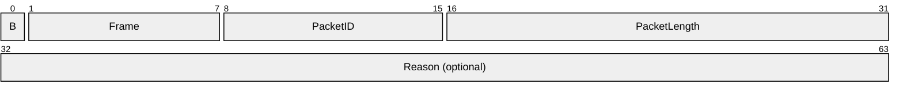

**B (1 bit):** A 1-bit flag. This flag SHOULD be set to 1 if the next packet will be sent immediately after this packet is sent. In this context, "immediately" means that the server does not intentionally introduce a delay (such as a pacing delay) between the transmission of the two packets. In all other cases, the flag MUST be 0.<56>

**Frame (7 bits):** A 7-bit field. This field MUST have the value 0x24. (If the **B** and Frame fields are treated as a single byte, the value of this byte will be 0x24 when the B field is 0, and 0xA4 when the B field is 1.)

| Value | Meaning |
| --- | --- |
| 0x24 | If treated as a 7-bit field. |
| 0xA4 | If the **B** and Frame fields are treated as a single byte. |

**PacketID (1 byte):** A 1-byte field that specifies the type of the packet.

**PacketLength (2 bytes):** A 16-bit unsigned integer field that specifies the size of the [MMS data packet (section 2.2.3.1.2)](#Section_2.2.3.1.2), if any, plus the size of the **Reason** field, if any. Unless otherwise specified, the value of this field MUST be equal to the number of bytes in the packet, counted starting from the end of this field. If neither the MMS data packet nor the **Reason** field is present, PacketLength MUST be set to 0.

**Reason (4 bytes):** An optional 32-bit integer field. Unless specified otherwise, if this field is present, its value MUST be set to an HRESULT code, as specified in [MS-ERREF](../MS-ERREF/MS-ERREF.md).

##### 2.2.3.1.2 MMS Data Packet

The MMS data packet structure (also referred to as "MMS Packet"), is a part of the [$D (Data) (section 2.2.3.3)](#Section_2.2.3.3), [$H (Header) (section 2.2.3.5)](#Section_4.13.1), and [$M (Metadata) (section 2.2.3.6)](#Section_2.2.3.6) packet types. The header portion of the MMS data packet is sometimes referred to as AF_HEADER_TYPE0.

The maximum size of an MMS data packet is 65,535 bytes. If the object being transferred would cause this size limit to be exceeded, it MUST be transferred as multiple MMS packets. For example, if the size of an [**ASF**](#gt_advanced-systems-format-asf) header is 100,000 bytes, it MUST be transferred using at least two $H packets. If the first $H packet contains a 65,535-byte MMS packet, the second $H packet would contain a 34,481-byte MMS packet. The preservation of byte boundaries is not a requirement when fragmenting ASF headers.

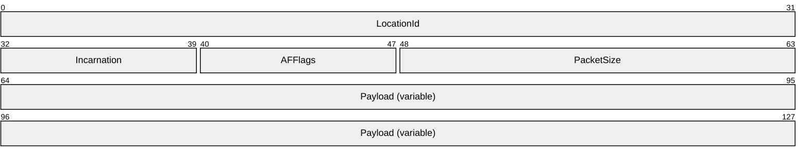

**LocationId (4 bytes):** A 32-bit unsigned integer field that specifies the index of the **Payload** field into the complete object that is being transferred. For $M and $H packets, which can be split across multiple packet payloads, the **LocationId** MUST be 0 for the first payload and MUST increment by 1 for each subsequent payload. For $D packets, the entire ASF file is considered the object that is being transferred. Thus, for $D packets, this field MUST be set to the payload's ASF packet number. The first ASF packet in an ASF file MUST have **LocationId** 0, the second ASF packet in the file MUST have **LocationId** 1, and so on. Note that since a server MAY skip ASF packets, the value of the **LocationId** field might not be sequential from one MMS data packet to the next. If the server does not have access to the ASF file (for example, in case of "live" [**content**](#gt_content)), the server MUST assume a "virtual" ASF file, incrementing **LocationId** (or decrementing it, when rewinding the content) exactly as if a real ASF file existed.

**Incarnation (1 byte):** An 8-bit sequence number. The initial value of this field SHOULD be 0. Sections [3.2.5.6](#Section_3.2.5.6) and [3.2.5.9](#Section_3.2.5.9) specify details about how this field is assigned. This field can be ignored by clients.

**AFFlags (1 byte):** An 8-bit unsigned integer field. For $D packets, the field MUST be treated as a sequence number. The initial value MUST be 0 and it MUST increment by 1 for each $D packet that is transmitted. If the most recently transmitted $D packet had an **AFFlags** field value of 254, and the server receives a [Play (section 2.2.2.6)](#Section_3.2.5.6) or [PlayNextEntry (section 2.2.2.7)](#Section_3.1.5.18) request, then the first $D packet transmitted in the response SHOULD have the **AFFlags** field set to 0. For $M and $H packets the following rules apply: The AFFlags field MUST be set to 0x00 unless otherwise specified in this document. The **AFFlags** field MUST be set to 0x04 if the object being transferred is split into multiple MMS packets, and this is the first MMS data packet in the sequence. AFFlags MUST be set to 0x08 if this is the last MMS data packet in the sequence, and AFFlags MUST be set to 0x0C if this is both the first and the last packet in the sequence (that is, the object is fully contained in the **Payload** field of the current MMS data packet).

**PacketSize (2 bytes):** A 16-bit unsigned integer field. This field MUST be set to the total size of the MMS packet, in bytes.

**Payload (variable):** A variable size block of bytes. The content of this field is different for each packet type. For more information, see all packets from [$C (Stream Change Notification) (section 2.2.3.2)](#Section_2.2.3.2) through [$T (Test Data Notification) (section 2.2.3.8)](#Section_2.2.3.8).

#### 2.2.3.2 $C (Stream Change Notification) Packet

The $C (Stream Change Notification) packet is sent by the server when it switches to the next or the previous entry in a server-side [**playlist**](#gt_playlist). The purpose of this packet is to notify the client of that event. The $C packet is defined as a [Framing header (section 2.2.3.1.1)](#Section_2.2.3.1.1), with the following additional details:

**B (1 bit):** As specified in section 2.2.3.1.1.

**Frame (7 bits):** As specified in section 2.2.3.1.1.

**PacketID (1 byte):** This field MUST be set to the character "C" (0x43).

**PacketLength (2 bytes):** This field MUST be set to 4.

**Reason (4 bytes):** This field MUST be present. If the reason the $C packet is sent is because the server is switching to the previous entry in a server-side playlist, that is, the server is [**streaming**](#gt_streaming) the playlist in reverse, this field SHOULD be set to 0x400D14BE. Otherwise, it SHOULD be set to 0.

#### 2.2.3.3 $D (Data) Packet

The $D (Data) packet is used by the server to transfer an [**ASF**](#gt_advanced-systems-format-asf) packet to the client.

The $D packet MUST start with a [Framing header (section 2.2.3.1.1)](#Section_2.2.3.1.1), followed by an [MMS data packet (section 2.2.3.1.2)](#Section_2.2.3.1.2), with the following additional details:

**B (1 bit):** As specified in section 2.2.3.1.1.

**Frame (7 bits):** As specified in section 2.2.3.1.1.

**PacketID (1 byte):** This field MUST be set to the "D" (0x44) character.

**PacketLength (2 bytes):** As specified in section 2.2.3.1.1

**Reason (4 bytes):** This field MUST NOT be present.

**Payload (variable):** This field MUST contain exactly one complete ASF packet. If the ASF packet contains a **Padding Data** field, as specified in [[ASF]](https://go.microsoft.com/fwlink/?LinkId=89814) section 5.2.4, that field SHOULD be removed before encapsulating the ASF packet in the $D packet, except if the client identifies itself as "NSServer" with a version earlier than 5.0 on the [User-Agent (section 2.2.1.8)](#Section_2.2.1.8) header. If the **Padding Data** field is removed, the **Padding Length** field in the ASF payload parsing information section, as specified in [ASF] section 5.2.2, MUST be updated to indicate a nonexistent **Padding Data** field.

#### 2.2.3.4 $E (End-of-Stream Notification) Packet

The $E (End-of-Stream Notification) packet is used by the server to specify that the last [$D (Data) packet (section 2.2.3.3)](#Section_2.2.3.3) for the [**content**](#gt_content) has been transmitted. The $E packet also specifies if this was the last content in a server-side [**playlist**](#gt_playlist) or if the client expects to receive a [$C (Stream Change Notification) packet (section 2.2.3.2)](#Section_2.2.3.2).

The $E packet is defined as a [Framing header (section 2.2.3.1.1)](#Section_2.2.3.1.1), with the following additional details:

**B (1 bit):** As specified in section 2.2.3.1.1.

**Frame (7 bits):** As specified in section 2.2.3.1.1.

**PacketID (1 byte):** This field MUST be set to the "E" (0x45) character.

**PacketLength (2 bytes):** This field MUST be set to 4.

**Reason:** This field MUST be present. The HRESULT code specifies the error, if any, that caused the server to send the $E packet. HRESULT codes that have special meaning in the context of a $E packet are defined in the following table.

| Value | Meaning |
| --- | --- |
| S_OK (0x00000000) | The server has finished [**streaming**](#gt_streaming) and no more $D packets (section 2.2.3.3) will be transmitted until the next [Play request (section 2.2.2.6)](#Section_3.2.5.6). |
| S_FALSE (0x00000001) | The server has finished streaming the current playlist entry. Other playlist entries still remain to be streamed. The server will transmit a $C packet when it switches to the next entry. |
| NS_S_EOS_RECEDING (0x000D2F09) | The server was rewinding the content (streaming the content backward) and has reached the beginning of the current playlist entry. No more $D packets will be transmitted until the next Play request. |

#### 2.2.3.5 $H (Header) Packet

The $H (Header) packet is used by the server to transfer an [**ASF**](#gt_advanced-systems-format-asf) header to the client. The packet is sent in the response to [Describe (section 2.2.2.1)](#Section_3.1.4.2.1), [Play (section 2.2.2.6)](#Section_3.2.5.6), and [PlayNextEntry requests (section 2.2.2.7)](#Section_3.1.5.18), and after a [$C packet (section 2.2.3.2)](#Section_2.2.3.2).

The $H packet MUST start with a [Framing header (section 2.2.3.1.1)](#Section_2.2.3.1.1), followed by an [MMS data packet (section 2.2.3.1.2)](#Section_2.2.3.1.2), with the following additional details:

**B:** As specified in section 2.2.3.1.1.

**Frame:** As specified in section 2.2.3.1.1.

**PacketID:** This field MUST be set to the character "H" (0x48).

**PacketLength:** As specified in section 2.2.3.1.1.

**Reason:** This field MUST NOT be present.

**Payload:** This field MUST contain an ASF header. The ASF header consists of the entire ASF Header Object, as specified in [[ASF]](https://go.microsoft.com/fwlink/?LinkId=89814) section 3.1, plus the 50-byte fixed initial portion of the ASF Data Object, as specified in [ASF] section 5.1. If the size of the ASF header would cause the maximum size of the MMS data packet (section 2.2.3.1.2) to be exceeded, the ASF header MUST be broken into multiple smaller pieces, and each piece MUST be transmitted as a separate $H packet, as specified in section 2.2.3.1.2.

#### 2.2.3.6 $M (Metadata) Packet

The $M (Metadata) packet is used by the server to transfer metadata for the current [**playlist**](#gt_playlist) entry to the client.

The *playlist-gen-id* parameter in the $M packet MUST specify the identifier of the playlist entry that is described by the $M packet. The *playlist-gen-id* parameter is specified in section [2.2.1.4.18](#Section_2.2.1.4.18).

The value of the *broadcast-id* parameter in the $M packet MUST uniquely identify the source of "live" [**content**](#gt_content) within the scope of the current server-side playlist. For example, if the same live content source is used in multiple entries in a single playlist, the value of the *broadcast-id* parameter will be the same in each of those entries. There is no requirement that the values of the *broadcast-id* parameter be unique across different server-side playlists. If a playlist entry is not using a live content source, the value of the *broadcast-id* parameter MUST be 0.

The *features* parameter in the $M packet MUST specify the properties and capabilities of the playlist entry that is described by the $M packet. The *features* parameter is specified in section [2.2.1.4.8](#Section_2.2.1.4.8).

The $M packet starts with a [Framing Header (section 2.2.3.1.1)](#Section_2.2.3.1.1) followed by an [MMS data packet (section 2.2.3.1.2)](#Section_2.2.3.1.2), with the following additional details:

**B (1 bit):** As specified in section 2.2.3.1.1.

**Frame (7 bits):** As specified in section 2.2.3.1.1.

**PacketID (1 byte):** This field MUST be set to the character "M" (0x4D).

**PacketLength (2 bytes):** As specified in section 2.2.3.1.1.

**Reason (4 bytes):** This field MUST NOT be present.

**Payload (variable):** The field MUST adhere to the ABNF syntax for Metadata-Payload, defined as follows:

Metadata-Payload = playlist-gen-id ; section 2.2.1.4.18

"," SP

"broadcast-id=" 1*10DIGIT

"," SP

features ; section 2.2.1.4.8

%x00

*content-description-list ; section 2.2.4

The value of the *broadcast-id* parameter MUST be an integer in the range from 0 through 4,294,967,295.

#### 2.2.3.7 $P (Packet-Pair) Packet

A $P packet starts with a [Framing header (section 2.2.3.1.1)](#Section_2.2.3.1.1) followed by a variable-length payload field, with the following additional field details<57>:

**B (1 bit):** As specified in section 2.2.3.1.1.

**Frame (7 bits):** As specified in section 2.2.3.1.1.

**PacketID (1 byte):** This field MUST be set to the "P" (0x50) character.

**PacketLength (2 bytes):** This field MUST be set according to one of the following values.

| Value | Meaning |
| --- | --- |
| 504 | This field MUST be set to this value for the first and second $P packets. |
| 1048 | This field MUST be set to this value for the third $P packet. |

**Reason (4 bytes):** This field MUST be present and is treated as an unsigned integer. The field MUST be set to the smaller of 504 and the number of bytes in the header portion of the HTTP response, counted from the first byte of the response up to the start of the first $P packet.

**Payload (variable):** This field MUST consist of random bytes with highly entropic values. For the first $P packet the size of the **Payload** field MUST be 504 bytes minus the value of the **Reason** field. However, if **Reason** is equal to 504, the size of the **Payload** field MUST be 0 bytes. For the second $P packet, the size of the **Payload** field MUST be 504 bytes. For the third packet, the size of the **Payload** field MUST be 1,048 bytes plus the value of the **Reason** field.

#### 2.2.3.8 $T (Test Data Notification) Packet

The $T (Test Data Notification) packet is sent by the server in the response to the first in a series of two [Pipeline requests (section 2.2.2.5)](#Section_3.2.5.5).<58>

A $T packet is defined as a [Framing header (section 2.2.3.1.1)](#Section_2.2.3.1.1) with the following additional details:

**B (1 bit):** As specified in section 2.2.3.1.1.

**Frame (7 bits):** As specified in section 2.2.3.1.1.

**PacketID (1 byte):** This field MUST be set to the character "T" (0x54).

**PacketLength (2 bytes):** This field MUST be set to 0.

**Reason (4 bytes):** This field MUST NOT be present.

### 2.2.4 Content Description List Format

Metadata about the [**content**](#gt_content) that is sent by the server to the client in the [$M (Metadata) (section 2.2.3.6)](#Section_2.2.3.6) packet is formatted by using a syntax called the Content Description List (CDL). Any number of information items can be stored in the CDL such as copyright information, [**playlist**](#gt_playlist) information, duration of the content, size of the content, or content description.

A CDL consists of at least one content description. Each content description specifies metadata in a particular language. The content description consists of a series of name-value pairs.

Although it is not a general requirement of content descriptions, when a content description is used in a CDL, the first name-value pair of each content description MUST have the name "language". The value MUST be either a language tag, as specified in [[RFC2616]](https://go.microsoft.com/fwlink/?LinkId=90372) section 3.10, or a zero-length string. If the length of the language tag is nonzero, it identifies the language of the metadata in the content description. Otherwise, the language of the content description is unspecified.

The remaining name-value pairs in the content description can have arbitrary names. There can be any number of name-value pairs, and each name and value can be of an arbitrary length.

The following table defines the individual fields used to represent a single name-value pair in the content description.

| Term | Description |
| --- | --- |
| <name length> | The length, in bytes, of the name specified in the name-value pair. |
| <name> | The name specified for the name-value pair, expressed using UTF-8 characters, as specified in [[RFC3629]](https://go.microsoft.com/fwlink/?LinkId=90439). |
| <value type> | Numeric value indicating the value's type, as specified in [2.2.4.1](#Section_2.2.4.1). |
| <value length> | Length in bytes of the value. |
| <value> | A string representation of the actual data of the name-value pair, using UTF-8 characters. |

The format for a name-value pair is as follows.

<name length>,<name>,<value type>,<value length>,<value>

The following is an example of a name-value pair.

9,copyright,31,30,)) 1999 Microsoft Corporation

This example represents a 9-character name-value pair (copyright) which is of type 31 (a wide character string).

The format is more formally defined using ABNF as follows.

cd-length = 1*10DIGIT

cd-string = *VCHAR

cd-namevalue = cd-length "," cd-string ","

1*3DIGIT ","

cd-length "," cd-string

content-description = cd-namevalue

*( "," cd-namevalue ) CRLF

language-content-description = "7,language,31," cd-length ","

language-tag ; [RFC2616] section 3.10

*( "," content-description ) CRLF

content-description-list = 1*( language-content-description )

#### 2.2.4.1 CDL Value Types

The following table shows supported values for the **<value type>** field in the content description, using data types as specified in [MS-OAUT](../MS-OAUT/MS-OAUT.md) section 2.2.7.

Any type not listed in the table is not supported by the server. If a client encounters a CDL value that uses a value type not listed in the following table then the CDL value will be ignored.

| Data type | <value type> |
| --- | --- |
| VT_BOOL | 11 |
| VT_BSTR | 8 |
| VT_CY | 6 |
| VT_ERROR | 10 |
| VT_I1 | 16 |
| VT_I2 | 2 |
| VT_I4 | 3 |
| VT_INT | 22 |
| VT_LPWSTR | 31 |
| VT_UI1 | 17 |
| VT_UI2 | 18 |
| VT_UI4 | 19 |
| VT_UINT | 23 |

### 2.2.5 Remote Event Format

The Remote Event format is used in the message body of the [SendEvent request (section 2.2.2.9)](#Section_2.2.2.9).

The syntax of the Remote Event format is defined by using ABNF as follows.

EncodingFormat = 1

EncodingVersion = 1

EventType = ( 28 / 29 / 30 )

EventReason = 1*10DIGIT

remote-event-message = EncodingFormat CRLF

EncodingVersion ","

EventType ","

EventReason CRLF

[ 2(content-description) ] ; section 2.2.4

The value of the *EventType* parameter MUST be set to one of the following three values: 28 to specify the remote-open event, 29 to specify the remote-close event, or 30 to specify the remote-log event.

The remote-open event is fired by a caching proxy server when it opens a content item from its cache. The remote-close event is fired by a caching proxy server when it closes a content item from its cache.

The remote-log event is fired by a client to indicate that the client is sending statistics to the server. Remote-logs are typically sent independent from streaming statistics.<59>

The value of the *EventReason* parameter MUST be an integer in the range from 0 through 4,294,967,295. It MUST be treated as an HRESULT code, as specified in [MS-ERREF](../MS-ERREF/MS-ERREF.md).

The two content-description parameters MUST be present if the value *EventType* parameter is 30 (that is, for remote-log events) and MUST NOT be present otherwise.

The first content description MUST contain at least the following fields.

| <name> | <value-type tag> | <value> |
| --- | --- | --- |
| context-type | VT_I4 | 2 |
| WMS_USER_AGENT | VT_LPWSTR | A string adhering to the syntax for client-token, or similar, as specified in [User-Agent (section 2.2.1.8)](#Section_2.2.1.8) header. |
| WMS_USER_GUID | VT_LPWSTR | A string adhering to the syntax for [**GUID**](#gt_globally-unique-identifier-guid) value, as specified in [xClientGUID (section 2.2.1.4.33)](#Section_2.2.1.4.33) token. |

The second content description MUST contain at least the following fields:

| <name> | <value-type tag> | <value> |
| --- | --- | --- |
| context-type | VT_I4 | 5 |
| @WMS_COMMAND_CONTEXT_URL | VT_LPWSTR | A string adhering to the syntax for httpurl, as specified in [[RFC1738]](https://go.microsoft.com/fwlink/?LinkId=90287). |
| @.REMOTE_LOG | VT_LPWSTR | A "rendering" log in XML format, as specified in [MS-WMLOG](../MS-WMLOG/MS-WMLOG.md) |

For more information about the syntax for content-description, see section [2.2.4](#Section_2.2.4).

# 3 Protocol Details

## 3.1 Client Details

Unless specified otherwise, the protocol reports the occurrence of an error to the higher layer, stops all timers, and stops processing further messages. Possible errors include the following: failure to connect to the server, the connection to the server is unexpectedly closed, the response to a request indicates an error, the **Reason** field in the [$E](#Section_2.2.3.4) or [$C](#Section_2.2.3.2) packets indicates an error, a malformed packet is received (such as a [$D packet](#Section_2.2.3.3) not adhering to the syntax for packets of that type), or an unexpected packet (such as receiving a [$P packet](#Section_2.2.3.7) when waiting for a [$H packet](#Section_4.13.1)) is received.

Unless specified otherwise, the client role of the protocol always provides the value of the **Higher-Layer-ID** variable in the Abstract Data Model to the higher layer when it invokes the higher layer.

### 3.1.1 Abstract Data Model

This section describes a conceptual model of possible data organization that an implementation maintains to participate in this protocol. The described organization is provided to facilitate the explanation of how the protocol behaves. This specification does not mandate that implementations adhere to this model as long as their external behavior is consistent with that described in this document.

**$P-Arrival-Time:** This is an unsigned 64-bit integer number that stores the time at which a $P is received. Because this variable is used only for computing relative time differences, the absolute clock offset is of no consequence and can be chosen arbitrarily. The value of the variable is in units of one hundred nanoseconds. The minimum value is 0x0000000000000000. The maximum value is 0xFFFFFFFFFFFFFFFF. The default value is 0x0000000000000000.

**$P-Packets-Expected:** This is a numerical variable that stores the number of $P packets that are expected to be received. The allowed values for this variable are 0, 1, 2, and 3. The default value is 0.

**Authentication-Schemes:** This variable is a string that specifies the authentication schemes supported by the client, listed in order of preference. Each authentication scheme is identified as auth-scheme token (defined in [[RFC1945]](https://go.microsoft.com/fwlink/?LinkId=90300) section 11), and multiple auth-scheme tokens are separated by commas. The default value of this variable is an empty string.

**Client-ID:** The value of this variable is an identifier assigned by the server for the current [**streaming**](#gt_streaming) "[**session**](#gt_session)". Because the client-ID value is provided by the server, the initial value is undefined.

**Client-Initialization-Status:** A flag that, if set to 1, indicates that the protocol has been initialized. Otherwise, the protocol has not been initialized. The initial value is 0.

**Client-State:** This variable stores the client's state. Possible values are INIT, STREAMING, and IDLE.

**Client-Token:** This variable stores the token used by the client on the [User-Agent](#Section_2.2.1.8) header. Three values are possible: "NSPlayer", "NSServer", and "WMCacheProxy".

**Client-Token-Version:** This variable stores the server major and minor version number provided by the higher layer.

**Cookie-List**: This variable stores the list of cookies received from the Set-Cookie header. The initial value of the list is empty. The Cookie-List SHOULD be persistent and SHOULD be shared with other instances of the Windows Media Streaming Protocol (WMSP) and RTSP extensions run by the same user on the same machine. This means that if a cookie is set for the URL rtsp://example.com/, and then a cookie with the same name is set for the URL http://example.com/, the second cookie overrides the first cookie because the two URLs are considered equivalent.

**Expected-Packets:** This variable specifies the packet types that the client is expecting to receive. The variable can be set to any combination of [$C](#Section_2.2.3.2), [$D](#Section_2.2.3.3), [$E](#Section_2.2.3.4), [$H](#Section_4.13.1), [$M](#Section_2.2.3.6), [$P](#Section_2.2.3.7), and [$T](#Section_2.2.3.8). The variable can also be empty, meaning that no packets are expected. The variable can be implemented as an unordered list or as a bit mask that is seven bits wide with one bit for each packet type. By default this variable is empty.

**Expected-Responses:** This variable is an ordered list where each element specifies the type of message response that is expected. Elements are always added to the tail end of the list when a request is sent and removed from the head of the list when a response is received. The possible values for the individual elements are: [Describe](#Section_3.1.4.2.1), [GetContentInfo](#Section_2.2.1.2.4), [KeepAlive](#Section_3.2.5.8), [Log](#Section_2.2.2.4), [pipeline](#Section_2.2.1.4.16), [Play](#Section_3.2.5.6), [PlayNextEntry](#Section_3.1.5.18), [SelectStream](#Section_3.2.5.7), [SendEvent](#Section_2.2.2.9), and [Stop](#Section_2.2.2.10). The default value of this variable is an empty list.

**Higher-Layer-ID:** This variable is a numerical identifier that is assigned by the higher layer. In case the higher layer is maintaining multiple instances of the client role, the higher layer can use this variable to determine which client role instance is invoking it, as long as the higher layer makes sure to assign a distinct **Higher-Layer-ID** value to each instance of the client role. The initial value is undefined.

**Keepalive-timeout:** This variable stores the frequency at which the client will send KeepAlive requests (section 2.2.2.3). The default value is 60 seconds.

**KeepAlive-Mode:** This variable specifies if the protocol is in [**pipelined mode**](#gt_pipelined-mode) or [**non-pipelined mode**](#gt_non-pipelined-mode).

**Pipeline-Test-Allowed:** A flag that, if set to 1, indicates that the server is willing to let the client test if the pipelined mode of the protocol can be used.

**Playlist-gen-id:** The value of this variable is an identifier assigned by the server to identify the current [**playlist**](#gt_playlist) entry. The default value is 0.

**Server-features:** This variable stores the capabilities that the server specified on the most recently received [Supported](#Section_2.2.1.7) header.

**Server-Version:** This variable stores the server product name (the value of server-token) and major and minor version number that the server specified on the most recently received [Server](#Section_2.2.1.5) header.

**Note** The preceding conceptual data can be implemented by using a variety of techniques. This protocol does not prescribe or advocate any specific implementation technique.

### 3.1.2 Timers

**Keepalive:** This timer is used for sending [KeepAlive requests (section 2.2.2.3)](#Section_3.2.5.8). The timeout period is controlled by the Keepalive-timeout variable specified in section [3.1.1](#Section_3.2.1). The minimum allowed value for the time-out period is 0.

### 3.1.3 Initialization

Initialization of the protocol occurs as the result of a higher layer asking for information about multimedia [**content**](#gt_content) located on a server. That event is described in section [3.1.4.2](#Section_3.1.4.2).

The variables defined by the abstract data model MUST initially assume their default values. For variables that do not have a default defined, the following rules MUST be followed:

- The higher layer SHOULD provide an identifier that allows it to identify this instance of the client role from other instances of the client role that can also be maintained by the higher layer. The client role MUST store this identifier in the **Higher-Layer-ID** variable.
- The higher layer SHOULD provide a list of supported authentication schemes, and the authentication schemes MUST be listed in order of preference with the most preferred authentication scheme appearing first in the list. The **Authentication-Schemes** variable MUST be set to the value of this list if it is provided by the higher layer. If the higher layer is unable to provide this information (for example, because authentication is not supported), the **Authentication-Schemes** variable MUST be set to an empty string.
- The Client-State variable MUST be set to INIT.
- The Client-Token variable MUST be set to "WMCacheProxy" if the higher layer specifies that the client is an intermediate device and has the full capability of a caching proxy server. If the higher layer specifies that the client is limited to a noncaching proxy server acting on behalf of one or more clients, the Client-Token variable MUST be set to "NSServer". Otherwise, Client-Token MUST be set to "NSPlayer".
- The Client-Token-Version variable MUST be set to the client major and minor version number provided by the higher layer, according to the table specified in section [2.2.1.8](#Section_2.2.1.8).
- The KeepAlive-Mode variable MUST be set to [**non-pipelined mode**](#gt_non-pipelined-mode).
- The Server-features variable MUST be set to specify support for [com.microsoft.wm.predstrm (section 2.2.1.7.2)](#Section_2.2.1.7.2), [com.microsoft.wm.srvppair (section 2.2.1.7.3)](#Section_2.2.1.7.3), and for [com.microsoft.wm.sswitch (section 2.2.1.7.4)](#Section_2.2.1.7.4).
- The Pipeline-Test-Allowed variable remains uninitialized.
- The Server-Version variable remains uninitialized.
- If the Cookie-List variable already has a non-empty value, this value remains unchanged.
- The **Client-Initialization-Status** variable MUST be set to 1.

### 3.1.4 Higher-Layer Triggered Events

#### 3.1.4.1 Request to Retrieve Caching Information

This event can occur when the application is a caching proxy server. The event can occur if the higher layer wants to check if [**content**](#gt_content) is available, and if it can be cached, but does not necessarily want to [**stream**](#gt_stream) it.

The higher layer MUST provide the URL that will be used in the request.

If the **Client-Initialization-Status** does not equal 1, then this will be the first request that is sent by the client, the client MUST perform the initialization of the protocol as specified in section [3.1.3](#Section_3.1.3).

The client MUST then establish a TCP connection to the server by using the IP address and port number obtained by parsing the URL.

If the value of the Client-Token variable in the abstract data model is not "WMCacheProxy", the client MUST send a [Describe request (section 2.2.2.1)](#Section_3.1.4.2.1).

Otherwise, the client MUST send a [GetContentInfo request](#Section_2.2.1.2.4) to the server.

The GetContentInfo request MUST adhere to the syntax specified in section 2.2.2.2.

The message body of the GetContentInfo request SHOULD consist of only one byte, which SHOULD be chosen arbitrarily.

In addition, the common processing steps specified in section [3.1.5.1](#Section_3.1.5.1) MUST be followed when sending the GetContentInfo request.

After having sent the request, the client MUST process the rules in section [3.1.5.2](#Section_3.1.5.2).

#### 3.1.4.2 Request to Retrieve Content Information

This event causes the client to send a [Describe request (section 2.2.2.1)](#Section_3.1.4.2.1) to the server. The most common scenarios in which an application would ask the client for information about multimedia [**content**](#gt_content) are the following.

- A media player application that intends to play multimedia content, which will be [**streamed**](#gt_streaming) from a server. The media player knows the URL to the content and it might already know at what time position and at what rate it intends to play the content. However, before it can start playing the content, it needs to retrieve information about what audio and video [**streams**](#gt_stream) are included in the content, what decoders will be needed to decompress the content and other information.
- A cache that already has a copy of the content but must retrieve information about the content from the server to determine if the cached copy is still fresh.
- A server or intermediate device, such as a noncaching proxy, which is asking for information on behalf of another client.
The higher layer MUST provide the URL that will be specified in all requests sent by the client.

If the **Client-Initialization-Status** does not equal 1, then this will be the first request that is sent by the client, and the client MUST perform the initialization of the protocol as specified in section [3.1.3](#Section_3.1.3).

The client MUST then establish a TCP connection to the server by using the IP address and port number obtained by parsing the URL. Next, the client MUST send the Describe request to the server, as specified in the next section, [3.1.4.2.1](#Section_3.1.4.2.1).

##### 3.1.4.2.1 Sending the Describe Request

The [Describe request](#Section_3.1.4.2.1) MUST adhere to the syntax specified in section 2.2.2.1.

In addition, the common processing steps specified in section [3.1.5.1](#Section_3.1.5.1) MUST be followed when sending the Describe request.

If the client implementation supports the [**pipelined mode**](#gt_pipelined-mode) of the protocol, the Describe request SHOULD include a [pipeline-experiment (section 2.2.1.4.15)](#Section_2.2.1.4.15) token on the [Pragma](#Section_2.2.1.4) header, with the value set to 1, as specified in [2.2.1.4.14](#Section_2.2.1.4.14). Clients that use HTTP 1.0 MUST NOT send the pipeline-experiment token.

If the client implementation would like to use [$P (Packet-Pair) packets](#Section_2.2.3.7) to measure the bottleneck bandwidth between the client and the server, and if the value of the Server-Version variable is not uninitialized and is less than 5.0, and if the value of the Server-features variable indicates that the [com.microsoft.wm.srvppair](#Section_2.2.1.7.3) feature is supported, then the client SHOULD specify the packet-pair-experiment (section 2.2.1.4.14) token on the Pragma header with the value set to 1. Otherwise, the packet-pair-experiment token SHOULD NOT be specified. For example, a client that intends to select all of the [**streams**](#gt_stream) in the [**ASF**](#gt_advanced-systems-format-asf) file, or that does not support the [stream-switch-entry](#Section_2.2.1.4.27) token, is not likely to have any use for $P packets and thus does not need to specify the packet-pair-experiment token, as specified in 2.2.1.4.14.

After having sent the request, the client MUST process the rules in section [3.1.5.2](#Section_3.1.5.2).

#### 3.1.4.3 Request to Start Streaming Content

This higher-layered triggered event can occur when the client is not currently [**streaming**](#gt_streaming) from the server. The event causes the client to send a [Play request (section 2.2.2.6)](#Section_3.2.5.6) to the server. The most common scenarios in which an application would ask the client to request the server to start streaming [**content**](#gt_content) are the following.

- A media player application that has examined the [**ASF**](#gt_advanced-systems-format-asf) header that was received from the server (as specified in [3.1.5.8](#Section_3.1.5.8)) and determined that it is capable to decompress and play the multimedia content.
- A cache that has determined that the currently-cached copy of the content, if any, is either stale or incomplete.
- A server or intermediate device, such as a noncaching proxy, which is asking for content to be streamed on behalf of another client.
If the TCP connection that is used for sending the most recent [Describe (section 2.2.2.1)](#Section_3.1.4.2.1), Play (section 2.2.2.6), or [PlayNextEntry (section 2.2.2.7)](#Section_3.1.5.18) request is still open, the connection MUST either be used for sending the next request or it MUST be closed at this time. If the TCP connection is closed, the client MUST then establish a TCP connection to the server by using the IP address and port number obtained by parsing the URL.

If the value of the Pipeline-Test-Allowed variable is 1, and the KeepAlive-Mode variable specifies that the protocol is currently in [**non-pipelined mode**](#gt_non-pipelined-mode), the client SHOULD send two [Pipeline requests (section 2.2.2.5)](#Section_3.2.5.5). The Pipeline requests MUST adhere to the syntax defined in section 2.2.2.5 and MUST follow the rules in section [3.1.5.1](#Section_3.1.5.1). After having sent the two requests, the client MUST process the rules in section [3.1.5.2](#Section_3.1.5.2).

Next, the client MUST send the Play request to the server, as specified in the next section [3.1.4.3.1](#Section_3.1.4.3.1).

##### 3.1.4.3.1 Sending a Play Request

If the TCP connection that is used for sending the most recent [Describe](#Section_3.1.4.2.1), [Play](#Section_3.2.5.6), or [PlayNextEntry](#Section_3.1.5.18) request is still open, the connection MUST either be used for sending the Play request or it MUST be closed at this time. If the TCP connection is closed, the client MUST then establish a TCP connection to the server by using the IP address and port number that is obtained by parsing the URL.

The Play request MUST adhere to the syntax that is specified in section 2.2.2.6.

In addition, the common processing steps that are specified in section [3.1.5.1](#Section_3.1.5.1) MUST be followed when sending the Play request.

Because the [**ASF**](#gt_advanced-systems-format-asf) header typically specifies multiple [**streams**](#gt_stream), the higher layer MUST select exactly which of the streams are [**streamed**](#gt_streaming) from the server. If a subset of the streams that are listed in the ASF header are selected to be streamed, or if the value of the Client-Token variable is not "NSServer", or if the [Client-Token-Version (section 3.1.1)](#Section_3.2.1) is greater than or equal to 9.0, the client MUST specify the complete selection state of all streams by including a [stream-switch-entry (section 2.2.1.4.27)](#Section_2.2.1.4.27) token on a [Pragma](#Section_2.2.1.4) header in the Play request. In this case, the stream-switch-entry token MUST specify all available streams, and each stream MUST either be marked as on by specifying the thinning level parameter as 0, or marked as off by specifying the thinning level parameter as 2, depending on the selection made by the higher layer. This token MUST be sent on a separate Pragma header; that is, no other tokens are allowed to be included on the same Pragma header as the stream-switch-entry token.

If the higher layer specifies that the server skip to the next or previous [**playlist**](#gt_playlist) entry, and the Server-Version variable is greater than or equal to 5.0, the client SHOULD send this information to the server using the [pl-offset (section 2.2.1.4.20)](#Section_2.2.1.4.20) token on the Pragma header. To indicate that the client skips to the next entry, the client SHOULD specify a value of 1 for the pl-offset token on the Pragma header. To indicate that the client skips to the previous entry, the client SHOULD specify a value of -1 for the pl-offset token on the Pragma header.

The higher layer MUST also provide either the time position or the ASF packet number from which the server is asked to start streaming. If a time position is provided, the client MUST send this information by using the [stream-time (section 2.2.1.4.28)](#Section_2.2.1.4.28) token on the Pragma header. If an ASF packet number is provided, the client MUST send this information by using either the [stream-offset (section 2.2.1.4.25)](#Section_2.2.1.4.25) token or the [packet-num (section 2.2.1.4.13)](#Section_2.2.1.4.13) token on the Pragma header.

The higher layer MUST specify the playlist entry ID to which the previously mentioned time position or ASF packet number applies. Usually this playlist entry is the same entry that is indicated by the client Playlist-gen-id variable. However, if the client has recently received a [$M packet](#Section_2.2.3.6) and updated its Playlist-gen-id variable, the higher layer might not yet have processed the change to the playlist entry. The client MUST compare the value of its Playlist-gen-id variable against the playlist entry ID that is specified by the higher layer. If the values do not match and the playlist entry ID of the higher layer is nonzero, the client MUST specify a [playlist-seek-id (section 2.2.1.4.19)](#Section_2.2.1.4.8.4) token on the Pragma header and use the playlist entry ID of the higher layer as the value for that token.

The higher layer MUST specify at what rate the multimedia [**content**](#gt_content) is played back. For example, if the higher layer wants to play the multimedia content in reverse, it MUST specify this and also specify the rate of playback. The client MUST send this information by using the [rate (section 2.2.1.4.22)](#Section_2.2.1.12.1) token on the Pragma header.

The higher layer SHOULD specify an amount of data that is streamed faster than real time and the bit rate at which the server streams this data. The higher layer SHOULD also specify the bit rate that can be used for streaming between the server and the client. If the value of the Server-Version variable is greater than or equal to 5.0, the client SHOULD send this information to the server by using the [AccelBW (section 2.2.1.4.1)](#Section_2.2.1.4.1), [AccelDuration (section 2.2.1.4.2)](#Section_2.2.1.4.2), and [LinkBW (section 2.2.1.4.9)](#Section_2.2.1.4.9) tokens on the Pragma header.

If the value of the Client-Token variable is "NSServer" or "WMCacheProxy", the higher layer SHOULD specify an alternate amount of data that is streamed faster than real time and an alternate bit rate at which the server streams this data. These alternate amounts are for the client's own behalf, as opposed to the AccelDuration and AccelBW values, which are on behalf of another (external) client. If the value of the Server-Version variable is greater than or equal to 5.0, the client SHOULD send this information to the server by using the [BurstDuration (section 2.2.1.4.4)](#Section_2.2.1.4.4) and [BurstBW (section 2.2.1.4.3)](#Section_2.2.1.4.3) tokens on the Pragma header.

If the client supports the [X-StartupProfile (section 2.2.1.12)](#Section_2.2.1.12) header, and the value of the Server-features variable indicates that the server supports the [com.microsoft.wm.startupprofile](#Section_2.2.1.7.5) feature, the client SHOULD specify the com.microsoft.wm.startupprofile token on the [Supported](#Section_2.2.1.7) header when it sends a Play request. A client that does not support the X-StartupProfile header MUST NOT include this token in the Supported header.

The higher layer SHOULD specify that the entire content is streamed faster than real time at some transmission rate that is chosen by the higher layer. If the Server-Features variable indicates that the server supports the [com.microsoft.wm.fastcache](#Section_2.2.1.7.1) feature (2.2.1.7.1) and the Server-Version variable is greater than or equal to 5.0, the client SHOULD send this information to the server by using the [Speed (section 2.2.1.4.24)](#Section_2.2.1.4.24) token on the Pragma header. The Speed token MUST NOT be included in the request unless the server has explicitly specified that it supports the com.microsoft.wm.fastcache feature.

If the value of the KeepAlive-Mode variable specifies that the [**pipelined mode**](#gt_pipelined-mode) of the protocol is used, the Play request MUST be sent by using the HTTP 1.1 protocol, the client MUST specify the [version11-enabled (section 2.2.1.4.30)](#Section_2.2.1.4.30) token on the Pragma header, and the value of the token MUST be 1.

After having sent the request, the client MUST process the rules in section [3.1.5.2](#Section_3.1.5.2).

#### 3.1.4.4 Request to Change the Currently Selected Streams

This event occurs when the higher layer changes the [**streams**](#gt_stream) that are currently being [**streamed**](#gt_streaming). For example, if the higher layer switches from an English language audio stream to a Spanish language one, or if the higher layer switches to a stream with higher quality video.

If the [**pipelined mode**](#gt_pipelined-mode) of the protocol is used and the TCP connection used for the most recent [Play](#Section_3.2.5.6) or [PlayNextEntry](#Section_3.1.5.18) request is open, the client MUST send a [SelectStream request (section 2.2.2.8)](#Section_3.2.5.7) on this connection.

Otherwise, the client MUST establish a new TCP connection to the server using the IP address and port number obtained by parsing the URL used for the [Describe request](#Section_3.1.4.2.1). A SelectStream request MUST be sent on this new connection, as specified in SelectStream Request (section 2.2.2.8).

The client SHOULD NOT send a SelectStream request to the server unless the value of the Server-features variable in the abstract data model indicates that the server supports the [com.microsoft.wm.sswitch](#Section_2.2.1.7.4) feature (2.2.1.7.4).

The [stream-switch-entry (section 2.2.1.4.27)](#Section_2.2.1.4.27) token on the [Pragma](#Section_2.2.1.4) header of the SelectStream request MUST specify the streams that are affected by the change that was requested by the higher layer. Streams that are unaffected SHOULD NOT be specified on the stream-switch-entry token, and other tokens SHOULD NOT be included on the same Pragma header as the stream-switch-entry token.

If the value of the KeepAlive-Mode variable specifies that the pipelined mode of the protocol is used, the SelectStream request MUST be sent using the HTTP 1.1 protocol, and the client MUST specify the [version11-enabled (section 2.2.1.4.30)](#Section_2.2.1.4.30) token on the Pragma header, and the value of the token MUST be 1.

After having sent the request, the client MUST process the rules in section [3.1.5.2](#Section_3.1.5.2).

#### 3.1.4.5 Selection of Streams to Play from the New Playlist

This event occurs after the higher layer has received the [**ASF**](#gt_advanced-systems-format-asf) header for a new [**playlist**](#gt_playlist) entry and the higher layer is ready to start processing the ASF packets for the new playlist entry. This event is the higher layer's opportunity to select the [**streams**](#gt_stream) to receive from the new playlist entry. Because the bit rate needed to stream each playlist entry depends on how the [**content**](#gt_content) was encoded and which streams are selected, the higher layer MAY also specify new values for the parameters that control how much faster than real time (if at all) the content is [**streamed**](#gt_streaming).

If the value of the KeepAlive-Mode variable specifies that the [**non-pipelined mode**](#gt_non-pipelined-mode) of the protocol is used, or if the TCP connection used for the most recent [Play (section 2.2.2.6)](#Section_3.2.5.6) or [PlayNextEntry (section 2.2.2.7)](#Section_3.1.5.18) request is no longer open, the client MUST establish a new TCP connection to the server by using the IP address and port number obtained by parsing the URL used for the [Describe request (section 2.2.2.1)](#Section_3.1.4.2.1).

If the value of the KeepAlive-Mode variable specifies that the [**pipelined mode**](#gt_pipelined-mode) of the protocol is used, the client MUST send a PlayNextEntry request (section 2.2.2.7). The request MUST be sent on either the same TCP connection that was used for the most recent Play or PlayNextEntry request, or if that connection is no longer open, on the TCP connection that was newly established according to the preceding rules.

If the value of the KeepAlive-Mode variable specifies that the non-pipelined mode of the protocol is used, the client MUST send a [SelectStream request (section 2.2.2.8)](#Section_3.2.5.7). The request MUST be sent on the TCP connection that was newly established according to the preceding rules.

If the client that wants the server to use predictive stream selection for the current playlist entry, then it MUST send the [Supported](#Section_2.2.1.7) header with the [com.microsoft.wm.predstrm](#Section_2.2.1.7.2) token (as specified in section 2.2.1.7.2) in the Play, SelectStream, or PlayNextEntry request, as appropriate. A client that does not want the server to use Predictive Stream Selection for the current playlist entry MUST send a Supported header without the com.microsoft.wm.predstrm token in the Play, SelectStream, or PlayNextEntry request.

If the client is sending a PlayNextEntry request, it SHOULD contain a [stream-switch-entry (section 2.2.1.4.27)](#Section_2.2.1.4.27) token on a [Pragma](#Section_2.2.1.4) header (the token is already mandatory in the case of a SelectStream request), and other tokens SHOULD NOT be included on the same Pragma header as the stream-switch-entry token.

If the stream-switch-entry token is included on a Pragma header, the token MUST specify the complete selection state of all streams. In other words, the stream-switch-entry token MUST specify all available streams, and each stream MUST either be marked as on by specifying the thinning level parameter as 0 or marked as off by specifying the thinning level parameter as 2, depending on the selection made by the higher layer.

The higher layer SHOULD specify an amount of data that is streamed faster than real time and the bit rate at which the server streams this data. The higher layer SHOULD also specify the bit rate that can be used for streaming between the server and the client. If the value of the Server-Version variable is greater than or equal to 5.0, the client SHOULD send this information to the server by using the [AccelBW (section 2.2.1.4.1)](#Section_2.2.1.4.1), [AccelDuration (section 2.2.1.4.2)](#Section_2.2.1.4.2), and [LinkBW (section 2.2.1.4.9)](#Section_2.2.1.4.9) tokens on the Pragma header.

If the value of the Client-Token variable is "NSServer" or "WMCacheProxy", the higher layer SHOULD specify an alternate amount of data that is streamed faster than real time and an alternate bit rate at which the server streams this data. These alternate amounts are for the client's own use, as opposed to the AccelDuration and AccelBW values which are for the use of another (external) client. If the value of the Server-Version variable is greater than or equal to 5.0, the client SHOULD send this information to the server using the [BurstDuration (section 2.2.1.4.4)](#Section_2.2.1.4.4) and [BurstBW (section 2.2.1.4.3)](#Section_2.2.1.4.3) tokens on the Pragma header.

The higher layer SHOULD specify that the entire content be streamed faster than real time, at some transmission rate chosen by the higher layer. If the Server-features variable indicates that the server supports the [com.microsoft.wm.fastcache](#Section_2.2.1.7.1) feature (as specified in section 2.2.1.7.1) and the Server-Version variable is greater than, or equal to, 5.0, then the client SHOULD send this information to the server by using the [Speed (section 2.2.1.4.24)](#Section_2.2.1.4.24) token on the Pragma header.

The common processing steps that are specified in section [3.1.5.1](#Section_3.1.5.1) MUST be followed when sending the request.

After having sent the request, the client MUST process the rules in section [3.1.5.2](#Section_3.1.5.2).

#### 3.1.4.6 Request to Stop Streaming

This event occurs if the higher layer wants to stop [**streaming**](#gt_streaming). For example, if the end user requests that streaming stop or the end user requests to seek to some position in the content while the client is currently streaming multimedia [**content**](#gt_content) from a different position.

If the value of the KeepAlive-Mode variable specifies that the [**non-pipelined mode**](#gt_non-pipelined-mode) of the protocol is used and the TCP connection used for the most recent [Play request](#Section_3.2.5.6) is open, the client MUST close that TCP connection.

If the value of the KeepAlive-Mode variable specifies that the [**pipelined mode**](#gt_pipelined-mode) of the protocol is used and the TCP connection used for the most recent Play or [PlayNextEntry request](#Section_3.1.5.18) is open, then the client MUST send a [Stop request (section 2.2.2.10)](#Section_2.2.2.10) on that connection.

If the value of the Client-State variable is STREAMING, and the value of the KeepAlive-Mode variable specifies that the pipelined mode of the protocol is used, then the client MUST send a [Log request (section 2.2.2.4)](#Section_2.2.2.4) to the server on the same TCP connection that the Stop request was sent on.

If the value of the Client-State variable is STREAMING, and the non-pipelined mode of the protocol is used, the client MUST establish a new TCP connection to the server using the IP address and port number obtained by parsing the URL used for the [Describe request](#Section_3.1.4.2.1). The client MUST then send a Log request to the server on the new TCP connection.

If the server's product name is "Cougar", and its version number is greater than or equal to 9.0, as determined by the Server-Version variable, the previously mentioned Log request SHOULD contain a logging message in XML format as defined in [MS-WMLOG](../MS-WMLOG/MS-WMLOG.md). If the client will submit remote-log remote events using the [SendEvent request (section 2.2.2.9)](#Section_2.2.2.9), the logging information included in the Log request MUST be a "streaming" log, as defined in [MS-WMLOG]. Otherwise, the logging information MUST be a "legacy" style log, as defined in [MS-WMLOG].

Next, the value of the Client-State variable MUST be set to IDLE.

If the Keepalive timer is running, it MUST be restarted. If it is not running, it MUST be started.

Next, the client MUST process the rules in section [3.1.5.2](#Section_3.1.5.2).

#### 3.1.4.7 Request to Change the Playback Position

This event occurs when the higher layer wants to start [**streaming**](#gt_streaming) from some specific position in the [**content**](#gt_content).

If the value of the Client-State variable is INIT or IDLE, this event MUST be treated the same way as a request to start streaming, as specified in section [3.1.4.3](#Section_3.1.4.3).

If the value of the Client-State variable is STREAMING, the client MUST first request the server to stop streaming, as specified in section [3.1.4.6](#Section_3.1.4.6). After streaming has completed, the client MUST request to start streaming at the new playback position, as specified in section 3.1.4.3.

#### 3.1.4.8 Playback of Content Has Finished

This event occurs when the application software is a media player and it has finished rendering (that is, playing back) the [**content**](#gt_content) in the current [**playlist**](#gt_playlist) entry.

If the client specified the [Speed (section 2.2.1.4.24)](#Section_2.2.1.4.24) token on the [Pragma](#Section_2.2.1.4) header in the [Play (section 2.2.2.6)](#Section_3.2.5.6) or [PlayNextEntry (section 2.2.2.7)](#Section_3.1.5.18) request for the current playlist entry, and the server specified the remote-log remote event in the [x-wms-event-subscription](#Section_2.2.1.1.10) directive (as specified in section 2.2.1.1.10) on the [Cache-Control](#Section_2.2.1.1) header, the client MUST establish a new TCP connection to the server using the IP address and port number obtained by parsing the URL used for the [Describe request](#Section_3.1.4.2.1). The client MUST then send a [SendEvent request (section 2.2.2.9)](#Section_2.2.2.9) to the server on the new TCP connection.

After having sent the request, the client MUST process the rules in section [3.1.5.2](#Section_3.1.5.2).

### 3.1.5 Processing Events and Sequencing Rules

#### 3.1.5.1 Sending a Request (All Request Types)

This section specifies common steps that MUST be performed whenever the client sends a request of any of the types specified in section [2.2.2](#Section_2.2.2) to the server.

If the Keepalive timer is running, it MUST be stopped.

The server MUST add the name of the request type to the tail of the list in the **Expected-Responses** variable. For example, if a [SelectStream](#Section_3.2.5.7) request is being sent, SelectStream must be added as the last element in the **Expected-Responses** list.

The request sent by the client MUST NOT specify any of the headers and tokens defined in section 2.2.2 that are defined only for use in responses.

If the Server-Version variable is uninitialized, then the request sent by the client MUST NOT specify any of the headers and tokens defined in section [2.2.2.2](#Section_2.2.1.2.4) that are defined only for use in requests sent to servers with a version number higher than the version number indicated by the Server-Version variable.

The client MUST specify the [User-Agent (section 2.2.1.8)](#Section_2.2.1.8) header in the request. The client-token parameter on the User-Agent header MUST be set to the value of the Client-Token variable in the abstract data model. If the value of Client-Token is "NSServer" and the client is acting as a proxy server, then the User-Agent header MUST include the"; via WMCacheProxy" syntax element. Otherwise, that syntax element MUST NOT be included. The client major and minor version number of the client-token MUST be set to the value of the [Client-Token-Version (section 3.1.1)](#Section_3.2.1).

The client SHOULD specify the [Cache-Control (section 2.2.1.1)](#Section_2.2.1.1) header in the request.

The client MUST specify the [Content-Type (section 2.2.1.2)](#Section_2.2.1.2) header if it is sending a POST request.

The client SHOULD specify the [Supported](#Section_2.2.1.7) ([2.2.1.1.7](#Section_2.2.1.1.7)) header in the request if the version number specified by the Server-Version variable is undefined or is greater than or equal to 9.0. If the Supported header is specified, the header MUST correctly reflect the features that are supported by the client.

If the Supported header is specified in the request, it SHOULD list support for the following features: [com.microsoft.wm.predstrm (section 2.2.1.7.2)](#Section_2.2.1.7.2), and [com.microsoft.wm.startupprofile (section 2.2.1.7.5)](#Section_2.2.1.7.5).<60>

For example, if the client sends a SelectStream request (section 2.2.2.8) in the future, the Supported header MUST specify the [com.microsoft.wm.sswitch (section 2.2.1.7.4)](#Section_2.2.1.7.4) token.

The client SHOULD specify the [xClientGUID (section 2.2.1.4.33)](#Section_2.2.1.4.33) token on a [Pragma](#Section_2.2.1.4) header in the request and the token MUST specify the same [**GUID**](#gt_globally-unique-identifier-guid) for all requests belonging to the same [**streaming**](#gt_streaming) [**session**](#gt_session). The client MAY specify a different GUID on the xClientGUID token for different streaming sessions.<61>

If the Client-ID variable in the abstract data model has been assigned a value, the client MUST specify a [client-id](#Section_2.2.1.4.5) token on a Pragma header in the request. The value of the client-id token MUST be equal to the value of the Client-ID variable.

If the ABNF syntax for the request sent includes the [playlist-gen-id](#Section_2.2.1.4.18) token on a Pragma header, and if the Playlist-gen-id variable in the abstract data model has a nonzero value, the client MUST specify a playlist-gen-id token on a Pragma header in the request. The value of the playlist-gen-id token MUST be equal to the value of the Playlist-gen-id variable.

If the value of the **Authentication-Schemes** variable is not an empty string, then the client SHOULD specify the [X-Accept-Authentication (section 2.2.1.9)](#Section_2.2.1.9) and [X-Accept-Proxy-Authentication (section 2.2.1.10)](#Section_2.2.1.10) headers in the request and the **Authentication-Schemes** variable MUST be used as the list of auth-scheme tokens on those headers.

If the client is acting as a proxy server and relaying a request from another client, the request MUST include the Via header (section 14.45 of [[RFC2616]](https://go.microsoft.com/fwlink/?LinkId=90372)) in the request.

If the client is acting as a proxy server and relaying a request from another client, the request SHOULD include the [X-Proxy-Client-Verb (section 2.2.1.11)](#Section_2.2.1.11) header in the request.

If the client is acting as a proxy server and relaying a request from another client, and if that request contained either a User-Agent (section 2.2.1.8) header, or a Pragma (section 2.2.1.4) header with the [proxy-client-agent (section 2.2.1.4.21)](#Section_2.2.1.4.21) token, the client MUST include a Pragma header with the proxy-client-agent token in the request.

When the client is sending the Pragma header with the proxy-client-agent token in a request, the value specified by that token MUST be identical to the value of the proxy-client-agent token that was received in the original request (that is, the request that the client is relaying). If the original request does not have a Pragma header with the proxy-client-agent token, then when the client sends the Pragma header with the proxy-client-agent token, the "user-agent-data" syntax element on that header MUST be identical to the "user-agent-data" syntax element of the User-Agent header in the original request.<62>

If there are any cookies to send for the URL specified on the HTTP request line as specified in the Cookie-List variable, the [Cookie (section 2.2.1.3)](#Section_2.2.1.3) header MUST be included in the request. <63>

If the request uses HTTP 1.0 and the request includes the Authorization request header for NTLM (see [MS-NTHT](../MS-NTHT/MS-NTHT.md) 2.2.2), then the request MUST include the "Connection: Keep-Alive" header. (For details about the usage of the Connection header in HTTP 1.0, see section 19.7.1. in [[RFC2068]](https://go.microsoft.com/fwlink/?LinkId=90310).)

If the request uses HTTP 1.0 and the request includes the Proxy-Authorization request header for NTLM (see [MS-NTHT] 2.2.4), then the request MUST include the "Connection: Keep-Alive" header. (For details about the usage of the Connection header in HTTP 1.0, see section 19.7.1. in [RFC2068].)

#### 3.1.5.2 Waiting for a Packet or a Response

This section specifies steps that MUST be performed when the client is expecting to receive a packet (see [2.2.3](#Section_2.2.3)) or a response to a request (see section [2.2.2](#Section_2.2.2)).

The client MUST wait for a packet or a response to be received and then process the following rules:

If the **Expected-Packets** variable specifies that a [$C](#Section_2.2.3.2) packet is expected and a $C packet is received, then the packet MUST be processed according to the rules in section [3.1.5.14](#Section_3.1.5.14).

If the **Expected-Packets** variable specifies that a [$D](#Section_2.2.3.3) packet is expected and a $D packet is received, then the packet MUST be processed according to the rules in section [3.1.5.12](#Section_3.1.5.12).

If the **Expected-Packets** variable specifies that a [$E](#Section_2.2.3.4) packet is expected and a $E packet is received, then the packet MUST be processed according to the rules in section [3.1.5.13](#Section_3.1.5.13).

If the **Expected-Packets** variable specifies that a [$H](#Section_4.13.1) packet is expected and a $H packet is received, then the packet MUST be processed according to the rules in section [3.1.5.8](#Section_3.1.5.8).

If the **Expected-Packets** variable specifies that a [$M](#Section_2.2.3.6) packet is expected and a $M packet is received, then the packet MUST be processed according to the rules in section [3.1.5.7](#Section_3.1.5.7).

If **the Expected-Packets** variable specifies that a [$P](#Section_2.2.3.7) packet is expected and a $P packet is received, then the packet MUST be processed according to the rules in section [3.1.5.6](#Section_3.1.5.6).

If the **Expected-Packets** variable specifies that a [$T](#Section_2.2.3.8) packet is expected and a $T packet is received, then the packet MUST be processed according to the rules in section [3.1.5.10](#Section_3.1.5.10).

If a packet is received but the packet type is not included in the **Expected-Packets** variable, then this MUST be treated as an error.

If a response is received and the element at the head of the **Expected-Reponses** variable is [Describe](#Section_3.1.4.2.1), then the element at the head of the **Expected-Reponses** variable MUST be removed and the response MUST be processed according to the rules in section [3.1.5.5](#Section_3.1.5.5).

If a response is received and the element at the head of the **Expected-Reponses** variable is [GetContentInfo](#Section_2.2.1.2.4), then the element at the head of the **Expected-Reponses** variable MUST be removed and the response MUST be processed according to the rules in section [3.1.5.4](#Section_3.1.5.4).

If a response is received and the element at the head of the **Expected-Reponses** variable is [KeepAlive](#Section_3.2.5.8), then the element at the head of the **Expected-Reponses** variable MUST be removed and the response MUST be processed according to the rules in section [3.1.5.16](#Section_3.1.5.16).

If a response is received and the element at the head of the **Expected-Reponses** variable is [Log](#Section_2.2.2.4), then the element at the head of the **Expected-Reponses** variable MUST be removed and the response MUST be processed according to the rules in section [3.1.5.15](#Section_3.1.5.15).

If a response is received and the element at the head of the **Expected-Reponses** variable is [Pipeline](#Section_2.2.1.4.16), then the element at the head of the **Expected-Reponses** variable MUST be removed and the response MUST be processed according to the rules in section [3.1.5.9](#Section_3.1.5.9).

If a response is received and the element at the head of the **Expected-Reponses** variable is [Play](#Section_3.2.5.6), then the element at the head of the **Expected-Reponses** variable MUST be removed and the response MUST be processed according to the rules in section [3.1.5.11](#Section_3.1.5.11).

If a response is received and the element at the head of the **Expected-Reponses** variable is [PlayNextEntry](#Section_3.1.5.18), then the element at the head of the **Expected-Reponses** variable MUST be removed and the response MUST be processed according to the rules in section [3.1.5.18](#Section_3.1.5.18).

If a response is received and the element at the head of the **Expected-Reponses** variable is [SelectStream](#Section_3.2.5.7), then the element at the head of the **Expected-Reponses** variable MUST be removed and the response MUST be processed according to the rules in section [3.1.5.17](#Section_3.1.5.17).

If a response is received and the element at the head of the **Expected-Reponses** variable is [SendEvent](#Section_2.2.2.9), then the element at the head of the **Expected-Reponses** variable MUST be removed and the response MUST be processed according to the rules in section [3.1.5.20](#Section_3.1.5.20).

If a response is received and the element at the head of the **Expected-Reponses** variable is [Stop](#Section_2.2.2.10), then the element at the head of the **Expected-Reponses** variable MUST be removed and the response MUST be processed according to the rules in section [3.1.5.19](#Section_3.1.5.19).

If a response is received and the **Expected-Responses** variable is empty, then this MUST be treated as an error.

#### 3.1.5.3 Receiving a Response (All Request Types)

This section specifies common steps that MUST be performed whenever the client receives the response to a request that it has sent. These steps MUST be performed prior to any processing that is specific to a particular request type.

Because requests and their responses do not have any kind of sequence number information, the client MUST assume that the responses are received in exactly the same order in which the requests were sent.

The client MUST inspect the [Server (section 2.2.1.5)](#Section_2.2.1.5) header in the response. If the Server header is missing, or if the server-token parameter on the Server header does not match any of the values used by this protocol, as specified in section 2.2.1.5, the server is not compatible with the Windows Media HTTP Streaming Protocol and is probably a regular HTTP web server. Because this protocol does not interoperate with incompatible servers, this MUST be treated as an error and reported as such to the higher layer.

Otherwise, the server version information (server-token and major and minor version number) on the Server header MUST be saved in the Server-Version variable in the abstract data model.

The client MUST process the [Supported](#Section_2.2.1.7) header, if present. Each feature token on the header MUST be added to the Server-features variable in the abstract data model. If the header is present, any feature token not listed on the header MUST be removed from the Server-features variable.

If the HTTP status code in the response is 401, this means that the server requires access authentication. Status code 407 means that a proxy server requires access authentication. The rules for access authentication specified in section 11 of [[RFC2616]](https://go.microsoft.com/fwlink/?LinkId=90372) MUST be followed. The client SHOULD keep the TCP connection open, as it will be needed to resubmit the request. The client SHOULD obtain the requested credentials from the Higher Layer. When the client is ready to resubmit the HTTP request with the authentication credentials that the server requested, the HTTP request MUST be sent on the same TCP connection on which the 401 or 407 response was received, except if that TCP connection has been closed. If the TCP connection has been closed, the client MUST establish a new TCP connection to the server and send the HTTP request on that connection.<64>

If the HTTP status code in the response is not 401 or 407, the client MUST process the [client-id](#Section_2.2.1.4.5) token on the [Pragma](#Section_2.2.1.4) header, if present. If it is present, the Client-ID variable in the abstract data model MUST be set to the value of the token.

The client MUST process the [playlist-gen-id](#Section_2.2.1.4.18) token on the Pragma header, if present. If it is present, the Playlist-gen-id variable in the abstract data model MUST be set to the value of the token.

The client MUST process the [timeout](#Section_2.2.1.4.29) token on the Pragma header, if present. If it is present, the Keepalive-timeout variable in the abstract data model MUST be set to the value of the token.<65>

The higher layer SHOULD adhere to the directives specified by the [Cache-Control](#Section_2.2.1.1) header and MUST NOT cache the [**content**](#gt_content) unless explicitly allowed by the appropriate directive (that is, [public](#Section_2.2.1.1.6), [proxy-public](#Section_2.2.1.1.7), or [user-public](#Section_2.2.1.1.8)).<66>

The client SHOULD ignore the [version-info (section 2.2.1.4.31)](#Section_2.2.1.4.31) and [version-url (section 2.2.1.4.32)](#Section_2.2.1.4.32) tokens.<67>

The client SHOULD ignore the application/vnd.ms.wms-hdr.asfv1 (section [2.2.1.2.2](#Section_2.2.1.2.2)) and application/x-mms-framed (section [2.2.1.2.3](#Section_2.2.1.2.3)) Content-Type headers.

If the [Set-Cookie (section 2.2.1.6)](#Section_2.2.1.6) header is present in the response, the cookies on that header MUST be included in the Cookie-List variable.<68>

#### 3.1.5.4 Receiving a GetContentInfo Response

The client MUST first follow the steps specified in section [3.1.5.3](#Section_3.1.5.3).

If the value of the Client-Token variable is "WMCacheProxy", and the HTTP status code in the response is equal to 400, and the server version is less than 9.0 according to the Server-Version variable, the client MUST set the value of the Client-Token variable to "NSServer" and use a [Describe request](#Section_3.1.4.2.1) instead of a [GetContentInfo request](#Section_2.2.1.2.4) to get the server's [Cache-Control](#Section_2.2.1.1) header. To resubmit the request as a Describe request, it will be necessary to establish a new TCP connection to the server. The client MUST then continue by following the steps specified in section [3.1.4.2.1](#Section_3.1.4.2.1).

Otherwise, if the HTTP status code indicates that the request succeeded, the server SHOULD report the information in the Cache-Control header to the higher layer.

#### 3.1.5.5 Receiving a Describe Response

The client MUST first follow the steps that are specified in section [3.1.5.3](#Section_3.1.5.3).

If the value of the Client-Token variable is "WMCacheProxy", the HTTP status code in the response is equal to 400, and the server version is less than 9.0 (according to the Server-Version variable), the client MUST set the value of the Client-Token variable to "NSServer" and resubmit the [Describe request](#Section_3.1.4.2.1). To resubmit the Describe request, the client MUST establish a new TCP connection to the server. The client MUST then continue by following the steps specified in section [3.1.4.2.1](#Section_3.1.4.2.1).

If the response contains an HTTP status code in the range of 300–305, the server is requesting the client to connect to another server. The client MUST connect to the server that is specified in the response by following the rules in section 10.3 of [[RFC2616]](https://go.microsoft.com/fwlink/?LinkId=90372). This is a brief summary of those rules: If the status code is 305, the URL on the Location header ([RFC2616] section 14.30) is for a proxy server and the URL that is used in the Describe request MUST remain unchanged. For status codes 300–304, the URL on the Location header MUST replace the URL used in the Describe request. The client MUST close the current TCP connection and establish a new TCP connection to the server, or proxy server, as appropriate, depending on the status code. The client MUST then continue by following the steps defined in Sending the Describe Request (section 3.1.4.2.1)

Otherwise, if the HTTP status code indicates that the request succeeded, the client MUST perform the following steps:

- The variable Pipeline-Test-Allowed MUST be set to the value of the [pipeline-experiment (section 2.2.1.4.15)](#Section_2.2.1.4.15) token on the [Pragma](#Section_2.2.1.4) header. If that token is missing, the variable MUST be set to 0.
- If the Via header is present in the response and it indicates that the response was processed by an HTTP 1.0 proxy server, the client SHOULD set the value of the Pipeline-Test-Allowed variable to 0 as specified in [RFC2616] section 14.45.
- If the token [packet-pair-experiment (section 2.2.1.4.14)](#Section_2.2.1.4.14) is present on the Pragma header and its value is 1, the client MUST set the variable $P-Packets-Expected to 3 and MUST set the value of the **Expected-Packets** variable to [$P](#Section_2.2.3.7) and then process the rules in section [3.1.5.2](#Section_3.1.5.2).
- If the client specified the pipeline-experiment token in a request and the response does not include this token, or if the response specifies this token with a value of 0, the client MUST assume that the server does not accept pipeline requests.
- If the server product name is "Cougar" and the version number is greater than or equal to 9.0, according to the Server-Version variable, the client MUST set the value of the Expected-Packets variable to $M and then process the rules in section 3.1.5.2.
- If the server version number is greater than or equal to 9.0, the client MUST set the value of the Expected-Packets variable to $H, $M, and then process the rules in section 3.1.5.2.
- If the server version number is less than 9.0, the client MUST set the value of the Expected-Packets variable to $H and process the rules in section 3.1.5.2.

#### 3.1.5.6 Receiving a $P (Packet-Pair) Packet

The client MUST verify that the [$P packet](#Section_2.2.3.7) adheres to the syntax specified in section 2.2.3.7.

The client MUST verify that the value of the **$P-Packets-Expected** variable in the Abstract Data Model is greater than 0. If the value is 0, this MUST be treated as an error.

If the value of the **$P-Packets-Expected** variable is 3, the client SHOULD set the value of the **$P-Arrival-Time** variable in the Abstract Data Model to the current time. The client MUST then set the value of the **Expected-Packets** variable to $P.

If the value of the $P-Packets-Expected variable is 2, the client can use the difference between the current time and the value of the $P-Arrival-Time variable to compute the bit rate at which the current $P packet was transferred. The client SHOULD make this information available to a higher layer. The client MUST then set the value of the Expected-Packets variable to $P.

If the value of the **$P-Packets-Expected** variable is 1 and the server's product name is "Cougar", as determined by the Server-Version variable, then the client MUST set the value of the Expected-Packets variable to $M.

Otherwise, the client MUST set the value of the Expected-Packets variable to [$H](#Section_4.13.1).

The client MUST decrement the value of the **$P-Packets-Expected** variable by 1 and MUST then process the rules in section [3.1.5.2](#Section_3.1.5.2).

#### 3.1.5.7 Receiving a $M (Metadata) Packet

The client MUST verify that the [$M packet](#Section_2.2.3.6) adheres to the syntax specified in section 2.2.3.6.

If the **AFFlags** field in the [MMS data packet (section 2.2.3.1.2)](#Section_2.2.3.1.2) specifies that the metadata is being transmitted as multiple $M packets, and this is not the last $M packet, then the client MUST set the value of the **Expected-Packets** variable to $M and process the rules in section [3.1.5.2](#Section_3.1.5.2).

When the last $M packet has been received, the payloads in each $M packet MUST be reassembled before processing can continue.

The client MUST set the Playlist-gen-id variable in the abstract data model to the value specified by the [playlist-gen-id](#Section_2.2.1.4.18) field in the $M packet.

The client SHOULD make the metadata available to a higher layer.

After having received the last $M packet, the client MUST set the value of the **Expected-Packets** variable to [$H](#Section_4.13.1) and then process the rules in section 3.1.5.2.

#### 3.1.5.8 Receiving a $H (Header) Packet

The client MUST verify that the [$H packet](#Section_4.13.1) adheres to the syntax specified in section 2.2.3.5.

If the **AFFlags** field in the [MMS data packet (section 2.2.3.1.2)](#Section_2.2.3.1.2) specifies that the [**ASF**](#gt_advanced-systems-format-asf) header is being transmitted as multiple $H packets, and this is not the last $H packet, the client MUST set the value of the **Expected-Packets** variable to $H and then process the rules in section [3.1.5.2](#Section_3.1.5.2).

When the last $H packet has been received, the payloads in each $H packet MUST be reassembled before processing can continue.

The client SHOULD make the ASF header available to a higher layer.

If the value of the Client-State variable is INIT or IDLE, the client MUST wait until a higher-layer triggered event occurs.

If the value of the Client-State variable is STREAMING, the client MUST set the value of the **Expected-Packets** variable to [$D](#Section_2.2.3.3) and [$E](#Section_2.2.3.4) and then process the rules in section 3.1.5.2.

#### 3.1.5.9 Receiving a Pipeline Response

The client MUST first follow the steps specified in section [3.1.5.3](#Section_3.1.5.3).

If the element at the head of the list in the **Expected-Responses** variable is equal to [pipeline](#Section_2.2.1.4.16), the client MUST set the value of the **Expected-Packets** variable to [$T](#Section_2.2.3.8) and then process the rules in section [3.1.5.2](#Section_3.1.5.2).

If the Expected-Responses variable is an empty list or if the element at the head of the list in the **Expected-Responses** variable is not equal to pipeline, and if the value of the [pipeline-result (section 2.2.1.4.17)](#Section_2.2.1.4.17) token on the [Pragma](#Section_2.2.1.4) header is 1, then the client SHOULD set the KeepAlive-Mode variable to specify that the [**pipelined mode**](#gt_pipelined-mode) of the protocol is used.

Otherwise, the KeepAlive-Mode variable MUST be set to specify that the [**non-pipelined mode**](#gt_non-pipelined-mode) of the protocol is used.

Next, the value of the Pipeline-Test-Allowed variable MUST be set to 0, and the client MUST proceed with sending the [Play request](#Section_3.2.5.6) as specified in section [3.1.4.3.1](#Section_3.1.4.3.1).

#### 3.1.5.10 Receiving a $T (Test Data Notification) Packet

The client MUST verify that the [$T packet](#Section_2.2.3.8) adheres to the syntax specified in section 2.2.3.8.

The client MUST set the value of the **Expected-Packets** variable to empty.

The client MUST then process the rules in section [3.1.5.2](#Section_3.1.5.2).

#### 3.1.5.11 Receiving a Play Response

The client MUST first follow the steps specified in section [3.1.5.3](#Section_3.1.5.3).

The value of the Client-State variable MUST be set to STREAMING.

The client MUST communicate the **X-StartupProfile** header (section[2.2.1.12](#Section_2.2.1.12)), if present, to the higher layer.

If the response includes a [Pragma](#Section_2.2.1.4) header with an [xResetStrm (section 2.2.1.4.37)](#Section_2.2.1.4.37) token, the client SHOULD treat it the same way it would treat receiving a [$C (Stream Change Notification) packet](#Section_2.2.3.2) with a zero-value **Reason** field, as specified in section [3.1.5.14](#Section_3.1.5.14). However, unlike the case of a [**playlist**](#gt_playlist) entry change, the client MUST NOT send a [PlayNextEntry request](#Section_3.1.5.18) in this situation.

If the response includes a Pragma header with an expect-new-header [2.2.1.4.7](#Section_2.2.1.4.7) token, and the value of this token is set to 0 or omitted, then the client SHOULD assume that the packet that immediately follows the [$H (Header) packet](#Section_4.13.1) in the packet that the server will transmit in response to a Play request will not be a $C (Stream Change Notification) packet. If the value of this token is set to 1, then the server is intending to transmit a $C (Stream Change Notification) packet in response to the Play request. The client MUST therefore assume that the packet that immediately follows the $H (Header) packet that the server will transmit in response to a Play request will be a $C (Stream Change Notification) packet.

If the server's product name is "Cougar" and the version number is greater than or equal to 9.0 according to the **Server-Version** variable, the client MUST set the value of the **Expected-Packets** variable to $M.

Otherwise, if the server's version number is greater than or equal to 9.0, the client MUST set the value of the **Expected-Packets** variable to $H, $M.

Otherwise, the client MUST set the value of the **Expected-Packets** variable to $H.

The client MUST then process the rules in section [3.1.5.2](#Section_3.1.5.2).

#### 3.1.5.12 Receiving a $D (Data) Packet

The client MUST verify that the [$D packet](#Section_2.2.3.3) adheres to the syntax specified in section 2.2.3.3.

If the Keepalive timer is running, it MUST be stopped.

The client SHOULD make the [**ASF**](#gt_advanced-systems-format-asf) packet that is contained in the $D packet available to the higher layer.

The client MUST set the value of the **Expected-Packets** variable to [$C](#Section_2.2.3.2) , $D, [$E](#Section_2.2.3.4) and MUST then process the rules in section [3.1.5.2](#Section_3.1.5.2).

#### 3.1.5.13 Receiving a $E (End-of-Stream Notification) Packet

The client MUST verify that the [$E](#Section_2.2.3.4) packet adheres to the syntax specified in section 2.2.3.4.

If the value of the Client-State variable is STREAMING, or if the value of the Reason field in the $E packet specifies an error HRESULT code, the client MUST report this event to the higher layer.

If the value of the Client-State variable is STREAMING, and the value of the KeepAlive-Mode variable specifies that the [**pipelined mode**](#gt_pipelined-mode) of the protocol is used, the client MUST send a [Log request (section 2.2.2.4)](#Section_2.2.2.4) to the server on the same TCP connection that the $E packet was received on.

If the value of the Client-State variable is STREAMING, and the [**non-pipelined mode**](#gt_non-pipelined-mode) of the protocol is used, the client MUST establish a new TCP connection to the server. The new connection MUST be to the same TCP port as the connection on which the $E packet was received. The client MUST then send a Log request to the server on the new TCP connection.

If the server's product name is "Cougar" and its version number is greater than or equal to 9.0, as determined by the Server-Version variable, the previously mentioned Log request SHOULD contain a logging message in XML format as specified in [MS-WMLOG](../MS-WMLOG/MS-WMLOG.md). If the client will submit remote-log remote events using the [SendEvent request (section 2.2.2.9)](#Section_2.2.2.9), then the logging information included in the Log request MUST be a "[**streaming**](#gt_streaming)" log, as specified in [MS-WMLOG]. Otherwise, the logging information MUST be a "legacy" style log, as specified in [MS-WMLOG].

Next, the value of the Client-State variable MUST be set to IDLE.

If the Keepalive timer is running, it MUST be restarted. If it is not running, it MUST be started.

If the value of the **Reason** field in the $E packet is 1, the client MUST set the value of the **Expected-Packets** variable to [$C](#Section_2.2.3.2) and then process the rules in section [3.1.5.2](#Section_3.1.5.2).

If the value of the **Reason** field in the $E packet is 0, then the client MUST set the value of the **Expected-Packets** variable to $E and then process the rules in section 3.1.5.2.

#### 3.1.5.14 Receiving a $C (Stream Change Notification) Packet

The client MUST verify that the [$C packet](#Section_2.2.3.2) adheres to the syntax specified in section 2.2.3.2.

If the value of the **Reason** field in the $C packet specifies an error HRESULT code, the client MUST report this event to the higher layer.

If the value of the **Reason** field in the $C packet is equal to 0x400D14BE, the client MUST set the value of the Client-State variable to IDLE and report this event to the higher layer.

If the value of the **Reason** field in the $C packet is not equal to 0x400D14BE, and does not specify an error HRESULT code, and if the Server-Features variable specifies that the server will use the [com.microsoft.wm.predstrm](#Section_2.2.1.7.2) feature defined in section 2.2.1.7.2, the value of the Client-State variable MUST be set to STREAMING. In any other case, the value of the State variable MUST be IDLE.

If the value of the Client-State variable is IDLE and the Keepalive timer is running, it MUST be restarted. If the value of the State variable is IDLE and the Keepalive timer is not running, it MUST be started.

If the value of the **Reason** field in the $C packet is equal to 0x400D14BE, the client MUST wait for a higher-layer event. No packets are expected at this point.

Otherwise, if the server's product name is "Cougar" and the version number is greater than or equal to 9.0 according to the **Server-Version** variable, the client MUST set the value of the **Expected-Packets** variable to [$M](#Section_2.2.3.6) and process the rules in section [3.1.5.2](#Section_3.1.5.2).

Otherwise, if the server's version number is greater than or equal to 9.0, the client MUST set the value of the **Expected-Packets** variable to [$H](#Section_4.13.1), $M and then process the rules specified in section 3.1.5.2.

Otherwise, the client MUST set the value of the **Expected-Packets** variable to $H and process the rules in section 3.1.5.2.

#### 3.1.5.15 Receiving a Log Response

The client MUST first follow the steps specified in section [3.1.5.3](#Section_3.1.5.3).

If the [**non-pipelined mode**](#gt_non-pipelined-mode) of the protocol is used, the TCP connection on which the Log response was received SHOULD be closed.

Next, the client MUST process the rules in section [3.1.5.2](#Section_3.1.5.2).

#### 3.1.5.16 Receiving a KeepAlive Response

The client MUST first follow the steps specified in section [3.1.5.3](#Section_3.1.5.3).

If the [**non-pipelined mode**](#gt_non-pipelined-mode) of the protocol is used, the TCP connection on which the KeepAlive response was received SHOULD be closed.

Next, the client MUST process the rules in section [3.1.5.2](#Section_3.1.5.2).

#### 3.1.5.17 Receiving a SelectStream Response

The client MUST first follow the steps specified in section [3.1.5.3](#Section_3.1.5.3).

If the [**non-pipelined mode**](#gt_non-pipelined-mode) of the protocol is used, the TCP connection on which the SelectStream response was received SHOULD be closed.

Next, the client MUST process the rules in section [3.1.5.2](#Section_3.1.5.2).

#### 3.1.5.18 Receiving a PlayNextEntry Response

The client MUST first follow the steps specified in section [3.1.5.3](#Section_3.1.5.3).

The client MUST process the rules in section [3.1.5.2](#Section_3.1.5.2).

#### 3.1.5.19 Receiving a Stop Response

The client MUST first follow the steps specified in section [3.1.5.3](#Section_3.1.5.3).

The value of the Client-State variable MUST be set to IDLE.

If the Keepalive timer is running, it MUST be restarted. If it is not running, it MUST be started.

Next, the client MUST process the rules in section [3.1.5.2](#Section_3.1.5.2).

#### 3.1.5.20 Receiving a SendEvent Response

The client MUST first follow the steps specified in section [3.1.5.3](#Section_3.1.5.3).

The TCP connection on which the SendEvent response was received SHOULD be closed.

Next, the client MUST process the rules in section [3.1.5.2](#Section_3.1.5.2).

### 3.1.6 Timer Events

#### 3.1.6.1 KeepAlive Timer Expires

When the KeepAlive timer expires, the following actions MUST take place.

If the value of the KeepAlive-Mode variable specifies that the [**non-pipelined mode**](#gt_non-pipelined-mode) of the protocol is used, or if the TCP connection used for the most recent [Play (section 2.2.2.6)](#Section_3.2.5.6) or [PlayNextEntry request (section 2.2.2.7)](#Section_3.1.5.18) is no longer open, the client MUST establish a new TCP connection to the server and to the same TCP port used for the Play request.

The client MUST send a [KeepAlive request (section 2.2.2.3)](#Section_3.2.5.8). If the value of the KeepAlive-Mode variable specifies that the [**pipelined mode**](#gt_pipelined-mode) of the protocol is used, and if the TCP connection used for the most recent Play or PlayNextEntry request is still open, then the KeepAlive request MUST be sent using an HTTP OPTIONS request (as specified in section [2.2.2.3.2](#Section_2.2.2.3.2)) on the same TCP connection used for the most recent Play or PlayNextEntry request.

If the value of the KeepAlive-Mode variable specifies that the pipelined mode of the protocol is used and if the TCP connection used for the most recent Play or PlayNextEntry request is no longer open, then the KeepAlive request MUST be sent using an HTTP POST request (as specified in section [2.2.2.3.1](#Section_2.2.2.3.1)) on the TCP connection that was newly established according to the preceding rules.

If the value of the KeepAlive-Mode variable specifies that the non-pipelined mode of the protocol is used, the KeepAlive request MUST be sent on the TCP connection that was newly established according to the preceding rules.

The KeepAlive timer MUST be restarted.

After having sent the request, the client MUST process the rules in section [3.1.5.2](#Section_3.1.5.2).

### 3.1.7 Other Local Events

None defined.

## 3.2 Server Details

Unless specified otherwise, the server role of the protocol always provides the value of the Higher-Layer-ID variable in the Abstract Data Model to the higher layer when it invokes the higher layer.

### 3.2.1 Abstract Data Model

This section describes a conceptual model of possible data organization that an implementation maintains to participate in this protocol. The described organization is provided to facilitate the explanation of how the protocol behaves. This specification does not mandate that implementations adhere to this model as long as their external behavior is consistent with that described in this document.

**Client-ID:** The value of this variable is an identifier assigned by the server for the current [**streaming**](#gt_streaming) "[**session**](#gt_session)". The initial value is undefined.

**Client-features:** This variable stores the capabilities that the client specified on the most recently received [Supported](#Section_2.2.1.7) header.

**Client-Version:** This variable stores the client product name and the major and minor version number that the client specified on the most recently received [User-Agent](#Section_2.2.1.8) header.

**Data-Connection:** This variable stores information that identifies the TCP connection that the server sends [$D packets](#Section_2.2.3.3) to. The variable is comprised by the following information: source IP address, source TCP port number, destination IP address, and destination TCP port number. The source IP address and source TCP port number represent the IP address and TCP port number on which the server received the TCP connection. The destination IP address and destination TCP port number represent the IP address and port number on the client to which the server is sending TCP packets for this connection. The fields can assume any value allowed by the TCP/IP protocol implementation. A destination TCP port number value of 0 is reserved to indicate that the **Data-Connection** variable does not have a valid value. By default, the destination TCP port number value is 0.

**Higher-Layer-ID:** This variable is a numerical identifier that is assigned by the higher layer. In case the higher layer is maintaining multiple instances of the server role, the higher layer can use this variable to determine which server role instance is invoking it, as long as the higher layer makes sure to assign a distinct **Higher-Layer-ID** value to each instance of the server role. The initial value is undefined.

**Incarnation:** This variable stores a number that is used when assigning a value to the Incarnation field of Data packets. The initial value of this variable is 0.

**KeepAlive-Mode:** This variable specifies whether the protocol is in [**pipelined mode**](#gt_pipelined-mode) or [**non-pipelined mode**](#gt_non-pipelined-mode).

**Pending-Responses:** This variable is an ordered list where each element is a response to one of the request types defined in [2.2.2](#Section_2.2.2). Elements are always added to the tail end of the list when a request is received and removed from the head of the list when a corresponding response is sent. The default value of this variable is an empty list.

**Pipeline-Test-Started:** A flag that, if set to 1, indicates that the first out of two Pipeline requests ([2.2.1.4.16](#Section_2.2.1.4.16)) has been received. Possible values are 0 and 1. The default value is 0.

**Pipeline-Test-Timer-Running:** A flag that, if set to 1, indicates that the Pipeline-Test timer is running. If the flag is set to 0, it indicates that the Pipeline-Test timer is not running. Possible values are 0 and 1. The default value is 0.

**Playlist-gen-id:** The value of this variable is an identifier assigned by the server to identify the current [**playlist**](#gt_playlist) entry. The default value is 0.

**Request-Connection:** This variable stores information that identifies the TCP connection on which the most recently received request was received. The variable is comprised by the following information: source IP address, source TCP port number, destination IP address, and destination TCP port number. The source IP address and source TCP port number represent the IP address and TCP port number on which the server received the TCP connection. The destination IP address and destination TCP port number represent the IP address and port number on the client to which the server is sending TCP packets for this connection. The fields can assume any value allowed by the TCP/IP protocol implementation. A destination TCP port number value of 0 is reserved to indicate that no request has been received yet. By default, the destination TCP port number value is 0.

**SelectStream-Time:** This variable stores the local server time value of the time that the most recent SelectStream request was received. The initial value is 0, which indicates that SelectStream has never been received.

**Session-State:** This variable stores the state of the streaming session identified by the Client-ID variable. Possible values are INIT, STREAMING, WAITING, and IDLE.

**Note** The preceding conceptual data can be implemented by using a variety of techniques. An implementation is at liberty to implement such data in any way it pleases.

### 3.2.2 Timers

**Idle-Timeout:** This timer is used for cleaning up an unused [**session**](#gt_session) state. If no requests are received from the client, the Idle-Timeout timer will expire and the server is then free to delete the session state. The minimum allowed value for the time-out period is 10 seconds. This timer does not have a default value. When the timer is started, the timeout interval SHOULD be set to 60000 milliseconds.

**Pipeline-Test:** This timer is used as part of the processing of [pipeline requests](#Section_3.2.5.5). The minimum allowed value for the time-out period is 100 milliseconds. This timer does not have a default value.

### 3.2.3 Initialization

Initialization of the protocol occurs when a [Describe (section 2.2.2.1)](#Section_3.1.4.2.1) or [Play (section 2.2.2.6)](#Section_3.2.5.6) request is received and the request did not specify a [client-id (section 2.2.1.4.5)](#Section_2.2.1.4.5) token on the [Pragma](#Section_2.2.1.4) header or the value of the token did not match the value of the Client-ID variable.

The variables defined by the abstract data model MUST initially assume their default values. For variables that do not have a default defined, the following rules MUST be followed:

- The higher layer SHOULD provide an identifier that allows it to identify this instance of the server role from other instances of the server role that can also be maintained by the higher layer. The server role MUST store this identifier in the **Higher-Layer-ID** variable.
- The value of the Client-ID token SHOULD be assigned to a random number. If the server allows multiple simultaneous [**streaming**](#gt_streaming) [**sessions**](#gt_session), each instance of the protocol state MUST use a different value for the Client-ID token.
- The Session-State variable MUST be set to INIT.
- The KeepAlive-Mode variable MUST be set to [**non-pipelined mode**](#gt_non-pipelined-mode).
- The Client-features variable MUST be set to specify support for [com.microsoft.wm.predstrm](#Section_2.2.1.7.2) (see section 2.2.1.7.2) and for [com.microsoft.wm.sswitch](#Section_2.2.1.7.4) (see section 2.2.1.7.4).
- The Client-Version variable remains uninitialized.
- The Client-Token-Version variable is set to the client major and minor version number provided by the higher layer according to the table specified in [2.2.1.8](#Section_2.2.1.8).

### 3.2.4 Higher-Layer Triggered Events

#### 3.2.4.1 Notification That the Last $D Packet Has Been Sent

When the higher layer notifies the server that the last [$D packet](#Section_2.2.3.3) has been sent, the server MUST send a [$E (End-of-Stream Notification) packet](#Section_2.2.3.4), except if the higher layer also indicates that a new [**ASF**](#gt_advanced-systems-format-asf) header is available, as specified in section [3.2.4.2](#Section_3.2.4.2).

If the higher layer indicates that a new ASF header is available, the server MAY send a $E packet prior to following the rules in section 3.2.4.2.

The higher layer MUST specify whether a new ASF header is forthcoming (that is, if there are additional entries in the server-side [**playlist**](#gt_playlist)) or this was the last entry in the playlist, so that the Reason field in the $E packet can be filled in correctly.

If the value of the **Reason** field in the $E packet is 0, and the server is using Chunked Transfer Coding, the server MUST follow the $E packet by a zero-length chunk.

If the server follows the $E packet by a zero-length chunk then after sending the zero-length chunk the server MUST send all of the responses stored in the **Pending-Responses** variable. The responses MUST be sent by removing the element at the head of the list in the **Pending-Responses** variable, sending it, and then repeating this until **Pending-Responses** is an empty list.

If the value of the **Reason** field in the $E packet is 0, and the server is not using Chunked Transfer Coding, and the server intends to keep the TCP connection open after having sent the $E packet, the server SHOULD follow the $E packet by at least 511 more $E packets. The additional 511 $E packets reduce the likelihood that intermediate proxy servers delay the delivery of the $E packet to the client.

The value of the Session-State variable in the abstract data model MUST be changed to IDLE.

The Idle-Timeout timer MUST be started.

#### 3.2.4.2 Notification That a New ASF Header Is Available

As a prerequisite for this event, the higher layer MUST already have notified the server that it has sent the last [$D packet](#Section_2.2.3.3) for the previous [**playlist**](#gt_playlist) entry, as specified in section [3.2.4.1](#Section_3.2.4.1).

If the most recently received [SelectStream request](#Section_3.2.5.7), if any, specified the [client-lag](#Section_2.2.1.4.6) token on a [Pragma](#Section_2.2.1.4) header, the server SHOULD delay sending the [$C (Stream Change Notification) packet](#Section_2.2.3.2) by the smallest time amount specified by the client-lag token and 15000 milliseconds.

If the value of the SelectStream-Time variable in the [Abstract Data Model (section 3.2.1)](#Section_3.2.1) is non-zero, the [server](#Section_2.2.1.5) MUST compare the value of that variable against the current local time. If the difference between the current local time and the value of the SelectStream-Time variable is less than 8 seconds, the server SHOULD delay sending the $C (Stream Change Notification) packet by the smallest time amount that makes the difference between the local time and the SelectStream-Time value equal to 8 seconds.

The server MUST now send a $C (Stream Change Notification) packet to the client.

The server MUST change the value of the Playlist-gen-id variable in the abstract data model, such that each playlist entry gets a different identifier.

If the client version is greater than or equal to 9.0, as indicated by the value of the Client-Version variable, and the server previously specified the value of the server-token parameter on the Server header as "Cougar", then the server MUST now send one or more [$M (Metadata) packets (section 2.2.3.6)](#Section_2.2.3.6). The **playlist-gen-id** field in the $M packet MUST be set to the value of the Playlist-gen-id variable in the abstract data model. The $M packets SHOULD also contain at least one [Content Description List (CDL) (section 2.2.4)](#Section_2.2.4). A CDL can, for example, specify the author's name, the copyright date, and any extra items that the server specifies. It is structured in name-value pair format, as specified in section 2.2.4.

The $M packet MUST NOT be sent to a client with a version number less than 9.0, as specified by the client on the [User-Agent header (section 2.2.1.8)](#Section_2.2.1.8).

If the server identifies itself as "Cougar" with a version number greater than or equal to 9.0, as specified by the server on the Server header (section 2.2.1.5), it MUST send the $M packet to any clients with version numbers greater than or equal to 9.0, as specified by the client on the User-Agent header.

For more information about $M packets, see section 2.2.3.6.

If the $M packet is sent by the server, it MUST be sent immediately before the $H packet; that is, the server MUST NOT transmit packets of any other type between the $M packets and [$H packets (section 2.2.3.5)](#Section_4.13.1).

The server MUST then send the [**ASF**](#gt_advanced-systems-format-asf) header of the new playlist entry, encoded as one or more $H (Header) packets.

If the value of the Client-features variable specifies that the client supports the [com.microsoft.wm.predstrm](#Section_2.2.1.7.2) (see section 2.2.1.7.2) feature, and the server has also specified that it supports this feature, and the server has received a [Play request](#Section_3.2.5.6) or a SelectStream request for the previous playlist entry, the server MUST select suitable [**streams**](#gt_stream) from the ASF header of the new playlist entry, and start [**streaming**](#gt_streaming) $D packets to the client. In this case, the Session-State variable MUST be set to STREAMING and the Idle-Timeout timer MUST be stopped.

Otherwise, the Session-State variable MUST be set to WAITING, and if the Idle-Timeout timer is not running, it MUST be started.

### 3.2.5 Processing Events and Sequencing Rules

#### 3.2.5.1 Receiving a Request (All Request Types)

This section specifies common steps that MUST be performed whenever the server receives a request from a client. These steps MUST be performed prior to any processing that is specific to a particular request type.

The server MUST set the value of the **Request-Connection** variable in the Abstract Data Model such that it identifies the TCP connection on which the request was received. In other words, the source IP address and source TCP port number values are set to the IP address and TCP port number on which the server received the connection, and the destination IP address and destination TCP port number values are set to the IP address and TCP port number to which the server is sending TCP packets for this connection.

If the destination TCP port value of the **Data-Connection** variable is 0, then the value of **Data-Connection** MUST be set to the value of the **Request-Connection** variable.

The server MUST inspect the [User-Agent (section 2.2.1.8)](#Section_2.2.1.8) header in the request. If the User-Agent header is missing, or if the *client-token* parameter on the User-Agent header does not match any of the values used by this protocol, as specified in section 2.2.1.8, the client is not compatible with the Windows Media HTTP Streaming Protocol and is probably a regular HTTP web client. Because the Windows Media HTTP Streaming Protocol does not interoperate with incompatible clients, this situation MUST be treated as an error. The server MAY respond to the request with an HTTP error status code, or it MAY respond with a success code, but return data that redirects the web client to some other suitable URL.<69>

The server MUST validate that the request is of one of the types specified in section [2.2.2](#Section_2.2.2) and that the request is using the appropriate HTTP request method. If the validation fails, the server MUST respond with a valid HTTP error status code, as specified in [[RFC2616]](https://go.microsoft.com/fwlink/?LinkId=90372) section 10.

If the request includes the **X-Proxy-Client-Verb** header (section [2.2.1.11](#Section_2.2.1.11)), then the server SHOULD communicate the **X-Proxy-Client-Verb** header submitted by the client to the higher layer. If the server is acting like a proxy server and the request includes the **X-Proxy-Client-Verb** header (section 2.2.1.11) then the server MUST NOT modify the **X-Proxy-Client-Verb**.

If the higher layer requires the client to authenticate itself, the server MUST process the Authorization header ([RFC2616] section 14.8), if it is present in the request, and provide the credentials to the higher layer. If the server is acting as a proxy server, it MUST process the Proxy-Authorization header ([RFC2616] section 14.34) instead of the Authorization header and provide the credentials to the higher layer.

If it is necessary to send an authentication challenge to the client (for example, because the Authorization header was missing or specified incorrect credentials), the server SHOULD use one of the authentication schemes that the client listed on the [X-Accept-Authentication (section 2.2.1.9)](#Section_2.2.1.9) header in the request if that header is present. It is the higher layer that decides which authentication scheme to use. If multiple [X-Accept-Proxy-Authentication (section 2.2.1.10)](#Section_2.2.1.10) headers are present, or if the header contains multiple comma-separated scheme names, the server MUST consider the scheme names to be listed in order of preference. The server MUST make the list of authentication schemes available to the higher layer and MUST indicate to the higher layer that the most preferred authentication scheme is the scheme that is listed first. The server MUST then query the higher layer for the authentication scheme to use.

If the server is acting as a proxy server, it SHOULD use the X-Accept-Proxy-Authentication (section 2.2.1.10) header first and only use the X-Accept-Authentication (section 2.2.1.9) header if no X-Accept-Proxy-Authentication (section 2.2.1.10) header is specified in the request.

If a proxy server requires the client to be authenticated, it SHOULD use one of the schemes listed by the client on the X-Accept-Proxy-Authentication (section 2.2.1.10) header as the HTTP authentication scheme. If multiple X-Accept-Proxy-Authentication (section 2.2.1.10) headers are present, or if the header contains multiple comma-separated scheme names, the server MUST consider the scheme names to be listed in order of preference. The server MUST consider the most preferred authentication scheme to be the scheme that is listed first.

If the server sends an authentication challenge to the client, it MUST be specified using the WWW-Authenticate header ([RFC2616] section 14.47), and the status code of the response MUST be 401. If the server is acting as a proxy server, it MUST specify the Proxy-Authenticate header ([RFC2616] section 14.33) instead of the WWW-Authenticate header, and the status code of the response MUST be 407.

After having sent a response with status code 401 or 407, if the authentication scheme used in the authentication challenge is NTLM (as specified in [MS-NTHT](../MS-NTHT/MS-NTHT.md)), then the server SHOULD NOT close the TCP connection to the client. If the server is not closing the TCP connection to the client, and if HTTP 1.0 is used in the response, then the response MUST include the "Connection: Keep-Alive" header. For details about the usage of the Connection header in HTTP 1.0, see [[RFC2068]](https://go.microsoft.com/fwlink/?LinkId=90310) section 19.7.1.

If the server is not sending a response with an error status code, and if the request has a [client-id](#Section_2.2.1.4.5) token on a [Pragma](#Section_2.2.1.4) header, the server MUST load the state that has a Client-ID variable with the same value as the value of the client-id token. If the matching state cannot be found, and the request type is not [Describe](#Section_3.1.4.2.1), KeepAlive using the HTTP OPTIONS method or [Play](#Section_3.2.5.6), then this MUST be treated as an error. The server MUST respond with a valid HTTP error status code, as specified in [RFC2616] section 10. For details about what to do in the case of Describe and Play requests, see sections [3.2.5.4](#Section_3.2.5.4) and [3.2.5.6](#Section_3.2.5.6), respectively.

If the request does not have a client-id token on a Pragma header, and the request type is not [GetContentInfo](#Section_2.2.1.2.4), Describe, KeepAlive using the HTTP OPTIONS method, Play, or [SendEvent](#Section_2.2.2.9), this MUST be treated as an error. The server MUST respond with a valid HTTP error status code, as specified in [RFC2616] section 10.

The client version information (client-token and major and minor version number) on the User-Agent header MUST be saved in the Client-Version variable in the abstract data model.

The server MUST process [Supported](#Section_2.2.1.7) header, if present. Each feature token on the header MUST be added to the Client-features variable in the abstract data model. If the header is present, any feature token not listed on the header MUST be removed from the Client-features variable.

If the Idle-Timeout timer is running, it MUST be stopped.

#### 3.2.5.2 Sending a Response (All Request Types)

This section specifies common steps that MUST be performed whenever the server sends a response to a request from the client.

The response sent by the server MUST NOT specify any of the headers and tokens defined in section [2.2.1](#Section_2.2.1) that are defined only for use in requests.

The response MUST NOT specify any of the headers and tokens specified in section 2.2.1 that are defined only for use in responses sent to clients with a version number higher than the version number specified by the Client-Version variable in the abstract data model.

The server MUST specify the [Server (section 2.2.1.5)](#Section_2.2.1.5) header in the response. If the higher layer specifies that the server is acting as a live encoder, the value of the server-token parameter on the Server header MUST be set to "Rex". Otherwise, it MUST be set to "Cougar". The server major and minor version number of the Server-Token MUST be set to the server major and minor version number provided by the higher layer according to the Server table (section 2.2.1.5).

The server SHOULD specify the [Supported (section 2.2.1.7)](#Section_2.2.1.7) header in the response. If specified, the header MUST correctly reflect the features that are supported by the server in the response if the version number specified by the Client-Version variable is greater than or equal to 9.0. If the Supported header is specified, the header MUST correctly reflect the features that are supported by the server. The server MUST support the following feature: [com.microsoft.wm.sswitch (section 2.2.1.7.4)](#Section_2.2.1.7.4). The server SHOULD support the following features: [com.microsoft.wm.fastcache (section 2.2.1.7.1)](#Section_2.2.1.7.1), [com.microsoft.wm.predstrm (section 2.2.1.7.2)](#Section_2.2.1.7.2), [com.microsoft.wm.srvppair (section 2.2.1.7.3)](#Section_2.2.1.7.3), and [com.microsoft.wm.startupprofile (section 2.2.1.7.5)](#Section_2.2.1.7.5).<70>

The server SHOULD specify the [Cache-Control (section 2.2.1.1)](#Section_2.2.1.1) header in the response to prevent caching proxy servers that do not understand the Windows Media HTTP Streaming Protocol from caching the response. The Cache-Control header can contain directives, as specified in section 2.2.1.1. The higher layer resolves which of these directives, if any, are included in the Cache-Control header. The server SHOULD query the higher layer for information about which directives are required to be included on the Cache-Control header.

The server SHOULD specify the [Content-Type](#Section_2.2.1.2) header if the response is to a GET request, unless the message body of the response will be empty.

If the higher layer indicates that a cookie is sent, then the server SHOULD specify the [Set-Cookie](#Section_2.2.1.6) header as specified in section 2.2.1.6.

If the Client-ID variable in the abstract data model has been assigned a value, the server MUST specify a [client-id](#Section_2.2.1.4.5) token on a [Pragma](#Section_2.2.1.4) header in the response. The value of the client-id token MUST be equal to the value of the Client-ID variable.

If the response includes a client-id token on the Pragma header, the Pragma header SHOULD also include the [timeout (section 2.2.1.4.29)](#Section_2.2.1.4.29) token. The value of the timeout token MUST be set to a value less than or equal to the timeout interval of the Idle-Timeout timer. It is recommended that the value of the token be at least a few seconds less than the timeout interval, to allow for processing delays and network delays.

If the Playlist-gen-id variable in the abstract data model has a nonzero value, the server MUST specify a [playlist-gen-id](#Section_2.2.1.4.18) token on a Pragma header in the response. The value of the playlist-gen-id token MUST be equal to the value of the Playlist-gen-id variable.

The Idle-Timeout timer MUST be started, unless the value of the Session-State variable in the abstract data model is STREAMING.

#### 3.2.5.3 Receiving a GetContentInfo Request

The server MUST first follow the steps specified in section [3.2.5.1](#Section_3.2.5.1).

The server MUST check with the higher layer that the URL that the client specified in the request is valid. If it is not, this is an error, and the server MUST respond with a valid HTTP error status code, as specified in [[RFC2616]](https://go.microsoft.com/fwlink/?LinkId=90372) section 10.

The [GetContentInfo request](#Section_2.2.1.2.4) does not require any server state. Hence, if the [client-id](#Section_2.2.1.4.5) token on the [Pragma](#Section_2.2.1.4) header is missing, this MUST NOT be treated as an error.

The GetContentInfo response MUST follow the rules in section [3.2.5.2](#Section_3.2.5.2) and 2.2.2.2.

The message body of the GetContentInfo request MUST be ignored by the server.

If the value of the Session-State variable is STREAMING and the value of the **Request-Connection variable** is equal to the value of the **Data-Connection** variable, the server MUST continue sending [$D packets](#Section_2.2.3.3) and MUST add the GetContentInfo to the tail of the list in the **Pending-Responses** variable.

If the server does not add the GetContentInfo response to the **Pending-Responses** variable, then the server MUST send the GetContentInfo response.

If the value of the KeepAlive-Mode variable specifies that the [**non-pipelined mode**](#gt_non-pipelined-mode) of the protocol is used, the server SHOULD close the TCP connection after sending the GetContentInfo response.

#### 3.2.5.4 Receiving a Describe Request

The server MUST first follow the steps specified in section [3.2.5.1](#Section_3.2.5.1).

The server MUST check with the higher layer that the URL that the client specified in the request is valid. If it is not, then this is an error, and the server MUST respond with a valid HTTP error status code, as specified in [[RFC2616]](https://go.microsoft.com/fwlink/?LinkId=90372) section 10.

The server MUST check with the higher layer to determine if the client shall be redirected to a different server or to a proxy server (The presence, or absence, of a Via header in the request can be used to determine if the request was delivered directly by the client or through a proxy server, as specified in [RFC2616] section 14.45).

If the higher layer indicates that the client shall be redirected to another server, and if the client version is greater than or equal to 7.0, as indicated by the value of the Client-Version variable, then the server MUST respond with status code 302. If the client shall be redirected to a proxy server, then the server SHOULD respond with status code 305. In both cases, the URL of the server, or proxy server, MUST be specified on the Location header in the response, as specified in [RFC2616] section 14.30.

After having sent a response with status codes 302 or 305, the server MUST delete the [**session**](#gt_session) state, if any, and close the TCP connection to the client.

If the higher layer indicates that the client shall be redirected to another server, and if the URL to the other server is less than 257 characters long when represented as a Unicode string, and if the client version is less than 7.0, as indicated by the value of the Client-Version variable, then the server SHOULD respond with HTTP status code 200 and the ASF header in the $H packet in the message body of the Describe response SHOULD include an ASF Script Command Object ([[ASF]](https://go.microsoft.com/fwlink/?LinkId=89814) section 3.6). The value of the Preroll field in the ASF File Properties Object ([ASF] section 3.2) SHOULD be 479 milliseconds but MAY be assigned any arbitrary value. That ASF Script Command Object MUST satisfy the following requirements:

- The Script Command Object MUST contain one script command.
- The **Command Type Name** field in the Command Type entry MUST be set to "FILENAME".
- The **Presentation Time** field in the Command Entry MUST be set to the value of the **Preroll** field in the ASF File Properties Object ([ASF] section 3.2).
- The **Command Name** field in the Command Entry MUST be set to the URL of the server that the higher layer has indicated that the client shall be redirected to.
If the higher layer indicates that the client shall be redirected to another server, and if the URL to the other server is more than 256 characters long when represented as a Unicode string, and if the client version is less than 7.0, as indicated by the value of the Client-Version variable, then the server SHOULD respond with HTTP status code 500 or any other valid HTTP error status code, as specified in [RFC2616] section 10.

If the server is not sending a response with an error status code (for example, 302 or 305), and if the request does not specify a [client-id (section 2.2.1.4.5)](#Section_2.2.1.4.5) token on a [Pragma](#Section_2.2.1.4) header, the server MUST create a new state by performing the initialization procedure specified in section [3.2.3](#Section_2.2.1.5).

If the request specifies a client-id token on a Pragma header, but the value of that token does not match the value of the Client-ID variable in any instance of the server's state, the server SHOULD create new state by performing the initialization procedure specified in section 3.2.3. The response MUST specify the [xResetStrm (section 2.2.1.4.37)](#Section_2.2.1.4.37) token on a Pragma header.

If the value of the Session-State variable in the abstract data model is not INIT and is not IDLE, then the server MUST respond with a valid HTTP error status code, as specified in [RFC2616] section 10.

If the request includes a [pipeline-experiment (section 2.2.1.4.15)](#Section_2.2.1.4.15) token on the Pragma header, with the value set to 1, and the server supports the [**pipelined mode**](#gt_pipelined-mode) of the protocol, the server SHOULD specify the pipeline-experiment token on the Pragma header in the response, and the value of the token SHOULD be 1. Otherwise, the server SHOULD NOT specify the pipeline-experiment token on the Pragma header.

If the request includes a [packet-pair-experiment (section 2.2.1.4.14)](#Section_2.2.1.4.14) token on the Pragma header, with the value set to 1, and the server supports sending [$P (Packet Pair)](#Section_2.2.3.7) packets, then the server SHOULD specify the packet-pair-experiment token on the Pragma header in the response, and the value of the token SHOULD be 1. Otherwise, the server SHOULD NOT specify the packet-pair-experiment token on the Pragma header.

The Describe response MUST follow the rules as specified in section [3.2.5.2](#Section_3.2.5.2) and [2.2.2.1](#Section_3.1.4.2.1).

If the higher-layer has provided the server with the earliest version number of Windows Media Player supported by the server, then the server MAY specify the [version-info (section 2.2.1.4.31)](#Section_2.2.1.4.31) token and the [version-url (section 2.2.1.4.32)](#Section_2.2.1.4.32) token on a Pragma header in the response, but SHOULD NOT specify these tokens when the version number specified by the Client-Version variable is greater than or equal to 7.0.

If the higher layer has provided the server with an update URL, then the server MAY specify the version-url (section 2.2.1.4.32) token on a Pragma header in the response, but SHOULD NOT specify this token when the version number specified by the Client-Version variable is greater than or equal to 7.0.

The server SHOULD specify the [Content-Type](#Section_2.2.1.2) header with the application/vnd.ms.wms-hdr.asfv1 content-type (section [2.2.1.2.2](#Section_2.2.1.2.2)). The server MAY specify the Content-Type header with the application/octet-stream content-type.<71>

The server SHOULD specify the features token on the Pragma header (section 2.2.1.4). The server can obtain the list of parameters to specify on the features token from the higher layer.

If the server specified the packet-pair-experiment token on the Pragma header with a value of 1, the message body of the Describe response MUST begin with three $P packets. Otherwise, the server MUST NOT send $P packets to the client.

If the server is sending $P packets to the client, the sizes of the $P packets MUST be as specified in section 2.2.3.7.

If the server is sending $P packets to the client, the server SHOULD send the HTTP headers of the response to the Describe request and the first $P packet together in a single TCP segment. The second $P packet SHOULD be sent in a TCP segment independently of other $P packets.

If the client implementation supports the pipelined mode of the protocol, the Describe request SHOULD include a pipeline-experiment (section 2.2.1.4.15) token on the Pragma header, with the value set to 1.

If the version number specified by the Client-Version variable is greater than or equal to 9.0, and if the server is specifying the value of the server-token parameter on the [Server](#Section_2.2.1.5) header as "Cougar", the server MUST send one or more [$M (Metadata) packets (section 2.2.3.6)](#Section_2.2.3.6).

The message body of the Describe response MUST end with the [**ASF**](#gt_advanced-systems-format-asf) header of the current [**playlist**](#gt_playlist) entry, encoded as one or more [$H (Header) packets (section 2.2.3.5)](#Section_4.13.1).

#### 3.2.5.5 Receiving a Pipeline Request

The server MUST first follow the steps specified in section [3.2.5.1](#Section_3.2.5.1).

If the value of the **Pipeline-Test-Started** variable in the Abstract Data Model is 0, the Pipeline-Test timer MUST be started. The recommended value for the time-out of this timer is 1 second.

The Pipeline response MUST follow the rules as specified in section [3.2.5.2](#Section_3.2.5.2) and [2.2.2.5](#Section_3.2.5.5).

If the value of the **Pipeline-Test-Started** variable is 0, the response MUST use Chunked Transfer Coding and the message body of the response MUST contain a [$T (Test Data Notification) packet (section 2.2.3.8)](#Section_2.2.3.8). The response MUST NOT specify a zero-length chunk.

If the value of the **Pipeline-Test-Started** variable is 1, the Pipeline response MUST specify the [pipeline-result (section 2.2.1.4.17)](#Section_2.2.1.4.17) token on a [Pragma](#Section_2.2.1.4) header, and the value of the token MUST be set to the value of the Pipeline-Test-Timer-Running variable.

If the value of the **Pipeline-Test-Started** variable is 1, and the value of the Pipeline-Test-Timer-Running variable is 1, then the Pipeline-Test timer MUST be stopped. Also, in this case, the server MUST send the zero-length chunk, which will terminate the response to the first Pipeline request.

If the value of the **Pipeline-Test-Started** variable is 0, then the value MUST be set to 1 and if the value is 1 it MUST be set to 0.

The server MUST set the value of the Pipeline-Test-Timer-Running variable to the value of the **Pipeline-Test-Started** variable.

Details about Chunked Transfer Coding are as specified in [[RFC2616]](https://go.microsoft.com/fwlink/?LinkId=90372) section 3.6.1.

For more information about the Pipeline request, see section 2.2.2.5.

#### 3.2.5.6 Receiving a Play Request

The server MUST first follow the steps specified in section [3.2.5.1](#Section_3.2.5.1).

The server MUST check with the higher layer that the URL that the client specified in the request is valid. If it is not, this is an error and the server MUST respond with a valid HTTP error status code, as specified in [[RFC2616]](https://go.microsoft.com/fwlink/?LinkId=90372) section 10.

If the request specifies a [client-id (section 2.2.1.4.5)](#Section_2.2.1.4.5) token on a [Pragma](#Section_2.2.1.4) header, and the value matches the value of a Client-ID variable in some instance of the server's state, and the value of the corresponding Session-State variable is STREAMING, the server SHOULD treat this as an error and fail the request. The reason is that a [Play request](#Section_3.2.5.6) for a [**session**](#gt_session) that is already [**streaming**](#gt_streaming) could be an attempt to hijack a session.

If the request does not specify a client-id token on a Pragma header, the server MUST create new state by performing the initialization procedure defined in section [3.2.3](#Section_2.2.1.5).

If the request specifies a client-id token on a Pragma header, but the value of that token does not match the value of the Client-ID variable in any instance of the server's state, the server MUST either create new state by performing the initialization procedure specified in section 3.2.3 or fail the request. Also, in this case, if the request is successful, the response MUST specify the [xResetStrm (section 2.2.1.4.37)](#Section_2.2.1.4.37) token on a Pragma header.

The server MUST process the [**stream**](#gt_stream) selection information specified on the [stream-switch-entry (section 2.2.1.4.27)](#Section_2.2.1.4.27) token on the Pragma header, if any. If the [stream-switch-count (section 2.2.1.4.26)](#Section_2.2.1.4.26) token is present on a Pragma header, and the value of the token is greater than zero, then the server MUST process the stream selection information specified on the stream-switch-entry (section 2.2.1.4.27) token on the Pragma header, if any.

The server MAY increment the value of the Incarnation variable by 1.

If the request does not contain a stream-switch-entry token on a Pragma header, and the client version is less than or equal to 5.0, as specified by the client on the [User-Agent](#Section_2.2.1.8) header, and the value of the client-token parameter on the User-Agent header is "NSServer", the server MUST assume that all streams in the [**content**](#gt_content) are selected.

Otherwise, if the request does not contain a stream-switch-entry token on a Pragma header, the server MUST assume that none of the streams in the content are selected.

If the request includes the [playlist-seek-id](#Section_2.2.1.4.8.4), then the server SHOULD communicate the playlist-seek-id header submitted by the client to the higher layer.

The Play response MUST follow the rules as specified in section [3.2.5.2](#Section_3.2.5.2) and 2.2.2.6.

If the request specifies the stream-time token and the value of the stream-time token is not equal to 0 or 4,294,967,295, then the server MUST provide the value of the stream-time token to the higher layer.

If the request does not specify the stream-time token or the value of the stream-time token is equal to 0 or 4,294,967,295, then if the request specifies the packet-num token and the value of the packet-num token is not equal to 4,294,967,295, the server MUST provide the value of the packet-num token to the higher layer.

If the request does not specify the stream-time token or the value of the stream-time token is equal to 0 or 4,294,967,295, and if the request does not specify the packet-num token or the value of the packet-num token is equal to 4,294,967,295, then if the request specifies the stream-offset token and the two numerical values of the stream-offset token are not both equal to 4,294,967,295, the server MUST provide the numerical values of the stream-offset token to the higher layer.

If the request specifies the stream-time token and the value of the stream-time token is equal to 0, and if the request does not specify the packet-num token or the value of the packet-num token is equal to 4,294,967,295, and if the request does not specify the stream-offset token or the two numerical values of the stream-offset token are both equal to 4,294,967,295, the server MUST provide the value of the stream-time token to the higher layer.

If the request specifies the [version11-enabled (section 2.2.1.4.30)](#Section_2.2.1.4.30) token on a Pragma header and the value of the token is 1, the response SHOULD use HTTP 1.1 and Chunked Transfer Coding. Otherwise, Chunked Transfer Coding MUST NOT be used.

The value of the KeepAlive-Mode variable in the abstract data model MUST be updated to record if the [**pipelined**](#gt_pipelined-mode) or [**non-pipelined mode**](#gt_non-pipelined-mode) of the protocol is used.

The server MUST process the speed-up factor as specified on the [speed (section 2.2.1.4.24)](#Section_2.2.1.4.24) token on a Pragma header, and provide the resulting value to the higher layer.

The server SHOULD specify the [AccelBW (section 2.2.1.4.1)](#Section_2.2.1.4.1) token, the [AccelDuration (section 2.2.1.4.2)](#Section_2.2.1.4.2) token, the [BurstBW (section 2.2.1.4.3)](#Section_2.2.1.4.3) token, and the [BurstDuration (section 2.2.1.4.4)](#Section_2.2.1.4.4) token on a Pragma header in the response if the client sent the corresponding tokens on a Pragma header in the Play request, and if the server supports changing the transmission rate based on the respective tokens in the request. Otherwise, a server SHOULD NOT specify the tokens in the response.

The server is allowed to specify a value for AccelBW that is less than or equal to the value that the client requested; however, it MUST NOT specify a larger value than the one requested by the client. If the client version (as specified by the client in the User-Agent header) is greater than or equal to 8.0 but less than 9.0, the value of the AccelBW token that is sent by the server MUST NOT exceed 1,048,576.

The server is allowed to specify a value for AccelDuration that is less than or equal to the value that the client requested; however, it SHOULD NOT<72> specify a larger value than the one that is requested by the client.

The server SHOULD specify a value for BurstBW that is less than or equal to the value that the client requested, if the feature is enabled. However, it MUST NOT specify a larger value than the one that is requested by the client.

The server is allowed to specify a value for BurstDuration that is less than or equal to the value that the client requested. However, it MUST NOT specify a larger value than the one that is requested by the client.

If the client specifies support for the [com.microsoft.wm.startupprofile](#Section_2.2.1.7.5) feature on the [Supported](#Section_2.2.1.7) header, as specified in section 2.2.1.7.5, the server SHOULD specify the [X-StartupProfile (section 2.2.1.12)](#Section_2.2.1.12) header in the response if the server is able to compute the parameters on that header. It is the higher layer that computes these parameters and provides the server with values for the parameters as specified in X-StartupProfile (section 2.2.1.12).

The server MUST NOT specify the X-StartupProfile header in the response unless the client has specified support for the com.microsoft.wm.startupprofile feature.

The server SHOULD specify the [Content-Type](#Section_2.2.1.2) header with the application/x-mms-framed content-type (section [2.2.1.2.3](#Section_2.2.1.2.3) ). The server MAY specify the Content-Type header with the application/octet-stream content-type.<73>

The value of the Session-State variable in the abstract data model MUST be set to STREAMING.

The server MUST set the value of the **Data-Connection** variable to the value of the **Request-Connection** variable.

If the client version is greater than or equal to 9.0, as specified by the client on the User-Agent header, and the server is specifying the value of the server-token parameter on the [Server](#Section_2.2.1.5) header as "Cougar", the server MUST send one or more [$M (Metadata) packets (section 2.2.3.6)](#Section_2.2.3.6).

The server MUST send the [**ASF**](#gt_advanced-systems-format-asf) header of the current [**playlist**](#gt_playlist) entry, encoded as one or more [$H (Header) packets (section 2.2.3.5)](#Section_4.13.1).

If the server specified the xResetStrm token on a Pragma header in the response, and the client version is less than 7.0, as specified by the client on the User-Agent header, and the value of the client-token parameter on the User-Agent header is "NSPlayer", and the client specified the [request-context (section 2.2.1.4.23)](#Section_2.2.1.4.23) token on the Pragma header, and the value of that token is 2, the server MUST send a [$E (End-Of-Stream Notification) packet](#Section_2.2.3.4) with the **Reason** field set to 1, followed by a [$C (Stream Change Notification) packet](#Section_2.2.3.2) with the **Reason** field set to 0, followed by the ASF header of the current playlist entry, encoded as one or more $H packets.

If the server specified the xResetStrm token on a Pragma header in the response, and the client version is less than 7.0, as specified by the client on the User-Agent header, and the value of the client-token parameter on the User-Agent header is "NSServer", and the client specified the request-context token on the Pragma header, and the value of that token is 3, the server MUST send a $E packet with the **Reason** field set to 1, followed by a $C packet with the **Reason** field set to 0, followed by the ASF header of the current playlist entry, encoded as one or more $H packets.

The server MUST then send the ASF packets of the current playlist entry, encoded as [$D (Data) packets (section 2.2.3.3)](#Section_2.2.3.3) packets. The ASF payloads in the ASF MUST be filtered such that only ASF payloads that belong to streams that have been selected by the client are included in the ASF packets.

If the server will send $M (Metadata) packets (section 2.2.3.6) and $H (Header) packets (section 2.2.3.5), as the first packets in the response to the Play request, and immediately follows with a $C packet and another $M and $H packet, then the server MUST specify the [expect-new-header](#Section_2.2.1.4.7) token in the Pragma header and set the value of the token to 1.

If the server will send $M (Metadata) packets (section 2.2.3.6) and $H (Header) packets (section 2.2.3.5), the server MAY set the [Incarnation field (section 2.2.3.1.2)](#Section_2.2.3.1.2) to the value of the Incarnation variable (section 2.2.2.6). If the server chooses to increment the Incarnation field, it MUST do it for both $M and $H packets so that the Incarnation field for both packet types stays synchronized.

#### 3.2.5.7 Receiving a SelectStream Request

The server MUST first follow the steps specified in section [3.2.5.1](#Section_3.2.5.1).

The server MUST process the [**stream**](#gt_stream) selection information specified on the [stream-switch-entry (section 2.2.1.4.27)](#Section_2.2.1.4.27) token on the [Pragma](#Section_2.2.1.4) header, if any. Any new streams that are transmitted as a result of the stream-switch-entry token MUST be transmitted beginning with an [**ASF**](#gt_advanced-systems-format-asf) key-frame payload. Any streams that are replaced by different streams MUST continue to be transmitted until the first ASF key-frame payload of the new stream is transmitted. How to determine if an ASF payload contains a key-frame is as specified in [[ASF]](https://go.microsoft.com/fwlink/?LinkId=89814) section 5.

If the value of the Session-State variable is WAITING, and the value of the KeepAlive-Mode variable specifies that the [**non-pipelined mode**](#gt_non-pipelined-mode) of the protocol is used, then the State variable MUST be set to STREAMING and the server MUST start sending [$D (Data) packets](#Section_2.2.3.3) on the TCP connection that is identified by the value of the **Data-Connection** variable .

The server MUST store the current local time in the SelectStream-Time variable in the [Abstract Data Model (section 3.2.1)](#Section_3.2.1).

If the value of the **Session-State** variable is STREAMING and the value of the **KeepAlive-Mode** variable specifies that the pipelined mode of the protocol is used then the server MUST send a zero-length chunk.

If the **Pending-Responses** variable is not an empty list, then the server MUST send all of the responses stored in the **Pending-Responses** variable. The responses MUST be sent by removing the element at the head of the list in the **Pending-Responses** variable, sending it, and then repeating this until **Pending-Responses** is an empty list.

The SelectStream response MUST follow the rules in sections [3.2.5.2](#Section_3.2.5.2) and [2.2.2.8](#Section_3.2.5.7).

If the value of the State variable is STREAMING and the value of the **Request-Connection** variable is equal to the value of the **Data-Connection** variable and if the value of the KeepAlive-Mode variable specifies that the [**pipelined mode**](#gt_pipelined-mode) of the protocol is used, the SelectStream response SHOULD use Chunked Transfer Coding.

If the value of the State variable is STREAMING and the value of the **Request-Connection** variable is equal to the value of the **Data-Connection** variable, then the server MUST continue sending $D packets after sending the SelectStream response.

#### 3.2.5.8 KeepAlive Request (Request and Response)

The server MUST first follow the steps specified in section [3.2.5.1](#Section_3.2.5.1).

The KeepAlive response MUST follow the rules in section [3.2.5.2](#Section_3.2.5.2) and [2.2.2.3](#Section_3.2.5.8).

If the value of the Session-State variable is STREAMING and the value of the **Request-Connection** variable is equal to the value of the **Data-Connection** variable, the server MUST continue sending [$D packets](#Section_2.2.3.3) and MUST send the KeepAlive response to the tail of the list in the Pending-Responses variable.

If the server does not add the KeepAlive response to the Pending-Responses variable, then the server MUST send the KeepAlive response.

If the value of the KeepAlive-Mode variable specifies that the [**non-pipelined mode**](#gt_non-pipelined-mode) of the protocol is used, the server SHOULD close the TCP connection after sending the KeepAlive response.

The server MAY ignore the xKeepAliveInPause (section [2.2.1.4.34](#Section_2.2.1.4.34)) token.

#### 3.2.5.9 Receiving a PlayNextEntry Request

The server MUST first follow the steps specified in section [3.2.5.1](#Section_3.2.5.1).

The server MUST process the [**stream**](#gt_stream) selection information specified on the [stream-switch-entry (section 2.2.1.4.27)](#Section_2.2.1.4.27) token on the [Pragma](#Section_2.2.1.4) header, if any. The information on the stream-switch-entry token MUST be used only for $D packets that the server sends after sending the PlayNextEntry response.

The server MAY increment the value of the Incarnation variable by 1.

If the value of the **Session-State** variable is STREAMING and the value of the **KeepAlive-Mode** variable specifies that the pipelined mode of the protocol is used, then the server MUST send a zero-length chunk.

If the **Pending-Responses** variable is not an empty list, then the server MUST send all of the responses stored in the **Pending-Responses** variable. The responses MUST be sent by removing the element at the head of the list in the **Pending-Responses** variable, sending it, and then repeating this until **Pending-Responses** is an empty list.

The PlayNextEntry response MUST follow the rules in section [3.2.5.2](#Section_3.2.5.2) and [2.2.2.7](#Section_3.1.5.18).

The server SHOULD specify the [X-StartupProfile (section 2.2.1.12)](#Section_2.2.1.12) header in the response, when the all following conditions are met:

- The value of the Session-State variable is WAITING.
- The client has specified support for the [com.microsoft.wm.startupprofile](#Section_2.2.1.7.5) feature on the [Supported](#Section_2.2.1.7) header, as specified in section 2.2.1.7.5.
- The client has specified the [AccelDuration (section 2.2.1.4.2)](#Section_2.2.1.4.2) token on the Pragma header, and the value of the AccelDuration token is greater than 0
- The client has specified the [rate (section 2.2.1.4.22)](#Section_2.2.1.12.1) token on the Pragma header, and the value of the rate token is 1, or the rate token is not specified.
The server MUST NOT specify the X-StartupProfile header in the response unless the client has specified support for the com.microsoft.wm.startupprofile feature.

If the value of the Session-State variable is WAITING, the State variable MUST be set to STREAMING and the server MUST start sending [$D (Data) packets](#Section_2.2.3.3).

Any new streams that are transmitted as a result of the stream-switch-entry token MUST be transmitted beginning with an ASF key-frame payload. Details about how to determine whether an ASF payload contains a key-frame are as specified in [**ASF**](#gt_advanced-systems-format-asf)

If the server will send [$M (Metadata) packets (section 2.2.3.6)](#Section_2.2.3.6) and [$H (Header) packets (section 2.2.3.5)](#Section_4.13.1), the server MAY set the [Incarnation field (section 2.2.3.1.2)](#Section_2.2.3.1.2) to the value of the [Incarnation variable (section 2.2.2.6)](#Section_3.2.5.6). If the server chooses to increment the Incarnation field, it MUST do it for both $M and $H packets so that the Incarnation field for both packet types stays synchronized.

#### 3.2.5.10 Receiving a Stop Request

The server MUST first follow the steps defined in section [3.2.5.1](#Section_3.2.5.1).

If the value of the Session-State variable in the abstract data model is STREAMING, the server MUST stop sending [$D packets](#Section_2.2.3.3) and MUST send a zero-length chunk (as specified in the HTTP 1.1 protocol [[RFC2616]](https://go.microsoft.com/fwlink/?LinkId=90372) section 3.6.1) before responding to the Stop request.

The Session-State variable MUST be set to IDLE.

The Stop response MUST follow the rules in sections [3.2.5.2](#Section_3.2.5.2) and [2.2.2.10](#Section_2.2.2.10).

#### 3.2.5.11 Receiving a Log Request

The server MUST first follow the steps defined in section [3.2.5.1](#Section_3.2.5.1).

The server SHOULD communicate the logging information submitted by the client to the higher layer.

The server SHOULD validate the syntax of the fields as specified in [MS-WMLOG](../MS-WMLOG/MS-WMLOG.md). Server-specific implementations determine how to treat malformed logs submitted by the client.<74>

If the value of the Client-Token variable in the abstract data model is "WMCacheProxy", and the server receives a rendering log (as specified in [MS-WMLOG] section 2.7), it SHOULD forward the rendering log to the origin server.

If the value of the Client-Token variable in the abstract data model is "WMCacheProxy", and the server receives a streaming log (as specified in [MS-WMLOG] section 2.6), it SHOULD NOT forward the streaming log to the origin server.

If the value of the Client-Token variable in the abstract data model is "WMCacheProxy", and the server legacy log (as specified in [MS-WMLOG] section 2.5), it SHOULD NOT forward the legacy log to the origin server, but SHOULD extract the rendering log information and forward that information to the origin server as a rendering log.

The Log response MUST follow the rules in sections [3.2.5.2](#Section_3.2.5.2) and [2.2.2.4](#Section_2.2.2.4).

If the value of the Session-State variable is STREAMING and the value of the **Request-Connection** variable is equal to the value of the **Data-Connection** variable, the server MUST continue sending [$D packets](#Section_2.2.3.3) and MUST add the Log response to the tail of the list in the **Pending-Responses** variable.

If the server does not add the Log response to the **Pending-Responses** variable, then the server MUST send the Log response.

#### 3.2.5.12 Receiving a SendEvent Request

The server MUST first follow the steps defined in section [3.2.5.1](#Section_3.2.5.1).

The server MUST check with the higher layer that the URL that the client specified in the request is valid. If it is not, then this is an error, and the server MUST respond with a valid HTTP error status code, as specified in [[RFC2616]](https://go.microsoft.com/fwlink/?LinkId=90372) section 10.

The [SendEvent request](#Section_2.2.2.9) does not require any server state. Hence, if the [client-id](#Section_2.2.1.4.5) token on the [Pragma](#Section_2.2.1.4) header is missing, this MUST NOT be treated as an error.

The server SHOULD communicate the remote-log event (section [2.2.5](#Section_2.2.5)) submitted by the client to the higher layer.

The server MAY communicate the remote-open event (section 2.2.5) submitted by the client to the higher layer.

The server MAY communicate the remote-close event (section 2.2.5) submitted by the client to the higher layer.

The SendEvent response MUST follow the rules in sections [3.2.5.2](#Section_3.2.5.2) and 2.2.2.9.

If the value of the Session-State variable is STREAMING and the value of the **Request-Connection** variable is equal to the value of the **Data-Connection** variable, the server MUST continue sending [$D packets](#Section_2.2.3.3) and MUST add the SendEvent response to the tail of the list in the **Pending-Responses** variable.

If the server does not add the **SendEvent** response to the **Pending-Responses** variable, then the server MUST send the **SendEvent** response.

### 3.2.6 Timer Events

#### 3.2.6.1 Pipeline-Test Timer Expires

When the Pipeline-Test timer expires, the server MUST set the value of the Pipeline-Test-Timer-Running variable to 0 and then the server MUST send a zero-length chunk to terminate the response to the first [pipeline request (section 2.2.2.5)](#Section_3.2.5.5).

The Pipeline-Test timer MUST remain in a stopped state.

#### 3.2.6.2 Idle-Timeout Timer Expires

When the Idle-Timeout timer expires, the server MUST close any TCP connections that are still open to the client. After that, the server MUST delete the [**session**](#gt_session) state, invalidating the Client-ID variable.

### 3.2.7 Other Local Events

#### 3.2.7.1 TCP Connection Is Closed by the Client

If the value of the Session-State variable in the abstract data model is STREAMING, and the TCP connection is identified by the value of the **Data-Connection** variable, then the Session-State variable MUST be set to IDLE, the value of the **Data-Connection** variable MUST be set to 0, and the Idle-Timeout timer MUST be started.

# 4 Protocol Examples

## 4.1 Server States in Non-Pipelined Mode

The following diagram shows the server states:

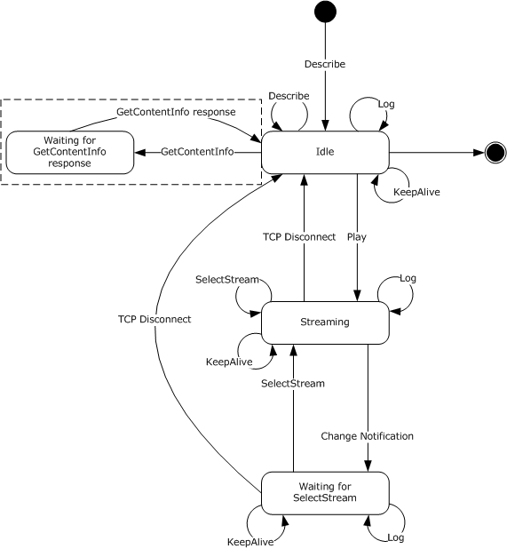

Figure 1: WMS HTTP 1.0 Caching proxy server states and sequencing

Understanding the server states diagram:

- All requests illustrated in the diagram, with the exception of Change Notification, are sent by the client to the server in the context of an HTTP request message using either the GET or POST methods. All server responses are in the context of an HTTP response message.
- Requests that loop back on a given state indicate that the request is sent by the client to the server on a separate TCP connection. These requests do not interrupt other requests or [**sessions**](#gt_session) and can be sent multiple times without changing the server state.
- The presence of a caching proxy server introduces an additional state, indicated by the dotted box in the preceding server states diagram. This state is not applicable during direct server and client interaction. For more information, see section [4.12](#Section_4.12).
- A TCP connection is initiated with a server when a client issues its first [Describe request](#Section_3.1.4.2.1) containing a Request-URI ([[RFC2616]](https://go.microsoft.com/fwlink/?LinkId=90372) section 5.1.2) corresponding to the virtual publishing point for [**content**](#gt_content) on the server (the content can be stored or live.) This first Describe request initiates the server Idle state.
- In response to the initial Describe request, a [client-id](#Section_2.2.1.4.5) token value is created by the server and is used by the client throughout that individual [**streaming**](#gt_streaming) session. However, the server can send a new client-id that has to subsequently be used by the client.
- TCP Disconnect occurs when the connection used for the [Play request](#Section_3.2.5.6) and server response is closed. The server can close the TCP connection after sending the response or because of an error or time-out that occurred on the server. Clients can also close the TCP connection in stop and resume scenarios. For more information, see section [4.7](#Section_2.2.2.3.1). A TCP Disconnect causes the server to change from its current state to the Idle state.
- Change Notification, which contains the [$C (Stream Change Notification) packet](#Section_2.2.3.2), is sent by the server on the same TCP connection as the Play request. The Change Notification causes the server transition from streaming state to Waiting for [SelectStream](#Section_3.2.5.7) state. A client usually sends Describe, [Log](#Section_2.2.2.4), SelectStream, and [KeepAlive](#Section_3.2.5.8) requests on separate connections. A TCP Disconnect on one of these separate connections does not cause a state transition. A transition from the Idle state to Final state occurs when the session state is deleted as described in section [3.2](#Section_1.3). For example, see section [3.2.6.2](#Section_3.2.6.2).
- The server remains in Waiting for SelectStream state until a SelectStream request is received, or until the TCP connection is closed. A SelectStream request causes a transition back to Streaming state. If the TCP connection is closed, it causes a transition to the Idle state.
- By default when the [**non-pipelined mode**](#gt_non-pipelined-mode) of the protocol is used, TCP connections are not reused. Therefore, the connection used for the Describe request is closed by the server when the server sends its response. However, the client can keep this connection open by including a Connection: Keep-Alive header with the request. If the server can comply, it notifies the client by including a Connection: Keep-Alive header in response. In this case, the client can send subsequent requests, such as the Play request, on the same connection. The presence of the Connection: Keep-Alive header does not trigger a state transition or otherwise change the state of the protocol. The Connection: Keep-Alive header is described in Hypertext Transfer Protocol 1.1, [RFC2616].
For more information about sequencing associated with the various server states, see section 3.2.

## 4.2 Server States in Pipelined Mode

The following figure shows the server states and sequencing.

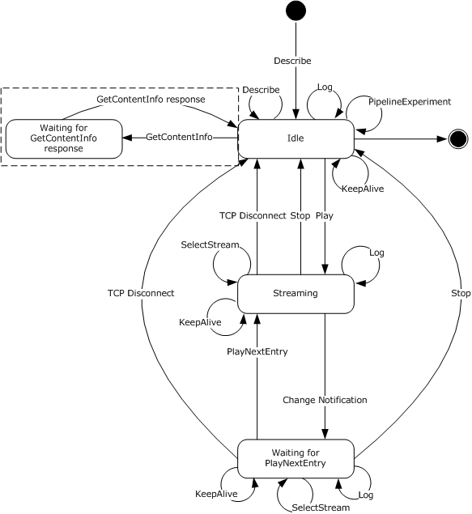

Figure 2: WMS HTTP 1.1 caching proxy server states and sequencing

Understanding the server states diagram:

- All requests illustrated in the diagram are sent by the client to the server in the context of an HTTP request message by using one of the following: the GET method, the POST method, or the OPTIONS method. All server responses are in the context of an HTTP response message. For more information about the request types and the associated methods, see section [2.2.2.2](#Section_2.2.1.2.4).
- Requests that loop back on a state indicate that the request is sent by the client to the server on the same TCP connection. The response to the client is not returned until the previous request is terminated by the server.
- The presence of a caching proxy server introduces an additional state, indicated by the dotted box in the preceding server states diagram. This state is not applicable during direct server and client interaction. For more information, see section [4.12](#Section_4.12).
- A TCP connection is initiated with a server when a client issues its first [Describe request](#Section_3.1.4.2.1) containing a Request-URI ([[RFC2616]](https://go.microsoft.com/fwlink/?LinkId=90372) section 5.1.2) corresponding to the virtual publishing point for [**content**](#gt_content) on the server. (The content can be stored or live.) This first Describe request initiates the server Idle state.
- In response to the initial Describe request, a [client-id](#Section_2.2.1.4.5) token value is created by the server and is used by the client throughout that individual [**streaming**](#gt_streaming) [**session**](#gt_session). However, the server can send a new client-id that is subsequently used by the client.
- By default when the [**pipelined mode**](#gt_pipelined-mode) of the protocol is used, the TCP connection created with the initial Describe request is kept open. If the server closes the connection, it notifies the client by including a Connection: Close header with the response. For more information about Connection: Close header, see HTTP 1.1, as specified in [RFC2616]. A TCP Disconnect causes the server to change from its current state to the Idle state; however, TCP connections are not required to be disconnected for the protocol to be in the Idle state. A transition from the Idle state to Final state occurs when the session state is deleted as described in section [3.2](#Section_1.3). For example, see section [3.2.6.2](#Section_3.2.6.2).
- The server stays in the Streaming state while it is sending [$D](#Section_2.2.3.3) and [$E](#Section_2.2.3.4) packets to the client.
- When the server receives a higher-layer event that indicates that the new ASF header is available, as defined in section [3.2.4.2](#Section_3.2.4.2), then the server transitions from the Streaming state to the Waiting for [PlayNextEntry](#Section_3.1.5.18) state. This transition is referred to as Change Notification in the diagram. The server then remains in that state until a PlayNextEntry request or [Stop](#Section_2.2.2.10) request is received, or until the TCP connection is closed. A PlayNextEntry request causes a transition back to Streaming state, while a Stop request causes a transition to Idle state. If the TCP connection is closed, it also causes a transition to the Idle state.
- In an auto-reconnect scenario, the server maintains the session state. The client maintains the point or offset from which to resume playback. This offset is sent in the [stream-offset](#Section_2.2.1.4.25) token on the [Pragma](#Section_2.2.1.4) header with the next [Play request](#Section_3.2.5.6). The server does not expect a new Describe request because it has already sent the [$H (Header) packet](#Section_4.13.1) for the media [**stream**](#gt_stream). Also, the server does not need to conduct the packet-pair experiment again to determine the bit rate of the new connection. The sequence is identical to a server resuming from a Pause state. For more information, see section [4.8](#Section_2.2.2.3.2).
For more information about sequencing associated with the various server states, see section 3.2.

## 4.3 Packet-Pair Bandwidth Estimation

Packet-pair is a technique for estimating the bandwidth of a [**streaming**](#gt_streaming) media connection over the Internet.

To estimate bandwidth, the server sends two or more consecutive packets of highly entropic data, and the client estimates the bandwidth by measuring the difference between the times that it receives the packets. This method is usually reliable; however, if the client traverses a Network Address Translation (NAT), firewall, or proxy server, the packet-pair bandwidth measurement might be inaccurate.

This technique is not necessary for devices with known bandwidths, such as cellular phones.

**Note** The client's use of the packet-pair data to estimate the network bandwidth is implementation-specific.

The following sequence occurs between a client and server when conducting the packet-pair experiment. The sequencing applies to both the [**pipelined mode**](#gt_pipelined-mode) and [**non-pipelined modes**](#gt_non-pipelined-mode) of the protocol.

- The client sends a [Describe request](#Section_3.1.4.2.1) and includes:
- The [Pragma](#Section_2.2.1.4) header field with the token packet-pair-experiment=1.
- The [Supported](#Section_2.2.1.7) header with the token [com.microsoft.wm.srvppair](#Section_2.2.1.7.3).
- If the server is able to conduct the packet-pair experiment, the server response includes:
- The Pragma header field with the token packet-pair-experiment=1.
- The Supported header with the token com.microsoft.wm.srvppair.
- The server sends the following packets in the response body:
- [$P (Packet-Pair) packets (section 2.2.3.7)](#Section_2.2.3.7).
- A [$M (Metadata) packet](#Section_2.2.3.6).
- A [$H (Header) packet](#Section_4.13.1).
The following figure shows the previously described sequence.

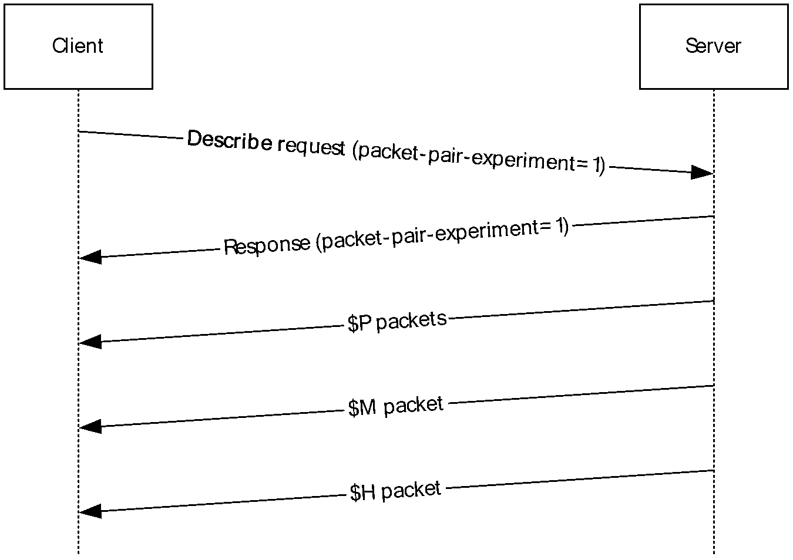

Figure 3: Packet-pair sequence

The following example shows a client's packet-pair experiment request.

GET /test.asf HTTP/1.0

Accept: */*

User-Agent: NSPlayer/10.0.0.3802

Host: SampleServer

X-Accept-Authentication: Negotiate, NTLM, Digest, Basic

Pragma: no-cache,rate=1.000,stream-time=0,stream-offset=0:0,

packet-num=4294967295,max-duration=0

Pragma: packet-pair-experiment=1

Supported: com.microsoft.wm.srvppair, com.microsoft.wm.sswitch,

com.microsoft.wm.predstrm, com.microsoft.wm.startupprofile

The following example shows the server response.

HTTP/1.0 200 OK

Content-Length: 5227

Content-Type: application/vnd.ms.wms-hdr.asfv1

Server: Cougar/9.01.01.3814

Pragma: packet-pair-experiment=1, no-cache, client-id=2064325698, xResetStrm=1,

features="seekable,stridable", timeout=60000

Cache-Control: no-cache, x-wms-content-size=638066, x-wms-event-subscription="remote-log"

Supported: com.microsoft.wm.srvppair, com.microsoft.wm.sswitch,

com.microsoft.wm.predstrm, com.microsoft.wm.fastcache,

com.microsoft.wm.startupprofile

$P......<packet-pair payload>

$P......<packet-pair payload>

$P......<packet-pair payload>

$M......<metadata payload>

$H......<header payload>

## 4.4 Playlist Streaming

The following sequence occurs between a client and server during [**playlist**](#gt_playlist) [**streaming**](#gt_streaming) using predictive [**stream**](#gt_stream) selection. The sequencing applies to both the [**pipelined mode**](#gt_pipelined-mode) and [**non-pipelined mode**](#gt_non-pipelined-mode) of the protocol:

- The client sends a [Describe request](#Section_3.1.4.2.1) to retrieve the [**ASF**](#gt_advanced-systems-format-asf) header.
- The server responds with a [$H (Header) packet](#Section_4.13.1).
- The client sends a [Play request](#Section_3.2.5.6) for the file, selecting one or more streams.
- The server responds with a $H (Header) packet and [$D (Data) packets](#Section_2.2.3.3) of the first playlist element.
- After all data packets of the first playlist element have been sent to the client, the server sends an [$E (End-of-Stream Notification) packet](#Section_2.2.3.4), and the server sends a [$C (Stream Change Notification) packet](#Section_2.2.3.2).
- The client sends a [Log request](#Section_2.2.2.4) for the first element of the playlist.
**Note** When the non-pipelined mode of the protocol is used, the client uses a separate TCP connection to send the Log request to the server; therefore, the server can respond to the Log request while still sending stream data through the previously opened connection.

**Note** When the pipelined mode of the protocol is used, the client sends requests to the server on the same TCP connection. The response to the client is not returned until the previous request is terminated by the server.

- The server sends $H (Header) and $D (Data) packets of the next element in the playlist.
- The client notifies the server that it is rendering the second element of the playlist by sending a [SelectStream request](#Section_3.2.5.7). The client might select other streams than those predictably selected by the server. For information about predictive stream selection, see section [4.5.2](#Section_4.5).
**Note** When the non-pipelined mode of the protocol is used, the client uses a separate TCP connection for the SelectStream request. The server responds immediately to this request while still sending stream data through the previously opened connection.

**Note** When the pipelined mode of the protocol is used, the client uses the same TCP connection; therefore, the server does not respond to the SelectStream request until the previous request is terminated by the server.

- The server responds to the Log and SelectStream requests.
- The server continues looping playlist element data packets (step 5) until the end of the playlist is reached.
The following figure shows the sequence described.

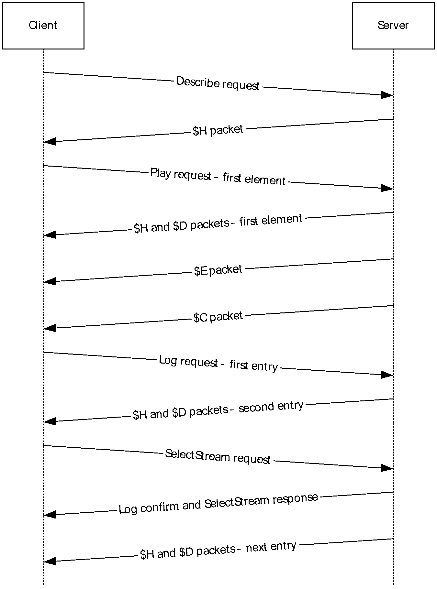

Figure 4: Sequencing during normal playlist streaming

## 4.5 Server-Side Playlist Streaming

The client can seek and skip to a new entry within a server-side [**playlist**](#gt_playlist). For more information, see section [4.5.1](#Section_4.5.1). The following sequence occurs between a client and server during a server-side playlist switch using either the [**pipelined mode**](#gt_pipelined-mode) or the [**non-pipelined mode**](#gt_non-pipelined-mode) of the protocol:

- The client sends a [Describe request](#Section_3.1.4.2.1) to retrieve the [**ASF**](#gt_advanced-systems-format-asf) header.
- The server responds with a [$H (Header) packet](#Section_4.13.1).
- The client sends a [Play request](#Section_3.2.5.6) for the file, selecting one or more [**streams**](#gt_stream).
- The server responds with a $H (Header) packet and [$D (Data) packets](#Section_2.2.3.3) of the first playlist element.
- After all data packets of the current playlist element have been sent to the client, the server sends an [$E (End-of-Stream Notification) packet](#Section_2.2.3.4), with the **Reason** field set to S_FALSE (0x00000001).
- The server sends a [$C (Stream Change Notification) packet](#Section_2.2.3.2) to the client. This signal, like the data stream, is sent as part of the response body for the last GET request sent by the client.
- The server sends the $H (Header) and [$M (Metadata)](#Section_2.2.3.6) packets for the next playlist entry.
- The client sends a [Log request](#Section_2.2.2.4) for the previous entry in the playlist.
**Note** When the non-pipelined mode of the protocol is used, the client sends this POST request over a separate TCP connection rather than the one created with the client's initial GET request. The POST request contains the client identifier so that the server can associate the log with the client.

**Note** When the pipelined mode of the protocol is used, the client sends this POST request over the same TCP connection that was created with a client's initial GET request. The response to the POST request is not returned until the previous GET request is terminated by the server.

- The client starts rendering the stream by sending a GET request.
**Note** When the non-pipelined mode of the protocol is used, the client sends a [SelectStream request](#Section_3.2.5.7). This request contains the stream information in the [stream-switch-entry](#Section_2.2.1.4.27) token on the [Pragma](#Section_2.2.1.4) header. The client might select other streams than those predictably selected by the server. Predictive stream selection provides a way for the server to predict the streams that the client is going to request so the server can begin [**streaming**](#gt_streaming) those streams immediately. For more information, see section [4.5.2](#Section_4.5).

**Note** When the pipelined mode of the protocol is used, the client sends a [PlayNextEntry request](#Section_3.1.5.18) with the [xPlayNextEntry](#Section_2.2.1.4.35) token on the Pragma header over the same connection to the server. This request also contains the stream selection for the next entry in the stream-switch-entry token on the Pragma header. The xPlayNextEntry token indicates that the client can begin streaming the data for the next entry.

- The server terminates the Play request for the previous entry in the playlist.
- The server sends the response for the Log request.
- The server sends $H (Header) and $D (Data) packets for the next entry in the playlist.
- The server continues looping playlist element data packets (step 5) until the end of the playlist is reached. The end is indicated by the server sending a $E (End-of-Stream Notification) packet with the **Reason** field set to S_OK (0x00000000).
The following figure shows the previously described sequence.

Figure 5: Sequencing during normal playlist streaming

### 4.5.1 Seeking and Skipping in Server-Side Playlists

The following sequence occurs between a client and server during seeking or skipping in server-side [**playlists**](#gt_playlist). This sequence applies to both the [**pipelined mode**](#gt_pipelined-mode) and [**non-pipelined mode**](#gt_non-pipelined-mode) of the protocol.

- The client stops [**streaming**](#gt_streaming) the current entry.
**Note** When the non-pipelined mode of the protocol is used, the client stops streaming by terminating the TCP connection.

**Note** When the pipelined mode of the protocol is used, the client sends the [Stop request](#Section_2.2.2.10) over the same TCP connection that was created with the client's initial GET request. The response for this POST request is not sent until the server terminates the previous GET request.

- The client sends a [Log request](#Section_2.2.2.4) for the previous play.
**Note** When the non-pipelined mode of the protocol is used, the client sends the Log request over a new TCP connection. This request contains the client identifier in the [client-id](#Section_2.2.1.4.5) token on the [Pragma](#Section_2.2.1.4) header so that the server can associate the log with the client. The response for the POST request is returned immediately.

**Note** When the pipelined mode of the protocol is used, the client sends the Log request over the same TCP connection that was created with the client's initial GET request. The response to the POST request is not returned until the previous GET request is terminated by the server.

- The client sends a [Play request](#Section_3.2.5.6) to the server. This GET request carries the seeking or skipping information. The [playlist-seek-id](#Section_2.2.1.4.8.4) token on the Pragma header indicates the current entry being rendered by the client. The [pl-offset](#Section_2.2.1.4.20) token on the Pragma header contains the information about whether the client requested to skip to the previous or the next entry. The following are possible offsets:
- pl-offset=1 indicates that the client skips to the next entry. The server sends a GET response and then sends the[$C (Stream Change Notification) packet](#Section_2.2.3.2) and sends the [$H (Header)](#Section_4.13.1) packet and [$M (Metadata) packet](#Section_2.2.3.6) for the next header. From this point forward, the sequence follows a playlist change switch. For more information, see section [4.5](#Section_4.5).
- pl-offset=-1 indicates that the client skips to the previous entry. See pl-offset=1 for detailed server information.
- pl-offset=0 indicates that the client seeks within the current entry. If the pl-offset=0 token is specified and the server is not predicting [**streams**](#gt_stream), the server sends a GET response and starts streaming the data for the current entry. If the pl-offset=0 token is specified and the server predicts the stream that the client is going to request, then the server would send the GET response and immediately send a $C (Stream Change Notification) packet. The server then follows with $H (Header) and $M (Metadata) packets for the requested playlist entry. From that point on, the sequence of steps would be exactly the same as for a playlist change switch. For more information about predictive streaming, see section [4.5.2](#Section_4.5).
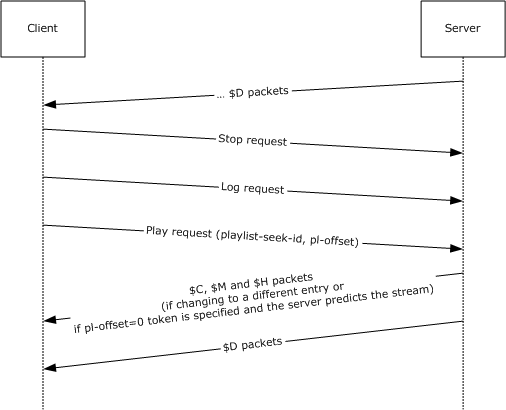

Figure 6: Playlist seek-and-skip sequence in pipelined mode

Figure 7: Playlist seek-and-skip sequence in non-pipelined mode

The following example shows a Stop request for the pipelined mode of the protocol.

POST /simple.wsx?WMCache=0 HTTP/1.1

Accept: */*

User-Agent: NSPlayer/9.0.0.2833

Host: SampleServer

X-Accept-Authentication: Negotiate, NTLM, Digest

Pragma: client-id=2754698341

Pragma: xStopStrm=1

Content-Length: 0

The following example shows a skip to next entry.

GET /simple.wsx?WMCache=0 HTTP/1.1

Accept: */*

User-Agent: NSPlayer/9.0.0.2833

Host: SampleServer

X-Accept-Authentication: Negotiate, NTLM, Digest

Pragma: no-cache, pl-offset=1,rate=1.000,stream-time=0,

stream-offset=4294967295:4294967295,packet-num=4294967295,

max-duration=0

Pragma: xPlayStrm=1

Pragma: client-id=3342451229

Pragma: LinkBW=2147483647, AccelBW=2147483647, AccelDuration=10000

Supported: com.microsoft.wm.srvppair, com.microsoft.wm.sswitch,

com.microsoft.wm.predstrm

Pragma: playlist-seek-id=115

Pragma: stream-switch-count=4

Pragma: stream-switch-entry=ffff:1:0 ffff:2:2 ffff:4:2 ffff:5:0

Accept-Language: en-us, *;q=0.1

### 4.5.2 Server-Side Playlist Streaming with Predictive Stream Selection

The following sequence occurs between a client and server during a server-side [**playlist**](#gt_playlist) switch using either the [**pipelined mode**](#gt_pipelined-mode) or the [**non-pipelined mode**](#gt_non-pipelined-mode) of the protocol.

For more information about [**streaming**](#gt_streaming) server-side playlist without predictive streaming, see section [4.5](#Section_4.5).

- The client sends a [Describe request](#Section_3.1.4.2.1) to retrieve the [**ASF**](#gt_advanced-systems-format-asf) header.
- The server responds with "Supported: [com.microsoft.wm.predstrm](#Section_2.2.1.7.2)".
- The client sends a [Play request](#Section_3.2.5.6) for the file, selecting one or more [**streams**](#gt_stream) with the [Supported](#Section_2.2.1.7) header.
- The server responds with a [$H (Header) packet](#Section_4.13.1) and [$D (Data) packets](#Section_2.2.3.3) of the first playlist entry.
- The server sends a playlist change signal to the client by sending a [$C (Stream Change Notification) packet](#Section_2.2.3.2).
- The client sends a [Log request](#Section_2.2.2.4) for the previous entry in the playlist.
**Note** When the pipelined mode of the protocol is used, the client sends the Log request over the same TCP connection that was created with the client's initial GET request. The response to the POST request is not returned until the previous GET request is terminated by the server.

**Note** When the non-pipelined mode of the protocol is used, the client sends the Log request over a new TCP connection. This request contains the client identifier in the [client-id](#Section_2.2.1.4.5) token on the [Pragma](#Section_2.2.1.4) header so that the server can associate the log with the client.

- The server predicts the stream selection for the next playlist entry and immediately starts sending $H (Header) and $D (Data) packets for the next entry.
The client starts receiving the data for the next entry while it is rendering the data for the previous entry. By the time the client finishes rendering, it has accumulated enough data for the next entry to make a seamless switch.

- If the client wants to override the streams selected by the server, the client sends a GET request to start streaming a new entry.
**Note** When the pipelined mode of the protocol is used, the client sends a [PlayNextEntry request](#Section_3.1.5.18) with the [xPlayNextEntry](#Section_2.2.1.4.35) token on the Pragma header over the same connection to the server. This request also contains the [stream-switch-entry](#Section_2.2.1.4.27) token on the Pragma header for the next entry, which would override the server prediction of streams. The xPlayNextEntry token indicates that the client can continue streaming the data for the next entry. If the client is lagging behind the server, it can send a [client-lag](#Section_2.2.1.4.6) token on a Pragma header with a value specified in milliseconds. Upon receipt, the server would pause the predictive stream selection for the smallest time amount specified by the client-lag token and 15000 milliseconds.

**Note** When the non-pipelined mode of the protocol is used, the client sends a [SelectStream request](#Section_3.2.5.7). This request contains the stream-switch-entry token on a Pragma header that specifies the next entry for which the server sends data packets.

- The server terminates the Play request for the previous entry in the playlist, as described in step 3.
- The server sends the response for the Log request, as described in step 6.
- The server sends the response for the GET request for the new entry, as described in step 8.
- The server sends $D (Data) packets for the next entry.
The following figure shows the sequence described.

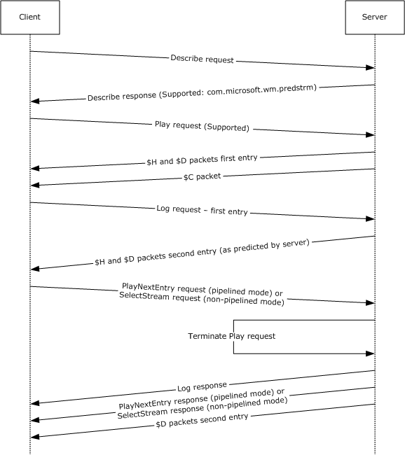

Figure 8: Sequencing during playlist streaming with predictive stream selection

The following example shows a Log request.

POST /simple.wsx?WMCache=0 HTTP/1.1

Accept: */*

User-Agent: NSPlayer/9.0.0.2833

Host: SampleServer

X-Accept-Authentication: Negotiate, NTLM, Digest

Pragma: client-id=2380927133

Content-Length: 3012

Content-Type: application/x-wms-LogStats;charset=UTF-8

The following example shows a PlayNextEntry request.

GET /simple.wsx?WMCache=0 HTTP/1.1

Accept: */*

User-Agent: NSPlayer/9.0.0.2833

Host: SampleServer

X-Accept-Authentication: Negotiate, NTLM, Digest

Pragma: client-id=2380927133

Pragma: xPlayNextEntry=1

Pragma: no-cache,rate=1.000

Pragma: client-lag=0

Supported: com.microsoft.wm.srvppair, com.microsoft.wm.sswitch,

com.microsoft.wm.predstrm

Accept-Language: en-us, *;q=0.1

Pragma: stream-switch-count=4

Pragma: stream-switch-entry=ffff:1:0 ffff:2:2 ffff:4:2 ffff:5:0

## 4.6 Single File Streaming

The following sequence occurs between a client and server when [**streaming**](#gt_streaming) a single file. The sequencing applies to both the [**pipelined mode**](#gt_pipelined-mode) and the [**non-pipelined mode**](#gt_non-pipelined-mode) of the protocol.

- The client sends a [Describe request](#Section_3.1.4.2.1) to retrieve the [**ASF**](#gt_advanced-systems-format-asf) header.
- The server responds with a [$H (Header)](#Section_4.13.1) packet.
- The client sends a [Play request](#Section_3.2.5.6) for the file, selecting one or more [**streams**](#gt_stream).
- The server responds with a $H (Header) packet and [$D (Data) packets](#Section_2.2.3.3).
- After all $D (Data) packets have been sent to the client, the server sends a [$E (End-of-Stream Notification) packet](#Section_2.2.3.4) to indicate that the end of the ASF file has been reached.
- The client sends a [Log request](#Section_2.2.2.4) to the server.
- The server responds with a confirmation that it received the log.
The following figure shows the previously described sequence.

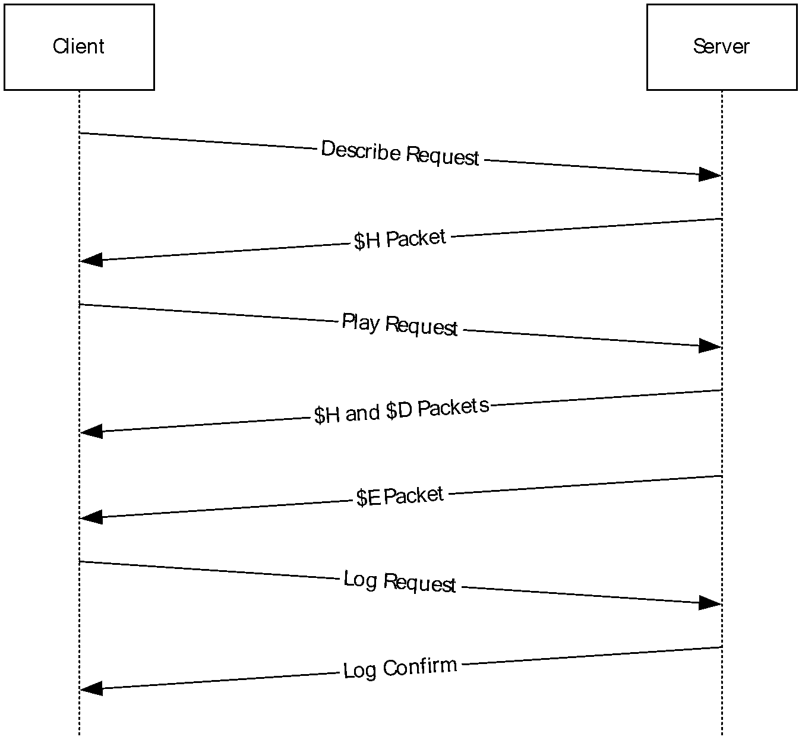

Figure 9: Sequencing during single-file streaming

## 4.7 Streaming and Stopping Playback by Using Non-Pipelined Mode

The sequence described in this topic occurs between a client and server while [**streaming**](#gt_streaming) a file, pausing playback, and then resuming playback using the [**non-pipelined mode**](#gt_non-pipelined-mode) of the protocol.

For more information about the packet types, see section [2.2.2.3](#Section_3.2.5.8).

- The client sends a [Describe request](#Section_3.1.4.2.1) to retrieve the [**ASF**](#gt_advanced-systems-format-asf) header.
- The server responds with a [$H (Header)](#Section_4.13.1) packet.
- The client sends a [Play request](#Section_3.2.5.6) for the file, selecting one or more [**streams**](#gt_stream).
- The server responds with a $H (Header) packet and [$D (Data) packets](#Section_2.2.3.3). The number and size of the $D (Data) packets are not necessarily known at the time of the Play request, so it is not possible for the server to send a Content-Length header. The server transmits $D (Data) packets for the stream until the TCP connection is closed.
- The client stops streaming by terminating the TCP connection.
- The client sends a KeepAlive request to the server.
- The client sends a [Log request](#Section_2.2.2.4) to the server.
- The server responds with a confirmation that it received the log.
- The client sends a Play request for the same file, specifying the point or offset from which to resume playback. If an offset is not specified, the client resumes playback from the beginning of the file.
- The server responds with a $H (Header) packet and $D (Data) packets.
- After all data packets have been sent to the client, the server sends a [$E (End-of-Stream Notification) packet](#Section_2.2.3.4) to indicate that the end of the ASF file has been reached.
- The client sends a Log request to the server.
- The server responds with a confirmation that it received the log.
Pause is implemented by the client terminating the existing TCP connection and issuing another Play request after playback has stopped. In the Play request, the client can specify the point or offset from which to resume playback by using the [stream-offset](#Section_2.2.1.4.25) token on a [Pragma](#Section_2.2.1.4) header. The client can use [packet-num](#Section_2.2.1.4.13), [stream-time](#Section_2.2.1.4.28), or the stream-offset tokens on a Pragma header to specify the offset. These headers are used to seek to a specific point within the ASF file that the client was streaming. If the offset is not provided, then the client resumes playback from the beginning of the file. The server responds to the Play request as described in step 4.

The following figure shows the previously described sequence.

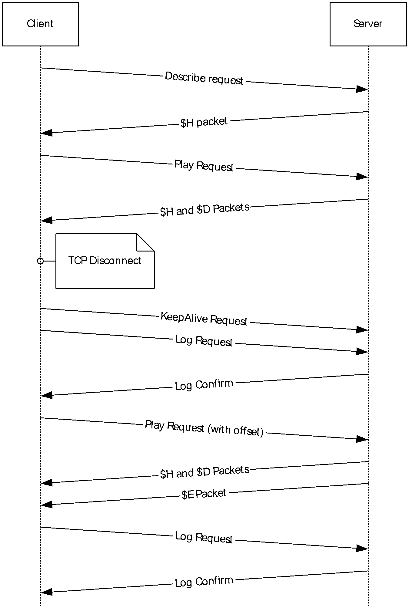

Figure 10: Stream, pause, and resume packet sequencing

## 4.8 Streaming and Stopping Playback by Using Pipelined Mode

The sequence described in this topic occurs between a client and server while [**streaming**](#gt_streaming) a file, pausing playback, and then resuming playback using the [**pipelined mode**](#gt_pipelined-mode) of the protocol.

- The client sends a [Describe request](#Section_3.1.4.2.1) to retrieve the [**ASF**](#gt_advanced-systems-format-asf) header.
- The server responds with a [$H (Header) packet](#Section_4.13.1).
- The client sends a [Play request](#Section_3.2.5.6) for the file, selecting one or more [**streams**](#gt_stream).
- The server responds with a $H (Header) packet and [$D (Data) packets](#Section_2.2.3.3). HTTP 1.1 Chunked Transfer Coding is used by the server to transmit the packets because the number and size of the $D (Data) packets are not necessarily known at the time of the Play response.
- The client stops streaming by sending the [xStopStrm](#Section_2.2.1.4.38) token on a [Pragma](#Section_2.2.1.4) header in a [Stop request](#Section_2.2.2.10) to the server.
- If a Stop request is received, the server acknowledges this request.
- The client sends a [Log request](#Section_2.2.2.4) to the server.
- The server responds with a confirmation that it received the log.
- The client sends a Play request for the same file, specifying the point or offset from which to resume playback. If an offset is not specified, the client resumes playback from the beginning of the file.
- The server responds with a $H (Header) packet and $D (Data) packets.
- After all data packets have been sent to the client, the server sends a [$E (End-of-Stream Notification) packet](#Section_2.2.3.4) to indicate that the end of the media file has been reached.
- The client sends a Log request to the server.
- The server responds with a confirmation that it received the log.
Pause is implemented as a Stop request immediately followed by a Play request. After the client has stopped playback, it can choose to resume playing by sending another Play request as described in step 3. In the GET request, the client can specify the point or offset from which to resume playback using the [stream-offset](#Section_2.2.1.4.25) token on a Pragma header. The client can use [packet-num](#Section_2.2.1.4.13), [stream-time](#Section_2.2.1.4.28), or the stream-offset tokens on Pragma headers to specify the offset. These headers are used to seek to a specific point within the ASF file that the client was streaming. If the offset is not provided, then the client resumes playback from the beginning of the file. The server responds to the Play request as described in step 4.

The following figure shows the previously described sequence.

Figure 11: Stream, stop, and resume packet sequencing

To prevent an idle connection from being disconnected, the client sends periodic [KeepAlive requests](#Section_3.2.5.8) to the server.

## 4.9 Streaming, Stopping, and Striding Playback

The following sequence occurs between a client and server when [**streaming**](#gt_streaming) a file and then stopping it, followed by [**striding**](#gt_striding) and stopping the file again by using either the [**pipelined**](#gt_pipelined-mode) or the [**non-pipelined mode**](#gt_non-pipelined-mode) of the protocol.

- The client sends a [Describe request](#Section_3.1.4.2.1) to retrieve the [**ASF**](#gt_advanced-systems-format-asf) header.
- The server responds with a [$H (Header) packet](#Section_4.13.1).
- The client sends a [Play request](#Section_3.2.5.6) for the file, selecting one or more [**streams**](#gt_stream).
- The server responds with a $H (Header) packet and [$D (Data) packets](#Section_2.2.3.3).
- The client stops streaming.
**Note** When the non-pipelined mode of the protocol is used, the client stops streaming the file by terminating the TCP connection.

**Note** When the pipelined mode of the protocol is used, the client stops streaming by sending the [xStopStrm](#Section_2.2.1.4.38) token on a [Pragma](#Section_2.2.1.4) header in a [Stop request](#Section_2.2.2.10) to the server.

- When the pipelined mode of the protocol is used, the server acknowledges if a Stop request is received.
- The client sends a [Log request](#Section_2.2.2.4) to the server.
- The server responds with a confirmation that it received the log.
- The client sends a Play request for the same file at any rate, fast-forward or rewind, selecting one or more streams. The client can specify the rate using the [rate](#Section_2.2.1.12.1) token on the Pragma header. If this header is not specified, the server assumes that the rate is 1.0.
**Note** Playback rate for a stream can be changed only if the stream supports striding. If striding is supported, the server reports it in the [features](#Section_2.2.1.4.8) token on the Pragma header. If [$M (Metadata)](#Section_2.2.3.6) is present, it overrides the features token on a Pragma header.

- The server responds with a $H (Header) packet and $D (Data) packets.
The following figure shows the previously described sequence.

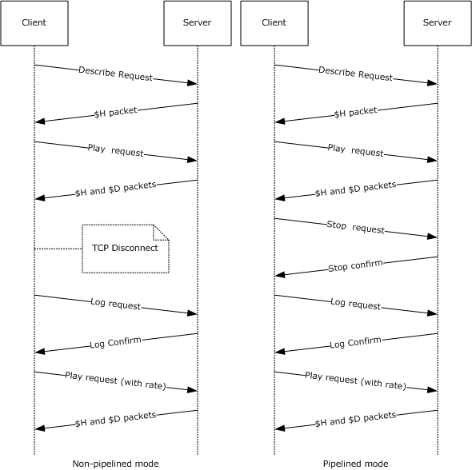

Figure 12: Stream, stop, stride, and stop packet sequencing

## 4.10 Stream Selection

The [SelectStream request](#Section_3.2.5.7) is sent by the client to notify the server which [**streams**](#gt_stream) it requests. If a file contains only one stream, the SelectStream request will request that the server send the default streams for that file. A SelectStream request will always accompany a [Play request](#Section_3.2.5.6) to denote which audio and/or video streams the client wants to play based on preferences and bandwidth considerations. As with [Log](#Section_2.2.2.4) and [KeepAlive](#Section_3.2.5.8) requests, SelectStream request can be sent multiple times during a [**session**](#gt_session), and they are always sent as a POST request on a separate TCP connection.

The following scenarios are examples of when a SelectStream request would be sent by the client:

- When [**streaming**](#gt_streaming) a server-side [**playlist**](#gt_playlist), the client will send a SelectStream request between each playlist entry.
- When streaming a multi-language Windows Media Audio (.wma) file, the client will send a SelectStream request whenever the client changes from one language to another.
- When streaming a multiple bit rate [**ASF**](#gt_advanced-systems-format-asf) file, the client will send a SelectStream request whenever it experiences a prolonged change in bandwidth conditions.
The sequencing applies to both the [**pipelined**](#gt_pipelined-mode) and the [**non-pipelined mode**](#gt_non-pipelined-mode) of the protocol:

- The client sends a [Describe request](#Section_3.1.4.2.1) to retrieve the ASF header.
- The server responds with a [$H](#Section_4.13.1) (Header) packet.
- The client sends a Play request for the file, selecting one or more streams.
- The server responds with a $H (Header) packet and [$D](#Section_2.2.3.3) (Data) packets.
- To change streams, the client passes the stream selection information using a SelectStream request with the [stream-switch-entry](#Section_2.2.1.4.27) token on a [Pragma](#Section_2.2.1.4) header.
- The server responds by acknowledging the client request and switching to the requested stream.
**Note** To avoid disruptions in a video stream, the server will switch the streams at a key frame.

- The client detects the stream change in the data stream and renders the new stream.
**Note** The client will not send a message to the server as a result of this stream change.

The following figure shows the previously described sequence.

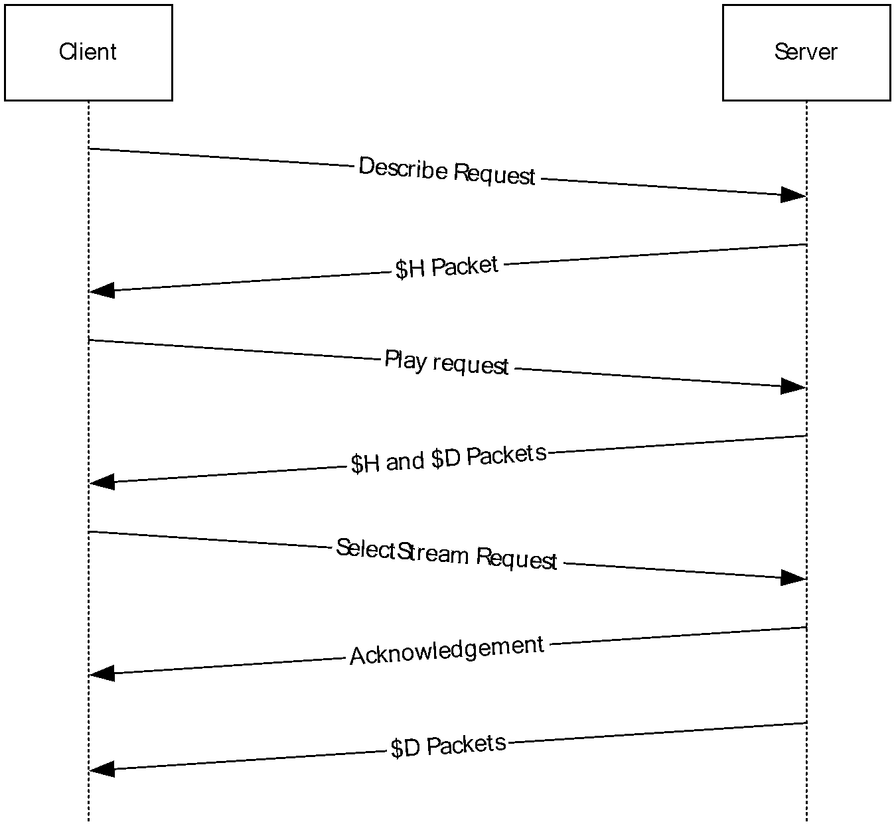

Figure 13: Using the SelectStream Request packet sequencing

## 4.11 Windows Media Encoder to Windows Media Server Pull Distribution

Pull Distribution is a concept of the Media Streaming Server System [MS-MSSOD](#Section_1.3) in which [**streaming**](#gt_streaming) [**content**](#gt_content) is transmitted from a source, such as Windows Media Encoder or Windows Media Services server, to a requestor, referred to as a "Distribution Server". It is possible to use the Windows Media Streaming Protocol (WMSP) client role and WMSP server role to build a system that implements Pull Distribution. The Distribution Server concept and its role in Pull Distribution are defined in [MS-MSSOD] section 1.1. In a Pull Distribution system, the Distribution Server uses the client role of a streaming protocol, such as WMSP, to connect to the source, which is typically an encoder. Similarly, if the Distribution Server has chosen to use WMSP, the source would use a WMSP server role to receive the request.

The decision to connect to the encoder is made by the higher layer of the WMSP client role used by the Distribution Server. Similarly, the higher layer also decides how to manage the content that is received by the client role. In a possible scenario, the higher layer decides to use the server role of a streaming protocol, such as WMSP, to send the content to media player clients. This scenario is illustrated and described in more detail in [MS-MSSOD] section 2.1.5.

The following sequence occurs between a Distribution Server and an encoder when streaming a single file:

- The client role of the Distribution Server sends a [Describe request](#Section_3.1.4.2.1) to retrieve the [**ASF**](#gt_advanced-systems-format-asf) header.
- The server role of the encoder responds with a [$H (Header)](#Section_4.13.1) packet.
- The client role of the Distribution Server sends a [Play request](#Section_3.2.5.6) for the file, selecting one or more [**streams**](#gt_stream).
- The server role of the encoder responds with a $H (Header) packet and [$D (Data)](#Section_2.2.3.3) packets.
- After all $D (Data) packets have been sent to the client role, the server role of the encoder sends a [$E (End-of-Stream Notification)](#Section_2.2.3.4) packet with the value of the Reason field set to 0, to indicate that the end of the ASF file has been reached. In certain cases, the protocol allows the server role of the encoder to send more than one $E packet, all of which will have the Reason field set to 0. For more information about this, see [3.2.4.1](#Section_3.2.4.1).
- The client role of the Distribution Server sends a [Log request](#Section_2.2.2.4) to the server role.
- The server role of the encoder responds with a confirmation that it received the log.
The following figure shows the previously described sequence.

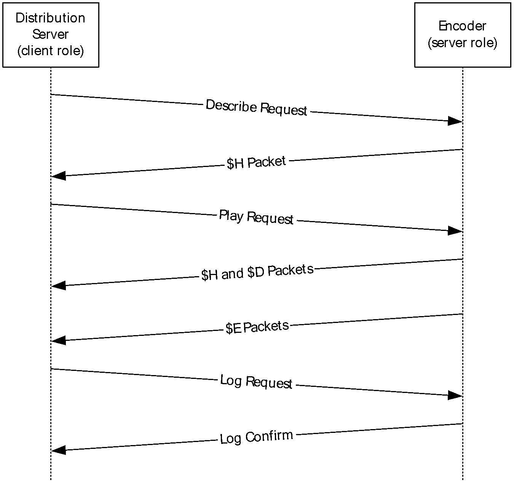

Figure 14: Windows Media Encoder to Windows Media server Pull Distribution

The following example shows a typical Describe request in Pull Distribution.

Distribution scenario:GET / HTTP/1.1

Accept: */*

User-Agent: NSServer/9.0.0.3171

Host: MyServer

Max-Forwards: 9

X-Accept-Authentication: Negotiate, NTLM, Digest

Pragma: no-cache,rate=1.000,stream-time=0,stream-offset=0:0,

packet-num=4294967295,max-duration=0

Supported: com.microsoft.wm.srvppair, com.microsoft.wm.sswitch,

com.microsoft.wm.predstrm

Pragma: xClientGUID={00000000-0000-0000-0000-000000000000}

Accept-Language: *

The following example shows a possible response from the encoder's server role.

HTTP/1.0 200 OK

Server: Rex/9.0.0.2837

Cache-Control: no-cache

Pragma: no-cache

Pragma: client-id=1543854732

Pragma: features="broadcast,playlist"

Content-Type: application/vnd.ms.wms-hdr.asfv1

Content-Length: 2680

Connection: Keep-Alive

<body of the response containing the headers ($H packets)>

The client role of the Distribution Server sends a Play request for one or more streams, as shown in the following example.

GET / HTTP/1.0

Accept: */*

User-Agent: NSServer/9.0.0.3171

Host: SampleServer

Max-Forwards: 9

X-Accept-Authentication: Negotiate, NTLM, Digest

Pragma: no-cache,rate=1.000,stream-time=0,

stream-offset=4294967295:4294967295,

packet-num=4294967295,max-duration=0

Pragma: xPlayStrm=1

Pragma: client-id=1543854732

Pragma: LinkBW=2147483647, BurstBW=3500000, BurstDuration=5000

Supported: com.microsoft.wm.srvppair, com.microsoft.wm.sswitch,

com.microsoft.wm.predstrm

Pragma: xClientGUID={00000000-0000-0000-0000-000000000000}

Pragma: stream-switch-count=2

Pragma: stream-switch-entry=ffff:1:0 ffff:2:0

Accept-Language: *

The server role of the encoder responds with a "200 OK" message ([[RFC2616]](https://go.microsoft.com/fwlink/?LinkId=90372) section 10) followed by the $H (Header) and $D (Data) packets for the selected streams.

If the headers change during the course of streaming, the server role uses the [$C (Stream Change Notification)](#Section_2.2.3.2) packet followed by the new header data and then the ASF data. When the server role has finished sending the data, it replies with the $E (End-of-Stream Notification) packet.

Streams pulled from the server role of an encoder are considered broadcast content – "trick modes" such as fast-forward, rewind, seek, and pause are not available.

For more information about the [Pragma](#Section_2.2.1.4) headers in these examples, see section 2.2.1.4.

## 4.12 Windows Media Services HTTP Proxy Server Interaction

A server that is configured to operate as a proxy server provides the service of routing client requests to one or more origin servers that publish the [**streaming**](#gt_streaming) media [**content**](#gt_content). In this case, the proxy server behaves as a client to the origin server. A proxy server might support caching of content. When the client requests content from the caching proxy server, it can either transmit the content from its local cache or obtain the content from the origin server and then transmit it to the requesting client.

A [Cache-Control](#Section_2.2.1.1) header contains directives about the content that indicates to the proxy server how it handles the content. For example, the [x-wms-stream-type](#Section_2.2.1.1.12) directive is used to determine whether the requested content is broadcast or on-demand. The header can include one or more directives and can be passed from the origin server to client through the intermediate proxy server. For more information about the Cache-Control header and the directives, see section 2.2.1.1.

When a client requests on-demand content from a caching proxy server, the proxy server is allowed to transmit the content to the client. If the cached copy of the content is not valid and caching of the content is allowed, then the proxy server might replace its cached copy by downloading the content from the origin server into the cache. The proxy server would then be able to transmit the content to the requesting client.

For broadcast content, a proxy server might provide the capability to proxy live content from an origin server through another server. When a client requests live content, the proxy server checks whether it is already proxying the content. If so, it could split the [**streams**](#gt_stream) and delivers the content to all of the requesting clients. If the proxy server is not proxying the content, it could establish a connection to the origin server and forward the content from the origin server to the client. For broadcast content, it is conceivable that only one TCP connection would exist between the proxy server and the origin server.

A proxy server, whether acting as a server or as a client, is largely identical in state to an origin server (as illustrated in sections [4.1](#Section_2.2.2.3.1) and [4.2](#Section_2.2.2.3.2).) That is, when streaming to a client, the proxy server is acting as a regular (origin) server. When acting as a logical client, the proxy server is forwarding requests to the origin server. As indicated in the following diagram, much of the decision matrix described previously occurs as a result of the [Describe request](#Section_3.1.4.2.1) that causes the initial transition into the "Idle" state. One additional state — the "Waiting for GetContentInfo response" state — becomes available with the introduction of a caching proxy server. This state is applicable only if the caching proxy server is acting as a client to the origin server and only if the content on the cache has expired. The caching proxy server will remain in the "Waiting for GetContentInfo response" state until it receives the GetContentInfo response from the origin server. The response to the [GetContentInfo request](#Section_2.2.1.2.4) will determine whether the [**session**](#gt_session) is streamed from the cache or from the origin server. In either case, both the origin server and the proxy server transition back to the "Idle" state.

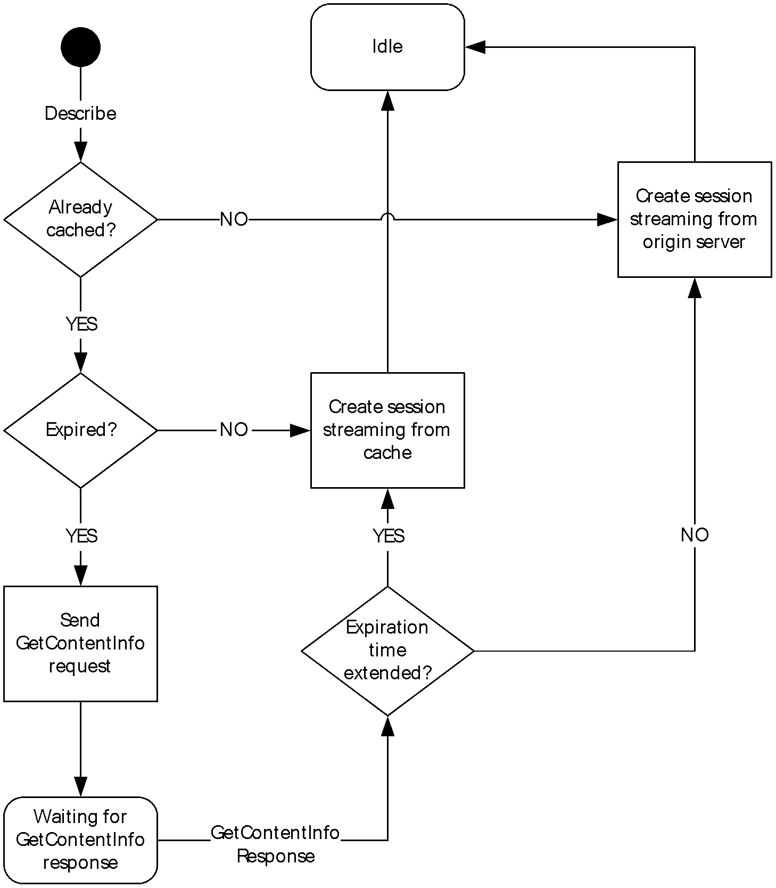

Figure 15: Caching proxy server states

Other request types have a negligible impact on state of a proxy server. As indicated in the following flow diagram, if a proxy server receives a rendering log from a client, it forwards it to the origin server regardless of the then current state of the proxy server. For example, if the proxy server is streaming content to a client and receives a rendering log, it immediately transmits the log to the origin server. The proxy server does not have to wait for a response from the origin server.

On the contrary, if a proxy server receives a streaming log or a "legacy" log from a client, it does not forward it to the origin server. In the case of a "legacy" log, a proxy server implementation ought to synthesize a rendering log from the "legacy" log and transmit the synthesized rendering log to the origin server (assuming that the origin server has indicated that it will accept rendering logs).

Regardless of the type of log message received by the proxy server, there is no state change caused by the transmittal of a log from the proxy server to the origin server. More details on the different Windows Media Log types are specified in [MS-WMLOG](../MS-WMLOG/MS-WMLOG.md).

In the case that the request received by the proxy server is not log-related, the proxy server will attempt to service the request locally. If it cannot, the request will be forwarded to the origin server. The proxy server will wait until it receives a response from the origin server before sending a response to the client that originated the request. It is important to note that this interaction does not trigger a state transition; the proxy server will remain in its then current state.

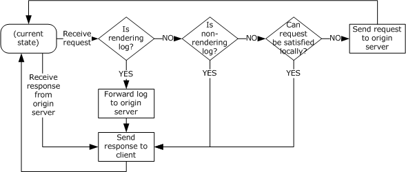

Figure 16: Caching proxy server state flow diagram

### 4.12.1 Sequencing

The general message sequence consists of the following steps:

- The client sends a [Describe request](#Section_3.1.4.2.1).
- The cache/proxy server responds with a [$H](#Section_4.13.1) packet that contains the [**content**](#gt_content) description.
- The client sends a [Play request](#Section_3.2.5.6), selecting one or more [**streams**](#gt_stream).
- The cache/proxy server determines whether the requested content is broadcast or on-demand (as indicated within the [x-wms-stream-type](#Section_2.2.1.1.12) directive on the [Cache-Control](#Section_2.2.1.1) header).
- Depending on the type of the stream, the cache/proxy delivers the content to the client. These steps are described in sections [4.12.1.1](#Section_4.12.1.1) and [4.12.1.2](#Section_4.12.1.2).

#### 4.12.1.1 On-Demand Content Delivery

The On-Demand Content Delivery consists of the following steps:

- The cache/proxy server checks whether the requested [**stream**](#gt_stream) is in its local cache.
If the [**content**](#gt_content) is not in the cache, the cache/proxy opens a connection with the origin server, as specified in [Request to Start Streaming Content](#Section_3.1.4.3), section 3.1.4.3. These steps are described in section [4.12.1.3](#Section_4.12.1.3).

- The cache/proxy server checks whether the content in the local cache is stale. If the content is stale, the cache/proxy server revalidates the content.
If the content is still stale, the cache/proxy opens a connection with the origin server, as specified in Request to Start Streaming Content, section 3.1.4.3. These steps are described in section 4.12.1.3.

- The cache/proxy server sends the [Cache-Control](#Section_2.2.1.1) header to the client.
- The cache/proxy server sends [$H](#Section_4.13.1) and [$D](#Section_2.2.3.3) packets for the requested stream from its local cache to the client.
- The cache/proxy server communicates any subscribed-to events (as indicated within the [x-wms-event-subscription](#Section_2.2.1.1.10) directive on the Cache-Control header) to the origin server, as specified in [SendEvent Request](#Section_2.2.2.9), section 2.2.2.9.
The following illustration shows the sequencing that occurs when the client requests a file from a media server that is configured as a cache/proxy server.

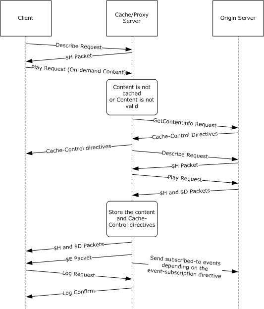

Figure 17: On-demand content delivery

#### 4.12.1.2 Broadcast Content Delivery

The Broadcast Content Delivery consists of the following steps:

- The cache/proxy server checks whether the [**stream**](#gt_stream) can be split, as determined by the [x-wms-proxy-split](#Section_2.2.1.1.11) directive on the [Cache-Control](#Section_2.2.1.1) header.
If the [**content**](#gt_content) cannot be split, the cache/proxy opens a connection with the origin server, as specified in [Request to Start Streaming Content](#Section_3.1.4.3), section 3.1.4.3. These steps are described in section [4.12.1.3](#Section_4.12.1.3).

- The cache/proxy server checks whether it is currently receiving the content.
If the content is not being received, the cache/proxy opens a connection with the origin server, as specified in Request to Start Streaming Content, section 3.1.4.3. These steps are described in section 4.12.1.3.

- The cache/proxy server checks whether the local copy of the content is stale. If the content is stale, the cache/proxy server revalidates the content against the server.
If the content is still stale after revalidation, then the cache/proxy opens a connection with the origin server, as specified in Request to Start Streaming Content, section 3.1.4.3. These steps are described in section 4.12.1.3.

- The cache/proxy server splits the content stream and sends the [$H](#Section_4.13.1) and [$D](#Section_2.2.3.3) packets, which it receives from the origin server, to the client.
- The cache/proxy server communicates any subscribed-to events (as indicated within the [x-wms-event-subscription](#Section_2.2.1.1.10) directive on the Cache-Control header) to the origin server, as specified in [SendEvent Request](#Section_2.2.2.9), section 2.2.2.9.
The following illustration shows the sequencing that occurs when the client requests broadcast content from a media server that is configured as a cache/proxy server.

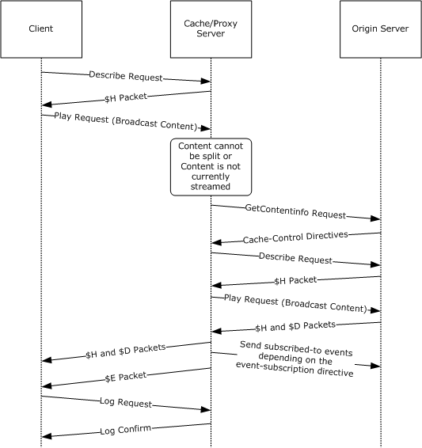

Figure 18: Broadcast content delivery

#### 4.12.1.3 Cache/Proxy Server and Origin Server Communication

The following steps demonstrate the cache/proxy server and origin server communication:

- The cache/proxy server requests [**content**](#gt_content) information from the origin server by sending a [GetContentInfo request](#Section_2.2.1.2.4).
- The origin server responds with the [Cache-Control](#Section_2.2.1.1) header for the content.
- Optional: Additional handshaking can occur depending on the implementation of the origin server.
- The cache/proxy server determines whether to cache the content that the origin server is about to [**stream**](#gt_stream). If the content is to be cached, the cache/proxy server stores the Cache-Control header information and the content in the local cache.
- If the content is not fully cached in the cache/proxy server's local cache, or if the content will not be cached, the cache/proxy server sends a [Describe request](#Section_3.1.4.2.1) followed by a [Play request](#Section_3.2.5.6) to the origin server.
- The cache/proxy sends the [$H](#Section_4.13.1) and [$D](#Section_2.2.3.3) packets for the requested content to the client. Depending on whether the content is already fully cached, the source is either the cache/proxy server's local cache or the origin server.
- The cache/proxy server communicates any subscribed-to events (as indicated within the [x-wms-event-subscription](#Section_2.2.1.1.10) directive on the Cache-Control header) to the origin server.
The following shows a sample GetContentInfo request and the corresponding response.

Client to Server:

POST /welcome2.asf?WMCache=0 HTTP/1.1

User-Agent: WMCacheProxy/9.0.0.3177

Via: HTTP/1.1 WMCacheProxy (WMCacheProxy/9.0.0.3177)

Max-Forwards: 9

Accept-Charset: UTF-8, *;q=0.1

Pragma: xClientGUID={00000000-0000-0000-0000-000000000000}

X-Accept-Authentication: Negotiate, NTLM, Digest

Content-Type: application/x-wms-getcontentinfo

Host: myhost:87

Content-Length: 1

Connection: Keep-Alive

Server to Client:

HTTP/1.1 200 OK

Server: Cougar/9.00.00.3178

Date: Wed, 31 Jul 2002 00:13:03 GMT

Pragma: no-cache, xResetStrm=1, timeout=60000

Cache-Control: no-cache, x-wms-content-size=2139795, max-age=86399,

user-public, must-revalidate, proxy-public,

proxy-revalidate

Last-Modified: Fri, 30 Jun 2000 09:37:24 GMT

Etag: "2139795"

Supported: com.microsoft.wm.srvppair, com.microsoft.wm.sswitch,

com.microsoft.wm.predstrm, com.microsoft.wm.fastcache

Content-Length: 0

## 4.13 Packet Processing During Initialization

The following flow chart for packet processing during initialization illustrates the packet processing rules used by the client immediately after having sent a Describe Request. The processing rules corresponding to this flow chart are in sections [3.1.5.4](#Section_3.1.5.4) and [3.1.5.5](#Section_3.1.5.5). The rules for processing $M and $H packets are shown in a separate flow chart in section [4.13.1](#Section_4.13.1).

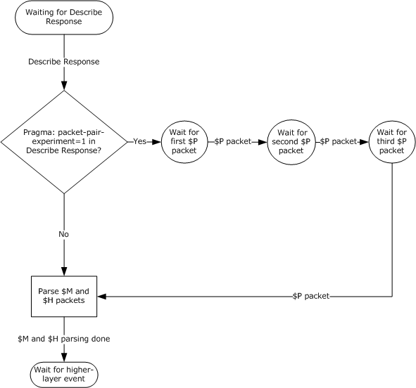

Figure 19: Flow chart for packet processing during initialization

### 4.13.1 Parsing $M and $H Packets

The following flow chart for parsing $M and $H packets illustrates the packet processing rules used by the client when receiving $H and $M packets. The processing rules corresponding to this flow chart are in sections [3.1.5.6](#Section_3.1.5.6) and [3.1.5.7](#Section_3.1.5.7).

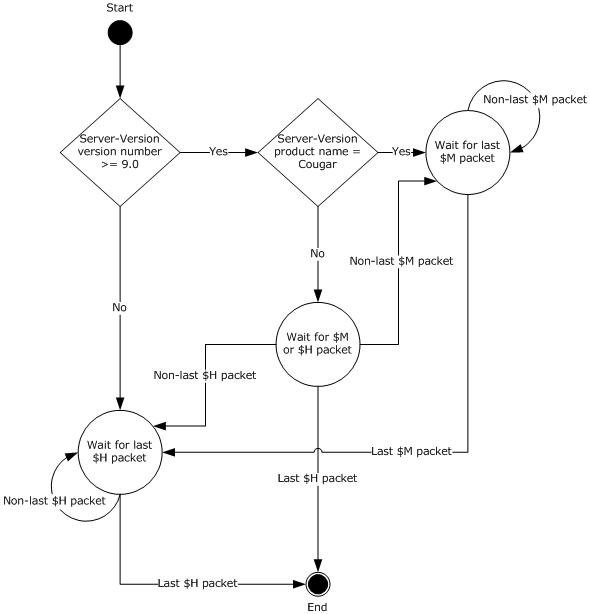

Figure 20: Parsing $M and $H packets flow chart

## 4.14 Packet Processing During Streaming

The flow chart in this section illustrates the packet processing rules used by the client during streaming. The flow chart starts with the packet processing requirements resulting from the rules in section [3.1.4.3](#Section_3.1.4.3), Request to Start Streaming Content. The rules for processing $M and $H packets are shown in a separate flow chart in section [4.13.1](#Section_4.13.1).

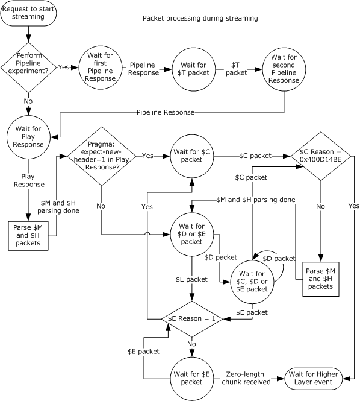

Figure 21: Packet processing rules flow chart

# 5 Security

## 5.1 Security Considerations for Implementers

The Windows Media HTTP Streaming Protocol is vulnerable to a [**session**](#gt_session) hijacking attack in which the attacker guesses the value of the [client-id (section 2.2.1.4.5)](#Section_2.2.1.4.5) token on the [Pragma](#Section_2.2.1.4) header and the TCP port number used by the client. The attacker makes the server believe that the TCP connection to the client has been lost. Then the attacker establishes its own TCP connection to the server and sends a request with the victim's client-id value. To mitigate the attack, server implementations need to use a good random number generator when creating client-id values. Also, if HTTP Access Authentication is used, the server needs to authenticate access at least once on each new URL or TCP connection, or, preferably, on each [Play request](#Section_3.2.5.6).

## 5.2 Index of Security Parameters

| Security parameter | Section |
| --- | --- |
| HTTP Access Authentication | [2.1](#Section_2.1) |

# 6 Appendix A: Product Behavior

The information in this specification is applicable to the following Microsoft products or supplemental software. References to product versions include updates to those products.

The terms "earlier" and "later", when used with a product version, refer to either all preceding versions or all subsequent versions, respectively. The term "through" refers to the inclusive range of versions. Applicable Microsoft products are listed chronologically in this section.

**Windows Client**

- Windows NT operating system
- Windows 2000 Professional operating system
- Windows XP operating system
- Windows Vista operating system
- Windows 7 operating system
- Windows 8 operating system
- Windows 8.1 operating system
- Windows 10 operating system
- Windows 11 operating system
**Windows Server**

- Windows NT
- Windows 2000 Server operating system
- Windows Server 2003 operating system
- Windows Server 2008 operating system
- Windows Server 2008 R2 operating system
- Windows Server 2012 operating system
- Windows Server 2012 R2 operating system
- Windows Server 2016 operating system
- Windows Server operating system
- Windows Server 2019 operating system
- Windows Server 2022 operating system
- Windows Server 2025 operating system
Exceptions, if any, are noted in this section. If an update version, service pack or Knowledge Base (KB) number appears with a product name, the behavior changed in that update. The new behavior also applies to subsequent updates unless otherwise specified. If a product edition appears with the product version, behavior is different in that product edition.

Unless otherwise specified, any statement of optional behavior in this specification that is prescribed using the terms "SHOULD" or "SHOULD NOT" implies product behavior in accordance with the SHOULD or SHOULD NOT prescription. Unless otherwise specified, the term "MAY" implies that the product does not follow the prescription.

<1> Section 2.1: Windows Media Player 6, Windows Media Format 7.0 SDK, Windows Media Format 7.1 SDK, and Windows Media Player for Windows XP support Basic authentication (as specified in [[RFC2617]](https://go.microsoft.com/fwlink/?LinkId=90373) and [MS-NLMP](../MS-NLMP/MS-NLMP.md)). Windows Media Format 9 Series SDK, Windows Media Format 9.5 SDK, Windows Vista and later support [MS-NLMP], Digest (as specified in [RFC2617]), and Negotiate (as specified in [[RFC4559]](https://go.microsoft.com/fwlink/?LinkId=90483)) authentication. Basic authentication is only supported when challenged by a proxy server. Windows Media Services on Windows NT Server 4.0 operating system and on Windows 2000 Server support Basic and [MS-NLMP] authentication. Windows Media Services on Windows Server 2003, Windows Server 2008, and Windows Server 2008 R2 support [MS-NLMP], Digest, and Negotiate authentication. Authentication protocols on the server are disabled by default and can be selectively enabled by the server administrator.

<2> Section 2.2.1.1: This header is not supported by Windows Media Player 6, or by Windows Media Services on Windows NT Server 4.0 and on Windows 2000 Server.

<3> Section 2.2.1.1.4: Windows will not specify this directive without a third party plugin.

<4> Section 2.2.1.1.5: Windows will not specify this directive without a third party plugin.

<5> Section 2.2.1.1.6: Windows will not specify this directive without a third party plugin.

<6> Section 2.2.1.1.7: Windows will not specify this directive without a third party plugin.

<7> Section 2.2.1.1.9: This directive is only supported by Windows Media Services on Windows Server 2003, Windows Server 2008 and Windows Server 2008 R2.

<8> Section 2.2.1.1.10: Windows Media Format 9 Series SDK, Windows Media Format 9.5 SDK, and Windows Vista only support the "remote-log" event.

<9> Section 2.2.1.1.11: This directive is only supported by Windows Media Services on Windows Server 2003, Windows Server 2008 and Windows Server 2008 R2.

<10> Section 2.2.1.1.12: This directive is only supported by Windows Media Services on Windows Server 2003, Windows Server 2008 and Windows Server 2008 R2.

<11> Section 2.2.1.2: Windows Media Services on Windows NT 4.0 operating system and Windows 2000 Server only sends the "[application/octet-stream](#Section_2.2.1.2.1)" content-type. Also, Windows Media Player 6 only sends the "[text/plain](#Section_2.2.1.2.7)" content-type in its POST requests.

<12> Section 2.2.1.2.4: This content-type is only supported by Windows Media Services on Windows Server 2003, Windows Server 2008 and Windows Server 2008 R2.

<13> Section 2.2.1.2.5: This content-type is supported by Windows Media Format 9 Series SDK, Windows Media Format 9.5 SDK, Windows Vista and later; and by Windows Media Services on Windows Server 2003, Windows Server 2008, and Windows Server 2008 R2.

<14> Section 2.2.1.2.6: This content-type is supported by Windows Media Format 9 Series SDK, Windows Media Format 9.5 SDK, Windows Vista and later; and by Windows Media Services on Windows Server 2003, Windows Server 2008, and Windows Server 2008 R2.

<15> Section 2.2.1.2.7: This content-type is only sent by Windows Media Player 6, Windows Media Format 7.0 SDK, Windows Media Format 7.1 SDK, and by Windows Media Player for Windows XP, and by Windows Media Services on Windows NT 4.0 and Windows 2000 Server.

<16> Section 2.2.1.4: When Windows Media Services is acting in the server role, it will typically respond to errors with "400 Bad Request" or a similar HTTP error code. Implementations of the client role on Windows (listed in the introduction to this section) will typically close the connection to the server and display an error message to the user.

<17> Section 2.2.1.4.1: This token is supported by Windows Media Player for Windows XP, Windows Media Format 9 Series SDK, Windows Media Format 9.5 SDK, Windows Vista and later, and by Windows Media Services on Windows Server 2003, Windows Server 2008, and Windows Server 2008 R2. The token is also sent by Windows Media Format 7.0 SDK and by Windows Media Format 7.1 SDK. However, those products do not properly process the token in a response; thus, the requirement to not send the token to clients that have a version number that is less than 8.

<18> Section 2.2.1.4.2: This token is supported by Windows Media Player for Windows XP, Windows Media Format 9 Series SDK, Windows Media Format 9.5 SDK, Windows Vista and later, and by Windows Media Services on Windows Server 2003, Windows Server 2008, and Windows Server 2008 R2. The token is also sent by Windows Media Format 7.0 SDK and by Windows Media Format 7.1 SDK, but those products do not properly process the token in a response; thus, the requirement to not send the token to clients that have a version number that is less than 8.

<19> Section 2.2.1.4.3: This token is supported by Windows Media Services on the Windows Server 2003, Windows Server 2008 and Windows Server 2008 R2.

<20> Section 2.2.1.4.4: This token is supported by Windows Media Services on Windows Server 2003, Windows Server 2008 and Windows Server 2008 R2.

<21> Section 2.2.1.4.6: This token is supported by Windows Media Player for Windows XP, Windows Media Format 9 Series SDK, Windows Media Format 9.5 SDK, Windows Vista and later, and by Windows Media Services on Windows Server 2003, Windows Server 2008, and Windows Server 2008 R2.

<22> Section 2.2.1.4.8.2: This token is not supported by Windows.

<23> Section 2.2.1.4.8.4: This token is supported by Windows Media Format 9 Series SDK, Windows Media Format 9.5 SDK, Windows Vista and later, and by Windows Media Services on Windows Server 2003, Windows Server 2008, and Windows Server 2008 R2.

<24> Section 2.2.1.4.8.6: This token is supported by Windows Media Format 9 Series SDK, Windows Media Format 9.5 SDK, Windows Vista and later, and by Windows Media Services on Windows Server 2003, Windows Server 2008, and Windows Server 2008 R2.

<25> Section 2.2.1.4.8.7: This token is supported by Windows Media Format 9 Series SDK, Windows Media Format 9.5 SDK, Windows Vista and later, and by Windows Media Services on Windows Server 2003, Windows Server 2008, and Windows Server 2008 R2.

<26> Section 2.2.1.4.9: This token is supported by Windows Media Format 7.0 SDK, Windows Media Format 7.1 SDK, Windows Media Player for Windows XP, Windows Media Format 9 Series SDK, Windows Media Format 9.5 SDK, Windows Vista and later, and by Windows Media Services on Windows Server 2003, Windows Server 2008, and Windows Server 2008 R2. When supported, the value of the token is set to the link bandwidth if it has been configured by the user or the link bandwidth if it was successfully determined through a packet-pair experiment. If the link bandwidth is unknown, the token is not transmitted. Windows Media Services on Windows Server 2003 uses the value of the token in determining which streams are selected when it switches to the next entry (if any) in a server-side [**playlist**](#gt_playlist).

<27> Section 2.2.1.4.11: This token is not ignored by Windows Media Services on Windows NT 4.0 and Windows 2000 operating system.

<28> Section 2.2.1.4.14: This token is supported by Windows Media Format 9 Series SDK, Windows Media Format 9.5 SDK, Windows Vista and later, and by Windows Media Services on Windows Server 2003, Windows Server 2008, and Windows Server 2008 R2.

<29> Section 2.2.1.4.15: This token is supported by Windows Media Format 9 Series SDK, Windows Media Format 9.5 SDK, Windows Vista and later, and by Windows Media Services on Windows Server 2003, Windows Server 2008, and Windows Server 2008 R2.

<30> Section 2.2.1.4.16: This token is supported by Windows Media Format 9 Series SDK, Windows Media Format 9.5 SDK, Windows Vista and later, and by Windows Media Services on Windows Server 2003, Windows Server 2008, and Windows Server 2008 R2.

<31> Section 2.2.1.4.17: This token is supported by Windows Media Format 9 Series SDK, Windows Media Format 9.5 SDK, Windows Vista and later, and by Windows Media Services on Windows Server 2003, Windows Server 2008, and Windows Server 2008 R2.

<32> Section 2.2.1.4.18: This token is supported by Windows Media Format 9 Series SDK, Windows Media Format 9.5 SDK, Windows Vista and later, and by Windows Media Services on Windows Server 2003, Windows Server 2008, and Windows Server 2008 R2.

<33> Section 2.2.1.4.19: This token is supported by Windows Media Format 9 Series SDK, Windows Media Format 9.5 SDK, Windows Vista and later, and by Windows Media Services on Windows Server 2003, Windows Server 2008, and Windows Server 2008 R2.

<34> Section 2.2.1.4.20: This token is supported by Windows Media Format 9 Series SDK, Windows Media Format 9.5 SDK, Windows Vista and later, and by Windows Media Services on Windows Server 2003, Windows Server 2008, and Windows Server 2008 R2.

<35> Section 2.2.1.4.23: The first [Play request](#Section_3.2.5.6) sent by Windows Media Player 6 specifies a value for this token that is 2. For other GET requests sent by Windows Media Player 6, the token is either omitted or has a value that is greater than 2. The first Play request sent by Windows Media Services on Windows NT 4.0 and Windows 2000 specifies a value for this token that is either 2 or 3. For other GET requests sent by Windows Media Services on Windows NT 4.0 and Windows 2000, the token is either omitted or has a value that is greater than 3.

<36> Section 2.2.1.4.24: This token is supported by Windows Media Format 9 Series SDK, Windows Media Format 9.5 SDK, Windows Vista and later, and by Windows Media Services on Windows Server 2003, Windows Server 2008, and Windows Server 2008 R2. Windows Media Services on Windows Server 2003, Windows Server 2008, and Windows Server 2008 R2 can respond to a request that specifies this token with a speed token that specifies a value that is less than what the client specified, but it will never be less than 1 if the client specified a value greater than 1.

<37> Section 2.2.1.4.30: This token is supported by Windows Media Format 9 Series SDK, Windows Media Format 9.5 SDK, Windows Vista and later, and by Windows Media Services on Windows Server 2003, Windows Server 2008, and Windows Server 2008 R2.

<38> Section 2.2.1.4.31: This token is supported by Windows Media Player 6 and Windows Media Services on Windows NT 4.0 and Windows 2000. The Versions of Windows Media Services that support this token do not send it, unless configured to do so.

<39> Section 2.2.1.4.32: This token is supported by Windows Media Player 6 and Windows Media Services on Windows NT 4.0 and Windows 2000. The versions of Windows Media Services that support this token do not send it, unless configured to do so.

<40> Section 2.2.1.4.34: This token is supported by Windows Media Format 9 Series SDK, Windows Media Format 9.5 SDK, Windows Vista and later, and by Windows Media Services on Windows Server 2003, Windows Server 2008, and Windows Server 2008 R2. The client products that support this token will send a request with the token if the connection has been idle for the amount that the server specified in the timeout token. Windows Media Services on Windows Server 2003, Windows Server 2008, and Windows Server 2008 R2 will reset its idle timeout timer for the specified session whenever it receives a request with the [xKeepAliveInPause](#Section_2.2.1.4.34) token.

<41> Section 2.2.1.4.35: The [**pipelined mode**](#gt_pipelined-mode) of the protocol, and hence also this token, is only supported by Windows Media Format 9 Series SDK, Windows Media Format 9.5 SDK, Windows Vista and later, and by Windows Media Services on Windows Server 2003, Windows Server 2008, and Windows Server 2008 R2.

<42> Section 2.2.1.4.38: The pipelined mode of the protocol, and hence also this token, is only supported by Windows Media Format 9 Series SDK, Windows Media Format 9.5 SDK, Windows Vista and later, and by Windows Media Services on Windows Server 2003, Windows Server 2008, and Windows Server 2008 R2.

<43> Section 2.2.1.5: In Windows, the server assigns the values of the server-token according to the following table.

| Product name | Server-Token | Major | Minor |
| --- | --- | --- | --- |
| Windows Media Services on Windows NT Server 4.0 | Cougar | 4 | 0 |
| Windows Media Services on Windows 2000 Server | Cougar | 4 | 1 |
| Windows Media Services on Windows Server 2003 | Cougar | 9 | 0 |
| Windows Media Services on Windows Server 2003 operating system with Service Pack 1 (SP1) | Cougar | 9 | 1 |
| Windows Media Services on Windows Server 2008 | Cougar | 9 | 5 |
| Windows Media Services on Windows Server 2008 R2 | Cougar | 9 | 6 |
| Windows Media Encoder 4.0 | Rex | 4 | 0 |
| Windows Media Format 7.0 SDK | Rex | 7 | 0 |
| Windows Media Format 7.1 SDK | Rex | 7 | 1 |
| Windows Media Player for Windows XP | Rex | 8 | 0 |
| Windows Media Format 9 Series SDK | Rex | 9 | 0 |
| Windows Media Format 9.5 SDK | Rex | 10 | 0 |
| Windows Vista | Rex | 11 | 0 |
| Windows 7 and later | Rex | 12 | 0 |

<44> Section 2.2.1.7: This header is supported by Windows Media Format 9 Series SDK, Windows Media Format 9.5 SDK, Windows Vista and later, and by Windows Media Services on Windows Server 2003, Windows Server 2008, and Windows Server 2008 R2.

<45> Section 2.2.1.7.5: The [X-StartupProfile (section 2.2.1.12)](#Section_2.2.1.12) header is supported by Windows Media Format 9.5 SDK, Windows Vista and later, and by Windows Media Services on Windows Server 2003 with SP1, Windows Server 2008, and Windows Server 2008 R2.

<46> Section 2.2.1.8: In Windows, the client assigns the values of the client-token according to the following table.

| Product name | Client-token | Major | Minor |
| --- | --- | --- | --- |
| Windows Media Services in Windows NT Server 4.0 | NSServer | 4 | 0 |
| Windows Media Services in Windows 2000 Server | NSServer | 4 | 1 |
| Windows Media Services in Windows Server 2003 | NSServer | 9 | 0 |
| Windows Media Services in Windows Server 2003 | WMCacheProxy | 9 | 0 |
| Windows Media Services in Windows Server 2003 with SP1 | NSServer | 9 | 1 |
| Windows Media Services in Windows Server 2003 with SP1 | WMCacheProxy | 9 | 1 |
| Windows Media Services in Windows Server 2008 | NSServer | 9 | 5 |
| Windows Media Services in Windows Server 2008 | WMCacheProxy | 9 | 5 |
| Windows Media Services in Windows Server 2008 R2 | NSServer | 9 | 6 |
| Windows Media Services in Windows Server 2008 R2 | WMCacheProxy | 9 | 6 |
| Windows Media Player 6.4 | NSPlayer | 6 | 4 |
| Windows Media Format 7.0 SDK | NSPlayer | 7 | 0 |
| Windows Media Format 7.1 SDK | NSPlayer | 7 | 1 |
| Windows Media Player for Windows XP | NSPlayer | 8 | 0 |
| Windows Media Format 9 Series SDK | NSPlayer | 9 | 0 |
| Windows Media Format 9.5 SDK | NSPlayer | 10 | 0 |
| Windows Vista | NSPlayer | 11 | 0 |
| Windows 7 and later | NSPlayer | 12 | 0 |

<47> Section 2.2.1.9: This header is supported by Windows Media Format 9 Series SDK, Windows Media Format 9.5 SDK, Windows Vista and later, and by Windows Media Services on Windows Server 2003, Windows Server 2008, and Windows Server 2008 R2. Windows Media Player 6, Windows Media Format 7.0 SDK, Windows Media Format 7.1 SDK, and Windows Media Player for Windows XP support Basic (as specified in [RFC2617]) and MS-NLMP authentication (as specified in [MS-NLMP]). Windows Media Format 9 Series SDK, Windows Media Format 9.5 SDK, Windows Vista and later support MS-NLMP (as specified in [MS-NLMP]), Digest (as specified in [RFC2617]), and Negotiate authentication (as specified in [RFC4559]). Basic authentication is only supported when challenged by a proxy server. Windows Media Services on Windows NT 4.0 and on Windows 2000 Server supports Basic and MS-NLMP authentication. Windows Media Services on Windows Server 2003, Windows Server 2008, and Windows Server 2008 R2 supports MS-NLMP, Digest, and Negotiate authentication. Authentication protocols on the server are disabled by default and can be selectively enabled by the server administrator.

<48> Section 2.2.1.10: This header is supported by Windows Media Format 9 Series SDK, Windows Media Format 9.5 SDK, Windows Vista and later, and by Windows Media Services on Windows Server 2003, Windows Server 2008, and Windows Server 2008 R2. Windows Media Player 6, Windows Media Format 7.0 SDK, Windows Media Format 7.1 SDK, and Windows Media Player for Windows XP support Basic (as specified in [RFC2617]) and MS-NLMP authentication (as specified in [MS-NLMP]). Windows Media Format 9 Series SDK, Windows Media Format 9.5 SDK, Windows Vista and later support Basic, MS-NLMP, Digest (as specified in [RFC2617]), and Negotiate authentication (as specified in [RFC4559]). Windows Media Services on Windows NT 4.0 and on Windows 2000 Server supports Basic and MS-NLMP authentication. Windows Media Services on Windows Server 2003, Windows Server 2008, and Windows Server 2008 R2 supports MS-NLMP, Digest, and Negotiate authentication. Authentication protocols on the server are disabled by default and can be selectively enabled by the server administrator.

<49> Section 2.2.1.12: This header is supported by Windows Media Format 9.5 SDK, Windows Vista and later, and by Windows Media Services on Windows Server 2003, Windows Server 2008, and Windows Server 2008 R2.

<50> Section 2.2.2.2: This request type is supported by Windows Media Services on Windows Server 2003, Windows Server 2008, and Windows Server 2008 R2.

<51> Section 2.2.2.3: This request type is supported by Windows Media Format 9 Series SDK, Windows Media Format 9.5 SDK, Windows Vista and later, and by Windows Media Services on Windows Server 2003, Windows Server 2008, and Windows Server 2008 R2.

<52> Section 2.2.2.7: This request type is supported by Windows Media Format 9 Series SDK, Windows Media Format 9.5 SDK, Windows Vista and later, and by Windows Media Services on Windows Server 2003, Windows Server 2008, and Windows Server 2008 R2.

<53> Section 2.2.2.9: This request type is supported by Windows Media Format 9 Series SDK, Windows Media Format 9.5 SDK, Windows Vista and later, and by Windows Media Services on Windows Server 2003, Windows Server 2008, and Windows Server 2008 R2.

<54> Section 2.2.2.10: This request type is supported by Windows Media Format 9 Series SDK, Windows Media Format 9.5 SDK, Windows Vista and later, and by Windows Media Services on Windows Server 2003, Windows Server 2008, and Windows Server 2008 R2.

<55> Section 2.2.3.1: Implementations on Windows (listed in the introduction to this section) typically close the connection to the server and display an error message to the user if a packet is received with a field set to an invalid value.

<56> Section 2.2.3.1.1: This field is supported by Windows Media Format 9 Series SDK, Windows Media Format 9.5 SDK, Windows Vista and later, and by Windows Media Services on Windows Server 2003, Windows Server 2008, and Windows Server 2008 R2. Windows Media Services sets this field to 1 on any packets that are transmitted faster than real time as the result of the client having specified the [AccelBW (section 2.2.1.4.1)](#Section_2.2.1.4.1) token on the [pragma](#Section_2.2.1.4) header.

<57> Section 2.2.3.7: This packet type is supported by Windows Media Format 9 Series SDK, Windows Media Format 9.5 SDK, Windows Vista and later, and by Windows Media Services on Windows Server 2003, Windows Server 2008, and Windows Server 2008 R2.

<58> Section 2.2.3.8: This packet type is supported by Windows Media Format 9 Series SDK, Windows Media Format 9.5 SDK, Windows Vista and later, and by Windows Media Services on Windows Server 2003, Windows Server 2008, and Windows Server 2008 R2.

<59> Section 2.2.5: Windows Media Format 9 Series SDK, Windows Media Format 9.5 SDK, and Windows Vista support only the "remote-log" event.

<60> Section 3.1.5.1: The [com.microsoft.wm.startupprofile (section 2.2.1.7.5)](#Section_2.2.1.7.5) token is only specified by Windows Media Format 9.5 SDK, Windows Vista and later. Windows Media Format 9 Series SDK, Windows Media Format 9.5 SDK, and Windows Vista only specify the [com.microsoft.wm.predstrm (section 2.2.1.7.2)](#Section_2.2.1.7.2) token when the most recent Play (section 2.2.2.6) or [PlayNextEntry (section 2.2.2.7)](#Section_3.1.5.18) request did not include the speed token with a value other than 1 on a Pragma (section 2.2.1.4) header.

<61> Section 3.1.5.1: Whether the same [**GUID**](#gt_globally-unique-identifier-guid) is used for all sessions or changed between different sessions is determined by how the user has configured Windows Media Player and/or the Windows Media Format SDK.

<62> Section 3.1.5.1: Only Windows Media Services on Windows Server 2003, Windows Server 2008, and Windows Server 2008 R2 supports sending a Pragma (section 2.2.1.4) header with the [proxy-client-agent (section 2.2.1.4.21)](#Section_2.2.1.4.21) token or a [X-Proxy-Client-Verb (section 2.2.1.11)](#Section_2.2.1.11) header.

<63> Section 3.1.5.1: The [Cookie (section 2.2.1.3)](#Section_2.2.1.3) header can be sent by Windows Media Format 9 Series SDK, Windows Media Format 9.5 SDK, and Windows Vista.

<64> Section 3.1.5.3: Windows Media Player 6, Windows Media Format 7.0 SDK, Windows Media Format 7.1 SDK, and Windows Media Player for Windows XP support Basic (as specified in [RFC2617]) and NTLM (as specified in [[NTLM]](https://go.microsoft.com/fwlink/?LinkId=90235)) authentication. Windows Media Format 9 Series SDK, Windows Media Format 9.5 SDK, Windows Vista and later support NTLM, Digest (as specified in [RFC2617]), and Negotiate (as specified in [RFC4559]) authentication. Basic authentication is only supported when challenged by a proxy server. Windows Media Services on Windows NT 4.0 and on Web Services for Management (WS-Management) Windows 2000 Server supports Basic and NTLM authentication. Windows Media Services on Windows Server 2003, Windows Server 2008, and Windows Server 2008 R2 supports NTLM, Digest, and Negotiate authentication.

<65> Section 3.1.5.3: This token is supported by Windows Media Format 9 Series SDK, Windows Media Format 9.5 SDK, Windows Vista and later, and by Windows Media Services on Windows Server 2003, Windows Server 2008, and Windows Server 2008 R2. Windows Media Services on Windows Server 2003, Windows Server 2008, and Windows Server 2008 R2 will disconnect a client that has been idle, but the actual time-out used can be greater (but never smaller) than the time-out specified by the token.

<66> Section 3.1.5.3: Only Windows Media Format 9 Series SDK, Windows Media Format 9.5 SDK, Windows Vista and later support caching of content, and thus only those product versions will adhere to the directives on the [Cache-Control](#Section_2.2.1.1) header.

<67> Section 3.1.5.3: Windows Media Player 6 will use the URL specified in the value of the [version-info](#Section_2.2.1.4.31) token to download an update but only if the version number specified by the version-info token is greater than the current version number of Windows Media Player.

<68> Section 3.1.5.3: The [Set-Cookie (section 2.2.1.6)](#Section_2.2.1.6) header is supported by Windows Media Format 9 Series SDK, Windows Media Format 9.5 SDK, Windows Vista and later.

<69> Section 3.2.5.1: Windows Media Services will respond to the request with HTTP status code 200 and the message response of the request will contain an ASX file (as described in [[MSDN-ASX]](https://go.microsoft.com/fwlink/?LinkId=137271)) that contains the same URL that the client provided in the request. Because ASX files are understood by Windows Media Player, it is expected that the web client will invoke Windows Media Player to parse the ASX file.

<70> Section 3.2.5.2: The com.microsoft.wm.startupprofile (section 2.2.1.7.5) token is only specified by Windows Media Services on Windows Server 2003 with SP1, Windows Server 2008 and Windows Server 2008 R2.

<71> Section 3.2.5.4: Windows Media Services on Windows NT 4.0 and Windows 2000 Server sends the "application/octet-stream" content-type and does not send the application/vnd.ms.wms-hdr.asfv1 content-type.

<72> Section 3.2.5.6: The AccelDuration specified by Windows Media Services on Windows Server 2003, Windows Server 2008 and Windows Server 2008 R2 could be larger than the client-specified value.

<73> Section 3.2.5.6: Windows Media Services on Windows NT 4.0 and Windows 2000 Server sends the "application/octet-stream" content-type and does not send the application/x-mms-framed content-type.

<74> Section 3.2.5.11: Windows Media Services on Windows NT 4.0, Windows Media Services on Windows 2000 Server, Windows Media Player 6, Windows Media Format 7.0 SDK, Windows Media Format 7.1 SDK, Windows Media Player for Windows XP, Windows Media Format 9.0 Series SDK, Windows Media Format 9.5 SDK, Windows Vista and later, and Windows Media Services on Windows Server 2003, Windows Server 2008, and Windows Server 2008 R2 will not fail a logging request for invalid or illegal syntax.

# 7 Change Tracking

This section identifies changes that were made to this document since the last release. Changes are classified as Major, Minor, or None.

The revision class **Major** means that the technical content in the document was significantly revised. Major changes affect protocol interoperability or implementation. Examples of major changes are:

- A document revision that incorporates changes to interoperability requirements.
- A document revision that captures changes to protocol functionality.
The revision class **Minor** means that the meaning of the technical content was clarified. Minor changes do not affect protocol interoperability or implementation. Examples of minor changes are updates to clarify ambiguity at the sentence, paragraph, or table level.

The revision class **None** means that no new technical changes were introduced. Minor editorial and formatting changes may have been made, but the relevant technical content is identical to the last released version.

The changes made to this document are listed in the following table. For more information, please contact [dochelp@microsoft.com](mailto:dochelp@microsoft.com).

| Section | Description | Revision class |
| --- | --- | --- |
| [6](#Section_6) Appendix A: Product Behavior | Added Windows Server 2025 to the list of applicable products. | Major |

## Revision History

| Date | Version | Revision Class | Comments |
| --- | --- | --- | --- |
| 12/18/2006 | 0.1 | New | Version 0.1 release |
| 3/2/2007 | 1.0 | Major | Version 1.0 release |
| 4/3/2007 | 1.1 | Minor | Version 1.1 release |
| 5/11/2007 | 1.2 | Minor | Version 1.2 release |
| 6/1/2007 | 1.2.1 | Editorial | Changed language and formatting in the technical content. |
| 7/3/2007 | 1.2.2 | Editorial | Changed language and formatting in the technical content. |
| 7/20/2007 | 1.2.3 | Editorial | Changed language and formatting in the technical content. |
| 8/10/2007 | 1.2.4 | Editorial | Changed language and formatting in the technical content. |
| 9/28/2007 | 1.3 | Minor | Clarified the meaning of the technical content. |
| 10/23/2007 | 1.4 | Minor | Unused normative reference deleted. |
| 11/30/2007 | 1.4.1 | Editorial | Changed language and formatting in the technical content. |
| 1/25/2008 | 1.4.2 | Editorial | Changed language and formatting in the technical content. |
| 3/14/2008 | 1.4.3 | Editorial | Changed language and formatting in the technical content. |
| 5/16/2008 | 1.4.4 | Editorial | Changed language and formatting in the technical content. |
| 6/20/2008 | 1.5 | Minor | Clarified the meaning of the technical content. |
| 7/25/2008 | 2.0 | Major | Updated and revised the technical content. |
| 8/29/2008 | 2.1 | Minor | Clarified the meaning of the technical content. |
| 10/24/2008 | 2.2 | Minor | Clarified the meaning of the technical content. |
| 12/5/2008 | 2.3 | Minor | Clarified the meaning of the technical content. |
| 1/16/2009 | 2.3.1 | Editorial | Changed language and formatting in the technical content. |
| 2/27/2009 | 2.3.2 | Editorial | Changed language and formatting in the technical content. |
| 4/10/2009 | 2.3.3 | Editorial | Changed language and formatting in the technical content. |
| 5/22/2009 | 3.0 | Major | Updated and revised the technical content. |
| 7/2/2009 | 3.0.1 | Editorial | Changed language and formatting in the technical content. |
| 8/14/2009 | 3.0.2 | Editorial | Changed language and formatting in the technical content. |
| 9/25/2009 | 3.1 | Minor | Clarified the meaning of the technical content. |
| 11/6/2009 | 4.0 | Major | Updated and revised the technical content. |
| 12/18/2009 | 5.0 | Major | Updated and revised the technical content. |
| 1/29/2010 | 6.0 | Major | Updated and revised the technical content. |
| 3/12/2010 | 7.0 | Major | Updated and revised the technical content. |
| 4/23/2010 | 8.0 | Major | Updated and revised the technical content. |
| 6/4/2010 | 9.0 | Major | Updated and revised the technical content. |
| 7/16/2010 | 10.0 | Major | Updated and revised the technical content. |
| 8/27/2010 | 11.0 | Major | Updated and revised the technical content. |
| 10/8/2010 | 12.0 | Major | Updated and revised the technical content. |
| 11/19/2010 | 13.0 | Major | Updated and revised the technical content. |
| 1/7/2011 | 13.0 | None | No changes to the meaning, language, or formatting of the technical content. |
| 2/11/2011 | 14.0 | Major | Updated and revised the technical content. |
| 3/25/2011 | 15.0 | Major | Updated and revised the technical content. |
| 5/6/2011 | 16.0 | Major | Updated and revised the technical content. |
| 6/17/2011 | 16.1 | Minor | Clarified the meaning of the technical content. |
| 9/23/2011 | 16.1 | None | No changes to the meaning, language, or formatting of the technical content. |
| 12/16/2011 | 17.0 | Major | Updated and revised the technical content. |
| 3/30/2012 | 17.0 | None | No changes to the meaning, language, or formatting of the technical content. |
| 7/12/2012 | 18.0 | Major | Updated and revised the technical content. |
| 10/25/2012 | 19.0 | Major | Updated and revised the technical content. |
| 1/31/2013 | 20.0 | Major | Updated and revised the technical content. |
| 8/8/2013 | 21.0 | Major | Updated and revised the technical content. |
| 11/14/2013 | 21.0 | None | No changes to the meaning, language, or formatting of the technical content. |
| 2/13/2014 | 21.0 | None | No changes to the meaning, language, or formatting of the technical content. |
| 5/15/2014 | 21.0 | None | No changes to the meaning, language, or formatting of the technical content. |
| 6/30/2015 | 22.0 | Major | Significantly changed the technical content. |
| 10/16/2015 | 22.0 | None | No changes to the meaning, language, or formatting of the technical content. |
| 7/14/2016 | 22.0 | None | No changes to the meaning, language, or formatting of the technical content. |
| 6/1/2017 | 22.0 | None | No changes to the meaning, language, or formatting of the technical content. |
| 9/15/2017 | 23.0 | Major | Significantly changed the technical content. |
| 9/12/2018 | 24.0 | Major | Significantly changed the technical content. |
| 4/7/2021 | 25.0 | Major | Significantly changed the technical content. |
| 6/25/2021 | 26.0 | Major | Significantly changed the technical content. |
| 4/23/2024 | 27.0 | Major | Significantly changed the technical content. |
