# [MS-WSH]: Windows Security Health Agent (WSHA) and Windows Security Health Validator (WSHV) Protocol

Table of Contents

<details>
<summary>1 Introduction</summary>

- [1 Introduction](#Section_1)
  - [1.1 Glossary](#Section_1.1)
  - [1.2 References](#Section_1.2)
    - [1.2.1 Normative References](#Section_1.2.1)
    - [1.2.2 Informative References](#Section_1.2.2)
  - [1.3 Overview](#Section_1.3)
    - [1.3.1 Network Access Protection (NAP) Application Programming Interface (API)](#Section_1.3.1)
  - [1.4 Relationship to Other Protocols](#Section_1.4)
    - [1.4.1 Relationship with the Windows Update Client-Server Protocol](#Section_1.4.1)
  - [1.5 Prerequisites/Preconditions](#Section_1.5)
  - [1.6 Applicability Statement](#Section_1.6)
  - [1.7 Versioning and Capability Negotiation](#Section_1.7)
  - [1.8 Vendor-Extensible Fields](#Section_1.8)
  - [1.9 Standards Assignments](#Section_1.9)
</details>

<details>
<summary>2 Messages</summary>

- [2 Messages](#Section_2)
  - [2.1 Transport](#Section_2.1)
  - [2.2 Message Syntax](#Section_2.2)
    - [2.2.1 TLV](#Section_2.2.1)
    - [2.2.2 WSHA SoH](#Section_2.2.2)
      - [2.2.2.1 TLV 1](#Section_2.2.2.1)
      - [2.2.2.2 TLV 2](#Section_2.2.2.2)
      - [2.2.2.3 TLV 3](#Section_2.2.2.3)
      - [2.2.2.4 TLV 4](#Section_2.2.2.4)
      - [2.2.2.5 TLV 5](#Section_2.2.2.5)
      - [2.2.2.6 TLV 6](#Section_2.2.2.6)
      - [2.2.2.7 TLV 7](#Section_2.2.2.7)
      - [2.2.2.8 TLV 8](#Section_2.2.2.8)
      - [2.2.2.9 TLV 9](#Section_2.2.2.9)
      - [2.2.2.10 TLV 10](#Section_2.2.2.10)
      - [2.2.2.11 TLV 11](#Section_2.2.2.11)
      - [2.2.2.12 TLV 12](#Section_2.2.2.12)
      - [2.2.2.13 TLV 13](#Section_2.2.2.13)
      - [2.2.2.14 TLV 14](#Section_2.2.2.14)
      - [2.2.2.15 TLV 15](#Section_2.2.2.15)
      - [2.2.2.16 TLV 16](#Section_2.2.2.16)
      - [2.2.2.17 TLV 17](#Section_2.2.2.17)
      - [2.2.2.18 TLV 18](#Section_2.2.2.18)
      - [2.2.2.19 TLV 19](#Section_2.2.2.19)
    - [2.2.3 WSHV SoHR](#Section_2.2.3)
      - [2.2.3.1 TLV 1](#Section_2.2.3.1)
      - [2.2.3.2 TLV 2](#Section_2.2.3.2)
      - [2.2.3.3 TLV 3](#Section_2.2.3.3)
      - [2.2.3.4 TLV 4](#Section_2.2.3.4)
      - [2.2.3.5 TLV 5](#Section_2.2.3.5)
      - [2.2.3.6 TLV 6](#Section_2.2.3.6)
      - [2.2.3.7 TLV 7](#Section_2.2.3.7)
      - [2.2.3.8 TLV 8](#Section_2.2.3.8)
      - [2.2.3.9 TLV 9](#Section_2.2.3.9)
      - [2.2.3.10 TLV 10](#Section_2.2.3.10)
      - [2.2.3.11 TLV 11](#Section_2.2.3.11)
      - [2.2.3.12 TLV 12](#Section_2.2.3.12)
      - [2.2.3.13 TLV 13](#Section_2.2.3.13)
      - [2.2.3.14 TLV 14](#Section_2.2.3.14)
      - [2.2.3.15 TLV 15](#Section_2.2.3.15)
    - [2.2.4 NAPSystemHealthID](#Section_2.2.4)
    - [2.2.5 Flag](#Section_2.2.5)
    - [2.2.6 Version](#Section_2.2.6)
    - [2.2.7 HealthClassID](#Section_2.2.7)
    - [2.2.8 ProductName](#Section_2.2.8)
    - [2.2.9 ClientStatusCode](#Section_2.2.9)
      - [2.2.9.1 Windows Update Agent (WUA) Error Codes and Security Update Status Codes](#Section_2.2.9.1)
      - [2.2.9.2 Windows Security Center (WSC) Error Codes](#Section_2.2.9.2)
      - [2.2.9.3 Antivirus and Antispyware Status Codes](#Section_2.2.9.3)
      - [2.2.9.4 Firewall Status Codes](#Section_2.2.9.4)
      - [2.2.9.5 Automatic Update Status Codes](#Section_2.2.9.5)
      - [2.2.9.6 ClientStatusCode Packet](#Section_2.2.9.6)
    - [2.2.10 DurationSinceLastSynch](#Section_2.2.10)
    - [2.2.11 WSUSServerName](#Section_2.2.11)
    - [2.2.12 UpdatesFlag](#Section_2.2.12)
    - [2.2.13 ComplianceCode1](#Section_2.2.13)
    - [2.2.14 ComplianceCode2](#Section_2.2.14)
      - [2.2.14.1 Antivirus and Antispyware](#Section_2.2.14.1)
      - [2.2.14.2 Security Updates](#Section_2.2.14.2)
    - [2.2.15 Data Types](#Section_2.2.15)
      - [2.2.15.1 ProductInformation](#Section_2.2.15.1)
      - [2.2.15.2 SecurityUpdatesStatus](#Section_2.2.15.2)
</details>

<details>
<summary>3 Protocol Details</summary>

- [3 Protocol Details](#Section_3)
  - [3.1 Common Details](#Section_3.1)
    - [3.1.1 Abstract Data Model](#Section_3.1.1)
    - [3.1.2 Timers](#Section_3.1.2)
    - [3.1.3 Initialization](#Section_3.1.3)
    - [3.1.4 Higher-Layer Triggered Events](#Section_3.1.4)
    - [3.1.5 Processing Events and Sequencing Rules](#Section_3.1.5)
      - [3.1.5.1 Setting the NAP System Health ID Field](#Section_3.1.5.1)
    - [3.1.6 Timer Events](#Section_3.1.6)
    - [3.1.7 Other Local Events](#Section_3.1.7)
  - [3.2 WSHA (Client) Specific Details](#Section_3.2)
    - [3.2.1 Abstract Data Model](#Section_3.2.1)
    - [3.2.2 Timers](#Section_3.2.2)
    - [3.2.3 Initialization](#Section_3.2.3)
    - [3.2.4 Higher-Layer Triggered Events](#Section_3.2.4)
      - [3.2.4.1 SoH Request](#Section_3.2.4.1)
      - [3.2.4.2 SendMessageToUI Abstract Interface](#Section_3.2.4.2)
      - [3.2.4.3 GetNumberOfFirewallProducts Abstract Interface](#Section_3.2.4.3)
      - [3.2.4.4 GetFirewallProductsInformation Abstract Interface](#Section_3.2.4.4)
      - [3.2.4.5 GetNumberOfAntivirusProducts Abstract Interface](#Section_3.2.4.5)
      - [3.2.4.6 GetAntivirusProductsInformation Abstract Interface](#Section_3.2.4.6)
      - [3.2.4.7 GetNumberOfAntispywareProducts Abstract Interface](#Section_3.2.4.7)
      - [3.2.4.8 GetAntispywareProductsInformation Abstract Interface](#Section_3.2.4.8)
      - [3.2.4.9 GetAutomaticUpdatesStatusCode Abstract Interface](#Section_3.2.4.9)
      - [3.2.4.10 GetSecurityUpdatesStatus Abstract Interface](#Section_3.2.4.10)
      - [3.2.4.11 FreeProductsInformation Abstract Interface](#Section_3.2.4.11)
      - [3.2.4.12 GetClientVersion Abstract Interface](#Section_3.2.4.12)
      - [3.2.4.13 ClientVersion ADM Initialization](#Section_3.2.4.13)
      - [3.2.4.14 SohFlag ADM initialization](#Section_3.2.4.14)
      - [3.2.4.15 RemediateFirewall Abstract Interface](#Section_3.2.4.15)
      - [3.2.4.16 RemediateAntispyware Abstract Interface](#Section_3.2.4.16)
      - [3.2.4.17 RemediateAutomaticUpdates Abstract Interface](#Section_3.2.4.17)
      - [3.2.4.18 StartWSCService Abstract Interface](#Section_3.2.4.18)
      - [3.2.4.19 DoOnlineScan Abstract Interface](#Section_3.2.4.19)
      - [3.2.4.20 DoSecuritySoftwareUpdate Abstract Interface](#Section_3.2.4.20)
    - [3.2.5 Processing Events and Sequencing Rules](#Section_3.2.5)
      - [3.2.5.1 General Problems](#Section_3.2.5.1)
      - [3.2.5.2 Constructing an SoH](#Section_3.2.5.2)
      - [3.2.5.3 Processing an SoHR](#Section_3.2.5.3)
    - [3.2.6 Timer Events](#Section_3.2.6)
    - [3.2.7 Other Local Events](#Section_3.2.7)
      - [3.2.7.1 Client Abstract Interfaces](#Section_3.2.7.1)
      - [3.2.7.2 SoH Construction Interface](#Section_3.2.7.2)
      - [3.2.7.3 SoH Change Notifications](#Section_3.2.7.3)
  - [3.3 WSHV (Server) Specific Details](#Section_3.3)
    - [3.3.1 Abstract Data Model](#Section_3.3.1)
    - [3.3.2 Timers](#Section_3.3.2)
    - [3.3.3 Initialization](#Section_3.3.3)
    - [3.3.4 Higher-Layer Triggered Events](#Section_3.3.4)
      - [3.3.4.1 SoH Validation Request](#Section_3.3.4.1)
    - [3.3.5 Processing Events and Sequencing Rules](#Section_3.3.5)
      - [3.3.5.1 General Problems](#Section_3.3.5.1)
      - [3.3.5.2 Constructing an SoHR from an SoH](#Section_3.3.5.2)
    - [3.3.6 Timer Events](#Section_3.3.6)
    - [3.3.7 Other Local Events](#Section_3.3.7)
      - [3.3.7.1 Server Abstract Interfaces](#Section_3.3.7.1)
      - [3.3.7.2 SoHR Construction Interface](#Section_3.3.7.2)
      - [3.3.7.3 SoH Processing Interface](#Section_3.3.7.3)
</details>

<details>
<summary>4 Protocol Example</summary>

- [4 Protocol Example](#Section_4)
</details>

<details>
<summary>5 Security</summary>

- [5 Security](#Section_5)
  - [5.1 Security Considerations for Implementers](#Section_5.1)
  - [5.2 Index of Security Parameters](#Section_5.2)
</details>

<details>
<summary>6 Appendix A: Product Behavior</summary>

- [6 Appendix A: Product Behavior](#Section_6)
</details>

<details>
<summary>7 Change Tracking</summary>

- [7 Change Tracking](#Section_7)
</details>

For the legal notice and IP terms, see [LEGAL.md](../LEGAL.md).
Last updated: 6/1/2017.
See [Revision History](#revision-history) for full version history.

<a id="Section_1"></a>
# 1 Introduction

The Windows Security Health Agent (WSHA) and Windows Security Health Validator (WSHV) Protocol is included in the packet payload specified in the Protocol Bindings for SoH, as specified in [[TNC-IF-TNCCSPBSoH]](https://go.microsoft.com/fwlink/?LinkId=240054). The WSHA reports the system security health state to the WSHV, which responds with [**quarantine**](#gt_quarantine) and [**remediation**](#gt_remediation) instructions if the status reported is not compliant with the defined security health policy. If the status is compliant with the security health policy, the WSHV responds by allowing the client into the network.

Sections 1.5, 1.8, 1.9, 2, and 3 of this specification are normative. All other sections and examples in this specification are informative.

<a id="Section_1.1"></a>
## 1.1 Glossary

This document uses the following terms:

<a id="gt_nap-client"></a>
**NAP client**: A computer capable of examining and reporting on its health, and requesting for and using network resources. The NAP client is the set of NAP components installed and running on a Windows client. The NAP client is responsible for executing NAP-related operations on the client side. The NAP client is also responsible for collecting health information on the client, composing the health information into an SoH [TNC-IF-TNCCSPBSoH], and sending the SoH to a NEP.

<a id="gt_nap-health-policy-server-nps"></a>
**NAP health policy server (NPS)**: A computer acting as a server that stores health requirement policies and provides health state validation for NAP clients.

<a id="gt_network-access-protection-nap"></a>
**Network Access Protection (NAP)**: A feature of an operating system that provides a platform for system health-validated access to private networks. [**NAP**](#gt_network-access-protection-nap) provides a way of detecting the health state of a network client that is attempting to connect to or communicate on a network, and limiting the access of the network client until the health policy requirements have been met. [**NAP**](#gt_network-access-protection-nap) is implemented through quarantines and health checks, as specified in [[TNC-IF-TNCCSPBSoH]](https://go.microsoft.com/fwlink/?LinkId=240054).

<a id="gt_network-access-protection-nap-client"></a>
**Network Access Protection (NAP) client**: A computer that supports the [**NAP**](#gt_network-access-protection-nap) feature by complying with the corresponding policy settings.

<a id="gt_network-policy-server-nps"></a>
**Network Policy Server (NPS)**: For Windows Server 2008 operating system, [**NPS**](#gt_network-policy-server-nps) replaces the Internet Authentication Service (IAS) in Windows Server 2003 operating system. [**NPS**](#gt_network-policy-server-nps) acts as a health policy server for the following technologies: Internet Protocol security (IPsec) for host-based authentication, IEEE 802.1X authenticated network connections, Virtual private networks (VPNs) for remote access, and Dynamic Host Configuration Protocol (DHCP).

<a id="gt_quarantine"></a>
**quarantine**: The isolation of a non-compliant computer from protected network resources.

<a id="gt_remediation"></a>
**remediation**: The act of bringing a non-compliant computer into a compliant state.

<a id="gt_security-updates"></a>
**security updates**: The software patches released by Microsoft to fix known security issues in released Microsoft software.

<a id="gt_statement-of-health-soh"></a>
**statement of health (SoH)**: A collection of data generated by a system health entity, as specified in [TNC-IF-TNCCSPBSoH], which defines the health state of a machine. The data is interpreted by a Health Policy Server, which determines whether the machine is healthy or unhealthy according to the policies defined by an administrator.

<a id="gt_statement-of-health-response-sohr"></a>
**statement of health response (SoHR)**: A collection of data that represents the evaluation of the [**statement of health (SoH)**](#gt_statement-of-health-soh) according to network policies, as specified in [TNC-IF-TNCCSPBSoH].

<a id="gt_windows-security-center-wsc"></a>
**Windows Security Center (WSC)**: [**WSC**](#gt_windows-security-center-wsc) is the service on Windows XP operating system Service Pack 3 (SP3) and Windows Vista operating system clients that determines the firewall, antivirus, antispyware, and Automatic Updates states that are then reported by the WSHA.

**MAY, SHOULD, MUST, SHOULD NOT, MUST NOT:** These terms (in all caps) are used as defined in [[RFC2119]](https://go.microsoft.com/fwlink/?LinkId=90317). All statements of optional behavior use either MAY, SHOULD, or SHOULD NOT.

<a id="Section_1.2"></a>
## 1.2 References

Links to a document in the Microsoft Open Specifications library point to the correct section in the most recently published version of the referenced document. However, because individual documents in the library are not updated at the same time, the section numbers in the documents may not match. You can confirm the correct section numbering by checking the [Errata](http://msdn.microsoft.com/en-us/library/dn781092.aspx).

<a id="Section_1.2.1"></a>
### 1.2.1 Normative References

We conduct frequent surveys of the normative references to assure their continued availability. If you have any issue with finding a normative reference, please contact [dochelp@microsoft.com](mailto:dochelp@microsoft.com). We will assist you in finding the relevant information.

[MS-DTYP] Microsoft Corporation, "[Windows Data Types](#Section_2.2.15)".

[MS-WSH] Microsoft Corporation, "[Windows Security Health Agent (WSHA) and Windows Security Health Validator (WSHV) Protocol](#Section_5)".

[RFC2119] Bradner, S., "Key words for use in RFCs to Indicate Requirement Levels", BCP 14, RFC 2119, March 1997, [http://www.rfc-editor.org/rfc/rfc2119.txt](https://go.microsoft.com/fwlink/?LinkId=90317)

[TNC-IF-TNCCSPBSoH] TCG, "TNC IF-TNCCS: Protocol Bindings for SoH", version 1.0, May 2007, [https://trustedcomputinggroup.org/tnc-if-tnccs-protocol-bindings-soh/](https://go.microsoft.com/fwlink/?LinkId=240054)

<a id="Section_1.2.2"></a>
### 1.2.2 Informative References

[ITUX680] ITU-T, "Abstract Syntax Notation One (ASN.1): Specification of Basic Notation", Recommendation X.680, July 2002, [http://www.itu.int/ITU-T/studygroups/com17/languages/X.680-0207.pdf](https://go.microsoft.com/fwlink/?LinkId=89923)

[MS-DHCPE] Microsoft Corporation, "[Dynamic Host Configuration Protocol (DHCP) Extensions](../MS-DHCPE/MS-DHCPE.md)".

[MS-HCEP] Microsoft Corporation, "[Health Certificate Enrollment Protocol](../MS-HCEP/MS-HCEP.md)".

[MS-PEAP] Microsoft Corporation, "[Protected Extensible Authentication Protocol (PEAP)](../MS-PEAP/MS-PEAP.md)".

[MS-RNAP] Microsoft Corporation, "[Vendor-Specific RADIUS Attributes for Network Access Protection (NAP) Data Structure](../MS-RNAP/MS-RNAP.md)".

[MS-TSGU] Microsoft Corporation, "[Terminal Services Gateway Server Protocol](../MS-TSGU/MS-TSGU.md)".

[MS-WUSP] Microsoft Corporation, "[Windows Update Services: Client-Server Protocol](../MS-WUSP/MS-WUSP.md)".

[MSDN-INapSysHA] Microsoft Corporation, "INapSystemHealthAgentCallback interface", [http://msdn.microsoft.com/en-us/library/aa369655(v=VS.85).aspx](https://go.microsoft.com/fwlink/?LinkId=200160)

[MSDN-INapSysHV] Microsoft Corporation, "INapSystemHealthValidator interface", [http://msdn.microsoft.com/en-us/library/aa369692(VS.85).aspx](https://go.microsoft.com/fwlink/?LinkId=187046)

[MSDN-NAPAPI] Microsoft Corporation, "NAP Interfaces", [http://msdn.microsoft.com/en-us/library/aa369705(v=VS.85).aspx](https://go.microsoft.com/fwlink/?LinkId=199018)

[MSDN-NapDatatypes] Microsoft Corporation, "NAP Datatypes", [http://msdn.microsoft.com/en-us/library/cc441807(v=VS.85).aspx](https://go.microsoft.com/fwlink/?LinkId=207331)

[MSDN-NAP] Microsoft Corporation, "Network Access Protection", [http://msdn.microsoft.com/en-us/library/aa369712(VS.85).aspx](https://go.microsoft.com/fwlink/?LinkId=90049)

[MSDN-WUAAPI] Microsoft Corporation, "Windows Update Agent API", [http://msdn.microsoft.com/en-us/library/aa387099(VS.85).aspx](https://go.microsoft.com/fwlink/?LinkId=202520)

[MSFT-MSRC] Microsoft Corporation, "Microsoft Security Response Center Security Bulletin Severity Rating System (Revised, November 2002)", November 2002, [http://www.microsoft.com/technet/security/bulletin/rating.mspx](https://go.microsoft.com/fwlink/?LinkId=90196)

<a id="Section_1.3"></a>
## 1.3 Overview

The Windows Security Health Agent (WSHA) and Windows Security Health Validator (WSHV) Protocol uses the Protocol Bindings for SoH (as specified in [[TNC-IF-TNCCSPBSoH]](https://go.microsoft.com/fwlink/?LinkId=240054)) to transport a client's security health state to a corresponding [**network policy server (NPS)**](#gt_network-policy-server-nps) in an [**SoH**](#gt_statement-of-health-soh) message, and then to return [**remediation**](#gt_remediation) instructions to the client in a [**Statement of Health Response (SoHR)**](#gt_statement-of-health-response-sohr) message.

For detailed information about the [**Network Access Protection (NAP)**](#gt_network-access-protection-nap) system components and developers API, see [[MSDN-NAP]](https://go.microsoft.com/fwlink/?LinkId=90049).

<a id="Section_1.3.1"></a>
### 1.3.1 Network Access Protection (NAP) Application Programming Interface (API)

The [**Network Access Protection (NAP)**](#gt_network-access-protection-nap) API provides a set of function calls that allow SHAs from third-party vendors to register with the NAP agent to indicate system health status and to respond to queries for system health status from the NAP agent. The function calls also enable the NAP agent to pass system health [**remediation**](#gt_remediation) information. The NAP API allows SHVs from third-party vendors to register with the [**network policy server (NPS)**](#gt_network-policy-server-nps) to receive system health status for validation and to respond with health evaluation results and remediation information.

For information about the NAP API, see [[MSDN-NAPAPI]](https://go.microsoft.com/fwlink/?LinkId=199018).

<a id="Section_1.4"></a>
## 1.4 Relationship to Other Protocols

The WSHA and WSHV data is encapsulated in the [**SoH**](#gt_statement-of-health-soh) and [**SoHR**](#gt_statement-of-health-response-sohr) messages, where the WSHA data is packaged as an **SoHReportEntry** set within SoH messages and the WSHV data is packaged as an **SoHRReportEntry** set within SoHRmessages. The exact processing rules for encapsulating WSHA and WSHV data in SoH and SoHR messages are described in [[TNC-IF-TNCCSPBSoH]](https://go.microsoft.com/fwlink/?LinkId=240054).

The SoH or the SoHR messages can be carried in one of the following protocols:

- Health Certificate Enrollment Protocol (HCEP), as described in [MS-HCEP](../MS-HCEP/MS-HCEP.md).
- Remote Authentication Dial-In User Service (RADIUS), as described in [MS-RNAP](../MS-RNAP/MS-RNAP.md) sections 2.2.1.8 and 2.2.1.19.
- Protected Extensible Authentication Protocol (PEAP), as described in [MS-PEAP](../MS-PEAP/MS-PEAP.md) section 2.2.4.
- Dynamic Host Configuration Protocol (DHCP), as described in [MS-DHCPE](../MS-DHCPE/MS-DHCPE.md) section 2.2.2.
- Terminal Services Gateway Server Protocol, as described in [MS-TSGU](../MS-TSGU/MS-TSGU.md) section 2.2.5.2.19.
This protocol relationship is demonstrated in the following diagram.

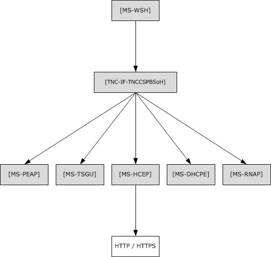

Figure 1: Relationship to other protocols

<a id="Section_1.4.1"></a>
### 1.4.1 Relationship with the Windows Update Client-Server Protocol

During operation, the Windows Security Health Agent (WSHA) sends a summary of Windows Update-related information in an [**SoH**](#gt_statement-of-health-soh) message. The WSHA on a client retrieves the summary information by calling the Windows Update Agent API [[MSDN-WUAAPI]](https://go.microsoft.com/fwlink/?LinkId=202520).

The Windows Update Agent communicates with a Windows Update Server using the Windows Update Client-Server Protocol [MS-WUSP](../MS-WUSP/MS-WUSP.md). To operate successfully, the Windows Security Health Agent (WSHA) and Windows Security Health Validator (WSHV) Protocol do not require the Windows Update Client-Server Protocol to be present and functioning.

The codes sent in the SoH message reflect the current state of the Windows Update Agent and are described in section [2.2.9](#Section_2.2.9).

The Windows Update Client-Server Protocol [MS-WUSP] is not mentioned in this section regarding the relationships to the WSHA and WSHV Protocol because this protocol operates with or without the Windows Update Client-Server Protocol and simply reports status in an agnostic manner.

<a id="Section_1.5"></a>
## 1.5 Prerequisites/Preconditions

For a Windows Security Health Agent (WSHA) and Windows Security Health Validator (WSHV) Protocol exchange to occur, there is required to be a Protocol Bindings for SoH (as specified in [[TNC-IF-TNCCSPBSoH]](https://go.microsoft.com/fwlink/?LinkId=240054)) session with a suitable transport protocol established between the client and a health policy server. There are also required to be WSHA and WSHV client and server components running on the client and health policy server, respectively.

<a id="Section_1.6"></a>
## 1.6 Applicability Statement

The Windows Security Health Agent (WSHA) and Windows Security Health Validator (WSHV) Protocol is applicable only in an environment in which [**NAP**](#gt_network-access-protection-nap) is being used, and the NAP service is enabled on the client computer.

<a id="Section_1.7"></a>
## 1.7 Versioning and Capability Negotiation

The WSHA reports its version in the [**SoH**](#gt_statement-of-health-soh), as specified in section [2.2.6](#Section_2.2.6). The WSHV parses the status and enforces the policy differently, depending on the WSHA version.

Based on the implementation configuration, the Network Access Protection (NAP) client is required to be installed.<1>

<a id="Section_1.8"></a>
## 1.8 Vendor-Extensible Fields

The Windows Security Health Agent (WSHA) and Windows Security Health Validator (WSHV) Protocol does not include any vendor-extensible fields.

<a id="Section_1.9"></a>
## 1.9 Standards Assignments

The Windows Security Health Agent (WSHA) and Windows Security Health Validator (WSHV) Protocol has no standards assignments.

<a id="Section_2"></a>
# 2 Messages

The following sections specify how Windows Security Health Agent (WSHA) and Windows Security Health Validator (WSHV) Protocol messages are transported and WSHA and WSHV Protocol message syntax.

This protocol references commonly used data types as defined in [MS-DTYP](#Section_2.2.15).

<a id="Section_2.1"></a>
## 2.1 Transport

The Windows Security Health Agent (WSHA) and Windows Security Health Validator (WSHV) Protocol does not provide its own transport. It MUST be carried in the Protocol Bindings for SoH, as specified in [[TNC-IF-TNCCSPBSoH]](https://go.microsoft.com/fwlink/?LinkId=240054).

<a id="Section_2.2"></a>
## 2.2 Message Syntax

The Windows Security Health Agent (WSHA) and Windows Security Health Validator (WSHV) Protocol is comprised of messages in the form of SoHReportEntries in the [**NAP**](#gt_network-access-protection-nap) [**SoH**](#gt_statement-of-health-soh) and [**SoHR**](#gt_statement-of-health-response-sohr), respectively, as specified in [[TNC-IF-TNCCSPBSoH]](https://go.microsoft.com/fwlink/?LinkId=240054). The values within both packages are ASN.1-compliant TLVs. For more information on the ASN.1 notation, see [[ITUX680]](https://go.microsoft.com/fwlink/?LinkId=89923).

The respective SoH and SoHR message formats are specified in the following sections.

<a id="Section_2.2.1"></a>
### 2.2.1 TLV

The following are the basic constituents of all TLVs contained in the WSHA SoH packet (section [2.2.2](#Section_2.2.2)). All of the values MUST be present, unless otherwise noted, and the values MUST be specified in this order. The **M** and **R** bits are defined in the Protocol Bindings for SoH [[TNC-IF-TNCCSPBSoH]](https://go.microsoft.com/fwlink/?LinkId=240054) and are ignored by the WSHV upon receipt. Unless otherwise noted, all TLV values are sent in network-byte order, which is big-endian.

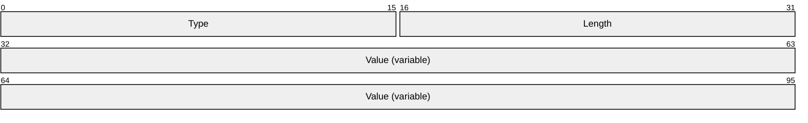

**Type (2 bytes):** A structure that contains the **M**, **R**, and **Type** subfields in the TLV.

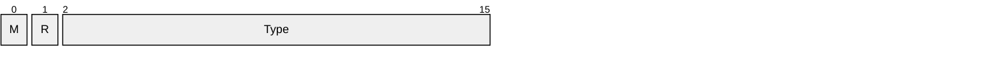

**M (1 bit):** MUST be set to 0.

**R (1 bit):** A reserved field that MUST be set to 0 when sending, and ignored upon receipt.

**Type (14 bits):** Indicates the type of data contained in the **Value** field.

**Length (2 bytes):** MUST specify the length in bytes of the **Value** field.

**Value (variable):** Contains the data for the TLV specified as an array of bytes.

The [**SoH**](#gt_statement-of-health-soh) and [**SoHR**](#gt_statement-of-health-response-sohr) are lists of TLVs concatenated one after the other.

<a id="Section_2.2.2"></a>
### 2.2.2 WSHA SoH

The following subsections define the TLV constituents of the WSHA SoH packet. All of the values MUST be present, unless otherwise noted. The values MUST be in the order in which they are presented in this specification. TLVs 5, 6, 8, 9, 11, and 12 MUST have at least one instance. They MAY have multiple instances, depending on how many firewall, antivirus, and antispyware products are installed. The M and R bits are defined in the Protocol Bindings for SoH [[TNC-IF-TNCCSPBSoH]](https://go.microsoft.com/fwlink/?LinkId=240054) and are ignored by the WSHV upon receipt. All TLV values are sent in network byte order, which is big-endian, except for the **Flag** field of TLV 2, the **Version** field of TLV 3, the **Security_Updates_DurationSinceLastSynch** field of TLV 17, and the **Security_Updates_UpdatesFlag** field of TLV 19, which are sent in machine byte order and are little-endian.

<a id="Section_2.2.2.1"></a>
#### 2.2.2.1 TLV 1

The following are the constituents of TLV 1 of the WSHA SoH packet (section [2.2.2](#Section_2.2.2)). All of the values MUST be present, unless otherwise noted. The values MUST be in this order. The M and R bits are defined in the Protocol Bindings for SoH [[TNC-IF-TNCCSPBSoH]](https://go.microsoft.com/fwlink/?LinkId=240054) and are ignored by the WSHV upon receipt. All TLV 1 values are sent in network-byte order, which is big-endian.

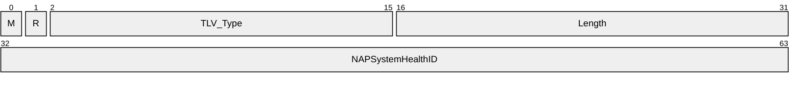

**M (1 bit):** The **M** bit MUST be set to zero.

**R (1 bit):** The **R** bit is reserved, and MUST be set to zero when sent and ignored on receipt.

**TLV_Type (14 bits):** A 14-bit unsigned integer that MUST be set to 2.

**Length (2 bytes):** A 16-bit unsigned integer in network-byte order that MUST indicate the length (4), in bytes, of the **NAPSystemHealthID** field.

**NAPSystemHealthID (4 bytes):** A 32-bit unsigned integer, as specified in section [2.2.4](#Section_2.2.4).

<a id="Section_2.2.2.2"></a>
#### 2.2.2.2 TLV 2

The following are the constituents of TLV 2 of the WSHA SoH packet (section [2.2.2](#Section_2.2.2)). All of the values MUST be present, unless otherwise noted. The values MUST be in this order. The M and R bits are defined in the Protocol Bindings for SoH [[TNC-IF-TNCCSPBSoH]](https://go.microsoft.com/fwlink/?LinkId=240054) and are ignored by the WSHV upon receipt. All TLV 2 values are sent in network-byte order, which is big-endian, except for the **Flag** field which is sent in machine-byte order and is little-endian.

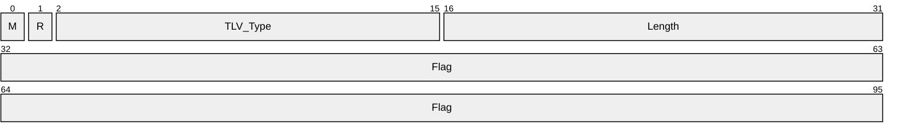

**M (1 bit):** The **M** bit MUST be set to zero.

**R (1 bit):** The **R** bit is reserved, and MUST be set to zero when sent and ignored on receipt.

**TLV_Type (14 bits):** A 14-bit unsigned integer that MUST be set to 7.

**Length (2 bytes):** A 16-bit unsigned integer in network-byte order that MUST indicate the length (8), in bytes, of the **Flag** field.

**Flag (8 bytes):** Eight bytes, as specified in section [2.2.5](#Section_2.2.5).

<a id="Section_2.2.2.3"></a>
#### 2.2.2.3 TLV 3

The following are the constituents of TLV 3 of the WSHA SoH packet (section [2.2.2](#Section_2.2.2)). All of the values MUST be present, unless otherwise noted. The values MUST be in this order. The M and R bits are defined in the Protocol Bindings for SoH [[TNC-IF-TNCCSPBSoH]](https://go.microsoft.com/fwlink/?LinkId=240054) and are ignored by the WSHV upon receipt. All TLV 3 values are sent in network-byte order, which is big-endian, except for the **Version** field which is sent in machine-byte order and is little-endian.

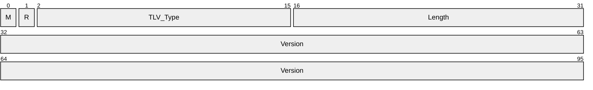

**M (1 bit):** The **M** bit MUST be set to zero.

**R (1 bit):** The **R** bit is reserved, and MUST be set to zero when sent and ignored on receipt.

**TLV_Type (14 bits):** A 14-bit unsigned integer that MUST be set to 7.

**Length (2 bytes):** A 16-bit unsigned integer in network-byte order that MUST indicate the length (8), in bytes, of the **Version** field.

**Version (8 bytes):** Eight bytes, as specified in section [2.2.6](#Section_2.2.6).

<a id="Section_2.2.2.4"></a>
#### 2.2.2.4 TLV 4

The following are the constituents of TLV 4 of the WSHA SoH packet (section [2.2.2](#Section_2.2.2)). All of the values MUST be present, unless otherwise noted. The values MUST be in this order. The M and R bits are defined in the Protocol Bindings for SoH[[TNC-IF-TNCCSPBSoH]](https://go.microsoft.com/fwlink/?LinkId=240054) and are ignored by the WSHV upon receipt. All TLV 4 values are sent in network-byte order, which is big-endian.


**M (1 bit):** The **M** bit MUST be set to zero.

**R (1 bit):** The **R** bit is reserved, and MUST be set to zero when sent and ignored on receipt.

**TLV_Type (14 bits):** A 14-bit unsigned integer that MUST be set to 8.

**Length (2 bytes):** A 16-bit unsigned integer in network-byte order that MUST indicate the length (1), in bytes, of the **Firewall_HealthClassID** field.

**Firewall_HealthClassID (1 byte):** An 8-bit unsigned integer, as specified in section [2.2.7](#Section_2.2.7).

<a id="Section_2.2.2.5"></a>
#### 2.2.2.5 TLV 5

The following are the constituents of TLV 5 of the WSHA SoH packet (section [2.2.2](#Section_2.2.2)). All of the values MUST be present, unless otherwise noted. The values MUST be in this order. TLV 5 MUST have at least one instance and MAY have multiple instances depending on how many firewall, antivirus, and antispyware products are installed. The M and R bits are defined in the Protocol Bindings for SoH [[TNC-IF-TNCCSPBSoH]](https://go.microsoft.com/fwlink/?LinkId=240054) and are ignored by the WSHV upon receipt. All TLV 5 values are sent in network-byte order, which is big-endian.

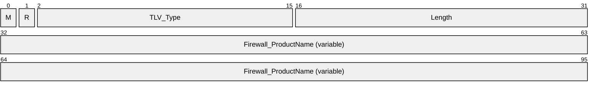

**M (1 bit):** The **M** bit MUST be set to zero.

**R (1 bit):** The **R** bit is reserved, and MUST be set to zero when sent and ignored on receipt.

**TLV_Type (14 bits):** A 14-bit unsigned integer that MUST be set to 10.

**Length (2 bytes):** A 16-bit unsigned integer in network-byte order that MUST indicate the length, in bytes, of the **Firewall_ProductName** field.

**Firewall_ProductName (variable):** A string, as specified in section [2.2.8](#Section_2.2.8).

<a id="Section_2.2.2.6"></a>
#### 2.2.2.6 TLV 6

The following are the constituents of TLV 6 of the WSHA SoH packet (section [2.2.2](#Section_2.2.2)). All of the values MUST be present, unless otherwise noted. The values MUST be in this order. TLV 6 MUST have at least one instance and MAY have multiple instances depending on how many firewall, antivirus, and antispyware products are installed. The M and R bits are defined in the Protocol Bindings for SoH [[TNC-IF-TNCCSPBSoH]](https://go.microsoft.com/fwlink/?LinkId=240054) and are ignored by the WSHV upon receipt. All TLV 6 values are sent in network-byte order, which is big-endian.


**M (1 bit):** The **M** bit MUST be set to zero.

**R (1 bit):** The **R** bit is reserved, and MUST be set to zero when sent and ignored on receipt.

**TLV_Type (14 bits):** A 14-bit unsigned integer that MUST be set to 11.

**Length (2 bytes):** A 16-bit unsigned integer in network-byte order that MUST indicate the length (4), in bytes, of the **Firewall_ClientStatusCode** field.

**Firewall_ClientStatusCode (4 bytes):** A DWORD, as specified in section [2.2.9](#Section_2.2.9).

<a id="Section_2.2.2.7"></a>
#### 2.2.2.7 TLV 7

The following are the constituents of TLV 7 of the WSHA SoH packet (section [2.2.2](#Section_2.2.2)). All of the values MUST be present, unless otherwise noted. The values MUST be in this order. The M and R bits are defined in the Protocol Bindings for SoH[[TNC-IF-TNCCSPBSoH]](https://go.microsoft.com/fwlink/?LinkId=240054) and are ignored by the WSHV upon receipt. All TLV 7 values are sent in network-byte order, which is big-endian.

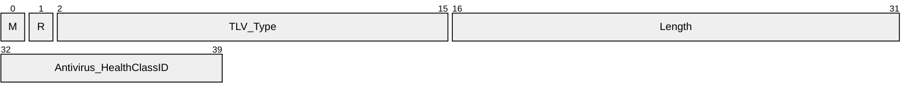

**M (1 bit):** The **M** bit MUST be set to zero.

**R (1 bit):** The **R** bit is reserved, and MUST be set to zero when sent and ignored on receipt.

**TLV_Type (14 bits):** A 14-bit unsigned integer that MUST be set to 8.

**Length (2 bytes):** A 16-bit unsigned integer in network-byte order that MUST indicate the length (1), in bytes, of the **Antivirus_HealthClassID** field.

**Antivirus_HealthClassID (1 byte):** An 8-bit unsigned integer, as specified in section [2.2.7](#Section_2.2.7).

<a id="Section_2.2.2.8"></a>
#### 2.2.2.8 TLV 8

The following are the constituents of TLV 8 of the WSHA SoH packet (section [2.2.2](#Section_2.2.2)). All of the values MUST be present, unless otherwise noted. The values MUST be in this order. TLV 8 MUST have at least one instance and MAY have multiple instances depending on how many firewall, antivirus, and antispyware products are installed. The M and R bits are defined in the Protocol Bindings for SoH [[TNC-IF-TNCCSPBSoH]](https://go.microsoft.com/fwlink/?LinkId=240054) and are ignored by the WSHV upon receipt. All TLV 8 values are sent in network-byte order, which is big-endian.


**M (1 bit):** The **M** bit MUST be set to zero.

**R (1 bit):** The **R** bit is reserved, and MUST be set to zero when sent and ignored on receipt.

**TLV_Type (14 bits):** A 14-bit unsigned integer that MUST be set to 10.

**Length (2 bytes):** A 16-bit unsigned integer in network-byte order that MUST indicate the length of the string, in bytes, of the **Antivirus_ProductName** field.

**Antivirus_ProductName (variable):** A string, as specified in section [2.2.8](#Section_2.2.8).

<a id="Section_2.2.2.9"></a>
#### 2.2.2.9 TLV 9

The following are the constituents of TLV 9 of the WSHA SoH packet (section [2.2.2](#Section_2.2.2)). All of the values MUST be present, unless otherwise noted. The values MUST be in this order. TLV 9 MUST have at least one instance and MAY have multiple instances depending on how many firewall, antivirus, and antispyware products are installed. The M and R bits are defined in the Protocol Bindings for SoH [[TNC-IF-TNCCSPBSoH]](https://go.microsoft.com/fwlink/?LinkId=240054) and are ignored by the WSHV upon receipt. All TLV 9 values are sent in network-byte order, which is big-endian.

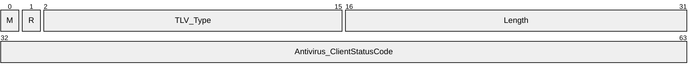

**M (1 bit):** The **M** bit MUST be set to zero.

**R (1 bit):** The **R** bit is reserved, and MUST be set to zero when sent and ignored on receipt.

**TLV_Type (14 bits):** A 14-bit unsigned integer that MUST be set to 11.

**Length (2 bytes):** A 16-bit unsigned integer in network-byte order that MUST indicate the length (4), in bytes, of the **Antivirus_ClientStatusCode** field.

**Antivirus_ClientStatusCode (4 bytes):** A DWORD, as specified in section [2.2.9](#Section_2.2.9).

<a id="Section_2.2.2.10"></a>
#### 2.2.2.10 TLV 10

The following are the constituents of TLV 10 of the WSHA SoH packet (section [2.2.2](#Section_2.2.2)). All of the values MUST be present, unless otherwise noted. The values MUST be in this order. The M and R bits are defined in the Protocol Bindings for SoH [[TNC-IF-TNCCSPBSoH]](https://go.microsoft.com/fwlink/?LinkId=240054) and are ignored by the WSHV upon receipt. All TLV 10 values are sent in network-byte order, which is big-endian.


**M (1 bit):** The **M** bit MUST be set to zero.

**R (1 bit):** The **R** bit is reserved, and MUST be set to zero when sent and ignored on receipt.

**TLV_Type (14 bits):** A 14-bit unsigned integer that MUST be set to 8.

**Length (2 bytes):** A 16-bit unsigned integer in network-byte order that MUST indicate the length (1), in bytes, of the **Antispyware_HealthClassID** field.

**Antispyware_HealthClassID (1 byte):** An 8-bit unsigned integer, as specified in section [2.2.7](#Section_2.2.7).

<a id="Section_2.2.2.11"></a>
#### 2.2.2.11 TLV 11

The following are the constituents of TLV 11 of the WSHA SoH packet (section [2.2.2](#Section_2.2.2)). All of the values MUST be present, unless otherwise noted. The values MUST be in this order. TLV 11 MUST have at least one instance and MAY have multiple instances depending on how many firewall, antivirus, and antispyware products are installed. The M and R bits are defined in the Protocol Bindings for SoH [[TNC-IF-TNCCSPBSoH]](https://go.microsoft.com/fwlink/?LinkId=240054) and are ignored by the WSHV upon receipt. All TLV 11 values are sent in network-byte order, which is big-endian.

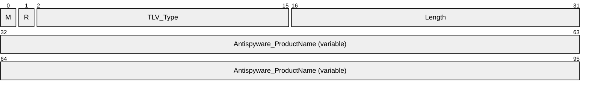

**M (1 bit):** The **M** bit MUST be set to zero.

**R (1 bit):** The **R** bit is reserved, and MUST be set to zero when sent and ignored on receipt.

**TLV_Type (14 bits):** A 14-bit unsigned integer that MUST be set to 10.

**Length (2 bytes):** A 16-bit unsigned integer in network-byte order that MUST indicate the length of the string, in bytes, of the **Antispyware_ProductName** field.

**Antispyware_ProductName (variable):** A string, as specified in section [2.2.8](#Section_2.2.8).

<a id="Section_2.2.2.12"></a>
#### 2.2.2.12 TLV 12

The following are the constituents of TLV 12 of the WSHA SoH packet (section [2.2.2](#Section_2.2.2)). All of the values MUST be present, unless otherwise noted. The values MUST be in this order. TLV 12 MUST have at least one instance and MAY have multiple instances depending on how many firewall, antivirus, and antispyware products are installed. The M and R bits are defined in the Protocol Bindings for SoH [[TNC-IF-TNCCSPBSoH]](https://go.microsoft.com/fwlink/?LinkId=240054) and are ignored by the WSHV upon receipt. All TLV 12 values are sent in network-byte order, which is big-endian.


**M (1 bit):** The **M** bit MUST be set to zero.

**R (1 bit):** The **R** bit is reserved, and MUST be set to zero when sent and ignored on receipt.

**TLV_Type (14 bits):** A 14-bit unsigned integer that MUST be set to 11.

**Length (2 bytes):** A 16-bit unsigned integer in network-byte order that MUST indicate the length (4), in bytes, of the **Antispyware_ClientStatusCode** field.

**Antispyware_ClientStatusCode (4 bytes):** A DWORD, as specified in section [2.2.9](#Section_2.2.9).

<a id="Section_2.2.2.13"></a>
#### 2.2.2.13 TLV 13

The following are the constituents of TLV 13 of the WSHA SoH packet (section [2.2.2](#Section_2.2.2)). All of the values MUST be present, unless otherwise noted. The values MUST be in this order. The M and R bits are defined in the Protocol Bindings for SoH [[TNC-IF-TNCCSPBSoH]](https://go.microsoft.com/fwlink/?LinkId=240054) and are ignored by the WSHV upon receipt. All TLV 13 values are sent in network-byte order, which is big-endian.

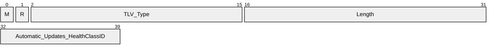

**M (1 bit):** The **M** bit MUST be set to zero.

**R (1 bit):** The **R** bit is reserved, and MUST be set to zero when sent and ignored on receipt.

**TLV_Type (14 bits):** A 14-bit unsigned integer that MUST be set to 8.

**Length (2 bytes):** A 16-bit unsigned integer in network-byte order that MUST indicate the length (1), in bytes, of the **Automatic_Updates_HealthClassID** field.

**Automatic_Updates_HealthClassID (1 byte):** An 8-bit unsigned integer, as specified in section [2.2.7](#Section_2.2.7).

<a id="Section_2.2.2.14"></a>
#### 2.2.2.14 TLV 14

The following are the constituents of TLV 14 of the WSHA SoH packet (section [2.2.2](#Section_2.2.2)). All of the values MUST be present, unless otherwise noted. The values MUST be in this order. The M and R bits are defined in the Protocol Bindings for SoH [[TNC-IF-TNCCSPBSoH]](https://go.microsoft.com/fwlink/?LinkId=240054) and are ignored by the WSHV upon receipt. All TLV 14 values are sent in network-byte order, which is big-endian.

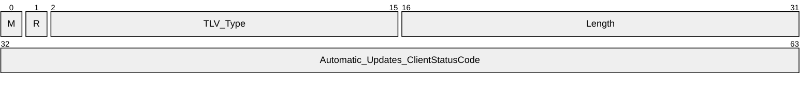

**M (1 bit):** The **M** bit MUST be set to zero.

**R (1 bit):** The **R** bit is reserved, and MUST be set to zero when sent and ignored on receipt.

**TLV_Type (14 bits):** A 14-bit unsigned integer that MUST be set to 11.

**Length (2 bytes):** A 16-bit unsigned integer in network-byte order that MUST indicate the length (4), in bytes, of the **Automatic_Updates_ClientStatusCode** field.

**Automatic_Updates_ClientStatusCode (4 bytes):** A DWORD, as specified in section [2.2.9](#Section_2.2.9).

<a id="Section_2.2.2.15"></a>
#### 2.2.2.15 TLV 15

The following are the constituents of TLV 15 of the WSHA SoH packet (section [2.2.2](#Section_2.2.2)). All of the values MUST be present, unless otherwise noted. The values MUST be in this order. The M and R bits are defined in the Protocol Bindings for SoH [[TNC-IF-TNCCSPBSoH]](https://go.microsoft.com/fwlink/?LinkId=240054) and are ignored by the WSHV upon receipt. All TLV 15 values are sent in network-byte order, which is big-endian.


**M (1 bit):** The **M** bit MUST be set to zero.

**R (1 bit):** The **R** bit is reserved, and MUST be set to zero when sent and ignored on receipt.

**TLV_Type (14 bits):** A 14-bit unsigned integer that MUST be set to 8.

**Length (2 bytes):** A 16-bit unsigned integer in network-byte order that MUST indicate the length (1), in bytes, of the **Security_Updates_HealthClassID** field.

**Security_Updates_HealthClassID (1 byte):** An 8-bit unsigned integer, as specified in section [2.2.7](#Section_2.2.7).

<a id="Section_2.2.2.16"></a>
#### 2.2.2.16 TLV 16

The following are the constituents of TLV 16 of the WSHA SoH packet (section [2.2.2](#Section_2.2.2)). All of the values MUST be present, unless otherwise noted. The values MUST be in this order. The M and R bits are defined in the Protocol Bindings for SoH [[TNC-IF-TNCCSPBSoH]](https://go.microsoft.com/fwlink/?LinkId=240054) and are ignored by the WSHV upon receipt. All TLV 16 values are sent in network-byte order, which is big-endian.


**M (1 bit):** The **M** bit MUST be set to zero.

**R (1 bit):** The **R** bit is reserved, and MUST be set to zero when sent and ignored on receipt.

**TLV_Type (14 bits):** A 14-bit unsigned integer that MUST be set to 11.

**Length (2 bytes):** A 16-bit unsigned integer in network-byte order that MUST indicate the length (4), in bytes, of the **Security_Updates_ClientStatusCode** field.

**Security_Updates_ClientStatusCode (4 bytes):** A DWORD, as specified in section [2.2.9](#Section_2.2.9).

<a id="Section_2.2.2.17"></a>
#### 2.2.2.17 TLV 17

The following are the constituents of TLV 17 of the WSHA SoH packet (section [2.2.2](#Section_2.2.2)). All of the values MUST be present, unless otherwise noted. The values MUST be in this order. The M and R bits are defined in the Protocol Bindings for SoH [[TNC-IF-TNCCSPBSoH]](https://go.microsoft.com/fwlink/?LinkId=240054) and are ignored by the WSHV upon receipt. All TLV 17 values are sent in network-byte order, which is big-endian, except for the **Security_Updates_DurationSinceLastSynch** field which is sent in machine-byte order and is little-endian.

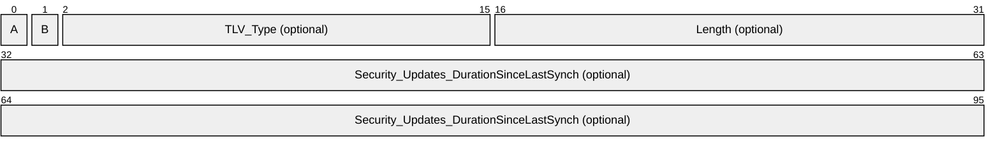

**M (1 bit):** The **M** bit MUST be set to zero.

**R (1 bit):** The **R** bit is reserved, and MUST be set to zero when sent and ignored on receipt.

**TLV_Type (14 bits):** A 14-bit unsigned integer that MUST be set to 7.

**Length (2 bytes):** A 16-bit unsigned integer in network-byte order that MUST indicate the length (8), in bytes, of the **Security_Updates_DurationSinceLastSynch** field.

**Security_Updates_DurationSinceLastSynch (8 bytes):** Eight bytes, as specified in section [2.2.10](#Section_2.2.10). Not used if an error is returned in the Security_Updates_ClientStatusCode (see section [2.2.9](#Section_2.2.9)).

**Note** If Security_Updates_ClientStatusCode is an error, TLV 17 will not be present. For more information about Security_Updates_ClientStatusCode, see section 2.2.9

<a id="Section_2.2.2.18"></a>
#### 2.2.2.18 TLV 18

The following are the constituents of TLV 18 of the WSHA SoH packet (section [2.2.2](#Section_2.2.2)). All of the values MUST be present, unless otherwise noted. The values MUST be in this order. The M and R bits are defined in the Protocol Bindings for SoH [[TNC-IF-TNCCSPBSoH]](https://go.microsoft.com/fwlink/?LinkId=240054) and are ignored by the WSHV upon receipt. All TLV 18 values are sent in network-byte order, which is big-endian.

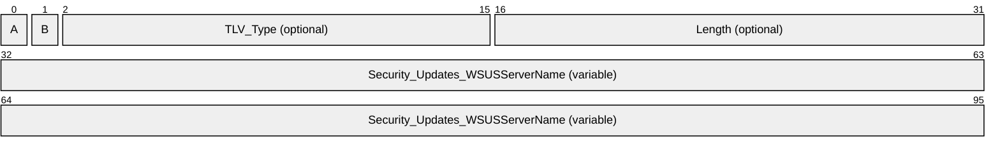

**M (1 bit):** The **M** bit MUST be set to zero.

**R (1 bit):** The **R** bit is reserved, and MUST be set to zero when sent and ignored on receipt.

**TLV_Type (14 bits):** A 14-bit unsigned integer that MUST be set to 7.

**Length (2 bytes):** A 16-bit unsigned integer in network-byte order that MUST indicate the length of the string, in bytes, of the **Security_Updates_WSUSServerName** field.

**Security_Updates_WSUSServerName (variable):** Four bytes followed by a variable-length string, as specified in section [2.2.11](#Section_2.2.11). Not used if an error is returned in the Security_Updates_ClientStatusCode (see section [2.2.9](#Section_2.2.9)).

**Note** If Security_Updates_ClientStatusCode is an error, TLV 18 will not be present. For more information about Security_Updates_ClientStatusCode, see section 2.2.9.

<a id="Section_2.2.2.19"></a>
#### 2.2.2.19 TLV 19

The following are the constituents of TLV 19 of the WSHA SoH packet (section [2.2.2](#Section_2.2.2)). All of the values MUST be present, unless otherwise noted. The values MUST be in this order. The M and R bits are defined in the Protocol Bindings for SoH [[TNC-IF-TNCCSPBSoH]](https://go.microsoft.com/fwlink/?LinkId=240054) and are ignored by the WSHV upon receipt. All TLV 19 values are sent in network-byte order, which is big-endian, except for the **Security_Updates_UpdatesFlag** field which is sent in machine-byte order and is little-endian.

```mermaid
packet-beta
  0-0: "A"
  1-1: "B"
  2-15: "TLV_Type (optional)"
  16-31: "Length (optional)"
  32-95: "Security_Updates_UpdatesFlag (optional)"
```

**M (1 bit):** The **M** bit MUST be set to zero.

**R (1 bit):** The **R** bit is reserved, and MUST be set to zero when sent and ignored on receipt.

**TLV_Type (14 bits):** A 14-bit unsigned integer that MUST be set to 7.

**Length (2 bytes):** A 16-bit unsigned integer in network-byte order that MUST indicate the length (8), in bytes, of the **Security_Updates_UpdatesFlag** field.

**Security_Updates_UpdatesFlag (8 bytes):** Eight bytes, as specified in section [2.2.12](#Section_2.2.12). Not used if an error is returned in the Security_Updates_ClientStatusCode (see section [2.2.9](#Section_2.2.9)).

**Note** If Security_Updates_ClientStatusCode is an error, TLV 19 will not be present. For more information about Security_Updates_ClientStatusCode, see section 2.2.9.

<a id="Section_2.2.3"></a>
### 2.2.3 WSHV SoHR

The following sections are the TLV constituents of the WSHV SoHR packet. All of the values MUST be present, unless otherwise noted. The values MUST be in the order in which they are presented in this specification. The M and R bits are defined in the Protocol Bindings for SoH [[TNC-IF-TNCCSPBSoH]](https://go.microsoft.com/fwlink/?LinkId=240054) and are ignored by the WSHA upon receipt.

<a id="Section_2.2.3.1"></a>
#### 2.2.3.1 TLV 1

The following are the constituents of TLV 1 for the WSHV SoHR packet (section [2.2.3](#Section_2.2.3)). All of the values MUST be present, unless otherwise noted. The values MUST be in this order. The M and R bits are defined in the Protocol Bindings for SoH [[TNC-IF-TNCCSPBSoH]](https://go.microsoft.com/fwlink/?LinkId=240054) and are ignored by the WSHA upon receipt.

```mermaid
packet-beta
  0-0: "M"
  1-1: "R"
  2-15: "TLV_Type"
  16-31: "Length"
  32-63: "NAPSystemHealthID"
```

**M (1 bit):** The **M** bit MUST be set to zero.

**R (1 bit):** The **R** bit is reserved, and MUST be set to zero when sent and ignored on receipt.

**TLV_Type (14 bits):** A 14-bit unsigned integer that MUST be set to 2.

**Length (2 bytes):** A 16-bit unsigned integer in network-byte order that MUST indicate the length (4), in bytes, of the **NAPSystemHealthID** field.

**NAPSystemHealthID (4 bytes):** A 32-bit unsigned integer, as specified in section [2.2.4](#Section_2.2.4).

<a id="Section_2.2.3.2"></a>
#### 2.2.3.2 TLV 2

The following are the constituents of TLV 2 for the WSHV SoHR packet (section [2.2.3](#Section_2.2.3)). All of the values MUST be present, unless otherwise noted. The values MUST be in this order. The M and R bits are defined in the Protocol Bindings for SoH [[TNC-IF-TNCCSPBSoH]](https://go.microsoft.com/fwlink/?LinkId=240054) and are ignored by the WSHA upon receipt.

```mermaid
packet-beta
  0-0: "M"
  1-1: "R"
  2-15: "TLV_Type"
  16-31: "Length"
  32-39: "Firewall_HealthClassID"
```

**M (1 bit):** The **M** bit MUST be set to zero.

**R (1 bit):** The **R** bit is reserved, and MUST be set to zero when sent and ignored on receipt.

**TLV_Type (14 bits):** A 14-bit unsigned integer that MUST be set to 8.

**Length (2 bytes):** A 16-bit unsigned integer in network-byte order that MUST indicate the length (1), in bytes, of the **Firewall_HealthClassID** field.

**Firewall_HealthClassID (1 byte):** An 8-bit unsigned integer, as specified in section [2.2.7](#Section_2.2.7).

<a id="Section_2.2.3.3"></a>
#### 2.2.3.3 TLV 3

The following are the constituents of TLV 3 for the WSHV SoHR packet (section [2.2.3](#Section_2.2.3)). All of the values MUST be present, unless otherwise noted. The values MUST be in this order. The M and R bits are defined in the Protocol Bindings for SoH [[TNC-IF-TNCCSPBSoH]](https://go.microsoft.com/fwlink/?LinkId=240054) and are ignored by the WSHA upon receipt.

```mermaid
packet-beta
  0-0: "M"
  1-1: "R"
  2-15: "TLV_Type"
  16-31: "Length"
  32-63: "Firewall_ComplianceCode"
```

**M (1 bit):** The **M** bit MUST be set to zero.

**R (1 bit):** The **R** bit is reserved, and MUST be set to zero when sent and ignored on receipt.

**TLV_Type (14 bits):** A 14-bit unsigned integer that MUST be set to 4.

**Length (2 bytes):** A 16-bit unsigned integer in network-byte order that MUST indicate the length (4), in bytes, of the **Firewall_ComplianceCode** field.

**Firewall_ComplianceCode (4 bytes):** A DWORD, as specified in section [2.2.13](#Section_2.2.13).

<a id="Section_2.2.3.4"></a>
#### 2.2.3.4 TLV 4

The following are the constituents of TLV 4 for the WSHV SoHR packet (section [2.2.3](#Section_2.2.3)). All of the values MUST be present, unless otherwise noted. The values MUST be in this order. The M and R bits are defined in the Protocol Bindings for SoH [[TNC-IF-TNCCSPBSoH]](https://go.microsoft.com/fwlink/?LinkId=240054) and are ignored by the WSHA upon receipt.

```mermaid
packet-beta
  0-0: "A"
  1-1: "B"
  2-15: "TLV_Type (optional)"
  16-31: "Length (optional)"
  32-39: "Firewall_ComplianceCode (optional)"
```

**M (1 bit):** The **M** bit MUST be set to zero.

**R (1 bit):** The **R** bit is reserved and MUST be set to zero when sent and ignored on receipt.

**TLV_Type (14 bits):** The **TLV Type** MUST be set to 14.

**Length (2 bytes):** A 16-bit unsigned integer that MUST be set to 1.

**Firewall_ComplianceCode (1 byte):** An 8-bit field that MUST be set to 2.

<a id="Section_2.2.3.5"></a>
#### 2.2.3.5 TLV 5

The following are the constituents of TLV 5 for the WSHV SoHR packet (section [2.2.3](#Section_2.2.3)). All of the values MUST be present, unless otherwise noted. The values MUST be in this order. The M and R bits are defined in the Protocol Bindings for SoH [[TNC-IF-TNCCSPBSoH]](https://go.microsoft.com/fwlink/?LinkId=240054) and are ignored by the WSHA upon receipt.

```mermaid
packet-beta
  0-0: "M"
  1-1: "R"
  2-15: "TLV_Type"
  16-31: "Length"
  32-39: "Antivirus_HealthClassID"
```

**M (1 bit):** The **M** bit MUST be set to zero.

**R (1 bit):** The **R** bit is reserved, and MUST be set to zero when sent and ignored on receipt.

**TLV_Type (14 bits):** A 14-bit unsigned integer that MUST be set to 8.

**Length (2 bytes):** A 16-bit unsigned integer in network-byte order that MUST indicate the length (1), in bytes, of the **Antivirus_HealthClassID** field.

**Antivirus_HealthClassID (1 byte):** An 8-bit unsigned integer, as specified in section [2.2.7](#Section_2.2.7).

<a id="Section_2.2.3.6"></a>
#### 2.2.3.6 TLV 6

The following are the constituents of TLV 6 for the WSHV SoHR packet (section [2.2.3](#Section_2.2.3)). All of the values MUST be present, unless otherwise noted. The values MUST be in this order. The M and R bits are defined in the Protocol Bindings for SoH [[TNC-IF-TNCCSPBSoH]](https://go.microsoft.com/fwlink/?LinkId=240054) and are ignored by the WSHA upon receipt.

```mermaid
packet-beta
  0-0: "M"
  1-1: "R"
  2-15: "TLV_Type"
  16-31: "Length"
  32-63: "Antivirus_ComplianceCode_1"
  64-95: "Antivirus_ComplianceCode_2 (optional)"
```

**M (1 bit):** The **M** bit MUST be set to zero.

**R (1 bit):** The **R** bit is reserved, and MUST be set to zero when sent and ignored on receipt.

**TLV_Type (14 bits):** A 14-bit unsigned integer that MUST be set to 4.

**Length (2 bytes):** A 16-bit unsigned integer in network-byte order that MUST indicate the length (4), in bytes, of the **Antivirus_ComplianceCode_1** field if only the **Antivirus_ComplianceCode_1** is used, or length (8) if the **Antivirus_ComplianceCode_2** is also present.

**Antivirus_ComplianceCode_1 (4 bytes):** A DWORD, as specified in section [2.2.13](#Section_2.2.13).

**Antivirus_ComplianceCode_2 (4 bytes):** A DWORD, as specified in section [2.2.14](#Section_2.2.14).

<a id="Section_2.2.3.7"></a>
#### 2.2.3.7 TLV 7

The following are the constituents of TLV 7 for the WSHV SoHR packet (section [2.2.3](#Section_2.2.3)). All of the values MUST be present, unless otherwise noted. The values MUST be in this order. The M and R bits are defined in the Protocol Bindings for SoH [[TNC-IF-TNCCSPBSoH]](https://go.microsoft.com/fwlink/?LinkId=240054) and are ignored by the WSHA upon receipt.

```mermaid
packet-beta
  0-0: "A"
  1-1: "B"
  2-15: "TLV_Type (optional)"
  16-31: "Length (optional)"
  32-39: "Antivirus_FailureCategory (optional)"
```

**M (1 bit):** The **M** bit MUST be set to zero.

**R (1 bit):** The **R** bit is reserved and MUST be set to zero when sent and ignored on receipt.

**TLV_Type (14 bits):** The **TLV Type** MUST be set to 14.

**Length (2 bytes):** A 16-bit unsigned integer that MUST be set to 1.

**Antivirus_FailureCategory (1 byte):** An 8-bit field that MUST be set to 2.

<a id="Section_2.2.3.8"></a>
#### 2.2.3.8 TLV 8

The following are the constituents of TLV 8 for the WSHV SoHR packet (section [2.2.3](#Section_2.2.3)). All of the values MUST be present, unless otherwise noted. The values MUST be in this order. The M and R bits are defined in the Protocol Bindings for SoH[[TNC-IF-TNCCSPBSoH]](https://go.microsoft.com/fwlink/?LinkId=240054) and are ignored by the WSHA upon receipt.

```mermaid
packet-beta
  0-0: "M"
  1-1: "R"
  2-15: "TLV_Type"
  16-31: "Length"
  32-39: "Antispyware_HealthClassID"
```

**M (1 bit):** The **M** bit MUST be set to zero.

**R (1 bit):** The **R** bit is reserved, and MUST be set to zero when sent and ignored on receipt.

**TLV_Type (14 bits):** A 14-bit unsigned integer that MUST be set to 8.

**Length (2 bytes):** A 16-bit unsigned integer in network-byte order that MUST indicate the length (1), in bytes, of the **Antispyware_HealthClassID** field.

**Antispyware_HealthClassID (1 byte):** An 8-bit unsigned integer, as specified in section [2.2.7](#Section_2.2.7).

<a id="Section_2.2.3.9"></a>
#### 2.2.3.9 TLV 9

The following are the constituents of TLV 9 for the WSHV SoHR packet (section [2.2.3](#Section_2.2.3)). All of the values MUST be present, unless otherwise noted. The values MUST be in this order. The M and R bits are defined in the Protocol Bindings for SoH [[TNC-IF-TNCCSPBSoH]](https://go.microsoft.com/fwlink/?LinkId=240054) and are ignored by the WSHA upon receipt.

```mermaid
packet-beta
  0-0: "M"
  1-1: "R"
  2-15: "TLV_Type"
  16-31: "Length"
  32-63: "Antispyware_ComplianceCode_1"
  64-95: "Antispyware_ComplianceCode_2"
```

**M (1 bit):** The **M** bit MUST be set to zero.

**R (1 bit):** The **R** bit is reserved, and MUST be set to zero when sent and ignored on receipt.

**TLV_Type (14 bits):** A 14-bit unsigned integer that MUST be set to 4.

**Length (2 bytes):** A 16-bit unsigned integer in network-byte order that MUST indicate the length (4), in bytes, of the **Antispyware_ComplianceCode_1** field if only the **Antispyware_ComplianceCode_1** is used, or length (8) if the **Antispyware_ComplianceCode_2** is also present.

**Antispyware_ComplianceCode_1 (4 bytes):** A DWORD value, as specified in section [2.2.13](#Section_2.2.13).

**Antispyware_ComplianceCode_2 (4 bytes):** A DWORD, as specified in section [2.2.14](#Section_2.2.14).

<a id="Section_2.2.3.10"></a>
#### 2.2.3.10 TLV 10

The following are the constituents of TLV 10 for the WSHV SoHR packet (section [2.2.3](#Section_2.2.3)). All of the values MUST be present, unless otherwise noted. The values MUST be in this order. The M and R bits are defined in the Protocol Bindings for SoH [[TNC-IF-TNCCSPBSoH]](https://go.microsoft.com/fwlink/?LinkId=240054) and are ignored by the WSHA upon receipt.

```mermaid
packet-beta
  0-0: "A"
  1-1: "B"
  2-15: "TLV_Type (optional)"
  16-31: "Length (optional)"
  32-39: "Antispyware_FailureCategory (optional)"
```

**M (1 bit):** The **M** bit MUST be set to zero.

**R (1 bit):** The **R** bit is reserved, and MUST be set to 0 and ignored on receipt.

**TLV_Type (14 bits):** The **TLV Type** MUST be set to 14.

**Length (2 bytes):** A 16-bit unsigned integer that MUST be set to 1.

**Antispyware_FailureCategory (1 byte):** An 8-bit field that MUST be set to 2.

<a id="Section_2.2.3.11"></a>
#### 2.2.3.11 TLV 11

The following are the constituents of TLV 11 for the WSHV SoHR packet (section [2.2.3](#Section_2.2.3)). All of the values MUST be present, unless otherwise noted. The values MUST be in this order. The M and R bits are defined in the Protocol Bindings for SoH [[TNC-IF-TNCCSPBSoH]](https://go.microsoft.com/fwlink/?LinkId=240054) and are ignored by the WSHA upon receipt.

```mermaid
packet-beta
  0-0: "M"
  1-1: "R"
  2-15: "TLV_Type"
  16-31: "Length"
  32-39: "Automatic_Updates_HealthClassID"
```

**M (1 bit):** The **M** bit MUST be set to zero.

**R (1 bit):** The **R** bit is reserved, and MUST be set to zero when sent and ignored on receipt.

**TLV_Type (14 bits):** A 14-bit unsigned integer that MUST be set to 8.

**Length (2 bytes):** A 16-bit unsigned integer in network-byte order that MUST indicate the length (1), in bytes, of the **Automatic_Updates_HealthClassID** field.

**Automatic_Updates_HealthClassID (1 byte):** An 8-bit unsigned integer, as specified in section [2.2.7](#Section_2.2.7).

<a id="Section_2.2.3.12"></a>
#### 2.2.3.12 TLV 12

The following are the constituents of TLV 12 for the WSHV SoHR packet (section [2.2.3](#Section_2.2.3)). All of the values MUST be present, unless otherwise noted. The values MUST be in this order. The M and R bits are defined in the Protocol Bindings for SoH [[TNC-IF-TNCCSPBSoH]](https://go.microsoft.com/fwlink/?LinkId=240054) and are ignored by the WSHA upon receipt.

```mermaid
packet-beta
  0-0: "M"
  1-1: "R"
  2-15: "TLV_Type"
  16-31: "Length"
  32-63: "Automatic_Updates_ComplianceCode"
```

**M (1 bit):** The **M** bit MUST be set to zero.

**R (1 bit):** The **R** bit is reserved, and MUST be set to zero when sent and ignored on receipt.

**TLV_Type (14 bits):** A 14-bit unsigned integer that MUST be set to 4.

**Length (2 bytes):** A 16-bit unsigned integer in network-byte order that MUST indicate the length (4), in bytes, of the **Automatic_Updates_ComplianceCode** field.

**Automatic_Updates_ComplianceCode (4 bytes):** A DWORD, as specified in section [2.2.13](#Section_2.2.13).

<a id="Section_2.2.3.13"></a>
#### 2.2.3.13 TLV 13

The following are the constituents of TLV 13 for the WSHV SoHR packet (section [2.2.3](#Section_2.2.3)). All of the values MUST be present, unless otherwise noted. The values MUST be in this order. The M and R bits are defined in the Protocol Bindings for SoH [[TNC-IF-TNCCSPBSoH]](https://go.microsoft.com/fwlink/?LinkId=240054) and are ignored by the WSHA upon receipt.

```mermaid
packet-beta
  0-0: "A"
  1-1: "B"
  2-15: "TLV_Type (optional)"
  16-31: "Length (optional)"
  32-39: "Automatic_Updates_FailureCategory (optional)"
```

**M (1 bit):** The **M** bit MUST be set to zero.

**R (1 bit):** The **R** bit is reserved, and MUST be set to zero when sent and ignored on receipt.

**TLV_Type (14 bits):** The **TLV Type** MUST be set to 14.

**Length (2 bytes):** A 16-bit unsigned integer that MUST be set to 1.

**Automatic_Updates_FailureCategory (1 byte):** An 8-bit field that MUST be set to 2.

<a id="Section_2.2.3.14"></a>
#### 2.2.3.14 TLV 14

The following are the constituents of TLV 14 for the WSHV SoHR packet (section [2.2.3](#Section_2.2.3)). All of the values MUST be present, unless otherwise noted. The values MUST be in this order. The M and R bits are defined in the Protocol Bindings for SoH [[TNC-IF-TNCCSPBSoH]](https://go.microsoft.com/fwlink/?LinkId=240054) and are ignored by the WSHA upon receipt.

```mermaid
packet-beta
  0-0: "M"
  1-1: "R"
  2-15: "TLV_Type"
  16-31: "Length"
  32-39: "Security_Updates_HealthClassID"
```

**M (1 bit):** The **M** bit MUST be set to zero.

**R (1 bit):** The **R** bit is reserved, and MUST be set to zero when sent and ignored on receipt.

**TLV_Type (14 bits):** A 14-bit unsigned integer that MUST be set to 8.

**Length (2 bytes):** A 16-bit unsigned integer in network-byte order that MUST indicate the length (1), in bytes, of the **Security_Updates_HealthClassID** field.

**Security_Updates_HealthClassID (1 byte):** An 8-bit unsigned integer, as specified in section [2.2.7](#Section_2.2.7).

<a id="Section_2.2.3.15"></a>
#### 2.2.3.15 TLV 15

The following are the constituents of TLV 15 for the WSHV SoHR packet (section [2.2.3](#Section_2.2.3)). All of the values MUST be present, unless otherwise noted. The values MUST be in this order. The M and R bits are defined in the Protocol Bindings for SoH [[TNC-IF-TNCCSPBSoH]](https://go.microsoft.com/fwlink/?LinkId=240054) and are ignored by the WSHA upon receipt.

```mermaid
packet-beta
  0-0: "M"
  1-1: "R"
  2-15: "TLV_Type"
  16-31: "Length"
  32-63: "Security_Updates_ComplianceCode_1"
  64-95: "Security_Updates_ComplianceCode_2"
```

**M (1 bit):** The **M** bit MUST be set to zero.

**R (1 bit):** The **R** bit is reserved, and MUST be set to zero when sent and ignored on receipt.

**TLV_Type (14 bits):** A 14-bit unsigned integer that MUST be set to 4.

**Length (2 bytes):** A 16-bit unsigned integer in network-byte order that MUST indicate the length (4), in bytes, of the **Security_Updates_ComplianceCode_1** field if only the **Security_Updates_ComplianceCode_1** is used, or length (8) if the **Security_Updates_ComplianceCode_2** is also present.

**Security_Updates_ComplianceCode_1 (4 bytes):** A DWORD, as specified in section [2.2.13](#Section_2.2.13).

**Security_Updates_ComplianceCode_2 (4 bytes):** A DWORD, as specified in section [2.2.14](#Section_2.2.14).

<a id="Section_2.2.4"></a>
### 2.2.4 NAPSystemHealthID

NAPSystemHealthID is a 32-bit unsigned integer that is assigned by [**NAP**](#gt_network-access-protection-nap). This NAPSystemHealthID is used to differentiate the [WSHA SoH](#Section_2.2.2) packets and [WSHV SoHR](#Section_2.2.3) packets from those of other security health agents. The NAPSystemHealthID value for the WSHA and the WSHV MUST be set to 0x00013780 (79744) which is the NAP assigned ID for WSHA and WSHV.

<a id="Section_2.2.5"></a>
### 2.2.5 Flag

This consists of eight bytes. The first four bytes are the VendorID and MUST be 0x00013780. The second four bytes are a DWORD that is incremented for each new [**SoH**](#gt_statement-of-health-soh). It is used to determine if the SoH is a duplicate.

<a id="Section_2.2.6"></a>
### 2.2.6 Version

The Version consists of eight bytes. The first four bytes are the VendorID and MUST be 0x00013780. The second four bytes are a DWORD that differentiates the WSHA client version so that the WSHV can determine how to handle client version-specific messages.<2>

<a id="Section_2.2.7"></a>
### 2.2.7 HealthClassID

This is an 8-bit field that specifies to which security health class the data in the following fields pertains.

The WSHA and the WSHV HealthClassIDs are as follows.

| Value | Meaning |
| --- | --- |
| 0x00 | Firewall |
| 0x01 | Antivirus |
| 0x02<3> | Antispyware |
| 0x03 | Automatic Updates |
| 0x04 | [**Security Updates**](#gt_security-updates) |

<a id="Section_2.2.8"></a>
### 2.2.8 ProductName

This is a variable Unicode string that contains the product name reported for each health class. This name is passed to the WSHA by [**Windows Security Center (WSC)**](#gt_windows-security-center-wsc). When the ClientStatusCode for firewall, antivirus, or antispyware is 0xC0FF0002 (Product Not Installed), then there will be no corresponding ProductName TLV. If the ClientStatusCode for firewall, antivirus, or antispyware is 0xC0FF0003 (E_MSSHAV_WSC_SERVICE_DOWN) or 0x00FF0008 (E_MSSHAV_WSC_SERVICE_ NOT_STARTED_SINCE_BOOT), then the ProductName TLV MUST NOT be present. There can be multiple ProductName TLVs.

<a id="Section_2.2.9"></a>
### 2.2.9 ClientStatusCode

This is a DWORD that reports the specific status for each health class on the client.

The WSHA either provides the specific status for that health class or provides an error if the WSHA was unable to determine the status for that health class. If there is no error condition, the WSHA reports the status of the firewall, antivirus, antispyware, and automatic updates using the last four bits of the DWORD. This status is obtained from the [**WSC**](#gt_windows-security-center-wsc).

ClientStatusCode status names that begin with "E_" are errors. An error condition is also indicated when the Value begins with 0xC0. An exception to this convention is the ClientStatusCode status E_MSSHAV_WUA_SERVICE_NOT_STARTED_SINCE_BOOT, which starts with 0x00FF but indicates an error.

<a id="Section_2.2.9.1"></a>
#### 2.2.9.1 Windows Update Agent (WUA) Error Codes and Security Update Status Codes

[**Security update**](#gt_security-updates) codes are obtained from the windows Update Agent (WUA) error codes and security update status codes, as follows.

| Value | ClientStatusCode status | Applicable health classes | Meaning |
| --- | --- | --- | --- |
| 0x00FF0005 | S_MSSHA_NO_MISSING_UPDATES | Security updates | The WUA reports that the client is not missing any updates. |
| 0x00FF0006 | S_MSSHA_ MISSING_UPDATES | Security updates | The WUA reports that the client is missing security updates. |
| 0xC0FF000C | E_MSSHAV_NO_WUS_SERVER | Security updates | The WUA reports that the client is configured for Windows Server Update Services (WSUS), but no WSUS server has been specified. |
| 0xC0FF000D | E_MSSHAV_NO_CLIENT_ID | Security updates | The WUA reports that the client is configured for WSUS but does not have a valid client ID. |
| 0xC0FF000E | E_MSSHAV_WUA_SERVICE_DISABLED | Security updates | The WUA service on the client has been disabled. |
| 0xC0FF000F | E_MSSHAV_WUA_COMM_FAILURE | Security updates | The WUA service is running, but the WSHA is unable to communicate with it to get security update status. |
| 0xC0FF0010 | E_MSSHAV_UPDATES_INSTALLED_REQUIRE_REBOOT | Security updates | The WUA reports that the client requires being restarted to complete the installation of required security updates. |
| 0x00FF0008 | E_MSSHAV_WUA_SERVICE_NOT_STARTED_SINCE_BOOT | Security updates | The WUA on the client has not started since the computer started. |

<a id="Section_2.2.9.2"></a>
#### 2.2.9.2 Windows Security Center (WSC) Error Codes

The following table represents Windows Security Center (WSC) error codes.

| Value | ClientStatusCode status | Applicable health classes | Meaning |
| --- | --- | --- | --- |
| 0xC0FF0002 | E_MSSHAV_PRODUCT_NOT_INSTALLED | Firewall, antivirus, and antispyware | WSC reports that a firewall, antivirus, or antispyware application is not installed. |
| 0xC0FF0003 | E_MSSHAV_WSC_SERVICE_DOWN | Firewall, antivirus, antispyware, and automatic updates | The WSC service is not available to report status. |
| 0xC0FF0018 | E_MSSHAV_WSC_SERVICE_NOT_STARTED_SINCE_BOOT | Firewall, antivirus, antispyware, and automatic updates | The WSC service on the client has not started since the computer started. |

<a id="Section_2.2.9.3"></a>
#### 2.2.9.3 Antivirus and Antispyware Status Codes

The following table represents the possible states for antivirus and antispyware.

| Condition | Binary representation (B3,B2,B1,B0) | Hex representation |
| --- | --- | --- |
| Microsoft product enabled and up to date, and not snoozed. | 0111 | 0x7 |
| Microsoft product not enabled and not up to date. | 0100 | 0x4 |
| Microsoft product not enabled but up to date. | 0110 | 0x6 |
| Microsoft product enabled but not up to date and not snoozed. | 0101 | 0x5 |
| Microsoft product enabled but not up to date and snoozed. | 1101 | 0xD |
| Microsoft product enabled and up to date, but snoozed. | 1111 | 0xF |
| Non-Microsoft product enabled and up to date, and not snoozed. | 0011 | 0x3 |
| Non-Microsoft product not enabled and not up to date. | 0000 | 0x0 |
| Non-Microsoft product not enabled but up to date. | 0010 | 0x2 |
| Non-Microsoft product enabled but not up to date and not snoozed. | 0001 | 0x1 |
| Non-Microsoft product enabled but not up to date and snoozed. | 1001 | 0x9 |
| Non-Microsoft product enabled and up to date, but snoozed. | 1011 | 0xB |

<a id="Section_2.2.9.4"></a>
#### 2.2.9.4 Firewall Status Codes

The following table represents the possible states for firewall.

| Condition | Binary representation (B3,B2,B1,B0) | Hex representation |
| --- | --- | --- |
| Microsoft product enabled and not snoozed. | 0101 | 0x5 |
| Microsoft product not enabled. | 0100 | 0x4 |
| Microsoft product enabled and snoozed. | 1101 | 0xD |
| Non-Microsoft product enabled and not snoozed. | 0001 | 0x1 |
| Non-Microsoft product not enabled. | 0000 | 0x0 |
| Non-Microsoft product enabled and snoozed. | 1001 | 0x9 |

<a id="Section_2.2.9.5"></a>
#### 2.2.9.5 Automatic Update Status Codes

Automatic updates are handled differently. The following table represents the possible states for automatic updates (AUs).

| Condition | Binary representation (B3,B2,B1,B0) | Hex representation |
| --- | --- | --- |
| AUs not enabled. | 0001 | 0x1 |
| AUs enabled, but check only for updates. | 0010 | 0x2 |
| AUs enabled, and download updates. | 0011 | 0x3 |
| AUs enabled, and download and install updates. | 0100 | 0x4 |
| AUs never configured. | 0101 | 0x5 |

Independent of the above states, the last bit of the third byte of the AU ClientStatusCode can take the value 1 if the AU settings on the client are controlled by policy. So the ClientStatusCode can be of either of the following two forms (where 'X' is described by the preceding table):

- 0x0000000X – Not configured by policy
- 0x0000010X – Configured by policy
<a id="Section_2.2.9.6"></a>
#### 2.2.9.6 ClientStatusCode Packet

The ClientStatusCode Packet is structured as follows.

```mermaid
packet-beta
  0-27: "Ignore"
  28-28: "A"
  29-29: "B"
  30-30: "C"
  31-31: "D"
```

**Ignore (28 bits):** This field MUST be ignored on receipt.

**A - B3 (1 bit):** Product snoozed: This bit is set if the product has been temporarily placed into a "snoozed" state. This applies to firewall, antivirus, and antispyware. For automatic updates, this bit is ignored.

**B - B2 (1 bit):** Microsoft product: This bit is set if the product being reported in that health class is a Microsoft product. For automatic updates, this bit is ignored.

**C - B1 (1 bit):** Product up to date: This bit is set if the product reports that it has the current applicable signature definitions. This applies to antivirus and antispyware. For firewall and automatic updates, this bit is ignored.

**D - B0 (1 bit):** Product enabled: This bit is set if the product reports that it is enabled. This applies to firewall, antivirus, antispyware, and automatic updates.

A product within a health class might have more than one state, but because each product can be reported only once in each health class, there is a hierarchy of precedence for which condition will trigger the compliance code in the WSHV. The following table lists the health class status that will take precedence. (This does not apply to AUs.)

| Value |
| --- |
| 0x7 |
| 0x3 |
| 0x4, 0x5, 0x6, 0xD, or 0xF |
| 0x1 |
| 0x2 or 0xB |
| 0x0 or 0x9 |

<a id="Section_2.2.10"></a>
### 2.2.10 DurationSinceLastSynch

This is comprised of eight bytes. The first four bytes are the VendorID and MUST be 0x00013780. The second four bytes are a DWORD that contains the time in seconds since the client last scanned for updates. If the Security_Updates_ClientStatusCode is an error, then this TLV is not used.<4>

<a id="Section_2.2.11"></a>
### 2.2.11 WSUSServerName

This consists of four bytes plus a variable-length single-byte string. The first four bytes are the Vendor ID and MUST be 0x0013780. The string reports the name of the Windows Server Update Services (WSUS) server with which the client is enlisted. This TLV is optional, depending on whether the client is using WSUS for [**security updates**](#gt_security-updates). If Security_Updates_ClientStatusCode is an error, this TLV is not used. If the client is not registered with WSUS, the Vendor ID MUST be followed by a single byte of zeros (0x00) rather than a variable-length string.

<a id="Section_2.2.12"></a>
### 2.2.12 UpdatesFlag

This consists of eight bytes. The first four bytes are the VendorID and MUST be 0x00013780. The second four bytes are a DWORD that reports specific information on the [**security update**](#gt_security-updates) status of the client.<5> This status is given by setting bits to flag the severity rating and the accepted sources. The values of the flags are listed in the following tables. If the Security_Updates_ClientStatusCode is an error, then this TLV is not used.

| Value | Severity rating |
| --- | --- |
| 0x00000040 | Unspecified |
| 0x00000080 | Low |
| 0x00000100 | Moderate |
| 0x00000200 | Important |
| 0x00000400 | Critical |

| Value | Source enlistments |
| --- | --- |
| 0x00004000 | Windows Update |
| 0x00010000 | WSUS |
| 0x00020000 | Microsoft Update |

<a id="Section_2.2.13"></a>
### 2.2.13 ComplianceCode1

This is a DWORD that returns to the client whether or not each health class is compliant.

ComplianceCode names that begin with "E_" are errors. An error condition is also indicated when the value begins with 0xC0.

| Value | ComplianceCode name | Applicable health classes | Meaning |
| --- | --- | --- | --- |
| 0x00000000 | S_OK | All | The status reported for a particular health class is acceptable. |
| 0xC0FF000C | E_MSSHAV_NO_WUS_SERVER | [**Security updates**](#gt_security-updates) | The WUA reports that the client is configured for WSUS, but no WSUS server has been specified. |
| 0xC0FF000D | E_MSSHAV_NO_CLIENT_ID | Security updates | The WUA reports that the client is configured for WSUS, but it does not have a valid client ID. |
| 0xC0FF000E | E_MSSHAV_WUA_SERVICE_DISABLED | Security updates | The WUA service on the client has been disabled. |
| 0xC0FF000F | E_MSSHAV_WUA_COMM_FAILURE | Security updates | The WUA service is running, but the WSHA is unable to communicate with it to get security update status. |
| 0xC0FF0007 | E_MSSHV_SYNC_AND_INSTALL_UPDATES | Security updates | The client has missing required security updates, or it has exceeded the maximum allowable time since it last synched with an update server. |
| 0xC0FF0010 | E_MSSHAV_UPDATES_INSTALLED_REQUIRE_REBOOT | Security updates | The WUA reports that the client requires restarting to complete the installation of required security updates. |
| 0xC0FF0012 | E_MSSHV_WUS_SHC_FAILURE | Security updates | The WSHV is unable to process the security updates health class received in the [**SoH**](#gt_statement-of-health-soh). |
| 0x00FF0008 | E_MSSHAV_WUA_SERVICE_NOT_STARTED_SINCE_BOOT | Security updates | The WUA on the client has not started since the computer started. |
| 0xC0FF0001 | E_MSSHV_PRODUCT_NOT_ENABLED | Firewall, antivirus, and antispyware | A Microsoft antivirus or antispyware product is installed, but not enabled. |
| 0xC0FF0047 | E_MSSHV_THIRD_PARTY_PRODUCT_NOT_ENABLED | Firewall, antivirus, and antispyware | A non-Microsoft antivirus or antispyware product is installed, but not enabled. |
| 0xC0FF0002 | E_MSSHAV_PRODUCT_NOT_INSTALLED | Firewall, antivirus, and antispyware | [**WSC**](#gt_windows-security-center-wsc) reports that a firewall, antivirus, or antispyware application is not installed. |
| 0xC0FF0003 | E_MSSHAV_WSC_SERVICE_DOWN | Firewall, antivirus, antispyware, and automatic updates | TheWSC service is not available to report status. |
| 0xC0FF0018 | E_MSSHAV_WSC_SERVICE_NOT_STARTED_SINCE_BOOT | Firewall, antivirus, antispyware, and automatic updates | The WSC service on the client has not started since the computer started. |
| 0xC0FF004E | E_MSSHAV_ BAD_UPDATE_SOURCE_MU | Security updates | The WSHV policy requires clients to get their security updates from Microsoft Update, but the client is getting them from a different source. |
| 0xC0FF004F | E_MSSHAV_BAD_UPDATE_SOURCE_WUMU | Security updates | The WSHV policy requires clients to get their security updates from Microsoft Update or Windows Update, but the client is getting them from a different source. |
| 0xC0FF0050 | E_MSSHAV_BAD_UPDATE_SOURCE_MUWSUS | Security updates | The WSHV policy requires clients to get their security updates from Microsoft Update or a Windows Server Updates Services server, but the client is getting them from a different source. |
| 0xC0FF0051 | E_MSSHAV_NO_UPDATE_SOURCE | Security updates | The WSHV policy requires clients to have up-to-date security updates, but the client is not configured to get updates from any source. |

<a id="Section_2.2.14"></a>
### 2.2.14 ComplianceCode2

This is a DWORD that returns additional information for antivirus, antispyware, and [**security updates**](#gt_security-updates). This compliance code is not used for antivirus and anti-spyware if an error is reported in [ComplianceCode1 (section 2.2.13)](#Section_2.2.13).

<a id="Section_2.2.14.1"></a>
#### 2.2.14.1 Antivirus and Antispyware

The following codes are used to echo the antivirus and antispyware signature definition status.

ComplianceCode names that begin with "E_" are errors. An error condition is also indicated when the value begins with 0xC0.

| Value | ComplianceCode name | Meaning |
| --- | --- | --- |
| 0xC0FF0004 | E_MSSHV_PRODUCT_NOT_UPTODATE | A Microsoft antivirus or antispyware product is installed and enabled, but not up to date. |
| 0xC0FF0048 | E_MSSHV_THIRD_PARTY_PRODUCT_NOT_UPTODATE | A non-Microsoft antivirus or antispyware product is installed and enabled, but not up to date. |

<a id="Section_2.2.14.2"></a>
#### 2.2.14.2 Security Updates

For the [**security updates**](#gt_security-updates) health class, this contains the minimum Microsoft Security Response Center severity rating (as specified in [[MSFT-MSRC]](https://go.microsoft.com/fwlink/?LinkId=90196)) for updates required by the server. The severity ratings are defined as follows.

| Rating | Definition |
| --- | --- |
| Critical | A vulnerability whose exploitation could allow the propagation of an Internet worm without user action. |
| Important | A vulnerability whose exploitation could result in compromise of the confidentiality, integrity, or availability of users' data, or of the integrity or availability of processing resources. |
| Moderate | Exploitability is mitigated to a significant degree by factors such as default configuration, auditing, or difficulty of exploitation. |
| Low | A vulnerability whose exploitation is extremely difficult or whose impact is minimal. |

The status is given by setting bits to flag the severity ratings. If the [ClientStatusCode](#Section_2.2.9) sent in the [**SoH**](#gt_statement-of-health-soh) for Security Updates is S_MSSHA_NO_MISSING_UPDATES (0x00FF0005) or S_MSSHA_ MISSING_UPDATES (0x00FF0006), then the value returned for ComplianceCode2 in the [**SoHR**](#gt_statement-of-health-response-sohr) is 0x00000000.

| Value | Severity rating |
| --- | --- |
| 0x00000040 | Unspecified |
| 0x00000080 | Low |
| 0x00000100 | Moderate |
| 0x00000200 | Important |
| 0x00000400 | Critical |

<a id="Section_2.2.15"></a>
### 2.2.15 Data Types

The following data types are used by the ADM elements **FirewallProductsInformation**, **AntivirusProductsInformation**, **AntispywareProductsInformation**, and **SUStatus**, which are defined in section [3.2.1](#Section_3.1.1).

<a id="Section_2.2.15.1"></a>
#### 2.2.15.1 ProductInformation

This type is declared as follows.

typedef struct _ProductInformation {

DWORD pi_clientStatusCode;

[string] wchar_t* pi_productName;

} ProductInformation;

**pi_clientStatusCode:** Client status code as specified in section [2.2.9](#Section_2.2.9).

**pi_productName:** MUST be a null-terminated wide-character string that is the name of the product. See section [2.2.8](#Section_2.2.8).

<a id="Section_2.2.15.2"></a>
#### 2.2.15.2 SecurityUpdatesStatus

typedef struct _SecurityUpdatesStatus {

DWORD sus_clientStatusCode;

DWORD sus_durationSinceLastSynch;

[string] wchar_t* sus_wsusServerName;

DWORD sus_updatesFlag;

} SecurityUpdatesStatus;

**sus_clientStatusCode:** The status of software updates as specified in section [2.2.9](#Section_2.2.9).

**sus_durationSinceLastSynch:** Time, in seconds, since last synchronization, as specified in section [2.2.10](#Section_2.2.10).

**sus_wsusServerName:** The name of the Windows Server Update Services (WSUS) server with which the client is enlisted as specified in section [2.2.11](#Section_2.2.11).

**sus_updatesFlag:** Reports specific information about the security update status of the client as specified in section [2.2.12](#Section_2.2.12).

<a id="Section_3"></a>
# 3 Protocol Details

The following sections specify details of the Windows Security Health Agent (WSHA) and Windows Security Health Validator (WSHV) Protocol, including abstract data models, state machines, and message processing rules.

<a id="Section_3.1"></a>
## 3.1 Common Details

This is a simple protocol with a single exchange. The party seeking access to a network resource sends the [**SoH**](#gt_statement-of-health-soh) and receives an [**SoHR**](#gt_statement-of-health-response-sohr). It is represented graphically in the following diagram.

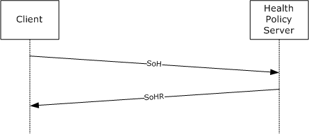

Figure 2: Client SOH request and Health Policy Server response

The WSHA provides status in the form of an SoHReportEntry in the SoH. The WSHV provides a response to that status in the form of an SoHReportEntry in the SoHR.

<a id="Section_3.1.1"></a>
### 3.1.1 Abstract Data Model

The abstract data model in sections [3.2.1](#Section_3.1.1) and [3.3.1](#Section_3.3.1) describes a conceptual model of possible data organization that an implementation maintains to participate in this protocol. The described organization is provided to facilitate the explanation of how the protocol behaves. This document does not mandate that implementations adhere to this model as long as their external behavior is consistent with what is described in this document.

The Windows Security Health Agent (WSHA) and Windows Security Health Validator (WSHV) Protocol consist of a single exchange. The following should be noted:

- The WSHA reports the client's security health status, and the WSHV compares that status to a policy and returns a [**quarantine**](#gt_quarantine) determination.
- The client does not maintain policy information, and the server does not maintain client state information.
The common WSHA and WSHV ADM elements are described in the following table:

| Name | Type | Description |
| --- | --- | --- |
| [NAPSystemHealthID (section 2.2.4)](#Section_2.2.4) | DWORD | The WSHA and WSHV set the value of the NAPSystemHealthID field to 0x13780 for both the [**SoH**](#gt_statement-of-health-soh) and [**SoHR**](#gt_statement-of-health-response-sohr) messages. This value is used to identify the messages that were sent by either the WSHA or WSHV to ensure that the message is received correctly by the corresponding WSHA or WSHV. For more information about the **NAPSystemHealthID** ADM element, see section 2.2.4. |
| [Flag (section 2.2.5)](#Section_2.2.5) | 8 BYTES | The WSHA uses a flag in the SoH to ensure the WSHV recognizes whether the SoH is new or is a duplicate of a previously received SoH.<6> The WSHA initializes the flag's value to 0 when the service is started on the client, and then increments that value for each SoH sent. The service is restarted when the client is rebooted or when the NAP Agent service on the client is restarted. For more information about the Flag ADM element, see section 2.2.5. |
| [Version (section 2.2.6)](#Section_2.2.6) | 8 BYTES | The WSHA sets this value for the WSHV to differentiate the WSHA client version so that the WSHV recognizes how to handle client version-specific messages. For more information about the Version ADM element, see section 2.2.6. |
| [HealthClassID (section 2.2.7)](#Section_2.2.7) | BYTE | The WSHA uses the HealthClassID to specify which security health class data is being referred to. For more information about the HealthClassID ADM element, see section 2.2.7. |

<a id="Section_3.1.2"></a>
### 3.1.2 Timers

None.

<a id="Section_3.1.3"></a>
### 3.1.3 Initialization

None.

<a id="Section_3.1.4"></a>
### 3.1.4 Higher-Layer Triggered Events

None.

<a id="Section_3.1.5"></a>
### 3.1.5 Processing Events and Sequencing Rules

<a id="Section_3.1.5.1"></a>
#### 3.1.5.1 Setting the NAP System Health ID Field

The [NAPSystemHealthID (section 2.2.4)](#Section_2.2.4) is used to differentiate the [WSHA SoH](#Section_2.2.2) packets and the [WSHV SoHR](#Section_2.2.3) packets from those of other security health agents. The NAPSystemHealthID01 value for the WSHA SoH packets and the WSHV SoHR packets MUST always be set to 0x00013780 (79744), which is the [**NAP**](#gt_network-access-protection-nap) assigned ID for WSHA and WSHV. The processing rules for setting the NAPSystemHealthID01 value in the WSHA SoH packets or the WSHV SoHR packets are called in the following scenarios:

- For WSHA, the NAPSystemHealthID01 value is set whenever a WSHA SoH packet is created. Creation of the WSHA SoH packet is triggered during creation of an [**SoH**](#gt_statement-of-health-soh), as specified in [[TNC-IF-TNCCSPBSoH]](https://go.microsoft.com/fwlink/?LinkId=240054). When processing an [**SoHR**](#gt_statement-of-health-response-sohr) packet, the NAPSystemHealthID01 value MUST equal 0x00013780 (79744) prior to passing the packet to WSHA, as specified in [TNC-IF-TNCCSPBSoH].
- For WSHV, the NAPSystemHealthID01 value is set whenever a WSHV SoHR packet is created. Creation of the WSHV SoHR packet is triggered during creation of an SoHR, as specified in [TNC-IF-TNCCSPBSoH]. When processing an SoH packet, the NAPSystemHealthID01 value MUST equal 0x00013780 (79744) prior to passing the packet to WSHV, as specified in [TNC-IF-TNCCSPBSoH].
<a id="Section_3.1.6"></a>
### 3.1.6 Timer Events

None.

<a id="Section_3.1.7"></a>
### 3.1.7 Other Local Events

None.

<a id="Section_3.2"></a>
## 3.2 WSHA (Client) Specific Details

<a id="Section_3.2.1"></a>
### 3.2.1 Abstract Data Model

The following is a state diagram for the WSHA:

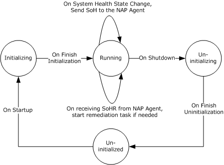

Figure 3: WSHA state

- If the WSHA is running but the WSHV is not running (or it is not applied to an [**NPS**](#gt_network-policy-server-nps) policy), the WSHA will send its payload in the SoH, but then NPS server will ignore it. This is handled by the [[TNC-IF-TNCCSPBSoH]](https://go.microsoft.com/fwlink/?LinkId=240054) protocol and does not involve the Windows Security Health Agent (WSHA) and Windows Security Health Validator (WSHV) Protocol [MS-WSH](#Section_5).
- The WSHA is stateless, so when it sends an [**SoH**](#gt_statement-of-health-soh), it does not actively wait for an [**SoHR**](#gt_statement-of-health-response-sohr). If the client sends an SoH, the client will not send a new SoH unless the security health status changes or a new SoH is requested by the [**NAP**](#gt_network-access-protection-nap) agent.
ADM elements are defined for the WSHA as follows:

**FirewallStatus:** This ADM element stores the WSC status for firewall as described in section [2.2.9.2](#Section_2.2.9.2).

The definition of this ADM element is as follows.

DWORD FirewallStatus;

**NumberOfFirewallProducts:** This ADM element stores the number of firewall products that are installed in the system.

The definition of this ADM element is as follows.

DWORD NumberOfFirewallProducts;

**FirewallProductsInformation:** This ADM element describes all firewall products that are installed in the system.

The definition of this ADM element is as follows.

ProductInformation[] FirewallProductsInformation;

The **ProductInformation** data type is defined in section [2.2.15.1](#Section_2.2.15.1).

**AntivirusStatus:** This ADM element stores the WSC status for antivirus as described in section 2.2.9.2.

The definition of this ADM element is as follows.

DWORD AntivirusStatus;

**NumberOfAntivirusProducts:** This ADM element stores the number of antivirus products that are installed in the system.

The definition of this ADM element is as follows.

DWORD NumberOfAntivirusProducts;

**AntivirusProductsInformation:** This ADM element describes all antivirus products that are installed in the system.

The definition of this ADM element is as follows.

ProductInformation[] AntivirusProductsInformation;

The **ProductInformation** data type is defined in section 2.2.15.1.

**AntispywareStatus:** This ADM element stores the WSC status for antispyware as described in section 2.2.9.2.

The definition of this ADM element is as follows.

DWORD AntispywareStatus;

**NumberOfAntispywareProducts:** This ADM element stores the number of antispyware products that are installed on the client.

The definition of this ADM element is as follows.

DWORD NumberOfAntispywareProducts;

**AntispywareProductsInformation:** This ADM element describes all antispyware products that are installed in the system.

The definition of this ADM element is as follows.

ProductInformation[] AntispywareProductsInformation;

The **ProductInformation** data type is defined in section 2.2.15.1.

**AutomaticUpdatesStatusCode:** This ADM element describes the status of the automatic updates feature of Windows Security Center (WSC).

The definition of this ADM element is as follows.

DWORD AutomaticUpdatesStatusCode;

Refer to section [2.2.9.5](#Section_2.2.9.5) for information about possible values for this ADM element.

**SUStatus:** This ADM element describes the status of software updates.

The definition of this ADM element is as follows.

SecurityUpdatesStatus SUStatus;

The **SecurityUpdatesStatus** data type is defined in section [2.2.15.2](#Section_2.2.15.2).

This ADM is initialized by calling to the abstract interface **GetSecurityUpdatesStatus**, described in section [3.2.4.10](#Section_3.2.4.10).

**SohFlag:** This ADM element holds the value of the **Flag** as described in section [2.2.5](#Section_2.2.5).

The definition of this ADM element is as follows.

DWORD SohFlag[2];

**ClientVersion:** This ADM element holds the value of the **Version** as described in section [2.2.6](#Section_2.2.6).

The definition of this ADM element is as follows.

DWORD ClientVersion[2];

<a id="Section_3.2.2"></a>
### 3.2.2 Timers

None.

<a id="Section_3.2.3"></a>
### 3.2.3 Initialization

The WSHA MUST implement the following data initialization.

All the ADM elements specified in section [3.2.1](#Section_3.1.1) are initialized to zero. Then the following initialization steps occur.

**Firewall:** The **FirewallStatus** and **NumberOfFirewallProducts** ADM elements are initialized by calling the **GetNumberOfFirewallProducts** abstract interface (section [3.2.4.3](#Section_3.2.4.3)) as follows.

FirewallStatus = GetNumberOfFirewallProducts(&NumberOfFirewallProducts)

The **FirewallProductsInformation** ADM element is initialized by a call to the **GetFirewallProductsInformation** abstract interface (section [3.2.4.4](#Section_3.2.4.4)).

**Antivirus:** The **AntivirusStatus** and **NumberOfAntivirusProducts** ADM elements are initialized by a call to the **GetNumberOfAntivirusProducts** abstract interface (section [3.2.4.5](#Section_3.2.4.5)) as follows.

AntivirusStatus = GetNumberOfAntivirusProducts(&NumberOfAntivirusProducts)

The **AntivirusProductsInformation** ADM element is initialized by a call to the **GetAntivirusProductsInformation** abstract interface (section [3.2.4.6](#Section_3.2.4.6)).

**Antispyware:** The **AntispywareStatus** and **NumberOfAntispywareProducts** ADM elements are initialized by a call to the **GetNumberOfAntispywareProducts** abstract interface (section [3.2.4.7](#Section_3.2.4.7)) as follows.

AntispywareStatus = GetNumberOfAntispywareProducts(&NumberOfAntispywareProducts)

The **AntispywareProductsInformation** ADM element is initialized by a call to the **GetAntispywareProductsInformation** abstract interface (section [3.2.4.8](#Section_3.2.4.8)).

**Automatic updates:** The **AutomaticUpdatesStatusCode** ADM element is initialized by a call to the **GetAutomaticUpdatesStatusCode** abstract interface (section [3.2.4.9](#Section_3.2.4.9)) as follows.

GetAutomaticUpdatesStatusCode(AutomaticUpdatesStatusCode)

**Security updates:** The **SUStatus** ADM element is initialized by a call to the **GetSecurityUpdatesStatus** abstract interface (section [3.2.4.10](#Section_3.2.4.10)).

**SoH flag:** The **SohFlag** ADM element is set during system initialization as follows.

The DWORD at index 0 is set to the value of the [NAPSystemHealthID](#Section_2.2.4) (0x00013780), and the DWORD at index 1 is initialized to 0. NAPSystemHealthID is specified in section 2.2.4.

**Client version:** The **ClientVersion** ADM element is set during system initialization as described in section [2.2.6](#Section_2.2.6).

<a id="Section_3.2.4"></a>
### 3.2.4 Higher-Layer Triggered Events

<a id="Section_3.2.4.1"></a>
#### 3.2.4.1 SoH Request

The [**NAP**](#gt_network-access-protection-nap) agent queries the WSHA for an [**SoH**](#gt_statement-of-health-soh) by calling the public NAP interface INapSystemHealthAgentCallback::GetSoHRequest described in [[MSDN-INapSysHA]](https://go.microsoft.com/fwlink/?LinkId=200160).

<a id="Section_3.2.4.2"></a>
#### 3.2.4.2 SendMessageToUI Abstract Interface

This abstract interface is called by the client processing rules to present the user with a text-based message.

SendMessageToUI(

[in] string message);

**message:** The message to be presented to the user.

<a id="Section_3.2.4.3"></a>
#### 3.2.4.3 GetNumberOfFirewallProducts Abstract Interface

This abstract interface is called to initialize the **FirewallStatus** ADM element described in section [3.2.1](#Section_3.1.1) and the **NumberOfFirewallProducts** ADM element described in section 3.2.1.

DWORD GetNumberOfFirewallProducts(

[out] DWORD *pNumberOfFirewallProducts);

**pNumberOfFirewallProducts:** A pointer to a DWORD variable that receives the number of firewall products in the system.

**Return Values**

| Value | Description |
| --- | --- |
| S_OK (0x00000000) | The number of installed firewall products was successfully set in the *pNumberOfFirewallProducts* parameter. |
| E_MSSHAV_PRODUCT_NOT_INSTALLED (0xC0FF0002) | No firewall products are installed. No value was set in the *pNumberOfFirewallProducts* parameter. |
| E_MSSHAV_WSC_SERVICE_DOWN (0xC0FF0003) | The WSC service is not available to report status. No value was set in the *pNumberOfFirewallProducts* parameter. |
| E_MSSHAV_WSC_SERVICE_NOT_STARTED_SINCE_BOOT (0xC0FF0018) | The WSC service on the client has not started since the computer started. No value was set in the *pNumberOfFirewallProducts* parameter. |

<a id="Section_3.2.4.4"></a>
#### 3.2.4.4 GetFirewallProductsInformation Abstract Interface

This abstract interface is called to initialize the **FirewallProductsInformation** ADM element described in section [3.2.1](#Section_3.1.1).

DWORD GetFirewallProductsInformation(

[out] ProductInformation **ppFirewallProductsInformation);

**ppFirewallProductsInformation:** A pointer to a variable that receives the address of the array of [ProductInformation](#Section_2.2.15.1) structures as described in section 2.2.15.1.

**Return Values**

| Value | Description |
| --- | --- |
| S_OK (0x00000000) | The product information was successfully set in the *ppFirewallProductsInformation* array parameter. |
| E_OUTOFMEMORY (0x80000002) | The interface failed to retrieve the information about the firewall products. No values were set in the *ppFirewallProductsInformation* parameter. |

**Remarks**

The interface allocates the memory required to accommodate the array of ProductInformation structures. This memory should be freed by calling to the **FreeProductsInformation** abstract interface described in section [3.2.4.11](#Section_3.2.4.11).

<a id="Section_3.2.4.5"></a>
#### 3.2.4.5 GetNumberOfAntivirusProducts Abstract Interface

This abstract interface is called to initialize the **AntivirusStatus** ADM element described in section [3.2.1](#Section_3.1.1) and the **NumberOfAntivirusProducts** ADM element described in section 3.2.1.

DWORD GetNumberOfAntivirusProducts(

[out] DWORD *pNumberOfAntivirusProducts);

**pNumberOfAntivirusProducts:** A pointer to a DWORD variable that receives the number of antivirus products in the system.

**Return Values**

| Value | Description |
| --- | --- |
| S_OK (0x00000000) | The number of installed antivirus products was successfully set in the *pNumberOfAntivirusProducts* parameter. |
| E_MSSHAV_PRODUCT_NOT_INSTALLED (0xC0FF0002) | No antivirus products are installed. No value was set in the *pNumberOfAntivirusProducts* parameter. |
| E_MSSHAV_WSC_SERVICE_DOWN (0xC0FF0003) | The WSC service is not available to report status. No value was set in the *pNumberOfAntivirusProducts* parameter. |
| E_MSSHAV_WSC_SERVICE_NOT_STARTED_SINCE_BOOT (0xC0FF0018) | The WSC service on the client has not started since the computer started. No value was set in the *pNumberOfAntivirusProducts* parameter. |

<a id="Section_3.2.4.6"></a>
#### 3.2.4.6 GetAntivirusProductsInformation Abstract Interface

This abstract interface is called to initialize the **AntivirusProductsInformation** ADM element described in section [3.2.1](#Section_3.1.1).

DWORD GetAntivirusProductsInformation(

[out] ProductInformation **ppAntivirusProductsInformation);

**ppAntivirusProductsInformation:** A pointer to a variable that receives the address of the array of [ProductInformation](#Section_2.2.15.1) structures as described in section 2.2.15.1.

**Return Values**

| Value | Description |
| --- | --- |
| S_OK (0x00000000) | Product information was successfully set in the *ppAntivirusProductsInformation* array parameter. |
| E_OUTOFMEMORY (0x80000002) | The interface failed to retrieve the information about the antivirus products. No values were set in the *ppAntivirusProductsInformation* parameter. |

**Remarks**

The interface allocates the memory required to accommodate the array of ProductInformation structures. This memory should be freed by calling to the **FreeProductsInformation** abstract interface described in section [3.2.4.11](#Section_3.2.4.11).

<a id="Section_3.2.4.7"></a>
#### 3.2.4.7 GetNumberOfAntispywareProducts Abstract Interface

This abstract interface is called to initialize the **AntispywareStatus** ADM element described in section [3.2.1](#Section_3.1.1) and the **NumberOfAntispywareProducts** ADM element described in section 3.2.1.

DWORD GetNumberOfAntispywareProducts(

[out] DWORD *pNumberOfAntispywareProducts);

**pNumberOfAntispywareProducts:** A pointer to a DWORD variable that receives the number of antispyware products in the system.

**Return Values**

| Value | Description |
| --- | --- |
| S_OK (0x00000000) | The number of installed antispyware products was successfully set in the *pNumberOfAntispywareProducts* parameter. |
| E_MSSHAV_PRODUCT_NOT_INSTALLED (0xC0FF0002) | No antispyware products are installed. No value was set in the *pNumberOfAntispywareProducts* parameter. |
| E_MSSHAV_WSC_SERVICE_DOWN (0xC0FF0003) | The WSC service is not available to report status. No value was set in the *pNumberOfAntispywareProducts* parameter. |
| E_MSSHAV_WSC_SERVICE_NOT_STARTED_SINCE_BOOT (0xC0FF0018) | The WSC service on the client has not started since the computer started. No value was set in the *pNumberOfAntispywareProducts* parameter. |

<a id="Section_3.2.4.8"></a>
#### 3.2.4.8 GetAntispywareProductsInformation Abstract Interface

This abstract interface is called to initialize the **AntispywareProductsInformation** ADM element described in section [3.2.1](#Section_3.1.1).

DWORD GetAntispywareProductsInformation(

[out] ProductInformation **ppAntispywareProductsInformation);

**ppAntispywareProductsInformation:** A pointer to a variable that receives the address of an array of [ProductInformation](#Section_2.2.15.1) structures as described in section 2.2.15.1.

**Return Values**

| Value | Description |
| --- | --- |
| S_OK (0x00000000) | The product information was successfully set in the *ppAntispywareProductsInformation* array parameter. |
| E_OUTOFMEMORY (0x80000002) | The interface failed to retrieve the information about the antispyware products. No value was set in the *ppAntispywareProductsInformation* parameter. |

**Remarks**

The interface allocates the memory required to accommodate the array of ProductInformation structures. This memory should be freed by calling to the **FreeProductsInformation** abstract interface described in section [3.2.4.11](#Section_3.2.4.11).

<a id="Section_3.2.4.9"></a>
#### 3.2.4.9 GetAutomaticUpdatesStatusCode Abstract Interface

This abstract interface is called to initialize the **AutomaticUpdatesStatusCode** ADM element described in section [3.2.1](#Section_3.1.1).

DWORD GetAutomaticUpdatesStatusCode (

[in, out] DWORD *pAutomaticUpdatesStatusCode);

**pAutomaticUpdatesStatusCode:** A pointer to a variable that receives the automatic updates status code.

**Return Values**

| Value | Description |
| --- | --- |
| S_OK (0x00000000) | The automatic updates status code was successfully set in the *pAutomaticUpdatesStatusCode* parameter. |
| E_FAIL (0x80004005) | The interface failed to retrieve the automatic updates status code. No value was set in the *pAutomaticUpdatesStatusCode* parameter. |

<a id="Section_3.2.4.10"></a>
#### 3.2.4.10 GetSecurityUpdatesStatus Abstract Interface

This abstract interface is called to initialize the **SUStatus** ADM element described in section [3.2.1](#Section_3.1.1).

DWORD GetSecurityUpdatesStatus (

[out] DWORD *pSecurityUpdatesStatus);

**pSecurityUpdatesStatus:** A pointer to a [SecurityUpdatesStatus (section 2.2.15.2)](#Section_2.2.15.2) structure that receives the values reflecting the status of security updates.

**Return Values**

| Value | Description |
| --- | --- |
| S_OK (0x00000000) | The security updates status was successfully set in the structure indicated by the *pSecurityUpdatesStatus* parameter. |
| E_OUTOFMEMORY (0x80000002) | The interface failed to retrieve the security updates status. No values were set in the structure indicated by the *pSecurityUpdatesStatus* parameter. |

<a id="Section_3.2.4.11"></a>
#### 3.2.4.11 FreeProductsInformation Abstract Interface

This abstract interface is called to free memory allocated by one of the following abstract interfaces: **GetFirewallProductsInformation**, **GetAntivirusProductsInformation**, or **GetAntispywareProductsInformation**.

void FreeProductsInformation(

[in] ProductInformation *pProductsInformation);

**pProductsInformation:** A pointer to a memory location that was allocated during a call to one of the following abstract interfaces: **GetFirewallProductsInformation**, **GetAntivirusProductsInformation**, or **GetAntispywareProductsInformation**.

<a id="Section_3.2.4.12"></a>
#### 3.2.4.12 GetClientVersion Abstract Interface

This abstract interface is called to initialize the **ClientVersion** ADM element described in section [3.2.1](#Section_3.1.1).

void GetClientVersion(

[out] DWORD ClientVersion[2]);

**ClientVersion:** A pointer to an array of two DWORD elements that receive the client version value as described in section [2.2.6](#Section_2.2.6).

<a id="Section_3.2.4.13"></a>
#### 3.2.4.13 ClientVersion ADM Initialization

During system initialization, the **ClientVersion** ADM element is initialized as described in section [3.2.1](#Section_3.1.1).

<a id="Section_3.2.4.14"></a>
#### 3.2.4.14 SohFlag ADM initialization

During system initialization, the **SohFlag** ADM element is initialized as described in section [3.2.1](#Section_3.1.1).

<a id="Section_3.2.4.15"></a>
#### 3.2.4.15 RemediateFirewall Abstract Interface

This abstract interface is called to activate the firewall.

DWORD RemediateFirewall();

**Return Values**

| Value | Description |
| --- | --- |
| S_OK (0x00000000): | Firewall activation has started. |
| E_FAIL (0x80004005) | The firewall activation failed. |

<a id="Section_3.2.4.16"></a>
#### 3.2.4.16 RemediateAntispyware Abstract Interface

This abstract interface is called either to activate the spyware software or to update the spyware software signatures.

DWORD RemediateSpyware(

BOOL activate);

**activate:** If set to TRUE, this interface activates the spyware software. If set to FALSE, this interface updates the spyware signatures.

**Return Values**

| Value | Description |
| --- | --- |
| S_OK (0x00000000) | The operation has started. Either spyware is being enabled or signatures are being updated, depending on the value of the *activate* parameter. |
| E_FAIL (0x80004005) | The operation failed. |

<a id="Section_3.2.4.17"></a>
#### 3.2.4.17 RemediateAutomaticUpdates Abstract Interface

This abstract interface is called to activate software updates.

DWORD RemediateAutomaticUpdates();

**Return Values**

| Value | Description |
| --- | --- |
| S_OK (0x00000000) | The automatic updates feature has been activated. |
| E_FAIL (0x80004005) | Automatic updates activation failed. |

<a id="Section_3.2.4.18"></a>
#### 3.2.4.18 StartWSCService Abstract Interface

This abstract interface is called to activate the WSC service.

DWORD StartWSCService ();

**Return Values**

| Value | Description |
| --- | --- |
| S_OK (0x00000000) | The WSC service is activated. |
| E_FAIL (0x80004005) | WSC service activation failed. |

<a id="Section_3.2.4.19"></a>
#### 3.2.4.19 DoOnlineScan Abstract Interface

This abstract interface is called to start an online scan by Windows Update Services. The online scan is performed to get an indication of whether there are pending security updates that need to be installed on the client.

DWORD DoOnlineScan ();

**Return Values**

| Value | Description |
| --- | --- |
| S_OK (0x00000000) | Online scan started. |
| E_FAIL (0x80004005) | Online scan failed to start. |

<a id="Section_3.2.4.20"></a>
#### 3.2.4.20 DoSecuritySoftwareUpdate Abstract Interface

This abstract interface is called to update the client with pending security updates.

DWORD DoSecuritySoftwareUpdate (

[in] DWORD SeverityLevel);

**SeverityLevel:** The severity level of security updates to be performed. The possible values are as follows.

| Value | Meaning |
| --- | --- |
| 0x00000080 | All Low, Moderate, Important, and Critical software updates are to be installed. |
| 0x00000100 | All Moderate, Important, and Critical software updates are to be installed. |
| 0x00000200 | All Important and Critical software updates are to be installed. |
| 0x00000400 | All Critical software updates are to be installed. |

**Return Values**

| Value | Description |
| --- | --- |
| S_OK (0x00000000) | The security update has started. |
| E_FAIL (0x80004005) | The security update failed to start. |

<a id="Section_3.2.5"></a>
### 3.2.5 Processing Events and Sequencing Rules

<a id="Section_3.2.5.1"></a>
#### 3.2.5.1 General Problems

The WSHA is stateless, so when it sends an [**SoH**](#gt_statement-of-health-soh), it does not actively wait for an [**SoHR**](#gt_statement-of-health-response-sohr). If the client sends an SoH, it will not send a new SoH unless the security health status changes or a new SoH is requested by the NAP agent.

<a id="Section_3.2.5.2"></a>
#### 3.2.5.2 Constructing an SoH

The SoH message is constructed by creating each of the TLVs described in section [2.2.2](#Section_2.2.2) and appending each TLV to the SoH message using the **INapSoHConstructor** interface described in [[MSDN-NAPAPI]](https://go.microsoft.com/fwlink/?LinkId=199018). The TLVs are created in the following order and set with values according to the following procedure. The ADM elements used in this procedure are defined in section [3.2.1](#Section_3.1.1).

- Initialization:
- Initialize the **FirewallStatus** ADM element and the **NumberOfFirewallProducts** ADM element by calling the **GetNumberOfFirewallProducts** abstract interface described in section [3.2.4.3](#Section_3.2.4.3).
- If the **FirewallStatus** ADM element is set to S_OK, initialize the **FirewallProductsInformation** ADM element by calling the **GetFirewallProductsInformation** abstract interface described in section [3.2.4.4](#Section_3.2.4.4).
- If the **GetFirewallProductsInformation** abstract interface returns a value other than S_OK, stop processing. Then set the process return code to the value that was returned by **GetFirewallProductsInformation**.
- Initialize the **AntivirusStatus** ADM element and the **NumberOfAntivirusProducts** ADM element by calling the **GetNumberOfAntivirusProducts** abstract interface described in section [3.2.4.5](#Section_3.2.4.5).
- If the **AntivirusStatus** ADM element is set to S_OK, initialize the **AntivirusProductsInformation** ADM element by calling the **GetAntivirusProductsInformation** abstract interface described in section [3.2.4.6](#Section_3.2.4.6).
- If the **GetAntivirusProductsInformation** abstract interface returns a value other than S_OK, free the memory allocated for **FirewallProductsInformation** by calling the **FreeProductsInformation** abstract interface (section [3.2.4.11](#Section_3.2.4.11)). Then stop processing and set the process return code to the value that was returned by **GetAntivirusProductsInformation**.
- Inspect the value of the **ClientVersion** ADM element to identify upon which version of the operating system the client is running, and therefore, which step to perform next in the initialization process.<7>
- Initialize the **AntispywareStatus** ADM element and the **NumberOfAntispywareProducts** ADM element by calling the **GetNumberOfAntivirusProducts** abstract interface described in section [3.2.4.7](#Section_3.2.4.7).
- If the **AntispywareStatus** ADM element is set to S_OK, initialize the **AntispywareProductsInformation** ADM element by calling the **GetAntispywareProductsInformation** abstract interface described in section [3.2.4.8](#Section_3.2.4.8).
- If the **GetAntispywareProductsInformation** abstract interface returns a value other than S_OK, stop processing. Then set the process return code to the value that was returned by **GetAntispywareProductsInformation**.
- Initialize the **AutomaticUpdatesStatusCode** ADM element by calling the **GetAutomaticUpdatesStatusCode** abstract interface described in section [3.2.4.9](#Section_3.2.4.9).
- If the **GetAutomaticUpdatesStatusCode** abstract interface returns a value other than S_OK, free the memory allocated for **FirewallProductsInformation** and **AntivirusProductsInformation** by calling the **FreeProductsInformation** abstract interface (section 3.2.4.11) and stop processing. Then set the process return code to the value that was returned by **GetAutomaticUpdatesStatusCode**.
- Initialize the **SUStatus** ADM element by calling the **GetSecurityUpdatesStatus** abstract interface described in section [3.2.4.10](#Section_3.2.4.10).
- If the **GetSecurityUpdatesStatus** abstract interface returns a value other than S_OK, free all memory that was allocated for **FirewallProductsInformation**, **AntivirusProductsInformation**, and **AntispywareProductsInformation** by calling the **FreeProductsInformation** abstract interface (section 3.2.4.11) and stop processing. Set the process return code to the value that was returned by **GetSecurityUpdatesStatus**.
- Add 1 to the **SohFlag[1]** ADM element.
- Construct TLV 1 using the value in section [2.2.4](#Section_2.2.4) and the structure described in section [2.2.2.1](#Section_2.2.2.1), and append it to the SoH.
- Construct TLV 2 using the value of the **SohFlag** ADM element and the structure described in section [2.2.2.2](#Section_2.2.2.2), and append it to the SoH.
- Construct TLV 3 using the value of the **ClientVersion** ADM element and the structure described in section [2.2.2.3](#Section_2.2.2.3), and append it to the SoH.
- Construct TLV 4 using the value described in section [2.2.7](#Section_2.2.7) for the firewall and the structure in section [2.2.2.4](#Section_2.2.2.4), and append it to the SoH.
- If the value of the **FirewallStatus** ADM element is not S_OK, construct TLV 6 using the value of the **FirewallStatus** ADM element and the structure described in section [2.2.2.6](#Section_2.2.2.6), and append it to the SoH.
- If the value of the **FirewallStatus** ADM element is S_OK, do the following:
- Set **ProductIndex** to 0.
- If **ProductIndex** is equal to **NumberOfFirewallProducts**, go to step 8.
- Construct TLV 5 using the value of the **FirewallProductsInformation[ProductIndex].pi_productName** ADM element and the structure described in section [2.2.2.5](#Section_2.2.2.5), and append it to the SoH.
- Construct TLV 6 using the value of the **FirewallProductsInformation[ProductIndex].pi_clientStatusCode** ADM element and the structure described in section 2.2.2.6, and append it to the SoH.
- Increment **ProductIndex** by 1.
- Go to step 7-2.
- Construct TLV 7 by using the value described in section 2.2.7 for antivirus and the structure described in section [2.2.2.7](#Section_2.2.2.7), and append it to the SoH.
- If the value of the **AntivirusStatus** ADM element is not S_OK, construct TLV 9 using the value of the **AntivirusStatus** ADM element and the structure described in section [2.2.2.9](#Section_2.2.2.9). Append it to the SoH.
- If the value of the **AntivirusStatus** ADM element is S_OK, do the following:
- Set **ProductIndex** to 0.
- If **ProductIndex** equals the **NumberOfAntivirusProducts** ADM element, go to step 11.
- Construct TLV 8 using the value of the **AntivirusProductsInformation[ProductIndex].pi_productName** ADM element and the structure described in section [2.2.2.8](#Section_2.2.2.8), and append it to the SoH.
- Construct TLV 9 using the value of the **AntivirusProductsInformation[ProductIndex].pi_clientStatusCode** ADM element and the structure described in section 2.2.2.9, and append it to the SoH.
- Increment **ProductIndex** by 1.
- Go to step 10-2.
- Inspect the value of the **ClientVersion** ADM element to identify upon which version of the operating system the client is running, and therefore, which step to perform next in the initialization process.<8>
- Construct TLV 10 using the value described in section 2.2.7 for antispyware and the structure described in section [2.2.2.10](#Section_2.2.2.10), and append it to the SoH.
- If the value of the **AntispywareStatus** ADM element is not S_OK, construct TLV 12 using the value of the **AntispywareStatus** ADM element and the structure described in section [2.2.2.12](#Section_2.2.2.12), and append it to the SoH.
- If the value of the **AntispywareStatus** ADM element is S_OK, do the following:
- Set **ProductIndex** to 0.
- If **ProductIndex** equals the **NumberOfAntispywareProducts** ADM element, go to step 15.
- Construct TLV 11 using the value of the **AntispywareProductsInformation[ProductIndex].pi_productName** ADM element and the structure described in section [2.2.2.11](#Section_2.2.2.11), and append it to the SoH.
- Construct TLV 12 using the value of the **AntispywareProductsInformation[ProductIndex].pi_clientStatusCode** ADM element and the structure described in section 2.2.2.12, and append it to the SoH.
- Increment **ProductIndex** by 1.
- Go to step 14-2.
- Construct TLV 13 using the value described in section 2.2.7 for automatic updates and the structure described in section [2.2.2.13](#Section_2.2.2.13), and append it to the SoH.
- Construct TLV 14 using the value of the **AutomaticUpdatesStatusCode** ADM element. Create the structure described in section [2.2.2.14](#Section_2.2.2.14), and append it to the SoH.
- Construct TLV 15 using the value described in section 2.2.7 for security updates and the structure described in section [2.2.2.15](#Section_2.2.2.15), and append it to the SoH.
- Construct TLV 16 using the value of the **sus_clientStatusCode** field of the **SUStatus** ADM element and the structure described in section [2.2.2.16](#Section_2.2.2.16), and append it to the SoH.
- If the value of TLV 16 is not 0x00FF0005 (S_MSSHA_NO_MISSING_UPDATES) and not 0x00FF0006 (S_MSSHA_ MISSING_UPDATES), go to step 23.
- Construct TLV 17 using the value of the **sus_durationSinceLastSynch** field of the **SUStatus** ADM element and the structure described in section [2.2.2.17](#Section_2.2.2.17), and append it to the SoH.
- Construct TLV 18 using the value of the **sus_wsusServerName** field of the **SUStatus** ADM element and the structure described in section [2.2.2.18](#Section_2.2.2.18), and append it to the SoH.
- Construct TLV 19 using the value of the **sus_updatesFlag** field of the **SUStatus** ADM element and the structure described in section [2.2.2.19](#Section_2.2.2.19), and append it to the SoH.
- Free allocated memory for **FirewallProductsInformation**, **AntivirusProductsInformation**, and **AntispywareProductsInformation** (if it was allocated) by calling the **FreeProductsInformation** abstract interface (see 3.2.4.11).
- Return S_OK as the process exit code.
The process exit code is used by the Protocol Bindings for SoH [[TNC-IF-TNCCSPBSoH]](https://go.microsoft.com/fwlink/?LinkId=240054) as an indication of the success or failure of the SoH construction, and the SoH protocol then acts accordingly.

<a id="Section_3.2.5.3"></a>
#### 3.2.5.3 Processing an SoHR

The following procedure describes how the SoHR is processed.

- Initialization:
- Set **TLV-index** to 1.
- If the value of the 'f' bit ([[TNC-IF-TNCCSPBSoH]](https://go.microsoft.com/fwlink/?LinkId=240054)) is 1, set **RemediationRequired** to TRUE. Else set **RemediationRequired** to FALSE.
- If the **TLV-Index** value is larger than the number of TLVs in the SoHR, stop processing.
- If **TLV-Index** points to a health class ID TLV (that is, TLV_Type is set to 8), do the following:
- Store the value of the health class ID TLV in **HealthClassId**.
- Increment **TLV-Index** by 1.
- If **TLV-Index** is larger than the number of TLVs, stop processing.
- If **TLV-Index** does not point to a compliance result code TLV (that is, TLV_Type does not equal 4), go to step 4.
- For each **ComplianceCode** (up to two compliance codes) in the TLV, do the following:
- If **ComplianceCode** is equal to S_OK, do the following.
| HealthClassId | Action |
| --- | --- |
| Firewall (0) | Call **SendMessageToUI**("Firewall is OK."). |
| Antivirus (1) | Call **SendMessageToUI**("Antivirus is OK."). |
| Antispyware (2) | Call **SendMessageToUI**("Antispyware is OK."). |
| Automatic Updates (3) | Call **SendMessageToUI**("Automatic updates feature is OK."). |
| Security Updates (4) | Call **SendMessageToUI**("No required software updates."). |

- If **ComplianceCode** is equal to E_MSSHV_PRODUCT_NOT_ENABLED (0xC0FF0001), do the following.
| HealthClassId | RemediationRequired == TRUE | RemediationRequired == FALSE |
| --- | --- | --- |
| Firewall (0) | Call the **RemediateFirewall** abstract interface (section [3.2.4.15](#Section_3.2.4.15)). If successful, call **SendMessageToUI**("Firewall activation in progress."), else call **SendMessageToUI**("Firewall activation failed. Firewall should be activated by administrator."). | Call **SendMessageToUI**("Firewall should be activated by administrator."). |
| Antivirus (1) | Call SendMessageToUI("Antivirus should be activated by administrator."). | - |
| Antispyware (2) | Call the **RemediateAntispyware** abstract interface (section [3.2.4.16](#Section_3.2.4.16)) with the parameter set to TRUE. If successful, call **SendMessageToUI**("Antispyware activation in progress."), else call **SendMessageToUI**("Antispyware activation failed. Antispyware should be activated by administrator."). | Call **SendMessageToUI**("Antispyware should be activated by administrator."). |
| Automatic Updates (3) | Call the **RemediateAutomaticUpdates** abstract interface (section [3.2.4.17](#Section_3.2.4.17)). If successful, call **SendMessageToUI**("Automatic updates activation is in progress."), else call **SendMessageToUI**("Automatic updates activation failed. Automatic updates should be enabled by administrator."). | Call **SendMessageToUI**("Automatic updates should be enabled by administrator."). |

- If **ComplianceCode** is equal to E_MSSHAV_PRODUCT_NOT_INSTALLED (0xC0FF0002), do the following.
| HealthClassId | Action |
| --- | --- |
| Firewall (0) | Call **SendMessageToUI**("Firewall is not installed."). |
| Antivirus (1) | Call **SendMessageToUI**("Antivirus is not installed."). |
| Antispyware (2) | Call **SendMessageToUI**("Antispyware is not installed."). |

- If **ComplianceCode** is equal to E_MSSHV_THIRD_PARTY_PRODUCT_NOT_ENABLED (0xC0FF0047), do the following.
| HealthClassId | Action |
| --- | --- |
| Firewall (0) | Call **SendMessageToUI**("Third party firewall is not enabled."). |
| Antivirus (1) | Call **SendMessageToUI**("Third party antivirus is not enabled."). |
| Antispyware (2) | Call **SendMessageToUI**("Third party antispyware is not enabled."). |

- If **ComplianceCode** equals E_MSSHV_THIRD_PARTY_PRODUCT_NOT_UPTODATE (0xC0FF0048), do the following.
| HealthClassId | Action |
| --- | --- |
| Antivirus (1) | Call **SendMessageToUI**("Third party antivirus is not up-to-date"). |
| Antispyware (2) | Call **SendMessageToUI**("Third party spyware is not up-to-date"). |

- If **ComplianceCode** equals E_MSSHAV_WSC_SERVICE_DOWN (0xC0FF0003), do the following:
- If **RemediationRequired** equals TRUE, do the following:
- Call the **StartWSCService** abstract interface (section [3.2.4.18](#Section_3.2.4.18)).
- If successful, call **SendMessageToUI**("Windows Security Center service is starting"), else call **SendMessageToUI**("Windows Security Center service failed to start. Windows Security Center service should be started by administrator.").
- If **RemediationRequired** equals FALSE, Call **SendMessageToUI**("Windows Security Center service should be started by administrator").
- If **ComplianceCode** equals E_MSSHV_PRODUCT_NOT_UPTODATE (0xC0FF0004), do the following:
| HealthClassId | RemediationRequired == TRUE | RemediationRequired == FALSE |
| --- | --- | --- |
| Antivirus (1) | Call **SendMessageToUI**("Antivirus signatures should be updated by administrator"). | - |
| Antispyware (2) | Call **RemediateAntispyware** abstract interface (section 3.2.4.16) with the parameter set to FALSE. If successful, call **SendMessageToUI**("Antispyware signatures update in progress"), else call **SendMessageToUI**("Antispyware signatures update failed. Antispyware signatures should be updated by administrator"). | Call **SendMessageToUI**("Antispyware signatures should be updated by administrator."). |

- If **ComplianceCode** equals one of the following values, do the action as described in the following table.
| ComplianceCode | RemediationRequired == TRUE | RemediationRequired == FALSE |
| --- | --- | --- |
| E_MSSHAV_NO_CLIENT_ID (0xC0FF000D) | Call the **DoOnlineScan** abstract interface (section [3.2.4.19](#Section_3.2.4.19)). If successful, call **SendMessageToUI**("Windows is scanning for security updates."), else call **SendMessageToUI**("Windows failed to scan for security updates. An administrator must synchronize this computer with the Windows Server Update Services server."). | Call **SendMessageToUI**("An administrator must synchronize this computer with the Windows Server Update Services server."). |
| E_MSSHV_SYNC_AND_INSTALL_UPDATES (0xC0FF0007) | Call the **DoSecuritySoftwareUpdate** abstract interface (section [3.2.4.20](#Section_3.2.4.20)) with the parameter set to ComplianceCode2. If successful, call **SendMessageToUI**("Windows is installing the required security updates."), else call **SendMessageToUI**("Windows failed to install the required security updates. An administrator must install required security updates."). | Call **SendMessageToUI**("An administrator must install required security updates."). |
| E_MSSHAV_WSC_SERVICE_NOT_STARTED_SINCE_BOOT (0xC0FF0018) | Call **SendMessageToUI**("Windows will update the security state of this computer automatically once the services have started."). | Call **SendMessageToUI**("An administrator must update the security state of the system once system initialization is completed."). |
| E_MSSHV_WUS_SHC_FAILURE (0xC0FF0012L) | Call **SendMessageToUI**("The Network Policy Server was unable to validate the security update status of this computer."). | - |
| E_MSSHAV_NO_WUS_SERVER (0xC0FF000C) | Call **SendMessageToUI**("The Windows Update Agent on this computer is not configured to synchronize with a Windows Server Update Services server."). | - |
| E_MSSHAV_UPDATES_INSTALLED_REQUIRE_REBOOT (0xC0FF0010) | Call **SendMessageToUI**("Security updates have been installed and require this computer to be restarted."). | - |
| E_MSSHAV_WUA_SERVICE_DISABLED (0xC0FF000E) | Call **SendMessageToUI**("The Windows Update Agent startup is manual or disabled."). | - |
| E_MSSHAV_WUA_SERVICE_NOT_STARTED_SINCE_BOOT (0x00FF0008) | Call **SendMessageToUI**("The Windows Server Update Services has not started."). | - |
| E_MSSHAV_WUA_COMM_FAILURE (0xC0FF000F) | Call **SendMessageToUI**("The periodic scan of this computer for security updates failed."). | - |
| E_MSSHAV_BAD_UPDATE_SOURCE_MU (0xC0FF004E) | Call **SendMessageToUI**("An administrator must configure the Windows Update Agent service to receive updates from Microsoft Update."). | - |
| E_MSSHAV_BAD_UPDATE_SOURCE_WUMU (0xC0FF004) | Call **SendMessageToUI**("An administrator must configure the Windows Update Agent service to receive updates from Windows Update or Microsoft Update."). | - |
| E_MSSHAV_BAD_UPDATE_SOURCE_MUWSUS (0xC0FF0050) | Call **SendMessageToUI**("An administrator must configure the Windows Update Agent service to receive updates from Windows Server Update Services or Microsoft Update."). | - |
| E_MSSHAV_NO_UPDATE_SOURCE (0xC0FF0051) | Call **SendMessageToUI**("An administrator must configure the Windows Update Agent service."). | - |

- Increment **TLV-Index** by 1.
- Go to step 2.
<a id="Section_3.2.6"></a>
### 3.2.6 Timer Events

None.

<a id="Section_3.2.7"></a>
### 3.2.7 Other Local Events

<a id="Section_3.2.7.1"></a>
#### 3.2.7.1 Client Abstract Interfaces

The [**Network Access Protection (NAP) client**](#gt_network-access-protection-nap-client) communicates with the WSHA using public APIs described in [[MSDN-INapSysHA]](https://go.microsoft.com/fwlink/?LinkId=200160). The WSHA APIs enable the [**NAP client**](#gt_nap-client) to query for an [**SoH**](#gt_statement-of-health-soh) message to send an SoH to the WSHV and to receive an [**SoHR**](#gt_statement-of-health-response-sohr) for remediation.

The data types that are used with the [**NAP**](#gt_network-access-protection-nap) interfaces are described in [[MSDN-NapDatatypes]](https://go.microsoft.com/fwlink/?LinkId=207331).

<a id="Section_3.2.7.2"></a>
#### 3.2.7.2 SoH Construction Interface

When the WSHA has to construct an [**SoH**](#gt_statement-of-health-soh), it calls the public interface INapSoHConstructor described in [[MSDN-NAPAPI]](https://go.microsoft.com/fwlink/?LinkId=199018).

<a id="Section_3.2.7.3"></a>
#### 3.2.7.3 SoH Change Notifications

WSHA registers with the Windows Services Manager to receive any change in the state of the [**Windows Security Center**](#gt_windows-security-center-wsc) service and the Windows Updates service.

WSHA registers with Windows Security Center (WSC) to receive any change in the state of the firewall, antivirus, antispyware, and automatic updates.

WSHA registers with the Windows Updates service to receive any change in the state of required software updates.

After WSHA receives an indication of change in state of one of the above, it signals the Network Access Protection (NAP) client by calling the **INapSystemHealthAgentBinding**::**NotifySoHChange** public method (described in [[MSDN-NAPAPI]](https://go.microsoft.com/fwlink/?LinkId=199018)) to initiate a new health assessment cycle.

<a id="Section_3.3"></a>
## 3.3 WSHV (Server) Specific Details

<a id="Section_3.3.1"></a>
### 3.3.1 Abstract Data Model

The following is a state diagram for the WSHV:

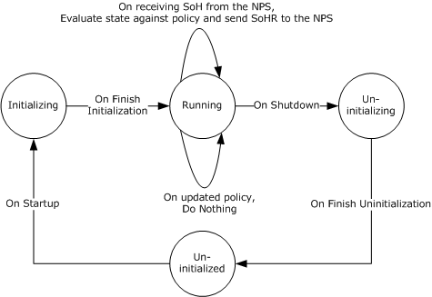

Figure 4: WSHV state

- When the WSHV is running and the [**NPS**](#gt_network-policy-server-nps) receives an SoH from a client that does not have the WSHA running, the NPS returns an error code to the client indicated that it is missing a particular SHA. This is handled by the Protocol Bindings for SoH [[TNC-IF-TNCCSPBSoH]](https://go.microsoft.com/fwlink/?LinkId=240054) and does not involve the Windows Security Health Agent (WSHA) and Windows Security Health Validator (WSHV) Protocol [MS-WSH](#Section_5).
- The health policy configuration ADM elements used by the WSHV are stored in the registry.<9> The health policy is used to evaluate the [**SoH**](#gt_statement-of-health-soh) sent by the client to the WSHV as described in section [3.3.7.3](#Section_3.3.7.3). The values for the ADM elements are as follows:
| Name | Type | Description |
| --- | --- | --- |
| **MaxDurationSinceLastSync** | DWORD | Specifies the maximum number of seconds allowed since software updates were last synchronized. The maximum value is 259,200 seconds (72 hours). |
| **AntiVirusUptoDate** | DWORD | When the value of this ADM element is 1, the client is required to have antivirus signatures that are up-to-date. When the value is 0, the client can have antivirus signatures that are not up-to-date. |
| **AntiVirusRealTime** | DWORD | When the value of this ADM element is 1, the client is required to have the antivirus software enabled. When the value is 0, the client can have the antivirus software disabled or not installed. |
| **AutoUpdate** | DWORD | When the value of this ADM element is 1, the client is required to have the Automatic Updates feature enabled. When the value is 0, the client can have the Automatic Updates feature disabled. |
| **WUAllowed** | DWORD | When the value of this ADM element is 1, the WSHA can query Windows Update for software updates. When the value is 0, the WSHA SHOULD NOT query Windows Update. |
| **EnforceUpdates** | DWORD | When the value of this ADM element is 1, the WSHA enforces software updates on the client. When the value is 0, the WSHA does not enforce software updates on the client. |
| **WSUSAllowed** | DWORD | When the value of this ADM element is 1, the WSHA can query Windows Software Updates Services for software updates. When the value is 0, the WSHA SHOULD NOT query Windows Software Update Services for software updates. |
| **MinimumSeverityRating** | DWORD | When the value of this ADM element is 0x80, the client is required to have all Low, Moderate, Important, and Critical software updates installed. When the value is 0x100, the client is required to have all Moderate, Important, and Critical software updates installed. When the value is 0x200, the client is required to have all Important and Critical software updates installed. When the value is 0x400, the client is required to have all Critical software updates installed. |
| **Firewall** | DWORD | When the value of this ADM element is 1, the client is required to have a firewall enabled. When the value is 0, the client can have the firewall disabled. |
| **AntiSpywareScanEnabled**<10> | DWORD | When the value of this ADM element is 1, the client is required to have antispyware software enabled. When the value is 0, the client can have antispyware software disabled or not installed. |
| **AntiSpywareUptoDate**<11> | DWORD | When the value of this ADM element is 1, the client is required to have antispyware signatures that are up-to-date. When the value is 0, the client can have antispyware signatures that are not up-to-date. |

<a id="Section_3.3.2"></a>
### 3.3.2 Timers

None.

<a id="Section_3.3.3"></a>
### 3.3.3 Initialization

All ADM elements described in section [3.3.1](#Section_3.3.1) are set by an administrative application that enables the server administrator to set those ADM elements according to the corporate policy.

The default values for the ADM elements are as follows.

| Name | Default value | Meaning |
| --- | --- | --- |
| **MaxDurationSinceLastSync** | 79200 | Maximum 22 hours since last security updates synchronization. |
| **AntiVirusUptoDate** | 1 | The client is required to have up-to-date antivirus signatures. |
| **AntiVirusRealTime** | 1 | The client is required to have antivirus software enabled. |
| **AutoUpdate** | 1 | The client is required to have the Automatic Updates feature enabled. |
| **WUAllowed** | 1 | WSHA can query Windows Update for software updates. |
| **EnforceUpdates** | 0 | WSHA does not enforce security updates on the client. |
| **WSUSAllowed** | 0 | WSHA SHOULD NOT query Windows Software Update Services for security updates. |
| **MinimumSeverityRating** | 0x200 | The client is required to have all Important and Critical security updates installed. |
| **Firewall** | 1 | The client is required to have a firewall enabled. |
| **AntiSpywareScanEnabled**<12> | 1 | The client is required to have antispyware software enabled. |
| **AntiSpywareUptoDate**<13> | 1 | The client is required to have up-to-date antispyware signatures. |

<a id="Section_3.3.4"></a>
### 3.3.4 Higher-Layer Triggered Events

<a id="Section_3.3.4.1"></a>
#### 3.3.4.1 SoH Validation Request

The [**NPS**](#gt_network-policy-server-nps) requests the WSHV to validate an [**SoH**](#gt_statement-of-health-soh) and create the corresponding [**SoHR**](#gt_statement-of-health-response-sohr) by calling the public [**NAP**](#gt_network-access-protection-nap) interface INapSystemHealthValidator::Validate described in [[MSDN-INapSysHV]](https://go.microsoft.com/fwlink/?LinkId=187046).

<a id="Section_3.3.5"></a>
### 3.3.5 Processing Events and Sequencing Rules

<a id="Section_3.3.5.1"></a>
#### 3.3.5.1 General Problems

If the WSHV is unable to process the security updates health class received in the WSHA [**SoH**](#gt_statement-of-health-soh), or if the WSHV is unable to interpret or evaluate the received WSHA SoH, the WSHV MUST return the error code E_MSSHV_WUS_SHC_FAILURE in the [**SoHR**](#gt_statement-of-health-response-sohr). Examples of this include, but are not limited to, when the received WSHA SoH is not formatted properly or when the WSHV cannot access its policy store.

<a id="Section_3.3.5.2"></a>
#### 3.3.5.2 Constructing an SoHR from an SoH

The SoHR message is constructed by creating each of the TLVs described in section [2.2.3](#Section_2.2.3) and appending each TLV to the SoHR message using the **INapSoHConstructor** interface described in [[MSDN-NAPAPI]](https://go.microsoft.com/fwlink/?LinkId=199018). The TLVs are created in the following order, with values set as follows.

- Initialization: Set **SOH_TLV_Index** to 4.
- If the SoH has fewer than 4 TLVs, stop processing and abandon the SoH.
- Construct SoHR TLV 1 using the value described in section [2.2.4](#Section_2.2.4) and the structure described in section [2.2.3.1](#Section_2.2.3.1), and append it to the SoHR.
- Construct SoHR TLV 2 using the value described in section [2.2.7](#Section_2.2.7) for the firewall and the structure described in section [2.2.3.2](#Section_2.2.3.2), and append it to the SoHR.
- If the SoH TLV pointed to by **SOH_TLV_Index** is not a health class TLV (that is, if TLV_Type is not 8) or if the health class value is not 0 (for firewall), stop processing and abandon the SoH.
- If the firewall is not required, as defined by the **Firewall** ADM element specified in section [3.3.1](#Section_3.3.1), set **ComplianceCode** to S_OK and go to step 21.
- Increment **SOH_TLV_Index** by 1.
- If the number of SoH TLVs is less than the value of **SOH_TLV_Index**, stop processing and abandon the SoH.
- If the SoH TLV pointed to by **SOH_TLV_Index** is a health class status TLV (that is, if TLV_Type is 11), do the following:
- If the health class status is not set to 0xC0FF0002 (E_MSSHAV_PRODUCT_NOT_INSTALLED), 0xC0FF0003 (E_MSSHAV_WSC_SERVICE_DOWN), or 0x00FF0008 (E_MSSHAV_WSC_SERVICE_NOT_STARTED_SINCE_BOOT), stop processing and abandon the SoH.
- Construct SoHR TLV 3 using the value of the health class status and the structure described in section [2.2.3.3](#Section_2.2.3.3), and append it to the SoHR.
- Construct SoHR TLV 4 using the structure described in section [2.2.3.4](#Section_2.2.3.4), and append it to the SoHR.
- Increment **SOH_TLV_Index** by 1.
- If the number of SoH TLVs is less than the value of **SOH_TLV_Index**, stop processing and abandon the SoH.
- Go to step 23.
- Set **ComplianceCode** to E_MSSHV_THIRD_PARTY_PRODUCT_NOT_ENABLED (0xC0FF0047).
- If the SoH TLV pointed to by **SOH_TLV_Index** is not a product name TLV (that is, if TLV_Type is not 10), stop processing and abandon the SoH.
- Increment **SOH_TLV_Index** by 1.
- If the number of SoH TLVs is less than the value of **SOH_TLV_Index**, stop processing and abandon the SoH.
- If the SoH TLV pointed to by **SOH_TLV_Index** is not a health class status TLV (that is, if TLV_Type is not 11), stop processing and abandon the SoH.
- If the value of the health class status is 1, 5, 9, or 13, set **ComplianceCode** to S_OK and go to step 21.
- If the value of the health class status is 4, set **ComplianceCode** to E_MSSHV_PRODUCT_NOT_ENABLED (0xC0FF0001).
- Increment **SOH_TLV_Index** by 1.
- If the number of SoH TLVs is less than the value of **SOH_TLV_Index**, stop processing and abandon the SoH.
- If the SoH TLV pointed to by **SOH_TLV_Index** is a health class TLV (that is, if TLV_Type is 8), decrement **SOH_TLV_Index** by 1 and go to step 21.
- Go to step 11.
- Construct SoHR TLV 3 using the value of **ComplianceCode** and the structure described in section 2.2.3.3, and append it to the SoHR.
- Advance **SOH_TLV_Index** to point to the next TLV of health class type (that is, point to the next TLV with TLV_Type of 8). If there is no such TLV, stop processing and abandon the SoH.
- Construct SoHR TLV 5 using the value described in section 2.2.7 for antivirus and the structure described in section [2.2.3.5](#Section_2.2.3.5), and append it to the SoHR.
- If the SoH TLV pointed to by **SOH_TLV_Index** is not a health class TLV (that is, if TLV_Type is not 8), or if the health class value is not equal to 1 (for antivirus), stop processing and abandon the SoH.
- If antivirus is not required, as defined by the **AntiVirusRealTime** ADM element specified in section 3.3.1, set **ComplianceCode1** and **ComplianceCode2** to S_OK and go to step 47.
- Increment **SOH_TLV_Index** by 1.
- If the number of SoH TLVs is less than the value of **SOH_TLV_Index**, stop processing and abandon the SoH.
- If the SoH TLV pointed to by **SOH_TLV_Index** is a health class status TLV (that is, if TLV_Type is 11), do the following:
- If the health class status is not set to either 0xC0FF0002 (E_MSSHAV_PRODUCT_NOT_INSTALLED), 0xC0FF0003 (E_MSSHAV_WSC_SERVICE_DOWN), or 0x00FF0008 (E_MSSHAV_WSC_SERVICE_NOT_STARTED_SINCE_BOOT), stop processing and abandon the SoH.
- Construct SoHR TLV 6 by setting **Antivirus_ComplianceCode_1** to the health code status and **Antivirus_ComplianceCode_2** to S_OK; use the structure described in section [2.2.3.6](#Section_2.2.3.6). Append it to the SoHR.
- Construct SoHR TLV 7 by creating the structure described in section [2.2.3.7](#Section_2.2.3.7). Append it to the SoHR.
- Increment **SOH_TLV_Index** by 1.
- If the number of SoH TLVs is less than the value of **SOH_TLV_Index**, stop processing and abandon the SoH.
- Go to step 49.
- Set **ComplianceCode1** to E_MSSHV_THIRD_PARTY_PRODUCT_NOT_ENABLED (0xC0FF0047) and set **ComplianceCode2** to E_MSSHV_THIRD_PARTY_PRODUCT_NOT_UPTODATE (0xC0FF0048).
- If the SoH TLV pointed to by **SOH_TLV_Index** is not a product name TLV (that is, if TLV_Type is not set to 10), stop processing and abandon the SoH.
- Increment **SOH_TLV_Index** by 1.
- If the number of SoH TLVs is less than the value of **SOH_TLV_Index**, stop processing and abandon the SoH.
- If the SoH TLV pointed to by **SOH_TLV_Index** is not a health class status TLV (that is, if TLV_Type is not set to 11), stop processing and abandon the SoH.
- If the value of the health class status is 3, 7, 11, or 15, set **ComplianceCode1** and **ComplianceCode2** to S_OK and go to step 47.
- If the value of the health class status is set to 4, do the following:
- Set **ComplianceCode1** to E_MSSHV_PRODUCT_NOT_ENABLED (0xC0FF0001).
- If the antivirus is required to be up to date, as defined by the **AntiVirusUptoDate** ADM element specified in section 3.3.1, set **ComplianceCode2** to E_MSSHV_PRODUCT_NOT_UPTODATE (0xC0FF0004). Else set **ComplianceCode2** to S_OK.
- If the value of the health class status is either 5 or 13, do the following.
- Set **ComplianceCode1** to S_OK.
- If antivirus is required to be up to date, as defined by the **AntiVirusUptoDate** ADM element specified in section 3.3.1, set **ComplianceCode2** to E_MSSHV_PRODUCT_NOT_UPTODATE (0xC0FF0004). Else set **ComplianceCode2** to S_OK.
- If the value of the health class status is 6, set **ComplianceCode1** to E_MSSHV_PRODUCT_NOT_ENABLED (0xC0FF0001) and set **ComplianceCode2** to S_OK.
- If the value of the health class status is 13, set **ComplianceCode1** to E_MSSHV_PRODUCT_NOT_UPTODATE (0xC0FF0004) and set **ComplianceCode2** to S_OK.
- If the value of the health class status is 0 and antivirus is not required to be up to date (as defined by the **AntiVirusUptoDate** ADM element specified in section 3.3.1), set **ComplianceCode2** to S_OK.
- If the value of the health class status is either 1 or 9, do the following:
- Set **ComplianceCode1** to S_OK.
- If antivirus is not required to be up to date, as defined by the **AntiVirusUptoDate** ADM element specified in section 3.3.1, set **ComplianceCode2** to S_OK.
- If the value of the health class status is 2, set **ComplianceCode2** to S_OK.
- If both **ComplianceCode1** and **ComplianceCode2** are set to S_OK, go to step 47.
- Increment **SOH_TLV_Index** by 1.
- If the number of SoH TLVs is less than the value of **SOH_TLV_Index**, stop processing and abandon the SoH.
- If the SoH TLV pointed to by **SOH_TLV_Index** is a health class TLV (that is, if TLV_Type is 8), decrement **SOH_TLV_Index** by 1 and go to step 47.
- Go to step 30.
- Construct SoHR TLV 6 by setting **Antivirus_ComplianceCode_1** to **ComplianceCode1** and **Antivirus_ComplianceCode_2** to **ComplianceCode2**; use the structure described in section 2.2.3.6. Append it to the SoHR.
- Advance **SOH_TLV_Index** to point to the next TLV of health class type (that is, advance it to point to the next TLV with TLV_Type set to 8). If there is no such TLV, stop processing and abandon the SoH.
- Inspect the value of SoH TLV 3 to identify upon which version of the operating system the client is running, and therefore, which step to perform next in the initialization process.<14>
- Construct SoHR TLV 8 by using the value described in section 2.2.7 for antispyware and the structure described in section [2.2.3.8](#Section_2.2.3.8), and append it to the SoHR.
- If the SoH TLV pointed to by **SOH_TLV_Index** is not a health class TLV (that is, if TLV_Type is not 8), or if the health class value is not equal to 2 (for antispyware), stop processing and abandon the SoH.
- If antispyware is not required, as defined by the **AntiSpywareScanEnabled** ADM element specified in section 3.3.1, set **ComplianceCode1** and **ComplianceCode2** to S_OK and go to step 74.
- Increment **SOH_TLV_Index** by 1.
- If the number of SoH TLVs is less than the value of **SOH_TLV_Index**, stop processing and abandon the SoH.
- If the SoH TLV pointed to by **SOH_TLV_Index** is a health class status TLV (that is, if TLV_Type is 11), do the following:
- If the health class status is not set to 0xC0FF0002 (E_MSSHAV_PRODUCT_NOT_INSTALLED), 0xC0FF0003 (E_MSSHAV_WSC_SERVICE_DOWN), or 0x00FF0008 (E_MSSHAV_WSC_SERVICE_NOT_STARTED_SINCE_BOOT), stop processing and abandon the SoH.
- Construct SoHR TLV 9 with **Antispyware_ComplianceCode_1** set to the value of the health class status and with **Antispyware_ComplianceCode_2** set to S_OK; use the structure described in section [2.2.3.9](#Section_2.2.3.9). Append it to the SoHR.
- Construct SoHR TLV 10 by creating the structure described in section [2.2.3.10](#Section_2.2.3.10), and append it to the SoHR.
- Increment **SOH_TLV_Index** by 1.
- If the number of SoH TLVs is less than the value of **SOH_TLV_Index**, stop processing and abandon the SoH.
- Go to step 76.
- Set **ComplianceCode1** to E_MSSHV_THIRD_PARTY_PRODUCT_NOT_ENABLED (0xC0FF0047) and set **ComplianceCode2** to E_MSSHV_THIRD_PARTY_PRODUCT_NOT_UPTODATE (0xC0FF0048).
- If the SoH TLV pointed to by **SOH_TLV_Index** is not a product name TLV (that is, if TLV_Type is not 10), stop processing and abandon the SoH.
- Increment **SOH_TLV_Index** by 1.
- If the number of SoH TLVs is less than the value of **SOH_TLV_Index**, stop processing and abandon the SoH.
- If the SoH TLV pointed to by **SOH_TLV_Index** is not a health class status TLV (that is, if TLV_Type is not 11), stop processing and abandon the SoH.
- If the value of the health class status is set to 3, 7, 11, or 15, set **ComplianceCode1** and **ComplianceCode2** to S_OK and go to step 74.
- If the value of the health class status is set to 4, do the following:
- Set **ComplianceCode1** to E_MSSHV_PRODUCT_NOT_ENABLED (0xC0FF0001)
- If antivirus is required to be up to date, as defined by the **AntiSpywareUptoDate** ADM element specified in section 3.3.1, set **ComplianceCode2** to E_MSSHV_PRODUCT_NOT_UPTODATE (0xC0FF0004). Else set **ComplianceCode2** to S_OK.
- If the value of the health class status is either 5 or 13, do the following:
- Set **ComplianceCode1** to S_OK.
- If antivirus is required to be up to date, as defined by the **AntiSpywareUptoDate** ADM element specified in section 3.3.1, set **ComplianceCode2** to E_MSSHV_PRODUCT_NOT_UPTODATE (0xC0FF0004), else set **ComplianceCode2** to S_OK.
- If the value of the health class status is 6, set **ComplianceCode1** to E_MSSHV_PRODUCT_NOT_ENABLED (0xC0FF0001) and set **ComplianceCode2** to S_OK.
- If the value of the health class status is 13, set **ComplianceCode1** to E_MSSHV_PRODUCT_NOT_UPTODATE (0xC0FF0004) and set **ComplianceCode2** to S_OK.
- If the value of the health class status is 0 and the antivirus is not required to be up to date as defined by the **AntiSpywareUptoDate** ADM element specified in section 3.3.1, set **ComplianceCode2** to S_OK.
- If the value of the health class status is set to either 1 or 9, do the following:
- Set **ComplianceCode1** to S_OK.
- If antivirus is not required to be up to date, as defined by the **AntiSpywareUptoDate** ADM element specified in section 3.3.1, set **ComplianceCode2** to S_OK.
- If the value of the health class status is set to 2, set **ComplianceCode1** to S_OK.
- If both **ComplianceCode1** and **ComplianceCode2** are set to S_OK, go to step 74.
- Increment **SOH_TLV_Index** by 1.
- If the number of SoH TLVs is less than the value of **SOH_TLV_Index**, stop processing and abandon the SoH.
- If the SoH TLV pointed to by **SOH_TLV_Index** is a health class TLV (that is, if TLV_Type is 8), decrement TLV_SOH_Index by 1 and go to step 74.
- Go to step 57.
- Construct SoHR TLV 9 by setting **Antispyware_ComplianceCode_1** to **ComplianceCode1** and **Antispyware_ComplianceCode_2** to **ComplianceCode2**; use the structure described in section 2.2.3.9. Append it to the SoHR.
- Advance **SOH_TLV_Index** to point to the next TLV of health class type (that is, advance to the next TLV with TLV_Type set to 8). If there is no such TLV, stop processing and abandon the SoH.
- Construct SoHR TLV 11 using the value described in section 2.2.7 for automatic updates and the structure described in section [2.2.3.11](#Section_2.2.3.11), and append it to the SoHR.
- If the SoH TLV pointed to by **SOH_TLV_Index** is not a health class TLV (that is, if TLV_Type is not 8), or if the health class value is not equal to 3 (for automatic updates), stop processing and abandon the SoH.
- Increment **SOH_TLV_Index** by 1.
- If the number of SoH TLVs is less than the value of **SOH_TLV_Index**, stop processing and abandon the SoH.
- If the SoH TLV pointed to by **SOH_TLV_Index** is not a health class status TLV (that is, if TLV_Type is not 11), stop processing and abandon the SoH.
- If automatic updates are not required, as defined by the **AutoUpdate** ADM element specified in section 3.3.1, go to step 87.
- If health class status is not equal to 1, 5, 0xC0FF0003 (E_MSSHAV_WSC_SERVICE_DOWN), or 0x00FF0008 (E_MSSHAV_WSC_SERVICE_NOT_STARTED_SINCE_BOOT), go to step 87.
- If health class status equals 0xC0FF0003 (E_MSSHAV_WSC_SERVICE_DOWN) or 0x00FF0008 (E_MSSHAV_WSC_SERVICE_NOT_STARTED_SINCE_BOOT), set **ComplianceCode** to the value of the health class status, else set **ComplianceCode** to E_MSSHV_PRODUCT_NOT_ENABLED (0xC0FF0001).
- Construct SoHR TLV 12 by using the value of **ComplianceCode** and the structure described in section [2.2.3.12](#Section_2.2.3.12), and append it to the SoHR.
- If health class status equals 0x00FF0008 (E_MSSHAV_WSC_SERVICE_NOT_STARTED_SINCE_BOOT), construct SoHR TLV 13 by creating the structure described in section [2.2.3.13](#Section_2.2.3.13) and append it to the SoHR.
- Go to step 88.
- Construct SoHR TLV 12 by using the value S_OK and the structure described in section 2.2.3.12, and append it to the SoHR.
- Increment **SOH_TLV_Index** by 1.
- If the number of SoH TLVs is less than the value of **SOH_TLV_Index**, stop processing and abandon the SoH.
- If the SoH TLV pointed to by **SOH_TLV_Index** is not a health class TLV (that is, if TLV_Type is not 8), or if the health class value is not equal to 4 (for security updates), stop processing and abandon the SoH.
- Construct SoHR TLV 14 using the value described in section 2.2.7 for security updates and the structure described in section [2.2.3.14](#Section_2.2.3.14), and append it to the SoHR.
- Set **ComplianceCode1** and **ComplianceCode2** to S_OK.
- If security updates are not required, as defined by the **EnforceUpdates** ADM element specified in section 3.3.1, go to step 114.
- Increment **SOH_TLV_Index** by 1.
- If the number of SoH TLVs is less than the value of **SOH_TLV_Index**, set **ComplianceCode1** to E_MSSHV_WUS_SHC_FAILURE and go to step 114.
- If the SoH TLV pointed to by **SOH_TLV_Index** is not a health class status TLV (that is, if TLV_Type is not 11), set **ComplianceCode1** to E_MSSHV_WUS_SHC_FAILURE and go to step 114.
- Set **HealthStatus** to the value of the health class status TLV.
- If **HealthStatus** is not equal to 0x00FF0006 (S_MSSHA_MISSING_UPDATES) or 0x00FF0005 (S_MSSHA_NO_MISSING_UPDATES), set **ComplianceCode1** to **HealthStatus** and go to step 114.
- Increment **SOH_TLV_Index** by 1.
- If the number of SoH TLVs is less than the value of **SOH_TLV_Index**, set **ComplianceCode1** to E_MSSHV_WUS_SHC_FAILURE and go to step 114.
- If the SoH TLV pointed to by **SOH_TLV_Index** is not a vendor-specific TLV (that is, TLV_Type is not 7), set **ComplianceCode1** to E_MSSHV_WUS_SHC_FAILURE and go to step 114.
- Set **DurationSinceLastSync** to the value stored in the SoH TLV pointed to by **SOH_TLV_Index**.
- Increment **SOH_TLV_Index** by 2 (the **WSUSServerName** TLV is skipped).
- If the number of SoH TLVs is less than the value of **SOH_TLV_Index**, set **ComplianceCode1** to E_MSSHV_WUS_SHC_FAILURE and go to step 114.
- If the SoH TLV pointed to by **SOH_TLV_Index** is not a vendor-specific TLV (that is, TLV_Type is not 7), set **ComplianceCode1** to E_MSSHV_WUS_SHC_FAILURE and go to step 114.
- Set **MinSeverityRating** to the value stored in the SoH TLV pointed to by **SOH_TLV_Index**.
- Inspect the value of SoH TLV 3 to identify upon which version of the operating system the client is running, and therefore, which step to perform next in the initialization process.<15>
- If bit 16 (0x00010000) is set in **MinSeverityRating**, do the following:
- If querying Windows Software Updates Services is not allowed as specified by the **WSUSAllowed** ADM element specified in section 3.3.1, do the following:
- If querying Windows Update is not allowed as specified by the **WUAllowed** ADM element specified in section 3.3.1, set **ComplianceCode1** to E_MSSHAV_BAD_UPDATE_SOURCE_MU. Else set **ComplianceCode1** to E_MSSHAV_BAD_UPDATE_SOURCE_WUMU.
- Go to step 114.
- If bit 14 (0x00004000) is set in **MinSeverityRating**, do the following:
- If querying Microsoft Windows Update is not allowed as specified by the **WUAllowed** ADM element specified in section 3.3.1, do the following:
- If querying Windows Software Updates Services is not allowed as specified by the **WSUSAllowed** ADM element specified in section 3.3.1, set **ComplianceCode1** to E_MSSHAV_BAD_UPDATE_SOURCE_MUWSUS, else set **ComplianceCode1** to E_MSSHAV_BAD_UPDATE_SOURCE_MU.
- Go to step 114.
- If bits 17, 16, and 14 (0x00034000) are all clear in **MinSeverityRating**, set **ComplianceCode1** to E_MSSHAV_NO_UPDATE_SOURCE and go to step 114.
- If **DurationSinceLastSync** is greater than the value in the **MaxDurationSinceLastSync** ADM element specified in section 3.3.1, set **ComplianceCode1** to E_MSSHV_SYNC_AND_INSTALL_UPDATES.
- If **HealthStatus** is equal to S_MSSHA_MISSING_UPDATES and (**MinSeverityRating** & 0xFF0) is greater than the value in the **MinimumSeverityRating** ADM element specified in section 3.3.1, set **ComplianceCode1** to E_MSSHV_SYNC_AND_INSTALL_UPDATES.
- If **ComplianceCode1** is not equal to S_OK, set **ComplianceCode2** to the value stored in the **MinimumSeverityRating** ADM element specified in section 3.3.1.
- Construct SoHR TLV 15 by setting **Security_Updates_ComplianceCode_1** to **ComplianceCode1** and **Security_Updates_ComplianceCode_2** to **ComplianceCode2**; use the structure described in section [2.2.3.15](#Section_2.2.3.15). Append it to the SoHR.
If the steps described above lead to stopped processing and the SoH is abandoned, no SoHR is sent to the client. The SoHR is only sent to the client if the processing of the SoH is successful and the SoHR is successfully constructed.

<a id="Section_3.3.6"></a>
### 3.3.6 Timer Events

None.

<a id="Section_3.3.7"></a>
### 3.3.7 Other Local Events

<a id="Section_3.3.7.1"></a>
#### 3.3.7.1 Server Abstract Interfaces

The [**network policy server (NPS)**](#gt_network-policy-server-nps) communicates with the WSHV using public APIs described in [[MSDN-INapSysHV]](https://go.microsoft.com/fwlink/?LinkId=187046). The WSHV APIs enable the [**NPS**](#gt_network-policy-server-nps) to pass the received [**SoH**](#gt_statement-of-health-soh) from the SHA and to query for the [**SoHR**](#gt_statement-of-health-response-sohr) to send to the WSHA.

The data types that are used with the [**NAP**](#gt_network-access-protection-nap) interfaces are described in [[MSDN-NapDatatypes]](https://go.microsoft.com/fwlink/?LinkId=207331).

<a id="Section_3.3.7.2"></a>
#### 3.3.7.2 SoHR Construction Interface

When the WSHV has to construct an [**SoHR**](#gt_statement-of-health-response-sohr), it calls the public interface INapSoHConstructor described in [[MSDN-NAPAPI]](https://go.microsoft.com/fwlink/?LinkId=199018).

<a id="Section_3.3.7.3"></a>
#### 3.3.7.3 SoH Processing Interface

When the WSHV has to process an [**SoH**](#gt_statement-of-health-soh) sent from the WSHA, it uses the public interface INapSoHProcessor. The INapSoHProcessor interface, and its use, are described in [[MSDN-NAPAPI]](https://go.microsoft.com/fwlink/?LinkId=199018).

<a id="Section_4"></a>
# 4 Protocol Example

The Windows Security Health Agent (WSHA) and Windows Security Health Validator (WSHV) Protocol is a simple protocol with a single exchange. The party seeking access to a network resource sends the [**SoH**](#gt_statement-of-health-soh), and then receives a [**SoHR**](#gt_statement-of-health-response-sohr). For a given compliance code for a given security health class, there is a set of responses that the server can return based on the defined policy.

For example:

- A policy requires the client to have antivirus software enabled with up-to-date virus definitions.
- The client reports in the SoH that the antivirus application is enabled, but the definitions are out-of-date.
- The WSHV makes the determination that the client is out of compliance, and then returns the appropriate error code in the SoHR.
- The client receives the SoHR, and then places itself in [**quarantine**](#gt_quarantine).
- After the virus definitions are updated, a new SoH is sent showing that the client is in compliance with policy.
- The WSHV returns an S_OK in the SoHR, and then the client is taken out of quarantine.
<a id="Section_5"></a>
# 5 Security

The following sections specify security considerations for implementers of the Windows Security Health Agent (WSHA) and Windows Security Health Validator (WSHV) Protocol.

<a id="Section_5.1"></a>
## 5.1 Security Considerations for Implementers

None.

<a id="Section_5.2"></a>
## 5.2 Index of Security Parameters

None.

<a id="Section_6"></a>
# 6 Appendix A: Product Behavior

The information in this specification is applicable to the following Microsoft products or supplemental software. References to product versions include released service packs.

- Windows XP operating system
- Windows Vista operating system
- Windows Vista operating system with Service Pack 1 (SP1)
- Windows Server 2008 operating system
- Windows 7 operating system
- Windows Server 2008 R2 operating system
- Windows 8 operating system
- Windows Server 2012 operating system
- Windows 8.1 operating system
- Windows Server 2012 R2 operating system
Exceptions, if any, are noted below. If a service pack or Quick Fix Engineering (QFE) number appears with the product version, behavior changed in that service pack or QFE. The new behavior also applies to subsequent service packs of the product unless otherwise specified. If a product edition appears with the product version, behavior is different in that product edition.

Unless otherwise specified, any statement of optional behavior in this specification that is prescribed using the terms "SHOULD" or "SHOULD NOT" implies product behavior in accordance with the SHOULD or SHOULD NOT prescription. Unless otherwise specified, the term "MAY" implies that the product does not follow the prescription.

<1> Section 1.7: When the implementation is configured with Windows XP, the Network Access Protection (NAP) client must be installed.

<2> Section 2.2.6: The Windows client versions are as follows:

| Value | Meaning |
| --- | --- |
| 0x00050001 | Windows XP WSHA |
| 0x00060000 | Windows Vista WSHA |
| 0x00060001 | Windows Vista SP1WSHA |

<3> Section 2.2.7: This class is implemented in Windows Vista, Windows 7, Windows 8, and Windows 8.1. An [**SoH**](#gt_statement-of-health-soh) from a Windows XP client will not include the antispyware TLVs. Similarly, an [**SoHR**](#gt_statement-of-health-response-sohr) back to a Windows XP client will not include the antispyware TLVs. The WSHV uses the Version field in the SoH to determine whether the client is a Windows XP, Windows Vista, Windows 7, Windows 8, or Windows 8.1 client. If it is from a Windows XP client, the WSHV will not expect any antispyware data to be present.

<4> Section 2.2.10: In Windows Vista, Windows 7, Windows 8, and Windows 8.1, the DurationSinceLastSynch TLV is updated only when the statement of health (SoH) has changed.

<5> Section 2.2.12: For Windows Vista clients, the field contains the maximum severity rating of the [**security updates**](#gt_security-updates) that it knows about. For Windows XP, Windows Vista SP1, Windows 7, Windows 8, and Windows 8.1 clients, it also contains the security update source that the client is enlisted in.

<6> Section 3.1.1: Implemented in Windows Server 2008, Windows Server 2008 R2, Windows Server 2012, and Windows Server 2012 R2. The WSHV on Windows Server 2008, Windows Server 2008 R2, Windows Server 2012, and Windows Server 2012 R2 does not evaluate the flag value, and therefore, will process any SoH it receives, even if the flag is a duplicate of the flag in an SoH that was received earlier.

<7> Section 3.2.5.2: If the client is running on the Windows XP operating system, proceed to step 1-11 to continue with the initialization process; otherwise, proceed to the next step, step 1-8.

<8> Section 3.2.5.2: If the client is running on the Windows XP operating system, proceed to step 15 to continue with the initialization process; otherwise, proceed to the next step, step 12.

<9> Section 3.3.1: The policy for Windows XP clients is stored in the registry key path "HKEY_LOCAL_MACHINE\SOFTWARE\Microsoft\Windows NT\CurrentVersion\Windows System Health Validator\{51fecd48-263c-4ea2-b304-47a3b5136809}". The policy for all clients other than Windows XP is stored in the registry key path "HKEY_LOCAL_MACHINE\SOFTWARE\Microsoft\Windows NT\CurrentVersion\Windows System Health Validator\{d40a68da-831c-4ca3-a273-1ac569205353}". These registry keys are consumed by the WSHV.

<10> Section 3.3.1: The **AntiSpywareScanEnabled** ADM element is used only with Windows Vista, Windows 7, Windows 8, and Windows 8.1 clients.

<11> Section 3.3.1: The **AntiSpywareUptoDate** ADM element is used only with Windows Vista, Windows 7, Windows 8, and Windows 8.1 clients.

<12> Section 3.3.3: The **AntiSpywareScanEnabled** ADM element is used only with Windows Vista, Windows 7, Windows 8, and Windows 8.1 clients.

<13> Section 3.3.3: The **AntiSpywareUptoDate** ADM element is used only with Windows Vista, Windows 7, Windows 8, and Windows 8.1 clients.

<14> Section 3.3.5.2: If the value of SoH TLV 3 is 0x00050001 (indicating that the client is running on the Windows XP operating system), proceed to step 77 to continue with the initialization process; otherwise, proceed to the next step, step 50.

<15> Section 3.3.5.2: If the value of SoH TLV 3 is 0x00060000 (indicating that the client is running on the Windows Vista operating system) and **HealthStatus** is set to S_MSSHA_NO_MISSING_UPDATES, set **MinSeverityRating** to zero and proceed to step 111 to continue with the initialization process; otherwise, do not modify the value of **MinSeverityRating** and proceed to the next step, step 108.

<a id="Section_7"></a>
# 7 Change Tracking

No table of changes is available. The document is either new or has had no changes since its last release.

<a id="revision-history"></a>

## Revision History

| Date | Version | Revision Class | Comments |
| --- | --- | --- | --- |
| 4/3/2007 | 0.1 | New | Version 0.1 release |
| 6/1/2007 | 2.0 | Major | Updated and revised the technical content. |
| 7/3/2007 | 3.0 | Major | MLonghorn+90 |
| 7/20/2007 | 4.0 | Major | Made fixes to packets. |
| 8/10/2007 | 4.0.1 | Editorial | Changed language and formatting in the technical content. |
| 9/28/2007 | 4.0.2 | Editorial | Changed language and formatting in the technical content. |
| 10/23/2007 | 4.0.3 | Editorial | Changed language and formatting in the technical content. |
| 11/30/2007 | 4.0.4 | Editorial | Changed language and formatting in the technical content. |
| 1/25/2008 | 5.0 | Major | Updated and revised the technical content. |
| 3/14/2008 | 5.0.1 | Editorial | Changed language and formatting in the technical content. |
| 5/16/2008 | 5.0.2 | Editorial | Changed language and formatting in the technical content. |
| 6/20/2008 | 6.0 | Major | Updated and revised the technical content. |
| 7/25/2008 | 6.1 | Minor | Clarified the meaning of the technical content. |
| 8/29/2008 | 6.2 | Minor | Clarified the meaning of the technical content. |
| 10/24/2008 | 6.2.1 | Editorial | Changed language and formatting in the technical content. |
| 12/5/2008 | 7.0 | Major | Updated and revised the technical content. |
| 1/16/2009 | 8.0 | Major | Updated and revised the technical content. |
| 2/27/2009 | 8.0.1 | Editorial | Changed language and formatting in the technical content. |
| 4/10/2009 | 8.0.2 | Editorial | Changed language and formatting in the technical content. |
| 5/22/2009 | 9.0 | Major | Updated and revised the technical content. |
| 7/2/2009 | 10.0 | Major | Updated and revised the technical content. |
| 8/14/2009 | 11.0 | Major | Updated and revised the technical content. |
| 9/25/2009 | 11.1 | Minor | Clarified the meaning of the technical content. |
| 11/6/2009 | 12.0 | Major | Updated and revised the technical content. |
| 12/18/2009 | 13.0 | Major | Updated and revised the technical content. |
| 1/29/2010 | 13.0.1 | Editorial | Changed language and formatting in the technical content. |
| 3/12/2010 | 14.0 | Major | Updated and revised the technical content. |
| 4/23/2010 | 15.0 | Major | Updated and revised the technical content. |
| 6/4/2010 | 15.0.1 | Editorial | Changed language and formatting in the technical content. |
| 7/16/2010 | 16.0 | Major | Updated and revised the technical content. |
| 8/27/2010 | 17.0 | Major | Updated and revised the technical content. |
| 10/8/2010 | 18.0 | Major | Updated and revised the technical content. |
| 11/19/2010 | 19.0 | Major | Updated and revised the technical content. |
| 1/7/2011 | 20.0 | Major | Updated and revised the technical content. |
| 2/11/2011 | 20.0 | None | No changes to the meaning, language, or formatting of the technical content. |
| 3/25/2011 | 21.0 | Major | Updated and revised the technical content. |
| 5/6/2011 | 22.0 | Major | Updated and revised the technical content. |
| 6/17/2011 | 23.0 | Major | Updated and revised the technical content. |
| 9/23/2011 | 23.0 | None | No changes to the meaning, language, or formatting of the technical content. |
| 12/16/2011 | 24.0 | Major | Updated and revised the technical content. |
| 3/30/2012 | 25.0 | Major | Updated and revised the technical content. |
| 7/12/2012 | 25.0 | None | No changes to the meaning, language, or formatting of the technical content. |
| 10/25/2012 | 25.0 | None | No changes to the meaning, language, or formatting of the technical content. |
| 1/31/2013 | 25.0 | None | No changes to the meaning, language, or formatting of the technical content. |
| 8/8/2013 | 26.0 | Major | Updated and revised the technical content. |
| 11/14/2013 | 26.0 | None | No changes to the meaning, language, or formatting of the technical content. |
| 2/13/2014 | 26.0 | None | No changes to the meaning, language, or formatting of the technical content. |
| 5/15/2014 | 26.0 | None | No changes to the meaning, language, or formatting of the technical content. |
| 6/30/2015 | 26.0 | None | No changes to the meaning, language, or formatting of the technical content. |
| 10/16/2015 | 26.0 | None | No changes to the meaning, language, or formatting of the technical content. |
| 7/14/2016 | 26.0 | None | No changes to the meaning, language, or formatting of the technical content. |
| 6/1/2017 | 26.0 | None | No changes to the meaning, language, or formatting of the technical content. |
