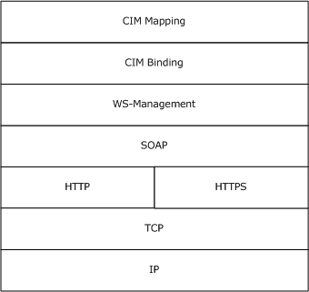
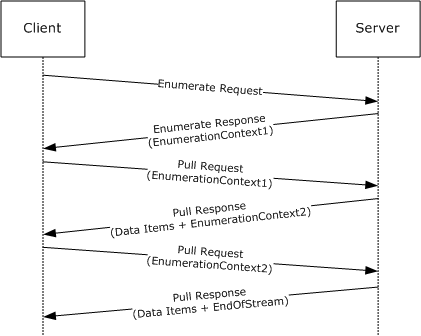

# [MS-WSMAN]: Web Services Management Protocol Extensions for Windows Server 2003

Table of Contents

1 Introduction

- [1 Introduction](#Section_1)
  - [1.1 Glossary](#Section_1.1)
  - [1.2 References](#Section_1.2)
    - [1.2.1 Normative References](#Section_1.2.1)
    - [1.2.2 Informative References](#Section_1.2.2)
  - [1.3 Overview](#Section_1.3)
  - [1.4 Relationship to Other Protocols](#Section_1.4)
  - [1.5 Prerequisites/Preconditions](#Section_1.5)
  - [1.6 Applicability Statement](#Section_1.6)
  - [1.7 Versioning and Capability Negotiation](#Section_1.7)
  - [1.8 Vendor-Extensible Fields](#Section_1.8)
  - [1.9 Standards Assignments](#Section_1.9)

2 Messages

- [2 Messages](#Section_2)
  - [2.1 Transport](#Section_2.1)
  - [2.2 Common Message Syntax](#Section_2.2)
    - [2.2.1 Namespaces](#Section_2.2.1)
    - [2.2.2 Messages](#Section_2.2.2)
      - [2.2.2.1 EmptyMessage](#Section_2.2.2.1)
      - [2.2.2.2 AnyXmlMessage](#Section_2.2.2.2)
      - [2.2.2.3 OptionalXmlMessage](#Section_2.2.2.3)
    - [2.2.3 Elements](#Section_2.2.3)
      - [2.2.3.1 WSManFault](#Section_2.2.3.1)
    - [2.2.4 ComplexTypes](#Section_2.2.4)
      - [2.2.4.1 WSManFaultType](#Section_2.2.4.1)
      - [2.2.4.2 ConfigType](#Section_2.2.4.2)
      - [2.2.4.3 ClientType](#Section_2.2.4.3)
      - [2.2.4.4 ClientUnencryptedType](#Section_2.2.4.4)
      - [2.2.4.5 ClientHTTPType](#Section_2.2.4.5)
      - [2.2.4.6 ClientHTTPSType](#Section_2.2.4.6)
      - [2.2.4.7 ServiceType](#Section_2.2.4.7)
      - [2.2.4.8 ServiceUnencryptedType](#Section_2.2.4.8)
      - [2.2.4.9 ServiceHTTPType](#Section_2.2.4.9)
      - [2.2.4.10 ServiceHTTPSType](#Section_2.2.4.10)
      - [2.2.4.11 ListenerType](#Section_2.2.4.11)
      - [2.2.4.12 ThisType](#Section_2.2.4.12)
    - [2.2.5 Simple Types](#Section_2.2.5)
      - [2.2.5.1 CIM_DateTimeString](#Section_2.2.5.1)
    - [2.2.6 Attributes](#Section_2.2.6)
    - [2.2.7 Groups](#Section_2.2.7)
    - [2.2.8 Attribute Groups](#Section_2.2.8)

3 Protocol Details

- [3 Protocol Details](#Section_3)
  - [3.1 Server Details](#Section_3.1)
    - [3.1.1 Abstract Data Model](#Section_3.1.1)
    - [3.1.2 Timers](#Section_3.1.2)
    - [3.1.3 Initialization](#Section_3.1.3)
    - [3.1.4 Message Processing Events and Sequencing Rules](#Section_3.1.4)
      - [3.1.4.1 Common Message Processing Events and Sequencing Rules](#Section_3.1.4.1)
        - [3.1.4.1.1 XML Namespace Definitions](#Section_3.1.4.1.1)
        - [3.1.4.1.2 wsman:SelectorSet](#Section_3.1.4.1.2)
        - [3.1.4.1.3 wsa:ReplyTo](#Section_3.1.4.1.3)
        - [3.1.4.1.4 wsa:FaultTo](#Section_3.1.4.1.4)
        - [3.1.4.1.5 wsa:MessageID](#Section_3.1.4.1.5)
        - [3.1.4.1.6 wsa:RelatesTo](#Section_3.1.4.1.6)
        - [3.1.4.1.7 wsman:OperationTimeout](#Section_3.1.4.1.7)
        - [3.1.4.1.8 wsen:MaxTime](#Section_3.1.4.1.8)
        - [3.1.4.1.9 wsman:MaxEnvelopeSize](#Section_3.1.4.1.9)
        - [3.1.4.1.10 wsman:Locale](#Section_3.1.4.1.10)
        - [3.1.4.1.11 wsman:OptionSet](#Section_3.1.4.1.11)
        - [3.1.4.1.12 wsman:RequestEPR](#Section_3.1.4.1.12)
        - [3.1.4.1.13 wsman:Filter](#Section_3.1.4.1.13)
        - [3.1.4.1.14 wsen:Pull/wsen:MaxElements](#Section_3.1.4.1.14)
        - [3.1.4.1.15 wsman:RequestTotalItemsCountEstimate](#Section_3.1.4.1.15)
        - [3.1.4.1.16 wsman:OptimizeEnumeration](#Section_3.1.4.1.16)
        - [3.1.4.1.17 wsman:EnumerationMode](#Section_3.1.4.1.17)
        - [3.1.4.1.18 wsman:FragmentTransfer](#Section_3.1.4.1.18)
        - [3.1.4.1.19 Concurrent Operations](#Section_3.1.4.1.19)
        - [3.1.4.1.20 Inbound Message Size](#Section_3.1.4.1.20)
        - [3.1.4.1.21 Fault Detail](#Section_3.1.4.1.21)
        - [3.1.4.1.22 Metadata and Discovery](#Section_3.1.4.1.22)
        - [3.1.4.1.23 Binary Attachments](#Section_3.1.4.1.23)
        - [3.1.4.1.24 Embedded Objects](#Section_3.1.4.1.24)
        - [3.1.4.1.25 CIM XML Namespace](#Section_3.1.4.1.25)
        - [3.1.4.1.26 Arrays](#Section_3.1.4.1.26)
        - [3.1.4.1.27 cim:Location](#Section_3.1.4.1.27)
        - [3.1.4.1.28 wsmb:PolymorphismMode](#Section_3.1.4.1.28)
        - [3.1.4.1.29 Server Configuration](#Section_3.1.4.1.29)
      - [3.1.4.2 Get](#Section_3.1.4.2)
      - [3.1.4.3 Put](#Section_3.1.4.3)
      - [3.1.4.4 Create](#Section_3.1.4.4)
        - [3.1.4.4.1 Messages](#Section_3.1.4.4.1)
      - [3.1.4.5 Delete](#Section_3.1.4.5)
      - [3.1.4.6 Subscribe](#Section_3.1.4.6)
        - [3.1.4.6.1 Messages](#Section_3.1.4.6.1)
      - [3.1.4.7 Unsubscribe](#Section_3.1.4.7)
        - [3.1.4.7.1 Messages](#Section_3.1.4.7.1)
      - [3.1.4.8 Enumerate](#Section_3.1.4.8)
        - [3.1.4.8.1 Messages](#Section_3.1.4.8.1)
      - [3.1.4.9 Pull](#Section_3.1.4.9)
        - [3.1.4.9.1 Messages](#Section_3.1.4.9.1)
      - [3.1.4.10 Release](#Section_3.1.4.10)
        - [3.1.4.10.1 Messages](#Section_3.1.4.10.1)
    - [3.1.5 Timer Events](#Section_3.1.5)
    - [3.1.6 Other Local Events](#Section_3.1.6)
  - [3.2 Client Details](#Section_3.2)
    - [3.2.1 Abstract Data Model](#Section_3.2.1)
    - [3.2.2 Timers](#Section_3.2.2)
    - [3.2.3 Initialization](#Section_3.2.3)
    - [3.2.4 Message Processing Events and Sequencing Rules](#Section_3.2.4)
      - [3.2.4.1 Common Message Processing Events and Sequencing Rules](#Section_3.2.4.1)
        - [3.2.4.1.1 XML Namespace Definitions](#Section_3.2.4.1.1)
        - [3.2.4.1.2 wsa:MessageID](#Section_3.2.4.1.2)
        - [3.2.4.1.3 wsa:RelatesTo](#Section_3.2.4.1.3)
        - [3.2.4.1.4 wsman:OperationTimeout](#Section_3.2.4.1.4)
        - [3.2.4.1.5 wsman:MaxEnvelopeSize](#Section_3.2.4.1.5)
        - [3.2.4.1.6 wsen:Pull/wsen:MaxElements](#Section_3.2.4.1.6)
        - [3.2.4.1.7 Fault Detail](#Section_3.2.4.1.7)
        - [3.2.4.1.8 Metadata and Discovery](#Section_3.2.4.1.8)
        - [3.2.4.1.9 Binary Attachments](#Section_3.2.4.1.9)
        - [3.2.4.1.10 Embedded Objects](#Section_3.2.4.1.10)
        - [3.2.4.1.11 CIM XML Namespace](#Section_3.2.4.1.11)
        - [3.2.4.1.12 Arrays](#Section_3.2.4.1.12)
        - [3.2.4.1.13 cim:Location](#Section_3.2.4.1.13)
        - [3.2.4.1.14 CIM Namespace](#Section_3.2.4.1.14)
        - [3.2.4.1.15 Client Configuration](#Section_3.2.4.1.15)

4 Protocol Examples

- [4 Protocol Examples](#Section_4)
  - [4.1 CIM examples](#Section_4.1)
    - [4.1.1 Retrieving a CIM Instance](#Section_4.1.1)
    - [4.1.2 Enumeration of Instances](#Section_4.1.2)
      - [4.1.2.1 Enumerate Request](#Section_4.1.2.1)
      - [4.1.2.2 Enumerate Response](#Section_4.1.2.2)
      - [4.1.2.3 First Pull Request](#Section_4.1.2.3)
      - [4.1.2.4 First Pull Response](#Section_4.1.2.4)
      - [4.1.2.5 Second Pull Request](#Section_4.1.2.5)
      - [4.1.2.6 Second Pull Response with EndOfSequence](#Section_4.1.2.6)
    - [4.1.3 Modifying an Instance](#Section_4.1.3)
    - [4.1.4 Invoking a Method](#Section_4.1.4)
  - [4.2 Configuration Examples](#Section_4.2)
    - [4.2.1 Retrieving Configuration](#Section_4.2.1)
    - [4.2.2 Modify Configuration](#Section_4.2.2)
  - [4.3 Fault Detail](#Section_4.3)

5 Security

- [5 Security](#Section_5)
  - [5.1 Security Considerations for Implementers](#Section_5.1)
  - [5.2 Index of Security Parameters](#Section_5.2)

6 Appendix A: Full WSDL Definitions

- [6 Appendix A: Full WSDL Definitions](#Section_6)

7 Appendix B: Product Behavior

- [7 Appendix B: Product Behavior](#Section_7)

8 Change Tracking

- [8 Change Tracking](#Section_8)

For the legal notice and IP terms, see [LEGAL.md](../LEGAL.md).
Last updated: 6/1/2017.
See [Revision History](#revision-history) for full version history.

# 1 Introduction

This specification details Microsoft extensions to the Web Services for Management ([**WS-Management**](#gt_ws-management)) Protocol.

WS-Management, as specified in [[DMTF-DSP0226]](https://go.microsoft.com/fwlink/?LinkId=89849), is a general-purpose, [**SOAP**](#gt_soap)-based systems management protocol that defines procedures for carrying out remote management operations.

The extensions include:

- WS-Management configuration extensions. These allow configuration through the WS-Management Protocol.
- WS-Management fault detail extensions. These allow reporting of additional detailed information about the fault.
- Extensions to the WS-Management [**Common Information Model (CIM)**](#gt_common-information-model-cim) Binding Specification as specified in [[DMTF-DSP0227]](https://go.microsoft.com/fwlink/?LinkId=89851) and the WS-Management CIM Mapping Specification as specified in [[DMTF-DSP0230]](https://go.microsoft.com/fwlink/?LinkId=89852). These allow [**CIM objects**](#gt_cim-object) to be accessed using the WS-Management Protocol.
Sections 1.5, 1.8, 1.9, 2, and 3 of this specification are normative. All other sections and examples in this specification are informative.

## 1.1 Glossary

This document uses the following terms:

**action URI**: A [**URI**](#gt_uniform-resource-identifier-uri) that identifies which operation or method needs to be applied to a [**resource**](#gt_resource).

**CIM class**: A [**CIM object**](#gt_cim-object) that represents a [**CIM class**](#gt_cim-class) definition as a [**CIM object**](#gt_cim-object). It is the template representing a [**manageable entity**](#gt_manageable-entity) with a set of [**properties**](#gt_property) and methods.

**CIM method**: An operation describing the behavior of a [**CIM class**](#gt_cim-class) or a CIM instance. It is generally an action that can be performed against the [**manageable entity**](#gt_manageable-entity) made up of a [**CIM class**](#gt_cim-class).

**CIM namespace**: A logical grouping of a set of [**CIM classes**](#gt_015d0e5e-5166-4987-98b9-9c4128cf55be) designed for the same purpose or sharing a common management objective within the database used to store all [**CIM class**](#gt_cim-class) definitions.

**CIM object**: Refers to a [**CIM class**](#gt_cim-class) or a CIM instance.

**client**: The client application using the [**WS-Management**](#gt_ws-management) Protocol to access the management [**service**](#gt_service), on the local or a remote machine.

**Common Information Model (CIM)**: The [**Distributed Management Task Force (DMTF)**](#gt_distributed-management-task-force-dmtf) model that describes how to represent real-world computer and network objects. CIM uses an object-oriented paradigm, where managed objects are modeled using the concepts of classes and instances. See [[DMTF-DSP0004]](https://go.microsoft.com/fwlink/?LinkId=89848).

**Common Information Model (CIM) class**: A collection of [**Common Information Model (CIM)**](#gt_common-information-model-cim) instances that support the same type, that is, the same CIM properties and [**CIM methods**](#gt_cim-method), as specified in [DMTF-DSP0004].

**Common Information Model (CIM) instance**: Provides values for the [**CIM**](#gt_common-information-model-cim) properties associated with the CIM instance's defining [**CIM class**](#gt_cim-class). A CIM instance does not carry values for any other [**CIM**](#gt_common-information-model-cim) properties or [**CIM methods**](#gt_cim-method) that are not defined in (or inherited by) its defining [**CIM class**](#gt_cim-class). For more information, see [DMTF-DSP0004].

**Common Information Model (CIM) namespace**: A logical grouping of a set of [**Common Information Model (CIM)**](#gt_common-information-model-cim) classes designed for the same purpose or sharing a common management objective within the database used to store all CIM class definitions. This is a term mostly referenced in the Windows Management Instrumentation (WMI) implementation.

**Common Information Model (CIM) object**: An object that represents a [**Common Information Model (CIM)**](#gt_common-information-model-cim) object. This can be either a [**CIM class**](#gt_cim-class) or a CIM instance of a [**CIM class**](#gt_cim-class).

**Distributed Management Task Force (DMTF)**: An industry organization that develops management standards and integration technology for enterprise and Internet environments.

**endpoint reference (EPR)**: A combination of WS-Addressing ([[WSAddressing]](https://go.microsoft.com/fwlink/?LinkId=90575)) and [**WS-Management**](#gt_ws-management)–addressing elements that together describe an address for a [**resource**](#gt_resource) in the [**SOAP**](#gt_soap) message header.

**globally unique identifier (GUID)**: A term used interchangeably with universally unique identifier (UUID) in Microsoft protocol technical documents (TDs). Interchanging the usage of these terms does not imply or require a specific algorithm or mechanism to generate the value. Specifically, the use of this term does not imply or require that the algorithms described in [[RFC4122]](https://go.microsoft.com/fwlink/?LinkId=90460) or [[C706]](https://go.microsoft.com/fwlink/?LinkId=89824) must be used for generating the [**GUID**](#gt_globally-unique-identifier-guid). See also universally unique identifier (UUID).

**manageable entity**: A [**Common Information Model (CIM)**](#gt_common-information-model-cim) instance that represents a manageable component of an operating system.

**Managed Object Format (MOF)**: A textual encoding for [**Common Information Model (CIM)**](#gt_common-information-model-cim) objects, this representation is not used within protocol operations defined in [MS-WMI](../MS-WMI/MS-WMI.md). MOF is defined in [DMTF-DSP0004] section 3. The MOF text encoding is only used for illustrative purposes. The binary encoding can be translated to and from the MOF format.

**property**: A name/value pair that describes a unit of data for a class. Property values must have a valid [**Managed Object Format (MOF)**](#gt_managed-object-format-mof) data type.

**resource**: An endpoint that represents a distinct type of management operation or value. A client exposes one or more resources and some resources can have more than one instance. For example, the Win32_LogicalDisk class represents a resource and Win32_LogicalDisk="C:\" is a specific instance of the resource.

**resource URI**: The [**Uniform Resource Identifier (URI)**](#gt_uniform-resource-identifier-uri) that is used to identify a specific type of resource, such as disks or processes, on a network ([[DMTF-DSP0226]](https://go.microsoft.com/fwlink/?LinkId=89849) section 5.1.2.1).

**selector**: A name/value pair that represents a particular instance of a [**resource**](#gt_resource); essentially a filter or "key" that identifies the desired instance of the [**resource**](#gt_resource).

**service**: An application that provides management services to clients through the WS-Management Protocol and other web services.

**SOAP**: A lightweight protocol for exchanging structured information in a decentralized, distributed environment. [**SOAP**](#gt_soap) uses XML technologies to define an extensible messaging framework, which provides a message construct that can be exchanged over a variety of underlying protocols. The framework has been designed to be independent of any particular programming model and other implementation-specific semantics. SOAP 1.2 supersedes SOAP 1.1. See [[SOAP1.2-1/2003]](https://go.microsoft.com/fwlink/?LinkId=90521).

**Uniform Resource Identifier (URI)**: A string that identifies a resource. The URI is an addressing mechanism defined in Internet Engineering Task Force (IETF) Uniform Resource Identifier (URI): Generic Syntax [[RFC3986]](https://go.microsoft.com/fwlink/?LinkId=90453).

**Web Services Description Language (WSDL)**: An XML format for describing network services as a set of endpoints that operate on messages that contain either document-oriented or procedure-oriented information. The operations and messages are described abstractly and are bound to a concrete network protocol and message format in order to define an endpoint. Related concrete endpoints are combined into abstract endpoints, which describe a network service. WSDL is extensible, which allows the description of endpoints and their messages regardless of the message formats or network protocols that are used.

**WS-Management**: A public standard [**SOAP**](#gt_soap)-based protocol for sharing management data among all operating systems, computers, and devices.

**Xml Schema Definition (XSD)**: A namespace-aware and data type–aware XML schema definition language, or an instance of an XML schema written using the language.

**MAY, SHOULD, MUST, SHOULD NOT, MUST NOT:** These terms (in all caps) are used as defined in [[RFC2119]](https://go.microsoft.com/fwlink/?LinkId=90317). All statements of optional behavior use either MAY, SHOULD, or SHOULD NOT.

## 1.2 References

Links to a document in the Microsoft Open Specifications library point to the correct section in the most recently published version of the referenced document. However, because individual documents in the library are not updated at the same time, the section numbers in the documents may not match. You can confirm the correct section numbering by checking the [Errata](http://msdn.microsoft.com/en-us/library/dn781092.aspx).

### 1.2.1 Normative References

We conduct frequent surveys of the normative references to assure their continued availability. If you have any issue with finding a normative reference, please contact [dochelp@microsoft.com](mailto:dochelp@microsoft.com). We will assist you in finding the relevant information.

[DMTF-DSP0004] Distributed Management Task Force, "Common Information Model (CIM) Infrastructure Specification", DSP0004, version 2.3 final, October 2005, [http://www.dmtf.org/standards/published_documents/DSP0004V2.3_final.pdf](https://go.microsoft.com/fwlink/?LinkId=89848)

[DMTF-DSP0226] Distributed Management Task Force, Inc., "Web Services for Management (WS-Management) Specification", version 1.0.0, February 2008, [http://dmtf.org/sites/default/files/standards/documents/DSP0226_1.0.0.pdf](https://go.microsoft.com/fwlink/?LinkId=89849)

[DMTF-DSP0227] Distributed Management Task Force, Inc., "WS-Management CIM Binding Specification", version 1.0.0, June 2009, [http://www.dmtf.org/sites/default/files/standards/documents/DSP0227_1.0.0.pdf](https://go.microsoft.com/fwlink/?LinkId=89851)

[DMTF-DSP0230] Distributed Management Task Force, Inc., "WS-CIM Mapping Specification", Version 1.0.1 April 2009, [http://www.dmtf.org/sites/default/files/standards/documents/DSP0230_1.0.1.pdf](https://go.microsoft.com/fwlink/?LinkId=89852)

[MS-DTYP] Microsoft Corporation, "[Windows Data Types](../MS-DTYP/MS-DTYP.md)".

[MS-WSMV] Microsoft Corporation, "[Web Services Management Protocol Extensions for Windows Vista](../MS-WSMV/MS-WSMV.md)".

[RFC2119] Bradner, S., "Key words for use in RFCs to Indicate Requirement Levels", BCP 14, RFC 2119, March 1997, [http://www.rfc-editor.org/rfc/rfc2119.txt](https://go.microsoft.com/fwlink/?LinkId=90317)

[RFC2459] Housley, R., Ford, W., Polk, W., and Solo, D., "Internet X.509 Public Key Infrastructure Certificate and CRL Profile", RFC 2459, January 1999, [http://www.rfc-editor.org/rfc/rfc2459.txt](https://go.microsoft.com/fwlink/?LinkId=90356)

[RFC2617] Franks, J., Hallam-Baker, P., Hostetler, J., et al., "HTTP Authentication: Basic and Digest Access Authentication", RFC 2617, June 1999, [http://www.rfc-editor.org/rfc/rfc2617.txt](https://go.microsoft.com/fwlink/?LinkId=90373)

[RFC4559] Jaganathan, K., Zhu, L., and Brezak, J., "SPNEGO-based Kerberos and NTLM HTTP Authentication in Microsoft Windows", RFC 4559, June 2006, [http://www.rfc-editor.org/rfc/rfc4559.txt](https://go.microsoft.com/fwlink/?LinkId=90483)

[SOAP1.2-1/2003] Gudgin, M., Hadley, M., Mendelsohn, N., et al., "SOAP Version 1.2 Part 1: Messaging Framework", W3C Recommendation, June 2003, [http://www.w3.org/TR/2003/REC-soap12-part1-20030624](https://go.microsoft.com/fwlink/?LinkId=90521)

[SOAP1.2-Attach/2004] Nielsen, H. F., and Ruellan, H., "SOAP 1.2 Attachment Feature", W3C Working Group Note 8, June 2004, [http://www.w3.org/TR/2004/NOTE-soap12-af-20040608/](https://go.microsoft.com/fwlink/?LinkId=189236)

[WSAddressing] Box, D., et al., "Web Services Addressing (WS-Addressing)", August 2004, [http://www.w3.org/Submission/ws-addressing/](https://go.microsoft.com/fwlink/?LinkId=90575)

[WSDL] Christensen, E., Curbera, F., Meredith, G., and Weerawarana, S., "Web Services Description Language (WSDL) 1.1", W3C Note, March 2001, [http://www.w3.org/TR/2001/NOTE-wsdl-20010315](https://go.microsoft.com/fwlink/?LinkId=90577)

[WSENUM] Alexander, J., Box, D., Cabrera, L.F., et al., "Web Services Enumeration (WS-Enumeration)", March 2006, [http://www.w3.org/Submission/2006/SUBM-WS-Enumeration-20060315/](https://go.microsoft.com/fwlink/?LinkId=90580)

[XMLNS] Bray, T., Hollander, D., Layman, A., et al., Eds., "Namespaces in XML 1.0 (Third Edition)", W3C Recommendation, December 2009, [http://www.w3.org/TR/2009/REC-xml-names-20091208/](https://go.microsoft.com/fwlink/?LinkId=191840)

[XMLSCHEMA1] Thompson, H., Beech, D., Maloney, M., and Mendelsohn, N., Eds., "XML Schema Part 1: Structures", W3C Recommendation, May 2001, [http://www.w3.org/TR/2001/REC-xmlschema-1-20010502/](https://go.microsoft.com/fwlink/?LinkId=90608)

[XMLSCHEMA2] Biron, P.V., Ed. and Malhotra, A., Ed., "XML Schema Part 2: Datatypes", W3C Recommendation, May 2001, [http://www.w3.org/TR/2001/REC-xmlschema-2-20010502/](https://go.microsoft.com/fwlink/?LinkId=90610)

### 1.2.2 Informative References

[MS-WMI] Microsoft Corporation, "[Windows Management Instrumentation Remote Protocol](../MS-WMI/MS-WMI.md)".

## 1.3 Overview

The Web Services Management Protocol Extensions for Windows Server 2003 are a set of modifications to the WS-Management Protocol as specified in [[DMTF-DSP0226]](https://go.microsoft.com/fwlink/?LinkId=89849), the WS-Management CIM Binding Specification as specified in [[DMTF-DSP0227]](https://go.microsoft.com/fwlink/?LinkId=89851), and the WS-CIM Mapping Specification as specified in [[DMTF-DSP0230]](https://go.microsoft.com/fwlink/?LinkId=89852) for compatibility with Windows Server 2003 R2 operating system. Note that conformance to these extensions does not make an implementation compatible with the WS-Management Protocol specifications as currently published by the [**Distributed Management Task Force (DMTF)**](#gt_distributed-management-task-force-dmtf). Instead, conformance makes an implementation compatible with Microsoft's implementation of [**WS-Management**](#gt_ws-management) in Windows Server 2003 R2, which was based on the prerelease drafts of the WS-Management Protocol specifications available at the time Windows Server 2003 R2 was implemented and released.<1>

WS-Management is a remote management protocol that can be used for managing software and hardware components.

The WS-Management Protocol can provide remote access to [**CIM objects**](#gt_cim-object) as specified by [[DMTF-DSP0004]](https://go.microsoft.com/fwlink/?LinkId=89848). WS-Management servers expose a set of entities that can be managed as objects with attributes and methods. WS-Management clients perform management tasks by issuing object operations against objects exposed by WS-Management servers.

The [**CIM**](#gt_common-information-model-cim) management schema provides a standard framework and set of base classes that describe a managed environment. Each type of managed entity is described by a [**CIM class**](#gt_cim-class) and individual entities are managed through instances of the appropriate CIM class. For example, a logical disk drive can be managed through an instance of the CIM_DiskDrive class. This class contains various member [**properties**](#gt_property) such as Name, DeviceID, and Status. On a machine with multiple storage devices, the CIM_DiskDrive class will contain one instance for each storage device. The CIM_DiskDrive class can also be subclassified to add platform-specific properties such as the drive letter used on the Windows platform. CIM class definitions are similar to class definitions in other object-oriented database systems and object-oriented programming languages.

CIM-based management in a Web services environment requires that the CIM schema (classes, properties, and methods) be rendered in both XML Schema and [**Web Services Description Language (WSDL)**](#gt_web-services-description-language-wsdl). To achieve this, the CIM is required to be mapped to WSDL and XML Schema using a translation or mapping algorithm. The WS-CIM Mapping Specification, as specified in [DMTF-DSP0230], specifies the normative rules and recommendations that describe the structure of the XML Schema, WSDL fragments, and metadata fragments corresponding to the elements of CIM models. The WS-CIM Mapping Specification also specifies the representation of [**CIM instances**](#gt_94e80069-5f2a-4281-a676-50ea656c4795) as XML instance documents.

The WS-Management CIM Binding specification, as specified in [DMTF-DSP0227], describes how to name and access CIM entities using the WS-Management Protocol. To query the status of managed entities, the WS-Management Protocol is used to retrieve their CIM instances using operations such as Get and Enumerate. Updates to managed entities are sent using the WS-Management Put operation. To invoke a [**CIM method**](#gt_cim-method), a WS-Management Protocol custom method is used.<2>

The Web Services Management Protocol Extensions for Windows Server 2003 include six sets of changes to the WS-Management Protocol, the WS-Management CIM Binding Specification, and the WS-CIM Mapping Specification:

- Differences in the [**resource Uniform Resource Identifier (URI)**](#gt_resource-uri) prefix used to identify managed entities in the WS-Management Protocol.<3>
- Differences in the XML namespaces for WS-Management and CIM mapping namespaces.
- Differences in element tags.
- New element tags for vendor-extensible tags.
- Unsupported actions and actions with only limited support.
- New data types for configuration of Web Services Management Protocol Extensions for Windows Server 2003 clients and servers.

## 1.4 Relationship to Other Protocols

The WS-Management Protocol uses [**SOAP**](#gt_soap), as specified in [[SOAP1.2-1/2003]](https://go.microsoft.com/fwlink/?LinkId=90521), over HTTP or HTTPS for communication. The WS-Management Protocol, as specified in [[DMTF-DSP0226]](https://go.microsoft.com/fwlink/?LinkId=89849), is required to be used as the transport to provide access to [**CIM**](#gt_common-information-model-cim) data using binding techniques specified by [[DMTF-DSP0227]](https://go.microsoft.com/fwlink/?LinkId=89851) and mapping techniques specified by [[DMTF-DSP0230]](https://go.microsoft.com/fwlink/?LinkId=89852). The Web Services Management Protocol Extensions for Windows Server 2003 specify the differences between the protocols as defined in early drafts and supported in Windows Server 2003 R2 and the protocols as specified in [DMTF-DSP0226], [DMTF-DSP0227], and [DMTF-DSP0230].

The Web Services Management Protocol Extensions for Windows Vista, as specified in [MS-WSMV](../MS-WSMV/MS-WSMV.md), offers a superset of the functionality of this protocol. The usage of the Web Services Management Protocol Extensions for Windows Vista is preferred over this protocol.

The Windows Management Instrumentation Remote Protocol, as described in [MS-WMI](../MS-WMI/MS-WMI.md), is an alternate network protocol for accessing CIM data on servers.

Figure 1: Web Services Management (WS-Management) Protocol stack

## 1.5 Prerequisites/Preconditions

For a client that uses the WS-Management Protocol, as specified in [[DMTF-DSP0226]](https://go.microsoft.com/fwlink/?LinkId=89849), to communicate with a server, the server MUST have an operational SOAP1.2/HTTP1.1/TCP/IP stack. [**WS-Management**](#gt_ws-management) assumes that the client machine already has an IP address and is thus able to communicate on the network. It also assumes that the client has already obtained the IP address and HTTP port of the server by some method such as manual configuration.

## 1.6 Applicability Statement

Web Services Management Protocol Extensions for Windows Server 2003 are protocols for accessing [**CIM objects**](#gt_cim-object) to remotely administer software and hardware configurations.

## 1.7 Versioning and Capability Negotiation

The WS-Management Protocol defines a simple request called Identity to facilitate the process of finding the protocol version or versions supported by the services.<4>

## 1.8 Vendor-Extensible Fields

Web Services Management Protocol Extensions for Windows Server 2003 do not define any vendor-extensible fields.

## 1.9 Standards Assignments

Because Web Services Management Protocol Extensions for Windows Server 2003 are based on prerelease drafts of [[DMTF-DSP0226]](https://go.microsoft.com/fwlink/?LinkId=89849) and [[DMTF-DSP0230]](https://go.microsoft.com/fwlink/?LinkId=89852), they use http://schemas.xmlsoap.org/ws/2005/06/management as the XML namespace for [**WS-Management**](#gt_ws-management) instead of http://schemas.dmtf.org/wbem/wsman/1/wsman.xsd and use http://schemas.dmtf.org/wsman/2005/06/base as the [**CIM**](#gt_common-information-model-cim) XML namespace instead of http://schemas.dmtf.org/wbem/wscim/1/common.

In addition, Web Services Management Protocol Extensions for Windows Server 2003 use cfg:wsman:microsoft.com/wsman/2005/06/config.xsd as the XML namespace for configuration of Web Services Management Protocol Extensions for Windows Server 2003 clients and servers.

**Note** XML namespaces are to be treated as identifiers, and they do not point to any location on the web.

# 2 Messages

## 2.1 Transport

The WS-Management Protocol uses SOAP, as specified in [[SOAP1.2-1/2003]](https://go.microsoft.com/fwlink/?LinkId=90521), over HTTP or HTTPS for communication. The WS-Management Protocol, as specified in [[DMTF-DSP0226]](https://go.microsoft.com/fwlink/?LinkId=89849), MUST be used as the transport to provide access to CIM data using binding techniques specified by [[DMTF-DSP0227]](https://go.microsoft.com/fwlink/?LinkId=89851) and mapping techniques specified by [[DMTF-DSP0230]](https://go.microsoft.com/fwlink/?LinkId=89852).

## 2.2 Common Message Syntax

This section contains common definitions used by this protocol. The syntax of the definitions uses XML Schema, as defined in [[XMLSCHEMA1]](https://go.microsoft.com/fwlink/?LinkId=90608) and [[XMLSCHEMA2]](https://go.microsoft.com/fwlink/?LinkId=90610), and Web Services Description Language, as defined in [[WSDL]](https://go.microsoft.com/fwlink/?LinkId=90577).

The syntax for the messages in the WS-Management Protocol is specified in [[DMTF-DSP0226]](https://go.microsoft.com/fwlink/?LinkId=89849). Web Services Management Protocol Extensions for Windows Server 2003 change the [**resource URI**](#gt_resource-uri) prefix for DMTF-compliant [**CIM classes**](#gt_015d0e5e-5166-4987-98b9-9c4128cf55be), as specified in [[DMTF-DSP0227]](https://go.microsoft.com/fwlink/?LinkId=89851) section 5.1, from http://schemas.dmtf.org/wbem/wscim/1/cim-schema to http://schemas.dmtf.org/wsman/2005/06. Web Services Management Protocol Extensions for Windows Server 2003 define new fault detail data types and rename the cimDateTime type.

**Note** XML namespaces are to be treated as identifiers, and they do not point to any location on the web.

### 2.2.1 Namespaces

This specification defines and references various XML namespaces using the mechanisms specified in [[XMLNS]](https://go.microsoft.com/fwlink/?LinkId=191840). Although this specification associates a specific XML namespace prefix for each XML namespace that is used, the choice of any particular XML namespace prefix is implementation-specific and not significant for interoperability.

The following table shows the standard XML namespaces used within these protocols and the aliases (prefixes) used in the remaining sections of this specification.

| Prefix | XML namespace | Specification |
| --- | --- | --- |
| S | http://www.w3.org/2003/05/soap-envelope | [[SOAP1.2-1/2003]](https://go.microsoft.com/fwlink/?LinkId=90521) |
| Xs | http://www.w3.org/2001/XMLSchema | [[XMLSCHEMA1]](https://go.microsoft.com/fwlink/?LinkId=90608) and [[XMLSCHEMA2]](https://go.microsoft.com/fwlink/?LinkId=90610) |
| xsi | http://www.w3.org/2001/XMLSchema-instance | [XMLSCHEMA1] |
| A | http://schemas.xmlsoap.org/ws/2004/08/addressing | [[WSAddressing]](https://go.microsoft.com/fwlink/?LinkId=90575) section 1.2 |
| W | http://schemas.xmlsoap.org/ws/2005/06/management | [[DMTF-DSP0226]](https://go.microsoft.com/fwlink/?LinkId=89849) section 1.5 |
| wsmanfault | http://schemas.microsoft.com/ws/2005/06/wsmanfault | Section [2.2.4.1](#Section_2.2.4.1) |
| cim | http://schemas.dmtf.org/wsman/2005/06/base | [[DMTF-DSP0230]](https://go.microsoft.com/fwlink/?LinkId=89852) section 5.3 |

### 2.2.2 Messages

| Message | Description |
| --- | --- |
| EmptyMessage | A message that contains nothing in the SOAP Body. |
| AnyXmlMessage | A message that contains resource-specific XML in the SOAP Body. |
| OptionalXmlMessage | A message that can contain either nothing or resource-specific XML in the SOAP Body. |

#### 2.2.2.1 EmptyMessage

EmptyMessage is used to describe messages that contain nothing in the SOAP Body. EmptyMessage is used by the Web Services Management Protocol Extensions for Windows Server 2003 in the following messages:

| Message Type | Action URI |
| --- | --- |
| Request | http://schemas.xmlsoap.org/ws/2004/09/transfer/Delete |

The message MUST be as follows.

<wsdl:message name="EmptyMessage" />

#### 2.2.2.2 AnyXmlMessage

AnyXmlMessage is used to describe messages that contain resource-specific XML in the SOAP Body. AnyXmlMessage is used by the Web Services Management Protocol Extensions for Windows Server 2003 in the following messages:

| Message Type | Action URI |
| --- | --- |
| Response | http://schemas.xmlsoap.org/ws/2004/09/transfer/GetResponse |
| Request | http://schemas.xmlsoap.org/ws/2004/09/transfer/Put |
| Request | http://schemas.xmlsoap.org/ws/2004/09/transfer/Create |

The message MUST be as follows.

<wsdl:message name="AnyXmlMessage">

<wsdl:part name="body" type="wst:AnyXmlType" />

</wsdl:message>

**body**: Contains XML that represents the [**resource**](#gt_resource) being acted upon. The actual XML content is dependent upon the specific resource and is not defined by Web Services Management Protocol Extensions for Windows Server 2003.

#### 2.2.2.3 OptionalXmlMessage

OptionalXmlMessage is used to describe messages that either contain nothing in the SOAP Body or that contain resource-specific XML in the SOAP Body. OptionalXmlMessage is used by the Web Services Management Protocol Extensions for Windows Server 2003 in the following messages:

| Message Type | Action URI |
| --- | --- |
| Request | http://schemas.xmlsoap.org/ws/2004/09/transfer/Get |
| Response | http://schemas.xmlsoap.org/ws/2004/09/transfer/PutResponse |
| Response | http://schemas.xmlsoap.org/ws/2004/09/transfer/DeleteResponse |

The message MUST be as follows.

<wsdl:message name="OptionalXmlMessage">

<wsdl:part name="body" type="wst:AnyXmlOptionalType" />

</wsdl:message>

**body**: Either contains XML that represents the [**resource**](#gt_resource) being acted upon or is empty. If present, the actual XML content is dependent upon the specific resource and is not defined by Web Services Management Protocol Extensions for Windows Server 2003.

### 2.2.3 Elements

The following table summarizes the set of common XML schema element definitions defined by this specification. XML element definitions that are specific to a particular operation are described with the operation.

| Element | Description |
| --- | --- |
| WSManFault | Contains additional fault information reported by the service. |

#### 2.2.3.1 WSManFault

A [**SOAP**](#gt_soap) fault is used to carry error information within a SOAP message. Faults are returned when the SOAP message is successfully delivered by the transport and processed by the services but the message cannot be processed properly.

The WS-Management Protocol defines an extensibility model that allows a [**service**](#gt_service) to include additional fault information in the <s:Detail> element. Web Services Management Protocol Extensions for Windows Server 2003 defines <WSManFault> for reporting additional fault information. The schema for <WSManFault> MUST be as follows.

<xs:schema xmlns:xs="http://www.w3.org/2001/XMLSchema"

xmlns:wsmanfault="http://schemas.microsoft.com/ws/2005/06/wsmanfault"

targetNamespace="http://schemas.microsoft.com/ws/2005/06/wsmanfault"

elementFormDefault="qualified" attributeFormDefault="unqualified">

<xs:element name="WSManFault" type="wsmanfault:WSManFaultType"/>

</xs:schema>

### 2.2.4 ComplexTypes

The following table summarizes the set of common XML Schema complex type definitions defined by this specification. XML Schema complex type definitions that are specific to a particular operation are described with the operation.

| Complex Type | Description |
| --- | --- |
| [WSManFaultType](#Section_2.2.4.1) | Contains additional fault information reported by the service. |
| [ConfigType](#Section_2.2.4.2) | The overall container for the Web Services Management Protocol Extensions for Windows Server 2003 clients' and servers' configuration. |
| [ClientType](#Section_2.2.4.3) | The overall container for the Web Services Management Protocol Extensions for Windows Server 2003 client configuration. |
| [ClientUnencryptedType](#Section_2.2.4.4) | Used to configure the authentication mechanisms that are enabled or disabled on the Web Services Management Protocol Extensions for Windows Server 2003 client when using HTTP as the network transport. |
| [ClientHTTPType](#Section_2.2.4.5) | Used to configure the Web Services Management Protocol Extensions for Windows Server 2003 client when using HTTP as the network transport. |
| [ClientHTTPSType](#Section_2.2.4.6) | Used to configure the authentication mechanisms that are enabled or disabled on the Web Services Management Protocol Extensions for Windows Server 2003 client when using HTTPS as the network transport. |
| [ServiceType](#Section_2.2.4.7) | The overall container for the Web Services Management Protocol Extensions for Windows Server 2003 [**service**](#gt_service) configuration. |
| [ServiceUnencryptedType](#Section_2.2.4.8) | Used to configure the authentication mechanisms that are enabled or disabled on the Web Services Management Protocol Extensions for Windows Server 2003 server when using HTTP as the network transport. |
| [ServiceHTTPType](#Section_2.2.4.9) | Used to configure the Web Services Management Protocol Extensions for Windows Server 2003 service when using HTTP as the network transport. |
| ServiceHTTPSType | Used to configure the authentication mechanisms that are enabled or disabled on the Web Services Management Protocol Extensions for Windows Server 2003 server when using HTTPS as the network transport. |
| [ListenerType](#Section_2.2.4.10) | Used to listen on one or more IP addresses for Web Services Management Protocol Extensions for Windows Server 2003 requests. |
| [ThisType](#Section_2.2.4.12) | Used to send information about the vendor and version of the protocol stack. |

#### 2.2.4.1 WSManFaultType

A [**SOAP**](#gt_soap) fault is used to carry error information within a SOAP message. Faults are returned when the SOAP message is successfully delivered by the transport and processed by the services but the message cannot be processed properly.

The WS-Management Protocol defines an extensibility model that allows a [**service**](#gt_service) to include additional fault information in the s:Detail element. Web Services Management Protocol Extensions for Windows Server 2003 define WSManFaultType for reporting additional fault information. The schema for WSManFaultType MUST be as follows.

<xs:schema xmlns:xs="http://www.w3.org/2001/XMLSchema"

xmlns:wsmanfault="http://schemas.microsoft.com/ws/

2005/06/wsmanfault"

targetNamespace="http://schemas.microsoft.com/ws/2005/

06/wsmanfault"

elementFormDefault="qualified"

attributeFormDefault="unqualified">

<xs:complexType name="WSManFaultType">

<xs:sequence>

<xs:element name="Message"

type="wsmanfault:MessageType"

minOccurs="0"/>

</xs:sequence>

<xs:attribute name="Code" type="xs:unsignedInt"

use="required"/>

<xs:attribute name="Machine" type="xs:string"

use="required"/>

<xs:anyAttribute processContents="lax"/>

</xs:complexType>

<xs:complexType name="ProviderFaultType"

mixed="true">

<xs:sequence>

<xs:any processContents="lax" minOccurs="0"

maxOccurs="unbounded"/>

</xs:sequence>

<xs:anyAttribute processContents="lax"/>

</xs:complexType>

<xs:complexType name="MessageType" mixed="true">

<xs:sequence>

<xs:element name="ProviderFault"

type="wsmanfault:ProviderFaultType" minOccurs="0"/>

</xs:sequence>

</xs:complexType>

</xs:schema>

**Code**: An integer that MUST specify the Windows error code value.

**Machine**: A string that MUST specify the machine name where this fault occurred.

**Message**: A complex type that allows mixed content. It can contain a sequence of elements of type ProviderFault and text that contains a user-friendly description of the fault. Each ProviderFault element contains resource-specific fault information. ProviderFault can contain a sequence of elements of xs:any type.

Web Services Management Protocol Extensions for Windows Server 2003 servers MUST include either a Message element of xs:string type that contains a user-friendly description of the error or a ProviderFault element that MUST contain WSManFault element of type WSManFaultType. This WSManFault element MUST contain a Message element of xs:string type that contains a user-friendly description of the error.

**WSManFault**: A complex type that contains a sequence of messages, code, and the machine information.

**ProviderFault**: An element that MUST contain specific [**resource**](#gt_resource) provider fault information.

#### 2.2.4.2 ConfigType

ConfigType is the overall container for the Web Services Management Protocol Extensions for Windows Server 2003 clients' and servers' configuration. Note that listeners are not part of this configuration and have to be retrieved separately. The schema MUST be as follows.

<xs:schema xmlns:cfg="wsman:microsoft.com/wsman/2005/06

/config.xsd"

xmlns:xs="http://www.w3.org/2001/XMLSchema"

targetNamespace="wsman:microsoft.com/wsman/2005/06/

config.xsd"

elementFormDefault="qualified">

<xs:element name="Config" type="cfg:ConfigType"/>

<xs:complexType name="ConfigType">

<xs:sequence>

<xs:element name="MaxEnvelopeSizekb"

type="xs:unsignedInt" default="50"/>

<xs:element name="MaxTimeoutms"

type="xs:unsignedInt"

default="60000"/>

<xs:element name="MaxBatchItems"

type="xs:unsignedInt"

default="20"/>

<xs:element name="SoapTraceEnabled"

type="xs:boolean"

default="false"/>

<xs:element name="MaxProviderRequests"

type="xs:unsignedInt" default="25"/>

<xs:element name="Client"

type="cfg:ClientType"/>

<xs:element name="Service"

type="cfg:ServiceType"/>

</xs:sequence>

</xs:complexType>

</xs:schema>

**The MaxEnvelopeSizekb**: Maximum [**SOAP**](#gt_soap) data in kilobytes. The minimum value MUST be 8. The maximum value MUST be 4294967295 (232 - 1). This configuration setting is used when processing the wsman:MaxEnvelopeSize header as specified in section [3.1.4.1.9](#Section_3.1.4.1.9).

**MaxTimeoutms**: The maximum time-out in milliseconds that MUST be used for any request. The minimum value MUST be 500. The maximum value MUST be 4294967295 (232 - 1). This configuration setting is used in the following cases:

- When setting the wsman:OperationTimeout header on all client requests, as specified in section [3.2.4.1.4](#Section_3.2.4.1.4).
- When processing the wsman:OperationTimeout header for all client requests, as specified in section [3.1.4.1.7](#Section_3.1.4.1.7).
- When processing the wsen:MaxTime header for all Pull requests, as specified in section [3.1.4.1.8](#Section_3.1.4.1.8).
**MaxBatchItems**: The maximum number of elements that MUST be used in a Pull response. The minimum value MUST be 1. The maximum value MUST be 4294967295 (232 - 1). This configuration setting is used when processing Pull messages as specified in section [3.1.4.1.14](#Section_3.1.4.1.14).

**SoapTraceEnabled**: Enables or disables tracing of SOAP messages in Web Services Management Protocol Extensions for Windows Server 2003 clients and servers. MUST be true or false.

**MaxProviderRequests**: The maximum number of concurrent requests that MUST be allowed by the Web Services Management Protocol Extensions for Windows Server 2003 servers. The minimum value MUST be 1. The maximum value MUST be 4294967295 (232 - 1). The limit is applied per provider. The categories include [**CIM**](#gt_common-information-model-cim) and configuration. This configuration setting is used when processing messages as specified in section [3.1.4.1.19](#Section_3.1.4.1.19).

**Client**: MUST contain additional elements to configure Web Services Management Protocol Extensions for Windows Server 2003 clients as specified in section [2.2.4](#Section_1.3).

**Service**: MUST contain additional elements to configure Web Services Management Protocol Extensions for Windows Server 2003 servers as specified in section 2.2.4.

#### 2.2.4.3 ClientType

ClientType is the overall container for the Web Services Management Protocol Extensions for Windows Server 2003 client configuration. The schema MUST be as follows.

<xs:complexType name="ClientType">

<xs:sequence>

<xs:element name="NetworkDelayms"

type="xs:unsignedInt"

default="5000"/>

<xs:element name="URLPrefix"

type="xs:string" default="wsman"/>

<xs:element name="HTTP"

type="cfg:ClientHTTPType"/>

<xs:element name="HTTPS"

type="cfg:ClientHTTPSType"/>

</xs:sequence>

</xs:complexType>

**NetworkDelayms**: Extra time in milliseconds that the Web Services Management Protocol Extensions for Windows Server 2003 client MUST wait to accommodate network delay time. The minimum value MUST be 500. The maximum value MUST be 4294967295 (232 – 1).

**URLPrefix**: Default [**URI**](#gt_uniform-resource-identifier-uri) prefix that MUST be used by Web Services Management Protocol Extensions for Windows Server 2003 clients when sending requests. MUST NOT be blank. MUST be a string containing only the characters a-zA-Z9-0_/ and MUST NOT start with or end with '/'.

**HTTP**: MUST contain an additional element to configure behavior for HTTP transport as specified in section [2.2.4.5](#Section_2.2.4.5).

**HTTPS**: MUST contain an additional element to configure behavior for HTTPS transport as specified in section [2.2.4.6](#Section_2.2.4.6).

#### 2.2.4.4 ClientUnencryptedType

ClientUnencryptedType is used to configure the authentication mechanisms that are enabled or disabled on the Web Services Management Protocol Extensions for Windows Server 2003 client when using HTTP as the network transport. The schema MUST be as follows.

<xs:complexType name="ClientUnencryptedType">

<xs:sequence>

<xs:element name="Basic"

type="xs:boolean" default="false"/>

<xs:element name="Digest"

type="xs:boolean" default="false"/>

<xs:element name="Negotiate"

type="xs:boolean" default="false"/>

</xs:sequence>

</xs:complexType>

**Basic**: Enables or disables HTTP Basic Authentication (as specified in [[RFC2617]](https://go.microsoft.com/fwlink/?LinkId=90373) section 2). MUST be true or false.

**Digest**: Enables or disables HTTP Digest Authentication (as specified in [RFC2617] section 3). MUST be true or false.

**Negotiate**: Enables or disables HTTP Negotiate Authentication (as specified in [[RFC4559]](https://go.microsoft.com/fwlink/?LinkId=90483) section 4). MUST be true or false.

These configuration settings MUST be used when sending messages as specified in section [3.2.4.1.15](#Section_3.2.4.1.15).<5>

#### 2.2.4.5 ClientHTTPType

ClientHTTPType is used to configure the Web Services Management Protocol Extensions for Windows Server 2003 client when using HTTP as the network transport. The schema MUST be as follows.

<xs:complexType name="ClientHTTPType">

<xs:sequence>

<xs:element name="Port"

type="xs:unsignedInt" default="80"/>

<xs:element name="Unencrypted"

type="cfg:ClientUnencryptedType"/>

</xs:sequence>

</xs:complexType>

**Port**: MUST be used by the client when using HTTP protocol. The minimum value MUST be 1 and the maximum value MUST be 65535.

**Unencrypted**: MUST contain an additional element to configure unencrypted authentication as specified in section [3.1.4.1.29](#Section_3.1.4.1.29).

#### 2.2.4.6 ClientHTTPSType

The ClientHTTPSType element is used to configure the port that is used and the authentication mechanisms that are enabled or disabled on the Web Services Management Protocol Extensions for Windows Server 2003 client when using HTTPS as the network transport. The schema MUST be as follows.

<xs:complexType name="ClientHTTPSType">

<xs:sequence>

<xs:element name="Port"

type="xs:unsignedInt" default="443"/>

<xs:element name="Basic"

type="xs:boolean" default="true"/>

<xs:element name="Digest"

type="xs:boolean" default="true"/>

<xs:element name="Negotiate"

type="xs:boolean" default="true"/>

</xs:sequence>

</xs:complexType>

**Port**: MUST be port used by the Web Services Management Protocol Extensions for Windows Server 2003 client when using HTTPS protocol. The minimum value MUST be 1. The maximum value MUST be 65535.

**Basic**: Enables or disables HTTP Basic Authentication (as specified in [[RFC2617]](https://go.microsoft.com/fwlink/?LinkId=90373) section 2). MUST be true or false.

**Digest**: Enables or disables HTTP Digest Authentication (as specified in [RFC2617] section 3). MUST be true or false.

**Negotiate**: Enables or disables HTTP Negotiate Authentication (as specified in [[RFC4559]](https://go.microsoft.com/fwlink/?LinkId=90483) section 4). MUST be true or false.

These configuration settings MUST be used when sending messages as specified in section [3.2.4.1.15](#Section_3.2.4.1.15).

#### 2.2.4.7 ServiceType

ServiceType is the overall container for the Web Services Management Protocol Extensions for Windows Server 2003 server configuration. Note that listeners are not part of this container and MUST be retrieved separately. The schema MUST be as follows.

<xs:schema xmlns:cfg="wsman:microsoft.com/wsman/2005/

06/config.xsd"

xmlns:xs="http://www.w3.org/2001/XMLSchema"

targetNamespace="wsman:microsoft.com/wsman/2005/06/

config.xsd"

elementFormDefault="qualified">

<xs:element name="Service" type="cfg:ServiceType"/>

<xs:complexType name="ServiceType">

<xs:sequence>

<xs:element name="RootSDDL" type="xs:string"

default="O:NSG:BAD:P(A;;GA;;;BA)S:P

(AU;FA;GA;;;WD)

(AU;SA;GWGX;;;WD)"/>

<xs:element name="MaxConcurrentOperations"

type="xs:unsignedInt"

default="100"/>

<xs:element name="EnumerationTimeoutms"

type="xs:unsignedInt"

default="60000"/>

<xs:element name="MaxClientCertInfoSize"

type="xs:unsignedInt"

default="16384"/>

<xs:element name="MaxConnections"

type="xs:unsignedInt"

default="5"/>

<xs:element name="HTTP"

type="cfg:ServiceHTTPType"/>

<xs:element name="HTTPS"

type="cfg:ServiceHTTPSType"/>

</xs:sequence>

</xs:complexType>

</xs:schema>

**RootSDDL**: The security descriptor controls remote access to the listener. The string format of RootSDDL MUST use the syntax defined by the Security Descriptor Description Language (SDDL) (as specified in [MS-DTYP](../MS-DTYP/MS-DTYP.md)). This configuration setting MUST be used when processing messages as specified in section [5.1](#Section_5).

**MaxConcurrentOperations**: MUST be the maximum number of concurrent Enumeration operations allowed. The minimum value MUST be 1. The maximum value MUST be 4294967295 (232 – 1). This configuration setting MUST be used when processing messages as specified in section [3.1.4.1.19](#Section_3.1.4.1.19).

**EnumerationTimeoutms**: MUST be the idle time-out in milliseconds between Enumeration, Pull, and Release request messages. The minimum value MUST be 500. The maximum value MUST be 4294967295 (232 – 1). This configuration setting MUST be used when processing messages as specified in section [3.1.5](#Section_3.1.5).

**MaxConnections**: MUST be the maximum number of active requests that the [**service**](#gt_service) can process simultaneously. The minimum value MUST be 1. The maximum value MUST be 50. This configuration setting MUST be used when processing messages as specified in section 3.1.4.1.19.

**HTTP**: MUST contain an additional element to configure HTTP transport as specified in section [2.2.4.9](#Section_2.2.4.9).

**HTTPS**: MUST contain an additional element to configure HTTPS transport as specified in section [2.2.4.10](#Section_2.2.4.10).

#### 2.2.4.8 ServiceUnencryptedType

ServiceUnencryptedType is used to configure the authentication mechanisms that are enabled or disabled on the Web Services Management Protocol Extensions for Windows Server 2003 server when using HTTP as the network transport. The schema MUST be as follows.

<xs:complexType name="ServiceUnencryptedType">

<xs:sequence>

<xs:element name="Basic"

type="xs:boolean" default="false"/>

<xs:element name="Negotiate"

type="xs:boolean" default="false"/>

</xs:sequence>

</xs:complexType>

**Basic**: Enables or disables HTTP Basic Authentication (see [[RFC2617]](https://go.microsoft.com/fwlink/?LinkId=90373) section 2).

**Negotiate**: Enables or disables HTTP Negotiate Authentication (see [[RFC4559]](https://go.microsoft.com/fwlink/?LinkId=90483) section 4).

#### 2.2.4.9 ServiceHTTPType

ServiceHTTPType is used to configure the authentication mechanisms that are enabled or disabled on the Web Services Management Protocol Extensions for Windows Server 2003 server when using HTTP as the network transport. The schema MUST be as follows.

<xs:complexType name="ServiceHTTPType">

<xs:sequence>

<xs:element name="Unencrypted"

type="cfg:ServiceUnencryptedType"/>

</xs:sequence>

</xs:complexType>

**Unencrypted**: MUST contain an additional element to configure unencrypted authentication as described in section [3.1.4.1.29](#Section_3.1.4.1.29).

These configuration settings MUST be used when sending messages as specified in section 3.1.4.1.29.

#### 2.2.4.10 ServiceHTTPSType

ServiceHTTPSType is used to configure the authentication mechanisms that are enabled or disabled on the Web Services Management Protocol Extensions for Windows Server 2003 server when using HTTPS as the network transport. The schema MUST be as follows.

<xs:complexType name="ServiceHTTPSType">

<xs:sequence>

<xs:element name="Basic"

type="xs:boolean" default="true"/>

<xs:element name="Negotiate"

type="xs:boolean" default="true"/>

</xs:sequence>

</xs:complexType>

**Basic**: Enables or disables HTTP Basic Authentication (as specified in [[RFC2617]](https://go.microsoft.com/fwlink/?LinkId=90373) section 2). MUST be true or false.

**Negotiate**: Enables or disables HTTP Negotiate Authentication (as specified in [[RFC4559]](https://go.microsoft.com/fwlink/?LinkId=90483) section 4). MUST be true or false.

These configuration settings MUST be used when sending messages as specified in section [3.1.4.1.29](#Section_3.1.4.1.29).

#### 2.2.4.11 ListenerType

ListenerType is used by Web Services Management Protocol Extensions for Windows Server 2003 servers to listen on one or more IP addresses for WS-Management Protocol requests. ListenerType can be configured for HTTP or HTTPS on a specific IP or on an IP associated with a message authentication code (MAC) address. The schema MUST be as follows.

<xs:schema xmlns:cfg="wsman:microsoft.com/wsman/2005

/06/config.xsd"

xmlns:xs="http://www.w3.org/2001/XMLSchema"

targetNamespace="wsman:microsoft.com/wsman/2005/06/

config.xsd"

elementFormDefault="qualified">

<xs:element name="Listener" type="cfg:ListenerType"/>

<xs:complexType name="ListenerType">

<xs:sequence>

<xs:element name="IP" type="xs:string"/>

<xs:element name="Port" type="xs:unsignedInt"/>

<xs:element name="Hostname" type="xs:string"/>

<xs:element name="Enabled" type="xs:boolean"

default="true"

minOccurs="0"/>

<xs:element name="URLPrefix" type="xs:string"

default="wsman"

minOccurs="0"/>

<xs:element name="Transport" type="xs:string"/>

<xs:element name="CertificateThumbprint"

type="xs:string"

minOccurs="0"/>

<xs:element name="MACAddress"

type="xs:string" minOccurs="0"/>

</xs:sequence>

</xs:complexType>

</xs:schema>

**IP**: IP address for which this listener MUST be created. The value MAY be a static IP address either in IPv4 dotted-decimal format or in IPv6 colon-delimited hexadecimal format, or the literal string "*".

**Port**: The TCP port for which this listener MUST be created. The minimum value MUST be 1 and the maximum value MUST be 65535.

**Hostname**: MUST be the Host name of the machine where the [**WS-Management**](#gt_ws-management) [**service**](#gt_service) is running.

**Enabled**: Indicates whether the listener is enabled or disabled.

**URLPrefix**: MUST be the [**URI**](#gt_uniform-resource-identifier-uri) prefix on which to accept HTTP or HTTPS requests. MUST NOT be blank. MUST be a string containing only the characters a-zA-Z9-0_/ and MUST NOT start with or end with '/'. For example, if the machine name is SampleMachine, the WS-Management client specifies http://SampleMachine/<URLPrefix> in the destination address.

**Transport**: The transport used to send and receive WS-Management Protocol requests and responses. The values MUST be either HTTP or HTTPS.

**CertificateThumbprint:** MUST contain the SHA-1 hash of the certificate as a 40-digit hexadecimal number. This MUST be required if the transport is HTTPS.

**MACAddress**: MUST be the Media Access Control (MAC) address of the network interface card (NIC). Listeners MAY be defined for a specific IP address or for all IP addresses associated with a specific MAC address. Required if IP is "*". MUST be a sequence of six or eight pairs of case-insensitive hexadecimal digits separated by "-" (for example, 32-a3-58-90-be-cc).

These configuration settings MUST be used when processing messages as described in section [3.1.4.1.29](#Section_3.1.4.1.29).

#### 2.2.4.12 ThisType

ThisType is used by the Web Services Management Protocol Extensions for Windows Server 2003 server to send information about the vendor and version of the protocol stack. The schema MUST be as follows.

<xs:schema xmlns:t="http://schemas.xmlsoap.org/ws/2005

/06/management

/this" xmlns:xs="http://www.w3.org/2001/XMLSchema"

targetNamespace="http://schemas.xmlsoap.org/ws/2005/

06/management/this"

elementFormDefault="qualified">

<xs:element name="This"/>

<xs:complexType name="ThisType">

<xs:sequence>

<xs:element name="Vendor" type="xs:string"/>

<xs:element name="Version" type="xs:string"/>

</xs:sequence>

</xs:complexType>

</xs:schema>

**Vendor**: MUST be a vendor name.<6>

**Version**: MUST be a string that describes the version of the WS-Management Protocol stack. This is intended for diagnostic purposes only and not for version negotiation.<7>

### 2.2.5 Simple Types

The following table summarizes the set of common XML Schema simple type definitions defined by this specification. XML Schema simple type definitions that are specific to a particular operation are described with the operation.

| Simple type | Description |
| --- | --- |
| CIM_DateTimeString | Used to specify a time stamp (point in time) or an interval. |

#### 2.2.5.1 CIM_DateTimeString

The [**CIM**](#gt_common-information-model-cim) specification defines the DateTime type for specifying a time stamp (point in time) or an interval. If it specifies a time stamp, it allows preservation of the time zone offset. In both cases, DateTime allows specification of varying precision of the date and time information. WS-CIM mapping specification [[DMTF-DSP0230]](https://go.microsoft.com/fwlink/?LinkId=89852) section 6.1 specifies cim:cimDateTime type for mapping DateTime to XML. Web Services Management Protocol Extensions for Windows Server 2003 rename the CIM_DateTime element of cim:cimDateTime specified in [DMTF-DSP0230] section 6.1 to CIM_DateTimeString. Web Services Management Protocol Extensions for Windows Server 2003 servers do not support negative time stamps, which are cim:cimDateTime values that start with a dash ("–").

### 2.2.6 Attributes

This specification does not define any common XML Schema group definitions.

### 2.2.7 Groups

This specification does not define any common XML Schema group definitions.

### 2.2.8 Attribute Groups

This specification does not define any common XML Schema attribute group definitions.

# 3 Protocol Details

The WS-Management Protocol, as specified in [[DMTF-DSP0226]](https://go.microsoft.com/fwlink/?LinkId=89849), describes a general SOAP-based protocol for managing PCs, servers, devices, Web services and other applications, and other [**manageable entities**](#gt_manageable-entity).

## 3.1 Server Details

This section describes changes to the WS-Management Protocol for Web Services Management Protocol Extensions for Windows Server 2003 servers.

### 3.1.1 Abstract Data Model

Web Services Management Protocol Extensions for Windows Server 2003 includes no changes to the abstract data model of the WS-Management Protocol as specified in [[DMTF-DSP0226]](https://go.microsoft.com/fwlink/?LinkId=89849).

### 3.1.2 Timers

Web Services Management Protocol Extensions for Windows Server 2003 defines one timer in addition to the timers of the WS-Management Protocol as specified in [[DMTF-DSP0226]](https://go.microsoft.com/fwlink/?LinkId=89849):

- The [Enumeration Garbage Collection timer](#Section_3.1.5) MUST trigger cleanup of the state associated with an enumeration, if a client has not used it recently.

### 3.1.3 Initialization

Web Services Management Protocol Extensions for Windows Server 2003 includes no changes to the initialization of the WS-Management Protocol as specified in [[DMTF-DSP0226]](https://go.microsoft.com/fwlink/?LinkId=89849).

### 3.1.4 Message Processing Events and Sequencing Rules

This section describes changes made by Web Services Management Protocol Extensions for Windows Server 2003 servers to the message processing of the WS-Management Protocol as specified in [[DMTF-DSP0226]](https://go.microsoft.com/fwlink/?LinkId=89849).

The following table summarizes the list of WSDL operations as defined by this specification:

| Operation | Description |
| --- | --- |
| Get | Used to fetch the current representation of a resource. |
| Put | Used to update a resource by providing a replacement representation or a set of replacement values. |
| Create | Used to create a resource and provide its initial representation. |
| Delete | Used to delete a resource. |
| Subscribe | Used to create a subscription to have event notifications delivered. |
| Unsubscribe | Used to cancel an existing subscription. |
| Enumerate | Begins the enumeration of a set of resources. |
| Pull | Used to retrieve resources from an existing enumeration. |
| Release | Used to cancel an existing enumeration. |

#### 3.1.4.1 Common Message Processing Events and Sequencing Rules

This section describes protocol details that are common across all WSDL operations.

##### 3.1.4.1.1 XML Namespace Definitions

The XML namespace for the WS-Management Protocol is specified in [[DMTF-DSP0226]](https://go.microsoft.com/fwlink/?LinkId=89849) section 1.5 as http://schemas.dmtf.org/wbem/wsman/1/wsman.xsd. Web Services Management Protocol Extensions for Windows Server 2003 replace http://schemas.dmtf.org/wbem/wsman/1/wsman.xsd with http://schemas.xmlsoap.org/wsman/2005/06/management as the XML namespace for WS-Management Protocol.

Web Services Management Protocol Extensions for Windows Server 2003 servers MUST use the http://schemas.xmlsoap.org/wsman/2005/06/management prefix instead of the http://schemas.dmtf.org/wbem/wsman/1/wsman.xsd.

**Note** XML namespaces are to be treated as identifiers, and they do not point to any location on the web.

##### 3.1.4.1.2 wsman:SelectorSet

The WS-Management Protocol, as specified in [[DMTF-DSP0226]](https://go.microsoft.com/fwlink/?LinkId=89849), defines [**selector**](#gt_selector) as a resource-relative name/value pair that acts as an instance-level discriminant. SelectorSet MUST be a set of these selectors as specified in [DMTF-DSP0226] section 5.1.2.

In [DMTF-DSP0226] section 5.1.2.2, rule R5.1.2.2-1 specifies that the selector names and values can be treated as case-insensitive or case-sensitive.

Web Services Management Protocol Extensions for Windows Server 2003 servers MUST treat all selector names and values as case-insensitive.

##### 3.1.4.1.3 wsa:ReplyTo

The WS-Management Protocol, as specified in [[DMTF-DSP0226]](https://go.microsoft.com/fwlink/?LinkId=89849), allows the ReplyTo header value to be either a valid address for a new connection using any transport supported by the [**service**](#gt_service) or the [**URI**](#gt_uniform-resource-identifier-uri) http://schemas.xmlsoap.org/ws/2004/08/addressing/role/anonymous, as specified in [DMTF-DSP0226] section 2.5.

Web Services Management Protocol Extensions for Windows Server 2003 servers MUST return a wsman:UnsupportedFeature fault with a detail code of wsman:faultDetail/AddressingMode if they receive a value other than http://schemas.xmlsoap.org/ws/2004/08/addressing/role/anonymous in the ReplyTo header.

##### 3.1.4.1.4 wsa:FaultTo

The WS-Management Protocol, as specified in [[DMTF-DSP0226]](https://go.microsoft.com/fwlink/?LinkId=89849), allows a conformant [**service**](#gt_service) to require that all faults be delivered to the client over the same transport or connection on which the request arrives. In this case, the [**URI**](#gt_uniform-resource-identifier-uri) MUST be http://schemas.xmlsoap.org/ws/2004/08/addressing/role/anonymous, as specified in [DMTF-DSP0226] section 5.4.3.

Web Services Management Protocol Extensions for Windows Server 2003 servers MUST return the wsman:UnsupportedFeature fault with a detail code of wsman:faultDetail/AddressingMode if the wsa:Address element within the wsa:FaultTo is not set to http://schemas.xmlsoap.org/ws/2004/08/addressing/role/anonymous.

##### 3.1.4.1.5 wsa:MessageID

The WS-Management Protocol, as specified in [[DMTF-DSP0226]](https://go.microsoft.com/fwlink/?LinkId=89849), endorses two different MessageID [**URI**](#gt_uniform-resource-identifier-uri) formats, as specified in [DMTF-DSP0226] section 2.7.

Web Services Management Protocol Extensions for Windows Server 2003 servers MUST use only the uuid:xxxxxxxx-xxxx-xxxx-xxxx-xxxxxxxxxxxx MessageID format.

##### 3.1.4.1.6 wsa:RelatesTo

The WS-Management Protocol, as specified in section 2.4 of [[DMTF-DSP0226]](https://go.microsoft.com/fwlink/?LinkId=89849), endorses two different *RelatesTo* [**URI**](#gt_uniform-resource-identifier-uri) formats. For more details, see section 2.7 of [DMTF-DSP0226]. Web Services Management Protocol Extensions for Windows Server 2003 servers MUST use only the **uuid:xxxxxxxx-xxxx-xxxx-xxxx-xxxxxxxxxxxx***RelatesTo* format.

##### 3.1.4.1.7 wsman:OperationTimeout

The WS-Management Protocol, as specified in [[DMTF-DSP0226]](https://go.microsoft.com/fwlink/?LinkId=89849), defines the OperationTimeout value to indicate that the clients expect a response or a fault within the specified time, as specified in [DMTF-DSP0226] section 6.1.

Web Services Management Protocol Extensions for Windows Server 2003 servers MUST set the default time-out value to the value of the MaxTimeoutms configuration setting defined in section [2.2.4.2](#Section_2.2.4.2) if no OperationTimeout value is specified by the client or if the OperationTimeout value is more than this setting. Web Services Management Protocol Extensions for Windows Server 2003 servers SHOULD NOT support nonzero year and nonzero month values in the **OperationTimeout** field.

##### 3.1.4.1.8 wsen:MaxTime

The WS-Enumeration specification defines the MaxTime value to indicate that the clients receive a response or a fault for Pull responses within the specified time, as specified in [[WSENUM]](https://go.microsoft.com/fwlink/?LinkId=90580) section 3.2.

Web Services Management Protocol Extensions for Windows Server 2003 servers MUST set the default time-out value of Pull responses to the MaxTime value, if no [wsman:OperationTimeout](#Section_3.1.4.1.7) is specified in the client request. However, if neither this value, nor wsman:OperationTimeout is specified by the client, or if the MaxTime value is more than the MaxTimeoutms value, as specified in section [2.2.4.2](#Section_2.2.4.2), then the server MUST use the MaxTimeoutms value for the Pull response time-out.

##### 3.1.4.1.9 wsman:MaxEnvelopeSize

The WS-Management Protocol, as specified in [[DMTF-DSP0226]](https://go.microsoft.com/fwlink/?LinkId=89849), defines the MaxEnvelopeSize value to indicate that the client expect a response to be no larger than the given number of octets, as specified in [DMTF-DSP0226] section 6.2.

Web Services Management Protocol Extensions for Windows Server 2003 servers MUST set the default MaxEnvelopeSize value to the value of the MaxEnvelopeSizekb configuration setting (defined in section [2.2.4.2](#Section_2.2.4.2)) multiplied by 1,024 if no MaxEnvelopeSize value is specified by the client or if the MaxEnvelopeSize value is more than this setting.

WS-Management [DMTF-DSP0226] section 6.2 indicates that servers SHOULD return a wsman:EncodingLimit fault if the value of wsman:MaxEnvelopeSize is less than 8,192 octets. Web Services Management Protocol Extensions for Windows Server 2003 servers MUST return the indicated fault in this situation.<8>

##### 3.1.4.1.10 wsman:Locale

The WS-Management Protocol, as specified in [[DMTF-DSP0226]](https://go.microsoft.com/fwlink/?LinkId=89849), defines the Locale element, which specifies the language that the client requests (and sometimes requires) the response text to be translated into, as specified in [DMTF-DSP0226] section 3.3.

Web Services Management Protocol Extensions for Windows Server 2003 servers MUST return a fault of wsman:UnsupportedFeature with a detail code of wsman:faultDetail/Locale if the **mustUnderstand** attribute of this element is "true".

##### 3.1.4.1.11 wsman:OptionSet

The WS-Management Protocol, as specified in [[DMTF-DSP0226]](https://go.microsoft.com/fwlink/?LinkId=89849), defines the OptionSet element as a set of switches to the [**service**](#gt_service) to modify or refine the nature of the request, as specified in [DMTF-DSP0226] section 3.4.

Web Services Management Protocol Extensions for Windows Server 2003 servers SHOULD not process the OptionSet element unless mustUnderstand="true", in which case they will return an s:NotUnderstood fault as required by [[SOAP1.2-1/2003]](https://go.microsoft.com/fwlink/?LinkId=90521).

##### 3.1.4.1.12 wsman:RequestEPR

The WS-Management Protocol, as specified in [[DMTF-DSP0226]](https://go.microsoft.com/fwlink/?LinkId=89849), defines the RequestEPR [**SOAP**](#gt_soap) header, which can be used by client that require the [**Endpoint Reference (EPR)**](#gt_endpoint-reference-epr) in the response, as specified in [DMTF-DSP0226] section 6.5.

Web Services Management Protocol Extensions for Windows Server 2003 servers SHOULD not process the RequestEPR header unless mustUnderstand="true", in which case they will return an s:NotUnderstood fault as required by [[SOAP1.2-1/2003]](https://go.microsoft.com/fwlink/?LinkId=90521).

##### 3.1.4.1.13 wsman:Filter

The [**WS-Management**](#gt_ws-management) specification defines the Filter element, which is used to retrieve a subset of the result set, as specified in [[DMTF-DSP0226]](https://go.microsoft.com/fwlink/?LinkId=89849) section 8.3.

Web Services Management Protocol Extensions for Windows Server 2003 servers MUST fault if the request contains the Filter element.<9>

##### 3.1.4.1.14 wsen:Pull/wsen:MaxElements

The MaxElements element is used to limit the number of items retrieved in a single message, as specified in [[WSENUM]](https://go.microsoft.com/fwlink/?LinkId=90580) section 3.2.

Web Services Management Protocol Extensions for Windows Server 2003 servers MUST use the smaller value of the MaxBatchItems configuration setting (defined in section [2.2.4.2](#Section_2.2.4.2)) and the value of wsen:MaxElements as the effective value of wsen:MaxElements. The maximum number of items that is returned in a single Pull response message is determined by the smaller of the MaxBatchItems configuration settings on the server and the value of the wsen:MaxElements element in the Pull request message.

##### 3.1.4.1.15 wsman:RequestTotalItemsCountEstimate

The [**WS-Management**](#gt_ws-management) specification defines the RequestTotalItemsCountEstimate [**SOAP**](#gt_soap) header to allow a client to request an estimate for the number of items being returned in the result set, as specified in [[DMTF-DSP0226]](https://go.microsoft.com/fwlink/?LinkId=89849) section 5.2.2.

Web Services Management Protocol Extensions for Windows Server 2003 servers SHOULD ignore the RequestTotalItemsCountEstimate header.

##### 3.1.4.1.16 wsman:OptimizeEnumeration

The [**WS-Management**](#gt_ws-management) specification defines the optional element OptimizeEnumeration to allow a client to request that initial results be returned in the enumeration response, as specified in [[DMTF-DSP0226]](https://go.microsoft.com/fwlink/?LinkId=89849) section 5.2.3.

Web Services Management Protocol Extensions for Windows Server 2003 servers SHOULD ignore the OptimizeEnumeration element.

##### 3.1.4.1.17 wsman:EnumerationMode

The [**WS-Management**](#gt_ws-management) specification defines the optional EnumerationMode element to allow a client to specify whether the actual objects, the [**EPR**](#gt_endpoint-reference-epr) of the object, or both the EPR and the object are returned, as specified in [[DMTF-DSP0226]](https://go.microsoft.com/fwlink/?LinkId=89849) section 5.7.

Web Services Management Protocol Extensions for Windows Server 2003 servers SHOULD ignore the EnumerationMode element and SHOULD support the enumeration of objects only.

##### 3.1.4.1.18 wsman:FragmentTransfer

The WS-Management Protocol, as specified in [[DMTF-DSP0226]](https://go.microsoft.com/fwlink/?LinkId=89849), defines the FragmentTransfer [**SOAP**](#gt_soap) header, which is used to retrieve and update fragments or individual elements of a [**CIM object**](#gt_cim-object), as specified in [DMTF-DSP0226] section 7.7.

Web Services Management Protocol Extensions for Windows Server 2003 servers SHOULD ignore the FragmentTransfer header unless mustUnderstand="true", in which case they return an s:NotUnderstood fault as required by [[SOAP1.2-1/2003]](https://go.microsoft.com/fwlink/?LinkId=90521).

##### 3.1.4.1.19 Concurrent Operations

A Web Services Management Protocol Extensions for Windows Server 2003 server MUST reject additional requests if it is already processing a number of concurrent requests equal to the MaxConnections configuration setting defined in section [2.2.4.7](#Section_2.2.4.7).

A Web Services Management Protocol Extensions for Windows Server 2003 server MUST reject additional Enumerate requests if it has a number of outstanding enumerations equal to the MaxConcurrentOperations configuration setting defined in section 2.2.4.7.

A Web Services Management Protocol Extensions for Windows Server 2003 server MUST reject additional requests to a specific provider if the provider is already processing a number of concurrent requests equal to the MaxProviderRequests configuration setting defined in section [2.2.4.2](#Section_2.2.4.2).

##### 3.1.4.1.20 Inbound Message Size

Web Services Management Protocol Extensions for Windows Server 2003 servers MUST return an HTTP status of 413 (Request Entity Too Large) without processing the [**SOAP**](#gt_soap) message if the request packet from the client is larger than the MaxEnvelopeSizekb configuration setting defined in section [2.2.4.2](#Section_2.2.4.2).

##### 3.1.4.1.21 Fault Detail

The [**WS-Management**](#gt_ws-management) specification allows servers to specify additional fault details as part of [**SOAP**](#gt_soap) faults that it generates, as specified in [[DMTF-DSP0226]](https://go.microsoft.com/fwlink/?LinkId=89849) section 11. The [**URI**](#gt_uniform-resource-identifier-uri) prefix for fault detail is http://schemas.dmtf.org/wbem/wsman/1/wsman/faultDetail.

Web Services Management Protocol Extensions for Windows Server 2003 servers MUST use the wsman:faultDetail prefix instead of the http://schemas.dmtf.org/wbem/wsman/1/wsman/faultDetail prefix.

**Note** XML namespaces are to be treated as identifiers, and they do not point to any location on the web.

##### 3.1.4.1.22 Metadata and Discovery

The [**WS-Management**](#gt_ws-management) specification defines a mechanism to determine the existence of a WS-Management [**service**](#gt_service) on a server, as specified in [[DMTF-DSP0226]](https://go.microsoft.com/fwlink/?LinkId=89849) section 11.

Web Services Management Protocol Extensions for Windows Server 2003 servers SHOULD NOT use the WS-Management discovery mechanism specified in [DMTF-DSP0226] section 11.

Web Services Management Protocol Extensions for Windows Server 2003 servers MUST respond to the Identify request specified in [DMTF-DSP0226] section 11 with a [ThisType](#Section_2.2.4.12) response as defined in section 2.2.4.12.<10><11>

Web Services Management Protocol Extensions for Windows Server 2003 servers also MUST respond to a WS-Management Get operation sent to the wsman:system/2005/06/this resource URI with a ThisType response as defined in section 2.2.4.12.

##### 3.1.4.1.23 Binary Attachments

The WS-Management Protocol defines a mechanism to send binary attachments, as specified in [[DMTF-DSP0226]](https://go.microsoft.com/fwlink/?LinkId=89849) section 13.5.

Web Services Management Protocol Extensions for Windows Server 2003 servers MUST NOT send binary attachments.

##### 3.1.4.1.24 Embedded Objects

The WS-CIM Mapping Specification defines how one object can be embedded in another object, as specified in [[DMTF-DSP0230]](https://go.microsoft.com/fwlink/?LinkId=89852) section 7.2.5.

Web Services Management Protocol Extensions for Windows Server 2003 servers MUST NOT send embedded objects as attachments (as specified in [[SOAP1.2-Attach/2004]](https://go.microsoft.com/fwlink/?LinkId=189236)).

##### 3.1.4.1.25 CIM XML Namespace

The WS-CIM Mapping Specification defines the [**CIM**](#gt_common-information-model-cim) XML namespace as http://schemas.dmtf.org/wbem/wscim/1/common, as specified in [[DMTF-DSP0230]](https://go.microsoft.com/fwlink/?LinkId=89852) section 5.3.

Web Services Management Protocol Extensions for Windows Server 2003 servers MUST use http://schemas.dmtf.org/wsman/2005/06/base as the [**Common Information Model (CIM) namespace**](#gt_common-information-model-cim-namespace) instead of http://schemas.dmtf.org/wbem/wscim/1/common.

**Note** XML namespaces are to be treated as identifiers, and they do not point to any location on the web.

##### 3.1.4.1.26 Arrays

The WS-CIM Mapping Specification defines specific rules for mapping [**CIM**](#gt_common-information-model-cim) [**properties**](#gt_property) that are arrays, as specified in [[DMTF-DSP0230]](https://go.microsoft.com/fwlink/?LinkId=89852) section 7.2.2.

Web Services Management Protocol Extensions for Windows Server 2003 servers MUST NOT send null array elements. Web Services Management Protocol Extensions for Windows Server 2003 servers MUST indicate null arrays by including the element one time with the xsi:nil attribute set to "true".

##### 3.1.4.1.27 cim:Location

The WS-CIM Mapping Specification defines rules for representing a [**CIM object**](#gt_cim-object) in XML, as specified in [[DMTF-DSP0230]](https://go.microsoft.com/fwlink/?LinkId=89852) section 7.

Web Services Management Protocol Extensions for Windows Server 2003 extend the object XML with an extra child element that describes the [**EPR**](#gt_endpoint-reference-epr) of the object.

Web Services Management Protocol Extensions for Windows Server 2003 servers MUST add a cim:Location element of type wsa:EndpointReferenceType, as specified in [[WSAddressing]](https://go.microsoft.com/fwlink/?LinkId=90575) section 2.2, specifying the EPR of an object to the instance element when responding to Get, Put, or Pull requests. Web Services Management Protocol Extensions for Windows Server 2003 servers MUST ignore the cim:Location when processing a Put request.

##### 3.1.4.1.28 wsmb:PolymorphismMode

A common way to extend [**CIM classes**](#gt_015d0e5e-5166-4987-98b9-9c4128cf55be) is to define derivatives of the [**CIM class**](#gt_cim-class). When a client requests objects of the type for CIM_Process, it is possible to return instances that are actually of a derived type such as Vendor_Process. The WS-Management [**CIM**](#gt_common-information-model-cim) Binding Specification defines details for handling polymorphism in the resultSet, as specified in [[DMTF-DSP0227]](https://go.microsoft.com/fwlink/?LinkId=89851) section 8.1.

Web Services Management Protocol Extensions for Windows Server 2003 servers MUST ignore the PolymorphismMode element.

Web Services Management Protocol Extensions for Windows Server 2003 servers MUST return instances of both base and derived classes by effectively casting derived objects to the base class. Each returned instance MUST contain only the [**properties**](#gt_property) of the base class and omit the properties from the derived classes.

##### 3.1.4.1.29 Server Configuration

The wsman:microsoft.com/wsman/2005/06/config resource URI MUST be used to retrieve the complete configuration of Web Services Management Protocol Extensions for Windows Server 2003 servers. The configuration is grouped under separate XML elements; further URIs are exposed to allow easier and more finely grained levels of retrieval and updates.

The wsman:microsoft.com/wsman/2005/06/config/service resource URI MUST be used to configure the server.

The wsman:microsoft.com/wsman/2005/06/config/service/http/unencrypted resource URI MUST be used to configure the authentication mechanisms supported by a server when using HTTP. If a client application tries to use an authentication scheme that is not enabled on the server, the request MUST fail with an error.

Web Services Management Protocol Extensions for Windows Server 2003 servers MUST NOT use wsman:secprofile/http/basic as an authentication scheme if the Basic [**property**](#gt_property) in the cfg:ServiceHTTPType is false.<12>

Web Services Management Protocol Extensions for Windows Server 2003 servers MUST NOT use wsman:secprofile/http/spnego-kerberos as an authentication scheme if the Negotiate property in the cfg:ServiceHTTPType is false.

Web Services Management Protocol Extensions for Windows Server 2003 servers MAY use wsman:secprofile/http/digest as an authentication scheme.<13>

The wsman:microsoft.com/wsman/2005/06/config/service/https resource URI MUST be used to configure the authentication mechanisms supported by a server when using HTTPS. If a client application tries to use an authentication scheme that is not enabled on the server, the request MUST fail with an error.

Web Services Management Protocol Extensions for Windows Server 2003 servers MUST NOT use wsman:secprofile/https/basic as an authentication scheme if the Basic property in the cfg:ServiceHTTPSType is false.<14>

Web Services Management Protocol Extensions for Windows Server 2003 servers MUST NOT use wsman:secprofile/https/spnego-kerberos as an authentication scheme if the Negotiate property in the cfg:ServiceHTTPSType is false.

Web Services Management Protocol Extensions for Windows Server 2003 servers MAY use wsman:secprofile/https/digest as an authentication scheme.<15>

The wsman:microsoft.com/wsman/2005/06/config/listener resource URI MUST be used for configuring the server to listen on the network for WS-Management requests. By default, the server is configured with no listeners, resulting in no remote configuration of the machine using WS-Management. This means that no remote configuration can be done initially until some form of configuration is performed locally.

Enumeration can be used to retrieve all listeners configured on the server. The IP and Port properties that are returned with each of the objects can be used as selectors to address the specific configuration item for updates.

To retrieve and modify the configuration of an individual listener, the listener instance MUST be referenced by a selector. The following properties, which are part of cfg:ListenerType, are the selectors.

| Selector name | Description |
| --- | --- |
| IP | The IP address that the server is configured to listen on. |
| Port | The Port that the server is configured to listen on. |

If and only if the Enabled property is true, Web Services Management Protocol Extensions for Windows Server 2003 servers MUST listen on the network on the port given by the Port property and MUST only process requests sent to a configured destination IP address and addressed to the path given by the URIPrefix property.

When considering destination IP addresses, Web Services Management Protocol Extensions for Windows Server 2003 servers MUST listen on a specific IP address (if the IP address property is a valid IP address) or on all IP addresses associated with the value of the MACAddress property (if the IP address property is "*").

Web Services Management Protocol Extensions for Windows Server 2003 servers MUST return a SOAP fault in response to a Put request if the Transport property is HTTPS and the certificate identified by the CertificateThumbprint property does not exist or the CN attribute of the certificate's Subject field (as specified in [[RFC2459]](https://go.microsoft.com/fwlink/?LinkId=90356) section 4.1.2.6) does not match the Hostname property.

#### 3.1.4.2 Get

Web Services Management Protocol Extensions for Windows Server 2003 MUST support the Get operation, using the following [**Action URI**](#gt_action-uri)s as specified in [[DMTF-DSP0226]](https://go.microsoft.com/fwlink/?LinkId=89849):

http://schemas.xmlsoap.org/ws/2004/09/transfer/Get

http://schemas.xmlsoap.org/ws/2004/09/transfer/GetResponse

Web Services Management Protocol Extensions for Windows Server 2003 includes no changes specific to the Get operation from WS-Management Protocol as specified in [DMTF-DSP0226], except as noted in section [3.1.4.1](#Section_3.1.4.1).

The set of resource URIs on which Web Services Management Protocol Extensions for Windows Server 2003 servers MUST support the Get operation is defined in the following table, and where relevant, the [**Xml Schema Definition (XSD)**](#gt_xml-schema-definition-xsd) type for the data that is passed as part of the request or response is referenced.

| Resource URI | Input data type | Output data type |
| --- | --- | --- |
| wsman:microsoft.com/wsman/2005/06/config | None | cfg:ConfigType |
| wsman:microsoft.com/wsman/2005/06/config/client | None | cfg:ClientType |
| wsman:microsoft.com/wsman/2005/06/config/client/http | None | cfg:ClientHTTPType |
| wsman:microsoft.com/wsman/2005/06/config/client/http/unencrypted | None | cfg:ClientUnencryptedType |
| wsman:microsoft.com/wsman/2005/06/config/client/https | None | cfg:ClientHTTPSType |
| wsman:microsoft.com/wsman/2005/06/config/service | None | cfg:ServiceType |
| wsman:microsoft.com/wsman/2005/06/config/service/http | None | cfg:ServiceHTTPType |
| wsman:microsoft.com/wsman/2005/06/config/service/http/unencrypted | None | cfg:ServiceUnencryptedType |
| wsman:microsoft.com/wsman/2005/06/config/service/https | None | cfg:ServiceHTTPSType |
| wsman:microsoft.com/wsman/2005/06/config/listener | None | cfg:ListenerType |
| wsman:system/2005/06/this | None | W:ThisType |

#### 3.1.4.3 Put

Web Services Management Protocol Extensions for Windows Server 2003 MUST support the Put operation, using the following [**Action URI**](#gt_action-uri)s as specified in [[DMTF-DSP0226]](https://go.microsoft.com/fwlink/?LinkId=89849):

http://schemas.xmlsoap.org/ws/2004/09/transfer/Put

http://schemas.xmlsoap.org/ws/2004/09/transfer/PutResponse

Web Services Management Protocol Extensions for Windows Server 2003 includes no changes specific to the Put operation from WS-Management Protocol as specified in [DMTF-DSP0226], except as noted in section [3.1.4.1](#Section_3.1.4.1).

The set of resource URIs on which Web Services Management Protocol Extensions for Windows Server 2003 servers MUST support the Put operation is defined in the following table, and where relevant, the [**Xml Schema Definition (XSD)**](#gt_xml-schema-definition-xsd) type for the data that is passed as part of the request or response is referenced.

| Resource URI | Input data type | Output data type |
| --- | --- | --- |
| wsman:microsoft.com/wsman/2005/06/config | cfg:ConfigType | cfg:ConfigType |
| wsman:microsoft.com/wsman/2005/06/config/client | cfg:ClientType | cfg:ClientType |
| wsman:microsoft.com/wsman/2005/06/config/client/http | cfg:ClientHTTPType | cfg:ClientHTTPType |
| wsman:microsoft.com/wsman/2005/06/config/client/http/unencrypted | cfg:ClientUnencryptedType | cfg:ClientUnencryptedType |
| wsman:microsoft.com/wsman/2005/06/config/client/https | cfg:ClientHTTPSType | cfg:ClientHTTPSType |
| wsman:microsoft.com/wsman/2005/06/config/service | cfg:ServiceType | cfg:ServiceType |
| wsman:microsoft.com/wsman/2005/06/config/service/http | cfg:ServiceHTTPType | cfg:ServiceHTTPType |
| wsman:microsoft.com/wsman/2005/06/config/service/http/unencrypted | cfg:ServiceUnencryptedType | cfg:ServiceUnencryptedType |
| wsman:microsoft.com/wsman/2005/06/config/service/https | cfg:ServiceHTTPSType | cfg:ServiceHTTPSType |
| wsman:microsoft.com/wsman/2005/06/config/listener | cfg:ListenerType | cfg:ListenerType |

#### 3.1.4.4 Create

Web Services Management Protocol Extensions for Windows Server 2003 MUST support the Create operation, using the following [**Action URI**](#gt_action-uri)s as specified in [[DMTF-DSP0226]](https://go.microsoft.com/fwlink/?LinkId=89849):

http://schemas.xmlsoap.org/ws/2004/09/transfer/Create

http://schemas.xmlsoap.org/ws/2004/09/transfer/CreateResponse

Web Services Management Protocol Extensions for Windows Server 2003 includes no changes specific to the Create operation from WS-Management Protocol as specified in [DMTF-DSP0226], except as noted in section [3.1.4.1](#Section_3.1.4.1).

##### 3.1.4.4.1 Messages

The following table summarizes the set of WSDL message definitions that are specific to this operation.

| Message | Description |
| --- | --- |
| CreateResponseMessage | A message that contains resource-specific XML in the Soap body representing a newly-created resource. |

#### 3.1.4.5 Delete

Web Services Management Protocol Extensions for Windows Server 2003 MUST support the Delete operation, using the following [**Action URI**](#gt_action-uri)s as specified in [[DMTF-DSP0226]](https://go.microsoft.com/fwlink/?LinkId=89849):

http://schemas.xmlsoap.org/ws/2004/09/transfer/Delete

http://schemas.xmlsoap.org/ws/2004/09/transfer/DeleteResponse

Web Services Management Protocol Extensions for Windows Server 2003 includes no changes specific to the Delete operation from WS-Management Protocol as specified in [DMTF-DSP0226], except as noted in section [3.1.4.1](#Section_3.1.4.1).

The set of resource URIs on which Web Services Management Protocol Extensions for Windows Server 2003 servers MUST support the Delete operation is defined in the following table, and where relevant, the [**Xml Schema Definition (XSD)**](#gt_xml-schema-definition-xsd) type for the data that is passed as part of the request or response is referenced.

| Resource URI | Input data type | Output data type |
| --- | --- | --- |
| wsman:microsoft.com/wsman/2005/06/config/listener | None | None |

#### 3.1.4.6 Subscribe

Web Services Management Protocol Extensions for Windows Server 2003 operating system MAY support the Subscribe operation, using the following [**Action URI**](#gt_action-uri)s as specified in [[DMTF-DSP0226]](https://go.microsoft.com/fwlink/?LinkId=89849):

http://schemas.xmlsoap.org/ws/2004/08/eventing/Subscribe

http://schemas.xmlsoap.org/ws/2004/08/eventing/SubscribeResponse

Web Services Management Protocol Extensions for Windows Server 2003 includes no changes specific to the Subscribe operation from WS-Management Protocol as specified in [DMTF-DSP0226], except as noted in Section 3.1.4.1.

##### 3.1.4.6.1 Messages

The following table summarizes the set of WSDL message definitions that are specific to this operation.

| Message | Description |
| --- | --- |
| SubscribeMsg | A message used to subscribe to have notifications delivered. |
| SubscribeResponseMsg | A message used in response to a request to have notifications delivered. |

#### 3.1.4.7 Unsubscribe

Web Services Management Protocol Extensions for Windows Server 2003 MAY support the Unsubscribe operation, using the following [**Action URI**](#gt_action-uri)s as specified in [[DMTF-DSP0226]](https://go.microsoft.com/fwlink/?LinkId=89849):

http://schemas.xmlsoap.org/ws/2004/08/eventing/Unsubscribe

http://schemas.xmlsoap.org/ws/2004/08/eventing/UnsubscribeResponse

Web Services Management Protocol Extensions for Windows Server 2003 includes no changes specific to the Unsubscribe operation from WS-Management Protocol as specified in [DMTF-DSP0226], except as noted in Section 3.1.4.1.

##### 3.1.4.7.1 Messages

The following table summarizes the set of WSDL message definitions that are specific to this operation.

| Message | Description |
| --- | --- |
| UnsubscribeMsg | A message used to cancel a subscription. |
| UnsubscribeResponseMsg | A message used in response to a request to cancel a subscription. |

#### 3.1.4.8 Enumerate

Web Services Management Protocol Extensions for Windows Server 2003 MUST support the Enumerate operation, using the following [**Action URI**](#gt_action-uri)s as specified in [[DMTF-DSP0226]](https://go.microsoft.com/fwlink/?LinkId=89849):

http://schemas.xmlsoap.org/ws/2004/09/enumeration/Enumerate

http://schemas.xmlsoap.org/ws/2004/09/enumeration/EnumerateResponse

Web Services Management Protocol Extensions for Windows Server 2003 includes no changes specific to the Enumerate operation from WS-Management Protocol as specified in [DMTF-DSP0226], except as noted in Section [3.1.4.1](#Section_3.1.4.1).

The set of resource URIs on which Web Services Management Protocol Extensions for Windows Server 2003 servers MUST support the Enumerate operation is defined in the following table, and where relevant, the [**Xml Schema Definition (XSD)**](#gt_xml-schema-definition-xsd) type for the data that is passed as part of the request or response is referenced.

| Resource URI | Input data type | Output data type |
| --- | --- | --- |
| wsman:microsoft.com/wsman/2005/06/config/listener | None | None |

##### 3.1.4.8.1 Messages

The following table summarizes the set of WSDL message definitions that are specific to this operation.

| Message | Description |
| --- | --- |
| EnumerateMessage | A message used to enumerate a set of resources. |
| EnumerateResponseMessage | A message used in response to a request to enumerate a set of resources. |

#### 3.1.4.9 Pull

Web Services Management Protocol Extensions for Windows Server 2003 MUST support the Pull operation, using the following [**Action URI**](#gt_action-uri)s as specified in [[DMTF-DSP0226]](https://go.microsoft.com/fwlink/?LinkId=89849):

http://schemas.xmlsoap.org/ws/2004/09/enumeration/Pull

http://schemas.xmlsoap.org/ws/2004/09/enumeration/PullResponse

Web Services Management Protocol Extensions for Windows Server 2003 includes no changes specific to the Pull operation from WS-Management Protocol as specified in [DMTF-DSP0226], except as noted in section [3.1.4.1](#Section_3.1.4.1).

The set of resource URIs on which Web Services Management Protocol Extensions for Windows Server 2003 servers MUST support the Pull operation is defined in the following table, and where relevant, the [**Xml Schema Definition (XSD)**](#gt_xml-schema-definition-xsd) type for the data that is passed as part of the request or response is referenced.

| Resource URI | Input data type | Output data type |
| --- | --- | --- |
| wsman:microsoft.com/wsman/2005/06/config/listener | None | cfg:ListenerType |

When a request is received from the server to enumerate the existing listeners, the set of listeners SHOULD be returned exactly as they were created by using Create requests. A listener that is created SHOULD NOT be split into multiple instances. For example, if a Create request creates a listener with the IP field equal to "*", then a Pull request SHOULD return that instance without substituting the value "*" with a set of specific IP addresses.

##### 3.1.4.9.1 Messages

The following table summarizes the set of WSDL message definitions that are specific to this operation.

| Message | Description |
| --- | --- |
| PullMessage | A message used to retrieve a set of resources that are being enumerated. |
| PullResponseMessage | A message used in response to a request for a set of resources that are being enumerated. |

#### 3.1.4.10 Release

Web Services Management Protocol Extensions for Windows Server 2003 MUST support the Release operation, using the following [**Action URI**](#gt_action-uri)s as specified in [[DMTF-DSP0226]](https://go.microsoft.com/fwlink/?LinkId=89849):

http://schemas.xmlsoap.org/ws/2004/09/enumeration/Release

http://schemas.xmlsoap.org/ws/2004/09/enumeration/ReleaseResponse

Web Services Management Protocol Extensions for Windows Server 2003 includes no changes specific to the Release operation from WS-Management Protocol as specified in [DMTF-DSP0226], except as noted in Section [3.1.4.1](#Section_3.1.4.1).

##### 3.1.4.10.1 Messages

The following table summarizes the set of WSDL message definitions that are specific to this operation.

| Message | Description |
| --- | --- |
| ReleaseMessage | A message used to indicate that the enumeration of a set of resources is no longer needed. |
| ReleaseResponseMessage | A message used in response to an indication that the enumeration of a set of resources is no longer needed. |

### 3.1.5 Timer Events

The Enumeration Garbage Collection timer MUST be started by the Web Services Management Protocol Extensions for Windows Server 2003 server when it sends an EnumerationResponse or a PullResponse message, unless the server is sending an EnumerationResponse or a PullResponse message because of a timeout event, as specified by [wsman:OperationTimeout (section 3.1.4.1.7)](#Section_3.1.4.1.7) or [wsen:MaxTime (section 3.1.4.1.8)](#Section_3.1.4.1.8) as appropriate. In these timeout events, the server MUST end the enumeration request altogether. There MUST be a unique timer for each enumeration. Upon receipt of a Pull or Release request, the Enumeration Garbage Collection timer for that enumeration MUST be canceled.

The Enumeration Garbage Collection timer MUST expire after the number of milliseconds given by the EnumerationTimeoutms configuration setting defined in section [2.2.4.7](#Section_2.2.4.7). Upon expiration of this timer, the Web Services Management Protocol Extensions for Windows Server 2003 server MUST return a wsen:InvalidEnumerationContext fault in response to a Pull or Release request that contains the enumeration context value of the last PullResponse message or the EnumerateResponse if no PullResponse messages were sent.

### 3.1.6 Other Local Events

Web Services Management Protocol Extensions for Windows Server 2003 servers define no further local events.

## 3.2 Client Details

This section describes changes to the WS-Management Protocol for Web Services Management Protocol Extensions for Windows Server 2003 [**clients**](#gt_client).

### 3.2.1 Abstract Data Model

Web Services Management Protocol Extensions for Windows Server 2003 includes no changes to the abstract data model of the WS-Management Protocol as specified in [[DMTF-DSP0226]](https://go.microsoft.com/fwlink/?LinkId=89849).

### 3.2.2 Timers

Web Services Management Protocol Extensions for Windows Server 2003 includes no client changes to the timers of the WS-Management Protocol as specified in [[DMTF-DSP0226]](https://go.microsoft.com/fwlink/?LinkId=89849).

### 3.2.3 Initialization

Web Services Management Protocol Extensions for Windows Server 2003 includes no changes to the initialization of the WS-Management Protocol as specified in [[DMTF-DSP0226]](https://go.microsoft.com/fwlink/?LinkId=89849).

### 3.2.4 Message Processing Events and Sequencing Rules

This section describes changes made by Web Services Management Protocol Extensions for Windows Server 2003 clients to the message processing of the WS-Management Protocol as specified in [[DMTF-DSP0226]](https://go.microsoft.com/fwlink/?LinkId=89849).

#### 3.2.4.1 Common Message Processing Events and Sequencing Rules

This section describes protocol details that are common across all WSDL operations.

##### 3.2.4.1.1 XML Namespace Definitions

The XML namespace for the WS-Management Protocol is specified in [[DMTF-DSP0226]](https://go.microsoft.com/fwlink/?LinkId=89849) section A.1 as http://schemas.dmtf.org/wbem/wsman/1/wsman.xsd. Web Services Management Protocol Extensions for Windows Server 2003 replace http://schemas.dmtf.org/wbem/wsman/1/wsman.xsd with http://schemas.xmlsoap.org/wsman/2005/06/management as the XML namespace for WS-Management Protocol.

Web Services Management Protocol Extensions for Windows Server 2003 clients MUST use the http://schemas.xmlsoap.org/wsman/2005/06/management prefix instead of the http://schemas.dmtf.org/wbem/wsman/1/wsman.xsd.

**Note** XML namespaces are to be treated as identifiers, and they do not point to any location on the web.

##### 3.2.4.1.2 wsa:MessageID

The WS-Management Protocol, as specified in [[DMTF-DSP0226]](https://go.microsoft.com/fwlink/?LinkId=89849), endorses two different MessageID URI formats, as specified in [DMTF-DSP0226] section 5.4.4.

Web Services Management Protocol Extensions for Windows Server 2003 clients MUST use only the uuid:xxxxxxxx-xxxx-xxxx-xxxx-xxxxxxxxxxxx MessageID format.

##### 3.2.4.1.3 wsa:RelatesTo

The WS-Management Protocol, as specified in section 5.4.4 of [[DMTF-DSP0226]](https://go.microsoft.com/fwlink/?LinkId=89849), endorses two different *Relates*To URI formats. For more details, see section 2.7 of [DMTF-DSP0226]. Web Services Management Protocol Extensions for Windows Server 2003 clients MUST use only the **uuid:xxxxxxxx-xxxx-xxxx-xxxx-xxxxxxxxxxxx** *Relates*To format.

##### 3.2.4.1.4 wsman:OperationTimeout

The WS-Management Protocol, as specified in [[DMTF-DSP0226]](https://go.microsoft.com/fwlink/?LinkId=89849), defines the OperationTimeout value to indicate that the clients expect a response or a fault within the specified time, as specified in [DMTF-DSP0226] section 3.1.

Web Services Management Protocol Extensions for Windows Server 2003 clients MUST set an OperationTimeout value with the value of the MaxTimeoutms configuration setting defined in section [2.2.4.2](#Section_2.2.4.2).

##### 3.2.4.1.5 wsman:MaxEnvelopeSize

The WS-Management Protocol, as specified in [[DMTF-DSP0226]](https://go.microsoft.com/fwlink/?LinkId=89849), defines the MaxEnvelopeSize value to indicate that the clients expect a response to be no larger than the given number of octets, as specified in [DMTF-DSP0226] section 6.2.

Web Services Management Protocol Extensions for Windows Server 2003 clients MUST set a MaxEnvelopeSize value with the value of the MaxEnvelopeSizekb configuration setting (defined in section [2.2.4.2](#Section_2.2.4.2)) multiplied by 1,024.

##### 3.2.4.1.6 wsen:Pull/wsen:MaxElements

The WS-Management specification defines the MaxElements element, which is used to limit the number of items retrieved in a single message, as specified in [[WSENUM]](https://go.microsoft.com/fwlink/?LinkId=90580) section 3.2.

Web Services Management Protocol Extensions for Windows Server 2003 clients SHOULD ensure that the value of MaxElements is a positive integer, and not more than the value specified in the MaxBatchItems configuration setting (defined in section [2.2.4.2](#Section_2.2.4.2)), when sending Pull requests.<16>

##### 3.2.4.1.7 Fault Detail

The WS-Management specification allows servers to specify additional fault details as part of SOAP faults that it generates, as specified in [[DMTF-DSP0226]](https://go.microsoft.com/fwlink/?LinkId=89849) section 14. The URI prefix for fault detail is http://schemas.dmtf.org/wbem/wsman/1/wsman/faultDetail.

Web Services Management Protocol Extensions for Windows Server 2003 clients MUST use the wsman:faultDetail prefix instead of the http://schemas.dmtf.org/wbem/wsman/1/wsman/faultDetail prefix.

**Note** XML namespaces are to be treated as identifiers, and they do not point to any location on the web.

##### 3.2.4.1.8 Metadata and Discovery

The WS-Management specification defines a mechanism to determine the existence of a WS-Management service on a server, as specified in [[DMTF-DSP0226]](https://go.microsoft.com/fwlink/?LinkId=89849) section 11.

Web Services Management Protocol Extensions for Windows Server 2003 clients SHOULD NOT use the WS-Management discovery mechanism specified in [DMTF-DSP0226] section 11.

To determine if a server supports the Web Services Management Protocol Extensions for Windows Server 2003 Protocol, Web Services Management Protocol Extensions for Windows Server 2003 clients SHOULD send a WS-Management Get operation using the wsman:system/2005/06/this resource URIs with no selectors.

##### 3.2.4.1.9 Binary Attachments

The WS-Management Protocol defines a mechanism to send binary attachments, as specified in [[DMTF-DSP0226]](https://go.microsoft.com/fwlink/?LinkId=89849) section 13.5.

Web Services Management Protocol Extensions for Windows Server 2003 clients MUST NOT send binary attachments.

##### 3.2.4.1.10 Embedded Objects

The WS-CIM Mapping Specification defines how one object can be embedded in another object, as specified in [[DMTF-DSP0230]](https://go.microsoft.com/fwlink/?LinkId=89852) section 7.2.5.

Web Services Management Protocol Extensions for Windows Server 2003 clients MUST NOT send embedded objects as attachments.

##### 3.2.4.1.11 CIM XML Namespace

The WS-CIM Mapping Specification defines the CIM XML namespace as http://schemas.dmtf.org/wbem/wscim/1/common, as specified in [[DMTF-DSP0230]](https://go.microsoft.com/fwlink/?LinkId=89852) section 5.3.

Web Services Management Protocol Extensions for Windows Server 2003 clients MUST use http://schemas.dmtf.org/wsman/2005/06/base as the [**Common Information Model (CIM) namespace**](#gt_common-information-model-cim-namespace) instead of http://schemas.dmtf.org/wbem/wscim/1/common.

**Note** XML namespaces are to be treated as identifiers, and they do not point to any location on the web.

##### 3.2.4.1.12 Arrays

The WS-CIM Mapping Specification defines specific rules for mapping CIM properties that are arrays, as specified in [[DMTF-DSP0230]](https://go.microsoft.com/fwlink/?LinkId=89852) section 7.2.2.

Web Services Management Protocol Extensions for Windows Server 2003 clients MUST NOT send null array elements. Web Services Management Protocol Extensions for Windows Server 2003 clients MUST indicate null arrays by including the element one time with the xsi:nil attribute set to "true".

##### 3.2.4.1.13 cim:Location

The WS-CIM Mapping Specification defines rules for representing a CIM object in XML, as specified in [[DMTF-DSP0230]](https://go.microsoft.com/fwlink/?LinkId=89852) section 7.

Web Services Management Protocol Extensions for Windows Server 2003 extend the object XML with an extra child element that describes the [**EPR**](#gt_endpoint-reference-epr) of the object.

Web Services Management Protocol Extensions for Windows Server 2003 clients SHOULD add a [cim:Location](#Section_3.2.4.1.13) element of type wsa:EndpointReferenceType, as specified in [[WSAddressing]](https://go.microsoft.com/fwlink/?LinkId=90575) section 2.2, specifying the EPR of an object to the instance element when requesting a Put operation following a Get operation on an object.<17>

##### 3.2.4.1.14 CIM Namespace

The CIM binding for WS-Management defines Resource URIs to be used in referencing the CIM objects, as specified in [[DMTF-DSP0227]](https://go.microsoft.com/fwlink/?LinkId=89851) section 5.1.

Web Services Management Protocol Extensions for Windows Server 2003 clients MUST use the http://schemas.dmtf.org/wsman/2005/06/cimv2.9/ namespace prefix followed by the class name when accessing DMTF classes whose CIM namespace is root\hardware.

Web Services Management Protocol Extensions for Windows Server 2003 clients MUST use the following format when accessing all other classes:

<prefix> <cim namespace> "/" <class name>

where <prefix> is http://schemas.microsoft.com/wsman/2005/06/wmi/ and <cim namespace> is the CIM namespace in which "\" has been converted to "/".

[DMTF-DSP0227] section 5.3 defines the "__cimnamespace" selector to specify the CIM namespace that the request is associated with.

Web Services Management Protocol Extensions for Windows Server 2003 clients MUST NOT use the "__cimnamespace" selector.

**Note** XML namespaces are to be treated as identifiers, and they do not point to any location on the web.

##### 3.2.4.1.15 Client Configuration

The wsman:microsoft.com/wsman/2005/06/config resource URI MUST be used to retrieve the complete configuration of Web Services Management Protocol Extensions for Windows Server 2003 [**clients**](#gt_client). The configuration is grouped under separate XML elements; further URIs are exposed to allow easier and more finely grained levels of retrieval and updates.

The wsman:microsoft.com/wsman/2005/06/config/client resource URI MUST be used to configure the client.

The wsman:microsoft.com/wsman/2005/06/config/client/http resource URI MUST be used to configure the HTTP-related parameters related to the client configuration defined in section [2.2.4.5](#Section_2.2.4.5). This includes the protocol and authentication schemes that MAY be used for a client-initiated operation over the HTTP protocol. If a client application tries to use an authentication scheme that is not enabled, the request MUST fail with an error.

The wsman:microsoft.com/wsman/2005/06/config/client/http/unencrypted resource URI MUST be used to configure the authentication mechanisms supported by a client when using HTTP. If a client application tries to use an authentication scheme that is not enabled, the request MUST fail with an error.

Web Services Management Protocol Extensions for Windows Server 2003 clients MUST only support wsman:secprofile/http/basic as an authentication scheme if the Basic [**property**](#gt_property) in the cfg:ClientUnencryptedType is true. If a client application tries to use wsman:secprofile/http/basic as an authentication scheme when the Basic property in the cfg:ClientUnencryptedType is false, the request MUST fail with an error.

Web Services Management Protocol Extensions for Windows Server 2003 clients MUST only support wsman:secprofile/http/digest as an authentication scheme if the Digest property in the cfg:ClientUnencryptedType is true. If a client application tries to use wsman:secprofile/http/digest as an authentication scheme when the Digest property in the cfg:ClientUnencryptedType is false, the request MUST fail with an error.

Web Services Management Protocol Extensions for Windows Server 2003 clients MUST only support wsman:secprofile/http/spnego-kerberos basic as an authentication scheme if the Negotiate property in the cfg:ClientUnencryptedType is true. If a client application tries to use wsman:secprofile/http/spnego-kerberos as an authentication scheme when the Negotiate property in the cfg:ClientUnencryptedType is false, the request MUST fail with an error.

The wsman:microsoft.com/wsman/2005/06/config/client/https resource URI MUST be used to configure the authentication mechanisms supported by a client when using HTTPS. If a client application tries to use an authentication scheme that is not enabled, the request MUST fail with an error.

Web Services Management Protocol Extensions for Windows Server 2003 clients MUST only support wsman:secprofile/https/basic as an authentication scheme if the Basic property in the cfg:ClientHTTPSType is true. If a client application tries to use wsman:secprofile/https/basic as an authentication scheme when the Basic property in the cfg:ClientHTTPSType is false, the request MUST fail with an error.

Web Services Management Protocol Extensions for Windows Server 2003 clients MUST only support wsman:secprofile/https/digest as an authentication scheme if the Digest property in the cfg:ClientHTTPSType is true. If a client application tries to use wsman:secprofile/https/digest as an authentication scheme when the Digest property in the cfg:ClientHTTPSType is false, the request MUST fail with an error.

Web Services Management Protocol Extensions for Windows Server 2003 clients MUST only support wsman:secprofile/https/spnego-kerberos as an authentication scheme if the Negotiate property in the cfg:ClientHTTPSType is true. If a client application tries to use wsman:secprofile/https/spnego-kerberos as an authentication scheme when the Negotiate property in the cfg:ClientHTTPSType is false, the request MUST fail with an error.

# 4 Protocol Examples

## 4.1 CIM examples

This section illustrates protocol examples related to [**CIM**](#gt_common-information-model-cim).

### 4.1.1 Retrieving a CIM Instance

This section illustrates an example of a simple [**CIM class**](#gt_cim-class) being accessed using the WS-Management Protocol.

[**Managed Object Format (MOF)**](#gt_managed-object-format-mof) representation of the class as specified in [[DMTF-DSP0004]](https://go.microsoft.com/fwlink/?LinkId=89848).

[abstract]

class Base

{

[key]sint32 id;

};

class MyClass : Base

{

string Data1;

};

instance of MyClass

{

id = 1;

Data1 = "Hello World";

};

This is a simple CIM class hierarchy of two classes: a base CIM class and a derived CIM class called MyClass. These classes are defined in the [**CIM namespace**](#gt_cim-namespace) called root\mycimnamespace.

The request to access an instance of this class using a Get operation is shown here.

<s:Envelope xmlns:s="http://www.w3.org/2003/05/

soap-envelope"

xmlns:a="http://schemas.xmlsoap.org/ws/2004/08/

addressing"

xmlns:w="http://schemas.xmlsoap.org/ws/2005/06/

management">

<s:Header>

<a:To>http://server:80/wsman</a:To>

<w:ResourceURI s:mustUnderstand="true">

http://schemas.microsoft.com/

wsman/2005/06/wmi/root/mynamespace/myclass

</w:ResourceURI>

<a:ReplyTo>

<a:Address s:mustUnderstand="true">

http://schemas.xmlsoap.org/ws/

2004/08/addressing/role/anonymous</a:Address>

</a:ReplyTo>

<a:Action s:mustUnderstand="true">

http://schemas.xmlsoap.org/ws/

2004/09/transfer/Get</a:Action>

<w:MaxEnvelopeSize s:mustUnderstand="true">

51200</w:MaxEnvelopeSize>

<a:MessageID>

uuid:5E6FD101-710A-4EEA-A50D-70C0BF863AA3

</a:MessageID>

<w:SelectorSet>

<w:Selector Name="id">1</w:Selector>

</w:SelectorSet>

<w:OperationTimeout>PT60.000S</w:OperationTimeout>

</s:Header>

<s:Body/>

</s:Envelope>

Get Response:

<s:Envelope xml:lang="en-US" xmlns:

s="http://www.w3.org/2003/05/soap-envelope"

xmlns:a="http://schemas.xmlsoap.org/ws/2004/08/

addressing"

xmlns:w="http://schemas.xmlsoap.org/ws/2005/06/

management">

<s:Header>

<a:Action s:mustUnderstand="true">

http://schemas.xmlsoap.org/ws/2004/09/transfer/

GetResponse</a:Action>

<a:MessageID s:mustUnderstand="true">

uuid:2DAB718A-0103-4E0A-AB17-06C8A5530D2B

</a:MessageID>

<a:To>http://schemas.xmlsoap.org/ws/2004/08/

addressing/role/anonymous

</a:To>

<a:RelatesTo s:mustUnderstand="true">

uuid:5E6FD101-710A-4EEA-A50D-70C0BF863AA3

</a:RelatesTo>

</s:Header>

<s:Body>

<p:myclass xmlns:

p="http://schemas.microsoft.com/wsman/2005/06/wmi/

root/mynamespace/myclass">

<p:Data1>Hello World</p:Data1>

<p:id>1</p:id>

<cim:Location xmlns:

cim="http://schemas.dmtf.org/wsman/2005/06/

base" xmlns:a="http://schemas.xmlsoap.org/ws/2004/08/

addressing"

xmlns:w="http://schemas.xmlsoap.org/ws/2005/06/

management">

<a:Address>http://schemas.xmlsoap.org/ws/2004/08/

addressing/role/

anonymous</a:Address>

<a:ReferenceParameters>

<w:ResourceURI>http://schemas.microsoft.com/

wsman/2005/06/wmi/root/

mynamespace/myclass</w:ResourceURI>

<w:SelectorSet>

<w:Selector Name="id">1</w:Selector>

</w:SelectorSet>

</a:ReferenceParameters>

</cim:Location>

</p:myclass>

</s:Body>

</s:Envelope>

### 4.1.2 Enumeration of Instances

If there are multiple instances of a class, Enumeration can be used to retrieve all the instances of the [**CIM class**](#gt_cim-class). The example from section [4.1.1](#Section_4.1.1) can be extended to add another instance as follows.

[C++]

[abstract]

class Base

{

[key]sint32 id;

};

class MyClass : Base

{

string Data1;

};

instance of MyClass

{

id = 1;

Data1 = "Hello World";

};

instance of MyClass

{

id = 2;

Data1 = "Hello Again";

};

Enumeration involves multiple requests and response exchanges as shown in the following figure.

Figure 2: Web services management request-and-response enumeration

- Client sends an [Enumerate request](#Section_4.1.2.1) with the [**resource URI**](#gt_resource-uri) of the CIM class.
- Server responds with an [Enumerate response](#Section_4.1.2.2) that contains an Enumeration Context.
- Client sends a Pull request and includes the Enumeration Context returned in the Enumerate response.
- Server responds with one or more instances of the CIM class along with a new Enumeration Context. The number of instances is determined by the rules specified in section [3.1.4.1.14](#Section_3.1.4.1.14).
- Client sends a Pull request and includes the Enumeration Context received in the previous Pull response.
- Server responds with one or more instances of the CIM class along with a new Enumeration Context.
- This sequence is repeated until the server sends an EndofSequence, which indicates that there are no more instances.
- Client can send a Release request at any time during the enumeration to stop the exchange.

#### 4.1.2.1 Enumerate Request

<s:Envelope xmlns:s="http://www.w3.org/2003/05/

soap-envelope"

xmlns:a="http://schemas.xmlsoap.org/ws/2004/08/

addressing"

xmlns:n="http://schemas.xmlsoap.org/ws/2004/09/

enumeration"

xmlns:w="http://schemas.xmlsoap.org/ws/2005/06/

management">

<s:Header>

<a:To>http://server:80/wsman</a:To>

<w:ResourceURI s:mustUnderstand="true">

http://schemas.microsoft.com/

wsman/2005/06/wmi/root/mynamespace/myclass

</w:ResourceURI>

<a:ReplyTo>

<a:Address s:mustUnderstand="true">

http://schemas.xmlsoap.org/ws/

2004/08/addressing/role/anonymous</a:Address>

</a:ReplyTo>

<a:Action s:mustUnderstand="true">

http://schemas.xmlsoap.org/ws/

2004/09/enumeration/Enumerate</a:Action>

<w:MaxEnvelopeSize s:mustUnderstand="true">

51200

</w:MaxEnvelopeSize>

<a:MessageID>

uuid:C61CA1DC-51C0-4353-AE46-3E42ED0DA794

</a:MessageID>

<w:OperationTimeout>PT60.000S</w:OperationTimeout>

</s:Header>

<s:Body>

<n:Enumerate/>

</s:Body>

</s:Envelope>

#### 4.1.2.2 Enumerate Response

<s:Envelope xml:lang="en-US"

xmlns:s="http://www.w3.org/2003/05/soap-envelope"

xmlns:a="http://schemas.xmlsoap.org/ws/2004/08/

addressing"

xmlns:n="http://schemas.xmlsoap.org/ws/2004/09/

enumeration"

xmlns:w="http://schemas.xmlsoap.org/ws/2005/06/

management">

<s:Header>

<a:Action s:mustUnderstand="true">

http://schemas.xmlsoap.org/ws/2004/09/enumeration/

EnumerateResponse

</a:Action>

<a:MessageID s:mustUnderstand="true">

uuid:95783CED-6AC4-471B-B773-1CC892FC674B

</a:MessageID>

<a:To>

http://schemas.xmlsoap.org/ws/2004/08/addressing/role/

anonymous</a:To>

<a:RelatesTo s:mustUnderstand="true">

uuid:C61CA1DC-51C0-4353-AE46-3E42ED0DA794</a:RelatesTo>

</s:Header>

<s:Body>

<n:EnumerateResponse>

<n:EnumerationContext>

uuid:22EB9809-5543-4020-A75C-FD95FF06217B

</n:EnumerationContext>

</n:EnumerateResponse>

</s:Body>

</s:Envelope>

#### 4.1.2.3 First Pull Request

<s:Envelope xmlns:s="http://www.w3.org/2003/05/

soap-envelope"

xmlns:a="http://schemas.xmlsoap.org/ws/2004/08/

addressing"

xmlns:n="http://schemas.xmlsoap.org/ws/2004/09/

enumeration"

xmlns:w="http://schemas.xmlsoap.org/ws/2005/06/

management">

<s:Header>

<a:To>http://server:80/wsman</a:To>

<w:ResourceURI s:mustUnderstand="true">

http://schemas.microsoft.com/wsman/2005/06/wmi/

root/mynamespace/

myclass</w:ResourceURI>

<a:ReplyTo>

<a:Address s:mustUnderstand="true">

http://schemas.xmlsoap.org/ws/2004/08/addressing/

role/anonymous</a:Address>

</a:ReplyTo>

<a:Action s:mustUnderstand="true">

http://schemas.xmlsoap.org/ws/2004/09/enumeration/Pull

</a:Action>

<w:MaxEnvelopeSize s:mustUnderstand="true">

51200

</w:MaxEnvelopeSize>

<a:MessageID>

uuid:54E3FD6C-A83E-454C-A2F6-0BDABF5F14D7</a:MessageID>

<w:OperationTimeout>PT60.000S</w:OperationTimeout>

</s:Header>

<s:Body>

<n:Pull>

<n:EnumerationContext xmlns:n="

http://schemas.xmlsoap.org/ws/2004/09/enumeration">

uuid:22EB9809-5543-4020-A75C-FD95FF06217B

</n:EnumerationContext>

<n:MaxElements>1</n:MaxElements>

</n:Pull>

</s:Body>

</s:Envelope>

#### 4.1.2.4 First Pull Response

<s:Envelope xml:lang="en-US"

xmlns:s="http://www.w3.org/2003/05/soap-envelope"

xmlns:a="http://schemas.xmlsoap.org/ws/2004/08/

addressing"

xmlns:n="http://schemas.xmlsoap.org/ws/2004/09/

enumeration"

xmlns:w="http://schemas.xmlsoap.org/ws/2005/06/

management">

<s:Header>

<a:Action s:mustUnderstand="true">

http://schemas.xmlsoap.org/ws/2004/09/enumeration/

PullResponse

</a:Action>

<a:MessageID s:mustUnderstand="true">

uuid:21E59CC8-6D5E-4072-BCA2-7C0DC2BC2504

</a:MessageID>

<a:To>

http://schemas.xmlsoap.org/ws/2004/08/addressing/role/

anonymous</a:To>

<a:RelatesTo s:mustUnderstand="true">

uuid:54E3FD6C-A83E-454C-A2F6-0BDABF5F14D7</a:RelatesTo>

</s:Header>

<s:Body>

<n:PullResponse>

<n:EnumerationContext>

uuid:2504CA0D-94B9-4F91-B2F7-9F4CD9A2A96C

</n:EnumerationContext>

<n:Items>

<p:myclass

xmlns:p="http://schemas.microsoft.com/wsman/2005/

06/wmi/root/

mynamespace/myclass">

<p:Data1>Test Message</p:Data1>

<p:id>1</p:id>

<cim:Location xmlns:cim="http://schemas.dmtf.org/

wsman/2005/06/base"

xmlns:a="http://schemas.xmlsoap.org/ws/2004/08/

addressing"

xmlns:w="http://schemas.xmlsoap.org/ws/2005/06/

management">

<a:Address>http://schemas.xmlsoap.org/ws/2004/08/

addressing/role/anonymous</a:Address>

<a:ReferenceParameters>

<w:ResourceURI>

http://schemas.microsoft.com/wsman/2005/06/

wmi/root/mynamespace/myclass</w:ResourceURI>

<w:SelectorSet>

<w:Selector Name="id">1</w:Selector>

</w:SelectorSet>

</a:ReferenceParameters>

</cim:Location>

</p:myclass>

</n:Items>

</n:PullResponse>

</s:Body>

</s:Envelope>

#### 4.1.2.5 Second Pull Request

<s:Envelope xmlns:s="http://www.w3.org/2003/05/

soap-envelope"

xmlns:a="http://schemas.xmlsoap.org/ws/2004/08/

addressing"

xmlns:n="http://schemas.xmlsoap.org/ws/2004/09/

enumeration"

xmlns:w="http://schemas.xmlsoap.org/ws/2005/06/

management">

<s:Header>

<a:To>http://server:80/wsman</a:To>

<w:ResourceURI s:mustUnderstand="true">

http://schemas.microsoft.com/

wsman/2005/06/wmi/root/mynamespace/myclass

</w:ResourceURI>

<a:ReplyTo>

<a:Address s:mustUnderstand="true">

http://schemas.xmlsoap.org/ws/

2004/08/addressing/role/anonymous</a:Address>

</a:ReplyTo>

<a:Action s:mustUnderstand="true">

http://schemas.xmlsoap.org/ws/

2004/09/enumeration/Pull</a:Action>

<w:MaxEnvelopeSize s:mustUnderstand="true">

51200

</w:MaxEnvelopeSize>

<a:MessageID>uuid:2C2D261E-D2C3-4A5D-80DE-

BB1A48E90BD2</a:MessageID>

<w:OperationTimeout>PT60.000S</w:OperationTimeout>

</s:Header>

<s:Body>

<n:Pull>

<n:EnumerationContext

xmlns:n="http://schemas.xmlsoap.org/ws/2004/

09/enumeration">

uuid:2504CA0D-94B9-4F91-B2F7-9F4CD9A2A96C

</n:EnumerationContext>

<n:MaxElements>1</n:MaxElements>

</n:Pull>

</s:Body>

</s:Envelope>

#### 4.1.2.6 Second Pull Response with EndOfSequence

<s:Envelope xml:lang="en-US"

xmlns:s="http://www.w3.org/2003/05/

soap-envelope"

xmlns:a="http://schemas.xmlsoap.org/ws/2004/08/

addressing"

xmlns:n="http://schemas.xmlsoap.org/ws/2004/09/

enumeration"

xmlns:w="http://schemas.xmlsoap.org/ws/2005/06/

management">

<s:Header>

<a:Action s:mustUnderstand="true">

http://schemas.xmlsoap.org/ws/

2004/09/enumeration/PullResponse</a:Action>

<a:MessageID s:mustUnderstand="true">

uuid:8820F22A-DB9C-448F-9297-C84519E93753

</a:MessageID>

<a:To>http://schemas.xmlsoap.org/ws/2004/08/

addressing/

role/anonymous</a:To>

<a:RelatesTo s:mustUnderstand="true">

uuid:2C2D261E-D2C3-4A5D-80DE-BB1A48E90BD2</a:RelatesTo>

</s:Header>

<s:Body>

<n:PullResponse>

<n:Items>

<p:myclass xmlns:p="http://schemas.microsoft.com/

wsman/2005/06/wmi/root/mynamespace/myclass">

<p:Data1>"Hello again"</p:Data1>

<p:id>2</p:id>

<cim:Location xmlns:cim=

"http://schemas.dmtf.org/wsman/2005/06/base"

xmlns:a="http://schemas.xmlsoap.org/ws/2004/08/

addressing"

xmlns:w="http://schemas.xmlsoap.org/ws/2005/06/

management">

<a:Address>http://schemas.xmlsoap.org/ws/2004/08/

addressing/

role/anonymous</a:Address>

<a:ReferenceParameters>

<w:ResourceURI>http://schemas.microsoft.com/

wsman/2005/06/wmi/root/mynamespace/myclass

</w:ResourceURI>

<w:SelectorSet>

<w:Selector Name="id">2</w:Selector>

</w:SelectorSet>

</a:ReferenceParameters>

</cim:Location>

</p:myclass>

</n:Items>

<n:EndOfSequence/>

</n:PullResponse>

</s:Body>

</s:Envelope>

### 4.1.3 Modifying an Instance

To modify an instance, a Put request is used. Using the example from section [4.1.1](#Section_4.1.1), the following exchange shows the Data1 property being modified from "Hello World" to "Test String" in an instance of MyClass.

Put Request:

<s:Envelope xmlns:s=

"http://www.w3.org/2003/05/soap-envelope"

xmlns:a=

"http://schemas.xmlsoap.org/ws/2004/08/addressing"

xmlns:w=

"http://schemas.xmlsoap.org/ws/2005/06/management">

<s:Header>

<a:To>http://server:80/wsman</a:To>

<w:ResourceURI s:mustUnderstand="true">

http://schemas.microsoft.com/

wsman/2005/06/wmi/root/mynamespace/myclass

</w:ResourceURI>

<a:ReplyTo>

<a:Address s:mustUnderstand="true">

http://schemas.xmlsoap.org/ws/

2004/08/addressing/role/anonymous</a:Address>

</a:ReplyTo>

<a:Action s:mustUnderstand="true">

http://schemas.xmlsoap.org/ws/2004/09/transfer/Put

</a:Action>

<w:MaxEnvelopeSize s:mustUnderstand="true">

51200

</w:MaxEnvelopeSize>

<a:MessageID>

uuid:D1408048-E0F6-4C6D-8B8A-515B9F7B641C

</a:MessageID>

<w:SelectorSet>

<w:Selector Name="id">1</w:Selector>

</w:SelectorSet>

<w:OperationTimeout>PT60.000S</w:OperationTimeout>

</s:Header>

<s:Body>

<p:myclass xmlns:p=

"http://schemas.microsoft.com/wsman/2005/06/wmi/

root/mynamespace/myclass">

<p:Data1>Test Message</p:Data1>

<p:id>1</p:id>

<cim:Location xmlns:cim=

"http://schemas.dmtf.org/wsman/2005/06/

base" xmlns:a="http://schemas.xmlsoap.org/ws/2004/08/

addressing"

xmlns:w="http://schemas.xmlsoap.org/ws/2005/06/

management">

<a:Address>http://schemas.xmlsoap.org/ws/2004/08/

addressing/

role/anonymous</a:Address>

<a:ReferenceParameters>

<w:ResourceURI>http://schemas.microsoft.com/

wsman/2005/06/wmi/

root/mynamespace/myclass</w:ResourceURI>

<w:SelectorSet>

<w:Selector Name="id">1</w:Selector>

</w:SelectorSet>

</a:ReferenceParameters>

</cim:Location>

</p:myclass>

</s:Body>

</s:Envelope>

Put Response:

<s:Envelope xml:lang="en-US" xmlns:

s="http://www.w3.org/2003/05/

soap-envelope" xmlns:a=

"http://schemas.xmlsoap.org/ws/2004/08/

addressing" xmlns:w=

"http://schemas.xmlsoap.org/ws/2005/06/management">

<s:Header>

<a:Action s:mustUnderstand="true">

http://schemas.xmlsoap.org/

ws/2004/09/transfer/PutResponse</a:Action>

<a:MessageID s:mustUnderstand="true">

uuid:92E94D15-B9D2-4DFB-AACF-9952F19B4AFB

</a:MessageID>

<a:To>http://schemas.xmlsoap.org/ws/2004/08/

addressing/role/anonymous</a:To>

<a:RelatesTo s:mustUnderstand="true">

uuid:D1408048-E0F6-4C6D-8B8A-515B9F7B641C</a:RelatesTo>

</s:Header>

<s:Body>

<p:myclass xmlns:p="http://schemas.microsoft.com/

wsman/2005/06/wmi/root/mynamespace/myclass">

<p:Data1>Test Message</p:Data1>

<p:id>1</p:id>

<cim:Location xmlns:cim="http://schemas.dmtf.org/

wsman/2005/06/base" xmlns:a=

"http://schemas.xmlsoap.org/ws/2004/

08/addressing" xmlns:w=

"http://schemas.xmlsoap.org/ws/2005/06/management">

<a:Address>

http://schemas.xmlsoap.org/ws/2004/08/addressing/

role/anonymous</a:Address>

<a:ReferenceParameters>

<w:ResourceURI>

http://schemas.microsoft.com/wsman/2005/06/wmi/

root/mynamespace/myclass</w:ResourceURI>

<w:SelectorSet>

<w:Selector Name="id">1</w:Selector>

</w:SelectorSet>

</a:ReferenceParameters>

</cim:Location>

</p:myclass>

</s:Body>

</s:Envelope>

### 4.1.4 Invoking a Method

The WS-Management Protocol can be used to invoke a method on a [**CIM class**](#gt_cim-class) or instance. Win32_Process is a CIM class derived from CIM_Process, which has a method called Create that is used to create a process.

Invoke method request:

<s:Envelope xmlns:s=

"http://www.w3.org/2003/05/soap-envelope"

xmlns:a=

"http://schemas.xmlsoap.org/ws/2004/08/addressing"

xmlns:w=

"http://schemas.xmlsoap.org/ws/2005/06/management">

<s:Header>

<a:To>http://server:80/wsman</a:To>

<w:ResourceURI s:mustUnderstand="true">

http://schemas.microsoft.com/

wsman/2005/06/wmi/root/cimv2/Win32_Process

</w:ResourceURI>

<a:ReplyTo>

<a:Address s:mustUnderstand="true">

http://schemas.xmlsoap.org/ws/2004

/08/addressing/role/anonymous</a:Address>

</a:ReplyTo>

<a:Action s:mustUnderstand="true">

http://schemas.microsoft.com/wsman/

2005/06/wmi/root/cimv2/Win32_Process/Create

</a:Action>

<w:MaxEnvelopeSize s:mustUnderstand="true">

51200

</w:MaxEnvelopeSize>

<a:MessageID>uuid:9A989269-283B-4624-BAC5-

BC291F72E854</a:MessageID>

<w:OperationTimeout>PT60.000S</w:OperationTimeout>

</s:Header>

<s:Body>

<p:Create_INPUT xmlns:p=

"http://schemas.microsoft.com/wsman/2005/06/

wmi/root/cim

/Win32_Process">

<p:CommandLine>notepad.exe</p:CommandLine>

<p:CurrentDirectory>C:\</p:CurrentDirectory>

</p:Create_INPUT>

</s:Body>

</s:Envelope>

Invoke method response:

<s:Envelope xml:lang="en-US" xmlns:s=

"http://www.w3.org/2003/05/

soap-envelope" xmlns:a=

"http://schemas.xmlsoap.org/ws/2004/08/

addressing" xmlns:w=

"http://schemas.xmlsoap.org/ws/2005/06/management">

<s:Header>

<a:Action s:mustUnderstand="true">

http://schemas.microsoft.com/

wsman/2005/06/wmi/root/cimv2/Win32_Process/

CreateResponse</a:Action>

<a:MessageID s:mustUnderstand="true">

uuid:F0228E67-F37B-4BE3-BAA2-3BB58AA6F911

</a:MessageID>

<a:To>http://schemas.xmlsoap.org/ws/2004/08/

addressing/role/anonymous</a:To>

<a:RelatesTo s:mustUnderstand="true">

uuid:9A989269-283B-4624-BAC5-BC291F72E854</a:RelatesTo>

</s:Header>

<s:Body>

<p:Create_OUTPUT xmlns:p=

"http://schemas.microsoft.com/wsman/2005/06/wmi/root/

cimv2/Win32_Process">

<p:ProcessId>4000</p:ProcessId>

<p:ReturnValue>0</p:ReturnValue>

</p:Create_OUTPUT>

</s:Body>

</s:Envelope>

## 4.2 Configuration Examples

This section illustrates protocol examples related to configuration of a Web Services Management Protocol Extensions for Windows Server 2003 [**service**](#gt_service).

### 4.2.1 Retrieving Configuration

This section illustrates an example of the entire configuration of Web Services Management Protocol Extensions for Windows Server 2003, accessed using Get.

Get Request:

<s:Envelope xmlns:s="http://www.w3.org/2003/05/

soap-envelope"

xmlns:a="http://schemas.xmlsoap.org/ws/2004/08/

addressing"

xmlns:w="http://schemas.xmlsoap.org/ws/2005/06/

management">

<s:Header>

<a:To>http://localhost:80/wsman</a:To>

<w:ResourceURI s:mustUnderstand="true">

wsman:microsoft.com/wsman/2005/06/config</w:ResourceURI>

<a:ReplyTo>

<a:Address s:mustUnderstand="true">

http://schemas.xmlsoap.org/ws/2004/

08/addressing/role/anonymous</a:Address>

</a:ReplyTo>

<a:Action s:mustUnderstand="true">

http://schemas.xmlsoap.org/ws/2004/09/transfer/Get

</a:Action>

<w:MaxEnvelopeSize s:mustUnderstand="true">

51200

</w:MaxEnvelopeSize>

<a:MessageID>uuid:613DCD71-95AF-4ED5-

86E2-1D6AB44ECE66</a:MessageID>

<w:OperationTimeout>

PT60.000S

</w:OperationTimeout>

</s:Header>

<s:Body/>

</s:Envelope>

Get Response:

<s:Envelope xml:lang="en-US" xmlns:s=

"http://www.w3.org/2003/05/

soap-envelope" xmlns:a=

"http://schemas.xmlsoap.org/ws/2004/08/addressing"

xmlns:w=

"http://schemas.xmlsoap.org/ws/2005/06/management">

<s:Header>

<a:Action s:mustUnderstand="true">

http://schemas.xmlsoap.org/ws/2004/

09/transfer/GetResponse</a:Action>

<a:MessageID s:mustUnderstand="true">

uuid:26ED5937-8016-41D5-9157-C9AD5B1D3C37</a:MessageID>

<a:To>http://schemas.xmlsoap.org/ws/2004/08/

addressing/role/anonymous</a:To>

<a:RelatesTo s:mustUnderstand="true">

uuid:613DCD71-95AF-4ED5-86E2-1D6AB44ECE66</a:RelatesTo>

</s:Header>

<s:Body>

<cfg:Config xmlns:cfg="

wsman:microsoft.com/wsman/2005/06/config.xsd">

<cfg:MaxEnvelopeSizekb>50</cfg:MaxEnvelopeSizekb>

<cfg:MaxTimeoutms>60000</cfg:MaxTimeoutms>

<cfg:MaxBatchItems>20</cfg:MaxBatchItems>

<cfg:SoapTraceEnabled>true</cfg:SoapTraceEnabled>

<cfg:MaxProviderRequests>25

</cfg:MaxProviderRequests>

<cfg:Client>

<cfg:NetworkDelayms>5000</cfg:NetworkDelayms>

<cfg:URLPrefix>wsman</cfg:URLPrefix>

<cfg:HTTP>

<cfg:Port>80</cfg:Port>

<cfg:Unencrypted>

<cfg:Basic>true</cfg:Basic>

<cfg:Digest>false</cfg:Digest>

<cfg:Negotiate>true</cfg:Negotiate>

</cfg:Unencrypted>

</cfg:HTTP>

<cfg:HTTPS>

<cfg:Port>443</cfg:Port>

<cfg:Basic>true</cfg:Basic>

<cfg:Digest>true</cfg:Digest>

<cfg:Negotiate>true</cfg:Negotiate>

</cfg:HTTPS>

</cfg:Client>

<cfg:Service>

<cfg:RootSDDL>O:NSG:BAD:P(A;;GA;;;BA)S:P

(AU;FA;GA;;;WD)(AU;SA;GWGX;;;WD)</cfg:RootSDDL>

<cfg:MaxConcurrentOperations>100

</cfg:MaxConcurrentOperations>

<cfg:EnumerationTimeoutms>60000

</cfg:EnumerationTimeoutms>

<cfg:MaxClientCertInfoSize>16384

</cfg:MaxClientCertInfoSize>

<cfg:MaxConnections>5</cfg:MaxConnections>

<cfg:HTTP>

<cfg:Unencrypted>

<cfg:Basic>true</cfg:Basic>

<cfg:Negotiate>true</cfg:Negotiate>

</cfg:Unencrypted>

</cfg:HTTP>

<cfg:HTTPS>

<cfg:Basic>true</cfg:Basic>

<cfg:Negotiate>true</cfg:Negotiate>

</cfg:HTTPS>

</cfg:Service>

</cfg:Config>

</s:Body>

</s:Envelope>

### 4.2.2 Modify Configuration

To modify a configuration, a Put request is used. In this example, cfg:MaxBatchItems is changed from 20 to 10.

Put Request:

<s:Envelope xmlns:s="http://www.w3.org/2003/05/

soap-envelope"

xmlns:a="http://schemas.xmlsoap.org/ws/2004/08/

addressing"

xmlns:w="http://schemas.xmlsoap.org/ws/2005/06/

management">

<s:Header>

<a:To>http://localhost:80/wsman</a:To>

<w:ResourceURI s:mustUnderstand="true">

wsman:microsoft.com/wsman/2005/06/Config

</w:ResourceURI>

<a:ReplyTo>

<a:Address s:mustUnderstand="true">

http://schemas.xmlsoap.org/ws/

2004/08/addressing/role/anonymous</a:Address>

</a:ReplyTo>

<a:Action s:mustUnderstand="true">

http://schemas.xmlsoap.org/ws/

2004/09/transfer/Put</a:Action>

<w:MaxEnvelopeSize s:mustUnderstand="true">

51200

</w:MaxEnvelopeSize>

<a:MessageID>

uuid:47F4F498-0050-4DCF-BCA1-5611732CF7DE

</a:MessageID>

<w:OperationTimeout>PT60.000S

</w:OperationTimeout>

</s:Header>

<s:Body>

<cfg:Config xmlns:cfg=

"wsman:microsoft.com/wsman/2005/06/config.xsd">

<cfg:MaxEnvelopeSizekb>50</cfg:MaxEnvelopeSizekb>

<cfg:MaxTimeoutms>60000</cfg:MaxTimeoutms>

<cfg:MaxBatchItems>10</cfg:MaxBatchItems>

<cfg:SoapTraceEnabled>true</cfg:SoapTraceEnabled>

<cfg:MaxProviderRequests>25

</cfg:MaxProviderRequests>

<cfg:Client>

<cfg:NetworkDelayms>5000</cfg:NetworkDelayms>

<cfg:URLPrefix>wsman</cfg:URLPrefix>

<cfg:HTTP>

<cfg:Port>80</cfg:Port>

<cfg:Unencrypted>

<cfg:Basic>true</cfg:Basic>

<cfg:Digest>false</cfg:Digest>

<cfg:Negotiate>true</cfg:Negotiate>

</cfg:Unencrypted>

</cfg:HTTP>

<cfg:HTTPS>

<cfg:Port>443</cfg:Port>

<cfg:Basic>true</cfg:Basic>

<cfg:Digest>true</cfg:Digest>

<cfg:Negotiate>true</cfg:Negotiate>

</cfg:HTTPS>

</cfg:Client>

<cfg:Service>

<cfg:RootSDDL>O:NSG:BAD:P(A;;GA;;;BA)

S:P(AU;FA;GA;;;WD)(AU;SA;GWGX;;;WD)</cfg:RootSDDL>

<cfg:MaxConcurrentOperations>100

</cfg:MaxConcurrentOperations>

<cfg:EnumerationTimeoutms>60000

</cfg:EnumerationTimeoutms>

<cfg:MaxClientCertInfoSize>16384

</cfg:MaxClientCertInfoSize>

<cfg:MaxConnections>5

</cfg:MaxConnections>

<cfg:HTTP>

<cfg:Unencrypted>

<cfg:Basic>true</cfg:Basic>

<cfg:Negotiate>true</cfg:Negotiate>

</cfg:Unencrypted>

</cfg:HTTP>

<cfg:HTTPS>

<cfg:Basic>true</cfg:Basic>

<cfg:Negotiate>true</cfg:Negotiate>

</cfg:HTTPS>

</cfg:Service>

</cfg:Config>

</s:Body>

</s:Envelope>

Put Response:

<s:Envelope xml:lang="en-US" xmlns:s=

"http://www.w3.org/2003/05/soap-envelope"

xmlns:a="http://schemas.xmlsoap.org/ws/2004/08/

addressing"

xmlns:w="http://schemas.xmlsoap.org/ws/2005/06/

management">

<s:Header>

<a:Action s:mustUnderstand="true">

http://schemas.xmlsoap.org/ws/

2004/09/transfer/PutResponse</a:Action>

<a:MessageID s:mustUnderstand="true">

uuid:791085DF-7297-4DA4-B10C-E7AB1EE2C821

</a:MessageID>

<a:To>http://schemas.xmlsoap.org/ws/2004/08/

addressing/role/anonymous</a:To>

<a:RelatesTo s:mustUnderstand="true">

uuid:47F4F498-0050-4DCF-BCA1-5611732CF7DE</a:RelatesTo>

</s:Header>

<s:Body>

<cfg:Config xmlns:cfg=

"wsman:microsoft.com/wsman/2005/06/config.xsd">

<cfg:MaxEnvelopeSizekb>50</cfg:MaxEnvelopeSizekb>

<cfg:MaxTimeoutms>60000</cfg:MaxTimeoutms>

<cfg:MaxBatchItems>10</cfg:MaxBatchItems>

<cfg:SoapTraceEnabled>true</cfg:SoapTraceEnabled>

<cfg:MaxProviderRequests>25

</cfg:MaxProviderRequests>

<cfg:Client>

<cfg:NetworkDelayms>5000</cfg:NetworkDelayms>

<cfg:URLPrefix>wsman</cfg:URLPrefix>

<cfg:HTTP>

<cfg:Port>80</cfg:Port>

<cfg:Unencrypted>

<cfg:Basic>true</cfg:Basic>

<cfg:Digest>false</cfg:Digest>

<cfg:Negotiate>true</cfg:Negotiate>

</cfg:Unencrypted>

</cfg:HTTP>

<cfg:HTTPS>

<cfg:Port>443</cfg:Port>

<cfg:Basic>true</cfg:Basic>

<cfg:Digest>true</cfg:Digest>

<cfg:Negotiate>true</cfg:Negotiate>

</cfg:HTTPS>

</cfg:Client>

<cfg:Service>

<cfg:RootSDDL>O:NSG:BAD:P(A;;GA;;;BA)S:P

(AU;FA;GA;;;WD)

(AU;SA;GWGX;;;WD)</cfg:RootSDDL>

<cfg:MaxConcurrentOperations>100

</cfg:MaxConcurrentOperations>

<cfg:EnumerationTimeoutms>60000

</cfg:EnumerationTimeoutms>

<cfg:MaxClientCertInfoSize>16384

</cfg:MaxClientCertInfoSize>

<cfg:MaxConnections>5</cfg:MaxConnections>

<cfg:HTTP>

<cfg:Unencrypted>

<cfg:Basic>true</cfg:Basic>

<cfg:Negotiate>true</cfg:Negotiate>

</cfg:Unencrypted>

</cfg:HTTP>

<cfg:HTTPS>

<cfg:Basic>true</cfg:Basic>

<cfg:Negotiate>true</cfg:Negotiate>

</cfg:HTTPS>

</cfg:Service>

</cfg:Config>

</s:Body>

</s:Envelope>

## 4.3 Fault Detail

In this section, an example of fault detail is shown. A Get request with an invalid [**Resource URI**](#gt_resource-uri) is sent, resulting in a fault.

Get Request:

<s:Envelope xmlns:s="http://www.w3.org/2003/05/

soap-envelope"

xmlns:a="http://schemas.xmlsoap.org/ws/2004/08/

addressing"

xmlns:w="http://schemas.xmlsoap.org/ws/2005/06/

management">

xmlns:f="http://schemas.xmlsoap.org/ws/2005/06/

wsmanfault">

<s:Header>

<a:To>http://localhost:80/wsman</a:To>

<w:ResourceURI s:mustUnderstand="true">

http://schemas.microsoft.com/wsman/2005/06/wmi/root/

cimv2/win32_servic</w:ResourceURI>

<a:ReplyTo>

<a:Address s:mustUnderstand="true">

http://schemas.xmlsoap.org/ws/2004/08/addressing/role/

anonymous</a:Address>

</a:ReplyTo>

<a:Action s:mustUnderstand="true">

http://schemas.xmlsoap.org/ws/2004/09/transfer/Get

</a:Action>

<w:MaxEnvelopeSize s:mustUnderstand="true">

51200

</w:MaxEnvelopeSize>

<a:MessageID>uuid:B2C3F241-1C90-4B91-9D66-

EEA0DEB81879</a:MessageID>

<w:OperationTimeout>PT60.000S</w:OperationTimeout>

</s:Header>

<s:Body/>

</s:Envelope>

Fault Response:

<s:Envelope xml:lang="en-US"

xmlns:s="http://www.w3.org/2003/05/soap-envelope"

xmlns:a="http://schemas.xmlsoap.org/ws/2004/08/

addressing"

xmlns:w="http://schemas.xmlsoap.org/ws/2005/06/

management">

<s:Header>

<a:Action s:mustUnderstand="true">

http://schemas.xmlsoap.org/ws/2004/

08/addressing/fault</a:Action>

<a:MessageID s:mustUnderstand="true">

uuid:F6968902-D4EA-4B50-9F6E-DECCFBA1BDFD

</a:MessageID>

<a:To>http://schemas.xmlsoap.org/ws/2004/08/

addressing/role/anonymous

</a:To>

<a:RelatesTo s:mustUnderstand="true">

uuid:B2C3F241-1C90-4B91-9D66-EEA0DEB81879

</a:RelatesTo>

</s:Header>

<s:Body>

<s:Fault>

<s:Code>

<s:Value>s:Sender</s:Value>

<s:Subcode>

<s:Value>a:DestinationUnreachable</s:Value>

</s:Subcode>

</s:Code>

<s:Reason>

<s:Text xml:lang="en-US">The WS-Management service

cannot process the request. The service cannot find

the resource identified by the resource URI and

selectors. </s:Text>

</s:Reason>

<s:Detail>

<w:FaultDetail>wsman:faultDetail/ResourceNotFound

</w:FaultDetail>

<f:WSManFault xmlns:f="

http://schemas.microsoft.com/ws/2005/06/

wsmanfault" Code="32768"

Machine="http://localhost:80/wsman">

<f:Message>

<f:ProviderFault

providerId="D9A2A039-A4B3-4A70-8CB9-8D7714EAD776">

<f:WSManFault xmlns:f=

"http://schemas.microsoft.com/ws/2005/06/

wsmanfault" Code="32768" Machine="server">

<f:Message>The WS-Management service cannot

process the request. The service cannot find the

resource identified by the resource URI and selectors.

</f:Message>

</f:WSManFault>

</f:ProviderFault>

</f:Message>

</f:WSManFault>

</s:Detail>

</s:Fault>

</s:Body>

</s:Envelope>

# 5 Security

## 5.1 Security Considerations for Implementers

Web Services Management Protocol Extensions for Windows Server 2003 use the WS-Management Security Profiles as described in [[DMTF-DSP0226]](https://go.microsoft.com/fwlink/?LinkId=89849) section 12.

Web Services Management Protocol Extensions for Windows Server 2003 servers are required to authenticate the request using one of the configured security profiles. See sections [2.2.4](#Section_1.3) and [3.1.4.1.29](#Section_3.1.4.1.29) for more details on configured profiles.

Web Services Management Protocol Extensions for Windows Server 2003 servers are required to authorize the request using the RootSDDL configuration setting defined in section 2.2.4.

Web Services Management Protocol Extensions for Windows Server 2003 clients are required to implement the following security profiles:<18>

- wsman:secprofile/http/basic described in [DMTF-DSP0226] section 12.5.
- wsman:secprofile/https/basic described in [DMTF-DSP0226] section 12.7.
- wsman:secprofile/https/spnego-kerberos described in [DMTF-DSP0226] section 12.12.
- wsman:secprofile/http/spnego-kerberos described in [DMTF-DSP0226] section 12.14.
- wsman:secprofile/http/digest as defined in [DMTF-DSP0226] section 12.6.
- wsman:secprofile/https/digest as defined in [DMTF-DSP0226] section 12.8.
Web Services Management Protocol Extensions for Windows Server 2003 servers are required to implement the following security profiles:

- wsman:secprofile/http/basic described in [DMTF-DSP0226] section 12.5.
- wsman:secprofile/https/basic described in [DMTF-DSP0226] section 12.7.
- wsman:secprofile/https/spnego-kerberos described in [DMTF-DSP0226] section 12.12.
- wsman:secprofile/http/spnego-kerberos described in [DMTF-DSP0226] section 12.14.

## 5.2 Index of Security Parameters

None.

# 6 Appendix A: Full WSDL Definitions

For ease of implementation, this section provides the full WSDL. The syntax uses the XrML syntax extensions, as specified in [[WSDL]](https://go.microsoft.com/fwlink/?LinkId=90577)

<?xml version="1.0" encoding="UTF-8"?>

<wsdl:definitions

targetNamespace="http://schemas.dmtf.org/wbem/wsman/1/wsman.xsd"

xmlns:tns="http://schemas.dmtf.org/wbem/wsman/1/wsman.xsd"

xmlns:wsa="http://schemas.xmlsoap.org/ws/2004/08/addressing"

xmlns:wst="http://schemas.xmlsoap.org/ws/2004/09/transfer"

xmlns:wse="http://schemas.xmlsoap.org/ws/2004/08/eventing"

xmlns:wsen="http://schemas.xmlsoap.org/ws/2004/09/enumeration"

xmlns:soap="http://schemas.xmlsoap.org/wsdl/soap/"

xmlns:wsdl="http://schemas.xmlsoap.org/wsdl/"

xmlns:xs="http://www.w3.org/2001/XMLSchema">

<wsdl:types>

<xs:schema>

<xs:import namespace="http://schemas.dmtf.org/wbem/wsman/1/wsman.xsd" schemaLocation="http://schemas.dmtf.org/wbem/wsman/1/wsman.xsd" />

<xs:import namespace="http://schemas.xmlsoap.org/ws/2004/08/addressing" schemaLocation="http://schemas.xmlsoap.org/ws/2004/08/addressing" />

<xs:import namespace="http://schemas.xmlsoap.org/ws/2004/09/transfer" schemaLocation="http://schemas.xmlsoap.org/ws/2004/09/transfer/transfer.xsd" />

<xs:import namespace="http://schemas.xmlsoap.org/ws/2004/08/eventing" schemaLocation="http://schemas.xmlsoap.org/ws/2004/08/eventing/eventing.xsd" />

<xs:import namespace="http://schemas.xmlsoap.org/ws/2004/09/enumeration" schemaLocation="http://schemas.xmlsoap.org/ws/2004/09/enumeration/enumeration.xsd" />

</xs:schema>

</wsdl:types>

<!-- Common messages -->

<wsdl:message name="EmptyMessage" />

<wsdl:message name="AnyXmlMessage">

<wsdl:part name="body" type="wst:AnyXmlType" />

</wsdl:message>

<wsdl:message name="OptionalXmlMessage">

<wsdl:part name="body" type="wst:AnyXmlOptionalType" />

</wsdl:message>

<!-- Specific messages -->

<wsdl:message name="CreateResponseMessage">

<wsdl:part name="body" type="wst:CreateResponseType" />

</wsdl:message>

<wsdl:message name="SubscribeMsg" >

<wsdl:part name="body" element="wse:Subscribe" />

</wsdl:message>

<wsdl:message name="SubscribeResponseMsg" >

<wsdl:part name="body" element="wse:SubscribeResponse" />

</wsdl:message>

<wsdl:message name="UnsubscribeMsg" >

<wsdl:part name="body" element="wse:Unsubscribe" />

</wsdl:message>

<wsdl:message name="UnsubscribeResponseMsg" />

<wsdl:message name="EnumerateMessage">

<wsdl:part name="body" element="wsen:Enumerate" />

</wsdl:message>

<wsdl:message name="EnumerateResponseMessage">

<wsdl:part name="body" element="wsen:EnumerateResponse" />

</wsdl:message>

<wsdl:message name="PullMessage">

<wsdl:part name="body" element="wsen:Pull" />

</wsdl:message>

<wsdl:message name="PullResponseMessage">

<wsdl:part name="body" element="wsen:PullResponse" />

</wsdl:message>

<wsdl:message name="ReleaseMessage">

<wsdl:part name="body" element="wsen:Release" />

</wsdl:message>

<wsdl:message name="ReleaseResponseMessage" />

<wsdl:message name="EnumerationEndMessage" >

<wsdl:part name="body" element="wsen:EnumerationEnd" />

</wsdl:message>

<!-- WSMAN portType -->

<wsdl:portType name="WSMAN">

<wsdl:operation name="Get">

<wsdl:input message="tns:OptionalXmlMessage" wsa:Action="http://schemas.xmlsoap.org/ws/2004/09/transfer/Get" />

<wsdl:output message="tns:AnyXmlMessage" wsa:Action="http://schemas.xmlsoap.org/ws/2004/09/transfer/GetResponse" />

</wsdl:operation>

<wsdl:operation name="Put">

<wsdl:input message="tns:AnyXmlMessage" wsa:Action="http://schemas.xmlsoap.org/ws/2004/09/transfer/Put" />

<wsdl:output message="tns:OptionalXmlMessage" wsa:Action="http://schemas.xmlsoap.org/ws/2004/09/transfer/PutResponse" />

</wsdl:operation>

<wsdl:operation name="Delete">

<wsdl:input message="tns:EmptyMessage" wsa:Action="http://schemas.xmlsoap.org/ws/2004/09/transfer/Delete" />

<wsdl:output message="tns:OptionalXmlMessage" wsa:Action="http://schemas.xmlsoap.org/ws/2004/09/transfer/DeleteResponse" />

</wsdl:operation>

<wsdl:operation name="Create">

<wsdl:input message="tns:AnyXmlMessage" wsa:Action="http://schemas.xmlsoap.org/ws/2004/09/transfer/Create" />

<wsdl:output message="tns:CreateResponseMessage" wsa:Action="http://schemas.xmlsoap.org/ws/2004/09/transfer/CreateResponse" />

</wsdl:operation>

<wsdl:operation name="Subscribe" >

<wsdl:input message="tns:SubscribeMsg" wsa:Action="http://schemas.xmlsoap.org/ws/2004/08/eventing/Subscribe" />

<wsdl:output message="tns:SubscribeResponseMsg" wsa:Action="http://schemas.xmlsoap.org/ws/2004/08/eventing/SubscribeResponse" />

</wsdl:operation>

<wsdl:operation name="Unsubscribe" >

<wsdl:input message="tns:UnsubscribeMsg" wsa:Action="http://schemas.xmlsoap.org/ws/2004/08/eventing/Unsubscribe" />

<wsdl:output message="tns:UnsubscribeResponseMsg" wsa:Action="http://schemas.xmlsoap.org/ws/2004/08/eventing/UnsubscribeResponse" />

</wsdl:operation>

<wsdl:operation name="Enumerate">

<wsdl:input message="tns:EnumerateMessage" wsa:Action="http://schemas.xmlsoap.org/ws/2004/09/enumeration/Enumerate" />

<wsdl:output message="tns:EnumerateResponseMessage" wsa:Action="http://schemas.xmlsoap.org/ws/2004/09/enumeration/EnumerateResponse" />

</wsdl:operation>

<wsdl:operation name="Pull">

<wsdl:input message="tns:PullMessage" wsa:Action="http://schemas.xmlsoap.org/ws/2004/09/enumeration/Pull" />

<wsdl:output message="tns:PullResponseMessage" wsa:Action="http://schemas.xmlsoap.org/ws/2004/09/enumeration/PullResponse" />

</wsdl:operation>

<wsdl:operation name="Release">

<wsdl:input message="tns:ReleaseMessage" wsa:Action="http://schemas.xmlsoap.org/ws/2004/09/enumeration/Release" />

<wsdl:output message="tns:ReleaseResponseMessage" wsa:Action="http://schemas.xmlsoap.org/ws/2004/09/enumeration/ReleaseResponse" />

</wsdl:operation>

</wsdl:portType>

<!-- WSMAN binding -->

<wsdl:binding type="tns:WSMAN" name="WSMANBinding">

<soap:binding style="document"

transport="http://schemas.xmlsoap.org/soap/http" />

<wsdl:operation name="Get">

<soap:operation soapAction="http://example.org/Get"/>

<wsdl:input><soap:body use="literal"/></wsdl:input>

<wsdl:output><soap:body use="literal"/></wsdl:output>

</wsdl:operation>

<wsdl:operation name="Put">

<soap:operation soapAction="http://example.org/Put"/>

<wsdl:input><soap:body use="literal"/></wsdl:input>

<wsdl:output><soap:body use="literal"/></wsdl:output>

</wsdl:operation>

<wsdl:operation name="Delete">

<soap:operation soapAction="http://example.org/Delete"/>

<wsdl:input><soap:body use="literal"/></wsdl:input>

<wsdl:output><soap:body use="literal"/></wsdl:output>

</wsdl:operation>

<wsdl:operation name="Create">

<soap:operation soapAction="http://example.org/Create"/>

<wsdl:input><soap:body use="literal"/></wsdl:input>

<wsdl:output><soap:body use="literal"/></wsdl:output>

</wsdl:operation>

<wsdl:operation name="Subscribe">

<soap:operation soapAction="http://example.org/Subscribe"/>

<wsdl:input><soap:body use="literal"/></wsdl:input>

<wsdl:output><soap:body use="literal"/></wsdl:output>

</wsdl:operation>

<wsdl:operation name="Unsubscribe">

<soap:operation soapAction="http://example.org/Unsuscribe"/>

<wsdl:input><soap:body use="literal"/></wsdl:input>

<wsdl:output><soap:body use="literal"/></wsdl:output>

</wsdl:operation>

<wsdl:operation name="Enumerate">

<soap:operation soapAction="http://example.org/Enumerate"/>

<wsdl:input><soap:body use="literal"/></wsdl:input>

<wsdl:output><soap:body use="literal"/></wsdl:output>

</wsdl:operation>

<wsdl:operation name="Pull">

<soap:operation soapAction="http://example.org/Pull"/>

<wsdl:input><soap:body use="literal"/></wsdl:input>

<wsdl:output><soap:body use="literal"/></wsdl:output>

</wsdl:operation>

<wsdl:operation name="Release">

<soap:operation soapAction="http://example.org/Release"/>

<wsdl:input><soap:body use="literal"/></wsdl:input>

<wsdl:output><soap:body use="literal"/></wsdl:output>

</wsdl:operation>

</wsdl:binding>

</wsdl:definitions>

# 7 Appendix B: Product Behavior

The information in this specification is applicable to the following Microsoft products or supplemental software. References to product versions include released service packs.

- Windows Server 2003 R2 operating system
Exceptions, if any, are noted below. If a service pack or Quick Fix Engineering (QFE) number appears with the product version, behavior changed in that service pack or QFE. The new behavior also applies to subsequent service packs of the product unless otherwise specified. If a product edition appears with the product version, behavior is different in that product edition.

Unless otherwise specified, any statement of optional behavior in this specification that is prescribed using the terms "SHOULD" or "SHOULD NOT" implies product behavior in accordance with the SHOULD or SHOULD NOT prescription. Unless otherwise specified, the term "MAY" implies that the product does not follow the prescription.

<1> Section 1.3: Windows Server 2003 R2 clients and servers implement a subset of the WS-Management Protocol as specified in [[DMTF-DSP0226]](https://go.microsoft.com/fwlink/?LinkId=89849), WS-Management [**CIM**](#gt_common-information-model-cim) Binding as specified in [[DMTF-DSP0227]](https://go.microsoft.com/fwlink/?LinkId=89851), and WS-CIM Mapping as specified in [[DMTF-DSP0230]](https://go.microsoft.com/fwlink/?LinkId=89852); specifications defined not by the published specifications, but by prerelease drafts of those specifications.

<2> Section 1.3: Windows Server 2003 R2 servers support retrieval and update of existing [**CIM instances**](#gt_94e80069-5f2a-4281-a676-50ea656c4795) but do not support creation of new CIM instances or deletion of existing CIM instances.

<3> Section 1.3: Windows Server 2003 R2 servers support two [**resource**](#gt_resource) providers:

- The CIM resource provider, which handles CIM-related requests. The [**GUID**](#gt_globally-unique-identifier-guid) of the CIM resource provider is D9A2A039-A4B3-4A70-8CB9-8D7714EAD776.
- The Configuration resource provider, which handles configuration-related requests. The GUID of the Configuration resource provider is FCBE098D-64C7-4b07-BB5B-748DBEC256A3.
<4> Section 1.7: Windows Server 2003 R2 servers do not support Identity requests. Instead, they provide the ability to retrieve the version of the protocol using a Get request on a specific [**resource URI**](#gt_resource-uri), which is described in section [3.1.4.1.22](#Section_3.1.4.1.22) of this specification.

<5> Section 2.2.4.4: Web Services Management Protocol Extensions for Windows Server 2003 client and server support the security profiles mentioned in section [5](#Section_5). When using any of these profiles, the client can preauthenticate to the Web Services Management Protocol Extensions for Windows Server 2003 server. In this case, after the connection between the client and server is established, the client sends the Authentication header to the server. If the server supports the authentication scheme, the server can respond with HTTP status code 200 (OK) to indicate success.

<6> Section 2.2.4.12: Windows Server 2003 R2 servers use the following string for the Vendor element: Microsoft Corporation.

<7> Section 2.2.4.12: Windows Server 2003 R2 servers use the following format to describe the version: OS: d.d.d SP: d.d Stack: d.d, where d is a 32-bit unsigned integer. For example, OS: 5.2.3790 SP: 1.0 Stack: 1.0.

- **OS**: The major and minor version numbers of the operating system.
- **SP**: The service pack installed on the machine.
- **Stack**: A version number that identifies which version of the [**WS-Management**](#gt_ws-management) stack implementation is running.
<8> Section 3.1.4.1.9: Windows Server 2003 R2 servers use a default value for the MaxEnvelopeSize value to the value of the MaxEnvelopeSizekb configuration setting multiplied by 1,024 if no MaxEnvelopeSize value is specified by the client or if the MaxEnvelopeSize value is more than this setting.

<9> Section 3.1.4.1.13: Windows Server 2003 R2 clients can be configured to send Enumerate requests with the wsman:Filter element. Windows Server 2003 R2 servers do not support any filtering dialects.

<10> Section 3.1.4.1.22: Windows Server 2003 R2 servers use the following string for the Vendor element: Microsoft Corporation.

<11> Section 3.1.4.1.22: Windows Server 2003 R2 servers use the following format to describe the version: OS: d.d.d SP: d.d Stack: d.d, where d is a 32-bit unsigned integer. For example, OS: 5.2.3790 SP: 1.0 Stack: 1.0.

- OS: The major and minor version numbers of the operating system
- SP: The service pack installed on the machine
- Stack: A version number that identifies which version of the WS-Management stack implementation is running.
<12> Section 3.1.4.1.29: Windows Server 2003 R2 servers only accept user names to local accounts when using Basic.

<13> Section 3.1.4.1.29: Windows Server 2003 R2 servers do not support authentication using Digest. If a client application sends a request using the Digest scheme, the request will fail with an error.

<14> Section 3.1.4.1.29: Windows Server 2003 R2 servers only accept user names to local accounts when using Basic.

<15> Section 3.1.4.1.29: Windows Server 2003 R2 servers do not support authentication using Digest. If a client application sends a request using the Digest scheme, the request fails with an error.

<16> Section 3.2.4.1.6: All Windows clients ensure that in a Pull request, the value of MaxElements lies within the specified range.

<17> Section 3.2.4.1.13: Windows Server 2003 R2 clients remove the [cim:Location](#Section_3.2.4.1.13) element when requesting a Put operation following a Get operation on an object.

<18> Section 5.1: Windows Server 2003 R2 clients remove the cim:Location element when requesting a Put operation following a Get operation on an object.

# 8 Change Tracking

No table of changes is available. The document is either new or has had no changes since its last release.

## Revision History

| Date | Version | Revision Class | Comments |
| --- | --- | --- | --- |
| 12/18/2006 | 0.1 | New | Version 0.1 release |
| 3/2/2007 | 1.0 | Major | Version 1.0 release |
| 4/3/2007 | 1.1 | Minor | Version 1.1 release |
| 5/11/2007 | 1.2 | Minor | Version 1.2 release |
| 6/1/2007 | 1.2.1 | Editorial | Changed language and formatting in the technical content. |
| 7/3/2007 | 1.2.2 | Editorial | Changed language and formatting in the technical content. |
| 7/20/2007 | 1.2.3 | Editorial | Changed language and formatting in the technical content. |
| 8/10/2007 | 2.0 | Major | Updated and revised the technical content. |
| 9/28/2007 | 2.0.1 | Editorial | Changed language and formatting in the technical content. |
| 10/23/2007 | 3.0 | Major | Added new content. |
| 11/30/2007 | 3.0.1 | Editorial | Changed language and formatting in the technical content. |
| 1/25/2008 | 3.0.2 | Editorial | Changed language and formatting in the technical content. |
| 3/14/2008 | 3.0.3 | Editorial | Changed language and formatting in the technical content. |
| 5/16/2008 | 3.0.4 | Editorial | Changed language and formatting in the technical content. |
| 6/20/2008 | 3.0.5 | Editorial | Changed language and formatting in the technical content. |
| 7/25/2008 | 3.0.6 | Editorial | Changed language and formatting in the technical content. |
| 8/29/2008 | 3.0.7 | Editorial | Changed language and formatting in the technical content. |
| 10/24/2008 | 3.0.8 | Editorial | Changed language and formatting in the technical content. |
| 12/5/2008 | 3.0.9 | Editorial | Changed language and formatting in the technical content. |
| 1/16/2009 | 3.0.10 | Editorial | Changed language and formatting in the technical content. |
| 2/27/2009 | 3.0.11 | Editorial | Changed language and formatting in the technical content. |
| 4/10/2009 | 3.1 | Minor | Clarified the meaning of the technical content. |
| 5/22/2009 | 3.1.1 | Editorial | Changed language and formatting in the technical content. |
| 7/2/2009 | 3.1.2 | Editorial | Changed language and formatting in the technical content. |
| 8/14/2009 | 3.1.3 | Editorial | Changed language and formatting in the technical content. |
| 9/25/2009 | 3.2 | Minor | Clarified the meaning of the technical content. |
| 11/6/2009 | 3.2.1 | Editorial | Changed language and formatting in the technical content. |
| 12/18/2009 | 3.2.2 | Editorial | Changed language and formatting in the technical content. |
| 1/29/2010 | 3.3 | Minor | Clarified the meaning of the technical content. |
| 3/12/2010 | 3.4 | Minor | Clarified the meaning of the technical content. |
| 4/23/2010 | 4.0 | Major | Updated and revised the technical content. |
| 6/4/2010 | 5.0 | Major | Updated and revised the technical content. |
| 7/16/2010 | 5.1 | Minor | Clarified the meaning of the technical content. |
| 8/27/2010 | 5.1 | None | No changes to the meaning, language, or formatting of the technical content. |
| 10/8/2010 | 5.1 | None | No changes to the meaning, language, or formatting of the technical content. |
| 11/19/2010 | 5.1 | None | No changes to the meaning, language, or formatting of the technical content. |
| 1/7/2011 | 5.1 | None | No changes to the meaning, language, or formatting of the technical content. |
| 2/11/2011 | 5.1 | None | No changes to the meaning, language, or formatting of the technical content. |
| 3/25/2011 | 5.1 | None | No changes to the meaning, language, or formatting of the technical content. |
| 5/6/2011 | 5.1 | None | No changes to the meaning, language, or formatting of the technical content. |
| 6/17/2011 | 5.2 | Minor | Clarified the meaning of the technical content. |
| 9/23/2011 | 5.2 | None | No changes to the meaning, language, or formatting of the technical content. |
| 12/16/2011 | 5.2 | None | No changes to the meaning, language, or formatting of the technical content. |
| 3/30/2012 | 5.2 | None | No changes to the meaning, language, or formatting of the technical content. |
| 7/12/2012 | 5.2 | None | No changes to the meaning, language, or formatting of the technical content. |
| 10/25/2012 | 5.2 | None | No changes to the meaning, language, or formatting of the technical content. |
| 1/31/2013 | 5.2 | None | No changes to the meaning, language, or formatting of the technical content. |
| 8/8/2013 | 5.2 | None | No changes to the meaning, language, or formatting of the technical content. |
| 11/14/2013 | 5.2 | None | No changes to the meaning, language, or formatting of the technical content. |
| 2/13/2014 | 5.2 | None | No changes to the meaning, language, or formatting of the technical content. |
| 5/15/2014 | 5.2 | None | No changes to the meaning, language, or formatting of the technical content. |
| 6/30/2015 | 5.2 | None | No changes to the meaning, language, or formatting of the technical content. |
| 7/14/2016 | 5.2 | None | No changes to the meaning, language, or formatting of the technical content. |
| 6/1/2017 | 5.2 | None | No changes to the meaning, language, or formatting of the technical content. |
