# [MS-WSMV]: Web Services Management Protocol Extensions for Windows Vista

Table of Contents

1 Introduction

- [1 Introduction](#Section_1)
  - [1.1 Glossary](#Section_1.1)
  - [1.2 References](#Section_1.2)
    - [1.2.1 Normative References](#Section_1.2.1)
    - [1.2.2 Informative References](#Section_1.2.2)
  - [1.3 Overview](#Section_1.3)
    - [1.3.1 Typical Message Flow for CIM Operations with Streaming Output](#Section_1.3.1)
    - [1.3.2 Typical Message Flow for CIM Operations with Prompting](#Section_1.3.2)
  - [1.4 Relationship to Other Protocols](#Section_1.4)
  - [1.5 Prerequisites/Preconditions](#Section_1.5)
  - [1.6 Applicability Statement](#Section_1.6)
  - [1.7 Versioning and Capability Negotiation](#Section_1.7)
  - [1.8 Vendor-Extensible Fields](#Section_1.8)
  - [1.9 Standards Assignments](#Section_1.9)

2 Messages

- [2 Messages](#Section_2)
  - [2.1 Transport](#Section_2.1)
  - [2.2 Common Message Syntax](#Section_2.2)
    - [2.2.1 Namespaces](#Section_2.2.1)
    - [2.2.2 Messages](#Section_2.2.2)
      - [2.2.2.1 EmptyMessage](#Section_2.2.2.1)
      - [2.2.2.2 AnyXmlMessage](#Section_2.2.2.2)
      - [2.2.2.3 OptionalXmlMessage](#Section_2.2.2.3)
      - [2.2.2.4 AcknowledgeResponseMessage](#Section_2.2.2.4)
      - [2.2.2.5 InteractiveResponseMessage](#Section_2.2.2.5)
    - [2.2.3 Elements](#Section_2.2.3)
    - [2.2.4 Complex Types](#Section_2.2.4)
      - [2.2.4.1 AuthenticationType Complex Type](#Section_2.2.4.1)
      - [2.2.4.2 CapabilityType](#Section_2.2.4.2)
      - [2.2.4.3 CertMappingType](#Section_2.2.4.3)
      - [2.2.4.4 ClientAuthType](#Section_2.2.4.4)
      - [2.2.4.5 ClientDefaultPortsType](#Section_2.2.4.5)
      - [2.2.4.6 ClientType](#Section_2.2.4.6)
      - [2.2.4.7 CommandLine](#Section_2.2.4.7)
      - [2.2.4.8 CommandResponse](#Section_2.2.4.8)
      - [2.2.4.9 CommandStateType](#Section_2.2.4.9)
      - [2.2.4.10 ConfigType](#Section_2.2.4.10)
      - [2.2.4.11 ConnectResponseType](#Section_2.2.4.11)
      - [2.2.4.12 ConnectType](#Section_2.2.4.12)
      - [2.2.4.13 CustomRemoteShell](#Section_2.2.4.13)
      - [2.2.4.14 DesiredStreamType](#Section_2.2.4.14)
      - [2.2.4.15 DisconnectType](#Section_2.2.4.15)
      - [2.2.4.16 EnvironmentVariable](#Section_2.2.4.16)
      - [2.2.4.17 EnvironmentVariableList](#Section_2.2.4.17)
      - [2.2.4.18 InitializationParametersType](#Section_2.2.4.18)
      - [2.2.4.19 ListenerType](#Section_2.2.4.19)
      - [2.2.4.20 MachineIDType Complex Type](#Section_2.2.4.20)
      - [2.2.4.21 ParamType](#Section_2.2.4.21)
      - [2.2.4.22 PluginType](#Section_2.2.4.22)
      - [2.2.4.23 QuotasType](#Section_2.2.4.23)
      - [2.2.4.24 QueryListType](#Section_2.2.4.24)
      - [2.2.4.25 QueryType](#Section_2.2.4.25)
      - [2.2.4.26 Receive](#Section_2.2.4.26)
      - [2.2.4.27 ReceiveResponse](#Section_2.2.4.27)
      - [2.2.4.28 ResourcesContainerType](#Section_2.2.4.28)
      - [2.2.4.29 ResourceType](#Section_2.2.4.29)
      - [2.2.4.30 SecurityType](#Section_2.2.4.30)
      - [2.2.4.31 SelectType](#Section_2.2.4.31)
      - [2.2.4.32 Send](#Section_2.2.4.32)
      - [2.2.4.33 SendResponse](#Section_2.2.4.33)
      - [2.2.4.34 ServiceAuthType](#Section_2.2.4.34)
      - [2.2.4.35 ServiceDefaultPortsType](#Section_2.2.4.35)
      - [2.2.4.36 ServiceType](#Section_2.2.4.36)
      - [2.2.4.37 Shell](#Section_2.2.4.37)
      - [2.2.4.38 Signal](#Section_2.2.4.38)
      - [2.2.4.39 SignalResponse](#Section_2.2.4.39)
      - [2.2.4.40 StreamType](#Section_2.2.4.40)
      - [2.2.4.41 SubscriptionType Complex Type](#Section_2.2.4.41)
      - [2.2.4.42 WinrsType](#Section_2.2.4.42)
      - [2.2.4.43 WSManFaultType](#Section_2.2.4.43)
      - [2.2.4.44 AcknowledgeType](#Section_2.2.4.44)
      - [2.2.4.45 OperationIDType Complex Type](#Section_2.2.4.45)
      - [2.2.4.46 SequenceIDType Complex Type](#Section_2.2.4.46)
      - [2.2.4.47 InteractiveEventType Complex Type](#Section_2.2.4.47)
      - [2.2.4.48 InteractiveResponseType Complex Type](#Section_2.2.4.48)
      - [2.2.4.49 InteractiveEventComplexType Complex Type](#Section_2.2.4.49)
    - [2.2.5 Simple Types](#Section_2.2.5)
      - [2.2.5.1 ArgumentType](#Section_2.2.5.1)
      - [2.2.5.2 CapabilityEnumeration](#Section_2.2.5.2)
      - [2.2.5.3 cim:cimDateTime](#Section_2.2.5.3)
      - [2.2.5.4 CommandStateEnumeration](#Section_2.2.5.4)
      - [2.2.5.5 ExitCodeType](#Section_2.2.5.5)
      - [2.2.5.6 SignalCodeEnumeration](#Section_2.2.5.6)
      - [2.2.5.7 StreamName](#Section_2.2.5.7)
      - [2.2.5.8 StreamNameList](#Section_2.2.5.8)
      - [2.2.5.9 XmlRenderingTypeEnumeration](#Section_2.2.5.9)
      - [2.2.5.10 OutputBufferingModeEnumeration](#Section_2.2.5.10)
      - [2.2.5.11 EventType_Type](#Section_2.2.5.11)
      - [2.2.5.12 PromptType_Type](#Section_2.2.5.12)
      - [2.2.5.13 ActionType_Type](#Section_2.2.5.13)
      - [2.2.5.14 ResponseType](#Section_2.2.5.14)
      - [2.2.5.15 StateType](#Section_2.2.5.15)
      - [2.2.5.16 Type_Type](#Section_2.2.5.16)
    - [2.2.6 Attributes](#Section_2.2.6)
    - [2.2.7 Groups](#Section_2.2.7)
    - [2.2.8 Attribute Groups](#Section_2.2.8)
    - [2.2.9 Common Data Structures](#Section_2.2.9)
      - [2.2.9.1 Encrypted Message Types](#Section_2.2.9.1)
        - [2.2.9.1.1 NegotiateEncryptedMessage](#Section_2.2.9.1.1)
          - [2.2.9.1.1.1 HTTP Headers](#Section_2.2.9.1.1.1)
          - [2.2.9.1.1.2 Message Payload](#Section_2.2.9.1.1.2)
            - [2.2.9.1.1.2.1 Metadata Fields](#Section_2.2.9.1.1.2.1)
            - [2.2.9.1.1.2.2 Encrypted Data](#Section_2.2.9.1.1.2.2)
        - [2.2.9.1.2 KerberosEncryptedMessage](#Section_2.2.9.1.2)
          - [2.2.9.1.2.1 HTTP Headers](#Section_2.2.9.1.2.1)
          - [2.2.9.1.2.2 Message Payload](#Section_2.2.9.1.2.2)
            - [2.2.9.1.2.2.1 Metadata Fields](#Section_2.2.9.1.2.2.1)
            - [2.2.9.1.2.2.2 Encrypted Data](#Section_2.2.9.1.2.2.2)
        - [2.2.9.1.3 CredSSPEncryptedMessage](#Section_2.2.9.1.3)
          - [2.2.9.1.3.1 Message Content Less Than or Equal to 16 Kilobytes](#Section_2.2.9.1.3.1)
            - [2.2.9.1.3.1.1 HTTP Headers](#Section_2.2.9.1.3.1.1)
            - [2.2.9.1.3.1.2 Message Payload](#Section_2.2.9.1.3.1.2)
              - [2.2.9.1.3.1.2.1 Metadata Fields](#Section_2.2.9.1.3.1.2.1)
              - [2.2.9.1.3.1.2.2 Encrypted Data](#Section_2.2.9.1.3.1.2.2)
          - [2.2.9.1.3.2 Message Content Greater Than 16 Kilobytes](#Section_2.2.9.1.3.2)
            - [2.2.9.1.3.2.1 HTTP Headers](#Section_2.2.9.1.3.2.1)
            - [2.2.9.1.3.2.2 Message Payload](#Section_2.2.9.1.3.2.2)
              - [2.2.9.1.3.2.2.1 Metadata Fields](#Section_2.2.9.1.3.2.2.1)
              - [2.2.9.1.3.2.2.2 Encrypted Data](#Section_2.2.9.1.3.2.2.2)
      - [2.2.9.2 Compressed Message Types](#Section_2.2.9.2)
    - [2.2.10 Options for CIM/WMI Operations with PowerShell Semantics](#Section_2.2.10)

3 Protocol Details

- [3 Protocol Details](#Section_3)
  - [3.1 Server Details](#Section_3.1)
    - [3.1.1 Abstract Data Model](#Section_3.1.1)
    - [3.1.2 Timers](#Section_3.1.2)
    - [3.1.3 Initialization](#Section_3.1.3)
    - [3.1.4 Message Processing Events and Sequencing Rules](#Section_3.1.4)
      - [3.1.4.1 Common Message Processing Events and Sequencing Rules](#Section_3.1.4.1)
        - [3.1.4.1.1 wsman:ResourceURI](#Section_3.1.4.1.1)
        - [3.1.4.1.2 wsman:SelectorSet](#Section_3.1.4.1.2)
        - [3.1.4.1.3 wsa:ReplyTo](#Section_3.1.4.1.3)
        - [3.1.4.1.4 wsa:FaultTo](#Section_3.1.4.1.4)
        - [3.1.4.1.5 wsa:MessageID](#Section_3.1.4.1.5)
        - [3.1.4.1.6 wsman:OperationTimeout](#Section_3.1.4.1.6)
        - [3.1.4.1.7 wsman:MaxEnvelopeSize](#Section_3.1.4.1.7)
        - [3.1.4.1.8 wsman:Locale](#Section_3.1.4.1.8)
        - [3.1.4.1.9 wsmv:DataLocale](#Section_3.1.4.1.9)
        - [3.1.4.1.10 wsman:OptionSet](#Section_3.1.4.1.10)
          - [3.1.4.1.10.1 wsman:OptionSet/wsman:Option/@Type](#Section_3.1.4.1.10.1)
        - [3.1.4.1.11 wsman:RequestEPR](#Section_3.1.4.1.11)
        - [3.1.4.1.12 wsmv:ActivityId](#Section_3.1.4.1.12)
        - [3.1.4.1.13 wsen:Filter](#Section_3.1.4.1.13)
        - [3.1.4.1.14 wsen:Pull/wsen:MaxElements](#Section_3.1.4.1.14)
        - [3.1.4.1.15 wsman:RequestTotalItemsCountEstimate](#Section_3.1.4.1.15)
        - [3.1.4.1.16 wsman:OptimizeEnumeration](#Section_3.1.4.1.16)
        - [3.1.4.1.17 wsman:EnumerationMode](#Section_3.1.4.1.17)
        - [3.1.4.1.18 wsman:FragmentTransfer](#Section_3.1.4.1.18)
        - [3.1.4.1.19 Concurrent Operations](#Section_3.1.4.1.19)
        - [3.1.4.1.20 Inbound Message Size](#Section_3.1.4.1.20)
        - [3.1.4.1.21 Fault Detail](#Section_3.1.4.1.21)
        - [3.1.4.1.22 WS-Policy](#Section_3.1.4.1.22)
        - [3.1.4.1.23 Metadata and Discovery](#Section_3.1.4.1.23)
        - [3.1.4.1.24 Binary Attachments](#Section_3.1.4.1.24)
        - [3.1.4.1.25 Nonprintable Characters](#Section_3.1.4.1.25)
        - [3.1.4.1.26 Arrays](#Section_3.1.4.1.26)
        - [3.1.4.1.27 wsmb:PolymorphismMode](#Section_3.1.4.1.27)
        - [3.1.4.1.28 Security](#Section_3.1.4.1.28)
        - [3.1.4.1.29 Server Configuration](#Section_3.1.4.1.29)
          - [3.1.4.1.29.1 http://schemas.microsoft.com/wbem/wsman/1/config/service](#Section_3.1.4.1.29.1)
          - [3.1.4.1.29.2 http://schemas.microsoft.com/wbem/wsman/1/config/service/auth](#Section_3.1.4.1.29.2)
          - [3.1.4.1.29.3 http://schemas.microsoft.com/wbem/wsman/1/config/service/certmapping](#Section_3.1.4.1.29.3)
          - [3.1.4.1.29.4 http://schemas.microsoft.com/wbem/wsman/1/config/service/security](#Section_3.1.4.1.29.4)
          - [3.1.4.1.29.5 http://schemas.microsoft.com/wbem/wsman/1/config/listener](#Section_3.1.4.1.29.5)
        - [3.1.4.1.30 Event Subscription](#Section_3.1.4.1.30)
          - [3.1.4.1.30.1 Subscription Options](#Section_3.1.4.1.30.1)
          - [3.1.4.1.30.2 Event Delivery](#Section_3.1.4.1.30.2)
          - [3.1.4.1.30.3 Event Security](#Section_3.1.4.1.30.3)
          - [3.1.4.1.30.4 Event Renewal](#Section_3.1.4.1.30.4)
          - [3.1.4.1.30.5 Event Filtering](#Section_3.1.4.1.30.5)
          - [3.1.4.1.30.6 Heartbeat Events](#Section_3.1.4.1.30.6)
        - [3.1.4.1.31 Remote Shell](#Section_3.1.4.1.31)
          - [3.1.4.1.31.1 I/O Streams](#Section_3.1.4.1.31.1)
          - [3.1.4.1.31.2 wsman:Locale/wsmv:DataLocale](#Section_3.1.4.1.31.2)
          - [3.1.4.1.31.3 wsman:SchemaValidationError](#Section_3.1.4.1.31.3)
          - [3.1.4.1.31.4 HTTP Cookies](#Section_3.1.4.1.31.4)
          - [3.1.4.1.31.5 Shell Timeouts](#Section_3.1.4.1.31.5)
          - [3.1.4.1.31.6 Remote Shell Compression](#Section_3.1.4.1.31.6)
          - [3.1.4.1.31.7 Disconnecting and Reconnecting to a Shell](#Section_3.1.4.1.31.7)
          - [3.1.4.1.31.8 Restrictions on the Remote Shell Protocol](#Section_3.1.4.1.31.8)
        - [3.1.4.1.32 Invoking CIM Methods](#Section_3.1.4.1.32)
        - [3.1.4.1.33 ShowExtensions Option](#Section_3.1.4.1.33)
        - [3.1.4.1.34 Plugin Management](#Section_3.1.4.1.34)
          - [3.1.4.1.34.1 Routing Requests to Plugins](#Section_3.1.4.1.34.1)
          - [3.1.4.1.34.2 Plugin Configuration](#Section_3.1.4.1.34.2)
          - [3.1.4.1.34.3 Plugins](#Section_3.1.4.1.34.3)
            - [3.1.4.1.34.3.1 WMI Provider](#Section_3.1.4.1.34.3.1)
            - [3.1.4.1.34.3.2 Event Forwarding Plugin](#Section_3.1.4.1.34.3.2)
            - [3.1.4.1.34.3.3 SEL Plugin](#Section_3.1.4.1.34.3.3)
            - [3.1.4.1.34.3.4 PowerShell Plugin](#Section_3.1.4.1.34.3.4)
            - [3.1.4.1.34.3.5 PowerShell32 Plugin](#Section_3.1.4.1.34.3.5)
            - [3.1.4.1.34.3.6 PowerShell Workflow Plugin](#Section_3.1.4.1.34.3.6)
            - [3.1.4.1.34.3.7 PowerShell Workflow32 Plugin](#Section_3.1.4.1.34.3.7)
            - [3.1.4.1.34.3.8 Server Manager Workflows Plugin](#Section_3.1.4.1.34.3.8)
        - [3.1.4.1.35 Certificate Mapping](#Section_3.1.4.1.35)
        - [3.1.4.1.36 Enumeration Garbage Collection](#Section_3.1.4.1.36)
        - [3.1.4.1.37 wsmv:SessionId](#Section_3.1.4.1.37)
        - [3.1.4.1.38 CIM Metadata Retrieval](#Section_3.1.4.1.38)
        - [3.1.4.1.39 Robust Connection Support](#Section_3.1.4.1.39)
      - [3.1.4.2 Get](#Section_3.1.4.2)
        - [3.1.4.2.1 Remote Shells](#Section_3.1.4.2.1)
      - [3.1.4.3 Put](#Section_3.1.4.3)
      - [3.1.4.4 Delete](#Section_3.1.4.4)
        - [3.1.4.4.1 Remote Shells](#Section_3.1.4.4.1)
      - [3.1.4.5 Create](#Section_3.1.4.5)
        - [3.1.4.5.1 Messages](#Section_3.1.4.5.1)
        - [3.1.4.5.2 Remote Shells](#Section_3.1.4.5.2)
          - [3.1.4.5.2.1 wsman:QuotaLimit](#Section_3.1.4.5.2.1)
      - [3.1.4.6 Subscribe](#Section_3.1.4.6)
        - [3.1.4.6.1 Messages](#Section_3.1.4.6.1)
      - [3.1.4.7 Unsubscribe](#Section_3.1.4.7)
        - [3.1.4.7.1 Messages](#Section_3.1.4.7.1)
      - [3.1.4.8 Enumerate](#Section_3.1.4.8)
        - [3.1.4.8.1 Messages](#Section_3.1.4.8.1)
        - [3.1.4.8.2 Remote Shells](#Section_3.1.4.8.2)
        - [3.1.4.8.3 Publisher-Initiated Subscriptions](#Section_3.1.4.8.3)
      - [3.1.4.9 Pull](#Section_3.1.4.9)
        - [3.1.4.9.1 Messages](#Section_3.1.4.9.1)
        - [3.1.4.9.2 Remote Shells](#Section_3.1.4.9.2)
      - [3.1.4.10 Release](#Section_3.1.4.10)
        - [3.1.4.10.1 Messages](#Section_3.1.4.10.1)
      - [3.1.4.11 Command](#Section_3.1.4.11)
        - [3.1.4.11.1 Messages](#Section_3.1.4.11.1)
      - [3.1.4.12 Signal](#Section_3.1.4.12)
        - [3.1.4.12.1 Messages](#Section_3.1.4.12.1)
      - [3.1.4.13 Send](#Section_3.1.4.13)
        - [3.1.4.13.1 Messages](#Section_3.1.4.13.1)
      - [3.1.4.14 Receive](#Section_3.1.4.14)
        - [3.1.4.14.1 Messages](#Section_3.1.4.14.1)
      - [3.1.4.15 Disconnect](#Section_3.1.4.15)
        - [3.1.4.15.1 Messages](#Section_3.1.4.15.1)
      - [3.1.4.16 Reconnect](#Section_3.1.4.16)
        - [3.1.4.16.1 Messages](#Section_3.1.4.16.1)
      - [3.1.4.17 Connect](#Section_3.1.4.17)
        - [3.1.4.17.1 Messages](#Section_3.1.4.17.1)
      - [3.1.4.18 Acknowledge](#Section_3.1.4.18)
      - [3.1.4.19 End](#Section_3.1.4.19)
        - [3.1.4.19.1 Messages](#Section_3.1.4.19.1)
      - [3.1.4.20 Cancel](#Section_3.1.4.20)
    - [3.1.5 Timer Events](#Section_3.1.5)
      - [3.1.5.1 Enumeration Garbage Collection Timer](#Section_3.1.5.1)
      - [3.1.5.2 Packet Retrieval Timer](#Section_3.1.5.2)
      - [3.1.5.3 Shell Idle Timeout Timer](#Section_3.1.5.3)
      - [3.1.5.4 Shell Lifetime Timer](#Section_3.1.5.4)
      - [3.1.5.5 Connection KeepAlive Timer](#Section_3.1.5.5)
      - [3.1.5.6 Connection AutoDisconnect Timer](#Section_3.1.5.6)
    - [3.1.6 Other Local Events](#Section_3.1.6)
      - [3.1.6.1 Create Subscription](#Section_3.1.6.1)
      - [3.1.6.2 Delete Subscription](#Section_3.1.6.2)
      - [3.1.6.3 Create Plugin](#Section_3.1.6.3)
      - [3.1.6.4 Delete Plugin](#Section_3.1.6.4)
      - [3.1.6.5 TCP Connection Terminated by Network](#Section_3.1.6.5)
      - [3.1.6.6 Response Data Generated by Robust Operation](#Section_3.1.6.6)
      - [3.1.6.7 Stream Output for Debug, Warning, Verbose, and Progress Messages Requested by Robust Operation](#Section_3.1.6.7)
      - [3.1.6.8 Interactive Prompt Requested by Robust Operation](#Section_3.1.6.8)
  - [3.2 Client Details](#Section_3.2)
    - [3.2.1 Abstract Data Model](#Section_3.2.1)
    - [3.2.2 Timers](#Section_3.2.2)
    - [3.2.3 Initialization](#Section_3.2.3)
    - [3.2.4 Message Processing Events and Sequencing Rules](#Section_3.2.4)
      - [3.2.4.1 Common Message Processing Events and Sequencing Rules](#Section_3.2.4.1)
        - [3.2.4.1.1 wsa:MessageID](#Section_3.2.4.1.1)
        - [3.2.4.1.2 wsman:OperationTimeout](#Section_3.2.4.1.2)
        - [3.2.4.1.3 wsman:MaxEnvelopeSize](#Section_3.2.4.1.3)
        - [3.2.4.1.4 wsman:Locale](#Section_3.2.4.1.4)
        - [3.2.4.1.5 wsmv:DataLocale](#Section_3.2.4.1.5)
        - [3.2.4.1.6 wsman:OptionSet](#Section_3.2.4.1.6)
        - [3.2.4.1.7 wsman:RequestEPR](#Section_3.2.4.1.7)
        - [3.2.4.1.8 wsmv:ActivityId](#Section_3.2.4.1.8)
        - [3.2.4.1.9 wsen:Pull/wsen:MaxElements](#Section_3.2.4.1.9)
        - [3.2.4.1.10 wsman:RequestTotalItemsCountEstimate](#Section_3.2.4.1.10)
        - [3.2.4.1.11 wsman:OptimizeEnumeration](#Section_3.2.4.1.11)
        - [3.2.4.1.12 wsman:EnumerationMode](#Section_3.2.4.1.12)
        - [3.2.4.1.13 wsman:Filter](#Section_3.2.4.1.13)
        - [3.2.4.1.14 wsman:FragmentTransfer](#Section_3.2.4.1.14)
        - [3.2.4.1.15 Fault Detail](#Section_3.2.4.1.15)
        - [3.2.4.1.16 Binary Attachments](#Section_3.2.4.1.16)
        - [3.2.4.1.17 Arrays](#Section_3.2.4.1.17)
        - [3.2.4.1.18 wsmb:PolymorphismMode](#Section_3.2.4.1.18)
        - [3.2.4.1.19 Remote Shell Compression](#Section_3.2.4.1.19)
        - [3.2.4.1.20 WSMAN_CMDSHELL_OPTION_KEEPALIVE](#Section_3.2.4.1.20)
        - [3.2.4.1.21 Refusal of Event Delivery](#Section_3.2.4.1.21)
        - [3.2.4.1.22 Client Configuration](#Section_3.2.4.1.22)
          - [3.2.4.1.22.1 http://schemas.microsoft.com/wbem/wsman/1/config/client](#Section_3.2.4.1.22.1)
          - [3.2.4.1.22.2 http://schemas.microsoft.com/wbem/wsman/1/config/client/auth](#Section_3.2.4.1.22.2)
        - [3.2.4.1.23 wsmv:SessionId](#Section_3.2.4.1.23)
      - [3.2.4.2 Multiple Message Operations](#Section_3.2.4.2)
        - [3.2.4.2.1 Full Duplex](#Section_3.2.4.2.1)
          - [3.2.4.2.1.1 End Message](#Section_3.2.4.2.1.1)
          - [3.2.4.2.1.2 KeepAlive Message](#Section_3.2.4.2.1.2)
          - [3.2.4.2.1.3 Cancel Message](#Section_3.2.4.2.1.3)
        - [3.2.4.2.2 Invoking Custom Methods with a Stream Output Parameter](#Section_3.2.4.2.2)
        - [3.2.4.2.3 Executing WMI Operations with PowerShell Semantics](#Section_3.2.4.2.3)
    - [3.2.5 Timer Events](#Section_3.2.5)
      - [3.2.5.1 Client Operation Timeout Timer](#Section_3.2.5.1)
      - [3.2.5.2 Connection KeepAlive Timer](#Section_3.2.5.2)
      - [3.2.5.3 Request Retry Timer](#Section_3.2.5.3)
    - [3.2.6 Other Local Events](#Section_3.2.6)
      - [3.2.6.1 Set Event Collector EPR](#Section_3.2.6.1)
      - [3.2.6.2 Connect to a Remote Shell](#Section_3.2.6.2)
      - [3.2.6.3 Disconnect from a Remote Shell](#Section_3.2.6.3)
      - [3.2.6.4 Reconnect to a Remote Shell](#Section_3.2.6.4)
      - [3.2.6.5 Begin an Enhanced CIM Operation](#Section_3.2.6.5)
      - [3.2.6.6 End Enhanced CIM Operations](#Section_3.2.6.6)
      - [3.2.6.7 Abort an Enhanced CIM Operation](#Section_3.2.6.7)
    - [3.2.7 Processing Enhanced CIM Client Messages](#Section_3.2.7)
      - [3.2.7.1 NoSemantics](#Section_3.2.7.1)
      - [3.2.7.2 Debug](#Section_3.2.7.2)
      - [3.2.7.3 Warning](#Section_3.2.7.3)
      - [3.2.7.4 Verbose](#Section_3.2.7.4)
      - [3.2.7.5 Progress](#Section_3.2.7.5)
      - [3.2.7.6 Confirm](#Section_3.2.7.6)
      - [3.2.7.7 ErrorAction](#Section_3.2.7.7)
      - [3.2.7.8 StreamingOutput](#Section_3.2.7.8)
      - [3.2.7.9 Non-InteractiveEvent Response](#Section_3.2.7.9)
      - [3.2.7.10 Transport Error](#Section_3.2.7.10)

4 Protocol Examples

- [4 Protocol Examples](#Section_4)
  - [4.1 CIM Examples](#Section_4.1)
    - [4.1.1 Retrieving a CIM Instance](#Section_4.1.1)
    - [4.1.2 Enumeration of Instances](#Section_4.1.2)
      - [4.1.2.1 Enumerate Request](#Section_4.1.2.1)
      - [4.1.2.2 Enumerate Response](#Section_4.1.2.2)
      - [4.1.2.3 First Pull Request](#Section_4.1.2.3)
      - [4.1.2.4 First Pull Response](#Section_4.1.2.4)
      - [4.1.2.5 Second Pull Request](#Section_4.1.2.5)
      - [4.1.2.6 Second Pull Response with EndOfSequence](#Section_4.1.2.6)
    - [4.1.3 Modifying an Instance](#Section_4.1.3)
    - [4.1.4 Invoking a Method](#Section_4.1.4)
  - [4.2 Configuration Examples](#Section_4.2)
    - [4.2.1 Retrieving Configuration](#Section_4.2.1)
    - [4.2.2 Modifying Configuration](#Section_4.2.2)
    - [4.2.3 Client Certificate Mapping Configuration](#Section_4.2.3)
    - [4.2.4 Plugin Security Setting Configuration](#Section_4.2.4)
  - [4.3 Events](#Section_4.3)
  - [4.4 Event Subscription Example](#Section_4.4)
  - [4.5 Encryption Example](#Section_4.5)
  - [4.6 Publisher-Initiated Subscription Examples](#Section_4.6)
    - [4.6.1 Enumerate Example](#Section_4.6.1)
    - [4.6.2 Enumerate Response (Subscriptions) Example](#Section_4.6.2)
    - [4.6.3 Event Delivery Example](#Section_4.6.3)
    - [4.6.4 Ack Example](#Section_4.6.4)
    - [4.6.5 End Subscription Example](#Section_4.6.5)
  - [4.7 Remote Shell Examples](#Section_4.7)
    - [4.7.1 Create Shell](#Section_4.7.1)
    - [4.7.2 Execute Command](#Section_4.7.2)
    - [4.7.3 Receive Output](#Section_4.7.3)
    - [4.7.4 Send Input](#Section_4.7.4)
    - [4.7.5 Terminate Operation](#Section_4.7.5)
    - [4.7.6 Enumerate Remote Shells](#Section_4.7.6)
    - [4.7.7 Retrieve Shell Instance](#Section_4.7.7)
    - [4.7.8 Delete Shell](#Section_4.7.8)
    - [4.7.9 Disconnect Shell](#Section_4.7.9)
    - [4.7.10 Reconnect Shell](#Section_4.7.10)
  - [4.8 Custom Remote Shell Examples](#Section_4.8)
    - [4.8.1 Custom Remote Shell Configuration Table Setup](#Section_4.8.1)
    - [4.8.2 Custom Shell Create](#Section_4.8.2)
    - [4.8.3 Custom Shell Send](#Section_4.8.3)
    - [4.8.4 Custom Shell Receive](#Section_4.8.4)
    - [4.8.5 Custom Shell Delete](#Section_4.8.5)
  - [4.9 Selector Filter Dialect Example](#Section_4.9)
  - [4.10 Fault Detail](#Section_4.10)
  - [4.11 Robust Connection/Full Duplex Examples](#Section_4.11)
    - [4.11.1 A CIM Operation that Prompts Once with the Client Replying "yes"](#Section_4.11.1)
    - [4.11.2 A CIM Operation that Returns Streaming Output](#Section_4.11.2)
    - [4.11.3 An Operation is Reconnected After a Network Failure](#Section_4.11.3)

5 Security

- [5 Security](#Section_5)
  - [5.1 Security Considerations for Implementers](#Section_5.1)
  - [5.2 Index of Security Parameters](#Section_5.2)

6 Appendix A: Full WSDL

- [6 Appendix A: Full WSDL](#Section_6)

7 Appendix B: Product Behavior

- [7 Appendix B: Product Behavior](#Section_7)

8 Change Tracking

- [8 Change Tracking](#Section_8)

For the legal notice and IP terms, see [LEGAL.md](../LEGAL.md).
Last updated: 4/23/2024.
See [Revision History](#revision-history) for full version history.

# 1 Introduction

This document describes Windows Vista operating system extensions to the WS-Management Protocol, as described in [[DMTF-DSP0226]](https://go.microsoft.com/fwlink/?LinkId=89849), the WS-Management Common Information Model (CIM) Binding Specification, as described in [[DMTF-DSP0227]](https://go.microsoft.com/fwlink/?LinkId=89851), and the WS-CIM Mapping Specification, as described in [[DMTF-DSP0230]](https://go.microsoft.com/fwlink/?LinkId=89852), for accessing [**CIM objects**](#gt_cim-object) as a Web service.

Sections 1.5, 1.8, 1.9, 2, and 3 of this specification are normative. All other sections and examples in this specification are informative.

## 1.1 Glossary

This document uses the following terms:

**action URI**: A [**URI**](#gt_uniform-resource-identifier-uri) that identifies which operation or method needs to be applied to a [**resource**](#gt_resource).

**CIM class**: A [**CIM object**](#gt_cim-object) that represents a [**CIM class**](#gt_cim-class) definition as a [**CIM object**](#gt_cim-object). It is the template representing a manageable entity with a set of [**properties**](#gt_property) and methods.

**CIM instance**: An instantiation of a [**CIM class**](#gt_cim-class) representing a manageable entity.

**CIM method**: An operation describing the behavior of a [**CIM class**](#gt_cim-class) or a [**CIM instance**](#gt_cim-instance). It is generally an action that can be performed against the manageable entity made up of a [**CIM class**](#gt_cim-class).

**CIM namespace**: A logical grouping of a set of [**CIM classes**](#gt_015d0e5e-5166-4987-98b9-9c4128cf55be) designed for the same purpose or sharing a common management objective within the database used to store all [**CIM class**](#gt_cim-class) definitions.

**CIM object**: Refers to a [**CIM class**](#gt_cim-class) or a [**CIM instance**](#gt_cim-instance).

**collector**: In the context of events, the consumer of the event.

**Common Information Model (CIM)**: The [**Distributed Management Task Force (DMTF)**](#gt_distributed-management-task-force-dmtf) model that describes how to represent real-world computer and network objects. CIM uses an object-oriented paradigm, where managed objects are modeled using the concepts of classes and instances. See [[DMTF-DSP0004]](https://go.microsoft.com/fwlink/?LinkId=89848).

**Common Information Model (CIM) class**: A collection of [**Common Information Model (CIM)**](#gt_common-information-model-cim) instances that support the same type, that is, the same CIM properties and [**CIM methods**](#gt_cim-method), as specified in [DMTF-DSP0004].

**Common Information Model (CIM) instance**: Provides values for the [**CIM**](#gt_common-information-model-cim) properties associated with the [**CIM instance's**](#gt_cim-instance) defining [**CIM class**](#gt_cim-class). A [**CIM instance**](#gt_cim-instance) does not carry values for any other [**CIM**](#gt_common-information-model-cim) properties or [**CIM methods**](#gt_cim-method) that are not defined in (or inherited by) its defining [**CIM class**](#gt_cim-class). For more information, see [DMTF-DSP0004].

**Common Information Model (CIM) object**: An object that represents a [**Common Information Model (CIM)**](#gt_common-information-model-cim) object. This can be either a [**CIM class**](#gt_cim-class) or a [**CIM instance**](#gt_cim-instance) of a [**CIM class**](#gt_cim-class).

**Custom Remote Shell**: Refers to any shell besides the default Text-based Command Shell configured, manipulated, and invoked by the client.

**Distributed Management Task Force (DMTF)**: An industry organization that develops management standards and integration technology for enterprise and Internet environments.

**endpoint reference (EPR)**: A combination of WS-Addressing ([[WSAddressing]](https://go.microsoft.com/fwlink/?LinkId=90575)) and WS-Management–addressing elements that together describe an address for a [**resource**](#gt_resource) in the [**SOAP**](#gt_soap) message header.

**globally unique identifier (GUID)**: A term used interchangeably with [**universally unique identifier (UUID)**](#gt_universally-unique-identifier-uuid) in Microsoft protocol technical documents (TDs). Interchanging the usage of these terms does not imply or require a specific algorithm or mechanism to generate the value. Specifically, the use of this term does not imply or require that the algorithms described in [[RFC4122]](https://go.microsoft.com/fwlink/?LinkId=90460) or [[C706]](https://go.microsoft.com/fwlink/?LinkId=89824) must be used for generating the [**GUID**](#gt_globally-unique-identifier-guid). See also [**universally unique identifier (UUID)**](#gt_universally-unique-identifier-uuid).

**higher layer protocol (HLP)**: The protocol that invoked the WSMV server.

**Internet host name**: The name of a host as defined in [[RFC1123]](https://go.microsoft.com/fwlink/?LinkId=90268) section 2.1, with the extensions described in [MS-HNDS](../MS-HNDS/MS-HNDS.md).

**Managed Object Format (MOF)**: A textual encoding for [**Common Information Model (CIM)**](#gt_common-information-model-cim) objects, this representation is not used within protocol operations defined in [MS-WMI](../MS-WMI/MS-WMI.md). MOF is defined in [DMTF-DSP0004] section 3. The MOF text encoding is only used for illustrative purposes. The binary encoding can be translated to and from the MOF format.

**plugin**: A software entity that implements one or more WSDL operations.

**property**: A name/value pair that describes a unit of data for a class. [**Property**](#gt_property) values must have a valid [**Managed Object Format (MOF)**](#gt_managed-object-format-mof) data type.

**publisher**: In the context of events: The source of event generation. An application or component that writes to one or more event logs. An application that publishes events.

**publisher-initiated event subscription**: An alternative approach to collector-initiated subscription, where the publisher initiates the subscription process instead of the [**collector**](#gt_collector).

**qualifier**: A metadata item as specified in [DMTF-DSP0004] section 4.5.4. This consists of a simple name, a type, a value, and a flavor (a propagation rule for the qualifier).

**resource**: Any component that a computer can access that can read, write, and process data. This includes internal components (such as a disk drive), a service, or an application running on and managed by the cluster on a network that is used to access a file.

**resource URI**: The [**Uniform Resource Identifier (URI)**](#gt_uniform-resource-identifier-uri) that is used to identify a specific type of resource, such as disks or processes, on a network ([[DMTF-DSP0226]](https://go.microsoft.com/fwlink/?LinkId=89849) section 5.1.2.1).

**selector**: A name/value pair that represents a particular instance of a [**resource**](#gt_resource); essentially a filter or "key" that identifies the desired instance of the [**resource**](#gt_resource).

**service**: An application that provides management services to clients through the WS-Management Protocol and other web services.

**SOAP**: A lightweight protocol for exchanging structured information in a decentralized, distributed environment. [**SOAP**](#gt_soap) uses XML technologies to define an extensible messaging framework, which provides a message construct that can be exchanged over a variety of underlying protocols. The framework has been designed to be independent of any particular programming model and other implementation-specific semantics. SOAP 1.2 supersedes SOAP 1.1. See [[SOAP1.2-1/2003]](https://go.microsoft.com/fwlink/?LinkId=90521).

**Transport Layer Security (TLS)**: A security protocol that supports confidentiality and integrity of messages in client and server applications communicating over open networks. TLS supports server and, optionally, client authentication by using X.509 certificates (as specified in [[X509]](https://go.microsoft.com/fwlink/?LinkId=90590)). TLS is standardized in the IETF TLS working group.

**Uniform Resource Identifier (URI)**: A string that identifies a resource. The URI is an addressing mechanism defined in Internet Engineering Task Force (IETF) Uniform Resource Identifier (URI): Generic Syntax [[RFC3986]](https://go.microsoft.com/fwlink/?LinkId=90453).

**universally unique identifier (UUID)**: A 128-bit value. UUIDs can be used for multiple purposes, from tagging objects with an extremely short lifetime, to reliably identifying very persistent objects in cross-process communication such as client and server interfaces, manager entry-point vectors, and RPC objects. UUIDs are highly likely to be unique. UUIDs are also known as [**globally unique identifiers (GUIDs)**](#gt_globally-unique-identifier-guid) and these terms are used interchangeably in the Microsoft protocol technical documents (TDs). Interchanging the usage of these terms does not imply or require a specific algorithm or mechanism to generate the UUID. Specifically, the use of this term does not imply or require that the algorithms described in [RFC4122] or [C706] must be used for generating the UUID.

**Web Services Description Language (WSDL)**: An XML format for describing network services as a set of endpoints that operate on messages that contain either document-oriented or procedure-oriented information. The operations and messages are described abstractly and are bound to a concrete network protocol and message format in order to define an endpoint. Related concrete endpoints are combined into abstract endpoints, which describe a network service. WSDL is extensible, which allows the description of endpoints and their messages regardless of the message formats or network protocols that are used.

**Windows Management Instrumentation (WMI)**: The Microsoft implementation of [**Common Information Model (CIM)**](#gt_common-information-model-cim), as specified in [DMTF-DSP0004]. WMI allows an administrator to manage local and remote machines and models computer and network objects using an extension of the [**CIM**](#gt_common-information-model-cim) standard.

**WMI provider**: An add-on to (WMI) that maps topic-specific information into the [**CIM**](#gt_common-information-model-cim) for uniform representation in (WMI).

**XML schema definition (XSD)**: The World Wide Web Consortium (W3C) standard language that is used in defining XML schemas. Schemas are useful for enforcing structure and constraining the types of data that can be used validly within other XML documents. XML schema definition refers to the fully specified and currently recommended standard for use in authoring XML schemas.

**MAY, SHOULD, MUST, SHOULD NOT, MUST NOT:** These terms (in all caps) are used as defined in [[RFC2119]](https://go.microsoft.com/fwlink/?LinkId=90317). All statements of optional behavior use either MAY, SHOULD, or SHOULD NOT.

## 1.2 References

Links to a document in the Microsoft Open Specifications library point to the correct section in the most recently published version of the referenced document. However, because individual documents in the library are not updated at the same time, the section numbers in the documents may not match. You can confirm the correct section numbering by checking the [Errata](https://go.microsoft.com/fwlink/?linkid=850906).

### 1.2.1 Normative References

We conduct frequent surveys of the normative references to assure their continued availability. If you have any issue with finding a normative reference, please contact [dochelp@microsoft.com](mailto:dochelp@microsoft.com). We will assist you in finding the relevant information.

[DMTF-DSP0004] Distributed Management Task Force, "Common Information Model (CIM) Infrastructure Specification", DSP0004, version 2.3 final, October 2005, [http://www.dmtf.org/standards/published_documents/DSP0004V2.3_final.pdf](https://go.microsoft.com/fwlink/?LinkId=89848)

[DMTF-DSP0217-1.0.0] DMTF, "SMASH Implementation Requirements", version 1.0.0, October 2009, [http://dmtf.org/sites/default/files/standards/documents/DSP0217_1.0.0.pdf](https://go.microsoft.com/fwlink/?LinkId=226539)

[DMTF-DSP0217-2.0.0] DMTF, "SMASH Implementation Requirements", version 2.0.0, August 2009, [http://dmtf.org/sites/default/files/standards/documents/DSP0217_2.0.0.pdf](https://go.microsoft.com/fwlink/?LinkId=226540)

[DMTF-DSP0226] Distributed Management Task Force, Inc., "Web Services for Management (WS-Management) Specification", version 1.0.0, February 2008, [http://dmtf.org/sites/default/files/standards/documents/DSP0226_1.0.0.pdf](https://go.microsoft.com/fwlink/?LinkId=89849)

[DMTF-DSP0227-1.1.0] DMTF, "WS-Management CIM Binding Specification", version 1.1.0, March 2010, [http://dmtf.org/sites/default/files/standards/documents/DSP0227_1.1.0.pdf](https://go.microsoft.com/fwlink/?LinkId=226541)

[DMTF-DSP0227] Distributed Management Task Force, Inc., "WS-Management CIM Binding Specification", version 1.0.0, June 2009, [http://www.dmtf.org/sites/default/files/standards/documents/DSP0227_1.0.0.pdf](https://go.microsoft.com/fwlink/?LinkId=89851)

[DMTF-DSP0230] Distributed Management Task Force, Inc., "WS-CIM Mapping Specification", Version 1.0.1 April 2009, [http://www.dmtf.org/sites/default/files/standards/documents/DSP0230_1.0.1.pdf](https://go.microsoft.com/fwlink/?LinkId=89852)

[DMTF-DSP0232-1.0.0] DMTF, "DASH Implementation Requirements", version 1.0.0, May 2009, [http://dmtf.org/sites/default/files/standards/documents/DSP0232_1.0.0.pdf](https://go.microsoft.com/fwlink/?LinkId=226543)

[DMTF-DSP0232-1.0.1] DMTF, "DASH Implementation Requirements", version 1.0.1, October 2009, [http://dmtf.org/sites/default/files/standards/documents/DSP0232_1.0.1.pdf](https://go.microsoft.com/fwlink/?LinkId=226544)

[DMTF-DSP0232-1.1.0] DMTF, "DASH Implementation Requirements", version 1.1.0, June 2009, [http://dmtf.org/sites/default/files/standards/documents/DSP0232_1.1.0.pdf](https://go.microsoft.com/fwlink/?LinkId=226739)

[ECMA-321] ECMA International, "Streaming Lossless Data Compression Algorithm - (SLDC)", June 2001, [http://www.ecma-International.org/publications/standards/Ecma-321.htm](https://go.microsoft.com/fwlink/?LinkId=89856)

[MS-CSSP] Microsoft Corporation, "[Credential Security Support Provider (CredSSP) Protocol](#Section_3.1.4.1.28)".

[MS-DTYP] Microsoft Corporation, "[Windows Data Types](../MS-DTYP/MS-DTYP.md)".

[MS-NLMP] Microsoft Corporation, "[NT LAN Manager (NTLM) Authentication Protocol](../MS-NLMP/MS-NLMP.md)".

[MS-PSRP] Microsoft Corporation, "[PowerShell Remoting Protocol](../MS-PSRP/MS-PSRP.md)".

[MS-WMI] Microsoft Corporation, "[Windows Management Instrumentation Remote Protocol](../MS-WMI/MS-WMI.md)".

[MS-XCA] Microsoft Corporation, "[Xpress Compression Algorithm](../MS-XCA/MS-XCA.md)".

[RFC2109] Kristol, D., and Montulli, L., "HTTP State Management Mechanism", RFC 2109, February 1997, [https://www.rfc-editor.org/info/rfc2109](https://go.microsoft.com/fwlink/?LinkId=90315)

[RFC2119] Bradner, S., "Key words for use in RFCs to Indicate Requirement Levels", BCP 14, RFC 2119, March 1997, [https://www.rfc-editor.org/info/rfc2119](https://go.microsoft.com/fwlink/?LinkId=90317)

[RFC2246] Dierks, T., and Allen, C., "The TLS Protocol Version 1.0", RFC 2246, January 1999, [https://www.rfc-editor.org/info/rfc2246](https://go.microsoft.com/fwlink/?LinkId=90324)

[RFC2616] Fielding, R., Gettys, J., Mogul, J., et al., "Hypertext Transfer Protocol -- HTTP/1.1", RFC 2616, June 1999, [https://www.rfc-editor.org/info/rfc2616](https://go.microsoft.com/fwlink/?LinkId=90372)

[RFC2617] Franks, J., Hallam-Baker, P., Hostetler, J., et al., "HTTP Authentication: Basic and Digest Access Authentication", RFC 2617, June 1999, [https://www.rfc-editor.org/info/rfc2617](https://go.microsoft.com/fwlink/?LinkId=90373)

[RFC2743] Linn, J., "Generic Security Service Application Program Interface Version 2, Update 1", RFC 2743, January 2000, [https://www.rfc-editor.org/info/rfc2743](https://go.microsoft.com/fwlink/?LinkId=90378)

[RFC3066] Alvestrand, H., "Tags for the Identification of Languages", BCP 47, RFC 3066, January 2001, [https://www.rfc-editor.org/info/rfc3066](https://go.microsoft.com/fwlink/?LinkId=90404)

[RFC4121] Zhu, L., Jaganathan, K., and Hartman, S., "The Kerberos Version 5 Generic Security Service Application Program Interface (GSS-API) Mechanism: Version 2", RFC 4121, July 2005, [https://www.rfc-editor.org/info/rfc4121](https://go.microsoft.com/fwlink/?LinkId=90459)

[RFC4559] Jaganathan, K., Zhu, L., and Brezak, J., "SPNEGO-based Kerberos and NTLM HTTP Authentication in Microsoft Windows", RFC 4559, June 2006, [https://www.rfc-editor.org/info/rfc4559](https://go.microsoft.com/fwlink/?LinkId=90483)

[RFC5246] Dierks, T., and Rescorla, E., "The Transport Layer Security (TLS) Protocol Version 1.2", RFC 5246, August 2008, [https://www.rfc-editor.org/info/rfc5246](https://go.microsoft.com/fwlink/?LinkId=129803)

[SOAP1.2-1/2003] Gudgin, M., Hadley, M., Mendelsohn, N., et al., "SOAP Version 1.2 Part 1: Messaging Framework", W3C Recommendation, June 2003, [http://www.w3.org/TR/2003/REC-soap12-part1-20030624](https://go.microsoft.com/fwlink/?LinkId=90521)

[WS-Policy] Siddharth, B., Box, D., Chappell, D., et al., "Web Services Policy 1.2 - Framework (WS-Policy)", April 2006, [http://www.w3.org/Submission/2006/SUBM-WS-Policy-20060425/](https://go.microsoft.com/fwlink/?LinkId=92757)

[WSAddressing] Box, D., et al., "Web Services Addressing (WS-Addressing)", August 2004, [http://www.w3.org/Submission/ws-addressing/](https://go.microsoft.com/fwlink/?LinkId=90575)

[WSDL] Christensen, E., Curbera, F., Meredith, G., and Weerawarana, S., "Web Services Description Language (WSDL) 1.1", W3C Note, March 2001, [https://www.w3.org/TR/2001/NOTE-wsdl-20010315](https://go.microsoft.com/fwlink/?LinkId=90577)

[WXFR] Alexander, J., Box, D., Cabrera, L.F., et al., "Web Services Transfer (WS-Transfer)", September 2006, [http://www.w3.org/Submission/2006/SUBM-WS-Transfer-20060927/](https://go.microsoft.com/fwlink/?LinkId=90587)

[XMLSCHEMA1] Thompson, H., Beech, D., Maloney, M., and Mendelsohn, N., Eds., "XML Schema Part 1: Structures", W3C Recommendation, May 2001, [https://www.w3.org/TR/2001/REC-xmlschema-1-20010502/](https://go.microsoft.com/fwlink/?LinkId=90608)

[XMLSCHEMA2] Biron, P.V., Ed. and Malhotra, A., Ed., "XML Schema Part 2: Datatypes", W3C Recommendation, May 2001, [https://www.w3.org/TR/2001/REC-xmlschema-2-20010502/](https://go.microsoft.com/fwlink/?LinkId=90610)

### 1.2.2 Informative References

[MS-ERREF] Microsoft Corporation, "[Windows Error Codes](../MS-ERREF/MS-ERREF.md)".

[MSDN-EventSystemPropertiesType] Microsoft Corporation, "SystemPropertiesType Complex Type", [http://msdn.microsoft.com/en-us/library/aa385206(VS.85).aspx](https://go.microsoft.com/fwlink/?LinkId=221056)

[MSDN-EventTracing] Microsoft Corporation, "Event Tracing", [http://msdn.microsoft.com/en-us/library/bb968803(VS.85).aspx](https://go.microsoft.com/fwlink/?LinkId=178528)

[MSDN-IWbemContextInterface] Microsoft Corporation, "IWbemContext interface", [http://msdn.microsoft.com/en-us/library/aa391465(VS.85).aspx](https://go.microsoft.com/fwlink/?LinkId=180474)

## 1.3 Overview

Web Services Management Protocol Extensions for Windows Vista are a set of additions and modifications to the Web Services for Management (WS-Management) protocol (as specified in [[DMTF-DSP0226]](https://go.microsoft.com/fwlink/?LinkId=89849)), the WS-Management CIM Binding specification (as specified in [[DMTF-DSP0227]](https://go.microsoft.com/fwlink/?LinkId=89851)), and the WS-CIM Mapping specification (as specified in [[DMTF-DSP0230]](https://go.microsoft.com/fwlink/?LinkId=89852)) for compatibility with Windows Vista and Windows Server 2008 operating system.

WS-Management is a remote management protocol that can be used for managing software and hardware components and is specified in [DMTF-DSP0226].

The WS-Management protocol can provide remote access to Common Information Model (CIM) objects, as specified in [[DMTF-DSP0004]](https://go.microsoft.com/fwlink/?LinkId=89848). The Web Services Management Protocol Extensions for Windows Vista service exposes a set of entities that can be managed as objects with attributes and methods. Web Services Management Protocol Extensions for Windows Vista clients perform management tasks by issuing object operations against objects exposed by the Web Services Management Protocol Extensions for Windows Vista service.

The CIM management schema provides a standard framework and set of base classes that describe a managed environment. Each type of managed entity is described by a [**CIM class**](#gt_cim-class), and individual entities are managed through instances of the appropriate CIM class. For example, a logical disk drive can be managed through an instance of the CIM_DiskDrive class. This class contains various member [**properties**](#gt_property) such as Name, DeviceID, and Status. For a system with multiple storage devices, the CIM_DiskDrive class will contain one instance for each storage device on the system. The CIM_DiskDrive class can also be sub-classed to add platform-specific properties such as the drive letter used on the Windows platform. CIM class definitions are similar to class definitions in other object-oriented database systems and object-oriented programming languages.

CIM-based management in a Web services environment requires that the CIM schema (classes, properties, and methods) be rendered in both XML schema and the [**Web Services Description Language (WSDL)**](#gt_web-services-description-language-wsdl). To achieve this, the [**CIM**](#gt_common-information-model-cim) is mapped to WSDL and XML Schema via a translation or mapping algorithm. The WS-CIM Mapping Specification, as specified in [DMTF-DSP0230], defines the normative rules and recommendations that describe the structure of the XML Schema, WSDL fragments, and metadata fragments corresponding to the elements of CIM models. The WS-CIM Mapping Specification also defines the representation of [**CIM Instances**](#gt_cim-instance) as XML instance documents.

The WS-Management CIM Binding specification (as specified in [DMTF-DSP0227]) describes how to name and access CIM entities by using the WS-Management protocol. To query the status of managed entities, the WS-Management protocol is used to retrieve their [**CIM instances**](#gt_cim-instance) by using operations such as Get and Enumerate. Updates to managed entities are sent by using the WS-Management Put operation. To invoke a [**CIM method**](#gt_cim-method), a WS-Management protocol custom Action URI is used as specified in [DMTF-DSP0226] Section 9, [DMTF-DSP0227] Section 11 and [DMTF-DSP0230] Section 10.3.

Web Services Management Protocol Extensions for Windows Vista include the following sets of changes to the WS-Management protocol, the WS-Management CIM Binding specification, and the WS-CIM Mapping specification:

- New element tags for vendor-extensible tags.
- Unsupported Actions and Actions with only limited support.
- New data types for configuration of the Web Services Management Protocol Extensions for Windows Vista service and clients.
- [**Custom Remote Shell**](#gt_custom-remote-shell).
- [**Publisher-initiated event subscription**](#gt_publisher-initiated-event-subscription).
- Event security.
- CIM operations with streaming output, interactive prompting after errors, and the ability to reconnect to an operation in progress.

### 1.3.1 Typical Message Flow for CIM Operations with Streaming Output

When the CIM class or instance accepts a stream parameter, the WMI provider returns results as one or more messages in streaming fashion, before returning a final result of the method invocation as specified in [[DMTF-DSP0227-1.1.0]](https://go.microsoft.com/fwlink/?LinkId=226541). The flow of messages is shown in the following diagram. In this diagram, [C1] indicates that the messages are sent on the primary HTTP connection.

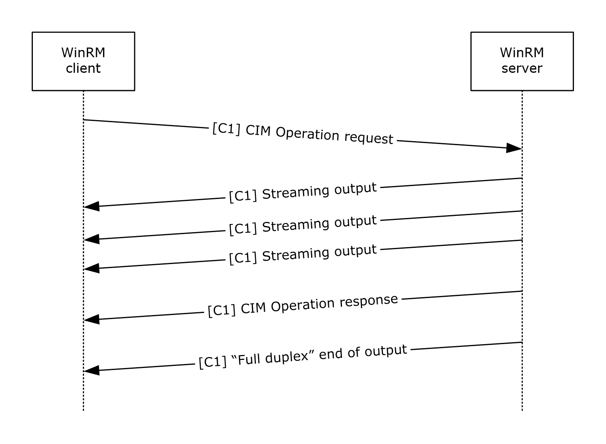

Figure 1: Message sequence for invoking custom methods with streaming output

### 1.3.2 Typical Message Flow for CIM Operations with Prompting

The WS-Management Protocol can be used to execute operations on CIM resources that support the following PowerShell semantics.

- Confirm
- Debug
- Error
- Progress
- Verbose
- Warning
Providers of CIM resources can implement one or more PowerShell semantics. These extended semantics are grouped into categories according to their effect on input, output, and server-side processing.

| Category | Semantics |
| --- | --- |
| Options that create additional server output | Confirm (Report) Debug ErrorAction (ReportReport) Progress Verbose Warning |
| Options that modify server execution but do not require additional input from the client | Confirm (Ignore) |
| Options that require additional input from the client | Confirm (Inquire) ErrorAction (Inquire) |

For options that only create additional server output, the message flow is as follows. Although the Verbose option triggers the largest amount of additional output, the overall pattern of messages is the same for all options that only create additional server output. In the following diagram, [C1] indicates that the messages are transmitted on the primary HTTP connection.

Figure 2: Message sequence for options that create additional server output

- The client sends the CIM Operation Request message with the Verbose option specified.
- The server returns the verbose output in SOAP Response messages, as the CIM operation generates output.
- The server sends the CIM Operation Response message as it normally would in the absence of the Verbose option.
For operations that modify server execution but do not require additional client input, the pattern is as follows.

- The client sends the CIM Operation Request message, with the appropriate option specified, on the primary HTTP connection.
- The server returns any generated output in SOAP Response messages, as the CIM operation generates output, on the primary HTTP connection.
- The server returns the CIM Operation Response message that is the response to the original CIM Operation Request message.
For operations that require additional client input, the message sequence is as follows. The optional Confirm option triggers the exchange of a pair of Confirm Request and Confirm Response messages, but otherwise, the pattern of messages is the same for all options in this category. In the following diagram, [C1] and [C2] indicate that messages are transmitted on the primary and secondary HTTP connections, respectively.

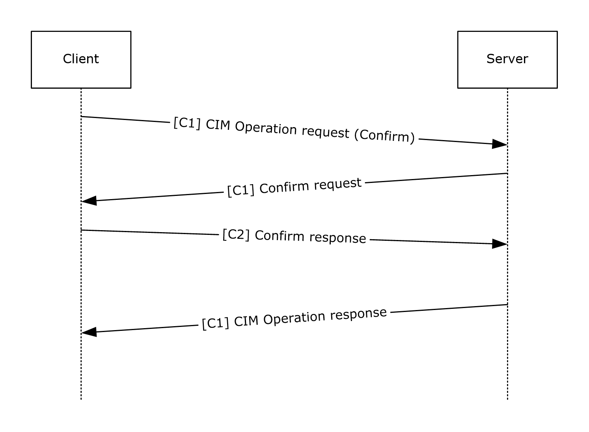

Figure 3: Message sequence for options that require additional client input

- The client sends the CIM Operation Request message, with the Confirm option specified.
- The server returns the Confirm request in a SOAP Response message.
- The client sends an acknowledgment of the Confirm request on a secondary connection. Any additional input from the client required by this operation is also transmitted over the secondary connection.
- The server returns the CIM Operation Response message that is the response to the original CIM Operation Request message.

## 1.4 Relationship to Other Protocols

WS-Management Protocol has to use [**SOAP**](#gt_soap) (as specified in [[SOAP1.2-1/2003]](https://go.microsoft.com/fwlink/?LinkId=90521)) over HTTP or HTTPS for communication. WS-Management has to be used as the transport to provide access to [**CIM**](#gt_common-information-model-cim) data by using binding techniques, as specified in [[DMTF-DSP0227]](https://go.microsoft.com/fwlink/?LinkId=89851), and mapping techniques, as specified in [[DMTF-DSP0230]](https://go.microsoft.com/fwlink/?LinkId=89852).

The Windows Management Instrumentation Remote Protocol is an alternative network protocol for accessing CIM data on servers.

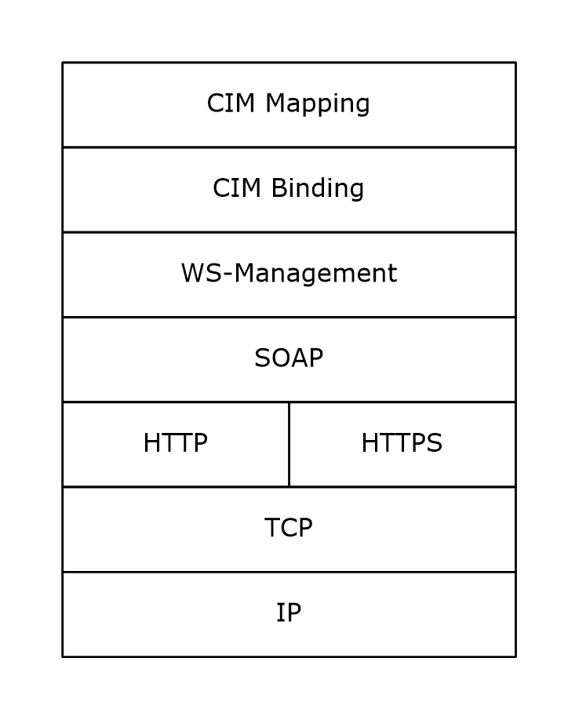

Figure 4: The Windows Management Instrumentation Remote Protocol network protocol stack

The WS-Management protocol layer defines management abstraction by using Web Services/SOAP technology. The CIM Binding layer defines the protocol binding to the SOAP layer, and the CIM Mapping layer defines XML schema for [**CIM classes**](#gt_015d0e5e-5166-4987-98b9-9c4128cf55be), WSDL, and Metadata fragments.

## 1.5 Prerequisites/Preconditions

For a client that uses the WS-Management protocol, as specified in [[DMTF-DSP0226]](https://go.microsoft.com/fwlink/?LinkId=89849), to communicate with a server, the server must have an operational SOAP1.2/HTTP1.1/TCP/IP stack. WS-Management operates on the assumption that the system already has an IP address and is therefore able to communicate on the network. It also assumes that the client has already obtained the IP address and HTTP port of the server, for example, through manual configuration.

In order for a client to configure the WS-Management server for HTTPS communication (as described in section [3.1.4.1.29.5](#Section_3.1.4.1.29.5)), the existence of a server certificate is a precondition. To specify a certificate by thumbprint, the client must also know the thumbprint and Common Name of the certificate.

## 1.6 Applicability Statement

Web Services Management Protocol Extensions for Windows Vista is a protocol for accessing [**CIM objects**](#gt_cim-object) to remotely administer software and hardware configuration.

## 1.7 Versioning and Capability Negotiation

The WS-Management Protocol defines a simple request-response operation called "Identify" to facilitate the process of finding the protocol version or versions supported by the [**service**](#gt_service).<1>

Negotiation of Robust-Connection/full-duplex support between client and server proceeds by a different mechanism. When sending the first message on an operation, the client indicates that it supports Robust-Connection/full-duplex support by including the **OperationId** field (see section [2.2.4.45](#Section_2.2.4.45)). In that case, the server also includes the **OperationId** field on its first response message indicating the same. Once the capabilities are stored, the client and server will only issue Robust-connections/full-duplex messages if both parties support it.

## 1.8 Vendor-Extensible Fields

It is important to understand that the set of specific resources that are exposed is up to a particular implementation of the Web Services Management Protocol Extensions for Windows Vista service, and the various options that can be passed to those resources as a part of any requested operation are implementation-defined. As such, this section provides a convention by which an implementation can identify particular options that are to be processed by the resource in a specific way, but the extensions in this document do not enforce the use of this convention.

The recommended convention to identify options (included in an <OptionSet> element as specified in section [3.1.4.1.10](#Section_3.1.4.1.10.1)) is to add a resource-specific prefix to the name of the option. As an illustrative example, the prefix "wmi:" can be used to indicate that a particular option can be passed to a [**WMI**](#gt_windows-management-instrumentation-wmi) resource using a specific internal data structure.

Vendors can define their own prefix values. However, it is up to each implementation to determine which option prefixes it uses, and how those options are processed.

## 1.9 Standards Assignments

Web Services Management Protocol Extensions for Windows Vista does not define any standard assignments beyond the XML namespaces listed in Section [2.2.1](#Section_2.2.1).

# 2 Messages

The following sections specify how Web Services Management Protocol Extensions for Windows Vista is transported and common data types.

## 2.1 Transport

The WS-Management Protocol uses SOAP, as specified in [[SOAP1.2-1/2003]](https://go.microsoft.com/fwlink/?LinkId=90521), over HTTP or HTTPS for communication. The WS-Management Protocol, as specified in [[DMTF-DSP0226]](https://go.microsoft.com/fwlink/?LinkId=89849), MUST be used as the transport to provide access to [**CIM**](#gt_common-information-model-cim) data using binding techniques specified by [[DMTF-DSP0227]](https://go.microsoft.com/fwlink/?LinkId=89851) and mapping techniques specified by [[DMTF-DSP0230]](https://go.microsoft.com/fwlink/?LinkId=89852).

## 2.2 Common Message Syntax

The syntax for the messages in the WS-Management Protocol is specified in [[DMTF-DSP0226]](https://go.microsoft.com/fwlink/?LinkId=89849). Web Services Management Protocol Extensions for Windows Vista defines new data types as specified in section [2.2.4](#Section_2.2.4) and section [2.2.5](#Section_2.2.5).

### 2.2.1 Namespaces

The following table shows the standard XML namespaces used within this protocol and the alias (prefix) used in the remaining sections of this protocol specification.

| Prefix | XML namespace | Specification |
| --- | --- | --- |
| s | http://www.w3.org/2003/05/soap-envelope | As specified in [[SOAP1.2-1/2003]](https://go.microsoft.com/fwlink/?LinkId=90521) |
| xs | http://www.w3.org/2001/XMLSchema | As specified in [[XMLSCHEMA1]](https://go.microsoft.com/fwlink/?LinkId=90608) and [[XMLSCHEMA2]](https://go.microsoft.com/fwlink/?LinkId=90610) |
| xsi | http://www.w3.org/2001/XMLSchema-instance | As specified in [XMLSCHEMA1] |
| wsa | http://schemas.xmlsoap.org/ws/2004/08/addressing | As specified in [[WSAddressing]](https://go.microsoft.com/fwlink/?LinkId=90575) section 1.2. |
| wsman | http://schemas.dmtf.org/wbem/wsman/1/wsman.xsd | As specified in [[DMTF-DSP0226]](https://go.microsoft.com/fwlink/?LinkId=89849) Annex A.1. |
| wsmid | http://schemas.dmtf.org/wbem/wsman/identify/1/wsmanidentity.xsd | As specified in [DMTF-DSP0226] Annex A.1. |
| wsmanfault | http://schemas.microsoft.com/wbem/wsman/1/wsmanfault | As specified in [Fault Detail (section 2.2.4.43)](#Section_2.2.4.43). |
| cim | http://schemas.dmtf.org/wbem/wscim/1/common | As specified in [[DMTF-DSP0230]](https://go.microsoft.com/fwlink/?LinkId=89852) section 6. |
| wsmv | http://schemas.microsoft.com/wbem/wsman/1/wsman.xsd | As specified in this document. |
| cfg | http://schemas.microsoft.com/wbem/wsman/1/config | As specified in this document. |
| sub | http://schemas.microsoft.com/wbem/wsman/1/subscription | As specified in this document. |
| rsp | http://schemas.microsoft.com/wbem/wsman/1/windows/shell | As specified in this document. |
| m | http://schemas.microsoft.com/wbem/wsman/1/machineid | As specified in this document. |
| cert | http://schemas.microsoft.com/wbem/wsman/1/config/service/certmapping | As specified in this document. |
| plugin | http://schemas.microsoft.com/wbem/wsman/1/config/PluginConfiguration | As specified in this document. |
| wsen | http://schemas.xmlsoap.org/ws/2004/09/enumeration | As specified in [DMTF-DSP0226] Annex A.1. |
| wsdl | http://schemas.xmlsoap.org/wsdl | As specified in [[WSDL]](https://go.microsoft.com/fwlink/?LinkId=90577). |
| wst | http://schemas.xmlsoap.org/ws/2004/09/transfer | As specified in [[WXFR]](https://go.microsoft.com/fwlink/?LinkId=90587). |
| wsp | http://schemas.xmlsoap.org/ws/2004/09/policy | As specified in [[WS-Policy]](https://go.microsoft.com/fwlink/?LinkId=92757) |
| wse | http://schemas.xmlsoap.org/ws/2004/08/eventing | As specified in [DMTF-DSP0226] Annex A.1. |
| i | http://schemas.microsoft.com/wbem/wsman/1/cim/interactive.xsd | As specified in this document. |

### 2.2.2 Messages

| Message | Description |
| --- | --- |
| EmptyMessage | A message that contains nothing in the SOAP Body. |
| AnyXmlMessage | A message that contains resource-specific XML in the SOAP Body. |
| OptionalXmlMessage | A message that can contain either nothing or resource-specific XML in the SOAP Body. |

#### 2.2.2.1 EmptyMessage

EmptyMessage is used to describe messages that contain nothing in the SOAP Body. EmptyMessage is used by the Web Services Management Protocol Extensions for Windows Vista in the following messages:

| Message Type | Action URI |
| --- | --- |
| Request | http://schemas.xmlsoap.org/ws/2004/09/transfer/Delete |
| Request | http://schemas.microsoft.com/wbem/wsman/1/wsman/AcknowledgeRequest |
| Request | http://schemas.microsoft.com/wbem/wsman/1/wsman/End |
| Request | http://schemas.microsoft.com/wbem/wsman/1/wsman/KeepAlive |
| Request | http://schemas.microsoft.com/wbem/wsman/1/wsman/Reconnect |

The message MUST be as shown here.

<wsdl:message name="EmptyMessage" />

#### 2.2.2.2 AnyXmlMessage

AnyXmlMessage is used to describe messages that contain resource-specific XML in the SOAP Body. AnyXmlMessage is used by the Web Services Management Protocol Extensions for Windows Vista in the following messages.

| Message Type | Action URI |
| --- | --- |
| Response | http://schemas.xmlsoap.org/ws/2004/09/transfer/GetResponse |
| Request | http://schemas.xmlsoap.org/ws/2004/09/transfer/Put |
| Request | http://schemas.xmlsoap.org/ws/2004/09/transfer/Create |

The message MUST be as shown here.

<wsdl:message name="AnyXmlMessage">

<wsdl:part name="body" type="wst:AnyXmlType" />

</wsdl:message>

**body:** Contains XML that represents the resource being acted upon. The actual XML content is dependent upon the specific resource and is not defined by Web Services Management Protocol Extensions for Windows Vista.

#### 2.2.2.3 OptionalXmlMessage

OptionalXmlMessage is used to describe messages that either contain nothing in the SOAP Body or that contain resource-specific XML in the SOAP Body. OptionalXmlMessage is used by the Web Services Management Protocol Extensions for Windows Vista in the following messages.

| Message Type | Action URI |
| --- | --- |
| Request | http://schemas.xmlsoap.org/ws/2004/09/transfer/Get |
| Response | http://schemas.xmlsoap.org/ws/2004/09/transfer/PutResponse |
| Response | http://schemas.xmlsoap.org/ws/2004/09/transfer/DeleteResponse |

The message MUST be as shown here.

<wsdl:message name="OptionalXmlMessage">

<wsdl:part name="body" type="wst:AnyXmlOptionalType" />

</wsdl:message>

**body:** Either contains XML that represents the resource being acted upon or is empty. If present, the actual XML content is dependent upon the specific resource and is not defined by Web Services Management Protocol Extensions for Windows Vista.

#### 2.2.2.4 AcknowledgeResponseMessage

AcknowledgeResponseMessage is used to describe messages that contain a wsmv:AcknowledgeType element in the SOAP body. AcknowledgeResponseMessage is used by the Web Services Management Protocol Extensions for Windows Vista in the following messages.

| Message Type | Action URI |
| --- | --- |
| Response | http://schemas.microsoft.com/wbem/wsman/1/wsman/Acknowledge |

The message MUST be as follows.

<wsdl:message name="AcknowledgeResponseMessage">

<wsdl:part name="body" type="wsmv:AcknowledgeType" />

</wsdl:message>

**body:** Contains a wsmv:AcknowledgeType element.

#### 2.2.2.5 InteractiveResponseMessage

InteractiveResponseMessage is used to describe messages that contain an i:InteractiveResponse element in the SOAP body. InteractiveResponseMessage is used by the Web Services Management Protocol Extensions for Windows Vista client when responding to an InteractiveEvent callback request.

| MessageType | Action URI |
| --- | --- |
| Response | /InteractiveResponse |

The message MUST be as follows.

<wsdl:message name="InteractiveResponseMessage">

<wsdl:part name="body" type="i:InteractiveResponse" />

</wsdl:message>

**body:** Contains a wsmv:AcknowledgeType element.

### 2.2.3 Elements

This specification does not define any common XML Schema element definitions.

### 2.2.4 Complex Types

The following table summarizes the set of common XML Schema complex type definitions defined by this specification. XML Schema complex type definitions that are specific to a particular operation are described with the operation.

| Complex Type | Description |
| --- | --- |
| AcknowledgeType | AcknowledgeType defines the format of the SOAP Body element of the server response message upon successful processing of the Command message. |
| AuthenticationType | AuthenticationType is used to indicate the credentials to be used by the Event Source when delivering events. |
| CapabilityType | CapabilityType specifies a single operation type supported by plug-ins that expose a set of resources through the Web Services Management Protocol Extensions for Windows Vista service. |
| CertMappingType | Client Certificates are used by Web Services Management Protocol Extensions for Windows Vista servers as an alternative authentication mechanism to Kerberos in nondomain scenarios. |
| ClientAuthType | ClientAuthType is used to configure the authentication mechanisms that are enabled or disabled on the Web Services Management Protocol Extensions for Windows Vista client. |
| ClientDefaultPortsType | ClientDefaultPortsType is used to configure the default ports used by the Web Services Management Protocol Extensions for Windows Vista client with each network transport. |
| ClientType | ClientType is the overall container for the Web Services Management Protocol Extensions for Windows Vista client configuration. |
| CommandLine | CommandLine describes the structure of the command line and its arguments. |
| CommandResponse | CommandResponse defines the format the SOAP Body element of the server response message upon successful processing of the Command message. |
| CommandStateType | CommandStateType describes the status of an executing command. |
| ConfigType | ConfigType is the container for Web Services Management Protocol Extensions for Windows Vista service configuration data. |
| ConnectResponseType | ConnectResponseType defines the format of the s:Body element of the server response message that is sent after successful processing of the Connect message. |
| ConnectType | ConnectType defines the format of the s:Body element of the Connect request message. |
| CustomRemoteShell | CustomRemoteShellType contains configuration data that's used to create a custom Shell. |
| DesiredStreamType | DesiredStreamType describes the way to allow clients to request a server response with output from particular streams. |
| DisconnectType | DisconnectType defines the format of the s:Body element of the Disconnect request message. |
| EnvironmentVariable | EnvironmentVariable extends the xs:string type to describe individual environment variables that can be set when the new Shell is initialized. |
| EnvironmentVariableList | EnvironmentVariableList contains a list of environment variables and their associated values. |
| InitializationParametersType | InitializationParametersType contains initialization data for plug-ins that expose a set of resources through the Web Services Management Protocol Extensions for Windows Vista service. |
| InteractiveEventType | InteractiveEventType describes the messages that can be sent by the server when CIM and WMI operations with PowerShell semantics are executed. |
| InteractiveResponseType | InteractiveResponseType describes the possible responses that the client can send to an InteractiveEvent sent by the server. |
| ListenerType | ListenerType is used by the Web Services Management Protocol Extensions for Windows Vista service to listen on one or more IP addresses for WS-Management Protocol requests. |
| MachineIDType | MachineIDType is used to uniquely identify a particular machine, so that requests issued from the same machine can be correlated. |
| ParamType | ParamType specifies a single initialization parameter for plug-ins that expose a set of resources through the Web Services Management Protocol Extensions for Windows Vista service. |
| PluginType | PluginType is the overall container for plug-ins that expose a set of resources through the Web Services Management Protocol Extensions for Windows Vista service. |
| QueryListType | QueryListType is used to define a set of one or more queries that are used to filter events. |
| QueryType | QueryType is used to define a single query within QueryListType that is used to filter events. |
| Receive | Receive describes the output data blocks received from the server. |
| ReceiveResponse | ReceiveResponse defines the format of the SOAP Body element of the server response message. |
| ResourcesContainerType | ResourcesContainerType is the list of exposed Resource URIs and their capabilities for plug-ins that expose a set of resources through the Web Services Management Protocol Extensions for Windows Vista service. |
| ResourceType | ResourceType contains the settings for a single [**Resource URI**](#gt_resource-uri) exposed through the Web Services Management Protocol Extensions for Windows Vista service. |
| SecurityType | SecurityType is used to indicate the security settings that are used to authorize access to a particular resource. |
| SelectType | SelectType is used to define an XPath query that is used to filter events. |
| Send | Send describes the input data blocks sent to the server. |
| SendResponse | SendResponse defines the format of the SOAP Body element of the server response message, which is sent after successful processing of the Send message. |
| ServiceAuthType | ServiceAuthType is used to configure the authentication mechanisms that are enabled or disabled on the Web Services Management Protocol Extensions for Windows Vista service. |
| ServiceDefaultPortsType | ServiceDefaultPortsType contains the values that are used for the default ports when constructing a listener. |
| ServiceType | ServiceType is the overall container for the Web Services Management Protocol Extensions for Windows Vista service. |
| Shell | Shell defines information required to properly initialize a targeted Shell. |
| Signal | Signal describes the signal values that are used to control the execution of the specific commands or of the Shell processor itself. |
| SignalResponse | SignalResponse defines the format of the s:Body element of the server response message that is sent after successful processing of the Signal message. |
| StreamType | StreamType describes a block of base64-encoded stream data sent or received via the Remote Shell Protocol. |
| SubscriptionType | SubscriptionType is used to enumerate publisher-initiated subscriptions. |
| WinrsType | WinrsType is the overall container for the Remote Shell server configuration. |
| WSManFaultType | WSManFaultType is used to carry error information within a SOAP message. |
| OperationIDType | OperationIDType is used to uniquely identify an operation. All messages associated with an operation have the same OperationID. |
| SequenceIDType | SequenceIDType is used to uniquely identify a message sent from the client or from the server as part of an operation. |

#### 2.2.4.1 AuthenticationType Complex Type

This type MUST be used to indicate the credentials to be used by the Event Source when delivering events. This type is used under the namespace http://schemas.dmtf.org/wbem/wsman/1/wsman.xsd.

The schema MUST be as shown here.

<xs:complexType name="ThumbprintType">

<xs:simpleContent>

<xs:extension base="xs:string">

<xs:attribute name="Role" type="xs:string" use="required"/>

</xs:extension>

</xs:simpleContent>

</xs:complexType>

<xs:complexType name="ClientCertificateType">

<xs:sequence>

<xs:element name="Thumbprint" type="ThumbprintType"/>

</xs:sequence>

</xs:complexType>

<xs:complexType name="AuthenticationType">

<xs:sequence>

<xs:element name="ClientCertificate" type="ClientCertificateType" minOccurs="0" />

</xs:sequence>

<xs:attribute name="Profile" type="xs:anyURI" use="required" />

</xs:complexType>

**Role:** Identifies whether the thumbprint is directly tied to the client certificate (value of certificate) or to the issuer of the certificate (value of issuer). If not present, the default value is certificate. <2>

**Thumbprint:** Identifies the issuer certificate by its thumbprint.

**ClientCertificate:** A set of constraints on the client certificate. The policy assertion can have multiple ClientCertificate elements, in which case the server can choose a certificate that matches any set of constraints. This element MUST be present when using Certificate Authentication, and MUST NOT be present when using Kerberos authentication.

**Profile:** The security profile being used. This attribute MUST be equal to either http://schemas.dmtf.org/wbem/wsman/1/wsman/secprofile/https/mutual or http://schemas.dmtf.org/wbem/wsman/1/wsman/secprofile/http/mutual when using Certificate Authentication, and MUST be equal to either http://schemas.dmtf.org/wbem/wsman/1/wsman/secprofile/http/spnego-kerberos or http://schemas.dmtf.org/wbem/wsman/1/wsman/secprofile/https/spnego-kerberos when using Kerberos authentication. This attribute MUST NOT be equal to any other security profile.

#### 2.2.4.2 CapabilityType

CapabilityType specifies a single operation type supported by plug-ins that expose a set of resources through the Web Services Management Protocol Extensions for Windows Vista service. The schema MUST be as shown here.

The type is used under the following namespace: http://schemas.microsoft.com/wbem/wsman/1/config/PluginConfiguration

<xs:complexType name="CapabilityType">

<xs:sequence>

</xs:sequence>

<xs:attribute name="Type" type="CapabilityEnumeration" />

<xs:attribute name="SupportsFragment" type="xs:boolean" use="optional" default="false" />

<xs:attribute name="SupportsFiltering" type="xs:boolean" use="optional" default="false" />

</xs:complexType>

**Attributes**

**Type:** Specifies which request type the containing plug-in supports.

**SupportsFragment:** Specifies whether this request type can be used with a fragment transfer as specified in [[DMTF-DSP0226]](https://go.microsoft.com/fwlink/?LinkId=89849) section 7.7.

**SupportsFiltering:** Specifies whether this request type can be used with filtering as specified in [DMTF-DSP0226] section 8.3.

#### 2.2.4.3 CertMappingType

The CertMappingType defines a mapping between a set of client certificates and a local user account on the server.<3>

<xs:schema

xmlns:cert="http://schemas.microsoft.com/wbem/wsman/1/config/service/certmapping"

xmlns:xs="http://www.w3.org/2001/XMLSchema"

targetNamespace="http://schemas.microsoft.com/wbem/wsman/1/config/service/certmapping"

elementFormDefault="qualified">

<xs:element name="CertMapping" type="cert:CertMappingType"/>

<xs:complexType name="CertMappingType">

<xs:sequence>

<xs:element name="URI" type="xs:string" />

<xs:element name="Subject" type="xs:string" />

<xs:element name="Issuer" type="xs:string"/>

<xs:element name="UserName" type="xs:string" minOccurs="0" />

<xs:element name="Enabled" type="xs:boolean" minOccurs="0"/>

<xs:element name="Password" type="xs:string" minOccurs="0"/>

</xs:sequence>

</xs:complexType>

</xs:schema>

**Elements**

**Issuer:** This is a thumbprint (40-digit Hex string) for the issuer of the client certificate. For example, in a certificate chain (client cert, issuer, intermediate CA1, . . . root CA), this thumbprint MUST always identify the certificate used to sign the client certificate (issuer).

**Subject:** This is a string to pattern match against the subject in the certificate. It MUST contain at least one character, and it MUST contain at most one "*" character that is the first or the last character. The "*" character matches any substring of zero or more characters (this might be the only character in which case it matches all subjects).

**URI:** The [**Resource URI**](#gt_resource-uri) or URI prefix to which this mapping applies. It MUST contain at least one character, it MUST contain at most one "*" character that is the last character, and it MUST not contain any internal white space or the "?" character. The "*" character matches any substring of zero or more characters (this might be the only character in which case it matches all **URIs**).

**UserName:** User account in the server used to impersonate for the operation if using this certmapping configuration. Domain credentials are not allowed.

**Password:** Password for the user account in the server used to impersonate for the operation if using this certmapping configuration. If present, this cannot be empty.

**Enabled:** Boolean value used to decide if the server is to use this certmapping configuration for subsequent operations.

#### 2.2.4.4 ClientAuthType

ClientAuthType This MUST be used to configure the authentication mechanisms that are enabled or disabled on the Web Services Management Protocol Extensions for Windows Vista client.

The Web Services Management Protocol Extensions for Windows Vista clients MUST implement the following security profiles:

- wsman:secprofile/http/basic, as specified in [[DMTF-DSP0226]](https://go.microsoft.com/fwlink/?LinkId=89849) Annex C.3.1.
- wsman:secprofile/https/basic, as specified in [DMTF-DSP0226] Annex C.3.3.
- wsman:secprofile/https/mutual, as specified in [DMTF-DSP0226] Annex C.3.5.
- wsman:secprofile/https/spnego-kerberos, as specified in [DMTF-DSP0226] Annex C.3.8.
- wsman:secprofile/http/spnego-kerberos, as specified in [DMTF-DSP0226] Annex C.3.10.
- wsman:secprofile/http/digest, as specified in [DMTF-DSP0226] Annex C.3.2.
- wsman:secprofile/https/digest, as specified in [DMTF-DSP0226] Annex C.3.4.
These configuration settings are used when modifying clientconfiguration as specified in section [3.2.4.1.22.2](#Section_3.2.4.1.22.2).

<xs:complexType name="ClientAuthType">

<xs:sequence>

<xs:element name="Basic"

type="xs:boolean"

default="true"

/>

<xs:element name="Digest"

type="xs:boolean"

default="true"

/>

<xs:element name="Kerberos"

type="xs:boolean"

default="true"

/>

<xs:element name="Negotiate"

type="xs:boolean"

default="true"

/>

<xs:element name="Certificate"

type="xs:boolean"

default="true"

/>

<xs:element name="CredSSP"

type="xs:boolean"

default="false"

minOccurs="0"

/>

</xs:sequence>

</xs:complexType>

**Elements**

**Basic:** Enables or disables Basic authentication (as specified in [[RFC2617]](https://go.microsoft.com/fwlink/?LinkId=90373) section 2). The default value of this element SHOULD be true.<4>

**Digest:** Enables or disables Digest authentication (as specified in [RFC2617] section 3). The default value of this element MUST be true.

**Kerberos:** Enables or disables Kerberos authentication (as specified in [[RFC4559]](https://go.microsoft.com/fwlink/?LinkId=90483) section 4). The default value of this element MUST be true.

**Negotiate:** Enables or disables Negotiate authentication (as specified in [RFC4559] section 4). The default value of this element MUST be true.

**Certificate:** Enables or disables Certificate authentication (as specified in [[RFC2246]](https://go.microsoft.com/fwlink/?LinkId=90324) section 7.4.4). The default value of this element MUST be true.

**CredSSP:** Enables or disables CredSSP authentication (as specified in [MS-CSSP](#Section_3.1.4.1.28)). The default value of this element MUST be false.

#### 2.2.4.5 ClientDefaultPortsType

ClientDefaultPortsType This MUST be used to configure the default ports used by the Web Services Management Protocol Extensions for Windows Vista client with each network transport. The schema MUST be as shown here.

The type is used under the following namespace: http://schemas.microsoft.com/wbem/wsman/1/config

<xs:complexType name="ClientDefaultPortsType">

<xs:sequence>

<xs:element name="HTTP"

type="xs:unsignedInt"

default="5985"

/>

<xs:element name="HTTPS"

type="xs:unsignedInt"

default="5986"

/>

</xs:sequence>

</xs:complexType>

**Elements**

**HTTP:** Port used by the client when using the HTTP protocol. The minimum value MUST be 1. The maximum value MUST be 65535. The default value SHOULD be 5985, but MAY be 80.<5>

**HTTPS:** Port used by the client when using the HTTPS protocol. The minimum value MUST be 1. The maximum value MUST be 65535. The default value SHOULD be 5986, but MAY be 443.<6>

#### 2.2.4.6 ClientType

ClientType is the overall container for the Web Services Management Protocol Extensions for Windows Vista client configuration. The schema MUST be as follows.

The type is used under the following namespace: http://schemas.microsoft.com/wbem/wsman/1/config

<xs:complexType name="ClientType">

<xs:sequence>

<xs:element name="NetworkDelayms"

type="xs:unsignedInt"

default="5000"

/>

<xs:element name="URLPrefix"

type="xs:string"

default="wsman"

/>

<xs:element name="AllowUnencrypted"

type="xs:boolean"

default="false"

/>

<xs:element name="Auth"

type="cfg:ClientAuthType"

/>

<xs:element name="DefaultPorts"

type="cfg:ClientDefaultPortsType"

/>

<xs:element name="TrustedHosts"

type="xs:string"

/>

</xs:sequence>

</xs:complexType>

**Elements**

**NetworkDelayms:** Extra time in milliseconds that the Web Services Management Protocol Extensions for Windows Vista client waits to accommodate for network delay time. The minimum value MUST be 500. The maximum value MUST be 4294967295. The default value MUST be 5000. This configuration setting is used by the Client Operation Timeout timer, as specified in section [3.2.5](#Section_3.2.5).

**URLPrefix:** Default URI suffix that MUST be used by Web Services Management Protocol Extensions for Windows Vista clients when sending requests. It MUST NOT be blank. It MUST be a string containing only the following characters: a-zA-Z9-0_/. It MUST NOT start with or end with "/". The default value MUST be "wsman".

**AllowUnencrypted:** Contains a setting that allows the Web Services Management Protocol Extensions for Windows Vista client to send requests by using an authentication scheme and transport that does not encrypt the request and response, such as Digest over HTTP. The default value MUST be false. Used when sending messages as specified in section [3.2.4.1.22.1](#Section_3.2.4.1.22.1).

**Auth:** This MUST contain additional elements to configure authentication schemes, as specified in section [2.2.4.4](#Section_2.2.4.4).

**DefaultPorts:** This MUST contain additional elements to configure the default ports used when sending request messages, as specified in section [2.2.4.5](#Section_2.2.4.5).

**TrustedHosts:** Contains host names to which the Web Services Management Protocol Extensions for Windows Vista clients are allowed to send requests by using an authentication scheme and transport that does not allow the client to authenticate the service, such as Basic over HTTP. The specified host names can be either [**Internet host names**](#gt_internet-host-name) or IP addresses. TrustedHosts MUST be one of three possible values:

- Blank: No hosts are trusted.
- The asterisk "*" character: All hosts are trusted.
- A list of host name patterns separated by the comma "," character, in which each host name can be one of four possible values:
- String starting with the asterisk "*" character and containing at least two characters. All hosts that share the suffix are trusted.
- String ending with the asterisk "*" character and containing at least two characters. All hosts that share the prefix are trusted.
- The exact string "<local>": All NetBIOS names are trusted (for example, strings that do not contain the period "." character).
- A string without the asterisk "*" character: The host named by the string is trusted.
The default value for the <TrustedHosts> element MUST be a blank string.

#### 2.2.4.7 CommandLine

This type describes the structure of the command line and its arguments. It is used as the body element of the Command message (for more information, see section [3.1.4.11](#Section_3.1.4.11.1)).

<xs:complexType name="CommandLine">

<xs:sequence>

<xs:element name="Command"

type="xs:string"

/>

<xs:element name="Arguments"

type="ArgumentType"

minOccurs="0"

maxOccurs="unbounded"

/>

</xs:sequence>

</xs:complexType>

**Command:** This is a required string that MUST contain the name of the command to be executed without any arguments. The latter are supplied separately, in the Arguments element. The syntax of the command is specific to cmd.exe.

**Arguments:** If the command requires no arguments, this element can be omitted. If more than one argument is required, multiple elements are included. Each element MUST contain a string value of a single command argument.

#### 2.2.4.8 CommandResponse

This type defines the format the s:Body element of the server response message upon successful processing of the Command message (for more information, see section [3.1.4.11](#Section_3.1.4.11.1)).

<xs:complexType name="CommandResponse">

<xs:sequence>

<xs:element name="CommandId"

type="xs:anyURI"

/>

</xs:sequence>

</xs:complexType>

**Element**

**CommandId:** Attribute indicating the identity of the command for which status is being reported.

#### 2.2.4.9 CommandStateType

This type describes the status of the executing command.

<xs:complexType name="CommandStateType">

<xs:sequence>

<xs:element name="ExitCode"

type="ExitCodeType"

minOccurs="0"

/>

</xs:sequence>

<xs:attribute name="CommandId"

type="xs:anyURI"

/>

<xs:attribute name="State"

type="CommandStateEnumeration"

/>

</xs:complexType>

**Element**

**Exit Code:** This optional element contains a Shell processor-specific exit code.<7>

**Attributes**

**CommandId:** Attribute indicating the identity of the command for which status is being reported. This attribute MUST be present when status is being reported for a command and this attribute MUST NOT be present when status is being reported for a shell.

**State:** This required attribute MUST contain the specific state of the command for which status is being reported and it MUST be one of the following values:

- http://schemas.microsoft.com/wbem/wsman/1/windows/shell/CommandState/Done
- http://schemas.microsoft.com/wbem/wsman/1/windows/shell/CommandState/Pending
- http://schemas.microsoft.com/wbem/wsman/1/windows/shell/CommandState/Running

#### 2.2.4.10 ConfigType

ConfigType is the container for Web Services Management Protocol Extensions for Windows Vista [**service**](#gt_service) configuration data. Note that listeners are not part of this configuration and need to be retrieved separately. The schema MUST be as follows.

<xs:schema xmlns:cfg="http://schemas.microsoft.com/wbem/wsman/1/config"

xmlns:xs="http://www.w3.org/2001/XMLSchema"

targetNamespace="http://schemas.microsoft.com/wbem/wsman/1/config"

elementFormDefault="qualified">

<xs:element name="Config" type="cfg:ConfigType"/>

<xs:complexType name="ConfigType">

<xs:sequence>

<xs:element name="MaxEnvelopeSizekb"

type="xs:unsignedInt" default="150"/>

<xs:element name="MaxTimeoutms" type="xs:unsignedInt"

default="60000"/>

<xs:element name="MaxBatchItems" type="xs:unsignedInt" default="32000"/>

<xs:element name="MaxProviderRequests"

type="xs:unsignedInt" default="25"/>

<xs:element name="Client" type="cfg:ClientType"/>

<xs:element name="Service" type="cfg:ServiceType"/>

<xs:element name="Winrs" type="cfg:WinrsType"/>

</xs:sequence>

</xs:complexType>

</xs:schema>

**MaxEnvelopeSizekb:** Maximum [**SOAP**](#gt_soap) data in kilobytes. The minimum value MUST be 32. The maximum value MUST be 4294967295. The default value SHOULD be 500 but MAY be 150.<8> This configuration setting is used when processing the wsman:MaxEnvelopeSize header, as specified in section [3.1.4.1.7](#Section_3.1.4.1.7). This configuration setting is also used to limit the size of client request packets that are processed, as specified in section [3.1.4.1.20](#Section_3.1.4.1.20).

**MaxTimeoutms:** The maximum time-out in milliseconds that MUST be used for any request except for Pull requests. The minimum value MUST be 500. The maximum value MUST be 4294967295. The default value MUST be 60000. This configuration setting is used when processing the wsman:OperationTimeout header, as specified in section [3.1.4.1.6](#Section_3.1.4.1.6).

**MaxBatchItems:** The maximum number of elements that MUST be used in a Pull response. The minimum value MUST be 1. The maximum value MUST be 4294967295. The default value SHOULD be 32000, but MAY be 20.<9> This configuration setting is used when processing Pull messages, as specified in section [3.1.4.1.13](#Section_3.1.4.1.13).

**MaxProviderRequests:** The maximum number of concurrent requests allowed by the Web Services Management Protocol Extensions for Windows Vista service. The maximum allowed value MUST be 4294967295; a server MAY<10> allow smaller values, but it MUST NOT allow a value less than 1. The default value MUST be 25. The limit is applied per provider. The categories include [**CIM**](#gt_common-information-model-cim) and configuration. This configuration setting is used when processing messages, as specified in section [3.1.4.1.19](#Section_3.1.4.1.19).<11>

**Client:** This MUST contain additional elements to configure Web Services Management Protocol Extensions for Windows Vista clients, as specified in section [2.2.4.6](#Section_2.2.4.6).

**Service:** This MUST contain additional elements to configure the Web Services Management Protocol Extensions for Windows Vista service, as specified in section [2.2.4.36](#Section_2.2.4.36).

**Winrs:** This MUST contain additional elements to configure the Web Services Management Protocol Extensions for Windows Vista Remote Shell, as specified in section [2.2.4.42](#Section_2.2.4.42).

#### 2.2.4.11 ConnectResponseType

ConnectResponseType describes the body element of the rsp:Connect response message. For more information, see section [3.1.4.17](#Section_3.1.4.17).

All implementations for all ConnectResponse data types MUST use the XML namespace URI "http://schemas.microsoft.com/wbem/wsman/1/windows/shell".

<xs:complexType name="ConnectResponseType">

<xs:sequence>

<xs:any

minOccurs="0"

maxOccurs="unbounded"

namespace="##other"

/>

</xs:sequence>

</xs:complexType>

#### 2.2.4.12 ConnectType

ConnectType describes the body element of the rsp:Connect request message. For more information, see section [3.1.4.17](#Section_3.1.4.17).

All implementations for all Connect data types MUST use the XML namespace URI "http://schemas.microsoft.com/wbem/wsman/1/windows/shell".

<xs:complexType name="ConnectType">

<xs:sequence>

<xs:any

minOccurs="0"

maxOccurs="unbounded"

namespace="##other"

/>

</xs:sequence>

</xs:complexType>

#### 2.2.4.13 CustomRemoteShell

CustomRemoteShellType contains configuration data that's used to create a custom Shell. Web Services Management Protocol Extensions for Windows Vista clients MAY use this configuration to create a custom Shell instead of cmd.exe. Web Services Management Protocol Extensions for Windows Vista service SHOULD <12> use this configuration to create a custom Shell when it receives a Create request (as defined in section [3.1.4.5](#Section_3.1.4.5)) and the request contains a [**resource URI**](#gt_resource-uri) that is specified in the CustomRemoteShell configuration.

The type is used under the following namespace: http://schemas.microsoft.com/wbem/wsman/1/config/winrs/customremoteshell

The schema for CustomRemoteShellType MUST be as follows.

<xs:complexType name="CustomRemoteShell">

<xs:sequence>

<xs:element name="URI"

type="xs:anyURI"

minOccurs="0"

maxOccurs="1"

/>

<xs:element name="Shell"

type="xs:string"

minOccurs="1"

maxOccurs="1"

/>

<xs:element name="Arguments"

type="xs:string"

minOccurs="0"

maxOccurs="1"

/>

</xs:sequence>

</xs:complexType>

**Elements**

**URI:** This optional attribute refers to the resource URI for the custom Shell.

**Shell:** This attribute contains the process string for the custom Shell. It can contain environment variables.

**Arguments:** This optional attribute contains the argument string and it specifies the command line arguments to be passed to the custom Shell. The Arguments field is treated as an opaque value; it is up to the Shell itself to interpret these arguments.

#### 2.2.4.14 DesiredStreamType

This type describes the way to allow clients to request a server response with output from particular streams. This type is used under the namespace http://schemas.microsoft.com/wbem/wsman/1/windows/shell.

<xs:complexType name="DesiredStreamType">

<xs:simpleContent>

<xs:extension

base="rsp:StreamNameList"

>

<xs:attribute name="CommandId"

type="xs:anyURI"

use="optional"

/>

</xs:extension>

</xs:simpleContent>

</xs:complexType>

**Attribute**

**CommandId:** This optional attribute directs the request to a specific command instead of the Shell. If present, it MUST be the one returned in the CommandResponse message.

#### 2.2.4.15 DisconnectType

DisconnectType describes the body element of the rsp:Disconnect message. For more information, see section [3.1.4.15](#Section_3.1.4.15.1).

All implementations for all Disconnect data types MUST use the XML namespace URI "http://schemas.microsoft.com/wbem/wsman/1/windows/shell".

<xs:complexType name="DisconnectType">

<xs:sequence>

<xs:element name="IdleTimeOut"

type="xs: duration"

minOccurs="0"

/>

<xs:element name="BufferMode"

type=" OutputBufferingModeEnumeration"

minOccurs="0"

/>

</xs:sequence>

</xs:complexType>

**IdleTimeOut:** This overrides the IdleTimeOut value specified in the Shell data type when the Shell was created.

**BufferMode:** This overrides the BufferMode value specified in the Shell data type when the Shell was created.

#### 2.2.4.16 EnvironmentVariable

This type extends the xs:string type to describe individual environment variables that can be set when the new Shell is initialized.

<xs:complexType name="EnvironmentVariable">

<xs:simpleContent>

<xs:extension

base="xs:string"

>

<xs:attribute name="Name"

type="xs:string"

use="required"

/>

</xs:extension>

</xs:simpleContent>

</xs:complexType>

**Attribute**

**Name:** An xs:string value that MUST contain the name of the environment variable.

#### 2.2.4.17 EnvironmentVariableList

<xs:complexType name="EnvironmentVariableList">

<xs:sequence

maxOccurs="unbounded"

>

<xs:element name="Variable"

type="EnvironmentVariable"

/>

</xs:sequence>

</xs:complexType>

**Variable:** The starting set of environment variables that the shell will use. Each environment variable MUST be individually defined. For more information, see section [2.2.4.16](#Section_2.2.4.16).

#### 2.2.4.18 InitializationParametersType

InitializationParametersType contains initialization data for plug-ins that expose a set of resources through the Web Services Management Protocol Extensions for Windows Vista service. The schema MUST be as shown here.

The type is used under the following namespace: http://schemas.microsoft.com/wbem/wsman/1/config/PluginConfiguration

<xs:complexType name="InitializationParametersType">

<xs:sequence>

<xs:element name="Param" type="ParamType" minoccurs="0" maxoccurs="unbounded" />

</xs:sequence>

</xs:complexType>

**Element**

**Param:** Contains one parameter to be passed to the plug-in as initialization data. This data is normally used to customize the behavior of the plug-in, or to load the same plug-in in multiple different configurations. This data is opaque to the Web Services Management Protocol Extensions for Windows Vista service.

#### 2.2.4.19 ListenerType

ListenerType MUST be used by the Web Services Management Protocol Extensions for Windows Vista [**service**](#gt_service) to listen on one or more IP addresses for WS-Management Protocol requests. ListenerType can be configured for HTTP or HTTPS on a specific IP or on an IP associated with a Media Access Control (MAC) address. The schema MUST be as shown here.

<xs:schema xmlns:cfg="http://schemas.microsoft.com/wbem/wsman/1/config"

xmlns:xs="http://www.w3.org/2001/XMLSchema"

targetNamespace="http://schemas.microsoft.com/wbem/wsman/1/config"

elementFormDefault="qualified">

<xs:element name="Listener" type="cfg:ListenerType"/>

<xs:complexType name="ListenerType">

<xs:sequence>

<xs:element name="Address" type="xs:string"/>

<xs:element name="Transport" type="xs:string"/>

<xs:element name="Port" type="xs:unsignedInt"/>

<xs:element name="Hostname" type="xs:string"/>

<xs:element name="Enabled" type="xs:boolean" default="true"

minOccurs="0"/>

<xs:element name="URLPrefix" type="xs:string" default="wsman"

minOccurs="0"/>

<xs:element name="CertificateThumbprint" type="xs:string"

minOccurs="0"/>

<xs:element name="ListeningOn" type="xs:string" minOccurs="0"

maxOccurs="unbounded"/>

</xs:sequence>

</xs:complexType>

</xs:schema>

**Elements**

**Address:** The address for which this listener is created. The value can be one of the following:

- The literal string "*".
- The literal string "IP:" followed by a valid IP address in either IPv4 dotted-decimal format or in IPv6 coloned-hexadecimal format.
- The literal string "MAC:" followed by a MAC address of a Network Interface Card (NIC). The MAC address MUST be a sequence of six or eight pairs of case-insensitive hexadecimal digits separated by "-" (for example, 32-a3-58-90-be-cc).
**Transport:** The transport used to send and receive WS-Management protocol requests and responses. The value MUST be either HTTP or HTTPS.

**Port:** The TCP port for which this listener is created. The minimum value MUST be 1. The maximum value MUST be 65535.

**Hostname:** Host name of the computer where the WS-Management service is running.

**Enabled:** Indicates if the listener is enabled or disabled.

**URLPrefix:** The [**Uniform Resource Identifier (URI)**](#gt_uniform-resource-identifier-uri) prefix on which to accept HTTP or HTTPS requests. It MUST NOT be blank. It MUST be a string containing only the characters a-zA-Z9-0_/ and it MUST NOT start with or end with '/'. For example, if the computer name is SampleMachine, the WS-Management client would specify http://SampleMachine/<URLPrefix> in the destination address.

**CertificateThumbprint:** This MUST contain the thumbprint of the certificate as a 40-digit hexadecimal number. It MUST be required if Transport is HTTPS.

**ListeningOn:** Contains the IP address or all IP addresses on which the service is actually listening. This is derived from the Address element based upon the actual IPs associated with the listener. The value of the IP address MUST be in either IPv4 dotted-decimal notation or in IPv6 colon-delimited hexadecimal notation.

These configuration settings are used when processing messages as specified in section [3.1.4.1.29.5](#Section_3.1.4.1.29.5).

#### 2.2.4.20 MachineIDType Complex Type

This type MUST be used to uniquely identify a particular machine, so that requests issued from the same machine can be correlated. The MachineID type MUST be used under the namespace http://schemas.microsoft.com/wbem/wsman/1/machineid.

The schema MUST be as shown here.

<xs:complexType name="MachineIDType">

<xs:sequence>

<xs:element name="MachineID"

type="xs:string"

/>

</xs:sequence>

<xs:anyAttribute

process_contents="lax"

namespace="##any"

/>

</xs:complexType>

**Element**

**MachineID:** A SOAP header containing a globally unique string that uniquely identifies the machine sending the request. This allows the receiver of the request to correlate requests from the same machine, even if different requests use different credentials or [**Internet host names**](#gt_internet-host-name). It MUST be used for [**publisher**](#gt_publisher)-initiated subscription message.

#### 2.2.4.21 ParamType

ParamType specifies a single initialization parameter for plug-ins that expose a set of resources through the Web Services Management Protocol Extensions for Windows Vista service. The schema MUST be as shown here.

The type is used under the following namespace: http://schemas.microsoft.com/wbem/wsman/1/config/PluginConfiguration

<xs:complexType name="ParamType">

<xs:sequence>

</xs:sequence>

<xs:attribute name="Name" type="xs:string" />

<xs:attribute name="Value" type="xs:string" />

</xs:complexType>

**Attributes**

**Name:** Name of the parameter.

**Value:** Value corresponding to the parameter.

#### 2.2.4.22 PluginType

PluginType is the overall container for plug-ins that expose a set of resources through the Web Services Management Protocol Extensions for Windows Vista service. The schema MUST be as shown here.

The type is used under the following namespace: http://schemas.microsoft.com/wbem/wsman/1/config/PluginConfiguration

<xs:schema

xmlns:xs="http://www.w3.org/2001/XMLSchema"

xmlns:plugin="http://schemas.microsoft.com/wbem/wsman/1/config/service/PluginConfiguration"

targetNamespace="http://schemas.microsoft.com/wbem/wsman/1/config/service/PluginConfiguration"

elementFormDefault="qualified">

<xs:element name="PluginConfiguration" type="plugin:PluginType"/>

<xs:complexType name="PluginType">

<xs:sequence>

<xs:element name="Resources" type="ResourcesContainerType" />

<xs:element name="InitializationParameters" minoccurs="0"

type="InitializationParametersType" />

<xs:element name="Quotas" minoccurs="0" type="QuotasType" />

</xs:sequence>

<xs:attribute name="Name" type="xs:string" />

<xs:attribute name="Filename" type="xs:string" />

<xs:attribute name="SDKVersion" type="xs:integer" />

<xs:attribute name="XmlRenderingType"

type="XmlRenderingTypeEnumeration" />

<xs:attribute name="Architecture" type="xs:integer" use="optional" />

<xs:attribute name="UseSharedProcess" type="xs:boolean" use="optional"

default="false" />

<xs:attribute name="AutoRestart" type="xs:boolean" use="optional"

default="false" />

<xs:attribute name="ProcessIdleTimeoutSec" type="xs:integer"

use="optional" default="0" />

<xs:attribute name="RunAsUser" type="xs:string" use="optional" />

<xs:attribute name="RunAsPassword" type="xs:string" use="optional" />

<xs:attribute name="OutputBufferingMode"

type="OutputBufferingModeEnumeration" use="optional" />

<xs:attribute name="Enabled" type="xs:boolean" use="optional"

default="true" />

</xs:complexType>

</xs:schema>

**Elements**

**Resources:** Container for the list of resources exposed by this plug-in.

**InitializationParameters:** Container for initial parameters to be passed to the plug-in on startup.

**Quotas:** Contains values for resource quota limits that are specific to this plug-in.

**Attributes**

**Name:** Unique name used to identify the plug-in. The Web Services Management Protocol Extensions for Windows Vista service MUST support a Name of up to 2048 characters.

**Filename:** A local file path in whichever file naming syntax is used by the server's local file system; all characters MUST be considered legal by the Web Services Management Protocol Extensions for Windows Vista protocol, as the string is simply passed to the underlying file system. The Web Services Management Protocol Extensions for Windows Vista service MUST support a Name of up to 2048 characters.

**SDKVersion:** This MUST be set to 1.

**XmlRenderingType:** The data format used by the service to communicate with the plug-in.

**Architecture:** Specifies whether the plug-in is a 32-bit or 64-bit implementation. If present, this attribute MUST be set to either 32 or 64.

**UseSharedProcess:** Specifies whether Remote Shells created by this plug-in are executed within the same process or within different processes. If set to true, the Web Services Management Protocol Extensions for Windows Vista service SHOULD execute all Shells within the same process. If set to false, the Web Services Management Protocol Extensions for Windows Vista service SHOULD execute each Shell within a separate process. For more details, see section [3.1.4.1.31](#Section_3.1.4.1.31.2).

**AutoRestart:** Specifies whether this plug-in is automatically loaded when the Web Services Management Protocol Extensions for Windows Vista service is started. If set to true, the Web Services Management Protocol Extensions for Windows Vista service SHOULD create a process and load the plug-in at startup. If set to false, the Web Services Management Protocol Extensions for Windows Vista service SHOULD NOT create a process and load the plug-in until a request message is received that is directed to this plug-in.

**ProcessIdleTimeoutSec:** The maximum length of time in seconds that a process hosting a plug-in is allowed to exist if there are no Shells present that were created by that plug-in. The time interval is measured beginning from the time that all Shells created by this plug-in are deleted, to the time the plug-in creates another Shell. If the interval is more than the value specified for this element, the service SHOULD delete the process. The minimum value of this element MUST be 0, and the maximum value SHOULD be 1209600.

**RunAsUser:** Specifies the user identity to use for authorizing all operations carried out by this plug-in. If this element exists, all operations carried out by this plug-in SHOULD be authorized using the value of this element as the user name and the value of the RunAsPassword element as the corresponding password. This element MUST NOT be used when initially authorizing access to a particular Resource URI, as defined in section [3.1.4.1.28](#Section_3.1.4.1.28).

**RunAsPassword:** Specifies the user password that is used to authorize all operations carried out by this plug-in. If this element exists, all operations carried out by this plug-in SHOULD be authorized using the value of the RunAsUser element as user name and the value this element as password. This element MUST NOT be used when initially authorizing access to a particular Resource URI as defined in section 3.1.4.1.28.

**OutputBufferingMode:** Specifies the buffering mode used by the server for plug-ins that implement the Disconnect shell capability.

**Enabled:** This attribute MUST be ignored by the server.

#### 2.2.4.23 QuotasType

QuotasType specifies a set of resource quota limits that are applied to operations that are carried out by a particular plug-in through the Web Services Management Protocol Extensions for Windows Vista service. The schema MUST be as shown in this section.

This type is used under the following XML namespace URI: "http://schemas.microsoft.com/wbem/wsman/1/config/PluginConfiguration".

<xs:complexType name="QuotasType">

<xs:sequence>

</xs:sequence>

<xs:attribute name="MaxConcurrentUsers" type="xs:integer" default="5" />

<xs:attribute name="MaxConcurrentOperationsPerUser" type="xs:integer" use="optional" default="15" />

<xs:attribute name="MaxConcurrentOperations" type="xs:integer" use="optional" default="1500" />

<xs:attribute name="MaxMemoryPerShellMB" type="xs:integer" use="optional" default="1024" />

<xs:attribute name="MaxIdleTimeoutms" type="xs:integer" use="optional" default="180000" />

<xs:attribute name="IdleTimeoutms" type="xs:integer" use="optional" default="180000" />

<xs:attribute name="MaxProcessesPerShell" type="xs:integer" use="optional" default="15" />

<xs:attribute name="MaxConcurrentCommandsPerShell" type="xs:integer" use="optional" default="15" />

<xs:attribute name="MaxShells" type="xs:integer" use="optional" default="25" />

<xs:attribute name="MaxShellsPerUser" type="xs:integer" use="optional" default="5" />

</xs:complexType>

**MaxConcurrentUsers:** Limits the maximum number of users on behalf of which this particular plug-in will concurrently perform operations. The minimum value MUST be 1. The maximum value MUST be 100. The default value SHOULD be 5. Operation requests for this particular plug-in MUST be rejected if they would cause the number of concurrent users to exceed the specified limit, and the server MUST reply with a wsman:QuotaLimit fault.

**MaxConcurrentOperationsPerUser:** An optional value that limits the maximum number of concurrent operations allowed to be carried out by this particular plug-in for any one individual user. The minimum value MUST be 1. The maximum value MUST be 4294967295. The default value SHOULD be 15. Operation requests for this particular plug-in MUST be rejected if they would cause the number of concurrent operations for a particular user to exceed the specified limit, and the server MUST reply with a wsman:QuotaLimit fault.

**MaxConcurrentOperations:** An optional value that limits the maximum number of concurrent operations allowed to be carried out by this particular plug-in. The minimum value MUST be 1. The maximum value MUST be 4294967295. The default value SHOULD be 1500. Operation requests for this particular plug-in MUST be rejected if they would cause the number of concurrent operations to exceed the specified limit, and the server MUST reply with a wsman:QuotaLimit fault.

**MaxMemoryPerShellMB:** An optional value that limits the maximum total amount of memory that can be allocated cumulatively by any active Remote Shells created by this particular plug-in that are being executed within the same process and all of their child processes. The minimum value MUST be 0. The maximum value MUST be 2147483647. The default value SHOULD be 1024. If this value is equal to 0, it MUST be interpreted to mean that the ability of the remote operations to allocate memory is limited only by the available virtual memory. The remote operation MUST be terminated when a new allocation exceeds the specified quota.

**MaxIdleTimeoutms:** An optional value that specifies the maximum idle time-out for Shells created by this particular plug-in. The value MUST be expressed in milliseconds. The minimum value MUST be 60000. The maximum value MUST be 2147483647. The default value SHOULD be 180000. If the IdleTimeout value specified in a [Create message (section 3.1.4.5)](#Section_3.1.4.5) or [Disconnect message (section 3.1.4.15)](#Section_3.1.4.15.1) is greater than the MaxIdleTimeoutms value for this particular plug-in, then the service SHOULD use the value of MaxIdleTimeoutms as the effective time-out value of the Shell Idle Timeout Timer.

**IdleTimeoutms:** An optional value that specifies an idle time-out for Shells created by this particular plug-in. The value MUST be expressed in milliseconds. The minimum value MUST be 60000. The maximum value MUST be 2147483647. The default value SHOULD be 180000. The service SHOULD close and terminate the shell instance if it is idle for this amount of time. If the Shell is reused within this time limit, the countdown timer is reset once the command sequence is completed.

**MaxProcessesPerShell:** An optional value that limits the maximum cumulative number of concurrent processes that any Shell operations being executed on behalf of this particular plug-in within the same process are allowed to launch. The minimum value MUST be 0. The maximum value MUST be 2147483647. The default value SHOULD be 15. If this value is equal to 0 it MUST be interpreted to mean an unlimited number of processes. If the remote operation attempts to launch a new process and the process count exceeds the specified limit, the operation MUST return a wsman:InternalError fault and any future operations on that shell MUST return a wsman:InternalError fault until the process count decreases below this limit.

**MaxConcurrentCommandsPerShell:** An optional value that limits the maximum number of concurrent commands allowed to be carried out by a single Shell by this particular plug-in. The minimum value MUST be 1. The maximum value MUST be 2147483647. The default value SHOULD be 15. Operation requests for this particular plug-in MUST be rejected if they would cause the number of concurrent commands within a Shell to exceed the specified limit, and the server MUST reply with a wsman:QuotaLimit fault.

**MaxShells:** An optional value that limits the maximum number of concurrent Shells allowed to be created by this particular plug-in. The minimum value MUST be 1. The maximum value MUST be 2147483647. The default value SHOULD be 25. Incoming wst:Create requests for this particular plug-in MUST be rejected if the number of currently existing Shells is equal to the configured limit, and the server MUST reply with a wsman:QuotaLimit fault.

**MaxShellsPerUser:** An optional value that limits the maximum number of concurrent Shells allowed to be created by this particular plug-in on behalf of a single user. The minimum value MUST be 1. The maximum value MUST be 2147483647. The default value SHOULD be 5. Incoming wst:Create requests for this particular plug-in MUST be rejected if the number of currently existing Shells for the specific user is equal to the configured limit, and the server MUST reply with a wsman:QuotaLimit fault.

#### 2.2.4.24 QueryListType

This type describes a list of queries used to filter events (for more information see section [3.1.4.1.30.5](#Section_3.1.4.1.30.5)). The schema MUST be as shown here:

<xs:element name="QueryList>

<xs:complexType name="QueryListType">

<xs:sequence>

<xs:element name="Query" type="QueryType" minoccurs="1" maxoccurs="unbounded" />

</xs:sequence>

</xs:complexType>

</xs:element>

**Elements**

**Query:** Indicates the queries that are used to filter events. Events that match one or more of the Query elements within a single QueryList element MUST match the query defined by the QueryList element.

#### 2.2.4.25 QueryType

This type describes a single query that is used to filter events, as a part of QueryListType as defined in section [2.2.4.24](#Section_2.2.4.24).

<xs:complexType name="QueryType">

<xs:sequence>

<xs:element name="Select" type="SelectType" minoccurs="1" maxoccurs="unbounded" />

</xs:sequence>

<xs:attribute name="Id" type="xs:integer" />

</xs:complexType>

**Elements**

**Select:** The value of the <Select> element MUST be a Level 1 XPath query, as specified in [[DMTF-DSP0226]](https://go.microsoft.com/fwlink/?LinkId=89849) Annex D.1. Events that are selected by one or more of the XPath queries within the QueryList MUST be selected by the filter.

**Attributes**

**Id:** This attribute is used to uniquely identify each element of type QueryType within a single element of type QueryListType. The **Id** attribute MUST be unique within a single <QueryList> element, meaning that no two Query elements within a single <QueryList> element can have the same value for the **Id** attribute.

#### 2.2.4.26 Receive

This type describes the output data blocks received from the server. It is used as the s:Body element of the Receive message (for more information, see section [3.1.4.14](#Section_3.1.4.14)).

<xs:complexType name="Receive">

<xs:sequence>

<xs:element name="DesiredStream"

type="DesiredStreamType"

minOccurs="1"

/>

</xs:sequence>

</xs:complexType>

**Elements**

**DesiredStream:** Indicates the streams for which the output is requested and optionally, indicates which command instance is requested.

#### 2.2.4.27 ReceiveResponse

This type defines the format of the s:Body element of the server response message. The server response message MUST be sent after successful processing of the [Receive](#Section_3.1.4.14) message (for more information, see section 3.1.4.14).

<xs:complexType name="ReceiveResponse">

<xs:sequence>

<xs:element name="Stream"

type="StreamType"

minOccurs="1"

maxOccurs="unbounded"

/>

<xs:element name="CommandState"

type="CommandStateType"

minOccurs="0"

/>

</xs:sequence>

<xs:attribute name="SequenceID"

type="xs:unsignedLong"

use="optional"

/>

</xs:complexType>

**Elements**

**Stream:** This MUST include at least one element of the StreamType, as specified in section [2.2.4.40](#Section_2.2.4.40).

**CommandState:** Reports the status of the executing command. For more information, see section [2.2.4.9](#Section_2.2.4.9).

**Attributes**

**SequenceID:** This optional attribute is reserved for future use and SHOULD be ignored.

#### 2.2.4.28 ResourcesContainerType

ResourcesContainerType is the list of exposed Resource URIs and their capabilities for plug-ins that expose a set of resources through the Web Services Management Protocol Extensions for Windows Vista service. The schema MUST be as shown here.

The type is used under the following namespace: http://schemas.microsoft.com/wbem/wsman/1/config/PluginConfiguration

<xs:complexType name="ResourcesContainerType">

<xs:sequence>

<xs:element name="Resource" type="ResourceType" minoccurs="1" maxoccurs="unbounded" />

</xs:sequence>

</xs:complexType>

**Element**

**Resource:** Contains the settings that expose one Resource URI through the service.

#### 2.2.4.29 ResourceType

ResourceType contains the settings for a single [**Resource URI**](#gt_resource-uri) exposed through the Web Services Management Protocol Extensions for Windows Vista service. The schema MUST be as shown here.

The type is used under the following namespace: http://schemas.microsoft.com/wbem/wsman/1/config/PluginConfiguration

<xs:complexType name="ResourceType">

<xs:sequence>

<xs:element name="Security" type="SecurityType" minoccurs="0" maxoccurs="unbounded" />

<xs:element name="Capability" type="CapabilityType" minoccurs="1" maxoccurs="unbounded" />

</xs:sequence>

<xs:attribute name="ResourceURI" type="xs:anyURI" />

<xs:attribute name="SupportsOptions" type="xs:boolean" use="optional" default="false" />

<xs:attribute name="ExactMatch" type="xs:boolean" use="optional" default="false" />

</xs:complexType>

**Elements**

**Security:** Contains security settings for specific Resource URIs. The Resource URI used in the Security elements MUST begin with the Resource URI contained in the **ResourceURI** field of this Resource Type.

**Capability:** Specifies which operation types the plug-in supports.

**Attributes**

**ResourceURI:** Specifies the Resource URI whose requests will be handled by the containing plug-in.

**SupportsOptions:** If set to true, resources beginning with **ResourceURI** support WS-Management options as specified in [[DMTF-DSP0226]](https://go.microsoft.com/fwlink/?LinkId=89849) section 6.4. If a request contains WS-Management options and the configuration for that resource has SupportsOptions set to false, the Web Services Management Protocol Extensions for Windows Vista service SHOULD ignore the options and process the request normally.<13>

**ExactMatch:** If set to true, this entry applies only to the Resource URIs specified in **ResourceURI**. Otherwise, this entry applies to any Resource URIs starting with **ResourceURI**.

#### 2.2.4.30 SecurityType

This type is used to indicate the security settings that are used to authorize access to a particular resource.

The type is used under the following namespace: http://schemas.microsoft.com/wbem/wsman/1/config/PluginConfiguration

<xs:complexType name="SecurityType">

<xs:sequence>

</xs:sequence>

<xs:attribute name="Uri" type="xs:string" />

<xs:attribute name="Sddl" type="xs:string" />

<xs:attribute name="ExactMatch" type="xs:boolean" use="optional" default="false"/>

</xs:complexType>

**Attributes**

**Uri:** Identifies the [**resource URI**](#gt_resource-uri) for which access is authorized based on the value of the Sddl.

**Sddl:** Identifies the security settings that are used to authorize access to the specified resource URI.

**ExactMatch:** If set to true, the security settings in Sddl are only used to authorize access attempts to the resource URI exactly as given by the Uri. If set to false, the security settings in Sddl are used to authorize access attempts to resource URIs beginning with the string given in Uri.

#### 2.2.4.31 SelectType

This type describes an XPath query that is used to filter events, as a part of QueryListType as defined in section [2.2.4.24](#Section_2.2.4.24).

<xs:complexType name="SelectType">

<xs:simpleContent>

<xs:extension base="xs:string">

<xs:attribute name="Path" type="xs:string" />

</xs:extension>

</xs:simpleContent>

</xs:complexType>

**Attributes**

**Path:** The Path attribute SHOULD contain a string that identifies the source of events (for example, a particular log file). The range of allowed values and the way in which the values are processed is implementation-dependent.<14>

#### 2.2.4.32 Send

This type describes the input data blocks sent to the server. It is used as the s:Body element of the Send message (for more information, see section [3.1.4.13](#Section_3.1.4.13)).

<xs:complexType name="Send">

<xs:sequence>

<xs:element name="Stream"

type="StreamType"

minOccurs="1"

maxOccurs="unbounded"

/>

</xs:sequence>

</xs:complexType>

**Element**

**Stream:** This MUST include at least one element of the StreamType, as specified in section [2.2.4.40](#Section_2.2.4.40).

#### 2.2.4.33 SendResponse

This type defines the format of the s:Body element of the server response message, which MUST be sent after successful processing of the Send message.

<xs:complexType name="SendResponse">

<xs:sequence>

<xs:element name="DesiredStream"

type="StreamType"

minOccurs="0"

/>

</xs:sequence>

</xs:complexType>

**Element**

**DesiredStream:** This optional element allows the Shell processor to request input from a particular stream. If this is omitted, then the Shell processor will accept input from any stream.

#### 2.2.4.34 ServiceAuthType

ServiceAuthType MUST be used to configure the authentication mechanisms that are enabled or disabled on the Web Services Management Protocol Extensions for Windows Vista [**service**](#gt_service).

The Web Services Management Protocol Extensions for Windows Vista service MUST implement the following security profiles:

- wsman:secprofile/http/basic, as specified in [[DMTF-DSP0226]](https://go.microsoft.com/fwlink/?LinkId=89849) section Annex C.3.1.
- wsman:secprofile/https/basic, as specified in [DMTF-DSP0226] Annex C.3.3.
- wsman:secprofile/https/mutual, as specified in [DMTF-DSP0226] Annex C.3.5.
- wsman:secprofile/https/spnego-kerberos, as specified in [DMTF-DSP0226] Annex C.3.8.
- wsman:secprofile/http/spnego-kerberos, as specified in [DMTF-DSP0226] Annex C.3.10.
<xs:schema xmlns:cfg="http://schemas.microsoft.com/wbem/wsman/1/config"

xmlns:xs="http://www.w3.org/2001/XMLSchema"

targetNamespace="http://schemas.microsoft.com/wbem/wsman/1/config"

elementFormDefault="qualified">

<xs:complexType name="ServiceAuthType">

<xs:sequence>

<xs:element name="Basic" type="xs:boolean" default="false"/>

<xs:element name="Kerberos" type="xs:boolean" default="true"/>

<xs:element name="Negotiate" type="xs:boolean" default="true"/>

<xs:element name="Certificate" type="xs:boolean" default="false"/>

<xs:element name="CredSSP" minOccurs=0 type="xs:boolean" default="false"/>

<xs:element name="CbtHardeningLevel" minOccurs=0 type="xs:string" default="Relaxed"/>

</xs:sequence>

</xs:complexType>

</xs:schema>

**Elements**

**Basic:** Enables or disables Basic authentication using the security profiles wsman:secprofile/http/basic or wsman:secprofile/https/basic. The default value of this element is FALSE.

**Kerberos:** Enables or disables Kerberos authentication using the security profiles wsman:secprofile/http/spnego-kerberos or wsman:secprofile/https/spnego-kerberos. The default value of this element is TRUE.

**Negotiate:** Enables or disables Negotiate authentication using the security profiles wsman:secprofile/http/spnego-kerberos or wsman:secprofile/https/spnego-kerberos. The default value of this element is TRUE.

**Certificate:** Enables or disables Certificate authentication using the security profile wsman:secprofile/https/mutual. The default value of this element is FALSE.

**CredSSP:** Enables or disables CredSSP authentication using the CredSSP security profile, as specified in section [3.1.4.1.28](#Section_3.1.4.1.28). The default value of this element is FALSE.

**CbtHardeningLevel:** Sets the policy regarding the requirement of channel-binding tokens in authentication requests, as specified in [[RFC2743]](https://go.microsoft.com/fwlink/?LinkId=90378), section 1.1.6. May be one of three possible values:

- Strict: If a channel-binding token is provided by the client, the service SHOULD use that information when authenticating the user, and the service MUST process the request. If a channel-binding token is not provided, the service SHOULD NOT process the request and SHOULD return a failure.
- Relaxed: If a channel-binding token is provided by the client, the service SHOULD use that information when authenticating the user. Whether or not a channel-binding token is provided, the service MUST process the request.
- None: The service SHOULD ignore any channel-binding token provided by the client, and the service MUST process the request.
The value of this element is relevant only when the connection is over HTTPS. When the connection is over HTTP, the service MUST ignore any channel-binding token provided by the client, and the service MUST process the request.

The default value of this element is Relaxed.

These configuration settings are used when processing messages as specified in section [3.1.4.1.29.2](#Section_3.1.4.1.29.2).

#### 2.2.4.35 ServiceDefaultPortsType

ServiceDefaultPortsType MUST contain the values that are used for the default ports when constructing a listener. These values SHOULD be read-only. The schema MUST be as shown here.

<xs:schema xmlns:cfg="http://schemas.microsoft.com/wbem/wsman/1/config"

xmlns:xs="http://www.w3.org/2001/XMLSchema"

targetNamespace="http://schemas.microsoft.com/wbem/wsman/1/config"

elementFormDefault="qualified">

<xs:complexType name="ServiceDefaultPortsType">

<xs:sequence>

<xs:element name="HTTP" type="xs:unsignedInt" default="5985"/>

<xs:element name="HTTPS" type="xs:unsignedInt" default="5986"/>

</xs:sequence>

</xs:complexType>

</xs:schema>

**Elements**

**HTTP:** Port used by the [**service**](#gt_service) when using the HTTP protocol. The minimum value MUST be 1. The maximum value MUST be 65535. The default value SHOULD be 5985 but MAY be 80.<15>

**HTTPS:** Port used by the service when using the HTTPS protocol. The minimum value MUST be 1. The maximum value MUST be 65535. The default value SHOULD be 5986, but MAY be 443.<16>

These configuration settings are used when creating a listener.

#### 2.2.4.36 ServiceType

ServiceType is the overall container for the Web Services Management Protocol Extensions for Windows Vista [**service**](#gt_service). Note that listeners are not part of this container and need to be retrieved separately. The schema MUST be as shown here.

<xs:schema xmlns:cfg="http://schemas.microsoft.com/wbem/wsman/1/config"

xmlns:xs="http://www.w3.org/2001/XMLSchema"

targetNamespace="http://schemas.microsoft.com/wbem/wsman/1/config"

elementFormDefault="qualified">

<xs:element name="Service" type="cfg:ServiceType"/>

<xs:complexType name="ServiceType">

<xs:sequence>

<xs:element name="RootSDDL" type="xs:string"

default="O:NSG:BAD:P(A;;GA;;;BA)S:P(AU;FA;GA;;;WD)

(AU;SA;GWGX;;;WD)"/>

<xs:element name="MaxConcurrentOperations"

type="xs:unsignedInt"

default="100"/>

<xs:element name="MaxConcurrentOperationsPerUser"

type="xs:unsignedInt"

minOccurs="0"

default="1500"/>

<xs:element name="EnumerationTimeoutms" type="xs:unsignedInt"

default="60000"/>

<xs:element name="MaxConnections" type="xs:unsignedInt" default="300"/>

<xs:element name="MaxPacketRetrievalTimeSeconds" type="xs:unsignedInt"

minOccurs="0"

default="120" />

<xs:element name="AllowUnencrypted" type="xs:boolean"

default="false"/>

<xs:element name="Auth" type="cfg:ServiceAuthType"/>

<xs:element name="DefaultPorts"

type="cfg:ServiceDefaultPortsType"/>

<xs:element name="IPv4Filter" type="xs:string" default="*"/>

<xs:element name="IPv6Filter" type="xs:string" default="*"/>

<xs:element name="CertificateThumbprint" type="xs:string"

minOccurs="0"/>

</xs:sequence>

</xs:complexType>

</xs:schema>

**Elements**

**RootSDDL:** The security descriptor controls remote access to the listener. The string format of RootSDDL uses the syntax defined by the Security Descriptor Definition Language (SDDL), as specified in [MS-DTYP](../MS-DTYP/MS-DTYP.md) section 2.5.1. The default value MUST be "O:NSG:BAD:P(A;;GA;;;BA)S:P(AU;FA;GA;;;WD)(AU;SA;GWGX;;;WD)". This configuration setting is used when processing messages, as specified in section [3.1.4.1.28](#Section_3.1.4.1.28).

**MaxConcurrentOperations:** The maximum number of concurrent Enumeration operations allowed. The maximum allowed value MUST be 4294967295; a server MAY allow smaller values but MUST NOT allow a value less than 1.<17> The default value SHOULD be 100. This configuration setting MAY<18> be used when processing messages, as specified in section [3.1.4.1.19](#Section_3.1.4.1.19).

**MaxConcurrentOperationsPerUser:** The maximum number of concurrent Enumeration operations allowed by an individual user. The minimum value MUST be 1. The maximum value MUST be 4294967295. The default value SHOULD be 1500 but MAY be 15.<19> This configuration setting is used when processing messages, as specified in section 3.1.4.1.19.

**EnumerationTimeoutms:** The idle time-out, in milliseconds, between Pull messages. The time interval is measured beginning from the time that the service sends the EnumerationResponse or PullResponse to the client, to the time that the service receives a Pull or Release request. The minimum value MUST be 500. The maximum value MUST be 4294967295. The default value MUST be 60000. This configuration setting is used by the Enumeration Garbage Collection timer, as specified in section [3.1.5](#Section_3.1.5).

**MaxConnections:** The maximum number of active requests that the service can process simultaneously. The minimum value MUST be 1. The default value SHOULD be 300.<20> The maximum value is implementation-specific but SHOULD NOT<21> exceed 512. This configuration setting is used when processing messages, as specified in section 3.1.4.1.19.<22>

**MaxPacketRetrievalTimeSeconds:** The maximum length of time, in seconds, a service is allowed to take to receive the entire HTTP request from the client. The time interval is measured beginning from the time the service receives the HTTP header from the client, to the time the service has retrieved the entire HTTP message. The minimum value of this element MUST be 1, and the maximum value MUST be 4294967295. The default value MUST be 120. This configuration setting is used by the Packet Retrieval timer, as specified in section 3.1.5.

**AllowUnencrypted:** Contains a setting that allows the Web Services Management Protocol Extensions for Windows Vista client to send requests by using an authentication scheme and transport that does not encrypt the request and response, such as Digest over HTTP. The default value MUST be false. Used when processing messages, as specified in section [3.1.4.1.29](#Section_3.1.4.1.29).

**Auth:** This MUST contain additional elements to configure authentication schemes, as specified in section [2.2.4.34](#Section_2.2.4.34).

**DefaultPorts:** This MUST contain additional elements to configure the default ports that are used when creating a listener, as specified in section [2.2.4.35](#Section_2.2.4.35).

**IPv4Filter:** The IPv4 addresses that can be used by listeners. Three values are possible:

- Blank: No IPv4 addresses can be used.
- The asterisk "*" character: any IPv4 address can be used. This MUST be the default value.
- A list of IP ranges in which the ranges are separated by a comma "," character and each range is a pair of IPv4 addresses in dotted-decimal format separated by a hyphen "-" character and the smaller value occurs first in the pair. Indicates that any IP address in the given ranges can be used. Ranges are inclusive.
**IPv6Filter:** The IPv6 addresses that can be used by listeners. Three values are possible:

- Blank: No IPv6 addresses can be used.
- The asterisk "*" character: any IPv6 address can be used. This MUST be the default value.
- A list of IP ranges in which the ranges are separated by a comma "," character and each range is a pair of IPv6 addresses in coloned-hexadecimal format separated by a hyphen "-" character and the smaller value occurs first in the pair. Indicates that any IP address in the given ranges can be used. Ranges are inclusive.
**CertificateThumbprint:** The thumbprint of the service certificate.

#### 2.2.4.37 Shell

The Shell data type is used in multiple messages. It is used in the body element of the wst:Create message (for more information, see section [3.1.4.5.2](#Section_3.1.4.5.2)) and defines information required to properly initialize the targeted Shell. It describes the body element of the wsf:CreateResponse message and describes the [**properties**](#gt_property) of the created Shell instance (for more information, see section 3.1.4.5.2). It also describes the body element of the wst:GetResponse message and describes the properties of an existing Shell instance (for more information see section [3.1.4.2.1](#Section_3.1.4.2.1)). This data type is used to create and describe both the Text-based Command Shell and the [**Custom Remote Shell**](#gt_custom-remote-shell). The element has several predefined elements and ends with an open content model, so additional resource-specific initialization can be provided by using a single XML element of arbitrary structure from another XML namespace.

The XML namespace URI that MUST be used by implementations for all Shell data types is http://schemas.microsoft.com/wbem/wsman/1/windows/shell.

<xs:complexType name="Shell">

<xs:sequence>

<xs:element name="ShellId"

type="xs:anyURI"

minOccurs="0"

/>

<xs:element name="Name"

type="xs:string"

minOccurs="0"

/>

<xs:element name="ResourceUri"

type="xs:anyURI"

minOccurs="0"

/>

<xs:element name="Owner"

type="xs:string"

minOccurs="0"

/>

<xs:element name="ClientIP"

type="xs:string"

minOccurs="0"

/>

<xs:element name="ProcessId"

type="xs:integer"

minOccurs="0"

/>

<xs:element name="Environment"

type="EnvironmentVariableList"

minOccurs="0"

/>

<xs:element name="WorkingDirectory"

type="xs:string"

minOccurs="0"

nillable="false"

/>

<xs:element name="Lifetime"

type="xs:duration"

minOccurs="0"

/>

<xs:element name="IdleTimeOut"

type="xs:duration"

minOccurs="0"

/>

<xs:element name="InputStreams"

type="StreamNameList"

minOccurs="0"

/>

<xs:element name="OutputStreams"

type="StreamNameList"

minOccurs="0"

/>

<xs:element name="MaxIdleTimeOut"

type="xs:duration"

minOccurs="0"

/>

<xs:element name="Locale"

type="xs:string"

minOccurs="0"

/>

<xs:element name="DataLocale"

type="xs:string"

minOccurs="0"

/>

<xs:element name="CompressionMode"

type="xs:string"

minOccurs="0"

/>

<xs:element name="ProfileLoaded"

type="xs:bolean"

minOccurs="0"

/>

<xs:element name="Encoding"

type="xs:string"

minOccurs="0"

/>

<xs:element name="BufferMode"

type=" OutputBufferingModeEnumeration"

minOccurs="0"

/>

<xs:element name="State"

type="StateType"

minOccurs="0"

/>

<xs:element name="ShellRunTime"

type="xs:duration"

minOccurs="0"

/>

<xs:element name="ShellInactivity"

type="xs:duration"

minOccurs="0"

/>

<xs:any

minOccurs="0"

maxOccurs="unbounded"

namespace="##other"

/>

</xs:sequence>

</xs:complexType>

**Elements**

**ShellId:** An xs:anyURI value that identifies the Shell. An optional element used in the wst:CreateResponse message (for more information, see section 3.1.4.5.2) and wst:GetResponse message (for more information, see section 3.1.4.2.1).

**Name:** An optional xs:string value that, if present, MUST contain a user-friendly name for the shell. There are no uniqueness requirements for this value.

**ResourceURI:** An optional xs:anyURI value used in the wst:CreateResponse message (for more information, see section 3.1.4.5.2) and wst:GetResponse message (for more information, see section 3.1.4.2.1) that, if present, MUST match the ResourceUri used to create the shell.

**Owner:** An optional xs:string value that identifies the user account under which the Shell was created. An optional element used in the wst:CreateResponse message (for more information, see section 3.1.4.5.2) and wst:GetResponse message (for more information see section 3.1.4.2.1).

**ClientIP:** An optional xs:string value that identifies the IP address of the client machine that issued the initial wst:Create request that created the Shell. An optional element used in the wst:CreateResponse message (for more information, see section 3.1.4.5.2) and wst:GetResponse message (for more information see section 3.1.4.2.1).

**ProcessId:** An optional xs:integer value used in the wst:CreateResponse message (for more information, see section 3.1.4.5.2) and wst:GetResponse message (for more information see 3.1.4.2.1) that indicates the ID of the process hosting the shell instance.

**Environment:** Contains a sequence of EnvironmentVariable elements, the starting set of environment variables that the Shell will use.

**WorkingDirectory:** An xs:string value that MUST contain the starting directory that the Shell is to use for initialization.

**Lifetime:** An optional quota setting that configures the maximum time, in seconds, that the Remote Shell will stay open. The time interval is measured beginning from the time that the service receives a wst:Create request for a Remote Shell. The maximum allowed value MUST be 0x7FFFFFFF. The minimum allowed value MUST be 0. This configuration setting is used by the Shell Lifetime timer, as specified in section [3.1.5](#Section_3.1.5).

**IdleTimeOut:** An optional idle time-out for the Shell. The value MUST be expressed in milliseconds. The service SHOULD close and terminate the shell instance if it is idle for this much time. If the Shell is reused within this time limit, the countdown timer is reset once the command sequence is completed.<23>

**InputStreams:** A simple token list of all input streams the client will be using during execution. The only supported stream is "stdin". There is no requirement that the client make use of it. However, the client MUST NOT later attempt to send a named stream "stdin" if it is not specified in the wst:Create message. For example, if the client knows that "stdin" will not be used during the session, the client can specify an empty rsp:InputStreams element or omit it entirely. However, if the client anticipates that the "stdin" stream can be used, it MUST include the name in the list. If it is specified, there is no requirement that the client actually use it during the session.

**OutputStreams:** A simple token list of all output streams expected by the client. The supported streams are "stdout" and "stderr". There is no requirement that the client make all of them available output streams. For example, if the client only needs "stdout" during the session, it can list "stdout" as the sole stream of interest. If a stream is specified, there is no requirement that the client actually use it during the session.

**MaxIdleTimeOut:** An optional xs:duration value used in the wst:CreateResponse message (for more information, see section 3.1.4.5.2) and wst:GetResponse message (for more information see section 3.1.4.2.1) that indicates the maximum IdleTimeOut that can be set on the shell instance.

**Locale:** An optional xs:string value used in the wst:CreateResponse message (for more information, see section 3.1.4.5.2) and wst:GetResponse message (for more information see section 3.1.4.2.1) that indicates the [[RFC3066]](https://go.microsoft.com/fwlink/?LinkId=90404) language code of the UI locale used by the shell instance.

**DataLocale:** An optional xs:string value used in the wst:CreateResponse message (for more information, see section 3.1.4.5.2) and wst:GetResponse message (for more information see section3.1.4.2.1) that indicates the [RFC3066] language code of the UI locale used by the shell instance.

**CompressionMode:** An optional xs:string value used in the wst:CreateResponse message (for more information, see section 3.1.4.5.2) and wst:GetResponse message (for more information see section3.1.4.2.1) that indicates the algorithm, if any, used by the protocol to compress Send and ReceiveResponse messages (for more information, see [3.1.4.1.31.6](#Section_3.1.4.1.31.6)).

**ProfileLoaded:** An optional xs:boolean value used in the wst:CreateResponse message (for more information, see section 3.1.4.5.2) and wst:GetResponse message (for more information see section3.1.4.2.1) that indicates whether the user profile is loaded within the shell instance (see the WINRS_NOPROFILE option specified in section for more information (section 3.1.4.5.2).

**Encoding:** An optional xs:string value used in the wst:CreateResponse message (for more information, see section 3.1.4.5.2) and wst:GetResponse message (for more information see section3.1.4.2.1) that indicates the encoding of the protocol messages used when creating the shell instance.

**BufferMode:** An optional xs:OutputBufferingModeEnumeration value that indicates whether the server will block or drop results from the plug-in while the client is disconnected from the shell.

**State:** An optional xs:StateType value used in the wst:CreateResponse message (for more information, see section 3.1.4.5.2) and wst:GetResponse message (for more information see section3.1.4.2.1) that indicates whether the shell instance is connected to any client.

**ShellRunTime:** An optional xs:duration value used in the wst:CreateResponse message (for more information, see section 3.1.4.5.2) and wst:GetResponse message (for more information see section3.1.4.2.1) that identifies the amount of time that has elapsed since the Shell was created. The value MUST be expressed in seconds. An optional element used in the wst:GetResponse message (for more information, see section 3.1.4.2.1).

**ShellInactivity:** An optional xs:duration value used in the wst:CreateResponse message (for more information, see section 3.1.4.5.2) and wst:GetResponse message (for more information see section3.1.4.2.1) that identifies the amount of time that has elapsed since the Shell has been idle. The value MUST be expressed in seconds. An optional element used in the wst:GetResponse message (for more information, see section 3.1.4.2.1).

In addition to the preceding standardized initialization parameters, the open content model for the rsp:Shell body allows individual shells to have any additional XML content required for initialization.<24>

#### 2.2.4.38 Signal

This type describes the signal values that are used to control the execution of the specific commands or of the Shell processor itself. It defines the format of the s:Body element of the Signal message (for more information, see section [3.1.4.12](#Section_3.1.4.12.1)).

<xs:complexType name="Signal">

<xs:sequence>

<xs:element name="Code"

type="SignalCodeEnumeration"

/>

</xs:sequence>

<xs:attribute name="CommandId"

type="xs:anyURI"

use="optional"

/>

</xs:complexType>

**Element**

**Code:** This required element MUST contain the control code being sent to the Shell or to a specific command. The value MUST be one of the following [**URIs**](#gt_uniform-resource-identifier-uri):

- http://schemas.microsoft.com/wbem/wsman/1/windows/shell/signal/ctrl_c
This value indicates that the Shell MUST attempt to terminate any currently running command or commands and return to an idle state and represents the behavior of Control-C.

- http://schemas.microsoft.com/wbem/wsman/1/windows/shell/signal/ctrl_break
This value represents the behavior Control-Break. While most of the tools do not differentiate between Control-Break and Control-C some handle them as separate and different signals. The underlying implementation takes whatever steps are necessary to ensure that the running command can process Control-Break separately from Control-C.

- http://schemas.microsoft.com/wbem/wsman/1/windows/shell/signal/Terminate
This control code is sent by the client to acknowledge receipt of the end of the command output from the service and to clean up any resources associated with command execution. Because the service might have to cache this information until it knows that the client has received the entire stream, the client MUST send this before a new command can be executed.

- powershell/signal/ctrl_c
This value indicates that the Shell MUST attempt to terminate any currently running command or commands and return to an idle state and represents the behavior of Control-C. This value has the same meaning as the value ending in windows/shell/signal/ctrl_c above.

**Attribute**

**CommandId:** This optional attribute directs the signal to a specific command instead of the Shell. If present, it MUST be the one returned in the CommandResponse message. This is used when terminating individual commands.

#### 2.2.4.39 SignalResponse

This type defines the format of the s:Body element of the server response message which is sent after successful processing of the Signal message.

<xs:complexType name="SignalResponse">

<xs:sequence>

<xs:any

minOccurs="0"

maxOccurs="unbounded"

namespace="##other"

/>

</xs:sequence>

</xs:complexType>

#### 2.2.4.40 StreamType

The StreamType Complex Type describes a block of base64-encoded stream data sent or received via the Remote Shell Protocol. For a command to execute, one or many of such blocks can be sent or received. Depending on the command, the Shell processor can receive and/or return ANSI data, Unicode data, or encodings specific to the command being executed. If ANSI data is used, then the client MUST specify WINRS_CODEPAGE as an option while creating the shell, as indicated in section [3.1.4.5.2](#Section_3.1.4.5.2). This option specifies the codepage to be used for ANSI data.

<xs:complexType name="StreamType">

<xs:simpleContent>

<xs:extension

base="xs:base64binary"

>

<xs:attribute name="Name"

type="StreamName"

use="required"

/>

<xs:attribute name="CommandId"

type="xs:anyURI"

use="optional"

/>

<xs:attribute name="End"

type="xs:boolean"

use="optional"

/>

<xs:attribute name="Unit"

type="xs:anyURI"

use="optional"

/>

<xs:attribute name="EndUnit"

type="xs:boolean"

use="optional"

/>

</xs:extension>

</xs:simpleContent>

</xs:complexType>

**Attributes**

**Name:** A required attribute that MUST contain the name of the stream.

**CommandId:** This optional attribute indicates that the stream relates to a currently executing command and, if present, MUST be the one returned in the CommandResponse message. If absent, the stream relates directly to the Shell processor, not to the command in progress.

**End:** This optional attribute MUST be set to "true" to indicate that the stream is ending and that no more content will occur for this stream for the currently executing command. It MUST not be used for streams tied to the shell processor itself.

**Unit:** This optional attribute indicates the beginning of the logical record. This attribute can appear alone on the Stream element or can appear in combination with encoded data. If it appears alone, it indicates that the unit of transmission identified by the URI value is about to begin. Any subsequent data within the same stream is considered to be part of the unit, and the attribute need not reappear.

**EndUnit:** This optional attribute indicates the end of previously mentioned unit attribute. It is especially useful in case of nested unit.

#### 2.2.4.41 SubscriptionType Complex Type

As an alternative to the Subscribe request, [**publisher**](#gt_publisher)-initiated subscriptions use the following message as an enumeration result. Web Services Management Protocol Extensions for Windows Vista servers and clients MUST support this message in order to use the publisher-initiated subscription. <25>

Web Services Protocol Extensions for Windows Vista servers and clients MUST use SubscriptionType Complex Type under the following namespace: http://schemas.microsoft.com/wbem/wsman/1/subscription

The schema MUST be as shown here.

<xs:complexType name="SubscriptionType">

<xs:sequence>

<xs:element name="Version"

type="xs:string"

/>

<xs:element name="Envelope"

type="s:Envelope"

/>

</xs:sequence>

</xs:complexType>

**Elements**

**Version:** Version is a [**globally unique identifier (GUID)**](#gt_globally-unique-identifier-guid) assigned to the current version of the subscription referred to in the envelope. If the client receives a result with the same version on subsequent enumerations, it means that the same subscription is present and has not changed. Whenever parameters for the subscription change, subsequent enumeration results containing that subscription MUST use a new version identifier.

**Envelope:** A SOAP envelope that MUST contain a SubscribeMsg message, as specified in section [3.1.4.6.1](#Section_3.1.4.6.1).

#### 2.2.4.42 WinrsType

WinrsType is the overall container for the Remote Shell server configuration. It uses the following schema. The schema MUST be as shown here.

<?xml version="1.0" encoding="UTF-8"?>

<xs:schema xmlns:xs="http://www.w3.org/2001/XMLSchema"

xmlns="http://schemas.microsoft.com/wbem/wsman/1/config/winrs"

targetNamespace="http://schemas.microsoft.com/wbem/wsman/1/config"

attributeFormDefault="unqualified">

<xs:complexType name="WinrsType">

<xs:annotation>

<xs:documentation>This schema defines winrs configuration

settings </xs:documentation>

</xs:annotation>

<xs:sequence>

<xs:element name="AllowRemoteShellAccess" type="xs:boolean"

default="True"/>

<xs:element name="IdleTimeout" type="xs:unsignedLong"

default="180000"/>

<xs:element name="MaxConcurrentUsers" type="xs:unsignedShort"

default="10"/>

<xs:element name="MaxShellRunTime" type="xs:unsignedLong"

default="28800000"/>

<xs:element name="MaxProcessesPerShell" type="xs:unsignedLong" default="25"/>

<xs:element name="MaxMemoryPerShellMB" type="xs:unsignedLong" default="1024"/>

<xs:element name="MaxShellsPerUser" type="xs:unsignedLong" default="30"/>

</xs:sequence>

</xs:complexType>

</xs:schema>

**Elements**

**AllowRemoteShellAccess:** Configures access to Remote Shells. If set to False, new Remote Shell connections MUST be rejected by the server, which MUST reply with a wsman:InternalError fault. The default value is True.

**MaxConcurrentUsers:** Configures the maximum number of users concurrently performing remote operations on the same system by using remote CMD Shell. The minimum value MUST be 1. The maximum value MUST be 100. The new Shell connections MUST be rejected if they exceed the specified limit, meaning the server MUST reply with an error response. The default value SHOULD be 10.<26>

**IdleTimeout:** Configures the maximum time, in milliseconds, that the Remote Shell will stay open without any user activity until it is automatically deleted. The time interval is measured beginning from the time that the service receives a request targeted at a Remote Shell or a wst:Create request to create a new Remote Shell, to the time that the service receives another request targeted at that Remote Shell. Any value from 0 to 0x7FFFFFFF MUST be allowed. <27><28> This configuration setting is used by the Shell Idle Timeout timer, as specified in section [3.1.5.3](#Section_3.1.5.3).

**MaxShellRunTime:** Configures the maximum time, in milliseconds, that the remote command or script will be allowed to execute. The maximum allowed value MUST be 0x7FFFFFFF; the server MAY<29> allow lower values, but MUST NOT allow a value less than 0. If a request attempts to set this to a value that is less than the minimum allowed value, the server SHOULD return a wsman:SchemaValidationError fault. A value of 0 MUST indicate an infinite time-out. The server MAY<30> terminate the command in progress if it takes longer than the specified amount of time. The default value is 28800000, which corresponds to eight hours.

**MaxProcessesPerShell:** Configures the maximum cumulative number of processes that any Shell operations being executed within the same process are allowed to launch. Any number from 0 to 0x7FFFFFFF can be set, where 0 means an unlimited number of processes. The default value SHOULD be 25.<31> If the remote operation attempts to launch a new process and the process count exceeds the specified limit, the operation SHOULD return a wsman:InternalError fault and any future operations on that shell SHOULD return a wsman:InternalError fault until the process count decreases.<32>

**MaxMemoryPerShellMB:** Configures the maximum total amount of memory that can be allocated cumulatively by any active Remote Shells being executed within the same process and all their child processes. Any value from 0 to 0x7FFFFFFF can be set, where 0 means unlimited memory; that is, the ability of the remote operations to allocate memory is limited only by the available virtual memory. The remote operation MUST be terminated when a new allocation exceeds the specified quota. The default value SHOULD be 1024.<33>

**MaxShellsPerUser:** Configures the maximum number of concurrent shells that any user can remotely open on the same system. Any number from 0 to 0x7FFFFFFF can be set, where 0 means an unlimited number of shells. If this policy setting is enabled, the user will not be able to open new Remote Shells if the count exceeds the specified limit. If this policy setting is disabled or is not configured, by default, the limit SHOULD be 30.<34>

#### 2.2.4.43 WSManFaultType

A [**SOAP**](#gt_soap) fault is used to carry error information within a SOAP message. A fault is returned when the SOAP message is successfully delivered by the transport, and processed by the [**service**](#gt_service) but not processed properly.

The WS-Management Protocol defines an extensibility model that allows a service to include additional fault information in the s:Detail element. The Web Services Management Protocol Extensions for Windows Vista defines WSManFault for reporting additional fault information. The schema for WSManFault MUST be as follows.

<xs:schema xmlns:xs="http://www.w3.org/2001/XMLSchema"

xmlns:wsmanfault="http://schemas.microsoft.com/wbem/wsman/1/wsmanfault"

targetNamespace="http://schemas.microsoft.com/ wbem/wsman/1/wsmanfault"

elementFormDefault="qualified" attributeFormDefault="unqualified">

<xs:simpleType name="GUIDType">

<xs:restriction base="xs:string">

<xs:pattern value=

"[0-9a-fA-F]{8}-[0-9a-fA-F]{4}-[0-9a-fA-F]{4}-[0-9a-fA-F]{4}-[0-9a-fA-F]{12}"/>

</xs:restriction>

</xs:simpleType>

<xs:complexType name="WSManFaultType">

<xs:sequence>

<xs:element name="Message" type="wsmanfault:MessageType"

minOccurs="0"/>

</xs:sequence>

<xs:attribute name="Code" type="xs:unsignedInt" use="required"/>

<xs:attribute name="Machine" type="xs:string" use="required"/>

<xs:anyAttribute processContents="lax"/>

</xs:complexType>

<xs:element name="WSManFault" type="wsmanfault:WSManFaultType"/>

<xs:complexType name="ProviderFaultType" mixed="true">

<xs:sequence>

<xs:any processContents="lax" minOccurs="0"

maxOccurs="unbounded"/>

</xs:sequence>

<xs:attribute name="providerId" type="wsmanfault:GUIDType"/>

<xs:anyAttribute processContents="lax"/>

</xs:complexType>

<xs:complexType name="MessageType" mixed="true">

<xs:sequence>

<xs:element name="ProviderFault"

type="wsmanfault:ProviderFaultType"

minOccurs="0"/>

</xs:sequence>

</xs:complexType>

</xs:schema>

**Code:** An integer that contains an implementation-specific error code.<35>

**Machine:** A string that SHOULD specify the machine name where this fault occurred.<36>

**Message:** Message is a complex type that allows mixed content. It can contain a sequence of elements of type ProviderFault and text that contains a user-friendly description of the fault. No restrictions are placed on content or format of the descriptive text. Each ProviderFault element contains resource-specific fault information. ProviderFault can contain a sequence of elements of xs:any type.

The Web Services Management Protocol Extensions for Windows Vista service MUST include either a Message element of xs:string type that contains a user-friendly description of the error or a ProviderFault element that MUST contain a WSManFault element of type WSManFault. This WSManFault element MUST contain a Message element that is of xs:string type that contains a user-friendly description of the error. The language of the text SHOULD correspond to the language specified in the xml:lang attribute in the Text element, as defined in [[DMTF-DSP0226]](https://go.microsoft.com/fwlink/?LinkId=89849) section 14.2.

**ProviderFault:** An element that MUST contain specific, [**resource**](#gt_resource) provider fault information.

**providerId:** A [**GUID**](#gt_globally-unique-identifier-guid) element that SHOULD contain the identifier of the resource provider that generated the fault on the Web Services Management Protocol Extensions for Windows Vista service.<37>

#### 2.2.4.44 AcknowledgeType

AcknowledgeType describes the body element of the AcknowledgeResponse message. For more information, see section [3.1.4.18](#Section_3.1.4.18).

Implementations of all Acknowledge data types MUST use the XML namespace URI "http://schemas.microsoft.com/wbem/wsman/1/wsman.xsd".

<xs:complexType name="AcknowledgeType">

<xs:sequence>

<xs:element name="LastSequenceIdReceived"

type="xs: unsignedLong"

minOccurs="1" maxOccurs="1"

/>

</xs:sequence>

</xs:complexType>

**LastSequenceIdReceived:** The sequence number of the last message received by the receiver as part of a single operation.

#### 2.2.4.45 OperationIDType Complex Type

This type MUST be used to uniquely identify a particular operation. The OperationIDType MUST adhere to the namespace "http://schemas.microsoft.com/wbem/wsman/1/wsman.xsd".

The schema MUST be as shown here.

<xs:complexType name="OperationIDType">

<xs:sequence>

<xs:element name="OperationID"

type="wsman:GUIDType xs:string"

/>

</xs:sequence>

<xs:anyAttribute

process_contents="lax"

namespace="##any"

/>

</xs:complexType>

**Elements**

**OperationID:** A SOAP header containing a GUID that uniquely identifies the operation, which MAY be prefixed with the string "uuid:" on a per-message basis.<38> The receiver of the request can use this GUID to correlate messages that are part of the same operation.

#### 2.2.4.46 SequenceIDType Complex Type

This type MUST be used to uniquely identify a particular message sent from client to server or from server to client as part of an operation. The SequenceID type MUST adhere to the namespace "http://schemas.microsoft.com/wbem/wsman/1/wsman.xsd". This type is an unsigned 64-bit integer starting from 1 (on the client and the server) for a new operation and incremented monotonically by each side (client or server) with each message of the operation.

The schema MUST be as shown here.

<xs:complexType name="SequenceIDType">

<xs:sequence>

<xs:element name="SequenceID"

type="xs:unsignedLong"

/>

</xs:sequence>

<xs:anyAttribute

process_contents="lax"

namespace="##any"

/>

</xs:complexType>

**Element**

**SequenceID:** A SOAP header containing an unsigned 64-bit integer that uniquely identifies a message sent from the client or from the server as part of an operation identified by a given OperationID value. This allows the receiver of the request message to correlate messages that are part of the same operation.

#### 2.2.4.47 InteractiveEventType Complex Type

The InteractiveEvent type MUST adhere to the namespace "http://schemas.microsoft.com/wbem/wsman/1/cim/interactive.xsd". The schema MUST be as follows.

<xs:complexType name="InteractiveEventType">

<xs:sequence>

<xs:element name="EventType" type="EventType_Type"/>

<xs:element name="Description" type="InteractiveEventComplexType" minOccurs="0"/>

<xs:element name="Activity" type="xs:string" minOccurs="0"/>

<xs:element name="CurrentOperation" type="xs:string" minOccurs="0"/>

<xs:element name="StatusDescription" type="xs:string" minOccurs="0"/>

<xs:element name="PercentComplete" type="xs:unsignedInt" minOccurs="0"/>

<xs:element name="SecondsRemaining" type="xs:unsignedInt" minOccurs="0"/>

<xs:element name="ActionType" type="ActionType_Type" minOccurs="0"/>

<xs:element name="PromptType" type="PromptType_Type" minOccurs="0"/>

<xs:element name="Name" type="xs:string" minOccurs="0"/>

<xs:element name="Type" type="Type_Type" minOccurs="0"/>

<xs:element name="Value" type="InteractiveEventComplexType" minOccurs="0"/>

</xs:sequence>

<xs:anyAttribute

process_contents="lax"

namespace="##any"

/></xs:complexType>

**Elements:**

**EventType:** Describes the type of the interactive event. The remainder of the content of this type depends on the value of EventType.

- If EventType is set to Verbose, Debug, or Warning, the Description element MUST be present and contain a human-readable string to be displayed to the user. All other elements SHOULD be omitted.
- If EventType is set to Progress, the Activity, CurrentOperation, StatusDescription, PercentComplete, and SecondsRemaining elements MUST be present. All other elements SHOULD be omitted.
- If EventType is set to ErrorAction, the Description and ActionType elements MUST be present. All other elements SHOULD be omitted. The Description element MUST contain a sub-element which is the XML encoding of a CIM Error object as described in [[DMTF-DSP0230]](https://go.microsoft.com/fwlink/?LinkId=89852).
- If EventType is set to Confirm, the Description and Prompt elements MUST be present. All other elements SHOULD be omitted. The Description element MUST contain a human-readable description of the action to be confirmed.
- If EventType is set to StreamingOutput, the Name, Type, and Value elements SHOULD be present.
**Description:** A string, either in human-readable or XML format, depending on the value of the EventType element.

**Activity:** Describes the activity in progress. For more information, see [MS-PSRP](../MS-PSRP/MS-PSRP.md) (section 2.2.5.1.25).

**CurrentOperation:** Describes the current operation being executed by the provider. For more information, see [MS-PSRP] (section 2.2.5.1.25).

**StatusDescription:** Describes the status of the activity. For more information, see [MS-PSRP] (section 2.2.5.1.25)

**PercentComplete:** The percentage completed for the activity. For more information, see [MS-PSRP] (section 2.2.5.1.25).

**SecondsRemaining:** The estimated number of seconds until the activity will complete. For more information, see [MS-PSRP] (section 2.2.5.1.25).

**ActionType:** The type of action associated with an Error or Confirm message.

**PromptType:** Describes the importance of the Confirm message, from the provider's perspective.

**Name:** The name of the streamed CIM/WMI property.

**Type:** The type of the streamed CIM/WMI property.

**Value:** The value of the streamed CIM/WMI property.

#### 2.2.4.48 InteractiveResponseType Complex Type

The InteractiveEventComplexEvent type MUST adhere to the namespace "http://schemas.microsoft.com/wbem/wsman/1/cim/interactive.xsd". The schema MUST be as follows.

<xs:complexType name="InteractiveResponseType">

<xs:sequence>

<xs:element name="EventType" type="EventType_Type"/>

<xs:element name="Response" type="ResponseType"/>

</xs:sequence>

<xs:anyAttribute

process_contents="lax"

namespace="##any"

/>

</xs:complexType>

**Elements:**

**EventType:** Describes the type of the interactive response.

**Response:** Contains the response from the client application.

#### 2.2.4.49 InteractiveEventComplexType Complex Type

The InteractiveEventComplexType type MUST adhere to the namespace "http://schemas.microsoft.com/wbem/wsman/1/cim/interactive.xsd". The schema MUST be as follows.

<xs:complexType name="InteractiveEventComplexType" mixed="true">

<xs:sequence>

<xs:any processContents="lax" minOccurs="0" maxOccurs="unbounded" />

</xs:sequence>

</xs:complexType>

**Elements:**

A sequence of zero or more of any element.

### 2.2.5 Simple Types

The following table summarizes the set of common XML Schema simple type definitions defined by this specification. XML Schema simple type definitions that are specific to a particular operation are described with the operation.

| Simple type | Description |
| --- | --- |
| [ArgumentType](#Section_2.2.5.1) | ArgumentType describes an argument that is passed in to a command. |
| [CapabilityEnumeration](#Section_2.2.5.2) | CapabilityEnumeration is an enumeration of possible request types supported by plug-ins that expose a set of resources through the Web Services Management Protocol Extensions for Windows Vista service. |
| [cimDateTime](#Section_2.2.5.3) | CimDateTime is used for specifying a time stamp or an interval. |
| [CommandStateEnumeration](#Section_2.2.5.4) | CommandStateEnumeration defines the state of a command running within a shell. |
| [ExitCodeType](#Section_2.2.5.5) | ExitCodeType defines a shell-specific exit code. |
| [SignalCodeEnumeration](#Section_2.2.5.6) | SignalCodeEnumeration defines a control code value that is sent to a shell or command. |
| [StreamName](#Section_2.2.5.7) | StreamName describes a data stream name. |
| [StreamNameList](#Section_2.2.5.8) | StreamNameList describes a list of data stream names. |
| [XmlRenderingTypeEnumeration](#Section_2.2.5.9) | XmlRenderingTypeEnumeration is an enumeration of possible data formats used by plug-ins that expose a set of resources through the Web Services Management Protocol Extensions for Windows Vista service. |
| [OutputBufferingModeEnumeration](#Section_2.2.5.10) | OutputBufferingModeEnumeration is an enumeration of possible buffering modes used by the server for plug-ins that implement the Disconnect Shell capability. |
| [EventType_Type](#Section_2.2.5.11) | EventType_Type defines possible types of interactive messages that are part of a CIM/WMI operation with PowerShell semantics. |
| [PromptType_Type](#Section_2.2.5.12) | PromptType_Type defines the importance of a Confirm message, from the provider's perspective. |
| [ActionType_Type](#Section_2.2.5.13) | ActionType_Type defines the possible actions for an Error message or a Confirm message. |
| [ResponseType](#Section_2.2.5.14) | ResponseType defines the possible responses from a client to an Error message or a Confirm message. |
| [Type_Type](#Section_2.2.5.16) | Type_Type defines the possible types of a streamed CIM/WMI property. |

#### 2.2.5.1 ArgumentType

This type describes an argument that is passed in to a command (for more information, see section [2.2.4.7](#Section_2.2.4.7)).

Because many command processors use characters that are XML-reserved characters, it is important to observe correct XML reserved character escape sequences. This is particularly important because the "<" and ">" characters (reserved in XML) are often used for input/output (I/O) redirection in cmd.exe, so these MUST be replaced with their "escaped" XML equivalents "<" or ">".

<xs:simpleType name="ArgumentType">

<xs:restriction

base="xs:string"

/>

</xs:simpleType>

#### 2.2.5.2 CapabilityEnumeration

CapabilityEnumeration is an enumeration of possible request types supported by plug-ins that expose a set of resources through the Web Services Management Protocol Extensions for Windows Vista service. Each capability corresponds directly to one or more actions. The schema MUST be as shown here.

The type is used under the following namespace: http://schemas.microsoft.com/wbem/wsman/1/config/PluginConfiguration

<xs:simpleType name="CapabilityEnumeration">

<xs:restriction base="xs:string">

<xs:enumeration value="Get" />

<xs:enumeration value="Put" />

<xs:enumeration value="Create" />

<xs:enumeration value="Delete" />

<xs:enumeration value="Invoke" />

<xs:enumeration value="Enumerate" />

<xs:enumeration value="Subscribe" />

<xs:enumeration value="Shell" />

<xs:enumeration value="Identify" />

</xs:restriction>

</xs:simpleType>

**Enumeration**

The following values are defined by the CapabilityEnumeration simple type.

| Value | Description |
| --- | --- |
| Get | The plug-in accepts Get messages. |
| Put | The plug-in accepts Put messages. |
| Create | The plug-in accepts Create messages. |
| Delete | The plug-in accepts Delete messages. |
| Invoke | The plug-in accepts messages to invoke [**CIM**](#gt_common-information-model-cim) methods as specified in section [3.1.4.1.32](#Section_3.1.4.1.32). |
| Enumerate | The plug-in accepts Enumerate, Pull, and Release messages. |
| Subscribe | The plug-in accepts Subscribe, Pull, and Unsubscribe messages. |
| Shell | The plug-in accepts messages for the Remote Shell scenario. |
| Identify | The plug-in accepts Identify messages as specified in section [3.1.4.1.23](#Section_3.1.4.1.23). |

#### 2.2.5.3 cim:cimDateTime

The [**CIM**](#gt_common-information-model-cim) specification defines the DateTime type for specifying a time stamp (point in time) or an interval. If it specifies a time stamp, it allows preservation of the time zone offset. In both cases, DateTime allows specification of varying precision of the date and time information. WS-CIM mapping specification, as specified in [[DMTF-DSP0230]](https://go.microsoft.com/fwlink/?LinkId=89852) section 8.1, defines cim:cimDateTime type for mapping DateTime to XML.<39>

#### 2.2.5.4 CommandStateEnumeration

This type defines the state of a command running within a shell (for more information, see section [2.2.4.9](#Section_2.2.4.9)).

<xs:simpleType name="CommandStateEnumeration">

<xs:restriction

base="xs:anyURI"

>

<xs:enumeration

value="http://schemas.microsoft.com/wbem/wsman/1/windows/shell/CommandState/Done"

/>

<xs:enumeration

value="http://schemas.microsoft.com/wbem/wsman/1/windows/shell/CommandState/Pending"

/>

<xs:enumeration

value="http://schemas.microsoft.com/wbem/wsman/1/windows/shell/CommandState/Running"

/>

</xs:restriction>

</xs:simpleType>

**Enumeration**

The following values are defined by the CommandStateEnumeration simple type:

| Value | Description |
| --- | --- |
| http://schemas.microsoft.com/wbem/wsman/1/windows/shell/CommandState/Done | Indicates that the command is Done. |
| http://schemas.microsoft.com/wbem/wsman/1/windows/shell/CommandState/Pending | Indicates that the command is Pending. |
| http://schemas.microsoft.com/wbem/wsman/1/windows/shell/CommandState/Running | Indicates that the command is Running. |

#### 2.2.5.5 ExitCodeType

This type defines a shell-specific exit code (for more information, see section [2.2.4.9](#Section_2.2.4.9)).

<xs:simpleType name="ExitCodeType">

<xs:restriction

base="xs:integer"

/>

</xs:simpleType>

#### 2.2.5.6 SignalCodeEnumeration

This type defines a control code value, which MUST be sent to a shell or command (for more information, see section [2.2.4.38](#Section_2.2.4.38)).

<xs:simpleType name="SignalCodeEnumeration">

<xs:restriction

base="xs:anyURI"

>

<xs:enumeration

value="http://schemas.microsoft.com/wbem/wsman/1/windows/shell/signal/terminate"

/>

<xs:enumeration

value="http://schemas.microsoft.com/wbem/wsman/1/windows/shell/signal/ctrl_c"

/>

<xs:enumeration

value="http://schemas.microsoft.com/wbem/wsman/1/windows/shell/signal/ctrl_break"

/>

<xs:enumeration

value="powershell/signal/ctrl_c"

/>

</xs:restriction>

</xs:simpleType>

**Enumeration**

The following values are defined by the SignalCodeEnumeration simple type.

| Value | Description |
| --- | --- |
| http://schemas.microsoft.com/wbem/wsman/1/windows/shell/signal/terminate | Terminates the shell or command. |
| http://schemas.microsoft.com/wbem/wsman/1/windows/shell/signal/ctrl_c | Sends a CTRL-C signal to the shell or command. |
| http://schemas.microsoft.com/wbem/wsman/1/windows/shell/signal/ctrl_break | Sends a CTRL-BREAK signal to the shell or command. |
| powershell/signal/ctrl_c | Sends a CTRL-C signal to the shell or command. |

#### 2.2.5.7 StreamName

This type describes a data stream name. It is used as part of a StreamNameList to specify the input and output streams used by a shell (for more information, see section [2.2.4.37](#Section_2.2.4.37)).

<xs:simpleType name="StreamName">

<xs:restriction

base="xs:token"

/>

</xs:simpleType>

#### 2.2.5.8 StreamNameList

This type describes a list of data stream names. It is used to specify the input and output streams used by a shell (for more information, see section [2.2.4.37](#Section_2.2.4.37)).

<xs:simpleType name="StreamNameList">

<xs:list>

<xs:itemType name="StreamName" />

</xs:list>

</xs:simpleType>

#### 2.2.5.9 XmlRenderingTypeEnumeration

**XmlRenderingTypeEnumeration** is an enumeration of possible data formats used by plug-ins that expose a set of resources through the Web Services Management Protocol Extensions for Windows Vista service. The schema MUST be as shown here.

The type is used under the following namespace: http://schemas.microsoft.com/wbem/wsman/1/config/PluginConfiguration

<xs:simpleType name="XmlRenderingTypeEnumeration">

<xs:restriction base="xs:string">

<xs:enumeration value="text" />

<xs:enumeration value="XmlReader" />

</xs:restriction>

</xs:simpleType>

**Enumeration**

The following values are defined by the **XmlRenderingTypeEnumeration** simple type.

| Value | Description |
| --- | --- |
| text | Indicates that the plug-in will consume input as XML documents formatted as plain strings. |
| XmlReader | This value MUST NOT be used. |

#### 2.2.5.10 OutputBufferingModeEnumeration

**OutputBufferingModeEnumeration** is an enumeration of buffering modes used by the server for plug-ins that implement the Disconnect Shell capability. This type is used under the following namespace: "http://schemas.microsoft.com/wbem/wsman/1/config/PluginConfiguration".

The schema MUST be as shown here.

<xs:simpleType name="OutputBufferingModeEnumeration">

<xs:restriction base="xs:string">

<xs:enumeration value="Block" />

<xs:enumeration value="Drop" />

</xs:restriction>

</xs:simpleType>

**Enumeration**

The following values are defined by the **OutputBufferingModeEnumeration** simple type.

| Value | Description |
| --- | --- |
| Block | Indicates that the server will block and not accept any more results from the plug-in while the client is disconnected from the shell. |
| Drop | Indicates that the server will accept results from the plug-in while the client is disconnected from the shell, but will dispose of them without sending them to the client. |

#### 2.2.5.11 EventType_Type

EventType_Type is an enumeration of the possible types of interactive events raised by a CIM/WMI provider. This type MUST adhere to the namespace "http://schemas.microsoft.com/wbem/wsman/1/cim/interactive.xsd". The schema MUST be as follows.

<xs:simpleType name="EventType_Type">

<xs:restriction base="xs:string">

<xs:enumeration value="NoSemantics" />

<xs:enumeration value="Debug" />

<xs:enumeration value="Warning" />

<xs:enumeration value="Verbose" />

<xs:enumeration value="Progress" />

<xs:enumeration value="Confirm" />

<xs:enumeration value="ErrorAction" />

<xs:enumeration value="StreamingOutput" />

</xs:restriction>

</xs:simpleType>

**Enumeration:**

The following values are defined by the **EventType_Type** simple type.

| Value | Description |
| --- | --- |
| NoSemantics | None. |
| Debug | The message is being delivered to the Debug stream of the client. For more information, see [MS-PSRP](../MS-PSRP/MS-PSRP.md) (section 3.2.5.4.22). |
| Verbose | The message is being delivered to the Debug stream of the client. For more information, see [MS-PSRP] (section 3.2.5.4.23). |
| Warning | The message is being delivered to the Debug stream of the client. For more information, see [MS-PSRP] (section 3.2.5.4.24). |
| Progress | The message is being delivered to the Debug stream of the client. For more information, see [MS-PSRP] (section 3.2.5.4.25). |
| Confirm | The server is prompting for confirmation of an action. |
| ErrorAction | The server has encountered an error and is prompting for guidance. |
| StreamingOutput | The server is delivering streaming output of the operation. |

#### 2.2.5.12 PromptType_Type

The PromptType_Type is an enumeration of the possible levels of importance associated with an Error or a Confirm message. This type MUST adhere to the namespace "http://schemas.microsoft.com/wbem/wsman/1/cim/interactive.xsd". The schema MUST be as follows.

<xs:simpleType name="PromptType_Type">

<xs:restriction base="xs:string">

<xs:enumeration value="Normal" />

<xs:enumeration value="Critical" />

</xs:restriction>

</xs:simpleType>

**Enumeration**

The following values are defined by the PromptType_Type simple type.

| Value | Description |
| --- | --- |
| Normal | The prompt is of normal importance. |
| Critical | The prompt is of greater than normal importance. |

#### 2.2.5.13 ActionType_Type

The ActionType_Type is an enumeration of the possible levels of action types associated with an Error or a Confirm message. This type MUST adhere to the namespace "http://schemas.microsoft.com/wbem/wsman/1/cim/interactive.xsd". The schema MUST be as follows.

<xs:simpleType name="ActionType_Type">

<xs:restriction base="xs:string">

<xs:enumeration value="Inquire" />

<xs:enumeration value="Report" />

</xs:restriction>

</xs:simpleType>

**Enumeration**

The following values are defined by the ActionType_Type simple type.

| Value | Description |
| --- | --- |
| Inquire | The client application is asked whether the provider is to continue executing the action despite the error. |
| Report | The client application cannot influence the behavior of the provider after the error. |

#### 2.2.5.14 ResponseType

The ResponseType is an enumeration of the possible responses that the client can send to an Error or a Confirm message. This type MUST adhere to the namespace "http://schemas.microsoft.com/wbem/wsman/1/cim/interactive.xsd". The schema MUST be as follows.

<xs:simpleType name="ResponseType">

<xs:restriction base="xs:string">

<xs:enumeration value="yes" />

<xs:enumeration value="no" />

<xs:enumeration value="yesToAll" />

<xs:enumeration value="noToAll" />

</xs:restriction>

</xs:simpleType>

**Enumeration**

The following values are defined by the ResponseType simple type.

| Value | Description |
| --- | --- |
| yes | The user answered "yes" to the prompt. The server MUST submit any further prompts to the user for confirmation. |
| no | The user answered "no" to the prompt. The server MUST submit any further prompts to the user for confirmation. |
| yesToAll | The user answered "yes" to the current prompt. If the server encounters any further prompts with the same PromptType_Type value, it MUST act as if the user has answered "yes" to that prompt without sending the prompt request to the client. |
| noToAll | The user answered "no" to the current prompt. If the server encounters any further prompts with the same PromptType_Type value, it MUST act as if the user has answered "no" to that prompt without sending the prompt request to the client. |

#### 2.2.5.15 StateType

**StateType** is an enumeration of connection modes used by the server for shell instances created by plug-ins that implement the Disconnect Shell capability. This type is used under the following namespace: "http://schemas.microsoft.com/wbem/wsman/1/windows/shell".

The schema MUST be as shown here.

<xs:simpleType name="StateType">

<xs:restriction base="xs:string">

<xs:enumeration value="Connected" />

<xs:enumeration value="Disconnected" />

</xs:restriction>

</xs:simpleType>

**Enumeration**

The following values are defined by the **StateType** simple type.

| Value | Description |
| --- | --- |
| Connected | Indicates that the shell instance on the server is currently connected to a client. |
| Disconnected | Indicates that the shell instance on the server is not currently connected to a client. |

#### 2.2.5.16 Type_Type

Type_Type is an enumeration of the possible types of a streamed CIM/WMI property. This type MUST adhere to the namespace "http://schemas.microsoft.com/wbem/wsman/1/cim/interactive.xsd". The schema MUST be as follows.

<xs:simpleType name="Type_Type">

<xs:restriction base="xs:unsignedInt">

<enumeration value="0">

<annotation>

<documentation xml:lang="en">

The type is boolean

</documentation>

</annotation>

</enumeration>

<enumeration value="1">

<annotation>

<documentation xml:lang="en">

The type is unsigned integer 8 bits

</documentation>

</annotation>

</enumeration>

<enumeration value="2">

<annotation>

<documentation xml:lang="en">

The type is signed integer 8 bits

</documentation>

</annotation>

</enumeration>

<enumeration value="3">

<annotation>

<documentation xml:lang="en">

The type is unsigned integer 16 bits

</documentation>

</annotation>

</enumeration>

<enumeration value="4">

<annotation>

<documentation xml:lang="en">

The type is signed integer 16 bits

</documentation>

</annotation>

</enumeration>

<enumeration value="5">

<annotation>

<documentation xml:lang="en">

The type is unsigned integer 32 bits

</documentation>

</annotation>

</enumeration>

<enumeration value="6">

<annotation>

<documentation xml:lang="en">

The type is signed integer 32 bits

</documentation>

</annotation>

</enumeration>

<enumeration value="7">

<annotation>

<documentation xml:lang="en">

The type is unsigned integer 64 bits

</documentation>

</annotation>

</enumeration>

<enumeration value="8">

<annotation>

<documentation xml:lang="en">

The type is signed integer 64 bits

</documentation>

</annotation>

</enumeration>

<enumeration value="9">

<annotation>

<documentation xml:lang="en">

The type is single-precision 32-bit floating point

</documentation>

</annotation>

</enumeration>

<enumeration value="10">

<annotation>

<documentation xml:lang="en">

The type is double-precision 64-bit floating point

</documentation>

</annotation>

</enumeration>

<enumeration value="11">

<annotation>

<documentation xml:lang="en">

The type is character 16 bits

</documentation>

</annotation>

</enumeration>

<enumeration value="12">

<annotation>

<documentation xml:lang="en">

The type is datetime

</documentation>

</annotation>

</enumeration>

<enumeration value="13">

<annotation>

<documentation xml:lang="en">

The type is string

</documentation>

</annotation>

</enumeration>

<enumeration value="14">

<annotation>

<documentation xml:lang="en">

The type is reference

</documentation>

</annotation>

</enumeration>

<enumeration value="15">

<annotation>

<documentation xml:lang="en">

The type is embedded object

</documentation>

</annotation>

</enumeration>

<enumeration value="16">

<annotation>

<documentation xml:lang="en">

The type is array of booleans

</documentation>

</annotation>

</enumeration>

<enumeration value="7">

<annotation>

<documentation xml:lang="en">

The type is array of unsigned integer 8 bits

</documentation>

</annotation>

</enumeration>

<enumeration value="18">

<annotation>

<documentation xml:lang="en">

The type is array of signed integer 8 bits

</documentation>

</annotation>

</enumeration>

<enumeration value="19">

<annotation>

<documentation xml:lang="en">

The type is array of unsigned integer 16 bits

</documentation>

</annotation>

</enumeration>

<enumeration value="20">

<annotation>

<documentation xml:lang="en">

The type is array of signed integer 16 bits

</documentation>

</annotation>

</enumeration>

<enumeration value="21">

<annotation>

<documentation xml:lang="en">

The type is array of unsigned integer 32 bits

</documentation>

</annotation>

</enumeration>

<enumeration value=22">

<annotation>

<documentation xml:lang="en">

The type is array of signed integer 32 bits

</documentation>

</annotation>

</enumeration>

<enumeration value="23">

<annotation>

<documentation xml:lang="en">

The type is array of unsigned integer 64 bits

</documentation>

</annotation>

</enumeration>

<enumeration value="24">

<annotation>

<documentation xml:lang="en">

The type is array of signed integer 64 bits

</documentation>

</annotation>

</enumeration>

<enumeration value=25">

<annotation>

<documentation xml:lang="en">

The type is array of single-precision 32-bit floating point

</documentation>

</annotation>

</enumeration>

<enumeration value="26">

<annotation>

<documentation xml:lang="en">

The type is array of double-precision 64-bit floating point

</documentation>

</annotation>

</enumeration>

<enumeration value="27">

<annotation>

<documentation xml:lang="en">

The type is array of character 16 bits

</documentation>

</annotation>

</enumeration>

<enumeration value="28">

<annotation>

<documentation xml:lang="en">

The type is array of datetime

</documentation>

</annotation>

</enumeration>

<enumeration value="29">

<annotation>

<documentation xml:lang="en">

The type is array of strings

</documentation>

</annotation>

</enumeration>

<enumeration value="30">

<annotation>

<documentation xml:lang="en">

The type is aray of references

</documentation>

</annotation>

</enumeration>

<enumeration value="31">

<annotation>

<documentation xml:lang="en">

The type is array of embedded objects

</documentation>

</annotation>

</enumeration>

</xs:restriction>

</xs:simpleType>

**Enumeration**

The following values are defined by the Type_Type simple type. These CIM types are described in [[DMTF-DSP0004]](https://go.microsoft.com/fwlink/?LinkId=89848) section 5.2.

| Value | Description |
| --- | --- |
| 0 | CIM type boolean. |
| 1 | CIM type uint8. |
| 2 | CIM type sint8. |
| 3 | CIM type uint16. |
| 4 | CIM type sint16. |
| 5 | CIM type uint32. |
| 6 | CIM type sint32. |
| 7 | CIM type uint64. |
| 8 | CIM type sint64. |
| 9 | CIM type real32. |
| 10 | CIM type real64. |
| 11 | CIM type char16. |
| 12 | CIM type datetime. |
| 13 | CIM type string. |
| 14 | CIM type class-reference. |
| 15 | CIM type embedded object instance. |
| 16 | Array of CIM type boolean. |
| 17 | Array of CIM type uint8. |
| 18 | Array of CIM type sint8. |
| 19 | Array of CIM type uint16. |
| 20 | Array of CIM type sint16. |
| 21 | Array of CIM type uint32. |
| 22 | Array of CIM type sint32. |
| 23 | Array of CIM type uint64. |
| 24 | Array of CIM type sint64. |
| 25 | Array of CIM type real32. |
| 26 | Array of CIM type real64. |
| 27 | Array of CIM type char16. |
| 28 | Array of CIM type datetime. |
| 29 | Array of CIM type string. |
| 30 | Array of CIM type class-reference. |
| 31 | Array of CIM type embedded object instance. |

### 2.2.6 Attributes

This specification does not define any common XML Schema attribute definitions.

### 2.2.7 Groups

This specification does not define any common XML Schema group definitions.

### 2.2.8 Attribute Groups

This specification does not define any common XML Schema attribute group definitions.

### 2.2.9 Common Data Structures

The following table summarizes the set of common data structures defined by this specification.

| Data Structure | Description |
| --- | --- |
| [Encrypted Message Types](#Section_2.2.9.1) | Data types that are used by the Web Services Management Protocol Extensions for Windows Vista service when encrypting messages for confidentiality and integrity protection by using HTTP as the transport. |
| [Compressed Message Types](#Section_2.2.9.2) | Data types that are used by the Web Services Management Protocol Extensions for Windows Vista service when compressing messages for reduced network traffic. |

#### 2.2.9.1 Encrypted Message Types

Encryption is used by the Web Services Management Protocol Extensions for Windows Vista service and clients when encrypting messages for confidentiality and integrity protection when using HTTP as the transport. This section describes the data types that are used by the Web Services Management Protocol Extensions for Windows Vista service when encrypting messages for confidentiality and integrity protection by using HTTP as the transport. Web Services Management Protocol Extensions for Windows Vista clients MUST use this message when sending a request and the Web Services Management Protocol Extensions for Windows Vista service MUST use this message when responding to a request if integrity protection and encryption is required.

When using Encryption, there are three options available.<40>

| Option | Description |
| --- | --- |
| Negotiate Encrypted Message | SPNEGO (as specified in [[RFC4559]](https://go.microsoft.com/fwlink/?LinkId=90483) section 4.1) is used for setting up a security context between the client and server and message encryption is done by using the GSS-API security context. |
| Kerberos Encrypted Message | Kerberos (as specified in [RFC4559] section 4) is used for setting up a security context between the client and server and message encryption is done by using the GSS-API security context. |
| CredSSP Encrypted Message | CredSSP (as specified in [MS-CSSP](#Section_3.1.4.1.28)) is used for setting up a security context between the client and server, and message encryption is done by using the GSS-API security context. |

##### 2.2.9.1.1 NegotiateEncryptedMessage

This message is used when Simple and Protected GSS-API Negotiation (SPNEGO), as specified in [[RFC4559]](https://go.microsoft.com/fwlink/?LinkId=90483) section 6, is used for setting up a security context between the client and server. The client and servers can encrypt the message by using the GSS-API security context.

###### 2.2.9.1.1.1 HTTP Headers

The request includes a number of fields in the HTTP message headers. The fields MUST follow the rules as specified in [[RFC2616]](https://go.microsoft.com/fwlink/?LinkId=90372) section 4.2.

**Tokens**

**Content-Length:** Contains the size, in bytes, of the message body. It MUST be present.

**Authorization:** Contains the credentials that are defined according to the framework that is specified in [RFC2616], section 14.8.

Authorization = "Authorization" ":" credentials

credentials = "Negotiate" auth-data2

auth-data2 = 1#( gssapi-data )

Where gssapi-data is the base64 encoding of the InitializeContextToken, as specified in [[RFC4559]](https://go.microsoft.com/fwlink/?LinkId=90483) section 4.2. The client MUST include the Authorization field in the request until the Web Services Management Protocol Extensions for Windows Vista service responds with a "200 OK" response, indicating that the security context is complete.

**Content-Type:** Contains the media type, as specified in [RFC2616] section 14.17.

Content-Type = "Content-Type"":"

1#(contenttype";""protocol""=" protocolvalue";

""boundary""="boundaryvalue)

**contenttype:** Contains the message content type. It MUST be set to "multipart/encrypted".

**protocolvalue:** Contains the authentication mechanism that is used to establish the encryption context. It MUST be set to "application/HTTP-SPNEGO-session-encrypted", which indicates the security context that is obtained from authentication by using SPNEGO over HTTP, as specified in [RFC4559] section 6, and is used to encrypt the message.

**boundaryvalue:** Contains the boundary that is used as the delimiter line for the multipart media content. It MUST be set to "Encrypted Boundary".

###### 2.2.9.1.1.2 Message Payload

The message payload MUST contain two multipart media-type body parts that are delineated by using the boundary string that is specified in the boundary parameter within the Content-Type header.

Metadata Fields

The first part contains metadata about the encrypted message and it MUST contain the following headers. All headers and their contents MUST be case-sensitive.

**Tokens**

**Content-Type:** Contains the media type of the encrypted message.

Content-Type = HT"Content-Type"":" 1#(contenttype)

**HT:** The horizontal tab character. It MUST precede the literal "Content-Type".

**contenttype:** Contains the encrypted message content type, and it MUST be set to the following.

application/HTTP-SPNEGO-session-encrypted

**OriginalContent:** Contains information about the original message before encryption.

OriginalContent=HT"OriginalContent"":

"1#(contenttype";""charset""="charsetvalue";

""Length""="lengthvalue)

**HT:** The horizontal tab character. It MUST precede the literal "OriginalContent".

**contenttype:** Contains the message content type of the original message and it MUST be set to application/soap+xml.

**charsetvalue:** Contains the Unicode Transformation Format (UTF) and it MUST be set to either UTF-8 or UTF-16.

**lengthvalue:** Contains the length of the original message.

Encrypted Data

The second part of the message payload contains the [**SOAP**](#gt_soap) encrypted message. It MUST have the following layout:

**Tokens**

**Content-Type:** Contains the media type of the encrypted message.

Content-Type = HT"Content-Type"":" 1#(contenttype)

**HT:** The horizontal tab character. It MUST precede the literal constant "Content-Type".

**contenttype:** Contains the encrypted message content type, and MUST be set to the following:

application/octet-stream

**Length-Field:** The Length-Field MUST follow immediately after the previous token. It MUST be a 32-bit unsigned integer that specifies the length of the encryption header portion of the Message field (see the discussion of the Message encryption header that follows).

**Message:** The encrypted message. This is an octet stream of the encrypted SOAP message, which is encrypted and integrity-protected by using the framework specific to the authentication protocol selected by SPNEGO. SPNEGO can select Kerberos or NTLM as the underlying authentication protocol. For Kerberos, the framework is as specified in [[RFC4121]](https://go.microsoft.com/fwlink/?LinkId=90459). For NTLM, the encryption details are as described in [MS-NLMP](../MS-NLMP/MS-NLMP.md).

The encryption header of the Message token varies based on the chosen authentication protocol:

- For Kerberos, it MUST be the per-message token as specified in [RFC4121].
- For NTLM, it MUST be its Message Signature.
The length of the encryption header of Message MUST be given in the **Length-Field** value. The remaining bytes MUST be the encrypted data, whose length MUST be equal to the **lengthvalue** field as defined in section [2.2.9.1.1.2.1](#Section_2.2.9.1.1.2.1).

##### 2.2.9.1.2 KerberosEncryptedMessage

This message is used when Kerberos (as specified in [[RFC4559]](https://go.microsoft.com/fwlink/?LinkId=90483) section 4) is used for setting up a security context between the client and server. The client and servers can encrypt the message by using the GSS-API security context.

###### 2.2.9.1.2.1 HTTP Headers

The request includes a number of fields in the HTTP message headers. The fields MUST follow the rules as specified in [[RFC2616]](https://go.microsoft.com/fwlink/?LinkId=90372) section 4.2.

**Tokens**

**Content-Length:** Contains the size, in bytes, of the message body. It MUST be present.

**Authorization:** Contains the credentials that are defined according to the framework that is specified in [RFC2616] section 14.8.

Authorization = "Authorization" ":" credentials

credentials = "Kerberos" auth-data2

auth-data2 = 1#( gssapi-data )

Where gssapi-data is the base64 encoding of the InitializeContextToken, as specified in [[RFC4559]](https://go.microsoft.com/fwlink/?LinkId=90483) section 4.2. The client MUST include the Authorization field in the request until the Web Services Management Protocol Extensions for Windows Vista service responds with a 200 OK response, indicating that the security context is complete.

**Content-Type:** Contains the media type, as specified in [RFC2616] section 14.17.

Content-Type = "Content-Type"":"

1#(contenttype";""protocol""=" protocolvalue";

""boundary""="boundaryvalue)

**contenttype:** Contains the message content type. It MUST be set to "multipart/encrypted".

**protocolvalue:** Contains the authentication mechanism that is used to establish the encryption context. It MUST be set to "application/HTTP-Kerberos-session-encrypted", which indicates the security context obtained from authentication by using SPNEGO over HTTP, as specified in [RFC4559], and is used to encrypt the message.

**boundaryvalue:** Contains the boundary that is used as the delimiter line for the multipart media content. It MUST be set to "Encrypted Boundary".

###### 2.2.9.1.2.2 Message Payload

The message payload MUST contain two multipart media-type body parts that are delineated by using the boundary string that is specified in the boundary parameter within the Content-Type header.

Metadata Fields

The first part of the message payload contains metadata about the encrypted message and MUST contain the following headers. All headers and their contents MUST be case-sensitive.

**Tokens**

**Content-Type:** Contains the media type of the encrypted message.

Content-Type = HT"Content-Type"":" 1#(contenttype)

**HT:** The horizontal tab character. It MUST precede the literal "Content-Type".

**contenttype:** Contains the encrypted message content type, and it MUST be set to one of the following values.

application/HTTP-SPNEGO-session-encrypted

application/HTTP-Kerberos-session-encrypted

**OriginalContent:** Contains information about the original message before encryption.

OriginalContent=HT"OriginalContent"":

"1#(contenttype";""charset""="charsetvalue";

""Length""="lengthvalue)

**HT:** The horizontal tab character. It MUST precede the literal "OriginalContent".

**contenttype:** Contains the message content type of the original message and it MUST be set to application/soap+xml.

**charsetvalue:** Contains the Unicode Transformation Format (UTF) and it MUST be set to either UTF-8 or UTF-16.

**lengthvalue:** Contains the length of the original message.

Encrypted Data

The second part of the message payload contains the [**SOAP**](#gt_soap) encrypted message. It MUST have the following layout:

**Tokens**

**Content-Type:** Contains the media type of the encrypted message.

Content-Type = HT"Content-Type"":" 1#(contenttype)

**HT:** The horizontal tab character. It MUST precede the literal constant "Content-Type".

**contenttype:** Contains the encrypted message content type, and MUST be set to the following:

application/octet-stream

**Length-Field:** The Length-Field MUST follow immediately after the previous token. It MUST be a 32-bit unsigned integer that specifies the length of the per-message token, as specified in [[RFC4121]](https://go.microsoft.com/fwlink/?LinkId=90459), portion of the Message field.

**Message:** The encrypted message. This is an octet stream of the encrypted SOAP message, which is encrypted and integrity-protected by using the framework as specified in [RFC4121].

The initial bytes of the Message MUST be the per-message token portion, whose length MUST be given in the Length-Field value. The remaining bytes MUST be the encrypted data, whose original length MUST be equal to the **lengthvalue** field as defined in section [2.2.9.1.2.2.1](#Section_2.2.9.1.2.2.1).

**Note:** No padding is added irrespective of the type of cipher used for encryption.

##### 2.2.9.1.3 CredSSPEncryptedMessage

This message is used when CredSSP, as specified in [MS-CSSP](#Section_3.1.4.1.28), is used for setting up a security context between the client and server. The client and server can encrypt the message by using the [**Transport Layer Security (TLS)**](#gt_transport-layer-security-tls) security context established as part of the CredSSP protocol.<41>

The format of the CredSSPEncryptedMessage is dependent on whether or not the message content being encrypted is greater than 16 kilobytes in length.

###### 2.2.9.1.3.1 Message Content Less Than or Equal to 16 Kilobytes

This section specifies the format that MUST be used when the encrypted content is less than or equal to 16 kilobytes in length before the encryption is carried out.

HTTP Headers

The request includes a number of fields in the HTTP message headers. The fields MUST follow the rules specified in [[RFC2616]](https://go.microsoft.com/fwlink/?LinkId=90372) section 4.2.

**Tokens**

**Content-Length:** Contains the size, in bytes, of the message body. It MUST be present.

**Authorization:** Contains the CredSSP messages as defined according to the CredSSP protocol specified in [MS-CSSP](#Section_3.1.4.1.28) section 2.

Authorization = "Authorization" ":" credentials

credentials = "CredSSP" auth-data2

auth-data2 = 1#( CredSSP-Protocol-Data )

Where `CredSSP-Protocol-Data` is the base64 encoding of [**TLS**](#gt_transport-layer-security-tls) encrypted CredSSP protocol messages specified in [MS-CSSP]. A sample message exchange is described in [MS-CSSP] section 4. The client MUST include the Authorization field in the request until the Web Services Management Protocol Extensions for Windows Vista service responds with a "200 OK" response, indicating that the security context is complete.

**Content-Type:** Contains the media type, as specified in [RFC2616] section 14.17.

Content-Type = "Content-Type"":"

1#(contenttype";""protocol""=" protocolvalue";

""boundary""="boundaryvalue)

**contenttype:** Contains the message content type. It MUST be set to "multipart/encrypted".

**protocolvalue:** Contains the authentication mechanism used to establish the encryption context, and it MUST be set to "application/HTTP-CredSSP-session-encrypted", which indicates security context obtained from authentication by using CredSSP over HTTP, as specified in [MS-CSSP], is used to encrypt the message.

**boundaryvalue:** Contains the boundary used as the delimiter line for the multipart media content. It MUST be set to "Encrypted Boundary".

Message Payload

The message payload MUST contain two multipart media-type body parts that are delineated by using the boundary string specified in the boundary parameter within the Content-Type header.

Metadata Fields

The first part contains metadata about the encrypted message and it MUST contain the following headers. All headers and their fields MUST be case-sensitive.

**Tokens**

**Content-Type:** Contains the media type of the encrypted message.

Content-Type = HT"Content-Type"":" 1#(contenttype)

**HT:** The horizontal tab character. It MUST precede the literal "Content-Type".

**contenttype:** Contains the encrypted message content type, and it MUST be set to the following.

application/HTTP-CredSSP-session-encrypted

**OriginalContent:** Contains information about the original message before encryption.

OriginalContent=HT"OriginalContent"":

"1#(contenttype";""charset""="charsetvalue";

""Length""="lengthvalue)

**HT:** The horizontal tab character. It MUST precede the literal "OriginalContent".

**contenttype:** Contains the message content type of the original message and it MUST be set to application/soap+xml.

**charsetvalue:** Contains the Unicode Transformation Format (UTF) format and it MUST be set to one of UTF-8 or UTF-16.

**lengthvalue:** Contains the length of the original message.

Encrypted Data

The second part of the message payload contains the [**SOAP**](#gt_soap) encrypted message. It MUST have the following layout:

**Tokens**

**Content-Type:** Contains the media type of the encrypted message.

Content-Type = HT"Content-Type"":" 1#(contenttype)

**HT:** The horizontal tab character. It MUST precede the literal constant "Content-Type".

**contenttype:** Contains the encrypted message content type, and MUST be set to the following:

application/octet-stream

**Length-Field:** The Length-Field MUST follow immediately after the previous token. It MUST be a 32-bit unsigned integer that specifies the length of any trailer portion of the Message field. For details, see **padding_length** as defined in [[RFC5246]](https://go.microsoft.com/fwlink/?LinkId=129803) section 6.2.3.2.

**Message:** The encrypted message. This is an octet stream of [**TLS**](#gt_transport-layer-security-tls) encrypted SOAP message.

###### 2.2.9.1.3.2 Message Content Greater Than 16 Kilobytes

This section specifies the format that MUST be used when the encrypted content is greater than 16 kilobytes in length before the encryption is carried out.

HTTP Headers

The request includes a number of fields in the HTTP message headers. The fields MUST follow the rules specified in [[RFC2616]](https://go.microsoft.com/fwlink/?LinkId=90372) section 4.2.

**Tokens**

**Content-Length:** Contains the size, in bytes, of the message body. It MUST be present.

**Authorization:** Contains the credentials as defined according to the framework as specified in [RFC2616] section 14.8.

Authorization = "Authorization" ":" credentials

credentials = "CredSSP" auth-data2

auth-data2 = 1#( gssapi-data )

Where gssapi-data is the base64 encoding of the InitializeContextToken, as specified in [[RFC4559]](https://go.microsoft.com/fwlink/?LinkId=90483) section 4.2. The client MUST include the Authorization field in the request until the Web Services Management Protocol Extensions for Windows Vista [**service**](#gt_service) responds with a "200 OK" response, indicating that the security context is complete.

**Content-Type:** Contains the media type, as specified in [RFC2616] section 14.17.

Content-Type = "Content-Type"":"

1#(contenttype";""protocol""=" protocolvalue";

""boundary""="boundaryvalue)

**contenttype:** Contains the message content type. It MUST be set to "multipart/x-multi-encrypted".

**protocolvalue:** Contains the authentication mechanism used to establish the encryption context, and it MUST be set to "application/HTTP-CredSSP-session-encrypted", which indicates security context obtained from authentication by using CredSSP over HTTP, as specified in [MS-CSSP](#Section_3.1.4.1.28), is used to encrypt the message.

**boundaryvalue:** Contains the boundary used as the delimiter line for the multipart media content. It MUST be set to "Encrypted Boundary".

Message Payload

The message payload MUST contain two or more pairs of multipart media-type body parts, and the individual parts MUST be delineated by using the boundary string specified in the boundary parameter within the Content-Type header. Each pair of multipart media-type body parts represents a portion of the encrypted message, and each individual pair MUST be formatted as specified section [2.2.9.1.3.2.2.1](#Section_2.2.9.1.3.2.2.1) and section [2.2.9.1.3.2.2.2](#Section_2.2.9.1.3.2.2.2).

Metadata Fields

The first part of the pair contains metadata about the encrypted message and it MUST contain the following headers. All headers and their contents MUST be case-sensitive.

**Tokens**

**Content-Type:** Contains the media type of the encrypted message.

Content-Type = HT"Content-Type"":" 1#(contenttype)

**HT:** The horizontal tab character. It MUST precede the literal "Content-Type".

**contenttype:** Contains the encrypted message content type, and it MUST be set to the following.

application/HTTP-CredSSP-session-encrypted

**OriginalContent:** Contains information about the relevant portion of the original message before encryption.

OriginalContent=HT"OriginalContent"":

"1#(contenttype";""charset""="charsetvalue";

""Length""="lengthvalue)

**HT:** The horizontal tab character. It MUST precede the literal "OriginalContent".

**contenttype:** Contains the message content type of the original message and it MUST be set to application/soap+xml.

**charsetvalue:** Contains the UTF and it MUST be set to one of UTF-8 or UTF-16.

**lengthvalue:** Contains the length of the relevant portion of the original message.

Encrypted Data

The second part of the message payload contains the [**SOAP**](#gt_soap) encrypted message. It MUST have the following layout:

**Tokens**

**Content-Type:** Contains the media type of the encrypted message.

Content-Type = HT"Content-Type"":" 1#(contenttype)

**HT:** The horizontal tab character. It MUST precede the literal constant "Content-Type".

**contenttype:** Contains the encrypted message content type, and MUST be set to the following:

application/octet-stream

**Length-Field:** The Length-Field MUST follow immediately after the previous token. It MUST be a 32-bit unsigned integer that specifies the length of any trailer portion of the Message field. For details, see **padding_length** as defined in [[RFC5246]](https://go.microsoft.com/fwlink/?LinkId=129803) section 6.2.3.2.

**Message:** The encrypted message. This is an octet stream of [**TLS**](#gt_transport-layer-security-tls) encrypted SOAP message.

#### 2.2.9.2 Compressed Message Types

When delivering events, as specified in [[DMTF-DSP0226]](https://go.microsoft.com/fwlink/?LinkId=89849) section 10.2, the Web Services Management Protocol Extensions for Windows Vista can use compression. The SLDC algorithm for compressing/uncompressing data is supported.

When using compression, the Web Services Management Protocol Extensions for Windows Vista service uses compression before it encrypts the data, so the Web Services Management Protocol Extensions for Windows Vista service clients will have to decode in the reverse order (that is, first decrypt, then uncompress).

Web Services Management Protocol Extensions for Windows Vista clients MUST use this message when sending a request and the Web Services Management Protocol Extensions for Windows Vista service MUST use this message when responding to a compressed request for it to work properly.

The Web Services Management Protocol Extensions for Windows Vista service supports Streaming Lossless Data Compression Algorithm (SLDC) to compress the data and appends four bytes containing the length of the uncompressed data binary large object (BLOB) in little-endian format.

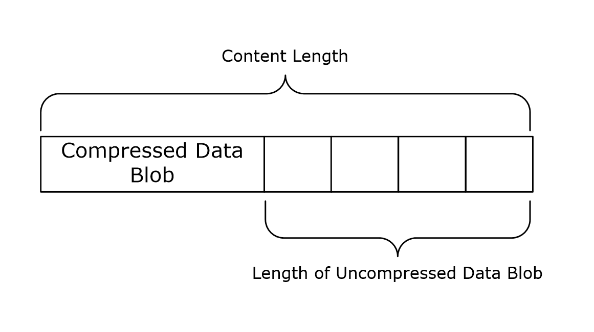

Figure 5: Compressed message layout showing compressed data BLOB and uncompressed length

### 2.2.10 Options for CIM/WMI Operations with PowerShell Semantics

The following table lists the options that influence the behavior of the client and server when the client is initiating CIM operations. The Option Name column contains the string that is used for the "Name" attribute of the wsmanwsman:Option element, while the Option Type column contains the string that is used for the Type attribute of the wsman:Option element.

The processing of these options by the server still follows the rules specified in section [3.1.4.1.10](#Section_3.1.4.1.10.1). Additional processing rules are specified in section [3.1.4.1.26](#Section_3.1.4.1.26).

| Option Name | Option Type |
| --- | --- |
| wmi:__MI_CallbackRegistration | xs:init |
| wmi:__MI_OPERATIONOPTIONS_CHANNEL | xs:init |
| wmi:__MI_OPERATIONOPTIONS_WRITEERRORMODE | xs:init |
| wmi:__MI_OPERATIONOPTIONS_PROMPTUSERMODE | xs:init |
| wmi:__MI_OPERATIONOPTIONS_PROMPTUSERMODEREGULAR_ACKVALUE | xs:boolean |

The options have the following semantics.

**wmi:__MI_CallbackRegistration:** This option MUST be a combination of zero or more of the following flags.

| Flag | Description |
| --- | --- |
| 0x00000001 | The client registered to receive Debug or Warning or Verbose messages. |
| 0x00000002 | The client registered to receive Error messages. |
| 0x00000004 | The client registered to receive streamed responses to CIM method invocations. |
| 0x00000008 | The client registered to receive Progress messages. |
| 0x00000010 | The client registered to receive Confirm messages. |

If multiple instances of this option appear in a message, the recipient MUST treat them as a single option with the values combined by the bitwise-OR operator.

**wmi:__MI_OPERATIONOPTIONS_CHANNEL:** This option can have any of the following values.

| Value | Description |
| --- | --- |
| 0 | Interactive messages from the server will be interpreted as Warning messages. |
| 1 | Interactive messages from the server will be interpreted as Verbose messages. |
| 2 | Interactive messages from the server will be interpreted as Debug messages. |

If this option is omitted, the default value is 0x07. If multiple instances of this option appear in a message, the recipient MUST treat them as a single option containing all the specified values.

**wmi:__MI_OPERATIONOPTIONS_WRITEERRORMODE:** This option can have any of the following values:

| Value | Description |
| --- | --- |
| 0 | The server will send Error messages to the client, but the client will not be able to influence further processing of the operation. |
| 1 | The server will send Error messages to the client and will send Confirm messages so the client can determine whether processing will continue. |

If this option is omitted, the default value is 0.

**wmi:__MI_OPERATIONOPTIONS_PROMPTUSERMODE:** This option can have any of the following values.

| Value | Description |
| --- | --- |
| 0 | "Report." The server will send Confirm messages to the client, but the client will not be able to influence further processing of the operation. |
| 1 | "Inquire." The server will send Confirm messages to the client and will wait for the client to determine whether processing will continue. |
| 2 | "Ignore." The server will not send confirm messages to the client and will automatically answer to the server-side prompts. |

If this option is omitted, the default value is 1, "Inquire".

**wmi:__MI_OPERATIONOPTIONS_PROMPTUSERMODEREGULAR_ACKVALUE:** This option specifies the answer to the server-side prompt requests.

| Value | Description |
| --- | --- |
| false | The server SHOULD answer No automatically to all prompt requests. |
| true | The server SHOULD answer Yes automatically to all prompt requests. |

If this option is omitted, the server will follow the behavior as specified in section [3.1.6.8](#Section_3.1.6.8) for the __MI_OPERATIONOPTIONS_PROMPTUSERMODE option.

# 3 Protocol Details

The WS-Management protocol specification, as specified in [[DMTF-DSP0226]](https://go.microsoft.com/fwlink/?LinkId=89849), describes a general SOAP–based protocol for managing systems, such as computers, servers, devices, Web services and other applications, and other manageable entities.

## 3.1 Server Details

This section describes changes to the Web Services Management Protocol Extensions for Windows Vista servers.

### 3.1.1 Abstract Data Model

This section describes a conceptual model of possible data organization that an implementation maintains to participate in this protocol. The described organization is provided to facilitate the explanation of how the protocol behaves. This document does not mandate that implementations adhere to this model as long as their external behavior is consistent with that described in this document.

Web Services Management Protocol Extensions for Windows Vista service extends the abstract data model of the server role of the WS-Management Protocol as specified in [[DMTF-DSP0226]](https://go.microsoft.com/fwlink/?LinkId=89849).

**PubInitSubscriptions:** A table of active [**publisher-initiated event subscriptions**](#gt_publisher-initiated-event-subscription) (as specified in section [3.1.4.1.30](#Section_3.1.4.1.30)). Each row contains the following elements:

- **Envelope:** a SOAP envelope containing a SubscribeMsg message
- **Version :** a version [**GUID**](#gt_globally-unique-identifier-guid), as specified in section [2.2.4.41](#Section_2.2.4.41)
**ShellInstances:** a table of remote shell instances operations (see section [3.1.4.1.31](#Section_3.1.4.1.31.2) for details). Each row contains the following elements:

- **ShellId:** a ShellId as specified in section [2.2.4.37](#Section_2.2.4.37)
- **Instance:** an implementation-specific remote shell instance
**Certificate Mapping:** A table containing certificate mapping entries. Each entry is of the type cert:CertMappingType. These entries are used by the Web Services Management Protocol Extensions for Windows Vista service to map client certificates to a user on the server, as specified in section [3.1.4.1.35](#Section_3.1.4.1.35).

**ResourceSecurity:** A table of [**resource URIs**](#gt_resource-uri) and their associated Sddl mappings (see section [3.1.4.1.29.4](#Section_3.1.4.1.29.4) for details). Each row contains the following elements:

- **Uri:** a Resource URI
- **Sddl:** an SDDL value representing the security settings that are used to authorize access to the resource represented by **Uri**.
- **ExactMatch:** A Boolean value. If set to true, the security settings in **Sddl** are only used to authorize access attempts to the resource URI exactly as given by the **Uri**. If set to false, the security settings in **Sddl** are used to authorize access attempts to resource URIs beginning with the string given in **Uri**.
**Plugins:** A table of plugin configuration instances (see section [3.1.4.1.32](#Section_3.1.4.1.32) for details). Each row contains the following elements:

- **PluginName:** A unique **Name** as specified in section [2.2.4.22](#Section_2.2.4.22).
- **Filename:** An implementation-specific string that represents the plugin as specified in section 2.2.4.22.<42>
- **PluginConfig:** Plugin configuration data represented by an element of type <PluginType> as specified in section 2.2.4.22.
**CustomRemoteShells:** A table of custom remote shell URIs (see section 3.1.4.1.31 for details). Each row contains the following elements:

- **URI:** The resource URI for the custom Shell as specified in section [2.2.4.13](#Section_2.2.4.13).
- **Shell:** An implementation-specific string that represents the process for the custom Shell as specified in section 2.2.4.13.<43>
- **Arguments:** A string that contains the arguments to be passed to the custom Shell as specified in section 2.2.4.13.
- **State:** An implementation-specific identifier for the current state of the shell, either connected or disconnected.
- **ClientId:** An implementation-specific identifier of the creator of a shell.
**OperationMessages:** A table of messages sent by the server as part of an operation. Each row contains the following elements:

- **OperationID:** The GUID identifying the operation as specified in section [2.2.4.45](#Section_2.2.4.45).
- **ConnectionData:** A RobustConnection object associated with the operation.
**RobustConnection:** A table of buffered response data related to an operation. Each row contains the following elements:

- **StreamingEnabled:** A Boolean value. A value of true enables streaming responses, while false indicates that responses are to be buffered until complete.
- **Messages:** A list of previously sent response messages. This list is initially empty. The length is implementation-dependent.<44>
- **SequenceId:** The sequence ID value of the next response message. This is initially set to 1.
- **KeepAliveTimer:** A Connection KeepAlive Timer. This timer is initially not started.
- **RetentionTimer:** A Response Retention Timer. This timer is initially not started.
- **ResponseBegun:** A Boolean value. This value is initially set to false. It is set to true after the server sends the HTTP headers of the HTTP response to the client.
- **ResponseComplete:** A Boolean value. This value is initially set to false. It is set to true after the server has sent all output from the operation to the client.
- **SecondaryConnection:** An HTTP connection associated with the operation. This is initially set to NULL.

### 3.1.2 Timers

Web Services Management Protocol Extensions for Windows Vista extends the behavior of the WS-Management Protocol server role (as specified in [[DMTF-DSP0226]](https://go.microsoft.com/fwlink/?LinkId=89849)) by defining the following timers.

**Enumeration Garbage Collection timer:** A timer used to trigger the cleanup of the state associated with an enumeration if a client has not used it for a certain amount of time. When the service sends an EnumerationResponse or a PullResponse message, the service instantiates a new timer and starts it. When the service receives a Pull or a Release request, the service halts the timer that is associated with the Enumeration. For more details see section [3.1.5](#Section_3.1.5). The minimum value MUST be 500. The maximum value MUST be 4294967295. The default value MUST be 60000.

**Packet Retrieval timer:** A timer used to trigger the rejection of a client request if the entire HTTP request has not been received in a timely manner. When the HTTP headers at the start of any HTTP request are received, the service instantiates a new timer and starts it. When the entire HTTP message is received, the service halts the timer that is associated with the HTTP request. For more details see section 3.1.5. The minimum value MUST be 1. The maximum value MUST be 4294967295. The default value MUST be 120.

**Shell Idle Timeout timer:** A timer used to trigger the deleting of a Remote Shell if no user activity has been received for that Remote Shell for a certain amount of time. When the service receives a request targeted at a Remote Shell or a wxt:Create request to create a new Remote Shell resource (as specified in section [3.1.4.5.2](#Section_3.1.4.5.2)), the service instantiates a new timer and starts it. When the service receives another request targeted at that Remote Shell, the service halts the existing timer that is associated with the Remote Shell. For more details see section 3.1.5. The minimum value MUST be 0. The maximum value MUST be 0x7FFFFFFF. The default value SHOULD be 900000.

**Shell Lifetime Timer:** A timer used to trigger the deletion of a Remote Shell if it has existed for a certain amount of time. When the service receives a wxt:Create request for a Remote Shell resource (as specified in section 3.1.4.5.2), the service instantiates a new Shell Lifetime Timer and starts it. When the Remote Shell is deleted, the service halts the timer associated with the Remote Shell. For more details, see section 3.1.5. The minimum value MUST be 0. The maximum value MUST be 0x7FFFFFFF.

**Connection KeepAlive timer:** A timer used to trigger the periodic sending of an empty message when a long-running RobustConnection operation is not generating any other output. For more details, see section [3.1.4.1.39](#Section_3.1.4.1.39). The minimum value MUST be 0. The maximum value MUST be 1 minute.

**Response Retention Timer::** A timer that triggers discarding the response messages saved in a RobustConnection after a period of no contact from the client. The interval is 3 minutes and 15 seconds.

### 3.1.3 Initialization

Web Services Management Protocol Extensions for Windows Vista extends the initialization steps required by the WS-Management Protocol, as specified in [[DMTF-DSP0226]](https://go.microsoft.com/fwlink/?LinkId=89849).

At initialization, all configuration settings as described by the ConfigType type (section [2.2.4.10](#Section_2.2.4.10)) are initialized to their default values.

At initialization, the content of **Plugins** is populated in an implementation-specific way.

At initialization, the Web Services Management Protocol Extensions for Windows Vista MUST ensure, in an implementation-specific way, that two different [**plugins**](#gt_plugin) don’t expose the same [**resource URI**](#gt_resource-uri).

At initialization, the Web Services Management Protocol Extensions for Windows Vista SHOULD start a process, in an implementation-specific way, for any plug-in that has a value of true for the AutoRestart element (as defined in section [2.2.4.22](#Section_2.2.4.22)).

### 3.1.4 Message Processing Events and Sequencing Rules

This section describes changes made by Web Services Management Protocol Extensions for Windows Vista servers to the message processing of the WS-Management Protocol as specified in [[DMTF-DSP0226]](https://go.microsoft.com/fwlink/?LinkId=89849).

The following table summarizes the list of WSDL operations as defined by this specification.

| Operation | Description |
| --- | --- |
| Get | Used to fetch the current representation of a resource. |
| Put | Used to update a resource by providing a replacement representation or a set of replacement values. |
| Create | Used to create a resource and provide its initial representation. |
| Delete | Used to delete a resource. |
| Subscribe | Used to create a subscription to have event notifications delivered. |
| Unsubscribe | Used to cancel an existing subscription. |
| Enumerate | Begins the enumeration of a set of resources. |
| Pull | Used to retrieve resources from an existing enumeration. |
| Release | Used to cancel an existing enumeration. |
| Command | Used to initiate a command in a Text-based Command Shell scenario. |
| Signal | Used to send a control signal to the Shell processor. |
| Send | Used to send input to a running Shell or Command. |
| Receive | Used to receive output from a running Shell or Command. |
| Disconnect | Used to disconnect from a running Shell. |
| Reconnect | Used to reconnect to a running Shell from an existing client application. |
| Connect | Used to connect to a running Shell from a client application other than the one that created the Shell. |
| Acknowledge | Used to request that the other side (server or client) acknowledge the messages received as part of an operation. |

#### 3.1.4.1 Common Message Processing Events and Sequencing Rules

This section describes protocol details that are common across WSDL operations.

When the Web Services Management Protocol Extensions for Windows Vista service receives an HTTP header at the start of any HTTP request message, the service MUST create a new Packet Retrieval timer, associate it with the request, and start the timer. The timer interval MUST be set to the number of seconds given by the MaxPacketRetrievalTimeSeconds configuration setting, as specified in section [2.2.4.36](#Section_2.2.4.36).

On receipt of the entire HTTP message, the Packet Retrieval timer for that HTTP request MUST be canceled.

##### 3.1.4.1.1 wsman:ResourceURI

Web Services Management Protocol Extensions for Windows Vista servers MUST accept [**resource URIs**](#gt_resource-uri) starting with the following prefixes:

- `http://schemas.microsoft.com/wbem/wsman/1/config`
- `http://schemas.dmtf.org/wbem/wscim/1/cim-schema/2/`
- `http://schemas.microsoft.com/wbem/wsman/1/wmi/root/`
- `http://schemas.microsoft.com/wbem/wsman/1/windows/EventLog`
- `http://schemas.microsoft.com/wbem/wsman/1/windows/shell`
- `http://schemas.microsoft.com/wbem/wsman/1/SubscriptionManager/Subscription`
The CIM binding for WS-Management defines ResourceURIs to be used in referencing the [**CIM objects**](#gt_cim-object). More information is specified in [[DMTF-DSP0227]](https://go.microsoft.com/fwlink/?LinkId=89851) section 6.1.

Web Services Management Protocol Extensions for Windows Vista servers MUST use the http://schemas.dmtf.org/wbem/wscim/1/cim-schema/2/ namespace prefix followed by the class name when providing access to [**Distributed Management Task Force (DMTF)**](#gt_distributed-management-task-force-dmtf) classes. The classes in [**WMI**](#gt_windows-management-instrumentation-wmi) are considered DMTF classes if they have a version [**qualifier**](#gt_qualifier) with a major number equal to 2.

As specified in [DMTF-DSP0227] section 6.3, the "__cimnamespace" [**selector**](#gt_selector) specifies the [**CIM namespace**](#gt_cim-namespace) that the request is associated with.

Web Services Management Protocol Extensions for Windows Vista servers MAY<45> support the "__cimnamespace" selector.

Web Services Management Protocol Extensions for Windows Vista servers MUST use root\hardware as the default if the "__cimnamespace" selector is not specified in the request.

Web Services Management Protocol Extensions for Windows Vista servers MUST use the following format to provide access to any WMI class.

<prefix> <cim namespace> "/" <class name>

Where *<prefix>* is http://schemas.microsoft.com/wbem/wsman/1/wmi/ and *<cim namespace>* is the CIM namespace in which "\" has been converted to "/".

As specified in [DMTF-DSP0227] section 6.3, the "__cimnamespace" selector specifies the CIM Namespace that the request is associated with. Web Services Management Protocol Extensions for Windows Vista servers SHOULD reply with an error response if the "__cimnamespace" selector is specified when using a WMI ResourceURI.<46>

##### 3.1.4.1.2 wsman:SelectorSet

The WS-Management specification defines [**selector**](#gt_selector) as a resource-relative name and value pair that acts as an instance-level discriminant. The selector set MUST be a set of these selectors, as specified in [[DMTF-DSP0226]](https://go.microsoft.com/fwlink/?LinkId=89849) section 5.1.2.2. Rule R5.1.2.2-1 specifies that the selector names and values can be treated as case-insensitive or case-sensitive.

Web Services Management Protocol Extensions for Windows Vista servers MUST treat all selector names and values as case-insensitive.

##### 3.1.4.1.3 wsa:ReplyTo

The WS-Management specification allows the ReplyTo Header value to be either a valid address for a new connection by using any transport supported by the [**service**](#gt_service), or the [**URI**](#gt_uniform-resource-identifier-uri) http://schemas.xmlsoap.org/ws/2004/08/addressing/role/anonymous, as specified in [[DMTF-DSP0226]](https://go.microsoft.com/fwlink/?LinkId=89849) section 5.4.2.

Web Services Management Protocol Extensions for Windows Vista servers MUST return a wsman:UnsupportedFeature fault with a detail code of http://schemas.dmtf.org/wbem/wsman/1/wsman/faultDetail/AddressingMode if they receive a value other than http://schemas.xmlsoap.org/ws/2004/08/addressing/role/anonymous in the ReplyTo header. If however the ReplyTo header is not present, then the servers MUST return a wsa: MessageInformationHeaderRequired fault.

##### 3.1.4.1.4 wsa:FaultTo

The WS-Management specification allows a conformant [**service**](#gt_service) to require that all faults be delivered to the client over the same transport or connection on which the request arrives. In this case, the [**URI**](#gt_uniform-resource-identifier-uri) MUST be http://schemas.xmlsoap.org/ws/2004/08/addressing/role/anonymous/, as specified in [[DMTF-DSP0226]](https://go.microsoft.com/fwlink/?LinkId=89849) section 5.4.3.

The Web Services Management Protocol Extensions for Windows Vista service MUST return the wsman:UnsupportedFeature fault with a detail code of http://schemas.dmtf.org/wbem/wsman/1/wsman/faultDetail/AddressingMode if the wsa:Address element within the wsa:FaultTo is not set to http://schemas.xmlsoap.org/ws/2004/08/addressing/role/anonymous/.

If a fault occurs in response to a request for which the wsa:FaultTo header is not present, the server MUST return the fault to the wsa:ReplyTo address (as specified in [DMTF-DSP0226] section 5.4.3 Rule 5.4.3-2).

##### 3.1.4.1.5 wsa:MessageID

The WS-Management specification endorses two different MessageID [**URI**](#gt_uniform-resource-identifier-uri) formats, as specified in [[DMTF-DSP0226]](https://go.microsoft.com/fwlink/?LinkId=89849) section 5.4.4.

Web Services Management Protocol Extensions for Windows Vista servers SHOULD<47> use the [**uuid**](#gt_universally-unique-identifier-uuid):xxxxxxxx-xxxx--xxxx--xxxx--xxxxxxxxxxxx MessageID format. The MessageID value MUST be at least one character in length.

If the MessageID value is empty or missing the Web Services Management Protocol Extensions for Windows Vista server SHOULD return a wsa:InvalidMessageInformationHeader fault.

##### 3.1.4.1.6 wsman:OperationTimeout

The WS-Management specification defines the OperationTimeout value to indicate that the clients expect a response or a fault within the specified time, as specified in [[DMTF-DSP0226]](https://go.microsoft.com/fwlink/?LinkId=89849) section 6.1.

The Web Services Management Protocol Extensions for Windows Vista servers MUST default the time-out value to the value of the MaxTimeoutms configuration setting, as specified in section [2.2.4.10](#Section_2.2.4.10), if no OperationTimeout value is specified by the client or if the OperationTimeout value is more than this setting.

##### 3.1.4.1.7 wsman:MaxEnvelopeSize

The WS-Management specification defines the MaxEnvelopeSize value to indicate that the clients expect a response to be no larger than the given number of octets, as specified in [[DMTF-DSP0226]](https://go.microsoft.com/fwlink/?LinkId=89849) section 6.2.

Web Services Management Protocol Extensions for Windows Vista servers MUST default the MaxEnvelopeSize value to the value of the MaxEnvelopeSizekb configuration setting (as specified in Section [2.2.4.10](#Section_2.2.4.10)) multiplied by 1,024 if no MaxEnvelopeSize value is specified by the client, or if the MaxEnvelopeSize value is more than this setting.

WS-Management, as specified in [DMTF-DSP0226] section 6.2, indicates that servers SHOULD return a wsman:EncodingLimit fault if the value of wsman:MaxEnvelopeSize is fewer than 8192 octets. Web Services Management Protocol Extensions for Windows Vista servers MUST return the indicated fault in this situation.

##### 3.1.4.1.8 wsman:Locale

The WS-Management specification defines the Locale element, which specifies the language in which the client wants response text to be translated, as specified in [[DMTF-DSP0226]](https://go.microsoft.com/fwlink/?LinkId=89849) section 6.3.

Web Services Management Protocol Extensions for Windows Vista servers MUST return a fault of wsman:UnsupportedFeature with a detail code of http://schemas.dmtf.org/wbem/wsman/1/wsman/faultDetail/Locale, if the mustUnderstand attribute of this element is "true".

##### 3.1.4.1.9 wsmv:DataLocale

Web Services Management Protocol Extensions for Windows Vista servers MAY<48> send the wsmv:DataLocale header with response messages.When sent as part of a response message, the wsmv:DataLocale header SHOULD indicate the language in which the server formatted the numerical data in the response text.

Like the [wsman:Locale](#Section_3.1.4.1.8) header, the wsmv:DataLocale header makes use of the standard XML attribute xml:lang and MUST be defined as follows.

<wsmv:DataLocale xml:lang="xs:language" s:mustUnderstand="false" />

When sent as part of a request message, the wsmv:DataLocale header SHOULD be processed as the wsman:Locale header is processed, as specified in [[DMTF-DSP0226]](https://go.microsoft.com/fwlink/?LinkId=89849) section 6.3. The only difference is that the language in question SHOULD<49> be used when formatting numerical data in the response text, not when translating the text.

Web Services Management Protocol Extensions for Windows Vista servers MUST NOT set the mustUnderstand attribute of this element to "true". Web Services Management Protocol Extensions for Windows Vista servers SHOULD return a fault of wsman:UnsupportedFeature with a detail code of http://schemas.dmtf.org/wbem/wsman/1/wsman/faultDetail/DataLocale, if the mustUnderstand attribute of this element is "true".

##### 3.1.4.1.10 wsman:OptionSet

The WS-Management specification defines the <OptionSet> element as a set of switches to the [**service**](#gt_service) to modify or refine the nature of the request, as specified in [[DMTF-DSP0226]](https://go.microsoft.com/fwlink/?LinkId=89849) section 6.4.

The Web Services Management Protocol Extensions for Windows Vista service MUST<50> process the OptionSet element. The options supported vary by ResourceURI and operation. The Web Services Management Protocol Extensions for Windows Vista service MUST process the OptionSet block for the supported URI, regardless of the value of the SOAP mustUnderstand header.

The options supported by a [**CIM**](#gt_common-information-model-cim)/[**WMI**](#gt_windows-management-instrumentation-wmi) ResourceURI vary and are implementation-dependent.<51>

The Web Services Management Protocol Extensions for Windows Vista service MUST process any Option element that starts with "wmi:" by removing the "wmi:" prefix and adding the resulting name to the WMI content with the value of the Option element.

The Web Services Management Protocol Extensions for Windows Vista service MUST process any Option element that starts with "wmiarray:" by removing the "wmiarray:" prefix and grouping all values with the same name into an array before adding to the WMI context. The order of the values in the array MUST match the order in which the Option element occurred in the OptionSet element.

The Web Services Management Protocol Extensions for Windows Vista service SHOULD<52> return a wsman:InvalidOptions fault for CIM/WMI ResourceURIs if the wsman:OptionSet element contains a wsman:Option element with mustComply="true" regardless of the name of the option.

###### 3.1.4.1.10.1 wsman:OptionSet/wsman:Option/@Type

The WS-Management specification defines the optional attribute Type to indicate the data type of the element content. If Type is present, the Web Services Management Protocol Extensions for Windows Vista service MUST take into account the Type when processing the individual option.<53>

##### 3.1.4.1.11 wsman:RequestEPR

The WS-Management specification defines the RequestEPR [**SOAP**](#gt_soap) header, which can be used by clients that need to get the [**endpoint reference (EPR)**](#gt_endpoint-reference-epr) in the response. This information is specified in [[DMTF-DSP0226]](https://go.microsoft.com/fwlink/?LinkId=89849) section 6.5.

The Web Services Management Protocol Extensions for Windows Vista [**service**](#gt_service) SHOULD ignore the RequestEPR header.<54>

##### 3.1.4.1.12 wsmv:ActivityId

Web Services Management Protocol Extensions for Windows Vista servers MAY send the wsmv:ActivityId header with response messages.<55> The value of the wsmv:ActivityId header is an xs:string; its contents are implementation-specific and SHOULD uniquely identify a particular Web Services Management Protocol Extensions for Windows Vista message in order to allow correlation of the message with implementation-specific activity that occurs on the sending machine.<56>

The wsmv:ActivityId header MUST be defined as follows, with a value of type xs:string:

<wsmv:ActivityId s:mustUnderstand="false"></wsmv:ActivityId>

Web Services Management Protocol Extensions for Windows servers SHOULD accept any arbitrary string value for the wsmv:ActivityId header. The value MUST NOT exceed 2048 characters in length. If the value exceeds 2048 characters in length the Web Services Management Protocol Extensions for Windows Vista server SHOULD return a wsa:InvalidMessageInformationHeader fault.

Web Services Management Protocol Extensions for Windows Vista servers MUST NOT set the mustUnderstand attribute of this element to "true". Web Services Management Protocol Extensions for Windows Vista servers SHOULD<57> process the message and SHOULD NOT return a fault if the mustUnderstand attribute of this element is "true".

##### 3.1.4.1.13 wsen:Filter

The WS-Management specification defines the Filter element, which is used to retrieve a subset of the result set, as specified in [[DMTF-DSP0226]](https://go.microsoft.com/fwlink/?LinkId=89849) section 8.2.1.

The [**WMI**](#gt_windows-management-instrumentation-wmi) specification defines the WQL query language, as specified in [MS-WMI](../MS-WMI/MS-WMI.md) section 2.2.1.

The Web Services Management Protocol Extensions for Windows Vista [**service**](#gt_service) MUST process the request if it is targeted to a ResourceURI for a [**CIM**](#gt_common-information-model-cim) or WMI [**resource**](#gt_resource) and contains the Filter element with a Dialect identifying WQL: http://schemas.microsoft.com/wbem/wsman/1/WQL. The results of the WQL query MUST be rendered as described in the WS-Management CIM Binding specification for CQL, as specified in [[DMTF-DSP0227]](https://go.microsoft.com/fwlink/?LinkId=89851) section 8.1.<58><59>

The WS-Management CIM Binding specification defines the Association Queries language, as specified in [DMTF-DSP0227] section 8.2.

The Web Services Management Protocol Extensions for Windows Vista service MUST process the request if it is targeted to a ResourceURI for a CIM resource and contains the Filter element with a Dialect identifying Association Query: http://schemas.dmtf.org/wbem/wsman/1/cimbinding/associationFilter. The results of the Association Query MUST be rendered as described in the WS-Management CIM Binding specification for Association Query, as specified in [DMTF-DSP0227] section 8.2.

The WS-Management CIM Binding specification (as specified in [DMTF-DSP0227]) defines the wsmb:Expression element to correlate response elements with portions of the select-clause.<60>

The Web Services Management Protocol Extensions for Windows Vista service MUST return a wsen:FilteringNotSupported fault if the enumerate request contains the Filter element for any ResourceURI that is not for a CIM or WMI resource.

The WS-Management specification defines wsman:Filter as an alternative mechanism to specify filters that are different from that of the wsen:Filter, as specified in [DMTF-DSP0226] section 8.3.

The Web Services Management Protocol Extensions for Windows Vista service MUST support the wsen:Filter element, and MUST support filter expressions in the XPath Level 1 dialect as specified in [DMTF-DSP0226] Annex D.1.

The Web Services Management Protocol Extensions for Windows Vista service MUST support the wsman:Filter element and process it exactly the same as if the wsen:Filter element were present.

The Web Services Management Protocol Extensions for Windows Vista supports the Selector filter dialect, as specified in [DMTF-DSP0226] Annex E, which is a simple filtering dialect that allows a filtered enumeration with no representation change. Selectors are part of the default addressing model as specified in [DMTF-DSP0226] section 5.1.2.2.<61>

When using the Selector filter dialect, the value of the dialect attribute MUST be http://schemas.dmtf.org/wbem/wsman/1/wsman/SelectorFilter. The following rules apply to the processing of Selector filters:

- Selector Filter Dialect can only be used for class-specific resource [**URIs**](#gt_uniform-resource-identifier-uri), as specified in [DMTF-DSP0227] section 6.1.
- The filter expression MUST be rejected and the server SHOULD reply with an error response in the following cases:
- The [**selector**](#gt_selector) set contains duplicate selector names.
- The selector names a property of one of the following types:
- Array
- Datetime
- Reference or object
- The value contains either the double quotation mark (") character or the single quotation mark (') character.
If the filter expression does not conform, the Web Services Management Protocol Extensions for Windows Vista server SHOULD return a wsen:CannotProcessFilter fault.

##### 3.1.4.1.14 wsen:Pull/wsen:MaxElements

The WS-Management specification defines the MaxElements element, which is used to limit how many items are retrieved in a single message, as specified in [[DMTF-DSP0226]](https://go.microsoft.com/fwlink/?LinkId=89849) section 8.4.

Web Services Management Protocol Extensions for Windows Vista servers MUST use the smaller of the value of MaxBatchItems configuration setting (as specified in section [2.2.4.10](#Section_2.2.4.10)) and the value of wsen:MaxElements as the effective value of wsen:MaxElements.

##### 3.1.4.1.15 wsman:RequestTotalItemsCountEstimate

The WS-Management specification defines the RequestTotalItemsCountEstimate [**SOAP**](#gt_soap) header to allow a client to request an estimate for the number of items being returned in the result set. More information is specified in [[DMTF-DSP0226]](https://go.microsoft.com/fwlink/?LinkId=89849) section 8.2.2.

Web Services Management Protocol Extensions for Windows Vista [**service**](#gt_service) SHOULD<62> ignore the RequestTotalItemsCountEstimate header.

##### 3.1.4.1.16 wsman:OptimizeEnumeration

The WS-Management specification defines the optional element OptimizeEnumeration<63> to allow a client to request that initial results be returned in the enumeration response, as specified in [[DMTF-DSP0226]](https://go.microsoft.com/fwlink/?LinkId=89849) section 8.2.3.

Web Services Management Protocol Extensions for Windows Vista service MUST process the request containing OptimizeEnumeration request, as specified in [DMTF-DSP0226] section 8.2.3.

##### 3.1.4.1.17 wsman:EnumerationMode

The WS-Management specification defines the optional EnumerationMode element to allow a client to specify whether the actual objects, the [**EPR**](#gt_endpoint-reference-epr) of the object, or both the EPR and the object are to be returned. For more information, see [[DMTF-DSP0226]](https://go.microsoft.com/fwlink/?LinkId=89849) section 8.7.

The Web Services Management Protocol Extensions for Windows Vista [**service**](#gt_service) MUST process the EnumerationMode element and respond according to the client request if the ResourceURI supports the indicated mode. If the ResourceURI does not support the indicated mode, the Web Services Management Protocol Extensions for Windows Vista service SHOULD return a wsman:UnsupportedFeature fault with a detail code of http://schemas.dmtf.org/wbem/wsman/1/faultDetail/EnumerationMode. The [**resource URIs**](#gt_resource-uri) that support EnumerationMode are shown in the following table. For the resource URIs where the Prefix is marked "Yes", all valid resource URIs beginning with the specified URI support the indicated modes. For the resource URIs where the Prefix is marked "No", only the exact specified resource URI supports the indicated modes.

| ResourceURI | Modes | Prefix |
| --- | --- | --- |
| http://schemas.dmtf.org/wbem/wscim/1/cim-schema/2/ | All 3 | Yes |
| http://schemas.microsoft.com/wbem/wsman/1/wmi/root/ | All 3 | Yes |
| http://schemas.microsoft.com/wbem/wsman/1/config/listener | All 3 | No |
| For Windows Command Shell: http://schemas.microsoft.com/wbem/wsman/1/windows/shell/cmd An example of Custom Remote Shell: http://schemas.microsoft.com/wbem/wsman/1/windows/shell/CustomShell | All 3 | No |

##### 3.1.4.1.18 wsman:FragmentTransfer

The WS-Management specification defines the FragmentTransfer [**SOAP**](#gt_soap) header, which is used to retrieve and update fragments or individual elements of the [**resource**](#gt_resource). See specification [[DMTF-DSP0226]](https://go.microsoft.com/fwlink/?LinkId=89849) section 7.7.

Web Services Management Protocol Extensions for Windows Vista clients can use the wsman:FragmentTransfer header to access subpieces of a [**CIM**](#gt_common-information-model-cim)/[**WMI**](#gt_windows-management-instrumentation-wmi) object with the WS-Transfer Get and WS-Transfer Put operations.<64>

Web Services Management Protocol Extensions for Windows Vista service MUST process the wsman:FragmentTransfer header if the value of the SOAP mustUnderstand attribute is set to "true". Web Services Management Protocol Extensions for Windows Vista service MUST reply with a wsa:InvalidMessageInformationHeader fault if the value of the SOAP mustUnderstand attribute in the wsman:FragmentTransfer header is set to "false".

The Web Services Management Protocol Extensions for Windows Vista service MUST accept a wsman:FragmentTransfer header containing a fragment expression in the XPath Level 1 dialect as specified in [DMTF-DSP0226] Annex D.1. for WS-Transfer Get and WS-Transfer Put operations when the resource [**URI**](#gt_uniform-resource-identifier-uri) and [**selectors**](#gt_selector) identify an instance of a CIM/WMI class, where a CIM/WMI class is defined as a class with a resource URI beginning with one of the following prefixes.

| Resource URI | Prefix |
| --- | --- |
| http://schemas.dmtf.org/wbem/wscim/1/cim-schema/2/ | Yes |
| http://schemas.microsoft.com/wbem/wsman/1/wmi/root/ | Yes |

WS-Management indicates that a wsen:CannotProcessFilter SHOULD<65><66><67>be returned when the fragment expression exceeds the subset supported by the service. More information is specified in [DMTF-DSP0226] section 7.7.

If the [**resource URI**](#gt_resource-uri) does not support the FragmentTransfer header but does support the WS-Transfer operation, the Web Services Management Protocol Extensions for Windows Vista service MUST return a fault.<68>

##### 3.1.4.1.19 Concurrent Operations

A Web Services Management Protocol Extensions for Windows Vista service SHOULD use the MaxConnections configuration setting, as specified in section [2.2.4.36](#Section_2.2.4.36), to optimize the processing performance of up to the indicated number of concurrent requests in an implementation-specific way. If it receives additional requests while it is already processing a number of concurrent requests that are equal to the MaxConnections configuration setting, the server MAY reply with a wsman:InternalError fault.

A Web Services Management Protocol Extensions for Windows Vista service MUST reject additional enumerate requests if it has a number of outstanding enumerations that are equal to the MaxConcurrentOperations configuration setting, as specified in section 2.2.4.36. In this case, the server MUST reply with a wsman:InternalError fault.

A Web Services Management Protocol Extensions for Windows Vista service MUST reject additional enumerate requests if it has a number of outstanding enumerations from the same user that are equal to the MaxConcurrentOperationsPerUser configuration setting, as specified in section 2.2.4.36. In this case, the server MUST reply with a wsman:InternalError fault.

The Web Services Management Protocol Extensions for Windows Vista service MUST reject additional requests to a specific provider if the provider is already processing a number of concurrent requests that are equal to the MaxProviderRequests configuration setting, as specified in section [2.2.4.10](#Section_2.2.4.10). In this case, the server MUST reply with a wsman:InternalError fault.

##### 3.1.4.1.20 Inbound Message Size

The Web Services Management Protocol Extensions for Windows Vista servers MUST return an HTTP status of 413 (Request Entity Too Large) without processing the [**SOAP**](#gt_soap) message if the request packet from the client is larger than the MaxEnvelopeSizekb configuration setting, as specified in section [2.2.4.10](#Section_2.2.4.10).

##### 3.1.4.1.21 Fault Detail

The WS-Management specification allows servers to specify additional fault details as part of the [**SOAP**](#gt_soap) fault it generates, as specified in [[DMTF-DSP0226]](https://go.microsoft.com/fwlink/?LinkId=89849) section 14. The [**URI**](#gt_uniform-resource-identifier-uri) prefix for fault detail is http://schemas.dmtf.org/wbem/wsman/1/wsman/faultDetail.

Web Services Management Protocol Extensions for Windows Vista servers SHOULD use the http://schemas.dmtf.org/wbem/wsman/1/wsman/faultDetail prefix when specifying additional fault details.

##### 3.1.4.1.22 WS-Policy

A Web Services Management Protocol Extensions for Windows Vista service MAY<69> accept WS-Policy expressions consisting of a sequence of policy assertions, but need not accept nested policy assertions. A service MAY<70> reject WS-Policy expressions in which a single wsp:All element contains more than one wsman:Authentication assertion and reply with a wsman:EventDeliverToUnusable fault with a detail of http://schemas.dmtf.org/wbem/wsman/1/wsman/faultDetail/PolicyTooComplex. When a service receives a request in which the NotifyTo EPR contains more than one wsp:Policy block with wsman:Authentication assertions, it SHOULD process the first wsp:Policy block with wsman:Authentication assertions and ignore the rest.

If a service cannot comply with all wsp:Policy elements in the wse:NotifyTo EPR, it MUST return a wsman:EventDeliverToUnusable fault with a detail of http://schemas.dmtf.org/wbem/wsman/1/wsman/faultDetail/CannotComplyWithPolicy.

A service MUST return a wsman:EventDeliverToUnusable fault with a detail of http://schemas.dmtf.org/wbem/wsman/1/wsman/faultDetail/PolicyTooComplex, if one of the wsp:Policy elements contains a policy expression that exceeds its ability to evaluate, or if one of the wsp:Policy elements contains a requirement that the event source cannot fulfill when delivering events. This includes unknown elements or attributes in the open content sections of known elements.

##### 3.1.4.1.23 Metadata and Discovery

The WS-Management specification defines a mechanism to determine the existence of a WS-Management service on a server. More information is specified in [[DMTF-DSP0226]](https://go.microsoft.com/fwlink/?LinkId=89849) section 11.

The Web Services Management Protocol Extensions for Windows Vista service MUST <71>support the WS-Management discovery mechanism as specified in [DMTF-DSP0226] section 11, when the request is authenticated.

The Web Services Management Protocol Extensions for Windows Vista service MUST <72>support the WS-Management discovery mechanism as specified in [DMTF-DSP0226] section 11, when the request is unauthenticated and the following HTTP header is present.

WSMANIDENTIFY: unauthenticated

The Web Services Management Protocol Extensions for Windows Vista service SHOULD<73> return the enabled authentication mechanisms as a part of the Identify response using the wsmid:SecurityProfiles element as specified in [DMTF-DSP0226] section 11. The wsmid:SecurityProfiles element MUST NOT be returned when the request is unauthenticated.

If the wsmid:SecurityProfiles element is present, the following MUST be included as child elements of the wsmid:SecurityProfiles element, if Basic authentication is enabled as specified in section [3.1.4.1.29.2](#Section_3.1.4.1.29.2). The following MUST NOT be included if Basic authentication is disabled.

<wsmid:SecurityProfileName>

http://schemas.dmtf.org/wbem/wsman/1/wsman/secprofile/http/basic

</wsmid:SecurityProfileName>

<wsmid:SecurityProfileName>

http://schemas.dmtf.org/wbem/wsman/1/wsman/secprofile/https/basic

</wsmid:SecurityProfileName>

If the wsmid:SecurityProfiles element is present, the following MUST be included as child elements of the wsmid:SecurityProfiles element, if either Negotiate or Kerberos authentication is enabled as specified in section 3.1.4.1.29.2. The following MUST NOT be included if both Negotiate and Kerberos authentication are disabled.

<wsmid:SecurityProfileName>

http://schemas.dmtf.org/wbem/wsman/1/wsman/secprofile/http/spnego-kerberos

</wsmid:SecurityProfileName>

<wsmid:SecurityProfileName>

http://schemas.dmtf.org/wbem/wsman/1/wsman/secprofile/https/spnego-kerberos

</wsmid:SecurityProfileName>

If the wsmid:SecurityProfiles element is present, the following MUST be included as a child element of the wsmid:SecurityProfiles element, if Certificate authentication is enabled as specified in section 3.1.4.1.29.2. It MUST NOT be included if Certificate authentication is disabled.

<wsmid:SecurityProfileName>

http://schemas.dmtf.org/wbem/wsman/1/wsman/secprofile/https/mutual

</wsmid:SecurityProfileName>

If the Web Services Management Protocol Extensions for Windows Vista service is compliant with the DASH Implementation Requirements version 1, it SHOULD include the dash:DASHVersion element in the IdentifyResponse message as specified in [[DMTF-DSP0232-1.0.0]](https://go.microsoft.com/fwlink/?LinkId=226543) section 9.2.2, [[DMTF-DSP0232-1.0.1]](https://go.microsoft.com/fwlink/?LinkId=226544) and [[DMTF-DSP0232-1.1.0]](https://go.microsoft.com/fwlink/?LinkId=226739). This compliance is detected in an implementation-specific way.<74>

If the Web Services Management Protocol Extensions for Windows Vista service is compliant with the SMASH Implementation Requirements version 1, it SHOULD include the following XML element as a child of the wsmid:IdentifyResponse element in the IdentifyResponse message.

<SMASH:SMASHVersion>1.x.x</SMASH:SMASHVersion>

If this element is present, the value MUST be of the form "1.x.x" where "x.x" represents the highest version of the SMASH Implementation Requirements version 1 specification with which the service is compliant. This compliance is detected in an implementation-specific way. <75> The SMASH Implementation Requirements version 1 are as specified in [[DMTF-DSP0217-1.0.0]](https://go.microsoft.com/fwlink/?LinkId=226539).

If the Web Services Management Protocol Extensions for Windows Vista service is compliant with the SMASH Implementation Requirements version 2, it SHOULD include the SMASH:SMASHVersion element in the IdentifyResponse message as specified in [[DMTF-DSP0217-2.0.0]](https://go.microsoft.com/fwlink/?LinkId=226540) section 8.2.1. This compliance is detected in an implementation-specific way. <76>

##### 3.1.4.1.24 Binary Attachments

The WS-Management Protocol defines a mechanism to send binary attachments, as specified in [[DMTF-DSP0226]](https://go.microsoft.com/fwlink/?LinkId=89849) section 13.5.

The Web Services Management Protocol Extensions for Windows Vista service MUST NOT send binary attachments.

##### 3.1.4.1.25 Nonprintable Characters

The Web Services Management Protocol Extensions for Windows Vista service SHOULD NOT include the Unicode characters ranging from hexadecimal values 0x1 to 0x1F (inclusive) in a response message, with the exception of the three characters below:

- 0x9 (tab character)
- 0xA (newline character)
- 0xD (carriage return character)
The Web Services Management Protocol Extensions for Windows Vista service SHOULD return the question mark character "?" in place of any of the above restricted characters.

##### 3.1.4.1.26 Arrays

The WS-CIM Mapping Specification defines specific rules for mapping [**CIM**](#gt_common-information-model-cim) [**properties**](#gt_property) that are arrays. Additional information is specified in [[DMTF-DSP0230]](https://go.microsoft.com/fwlink/?LinkId=89852) section 9.2.2.

Web Services Management Protocol Extensions for Windows Vista servers MUST NOT send null array elements. Web Services Management Protocol Extensions for Windows Vista servers MUST indicate null arrays by including the element once with the xsi:nil attribute set to "true".

##### 3.1.4.1.27 wsmb:PolymorphismMode

A common way to extend [**CIM classes**](#gt_015d0e5e-5166-4987-98b9-9c4128cf55be) is to define derivatives of the [**CIM class**](#gt_cim-class). When a client requests objects of the type for CIM_Process, it is possible to return instances that are actually of a derived type such as Vendor_Process. The WS-Management [**CIM**](#gt_common-information-model-cim) Binding Specification defines details for handling polymorphism in the resultSet, as specified in [[DMTF-DSP0227]](https://go.microsoft.com/fwlink/?LinkId=89851) section 9.3.

The Web Services Management Protocol Extensions for Windows Vista service MUST ignore the PolymorphismMode element.

The Web Services Management Protocol Extensions for Windows Vista service MUST return instances of both base and derived classes. Each returned instance MUST contain the [**properties**](#gt_property) of the base class. Each returned instance MAY omit the properties from the derived classes and MAY set the instance type of derived classes to the base class.

##### 3.1.4.1.28 Security

The Web Services Management Protocol Extensions for Windows Vista service MUST authenticate a request by using one of the configured security profiles. See section [2.2.4.36](#Section_2.2.4.36) and section [3.1.4.1.29](#Section_3.1.4.1.29) for more information about configured profiles.

The Web Services Management Protocol Extensions for Windows Vista service SHOULD authorize a request by using the Sddl value retrieved by issuing a Get request to itself, on the [**resource URI**](#gt_resource-uri) http://schemas.microsoft.com/wbem/wsman/1/config/service/security, and using the resource [**URI**](#gt_uniform-resource-identifier-uri) from the client request message as a [**selector**](#gt_selector). See section [3.1.4.1.29.4](#Section_3.1.4.1.29.4) for more information.

The Web Services Management Protocol Extensions for Windows Vista service MUST<77> authorize a request by using the RootSDDL configuration setting specified in section 2.2.4.36.

Once the SDDL for the resource URI is retrieved, it is used to determine if the user is authorized to perform the operation or not.

The SDDL for the Web Services Management Protocol Extensions for Windows Vista protocol defines the access masks described in [MS-DTYP](../MS-DTYP/MS-DTYP.md) section 2.4.3:

If a user request is a shell request, then it MUST be allowed access if the user is granted **GX** permission in the SDDL. A request is a shell request if:

- Either the request's associated plugin exposes that resource with its <Capability> element having Shell as a capability.
- Or the request's resource URI begins with a prefix: http://schemas.microsoft.com/wbem/wsman/1/windows/shell.
For other requests, the following rules apply:

- Requests with the following action URI's are allowed if the user is granted **GR** permission in the SDDL:
- http://schemas.xmlsoap.org/ws/2004/09/transfer/Get
- http://schemas.xmlsoap.org/ws/2004/09/enumeration/Enumerate
- http://schemas.xmlsoap.org/ws/2004/09/enumeration/Pull
- http://schemas.xmlsoap.org/ws/2004/09/enumeration/Release
- http://schemas.xmlsoap.org/ws/2004/08/eventing/Subscribe
- http://schemas.xmlsoap.org/ws/2004/08/eventing/Unsubscribe
- Requests with the following action URI's are allowed if the user is granted **GW** permission in the SDDL:
- http://schemas.xmlsoap.org/ws/2004/09/transfer/Put
- http://schemas.xmlsoap.org/ws/2004/09/transfer/Create
- http://schemas.xmlsoap.org/ws/2004/09/transfer/Delete
- Requests with any other action URI's are allowed if the user is granted **GX** permission in the SDDL.
The Web Services Management Protocol Extensions for Windows Vista service SHOULD support the CredSSP security profile,<78> where the authentication is carried out as specified in [MS-CSSP](#Section_3.1.4.1.28). If the CredSSP security profile is used, the authentication sequence MUST be as follows:

- The Web Services Management Protocol Extensions for Windows Vista client connects with no authorization header.
- The Web Services Management Protocol Extensions for Windows Vista service responds with a HTTP 401 response, listing CredSSP as an available HTTP authentication mechanism.
- The Web Services Management Protocol Extensions for Windows Vista client starts a SPNEGO sequence to negotiate for CredSSP, as specified in [[RFC4559]](https://go.microsoft.com/fwlink/?LinkId=90483).
- The Web Services Management Protocol Extensions for Windows Vista service engages in the SPNEGO sequence to authenticate the client using CredSSP.
- The Web Services Management Protocol Extensions for Windows Vista service authenticates the client.

##### 3.1.4.1.29 Server Configuration

The http://schemas.microsoft.com/wbem/wsman/1/config [**resource URI**](#gt_resource-uri) MUST be used to retrieve the complete configuration of Web Services Management Protocol Extensions for Windows Vista servers. The configuration is grouped under separate XML elements; further URIs are exposed to allow easier and more finely grained levels of retrieval and updates.

###### 3.1.4.1.29.1 http://schemas.microsoft.com/wbem/wsman/1/config/service

The http://schemas.microsoft.com/wbem/wsman/1/config/service [**resource URI**](#gt_resource-uri) MUST be used to configure the server.

The Web Services Management Protocol Extensions for Windows Vista service MUST NOT accept requests if either the [**SOAP**](#gt_soap) request or response would be unencrypted when the AllowUnencrypted [**property**](#gt_property) of the cfg:ServiceType is false. SOAP messages can be encrypted over HTTP when using Kerberos or Negotiate; for more information, see section [2.2.9.1](#Section_2.2.9.1).

###### 3.1.4.1.29.2 http://schemas.microsoft.com/wbem/wsman/1/config/service/auth

The http://schemas.microsoft.com/wbem/wsman/1/config/service/auth [**resource URI**](#gt_resource-uri) MUST be used to configure the authentication mechanisms supported by a server.

The Web Services Management Protocol Extensions for Windows Vista service MUST<79> use wsman:secprofile/http/basic and wsman:secprofile/https/basic as an authentication scheme if and only if the Basic [**property**](#gt_property) in the cfg:ServiceAuthType is true.

The Web Services Management Protocol Extensions for Windows Vista service MUST use wsman:secprofile/http/spnego-kerberos and wsman:secprofile/https/spnego-kerberos as an authentication scheme if and only if either the Negotiate property or the Kerberos property in the cfg:ServiceAuthType is true.

The Web Services Management Protocol Extensions for Windows Vista service MUST use wsman:secprofile/https/mutual as an authentication scheme if and only if the Certificate property in the cfg:ServiceAuthType is true.

When the Web Services Management Protocol Extensions for Windows Vista service receives a Put request containing the CredSSP property, if it does not support CredSSP as an authentication scheme the request MUST fail with a wsman:SchemaValidationError fault. The Web Services Management Protocol Extensions for Windows Vista service MUST NOT<80> use CredSSP as an authentication scheme (as specified in [MS-CSSP](#Section_3.1.4.1.28)) if the CredSSP in the cfg:ServiceAuthType is false.

When the Web Services Management Protocol Extensions for Windows Vista service receives a Put request containing the CbtHardeningLevel property, if it does not support channel-binding tokens in authentication requests (as specified in [[RFC2743]](https://go.microsoft.com/fwlink/?LinkId=90378) section 1.1.6) the request SHOULD fail with a wsman:SchemaValidationError fault. If the service does not support channel-binding tokens in authentication requests, and it does not fail with a wsman:SchemaValidationError fault, it MUST<81> ignore the CbtHardeningLevel property.

###### 3.1.4.1.29.3 http://schemas.microsoft.com/wbem/wsman/1/config/service/certmapping

The http://schemas.microsoft.com/wbem/wsman/1/config/service/certmapping [**Resource URI**](#gt_resource-uri) MUST be used to map a client certificate to a particular user account. The following [**properties**](#gt_property), which are part of cert:CertMappingType, are the [**selectors**](#gt_selector).

| Selector name | Descriptor |
| --- | --- |
| Issuer | This is a thumbprint (40-digit Hex string) for the issuer of the client certificate. For example, in a certificate chain (client cert, issuer, intermediate CA1, . . . root CA), this thumbprint MUST always identify the certificate used to sign the client certificate (issuer). |
| Subject | This is a string to pattern match against the subject in the certificate. It MUST contain at least one character, and it MAY contain at most one "*" character that is the first character (this might be the only character in which case it matches all subjects). |
| URI | The URI or URI prefix for which this mapping applies. It MUST contain at least one character, it MAY contain at most one "*" character that is the last character (this might be the only character in which case it matches all URIs), and it MUST not contain any internal white space or the "?" character. |

###### 3.1.4.1.29.4 http://schemas.microsoft.com/wbem/wsman/1/config/service/security

The http://schemas.microsoft.com/wbem/wsman/1/config/service/security [**resource URI**](#gt_resource-uri) SHOULD<82> be used to map an SDDL string to a particular resource URI. The following property, which is part of cfg:SecurityType, is the selector.

| Selector name | Descriptor |
| --- | --- |
| Uri | The resource URI that is being protected using the Sddl attribute in the Security element. |

This selector property is used as a key when selecting a row from **ResourceSecurity** (see Section [3.1.1](#Section_3.2.1) for details). The Uri selector property is compared to the **Uri** element in order to identify the row to retrieve or to modify.

###### 3.1.4.1.29.5 http://schemas.microsoft.com/wbem/wsman/1/config/listener

The http://schemas.microsoft.com/wbem/wsman/1/config/listener [**resource URI**](#gt_resource-uri) MUST be used for configuring the server to listen on the network for WS-Management requests. By default, the server is configured with no listeners resulting in no remote configuration of the machine by using WS-Management. This means that no remote configuration can be done initially until some form of configuration is performed locally.

Enumeration can be used to retrieve all listeners configured on the server. The Address and Transport properties that are returned with each of the objects can be used as a [**selector**](#gt_selector) to address the specific configuration item for updates.

The Web Services Management Protocol Extensions for Windows Vista service MUST support wsman:EnumerationMode for this resource URI and respond with the listener, EPR, or both as requested by the client.

To retrieve and configure an individual listener, the listener needs to be referred by a selector. The following properties, which are part of cfg:ListenerType, are the selectors.

| Selector name | Description |
| --- | --- |
| Address | The address on which the server is configured to listen. |
| Transport | Transport on which to listen; either HTTP or HTTPS. |

When doing a Create, some properties in cfg:ListenerType are mandatory, whereas others are optional, as shown in following table.

| Property | Mandatory | Default value |
| --- | --- | --- |
| Address | Yes | None, specified as selector. |
| Transport | Yes | None, specified as selector. |
| Port | No | Defaults based upon the values of cfg:ServiceDefaultPortsType. |
| Hostname | No | None if HTTP. Defaults to machine name if HTTPS. |
| Enabled | No | True. |
| URLPrefix | No | wsman. |
| CertificateThumbprint | No | None, if HTTP. Defaults to a certificate whose CN matches the Hostname property. If no such certificate can be found, the create MUST fail. |
| ListeningOn | No | None. This value is computed in an implementation-dependent way and cannot be directly set.<83> The Web Services Management Protocol Extensions for Windows Vista service MUST return a wsman:InternalError fault in response to a Put request if the ListeningOn property is present. |

If and only if the Enabled property is true, the Web Services Management Protocol Extensions for Windows Vista service MUST listen on the network on the port given by the Port property and only process requests sent to a configured destination IP address and addressed to the path given by the URLPrefix property.

When considering destination IP addresses, the Web Services Management Protocol Extensions for Windows Vista service MUST listen to address(es) specified by the Address property of the listener unless those addresses are excluded by the IPv4Filter or IPv6Filter properties of the service configuration. The Address property indicates a specific IP addresses (if the Address property is a valid IP address), on all IP address associated with a specific MAC address (if the Address property is a valid MAC address), or all IP addresses on the server (if the Address property is "*").

A valid IP address is an IP address exposed by the host. A valid MAC address is a MAC address exposed by the host.

The Web Services Management Protocol Extensions for Windows Vista service MUST return a wsman:InternalError fault in response to a Create request if an invalid IP address or an invalid MAC address is specified.

The Web Services Management Protocol Extensions for Windows Vista service MUST return a wsman:InternalError fault in response to a Create or Put request if the Transport property is HTTPS and the certificate identified by the CertificateThumbprint property does not exist or the Common Name in the certificate does not match the Hostname property.

##### 3.1.4.1.30 Event Subscription

Web Services Management Protocol Extensions for Windows Vista supports two event subscription types:

- Collector-initiated event subscription
- Publisher-initiated event subscription
Information about collector-initiated event subscriptions is specified in [[DMTF-DSP0226]](https://go.microsoft.com/fwlink/?LinkId=89849) section 10.2.

Publisher-initiated subscription is an alternative approach to collector-initiated subscriptions. Publisher-initiated subscription is useful when security constrains do not allow open ports in firewalls and when the event [**publisher**](#gt_publisher) is not known, such as in a quarantine network.

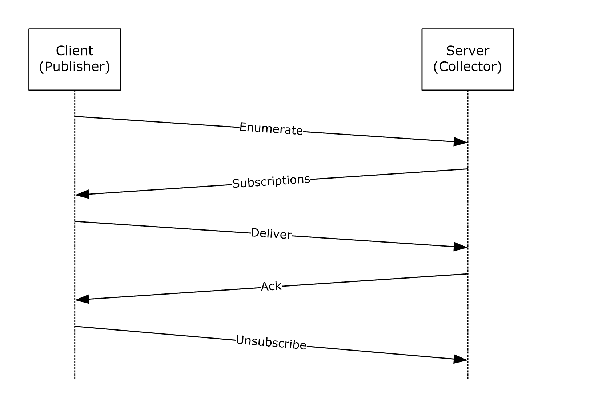

Figure 6: Publisher-initiated subscriptions

**ENUMERATE:** In order to support publisher-initiated event subscriptions, the publisher of the event (Web Services Management Protocol Extensions for Windows Vista client) MUST send an Enumerate request to the [**collector**](#gt_collector) as specified in section [3.1.4.8](#Section_3.1.4.8). The enumeration request MUST use the following [**resource URI**](#gt_resource-uri):

http://schemas.microsoft.com/wbem/wsman/1/SubscriptionManager/Subscription

**Subscriptions:** The collector retrieves all active subscriptions and sends the list of Subscribe requests to the publisher in response to the Enumerate request. The client SHOULD initiate an optimized Enumeration so that the collector can send the results within the EnumerateResponse message, as specified in [DMTF-DSP0226] section 8.2.3. The enumeration results consist of a set of SubscriptionType elements as specified in section [2.2.4.41](#Section_2.2.4.41).

Upon receipt of the SubscriptionType elements, the publisher extracts the Envelope elements that contain SubscribeMsg messages. The publisher MUST process these Envelope elements as if they had been received as Subscribe requests over the wire, as specified in [DMTF-DSP0226] section 10.2. Any fault generated as a result of processing a SubscribeMsg message MUST use the MessageID of the corresponding SubscribeMsg message within the <s:Envelope/s:Header/wsman:RelatesTo> element of the fault.

**Deliver:** The publisher MUST deliver events as specified in [DMTF-DSP0226] section 10.2.

**Ack:** The collector SHOULD acknowledge the delivered events as specified in [DMTF-DSP0226] section 10.2.

**Unsubscribe:** The publisher MUST be able to cancel the subscription by sending a Unsubscribe request as specified in [DMTF-DSP0226] section 10.4.

###### 3.1.4.1.30.1 Subscription Options

The following options are available for OptionSet block for both collector-initiated and publisher-initiated event subscriptions.

| Option | Description |
| --- | --- |
| Compression | This option determines the compression algorithm used. Web Services Management Protocol Extensions for Windows Vista supports the SLDC algorithm, so the only valid value of "SLDC" is allowed. The HTTP packet containing compressed data MUST have the Content-Encoding set to SLDC. It is an ECMA standard (ECMA-321), as specified in [[ECMA-321]](https://go.microsoft.com/fwlink/?LinkId=89856). |
| CDATA | This option determines if the data (event xml) is to be parsed or passed unprocessed. It has the xsi:nil attribute associated with it, whose value, if set to true, indicates that the data is not to be processed by the Web Services Management Protocol Extensions for Windows Vista service. In that case, the data is considered a BLOB and passed as-is to the event subscriber for interpretation. If the option is set to false or is not specified the Web Services Management Protocol Extensions for Windows Vista service MUST parse the event content and validate that it is well-formed XML, and MUST deliver the event as specified in [[DMTF-DSP0226]](https://go.microsoft.com/fwlink/?LinkId=89849) section 10.2. |
| ContentFormat | This option determines how the event data will be received by the event subscriber. If the value of this option is "RenderedText", both the event data and rendering information are passed, whereas event data is contained within the element <EventData> and rendering info is contained with the element <RenderingInfo>, so that the event can be displayed by the event subscriber according to a predefined format. The default value for this option is "Raw", which means that only event data will be passed without any rendering information. |
| IgnoreChannelError | This option determines if various filtering options resulting in errors in different channels are to result in termination of the processing. It has the xsi:nil attribute associated with it, whose value is set to "true", meaning that the filtering errors in different channels MUST be ignored by the subscription service and processing SHOULD continue. |
| ReadExistingEvents | This option has the same effect as the predefined, reserved bookmark http://schemas.dmtf.org/wbem/wsman/1/wsman/bookmark/earliest, as specified in [DMTF-DSP0226] section 10.2.6. If a subscription is received with this option set to "true", the event source SHOULD replay all possible events that match the filter and any events that subsequently occur for that event source.<84><85> |

###### 3.1.4.1.30.2 Event Delivery

The Web Services Management Protocol Extensions for Windows Vista service MUST use the following [**Action URI**](#gt_action-uri), as specified in [[DMTF-DSP0226]](https://go.microsoft.com/fwlink/?LinkId=89849) section 10.2.8: http://schemas.dmtf.org/wbem/wsman/1/wsman/Event.

This URI might be required in cases where event types are inferred in real time from other sources and not published as Web service events, and therefore do not have a designated Action URI. The URI is to be as specific as possible in most cases so that it can act as a reliable dispatching point.

The Web Services Management Protocol Extensions for Windows Vista service MUST support the WS-Management Bookmark mechanism, as specified in [DMTF-DSP0226] section 10.2.6.

The Web Services Management Protocol Extensions for Windows Vista server MUST support a subscriber-defined retry policy as defined in [DMTF-DSP0226] section 10.2.3. The values for wsman:ConnectionRetry and wsman:ConnectionRetry/@Total MUST both be zero or both be non-zero, otherwise a wsman:InternalErrorFault is returned.

If the two values are zero, no retry is attempted. Otherwise, retries are attempted as specified by these values.

If The Web Services Management Protocol Extensions for Windows Vista service receives a wsman:DeliveryRefused fault, it MUST immediately cancel the subscription. However, it MUST NOT issue a wse:SubscriptionEnd message, as specified in [DMTF-DSP0226] section 10.8 rule R10.8-1.

###### 3.1.4.1.30.3 Event Security

In general, protect management operations and responses against attacks such as snooping, interception, replay, and modification during transmission. Generally, authenticating the user who has sent a request is also necessary so that access control rules can be applied to determine whether to process a request.

When specifying the wse:NotifyTo address in subscriptions, the implementation SHOULD identify the event source and which authentication model to use when delivering the event.

If the authentication model is not identified, the event source can try to infer from the wsa:Address what needs to be done. However, if the event source can support multiple modes and has a certificate or password store, it might not know which authentication model to choose or which credentials to use without being told in the subscription.

Information describing the allowed security profiles and potentially acceptable credentials are communicated by using the wse:NotifyTo address as specified in [[WS-Policy]](https://go.microsoft.com/fwlink/?LinkId=92757).

<s:Body>

<wse:Subscribe>

<wse:Delivery>

<wse:NotifyTo>

<wsa:Address> ... </wsa:Address>

<wsa:ReferenceParameters>... </wsa:ReferenceParameters>

<wsp:Policy> ... </wsp:Policy> *

</wse:NotifyTo>

</wse:Delivery>

</wse:Subscribe>

</s:Body>

In general, as specified in [WS-Policy], there are a variety of representations and nesting of policies. To ensure a baseline for interoperation, minimum implementation levels are suggested.

The following minimal policy expressions MUST be used.

<wsp:Policy>

<wsp:ExactlyOne>

<wsp:all>

... assertions ...

</wsp:all>

</wsp:ExactlyOne>

</wsp:Policy>

Where each assertion is a set of instructions for a specific security profile. Each assertion is an Authentication element. Web Services Management Protocol Extensions for Windows Vista supports the three assertions in section [2.2.4.1](#Section_2.2.4.1):

- Authentication
- Role
- Thumbprint

###### 3.1.4.1.30.4 Event Renewal

The Web Services Management Protocol Extensions for Windows Vista service SHOULD NOT support the wse:Renew operation, as specified in [[DMTF-DSP0226]](https://go.microsoft.com/fwlink/?LinkId=89849) section 10.5. If a service receives a Renew request message, it SHOULD return a wse:UnableToRenew fault.

###### 3.1.4.1.30.5 Event Filtering

The Web Services Management Protocol Extensions for Windows Vista service MUST support the following dialect for filtering events: http://schemas.microsoft.com/win/2004/08/events/eventquery. A service SHOULD NOT support any other dialect for filtering events. If a service receives a Subscribe request with an unsupported filter dialect, it MUST return a wse:FilteringRequestedUnavailable fault as specified in [[DMTF-DSP0226]](https://go.microsoft.com/fwlink/?LinkId=89849) section 14.6.

When the **Dialect** attribute is equal to http://schemas.microsoft.com/win/2004/08/events/eventquery, the Filter element MUST contain a single <QueryList> element, which MUST be of type QueryListType as defined in section [2.2.4.24](#Section_2.2.4.24).

###### 3.1.4.1.30.6 Heartbeat Events

The Web Services Management Protocol Extensions for Windows Vista service MUST support heartbeat events as specified in [[DMTF-DSP0226]](https://go.microsoft.com/fwlink/?LinkId=89849) section 10.2.5.

##### 3.1.4.1.31 Remote Shell

There are two types of remote shell scenarios that can be created:

- Text-based Command Shell scenario
- [**Custom Remote Shell**](#gt_custom-remote-shell) scenario
**Text-based Command Shell**: The scenario mimics the pattern of operations of a user with the Windows cmd.exe interactive command Shell: opening the Shell, running a command in the form of simple text-based command-line, possibly feeding input streams, examining the output streams, running new commands, and finally closing the Shell. This scenario is limited to the Windows Command Shell only.

**Custom Remote Shell**: Unlike the Text-based Command Shell scenario, the Custom Remote Shell scenario allows the user to execute any Shell remotely. However, before the user tries to execute the custom Shell remotely, the administrator has to set up the configuration table at the server to map a specific custom Shell to corresponding resource URIs. This can be done in one of the following ways:

- The administrator configures a new plugin on the server, which exposes a resource with the Shell capability.<86> For more details, see section [2.2.4.22](#Section_2.2.4.22).
- The administrator can set up **CustomRemoteShells** as specified in section [3.1.1](#Section_3.2.1).<87> In this type of Custom Remote Shell, the "Command" request and response are not sent explicitly. Rather, in this scenario, the "Command", its arguments, and any associated data are sent as a BLOB in the "Send" request. This BLOB is Shell-specific and is transparent to the protocol. In case of Custom Remote Shell, the "Send" is targeted at the Shell itself, which decodes the BLOB.
The user then provides a resource URI that is mapped to a custom Shell and the server executes the Shell remotely on behalf of the user.

The processing sequence for creating and interacting with remote shells is defined in the following figure.

Each ReceiveResponse message can contain data from either stdout, stderr, or both streams (as specified in section [3.1.4.1.31.1](#Section_3.1.4.1.31.1)). The order in which these elements appear in the ReceiveResponse message is determined by the data written by the Command and is implementation-dependent.

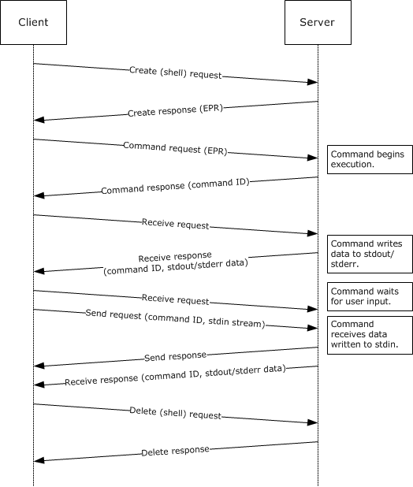

Figure 7: Web Services Management Protocol Extensions for the Windows Vista Remote Shell message processing sequence

###### 3.1.4.1.31.1 I/O Streams

The Web Services Management Protocol Extensions for Windows Vista client in the Text-based Command Shell scenario interacts with the remote command, and in the Custom Remote Shell, the scenario interacts with the Shell by sending and receiving I/O streams. This section discusses how the I/O streams are encoded within Send and Receive messages.

The Web Services Management Protocol Extensions for Windows Vista supports one input stream (stdin) and two output streams (stdout and stderr). The name attribute of the rsp:Stream element SHOULD be one of these values. The rsp:Send or rsp:ReceiveResponse elements can contain more than one stream data block. Each MUST be encoded by using base64binary.

<s:Body>

...

<rsp:Stream Name="stdout" CommandId="xs:anyURI">

...encoded data...

</rsp:Stream>

<rsp:Stream Name="stderr" CommandId="xs:anyURI">

...encoded data...

</rsp:Stream>

...

</s:Body>

For any Shell scenario, a stream can be targeted to either the shell, or to a particular command. A shell client indicates whether the Stream it sends or requests for is intended for the shell or a command.

If the stream is targeted to a particular command, it MUST be indicated by an optional attribute **CommandId**. The value of **CommandId** MUST be the value contained in the CommandResponse message, as shown in the following example:

<rsp:Stream

Name="stdout"

CommandId="77df7bb6-b5a0-4777-abd9-9823c0774074">

c3Rpbmd1aXNoZWQsIG5vdCBvbmx5IGJ5IGhpc=

</rsp:Stream>

The **CommandId** attribute MUST be omitted if the stream is targeted to the Shell processor.

In the case of Text-based Command Shells, the input streams targeted for a shell SHOULD NOT be used to activate or execute a command, otherwise a wsman:InternalError fault is returned. For example, the client SHOULD NOT send a stream to the Shell that contains "cd" as data to get the "cd" command executed. Instead, the client SHOULD send the Command message where rsp:CommandLine will contain the "cd" command line.

In the case of Custom Remote Shells, no restrictions are placed on the content of the input streams.

###### 3.1.4.1.31.2 wsman:Locale/wsmv:DataLocale

While it is specified in [[DMTF-DSP0226]](https://go.microsoft.com/fwlink/?LinkId=89849) to allow the wsman:Locale message to appear on any message, in general it only makes sense to establish the wsman:Locale when the Shell is created by using wst:Create. The Web Services Management Protocol Extensions for Windows Vista service SHOULD ignore the wsman:Locale header and process the request if a different locale is sent with any message other than wst:Create that contains a [**resource URI**](#gt_resource-uri) indicating a remote shell.

The wsmv:DataLocale header is typically established only when the Shell is created by using wst:Create. The Web Services Management Protocol Extensions for Windows Vista service SHOULD ignore the wsmv:DataLocale header and process the request if the header is sent with any message other than wst:Create that contains a resource [**URI**](#gt_uniform-resource-identifier-uri) indicating a remote shell.<88>

###### 3.1.4.1.31.3 wsman:SchemaValidationError

A wsman:SchemaValidationError fault SHOULD be returned for any operation where the XML is invalid. It SHOULD include the following detail f:Message, but the message details MAY vary according to the error condition encountered:<89>

"The Windows Remote Shell cannot process the request. The [**SOAP**](#gt_soap) packet contains an element *invalid_xml_element* that is invalid. Retry the request with the correct XML element".

**Note** *invalid_xml_element* is replaced with the actual XML element.

###### 3.1.4.1.31.4 HTTP Cookies

To support server affinity, Web Services Management Protocol Extensions for Windows Vista servers MAY send an HTTP cookie as specified in [[RFC2109]](https://go.microsoft.com/fwlink/?LinkId=90315).<90>

- When inserting a cookie into a response message, Web Services Management Protocol Extensions for Windows Vista service MUST send the cookie in an HTTP header with the first parameter as follows.
MS-WSMAN=XXX

###### 3.1.4.1.31.5 Shell Timeouts

When the Web Services Management Protocol Extensions for Windows Vista service receives a request targeted at a Remote Shell or a wst:Create message to create a new Remote Shell resource (as specified in section [3.1.4.5.2](#Section_3.1.4.5.2)), the service MUST create a new Shell Idle Timeout timer, associate it with the Remote Shell, and start the timer. The timer interval MUST be set to the number of seconds given by the IdleTimeout configuration setting, as specified in section [2.2.4.42](#Section_2.2.4.42).

On receipt of another request message targeted at the Remote Shell, the existing Shell Idle Timeout timer for that Remote Shell MUST be canceled.

When the Web Services Management Protocol Extensions for Windows Vista service receives a wst:Create message for a Remote Shell resource (as specified in section 3.1.4.5.2), the service MUST create a new Shell Lifetime timer, associate it with the Remote Shell, and start the timer. If it is specified the timer interval MUST be set to the number of seconds given by the Lifetime configuration setting, as specified in section [2.2.4.37](#Section_2.2.4.37). If the Lifetime configuration setting is not specified, the timer interval SHOULD be set to the value of the MaxShellRunTime element, as specified in section 2.2.4.42, converted from milliseconds to seconds.

On deletion of the Remote Shell, the Shell Lifetime timer for that Remote Shell MUST be canceled.

###### 3.1.4.1.31.6 Remote Shell Compression

To optimize network bandwidth, the Web Services Management Protocol Extensions for Windows Vista clients MAY send the optional SOAP header CompressionType as part of a wst:Create request for a remote shell to indicate that the data sent as part of the ensuing Send and ReceiveResponse messages will be compressed as specified in section [3.2.4.1.19](#Section_3.2.4.1.19).

On receipt of the CompressionType SOAP header, the Web Services Management Protocol Extensions for Windows Vista Service MUST compress any data sent in a ReceiveResponse message by using the specified compression algorithm.

###### 3.1.4.1.31.7 Disconnecting and Reconnecting to a Shell

Custom Remote shells SHOULD support the ability for the user to disconnect from an active shell, reconnect to it from the same client application, or connect to it from a different client application.

When a shell is in the disconnected state, the server MUST reject all messages with a wsman:InternalError fault, except for the Disconnect, Reconnect, Connect, and Delete operations.

###### 3.1.4.1.31.8 Restrictions on the Remote Shell Protocol

Web Services Management Protocol Extensions for Windows Vista servers do not support any verb sent to a remote shell (either text or custom remote shells) using chunked HTTP transfer encoding. The server MUST reject all such messages and return a wsman:InternalError fault with code 50 and the message "The request is not supported."

##### 3.1.4.1.32 Invoking CIM Methods

Web Services Management Protocol Extensions for Windows Vista servers SHOULD support the invocation of custom actions as specified in [[DMTF-DSP0226]](https://go.microsoft.com/fwlink/?LinkId=89849) Section 9 and [[DMTF-DSP0227]](https://go.microsoft.com/fwlink/?LinkId=89851) Section 11. The [**Action URI**](#gt_action-uri) that is used to invoke [**CIM**](#gt_common-information-model-cim) methods MUST be constructed as specified in [[DMTF-DSP0230]](https://go.microsoft.com/fwlink/?LinkId=89852) Section 10.3.

##### 3.1.4.1.33 ShowExtensions Option

Web Services Management Protocol Extensions for Windows Vista servers SHOULD<91> support the ShowExtensions option as specified in [[DMTF-DSP0227-1.1.0]](https://go.microsoft.com/fwlink/?LinkId=226541) section 13.1.

##### 3.1.4.1.34 Plugin Management

###### 3.1.4.1.34.1 Routing Requests to Plugins

Web Services Management Protocol Extensions for Windows Vista servers associate [**resource URIs**](#gt_resource-uri) (or resource URI prefixes) with a specific [**plugin**](#gt_plugin) using the **Plugins** table. When the server receives a request, the server MUST attempt to locate a matching plugin configuration entry as follows:

- For each row in **Plugins**, compare the **Resource URI** field of the request with the PluginConfig\<cfg:Resource> elements in the row.
- If the request matches multiple rows, then choose the row with the most specific match. If one of the matching <cfg:ResourceType> elements has ExactMatch set to true, then choose that row. Otherwise, if there are multiple matching <cfg:ResourceType> elements having ExactMatch set to false, then choose the row containing the <cfg:ResourceType> element with the longest matching prefix.
- If the request matches a single row, choose that row.
If a row was chosen, then the request MUST be routed to the plugin represented by the row's **Filename** element. Otherwise, the request MUST be handled by the server itself, as described in sections [3.1.4.2](#Section_3.1.4.2) through [3.1.4.14](#Section_3.1.4.14).

The server MUST verify whether the plugin supports the operation requested by the client. A plugin supports an operation if the PluginConfig\<cfg:Resources>\<cfg:Resource> matching the client’s resource URI has the operation listed in its CapabilityType.

If the operation is not supported by the plugin, then the Web Services Management Protocol Extensions for Windows Vista service MUST return a wsa:ActionNotSupported fault to the client.

###### 3.1.4.1.34.2 Plugin Configuration

When the Web Services Management Protocol Extensions for Windows Vista service receives a Put or Create request with http://schemas.microsoft.com/wbem/wsman/1/config/plugin as the [**resource URI**](#gt_resource-uri), and the cfg:PluginType input has XmlRenderingType set to XmlReader, the service MUST accept the input and MUST interpret the request as if XmlRenderingType were set to text.

When the Web Services Management Protocol Extensions for Windows Vista service receives a Put or Create request with http://schemas.microsoft.com/wbem/wsman/1/config/plugin as the resource URI, the behavior of the SupportsFragment and SupportsFiltering attributes of the CapabilityType element MUST be as follows:

- When SupportsFragment is set to false, an incoming request matches the containing plugin and the specified capability, and the incoming request uses fragment transfer, the service MUST return a fault, as specified in [[DMTF-DSP0226]](https://go.microsoft.com/fwlink/?LinkId=89849) section 7.7.
- When SupportsFiltering is set to false, an incoming request matches the containing plugin and the specified capability, and the incoming request contains a filter and/or a filter dialect, the service MUST return a wsen:FilterDialectRequestedUnavailable fault.
To retrieve and configure an individual plugin configuration, the plugin needs to be referred to by a selector. The following properties, which are part of cfg:PluginType, are the selectors.

| Selector name | Description |
| --- | --- |
| Name | The name by which the plugin is uniquely identified. |

###### 3.1.4.1.34.3 Plugins

The Web Services Management Protocol Extensions for Windows Vista servers SHOULD expose the following set of plugins.<92> The **Filename**, **InitializationParameters**, and **Resource/Security/Sddl** elements are implementation-dependent.

WMI Provider

Plug-in Name: WMI Provider

The plug-in configuration for this plug-in SHOULD<93> follow this PluginType schema:

<PlugInConfiguration Name="WMI Provider" SDKVersion="1" XmlRenderingType="text" UseSharedProcess="false" ProcessIdleTimeoutSec="0" RunAsUser="" RunAsPassword="" AutoRestart="false" Enabled="true" OutputBufferingMode="Block" xml:lang="en-US" xmlns="http://schemas.microsoft.com/wbem/wsman/1/config/PluginConfiguration">

<Resources>

<Resource ResourceUri="http://schemas.microsoft.com/wbem/wsman/1/wmi" SupportsOptions="true">

<Security Uri="" ExactMatch="false" Sddl=""></Security>

<Capability Type="Identify"></Capability>

<Capability Type="Get" SupportsFragment="true"></Capability>

<Capability Type="Put" SupportsFragment="true"></Capability>

<Capability Type="Create"></Capability>

<Capability Type="Delete"></Capability>

<Capability Type="Invoke"></Capability>

<Capability Type="Enumerate" SupportsFiltering="true"></Capability>

<Capability Type="Subscribe" SupportsFiltering="true"></Capability>

</Resource>

<Resource ResourceUri="http://schemas.dmtf.org/wbem/wscim/1/cim-schema" SupportsOptions="true">

<Security Uri="" ExactMatch="false" Sddl=""></Security>

<Capability Type="Get" SupportsFragment="true"></Capability>

<Capability Type="Put" SupportsFragment="true"></Capability>

<Capability Type="Create"></Capability>

<Capability Type="Delete"></Capability>

<Capability Type="Invoke"></Capability>

<Capability Type="Enumerate" SupportsFiltering="true"></Capability>

<Capability Type="Subscribe" SupportsFiltering="true"></Capability>

</Resource>

<Resource ResourceUri="http://schemas.dmtf.org/wbem/wscim/1/*" SupportsOptions="true" ExactMatch="true">

<Security Uri="" ExactMatch="false" Sddl=""></Security>

<Capability Type="Enumerate" SupportsFiltering="true"></Capability>

<Capability Type="Subscribe" SupportsFiltering="true"></Capability>

</Resource>

<Resource ResourceUri="http://schemas.dmtf.org/wbem/cim-xml/2/cim-schema/2/*" SupportsOptions="true">

<Security Uri="" ExactMatch="true" Sddl=""></Security>

<Capability Type="Get" SupportsFragment="false"></Capability>

<Capability Type="Enumerate" SupportsFiltering="true"></Capability>

</Resource>

</Resources>

<Quotas MaxConcurrentUsers="100" MaxConcurrentOperationsPerUser="15" MaxConcurrentOperations="1500"></Quotas>

</PlugInConfiguration>

Event Forwarding Plugin

Plug-in Name: Event Forwarding Plugin

The plug-in configuration for this plug-in SHOULD<94> follow the PluginType schema:

<PlugInConfiguration Name="Event Forwarding Plugin" SDKVersion="1" XmlRenderingType="text" UseSharedProcess="false" ProcessIdleTimeoutSec="0" RunAsUser="" RunAsPassword="" AutoRestart="false" Enabled="true" OutputBufferingMode="Block" xml:lang="en-US" xmlns="http://schemas.microsoft.com/wbem/wsman/1/config/PluginConfiguration">

<Resources>

<Resource ResourceUri="http://schemas.microsoft.com/wbem/wsman/1/windows/EventLog" SupportsOptions="true">

<Security Uri="" ExactMatch="false" Sddl=""></Security>

<Capability Type="Subscribe" SupportsFiltering="true"></Capability>

</Resource>

</Resources>

<Quotas MaxConcurrentUsers="100" MaxConcurrentOperationsPerUser="15" MaxConcurrentOperations="1500"></Quotas>

</PlugInConfiguration>

SEL Plugin

Plug-in Name: SEL Plugin

The plug-in configuration for this plug-in SHOULD<95> follow the PluginType schema shown here.

<PlugInConfiguration Name="SEL Plugin" SDKVersion="1" XmlRenderingType="text" UseSharedProcess="false" ProcessIdleTimeoutSec="0" RunAsUser="" RunAsPassword="" AutoRestart="false" Enabled="true" OutputBufferingMode="Block" xml:lang="en-US" xmlns="http://schemas.microsoft.com/wbem/wsman/1/config/PluginConfiguration">

<Resources>

<Resource ResourceUri="http://schemas.microsoft.com/wbem/wsman/1/logrecord/sel" SupportsOptions="true">

<Security Uri="" ExactMatch="false" Sddl=""></Security>

<Capability Type="Subscribe" SupportsFiltering="true"></Capability>

</Resource>

</Resources>

<Quotas MaxConcurrentUsers="100" MaxConcurrentOperationsPerUser="15" MaxConcurrentOperations="1500"></Quotas>

</PlugInConfiguration>

PowerShell Plugin

Plug-in Name: microsoft.powershell

The plug-in configuration for this plug-in SHOULD<96> follow the PluginType schema as shown here.

<PlugInConfiguration Name="microsoft.powershell" SDKVersion="2" XmlRenderingType="text" Enabled="true" UseSharedProcess="false" ProcessIdleTimeoutSec="0" RunAsUser="" RunAsPassword="" AutoRestart="false" OutputBufferingMode="Block" xml:lang="en-US" xmlns="http://schemas.microsoft.com/wbem/wsman/1/config/PluginConfiguration">

<Resources>

<Resource ResourceUri="http://schemas.microsoft.com/powershell/microsoft.powershell" SupportsOptions="true" ExactMatch="true">

<Security Uri="http://schemas.microsoft.com/powershell/microsoft.powershell" ExactMatch="true" Sddl=""></Security>

<Capability Type="Shell"></Capability>

</Resource>

</Resources>

<Quotas MaxMemoryPerShellMB="1024" MaxIdleTimeoutms="180000" MaxConcurrentUsers="5" IdleTimeoutms="180000" MaxProcessesPerShell="15" MaxConcurrentCommandsPerShell="1000" MaxShells="25" MaxShellsPerUser="25"></Quotas>

</PlugInConfiguration>

PowerShell32 Plugin

Plug-in Name: microsoft.powershell32

The plug-in configuration for this plug-in MUST follow the PluginType schema shown here.

<PlugInConfiguration Name="microsoft.powershell32" SDKVersion="2" XmlRenderingType="text" Architecture="32" Enabled="true" UseSharedProcess="false" ProcessIdleTimeoutSec="0" RunAsUser="" RunAsPassword="" AutoRestart="false" OutputBufferingMode="Block" xml:lang="en-US" xmlns="http://schemas.microsoft.com/wbem/wsman/1/config/PluginConfiguration">

<Resources>

<Resource ResourceUri="http://schemas.microsoft.com/powershell/microsoft.powershell32" SupportsOptions="true" ExactMatch="true">

<Security Uri="http://schemas.microsoft.com/powershell/microsoft.powershell32" ExactMatch="true" Sddl=""></Security>

<Capability Type="Shell"></Capability>

</Resource>

</Resources>

<Quotas MaxMemoryPerShellMB="1024" MaxIdleTimeoutms="180000" MaxConcurrentUsers="5" IdleTimeoutms="180000" MaxProcessesPerShell="15" MaxConcurrentCommandsPerShell="1000" MaxShells="25" MaxShellsPerUser="25"></Quotas>

</PlugInConfiguration>

PowerShell Workflow Plugin

Plug-in Name: microsoft.powershell.workflow

The plug-in configuration for this plug-in MUST follow the PluginType schema shown here.

<PlugInConfiguration Name="microsoft.powershell.workflow" SDKVersion="2" XmlRenderingType="text" Enabled="true" UseSharedProcess="true" ProcessIdleTimeoutSec="300" RunAsUser="" RunAsPassword="" AutoRestart="false" OutputBufferingMode="Block" xml:lang="en-US" xmlns="http://schemas.microsoft.com/wbem/wsman/1/config/PluginConfiguration">

<Resources>

<Resource ResourceUri="http://schemas.microsoft.com/powershell/microsoft.powershell.workflow" SupportsOptions="true" ExactMatch="true">

<Security Uri="http://schemas.microsoft.com/powershell/microsoft.powershell.workflow" ExactMatch="true" Sddl=""></Security>

<Capability Type="Shell"></Capability>

</Resource>

</Resources>

<Quotas MaxMemoryPerShellMB="1024" MaxIdleTimeoutms="180000" MaxConcurrentUsers="5" IdleTimeoutms="180000" MaxProcessesPerShell="15" MaxConcurrentCommandsPerShell="1000" MaxShells="25" MaxShellsPerUser="5"></Quotas>

</PlugInConfiguration>

PowerShell Workflow32 Plugin

Plug-in Name: microsoft.powershell.workflow32

The plug-in configuration for this plug-in MUST follow the PluginType schema shown here.

<PlugInConfiguration Name="microsoft.powershell.workflow" SDKVersion="2" XmlRenderingType="text" Architecture="32" Enabled="true" UseSharedProcess="true" ProcessIdleTimeoutSec="300" RunAsUser="" RunAsPassword="" AutoRestart="false" OutputBufferingMode="Block" xml:lang="en-US" xmlns="http://schemas.microsoft.com/wbem/wsman/1/config/PluginConfiguration">

<Resources>

<Resource ResourceUri="http://schemas.microsoft.com/powershell/microsoft.powershell.workflow32" SupportsOptions="true" ExactMatch="true">

<Security Uri="http://schemas.microsoft.com/powershell/microsoft.powershell.workflow32" ExactMatch="true" Sddl=""></Security>

<Capability Type="Shell"></Capability>

</Resource>

</Resources>

<Quotas MaxMemoryPerShellMB="1024" MaxIdleTimeoutms="180000" MaxConcurrentUsers="5" IdleTimeoutms="180000" MaxProcessesPerShell="15" MaxConcurrentCommandsPerShell="1000" MaxShells="25" MaxShellsPerUser="5"></Quotas>

</PlugInConfiguration>

Server Manager Workflows Plugin

Plug-in Name: microsoft.windows.servermanagerworkflows

The plug-in configuration for this plug-in MUST follow the PluginType schema shown here.

<PlugInConfiguration Name="microsoft.windows.servermanagerworkflows" SDKVersion="1" XmlRenderingType="text" Enabled="true" UseSharedProcess="true" ProcessIdleTimeoutSec="0" RunAsUser="" RunAsPassword="" AutoRestart="false" OutputBufferingMode="Block" xml:lang="en-US" xmlns="http://schemas.microsoft.com/wbem/wsman/1/config/PluginConfiguration">

<Resources>

<Resource ResourceUri="http://schemas.microsoft.com/powershell/microsoft.windows.servermanagerworkflows" SupportsOptions="true" ExactMatch="true">

<Security Uri="http://schemas.microsoft.com/powershell/microsoft.windows.servermanagerworkflows" ExactMatch="true" Sddl=""></Security>

<Capability Type="Shell"></Capability>

</Resource>

</Resources>

<Quotas MaxIdleTimeoutms="180000" IdleTimeoutms="180000" MaxConcurrentUsers="5" MaxMemoryPerShellMB="2000" MaxShells="100" MaxProcessesPerShell="45" MaxShellsPerUser="25" MaxConcurrentCommandsPerShell="5000"></Quotas>

</PlugInConfiguration>

##### 3.1.4.1.35 Certificate Mapping

Web Services Management Protocol Extensions for Windows Vista servers MUST map the certificate it receives from clients to a local user on the server, whenever Certificate Authentication is the mechanism used to authenticate the client.

When using the wsman:secprofile/https/mutual profile for authentication, the Web Services Management Protocol Extensions for Windows Vista server MUST use the following algorithm to map the client’s certificate to the local user account:

- First find all entries in the Certificate Mapping Table matching the following criteria:
- The entry's Issuer field matches the issuer thumbprint from client's certificate.
- The entry's URI field matches the [**resource URI**](#gt_resource-uri) of the client request, using the rules in section [2.2.4.3](#Section_2.2.4.3).
- The entry's subject field matches the Subject field of the client request, using the rules in section 2.2.4.3.
- Within those entries, choose the entry or entries with the longest Subject field.
- If there are multiple entries with same longest length for Subject, choose (within that set) the entry or entries with the longest URI field.
If no matching entry is found, or the algorithm chose multiple matching entries, then the Web Services Management Protocol Extensions for Windows Vista MUST fail the request with wsman:AccessDenied.

If a single matching entry was chosen, then the server MUST verify that the username and password match a user account on the server, using implementation-specific means. If account verification fails, then the server MUST fail the request with wsman:AccessDenied.

If account verification succeeded, then the server MUST verify that the account is authorized for the request, using the rules in section [3.1.4.1.28](#Section_3.1.4.1.28).

##### 3.1.4.1.36 Enumeration Garbage Collection

When the Web Services Management Protocol Extensions for Windows Vista service sends an EnumerateResponse or a PullResponse message, the service MUST create a new Enumeration Garbage Collection timer, associate it with the Enumeration, and start the timer. The timer interval MUST be set to the number of seconds given by the EnumerationTimeoutms configuration setting, as specified in section [2.2.4.36](#Section_2.2.4.36).

On receipt of a Pull or Release request message, the Enumeration Garbage Collection timer for that Enumeration MUST be canceled.

##### 3.1.4.1.37 wsmv:SessionId

Web Services Management Protocol Extensions for Windows Vista servers MAY<97> process the wsmv:SessionId element. This is a unique identifier for a client session, which is a set of related operations against a server.

##### 3.1.4.1.38 CIM Metadata Retrieval

Web Services Management Protocol Extensions for Windows Vista servers SHOULD<98> provide class metadata for CIM classes as specified in [[DMTF-DSP0227-1.1.0]](https://go.microsoft.com/fwlink/?LinkId=226541) section 15. Web Services Management Protocol Extensions for Windows Vista includes no changes specific to the metadata operations specified in [DMTF-DSP0227-1.1.0] section 15, except as noted in this section, section [3.1.4.2](#Section_3.1.4.2), and section [3.1.4.8](#Section_3.1.4.8). If a Web Services Management Protocol Extensions for Windows Vista server does not provide class metadata for CIM classes, the normative statements in the remainder of this section are not applicable.

If a Web Services Management Protocol Extensions for Windows Vista server provides class metadata for CIM classes, it MUST implement the WS-Man equivalent of the GetSubClassPaths and GetClass operations as specified in [DMTF-DSP0227-1.1.0] section 15.3. It MUST NOT implement the GetSubClassesWithPath operation.

If a Web Services Management Protocol Extensions for Windows Vista server provides class metadata for CIM classes, it MUST provide class metadata in CIM-XML format as specified in [DMTF-DSP0227-1.1.0] section 15.4. It MUST NOT provide class metadata in WS-CIM format.

##### 3.1.4.1.39 Robust Connection Support

The term Robust Connection Support refers to a capability of the server to cache responses to recently received requests, allowing the client to fetch the cached response data even if a network outage interrupts the original TCP connection.

A server SHOULD implement Robust Connection Support for each ResourceURI that refers to a Custom Remote Shell or to a CIM object.<99>

A client indicates support for Robust Connections on a per-request basis by including the <wsmv:OperationID> element in the request. When a client request omits the <wsmv:OperationID> element, the server MUST process the request as if the client does not implement Robust Connection support.

A server that does not support Robust Connections for the given ResourceURI MUST ignore the <wsmv:OperationID> element in the request and MUST omit the <wsmv:OperationID> and <wsmv:SequenceID> elements from response messages related to that request.

A server that supports Robust Connections for the request ResourceURI operates as follows.

The server MUST include a <wsmv:OperationID> element with the same value in all response messages related to that request. Client requests can include a <wsmv:OperationID> element as well. A value of true for the mustUnderstand attribute of a <wsmv:OperationID> element in a client request indicates that the request is a retransmission of a previous request.

If the client request includes a <wsmv:OperationID> element and the mustUnderstand attribute is set to false, or the client includes a <wsmv:OperationID> element and the mustUnderstand attribute is set to true and the OperationID value for the request does not exist in the OperationMessages table, the server MUST perform the following steps:

- If the mustUnderstand attribute is set to false, check whether the OperationID value of the request already exists in the OperationMessages table. If so, the server MUST fail the operation with a wsa:InvalidMessageInformationHeader fault.
- If the SequenceId element received from the client does not have a value of 1, the server MUST fail the operation with a wsa:InvalidMessageInformationHeader fault.
- If any rows of the OperationMessages table have the same PrimaryConnection value as the current request's connection, the server MUST delete all state associated with those rows.
- Create a new row in the OperationMessages table. If the ResourceURI refers to a CIM object, and the __MI_CallbackRegistration option is present and has the 0x04 bit set, then the server MUST set StreamingOutput to true. Otherwise, the server MUST set StreamingOutput to false.
- Start the Connection KeepAlive Timer, with a period set to the lesser of 1 minute and 70% of the client request's w:OperationTimeout value.
- Process the request. The operation's output MUST be delivered according to the rules specified in section [3.1.6.6](#Section_3.1.6.6).
If the client request includes a <wsmv:OperationID> header and the mustUnderstand attribute is set to true, then the request is a retransmission of a previous request and the options specified in section [2.2.10](#Section_2.2.10) MUST be the same as those in the original request; otherwise, server behavior is implementation-dependent. However, if the OperationId for the request does exist in the OperationMessages table, the server MUST perform the following steps:

- Find the row in the OperationMessages table that has the OperationID value from the request, and set the incoming request's connection as the Primary Connection for that row in the table.
- If the SequenceId element received from the client does not have a value of 1, the server MUST fail the operation with a wsa:InvalidMessageInformationHeader fault.
- Suspend the Response Retention Timer.
- If the ResourceURI refers to a CIM object, and the __MI_CallbackRegistration object is present and has the 0x04 bit set, the server MUST set StreamingOutput to true. Otherwise, the server MUST set StreamingOutput to false.
- Send the HTTP headers of the response. The Transfer-Encoding header MUST be set to "chunked".
- Set ResponseBegun to true.
- Start the Connection KeepAlive Timer, with a period set to the lesser of 1 minute and 70% of the client request's w:OperationTimeout value.
- Send an Acknowledge message indicating the number of messages received so far from the client.
- Send each message in the Messages table as data in the body of the HTTP response using HTTP chunked encoding.
- When the output is complete, set ResponseComplete to true and send the final zero-length HTTP body chunk.

#### 3.1.4.2 Get

Web Services Management Protocol Extensions for Windows Vista MUST support the Get operation, using the following [**Action URIs**](#gt_action-uri), as specified in [[DMTF-DSP0226]](https://go.microsoft.com/fwlink/?LinkId=89849).

http://schemas.xmlsoap.org/ws/2004/09/transfer/Get

http://schemas.xmlsoap.org/ws/2004/09/transfer/GetResponse

Web Services Management Protocol Extensions for Windows Vista includes no changes specific to the Get operation from the WS-Management Protocol, as specified in [DMTF-DSP0226], except as noted in section [3.1.4.1](#Section_3.1.4.1) and section [3.2.4.1](#Section_3.2.4.1).

The set of [**resource URIs**](#gt_resource-uri) on which Web Services Management Protocol Extensions for Windows Vista MUST support the Get operation is defined in the following table, and where relevant, the Xml Schema Definition (XSD) type for the data that is passed as part of the request or response is referenced.

| Resource URI | Input data type | Output data type |
| --- | --- | --- |
| http://schemas.microsoft.com/wbem/wsman/1/config | None | cfg:ConfigType |
| http://schemas.microsoft.com/wbem/wsman/1/config/client | None | cfg:ClientType |
| http://schemas.microsoft.com/wbem/wsman/1/config/client/auth | None | cfg:ClientAuthType |
| http://schemas.microsoft.com/wbem/wsman/1/config/client/defaultports | None | cfg:ClientDefaultPortsType |
| http://schemas.microsoft.com/wbem/wsman/1/config/service | None | cfg:ServiceType |
| http://schemas.microsoft.com/wbem/wsman/1/config/service/auth | None | cfg:ServiceAuthType |
| http://schemas.microsoft.com/wbem/wsman/1/config/service/defaultports | None | cfg:ServiceDefaultPortsType |
| http://schemas.microsoft.com/wbem/wsman/1/config/service/certmapping | None | cert:CertMappingType |
| http://schemas.microsoft.com/wbem/wsman/1/config/winrs | None | cfg:WinrsType |
| http://schemas.microsoft.com/wbem/wsman/1/config/listener | None | cfg:ListenerType |

The set of resource URIs on which Web Services Management Protocol Extensions for Windows Vista SHOULD support the Get operation is defined in the following table, and where relevant, the Xml Schema Definition (XSD) type for the data that MUST be passed as part of the request or response is listed.

| Resource URI | Input data type | Output data type |
| --- | --- | --- |
| http://schemas.microsoft.com/wbem/wsman/1/config/plugin | None | cfg:PluginType |

The set of resource URIs on which Web Services Management Protocol Extensions for Windows Vista MAY support the Get operation is defined in the following table, and where relevant, the Xml Schema Definition (XSD) type for the data that MUST be passed as part of the request or response is listed.

| Resource URI | Input data type | Output data type |
| --- | --- | --- |
| http://schemas.microsoft.com/wbem/wsman/1/windows/shell/cmd | None | rsp:Shell |

The http://schemas.microsoft.com/wbem/wsman/1/config/service/security resource URI SHOULD be used to map an SDDL string to a particular resource URI. If this URI is used to map SDDL strings to particular resource URIs, the Web Services Management Protocol Extensions for Windows Vista servers MUST support the Get operation as defined in the following table, where the Xml Schema Definition (XSD) type for the data that is passed as part of the request or response is referenced.

| Resource URI | Input data type | Output data type |
| --- | --- | --- |
| http://schemas.microsoft.com/wbem/wsman/1/config/service/security | None | cfg:SecurityType |

The resource URI http://schemas.microsoft.com/wbem/wsman/1/config/winrs/customremoteshell SHOULD<100>be used to manipulate **CustomRemoteShells**. By default, this table does not exist on the server, and the administrator MUST set this table up for the user to execute the custom remote Shell. If this URI is used to manipulate the **CustomRemoteShells** table, the Web Services Management Protocol Extensions for Windows Vista servers MUST support the Get operation as defined in the following table, where the Xml Schema Definition (XSD) type for the data that is passed as part of the request or response is referenced.

The data that is passed as part of the request is used when selecting a row from **CustomRemoteShells** (see section [3.1.1](#Section_3.2.1) for details). The Uri property is compared to the **Uri** element in order to identify the row to retrieve.

| Resource URI | Input data type | Output data type |
| --- | --- | --- |
| http://schemas.microsoft.com/wbem/wsman/1/config/winrs/customremoteshell | None | cfg:CustomRemoteShell |

The CIM binding for WS-Management defines which operations can be used on which ResourceURIs when referencing [**CIM objects**](#gt_cim-object). More information is specified in [[DMTF-DSP0227]](https://go.microsoft.com/fwlink/?LinkId=89851) section 7.

The Web Services Management Protocol Extensions for Windows Vista service MUST support WS-Transfer Get when the class name in the ResourceURI and the [**selectors**](#gt_selector) identify an instance of that class.

The CIM binding for WS-Management defines the target ResourceURI that is used to retrieve class metadata in CIM-XML format, as specified in [[DMTF-DSP0227-1.1.0]](https://go.microsoft.com/fwlink/?LinkId=226541) section 15.4. The Web Services Management Protocol Extensions for Windows Vista service SHOULD<101> support WS-Transfer Get when the ResourceURI is formatted to retrieve CIM-XML metadata as specified in [DMTF-DSP0227-1.1.0] section 15.4 and the ResourceURI identifies a valid class. If this metadata retrieval is implemented, the Web Services Management Protocol Extensions for Windows Vista service MUST support the following options as specified in [DMTF-DSP0227-1.1.0] section 15.8:

- IncludeClassOrigin
- IncludeQualifiers
- IncludeInheritedElements

##### 3.1.4.2.1 Remote Shells

To read the properties of an active Shell, a wst:Get message MAY be sent by using the ShellID selector in the wsa:EndpointReference returned in the wst:ResourceCreated message, when the Shell was first created.

This message MAY be sent asynchronously to any outstanding messages in progress to the specified Shell.<102>

The value of Resource URI will be different for the Text-based Command Shell and the [**Custom Remote Shell**](#gt_custom-remote-shell).<103>

In case of Text-based Command Shell, the value of Resource URI MUST be as follows.

http://schemas.microsoft.com/wbem/wsman/1/windows/shell/cmd

An example of Resource URI for Custom Remote Shell scenario is as follows.

http://schemas.microsoft.com/wbem/wsman/1/windows/shell/CustomShell

On successful processing of a wst:Get request message, a processor MUST return a wst:GetResponse message in the form, as specified in [[DMTF-DSP0226]](https://go.microsoft.com/fwlink/?LinkId=89849), with the only difference being that in the case of the Custom Remote Shell scenario, CommandLine element is absent. The body of the GetResponse message is described by the Shell data type.

The following elements MUST be present in the rsp:Shell element in the GetResponse message:

- ShellID
- InputStreams
- OutputStreams
The following elements SHOULD<104>be present in the rsp:Shell element in the GetResponse message:

- ResourceUri
- Owner
- ClientIP
- IdleTimeout
- ShellRunTime
- ShellInactivity
The following additional fields SHOULD be returned by shell instances of plugins that support the Disconnected Shell capability:

- Name
- ProcessId
- MaxTimeout
- Locale
- DataLocale
- CompressionMode
- ProfileLoaded
- Encoding
- BufferMode
- State
The Lifetime element MAY<105>be present in the rsp:Shell element in the GetResponse message. If the Lifetime element is present, its value SHOULD be equal to the value specified for the Lifetime element in the initial wst:Create message or the default value (as specified in section [2.2.4.37](#Section_2.2.4.37)) minus the amount of time that has elapsed since the shell was created. This value MUST be expressed in seconds.

The CommandLine element MUST be present in the rsp:Shell element in the in the Text-based Command Shell scenario, and MUST NOT be present in the rsp:Shell element in the case of Custom Remote Shell scenario.

The WS-Management specification defines the FragmentTransfer SOAP header, which is used to retrieve and update fragments or individual elements of a [**CIM object**](#gt_cim-object). More details are specified in [DMTF-DSP0226] section 7.7.

Web Services Management Protocol Extensions for Windows Vista Service does not support the FragmentTransfer SOAP header for Shell operations and the clients SHOULD NOT use it. If a Web Services Management Protocol Extensions for Windows Vista Service receives a Get request that contains a FragmentTransfer SOAP header and a [**Resource URI**](#gt_resource-uri) that represents either a Text-based Command Shell or a Custom Remote Shell, it MUST return a wsman:UnsupportedFeature fault.

#### 3.1.4.3 Put

Web Services Management Protocol Extensions for Windows Vista MUST support the Put operation, using the following [**Action URIs**](#gt_action-uri), as specified in [[DMTF-DSP0226]](https://go.microsoft.com/fwlink/?LinkId=89849) section 7.4.

http://schemas.xmlsoap.org/ws/2004/09/transfer/Put

http://schemas.xmlsoap.org/ws/2004/09/transfer/PutResponse

Web Services Management Protocol Extensions for Windows Vista includes no changes specific to the Put operation from the WS-Management Protocol, as specified in [DMTF-DSP0226] section 7.4, except as noted in section [3.1.4.1](#Section_3.1.4.1) and section [3.2.4.1](#Section_3.2.4.1).

The set of [**resource URIs**](#gt_resource-uri) on which Web Services Management Protocol Extensions for Windows Vista MUST support the Put operation is defined in the following table, and where relevant, the Xml Schema Definition (XSD) type for the data that is passed as part of the request or response is referenced.

| Resource URI | Input data type | Output data type |
| --- | --- | --- |
| http://schemas.microsoft.com/wbem/wsman/1/config | cfg:ConfigType | cfg:ConfigType |
| http://schemas.microsoft.com/wbem/wsman/1/config/client | cfg:ClientType | cfg:ClientType |
| http://schemas.microsoft.com/wbem/wsman/1/config/client/auth | cfg:ClientAuthType | cfg:ClientAuthType |
| http://schemas.microsoft.com/wbem/wsman/1/config/client/defaultports | cfg:ClientDefaultPortsType | cfg:ClientDefaultPortsType |
| http://schemas.microsoft.com/wbem/wsman/1/config/service | cfg:ServiceType | cfg:ServiceType |
| http://schemas.microsoft.com/wbem/wsman/1/config/service/auth | cfg:ServiceAuthType | cfg:ServiceAuthType |
| http://schemas.microsoft.com/wbem/wsman/1/config/service/certmapping | cert: CertMappingType | cert:CertMappingType |
| http://schemas.microsoft.com/wbem/wsman/1/config/winrs | cfg:WinrsType | cfg:WinrsType |
| http://schemas.microsoft.com/wbem/wsman/1/config/listener | cfg:ListenerType | cfg:ListenerType |

The set of resource URIs on which Web Services Management Protocol Extensions for Windows Vista SHOULD support the Put operation is defined in the following table, and where relevant, the Xml Schema Definition (XSD) type for the data that MUST be passed as part of the request or response is listed.

| Resource URI | Input data type | Output data type |
| --- | --- | --- |
| http://schemas.microsoft.com/wbem/wsman/1/config/plugin | cfg:PluginType | cfg:PluginType |

The set of resource URIs on which Web Services Management Protocol Extensions for Windows Vista MAY<106>support the Put operation is defined in the following table, and where relevant, the Xml Schema Definition (XSD) type for the data that MUST be passed as part of the request or response is listed.

| Resource URI | Input data type | Output data type |
| --- | --- | --- |
| http://schemas.microsoft.com/wbem/wsman/1/config/service/defaultports | cfg:ServiceDefaultPortsType | cfg:ServiceDefaultPortsType |

The http://schemas.microsoft.com/wbem/wsman/1/config/service/security resource URI SHOULD be used to map an SDDL string to a particular resource URI. If this URI is used to map SDDL strings to particular resource URIs, the Web Services Management Protocol Extensions for Windows Vista servers MUST support the Put operation as defined in the following table, where the Xml Schema Definition (XSD) type for the data that is passed as part of the request or response is referenced.

| Resource URI | Input data type | Output data type |
| --- | --- | --- |
| http://schemas.microsoft.com/wbem/wsman/1/config/service/security | cfg:SecurityType | cfg:PluginType |

The resource URI `http://schemas.microsoft.com/wbem/wsman/1/config/winrs/customremoteshell` SHOULD be used to manipulate the **CustomRemoteShells** table. By default, this table does not exist on the server and the administrator MUST set this table up for the user to execute custom remote Shell. If this URI is used to manipulate the **CustomRemoteShells** table, the Web Services Management Protocol Extensions for Windows Vista servers MUST support the Put operation as defined in the following table, where the Xml Schema Definition (XSD) type for the data that is passed as part of the request or response is referenced.

The data that is passed as part of the request is used when selecting and modifying a row from CustomRemoteShells (see section [3.1.1](#Section_3.2.1) for details). The Uri property is compared to the **Uri** element in order to identify the row to modify.

| Resource URI | Input data type | Output data type |
| --- | --- | --- |
| http://schemas.microsoft.com/wbem/wsman/1/config/winrs/customremoteshell | cfg:CustomRemoteShell | cfg:CustomRemoteShell |

The CIM binding for WS-Management defines which operations can be used on which ResourceURIs when referencing [**CIM objects**](#gt_cim-object). More information is specified in [[DMTF-DSP0227]](https://go.microsoft.com/fwlink/?LinkId=89851) section 7.

The Web Services Management Protocol Extensions for Windows Vista service MUST support WS-Transfer Put when the class name in the ResourceURI and the [**selectors**](#gt_selector) identify an instance of that class.

#### 3.1.4.4 Delete

Web Services Management Protocol Extensions for Windows Vista MUST support the Delete operation, using the following [**Action URIs**](#gt_action-uri), as specified in [[DMTF-DSP0226]](https://go.microsoft.com/fwlink/?LinkId=89849) section 7.5.

http://schemas.xmlsoap.org/ws/2004/09/transfer/Delete

http://schemas.xmlsoap.org/ws/2004/09/transfer/DeleteResponse

Web Services Management Protocol Extensions for Windows Vista includes no changes specific to the Delete operation from the WS-Management Protocol, as specified in [DMTF-DSP0226] section 7.5, except as noted in section [3.1.4.1](#Section_3.1.4.1) and section [3.2.4.1](#Section_3.2.4.1).

The set of [**resource URI**](#gt_resource-uri)s on which Web Services Management Protocol Extensions for Windows Vista MUST support the Delete operation is defined in the following table, and where relevant, the Xml Schema Definition (XSD) type for the data that is passed as part of the request or response is referenced.

| Resource URI | Input data type | Output data type |
| --- | --- | --- |
| http://schemas.microsoft.com/wbem/wsman/1/config/service/certmapping | None | None |
| http://schemas.microsoft.com/wbem/wsman/1/config/listener | None | None |
| http://schemas.microsoft.com/wbem/wsman/1/windows/shell/cmd | None | None |

The set of resource URIs on which Web Services Management Protocol Extensions for Windows Vista SHOULD support the Delete operation is defined in the following table, and where relevant, the Xml Schema Definition (XSD) type for the data that MUST be passed as part of the request or response is listed.

| Resource URI | Input data type | Output data type |
| --- | --- | --- |
| http://schemas.microsoft.com/wbem/wsman/1/config/plugin | None | None |

When a Web Services Management Protocol Extensions for Windows Vista server receives a Delete request for the Resource URI http://schemas.microsoft.com/wbem/wsman/1/config/plugin that identifies an existing resource, it MUST trigger a Delete Plugin event as specified in section [3.1.6.4](#Section_3.1.6.4).

The resource URI http://schemas.microsoft.com/wbem/wsman/1/config/winrs/customremoteshell SHOULD be used to manipulate the **CustomRemoteShells** table. By default, this table does not exist on the server and the administrator MUST set this table up for the user to execute a custom remote Shell. If this URI is used to manipulate the **CustomRemoteShells** table, the Web Services Management Protocol Extensions for Windows Vista servers MUST support the Delete operation as defined in the following table, where the Xml Schema Definition (XSD) type for the data that is passed as part of the request or response is referenced.

The data that is passed as part of the request is used when deleting a row from CustomRemoteShells (see section [3.1.1](#Section_3.2.1) for details). The Uri property is compared to the **Uri** element in order to identify the row to delete.

| Resource URI | Input data type | Output data type |
| --- | --- | --- |
| http://schemas.microsoft.com/wbem/wsman/1/config/winrs/customremoteshell | None | None |

The CIM binding for WS-Management defines which operations can be used on which ResourceURIs when referencing [**CIM object**](#gt_cim-object)s. More information is specified in [[DMTF-DSP0227]](https://go.microsoft.com/fwlink/?LinkId=89851) section 7.

The Web Services Management Protocol Extensions for Windows Vista service SHOULD<107> support WS-Transfer Delete when the class name in the resource URI and the selectors identify an instance of a [**CIM class**](#gt_cim-class), as specified in section [3.1.4.1.1](#Section_3.1.4.1.12).

##### 3.1.4.4.1 Remote Shells

To close an active Shell, a wst:Delete message MAY be sent by using the wsa:EndpointReference returned in the wst:ResourceCreated when the Shell was first created.

This message MAY be sent asynchronously to any outstanding messages in progress to the specified Shell, allowing the Shell to be forcibly closed.<108> Any commands in progress SHOULD be immediately terminated and all [**resources**](#gt_resource) for the Shell SHOULD be freed. The final results of any operations in progress are undefined and the result is similar to forcibly terminating a Shell processor in any other context outside [**SOAP**](#gt_soap).

The Delete message is of the form as specified in [[DMTF-DSP0226]](https://go.microsoft.com/fwlink/?LinkId=89849).

The value of Resource URI will be different for a Text-based Command Shell and a [**Custom Remote Shell**](#gt_custom-remote-shell).

In case of a Text-based Command Shell, the value of Resource URI MUST be as follows. http://schemas.microsoft.com/wbem/wsman/1/windows/shell/cmd

An example of Resource URI for Custom Remote Shell scenario is as follows. http://schemas.microsoft.com/wbem/wsman/1/windows/shell/CustomShell

Upon successful processing of a wst:Delete request message, a processor MUST return a wst:DeleteResponse message, which MUST adhere to the form as specified in [DMTF-DSP0226].

#### 3.1.4.5 Create

Web Services Management Protocol Extensions for Windows Vista MUST support the Create operation, using the following [**Action URIs**](#gt_action-uri), as specified in [[DMTF-DSP0226]](https://go.microsoft.com/fwlink/?LinkId=89849) section 7.6:

http://schemas.xmlsoap.org/ws/2004/09/transfer/Create

http://schemas.xmlsoap.org/ws/2004/09/transfer/CreateResponse

Web Services Management Protocol Extensions for Windows Vista includes no changes specific to the Create operation from the WS-Management Protocol, as specified in [DMTF-DSP0226] section 7.6, except as noted in section [3.1.4.1](#Section_3.1.4.1) and section [3.2.4.1](#Section_3.2.4.1).

The set of [**resource URI**](#gt_resource-uri)s on which Web Services Management Protocol Extensions for Windows Vista MUST support the Create operation is defined in the following table, and where relevant, the Xml Schema Definition (XSD) type for the data that is passed as part of the request or response is referenced.

| Resource URI | Input data type | Output data type |
| --- | --- | --- |
| http://schemas.microsoft.com/wbem/wsman/1/config/service/certmapping | cert:CertMappingType | None |
| http://schemas.microsoft.com/wbem/wsman/1/config/listener | cfg:ListenerType | None |
| http://schemas.microsoft.com/wbem/wsman/1/windows/shell/cmd | rsp:Shell | None |

The set of resource URIs on which Web Services Management Protocol Extensions for Windows Vista SHOULD support the Get operation is defined in the following table, and where relevant, the Xml Schema Definition (XSD) type for the data that MUST be passed as part of the request or response is listed.

| Resource URI | Input data type | Output data type |
| --- | --- | --- |
| http://schemas.microsoft.com/wbem/wsman/1/config/plugin | cfg:PluginType | None |

When a Web Services Management Protocol Extensions for Windows Vista server receives a Create request for the Resource URI http://schemas.microsoft.com/wbem/wsman/1/config/plugin, it MUST trigger a Create Plugin event as specified in section [3.1.6.3](#Section_3.1.6.3).

The resource URI http://schemas.microsoft.com/wbem/wsman/1/config/winrs/customremoteshell SHOULD be used to manipulate the **CustomRemoteShells** table. By default, this table does not exist on the server and the administrator MUST set this table up for the user to execute a custom remote Shell. If this URI is used to manipulate the **CustomRemoteShells** table, the Web Services Management Protocol Extensions for Windows Vista servers MUST support the Create operation as defined in the following table, where the Xml Schema Definition (XSD) type for the data that is passed as part of the request or response is referenced.

The data that is passed as part of the request is used when creating a row in **CustomRemoteShells** (see section [3.1.1](#Section_3.2.1) for details).

| Resource URI | Input data type | Output data type |
| --- | --- | --- |
| http://schemas.microsoft.com/wbem/wsman/1/config/winrs/customremoteshell | cfg:CustomRemoteShell | None |

The CIM binding for WS-Management defines which operations can be used on which ResourceURIs when referencing [**CIM object**](#gt_cim-object)s. More information is specified in [[DMTF-DSP0227]](https://go.microsoft.com/fwlink/?LinkId=89851) section 7.

The Web Services Management Protocol Extensions for Windows Vista service SHOULD<109> support WS-Transfer Create when the resource URI identifies a [**CIM class**](#gt_cim-class), as specified in section [3.1.4.1.1](#Section_3.1.4.1.12).

##### 3.1.4.5.1 Messages

The following table summarizes the set of WSDL message definitions that are specific to this operation.

| Message | Description |
| --- | --- |
| CreateResponseMessage | A message that contains resource-specific XML in the Soap body representing a newly-created resource. |

##### 3.1.4.5.2 Remote Shells

To create a new Shell, a wst:Create message MUST be sent where the wsman:ResourceURI element of the EPR specifies the type of Shell to be created. There are two types of remote shells:

- Text-based Command Shell scenario
- [**Custom Remote Shell**](#gt_custom-remote-shell) scenario
To create a Text-based Command Shell on the remote system, the URI element MUST have the value http://schemas.microsoft.com/wbem/wsman/1/windows/shell/cmd; any other URI implies a Custom Remote Shell.

In essence, this EPR (with its wsman:ResourceURI) is a "factory" for instances of the Shell. The s:Body of the message contains the startup parameters defined by the Shell data type, as specified in section [2.2.4.37](#Section_2.2.4.37). This is illustrated as follows.

<s:Envelope ...>

<s:Header ...>

<wsa:Action>

http://schemas.xmlsoap.org/ws/2004/09/transfer/Create

</wsa:Action>

...other WS-Addressing & WS-Management headers...

<wsman:ResourceURI>

http://schemas.microsoft.com/wbem/wsman/1/windows/shell/cmd

</wsman:ResourceURI>

<wsman:OptionSet xmlns:xsi="http://www.w3.org/2001/XMLSchema-instance">

<wsman:Option Name="xs:string"/>...value...</wsman:Option>+

</wsman:OptionSet>

</s:Header>

<s:Body ...>

<rsp:Shell>

...Value defined by the Shell data type...

</rsp:Shell>

</s:Body>

</s:Envelope>

The following named options MAY be used when creating the Remote Shell.<110>

| Option | Description |
| --- | --- |
| WINRS_NOPROFILE | If set to TRUE, this option specifies that the user profile does not exist on the remote system and that the default profile SHOULD be used. By default, the value is TRUE. |
| WINRS_CODEPAGE | The value of the options specifies the client's console output code page. The value is returned by GetConsoleOutputCP API; on the server side, this value is set as input and output code page to display the number of the active character set (code page) or to change the active character set. |

Upon successful processing of an wst:Create message, the Web Services Management Protocol Extensions for Windows Vista service MUST create a Shell instance and return a reference to it as a wsa:EndpointReference, as specified in [[WSAddressing]](https://go.microsoft.com/fwlink/?LinkId=90575) and [[DMTF-DSP0226]](https://go.microsoft.com/fwlink/?LinkId=89849) section 7.6 rule R7.6-5.

Otherwise, the body of the CreateResponse message SHOULD also include information about the created shell instance described by the rsp:Shell element. The following elements MUST be present in the rsp:Shell element:

- ShellID
- InputStreams
- OutputStreams
The following elements SHOULD be present in the rsp:Shell element:

- ResourceUri
- Owner
- ClientIP
- IdleTimeout
- ShellRunTime
- ShellInactivity
The following additional fields SHOULD be returned by shell instances of plug-ins that support the Disconnected Shell capability:

- Name
- ProcessId
- MaxIdleTimeout
- Locale
- DataLocale
- CompressionMode
- ProfileLoaded
- Encoding
- BufferMode
- State
This is illustrated as follows.

<s:Envelope ...>

<s:Header ...>

<wsa:Action>

http://schemas.xmlsoap.org/ws/2004/09/transfer/CreateResponse

</wsa:Action>

...other WS-Addressing & WS-Management headers...

</s:Header>

<s:Body>

<wst:ResourceCreated>

<wsa:Address>

Transport level

address of shell processor

</wsa:Address>

<wsa:ReferenceParameters>

<wsman:ResourceURI>

http://schemas.microsoft.com/wbem/wsman/1/windows/shell/cmd

</wsman:ResourceURI>

<wsman:SelectorSet>

<wsman:Selector Name="ShellID">

...shell GUID...

</wsman:Selector>

</wsman:SelectorSet>

</wsa:ReferenceParameters>

</wst:ResourceCreated>

<rsp:Shell>

...Value defined by the Shell data type...

</rsp:Shell>

</s:Body>

</s:Envelope>

The wsa:EndpointReference encapsulated within the wst:ResourceCreated contains a reference to the newly created Shell instance. This address is used in all subsequent messages to the Shell instance, that is, wst:Delete, Command, Signal, Send, and Receive.

The following describes the additional normative constraints on the Shell EPR:

- **ReferenceParameters**: This required element identifies the created Shell instance.
- **ResourceURI**: The value of Resource URI will be different for Text-based Command Shell and Custom Remote Shell
- In case of Text-based Command Shell, the value of Resource URI MUST be as follows. `http://schemas.microsoft.com/wbem/wsman/1/windows/shell/cmd`
- An example of Resource URI for Custom Remote Shell scenario is as follows. `http://schemas.microsoft.com/wbem/wsman/1/windows/shell/CustomShell`
- **SelectorSet**: This value of the Name attribute of Selector element MUST contain the [**GUID**](#gt_globally-unique-identifier-guid) identifying the new Shell.
The client extracts this new EPR and uses it in all subsequent messages, as it refers to the Shell instance that was just created.

The client MUST use the same [wsman:Locale (section 3.2.4.1.4)](#Section_3.1.4.1.8), [wsmv:DataLocale (section 3.2.4.1.5)](#Section_3.1.4.1.9) and encoding (as described in [DMTF-DSP0226] section 13.1) in all subsequent messages of the Remote Shell protocol, as those values refer to the Shell instance that was just created. The server behavior is undefined if any of these properties change.

###### 3.1.4.5.2.1 wsman:QuotaLimit

A wsman:QuotaLimit fault SHOULD be returned by the wst:Create operation when a quota limit is exceeded.

If the winrm/config/winrs/MaxShellsPerUser value is violated, the detail f:Message SHOULD contain the following.<111>

"The Windows Remote Shell cannot process the request. The server is already executing the maximum number of concurrent shells a user can remotely open on the same system. Retry later."

If the winrm/config/winrs/ MaxConcurrentUsers value is violated, the detail f:Message SHOULD contain the following.

"The Windows Remote Shell cannot process the request. The server exceeded the maximum number of users concurrently performing remote operations on the same system. Retry later."

#### 3.1.4.6 Subscribe

Web Services Management Protocol Extensions for Windows Vista MUST support the Subscribe operation, using the following [**Action URIs**](#gt_action-uri), as specified in [[DMTF-DSP0226]](https://go.microsoft.com/fwlink/?LinkId=89849) section 10.2:

http://schemas.xmlsoap.org/ws/2004/08/eventing/Subscribe

http://schemas.xmlsoap.org/ws/2004/08/eventing/SubscribeResponse

Web Services Management Protocol Extensions for Windows Vista includes no changes specific to the Subscribe operation from the WS-Management Protocol, as specified in [DMTF-DSP0226] section 10.2, except as noted in section [3.1.4.1](#Section_3.1.4.1) and section [3.2.4.1](#Section_3.2.4.1).

The set of [**resource URIs**](#gt_resource-uri) on which Web Services Management Protocol Extensions for Windows Vista MUST support the Subscribe operation is defined in the following table, and where relevant, the Xml Schema Definition (XSD) type for the data that is passed as part of the request or response is referenced.

| Resource URI | Input data type | Output data type |
| --- | --- | --- |
| http://schemas.microsoft.com/wbem/wsman/1/windows/EventLog | wse:Subscribe | wse:SubscribeResponse |

The CIM binding for WS-Management defines which operations can be used on which ResourceURIs when referencing [**CIM objects**](#gt_cim-object), as specified in [[DMTF-DSP0227]](https://go.microsoft.com/fwlink/?LinkId=89851) section 6.

The Web Services Management Protocol Extensions for Windows Vista service SHOULD<112> support WS-Eventing Subscribe when the class name in the ResourceURI identifies the "all-classes" URI, as specified in [DMTF-DSP0227] section 10.2.1.1, or a valid Indication class, as specified in [DMTF-DSP0227] section 10.2.1.2. The Web Services Management Protocol Extensions for Windows Vista service SHOULD NOT support the use of the wsmb:PolymorphismMode modifier as a child of the wse:Subscribe element.

If WS-Eventing Subscribe is supported on a ResourceURI, the following delivery modes MUST be supported, as specified in [DMTF-DSP0226] section 10.2.9.1:

http://schemas.xmlsoap.org/ws/2004/08/eventing/DeliveryModes/Push

http://schemas.dmtf.org/wbem/wsman/1/wsman/PushWithAck

http://schemas.dmtf.org/wbem/wsman/1/wsman/Events

http://schemas.dmtf.org/wbem/wsman/1/wsman/Pull

##### 3.1.4.6.1 Messages

The following table summarizes the set of WSDL message definitions that are specific to this operation.

| Message | Description |
| --- | --- |
| SubscribeMsg | A message used to subscribe to have notifications delivered.. |
| SubscribeResponseMsg | A message used in response to a request to have notifications delivered. |

#### 3.1.4.7 Unsubscribe

Web Services Management Protocol Extensions for Windows Vista MUST support the Unsubscribe operation, using the following [**Action URIs**](#gt_action-uri) as specified in [[DMTF-DSP0226]](https://go.microsoft.com/fwlink/?LinkId=89849) section 10.4:

http://schemas.xmlsoap.org/ws/2004/08/eventing/Unsubscribe

http://schemas.xmlsoap.org/ws/2004/08/eventing/UnsubscribeResponse

Web Services Management Protocol Extensions for Windows Vista includes no changes specific to the Unsubscribe operation from the WS-Management Protocol, as specified in [DMTF-DSP0226] section 10.4, except as noted in section [3.1.4.1](#Section_3.1.4.1) and section [3.2.4.1](#Section_3.2.4.1).

The set of [**resource URIs**](#gt_resource-uri) on which Web Services Management Protocol Extensions for Windows Vista MUST support the Unsubscribe operation is defined in the following table, and where relevant, the Xml Schema Definition (XSD) type for the data that is passed as part of the request or response is referenced.

| Resource URI | Input data type | Output data type |
| --- | --- | --- |
| http://schemas.microsoft.com/wbem/wsman/1/windows/EventLog | wse:Unsubscribe | wse:UnsubscribeResponse |

The Web Services Management Protocol Extensions for Windows Vista service MUST support WS-Eventing Unsubscribe on any ResourceURI that it has previously returned within the wse:SubscriptionManager element of a SubscribeResponse message, as specified in [DMTF-DSP0226] section 10.2.4.

##### 3.1.4.7.1 Messages

The following table summarizes the set of WSDL message definitions that are specific to this operation.

| Message | Description |
| --- | --- |
| UnsubscribeMsg | A message used to cancel a subscription. |
| UnsubscribeResponseMsg | A message used in response to a request to cancel a subscription. |

#### 3.1.4.8 Enumerate

Web Services Management Protocol Extensions for Windows Vista MUST support the Enumerate operation, using the following [**Action URIs**](#gt_action-uri), as specified in [[DMTF-DSP0226]](https://go.microsoft.com/fwlink/?LinkId=89849) section 8.2.

http://schemas.xmlsoap.org/ws/2004/09/enumeration/Enumerate

http://schemas.xmlsoap.org/ws/2004/09/enumeration/EnumerateResponse

Web Services Management Protocol Extensions for Windows Vista includes no changes specific to the Enumerate operation from the WS-Management Protocol, as specified in [DMTF-DSP0226] section 8.2, except as noted in section [3.1.4.1](#Section_3.1.4.1) and section [3.2.4.1](#Section_3.2.4.1).

The set of [**resource URIs**](#gt_resource-uri) on which Web Services Management Protocol Extensions for Windows Vista MUST support the Enumerate operation is defined in the following table, and where relevant, the [**Xml Schema Definition (XSD)**](#gt_xml-schema-definition-xsd) type for the data that is passed as part of the request or response is referenced.

| Resource URI | Input data type | Output data type |
| --- | --- | --- |
| http://schemas.microsoft.com/wbem/wsman/1/config/service/certmapping | None | None |
| http://schemas.microsoft.com/wbem/wsman/1/config/listener | None | None |
| http://schemas.microsoft.com/wbem/wsman/1/SubscriptionManager/Subscription | None | None (see Note following table) |

**Note** In the case of Optimized Enumeration, the service implementing the optimized enumeration will respond with the additional content in an Enumerate Response message, as specified in [DMTF-DSP0226] section 8.2.3.

The set of resource URIs on which Web Services Management Protocol Extensions for Windows Vista MAY support the Enumerate operation is defined in the following table, and where relevant, the Xml Schema Definition (XSD) type for the data that is passed as part of the request or response is referenced.

| Resource URI | Input data type | Output data type |
| --- | --- | --- |
| http://schemas.microsoft.com/wbem/wsman/1/windows/shell/cmd | None | None |

The resource URI http://schemas.microsoft.com/wbem/wsman/1/config/winrs/customremoteshell SHOULD be used to manipulate the **CustomRemoteShells** table. By default, this table does not exist on the server and the administrator MUST set this table up for the user to execute a custom remote Shell. If this URI is used to manipulate the **CustomRemoteShells** table, the Web Services Management Protocol Extensions for Windows Vista servers MUST support the Enumerate operation as defined in the following table, where the Xml Schema Definition (XSD) type for the data that is passed as part of the request or response is referenced.

This request is used when enumerating the data stored in the rows in **CustomRemoteShells** (see section [3.1.1](#Section_3.2.1) for details).

| Resource URI | Input data type | Output data type |
| --- | --- | --- |
| http://schemas.microsoft.com/wbem/wsman/1/config/winrs/customremoteshell | None | None (see Note following table) |

**Note** In the case of Optimized Enumeration, the service implementing the optimized enumeration will respond with the additional content in an Enumerate Response message, as specified in [DMTF-DSP0226] section 8.2.3.

The [**CIM**](#gt_common-information-model-cim) binding for WS-Management defines the target ResourceURI used to retrieve class metadata in CIM-XML format, as specified in [[DMTF-DSP0227-1.1.0]](https://go.microsoft.com/fwlink/?LinkId=226541) section 15.4. The Web Services Management Protocol Extensions for Windows Vista service SHOULD<113> support the Enumerate operation when the ResourceURI is formatted to retrieve CIM-XML metadata as specified in [DMTF-DSP0227-1.1.0] section 15.4. If this metadata retrieval is implemented, the Web Services Management Protocol Extensions for Windows Vista service MUST support the following options as specified in [DMTF-DSP0227-1.1.0] section 15.8:

- IncludeClassOrigin
- IncludeQualifiers
- IncludeSubClasses
- IncludeInheritedElements
- IncludePath
- ExcludeClassSpecification

##### 3.1.4.8.1 Messages

The following table summarizes the set of WSDL message definitions that are specific to this operation.

| Message | Description |
| --- | --- |
| EnumerateMessage | A message used to enumerate a set of resources. |
| EnumerateResponseMessage | A message used in response to a request to enumerate a set of resources. |

##### 3.1.4.8.2 Remote Shells

To initiate enumeration of the active Shell instances, a wsen:Enumerate message can be sent. This message can be sent asynchronously to any outstanding messages in progress to any of the active Shells.

The value of Resource URI will be different for the Text-based Command Shell and the [**Custom Remote Shell**](#gt_custom-remote-shell).<114>

In case of the Text-based Command Shell, the value of Resource URI MUST be as follows. `http://schemas.microsoft.com/wbem/wsman/1/windows/shell/cmd`

An example of Resource URI for Custom Remote Shell scenario is follows. `http://schemas.microsoft.com/wbem/wsman/1/windows/shell/CustomShell`

The WS-Management specification defines wsman:Filter as an alternative mechanism to specify filters that are different from that of the wsen:Filter. More details are specified in [[DMTF-DSP0226]](https://go.microsoft.com/fwlink/?LinkId=89849) section 8.3.

Web Services Management Protocol Extensions for Windows Vista clients SHOULD not use the wsman:Filter element when processing the requests against ResourceURI. `http://schemas.microsoft.com/wbem/wsman/1/windows/shell/cmd`

Web Services Management Protocol Extensions for Windows Vista servers MUST return a wsen:FilteringNotSupported fault if the wsman:Filter element is used against ResourceURI. `http://schemas.microsoft.com/wbem/wsman/1/windows/shell/cmd`

In order to enumerate the commands in an active shell instance, Web Services Management Protocol Extensions for Windows Vista clients SHOULD<115> include in the Enumerate message a selector set with a selector containing the ShellID of the shell instance. This [**EPR**](#gt_endpoint-reference-epr) was obtained from a wxf:ResourceCreated message during Shell instance creation.

##### 3.1.4.8.3 Publisher-Initiated Subscriptions

When the Web Services Management Protocol Extensions for Windows Vista server receives an Enumerate request with a resource URI equal to http://schemas.microsoft.com/wbem/wsman/1/SubscriptionManager/Subscription, the server MUST retrieve the data in **PubInitSubscriptions** and return them as a result of the Enumeration (see Section [3.1.4.1.30](#Section_3.1.4.1.30) for details). The data MUST be returned as objects of type SubscriptionType, as specified in Section [2.2.4.41](#Section_2.2.4.41).

#### 3.1.4.9 Pull

Web Services Management Protocol Extensions for Windows Vista MUST support the Pull operation, using the following [**Action URIs**](#gt_action-uri), as specified in [[DMTF-DSP0226]](https://go.microsoft.com/fwlink/?LinkId=89849) section 8.4.

http://schemas.xmlsoap.org/ws/2004/09/enumeration/Pull

http://schemas.xmlsoap.org/ws/2004/09/enumeration/PullResponse

Web Services Management Protocol Extensions for Windows Vista includes no changes specific to the Pull operation from the WS-Management Protocol, as specified in [DMTF-DSP0226] section 8.4, except as noted in section [3.1.4.1](#Section_3.1.4.1) and section [3.2.4.1](#Section_3.2.4.1).

The set of [**resource URIs**](#gt_resource-uri) on which Web Services Management Protocol Extensions for Windows Vista MUST support the Pull operation is defined in the following table, and where relevant, the Xml Schema Definition (XSD) type for the data that is passed as part of the request or response is referenced.

| Resource URI | Input data type | Output data type |
| --- | --- | --- |
| http://schemas.microsoft.com/wbem/wsman/1/config/service/certmapping | None | cert:CertMappingType |
| http://schemas.microsoft.com/wbem/wsman/1/config/listener | None | cfg:ListenerType |

The set of resource URIs on which Web Services Management Protocol Extensions for Windows Vista MAY support the Pull operation is defined in the following table, and where relevant, the Xml Schema Definition (XSD) type for the data that is passed as part of the request or response is referenced.

| Resource URI | Input data type | Output data type |
| --- | --- | --- |
| http://schemas.microsoft.com/wbem/wsman/1/windows/shell/cmd | None | rps:Shell |

The resource URI `http://schemas.microsoft.com/wbem/wsman/1/config/winrs/customremoteshell` SHOULD be used to manipulate the **CustomRemoteShells** table. By default, this table does not exist on the server and the administrator MUST set this table up for the user to execute custom remote Shell. If this URI is used to manipulate the **CustomRemoteShells** table, the Web Services Management Protocol Extensions for Windows Vista servers MUST support the Pull operation as defined in the following table, where the Xml Schema Definition (XSD) type for the data that is passed as part of the request or response is referenced.

This request is used when enumerating the data stored in the rows in **CustomRemoteShells** (see section [3.1.1](#Section_3.2.1) for details).

| Resource URI | Input data type | Output data type |
| --- | --- | --- |
| `http://schemas.microsoft.com/wbem/wsman/1/config/winrs/customremoteshell` | None | cfg:CustomRemoteShell |

##### 3.1.4.9.1 Messages

The following table summarizes the set of WSDL message definitions that are specific to this operation.

| Message | Description |
| --- | --- |
| PullMessage | A message used to retrieve a set of resources that are being enumerated. |
| PullResponseMessage | A message used in response to a request for a set of resources that are being enumerated. |

##### 3.1.4.9.2 Remote Shells

A processor MAY send a wsen:Pull message in the form as specified in [[DMTF-DSP0226]](https://go.microsoft.com/fwlink/?LinkId=89849) section 8.4.

The value of Resource URI will be different for the Text-based Command Shell and the [**Custom Remote Shell**](#gt_custom-remote-shell).

In the case of the Text-based Command Shell, the value of Resource URI is as follows. `http://schemas.microsoft.com/wbem/wsman/1/windows/shell/cmd`

An example of Resource URI for Custom Remote Shell scenario is as follows. `http://schemas.microsoft.com/wbem/wsman/1/windows/shell/CustomShell`

**Note** MaxElements is an optional element.

On succesful processing of wsen:Pull request message, a processor MUST return a wsen:PullResponse message in the form as specified in [DMTF-DSP0226] section 8.4.

**Note** The EndOfSequence element MUST be included in the returned rsp:Shell element by the server if there are no additional active Shell instances to pull.

#### 3.1.4.10 Release

Web Services Management Protocol Extensions for Windows Vista MUST support the Release operation, using the following [**Action URIs**](#gt_action-uri), as specified in [[DMTF-DSP0226]](https://go.microsoft.com/fwlink/?LinkId=89849) section 8.5.

http://schemas.xmlsoap.org/ws/2004/09/enumeration/Release

http://schemas.xmlsoap.org/ws/2004/09/enumeration/ReleaseResponse

Web Services Management Protocol Extensions for Windows Vista includes no changes specific to the Release operation from the WS-Management Protocol, as specified in [DMTF-DSP0226] section 8.5, except as noted in section [3.1.4.1](#Section_3.1.4.1) and section [3.2.4.1](#Section_3.2.4.1).

The set of [**resource URIs**](#gt_resource-uri) on which Web Services Management Protocol Extensions for Windows Vista MUST support the Release operation is defined in the following table, and where relevant, the [**Xml Schema Definition (XSD)**](#gt_xml-schema-definition-xsd) type for the data that is passed as part of the request or response is referenced.

| Resource URI | Input data type | Output data type |
| --- | --- | --- |
| http://schemas.microsoft.com/wbem/wsman/1/config/service/certmapping | None | None |
| http://schemas.microsoft.com/wbem/wsman/1/config/listener | None | None |

The resource URI `http://schemas.microsoft.com/wbem/wsman/1/config/winrs/customremoteshell` SHOULD be used to manipulate the **CustomRemoteShells** table. By default, this table does not exist on the server and the administrator MUST set this table up for the user to execute custom remote Shell. If this URI is used to manipulate the **CustomRemoteShells** table, the Web Services Management Protocol Extensions for Windows Vista servers MUST support the Release operation as defined in the following table, where the Xml Schema Definition (XSD) type for the data that is passed as part of the request or response is referenced.

| Resource URI | Input data type | Output data type |
| --- | --- | --- |
| http://schemas.microsoft.com/wbem/wsman/1/config/winrs/customremoteshell | None | None |

##### 3.1.4.10.1 Messages

The following table summarizes the set of WSDL message definitions that are specific to this operation.

| Message | Description |
| --- | --- |
| ReleaseMessage | A message used to indicate that the enumeration of a set of resources is no longer needed. |
| ReleaseResponseMessage | A message used in response to an indication that the enumeration of a set of resources is no longer needed. |

#### 3.1.4.11 Command

Web Services Management Protocol Extensions for Windows Vista MUST support the Command operation, using the following [**Action URIs**](#gt_action-uri).

http://schemas.microsoft.com/wbem/wsman/1/windows/shell/Command http://schemas.microsoft.com/wbem/wsman/1/windows/shell/CommandResponse

The set of [**resource URIs**](#gt_resource-uri) on which Web Services Management Protocol Extensions for Windows Vista operating system MUST support the Command operation is defined in the following table, and where relevant, the Xml Schema Definition (XSD) type for the data that is passed as part of the request or response is referenced.

| Resource URI | Input data type | Output data type |
| --- | --- | --- |
| http://schemas.microsoft.com/wbem/wsman/1/windows/shell/cmd | rsp:CommandLine | rsp:CommandResponse |

This operation is applicable for the Text-based Command Shell scenario only. The Custom Shell scenario uses Send to execute the command as specified in Section [3.1.4.13](#Section_3.1.4.13). To execute a command within a Shell, the Command message MUST be sent to the [**EPR**](#gt_endpoint-reference-epr) of an existing Shell instance.<116>. This EPR was obtained from a wst:ResourceCreated message during Shell instance creation.

The Command message MUST be of the following form.

<s:Envelope ...>

<s:Header ...>

<wsman:ResourceURI>

http://schemas.microsoft.com/wbem/wsman/1/windows/shell/cmd

</wsman:ResourceURI>

<wsman:SelectorSet>

<wsman:Selector Name="ShellID">

...shell GUID...

</wsman:Selector>

</wsman:SelectorSet>

<wsman:OptionSet xmlns:xsi="http://www.w3.org/2001/XMLSchema-instance">

<wsman:Option Name="xs:string"/>...value...</wsman:Option>+

</wsman:OptionSet>

...other WS-Addressing & WS-Management headers...

</s:Header>

<s:Body ...>

<rsp:CommandLine ...>

...Value defined by the CommandLine data type...

</rsp:CommandLine>

</s:Body>

</s:Envelope>

The following named options MAY be used with the Command message.<117>

| Option | Description |
| --- | --- |
| WINRS_CONSOLEMODE_STDIN | The client-side mode for standard input is console if TRUE and pipe if FALSE. This does not have an impact on the wire protocol. This option name MUST be used by the client of the Text-based Command Shell when starting the execution of a command using rsp:Command request to indicate that the client side of the standard input is console; the default implies pipe. |
| WINRS_SKIP_CMD_SHELL | If set to TRUE, this option requests that the server runs the command without using cmd.exe; if set to FALSE, the server is requested to use cmd.exe. By default the value is FALSE. This does not have any impact on the wire protocol. |

Upon successful processing of a Command request message, a Shell processor MUST perform the following steps:

- Increment the server-side counter for MaxConcurrentOperationsPerUser. The request MUST be rejected if the number of concurrent operations for the particular user exceeds the specified limit, and the Shell processor MUST reply with a wsman:QuotaLimit fault.
- Return a CommandResponse message, which MUST adhere to the following form.
<s:Envelope ...>

<s:Header ...>

<wsman:ResourceURI>

http://schemas.microsoft.com/wbem/wsman/1/windows/shell/cmd

</wsman:ResourceURI>

<wsman:SelectorSet>

<wsman:Selector Name="ShellID">

...shell GUID...

</wsman:Selector>

</wsman:SelectorSet>

...other WS-Addressing & WS-Management headers...

</s:Header>

<s:Body ...>

<rsp:CommandResponse ...>

...Value defined by the CommandResponse data type...(section 2.2.3.4)

</rsp:CommandResponse>

</s:Body>

</s:Envelope>

##### 3.1.4.11.1 Messages

The following table summarizes the set of WSDL message definitions that are specific to this operation.

| Message | Description |
| --- | --- |
| CommandMessage | A message used to execute a command in a Text-based Command Shell. |
| CommandResponseMessage | A message used in response to the execution of a command in a Text-based Command Shell. |

#### 3.1.4.12 Signal

Web Services Management Protocol Extensions for Windows Vista MUST support the Signal operation, using the following [**Action URIs**](#gt_action-uri).

http://schemas.microsoft.com/wbem/wsman/1/windows/shell/Signal http://schemas.microsoft.com/wbem/wsman/1/windows/shell/SignalResponse

The set of [**resource URIs**](#gt_resource-uri) on which Web Services Management Protocol Extensions for Windows Vista MUST support the Signal operation is defined in the following table, and where relevant, the Xml Schema Definition (XSD) type for the data that is passed as part of the request or response is referenced.

| Resource URI | Input data type | Output data type |
| --- | --- | --- |
| http://schemas.microsoft.com/wbem/wsman/1/windows/shell/cmd | rsp:Signal | rsp:SignalResponse |

The Signal operation is used to control the Shell processor. It can be sent either asynchronously or synchronously. In the Text-based Command Shell scenario, a signal can be sent to a specific command, or in the Custom Remote Shell scenario, to the Shell itself. The Signal request message MUST be of the general form, with the only difference between the two scenarios being the value of the Resource URI. The Signal message format is as follows.

<s:Envelope ...>

<s:Header ...>

<wsman:ResourceURI>

Resource URI

</wsman:ResourceURI>

<wsman:SelectorSet>

<wsman:Selector Name="ShellID">

...shell GUID...

</wsman:Selector>

</wsman:SelectorSet>

...other WS-Addressing & WS-Management headers...

</s:Header>

<s:Body ...>

<rsp:Signal ...>

...Value defined by the Signal data type...

</rsp:Signal>

</s:Body>

</s:Envelope>

The value of Resource URI will be different for the Text-based Command Shell and the Custom Remote Shell scenarios.

In case of the Text-based Command Shell, the value of Resource URI MUST be as follows. `http://schemas.microsoft.com/wbem/wsman/1/windows/shell/cmd`

An example of Resource URI for Custom Remote Shell scenario is as follows. `http://schemas.microsoft.com/wbem/wsman/1/windows/shell/CustomShell`

Also, the CommandId attribute MUST only be used in a Text-based Command Shell scenario, and MUST NOT be applicable in a Custom Remote Shell scenario.

**Note** The value defined by the Signal data type is specified in Section [2.2.4.38](#Section_2.2.4.38).

If the control code of the Signal request (section 2.2.4.38) is http://schemas.microsoft.com/wbem/wsman/1/windows/shell/signal/Terminate, the Shell processor MUST decrement the server-side counter for MaxConcurrentOperationsPerUser.<118>

Upon successful processing of a Signal request message, a processor MUST return a SignalResponse message. The Signal response message MUST be of the following general form. The SignalResponse message format is as follows.

<s:Envelope ...>

<s:Header ...>

<wsman:SelectorSet>

<wsman:Selector Name="ShellID">

...shell GUID...

</wsman:Selector>

</wsman:SelectorSet>

...other WS-Addressing & WS-Management headers...

</s:Header>

<s:Body ...>

<rsp:SignalResponse ...>

...Value defined by the SignalResponse data type...

</rsp:SignalResponse>

</s:Body>

</s:Envelope>

##### 3.1.4.12.1 Messages

The following table summarizes the set of WSDL message definitions that are specific to this operation.

| Message | Description |
| --- | --- |
| SignalMessage | A message used to send a command signal to a running Shell or Command. |
| SignalResponseMessage | A message used in response to a command signal that was sent to a running Shell or Command. |

#### 3.1.4.13 Send

Web Services Management Protocol Extensions for Windows Vista MUST support the Send operation, using the following [**Action URIs**](#gt_action-uri).

http://schemas.microsoft.com/wbem/wsman/1/windows/shell/Send http://schemas.microsoft.com/wbem/wsman/1/windows/shell/SendResponse

The set of [**resource URI**](#gt_resource-uri)s on which Web Services Management Protocol Extensions for Windows Vista MUST support the Send operation is defined in the following table, and where relevant, the Xml Schema Definition (XSD) type for the data that is passed as part of the request or response is referenced.

| Resource URI | Input data type | Output data type |
| --- | --- | --- |
| http://schemas.microsoft.com/wbem/wsman/1/windows/shell/cmd | rsp:Send | rsp:SendResponse |

In the Text-based Command Shell scenario, the Send message is used to pipe input to a running command, and in the [**Custom Remote Shell**](#gt_custom-remote-shell) scenario, the Send message is used to pipe input to the Shell processor. The message MUST be of the same general format, with the value of Resource URI being the only difference between the two scenarios. Also, the CommandId attribute of each stream element MUST be used for Text-based Command Shell and MUST be omitted for CustomShell. The message for the Text-based Command Shell is as follows.

<s:Envelope ...>

<s:Header ...>

<wsman:ResourceURI>

http://schemas.microsoft.com/wbem/wsman/1/windows/shell/cmd

</wsman:ResourceURI>

<wsman:SelectorSet>

<wsman:Selector Name="ShellID">

...shell GUID...

</wsman:Selector>

</wsman:SelectorSet>

...other WS-Addressing & WS-Management headers...

</s:Header>

<s:Body ...>

<rsp:Send ...>

...Value defined by the Send data type...

</rsp:Send>

</s:Body>

</s:Envelope>

The value of Resource URI will be different for the Text-based Command Shell and the Custom Remote Shell.

In case of the Text-based Command Shell, the value of Resource URI MUST be as follows. `http://schemas.microsoft.com/wbem/wsman/1/windows/shell/cmd`

An example of Resource URI for the Custom Remote Shell scenario is as follows. `http://schemas.microsoft.com/wbem/wsman/1/windows/shell/CustomShell`

The following rules apply to the Send operation:

- Only one Send request can be outstanding per instance of the Shell. Only when a rsp:SendResponse is received can another rsp:Send occur. However, a rsp:Send can occur asynchronously to any rsp:Receive request.
- In case of the Text-based Command Shell scenario, if the input is being sent to a specific command and the command completes or fails without consuming all the input, that additional unconsumed input MUST be discarded and ignored.
- Sending empty stream content ("dummy" messages) is permitted. This might be required to prevent deadlock or livelock in certain commands with heavy input and output interaction. CommandId MUST be included for the Text-based Command Shell scenario and MUST be omitted for the Custom Remote Shell scenario.
Upon successful processing of a Send request message, a processor MUST return a SendResponse message, which MUST adhere to the same general form in both scenarios. The Custom Shell scenario uses SendResponse to get status information. SendResponse reflects the status of writing the BLOB of data (commands+args+data) to stdin; the status of executing the commands, if any, is not reflected in the SendResponse message, but later in the ReceiveResponse message (stdout/stderr); this is transparent to the Remote Shell protocol and up to the Shell.

The response message is as follows.

<s:Envelope ...>

<s:Header ...>

<wsman:SelectorSet>

<wsman:Selector Name="ShellID">

...shell GUID...

</wsman:Selector>

</wsman:SelectorSet>

...other WS-Addressing & WS-Management headers...

</s:Header>

<s:Body ...>

<rsp:SendResponse ...>

...Value defined by the SendResponse data type...

</rsp:SendResponse>

</s:Body>

</s:Envelope>

The attribute CommandId MUST only be used in the Text-based Command Shell scenario and MUST NOT be used in Custom Remote Shell scenario.

##### 3.1.4.13.1 Messages

The following table summarizes the set of WSDL message definitions that are specific to this operation.

| Message | Description |
| --- | --- |
| SendMessage | A message used to pipe input to a running Shell or Command. |
| SendResponseMessage | A message used in response to input sent to a running Shell or Command. |

#### 3.1.4.14 Receive

Web Services Management Protocol Extensions for Windows Vista MUST support the Receive operation, using the following [**Action URIs**](#gt_action-uri).

http://schemas.microsoft.com/wbem/wsman/1/windows/shell/Receive http://schemas.microsoft.com/wbem/wsman/1/windows/shell/ReceiveResponse

The set of [**resource URI**](#gt_resource-uri)s on which Web Services Management Protocol Extensions for Windows Vista MUST support the Receive operation is defined in the following table, and where relevant, the Xml Schema Definition (XSD) type for the data that is passed as part of the request or response is referenced.

| Resource URI | Input data type | Output data type |
| --- | --- | --- |
| http://schemas.microsoft.com/wbem/wsman/1/windows/shell/cmd | rsp:Receive | rsp:ReceiveResponse |

In the Text-based Command Shell scenario, the Receive message is used to collect output from a running command, whereas in the [**Custom Remote Shell**](#gt_custom-remote-shell) scenario, it is used to collect output from the Shell itself. Also, note that in case of the Text-based Command Shell scenario, a final Signal message MUST also be issued for the command after all the stream data has been received; it is not sufficient to simply use Receive to receive all the data. The Receive message MUST adhere to the following general form, with the only difference between the two scenarios being the value of the Resource URI. The Receive message format is as follows.

<s:Envelope ...>

<s:Header ...>

<wsman:ResourceURI>

Resource URI

</wsman:ResourceURI>

<wsman:SelectorSet>

<wsman:Selector Name="ShellID">

...shell GUID...

</wsman:Selector>

</wsman:SelectorSet>

...other WS-Addressing & WS-Management headers...

</s:Header>

<s:Body ...>

<rsp:Receive ...>

...Value defined by the Receive data type...

</rsp:Receive>

</s:Body>

</s:Envelope>

The value of Resource URI will be different for the Text-based Command Shell and the Custom Remote Shell.

In case of Text-based Command Shell, the value of Resource URI MUST be as follows. `http://schemas.microsoft.com/wbem/wsman/1/windows/shell/cmd`

An example of Resource URI for Custom Remote Shell scenario is as follows. `http://schemas.microsoft.com/wbem/wsman/1/windows/shell/CustomShell`

The Web Services Management Protocol Extensions for Windows Vista service SHOULD<119> ignore the WSMAN_CMDSHELL_OPTION_KEEPALIVE option if it is included in a Receive request.

Upon successful processing of a Receive request message, the Shell processor MUST return a ReceiveResponse message, which MUST adhere to the following general form. The ReceiveResponse message format is as follows.

<s:Envelope ...>

<s:Header ...>

<wsman:SelectorSet>

<wsman:Selector Name="ShellID">

...shell GUID...

</wsman:Selector>

</wsman:SelectorSet>

...other WS-Addressing & WS-Management headers...

</s:Header>

<s:Body ...>

<rsp:ReceiveResponse ...>

...Value defined by the ReceiveResponse data type...

</rsp: ReceiveResponse>

</s:Body>

</s:Envelope>

The following rules apply to the Receive operation:

- When the Shell was opened with wst:Create, the client and service established a contractual obligation regarding the output streams that would be in use. The client MUST be prepared to accept output from any of these streams. If additional output streams are available and were not part of the initial wst:Create handshake, the server-side processor MUST omit these streams in the response.
- The Receive message MAY execute concurrently or asynchronously with Send messages, but only one Receive message SHOULD be outstanding at any given time.<120>
- A client SHOULD immediately issue a Receive message when a command is launched, whether or not it will be sending input using Send messages. To prevent deadlock, livelock, or time-out situations, the server can return Receive messages with empty string content, but typically it will delay responding until output is available, providing that wsman:OperationTimeout rules are not violated. If no output is available before the wsman:OperationTimeout expires, the server MUST return a WSManFault with the Code attribute equal to "2150858793". When the client receives this fault, it SHOULD issue another Receive request. The client SHOULD continue to issue Receive messages as soon as the previous ReceiveResponse has been received.
- At least one Receive message MUST be issued to get a final ReceiveResponse, which indicates that a command has terminated.
In the case of the Text-based Command Shell scenario, the server MAY reject processing new Command requests and reply with an error response until it has successfully returned a ReceiveResponse with a CommandState element, indicating that the command has terminated or succeeded.<121>

When the client receives the final output from a command, it MUST subsequently send a Signal with a code of

http://schemas.microsoft.com/wbem/wsman/1/windows/shell/signal/Terminate

to signal to the command processor that it MAY discard all final state information for the most recently executed command.

- In the case of the Text-based Command Shell scenario, while a stream MAY end by using the rsp:Stream/@End attribute, the completion of a command and consequently its entire output is distinct and signaled using the rsp:CommandState element with the <State> element having the value rsp:CommandState/Done.<122>
The server MAY provide notification that a command is blocked while waiting for input stream content by returning the rsp:CommandState element with the <Status> element set to rsp:CommandState/Pending. The command state and its output is sent back to the client in the Custom Remote Shell scenario as part of a BLOB of data transparent to the Remote Shell protocol.<123>

##### 3.1.4.14.1 Messages

The following table summarizes the set of WSDL message definitions that are specific to this operation.

| Message | Description |
| --- | --- |
| ReceiveMessage | A message used to retrieve output from a running Shell or Command. |
| ReceiveResponseMessage | A message used to deliver output from a running Shell or Command. |

#### 3.1.4.15 Disconnect

Web Services Management Protocol Extensions for Windows Vista SHOULD<124> support the Disconnect operation, using the following Action URIs.

http://schemas.microsoft.com/wbem/wsman/1/windows/shell/Disconnect http://schemas.microsoft.com/wbem/wsman/1/windows/shell/DisconnectResponse

The set of resource URIs on which Web Services Management Protocol Extensions for Windows Vista MAY support the Disconnect operation is defined in the following table. Where relevant, the XML Schema Definition (XSD) type for the data that is passed as part of the request or response is referenced.

| Resource URI | Input Data Type | Output Data Type |
| --- | --- | --- |
| http://schemas.microsoft.com/wbem/wsman/1/windows/shell/cmd | rsp:Disconnect | None |

This operation is applicable for the Custom Remote Shell scenario only. To disconnect from an existing shell instance, a client sends the Disconnect message to the EPR of that shell instance. For a server to support the Disconnect operation, the client must supply a unique ShellId in the original **Create** (section [3.1.4.5](#Section_3.1.4.5)) request, as specified in the definition for the Shell complex type (section [2.2.4.37](#Section_2.2.4.37)). The server MUST process the Disconnect request as follows:

- If the ShellID value in the request is not present in the CustomRemoteShells table, the server MUST return a wsman:InvalidSelectorsInternalError fault.
- The server MUST set the state of the shell to "disconnecting".
- The server MUST wait for completion of any existing Send, Signal, Command, and Receive operations on the shell. For Receive operations, any available data on the server MUST be delivered to the client before the Disconnect operation completes. Once the shell is disconnected, the client MUST NOT receive any additional responses until the shell is reconnected again.
- The server MUST set the state of the shell in the CustomRemoteShells table to "disconnected".
- The server MUST return a DisconnectResponse message.

##### 3.1.4.15.1 Messages

The following table summarizes the set of WSDL message definitions that are specific to this operation.

| Message | Description |
| --- | --- |
| DisconnectMessage | A message used to disconnect from a running shell. |
| DisconnectResponseMessage | A message sent in response to a Disconnect message sent to a shell. |

#### 3.1.4.16 Reconnect

Web Services Management Protocol Extensions for Windows Vista SHOULD<125> support the Reconnect operation, using the following Action URIs.

http://schemas.microsoft.com/wbem/wsman/1/windows/shell/Reconnect http://schemas.microsoft.com/wbem/wsman/1/windows/shell/ReconnectResponse

The set of resource URIs on which Web Services Management Protocol Extensions for Windows Vista MAY support the Reconnect operation is defined in the following table. Where relevant, the XML Schema Definition (XSD) type for the data that is passed as part of the request or response is referenced.

| Resource URI | Input Data Type | Output Data Type |
| --- | --- | --- |
| http://schemas.microsoft.com/wbem/wsman/1/windows/shell/cmd | None | None |

This operation is applicable for the Custom Remote Shell scenario only. To reconnect to an existing shell instance, a client sends the Reconnect message to the EPR of that shell instance, when the client still retains HLP state from a previous WSMV connection to that shell.

If the ShellID in the request message is not present in the CustomRemoteShells table, the server MUST return a wsman:InvalidSelectorsInternalError fault. If the shell state is set to "connected", the server MUST compare the ClientId information in the CustomRemoteShells table to the ClientId of the request. If they are identical, the server MUST ignore the request. Otherwise, the server MUST return a wsman:InternalError fault.

Once reconnected, the server MUST set the state of the shell in the CustomRemoteShells table to "connected".

Upon successful processing of a Reconnect request message, a shell processor MUST return a ReconnectResponse message.

##### 3.1.4.16.1 Messages

The following table summarizes the set of WSDL message definitions that are specific to this operation.

| Message | Description |
| --- | --- |
| ReconnectMessage | A message used to reconnect from a running shell. |
| ReconnectResponseMessage | A message sent in response to a Reconnect message sent to a shell. |

#### 3.1.4.17 Connect

Web Services Management Protocol Extensions for Windows Vista SHOULD<126> support the Connect operation, using the following Action URIs.

http://schemas.microsoft.com/wbem/wsman/1/windows/shell/Connect http://schemas.microsoft.com/wbem/wsman/1/windows/shell/ConnectResponse

The set of resource URIs on which Web Services Management Protocol Extensions for Windows Vista MAY support the Connect operation is defined in the following table. Where relevant, the XML Schema Definition (XSD) type for the data that is passed as part of the request or response is referenced.

| Resource URI | Input Data Type | Output Data Type |
| --- | --- | --- |
| http://schemas.microsoft.com/wbem/wsman/1/windows/shell/cmd | rsp:Connect | rsp:ConnectResponse |

This operation is applicable for the Custom Remote Shell scenario only. To connect to a shell instance when the client does not have HLP state from a previous WSMV connection to the shell, the client sends a Connect message to the EPR of that existing shell instance.

If the ShellID in the request is not present in the CustomRemoteShells table, the server MUST return a wsman:InvalidSelectorsInternalError fault. The server MUST return a wsman:InternalError fault if a Connect message is received for a shell that is already in the "connected" state.

Upon successful processing of a Connect request message, a shell processor MUST return a ConnectResponse message.

##### 3.1.4.17.1 Messages

The following table summarizes the set of WSDL message definitions that are specific to this operation.

| Message | Description |
| --- | --- |
| ConnectMessage | A message used to connect from a running shell. |
| ConnectResponseMessage | A message sent in response to a Connect message sent to a shell. |

#### 3.1.4.18 Acknowledge

Web Services Management Protocol Extensions for Windows Vista MUST support the Acknowledge operation on CIM and Custom Remote shell resource URIs that support enhanced CIM resources or Robust Connections, using the following Action URIs.

http://schemas.microsoft.com/wbem/wsman/1/wsman/Acknowledge

The set of resource URIs on which Web Services Management Protocol Extensions for Windows Vista MAY support the Acknowledge operation is defined in the following table. Where relevant, the XML Schema Definition (XSD) type for the data that is passed as part of the request or response is referenced.

| Resource URI | Input Data Type | Output Data Type |
| --- | --- | --- |
| http://schemas.microsoft.com/wbem/wsman/1/wsman/RobustConnection | AcknowledgeResponseMessage | None |

When the server receives an Acknowledge request, it MUST search the CimOperations table for a row matching the OperationID of the request. The server MUST delete all messages in the Messages table with a sequence number less than or equal to the LastSequenceIdReceived element of the message.

#### 3.1.4.19 End

Web Services Management Protocol Extensions for Windows Vista SHOULD<127> support the End operation, using the following action URI:

http://schemas.microsoft.com/wbem/wsman/1/wsman/End

The set of resource URIs on which Web Services Management Protocol Extensions for Windows Vista SHOULD support the End operation is specified in the following table.

| Resource URI | Input Data Type | Output Data Type |
| --- | --- | --- |
| http://schemas.microsoft.com/wbem/wsman/1/wsman/FullDuplex | None | None |

This operation is applicable only to HTTP connections used by enhanced CIM operations. A client sends the End message to signal that the previous operation is complete and the HTTP connection is no longer in use. When the server receives an End message, it MUST search the CimOperations table for all rows whose PrimaryConnection value matches the HTTP connection of the End message. For each row, the server MAY cancel the operation. It MUST remove the row from the CimOperations table and release all operation resources as soon as practical.

##### 3.1.4.19.1 Messages

The following table summarizes the set of WSDL message definitions that are specific to this operation.

| Message | Description |
| --- | --- |
| DisconnectMessage | A message used to disconnect from a running shell. |
| DisconnectResponseMessage | A message sent in response to a Disconnect message sent to a shell. |

#### 3.1.4.20 Cancel

Web Services Management Protocol Extensions for Windows Vista MAY<128> support the Cancel message, using the following action URI:

http://schemas.microsoft.com/wbem/wsman/1/wsman/Cancel

The message MUST be issued in an enhanced CIM operation, as specified in section [3.2.6.7](#Section_3.2.6.7). The Cancel message can be sent either in a new operation created for that purpose (in which case the Cancel message will be the first one in that operation) or appended as a new message to an existing enhanced operation.

The set of resource URIs on which Web Services Management Protocol Extensions for Windows Vista SHOULD support the Cancel operation is specified in the following table.

| Resource URI | Input data type | Output data type |
| --- | --- | --- |
| http://schemas.microsoft.com/wbem/wsman/1/wsman/FullDuplex | None | None |

This message is applicable only to HTTP connections used by enhanced CIM operations. A client sends the Cancel message to signal that the previous ongoing operation is to be canceled. When the server receives an End message, it MUST search the CimOperations table for all rows whose PrimaryConnection value matches the HTTP connection of the Cancel message. For each row, the server SHOULD cancel the operation. It MAY remove the row from the CimOperations table and release all operation resources.

### 3.1.5 Timer Events

#### 3.1.5.1 Enumeration Garbage Collection Timer

Upon expiration of this timer, the Web Services Management Protocol Extensions for Windows Vista service MUST return a wsen:InvalidEnumerationContext fault in response to a Pull or Release request that contains the enumeration context value of the last PullResponse message or the EnumerateResponse if no PullResponse messages were sent.

Upon expiration of this timer, the Web Services Management Protocol Extensions for Windows Vista service MUST reject the HTTP request and respond with HTTP status 500, as specified in [[RFC2616]](https://go.microsoft.com/fwlink/?LinkId=90372).

#### 3.1.5.2 Packet Retrieval Timer

Upon expiration of the Packet Retrieval timer, the Web Services Management Protocol Extensions for Windows Vista service MUST reject the HTTP request and respond with HTTP status 500, as specified in [[RFC2616]](https://go.microsoft.com/fwlink/?LinkId=90372).

#### 3.1.5.3 Shell Idle Timeout Timer

Upon expiration of this timer, the Web Services Management Protocol Extensions for Windows Vista service MUST delete the Remote Shell.

#### 3.1.5.4 Shell Lifetime Timer

Upon expiration of this timer, the Web Services Management Protocol Extensions for Windows Vista service MUST delete the Remote Shell.

#### 3.1.5.5 Connection KeepAlive Timer

Upon expiration of this timer, the Web Services Management Protocol Extensions for Windows Vista service MUST send a KeepAlive SOAP response message to the client and restart the timer.

#### 3.1.5.6 Connection AutoDisconnect Timer

Upon expiration of this timer, the Web Services Management Protocol Extensions for Windows Vista service MUST discard the data in the RobustConnection.Messages list. If the associated request refers to a Custom Remote Shell, the server MUST start the shell's Shell Idle Timeout Timer.

### 3.1.6 Other Local Events

#### 3.1.6.1 Create Subscription

A higher layer can create a new publisher-initiated subscription. The higher layer passes a SOAP envelope. The server MUST create a new version [**GUID**](#gt_globally-unique-identifier-guid) and then create a new row in the **PubInitSubscriptions** table with **Envelope** set to the SOAP envelope and **Version** set to the version GUID. The server MUST return the version GUID to the caller.

#### 3.1.6.2 Delete Subscription

A higher layer can delete a publisher-initiated subscription. The higher layer passes the version [**GUID**](#gt_globally-unique-identifier-guid) of the subscription to delete. The server MUST delete the row in **PubInitSubscriptions** whose **Version** matches the version GUID.

#### 3.1.6.3 Create Plugin

A higher layer can create a new plugin. The higher layer passes a PluginType element with a Name value and Filename value. The server MUST create a new row in the **Plugins** table with **PluginName** set to the Name value, Filename set to the Filename value, and **PluginConfig** set to the PluginType element.

#### 3.1.6.4 Delete Plugin

A higher layer can delete a plugin. The higher layer passes the Name of the plugin to delete. The server MUST delete the row in **PubInitSubscriptions** whose **PluginName** matches the Name value.

#### 3.1.6.5 TCP Connection Terminated by Network

The server MUST search the OperationMessages table for a row whose PrimaryConnection value matches the terminated connection. If one is found, the server MUST set the PrimaryConnection value to NULL and the ResponseBegun value to false, and start the connection's ResponseRetentionTimer.

The server MUST search the OperationMessages table for a row whose SecondaryConnection value matches the terminated connection. If one is found, the server MUST set the SecondaryConnection value to NULL.

If the client TCP connection is terminated without sending a Disconnect message, the server MUST treat the shell as an idle shell, not a disconnected shell.

#### 3.1.6.6 Response Data Generated by Robust Operation

The HLP provides the OperationID, the generated response data, and a Boolean value that indicates whether the response is complete.

The WSMV server finds the associated row in the OperationMessages table and performs the following steps.

- The server generates a WS-Management SOAP response message as if this response data were the only response data for the operation.
- The server adds a wsmv:SequenceID header element using the current SequenceID value, and a wsmv:OperationID element using the OperationID value of the entry.
- The server appends the message to the Messages list and restarts Connection KeepAlive Timer.
- The server increments the SequenceID value.
- If the SecondaryConnection value is NULL, the server returns to the HLP.
- If the ResponseBegun value is false, the server sends the HTTP headers of the response. The Transfer-Encoding header MUST be set to "chunked".
- The server sets the ResponseBegun value to true.
- The server sends the SOAP response in the HTTP body, using the required HTTP encoding.
- If the output is complete, the server sets the ResponseComplete value to true and sends the final zero-length HTTP body chunk.
- If the Messages list is at its maximum capacity, the server MUST request acknowledgment of previous sequence numbers by sending an AcknowledgeRequest message.
| Parameter | Value |
| --- | --- |
| Action | http://schemas.microsoft.com/wbem/wsman/1/wsman/AcknowledgeRequest |
| ResourceURI | http://schemas.microsoft.com/wbem/wsman/1/wsman/RobustConnection |

#### 3.1.6.7 Stream Output for Debug, Warning, Verbose, and Progress Messages Requested by Robust Operation

The HLP provides the stream ID and the output data. If the client request's __MI_CallbackRegistration did not set the corresponding stream flag, then the server takes no further action. Otherwise, the server locates the associated row in the OperationMessages table and performs the following steps:

- If the output type is Progress and the client request does not include the __MI_CallbackRegistration option, or includes the __MI_CallbackRegistration option with the 0x08 bit cleared in its value, the server MUST NOT take any further action. If the output type is Debug, Warning, or Verbose, and the client request omits the __MI_CallbackRegistration option, or includes the __MI_CallbackRegistration option with the 0x01 bit cleared in its value, the server MUST NOT take any further action. If the __MI_CallbackRegistration option is present and either the 0x01 or 0x08 bits are set in its value and the __MI_OPERATIONOPTIONS_CHANNEL option is present but does not set the corresponding bit flag, then the server MUST NOT take any further action.
- The server generates a SOAP response whose body is an InteractiveEventComplexType, with the <eventType> element set according to the type of output and the remaining fields as specified by the HLP. The server appends the message to the Messages list, and restarts the Connection KeepAlive Timer. If the SecondaryConnection value is NULL, the server returns to the HLP.
- If the ResponseBegun value is false, then the server sends the HTTP headers of the response. The response headers MUST indicate HTTP chunked encoding.
- The server sets the ResponseBegun value to true.
- The server sends the SOAP response in HTTP body data using the required HTTP encoding.

#### 3.1.6.8 Interactive Prompt Requested by Robust Operation

The HLP provides the stream ID and the output data. If the __MI_CallbackRegistration option of the client's request did not set the corresponding stream flag, the server MUST NOT take any further action. Otherwise, the WSMV server determines whether to send the interactive prompt to the client based on following additional rules in addition to the ones mentioned in section [2.2.10](#Section_2.2.10) for the __MI_OPERATIONOPTIONS_PROMPTUSERMODE option:

- If the PromptType_Type for a particular prompt is Critical then the server MUST ignore __MI_OPERATIONOPTIONS_PROMPTUSERMODE and the __MI_OPERATIONOPTIONS_PROMPTUSERMODEREGULAR_ACKVALUE options and MUST send confirm messages to the client.
Otherwise if the PromptType_Type for a particular prompt is Normal, then the server MUST follow the behavior noted below.

- If __MI_OPERATIONOPTIONS_PROMPTUSERMODE is specified as "Ignore" and if the __MI_OPERATIONOPTIONS_PROMPTUSERMODEREGULAR_ACKVALUE option is specified, then the server MUST NOT send confirm messages to the client but answer them automatically to the provider as per the value for the __MI_OPERATIONOPTIONS_PROMPTUSERMODEREGULAR_ACKVALUE option.
- If __MI_OPERATIONOPTIONS_PROMPTUSERMODE is specified as "Ignore" but if the __MI_OPERATIONOPTIONS_PROMPTUSERMODEREGULAR_ACKVALUE option is not specified, then the server MUST send confirm messages to the client and the client will be able to influence further processing of the operation.
If the server decides to send the interactive prompt to the client, it locates the associated row of the OperationMessages and performs the following steps.

- The server generates a SOAP response whose body is an InteractiveEventType, with the eventType element set according to the type of output and the remaining fields as specified by the HLP. The server appends the message to the Messages list and restarts the Connection KeepAlive Timer. If the SecondaryConnection value is NULL, the server returns to the HLP.
- If the ResponseBegun value is false, then the server sends the HTTP headers of the response. The response headers MUST indicate HTTP chunked encoding.
- The server sets the ResponseBegun value to true.
- The server sends the SOAP response in HTTP body data using the required HTTP encoding.
- The server waits for an InteractiveResponse message from the client. If the message arrives, the server reports the desired behavior to the provider. If the operation is canceled, then the server reports the error to the provider in an implementation-specific way.

## 3.2 Client Details

This section describes changes to the WS-Management Protocol for Web Services Management Protocol Extensions for Windows Vista clients.

### 3.2.1 Abstract Data Model

This section describes a conceptual model of possible data organization that an implementation maintains to participate in this protocol. The described organization is provided to facilitate the explanation of how the protocol behaves. This document does not mandate that implementations adhere to this model as long as their external behavior is consistent with that described in this document.

Web Services Management Protocol Extensions for Windows Vista client extends the abstract data model of the client role of the WS-Management Protocol as specified in [[DMTF-DSP0226]](https://go.microsoft.com/fwlink/?LinkId=89849).

**EventCollectorEPR:** A single [**endpoint reference (EPR)**](#gt_endpoint-reference-epr) that represents the location of the event collector.

**CimOperations** A table of CIM operations using enhanced semantics. Each row contains the following elements:

- **CurrentRetryAttemptCount**: A positive integer indicating the count of retry attempts performed so far for the operation. This value is initially set to 0 and is reset to 0 every time the client operation succeeds in retrying the request to the server.
- **EnhancedServer**: A Boolean value indicating whether the server supports enhanced CIM semantics. This value is initially set to false.
- **KeepAliveTimer**: A Connection KeepAlive Timer used to maintain the primary HTTP connection.<129>
- **OperationID**: The GUID representing the request ID. This value MUST be unique among all operations sent to a given server endpoint.
- **PrimaryConnection**: The HTTP connection used to send the operation request and to receive responses.
- **ReceiveSequenceID**: A positive integer indicating the expected Sequence ID value of the next response message. This value is initially set to 1.
- **Request**: The request message sent to the server.
- **RequestRetryTimer**: A Request Retry Timer.
- **RetryStartTime**: The time when the primary HTTP connection is interrupted for the first time in the operation.
- **SecondaryConnection**: An HTTP connection used to send responses to InteractiveEvent prompts. This value is initially set to NULL.

### 3.2.2 Timers

Web Services Management Protocol Extensions for Windows Vista extends the behavior of the WS-Management Protocol, as specified in [[DMTF-DSP0226]](https://go.microsoft.com/fwlink/?LinkId=89849), by defining one timer.

**Client Operation Timeout timer:** A timer used to trigger cleanup of any state associated with an outstanding operation Request if a corresponding Response message is not received from the server in a timely manner. When any WSDL Request is sent, the client instantiates a new timer and starts it. When a Response is received, the client halts the timer that is associated with the initial Request. For more details see section [3.2.5](#Section_3.2.5). The timer interval MUST be set to the number of milliseconds given by the sum of the wsman:OperationTimeout header value (as specified in section [3.2.4.1.2](#Section_3.2.4.1.23)) and the NetworkDelayms configuration setting (as specified in section [2.2.4.6](#Section_2.2.4.6)). The minimum value MUST be 500. The maximum value MUST be 4294967295. The default value MUST be 65000.

**Connection KeepAlive Timer:** A timer used to trigger sending of a KeepAlive message. The timer is started after sending any message to the server and is restarted when any message other than a KeepAlive message is sent to the server. The timer interval is implementation-specific but SHOULD be less than the client's HTTP connection time-out value.<130>

**Request Retry Timer:** A timer used by enhanced CIM operations to resend the request after the primary HTTP connection is interrupted. This timer is initially stopped. When started, the timer's retry interval SHOULD be computed using the following algorithm:

- The current time is taken as CurrentTime. If CurrentTime is greater than (RetryStartTime + 180 seconds), further retries are not performed and the Request Retry Timer is not started.
- Otherwise, a random number is chosen between 0 and an upper bound of (15 * (2 ^ (CurrentRetryAttemptCount - 1))) as the value for RetryWaitSeed. This value is in seconds. This formula doubles the upper bound on each retry attempt, such that the first interval is between 0 and 15 seconds, the second between 0 and 30 seconds, then 0 and 60 seconds, and so on.
- If (CurrentTime + RetryWaitSeed) is greater than (RetryStartTime + 180 seconds), RetryWaitSeed is reduced to (RetryStartTime + 180 – CurrentTime), also measured in seconds.
- The algorithm forces retry attempts to take place at certain ForcedRetryPoints, which are at 55 seconds, 115 seconds, and 175 seconds. If the RetryWaitSeed selected in the previous steps yields a time that is beyond the nearest ForcedRetryPoint in the future, reduce RetryWaitSeed to that value. For example, if RetryWaitSeed is 122 seconds in the future, reduce it to 115 seconds.
- If the previous steps yield a RetryWaitSeed value of 0 seconds, RetryWaitSeed is adjusted to a value of 10 milliseconds.
- The final value of RetryWaitSeed is taken as the retry request timer’s retry interval.

### 3.2.3 Initialization

Web Services Management Protocol Extensions for Windows Vista extends the initialization steps required by the WS-Management Protocol, as specified in [[DMTF-DSP0226]](https://go.microsoft.com/fwlink/?LinkId=89849).

At initialization, all configuration settings as described by the ClientType type (section [2.2.4.6](#Section_2.2.4.6)) are initialized to their default values.

### 3.2.4 Message Processing Events and Sequencing Rules

This section describes changes made by Web Services Management Protocol Extensions for Windows Vista clients to the message processing of the WS-Management Protocol, as specified in [[DMTF-DSP0226]](https://go.microsoft.com/fwlink/?LinkId=89849).

#### 3.2.4.1 Common Message Processing Events and Sequencing Rules

This section describes protocol details that are common across WSDL operations.

When the Web Services Management Protocol Extensions for Windows Vista client sends any request message, the client MUST create a new Client Operation Timeout timer, associate it with the request, and start the timer. The timer interval MUST be set to the number of milliseconds given by the sum of the wsman:OperationTimeout header value (as specified in section [3.2.4.1.2](#Section_3.2.4.1.23)) and the NetworkDelayms configuration setting (as specified in section [2.2.4.6](#Section_2.2.4.6)).

On receipt of a response message, the Client Operation Timeout timer for that related request MUST be canceled.

##### 3.2.4.1.1 wsa:MessageID

The WS-Management specification endorses two different MessageID URI formats, as specified in [[DMTF-DSP0226]](https://go.microsoft.com/fwlink/?LinkId=89849) section 5.4.4.

Web Services Management Protocol Extensions for Windows Vista clients SHOULD use the [**uuid**](#gt_universally-unique-identifier-uuid):xxxxxxxx-xxxx--xxxx--xxxx--xxxxxxxxxxxx MessageID format. The MessageID value MUST be at least one character in length.

##### 3.2.4.1.2 wsman:OperationTimeout

The WS-Management specification defines the OperationTimeout value to indicate that the clients expect a response or a fault within the specified time, as specified in [[DMTF-DSP0226]](https://go.microsoft.com/fwlink/?LinkId=89849) section 6.1.

Web Services Management Protocol Extensions for Windows Vista clients that do not support [enhanced CIM operations (section 3.2.6.5)](#Section_3.2.6.5) MUST set an OperationTimeout value, and SHOULD set the OperationTimeout value to 60 seconds<131>. This value setting is used by the Client Operation Timeout timer, as specified in section [3.2.5](#Section_3.2.5).

Web Services Management Protocol Extensions for Windows Vista clients that support enhanced CIM operations (section 3.2.6.5) MAY<132> include the OperationTimeout element.

##### 3.2.4.1.3 wsman:MaxEnvelopeSize

The WS-Management specification defines the MaxEnvelopeSize value to indicate that the clients expect a response to be no larger than the given number of octets, as specified in [[DMTF-DSP0226]](https://go.microsoft.com/fwlink/?LinkId=89849) section 6.2.

Web Services Management Protocol Extensions for Windows Vista clients MUST set a MaxEnvelopeSize value with the value of the MaxEnvelopeSizekb configuration setting (as specified in section [2.2.4.10](#Section_2.2.4.10)) multiplied by 1024.

##### 3.2.4.1.4 wsman:Locale

The WS-Management specification defines the Locale element, which specifies the language in which the client wants response text to be translated, as specified in [[DMTF-DSP0226]](https://go.microsoft.com/fwlink/?LinkId=89849) section 6.3.

Web Services Management Protocol Extensions for Windows Vista clients SHOULD send the wsman:Locale header with request messages. When sent as part of a request message, the wsman:Locale header MUST specify the language in which the client wants the response text to be translated, as specified in [DMTF-DSP0226] section 6.3.

##### 3.2.4.1.5 wsmv:DataLocale

Web Services Management Protocol Extensions for Windows Vista clients MAY send the wsmv:DataLocale header with request messages. When sent as part of a request message, the wsmv:DataLocale header SHOULD specify the language in which the client wants numerical data in the response text to be formatted.

Like the wsman:Locale header, the wsmv:DataLocale header makes use of the standard XML attribute xml:lang and MUST be defined as follows.

<wsmv:DataLocale xml:lang="xs:language" s:mustUnderstand="false" />

Web Services Management Protocol Extensions for Windows Vista clients MUST NOT set the mustUnderstand attribute of this element to "true".

##### 3.2.4.1.6 wsman:OptionSet

The WS-Management specification defines the OptionSet element as a set of switches to the service to modify or refine the nature of the request, as specified in [[DMTF-DSP0226]](https://go.microsoft.com/fwlink/?LinkId=89849) section 6.4.

Web Services Management Protocol Extensions for Windows Vista clients SHOULD use the OptionSet element with one of the supported option values. The options supported vary by ResourceURI and operation. For specific options, see section [3.1.4.1.10](#Section_3.1.4.1.10.1).

##### 3.2.4.1.7 wsman:RequestEPR

The WS-Management specification defines the RequestEPR SOAP header, which can be used by clients that need to get the [**endpoint reference (EPR)**](#gt_endpoint-reference-epr) in the response. This information is specified in [[DMTF-DSP0226]](https://go.microsoft.com/fwlink/?LinkId=89849) section 6.5.

Web Services Management Protocol Extensions for Windows Vista clients SHOULD NOT use the RequestEPR header.

##### 3.2.4.1.8 wsmv:ActivityId

Web Services Management Protocol Extensions for Windows Vista clients MAY send the wsmv:ActivityId header with both request and response messages. The value of the wsmv:ActivityId header is an xs:string that SHOULD uniquely identify a particular Web Services Management Protocol Extensions for Windows Vista message.

The wsmv:ActivityId header MUST be defined as follows, with a value of type xs:string.

<wsmv:ActivityId s:mustUnderstand="false"></wsmv:ActivityId>

Web Services Management Protocol Extensions for Windows Vista clients SHOULD accept any arbitrary string value for the wsmv:ActivityId header. The value MUST NOT exceed 2048 characters in length.

Web Services Management Protocol Extensions for Windows Vista clients MUST NOT set the mustUnderstand attribute of this element to "true".

##### 3.2.4.1.9 wsen:Pull/wsen:MaxElements

The WS-Management specification defines the MaxElements element, which is used to limit how many items are retrieved in a single message, as specified in [[DMTF-DSP0226]](https://go.microsoft.com/fwlink/?LinkId=89849) section 8.4.

Web Services Management Protocol Extensions for Windows Vista clients MUST use the value of MaxBatchItems configuration setting (as specified in section [2.2.4.10](#Section_2.2.4.10)) as the value of MaxElements when sending Pull requests.

##### 3.2.4.1.10 wsman:RequestTotalItemsCountEstimate

The WS-Management specification defines the RequestTotalItemsCountEstimate SOAP header to allow a client to request an estimate for the number of items being returned in the result set. More information is specified in [[DMTF-DSP0226]](https://go.microsoft.com/fwlink/?LinkId=89849) section 8.2.2.

Web Services Management Protocol Extensions for Windows Vista clients SHOULD NOT use the RequestTotalItemsCountEstimate header.

##### 3.2.4.1.11 wsman:OptimizeEnumeration

The WS-Management specification defines the optional element OptimizeEnumeration to allow a client to request that initial results be returned in the enumeration response, as specified in [[DMTF-DSP0226]](https://go.microsoft.com/fwlink/?LinkId=89849) section 8.2.3.

The Web Services Management Protocol Extensions for Windows Vista clients SHOULD use the OptimizeEnumeration element.

##### 3.2.4.1.12 wsman:EnumerationMode

The WS-Management specification defines the optional EnumerationMode element that allows a client to specify whether the actual objects, the EPR of the object, or both the EPR and the object are to be returned. For more information, see [[DMTF-DSP0226]](https://go.microsoft.com/fwlink/?LinkId=89849) section 8.7.

Web Services Management Protocol Extensions for Windows Vista clients MAY use the EnumerationMode element.

##### 3.2.4.1.13 wsman:Filter

The WS-Management specification defines wsman:Filter as an alternative mechanism to specify filters that are different from that of the wsen:Filter, as specified in [[DMTF-DSP0226]](https://go.microsoft.com/fwlink/?LinkId=89849) section 8.3.

Web Services Management Protocol Extensions for Windows Vista clients SHOULD use the <wsman:Filter> element.

##### 3.2.4.1.14 wsman:FragmentTransfer

The WS-Management specification defines the FragmentTransfer [**SOAP**](#gt_soap) header, which is used to retrieve and update fragments or individual elements of the resource. For more information, see specification [[DMTF-DSP0226]](https://go.microsoft.com/fwlink/?LinkId=89849) section 7.7.

The Web Services Management Protocol Extensions for Windows Vista clients SHOULD use the FragmentTransfer header when working with [**CIM**](#gt_common-information-model-cim)/[**WMI**](#gt_windows-management-instrumentation-wmi) objects.

##### 3.2.4.1.15 Fault Detail

The WS-Management specification allows servers to specify additional fault details as part of SOAP fault it generates, as specified in [[DMTF-DSP0226]](https://go.microsoft.com/fwlink/?LinkId=89849) section 14. The URI prefix for fault detail is http://schemas.dmtf.org/wbem/wsman/1/wsman/faultDetail.

Web Services Management Protocol Extensions for Windows Vista clients MAY use the wsman:faultDetail prefix instead of the http://schemas.dmtf.org/wbem/wsman/1/wsman/faultDetail prefix.

##### 3.2.4.1.16 Binary Attachments

The WS-Management Protocol defines a mechanism to send binary attachments, as specified in [[DMTF-DSP0226]](https://go.microsoft.com/fwlink/?LinkId=89849) section 13.5.

The Web Services Management Protocol Extensions for Windows Vista clients MUST NOT send binary attachments.

##### 3.2.4.1.17 Arrays

The WS-CIM Mapping Specification defines specific rules for mapping [**CIM**](#gt_common-information-model-cim) properties that are arrays. Additional information is specified in [[DMTF-DSP0230]](https://go.microsoft.com/fwlink/?LinkId=89852) section 9.2.2.

Web Services Management Protocol Extensions for Windows Vista clients MUST NOT send null array elements. Web Services Management Protocol Extensions for Windows Vista clients MUST indicate null arrays by including the element once with the xsi:nil attribute set to "true".

##### 3.2.4.1.18 wsmb:PolymorphismMode

A common way to extend [**CIM classes**](#gt_015d0e5e-5166-4987-98b9-9c4128cf55be) is to define derivatives of the [**CIM class**](#gt_cim-class). When a client requests objects of the type for CIM_Process, it is possible to return instances that are actually of a derived type, such as Vendor_Process. The WS-Management CIM Binding Specification defines details for handling polymorphism in the resultSet, as specified in [[DMTF-DSP0227]](https://go.microsoft.com/fwlink/?LinkId=89851) section 9.3.

The Web Services Management Protocol Extensions for Windows Vista clients SHOULD NOT send the PolymorphismMode element.

##### 3.2.4.1.19 Remote Shell Compression

To optimize network bandwidth, the Web Services Management Protocol Extensions for Windows Vista clients can send an optional [**SOAP**](#gt_soap) header CompressionType as part of a wst:Create request for a remote shell to indicate that the data sent as part of the ensuing Send and ReceiveResponse messages will be compressed.

- It MUST set the XML namespace URI of the CompressionType header to http://schemas.microsoft.com/wbem/wsman/1/windows/shell.
- It MUST set the value of this SOAP header to a string that represents the compression algorithm that will be used.
- It SHOULD set the mustUnderstand attribute of this element to "true".
If this SOAP header is sent<133>, Web Services Management Protocol Extensions for Windows Vista clients MUST compress any data that is sent in a Send message by using the specified compression algorithm.<134>

##### 3.2.4.1.20 WSMAN_CMDSHELL_OPTION_KEEPALIVE

The WSMAN_CMDSHELL_OPTION_KEEPALIVE option SHOULD be included as a part of every Receive message.

If it is included as a part of a Receive message, the WSMAN_CMDSHELL_OPTION_KEEPALIVE option MUST be of type xs:Boolean, its value SHOULD be set to "true", the mustComply attribute SHOULD NOT be specified, and it MUST be included in the wsman:OptionSet element (as specified in section [3.1.4.1.10](#Section_3.1.4.1.10.1)).

##### 3.2.4.1.21 Refusal of Event Delivery

In [[DMTF-DSP0226]](https://go.microsoft.com/fwlink/?LinkId=89849), section 10.8 specifies that an event sink can refuse to take delivery of an event and respond with a fault rather than a delivery acknowledgment. Web Services Management Protocol Extensions for Windows Vista clients SHOULD NOT refuse to take delivery of an event. If a Web Services Management Protocol Extensions for Windows Vista client does refuse to take delivery of an event, it MUST return a wsman:DeliveryRefused fault as specified in [DMTF-DSP0226] section 10.8.

##### 3.2.4.1.22 Client Configuration

The http://schemas.microsoft.com/wbem/wsman/1/config [**resource URI**](#gt_resource-uri) MUST be used to retrieve the complete configuration of Web Services Management Protocol Extensions for Windows Vista clients. The configuration is grouped under separate XML elements; further URIs are exposed to allow easier and more finely grained levels of retrieval and updates.

###### 3.2.4.1.22.1 http://schemas.microsoft.com/wbem/wsman/1/config/client

The http://schemas.microsoft.com/wbem/wsman/1/config/client [**resource URI**](#gt_resource-uri) MUST be used to configure the client settings.

Web Services Management Protocol Extensions for Windows Vista clients MUST NOT send the request if the selected protocol would result in sending the [**SOAP**](#gt_soap) message unencrypted if the AllowUnencrypted [**property**](#gt_property) of the cfg:ClientType is false. SOAP messages can be encrypted over HTTP when using Kerberos or Negotiate. For more information, see section [2.2.9.1](#Section_2.2.9.1).

Web Services Management Protocol Extensions for Windows Vista clients MUST NOT send the request if the selected protocol cannot authenticate the server and the server name is not allowed by the TrustedHosts property of the cfg:ClientType.

###### 3.2.4.1.22.2 http://schemas.microsoft.com/wbem/wsman/1/config/client/auth

The http://schemas.microsoft.com/wbem/wsman/1/config/client/auth [**resource URI**](#gt_resource-uri) MUST be used to configure the authentication schemes specified in section [2.2.4.4](#Section_2.2.4.4).<135>

- Web Services Management Protocol Extensions for Windows Vista clients MUST NOT use wsman:secprofile/http/basic or wsman:secprofile/https/basic as an authentication scheme if the Basic [**property**](#gt_property) in the cfg:ClientAuthType is false.
- Web Services Management Protocol Extensions for Windows Vista clients MUST NOT use wsman:secprofile/http/digest or wsman:secprofile/https/digest as an authentication scheme if the Digest property in the cfg:ClientAuthType is false.
- Web Services Management Protocol Extensions for Windows Vista clients MUST NOT use wsman:secprofile/https/mutual as an authentication scheme if the Certificate property in the cfg:ClientAuthType is false.
- Web Services Management Protocol Extensions for Windows Vista clients MUST NOT use wsman:secprofile/http/spnego-kerberos or wsman:secprofile/https/spnego-kerberos as an authentication scheme if both the Negotiate property and the Kerberos property in the cfg:ClientAuthType are false.
- Web Services Management Protocol Extensions for Windows Vista clients MUST NOT use CredSSP as an authentication scheme (as specified in [MS-CSSP](#Section_3.1.4.1.28)) if the CredSSP property in the cfg:ServiceAuthType is false.

##### 3.2.4.1.23 wsmv:SessionId

Web Services Management Protocol Extensions for Windows Vista client MAY<136> send the SessionId element. This is a unique identifier of a client session, which is a set of related operations against a server.

#### 3.2.4.2 Multiple Message Operations

Some operations involve multiple messages being sent from the client to the server or from the server to the client. To support such operations, the client and server both MUST<137> implement the full-duplex functionality specified in section [3.2.4.2.1](#Section_3.2.4.2.1.3).

##### 3.2.4.2.1 Full Duplex

This functionality relies on the ability to send a single HTTP request or response into separated packets, referred to here as chunks, as defined in [[RFC2616]](https://go.microsoft.com/fwlink/?LinkId=90372).

Each chunk MUST contain a full SOAP envelope, with the exception of the final terminating chunk.

The client SHOULD create and maintain two concurrent HTTP connections so it can send input, if necessary, along with the operation, as when executing WMI operations with PowerShell semantics (see [3.2.4.2.3](#Section_3.2.4.2.3)). Messages sent on the two connections MUST have the same OperationID GUID.

Under some conditions, two special messages SHOULD<138> be sent as chunks. For more information, see [3.2.4.2.1.1](#Section_3.2.4.2.1.1) and [3.2.4.2.1.2](#Section_3.2.4.2.1.2).

###### 3.2.4.2.1.1 End Message

This message is sent by the client on the second HTTP connection to signal that it has finished sending additional input to the server. The ResourceURI and Action elements of the End message MUST have the values shown here.

<s:Envelope xmlns:s="http://www.w3.org/2003/05/soap-envelope"

xmlns:a="http://schemas.xmlsoap.org/ws/2004/08/addressing"

xmlns:w="http://schemas.dmtf.org/wbem/wsman/1/wsman.xsd"

xmlns:p="http://schemas.microsoft.com/wbem/wsman/1/wsman.xsd">

<s:Header>

<a:To>http://schemas.xmlsoap.org/ws/2004/08/addressing/role/anonymous</a:To>

<w:ResourceURI

s:mustUnderstand="true">http://schemas.microsoft.com/wbem/wsman/1/wsman/FullDuplex</w:ResourceURI>

<a:Action

s:mustUnderstand="true">http://schemas.microsoft.com/wbem/wsman/1/wsman/End</a:Action>

<a:MessageID>uuid:…</a:MessageID>

<p:OperationID>uuid:…</p:OperationID>

</s:Header>

<s:Body></s:Body>

</s:Envelope>

###### 3.2.4.2.1.2 KeepAlive Message

This message is sent by the client on the secondary HTTP connection to prevent the connection from timing out due to idleness. The client MUST only send KeepAlive messages while the primary connection is alive; when the operation finishes, both connections are closed. The ResourceURI and Action elements for the KeepAlive message MUST be as shown here.

<s:Envelope xmlns:s="http://www.w3.org/2003/05/soap-envelope" xmlns:a="http://schemas.xmlsoap.org/ws/2004/08/addressing" xmlns:w="http://schemas.dmtf.org/wbem/wsman/1/wsman.xsd" xmlns:p="http://schemas.microsoft.com/wbem/wsman/1/wsman.xsd">

<s:Header>

<a:To>http://schemas.xmlsoap.org/ws/2004/08/addressing/role/anonymous</a:To>

<w:ResourceURI s:mustUnderstand="true">http://schemas.microsoft.com/wbem/wsman/1/wsman/FullDuplex</w:ResourceURI>

<a:Action s:mustUnderstand="true">http://schemas.microsoft.com/wbem/wsman/1/wsman/Keepalive</a:Action>

<a:MessageID>uuid:…</a:MessageID>

<p:OperationID>uuid:…</p:OperationID>

</s:Header>

<s:Body></s:Body>

</s:Envelope>

###### 3.2.4.2.1.3 Cancel Message

This message is sent by the client on the second HTTP connection to signal that the current operation SHOULD be canceled. The ResourceURI and Action elements of the Cancel message MUST have the values shown here.

<s:Envelope xmlns:s="http://www.w3.org/2003/05/soap-envelope"

xmlns:a="http://schemas.xmlsoap.org/ws/2004/08/addressing"

xmlns:w="http://schemas.dmtf.org/wbem/wsman/1/wsman.xsd"

xmlns:p="http://schemas.microsoft.com/wbem/wsman/1/wsman.xsd">

<s:Header>

<a:To>http://schemas.xmlsoap.org/ws/2004/08/addressing/role/anonymous</a:To>

<w:ResourceURI

s:mustUnderstand="true">http://schemas.microsoft.com/wbem/wsman/1/wsman/FullDuplex</w:ResourceURI>

<a:Action

s:mustUnderstand="true">http://schemas.microsoft.com/wbem/wsman/1/wsman/Cancel</a:Action>

<a:MessageID>uuid:…</a:MessageID>

<p:OperationID>uuid:…</p:OperationID>

</s:Header>

<s:Body></s:Body>

##### 3.2.4.2.2 Invoking Custom Methods with a Stream Output Parameter

The WS-Management Protocol is used to invoke a method on a CIM class or instance. The method can have a parameter of type stream, such as:

class ContactInfo : Address

{

string phoneNumber[];

uint32 GetPhoneNumbers([out, stream] string PhoneNumbers[]);

};

When the CIM class or instance accepts a stream parameter, the WMI provider will return results as one or more messages in streaming fashion, before returning a final result of the method invocation as specified in [[DMTF-DSP0227-1.1.0]](https://go.microsoft.com/fwlink/?LinkId=226541). The flow of messages is shown in the following diagram. In this diagram, "[C1]" indicates that the messages are sent on the primary HTTP connection.

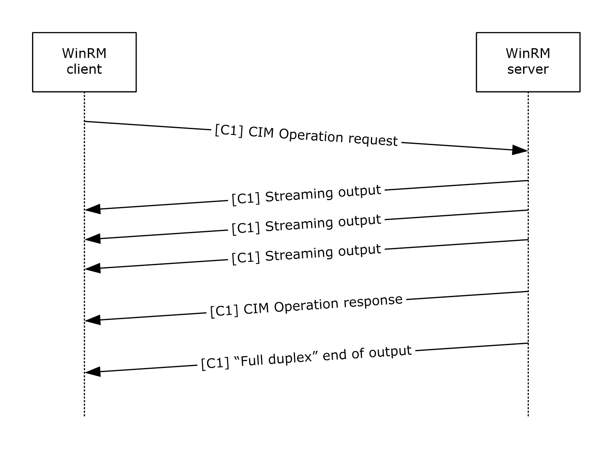

Figure 8: Message sequence for invoking custom methods with stream output parameter

The output messages returned by the WMI provider are formatted as follows.

<s:Envelope xmlns:s="http://www.w3.org/2003/05/soap-envelope" xmlns:a="http://schemas.xmlsoap.org/ws/2004/08/addressing" xmlns:w="http://schemas.dmtf.org/wbem/wsman/1/wsman.xsd" xmlns:wm="http://schemas.microsoft.com/wbem/wsman/1/wsman.xsd" xmlns:i="http://schemas.microsoft.com/wbem/wsman/1/cim/interactive.xsd" >

<s:Header>

<a:To>…</a:To>

<a:ReplyTo>

<a:Address s:mustUnderstand="true">

http://schemas.xmlsoap.org/ws/2004/08/addressing/role/anonymous

</a:Address>

</a:ReplyTo>

<w:MaxEnvelopeSize s:mustUnderstand="true">

153600

</w:MaxEnvelopeSize>

<w:Locale xml:lang="en-US" s:mustUnderstand="false" />

<wm:DataLocale xml:lang="en-US" s:mustUnderstand="false" />

<wm:OperationId s:mustUnderstand="false">

uuid:…

</wm:OperationId>

<a:MessageID>uuid:…</a:MessageID>

<w:ResourceURI s:mustUnderstand="true">

http://schemas.microsoft.com/wbem/wsman/1/cim/(...)/ExtendedSemantics

</w:ResourceURI>

<a:Action s:mustUnderstand="true">

http://schemas.microsoft.com/wbem/wsman/1/cim/(...)/InteractiveCallback

</a:Action>

</s:Header>

<s:Body>

<i:InteractiveEvent>

<i:EventType>StreamingOutput</i:EventType>

<i:Name>PhoneNumbers</i:Name>

<i:Type>5</i:Type>

<i:Value xmlns:xsi="http://www.w3.org/2001/XMLSchema-instance" xmlns:p="http://schemas.dmtf.org/wbem/wscim/1/cim-schema/2/ContactInfo" xmlns:cim="http://schemas.dmtf.org/wbem/wscim/1/common">

<p:PhoneNumbers xsi:type="cim:cimString">123-456-7890</p:PhoneNumbers>

</i:Value>

</i:InteractiveEvent>

</s:Body>

</s:Envelope>

After sending the output messages, the WMI provider will send a final message with the result of the invocation. This message is formatted as follows:

<s:Envelope xmlns:s="http://www.w3.org/2003/05/soap-envelope" xmlns:a="http://schemas.xmlsoap.org/ws/2004/08/addressing" xmlns:w="http://schemas.dmtf.org/wbem/wsman/1/wsman.xsd" xmlns:wm="http://schemas.microsoft.com/wbem/wsman/1/wsman.xsd" xmlns:i="http://schemas.microsoft.com/wbem/wsman/1/cim/interactive.xsd" >

<s:Header>

<a:To>…</a:To>

<a:ReplyTo>

<a:Address s:mustUnderstand="true">

http://schemas.xmlsoap.org/ws/2004/08/addressing/role/anonymous

</a:Address>

</a:ReplyTo>

<w:MaxEnvelopeSize s:mustUnderstand="true">

153600

</w:MaxEnvelopeSize>

<w:Locale xml:lang="en-US" s:mustUnderstand="false" />

<wm:DataLocale xml:lang="en-US" s:mustUnderstand="false" />

<wm:OperationId s:mustUnderstand="false">

uuid:…

</wm:OperationId>

<a:MessageID>uuid:…</a:MessageID>

<w:ResourceURI s:mustUnderstand="true">

http://schemas.microsoft.com/wbem/wsman/1/cim/(...)/ExtendedSemantics

</w:ResourceURI>

<a:Action s:mustUnderstand="true">

http://schemas.microsoft.com/wbem/wsman/1/cim/(...)/InteractiveCallback

</a:Action>

</s:Header>

<s:Body>

<p:GetPhoneNumbers_OUTPUT xmlns:p="http://schemas.dmtf.org/wbem/wscim/1/cim-schema/2/ContactInfo>

<p:ReturnValue xsi:type="cim:cimunsignedInt">0</p:ReturnValue>

</p:GetPhoneNumbers_OUTPUT>

</s:Body>

</s:Envelope>

##### 3.2.4.2.3 Executing WMI Operations with PowerShell Semantics

The WS-Management Protocol can be used to execute operations on CIM resources that support certain PowerShell semantics. These semantics are associated with PowerShell Remoting Protocol messages, as given in the following table, and are documented in [MS-PSRP](../MS-PSRP/MS-PSRP.md).

| PowerShell Semantic | Associated Message |
| --- | --- |
| Verbose | VERBOSE_RECORD |
| Debug | DEBUG_RECORD |
| WarningAction | WARNING_RECORD |
| ErrorAction | ERROR_RECORD |
| Confirm | PIPELINE_HOST_CALL |
| Progress | PROGRESS_RECORD |

CIM resources can support one or more PowerShell semantics. Further, these extended semantics are grouped into categories according to their effect on input, output, and server-side processing.

| Category | Semantics |
| --- | --- |
| Options that create additional server output | Verbose Debug WarningAction (Continue) ErrorAction (Continue) Progress |
| Options that modify execution on the server but do not require additional input | WarningAction (Stop) ErrorAction (Stop) |
| Options that require additional input from the client. | WarningAction (Inquire) ErrorAction (Inquire) Confirm |

For options that only create additional server output, the message flow is as follows. Although the Verbose option triggers the largest amount of additional output, the overall pattern of messages is the same for all options that only create additional server output. In the following diagram, "[C1]" indicates that the messages are transmitted on the primary HTTP connection.

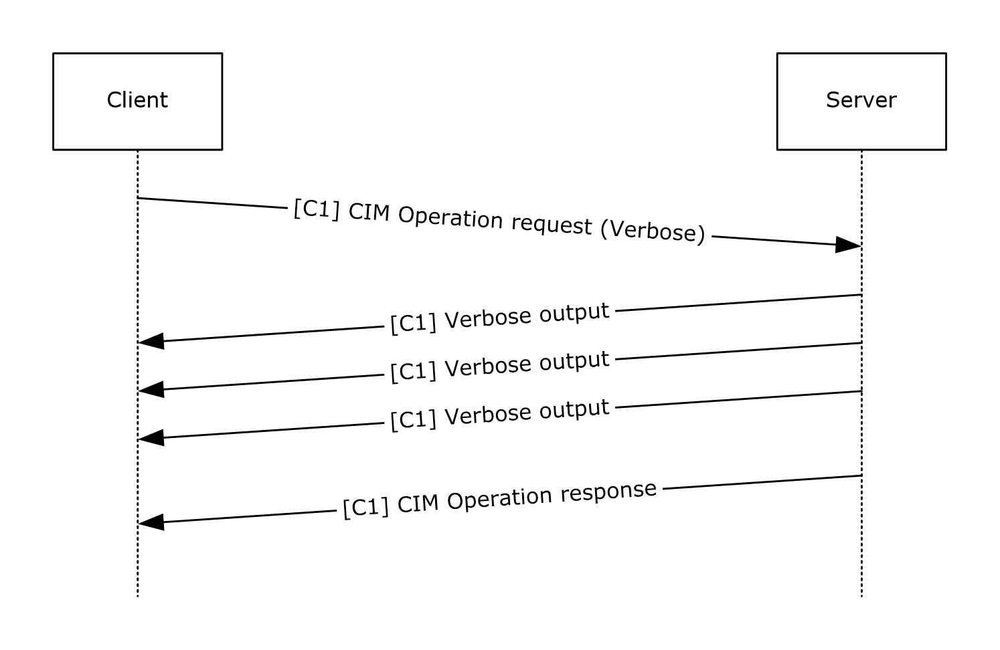

Figure 9: Message sequence for options that create additional server output

- The client sends the CIM Operation Request message with the Verbose option specified.
- The server returns the verbose output in SOAP Response messages, as output is generated by the CIM operation.
- The server sends the CIM Operation Response message as it normally would in the absence of the Verbose option.
For operations that modify server execution but do not require additional client input, the pattern is as follows.

- The client sends the CIM Operation Request message, with the appropriate option specified, on the primary HTTP connection.
- The server returns any generated output in SOAP Response messages, as output is generated by the CIM operation, on the primary HTTP connection.
- The server returns the CIM Operation Response message that is the response to the original CIM Operation Request message.
For operations that require additional client input, the message sequence is as follows. The optional Confirm option triggers the exchange of a pair of Confirm Request and Confirm Response messages, but otherwise, the pattern of messages is the same for all options in this category. In the following diagram, [C1] and [C2] indicate that messages are transmitted on the primary and secondary HTTP connections, respectively.

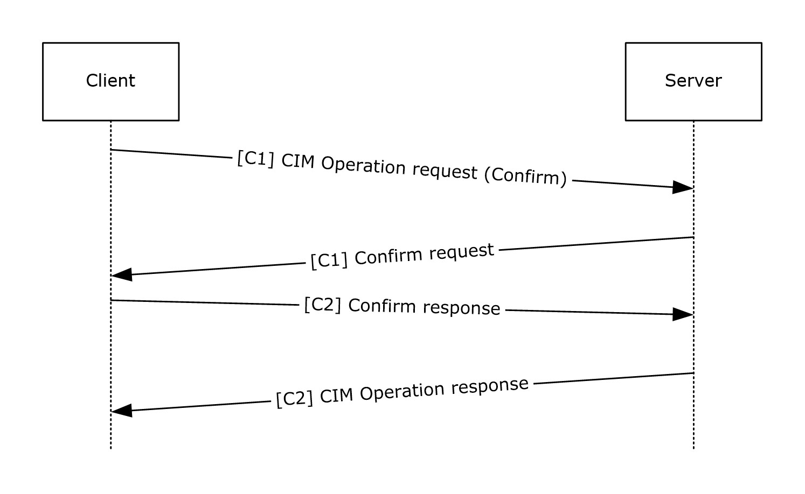

Figure 10: Message sequence for options that require additional client input

- The client sends the CIM Operation Request message, with the Confirm option specified.
- The server returns the Confirm request in SOAP Response message.
- The client sends an acknowledgment of the Confirm request on a secondary connection. Any additional input to this operation from the client will also be transmitted over the secondary connection.
- The server returns the CIM Operation Response message that is the response to the original CIM Operation Request message.

### 3.2.5 Timer Events

#### 3.2.5.1 Client Operation Timeout Timer

Upon expiration of this timer, the Web Services Management Protocol Extensions for Windows Vista client MUST delete the associated request and any associated state.

#### 3.2.5.2 Connection KeepAlive Timer

When this timer expires, the Web Services Management Protocol Extensions for Windows Vista client MUST check whether the SecondaryConnection value of the CimOperations entry is NULL. If not, the client MUST construct an EmptyXmlMessage with the following attributes:

- **Action**: The value "http://schemas.microsoft.com/wbem/wsman/1/wsman/Keepalive".
- **ResourceURI**: The value "http://schemas.microsoft.com/wbem/wsman/1/wsman/FullDuplex".
- **OperationID**: Set to the OperationID value of the row corresponding to this operation in the **CimOperations** table.

#### 3.2.5.3 Request Retry Timer

When this timer expires, if the current time is less than or equal to (RetryStartTime + 185 seconds), the Web Services Management Protocol Extensions for Windows Vista client MUST create a new HTTP connection to the server and resend the **Request** for the operation, setting the **s:MustUnderstand** attribute of the <wsmv:OperationID> element to true. If the current time when this timer expires will be more than (RetryStartTime + 185 seconds), the Web Services Management Protocol Extension for Windows Vista client MUST delete the associated request and report an error to the higher layer protocol.

### 3.2.6 Other Local Events

#### 3.2.6.1 Set Event Collector EPR

A higher layer can set the value of **EventCollectorEPR**. The higher layer passes an EPR.

The client MUST set the value of **EventCollectorEPR** to the EPR, and then issue an Enumerate request to the event collector as specified in Section [3.1.4.1.30](#Section_3.1.4.1.30).<139>

#### 3.2.6.2 Connect to a Remote Shell

To connect to an active shell from a client application different than the one from which the shell was created, the client MUST send a Connect message. This message includes the ShellID of the shell to connect to and MAY include additional information in the <ConnectType> element, if needed by the server in order to connect with the new client.<140>

#### 3.2.6.3 Disconnect from a Remote Shell

A higher layer can disconnect from an active shell. In order to disconnect, the client MUST send a Disconnect message.

#### 3.2.6.4 Reconnect to a Remote Shell

To reconnect to an active shell from the same client application from which the shell was created, the client MUST send a Reconnect message that includes the ShellID of the shell to reconnect to.

#### 3.2.6.5 Begin an Enhanced CIM Operation

A higher layer can initiate a CIM operation that takes advantage of enhanced semantics provided by the server: robust connection, streaming output, and interactive prompting.In addition to the details of the CIM operation to be performed, the [**HLP**](#gt_higher-layer-protocol-hlp) provides the desired values for the options as specified in section [2.2.10](#Section_2.2.10).

To begin an enhanced CIM operation, the client MUST perform the following steps:

- Create a new row in the **CimOperations** table and the corresponding Request message.
- Add an wsmv:OperationID element to the Request message with the OperationID value of this operation and the s:mustUnderstand attribute set to false.
- Add a wsmv:SequenceID element to the Request message with the value 1.
- Send the Request message to the server.
The client MUST NOT have multiple operations active at any one time on each primary or secondary connection.

#### 3.2.6.6 End Enhanced CIM Operations

A higher layer can request that enhanced CIM operations be terminated. To terminate all enhanced CIM operations, the client performs the following steps for each row in the CimOperations table.

- Send an EmptyXmlMessage over the primary connection, with the following values:
- **Action** Set to "http://schemas.microsoft.com/wbem/wsman/1/wsman/End".
- **OperationID** Set to the OperationID value of the operation.
- **ResourceURI** Set to "http://schemas.microsoft.com/wbem/wsman/1/wsman/FullDuplex".
- Release all resources associated with the operation.
- Delete the row.

#### 3.2.6.7 Abort an Enhanced CIM Operation

A higher layer MAY abort a CIM operation that takes advantage of enhanced semantics. To abort an enhanced CIM operation, the client MUST perform the following steps:

- Send a [Cancel message](#Section_3.2.4.2.1.3) over the secondary connection, with the following values:
- **OperationID** set to the OperationID value of the operation.
- Send an EmptyXmlMessage over the secondary connection, with the following values:
- **Action** set to "http://schemas.microsoft.com/wbem/wsman/1/wsman/End".
- **OperationID** set to the OperationID value of the operation.
- **ResourceURI** set to "http://schemas.microsoft.com/wbem/wsman/1/wsman/FullDuplex".
- Release all resources associated with the operation.
- Delete the row.

### 3.2.7 Processing Enhanced CIM Client Messages

When a SOAP response is received on the PrimaryConnection of an entry in the CimOperations table, the client MUST compare the response's SequenceID value to the ReceiveSequenceID value as follows:

- If ReceiveSequenceID is greater than SequenceID, the client MUST ignore the response message and send an Acknowledge message containing ReceiveSequenceID.
- If ReceiveSequenceID is less than SequenceID, the client MUST terminate the operation and report an error to the higher layer protocol.
When a SOAP response is received on the PrimaryConnection of a CimOperations entry, the client MUST read the name of the top-level body element and react as follows:

- If the top-level body element is i:InteractiveEvent, the first sub-element MUST be i:EventType, which MUST contain a recognized value. If not, the client MUST delete the entry in CimOperations and report an error to the higher layer protocol. After the full SOAP response has been read and successfully processed, the client MUST continue reading the connection for additional SOAP responses.
- If the top-level body element is not i:InteractiveEvent, the response is the final response of the operation. See section [3.2.7.9](#Section_3.2.7.9) for more information.
If the client encounters a network error, it MUST proceed as specified in section [3.2.7.10](#Section_3.2.7.10).

The processing rules for each supported i:EventType are described in the following sections.

#### 3.2.7.1 NoSemantics

When the i:EventType value of a SOAP response is NoSemantics, the client MUST delete the entry in the CimOperations table and report an error to the higher layer protocol.

#### 3.2.7.2 Debug

When the i:EventType value of a SOAP response is Debug, the client SHOULD verify that the value of the __MI_CallbackRegistration option in the Request has the 0x01 bit set and that the __MI_OPERATIONS_CHANNEL option includes the Debug channel. The client SHOULD discard the message otherwise.

All required sub-elements MUST be present, as specified in section [2.2.4.49](#Section_2.2.4.49). Otherwise, the client MUST delete the entry in the CimOperations table and report an error to the higher layer protocol.

The client SHOULD send the i:Description text to the higher layer protocol in an implementation-specific manner.

#### 3.2.7.3 Warning

When the i:EventType value of a SOAP response is Warning, the client SHOULD verify that the value of the __MI_CallbackRegistration option in the Request has the 0x01 bit set and that the __MI_OPERATIONS_CHANNEL option includes the Warning channel. The client SHOULD discard the message otherwise.

All required sub-elements MUST be present, as specified in section [2.2.4.49](#Section_2.2.4.49). Otherwise, the client MUST delete the entry in the CimOperations table and report an error to the higher layer protocol.

The client SHOULD send the i:Description text to the higher layer protocol in an implementation-specific manner.

#### 3.2.7.4 Verbose

When the i:EventType value of a SOAP response is Verbose, the client SHOULD verify that the value of the __MI_CallbackRegistration option in the Request has the 0x01 bit set and that the __MI_OPERATIONS_CHANNEL option includes the Verbose channel. The client SHOULD discard the message otherwise.

All required sub-elements MUST be present, as specified in section [2.2.4.49](#Section_2.2.4.49). Otherwise, the client MUST delete the entry in the CimOperations table and report an error to the higher layer protocol.

The client SHOULD send the i:Description text to the higher layer protocol in an implementation-specific manner.

#### 3.2.7.5 Progress

When the i:EventType value of a SOAP response is Progress, the client SHOULD verify that the value of the __MI_CallbackRegistration option in the Request has the 0x08 bit set. The client SHOULD discard the message otherwise.

All required sub-elements MUST be present, as specified in section [2.2.4.49](#Section_2.2.4.49). Otherwise, the client MUST delete the entry in the CimOperations table and report an error to the higher layer protocol.

The client SHOULD send the i:Description text to the higher layer protocol in an implementation-specific manner.

#### 3.2.7.6 Confirm

When the i:EventType value of a SOAP response is Confirm, the client SHOULD verify that the value of the __MI_CallbackRegistration option in the Request has the Confirm bit set. The client SHOULD discard the message otherwise.

All required sub-elements MUST be present, as specified in section [2.2.4.49](#Section_2.2.4.49). Otherwise, the client MUST delete the entry in the CimOperations table and report an error to the higher layer protocol.

The client MUST display all required sub-elements to the user in an implementation-specific manner, and MUST accept a ResponseType in return.

If the SecondaryConnection value in the CimOperations table is set to NULL, the client MUST create a new HTTP connection to the server.

The client MUST create an InteractiveResponseMessage with the following attributes:

- **EventType** is set to the EventType value of the InteractiveEvent.
- **Response** is set to the value of the user's response.

#### 3.2.7.7 ErrorAction

When the i:EventType value of a SOAP response is ErrorAction, the client SHOULD verify that the value of the __MI_CallbackRegistration option in the Request has the Error bit set. The client SHOULD discard the message otherwise.

All required sub-elements MUST be present, as specified in section [2.2.4.49](#Section_2.2.4.49). Otherwise, the client MUST delete the entry in the CimOperations table and report an error to the higher layer protocol.

The client MUST display all required sub-elements to the user in an implementation-specific manner, and MUST accept a ResponseType in return.

If the SecondaryConnection value in the CimOperations table is set to NULL, the client MUST create a new HTTP connection to the server.

The client MUST create an InteractiveResponseMessage with the following attributes:

- **EventType** is set to the EventType value of the InteractiveEvent.
- **OperationID** is set to the OperationID value of the original request.
- **Response** is set to the value of the user's response.

#### 3.2.7.8 StreamingOutput

When the i:EventType value of a SOAP response is StreamingOutput, the client SHOULD verify that the value of the __MI_CallbackRegistration option in the Request has the Streaming bit set. Otherwise, the client SHOULD release all resources associated with the operation and report an error to the higher layer protocol.

All required sub-elements MUST be present, as specified in section [2.2.4.49](#Section_2.2.4.49). Otherwise, the client MUST delete the entry in the CimOperations table and report an error to the higher layer protocol.

Some operations involve multiple messages being sent from the client to the server. To support such operations, the client SHOULD<141> implement the full-duplex functionality specified in section [3.2.4.2.1](#Section_3.2.4.2.1.3).

#### 3.2.7.9 Non-InteractiveEvent Response

When the top-level body element of a SOAP response is not i:InteractiveEvent, the client MUST proceed as follows:

- Read the remainder of the SOAP response.
- Release the primary connection.
- If the SecondaryConnection value in the CimOperations table is not NULL, send an EmptyXmlMessage over the secondary connection. The EmptyXmlMessage MUST have the following attributes:
- **Action** is set to "http://schemas.microsoft.com/wbem/wsman/1/wsman/End".
- **OperationID** is set to the OperationID value of the operation.
- **ResourceURI** is set to "http://schemas.microsoft.com/wbem/wsman/1/wsman/FullDuplex".
- Release the secondary connection.
- Remove the row from the CimOperations table and release all associated resources.

#### 3.2.7.10 Transport Error

If the client encounters an error in the underlying transport, the client MUST close the primary and secondary connections and MUST start the **RequestRetryTimer**.

# 4 Protocol Examples

The following sections describe several operations as used in common scenarios to illustrate the function of the Web Services Management Protocol Extensions for Windows Vista.

## 4.1 CIM Examples

This section illustrates protocol examples related to the [**CIM**](#gt_common-information-model-cim).

### 4.1.1 Retrieving a CIM Instance

This section illustrates an example of a simple [**CIM class**](#gt_cim-class) being accessed via the WS-Management Protocol.

[**Managed Object Format (MOF)**](#gt_managed-object-format-mof) representation of the class is specified in [[DMTF-DSP0004]](https://go.microsoft.com/fwlink/?LinkId=89848).

[abstract]

class Base

{

[key]sint32 id;

};

class MyClass : Base

{

string Data1;

};

instance of MyClass

{

id = 1;

Data1 = "Hello World";

};

This is a simple CIM class hierarchy of two classes: a base CIM class and a derived CIM class called MyClass. These classes are defined in the [**CIM namespace**](#gt_cim-namespace) called root\mycimnamespace.

To access an instance of this class by using a Get operation, the request is as follows.

<s:Envelope xmlns:s="http://www.w3.org/2003/05/soap-envelope"

xmlns:wsa="http://schemas.xmlsoap.org/ws/2004/08/addressing"

xmlns:wsman="http://schemas.dmtf.org/wbem/wsman/1/wsman.xsd">

<s:Header>

<wsa:To>http://server:80/wsman</wsa:To>

<wsman:ResourceURI s:mustUnderstand="true">

http://schemas.microsoft.com/wbem/wsman/1/wmi/root/mynamespace/myclass

</wsman:ResourceURI>

<wsa:ReplyTo>

<wsa:Address s:mustUnderstand="true">

http://schemas.xmlsoap.org/ws/2004/08/addressing/role/anonymous

</wsa:Address>

</wsa:ReplyTo>

<wsa:Action s:mustUnderstand="true">

http://schemas.xmlsoap.org/ws/2004/09/transfer/Get

</wsa:Action>

<wsman:MaxEnvelopeSize s:mustUnderstand="true">

51200

</wsman:MaxEnvelopeSize>

<wsa:MessageID>

uuid:5E6FD101-710A-4EEA-A50D-70C0BF863AA3

</wsa:MessageID>

<wsman:SelectorSet>

<wsman:Selector Name="id">1</wsman:Selector>

</wsman:SelectorSet>

<wsman:OperationTimeout>PT60.000S</wsman:OperationTimeout>

</s:Header>

<s:Body/>

</s:Envelope>

Get Response

<s:Envelope xml:lang="en-US"

xmlns:s="http://www.w3.org/2003/05/soap-envelope"

xmlns:wsa="http://schemas.xmlsoap.org/ws/2004/08/addressing"

xmlns:wsman="http://schemas.dmtf.org/wbem/wsman/1/wsman.xsd">

<s:Header>

<wsa:Action s:mustUnderstand="true">

http://schemas.xmlsoap.org/ws/2004/09/transfer/GetResponse

</wsa:Action>

<wsa:MessageID s:mustUnderstand="true">

uuid:2DAB718A-0103-4E0A-AB17-06C8A5530D2B

</wsa:MessageID>

<wsa:To>

http://schemas.xmlsoap.org/ws/2004/08/addressing/role/anonymous

</wsa:To>

<wsa:RelatesTo s:mustUnderstand="true">

uuid:5E6FD101-710A-4EEA-A50D-70C0BF863AA3

</wsa:RelatesTo>

</s:Header>

<s:Body>

<p:myclass

xmlns:p="http://schemas.microsoft.com/wbem/wsman/1/wmi/root/mynamespace/myclass"

>

<p:Data1>Hello World</p:Data1>

<p:id>1</p:id>

<cim:Location

xmlns:cim="http://schemas.dmtf.org/wbem/wscim/1/common"

xmlns:wsa="http://schemas.xmlsoap.org/ws/2004/08/addressing"

xmlns:wsman="http://schemas.dmtf.org/wbem/wsman/1/wsman.xsd">

<wsa:Address>

http://schemas.xmlsoap.org/ws/2004/08/addressing/role/anonymous

</wsa:Address>

<wsa:ReferenceParameters>

<wsman:ResourceURI>

http://schemas.microsoft.com/wbem/wsman/1/wmi/root/mynamespace/myclass

</wsman:ResourceURI>

<wsman:SelectorSet>

<wsman:Selector Name="id">1</wsman:Selector>

</wsman:SelectorSet>

</wsa:ReferenceParameters>

</cim:Location>

</p:myclass>

</s:Body>

</s:Envelope>

### 4.1.2 Enumeration of Instances

If there are multiple instances of a class, enumeration can be used to retrieve all instances of the [**CIM class**](#gt_cim-class). The example from [Retrieving a CIM Instance (section 4.1.1)](#Section_4.1.1) can be extended to add another instance.

[abstract]

class Base

{

[key]sint32 id;

};

class MyClass : Base

{

string Data1;

};

instance of MyClass

{

id = 1;

Data1 = "Hello World";

};

instance of MyClass

{

id = 2;

Data1 = "Hello Again";

};

Enumeration involves multiple requests and response exchanges, as shown in the following figure.

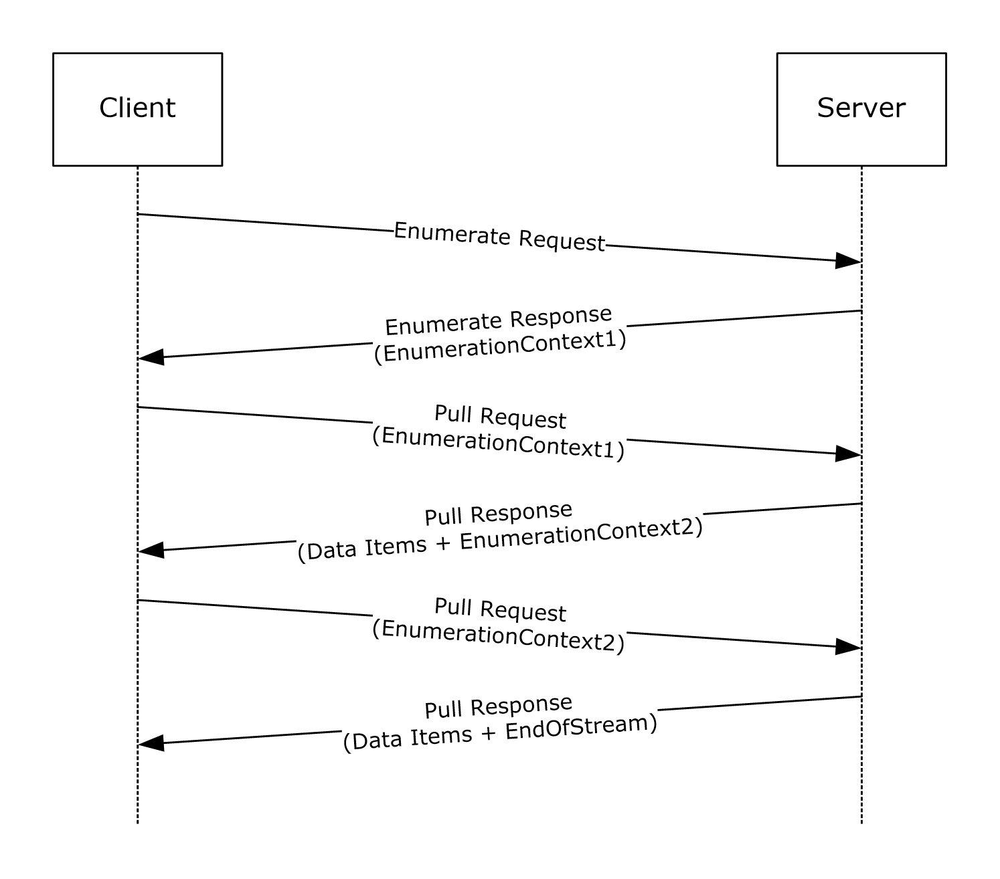

Figure 11: CIM class instances enumeration request-response sequence

- The Web Services Management Protocol Extensions for Windows Vista client sends an Enumerate request with the [**resource URI**](#gt_resource-uri) of the CIM class.
- The Web Services Management Protocol Extensions for Windows Vista service responds with an Enumerate response that contains an enumeration context.
- The client sends a Pull request and includes the Enumeration Context returned in the Enumerate response.
- The service responds with one or more instances of the CIM class along with a new Enumeration Context. The number of instances is determined by maxElements specified in the Pull request.
- The client sends a Pull request and includes the Enumeration Context received in the previous Pull response.
- The service responds with one or more instances of the CIM class along with a new Enumeration Context.
- This sequence is repeated until the service sends an EndofSequence, which indicates there are no more instances.
- The client can send a Release request at any time during the enumeration to stop the exchange.

#### 4.1.2.1 Enumerate Request

<s:Envelope

xmlns:s="http://www.w3.org/2003/05/soap-envelope"

xmlns:wsa="http://schemas.xmlsoap.org/ws/2004/08/addressing"

xmlns:wsen="http://schemas.xmlsoap.org/ws/2004/09/enumeration"

xmlns:wsman="http://schemas.dmtf.org/wbem/wsman/1/wsman.xsd">

<s:Header>

<wsa:To>http://server:80/wsman</wsa:To>

<wsman:ResourceURI s:mustUnderstand="true">

http://schemas.microsoft.com/wbem/wsman/1/wmi/root/mynamespace/myclass

</wsman:ResourceURI>

<wsa:ReplyTo>

<wsa:Address s:mustUnderstand="true">

http://schemas.xmlsoap.org/ws/2004/08/addressing/role/anonymous

</wsa:Address>

</wsa:ReplyTo>

<wsa:Action s:mustUnderstand="true">

http://schemas.xmlsoap.org/ws/2004/09/enumeration/Enumerate

</wsa:Action>

<wsman:MaxEnvelopeSize s:mustUnderstand="true">

51200

</wsman:MaxEnvelopeSize>

<wsa:MessageID>

uuid:C61CA1DC-51C0-4353-AE46-3E42ED0DA794

</wsa:MessageID>

<wsman:OperationTimeout>PT60.000S</wsman:OperationTimeout>

</s:Header>

<s:Body>

<wsen:Enumerate/>

</s:Body>

</s:Envelope>

#### 4.1.2.2 Enumerate Response

<s:Envelope

xml:lang="en-US"

xmlns:s="http://www.w3.org/2003/05/soap-envelope"

xmlns:wsa="http://schemas.xmlsoap.org/ws/2004/08/addressing"

xmlns:wsen="http://schemas.xmlsoap.org/ws/2004/09/enumeration"

xmlns:wsman="http://schemas.dmtf.org/wbem/wsman/1/wsman.xsd">

<s:Header>

<wsa:Action s:mustUnderstand="true">

http://schemas.xmlsoap.org/ws/2004/09/enumeration/EnumerateResponse

</wsa:Action>

<wsa:MessageID s:mustUnderstand="true">

uuid:95783CED-6AC4-471B-B773-1CC892FC674B

</wsa:MessageID>

<wsa:To>

http://schemas.xmlsoap.org/ws/2004/08/addressing/role/anonymous

</wsa:To>

<wsa:RelatesTo s:mustUnderstand="true">

uuid:C61CA1DC-51C0-4353-AE46-3E42ED0DA794

</wsa:RelatesTo>

</s:Header>

<s:Body>

<wsen:EnumerateResponse>

<wsen:EnumerationContext>

uuid:22EB9809-5543-4020-A75C-FD95FF06217B

</wsen:EnumerationContext>

</wsen:EnumerateResponse>

</s:Body>

</s:Envelope>

#### 4.1.2.3 First Pull Request

<s:Envelope

xmlns:s="http://www.w3.org/2003/05/soap-envelope"

xmlns:wsa="http://schemas.xmlsoap.org/ws/2004/08/addressing"

xmlns:wsen="http://schemas.xmlsoap.org/ws/2004/09/enumeration"

xmlns:wsman="http://schemas.dmtf.org/wbem/wsman/1/wsman.xsd">

<s:Header>

<wsa:To>http://server:80/wsman</wsa:To>

<wsman:ResourceURI s:mustUnderstand="true">

http://schemas.microsoft.com/wbem/wsman/1/wmi/root/mynamespace/myclass

</wsman:ResourceURI>

<wsa:ReplyTo>

<wsa:Address s:mustUnderstand="true">

http://schemas.xmlsoap.org/ws/2004/08/addressing/role/anonymous

</wsa:Address>

</wsa:ReplyTo>

<wsa:Action s:mustUnderstand="true">

http://schemas.xmlsoap.org/ws/2004/09/enumeration/Pull

</wsa:Action>

<wsman:MaxEnvelopeSize s:mustUnderstand="true">

51200

</wsman:MaxEnvelopeSize>

<wsa:MessageID>

uuid:54E3FD6C-A83E-454C-A2F6-0BDABF5F14D7

</wsa:MessageID>

<wsman:OperationTimeout>PT60.000S</wsman:OperationTimeout>

</s:Header>

<s:Body>

<wsen:Pull>

<wsen:EnumerationContext>

uuid:22EB9809-5543-4020-A75C-FD95FF06217B

</wsen:EnumerationContext>

<wsen:MaxElements>1</wsen:MaxElements>

</wsen:Pull>

</s:Body>

</s:Envelope>

#### 4.1.2.4 First Pull Response

<s:Envelope

xml:lang="en-US"

xmlns:s="http://www.w3.org/2003/05/soap-envelope"

xmlns:wsa="http://schemas.xmlsoap.org/ws/2004/08/addressing"

xmlns:wsen="http://schemas.xmlsoap.org/ws/2004/09/enumeration"

xmlns:wsman="http://schemas.dmtf.org/wbem/wsman/1/wsman.xsd">

<s:Header>

<wsa:Action s:mustUnderstand="true">

http://schemas.xmlsoap.org/ws/2004/09/enumeration/PullResponse

</wsa:Action>

<wsa:MessageID s:mustUnderstand="true">

uuid:21E59CC8-6D5E-4072-BCA2-7C0DC2BC2504

</wsa:MessageID>

<wsa:To>

http://schemas.xmlsoap.org/ws/2004/08/addressing/role/anonymous

</wsa:To>

<wsa:RelatesTo s:mustUnderstand="true">

uuid:54E3FD6C-A83E-454C-A2F6-0BDABF5F14D7

</wsa:RelatesTo>

</s:Header>

<s:Body>

<wsen:PullResponse>

<wsen:EnumerationContext>

uuid:2504CA0D-94B9-4F91-B2F7-9F4CD9A2A96C

</wsen:EnumerationContext>

<wsen:Items>

<p:myclass

xmlns:p="http://schemas.microsoft.com/wbem/wsman/1/wmi/root/mynamespace/myclass"

>

<p:Data1>Test Message</p:Data1>

<p:id>1</p:id>

<cim:Location

xmlns:cim="http://schemas.dmtf.org/wbem/wscim/1/common"

xmlns:wsa="http://schemas.xmlsoap.org/ws/2004/08/addressing"

xmlns:wsman="http://schemas.dmtf.org/wbem/wsman/1/wsman.xsd">

<wsa:Address>

http://schemas.xmlsoap.org/ws/2004/08/addressing/role/anonymous

</wsa:Address>

<wsa:ReferenceParameters>

<wsman:ResourceURI>

http://schemas.microsoft.com/wbem/wsman/1/wmi/root/mynamespace/myclass

</wsman:ResourceURI>

<wsman:SelectorSet>

<wsman:Selector Name="id">1</wsman:Selector>

</wsman:SelectorSet>

</wsa:ReferenceParameters>

</cim:Location>

</p:myclass>

</wsen:Items>

</wsen:PullResponse>

</s:Body>

</s:Envelope>

#### 4.1.2.5 Second Pull Request

<s:Envelope

xmlns:s="http://www.w3.org/2003/05/soap-envelope"

xmlns:wsa="http://schemas.xmlsoap.org/ws/2004/08/addressing"

xmlns:wsen="http://schemas.xmlsoap.org/ws/2004/09/enumeration"

xmlns:wsman="http://schemas.dmtf.org/wbem/wsman/1/wsman.xsd">

<s:Header>

<wsa:To>http://server:80/wsman</wsa:To>

<wsman:ResourceURI s:mustUnderstand="true">

http://schemas.microsoft.com/wbem/wsman/1/wmi/root/mynamespace/myclass

</wsman:ResourceURI>

<wsa:ReplyTo>

<wsa:Address s:mustUnderstand="true">

http://schemas.xmlsoap.org/ws/2004/08/addressing/role/anonymous

</wsa:Address>

</wsa:ReplyTo>

<wsa:Action s:mustUnderstand="true">

http://schemas.xmlsoap.org/ws/2004/09/enumeration/Pull

</wsa:Action>

<wsman:MaxEnvelopeSize s:mustUnderstand="true">

51200

</wsman:MaxEnvelopeSize>

<wsa:MessageID>

uuid:2C2D261E-D2C3-4A5D-80DE-BB1A48E90BD2

</wsa:MessageID>

<wsman:OperationTimeout>PT60.000S</wsman:OperationTimeout>

</s:Header>

<s:Body>

<wsen:Pull>

<wsen:EnumerationContext>

uuid:2504CA0D-94B9-4F91-B2F7-9F4CD9A2A96C

</wsen:EnumerationContext>

<wsen:MaxElements>1</wsen:MaxElements>

</wsen:Pull>

</s:Body>

</s:Envelope>

#### 4.1.2.6 Second Pull Response with EndOfSequence

<s:Envelope

xml:lang="en-US"

xmlns:s="http://www.w3.org/2003/05/soap-envelope"

xmlns:wsa="http://schemas.xmlsoap.org/ws/2004/08/addressing"

xmlns:wsen="http://schemas.xmlsoap.org/ws/2004/09/enumeration"

xmlns:wsman="http://schemas.dmtf.org/wbem/wsman/1/wsman.xsd">

<s:Header>

<wsa:Action s:mustUnderstand="true">

http://schemas.xmlsoap.org/ws/2004/09/enumeration/PullResponse

</wsa:Action>

<wsa:MessageID s:mustUnderstand="true">

uuid:8820F22A-DB9C-448F-9297-C84519E93753

</wsa:MessageID>

<wsa:To>

http://schemas.xmlsoap.org/ws/2004/08/addressing/role/anonymous

</wsa:To>

<wsa:RelatesTo s:mustUnderstand="true">

uuid:2C2D261E-D2C3-4A5D-80DE-BB1A48E90BD2

</wsa:RelatesTo>

</s:Header>

<s:Body>

<wsen:PullResponse>

<wsen:Items>

<p:myclass

xmlns:p="http://schemas.microsoft.com/wbem/wsman/1/wmi/root/mynamespace/myclass"

>

<p:Data1>"Hello again"</p:Data1>

<p:id>2</p:id>

<cim:Location

xmlns:cim="http://schemas.dmtf.org/wbem/wscim/1/common"

xmlns:wsa="http://schemas.xmlsoap.org/ws/2004/08/addressing"

xmlns:wsman="http://schemas.dmtf.org/wbem/wsman/1/wsman.xsd">

<wsa:Address>

http://schemas.xmlsoap.org/ws/2004/08/addressing/role/anonymous

</wsa:Address>

<wsa:ReferenceParameters>

<wsman:ResourceURI>

http://schemas.microsoft.com/wbem/wsman/1/wmi/root/mynamespace/myclass

</wsman:ResourceURI>

<wsman:SelectorSet>

<wsman:Selector Name="id">2</wsman:Selector>

</wsman:SelectorSet>

</wsa:ReferenceParameters>

</cim:Location>

</p:myclass>

</wsen:Items>

<wsen:EndOfSequence/>

</wsen:PullResponse>

</s:Body>

</s:Envelope>

### 4.1.3 Modifying an Instance

To modify an instance, a Put request is used. Using the example from [Retrieving a CIM Instance (section 4.1.1)](#Section_4.1.1), the following exchange shows the Data1 [**property**](#gt_property) being modified from "Hello World" to "Test String" in an instance of MyClass.

Put Request

<s:Envelope

xmlns:s="http://www.w3.org/2003/05/soap-envelope"

xmlns:wsa="http://schemas.xmlsoap.org/ws/2004/08/addressing"

xmlns:wsman="http://schemas.dmtf.org/wbem/wsman/1/wsman.xsd">

<s:Header>

<wsa:To>http://server:80/wsman</wsa:To>

<wsman:ResourceURI s:mustUnderstand="true">

http://schemas.microsoft.com/wbem/wsman/1/wmi/root/mynamespace/myclass

</wsman:ResourceURI>

<wsa:ReplyTo>

<wsa:Address s:mustUnderstand="true">

http://schemas.xmlsoap.org/ws/2004/08/addressing/role/anonymous

</wsa:Address>

</wsa:ReplyTo>

<wsa:Action s:mustUnderstand="true">

http://schemas.xmlsoap.org/ws/2004/09/transfer/Put

</wsa:Action>

<wsman:MaxEnvelopeSize s:mustUnderstand="true">

51200

</wsman:MaxEnvelopeSize>

<wsa:MessageID>

uuid:D1408048-E0F6-4C6D-8B8A-515B9F7B641C

</wsa:MessageID>

<wsman:SelectorSet>

<wsman:Selector Name="id">1</wsman:Selector>

</wsman:SelectorSet>

<wsman:OperationTimeout>PT60.000S</wsman:OperationTimeout>

</s:Header>

<s:Body>

<p:myclass

xmlns:p="http://schemas.microsoft.com/wbem/wsman/1/wmi/root/mynamespace/myclass"

>

<p:Data1>Test Message</p:Data1>

<p:id>1</p:id>

<cim:Location

xmlns:cim="http://schemas.dmtf.org/wbem/wscim/1/common"

xmlns:wsa="http://schemas.xmlsoap.org/ws/2004/08/addressing"

xmlns:wsman="http://schemas.dmtf.org/wbem/wsman/1/wsman.xsd">

<wsa:Address>

http://schemas.xmlsoap.org/ws/2004/08/addressing/role/anonymous

</wsa:Address>

<wsa:ReferenceParameters>

<wsman:ResourceURI>

http://schemas.microsoft.com/wbem/wsman/1/wmi/root/mynamespace/myclass

</wsman:ResourceURI>

<wsman:SelectorSet>

<wsman:Selector Name="id">1</wsman:Selector>

</wsman:SelectorSet>

</wsa:ReferenceParameters>

</cim:Location>

</p:myclass>

</s:Body>

</s:Envelope>

Put Response

<s:Envelope

xml:lang="en-US"

xmlns:s="http://www.w3.org/2003/05/soap-envelope"

xmlns:wsa="http://schemas.xmlsoap.org/ws/2004/08/addressing"

xmlns:wsman="http://schemas.dmtf.org/wbem/wsman/1/wsman.xsd">

<s:Header>

<wsa:Action s:mustUnderstand="true">

http://schemas.xmlsoap.org/ws/2004/09/transfer/PutResponse

</wsa:Action>

<wsa:MessageID s:mustUnderstand="true">

uuid:92E94D15-B9D2-4DFB-AACF-9952F19B4AFB

</wsa:MessageID>

<wsa:To>

http://schemas.xmlsoap.org/ws/2004/08/addressing/role/anonymous

</wsa:To>

<wsa:RelatesTo s:mustUnderstand="true">

uuid:D1408048-E0F6-4C6D-8B8A-515B9F7B641C

</wsa:RelatesTo>

</s:Header>

<s:Body>

<p:myclass

xmlns:p="http://schemas.microsoft.com/wbem/wsman/1/wmi/root/mynamespace/myclass"

>

<p:Data1>Test Message</p:Data1>

<p:id>1</p:id>

<cim:Location

xmlns:cim="http://schemas.dmtf.org/wbem/wscim/1/common"

xmlns:wsa="http://schemas.xmlsoap.org/ws/2004/08/addressing"

xmlns:wsman="http://schemas.dmtf.org/wbem/wsman/1/wsman.xsd">

<wsa:Address>

http://schemas.xmlsoap.org/ws/2004/08/addressing/role/anonymous

</wsa:Address>

<wsa:ReferenceParameters>

<wsman:ResourceURI>

http://schemas.microsoft.com/wbem/wsman/1/wmi/root/mynamespace/myclass

</wsman:ResourceURI>

<wsman:SelectorSet>

<wsman:Selector Name="id">1</wsman:Selector>

</wsman:SelectorSet>

</wsa:ReferenceParameters>

</cim:Location>

</p:myclass>

</s:Body>

</s:Envelope>

### 4.1.4 Invoking a Method

The WS-Management Protocol can be used to invoke a method on a [**CIM class**](#gt_cim-class) or instance. Win32_Process is a CIM class derived from CIM_Process, which has a method called Create that is used to create a process.

Invoke Method Request

<s:Envelope

xmlns:s="http://www.w3.org/2003/05/soap-envelope"

xmlns:wsa="http://schemas.xmlsoap.org/ws/2004/08/addressing"

xmlns:wsman="http://schemas.dmtf.org/wbem/wsman/1/wsman.xsd">

<s:Header>

<wsa:To>http://server:80/wsman</wsa:To>

<wsman:ResourceURI s:mustUnderstand="true">

http://schemas.microsoft.com/wbem/wsman/1/wmi/root/cimv2/Win32_Process

</wsman:ResourceURI>

<wsa:ReplyTo>

<wsa:Address s:mustUnderstand="true">

http://schemas.xmlsoap.org/ws/2004/08/addressing/role/anonymous

</wsa:Address>

</wsa:ReplyTo>

<wsa:Action s:mustUnderstand="true">

http://schemas.microsoft.com/wbem/wsman/1/wmi/root/cimv2/Win32_Process/Create

</wsa:Action>

<wsman:MaxEnvelopeSize s:mustUnderstand="true">

51200

</wsman:MaxEnvelopeSize>

<wsa:MessageID>

uuid:9A989269-283B-4624-BAC5-BC291F72E854

</wsa:MessageID>

<wsman:OperationTimeout>PT60.000S</wsman:OperationTimeout>

</s:Header>

<s:Body>

<p:Create_INPUT

xmlns:p="http://schemas.microsoft.com/wbem/wsman/1/wmi/root/cim/Win32_Process"

>

<p:CommandLine>notepad.exe</p:CommandLine>

<p:CurrentDirectory>C:\</p:CurrentDirectory>

</p:Create_INPUT>

</s:Body>

</s:Envelope>

Invoke Method Response

<s:Envelope xml:lang="en-US"

xmlns:s="http://www.w3.org/2003/05/soap-envelope"

xmlns:wsa="http://schemas.xmlsoap.org/ws/2004/08/addressing"

xmlns:wsman="http://schemas.dmtf.org/wbem/wsman/1/wsman.xsd">

<s:Header>

<wsa:Action s:mustUnderstand="true">

http://schemas.microsoft.com/wbem/wsman/1/wmi/root/cimv2/Win32_Process/CreateResponse

</wsa:Action>

<wsa:MessageID s:mustUnderstand="true">

uuid:F0228E67-F37B-4BE3-BAA2-3BB58AA6F911

</wsa:MessageID>

<wsa:To>

http://schemas.xmlsoap.org/ws/2004/08/addressing/role/anonymous

</wsa:To>

<wsa:RelatesTo s:mustUnderstand="true">

uuid:9A989269-283B-4624-BAC5-BC291F72E854

</wsa:RelatesTo>

</s:Header>

<s:Body>

<p:Create_OUTPUT

xmlns:p="http://schemas.microsoft.com/wbem/wsman/1/wmi/root/cimv2/Win32_Process"

>

<p:ProcessId>4000</p:ProcessId>

<p:ReturnValue>0</p:ReturnValue>

</p:Create_OUTPUT>

</s:Body>

</s:Envelope>

## 4.2 Configuration Examples

This section illustrates protocol examples related to configuration of a Web Services Management Protocol Extensions for Windows Vista service.

### 4.2.1 Retrieving Configuration

This section illustrates an example of the entire configuration of Web Services Management Protocol Extensions for Windows Vista accessed by using Get.

Get Request

<s:Envelope xmlns:s="http://www.w3.org/2003/05/soap-envelope"

xmlns:wsa="http://schemas.xmlsoap.org/ws/2004/08/addressing"

xmlns:wsman="http://schemas.dmtf.org/wbem/wsman/1/wsman.xsd">

<s:Header>

<wsa:To>http://localhost:80/wsman</wsa:To>

<wsman:ResourceURI s:mustUnderstand="true">

http://schemas.microsoft.com/wbem/wsman/1/config

</wsman:ResourceURI>

<wsa:ReplyTo>

<wsa:Address s:mustUnderstand="true">

http://schemas.xmlsoap.org/ws/2004/08/addressing/role/anonymous

</wsa:Address>

</wsa:ReplyTo>

<wsa:Action s:mustUnderstand="true">

http://schemas.xmlsoap.org/ws/2004/09/transfer/Get

</wsa:Action>

<wsman:MaxEnvelopeSize s:mustUnderstand="true">

51200

</wsman:MaxEnvelopeSize>

<wsa:MessageID>

uuid:613DCD71-95AF-4ED5-86E2-1D6AB44ECE66

</wsa:MessageID>

<wsman:OperationTimeout>PT60.000S</wsman:OperationTimeout>

</s:Header>

<s:Body/>

</s:Envelope>

Get Response

<s:Envelope xml:lang="en-US"

xmlns:s="http://www.w3.org/2003/05/soap-envelope"

xmlns:wsa="http://schemas.xmlsoap.org/ws/2004/08/

addressing"

xmlns:wsman="http://schemas.dmtf.org/wbem/wsman/1/

wsman.xsd">

<s:Header>

<wsa:Action s:mustUnderstand="true">

http://schemas.xmlsoap.org/ws/2004/09/transfer/GetResponse

</wsa:Action>

<wsa:MessageID s:mustUnderstand="true">

uuid:26ED5937-8016-41D5-9157-C9AD5B1D3C37

</wsa:MessageID>

<wsa:To>

http://schemas.xmlsoap.org/ws/2004/08/addressing/role/anonymous

</wsa:To>

<wsa:RelatesTo s:mustUnderstand="true">

uuid:613DCD71-95AF-4ED5-86E2-1D6AB44ECE66

</wsa:RelatesTo>

</s:Header>

<s:Body>

<cfg:Config xmlns:cfg="http://schemas.microsoft.com/wbem/

wsman/1/config">

<cfg:MaxEnvelopeSizekb>50</cfg:MaxEnvelopeSizekb>

<cfg:MaxTimeoutms>60000</cfg:MaxTimeoutms>

<cfg:MaxBatchItems>20</cfg:MaxBatchItems>

<cfg:MaxProviderRequests>25</cfg:MaxProviderRequests>

<cfg:Client>

<cfg:NetworkDelayms>5000</cfg:NetworkDelayms>

<cfg:URLPrefix>wsman</cfg:URLPrefix>

<cfg:AllowUnencrypted>false</cfg:AllowUnencrypted>

<cfg:Auth>

<cfg:Basic>false</cfg:Basic>

<cfg:Digest>true</cfg:Digest>

<cfg:Kerberos>true</cfg:Kerberos>

<cfg:Negotiate>true</cfg:Negotiate>

<cfg:Certificate>true</cfg:Certificate>

</cfg:Auth>

<cfg:DefaultPorts>

<cfg:HTTP>80</cfg:HTTP>

<cfg:HTTPS>443</cfg:HTTPS>

</cfg:DefaultPorts>

<cfg:TrustedHosts></cfg:TrustedHosts>

</cfg:Client>

<cfg:Service>

<cfg:RootSDDL>

O:NSG:BAD:P(A;;GA;;;BA)(A;;GR;;;ER)S:P(AU;FA;GA;;;WD)(AU;S A;

GWGX;;;WD)

</cfg:RootSDDL>

<cfg:MaxConcurrentOperations>

100

</cfg:MaxConcurrentOperations>

<cfg:EnumerationTimeoutms>

60000

</cfg:EnumerationTimeoutms>

<cfg:MaxConnections>5</cfg:MaxConnections>

<cfg:AllowUnencrypted>false</cfg:AllowUnencrypted>

<cfg:Auth>

<cfg:Basic>false</cfg:Basic>

<cfg:Kerberos>true</cfg:Kerberos>

<cfg:Negotiate>true</cfg:Negotiate>

</cfg:Auth>

<cfg:DefaultPorts>

<cfg:HTTP>80</cfg:HTTP>

<cfg:HTTPS>443</cfg:HTTPS>

</cfg:DefaultPorts>

<cfg:IPv4Filter>*</cfg:IPv4Filter>

<cfg:IPv6Filter>*</cfg:IPv6Filter>

</cfg:Service>

<cfg:Winrs>

<cfg:AllowRemoteShellAccess>true</cfg:AllowRemoteShellAccess>

<cfg:IdleTimeout>900000</cfg:IdleTimeout>

<cfg:MaxConcurrentUsers>5</cfg:MaxConcurrentUsers>

<cfg:MaxShellRunTime>28800000</cfg:MaxShellRunTime>

<cfg:MaxProcessesPerShell>5</cfg:MaxProcessesPerShell>

<cfg:MaxMemoryPerShellMB>80</cfg:MaxMemoryPerShellMB>

<cfg:MaxShellsPerUser>2</cfg:MaxShellsPerUser>

</cfg:Winrs>

</cfg:Config>

</s:Body>

</s:Envelope>

### 4.2.2 Modifying Configuration

To modify the configuration, a Put request is used. In this example, cfg:MaxBatchItems is changed from 20 to 10.

Put Request

<s:Envelope

xmlns:s="http://www.w3.org/2003/05/soap-envelope"

xmlns:waa="http://schemas.xmlsoap.org/ws/2004/08/addressing"

xmlns:wsman="http://schemas.dmtf.org/wbem/wsman/1/wsman.xsd">

<s:Header>

<wsa:To>http://localhost:80/wsman</wsa:To>

<wsman:ResourceURI s:mustUnderstand="true">

http://schemas.microsoft.com/wbem/wsman/1/config

</wsman:ResourceURI>

<wsa:ReplyTo>

<wsa:Address s:mustUnderstand="true">

http://schemas.xmlsoap.org/ws/2004/08/addressing/role/anonymous

</wsa:Address>

</wsa:ReplyTo>

<wsa:Action s:mustUnderstand="true">

http://schemas.xmlsoap.org/ws/2004/09/transfer/Put

</wsa:Action>

<wsman:MaxEnvelopeSize s:mustUnderstand="true">

51200

</wsman:MaxEnvelopeSize>

<wsa:MessageID>

uuid:47F4F498-0050-4DCF-BCA1-5611732CF7DE

</wsa:MessageID>

<wsman:OperationTimeout>PT60.000S</wsman:OperationTimeout>

</s:Header>

<s:Body>

<cfg:Config

xmlns:cfg="http://schemas.microsoft.com/wbem/wsman/1/config">

<cfg:MaxEnvelopeSizekb>50</cfg:MaxEnvelopeSizekb>

<cfg:MaxTimeoutms>60000</cfg:MaxTimeoutms>

<cfg:MaxBatchItems>10</cfg:MaxBatchItems>

<cfg:MaxProviderRequests>25</cfg:MaxProviderRequests>

<cfg:Client>

<cfg:NetworkDelayms>5000</cfg:NetworkDelayms>

<cfg:URLPrefix>wsman</cfg:URLPrefix>

<cfg:AllowUnencrypted>false</cfg:AllowUnencrypted>

<cfg:Auth>

<cfg:Basic>false</cfg:Basic>

<cfg:Digest>true</cfg:Digest>

<cfg:Kerberos>true</cfg:Kerberos>

<cfg:Negotiate>true</cfg:Negotiate>

</cfg:Auth>

<cfg:DefaultPorts>

<cfg:HTTP>80</cfg:HTTP>

<cfg:HTTPS>443</cfg:HTTPS>

</cfg:DefaultPorts>

<cfg:TrustedHosts>

</cfg:TrustedHosts>

</cfg:Client>

<cfg:Service>

<cfg:RootSDDL>

O:NSG:BAD:P(A;;GA;;;BA)(A;;GR;;;ER)S:P(AU;FA;GA;;;WD)(AU;S A;GWGX;;;WD)

</cfg:RootSDDL>

<cfg:MaxConcurrentOperations>

100

</cfg:MaxConcurrentOperations>

<cfg:EnumerationTimeoutms>

60000

</cfg:EnumerationTimeoutms>

<cfg:AllowUnencrypted>false</cfg:AllowUnencrypted>

<cfg:Auth>

<cfg:Basic>false</cfg:Basic>

<cfg:Kerberos>true</cfg:Kerberos>

<cfg:Negotiate>true</cfg:Negotiate>

</cfg:Auth>

<cfg:DefaultPorts>

<cfg:HTTP>80</cfg:HTTP>

<cfg:HTTPS>443</cfg:HTTPS>

</cfg:DefaultPorts>

<cfg:IPv4Filter>*</cfg:IPv4Filter>

<cfg:IPv6Filter>*</cfg:IPv6Filter>

</cfg:Service>

<cfg:Winrs>

<cfg:AllowRemoteShellAccess>

true

</cfg:AllowRemoteShellAccess>

<cfg:IdleTimeout>900000</cfg:IdleTimeout>

<cfg:MaxConcurrentUsers>5</cfg:MaxConcurrentUsers>

<cfg:MaxShellRunTime>28800000</cfg:MaxShellRunTime>

<cfg:MaxProcessesPerShell>5</cfg:MaxProcessesPerShell>

<cfg:MaxMemoryPerShellMB>80</cfg:MaxMemoryPerShellMB>

<cfg:MaxShellsPerUser>2</cfg:MaxShellsPerUser>

</cfg:Winrs>

</cfg:Config>

</s:Body>

</s:Envelope>

Put Response

<s:Envelope

xmlns:s="http://www.w3.org/2003/05/soap-envelope"

xmlns:wsa="http://schemas.xmlsoap.org/ws/2004/08/addressing"

xmlns:wsman="http://schemas.dmtf.org/wbem/wsman/1/wsman.xsd">

<s:Header>

<wsa:To>http://localhost:80/wsman</wsa:To>

<wsman:ResourceURI s:mustUnderstand="true">

http://schemas.microsoft.com/wbem/wsman/1/config

</wsman:ResourceURI>

<wsa:ReplyTo>

<wsa:Address s:mustUnderstand="true">

http://schemas.xmlsoap.org/ws/2004/08/addressing/role/anonymous

</wsa:Address>

</wsa:ReplyTo>

<wsa:Action s:mustUnderstand="true">

http://schemas.xmlsoap.org/ws/2004/09/transfer/Put

</wsa:Action>

<wsman:MaxEnvelopeSize s:mustUnderstand="true">

51200

</wsman:MaxEnvelopeSize>

<wsa:MessageID>

uuid:47F4F498-0050-4DCF-BCA1-5611732CF7DE

</wsa:MessageID>

<wsman:OperationTimeout>PT60.000S</wsman:OperationTimeout>

</s:Header>

<s:Body>

<cfg:Config

xmlns:cfg="http://schemas.microsoft.com/wbem/wsman/1/config">

<cfg:MaxEnvelopeSizekb>50</cfg:MaxEnvelopeSizekb>

<cfg:MaxTimeoutms>60000</cfg:MaxTimeoutms>

<cfg:MaxBatchItems>10</cfg:MaxBatchItems>

<cfg:MaxProviderRequests>25</cfg:MaxProviderRequests>

<cfg:Client>

<cfg:NetworkDelayms>5000</cfg:NetworkDelayms>

<cfg:URLPrefix>wsman</cfg:URLPrefix>

<cfg:AllowUnencrypted>false</cfg:AllowUnencrypted>

<cfg:Auth>

<cfg:Basic>false</cfg:Basic>

<cfg:Digest>true</cfg:Digest>

<cfg:Kerberos>true</cfg:Kerberos>

<cfg:Negotiate>true</cfg:Negotiate>

</cfg:Auth>

<cfg:DefaultPorts>

<cfg:HTTP>80</cfg:HTTP>

<cfg:HTTPS>443</cfg:HTTPS>

</cfg:DefaultPorts>

<cfg:TrustedHosts>

</cfg:TrustedHosts>

</cfg:Client>

<cfg:Service>

<cfg:RootSDDL>

O:NSG:BAD:P(A;;GA;;;BA)(A;;GR;;;ER)S:P(AU;FA;GA;;;WD)(AU;S A;GWGX;;;WD)

</cfg:RootSDDL>

<cfg:MaxConcurrentOperations>

100

</cfg:MaxConcurrentOperations>

<cfg:EnumerationTimeoutms>

60000

</cfg:EnumerationTimeoutms>

<cfg:AllowUnencrypted>false</cfg:AllowUnencrypted>

<cfg:Auth>

<cfg:Basic>false</cfg:Basic>

<cfg:Kerberos>true</cfg:Kerberos>

<cfg:Negotiate>true</cfg:Negotiate>

</cfg:Auth>

<cfg:DefaultPorts>

<cfg:HTTP>80</cfg:HTTP>

<cfg:HTTPS>443</cfg:HTTPS>

</cfg:DefaultPorts>

<cfg:IPv4Filter>*</cfg:IPv4Filter>

<cfg:IPv6Filter>*</cfg:IPv6Filter>

</cfg:Service>

<cfg:Winrs>

<cfg:AllowRemoteShellAccess>

true

</cfg:AllowRemoteShellAccess>

<cfg:IdleTimeout>900000</cfg:IdleTimeout>

<cfg:MaxConcurrentUsers>5</cfg:MaxConcurrentUsers>

<cfg:MaxShellRunTime>28800000</cfg:MaxShellRunTime>

<cfg:MaxProcessesPerShell>5</cfg:MaxProcessesPerShell>

<cfg:MaxMemoryPerShellMB>80</cfg:MaxMemoryPerShellMB>

<cfg:MaxShellsPerUser>2</cfg:MaxShellsPerUser>

</cfg:Winrs>

</cfg:Config>

</s:Body>

</s:Envelope>

### 4.2.3 Client Certificate Mapping Configuration

Create Request

<s:Envelope

xmlns:s="http://www.w3.org/2003/05/soap-envelope"

xmlns:wsa="http://schemas.xmlsoap.org/ws/2004/08/addressing"

xmlns:wsman="http://schemas.dmtf.org/wbem/wsman/1/wsman.xsd">

<s:Header>

<wsa:To>http://localhost:80/wsman</wsa:To>

<wsman:ResourceURI s:mustUnderstand="true">

http://schemas.microsoft.com/wbem/wsman/1/config/service/certmapping

</wsman:ResourceURI>

<wsa:ReplyTo>

<wsa:Address s:mustUnderstand="true">

http://schemas.xmlsoap.org/ws/2004/08/addressing/role/

anonymous

</wsa:Address>

</wsa:ReplyTo>

<wsa:Action s:mustUnderstand="true">

http://schemas.xmlsoap.org/ws/2004/09/transfer/Create

</wsa:Action>

<wsman:MaxEnvelopeSize s:mustUnderstand="true">

153600

</wsman:MaxEnvelopeSize>

<wsa:MessageID>

uuid:05FC732F-9D6A-4A92-875C-171A2A71B938

</wsa:MessageID>

<wsman:Locale xml:lang="en-US" s:mustUnderstand="false" />

<wsman:SelectorSet>

<wsman:Selector Name="Issuer">

5600a015ca5e8a26f638b74e819ae92096da5c8c

</wsman:Selector>

<wsman:Selector Name="Subject">*@mig.net</wsman:Selector>

<wsman:Selector Name="URI">*</wsman:Selector>

</wsman:SelectorSet>

<wsman:OperationTimeout>PT60.000S</wsman:OperationTimeout>

</s:Header>

<s:Body>

<cert:certmapping

xmlns:cert="http://schemas.microsoft.com/wbem/wsman/1/config/service/

certmapping.xsd">

<cert:UserName>certAdminAccount</cert:UserName>

<cert:password>Bull_dog1</cert:password>

<cert:Enabled>true</cert:Enabled>

</cert:certmapping>

</s:Body>

</s:Envelope>

Create Response

<s:Envelope xml:lang="en-US"

xmlns:s="http://www.w3.org/2003/05/soap-envelope"

xmlns:wsa="http://schemas.xmlsoap.org/ws/2004/08/addressing"

xmlns:wsman="http://schemas.dmtf.org/wbem/wsman/1/wsman.xsd">

<s:Header>

<wsa:Action>

http://schemas.xmlsoap.org/ws/2004/09/transfer/CreateResponse

</wsa:Action>

<wsa:MessageID>

uuid:DDB06DC3-D3FB-480F-A1EA-275100D688C3

</wsa:MessageID>

<wsa:To>

http://schemas.xmlsoap.org/ws/2004/08/addressing/role/anonymous

</wsa:To>

<wsa:RelatesTo>

uuid:05FC732F-9D6A-4A92-875C-171A2A71B938

</wsa:RelatesTo>

</s:Header>

<s:Body>

<wst:ResourceCreated

xmlns:wst="http://schemas.xmlsoap.org/ws/2004/09/transfer"

xmlns:wsa="http://schemas.xmlsoap.org/ws/2004/08/addressing"

xmlns:wsman="http://schemas.dmtf.org/wbem/wsman/1/wsman.xsd">

<wsa:Address>

http://schemas.xmlsoap.org/ws/2004/08/addressing/role/anonymous

</wsa:Address>

<wsa:ReferenceParameters>

<wsman:ResourceURI>

http://schemas.microsoft.com/wbem/wsman/1/config/service/certmapping

</wsman:ResourceURI>

<wsman:SelectorSet>

<wsman:Selector Name="URI">*</wsman:Selector>

<wsman:Selector Name="Subject">*@mig.net</wsman:Selector>

<wsman:Selector Name="Issuer">

5600a015ca5e8a26f638b74e819ae92096da5c8c

</wsman:Selector>

</wsman:SelectorSet>

</wsa:ReferenceParameters>

</wst:ResourceCreated>

</s:Body>

</s:Envelope>

Put Request

<s:Envelope

xmlns:s="http://www.w3.org/2003/05/soap-envelope"

xmlns:wsa="http://schemas.xmlsoap.org/ws/2004/08/addressing"

xmlns:wsman="http://schemas.dmtf.org/wbem/wsman/1/wsman.xsd">

<s:Header>

<wsa:To>http://localhost:80/wsman</wsa:To>

<wsman:ResourceURI s:mustUnderstand="true">

http://schemas.microsoft.com/wbem/wsman/1/config/service/certmapping

</wsman:ResourceURI>

<wsa:ReplyTo>

<wsa:Address s:mustUnderstand="true">

http://schemas.xmlsoap.org/ws/2004/08/addressing/role/anonymous

</wsa:Address>

</wsa:ReplyTo>

<wsa:Action s:mustUnderstand="true">

http://schemas.xmlsoap.org/ws/2004/09/transfer/Put

</wsa:Action>

<wsman:MaxEnvelopeSize s:mustUnderstand="true">

153600

</wsman:MaxEnvelopeSize>

<wsa:MessageID>

uuid:898949E0-D492-4E01-8D5D-B3982FF1C722

</wsa:MessageID>

<wsman:Locale xml:lang="en-US" s:mustUnderstand="false" />

<wsman:SelectorSet>

<wsman:Selector Name="Issuer">

1212131238d84023982e381f2

</wsman:Selector>

<wsman:Selector Name="Subject">*.sampl.com</wsman:Selector>

<wsman:Selector Name="URI">

http://schemas.microsoft.com/wbem/wsman/1/wmi/root/cimv2/*

</wsman:Selector>

</wsman:SelectorSet>

<wsman:OperationTimeout>PT60.000S</wsman:OperationTimeout>

</s:Header>

<s:Body>

<cert:CertMapping

xmlns:cert="http://schemas.microsoft.com/wbem/wsman/1/config/service/

certmapping"

xml:lang="en-US">

<cert:URI>

http://schemas.microsoft.com/wbem/wsman/1/wmi/root/cimv2/*

</cert:URI>

<cert:Subject>*.sampl.com</cert:Subject>

<cert:Issuer>1212131238d84023982e381f2</cert:Issuer>

<cert:UserName>certadminACCOUNT</cert:UserName>

<cert:Enabled>false</cert:Enabled>

<cert:Password />

</cert:CertMapping>

</s:Body>

</s:Envelope>

Put Response

<s:Envelope xml:lang="en-US"

xmlns:s="http://www.w3.org/2003/05/soap-envelope"

xmlns:wsa="http://schemas.xmlsoap.org/ws/2004/08/addressing"

xmlns:wsman="http://schemas.dmtf.org/wbem/wsman/1/wsman.xsd">

<s:Header>

<wsa:Action>

http://schemas.xmlsoap.org/ws/2004/09/transfer/

PutResponse

</wsa:Action>

<wsa:MessageID>

uuid:28491235-98D4-43EE-95E9-5ED3D7D0A1B8

</wsa:MessageID>

<wsa:To>

http://schemas.xmlsoap.org/ws/2004/08/addressing/role/

anonymous

</wsa:To>

<wsa:RelatesTo>

uuid:898949E0-D492-4E01-8D5D-B3982FF1C722

</wsa:RelatesTo>

</s:Header>

<s:Body>

<cert:CertMapping

xmlns:cert="http://schemas.microsoft.com/wbem/wsman/1/config/service/

certmapping"

>

<cert:URI>

http://schemas.microsoft.com/wbem/wsman/1/wmi/root/cimv2/*

</cert:URI>

<cert:Subject>*.sampl.com</cert:Subject>

<cert:Issuer>1212131238d84023982e381f2</cert:Issuer>

<cert:UserName>certadminACCOUNT</cert:UserName>

<cert:Enabled>false</cert:Enabled>

<cert:PassCertToPlugin>false</cert:PassCertToPlugin>

<cert:Password />

</cert:CertMapping>

</s:Body>

</s:Envelope>

Get Request

<s:Envelope

xmlns:s="http://www.w3.org/2003/05/soap-envelope"

xmlns:wsa="http://schemas.xmlsoap.org/ws/2004/08/addressing"

xmlns:wsman="http://schemas.dmtf.org/wbem/wsman/1/wsman.xsd">

<s:Header>

<wsa:To>http://localhost:80/wsman</wsa:To>

<wsman:ResourceURI s:mustUnderstand="true">

http://schemas.microsoft.com/wbem/wsman/1/config/service/certmapping

</wsman:ResourceURI>

<wsa:ReplyTo>

<wsa:Address s:mustUnderstand="true">

http://schemas.xmlsoap.org/ws/2004/08/addressing/role/anonymous

</wsa:Address>

</wsa:ReplyTo>

<wsa:Action s:mustUnderstand="true">

http://schemas.xmlsoap.org/ws/2004/09/transfer/Get

</wsa:Action>

<wsman:MaxEnvelopeSize s:mustUnderstand="true">

153600

</wsman:MaxEnvelopeSize>

<wsa:MessageID>

uuid:006AAD01-1C1D-4316-A837-C5A0753AEE5B

</wsa:MessageID>

<wsman:Locale xml:lang="en-US" s:mustUnderstand="false" />

<wsman:SelectorSet>

<wsman:Selector Name="Issuer">

1212131238d84023982e381f2

</wsman:Selector>

<wsman:Selector Name="Subject">*.sampl.com</wsman:Selector>

<wsman:Selector Name="URI">

http://schemas.microsoft.com/wbem/wsman/1/wmi/root/cimv2/*

</wsman:Selector>

</wsman:SelectorSet>

<wsman:OperationTimeout>PT60.000S</wsman:OperationTimeout>

</s:Header>

<s:Body />

</s:Envelope>

Get Response

<s:Envelope xml:lang="en-US"

xmlns:s="http://www.w3.org/2003/05/soap-envelope"

xmlns:wsa="http://schemas.xmlsoap.org/ws/2004/08/addressing"

xmlns:wsman="http://schemas.dmtf.org/wbem/wsman/1/wsman.xsd">

<s:Header>

<wsa:Action>

http://schemas.xmlsoap.org/ws/2004/09/transfer/GetResponse

</wsa:Action>

<wsa:MessageID>

uuid:4137066B-FEA6-43A4-9DE4-65C3BE07C4EA

</wsa:MessageID>

<wsa:To>

http://schemas.xmlsoap.org/ws/2004/08/addressing/role/anonymous

</wsa:To>

<wsa:RelatesTo>

uuid:006AAD01-1C1D-4316-A837-C5A0753AEE5B

</wsa:RelatesTo>

</s:Header>

<s:Body>

<cert:CertMapping

xmlns:cert="http://schemas.microsoft.com/wbem/wsman/1/config/service/

certmapping"

>

<cert:URI>

http://schemas.microsoft.com/wbem/wsman/1/wmi/root/cimv2/*

</cert:URI>

<cert:Subject>*.sampl.com</cert:Subject>

<cert:Issuer>1212131238d84023982e381f2</cert:Issuer>

<cert:UserName>certadminACCOUNT</cert:UserName>

<cert:Enabled>true</cert:Enabled>

<cert:PassCertToPlugin>false</cert:PassCertToPlugin>

<cert:Password />

</cert:CertMapping>

</s:Body>

</s:Envelope>

Delete Request

<s:Envelope

xmlns:s="http://www.w3.org/2003/05/soap-envelope"

xmlns:wsa="http://schemas.xmlsoap.org/ws/2004/08/addressing"

xmlns:wsman="http://schemas.dmtf.org/wbem/wsman/1/wsman.xsd">

<s:Header>

<wsa:To>http://localhost:80/wsman</wsa:To>

<wsman:ResourceURI s:mustUnderstand="true">

http://schemas.microsoft.com/wbem/wsman/1/config/service/certmapping

</wsman:ResourceURI>

<wsa:ReplyTo>

<wsa:Address s:mustUnderstand="true">

http://schemas.xmlsoap.org/ws/2004/08/addressing/role/anonymous

</wsa:Address>

</wsa:ReplyTo>

<wsa:Action s:mustUnderstand="true">

http://schemas.xmlsoap.org/ws/2004/09/transfer/Delete

</wsa:Action>

<wsman:MaxEnvelopeSize s:mustUnderstand="true">

153600

</wsman:MaxEnvelopeSize>

<wsa:MessageID>

uuid:D0EF8968-9372-494C-8FF6-7F7DB4A07CC5

</wsa:MessageID>

<wsman:Locale xml:lang="en-US" s:mustUnderstand="false" />

<wsman:SelectorSet>

<wsman:Selector Name="Issuer">

1212131238d84023982e381f2

</wsman:Selector>

<wsman:Selector Name="Subject">*.sampl.com</wsman:Selector>

<wsman:Selector Name="URI">

http://schemas.microsoft.com/wbem/wsman/1/wmi/root/cimv2/*

</wsman:Selector>

</wsman:SelectorSet>

<wsman:OperationTimeout>PT60.000S</wsman:OperationTimeout>

</s:Header>

<s:Body />

</s:Envelope>

Delete Response

<s:Envelope xml:lang="en-US"

xmlns:s="http://www.w3.org/2003/05/soap-envelope"

xmlns:wsa="http://schemas.xmlsoap.org/ws/2004/08/addressing"

xmlns:wsman="http://schemas.dmtf.org/wbem/wsman/1/wsman.xsd">

<s:Header>

<wsa:Action>

http://schemas.xmlsoap.org/ws/2004/09/transfer/DeleteResponse

</wsa:Action>

<wsa:MessageID>

uuid:F8D8373A-6C15-4297-8352-42695644158B

</wsa:MessageID>

<wsa:To>

http://schemas.xmlsoap.org/ws/2004/08/addressing/role/anonymous

</wsa:To>

<wsa:RelatesTo>

uuid:D0EF8968-9372-494C-8FF6-7F7DB4A07CC5

</wsa:RelatesTo>

</s:Header>

<s:Body />

</s:Envelope>

Enumerate Request

<s:Envelope

xmlns:s="http://www.w3.org/2003/05/soap-envelope"

xmlns:wsa="http://schemas.xmlsoap.org/ws/2004/08/addressing"

xmlns:wsen="http://schemas.xmlsoap.org/ws/2004/09/enumeration"

xmlns:wsman="http://schemas.dmtf.org/wbem/wsman/1/wsman.xsd"

xmlns:wsmv="http://schemas.microsoft.com/wbem/wsman/1/wsman.xsd"

<s:Header>

<wsa:To>http://localhost:47001/wsman</wsa:To>

<wsman:ResourceURI s:mustUnderstand="true">

http://schemas.microsoft.com/wbem/wsman/1/config/service/certmapping

</wsman:ResourceURI>

<wsa:ReplyTo>

<wsa:Address s:mustUnderstand="true">

http://schemas.xmlsoap.org/ws/2004/08/addressing/role/anonymous

</wsa:Address>

</wsa:ReplyTo>

<wsa:Action s:mustUnderstand="true">

http://schemas.xmlsoap.org/ws/2004/09/enumeration/Enumerate

</wsa:Action>

<wsman:MaxEnvelopeSize s:mustUnderstand="true">153600</wsman:MaxEnvelopeSize>

<wsa:MessageID>uuid:70771286-DC7D-4684-BED0-2419470F8BE5</wsa:MessageID>

<wsman:Locale xml:lang="en-US" s:mustUnderstand="false" />

<wsmv:DataLocale xml:lang="en-US" s:mustUnderstand="false" />

<wsman:OperationTimeout>PT60.000S</wsman:OperationTimeout>

</s:Header>

<s:Body>

<wsen:Enumerate>

<wsman:OptimizeEnumeration/>

<wsman:MaxElements>1</wsman:MaxElements>

</wsen:Enumerate>

</s:Body>

</s:Envelope>

Enumerate Response

<s:Envelope

xml:lang="en-US"

xmlns:s="http://www.w3.org/2003/05/soap-envelope"

xmlns:wsa="http://schemas.xmlsoap.org/ws/2004/08/addressing"

xmlns:wsen="http://schemas.xmlsoap.org/ws/2004/09/enumeration"

xmlns:wsman="http://schemas.dmtf.org/wbem/wsman/1/wsman.xsd">

<s:Header>

<wsa:Action>http://schemas.xmlsoap.org/ws/2004/09/enumeration/EnumerateResponse</wsa:Action>

<wsa:MessageID>uuid:1B90A699-FC23-4F86-BDCB-82F27CB77DBB</wsa:MessageID>

<wsa:To>http://schemas.xmlsoap.org/ws/2004/08/addressing/role/anonymous</wsa:To>

<wsa:RelatesTo>uuid:70771286-DC7D-4684-BED0-2419470F8BE5</wsa:RelatesTo>

</s:Header>

<s:Body>

<wsen:EnumerateResponse>

<wsen:EnumerationContext>uuid:5CA8D6FE-1129-40B2-A23B-0DE8EFB380E2</wsen:EnumerationContext>

<wsman:Items>

<cert:CertMapping

xmlns:cert="http://schemas.microsoft.com/wbem/wsman/1/config/service/certmapping">

<cert:URI>http://schemas.microsoft.com/wbem/wsman/1/wmi/root/cimv2/*</cert:URI>

<cert:Subject>*.site1.com</cert:Subject>

<cert:Issuer>1b3fd224d66c6413fe20d21e38b304226d192dfe</cert:Issuer>

<cert:UserName>account1</cert:UserName>

<cert:Enabled>true</cert:Enabled>

<cert:Password>password1</cert:Password>

</cert:CertMapping>

</wsman:Items>

</wsen:EnumerateResponse>

</s:Body>

</s:Envelope>

Pull Request

<s:Envelope

xmlns:s="http://www.w3.org/2003/05/soap-envelope"

xmlns:wsa="http://schemas.xmlsoap.org/ws/2004/08/addressing"

xmlns:wsen="http://schemas.xmlsoap.org/ws/2004/09/enumeration"

xmlns:wsman="http://schemas.dmtf.org/wbem/wsman/1/wsman.xsd"

xmlns:wsmv="http://schemas.microsoft.com/wbem/wsman/1/wsman.xsd">

<s:Header>

<wsa:To>http://localhost:47001/wsman</wsa:To>

<wsman:ResourceURI s:mustUnderstand="true">

http://schemas.microsoft.com/wbem/wsman/1/config/service/certmapping

</wsman:ResourceURI>

<wsa:ReplyTo>

<wsa:Address s:mustUnderstand="true">

http://schemas.xmlsoap.org/ws/2004/08/addressing/role/anonymous

</wsa:Address>

</wsa:ReplyTo>

<wsa:Action s:mustUnderstand="true">

http://schemas.xmlsoap.org/ws/2004/09/enumeration/Pull

</wsa:Action>

<wsman:MaxEnvelopeSize s:mustUnderstand="true">153600</wsman:MaxEnvelopeSize>

<wsa:MessageID>uuid:3CA6197F-0D60-4BD3-B728-3D4166DC45A9</wsa:MessageID>

<wsman:Locale xml:lang="en-US" s:mustUnderstand="false" />

<wsmv:DataLocale xml:lang="en-US" s:mustUnderstand="false" />

<wsman:OperationTimeout>PT60.000S</wsman:OperationTimeout>

</s:Header>

<s:Body>

<wsen:Pull>

<wsen:EnumerationContext>uuid:5CA8D6FE-1129-40B2-A23B-0DE8EFB380E2</wsen:EnumerationContext>

<wsen:MaxElements>1</wsen:MaxElements>

</wsen:Pull>

</s:Body>

</s:Envelope>

Pull Response

<s:Envelope

xml:lang="en-US"

xmlns:s="http://www.w3.org/2003/05/soap-envelope"

xmlns:wsa="http://schemas.xmlsoap.org/ws/2004/08/addressing"

xmlns:wsen="http://schemas.xmlsoap.org/ws/2004/09/enumeration"

xmlns:wsman="http://schemas.dmtf.org/wbem/wsman/1/wsman.xsd">

<s:Header>

<wsa:Action>http://schemas.xmlsoap.org/ws/2004/09/enumeration/PullResponse</wsa:Action>

<wsa:MessageID>uuid:4EB85D92-50F3-4169-AAD0-CA87BB6998B2</wsa:MessageID>

<wsa:To>http://schemas.xmlsoap.org/ws/2004/08/addressing/role/anonymous</wsa:To>

<wsa:RelatesTo>uuid:3CA6197F-0D60-4BD3-B728-3D4166DC45A9</wsa:RelatesTo>

</s:Header>

<s:Body>

<wsen:PullResponse>

<wsen:Items>

<cert:CertMapping

xmlns:cert="http://schemas.microsoft.com/wbem/wsman/1/config/service/certmapping">

<cert:URI>http://schemas.microsoft.com/wbem/wsman/1/wmi/root/interop/*</cert:URI>

<cert:Subject>*.site2.com</cert:Subject>

<cert:Issuer>1b3fd224d66c6413fe20d21e38b304226d192dfe</cert:Issuer>

<cert:UserName>account2</cert:UserName>

<cert:Enabled>true</cert:Enabled>

<cert:Password>password2</cert:Password>

</cert:CertMapping>

</wsen:Items>

<wsen:EndOfSequence/>

</wsen:PullResponse>

</s:Body>

</s:Envelope>

### 4.2.4 Plugin Security Setting Configuration

Put Request

<s:Envelope

xmlns:s=http://www.w3.org/2003/05/soap-envelope

xmlns:wsa="http://schemas.xmlsoap.org/ws/2004/08/addressing"

xmlns:wsman="http://schemas.dmtf.org/wbem/wsman/1/wsman.xsd"

xmlns:wsmv="http://schemas.microsoft.com/wbem/wsman/1/wsman.xsd">

<s:Header>

<wsa:To>http://localhost:47001/wsman</wsa:To>

<wsman:ResourceURI s:mustUnderstand="true">

http://schemas.microsoft.com/wbem/wsman/1/config/service/security

</wsman:ResourceURI>

<wsa:ReplyTo>

<wsa:Address s:mustUnderstand="true">

http://schemas.xmlsoap.org/ws/2004/08/addressing/role/anonymous

</wsa:Address>

</wsa:ReplyTo>

<wsa:Action s:mustUnderstand="true">

http://schemas.xmlsoap.org/ws/2004/09/transfer/Put

</wsa:Action>

<wsman:MaxEnvelopeSize s:mustUnderstand="true">153600</wsman:MaxEnvelopeSize>

<wsa:MessageID>uuid:80C888D1-0200-4469-A91D-BEAF45DB0C53</wsa:MessageID>

<wsman:Locale xml:lang="en-US" s:mustUnderstand="false" />

<wsmv:DataLocale xml:lang="en-US" s:mustUnderstand="false" />

<wsman:SelectorSet>

<wsman:Selector Name="Uri">

http://schemas.microsoft.com/wbem/wsman/1/wmi/root/cimv2

</wsman:Selector>

</wsman:SelectorSet>

<wsman:OperationTimeout>PT60.000S</wsman:OperationTimeout>

</s:Header>

<s:Body>

<Security xmlns=http://schemas.microsoft.com/wbem/wsman/1/config/PluginConfiguration

Uri=http://schemas.microsoft.com/wbem/wsman/1/wmi/root/cimv2

ExactMatch="false"

Sddl="O:NSG:BAD:P(A;;GA;;;BA)S:P(AU;FA;GA;;;WD)(AU;SA;GXGW;;;WD)"/>

</s:Body>

</s:Envelope>

Put Response

<s:Envelope xml:lang="en-US" xmlns:s="http://www.w3.org/2003/05/soap-envelope"

xmlns:wsa="http://schemas.xmlsoap.org/ws/2004/08/addressing"

xmlns:wst="http://schemas.xmlsoap.org/ws/2004/09/transfer"

xmlns:wsman="http://schemas.dmtf.org/wbem/wsman/1/wsman.xsd"

xmlns:wsmv="http://schemas.microsoft.com/wbem/wsman/1/wsman.xsd">

<s:Header>

<wsa:Action>http://schemas.xmlsoap.org/ws/2004/09/transfer/PutResponse</wsa:Action>

<wsa:MessageID>uuid:3758BB33-3663-4A23-BCB4-756B028C170A</wsa:MessageID>

<wsa:To>http://schemas.xmlsoap.org/ws/2004/08/addressing/role/anonymous</wsa:To>

<wsa:RelatesTo>uuid:80C888D1-0200-4469-A91D-BEAF45DB0C53</wsa:RelatesTo>

</s:Header>

<s:Body>

<PlugInConfiguration

xmlns=http://schemas.microsoft.com/wbem/wsman/1/config/PluginConfiguration

Name="WMI Provider"

Filename="%systemroot%\system32\WsmWmiPl.dll"

SDKVersion="1"

XmlRenderingType="text">

<Resources>

<Resource

ResourceUri="http://schemas.microsoft.com/wbem/wsman/1/wmi"

SupportsOptions="true">

<Security

xmlns="http://schemas.microsoft.com/wbem/wsman/1/config/PluginConfiguration"

Uri=http://schemas.microsoft.com/wbem/wsman/1/wmi/root/cimv2

ExactMatch="false"

Sddl="O:NSG:BAD:P(A;;GA;;;BA)S:P(AU;FA;GA;;;WD)(AU;SA;GXGW;;;WD)"/>

<Capability Type="Get" SupportsFragment="true"/>

<Capability Type="Put" SupportsFragment="true"/>

<Capability Type="Invoke"/>

<Capability Type="Enumerate" SupportsFiltering="true"/>

</Resource>

<Resource

ResourceUri="http://schemas.dmtf.org/wbem/wscim/1/cim-schema"

SupportsOptions="true">

<Capability Type="Get" SupportsFragment="true"/>

<Capability Type="Put" SupportsFragment="true"/>

<Capability Type="Invoke"/>

<Capability Type="Enumerate"/>

</Resource>

<Resource

ResourceUri=http://schemas.dmtf.org/wbem/wscim/1/*

SupportsOptions="true"

ExactMatch="true">

<Capability Type="Enumerate" SupportsFiltering="true"/>

</Resource>

</Resources>

</PlugInConfiguration>

</s:Body>

</s:Envelope>

## 4.3 Events

The following figure illustrates the sequence of requests, responses, and deliveries when subscribing to an event.

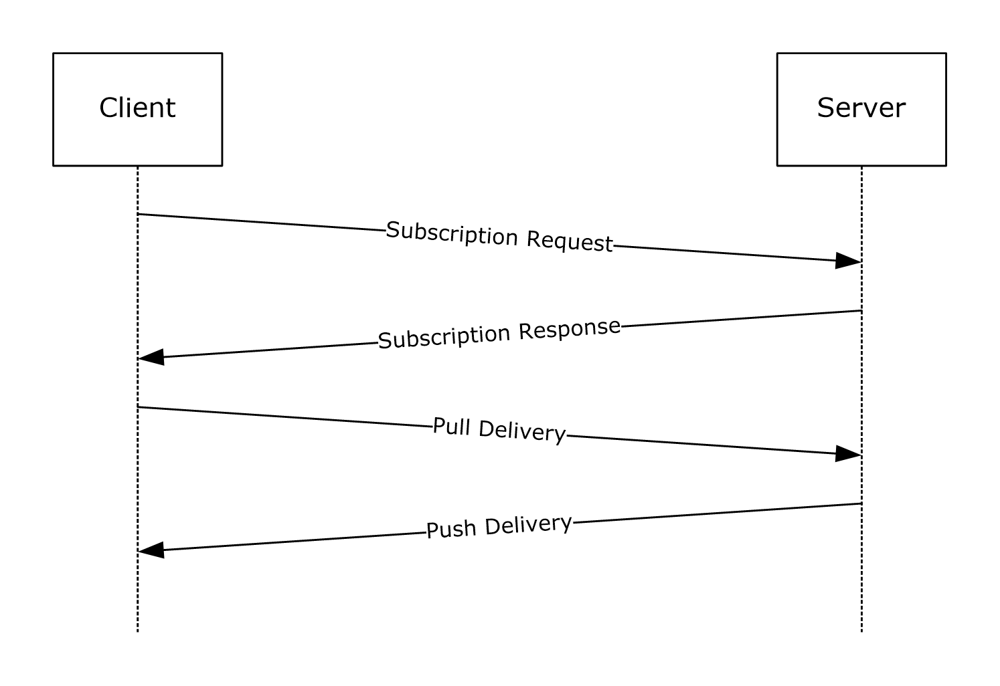

Figure 12: Event subscription example message exchange sequence

## 4.4 Event Subscription Example

This section provides an example of a subscription message.

<s:Envelope xmlns:s="http://www.w3.org/2003/05/soap-envelope"

xmlns:wsa="http://schemas.xmlsoap.org/ws/2004/08/addressing"

xmlns:wse="http://schemas.xmlsoap.org/ws/2004/08/eventing"

xmlns:wsen="http://schemas.xmlsoap.org/ws/2004/09/enumeration"

xmlns:wsman="http://schemas.dmtf.org/wbem/wsman/1/wsman.xsd">

<s:Header>

<wsa:To>http://RAVIBPERF59D.MIG.NET:80/wsman</wsa:To>

<wsman:ResourceURI s:mustUnderstand="true">

http://schemas.microsoft.com/wbem/wsman/1/windows/EventLog

</wsman:ResourceURI>

<wsa:ReplyTo>

<wsa:Address s:mustUnderstand="true">

http://schemas.xmlsoap.org/

ws/2004/08/addressing/role/anonymous

</wsa:Address>

</wsa:ReplyTo>

<wsa:Action s:mustUnderstand="true">

http://schemas.xmlsoap.org/ws/2004/08/eventing/Subscribe

</wsa:Action>

<wsman:MaxEnvelopeSize s:mustUnderstand="true">

153600

</wsman:MaxEnvelopeSize>

<wsa:MessageID>

uuid:5E7FE85C-6A5B-4033-A94D-B892A7C528EB

</wsa:MessageID>

<wsman:Locale xml:lang="en-US" s:mustUnderstand="false" />

<wsman:OptionSet

xmlns:xsi="http://www.w3.org/2001/XMLSchema-instance">

<wsman:Option Name="Compression">SLDC</wsman:Option>

<wsman:Option Name="CDATA" xsi:nil="true"/>

<wsman:Option Name="ContentFormat">RenderedText</wsman:Option>

<wsman:Option Name="IgnoreChannelError" xsi:nil="true"/>

</wsman:OptionSet>

</s:Header>

<s:Body>

<wse:Subscribe="">

<wse:EndTo>

<wsa:Address>

HTTP://RAVIBPERF90D.MIG.NET:80/wsman/

subscriptions/07C41EF8-1EE6-4519-86C5-47A78FB16DEC

</wsa:Address>

<wsa:ReferenceProperties>

<wse:Identifier>

430055A3-8146-49AA-A5C1-D87DC542AB0C

</wse:Identifier>

</wsa:ReferenceProperties>

</wse:EndTo>

<wse:Delivery=""

Mode="http://schemas.dmtf.org/wbem/wsman/1/wsman/Events">

<wsman:Heartbeats>PT3600.000S</wsman:Heartbeats>

<wse:NotifyTo>

<wsa:Address>

HTTP://RAVIBPERF90D.MIG.NET:80/wsman/

subscriptions/07C4 1EF8-1EE6-4519-86C5-47A78FB16DEC

</wsa:Address>

<wsa:ReferenceProperties>

<wse:Identifier="">

430055A3-8146-49AA-A5C1-D87DC542AB0C

</wse:Identifier>

</wsa:ReferenceProperties>

</wse:NotifyTo>

<wsman:MaxElements>20</wsman:MaxElements>

<wsman:MaxTime>PT30.000S</wsman:MaxTime>

<wsman:MaxEnvelopeSize Policy="Notify">

153600

</wsman:MaxEnvelopeSize>

<wsman:Locale xml:lang="en-US"/>

<wsman:ContentEncoding="">

UTF-8

</wsman:ContentEncoding>

</wse:Delivery>

<wse:Expires>PT3960732748.184S</wse:Expires>

<wsman:Filter>

<QueryList>

<Query Id="0">

<Select Path="Application">*</Select>

</Query>

</QueryList>

</wsman:Filter>]

<wsman:SendBookmarks/>

</wse:Subscribe>

</s:Body>

</s:Envelope>

## 4.5 Encryption Example

Request

POST /wsman/subscriptions/724030E6-ACF0-46BE-A76D-0800A457D6A2 HTTP/1.1

Authorization: Negotiate TlRMTVNTUAADAAAAAAAAAEgAAAAAAAAASAAAAAAAAABIA

AAAAAAAAEgAAAAAAAAASAAAAAAAAABIAAAANcKI4gUBKAoAAAAP

Content-Encoding: SLDC

User-Agent: Microsoft WinRM Client

Content-Type: multipart/encrypted;

protocol="application/HTTP-SPNEGO-session-encrypted";boundary="Encrypted Boundary"

Host: paulall-xp1.MIG.NET

Content-Length: 964

Connection: Keep-Alive

-- Encrypted Boundary

Content-Type: application/HTTP-SPNEGO-session-encrypted

OriginalContent: type=application/soap+xml;charset=UTF-16;Length=705

-- Encrypted Boundary

Content-Type: application/octet-stream

...............g..... .q!..f...y.$o.\.wF'.0..1....N..|.

.pQo:[..f[.X.".Q...W.$..lYw\.B.7-.D...U6..b..?.......f..0%u...4X...sX.

We. S.....#...e.w?.1...&M4....A....~.....J...HY.&]p.e.

..O...+...m.........8..1.f.5a..G....e>......N.Q,...P........(......R.

...G<.&X.p.7.].....Ri_) "........}..

.g....x......A........X......r....0......bV=he*..AK?.N$u..O&K...|N...

.B..-F.Q]ch.Ha..9n.0S...0.hn.O...F^.:$x..!Z.`.l...1.K.~.......gf..,..A%

.........g.75..U.....c*ja;9Z.J.....q....'9...8/.1.u&&.....kq.`8..)1cc.

;'.&_....o044.....%..#.....G[..]..V....NK...w.JeY..O.....U-.9.\<r^*=M.

k..".b9...I..%...+Q.%....,1.._-..U.'....hd.Z................&o....\_:

@...Bf.P..B.DL..s..+...JO.AjO..&..az..Q.j.4....n..c:....M..x.a.m.....

........A.3(.-- Encrypted Boundary

Response

HTTP/1.1 200

Content-Type: multipart/encrypted;protocol="application/HTTP-SPNEGO-se

ssion-encrypted";boundary="Encrypted Boundary"

Server: Microsoft-HTTPAPI/1.0

Date: Thu, 11 Jan 2007 02:35:24 GMT

Content-Length: 1504

-- Encrypted Boundary

Content-Type: application/HTTP-SPNEGO-session-encrypted

OriginalContent: type=application/soap+xml;charset=UTF-16;Length=1244

-- Encrypted Boundary

Content-Type: application/octet-stream

..........b.^p......S.%Y#.....{#x.u....q.]..uD.....U[^M..RS22=....!'M.

+.....#..U..F!=.......l.C.n....q.8hB.%.?|...X..F..1..w..^...a..[0A....

T...R...J.4A...@.%.>..r..>-fu.\.=........./...:.w...$.....qA........k.

..d.wKU..j....<.q...j.I.5.tA....`..t....~X.5lq.....c..}[(..I..~...f.8.

e..`....O4.Z........X.hG...gK.~....m.s..X%..~+.#W.}..b.c;..q...ir.ug<4

7^.T..iFD.;.m1...r|r..z..."....b....5\..B@...e8.b.!|.....$..k.Xg.y.+u.

....'...3.-...............Lq@.}.=....iL.[2J.Z...T...^i~...o..-4fC.....

9.+....A...........\....y.j.[.HZ......a.+0.be.M.k....=.xi.p}..b....d..

.Kk.;....G....6y...........4..%..ltfC.O.d...J.gH...}.....f..K.d+m.1...

....WPK..^.....:......2....#.[.H..........x.0N6...C..>.9.qm.K|.n.U{\.u

4..E.9...O..\_%Y.W?.j.zL.#*.'....f.<w..."..Q).e...fX..t.....-....QU..<

#Mw...f..}|..@..K..9>...l..._k.\O.GQ........G..|...y.$..d....FUT...{L.

.D.l..........4.Zk......K...W...f(..v?...j..0..}j.R..uT.Hr...j.AN.Y...

v.._....1i...........}i.^(....`)BP.e]~l..........K...}S.....y........F

D.[/...#.?+...H...v...6....Zdl.?2......5.b..Y..4M..G..h.B.B.p..4|.^...

r..M...E........I.(#....]..e.`.g..g]...'....e..9.e..../...=....!a..o..

bP.......)s.K...}.!,i..u..m./.a....v<D.J....'....../=.;..T.`G....5U..=

.......).U.[...fk"......(E.\....J...{}.\.4...L.......O..-- Encrypted

Boundary

## 4.6 Publisher-Initiated Subscription Examples

### 4.6.1 Enumerate Example

<s:Envelope

xmlns:s="http://www.w3.org/2003/05/soap-envelope"

xmlns:wsa="http://schemas.xmlsoap.org/ws/2004/08/addressing"

xmlns:wsen="http://schemas.xmlsoap.org/ws/2004/09/enumeration"

xmlns:wsman="http://schemas.dmtf.org/wbem/wsman/1/wsman.xsd">

<s:Header>

<wsa:To>

https://rmacktest0.MIG.NET:443/wsman/SubscriptionManager/WEC

</wsa:To>

<wsman:ResourceURI s:mustUnderstand="true">

http://schemas.microsoft.com/wbem/wsman/1/SubscriptionManager/Subscription

</wsman:ResourceURI>

<m:MachineID

xmlns:m="http://schemas.microsoft.com/wbem/wsman/1/machineid"

s:mustUnderstand="false">

RMACKTEST0.MIG.NET

</m:MachineID>

<wsa:ReplyTo>

<wsa:Address s:mustUnderstand="true">

http://schemas.xmlsoap.org/ws/2004/08/addressing/role/anonymous

</wsa:Address>

</wsa:ReplyTo>

<wsa:Action s:mustUnderstand="true">

http://schemas.xmlsoap.org/ws/2004/09/enumeration/Enumerate

</wsa:Action>

<wsman:MaxEnvelopeSize s:mustUnderstand="true">

153600

</wsman:MaxEnvelopeSize>

<wsa:MessageID>

uuid:A90FFBE2-525B-49D2-942F-A20F95FC643B

</wsa:MessageID>

<wsman:Locale xml:lang="en-US" s:mustUnderstand="false" />

</s:Header>

<s:Body>

<wsen:Enumerate>

<wsman:OptimizeEnumeration />

<wsman:MaxElements>20</wsman:MaxElements>

</wsen:Enumerate>

</s:Body>

</s:Envelope>

### 4.6.2 Enumerate Response (Subscriptions) Example

<s:Envelope xml:lang="en-US"

xmlns:s="http://www.w3.org/2003/05/soap-envelope"

xmlns:wsa="http://schemas.xmlsoap.org/ws/2004/08/addressing"

xmlns:wsen="http://schemas.xmlsoap.org/ws/2004/09/enumeration"

xmlns:wsman="http://schemas.dmtf.org/wbem/wsman/1/wsman.xsd">

<s:Header>

<wsa:Action>

http://schemas.xmlsoap.org/ws/2004/09/enumeration/EnumerateResponse

</wsa:Action>

<wsa:MessageID>uuid:06D6A1CD-A99D-441C-8A8C-5571844C4D09</wsa:MessageID>

<wsa:To>

http://schemas.xmlsoap.org/ws/2004/08/addressing/role/anonymous

</wsa:To>

<wsa:RelatesTo>uuid:A90FFBE2-525B-49D2-942F-A20F95FC643B</wsa:RelatesTo>

</s:Header>

<s:Body>

<wsen:EnumerateResponse>

<wsen:EnumerationContext />

<wsman:Items>

<m:Subscription

xmlns:m="http://schemas.microsoft.com/wbem/wsman/1/subscription">

<m:Version>

uuid:BB8CD0E7-46F4-40E4-B74C-A0C7B509F669

</m:Version>

<s:Envelope

xmlns:s="http://www.w3.org/2003/05/soap-envelope"

xmlns:wsa="http://schemas.xmlsoap.org/ws/2004/08/addressing"

xmlns:wse="http://schemas.xmlsoap.org/ws/2004/08/eventing"

xmlns:wsen="http://schemas.xmlsoap.org/ws/2004/09/enumeration"

xmlns:wsman="http://schemas.dmtf.org/wbem/wsman/1/wsman.xsd">

<s:Header>

<wsa:To>

http://schemas.xmlsoap.org/ws/2004/08/addressing/role/anonymous

</wsa:To>

<wsman:ResourceURI s:mustUnderstand="true">

wsmawsen:microsoft.test/testresource/subscribe

</wsman:ResourceURI>

<wsa:ReplyTo>

<wsa:Address s:mustUnderstand="true">

http://schemas.xmlsoap.org/ws/2004/08/addressing/role/anonymous

</wsa:Address>

</wsa:ReplyTo>

<wsa:Action s:mustUnderstand="true">

http://schemas.xmlsoap.org/ws/2004/08/eventing/Subscribe

</wsa:Action>

<wsman:MaxEnvelopeSize s:mustUnderstand="true">

153600

</wsman:MaxEnvelopeSize>

<wsa:MessageID>

uuid:346A0039-0C21-465E-8ABD-CF89EE730FA7

</wsa:MessageID>

<wsman:Locale xml:lang="en-US" s:mustUnderstand="false" />

<wsman:OptionSet

xmlns:xsi="http://www.w3.org/2001/XMLSchema-instance">

<wsman:Option Name="Compression">SLDC</wsman:Option>

<wsman:Option Name="CDATA" xsi:nil="true" />

</wsman:OptionSet>

</s:Header>

<s:Body>

<wse:Subscribe>

<wse:EndTo>

<wsa:Address>

HTTPS://RMACKTEST0.MIG.NET:443/wsman/subscriptions/633E146A-17F7-46CF-A149-50B29DB90692

</wsa:Address>

<wsa:ReferenceProperties>

<wse:Identifier>

BB8CD0E7-46F4-40E4-B74C-A0C7B509F669

</wse:Identifier>

</wsa:ReferenceProperties>

</wse:EndTo>

<wse:Delivery

Mode="http://schemas.dmtf.org/wbem/wsman/1/wsman/Events">

<wsman:Heartbeats>PT300.000S</wsman:Heartbeats>

<wse:NotifyTo>

<wsa:Address>

HTTPS://RMACKTEST0.MIG.NET:443/wsman/subscriptions/633E146A-17F7-46CF-A149-50B29DB90692

</wsa:Address>

<wsa:ReferenceProperties>

<wse:Identifier>

BB8CD0E7-46F4-40E4-B74C-A0C7B509F669

</wse:Identifier>

</wsa:ReferenceProperties>

<c:Policy

xmlns:c="http://schemas.xmlsoap.org/ws/2002/12/policy">

<c:ExactlyOne>

<c:All>

<wsman:Authentication

Profile="http://schemas.dmtf.org/wbem/wsman/1/wsman/secprofile/https/mutual"

>

<wsman:ClientCertificate>

<wsman:Thumbprint Role="issuer">

5600a015ca5e8a26f638b74e819ae92096da5c8c

</wsman:Thumbprint>

</wsman:ClientCertificate>

</wsman:Authentication>

</c:All>

</c:ExactlyOne>

</c:Policy>

</wse:NotifyTo>

<wsman:MaxElements>5</wsman:MaxElements>

<wsman:MaxEnvelopeSize Policy="Notify">

153600

</wsman:MaxEnvelopeSize>

<wsman:Locale xml:lang="en-US" />

<wsman:ContentEncoding>UTF-16</wsman:ContentEncoding>

</wse:Delivery>

<wsman:Filter Dialect="dialect">dialect</wsman:Filter>

</wse:Subscribe>

</s:Body>

</s:Envelope>

</m:Subscription>

</wsman:Items>

<wsman:EndOfSequence />

</wsen:EnumerateResponse>

</s:Body>

</s:Envelope>

### 4.6.3 Event Delivery Example

<s:Envelope

xmlns:s="http://www.w3.org/2003/05/soap-envelope"

xmlns:wsa="http://schemas.xmlsoap.org/ws/2004/08/addressing"

xmlns:wse="http://schemas.xmlsoap.org/ws/2004/08/eventing"

xmlns:wsman="http://schemas.dmtf.org/wbem/wsman/1/wsman.xsd">

<s:Header>

<wsa:To>

https://RMACKTEST0.MIG.NET:443/wsman/subscriptions/633E146A-17F7-46CF-A149-50B29DB90692

</wsa:To>

<m:MachineID

xmlns:m="http://schemas.microsoft.com/wbem/wsman/1/machineid"

s:mustUnderstand="false">

RMACKTEST0.MIG.NET

</m:MachineID>

<wsa:ReplyTo>

<wsa:Address s:mustUnderstand="true">

http://schemas.xmlsoap.org/ws/2004/08/addressing/role/anonymous

</wsa:Address>

</wsa:ReplyTo>

<wsa:Action s:mustUnderstand="true">

http://schemas.dmtf.org/wbem/wsman/1/wsman/Events

</wsa:Action>

<wsman:MaxEnvelopeSize s:mustUnderstand="true">153600</wsman:MaxEnvelopeSize>

<wsa:MessageID>uuid:0111C890-857C-498F-B00A-7011EBD34064</wsa:MessageID>

<wsman:Locale xml:lang="en-US" s:mustUnderstand="false" />

<wse:Identifier

xmlns:wse="http://schemas.xmlsoap.org/ws/2004/08/eventing">

BB8CD0E7-46F4-40E4-B74C-A0C7B509F669

</wse:Identifier>

<wsman:AckRequested />

</s:Header>

<s:Body>

<wsman:Events>

<wsman:Event Action="http://schemas.dmtf.org/wbem/wsman/1/wsman/Event">

</wsman:Event>

</wsman:Events>

</s:Body>

</s:Envelope>

### 4.6.4 Ack Example

<s:Envelope xml:lang="en-US"

xmlns:s="http://www.w3.org/2003/05/soap-envelope"

xmlns:wsa="http://schemas.xmlsoap.org/ws/2004/08/addressing"

xmlns:wsman="http://schemas.dmtf.org/wbem/wsman/1/wsman.xsd">

<s:Header>

<wsa:Action>

http://schemas.dmtf.org/wbem/wsman/1/wsman/Ack

</wsa:Action>

<wsa:MessageID>

uuid:6593DD91-ABB8-457B-AE7A-102715CAC7AC

</wsa:MessageID>

<wsa:To>

http://schemas.xmlsoap.org/ws/2004/08/addressing/role/anonymous

</wsa:To>

<wsa:RelatesTo>

uuid:0111C890-857C-498F-B00A-7011EBD34064

</wsa:RelatesTo>

</s:Header>

<s:Body />

</s:Envelope>

### 4.6.5 End Subscription Example

<s:Envelope

xmlns:s="http://www.w3.org/2003/05/soap-envelope"

xmlns:wsa="http://schemas.xmlsoap.org/ws/2004/08/addressing"

xmlns:wse="http://schemas.xmlsoap.org/ws/2004/08/eventing"

xmlns:wsman="http://schemas.dmtf.org/wbem/wsman/1/wsman.xsd">

<s:Header>

<wsa:To>

https://RMACKTEST0.MIG.NET:443/wsman/subscriptions/633E146A-17F7-46CF-A149-50B29DB90692\

</wsa:To>

<m:MachineID

xmlns:m="http://schemas.microsoft.com/wbem/wsman/1/machineid"

s:mustUnderstand="false">

RMACKTEST0.MIG.NET

</m:MachineID>

<wsa:ReplyTo>

<wsa:Address s:mustUnderstand="true">

http://schemas.xmlsoap.org/ws/2004/08/addressing/role/anonymous

</wsa:Address>

</wsa:ReplyTo>

<wsa:Action s:mustUnderstand="true">

http://schemas.xmlsoap.org/ws/2004/08/eventing/SubscriptionEnd

</wsa:Action>

<wsman:MaxEnvelopeSize s:mustUnderstand="true">

153600

</wsman:MaxEnvelopeSize>

<wsa:MessageID>

uuid:9CCFD722-7A27-49A2-859E-9C643FAC4556

</wsa:MessageID>

<wsman:Locale xml:lang="en-US" s:mustUnderstand="false" />

<wsman:OperationTimeout>PT0.500S</wsman:OperationTimeout>

<wse:Identifier

xmlns:wse="http://schemas.xmlsoap.org/ws/2004/08/eventing">

BB8CD0E7-46F4-40E4-B74C-A0C7B509F669

</wse:Identifier>

<wsman:AckRequested />

</s:Header>

<s:Body>

<wse:SubscriptionEnd>

<wse:SubscriptionManager>

<wsa:Address>

https://RMACKTEST0.MIG.NET:443/wsman/subscriptions/633E146A-17F7-46CF-A149-50B29DB90692

</wsa:Address>

<wsa:ReferenceProperties>

<wse:Identifier>

F04857FA-DB89-40D2-9A7F-8AF5EBBA6FA6

</wse:Identifier>

</wsa:ReferenceProperties>

</wse:SubscriptionManager>

<wse:Status>

http://schemas.xmlsoap.org/ws/2004/08/eventing/SourceShuttingDown

</wse:Status>

</wse:SubscriptionEnd>

</s:Body>

</s:Envelope>

## 4.7 Remote Shell Examples

### 4.7.1 Create Shell

This section shows how to use an [wst:Create](#Section_3.1.4.5.2) message to create a new Shell instance on the remote computer that does not have the client's profile. The client computer uses code page 437.

Create Request

<s:Envelope

xmlns:s="http://www.w3.org/2003/05/soap-envelope"

xmlns:wsa="http://schemas.xmlsoap.org/ws/2004/08/addressing"

xmlns:wsman="http://schemas.dmtf.org/wbem/wsman/1/wsman.xsd">

<s:Header>

<wsa:To>

http://localhost:80/wsman

</wsa:To>

<wsman:ResourceURI s:mustUnderstand="true">

http://schemas.microsoft.com/wbem/wsman/1/windows/shell/cmd

</wsman:ResourceURI>

<wsa:ReplyTo>

<wsa:Address s:mustUnderstand="true">

http://schemas.xmlsoap.org/ws/2004/08/addressing/role/anonymous

</wsa:Address>

</wsa:ReplyTo>

<wsa:Action s:mustUnderstand="true">

http://schemas.xmlsoap.org/ws/2004/09/transfer/Create

</wsa:Action>

<wsman:MaxEnvelopeSize s:mustUnderstand="true">153600</wsman:MaxEnvelopeSize>

<wsa:MessageID>uuid:AF6A2E07-BA33-496E-8AFA-E77D241A2F2F</wsa:MessageID>

<wsman:Locale xml:lang="en-US" s:mustUnderstand="false" />

<wsman:OptionSet xmlns:xsi="http://www.w3.org/2001/XMLSchema-instance">

<wsman:Option Name="WINRS_NOPROFILE">TRUE</wsman:Option>

<wsman:Option Name="WINRS_CODEPAGE">437</wsman:Option>

</wsman:OptionSet>

<wsman:OperationTimeout>PT60.000S</wsman:OperationTimeout>

</s:Header>

<s:Body>

<rsp:Shell

xmlns:rsp="http://schemas.microsoft.com/wbem/wsman/1/windows/shell">

<rsp:Environment>

<rsp:Variable Name="test">1</rsp:Variable>

</rsp:Environment>

<rsp:WorkingDirectory>d:\windows</rsp:WorkingDirectory>

<rsp:Lifetime>PT1000.000S</rsp:Lifetime>

<rsp:InputStreams>stdin</rsp:InputStreams>

<rsp:OutputStreams>stdout stderr</rsp:OutputStreams>

</rsp:Shell>

</s:Body>

</s:Envelope>

Create Response

<s:Envelope xml:lang="en-US"

xmlns:s="http://www.w3.org/2003/05/soap-envelope"

xmlns:wsa="http://schemas.xmlsoap.org/ws/2004/08/addressing"

xmlns:wsman="http://schemas.dmtf.org/wbem/wsman/1/wsman.xsd">

<s:Header>

<wsa:Action>

http://schemas.xmlsoap.org/ws/2004/09/transfer/CreateResponse

</wsa:Action>

<wsa:MessageID>

uuid:1BD7E077-34CD-46F9-8AC2-F7D004C3D858

</wsa:MessageID><wsa:To>

http://schemas.xmlsoap.org/ws/2004/08/addressing/role/anonymous

</wsa:To>

<wsa:RelatesTo>uuid:AF6A2E07-BA33-496E-8AFA-E77D241A2F2F</wsa:RelatesTo>

</s:Header>

<s:Body>

<wst:ResourceCreated

xmlns:wsman="http://schemas.dmtf.org/wbem/wsman/1/wsman.xsd"

xmlns:wsa="http://schemas.xmlsoap.org/ws/2004/08/addressing"

xmlns:wst="http://schemas.xmlsoap.org/ws/2004/09/transfer"

xmlns:rsp="http://schemas.microsoft.com/wbem/wsman/1/windows/shell">

<wsa:Address>

http://schemas.xmlsoap.org/ws/2004/08/addressing/role/anonymous

</wsa:Address>

<wsa:ReferenceParameters>

<wsman:ResourceURI>

http://schemas.microsoft.com/wbem/wsman/1/windows/shell/cmd

</wsman:ResourceURI>

<wsman:SelectorSet>

<wsman:Selector Name="ShellId">

uuid:C443F44F-28E4-486F-A5A1-12745F90CF5A

</wsman:Selector>

</wsman:SelectorSet>

</wsa:ReferenceParameters>

</wst:ResourceCreated>

</s:Body>

</s:Envelope>

### 4.7.2 Execute Command

This example shows how to execute the Del command to delete a file on the remote system with the confirmation prompt.

Command Request

<s:Envelope

xmlns:s="http://www.w3.org/2003/05/soap-envelope"

xmlns:wsa="http://schemas.xmlsoap.org/ws/2004/08/addressing"

xmlns:wsman="http://schemas.dmtf.org/wbem/wsman/1/wsman.xsd">

<s:Header>

<wsa:To>

http://localhost:80/wsman

</wsa:To>

<wsman:ResourceURI s:mustUnderstand="true">

http://schemas.microsoft.com/wbem/wsman/1/windows/shell/cmd

</wsman:ResourceURI>

<wsa:ReplyTo>

<wsa:Address s:mustUnderstand="true">

http://schemas.xmlsoap.org/ws/2004/08/addressing/role/anonymous

</wsa:Address>

</wsa:ReplyTo>

<wsa:Action s:mustUnderstand="true">

http://schemas.microsoft.com/wbem/wsman/1/windows/shell/Command

</wsa:Action>

<wsman:MaxEnvelopeSize s:mustUnderstand="true">153600</wsman:MaxEnvelopeSize>

<wsa:MessageID>

uuid:F8671978-E928-49DA-ADB8-5BF97EDD9535</wsa:MessageID>

<wsman:Locale xml:lang="en-US" s:mustUnderstand="false" />

<wsman:SelectorSet>

<wsman:Selector Name="ShellId">

uuid:0A442A7F-4627-43AE-8751-900B509F0A1F

</wsman:Selector>

</wsman:SelectorSet>

<wsman:OptionSet xmlns:xsi="http://www.w3.org/2001/XMLSchema-instance">

<wsman:Option Name="WINRS_CONSOLEMODE_STDIN">TRUE</wsman:Option>

<wsman:Option Name="WINRS_SKIP_CMD_SHELL">FALSE</wsman:Option>

</wsman:OptionSet>

<wsman:OperationTimeout>PT60.000S</wsman:OperationTimeout>

</s:Header>

<s:Body>

<rsp:CommandLine

xmlns:rsp="http://schemas.microsoft.com/wbem/wsman/1/windows/shell">

<rsp:Command>del</rsp:Command>

<rsp:Arguments>/p</rsp:Arguments>

<rsp:Arguments>

d:\temp\out.txt

</rsp:Arguments>

</rsp:CommandLine>

</s:Body>

</s:Envelope>

Command Response

<s:Envelope xml:lang="en-US"

xmlns:s="http://www.w3.org/2003/05/soap-envelope"

xmlns:wsa="http://schemas.xmlsoap.org/ws/2004/08/addressing"

xmlns:wsman="http://schemas.dmtf.org/wbem/wsman/1/wsman.xsd">

<s:Header>

<wsa:Action>

http://schemas.microsoft.com/wbem/wsman/1/windows/shell/CommandResponse

</wsa:Action>

<wsa:MessageID>

uuid:6D79AA96-4656-4BDD-9716-FB68898DA396

</wsa:MessageID>

<wsa:To>

http://schemas.xmlsoap.org/ws/2004/08/addressing/role/anonymous

</wsa:To>

<wsa:RelatesTo>uuid:F8671978-E928-49DA-ADB8-5BF97EDD9535</wsa:RelatesTo>

</s:Header>

<s:Body>

<rsp:CommandResponse

xmlns:rsp="http://schemas.microsoft.com/wbem/wsman/1/windows/shell">

<rsp:CommandId>77df7bb6-b5a0-4777-abd9-9823c0774074</rsp:CommandId>

</rsp:CommandResponse>

</s:Body>

</s:Envelope>

### 4.7.3 Receive Output

This example shows how to receive the prompt via the stdout stream from the Del command in the previous example, as defined in section [4.7.2](#Section_4.7.2). It also receives error results through the stderr stream if the remote command fails.

Receive Request

<s:Envelope

xmlns:s="http://www.w3.org/2003/05/soap-envelope"

xmlns:wsa="http://schemas.xmlsoap.org/ws/2004/08/addressing"

xmlns:wsman="http://schemas.dmtf.org/wbem/wsman/1/wsman.xsd">

<s:Header>

<wsa:To>

http://localhost:80/wsman

</wsa:To>

<wsa:ReplyTo>

<wsa:Address s:mustUnderstand="true">

http://schemas.xmlsoap.org/ws/2004/08/addressing/role/anonymous

</wsa:Address>

</wsa:ReplyTo>

<wsa:Action s:mustUnderstand="true">

http://schemas.microsoft.com/wbem/wsman/1/windows/shell/Receive

</wsa:Action>

<wsman:MaxEnvelopeSize s:mustUnderstand="true">

153600

</wsman:MaxEnvelopeSize>

<wsa:MessageID>uuid:D384DEF8-351E-41F0-B3DA-C91BE1A58A09</wsa:MessageID>

<wsman:Locale xml:lang="en-US" s:mustUnderstand="false" />

<wsman:ResourceURI

xmlns:wsman="http://schemas.dmtf.org/wbem/wsman/1/wsman.xsd">

http://schemas.microsoft.com/wbem/wsman/1/windows/shell/cmd

</wsman:ResourceURI>

<wsman:SelectorSet

xmlns:wsman="http://schemas.dmtf.org/wbem/wsman/1/wsman.xsd"

xmlns="http://schemas.dmtf.org/wbem/wsman/1/wsman.xsd">

<wsman:Selector Name="ShellId">

uuid:0A442A7F-4627-43AE-8751-900B509F0A1F

</wsman:Selector>

</wsman:SelectorSet>

<wsman:OperationTimeout>PT60.000S</wsman:OperationTimeout>

</s:Header>

<s:Body>

<rsp:Receive

xmlns:rsp="http://schemas.microsoft.com/wbem/wsman/1/windows/shell"

SequenceId="0">

<rsp:DesiredStream CommandId="77df7bb6-b5a0-4777-abd9-9823c0774074">

stdout stderr

</rsp:DesiredStream>

</rsp:Receive>

</s:Body>

</s:Envelope>

Receive Response

<s:Envelope

xml:lang="en-US"

xmlns:s="http://www.w3.org/2003/05/soap-envelope"

xmlns:wsa="http://schemas.xmlsoap.org/ws/2004/08/addressing"

xmlns:wsman="http://schemas.dmtf.org/wbem/wsman/1/wsman.xsd">

<s:Header>

<wsa:Action>

http://schemas.microsoft.com/wbem/wsman/1/windows/shell/ReceiveResponse

</wsa:Action>

<wsa:MessageID>

uuid:36B5315E-6592-4512-957E-038F14C27C83</wsa:MessageID>

<wsa:To>

http://schemas.xmlsoap.org/ws/2004/08/addressing/role/anonymous

</wsa:To>

<wsa:RelatesTo>uuid:D384DEF8-351E-41F0-B3DA-C91BE1A58A09</wsa:RelatesTo>

</s:Header>

<s:Body>

<rsp:ReceiveResponse

xmlns:rsp="http://schemas.microsoft.com/wbem/wsman/1/windows/shell"

SequenceId="0">

<rsp:Stream

xmlns:rsp="http://schemas.microsoft.com/wbem/wsman/1/windows/shell"

Name="stdout"

CommandId="77df7bb6-b5a0-4777-abd9-9823c0774074">

ZDpcdGVtcFxvdXQudHh0LCBEZWxldGUgKFkvTik/IA==

</rsp:Stream>

<rsp:CommandState

xmlns:rsp="http://schemas.microsoft.com/wbem/wsman/1/windows/shell"

State="http://schemas.microsoft.com/wbem/wsman/1/windows/shell/CommandState/Running" CommandId="77df7bb6-b5a0-4777-abd9-9823c0774074">

<rsp:ExitCode>0</rsp:ExitCode>

</rsp:CommandState>

</rsp:ReceiveResponse>

</s:Body>

</s:Envelope>

### 4.7.4 Send Input

This example shows how to send the response to the prompt via the stdin stream to the Del command in the previous example, as defined in section [4.7.2](#Section_4.7.2).

Send Request

<s:Envelope

xmlns:s="http://www.w3.org/2003/05/soap-envelope"

xmlns:wsa="http://schemas.xmlsoap.org/ws/2004/08/addressing"

xmlns:wsman="http://schemas.dmtf.org/wbem/wsman/1/wsman.xsd">

<s:Header>

<wsa:To>

http://localhost:80/wsman

</wsa:To>

<wsa:ReplyTo>

<wsa:Address s:mustUnderstand="true">

http://schemas.xmlsoap.org/ws/2004/08/addressing/role/anonymous

</wsa:Address>

</wsa:ReplyTo>

<wsa:Action s:mustUnderstand="true">

http://schemas.microsoft.com/wbem/wsman/1/windows/shell/Send

</wsa:Action>

<wsman:MaxEnvelopeSize s:mustUnderstand="true">153600</wsman:MaxEnvelopeSize>

<wsa:MessageID>uuid:F6F2CB27-2927-4750-8C9A-D1E854138F88</wsa:MessageID>

<wsman:Locale xml:lang="en-US" s:mustUnderstand="false" />

<wsman:ResourceURI

xmlns:wsman="http://schemas.dmtf.org/wbem/wsman/1/wsman.xsd">

http://schemas.microsoft.com/wbem/wsman/1/windows/shell/cmd

</wsman:ResourceURI>

<wsman:SelectorSet

xmlns:wsman="http://schemas.dmtf.org/wbem/wsman/1/wsman.xsd"

xmlns="http://schemas.dmtf.org/wbem/wsman/1/wsman.xsd">

<wsman:Selector Name="ShellId">

uuid:0A442A7F-4627-43AE-8751-900B509F0A1F

</wsman:Selector>

</wsman:SelectorSet>

<wsman:OperationTimeout>PT60.000S</wsman:OperationTimeout>

</s:Header>

<s:Body>

<rsp:Send

xmlns:rsp="http://schemas.microsoft.com/wbem/wsman/1/windows/shell">

<rsp:Stream

xmlns:rsp="http://schemas.microsoft.com/wbem/wsman/1/windows/shell"

Name="stdin" CommandId="77df7bb6-b5a0-4777-abd9-9823c0774074">

eQ0K

</rsp:Stream>

</rsp:Send>

</s:Body>

</s:Envelope>

Send Response

<s:Envelope

xml:lang="en-US"

xmlns:s="http://www.w3.org/2003/05/soap-envelope"

xmlns:wsa="http://schemas.xmlsoap.org/ws/2004/08/addressing"

xmlns:wsman="http://schemas.dmtf.org/wbem/wsman/1/wsman.xsd">

<s:Header>

<wsa:Action>

http://schemas.microsoft.com/wbem/wsman/1/windows/shell/SendResponse

</wsa:Action>

<wsa:MessageID >uuid:40C8B4B3-C584-4FA9-9B6F-8A08BF3F350F</wsa:MessageID>

<wsa:To>

http://schemas.xmlsoap.org/ws/2004/08/addressing/role/anonymous

</wsa:To>

<wsa:RelatesTo>

uuid:F6F2CB27-2927-4750-8C9A-D1E854138F88</wsa:RelatesTo>

</s:Header>

<s:Body>

<rsp:SendResponse

xmlns:rsp="http://schemas.microsoft.com/wbem/wsman/1/windows/shell">

</rsp:SendResponse>

</s:Body>

</s:Envelope>

### 4.7.5 Terminate Operation

This example shows how to use CTRL+C to terminate the command in progress.

Signal Request

<s:Envelope

xmlns:s="http://www.w3.org/2003/05/soap-envelope"

xmlns:wsa="http://schemas.xmlsoap.org/ws/2004/08/addressing"

xmlns:wsman="http://schemas.dmtf.org/wbem/wsman/1/wsman.xsd">

<s:Header>

<wsa:To>

http://localhost:80/wsman

</wsa:To>

<wsa:ReplyTo>

<wsa:Address s:mustUnderstand="true">

http://schemas.xmlsoap.org/ws/2004/08/addressing/role/anonymous

</wsa:Address>

</wsa:ReplyTo>

<wsa:Action s:mustUnderstand="true">

http://schemas.microsoft.com/wbem/wsman/1/windows/shell/Signal

</wsa:Action>

<wsman:MaxEnvelopeSize s:mustUnderstand="true">153600</wsman:MaxEnvelopeSize>

<wsa:MessageID>uuid:23F5AAD4-9501-4070-A4F8-B216782DE466</wsa:MessageID>

<wsman:Locale xml:lang="en-US" s:mustUnderstand="false"/>

<wsman:ResourceURI

xmlns:wsman="http://schemas.dmtf.org/wbem/wsman/1/wsman.xsd">

http://schemas.microsoft.com/wbem/wsman/1/windows/shell/cmd

</wsman:ResourceURI>

<wsman:SelectorSet xmlns:wsman="http://schemas.dmtf.org/wbem/wsman/1/wsman.xsd"

xmlns="http://schemas.dmtf.org/wbem/wsman/1/wsman.xsd">

<wsman:Selector Name="ShellId">

uuid:BEF9B5F1-BC59-46C9-A48F-BF55973B9D7B

</wsman:Selector>

</wsman:SelectorSet>

<wsman:OperationTimeout>PT60.000S</wsman:OperationTimeout>

</s:Header>

<s:Body>

<rsp:Signal

xmlns:rsp="http://schemas.microsoft.com/wbem/wsman/1/windows/shell"

CommandId="3cb05d74-af20-4ff1-b318-2c6cc0f99045">

<rsp:Code>

http://schemas.microsoft.com/wbem/wsman/1/windows/shell/signal/ctrl_c

</rsp:Code>

</rsp:Signal>

</s:Body>

</s:Envelope>

Signal Response

<s:Envelope

xml:lang="en-US"

xmlns:s="http://www.w3.org/2003/05/soap-envelope"

xmlns:wsa="http://schemas.xmlsoap.org/ws/2004/08/addressing"

xmlns:wsman="http://schemas.dmtf.org/wbem/wsman/1/wsman.xsd">

<s:Header>

<wsa:Action>

http://schemas.microsoft.com/wbem/wsman/1/windows/shell/SignalResponse

</wsa:Action>

<wsa:MessageID>

uuid:FE802FF2-82FD-4406-AEBF-8A9466F0DBFE

</wsa:MessageID>

<wsa:To>

http://schemas.xmlsoap.org/ws/2004/08/addressing/role/anonymous

</wsa:To>

<wsa:RelatesTo>uuid:23F5AAD4-9501-4070-A4F8-B216782DE466</wsa:RelatesTo>

</s:Header>

<s:Body>

<rsp:SignalResponse

xmlns:rsp="http://schemas.microsoft.com/wbem/wsman/1/windows/shell">

</rsp:SignalResponse>

</s:Body>

</s:Envelope>

### 4.7.6 Enumerate Remote Shells

This examples shows how to list the open Shells by using the enum:Enumerate message. Each pull request is limited to five Shell instances, but because only one remote Shell is active at the time of the request, only one instance is returned.

Enumerate Request

<s:Envelope

xmlns:s="http://www.w3.org/2003/05/soap-envelope"

xmlns:wsa="http://schemas.xmlsoap.org/ws/2004/08/addressing"

xmlns:wsen="http://schemas.xmlsoap.org/ws/2004/09/enumeration"

xmlns:wsman="http://schemas.dmtf.org/wbem/wsman/1/wsman.xsd">

<s:Header>

<wsa:To>http://SORINOTEST05:80/wsman</wsa:To>

<wsman:ResourceURI s:mustUnderstand="true">

http://schemas.microsoft.com/wbem/wsman/1/windows/shell/cmd

</wsman:ResourceURI>

<wsa:ReplyTo>

<wsa:Address s:mustUnderstand="true">

http://schemas.xmlsoap.org/ws/2004/08/addressing/role/anonymous

</wsa:Address>

</wsa:ReplyTo>

<wsa:Action s:mustUnderstand="true">

http://schemas.xmlsoap.org/ws/2004/09/enumeration/Enumerate

</wsa:Action>

<wsman:MaxEnvelopeSize s:mustUnderstand="true">153600</wsman:MaxEnvelopeSize>

<wsa:MessageID>uuid:08E59736-6A1B-4560-8442-64E4D7A26EB5</wsa:MessageID>

<wsman:Locale xml:lang="en-US" s:mustUnderstand="false" />

<wsman:OperationTimeout>PT60.000S</wsman:OperationTimeout>

</s:Header>

<s:Body>

<wsen:Enumerate>

</wsen:Enumerate>

</s:Body>

</s:Envelope>

Enumerate Response

<s:Envelope

xml:lang="en-US"

xmlns:s="http://www.w3.org/2003/05/soap-envelope"

xmlns:wsa="http://schemas.xmlsoap.org/ws/2004/08/addressing"

xmlns:wsen="http://schemas.xmlsoap.org/ws/2004/09/enumeration"

xmlns:wsman="http://schemas.dmtf.org/wbem/wsman/1/wsman.xsd">

<s:Header>

<wsa:Action >

http://schemas.xmlsoap.org/ws/2004/09/enumeration/EnumerateResponse

</wsa:Action>

<wsa:MessageID >

uuid:337E353D-C3EA-4021-B4BE-6BC20AEEB490

</wsa:MessageID>

<wsa:To>

http://schemas.xmlsoap.org/ws/2004/08/addressing/role/anonymous

</wsa:To>

<wsa:RelatesTo>

uuid:08E59736-6A1B-4560-8442-64E4D7A26EB5</wsa:RelatesTo>

</s:Header>

<s:Body>

<wsen:EnumerateResponse>

<wsen:EnumerationContext>

uuid:F2EF0F83-D6E5-4F70-8E6B-D870551A5D9A

</wsen:EnumerationContext>

</wsen:EnumerateResponse>

</s:Body>

</s:Envelope>

Pull Request

<s:Envelope

xmlns:s="http://www.w3.org/2003/05/soap-envelope"

xmlns:wsa="http://schemas.xmlsoap.org/ws/2004/08/addressing"

xmlns:wsen="http://schemas.xmlsoap.org/ws/2004/09/enumeration"

xmlns:wsman="http://schemas.dmtf.org/wbem/wsman/1/wsman.xsd">

<s:Header>

<wsa:To>http://SORINOTEST05:80/wsman</wsa:To>

<wsman:ResourceURI s:mustUnderstand="true">

http://schemas.microsoft.com/wbem/wsman/1/windows/shell/cmd

</wsman:ResourceURI>

<wsa:ReplyTo>

<wsa:Address s:mustUnderstand="true">

http://schemas.xmlsoap.org/ws/2004/08/addressing/role/anonymous

</wsa:Address>

</wsa:ReplyTo>

<wsa:Action s:mustUnderstand="true">

http://schemas.xmlsoap.org/ws/2004/09/enumeration/Pull

</wsa:Action>

<wsman:MaxEnvelopeSize s:mustUnderstand="true">153600</wsman:MaxEnvelopeSize>

<wsa:MessageID>

uuid:BE9EDB22-23A3-489A-B025-ED7F3461E4AB</wsa:MessageID>

<wsman:Locale xml:lang="en-US" s:mustUnderstand="false" />

<wsman:OperationTimeout>PT60.000S</wsman:OperationTimeout>

</s:Header>

<s:Body>

<wsen:Pull>

<wsen:EnumerationContext

xmlns:wsen="http://schemas.xmlsoap.org/ws/2004/09/enumeration">

uuid:F2EF0F83-D6E5-4F70-8E6B-D870551A5D9A

</wsen:EnumerationContext>

<wsen:MaxElements>5</wsen:MaxElements>

</wsen:Pull>

</s:Body>

</s:Envelope>

Pull Response

<s:Envelope

xml:lang="en-US"

xmlns:s="http://www.w3.org/2003/05/soap-envelope"

xmlns:wsa="http://schemas.xmlsoap.org/ws/2004/08/addressing"

xmlns:wsen="http://schemas.xmlsoap.org/ws/2004/09/enumeration"

xmlns:wsman="http://schemas.dmtf.org/wbem/wsman/1/wsman.xsd">

<s:Header>

<wsa:Action >

http://schemas.xmlsoap.org/ws/2004/09/enumeration/PullResponse

</wsa:Action>

<wsa:MessageID >

uuid:EAB18F1F-0D6F-4176-989B-741ADD72A933

</wsa:MessageID>

<wsa:To>

http://schemas.xmlsoap.org/ws/2004/08/addressing/role/anonymous

</wsa:To>

<wsa:RelatesTo>uuid:BE9EDB22-23A3-489A-B025-ED7F3461E4AB</wsa:RelatesTo>

</s:Header>

<s:Body>

<wsen:PullResponse>

<wsen:Items>

<rsp:Shell

xmlns:rsp="http://schemas.microsoft.com/wbem/wsman/1/windows/shell">

<rsp:ShellId>

uuid:5B666291-0910-4E8F-B802-B697ACD7953D

</rsp:ShellId>

<rsp:Lifetime>PT28737.000S</rsp:Lifetime>

<rsp:InputStreams>stdin</rsp:InputStreams>

<rsp:OutputStreams>stdout stderr</rsp:OutputStreams>

<rsp:CommandLine>

<rsp:Command>pause</rsp:Command>

</rsp:CommandLine>

</rsp:Shell>

</wsen:Items>

<wsen:EndOfSequence/>

</wsen:PullResponse>

</s:Body>

</s:Envelope>

### 4.7.7 Retrieve Shell Instance

This example shows how to use [wst:Get](#Section_3.1.4.2.1) to retrieve the instance of the active Remote Shell.

Get Request

<s:Envelope

xmlns:s="http://www.w3.org/2003/05/soap-envelope"

xmlns:wsa="http://schemas.xmlsoap.org/ws/2004/08/addressing"

xmlns:wsman="http://schemas.dmtf.org/wbem/wsman/1/wsman.xsd">

<s:Header>

<wsa:To>

http://SORINOTEST05:80/wsman

</wsa:To>

<wsman:ResourceURI s:mustUnderstand="true">

http://schemas.microsoft.com/wbem/wsman/1/windows/shell/cmd

</wsman:ResourceURI>

<wsa:ReplyTo>

<wsa:Address s:mustUnderstand="true">

http://schemas.xmlsoap.org/ws/2004/08/addressing/role/anonymous

</wsa:Address>

</wsa:ReplyTo>

<wsa:Action s:mustUnderstand="true">

http://schemas.xmlsoap.org/ws/2004/09/transfer/Get

</wsa:Action>

<wsman:MaxEnvelopeSize s:mustUnderstand="true">153600</wsman:MaxEnvelopeSize>

<wsa:MessageID>uuid:968C6C1D-7FBE-4E24-A160-A3F298ABE0DA</wsa:MessageID>

<wsman:Locale xml:lang="en-US" s:mustUnderstand="false" />

<wsman:SelectorSet>

<wsman:Selector Name="ShellId">

uuid:5B666291-0910-4E8F-B802-B697ACD7953D

</wsman:Selector>

</wsman:SelectorSet>

<wsman:OperationTimeout>

PT60.000S

</wsman:OperationTimeout>

</s:Header>

<s:Body></s:Body>

</s:Envelope>

Get Response

<s:Envelope

xml:lang="en-US"

xmlns:s="http://www.w3.org/2003/05/soap-envelope"

xmlns:wsa="http://schemas.xmlsoap.org/ws/2004/08/addressing"

xmlns:wsman="http://schemas.dmtf.org/wbem/wsman/1/wsman.xsd">

<s:Header>

<wsa:Action>

http://schemas.xmlsoap.org/ws/2004/09/transfer/GetResponse

</wsa:Action>

<wsa:MessageID>uuid:57B22E63-725A-424B-99A2-3795112A8701</wsa:MessageID>

<wsa:To>

http://schemas.xmlsoap.org/ws/2004/08/addressing/role/anonymous

</wsa:To>

<wsa:RelatesTo>uuid:968C6C1D-7FBE-4E24-A160-A3F298ABE0DA</wsa:RelatesTo>

</s:Header>

<s:Body>

<rsp:Shell

xmlns:rsp="http://schemas.microsoft.com/wbem/wsman/1/windows/shell">

<rsp:ShellId>

uuid:5B666291-0910-4E8F-B802-B697ACD7953D

</rsp:ShellId>

<rsp:Lifetime>PT27993.000S</rsp:Lifetime>

<rsp:InputStreams>stdin</rsp:InputStreams>

<rsp:OutputStreams>stdout stderr</rsp:OutputStreams>

<rsp:CommandLine>

<rsp:Command>pause</rsp:Command>

</rsp:CommandLine>

</rsp:Shell>

</s:Body>

</s:Envelope>

### 4.7.8 Delete Shell

This example shows how to delete the active Shell instance by using the [wst:Delete](#Section_d2855e51d06040e2a7bc972ae8b403de) message.

Delete Request

<s:Envelope

xmlns:s="http://www.w3.org/2003/05/soap-envelope"

xmlns:wsa="http://schemas.xmlsoap.org/ws/2004/08/addressing"

xmlns:wsman="http://schemas.dmtf.org/wbem/wsman/1/wsman.xsd">

<s:Header>

<wsa:To>

http://localhost:80/wsman

</wsa:To>

<wsa:ReplyTo>

<wsa:Address s:mustUnderstand="true">

http://schemas.xmlsoap.org/ws/2004/08/addressing/role/anonymous

</wsa:Address>

</wsa:ReplyTo>

<wsa:Action s:mustUnderstand="true">

http://schemas.xmlsoap.org/ws/2004/09/transfer/Delete

</wsa:Action>

<wsman:MaxEnvelopeSize s:mustUnderstand="true">153600</wsman:MaxEnvelopeSize>

<wsa:MessageID>uuid:B1C2D82D-A3BC-42A8-9A61-0664003AA97C</wsa:MessageID>

<wsman:Locale xml:lang="en-US" s:mustUnderstand="false" />

<wsman:ResourceURI

xmlns:wsman="http://schemas.dmtf.org/wbem/wsman/1/wsman.xsd">

http://schemas.microsoft.com/wbem/wsman/1/windows/shell/cmd

</wsman:ResourceURI>

<wsman:SelectorSet xmlns:wsman="http://schemas.dmtf.org/wbem/wsman/1/wsman.xsd"

xmlns="http://schemas.dmtf.org/wbem/wsman/1/wsman.xsd">

<wsman:Selector Name="ShellId">

uuid:1C5CCAB0-F418-44D8-9C43-E42AA1D5150C

</wsman:Selector>

</wsman:SelectorSet>

<wsman:OperationTimeout>PT60.000S</wsman:OperationTimeout>

</s:Header>

<s:Body></s:Body>

</s:Envelope>

Delete Response

<s:Envelope

xml:lang="en-US"

xmlns:s="http://www.w3.org/2003/05/soap-envelope"

xmlns:wsa="http://schemas.xmlsoap.org/ws/2004/08/addressing"

xmlns:wsman="http://schemas.dmtf.org/wbem/wsman/1/wsman.xsd">

<s:Header>

<wsa:Action >

http://schemas.xmlsoap.org/ws/2004/09/transfer/DeleteResponse

</wsa:Action>

<wsa:MessageID >

uuid:4295A44D-6225-4BB5-BE51-4AE24241CE23

</wsa:MessageID>

<wsa:To>

http://schemas.xmlsoap.org/ws/2004/08/addressing/role/anonymous

</wsa:To>

<wsa:RelatesTo>uuid:B1C2D82D-A3BC-42A8-9A61-0664003AA97C</wsa:RelatesTo>

</s:Header>

<s:Body></s:Body>

</s:Envelope>

### 4.7.9 Disconnect Shell

This example shows how to disconnect an active shell instance by using the rsp:Disconnect message.

Disconnect Request:

<s:Envelope xmlns:s="http://www.w3.org/2003/05/soap-envelope"

xmlns:a="http://schemas.xmlsoap.org/ws/2004/08/addressing"

xmlns:w="http://schemas.dmtf.org/wbem/wsman/1/wsman.xsd"

xmlns:p="http://schemas.microsoft.com/wbem/wsman/1/wsman.xsd">

<s:Header>

<a:To>http://MANOJ-T2-X64D.stbtest.microsoft.com:5985/wsman</a:To>

<a:ReplyTo>

<a:Address s:mustUnderstand="true">http://schemas.xmlsoap.org/ws/2004/08/addressing/role/anonymous</a:Address>

</a:ReplyTo>

<a:Action s:mustUnderstand="true">http://schemas.microsoft.com/wbem/wsman/1/windows/shell/Disconnect</a:Action>

<w:MaxEnvelopeSize s:mustUnderstand="true">153600</w:MaxEnvelopeSize>

<a:MessageID>uuid:BE816BAB-248E-4F9E-B48D-D9966085CA42</a:MessageID>

<w:Locale xml:lang="en-US" s:mustUnderstand="false" />

<p:DataLocale xml:lang="en-US" s:mustUnderstand="false" />

<p:SessionId s:mustUnderstand="false">uuid:4E41EC11-0D07-4465-8F84-2D463098A1C5</p:SessionId>

<w:ResourceURI xmlns:w="http://schemas.dmtf.org/wbem/wsman/1/wsman.xsd"> http://schemas.microsoft.com/wbem/wsman/1/windows/shell/cmd</w:ResourceURI>

<w:SelectorSet xmlns:w="http://schemas.dmtf.org/wbem/wsman/1/wsman.xsd" xmlns="http://schemas.dmtf.org/wbem/wsman/1/wsman.xsd">

<w:Selector Name="ShellId">C776791F-76FE-4F4E-9FAD-36BD17E152B0</w:Selector>

</w:SelectorSet>

<w:OperationTimeout>PT10.000S</w:OperationTimeout>

</s:Header>

<s:Body>

<rsp:Disconnect xmlns:rsp="http://schemas.microsoft.com/wbem/wsman/1/windows/shell">

<rsp:IdleTimeOut>PT180.000S</rsp:IdleTimeOut>* //optional

</rsp:Disconnect>

</s:Body>

</s:Envelope>

Disconnect Response:

<s:Envelope xml:lang="en-US" xmlns:s="http://www.w3.org/2003/05/soap-envelope"

xmlns:a="http://schemas.xmlsoap.org/ws/2004/08/addressing"

xmlns:w="http://schemas.dmtf.org/wbem/wsman/1/wsman.xsd"

xmlns:p="http://schemas.microsoft.com/wbem/wsman/1/wsman.xsd">

<s:Header>

<a:Action>http://schemas.microsoft.com/wbem/wsman/1/windows/shell/DisconnectResponse</a:Action>

<a:MessageID>uuid:F5A9ACAD-5805-4CCB-8CA4-42A8CF753F9E</a:MessageID>

<a:To>http://schemas.xmlsoap.org/ws/2004/08/addressing/role/anonymous</a:To>

<a:RelatesTo>uuid:A2A5E90D-F98C-489E-BE3A-D3EA4C690221</a:RelatesTo>

</s:Header>

<s:Body></s:Body>

</s:Envelope>

### 4.7.10 Reconnect Shell

This example shows how to reconnect to an active shell instance by using the rsp:Reconnect message.

Reconnect Request:

<s:Envelope xmlns:s="http://www.w3.org/2003/05/soap-envelope"

xmlns:a="http://schemas.xmlsoap.org/ws/2004/08/addressing"

xmlns:w="http://schemas.dmtf.org/wbem/wsman/1/wsman.xsd"

xmlns:p="http://schemas.microsoft.com/wbem/wsman/1/wsman.xsd">

<s:Header>

<a:To>http://MANOJ-T2-X64D.stbtest.microsoft.com:5985/wsman</a:To>

<a:ReplyTo>

<a:Address s:mustUnderstand="true">http://schemas.xmlsoap.org/ws/2004/08/addressing/role/anonymous</a:Address>

</a:ReplyTo>

<a:Action s:mustUnderstand="true">http://schemas.microsoft.com/wbem/wsman/1/windows/shell/Reconnect</a:Action>

<w:MaxEnvelopeSize s:mustUnderstand="true">153600</w:MaxEnvelopeSize>

<a:MessageID>uuid:099E7402-1552-464B-92DA-07DC8ED85787</a:MessageID>

<w:Locale xml:lang="en-US" s:mustUnderstand="false" />

<p:DataLocale xml:lang="en-US" s:mustUnderstand="false" />

<p:SessionId s:mustUnderstand="false">uuid:015DD6F7-5631-403B-8864-70E8B1F0350D</p:SessionId>

<w:ResourceURI xmlns:w="http://schemas.dmtf.org/wbem/wsman/1/wsman.xsd"> http://schemas.microsoft.com/wbem/wsman/1/windows/shell/cmd</w:ResourceURI>

<w:SelectorSet xmlns:w="http://schemas.dmtf.org/wbem/wsman/1/wsman.xsd" xmlns="http://schemas.dmtf.org/wbem/wsman/1/wsman.xsd">

<w:Selector Name="ShellId">E4BA8E35-ECB9-4932-855B-0239067918C9</w:Selector>

</w:SelectorSet>

<w:OperationTimeout>PT10.000S</w:OperationTimeout>

</s:Header>

<s:Body></s:Body>

</s:Envelope>

Reconnect Response:

<s:Envelope xml:lang="en-US" xmlns:s="http://www.w3.org/2003/05/soap-envelope"

xmlns:a="http://schemas.xmlsoap.org/ws/2004/08/addressing"

xmlns:w="http://schemas.dmtf.org/wbem/wsman/1/wsman.xsd"

xmlns:p="http://schemas.microsoft.com/wbem/wsman/1/wsman.xsd">

<s:Header>

<a:Action>http://schemas.microsoft.com/wbem/wsman/1/windows/shell/ReconnectResponse</a:Action>

<a:MessageID>uuid:E789C67C-C213-44DE-831E-7EA30F2CA3DA</a:MessageID>

<a:To>http://schemas.xmlsoap.org/ws/2004/08/addressing/role/anonymous</a:To>

<a:RelatesTo>uuid:1FE9D995-B35D-4400-A908-E3778B28A778</a:RelatesTo>

</s:Header>

<s:Body></s:Body>

</s:Envelope>

## 4.8 Custom Remote Shell Examples

### 4.8.1 Custom Remote Shell Configuration Table Setup

Create

<s:Envelope

xmlns:s="http://www.w3.org/2003/05/soap-envelope"

xmlns:wsa="http://schemas.xmlsoap.org/ws/2004/08/addressing"

xmlns:wsman="http://schemas.dmtf.org/wbem/wsman/1/wsman.xsd">

<s:Header>

<wsa:To>http://432829J04-19D:80/wsman</wsa:To>

<wsman:ResourceURI a:mustUnderstand="true">

http://schemas.microsoft.com/wbem/wsman/1/config/winrs/customremoteshell

</wsman:ResourceURI>

<wsa:ReplyTo>

<wsa:Address s:mustUnderstand="true">

http://schemas.xmlsoap.org/ws/2004/08/addressing/role/anonymous

</wsa:Address>

</wsa:ReplyTo>

<wsa:Action s:mustUnderstand="true">

http://schemas.xmlsoap.org/ws/2004/09/transfer/Create

</wsa:Action>

<wsman:MaxEnvelopeSize s:mustUnderstand="true">153600</wsman:MaxEnvelopeSize>

<wsa:MessageID>uuid:516D85A5-D661-4169-861F-B165E7F00381</wsa:MessageID>

<wsman:Locale xml:lang="en-US" s:mustUnderstand="false" />

<wsman:SelectorSet>

<wsman:Selector Name="uri">

http://schemas.microsoft.com/wbem/wsman/1/windows/shell/test

</wsman:Selector>

</wsman:SelectorSet>

<wsman:OperationTimeout>PT60.000S</wsman:OperationTimeout>

</s:Header>

<s:Body>

<p:customremoteshell

xmlns:p="http://schemas.microsoft.com/wbem/wsman/1/config/winrs/customremoteshell.xsd"

>

<p:Shell>C:\WINDOWS\system32\Stdin2Stdout.exe</p:Shell>

<p:Arguments>-light</p:Arguments>

</p:customremoteshell>

</s:Body>

</s:Envelope>

Create Response

<s:Envelope xml:lang="en-US"

xmlns:s="http://www.w3.org/2003/05/soap-envelope"

xmlns:wsa="http://schemas.xmlsoap.org/ws/2004/08/addressing"

xmlns:wsman="http://schemas.dmtf.org/wbem/wsman/1/wsman.xsd">

<s:Header>

<wsa:Action>

http://schemas.xmlsoap.org/ws/2004/09/transfer/CreateResponse

</wsa:Action>

<wsa:MessageID>

uuid:1C7F8309-26D8-40AC-BD7F- D2AE5DD7325C

</wsa:MessageID>

<wsa:To>

http://schemas.xmlsoap.org/ws/2004/08/addressing/role/anonymous

</wsa:To>

<wsa:RelatesTo>

uuid:516D85A5-D661-4169-861F-B165E7F00381

</wsa:RelatesTo>

</s:Header>

<s:Body>

<wst:ResourceCreated

xmlns:wst="http://schemas.xmlsoap.org/ws/2004/09/transfer"

xmlns:wsa="http://schemas.xmlsoap.org/ws/2004/08/addressing"

xmlns:wsman="http://schemas.dmtf.org/wbem/wsman/1/wsman.xsd">

<wsa:Address>

http://schemas.xmlsoap.org/ws/2004/08/addressing/role/anonymous

</wsa:Address>

<wsa:ReferenceParameters>

<wsman:ResourceURI>

http://schemas.microsoft.com/wbem/wsman/1/config/winrs/customremoteshell

</wsman:ResourceURI>

<wsman:SelectorSet>

<wsman:Selector Name="uri">

http://schemas.microsoft.com/wbem/wsman/1/windows/shell/test

</wsman:Selector>

</wsman:SelectorSet>

</wsa:ReferenceParameters>

</wst:ResourceCreated>

</s:Body>

</s:Envelope>

### 4.8.2 Custom Shell Create

Create

<s:Envelope

xmlns:s="http://www.w3.org/2003/05/soap-envelope"

xmlns:wsa="http://schemas.xmlsoap.org/ws/2004/08/addressing"

xmlns:wsman="http://schemas.dmtf.org/wbem/wsman/1/wsman.xsd">

<s:Header>

<wsa:To>http://432829j04-19d.MIG.NET:80/wsman</wsa:To>

<wsman:ResourceURI s:mustUnderstand="true">

http://schemas.microsoft.com/wbem/wsman/1/windows/shell/test

</wsman:ResourceURI>

<wsa:ReplyTo>

<wsa:Address s:mustUnderstand="true">

http://schemas.xmlsoap.org/ws/2004/08/addressing/role/anonymous

</wsa:Address>

</wsa:ReplyTo>

<wsa:Action s:mustUnderstand="true">

http://schemas.xmlsoap.org/ws/2004/09/transfer/Create

</wsa:Action>

<wsman:MaxEnvelopeSize s:mustUnderstand="true">153600</wsman:MaxEnvelopeSize>

<wsa:MessageID>uuid:22AFDD56-B645-4750-91ED-B909CB4CC938</wsa:MessageID>

<wsman:Locale xml:lang="en-US" s:mustUnderstand="false" />

<wsman:OperationTimeout>PT60.000S</wsman:OperationTimeout>

</s:Header>

<s:Body>

<rsp:Shell

xmlns:rsp="http://schemas.microsoft.com/wbem/wsman/1/windows/shell">

<rsp:Environment>

<rsp:Variable Name="WinRSClientGuid">

7988584e-d748-4ba4-9cfa-7688258fc346

</rsp:Variable>

</rsp:Environment>

<rsp:InputStreams>stdin</rsp:InputStreams>

<rsp:OutputStreams>stdout stderr</rsp:OutputStreams>

</rsp:Shell>

</s:Body>

</s:Envelope>

Create Response

<s:Envelope xml:lang="en-US"

xmlns:s="http://www.w3.org/2003/05/soap-envelope"

xmlns:wsa="http://schemas.xmlsoap.org/ws/2004/08/addressing"

xmlns:wsman="http://schemas.dmtf.org/wbem/wsman/1/wsman.xsd">

<s:Header>

<wsa:Action>

http://schemas.xmlsoap.org/ws/2004/09/transfer/CreateResponse

</wsa:Action>

<wsa:MessageID>uuid:E9A51D9D-A97F-47AC-A46D-052F8C0DEA10</wsa:MessageID>

<wsa:To>

http://schemas.xmlsoap.org/ws/2004/08/addressing/role/anonymous

</wsa:To>

<wsa:RelatesTo>uuid:22AFDD56-B645-4750-91ED-B909CB4CC938</wsa:RelatesTo>

</s:Header>

<s:Body>

<wst:ResourceCreated

xmlns:wsman="http://schemas.dmtf.org/wbem/wsman/1/wsman.xsd"

xmlns:wsa="http://schemas.xmlsoap.org/ws/2004/08/addressing"

xmlns:wst="http://schemas.xmlsoap.org/ws/2004/09/transfer"

xmlns:rsp="http://schemas.microsoft.com/wbem/wsman/1/windows/shell">

<wsa:Address>

http://schemas.xmlsoap.org/ws/2004/08/addressing/role/anonymous

</wsa:Address>

<wsa:ReferenceParameters>

<wsman:ResourceURI>

http://schemas.microsoft.com/wbem/wsman/1/windows/shell/test

</wsman:ResourceURI>

<wsman:SelectorSet>

<wsman:Selector Name="ShellId">

uuid:4573BCA4-B667-4A84-BB06-AE5994B4395A

</wsman:Selector>

</wsman:SelectorSet>

</wsa:ReferenceParameters>

</wst:ResourceCreated>

</s:Body>

</s:Envelope>

### 4.8.3 Custom Shell Send

Send

<s:Envelope

xmlns:s="http://www.w3.org/2003/05/soap-envelope"

xmlns:wsa="http://schemas.xmlsoap.org/ws/2004/08/addressing"

xmlns:wsman="http://schemas.dmtf.org/wbem/wsman/1/wsman.xsd">

<s:Header>

<wsa:To>http://432829j04-19d.MIG.NET:80/wsman</wsa:To>

<wsa:ReplyTo>

<wsa:Address s:mustUnderstand="true">

http://schemas.xmlsoap.org/ws/2004/08/addressing/role/anonymous

</wsa:Address>

</wsa:ReplyTo>

<wsa:Action s:mustUnderstand="true">

http://schemas.microsoft.com/wbem/wsman/1/windows/shell/Send

</wsa:Action>

<wsman:MaxEnvelopeSize s:mustUnderstand="true">153600</wsman:MaxEnvelopeSize>

<wsa:MessageID>uuid:A216A4A8-BDFD-44C1-8CA5-8CD8558D09C0</wsa:MessageID>

<wsman:Locale xml:lang="en-US" s:mustUnderstand="false" />

<wsman:ResourceURI

xmlns:wsman="http://schemas.dmtf.org/wbem/wsman/1/wsman.xsd">

http://schemas.microsoft.com/wbem/wsman/1/windows/shell/test

</wsman:ResourceURI>

<wsman:SelectorSet

xmlns:wsman="http://schemas.dmtf.org/wbem/wsman/1/wsman.xsd"

xmlns="http://schemas.dmtf.org/wbem/wsman/1/wsman.xsd">

<wsman:Selector Name="ShellId">

uuid:664AB94A-8B67-4544-8DD0-44AD39D06816

</wsman:Selector>

</wsman:SelectorSet>

<wsman:OperationTimeout>PT60.000S</wsman:OperationTimeout>

</s:Header>

<s:Body>

<rsp:Send

xmlns:rsp="http://schemas.microsoft.com/wbem/wsman/1/windows/shell">

<rsp:Stream

xmlns:rsp="http://schemas.microsoft.com/wbem/wsman/1/windows/shell"

Name="stdin" End="true">

SABlAGwAbABvACwAIAB3AG8AcgBsAGQAIQA=

</rsp:Stream>

</rsp:Send>

</s:Body>

</s:Envelope>

Send Response

<s:Envelope xml:lang="en-US"

xmlns:s="http://www.w3.org/2003/05/soap-envelope"

xmlns:wsa="http://schemas.xmlsoap.org/ws/2004/08/addressing"

xmlns:wsman="http://schemas.dmtf.org/wbem/wsman/1/wsman.xsd">

<s:Header>

<wsa:Action>

http://schemas.microsoft.com/wbem/wsman/1/windows/shell/SendResponse

</wsa:Action>

<wsa:MessageID>uuid:0CAE63BA-655B-469E-B245-F6F248C85430</wsa:MessageID>

<wsa:To>

http://schemas.xmlsoap.org/ws/2004/08/addressing/role/anonymous

</wsa:To>

<wsa:RelatesTo>uuid:A216A4A8-BDFD-44C1-8CA5-8CD8558D09C0</wsa:RelatesTo>

</s:Header>

<s:Body>

<rsp:SendResponse

xmlns:rsp="http://schemas.microsoft.com/wbem/wsman/1/windows/shell">

</rsp:SendResponse>

</s:Body>

</s:Envelope>

### 4.8.4 Custom Shell Receive

Receive

<s:Envelope

xmlns:s="http://www.w3.org/2003/05/soap-envelope"

xmlns:wsa="http://schemas.xmlsoap.org/ws/2004/08/addressing"

xmlns:wsman="http://schemas.dmtf.org/wbem/wsman/1/wsman.xsd">

<s:Header>

<wsa:To>http://432829j04-19d.MIG.NET:80/wsman</wsa:To>

<wsman:ResourceURI s:mustUnderstand="true">

http://schemas.microsoft.com/wbem/wsman/1/windows/shell/test

</wsman:ResourceURI>

<wsa:ReplyTo>

<wsa:Address s:mustUnderstand="true">

http://schemas.xmlsoap.org/ws/2004/08/addressing/role/anonymous

</wsa:Address>

</wsa:ReplyTo>

<wsa:Action s:mustUnderstand="true">

http://schemas.microsoft.com/wbem/wsman/1/windows/shell/Receive

</wsa:Action>

<wsman:MaxEnvelopeSize s:mustUnderstand="true">153600</wsman:MaxEnvelopeSize>

<wsa:MessageID>uuid:C135739B-17C1-418B-BE0D-FD6025539695</wsa:MessageID>

<wsman:Locale xml:lang="en-US" s:mustUnderstand="false" />

<wsman:SelectorSet>

<wsman:Selector Name="ShellId">

uuid:4573BCA4-B667-4A84-BB06-AE5994B4395A

</wsman:Selector>

</wsman:SelectorSet>

<wsman:OptionSet xmlns:xsi="http://www.w3.org/2001/XMLSchema-instance">

<wsman:Option Name="WSMAN_CMDSHELL_OPTION_KEEPALIVE">TRUE</wsman:Option>

</wsman:OptionSet>

</s:Header>

<s:Body>

<rsp:Receive

xmlns:rsp="http://schemas.microsoft.com/wbem/wsman/1/windows/shell"

SequenceId="0">

<rsp:DesiredStream>stdout stderr</rsp:DesiredStream>

</rsp:Receive>

</s:Body>

</s:Envelope>

Receive Response

<s:Envelope xml:lang="en-US"

xmlns:s="http://www.w3.org/2003/05/soap-envelope"

xmlns:wsa="http://schemas.xmlsoap.org/ws/2004/08/addressing"

xmlns:wsman="http://schemas.dmtf.org/wbem/wsman/1/wsman.xsd">

<s:Header>

<wsa:Action>

http://schemas.microsoft.com/wbem/wsman/1/windows/shell/ReceiveResponse

</wsa:Action>

<wsa:MessageID>uuid:A4FEDB22-489D-42CD-8C1B-2110A79E47FD</wsa:MessageID>

<wsa:To>

http://schemas.xmlsoap.org/ws/2004/08/addressing/role/anonymous

</wsa:To>

<wsa:RelatesTo>uuid:C135739B-17C1-418B-BE0D-FD6025539695</wsa:RelatesTo>

</s:Header>

<s:Body>

<rsp:ReceiveResponse

xmlns:rsp="http://schemas.microsoft.com/wbem/wsman/1/windows/shell"

SequenceId="0">

<rsp:Stream

xmlns:rsp="http://schemas.microsoft.com/wbem/wsman/1/windows/shell"

Name="stdout">

SA==

</rsp:Stream>

<rsp:CommandState

xmlns:rsp="http://schemas.microsoft.com/wbem/wsman/1/windows/shell"

State="http://schemas.microsoft.com/wbem/wsman/1/windows/shell/CommandState/Pending"

>

<rsp:ExitCode>0</rsp:ExitCode>

</rsp:CommandState>

<rsp:Stream

xmlns:rsp="http://schemas.microsoft.com/wbem/wsman/1/windows/shell"

Name="stderr" End="true">

</rsp:Stream>

<rsp:Stream

xmlns:rsp="http://schemas.microsoft.com/wbem/wsman/1/windows/shell"

Name="stdout">

AGUAbABsAG8ALAAgAHcAbwByAGwAZAAhAA==

</rsp:Stream>

<rsp:CommandState

xmlns:rsp="http://schemas.microsoft.com/wbem/wsman/1/windows/shell"

State="http://schemas.microsoft.com/wbem/wsman/1/windows/shell/CommandState/Done"

>

<rsp:ExitCode>0</rsp:ExitCode>

</rsp:CommandState>

</rsp:ReceiveResponse>

</s:Body>

</s:Envelope>

### 4.8.5 Custom Shell Delete

Delete

<s:Envelope

xmlns:s="http://www.w3.org/2003/05/soap-envelope"

xmlns:wsa="http://schemas.xmlsoap.org/ws/2004/08/addressing"

xmlns:wsman="http://schemas.dmtf.org/wbem/wsman/1/wsman.xsd">

<s:Header>

<wsa:To>http://432829j04-19d.MIG.NET:80/wsman</wsa:To>

<wsa:ReplyTo>

<wsa:Address s:mustUnderstand="true">

http://schemas.xmlsoap.org/ws/2004/08/addressing/role/anonymous

</wsa:Address>

</wsa:ReplyTo>

<wsa:Action s:mustUnderstand="true">

http://schemas.xmlsoap.org/ws/2004/09/transfer/Delete

</wsa:Action>

<wsman:MaxEnvelopeSize s:mustUnderstand="true">153600</wsman:MaxEnvelopeSize>

<wsa:MessageID>uuid:801DA636-5722-4709-8C41-80CCCF24667B</wsa:MessageID>

<wsman:Locale xml:lang="en-US" s:mustUnderstand="false" />

<wsman:ResourceURI

xmlns:wsman="http://schemas.dmtf.org/wbem/wsman/1/wsman.xsd">

http://schemas.microsoft.com/wbem/wsman/1/windows/shell/test

</wsman:ResourceURI>

<wsman:SelectorSet

xmlns:wsman="http://schemas.dmtf.org/wbem/wsman/1/wsman.xsd"

xmlns="http://schemas.dmtf.org/wbem/wsman/1/wsman.xsd">

<wsman:Selector Name="ShellId">

uuid:3F9B9350-5F21-4C4F-A2F0-A6FD33B94D75

</wsman:Selector>

</wsman:SelectorSet>

<wsman:OperationTimeout>PT60.000S</wsman:OperationTimeout>

</s:Header>

<s:Body>

</s:Body>

</s:Envelope>

Delete Response

<s:Envelope

xml:lang="en-US"

xmlns:s="http://www.w3.org/2003/05/soap-envelope"

xmlns:wsa="http://schemas.xmlsoap.org/ws/2004/08/addressing"

xmlns:wsman="http://schemas.dmtf.org/wbem/wsman/1/wsman.xsd">

<s:Header>

<wsa:Action>

http://schemas.xmlsoap.org/ws/2004/09/transfer/DeleteResponse

</wsa:Action>

<wsa:MessageID>uuid:CB899D4F-0161-4FFD-B696-FB26B467AF44</wsa:MessageID>

<wsa:To>

http://schemas.xmlsoap.org/ws/2004/08/addressing/role/anonymous

</wsa:To>

<wsa:RelatesTo>uuid:801DA636-5722-4709-8C41-80CCCF24667B</wsa:RelatesTo>

</s:Header>

<s:Body>

</s:Body>

</s:Envelope>

## 4.9 Selector Filter Dialect Example

Here is the example of the message using Selector Filter Dialect.

<s:Envelope

xmlns:s="http://www.w3.org/2003/05/soap-envelope"

xmlns:wsa="http://schemas.xmlsoap.org/ws/2004/08/addressing"

xmlns:wsen="http://schemas.xmlsoap.org/ws/2004/09/enumeration"

xmlns:wsman="http://schemas.dmtf.org/wbem/wsman/1/wsman.xsd">

<s:Header>

<wsa:To>http://myhost/wsman</wsa:To>

<wsman:ResourceURI s:mustUnderstand="true">

http://schemas.microsoft.com/wbem/wsman/1/wmi/root/cimv2/Win32_Service

</wsman:ResourceURI>

<wsa:ReplyTo>

<wsa:Address s:mustUnderstand="true">

http://schemas.xmlsoap.org/ws/2004/08/addressing/role/anonymous

</wsa:Address>

</wsa:ReplyTo>

<wsa:Action s:mustUnderstand="true">

http://schemas.xmlsoap.org/ws/2004/09/enumeration/Enumerate

</wsa:Action>

<wsa:MessageID>uuid:B0AA1D80-F74F-4C39-8280-66273FB14D07</wsa:MessageID>

</s:Header>

<s:Body>

<wsen:Enumerate>

<wsman:Filter

Dialect="http://schemas.dmtf.org/wbem/wsman/1/wsman/SelectorFilter">

<wsman:SelectorSet>

<wsman:Selector Name="StartMode">Auto</wsman:Selector>

<wsman:Selector Name="State">Stopped</wsman:Selector>

</wsman:SelectorSet>

</wsman:Filter>

</wsen:Enumerate>

</s:Body>

</s:Envelope>

## 4.10 Fault Detail

In this section, an example of fault detail is shown. A Get request with an invalid [**resource URI**](#gt_resource-uri) is sent, resulting in a fault.

Get Request

<s:Envelope

xmlns:s="http://www.w3.org/2003/05/soap-envelope"

xmlns:wsa="http://schemas.xmlsoap.org/ws/2004/08/addressing"

xmlns:wsman="http://schemas.dmtf.org/wbem/wsman/1/wsman.xsd">

<s:Header>

<wsa:To>http://localhost:80/wsman</wsa:To>

<wsman:ResourceURI s:mustUnderstand="true">

http://schemas.microsoft.com/wbem/wsman/1/wmi/root/cimv2/win32_nosuchclass

</wsman:ResourceURI>

<wsa:ReplyTo>

<wsa:Address s:mustUnderstand="true">

http://schemas.xmlsoap.org/ws/2004/08/addressing/role/anonymous

</wsa:Address>

</wsa:ReplyTo>

<wsa:Action s:mustUnderstand="true">

http://schemas.xmlsoap.org/ws/2004/09/transfer/Get

</wsa:Action>

<wsman:MaxEnvelopeSize s:mustUnderstand="true">

51200

</wsman:MaxEnvelopeSize>

<wsa:MessageID>

uuid:B2C3F241-1C90-4B91-9D66-EEA0DEB81879

</wsa:MessageID>

<wsman:OperationTimeout>PT60.000S</wsman:OperationTimeout>

</s:Header>

<s:Body/>

</s:Envelope>

Fault Response

<s:Envelope

xml:lang="en-US"

xmlns:s="http://www.w3.org/2003/05/soap-envelope"

xmlns:wsa="http://schemas.xmlsoap.org/ws/2004/08/addressing"

xmlns:wsman="http://schemas.dmtf.org/wbem/wsman/1/wsman.xsd">

<s:Header>

<wsa:Action s:mustUnderstand="true">

http://schemas.xmlsoap.org/ws/2004/08/addressing/fault

</wsa:Action>

<wsa:MessageID s:mustUnderstand="true">

uuid:F6968902-D4EA-4B50-9F6E-DECCFBA1BDFD

</wsa:MessageID>

<wsa:To>

http://schemas.xmlsoap.org/ws/2004/08/addressing/role/anonymous

</wsa:To>

<wsa:RelatesTo s:mustUnderstand="true">

uuid:B2C3F241-1C90-4B91-9D66-EEA0DEB81879

</wsa:RelatesTo>

</s:Header>

<s:Body>

<s:Fault>

<s:Code>

<s:Value>s:Sender</s:Value>

<s:Subcode>

<s:Value>a:DestinationUnreachable</s:Value>

</s:Subcode>

</s:Code>

<s:Reason>

<s:Text xml:lang="en-US">

The WS-Management service cannot process the request.

The service cannot find the resource identified by the

resource URI and selectors.

</s:Text>

</s:Reason>

<s:Detail>

<wsman:FaultDetail>

wsman:faultDetail/ResourceNotFound

</wsman:FaultDetail>

<f:WSManFault

xmlns:f="http://schemas.microsoft.com/wbem/wsman/1/wsmanfault"

Code="32768" Machine="http://localhost:80/wsman">

<f:Message>

<f:ProviderFault

providerId="D9A2A039-A4B3-4A70-8CB9-8D7714EAD776">

<f:WSManFault

xmlns:f="http://schemas.microsoft.com/wbem/wsman/1/wsmanfault"

Code="32768" Machine="">

<f:Message>The WS-Management service cannot

process the request. The service cannot

find the resource identified by the

resource URI and selectors.</f:Message>

</f:WSManFault>

</f:ProviderFault>

</f:Message>

</f:WSManFault>

</s:Detail>

</s:Fault>

</s:Body>

</s:Envelope>

## 4.11 Robust Connection/Full Duplex Examples

### 4.11.1 A CIM Operation that Prompts Once with the Client Replying "yes"

This section shows how full-duplex channel is used during a GET operation to request an interactive response that receives a reply of "yes" so the operation proceeds.

First the client opens HTTP connection #1 and sends a GET request. The client includes the <OperationID> field, indicating that the client supports full-duplex.

<s:Envelope xmlns:s="http://www.w3.org/2003/05/soap-envelope" xmlns:a="http://schemas.xmlsoap.org/ws/2004/08/addressing" xmlns:w="http://schemas.dmtf.org/wbem/wsman/1/wsman.xsd" xmlns:p="http://schemas.microsoft.com/wbem/wsman/1/wsman.xsd">

<s:Header>

<a:To>http://localhost:5985/wsman</a:To>

<w:ResourceURI s:mustUnderstand="true">http://schemas.microsoft.com/wbem/wsman/1/wmi/root/cimv2/MyTest4/UTFPSSemantics_TestBase</w:ResourceURI>

<a:ReplyTo>

<a:Address s:mustUnderstand="true">http://schemas.xmlsoap.org/ws/2004/08/addressing/role/anonymous</a:Address>

</a:ReplyTo>

<a:Action s:mustUnderstand="true">http://schemas.xmlsoap.org/ws/2004/09/transfer/Get</a:Action>

<w:MaxEnvelopeSize s:mustUnderstand="true">512000</w:MaxEnvelopeSize>

<a:MessageID>uuid:5BEBF248-219C-4771-963D-0833C321BB5E</a:MessageID>

<w:Locale xml:lang="en-US" s:mustUnderstand="false" />

<p:DataLocale xml:lang="en-US" s:mustUnderstand="false" />

<p:SessionId s:mustUnderstand="false">uuid:42012234-A231-4FBF-BBCD-6F0B234E0CA5</p:SessionId>

<p:OperationID s:mustUnderstand="false">uuid:CEB310A6-FB0B-441D-83E6-8B0C416192CF</p:OperationID>

<p:SequenceId s:mustUnderstand="false">1</p:SequenceId>

<w:SelectorSet>

<w:Selector Name="uint32key">10</w:Selector>

</w:SelectorSet>

<w:OptionSet xmlns:xsi="http://www.w3.org/2001/XMLSchema-instance">

<w:Option Name="__MI_CallbackRegistration" Type="xs:int">16</w:Option>

<w:Option Name="msftwinrm:UsePreciseArrays" Type="xs:boolean">true</w:Option>

</w:OptionSet>

<w:OperationTimeout>PT60.000S</w:OperationTimeout>

</s:Header>

<s:Body></s:Body>

</s:Envelope>

The server responds with HTTP status 200, and the response headers include "Transfer-Encoding: chunked". The SOAP header includes the <OperationID> element, identifying itself as full-duplex capable. When the server provider prompts for confirmation, the WSMV server sends a HTTP chunk containing a Confirm event.

<s:Envelope xml:lang="en-US" xmlns:s="http://www.w3.org/2003/05/soap-envelope" xmlns:a="http://schemas.xmlsoap.org/ws/2004/08/addressing" xmlns:x="http://schemas.xmlsoap.org/ws/2004/09/transfer" xmlns:w="http://schemas.dmtf.org/wbem/wsman/1/wsman.xsd" xmlns:p="http://schemas.microsoft.com/wbem/wsman/1/wsman.xsd">

<s:Header>

<a:Action>http://schemas.xmlsoap.org/ws/2004/09/transfer/GetResponse</a:Action>

<a:MessageID>uuid:2005A363-C7D5-4CC2-BA3F-C02201E3357B</a:MessageID>

<p:OperationID s:mustUnderstand="false">uuid:CEB310A6-FB0B-441D-83E6-8B0C416192CF</p:OperationID>

<p:SequenceId>1</p:SequenceId>

<a:To>http://schemas.xmlsoap.org/ws/2004/08/addressing/role/anonymous</a:To>

<a:RelatesTo>uuid:5BEBF248-219C-4771-963D-0833C321BB5E</a:RelatesTo>

<w:OperationTimeout>PT120.000S</w:OperationTimeout>

</s:Header>

<s:Body>

<i:InteractiveEvent xmlns:i="http://schemas.microsoft.com/wbem/wsman/1/cim/interactive.xsd">

<i:EventType>Confirm</i:EventType>

<i:Description>UTFPSSemantics_TestBase_GetInstance Confirm: Please let me continue</i:Description>

<i:PromptType>Normal</i:PromptType>

</i:InteractiveEvent>

</s:Body>

</s:Envelope>

After the user answers the prompt, the client creates the secondary HTTP connection and sends an InteractiveResponse message containing the answer to the prompt. The new HTTP request is identified as related to the previous one by having the same value in its <OperationID> element.

<s:Envelope xmlns:s="http://www.w3.org/2003/05/soap-envelope" xmlns:a="http://schemas.xmlsoap.org/ws/2004/08/addressing" xmlns:w="http://schemas.dmtf.org/wbem/wsman/1/wsman.xsd" xmlns:p="http://schemas.microsoft.com/wbem/wsman/1/wsman.xsd">

<s:Header>

<a:To>http://localhost:5985/wsman</a:To>

<w:ResourceURI s:mustUnderstand="true">http://schemas.microsoft.com/wbem/wsman/1/wmi/root/cimv2/MyTest4/UTFPSSemantics_TestBase</w:ResourceURI>

<a:ReplyTo>

<a:Address s:mustUnderstand="true">http://schemas.xmlsoap.org/ws/2004/08/addressing/role/anonymous</a:Address>

</a:ReplyTo>

<a:Action s:mustUnderstand="true">/InteractiveResponse</a:Action>

<w:MaxEnvelopeSize s:mustUnderstand="true">512000</w:MaxEnvelopeSize>

<a:MessageID>uuid:5BEBF248-219C-4771-963D-0833C321BB5E</a:MessageID>

<w:Locale xml:lang="en-US" s:mustUnderstand="false" />

<p:DataLocale xml:lang="en-US" s:mustUnderstand="false" />

<p:SessionId s:mustUnderstand="false">uuid:42012234-A231-4FBF-BBCD-6F0B234E0CA5</p:SessionId>

<p:OperationID s:mustUnderstand="false">uuid:CEB310A6-FB0B-441D-83E6-8B0C416192CF</p:OperationID>

<p:SequenceId s:mustUnderstand="false">2</p:SequenceId>

<w:SelectorSet>

<w:Selector Name="uint32key">10</w:Selector>

</w:SelectorSet>

<w:OptionSet xmlns:xsi="http://www.w3.org/2001/XMLSchema-instance">

<w:Option Name="__MI_CallbackRegistration" Type="xs:int">16</w:Option>

<w:Option Name="msftwinrm:UsePreciseArrays" Type="xs:boolean">true</w:Option>

</w:OptionSet>

<w:OperationTimeout>PT60.000S</w:OperationTimeout>

</s:Header>

<s:Body>

<i:InteractiveResponse xmlns:i="http://schemas.microsoft.com/wbem/wsman/1/cim/interactive.xsd">

<i:EventType>Confirm</i:EventType>

<i:Response>yes</i:Response>

</i:InteractiveResponse>

</s:Body>

</s:Envelope>

The server's HTTP response to the InteractiveResponse message contains HTTP status 200 and an empty HTTP body.

The server sends the "yes" interactive response to the provider, which continues processing the operation. Once complete, the server delivers the operation response as a second chunk in the body of the original HTTP response.

<s:Envelope xml:lang="en-US" xmlns:s="http://www.w3.org/2003/05/soap-envelope" xmlns:a="http://schemas.xmlsoap.org/ws/2004/08/addressing" xmlns:x="http://schemas.xmlsoap.org/ws/2004/09/transfer" xmlns:w="http://schemas.dmtf.org/wbem/wsman/1/wsman.xsd" xmlns:p="http://schemas.microsoft.com/wbem/wsman/1/wsman.xsd">

<s:Header>

<a:Action>http://schemas.xmlsoap.org/ws/2004/09/transfer/GetResponse</a:Action>

<a:MessageID>uuid:3FEF31AF-B531-4D02-84DA-BD0A23F419B3</a:MessageID>

<p:OperationID s:mustUnderstand="false">uuid:CEB310A6-FB0B-441D-83E6-8B0C416192CF</p:OperationID>

<p:SequenceId>2</p:SequenceId>

<a:To>http://schemas.xmlsoap.org/ws/2004/08/addressing/role/anonymous</a:To>

<a:RelatesTo>uuid:5BEBF248-219C-4771-963D-0833C321BB5E</a:RelatesTo>

</s:Header>

<s:Body>

<p:UTFPSSemantics_TestBase xmlns:xsi="http://www.w3.org/2001/XMLSchema-instance" xmlns:p="http://schemas.microsoft.com/wbem/wsman/1/wmi/root/cimv2/mytest4/UTFPSSemantics_TestBase" xmlns:cim="http://schemas.dmtf.org/wbem/wscim/1/common" xsi:type="p:UTFPSSemantics_TestBase_Type">

<p:octet xmlns:m="http://schemas.microsoft.com/wbem/wsman/1/wsman.xsd" xsi:nil="true" m:IsNullArray="true"/>

<p:uint32Key>100</p:uint32Key>

</p:UTFPSSemantics_TestBase>

</s:Body>

</s:Envelope>

The server then sends a zero-length chunk to signal the end of the operation and the end of the HTTP response.

The client then sends an HTTP request with the "END" message on the secondary HTTP connection, indicating that the connection is being closed, and then closes the connection.

<s:Envelope xmlns:s="http://www.w3.org/2003/05/soap-envelope" xmlns:a="http://schemas.xmlsoap.org/ws/2004/08/addressing" xmlns:w="http://schemas.dmtf.org/wbem/wsman/1/wsman.xsd" xmlns:p="http://schemas.microsoft.com/wbem/wsman/1/wsman.xsd">

<s:Header>

<a:To>http://schemas.xmlsoap.org/ws/2004/08/addressing/role/anonymous</a:To>

<w:ResourceURI s:mustUnderstand="true">http://schemas.microsoft.com/wbem/wsman/1/wsman/FullDuplex</w:ResourceURI>

<a:Action s:mustUnderstand="true">http://schemas.microsoft.com/wbem/wsman/1/wsman/End</a:Action>

<a:MessageID>uuid:467C64F4-FC51-4433-80F2-7D9F04E9CEC8</a:MessageID>

<p:OperationID>uuid:CEB310A6-FB0B-441D-83E6-8B0C416192CF</p:OperationID>

</s:Header>

<s:Body></s:Body>

</s:Envelope>

The server responds with HTTP status 200 and an empty HTTP body and then closes the secondary connection.

### 4.11.2 A CIM Operation that Returns Streaming Output

This section shows how a full-duplex channel is used during an INVOKE operation to deliver streaming output responses.

First an invoke request is issued. The <OperationID> element is included, indicating that the client supports full-duplex.

<s:Envelope xmlns:s="http://www.w3.org/2003/05/soap-envelope" xmlns:a="http://schemas.xmlsoap.org/ws/2004/08/addressing" xmlns:w="http://schemas.dmtf.org/wbem/wsman/1/wsman.xsd" xmlns:p="http://schemas.microsoft.com/wbem/wsman/1/wsman.xsd">

<s:Header>

<a:To>http://localhost:5985/wsman</a:To>

<w:ResourceURI s:mustUnderstand="true">http://schemas.dmtf.org/wbem/wscim/1/cim-schema/2/UTFPSSemantics_Test</w:ResourceURI>

<a:ReplyTo>

<a:Address s:mustUnderstand="true">http://schemas.xmlsoap.org/ws/2004/08/addressing/role/anonymous</a:Address>

</a:ReplyTo>

<a:Action s:mustUnderstand="true">http://schemas.dmtf.org/wbem/wscim/1/cim-schema/2/UTFPSSemantics_Test/TestStreaming</a:Action>

<w:MaxEnvelopeSize s:mustUnderstand="true">512000</w:MaxEnvelopeSize>

<a:MessageID>uuid:5C133D7F-2E87-4B7D-84F1-23B0BD81AF6B</a:MessageID>

<w:Locale xml:lang="en-US" s:mustUnderstand="false" />

<p:DataLocale xml:lang="en-US" s:mustUnderstand="false" />

<p:SessionId s:mustUnderstand="false">uuid:EE770FC9-1696-44BC-B52A-B59051A709D8</p:SessionId>

<p:OperationID s:mustUnderstand="false">uuid:F2277C3A-4F30-4099-97B2-1C2038576894</p:OperationID>

<p:SequenceId s:mustUnderstand="false">1</p:SequenceId>

<w:SelectorSet>

<w:Selector Name="__cimnamespace">root/cimv2/mytest4</w:Selector>

</w:SelectorSet>

<w:OptionSet xmlns:xsi="http://www.w3.org/2001/XMLSchema-instance">

<w:Option Name="__MI_CallbackRegistration" Type="xs:int">4</w:Option>

<w:Option Name="msftwinrm:UsePreciseArrays" Type="xs:boolean">true</w:Option>

</w:OptionSet>

<w:OperationTimeout>PT60.000S</w:OperationTimeout>

</s:Header>

<s:Body>

<p0:TestStreaming_INPUT xmlns:xsi="http://www.w3.org/2001/XMLSchema-instance" xmlns:p0="http://schemas.dmtf.org/wbem/wscim/1/cim-schema/2/UTFPSSemantics_Test" xsi:type="TestStreaming_INPUT_Type"></p0:TestStreaming_INPUT>

</s:Body>

</s:Envelope>

The server responds with HTTP status 200, and the response headers include "Transfer-Encoding: chunked". The SOAP header includes the <OperationID> element, identifying itself as full-duplex capable. When the server provider provides response data, the WSMV server sends a HTTP chunk containing a StreamingOutput event.

<s:Envelope xml:lang="en-US" xmlns:s="http://www.w3.org/2003/05/soap-envelope" xmlns:a="http://schemas.xmlsoap.org/ws/2004/08/addressing" xmlns:x="http://schemas.xmlsoap.org/ws/2004/09/transfer" xmlns:w="http://schemas.dmtf.org/wbem/wsman/1/wsman.xsd" xmlns:p="http://schemas.microsoft.com/wbem/wsman/1/wsman.xsd">

<s:Header>

<a:Action>http://schemas.dmtf.org/wbem/wscim/1/cim-schema/2/UTFPSSemantics_Test/TestStreamingResponse</a:Action>

<a:MessageID>uuid:438E0FC2-E10F-4748-9F8A-F7B4100C165D</a:MessageID>

<p:OperationID s:mustUnderstand="false">uuid:F2277C3A-4F30-4099-97B2-1C2038576894</p:OperationID>

<p:SequenceId>1</p:SequenceId>

<a:To>http://schemas.xmlsoap.org/ws/2004/08/addressing/role/anonymous</a:To>

<a:RelatesTo>uuid:5C133D7F-2E87-4B7D-84F1-23B0BD81AF6B</a:RelatesTo>

<w:OperationTimeout>PT120.000S</w:OperationTimeout>

</s:Header>

<s:Body>

<i:InteractiveEvent xmlns:i="http://schemas.microsoft.com/wbem/wsman/1/cim/interactive.xsd">

<i:EventType>StreamingOutput</i:EventType>

<i:Name>uValue</i:Name>

<i:Type>5</i:Type>

<i:Value xmlns:xsi="http://www.w3.org/2001/XMLSchema-instance" xmlns:p="http://schemas.dmtf.org/wbem/wscim/1/cim-schema/2/UTFPSSemantics_Test" xmlns:cim="http://schemas.dmtf.org/wbem/wscim/1/common">

<p:uValue xsi:type="cim:cimUnsignedInt">1</p:uValue>

</i:Value>

</i:InteractiveEvent>

</s:Body>

</s:Envelope>

The server responds with a second streaming response that is also delivered as an HTTP chunk on the same HTTP request. The server continues delivering as many streaming responses as necessary.

<s:Envelope xml:lang="en-US" xmlns:s="http://www.w3.org/2003/05/soap-envelope" xmlns:a="http://schemas.xmlsoap.org/ws/2004/08/addressing" xmlns:x="http://schemas.xmlsoap.org/ws/2004/09/transfer" xmlns:w="http://schemas.dmtf.org/wbem/wsman/1/wsman.xsd" xmlns:p="http://schemas.microsoft.com/wbem/wsman/1/wsman.xsd">

<s:Header>

<a:Action>http://schemas.dmtf.org/wbem/wscim/1/cim-schema/2/UTFPSSemantics_Test/TestStreamingResponse</a:Action>

<a:MessageID>uuid:5B8C1BFC-D2E2-4784-BE28-21C52DAD38DA</a:MessageID>

<p:OperationID s:mustUnderstand="false">uuid:F2277C3A-4F30-4099-97B2-1C2038576894</p:OperationID>

<p:SequenceId>2</p:SequenceId>

<a:To>http://schemas.xmlsoap.org/ws/2004/08/addressing/role/anonymous</a:To>

<a:RelatesTo>uuid:5C133D7F-2E87-4B7D-84F1-23B0BD81AF6B</a:RelatesTo>

<w:OperationTimeout>PT120.000S</w:OperationTimeout>

</s:Header>

<s:Body>

<i:InteractiveEvent xmlns:i="http://schemas.microsoft.com/wbem/wsman/1/cim/interactive.xsd">

<i:EventType>StreamingOutput</i:EventType>

<i:Name>uValue</i:Name>

<i:Type>5</i:Type>

<i:Value xmlns:xsi="http://www.w3.org/2001/XMLSchema-instance" xmlns:p="http://schemas.dmtf.org/wbem/wscim/1/cim-schema/2/UTFPSSemantics_Test" xmlns:cim="http://schemas.dmtf.org/wbem/wscim/1/common">

<p:uValue xsi:type="cim:cimUnsignedInt">2</p:uValue>

</i:Value>

</i:InteractiveEvent>

</s:Body>

</s:Envelope>

Finally, the server delivers the response to the GET request on the same HTTP request. In this case, the response does not contain any extra information in its body, because all information was delivered as streaming output.

<s:Envelope xml:lang="en-US" xmlns:s="http://www.w3.org/2003/05/soap-envelope" xmlns:a="http://schemas.xmlsoap.org/ws/2004/08/addressing" xmlns:x="http://schemas.xmlsoap.org/ws/2004/09/transfer" xmlns:w="http://schemas.dmtf.org/wbem/wsman/1/wsman.xsd" xmlns:p="http://schemas.microsoft.com/wbem/wsman/1/wsman.xsd">

<s:Header>

<a:Action>http://schemas.dmtf.org/wbem/wscim/1/cim-schema/2/UTFPSSemantics_Test/TestStreamingResponse</a:Action>

<a:MessageID>uuid:0F0FF71E-EF69-46ED-8F97-01A2602015C4</a:MessageID>

<p:OperationID s:mustUnderstand="false">uuid:F2277C3A-4F30-4099-97B2-1C2038576894</p:OperationID>

<p:SequenceId>4</p:SequenceId>

<a:To>http://schemas.xmlsoap.org/ws/2004/08/addressing/role/anonymous</a:To>

<a:RelatesTo>uuid:5C133D7F-2E87-4B7D-84F1-23B0BD81AF6B</a:RelatesTo>

</s:Header>

<s:Body>

<p:TestStreaming_OUTPUT xmlns:xsi="http://www.w3.org/2001/XMLSchema-instance" xmlns:p="http://schemas.dmtf.org/wbem/wscim/1/cim-schema/2/UTFPSSemantics_Test" xmlns:cim="http://schemas.dmtf.org/wbem/wscim/1/common"></p:TestStreaming_OUTPUT>

</s:Body>

</s:Envelope>

### 4.11.3 An Operation is Reconnected After a Network Failure

This section shows how a Robust Connection on a full-duplex channel is used during a GET operation to reconnect and complete the operation after a network failure.

First, a GET request is issued. The <OperationID> element is included, indicating that the client supports full-duplex.

<s:Envelope xmlns:s="http://www.w3.org/2003/05/soap-envelope" xmlns:a="http://schemas.xmlsoap.org/ws/2004/08/addressing" xmlns:w="http://schemas.dmtf.org/wbem/wsman/1/wsman.xsd" xmlns:p="http://schemas.microsoft.com/wbem/wsman/1/wsman.xsd">

<s:Header>

<a:To>http://PN2503012125.stbtest.microsoft.com:5985/wsman</a:To>

<w:ResourceURI s:mustUnderstand="true">http://microsoft.test/testresource/get/helloworld</w:ResourceURI>

<a:ReplyTo>

<a:Address s:mustUnderstand="true">http://schemas.xmlsoap.org/ws/2004/08/addressing/role/anonymous</a:Address>

</a:ReplyTo>

<a:Action s:mustUnderstand="true">http://schemas.xmlsoap.org/ws/2004/09/transfer/Get</a:Action>

<w:MaxEnvelopeSize s:mustUnderstand="true">512000</w:MaxEnvelopeSize>

<a:MessageID>uuid:C12EB060-0A37-4E8A-B58B-910B4C2EFE71</a:MessageID>

<w:Locale xml:lang="en-US" s:mustUnderstand="false" />

<p:DataLocale xml:lang="en-US" s:mustUnderstand="false" />

<p:SessionId s:mustUnderstand="false">uuid:4B37F701-FCF3-4B80-AC98-A387CE49461D</p:SessionId>

<p:OperationID s:mustUnderstand="false">uuid:AD3A70BC-E338-4410-AE86-23F9E1D70FBE</p:OperationID>

<p:SequenceId s:mustUnderstand="false">1</p:SequenceId>

<w:OperationTimeout>PT2.000S</w:OperationTimeout>

</s:Header>

<s:Body></s:Body>

</s:Envelope>

For this example, assume that when the server tries to respond to the operation, the network fails. When the client's **Request Retry Timer** expires, the client creates a new primary connection to the server and re-issues the request with the same <OperationID> value, and the **mustUnderstand** property of <OperationID> set to "true".

<s:Envelope xmlns:s="http://www.w3.org/2003/05/soap-envelope" xmlns:a="http://schemas.xmlsoap.org/ws/2004/08/addressing" xmlns:w="http://schemas.dmtf.org/wbem/wsman/1/wsman.xsd" xmlns:p="http://schemas.microsoft.com/wbem/wsman/1/wsman.xsd">

<s:Header>

<a:To>http://PN2503012125.stbtest.microsoft.com:5985/wsman</a:To>

<w:ResourceURI s:mustUnderstand="true">http://microsoft.test/testresource/get/helloworld</w:ResourceURI>

<a:ReplyTo>

<a:Address s:mustUnderstand="true">http://schemas.xmlsoap.org/ws/2004/08/addressing/role/anonymous</a:Address>

</a:ReplyTo>

<a:Action s:mustUnderstand="true">http://schemas.xmlsoap.org/ws/2004/09/transfer/Get</a:Action>

<w:MaxEnvelopeSize s:mustUnderstand="true">512000</w:MaxEnvelopeSize>

<a:MessageID>uuid:C12EB060-0A37-4E8A-B58B-910B4C2EFE71</a:MessageID>

<w:Locale xml:lang="en-US" s:mustUnderstand="false" />

<p:DataLocale xml:lang="en-US" s:mustUnderstand="false" />

<p:SessionId s:mustUnderstand="false">uuid:4B37F701-FCF3-4B80-AC98-A387CE49461D</p:SessionId>

<p:OperationID s:mustUnderstand="true ">uuid:AD3A70BC-E338-4410-AE86-23F9E1D70FBE</p:OperationID>

<p:SequenceId s:mustUnderstand="false">1</p:SequenceId>

<w:OperationTimeout>PT2.000S</w:OperationTimeout>

</s:Header>

<s:Body></s:Body>

</s:Envelope>

The server responds with HTTP status 200, and the response headers include "Transfer-Encoding: chunked". The SOAP header includes the <OperationID> element, identifying itself as full-duplex capable. The server sends a HTTP chunk containing an acknowledge message, indicating to the client the sequence ID of the last message that it received.

<s:Envelope xmlns:s="http://www.w3.org/2003/05/soap-envelope" xmlns:a="http://schemas.xmlsoap.org/ws/2004/08/addressing" xmlns:w="http://schemas.dmtf.org/wbem/wsman/1/wsman.xsd" xmlns:p="http://schemas.microsoft.com/wbem/wsman/1/wsman.xsd">

<s:Header>

<a:To>http://schemas.xmlsoap.org/ws/2004/08/addressing/role/anonymous</a:To>

<w:ResourceURI s:mustUnderstand="true">http://schemas.microsoft.com/wbem/wsman/1/wsman/RobustConnection</w:ResourceURI>

<a:Action s:mustUnderstand="true">http://schemas.microsoft.com/wbem/wsman/1/wsman/Acknowledge</a:Action>

<a:MessageID>uuid:B4C2E4CA-9B86-463E-9C62-C02DEEB7BB58</a:MessageID>

<p:OperationID>uuid:AD3A70BC-E338-4410-AE86-23F9E1D70FBE</p:OperationID>

</s:Header>

<s:Body>

<p:LastSequenceIdReceived>1</p:LastSequenceIdReceived>

</s:Body>

</s:Envelope>

When the operation completes, the server sends an HTTP chunk containing the response to the request.

<s:Envelope xml:lang="en-US" xmlns:s="http://www.w3.org/2003/05/soap-envelope" xmlns:a="http://schemas.xmlsoap.org/ws/2004/08/addressing" xmlns:x="http://schemas.xmlsoap.org/ws/2004/09/transfer" xmlns:w="http://schemas.dmtf.org/wbem/wsman/1/wsman.xsd" xmlns:p="http://schemas.microsoft.com/wbem/wsman/1/wsman.xsd">

<s:Header>

<a:Action>http://schemas.xmlsoap.org/ws/2004/09/transfer/GetResponse</a:Action>

<a:MessageID>uuid:F21C1D50-3B9D-4F08-A9E8-99ECCEC2FDFF</a:MessageID>

<p:OperationID s:mustUnderstand="false">uuid:AD3A70BC-E338-4410-AE86-23F9E1D70FBE</p:OperationID>

<p:SequenceId>1</p:SequenceId>

<a:To>http://schemas.xmlsoap.org/ws/2004/08/addressing/role/anonymous</a:To>

<a:RelatesTo>uuid:C12EB060-0A37-4E8A-B58B-910B4C2EFE71</a:RelatesTo>

</s:Header>

<s:Body>

<TestProvGetReturn xmlns="http://schemas.microsoft.com/2004/04/win/files/TestProvGetReturn">Hello Spain!</TestProvGetReturn>

</s:Body>

</s:Envelope>

# 5 Security

The following sections specify security considerations for implementers of Web Services Management Protocol Extensions for Windows Vista.

## 5.1 Security Considerations for Implementers

The Web Services Management Protocol Extensions for Windows Vista uses the WS-Management Security Profiles, as specified in [[DMTF-DSP0226]](https://go.microsoft.com/fwlink/?LinkId=89849) Annex C.3.

The Web Services Management Protocol Extensions for Windows Vista [**service**](#gt_service) have to authenticate the request by using one of the configured security profiles. See section [2.2.4.34](#Section_2.2.4.34) and section [3.1.4.1.29.2](#Section_3.1.4.1.29.2) for more information on configured profiles.

The Web Services Management Protocol Extensions for Windows Vista service have to authorize the request by using the RootSDDL configuration setting specified in [Server Configuration Data Types (section 2.2.4.2)](#Section_3.1.4.1.29).

The Web Services Management Protocol Extensions for Windows Vista clients are required toimplement the following security profiles:

- wsman:secprofile/http/basic, as specified in [DMTF-DSP0226] Annex C.3.1.
- wsman:secprofile/https/basic, as specified in [DMTF-DSP0226] Annex C.3.3.
- wsman:secprofile/https/mutual, specified in [DMTF-DSP0226] Annex C.3.5.
- wsman:secprofile/https/spnego-kerberos, as specified in [DMTF-DSP0226] Annex C.3.8.
- wsman:secprofile/http/spnego-kerberos, as specified in [DMTF-DSP0226] Annex C.3.10.
- wsman:secprofile/http/digest, as specified in [DMTF-DSP0226] Annex C.3.2.
- wsman:secprofile/https/digest, as specified in [DMTF-DSP0226] Annex C.3.4.
The Web Services Management Protocol Extensions for Windows Vista service have to implement the following security profiles:

- wsman:secprofile/http/basic specified in [DMTF-DSP0226] Annex C.3.1.
- wsman:secprofile/https/basic specified in [DMTF-DSP0226] Annex C.3.3.
- wsman:secprofile/https/mutual, specified in [DMTF-DSP0226] Annex C.3.5.
- wsman:secprofile/https/spnego-kerberos specified in [DMTF-DSP0226] Annex C.3.8.
- wsman:secprofile/http/spnego-kerberos specified in [DMTF-DSP0226] Annex C.3.10.<142><143>
The Web Services Management Protocol Extensions for Windows Vista service can implement the following security profiles:

- wsman:secprofile/http/digest, as specified in [DMTF-DSP0226] Annex C.3.2.
- wsman:secprofile/https/digest, as specified in [DMTF-DSP0226] Annex C.3.4.

## 5.2 Index of Security Parameters

| Security parameter | Section |
| --- | --- |
| Transport | Section [2.1](#Section_2.1) |
| Authentication Type | Section [2.2.4.1](#Section_2.2.4.1) |
| CertMappingType | Section [2.2.4.3](#Section_2.2.4.3) |
| ClientAuthType | Section [2.2.4.4](#Section_2.2.4.4) |
| AllowUnencrypted | Sections [2.2.4.6](#Section_2.2.4.6) and [2.2.4.36](#Section_2.2.4.36) |
| TrustedHosts | Section 2.2.4.6 |
| SecurityType | Section [2.2.4.30](#Section_2.2.4.30) |
| ServiceAuthType | Section [2.2.4.34](#Section_2.2.4.34) |
| Server Configuration Data Types | Section 2.2.4.36 |
| ServiceType | Section 2.2.4.36 |
| Encrypted Message Types | Section [2.2.9.1](#Section_2.2.9.1) |
| Server Configuration | Section [3.1.4.1.29](#Section_3.1.4.1.29) |

# 6 Appendix A: Full WSDL

For ease of implementation, this section provides the full WSDL. The syntax uses the XrML syntax extensions, as specified in [[WSDL]](https://go.microsoft.com/fwlink/?LinkId=90577).

<?xml version="1.0" encoding="UTF-8"?>

<wsdl:definitions

targetNamespace="http://schemas.dmtf.org/wbem/wsman/1/wsman.xsd"

xmlns:cfg="http://schemas.microsoft.com/wbem/wsman/1/config"

xmlns:wsmanfault="http://schemas.microsoft.com/wbem/wsman/1/wsmanfault"

xmlns:wsman="http://schemas.dmtf.org/wbem/wsman/1/wsman.xsd"

xmlns:wsa="http://schemas.xmlsoap.org/ws/2004/08/addressing"

xmlns:wst="http://schemas.xmlsoap.org/ws/2004/09/transfer"

xmlns:wse="http://schemas.xmlsoap.org/ws/2004/08/eventing"

xmlns:wsen="http://schemas.xmlsoap.org/ws/2004/09/enumeration"

xmlns:soap="http://schemas.xmlsoap.org/wsdl/soap/"

xmlns:wsdl="http://schemas.xmlsoap.org/wsdl/"

xmlns:xs="http://www.w3.org/2001/XMLSchema"

xmlns:i="http://schemas.microsoft.com/wbem/wsman/1/cim/interactive.xsd">

<wsdl:types>

<xs:schema targetNamespace="http://schemas.microsoft.com/wbem/wsman/1/cim/interactive.xsd" xmlns:i="http://schemas.microsoft.com/wbem/wsman/1/cim/interactive.xsd">

<xs:simpleType name="EventType_Type">

<xs:restriction base="xs:string">

<xs:enumeration value="NoSemantics" />

<xs:enumeration value="Debug" />

<xs:enumeration value="Warning" />

<xs:enumeration value="Verbose" />

<xs:enumeration value="Progress" />

<xs:enumeration value="Confirm" />

<xs:enumeration value="ErrorAction" />

<xs:enumeration value="StreamingOutput" />

</xs:restriction>

</xs:simpleType>

<xs:simpleType name="Type_Type">

<xs:restriction base="xs:unsignedInt">

<xs:enumeration value="0">

<xs:annotation>

<xs:documentation xml:lang="en">

The type is boolean

</xs:documentation>

</xs:annotation>

</xs:enumeration>

<xs:enumeration value="1">

<xs:annotation>

<xs:documentation xml:lang="en">

The type is unsigned integer 8 bits

</xs:documentation>

</xs:annotation>

</xs:enumeration>

<xs:enumeration value="2">

<xs:annotation>

<xs:documentation xml:lang="en">

The type is signed integer 8 bits

</xs:documentation>

</xs:annotation>

</xs:enumeration>

<xs:enumeration value="3">

<xs:annotation>

<xs:documentation xml:lang="en">

The type is unsigned integer 16 bits

</xs:documentation>

</xs:annotation>

</xs:enumeration>

<xs:enumeration value="4">

<xs:annotation>

<xs:documentation xml:lang="en">

The type is signed integer 16 bits

</xs:documentation>

</xs:annotation>

</xs:enumeration>

<xs:enumeration value="5">

<xs:annotation>

<xs:documentation xml:lang="en">

The type is unsigned integer 32 bits

</xs:documentation>

</xs:annotation>

</xs:enumeration>

<xs:enumeration value="6">

<xs:annotation>

<xs:documentation xml:lang="en">

The type is signed integer 32 bits

</xs:documentation>

</xs:annotation>

</xs:enumeration>

<xs:enumeration value="7">

<xs:annotation>

<xs:documentation xml:lang="en">

The type is unsigned integer 64 bits

</xs:documentation>

</xs:annotation>

</xs:enumeration>

<xs:enumeration value="8">

<xs:annotation>

<xs:documentation xml:lang="en">

The type is signed integer 64 bits

</xs:documentation>

</xs:annotation>

</xs:enumeration>

<xs:enumeration value="9">

<xs:annotation>

<xs:documentation xml:lang="en">

The type is single-precision 32-bit floating point

</xs:documentation>

</xs:annotation>

</xs:enumeration>

<xs:enumeration value="10">

<xs:annotation>

<xs:documentation xml:lang="en">

The type is double-precision 64-bit floating point

</xs:documentation>

</xs:annotation>

</xs:enumeration>

<xs:enumeration value="11">

<xs:annotation>

<xs:documentation xml:lang="en">

The type is character 16 bits

</xs:documentation>

</xs:annotation>

</xs:enumeration>

<xs:enumeration value="12">

<xs:annotation>

<xs:documentation xml:lang="en">

The type is datetime

</xs:documentation>

</xs:annotation>

</xs:enumeration>

<xs:enumeration value="13">

<xs:annotation>

<xs:documentation xml:lang="en">

The type is string

</xs:documentation>

</xs:annotation>

</xs:enumeration>

<xs:enumeration value="14">

<xs:annotation>

<xs:documentation xml:lang="en">

The type is reference

</xs:documentation>

</xs:annotation>

</xs:enumeration>

<xs:enumeration value="15">

<xs:annotation>

<xs:documentation xml:lang="en">

The type is embedded object

</xs:documentation>

</xs:annotation>

</xs:enumeration>

<xs:enumeration value="16">

<xs:annotation>

<xs:documentation xml:lang="en">

The type is array of booleans

</xs:documentation>

</xs:annotation>

</xs:enumeration>

<xs:enumeration value="7">

<xs:annotation>

<xs:documentation xml:lang="en">

The type is array of unsigned integer 8 bits

</xs:documentation>

</xs:annotation>

</xs:enumeration>

<xs:enumeration value="18">

<xs:annotation>

<xs:documentation xml:lang="en">

The type is array of signed integer 8 bits

</xs:documentation>

</xs:annotation>

</xs:enumeration>

<xs:enumeration value="19">

<xs:annotation>

<xs:documentation xml:lang="en">

The type is array of unsigned integer 16 bits

</xs:documentation>

</xs:annotation>

</xs:enumeration>

<xs:enumeration value="20">

<xs:annotation>

<xs:documentation xml:lang="en">

The type is array of signed integer 16 bits

</xs:documentation>

</xs:annotation>

</xs:enumeration>

<xs:enumeration value="21">

<xs:annotation>

<xs:documentation xml:lang="en">

The type is array of unsigned integer 32 bits

</xs:documentation>

</xs:annotation>

</xs:enumeration>

<xs:enumeration value="22">

<xs:annotation>

<xs:documentation xml:lang="en">

The type is array of signed integer 32 bits

</xs:documentation>

</xs:annotation>

</xs:enumeration>

<xs:enumeration value="23">

<xs:annotation>

<xs:documentation xml:lang="en">

The type is array of unsigned integer 64 bits

</xs:documentation>

</xs:annotation>

</xs:enumeration>

<xs:enumeration value="24">

<xs:annotation>

<xs:documentation xml:lang="en">

The type is array of signed integer 64 bits

</xs:documentation>

</xs:annotation>

</xs:enumeration>

<xs:enumeration value="25">

<xs:annotation>

<xs:documentation xml:lang="en">

The type is array of single-precision 32-bit floating point

</xs:documentation>

</xs:annotation>

</xs:enumeration>

<xs:enumeration value="26">

<xs:annotation>

<xs:documentation xml:lang="en">

The type is array of double-precision 64-bit floating point

</xs:documentation>

</xs:annotation>

</xs:enumeration>

<xs:enumeration value="27">

<xs:annotation>

<xs:documentation xml:lang="en">

The type is array of character 16 bits

</xs:documentation>

</xs:annotation>

</xs:enumeration>

<xs:enumeration value="28">

<xs:annotation>

<xs:documentation xml:lang="en">

The type is array of datetime

</xs:documentation>

</xs:annotation>

</xs:enumeration>

<xs:enumeration value="29">

<xs:annotation>

<xs:documentation xml:lang="en">

The type is array of strings

</xs:documentation>

</xs:annotation>

</xs:enumeration>

<xs:enumeration value="30">

<xs:annotation>

<xs:documentation xml:lang="en">

The type is aray of references

</xs:documentation>

</xs:annotation>

</xs:enumeration>

<xs:enumeration value="31">

<xs:annotation>

<xs:documentation xml:lang="en">

The type is array of embedded objects

</xs:documentation>

</xs:annotation>

</xs:enumeration>

</xs:restriction>

</xs:simpleType>

<xs:simpleType name="ActionType_Type">

<xs:restriction base="xs:string">

<xs:enumeration value="Inquire" />

<xs:enumeration value="Report" />

</xs:restriction>

</xs:simpleType>

<xs:simpleType name="PromptType_Type">

<xs:restriction base="xs:string">

<xs:enumeration value="Normal" />

<xs:enumeration value="Critical" />

</xs:restriction>

</xs:simpleType>

<xs:complexType name="InteractiveEventComplexType" mixed="true">

<xs:sequence>

<xs:any processContents="lax" minOccurs="0" maxOccurs="unbounded" />

</xs:sequence>

</xs:complexType>

<xs:complexType name="InteractiveEventType">

<xs:sequence>

<xs:element name="EventType" type="i:EventType_Type"/>

<xs:element name="Description" type="i:InteractiveEventComplexType" minOccurs="0"/>

<xs:element name="Activity" type="xs:string" minOccurs="0"/>

<xs:element name="CurrentOperation" type="xs:string" minOccurs="0"/>

<xs:element name="StatusDescription" type="xs:string" minOccurs="0"/>

<xs:element name="PercentComplete" type="xs:unsignedInt" minOccurs="0"/>

<xs:element name="SecondsRemaining" type="xs:unsignedInt" minOccurs="0"/>

<xs:element name="ActionType" type="i:ActionType_Type" minOccurs="0"/>

<xs:element name="PromptType" type="i:PromptType_Type" minOccurs="0"/>

<xs:element name="Name" type="xs:string" minOccurs="0"/>

<xs:element name="Type" type="i:Type_Type" minOccurs="0"/>

<xs:element name="Value" type="i:InteractiveEventComplexType" minOccurs="0"/>

</xs:sequence>

<xs:anyAttribute

process_contents="lax"

namespace="##any"

/>

</xs:complexType>

<xs:simpleType name="ResponseType">

<xs:restriction base="xs:string">

<xs:enumeration value="yes" />

<xs:enumeration value="no" />

<xs:enumeration value="yesToAll" />

<xs:enumeration value="noToAll" />

</xs:restriction>

</xs:simpleType>

<xs:complexType name="InteractiveResponseType">

<xs:sequence>

<xs:element name="EventType" type="i:EventType_Type"/>

<xs:element name="Response" type="i:ResponseType"/>

</xs:sequence>

<xs:anyAttribute

process_contents="lax"

namespace="##any"

/>

</xs:complexType>

</xs:schema>

<xs:schema targetNamespace="http://schemas.microsoft.com/wbem/wsman/1/config/service/wsmanfault"

xmlns:wsmanFault="http://schemas.microsoft.com/wbem/wsman/1/config/service/wsmanfault" >

<xs:complexType name="MessageType" mixed="true">

<xs:sequence>

<xs:element name="ProviderFault"

type="wsmanFault:ProviderFaultType" minOccurs="0" />

</xs:sequence>

</xs:complexType>

<xs:complexType name="WSManFaultType">

<xs:sequence>

<xs:element name="Message" type="wsmanFault:MessageType" minOccurs="0"/>

</xs:sequence>

<xs:attribute name="Code" type="xs:unsignedInt" use="required"/>

<xs:attribute name="Machine" type="xs:string" use="required"/>

<xs:anyAttribute processContents="lax"/>

</xs:complexType>

<xs:simpleType name="GUIDType">

<xs:restriction base="xs:string">

<xs:pattern value="[0-9a-fA-F]{8}-[0-9a-fA-F]{4}-[0-9a-fA-F]{4}-[0-9a-fA-F]{4}-[0-9a-fA-F]{12}"/>

</xs:restriction>

</xs:simpleType>

<xs:complexType name="ProviderFaultType" mixed="true">

<xs:sequence>

<xs:any processContents="lax" minOccurs="0" maxOccurs="unbounded" />

</xs:sequence>

<xs:attribute name="providerId" type="wsmanFault:GUIDType" />

<xs:anyAttribute processContents="lax" />

</xs:complexType>

</xs:schema>

<xs:schema targetNamespace="http://schemas.microsoft.com/wbem/wsman/1/config/service/certmapping">

<xs:complexType name="CertMappingType">

<xs:sequence>

<xs:element name="URI" type="xs:string" />

<xs:element name="Subject" type="xs:string" />

<xs:element name="Issuer" type="xs:string"/>

<xs:element name="UserName" type="xs:string" minOccurs="0" />

<xs:element name="Enabled" type="xs:boolean" minOccurs="0"/>

<xs:element name="Password" type="xs:string" minOccurs="0"/>

</xs:sequence>

</xs:complexType>

</xs:schema>

<xs:schema targetNamespace="http://schemas.microsoft.com/wbem/wsman/1/config"

xmlns:cfg="http://schemas.microsoft.com/wbem/wsman/1/config"

elementFormDefault="qualified" attributeFormDefault="qualified">

<xs:complexType name="ClientAuthType">

<xs:sequence>

<xs:element name="Basic" type="xs:boolean"

default="true" />

<xs:element name="Digest" type="xs:boolean"

default="true" />

<xs:element name="Kerberos" type="xs:boolean"

default="true" />

<xs:element name="Negotiate" type="xs:boolean"

default="true" />

<xs:element name="Certificate" type="xs:boolean"

default="true" />

<xs:element name="CredSSP" type="xs:boolean"

default="false" minOccurs="0" />

</xs:sequence>

</xs:complexType>

<xs:complexType name="ClientDefaultPortsType">

<xs:sequence>

<xs:element name="HTTP" type="xs:unsignedInt"

default="5985" />

<xs:element name="HTTPS" type="xs:unsignedInt"

default="5986" />

</xs:sequence>

</xs:complexType>

<xs:complexType name="ClientType">

<xs:sequence>

<xs:element name="NetworkDelayms" type="xs:unsignedInt" default="5000" />

<xs:element name="URLPrefix" type="xs:string" default="wsman" />

<xs:element name="AllowUnencrypted" type="xs:boolean" default="false" />

<xs:element name="Auth" type="cfg:ClientAuthType" />

<xs:element name="DefaultPorts" type="cfg:ClientDefaultPortsType" />

<xs:element name="TrustedHosts" type="xs:string" />

</xs:sequence>

</xs:complexType>

<xs:complexType name="ConfigType">

<xs:sequence>

<xs:element name="MaxEnvelopeSizekb" type="xs:unsignedInt" default="150"/>

<xs:element name="MaxTimeoutms" type="xs:unsignedInt" default="60000"/>

<xs:element name="MaxBatchItems" type="xs:unsignedInt" default="20"/>

<xs:element name="MaxProviderRequests" type="xs:unsignedInt" default="25"/>

<xs:element name="Client" type="cfg:ClientType"/>

<xs:element name="Service" type="cfg:ServiceType"/>

<xs:element name="Winrs" type="cfg:WinrsType"/>

</xs:sequence>

</xs:complexType>

<xs:complexType name="ListenerType">

<xs:sequence>

<xs:element name="Address" type="xs:string"/>

<xs:element name="Transport" type="xs:string"/>

<xs:element name="Port" type="xs:unsignedInt"/>

<xs:element name="Hostname" type="xs:string"/>

<xs:element name="Enabled" type="xs:boolean" default="true" minOccurs="0"/>

<xs:element name="URLPrefix" type="xs:string" default="wsman" minOccurs="0"/>

<xs:element name="CertificateThumbprint" type="xs:string" minOccurs="0"/>

<xs:element name="ListeningOn" type="xs:string" minOccurs="0" maxOccurs="unbounded"/>

</xs:sequence>

</xs:complexType>

<xs:complexType name="ServiceAuthType">

<xs:sequence>

<xs:element name="Basic" type="xs:boolean" default="false"/>

<xs:element name="Kerberos" type="xs:boolean" default="true"/>

<xs:element name="Negotiate" type="xs:boolean" default="true"/>

<xs:element name="Certificate" type="xs:boolean" default="false"/>

<xs:element name="CredSSP" minOccurs="0" type="xs:boolean" default="false"/>

<xs:element name="CbtHardeningLevel" minOccurs="0" type="xs:string" default="Relaxed"/>

</xs:sequence>

</xs:complexType>

<xs:complexType name="ServiceDefaultPortsType">

<xs:sequence>

<xs:element name="HTTP" type="xs:unsignedInt" default="5985"/>

<xs:element name="HTTPS" type="xs:unsignedInt" default="5986"/>

</xs:sequence>

</xs:complexType>

<xs:complexType name="ServiceType">

<xs:sequence>

<xs:element name="RootSDDL" type="xs:string"

default="O:NSG:BAD:P(A;;GA;;;BA)S:P(AU;FA;GA;;;WD)(AU;SA;GWGX;;;WD)"/>

<xs:element name="MaxConcurrentOperations" type="xs:unsignedInt" default="100"/>

<xs:element name="MaxConcurrentOperationsPerUser" type="xs:unsignedInt"

minOccurs="0" default="15"/>

<xs:element name="EnumerationTimeoutms" type="xs:unsignedInt" default="60000"/>

<xs:element name="MaxConnections" type="xs:unsignedInt" default="5"/>

<xs:element name="MaxPacketRetrievalTimeSeconds" type="xs:unsignedInt"

minOccurs="0" default="120" />

<xs:element name="AllowUnencrypted" type="xs:boolean" default="false"/>

<xs:element name="Auth" type="cfg:ServiceAuthType"/>

<xs:element name="DefaultPorts" type="cfg:ServiceDefaultPortsType"/>

<xs:element name="IPv4Filter" type="xs:string"/>

<xs:element name="IPv6Filter" type="xs:string"/>

<xs:element name="CertificateThumbprint" type="xs:string" minOccurs="0"/>

</xs:sequence>

</xs:complexType>

<xs:complexType name="WinrsType">

<xs:annotation>

<xs:documentation>This schema defines winrs configuration settings

</xs:documentation>

</xs:annotation>

<xs:sequence>

<xs:element name="AllowRemoteShellAccess" type="xs:boolean" default="true"/>

<xs:element name="IdleTimeout" type="xs:unsignedLong" default="900000"/>

<xs:element name="MaxConcurrentUsers" type="xs:unsignedShort" default="5"/>

<xs:element name="MaxShellRunTime" type="xs:unsignedLong" default="28800000"/>

<xs:element name="MaxProcessesPerShell" type="xs:unsignedLong" default="5"/>

<xs:element name="MaxMemoryPerShellMB" type="xs:unsignedLong" default="0"/>

<xs:element name="MaxShellsPerUser" type="xs:unsignedLong" default="2"/>

</xs:sequence>

</xs:complexType>

</xs:schema>

<xs:schema targetNamespace="http://schemas.microsoft.com/wbem/wsman/1/config/PluginConfiguration"

xmlns:plugin="http://schemas.microsoft.com/wbem/wsman/1/config/PluginConfiguration" xmlns:wsmanfault="http://schemas.microsoft.com/wbem/wsman/1/config/service/wsmanfault">

<xs:complexType name="PluginType">

<xs:sequence>

<xs:element name="Resources"

type="plugin:ResourcesContainerType" />

<xs:element name="InitializationParameters"

minOccurs="0" type="plugin:InitializationParametersType" />

</xs:sequence>

<xs:attribute name="Name" type="xs:string" />

<xs:attribute name="Filename" type="xs:string" />

<xs:attribute name="SDKVersion" type="xs:integer" />

<xs:attribute name="XmlRenderingType"

type="plugin:XmlRenderingTypeEnumeration" />

<xs:attribute name="Architecture" type="xs:integer" use="optional" />

<xs:attribute name="UseSharedProcess" type="xs:boolean" use="optional" default="false" />

<xs:attribute name="AutoRestart" type="xs:boolean" use="optional" default="false" />

<xs:attribute name="ProcessIdleTimeoutSec" type="xs:integer" use="optional"

default="0" />

<xs:attribute name="RunAsUser" type="xs:string" use="optional" />

<xs:attribute name="RunAsPassword" type="xs:string" use="optional" />

<xs:attribute name="OutputBufferingMode" type="plugin:OutputBufferingModeEnumeration" use="optional" />

<xs:attribute name="Enabled" type="xs:boolean"

use="optional" default="true" />

</xs:complexType>

<xs:complexType name="ParamType">

<xs:sequence></xs:sequence>

<xs:attribute name="Name" type="xs:string" />

<xs:attribute name="Value" type="xs:string" />

</xs:complexType>

<xs:complexType name="ResourcesContainerType">

<xs:sequence>

<xs:element name="Resource" type="plugin:ResourceType"

minOccurs="1" maxOccurs="unbounded" />

</xs:sequence>

</xs:complexType>

<xs:complexType name="ResourceType">

<xs:sequence>

<xs:element name="Security" type="plugin:SecurityType"

minOccurs="0" maxOccurs="unbounded" />

<xs:element name="Capability" type="plugin:CapabilityType"

minOccurs="1" maxOccurs="unbounded" />

</xs:sequence>

<xs:attribute name="ResourceURI" type="xs:anyURI" />

<xs:attribute name="SupportsOptions" type="xs:boolean"

use="optional" default="false" />

<xs:attribute name="ExactMatch" type="xs:boolean"

use="optional" default="false" />

</xs:complexType>

<xs:complexType name="SecurityType">

<xs:sequence></xs:sequence>

<xs:attribute name="Uri" type="xs:string" />

<xs:attribute name="Sddl" type="xs:string" />

<xs:attribute name="ExactMatch" type="xs:boolean"

use="optional" default="false" />

</xs:complexType>

<xs:simpleType name="CapabilityEnumeration">

<xs:restriction base="xs:string">

<xs:enumeration value="Get" />

<xs:enumeration value="Put" />

<xs:enumeration value="Create" />

<xs:enumeration value="Delete" />

<xs:enumeration value="Invoke" />

<xs:enumeration value="Enumerate" />

<xs:enumeration value="Subscribe" />

<xs:enumeration value="Shell" />

</xs:restriction>

</xs:simpleType>

<xs:complexType name="CapabilityType">

<xs:sequence></xs:sequence>

<xs:attribute name="Type" type="plugin:CapabilityEnumeration" />

<xs:attribute name="SupportsFragment" type="xs:boolean"

use="optional" default="false" />

<xs:attribute name="SupportsFiltering" type="xs:boolean"

use="optional" default="false" />

</xs:complexType>

<xs:complexType name="InitializationParametersType">

<xs:sequence>

<xs:element name="Param" type="plugin:ParamType"

minOccurs="0" maxOccurs="unbounded" />

</xs:sequence>

</xs:complexType>

<xs:simpleType name="XmlRenderingTypeEnumeration">

<xs:restriction base="xs:string">

<xs:enumeration value="text" />

<xs:enumeration value="XmlReader" />

</xs:restriction>

</xs:simpleType>

<xs:simpleType name="OutputBufferingModeEnumeration">

<xs:restriction base="xs:string">

<xs:enumeration value="Block" />

<xs:enumeration value="Drop" />

</xs:restriction>

</xs:simpleType>

</xs:schema>

<xs:schema xmlns:xs="http://www.w3.org/2001/XMLSchema" xmlns:tns="http://www.w3.org/2003/05/soap-envelope" targetNamespace="http://www.w3.org/2003/05/soap-envelope" elementFormDefault="qualified">

<xs:import namespace="http://www.w3.org/XML/1998/namespace" schemaLocation="http://www.w3.org/2001/xml.xsd"/>

<xs:complexType name="Envelope">

<xs:sequence>

<xs:element ref="tns:Header" minOccurs="0"/>

<xs:element ref="tns:Body" minOccurs="1"/>

</xs:sequence>

<xs:anyAttribute namespace="##other" processContents="lax"/>

</xs:complexType>

<xs:element name="Header" type="tns:Header"/>

<xs:complexType name="Header">

<xs:annotation>

<xs:documentation>

Elements replacing the wildcard MUST be namespace qualified, but can be in the targetNamespace

</xs:documentation>

</xs:annotation>

<xs:sequence>

<xs:any namespace="##any" processContents="lax" minOccurs="0" maxOccurs="unbounded"/>

</xs:sequence>

<xs:anyAttribute namespace="##other" processContents="lax"/>

</xs:complexType>

<xs:element name="Body" type="tns:Body"/>

<xs:complexType name="Body">

<xs:sequence>

<xs:any namespace="##any" processContents="lax" minOccurs="0" maxOccurs="unbounded"/>

</xs:sequence>

<xs:anyAttribute namespace="##other" processContents="lax"/>

</xs:complexType>

</xs:schema>

<xs:schema attributeFormDefault="qualified"

elementFormDefault="qualified"

targetNamespace="http://schemas.dmtf.org/wbem/wsman/1/wsman.xsd"

xmlns:wsman="http://schemas.dmtf.org/wbem/wsman/1/wsman.xsd"

xmlns:wsmanfault="http://schemas.microsoft.com/wbem/wsman/1/config/service/wsmanfault"

xmlns:tns="http://www.w3.org/2003/05/soap-envelope"

xmlns:cfg="http://schemas.microsoft.com/wbem/wsman/1/config">

<xs:import namespace="http://schemas.dmtf.org/wbem/wscim/1/common" schemaLocation="http://schemas.dmtf.org/wbem/wscim/1/common.xsd" />

<xs:import namespace="http://schemas.xmlsoap.org/ws/2004/08/addressing" schemaLocation="http://schemas.xmlsoap.org/ws/2004/08/addressing" />

<xs:import namespace="http://schemas.xmlsoap.org/ws/2004/09/transfer" schemaLocation="http://schemas.xmlsoap.org/ws/2004/09/transfer/transfer.xsd" />

<xs:import namespace="http://schemas.xmlsoap.org/ws/2004/08/eventing" schemaLocation="http://schemas.xmlsoap.org/ws/2004/08/eventing/eventing.xsd" />

<xs:import namespace="http://schemas.xmlsoap.org/ws/2004/09/enumeration" schemaLocation="http://schemas.xmlsoap.org/ws/2004/09/enumeration/enumeration.xsd" />

<xs:simpleType name="ArgumentType">

<xs:restriction base="xs:string" />

</xs:simpleType>

<xs:complexType name="CommandLine">

<xs:sequence>

<xs:element name="Command" type="xs:string" />

<xs:element name="Arguments" type="wsman:ArgumentType"

minOccurs="0" maxOccurs="unbounded" />

</xs:sequence>

</xs:complexType>

<xs:complexType name="CommandResponse">

<xs:sequence>

<xs:element name="CommandId" type="xs:anyURI" />

</xs:sequence>

</xs:complexType>

<xs:simpleType name="SignalCodeEnumeration">

<xs:restriction base="xs:anyURI">

<xs:enumeration

value="http://schemas.microsoft.com/wbem/wsman/1/windows/shell/signal/terminate" />

<xs:enumeration

value="http://schemas.microsoft.com/wbem/wsman/1/windows/shell/signal/ctrl_c" />

<xs:enumeration

value="http://schemas.microsoft.com/wbem/wsman/1/windows/shell/signal/ctrl_break" />

</xs:restriction>

</xs:simpleType>

<xs:complexType name="Signal">

<xs:sequence>

<xs:element name="Code" type="wsman:SignalCodeEnumeration" />

</xs:sequence>

<xs:attribute name="CommandId" type="xs:anyURI"

use="optional" />

</xs:complexType>

<xs:complexType name="SignalResponse">

<xs:sequence>

<xs:any minOccurs="0" maxOccurs="unbounded"

namespace="##other" />

</xs:sequence>

</xs:complexType>

<xs:simpleType name="StreamName">

<xs:restriction base="xs:token" />

</xs:simpleType>

<xs:complexType name="StreamType">

<xs:simpleContent>

<xs:extension base="xs:base64Binary">

<xs:attribute name="Name" type="wsman:StreamName"

use="required" />

<xs:attribute name="CommandId" type="xs:anyURI"

use="optional" />

<xs:attribute name="End" type="xs:boolean"

use="optional" />

<xs:attribute name="Unit" type="xs:anyURI"

use="optional" />

<xs:attribute name="EndUnit" type="xs:boolean"

use="optional" />

</xs:extension>

</xs:simpleContent>

</xs:complexType>

<xs:simpleType name="StreamNameList">

<xs:list itemType="wsman:StreamName" />

</xs:simpleType>

<xs:simpleType name="ExitCodeType">

<xs:restriction base="xs:integer" />

</xs:simpleType>

<xs:simpleType name="CommandStateEnumeration">

<xs:restriction base="xs:anyURI">

<xs:enumeration

value="http://schemas.microsoft.com/wbem/wsman/1/windows/shell/CommandState/Done" />

<xs:enumeration

value="http://schemas.microsoft.com/wbem/wsman/1/windows/shell/CommandState/Pending" />

<xs:enumeration

value="http://schemas.microsoft.com/wbem/wsman/1/windows/shell/CommandState/Running" />

</xs:restriction>

</xs:simpleType>

<xs:complexType name="CommandStateType">

<xs:sequence>

<xs:element name="ExitCode" type="wsman:ExitCodeType"

minOccurs="0" />

</xs:sequence>

<xs:attribute name="CommandId" type="xs:anyURI"

use="required" />

<xs:attribute name="State"

type="wsman:CommandStateEnumeration" />

</xs:complexType>

<xs:complexType name="Send">

<xs:sequence>

<xs:element name="Stream" type="wsman:StreamType"

minOccurs="1" maxOccurs="unbounded" />

</xs:sequence>

</xs:complexType>

<xs:complexType name="DesiredStreamType">

<xs:simpleContent>

<xs:extension base="wsman:StreamNameList">

<xs:attribute name="CommandId" type="xs:anyURI"

use="optional" />

</xs:extension>

</xs:simpleContent>

</xs:complexType>

<xs:complexType name="SendResponse">

<xs:sequence>

<xs:element name="DesiredStream" type="wsman:StreamType"

minOccurs="0" />

</xs:sequence>

</xs:complexType>

<xs:complexType name="Receive">

<xs:sequence>

<xs:element name="DesiredStream"

type="wsman:DesiredStreamType" minOccurs="1" />

</xs:sequence>

</xs:complexType>

<xs:complexType name="ReceiveResponse">

<xs:sequence>

<xs:element name="Stream" type="wsman:StreamType"

minOccurs="1" maxOccurs="unbounded" />

<xs:element name="CommandState"

type="wsman:CommandStateType" minOccurs="0" />

</xs:sequence>

<xs:attribute name="SequenceID" type="xs:unsignedLong"

use="optional" />

</xs:complexType>

<xs:complexType name="ThumbprintType">

<xs:simpleContent>

<xs:extension base="xs:string">

<xs:attribute name="Role" type="xs:string"

use="required" />

</xs:extension>

</xs:simpleContent>

</xs:complexType>

<xs:complexType name="ClientCertificateType">

<xs:sequence>

<xs:element name="Thumbprint" type="wsman:ThumbprintType" />

</xs:sequence>

</xs:complexType>

<xs:complexType name="AuthenticationType">

<xs:sequence>

<xs:element name="ClientCertificate"

type="wsman:ClientCertificateType" minOccurs="0" />

</xs:sequence>

<xs:attribute name="Profile" type="xs:anyURI"

use="required" />

</xs:complexType>

<xs:complexType name="CustomRemoteShell">

<xs:sequence>

<xs:element name="URI" type="xs:anyURI"

minOccurs="0" maxOccurs="1" />

<xs:element name="Shell" type="xs:string"

minOccurs="1" maxOccurs="1" />

<xs:element name="Arguments" type="xs:string"

minOccurs="0" maxOccurs="1" />

</xs:sequence>

</xs:complexType>

<xs:complexType name="EnvironmentVariable">

<xs:simpleContent>

<xs:extension base="xs:string">

<xs:attribute name="Name" type="xs:string"

use="required" />

</xs:extension>

</xs:simpleContent>

</xs:complexType>

<xs:complexType name="EnvironmentVariableList">

<xs:sequence maxOccurs="unbounded">

<xs:element name="Variable"

type="wsman:EnvironmentVariable" />

</xs:sequence>

</xs:complexType>

<xs:complexType name="MachineIDType">

<xs:sequence>

<xs:element name="MachineID" type="xs:string" />

</xs:sequence>

<xs:anyAttribute processContents="lax"

namespace="##any" />

</xs:complexType>

<xs:complexType name="Shell">

<xs:sequence>

<xs:element name="ShellId" type="xs:anyURI"

minOccurs="0" />

<xs:element name="Environment"

type="wsman:EnvironmentVariableList" minOccurs="0" />

<xs:element name="WorkingDirectory" type="xs:string"

minOccurs="0" nillable="false" />

<xs:element name="Lifetime" type="xs:duration"

minOccurs="0" />

<xs:element name="IdleTimeout" type="xs:duration"

minOccurs="0" />

<xs:element name="InputStreams"

type="wsman:StreamNameList" minOccurs="0" />

<xs:element name="OutputStreams"

type="wsman:StreamNameList" minOccurs="0" />

<xs:any minOccurs="0" maxOccurs="unbounded"

namespace="##other" />

</xs:sequence>

</xs:complexType>

<xs:complexType name="SubscriptionType">

<xs:sequence>

<xs:element name="Version" type="xs:string" />

<xs:element name="Envelope" type="tns:Envelope" />

</xs:sequence>

</xs:complexType>

<xs:complexType name="QueryListType">

<xs:sequence>

<xs:element name="Query" type="wsman:QueryType"

minoccurs="1" maxoccurs="unbounded" />

</xs:sequence>

</xs:complexType>

<xs:complexType name="QueryType">

<xs:sequence>

<xs:element name="Select" type="wsman:SelectType"

minoccurs="1" maxoccurs="unbounded" />

</xs:sequence>

<xs:attribute name="Id" type="xs:integer" />

</xs:complexType>

<xs:complexType name="SelectType">

<xs:simpleContent>

<xs:extension base="xs:string">

<xs:attribute name="Path" type="xs:string" />

</xs:extension>

</xs:simpleContent>

</xs:complexType>

<xs:element name="CommandLine" type="wsman:CommandLine" />

<xs:element name="CommandResponse" type="wsman:CommandResponse" />

<xs:element name="Send" type="wsman:Send" />

<xs:element name="SendResponse" type="wsman:SendResponse" />

<xs:element name="Receive" type="wsman:Receive" />

<xs:element name="ReceiveResponse" type="wsman:ReceiveResponse" />

<xs:element name="Signal" type="wsman:Signal" />

<xs:element name="SignalResponse" type="wsman:SignalResponse" />

<xs:element name="QueryList" type="wsman:QueryListType" />

</xs:schema>

</wsdl:types>

<!-- Common messages -->

<wsdl:message name="EmptyMessage" />

<wsdl:message name="AnyXmlMessage">

<wsdl:part name="body" type="wst:AnyXmlType" />

</wsdl:message>

<wsdl:message name="OptionalXmlMessage">

<wsdl:part name="body" type="wst:AnyXmlOptionalType" />

</wsdl:message>

<!-- Specific messages -->

<wsdl:message name="CreateResponseMessage">

<wsdl:part name="body" type="wst:CreateResponseType" />

</wsdl:message>

<wsdl:message name="SubscribeMsg" >

<wsdl:part name="body" element="wse:Subscribe" />

</wsdl:message>

<wsdl:message name="SubscribeResponseMsg" >

<wsdl:part name="body" element="wse:SubscribeResponse" />

</wsdl:message>

<wsdl:message name="UnsubscribeMsg" >

<wsdl:part name="body" element="wse:Unsubscribe" />

</wsdl:message>

<wsdl:message name="UnsubscribeResponseMsg" />

<wsdl:message name="EnumerateMessage">

<wsdl:part name="body" element="wsen:Enumerate" />

</wsdl:message>

<wsdl:message name="EnumerateResponseMessage">

<wsdl:part name="body" element="wsen:EnumerateResponse" />

</wsdl:message>

<wsdl:message name="PullMessage">

<wsdl:part name="body" element="wsen:Pull" />

</wsdl:message>

<wsdl:message name="PullResponseMessage">

<wsdl:part name="body" element="wsen:PullResponse" />

</wsdl:message>

<wsdl:message name="ReleaseMessage">

<wsdl:part name="body" element="wsen:Release" />

</wsdl:message>

<wsdl:message name="ReleaseResponseMessage" />

<wsdl:message name="EnumerationEndMessage" >

<wsdl:part name="body" element="wsen:EnumerationEnd" />

</wsdl:message>

<wsdl:message name="CommandMessage">

<wsdl:part name="body" element="wsman:CommandLine" />

</wsdl:message>

<wsdl:message name="CommandResponseMessage">

<wsdl:part name="body" element="wsman:CommandResponse" />

</wsdl:message>

<wsdl:message name="SignalMessage">

<wsdl:part name="body" element="wsman:Signal" />

</wsdl:message>

<wsdl:message name="SignalResponseMessage">

<wsdl:part name="body" element="wsman:SignalResponse" />

</wsdl:message>

<wsdl:message name="SendMessage">

<wsdl:part name="body" element="wsman:Send" />

</wsdl:message>

<wsdl:message name="SendResponseMessage">

<wsdl:part name="body" element="wsman:SendResponse" />

</wsdl:message>

<wsdl:message name="ReceiveMessage">

<wsdl:part name="body" element="wsman:Receive" />

</wsdl:message>

<wsdl:message name="ReceiveResponseMessage">

<wsdl:part name="body" element="wsman:ReceiveResponse" />

</wsdl:message>

<!-- WSMAN portType -->

<wsdl:portType name="WSMAN">

<wsdl:operation name="Get">

<wsdl:input message="wsman:OptionalXmlMessage" wsa:Action="http://schemas.xmlsoap.org/ws/2004/09/transfer/Get" />

<wsdl:output message="wsman:AnyXmlMessage" wsa:Action="http://schemas.xmlsoap.org/ws/2004/09/transfer/GetResponse" />

</wsdl:operation>

<wsdl:operation name="Put">

<wsdl:input message="wsman:AnyXmlMessage" wsa:Action="http://schemas.xmlsoap.org/ws/2004/09/transfer/Put" />

<wsdl:output message="wsman:OptionalXmlMessage" wsa:Action="http://schemas.xmlsoap.org/ws/2004/09/transfer/PutResponse" />

</wsdl:operation>

<wsdl:operation name="Delete">

<wsdl:input message="wsman:EmptyMessage" wsa:Action="http://schemas.xmlsoap.org/ws/2004/09/transfer/Delete" />

<wsdl:output message="wsman:OptionalXmlMessage" wsa:Action="http://schemas.xmlsoap.org/ws/2004/09/transfer/DeleteResponse" />

</wsdl:operation>

<wsdl:operation name="Create">

<wsdl:input message="wsman:AnyXmlMessage" wsa:Action="http://schemas.xmlsoap.org/ws/2004/09/transfer/Create" />

<wsdl:output message="wsman:CreateResponseMessage" wsa:Action="http://schemas.xmlsoap.org/ws/2004/09/transfer/CreateResponse" />

</wsdl:operation>

<wsdl:operation name="Subscribe" >

<wsdl:input message="wsman:SubscribeMsg" wsa:Action="http://schemas.xmlsoap.org/ws/2004/08/eventing/Subscribe" />

<wsdl:output message="wsman:SubscribeResponseMsg" wsa:Action="http://schemas.xmlsoap.org/ws/2004/08/eventing/SubscribeResponse" />

</wsdl:operation>

<wsdl:operation name="Unsubscribe" >

<wsdl:input message="wsman:UnsubscribeMsg" wsa:Action="http://schemas.xmlsoap.org/ws/2004/08/eventing/Unsubscribe" />

<wsdl:output message="wsman:UnsubscribeResponseMsg" wsa:Action="http://schemas.xmlsoap.org/ws/2004/08/eventing/UnsubscribeResponse" />

</wsdl:operation>

<wsdl:operation name="Enumerate">

<wsdl:input message="wsman:EnumerateMessage" wsa:Action="http://schemas.xmlsoap.org/ws/2004/09/enumeration/Enumerate" />

<wsdl:output message="wsman:EnumerateResponseMessage" wsa:Action="http://schemas.xmlsoap.org/ws/2004/09/enumeration/EnumerateResponse" />

</wsdl:operation>

<wsdl:operation name="Pull">

<wsdl:input message="wsman:PullMessage" wsa:Action="http://schemas.xmlsoap.org/ws/2004/09/enumeration/Pull" />

<wsdl:output message="wsman:PullResponseMessage" wsa:Action="http://schemas.xmlsoap.org/ws/2004/09/enumeration/PullResponse" />

</wsdl:operation>

<wsdl:operation name="Release">

<wsdl:input message="wsman:ReleaseMessage" wsa:Action="http://schemas.xmlsoap.org/ws/2004/09/enumeration/Release" />

<wsdl:output message="wsman:ReleaseResponseMessage" wsa:Action="http://schemas.xmlsoap.org/ws/2004/09/enumeration/ReleaseResponse" />

</wsdl:operation>

<wsdl:operation name="Command">

<wsdl:input message="wsman:CommandMessage" wsa:Action="http://schemas.microsoft.com/wbem/wsman/1/windows/shell/Command" />

<wsdl:output message="wsman:CommandResponseMessage" wsa:Action="http://schemas.microsoft.com/wbem/wsman/1/windows/shell/CommandResponse" />

</wsdl:operation>

<wsdl:operation name="Signal">

<wsdl:input message="wsman:SignalMessage" wsa:Action="http://schemas.microsoft.com/wbem/wsman/1/windows/shell/Signal" />

<wsdl:output message="wsman:SignalResponseMessage" wsa:Action="http://schemas.microsoft.com/wbem/wsman/1/windows/shell/SignalResponse" />

</wsdl:operation>

<wsdl:operation name="Send">

<wsdl:input message="wsman:SendMessage" wsa:Action="http://schemas.microsoft.com/wbem/wsman/1/windows/shell/Send" />

<wsdl:output message="wsman:SendResponseMessage" wsa:Action="http://schemas.microsoft.com/wbem/wsman/1/windows/shell/SendResponse" />

</wsdl:operation>

<wsdl:operation name="Receive">

<wsdl:input message="wsman:ReceiveMessage" wsa:Action="http://schemas.microsoft.com/wbem/wsman/1/windows/shell/Receive" />

<wsdl:output message="wsman:ReceiveResponseMessage" wsa:Action="http://schemas.microsoft.com/wbem/wsman/1/windows/shell/ReceiveResponse" />

</wsdl:operation>

</wsdl:portType>

<!-- WSMAN binding -->

<wsdl:binding type="wsman:WSMAN" name="WSMANBinding">

<soap:binding style="document"

transport="http://schemas.xmlsoap.org/soap/http" />

<wsdl:operation name="Get">

<soap:operation soapAction="http://example.org/Get"/>

<wsdl:input><soap:body use="literal"/></wsdl:input>

<wsdl:output><soap:body use="literal"/></wsdl:output>

</wsdl:operation>

<wsdl:operation name="Put">

<soap:operation soapAction="http://example.org/Put"/>

<wsdl:input><soap:body use="literal"/></wsdl:input>

<wsdl:output><soap:body use="literal"/></wsdl:output>

</wsdl:operation>

<wsdl:operation name="Delete">

<soap:operation soapAction="http://example.org/Delete"/>

<wsdl:input><soap:body use="literal"/></wsdl:input>

<wsdl:output><soap:body use="literal"/></wsdl:output>

</wsdl:operation>

<wsdl:operation name="Create">

<soap:operation soapAction="http://example.org/Create"/>

<wsdl:input><soap:body use="literal"/></wsdl:input>

<wsdl:output><soap:body use="literal"/></wsdl:output>

</wsdl:operation>

<wsdl:operation name="Subscribe">

<soap:operation soapAction="http://example.org/Subscribe"/>

<wsdl:input><soap:body use="literal"/></wsdl:input>

<wsdl:output><soap:body use="literal"/></wsdl:output>

</wsdl:operation>

<wsdl:operation name="Unsubscribe">

<soap:operation soapAction="http://example.org/Unsuscribe"/>

<wsdl:input><soap:body use="literal"/></wsdl:input>

<wsdl:output><soap:body use="literal"/></wsdl:output>

</wsdl:operation>

<wsdl:operation name="Enumerate">

<soap:operation soapAction="http://example.org/Enumerate"/>

<wsdl:input><soap:body use="literal"/></wsdl:input>

<wsdl:output><soap:body use="literal"/></wsdl:output>

</wsdl:operation>

<wsdl:operation name="Pull">

<soap:operation soapAction="http://example.org/Pull"/>

<wsdl:input><soap:body use="literal"/></wsdl:input>

<wsdl:output><soap:body use="literal"/></wsdl:output>

</wsdl:operation>

<wsdl:operation name="Release">

<soap:operation soapAction="http://example.org/Release"/>

<wsdl:input><soap:body use="literal"/></wsdl:input>

<wsdl:output><soap:body use="literal"/></wsdl:output>

</wsdl:operation>

<wsdl:operation name="Command">

<soap:operation soapAction="http://example.org/Command"/>

<wsdl:input><soap:body use="literal"/></wsdl:input>

<wsdl:output><soap:body use="literal"/></wsdl:output>

</wsdl:operation>

<wsdl:operation name="Signal">

<soap:operation soapAction="http://example.org/Signal"/>

<wsdl:input><soap:body use="literal"/></wsdl:input>

<wsdl:output><soap:body use="literal"/></wsdl:output>

</wsdl:operation>

<wsdl:operation name="Send">

<soap:operation soapAction="http://example.org/Send"/>

<wsdl:input><soap:body use="literal"/></wsdl:input>

<wsdl:output><soap:body use="literal"/></wsdl:output>

</wsdl:operation>

<wsdl:operation name="Receive">

<soap:operation soapAction="http://example.org/Receive"/>

<wsdl:input><soap:body use="literal"/></wsdl:input>

<wsdl:output><soap:body use="literal"/></wsdl:output>

</wsdl:operation>

</wsdl:binding>

</wsdl:definitions>

# 7 Appendix B: Product Behavior

The information in this specification is applicable to the following Microsoft products or supplemental software. References to product versions include updates to those products.

The terms "earlier" and "later", when used with a product version, refer to either all preceding versions or all subsequent versions, respectively. The term "through" refers to the inclusive range of versions. Applicable Microsoft products are listed chronologically in this section.

**Windows Client**

- Windows Vista operating system with Service Pack 1 (SP1)
- Windows 7 operating system
- Windows 8 operating system
- Windows 8.1 operating system
- Windows 10 operating system
- Windows 11 operating system
**Windows Server**

- Windows Server 2003 R2 operating system
- Windows Server 2008 operating system
- Windows Server 2008 R2 operating system
- Windows Server 2012 operating system
- Windows Server 2012 R2 operating system
- Windows Server 2016 operating system
- Windows Server operating system
- Windows Server 2019 operating system
- Windows Server 2022 operating system
- Windows Server 2025 operating system
Exceptions, if any, are noted in this section. If an update version, service pack or Knowledge Base (KB) number appears with a product name, the behavior changed in that update. The new behavior also applies to subsequent updates unless otherwise specified. If a product edition appears with the product version, behavior is different in that product edition.

Unless otherwise specified, any statement of optional behavior in this specification that is prescribed using the terms "SHOULD" or "SHOULD NOT" implies product behavior in accordance with the SHOULD or SHOULD NOT prescription. Unless otherwise specified, the term "MAY" implies that the product does not follow the prescription.

<1> Section 1.7: Windows supports Identify requests and responses, as specified in [[DMTF-DSP0226]](https://go.microsoft.com/fwlink/?LinkId=89849) section 11.

<2> Section 2.2.4.1: Windows supports only the issuer role.

<3> Section 2.2.4.3: Windows supports client certificates.

<4> Section 2.2.4.4: The default value of Basic on Windows Server 2003 R2, Windows Vista SP1, and Windows Server 2008 is false.

<5> Section 2.2.4.5: The default value of HTTP on Windows Server 2003 R2 without the KB968930, Windows Vista SP1 without the KB968930, and Windows Server 2008 without the KB968930 is 80.

<6> Section 2.2.4.5: The default value of HTTPS on Windows Server 2003 R2 without the KB968930, Windows Vista SP1 without the KB968930, and Windows Server 2008 without the KB968930 is 443.

<7> Section 2.2.4.9: Windows returns an ExitCode element (with the exit code of the command) when there is no error. No ExitCode element is returned when an error occurs.

<8> Section 2.2.4.10: The default value of MaxEnvelopeSizekb on Windows Server 2003 R2, Windows Vista SP1, Windows Server 2008, Windows 7, and Windows Server 2008 R2 operating system is 150.

<9> Section 2.2.4.10: The default value of <MaxBatchItems> on Windows Server 2003 R2, Windows Vista SP1 and Windows Server 2008 is 20.

<10> Section 2.2.4.10: Windows Server 2003 R2, Windows Vista SP1, and Windows Server 2008 allow a minimum value of 1 for MaxProviderRequests. Windows Server 2003 R2 with KB968930, Windows Vista SP1 with KB968930, Windows Server 2008 with KB968930, Windows 7 and later, and Windows Server 2008 R2 and later allow a minimum value of 4294967295 (which is also used as the default value).

<11> Section 2.2.4.10: Windows Server 2003 R2 with KB968930, Windows Vista SP1 with KB968930, Windows Server 2008 with KB968930, Windows 7 and later, and Windows Server 2008 R2 and later ignore this value; if an attempt is made to modify this value, a wsmanfault:WSManFault is returned with the Code attribute equal to 2150859182.

<12> Section 2.2.4.13: Windows Server 2003 R2, Windows Vista SP1, and Windows Server 2008 support the use of Custom Remote Shell. Windows Server 2003 R2 with KB968930, Windows Vista SP1 with KB968930, Windows Server 2008 with KB968930, Windows 7 and later, and Windows Server 2008 R2 and later do not support the use of Custom Remote Shell; if an operation is issued to the [**resource URI**](#gt_resource-uri) `http://schemas.microsoft.com/wbem/wsman/1/config/winrs/customremoteshell`, a wsman:InternalError fault is returned.

<13> Section 2.2.4.29: All server implementations on Windows ignore the options.

<14> Section 2.2.4.31: Windows uses the Path value to specify the log source from which to retrieve events, for example "Application" or "Microsoft-Windows-TaskScheduler/Operational". For more information about event tracing for Windows, see [[MSDN-EventTracing]](https://go.microsoft.com/fwlink/?LinkId=178528).

<15> Section 2.2.4.35: The default value of HTTP on Windows Server 2003 R2 without the KB968930, Windows Vista SP1 without the KB968930, and Windows Server 2008 without the KB968930 is 80.

<16> Section 2.2.4.35: The default value of HTTPS on Windows Server 2003 R2 without the KB968930, Windows Vista SP1 without the KB968930, and Windows Server 2008 without the KB968930 is 443.

<17> Section 2.2.4.36: Windows Server 2003 R2, Windows Vista SP1, and Windows Server 2008 use a default value of 100 and allow a minimum value of 1 for MaxConcurrentOperations. Windows Server 2003 R2 with KB968930, Windows Vista SP1 with KB968930, Windows Server 2008 with KB968930, Windows 7 and later, and Windows Server 2008 R2 and later allow a minimum value of 4294967295.

<18> Section 2.2.4.36: Windows Server 2003 R2, Windows Vista SP1, and Windows Server 2008 use the value of MaxConcurrentOperations when processing messages. Windows Server 2003 R2 with KB968930, Windows Vista SP1 with KB968930, Windows Server 2008 with KB968930, Windows 7 and later, and Windows Server 2008 R2 and later ignore this value, and if an attempt is made to modify this value on these systems, a wsmanfault:WSManFault is returned with the Code attribute equal to 2150859182.

<19> Section 2.2.4.36: The default value of MaxConcurrentOperationsPerUser on Windows Server 2003 R2, Windows Vista SP1, Windows Server 2008, Windows 7, and Windows Server 2008 R2 is 15.

<20> Section 2.2.4.36: On Windows Server 2003 R2,Windows Vista SP1, and Windows Server 2008, the default value of MaxConnections is 5.

The default value of MaxConnections on Windows Server 2003 R2 with KB968930, Windows Vista SP1 with KB968930, Windows Server 2008 with KB968930, Windows 7, and Windows Server 2008 R2 is 25.

<21> Section 2.2.4.36: On Windows 7 and Windows Server 2008 R2, the maximum value of MaxConnections is 50. On Windows 8 and later and Windows Server 2012 and later, MaxConnections can be any 10-digit value no larger than 512.

<22> Section 2.2.4.36: On Windows, an idle connection can be counted as one active request until the connection is closed. Closure can take up to two minutes after the server has finished processing a request on that connection.

<23> Section 2.2.4.37: If KB968930 is not installed, Windows Server 2003 R2, Windows Vista SP1, and Windows Server 2008 servers only process the IdleTimeOut element when the WSMAN_CMDSHELL_OPTION_KEEPALIVE option is specified with a Receive request sent to the shell. If this option is not specified, the IdleTimeOut element is ignored and the shell is not terminated after being idle.

<24> Section 2.2.4.37: Windows Server 2003 R2, Windows Vista SP1, Windows Server 2008, Windows 7, and Windows Server 2008 R2 do not use this element.

<25> Section 2.2.4.41: Windows Server 2003 R2 without update KB936059 does not support publisher-initiated event subscription.

<26> Section 2.2.4.42: The default value of MaxConcurrentUsers on Windows Server 2003 R2, Windows Vista SP1, Windows Server 2008, Windows 7, and Windows Server 2008 R2 is 5.

<27> Section 2.2.4.42: Windows Server 2003 R2, Windows Vista SP1, and Windows Server 2008 have a default value of 900000 milliseconds, which corresponds to 15 minutes.

<28> Section 2.2.4.42: On Windows Server 2003 R2 with KB968930, Windows Vista SP1 with KB968930, Windows Server 2008 with KB968930, Windows 7, and Windows Server 2008 R2, the effective minimum value is 60000. If any value from 0 to 59999 is specified, the service will behave as if 60000 had been specified. On Windows 8 and later and Windows Server 2012 and later, the value is 7200000.

<29> Section 2.2.4.42: Windows Server 2003 R2, Windows Vista SP1, and Windows Server 2008 allow a minimum value of 0 for MaxShellRunTime. Windows Server 2003 R2 with KB968930, Windows Vista SP1 with KB968930, Windows Server 2008 with KB968930, Windows 7 and later, and Windows Server 2008 R2 and later allow a minimum value of 0x7FFFFFFF (which is also used as the default value).

<30> Section 2.2.4.42: Windows Server 2003 R2, Windows Vista SP1, and Windows Server 2008 terminate the command in progress if it takes longer than the specified amount of time. Windows Server 2003 R2 with KB968930, Windows Vista SP1 with KB968930, Windows Server 2008 with KB968930, Windows 7 and later, and Windows Server 2008 R2 and later ignore this value; if an attempt is made to modify this value, a wsman:InternalError fault is returned.

<31> Section 2.2.4.42: The default value of MaxProcessesPerShell on Windows Server 2003 R2, Windows Vista SP1, and Windows Server 2008 is 5.

<32> Section 2.2.4.42: Windows Server 2003 R2, Windows Vista SP1, and Windows Server 2008 do not return a wsman:InternalError fault when the process count exceeds the specified limit. A new process is not created, and an error message is reported via the "stderr" stream as specified in section [3.1.4.1.31.1](#Section_3.1.4.1.31.1).

<33> Section 2.2.4.42: The default value of MaxMemoryPerShellMB on Windows Server 2003 R2, Windows Vista SP1, and Windows Server 2008 is 80.

<34> Section 2.2.4.42: The default value of MaxShellsPerUser on Windows Server 2003 R2, Windows Vista SP1, and Windows Server 2008 is 2.

<35> Section 2.2.4.43: Windows Server 2003 R2, Windows Vista SP1, Windows Server 2008, Windows 7, and Windows Server 2008 R2 return error codes that can be either (a) Win32 error codes whose values are taken from the Windows error number space defined in [MS-ERREF](../MS-ERREF/MS-ERREF.md), or (b) application-specific error codes whose meanings are determined from out-of-band means such as application documentation.

<36> Section 2.2.4.43: Windows Server 2003 R2 with KB936059 or with KB968930, Windows Vista SP1 and later, and Windows Server 2008 and later return an empty string as the value for the Machine element as part of the fault detail, except when the client and service are on the same computer.

<37> Section 2.2.4.43: Windows Server 2003 R2 with KB936059 or with KB968930, Windows Vista SP1 and later, and Windows Server 2008 and later do not return a providerId element as part of the fault detail.

<38> Section 2.2.4.45: Windows 8 and later and Windows Server 2012 and later prefix the OperationId header value with the string "uuid:" in Acknowledge, AcknowledgeRequest, and KeepAlive messages sent from the server to the client.

<39> Section 2.2.5.3: Windows Server 2003 R2 and later and Windows Vista SP1 and later do not support negative time stamps, which are cim:cimDateTime values that start with a dash ('-').

<40> Section 2.2.9.1: Windows Server 2003 R2, Windows Vista SP1, and Windows Server 2008 do not support the CredSSPEncryptedMessage option. Windows Vista SP1 with KB968930, Windows Server 2008 with KB968930, Windows 7 and later, and Windows Server 2008 R2 and later do support the CredSSPEncryptedMessage option.

<41> Section 2.2.9.1.3: Windows Server 2003 R2, Windows Vista SP1, and Windows Server 2008 do not support the CredSSPEncryptedMessage message type. Windows Vista SP1 with KB968930, Windows Server 2008 with KB968930, Windows 7 and later, and Windows Server 2008 R2 and later do support the CredSSPEncryptedMessage message type.

<42> Section 3.1.1: Windows Server 2003 R2 and later and Windows Vista SP1 and later use Windows file paths in the **Filename** attribute.

<43> Section 3.1.1: Windows Server 2003 R2, Windows Vista SP1, and Windows Server 2008 use Windows file paths in the Shell attribute.

<44> Section 3.1.1: The length of this list on Windows 8 and later and Windows Server 2012 and later is limited to 3 megabytes.

<45> Section 3.1.4.1.1: Windows Server 2003 R2 and later and Windows Vista SP1 and later accept the "__cimnamespace" [**selector**](#gt_selector), as long as the specified namespace matches the namespace in the ResourceURI. If the namespace in the ResourceURI does not match the one specified by the "__cimnamespace" selector, the request is rejected and an error response is returned. Windows Server 2003 R2 with KB968930, Windows Vista SP1 with KB968930, Windows Server 2008 with KB968930, Windows 7 and later, and Windows Server 2008 R2 and later return the "__cimnamespace" selector as a part of the EPR in the response if the ResourceURI given in the client request is a **DMTF URI**; that is, if the ResourceURI begins with "http://schemas.dmtf.org/".

<46> Section 3.1.4.1.1: Windows Server 2003 R2 and later and Windows Vista SP1 and later process the request and do not reply with an error response if the "__cimnamespace" selector is specified when using a WMI ResourceURI and the namespace in the ResourceURI matches the one specified by the "__cimnamespace" selector. If the namespace in the ResourceURI does not match the one specified by the "__cimnamespace" selector, the request is rejected and a wsman:InternalErrorFault is returned.

<47> Section 3.1.4.1.5: Windows accepts any MessageID format, as long as the string is no longer than 2 kilobytes.

<48> Section 3.1.4.1.9: Windows Server 2003 R2, Windows Vista SP1, and Windows Server 2008 do not send the [wsmv:DataLocale](#Section_3.1.4.1.9) header in either request messages or response messages. Windows Server 2003 R2 with KB968930, Windows Vista SP1 with KB968930, Windows Server 2008 with KB968930, Windows 7 and later and Windows Server 2008 R2 and later send the wsmv:DataLocale header in request messages, but do not send it in response messages.

<49> Section 3.1.4.1.9: Windows Server 2003 R2, Windows Vista SP1, and Windows Server 2008 do not use the language contained in the wsmv:DataLocale header when formatting numerical data in the response text. Instead, the header is ignored.

<50> Section 3.1.4.1.10: Windows Server 2003 R2 and later and Windows Vista SP1 and later return a wsman:InvalidOptions fault if the wsman:OptionSet element contains a wsman:Option element with mustComply="true" for which the option is not supported for the ResourceURI and operation, as specified in [DMTF-DSP0226] section 6.4.

<51> Section 3.1.4.1.10: On Windows the options supported by a CIM/WMI ResourceURI vary based upon the [**WMI provider**](#gt_wmi-provider) that has implemented the class. These are communicated to the WMI provider by using a WMI Context object, as specified in [[MSDN-IWbemContextInterface]](https://go.microsoft.com/fwlink/?LinkId=180474).

On Windows the service processes any Option element that starts with "wmi:" by removing the "wmi:" prefix and adding the resulting name to the WMI context with the value of the Option element. The service processes any Option element that starts with "wmiarray:" by removing the "wmiarray:" prefix and grouping all values with the same name into an array before adding to the WMI context; the order of the values in the array matches the order in which the Option element occurred in the OptionSet element.

<52> Section 3.1.4.1.10: Windows processes requests for [**CIM**](#gt_common-information-model-cim)/[**WMI**](#gt_windows-management-instrumentation-wmi) ResourceURIs without returning any error when the wsman:OptionSet element contains a wsman:Option element with mustComply="true" regardless of the name of the option.

<53> Section 3.1.4.1.10.1: The following versions of Windows do not parse the Type attribute of individual options in the OptionSet.

- Windows Server 2003 R2
- Windows Vista SP1
- Windows Server 2008
- Windows 7
- Windows Server 2008 R2
<54> Section 3.1.4.1.11: Windows Server 2003 R2 ignores the RequestEPR header unless mustUnderstand="true", in which case they will return an s:NotUnderstood fault as specified by [[SOAP1.2-1/2003]](https://go.microsoft.com/fwlink/?LinkId=90521). It does not ignore this header when update KB936059 or update KB968930 is installed.

<55> Section 3.1.4.1.12: Windows Server 2003 R2 with KB968930, Windows Vista SP1 with KB968930, Windows Server 2008 with KB968930, Windows 7 and later, and Windows Server 2008 R2 and later can send the [wsmv:ActivityId](#Section_3.2.4.1.8) header.

<56> Section 3.1.4.1.12: Windows Server 2003 R2 with KB968930, Windows Vista SP1 with KB968930, Windows Server 2008 with KB968930, Windows 7 and later, and Windows Server 2008 R2 and later use the wsmv:ActivityId header to send the RelatedActivityId value, which is used by Event Tracing for Windows to group-related events. For more information on the RelatedActivityId value, see [[MSDN-EventSystemPropertiesType]](https://go.microsoft.com/fwlink/?LinkId=221056). For more information on Event Tracing, see [MSDN-EventTracing].

<57> Section 3.1.4.1.12: If you do not install KB968930 then Windows Server 2003 R2, Windows Vista SP1, and Windows Server 2008 return a wsa:InvalidMessageInformationHeader fault if the wsmv:ActivityId header is received in a response message.

<58> Section 3.1.4.1.13: Windows does not include the XMLNS in results when the select statement is of the form "select a, b, c from ..."

<59> Section 3.1.4.1.13: Windows returns the selected elements in alphabetical order.

<60> Section 3.1.4.1.13: Windows does not include the wsmb:Expression element in responses.

<61> Section 3.1.4.1.13: Windows supports Selector Filter Dialect as specified in [DMTF-DSP0226] Annex E.

<62> Section 3.1.4.1.15: Windows Server 2003 R2 ignores the RequestTotalItemsCountEstimate header if update KB936059 or update KB968930 are not installed.

<63> Section 3.1.4.1.16: Windows supports the OptimizeEnumeration element.

<64> Section 3.1.4.1.18: Windows uses the wsman:FragmentTransfer header with WS-Transfer Get and WS-Transfer Put operations.

<65> Section 3.1.4.1.18: Windows returns a wsman:CannotProcessFilter fault if the xpath starts with a slash "/" character.

<66> Section 3.1.4.1.18: Windows returns a wsman:CannotProcessFilter fault if the xpath addresses elements or attributes that are not part of the XML representation and sub-elements of endpoint references (CIM ref properties).

<67> Section 3.1.4.1.18: Windows returns the class name (for example, CIM_Sampl) rather than the class's XSD type (for example, CIM_Sampl_Type) when the xpath identifies the type attribute of an embedded object.

<68> Section 3.1.4.1.18: Windows returns a was:ActionNotSupported fault or a wsman:FilteringNotSupported fault.

<69> Section 3.1.4.1.22: Windows accepts WS-Policy expressions consisting of a sequence of policy assertions but does not accept nested policy assertions.

<70> Section 3.1.4.1.22: Windows rejects the request and reply with an error response when receiving WS-Policy expressions in which a single wsp:All element contains more than one wsman:Authentication assertion.

<71> Section 3.1.4.1.23: Windows uses the following string for the Vendor element: Microsoft Corporation.

Windows uses the following format for the ProductVersion element when the Identify request is authenticated (where "d" is a 32-bit unsigned integer. For example: OS: 5.2.3790 SP: 1.0 Stack: 1.0):

OS: d.d.d SP: d.d Stack: d.d

**OS:** The major and minor version numbers of the operating system.

**SP:** The service pack installed on the computer.

**Stack:** A version number that identifies which version of the WS-Management stack implementation is running.

<72> Section 3.1.4.1.23: Windows Server 2003 R2, Windows Vista SP1, and Windows Server 2008 use the following format for the ProductVersion element when the Identify request is unauthenticated and the WSMANIDENTIFY HTTP header is present.

OS: 0.0.0 SP: 0.0 Stack: 1.1

Windows Server 2003 R2 with KB968930, Windows Vista SP1 with KB968930, Windows Server 2008 with KB968930, Windows 7, and Windows Server 2008 R2 use the following format for the ProductVersion element when the Identify request is unauthenticated and the WSMANIDENTIFY HTTP header is present.

OS: 0.0.0 SP: 0.0 Stack: 2.0

<73> Section 3.1.4.1.23: Windows Server 2003 R2, Windows Vista SP1, Windows Server 2008, Windows 7, and Windows Server 2008 R2 do not return the wsmid:SecurityProfiles element.

<74> Section 3.1.4.1.23: Windows Server 2003 R2, Windows Vista SP1, Windows Server 2008, Windows 7, and Windows Server 2008 R2 do not detect compliance with DASH Implementation Requirements version 1. Windows 8 and later and Windows Server 2012 and later detect compliance when an instance of the CIM_RegisteredSpecification class is created in the WMI interop namespace with the following property values:

- **RegisteredName** = "DASH"
- **RegisteredVersion** = "1.x.y", where x and y are non-negative integer values
<75> Section 3.1.4.1.23: Windows Server 2003 R2, Windows Vista SP1, Windows Server 2008, Windows 7, and Windows Server 2008 R2 do not detect compliance with SMASH Implementation Requirements version 1. Windows 8 and later and Windows Server 2012 and later detect compliance when an instance of the CIM_RegisteredSpecification class is created in the WMI interop namespace with the following property values:

- **RegisteredName** = "SMASH"
- **RegisteredVersion** = "1.x.y", where x and y are non-negative integer values
<76> Section 3.1.4.1.23: Windows Server 2003 R2, Windows Vista SP1, Windows Server 2008, Windows 7, and Windows Server 2008 R2 do not detect compliance with SMASH Implementation Requirements version 2. Windows 8 and Windows Server 2012 detect compliance when an instance of the CIM_RegisteredSpecification class is created in the WMI interop namespace with the following property values:

- **RegisteredName** = "SMASH"
- **RegisteredVersion** = "2.x.y", where x and y are non-negative integer values
<77> Section 3.1.4.1.28: If you do not install KB968930 then Windows Server 2003 R2, Windows Vista SP1, and Windows Server 2008 authorize the request by using the RootSDDL configuration setting specified in Server Configuration Data Types.

<78> Section 3.1.4.1.28: Supported in Windows Server 2003 R2 with KB968930, Windows Vista SP1 with KB968930, Windows Server 2008 with KB968930, Windows 7 and later, and Windows Server 2008 R2 and later.

<79> Section 3.1.4.1.29.2: Windows only accepts user names to local accounts when using Basic or Negotiate.

<80> Section 3.1.4.1.29.2: Windows Server 2003 R2, Windows Vista SP1, and Windows Server 2008 return a wsman:SchemaValidationError fault whenever they receive a Put request containing a CredSSP property for the resource URI http://schemas.microsoft.com/wbem/wsman/1/config/service/auth. Windows Vista SP1 with KB968930, Windows Server 2008 with KB968930, Windows 7, and Windows Server 2008 R2 support CredSSP as an authentication scheme and accept Put requests containing the CredSSP property.

<81> Section 3.1.4.1.29.2: Windows Server 2003 R2, Windows Vista SP1, and Windows Server 2008 return a wsman:SchemaValidationError fault whenever they receive a Put request containing a CbtHardeningLevel property for the resource URI http://schemas.microsoft.com/wbem/wsman/1/config/service/auth. Windows Server 2003 R2 with KB968930, Windows Vista SP1 with KB968930, Windows Server 2008 with KB968930, Windows 7, and Windows Server 2008 R2 support the CbtHardeningLevel property and accept Put requests containing the CbtHardeningLevel property.

<82> Section 3.1.4.1.29.4: If you do not install KB968930 then Windows Server 2003 R2, Windows Vista SP1, and Windows Server 2008 do not support the http://schemas.microsoft.com/wbem/wsman/1/config/service/security resource URI.

<83> Section 3.1.4.1.29.5: Windows computes the value of the ListeningOn property as follows:

- If the value of the Address property is equal to "*", then ListeningOn is set to a list of all IP addresses exposed by all network interfaces on the machine.
- If the value of the Address property begins with the prefix "MAC:", then ListeningOn is set to a list of all IP addresses exposed by the particular network interface that is represented by the specified MAC address.
- If the value of the Address property begins with the prefix "IP:", then ListeningOn is set to the specified IP address.
After the value of ListeningOn is set, the list of IP addresses is filtered based on the values of the IPv4Filter and IPv6Filter settings as specified in section [2.2.4.36](#Section_2.2.4.36). Any IP address that does not meet the criteria specified in section 2.2.4.36 will be removed from the list in ListeningOn.

<84> Section 3.1.4.1.30.1: Windows Server 2003 R2 with KB936059 or KB968930, Windows Vista SP1 and later, and Windows Server 2008 operating system and later support the ReadExistingEvents option only, as defined previously.

<85> Section 3.1.4.1.30.1: Windows supports the ReadExistingEvents option as well as predefined, reserved bookmark, `http://schemas.dmtf.org/wbem/wsman/1/wsman/bookmark/earliest`, as specified in [DMTF-DSP0226] section 10.2.6.

<86> Section 3.1.4.1.31: Plugins are supported only on Windows Server 2003 R2 with KB968930, Windows Vista SP1 with KB968930, Windows Server 2008 with KB968930, Windows 7 and later, and Windows Server 2008 R2 and later.

<87> Section 3.1.4.1.31: This mechanism is only supported on Windows Server 2003 R2, Windows Vista SP1, and Windows Server 2008.

<88> Section 3.1.4.1.31.2: If you do not install KB968930 then Windows Server 2003 R2, Windows Vista SP1, and Windows Server 2008 return a wsa:InvalidMessageInformationHeader fault if the wsman:DataLocale header is received in a response message.

<89> Section 3.1.4.1.31.3: Windows Server 2003 R2 and later and Windows Vista SP1 and later return a wsman:SchemaValidationError fault. The message contents depend on the error condition encountered. Windows Server 2003 R2 with KB968930, Windows Vista SP1 with KB968930, Windows Server 2008 with KB968930, Windows 7 and later, and Windows Server 2008 R2 and later return a wsman:InvalidValue fault with the following f:Message: "The parameter is incorrect."

<90> Section 3.1.4.1.31.4: Windows Server 2003 R2 with KB968930, Windows Vista SP1 with KB968930, Windows Server 2008 with KB968930, Windows 7 and later, and Windows Server 2008 R2 and later send an HTTP cookie only when it is received in a response from the server. If a client receives an HTTP cookie as a part of a response message, it sends that HTTP cookie with any subsequent request message to that shell.

Windows Server 2003 R2 and later and Windows Vista SP1 and later do not send an HTTP cookie unless KB968930 is installed.

<91> Section 3.1.4.1.33: Windows Server 2003 R2, Windows Vista SP1, Windows Server 2008, Windows 7, and Windows Server 2008 R2 do not support the ShowExtensions option. Windows 8 and later and Windows Server 2012 and later support the ShowExtensions option on WMI classes accessed by using a ResourceURI formatted as specified in section [3.1.4.1.1](#Section_3.1.4.1.12).

<92> Section 3.1.4.1.34.3: Windows Server 2003 R2 without the KB968930, Windows Vista SP1 without the KB968930, and Windows Server 2008 without the KB968930 do not implement the microsoft.powershell plugin.

<93> Section 3.1.4.1.34.3.1: Windows Server 2003 R2, Windows Vista SP1, Windows Server 2008, Windows 7, and Windows Server 2008 R2 have the following default configuration XML for the WMI Provider, which omits some elements of the schema shown in section [3.1.4.1.34.3.1](#Section_3.1.4.1.34.3.1):

<PlugInConfiguration Name="WMI Provider" SDKVersion="1" XmlRenderingType="text" xml:lang="en-US" xmlns="http://schemas.microsoft.com/wbem/wsman/1/config/PluginConfiguration">

<Resources>

<Resource ResourceUri="http://schemas.microsoft.com/wbem/wsman/1/wmi" SupportsOptions="true">

<Capability Type="Get" SupportsFragment="true"></Capability>

<Capability Type="Put" SupportsFragment="true"></Capability>

<Capability Type="Invoke"></Capability>

<Capability Type="Enumerate" SupportsFiltering="true"></Capability>

</Resource>

<Resource ResourceUri="http://schemas.dmtf.org/wbem/wscim/1/cim-schema"SupportsOptions="true">

<Capability Type="Get" SupportsFragment="true"></Capability>

<Capability Type="Put" SupportsFragment="true"></Capability>

<Capability Type="Invoke"></Capability>

<Capability Type="Enumerate" SupportsFiltering="true"></Capability>

</Resource>

<Resource ResourceUri="http://schemas.dmtf.org/wbem/wscim/1/*" SupportsOptions="true" ExactMatch="true">

<Capability Type="Enumerate" SupportsFiltering="true"></Capability>

</Resource>

</Resources>

</PlugInConfiguration>

<94> Section 3.1.4.1.34.3.2: Windows Server 2003 R2, Windows Vista SP1, Windows Server 2008, Windows 7, and Windows Server 2008 R2 have the following default configuration XML for the Event Forwarding Plugin, which omits some of the schema elements from section [3.1.4.1.34.3.2](#Section_3.1.4.1.34.3.2).

<PlugInConfiguration Name="Event Forwarding Plugin" SDKVersion="1" XmlRenderingType="text" xml:lang="en-US" xmlns="http://schemas.microsoft.com/wbem/wsman/1/config/PluginConfiguration">

<Resources>

<Resource ResourceUri="http://schemas.microsoft.com/wbem/wsman/1/windows/EventLog" SupportsOptions="true">

<Security Uri="" ExactMatch="false" Sddl=""></Security>

<Capability Type="Subscribe" SupportsFiltering="true"></Capability>

</Resource>

</Resources>

</PlugInConfiguration>

<95> Section 3.1.4.1.34.3.3: Windows Server 2003 R2, Windows Vista SP1, Windows Server 2008, Windows 7, and Windows Server 2008 R2 have the following default configuration XML for the Event Forwarding Plugin, which omits some of the schema elements from section [3.1.4.1.34.3.3](#Section_3.1.4.1.34.3.3).

<PlugInConfiguration Name="SEL Plugin" SDKVersion="1" XmlRenderingType="text" xml:lang="en-US" xmlns="http://schemas.microsoft.com/wbem/wsman/1/config/PluginConfiguration">

<Resources>

<Resource ResourceUri="http://schemas.microsoft.com/wbem/wsman/1/logrecord/sel" SupportsOptions="true">

<Security Uri="" ExactMatch="false" Sddl=""></Security>

<Capability Type="Subscribe" SupportsFiltering="true"></Capability>

</Resource>

</Resources>

</PlugInConfiguration>

<96> Section 3.1.4.1.34.3.4: Windows Server 2003 R2, Windows Vista SP1, Windows Server 2008, Windows 7, and Windows Server 2008 R2 have the following default configuration XML for the PowerShell Plugin, which omits some of the schema elements from section [3.1.4.1.34.3.4](#Section_3.1.4.1.34.3.4):

<PlugInConfiguration Name="microsoft.powershell" SDKVersion="1" XmlRenderingType="text" xml:lang="en-US" xmlns="http://schemas.microsoft.com/wbem/wsman/1/config/PluginConfiguration">

<Resources>

<Resource ResourceUri="http://schemas.microsoft.com/powershell/microsoft.powershell" SupportsOptions="true" ExactMatch="true">

<Security Uri="http://schemas.microsoft.com/powershell/microsoft.powershell" ExactMatch="true" Sddl=" "></Security>

<Capability Type="Shell"></Capability>

</Resource>

</Resources>

</PlugInConfiguration>

<97> Section 3.1.4.1.37: Windows Server 2003 R2, Windows Vista SP1, Windows Server 2008, Windows 7, and Windows Server 2008 R2 do not send the wsmv:SessionId header in request messages.

<98> Section 3.1.4.1.38: Windows Server 2003 R2, Windows Vista SP1, Windows Server 2008, Windows 7, and Windows Server 2008 R2 do not provide class metadata for CIM classes.

<99> Section 3.1.4.1.39: Implementations on Windows Server 2003 R2, Windows Vista SP1, Windows Server 2008, Windows 7, and Windows Server 2008 R2 do not send the <wsmv:OperationID> element in response to messages.

<100> Section 3.1.4.2: Windows Server 2003 R2, Windows Vista SP1, and Windows Server 2008 use the resource URI http://schemas.microsoft.com/wbem/wsman/1/config/winrs/customremoteshell to manipulate the **CustomRemoteShells** table. Windows Server 2003 R2 with KB968930, Windows Vista SP1 with KB968930, Windows Server 2008 with KB968930, Windows 7 and later, and Windows Server 2008 R2 and later do not; if an operation is issued to the resource URI http://schemas.microsoft.com/wbem/wsman/1/config/winrs/customremoteshell, an error is returned.

<101> Section 3.1.4.2: Windows Server 2003 R2, Windows Vista SP1, Windows Server 2008, Windows 7, and Windows Server 2008 R2 do not support WS-Transfer Get when the ResourceURI is formatted to retrieve CIM-XML metadata.

<102> Section 3.1.4.2.1: Windows allows wst:Get messages to be sent to a particular Shell, asynchronously, to any outstanding messages in progress to the specified Shell.

<103> Section 3.1.4.2.1: Windows Server 2003 R2, Windows Vista SP1, and Windows Server 2008 support wst:Get operations on the resource URIs specified. On Windows Server 2003 R2 with KB968930, Windows Vista SP1 with KB968930, Windows Server 2008 with KB968930, Windows 7 and later, and Windows Server 2008 R2 and later, the resource URI http://schemas.microsoft.com/wbem/wsman/1/windows/shell is used for wst:Get operations regardless of the type of shell. If another resource URI (such as http://schemas.microsoft.com/wbem/wsman/1/windows/shell/cmd) is specified, a wsa:ActionNotSupported fault is returned.

<104> Section 3.1.4.2.1: Windows Server 2003 R2, Windows Vista SP1, and Windows Server 2008 do not return the following elements in the wst:GetResponse from a remote shell resource: <ResourceUri>, <Owner>, <ClientIP>, <IdleTimeout>, <ShellRunTime>, and <ShellInactivity>. Windows Server 2003 R2 with KB968930, Windows Vista SP1 with KB968930, Windows Server 2008 with KB968930, Windows 7 and later, and Windows Server 2008 R2 and later do return the above listed elements.

<105> Section 3.1.4.2.1: Windows Server 2003 R2, Windows Vista SP1, and Windows Server 2008 do return the <Lifetime >element in the wst:GetResponse from a remote shell resource. Windows Server 2003 R2 with KB968930, Windows Vista SP1 with KB968930, Windows Server 2008 with KB968930, Windows 7 and later, and Windows Server 2008 R2 and later do not return the <Lifetime> element in the wst:GetResponse from a remote shell resource.

<106> Section 3.1.4.3: Windows Server 2003 R2 and later and Windows Vista SP1 and later do not support Put operations on the http://schemas.microsoft.com/wbem/wsman/1/config/service/defaultports resource [**URI**](#gt_uniform-resource-identifier-uri).

<107> Section 3.1.4.4: Windows Server 2003 R2, Windows Vista SP1, Windows Server 2008, Windows 7, and Windows Server 2008 R2 do not support the WS-Transfer Delete operation of WMI classes. Windows 8 and later and Windows Server 2012 and later support the WS-Transfer Delete operation on WMI classes when accessed using a ResourceURI formatted as specified in section 3.1.4.1.1.

<108> Section 3.1.4.4.1: Windows Server 2003 R2 and later and Windows Vista SP1 and later allow wst:Delete messages to be sent to a particular Shell in order to forcibly close the Shell, asynchronously to any outstanding messages in progress to the specified Shell.

<109> Section 3.1.4.5: Windows Server 2003 R2, Windows Vista SP1, Windows Server 2008, Windows 7, and Windows Server 2008 R2 do not support the WS-Transfer Delete operation of WMI classes. Windows 8 and later and Windows Server 2012 and later support the WS-Transfer Create operation on WMI classes when accessed using a ResourceURI formatted as specified in section 3.1.4.1.1.

<110> Section 3.1.4.5.2: Windows uses the options WINRS_NOPROFILE and WINRS_CODEPAGE when creating a remote shell.

<111> Section 3.1.4.5.2.1: Windows Server 2003 R2, Windows Vista SP1, and Windows Server 2008 return the detail f:Message as stated. Windows Server 2003 R2 with KB968930, Windows Vista SP1 with KB968930, Windows Server 2008 with KB968930, Windows 7 and later, and Windows Server 2008 R2 and later return the detail f:Message as follows: "The WS-Management service cannot process the request. The maximum number of concurrent shells for this user has been exceeded. Close existing shells or raise the quota for this user."

<112> Section 3.1.4.6: Windows Server 2003 R2, Windows Vista SP1, Windows Server 2008, Windows 7, and Windows Server 2008 R2 do not support the WS-Eventing Subscribe operation for WMI classes. Windows 8 and later and Windows Server 2012 and later support the WS-Eventing Subscribe operation on WMI classes when the ResourceURI refers to a valid Indication class or to the "all-classes" URI as specified in section [3.1.4.6](#Section_3.1.4.6).

<113> Section 3.1.4.8: Windows Server 2003 R2, Windows Vista SP1, Windows Server 2008, Windows 7, and Windows Server 2008 R2 do not support the Enumerate operation when the ResourceURI is formatted to retrieve CIM-XML metadata.

<114> Section 3.1.4.8.2: Windows Server 2003 R2, Windows Vista SP1, and Windows Server 2008 support wsen:Enumerate operations on the resource URIs specified. On Windows Server 2003 R2 with KB968930, Windows Vista SP1 with KB968930, Windows Server 2008 with KB968930, Windows 7 and later, and Windows Server 2008 R2 and later, the resource URI http://schemas.microsoft.com/wbem/wsman/1/windows/shell is used for wsen:Enmerate operations regardless of the type of shell. If another resource URI (such as http://schemas.microsoft.com/wbem/wsman/1/windows/shell/cmd) is specified, a wsa:ActionNotSupported fault is returned.

<115> Section 3.1.4.8.2: Windows Server 2003 R2, Windows Vista SP1, Windows Server 2008, Windows 7, and Windows Server 2008 R2 do not implement the capability to enumerate the commands in an active shell.

<116> Section 3.1.4.11: If you do not install KB968930 then Windows Server 2003 R2, Windows Vista SP1, and Windows Server 2008 only support one outstanding command per instance of the shell processor. To achieve concurrent commands, more than one instance of the Shell is created. An attempt to execute a new command while the data stream of a previously executed command is still active will result in a wsman:Concurrency fault.

<117> Section 3.1.4.11: Windows Server 2003 R2, Windows Vista SP1, Windows Server 2008, Windows 7, Windows Server 2008 R2, and Windows Server 2012 use option WINRS_CONSOLEMODE_STDIN or WINRS_SKIP_CMD_SHELL with the Command message. Windows Server 2012 R2 and later ignore these options.

<118> Section 3.1.4.12: Windows implementations of the Shell processor do not decrement the MaxConcurrentOperationsPerUser counter when a Signal request with a Terminate code is issued to a Text-based Command Shell.

<119> Section 3.1.4.14: Windows Server 2003 R2, Windows Vista SP1, and Windows Server 2008 servers do not ignore the WSMAN_CMDSHELL_OPTION_KEEPALIVE option when included as part of a Receive request. These servers process the <IdleTimeout> element when the WSMAN_CMDSHELL_OPTION_KEEPALIVE option is specified, and ignore the IdleTimeout element when the WSMAN_CMDSHELL_OPTION_KEEPALIVE option is not specified.

<120> Section 3.1.4.14: Windows allows Receive messages to execute concurrently with Send messages.

<121> Section 3.1.4.14: Windows rejects processing new Command requests and replies with an error response until successfully returning a ReceiveResponse with a CommandState element, indicating that the command has terminated or succeeded.

<122> Section 3.1.4.14: On Windows, the streams STDOUT and STDERR always end by using the rsp:Stream/@End attribute.

<123> Section 3.1.4.14: Windows does not provide notification that a command is blocked while waiting for input stream content by returning a rsp:CommandState element with the <Status> element set to rsp:CommandState/Pending. The <Status> element of the rsp:CommandState element is only set to rsp:CommandState/Pending when the command is pending termination; the subsequent value of the <Status> element is always rsp:CommandState/Done.

<124> Section 3.1.4.15: Windows Server 2003 R2, Windows Vista SP1, Windows Server 2008, Windows 7, and Windows Server 2008 R2 do not implement the Disconnect message.

<125> Section 3.1.4.16: Windows Server 2003 R2, Windows Vista SP1, Windows Server 2008, Windows 7, and Windows Server 2008 R2 do not implement the Reconnect message.

<126> Section 3.1.4.17: Windows Server 2003 R2, Windows Vista SP1, Windows Server 2008, Windows 7, and Windows Server 2008 R2 do not implement the Connect message.

<127> Section 3.1.4.19: Windows Server 2003 R2, Windows Vista SP1, Windows Server 2008, Windows 7, and Windows Server 2008 R2 do not implement the End message.

<128> Section 3.1.4.20: Windows Server 2003 R2, Windows Vista SP1, Windows Server 2008, Windows 7, and Windows Server 2008 R2 do not implement the Cancel message.

<129> Section 3.2.1: Client implementations on Windows 8 and later and Windows Server 2012 and later use a KeepAliveTimer interval of 42000 milliseconds if the request didn't specify a wsman:OperationTimeout SOAP header. If a wsman:OperationTimeout header was present in the request, the KeepAliveTimer interval is set to that value.

<130> Section 3.2.2: Client implementations on Windows 8 and later and Windows Server 2012 and later use a Connection KeepAlive Timer interval of (MaxPacketRetrievalTime - NetworkDelay), or 100 milliseconds if MaxPacketRetrievalTimeSeconds is less than NetworkDelay. MaxPacketRetrievalTimeSeconds is a server setting that is sent in the wsman:OperationTimeout SOAP header in messages the server sends to the client.

<131> Section 3.2.4.1.2: Windows implementations set the OperationTimeout value to 60 seconds unless overridden by the client application.

<132> Section 3.2.4.1.2: Windows implementations omit the OperationTimeout element by default, but include it if the client application explicitly specifies a value for it.

<133> Section 3.2.4.1.19: This SOAP header is not necessarily sent with every wst:Create message. Its inclusion is based on local configuration.

<134> Section 3.2.4.1.19: Windows Server 2003 R2 with KB968930, Windows Vista SP1 with KB968930, Windows Server 2008 with KB968930, Windows 7 and later, and Windows 8 and later clients send the CompressionType [**SOAP**](#gt_soap) header as part of the wst:Create message with the value "xpress" to request the encoding according to the LZ77+Huffman compression algorithm described in [MS-XCA](../MS-XCA/MS-XCA.md) section 3.2. Specifically, each stream block is encoded using the following algorithm:

- The first 4 bytes represent the length of the original message -1 and the length of the compressed message – 1. Anything smaller than 266 bytes is not compressed.
- If the size of the original data is 266 bytes or larger, the LZ77+Huffman algorithm is used to compress data.
- If the total compressed size is more than input data/chunk, the data is written as-is. In this case, the original message length equals the compressed message length. Likewise, such an encoded block is read as-is (instead of processing through a decompressor).
- The stream is compressed in 64 KB chunks; for example, a 100 KB input data is compressed in two separate blocks.
<135> Section 3.2.4.1.22.2: Web Services Management Protocol Extensions for Windows Vista clients are required to use an authentication scheme that is enabled.

<136> Section 3.2.4.1.23: Windows Server 2003 R2, Windows Vista SP1, Windows Server 2008, Windows 7, and Windows Server 2008 R2 do not send the wsmv:SessionId header in request messages.

<137> Section 3.2.4.2: Windows 8 and later and Windows Server 2012 and later include additional data in the ConnectType element for shells that are created using the PowerShell or PowerShell32 plug-ins, as specified in [MS-PSRP](../MS-PSRP/MS-PSRP.md) section 3.1.4.10. That section also describes the content of the ConnectResponse element.

<138> Section 3.2.4.2.1: Windows Server 2003 R2, Windows Vista SP1, Windows Server 2008, Windows 7, and Windows Server 2008 R2 do not send the End and KeepAlive messages. Windows 8 and later and Windows Server 2012 and later do send the End and KeepAlive messages.

<139> Section 3.2.6.1: On Windows the network location of the event collector is configured by using Group Policy.

<140> Section 3.2.6.2: Windows 8 and later and Windows Server 2012 and later include additional information in the <ConnectType> element for shells that are created using the PowerShell or PowerShell32 plug-ins. The content included in the <ConnectType> element is specified in [MS-PSRP] (section 3.1.4.10).

<141> Section 3.2.7.8: Windows 8 and later and Windows Server 2012 and later include additional data in the ConnectType element for shells that are created using the PowerShell or PowerShell32 plug-ins, as described in [MS-PSRP] section 3.1.4.10. That section also describes the content of the ConnectResponse element.

<142> Section 5.1: The default security profile used by Windows is wsman:secprofile/https/spnego-kerberos.

<143> Section 5.1: Windows implements the following additional security profile: wsman:secprofile/https/mutual described in [DMTF-DSP0226] Annex C.3.5.

# 8 Change Tracking

This section identifies changes that were made to this document since the last release. Changes are classified as Major, Minor, or None.

The revision class **Major** means that the technical content in the document was significantly revised. Major changes affect protocol interoperability or implementation. Examples of major changes are:

- A document revision that incorporates changes to interoperability requirements.
- A document revision that captures changes to protocol functionality.
The revision class **Minor** means that the meaning of the technical content was clarified. Minor changes do not affect protocol interoperability or implementation. Examples of minor changes are updates to clarify ambiguity at the sentence, paragraph, or table level.

The revision class **None** means that no new technical changes were introduced. Minor editorial and formatting changes may have been made, but the relevant technical content is identical to the last released version.

The changes made to this document are listed in the following table. For more information, please contact [dochelp@microsoft.com](mailto:dochelp@microsoft.com).

| Section | Description | Revision class |
| --- | --- | --- |
| [7](#Section_7) Appendix B: Product Behavior | Added Windows Server 2025 to the list of applicable products. | Major |

## Revision History

| Date | Version | Revision Class | Comments |
| --- | --- | --- | --- |
| 4/3/2007 | 0.1 | New | Version 0.1 release |
| 6/1/2007 | 1.0 | Major | Updated and revised the technical content. |
| 7/3/2007 | 2.0 | Major | MLonghorn+90 |
| 7/20/2007 | 2.0.1 | Editorial | Changed language and formatting in the technical content. |
| 8/10/2007 | 3.0 | Major | Updated and revised the technical content. |
| 9/28/2007 | 3.0.1 | Editorial | Changed language and formatting in the technical content. |
| 10/23/2007 | 3.1 | Minor | Clarified the meaning of the technical content. |
| 11/30/2007 | 3.1.1 | Editorial | Changed language and formatting in the technical content. |
| 1/25/2008 | 3.1.2 | Editorial | Changed language and formatting in the technical content. |
| 3/14/2008 | 4.0 | Major | Updated and revised the technical content. |
| 5/16/2008 | 4.0.1 | Editorial | Changed language and formatting in the technical content. |
| 6/20/2008 | 4.1 | Minor | Clarified the meaning of the technical content. |
| 7/25/2008 | 5.0 | Major | Updated and revised the technical content. |
| 8/29/2008 | 5.0.1 | Editorial | Changed language and formatting in the technical content. |
| 10/24/2008 | 5.0.2 | Editorial | Changed language and formatting in the technical content. |
| 12/5/2008 | 6.0 | Major | Updated and revised the technical content. |
| 1/16/2009 | 7.0 | Major | Updated and revised the technical content. |
| 2/27/2009 | 8.0 | Major | Updated and revised the technical content. |
| 4/10/2009 | 9.0 | Major | Updated and revised the technical content. |
| 5/22/2009 | 10.0 | Major | Updated and revised the technical content. |
| 7/2/2009 | 10.1 | Minor | Clarified the meaning of the technical content. |
| 8/14/2009 | 10.2 | Minor | Clarified the meaning of the technical content. |
| 9/25/2009 | 10.3 | Minor | Clarified the meaning of the technical content. |
| 11/6/2009 | 11.0 | Major | Updated and revised the technical content. |
| 12/18/2009 | 12.0 | Major | Updated and revised the technical content. |
| 1/29/2010 | 13.0 | Major | Updated and revised the technical content. |
| 3/12/2010 | 14.0 | Major | Updated and revised the technical content. |
| 4/23/2010 | 15.0 | Major | Updated and revised the technical content. |
| 6/4/2010 | 15.1 | Minor | Clarified the meaning of the technical content. |
| 7/16/2010 | 15.1 | None | No changes to the meaning, language, or formatting of the technical content. |
| 8/27/2010 | 15.1 | None | No changes to the meaning, language, or formatting of the technical content. |
| 10/8/2010 | 15.2 | Minor | Clarified the meaning of the technical content. |
| 11/19/2010 | 16.0 | Major | Updated and revised the technical content. |
| 1/7/2011 | 17.0 | Major | Updated and revised the technical content. |
| 2/11/2011 | 18.0 | Major | Updated and revised the technical content. |
| 3/25/2011 | 19.0 | Major | Updated and revised the technical content. |
| 5/6/2011 | 19.0 | None | No changes to the meaning, language, or formatting of the technical content. |
| 6/17/2011 | 20.0 | Major | Updated and revised the technical content. |
| 9/23/2011 | 21.0 | Major | Updated and revised the technical content. |
| 12/16/2011 | 22.0 | Major | Updated and revised the technical content. |
| 3/30/2012 | 23.0 | Major | Updated and revised the technical content. |
| 7/12/2012 | 24.0 | Major | Updated and revised the technical content. |
| 10/25/2012 | 25.0 | Major | Updated and revised the technical content. |
| 1/31/2013 | 25.0 | None | No changes to the meaning, language, or formatting of the technical content. |
| 8/8/2013 | 26.0 | Major | Updated and revised the technical content. |
| 11/14/2013 | 27.0 | Major | Updated and revised the technical content. |
| 2/13/2014 | 27.0 | None | No changes to the meaning, language, or formatting of the technical content. |
| 5/15/2014 | 27.0 | None | No changes to the meaning, language, or formatting of the technical content. |
| 6/30/2015 | 28.0 | Major | Significantly changed the technical content. |
| 10/16/2015 | 29.0 | Major | Significantly changed the technical content. |
| 7/14/2016 | 30.0 | Major | Significantly changed the technical content. |
| 6/1/2017 | 30.0 | None | No changes to the meaning, language, or formatting of the technical content. |
| 9/15/2017 | 31.0 | Major | Significantly changed the technical content. |
| 12/1/2017 | 32.0 | Major | Significantly changed the technical content. |
| 9/12/2018 | 33.0 | Major | Significantly changed the technical content. |
| 4/7/2021 | 34.0 | Major | Significantly changed the technical content. |
| 6/25/2021 | 35.0 | Major | Significantly changed the technical content. |
| 4/23/2024 | 36.0 | Major | Significantly changed the technical content. |
