# [MS-WSP]: Windows Search Protocol

Table of Contents

<details>
<summary>1 Introduction</summary>

- [1 Introduction](#Section_1)
  - [1.1 Glossary](#Section_1.1)
  - [1.2 References](#Section_1.2)
    - [1.2.1 Normative References](#Section_1.2.1)
    - [1.2.2 Informative References](#Section_1.2.2)
  - [1.3 Overview](#Section_1.3)
    - [1.3.1 Remote Administration Tasks](#Section_1.3.1)
    - [1.3.2 Remote Querying](#Section_1.3.2)
  - [1.4 Relationship to Other Protocols](#Section_1.4)
  - [1.5 Prerequisites/Preconditions](#Section_1.5)
  - [1.6 Applicability Statement](#Section_1.6)
  - [1.7 Versioning and Capability Negotiation](#Section_1.7)
  - [1.8 Vendor-Extensible Fields](#Section_1.8)
    - [1.8.1 Property IDs](#Section_1.8.1)
  - [1.9 Standards Assignments](#Section_1.9)
</details>

<details>
<summary>2 Messages</summary>

- [2 Messages](#Section_2)
  - [2.1 Transport](#Section_2.1)
  - [2.2 Message Syntax](#Section_2.2)
    - [2.2.1 Structures](#Section_2.2.1)
      - [2.2.1.1 CBaseStorageVariant](#Section_2.2.1.1)
        - [2.2.1.1.1 CBaseStorageVariant Structures](#Section_2.2.1.1.1)
          - [2.2.1.1.1.1 DECIMAL](#Section_2.2.1.1.1.1)
          - [2.2.1.1.1.2 VT_VECTOR](#Section_2.2.1.1.1.2)
          - [2.2.1.1.1.3 SAFEARRAY](#Section_2.2.1.1.1.3)
          - [2.2.1.1.1.4 SAFEARRAYBOUND](#Section_2.2.1.1.1.4)
          - [2.2.1.1.1.5 SAFEARRAY2](#Section_2.2.1.1.1.5)
          - [2.2.1.1.1.6 VT_COMPRESSED_LPWSTR](#Section_2.2.1.1.1.6)
          - [2.2.1.1.1.7 VT_CF](#Section_2.2.1.1.1.7)
      - [2.2.1.2 CFullPropSpec](#Section_2.2.1.2)
      - [2.2.1.3 CContentRestriction](#Section_2.2.1.3)
      - [2.2.1.4 CInternalPropertyRestriction](#Section_2.2.1.4)
      - [2.2.1.5 CNatLanguageRestriction](#Section_2.2.1.5)
      - [2.2.1.6 CNodeRestriction](#Section_2.2.1.6)
      - [2.2.1.7 CPropertyRestriction](#Section_2.2.1.7)
      - [2.2.1.8 CReuseWhere](#Section_2.2.1.8)
      - [2.2.1.9 CScopeRestriction](#Section_2.2.1.9)
      - [2.2.1.10 CSort](#Section_2.2.1.10)
      - [2.2.1.11 CVectorRestriction](#Section_2.2.1.11)
      - [2.2.1.12 CCoercionRestriction](#Section_2.2.1.12)
      - [2.2.1.13 CRelDocRestriction](#Section_2.2.1.13)
      - [2.2.1.14 CProbRestriction](#Section_2.2.1.14)
      - [2.2.1.15 CFeedbackRestriction](#Section_2.2.1.15)
      - [2.2.1.16 CRestrictionArray](#Section_2.2.1.16)
      - [2.2.1.17 CRestriction](#Section_2.2.1.17)
      - [2.2.1.18 CColumnSet](#Section_2.2.1.18)
      - [2.2.1.19 CCategorizationSet](#Section_2.2.1.19)
      - [2.2.1.20 CCategorizationSpec](#Section_2.2.1.20)
      - [2.2.1.21 CCategSpec](#Section_2.2.1.21)
      - [2.2.1.22 CRangeCategSpec](#Section_2.2.1.22)
      - [2.2.1.23 RANGEBOUNDARY](#Section_2.2.1.23)
      - [2.2.1.24 CAggregSet](#Section_2.2.1.24)
      - [2.2.1.25 CAggregSpec](#Section_2.2.1.25)
      - [2.2.1.26 CSortAggregSet](#Section_2.2.1.26)
      - [2.2.1.27 CAggregSortKey](#Section_2.2.1.27)
      - [2.2.1.28 CInGroupSortAggregSets](#Section_2.2.1.28)
      - [2.2.1.29 CDbColId](#Section_2.2.1.29)
      - [2.2.1.30 CDbProp](#Section_2.2.1.30)
        - [2.2.1.30.1 Database Properties](#Section_2.2.1.30.1)
      - [2.2.1.31 CDbPropSet](#Section_2.2.1.31)
      - [2.2.1.32 CPidMapper](#Section_2.2.1.32)
      - [2.2.1.33 CColumnGroupArray](#Section_2.2.1.33)
      - [2.2.1.34 CColumnGroup](#Section_2.2.1.34)
      - [2.2.1.35 SProperty](#Section_2.2.1.35)
      - [2.2.1.36 CRowSeekAt](#Section_2.2.1.36)
      - [2.2.1.37 CRowSeekAtRatio](#Section_2.2.1.37)
      - [2.2.1.38 CRowSeekByBookmark](#Section_2.2.1.38)
      - [2.2.1.39 CRowSeekNext](#Section_2.2.1.39)
      - [2.2.1.40 CRowsetProperties](#Section_2.2.1.40)
      - [2.2.1.41 CTableVariant](#Section_2.2.1.41)
      - [2.2.1.42 CSortSet](#Section_2.2.1.42)
      - [2.2.1.43 CTableColumn](#Section_2.2.1.43)
      - [2.2.1.44 SERIALIZEDPROPERTYVALUE](#Section_2.2.1.44)
      - [2.2.1.45 CCompletionCategSpec](#Section_2.2.1.45)
      - [2.2.1.46 CRankMergeRestriction](#Section_2.2.1.46)
    - [2.2.2 Message Headers](#Section_2.2.2)
    - [2.2.3 Messages](#Section_2.2.3)
      - [2.2.3.1 CPMCiStateInOut](#Section_2.2.3.1)
      - [2.2.3.2 CPMConnectIn](#Section_2.2.3.2)
      - [2.2.3.3 CPMConnectOut](#Section_2.2.3.3)
      - [2.2.3.4 CPMCreateQueryIn](#Section_2.2.3.4)
      - [2.2.3.5 CPMCreateQueryOut](#Section_2.2.3.5)
      - [2.2.3.6 CPMGetQueryStatusIn](#Section_2.2.3.6)
      - [2.2.3.7 CPMGetQueryStatusOut](#Section_2.2.3.7)
      - [2.2.3.8 CPMGetQueryStatusExIn](#Section_2.2.3.8)
      - [2.2.3.9 CPMGetQueryStatusExOut](#Section_2.2.3.9)
      - [2.2.3.10 CPMSetBindingsIn](#Section_2.2.3.10)
      - [2.2.3.11 CPMGetRowsIn](#Section_2.2.3.11)
      - [2.2.3.12 CPMGetRowsOut](#Section_2.2.3.12)
      - [2.2.3.13 CPMRatioFinishedIn](#Section_2.2.3.13)
      - [2.2.3.14 CPMRatioFinishedOut](#Section_2.2.3.14)
      - [2.2.3.15 CPMFetchValueIn](#Section_2.2.3.15)
      - [2.2.3.16 CPMFetchValueOut](#Section_2.2.3.16)
      - [2.2.3.17 CPMGetNotify](#Section_2.2.3.17)
      - [2.2.3.18 CPMSendNotifyOut](#Section_2.2.3.18)
      - [2.2.3.19 CPMGetApproximatePositionIn](#Section_2.2.3.19)
      - [2.2.3.20 CPMGetApproximatePositionOut](#Section_2.2.3.20)
      - [2.2.3.21 CPMCompareBmkIn](#Section_2.2.3.21)
      - [2.2.3.22 CPMCompareBmkOut](#Section_2.2.3.22)
      - [2.2.3.23 CPMRestartPositionIn](#Section_2.2.3.23)
      - [2.2.3.24 CPMFreeCursorIn](#Section_2.2.3.24)
      - [2.2.3.25 CPMFreeCursorOut](#Section_2.2.3.25)
      - [2.2.3.26 CPMDisconnect](#Section_2.2.3.26)
      - [2.2.3.27 CPMFindIndicesIn](#Section_2.2.3.27)
      - [2.2.3.28 CPMFindIndicesOut](#Section_2.2.3.28)
      - [2.2.3.29 CPMGetRowsetNotifyIn](#Section_2.2.3.29)
      - [2.2.3.30 CPMGetRowsetNotifyOut](#Section_2.2.3.30)
      - [2.2.3.31 CPMSetScopePrioritizationIn](#Section_2.2.3.31)
      - [2.2.3.32 CPMSetScopePrioritizationOut](#Section_2.2.3.32)
      - [2.2.3.33 CPMGetScopeStatisticsIn](#Section_2.2.3.33)
      - [2.2.3.34 CPMGetScopeStatisticsOut](#Section_2.2.3.34)
      - [2.2.3.35 CPMExternalSearchResultIn](#Section_2.2.3.35)
    - [2.2.4 Errors](#Section_2.2.4)
    - [2.2.5 Standard Properties](#Section_2.2.5)
      - [2.2.5.1 Query Properties](#Section_2.2.5.1)
      - [2.2.5.2 Common Open Properties](#Section_2.2.5.2)
      - [2.2.5.3 ODBC Property](#Section_2.2.5.3)
</details>

<details>
<summary>3 Protocol Details</summary>

- [3 Protocol Details](#Section_3)
  - [3.1 Server Details](#Section_3.1)
    - [3.1.1 Abstract Data Model](#Section_3.1.1)
    - [3.1.2 Timers](#Section_3.1.2)
    - [3.1.3 Initialization](#Section_3.1.3)
    - [3.1.4 Higher-Layer Triggered Events](#Section_3.1.4)
    - [3.1.5 Processing and Sequencing Rules](#Section_3.1.5)
      - [3.1.5.1 Remote Windows Search Service Catalog Management](#Section_3.1.5.1)
        - [3.1.5.1.1 Receiving a CPMCiStateInOut Request](#Section_3.1.5.1.1)
      - [3.1.5.2 Remote Windows Search Service Querying](#Section_3.1.5.2)
        - [3.1.5.2.1 Receiving a CPMConnectIn Request](#Section_3.1.5.2.1)
        - [3.1.5.2.2 Receiving a CPMCreateQueryIn Request](#Section_3.1.5.2.2)
        - [3.1.5.2.3 Receiving a CPMGetQueryStatusIn Request](#Section_3.1.5.2.3)
        - [3.1.5.2.4 Receiving a CPMGetQueryStatusExIn Request](#Section_3.1.5.2.4)
        - [3.1.5.2.5 Receiving a CPMRatioFinishedIn Request](#Section_3.1.5.2.5)
        - [3.1.5.2.6 Receiving a CPMGetRowsIn Request](#Section_3.1.5.2.6)
        - [3.1.5.2.7 Receiving a CPMFetchValueIn Request](#Section_3.1.5.2.7)
        - [3.1.5.2.8 Receiving a CPMSetBindingsIn Request](#Section_3.1.5.2.8)
        - [3.1.5.2.9 Receiving a CPMGetNotify Request](#Section_3.1.5.2.9)
        - [3.1.5.2.10 Receiving a CPMGetApproximatePositionIn Request](#Section_3.1.5.2.10)
        - [3.1.5.2.11 Receiving a CPMCompareBmkIn Request](#Section_3.1.5.2.11)
        - [3.1.5.2.12 Receiving a CPMRestartPositionIn Request](#Section_3.1.5.2.12)
        - [3.1.5.2.13 Receiving a CPMFreeCursorIn Request](#Section_3.1.5.2.13)
        - [3.1.5.2.14 Receiving a CPMDisconnect Request](#Section_3.1.5.2.14)
        - [3.1.5.2.15 Receiving a CPMFindIndicesIn Request](#Section_3.1.5.2.15)
        - [3.1.5.2.16 Receiving a CPMGetRowsetNotifyIn](#Section_3.1.5.2.16)
        - [3.1.5.2.17 Receiving a CPMGetScopeStatisticsIn](#Section_3.1.5.2.17)
        - [3.1.5.2.18 Receiving a CPMSetScopePrioritizationIn](#Section_3.1.5.2.18)
        - [3.1.5.2.19 Receiving a CPMExternalSearchResultIn Request](#Section_3.1.5.2.19)
    - [3.1.6 Timer Events](#Section_3.1.6)
    - [3.1.7 Other Local Events](#Section_3.1.7)
  - [3.2 Client Details](#Section_3.2)
    - [3.2.1 Abstract Data Model](#Section_3.2.1)
    - [3.2.2 Timers](#Section_3.2.2)
    - [3.2.3 Initialization](#Section_3.2.3)
    - [3.2.4 Higher-Layer Triggered Events](#Section_3.2.4)
      - [3.2.4.1 Remote Windows Search Service Catalog Management](#Section_3.2.4.1)
        - [3.2.4.1.1 Sending a CPMCiStateInOut Request](#Section_3.2.4.1.1)
      - [3.2.4.2 Remote Windows Search Service Catalog Query Messages](#Section_3.2.4.2)
        - [3.2.4.2.1 Sending a CPMConnectIn Request](#Section_3.2.4.2.1)
        - [3.2.4.2.2 Sending a CPMCreateQueryIn Request](#Section_3.2.4.2.2)
        - [3.2.4.2.3 Sending a CPMSetBindingsIn Request](#Section_3.2.4.2.3)
        - [3.2.4.2.4 Sending a CPMGetRowsIn Request](#Section_3.2.4.2.4)
        - [3.2.4.2.5 Sending a CPMFetchValueIn Request](#Section_3.2.4.2.5)
        - [3.2.4.2.6 Sending a CPMFreeCursorIn Request](#Section_3.2.4.2.6)
        - [3.2.4.2.7 Sending a CPMDisconnect Message](#Section_3.2.4.2.7)
        - [3.2.4.2.8 Sending a CPMFindIndicesIn Request](#Section_3.2.4.2.8)
        - [3.2.4.2.9 Sending a CPMGetRowsetNotifyIn Request](#Section_3.2.4.2.9)
        - [3.2.4.2.10 Sending a CPMGetScopeStatisticsIn Request](#Section_3.2.4.2.10)
        - [3.2.4.2.11 Sending a CPMSetScopePrioritizationIn Request](#Section_3.2.4.2.11)
        - [3.2.4.2.12 Sending a CPMExternalSearchResultIn Request](#Section_3.2.4.2.12)
    - [3.2.5 Processing and Sequencing Rules](#Section_3.2.5)
      - [3.2.5.1 Receiving a CPMCreateQueryOut Response](#Section_3.2.5.1)
      - [3.2.5.2 Receiving a CPMGetRowsOut Response](#Section_3.2.5.2)
      - [3.2.5.3 Receiving a CPMFetchValueOut Response](#Section_3.2.5.3)
      - [3.2.5.4 Receiving a CPMFreeCursorOut Response](#Section_3.2.5.4)
      - [3.2.5.5 Receiving a CPMFindIndicesOut Response](#Section_3.2.5.5)
      - [3.2.5.6 Receiving a CPMGetRowsetNotifyOut Response](#Section_3.2.5.6)
      - [3.2.5.7 Receiving a CPMGetScopeStatisticsOut Response](#Section_3.2.5.7)
      - [3.2.5.8 Receiving a CPMSetScopePrioritizationOut Response](#Section_3.2.5.8)
    - [3.2.6 Timer Events](#Section_3.2.6)
    - [3.2.7 Other Local Events](#Section_3.2.7)
</details>

<details>
<summary>4 Protocol Examples</summary>

- [4 Protocol Examples](#Section_4)
  - [4.1 Example 1](#Section_4.1)
</details>

<details>
<summary>5 Security</summary>

- [5 Security](#Section_5)
  - [5.1 Security Considerations for Implementers](#Section_5.1)
  - [5.2 Index of Security Parameters](#Section_5.2)
</details>

<details>
<summary>6 Appendix A: Product Behavior</summary>

- [6 Appendix A: Product Behavior](#Section_6)
</details>

<details>
<summary>7 Change Tracking</summary>

- [7 Change Tracking](#Section_7)
</details>

For the legal notice and IP terms, see [LEGAL.md](../LEGAL.md).
Last updated: 6/23/2025.
See [Revision History](#revision-history) for full version history.

<a id="Section_1"></a>
# 1 Introduction

This document specifies the Windows Search Protocol, which allows a client to issue queries to a server hosting a [**Generic Search service (GSS)**](#gt_generic-search-service-gss). The protocol is primarily intended to be used for full-text queries. It also allows an administrator to remotely manage the GSS.

This document specifies both remote querying and remote administration of GSS catalogs.

Sections 1.5, 1.8, 1.9, 2, and 3 of this specification are normative. All other sections and examples in this specification are informative.

<a id="Section_1.1"></a>
## 1.1 Glossary

This document uses the following terms:

<a id="gt_binding"></a>
**binding**: A request to include a particular column in a returned rowset. The binding specifies a property to be included in the search results.

<a id="gt_bookmark"></a>
**bookmark**: A marker that uniquely identifies a [**row**](#gt_row) within a set of rows.

<a id="gt_catalog"></a>
**catalog**: The highest-level unit of organization in the [**Windows Search service**](#gt_generic-search-service-gss). It represents a set of indexed documents against which queries can be executed by using the [MS-WSP](#Section_67328dcc4e124e1ebe80d91684df2f98).

<a id="gt_category"></a>
**category**: A hierarchical grouping of rows. For example, a query result that contains author and title columns can be categorized based on author. Each group of rows containing the same value for author would constitute a category.

<a id="gt_chapter"></a>
**chapter**: A range of rows within a set of rows.

<a id="gt_column"></a>
**column**: The container for a single type of information in a [**row**](#gt_row). [**Columns**](#gt_column) map to property names and specify what properties are used for the search query's [**command tree**](#gt_command-tree) elements.

<a id="gt_command-tree"></a>
**command tree**: A combination of restrictions and sort orders that are specified for a search query.

<a id="gt_cursor"></a>
**cursor**: An entity that is used as a mechanism to work with one [**row**](#gt_row) or a small block of [**rows**](#gt_row) (at one time) in a set of data returned in a result set. A [**cursor**](#gt_cursor) is positioned on a single [**row**](#gt_row) within the result set. After the [**cursor**](#gt_cursor) is positioned on a [**row**](#gt_row), operations can be performed on that [**row**](#gt_row) or on a block of [**rows**](#gt_row) starting at that position.

<a id="gt_generic-search-service-gss"></a>
**Generic Search Service (GSS)**: A service that implements the back-end database functionality needed to provide results to search queries. The Windows Search Service is a Generic Search Service instance. The abstract interfaces that need to be implemented by a Generic Search Service are described in Local Events. These interfaces are called by the server in order to obtain appropriate responses to Windows Search Protocol messages.

<a id="gt_generic-security-services-gss"></a>
**Generic Security Services (GSS)**: An Internet standard, as described in [[RFC2743]](https://go.microsoft.com/fwlink/?LinkId=90378), for providing security services to applications. It consists of an application programming interface (GSS-API) set, as well as standards that describe the structure of the security data.

<a id="gt_globally-unique-identifier-guid"></a>
**globally unique identifier (GUID)**: A term used interchangeably with universally unique identifier (UUID) in Microsoft protocol technical documents (TDs). Interchanging the usage of these terms does not imply or require a specific algorithm or mechanism to generate the value. Specifically, the use of this term does not imply or require that the algorithms described in [[RFC4122]](https://go.microsoft.com/fwlink/?LinkId=90460) or [[C706]](https://go.microsoft.com/fwlink/?LinkId=89824) have to be used for generating the GUID. See also universally unique identifier (UUID).

<a id="gt_handle"></a>
**handle**: A token that can be used to identify and access cursors, chapters, and bookmarks.

<a id="gt_hierarchical-group-coordinate"></a>
**hierarchical group coordinate**: A coordinate that defines the position of a result in a hierarchical grouping result set. The coordinate is a list of non-negative integers, one per [**category**](#gt_category) as defined in the CPMCreateQueryIn message and CCategorizationSet structure, followed by another positive integer representing the position of the result in the last (deepest) [**category**](#gt_category).

<a id="gt_hresult"></a>
**HRESULT**: An integer value that indicates the result or status of an operation. A particular HRESULT can have different meanings depending on the protocol using it. See [MS-ERREF](../MS-ERREF/MS-ERREF.md) section 2.1 and specific protocol documents for further details.

<a id="gt_indexing"></a>
**indexing**: The process of extracting text or properties from files and storing the extracted values in an index or property cache.

<a id="gt_inverted-index"></a>
**inverted index**: A persistent structure that contains the text content pulled out of files during [**indexing**](#gt_indexing). The text in an inverted index maps from a word in a property to a list of the documents and locations within a document that contain that word.

<a id="gt_locale"></a>
**locale**: An identifier, as specified in [MS-LCID](../MS-LCID/MS-LCID.md), that specifies preferences related to language. These preferences indicate how dates and times are to be formatted, how items are to be sorted alphabetically, how strings are to be compared, and so on.

<a id="gt_named-pipe"></a>
**named pipe**: A named, one-way, or duplex pipe for communication between a pipe server and one or more pipe clients.

<a id="gt_natural-language-query"></a>
**natural language query**: A query constructed using human language instead of query syntax. The generic search service (GSS) is free to interpret the query in order to determine the best results. The interpretation is explicitly not specified in order to allow improvements over time.

<a id="gt_noise-word"></a>
**noise word**: A word that is ignored by the Windows Search service (WSS) when present in the restrictions specified for the search query, because it has little discriminatory value. English examples include "a," "and," and "the." Implementers of a generic search service (GSS) can choose to follow this guideline.

<a id="gt_object"></a>
**object**: A file, email, email attachment, contact, calendar appointment or any other self-contained item that can be [**indexed**](#gt_indexing) and searched for by the [**GSS**](#gt_generic-security-services-gss).

<a id="gt_path"></a>
**path**: When referring to a file path on a file system, a hierarchical sequence of folders. When referring to a connection to a storage device, a connection through which a machine can communicate with the storage device.

<a id="gt_property-cache"></a>
**property cache**: A cache of file or object properties extracted during indexing.

<a id="gt_restriction"></a>
**restriction**: A set of conditions that a file has to meet to be included in the search results returned by the Generic Search Service (GSS) in response to a search query. A restriction narrows the focus of a search query, limiting the files that the Generic Search Service (GSS) will include in the search results only to those files matching the conditions.

<a id="gt_row"></a>
**row**: The collection of columns containing the property values that describe a single result from the set of objects that matched the restrictions specified in the search query submitted to the Generic Search Service (GSS).

<a id="gt_rowset"></a>
**rowset**: A set of rows returned in the search results.

<a id="gt_sort-order"></a>
**sort order**: A set of rules in a search query that defines the ordering of rows in the search result. Each rule consists of a managed property, such as modified date or size, and a direction for order, such as ascending or descending. Multiple rules are applied sequentially.

<a id="gt_unicode"></a>
**Unicode**: A character encoding standard developed by the Unicode Consortium that represents almost all of the written languages of the world. The [**Unicode**](#gt_unicode) standard [[UNICODE5.0.0/2007]](https://go.microsoft.com/fwlink/?LinkId=154659) provides three forms (UTF-8, UTF-16, and UTF-32) and seven schemes (UTF-8, UTF-16, UTF-16 BE, UTF-16 LE, UTF-32, UTF-32 LE, and UTF-32 BE).

<a id="gt_whereid"></a>
**WHEREID**: A 32-bit integer that uniquely identifies the query restriction. Cannot be equal to 0xFFFFFFFF.

<a id="gt_windows-search-service-wss"></a>
**Windows Search service (WSS)**: A service that creates [**indexed**](#gt_indexing) [**catalogs**](#gt_catalog) for the contents and properties of file systems. Applications can search the [**catalogs**](#gt_catalog) for information from the files on the indexed file system.

**MAY, SHOULD, MUST, SHOULD NOT, MUST NOT:** These terms (in all caps) are used as defined in [[RFC2119]](https://go.microsoft.com/fwlink/?LinkId=90317). All statements of optional behavior use either MAY, SHOULD, or SHOULD NOT.

<a id="Section_1.2"></a>
## 1.2 References

Links to a document in the Microsoft Open Specifications library point to the correct section in the most recently published version of the referenced document. However, because individual documents in the library are not updated at the same time, the section numbers in the documents may not match. You can confirm the correct section numbering by checking the [Errata](https://go.microsoft.com/fwlink/?linkid=850906).

<a id="Section_1.2.1"></a>
### 1.2.1 Normative References

We conduct frequent surveys of the normative references to assure their continued availability. If you have any issue with finding a normative reference, please contact [dochelp@microsoft.com](mailto:dochelp@microsoft.com). We will assist you in finding the relevant information.

[IEEE754] IEEE, "IEEE Standard for Binary Floating-Point Arithmetic", IEEE 754-1985, October 1985, [http://ieeexplore.ieee.org/servlet/opac?punumber=2355](https://go.microsoft.com/fwlink/?LinkId=89903)

[MS-DTYP] Microsoft Corporation, "[Windows Data Types](../MS-DTYP/MS-DTYP.md)".

[MS-ERREF] Microsoft Corporation, "[Windows Error Codes](../MS-ERREF/MS-ERREF.md)".

[MS-LCID] Microsoft Corporation, "[Windows Language Code Identifier (LCID) Reference](../MS-LCID/MS-LCID.md)".

[MS-SMB2] Microsoft Corporation, "[Server Message Block (SMB) Protocol Versions 2 and 3](../MS-SMB2/MS-SMB2.md)".

[MS-SMB] Microsoft Corporation, "[Server Message Block (SMB) Protocol](../MS-SMB/MS-SMB.md)".

[RFC2119] Bradner, S., "Key words for use in RFCs to Indicate Requirement Levels", BCP 14, RFC 2119, March 1997, [https://www.rfc-editor.org/info/rfc2119](https://go.microsoft.com/fwlink/?LinkId=90317)

[SALTON] Salton, G., "Automatic Text Processing: The Transformation Analysis and Retrieval of Information by Computer", 1988, ISBN: 0201122278.

[UNICODE] The Unicode Consortium, "The Unicode Consortium Home Page", [http://www.unicode.org/](https://go.microsoft.com/fwlink/?LinkId=90550)

<a id="Section_1.2.2"></a>
### 1.2.2 Informative References

[Jones] Sparck Jones, K., Walker, S., and Robertson, S.E., "A Probabilistic Model of Information and Retrieval: Development and Status", September 1998, University of Cambridge Technical Report UCAM-CL-TR-446.

[MSDN-FULLPROPSPEC] Microsoft Corporation, "FULLPROPSPEC structure", [http://msdn.microsoft.com/en-us/library/ms690996.aspx](https://go.microsoft.com/fwlink/?LinkId=103235)

[MSDN-OLEDBP] Microsoft Corporation, "OLE DB Provider for Indexing Service", [http://msdn.microsoft.com/en-us/library/ms690319.aspx](https://go.microsoft.com/fwlink/?LinkId=90055)

[MSDN-PROPLIST] Microsoft Corporation, "Windows Properties", [http://msdn.microsoft.com/en-us/library/windows/desktop/dd561977(v=VS.85).aspx](https://go.microsoft.com/fwlink/?LinkId=723039)

[MSDOCS-NLST] Microsoft Corporation, "National Language Support Terminology", [https://learn.microsoft.com/en-us/windows/win32/intl/nls-terminology](https://go.microsoft.com/fwlink/?linkid=2101593)

[MSKB-5062553] Microsoft Corporation, "July 2025 - 5062553", July 2025, [https://www.catalog.update.microsoft.com/Search.aspx?q=5062553](https://go.microsoft.com/fwlink/?linkid=2325315)

[PIPE] Microsoft Corporation, "Named Pipes", [http://msdn.microsoft.com/en-us/library/aa365590.aspx](https://go.microsoft.com/fwlink/?LinkId=90247)

<a id="Section_1.3"></a>
## 1.3 Overview

The [**WSS**](#gt_generic-search-service-gss) helps to efficiently organize the extracted features of a collection of documents. The Windows Search Protocol allows a client to communicate with a server hosting a [**GSS**](#gt_generic-security-services-gss), both to issue queries and to allow an administrator to manage the [**indexing**](#gt_indexing) server.

When processing files, the WSS analyzes a set of documents, extracts useful information, and then organizes the extracted information in such a way that properties of those documents can be efficiently returned in response to queries. A collection of documents that can be queried comprises a [**catalog**](#gt_catalog). A catalog can contain an [**inverted index**](#gt_inverted-index) (for quick word matching) and a [**property cache**](#gt_property-cache) (for quick retrieval of property values).

Conceptually, a catalog consists of a logical "table" of properties with the text or value and corresponding [**locale**](#gt_locale) stored in [**columns**](#gt_column) of the table. Each [**row**](#gt_row) of the table corresponds to a separate document in the scope of the catalog, and each column of the table corresponds to a property.

The specific tasks performed by the Windows Search Protocol are grouped into two functional areas:

- Remote administration of GSS catalogs
- Remote querying of GSS catalogs
<a id="Section_1.3.1"></a>
### 1.3.1 Remote Administration Tasks

The Windows Search Protocol enables one [**GSS**](#gt_generic-security-services-gss) catalog management task from a client: querying the current state of a GSS catalog on the server (see [CPMCiStateInOut](#Section_2.2.3.1)).

All remote administration tasks follow a simple request/response model. No state is maintained on the client for any administration call, and administrative calls can be made in any order.

<a id="Section_1.3.2"></a>
### 1.3.2 Remote Querying

The Windows Search Protocol enables clients to perform search queries against a remote server hosting a [**GSS**](#gt_generic-security-services-gss).

Sending a search query is a multi-step process initiated by the client. The steps are as follows:

- The client requests a connection to a server hosting a GSS.
- The server verifies that the client is authorized and responds.
- The client sends the parameters for the search query, which include:
- Rowset properties like the catalog name and configuration information.
- The [**restrictions**](#gt_restriction) to specify which documents are to be included and/or excluded from the search results.
- The order in which the search results are to be returned.
- The [**columns**](#gt_column) to be returned in the result set.
- The maximum number of [**rows**](#gt_row) to be returned for the query.
- The maximum time for query execution.
- After the server has acknowledged the client's request to initiate the query, the client can request status information about the query, but this is not a required step.
- The client then specifies which properties the server includes in the search results.
- The client requests a result set from the server, and the server responds by sending the client the property values for files that were included in the results for the client's search query. If the value of a property is too large to fit in a single response buffer, the server will not send the property; instead, it will set the property status to deferred. The client then requests the property value separately using a series of requests for successive chunks of the value and then resumes requesting other values.
- After the client is finished with the search query and no longer requires additional results, the client contacts the server to release the query.
- After the server has released the query, the client may send a request to disconnect from the server. The connection is then closed. Alternatively, the client can issue another query and repeat the sequence from step 2.
<a id="Section_1.4"></a>
## 1.4 Relationship to Other Protocols

The Windows Search Protocol relies on the SMB Protocol, as specified in [MS-SMB](../MS-SMB/MS-SMB.md), or the SMB2 Protocol, as specified in [MS-SMB2](../MS-SMB2/MS-SMB2.md), for message transport. No other protocol depends directly on the Windows Search Protocol.

<a id="Section_1.5"></a>
## 1.5 Prerequisites/Preconditions

The client is expected to have obtained the name of the server and a [**catalog**](#gt_catalog) name before this protocol is invoked. It is also assumed that the client and server have a security association usable with [**named pipes**](#gt_named-pipe) as specified in [MS-SMB](../MS-SMB/MS-SMB.md) or [MS-SMB2](../MS-SMB2/MS-SMB2.md).

<a id="Section_1.6"></a>
## 1.6 Applicability Statement

The Windows Search Protocol is designed for querying and managing catalogs on a remote server from a client.

<a id="Section_1.7"></a>
## 1.7 Versioning and Capability Negotiation

Windows Search Protocol has its own version ID that is used to communicate capabilities between the server and the client. There are two parts to this version ID: the version number, which is held in the least significant 2 bytes; and flags that are added to this number, comprising the remaining bytes. This version ID is added to the [CPMConnectIn](#Section_2.2.3.2) and [CPMConnectOut](#Section_2.2.3.3) messages, and can be used to check the versioning of the server or client throughout the transaction.

Starting with the release of Windows Search 4.0, messages include a checksum that is validated by the server. The version number of this is 0x109.

If the version number is greater than 0x109, this means that the clients include a checksum in all of their messages. Servers check all of the client's messages against the checksum if such a version is given.

0x10000 is added to the version ID and is used when identifying whether the operating system is 32-bit or 64-bit. Offsets are changed depending on this aspect of the architecture of the operating system.

| Value | Meaning |
| --- | --- |
| 0x00000102 | 32-bit Windows Server 2008 operating system, or 32-bit Windows Vista operating system. |
| 0x00000109 | 32-bit Windows XP operating system, 32-bit Windows Server 2003 operating system, 32-bit Windows Home Server server software, 32-bit Windows Vista with Windows Search 4.0, 32-bit Windows Server 2003 with Windows Search 4.0. All of these versions of Windows are running Windows Search 4.0. |
| 0x00000700 | 32-bit Windows 7 operating system. |
| 0x00010102 | 64-bit version of Windows Vista or Windows Server 2008. |
| 0x00010109 | 64-bit version of Windows Vista or Windows Server 2008 with Windows Search 4.0 installed. |
| 0x00010700 | 64-bit Windows 7 and later or Windows Server 2008 R2 operating system and later. |

<a id="Section_1.8"></a>
## 1.8 Vendor-Extensible Fields

This protocol uses [**HRESULTs**](#gt_hresult) that are vendor-extensible. Vendors are free to choose their own values for this field, as long as the C bit (0x20000000) is set as specified in [MS-ERREF](../MS-ERREF/MS-ERREF.md) section 2.1, indicating that the value is a customer code.

This protocol also uses NTSTATUS values taken from the NTSTATUS number space defined in [MS-ERREF]. Vendors SHOULD<1> reuse those values with their indicated meaning. Choosing any other value runs the risk of a collision in the future.

<a id="Section_1.8.1"></a>
### 1.8.1 Property IDs

Properties are represented by IDs known as property IDs. Each property MUST have a [**GUID**](#gt_globally-unique-identifier-guid), as defined in [MS-DTYP](../MS-DTYP/MS-DTYP.md) section 2.3.4.3. This identifier consists of a GUID representing a collection of properties called a property set plus either a string or a 32-bit integer to identify the property within the set. If the integer form of ID is used, then the values 0x00000000, 0xFFFFFFFF, and 0xFFFFFFFE are considered invalid.

Vendors can guarantee that their properties are uniquely defined by placing them in a property set defined by their own GUIDs.

<a id="Section_1.9"></a>
## 1.9 Standards Assignments

This protocol has no standards assignments, only private assignments made by Microsoft using allocation procedures specified in other protocols.

Microsoft has allocated this protocol a [**named pipe**](#gt_named-pipe) as specified in [MS-SMB](../MS-SMB/MS-SMB.md) or [MS-SMB2](../MS-SMB2/MS-SMB2.md). The pipe name is \pipe\MSFTEWDS.

<a id="Section_2"></a>
# 2 Messages

The following sections specify how messages are transported and provide details of message syntax, including common structures and common error codes.

This protocol references commonly used data types as defined in [MS-DTYP](../MS-DTYP/MS-DTYP.md).

<a id="Section_2.1"></a>
## 2.1 Transport

All messages MUST be transported using a [**named pipe**](#gt_named-pipe), as specified in [MS-SMB](../MS-SMB/MS-SMB.md) or [MS-SMB2](../MS-SMB2/MS-SMB2.md). The following pipe name is used. For more information, see [[PIPE]](https://go.microsoft.com/fwlink/?LinkId=90247).

- \pipe\MsFteWds
This protocol uses the underlying server message block (SMB) named pipe protocol to retrieve the identity of the caller that made the connection as specified in [MS-SMB] section 2.2.4.9.1 or [MS-SMB2] section 2.2.13 . The client MUST set SECURITY_IMPERSONATION as the **ImpersonationLevel** in the request to open the named pipe.<2>

<a id="Section_2.2"></a>
## 2.2 Message Syntax

Several structures and messages in the following sections refer to [**chapter**](#gt_chapter) or [**bookmark**](#gt_bookmark) [**handles**](#gt_handle). A handle is a 32-bit long opaque structure that uniquely identifies a chapter or bookmark. Typically, client applications receive handle values via method calls. However, there are several well-known values that need not be obtained from a server, the meaning of which is specified in the following table.

| Value | Meaning |
| --- | --- |
| DB_NULL_HCHAPTER 0x00000000 | A chapter handle to the unchaptered rowset that contains all query results. |
| DBBMK_FIRST 0xFFFFFFFC | A bookmark handle to a bookmark that identifies the first [**row**](#gt_row) in the [**rowset**](#gt_rowset). |
| DBBMK_LAST 0xFFFFFFFD | A bookmark handle to a bookmark that identifies the last row in the rowset. |

<a id="Section_2.2.1"></a>
### 2.2.1 Structures

This section details data structures that are defined and used by the Windows Search Protocol.

All 2-byte, 4-byte, and 8-byte signed and unsigned integers in the following structures MUST be transferred in little-endian byte order.

The following table summarizes the data structures defined in this section.

| Structure | Description |
| --- | --- |
| [CBaseStorageVariant](#Section_2.2.1.1) | Contains the value on which to perform a match operation for a property that is specified in a [CPropertyRestriction](#Section_2.2.1.7) structure. |
| [SAFEARRAY](#Section_2.2.1.1.1.3), [SAFEARRAY2](#Section_2.2.1.1.1.5) | Contains a multidimensional array. |
| [SAFEARRAYBOUND](#Section_2.2.1.1.1.4) | Represents the bounds for a dimension of an array specified in a SAFEARRAY structure. |
| [CFullPropSpec](#Section_2.2.1.2) | Contains a property specification. |
| [CContentRestriction](#Section_2.2.1.3) | Contains a string to match for a property value in the [**property cache**](#gt_property-cache). |
| [CInternalPropertyRestriction](#Section_2.2.1.4) | Contains a property value to match with an operation. |
| [CNatLanguageRestriction](#Section_2.2.1.5) | Contains a [**natural language query**](#gt_natural-language-query) match for a property. |
| [CNodeRestriction](#Section_2.2.1.6) | Contains an array of [**command tree**](#gt_command-tree) nodes specifying the [**restrictions**](#gt_restriction) for a query. |
| CPropertyRestriction | Contains a property value to match with an operation. |
| [CReuseWhere](#Section_2.2.1.8) | Contains a [**WHEREID**](#gt_whereid) that refers to the restriction array. |
| [CScopeRestriction](#Section_2.2.1.9) | Contains a restriction on the files to be searched. |
| [CSort](#Section_2.2.1.10) | Identifies a [**column**](#gt_column) to sort. |
| [CVectorRestriction](#Section_2.2.1.11) | Contains an array of command tree nodes specifying the restrictions for a vector space array query (see [SALTON]). |
| [CRestriction](#Section_2.2.1.17) | A restriction node in a query command tree. |
| [CRestrictionArray](#Section_2.2.1.16) | Contains a counted array of restrictions. |
| [CColumnSet](#Section_2.2.1.18) | Describes the columns to return. |
| [CCategorizationSet](#Section_2.2.1.19) | A set of [CCategorizationSpec](#Section_2.2.1.20) structures where each describes the grouping property for one level in a hierarchical result set. |
| CCategorizationSpec | Specifies the categorization property used to categorize results at one level in a hierarchical result set. |
| [CCategSpec](#Section_2.2.1.21) | Contains a grouping specification. |
| [CRangeCategSpec](#Section_2.2.1.22) | Contains range information for grouping by ranges. |
| [CDbColId](#Section_2.2.1.29) | Contains a column identifier. |
| [CDbProp](#Section_2.2.1.30) | Contains a [**rowset**](#gt_rowset) property. |
| [CDbPropSet](#Section_2.2.1.31) | Contains a set of rowset properties. |
| [CPidMapper](#Section_2.2.1.32) | Maps from message internal property IDs (PIDs) to full property specifications. |
| [CRowSeekAt](#Section_2.2.1.36) | Contains the offset at which to retrieve [**rows**](#gt_row) in a [CPMGetRowsIn](#Section_2.2.3.11) message. |
| [CRowSeekAtRatio](#Section_2.2.1.37) | Identifies the approximate point expressed as a ratio at which to begin retrieval for a CPMGetRowsIn message. |
| [CRowSeekByBookmark](#Section_2.2.1.38) | Identifies the [**bookmarks**](#gt_bookmark) from which to retrieve rows for a CPMGetRowsIn message. |
| [CRowSeekNext](#Section_2.2.1.39) | Contains the number of rows to skip in a CPMGetRowsIn message. |
| [CRowsetProperties](#Section_2.2.1.40) | Contains the configuration information for a query. |
| [CSortSet](#Section_2.2.1.42) | Contains the sort orders for a query. |
| [CTableColumn](#Section_2.2.1.43) | Contains a column for the [CPMSetBindingsIn](#Section_2.2.3.10) message. |
| [SERIALIZEDPROPERTYVALUE](#Section_2.2.1.44) | Contains a serialized value. |
| [CCoercionRestriction](#Section_2.2.1.12) | Contains a coercion restriction that affects ranking of query results. |
| [CFeedbackRestriction](#Section_2.2.1.15) | Contains a set of feedback documents for relevance feedback queries (for more information, see [Jones]). |
| [CProbRestriction](#Section_2.2.1.14) | Contains probabilistic rank parameters (for more information, see [Jones]). |
| [CRelDocRestriction](#Section_2.2.1.13) | Contains a relevant document for relevance feedback queries (for more information, see [Jones]). |
| [CAggregSet](#Section_2.2.1.24) | Contains a set of aggregate specifications. |
| [CAggregSpec](#Section_2.2.1.25) | Contains a single aggregate or column specification. |
| [CAggregSortKey](#Section_2.2.1.27) | Contains a single grouping sort key. |
| [CSortAggregSet](#Section_2.2.1.26) | Contains a set of grouping sort keys. |
| [CInGroupSortAggregSets](#Section_2.2.1.28) | Contains sorting information for a group with regard to one or more parent groups. |
| [CCompletionCategSpec](#Section_2.2.1.45) | Contains grouping information for building groups of completion suggestions. |
| [CRankMergeRestriction](#Section_2.2.1.46) | Contains rules or constraints for merging ranked data. |

<a id="Section_2.2.1.1"></a>
#### 2.2.1.1 CBaseStorageVariant

The CBaseStorageVariant structure contains the value on which to perform a match operation for a property specified in the [CPropertyRestriction](#Section_2.2.1.7) structure.

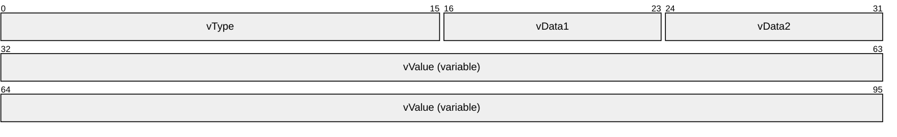

**vType (2 bytes):** A type indicator that indicates the type of **vValue**. It MUST be one of the values specified in the following table.

| Value | Meaning |
| --- | --- |
| VT_EMPTY 0x0000 | **vValue** is not present. |
| VT_NULL 0x0001 | **vValue** is not present. |
| VT_I1 0x0010 | A 1-byte signed integer. |
| VT_UI1 0x0011 | A 1-byte unsigned integer. |
| VT_I2 0x0002 | A 2-byte signed integer. |
| VT_UI2 0x0012 | A 2-byte unsigned integer. |
| VT_BOOL 0x000B | A Boolean value; a 2-byte integer. **Note** Contains 0x0000 (FALSE) or 0xFFFF (TRUE). |
| VT_I4 0x0003 | A 4-byte signed integer. |
| VT_UI4 0x0013 | A 4-byte unsigned integer. |
| VT_R4 0x0004 | An IEEE 32-bit floating point number, as defined in [[IEEE754]](https://go.microsoft.com/fwlink/?LinkId=89903). |
| VT_INT 0x0016 | A 4-byte signed integer. |
| VT_UINT 0x0017 | A 4-byte unsigned integer. Note that this is identical to VT_UI4, except that VT_UINT cannot be used with VT_VECTOR (defined below); the value chosen is up to the higher layer that provides it to the Windows Search Protocol Specification, but the Windows Search Protocol Specification treats VT_UINT and VT_UI4 as identical with the exception noted above. |
| VT_ERROR 0x000A | A 4-byte unsigned integer containing an [**HRESULT**](#gt_hresult), as specified in [MS-ERREF](../MS-ERREF/MS-ERREF.md) section 2.1. |
| VT_I8 0x0014 | An 8-byte signed integer. |
| VT_UI8 0x0015 | An 8-byte unsigned integer. |
| VT_R8 0x0005 | An IEEE 64-bit floating point number as defined in [IEEE754]. |
| VT_CY 0x0006 | An 8-byte two's complement integer (**vValue** divided by 10,000). |
| VT_DATE 0x0007 | A 64-bit floating point number representing the number of days since 00:00:00 on December 31, 1899 (Coordinated Universal Time). |
| VT_FILETIME 0x0040 | A 64-bit integer representing the number of 100-nanosecond intervals since 00:00:00 on January 1, 1601 (Coordinated Universal Time). |
| VT_DECIMAL 0x000E | A [DECIMAL](#Section_2.2.1.1.1.1) structure as specified in section 2.2.1.1.1.1. |
| VT_CLSID 0x0048 | A 16-byte binary value containing a [**GUID**](#gt_globally-unique-identifier-guid). |
| VT_BLOB 0x0041 | A 4-byte unsigned integer count of bytes in the blob, followed by that many bytes of data. |
| VT_BLOB_OBJECT 0x0046 | A 4-byte unsigned integer count of bytes in the blob, followed by that many bytes of data. |
| VT_BSTR 0x0008 | A 4-byte unsigned integer count of bytes in the string, followed by a string, as specified below under **vValue**. |
| VT_CF 0x0011 | A VT_CF structure as specified in section [2.2.1.1.1.7](#Section_2.2.1.1.1.7). |
| VT_LPSTR 0x001E | A null-terminated string using the system code page. |
| VT_LPWSTR 0x001F | A null-terminated, 16-bit [**Unicode**](#gt_unicode) string. See [[UNICODE]](https://go.microsoft.com/fwlink/?LinkId=90550). **Note** The protocol uses UTF-16 LE encoding. |
| VT_COMPRESSED_LPWSTR 0x0023 | A compressed version of a null-terminated, 16-bit Unicode string as specified in section [2.2.1.1.1.6](#Section_2.2.1.1.1.6). **Note** The protocol uses UTF-16 LE encoding. |
| VT_VARIANT 0x000C | CBaseStorageVariant. |

The following table specifies the type modifiers for **vType**. Type modifiers can be binary OR'd with **vType** to change the meaning of **vValue** to indicate that it is one of two possible array types.

| Value | Meaning |
| --- | --- |
| VT_VECTOR 0x1000 | If the type indicator is combined with VT_VECTOR by using an OR operator, **vValue** is a counted array of values of the indicated type. See section [2.2.1.1.1.2](#Section_2.2.1.1.1.2). This type modifier MUST NOT be combined with the following types: VT_INT, VT_UINT, VT_DECIMAL, VT_BLOB, and VT_BLOB_OBJECT. |
| VT_ARRAY 0x2000 | If the type indicator is combined with VT_ARRAY by an OR operator, the value is a [SAFEARRAY](#Section_2.2.1.1.1.3) containing values of the indicated type. This type modifier MUST NOT be combined with the following types: VT_I8, VT_UI8, VT_FILETIME, VT_CLSID, VT_BLOB, VT_BLOB_OBJECT, VT_LPSTR, and VT_LPWSTR. |

**vData1 (1 byte):** When **vType** is VT_DECIMAL, the value of this field is specified as the **scale** field in section 2.2.1.1.1.1. For all other **vTypes**, the value MUST be set to 0x00.

**vData2 (1 byte):** When **vType** is VT_DECIMAL, the value of this field is specified as the **sign** field in section 2.2.1.1.1.1. For all other **vTypes**, the value MUST be set to 0x00.

**vValue (variable):** The value for the match operation. The syntax MUST be as indicated in the **vType** field.

For fixed-length data types, the following table specifies the size of the **vValue** field in bytes.

| Bit Range | Field | Description |
| --- | --- | --- |
| Variable | VT_I1, VT_UI1 | 1 |
| Variable | VT_I2, VT_UI2, VT_BOOL | 2 |
| Variable | VT_I4, VT_UI4, VT_R4, VT_INT, VT_UINT, VT_ERROR | 4 |
| Variable | VT_I8, VT_UI8, VT_R8, VT_CY, VT_DATE, VT_FILETIME | 8 |
| Variable | VT_DECIMAL, VT_CLSID | 16 |

For other types, the structure of **vValue** depends upon the value of **vType** as shown in the following table and diagrams.

| Value of vType | Structure of vValue | Notes |
| --- | --- | --- |
| VT_BLOB | First diagram. | - |
| VT_BLOB_OBJECT | First diagram. | - |
| VT_BSTR | First diagram. | - |
| VT_LPSTR | Second diagram. | **string** is a null-terminated system code page string. **cLen** is the string's length in system code page characters. |
| VT_LPWSTR | Second diagram. | **String** is a null-terminated Unicode string. **cLen** is the string's length in Unicode characters. |

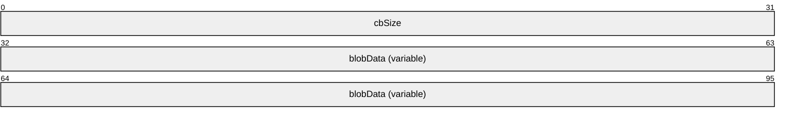

**cbSize (4 bytes):** A 32-bit unsigned integer.

**Note** Indicates the size of the **blobData** field in bytes.

**blobData (variable):** MUST be of length **cbSize** in bytes.

For **vType** set to VT_BLOB or VT_BLOB_OBJECT, this field is opaque binary blob data.

For **vType** set to VT_BSTR, this field is a set of characters in an OEM–selected character set. The client and server MUST be configured to have interoperable character sets. There is no requirement that it be null-terminated.

For a **vType** set to either VT_LPSTR or VT_LPWSTR, the structure of **vValue** is shown in the diagram below, with the following caveats:

- If **vType** is set to VT_LPSTR, then **cLen** indicates the size of the string in system code page characters and **string** is null-terminated.
- If **vType** is set to VT_LPWSTR, then **cLen** indicates the size of the string in Unicode characters and **string** is a null-terminated Unicode string.
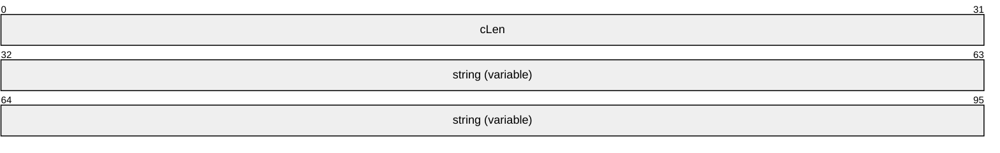

**cLen (4 bytes):** A 32-bit unsigned integer, indicating the size of the **string** field including the terminating null.

**Note** A value of 0x00000000 indicates that no such string is present.

**string (variable):** Null-terminated string.

**Note** This field MUST be absent if **cLen** equals 0x00000000.

<a id="Section_2.2.1.1.1"></a>
##### 2.2.1.1.1 CBaseStorageVariant Structures

The following structures are used in the [CBaseStorageVariant](#Section_2.2.1.1) structure.

<a id="Section_2.2.1.1.1.1"></a>
###### 2.2.1.1.1.1 DECIMAL

DECIMAL is used to represent an exact numeric value with a fixed precision and fixed scale.

When **vType** is set to VT_DECIMAL (0x0000E), the **vData1** and **vData2** fields of [CBaseStorageVariant](#Section_2.2.1.1) MUST be interpreted as follows:

**vData1**: The number of digits to the right of the decimal point. MUST be in the range 0 to 28.

**vData2**: The sign of the numeric value. Set to 0x00 if positive; set to 0x80 if negative.

When **vType** is set to VT_DECIMAL, the format of the **vValue** field is specified in the following diagram.

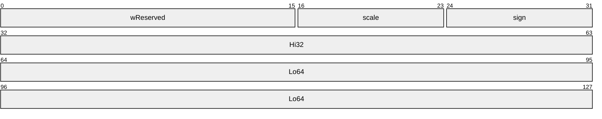

**wReserved (2 bytes):** MUST be set to zero and MUST be ignored.

**scale (1 byte):** The number of decimal places for the number. Valid values are from 0 to 28.

**sign (1 byte):** Indicates the sign; 0 for positive numbers or DECIMAL_NEG(0x80) for negative numbers.

**Hi32 (4 bytes):** The high 32 bits of the number.

**Lo64 (8 bytes):** The low 64 bits of the number.

<a id="Section_2.2.1.1.1.2"></a>
###### 2.2.1.1.1.2 VT_VECTOR

**VT_VECTOR** is used to pass one-dimensional arrays.

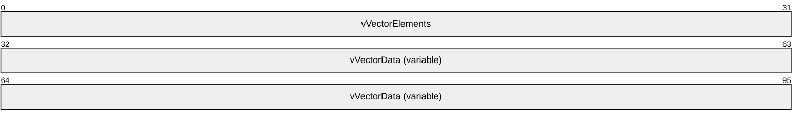

**vVectorElements (4 bytes):** Unsigned 32-bit integer, indicating the number of elements in the **vVectorData** field.

**vVectorData (variable):** An array of items that have a type indicated by **vType** with the 0x1000 bit cleared. The size of an individual fixed-length item can be obtained from the fixed-length data type table, as specified in section [2.2.1.1](#Section_2.2.1.1). The length of this field, in bytes, can be calculated by multiplying **vVectorElements** by the size of an individual item.

For variable-length data types, vVectorData contains a sequence of consecutively marshaled simple types where the type is indicated by **vType** with the 0x1000 bit cleared. This includes a special case indicated by **vType** VT_ARRAY | VT_VARIANT (that is, 0x100C).

The elements in the vVectorData field MUST be separated by 0 to 3 padding bytes such that each element begins at an offset that is a multiple of 4 bytes from the beginning of the message that contains this array. If padding bytes are present, the value they contain is arbitrary. The content of the padding bytes MUST be ignored by the receiver.

For a **vType** set to VT_ARRAY | VT_VARIANT, the type for items in this sequence is CBaseStorageVariant.

<a id="Section_2.2.1.1.1.3"></a>
###### 2.2.1.1.1.3 SAFEARRAY

SAFEARRAY is used to pass multidimensional arrays. The structure contains array size information as well as the data in the array.

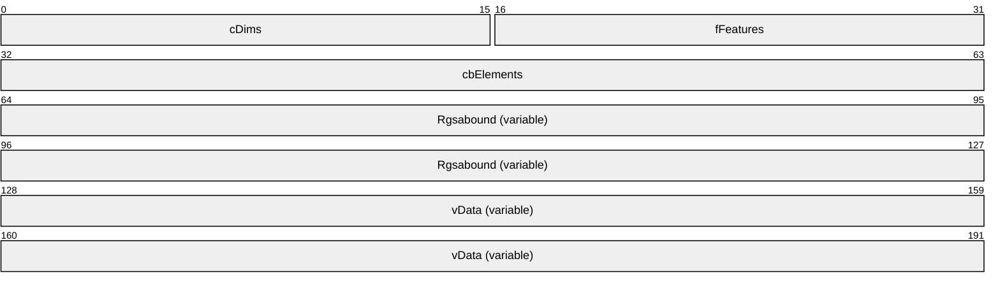

**cDims (2 bytes):** Unsigned 16-bit integer, indicating the number of dimensions of the multidimensional array.

**fFeatures (2 bytes):** A 16-bit bitfield. The values represent features defined by upper-layer applications and MUST be ignored.

**cbElements (4 bytes):** A 32-bit unsigned integer specifying the size of each element of the array.

**Rgsabound (variable):** An array that contains one [SAFEARRAYBOUND](#Section_2.2.1.1.1.4) structure per dimension in the SAFEARRAY. This array has the left-most dimension first and the right-most dimension last.

**vData (variable):** A vector of marshaled items of a particular type, indicated by the **vType** of the containing [CBaseStorageVariant](#Section_2.2.1.1), with the bit 0x2000 cleared.

vData is marshaled similarly to VT_VECTOR, as specified in section [2.2.1.1.1.2](#Section_2.2.1.1.1.2), but the number of items is not stored in front of the vector. Rather, the number of items is calculated by multiplying the **cElements** value with all safe array bounds given in the **Rgsabound** field. Elements are stored in a vector in order of dimensions, iterating beginning with the right-most dimension.

The following table visually represents a sample two-dimensional array. The first dimension has **cElements** equal to 4 (represented horizontally) and **lLbound** equal to 0. The second dimension has **cElements** equal to 2 (represented vertically) and **lLbound** equal to 0.

| cElement 0 | cElement 1 | cElement 2 | cElement 3 |
| --- | --- | --- | --- |
| 0x00000001 | 0x00000002 | 0x00000003 | 0x00000005 |
| 0x00000007 | 0x00000011 | 0x00000013 | 0x00000017 |

Using the previous diagram, vData will contain the following sequence: 0x00000001, 0x00000007, 0x00000002, 0x00000011, 0x00000003, 0x00000013, 0x00000005, 0x00000017 (iterating through the rightmost dimension first, and then incrementing the next dimension). The preceding **Rgsabound** (which records **cElements** and **lLbound**) would be: 0x00000004, 0x00000000, 0x00000002, and 0x00000000.

<a id="Section_2.2.1.1.1.4"></a>
###### 2.2.1.1.1.4 SAFEARRAYBOUND

The SAFEARRAYBOUND structure represents the bounds of one dimension of a [SAFEARRAY](#Section_2.2.1.1.1.3) or [SAFEARRAY2](#Section_2.2.1.1.1.5). Its format is as follows.

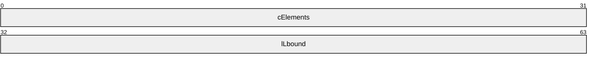

**cElements (4 bytes):** A 32-bit unsigned integer, specifying the number of elements in the dimension.

**lLbound (4 bytes):** A 32-bit unsigned integer, specifying the lower bound of the dimension.

<a id="Section_2.2.1.1.1.5"></a>
###### 2.2.1.1.1.5 SAFEARRAY2

SAFEARRAY2 is used to pass multidimensional arrays in [SERIALIZEDPROPERTYVALUE](#Section_2.2.1.44). The structure contains boundary information as well as the data.

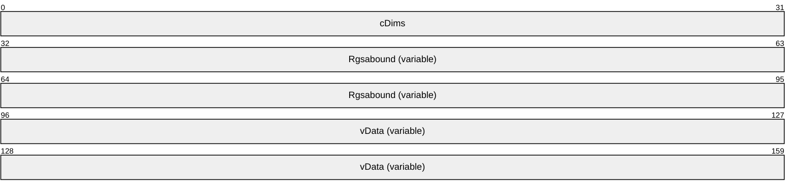

**cDims (4 bytes):** Unsigned 32-bit integer, indicating the number of dimensions of the SAFEARRAY2.

**Rgsabound (variable):** An array that contains one [SAFEARRAYBOUND](#Section_2.2.1.1.1.4) structure per dimension in the SAFEARRAY2. This array has the left-most dimension first and the right-most dimension last.

**vData (variable):** A vector of marshaled items of a particular type, indicated by the **dwType** of the containing SERIALIZEDPROPERTYVALUE, with bit 0x2000 cleared. The format of vData is the same as that specified for the vData field of [SAFEARRAY](#Section_2.2.1.1.1.3).

<a id="Section_2.2.1.1.1.6"></a>
###### 2.2.1.1.1.6 VT_COMPRESSED_LPWSTR

The VT_COMPRESSED_LPWSTR structure contains a compressed version of a null-terminated, 16-bit [**Unicode**](#gt_unicode) string.


**ccLen (4 bytes):** A 32-bit unsigned integer, indicating the number of characters in the compressed Unicode string, excluding the terminating null character. A value of 0x00000000 indicates that no such string is present.

**bytes (variable):** A sequence of bytes, each representing the lower byte of a two-byte Unicode character, where the higher byte of the character is always set to zero. Note that only the first 255 Unicode characters can be represented with this encoding scheme. This field MUST be absent if **ccLen** is set to 0x00000000.

<a id="Section_2.2.1.1.1.7"></a>
###### 2.2.1.1.1.7 VT_CF

VT_CF is used for clipboard format.

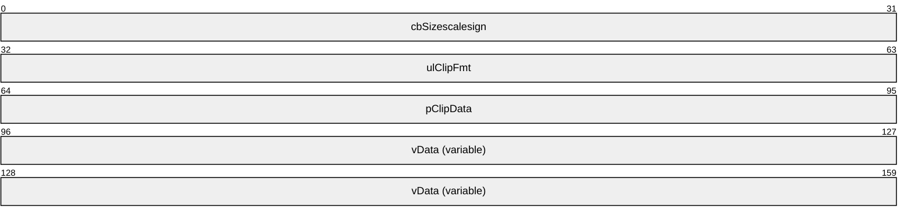

**cbSize (4 bytes):** A 32-bit unsigned integer that specifies the size of the **vData** field.

**ulClipFmt (4 bytes):** A 32-bit unsigned integer that specifies the clipboard format.

**pClipData (4 bytes):** A 32-bit unsigned integer that specifies the offset to clipboard format data.

**vData (variable):** The clipboard format data.

<a id="Section_2.2.1.2"></a>
#### 2.2.1.2 CFullPropSpec

The CFullPropSpec structure contains a property set [**GUID**](#gt_globally-unique-identifier-guid) and a property identifier to uniquely identify a property. A CFullPropSpec instance has a property set GUID and either an integer property ID or a string property name. For properties to match, the CFullPropSpec structure MUST match the column identifier in the index. There is no conversion between property IDs and property names. Property names are case insensitive. (The **CFullPropSpec** structure corresponds to the **FULLPROPSPEC** structure described in [[MSDN-FULLPROPSPEC]](https://go.microsoft.com/fwlink/?LinkId=103235).)

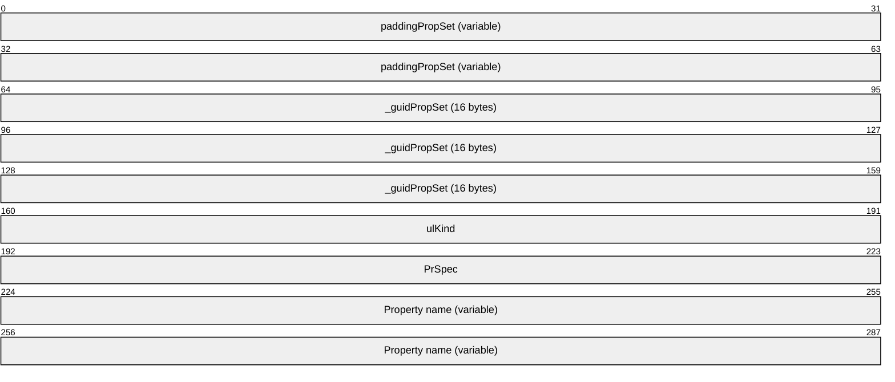

**paddingPropSet (variable):** This field MUST be 0 to 8 bytes in length. The length of this field MUST be such that the following field (_guidPropSet) begins at an offset that is a multiple of 8 bytes from the beginning of the message that contains this structure. If this field is present (that is, length nonzero), the value it contains is arbitrary. The content of this field MUST be ignored by the receiver.

**_guidPropSet (16 bytes):** The GUID of the property set to which the property belongs.

**ulKind (4 bytes):** A 32-bit unsigned integer. MUST be one of the following values that indicates the contents of **PrSpec**.

| Value | Meaning |
| --- | --- |
| PRSPEC_LPWSTR 0x00000000 | The **PrSpec** field specifies the number of non-null characters in the **Property name** field. |
| PRSPEC_PROPID 0x00000001 | The **PrSpec** field specifies the property ID (PROPID). |

**PrSpec (4 bytes):** A 32-bit unsigned integer with a meaning as indicated by the **ulKind** field.

**Property name (variable):** If **ulKind** is set to PRSPEC_PROPID, this field MUST NOT be present. If **ulKind** is set to PRSPEC_LPWSTR, this field MUST contain a case-insensitive array of **PrSpec** non-null Unicode characters that contains the name of the property.

<a id="Section_2.2.1.3"></a>
#### 2.2.1.3 CContentRestriction

The CContentRestriction structure contains a word or phrase to match in the [**inverted index**](#gt_inverted-index) for a specific property.

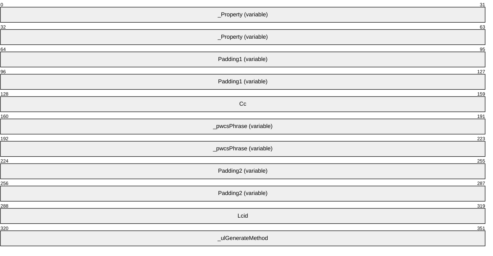

**_Property (variable):** A [CFullPropSpec](#Section_2.2.1.2) structure. This field indicates the property on which to perform a match operation.

**Padding1 (variable):** This field MUST be 0 to 3 bytes in length. The length of this field MUST be such that the following field begins at an offset that is a multiple of 4 bytes from the beginning of the message that contains this structure. If this field is present (that is, length nonzero), the value it contains is arbitrary. The content of this field MUST be ignored by the receiver.

**Cc (4 bytes):** A 32-bit unsigned integer, specifying the number of characters in the **_pwcsPhrase** field.

**_pwcsPhrase (variable):** A non-null-terminated Unicode string representing the word or phrase to match for the property. This field MUST NOT be empty. The **Cc** field contains the length of the string.

**Padding2 (variable):** This field MUST be 0 to 3 bytes in length. The length of this field MUST be such that the following field begins at an offset that is a multiple of 4 bytes from the beginning of the message that contains this structure. If this field is present (that is, length nonzero), the value it contains is arbitrary. The content of this field MUST be ignored by the receiver.

**Lcid (4 bytes):** A 32-bit unsigned integer, indicating the [**locale**](#gt_locale) of **_pwcsPhrase**, as specified in [MS-LCID](../MS-LCID/MS-LCID.md).

**_ulGenerateMethod (4 bytes):** A 32-bit unsigned integer, specifying the method to use when generating alternate word forms.

| Value | Meaning |
| --- | --- |
| GENERATE_METHOD_EXACT 0x00000000 | Exact match. Each word in the phrase matches exactly in the inverted index. |
| GENERATE_METHOD_PREFIX 0x00000001 | Prefix match. Each word in the phrase is considered a match if the word is a prefix of an indexed string. For example, if the word "barking" is indexed, then "bar" would match when performing a prefix match. |
| GENERATE_METHOD_INFLECT 0x00000002 | Matches inflections of a word. An inflection of a word is a variant of the root word in the same part of speech that has been modified, according to linguistic rules of a given language. For example, inflections of the verb swim in English include swim, swims, swimming, and swam. The inflection forms of a word can be determined by calling the **Inflect** abstract interface (section [3.1.7](#Section_8)) to the GSS ([**Generic Search Service**](#gt_generic-search-service-gss)) with "*pwcsPhrase*" as an argument. |

<a id="Section_2.2.1.4"></a>
#### 2.2.1.4 CInternalPropertyRestriction

The CInternalPropertyRestriction structure contains a property value to match with an operation.

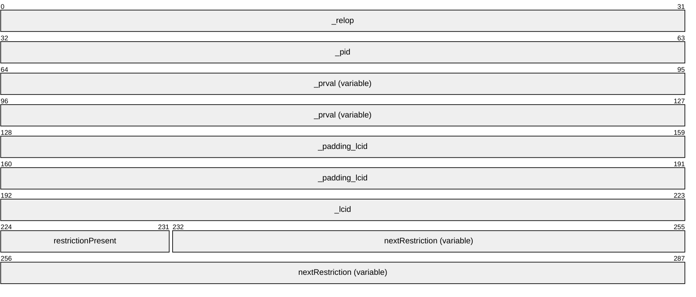

**_relop (4 bytes):** A 32-bit integer specifying the relation to perform on the property. **_relop** MUST be one of the following values.

| Value | Meaning |
| --- | --- |
| PRLT 0x00000000 | A less-than comparison. |
| PRLE 0x00000001 | A less-than or equal-to comparison. |
| PRGT 0x00000002 | A greater-than comparison. |
| PRGE 0x00000003 | A greater-than or equal-to comparison. |
| PREQ 0x00000004 | An equality comparison. |
| PRNE 0x00000005 | A not-equal comparison. |
| PRRE 0x00000006 | A regular expression comparison. |
| PRAllBits 0x00000007 | A bitwise AND that returns the right operand. |
| PRSomeBits 0x00000008 | A bitwise AND that returns a nonzero value. |
| PRAll 0x00000100 | The operation is to be performed on a [**column**](#gt_column) of a [**rowset**](#gt_rowset) and is only true if the operation is true for all rows. |
| PRAny 0x00000200 | The operation is to be performed on a column of a rowset and is true if the operation is true for any [**row**](#gt_row). |

**_pid (4 bytes):** A 32-bit unsigned integer, representing the property ID.

**_prval (variable):** A [CBaseStorageVariant](#Section_2.2.1.1) that contains the value to relate to the property.

If the **vType** of _prval is VT_BLOB or VT_BLOB_OBJECT and _Property refers to a property of a string type (VT_LPSTR, VT_LPWSTR, VT_COMPRESSED_LPWSTR, VT_BSTR, or VT_VECTORs or VT_ARRAYs of those base types), then the first byte of the blob SHOULD be the low-order byte of a valid [RANGEBOUNDARY](#Section_2.2.1.23) ulType value (see section 2.2.1.23) and be followed by a null-terminated Unicode string. The value is interpreted in the same manner as RANGEBOUNDARY values (see section 2.2.1.23).

**_padding_lcid (variable):** This field MUST be 0 to 3 bytes in length. The length of this field MUST be such that the following **_lcid** field begins at an offset that is a multiple of 4 bytes from the beginning of the message that contains this structure. If this field is present (that is, length nonzero), the value it contains is arbitrary. The content of this field MUST be ignored by the receiver.

**_lcid (4 bytes):** A 32-bit unsigned integer, indicating the [**locale**](#gt_locale) of a string, contained in **_prval** value, as specified in [MS-LCID](../MS-LCID/MS-LCID.md).

**restrictionPresent (1 byte):** A byte value. MUST be set to one of the following values.

| Value | Meaning |
| --- | --- |
| 0x00 | **restrictionPresent** indicates that the **nextRestriction** field is not present. |
| 0x01 | **restrictionPresent** indicates that the **nextRestriction** field is present. |

**nextRestriction (variable):** A [CRestriction](#Section_2.2.1.17) structure specifying a further [**restriction**](#gt_restriction).

<a id="Section_2.2.1.5"></a>
#### 2.2.1.5 CNatLanguageRestriction

The CNatLanguageRestriction structure contains a [**natural language query**](#gt_natural-language-query) match for a property. Natural language simply means that the string has no formal meaning. The [**GSS**](#gt_generic-security-services-gss) is free to match on the string in a variety of ways. It can drop words, add alternate forms, or make no changes.

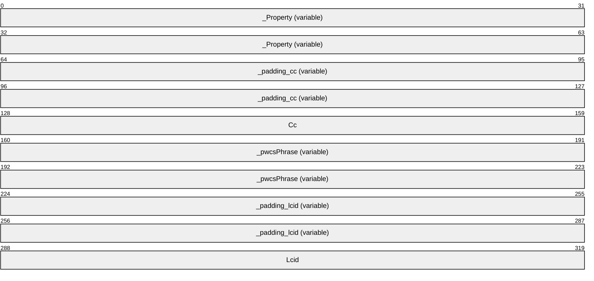

**_Property (variable):** A [CFullPropSpec](#Section_2.2.1.2) structure. This field indicates the property on which to perform the match operation.

**_padding_cc (variable):** This field MUST be 0 to 3 bytes in length. The length of this field MUST be such that the following field begins at an offset that is a multiple of 4 bytes from the beginning of the message that contains this structure. If this field is present (that is, length nonzero), the value it contains is arbitrary. The content of this field MUST be ignored by the receiver.

**Cc (4 bytes):** A 32-bit unsigned integer. The number of characters in the **_pwcsPhrase** field.

**_pwcsPhrase (variable):** A non-null-terminated Unicode string containing the text to search for within the specific property. MUST NOT be empty. The **Cc** field contains the length of the string.

**_padding_lcid (variable):** This field MUST be 0 to 3 bytes in length. The length of this field MUST be such that the following field begins at an offset that is a multiple of 4 bytes from the beginning of the message that contains this structure. If this field is present (that is, length nonzero), the value it contains is arbitrary. The content of this field MUST be ignored by the receiver.

**Lcid (4 bytes):** A 32-bit unsigned integer indicating the [**locale**](#gt_locale) of **_pwcsPhrase**, as specified in [MS-LCID](../MS-LCID/MS-LCID.md).

<a id="Section_2.2.1.6"></a>
#### 2.2.1.6 CNodeRestriction

The CNodeRestriction structure contains an array of [**command tree**](#gt_command-tree) [**restriction**](#gt_restriction) nodes for constraining the results of a query.


**_cNode (4 bytes):** A 32-bit unsigned integer specifying the number of [CRestriction](#Section_2.2.1.17) structures contained in the **_paNode** field.

**_paNode (variable):** An array of CRestriction structures. Structures in the array MUST be separated by 0 to 3 padding bytes such that each structure begins at an offset that is a multiple of 4 bytes from the beginning of the message that contains this array. If padding bytes are present, the value they contain is arbitrary. The content of the padding bytes MUST be ignored by the receiver.

<a id="Section_2.2.1.7"></a>
#### 2.2.1.7 CPropertyRestriction

The CPropertyRestriction structure contains a property to get from each [**row**](#gt_row), a comparison operator and a constant. For each row, the value returned by the specific property in the row is compared against the constant to determine if it has the relationship specified by the **_relop** field. For the comparison to be true, the datatypes of the values MUST match.

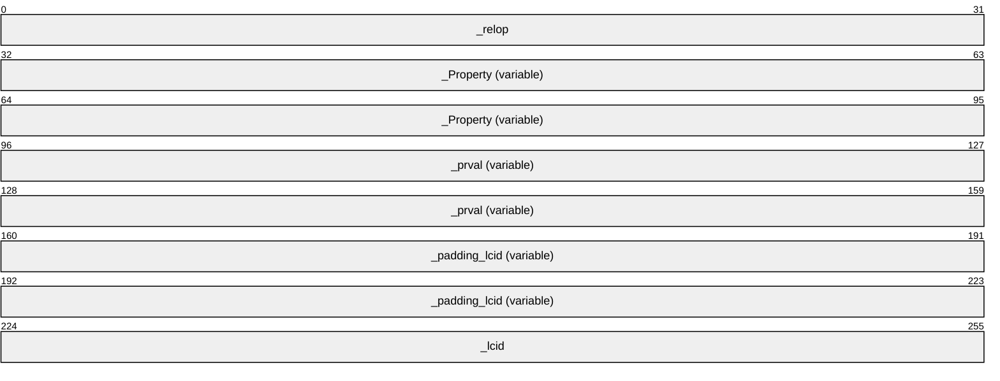

**_relop (4 bytes):** A 32-bit unsigned integer specifying the relation to perform on the property. **_relop** MUST be one of the following values.

| Value | Meaning |
| --- | --- |
| PRLT 0x00000000 | A less-than comparison. |
| PRLE 0x00000001 | A less-than or equal-to comparison. |
| PRGT 0x00000002 | A greater-than comparison. |
| PRGE 0x00000003 | A greater-than or equal-to comparison. |
| PREQ 0x00000004 | An equality comparison. |
| PRNE 0x00000005 | A not-equal comparison. |
| PRRE 0x00000006 | A regular expression comparison (see below). |
| PRAllBits 0x00000007 | A bitwise AND that returns the value equal to **_prval**. |
| PRSomeBits 0x00000008 | A bitwise AND that returns a nonzero value. |

For vector properties, the behavior of the relational operators depends on the result of a logical **OR** using a mask and the relational operator.

If there is no mask, the [**restriction**](#gt_restriction) is true if the relational operator holds between each element of a property value and the corresponding element in the **_prval** field. If, in addition, the two vectors have different lengths, then the vector lengths are compared using the relational operator.

If there is a mask, its possible values are as follows.

| Value | Meaning |
| --- | --- |
| PRAll 0x00000100 | The restriction is true if every element in a property value has the relationship with some element in the **_prval** field. |
| PRAny 0x00000200 | The restriction is true if any element in the property value has the relationship with some element in the **_prval** field. |

For PRRE relations, regular expressions are expressed with a string that contains special symbols. Any character except an asterisk (*), period (.), question mark (?), or vertical bar (|) matches itself. A regular expression can be enclosed in matching quotes ("…"), and is enclosed in quotes if it contains a space or closing parenthesis (the ")" character).

The asterisk matches any number of characters. The period matches the end of the string. The question mark matches any one character. The vertical bar (|) is an escape character, which indicates special behavior for the characters in the table below the ([) character. The following table explains the meanings of special characters in regular expressions.

| Character | Meaning |
| --- | --- |
| ( | An opening parenthesis opens a group. It is followed by a matching closing parenthesis. |
| ) | A closing parenthesis closes a group. It is preceded by a matching opening parenthesis. |
| [ | An opening square bracket preceded (escaped) by a vertical pipe character opens a character class. It is followed by a matching (unescaped) closing square bracket. |
| { | An opening brace opens a counted match. It is followed by a matching closing brace. |
| } | A closing brace closes a counted match. It is preceded by a matching opening brace. |
| , | A comma separates OR clauses. |
| * | An asterisk matches zero or more occurrences of the preceding expression. |
| ? | A question mark matches zero or one occurrence of the preceding expression. |
| + | A plus sign matches one or more occurrences of the preceding expression. |
| Other | All other characters match themselves. |

The following table describes characters that, when located between square brackets ([ ]), have special meanings.

| Character | Meaning |
| --- | --- |
| ^ | A caret matches everything but following classes. (It is the first character in the string.) |
| ] | A closing square bracket matches another closing square bracket. It is preceded only by a caret (^); otherwise, it closes the class. |
| - | A hyphen is a range operator. It is preceded and followed by normal characters. |
| Other | All other characters match themselves (or begin or end a range). |

The following table describes the syntax used between braces ({ }).

| Character | Meaning |
| --- | --- |
| {m} | Matches exactly m occurrences of the preceding expression (0 < m < 256). |
| {m,} | Matches at least m occurrences of the preceding expression (1 < m < 256). |
| {m, n} | Matches between m and n occurrences of the preceding expression, inclusive (0 < m < 256, 0 < n < 256). |

To match the asterisk and question mark, enclose them within brackets. For example, [*]sample matches "*sample".

**_Property (variable):** A [CFullPropSpec](#Section_2.2.1.2) structure indicating the property on which to perform a match operation.

**_prval (variable):** A [CBaseStorageVariant](#Section_2.2.1.1) structure containing the value to relate to the property.

If the **vType** of _prval is VT_BLOB or VT_BLOB_OBJECT, and _Property refers to a property of a string type (VT_LPSTR, VT_LPWSTR, VT_COMPRESSED_LPWSTR, VT_BSTR, or VT_VECTORs or VT_ARRAYs of those base types), then the first byte of the blob SHOULD be the low-order byte of a valid [RANGEBOUNDARY](#Section_2.2.1.23) ulType value (see section 2.2.1.23) and be followed by a null-terminated Unicode string. The value is interpreted in the same manner as RANGEBOUNDARY values (see section 2.2.1.23).

**_padding_lcid (variable):** This field MUST be 0 to 3 bytes in length. The length of this field MUST be such that the following **_lcid** field begins at an offset that is a multiple of 4 bytes from the beginning of the message that contains this structure. If this field is present (that is, length nonzero), the value it contains is arbitrary. The content of this field MUST be ignored by the receiver.

**_lcid (4 bytes):** A 32-bit unsigned integer representing [**locale**](#gt_locale) for the string contained in **_prval**, as specified in [MS-LCID](../MS-LCID/MS-LCID.md).

<a id="Section_2.2.1.8"></a>
#### 2.2.1.8 CReuseWhere

The CReuseWhere restriction packet contains a [**WHEREID**](#gt_whereid) that refers to the restriction array used to construct a currently open rowset. A rowset is open as long as there is still a cursor returned by [CPMCreateQueryOut](#Section_2.2.3.5) that has not been freed using [CPMFreeCursorIn](#Section_2.2.3.24). A server can use this information to share evaluation of a restriction across multiple queries.

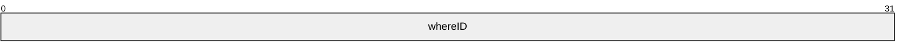

**whereID (4 bytes):** A 32-bit unsigned integer defining a unique WHEREID for referring to the [CRestrictionArray](#Section_2.2.1.16).

<a id="Section_2.2.1.9"></a>
#### 2.2.1.9 CScopeRestriction

The CScopeRestriction structure restricts the files to be returned to those with a path that matches the [**restriction**](#gt_restriction).

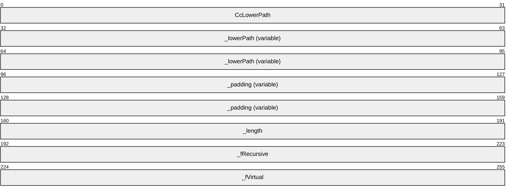

**CcLowerPath (4 bytes):** A 32-bit unsigned integer containing the number of Unicode characters in the **_lowerPath** field.

**_lowerPath (variable):** A non-null-terminated Unicode string representing the [**path**](#gt_path) to which the query is restricted. The **CcLowerPath** field contains the length of the string.

**_padding (variable):** This field MUST be 0 to 3 bytes in length. The length of this field MUST be such that the following field begins at an offset that is a multiple of 4 bytes from the beginning of the message that contains this structure. If this field is present (that is, length nonzero), the value it contains is arbitrary. The content of this field MUST be ignored by the receiver.

**_length (4 bytes):** A 32-bit unsigned integer containing the length of **_lowerPath** in Unicode characters. This MUST be the same value as **CcLowerPath**.

**_fRecursive (4 bytes):** A 32-bit unsigned integer. MUST be set to one of the following values:

| Value | Meaning |
| --- | --- |
| 0x00000000 | The server is not to examine any subdirectories. |
| 0x00000001 | The server is to recursively examine all subdirectories of the path. |

**_fVirtual (4 bytes):** A 32-bit unsigned integer. MUST be set to one of the following values:

| Value | Meaning |
| --- | --- |
| 0x00000000 | **_lowerPath** is a file system path. |
| 0x00000001 | **_lowerPath** is a virtual path (the URL associated with a physical directory on the file system) for a website. |

<a id="Section_2.2.1.10"></a>
#### 2.2.1.10 CSort

The CSort structure identifies a [**column**](#gt_column), direction, and [**locale**](#gt_locale) to sort by.

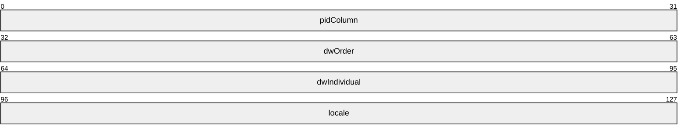

**pidColumn (4 bytes):** A 32-bit unsigned integer. This is the index in [CPidMapper](#Section_2.2.1.32) for the property to sort by.

**dwOrder (4 bytes):** A 32-bit unsigned integer. MUST be one of the following values, specifying how to sort based on the column.

| Value | Meaning |
| --- | --- |
| QUERY_SORTASCEND 0x00000000 | The [**rows**](#gt_row) are to be sorted in ascending order based on the values in the column specified. |
| QUERY_DESCEND 0x00000001 | The rows are to be sorted in descending order based on the values in the column specified. |

**dwIndividual (4 bytes):** A 32-bit unsigned integer. **dwIndividual** specifies how to treat properties of type [VT_VECTOR](#Section_2.2.1.1.1.2) with regard to sorting and MUST be one of the following values.

| Value | Meaning |
| --- | --- |
| QUERY_SORTALL 0x00000000 | The complete property is used for sorting, resulting in a single row for each result. |
| QUERY_SORTINDIVIDUAL 0x00000001 | Each element of the VT_VECTOR is used for sorting independently, possibly resulting in multiple rows for a single result. |

**locale (4 bytes):** A 32-bit unsigned integer indicating the locale (as specified in [MS-LCID](../MS-LCID/MS-LCID.md)) of the column. The locale determines the sorting rules to use when sorting textual values. The [**GSS**](#gt_generic-security-services-gss) can use the appropriate operating system facilities to do this.

<a id="Section_2.2.1.11"></a>
#### 2.2.1.11 CVectorRestriction

The CVectorRestriction structure contains a weighted OR operation over [**restriction**](#gt_restriction) nodes. Vector restrictions represent queries using the full text vector space model of ranking (see [SALTON] for details). In addition to the OR operation, they also compute a rank based on the ranking algorithm.

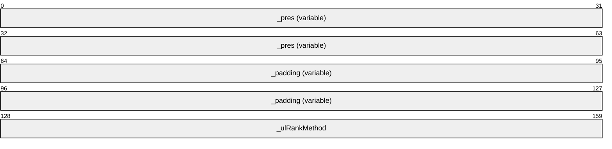

**_pres (variable):** A [CNodeRestriction](#Section_2.2.1.6) [**command tree**](#gt_command-tree) upon which a ranked OR operation is to be performed.

**_padding (variable):** This field MUST be 0 to 3 bytes in length. The length of this field MUST be such that the following field begins at an offset that is a multiple of 4 bytes from the beginning of the message that contains this structure. If this field is present (that is, length is nonzero), the value it contains is arbitrary. The content of this field MUST be ignored by the receiver.

**_ulRankMethod (4 bytes):** A 32-bit unsigned integer specifying a ranking algorithm. MUST be set to one of the following values.

| Value | Meaning |
| --- | --- |
| VECTOR_RANK_MIN 0x00000000 | Use the minimum algorithm, as specified in [SALTON]. |
| VECTOR_RANK_MAX 0x00000001 | Use the maximum algorithm, as specified in [SALTON]. |
| VECTOR_RANK_INNER 0x00000002 | Use the inner product algorithm, as specified in [SALTON]. |
| VECTOR_RANK_DICE 0x00000003 | Use the Dice coefficient algorithm, as specified in [SALTON]. |
| VECTOR_RANK_JACCARD 0x00000004 | Use the Jaccard coefficient algorithm, as specified in [SALTON]. |

<a id="Section_2.2.1.12"></a>
#### 2.2.1.12 CCoercionRestriction

The CCoercionRestriction structure contains the modifier and rank coercion operation.

```mermaid
packet-beta
  0-31: "_flValue"
  32-95: "_childRes (variable)"
```

**_flValue (4 bytes):** An IEEE 32-bit floating point number [[IEEE754]](https://go.microsoft.com/fwlink/?LinkId=89903) representing the coercion value upon which the rank coercion operation happens. Note that the coercion operation is determined by the containing [CRestriction](#Section_2.2.1.17) structure. The following coercion operations are supported.

| Operation | Meaning |
| --- | --- |
| ADD | The rank value returned is the sum of the original rank value and the coercion value. |
| MULTIPLY | The rank value returned is the product of the original rank value and the coercion value and MUST be in the range 0.001 to 1.0. |
| ABSOLUTE | The rank value returned is the value specified in the coercion value and MUST be in the range 0 to 1000. |
| MINMAX | The rank value returned is linear mapping of the original rank value between the specified minimum and maximum coercion values and MUST be in the range 0 to 1000.<3> |

**_childRes (variable):** CRestriction structure that specifies a [**command tree**](#gt_command-tree). The returned rank value for results of a child [**restriction**](#gt_restriction) will be coerced as specified by the containing CRestriction structure.

<a id="Section_2.2.1.13"></a>
#### 2.2.1.13 CRelDocRestriction

A CRelDocRestriction structure contains a relevant document ID.

```mermaid
packet-beta
  0-63: "_vDocument (variable)"
```

**_vDocument (variable):** A [CBaseStorageVariant](#Section_2.2.1.1) structure that specifies a relevant document for a relevance feedback query. The **vType** field of the **_vDocument** structure MUST be set to either VT_I4 or to VT_BSTR, specifying a URL string.

If **vType** is set to VT_I4, then **vValue** MUST be set to the document ID.

If **vType** is set to VT_BSTR, the URL string MUST be formatted by concatenating a constant string containing the docid protocol, the application, and the [**catalog**](#gt_catalog) name with the document ID in decimal representation, as in the following example.

docid:Windows.SystemIndex.153

In the example, "docid" is a uniquie 32-bit unsigned integer, "Windows" is the application name, "SystemIndex" is the catalog name, and "153" is the document ID for the document in decimal notation.<4>

<a id="Section_2.2.1.14"></a>
#### 2.2.1.14 CProbRestriction

A CProbRestriction structure contains parameters for probabilistic ranking.

```mermaid
packet-beta
  0-63: "_Property (variable)"
  64-95: "_flK1"
  96-127: "_flK2"
  128-159: "_flK3"
  160-191: "_flB"
  192-223: "_cFeedbackDoc"
  224-255: "_ProbQueryPid"
```

**_Property (variable):** A [CFullPropSpec](#Section_2.2.1.2) structure, indicating which property to use for probabilistic ranking or the columns' group full property specification (which corresponds to **_groupPid** field in the [CColumnGroup](#Section_2.2.1.34) structure). In the latter case, CFullPropSpec MUST have the **_guidPropSet** field set to zero, the **ulKind** field set to PRSPEC_LPWSTR and the **Property name** field set to the name of the referenced group property.

**_flK1 (4 bytes):** An IEEE 32-bit floating point number [[IEEE754]](https://go.microsoft.com/fwlink/?LinkId=89903) that indicates parameter k1 in formula [1], specified below.

**_flK2 (4 bytes):** An IEEE 32-bit floating point number.

**Note** MUST be set to 0.0.

**_flK3 (4 bytes):** An IEEE 32-bit floating point number that indicates parameter k3 in formula [1].

**_flB (4 bytes):** An IEEE 32-bit floating point number that indicates parameter b in formula [1] below.

**_cFeedbackDoc (4 bytes):** A 32-bit unsigned integer specifying the count of relevant documents.

**_ProbQueryPid (4 bytes):** A 32-bit unsigned integer.

**Note** Reserved. MUST be set to 0x00000000.

Formula [1] for probabilistic ranking is the following sum for each query term:

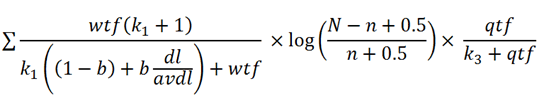

Figure 1: Linear equation for probabilistic ranking restrictions in search request

Where:

- wtf (weighted term frequency) is the sum of term frequencies (the number of times a term occurs in a document) of a given term multiplied by weights across all properties.
- dl is the document length, in terms of number of all words (including noise words).
- avdl is the average document length in the corpus, in terms of number of words (including noise words).
- N is the total number of documents in the corpus.
- n is the number of documents in the corpus that have the given query term.
- qtf is the number of documents containing the given query term; the sum is across all query terms.
- k1, k3, and b are parameters, specified in the CProbRestriction structure.
<a id="Section_2.2.1.15"></a>
#### 2.2.1.15 CFeedbackRestriction

The CFeedbackRestriction structure contains the number of relevant documents and a property specification for a relevance feedback query.

```mermaid
packet-beta
  0-31: "_cFeedbackDoc"
  32-95: "_Property (variable)"
```

**_cFeedbackDoc (4 bytes):** A 32-bit unsigned integer specifying the count of relevant documents.

**_Property (variable):** A [CFullPropSpec](#Section_2.2.1.2) structure, specifying a property.

<a id="Section_2.2.1.16"></a>
#### 2.2.1.16 CRestrictionArray

The CRestrictionArray structure contains an array of [**restriction**](#gt_restriction) nodes. The first two fields (**count** and **isPresent**) are not padded and will start where the previous structure in the message ended (as indicated by the "previous structure" entry in the diagram below). The 1-byte length of "previous structure" is arbitrary and is not meant to suggest that **count** will begin on any particular boundary. However, the **Restriction** field MUST be aligned to begin at a multiple of 4 bytes from the beginning of the message, and hence the format is depicted as follows.

```mermaid
packet-beta
  0-7: "(previous structure)"
  8-15: "count"
  16-23: "isPresent"
  24-63: "_padding (variable)"
  64-127: "Restriction (variable)"
```

**count (1 byte):** An 8-bit unsigned integer specifying the number of **CRestriction** records contained in the **Restriction** field.

**Note** This field MUST be set to 0x01.

**isPresent (1 byte):** An 8-bit unsigned integer. MUST be set to one of the following values.

| Value | Meaning |
| --- | --- |
| 0x00 | The **_padding** and **Restriction** fields are omitted. |
| 0x01 | The **_padding** and **Restriction** fields are present. |

**_padding (variable):** This field MUST be 0 to 3 bytes in length. The length of this field MUST be such that the following field begins at an offset that is a multiple of 4 bytes from the beginning of the message that contains this structure. If this field is present (that is, length nonzero), the value it contains is arbitrary. The content of this field MUST be ignored by the receiver.

**Note** This field MUST be omitted if the value of **isPresent** is set to 0x00.

**Restriction (variable):** A [CRestriction](#Section_2.2.1.17) structure, specifying a node of a query [**command tree**](#gt_command-tree).

**Note** Restriction MUST be omitted if the value of **isPresent** is set to 0x00.

<a id="Section_2.2.1.17"></a>
#### 2.2.1.17 CRestriction

The CRestriction structure contains a [**restriction**](#gt_restriction) node in a query [**command tree**](#gt_command-tree).

```mermaid
packet-beta
  0-31: "_ulType"
  32-63: "Weight"
  64-127: "Restriction (variable)"
```

**_ulType (4 bytes):** A 32-bit unsigned integer indicating the restriction type used for the command tree node. The type determines what is found in the **Restriction** field of the structure as described below. MUST be set to one of the following values.

| Value | Meaning |
| --- | --- |
| RTNone 0x00000000 | The node contains an empty **Restriction** (no value). It represents a node that would evaluate to no results. If under an RTNot node, the RTNot node would evaluate to the entire set of documents. If under an RTAnd node, the RTAnd node would also evaluate to no results. If under an RTOr node, the RTOr node would evaluate to whatever it would have evaluated to if the RTNone node was not there. |
| RTAnd 0x00000001 | The node contains a [CNodeRestriction](#Section_2.2.1.6) on which a logical AND operation is to be performed. The CNodeRestriction contains the other restrictions that this operation is performed on. |
| RTOr 0x00000002 | The node contains a CNodeRestriction on which a logical OR (disjunction) operation is to be performed. The CNodeRestriction contains the other restrictions that this operation is performed on. |
| RTNot 0x00000003 | The node contains a CRestriction on which a NOT operation is to be performed. |
| RTContent 0x00000004 | The node contains a [CContentRestriction](#Section_2.2.1.3). |
| RTProperty 0x00000005 | The node contains a [CPropertyRestriction](#Section_2.2.1.7). |
| RTProximity 0x00000006 | The node contains a CNodeRestriction with an array of CContentRestriction structures. Any other kind of restriction is undefined. The restriction requires the words or phrases found in the CContentRestriction structures to be within the [**GSS**](#gt_generic-security-services-gss) defined range in order to be a match. The [**WSS**](#gt_generic-search-service-gss) implementation computes a rank based on how far apart the words or phrases are. Implementations of the GSS can choose to do the same. |
| RTVector 0x00000007 | The node contains a [CVectorRestriction](#Section_2.2.1.11). |
| RTNatLanguage 0x00000008 | The node contains a [CNatLanguageRestriction](#Section_2.2.1.5). |
| RTScope 0x00000009 | The node contains a [CScopeRestriction](#Section_2.2.1.9). |
| RTReuseWhere 0x00000011 | The node contains a [CReuseWhere](#Section_2.2.1.8) restriction. |
| RTInternalProp 0x00FFFFFA | The node contains a [CInternalPropertyRestriction](#Section_2.2.1.4). |
| RTPhrase 0x00FFFFFD | The node contains a CNodeRestriction on which a phrase match is to be performed. The restrictions in the CNodeRestriction can only be a RTContent node. Otherwise, an error MUST be returned. |
| RTCoerce_Add 0x0000000A | The node contains a [CCoercionRestriction](#Section_2.2.1.12) structure with operation ADD, as specified in section 2.2.1.12. |
| RTCoerce_Multiply 0x0000000B | The node contains a CCoercionRestriction with structure operation MULTIPLY, as specified in section 2.2.1.12. |
| RTCoerce_Absolute 0x0000000C | The node contains a CCoercionRestriction structure with operation ABSOLUTE, as specified in section 2.2.1.12. |
| RTProb 0x0000000D | The node contains a [CProbRestriction](#Section_2.2.1.14) structure. |
| RTFeedback 0x0000000E | The node contains a [CFeedbackRestriction](#Section_2.2.1.15) structure. |
| RTReldoc 0x0000000F | The node contains a [CRelDocRestriction](#Section_2.2.1.13) structure. |
| RTCoerce_MinMax 0x00000012 | The node contains a CCoercionRestriction structure with operation MINMAX, as specified section 2.2.1.12.<5> |
| RTRankMerge 0x00000013 | The node contains a CRankMergeRestriction structure, as specified in section [2.2.1.46](#Section_2.2.1.46).<6> |

**Weight (4 bytes):** A 32-bit unsigned integer representing the weight of the node. Weight indicates the node's importance relative to other nodes in the query command tree. This weight is used to calculate the rank of each node, although the exact effect of the weight is undefined. The guidance is that results from higher-weighted nodes usually return a higher rank than results from nodes that are the same but weighted lower. Implementers of the GSS can choose the exact algorithm.

**Restriction (variable):** The restriction type for the command tree node. The syntax MUST be as indicated by the **_ulType** field.

<a id="Section_2.2.1.18"></a>
#### 2.2.1.18 CColumnSet

The CColumnSet structure specifies the [**column**](#gt_column) numbers to be returned. This structure is always used in reference to a specific [CPidMapper](#Section_2.2.1.32) structure.

```mermaid
packet-beta
  0-31: "count"
  32-95: "indexes (variable)"
```

**count (4 bytes):** A 32-bit unsigned integer specifying the number of elements in the **indexes** array.

**indexes (variable):** An array of 4-byte unsigned integers each representing a zero-based index into the **aPropSpec** array in the corresponding CPidMapper structure. The corresponding property values are returned as columns in the result set.

<a id="Section_2.2.1.19"></a>
#### 2.2.1.19 CCategorizationSet

The CCategorizationSet structure contains information on how the grouping is done at each level in a hierarchical result set.

```mermaid
packet-beta
  0-31: "count"
  32-95: "categories (variable)"
```

**count (4 bytes):** A 32-bit unsigned integer containing the number of elements in the **categories** array.

**categories (variable):** Array of [CCategorizationSpec](#Section_2.2.1.20) structures specifying the grouping for each level in a hierarchical query. The first structure specifies the top level.

<a id="Section_2.2.1.20"></a>
#### 2.2.1.20 CCategorizationSpec

The CCategorizationSpec structure specifies how grouping is done at one level in a hierarchical query.

```mermaid
packet-beta
  0-63: "_csColumns (variable)"
  64-127: "_Spec (variable)"
  128-191: "_AggregSet (variable)"
  192-255: "_SortAggregSet (variable)"
  256-319: "_InGroupSortAggregSets (variable)"
  320-351: "_cMaxResults"
```

**_csColumns (variable):** A [CColumnSet](#Section_2.2.1.18) structure indicating the [**columns**](#gt_column) to return at that level in a hierarchical result set.

**_Spec (variable):** A [CCategSpec](#Section_2.2.1.21) structure specifying the type of categorization and the column for the group.

**_AggregSet (variable):** A [CAggregSet](#Section_2.2.1.24) structure specifying aggregate information for the group.

**_SortAggregSet (variable):** A [CSortAggregSet](#Section_2.2.1.26) structure specifying default sorting for the group.

**_InGroupSortAggregSets (variable):** A [CInGroupSortAggregSets](#Section_2.2.1.28) structure specifying sorting for the group with regard to the parent group's range boundaries.

**_cMaxResults (4 bytes):** A 32-bit unsigned integer. Reserved.

**Note** MUST be set to 0x00000000.

<a id="Section_2.2.1.21"></a>
#### 2.2.1.21 CCategSpec

The CCategSpec structure contains information about which grouping to perform over query results.

```mermaid
packet-beta
  0-31: "_ulCategType"
  32-127: "_sortKey (16 bytes)"
  128-191: "CRangeCategSpec (variable)"
```

**_ulCategType (4 bytes):** MUST be set to one of the following values that indicates the type of grouping to perform.

| Value | Meaning |
| --- | --- |
| CATEGORIZE_UNIQUE 0x00000000 | Unique categorization. Each unique value forms a category. |
| CATEGORIZE_RANGE 0x00000003 | Range categorization. Ranges are explicitly specified in [CRangeCategSpec](#Section_2.2.1.22). |
| CATEGORIZE_COMPLETION 0x00000004 | Categorization by completion suggestions. All the parameters for specifying how these groups are built are in [CCompletionCategSpec](#Section_2.2.1.45). |

**_sortKey (16 bytes):** A [CSort](#Section_2.2.1.10) structure, specifying the [**sort order**](#gt_sort-order) for the group.

**CRangeCategSpec (variable):** A CRangeCategSpec structure specifying the range values. This field MUST be omitted if **_ulCategType** is set to CATEGORIZE_UNIQUE; otherwise it MUST be present.

<a id="Section_2.2.1.22"></a>
#### 2.2.1.22 CRangeCategSpec

The CRangeCategSpec structure contains information about ranges for grouping into range-specified buckets.

```mermaid
packet-beta
  0-31: "_lcid"
  32-63: "cRange"
  64-127: "aRangeBegin (variable)"
```

**_lcid (4 bytes):** A 32-bit unsigned integer. Reserved. This field can be set to any arbitrary value when sent.

**cRange (4 bytes):** A 32-bit unsigned integer, indicating the number of [RANGEBOUNDARY](#Section_2.2.1.23) structures in **aRangeBegin**.

**aRangeBegin (variable):** An array of RANGEBOUNDARY structures, specifying a set of ranges for which grouping is performed. Note that the first range is from minimum value to the boundary, represented by the first RANGEBOUNDARY structure. The next range is from where the first boundary cut off to the boundary represented by the second RANGEBOUNDARY structure, and so on. The last range includes all the items greater than the last RANGEBOUNDARY structure to the maximum value. There will be a total of **cRange** + 1 ranges. Values with **vType** set to VT_NULL and VT_EMPTY are always in the last group, regardless of [**sort order**](#gt_sort-order).

<a id="Section_2.2.1.23"></a>
#### 2.2.1.23 RANGEBOUNDARY

The RANGEBOUNDARY structure contains a single range.

```mermaid
packet-beta
  0-31: "ulType"
  32-95: "prVal (variable)"
  96-103: "labelPresent"
  104-159: "_padding (variable)"
  160-191: "ccLabel"
  192-255: "Label (variable)"
```

**ulType (4 bytes):** A 32-bit unsigned integer that indicates which type of boundary is represented by this structure.

**Note** MUST be set to one of the following values.

| Value | Meaning |
| --- | --- |
| DBRANGEBOUNDTTYPE_BEFORE 0x00000000 | MUST only be used for Unicode string values in **prVal**. Items with a value less than the Unicode string immediately preceding **prVal** lexicographically are included in the range. |
| DBRANGEBOUNDTTYPE_EXACT 0x00000001 | Items with a value less than **prVal** are included in the range. |
| DBRANGEBOUNDTTYPE_AFTER 0x00000002 | MUST only be used for Unicode string values in **prVal**. Items with a value less than the Unicode string immediately after **prVal** lexicographically are included in the range. |

For example, two RANGEBOUNDARY structures of DBRANGEBOUNDTTYPE_EXACT with a **prVal** of "a" and DBRANGEBOUNDTTYPE_AFTER with a **prVal** of "z" could be used to partition the full Unicode range into three buckets:

1. x < "a"

2. "a" <= x <= "z"

3. x > "z"

**prVal (variable):** A [CBaseStorageVariant](#Section_2.2.1.1) structure.

**Note** Indicates the value for the range boundary. If **ulType** is set to DBRANGEBOUNDTTYPE_BEFORE or DBRANGEBOUNDTTYPE_AFTER, then the **vType** field of prVal MUST be set to a string type (VT_BSTR, VT_LPWSTR, or VT_COMPRESSED_LPWSTR).

**labelPresent (1 byte):** An 8-bit unsigned integer. MUST be set to one of the following values.

| Value | Meaning |
| --- | --- |
| 0x00 | The **_padding**, **ccLabel**, and **Label** fields are omitted. |
| 0x01 | The **_padding**, **ccLabel**, and **Label** fields are present. |

**_padding (variable):** This field MUST be 0 to 3 bytes in length. The length of this field MUST be such that the following field begins at an offset that is a multiple of 4 bytes from the beginning of the message that contains this structure. If this field is present (that is, length is nonzero), the value it contains is arbitrary. The content of this field MUST be ignored by the receiver.

**Note** This field MUST be omitted if **labelPresent** is set to 0x00.

**ccLabel (4 bytes):** A 32-bit unsigned integer representing the number of characters in the **Label** field.

**Note** ccLabel MUST be omitted if **labelPresent** is set to 0x00; otherwise, it MUST be greater than zero.

**Label (variable):** A non-null-terminated Unicode string representing the label for this range. The **ccLabel** field contains the length of the string.

**Note** Label MUST be omitted if **labelPresent** is set to 0x00; otherwise, it MUST NOT be empty.

<a id="Section_2.2.1.24"></a>
#### 2.2.1.24 CAggregSet

The CAggregSet structure contains information about aggregates. Aggregate is a database concept for a field calculated using the information retrieved from the query. The different aggregates that are supported by GSS are defined in the CAggregSpec's type field (specified in section [2.2.1.25](#Section_2.2.1.25)).

```mermaid
packet-beta
  0-31: "cCount"
  32-95: "AggregSpecs (variable)"
```

**cCount (4 bytes):** A 32-bit unsigned integer specifying the number of entries in **AggregSpecs**.

**AggregSpecs (variable):** An array of CAggregSpec structures, each describing individual aggregation.

<a id="Section_2.2.1.25"></a>
#### 2.2.1.25 CAggregSpec

The CAggregSpec structure contains information about an individual aggregate.

```mermaid
packet-beta
  0-7: "type"
  8-31: "padding"
  32-63: "ccAlias"
  64-127: "Alias (variable)"
  128-159: "idColumn"
  160-191: "ulMaxNumToReturn (optional)"
  192-223: "idRepresentative (optional)"
```

**type (1 byte):** An 8-bit unsigned integer specifying the type of aggregation used. The type MUST be one of the following values.

| Value | Meaning |
| --- | --- |
| DBAGGTTYPE_BYNONE 0x00 | No aggregation is used. |
| DBAGGTTYPE_SUM 0x01 | Sum of the **idColumn** property value from each result in the group. Valid only for numeric properties. |
| DBAGGTTYPE_MAX 0x02 | Maximum value of the **idColumn** property value from each result in the group. Valid only for numeric or filetime properties. |
| DBAGGTTYPE_MIN 0x03 | Minimum value of the **idColumn** property value from each result in the group. Valid only for numeric or filetime properties. |
| DBAGGTTYPE_AVG 0x04 | Average value of the **idColumn** property value from each result in the group. Valid only for numeric properties. |
| DBAGGTTYPE_COUNT 0x05 | Count of the number of leaf results in the group. |
| DBAGGTTYPE_CHILDCOUNT 0x06 | Count of immediate children of the group. |
| DBAGGTTYPE_BYFREQ 0x07 | Most frequent N **idColumn** values from the results in the group. Additionally includes a count for how many times each value occurred and a document identifier for a result that has each returned value. |
| DBAGGTTYPE_FIRST 0x08 | First N **idColumn** values from leaf results found in a group. |
| DBAGGTTYPE_DATERANGE 0x09 | Lower and upper bounds of the **idColumn** values found in the group results group. Only valid for filetime properties. |
| DBAGGTTYPE_REPRESENTATIVEOF 0x0a | N **idRepresentative** values, each selected from one of the result subsets that have a unique **idColumn** value. Each value is also returned with a document identifier that has the idRepresentative value. |
| DBAGGTTYPE_EDITDISTANCE 0x0b | Edit distance between the results in a completion group and the primary query string in the Completions grouping clause, as specified in [CCompletionCategSpec](#Section_2.2.1.45). |

**padding (3 bytes):** This field MUST be 3 bytes in length, and the value it contains is arbitrary. The content of this field MUST be ignored by the receiver.

**ccAlias (4 bytes):** A 32-bit unsigned integer specifying the number of characters in the **Alias** field.

**Alias (variable):** A non-null-terminated Unicode string that represents the alias name for the aggregate. The **ccAlias** field contains the length of the string.

**idColumn (4 bytes):** Property ID for the [**column**](#gt_column) to be aggregated over.

**ulMaxNumToReturn (4 bytes):** An optional 32-bit unsigned integer that is the number of elements to return for **First**, **ByFreq**, and **RepresentativeOf** aggregates.

**idRepresentative (4 bytes):** An optional 32-bit unsigned integer that is the representative property ID requested for the **RepresentativeOf** aggregate.

<a id="Section_2.2.1.26"></a>
#### 2.2.1.26 CSortAggregSet

The CSortAggregSet structure contains information about group sorting.

```mermaid
packet-beta
  0-31: "cCount"
  32-95: "SortKeys (variable)"
```

**cCount (4 bytes):** A 32-bit unsigned integer specifying the number of entries in **SortKeys**.

**SortKeys (variable):** An array of [CAggregSortKey](#Section_2.2.1.27) structures, each describing a [**sort order**](#gt_sort-order).

<a id="Section_2.2.1.27"></a>
#### 2.2.1.27 CAggregSortKey

The CAggregSortKey structure contains information about [**sort order**](#gt_sort-order) over single [**column**](#gt_column).

```mermaid
packet-beta
  0-31: "order"
  32-95: "ColumnSpec (variable)"
```

**order (4 bytes):** A 32-bit unsigned integer specifying sort order. MUST be set to one of the following values.

| Value | Meaning |
| --- | --- |
| QUERY_SORTASCEND 0x00000000 | The [**rows**](#gt_row) are to be sorted in ascending order based on the values in the column specified. |
| QUERY_DESCEND 0x00000001 | The rows are to be sorted in descending order based on the values in the column specified. |

**ColumnSpec (variable):** A [CAggregSpec](#Section_2.2.1.25) structure specifying which column to sort by.

<a id="Section_2.2.1.28"></a>
#### 2.2.1.28 CInGroupSortAggregSets

The CInGroupSortAggregSets structure contains information on how the group is sorted with regard to the parent's group ranges.

```mermaid
packet-beta
  0-31: "Padding (variable)"
  32-63: "cCount"
  64-95: "Reserved"
  96-159: "SortSets (variable)"
```

**Padding (variable):** Aligned to a 4-byte boundary.

**cCount (4 bytes):** A 32-bit unsigned integer specifying the number of entries in **SortSets**.

**Reserved (4 bytes):** A 4-byte field that must be ignored.

**SortSets (variable):** An array of CSortSet structures.

<a id="Section_2.2.1.29"></a>
#### 2.2.1.29 CDbColId

The CDbColId structure contains a column identifier.

```mermaid
packet-beta
  0-31: "eKind"
  32-95: "paddingGuidAlign (variable)"
  96-191: "GUID (16 bytes)"
  192-223: "ulId"
  224-287: "vString (variable)"
```

**eKind (4 bytes):** MUST be set to one of the following values that indicates the contents of [**GUID**](#gt_globally-unique-identifier-guid) and **vValue**.

| Value | Meaning |
| --- | --- |
| DBKIND_GUID_NAME 0x00000000 | **vString** contains a property name. |
| DBKIND_GUID_PROPID 0x00000001 | **ulId** contains a 4-byte integer indicating the property ID. |

**paddingGuidAlign (variable):** The length of this field MUST be such that the following field begins at the first offset that is a multiple of 8 bytes from the beginning of the message that contains this structure. If this field is present (that is, length nonzero), the value it contains is arbitrary. The content of this field MUST be ignored by the receiver.

**GUID (16 bytes):** The property GUID.

**ulId (4 bytes):** If **eKind** is DBKIND_GUID_PROPID, this field contains an unsigned integer specifying the property ID. If **eKind** is DBKIND_GUID_NAME, this field contains an unsigned integer specifying the number of Unicode characters contained in the **vString** field.

**vString (variable):** A non-null-terminated Unicode string representing the property name. It MUST be omitted unless the **eKind** field is set to DBKIND_GUID_NAME.

<a id="Section_2.2.1.30"></a>
#### 2.2.1.30 CDbProp

The CDbProp structure contains a database property. These properties control how queries are interpreted by the [**GSS**](#gt_generic-security-services-gss).

```mermaid
packet-beta
  0-31: "DBPROPID"
  32-63: "DBPROPOPTIONS"
  64-95: "DBPROPSTATUS"
  96-159: "colid (variable)"
  160-223: "vValue (variable)"
```

**DBPROPID (4 bytes):** A 32-bit unsigned integer indicating the property ID. This field uniquely identifies each property in a particular query, but has no other interpretation.

**DBPROPOPTIONS (4 bytes):** Property options. This field MUST be set to 0x00000001 if the property is optional and to 0x00000000 otherwise.

**DBPROPSTATUS (4 bytes):** Property status.

**Note** DBPROPSTATUS MUST be set to 0x00000000.

**colid (variable):** A [CDbColId](#Section_2.2.1.29) structure that defines the database property being passed.

**vValue (variable):** A [CBaseStorageVariant](#Section_2.2.1.1) containing the property value.

<a id="Section_2.2.1.30.1"></a>
##### 2.2.1.30.1 Database Properties

This section details the properties that are used by the Windows Search Protocol to control the behavior of the [**GSS**](#gt_generic-security-services-gss). These properties are grouped into three property sets, identified in the **guidPropertySet** field of the [CDbPropSet](#Section_2.2.1.31) structure.

The following table lists the properties that are part of the DBPROPSET_FSCIFRMWRK_EXT property set.

| Value | Meaning |
| --- | --- |
| DBPROP_CI_CATALOG_NAME 0x00000002 | Specifies the name of the [**catalog**](#gt_catalog) or catalogs to query. The value MUST be a VT_LPWSTR or a VT_VECTOR \| VT_LPWSTR. |
| DBPROP_CI_INCLUDE_SCOPES 0x00000003 | Specifies one or more [**paths**](#gt_path) to be included in the query. The value MUST be a VT_LPWSTR or a VT_VECTOR \| VT_LPWSTR. |
| DBPROP_CI_SCOPE_FLAGS 0x00000004 | Specifies how the paths specified by the DBPROP_CI_INCLUDE_SCOPES property are to be treated. The value MUST be a VT_I4 or a VT_VECTOR \| VT_I4. |
| DBPROP_CI_QUERY_TYPE 0x00000007 | Specifies the type of query using a [CDbColId](#Section_2.2.1.29) structure. The structure MUST be set such that the **eKind** field contains 0x00000001 and the GUID and **ulId** fields are filled with zeros. |

The following table lists the flags for the DBPROP_CI_SCOPE_FLAGS property.

| Value | Meaning |
| --- | --- |
| QUERY_DEEP 0x01 | If set, indicates that files in the scope directory and all subdirectories are included in the results. If clear, only files in the scope directory are included in the results. |
| QUERY_VIRTUAL_Path 0x02 | If set, indicates that the scope is a virtual path. If clear, indicates that the scope is a physical directory. |

The following table lists the query types for the DBPROP_CI_QUERY_TYPE property.

| Value | Meaning |
| --- | --- |
| CiNormal 0x00000000 | A regular query. |

The following table lists the properties that are part of the DBPROPSET_QUERYEXT property set.

| Value | Meaning |
| --- | --- |
| DBPROP_USECONTENTINDEX 0x00000002 | Use the [**inverted index**](#gt_inverted-index) to optimize the speed of evaluating content restrictions at the cost of the index possibly being out of date. The value MUST be a VT_BOOL. If TRUE, the server is allowed to fail these queries. |
| DBPROP_DEFERNONINDEXEDTRIMMING 0x00000003 | Some operations, such as filtering by scope or security, can be expensive. This flag indicates that it is acceptable to defer this filtering until the results are actually requested. The value MUST be a VT_BOOL. |
| DBPROP_USEEXTENDEDDBTYPES 0x00000004 | Indicates if the client supports VT_VECTOR data types. If TRUE, the client supports VT_VECTOR; if FALSE, the server is to convert VT_VECTOR data types to VT_ARRAY data types. The value MUST be a VT_BOOL. |
| DBPROP_FIRSTROWS 0x00000007 | If TRUE, the GSS returns the first rows that match. If FALSE, then rows by default are returned in order of descending rank. The value MUST be a VT_BOOL. |
| DBPROP_ENABLEROWSETEVENTS 0x00000010 | If TRUE, this indicates that the server generates rowset events that are relevant to the associated query.This value MUST be a VT_BOOL. |

The following table lists the properties that are part of the DBPROPSET_CIFRMWRKCORE_EXT property set.

| Value | Meaning |
| --- | --- |
| DBPROP_MACHINE 0x00000002 | Specifies the names of the computers on which a query is to be processed. The value MUST be either VT_BSTR or VT_ARRAY \| VT_BSTR. |
| DBPROP_CLIENT_CLSID 0x00000003 | Specifies a connection constant for the GSS. The value MUST be a VT_CLSID containing 0x2A4880706FD911D0A80800A0C906241A. |

<a id="Section_2.2.1.31"></a>
#### 2.2.1.31 CDbPropSet

The CDbPropSet structure contains a set of properties. The first field (**guidPropertySet**) is not padded and will start where the previous structure in the message ended (as indicated by the "previous structure" entry in the diagram below). The 1-byte length of "previous structure" is arbitrary and is not meant to suggest that **guidPropertySet** will begin on any particular boundary. However, the **cProperties** field MUST be aligned to begin at a multiple of 4 bytes from the beginning of the message, and hence the format, is depicted as follows.

```mermaid
packet-beta
  0-7: "(previous structure)"
  8-103: "guidPropertySet (16 bytes)"
  104-159: "_padding (variable)"
  160-191: "cProperties"
  192-255: "aProps (variable)"
```

**guidPropertySet (16 bytes):** A [**GUID**](#gt_globally-unique-identifier-guid) identifying the property set. MUST be set to the binary form corresponding to one of the following values (shown in string representation form), identifying the property set of the properties contained in the **aProps** field.

| Value/GUID | Meaning |
| --- | --- |
| DBPROPSET_FSCIFRMWRK_EXT A9BD1526-6A80-11D0-8C9D-0020AF1D740E | File system content index framework property set. |
| DBPROPSET_QUERYEXT A7AC77ED-F8D7-11CE-A798-0020F8008025 | Query extension property set. |
| DBPROPSET_CIFRMWRKCORE_EXT AFAFACA5-B5D1-11D0-8C62-00C04FC2DB8D | Content index framework core property set. |

**_padding (variable):** This field MUST be 0 to 3 bytes in length. The length of this field MUST be such that the following field begins at an offset that is a multiple of 4 bytes from the beginning of the message that contains this structure. If this field is present (that is, length nonzero), the value it contains is arbitrary. The content of this field MUST be ignored by the receiver.

**cProperties (4 bytes):** A 32-bit unsigned integer containing the number of elements in the **aProps** array.

**aProps (variable):** An array of [CDbProp](#Section_2.2.1.30) structures containing properties. Structures in the array MUST be separated by 0 to 3 padding bytes such that each structure begins at an offset that is a multiple of 4 bytes from the beginning of the message that contains this array. If padding bytes are present, the value they contain is arbitrary. The content of the padding bytes MUST be ignored by the receiver.

<a id="Section_2.2.1.32"></a>
#### 2.2.1.32 CPidMapper

The CPidMapper structure contains an array of property specifications and serves to map from a property offset to a full property specification. The more compact property offsets are used to name properties in other parts of the protocol. Since offsets are more compact, they allow shorter property references in other parts of the protocol.

```mermaid
packet-beta
  0-31: "count"
  32-95: "paddingPropSpec (variable)"
  96-159: "aPropSpec (variable)"
```

**count (4 bytes):** A 32-bit unsigned integer containing the number of elements in the **aPropSpec** array.

**paddingPropSpec (variable):** This field MUST be 0 to 4 bytes in length. The length of this field MUST be such that the byte offset from the beginning of the message to the first structure contained in the **aPropSpec** field is a multiple of 8. The value of the bytes can be any arbitrary value and MUST be ignored by the receiver.

**aPropSpec (variable):** Array of [CFullPropSpec](#Section_2.2.1.2) structures indicating the properties to return. Each CFullPropSpec in the array MUST be separated by 0 to 3 padding bytes such that each structure has a 4-byte alignment from the beginning of a message. Such padding bytes can be set to any arbitrary value when sent and MUST be ignored on receipt.

<a id="Section_2.2.1.33"></a>
#### 2.2.1.33 CColumnGroupArray

The CColumnGroupArray structure contains a set of property groups with weights for each property.

```mermaid
packet-beta
  0-31: "count"
  32-95: "aGroupArray (variable)"
```

**count (4 bytes):** A 32-bit unsigned integer containing the number of elements in the **aGroupArray** array.

**aGroupArray (variable):** An array of [CColumnGroup](#Section_2.2.1.34) structures indicating individual weights for each property, which are used in probabilistic ranking. Structures in the array MUST be separated by 0 to 3 padding bytes such that each structure has a 4-byte alignment from the beginning of a message. Such padding bytes can be set to any arbitrary value when sent and MUST be ignored on receipt.

<a id="Section_2.2.1.34"></a>
#### 2.2.1.34 CColumnGroup

The CColumnGroup structure contains information about a property's weight in a single group.

```mermaid
packet-beta
  0-31: "count"
  32-63: "_groupPid"
  64-127: "Props (variable)"
```

**count (4 bytes):** A 32-bit unsigned integer containing the number of elements in the **Props** array.

**_groupPid (4 bytes):** A 32-bit unsigned integer specifying group ID, a full property specification that can be used in the corresponding [CProbRestriction](#Section_2.2.1.14). The value of **_groupPid** MUST satisfy the following result: (0xFFFF0000 & _groupPid) == 0x7FFF0000.

**Props (variable):** An array of [SProperty](#Section_2.2.1.35) structures, each specifying a PID and a weight for a property.

<a id="Section_2.2.1.35"></a>
#### 2.2.1.35 SProperty

The SProperty structure contains information about single property weight.

```mermaid
packet-beta
  0-31: "_pid"
  32-63: "_weight"
```

**_pid (4 bytes):** A 32-bit unsigned integer specifying a property identifier.

**_weight (4 bytes):** A 32-bit unsigned integer specifying the weight to be used in probabilistic ranking.

<a id="Section_2.2.1.36"></a>
#### 2.2.1.36 CRowSeekAt

The CRowSeekAt structure contains the offset at which to retrieve [**rows**](#gt_row) in a [CPMGetRowsIn](#Section_2.2.3.11) message.

```mermaid
packet-beta
  0-31: "_bmkOffset"
  32-63: "_cskip"
  64-95: "_hRegion"
```

**_bmkOffset (4 bytes):** A 32-bit value representing the [**handle**](#gt_handle) of the [**bookmark**](#gt_bookmark) indicating the starting position from which to skip the number of rows specified in **_cskip**, before beginning retrieval.

**_cskip (4 bytes):** A 32-bit unsigned integer containing the number of rows to skip in the [**rowset**](#gt_rowset).

**_hRegion (4 bytes):** A 32-bit unsigned integer.

**Note** This field MUST be set to 0x00000000 and MUST be ignored.

<a id="Section_2.2.1.37"></a>
#### 2.2.1.37 CRowSeekAtRatio

The CRowSeekAtRatio structure identifies the point at which to begin retrieval for a [CPMGetRowsIn](#Section_2.2.3.11) message.

```mermaid
packet-beta
  0-31: "_ulNumerator"
  32-63: "_ulDenominator"
  64-95: "_hRegion"
```

**_ulNumerator (4 bytes):** A 32-bit unsigned integer representing the numerator of the ratio of [**rows**](#gt_row) in the [**chapter**](#gt_chapter) at which to begin retrieval.

**_ulDenominator (4 bytes):** A 32-bit unsigned integer representing the denominator of the ratio of rows in the chapter at which to begin retrieval. This MUST be greater than zero.

**_hRegion (4 bytes):** A 32-bit unsigned integer.

**Note** This field MUST be set to 0x00000000 and MUST be ignored.

<a id="Section_2.2.1.38"></a>
#### 2.2.1.38 CRowSeekByBookmark

The CRowSeekByBookmark structure identifies the [**bookmarks**](#gt_bookmark) from which to begin retrieving [**rows**](#gt_row) for a [CPMGetRowsIn](#Section_2.2.3.11) message. The client needs to previously have set up the ODBC Bookmark property per row at the column bindings, which is done by adding ODBC Bookmark property at first binding element from the CPMSetBindingIn message.

**Note** The bookmark handles are first retrieved with a [CPMGetRowsOut](#Section_2.2.3.12) message. Once retrieved, they can be used, as part of the CRowSeekByBookmark structure, to retrieve the bookmarked data using a CPMGetRowsIn message.

```mermaid
packet-beta
  0-31: "_cBookmarks"
  32-95: "_aBookmarks (variable)"
  96-127: "_maxRet"
  128-191: "_ascRet (variable)"
```

**_cBookmarks (4 bytes):** A 32-bit unsigned integer representing the number of elements in _aBookmarks array.

**_aBookmarks (variable):** An array of bookmark handles (each represented by 4 bytes), as obtained from a previous CPMGetRowsOut message.

**_maxRet (4 bytes):** A 32-bit unsigned integer representing the number of elements in the **_ascRet** array.

**_ascRet (variable):** An array of [**HRESULT**](#gt_hresult) values. When the CRowSeekByBookmark is sent as part of the CPMGetRowsIn request, the number of entries in the array MUST be equal to **_maxRet**. When sent by the client, MUST be set to zero when sent and MUST be ignored on receipt. When sent by the server (as part of the CPMGetRowsOut message), the values in the array indicate the result status for each row retrieval.

<a id="Section_2.2.1.39"></a>
#### 2.2.1.39 CRowSeekNext

The CRowSeekNext structure contains the number of [**rows**](#gt_row) to skip in a [CPMGetRowsIn](#Section_2.2.3.11) message.

```mermaid
packet-beta
  0-31: "_cskip"
```

**_cskip (4 bytes):** A 32-bit unsigned integer representing the number of rows to skip in the [**rowset**](#gt_rowset).

<a id="Section_2.2.1.40"></a>
#### 2.2.1.40 CRowsetProperties

The CRowsetProperties structure contains configuration information for a query.

```mermaid
packet-beta
  0-31: "_uBooleanOptions"
  32-63: "_ulMaxOpenRows"
  64-95: "_ulMemoryUsage"
  96-127: "_cMaxResults"
  128-159: "_cCmdTimeout"
```

**_uBooleanOptions (4 bytes):** The least significant 3 bits of this field MUST contain one of the following three values.

| Value | Meaning |
| --- | --- |
| eSequential 0x00000001 | The [**cursor**](#gt_cursor) can only be moved forward. |
| eLocatable 0x00000003 | The cursor can be moved to any position. |
| eScrollable 0x00000007 | The cursor can be moved to any position and fetch in any direction. |

The remaining bits can be clear or set to any combination of the following values logically ORed together.

| Value | Meaning |
| --- | --- |
| eAsynchronous 0x00000008 | The client will not wait for execution completion. |
| eFirstRows 0x00000080 | Return the first [**rows**](#gt_row) encountered, not the best matches. |
| eHoldRows 0x00000200 | The server MUST NOT discard rows until the client is done with a query. |
| eChaptered 0x00000800 | The [**rowset**](#gt_rowset) supports [**chapters**](#gt_chapter). |
| eUseCI 0x00001000 | Use the [**inverted index**](#gt_inverted-index) to evaluate content restrictions even if it is out of date. If not set, the [**GSS**](#gt_generic-security-services-gss) can opt to execute the query by going directly against the file system. |
| eDeferTrimming 0x00002000 | Non-indexed trimming operations like scoping or security checking can be expensive. This option gives the GSS the option of deferring these operations until rows are actually requested. |
| eEnableRowsetEvents 0x00800000 | Enables storage of rowset events on the server side. (For information about how to retrieve stored events, see the [CPMGetRowsetNotifyIn](#Section_2.2.3.29) message.) |
| eDoNotComputeExpensiveProps 0x00400000 | Prevents computation of expensive properties. Windows implementations treat **cRowsTotal**, _**maxRank**, and _**cResultsFound** (as specified in [CPMGetQueryStatusExOut (section 2.2.3.9)](#Section_2.2.3.9)) as expensive properties. Other implementations could choose different properties and mark them as expensive. |

**_ulMaxOpenRows (4 bytes):** A 32-bit unsigned integer.

**Note** This field MUST be set to 0x00000000. It is not used and MUST be ignored.

**_ulMemoryUsage (4 bytes):** A 32-bit unsigned integer.

**Note** This field MUST be set to 0x00000000. It is not used and MUST be ignored.

**_cMaxResults (4 bytes):** A 32-bit unsigned integer specifying the maximum number of rows that are to be returned for the query.

**_cCmdTimeout (4 bytes):** A 32-bit unsigned integer, specifying the number of seconds at which a query is to time out and automatically terminate, counting from the time the query starts executing on the server.

**Note** A value of 0x00000000 means that the query is not to time out.

<a id="Section_2.2.1.41"></a>
#### 2.2.1.41 CTableVariant

The CTableVariant structure contains the fixed-size portion of a variable length data type stored in the [CPMGetRowsOut](#Section_2.2.3.12) message.

```mermaid
packet-beta
  0-15: "vType"
  16-31: "reserved1"
  32-63: "reserved2"
  64-127: "Count (variable)"
  128-191: "Offset (variable)"
```

**vType (2 bytes):** A type indicator, indicating the type of **vValue**. It MUST be one of the values under the **vType** field, as specified in section [2.2.1.1](#Section_2.2.1.1).

**reserved1 (2 bytes):** Not used. Can be set to any arbitrary value when sent and it MUST be ignored on receipt.

**reserved2 (4 bytes):** Not used. Can be set to any arbitrary value when sent and it MUST be ignored on receipt.

**Count (variable):** Element count. This field is 4 bytes and is present only if the **vType** is a VT_VECTOR.

**Offset (variable):** Only applies to string type (VT_VARIANT, VT_LPSTR, VT_LPWSTR, VT_BSTR, or VT_VECTORs or VT_ARRAYs of those base types). This MUST be a 32-bit value (4 bytes long) if 32-bit offsets are being used (per the rules in section 2.2.3.12), or a 64-bit value (8 bytes long) if 64-bit offsets are being used.

**Value:** Other data types should put value in place rather than count/offset.

**VT_DECIMAL** (see section [2.2.1.1.1.1](#Section_2.2.1.1.1.1)) type**:** Size of value field is 4 bytes.

**All other types:** Size of value field is 8 bytes.

<a id="Section_2.2.1.42"></a>
#### 2.2.1.42 CSortSet

The CSortSet structure contains the [**sort order**](#gt_sort-order) of the query.

```mermaid
packet-beta
  0-31: "count"
  32-95: "sortArray (variable)"
```

**count (4 bytes):** A 32-bit unsigned integer specifying the number of elements in **sortArray**.

**sortArray (variable):** An array of [CSort](#Section_2.2.1.10) structures describing the order in which to sort the results of the query. Structures in the array MUST be separated by 0 to 3 padding bytes such that each structure has a 4-byte alignment from the beginning of a message. Such padding bytes can be set to any arbitrary value when sent and MUST be ignored on receipt.

<a id="Section_2.2.1.43"></a>
#### 2.2.1.43 CTableColumn

The CTableColumn structure contains a [**column**](#gt_column) of a [CPMSetBindingsIn](#Section_2.2.3.10) message.

```mermaid
packet-beta
  0-63: "PropSpec (variable)"
  64-127: "_padding_vtype (variable)"
  128-159: "vType"
  160-167: "AggregateUsed"
  168-175: "AggregateType (optional)"
  176-183: "ValueUsed"
  184-191: "_padding1 (optional)"
  192-207: "ValueOffset (optional)"
  208-223: "ValueSize (optional)"
  224-231: "StatusUsed"
  232-239: "_padding2 (optional)"
  240-255: "StatusOffset (optional)"
  256-263: "LengthUsed"
  264-271: "_padding3 (optional)"
  272-287: "LengthOffset (optional)"
```

**PropSpec (variable):** A [CFullPropSpec](#Section_2.2.1.2) structure.

**_padding_vtype (variable):** This field MUST be 0 to 3 bytes in length. The length of this field MUST be such that the following **vType** field begins at an offset that is a multiple of 4 bytes from the beginning of the message. If this field is present (that is, length nonzero), the value it contains is arbitrary. The content of this field MUST be ignored by the receiver.

**vType (4 bytes):** A 32-bit unsigned integer that specifies the type of data value contained in the column. See the **vType** field in section [2.2.1.1](#Section_2.2.1.1) for the list of values for this field.

**AggregateUsed (1 byte):** MUST be set to one of the following values.

| Value | Meaning |
| --- | --- |
| 0x00 | No aggregation is used, and the **AggregateType** field MUST NOT be present. |
| 0x01 | This column is used to aggregate the values for query results, as specified in **AggregateType**. |

**AggregateType (1 byte):** This field MUST be set to one of the aggregation type values specified under the **type** field in section [2.2.1.25](#Section_2.2.1.25).

**ValueUsed (1 byte):** A 1-byte field that MUST be set to one of the following values.

| Value | Meaning |
| --- | --- |
| 0x00 | The value of the column is not transferred in the [**row**](#gt_row). |
| 0x01 | The value of the column is transferred within the row. |

**_padding1 (1 byte):** A padding field.

This field MUST be inserted before **ValueOffset** if, without it, **ValueOffset** would not begin at an even offset from the beginning of the message. The value of this byte is arbitrary and MUST be ignored. If **ValueUsed** is set to 0x00, this field MUST NOT be present.

**ValueOffset (2 bytes):** An unsigned 2-byte integer specifying the offset of the column value in the row. If **ValueUsed** is set to 0x00, this field MUST NOT be present. The offset value is within row size(CPMSetBindingsIn._cbRow), and the offset + ValueSize is within row size too.

**ValueSize (2 bytes):** An unsigned 2-byte integer specifying the size of the column value in bytes. If **ValueUsed** is set to 0x00, this field MUST NOT be present.

**StatusUsed (1 byte):** MUST be set to one of the following values.

| Value | Meaning |
| --- | --- |
| 0x00 | The status of the column is not transferred within the row. |
| 0x01 | The status of the column is transferred within the row. |

**_padding2 (1 byte):** A padding field.

This field MUST be inserted before **StatusOffset** if, without it, the **StatusOffset** field would not begin at an even offset from the beginning of the message. The value of this byte is arbitrary and MUST be ignored. If **StatusUsed** is set to 0x00, this field MUST NOT be present.

**StatusOffset (2 bytes):** An unsigned 2-byte integer.

Specifies the offset of the column status in the row. If **StatusUsed** is set to 0x00, this field MUST NOT be present. The offset value is within row size(CPMSetBindingsIn._cbRow), and the offset + 1 is within row size too.

**LengthUsed (1 byte):** A 1-byte field that MUST be set to one of the following values.

| Value | Meaning |
| --- | --- |
| 0x00 | The length of the column MUST NOT be transferred within the row. |
| 0x01 | The length of the column is transferred within the row. |

**_padding3 (1 byte):** A padding field.

This field MUST be inserted before **LengthOffset** if, without it, **LengthOffset** would not begin at an even offset from the beginning of a message. The value of this byte is arbitrary and MUST be ignored. If **LengthUsed** is set to 0x00, this field MUST NOT be present.

**LengthOffset (2 bytes):** An unsigned 2-byte integer specifying the offset of the column length in the row. In [CPMGetRowsOut](#Section_2.2.3.12), length is represented by a 32-bit unsigned integer by the offset specified in **LengthOffset**. If **LengthUsed** is set to 0x00, this field MUST NOT be present. The offset value is within row size(CPMSetBindingsIn._cbRow), and the offset + 4 is within row size too.

<a id="Section_2.2.1.44"></a>
#### 2.2.1.44 SERIALIZEDPROPERTYVALUE

The SERIALIZEDPROPERTYVALUE structure contains a serialized value.

```mermaid
packet-beta
  0-31: "dwType"
  32-95: "rgb (variable)"
```

**dwType (4 bytes):** One of the variant types, as defined in section [2.2.1.1](#Section_2.2.1.1), that can be combined with variant type modifiers. For all variant types, except those combined with VT_ARRAY, SERIALIZEDPROPERTYVALUE has the same layout as CBaseStorageVariant. If the variant type is combined with the VT_ARRAY type modifier, [SAFEARRAY2](#Section_2.2.1.1.1.5) is used instead of [SAFEARRAY](#Section_2.2.1.1.1.3) in the **vValue** field of CBaseStorageVariant.

**rgb (variable):** Serialized value. The serialization depends on the value of **dwType**, which is used identically to the **vValue** field in section 2.2.1.1. The process used to serialize **rgb** is the same as that described in section 2.2.1.1.

<a id="Section_2.2.1.45"></a>
#### 2.2.1.45 CCompletionCategSpec

The CCompletionCategSpec structure contains the specification for building groups of search completion suggestions.

```mermaid
packet-beta
  0-31: "type"
  32-63: "lcid"
  64-95: "cComplStrings"
  96-159: "apszComplStrings (variable)"
  160-191: "cComplPids"
  192-255: "aComplPids (variable)"
```

**type (4 bytes):** A 32-bit unsigned integer. 0 for fuzzy matching, 1 for exact. A match is exact if it is a prefix of any of the strings specified by **apszComplStrings**. Fuzzy matching specifies that the server return results that are similar to the primary query string for a server-defined definition of "similar".

**lcid (4 bytes):** A 32-bit unsigned integer, indicating the locale ID of the query strings.

**cComplStrings (4 bytes):** A 32-bit unsigned integer, indicating how many query strings will follow.

**apszComplStrings (variable):** An array of [SERIALIZEDPROPERTYVALUE](#Section_2.2.1.44) structures. Each structure represents a single query string. The first is the primary query string, and it is the structure that will be fuzzy-matched if the type value indicates fuzzy matching. The rest of the query strings are always matched by exact prefix. There will be a total of **cComplStrings** values.

**cComplPids (4 bytes):** A 32-bit unsigned integer, indicating how many PIDs will follow.

**aComplPids (variable):** An array of 32-bit unsigned integers. Each one is a PID representing a property that can be matched against for search completion values. If no PIDs are provided, all PIDs that are included in the index of completion strings are considered for matches. There will be **cComplPids** PIDs.

<a id="Section_2.2.1.46"></a>
#### 2.2.1.46 CRankMergeRestriction

The CRankMergeRestriction structure contains merge types for ranked data.<7>

```mermaid
packet-beta
  0-63: "mergeType (variable)"
```

**mergeType (variable):** A null-terminated Unicode string specifying the algorithm used to merge the ranked data. This field MUST contain one of the following values:

| Operation | Meaning |
| --- | --- |
| CONVEXCOMBINATION | This merging algorithm employs a convex combination approach that combines scores from all the results using a weighted sum approach, where lexical scores are prioritized with higher weights over semantic ones. The aggregated score is then scaled by multiplying it by 1000 to determine the final rank. |
| MIN | This merging algorithm is the default behavior in case of AND cursor. It selects the minimum rank from all results. |
| MAX | This merging algorithm is the default behavior in case of OR cursor. It selects the maximum rank from all results. |

<a id="Section_2.2.2"></a>
### 2.2.2 Message Headers

All Windows Search Protocol messages have a 16-byte header.

The following table shows the Windows Search Protocol message header format.

```mermaid
packet-beta
  0-31: "_msg"
  32-63: "_status"
  64-95: "_ulChecksum"
  96-127: "_ulReserved2"
```

**_msg (4 bytes):** A 32-bit integer that identifies the type of message following the header. The following table lists the Windows Search Protocol messages and the integer values specified for each message. As shown in the table, some values identify two messages. In those instances, the message following the header can be identified by the direction of the message flow. If the direction is client to server, the message with "In" appended to the message name is indicated. If the direction is server to client, the message with "Out" appended to the message name is indicated.

| Value | Meaning |
| --- | --- |
| 0x000000C8 | [CPMConnectIn](#Section_2.2.3.2) or [CPMConnectOut](#Section_2.2.3.3) |
| 0x000000C9 | [CPMDisconnect](#Section_2.2.3.26) |
| 0x000000CA | [CPMCreateQueryIn](#Section_2.2.3.4) or [CPMCreateQueryOut](#Section_2.2.3.5) |
| 0x000000CB | [CPMFreeCursorIn](#Section_2.2.3.24) or [CPMFreeCursorOut](#Section_2.2.3.25) |
| 0x000000CC | [CPMGetRowsIn](#Section_2.2.3.11) or [CPMGetRowsOut](#Section_2.2.3.12) |
| 0x000000CD | [CPMRatioFinishedIn](#Section_2.2.3.13) or [CPMRatioFinishedOut](#Section_2.2.3.14) |
| 0x000000CE | [CPMCompareBmkIn](#Section_2.2.3.21) or [CPMCompareBmkOut](#Section_2.2.3.22) |
| 0x000000CF | [CPMGetApproximatePositionIn](#Section_2.2.3.19) or [CPMGetApproximatePositionOut](#Section_2.2.3.20) |
| 0x000000D0 | [CPMSetBindingsIn](#Section_2.2.3.10) |
| 0x000000D1 | [CPMGetNotify](#Section_2.2.3.17) |
| 0x000000D2 | [CPMSendNotifyOut](#Section_2.2.3.18) |
| 0x000000D7 | [CPMGetQueryStatusIn](#Section_2.2.3.6) or [CPMGetQueryStatusOut](#Section_2.2.3.7) |
| 0x000000D9 | [CPMCiStateInOut](#Section_2.2.3.1) |
| 0x000000E4 | [CPMFetchValueIn](#Section_2.2.3.15) or [CPMFetchValueOut](#Section_2.2.3.16) |
| 0x000000E7 | [CPMGetQueryStatusExIn](#Section_2.2.3.8) or [CPMGetQueryStatusExOut](#Section_2.2.3.9) |
| 0x000000E8 | [CPMRestartPositionIn](#Section_2.2.3.23) |
| 0x000000EC | CPMSetCatStateIn (not supported) |
| 0x000000F1 | [CPMGetRowsetNotifyIn](#Section_2.2.3.29) or [CPMGetRowsetNotifyOut](#Section_2.2.3.30) |
| 0x000000F2 | [CPMFindIndicesIn](#Section_2.2.3.27), or [CPMFindIndicesOut](#Section_2.2.3.28) |
| 0x000000F3 | [CPMSetScopePrioritizationIn](#Section_2.2.3.31) or [CPMSetScopePrioritizationOut](#Section_2.2.3.32) |
| 0x000000F4 | [CPMGetScopeStatisticsIn](#Section_2.2.3.33) or [CPMGetScopeStatisticsOut](#Section_2.2.3.34) |
| - | [CPMExternalSearchResultIn](#Section_2.2.3.35) |

**_status (4 bytes):** An [**HRESULT**](#gt_hresult), indicating the status of the requested operation. The client MUST initialize this value to 0x00000000. The server then changes it as the status of the requested operation changes.

**_ulChecksum (4 bytes):** The _ulChecksum MUST be calculated as specified in section [3.2.4](#Section_3.1.4) for the following messages:

- CPMConnectIn
- CPMCreateQueryIn
- CPMSetBindingsIn
- CPMGetRowsIn
- CPMFetchValueIn
**Note** For all other messages, _ulChecksum MUST be set to 0x00000000. A client MUST ignore the _ulChecksum field.

**_ulReserved2 (4 bytes):** MUST be ignored by the receiver.

**Note** This field MUST be set to 0x00000000 except for the CPMGetRowsIn message, where it MUST hold the high 32-bits part of a 64-bit offset if 64-bit offsets are being used (see section 2.2.3.12 for details).

<a id="Section_2.2.3"></a>
### 2.2.3 Messages

<a id="Section_2.2.3.1"></a>
#### 2.2.3.1 CPMCiStateInOut

The CPMCiStateInOut message contains information about the state of the [**GSS**](#gt_generic-security-services-gss).

```mermaid
packet-beta
  0-31: "cbStruct"
  32-63: "cWordList"
  64-95: "cPersistentIndex"
  96-127: "cQueries"
  128-159: "cDocuments"
  160-191: "cFreshTest"
  192-223: "dwMergeProgress"
  224-255: "eState"
  256-287: "cFilteredDocuments"
  288-319: "cTotalDocuments"
  320-351: "cPendingScans"
  352-383: "dwIndexSize"
  384-415: "cUniqueKeys"
  416-447: "cSecQDocuments"
  448-479: "dwPropCacheSize"
```

**cbStruct (4 bytes):** A 32-bit unsigned integer indicating the size, in bytes, of this message (excluding the common header). MUST be set to 0x0000003C.

**cWordList (4 bytes):** A 32-bit unsigned integer containing the number of in-memory indexes created for recently indexed documents.

**cPersistentIndex (4 bytes):** A 32-bit unsigned integer containing the number of persisted indexes.

**cQueries (4 bytes):** A 32-bit unsigned integer indicating a number of actively running queries.

**cDocuments (4 bytes):** A 32-bit unsigned integer indicating the total number of documents waiting to be [**indexed**](#gt_indexing).

**cFreshTest (4 bytes):** A 32-bit unsigned integer indicating the number of unique documents with information in indexes that are not fully optimized for performance.

**dwMergeProgress (4 bytes):** A 32-bit unsigned integer specifying the completion percentage of current full optimization of indexes while optimization is in progress. MUST be less than or equal to 100.

**eState (4 bytes):** A 32-bit unsigned integer indicating the state of content indexing. MUST be zero or one or more of the CI_STATE_* constants defined in the following table.

| Value | Meaning |
| --- | --- |
| 0x00000000 | None of the following states apply. |
| CI_STATE_SHADOW_MERGE 0x00000001 | The GSS is in the process of optimizing some of the indexes to reduce memory usage and improve query performance. |
| CI_STATE_MASTER_MERGE 0x00000002 | The GSS is in the process of full optimization for all indexes. |
| CI_STATE_CONTENT_SCAN_REQUIRED 0x00000004 | Some documents in the [**inverted index**](#gt_inverted-index) have changed and the GSS needs to determine which have been added, changed, or deleted. |
| CI_STATE_ANNEALING_MERGE 0x00000008 | The GSS is in the process of optimizing indexes to reduce memory usage and improve query performance. This process is more comprehensive than the one identified by the CI_STATE_SHADOW_MERGE value, but it is not as comprehensive as specified by the CI_STATE_MASTER_MERGE value. Such optimizations are implementation-specific as they depend on the way data is stored internally; the optimizations do not affect the protocol in any way other than response time. |
| CI_STATE_SCANNING 0x00000010 | The GSS is checking a directory or a set of directories to determine if any files have been added, deleted, or updated since the last time the directory was indexed. |
| CI_STATE_LOW_MEMORY 0x00000080 | Most of the virtual memory of the server is in use. |
| CI_STATE_HIGH_IO 0x00000100 | The level of input/output (I/O) activity on the server is relatively high. |
| CI_STATE_MASTER_MERGE_PAUSED 0x00000200 | The process of full optimization for all indexes that was in progress has been paused. This is given for informative purposes only and does not affect the Windows Search Protocol. |
| CI_STATE_READ_ONLY 0x00000400 | The portion of the GSS that picks up new documents to index has been paused. This is given for informative purposes only and does not affect the Windows Search Protocol. |
| CI_STATE_BATTERY_POWER 0x00000800 | The portion of the GSS that picks up new documents to index has been paused to conserve battery lifetime but still replies to the queries. This is given for informative purposes only and does not affect the Windows Search Protocol. |
| CI_STATE_USER_ACTIVE 0x00001000 | The portion of the GSS that picks up new documents to index has been paused due to high activity by the user (keyboard or mouse) but still replies to the queries. This is given for informative purposes only and does not affect the Windows Search Protocol. |
| CI_STATE_LOW_DISK 0x00010000 | The service is paused due to low disk availability. |
| CI_STATE_HIGH_CPU 0x00020000 | The service is paused due to high CPU usage. |

**cFilteredDocuments (4 bytes):** A 32-bit unsigned integer indicating the number of documents indexed since content indexing began.

**cTotalDocuments (4 bytes):** A 32-bit unsigned integer indicating the total number of documents in the system.

**cPendingScans (4 bytes):** A 32-bit unsigned integer indicating the number of pending high-level indexing operations. The meaning of this value is provider-specific, but larger numbers are expected to indicate that more indexing remains.<8>

**dwIndexSize (4 bytes):** A 32-bit unsigned integer indicating the size, in megabytes, of the index (excluding the [**property cache**](#gt_property-cache)).

**cUniqueKeys (4 bytes):** A 32-bit unsigned integer indicating the approximate number of unique keys in the [**catalog**](#gt_catalog).

**cSecQDocuments (4 bytes):** A 32-bit unsigned integer indicating the number of documents that the GSS will attempt to index again because of a failure during the initial indexing attempt.

**dwPropCacheSize (4 bytes):** A 32-bit unsigned integer indicating the size, in megabytes, of the property cache.

<a id="Section_2.2.3.2"></a>
#### 2.2.3.2 CPMConnectIn

The CPMConnectIn message begins a session between the client and server.

The format of the CPMConnectIn message that follows the header is shown in the following diagram.

```mermaid
packet-beta
  0-31: "_iClientVersion"
  32-63: "_fClientIsRemote"
  64-95: "_cbBlob1"
  96-127: "_paddingcbdBlob2"
  128-159: "_cbBlob2"
  160-255: "_padding"
  256-319: "MachineName (variable)"
  320-383: "UserName (variable)"
  384-447: "_paddingcPropSets (variable)"
  448-479: "cPropSets"
  480-543: "PropertySet1 (variable)"
  544-607: "PropertySet2 (variable)"
  608-671: "PaddingExtPropset (variable)"
  672-703: "cExtPropSet"
  704-767: "aPropertySets (variable)"
```

**_iClientVersion (4 bytes):** A 32-bit integer indicating whether the server is to validate the checksum value specified in the **_ulChecksum** field of the message headers for messages sent by the client.

**Note** If the **_iClientVersion** field's lowest 2 bytes are set to 0x00000109 or greater, the server MUST validate the **_ulChecksum** field value for the following messages:

- CPMConnectIn
- [CPMCreateQueryIn](#Section_2.2.3.4)
- [CPMFetchValueIn](#Section_2.2.3.15)
- [CPMGetRowsIn](#Section_2.2.3.11)
- [CPMSetBindingsIn](#Section_2.2.3.10)
For details on how the server validates the value specified by the client in the **_ulChecksum** field for the messages previously listed, see section [3.2.4](#Section_3.1.4).

If the lowest 2 bytes are greater than 0x00000109, the client is assumed to be capable of handling 64-bit offsets in [CPMGetRowsOut](#Section_2.2.3.12) messages.<9>

**_fClientIsRemote (4 bytes):** A Boolean value indicating if the client is running on a different machine than the server. This field is set to 0x00000001 if the client is running on a different machine and 0x00000000 if it is not.

**_cbBlob1 (4 bytes):** A 32-bit unsigned integer indicating the size, in bytes, of the **cPropSets**, **PropertySet1**, and **PropertySet2** fields combined.

**_paddingcbdBlob2 (4 bytes):** This field MUST be 4 bytes in length. The length of this field MUST be such that the byte offset from the beginning of the message to the beginning of the **_cbBlob2** field is a multiple of 8. The value of the bytes can be any arbitrary value, and MUST be ignored by the receiver.

**_cbBlob2 (4 bytes):** A 32-bit unsigned integer indicating the size in bytes of the **cExtPropSet** and **aPropertySet** fields, combined.

**_padding (12 bytes):** Twelve bytes of padding that can contain arbitrary values and MUST be ignored.

**MachineName (variable):** The machine name of the client. The name string MUST be a null-terminated array of less than 512 Unicode characters, including the null terminator. The server MUST ignore this field upon receipt.

**UserName (variable):** A string that represents the user name of the person who is running the application that invoked this protocol. The name string MUST be a null-terminated array of less than 512 Unicode characters when concatenated with **MachineName**. The server MUST ignore this field upon receipt.

**_paddingcPropSets (variable):** This field MUST be 0 to 7 bytes in length. The number of bytes MUST be the number required to make the byte offset of the **cPropSets** field from the beginning of the message that contains this structure equal a multiple of 8. The value of the bytes can be any arbitrary value, and MUST be ignored by the receiver.

**cPropSets (4 bytes):** A 32-bit unsigned integer indicating the number of [CDbPropSet](#Section_2.2.1.31) structures following this field.

**Note** This field MUST be set to 0x0000002.

**PropertySet1 (variable):** A CDbPropSet structure with **guidPropertySet** containing DBPROPSET_FSCIFRMWRK_EXT.

**PropertySet2 (variable):** A CDbPropSet structure with **guidPropertySet** containing DBPROPSET_CIFRMWRKCORE_EXT.

**PaddingExtPropset (variable):** This field MUST be 0 to 7 bytes in length. The number of bytes MUST be the number required to make the byte offset of the **cExtPropSets** field from the beginning of the message that contains this structure equal a multiple of 8. The value of the bytes can be any arbitrary value, and MUST be ignored by the receiver.

**cExtPropSet (4 bytes):** A 32-bit unsigned integer indicating the number of CDbPropSet structures following this field. This field must be greater than or equal to 1.

**aPropertySets (variable):** An array of CDbPropSet structures specifying other properties. The number of elements in this array MUST be equal to **cExtPropSet**.

Although any value can be passed here, the server MUST ignore anything except the following property, which must be the first property in **aPropertySets**. This value must also align with the DBPROP_CI_CATALOG_NAME specified in DBPROPSET_FSCIFRMWRK_EXT.

| Value | Meaning |
| --- | --- |
| DBPROP_CI_CATALOG_NAME 0x00000002 | This is the catalog name for the query. |

<a id="Section_2.2.3.3"></a>
#### 2.2.3.3 CPMConnectOut

The CPMConnectOut message contains a response to a [CPMConnectIn](#Section_2.2.3.2) message.

The format of the CPMConnectOut message that follows the header is shown in the following diagram.

```mermaid
packet-beta
  0-31: "_serverVersion"
  32-95: "_reserved (variable)"
  96-127: "dwWinVerMajor (optional)"
  128-159: "dwWinVerMinor (optional)"
  160-191: "dwNLSVerMajor (optional)"
  192-223: "dwNLSVerMinor (optional)"
```

**_serverVersion (4 bytes):** A 32-bit integer that indicates whether the server can support 64-bit offsets. A bitwise AND operation is performed to determine whether the server version is capable of handling 64-bit offsets. 0x10000 is added to the version ID and is used when identifying whether the operating system is 32-bit or 64-bit.<10>

**_reserved (variable):** The server can send an arbitrary number of arbitrary values, and the client MUST ignore these values if present. If the server supports version reporting, the size MUST be 4 bytes.

**dwWinVerMajor (4 bytes):** 32-bit unsigned integer that contains the major version number of the Windows operating system on a server. If server doesn't supports version reporting then this field MUST be omitted.<11>

If present this field can contain one of the following values:

| Value | Meaning |
| --- | --- |
| WINDOWS_MAJOR_VERSION_6 0x00000006 | The major version of the Windows operating system is 0x00000006. |

**dwWinVerMinor (4 bytes):** 32-bit unsigned integer that contains the minor version number of the Windows operating system on a server. If server doesn't supports version reporting then this field MUST be omitted. <12>

If present this field can contain one of the following values:

| Value | Meaning |
| --- | --- |
| WINDOWS_MINOR_VERSION_0 0x00000000 | The minor version of the Windows operating system is 0x00000000. |
| WINDOWS_MINOR_VERSION_1 0x00000001 | The minor version of the Windows operating system is 0x00000001. |

**dwNLSVerMajor (4 bytes):** 32-bit unsigned integer that contains the National Language Support (NLS) version number of the Windows operating system on a server. If server doesn't supports version reporting then this field MUST be omitted. <13>

**dwNLSVerMinor (4 bytes):** 32-bit unsigned integer that contains the defined National Language Support (NLS) version number of the Windows operating system on a server. If server doesn't supports version reporting then this field MUST be omitted. <14> For more information on NLS see [[MSDOCS-NLST]](https://go.microsoft.com/fwlink/?linkid=2101593).

If present, the **dwNLSVerMajor** and **dwNLSVerMinor** fields can contain one of the following values:

| Value | Meaning |
| --- | --- |
| NLS_VERSION_40500 0x00040500 | Defined NLS version is 0x00040500. |
| NLS_VERSION_60000 0x00060000 | Defined NLS version is 0x00060000. |
| NLS_VERSION_60101 0x00060101 | Defined NLS version is 0x00060101. |

<a id="Section_2.2.3.4"></a>
#### 2.2.3.4 CPMCreateQueryIn

The CPMCreateQueryIn message creates a new query. The format of the CPMCreateQueryIn message that follows the header is shown in the following diagram.

```mermaid
packet-beta
  0-31: "Size"
  32-39: "CColumnSetPresent"
  40-63: "paddingCColumnSetPresent (variable)"
  64-127: "ColumnSet (variable)"
  128-135: "CRestrictionPresent"
  136-191: "RestrictionArray (variable)"
  192-199: "CSortSetPresent"
  200-223: "paddingCSortSetPresent (variable)"
  224-287: "SortSet (variable)"
  288-295: "CCategorizationSetPresent"
  296-319: "paddingCCategorizationSetPresent (variable)"
  320-383: "CCategorizationSet (variable)"
  384-479: "RowSetProperties (20 bytes)"
  480-543: "PidMapper (variable)"
  544-607: "GroupArray (variable)"
  608-639: "Lcid"
```

**Size (4 bytes):** A 32-bit unsigned integer indicating the number of bytes from the beginning of this field to the end of the message.

**CColumnSetPresent (1 byte):** A byte field indicating if the **ColumnSet** field is present. MUST be set to one of the following values. If the value is set to 0x00, then no information will be returned from the query.

| Value | Meaning |
| --- | --- |
| 0x00 | The **ColumnSet** field MUST be absent. |
| 0x01 | The **ColumnSet** field MUST be present. |

**paddingCColumnSetPresent (variable):** This field MUST be 0 to 3 bytes in length. The length of this field MUST be such that the following field begins at an offset that is a multiple of 4 bytes from the beginning of the message that contains this structure. If this field is present (that is, length nonzero), the value it contains is arbitrary. The content of this field MUST be ignored by the receiver. This field MUST be absent in CColumnSetPresent is set to 0x00.

**ColumnSet (variable):** A [CColumnSet](#Section_2.2.1.18) structure containing the property offsets for properties in [CPidMapper](#Section_2.2.1.32) that are returned as a [**column**](#gt_column). If no properties are in the column set, then no information will be returned from the query.

**CRestrictionPresent (1 byte):** A byte field indicating whether the **RestrictionArray** field is present.

**Note** If set to any nonzero value, the **RestrictionArray** field MUST be present. If set to 0x00, **RestrictionArray** MUST be absent.

**RestrictionArray (variable):** A [CRestrictionArray](#Section_2.2.1.16) structure containing the [**command tree**](#gt_command-tree) of the query.

**CSortSetPresent (1 byte):** A byte field indicating whether the **SortSet** field is present.

**Note** If set to any nonzero value, the **SortSet** field MUST be present. If set to 0x00, **SortSet** MUST be absent.

**paddingCSortSetPresent (variable):** This field MUST be 0 to 3 bytes in length. The length of this field MUST be such that the following field begins at an offset that is a multiple of 4 bytes from the beginning of the message that contains this structure. If this field is present (that is, length nonzero), the value it contains is arbitrary. The content of this field MUST be ignored by the receiver. This field MUST be absent if CSortSetPresent is set to 0x00.

**SortSet (variable):** A [CInGroupSortAggregSets](#Section_2.2.1.28) structure indicating the [**sort order**](#gt_sort-order) of the query.

**CCategorizationSetPresent (1 byte):** A byte field indicating whether the **CCategorizationSet** field is present.

**Note** If set to any nonzero value, the **CCategorizationSet** field MUST be present. If set to 0x00, **CCategorizationSet** MUST be absent.

**paddingCCategorizationSetPresent (variable):** This field MUST be 0 to 3 bytes in length. The length of this field MUST be such that the following field begins at an offset that is a multiple of 4 bytes from the beginning of the message that contains this structure. If this field is present (that is, length nonzero), the value it contains is arbitrary. The content of this field MUST be ignored by the receiver. This field MUST be absent if CCategorizationSetPresent is set to 0x00.

**CCategorizationSet (variable):** A [CCategorizationSet](#Section_2.2.1.19) structure that contains the groups for the query.

**RowSetProperties (20 bytes):** A [CRowsetProperties](#Section_2.2.1.40) structure providing configuration information for the query.

**PidMapper (variable):** A CPidMapper structure that maps from property offsets to full property descriptions.

**GroupArray (variable):** A [CColumnGroupArray](#Section_2.2.1.33) structure, describing property weights for probabilistic ranking.

**Lcid (4 bytes):** A 32-bit unsigned integer, indicating the user's [**locale**](#gt_locale) for this query, as specified in [MS-LCID](../MS-LCID/MS-LCID.md).

<a id="Section_2.2.3.5"></a>
#### 2.2.3.5 CPMCreateQueryOut

The CPMCreateQueryOut message contains a response to a [CPMCreateQueryIn](#Section_2.2.3.4) message.

The format of the CPMCreateQueryOut message that follows the header is shown in the following table.

```mermaid
packet-beta
  0-31: "_fTrueSequential"
  32-63: "_fWorkIdUnique"
  64-95: "aCursors (variable)"
```

**_fTrueSequential (4 bytes):** A 32-bit unsigned integer. MUST be set to one of the following values.

**Note** An informative value indicating whether the query can be expected to provide results faster.

| Value | Meaning |
| --- | --- |
| 0x00000000 | For the query provided in CPMCreateQueryIn, there would be a greater latency in delivering query results. |
| 0x00000001 | If **_fTrueSequential** is set to true, results can be returned sequentially without the server incurring the cost of processing the entire result set before returning the first result. |

**_fWorkIdUnique (4 bytes):** A Boolean value indicating whether the document identifiers pointed by the [**cursors**](#gt_cursor) are unique throughout query results. MUST be set to one of the following values.

| Value | Meaning |
| --- | --- |
| 0x00000000 | The cursors are unique only throughout the [**rowset**](#gt_rowset). |
| 0x00000001 | The cursors are unique across multiple query results. |

**aCursors (variable):** An array of 32-bit unsigned integers representing the [**handles**](#gt_handle) to cursors with the number of elements equal to the number of categories in the **CCategorizationSet** field of CPMCreateQueryIn message plus one element, representing an uncategorized cursor.

<a id="Section_2.2.3.6"></a>
#### 2.2.3.6 CPMGetQueryStatusIn

The CPMGetQueryStatusIn message requests the status of a query. The format of the CPMGetQueryStatusIn message that follows the header is shown in the following diagram.

```mermaid
packet-beta
  0-31: "_hCursor"
```

**_hCursor (4 bytes):** A 32-bit unsigned integer representing the [**handle**](#gt_handle) from the [CPMCreateQueryOut](#Section_2.2.3.5) message identifying the query for which to retrieve status information.

<a id="Section_2.2.3.7"></a>
#### 2.2.3.7 CPMGetQueryStatusOut

The CPMGetQueryStatusOut message replies to a [CPMGetQueryStatusIn](#Section_2.2.3.6) message with the status of the query.

The format of the CPMGetQueryStatusOut message that follows the header is shown in the following diagram.

```mermaid
packet-beta
  0-31: "_QStatus"
```

**_QStatus (4 bytes):** A 32-bit unsigned integer. A bitmask of values defined in the following tables that describe the query.

The following table lists STAT_* values obtained by performing a bitwise AND operation on **_QStatus** with 0x00000007. The result MUST be one of the following.

| Constant | Meaning |
| --- | --- |
| STAT_BUSY 0x00000000 | The asynchronous query is still running. |
| STAT_ERROR 0x00000001 | The query is in an error state. |
| STAT_DONE 0x00000002 | The query is complete and rows can be requested. |
| STAT_REFRESH 0x00000003 | The query is complete, but updates are resulting in additional query computation. |

The following table lists additional STAT_* bits that can be set independently.

| Constant | Meaning |
| --- | --- |
| STAT_NOISE_WORDS 0x00000010 | [**Noise words**](#gt_noise-word) were replaced by wildcard characters in the content query. |
| STAT_CONTENT_OUT_OF_DATE 0x00000020 | The results of the query might be incorrect because the query involved modified but unindexed files. |
| STAT_CONTENT_QUERY_INCOMPLETE 0x00000080 | The content query was too complex to complete or required enumeration instead of use of the content index. |
| STAT_TIME_LIMIT_EXCEEDED 0x00000100 | The results of the query might be incorrect because the query execution reached the maximum allowable time. |

<a id="Section_2.2.3.8"></a>
#### 2.2.3.8 CPMGetQueryStatusExIn

The CPMGetQueryStatusExIn message requests the status of a query and additional information, such as the number of documents that have been [**indexed**](#gt_indexing) or the number of documents remaining to be indexed. The format of the CPMGetQueryStatusExIn message that follows the header is shown in the following diagram.

```mermaid
packet-beta
  0-31: "_hCursor"
  32-63: "_bmk"
```

**_hCursor (4 bytes):** A 32-bit value representing the [**handle**](#gt_handle) from the [CPMCreateQueryOut](#Section_2.2.3.5) message identifying the query for which to retrieve status information.

**_bmk (4 bytes):** A 32-bit value indicating the handle of a [**bookmark**](#gt_bookmark) whose position is to be retrieved.

<a id="Section_2.2.3.9"></a>
#### 2.2.3.9 CPMGetQueryStatusExOut

The CPMGetQueryStatusExOut message replies to a [CPMGetQueryStatusExIn](#Section_2.2.3.8) message with both the status of the query and other status information, as outlined in the following diagram.

The format of the CPMGetQueryStatusExOut message that follows the header is shown in the following diagram.

```mermaid
packet-beta
  0-31: "_QStatus"
  32-63: "_cFilteredDocuments"
  64-95: "_cDocumentsToFilter"
  96-127: "_dwRatioFinishedDenominator"
  128-159: "_dwRatioFinishedNumerator"
  160-191: "_iRowBmk"
  192-223: "_cRowsTotal"
  224-255: "_maxRank"
  256-287: "_cResultsFound"
  288-319: "_whereID"
```

**_QStatus (4 bytes):** One of the STAT_* values specified in section [2.2.3.7](#Section_2.2.3.7).

**_cFilteredDocuments (4 bytes):** A 32-bit unsigned integer indicating the number of documents that have been [**indexed**](#gt_indexing).

**_cDocumentsToFilter (4 bytes):** A 32-bit unsigned integer indicating the number of documents that remain to be indexed.

**_dwRatioFinishedDenominator (4 bytes):** A 32-bit unsigned integer indicating the denominator of the ratio of documents that the query has finished processing.

**_dwRatioFinishedNumerator (4 bytes):** A 32-bit unsigned integer indicating the numerator of the ratio of documents that the query has finished processing.

**_iRowBmk (4 bytes):** A 32-bit unsigned integer indicating the approximate position of the [**bookmark**](#gt_bookmark) in the [**rowset**](#gt_rowset) in terms of [**rows**](#gt_row).

**_cRowsTotal (4 bytes):** A 32-bit unsigned integer specifying the total number of rows in the rowset.

**_maxRank (4 bytes):** A 32-bit unsigned integer specifying the maximum rank found in the rowset.

**_cResultsFound (4 bytes):** A 32-bit unsigned integer specifying the number of unique results returned in the rowset.

**_whereID (4 bytes):** A 32-bit unsigned integer that defines a unique [**WHEREID**](#gt_whereid) for referring to the [CRestrictionArray](#Section_2.2.1.16) used to construct the rowset. This restriction can be reused as a restriction in future queries as long as there is still a cursor returned by [CPMCreateQueryOut](#Section_2.2.3.5) that has not been freed using [CPMFreeCursorIn](#Section_2.2.3.24). This provides the server the option of sharing the evaluation of the restriction across queries.

<a id="Section_2.2.3.10"></a>
#### 2.2.3.10 CPMSetBindingsIn

The CPMSetBindingsIn message requests the [**binding**](#gt_binding) of [**columns**](#gt_column) to a [**rowset**](#gt_rowset). The server will reply to the CPMSetBindingsIn request message using the header section of the CPMSetBindingsIn message with the results of the request contained in the **_status** field. The format of the CPMSetBindingsIn message that follows the header is shown in the following diagram.

```mermaid
packet-beta
  0-31: "_hCursor (optional)"
  32-63: "_cbRow (optional)"
  64-95: "_cbBindingDesc (optional)"
  96-127: "_dummy (optional)"
  128-159: "cColumns (optional)"
  160-223: "aColumns (variable)"
```

**_hCursor (4 bytes):** A 32-bit value representing the [**handle**](#gt_handle) from the [CPMCreateQueryOut](#Section_2.2.3.5) message that identifies the query for which to set bindings. This field MUST be present when the message is sent by the client and MUST be absent when the message is sent by the server.

**_cbRow (4 bytes):** A 32-bit unsigned integer indicating the size, in bytes, of a [**row**](#gt_row). This field MUST be present when the message is sent by the client and MUST be absent when the message is sent by the server.

**_cbBindingDesc (4 bytes):** A 32-bit unsigned integer indicating the length, in bytes, of the fields following the **_dummy** field. This field MUST be present when the message is sent by the client and MUST be absent when the message is sent by the server.

**_dummy (4 bytes):** This field is unused and MUST be ignored. It can be set to any arbitrary value. This field MUST be present when the message is sent by the client and MUST be absent when the message is sent by the server.

**cColumns (4 bytes):** A 32-bit unsigned integer indicating the number of elements in the **aColumns** array. This field MUST be present when the message is sent by the client and MUST be absent when the message is sent by the server.

**aColumns (variable):** An array of [CTableColumn](#Section_2.2.1.43) structures describing the columns of a row in the rowset. This field MUST be present when the message is sent by the client and MUST be absent when the message is sent by the server. Structures in the array MUST be separated by 0 to 3 padding bytes such that each structure has a 4-byte alignment from the beginning of a message. Such padding bytes can be set to any arbitrary value when sent and MUST be ignored on receipt.

<a id="Section_2.2.3.11"></a>
#### 2.2.3.11 CPMGetRowsIn

The CPMGetRowsIn message requests [**rows**](#gt_row) from a query. The format of the CPMGetRowsIn message that follows the header is shown in the following diagram.

```mermaid
packet-beta
  0-31: "_hCursor"
  32-63: "_cRowsToTransfer"
  64-95: "_cbRowWidth"
  96-127: "_cbSeek"
  128-159: "_cbReserved"
  160-191: "_cbReadBuffer"
  192-223: "_ulClientBase"
  224-255: "_fBwdFetch"
  256-287: "eType"
  288-319: "_chapt"
  320-383: "SeekDescription (variable)"
```

**_hCursor (4 bytes):** A 32-bit value representing the [**handle**](#gt_handle) from the [CPMCreateQueryOut](#Section_2.2.3.5) message identifying the query for which to retrieve rows.

**_cRowsToTransfer (4 bytes):** A 32-bit unsigned integer indicating the maximum number of rows that the client will receive in response to this message.

**_cbRowWidth (4 bytes):** A 32-bit unsigned integer indicating the length of a row, in bytes.

**_cbSeek (4 bytes):** A 32-bit unsigned integer indicating the size of the message beginning with **eType**.

**_cbReserved (4 bytes):** A 32-bit unsigned integer indicating the size, in bytes, of a [CPMGetRowsOut](#Section_2.2.3.12) message (without the **Rows** and **SeekDescriptions** fields). This value in this field is added to the value of the **_cbSeek** field, and then is to be used to calculate the offset of **Rows** field in the CPMGetRowsOut message.

**_cbReadBuffer (4 bytes):** A 32-bit unsigned integer.

**Note** This field MUST be set to the maximum of the value of **_cbRowWidth** or 1000 times the value of **_cRowsToTransfer**, rounded up to the nearest 512 byte multiple. The value MUST NOT exceed 0x00004000.

**_ulClientBase (4 bytes):** A 32-bit unsigned integer indicating the base value to use for pointer calculations in the row buffer. If 64-bit offsets are being used, the **reserved2** field of the message header is used as the upper 32-bits and _ulClientBase as the lower 32-bits of a 64-bit value. See section 2.2.3.12.

**_fBwdFetch (4 bytes):** A 32-bit unsigned integer indicating the order in which to fetch the rows that MUST be set to one of the following values.

| Value | Meaning |
| --- | --- |
| 0x00000000 | The rows are to be fetched in forward order. |
| 0x00000001 | The rows are to be fetched in reverse order. |

**eType (4 bytes):** A 32-bit unsigned integer that MUST contain one of the following values indicating the type of operation to perform.

| Value | Meaning |
| --- | --- |
| eRowSeekNext 0x00000001 | **SeekDescription** contains a [CRowSeekNext](#Section_2.2.1.39) structure. |
| eRowSeekAt 0x00000002 | **SeekDescription** contains a [CRowSeekAt](#Section_2.2.1.36) structure. |
| eRowSeekAtRatio 0x00000003 | **SeekDescription** contains a [CRowSeekAtRatio](#Section_2.2.1.37) structure. |
| eRowSeekByBookmark 0x00000004 | **SeekDescription** contains a [CRowSeekByBookmark](#Section_2.2.1.38) structure. |

**_chapt (4 bytes):** A 32-bit value representing the handle of the [**rowset**](#gt_rowset) [**chapter**](#gt_chapter).

**SeekDescription (variable):** This field MUST contain a structure of the type indicated by the **eType** value.

The *_fBwdFetch* argument affects the retrieval of rows from the results. Rows are taken from the beginning of the seek in the direction determined by the value of *_fBwdFetch*. In the following, a number of records have been retrieved. The figure shows how the buffer will be filled depending on the value of the *_fBwdFetch*. For more information about the structure of the buffer, see CPMGetRowsOut.

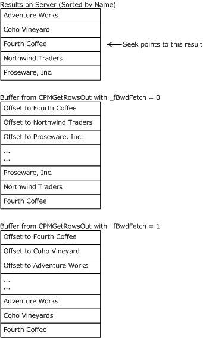

Figure 2: Effect of _fBwdFetch Parameter

Notice that the *_fBwdFetch* argument changes the order in which records are presented for placement in the buffer but does not change the order (forward order) in which the buffer itself is filled.

<a id="Section_2.2.3.12"></a>
#### 2.2.3.12 CPMGetRowsOut

The CPMGetRowsOut message replies to a [CPMGetRowsIn](#Section_2.2.3.11) message with the [**rows**](#gt_row) of a query. Servers MUST format offsets to variable length data types in the row field as follows:

- The client indicated that it was a 32-bit system (**_iClientVersion** less than 0x00010000 in the **_iClientVersion** field of [CPMConnectIn](#Section_2.2.3.2)), and the server indicated that it was a 32-bit system (**_serverVersion** less than 0x00010000 in [CPMConnectOut](#Section_2.2.3.3)). Offsets are 32-bit integers.
- The client indicated that it was a 64-bit system (**_iClientVersion** greater than 0x00010000 in CPMConnectIn), and the server indicated that it was a 32-bit system (**_serverVersion** less than 0x00010000 in CPMConnectOut). Offsets are 32-bit integers.
- The client indicated that it was a 32-bit system (**_iClientVersion** less than 0x00010000 in the **_iClientVersion** field of CPMConnectIn), and the server indicated that it was a 64-bit system (**_serverVersion** greater than 0x00010000 in CPMConnectOut). Offsets are 32-bit integers.
- The client indicated that it was a 64-bit system (**_iClientVersion** greater than 0x00010000 in CPMConnectIn), and the server indicated that it was a 64-bit system (**_serverVersion** greater than 0x00010000 in CPMConnectOut). Offsets are 64-bit integers.
The format of the CPMGetRowsOut message that follows the header is shown in the following diagram.

```mermaid
packet-beta
  0-31: "_cRowsReturned"
  32-63: "eType"
  64-95: "_chapt"
  96-159: "SeekDescription (variable)"
  160-223: "paddingRows (variable)"
  224-287: "Rows (variable)"
```

**_cRowsReturned (4 bytes):** A 32-bit unsigned integer indicating the number of rows returned in **Rows**.

**eType (4 bytes):** A 32-bit unsigned integer. MUST contain one of the following values indicating the point at which to begin retrieving rows.

| Value | Meaning |
| --- | --- |
| eRowsSeekNone 0x00000000 | The **SeekDescription** is absent. |
| eRowSeekNext 0x00000001 | **SeekDescription** contains a [CRowSeekNext](#Section_2.2.1.39) structure. |
| eRowSeekAt 0x00000002 | **SeekDescription** contains a [CRowSeekAt](#Section_2.2.1.36) structure. |
| eRowSeekAtRatio 0x00000003 | **SeekDescription** contains a [CRowSeekAtRatio](#Section_2.2.1.37) structure. |
| eRowSeekByBookmark 0x00000004 | **SeekDescription** contains a [CRowSeekByBookmark](#Section_2.2.1.38) structure. |

**_chapt (4 bytes):** A 32-bit value representing the [**handle**](#gt_handle) of the [**rowset**](#gt_rowset) [**chapter**](#gt_chapter).

**SeekDescription (variable):** This field MUST contain a structure of the type indicated by the **eType** field.

**paddingRows (variable):** This field MUST be of sufficient length (0 to _cbReserved -1 byte) to pad the **Rows** field to _cbReserved offset from the beginning of a message, where _cbReserved is the value in the CPMGetRowsIn message. Padding bytes used in this field can be any arbitrary value. This field MUST be ignored by the receiver.

**Rows (variable):** Row data is formatted as prescribed by [**column**](#gt_column) information in the most recent [CPMSetBindingsIn](#Section_2.2.3.10) message. Rows MUST be stored in forward order (for example, row 1 before row 2).

Fixed-sized columns MUST be stored at the offsets specified by the most recent CPMSetBindingsIn message.

Variable-sized columns (for example, strings) MUST be stored as follows:

- The variable data itself (for example, the string) is stored near the end of the buffer in descending order (for example, the collection of all variable data for row 1 is at the end, row 2 next closest, and so on).
- The fixed-sized area (at the beginning of the row buffer) MUST contain a CTableVariant for each column, stored at the offset specified in the most recent CPMSetBindingsIn message. **vType** MUST contain the data type (for example, VT_LPWSTR). If, as determined by the rules at the beginning of this section, 32-bit offsets are being used, the **Offset** field in [CTableVariant](#Section_2.2.1.41) MUST contain a 32-bit value that is the offset of the variable data from the beginning of the CPMGetRowsOut message, plus the value of **_ulClientBase** specified in the most recent CPMGetRowsIn message. If 64-bit offsets are being used, the **Offset** field in CTableVariant MUST contain a 64-bit value that is the offset from the beginning of the CPMGetRowsOut message, added to a 64-bit value composed by using **_ulClientBase** as the low 32-bits and **_ulReserved2** as the high 32-bits.
The buffer is filled in from both ends. CTableVariant structures, one for each row, are stored at the beginning of the buffer. Each of these structures points to the row data which is stored starting at the end of the buffer.

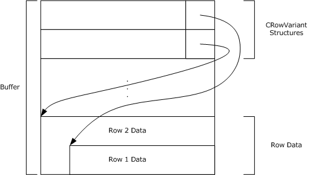

Figure 3: Structure of the row buffer

<a id="Section_2.2.3.13"></a>
#### 2.2.3.13 CPMRatioFinishedIn

The CPMRatioFinishedIn message requests the completion percentage of a query. The format of the CPMRatioFinishedIn message that follows the header is shown in the following diagram.

```mermaid
packet-beta
  0-31: "_hCursor"
  32-63: "_fQuick"
```

**_hCursor (4 bytes):** The [**handle**](#gt_handle) from the [CPMCreateQueryOut](#Section_2.2.3.5) message identifying the query for which to request completion information.

**_fQuick (4 bytes):** This is unused and MUST be ignored by the server.

**Note** This field MUST be set to 0x00000001.

<a id="Section_2.2.3.14"></a>
#### 2.2.3.14 CPMRatioFinishedOut

The CPMRatioFinishedOut message replies to a [CPMRatioFinishedIn](#Section_2.2.3.13) message with the completion ratio of a query. The format of the CPMRatioFinishedOut message that follows the header is shown in the following diagram.

```mermaid
packet-beta
  0-31: "_ulNumerator"
  32-63: "_ulDenominator"
  64-95: "_cRows"
  96-127: "_fNewRows"
```

**_ulNumerator (4 bytes):** A 32-bit unsigned integer indicating the numerator of the completion ratio in terms of [**rows**](#gt_row).

**_ulDenominator (4 bytes):** A 32-bit unsigned integer indicating the denominator of the completion ratio in terms of row.<15>

**_cRows (4 bytes):** A 32-bit unsigned integer indicating the total number of rows for the query.

**_fNewRows (4 bytes):** A Boolean value indicating if there are new rows available. This field MUST NOT be set to any values other than the following.

| Value | Meaning |
| --- | --- |
| 0x00000000 | There are no new rows in the [**rowset**](#gt_rowset). |
| 0x00000001 | There are new rows available in the rowset. |

<a id="Section_2.2.3.15"></a>
#### 2.2.3.15 CPMFetchValueIn

The CPMFetchValueIn message requests a property value that was too large to return in a [**rowset**](#gt_rowset). As specified in section [3.2.4.2.5](#Section_3.2.4.2.5), this message is sent repeatedly to retrieve all bytes of the property, updating **_cbSoFar** for each, until the **_fMoreExists** field of the [CPMFetchValueOut](#Section_2.2.3.16) message is set to FALSE.

The format of the CPMFetchValueIn message that follows the header is shown in the following diagram.

```mermaid
packet-beta
  0-31: "_wid"
  32-63: "_cbSoFar"
  64-95: "_cbPropSpec"
  96-127: "_cbChunk"
  128-191: "PropSpec (variable)"
  192-255: "_padding (variable)"
```

**_wid (4 bytes):** A 32-bit unsigned integer representing the document ID identifying the document for which a property is to be fetched.

**_cbSoFar (4 bytes):** A 32-bit unsigned integer containing the number of bytes previously transferred for this property.

**Note** This field MUST be set to 0x00000000 in the first message.

**_cbPropSpec (4 bytes):** A 32-bit unsigned integer containing the size, in bytes, of the **PropSpec** field.

**_cbChunk (4 bytes):** A 32-bit unsigned integer containing the maximum number of bytes that the sender can accept in a CPMFetchValueOut message.<16>

**PropSpec (variable):** A [CFullPropSpec](#Section_2.2.1.2) structure specifying the property to retrieve.

**_padding (variable):** This field MUST be of the length necessary (0 to 3 bytes) to pad the message out to a multiple of 4 bytes in length. The value of the padding bytes can be any arbitrary value. This field MUST be ignored by the receiver.

<a id="Section_2.2.3.16"></a>
#### 2.2.3.16 CPMFetchValueOut

The CPMFetchValueOut message replies to a [CPMFetchValueIn](#Section_2.2.3.15) message with a property value from a previous query. As specified in section [3.2.4.2.5](#Section_3.2.4.2.5), this message is sent after each CPMFetchValueIn message until all bytes of the property are transferred.

The format of the CPMFetchValueOut message that follows the header is shown in the following diagram.

```mermaid
packet-beta
  0-31: "_cbValue"
  32-63: "_fMoreExists"
  64-95: "_fValueExists"
  96-159: "vValue (variable)"
```

**_cbValue (4 bytes):** A 32-bit unsigned integer containing the total size, in bytes, of **vValue**.

**_fMoreExists (4 bytes):** A Boolean value indicating whether additional CPMFetchValueOut messages are available.

| Value | Meaning |
| --- | --- |
| 0x00000000 | There are no additional data available. |
| 0x00000001 | There are additional data available. |

**_fValueExists (4 bytes):** A Boolean value indicating whether there is a value for the property.

| Value | Meaning |
| --- | --- |
| 0x00000000 | A value for the property does not exist. |
| 0x00000001 | A value for the property exists. |

**vValue (variable):** A portion of a byte array containing a [SERIALIZEDPROPERTYVALUE](#Section_2.2.1.44), where the offset of the beginning of the portion is the value of **_cbSoFar** in CPMFetchValueIn. The length of the portion, indicated by the **_cbValue** field, MUST be less than or equal to the value of **_cbChunk** in CPMFetchValueIn.

<a id="Section_2.2.3.17"></a>
#### 2.2.3.17 CPMGetNotify

The CPMGetNotify message requests that the client wants to be notified of [**rowset**](#gt_rowset) changes.

The message MUST NOT include a body; only the message header, as specified in section [2.2.2](#Section_2.2.2), is sent.

<a id="Section_2.2.3.18"></a>
#### 2.2.3.18 CPMSendNotifyOut

The CPMSendNotifyOut message notifies the client of a change to the results of a query.

This message is only sent when a change occurs. The format of the CPMSendNotifyOut message that follows the header is shown in the following diagram.

```mermaid
packet-beta
  0-31: "_watchNotify"
```

**_watchNotify (4 bytes):** A 32-bit unsigned integer representing the change to the query. It MUST be one of the following values.<17>

| Value | Meaning |
| --- | --- |
| DBWATCHNOTIFY_ROWSCHANGED 0x00000001 | The number of rows in the query [**rowset**](#gt_rowset) has changed. |
| DBWATCHNOTIFY_QUERYDONE 0x00000002 | The query has completed. |
| DBWATCHNOTIFY_QUERYREEXECUTED 0x00000003 | The query has been executed again. |

<a id="Section_2.2.3.19"></a>
#### 2.2.3.19 CPMGetApproximatePositionIn

The CPMGetApproximatePositionIn message requests the approximate position of a [**bookmark**](#gt_bookmark) in a [**chapter**](#gt_chapter). The format of the CPMGetApproximatePositionIn message that follows the header is shown in the following diagram.<18>

```mermaid
packet-beta
  0-31: "_hCursor"
  32-63: "_chapt"
  64-95: "_bmk"
```

**_hCursor (4 bytes):** A 32-bit value representing the query [**cursor**](#gt_cursor) obtained from [CPMCreateQueryOut](#Section_2.2.3.5) for the [**rowset**](#gt_rowset) containing the bookmark.

**_chapt (4 bytes):** A 32-bit value representing the [**handle**](#gt_handle) to the chapter containing the bookmark.

**_bmk (4 bytes):** A 32-bit value representing the handle to the bookmark for which to retrieve the approximate position.

<a id="Section_2.2.3.20"></a>
#### 2.2.3.20 CPMGetApproximatePositionOut

The CPMGetApproximatePositionOut message replies to a [CPMGetApproximatePositionIn](#Section_2.2.3.19) message describing the approximate position of the [**bookmark**](#gt_bookmark) in the [**chapter**](#gt_chapter). The format of the CPMGetApproximatePositionOut message that follows the header is shown in the following diagram.

```mermaid
packet-beta
  0-31: "_numerator"
  32-63: "_denominator"
```

**_numerator (4 bytes):** A 32-bit unsigned integer containing the [**row**](#gt_row) number of the bookmark in the [**rowset**](#gt_rowset). If there are no rows, this field MUST be set to 0x00000000.

**_denominator (4 bytes):** A 32-bit unsigned integer containing the number of rows in the rowset.

<a id="Section_2.2.3.21"></a>
#### 2.2.3.21 CPMCompareBmkIn

The CPMCompareBmkIn message requests a comparison of two [**bookmarks**](#gt_bookmark) in a [**chapter**](#gt_chapter).<19>

The format of the CPMCompareBmkIn message that follows the header is shown in the following diagram.

```mermaid
packet-beta
  0-31: "hCursor"
  32-63: "chapt"
  64-95: "bmkFirst"
  96-127: "bmkSecond"
```

**hCursor (4 bytes):** A 32-bit unsigned integer representing the [**handle**](#gt_handle) from the [CPMCreateQueryOut](#Section_2.2.3.5) message for the [**rowset**](#gt_rowset) containing the bookmarks.

**chapt (4 bytes):** A 32-bit unsigned integer representing the handle of the chapter containing the bookmarks to compare.

**bmkFirst (4 bytes):** A 32-bit unsigned integer representing the handle to the first bookmark to compare.

**bmkSecond (4 bytes):** A 32-bit unsigned integer representing the handle to the second bookmark to compare.

<a id="Section_2.2.3.22"></a>
#### 2.2.3.22 CPMCompareBmkOut

The CPMCompareBmkOut message replies to a [CPMCompareBmkIn](#Section_2.2.3.21) message with the comparison of the two [**bookmarks**](#gt_bookmark) in the [**chapter**](#gt_chapter). The format of the CPMCompareBmkOut message that follows the header is shown in the following diagram.

```mermaid
packet-beta
  0-31: "dwComparison"
```

**dwComparison (4 bytes):** A 32-bit unsigned integer. MUST be one of the following values, indicating the relative positions of the two bookmarks in the chapter.

| Value | Meaning |
| --- | --- |
| DBCOMPARE_LT 0x00000000 | The first bookmark is positioned before the second. |
| DBCOMPARE_EQ 0x00000001 | The first bookmark has the same position as the second. |
| DBCOMPARE_GT 0x00000002 | The first bookmark is positioned after the second. |
| DBCOMPARE_NE 0x00000003 | The first bookmark does not have the same position as the second. |
| DBCOMPARE_NOTCOMPARABLE 0x00000004 | The first bookmark is not comparable to the second. |

<a id="Section_2.2.3.23"></a>
#### 2.2.3.23 CPMRestartPositionIn

The CPMRestartPositionIn message moves the fetch position for a [**cursor**](#gt_cursor) to the beginning of the [**chapter**](#gt_chapter). As specified in section [3.1.5.2.12](#Section_3.1.5.2.12), the server will reply using the same message, with the results of the request contained in the **_status** field of the Windows Search Protocol header. <20>

The format of the CPMRestartPositionIn message that follows the header is shown in the following diagram.

```mermaid
packet-beta
  0-31: "_hCursor (optional)"
  32-63: "_chapt (optional)"
```

**_hCursor (4 bytes):** A 32-bit value that represents the [**handle**](#gt_handle) obtained from a [CPMCreateQueryOut](#Section_2.2.3.5) message and that identifies the query for which to restart the position. This field MUST be present when the message is sent by the client and MUST be absent when the message is sent by the server.

**_chapt (4 bytes):** A 32-bit value representing the handle of a chapter from which to retrieve [**rows**](#gt_row). This field MUST be present when the message is sent by the client and MUST be absent when the message is sent by the server.

<a id="Section_2.2.3.24"></a>
#### 2.2.3.24 CPMFreeCursorIn

The CPMFreeCursorIn message requests the release of a [**cursor**](#gt_cursor). The format of the CPMFreeCursorIn message that follows the header is shown in the following diagram.

```mermaid
packet-beta
  0-31: "_hCursor"
```

**_hCursor (4 bytes):** A 32-bit value representing the [**handle**](#gt_handle) of the cursor from the [CPMCreateQueryOut](#Section_2.2.3.5) message to release.

<a id="Section_2.2.3.25"></a>
#### 2.2.3.25 CPMFreeCursorOut

The CPMFreeCursorOut message replies to a [CPMFreeCursorIn](#Section_2.2.3.24) message with the results of freeing a [**cursor**](#gt_cursor). The format of the CPMFreeCursorOut message that follows the header is shown in the following diagram.

```mermaid
packet-beta
  0-31: "_cCursorsRemaining"
```

**_cCursorsRemaining (4 bytes):** A 32-bit unsigned integer indicating the number of cursors still in use for the query.

<a id="Section_2.2.3.26"></a>
#### 2.2.3.26 CPMDisconnect

The CPMDisconnect message ends the connection with the server.

The message MUST NOT include a body; only the message header, as specified in section [2.2.2](#Section_2.2.2), is sent.

<a id="Section_2.2.3.27"></a>
#### 2.2.3.27 CPMFindIndicesIn

The CPMFindIndicesIn <21> message requests the rowset position of the next occurrence of a document identifier.

```mermaid
packet-beta
  0-31: "_cWids"
  32-63: "_cDepthPrev"
  64-127: "_pwids (variable)"
  128-191: "_prgiRowPrev (variable)"
```

**_cWids (4 bytes):** A 32-bit unsigned integer representing the number of document identifiers to search for. This value MUST be greater than zero.

**_cDepthPrev (4 bytes):** A 32-bit unsigned integer specifying the number of hierarchical grouping levels leading to the previous occurrence of any of the specified document identifiers. When this value is zero it instructs the server to begin searching at the beginning of the cursor.

**_pwids (variable):** Array of unsigned 32-bit integers containing the document identifiers to search for. The size of the array MUST be equal to **_cWids**.

**_prgiRowPrev (variable):** Array of unsigned 32-bit integers representing the hierarchical group indices leading to the previous occurrence of any of the specified document identifiers. The size of the array MUST be equal to **_cDepthPrev**. If **_cDepthPrev** is equal to zero this field MUST be omitted.

<a id="Section_2.2.3.28"></a>
#### 2.2.3.28 CPMFindIndicesOut

The CPMFindIndicesOut message replies to a [CPMFindIndicesIn](#Section_2.2.3.27) message with the hierarchical group indices leading to the next occurrence of any of the document identifiers specified in the CPMFindIndicesIn message.

```mermaid
packet-beta
  0-31: "_cDepthNext"
  32-95: "_prgiRowNext (variable)"
```

**_cDepthNext (4 bytes):** A 32-bit unsigned integer specifying the number of [**hierarchical grouping levels**](#gt_hierarchical-group-coordinate) leading to the next occurrence of any of the document identifiers specified in the corresponding CPMFindIndicesIn message. This value MUST be set to zero if no occurrence of document identifier has been found following the position of hierarchical group indices specified by preceding CPMFindIndicesIn message.

**_prgiRowNext (variable):** Array of unsigned 32-bit integers representing the hierarchical grouping indices leading to the next occurrence of any of the document identifiers specified in the corresponding CPMFindIndicesIn message. The size of the array MUST be equal to **_cDepthNext**. This field MUST be omitted if **_cDepthNext** is equal to zero.

<a id="Section_2.2.3.29"></a>
#### 2.2.3.29 CPMGetRowsetNotifyIn

The CPMGetRowsetNotifyIn <22> message requests the next rowset event from the server if available.

The message MUST NOT include a body; only the message header, as specified in section [2.2.2](#Section_2.2.2).

<a id="Section_2.2.3.30"></a>
#### 2.2.3.30 CPMGetRowsetNotifyOut

The CPMGetRowsetNotifyOut message replies to [CPMGetRowsetNotifyIn](#Section_2.2.3.29) message with oldest available rowset event. The format of the CPMGetRowsetNotifyOut message that follows the header is shown in the following diagram.

```mermaid
packet-beta
  0-31: "wid"
  32-32: "A"
  33-39: "eventType"
  40-47: "rowsetItemState"
  48-55: "changedItemState"
  56-63: "rowsetEvent"
  64-127: "rowsetEventData1"
  128-191: "rowsetEventData2"
```

**wid (4 bytes):** A 32-bit unsigned integer containing the document identifier that the event is for. This value MUST be zero if **eventType** is PROPAGATE_NONE or PROPAGATE_ROWSET.

**A - moreEvents (1 bit):** A single bit that is set to 1 only if there are additional rowset events remaining on the server.

**eventType (7 bits):** A 7 bit unsigned integer that MUST be one of the following values, indicating the type of event this message represents.

| Value | Meaning |
| --- | --- |
| PROPAGATE_NONE 0 | This response indicates that there were no available rowset events waiting on the server. |
| PROPAGATE_ADD 1 | This response indicates that an item was added to the index that could be relevant to the query originating the rowset. |
| PROPAGATE_DELETE 2 | This response indicates that an item was deleted from the index that could be relevant to the query originating the rowset. |
| PROPAGATE_MODIFY 3 | This response indicates that an item was re-indexed that could be relevant to the query originating the rowset. |
| PROPAGATE_ROWSET 4 | This response is a rowset specific notification whose meaning is interpreted by the rowsetEvent field of this message. |

**rowsetItemState (1 byte):** An 8 bit unsigned integer that MUST be one of the following values if **eventType** is PROPAGATE_ADD, PROPAGATE_DELETE, or PROPAGATE_MODIFY. This number indicates the state of the document identifier specified by wid within the originating rowset. For other **eventType** values this value MUST be set to zero.

| Value | Meaning |
| --- | --- |
| ROWSETEVENT_ITEMSTATE_NOTINROWSET 0 | The document identifier specified by **wid** MUST not have been contained within the originating rowset. |
| ROWSETEVENT_ITEMSTATE_INROWSET 1 | The document identifier speicified by wid MUST be contained within the originating rowset. |
| ROWSETEVENT_ITEMSTATE_UNKNOWN 2 | The document identifier speicifed by wid's containment within the originating rowset has not been specified. |

**changedItemState (1 byte):** An 8 bit unsigned integer that MUST be one of the following values if **eventType** is PROPAGATE_MODIFY. This number indicates the state of the document identifier specified by wid within the originating rowset if the same query were to be run again following the change. For other **eventType** values this value MUST be set to zero.

| Value | Meaning |
| --- | --- |
| ROWSETEVENT_ITEMSTATE_NOTINROWSET 0 | The document identifier specified by wid would NOT be contained within a subsequent query. |
| ROWSETEVENT_ITEMSTATE_INROWSET 1 | The document identifier speicified by **wid** would be contained within a subsequent query. |
| ROWSETEVENT_ITEMSTATE_UNKNOWN 2 | Whether or not the document identifier speicifed by wid would be contained within a subsequent query has not been specified. |

**rowsetEvent (1 byte):** An 8 bit unsigned integer that MUST be one of the following values if **eventType** is PROPAGATE_ROWSET. This number indicates the type of rowset event that this message represents. For other **eventType** values this value MUST be set to zero.

| Value | Meaning |
| --- | --- |
| ROWSETEVENT_TYPE_DATAEXPIRED 0 | The data backing the rowset is no longer valid. RowsetEventData1 and RowsetEventData2 MUST be set to zero. |
| ROWSETEVENT_TYPE_FOREGROUNDLOST 1 | The rowset no longer has foreground priority and has been reverted to high priority. Items that apply to this query will be indexed at a decreased rate. See section [2.2.3.34](#Section_2.2.3.34) for meaning of foreground and high priority. RowsetEventData1 and RowsetEventData2 MUST be set to zero. |
| ROWSETEVENT_TYPE_SCOPESTATISTICS 2 | The number of indexed items, number of items that need to be indexed, or number of items that need to be re-indexed has changed. RowsetEventData1's high 32 bits contain a 32-bit unsigned integer indicating the number of items that need to be indexed that could be relevant to the originating rowset. **RowsetEventData1**'s low 32 bits contain a 32-bit unsigned integer indicating the number of items that need to be re-indexed that could be relevant to the originating rowset. RowsetEventData2's high 32 bits MUST be set to zero. **RowsetEventData2**'s low 32 bits contain a 32-bit unsigned integer indicating the number of indexed items that could be relevant to the originating rowset. |

**rowsetEventData1 (8 bytes):** A 64 bit unsigned number whose meaning is dependent on **rowsetEvent**. Undefined unless **eventType** is PROPAGATE_ROWSET.

**rowsetEventData2 (8 bytes):** A 64 bit unsigned number whose meaning is dependent on **rowsetEvent**. Undefined unless **eventType** is PROPAGATE_ROWSET.

<a id="Section_2.2.3.31"></a>
#### 2.2.3.31 CPMSetScopePrioritizationIn

The CPMSetScopePrioritizationIn<23> message requests that the server prioritize indexing of items that could be relevant to the originating query at a rate specified in the message. The format of the CPMSetScopePrioritizationIn message that follows the header is shown in the following diagram.

```mermaid
packet-beta
  0-31: "priority"
  32-63: "eventFrequency"
```

**priority (4 bytes):** A 32-bit unsigned integer containing the type of prioritization requested for documents that could be relevant to the originating query.

| Value | Meaning |
| --- | --- |
| PRIORITY_LEVEL_FOREGROUND 0 | Process items that could be relevant to the originating query before others as quickly as possible. |
| PRIORITY_LEVEL_HIGH 1 | Process items that could be relevant to the originating query before others at the normal rate. |
| PRIORITY_LEVEL_LOW 2 | Process items that could be relevant to the originating query before others, but after any other prioritization requests at the normal rate. |
| PRIORITY_LEVEL_DEFAULT 3 | Process items at the normal rate. |

**eventFrequency (4 bytes):** A 32-bit unsigned integer containing the minimum suggested interval in milliseconds between subsequent issued rowset events of the type ROWSETEVENT_TYPE_SCOPESTATISTICS. When eventFrequency is set to zero the server MUST NOT issue the ROWSETEVENT_TYPE_SCOPESTATISTICS events. This field MUST be set to zero when setting priority to PRIORITY_LEVEL_DEFAULT.

<a id="Section_2.2.3.32"></a>
#### 2.2.3.32 CPMSetScopePrioritizationOut

The CPMSetScopePrioritizationOut message replies to the [CPMSetScopePrioritizationIn](#Section_2.2.3.31) message.

The message MUST NOT include a body; only the message header, as specified in section [2.2.2](#Section_2.2.2), is sent.

<a id="Section_2.2.3.33"></a>
#### 2.2.3.33 CPMGetScopeStatisticsIn

The CPMGetScopeStatisticsIn <24> message requests statistics regarding the number of indexed items, the number of items needing to be indexed and the number of items needing to be re-indexed that are relevant to the originating query.

The message MUST NOT include a body; only the message header, as specified in section [2.2.2](#Section_2.2.2), is sent.

<a id="Section_2.2.3.34"></a>
#### 2.2.3.34 CPMGetScopeStatisticsOut

The CPMGetScopeStatisticsOut message replies to [CPMGetScopeStatisticsIn](#Section_2.2.3.33) message with the requested statistics for the originating rowset. The format of the CPMGetScopeStatisticsOut message that follows the header is shown in the following diagram.

```mermaid
packet-beta
  0-31: "dwIndexedItems"
  32-63: "dwOutstandingAdds"
  64-95: "dwOustandingModifies"
```

**dwIndexedItems (4 bytes):** A 32-bit unsigned integer containing the number of items that are currently indexed that are relevant to the originating query.

**dwOutstandingAdds (4 bytes):** A 32-bit unsigned integer containing the number of items that have yet to be indexed that could be relevant to the originating query.

**dwOutstandingModifies (4 bytes):** A 32-bit unsigned integer containing the number of items that need to be re-indexed that are relevant to the originating query.

<a id="Section_2.2.3.35"></a>
#### 2.2.3.35 CPMExternalSearchResultIn

The **CPMExternalSearchResultIn** message is used to transfer external result row-set from indexer client to indexer server.<25> The format of the **CPMExternalSearchResultIn** message that follows the header is shown in the following diagram.

```mermaid
packet-beta
  0-63: "ProviderName (variable)"
  64-127: "ProviderNameLength"
  128-191: "ConfidenceScore"
  192-255: "FilePathLength"
  256-319: "PropertyIdLength"
  320-383: "FilePath (variable)"
  384-447: "PropertyId (variable)"
```

**ProviderName (variable):** A null-terminated Unicode string containing the name of the external provider.

**ProviderNameLength (8 bytes):** A 64-bit unsigned integer containing the length of **ProviderName** field value.

**ConfidenceScore (8 bytes):** Confidence or matched score. The rank value MUST be in the range 0 to 1000.

**FilePathLength (8 bytes):** A 64-bit unsigned integer containing the length of **FilePath** field value.

**PropertyIdLength (8 bytes):** A 64-bit unsigned integer containing the length of **PropertyId** field value.

**FilePath (variable):** A null-terminated Unicode string containing the physical path of the file.

**PropertyId (variable):** A null-terminated Unicode string containing the property identifier.

<a id="Section_2.2.4"></a>
### 2.2.4 Errors

Windows Search Protocol (WSP) messages indicate success two ways:

- A zero value (0x00000000).
- An HRESULT success value, such as DB_S_ENDOFROWSET, in which the thirty-first bit is not set.
Otherwise, WSP messages return a 32-bit error code that can either be an [**HRESULT**](#gt_hresult) or an NTSTATUS value (see section [1.8](#Section_1.8)). If a buffer is too small to fit a result, a status code of STATUS_INSUFFICIENT_RESOURCES (0xC0000009A) MUST be returned, and the failing operation can be retried with a larger buffer.

All other error values are treated the same; the error is considered fatal and reported to the higher-level caller. Future messages MAY be sent over the same pipe as if no error had occurred.<26>

The following are common error codes:

- E_OUTOFMEMORY (0x8007000e)
- STATUS_INVALID_PARAMETER (0xc000000d)
- STATUS_NO_MEMORY (0xc0000017)
- STATUS_INSUFFICIENT_RESOURCES (0xc000009a)
- CI_E_NOT_FOUND (0x80041815)
- STATUS_INVALID_PARAMETER_MIX (0xc0000030)
- ERROR_INVALID_PARAMETER (0x80070057)
- CI_E_TIMEOUT (0x8004181F)
- E_ACCESSDENIED (0x80070005)
- CI_E_BUFFERTOOSMALL (0x8004180c)
- DB_S_ENDOFROWSET (0x00040EC6)
- CI_E_SHUTDOWN (0x80041812)
- CI_E_NOT_INITIALIZED (0x8004180B)
- DB_E_BADBINDINFO (0x80040E08)
- MSS_E_CATALOGNOTFOUND (0x80042103)
The HRESULT and NTSTATUS numbering spaces do not currently overlap—except with values of identical meaning. However, even if there are conflicts in the future, they would not cause protocol issues as long as the value for STATUS_INSUFFICIENT_RESOURCES remains unique, because all other error values are treated the same.

<a id="Section_2.2.5"></a>
### 2.2.5 Standard Properties

Properties in the [**GSS**](#gt_generic-security-services-gss) are represented by the combination of a property set [**GUID**](#gt_globally-unique-identifier-guid) and either a string property name or an integer property ID. For details, see [CFullPropSpec](#Section_2.2.1.2).

There are three classes of properties: database properties, query properties, and open properties. Database properties help control the indexing behavior and are as specified in section [2.2.1.30.1](#Section_2.2.1.30.1). Query properties can be used in a [**restriction**](#gt_restriction) and in some cases returned with every result. They are special because they are built into the GSS. Open properties are defined by individual applications. There is a typical set of common properties in use, but there is no requirement to use them.

Properties are characterized by the parameters that follow.

**GUID and PropId:** Together, these parameters establish the unique identifier for documents.

**isColumn:** A boolean value set to TRUE if, and only if, the property can be returned as a requested property as specified in the *ProjectionColumnsOffsets* argument to a **RunNewQuery** [**Generic Search Service**](#gt_generic-search-service-gss) (GSS) abstract interface call.

**inInvertedIndex:** A boolean value set to TRUE if, and only if, the property can be an argument to CContentRestriction within the *RestrictionSet* argument to a **RunNewQuery** GSS abstract interface call.

**columnIndexType:** This parameter defines whether sorting, grouping, and filtering are allowed for this property, as defined in the *SortOrders*, *Groupings*, and *Restrictions* parameters of the **RunNewQuery** GSS abstract interface call. The *columnIndexType* parameter is a string set to one of the following:

- No value: indicates that sorting, grouping and filtering over this property are possible.
- NotIndexed: sorting, grouping, and filtering are not possible for this property.
**Type:** This parameter indicates the data type used by this property.

- Int32 – VT_I8
- String - LPWSTR
- Boolean – VT_BOOL
- UInt16 – VT_UI2
- UInt32 – VT_UI4
- UInt64 – VT_UI8
- Double – VT_R8
- DateTime – VT_FILETIME.
- Buffer – VT_BLOB_OBJECT
- Byte – VT_UI1
**MaxSize:** An unsigned integer indicating the maximum size, in bytes, that this property can have stored or retrieved by the Generic Search Service (GSS).

**VectorProperty:** A boolean value that is TRUE if, and only if, this is a multiple-value property. For example, System.Author can have multiple values, one for each author of the document.

**Description:** Describes the most common use for a property. The names of some properties are self-explanatory; when this is the case, the descriptions are omitted.

**useForTypeAhead:** A Boolean value that is TRUE if and only if this is a property whose values are used as a source of completion suggestions.

<a id="Section_2.2.5.1"></a>
#### 2.2.5.1 Query Properties

Query Property Set

#define QueryGuid \

{0x49691c90,0x7e17,0x101a,0xa9,0x1c,0x08,0x00,0x2b,0x2e,0xcd,0xa9}

| Name/PropId | Datatype | Description |
| --- | --- | --- |
| RankVector 0x00000002 | VT_UI4\|VT_VECTOR | The 0-1000 rank computed for each element when performing vector ranking. |
| System.Search.Rank 0x00000003 | VT_I4 | The rank 0-1000 computed for this item. How rank is computed is defined by the indexing process. Typically, content and proximity restrictions influence the rank, while other comparison operators do not. |
| System.Search.HitCount 0x00000004 | VT_I4 | The number of words found from the query. |
| System.Search.EntryID 0x00000005 | VT_I4 | A unique identifier for each result found. |
| All 0x00000006 | VT_LPWSTR | Allows a content restriction over all textual properties. Cannot be retrieved. |
| System.ItemURL 0x00000009 | VT_LPWSTR | Full virtual path to file, including file name. |

Storage Property Set

#define StorageGuid \

{0xb725f130,0x47ef,0x101a,0xa5,0xf1,0x02,0x60,0x8c,0x9e,0xeb,0xac}

The friendly name is Contents, the PropId is 0x00000013, the data type is VT_LPWSTR, and it is the main contents of a file. Usually this property cannot be retrieved.

<a id="Section_2.2.5.2"></a>
#### 2.2.5.2 Common Open Properties

A [**GSS**](#gt_generic-security-services-gss) can allow querying and retrieval over any property. The tables below outline some properties typically used. See [[MSDN-PROPLIST]](https://go.microsoft.com/fwlink/?LinkId=723039) for more information.

Storage Property Set

#define StorageGuid \

{0xb725f130,0x47ef,0x101a,0xa5,0xf1,0x02,0x60,0x8c,0x9e,0xeb,0xac}

| Name/PropId | Type | Description |
| --- | --- | --- |
| System.ItemFolderNameDisplay 0x00000002 | VT_LPWSTR | The physical path to the file, not including the file name. |
| ClassId 0x00000003 | VT_CLSID | The class ID of the [**object**](#gt_object), for example, WordPerfect or Microsoft® Office Word. |
| FileIndex 0x00000008 | VT_UI8 | The unique ID of the file. |
| USN 0x00000009 | VT_I8 | The update sequence number. NTFS file system drives only. |
| System.ItemNameDisplay 0x0000000A | VT_LPWSTR | The name of the file. |
| Path 0x0000000B | VT_LPWSTR | The full physical path to the file, including the file name. |
| System.Size 0x0000000C | VT_I8 | The size, in bytes, of the file. |
| System.FileAttributes 0x0000000D | VT_UI4 | The file attributes. Documented in Win32 SDK. |
| System.DateModified 0x0000000E | VT_FILETIME | The last time the file was written. |
| System.DateCreated 0x0000000F | VT_FILETIME | The time the file was created. |
| System.DateAccessed 0x00000010 | VT_FILETIME | The last time the file was accessed. |
| AllocSize 0x00000012 | VT_I8 | The size of the disk allocation for the file. |
| ShortFilename 0x00000014 | VT_LPWSTR | The short (8.3) file name. |

The following table lists the attribute flag values for the Attrib property.

| Attribute/Value | Description |
| --- | --- |
| FILE_ATTRIBUTE_READONLY 0x00000001 | The file or directory is read-only. Applications can read the file but cannot write to it or delete it. For a directory, applications cannot delete it. |
| FILE_ATTRIBUTE_HIDDEN 0x00000002 | The file or directory is hidden. It is not included in an ordinary directory listing. |
| FILE_ATTRIBUTE_SYSTEM 0x00000004 | The file or directory is part of the operating system, or is used exclusively by the operating system. |
| FILE_ATTRIBUTE_DIRECTORY 0x00000010 | The handle identifies a directory. |
| FILE_ATTRIBUTE_ARCHIVE 0x00000020 | The file or directory is an archive file. Applications use this attribute to mark files for backup or removal. |
| FILE_ATTRIBUTE_NORMAL 0x00000080 | The file or directory does not have another attribute set. This attribute is valid only if used alone. |
| FILE_ATTRIBUTE_TEMPORARY 0x00000100 | The file is being used for temporary storage. File systems avoid writing data back to mass storage if sufficient cache memory is available, because often the application deletes the temporary file shortly after the handle is closed. In that case, the system can entirely avoid writing the data. Otherwise, the data is written after the handle is closed. |
| FILE_ATTRIBUTE_SPARSE_FILE 0x00000200 | The file is a sparse file. |
| FILE_ATTRIBUTE_REPARSE_POINT 0x00000400 | The file or directory has an associated reparse point. |
| FILE_ATTRIBUTE_COMPRESSED 0x00000800 | The file or directory is compressed. For a file, this means that all the data in the file is compressed. For a directory, this means that compression is the default for newly created files and subdirectories. |
| FILE_ATTRIBUTE_OFFLINE 0x00001000 | The data of the file is not immediately available. This attribute indicates that the file data has been physically moved to offline storage. This attribute is used by Remote Storage, the hierarchical storage management software. Applications SHOULD NOT arbitrarily change this attribute. |
| FILE_ATTRIBUTE_ENCRYPTED 0x00004000 | The file or directory is encrypted. For a file, this means that all data in the file is encrypted. For a directory, this means that encryption is the default for newly created files and subdirectories. |
| FILE_ATTRIBUTE_VIRTUAL 0x00010000 | A file is a virtual file. |

Property Sets for Documents

#define DocPropSetGuid \

{0xf29f85e0,0x4ff9,0x1068,0xab,0x91,0x08,0x00,0x2b,0x27,0xb3,0xd9}

| Name/PropId | Datatype | Description |
| --- | --- | --- |
| System.Title 0x00000002 | VT_LPWSTR | The title of the document. |
| System.Subject 0x00000003 | VT_LPWSTR | The subject of the document. |
| System.Author 0x00000004 | VT_LPWSTR | The author of the document. |
| System.Keywords 0x00000005 | VT_LPWSTR | The document keywords. |
| System.Comment 0x00000006 | VT_LPWSTR | Comments about the document. |
| DocTemplate 0x00000007 | VT_LPWSTR | The name of the template for the document. |
| System.Document.LastAuthor 0x00000008 | VT_LPWSTR | The most recent user who edited document. |
| System.Document.RevisionNumber 0x00000009 | VT_LPWSTR | The current version number of the document. |
| System.Document.DateCreated 0x0000000A | VT_FILETIME | The total time spent editing the document. |
| System.Document.DatePrinted 0x0000000B | VT_FILETIME | The date the document was last printed. |
| System.Document.DateCreated 0x0000000C | VT_FILETIME | The date the document was created. |
| System.Document.DateSaved 0x0000000D | VT_FILETIME | The date the document was last saved. |
| System.Document.PageCount 0x0000000E | VT_I4 | The number of pages in the document. |
| System.Document.WordCount 0x0000000F | VT_I4 | The number of words in the document. |
| System.Document.CharacterCount 0x00000010 | VT_I4 | The number of characters in the document. |
| DocThumbnail 0x00000011 | VT_CF | A thumbnail of the document in clipboard format. |
| System.ApplicationName 0x00000012 | VT_LPWSTR | The name of the application that created the file. |

Property Sets for Documents

#define DocPropSetGuid2 \

{0xd5cdd502,0x2e9c,0x101b,0x93,0x97,0x08,0x00,0x2b,0x2c,0xf9,0xae}

| Name/PropId | Datatype | Description |
| --- | --- | --- |
| System.category 0x00000002 | VT_LPSTR | The type of document, such as a memo, schedule, or white paper. |
| System.Document.PresentationFormat 0x00000003 | VT_LPSTR | The target format (for example, 35mm, printer, or video) for a presentation in PowerPoint. |
| System.Document.ByteCount 0x00000004 | VT_I4 | The number of bytes in a document. |
| System.Document.LineCount 0x00000005 | VT_I4 | The number of lines contained in a document. |
| System.Document.ParagraphCount 0x00000006 | VT_I4 | The number of paragraphs in a document. |
| System.Document.SlideCount 0x00000007 | VT_I4 | The number of slides in a PowerPoint document. |
| DocNoteCount 0x00000008 | VT_I4 | The number of pages with notes in a PowerPoint document. |
| System.Document.HiddenSlideCount 0x00000009 | VT_I4 | The number of hidden slides in a PowerPoint document. |
| DocPartTitles 0x0000000D | VT_LPWSTR\|VT_VECTOR | The names of document parts. For example, in Excel, part titles are the names of spreadsheets, in PowerPoint slide titles, and in Office Word for Windows, the names of the documents in the master document. |
| System.Document.Manager 0x0000000E | VT_LPSTR | The name of the manager of the document's author. |
| System.Company 0x0000000F | VT_LPSTR | The name of the company for which the document was written. |

Document characterization

#define DocCharacterGuid \

{0x560c36c0,0x503a,0x11cf,0xba,0xa1,0x00,0x00,0x4c,0x75,0x2a,0x9a}

The name is System.Search.Autosummary, the PropId is 0x00000002, the datatype is VT_LPWSTR, and it is a characterization or abstract of the document.

Music Property Set

#define PSGUID_MUSIC \

{56A3372E-CE9C-11d2-9F0E-006097C686F6}

| Name/PropId | Datatype | Description |
| --- | --- | --- |
| System.Music.Artist 0x00000002 | VT_LPWSTR | The artist who recorded the song. |
| System.Music.Album 0x00000004 | VT_LPWSTR | The album on which the song was released. |
| System.Media.Year 0x00000005 | VT_LPWSTR | The year that the song was published. |
| System.Music.TrackNumber0x00000007 | VT_UI4 | The track number for the song. |
| System.Music.Genre0x0000000B | VT_LPWSTR | The song's genre. |

Digital Rights Management

#define PSGUID_DRM \

{AEAC19E4-89AE-4508-B9B7-BB867ABEE2ED}

This property set contains properties that describe the digital rights associated with some media.

| Name/PropId | Datatype | Description |
| --- | --- | --- |
| System.DRM.IsProtected 0x00000002 | VT_BOOL | TRUE if there is a license. |
| DrmDescription 0x00000003 | VT_LPWSTR | The description of the license. |
| DrmPlayCount 0x00000004 | VT_UI4 | The number of times the item can be played. |
| DrmPlayStarts 0x00000005 | VT_FILETIME | The date the play rights start. |
| DrmPlayExpires 0x00000006 | VT_FILETIME | The date the rights expire. |

Image Property Set

#define PSGUID_IMAGESUMMARYINFORMATION \

{0x6444048f,0x4c8b,0x11d1,0x8b,0x70,0x8,0x00,0x36,0xb1,0x1a,0x03}

| Name/PropId | Datatype | Description |
| --- | --- | --- |
| ImageFileType 0x00000002 | VT_LPWSTR | The type of image file. |
| System.Image.HorizontalSize 0x00000003 | VT_UI4 | The horizontal size, in pixels. |
| System.Image.VerticalSize 0x00000004 | VT_UI4 | The vertical size, in pixels. |
| System.Image.HorizontalResolution 0x00000005 | VT_UI4 | The horizontal resolution, in pixels per inch. |
| System.Image.VerticalResolution 0x00000006 | VT_UI4 | The vertical resolution, in pixels per inch. |
| System.Image.BitDepth 0x00000007 | VT_UI4 | The number of bits per pixel. |
| ImageColorSpace 0x00000008 | VT_LPWSTR | The description of the image color space. |
| ImageCompression 0x00000009 | VT_LPWSTR | The description of the image compression. |
| ImageTransparency 0x0000000A | VT_UI4 | The degree of transparency from 0-100. |
| ImageGammaValue 0x0000000B | VT_UI4 | The gamma correction value. |
| System.Media.FrameCount 0x0000000C | VT_UI4 | The frame count for the image. |
| System.Image.Dimensions 0x0000000D | VT_LPWSTR | The description of the image dimensions. |

Audio Property Set

#define PSGUID_AUDIO \

{64440490-4C8B-11D1-8B70-080036B11A03}

Audio-Related Properties

| Name/PropId | Datatype | Description |
| --- | --- | --- |
| AudioFormat 0x00000002 | VT_LPWSTR | The audio format. |
| System.Media.Duration 0x00000003 | VT_UI8 | The duration, in 100-ns units. |
| System.Audio.EncodingBitrate 0x00000004 | VT_UI4 | The average encoding rate, in bits per second. |
| System.Audio.SampleRate 0x00000005 | VT_UI4 | The sample rate, in samples per second. |
| System.Audio.SampleSize 0x00000006 | VT_UI4 | The sample size, in bits per sample. |
| System.Audio.ChannelCount 0x00000007 | VT_UI4 | The number of channels of audio. |

Video Property Set

#define PSGUID_VIDEO \

{64440491-4C8B-11D1-8B70-080036B11A03}

| Name/PropId | Datatype | Description |
| --- | --- | --- |
| System.Video.StreamName 0x00000002 | VT_LPWSTR | The name of the stream. |
| System.Video.FrameWidth 0x00000003 | VT_UI4 | The width, in pixels, of a frame. |
| System.Video.FrameHeight 0x00000004 | VT_UI4 | The height, in pixels, of a frame. |
| VideoTimeLength 0x00000005 | VT_UI4 | The duration, in 100-ns units. |
| System.Video.FrameRate 0x00000006 | VT_UI4 | The number of frames in video. |
| VideoFrameCount 0x00000007 | VT_UI4 | The frames per second. |
| System.Video.EncodingBitrate 0x00000008 | VT_UI4 | The bits per second. |
| System.Video.SampleSize 0x00000009 | VT_UI4 | The bits per sample. |
| System.Video.Compression 0x0000000A | VT_LPWSTR | The description of video compression. |

Mime Properties

#define NNTPGuid \

{0xAA568EEC,0xE0E5,0x11CF,0x8F,0xDA,0x00,0xAA,0x00,0xA1,0x4F,0x93}

| Name/PropId | Datatype | Description |
| --- | --- | --- |
| MsgNewsgroup 0x00000002 | VT_LPWSTR | The newsgroup for the message. |
| MsgSubject 0x00000005 | VT_LPWSTR | The subject of the message. |
| MsgFrom 0x00000006 | VT_LPWSTR | Who sent the message. |
| MsgMessageID 0x00000007 | VT_LPWSTR | The unique ID for email. |
| MsgDate 0x0000000C | VT_FILETIME | When the message was sent. |
| MsgReceivedDate 0x00000035 | VT_FILETIME | When the message was received. |
| MsgArticleID 0x0000003C | VT_UI4 | The unique identifier for the newsgroup article. |

Full property table

| Bit Range | Field | Description |
| --- | --- | --- |
| {65A98875-3C80-40AB-ABBC-EFDAF77DBEE2} | System.AcquisitionID | 100 FALSE TRUE - Int32 4 - Hash to determine acquisition session. |
| {F29F85E0-4FF9-1068-AB91-08002B27B3D9} | System.ApplicationName | 18 TRUE TRUE - String 512 - - |
| {64440490-4C8B-11D1-8B70-080036B11A03} | System.Audio.ChannelCount | 7 FALSE TRUE - UInt32 4 - Indicates the channel count for the audio file. Values: 1 (mono), 2 (stereo). |
| {64440490-4C8B-11D1-8B70-080036B11A03} | System.Audio.EncodingBitrate | 4 FALSE TRUE - UInt32 4 - Indicates the average data rate in Hz for the audio file in "bits per second". |
| {2579E5D0-1116-4084-BD9A-9B4F7CB4DF5E} | System.Audio.PeakValue | 100 FALSE TRUE - UInt32 4 - - |
| {64440490-4C8B-11D1-8B70-080036B11A03} | System.Audio.SampleRate | 5 FALSE TRUE - UInt32 4 - Indicates the audio sample rate for the audio file in "samples per second". |
| {64440490-4C8B-11D1-8B70-080036B11A03} | System.Audio.SampleSize | 6 FALSE TRUE - UInt32 4 - Indicates the audio sample size for the audio file in "bits per sample". |
| {F29F85E0-4FF9-1068-AB91-08002B27B3D9} | System.Author | 4 TRUE TRUE - String 256 TRUE - |
| {293CA35A-09AA-4DD2-B180-1FE245728A52} | System.Calendar.Duration | 100 TRUE TRUE - String 512 - The duration as specified in a string. |
| {BFEE9149-E3E2-49A7-A862-C05988145CEC} | System.Calendar.IsOnline | 100 FALSE TRUE - Boolean 2 - Indicates whether the event is an online event. |
| {315B9C8D-80A9-4EF9-AE16-8E746DA51D70} | System.Calendar.IsRecurring | 100 FALSE TRUE - Boolean 2 - - |
| Variable | System.Calendar.Location | {F6272D18-CECC-40B1-B26A-3911717AA7BD} 100 TRUE TRUE - String 512 - - |
| {D55BAE5A-3892-417A-A649-C6AC5AAAEAB3} | System.Calendar.OptionalAttendeeAddresses | 100 TRUE TRUE - String 256 TRUE - |
| {09429607-582D-437F-84C3-DE93A2B24C3C} | System.Calendar.OptionalAttendeeNames | 100 TRUE TRUE - String 256 TRUE - |
| {744C8242-4DF5-456C-AB9E-014EFB9021E3} | System.Calendar.OrganizerAddress | 100 TRUE TRUE - String 256 - Address of the organizer organizing the event. |
| {AAA660F9-9865-458E-B484-01BC7FE3973E} | System.Calendar.OrganizerName | 100 TRUE TRUE - String 256 - Name of the organizer organizing the event. |
| {72FC5BA4-24F9-4011-9F3F-ADD27AFAD818} | System.Calendar.ReminderTime | 100 FALSE TRUE - DateTime 8 - - |
| {0BA7D6C3-568D-4159-AB91-781A91FB71E5} | System.Calendar.RequiredAttendeeAddresses | 100 TRUE TRUE - String 256 TRUE - |
| {B33AF30B-F552-4584-936C-CB93E5CDA29F} | System.Calendar.RequiredAttendeeNames | 100 TRUE TRUE - String 256 TRUE - |
| {00F58A38-C54B-4C40-8696-97235980EAE1} | System.Calendar.Resources | 100 TRUE TRUE - String 512 TRUE - |
| {188C1F91-3C40-4132-9EC5-D8B03B72A8A2} | System.Calendar.ResponseStatus | 100 FALSE TRUE - UInt16 2 - This property stores the status of the user responses to meetings in the user's calendar. |
| {5BF396D4-5EB2-466F-BDE9-2FB3F2361D6E} | System.Calendar.ShowTimeAs | 100 FALSE TRUE - UInt16 2 - - |
| {53DA57CF-62C0-45C4-81DE-7610BCEFD7F5} | System.Calendar.ShowTimeAsText | 100 TRUE TRUE - String 512 - This is the user-friendly form of System.Calendar.ShowTimeAs. Not intended to be parsed programmatically. |
| {D5CDD502-2E9C-101B-9397-08002B2CF9AE} | System.Category | 2 TRUE TRUE - String 512 TRUE - |
| {F29F85E0-4FF9-1068-AB91-08002B27B3D9} | System.Comment | 6 TRUE TRUE - String 2048 - Comments. |
| {E3E0584C-B788-4A5A-BB20-7F5A44C9ACDD} | System.Communication.AccountName | 9 TRUE TRUE - String 512 - Account Name |
| {428040AC-A177-4C8A-9760-F6F761227F9A} | System.Communication.DateItemExpires | 100 FALSE TRUE - DateTime 8 - Date the item expires due to the retention policy. |
| {83A6347E-6FE4-4F40-BA9C-C4865240D1F4} | System.Communication.FollowupIconIndex | 100 FALSE TRUE - Int32 4 - This is the icon index used on messages marked for follow up. |
| {C9C34F84-2241-4401-B607-BD20ED75AE7F} | System.Communication.HeaderItem | 100 FALSE TRUE - Boolean 2 - This property will be true if the item is a header item which means the item hasn't been fully downloaded. |
| {EC0B4191-AB0B-4C66-90B6-C6637CDEBBAB} | System.Communication.PolicyTag | 100 TRUE TRUE - String 512 - This a string used to identify the retention policy applied to the item. |
| {8619A4B6-9F4D-4429-8C0F-B996CA59E335} | System.Communication.SecurityFlags | 100 FALSE TRUE - Int32 4 - Security flags associated with the item to know if the item is encrypted, signed or DRM enabled. |
| {BE1A72C6-9A1D-46B7-AFE7-AFAF8CEF4999} | System.Communication.TaskStatus | 100 FALSE TRUE - UInt16 2 - - |
| {A6744477-C237-475B-A075-54F34498292A} | System.Communication.TaskStatusText | 100 TRUE TRUE - String 512 - This is the user-friendly form of System.Communication.TaskStatus. Not intended to be parsed programmatically. |
| {D5CDD502-2E9C-101B-9397-08002B2CF9AE} | System.Company | 15 TRUE TRUE - String 512 - The company or publisher. |
| {28636AA6-953D-11D2-B5D6-00C04FD918D0} | System.ComputerName | 5 FALSE TRUE - String 512 - - |
| {9AD5BADB-CEA7-4470-A03D-B84E51B9949E} | System.Contact.Anniversary | 100 FALSE TRUE - DateTime 8 - - |
| {CD102C9C-5540-4A88-A6F6-64E4981C8CD1} | System.Contact.AssistantName | 100 TRUE TRUE - String 256 - - |
| {9A93244D-A7AD-4FF8-9B99-45EE4CC09AF6} | System.Contact.AssistantTelephone | 100 TRUE TRUE - String 512 - - |
| {176DC63C-2688-4E89-8143-A347800F25E9} | System.Contact.Birthday | 47 FALSE TRUE - DateTime 8 - - |
| Variable | System.Contact.BusinessAddress | {730FB6DD-CF7C-426B-A03F-BD166CC9EE24} 100 TRUE TRUE - String 512 - - |
| {402B5934-EC5A-48C3-93E6-85E86A2D934E} | System.Contact.BusinessAddressCity | 100 TRUE TRUE - String 512 - - |
| {B0B87314-FCF6-4FEB-8DFF-A50DA6AF561C} | System.Contact.BusinessAddressCountry | 100 TRUE TRUE - String 512 - - |
| {E1D4A09E-D758-4CD1-B6EC-34A8B5A73F80} | System.Contact.BusinessAddressPostalCode | 100 TRUE TRUE - String 512 - - |
| {BC4E71CE-17F9-48D5-BEE9-021DF0EA5409} | System.Contact.BusinessAddressPostOfficeBox | 100 TRUE TRUE - String 512 - - |
| {446F787F-10C4-41CB-A6C4-4D0343551597} | System.Contact.BusinessAddressState | 100 TRUE TRUE - String 512 - - |
| {DDD1460F-C0BF-4553-8CE4-10433C908FB0} | System.Contact.BusinessAddressStreet | 100 TRUE TRUE - String 512 - - |
| {91EFF6F3-2E27-42CA-933E-7C999FBE310B} | System.Contact.BusinessFaxNumber | 100 TRUE TRUE - String 512 - Business fax number of the contact. |
| {56310920-2491-4919-99CE-EADB06FAFDB2} | System.Contact.BusinessHomePage | 100 TRUE TRUE - String 512 - - |
| {6A15E5A0-0A1E-4CD7-BB8C-D2F1B0C929BC} | System.Contact.BusinessTelephone | 100 TRUE TRUE - String 512 - - |
| {BF53D1C3-49E0-4F7F-8567-5A821D8AC542} | System.Contact.CallbackTelephone | 100 TRUE TRUE - String 512 - - |
| {8FDC6DEA-B929-412B-BA90-397A257465FE} | System.Contact.CarTelephone | 100 TRUE TRUE - String 512 - - |
| {D4729704-8EF1-43EF-9024-2BD381187FD5} | System.Contact.Children | 100 TRUE TRUE - String 512 TRUE - |
| {8589E481-6040-473D-B171-7FA89C2708ED} | System.Contact.CompanyMainTelephone | 100 TRUE TRUE - String 512 - - |
| {FC9F7306-FF8F-4D49-9FB6-3FFE5C0951EC} | System.Contact.Department | 100 TRUE TRUE - String 512 - - |
| {F8FA7FA3-D12B-4785-8A4E-691A94F7A3E7} | System.Contact.EmailAddress | 100 TRUE TRUE - String 256 - - |
| {38965063-EDC8-4268-8491-B7723172CF29} | System.Contact.EmailAddress2 | 100 TRUE TRUE - String 256 - - |
| {644D37B4-E1B3-4BAD-B099-7E7C04966ACA} | System.Contact.EmailAddress3 | 100 TRUE TRUE - String 256 - - |
| {84D8F337-981D-44B3-9615-C7596DBA17E3} | System.Contact.EmailAddresses | 100 TRUE TRUE - String 256 TRUE - |
| {CC6F4F24-6083-4BD4-8754-674D0DE87AB8} | System.Contact.EmailName | 100 TRUE TRUE - String 256 - - |
| {F1A24AA7-9CA7-40F6-89EC-97DEF9FFE8DB} | System.Contact.FileAsName | 100 TRUE TRUE - String 256 - - |
| {14977844-6B49-4AAD-A714-A4513BF60460} | System.Contact.FirstName | 100 TRUE TRUE - String 256 - - |
| {635E9051-50A5-4BA2-B9DB-4ED056C77296} | System.Contact.FullName | 100 TRUE TRUE - String 256 - - |
| {3C8CEE58-D4F0-4CF9-B756-4E5D24447BCD} | System.Contact.Gender | 100 TRUE TRUE - String 512 - - |
| {3C8CEE58-D4F0-4CF9-B756-4E5D24447BCD} | System.Contact.GenderValue | 101 FALSE TRUE - UInt16 2 - - |
| {5DC2253F-5E11-4ADF-9CFE-910DD01E3E70} | System.Contact.Hobbies | 100 TRUE TRUE - String 512 TRUE - |
| {98F98354-617A-46B8-8560-5B1B64BF1F89} | System.Contact.HomeAddress | 100 TRUE TRUE - String 512 - - |
| {176DC63C-2688-4E89-8143-A347800F25E9} | System.Contact.HomeAddressCity | 65 TRUE TRUE - String 512 - - |
| {08A65AA1-F4C9-43DD-9DDF-A33D8E7EAD85} | System.Contact.HomeAddressCountry | 100 TRUE TRUE - String 512 - - |
| {8AFCC170-8A46-4B53-9EEE-90BAE7151E62} | System.Contact.HomeAddressPostalCode | 100 TRUE TRUE - String 512 - - |
| {7B9F6399-0A3F-4B12-89BD-4ADC51C918AF} | System.Contact.HomeAddressPostOfficeBox | 100 TRUE TRUE - String 512 - - |
| {C89A23D0-7D6D-4EB8-87D4-776A82D493E5} | System.Contact.HomeAddressState | 100 TRUE TRUE - String 512 - - |
| {0ADEF160-DB3F-4308-9A21-06237B16FA2A} | System.Contact.HomeAddressStreet | 100 TRUE TRUE - String 512 - - |
| {660E04D6-81AB-4977-A09F-82313113AB26} | System.Contact.HomeFaxNumber | 100 TRUE TRUE - String 512 - - |
| {176DC63C-2688-4E89-8143-A347800F25E9} | System.Contact.HomeTelephone | 20 TRUE TRUE - String 512 - - |
| {D68DBD8A-3374-4B81-9972-3EC30682DB3D} | System.Contact.IMAddress | 100 TRUE TRUE - String 256 TRUE - |
| {897B3694-FE9E-43E6-8066-260F590C0100} | System.Contact.JA.CompanyNamePhonetic | 2 TRUE TRUE - String 256 - - |
| {897B3694-FE9E-43E6-8066-260F590C0100} | System.Contact.JA.FirstNamePhonetic | 3 TRUE TRUE - String 512 - - |
| {897B3694-FE9E-43E6-8066-260F590C0100} | System.Contact.JA.LastNamePhonetic | 4 TRUE TRUE - String 256 - - |
| {176DC63C-2688-4E89-8143-A347800F25E9} | System.Contact.JobTitle | 6 TRUE TRUE - String 512 - - |
| {97B0AD89-DF49-49CC-834E-660974FD755B} | System.Contact.Label | 100 TRUE TRUE - String 512 - - |
| {8F367200-C270-457C-B1D4-E07C5BCD90C7} | System.Contact.LastName | 100 TRUE TRUE - String 256 - - |
| {C0AC206A-827E-4650-95AE-77E2BB74FCC9} | System.Contact.MailingAddress | 100 TRUE TRUE - String 512 - - |
| {176DC63C-2688-4E89-8143-A347800F25E9} | System.Contact.MiddleName | 71 TRUE TRUE - String 256 - - |
| {176DC63C-2688-4E89-8143-A347800F25E9} | System.Contact.MobileTelephone | 35 TRUE TRUE - String 512 - - |
| {176DC63C-2688-4E89-8143-A347800F25E9} | System.Contact.NickName | 74 TRUE TRUE - String 256 - - |
| {176DC63C-2688-4E89-8143-A347800F25E9} | System.Contact.OfficeLocation | 7 TRUE TRUE - String 512 - - |
| {508161FA-313B-43D5-83A1-C1ACCF68622C} | System.Contact.OtherAddress | 100 TRUE TRUE - String 512 - - |
| {6E682923-7F7B-4F0C-A337-CFCA296687BF} | System.Contact.OtherAddressCity | 100 TRUE TRUE - String 512 - - |
| {8F167568-0AAE-4322-8ED9-6055B7B0E398} | System.Contact.OtherAddressCountry | 100 TRUE TRUE - String 512 - - |
| {95C656C1-2ABF-4148-9ED3-9EC602E3B7CD} | System.Contact.OtherAddressPostalCode | 100 TRUE TRUE - String 512 - - |
| {8B26EA41-058F-43F6-AECC-4035681CE977} | System.Contact.OtherAddressPostOfficeBox | 100 TRUE TRUE - String 512 - - |
| {71B377D6-E570-425F-A170-809FAE73E54E} | System.Contact.OtherAddressState | 100 TRUE TRUE - String 512 - - |
| {FF962609-B7D6-4999-862D-95180D529AEA} | System.Contact.OtherAddressStreet | 100 TRUE TRUE - String 512 - - |
| {D6304E01-F8F5-4F45-8B15-D024A6296789} | System.Contact.PagerTelephone | 100 TRUE TRUE - String 512 - - |
| {176DC63C-2688-4E89-8143-A347800F25E9} | System.Contact.PersonalTitle | 69 TRUE TRUE - String 512 - - |
| {C8EA94F0-A9E3-4969-A94B-9C62A95324E0} | System.Contact.PrimaryAddressCity | 100 TRUE TRUE - String 512 - - |
| Variable | System.Contact.PrimaryAddressCountry | {E53D799D-0F3F-466E-B2FF-74634A3CB7A4} 100 TRUE TRUE - String 512 - - |
| {18BBD425-ECFD-46EF-B612-7B4A6034EDA0} | System.Contact.PrimaryAddressPostalCode | 100 TRUE TRUE - String 512 - - |
| {DE5EF3C7-46E1-484E-9999-62C5308394C1} | System.Contact.PrimaryAddressPostOfficeBox | 100 TRUE TRUE - String 512 - - |
| {F1176DFE-7138-4640-8B4C-AE375DC70A6D} | System.Contact.PrimaryAddressState | 100 TRUE TRUE - String 512 - - |
| {63C25B20-96BE-488F-8788-C09C407AD812} | System.Contact.PrimaryAddressStreet | 100 TRUE TRUE - String 512 - - |
| {176DC63C-2688-4E89-8143-A347800F25E9} | System.Contact.PrimaryEmailAddress | 48 TRUE TRUE - String 256 - - |
| {176DC63C-2688-4E89-8143-A347800F25E9} | System.Contact.PrimaryTelephone | 25 TRUE TRUE - String 512 - - |
| {7268AF55-1CE4-4F6E-A41F-B6E4EF10E4A9} | System.Contact.Profession | 100 TRUE TRUE - String 512 - - |
| {9D2408B6-3167-422B-82B0-F583B7A7CFE3} | System.Contact.SpouseName | 100 TRUE TRUE - String 256 - - |
| {176DC63C-2688-4E89-8143-A347800F25E9} | System.Contact.Suffix | 73 TRUE TRUE - String 512 - - |
| {C554493C-C1F7-40C1-A76C-EF8C0614003E} | System.Contact.TelexNumber | 100 TRUE TRUE - String 512 - - |
| {AAF16BAC-2B55-45E6-9F6D-415EB94910DF} | System.Contact.TTYTDDTelephone | 100 TRUE TRUE - String 512 - - |
| {E3E0584C-B788-4A5A-BB20-7F5A44C9ACDD} | System.Contact.WebPage | 18 TRUE TRUE - String 4168 - - |
| {D5CDD502-2E9C-101B-9397-08002B2CF9AE} | System.ContentStatus | 27 TRUE TRUE - String 512 - - |
| {D5CDD502-2E9C-101B-9397-08002B2CF9AE} | System.ContentType | 26 TRUE TRUE - String 512 - - |
| {49691C90-7E17-101A-A91C-08002B2ECDA9} | System.ContentUrl | 10 TRUE TRUE - String 4168 - In the Open Search Provider, an item is usually made up of a link and some content. This represents the URL to the content. |
| {64440492-4C8B-11D1-8B70-080036B11A03} | System.Copyright | 11 TRUE TRUE - String 512 - - |
| {B725F130-47EF-101A-A5F1-02608C9EEBAC} | System.DateAccessed | 16 FALSE TRUE - DateTime 8 - - |
| Variable | System.DateAcquired | {2CBAA8F5-D81F-47CA-B17A-F8D822300131} 100 FALSE TRUE - DateTime 8 - The date the file entered the system via acquisition. This is not the same as System.DateImported. This would apply, for example, to transfer an image from a camera or to music purchase from an online site. |
| {43F8D7B7-A444-4F87-9383-52271C9B915C} | System.DateArchived | 100 FALSE TRUE - DateTime 8 - - |
| Variable | System.DateCompleted | {72FAB781-ACDA-43E5-B155-B2434F85E678} 100 FALSE TRUE - DateTime 8 - - |
| {B725F130-47EF-101A-A5F1-02608C9EEBAC} | System.DateCreated | 15 FALSE TRUE - DateTime 8 - The date and time the item was created. The [**WSS**](#gt_generic-search-service-gss) friendly name is 'create'. |
| {14B81DA1-0135-4D31-96D9-6CBFC9671A99} | System.DateImported | 18258 FALSE TRUE - DateTime 8 - The date the file is imported into a separate database. This is not the same as System.DateAcquired. (For example, 2003:05:22 13:55:04) |
| {B725F130-47EF-101A-A5F1-02608C9EEBAC} | System.DateModified | 14 FALSE TRUE - DateTime 8 - The date and time of the last write to the item. The WSS friendly name is 'write'. |
| {D5CDD502-2E9C-101B-9397-08002B2CF9AE} | System.Document.ByteCount | 4 FALSE TRUE - Int32 4 - - |
| {F29F85E0-4FF9-1068-AB91-08002B27B3D9} | System.Document.CharacterCount | 16 FALSE TRUE - Int32 4 - - |
| {276D7BB0-5B34-4FB0-AA4B-158ED12A1809} | System.Document.ClientID | 100 TRUE TRUE - String 512 - - |
| {F334115E-DA1B-4509-9B3D-119504DC7ABB} | System.Document.Contributor | 100 TRUE TRUE - String 512 TRUE - |
| {F29F85E0-4FF9-1068-AB91-08002B27B3D9} | System.Document.DateCreated | 12 FALSE TRUE - DateTime 8 - This property is stored in the document, not obtained from the file system. |
| {F29F85E0-4FF9-1068-AB91-08002B27B3D9} | System.Document.DatePrinted | 11 FALSE TRUE - DateTime 8 - - |
| {F29F85E0-4FF9-1068-AB91-08002B27B3D9} | System.Document.DateSaved | 13 FALSE TRUE - DateTime 8 - - |
| {1E005EE6-BF27-428B-B01C-79676ACD2870} | System.Document.Division | 100 TRUE TRUE - String 512 - - |
| {E08805C8-E395-40DF-80D2-54F0D6C43154} | System.Document.DocumentID | 100 TRUE TRUE - String 512 - - |
| {D5CDD502-2E9C-101B-9397-08002B2CF9AE} | System.Document.HiddenSlideCount | 9 FALSE TRUE - Int32 4 - - |
| {F29F85E0-4FF9-1068-AB91-08002B27B3D9} | System.Document.LastAuthor | 8 TRUE TRUE - String 256 - - |
| {D5CDD502-2E9C-101B-9397-08002B2CF9AE} | System.Document.LineCount | 5 FALSE TRUE - Int32 4 - - |
| {D5CDD502-2E9C-101B-9397-08002B2CF9AE} | System.Document.Manager | 14 TRUE TRUE - String 512 - - |
| {F29F85E0-4FF9-1068-AB91-08002B27B3D9} | System.Document.PageCount | 14 FALSE TRUE - Int32 4 - - |
| {D5CDD502-2E9C-101B-9397-08002B2CF9AE} | System.Document.ParagraphCount | 6 FALSE TRUE - Int32 4 - - |
| {D5CDD502-2E9C-101B-9397-08002B2CF9AE} | System.Document.PresentationFormat | 3 TRUE TRUE - String 512 - - |
| {F29F85E0-4FF9-1068-AB91-08002B27B3D9} | System.Document.RevisionNumber | 9 TRUE TRUE - String 512 - - |
| {D5CDD502-2E9C-101B-9397-08002B2CF9AE} | System.Document.SlideCount | 7 FALSE TRUE - Int32 4 - - |
| {F29F85E0-4FF9-1068-AB91-08002B27B3D9} | System.Document.TotalEditingTime | 10 FALSE TRUE - UInt64 8 - 100ns units, not milliseconds. VT_FILETIME for IPropertySetStorage handlers (legacy) |
| {D5CDD502-2E9C-101B-9397-08002B2CF9AE} | System.Document.Version | 29 FALSE TRUE - String 512 - - |
| {F29F85E0-4FF9-1068-AB91-08002B27B3D9} | System.Document.WordCount | 15 FALSE TRUE - Int32 4 - - |
| {AEAC19E4-89AE-4508-B9B7-BB867ABEE2ED} | System.DRM.IsProtected | 2 FALSE TRUE - Boolean 2 - - |
| {3F8472B5-E0AF-4DB2-8071-C53FE76AE7CE} | System.DueDate | 100 FALSE TRUE - DateTime 8 - - |
| {C75FAA05-96FD-49E7-9CB4-9F601082D553} | System.EndDate | 100 FALSE TRUE - DateTime 8 - - |
| {B725F130-47EF-101A-A5F1-02608C9EEBAC} | System.FileAttributes | 13 FALSE TRUE - UInt32 4 - This is the WIN32_FIND_DATA dwFileAttributes for the file-based item. |
| {0CEF7D53-FA64-11D1-A203-0000F81FEDEE} | System.FileDescription | 3 TRUE FALSE - String 512 - This is a user-friendly description of the file. |
| {E4F10A3C-49E6-405D-8288-A23BD4EEAA6C} | System.FileExtension | 100 TRUE TRUE - String 512 - This is the file extension of the file-based item, including the leading period. If System.FileName is VT_EMPTY, then this property is too. Otherwise, it is to be derived appropriately by the data source from System.FileName. If System.FileName does not have a file extension, this value is VT_EMPTY. To obtain the type of any item (including an item that is not a file), use System.ItemType.Example values: If the path is... The property value is... ----------------- ------------------------ "c:\folder\bar\hello.txt" ".txt" "\\server\share\mydir\goodnews.doc" ".doc" "\\server\share\numbers.xls" ".xls" "\\server\share\folder" VT_EMPTY "c:\folder\MyFolder" VT_EMPTY [desktop] VT_EMPTY |
| {B725F130-47EF-101A-A5F1-02608C9EEBAC} | System.FileFRN | 21 FALSE TRUE - UInt64 8 - This is the unique file ID, also known as the File Reference Number. For a given file, this is the same value as is found in the structure variable FILE_ID_BOTH_DIR_INFO.FileId, via GetFileInformationByHandleEx(). |
| {41CF5AE0-F75A-4806-BD87-59C7D9248EB9} | System.FileName | 100 TRUE TRUE - String 520 - This is the file name (including extension) of the file. It is possible that the item might not exist on a filesystem (that is, it cannot be opened using CreateFile). Nonetheless, if the item is represented as a file from the logical sense (and its name follows standard Win32 file-naming syntax), then the data source has to emit this property. If an item is not a file, then the value for this property is VT_EMPTY. SeeSystem.ItemNameDisplay. This has the same value as System.ParsingName for items that are provided by the Shell's file folder. Example values: if the path is... The property value is...----------------- ------------------------"c:\folder\bar\hello.txt" "hello.txt""\\server\share\mydir\goodnews.doc" "goodnews.doc""\\server\share\numbers.xls" "numbers.xls""c:\folder\MyFolder" "MyFolder"(email message) VT_EMPTY(song on portable device) "song.wma" |
| {9B174B34-40FF-11D2-A27E-00C04FC30871} | System.FileOwner | 4 TRUE TRUE - String 256 - This is the owner of the file, according to the file system. |
| {67DF94DE-0CA7-4D6F-B792-053A3E4F03CF} | System.FlagColor | 100 FALSE TRUE - UInt16 2 - name="Purple" value="1" text="Purple"name="Orange" value="2" text="Orange"name="Green" value="3" text="Green" name="Yellow" value="4" text="Yellow"name="Blue" value="5" text="Blue" name="Red" value="6" text="Red" |
| {45EAE747-8E2A-40AE-8CBF-CA52ABA6152A} | System.FlagColorText | 100 TRUE TRUE - String 512 - This is the user-friendly form of System.FlagColor. Not intended to be parsed programmatically. |
| {E3E0584C-B788-4A5A-BB20-7F5A44C9ACDD} | System.FlagStatus | 12 FALSE TRUE - Int32 4 - Status of Flag. Values: (0=none 1=white 2=Red). |
| {DC54FD2E-189D-4871-AA01-08C2F57A4ABC} | System.FlagStatusText | 100 TRUE TRUE - String 512 - This is the user-friendly form of System.FlagStatus. Not intended to be parsed programmatically. |
| {3602C812-0F3B-45F0-85AD-603468D69423} | System.GPS.Date | 100 FALSE TRUE - DateTime 8 - Date and time of the GPS record. |
| {5CBF2787-48CF-4208-B90E-EE5E5D420294} | System.IconIndex | 26 FALSE TRUE - Int32 4 - - |
| {A26F4AFC-7346-4299-BE47-EB1AE613139F} | System.Identity | 100 TRUE TRUE - String 512 - - |
| {6444048F-4C8B-11D1-8B70-080036B11A03} | System.Image.BitDepth | 7 FALSE TRUE - UInt32 4 - - |
| {14B81DA1-0135-4D31-96D9-6CBFC9671A99} | System.Image.Compression | 259 FALSE TRUE - UInt16 2 - Indicates the image compression level. PropertyTagCompression. |
| {3F08E66F-2F44-4BB9-A682-AC35D2562322} | System.Image.CompressionText | 100 TRUE TRUE - String 512 - This is the user-friendly form of System.Image.Compression. Not intended to be parsed programmatically. |
| {6444048F-4C8B-11D1-8B70-080036B11A03} | System.Image.Dimensions | 13 TRUE TRUE - String 512 - Indicates the dimensions of the image. |
| {6444048F-4C8B-11D1-8B70-080036B11A03} | System.Image.HorizontalResolution | 5 FALSE TRUE - Double 8 - - |
| {6444048F-4C8B-11D1-8B70-080036B11A03} | System.Image.HorizontalSize | 3 FALSE TRUE - UInt32 4 - - |
| {6444048F-4C8B-11D1-8B70-080036B11A03} | System.Image.VerticalResolution | 6 FALSE TRUE - Double 8 - - |
| {6444048F-4C8B-11D1-8B70-080036B11A03} | System.Image.VerticalSize | 4 FALSE TRUE - UInt32 4 - - |
| {E3E0584C-B788-4A5A-BB20-7F5A44C9ACDD} | System.Importance | 11 FALSE TRUE - Int32 4 - - |
| {A3B29791-7713-4E1D-BB40-17DB85F01831} | System.ImportanceText | 100 TRUE TRUE - String 512 - This is the user-friendly form of System.Importance. Not intended to be parsed programmatically. |
| {F23F425C-71A1-4FA8-922F-678EA4A60408} | System.IsAttachment | 100 FALSE TRUE - Boolean 2 - Identifies this item as an attachment. |
| {5CDA5FC8-33EE-4FF3-9094-AE7BD8868C4D} | System.IsDeleted | 100 FALSE TRUE - Boolean 2 - - |
| Variable | System.IsEncrypted | {90E5E14E-648B-4826-B2AA-ACAF790E3513} 10 FALSE TRUE - Boolean 2 - Holds a value indicating whether the item encrypted? |
| {5DA84765-E3FF-4278-86B0-A27967FBDD03} | System.IsFlagged | 100 FALSE TRUE - Boolean 2 - - |
| {A6F360D2-55F9-48DE-B909-620E090A647C} | System.IsFlaggedComplete | 100 FALSE TRUE - Boolean 2 - - |
| {09329B74-40A3-4C68-BF07-AF9A572F607C} | System.IsFolder | 100 FALSE TRUE - Boolean 2 - Set this to true if the item is a folder. |
| {346C8BD1-2E6A-4C45-89A4-61B78E8E700F} | System.IsIncomplete | 100 FALSE TRUE - Boolean 2 - Indicates whether the message was not completely received for some error condition. |
| {E3E0584C-B788-4A5A-BB20-7F5A44C9ACDD} | System.IsRead | 10 FALSE TRUE - Boolean 2 - Has the item been read? |
| Variable | System.ItemAuthors | {D0A04F0A-462A-48A4-BB2F-3706E88DBD7D} 100 TRUE TRUE - String 256 TRUE This is the generic list of authors associated with an item. For example, the artist name for a track is the item author. |
| {F7DB74B4-4287-4103-AFBA-F1B13DCD75CF} | System.ItemDate | 100 FALSE TRUE - DateTime 8 - This is the main date for an item. The date of interest. For example, for photos this maps to System.Photo.DateTaken. |
| {B725F130-47EF-101A-A5F1-02608C9EEBAC} | System.ItemFolderNameDisplay | 2 TRUE TRUE - String 512 - This is the user-friendly display name of the parent folder of an item. If System.ItemFolderPathDisplay is VT_EMPTY, then this property is too. Otherwise, it is derived appropriately by the data source from System.ItemFolderPathDisplay. If the folder is a file folder, the value will be localized if a localized name is available .Example values: If the path is... The property value is...----------------- ------------------------"c:\folder\bar\hello.txt" "bar""\\server\share\mydir\goodnews.doc" "mydir""\\server\share\numbers.xls" "share""c:\folder\MyFolder" "folder""/Mailbox Account/Inbox/'Re: Hello!'" "Inbox" |
| {E3E0584C-B788-4A5A-BB20-7F5A44C9ACDD} | System.ItemFolderPathDisplay | 6 TRUE TRUE - String 520 - This is the user-friendly display path of the parent folder of an item.If System.ItemPathDisplay is VT_EMPTY, then this property is too. Otherwise, it is derived appropriately by the data source from System.ItemPathDisplay.Example values:If the path is... The property value is...----------------- ------------------------"c:\folder\bar\hello.txt" "c:\folder\bar""\\server\share\mydir\goodnews.doc" "\\server\share\mydir""\\server\share\numbers.xls" "\\server\share""c:\folder\MyFolder" "c:\folder""/Mailbox Account/Inbox/'Re: Hello!'" "/Mailbox Account/Inbox" |
| {DABD30ED-0043-4789-A7F8-D013A4736622} | System.ItemFolderPathDisplayNarrow | 100 TRUE TRUE - String 520 - This is the user-friendly display path of the parent folder of an item. The format of the string is to be tailored such that the folder name comes first, to optimize for a narrow viewing column. If the folder is a file folder, the value includes localized names if they are present. If System.ItemFolderPathDisplay is VT_EMPTY, then this property is too. Otherwise, it is to be derived appropriately by the data source from System.ItemFolderPathDisplay.Example values: ----------------"c:\folder\bar\hello.txt" "bar (c:\folder)""\\server\share\mydir\goodnews.doc" "mydir (\\server\share)""\\server\share\numbers.xls" "share (\\server)""c:\folder\MyFolder" "folder (c:\)""/Mailbox Account/Inbox/'Re: Hello!'" "Inbox (/Mailbox Account)" |
| {6B8DA074-3B5C-43BC-886F-0A2CDCE00B6F} | System.ItemName | 100 FALSE TRUE - String 520 - This is the base-name of the System.ItemNameDisplay. If the item is a file this property includes the extension in all cases, and will be localized if a localized name is available. If the item is a message, then the value of this property does not include the forwarding or reply prefixes (see System.ItemNamePrefix). |
| {B725F130-47EF-101A-A5F1-02608C9EEBAC} | System.ItemNameDisplay | 10 TRUE TRUE - String 520 - This is the display name in "most complete" form. This is the best effort unique representation of the name of an item that makes sense for end users to read. It is the concatenation of System.ItemNamePrefix and System.ItemName. If the item is a file this property includes the extension in all cases, and will be localized if a localized name is available. There are acceptable cases when System.FileName is not VT_EMPTY, yet the value of this property is completely different. Email messages are a key example. If the item is an email message, the item name is likely the subject. In that case, the value must be the concatenation of the System.ItemNamePrefix and System.ItemName. Since the value of System.ItemNamePrefix excludes any trailing whitespace, the concatenation must include whitespace when generating System.ItemNameDisplay. Note that this property is not guaranteed to be unique, but the idea is to promote the most likely candidate that can be unique and also makes sense for end users. For example, for documents, you might think about using System.Title as the System.ItemNameDisplay, but in practice the title of the documents might not be useful or unique enough to be of value as the sole System.ItemNameDisplay. Instead, providing the value of System.FileName as the value of System.ItemNameDisplay is a better candidate. In Windows Mail, the emails are stored in the file system as .eml files and the System.FileName for those files are not human-friendly as they contain GUIDs. In this example, promoting System.Subject as System.ItemNameDisplay makes more sense. Compatibility notes: Shell folder implementations on Vista: use PKEY_ItemNameDisplay for the name column when you want Explorer to call ISF::GetDisplayNameOf(SHGDN_NORMAL) to get the value of the name. Use another PKEY (like PKEY_ItemName) when you want Explorer to call either the folder's property store orISF2::GetDetailsEx in order to get the value of the name. Shell folder implementations on XP: the first column needs to be the name column, and Explorer will call ISF::GetDisplayNameOf to get the value of the name. The PKEY/SCID does not matter. Example values:File: "hello.txt"Message: "Re: Let's talk about Tom's argyle socks!"Device folder: "song.wma"Folder: "Documents" |
| {D7313FF1-A77A-401C-8C99-3DBDD68ADD36} | System.ItemNamePrefix | 100 FALSE TRUE - String 520 - This is the prefix of an item, used for email messages where the subject begins with "Re:" which is the prefix. If the item is a file, then the value of this property is VT_EMPTY. If the item is a message, then the value of this property is the forwarding or reply prefixes (including delimiting colon, but no whitespace), or VT_EMPTY if there is no prefix. Example values: System.ItemNamePrefix System.ItemName System.ItemNameDisplay--------------------- ------------------- ----------------------VT_EMPTY "Great day" "Great day""Re:" "Great day" "Re: Great day""Fwd: " "Monthly budget" "Fwd: Monthly budget"VT_EMPTY "accounts.xls" "accounts.xls" |
| {D4D0AA16-9948-41A4-AA85-D97FF9646993} | System.ItemParticipants | 100 TRUE TRUE - String 256 TRUE This is the generic list of people associated with an item and who contributed to the item. For example, this is the combination of people in the To list, Cc list and Sender of an email message. |
| {E3E0584C-B788-4A5A-BB20-7F5A44C9ACDD} | System.ItemPathDisplay | 7 TRUE TRUE - String 520 - This is the user-friendly display path to the item. If the item is a file or folder this property includes the extension in all cases, and will be localized if a localized name is available. For other items, this is the user-friendly equivalent, assuming the item exists in hierarchical storage. Unlike System.ItemUrl, this property value does not include the URL scheme. To parse an item path, use System.ItemUrl or System.ParsingPath. To reference shell namespace items using shell APIs, use System.ParsingPath. Example values: If the path is... The property value is...----------------- ------------------------"c:\folder\bar\hello.txt" "c:\folder\bar\hello.txt""\\server\share\mydir\goodnews.doc" "\\server\share\mydir\goodnews.doc""\\server\share\numbers.xls" "\\server\share\numbers.xls""c:\folder\MyFolder" "c:\folder\MyFolder""/Mailbox Account/Inbox/'Re: Hello!'" "/Mailbox Account/Inbox/'Re: Hello!'" |
| {28636AA6-953D-11D2-B5D6-00C04FD918D0} | System.ItemPathDisplayNarrow | 8 FALSE TRUE - String 520 - This is the user-friendly display path to the item. The format of the string is tailored such that the name comes first, to optimize for a narrow viewing column. If the item is a file, the value excludes the file extension, and includes localized names if they are present. If the item is a message, the value includes the System.ItemNamePrefix. To parse an item path, use System.ItemUrl or System.ParsingPath. Example values: If the path is... The property value is...----------------- ------------------------"c:\folder\bar\hello.txt" "hello (c:\folder\bar)""\\server\share\mydir\goodnews.doc" "goodnews (\\server\share\mydir)""\\server\share\folder" "folder (\\server\share)""c:\folder\MyFolder" "MyFolder (c:\folder)""/Mailbox Account/Inbox/'Re: Hello!'" "Re: Hello! (/Mailbox Account/Inbox)" |
| {28636AA6-953D-11D2-B5D6-00C04FD918D0} | System.ItemType | 11 TRUE TRUE - String 512 - This is the canonical type of the item and is intended to be programmatically parsed. If there is no canonical type, the value is VT_EMPTY. If the item is a file (that is, System.FileName is not VT_EMPTY), the value is the same as System.FileExtension. Use System.ItemTypeText when you want to display the type to end users in a view. (If the item is a file, passing the System.ItemType value to PSFormatForDisplay will result in the same value as System.ItemTypeText.) Example values: If the path is... The property value is...----------------- ------------------------"c:\folder\bar\hello.txt" ".txt""\\server\share\mydir\goodnews.doc" ".doc""\\server\share\folder" "Directory""c:\folder\MyFolder" "Directory"[desktop] "Folder""/Mailbox Account/Inbox/'Re: Hello!'" "MAPI/IPM.Message" |
| {B725F130-47EF-101A-A5F1-02608C9EEBAC} | System.ItemTypeText | 4 TRUE TRUE - String 512 - This is the user friendly type name of the item. This is not intended to be programmatically parsed. If System.ItemType is VT_EMPTY, the value of this property is also VT_EMPTY. If the item is a file, the value of this property is the same as if you passed thefile's System.ItemType value to PSFormatForDisplay.This property can not be confused with System.Kind, where System.Kind is a high-level user friendly kind name. For example, for a document, System.Kind = "Document" andSystem.Item.Type = ".doc" and System.Item.TypeText = "Microsoft Word Document" Example values: If the path is… The property value is…----------------- ------------------------"c:\folder\bar\hello.txt" "Text File""\\server\share\mydir\goodnews.doc" "Microsoft Word Document""\\server\share\folder" "File Folder""c:\folder\MyFolder" "File Folder""/Mailbox Account/Inbox/'Re: Hello!'" "Outlook E-mail Message" |
| {49691C90-7E17-101A-A91C-08002B2ECDA9} | System.ItemUrl | 9 TRUE TRUE - String 4168 - This always represents a well formed URL that points to the item. To reference shell namespace items using shell APIs, use System.ParsingPath. Example values:Files: "file:///c:/folder/bar/hello.txt""csc://{GUID}/…"Messages: "mapi://…" |
| {DEA7C82C-1D89-4A66-9427-A4E3DEBABCB1} | System.Journal.Contacts | 100 TRUE TRUE - String 512 TRUE - |
| Variable | System.Journal.EntryType | {95BEB1FC-326D-4644-B396-CD3ED90E6DDF} 100 TRUE TRUE - String 512 - - |
| {F29F85E0-4FF9-1068-AB91-08002B27B3D9} | System.Keywords | 5 TRUE TRUE - String 512 TRUE The keywords for the item. Also referred to as tags. |
| {1E3EE840-BC2B-476C-8237-2ACD1A839B22} | System.Kind | 3 TRUE TRUE - String 512 TRUE System.Kind is used to map extensions to various .Search folders. Extensions are mapped to Kinds at HKEY_LOCAL_MACHINE\Software\Microsoft\Windows\CurrentVersion\Explorer\KindMapThe list of kinds is not extensible. "Calendar" "Communication" "Contact" "Document" "Email" "Feed" "Folder" "Game" "InstantMessage" "Journal" "Link" "Movie" "Music" "Note" "Picture" "Program" "RecordedTV" "SearchFolder" "Task" "Video" "WebHistory" |
| {F04BEF95-C585-4197-A2B7-DF46FDC9EE6D} | System.KindText | 100 TRUE TRUE - String 512 - This is the user-friendly form of System.Kind. Not intended to be parsed programmatically. |
| {D5CDD502-2E9C-101B-9397-08002B2CF9AE} | System.Language | 28 TRUE TRUE - String 512 - - |
| {7A7D76F4-B630-4BD7-95FF-37CC51A975C9} | System.Link.TargetExtension | 2 TRUE FALSE - String 512 TRUE The file extension of the link target. See System.File.Extension |
| {B9B4B3FC-2B51-4A42-B5D8-324146AFCF25} | System.Link.TargetParsingPath | 2 FALSE TRUE - String 520 - This is the shell namespace path to the target of the link item. This path can be passed to SHParseDisplayName to parse the path to the correct shell folder. If the target item is a file, the value is identical to System.ItemPathDisplay. If the target item cannot be accessed through the shell namespace, this value is VT_EMPTY. |
| {B9B4B3FC-2B51-4A42-B5D8-324146AFCF25} | System.Link.TargetSFGAOFlags | 8 FALSE TRUE - UInt32 4 - IshellFolder::GetAttributesOf flags for the target of a link, with SFGAO_PKEYSFGAOMASK attributes masked out. |
| {D6942081-D53B-443D-AD47-5E059D9CD27A} | System.Link.TargetSFGAOFlagsStrings | 3 TRUE FALSE - String 512 TRUE Expresses the SFGAO flags of a link as string values and is used as a query optimization. See PKEY_Shell_SFGAOFlagsStrings for possible values of this. |
| {5CBF2787-48CF-4208-B90E-EE5E5D420294} | System.Link.TargetUrl | 2 TRUE TRUE - String 4168 - - |
| {09EDD5B6-B301-43C5-9990-D00302EFFD46} | System.Media.AverageLevel | 100 FALSE TRUE - UInt32 4 - - |
| {64440492-4C8B-11D1-8B70-080036B11A03} | System.Media.ClassPrimaryID | 13 FALSE TRUE - String 512 - - |
| {64440492-4C8B-11D1-8B70-080036B11A03} | System.Media.ClassSecondaryID | 14 FALSE TRUE - String 512 - - |
| {64440492-4C8B-11D1-8B70-080036B11A03} | System.Media.CollectionGroupID | 24 FALSE TRUE - String 512 - - |
| {64440492-4C8B-11D1-8B70-080036B11A03} | System.Media.CollectionID | 25 FALSE TRUE - String 512 - - |
| {64440492-4C8B-11D1-8B70-080036B11A03} | System.Media.ContentDistributor | 18 FALSE TRUE - String 512 - - |
| {64440492-4C8B-11D1-8B70-080036B11A03} | System.Media.ContentID | 26 FALSE TRUE - String 512 - - |
| {64440492-4C8B-11D1-8B70-080036B11A03} | System.Media.CreatorApplication | 27 TRUE TRUE - String 512 - - |
| {64440492-4C8B-11D1-8B70-080036B11A03} | System.Media.CreatorApplicationVersion | 28 TRUE TRUE - String 512 - - |
| {2E4B640D-5019-46D8-8881-55414CC5CAA0} | System.Media.DateEncoded | 100 FALSE TRUE - DateTime 8 - DateTime is in UTC (in the doc, not file system). |
| {DE41CC29-6971-4290-B472-F59F2E2F31E2} | System.Media.DateReleased | 100 TRUE TRUE - String 512 - - |
| {64440490-4C8B-11D1-8B70-080036B11A03} | System.Media.Duration | 3 FALSE TRUE - UInt64 8 - 100ns units, not milliseconds |
| {64440492-4C8B-11D1-8B70-080036B11A03} | System.Media.DVDID | 15 FALSE TRUE - String 512 - - |
| {64440492-4C8B-11D1-8B70-080036B11A03} | System.Media.EncodedBy | 36 TRUE TRUE - String 512 - - |
| {6444048F-4C8B-11D1-8B70-080036B11A03} | System.Media.FrameCount | 12 FALSE TRUE - UInt32 4 - Indicates the frame count for the image. |
| {64440492-4C8B-11D1-8B70-080036B11A03} | System.Media.MCDI | 16 FALSE TRUE - String 512 - - |
| {64440492-4C8B-11D1-8B70-080036B11A03} | System.Media.MetadataContentProvider | 17 FALSE TRUE - String 512 - - |
| {64440492-4C8B-11D1-8B70-080036B11A03} | System.Media.Producer | 22 TRUE TRUE - String 256 TRUE - |
| {64440492-4C8B-11D1-8B70-080036B11A03} | System.Media.ProtectionType | 38 FALSE TRUE - String 512 - If media is protected, how is it protected? |
| {64440492-4C8B-11D1-8B70-080036B11A03} | System.Media.ProviderRating | 39 FALSE TRUE - String 512 - Rating (0 – 99) supplied by metadata provider |
| {64440492-4C8B-11D1-8B70-080036B11A03} | System.Media.ProviderStyle | 40 FALSE TRUE - String 512 - Style of music or video, supplied by metadata provider |
| {64440492-4C8B-11D1-8B70-080036B11A03} | System.Media.Publisher | 30 TRUE TRUE - String 512 - - |
| {9AEBAE7A-9644-487D-A92C-657585ED751A} | System.Media.SubscriptionContentId | 100 FALSE TRUE - String 512 - - |
| {56A3372E-CE9C-11D2-9F0E-006097C686F6} | System.Media.SubTitle | 38 TRUE TRUE - String 512 - - |
| {64440492-4C8B-11D1-8B70-080036B11A03} | System.Media.UniqueFileIdentifier | 35 FALSE TRUE - String 512 - - |
| {64440492-4C8B-11D1-8B70-080036B11A03} | System.Media.UserNoAutoInfo | 41 FALSE TRUE - String 512 - If true, do NOT alter this file's metadata. Set by user. |
| {64440492-4C8B-11D1-8B70-080036B11A03} | System.Media.UserWebUrl | 34 FALSE TRUE - String 4168 - - |
| {64440492-4C8B-11D1-8B70-080036B11A03} | System.Media.Writer | 23 TRUE TRUE - String 256 TRUE - |
| {56A3372E-CE9C-11D2-9F0E-006097C686F6} | System.Media.Year | 5 FALSE TRUE - UInt32 4 - - |
| {3143BF7C-80A8-4854-8880-E2E40189BDD0} | System.Message.AttachmentContents | 100 TRUE FALSE - String 512 - - |
| {E3E0584C-B788-4A5A-BB20-7F5A44C9ACDD} | System.Message.AttachmentNames | 21 TRUE TRUE - String 512 TRUE The names of the attachments in a message |
| {E3E0584C-B788-4A5A-BB20-7F5A44C9ACDD} | System.Message.BccAddress | 2 TRUE TRUE - String 256 TRUE Lists the addresses in the Bcc: field |
| {E3E0584C-B788-4A5A-BB20-7F5A44C9ACDD} | System.Message.BccName | 3 TRUE TRUE - String 256 TRUE Lists the names in the Bcc: field |
| {E3E0584C-B788-4A5A-BB20-7F5A44C9ACDD} | System.Message.CcAddress | 4 TRUE TRUE - String 256 TRUE Lists the addresses in the Cc: field |
| {E3E0584C-B788-4A5A-BB20-7F5A44C9ACDD} | System.Message.CcName | 5 TRUE TRUE - String 256 TRUE Indicates the names listed in the Cc: field |
| {DC8F80BD-AF1E-4289-85B6-3DFC1B493992} | System.Message.ConversationID | 100 TRUE TRUE - String 512 - - |
| {DC8F80BD-AF1E-4289-85B6-3DFC1B493992} | System.Message.ConversationIndex | 101 FALSE TRUE - Buffer 1024 - - |
| {E3E0584C-B788-4A5A-BB20-7F5A44C9ACDD} | System.Message.DateReceived | 20 FALSE TRUE - DateTime 8 - Date and Time communication was received. |
| {E3E0584C-B788-4A5A-BB20-7F5A44C9ACDD} | System.Message.DateSent | 19 FALSE TRUE - DateTime 8 - Date and Time communication was sent. |
| {A82D9EE7-CA67-4312-965E-226BCEA85023} | System.Message.Flags | 100 FALSE TRUE - Int32 4 - These are flags associated with email messages to know if a read receipt is pending, etc. The values stored here by Outlook are defined for PR_MESSAGE_FLAGS on MSDN. |
| {E3E0584C-B788-4A5A-BB20-7F5A44C9ACDD} | System.Message.FromAddress | 13 TRUE TRUE - String 256 TRUE - |
| {E3E0584C-B788-4A5A-BB20-7F5A44C9ACDD} | System.Message.FromName | 14 TRUE TRUE - String 256 TRUE Specifies the address in the from field as a person's name. |
| {9C1FCF74-2D97-41BA-B4AE-CB2E3661A6E4} | System.Message.HasAttachments | 8 FALSE TRUE - Boolean 2 - - |
| {9A9BC088-4F6D-469E-9919-E705412040F9} | System.Message.IsFwdOrReply | 100 FALSE TRUE - Int32 4 - - |
| {CD9ED458-08CE-418F-A70E-F912C7BB9C5C} | System.Message.MessageClass | 103 TRUE TRUE - String 512 - Describes what type of Outlook message this is (meeting, task, mail, etc.) |
| {9098F33C-9A7D-48A8-8DE5-2E1227A64E91} | System.Message.ProofInProgress | 100 FALSE TRUE - Boolean 2 - This property will be true if the message junk email proofing is still in progress. |
| {0BE1C8E7-1981-4676-AE14-FDD78F05A6E7} | System.Message.SenderAddress | 100 TRUE TRUE - String 256 - - |
| {0DA41CFA-D224-4A18-AE2F-596158DB4B3A} | System.Message.SenderName | 100 TRUE TRUE - String 256 - - |
| {E3E0584C-B788-4A5A-BB20-7F5A44C9ACDD} | System.Message.Store | 15 FALSE TRUE - String 512 - The store (aka protocol handler) FILE, MAIL, OUTLOOKEXPRESS |
| {E3E0584C-B788-4A5A-BB20-7F5A44C9ACDD} | System.Message.ToAddress | 16 TRUE TRUE - String 256 TRUE Addresses in To: field |
| {1F856A9F-6900-4ABA-9505-2D5F1B4D66CB} | System.Message.ToDoFlags | 100 FALSE TRUE - Int32 4 - Flags associated with a message flagged to know if it's still active, if it was custom flagged, etc. |
| {BCCC8A3C-8CEF-42E5-9B1C-C69079398BC7} | System.Message.ToDoTitle | 100 TRUE TRUE - String 512 - - |
| {E3E0584C-B788-4A5A-BB20-7F5A44C9ACDD} | System.Message.ToName | 17 TRUE TRUE - String 256 TRUE Person names in To: field |
| {FDF84370-031A-4ADD-9E91-0D775F1C6605} | System.MileageInformation | 100 TRUE TRUE - String 512 - - |
| {0B63E350-9CCC-11D0-BCDB-00805FCCCE04} | System.MIMEType | 5 TRUE TRUE - String 512 - The MIME type. Eg, for EML files: 'message/rfc822'. |
| {56A3372E-CE9C-11D2-9F0E-006097C686F6} | System.Music.AlbumArtist | 13 TRUE TRUE - String 256 - - |
| {56A3372E-CE9C-11D2-9F0E-006097C686F6} | System.Music.AlbumID | 100 TRUE TRUE - String 2048 - Concatenation of System.Music.AlbumArtist and System.Music.AlbumTitle, suitable for indexing and display. Used to differentiate albums with the same title from different artists. |
| {56A3372E-CE9C-11D2-9F0E-006097C686F6} | System.Music.AlbumTitle | 4 TRUE TRUE - String 512 - - |
| {56A3372E-CE9C-11D2-9F0E-006097C686F6} | System.Music.Artist | 2 TRUE TRUE - String 256 TRUE - |
| {56A3372E-CE9C-11D2-9F0E-006097C686F6} | System.Music.BeatsPerMinute | 35 TRUE TRUE - String 512 - - |
| {64440492-4C8B-11D1-8B70-080036B11A03} | System.Music.Composer | 19 TRUE TRUE - String 256 TRUE - |
| {56A3372E-CE9C-11D2-9F0E-006097C686F6} | System.Music.Conductor | 36 TRUE TRUE - String 256 TRUE - |
| {56A3372E-CE9C-11D2-9F0E-006097C686F6} | System.Music.ContentGroupDescription | 33 FALSE TRUE - String 512 - - |
| {FD122953-FA93-4EF7-92C3-04C946B2F7C8} | System.Music.DisplayArtist | 100 TRUE TRUE - String 256 - This property returns the best representation of Album Artist for a given music file based upon AlbumArtist, ContributingArtist and compilation info. |
| {56A3372E-CE9C-11D2-9F0E-006097C686F6} | System.Music.Genre | 11 TRUE TRUE - String 512 TRUE - |
| {56A3372E-CE9C-11D2-9F0E-006097C686F6} | System.Music.InitialKey | 34 TRUE TRUE - String 512 - - |
| {C449D5CB-9EA4-4809-82E8-AF9D59DED6D1} | System.Music.IsCompilation | 100 FALSE TRUE - Boolean 2 - Indicates whether the file is part of a compilation. |
| {56A3372E-CE9C-11D2-9F0E-006097C686F6} | System.Music.Lyrics | 12 TRUE FALSE - String 512 - - |
| {56A3372E-CE9C-11D2-9F0E-006097C686F6} | System.Music.Mood | 39 TRUE TRUE - String 512 - - |
| {56A3372E-CE9C-11D2-9F0E-006097C686F6} | System.Music.PartOfSet | 37 FALSE TRUE - String 512 - - |
| {64440492-4C8B-11D1-8B70-080036B11A03} | System.Music.Period | 31 TRUE TRUE - String 512 - - |
| {56A3372E-CE9C-11D2-9F0E-006097C686F6} | System.Music.TrackNumber | 7 FALSE TRUE - UInt32 4 - - |
| {4776CAFA-BCE4-4CB1-A23E-265E76D8EB11} | System.Note.Color | 100 FALSE TRUE - UInt16 2 - name="Blue" value="0"name="Green" value="1"name="Pink" value="2"name="Yellow" value="3"name="White" value="4"name="LightGreen" value="5" |
| {46B4E8DE-CDB2-440D-885C-1658EB65B914} | System.Note.ColorText | 100 TRUE TRUE - String 512 - This is the user-friendly form of System.Note.Color. Not intended to be parsed programmatically. |
| {0CEF7D53-FA64-11D1-A203-0000F81FEDEE} | System.OriginalFileName | 6 TRUE TRUE - String 520 - - |
| {64440492-4C8B-11D1-8B70-080036B11A03} | System.ParentalRating | 21 TRUE TRUE - String 512 - - |
| {10984E0A-F9F2-4321-B7EF-BAF195AF4319} | System.ParentalRatingReason | 100 TRUE TRUE - String 512 - - |
| {28636AA6-953D-11D2-B5D6-00C04FD918D0} | System.ParsingName | 24 TRUE TRUE - String 520 - The shell namespace name of an item relative to a parent folder. This name can be passed to IshellFolder::ParseDisplayName() of the parent shell folder. |
| {14B81DA1-0135-4D31-96D9-6CBFC9671A99} | System.Photo.Aperture | 37378 FALSE TRUE - Double 8 - PropertyTagExifAperture. Calculated from PKEY_Photo_ApertureNumerator and PKEY_Photo_ApertureDenominator |
| {14B81DA1-0135-4D31-96D9-6CBFC9671A99} | System.Photo.CameraManufacturer | 271 TRUE TRUE - String 512 - - |
| {14B81DA1-0135-4D31-96D9-6CBFC9671A99} | System.Photo.CameraModel | 272 TRUE TRUE - String 512 - - |
| {59DDE9F2-5253-40EA-9A8B-479E96C6249A} | System.Photo.ContrastText | 100 TRUE TRUE - String 512 - This is the user-friendly form of System.Photo.Contrast. Not intended to be parsed programmatically. |
| {14B81DA1-0135-4D31-96D9-6CBFC9671A99} | System.Photo.DateTaken | 36867 FALSE TRUE - DateTime 8 - - |
| {F85BF840-A925-4BC2-B0C4-8E36B598679E} | System.Photo.DigitalZoom | 100 FALSE TRUE - Double 8 - Calculated from PKEY_Photo_DigitalZoomNumerator and PKEY_Photo_DigitalZoomDenominator |
| {14B81DA1-0135-4D31-96D9-6CBFC9671A99} | System.Photo.Event | 18248 TRUE TRUE - String 512 TRUE The event at which the photo was taken. |
| {14B81DA1-0135-4D31-96D9-6CBFC9671A99} | System.Photo.ExposureBias | 37380 FALSE TRUE - Double 8 - Calculated from PKEY_Photo_ExposureBiasNumerator and PKEY_Photo_ExposureBiasDenominator |
| {14B81DA1-0135-4D31-96D9-6CBFC9671A99} | System.Photo.ExposureProgram | 34850 FALSE TRUE - UInt32 4 - name="Unknown" value="0" text="Unknown" name="Manual" value="1" text="Manual" name="Normal" value="2" text="Normal" name="Aperture" value="3" text="Aperture Priority" name="Shutter" value="4" text="Shutter Priority" name="Creative" value="5" text="Creative Program (biased toward depth of field)" name="Action" value="6" text="Action Program (biased toward shutter speed)" name="Portrait" value="7" text="Portrait Mode" name="Landscape" value="8" text="Landscape Mode" |
| {FEC690B7-5F30-4646-AE47-4CAAFBA884A3} | System.Photo.ExposureProgramText | 100 TRUE TRUE - String 512 - This is the user-friendly form of System.Photo.ExposureProgram. Not intended to be parsed programmatically. |
| {14B81DA1-0135-4D31-96D9-6CBFC9671A99} | System.Photo.ExposureTime | 33434 FALSE TRUE - Double 8 - Calculated from PKEY_Photo_ExposureTimeNumerator and PKEY_Photo_ExposureTimeDenominator |
| {14B81DA1-0135-4D31-96D9-6CBFC9671A99} | System.Photo.Flash | 37385 FALSE TRUE - Byte 1 - name="NoFlash" value="0" text="No flash" name="Flash" value="1" text="Flash" name="FlashNoReturnLight" value="5" text="Flash, no strobe return" name="FlashReturnLight" value="7" text="Flash, strobe return" name="FlashCompulsory" value="9" text="Flash, compulsory" name="FlashCompulsoryNoReturnLight" value="13" text="Flash, compulsory, no strobe return" name="FlashCompulsoryReturnLight" value="15" text="Flash, compulsory, strobe return" name="NoFlashCompulsory" value="16" text="No flash, compulsory" name="NoFlashAuto" value="24" text="No flash, auto" name="FlashAuto" value="25" text="Flash, auto" name="FlashAutoNoReturnLight" value="29" text="Flash, auto, no strobe return" name="FlashAutoReturnLight" value="31" text="Flash, auto, strobe return" name="NoFlashFunction" value="32" text="No flash function" name="FlashRedEye" value="65" text="Flash, red-eye" name="FlashRedEyeNoReturnLight" value="69" text="Flash, red-eye, no strobe return" name="FlashRedEyeReturnLight" value="71" text="Flash, red-eye, strobe return" name="FlashCompulsoryRedEye" value="73" text="Flash, compulsory, red-eye" name="FlashCompulsoryRedEyeNoReturnLight" value="77" text="Flash, compulsory, red-eye, no strobe return"name="FlashCompulsoryRedEyeReturnLight" value="79" text="Flash, compulsory, red-eye, strobe return" name="FlashAutoRedEye" value="89" text="Flash, auto, red-eye" name="FlashAutoRedEyeNoReturnLight" value="93" text="Flash, auto, no strobe return, red-eye" name="FlashAutoRedEyeReturnLight" value="95" text="Flash, auto, strobe return, red-eye" |
| {2D152B40-CA39-40DB-B2CC-573725B2FEC5} | System.Photo.FlashFired | 100 FALSE TRUE - Boolean 2 - - |
| {6B8B68F6-200B-47EA-8D25-D8050F57339F} | System.Photo.FlashText | 100 TRUE TRUE - String 512 - This is the user-friendly form of System.Photo.Flash. Not intended to be parsed programmatically. |
| {14B81DA1-0135-4D31-96D9-6CBFC9671A99} | System.Photo.FNumber | 33437 FALSE TRUE - Double 8 - Calculated from PKEY_Photo_FnumberNumerator and PKEY_Photo_FnumberDenominator |
| {14B81DA1-0135-4D31-96D9-6CBFC9671A99} | System.Photo.FocalLength | 37386 FALSE TRUE - Double 8 - Calculated from PKEY_Photo_FocalLengthNumerator and PKEY_Photo_FocalLengthDenominator |
| {A0E74609-B84D-4F49-B860-462BD9971F98} | System.Photo.FocalLengthInFilm | 100 FALSE TRUE - UInt16 2 - - |
| {C06238B2-0BF9-4279-A723-25856715CB9D} | System.Photo.GainControlText | 100 TRUE TRUE - String 512 - This is the user-friendly form of System.Photo.GainControl. Not intended to be parsed programmatically. |
| {14B81DA1-0135-4D31-96D9-6CBFC9671A99} | System.Photo.ISOSpeed | 34855 FALSE TRUE - UInt16 2 - - |
| {14B81DA1-0135-4D31-96D9-6CBFC9671A99} | System.Photo.LightSource | 37384 FALSE TRUE - UInt32 4 - name="Unknown" value="0" text="Unknown" name="Daylight" value="1" text="Daylight" name="Fluorescent" value="2" text="Fluorescent" name="Tungsten" value="3" text="Tungsten" name="StandardA" value="17" text="Standard Illuminant A"name="StandardB" value="18" text="Standard Illuminant B"name="StandardC" value="19" text="Standard Illuminant C"name="D55" value="20" text="D55" name="D65" value="21" text="D65" name="D75" value="22" text="D75" |
| {08F6D7C2-E3F2-44FC-AF1E-5AA5C81A2D3E} | System.Photo.MaxAperture | 100 FALSE TRUE - Double 8 - Calculated from PKEY_Photo_MaxApertureNumerator and PKEY_Photo_MaxApertureDenominator |
| {14B81DA1-0135-4D31-96D9-6CBFC9671A99} | System.Photo.MeteringMode | 37383 FALSE TRUE - UInt16 2 - name="Unknown" value="0" text="Unknown" name="Average" value="1" text="Average" name="Center" value="2" text="Center Weighted Average" name="Spot" value="3" text="Spot" name="MultiSpot" value="4" text="Multi Spot" name="Pattern" value="5" text="Pattern" name="Partial" value="6" text="Partial" |
| {F628FD8C-7BA8-465A-A65B-C5AA79263A9E} | System.Photo.MeteringModeText | 100 TRUE TRUE - String 512 - This is the user-friendly form of System.Photo.MeteringMode. Not intended to be parsed programmatically. |
| {14B81DA1-0135-4D31-96D9-6CBFC9671A99} | System.Photo.Orientation | 274 FALSE TRUE - UInt16 2 - This is the image orientation viewed in terms of rows and columns.name="Normal" value="1" text="Normal" name="FlipHorizontal" value="2" text="Flip horizontal" name="Rotate180" value="3" text="Rotate 180 degrees"name="FlipVertical" value="4" text="Flip vertical" name="Transpose" value="5" text="Transpose" name="Rotate270" value="6" text="Rotate 270 degrees"name="Transverse" value="7" text="Transverse" name="Rotate90" value="8" text="Rotate 90 degrees" |
| {A9EA193C-C511-498A-A06B-58E2776DCC28} | System.Photo.OrientationText | 100 TRUE TRUE - String 512 - This is the user-friendly form of System.Photo.Orientation. Not intended to be parsed programmatically. |
| Variable | System.Photo.PeopleNames | {E8309B6E-084C-49B4-B1FC-90A80331B638} 100 TRUE TRUE - String 512 TRUE The people tags on an image. |
| {821437D6-9EAB-4765-A589-3B1CBBD22A61} | System.Photo.PhotometricInterpretationText | 100 TRUE TRUE - String 512 - This is the user-friendly form of System.Photo.PhotometricInterpretation. Not intended to be parsed programmatically. Name="RGB" value="2" text="RGB" name="YcbCr" value="6" text="YcbCr" |
| {7FE3AA27-2648-42F3-89B0-454E5CB150C3} | System.Photo.ProgramModeText | 100 TRUE TRUE - String 512 - This is the user-friendly form of System.Photo.ProgramMode. Not intended to be parsed programmatically. Name="NotDefined" value="0" text="Not defined" name="Manual" value="1" text="Manual" name="Normal" value="2" text="Normal program" name="Aperture" value="3" text="Aperture priorityname="Shutter" value="4" text="Shutter priority"name="Creative" value="5" text="Creative program"name="Action" value="6" text="Action program" name="Portrait" value="7" text="Portrait" name="Landscape" value="8" text="Landscape" |
| {61478C08-B600-4A84-BBE4-E99C45F0A072} | System.Photo.SaturationText | 100 TRUE TRUE - String 512 - This is the user-friendly form of System.Photo.Saturation. Not intended to be parsed programmatically. Name="Normal" value="0" text="Normal" name="Low" value="1" text="Low saturation" name="High" value="2" text="High saturation" |
| {51EC3F47-DD50-421D-8769-334F50424B1E} | System.Photo.SharpnessText | 100 TRUE TRUE - String 512 - This is the user-friendly form of System.Photo.Sharpness. Not intended to be parsed programmatically. Name="Normal" value="0" text="Normal"name="Soft" value="1" text="Soft" name="Hard" value="2" text="Hard" |
| {14B81DA1-0135-4D31-96D9-6CBFC9671A99} | System.Photo.ShutterSpeed | 37377 FALSE TRUE - Double 8 - Calculated from PKEY_Photo_ShutterSpeedNumerator and PKEY_Photo_ShutterSpeedDenominator |
| {14B81DA1-0135-4D31-96D9-6CBFC9671A99} | System.Photo.SubjectDistance | 37382 FALSE TRUE - Double 8 - Calculated from PKEY_Photo_SubjectDistanceNumerator and PKEY_Photo_SubjectDistanceDenominator |
| {B812F15D-C2D8-4BBF-BACD-79744346113F} | System.Photo.TagViewAggregate | 100 TRUE TRUE l String 512 TRUE A read-only aggregation of tag-like properties for use in building views. |
| {EE3D3D8A-5381-4CFA-B13B-AAF66B5F4EC9} | System.Photo.WhiteBalance | 100 FALSE TRUE - UInt32 4 - Indicates the white balance mode set when the image was shot. Name="Auto" value="0" text="Auto" name="Manual" value="1" text="Manual" |
| {6336B95E-C7A7-426D-86FD-7AE3D39C84B4} | System.Photo.WhiteBalanceText | 100 TRUE TRUE - String 512 - This is the user-friendly form of System.Photo.WhiteBalance. Not intended to be parsed programmatically. Name="Low" value="0" text="Low" name="Normal" value="1" text="Normal"name="High" value="2" text="High" |
| {9C1FCF74-2D97-41BA-B4AE-CB2E3661A6E4} | System.Priority | 5 FALSE TRUE - UInt16 2 - name="Low" value="0" text="Low" name="Normal" value="1" text="Normal"name="High" value="2" text="High" |
| {D98BE98B-B86B-4095-BF52-9D23B2E0A752} | System.PriorityText | 100 TRUE TRUE - String 512 - This is the user-friendly form of System.Priority. Not intended to be parsed programmatically. |
| {39A7F922-477C-48DE-8BC8-B28441E342E3} | System.Project | 100 TRUE TRUE - String 512 - - |
| {F21D9941-81F0-471A-ADEE-4E74B49217ED} | System.ProviderItemID | 100 TRUE TRUE - String 512 - - |
| {64440492-4C8B-11D1-8B70-080036B11A03} | System.Rating | 9 FALSE TRUE - UInt32 4 - Indicates the users preference rating of an item on a scale of 1-99 (1-12 = One Star, 13-37 = Two Stars, 38-62 = Three Stars, 63-87 = Four Stars, 88-99 = Five Stars). |
| Variable | System.RatingText | {90197CA7-FD8F-4E8C-9DA3-B57E1E609295} 100 TRUE TRUE - String 512 - This is the user-friendly form of System.Rating. Not intended to be parsed programmatically. |
| {6D748DE2-8D38-4CC3-AC60-F009B057C557} | System.RecordedTV.ChannelNumber | 7 FALSE TRUE - UInt32 4 - Example: 42 |
| {6D748DE2-8D38-4CC3-AC60-F009B057C557} | System.RecordedTV.DateContentExpires | 15 FALSE TRUE - DateTime 8 - - |
| {6D748DE2-8D38-4CC3-AC60-F009B057C557} | System.RecordedTV.EpisodeName | 2 TRUE TRUE - String 512 - Example: "Nowhere to Hyde" |
| {6D748DE2-8D38-4CC3-AC60-F009B057C557} | System.RecordedTV.IsATSCContent | 16 FALSE TRUE - Boolean 2 - - |
| {6D748DE2-8D38-4CC3-AC60-F009B057C557} | System.RecordedTV.IsClosedCaptioningAvailable | 12 FALSE TRUE - Boolean 2 - - |
| {6D748DE2-8D38-4CC3-AC60-F009B057C557} | System.RecordedTV.IsDTVContent | 17 FALSE TRUE - Boolean 2 - - |
| {6D748DE2-8D38-4CC3-AC60-F009B057C557} | System.RecordedTV.IsHDContent | 18 FALSE TRUE - Boolean 2 - - |
| {6D748DE2-8D38-4CC3-AC60-F009B057C557} | System.RecordedTV.IsRepeatBroadcast | 13 FALSE TRUE - Boolean 2 - - |
| {6D748DE2-8D38-4CC3-AC60-F009B057C557} | System.RecordedTV.IsSAP | 14 FALSE TRUE - Boolean 2 - - |
| {2C53C813-FB63-4E22-A1AB-0B331CA1E273} | System.RecordedTV.NetworkAffiliation | 100 FALSE TRUE - String 512 - - |
| {4684FE97-8765-4842-9C13-F006447B178C} | System.RecordedTV.OriginalBroadcastDate | 100 FALSE TRUE - DateTime 8 - - |
| {6D748DE2-8D38-4CC3-AC60-F009B057C557} | System.RecordedTV.ProgramDescription | 3 TRUE TRUE - String 2048 - - |
| {A5477F61-7A82-4ECA-9DDE-98B69B2479B3} | System.RecordedTV.RecordingTime | 100 FALSE TRUE - DateTime 8 - - |
| {6D748DE2-8D38-4CC3-AC60-F009B057C557} | System.RecordedTV.StationCallSign | 5 TRUE TRUE - String 512 - Example: "TOONP" |
| {1B5439E7-EBA1-4AF8-BDD7-7AF1D4549493} | System.RecordedTV.StationName | 100 TRUE TRUE - String 512 - - |
| {B725F130-47EF-101A-A5F1-02608C9EEBAC} | System.SDID | LEGACY FALSE TRUE - UInt32 4 - Internal MSSearch Security Descriptor ID |
| {0B63E350-9CCC-11D0-BCDB-00805FCCCE04} | System.Search.AccessCount | 9 FALSE TRUE - UInt32 4 - The number of times that the Windows Search Gatherer process pushed properties of this document to the Windows Search Gatherer Plugins. |
| {560C36C0-503A-11CF-BAA1-00004C752A9A} | System.Search.AutoSummary | 2 FALSE TRUE NotIndexed String 2048 - General Summary of the document. |
| {BCEEE283-35DF-4D53-826A-F36A3EEFC6BE} | System.Search.ContainerHash | 100 TRUE FALSE - String 512 - Hash code used to identify attachments to be deleted based on a common container URL. |
| {B725F130-47EF-101A-A5F1-02608C9EEBAC} | System.Search.Contents | 19 TRUE FALSE - String 512 - The contents of the item. This property is for query restrictions only; it cannot be retrieved in a query result. The WSS friendly name is 'contents'. |
| {49691C90-7E17-101A-A91C-08002B2ECDA9} | System.Search.EntryID | 5 FALSE TRUE NotIndexed Int32 4 - The entry ID for an item within a given catalog in the Windows Search Index. This value can be recycled, and therefore is not considered unique over time. |
| {0B63E350-9CCC-11D0-BCDB-00805FCCCE04} | System.Search.GatherTime | 8 FALSE TRUE - DateTime 8 - The Datetime that the Windows Search Gatherer process last pushed properties of this document to the Windows Search Gatherer Plugins. |
| {49691C90-7E17-101A-A91C-08002B2ECDA9} | System.Search.HitCount | 4 FALSE TRUE NotIndexed Int32 4 - When using CONTAINS over the Windows Search Index, this is the number of matches of the term. If there are multiple CONTAINS, an AND computes the min number of hits and an OR the max number of hits. |
| {0B63E350-9CCC-11D0-BCDB-00805FCCCE04} | System.Search.LastIndexedTotalTime | 11 FALSE TRUE - Double 8 - The total time in seconds taken to index this document the last time it was indexed. |
| {49691C90-7E17-101A-A91C-08002B2ECDA9} | System.Search.Rank | 3 FALSE TRUE NotIndexed Int32 4 - Relevance rank of row. Ranges from 0-1000. Larger numbers = better matches. Query-time only. |
| {49691C90-7E17-101A-A91C-08002B2ECDA9} | System.Search.ReverseFileName | 8 TRUE TRUE - String 520 - Reverse of the FileName from Query propset. |
| {A06992B3-8CAF-4ED7-A547-B259E32AC9FC} | System.Search.Store | 100 TRUE TRUE - String 512 - The identifier for the protocol handler that produced this item. (E.g. MAPI, CSC, FILE etc.) |
| { B725F130-47EF-101A-A5F1-02608C9EEBAC } | System.Search.Scope | 22 FALSE FALSE - String - - Used to narrow the scope of a query to the specified directory and subdirectories. |
| { B725F130-47EF-101A-A5F1-02608C9EEBAC } | System.ItemStoragePathDeprecated | 11 FALSE FALSE - String - - Deprecated. |
| { 49691C90-7E17-101A-A91C-08002B2ECDA9 } | System.Search.RowID | 15 FALSE FALSE - Int32 - - The entry ID for a row in a grouped rowset. |
| {F8D3F6AC-4874-42CB-BE59-AB454B30716A} | System.Sensitivity | 100 FALSE TRUE - UInt16 2 - name="Normal" value="0" text="Normal" name="Personal" value="1" text="Personal" name="Private" value="2" text="Private" name="Confidential" value="3" text="Confidential" |
| {D0C7F054-3F72-4725-8527-129A577CB269} | System.SensitivityText | 100 TRUE TRUE - String 512 - This is the user-friendly form of System.Sensitivity. Not intended to be parsed programmatically. |
| {28636AA6-953D-11D2-B5D6-00C04FD918D0} | System.SFGAOFlags | 25 FALSE TRUE - UInt32 4 - IshellFolder::GetAttributesOf flags, with SFGAO_PKEYSFGAOMASK attributes masked out. |
| {DE35258C-C695-4CBC-B982-38B0AD24CED0} | System.Shell.OmitFromView | 2 TRUE TRUE - String 512 - Set this to a string value of 'True' to omit this item from shell views |
| {D6942081-D53B-443D-AD47-5E059D9CD27A} | System.Shell.SFGAOFlagsStrings | 2 TRUE FALSE - String 512 TRUE Expresses the SFGAO flags as string values and is used as a query optimization.name="FileSys" value="filesys" name="FileSysAncestor" value="fileanc" name="StorageAncestor" value="storageanc"name="Stream" value="stream" name="Link" value="link" name="Hidden" value="hidden" name="Superhidden" value="superhiddenname="Folder" value="folder" name="NonEnumerated" value="nonenum" name="Browsable" value="browsable" |
| {B725F130-47EF-101A-A5F1-02608C9EEBAC} | System.Size | 12 FALSE TRUE - UInt64 8 - name="Empty" minValue="0" setValue="0" text="Empty (0 KB)" name="Tiny" minValue="1" setValue="1" text="Tiny (0 – 10 KB)" dname="Small" minValue="10241" setValue="10241" text="Small (10 – 100 KB)" name="Medium" minValue="102401" setValue="102401" text="Medium (100 KB – 1 MB)"name="Large" minValue="1048577" setValue="1048577" text="Large (1 – 16 MB)" name="Huge" minValue="16777217" setValue="16777217" text="Huge (16 – 128 MB)" name="Gigantic" minValue="134217729" setValue="134217729" text="Gigantic (>128 MB)" |
| {841E4F90-FF59-4D16-8947-E81BBFFAB36D} | System.Software.DateLastUsed | 16 TRUE TRUE - DateTime 8 - - |
| {0CEF7D53-FA64-11D1-A203-0000F81FEDEE} | System.Software.ProductName | 7 TRUE FALSE - String 512 - - |
| {0CEF7D53-FA64-11D1-A203-0000F81FEDEE} | System.Software.ProductVersion | 8 TRUE FALSE - String 512 - - |
| {14B81DA1-0135-4D31-96D9-6CBFC9671A99} | System.SoftwareUsed | 305 TRUE TRUE - String 512 - - |
| {668CDFA5-7A1B-4323-AE4B-E527393A1D81} | System.SourceItem | 100 TRUE TRUE - String 512 - - |
| {48FD6EC8-8A12-4CDF-A03E-4EC5A511EDDE} | System.StartDate | 100 FALSE TRUE - DateTime 8 - - |
| {000214A1-0000-0000-C000-000000000046} | System.Status | 9 TRUE TRUE - String 512 - - |
| {F29F85E0-4FF9-1068-AB91-08002B27B3D9} | System.Subject | 3 TRUE TRUE - String 520 - - |
| {D37D52C6-261C-4303-82B3-08B926AC6F12} | System.Task.BillingInformation | 100 TRUE FALSE - String 512 - - |
| {084D8A0A-E6D5-40DE-BF1F-C8820E7C877C} | System.Task.CompletionStatus | 100 TRUE TRUE - String 512 - - |
| {08C7CC5F-60F2-4494-AD75-55E3E0B5ADD0} | System.Task.Owner | 100 TRUE TRUE - String 256 - - |
| {446D16B1-8DAD-4870-A748-402EA43D788C} | System.ThumbnailCacheId | 100 FALSE TRUE - UInt64 8 - Unique value that can be used as a key to cache thumbnails. The value changes when the name, volume, or data modified of an item changes. |
| {F29F85E0-4FF9-1068-AB91-08002B27B3D9} | System.Title | 2 TRUE TRUE - String 520 - - |
| {64440491-4C8B-11D1-8B70-080036B11A03} | System.Video.Compression | 10 TRUE TRUE - String 512 - Indicates the level of compression for the video stream. "Compression". |
| {64440492-4C8B-11D1-8B70-080036B11A03} | System.Video.Director | 20 TRUE TRUE - String 256 TRUE - |
| {64440491-4C8B-11D1-8B70-080036B11A03} | System.Video.EncodingBitrate | 8 FALSE TRUE - UInt32 4 - Indicates the data rate in "bits per second" for the video stream. "DataRate". |
| {64440491-4C8B-11D1-8B70-080036B11A03} | System.Video.FourCC | 44 FALSE TRUE - UInt32 4 - Indicates the 4CC for the video stream. |
| {64440491-4C8B-11D1-8B70-080036B11A03} | System.Video.FrameHeight | 4 FALSE TRUE - UInt32 4 - Indicates the frame height for the video stream. |
| {64440491-4C8B-11D1-8B70-080036B11A03} | System.Video.FrameRate | 6 FALSE TRUE - UInt32 4 - Indicates the frame rate in "frames per millisecond" for the video stream. |
| {64440491-4C8B-11D1-8B70-080036B11A03} | System.Video.FrameWidth | 3 FALSE TRUE - UInt32 4 - Indicates the frame width for the video stream. |
| {64440491-4C8B-11D1-8B70-080036B11A03} | System.Video.HorizontalAspectRatio | 42 FALSE TRUE - UInt32 4 - Indicates the horizontal portion of the aspect ratio. The X portion of XX:YY, like 16:9. |
| {64440491-4C8B-11D1-8B70-080036B11A03} | System.Video.SampleSize | 9 FALSE TRUE - UInt32 4 - Indicates the sample size in bits for the video stream. "SampleSize". |
| {64440491-4C8B-11D1-8B70-080036B11A03} | System.Video.StreamName | 2 TRUE TRUE - String 512 - Indicates the name for the video stream. |
| {64440491-4C8B-11D1-8B70-080036B11A03} | System.Video.TotalBitrate | 43 FALSE TRUE - UInt32 4 - Indicates the total data rate in "bits per second" for all video and audio streams. |
| {64440491-4C8B-11D1-8B70-080036B11A03} | System.Video.VerticalAspectRatio | 45 FALSE TRUE - UInt32 4 - Indicates the vertical portion of the aspect ratio. The Y portion of XX:YY. |

<a id="Section_2.2.5.3"></a>
#### 2.2.5.3 ODBC Property

ODBC Property set

#define ODBCGuid { 0xC8B52232L, 0x5CF3, 0x11CE, {0xAD, 0xE5, 0x00, 0xAA, 0x00,0x44, 0x77, 0x3D } }

| Name/Prop | DataType | Description |
| --- | --- | --- |
| Chapter / 0x3 | VT_I4 | Chapter handle |
| Bookmark / 0x2 | VT_I4 | Bookmark handle |

<a id="Section_3"></a>
# 3 Protocol Details

The Windows Search Protocol message requests require only minimal sequencing. All messages MUST be preceded by an initial [CPMConnectIn](#Section_2.2.3.2) message (for example, at least one CPMConnectIn for each [**named pipe**](#gt_named-pipe) connection). Beyond the initial connection there is no other over all sequencing required by the protocol. Some messages do, however, have prerequisite messages that must be sent first. For more information, see the table in section [3.1.5](#Section_3.1.5). It is advised that the higher layer adhere to a meaningful message sequence, because the server will respond with an error for messages that are received without the prerequisite message or with invalid data. Note that some messages are also dependent on the higher-layer providing valid data that was received in messages earlier in a sequence.<27>

A typical message sequence for a simple query from a client to a remote computer is illustrated in the following diagram.

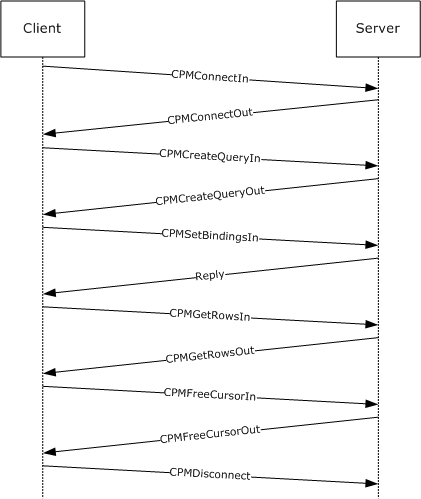

Figure 4: Windows Search Protocol session life cycle

The messages represented in the preceding diagram represent a subset of all of the Windows Search Protocol messages used for querying a remote [**GSS**](#gt_generic-security-services-gss) [**catalog**](#gt_catalog).

<a id="Section_3.1"></a>
## 3.1 Server Details

<a id="Section_3.1.1"></a>
### 3.1.1 Abstract Data Model

The following section specifies data and state maintained by the Windows Search Protocol server. The data provided in this document explains how the protocol behaves. This section does not mandate that implementations adhere to this model as long as their external behavior is consistent with that described in this document.

The [**Generic Search Service (GSS)**](#gt_generic-search-service-gss) implementing the Windows Search Protocol MUST maintain the following abstract data elements:

**ConnectedClientsIdentifiers:** A list of 32-bit unsigned integers. Values are added upon successful responses to [CPMConnectIn](#Section_2.2.3.2) messages and are removed when the clients disconnect. These integer identifiers are actually set to the values of the [**named pipe**](#gt_named-pipe) HANDLEs to connected clients because they uniquely identify incoming connections. The identifiers are removed from the list when the named pipe with the same HANDLEs are disconnected. Apart from the unique connection identification quality, no named pipe HANDLE semantics are assumed about the integer values in this list. Queries can be executed only one at a time over any given connection. Therefore, the server passes values in the **ConnectedClientsIdentifiers** list as the *QueryIdentifier* argument to any [**GSS**](#gt_generic-security-services-gss) abstract interface calls that it makes.

**ConnectedClientVersions:** A list of 32-bit unsigned integers, one for each identifier in the **ConnectedClientsIdentifiers** list. If the last 2 bytes of the client version are greater than or equal to 0x109, the server will verify the checksums in the message. If the version is greater than 0x10000, the server detects that the client is a 64-bit system.

<a id="Section_3.1.2"></a>
### 3.1.2 Timers

The following timer is required for the server.

**EventTimer:** This is a periodic timer that is started upon receipt of a [CPMSetScopePrioritizationIn](#Section_2.2.3.31) message. The timer expiration interval is defined by the server when the timer is started. This timer instance is associated with exactly one active query. There can be multiple EventTimers, one for each query.

The following input or state is required for this timer.

**QueryIdentifier:** A unique query identifier of the query for which this timer was started.

<a id="Section_3.1.3"></a>
### 3.1.3 Initialization

Upon initialization, the server MUST set its state to "not initialized" and start listening for messages on the [**named pipe**](#gt_named-pipe) specified in section [1.9](#Section_1.9). After performing any other internal initialization, it MUST transition to the "running" state.

<a id="Section_3.1.4"></a>
### 3.1.4 Higher-Layer Triggered Events

None.

<a id="Section_3.1.5"></a>
### 3.1.5 Processing and Sequencing Rules

Whenever an error occurs during processing of a message sent by a client, the server MUST report an error back to the client as follows:

- Stop processing the message sent by the client.
- Respond with the message header (only) of the message sent by the client, keeping the **_msg** field intact. The only exception to this is when an error occurs in the [CPMConnectIn (section 2.2.3.2)](#Section_2.2.3.2) request and the server cannot find a catalog. The response is a [CPMConnectOut (section 2.2.3.3)](#Section_2.2.3.3) message with the following possible errors.
| Error | Meaning |
| --- | --- |
| DS_E_DATASOURCENOTAVAILABLE | Catalog not in ready state for queries. |
| DS_E_INVALIDDATASOURCE | Failed to specify catalog correctly. |
| CI_E_NO_CATALOG | Catalog not found. |

- Set the **_status** field to the error code value.
When a message arrives, the server MUST check the **_msg** field value to identify whether it is a known type (see section [2.2.2](#Section_2.2.2)). If the type is not known, it MUST report a STATUS_INVALID_PARAMETER (0xC000000D) error.

The server MUST then validate the **_ulChecksum** field value if the message type is one of the following:

- CPMConnectIn (0x000000C8)
- [CPMCreateQueryIn](#Section_2.2.3.4) (0x000000CA)
- [CPMSetBindingsIn](#Section_2.2.3.10) (0x000000D0)
- [CPMGetRowsIn](#Section_2.2.3.11) (0x000000CC)
- [CPMFetchValueIn](#Section_2.2.3.15) (0x000000E4)
To validate the **_ulChecksum** field value, the server MUST check the value that the client specified in the **_iClientVersion** field in the CPMConnectIn message.

If the value of the **_iClientVersion** field's last 2 bytes is 0x00000109 or greater and **_ulChecksum** is not equal to zero, the server MUST validate that the **_ulChecksum** field was calculated as specified in section [3.2.4](#Section_3.1.4). If the **_ulChecksum** value is invalid, the server MUST report a STATUS_INVALID_PARAMETER (0xC000000D) error.

Next, the server checks which state it is in. If its state is "not initialized", the server MUST report a CI_E_NOT_INITIALIZED (0x8004180B) error. If the state is "shutting down", the server MUST report a CI_E_SHUTDOWN (0x80041812) error.

After a header has been determined to be valid and the server to be in "running" state, further message-specific processing MUST be performed, as specified in the following subsections.

Some messages are valid only after a previous message has been sent. Typically, an ID or [**handle**](#gt_handle) from the earlier message is required as input to the later message. These requirements are detailed in the following sections. The table below summarizes the relationship between messages.

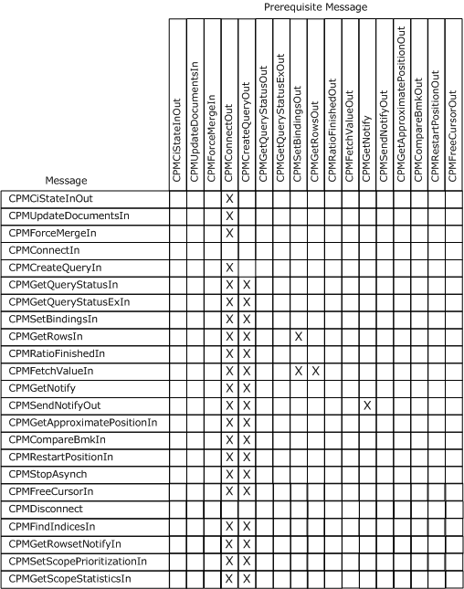

Figure 5: Windows Search Protocol message sequence relationships

<a id="Section_3.1.5.1"></a>
#### 3.1.5.1 Remote Windows Search Service Catalog Management

<a id="Section_3.1.5.1.1"></a>
##### 3.1.5.1.1 Receiving a CPMCiStateInOut Request

When the server receives a CPMCiStateInOut message request from the client, the server MUST first search the **ConnectedClientsIdentifiers** list for the HANDLE of the named pipe over which the server has received the CPMCiStateInOut message. If the handle is not present, the server MUST report a STATUS_INVALID_PARAMETER (0xC000000D) error; otherwise, it MUST respond to the client with a CPMCiStateInOut message containing information about the client's associated [**catalog**](#gt_catalog), obtained by calling the **GetState** abstract interface.

<a id="Section_3.1.5.2"></a>
#### 3.1.5.2 Remote Windows Search Service Querying

<a id="Section_3.1.5.2.1"></a>
##### 3.1.5.2.1 Receiving a CPMConnectIn Request

When the server receives a [CPMConnectIn](#Section_2.2.3.2) request from a client, the server MUST do the following.

- Search the **ConnectedClientsIdentifiers** list for the handle of the named pipe over which the server has received the CPMConnectIn message. If it is present, the server MUST report a STATUS_INVALID_PARAMETER (0xC000000D) error. If _fClientIsRemote is not set to 0x00000001 the server MUST report a STATUS_INVALID_PARAMETER (0xC000000D) error.
- Call the **IsCatalogAvailable** abstract interface. Provide the DBPROP_CI_CATALOG_NAME property value from the CPMConnectIn request message as the sole argument. Report a MSS_E_CATALOGNOTFOUND (0x80042103) error if the result of the **IsCatalogAvailable** abstract interface call to the [**GSS**](#gt_generic-security-services-gss) is not true. <28>
- If the value of the **_iClientVersion** field is larger than 0x00000109, then validate the checksum of the CPMConnectIn request as described in section [3.2.4](#Section_3.2.4).
- Add the handle of the named pipe over which the server received the CPMConnectIn message to the **ConnectedClientsIdentifiers** list. Call the StoreClientInformation abstract interface to the GSS with the query identifier that uniquely identifies the query to the server, the CPMConnectIn message as the *ConnectMessage* argument, and the HANDLE of the named pipe over which the server has received the CPMConnectIn message as the *NamedPipeHandle* argument. This helps the GSS later assess whether the user identified here has access to returned results.
- Store the _**iClientVersion** field in the **ConnectedClientVersions** list under the same index as the index in the **ConnectedClientsIdentifiers** list of the handle of the named pipe over which the server received this message.
- Call the **GetServerVersions** abstract interface of the GSS. Fill in the **_serverVersion** field using the **_serverVersion** output argument obtained from the **GetServerVersions** abstract interface. If **supportsVersioningInfo** is true, fill in the **dwWinVerMajor**, **dwWinVerMinor**, **dwNLSVerMajor**, and **dwNLSVerMinor** fields with the values returned by **GetServerVersions**. Otherwise, in order to indicate that versioning is not supported (see section [3.2.4.2.1](#Section_3.2.4.2.1)), the server MUST copy four DWORDs at the offset starting after **_iClientVersion** in the CPMConnectIn message to the same location in the [CPMConnectOut](#Section_2.2.3.3) reply (the offset right after **_serverVersion**).
- Respond to the client with the CPMConnectOut message.
- Report any errors encountered during message preparation or during any abstract interface call to the GSS. Errors that are specific to this request:
- E_OUTOFMEMORY: Generated by any resource allocation failure on the server or service side.
- STATUS_INVALID_PARAMETER: Generated when any of the parameters passed in by the client is invalid. Invalid parameters are those that do not obey the corresponding data structure layout as defined for their types in this document.
- STATUS_INVALID_PARAMETER_MIX: Generated when the client version as passed in this message is smaller than 0x102.
- DS_E_DATASOURCENOTAVAILABLE: Generated when the catalog requested is not in a ready state for queries.
- DS_E_ INVALIDDATASOURCE or ERROR_INVALID_PARAMETER: Generated when the catalog was not specified correctly.
- CI_E_NO_CATALOG: Generated when the catalog requested was not found.
Any other error code can be returned, but it will be treated as informative only.

<a id="Section_3.1.5.2.2"></a>
##### 3.1.5.2.2 Receiving a CPMCreateQueryIn Request

When the server receives a [CPMCreateQueryIn](#Section_2.2.3.4) message request from a client, the server MUST do the following:

- Search the **ConnectedClientsIdentifiers** list for the HANDLE of the named pipe over which the server has received the CPMCreateQueryIn message. If it is not present, the server MUST report a STATUS_INVALID_PARAMETER (0xC000000D) error.
- Run the **RunNewQuery** abstract interface of the [**GSS**](#gt_generic-security-services-gss). Pass in as parameters the HANDLE of the named pipe over which the server has received the CPMCreateQueryIn message, along with the **ColumnSet**, **RestrictionArray**, **SortSet**, **CCategorizationSet**, **RowSetProperties**, **PidMapper**, **GroupArray**, and **Lcid** values. If the *CanRunQueryNow* output parameter is not true, the server MUST report a STATUS_INVALID_PARAMETER (0xC000000D) error. Otherwise, report the *QueryParametersError* output parameter in the reply. Details for how to report an error are specified in section [3.1.5](#Section_1.3).
- Respond to the client with a [CPMCreateQueryOut](#Section_2.2.3.5) message by using the *CursorHandlesList*, *fTrueSequential*, and *fWorkidUnique* outputs obtained from the **RunNewQuery** abstract interface to the GSS.
- Report any errors encountered during message preparation or during any abstract interface call to the GSS. The following errors are specific to this request:
- E_OUTOFMEMORY: generated by any resource allocation failure on the server or service side.
- STATUS_INVALID_PARAMETER: generated when any of the parameters passed in by the client are invalid. Invalid parameters are those that do not obey the corresponding data structure layout as defined for their types in this document.
- STATUS_INVALID_PARAMETER_MIX: generated when the client version, as passed in this message, is smaller than 0x102.
- STATUS_NO_MEMORY: generated on memory allocation errors.
- STATUS_INSUFFICIENT_RESOURCES: generated on resource allocation errors. These resources could be file or pipe handles, any data structures that are specific to the implementation of the GSS, or any other resources used by the GSS implementation.
- CI_E_NOT_FOUND: generated when the requested property was not found.
- ERROR_INVALID_PARAMETER: this is generated by the WSS implementation on some internal errors, such as registry access failures. Implementations of the GSS can choose to do the same.
- CI_E_TIMEOUT: generated on named pipe communication timeout.
- E_ACCESSDENIED: generated when the client does not have permissions to access a needed resource, such as a file result or a catalog.
Any other error code can be returned, but it will be treated as informative only.

<a id="Section_3.1.5.2.3"></a>
##### 3.1.5.2.3 Receiving a CPMGetQueryStatusIn Request

When the server receives a [CPMGetQueryStatusIn](#Section_2.2.3.6) message request from a client, the server MUST do the following:

- Search the **ConnectedClientsIdentifiers** list for the HANDLE of the named pipe over which the server has received the CPMGetQueryStatusIn message. If it is not present, the server MUST report a STATUS_INVALID_PARAMETER (0xC000000D) error.
- Call the **ClientQueryHasCursorHandle** abstract interface to the [**GSS**](#gt_generic-security-services-gss) with the HANDLE of the named pipe over which the server has received the CPMGetQueryStatusIn message as its *QueryIdentifier* argument and with the _*hCursor* handle as its *CursorHandle* argument. <29>
- Call the **GetQueryStatus** abstract interface to the GSS. Use the HANDLE of the named pipe over which the server has received the CPMGetQueryStatusIn message as its *QueryIdentifier* argument. Prepare a [CPMGetQueryStatusOut](#Section_2.2.3.7) message, using the *QueryStatus* output for the _**QStatus** field. If the Error output is not 0, then report the error.
- Respond to the client with the CPMGetQueryStatusOut message.
- Report any errors encountered during message preparation or during any abstract interface call to the GSS. Errors that are specific to this request:
- E_OUTOFMEMORY: generated by any resource allocation failure on the server or service side.
- STATUS_INVALID_PARAMETER: generated when any of the parameters passed in by the client is invalid. Invalid parameters are those that do not obey the corresponding data structure layout as defined for their types in this document.
Any other error code can be returned, but it will be treated as informative only.

<a id="Section_3.1.5.2.4"></a>
##### 3.1.5.2.4 Receiving a CPMGetQueryStatusExIn Request

When the server receives a [CPMGetQueryStatusExIn](#Section_2.2.3.8) message request from a client, the server MUST do the following:

- Search the **ConnectedClientsIdentifiers** list for the HANDLE of the named pipe over which the server has received the CPMGetQueryStatusExIn message. If it is not present, the server MUST report a STATUS_INVALID_PARAMETER (0xC000000D) error.
- Call the **ClientQueryHasCursorHandle** abstract interface to the [**GSS**](#gt_generic-security-services-gss) with the HANDLE of the named pipe over which the server has received the [CPMGetQueryStatusIn](#Section_2.2.3.6) message as its *QueryIdentifier* argument and with the _*hCursor* handle as its *CursorHandle* argument.<30>
- Prepare a [CPMGetQueryStatusExOut](#Section_2.2.3.9) message, using corresponding parameters obtained by calling the following abstract interfaces to the GSS.
- **GetState**, with no parameters
- Parameters: none
- Use Output parameters:
- cFilteredDocuments = cFilteredDocuments
- Set cDocumentsToFilter to: cTotalDocuments - cFilteredDocuments
- **GetQueryStatus**
- Parameters:
- The HANDLE of the named pipe over which the server has received the CPMGetQueryStatusExIn message.
- Use Output parameters:
- QStatus = QStatus
- **GetRatioFinishedParams**
- Parameters:
- The HANDLE of the named pipe over which the server has received the CPMGetQueryStatusExIn message.
- hCursor
- Use Output parameters:
- dwRatioFinishedDenominator = rdwRatioFinishedDenominator
- dwRatioFinishedNumerator = rdwRatioFinishedNumerator
- **GetApproximatePosition**
- Parameters:
- The HANDLE of the named pipe over which the server has received the CPMGetQueryStatusExIn message.
- hCursor
- bmk
- Use Output Parameters:
- iRowBmk = riRowBmk
- **GetWhereID**
- Parameters:
- The HANDLE of the named pipe over which the server has received the CPMGetQueryStatusExIn message.
- Use Output parameters:
- whereID = whereid
- **GetExpensiveProperties**
- Parameters:
- The HANDLE of the named pipe over which the server has received the CPMGetQueryStatusExIn message.
- hCursor
- Use Output parameters:
- cRowsTotal = rcRowsTotal
- cResultsFound = rdwResultCount
- maxRank = maxRank
- Respond to the client with the CPMGetQueryStatusExOut message.
- Report any errors encountered during message preparation or during any abstract interface call to the GSS. Errors that are specific to this request:
- E_OUTOFMEMORY: generated by any resource allocation failure on the server or service side.
- STATUS_INVALID_PARAMETER: generated when any of the parameters passed in by the client is invalid. Invalid parameters are those that do not obey the corresponding data structure layout as defined for their types in this document.
- E_ACCESSDENIED: generated when the client does not have permissions to access a needed resource such as a file result or a catalog.
Any other error code can be returned, but it will be treated as informative only.

<a id="Section_3.1.5.2.5"></a>
##### 3.1.5.2.5 Receiving a CPMRatioFinishedIn Request

When the server receives a [CPMRatioFinishedIn](#Section_2.2.3.13) message request from a client, the server MUST do the following:

- Search the **ConnectedClientsIdentifiers** list for the HANDLE of the named pipe over which the server has received the CPMRatioFinishedIn message. If it is not present, the server MUST report a STATUS_INVALID_PARAMETER (0xC000000D) error.
- Call the **ClientQueryHasCursorHandle** abstract interface to the [**GSS**](#gt_generic-security-services-gss) with the HANDLE of the named pipe over which the server has received the CPMRatioFinishedIn message as its *QueryIdentifier* argument and with the *hCursor* handle as its *CursorHandle* argument. <31>
- Call the **GetRatioFinishedParams** abstract interface with the HANDLE of the named pipe over which the server has received the CPMRatioFinishedIn message as its *QueryIdentifier* argument and with the *hCursor* handle as its *CursorHandle* argument.
- Prepare a [CPMRatioFinishedOut](#Section_2.2.3.14) message; the server MUST set the CPMRatioFinishedOut parameters as follows.
- ulNumerator = rdwRatioFinishedNumerator
- ulDenominator = rdwRatioFinishedDenominator
- cRows = cRows
- fNewRows = fNewRows
If this step fails for any reason, the server MUST report any error code encountered in performing the request in accordance with Win32 Error Codes in [MS-ERREF](../MS-ERREF/MS-ERREF.md).

- Respond to the client with the CPMRatioFinishedOut message.
- Report any errors encountered during message preparation or during any abstract interface call to the GSS. Errors that are specific to this request:
- E_OUTOFMEMORY: generated by any resource allocation failure on the server or service side.
- STATUS_INVALID_PARAMETER: generated when any of the parameters passed in by the client is invalid. Invalid parameters are those that do not obey the corresponding data structure layout as defined for their types in this document.
- E_ACCESSDENIED: generated when the client does not have permissions to access a needed resource such as a file result or a catalog.
Any other error code can be returned, but it will be treated as informative only.

<a id="Section_3.1.5.2.6"></a>
##### 3.1.5.2.6 Receiving a CPMGetRowsIn Request

When the server receives a [CPMGetRowsIn](#Section_2.2.3.11) message request from a client, the server MUST do the following:

- Search the **ConnectedClientsIdentifiers** list for the HANDLE of the named pipe over which the server has received the CPMGetRowsIn message. If it is not present, the server MUST report a STATUS_INVALID_PARAMETER (0xC000000D) error.
- Call the **ClientQueryHasCursorHandle** abstract interface to the [**GSS**](#gt_generic-security-services-gss) with the HANDLE of the named pipe over which the server has received the CPMGetRowsIn message as its *QueryIdentifier* argument and with the _*hCursor* handle as its *CursorHandle* argument.<32> If *_hCursor* is invalid, then E_INVALIDARG SHOULD<33> be returned.
- Call the ***HasBindings*** abstract interface with the HANDLE of the named pipe over which the server has received the CPMGetRowsIn message as its *QueryIdentifier* argument and with the _*hCursor* handle as its *CursorHandle* argument. If the *hasBindings* output parameter is not true, the server MUST report an E_UNEXPECTED (0x8000FFFF) error.<34>
- Prepare a [CPMGetRowsOut](#Section_2.2.3.12) message by setting the position from which to retrieve the next [**rows**](#gt_row), according to the received **SeekDescription**:
- If eType == 0x00000000, then set status = STATUS_INVALID_PARAMETER(0xC000000D).
- Define oldIndex as the result of calling the **GetNextGetRowsPosition** abstract interface with *QueryIdentifier* and *CursorHandle* as arguments. Then, as a function of eType, call the **SetNextGetRowsPosition** abstract interface with *QueryIdentifier*, *chapter*, and *CursorHandle* as arguments and with [Index](#Section_8) set to:
- If eType == eRowSeekNext (section 2.2.3.11), then Index = oldIndex + _cskip (section [2.2.1.36](#Section_2.2.1.36)).
- If eType == eRowSeekAt (section 2.2.3.11), then Index = GetBookmarkPosition(QueryIdentifier, CursorHandle, _bmkOffset) + _cskip (sections 3.1.7and 2.2.1.36).
- If eType == eRowSeekatRatio (section 2.2.3.11), then Index = (ulNumerator/ulDenominator) * rcRowsTotal. The value of *rcRowsTotal* (section 3.1.7) is equal to the output argument of the **GetExpensiveProperties** abstract interface called with *QueryIdentifier* and *CursorHandle* as arguments.
- When the value of ulDenominator is zero, or if _ulDenominator > _ulNumerator, DB_E_BADRATIO is returned as the error value.
- If eType == eRowSeekByBookmark (section 2.2.3.11), then for each bookmark handle value in the **aBookmarks** array (section [2.2.1.38](#Section_2.2.1.38)) of the SeekDescription (section 2.2.3.11) argument:
- Call the **GetBookmarkPosition** abstract interface to the GSS with *QueryIdentifier*, *CursorHandle*, and the bookmark handle value as arguments.
- Use the *bmkIndex* (section 3.1.7) returned as an argument to **SetNextGetRowsPosition** (section 3.1.7), along with *QueryIdentifier*, *CursorHandle*, and *_chapt*.
- Call the **GetRows** abstract interface with *QueryIdentifier*, *CursorHandle*, 1, and *_fBwdFetch* as arguments.
- After the position is set, retrieve the desired row from the GSS by calling the **GetRows** abstract interface with the HANDLE of the named pipe over which the server has received the CPMGetRowsIn message as its *QueryIdentifier* argument, with the _*hCursor* handle as its *CursorHandle* argument, with *_chapt* as its *chapter* argument, with *_cRowsToTransfer* as its *NumRowsRequested* argument, and with *_fBwdFetch* as its *FetchForward* argument. Do this in all cases, except for step 4 bullet 3.
- Copy as many rows as fit in a buffer, the size of which is indicated by **_cbReadBuffer** (section 2.2.3.11), but not more than indicated by **_cRowsToTransfer** (section 2.2.3.11). Thereafter, reposition the cursor to reflect the actual number of returned rows by calling the **SetNextGetRowsPosition** abstract interface with *QueryIdentifier*, *CursorHandle* and *_chapt* as arguments and with Index set to the old index (as obtained by calling **GetNextRowsPosition**(QueryIdentifier, _hCursor, _chapt)) plus the number of rows that fit in the buffer.
- If there are no more rows available on the server to finish this request, as signaled by the *NoMoreRowsToReturn* output parameter for the call made to the **GetRows** abstract interface (section 3.1.7), the **Status** fleld of CPMGetRowsOut message MUST be set to DB_S_ENDOFROWSET.
- Store the number of rows fetched in **_cRowsReturned** (section 2.2.3.12), as determined by the *NumRowsReturned* output parameter from the **GetRows** call (or, in the case of step 4 bullet 3, the sum of the *NumRowsReturned* parameters from the **GetRows** calls).
- Copy the **_chapt** field from the CPMGetRowsIn message to a CPMGetRowsOut message to be sent.
- If either of the following cases are true, copy the **SeekDescription** (section 2.2.3.11) from the CPMGetRowsIn to the CPMGetRowsOut message.
- The server fails to completely fill the buffer due to a memory allocation failure, but has been able to store at least one row.
Copying the **SeekDescription** (section 2.2.3.11) allows the client to continue from the point where the server left off. In addition, the server SHOULD set the error code DB_S_BLOCKLIMITEDROWS, and in the case of [CRowSeekAtRatio](#Section_2.2.1.37), convert CRowSeekAtRatio to CRowSeekAt.

- CRowSeekByBookmark is specified.
Otherwise, clear SeekDescription (section 2.2.3.11) by setting it to zero.

- Store the fetched rows in the **Rows** field (see section 2.2.3.12 for details on the structure of the **Rows** field).
**Note** Regarding status byte field: If StatusUsed is set to 0x01 in the [CTableColumn](#Section_2.2.1.43) of the [CPMSetBindingsIn](#Section_2.2.3.10) message for the [**column**](#gt_column), the server MUST set the status byte (which is located at StatusOffset from the start of the rows) for this column to one of the following values.

| Value | Meaning |
| --- | --- |
| 0x00 | StoreStatusOK |
| 0x01 | StoreStatusDeferred |
| 0x02 | StoreStatusNull |

- Respond to the client with the CPMGetRowsOut message.
If the property value is absent for this row, the server MUST set the status byte to StoreStatusNull. If the value is too big to be transferred in the CPMGetRowsOut message (greater than 2048 bytes), the server MUST set the status byte to StoreStatusDeferred. Otherwise, the server MUST set the status byte to StoreStatusOK.

- Report any errors encountered during message preparation or during any abstract interface call to the GSS. Errors that are specific to this request:
- E_OUTOFMEMORY: generated by any resource allocation failure on the server or service side.
- STATUS_INVALID_PARAMETER: generated when any of the parameters passed in by the client is invalid. Invalid parameters are those that do not obey the corresponding data structure layout as defined for their types in this document.
- STATUS_NO_MEMORY: generated on memory allocation errors.
- CI_E_NOT_FOUND: generated when the requested property was not found.
- E_ACCESSDENIED: generated when the client does not have permissions to access a needed resource such as a file result or a catalog.
- CI_E_BUFFERTOOSMALL: generated when the buffer passed in is too small to accommodate the requested property or properties. This error signals the client to request the potentially large property value separately using a CPMFetchValueIn request.
Any other error code can be returned, but it will be treated as informative only.

<a id="Section_3.1.5.2.7"></a>
##### 3.1.5.2.7 Receiving a CPMFetchValueIn Request

When the server receives a [CPMFetchValueIn](#Section_2.2.3.15) message request from a client, the server MUST do the following:

- Search the **ConnectedClientsIdentifiers** list for the HANDLE of the named pipe over which the server has received the CPMFetchValueIn message. If it is not present, the server MUST report a STATUS_INVALID_PARAMETER (0xC000000D) error.
- Prepare a [CPMFetchValueOut](#Section_2.2.3.16) message. If this step fails for any reason, the server MUST report an error.
- Call the **GetPropertyValueForWorkid** abstract interface with the HANDLE of the named pipe over which the server has received the CPMFetchValueIn message, *_wid*, and *Propspec* as arguments. If the *ValueExists* output parameter is not true, the server MUST set **_fValueExists** (section 2.2.3.16) to 0x00000000; otherwise set **_fValueExists** (section 2.2.3.16) to 0x00000001. If this step fails for any reason, the server MUST report any error code encountered in performing the request in accordance with Win32 Error Codes in [MS-ERREF](../MS-ERREF/MS-ERREF.md).
- If **_fValueExists** is equal to 0x00000001, the server MUST do the following:
- Scan the *Property* output parameter structure, starting from the **_cbSoFar** offset, and copy a maximum of **_cbChunk** bytes (do not go past the end of the serialized property) to the **vValue** field. If this step fails for any reason, the server MUST report an error.
- Set **_cbValue** to the number of bytes copied in the previous step.
- If the length of the serialized property is greater than **_cbSoFar** added to **_cbValue**, set **_fMoreExists** to 0x00000001; otherwise, set it to 0x00000000.
- Respond to the client with the CPMFetchValueOut message.
- Report any errors encountered during message preparation or during any abstract interface call to the GSS. Errors that are specific to this request:
- E_OUTOFMEMORY: generated by any resource allocation failure on the server or service side.
- STATUS_INVALID_PARAMETER: generated when any of the parameters passed in by the client is invalid. Invalid parameters are those that do not obey the corresponding data structure layout as defined for their types in this document.
- E_ACCESSDENIED: generated when the client does not have permissions to access a needed resource such as a file result or a catalog.
- CI_E_BUFFERTOOSMALL: generated when the buffer passed in is too small to accommodate the requested property. This error signals the client to request the potentially large property value separately, using a CPMFetchValueIn request with a larger buffer.
Any other error code can be returned, but it will be treated as informative only.

<a id="Section_3.1.5.2.8"></a>
##### 3.1.5.2.8 Receiving a CPMSetBindingsIn Request

When the server receives a [CPMSetBindingsIn](#Section_2.2.3.10) message request from a client, the server MUST do the following:

- Search the **ConnectedClientsIdentifiers** list for the HANDLE of the named pipe over which the server has received the CPMSetBindingsIn message. If it is not present, the server MUST report a STATUS_INVALID_PARAMETER (0xC000000D) error.
- Call the **ClientQueryHasCursorHandle** abstract interface to the [**GSS**](#gt_generic-security-services-gss) with the HANDLE of the named pipe over which the server has received the CPMSetBindingsIn message as its *QueryIdentifier* argument and with the **_hCursor** handle as its *CursorHandle* argument.<35>
- Verify that the [**bindings**](#gt_binding) information is valid (that is, the [**column**](#gt_column) at least specifies value, length, or status to be returned; there is no overlap in bindings for value, length, or status; and value, length, and status fit in the [**row**](#gt_row) size specified) and, if not, report a DB_E_BADBINDINFO (0x80040E08) error.<36>
- Call the **SetBindings** abstract interface with the HANDLE of the named pipe over which the server has received the CPMSetBindingsIn message as its *QueryIdentifier* argument, with the **_hCursor** handle as its *CursorHandle* argument, and with the **aColumns** field as its Columns argument. The server MUST report any error code returned as the *Error* output parameter.
- Respond to the client with a message header (only), with **_msg** set to CPMSetBindingsIn and **_status** set to the results of the specified binding.
- Report any errors encountered during message preparation or during any abstract interface call to the GSS. Errors that are specific to this request:
- E_OUTOFMEMORY: generated by any resource allocation failure on the server or service side.
- STATUS_INVALID_PARAMETER: generated when any of the parameters passed in by the client is invalid. Invalid parameters are those that do not obey the corresponding data structure layout as defined for their types in this document.
Any other error code can be returned, but it will be treated as informative only.

<a id="Section_3.1.5.2.9"></a>
##### 3.1.5.2.9 Receiving a CPMGetNotify Request

When the server receives a [CPMGetNotify](#Section_2.2.3.17) message from a client, the server MUST do the following:

- Search the **ConnectedClientsIdentifiers** list for the HANDLE of the named pipe over which the server has received the CPMGetNotify message. If it is not present, the server MUST report a STATUS_INVALID_PARAMETER (0xC000000D) error.<37>
- Call the **GetQueryStatusChanges** abstract interface with the HANDLE of the named pipe over which the server has received the CPMGetNotify message as its *QueryIdentifier* argument. If the *ChangesPresent* output parameter is true, then the server MUST respond with a [CPMSendNotifyOut](#Section_2.2.3.18) message and MUST set the **_watchNotify** field of this message to the *LatestChange* parameter value that is output from the call.
- At a later time, if there is a change in the query results set as determined by polling the [**GSS**](#gt_generic-security-services-gss) with **GetQueryStatusChanges** interface calls, the server MUST send exactly one CPMSendNotifyOut message to the client and MUST specify the change in the **_watchNotify** field.
- Report any errors encountered during message preparation or during any abstract interface call to the GSS. Errors that are specific to this request:
- E_OUTOFMEMORY: generated by any resource allocation failure on the server or service side.
- STATUS_INVALID_PARAMETER: generated when any of the parameters passed in by the client is invalid. Invalid parameters are those that do not obey the corresponding data structure layout as defined for their types in this document.
Any other error code can be returned, but it will be treated as informative only.

<a id="Section_3.1.5.2.10"></a>
##### 3.1.5.2.10 Receiving a CPMGetApproximatePositionIn Request

When the server receives a [CPMGetApproximatePositionIn](#Section_2.2.3.19) message request from the client, the server MUST do the following:

- Search the **ConnectedClientsIdentifiers** list for the HANDLE of the named pipe over which the server has received the CPMGetApproximatePositionIn message. If it is not present, the server MUST report a STATUS_INVALID_PARAMETER (0xC000000D) error.
- Call the **ClientQueryHasCursorHandle** abstract interface to the [**GSS**](#gt_generic-security-services-gss) with the HANDLE of the named pipe over which the server has received the CPMGetApproximatePositionIn message as its *QueryIdentifier* argument and with the **_hCursor** handle as its *CursorHandle* argument. If the *ContainsHandle* output parameter is not true, the server MUST report an E_FAIL (0x80004005) error.
- Call the **GetApproximatePosition** abstract interface with the HANDLE of the named pipe over which the server has received the CPMGetApproximatePositionIn message as its *QueryIdentifier* argument, with the **_hCursor** handle as its *CursorHandle* argument, and with **_bmk** as its *Bmk* argument. Use the *riRowBmk* output parameter as the numerator and use the total number of rows for this cursor as the denominator for the [CPMGetApproximatePositionOut](#Section_2.2.3.20) message. The total number of rows is the value of the *rcRowsTotal* output parameter from a **GetExpensiveProperties** abstract interface call, using *QueryIdentifier* and **_hCursor** as arguments to the call.
**Note** If this step fails for any reason, the server MUST report any error code encountered in performing the request in accordance with Win32 Error Codes in [MS-ERREF](../MS-ERREF/MS-ERREF.md).

- Respond to the client with a CPMGetApproximatePositionOut message.
- Report any errors encountered during message preparation or during any abstract interface call to the [GSS](#Section_1.1). Errors that are specific to this request:
- E_OUTOFMEMORY: generated by any resource allocation failure on the server or service side.
- STATUS_INVALID_PARAMETER: generated when any of the parameters passed in by the client is invalid. Invalid parameters are those that do not obey the corresponding data structure layout as defined for their types in this document.
Any other error code can be returned, but it will be treated as informative only.

<a id="Section_3.1.5.2.11"></a>
##### 3.1.5.2.11 Receiving a CPMCompareBmkIn Request

When the server receives a [CPMCompareBmkIn](#Section_2.2.3.21) message request from the client, the server MUST do the following:

- Search the **ConnectedClientsIdentifiers** list for the HANDLE of the named pipe over which the server has received the CPMCompareBmkIn message. If it is not present, the server MUST report a STATUS_INVALID_PARAMETER (0xC000000D) error.
- Call the **ClientQueryHasCursorHandle** abstract interface to the [**GSS**](#gt_generic-security-services-gss) with the HANDLE of the named pipe over which the server has received the CPMCompareBmkIn message as its *QueryIdentifier* argument and with the **_hCursor** handle as its *CursorHandle* argument. If the *ContainsHandle* output parameter is not true, the server MUST report an E_FAIL (0x80004005) error.
- Prepare a [CPMCompareBmkOut](#Section_2.2.3.22) message.
- If the bookmark handles are equal, **dwComparison** MUST be set to DBCOMPARE_EQ.
- Otherwise, the server MUST do the following:
- Find [**rows**](#gt_row) that are referred to by each bookmark handle in the query results: the server MUST retrieve the indices of both rows within the rowset by calling the **GetBookmarkPosition** abstract interface twice, with the HANDLE of the named pipe over which the server has received the CPMCompareBmkIn message as its *QueryIdentifier* argument, with the **_hCursor** handle as its *CursorHandle* argument, and the **bmkFirst** and **bmkSecond** bookmark handles, respectively as the *bmkHandle* argument.
- If the [**chapter**](#gt_chapter) handle in CPMCompareBmkIn is invalid, or if one or both of the rows are not in the given chapter, the behavior is undefined.
- Otherwise, when both rows are in the same chapter, the server MUST then compare the position values obtained via a **GetBookmarkPosition** interface call and set **dwComparison** to DBCOMPARE_LT if the position of the first row is smaller than the position of the second row; otherwise, **dwComparison** MUST be set to DBCOMPARE_GT.
- Respond to the client with the configured CPMCompareBmkOut message.
- Report any errors encountered during message preparation or during any abstract interface call to the GSS. Errors that are specific to this request:
- E_OUTOFMEMORY: generated by any resource allocation failure on the server or service side.
- STATUS_INVALID_PARAMETER: generated when any of the parameters passed in by the client is invalid. Invalid parameters are those that do not obey the corresponding data structure layout as defined for their types in this document.
Any other error code can be returned, but it will be treated as informative only.

<a id="Section_3.1.5.2.12"></a>
##### 3.1.5.2.12 Receiving a CPMRestartPositionIn Request

When the server receives the [CPMRestartPositionIn](#Section_2.2.3.23) message request from the client, the server MUST do the following:

- Search the **ConnectedClientsIdentifiers** list for the HANDLE of the named pipe over which the server has received the CPMRestartPositionIn message. If it is not present, the server MUST report a STATUS_INVALID_PARAMETER (0xC000000D) error.
- Call the **ClientQueryHasCursorHandle** abstract interface to the [**GSS**](#gt_generic-security-services-gss) with the HANDLE of the named pipe over which the server has received the CPMRestartPositionIn message as its *QueryIdentifier* argument, and with the **_hCursor** handle as its *CursorHandle* argument. If the *ContainsHandle* output parameter is not true, the server MUST report an E_FAIL (0x80004005) error.
- Move the cursor to the beginning of the [**chapter**](#gt_chapter) identified by the chapter handle by calling the **SetNextGetRowsPosition** abstract interface with the HANDLE of the named pipe over which the server has received the CPMRestartPositionIn message as its *QueryIdentifier* argument, with the **_hCursor** handle as its *CursorHandle* argument, and with the **_chapt** handle as the *chapter* argument. When the chapter handle is DB_NULL_HCHAPTER, the corresponding chapter is the main rowset of the query.
**Note** If this step fails for any reason, the server MUST report any error code encountered in performing the request in accordance with Win32 Error Codes in [MS-ERREF](../MS-ERREF/MS-ERREF.md).

- Respond to the client with a CPMRestartPositionIn message.
- Report any errors encountered during message preparation or during any abstract interface call to the GSS. Errors that are specific to this request:
- E_OUTOFMEMORY: generated by any resource allocation failure on the server or service side.
- STATUS_INVALID_PARAMETER: generated when any of the parameters passed in by the client is invalid. Invalid parameters are those that do not obey the corresponding data structure layout as defined for their types in this document.
Any other error code can be returned, but it will be treated as informative only.

<a id="Section_3.1.5.2.13"></a>
##### 3.1.5.2.13 Receiving a CPMFreeCursorIn Request

When the server receives a [CPMFreeCursorIn](#Section_2.2.3.24) message request from the client, the server MUST do the following:

- Search the **ConnectedClientsIdentifiers** list for the HANDLE of the named pipe over which the server has received the CPMFreeCursorIn message. If it is not present, the server MUST report a STATUS_INVALID_PARAMETER (0xC000000D) error.
- Call the **ClientQueryHasCursorHandle** abstract interface to the [**GSS**](#gt_generic-security-services-gss) with the HANDLE of the named pipe over which the server has received the CPMFreeCursorIn message as its *QueryIdentifier* argument and with the **_hCursor** handle as its *CursorHandle* argument. If the *ContainsHandle* output parameter is not true, the server MUST report an error.<38>
- Release the cursor and associated resources for this cursor handle by calling the **ReleaseCursor** abstract interface with the HANDLE of the named pipe over which the server has received the CPMFreeCursorIn message as its *QueryIdentifier* argument and with the **_hCursor** handle as its *CursorHandle* argument.
- Respond with a [CPMFreeCursorOut](#Section_2.2.3.25) message, setting the **_cCursorsRemaining** field to the number of cursors remaining in this client's list, as returned in the *NumCursorsRemaining* output parameter to the **ReleaseCursor** abstract interface call made in the previous step.
- Report any errors encountered during message preparation or during any abstract interface call to the GSS. Errors that are specific to this request:
- E_OUTOFMEMORY: generated by any resource allocation failure on the server or service side.
- STATUS_INVALID_PARAMETER: generated when any of the parameters passed in by the client is invalid. Invalid parameters are those that do not obey the corresponding data structure layout as defined for their types in this document.
Any other error code can be returned, but it will be treated as informative only.

<a id="Section_3.1.5.2.14"></a>
##### 3.1.5.2.14 Receiving a CPMDisconnect Request

When the server receives a [CPMDisconnect](#Section_2.2.3.26) message request from the client, the server MUST do the following:

- Remove the HANDLE of the named pipe over which the server has received the CPMDisconnect message from the **ConnectedClientsIdentifiers** list.
- Remove the corresponding entry from the **ConnectedClientVersions** list.
- Call the **ReleaseQuery** abstract interface to the [**GSS**](#gt_generic-security-services-gss) with the HANDLE of the named pipe over which the server has received the CPMDisconnect message as its *QueryIdentifier* argument.
<a id="Section_3.1.5.2.15"></a>
##### 3.1.5.2.15 Receiving a CPMFindIndicesIn Request

When the server receives a [CPMFindIndicesIn](#Section_2.2.3.27) message request from a client, the server MUST do the following:

- Search the **ConnectedClientsIdentifiers** list for the HANDLE of the named pipe over which the server has received the CPMFindIndicesIn message. If it is not present, the server MUST report an ERROR_INVALID_PARAMETER (0x80070057) error.
- Prepare a [CPMFindIndicesOut](#Section_2.2.3.28) message. If this step fails for any reason, the server MUST report any error code encountered in performing the request in accordance with Win32 Error Codes in [MS-ERREF](../MS-ERREF/MS-ERREF.md).
- The CPMFindIndicesOut message MUST contain one [**hierarchical group coordinate**](#gt_hierarchical-group-coordinate) to the next occurrence of one of the document identifiers specified in the CPMFindIndicesIn message or, if no such occurrence was found, the server MUST indicate this by setting **_cDepthNext** to zero. In the case of a non-grouping query, **_cDepthNext** will be 1, indicating a single offset into the current rowset.
The next occurrence is found by calling the **FindNextOccurrenceIndex** abstract interface to the [**GSS**](#gt_generic-security-services-gss), with the HANDLE of the named pipe over which the server has received the CPMFindIndicesIn message, **_prgiRowPrev** as the previous coordinates list (or NULL if **_cDepthPrev** is zero), and array **_pwids[0]** as arguments.

**Note** Currently, the server only supports a single document identifier lookup and discounts any workids in **_pwids** other than the first one. The next occurrence coordinate list is returned in the *NextOccCoordinatesList* output parameter, or if not found, then the *NextOccExists* parameter is not true.

- Report any errors encountered during message preparation or during any abstract interface call to the GSS. Errors that are specific to this request:
- E_OUTOFMEMORY: generated by any resource allocation failure on the server or service side.
- STATUS_INVALID_PARAMETER: generated when any of the parameters passed in by the client is invalid. Invalid parameters are those that do not obey the corresponding data structure layout as defined for their types in this document.
Any other error code can be returned, but it will be treated as informative only.

<a id="Section_3.1.5.2.16"></a>
##### 3.1.5.2.16 Receiving a CPMGetRowsetNotifyIn

When the server receives a [CPMGetRowsetNotifyIn](#Section_2.2.3.29) message request from a client, the server MUST do the following:

- Search the **ConnectedClientsIdentifiers** list for the HANDLE of the named pipe over which the server has received the CPMGetRowsetNotifyIn message. If it is not present, the server MUST report a STATUS_INVALID_PARAMETER (0xC000000D) error.
- Prepare a [CPMGetRowsetNotifyOut](#Section_2.2.3.30) message. If this step fails for any reason, the server MUST report any error code encountered in performing the request in accordance with Win32 Error Codes in [MS-ERREF](../MS-ERREF/MS-ERREF.md).
- The server MUST make a call to the **GetLastUnretrievedEvent** abstract interface of the [**GSS**](#gt_generic-security-services-gss) with the HANDLE of the named pipe over which the server has received the CPMGetRowsetNotifyOut message as its *QueryIdentifier* argument and populate the CPMGetRowsetNotifyOut message with the corresponding output parameters.
- Report any errors encountered during message preparation or during any abstract interface call to the GSS. Errors that are specific to this request:
- E_OUTOFMEMORY: generated by any resource allocation failure on the server or service side.
- STATUS_INVALID_PARAMETER: generated when any of the parameters passed in by the client is invalid. Invalid parameters are those that do not obey the corresponding data structure layout as defined for their types in this document.
Any other error code can be returned, but it will be treated as informative only.

<a id="Section_3.1.5.2.17"></a>
##### 3.1.5.2.17 Receiving a CPMGetScopeStatisticsIn

When the server receives a [CPMGetScopeStatisticsIn](#Section_2.2.3.33) message request from a client, the server MUST do the following:

- Search the **ConnectedClientsIdentifiers** list for the HANDLE of the named pipe over which the server has received the CPMGetScopeStatisticsIn message. If it is not present, the server MUST report a STATUS_INVALID_PARAMETER (0xC000000D) error.
- Prepare a [CPMGetScopeStatisticsOut](#Section_2.2.3.34) message. If this step fails for any reason, the server MUST report any error code encountered in performing the request in accordance with Win32 Error Codes in [MS-ERREF](../MS-ERREF/MS-ERREF.md).
- Call the **GetQueryStatistics** abstract interface of the [**GSS**](#gt_generic-security-services-gss), with the HANDLE of the named pipe over which the server has received the CPMGetScopeStatisticsIn message as the *QueryIdentifier* argument for the call. Populate the CPMGetScopeStatisticsOut message fields with the corresponding output arguments from this call.
**Note** The server SHOULD return zero for all statistics unless the client has explicitly requested their availability by setting the DBPROP_ENABLEROWSETEVENTS property to TRUE.

- Report any errors encountered during message preparation or during any abstract interface call to the GSS. Errors that are specific to this request:
- E_OUTOFMEMORY: generated by any resource allocation failure on the server or service side.
- STATUS_INVALID_PARAMETER: generated when any of the parameters passed in by the client is invalid. Invalid parameters are those that do not obey the corresponding data structure layout as defined for their types in this document.
- E_ACCESSDENIED: generated when the client does not have permissions to access a needed resource such as a file result or a catalog.
Any other error code can be returned, but it will be treated as informative only.

<a id="Section_3.1.5.2.18"></a>
##### 3.1.5.2.18 Receiving a CPMSetScopePrioritizationIn

This message is currently implemented only in the Windows 7 operating system. If the server fails implementation of this message, it can report a STATUS_INVALID_PARAMETER error. Otherwise, when the server receives a [CPMSetScopePrioritizationIn](#Section_2.2.3.31) message request from a client, the server MUST do the following:

- Search the **ConnectedClientsIdentifiers** list for the HANDLE of the named pipe over which the server has received the CPMSetScopePrioritizationIn message. If it is not present, the server MUST report a STATUS_INVALID_PARAMETER (0xC000000D) error.
- Prepare a [CPMSetScopePrioritizationOut](#Section_2.2.3.32) message. If this step fails for any reason, the server MUST report any error code encountered in performing the request in accordance with Win32 Error Codes in [MS-ERREF](../MS-ERREF/MS-ERREF.md).
- Call the **SetScopePriority** abstract interface of the [**GSS**](#gt_generic-security-services-gss), with the HANDLE of the named pipe over which the server has received the CPMSetScopePrioritizationIn message and the **priority** field as arguments.
- If **eventFrequency** is not zero, start an [EventTimer](#Section_3.1.2) timer that expires after an interval defined by **eventFrequency**, in milliseconds. Otherwise, if **eventFrequency** is zero, then call the **FilterOutScopeStatisticsMessages** abstract interface of the GSS, with the HANDLE of the named pipe over which the server has received the CPMSetScopePrioritizationIn message as the argument for the call.
- The CPMSetScopePrioritizationOut message MUST simply acknowledge successful receipt of the CPMSetScopePrioritizationIn message and that the **SetScopePriority** abstract interface has been called, with the HANDLE of the named pipe over which the server has received the CPMSetScopePrioritizationIn message and the **priority** field as arguments to the call.
- Report any errors encountered during message preparation or during any abstract interface call to the GSS. Errors that are specific to this request:
- E_OUTOFMEMORY: generated by any resource allocation failure on the server or service side.
- STATUS_INVALID_PARAMETER: generated when any of the parameters passed in by the client is invalid. Invalid parameters are those that do not obey the corresponding data structure layout as defined for their types in this document.
Any other error code can be returned, but it will be treated as informative only.

<a id="Section_3.1.5.2.19"></a>
##### 3.1.5.2.19 Receiving a CPMExternalSearchResultIn Request

When the server receives a **CPMExternalSearchResultIn** request message from the client, the server MUST do the following:

- If the named pipe connection between the client and server is closed, the server MUST fail the request with STATUS_INVALID_HANDLE.
- Search the **ConnectedClientsIdentifiers** list for the HANDLE of the named pipe over which the server has received the CPMExternalSearchResultIn request message. If it is not present, the server MUST fail the request with STATUS_INVALID_PARAMETER (0xC000000D) error.
- If any parameter passed in the request is invalid, the server MUST fail the request with STATUS_INVALID_PARAMETER (0xC000000D) error.
- Parse the result row-set in CPMExternalSearchResultIn request message.
- Process the parsed results using inverted query layer.
- File path of each result row-set MUST be converted to work identifier.
- All results MUST be merged, de-duplicated and ranked along with lexical and semantic result row-set.
- If the above processing is successful, the server MUST set **_status** field in the message header to zero. Otherwise, any other error code returned SHOULD be treated as informative only.
<a id="Section_3.1.6"></a>
### 3.1.6 Timer Events

The following timer is required.

**EventTimer:** The timer event for this timer calls the **GenerateScopeStatisticsEvent** abstract interface of the [**GSS**](#gt_generic-security-services-gss), with the *QueryIdentifier* value associated to this EventTimer as its argument. This does not result in any message being sent to the client. It simply ensures that the GSS generates a Scope Statistics event which can later be retrieved by the client via a [CPMGetRowsetNotifyIn](#Section_2.2.3.29) message.

<a id="Section_3.1.7"></a>
### 3.1.7 Other Local Events

This section describes the use of several abstract interfaces.

IsCatalogAvailable

This abstract interface is used to determine whether the specified catalog is available for querying.

Inputs: **CatalogName**, a VT_BSTR, the name of the desired catalog.

Outputs: **IsAvailable**, a Boolean, true if and only if all of the following conditions are met.

- The catalog name matches a supported catalog implemented by the service (case-insensitive). All versions of [**WSS**](#gt_generic-search-service-gss) covered in this document support only the catalog with name "Windows\SYSTEMINDEX".
- The [**Generic Search Service (GSS)**](#gt_generic-search-service-gss) is currently able to return results for queries. This is implementation-specific and can be used by other implementations, for example, to communicate the temporary unavailability of the server during initialization.
GetServerVersions

This abstract interface is used to retrieve the Generic Search Service (GSS) version, as well as version information about the operating system and the natural language components on the operating system on which [**GSS**](#gt_generic-security-services-gss) runs.

Inputs: None.

Outputs: DWORD **dwWinVerMajor**, DWORD **dwWinVerMinor**, DWORD **dwNLSVerMajor**, DWORD **dwNLSVerMinor**, DWORD **serverVersion**, Boolean **supportsVersioningInfo**.

Constraints: If the server supports reporting versioning information, return **dwWinVerMajor**, **dwWinVerMinor**, **dwNLSVerMajor**, and **dwNLSVerMinor** according to section [3.1.5.2.1](#Section_3.1.5.2.1), and set **supportsVersioningInfo** to true. Otherwise, set **supportsVersioningInfo** to false. In both cases, **serverVersion** MUST be returned.

GetState

This abstract interface returns information about the Generic Search Service (GSS).

Inputs: None.

Outputs: The parameters of a [CPMCiStateInOut](#Section_2.2.3.1) message, as described in section 2.2.3.1.

Constraints: None.

StoreClientInformation

This abstract interface is used to communicate the client information to the GSS upon client connection via a [CPMConnectIn (section 2.2.3.2)](#Section_2.2.3.2) message. This information will be used later for access checks on query results for this client. This information is released upon the call to **ReleaseQuery**.

Inputs:

- **QueryIdentifier**, a 32-bit unsigned integer. This value uniquely identifies a query to this server.
- **ConnectMessage**, a CPMConnectIn message.
- **NamedPipeHandle**, the [**named pipe**](#gt_named-pipe) handle over which the client has connected.
Outputs: None.

RunNewQuery

Inputs:

- **QueryIdentifier**, a 32-bit unsigned integer. This value uniquely identifies a query to this server.
- Query information:
- **ProjectionColumnsOffsets**: A [CColumnSet](#Section_2.2.1.18) structure containing the property offsets for properties in [CPidMapper](#Section_2.2.1.32) that are returned as columns. For example, if **RunNewQuery** was being generated from SQL, these columns would correspond to the arguments of the SELECT statement.
- **RestrictionSet**: A [CRestrictionArray](#Section_2.2.1.16) structure containing the command tree of the query. In the case of a multi-level grouping query, these restrictions apply only to the filtered set found at the leaf level.
- **SortOrders**: A **CSortSet** structure indicating the sort order of the query. The sort set also applies only to the set of results found at the leaf level, in the case of a multi-level grouping query.
- **Groupings**: A **CCategorizationSet** structure that contains the groups for the query, aggregate properties to return and any sort orders for non-leaf levels in the hierarchical [**rowset**](#gt_rowset).
- **RowSetProperties**: A [CRowsetProperties](#Section_2.2.1.40) structure providing configuration information for the query.
- **PidMapper**: A CPidMapper structure that maps from property offsets to full property descriptions.
- **GroupArray**: A [CColumnGroupArray](#Section_2.2.1.33) structure, describing property weights for probabilistic ranking.
- **Lcid**: A 32-bit unsigned integer, indicating the user's locale for this query, as specified in [MS-LCID](../MS-LCID/MS-LCID.md).
Outputs:

- **CanRunQueryNow**: Boolean, true if and only if another query is not already in progress. A query is defined to be in progress at any time between (a) and (b):
- Any time when **RunNewQuery** was called with **QueryIdentifier** as an argument and returned true and **QueryParametersError** (see following) was returned as zero.
- The first time **ReleaseQuery** was called with **QueryIdentifier** as an argument after (a) and returned true.
- **QueryParametersError**: This is a DWORD set either to 0 for success or one of the values below:
| Value | Description |
| --- | --- |
| QUERY_E_ALLNOISE 0x80041605 | The query contained only ignored words. |
| QUERY_E_DIR_ON_REMOVABLE_DRIVE 0x8004160B | Specified directory is on a removable medium. |
| QUERY_E_DUPLICATE_OUTPUT_COLUMN 0x80041608 | One or more columns in the output column list are duplicate. |
| QUERY_E_FAILED 0x80041600 | Call failed for unknown reason. |
| QUERY_E_INVALIDQUERY 0x80041601 | Invalid parameter. |
| QUERY_E_INVALIDRESTRICTION 0x80041602 | The query restriction could not be parsed. |
| QUERY_E_TIMEDOUT 0x80041607 | The query exceeded its execution time limit. The time limit is defined by the **_cCmdTimeout** property in the **RowSetProperties** argument. |
| QUERY_E_TOOCOMPLEX 0x80041606 | The query was too complex to be executed. Normally this refers to the maximum number of nodes in the restriction tree. Currently, the WSS maximum is set in the Windows Registry to 520,000. |
| QUERY_S_NO_QUERY 0x8004160C | The catalog is in a state where indexing continues, but queries are not allowed. |

- **CursorHandlesList**: If **QueryParametersError** is 0, return a list of cursor [**handles**](#gt_handle), otherwise return an empty list.
- **fTrueSequential**: A Boolean. In GSS, its meaning is as described in [CPMCreateQueryOut (section 2.2.3.5)](#Section_2.2.3.5).<39>
- **fWorkidUnique**: A Boolean. This is set to true unless the GSS is unable to return results.
Constraints:

- The cursor handles in the returned **CursorHandlesList** MUST be different from each other.
- The number of cursor handles returned is equal to the number of categories in the **Groupings** parameter and every returned handle identifies the results in the same-index [**category**](#gt_category) in the **Groupings** parameter. These handles will be referenced in later invocations of abstract interfaces such as **GetRows**.
- For the query provided in the [CPMCreateQueryIn](#Section_2.2.3.4) message, the server can use the inverted index in such a way that query results will likely be delivered faster. Otherwise, there would be a greater latency in delivering query results.
- fWorkidUnique: This is set to true as long as the GSS is able to return results.
- GroupArray constraint: Any CColumnGroup present in GroupArray MUST have the **_groupPid** value high bits set to 0x7fff. In other words: (0xFFFF0000 & _groupPid) == 0x7FFF0000. Moreover, the low bits value: 0x0000ffff || _groupPid MUST represent the index of the group property entry in the PidMapper aPropSpec array. The abovementioned CfullPropspec entry in the PidMapper aPropSpec array MUST be identical to the _Property CfullPropspec of any CProbRestriction in the **RestrictionSet** that references this CColumnGroup.
ClientQueryHasCursorHandle

This abstract interface tests whether a client query has a given cursor handle associated.

Inputs:

- **QueryIdentifier**: A 32-bit unsigned integer. This value uniquely identifies a query to this server.
- **CursorHandle**: A 32-bit unsigned integer.
Outputs:

- **ContainsHandle**: A Boolean, true if and only if the last **RunNewQuery** call that didn't return an error and that had **QueryIdentifier** as its argument returned **CursorHandle** as one of the **CursorHandlesList** handles.
Constraints:

- If **ReleaseCursor** has been called with the **QueryIdentifier** and **CursorHandle** parameters, then **ContainsHandle** MUST be set to false.
GetQueryStatus

This abstract interface retrieves information about the status of the query.

Inputs:

- **QueryIdentifier**: A 32-bit unsigned integer. This value uniquely identifies a query to this server.
Outputs:

- **QueryStatus**: A 32-bit unsigned integer.<40>
- **Error**: An HRESULT set to 0 if no error was encountered. Otherwise, this value is set to any error code encountered in performing the request in accordance with Win32 Error Codes in [MS-ERREF](../MS-ERREF/MS-ERREF.md).
GetRatioFinishedParams

This abstract interface retrieves information about the current state of query processing.

Inputs:

- **QueryIdentifier**: A 32-bit unsigned integer. This value uniquely identifies a query to this server.
- **CursorHandle**: A 32-bit unsigned integer identifying the rowset of interest in the query identified by the **QueryIdentifier**.
Outputs:

- **rdwRatioFinishedDenominator**: A 32-bit unsigned integer identifying the number of currently computed results that satisfy the **RestrictionSet** passed in the last successful call to **RunNewQuery** with the same **QueryIdentifier** argument. In WSS, the number of computed results satisfying the **RestrictionSet** is known before the SortOrders + Groupings. This value represents the total number of results for the query.
- **rdwRatioFinishedNumerator**: A 32-bit unsigned integer identifying the number of currently computed results that satisfy both the **RestrictionSet** and the SortOrders + Groupings passed in the last successful call to **RunNewQuery** with the same **QueryIdentifier** argument. In WSS, this number can differ from rdwRatioFinishedDenominator because it is possible to compute the denominator before calculating the SortOrders + Groupings. The **rdwRatioFinishedNumerator** represents the number of results that have currently been computed with the correct SortOrders + Groupings.
- **cRows**: A 32-bit unsigned integer indicating the total number of results for the query. In WSS versions after Windows Search 4.0, this value was trivially set to zero because this output parameter is no longer used by any Windows clients.
- **fNewRows**: A Boolean value that is true if and only if there are more results than have already been requested via the **GetRows** abstract interface. In WSS versions greater than or equal to Windows Search 4.0, this is true if and only if **rdwRatioFinishedDenominator** != **rdwRatioFinishedNumerator**.
Constraints:

- This abstract interface assumes that the caller has already called **ClientQueryHasCursorHandle** with the **QueryIdentifier** and **CursorHandle** arguments, respectively, and that the abstract interface has returned true. If this is not the case, the behavior of **GetRatioFinishedParams** is undefined.
- **rdwRatioFinishedDenominator** MUST be greater than or equal to **rdwRatioFinishedNumerator**.
- **rdwRatioFinishedNumerator** MUST be greater than or equal to the maximum index of any [**row**](#gt_row) returned via the **GetRows** abstract interface called with **QueryIdentifier** and **CursorHandle** arguments.
- **rdwRatioFinishedDenominator** MUST be smaller than or equal to **rcRowsTotal** returned by calling the **GetExpensiveProperties** abstract interface called with **QueryIdentifier** and **CursorHandle** arguments.
- **cRows** has the same semantics and has to have an identical value to that of **rcRowsTotal** returned by calling the **GetExpensiveProperties** abstract interface called with **QueryIdentifier** and **CursorHandle** arguments.
GetApproximatePosition

This abstract interface retrieves the approximate position of a [**bookmark**](#gt_bookmark) within a rowset.

Inputs:

- **QueryIdentifier**: A 32-bit unsigned integer. This value uniquely identifies a query to this server.
- **CursorHandle**: A 32-bit unsigned integer identifying the rowset of interest in the query identified by the **QueryIdentifier**.
- **Bmk**: A 32-bit value indicating the handle of a bookmark whose position is to be retrieved.
Outputs:

- **riRowBmk**: A 32-bit unsigned integer identifying the approximate position of the bookmark in the rowset identified by **CursorHandle** for the query identified by **QueryIdentifier**.
Constraints:

- This abstract interface assumes that the caller has already called **ClientQueryHasCursorHandle** with the **QueryIdentifier** and **CursorHandle** arguments, respectively, and that the abstract interface has returned true. If this is not the case, the behavior of **GetApproximatePosition** is undefined.
GetWhereID

This abstract interface retrieves the query identifier of a given query.<41>

Inputs:

- **QueryIdentifier**: A 32-bit unsigned integer. This value uniquely identifies a query to this server.
Outputs:

- **whereID**: A 32-bit unsigned integer that defines a unique [**WHEREID**](#gt_whereid) for referring to the **RestrictionSet** CRestrictionArray argument to the latest successful **RunNewQuery** abstract interface call. This restriction can be reused as a restriction in future calls to **RunNewQuery** as long as there is still a [**cursor**](#gt_cursor) corresponding to the cursor handles returned by the latest successful call to **RunNewQuery** that has not been freed using **ReleaseQuery**. This provides the GSS the option of sharing the evaluation of the restriction across queries.
Constraints:

- This abstract interface assumes that the caller has already called **ClientQueryHasCursorHandle** with the **QueryIdentifier** and **CursorHandle** arguments, respectively, and that the abstract interface has returned true. If this is not the case, then the behavior of **GetRatioFinishedParams** is undefined.
- The same value for whereID is provided during any subsequent calls to **GetWhereID** that have the same **QueryIdentifier** argument.
GetExpensiveProperties

This abstract interface retrieves expensive properties. Specifically, these are properties that are evaluated over the entirety of the result set and are thus expensive to compute.

Inputs:

- **QueryIdentifier**: A 32-bit unsigned integer. This value uniquely identifies a query to this server.
- **CursorHandle**: A 32-bit unsigned integer identifying the rowset of interest in the query identified by the **QueryIdentifier**.
Outputs:

- **rcRowsTotal**: A 32-bit unsigned integer specifying the total number of rows in the rowset.
- **rdwResultCount**: A 32-bit unsigned integer specifying the number of unique results returned in the rowset.
- **Maxrank**: A 32-bit unsigned integer specifying the maximum rank found in the rowset.
Constraints:

- This abstract interface assumes that the caller has already called **ClientQueryHasCursorHandle** with the **QueryIdentifier** and **CursorHandle** arguments, respectively, and that the abstract interface has returned true. If this is not the case, then the behavior of **GetExpensiveProperties** is undefined.
- The GSS MUST NOT output any parameters if the *DONOTCOMPUTEEXPENSIVEPROPERTIES* property wasn't set in the **RowSetProperties** argument to the last successful **RunNewQuery** abstract interface call with the **QueryIdentifier** argument.
- **rcRowsTotal** MUST be greater than or equal to the maximum index of any row returned via the **GetRows** abstract interface called with **QueryIdentifier** and **CursorHandle** arguments at any time in the past or future.
- **rdwResultCount** MUST be smaller than **rcRowsTotal**.
- **Maxrank** MUST be greater than or equal to maximum rank of any row returned via the GetRows abstract interface called with **QueryIdentifier** and **CursorHandle** arguments at any time in the past or future.
HasBindings

This abstract interface informs the caller about whether the GSS has a set of [**bindings**](#gt_binding) for the specified query and cursor.

Inputs:

- **QueryIdentifier**: A 32-bit unsigned integer. This value uniquely identifies a query to this server.
- **CursorHandle**: A 32-bit unsigned integer identifying the rowset of interest in the query identified by the QueryIdentifier.
Outputs:

- **hasBindings**: A Boolean, true if and only if the **SetBindings** abstract interface was called successfully with **QueryIdentifier** and **CursorHandle** as arguments.
Constraints:

- This abstract interface assumes that the caller has already called **ClientQueryHasCursorHandle** with the **QueryIdentifier** and **CursorHandle** arguments, respectively, and that the abstract interface has returned true. If this is not the case, then the behavior of **GetRatioFinishedParams** is undefined.
- Bindings cannot be set for cursors identifying rowsets for non-leaf categorization levels.
GetBookmarkPosition

This abstract interface retrieves the position within a rowset of a given bookmark.

Inputs:

- **QueryIdentifier**: A 32-bit unsigned integer. This value uniquely identifies a query to this server.
- **CursorHandle**: A 32-bit unsigned integer identifying the rowset of interest in the query identified by the **QueryIdentifier**.
- **bmkHandle**: A 32-bit unsigned integer identifying the bookmark within this rowset.
Outputs:

- **bmkIndex**: A 32-bit unsigned integer identifying the position within the rowset of the bookmark provided.
Constraints:

- Stability: This abstract interface needs to provide the same **bmkIndex** if and only if its arguments: **QueryIdentifier**, **CursorHandle**, and **bmkHandle** are the same.
- This abstract interface assumes that the caller has already called **ClientQueryHasCursorHandle** with the **QueryIdentifier** and **CursorHandle** arguments, respectively, and that the abstract interface has returned true. If this is not the case, then the behavior of this interface is undefined.
SetNextGetRowsPosition

This abstract interface allows the caller to instruct the GSS to store the index within the rowset where to return results from next via the **GetRows** abstract interface.

Inputs:

- **QueryIdentifier**, a 32-bit unsigned integer. This value uniquely identifies a query to this server.
- **CursorHandle**, a 32-bit unsigned integer identifying the rowset of interest in the query identified by the **QueryIdentifier**.
- **Chapter**, a chapter identifying the range of rows of interest within the rowset identified by **CursorHandle**.
- **Index**, a 32-bit unsigned integer identifying where the next row will be retrieved from.
Outputs: None.

Constraints:

- If no error occurred, then any subsequent call to **GetNextGetRowsPosition** with the **QueryIdentifier**, **CursorHandle** and **chapter** arguments will return the Index value.
- This abstract interface assumes that the caller has already called **ClientQueryHasCursorHandle** with the **QueryIdentifier** and **CursorHandle** arguments, respectively, and that the abstract interface has returned true. If this is not the case, then the behavior of this interface is undefined.
GetNextGetRowsPosition

This abstract interface retrieves the index within the rowset where the GSS will return results from next via the **GetRows** abstract interface.

Inputs:

- **QueryIdentifier**, a 32-bit unsigned integer. This value uniquely identifies a query to this server.
- **CursorHandle**, a 32-bit unsigned integer identifying the rowset of interest in the query identified by the **QueryIdentifier**.
- **Chapter**, a chapter identifying the range of rows of interest within the rowset identified by CursorHandle.
Outputs:

- **Index**, a 32-bit unsigned integer identifying the location of the next row to be retrieved.
Constraints:

- See the first constraint under the **SetNextGetRowsPosition** abstract interface.
- This abstract interface assumes that the caller has already called **ClientQueryHasCursorHandle** with the **QueryIdentifier** and **CursorHandle** arguments, respectively, and that the abstract interface has returned true. If this is not the case, then the behavior of this interface is undefined.
GetRows

This abstract interface returns rows requested for the specified query and cursor. The position from which it returns rows can be set through the **SetNextRowsPosition** abstract interface.

Inputs:

- **QueryIdentifier**, a 32-bit unsigned integer. This value uniquely identifies a query to this server.
- **CursorHandle**, a 32-bit unsigned integer identifying the rowset of interest in the query identified by the **QueryIdentifier**.
- **NumRowsRequested**, a 32-bit unsigned integer identifying the number of rows to be retrieved.
- **FetchForward**, a 32-bit unsigned integer identifying whether the rows are to be fetched in forward order or in reverse. (0x00000000 for forward, 0x00000001 for reverse)
- **Workid**, a 32-bit unsigned integer representing the document ID identifying the document for which a property is to be fetched.
Outputs:

- **RowsArray**, an array of rows, with properties consistent with the bindings set via the last successful **SetBindings** call. See the second constraint.
- **NoMoreRowsToReturn**, a Boolean, true if and only if there are no more results to return that satisfy the query associated with **NamedPipe** for the cursor associated with **CursorHandle**.
- **NumRowsReturned**, a 32-bit unsigned integer identifying the number of rows returned.
- **Error**, a 32-bit unsigned integer identifying the error HRESULT of any error incurred during row retrieval.
Constraints:

- Results MUST be stable with respect to latest position set in **SetNextGetRowsPosition**. Mathematically, these conditions need to be met:
- for any 32-bit unsigned integer i satisfying 1 <= i <= **totalNumberOfResults**, calling **SetNextGetRowsPosition**(**QueryIdentifier**, **CursorHandle**, i), and then **GetRows**(**QueryIdentifier**, **CursorHandle**, 1, 0) MUST produce the same result at any time this query is active (a query is active between a successful **RunNewQuery** call and a **ReleaseQuery** call with the **QueryIdentifier** argument)
- for any 32-bit unsigned integers i, j, k satisfying 1 <= i <= k <= j <= **totalNumberOfResults**, calling **SetNextGetRowsPosition**(**QueryIdentifier**, **CursorHandle**, i), and then **GetRows**(**QueryIdentifier**, **CursorHandle**, j-i+1, 0) MUST produce the same (k – i +1)th row as the first and only row obtained by calling **SetNextGetRowsPosition**(**QueryIdentifier**, **CursorHandle**, **k**), and then **GetRows**(**QueryIdentifier**, **CursorHandle**, 1, 0)
- same stability conditions MUST hold true when fetching results in reverse (**FetchForward** = 0x00000001)
- Index must be updated by any retrieval: Any **GetNextGetRowsPosition** call with the same **NamedPipeHandle** and **CursorHandle** arguments made after the **GetRows** call must reflect the updated index: its value is incremented by **NumRowsReturned** or, if **FetchForward** was set to 0x00000001, then minus-**NumRowsReturned**.
- Result consistence with bindings:
- When fetching rows, the GSS MUST compare each selected column's property value type to the type that is specified in the client's current set of bindings as set in the **SetBindings** abstract interface call with the same **QueryIdentifier** and **CursorHandle** as arguments. If the type in the binding was not VT_VARIANT, the GSS MUST attempt to convert the column's property value to that type. Otherwise, if the DBPROP_USEEXTENDEDDBTYPES flag was set in the client's DBPROPSET_QUERYEXT property set, or if the column's property value was not a VT_VECTOR type, the property value MUST be returned in its normal type. If none of these are the case (that is, the server has a VT_VECTOR type, and the client does not support VT_VECTOR), the server MUST attempt to convert it to a VT_ARRAY type as follows:
- VT_I8, VT_UI8, VT_FILETIME, and VT_CLSID array elements cannot be converted and instead fail.
- VT_LPSTR and VT_LPWSTR array elements MUST be converted to VT_BSTR.
- Array elements of all other types MUST remain unchanged.
Aggregates are returned as individual columns. They are mostly simple types except for ByFrequency, First, DateRange, and RepresentativeOf which are returned as compound types.

- ByFrequency: Returns a VT_VECTOR of 3 VT_VECTORs. The first vector contains up to N values (as specified in the **ulMaxNumToReturn** field in the CAggregSpec). Their types are those specified by the **idColumn** field in the CAggregSpec. The second vector contains the corresponding count for each value. Their types are numeric (VT_UI4). The third vector contains a representative document identifier for each unique value. Their types are also numeric (VT_UI4).
- First: Returns a VT_VECTOR of VT_VARIANT values. The number of values is at most N (as specified in the corresponding CAggregSpec)
- DateRange: Returns a VT_VECTOR containing 2 VT_FILETIME structures. They define the lower bound of the requested range and the upper bound, respectively.
- RepresentativeOf: Returns a VT_VECTOR of two VT_VECTORs. The first one contains the representative property values as specified in the corresponding CAggregSpec. These returned values are of type VT_VARIANT. There are at most N such values, as specified in the **ulMaxNumToReturn** field in the CAggregSpec. The second vector contains a corresponding document identifier for each of the values in the first vector. Each of the documents denoted by the above identifiers has the value of the specified property equal to that of the corresponding value in the first vector. The document identifiers returned are of (VT_UI4) types.
- Results SHOULD satisfy the restrictions passed in the last successful **RunNewQuery** abstract interface call.
- Results retrieved from the same chapter as set in **SetNextGetRowsPosition** SHOULD satisfy the corresponding Groupings entry in the last **RunNewQuery** abstract interface call with the same **NamedPipeHandle** argument. Specifically, the returned results SHOULD have the same property as defined by the above mentioned Groupings entry.
- If the query was a hierarchical grouping query, and if the retrieval in this **GetRows** call did not refer to the leaf level rowset, then one of the returned properties MUST be a chapter handle that identifies the range of rows in the next level rowset that have the same property as defined by the corresponding Grouping in the previous **RunNewQuery** call with the same **NamedPipeHandle** argument.
- If the requested number of rows was larger than the numbers left between the Index (as returned by a **GetNextGetRowsPosition** call with the same **NamedPipeHandle** and **CursorHandle** arguments) and the end of the rowset, NoMoreRowsToReturn MUST be set to true, and only as many rows as are present MUST be returned.
- Every row returned by the GSS MUST be ACL checked:
When returning a row, the GSS MUST take the document identifier field of that row and call the HasAccessToWorkid abstract interface with **QueryIdentifier** and **Workid** as arguments. If it does not return true, then the GSS MUST skip this row.

- This abstract interface assumes that the caller has already called **ClientQueryHasCursorHandle** with the **QueryIdentifier** and **CursorHandle** arguments, respectively, and that the abstract interface has returned true. If this is not the case, then the behavior of this interface is undefined.
HasAccessToWorkid

Inputs:

- **QueryIdentifier**, a 32-bit unsigned integer. This value uniquely identifies a query to this server.
- **Workid**, a 32-bit unsigned integer representing the document ID identifying the document for which permissions need to be checked.
Outputs:

- **HasAccess**, a Boolean, set to true if and only if the client as identified by the information passed during the **StoreClientInformation** abstract interface call with the same **QueryIdentifier** argument has file system access to the file identified by Workid.
Specifically, this is done based on the Windows security permissions of the user identified by the security credentials received via the named pipe connection corresponding to the **NamedPipeHandle** argument passed to the last call to **StoreClientInformation** with the **QueryIdentifier** argument.

HasAccessToProperty

Inputs:

- **QueryIdentifier**, a 32-bit unsigned integer. This value uniquely identifies a query to this server.
- **PropSpec**, a **CFullPropSpec** structure specifying the property to determine access to
Outputs:

- **HasAccess**, a Boolean, set to true if and only if the client as identified by the information passed during the **StoreClientInformation** abstract interface call with the same **QueryIdentifier** argument has file system access to the property identified by **PropSpec**.
The access check is the same as the one in **HasAccessToProperty**.

GetPropertyValueForWorkid

Inputs:

- **QueryIdentifier**, a 32-bit unsigned integer. This value uniquely identifies a query to this server.
- **Workid**, a 32-bit unsigned integer representing the document ID identifying the document for which a property is to be fetched.
- **PropSpec**, a **CFullPropSpec** structure specifying the property to retrieve.
Outputs:

- **Property**, a SERIALIZEDPROPERTYVALUE structure containing the property specified in PropSpec for the document identified by Workid.
- **ValueExists**, a Boolean set to true if and only if the specified property exists on the server and if the client has access to it. This MUST be determined by calling the **HasAccessToProperty** abstract interface with **QueryIdentifier** and **PropSpec** as arguments.
Constraints:

- Consistency across calls: Any two calls to **GetPropertyValueForWorkid** with the same arguments must return the same result.
- Consistency with the properties returned from **GetRows**: any row returned as part of the **GetRows** abstract interface call with the same **QueryIdentifier** argument that has the workid field identical to Workid MUST have the same value of the property identified by **PropSpec** (if requested and present) as the one returned here as the **Property** output parameter.
SetBindings

Inputs:

- **QueryIdentifier**, a 32-bit unsigned integer. This value uniquely identifies a query to this server.
- **CursorHandle**, a 32-bit unsigned integer identifying the rowset of interest in the query identified by the **QueryIdentifier**.
- **Columns**, an array of CTableColumn structures describing the columns of a row in the rowset.
Outputs:

- **Error**, a 32-bit unsigned integer identifying any error for this operation. If this step fails for any reason, the GSS MUST report any error code encountered in performing the request in accordance with Win32 Error Codes in [MS-ERREF].
Constraints:

- Other abstract interfaces such as **GetRows** have documented constraints that refer to the Columns passed in this call.
- This abstract interface assumes that the caller has already called **ClientQueryHasCursorHandle** with the **QueryIdentifier** and **CursorHandle** arguments, respectively, and that the abstract interface has returned true. If this is not the case, then the behavior of this interface is undefined.
GetQueryStatusChanges

This abstract interface provides information about any query status changes that have occurred since the last time it was called.<42>

Inputs:

- **QueryIdentifier**, a 32-bit unsigned integer. This value uniquely identifies a query to this server.
- **CursorHandle**, a 32-bit unsigned integer identifying the rowset of interest in the query identified by the QueryIdentifier.
Outputs:

- **LatestChange**, a 32-bit unsigned integer representing the change to the query. It MUST be one of the following values.
| Value | Meaning |
| --- | --- |
| DBWATCHNOTIFY_ROWSCHANGED 0x00000001 | The number of rows in the query rowset has changed. |
| DBWATCHNOTIFY_QUERYDONE 0x00000002 | The query has completed. |
| DBWATCHNOTIFY_QUERYREEXECUTED 0x00000003 | The query has been executed again. |

- **ChangesPresent**, a Boolean indicating whether there have been any changes in query status.
Constraints:

- If there were no changes in the query result set since the last **GetQueryStatusChanges** call with the same **NamedPipe** and **CursorHandle** arguments, or if this is the first **GetQueryStatusChanges** call for this query/cursor pair, set ChangesPresent to false.
- In the case of many changes to query results, DBWATCHNOTIFY_ROWSCHANGED takes priority (that is, if the query was performed, re-executed, and then the number of rows changed and the query was performed again, then the event reported would be DBWATCHNOTIFY_ROWSCHANGED).
- This abstract interface assumes that the caller has already called **ClientQueryHasCursorHandle** with the **QueryIdentifier** and **CursorHandle** arguments, respectively, and that the abstract interface has returned true. If this is not the case, then the behavior of this interface is undefined.
ReleaseCursor

This interface instructs the GSS to release all resources associated with a cursor of a query.

Inputs:

- **QueryIdentifier**, a 32-bit unsigned integer. This value uniquely identifies a query to this server.
- **CursorHandle**, a 32-bit unsigned integer identifying the rowset of interest in the query identified by the QueryIdentifier.
Outputs:

- **NumCursorsRemaining**, a 32-bit unsigned integer representing the number of cursors remaining for this query.
Constraints:

- This abstract interface assumes that the caller has already called **ClientQueryHasCursorHandle** with the **QueryIdentifier** and **CursorHandle** arguments, respectively, and that the abstract interface has returned true. If this is not the case, then the behavior of this interface is undefined.
- Any further calls to **ClientQueryHasCursorHandle** with the **QueryIdentifier** and **CursorHandle** arguments will return false.
- NumCursorsRemaining has an initial value equal to the number of cursor handles returned by the previous call to **RunNewQuery** with the **QueryIdentifier** argument. It gets decremented with every **ReleaseCursor** call with the **QueryIdentifier** argument.
- If the NumCursorsRemaining is zero, then the GSS MUST call **ReleaseQuery** with the **QueryIdentifier** argument.
ReleaseQuery

This interface instructs the GSS to release all resources associated with a query, including the information stored during **StoreClientInformation**.

Inputs:

- **QueryIdentifier**, a 32-bit unsigned integer. This value uniquely identifies a query to this server.
Outputs: None.

Constraints:

- The GSS MUST call **ReleaseCursor** with the **QueryIdentifier** argument for all cursor handles that were returned by the **RunNewQuery** that haven't already been released via **ReleaseCursor** with the **QueryIdentifier** argument.
FindNextOccurrenceIndex

This interface allows retrieval of the next occurrence of a document within the result set of a hierarchicaly grouped query.<43>

Inputs:

- **QueryIdentifier**, a 32-bit unsigned integer. This value uniquely identifies a query to this server.
- **PrevOccCoordinatesList**, a list of 32-bit unsigned integer signifying the group coordinates of the previous occurrence of the desired document within the query results. This is NULL if the caller requests the first occurrence within the rowset of the specified document.
- **Workid**, the document identifier for the desired document.
Outputs:

- **NextOccExists**, a Boolean set to true if and only if a "next" occurrence exists.
- **NextOccCoordinatesList**, a list of 32-bit unsigned integers signifying the group coordinates of the next occurrence of the desired document within the query results.
Constraints:

- Coordinates start at "1" rather than "0".
- Example: Consider grouping the following 4 results on Author at the top level and Keywords at the second level:
file1.txt

Author: 'author1'

Keywords: 'key1'

file2.txt

Author: 'author1'

Keywords: 'key2'

file3.txt

Author: 'author1'

Keywords: 'key2'

file4.txt

Author: 'author2'

Keywords: 'key3'

That grouping generates the following groups:

Author = 'author1'

Keywords = 'key1'

file1.txt

Keywords = 'key2'

file2.txt

file3.txt

Author = 'author2'

Keywords = 'key2'

file4.txt

Then, the hierarchical grouping coordinate of the 'file3.txt' result will be <1, 2, 2>. The first integer in the coordinate, '1', represents the first Author category (labeled 'author1'). The second integer, '2', represents the second Keywords category within the 'author1' top level group (labeled 'key2'). Finally, the third integer, '2', represents the second result in the 'key2' category within the top level 'author1' group.

GetLastUnretrievedEvent

This abstract interface retrieves the last event that hasn't been reported yet. Events are scoped only to the result set of the current query.<44>

Inputs:

- **QueryIdentifier**, a 32-bit unsigned integer. This value uniquely identifies a query to this server.
Outputs:

- **Wid**, a 32-bit unsigned integer containing the document identifier that the event is for. This value MUST be zero if eventType is PROPAGATE_NONE or PROPAGATE_ROWSET.
- **EventType**, a 7-bit unsigned integer that MUST be one of the following values, indicating the type of event this message represents.
| Value | Meaning |
| --- | --- |
| PROPAGATE_NONE 0 | This event indicates that there were no available rowset events waiting on the server. |
| PROPAGATE_ADD 1 | This event indicates that an item was added to the index that could be relevant to the query originating the rowset. |
| PROPAGATE_DELETE 2 | This event indicates that an item was deleted from the index that could be relevant to the query originating the rowset. |
| PROPAGATE_MODIFY 3 | This event indicates that an item was re-indexed that could be relevant to the query originating the rowset. |
| PROPAGATE_ROWSET 4 | This event is a rowset specific notification whose meaning is interpreted by the rowsetEvent field of this message. |

- **MoreEvents**, a single bit that is set to 1 only if there are additional rowset events remaining.
- **RowsetItemState**, an 8-bit unsigned integer that MUST be one of the following values if EventType is PROPAGATE_ADD, PROPAGATE_DELETE, or PROPAGATE_MODIFY. This number indicates the state of the document identifier specified by **Wid** within the originating rowset associated with the query identified by the **QueryIdentifier** argument. For other EventType values this value MUST be set to zero.
| Value | Meaning |
| --- | --- |
| ROWSETEVENT_ITEMSTATE_NOTINROWSET 0 | The document identifier specified by Wid MUST NOT have been contained within the originating rowset. |
| ROWSETEVENT_ITEMSTATE_INROWSET 1 | The document identifier specified by wid MUST be contained within the originating rowset. |
| ROWSETEVENT_ITEMSTATE_UNKNOWN 2 | The document identifier specified by wid's containment within the originating rowset is unknown to the GSS. |

- **ChangedItemState**, an 8-bit unsigned integer that MUST be one of the following values if EventType is PROPAGATE_MODIFY. This number indicates the state of the document identifier specified by Wid within the originating rowset associated with the query identified by the **QueryIdentifier** argument if the same query were to be run again following the change. For other EventType values, this value MUST be set to zero.
| Value | Meaning |
| --- | --- |
| ROWSETEVENT_ITEMSTATE_NOTINROWSET 0 | The document identifier specified by Wid would NOT be contained within a subsequent query. |
| ROWSETEVENT_ITEMSTATE_INROWSET 1 | The document identifier specified by **Wid** would be contained within a subsequent query. |
| ROWSETEVENT_ITEMSTATE_UNKNOWN 2 | Whether or not the document identifier specified by wid would be contained within a subsequent query is unknown to the GSS. |

- **RowsetEvent**, an 8-bit unsigned integer that MUST be one of the following values if EventType is PROPAGATE_ROWSET. This number indicates the type of rowset event that this message represents. For other EventType values, this value MUST be set to zero.
| Value | Meaning |
| --- | --- |
| ROWSETEVENT_TYPE_DATAEXPIRED 0 | The data backing the rowset is no longer valid. RowsetEventData1 and RowsetEventData2 MUST be set to zero. |
| ROWSETEVENT_TYPE_FOREGROUNDLOST 1 | The rowset no longer has foreground priority and has been reverted to high priority. Items that apply to this query will be indexed at a decreased rate. See section [2.2.3.34](#Section_2.2.3.34) for meaning of foreground and high priority. RowsetEventData1 and RowsetEventData2 MUST be set to zero. |
| ROWSETEVENT_TYPE_SCOPESTATISTICS 2 | The number of indexed items, number of items that need to be indexed, or number of items that need indexing has changed. RowsetEventData1's high 32 bits contain a 32-bit unsigned integer indicating the number of items that need to be indexed that could be relevant to the originating rowset. RowsetEventData1's low 32 bits contain a 32-bit unsigned integer indicating the number of items that need to be re-indexed that could be relevant to the originating rowset. RowsetEventData2's high 32 bits MUST be set to zero. RowsetEventData2's low 32 bits contain a 32-bit unsigned integer indicating the number of indexed items that could be relevant to the originating rowset. |

- **RowsetEventData1**, a 64 bit unsigned number whose meaning is dependent on RowsetEvent.
- **RowsetEventData2**, a 64 bit unsigned number whose meaning is dependent on RowsetEvent.
Constraints:

- The GSS MUST indicate the type of event response in EventType. All output parameters MUST be zero when not contributing to the value specified by EventType. The following fields MUST be set based upon the following event types.
- PROPAGATE_NONE—EventType MUST be set to this value to indicate that there are no events available. No other fields are relevant to this response.
Note: This is the only response possible if the last call to **RunNewQuery** with the **QueryIdentifier** argument did not have eEnableRowsetEvents set in the **RowSetProperties** argument.

- PROPAGATE_ADD— EventType MUST be set to this value to indicate that a new item was added to the index that could be relevant to the associated query (the query identified by the **NamedPipeHandle** argument). **Wid** MUST be set to the document identifier for the newly added document. RowsetItemState MUST be set either to indicate if the item would be included in the associated query if the query were executed again, or to indicate that this is unknown. MoreEvents SHOULD be set to indicate whether there is another event of any non-PROPAGATE_NONE type immediately available.
- PROPAGATE_DELETE— EventType MUST be set to this value to indicate that an existing item was deleted from the index that could be relevant to the associated query. Wid MUST be set to the document identifier for the deleted document. RowsetItemState MUST be set either to indicate whether the document identifier is contained within the rowset, or to indicate that this is unknown. MoreEvents SHOULD be set to indicate whether there is another event of any non-PROPAGATE_NONE type immediately available.
- PROPAGATE_MODIFY— EventType MUST be set to this value to indicate that an existing item was re-indexed and this item could have been previously relevant to the associated query or could have become relevant to the associated query as a result of being re-indexed. Wid MUST be set to the document identifier for the re-indexed document. rowsetItemState MUST be set either to indicate if the document identifier is contained within the rowset, or to indicate that this is unknown. ChangedItemState MUST be set to indicate if the item would be included in the associated query if the query were executed again or MUST be set to indicate that this is unknown. MoreEvents SHOULD be set to indicate if there is another event of any non PROPAGATE_NONE type immediately available.
- PROPAGATE_ROWSET— EventType MUST be set to this value when the event is a non-item based event. **Wid** MUST be zero and RowsetEvent SHOULD be set to a value indicating the type of rowset event. Other fields MUST be set based upon this type as follows. Any field not specified explicitly below MUST be set to zero.
- ROWSETEVENT_TYPE_DATAEXPIRED—RowsetEvent MUST be set to this value when the server wants to indicate that the data associated with the backing query could no longer be valid.
- ROWSETEVENT_TYPE_FOREGROUNDLOST— RowsetEvent MUST be set to this value when the server wants to indicate that the associated query's explicitly requested priority has been changed from FOREGROUND to HIGH via a **SetScopePriority** abstract interface call with the same **QueryIdentifier** argument.
- ROWSETEVENT_TYPE_SCOPESTATISTICS— RowsetEvent MUST be set to this value when sending an update due to a change in the number of indexed items, number of items that need to be indexed, or number of items that need to be re-indexed when these items are relevant to the associated query. RowsetEventData1's high 32 bits MUST contain an unsigned integer indicating the number of items that need to be indexed that could be relevant to the associated query. RowsetEventData1's low 32 bits MUST contain an unsigned integer indicating the number of items that need to be re-indexed that could be relevant to the associated query. RowsetEventData2's high 32 bits MUST be zero. RowsetEventData2's low 32 bits MUST contain the number of indexed items that could be relevant to the originating rowset.
- The GSS SHOULD NOT cache events unless they have explicitly requested by having called the **RunNewQuery** abstract interface with the same **QueryIdentifier** argument and with DBPROP_ENABLEROWSETEVENTS property to TRUE in the **RowSetProperties** argument. If this hasn't been the case, this call to GetLastUnretrievedEvent MUST return a PROPOGATE_NONE event.
- If the **FilterOutScopeStatisticsMessages** was called with the **QueryIdentifier** argument, then the GSS MUST NOT return ROWSETEVENT_TYPE_SCOPESTATISTICS events.
GetQueryStatistics

This abstract interface retrieves information about results of the specified query.<45>

Inputs:

- **QueryIdentifier**, a 32-bit unsigned integer. This value uniquely identifies a query to this server.
Outputs:

- **NumIndexedItems**, a 32-bit unsigned integer containing the number of items that are currently indexed that are relevant to the originating query (as identified by the **QueryIdentifier** argument).
- **NumOutstandingAdds**, a 32-bit unsigned integer containing the number of items that have yet to be indexed that could be relevant to the originating query.
- **NumOutstandingModifies**, a 32-bit unsigned integer containing the number of items that need to be re-indexed and that are relevant to the originating query.
Constraints:

- All output arguments MUST be set to zero if their availability has not been explicitly requested by having called the **RunNewQuery** abstract interface with the same **QueryIdentifier** argument and with DBPROP_ENABLEROWSETEVENTS property to TRUE in the **RowSetProperties** argument.
SetScopePriority

This abstract interface instructs the GSS to prioritize indexing of items on a per query basis.<46>

Inputs:

- **QueryIdentifier**, a 32-bit unsigned integer. This value uniquely identifies a query to this server.
- **Priority**, a 32-bit unsigned integer containing the type of prioritization requested for documents that could be relevant to the originating query (as defined by **QueryIdentifier**).
| Value | Meaning |
| --- | --- |
| PRIORITY_LEVEL_FOREGROUND 0 | Process items that could be relevant to the originating query before others as quickly as possible. |
| PRIORITY_LEVEL_HIGH 1 | Process items that could be relevant to the originating query before others at the normal rate. |
| PRIORITY_LEVEL_LOW 2 | Process items that could be relevant to the originating query before others, but after any other prioritization requests at the normal rate. |
| PRIORITY_LEVEL_DEFAULT 3 | Process items at the normal rate. |

Outputs: None.

Constraints:

- As a result of this call, the GSS MUST:
- Prioritize indexing and re-indexing items according to the Priority specified in the **Priority** argument.
- Respond with a RowsetEvent ROWSETEVENT_TYPE_SCOPESTATISTICS on the when the **GetLastUnretrievedEvent** abstract interface is called with the **QueryIdentifier** argument and there has been a change to the statistics for the originating query.
- The GSS SHOULD NOT prioritize rowsets unless this has been explicitly requested by having called the **RunNewQuery** abstract interface with the same **QueryIdentifier** argument and with DBPROP_ENABLEROWSETEVENTS property to TRUE in the **RowSetProperties** argument.
FilterOutScopeStatisticsMessages

This abstract interface instructs the GSS against propagating events of type ROWSETEVENT_TYPE_SCOPESTATISTICS from **GetLastUnretrievedEvent** calls.

Inputs:

- **QueryIdentifier**, a 32-bit unsigned integer. This value uniquely identifies a query to this server.
Outputs: None.

Constraints:

- The GSS MUST NOT return ROWSETEVENT_TYPE_SCOPESTATISTICS events as part of any **GetLastUnretrievedEvent** abstract interface call made with the **QueryIdentifier** argument.
Inflect

This abstract interface retrieves a list of inflected words based on a passed-in string.

Inputs:

- **phrase**, a non-null-terminated Unicode string containing the word/phrase to inflect.
Outputs:

- **inflections**, an array of non-null-terminated Unicode strings representing inflected versions of the phrase argument.
- **inflectionsCount**, a 32-bit unsigned integer representing the count of the inflections array.
Constraints: None – this is left at the latitude of the implementation.

GenerateScopeStatisticsEvent

This abstract interface causes the GSS to generate an event if any new information about the result set is available. The types of new information are described in the **GetLastUnretrievedEvent** abstract interface to the GSS. **GetLastUnretrievedEvent** consumes events generated through the **GenerateScopeStatisticsEvent** abstract interface call and returns them to the user when called.

Inputs:

- **QueryIdentifier**, a 32-bit unsigned integer. This value uniquely identifies a query to this server.
Outputs: None.

Constraints:

- Events generated through this abstract interface to the GSS MUST be the same events that are later returned by the **GetLastUnretrievedEvent** abstract interface call.
<a id="Section_3.2"></a>
## 3.2 Client Details

<a id="Section_3.2.1"></a>
### 3.2.1 Abstract Data Model

The following section specifies data and state maintained by the Windows Search Protocol client. The data is provided to explain how the protocol behaves. This section does not mandate that implementations adhere to this model as long as their external behavior is consistent with that described in this document.

A client has the following abstract state:

| State | Description |
| --- | --- |
| Last Message Sent | A copy of the last message sent to the server. |
| Current Property Value | A partial value of a "deferred" property, which is in the process of being retrieved. |
| Current Bytes Received | The number of bytes received for the Current Property Value so far. |
| Named Pipe Connection | A connection to the server. |

<a id="Section_3.2.2"></a>
### 3.2.2 Timers

None.

<a id="Section_3.2.3"></a>
### 3.2.3 Initialization

No actions are taken until a higher-layer request is received.

<a id="Section_3.2.4"></a>
### 3.2.4 Higher-Layer Triggered Events

When a request is received from a higher layer, the client MUST create a [**named pipe**](#gt_named-pipe) connection to the server as specified in section [2.1](#Section_2.1). If it is unable to do so, the higher-layer request MUST be failed. That is, in case of a failure to connect, the higher level MUST retry the connection.

A header MUST be pre-pended with fields set as specified in section [2.2.2](#Section_2.2.2).

For messages that are specified as requiring a nonzero checksum, the **_ulChecksum** value MUST be calculated as follows:

- The contents of the message after the **_ulReserved2** field in the message header MUST be interpreted as a sequence of 32-bit integers. The client MUST calculate the sum of the numeric values given by these integers.
- Calculate the bitwise XOR of this value with 0x59533959.
- Subtract the value given by **_msg** from the value that results from the bitwise XOR.
<a id="Section_3.2.4.1"></a>
#### 3.2.4.1 Remote Windows Search Service Catalog Management

Each message is triggered by a request from the higher layer. There is no message sequence enforced by the client for the Windows Search Protocol message requests for remotely managing the [**catalog**](#gt_catalog). However, the server will reply with success only if the client previously connected by means of a [CPMConnectIn](#Section_2.2.3.2) message.

<a id="Section_3.2.4.1.1"></a>
##### 3.2.4.1.1 Sending a CPMCiStateInOut Request

Typically, the higher layer asks the protocol client to send a [CPMCiStateInOut](#Section_2.2.3.1) message when it requires information about the [**GSS**](#gt_generic-security-services-gss) on the server.

When requested to send this message, the client MUST do the following:

- Send a CPMCiStateInOut message to the server.
- Wait to receive a CPMCiStateInOut message from the server, silently discarding all other messages.
- Report the value of the **_status** field of the response, and if it was successful, report the informational structure back to the higher layer.
<a id="Section_3.2.4.2"></a>
#### 3.2.4.2 Remote Windows Search Service Catalog Query Messages

With the exceptions of [CPMGetRowsIn](#Section_2.2.3.11)/[CPMGetRowsOut](#Section_2.2.3.12) and [CPMFetchValueIn](#Section_2.2.3.15)/[CPMFetchValueOut](#Section_2.2.3.16), there is a one-to-one relationship between the Windows Search Protocol messages and higher-layer requests. For the two exceptions previously mentioned, multiple messages can be generated by the client to either satisfy size requirements or to retrieve a complete property. The higher layer typically keeps track of all query-specific information (such as cursor handles opened, legal values for [**bookmark**](#gt_bookmark) and chapter handles, and **_wid** values for deferred property values) and also tracks if the client is in a connected state, but this is not enforced in any way by the client.

For illustrative purposes, the client portion of the diagram in section [3](#Section_1.3) illustrates this sequence for a simple [**GSS**](#gt_generic-security-services-gss) query.

<a id="Section_3.2.4.2.1"></a>
##### 3.2.4.2.1 Sending a CPMConnectIn Request

This message is typically the very first request from the higher layer. The higher level provides the protocol client with the information necessary to connect.

To serve the higher layer, the client MUST do the following:

- Fill in the message, using the information provided by the higher-layer client (see section [2.2.3.2](#Section_2.2.3.2)) in **_iClientVersion**, MachineName, UserName, PropertySet1, PropertySet2, and aPropertySet.
- Set **_fClientIsRemote**, **_cbBlob1**, **_cbBlob2**, **cPropSet**, and **cExtPropSet**, as specified in section 2.2.3.2.
- Set the checksum in the **_ulChecksum** field.
- Send the CPMConnectIn message to the server.
- Wait to receive a [CPMConnectOut](#Section_2.2.3.3) message back from the server, silently discarding all other messages.
- Report the value of the **_status** field of the response and, if it was successful, report the value of the **_serverVersion** back to the higher layer.
- Compare 4 DWORDs past the **_serverVersion** field with the 4 DWORDs at the same offset of CPMConnectIn message. If the value of the DWORDs is different, assume that the server supports version information and decode **dwWinVerMajor**, **dwWinVerMinor**, **dwNLSVerMajor**, **dwNLSVerMinor** fields. If requested, the values or the information that the server does not support versioning MAY be reported to a higher layer.
For informative purposes, it is expected that higher layers will typically do the following actions upon successful connection, but these are not enforced by the Windows Search Protocol client:

- Use remote [**GSS**](#gt_generic-security-services-gss) [**catalog**](#gt_catalog) management messages for administrative tasks.
- Use a [CPMCreateQueryIn](#Section_2.2.3.4) request to create a search query for the purpose of retrieving results from the catalog.
<a id="Section_3.2.4.2.2"></a>
##### 3.2.4.2.2 Sending a CPMCreateQueryIn Request

The higher layer will typically provide the information for the query creation after the protocol client is connected. The higher layer provides the client with a [**restrictions**](#gt_restriction) set, [**column**](#gt_column) set, [**sort order**](#gt_sort-order) rules, and categorization set (each of which can be omitted), [**rowset**](#gt_rowset) properties, and property ID mapper structure.

When this request is received from a higher layer, the client MUST perform the following:

- Prepare a [CPMCreateQueryIn](#Section_2.2.3.4) as follows.
- If a columns set is present, set CColumnSetPresent to 0x01 and fill the **ColumnSet** field.
- If restrictions are present, set CRestrictionPresent to 0x01 and fill the **Restriction** field.
- If a sort set is present, fill the **SortSet** field.
- If a categorization set is present, set CSortSetPresent to 0x01 and fill the **CCategorizationSet** field.
- Set the rest of fields as specified in section 2.2.3.4.
- Calculate **_ulChecksum** field in the header.
- Send the CPMCreateQueryIn message to the server.
- Wait to receive the [CPMCreateQueryOut](#Section_2.2.3.5) message, silently discarding all other messages.
- Report the value of the **_status** field of the response and, if it was successful, report the array of cursor handles and informative Boolean values (as specified in section 2.2.3.5) back to the higher layer.
<a id="Section_3.2.4.2.3"></a>
##### 3.2.4.2.3 Sending a CPMSetBindingsIn Request

Typically, the higher layer will set [**bindings**](#gt_binding) for each [**column**](#gt_column) to be returned in the [**rows**](#gt_row) when it already has a valid cursor [**handle**](#gt_handle) (after successfully receiving [CPMCreateQueryOut](#Section_2.2.3.5)). The higher layer is expected to provide an array of [CTableColumn](#Section_2.2.1.43) structures for the **aColumns** field and a valid cursor handle.

When this request is received from the higher layer, the client MUST perform the following:

- Calculate the number of CTableColumn structures in the **aColumns** array, and set the **cColumns** field to this value.
- Calculate the total size in bytes of the **cColumns** and **aColumns** fields, and set the **_cbBindingDesc** field to this value.
- Set the specified fields in the [CPMSetBindingsIn](#Section_2.2.3.10) message to the values provided by the higher application layer. Set the **_ulChecksum** field to the value calculated, as specified in section [3.2.4](#Section_3.1.4).
- Send the completed CPMSetBindingsIn message to the server.
- Wait to receive a CPMSetBindingsIn message from the server, discarding all other messages.
- Indicate the status from the **_status** field of the response to the higher layer.
For informative purposes, it is expected that higher layers will typically request a client to send a [CPMGetRowsIn](#Section_2.2.3.11) message, but this is not enforced by the Windows Search Protocol.

<a id="Section_3.2.4.2.4"></a>
##### 3.2.4.2.4 Sending a CPMGetRowsIn Request

When the higher layer is about to receive [**rows**](#gt_row) information, it will provide the protocol client with valid [**cursor**](#gt_cursor) and [**chapter**](#gt_chapter) handles and give an appropriate seek description. Typically, a higher layer is expected to do so when it has a valid cursor and/or chapter handle, and the [**bindings**](#gt_binding) have been set with the [CPMSetBindingsIn](#Section_2.2.3.10) message. To access the [**rowset**](#gt_rowset) in a chapter, the higher layer is to use the chapter handle received from the server in a previous [CPMGetRowsOut](#Section_2.2.3.12) message as ODBC property value (Chapter).

When this request is received from the higher layer, the client MUST perform the following:

- Determine what unsigned integer value to specify for the **_cbReadBuffer** field. To determine this value, the client MUST take the maximum value from the following:
- One thousand times the value of the **_cRowsToTransfer** field.
- The value of **_cbRowWidth**, rounded up to the nearest 512-byte multiple.
- Take the higher of these two values, up to the 16-KB limit.
- In cases where a single row is larger than 16 KB, the server cannot return results to this query.
- Specify a client base for variable-sized row data in the client address space in the **_ulClientBase** field.<47>
- Calculate the size of the seek description and set it in the **_cbSeek** field.
- Set the value of **_cbReserved** (which would act as an offset for the start of the rows contained in the **Rows** field in the CPMGetRowsOut message) to the value of **_cbSeek** plus 0x14.
- Send a [CPMGetRowsIn](#Section_2.2.3.11) message to the server.
<a id="Section_3.2.4.2.5"></a>
##### 3.2.4.2.5 Sending a CPMFetchValueIn Request

If the client receives a [CPMGetRowsOut](#Section_2.2.3.12) response from the server with the column's status byte field set to StoreStatusDeferred (0x01), it means that the property value was not included in the **Rows** field of the CPMGetRowsOut message. In this case, the higher layer typically requests that the protocol client retrieve the value by means of a [CPMFetchValueIn](#Section_2.2.3.15) message, and provides the PropSpec and **_wid** value for a deferred property, which the protocol client MUST use in the first CPMFetchValueIn message.

If this is the first CPMFetchValueIn message the client has sent to request the specified property, the client MUST perform the following:

- Set all the fields in a message, as specified in section 2.2.3.15.
- Set _cbSoFar to 0x00000000.
- Set current bytes received to 0.
- Send the CPMFetchValueIn message to the server.
<a id="Section_3.2.4.2.6"></a>
##### 3.2.4.2.6 Sending a CPMFreeCursorIn Request

After the higher level is no longer using the search query, it can release the resources on the server by requesting that the client send a [CPMFreeCursorIn](#Section_2.2.3.24) message.

When this request is received, the client MUST send a CPMFreeCursorIn message to the server containing the [**handle**](#gt_handle) specified by the upper layer.

<a id="Section_3.2.4.2.7"></a>
##### 3.2.4.2.7 Sending a CPMDisconnect Message

If the higher layer has no more queries for the [**Generic Search service (GSS)**](#gt_generic-search-service-gss), to free up more server resources, the application can request that the client send a [CPMDisconnect](#Section_2.2.3.26) message to the server. When this query is received, the client MUST simply send the message as requested. There is no response to this message from the server.

<a id="Section_3.2.4.2.8"></a>
##### 3.2.4.2.8 Sending a CPMFindIndicesIn Request

When the higher layer is about to request document identifier location within a rowset information, it will provide the protocol client with a set of document identifiers to look for. The higher layer can also provide a previous hierarchical group coordinate indicating where to start searching. The higher layer can use the coordinate returned in a previous [CPMFindIndicesOut](#Section_2.2.3.28) message for this purpose.

When this request is received from the higher layer, the client MUST perform the following:

- Ensure there is at least one document identifier to search for. This is enforced by setting **_cWids** greater than zero.
- Write exactly **_cWids** document identifiers to the **_pwids** array.
- Write the coordinate retrieved from the higher layer to the **_prgiRowPrev** array and write its size to the **_cDepthPrev** value. If no such coordinate is available, the client MUST set **_cDepthPrev** to zero.
- Send the [CPMFindIndicesIn](#Section_2.2.3.27) message to the server.
<a id="Section_3.2.4.2.9"></a>
##### 3.2.4.2.9 Sending a CPMGetRowsetNotifyIn Request

If the higher layer requires rowset eventing, it can send a [CPMGetRowsetNotifyIn](#Section_2.2.3.29) message to the server to request the next available event at any timed interval it chooses.

<a id="Section_3.2.4.2.10"></a>
##### 3.2.4.2.10 Sending a CPMGetScopeStatisticsIn Request

When the higher layer wants to retrieve statistics regarding the number of indexed items, number of outstanding items to be indexed, or number of items needing re-indexed that are relevant to its query, it can send a [CPMGetScopeStatisticsIn](#Section_2.2.3.33) message to the server to request these values at any interval it chooses.

<a id="Section_3.2.4.2.11"></a>
##### 3.2.4.2.11 Sending a CPMSetScopePrioritizationIn Request

When the higher layer wants to modify the indexing priority of documents that could be relevant to its query, it will send a [CPMSetScopePrioritizationIn](#Section_2.2.3.31) message to the server to request that the priority of items relevant to this query be modified.

When this request is received form the higher layer, the client MUST perform the following:

- Set the priority in the CPMSetScopePrioritizationIn message to the priority requested by the higher layer.
- Set the eventFrequency in the CPMSetScopePrioritizationIn message to the frequency requested by the higher layer, or to zero if the priority requested is PRIORITY_LEVEL_DEFAULT.
- Send the CPMSetScopePrioritizationIn message to the server.
<a id="Section_3.2.4.2.12"></a>
##### 3.2.4.2.12 Sending a CPMExternalSearchResultIn Request

When the higher layer wants to process external search results, the client MUST perform the following:

- Initiate a **CPMExternalSearchResultIn** request message, as specified in section [2.2.3.35](#Section_2.2.3.35).
- Set the fields in the request to the values provided by the higher layer.
- Send the CPMExternalSearchResultIn request message to the server.
<a id="Section_3.2.5"></a>
### 3.2.5 Processing and Sequencing Rules

When the client receives a message response from the server, the client MUST use the Last Sent Message to determine if the message received from the server is the one expected by the client. All messages with the **_msg** field different from that in the Last Sent Message MUST be ignored.

<a id="Section_3.2.5.1"></a>
#### 3.2.5.1 Receiving a CPMCreateQueryOut Response

When the client receives a [CPMCreateQueryOut](#Section_2.2.3.5) message response from the server, the client MUST return **_status**, and if the status is successful, return the cursor handle values back to the higher layer. Any further actions are determined by the higher layer.

Because the higher layer can detect the query structure, it is expected that the correct number of cursor handles will be returned in the CPMCreateQueryOut message. The cursor handles are returned in the following order: the first [**handle**](#gt_handle) is to the unchaptered rowset and the second handle is to the first [**chaptered**](#gt_chapter) [**rowset**](#gt_rowset) (which is the grouping of results based on the first [**category**](#gt_category) specified in the **CCategorizationSet** field of the [CPMCreateQueryIn](#Section_2.2.3.4) message).

For informative purposes, it is expected that higher layers can perform the following actions, but these are not enforced by the Windows Search Protocol client:

- Use [CPMSetBindingsIn](#Section_2.2.3.10) to set the [**bindings**](#gt_binding) for individual [**columns**](#gt_column) and perform any subsequent actions on query the [**path**](#gt_path).
- Use [CPMGetQueryStatusIn](#Section_2.2.3.6) to check on the execution progress of a query.
- Use [CPMRatioFinishedIn](#Section_2.2.3.13) to request the completion percentage of a query.
<a id="Section_3.2.5.2"></a>
#### 3.2.5.2 Receiving a CPMGetRowsOut Response

When the client receives a [CPMGetRowsOut](#Section_2.2.3.12) message response from the server, the client MUST perform the following:

- Check whether the **_status** field in the header indicates success or failure.
- If the **_status** value is STATUS_BUFFER_TOO_SMALL (0xC0000023), the client MUST check the Last Message Sent state. If it does not contain a [CPMGetRowsIn](#Section_2.2.3.11) message, the received message MUST be silently ignored. Otherwise the client MUST send to the server a new CPMGetRowsIn message with all fields identical to the stored one, except that the **_cbReadBuffer** MUST be increased by 512 (but not greater than 0x4000). If **_status** is STATUS_BUFFER_TOO_SMALL (0xC0000023), and the Last Message Sent already has **_cbReadBuffer** equal to 0x4000, the client MUST report the error to the higher level.
- If the **_status** value is any other error value, the client MUST report the failure to the higher layer.
- If the **_status** value indicates success, the results MUST be reported to the higher layer requesting the information, and further actions are determined by the higher layer.
For informative purposes, it is expected that higher layers will typically perform the following actions, but these are not enforced by the Windows Search Protocol client:

- If the values in [**rows**](#gt_row) represent the document IDs, chapter handles, or bookmark handles, the higher layer will typically store them for use in subsequent operations that involve valid document IDs, chapter handles, or bookmark handles.
- The higher layer will typically store or display or otherwise use the data from row values.
- For the values that were marked as deferred, the higher layer will fetch the value using [CPMFetchValueIn](#Section_2.2.3.15) messages.
- The seek description is returned back to the higher layer as well, and can be reused or examined by the higher layer.
For informative purposes, if the higher layer requested [**handles**](#gt_handle) to [**chapters**](#gt_chapter) and [**bookmarks**](#gt_bookmark) that were received in the rows, it MAY perform the following:

- Use [CPMGetQueryStatusExIn](#Section_2.2.3.8) to check on the execution progress of a query as well as additional status information, such as the number of filtered documents, documents remaining to be filtered, the ratio of documents processed by the query, the total number of rows in the query, and the position of the bookmark in the [**rowset**](#gt_rowset).
- Use [CPMGetNotify](#Section_2.2.3.17) to request that the server notify the client of rowset changes.
- Use [CPMGetApproximatePositionIn](#Section_2.2.3.19) to request the approximate position of a bookmark in a chapter.
- Use [CPMCompareBmkIn](#Section_2.2.3.21) to request a comparison of two bookmarks in a chapter.
- Use [CPMRestartPositionIn](#Section_2.2.3.23) to request the server changes the location of the [**cursor**](#gt_cursor) to the start of rowset.
<a id="Section_3.2.5.3"></a>
#### 3.2.5.3 Receiving a CPMFetchValueOut Response

When the client receives a [CPMFetchValueOut](#Section_2.2.3.16) message response from the server, the client MUST perform the following:

- Check whether the **_status** field in the header indicates success or failure. In a case of failure, notify the higher layer. Otherwise, continue as per the following:
- Check **_fValueExist**, and if set to 0x00000000, notify the higher layer that the value was not found.
- Otherwise, append **_cbValue** bytes from **vValue** to the Current Property Value.
- If **_fMoreExists** is set to 0x00000001, increment _Current Bytes Received by **_cbValue** and send a [CPMFetchValueIn](#Section_2.2.3.15) message to the server, setting **_cbSoFar** to the value of Current Bytes Received, **_cbPropSpec** to zero, and **_cbChunk** to the buffer size required by the higher layer.
- If **_fMoreExists** is set to 0x00000000, indicate the property value from the Current Property Value to the higher layer.
<a id="Section_3.2.5.4"></a>
#### 3.2.5.4 Receiving a CPMFreeCursorOut Response

When the client receives a successful [CPMFreeCursorOut](#Section_2.2.3.25) message response from the server, the client MUST return the **_cCursorsRemaining** value to the higher layer.

The following information is given for informative purposes only and is not enforced by the Windows Search Protocol client. The higher layer is expected to keep track of cursor handles and not to use those which have already been freed. When the value of **_cCursorsRemaining** is equal to 0x00000000, the higher layer can use the connection to specify another query (using a [CPMCreateQueryIn](#Section_2.2.3.4) message).

<a id="Section_3.2.5.5"></a>
#### 3.2.5.5 Receiving a CPMFindIndicesOut Response

When the client receives a [CPMFindIndicesOut](#Section_2.2.3.28) message response from the server, the client MUST perform the following:

- If the **_status** value is an error value, the client MUST report the failure to the higher layer.
- If the **_status** value indicates success, the results MUST be reported to the higher layer requesting the information, and further actions are determined by the higher layer.
- If the **_cDepthNext** value is zero, the client MUST report to the higher layer that no occurrence of the given document identifiers was found.
For informative purposes, it is expected that higher layers will typically perform the following actions, but these are not enforced by the Windows Search Protocol client:

- Store the returned coordinate if an occurrence was found and use it to send another [CPMFindIndicesIn](#Section_2.2.3.27) message in order to retrieve the next occurrence. This procedure can be repeated until no results are found.
<a id="Section_3.2.5.6"></a>
#### 3.2.5.6 Receiving a CPMGetRowsetNotifyOut Response

When the client receives a [CPMGetRowsetNotifyOut](#Section_2.2.3.30) message response from the server, the client MUST perform the following:

- If the **_status** value is an error value, the client MUST report the failure to the higher layer.
- If the **_status** value indicates success, the results MUST be reported to the higher layer requesting the information, and further actions are determined by the higher layer.
- If the **eventType** value indicates PROPAGATE_NONE then no further action is required; otherwise the higher layer is informed of the type of event and relevant information for the event.
<a id="Section_3.2.5.7"></a>
#### 3.2.5.7 Receiving a CPMGetScopeStatisticsOut Response

When the client receives a [CPMGetScopeStatisticsOut](#Section_2.2.3.34) message response from the server, the client MUST perform the following:

- If the **_status** value is an error value, the client MUST report the failure to the higher layer.
- If the **_status** value indicates success, the results MUST be reported to the higher layer requesting the information, and further actions are determined by the higher layer.
- Otherwise the client MUST report the **dwIndexedItems**, **dwOutstandingAdds**, and **dwOutstandingModifies** values returned in the message to the higher layer.
<a id="Section_3.2.5.8"></a>
#### 3.2.5.8 Receiving a CPMSetScopePrioritizationOut Response

When the client receives a [CPMSetScopePrioritizationOut](#Section_2.2.3.32) message response from the server, the client MUST perform the following:

- If the **_status** value is an error value, the client MUST report the failure to the higher layer.
- If the **_status** value indicates success, the results MUST be reported to the higher layer requesting the information, and further actions are determined by the higher layer.
<a id="Section_3.2.6"></a>
### 3.2.6 Timer Events

None.

<a id="Section_3.2.7"></a>
### 3.2.7 Other Local Events

None.

<a id="Section_4"></a>
# 4 Protocol Examples

<a id="Section_4.1"></a>
## 4.1 Example 1

In the following example, consider a scenario in which the user, UserA on machine UserA-2A, wants to obtain the [**path**](#gt_path) files that contain the word "flowers" from the set of files stored on server UserA-4 in [**catalog**](#gt_catalog) SYSTEM. The query, as expressed in the Microsoft Windows Search SQL syntax, is:

[SQL]

SELECT Path FROM UserA-4.SystemIndex..Scope() WHERE "SCOPE"

= 'file://UserA-4/Users/UserA/Pictures' AND CONTAINS(*, '"flowers"')

Assume that machine UserA-2A is running a 32-bit Windows Vista operating system, and machine UserA-4 is running a 64-bit Windows Server 2008 operating system.

- The user launches a search application and enters the search query. The application in turn passes the search query to the protocol client.
- The protocol client establishes a connection with search server UserA-4. The protocol client uses the [**named pipe**](#gt_named-pipe) \pipe\MsFteWds to connect to the server UserA-4 over SMB.
- The protocol client then prepares a [CPMConnectIn](#Section_2.2.3.2) message with the following values:
- The header of the message is populated as follows:
- **_msg** is set to 0x000000C8, indicating that this is a CPMConnectIn message.
- **_status** is set to 0x00000000.
- **_ulChecksum** contains the checksum, computed as specified in section [3.2.4](#Section_3.1.4).
- **_ulReserved2** is set to 0x00000000.
- The body of the message is populated as follows:
- **_iClientVersion** is set to 0x00000109, indicating that the server is to validate the **checksum** field and that the client is running Windows Search 4.0.
- **_fClientIsRemote** is set to 0x00000001, indicating that the server is a remote server.
- **_cbBlob1** is set to 340, which is the size, in bytes, of the **cPropSet**, **PropertySet1** and **PropertySet2** fields combined.
- **_cbBlob2** is set to 1124, which is the size, in bytes of the **cExtPropSet** and **aPropertySet** fields combined.
- **MachineName** is set to USERA-2A.
- **UserName** is set to UserA.
- **cPropSets** is set to 0x00000002.
**Note** In the following descriptions of [CDbProp](#Section_2.2.1.30) structures, several fields always contain default values. They are omitted from the description to improve clarity. The fields with default values are as follows:

- **DBPROPOPTIONS** is set to 0x0000000.
- **DBPROPSTATUS** is set to 0x00000000.
- For the **colid** element:
- **eKind** is set to 0x00000001 (DBKIND_GUID_PROPID).
- [**GUID**](#gt_globally-unique-identifier-guid) is null (all zeros) , meaning the value applies to the query, not to just a single [**column**](#gt_column).
- **ulId** is set to 0x00000000.
- The **PropertySet1** field is of type [CDbPropSet](#Section_2.2.1.31). The CDbPropSet structure comprising the **PropertySet1** field is populated as follows:
- The **GuidPropSet** field is set to A9BD1526-6A80-11D0-8C9D-0020AF1D740E (DBPROPSET_FSCIFRMWRK_EXT).
- The **cProperties** field is set to 0x00000004.
- The **aProps** field is an array of CDbProp structures.
- For the **aProps[0]** element:
- PropId is set to 0x00000002 (DBPROP_CI_CATALOG_NAME).
- For the **vValue** element:
- **vType** is set to 0x001F (VT_LPWSTR).
- **vValue** is set to the name of the desired catalog, (for example, "Windows\SYSTEMINDEX").
- For the **aProps[1]** element:
- PropId is set to 0x00000007 (DBPROP_CI_QUERY_TYPE).
- For the **vValue** element:
- **vType** is set to 0x0003 (VT_I4).
- **vValue** is set to 0x00000000 (CiNormal), meaning it is a regular query.
- For the **aProps[2]** element:
- PropId is set to 0x00000004 (DBPROP_CI_SCOPE_FLAGS).
- For the **vValue** element:
- **vType**: 0x1003 (VT_VECTOR | VT_I4).
- **vValue**: 0x00000001 / 0x00000001 (one element with value 1), meaning search subfolders.
- For the **aProps[3]** element:
- PropId is set to 0x00000003 (DBPROP_CI_INCLUDE_SCOPES).
- For the **vValue** element:
- **vType** is set to 0x101F (VT_VECTOR | VT_LPWSTR).
- **vValue** is set to 0x00000001 / 0x00000002 / "\" (one element with a two-character null-terminated string), meaning the root scope.
- The **PropertySet2** field is of type CDbPropSet. The CDbPropSet structure comprising the **PropertySet1** field is populated as follows:
- **GuidPropSet** is set to AFAFACA5-B5D1-11D0-8C62-00C04FC2DB8D (DBPROPSET_CIFRMWRKCORE_EXT).
- The **cProperties** field is set to 0x00000001.
- The **aProps** field is an array of CDbProp structures.
- For the **aProps[0]** element:
- **PropId** is set to 0x00000002 (DBPROP_MACHINE).
- For **vValue** element:
- **vType**: 0x0008 (VT_BSTR).
- **vValue**: 0x10 / "USERA-4" (16 bytes / null-terminated Unicode string), meaning "USERA-4", the name of a server.
- The **cExtPropSet** field is set to 0x00000004.
- **aPropertySets[0]** is of type CDbPropSet and contains the following fields:
- The **GuidPropSet** field is set to GUID: AA6EE6B0-E828-11D0-B23E-00AA0047FC01 (DBPROPSET_MSIDXS_ROWSETEXT).
- The **cProperties** field is set to 0x00000006.
- The **aProps** field is an array of CDbProp structures.
- For the **aProps[0]** element:
- **PropId** is set to 0x00000002 (MSIDXSPROP_ROWSETQUERYSTATUS).
- For the **vValue** element:
- **vType** is set to 0x0003 (VT_I4).
- **vValue** is set to 0x0000. This value is ignored by all Windows implementations of the protocol.
- For the **aProps[1]** element:
- **PropId** is set to 0x00000003 (MSIDXSPROP_COMMAND_LOCALE_STRING).
- For the **vValue** element:
- **vType** is set to 0x0008 (VT_BSTR).
- **vValue** is set to 0x6 / "EN" (6 bytes / null-terminated Unicode string), meaning the user [**locale**](#gt_locale) is English.
- For the **aProps[2]** element:
- **PropId** is set to 0x00000004 (MSIDXSPROP_QUERY_RESTRICTION).
- For the **vValue** element:
- **vType** is set to 0x0008 (VT_BSTR).
- **vValue** is set to 0x2 / "" (2 bytes / null-terminated empty Unicode string). This value is ignored by all Windows implementations of the protocol.
- For the **aProps[3]** element:
- PropId is set to 0x00000005 (MSIDXSPROP_PARSE_TREE).
- For the **vValue** element:
- **vType** is set to 0x0008 (VT_BSTR).
- **vValue** is set to 0x2 / "" (2 bytes / null-terminated empty Unicode string). This value is ignored by all Windows implementations of the protocol.
- For the **aProps[4]** element:
- PropId is set to 0x00000006 (MSIDXSPROP_MAX_RANK).
- For the **vValue** element:
- **vType** is set to 0x0003 (VT_I4).
- **vValue** is set to 0x0000. This value is ignored by all Windows implementations of the protocol.
- For the **aProps[5]** element:
- PropId is set to 0x00000007 (MSIDXSPROP_RESULTS_FOUND).
- For the **vValue** element:
- **vType** is set to 0x0003 (VT_I4).
- **vValue** is set to 0x0000. This value is ignored by all Windows implementations of the protocol.
- aPropertySets[1] is of type CDbPropSet and contains the following fields:
- The **GuidPropSet** field is set to GUID: A7AC77ED-F8D7-11CE-A798-0020F8008025 (DBPROPSET_QUERYEXT).
- The **cProperties** field is set to 0x0000000A.
- The **aProps** field is an array of CDbProp structures.
- For the **aProps[0]** element
- **PropId** is set to 0x00000002 (DBPROP_USECONTENTINDEX).
- For the **vValue** element:
- **vType** is set to 0x000B (VT_BOOL).
- **vValue** is set to 0x0000 (FALSE), meaning forced use of the full text index is FALSE.
- For the **aProps[1]** element:
- PropId is set to 0x00000003 (DBPROP_DEFERNONINDEXEDTRIMMING).
- For the **vValue** element:
- **vType** is set to 0x000B (VT_BOOL).
- **vValue** is set to 0x0000 (FALSE), meaning trimming of security results will not be deferred.
- For the **aProps[2]** element:
- PropId is set to 0x00000004 (DBPROP_USEEXTENDEDDBTYPES).
- For the **vValue** element:
- **vType** is set to 0x000B (VT_BOOL).
- **vValue** is set to 0x0000 (FALSE), meaning extended DB types are not used.
- For the **aProps[3]** element:
- PropId is set to 0x00000005 (DBPROP_IGNORENOISEONLYCLAUSES).
- For the **vValue** element:
- **vType** is set to 0x000B (VT_BOOL).
- **vValue** is set to 0x00 (FALSE), meaning full text clauses consisting entirely of [**noise words**](#gt_noise-word) will result in an error being returned.
- For the **aProps[4]** element:
- PropId is set to 0x00000006 (DBPROP_GENERICOPTIONS_STRING).
- For the **vValue** element:
- **vType** is set to 0x0008 (VT_BSTR).
- **vValue** is set to 0x2 / "" (2 bytes / null-terminated empty Unicode string), meaning no generic options were set.
- For the **aProps[5]** element:
- PropId is set to 0x00000008 (DBPROP_DEFERCATALOGVERIFICATION).
- For the **vValue** element:
- **vType** is set to 0x000B (VT_BOOL).
- **vValue** is set to 0x0000 (FALSE), meaning catalog verification is not deferred.
- For the **aProps[6]** element:
- PropId is set to 0x0000000E (DBPROP_IGNORESBRI).
- For the **vValue** element:
- **vType** is set to 0x000B (VT_BOOL).
- **vValue** is set to 0x0000 (FALSE), meaning the query can use the sort-by-rank index optimization.
- For the **aProps[7]** element:
- **PropId** is set to 0x0000000A (DBPROP_GENERATEPARSETREE).
- For the **vValue** element:
- **vType** is set to 0x000B (VT_BOOL).
- **vValue** is set to 0x0000 (FALSE), meaning a parse tree is not generated for debugging.
- For the **aProps[8]** element:
- **PropId** is set to 0x0000000C (DBPROP_FREETEXTANYTERM).
- For the **vValue** element:
- **vType** is set to 0x000B (VT_BOOL).
- **vValue** is set to 0x0000 (FALSE), meaning all terms from a FREETEXT clause appear in every matching document.
- For the **aProps[9]** element:
- **PropId** is set to 0x0000000D (DBPROP_FREETEXTUSESTEMMING).
- For the **vValue** element:
- **vType** is set to 0x000B (VT_BOOL).
- **vValue** is set to 0x0000 (FALSE), meaning stemming is not used when interpreting a FREETEXT clause.
- aPropertySets[2] is of type CDbPropSet and contains the following fields:
- The **GuidPropSet** field is set to GUID: B5D1AFAF-11D0-628C-00C0-4FC2DB8D0000 (DBPROPSET_CIFRMWRKCORE_EXT).
- The **cProperties** field is set to 0x00000001.
- The **aProps** field is an array of CDbProp structures.
- For the **aProps[0]** element:
- PropId is set to 0x00000002 (DBPROP_MACHINE).
- For the **vValue** element:
- **vType** is set to 0x0008 (VT_BSTR).
- **vValue** is set to 0x0010 / "USERA-4" (7 Unicode characters + null = 0x10 bytes), meaning the target server is named USERA-4.
- **aPropertySets[3]** is of type CDbPropSet and contains the following fields:
- The **GuidPropSet** field is set to GUID: A9BD1526-6A80-11D0-8C9D-0020AF1D740E (DBPROPSET_FSCIFRMWRK_EXT)
- The **cProperties** field is set to 0x00000003.
- The **aProps** field is an array of CDbProp structures.
- For the **aProps[0]** element:
- **PropId** is set to 0x00000003 (DBPROP_CI_INCLUDE_SCOPES).
- For the **vValue** element:
- **vType** is set to 0x2008 (VT_ARRAY | VT_BSTR).
- **vValue** is set to:
- cDims = 0x0001
- fFeatures = <ignore 2 bytes>
- cbElements = 0x00000004 (4 bytes per element)
- SAFEARRAYBOUND[0].cElements = 0x00000001 (1 element)
- SAFEARRAYBOUND[0].lLbound = 0x00000000 (0-based)
- element = 0x00000004 / "\" (1 Unicode character plus null), meaning search everywhere ("\" is the root scope)
- For the **aProps[1]** element:
- PropId is set to 0x00000004 (DBPROP_CI_SCOPE_FLAGS).
- For the **vValue** element:
- **vType** is set to 0x2003 (VT_ARRAY | VT_I4).
- **vValue** is set to:
- cDims = 0x0001
- fFeatures = <ignore 2 bytes>
- cbElements = 0x00000004 (4 bytes per element)
- SAFEARRAYBOUND[0].cElements = 0x00000001 (1 element)
- SAFEARRAYBOUND[0].lLbound = 0x00000000 (0-based)
- element = 0x00000001, meaning QUERY_DEEP.
- For the **aProps[2]** element:
- PropId is set to 0x00000002 (DBPROP_CI_CATALOG_NAME).
- For the **vValue** element:
- **vType** is set to 0x0008 (VT_BSTR).
- **vValue** is set to 0x00000028 / and the name of the catalog to use, for example, "Windows\SYSTEMINDEX" (19 Unicode characters plus null), meaning the catalog to use is named Windows\SYSTEMINDEX.
- Various padding fields are filled in as needed. The message is sent to the server.
- The server verifies that the **_ulChecksum** is correct, verifies that the user is authorized to make this request, and responds with a [CPMConnectOut](#Section_2.2.3.3) message.
- The header of the message is populated as follows:
- **_msg** is set to 0x000000C8, indicating that this is a CPMConnectOut message.
- **_status** is set to 0x0000000, indicating SUCCESS.
- **_ulChecksum** is set to 0.
- **_ulReserved2** is set to 0x00000000.
- The body of the message is populated as 0x00010109 (64-bit Windows Vista).
- The **_reserved** fields are filled with arbitrary data.
- The client prepares a [CPMCreateQueryIn](#Section_2.2.3.4) message.
- The header of the message is populated as follows:
- **_msg** is set to 0x000000CA, indicating that this is a CPMCreateQueryIn message.
- **_status** is set to 0x00000000.
- **_ulChecksum** contains the checksum, computed according to section [3.2.5](#Section_1.3).
- **_ulReserved2** is set to 0x00000000.
- The body of the message is populated as follows:
- The **Size** field is set to the size of the rest of the message.
- The **CColumnSetPresent** field is set to 0x01.
- The **ColumnSet** field is of type [CColumnSet](#Section_2.2.1.18). The CColumnSet structure comprising this field is set as follows:
- The **_count** field is set to 0x00000001, indicating one column is returned.
- The [**indexes**](#gt_indexing) array is 0x00000000, indicating the first entry in **_aPropSpec**.
- The **CRestrictionPresent** field is set to 0x01, indicating the **RestrictionArray** field is present.
- Set **RestrictionArray** such that:
- **Count** is set to 0x01.
- **isPresent** is set to 0x01 ([**restriction**](#gt_restriction) present).
- The **Restriction** field is of type [CRestriction](#Section_2.2.1.17) and is set to:
- **_ulType** is set to 0x00000001 (RTAnd).
- **_weight** is set to 0x000003E8.
- The rest of the field contains a [CNodeRestriction](#Section_2.2.1.6) structure:
- **_cNode** is set to 0x00000002, meaning two clauses are AND-ed together.
- **_paNode[0]** is of type CRestriction and is set to:
- **_ulType** is set to 0x00000005 (RTProperty.
- **_weight** is set to 0x000003E8.
- The rest of the field contains a [CPropertyRestriction](#Section_2.2.1.7) structure:
- **_relop** is set to 0x00000004 (PREQ), meaning a property is tested for equality.
- **_Property** is a [CFullPropspec](#Section_2.2.1.2) structure that is set to GUID B725F130-47EF-101A-A5-F1-02608C9EEBAC / 0x00000001 (for PRSPEC_PROPID) /0x00000016, which represents the Windows scope property.
- **_PrVal** is a [CBaseStorageVariant](#Section_2.2.1.1):
- **vType** is set to 0x001F (VT_LPWSTR).
- **vValue** is set to the Unicode string "file://UserA-4/Users/UserA/Pictures", which is the scope to match.
- **_lcid** is 0x0409, meaning U.S. English.
- **_paNode[1]** contains:
- **_ulType** is set to 0x00000004 (RTContent.
- **_weight** is set to 0x000003E8.
- The rest of the field contains a [CContentRestriction](#Section_2.2.1.3) structure:
- **_Property** is set to GUID 49691C90-7E17-101A-A91C-08002B2ECDA9/ 0x00000001 (for PRSPEC_PROPID) / 0x00000006, meaning DISPID_QUERY_ALL (for example, search across all properties).
- **_Cc** is set to 0x00000007.
- **_pwcsphrase** is set to the string "flowers".
- **_lcid** is set to 0x409 (for English).
- **_ulGenerateMethod** is set to 0x00000000 (exact match).
- **CSortPresent** is set to 0x00.
- **CCategorizationSetPresent** is set to 0x00.
- **RowSetProperties** is set as follows:
- **_uBooleanOptions** is set to 0x00000001 (sequential).
- **_ulMaxOpenRows** is set to 0x00000000.
- **_ulMemoryUsage** is set to 0x00000000.
- **_cMaxResults** is set to 0x00000000 (return all [**rows**](#gt_row)).
- **_cCmdTimeOut** is set to 0x0000001E (timeout after 30ms).
- **PidMapper** is set to:
- **_count** is set to 0x00000003.
- **_aPropSpec[0]** is set to GUID B725F130-47EF-101A-A5-F1-02608C9EEBAC / 0x00000001 (for PRSPEC_PROPID)/0x0000000B, which represents the Windows path property.
- **_aPropSpec[1]** is set to GUID B725F130-47EF-101A-A5-F1-02608C9EEBAC / 0x00000001 (for PRSPEC_PROPID)/0x00000016, which represents the Windows scope property.
- **_aPropSpec[2]** is set to GUID 49691C90-7E17-101A-A91C-08002B2ECDA9/ 0x00000001 (for PRSPEC_PROPID)/0x00000006, which represents the "all properties" property.
- **CColumnGroupArray** is set to 0x00000000, meaning no weights for columns are specified.
- **_lcid** is set to 0x00000409, meaning U.S. English is the default locale for the query.
- The server processes it and responds with a [CPMCreateQueryOut](#Section_2.2.3.5) message.
- The header of the message is populated as follows:
- **_msg** is set to 0x000000CA, indicating that this is a CPMCreateQueryOut message.
- **_status** is set to SUCCESS.
- **_ulChecksum** is set to 0x00000000 (or any other arbitrary value).
- **_ulReserved2** is set to 0x00000000 (or any other arbitrary value).
- The body of the message is populated as follows:
- **_fTrueSequential** is set to 0x00000001, indicating that the query cannot use an index.
- **_fWorkIdUnique** is set to 0x00000001.
- The **aCursors** array contains only one element, representing a cursor handle to this query. The value depends on the state of the server, assuming that the returned value is 0xAAAAAAAA.
- The client issues a [CPMSetBindingsIn](#Section_2.2.3.10) request message to define the format of a row.
- The header of the message is populated as follows:
- **_msg** is set to 0x000000D0, indicating that this is a CPMSetBindingsIn message.
- **_status** is set to SUCCESS.
- **_ulChecksum** is set to 0x00000000 (or any other arbitrary value).
- **_ulReserved2** is set to 0x00000000 (or any other arbitrary value).
- The body of the message is populated as follows:
- **_hCursor** is set to 0xAAAAAAAA.
- **_cbRow** is set to 0x20 (big enough to fit columns).
- **_cbBindingDesc** is set to 0x61, the size of the **_cColumns** and **_aColumns** fields combined.
- **_dummy** is set to an arbitrary value such as 0x0A00000C.
- **_cColumns** is set to 0x00000002.
- The **_aColumns** array is set to contain two [CTableColumn](#Section_2.2.1.43) structures.
- **_aColumns[0]** contains the following:
- **_PropSpec** is set to GUID B725F130-47EF-101A-A5-F1-02608C9EEBAC / 0x00000001 (for PRSPEC_PROPID) / 0x0000000B, which represents the Windows path property.
- **vType** is set to 0x000C (VT_VARIANT).
- **_AggregateStored** is set to 0x01, meaning aggregate info is present.
- **_AggregateType** is set to 0x00, meaning the query is not aggregated.
- **_ValueUsed** is set to 0x01 (column transferred in row).
- **_ValueOffset** is set to 0x0008 (8 bytes from beginning of row).
- **_ValueSize** is set to 0x0010 (size of a VT_VARIANT).
- **_StatusUsed** is set to 0x01 (status is reported in row).
- **_StatusOffset** is set to 0x0002.
- **_LengthUsed** is set to 0x01 (length is reported).
- **_LengthOffset** is set to 0x0004.
- **_aColumns[1]** contains the following:
- **_PropSpec** is set to GUID 49691C90-7E17-101A-A91C-08002B2ECDA9/ 0x00000001 (for PRSPEC_PROPID)/0x00000005, which represents the private internal document ID of an indexed document.
- **_vType** is set to 0x0003 (VT_I4).
- **_AggregateStored** is set to 0x01, meaning aggregate info is present.
- **_AggregateType** is set to 0x00, meaning the query is not aggregated.
- **_ValueUsed** is set to 0x01 (column transferred in row).
- **_ValueOffset** is set to 0x0018 (24 bytes from beginning of row).
- **_ValueSize** is set to 0x0004 (size of a VT_I4).
- **_StatusUsed** is set to 0x01 (status is reported in row).
- **_StatusOffset** is set to 0x0003.
- **_LengthUsed** is set to 0x00 (length is not reported).
- The server processes it and responds with the header of a CPMSetBindingsIn message.
- The header of the message is populated as follows:
- **_msg** is set to 0x000000D0.
- **_status** is set to SUCCESS.
- **_ulChecksum** is set to 0x00000000 (or any other arbitrary value).
- **_ulReserved2** is set to 0x00000000 (or any other arbitrary value).
- The client issues a [CPMGetRowsIn](#Section_2.2.3.11) request message, assuming that the client is prepared to accept 32 rows at this point, and requests them in ascending order.
- The header of the message is populated as follows:
- **_msg** is set to 0x000000CC, indicating that this is a CPMGetRowsIn message.
- **_status** is set to 0x00000000.
- **_ulChecksum** contains the checksum, computed according to section 3.2.4.
- **_ulReserved2** is set to 0x00000000.
- The body of the message is populated as follows:
- **_hCursor** is set to 0xAAAAAAAA.
- **_cRowsToTransfer** is set to 0x00000014.
- **_cRowWidth** is set to 0x00000020 (from [**bindings**](#gt_binding)).
- **_cbSeek** is set to 0x0000000C, which is the size of the **eType**, **_chapt**, and **CRowSeekNext** fields combined.
- **_cbReserved** is set to 0x0x20 (0x14 plus **_cbSeek**).
- **_cbReadBuffer** is set to 0x4000 (because 1000 * 0x20 > 0x4000).
- **_ulClientBase** is set to 0x03C924C8 (execution dependent).
- **_fBwdfetch** is set to 0x00000000, indicating that the rows are to be fetched in forward order.
- **eType** is set to 0x0000001, indicating that the client wants next rows.
- **_chapt** is set to 0 (not a [**chaptered**](#gt_chapter) result).
- **_cskip** of **CRowSeekNext** is set to 0 (receive row from beginning) because **eType** above indicates **SeekDescription** is set to **CRowSeekNext**.
- The server processes it and responds with a **CPMGetRowsOut** message, assuming the server found two documents that contain the word "flowers".
- The header of the message is populated as follows:
- **_msg** is set to 0x000000CC, indicating that this is a **CPMGetRowsOut** message.
- **_status** is set to SUCCESS.
- **_ulChecksum** is set to 0x00000000.
- **_ulReserved2** is set to 0x00000000.
- The body of the message is populated as follows:
- **_CRowsReturned** is set to 0x00000002.
- **eType** is set to 0x00000000 (eRowsSeekNone).
- **_chapt** is set to 0x00000000 (not a chaptered result).
- Rows contain the size of the two documents that contain the word "flowers". The raw buffer will look similar to the following (-- indicates unused space):
-- -- 00 00 (status OK for both columns)

7E 00 00 00 (length = 0x7E - 0x10 (inline) = 0x6E bytes of string)

1F 00 -- -- (VT_LPWSTR)

-- -- -- --

58 64 C9 03 (address of VT_LPWSTR: 0x03C96458 - base 0x03C924C8 =

offset 0x3F90 into buffer)

-- -- -- --

96 02 00 00 (WorkId = 0x296)

-- -- -- --

-- -- 00 00 (status OK for both columns)

86 00 00 00 (length = 0x86 - 0x10 (inline) = 0x76 bytes of string)

1F 00 -- -- (VT_LPWSTR)

-- -- -- --

E0 63 C9 03 (address of VT_LPWSTR: 0x03C963E0 - base 0x03C924C8 =

offset 0x3F18 into buffer)

-- -- -- --

97 02 00 00 (WorkId = 0x297)

-- -- -- --

- And at offset 0x3F90 into the buffer will be a Unicode string of length 55 (including null) "file://UserA-4/Users/UserA/Pictures/forest flowers.jpg".
- And at offset 0x3F18 into the buffer will be a Unicode string of length 59 (including null) "file://UserA-4/Users/UserA/Pictures/frangipani flowers.jpg".
- The client issues another CPMGetRowsIn request message to look for more rows.
- The header of the message is populated as follows:
- **_msg** is set to 0x000000CC, indicating that this is a CPMGetRowsIn message.
- **_status** is set to 0x00000000.
- **_ulChecksum** contains the checksum, computed according to section 3.2.4.
- **_ulReserved2** is set to 0x00000000.
- The body of the message is populated as follows:
- **_hCursor** is set to 0xAAAAAAAA.
- **_cRowsToTransfer** is set to 0x00000014.
- **_cRowWidth** is set to 0x00000020 (from bindings).
- **_cbSeek** is set to 0x0000000C, which is the size of the **eType**, **_chapt**, and **CRowSeekNext** fields combined.
- **_cbReserved** is set to 0x0x20 (0x14 plus _cbSeek).
- **_cbReadBuffer** is set to 0x4000 (because 1000 * 0x20 > 0x4000).
- **_ulClientBase** is set to 0x03C924C8 (execution dependent).
- **_fBwdfetch** is set to 0x00000000, indicating that the rows are to be fetched in forward order.
- **eType** is set to 0x0000001, indicating that the client wants next rows.
- **_chapt** is set to 0 (not a chaptered result).
- **_cskip** of **CRowSeekNext** is set to 0 (receive row from beginning) because **eType** above indicates **SeekDescription** is set to **CRowSeekNext**.
- The server processes it and responds with a [CPMGetRowsOut](#Section_2.2.3.12) message, assuming the server found no more documents that contain the word "flowers".
- The header of the message is populated as follows:
- **_msg** is set to 0x000000CC, indicating that this is a CPMGetRowsOut message.
- **_status** is set to SUCCESS.
- **_ulChecksum** is set to 0x00000000.
- **_ulReserved2** is set to 0x00000000.
- The body of the message is populated as follows:
- **_CRowsReturned** is set to 0x00000000, meaning no more rows are available.
- The client sends a [CPMFreeCursorIn](#Section_2.2.3.24) message to close the [**handle**](#gt_handle) to the query.
- The header of the message is populated as follows:
- **_msg** is set to 0x000000CB, indicating that this is a CPMFreeCursorIn message.
- **_status** is set to 0x00000000.
- **_ulChecksum** contains the checksum, computed according to section 3.2.4.
- **_ulReserved2** is set to 0x00000000.
- The body of the message is populated as follows:
- **_hCursor** is set to 0xAAAAAAAA.
- The server processes it and responds with a [CPMFreeCursorOut](#Section_2.2.3.25) message.
- The header of the message is populated as follows:
- **_msg** is set to 0x000000CB, indicating that this is a CPMFreeCursorOut message.
- **_status** is set to 0x00000000.
- **_ulChecksum** contains the checksum, computed according to section 3.2.4.
- **_ulReserved2** is set to 0x00000000.
- The body of the message is populated as follows:
- **_cCursorsRemaining** is set to 0x00000000, meaning no more [**cursors**](#gt_cursor) are active for the query.
- The client sends a [CPMDisconnect](#Section_2.2.3.26) message to end the connection.
- The header of the message is populated as follows:
- **_msg** is set to 0x000000C9, indicating that this is a CPMDisconnect message.
- **_status** is set to 0x00000000.
- **_ulChecksum** is set to 0x00000000.
The server processes the message and removes all client states.

<a id="Section_5"></a>
# 5 Security

The following sections specify security considerations for administrators.

<a id="Section_5.1"></a>
## 5.1 Security Considerations for Implementers

For [**indexing**](#gt_indexing) implementations that index secure content, consider using the user context provided by [MS-SMB](../MS-SMB/MS-SMB.md) or [MS-SMB2](../MS-SMB2/MS-SMB2.md) to trim search results and return only those results accessible to the caller.

<a id="Section_5.2"></a>
## 5.2 Index of Security Parameters

The only security parameter is impersonation level, section [2.1](#Section_2.1).

<a id="Section_6"></a>
# 6 Appendix A: Product Behavior

The information in this specification is applicable to the following Microsoft products or supplemental software. References to product versions include updates to those products.

The terms "earlier" and "later", when used with a product version, refer to either all preceding versions or all subsequent versions, respectively. The term "through" refers to the inclusive range of versions. Applicable Microsoft products are listed chronologically in this section.

Windows Search 4.0 is an out-of-band release that can be installed as an update to (exclusively) Windows XP operating system, Windows Vista operating system, Windows Server 2008 operating system, Windows Home Server server software, and all versions of Windows Server 2003 operating system. Windows 7 operating system and Windows Server 2008 R2 operating system cannot have Windows Search 4.0 installed. Windows Search 4.0 is the only out-of-band release of Windows Search. All other versions of Windows Search came with the operating system and can be identified as such.

With regard to Windows Search behavior, Windows Vista (without Windows Search 4.0) and Windows Server 2008 (without Windows Search 4.0) are equivalent. Windows XP, Windows Server 2003, Windows Server 2003 R2 operating system, Windows Vista, Windows Server 2008, and Windows Home Server, all with Windows Search 4.0, are equivalent. Windows 7 and Windows Server 2008 R2 are equivalent. The equivalent versions can be used interchangeably.

- Windows XP
- Windows Server 2003
- Windows Server 2003 R2
- Windows Vista
- Windows Server 2008
- Windows 7
- Windows Server 2008 R2
- Windows Home Server
- Windows 8 operating system
- Windows Server 2012 operating system
- Windows 8.1 operating system
- Windows Server 2012 R2 operating system
- Windows 10 operating system
- Windows Server 2016 operating system
- Windows Server 2019 operating system
- Windows Server 2022 operating system
- Windows 11 operating system
- Windows Server 2025 operating system
Exceptions, if any, are noted in this section. If an update version, service pack or Knowledge Base (KB) number appears with a product name, the behavior changed in that update. The new behavior also applies to subsequent updates unless otherwise specified. If a product edition appears with the product version, behavior is different in that product edition.

Unless otherwise specified, any statement of optional behavior in this specification that is prescribed using the terms "SHOULD" or "SHOULD NOT" implies product behavior in accordance with the SHOULD or SHOULD NOT prescription. Unless otherwise specified, the term "MAY" implies that the product does not follow the prescription.

<1> Section 1.8: Windows uses only the values specified in [MS-ERREF](../MS-ERREF/MS-ERREF.md).

<2> Section 2.1: Applications typically interact with an OLE DB interface wrapper (as specified in [[MSDN-OLEDBP]](https://go.microsoft.com/fwlink/?LinkId=90055)), for example, a protocol client, and not directly with the protocol.

<3> Section 2.2.1.12: MINMAX is supported in Windows 11, version 24H2 operating system and later and Windows Server 2025 with [[MSKB-5062553]](https://go.microsoft.com/fwlink/?linkid=2325315) and later.

<4> Section 2.2.1.13: In Windows Vista, the default [**catalog**](#gt_catalog) name is SystemIndex.

<5> Section 2.2.1.17: RTCoerce_MinMax is supported in Windows 11, version 24H2 and later and Windows Server 2025 with [MSKB-5062553] and later.

<6> Section 2.2.1.17: RTRankMerge is supported in Windows 11, version 24H2 and later and Windows Server 2025 with [MSKB-5062553] and later.

<7> Section 2.2.1.46: CRankMergeRestriction is supported in Windows 11, version 24H2 and later and Windows Server 2025 with [MSKB-5062553] and later.

<8> Section 2.2.3.1: This value is usually zero, except immediately after [**indexing**](#gt_indexing) has been started or after a notification queue overflows.

<9> Section 2.2.3.2: On Windows-based clients, the **_iClientVersion** is set as follows.

| Value | Meaning |
| --- | --- |
| 0x00000102 | Client OS is either 32-bit Windows Server 2008, or 32-bit Windows Vista. |
| 0x00000109 | Client OS is either 32-bit Windows XP, 32-bit Windows Server 2003, 32-bit Windows Vista with Windows Search 4.0, 32-bit Windows Server 2003 with Windows Search 4.0. All of these versions of Windows are running Windows Search 4.0. |
| 0x00000700 | 32-bit Windows 7. |
| 0x000010102 | 64-bit version of Windows Vista or Windows Server 2008. |
| 0x00010109 | 64-bit version of Windows Vista or Windows Server 2008 with Windows Search 4.0 installed. |
| 0x00010700 | 64-bit Windows 7 and later or Windows Server 2008 R2 operating system and later. |

<10> Section 2.2.3.3: On Windows-based clients, the **_serverVersion** is set as follows.

| Value | Meaning |
| --- | --- |
| 0x00000102 | OS is either 32-bit Windows Server 2008, 32-bit Windows Home Server, or 32-bit Windows Vista – all without Windows Search 4.0 installed. |
| 0x00000109 | OS is either 32-bit Windows XP, 32-bit Windows Server 2003, 32-bit Windows Vista with Windows Search 4.0, 32-bit Windows Server 2003 – all with Windows Search 4.0. |
| 0x00000700 | 32-bit Windows 7. |
| 0x00010102 | 64-bit version of Windows Vista64-bit Windows Home Server, or Windows Server 2008 – all without Windows Search 4.0 installed. |
| 0x00010109 | 64-bit version of Windows Vista or Windows Server 2008 – all with Windows Search 4.0 installed. |
| 0x00010700 | 64-bit Windows 7 and later or Windows Server 2008 R2 and later. |

<11> Section 2.2.3.3: Introduced with Windows Vista operating system with Service Pack 2 (SP2) and included in Windows 7 and Windows Server 2008 R2.

<12> Section 2.2.3.3: Introduced with Windows Vista SP2 and included in Windows 7 and Windows Server 2008 R2.

<13> Section 2.2.3.3: Introduced with Windows Vista SP2 and included in Windows 7 and Windows Server 2008 R2.

<14> Section 2.2.3.3: Introduced with Windows Vista SP2 and included in Windows 7 and Windows Server 2008 R2.

<15> Section 2.2.3.14: Windows XP, Windows Server 2003, Windows Vista, Windows Server 2008, Windows 7, and Windows Server 2008 R2 can return zero for this field depending, in part, on when the CPMRatioFinishedIn and CPMRatioFinishedOut messages are exchanged. When zero is returned, the client is assumed to ignore the information, as the correct information is not yet available. Note that Windows XP, Windows Server 2003, Windows Vista, and Windows Server 2008 require separate installation of Windows Search 4.0 in order for this to be allowed.

<16> Section 2.2.3.15: This field (buffer size) is set in Windows to 0x00004000.

<17> Section 2.2.3.18: Windows Search 4.0 (WS 4.0) does not support [CPMSendNotifyOut](#Section_2.2.3.18) and does not inform the client. Do not use values of **_watchNotify** under WS 4.0.

<18> Section 2.2.3.19: Not implemented on Windows Vista. Not implemented on Windows XP with Windows Desktop Search 3.0. Implemented on Windows 7 and Windows Search 4.0.

<19> Section 2.2.3.21: Not implemented on Windows Vista. Not implemented on Windows XP with Windows Desktop Search 3.0. Implemented on Windows 7 and Windows Search 4.0.

<20> Section 2.2.3.23: Not implemented on Windows Vista. Not implemented on Windows XP with Windows Desktop Search 3.0. Implemented on Windows 7 and Windows Search 4.0.

<21> Section 2.2.3.27: This message was added in Windows 7 and Windows Server 2008 R2.

<22> Section 2.2.3.29: This message was added in Windows 7 and Windows Server 2008 R2.

<23> Section 2.2.3.31: This message was added in Windows 7 and Windows Server 2008 R2.

<24> Section 2.2.3.33: This message was added in Windows 7 and Windows Server 2008 R2.

<25> Section 2.2.3.35: CPMExternalSearchResultIn message is supported in Windows 11, version 24H2 and later and Windows Server 2025 with [MSKB-5062553] and later.

<26> Section 2.2.4: The same pipe connection is used for future messages, except when the error is returned in a [CPMConnectOut](#Section_2.2.3.3) message. In the latter case, the pipe connection is terminated.

<27> Section 3: Windows Server 2003 can be used for client and server if Windows® Search Version 4 is installed. It can serve as a client if Windows® Desktop Search Version 3 is installed.

Windows XP can be used for client and server if Windows® Search Version 4 is installed. It can serve as a client if Windows® Desktop Search Version 3 is installed.

Windows Home Server uses MS-WSP as a server and ships with Windows® Desktop Search Version 3.

<28> Section 3.1.5.2.1: In versions before Windows 7 and Windows Server 2008 R2, the search service does not check for the existence of the catalog.

<29> Section 3.1.5.2.3: Cursor handles are not checked before Windows 7 and Windows Server 2008 R2. Before Windows 7 and Windows Server 2008 R2, invalid handles stop the search service. Otherwise, the server will return *E_FAIL* if the *ContainsHandle* output parameter is not true.

<30> Section 3.1.5.2.4: Cursor handles are not checked before Windows 7 and Windows Server 2008 R2. Before Windows 7 and Windows Server 2008 R2, invalid handles stop the search service. Otherwise, the server will return E_FAIL if the *ContainsHandle* output parameter is not true.

<31> Section 3.1.5.2.5: Cursor handles are not checked before Windows 7 and Windows Server 2008 R2. Before Windows 7 and Windows Server 2008 R2, invalid handles stop the search service. Otherwise, the server will return E_FAIL if the *ContainsHandle* output parameter is not true.

<32> Section 3.1.5.2.6: Cursor handles are not checked before Windows 7 and Windows Server 2008 R2. Before Windows 7 and Windows Server 2008 R2, invalid handles stop the search service. Otherwise, the server will return E_FAIL if the *ContainsHandle* output parameter is not true.

<33> Section 3.1.5.2.6: On 32-bit clients and servers E_INVALIDARG is returned. On 64-bit clients and servers STATUS_INVALID_PARAMETER is returned.

<34> Section 3.1.5.2.6: If the [CPMSetBindingsIn](#Section_2.2.3.10) call fails with a 32-bit client and a 64-bit server, the error returned MUST be STATUS_INVALID_PARAMETER (0xC000000D) rather than E_UNEXPECTED (0x8000FFFF).

<35> Section 3.1.5.2.8: Cursor handles are not checked before Windows 7 and Windows Server 2008 R2. Before Windows 7 and Windows Server 2008 R2, invalid handles stop the search service. Otherwise, the server will return E_FAIL if the *ContainsHandle* output parameter is not true.

<36> Section 3.1.5.2.8: Row width is not checked between 32-bit and 64-bit systems in Windows.

<37> Section 3.1.5.2.9: If the server version is Windows 7 or Windows Server 2008 R2 and the client is running on a [**WSS**](#gt_generic-search-service-gss) version: Windows XP or Windows Server 2003 or Windows Server 2003 R2 or Windows Vista or Windows Server 2008 operating system, this functionality is not implemented and the server MUST report an E_NOTIMPL error.

<38> Section 3.1.5.2.13: Windows Vista, Windows Search 4.0, and Windows Server 2008 return ERROR_INVALID_PARAMETER (0x80070057). Windows 7 and Windows Server 2008 R2 return STATUS_INVALID_PARAMETER (0xC000000D).

<39> Section 3.1.7: This is set to false on any machine running Windows 7 and on any machine running Windows Search 4.0. Otherwise, the value is as described in section [2.2.3.5](#Section_2.2.3.5).

<40> Section 3.1.7: STAT_DONE implies that the server is ready to return rows to the client. This is always set to STAT_DONE on any machine running Windows 7 and on any machine running Windows Search 4.0, because the server is always ready to return rows.

On any previous WSS version, STAT_DONE is not returned until the server is completely done processing the query. If the rows are not ready, it will return STAT_BUSY. Once it is returned, any future call to the **GetRows** abstract interface with the same **QueryIdentifier** argument will successfully return results, if any are left.

<41> Section 3.1.7: This interface is available only on Windows 7.

<42> Section 3.1.7: This is only implemented on Windows Vista, not on Windows Search 4.0 or Windows 7.

<43> Section 3.1.7: This interface is only available on Windows 7.

<44> Section 3.1.7: This interface is only available on Windows 7.

<45> Section 3.1.7: This interface is only available in Windows 7.

<46> Section 3.1.7: This interface is only available in Windows 7.

<47> Section 3.2.4.2.4: For a 32-bit client talking to a 32-bit server, or a 64-bit client talking to a 64-bit server, this value is set to a memory address of the receiving buffer in the application process. This allows for pointers received in the **Rows** field of [CPMGetRowsOut](#Section_2.2.3.12) to be correct memory pointers in a client application process. Otherwise, it is set to 0x00000000.

<a id="Section_7"></a>
# 7 Change Tracking

This section identifies changes that were made to this document since the last release. Changes are classified as Major, Minor, or None.

The revision class **Major** means that the technical content in the document was significantly revised. Major changes affect protocol interoperability or implementation. Examples of major changes are:

- A document revision that incorporates changes to interoperability requirements.
- A document revision that captures changes to protocol functionality.
The revision class **Minor** means that the meaning of the technical content was clarified. Minor changes do not affect protocol interoperability or implementation. Examples of minor changes are updates to clarify ambiguity at the sentence, paragraph, or table level.

The revision class **None** means that no new technical changes were introduced. Minor editorial and formatting changes may have been made, but the relevant technical content is identical to the last released version.

The changes made to this document are listed in the following table. For more information, please contact [dochelp@microsoft.com](mailto:dochelp@microsoft.com).

| Section | Description | Revision class |
| --- | --- | --- |
| [2.2.1.12](#Section_2.2.1.12) CCoercionRestriction | Added Windows Server 2025 applicability | Major |
| [2.2.1.17](#Section_2.2.1.17) CRestriction | Added Windows Server 2025 applicability | Major |
| [2.2.1.46](#Section_2.2.1.46) CRankMergeRestriction | Added Windows Server 2025 applicability | Major |
| [2.2.3.35](#Section_2.2.3.35) CPMExternalSearchResultIn | Added Windows Server 2025 applicability | Major |

<a id="revision-history"></a>

## Revision History

| Date | Version | Revision Class | Comments |
| --- | --- | --- | --- |
| 12/18/2006 | 0.1 | New | Version 0.1 release |
| 3/2/2007 | 1.0 | Major | Version 1.0 release |
| 4/3/2007 | 1.1 | Minor | Version 1.1 release |
| 5/11/2007 | 1.2 | Minor | Version 1.2 release |
| 6/1/2007 | 1.2.1 | Editorial | Changed language and formatting in the technical content. |
| 7/3/2007 | 1.3 | Minor | Minor technical content changes. |
| 7/20/2007 | 1.3.1 | Editorial | Changed language and formatting in the technical content. |
| 8/10/2007 | 1.4 | Minor | Clarified the meaning of the technical content. |
| 9/28/2007 | 1.5 | Minor | Revised technical and editorial content based on feedback. |
| 10/23/2007 | 1.5.1 | Editorial | Changed language and formatting in the technical content. |
| 11/30/2007 | 2.0 | Major | Revised technical content based on feedback. |
| 1/25/2008 | 2.1 | Minor | Clarified the meaning of the technical content. |
| 3/14/2008 | 2.1.1 | Editorial | Changed language and formatting in the technical content. |
| 5/16/2008 | 2.1.2 | Editorial | Changed language and formatting in the technical content. |
| 6/20/2008 | 3.0 | Major | Updated and revised the technical content. |
| 7/25/2008 | 4.0 | Major | Updated and revised the technical content. |
| 8/29/2008 | 5.0 | Major | Updated and revised the technical content. |
| 10/24/2008 | 6.0 | Major | Updated and revised the technical content. |
| 12/5/2008 | 7.0 | Major | Updated and revised the technical content. |
| 1/16/2009 | 8.0 | Major | Updated and revised the technical content. |
| 2/27/2009 | 9.0 | Major | Updated and revised the technical content. |
| 4/10/2009 | 10.0 | Major | Updated and revised the technical content. |
| 5/22/2009 | 11.0 | Major | Updated and revised the technical content. |
| 7/2/2009 | 12.0 | Major | Updated and revised the technical content. |
| 8/14/2009 | 13.0 | Major | Updated and revised the technical content. |
| 9/25/2009 | 14.0 | Major | Updated and revised the technical content. |
| 11/6/2009 | 15.0 | Major | Updated and revised the technical content. |
| 12/18/2009 | 16.0 | Major | Updated and revised the technical content. |
| 1/29/2010 | 17.0 | Major | Updated and revised the technical content. |
| 3/12/2010 | 18.0 | Major | Updated and revised the technical content. |
| 4/23/2010 | 19.0 | Major | Updated and revised the technical content. |
| 6/4/2010 | 20.0 | Major | Updated and revised the technical content. |
| 7/16/2010 | 21.0 | Major | Updated and revised the technical content. |
| 8/27/2010 | 21.0 | None | No changes to the meaning, language, or formatting of the technical content. |
| 10/8/2010 | 21.0 | None | No changes to the meaning, language, or formatting of the technical content. |
| 11/19/2010 | 21.1 | Minor | Clarified the meaning of the technical content. |
| 1/7/2011 | 22.0 | Major | Updated and revised the technical content. |
| 2/11/2011 | 23.0 | Major | Updated and revised the technical content. |
| 3/25/2011 | 23.0 | None | No changes to the meaning, language, or formatting of the technical content. |
| 5/6/2011 | 24.0 | Major | Updated and revised the technical content. |
| 6/17/2011 | 25.0 | Major | Updated and revised the technical content. |
| 9/23/2011 | 25.0 | None | No changes to the meaning, language, or formatting of the technical content. |
| 12/16/2011 | 26.0 | Major | Updated and revised the technical content. |
| 3/30/2012 | 26.0 | None | No changes to the meaning, language, or formatting of the technical content. |
| 7/12/2012 | 26.1 | Minor | Clarified the meaning of the technical content. |
| 10/25/2012 | 26.1 | None | No changes to the meaning, language, or formatting of the technical content. |
| 1/31/2013 | 26.1 | None | No changes to the meaning, language, or formatting of the technical content. |
| 8/8/2013 | 27.0 | Major | Updated and revised the technical content. |
| 11/14/2013 | 27.0 | None | No changes to the meaning, language, or formatting of the technical content. |
| 2/13/2014 | 27.0 | None | No changes to the meaning, language, or formatting of the technical content. |
| 5/15/2014 | 27.0 | None | No changes to the meaning, language, or formatting of the technical content. |
| 6/30/2015 | 28.0 | Major | Significantly changed the technical content. |
| 10/16/2015 | 29.0 | Major | Significantly changed the technical content. |
| 7/14/2016 | 30.0 | Major | Significantly changed the technical content. |
| 6/1/2017 | 30.0 | None | No changes to the meaning, language, or formatting of the technical content. |
| 9/15/2017 | 31.0 | Major | Significantly changed the technical content. |
| 12/1/2017 | 31.0 | None | No changes to the meaning, language, or formatting of the technical content. |
| 9/12/2018 | 32.0 | Major | Significantly changed the technical content. |
| 9/23/2019 | 33.0 | Major | Significantly changed the technical content. |
| 3/4/2020 | 34.0 | Major | Significantly changed the technical content. |
| 8/26/2020 | 35.0 | Major | Significantly changed the technical content. |
| 4/7/2021 | 36.0 | Major | Significantly changed the technical content. |
| 6/25/2021 | 37.0 | Major | Significantly changed the technical content. |
| 4/23/2024 | 38.0 | Major | Significantly changed the technical content. |
| 9/16/2024 | 38.0 | None | No changes to the meaning, language, or formatting of the technical content. |
| 3/10/2025 | 39.0 | Major | Significantly changed the technical content. |
| 6/23/2025 | 40.0 | Major | Significantly changed the technical content. |
