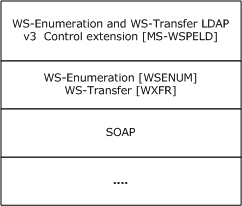

# [MS-WSPELD]: WS-Transfer and WS-Enumeration Protocol Extension for Lightweight Directory Access Protocol v3 Controls

Table of Contents

1 Introduction

- [1 Introduction](#Section_1)
  - [1.1 Glossary](#Section_1.1)
  - [1.2 References](#Section_1.2)
    - [1.2.1 Normative References](#Section_1.2.1)
    - [1.2.2 Informative References](#Section_1.2.2)
  - [1.3 Overview](#Section_1.3)
  - [1.4 Relationship to Other Protocols](#Section_1.4)
  - [1.5 Prerequisites/Preconditions](#Section_1.5)
  - [1.6 Applicability Statement](#Section_1.6)
  - [1.7 Versioning and Capability Negotiation](#Section_1.7)
  - [1.8 Vendor-Extensible Fields](#Section_1.8)
  - [1.9 Standards Assignments](#Section_1.9)

2 Messages

- [2 Messages](#Section_2)
  - [2.1 Transport](#Section_2.1)
  - [2.2 Common Message Syntax](#Section_2.2)
    - [2.2.1 Namespaces](#Section_2.2.1)
    - [2.2.2 Messages](#Section_2.2.2)
    - [2.2.3 Elements](#Section_2.2.3)
      - [2.2.3.1 ad:controls](#Section_2.2.3.1)
        - [2.2.3.1.1 ad:control](#Section_2.2.3.1.1)
        - [2.2.3.1.2 ad:controlValue](#Section_2.2.3.1.2)
    - [2.2.4 Complex Types](#Section_2.2.4)
    - [2.2.5 Simple Types](#Section_2.2.5)
    - [2.2.6 Attributes](#Section_2.2.6)
      - [2.2.6.1 ad:controls/ad:control/@criticality](#Section_2.2.6.1)
      - [2.2.6.2 ad:controls/ad:control/@type](#Section_2.2.6.2)
    - [2.2.7 Groups](#Section_2.2.7)
    - [2.2.8 Attribute Groups](#Section_2.2.8)
    - [2.2.9 Common Data Structures](#Section_2.2.9)
  - [2.3 Directory Service Schema Elements](#Section_2.3)

3 Protocol Details

- [3 Protocol Details](#Section_3)
  - [3.1 Common Server Details](#Section_3.1)
    - [3.1.1 Abstract Data Model](#Section_3.1.1)
    - [3.1.2 Timers](#Section_3.1.2)
    - [3.1.3 Initialization](#Section_3.1.3)
  - [3.2 Resource Server Details](#Section_3.2)
    - [3.2.1 Abstract Data Model](#Section_3.2.1)
    - [3.2.2 Timers](#Section_3.2.2)
    - [3.2.3 Initialization](#Section_3.2.3)
    - [3.2.4 Message Processing Events and Sequencing Rules](#Section_3.2.4)
      - [3.2.4.1 Get](#Section_3.2.4.1)
      - [3.2.4.2 Delete](#Section_3.2.4.2)
      - [3.2.4.3 Put](#Section_3.2.4.3)
    - [3.2.5 Timer Events](#Section_3.2.5)
    - [3.2.6 Other Local Events](#Section_3.2.6)
  - [3.3 ResourceFactory Server Details](#Section_3.3)
    - [3.3.1 Abstract Data Model](#Section_3.3.1)
    - [3.3.2 Timers](#Section_3.3.2)
    - [3.3.3 Initialization](#Section_3.3.3)
    - [3.3.4 Message Processing Events and Sequencing Rules](#Section_3.3.4)
      - [3.3.4.1 Create](#Section_3.3.4.1)
    - [3.3.5 Timer Events](#Section_3.3.5)
    - [3.3.6 Other Local Events](#Section_3.3.6)
  - [3.4 Enumeration Server Details](#Section_3.4)
    - [3.4.1 Abstract Data Model](#Section_3.4.1)
    - [3.4.2 Timers](#Section_3.4.2)
    - [3.4.3 Initialization](#Section_3.4.3)
    - [3.4.4 Message Processing Events and Sequencing Rules](#Section_3.4.4)
      - [3.4.4.1 Pull](#Section_3.4.4.1)
    - [3.4.5 Timer Events](#Section_3.4.5)
    - [3.4.6 Other Local Events](#Section_3.4.6)

4 Protocol Examples

- [4 Protocol Examples](#Section_4)
  - [4.1 WS-Transfer LDAP v3 Controls Extensions Create Example](#Section_4.1)
  - [4.2 WS-Transfer LDAP v3 Controls Extensions Delete Example](#Section_4.2)
  - [4.3 WS-Transfer LDAP v3 Controls Extensions Get Example](#Section_4.3)
  - [4.4 WS-Transfer LDAP v3 Controls Extensions Pull Example](#Section_4.4)

5 Security

- [5 Security](#Section_5)
  - [5.1 Security Considerations for Implementers](#Section_5.1)
  - [5.2 Index of Security Parameters](#Section_5.2)

6 Appendix A: WSDL (Contains Extension Elements Only)

- [6 Appendix A: WSDL (Contains Extension Elements Only)](#Section_6)

7 Appendix B: Schema

- [7 Appendix B: Schema](#Section_7)

For the legal notice and IP terms, see [LEGAL.md](../LEGAL.md).
Last updated: 4/23/2024.
See [Revision History](#revision-history) for full version history.

[7.1 WS-Enumeration [WSENUM] Extended XML Schema 31](#_Toc164822049)

[7.2 Identity Management Operations for Directory Access [WSTIM] Extended XML Schema 32](#_Toc164822050)

[8 Appendix C: Product Behavior](#Section_8)
[9 Change Tracking](#Section_9)

# 1 Introduction

This document specifies the WS-Transfer and WS-Enumeration Protocol Extension for Lightweight Directory Access Protocol v3 Controls, also known as WSPELD. WSPELD extends the Web Services Enumeration (WS-Enumeration) [[WSENUM]](https://go.microsoft.com/fwlink/?LinkId=90580) and Web Services Transfer (WS-Transfer) [[WXFR]](https://go.microsoft.com/fwlink/?LinkId=90587) Protocols. The WSPELD specification specifically targets directory servers exposing semantics similar to [**LDAP**](#gt_lightweight-directory-access-protocol-ldap) v3 [[RFC2251]](https://go.microsoft.com/fwlink/?LinkId=90325).

WSPELD extensions to the [**SOAP**](#gt_soap)-based Enumeration and Transfer protocol include the support for sending and receiving LDAP v3 request and response controls, respectively, while retrieving, querying, and modifying objects or object fragments stored in the directory server through [**SOAP messages**](#gt_soap-message). These extensions act as a controlling factor and influence the operation's behavior implemented using the preceding protocols in a manner specific to the control [RFC2251].

This document also describes how WSPELD extensions need to be used in conjunction with the WS-Transfer: Identity Management Operations for Directory Access Extensions [MS-WSTIM](../MS-WSTIM/MS-WSTIM.md) of Web Services Transfer (WS-Transfer).

Sections 1.5, 1.8, 1.9, 2, and 3 of this specification are normative. All other sections and examples in this specification are informative.

## 1.1 Glossary

This document uses the following terms:

**Active Directory Web Services (ADWS)**: Provides a web service interface to Active Directory Domain Services (AD DS) and Active Directory Lightweight Directory Services (AD LDS) instances.

**directory object**: A [**Lightweight Directory Access Protocol (LDAP)**](#gt_lightweight-directory-access-protocol-ldap) object, as specified in [[RFC2251]](https://go.microsoft.com/fwlink/?LinkId=90325), that is a specialization of an object.

**domain controller (DC)**: The service, running on a server, that implements Active Directory, or the server hosting this service. The service hosts the data store for objects and interoperates with other [**DCs**](#gt_domain-controller-dc) to ensure that a local change to an object replicates correctly across all [**DCs**](#gt_domain-controller-dc). When Active Directory is operating as Active Directory Domain Services (AD DS), the [**DC**](#gt_domain-controller-dc) contains full NC replicas of the configuration naming context (config NC), schema naming context (schema NC), and one of the domain NCs in its forest. If the AD DS [**DC**](#gt_domain-controller-dc) is a global catalog server (GC server), it contains partial NC replicas of the remaining domain NCs in its forest. For more information, see [MS-AUTHSOD](../MS-AUTHSOD/MS-AUTHSOD.md) section 1.1.1.5.2 and [MS-ADTS](../MS-ADTS/MS-ADTS.md). When Active Directory is operating as Active Directory Lightweight Directory Services (AD LDS), several AD LDS [**DCs**](#gt_domain-controller-dc) can run on one server. When Active Directory is operating as AD DS, only one AD DS [**DC**](#gt_domain-controller-dc) can run on one server. However, several AD LDS [**DCs**](#gt_domain-controller-dc) can coexist with one AD DS [**DC**](#gt_domain-controller-dc) on one server. The AD LDS [**DC**](#gt_domain-controller-dc) contains full NC replicas of the config NC and the schema NC in its forest. The domain controller is the server side of Authentication Protocol Domain Support [MS-APDS](../MS-APDS/MS-APDS.md).

**Lightweight Directory Access Protocol (LDAP)**: The primary access protocol for Active Directory. Lightweight Directory Access Protocol (LDAP) is an industry-standard protocol, established by the Internet Engineering Task Force (IETF), which allows users to query and update information in a directory service (DS), as described in [MS-ADTS]. The Lightweight Directory Access Protocol can be either version 2 [[RFC1777]](https://go.microsoft.com/fwlink/?LinkId=90290) or version 3 [[RFC3377]](https://go.microsoft.com/fwlink/?LinkID=91337).

**object identifier (OID)**: In the Lightweight Directory Access Protocol (LDAP), a sequence of numbers in a format described by [[RFC1778]](https://go.microsoft.com/fwlink/?LinkId=90291). In many LDAP directory implementations, an OID is the standard internal representation of an attribute. In the directory model used in this specification, the more familiar ldapDisplayName represents an attribute.

**schema**: The set of attributes and object classes that govern the creation and update of objects.

**SOAP**: A lightweight protocol for exchanging structured information in a decentralized, distributed environment. [**SOAP**](#gt_soap) uses [**XML**](#gt_xml) technologies to define an extensible messaging framework, which provides a message construct that can be exchanged over a variety of underlying protocols. The framework has been designed to be independent of any particular programming model and other implementation-specific semantics. SOAP 1.2 supersedes SOAP 1.1. See [[SOAP1.2-1/2003]](https://go.microsoft.com/fwlink/?LinkId=90521).

**SOAP message**: An [**XML**](#gt_xml) document consisting of a mandatory SOAP envelope, an optional SOAP header, and a mandatory SOAP body. See [[SOAP1.2-1/2007]](https://go.microsoft.com/fwlink/?LinkId=94664) section 5 for more information.

**Web Services Description Language (WSDL)**: An XML format for describing network services as a set of endpoints that operate on messages that contain either document-oriented or procedure-oriented information. The operations and messages are described abstractly and are bound to a concrete network protocol and message format in order to define an endpoint. Related concrete endpoints are combined into abstract endpoints, which describe a network service. WSDL is extensible, which allows the description of endpoints and their messages regardless of the message formats or network protocols that are used.

**WSDL port type**: A named set of logically-related, abstract [**Web Services Description Language (WSDL)**](#gt_web-services-description-language-wsdl) operations and messages.

**XML**: The Extensible Markup Language, as described in [[XML1.0]](https://go.microsoft.com/fwlink/?LinkId=90599).

**XML namespace**: A collection of names that is used to identify elements, types, and attributes in XML documents identified in a URI reference [[RFC3986]](https://go.microsoft.com/fwlink/?LinkId=90453). A combination of XML namespace and local name allows XML documents to use elements, types, and attributes that have the same names but come from different sources. For more information, see [[XMLNS-2ED]](https://go.microsoft.com/fwlink/?LinkId=90602).

**XML Schema (XSD)**: A language that defines the elements, attributes, namespaces, and data types for [**XML**](#gt_xml) documents as defined by [[XMLSCHEMA1/2]](https://go.microsoft.com/fwlink/?LinkId=90607) and [[XMLSCHEMA2/2]](https://go.microsoft.com/fwlink/?LinkId=90609) standards. An XML schema uses [**XML**](#gt_xml) syntax for its language.

**MAY, SHOULD, MUST, SHOULD NOT, MUST NOT:** These terms (in all caps) are used as defined in [[RFC2119]](https://go.microsoft.com/fwlink/?LinkId=90317). All statements of optional behavior use either MAY, SHOULD, or SHOULD NOT.

## 1.2 References

Links to a document in the Microsoft Open Specifications library point to the correct section in the most recently published version of the referenced document. However, because individual documents in the library are not updated at the same time, the section numbers in the documents may not match. You can confirm the correct section numbering by checking the [Errata](https://go.microsoft.com/fwlink/?linkid=850906).

### 1.2.1 Normative References

We conduct frequent surveys of the normative references to assure their continued availability. If you have any issue with finding a normative reference, please contact [dochelp@microsoft.com](mailto:dochelp@microsoft.com). We will assist you in finding the relevant information.

[MS-ADDM] Microsoft Corporation, "[Active Directory Web Services: Data Model and Common Elements](../MS-ADDM/MS-ADDM.md)".

[MS-ADTS] Microsoft Corporation, "[Active Directory Technical Specification](../MS-ADTS/MS-ADTS.md)".

[MS-WSDS] Microsoft Corporation, "[WS-Enumeration: Directory Services Protocol Extensions](../MS-WSDS/MS-WSDS.md)".

[MS-WSTIM] Microsoft Corporation, "[WS-Transfer: Identity Management Operations for Directory Access Extensions](../MS-WSTIM/MS-WSTIM.md)".

[RFC2119] Bradner, S., "Key words for use in RFCs to Indicate Requirement Levels", BCP 14, RFC 2119, March 1997, [https://www.rfc-editor.org/info/rfc2119](https://go.microsoft.com/fwlink/?LinkId=90317)

[RFC2251] Wahl, M., Howes, T., and Kille, S., "Lightweight Directory Access Protocol (v3)", RFC 2251, December 1997, [https://www.rfc-editor.org/info/rfc2251](https://go.microsoft.com/fwlink/?LinkId=90325)

[RFC2696] Weider, C., Herron, A., Anantha, A., and Howes, T., "LDAP Control Extension for Simple Paged Results Manipulation", RFC 2696, September 1999, [https://www.rfc-editor.org/info/rfc2696](https://go.microsoft.com/fwlink/?LinkId=91352)

[SOAP1.1] Box, D., Ehnebuske, D., Kakivaya, G., et al., "Simple Object Access Protocol (SOAP) 1.1", W3C Note, May 2000, [https://www.w3.org/TR/2000/NOTE-SOAP-20000508/](https://go.microsoft.com/fwlink/?LinkId=90520)

[SOAP1.2-1/2003] Gudgin, M., Hadley, M., Mendelsohn, N., et al., "SOAP Version 1.2 Part 1: Messaging Framework", W3C Recommendation, June 2003, [http://www.w3.org/TR/2003/REC-soap12-part1-20030624](https://go.microsoft.com/fwlink/?LinkId=90521)

[SOAP1.2-2/2003] Gudgin, M., Hadley, M., Mendelsohn, N., et al., "SOAP Version 1.2 Part 2: Adjuncts", W3C Recommendation, June 2003, [http://www.w3.org/TR/2003/REC-soap12-part2-20030624](https://go.microsoft.com/fwlink/?LinkId=90522)

[WSDL] Christensen, E., Curbera, F., Meredith, G., and Weerawarana, S., "Web Services Description Language (WSDL) 1.1", W3C Note, March 2001, [https://www.w3.org/TR/2001/NOTE-wsdl-20010315](https://go.microsoft.com/fwlink/?LinkId=90577)

[WSENUM] Alexander, J., Box, D., Cabrera, L.F., et al., "Web Services Enumeration (WS-Enumeration)", March 2006, [http://www.w3.org/Submission/2006/SUBM-WS-Enumeration-20060315/](https://go.microsoft.com/fwlink/?LinkId=90580)

[WXFR] Alexander, J., Box, D., Cabrera, L.F., et al., "Web Services Transfer (WS-Transfer)", September 2006, [http://www.w3.org/Submission/2006/SUBM-WS-Transfer-20060927/](https://go.microsoft.com/fwlink/?LinkId=90587)

[XMLNS] Bray, T., Hollander, D., Layman, A., et al., Eds., "Namespaces in XML 1.0 (Third Edition)", W3C Recommendation, December 2009, [https://www.w3.org/TR/2009/REC-xml-names-20091208/](https://go.microsoft.com/fwlink/?LinkId=191840)

[XMLSCHEMA1] Thompson, H., Beech, D., Maloney, M., and Mendelsohn, N., Eds., "XML Schema Part 1: Structures", W3C Recommendation, May 2001, [https://www.w3.org/TR/2001/REC-xmlschema-1-20010502/](https://go.microsoft.com/fwlink/?LinkId=90608)

[XMLSCHEMA2] Biron, P.V., Ed. and Malhotra, A., Ed., "XML Schema Part 2: Datatypes", W3C Recommendation, May 2001, [https://www.w3.org/TR/2001/REC-xmlschema-2-20010502/](https://go.microsoft.com/fwlink/?LinkId=90610)

### 1.2.2 Informative References

[MSFT-RSAT] Microsoft Corporation, "Remote Server Administration Tools (RSAT) for Windows operating systems", [https://support.microsoft.com/en-us/kb/2693643](https://go.microsoft.com/fwlink/?linkid=839006)

## 1.3 Overview

The WS-Enumeration [[WSENUM]](https://go.microsoft.com/fwlink/?LinkId=90580) and WS-Transfer [[WXFR]](https://go.microsoft.com/fwlink/?LinkId=90587) specifications are [**SOAP**](#gt_soap)-based protocols that define various operations to manage data on a server. The WSPELD Protocol specifies [**LDAP**](#gt_lightweight-directory-access-protocol-ldap) v3 control extensions to operations defined by these protocols when the service implementation is targeting a LDAP v3 directory server [[RFC2251]](https://go.microsoft.com/fwlink/?LinkId=90325).

Section 4.1.12 of [RFC2251] specifies that a client can send a control to the directory server by attaching a control structure to an LDAP operation.

A control consists of the following:

- An [**object identifier (OID)**](#gt_object-identifier-oid) assigned to the control.
- The criticality value (true or false).
- The controlValue contents.
A control sent by the client to a server is known as a **request control**. In some cases, the server includes a corresponding control structure attached to the response for the LDAP operation. These controls are known as **response controls**.

The control structures are used for extending existing LDAP operations. For instance, a directory server based on LDAP v3 [RFC2251] might enforce the limits to the maximum number of objects (maxLimit) that can be returned in a single search operation performed. If the server enforces the maxLimit, then the pagedResultsControl control documented in [[RFC2696]](https://go.microsoft.com/fwlink/?LinkId=91352) can be used to perform searches that return more objects than maxLimit by splitting the search into multiple searches, each of which returns no more objects than maxLimit. The pagedResultsControl control can be used as both a request control and response control.

WSPELD provides a way of sending and receiving the LDAP v3 controls explained here to control the operations defined by the WS-Enumeration and WS-Transfer protocols in a specific manner depending on the nature of the control [RFC2251]. These LDAP v3 control extensions apply to both request and response [**SOAP messages**](#gt_soap-message).

## 1.4 Relationship to Other Protocols

WSPELD is a common extension to both WS-Enumeration [[WSENUM]](https://go.microsoft.com/fwlink/?LinkId=90580) and WS-Transfer [[WXFR]](https://go.microsoft.com/fwlink/?LinkId=90587) protocols built on top of [**SOAP**](#gt_soap) binding ([[SOAP1.2-1/2003]](https://go.microsoft.com/fwlink/?LinkId=90521)) as shown in the following layering diagram.

Figure 1: WSPELD protocol stack

## 1.5 Prerequisites/Preconditions

None.

## 1.6 Applicability Statement

There is an implicit assumption that the directory service in consideration supports an [**LDAP**](#gt_lightweight-directory-access-protocol-ldap) v3 directory service [[RFC2251]](https://go.microsoft.com/fwlink/?LinkId=90325). That is, it supports including LDAP v3 controls specifying extensions to existing directory operations by way of request and response messages.<1>

## 1.7 Versioning and Capability Negotiation

This document covers versioning issues in the following areas:

- **Supported Transports:** The WSPELD protocol extension can be implemented using transports that support sending [**SOAP messages**](#gt_soap-message) as described in section Transport ([2.1](#Section_2.1)).
- **Protocol Versions:** The WSPELD protocol extension is not versioned.
- **Capability Negotiation:** The WSPELD protocol does not support capability negotiation.

## 1.8 Vendor-Extensible Fields

None.

## 1.9 Standards Assignments

None.

# 2 Messages

## 2.1 Transport

The WSPELD protocol imposes no transport requirements or behaviors beyond those of the underlying WS-Enumeration [[WSENUM]](https://go.microsoft.com/fwlink/?LinkId=90580) or WS-Transfer [[WXFR]](https://go.microsoft.com/fwlink/?LinkId=90587) protocols. WS-Enumeration and WS-Transfer provide [**SOAP**](#gt_soap) bindings for both SOAP 1.1 [[SOAP1.1]](https://go.microsoft.com/fwlink/?LinkId=90520) and SOAP 1.2 [[SOAP1.2-1/2003]](https://go.microsoft.com/fwlink/?LinkId=90521) [[SOAP1.2-2/2003]](https://go.microsoft.com/fwlink/?LinkId=90522). All messages MUST be formatted as specified by either SOAP 1.1 or SOAP 1.2.

## 2.2 Common Message Syntax

This section contains common definitions used by this protocol. The syntax of the definitions uses [**XML Schema**](#gt_xml-schema-xsd), as defined in [[XMLSCHEMA1]](https://go.microsoft.com/fwlink/?LinkId=90608) and [[XMLSCHEMA2]](https://go.microsoft.com/fwlink/?LinkId=90610), and [**Web Services Description Language (WSDL)**](#gt_web-services-description-language-wsdl) as defined in [[WSDL]](https://go.microsoft.com/fwlink/?LinkId=90577).

### 2.2.1 Namespaces

This specification references various [**XML namespaces**](#gt_xml-namespace) using the mechanisms specified in [[XMLNS]](https://go.microsoft.com/fwlink/?LinkId=191840). Although this specification associates a specific XML namespace prefix for each XML namespace that is used, the choice of any particular XML namespace prefix is implementation-specific and not significant for interoperability.

Prefixes and XML namespaces used in this specification include the following.

| Prefix | Namespace URI | Reference |
| --- | --- | --- |
| soapenv: | http://www.w3.org/2003/05/soap-envelope | [[SOAP1.2-1/2003]](https://go.microsoft.com/fwlink/?LinkId=90521) |
| soapenv11: | http://schemas.xmlsoap.org/soap/envelope | [[SOAP1.1]](https://go.microsoft.com/fwlink/?LinkId=90520) |
| wsa: | http://www.w3.org/2005/08/addressing | [[WSENUM]](https://go.microsoft.com/fwlink/?LinkId=90580) |
| wsen: | http://schemas.xmlsoap.org/ws/2004/09/enumeration | [WSENUM] |
| ad: | http://schemas.microsoft.com/2008/1/ActiveDirectory | [MS-ADDM](../MS-ADDM/MS-ADDM.md) |
| addata: | http://schemas.microsoft.com/2008/1/ActiveDirectory/Data | [MS-ADDM] |
| adlq: | http://schemas.microsoft.com/2008/1/ActiveDirectory/Dialect/LdapQuery | [MS-WSDS](../MS-WSDS/MS-WSDS.md) |
| da: | http://schemas.microsoft.com/2006/11/IdentityManagement/DirectoryAccess | [MS-WSTIM](../MS-WSTIM/MS-WSTIM.md) |

### 2.2.2 Messages

None.

### 2.2.3 Elements

The following table summarizes the set of common XML schema element definitions defined by this specification. XML schema element definitions that are specific to a particular operation are described with the operation.

| Element | Description |
| --- | --- |
| ad:controls | Specify [**LDAP**](#gt_lightweight-directory-access-protocol-ldap) v3 request controls sent by a client and response controls returned back by the directory server. |

#### 2.2.3.1 ad:controls

**ad:controls** is an optional element to be specified by the client. In cases where a response control is required to be returned when the client sends an [**LDAP**](#gt_lightweight-directory-access-protocol-ldap) v3 request control, the server MUST return an LDAP v3 response control.<2>

The optional ad:controls element, if present:

- MUST be a child element to the Body element of the [**SOAP**](#gt_soap) request and response message in the case of Get and Delete [[WXFR]](https://go.microsoft.com/fwlink/?LinkId=90587) operations.
- MUST be a child element to the **da:BaseObjectSearchRequest**, **da:AddRequest**, and **da:ModifyRequest** element in the SOAP request message (and **da:BaseObjectSearchResponse**, **soapenv:Body**, and **soapenv:Body** element in the SOAP response message) in cases of Get, Create, and Put [MS-WSTIM](../MS-WSTIM/MS-WSTIM.md) operations, respectively.
- MUST be a child element to the **wsen:Pull** element of the SOAP request message and the **wsen:PullResponse** element of the SOAP response message in the case of a Pull [[WSENUM]](https://go.microsoft.com/fwlink/?LinkId=90580) operation.
Additionally, the **ad:controls** element MUST be the last child element in the SOAP response. WSPELD through this element specifies the support for including LDAP request controls sent through SOAP request messages. The messages pertain to various operations and LDAP response controls that are returned by the directory server to the caller in the SOAP response messages of respective operations.

The [**XML Schema**](#gt_xml-schema-xsd) [[XMLSCHEMA1]](https://go.microsoft.com/fwlink/?LinkId=90608) definition of the controls element is as follows.

<xsd:element name="controls">

<xsd:complexType>

<xsd:sequence>

<xsd:element ref="ad:control"

minOccurs="1" maxOccurs="unbounded" />

</xsd:sequence>

</xsd:complexType>

</xsd:element>

For example, the following [**XML**](#gt_xml) shows the contents of the controls element.

<ad:controls>

<ad:control type="OID as xsi:string" criticality="true|false">

<ad:controlValue xsi:type="xsd:base64Binary">

[base-64 encoded value]

</ad:controlValue>

</ad:control>

</ad:controls>

##### 2.2.3.1.1 ad:control

The required element **ad:control** MUST be the child element of the ad:controls (section [2.2.3.1](#Section_2.2.3.1)) element. The **ad:control** element might have a value (see section [2.2.3.1.2](#Section_2.2.3.1.2) for the ad:controlValue element).

The [**XML Schema**](#gt_xml-schema-xsd) [[XMLSCHEMA1]](https://go.microsoft.com/fwlink/?LinkId=90608) definition of the control element is as follows.

<xsd:element name="control">

<xsd:complexType>

<xsd:sequence>

<xsd:element ref="ad:controlValue"

minOccurs="0" maxOccurs="1" />

</xsd:sequence>

<xsd:attribute name="type" use="required" type= "xsd:string" />

<xsd:attribute name="criticality" use="required" type= "xsd:boolean" />

</xsd:complexType>

</xsd:element>

For example, the following [**XML**](#gt_xml) shows the contents of the control element.

<ad:control type="OID as xsi:string" criticality=(true|false)>

<ad:controlValue xsi:type="xsd:base64Binary">

[base-64 encoded value]

</ad:controlValue>

</ad:control>

For the value of attributes "type" and "criticality", see sections [2.2.6.2](#Section_2.2.6.2) and [2.2.6.1](#Section_2.2.6.1), respectively.

##### 2.2.3.1.2 ad:controlValue

The optional element **ad:controlValue**, if present, MUST be the child element of the ad:control element defined in section [2.2.3.1.1](#Section_2.2.3.1.1). This element specifies the value for the respective [**LDAP**](#gt_lightweight-directory-access-protocol-ldap) v3 request or response control.

The [**XML Schema**](#gt_xml-schema-xsd) [[XMLSCHEMA1]](https://go.microsoft.com/fwlink/?LinkId=90608) definition of the controlValue element is as follows.

<xsd:element name="controlValue" type="xsd:base64Binary" />

For example, the following [**XML**](#gt_xml) shows the contents of the controlValue element.

<ad:controlValue xsi:type="xsd:base64Binary">

[base-64 encoded value]

</ad:controlValue>

The controlValue MUST be a base64-encoded value. Attribute "xsi:type" SHOULD be included with its value equal to "xsd:base64Binary".

### 2.2.4 Complex Types

This specification does not define any common XML schema complex type definitions.

### 2.2.5 Simple Types

This specification does not define any common XML schema simple type definitions.

### 2.2.6 Attributes

The following table summarizes the set of common XML schema attribute definitions defined by this specification. XML schema attributes that are specific to a particular operation are described with the operation.

| Attribute | Description |
| --- | --- |
| criticality | Specifies whether the [**LDAP**](#gt_lightweight-directory-access-protocol-ldap) v3 request or response control is critical. |
| type | Contains the [**Object Identifier (OID)**](#gt_object-identifier-oid) of the LDAP v3 request or response control. |

#### 2.2.6.1 ad:controls/ad:control/@criticality

The value for required attribute ad:controls/ad:control/@criticality MUST be **Boolean** (true or false) as **String**.

#### 2.2.6.2 ad:controls/ad:control/@type

The value for required attribute ad:controls/ad:control/@type MUST be a UTF-8 encoded, dotted-decimal representation of an [**OID**](#gt_object-identifier-oid) as **String**. This attribute uniquely identifies the [**LDAP**](#gt_lightweight-directory-access-protocol-ldap) v3 controls as specified in section 4.1.12 of [[RFC2251]](https://go.microsoft.com/fwlink/?LinkId=90325).

### 2.2.7 Groups

This specification does not define any common XML schema group definitions.

### 2.2.8 Attribute Groups

This specification does not define any common XML schema attribute group definitions.

### 2.2.9 Common Data Structures

None.

## 2.3 Directory Service Schema Elements

This specification does not make use of any directory service [**schema**](#gt_schema) elements.

# 3 Protocol Details

The following sections describe the behavior of the WSPELD protocol. As an extension to WS-Enumeration and WS-Transfer, the WSPELD extensions follow the same client-server model, in which a client sends a [**SOAP message**](#gt_soap-message) containing a request (either a Get, Put, Create, Delete or Pull operation) to the server and the server responds with a SOAP message containing the response, or a [**SOAP**](#gt_soap) fault, if an error occurred during the server processing.

The WSPELD extensions apply to both WS-Enumeration [**WSDL**](#gt_web-services-description-language-wsdl) and WS-Transfer [**WSDL port types**](#gt_wsdl-port-type): the Enumeration port type (on which Pull operations are processed), the Resource WSDL port type (on which Get, Put, and Delete operations are processed), and the ResourceFactory WSDL port type (on which Create operations are processed). Since the WSPELD extensions are common to all these operations on all WSDL port types, a common server processing section is included that contains protocol details.

The client side of this protocol is a pass-through. No additional timers or state information is required on the client side of this protocol. Calls made by the higher-layer protocol or application are passed directly to the transport, and the results returned by the transport are passed directly back to the higher-layer protocol or application.

## 3.1 Common Server Details

This section documents the abstract data model and initialization procedure common to all [**WSDL port types**](#gt_wsdl-port-type).

### 3.1.1 Abstract Data Model

This section describes a conceptual model of possible data organization that an implementation maintains to participate in this protocol. The described organization is provided to facilitate the explanation of how the protocol behaves. This document does not mandate that implementations adhere to this model as long as their external behavior is consistent with that described in this document.

WSPELD extensions apply to both the WS-Enumeration [[WSENUM]](https://go.microsoft.com/fwlink/?LinkId=90580) and WS-Transfer [[WXFR]](https://go.microsoft.com/fwlink/?LinkId=90587) protocols. When added, these extensions participate as a controlling factor, influencing the existing operations performed by implementing those protocols, in a specific manner. WSPELD does not define any abstract data model of its own beyond the underlying data model description provided by the WS-Enumeration and WS-Transfer Protocols. Implementers should refer to the abstract model defined in section 3.1.1 of [MS-WSTIM](../MS-WSTIM/MS-WSTIM.md), when these extensions are being used with WSTIM extensions.

### 3.1.2 Timers

None.

### 3.1.3 Initialization

WSPELD imposes no initialization requirements beyond those of the underlying WS-Enumeration or WS-Transfer Protocol. When initialized, WS-Enumeration and WS-Transfer begin listening on endpoints for the Enumeration, Resource, and ResourceFactory [**WSDL port types**](#gt_wsdl-port-type). The URIs for the endpoints, as well as the transport and security mechanisms to use, are implementation-dependent.<3>

## 3.2 Resource Server Details

In WS-Transfer [[WXFR]](https://go.microsoft.com/fwlink/?LinkId=90587), this [**WSDL port type**](#gt_wsdl-port-type) is used to process three [**WSDL**](#gt_web-services-description-language-wsdl) operations:

- Get
- Put
- Delete

### 3.2.1 Abstract Data Model

See the abstract data model in the common processing section [3.1.1](#Section_3.1.1).

### 3.2.2 Timers

None.

### 3.2.3 Initialization

See the initialization in the common server details, section [3.1.3](#Section_3.1.3).

### 3.2.4 Message Processing Events and Sequencing Rules

The Resource [**WSDL port type**](#gt_wsdl-port-type) includes three operations.

| Operation | Description |
| --- | --- |
| Get | Retrieves one or more directory attributes from a [**directory object**](#gt_directory-object). |
| Put | Modifies the contents of one or more directory attributes on a directory object. |
| Delete | Removes an existing directory object. |

The [**LDAP**](#gt_lightweight-directory-access-protocol-ldap) request and response controls element specified in section [2.2.3.1](#Section_2.2.3.1) could be a part of both [**SOAP**](#gt_soap) request and response messages, respectively, for the preceding operations.

#### 3.2.4.1 Get

This section specifies extensions to the Get operation defined by WS-Transfer [[WXFR]](https://go.microsoft.com/fwlink/?LinkId=90587). It also specifies how these extensions must be used in conjunction with the Get operation extension, defined by the WSTIM extensions [MS-WSTIM](../MS-WSTIM/MS-WSTIM.md).

The WS-Transfer specification of Get operates at the level of granularity of the complete representation of an entire [**directory object**](#gt_directory-object). That is, when the object is retrieved, the complete contents of the object MUST be retrieved.

There are no body blocks defined by default for a Get request in the WS-Transfer specification. Additionally, WS-Transfer mandates that the directory object requested MUST be the initial child element of the **soapenv:Body** element of the response message.

The presence of subsequent child elements is service-specific according to [WXFR].

WSPELD specifies that the **ad:controls** element defined in section [2.2.3.1](#Section_2.2.3.1), if present in the Get request message, MUST be a child element of the **soapenv:Body** element and can be specified in any order in the presence of other child elements. See the example in section [4.3](#Section_4.3) for the WS-Transfer Get request message with controls extension. However, for the Get Response message, the protocol mandates that the **ad:controls** element, if present, MUST be the last child element of the **soapenv:Body** element.

The WSTIM extensions of Get extensions operates at the level of granularity of portions of the representation of a directory object. That is, its extensions allow retrieving a fragment of a directory object. To request such granularity, it defines a **BaseObjectSearchRequest** element, wrapping various child elements representing the requested fragment inside the **soapenv:Body** element of the request message (the response message of the preceding request contains the **BaseObjectSearchResponse** element, containing one or more **PartialAttribute** elements representing the fragment of the directory object. WSPELD specifies that **ad:controls** element defined in section 2.2.3.1, if present, MUST be the child element of the **BaseObjectSearchRequest** element in the request message and can be specified in any order). However, for the Response message, the protocol mandates that the **ad:controls** element, if present, MUST be the last child element of the **BaseObjectSearchResponse** element.

#### 3.2.4.2 Delete

This section specifies extensions to the delete operation defined by WS-Transfer [[WXFR]](https://go.microsoft.com/fwlink/?LinkId=90587).

There are no body elements defined for a Delete request and Response message by WS-Transfer. WSPELD specifies that the **ad:controls** element defined in section [2.2.3.1](#Section_2.2.3.1), if present in the Delete request message, MUST be a child element of the **soapenv:Body** element and can be specified in any order. However, for the Response message, the protocol mandates that the **ad:controls** element, if present, MUST be the last child element of the **soapenv:Body** element.

See the example in section [4.2](#Section_4.2) for the WS-Transfer Delete request message with controls extension.

#### 3.2.4.3 Put

This section specifies extensions to the Put operation extensions defined by the WSTIM extensions [MS-WSTIM](../MS-WSTIM/MS-WSTIM.md).

The WSTIM extensions specification of Put extensions operates at the level of granularity of portions of the representation of a [**directory object**](#gt_directory-object). That is, its extensions allow modifying a fragment of a directory object.

To request modifications at such granularity, the change elements are wrapped inside the **ModifyRequest** element (defined in [MS-WSTIM] section 3.2.4.2) of the request message. WSPELD specifies that the **ad:controls** element defined in section [2.2.3.1](#Section_2.2.3.1), if present, MUST be the child element of the **ModifyRequest** element in the request message and can be specified in any order in the presence of other child elements. The response to this Put operation, **ModifyResponseMessage** ([MS-WSTIM] section 3.2.4.2.1.2), has an empty message body. However, for a response message the **ad:controls** element, if present, MUST be a child element of the **soapenv:Body** element of this **ModifyResponseMessage**.

### 3.2.5 Timer Events

None.

### 3.2.6 Other Local Events

None.

## 3.3 ResourceFactory Server Details

In WS-Transfer [[WXFR]](https://go.microsoft.com/fwlink/?LinkId=90587), this [**WSDL port type**](#gt_wsdl-port-type) is used to process the Create operation.

Note that unlike operations performed on the Resource WSDL port type, the Create operation does not target a specific [**directory object**](#gt_directory-object) but rather causes the creation of a directory object, which can subsequently be targeted by operations on the Resource WSDL port type.

### 3.3.1 Abstract Data Model

See the abstract data model in the common processing section [3.1.1](#Section_3.1.1).

### 3.3.2 Timers

None.

### 3.3.3 Initialization

See the initialization in the common processing section [3.1.3](#Section_3.1.3).

### 3.3.4 Message Processing Events and Sequencing Rules

The ResourceFactory [**WSDL port type**](#gt_wsdl-port-type) includes one operation.

| Operation | Description |
| --- | --- |
| Create | Creates a new [**directory object**](#gt_directory-object) |

The [**LDAP**](#gt_lightweight-directory-access-protocol-ldap) request and response controls element specified in section [2.2.3.1](#Section_2.2.3.1) could be a part of both Create [**SOAP**](#gt_soap) request and response messages, respectively.

#### 3.3.4.1 Create

This section specifies extensions to the Create operation extensions defined by the WSTIM extensions [MS-WSTIM](../MS-WSTIM/MS-WSTIM.md).

The WSTIM extensions specification of create extensions permits the client to specify only a portion of the [**directory object**](#gt_directory-object) that is to be created, with the server supplying any remaining portions of the directory object when it creates the object.

WSPELD specifies that the **ad:controls** element defined in section [2.2.3.1](#Section_2.2.3.1), if present, MUST be the child element of the **AddRequest** element in the request message and can be specified in any order in the presence of other child elements. The contents of [**SOAP**](#gt_soap) response message (AddResponseMessage [MS-WSTIM] (section 3.3.4.1.1.2)) are a resource reference, <wxf:ResourceCreated>, for the newly created object. WSPELD specifies that the **ad:controls** element, if present, MUST be the last child element of the soapenv:Body element of this **AddResponseMessage**.

See the example in section [4.1](#Section_4.1) for the WSTIM extensions Create request and response message with controls extension.

### 3.3.5 Timer Events

None.

### 3.3.6 Other Local Events

None.

## 3.4 Enumeration Server Details

In WS-Enumeration [[WSENUM]](https://go.microsoft.com/fwlink/?LinkId=90580), this [**WSDL port type**](#gt_wsdl-port-type) is used to process the following five [**WSDL**](#gt_web-services-description-language-wsdl) operations:

- Enumeration
- Pull
- Renew
- GetStatus
- Release
However, WSPELD extensions apply only to the Pull WSDL operation among the five of them.

### 3.4.1 Abstract Data Model

See the abstract data model in the common processing section [3.1.1](#Section_3.1.1).

### 3.4.2 Timers

None.

### 3.4.3 Initialization

See the initialization in the common processing section [3.1.3](#Section_3.1.3).

### 3.4.4 Message Processing Events and Sequencing Rules

The Enumeration [**WSDL port type**](#gt_wsdl-port-type) includes one operation to which WSPELD applies.

| Operation | Description |
| --- | --- |
| Pull | Pulls the resultant [**directory objects**](#gt_directory-object) in the context of a specific enumeration |

The [**LDAP**](#gt_lightweight-directory-access-protocol-ldap) request and response controls element specified in section [2.2.3.1](#Section_2.2.3.1) could be a part of both [**SOAP**](#gt_soap) Pull request and response messages, respectively.

#### 3.4.4.1 Pull

This section specifies extensions to the Pull operation defined by WS-Enumeration [[WSENUM]](https://go.microsoft.com/fwlink/?LinkId=90580).

WS-Enumeration specifies that the Pull operation, which involves pulling [**directory object**](#gt_directory-object) fragments requested during Enumeration, is initiated by sending a Pull request message containing the Pull element inside a **soapenv:Body** element to the directory server.

On successful processing of a Pull request message, the directory server is expected to return a Pull response message containing the resultant object fragments wrapped by a **pullResponse** element inside a **soapenv:Body** element.

WSPELD specifies that the **ad:controls** element defined in section [2.2.3.1](#Section_2.2.3.1), if present, MUST be the child element of the Pull element in the request message and can be specified in any order in the presence of other child elements. However, for the response message, the protocol mandates that the **ad:controls** element, if present, MUST be the last child element of the **PullResponse** element.

See the example in section [4.4](#Section_4.4) for the WS-Enumeration [WSENUM] Pull request and response message with controls extension.

### 3.4.5 Timer Events

None.

### 3.4.6 Other Local Events

None.

# 4 Protocol Examples

In this section, several sample WS-Transfer and WS-Enumeration operations with controls are presented.

- Section [4.1](#Section_4.1) : A [**directory object**](#gt_directory-object) is created using the Create operation.
- Section [4.2](#Section_4.2): The directory object is deleted from the directory server using the Delete operation.
- Section [4.3](#Section_4.3): Information from that deleted directory object is then retrieved using the Get operation including ShowDeleted control.
- Section [4.4](#Section_4.4): The object is enumerated and pulled using the WS-Enumeration Pull operation.
For illustrative purposes, these examples have been shown in the context of [**Active Directory Web Services (ADWS)**](#gt_active-directory-web-services-adws).

## 4.1 WS-Transfer LDAP v3 Controls Extensions Create Example

In this example, a new [**directory object**](#gt_directory-object) is created using a Create operation with the [MS-WSTIM](../MS-WSTIM/MS-WSTIM.md) protocol extensions. During the creation, an [**LDAP**](#gt_lightweight-directory-access-protocol-ldap) control (LDAP_SERVER_LAZY_COMMIT_OID) ([MS-ADTS](../MS-ADTS/MS-ADTS.md) section 3.1.1.3.4.1.7) is added to the request, which instructs the [**DC**](#gt_domain-controller-dc) that it can sacrifice durability guarantees on updates to improve performance. Sending this control to the DC does not cause the server to include any controls in its response.

SOAP Request Message

<soapenv:Envelope

xmlns: soapenv="http://www.w3.org/2003/05/soap-envelope"

xmlns:wsa="http://www.w3.org/2005/08/addressing"

xmlns:wxf="http://schemas.xmlsoap.org/ws/2004/09/transfer"

xmlns:ad="http://schemas.microsoft.com/2008/1/ActiveDirectory"

xmlns:addata=

"http://schemas.microsoft.com/2008/1/ActiveDirectory/Data"

xmlns:xsi="http://www.w3.org/2001/XMLSchema-instance"

xmlns:xsd="http://www.w3.org/2001/XMLSchema">

<soapenv:Header>

<wsa:Action soapenv:mustUnderstand="1">

http://schemas.xmlsoap.org/ws/2004/09/transfer/Create

</wsa:Action>

<IdentityManagementOperation soapenv:mustUnderstand="1" xmlns=

"http://schemas.microsoft.com/2006/11/IdentityManagement/

DirectoryAccess" />

<instance xmlns="http://schemas.microsoft.com/2008/1/

ActiveDirectory">

ldap:389

</instance>

<wsa:MessageID>

urn:uuid:e0a0abb3-0c4f-4679-ad0c-366078c47c32

</wsa:MessageID>

<wsa:ReplyTo>

<wsa:Address>http://www.w3.org/2005/08/addressing/

anonymous</wsa:Address>

</wsa:ReplyTo>

<wsa:To soapenv:mustUnderstand="1">

net.tcp://server01.fabrikam.com:9389/ActiveDirectoryWebServices/

Windows/ResourceFactory</wsa:To>

</soapenv:Header>

<soapenv:Body>

<AddRequest Dialect="http://schemas.microsoft.com/2008/1/

ActiveDirectory/Dialect/XPath-Level-1"

xmlns="http:"//schemas.microsoft.com/2006/11/IdentityManagement/

DirectoryAccess> <AttributeTypeAndValue>

<AttributeType>addata:objectClass</AttributeType>

<AttributeValue>

<ad:value xsi:type="xsd:string">user</ad:value>

</AttributeValue>

</AttributeTypeAndValue>

<AttributeTypeAndValue>

<AttributeType>addata:description</AttributeType>

<AttributeValue>

<ad:value xsi:type="xsd:string">Sample description.

</ad:value>

</AttributeValue>

</AttributeTypeAndValue>

<AttributeTypeAndValue>

<AttributeType>addata:otherTelephone</AttributeType>

<AttributeValue>

<ad:value xsi:type="xsd:string">(425) 555-0100

</ad:value>

<ad:value xsi:type="xsd:string">(206) 555-0100

</ad:value>

</AttributeValue>

</AttributeTypeAndValue>

<AttributeTypeAndValue>

<AttributeType>ad:container-hierarchy-parent

</AttributeType>

<AttributeValue>

<ad:value xsi:type="xsd:string">

CN=Users,DC=fabrikam,DC=com

</ad:value>

</AttributeValue>

</AttributeTypeAndValue>

<AttributeTypeAndValue>

<AttributeType>ad:relativeDistinguishedName

</AttributeType>

<AttributeValue>

<ad:value xsi:type="xsd:string">CN=Sample User

</ad:value>

</AttributeValue>

</AttributeTypeAndValue>

<ad:controls>

<ad:control type='1.2.840.113556.1.4.619'

criticality='true' />

</ad:controls>

</AddRequest>

</soapenv:Body>

</soapenv:Envelope>

SOAP Response Message

<soapenv:Envelope

xmlns:soapenv="http://www.w3.org/2003/05/soap-envelope"

xmlns:wsa="http://www.w3.org/2005/08/addressing"

xmlns:wxf="http://schemas.xmlsoap.org/ws/2004/09/transfer"

xmlns:ad="http://schemas.microsoft.com/2008/1/

ActiveDirectory">

<soapenv:Header>

<wsa:Action soapenv:mustUnderstand="1">

http://schemas.xmlsoap.org/ws/2004/09/transfer/

CreateResponse

</wsa:Action>

<wsa:RelatesTo>

urn:uuid:e0a0abb3-0c4f-4679-ad0c-366078c47c32

</wsa:RelatesTo>

<wsa:To soapenv:mustUnderstand="1">

http://www.w3.org/2005/08/addressing/anonymous

</wsa:To>

</soapenv:Header>

<soapenv:Body>

<wxf:ResourceCreated> <wsa:Address>net.tcp://

server01.fabrikam.com:9389/ActiveDirectoryWebServices/Windows/

Resource</wsa:Address>

<wsa:ReferenceParameters>

<ad:objectReferenceProperty>

afc7af4d-951b-4ae7-b80e-6dacae67ceb

</ad:objectReferenceProperty>

<ad:instance>ldap:389</ad:instance>

</wsa:ReferenceParameters>

</wxf:ResourceCreated>

</soapenv:Body>

</soapenv:Envelope>

## 4.2 WS-Transfer LDAP v3 Controls Extensions Delete Example

In this example, the [**directory object**](#gt_directory-object) created previously is deleted using a [[WXFR]](https://go.microsoft.com/fwlink/?LinkId=90587) delete operation. During the deletion, the *LDAP_SERVER_TREE_DELETE_OID* control ([MS-ADTS](../MS-ADTS/MS-ADTS.md) section 3.1.1.3.4.1.15) is added to the request, which causes the server to recursively delete the entire subtree of objects located under the object specified in the request (including the specified object). The response to this operation could be seen in the response message.

SOAP Request Message

<soapenv:Envelope

xmlns:soapenv="http://www.w3.org/2003/05/soap-envelope"

xmlns:wsa="http://www.w3.org/2005/08/addressing"

xmlns:ad="http://schemas.microsoft.com/2008/1/ActiveDirectory"

xmlns:xsi="http://www.w3.org/2001/XMLSchema-instance"

xmlns:xsd="http://www.w3.org/2001/XMLSchema">

<soapenv:Header>

<wsa:Action soapenv:mustUnderstand="1">

http://schemas.xmlsoap.org/ws/2004/09/transfer/Delete</wsa:Action>

<ad:objectReferenceProperty>

51419d0c-cadd-4b70-9c8d-8a73fdd2d32a

</ad:objectReferenceProperty>

<ad:instance xmlns="http://schemas.microsoft.com/2008/1/

ActiveDirectory">ldap:389</ad:instance>

<wsa:MessageID>

urn:uuid:c694c005-75a2-4cb1-84f9-8d6890da9958

</wsa:MessageID>

<wsa:ReplyTo>

<wsa:Address>http://www.w3.org/2005/08/addressing/

anonymous</wsa:Address>

</wsa:ReplyTo>

<wsa:To soapenv:mustUnderstand="1">net.tcp:

//server01.fabrikam.com:9389/ActiveDirectoryWebServices/Windows/

Resource</wsa:To>

</soapenv:Header>

<soapenv:Body>

<ad:controls xmlns:ad='http://schemas.microsoft.com/2008/1/

ActiveDirectory'>

<ad:control type="1.2.840.113556.1.4.805"

criticality="true" />

</ad:controls>

</soapenv:Body>

</soapenv:Envelope>

SOAP Response Message

<soapenv:Envelope

xmlns:soapenv="http://www.w3.org/2003/05/soap-envelope"

xmlns:wsa="http://www.w3.org/2005/08/addressing">

<soapenv:Header>

<wsa:Action soapenv:mustUnderstand="1">

http://schemas.xmlsoap.org/ws/2004/09/transfer/DeleteResponse

</wsa:Action>

<wsa:RelatesTo>urn:uuid:c694c005-75a2-4cb1-84f9-8d6890da9958

</wsa:RelatesTo>

<wsa:To soapenv:mustUnderstand="1">http://www.w3.org/2005/08/

addressing/anonymous</wsa:To>

</soapenv:Header>

<soapenv:Body />

</soapenv:Envelope>

## 4.3 WS-Transfer LDAP v3 Controls Extensions Get Example

In this example, the [**directory object**](#gt_directory-object) deleted previously is retrieved using a [[WXFR]](https://go.microsoft.com/fwlink/?LinkId=90587) Get operation. During the extraction, the [**LDAP**](#gt_lightweight-directory-access-protocol-ldap) show deleted control (*LDAP_SERVER_SHOW_DELETED_OID*) ([MS-ADTS](../MS-ADTS/MS-ADTS.md) section 3.1.1.3.4.1.14) is added to the request, which specifies that the search results performed by the Get operation for extraction covers any deleted objects. The response to this operation could be seen in the response message.

SOAP Request Message

<soapenv:Envelope

xmlns:wsa="http://www.w3.org/2005/08/addressing"

xmlns:soapenv="http://www.w3.org/2003/05/soap-envelope"

xmlns:ad="http://schemas.microsoft.com/2008/1/ActiveDirectory">

<soapenv:Header>

<wsa:Action soapenv:mustUnderstand="1">

http://schemas.xmlsoap.org/ws/2004/09/transfer/Get</wsa:Action>

<ad:objectReferenceProperty>

51419d0c-cadd-4b70-9c8d-8a73fdd2d32a

</ad:objectReferenceProperty>

<ad:instance>ldap:389</ad:instance>

<wsa:MessageID>

urn:uuid:928f9abe-875d-4bc1-bb5f-d1be16c035c3

</wsa:MessageID>

<wsa:ReplyTo>

<wsa:Address>http://www.w3.org/2005/08/addressing/

anonymous</wsa:Address>

</wsa:ReplyTo>

<wsa:To soapenv:mustUnderstand="1">

net.tcp://server01.fabrikam.com:9389/

ActiveDirectoryWebServices/Windows/Resource

</wsa:To>

</soapenv:Header>

<soapenv:Body>

<ad:controls>

<ad:control type="1.2.840.113556.1.4.417"

criticality="false" />

</ad:controls>

</soapenv:Body>

</soapenv:Envelope>

SOAP Response Message

<soapenv:Envelope

xmlns:soapenv="http://www.w3.org/2003/05/soap-envelope"

xmlns:wsa="http://www.w3.org/2005/08/addressing"

xmlns:ad="http://schemas.microsoft.com/2008/1/ActiveDirectory"

xmlns:addata="http://schemas.microsoft.com/2008/1/

ActiveDirectory/Data"

xmlns:xsi="http://www.w3.org/2001/XMLSchema-instance"

xmlns:xsd="http://www.w3.org/2001/XMLSchema">

<soapenv:Header>

<wsa:Action soapenv:mustUnderstand="1">

http://schemas.xmlsoap.org/ws/2004/09/transfer/GetResponse

</wsa:Action>

<wsa:RelatesTo>urn:uuid:928f9abe-875d-4bc1-bb5f-d1be16c035c3

</wsa:RelatesTo>

<wsa:To soapenv:mustUnderstand="1">http://www.w3.org/2005/08/

addressing/anonymous</wsa:To>

</soapenv:Header>

<soapenv:Body>

<addata:organizationalUnit>

<ad:objectReferenceProperty>

51419d0c-cadd-4b70-9c8d-8a73fdd2d32a

</ad:objectReferenceProperty>

<addata:objectClass LdapSyntax="ObjectIdentifier">

<ad:value xsi:type="xsd:string">top</ad:value>

<ad:value xsi:type="xsd:string">organizationalUnit

</ad:value>

</addata:objectClass>

<addata:uSNCreated LdapSyntax="LargeInteger">

<ad:value xsi:type="xsd:string">29823</ad:value>

</addata:uSNCreated>

<addata:name LdapSyntax="UnicodeString">

<ad:value xsi:type="xsd:string">GetADOU</ad:value>

</addata:name>

<addata:objectGUID LdapSyntax="OctetString">

<ad:value xsi:type="xsd:base64Binary">

90xlHcX0nUyOp2io+Q397Q==</ad:value>

</addata:objectGUID>

<addata:whenCreated LdapSyntax="GeneralizedTimeString">

<ad:value xsi:type="xsd:string">20080811233505.0Z

</ad:value>

</addata:whenCreated>

<addata:whenChanged LdapSyntax="GeneralizedTimeString">

<ad:value xsi:type="xsd:string">20080811233505.0Z

</ad:value>

</addata:whenChanged>

<addata:dSCorePropagationData

LdapSyntax="GeneralizedTimeString">

<ad:value xsi:type="xsd:string">16010101000000.0Z

</ad:value>

</addata:dSCorePropagationData>

…….

…….

…….

…….

…….

…….

…….

…….

…….

</addata:organizationalUnit>

</soapenv:Body>

</soapenv:Envelope>

## 4.4 WS-Transfer LDAP v3 Controls Extensions Pull Example

In this example, the [**directory object**](#gt_directory-object) is retrieved using a [[WSENUM]](https://go.microsoft.com/fwlink/?LinkId=90580) Pull operation in the context of an Enumeration specifying the search of the directory object in previous examples. During the extraction, both the [**LDAP**](#gt_lightweight-directory-access-protocol-ldap) show deleted control (*LDAP_SERVER_SHOW_DELETED_OID*) ([MS-ADTS](../MS-ADTS/MS-ADTS.md) section 3.1.1.3.4.1.14) and the LDAP statistical control (*LDAP_SERVER_GET_STATS_OID*) ([MS-ADTS] section 3.1.1.3.4.1.6) are added to the request. The response to this control could be seen in the response message.

SOAP Request Message

<soapenv:Envelope

xmlns:soapenv="http://www.w3.org/2003/05/soap-envelope"

xmlns:wsa="http://www.w3.org/2005/08/addressing">

<soapenv:Header>

<wsa:Action soapenv:mustUnderstand="1">

http://schemas.xmlsoap.org/ws/2004/09/enumeration/Pull</wsa:Action>

<wsa:MessageID>

urn:uuid:b22747a9-ca15-41de-8c91-5a51bd88669c

</wsa:MessageID>

<wsa:ReplyTo>

<wsa:Address>http://www.w3.org/2005/08/addressing/

anonymous</wsa:Address>

</wsa:ReplyTo>

<wsa:To soapenv:mustUnderstand="1">

net.tcp://server01.fabrikam.com:9389/

ActiveDirectoryWebServices/Windows/Enumeration

</wsa:To>

</soapenv:Header>

<soapenv:Body>

<wsen:Pull xmlns:wsen="http://schemas.xmlsoap.org/ws/2004/09/

enumeration"

xmlns:ad="http://schemas.microsoft.com/2008/1/

ActiveDirectory">

<wsen:EnumerationContext>

cda3e08b-cec1-42bb-8245-7cb6235a24b8</wsen:EnumerationContext>

<wsen:MaxTime>PT10S</wsen:MaxTime>

<wsen:MaxElements>1</wsen:MaxElements>

<ad:controls>

<ad:control type="1.2.840.113556.1.4.970"

criticality="true" />

<ad:control type="1.2.840.113556.1.4.417"

criticality="false" />

</ad:controls>

</wsen:Pull>

</soapenv:Body>

</soapenv:Envelope>

SOAP Response Message

<soapenv:Envelope

xmlns:soapenv="http://www.w3.org/2003/05/soap-envelope"

xmlns:wsa="http://www.w3.org/2005/08/addressing">

<soapenv:Header>

<wsa:Action soapenv:mustUnderstand="1">

http://schemas.xmlsoap.org/ws/2004/09/enumeration/

PullResponse

</wsa:Action>

<wsa:RelatesTo>urn:uuid:b22747a9-ca15-41de-8c91-5a51bd88669c

</wsa:RelatesTo>

<wsa:To soapenv:mustUnderstand="1">

http://www.w3.org/2005/08/addressing/anonymous

</wsa:To>

</soapenv:Header>

<soapenv:Body>

<wsen:PullResponse

xmlns:wsen="http://schemas.xmlsoap.org/ws/2004/09/

enumeration"

xmlns:xsi="http://www.w3.org/2001/XMLSchema-instance"

xmlns:xsd="http://www.w3.org/2001/XMLSchema"

xmlns:ad="http://schemas.microsoft.com/2008/1/

ActiveDirectory"

xmlns:addata="http://schemas.microsoft.com/2008/1/

ActiveDirectory/Data">

<wsen:EnumerationContext>

cda3e08b-cec1-42bb-8245-7cb6235a24b8

</wsen:EnumerationContext>

<wsen:Items>

<addata:user>

<ad:objectReferenceProperty>

<ad:value xsi:type="xsd:string">

373e1409-cf88-41dc-b8ea-bdd27d54e073

</ad:value>

</ad:objectReferenceProperty>

<ad:container-hierarchy-parent>

<ad:value xsi:type="xsd:string">

41816238-95ca-48d9-9a99-3bd9ae9e0e42

</ad:value>

</ad:container-hierarchy-parent>

<ad:relativeDistinguishedName>

<ad:value xsi:type="xsd:string">CN=TestUser1

</ad:value>

</ad:relativeDistinguishedName>

<addata:givenName LdapSyntax="UnicodeString">

<ad:value xsi:type="xsd:string">John</ad:value>

</addata:givenName>

</addata:user>

<addata:user>

<ad:objectReferenceProperty>

<ad:value xsi:type="xsd:string">

51d67624-d52d-421d-a0d6-1dc350abd009

</ad:value>

</ad:objectReferenceProperty>

<ad:container-hierarchy-parent>

<ad:value xsi:type="xsd:string">

41816238-95ca-48d9-9a99-3bd9ae9e0e42

</ad:value>

</ad:container-hierarchy-parent>

<ad:relativeDistinguishedName>

<ad:value xsi:type="xsd:string">CN=TestUser2

</ad:value>

</ad:relativeDistinguishedName>

<addata:givenName LdapSyntax="UnicodeString">

<ad:value xsi:type="xsd:string">Robert

</ad:value>

</addata:givenName>

</addata:user>

</wsen:Items>

<ad:controls>

<ad:control type="1.2.840.113556.1.4.970"

criticality="false">

<ad:controlValue xsi:type="xsd:base64Binary">

MIQAAAB2AgEBAgEBAgEDAgEgAgEFAgECAgEGAgEFAgEHBBUgKG9iamVjdENsYXN

zPXVzZXIpIAACAQgEFVRFTVBPUkFSWV9TT1JUX0lOREVYAAIBCQIBXQIBCgIBBQ

IBCwIBAAIBDAIBAgIBDQIBBQIBDgIBAAIBDwIBAA==</ad:controlValue>

</ad:control>

</ad:controls>

</wsen:PullResponse>

</soapenv:Body>

</soapenv:Envelope>

# 5 Security

## 5.1 Security Considerations for Implementers

There are no known additional security considerations for these protocol extensions, but server implementers are encouraged to use transport mechanisms that support encryption and integrity-verification of the messages.

## 5.2 Index of Security Parameters

This protocol extension has no security parameters.

# 6 Appendix A: WSDL (Contains Extension Elements Only)

The WSPELD protocol extension does not define a [**WSDL**](#gt_web-services-description-language-wsdl) of its own. It does not extend the [[WSENUM]](https://go.microsoft.com/fwlink/?LinkId=90580) WSDL and extends only [WSENUM] [**XML Schema**](#gt_xml-schema-xsd). The [**schema**](#gt_schema) of extension elements defined by this protocol for [WSENUM] is specified in section [7.1](#Section_969d9acbd7ea4117959e5c7f83267c9d) of Appendix B. For a server to implement WSPELD protocol extensions of [WSENUM] it uses the full WSDL definition of the WS-Enumeration [WSENUM] protocol, except replacing [WSENUM]'s definitions of [**XML**](#gt_xml) elements, attributes, and complex types that are being extended by this protocol with those documented in section [7](#Section_7) Appendix B.

The WSDL extension elements of [[WXFR]](https://go.microsoft.com/fwlink/?LinkId=90587) and [MS-WSTIM](../MS-WSTIM/MS-WSTIM.md) defined by this protocol are shown below. For a server to implement WSPELD protocol extensions of [WXFR] it uses the full WSDL definition of the [WXFR] protocol, except replacing the [WXFR] definitions of WSDL elements that are being extended by this protocol with those documented below. For a server to implement WSPELD protocol extensions to [MS-WSTIM] it uses the full WSDL definition of the [MS-WSTIM] protocol, except replacing the [MS-WSTIM] definitions of WSDL elements that are being extended by this protocol with those documented below. It also replaces XML elements, attributes, and complex types that are being extended by this protocol with those documented in section 7 Appendix B.

Section [7.2](../MS-WSTIM/MS-WSTIM.md) of Appendix B contains the schema of extension elements defined by this protocol, which are used together with the extension elements defined by [MS-WSTIM] to extend the [WXFR] protocol. For a server to implement WSPELD and WSTIM protocol extensions of [WXFR] together, it uses the full WSDL definition of the [MS-WSTIM] protocol, except replacing the [MS-WSTIM] definitions of XML elements, attributes, and complex types that are being extended by this protocol with those documented in section 7 Appendix B.

<?xml version="1.0" encoding="utf-8"?>

<!-- extended [WXFR] WSDL-->

<wsdl:definitions

targetNamespace="http://schemas.xmlsoap.org/ws/2004/09/transfer"

xmlns:tns="http://schemas.xmlsoap.org/ws/2004/09/transfer"

xmlns:wsa="http://schemas.xmlsoap.org/ws/2004/08/addressing"

xmlns:ad="http://schemas.microsoft.com/2008/1/ActiveDirectory"

xmlns:wsdl="http://schemas.xmlsoap.org/wsdl/"

xmlns:xsd="http://www.w3.org/2001/XMLSchema"

<!--import schema for elements defined by [MS-WSPELD]-->

<wsdl:types>

<xsd:schema>

<xsd:import

namespace="http://schemas.xmlsoap.org/ws/2004/09/transfer"

schemaLocation="http://schemas.xmlsoap.org/ws/2004/09/transfer/transfer.xsd"/>

<xsd:import

namespace="http://schemas.microsoft.com/2008/1/ActiveDirectory" />

</xsd:schema>

</wsdl:types>

<!--...other WSDL elements defined by [WXFR]

...

...

...

...-->

<!-- extended [WXFR] messages-->

<wsdl:message name="DeleteRequestMessage">

<wsdl:part name="DeleteRequestMessageBody" element="ad:controls" minOccurs ="0" maxOccurs="1"/>

</wsdl:message>

<wsdl:message name="DeleteResponseMessage">

<wsdl:part name="DeleteResponseMessageBody" element="ad:controls" minOccurs ="0" maxOccurs="1"/>

</wsdl:message>

<wsdl:message name="GetRequestMessage">

<wsdl:part name="GetRequestMessageBody" element="ad:controls" minOccurs ="0" maxOccurs="1"/>

</wsdl:message>

<wsdl:message name="GetResponseMessage">

<wsdl:part name="GetResponseMessageBody" element="ad:controls" minOccurs ="0" maxOccurs="1"/>

</wsdl:message>

</wsdl:definitions>

The following is the extended WSDL for [WSPELD] extensions to [MS-WSTIM].

<?xml version="1.0" encoding="utf-8"?>

<!-- extended [MS-WSTIM] WSDL-->

<wsdl:definitions

xmlns:wsdl="http://schemas.xmlsoap.org/wsdl/" targetNamespace="http://schemas.microsoft.com/2006/11/IdentityManagement/DirectoryAccess"

xmlns:da="http://schemas.microsoft.com/2006/11/IdentityManagement/DirectoryAccess"

xmlns:wsa="http://www.w3.org/2005/08/addressing"

xmlns:wxf="http://schemas.xmlsoap.org/ws/2004/09/transfer"

xmlns:xsd="http://www.w3.org/2001/XMLSchema"

xmlns:soap12="http://schemas.xmlsoap.org/wsdl/soap12"

xmlns:ad="http://schemas.microsoft.com/2008/1/ActiveDirectory"

>

<!--import schema for elements defined by [WSPELD]-->

<wsdl:types>

<xsd:schema>

<xsd:import

namespace="http://schemas.xmlsoap.org/ws/2004/09/transfer"

schemaLocation="http://schemas.xmlsoap.org/ws/2004/09/transfer/transfer.xsd"/>

<xsd:import

namespace="http://schemas.microsoft.com/2008/1/ActiveDirectory" />

<xsd:import

namespace="http://schemas.microsoft.com/2006/11/IdentityManagement/DirectoryAccess" />

</xsd:schema>

</wsdl:types>

<!--...other WSDL elements defined by [MS-WSTIM]

...

...

...

...-->

<!-- extended [MS-WSTIM] messages-->

<wsdl:message name="ModifyResponseMessage">

<wsdl:part name="ModifyResponseMessageBody" element="ad:controls" />

</wsdl:message>

<!--...other WSDL elements defined by [MS-WSTIM]

...

...

...

...-->

<wsdl:message name="AddResponseMessage">

<wsdl:part name="AddResponseMessageBody" type="da:AddResponseType"/>

</wsdl:message>

</wsdl:definitions>

# 7 Appendix B: Schema

This section provides the additional [**schema**](#gt_schema) elements for the extensions defined by this protocol. Subsequent subsections show extended schema of [[WSENUM]](https://go.microsoft.com/fwlink/?LinkId=90580), [[WXFR]](https://go.microsoft.com/fwlink/?LinkId=90587) and [MS-WSTIM](../MS-WSTIM/MS-WSTIM.md) importing these extensions elements.

<?xml version="1.0" encoding="utf-8"?>

<xsd:schema targetNamespace="http://schemas.microsoft.com/2008/1/ActiveDirectory"

xmlns:ad="http://schemas.microsoft.com/2008/1/ActiveDirectory"

xmlns:xsd="http://www.w3.org/2001/XMLSchema"

xmlns:xsi="http://www.w3.org/2001/XMLSchema-instance" >

<!--[MS-WSPELD] extension elements]-->

<xsd:element name="controlValue" type="xsd:base64Binary" />

<xsd:element name="control">

<xsd:complexType>

<xsd:sequence>

<xsd:element ref="ad:controlValue"

minOccurs="0" maxOccurs="1" />

</xsd:sequence>

<xsd:attribute name="type" use="required" type= "xsd:string" />

<xsd:attribute name="criticality" use="required" type= "xsd:boolean" />

</xsd:complexType>

</xsd:element>

<xsd:element name="controls">

<xsd:complexType>

<xsd:sequence>

<xsd:element ref="ad:control" minOccurs="1" maxOccurs="unbounded" />

</xsd:sequence>

</xsd:complexType>

</xsd:element>

</xsd:schema>

## WS-Enumeration [WSENUM] Extended XML Schema

For clarity, elements of the WS-Enumeration [[WSENUM]](https://go.microsoft.com/fwlink/?LinkId=90580) [**schema**](#gt_schema), which are untouched and have not been extended by this protocol are not shown in the extended schema. To obtain the full extended [WSENUM] schema, non-extended [**XML**](#gt_xml) elements, attributes, complex types, and so on from the [WSENUM] schema must be included.

<?xml version="1.0" encoding="utf-8"?>

<xsd:schema

targetNamespace="http://schemas.xmlsoap.org/ws/2004/09/enumeration"

xmlns:tns="http://schemas.xmlsoap.org/ws/2004/09/enumeration"

xmlns:wsa="http://schemas.xmlsoap.org/ws/2004/08/addressing"

xmlns:xsd="http://www.w3.org/2001/XMLSchema"

elementFormDefault="qualified"

blockDefault="#all"

xmlns:ad="http://schemas.microsoft.com/2008/1/ActiveDirectory">

<!--import schema for [MS-WSPELD] extension elements-->

<xsd:import namespace="http://www.w3.org/XML/1998/namespace" />

<xsd:import namespace="http://schemas.xmlsoap.org/ws/2004/08/addressing"

schemaLocation= "http://schemas.xmlsoap.org/ws/2004/08/addressing/addressing.xsd" />

<xsd:import namespace="http://schemas.microsoft.com/2008/1/ActiveDirectory"/>

<!--other elements defined by [WSENUM]

...

...

...

...

...

...-->

<!-- Extended Pull request -->

<xsd:element name="Pull">

<xsd:complexType>

<xsd:sequence>

<xsd:element name="EnumerationContext"

type="tns:EnumerationContextType" />

<xsd:element name="MaxTime" type="tns:PositiveDurationType"

minOccurs="0" />

<xsd:element name="MaxElements" type="xsd:positiveInteger"

minOccurs="0" />

<xsd:element name="MaxCharacters" type="xsd:positiveInteger"

minOccurs="0" />

<xsd:element ref="ad:controls"

minOccurs="0" maxOccurs="1" />

</xsd:sequence>

<xsd:attribute name="Dialect" type="xsd:anyURI" />

</xsd:complexType>

</xsd:element>

<!-- Extended Pull response -->

<xsd:element name="PullResponse">

<xsd:complexType>

<xsd:sequence>

<xsd:element name="EnumerationContext"

type="tns:EnumerationContextType"

minOccurs="0" />

<xsd:element name="Items" type="tns:ItemListType"

minOccurs="0" />

<xsd:element name="EndOfSequence" minOccurs="0" />

<xsd:element ref="ad:controls"

minOccurs="0" maxOccurs="1" />

</xsd:sequence>

<xsd:attribute name="Dialect" type="xsd:anyURI" />

</xsd:complexType>

</xsd:element>

<!--other elements defined by [WSENUM]

...

...

...

...

...

...-->

</xsd:schema>

## Identity Management Operations for Directory Access [WSTIM] Extended XML Schema

This section illustrates the application of WSPELD extensions to [MS-WSTIM](../MS-WSTIM/MS-WSTIM.md) protocol; that is, it shows how WSPELD extensions are to be used in conjunction with [MS-WSTIM] extensions. For clarity, elements of [MS-WSTIM] [**schema**](#gt_schema) which are untouched and not been extended by this protocol are not shown in the extended schema. To obtain the full extended [MS-WSTIM] schema, non extended [**XML**](#gt_xml) elements, attributes, complex types, and so on, from the [MS-WSTIM] schema must be included.

<?xml version="1.0" encoding="utf-8"?>

<xsd:schema

targetNamespace="http://schemas.microsoft.com/2006/11/IdentityManagement/DirectoryAccess"

xmlns:da="http://schemas.microsoft.com/2006/11/IdentityManagement/DirectoryAccess"

xmlns:wsa="http://www.w3.org/2005/08/addressing"

xmlns:wxf="http://schemas.xmlsoap.org/ws/2004/09/transfer"

xmlns:ad="http://schemas.microsoft.com/2008/1/ActiveDirectory"

xmlns:xsd="http://www.w3.org/2001/XMLSchema"

xmlns:soap12="http://schemas.xmlsoap.org/wsdl/soap12"

>

<!--import schema for [MS-WSPELD] extension elements-->

<xsd:import namespace="http://schemas.microsoft.com/2008/1/ActiveDirectory" />

<xsd:import namespace="http://schemas.xmlsoap.org/ws/2004/09/transfer" />

<!--other elements defined by [MS-WSTIM]

...

...

...

...

...

...-->

<xsd:element name="BaseObjectSearchRequest">

<xsd:complexType>

<xsd:sequence>

<xsd:element ref="da:AttributeType" minOccurs="0"

maxOccurs="unbounded" />

<xsd:element ref="ad:controls"

minOccurs="0" maxOccurs="1" />

</xsd:sequence>

<xsd:attribute name="Dialect" type="xsd:anyURI" />

</xsd:complexType>

</xsd:element>

<xsd:element name="BaseObjectSearchResponse">

<xsd:complexType>

<xsd:sequence>

<xsd:element name="PartialAttribute"

type="da:PartialAttributeXmlType"

minOccurs="1" maxOccurs="unbounded" />

<xsd:element ref="ad:controls" minOccurs="0" maxOccurs="1" />

</xsd:sequence>

</xsd:complexType>

</xsd:element>

<xsd:element name="AddRequest">

<xsd:complexType>

<xsd:sequence>

<xsd:element ref="da:AttributeTypeAndValue"

minOccurs="0" maxOccurs="unbounded" />

<xsd:element ref="ad:controls" minOccurs="0" maxOccurs="1" />

</xsd:sequence>

<xsd:attribute name="Dialect" type="xsd:anyURI" />

</xsd:complexType>

</xsd:element>

<!--other elements defined by [MS-WSTIM]

...

...

...

...

...

...-->

<xsd:element name="ModifyRequest">

<xsd:complexType>

<xsd:sequence>

<xsd:element ref="da:Change"

minOccurs="0" maxOccurs="unbounded" />

<xsd:element ref="ad:controls" minOccurs="0" maxOccurs="1" />

</xsd:sequence>

<xsd:attribute name="Dialect" type="xsd:anyURI" />

</xsd:complexType>

</xsd:element>

<!--other elements defined by [MS-WSTIM]

...

...

...

...

...

...-->

<xsd:complexType name="AddResponseType" >

<xsd:sequence>

<xsd:element ref="wxf:ResourceCreated" />

<xsd:element ref="ad:controls" minOccurs="0" maxOccurs="1" />

</xsd:sequence>

</xsd:complexType>

<!--other elements defined by [MS-WSTIM]

...

...

...

...

...

...-->

</xsd:schema>

# 8 Appendix C: Product Behavior

The information in this specification is applicable to the following Microsoft products or supplemental software. References to product versions include updates to those products.

The terms "earlier" and "later", when used with a product version, refer to either all preceding versions or all subsequent versions, respectively. The term "through" refers to the inclusive range of versions. Applicable Microsoft products are listed chronologically in this section.

- Windows Server 2008 R2 operating system
- Windows Server 2012 operating system
- Windows Server 2012 R2 operating system
- Windows Server 2016 operating system
- Windows Server operating system
- Windows Server 2019 operating system
- Windows Server 2022 operating system
- Windows Server 2025 operating system
Exceptions, if any, are noted in this section. If an update version, service pack or Knowledge Base (KB) number appears with a product name, the behavior changed in that update. The new behavior also applies to subsequent updates unless otherwise specified. If a product edition appears with the product version, behavior is different in that product edition.

Unless otherwise specified, any statement of optional behavior in this specification that is prescribed using the terms "SHOULD" or "SHOULD NOT" implies product behavior in accordance with the SHOULD or SHOULD NOT prescription. Unless otherwise specified, the term "MAY" implies that the product does not follow the prescription.

<1> Section 1.6: The following products are applicable to the WS-Transfer and WS-Enumeration Protocol Extension for Lightweight Directory Access Protocol v3 Controls:

- Active Directory Management Gateway Service contains the server implementation of the WS-Transfer and WS-Enumeration Protocol Extension for Lightweight Directory Access Protocol v3 Controls.
- Remote Server Administration Tools (excluding Remote Server Administration Tools for Windows Vista operating system) contains the client implementation. For more information about Remote Server Administration Tools, see [[MSFT-RSAT]](https://go.microsoft.com/fwlink/?linkid=839006).
- Windows Server 2008 R2 and later have both the server and the client implementations.
Active Directory Management Gateway Service is available for Windows Server 2003 operating system with Service Pack 2 (SP2), Windows Server 2003 R2 operating system with Service Pack 2 (SP2), and Windows Server 2008 operating system.

<2> Section 2.2.3.1: All controls listed in [MS-ADTS](../MS-ADTS/MS-ADTS.md) are supported by Microsoft implementations of WS-Transfer and WS-Enumeration Protocol Extension for Lightweight Directory Access Protocol v3 Controls. However, [**Active Directory Web Services**](#gt_active-directory-web-services-adws) clients make use of following [**LDAP**](#gt_lightweight-directory-access-protocol-ldap) v3 request controls:

- 1.2.840.113556.1.4.417 (LDAP_SERVER_SHOW_DELETED_OID)
- 1.2.840.113556.1.4.2065 (LDAP_SERVER_SHOW_DEACTIVATED_LINK)
- 1.2.840.113556.1.4.521 (LDAP_SERVER_CROSSDOM_MOVE_TARGET_OID)
- 1.2.840.113556.1.4.801 (LDAP_SERVER_SD_FLAGS_OID)
- 1.2.840.113556.1.4.805 (LDAP_SERVER_TREE_DELETE_OID)
- 1.2.840.113556.1.4.1413 (LDAP_SERVER_PERMISSIVE_MODIFY_OID)
- 1.2.840.113556.1.4.1504 (LDAP_SERVER_ASQ_OID)
- 1.2.840.113556.1.4.2026 (LDAP_SERVER_INPUT_DN_OID)
and the following LDAP v3 response controls:

- 1.2.840.113556.1.4.1504 (LDAP_SERVER_ASQ_OID)
The previous list can change in the future versions.

<3> Section 3.1.3: Microsoft implementations of WS-Transfer and WS-Enumeration Protocol Extension for Lightweight Directory Access Protocol v3 Controls use [**SOAP**](#gt_soap) 1.2 [[SOAP1.2-1/2003]](https://go.microsoft.com/fwlink/?LinkId=90521). The transports used, as well as the authentication mechanisms supported and the endpoints exposed, are specified in section 2.1 of [MS-ADDM](../MS-ADDM/MS-ADDM.md).

# 9 Change Tracking

This section identifies changes that were made to this document since the last release. Changes are classified as Major, Minor, or None.

The revision class **Major** means that the technical content in the document was significantly revised. Major changes affect protocol interoperability or implementation. Examples of major changes are:

- A document revision that incorporates changes to interoperability requirements.
- A document revision that captures changes to protocol functionality.
The revision class **Minor** means that the meaning of the technical content was clarified. Minor changes do not affect protocol interoperability or implementation. Examples of minor changes are updates to clarify ambiguity at the sentence, paragraph, or table level.

The revision class **None** means that no new technical changes were introduced. Minor editorial and formatting changes may have been made, but the relevant technical content is identical to the last released version.

The changes made to this document are listed in the following table. For more information, please contact [dochelp@microsoft.com](mailto:dochelp@microsoft.com).

| Section | Description | Revision class |
| --- | --- | --- |
| [8](#Section_8) Appendix C: Product Behavior | Added Windows Server 2025 to the list of applicable products. | Major |

## Revision History

| Date | Version | Revision Class | Comments |
| --- | --- | --- | --- |
| 12/5/2008 | 0.1 | Major | Initial Availability |
| 1/16/2009 | 0.1.1 | Editorial | Changed language and formatting in the technical content. |
| 2/27/2009 | 0.1.2 | Editorial | Changed language and formatting in the technical content. |
| 4/10/2009 | 0.1.3 | Editorial | Changed language and formatting in the technical content. |
| 5/22/2009 | 0.1.4 | Editorial | Changed language and formatting in the technical content. |
| 7/2/2009 | 1.0 | Major | Updated and revised the technical content. |
| 8/14/2009 | 1.1 | Minor | Clarified the meaning of the technical content. |
| 9/25/2009 | 2.0 | Major | Updated and revised the technical content. |
| 11/6/2009 | 2.1 | Minor | Clarified the meaning of the technical content. |
| 12/18/2009 | 2.2 | Minor | Clarified the meaning of the technical content. |
| 1/29/2010 | 2.3 | Minor | Clarified the meaning of the technical content. |
| 3/12/2010 | 3.0 | Major | Updated and revised the technical content. |
| 4/23/2010 | 3.0.1 | Editorial | Changed language and formatting in the technical content. |
| 6/4/2010 | 3.0.2 | Editorial | Changed language and formatting in the technical content. |
| 7/16/2010 | 3.0.2 | None | No changes to the meaning, language, or formatting of the technical content. |
| 8/27/2010 | 4.0 | Major | Updated and revised the technical content. |
| 10/8/2010 | 4.0 | None | No changes to the meaning, language, or formatting of the technical content. |
| 11/19/2010 | 4.0 | None | No changes to the meaning, language, or formatting of the technical content. |
| 1/7/2011 | 5.0 | Major | Updated and revised the technical content. |
| 2/11/2011 | 5.0 | None | No changes to the meaning, language, or formatting of the technical content. |
| 3/25/2011 | 5.0 | None | No changes to the meaning, language, or formatting of the technical content. |
| 5/6/2011 | 5.0 | None | No changes to the meaning, language, or formatting of the technical content. |
| 6/17/2011 | 5.1 | Minor | Clarified the meaning of the technical content. |
| 9/23/2011 | 5.1 | None | No changes to the meaning, language, or formatting of the technical content. |
| 12/16/2011 | 6.0 | Major | Updated and revised the technical content. |
| 3/30/2012 | 6.0 | None | No changes to the meaning, language, or formatting of the technical content. |
| 7/12/2012 | 6.1 | Minor | Clarified the meaning of the technical content. |
| 10/25/2012 | 6.1 | None | No changes to the meaning, language, or formatting of the technical content. |
| 1/31/2013 | 6.1 | None | No changes to the meaning, language, or formatting of the technical content. |
| 8/8/2013 | 7.0 | Major | Updated and revised the technical content. |
| 11/14/2013 | 7.0 | None | No changes to the meaning, language, or formatting of the technical content. |
| 2/13/2014 | 7.0 | None | No changes to the meaning, language, or formatting of the technical content. |
| 5/15/2014 | 7.0 | None | No changes to the meaning, language, or formatting of the technical content. |
| 6/30/2015 | 8.0 | Major | Significantly changed the technical content. |
| 10/16/2015 | 8.0 | None | No changes to the meaning, language, or formatting of the technical content. |
| 7/14/2016 | 8.0 | None | No changes to the meaning, language, or formatting of the technical content. |
| 6/1/2017 | 8.0 | None | No changes to the meaning, language, or formatting of the technical content. |
| 9/15/2017 | 9.0 | Major | Significantly changed the technical content. |
| 9/12/2018 | 10.0 | Major | Significantly changed the technical content. |
| 4/7/2021 | 11.0 | Major | Significantly changed the technical content. |
| 4/23/2024 | 12.0 | Major | Significantly changed the technical content. |
